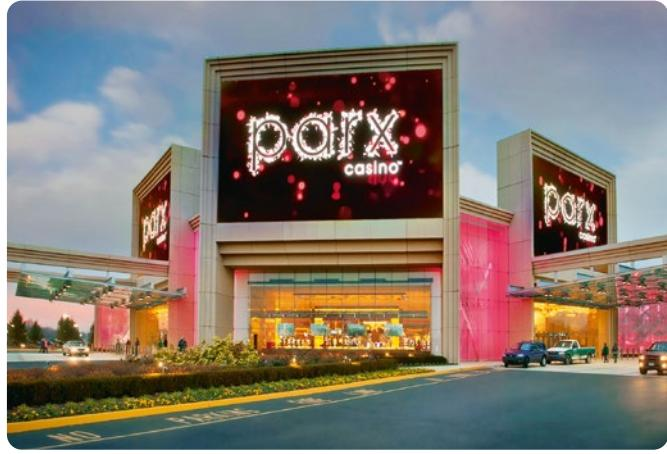
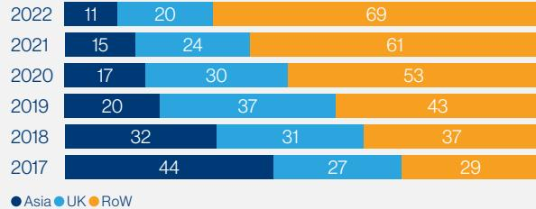
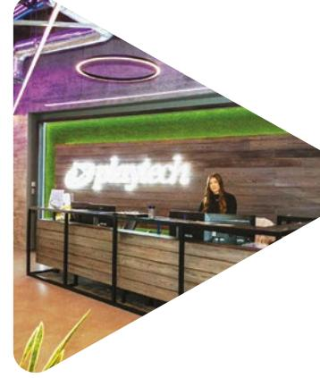

{0}------------------------------------------------

w

{1}------------------------------------------------

**Our strategic roadmap**

# **Our purpose**

# **To create technology that changes the way people experience gambling entertainment**

**Pioneering safer gambling solutions** **Promoting integrity and an inclusive work culture**

Read more about our sustainability strategy on [page 46 to 77](#page-47-0)

**Powering action for positive environmental impact**

HEX: 058e46 - RGB: 5.142.70 - CMYK: 87.19.100.6

**Partnering on shared societal challenges** 

HEX: 058e46 - RGB: 5.142.70 - CMYK: 87.19.100.6

You will find the icon above throughout this report to highlight Sustainable Success content

HEX: 058e46 - RGB: 5.142.70 - CMY HEX: 058e46 - RGB: 5.142.70 - CMY K: 87.19.100.6 K: 87.19.100.6

{2}------------------------------------------------

**Playtech is the leading platform, content and services provider in the online gambling industry, with a clear strategy to benefit our shareholders, customers, colleagues and the environment.**

**Founded in 1999, the Company has a premium listing on the Main Market of the London Stock Exchange and is focused on regulated and regulating markets across its B2B and B2C businesses.**

**Both divisions leverage Playtech's proprietary technology to deliver innovative products and services to ensure a safe, engaging and entertaining betting and gaming experience.**

# **Contents**

# [Strategic Report](#page-1-0)

- 2 [Financial highlights](#page-3-0)
- 3 [Operational highlights](#page-4-0)
- 4 [Company overview](#page-5-0)
- 6 [Chairman's statement](#page-7-0)
- 8 [United with Ukraine](#page-9-0)
- 10 [Our investment case](#page-11-0)
- 12 [Our strategy](#page-13-0)
- 16 [Key performance indicators](#page-17-0)
- 18 [Chief Executive Officer's review](#page-19-0)
- 24 [Market trends](#page-25-0)
- 30 [Business model](#page-31-0)
- 34 [Product and innovation](#page-35-0)
- 43 [Stakeholder engagement](#page-44-0)
- 46 [Responsible business and sustainability](#page-47-0)
- 78 [Chief Financial Officer's review](#page-79-0)
- 85 [Risk management, principal risks and](#page-86-0)  [uncertainties](#page-86-0)
- 91 [Viability statement](#page-92-0)

# [Governance Report](#page-94-0)

- 94 [Chairman's introduction to governance](#page-95-0)
- 96 [Board of Directors](#page-97-0)
- 98 [Directors' governance report](#page-99-0)
- 106 [Audit Committee report](#page-107-0)

# [Remuneration Report](#page-112-0)

- 111 [Statement by the Committee Chairman](#page-112-0)
- 115 [Summary of Directors'](#page-116-0)  [Remuneration Policy](#page-116-0)
- 119 [Annual report on remuneration](#page-120-0)
- 129 [Directors' report](#page-130-0)

# [Financial Statements](#page-136-0)

- 136 [Independent auditor's report](#page-137-0)
- 144 [Consolidated statement of](#page-145-0)  [comprehensive income](#page-145-0)
- 145 [Consolidated statement of changes](#page-146-0)  [in equity](#page-146-0)
- 146 [Consolidated balance sheet](#page-147-0)
- 148 [Consolidated statement of cash flows](#page-149-0)
- 150 [Notes to the financial statements](#page-151-0)
- 216 [Company statement of changes in](#page-217-0)  [equity](#page-217-0)
- 217 [Company balance sheet](#page-218-0)
- 218 [Notes to the Company financial](#page-219-0)  [statements](#page-219-0)
- 226 [Five-year summary](#page-227-0)

# [Company information](#page-228-0)

227 [Company information](#page-228-0)

- View the Digital Summary Report at [www.ar22.playtech.com](http://www.ar22.playtech.com/)

{3}------------------------------------------------

# **Financial highlights**

# **Strong financial performance in 2022**

## Revenue1

| €'m  |       |
|------|-------|
| 2022 | 1,602 |
| 2021 | 1,205 |
| 2020 | 1,079 |
| 2019 | 1,441 |
| 2018 | 1,225 |

# Diluted adjusted EPS1

| c    |      |
|------|------|
| 2022 | 51.5 |
| 2021 | 40.9 |
| 2020 | 8.8  |
| 2019 | 44.6 |
| 2018 | 73.9 |

# Revenue from regulated markets2

% 2022 2021 2020 2019 2018 89 85 84 87 78

# Net debt to EBITDA4

x

| 2022 | 0.6 |
|------|-----|
| 2021 | 1.9 |
| 2020 | 1.7 |
| 2019 | 1.6 |
| 2018 | 1.5 |

# Adjusted EBITDA1

| €'m  |     |
|------|-----|
| 2022 | 406 |
| 2021 | 317 |
| 2020 | 254 |
| 2019 | 375 |
| 2018 | 345 |

# Adjusted operating cash flow3 €'m

| 2022 | 397 |
|------|-----|
| 2021 | 318 |
| 2020 | 276 |
| 2019 | 303 |
| 2018 | 342 |

# Group revenue growth1

# Group adjusted EBITDA1 **€406m**

B2C adjusted EBITDA growth1 **38%**

Net debt to EBITDA4 **0.6x**

**" Encouraging progress across both the B2B and B2C divisions in 2022, culminating in good EBITDA growth and a strong balance sheet."**

Chris McGinnis Chief Financial Officer

#### 1 From continuing operations.

- 2 B2B and B2C only.
- 3 Continuing operations but includes Finalto in FY20. Adjusted for Snaitech's PREU tax payment of €90 million relating to 2020, which was paid in 2021 due to circumstances around COVID-19. Definition has changed from FY21 to adjust for changes in jackpot balances, client deposits and client equity, professional expenses on acquisitions and ADM security deposit.

4 Net debt/Adjusted EBITDA is calculated as gross debt less Adjusted gross cash including cash held for sale and excluding cash held on behalf of clients, progressive jackpots and security deposits divided by Adjusted EBITDA from continuing and discontinued operations.

{4}------------------------------------------------

**Operational highlights**

# **Significant progress across the Company**

# **B2B – executing on our strategy**

# **Extending lead in LatAm**

2022 saw a strong performance in the LatAm region, illustrating the value of the structured agreement model. Caliente in Mexico performed strongly once again. Wplay in Colombia also performed well, and is poised to continue its growth. Galerabet positions us well in the potentially lucrative Brazilian market.

# **Key deals signed in the US**

Excellent progress was made in the US, with several new deals signed in the year. Golden Nugget, Rush Street and WynnBET have signed multi-state deals, while Resorts and 888 have signed multi-product agreements in New Jersey. Playtech expanded its footprint with Parx, launching its IMS platform in Pennsylvania.

# **Live performing well**

Live delivered a strong performance, with Playtech taking full advantage of the structural growth drivers in this product vertical. Playtech opened a new Live facility in Peru in 2022, and is now well positioned to serve its existing clients in Latin America.

# **B2C – outperforming and transformed**

# **Snaitech continues to lead in Italy**

Snai maintained its number one market share position1 across Italian sports betting brands in 2022, demonstrating its consistent operational and brand strength, whilst also being a fast growing player in Italy in the online sector when measured by Gross Gaming Revenue (GGR).

# **Snaitech transformed post pandemic**

Snaitech is fundamentally a superior business post pandemic. With the online segment making up a greater proportion of revenues, Snaitech is a higher margin and less capital intensive business.

Read more about Snaitech on [page 15](#page-16-0)

# **A successful 2022 football World Cup**

Wagers during the football World Cup in Qatar were up 27% compared to Russia in 2018 despite Italy's absence from the tournament, demonstrating the strength of Snaitech's brand and technology offering.

# **Building a better business**

# **Ukraine – supporting the Playtech family**

With over 700 employees in Ukraine, the war had a big impact on the Playtech family, and the Company responded with support for our employees and their families as well as contributing to humanitarian relief efforts.

# **Reducing our environmental footprint**

Playtech has set a target to reduce operational emissions by 40% by 2025. We have made progress on meeting this target, with 56% of Playtech's total energy consumption derived from renewable energy sources, up from 11% in 2021.

# **Leading research into responsible gambling**

Playtech is collaborating with Holland Casino, the University of Amsterdam and Erasmus University to initiate a new four-year research project to examine how best to tailor tools to customers' individual needs, risk levels and behaviour patterns.

{5}------------------------------------------------

**Company overview**

# **The leading platform, content and services gambling technology company**

# **A global company**

Playtech was established at the inception of the online gambling industry and possesses unparalleled knowledge and expertise in the sector, with over 20 years of experience and investment in technology. Playtech's global scale and distribution capabilities, with over 180 licensees operating in over 40 regulated markets and with offices in 20 countries, mean we are ideally positioned to capture opportunities in newly regulating markets and high-growth markets with low online penetration.

# **Core competencies**

# Scale and distribution

Playtech's scale and distribution network across more than 180 licensees in over 40 regulated jurisdictions in retail and online allows it to power its leading suite of platform, content and services.

# Data

Playtech's scale enhances its data-driven analytics, allowing it to develop intelligent platform features to improve customer experience.

# Sustainable Success

Growing our business in a sustainable and responsible way, and in line with our values, is a key factor in delivering long-term value for all of our stakeholders.

Read more on [page 46 to 77](#page-47-0)

# Innovation

We invest heavily to deliver innovative ways for end customers to experience content and services, such as pioneering omnichannel gaming.

Read more on [page 34 to 42](#page-35-0)

{6}------------------------------------------------

# **Our operations**

# **B2B**

Strategic Report

Providing technology to gambling operators globally through a revenue share model and, in certain agreements, taking a higher share in exchange for additional services.

Read more on [page 30](#page-31-0)

**44%** % of regulated B2B revenues (2017)

# **B2C**

Acting directly as an operator in select markets and generating revenues from online gambling, gaming machines and retail betting.

Read more on [page 31](#page-32-0)

**€983m** Revenue

**€245m** EBITDA

**25%** EBITDA margin

# **A fundamentally higher quality division post pandemic**

B2C EBITDA margin (2019)

B2C EBITDA margin (2022)

{7}------------------------------------------------

# **Chairman's statement**

# **Strategy execution underpinned by strong corporate governance**

I am delighted to report another highly successful year for Playtech, albeit one in which we had to contend with a challenging economic backdrop and significant disruption from the war in Ukraine.

Despite these circumstances, we delivered strong growth and made significant progress against our strategy. This underlines both the resilience of our business model as well as the ability, commitment and dedication shown across all levels of the business.

I would like to thank my Board colleagues, the Executive Management and the wider team, together with our advisers, who have worked tirelessly to deliver these excellent financial, operational and strategic results against a challenging backdrop. Their efforts have been the foundation of our success this year.

Brian Mattingley Chairman

# Strong progress from all corners of the business

Playtech made significant progress throughout 2022 across both the B2B and B2C businesses, further diversifying its portfolio and positioning the Group to capitalise on the exciting opportunities ahead:

- In the US, Playtech expanded its footprint with Parx, launching its IMS platform in Pennsylvania. In early 2023, Playtech also signed a landmark agreement with Hard Rock Digital that accelerates our US strategy and provides significant growth opportunities globally.
- Good progress was made in Canada, with Playtech signing an agreement with NorthStar to launch a broad suite of products in this newly regulated market, along with taking an equity investment in NorthStar in early 2023, incorporating elements of the strategic agreement model employed successfully in other markets.
- In Latin America, Playtech's presence continues to go from strength to strength, with existing agreements in Mexico and Colombia seeing excellent growth in the period. Playtech is ideally positioned to benefit from growth in the soon to be regulated Brazil market. Playtech opened a new Live Casino facility in Peru as it continues to expand its presence across the region.
- Snaitech has continued to exceed expectations with the online segment proving resilient despite the reopening of retail sites, while it also maintained its number one position by brand across retail and online sports betting in Italy. Fabio Schiavolin, CEO of Snaitech, discussed the opportunity for the business at an investor event hosted in September 2022.

More details can be found on [pages 19](#page-20-0) and [22](#page-23-0) for B2B and B2C businesses, respectively.

# Corporate activity

The impressive performance delivered in 2022 is all the more notable given the intensity of the corporate activity that Playtech has been involved in. Taken together, this activity shone a spotlight on the quality of Playtech's strategy, operations, technology and people, whose commitment and expertise continue to drive Playtech from strength to strength.

#### Offer and further approach for Playtech

In October 2021, the Board recommended an all-cash offer from Aristocrat at a 58% premium to the prevailing share price. Ultimately, at the Court and General Meetings held on 2 February 2022, Aristocrat's proposal did not achieve the requisite 75% level of shareholder approval needed for its offer to progress.

Shortly after Aristocrat's proposal lapsed, Playtech received an approach by an investor group formed and advised by TTB Partners Limited. On 14 July 2022, TTB Partners advised that it did not intend to make an offer for the Company due to challenging underlying market conditions.

{8}------------------------------------------------

# Finalto sale completed

Strategic Report

We were delighted to complete the sale of Finalto in July 2022. This represented a significant step in our stated strategy to simplify the Group and focus our efforts on the high-growth B2B and B2C gambling markets.

# Board changes

As our Company evolves, so too does its Board. After five years as Chief Financial Officer (CFO), Andrew Smith stepped down from the Board in November 2022. Andrew contributed significantly to Playtech's strategy and helped guide the business through a period of substantial transformation. We wish him all the best in his future endeavours.

It's a testament to the succession planning work of the Nominations Committee and the Board that we've had such a seamless transition with Chris McGinnis becoming our new CFO. Chris has done a superb job as Deputy CFO and Director of Investor Relations, and I believe that his deep knowledge of Playtech will be invaluable in the years ahead.

Since the start of the new year, we have also welcomed Samy Reeb to the Board as a Non-executive Director. We are already reaping the benefits of his broad skillset and extensive experience of working with global businesses.

One of my highest priorities when joining Playtech was to address the balance of the Board. While we have made good progress towards improving the Board's gender diversity, there is still work to be done and we are actively focused on taking further steps towards meeting our ambition of having a more diverse Board.

# Sustainability

Following an intense period of corporate activity last year, we enter 2023 with a renewed focus on issues around the environment, sustainability, and our wider contribution to communities and society. Our Sustainable Success strategy is central to this and sets out an ambitious plan for how we intend to bring the principles of sustainability and responsible business into everything we do.

Despite the competing priorities of a busy year, our newly formed Sustainability and Public Policy Board Committee met regularly to review, monitor and advise on Playtech's sustainability, responsible business and public policy matters. The Committee also ensures the continued effectiveness of Playtech's ESG strategy, ensuring that we remain truly forward looking and progressive in our plans.

# Ukraine/people

The backdrop of the war in Ukraine has put a significant strain on our people and on the communities in which we operate. While we took quick and decisive action to minimise disruption to our business, we are mindful that our colleagues and their families who remain in Ukraine continue to face very real and dangerous challenges every day as the war continues. I'm proud of the response from our people who have maintained contact with those colleagues in Ukraine, assisted with relocation efforts and provided emergency supplies. We remain committed to doing everything we can to ensure their safety during these difficult times.

Our people are our greatest asset and I want to thank everyone for their hard work in helping us to navigate the challenges of the past year and deliver such a strong set of results.

# Looking forward

Whilst we anticipate many of the challenges faced last year to continue into 2023, I am confident that Playtech's clear and proven strategy across both the B2B and B2C divisions positions us well to build on our progress and deliver another outstanding performance in the year ahead.

Brian Mattingley Chairman 23 March 2023

# Remembering Alan Jackson

It is with great sadness that we lost a dear friend and a member of the Playtech family – Alan Jackson. Alan was appointed to Playtech's Board as a Non-executive Director during Playtech's IPO in 2006 and became Chairman in October 2013, serving a total of 14 years on the Playtech Board. Alan built an extraordinary and distinguished career in business and Playtech was fortunate to have benefited from his leadership, dedication, support, kindness and enthusiasm. We are grateful for Alan's contributions, which were instrumental in making Playtech the company it is today. We will all miss Alan dearly – may he rest in peace.

**" I am delighted to report another highly successful year for Playtech where we delivered strong growth and made significant progress against our strategy despite a challenging economic and geopolitical backdrop."**

{9}------------------------------------------------

**United with Ukraine**

# **Supporting the Playtech family in Ukraine**

With over 700 team members in Ukraine – over 10% of our workforce – the war in Ukraine continues to have a major impact on Playtech. However, an unprecedented situation also drove a unique response, a response of which everyone at Playtech can be proud, and which put the safety and wellbeing of our colleagues ahead of all else.

On 24 February, teams from Playtech's Kyiv office were planning an annual winter trip for 250 colleagues. Hours later, a completely new plan was underway – one which involved establishing a crisis team, based in our office in Sofia, Bulgaria, and a process to ensure the safety of our staff.

By the evening of 25 February, more than 150 of our colleagues had volunteered to join what would become a c.300-strong team. Immediate action included the establishment of a 24/7 hotline chat group to maintain contact with every team member based in Ukraine. By 28 February, Playtech had delivered essential supplies including food, water and eight tonnes of medical equipment. The most ambitious part of the plan involved Playtech organising and financing large-scale bus transportation to help approximately 250 colleagues and family members leave Ukraine, the majority of whom were relocated to Sofia.

As the war continues, we're monitoring current developments and supporting our employees, ensuring their safety where possible, providing additional financial support and offering a range of equipment such as new laptops with long life batteries and access to satellite phones, to support them during the current and potential future energy blackouts.

**" We express our gratitude for your significant contribution and assistance in collecting donations and organising medical humanitarian assistance to Ukraine."**

Alyona Novgorodskay VP Business Development at the Embassy of Ukraine in the State of Israel

# **Scale of the undertaking**

**>700** Employees in Ukraine

# **c.300**

Employees volunteered to contact their colleagues to ensure their safety

# **>250**

Playtech employees and their families relocated

**An incredible achievement**

**>€350k**

Donations to support the humanitarian effort in Ukraine

# **>8 tonnes**

Life-saving medical equipment delivered

# **8**

Charities donated to facilitating humanitarian support

{10}------------------------------------------------

# **A monumental effort**

Strategic Report

Built a brand new organisational structure to deliver:

- medical equipment and mental health support;
- 24/7 hotline providing employees with access to our dedicated control centre;
- transportation within and outside Ukraine;
- alternative payment methods while parts of the banking system were shut down; and
- food, water and basic supplies within and outside Ukraine.

Behind the numbers and logistics, the story of Playtech's response to the Ukrainian war is ultimately a human one. Every one of the 714 employees based in Kyiv has been affected in their own way and has faced individual challenges.

In March, one of our colleagues contacted us in dire need of help for her family who, displaced by the invasion, were living in a hotel in Poland. With no access to food or money, they ate only thanks to the hotel breakfast for several days. Our team acted quickly to organise a money transfer to the hotel, paying for several months' worth of food and accommodation in advance. Everyone in the crisis team was proud that our colleague felt comfortable in turning to us for help at this most difficult time. As a result, her 85-year-old grandfather (pictured) was able to enjoy a hot dinner for the first time in days.

**" The strength and character shown by everyone in Ukraine was truly humbling and inspiring. We were fortunate enough to provide essential supplies to those in need, and our aim remains to continue to support our people and assist them in confronting the challenges they are facing in whatever way we can."**

Mor Weizer CEO of Playtech 

{11}------------------------------------------------

**1**

# **Our investment case**

# **Structural growth drivers with margin expansion**

With an increasingly diversified global offering, Playtech is primed to accelerate organic sales growth across both the B2B and B2C divisions.

Global regulated gambling markets, led by the Americas and Europe, are expected to grow materially. Playtech is well positioned to participate given its broad, high-quality product offering, while structured agreements and SaaS allow Playtech to serve almost any operator across the globe. In our B2B business, high operating leverage within the attractive Live and SaaS segments should provide a further tailwind to margins.

Snaitech, our B2C business in Italy, has become a fundamentally higher quality business post pandemic due to the structural shift towards the underpenetrated, higher margin online business and this is expected to continue to deliver strong growth.

Playtech has the potential to deliver a powerful combination of top-line growth and margin expansion, which is expected to drive earnings momentum and high cash flow generation for the Group. As a result, further investments can be made to position ourselves advantageously in other newly regulating markets as well as delivering shareholder returns.

# **Attractive structural growth drivers in B2B Gambling**

The gambling market is in the midst of a super-cycle (see [page 24](#page-25-0)), driven by the expansion of regulated and regulating markets, with the Americas and Europe leading the way.

At the same time, rapidly shifting consumer and technology trends have grown the appeal of the Live segment.

Playtech is well placed to capture this considerable opportunity. Through its investments in innovation, Playtech possesses a strong technology offering and its sheer scale means it has access to vast amounts of data, allowing it to generate data network effects (see [page 28)](#page-29-0), while the variety of its business model offering from structured agreements to SaaS allows it to serve almost any operator.

{12}------------------------------------------------

# **Underpenetrated online segment set to drive B2C growth**

# Underpenetrated Italian online market

Italy is one of the top two gambling markets in Europe, along with the UK. Unlike the UK, the online market is still underpenetrated at 26% versus 58% in the UK and thus we see scope for the addressable market to grow in Italy. With average revenue per online customer acquired from retail sites more than three times higher than those acquired directly through online channels. Snaitech's strong brand, retail presence and cross-selling approach means it is ideally positioned to benefit from this growth opportunity.

penetration1

1 Source: H2GC (includes betting and gaming and excludes lotteries).

# Further upside from European expansion

Outside of Italy, there is the potential to acquire retail-focused assets in neighbouring European countries with low online penetration at attractive multiples, with a view to growing the online business given the track record of existing Snaitech management.

**2 3**

# **Potential for margin expansion is significant**

# High operating leverage in Live and SaaS…

Within the Live Casino business, Playtech has already made significant investments in studio infrastructure. Within SaaS, Playtech has also invested heavily in data centres to be able to serve its customer base, while it has already signed up over 350 customers with scope to increase wallet share. Investment to date lays the groundwork for higher operating leverage going forward.

# …coupled with the shift to the B2C online channel…

The Snaitech online business has a significantly higher margin than retail. As Snaitech looks to continue to migrate retail customers to online in addition to acquiring native online customers, we should continue to see the share of the online segment increase.

# …to drive margin expansion across the Group

With both the B2B and B2C segments exposed to margin accretive factors, we expect Playtech to be able to deliver margin expansion in the years ahead. This, combined with accelerating top-line growth, will deliver earnings growth for Playtech's shareholders.

{13}------------------------------------------------

# **Our strategy**

# **Delivering consistent growth in a sustainable way**

Playtech has a clear plan to continue to drive growth in a responsible and sustainable way. Here we outline the medium-term strategic priorities for both the B2B and B2C divisions, which will enable us to deliver revenue growth, expand margins and generate shareholder and stakeholder value.

# **B2B: well positioned in markets set for growth**

# **Be the partner of choice for newly regulating markets**

Growth in the gambling industry is primarily driven by regulation – growth comes from markets that are early in the journey of regulating, which then moderates as markets progressively mature. We aim to be the partner of choice for operators in newly regulating markets, with a particular focus on the Americas and Europe.

The US represents a huge revenue opportunity of \$3 billion for Playtech on a per annum basis across iGaming, online sports and platform (see [page 25](#page-26-0)).

The LatAm region has strong structural drivers (see [page 26)](#page-27-0). With Caliente providing the blueprint for success in this region, Playtech is ideally positioned to deliver strong growth via its structured agreements in multiple countries, including Brazil.

Finally, there continues to be strong potential in European markets that are either regulating or underpenetrated online where Playtech can bring the strength of its offerings to bear such as the Netherlands and Spain.

# Link to KPIs

Link to risks 1 2 3 4 5 6 7

Live represents an enormous opportunity (see [page 29)](#page-30-0), in which Playtech has invested heavily. Ten studios are currently operational with a further one in Pennsylvania under construction. We have more than doubled the number of tables over the past four years and invested in both the latest cutting-edge technology and branded gaming rights such as Jumanji™. With significant operating leverage in the business, growth in Live is margin accretive.

The SaaS business model (see [page 31)](#page-32-0) allows Playtech to serve those operators looking for Playtech's content without the platform, thus increasing the Company's total addressable market. With investments already made in building out infrastructure, such as data centres, SaaS is a high-margin segment. Although SaaS revenues have been growing strongly, revenue from each operator represents a small proportion of their wallet. Thus, we see ample scope to increase wallet share amongst these existing customers.

# Link to KPIs 1 2 3 4 5 6 7

# **Realign resources to reflect B2B growth areas**

With exciting areas of growth in regulated markets and several technology trends (see technology trends on [page 28)](#page-29-0) maturing at the same time, there is a need to continue to invest in the B2B Gambling division to ensure Playtech maintains and grows its market share lead. We see opportunities across the B2B business where we can improve efficiencies and eliminate duplication, the savings of which can be used to fund any required investments.

Link to KPIs

{14}------------------------------------------------

**Strategy in action**

# **Case studies of executing in newly regulated markets**

# Holland Casino: very strong start

During 2021, Playtech signed a new, expanded long-term strategic software and services agreement with Holland Casino, the state-owned land-based casino operator in the Netherlands – a top ten market in Europe that opened its regulated online gambling market in October 2021. Playtech now supplies Holland Casino with a full turnkey, multi-channel technology package, as well as certain ancillary services.

Holland Casino is off to an impressive start given its first mover advantage and was the biggest driver of revenue growth in Europe in 2022, illustrating the significant growth opportunities of newly regulated markets. Combined with the launch of Casino and Poker with Bet365 in the Netherlands in early 2022, Playtech is well positioned to capitalise on the Netherlands market.

# Caliente: successful blueprint

Caliente in Mexico provides the blueprint for executing on structured agreements (see business model section on [page 30)](#page-31-0) in other markets. The idea is to select a "local hero" in a country with favourable market dynamics, and look to grow with that partner as the market grows. Playtech contributes its market-leading technology as well as expertise and experience in launching online businesses in newly regulating markets, while the partner typically has a strong brand and deep knowledge of local markets. The results, with aligned incentives, can be impressive.

Revenues within Mexico, the majority of which originate from Caliente, have grown at a CAGR of 66% between 2015 and 2022 and Caliente now represents our largest customer when measured by revenue. The attractive economics of a structured agreement, which typically includes a higher revenue share for Playtech, means that the profit margins are high.

With structured agreements signed in several other LatAm countries including Colombia with Wplay and Brazil with Galerabet, Playtech is in a strong position to build upon the Mexican success story across the LatAm region.

**" Alongside Playtech's unrivalled multi-channel technology, its strong track record in delivering industryleading software to newly regulated markets makes it a trusted and experienced supplier."**

Erwin van Lambaart CEO, Holland Casino

{15}------------------------------------------------

# **Our strategy** continued

# **B2C: build a pan-European B2C presence**

# **Leverage retail presence to grow Snaitech's online business**

Italy is one of the top two gambling markets in Europe, along with the UK. Unlike the UK, the online market in Italy is still underpenetrated – 26% currently versus 58% in the UK. As a result, we see significant scope for the higher margin online business to grow.

Snaitech's strong retail brand is critical to its success and a competitive advantage compared to online operators, particularly in light of the advertising ban in Italy. With average revenue per online customer acquired via retail sites more than three times higher than those acquired directly through online channels, Snaitech's cross-selling approach means it is ideally positioned to benefit from this growth opportunity.

Link to KPIs

 See risk section on [pages 85 to 90](#page-86-0) See KPI section on [pages 16](#page-17-0) and [17](#page-18-0)

# **Embedding sustainability into our culture**

In 2021, Snaitech became a member of two leading Italian associations for DEI: Parks – Liberi e Uguali and Valore D.

Parks – Liberi e Uguali works with companies to understand and realise the full business potential of developing strategies and best practices that respect diversity and inclusion.

Valore D is the first association of companies in Italy that has been committed to gender balance and an inclusive culture in organisations in Italy for more than ten years.

In 2022, Snaitech continued its collaboration with the two associations to raise awareness of inclusion in the workplace and generate a corporate culture that is better able to channel, orient and welcome all diversity.

The goal of the campaign, "La consapevolezza prende forma", was to further grow and strengthen our commitment in this direction. Snaitech held training sessions on diversity and inclusion issues, which included three webinars in 2022.

HAPPYBET now sits under the management of the Snaitech team which has initiated a process to optimise HAPPYBET's online business. This involves rationalising its retail footprint with significant investment in the online business, mirroring the successful Snaitech strategy.

With Germany moving towards legalising gambling, HAPPYBET is in a strong position, having been awarded one of the few available online sports betting licences in Germany.

The Snaitech management team transitioned the business to take advantage of the shift to online. With this high-quality management team in place, there is scope to utilise this skill set and experience outside of Italy, within neighbouring European countries. Consolidation of HAPPYBET's position in Germany and Austria through M&A looks attractive, while acquiring assets in other neighbouring European countries provides further opportunity.

Link to KPIs

{16}------------------------------------------------

# **Strategy in action**

# **The transformation of Snaitech: a fundamentally higher quality business post pandemic**

# Larger addressable market

Since Playtech acquired Snaitech in 2018, it has transformed into a higher margin, less capital intensive business with a larger addressable market.

Snaitech's efforts to leverage its leading retail network and brand have created a larger online business. As the pandemic accelerated the shift to online, Snaitech capitalised on the opportunity by launching dedicated promotions to migrate customers to online from retail.

With online revenues in 2022 remaining stable despite retail having reopened, it's evident that some of these onboarded customers continue to spend at least part of their wallet online. New customers were also onboarded directly via the online channel, further increasing the addressable market.

Snaitech revenues by channel

# Higher margin

The pandemic accelerated the shift to the online segment.

Given the lower overheads and greater share of Net Gaming Revenue (NGR), the online segment is a higher margin business. This has resulted in Snaitech becoming a higher margin business overall.

# Less capital intensive

The retail business requires more capital expenditure to grow, given the licence renewal fee is higher for retail compared to online, in addition to Snaitech owning a proportion of the gaming machines. As a result, online is a less capital intensive segment and thus benefits from a higher return on assets.

Snaitech 2018 –2022 average capex to sales ratio %

Note: HQ Snaitech capex apportioned between retail and online by revenues.

2022 Snaitech EBITDA margin

%

{17}------------------------------------------------

# **Financial**

# Group revenue growth1 **33%** %

#### Definition

Increase in revenue from continuing operations divided by prior year revenue.

#### Why are we focused on it?

Revenue is a key driver of the business and is reported in detail across geography and business unit. The measure enables us to track our overall success and our progress in increasing our market share.

#### 2022 performance

Group revenues grew 33% in 2022 driven by continued strength in regulated B2B markets and Snaitech.

# Link to strategy 1 2 3 4 5 6

# Diluted adjusted EPS1 **51.5c**

| 2022 | 51.5 |
|------|------|
| 2021 | 40.9 |
| 2020 | 8.8  |
| 2019 | 44.6 |
| 2018 | 73.9 |

#### Definition

c

Profit before exceptional items attributable to equity shareholders of the Group from continuing operations, divided by the weighted average number of ordinary shares outstanding after adjustment for the effects of all dilutive potential ordinary shares.

#### Why are we focused on it?

Earnings per share reflects the profitability of the business and how effectively we finance our balance sheet. It is a key measure for our shareholders.

#### 2022 performance

The increase is mainly driven by revenue and EBITDA growth in 2022 versus 2021, flowing through to earnings per share. The adjusted measure is used to ensure comparability between years.

1 From continuing operations.

2 Includes Finalto up to and including FY20. Adjusted for Snaitech's PREU tax payment of €90 million relating to 2020, which was paid in 2021 due to circumstances around COVID-19.

# Adjusted EBITDA margin1 **25%** %

| 2022 | 25 |
|------|----|
| 2021 | 26 |
| 2020 | 24 |
| 2019 | 26 |
| 2018 | 28 |

#### Definition

Adjusted EBITDA shown as a percentage of revenue from continuing operations. We use adjusted EBITDA to aid comparison year to year.

#### Why are we focused on it?

Adjusted EBITDA margin is a measure of improving profitability in our business and helps to evaluate the leveraging of our operating assets. It also determines the quality of revenue growth.

#### 2022 performance

Adjusted EBITDA margin declined 90bps in 2022 due to the reopening of sites in the lower margin retail segment in Snaitech.

#### Link to strategy

# Adjusted operating cash flow1,2 **€397m**

€'m

#### Definition

Operating cash flow after adjusting for changes in jackpot balances, client deposits and client equity, professional expenses on acquisitions and ADM security deposit.

#### Why are we focused on it?

Delivery of increased cash generated from operations allows us to invest in further growth opportunities across our business as well as delivering shareholder returns.

#### 2022 performance

The increase is mainly driven by growth in earnings in 2022 versus 2021.

# Link to strategy

{18}------------------------------------------------

Strategic Report

Powering licensees with safer gambling solutions

# **13 brands**

# **Integrated with BetBuddy**

# Definition

Number of brands in jurisdictions that were integrated throughout each year with Playtech Protect solution, BetBuddy.

## Why are we focused on it?

As a business, the most impactful contribution that Playtech can make to the industry and in society is through the provision of technology to advance safer gambling and player protection.

## 2022 performance

BetBuddy has expanded into three new jurisdictions, having been adopted by clients in Germany, Portugal and Switzerland. To cope with the growth of its customer base, the platform has been migrated to cloud architecture.

## Link to Sustainability Success pillars

Pioneering safer gambling solutions

# Scope 1 and 2 greenhouse gas (GHG) emissions

**39.6%**

**Reduction since baseline year, 2018**

# Gender diversity at senior leadership level

**26%/74% Female/male ratio**

# Definition

Amount of carbon dioxide equivalent (CO2 e) emitted through the energy used within all our assets, including office buildings, racetracks, live studios and data centres. More details on the methodology can be found in the Responsible Business and Sustainability Addendum to the Annual Report 2022.

# Why are we focused on it?

The environment, and particularly climate change, is a growing area of concern for Playtech, its investors and its other stakeholders. In 2019 Playtech introduced a GHG emissions target to guide its energy reduction efforts. The Company's ambition is to reduce its absolute Scope 1 and 2 GHG emissions (location based) by 40% by 2025, using 2018 as the baseline year.

#### 2022 performance

Playtech's total Scope 1 and 2 (locationbased) emissions decreased by 11.7% in 2022. Since 2018, they have decreased by 39.6%, meaning that Playtech is very close to achieving its 40% reduction target. One of the major areas of focus was to switch our material operations to renewable energy, where possible, with 56.4% of Playtech's total energy consumption derived from renewable energy sources, up from 10.8% in 2021. Another notable area of progress is the Company's formal commitment to set near-term and net zero targets through the Science Based Targets initiative (SBTi).

Link to Sustainability Success pillars Powering action for positive environmental impact

# Definition

%

Percentage of male and female employees in senior leadership positions.

#### Why are we focused on it?

Playtech aims to foster a respectful and supportive workplace that enables every colleague to have the same opportunity regardless of regardless of background, gender, ethnicity, cultures, beliefs and other attributes that represent our customers and community. The Company has set out a specific diversity target to increase the representation of people who identify as female amongst its leadership population by 35% by 2025 against the 2021 baseline year, with an ultimate ambition to achieve equality in the workplace.

#### 2022 performance

Playtech conducted a systematic review to strengthen our measurement and reporting methodologies and processes. This data has been instrumental in implementing a programme of improvements as we enhance diversity as part of recruitment and selection, development and succession planning, with a particular focus on leader and manager recruitment processes.

# Link to Sustainability Success pillars

Promoting integrity and an inclusive culture

{19}------------------------------------------------

# **Strong momentum positions us well to deliver on 2023 strategic priorities**

Mor Weizer Chief Executive Officer

## Overview

Playtech made excellent progress on its strategic priorities throughout 2022, with growth in both the B2B and B2C businesses. As a result, the Group enters 2023 well-positioned to execute on compelling market opportunities across both B2B and B2C.

Playtech's B2B Gambling business remains focused on opportunities in regulated or soon to be regulated markets. The Group continues to target high-growth markets including the US, Latin America and certain parts of Europe. In addition to growing in the attractive Live market, Playtech continues to expand its portfolio of strategic agreements. These helped the B2B segment to deliver revenue growth of 14% (+11% on a constant currency basis) in 2022. At the profit level, B2B Adjusted EBITDA grew a healthy 15% to €160.2 million in 2022 compared to €139.2 million in 2021.

In the US and Canada, Playtech made great strides to establish itself as one of the key players in this market. The long-term opportunity across Playtech's full product suite remains significant. In early 2023, a landmark agreement was signed with Hard Rock Digital to provide Casino and Live, amongst other content, in North America, accelerating our US strategy. In addition, having signed with Parx Casino in 2021 in the US, Playtech grew its footprint with Parx by launching its IMS platform in Pennsylvania and entered Ohio and Maryland in 2023.

Playtech also signed several new deals in the period, including Golden Nugget (Casino and Live in New Jersey and Michigan), and WynnBET (multi-state deal to launch Live and Casino), while 888 and Resorts Digital Gaming both signed up for Casino and Live in New Jersey. Good progress was also made in Canada where Ontario became the first province in Canada to regulate online gambling. This has continued into 2023 with Playtech announcing in February that it has taken an equity investment in NorthStar and extended the scope of its relationship.

Playtech's presence in Latin America continues to go from strength to strength as existing agreements with Caliente in Mexico and Wplay in Colombia continue to perform well. Playtech also opened a new Live Casino facility in Peru as it continues to extend its presence across the region. Looking ahead, the Company is looking forward to growing its presence in the exciting, soon to be regulated Brazil market.

Playtech remains committed to diversifying its B2B division by bringing on new brands and licensees. As well as making progress with new strategic agreements and joint ventures, Playtech also maintained its track record of attracting new brands to its SaaS offering. Playtech launched over 100 brands in the period, with more than 350 new brands now live since launching the SaaS offering back in 2019.

{20}------------------------------------------------

Playtech's B2C Gambling business, Snaitech, recorded another remarkable performance as revenue grew 54% compared to 2022. Adjusted EBITDA, meanwhile, was 39% higher than the previous year, benefiting from retail sites in Italy remaining open throughout the year as well as the strength of online. The online segment continues to see impressive growth, indicating that the addressable market has expanded post-pandemic. Snai maintained its number one market share position (retail and online combined measured by GGR) across Italian sports betting brands in 2022, cementing its reputation for consistent operational and brand strength, whilst also being a fastgrowing player in Italy in the online sector when measured by GGR.

The sale of Finalto was completed in July 2022 for cash proceeds of \$228.1 million resulting in a profit on disposal of €15.1 million and represents a significant step forward in the Group's strategy to simplify the Group, allowing it to focus on the high-growth B2B gambling and B2C gambling markets.

Playtech's strong performance in 2022 was underpinned by the energy, enthusiasm and professionalism of the Company's employees. They are the lifeblood of the business and do an outstanding job supporting the Group's customers.

#### Supporting the Playtech family in Ukraine

It has been more than a year since Russia's invasion of Ukraine and unfortunately the conflict continues to have a devastating impact. While the Group's continuity plans mean that Playtech has experienced minimal disruption to its business activities, the c.700 employees based in Ukraine remain front of mind. Playtech is committed to doing everything it can to ensure the safety of them and their families.

The Board and management team continue to be moved by the generosity and support that the Group's colleagues have demonstrated in maintaining contact with those who remain in Ukraine. Despite the other pressures facing the business last year – including significant corporate activity – they have constantly sought to do whatever they can to provide assistance in the form of ongoing communications, logistics and financial support.

# B2B Gambling

#### Core B2B Gambling

#### Regulated markets

Playtech's B2B Gambling business remains focused on opportunities in regulated or soon to be regulated markets. The Group continues to target high-growth markets, including the US, Latin America and certain parts of Europe.

Regulated markets delivered revenue growth of 22% (+18% on constant currency basis) compared to FY 2021, driven by strong revenue growth from the Group's partners in Latin America, Holland Casino in the Netherlands, as well as strong growth in other regulated markets such as Poland, Spain and Ireland.

#### *The Americas*

The Americas is at the centre of our strategy for Core B2B Gambling. The region maintained its impressive record of growth, with FY 2022 revenue up 43% (+27% at constant currency) compared to FY 2021. This was powered by strong growth from Caliente as well as increasing contributions from other customers, including Parx in the US.

Accelerating the Group's presence in the US remains a key strategic priority for Playtech, as proven by the strides taken last year to capitalise on the favourable regulatory environment. Having signed a strategic agreement with Parx Casino in 2021, Playtech has been increasing its footprint with Parx and this is starting to translate into greater revenue contribution. In 2022, Parx launched its IMS platform in Pennsylvania, which involved a complex migration, and will serve as a useful blueprint for future deals. In addition, Playtech launched its IMS, Casino and POP products in New Jersey, while in 2023, the IMS was rolled out in Ohio and Maryland. Playtech now has a presence with Parx in Michigan, Pennsylvania, New Jersey, Ohio and Maryland. Further product launches in additional states with Parx are expected going forward. Pokerstars also launched the Casino product in New Jersey, while 888 launched Live Casino in Michigan in 2023.

Several new deals were also signed in the US, including Golden Nugget (Casino and Live in New Jersey and Michigan), Rush Street Interactive (multi-state deal for Casino), and WynnBET (multi-state deal to launch Casino and Live), while 888 and Resorts Digital Gaming both signed up for Casino and Live in New Jersey.

In March 2023, Playtech signed a landmark agreement with Hard Rock Digital, the exclusive, global vehicle for online for Hard Rock International, to provide Casino and Live amongst other content, in North America. These products will also be supplied outside of North America in addition to the IMS and services including marketing and operations. As part of the agreement, Playtech has also invested €80 million in exchange for a low single digit % minority equity ownership stake, the proceeds of which will be used to help fund Hard Rock Digital's continued global expansion.

**" Playtech's strong performance in 2022 was underpinned by the energy, enthusiasm and professionalism of the Company's employees."**

{21}------------------------------------------------

# **Chief Executive Officer's review** continued

# B2B Gambling continued

Core B2B Gambling continued

Regulated markets continued

*The Americas continued*

Meanwhile, Playtech delivered several significant product launches across core markets. In the newly regulated Canadian province of Ontario, NorthStar launched multiple products. In addition, Bet365 and 888 both went live in Ontario with Casino and Live on the first day the market became regulated. Towards the end of 2022, FanDuel, Mansion and Casumo all launched the Casino and Live products.

In February 2023, Playtech announced an expansion of its partnership with NorthStar. Playtech has taken an equity investment in NorthStar. The proceeds of this investment will be used to accelerate the growth of NorthStar's footprint across Ontario and future regulated markets across Canada. The agreement also expands the scope of Playtech's offering to NorthStar to include operational and marketing services, in addition to the IMS platform, Casino, Live, Poker and Bingo solutions already launched.

Playtech delivered against its commitment to further expand its infrastructure in high-growth markets, such as the US. Having already opened Live studios in New Jersey and Michigan, another Live facility is under construction in Pennsylvania and is expected to open in 2023. Behind the Company's growing physical presence are an increasing number of employees focused on sales, operations and back-office functions, taking head count to more than 130 at the end of 2022.

Following the repeal of PASPA in 2018, each year that passes has seen a growing number of states approve legislation to legalise sports betting. While 2022 saw further progress, California was notable in voting to reject the legalisation of online sports betting and in-person sports betting at tribal casinos and private horse tracks.

This may delay legislation in states that have yet to approve sports betting, but the expectation remains that these states will eventually look to approve legislation. In 2022, Playtech received licences for Pennsylvania, Colorado and Ohio with Maryland received in 2023, taking the total number of US states where Playtech has a licence to nine.

Online casino is allowed at the discretion of individual states. No new states have authorised Online casino in 2022, although there are several states where iGaming legislation is being considered.

Playtech's presence in Latin America continues to go from strength to strength, with existing agreements with Caliente in Mexico and Wplay in Colombia continuing to perform well. Looking further ahead, Playtech is well-positioned to continue its growth and capitalise on other strategic agreements in Latin America in the years ahead.

Playtech also opened a new Live Casino facility in Peru, giving the Company a strong base from which to serve both its existing clients in Latin America and prospective clients in newly regulated markets in the region. Several customers, such as Wplay, Bet365 and BetVictor, have launched tables in the new Live facility with demand proving strong so far. Given the success of legislation in markets like Colombia, Playtech anticipates continued favourable regulation and strong growth in the region in the years to come.

One example of this is in Brazil, where sports betting legislation has been passed and is expected to be implemented in the near future. Brazil is anticipated to be a significant market given the large population and love of sports. The Company has an exciting strategic agreement in place with Galerabet, with economics similar to its other arrangements in Latin America, in anticipation of regulation in this market.

#### *Europe ex-UK*

2022 B2B revenue growth in Europe ex-UK of 31% (+31% at constant currency) was driven by strong growth across several countries, including Netherlands, Spain, Poland and Ireland.

The move towards greater regulation in Europe continues to represent significant growth opportunities. The first full year of Playtech's new, expanded long-term strategic software and services agreement with Holland Casino has seen an impressive start. Playtech now supplies Holland Casino with a full turnkey multichannel technology package, as well as certain ancillary services. The agreement includes the IMS platform, Sports betting, Online Casino, Live Casino, Poker and Bingo products, plus selected operational and marketing services. While growth rates moderated as the year went on, the partnership is continuing to see the benefits of its first mover advantage. It was a key driver of revenue growth in Europe in 2022, illustrating the significant growth opportunities of newly regulated markets. This agreement, as well as the launch of Casino and Poker with Bet365 and Unibet in the Netherlands in 2022, means Playtech is well positioned to capitalise on the newly regulated Netherlands market.

Elsewhere in Europe, the Company invested in its physical infrastructure by expanding its Live facility in Romania. The facility now also includes Blackjack and Poker studios, enabling Playtech to serve its customers with an even wider and more diverse suite of products. In terms of new customers, the Live business launched with, among others, Betsson in Italy and Pokerstars in Greece.

Playtech's Casino business made great progress opening up new territories with its existing customer base, such as Pokerstars and Betsson in Greece, Leo Vegas in Spain, Betway and 888 in Italy, Stoiximan in The Czech Republic, Betano in Bulgaria and Fortuna in Slovakia. This clearly demonstrates the scalability of Playtech's business model.

{22}------------------------------------------------

## *UK*

The UK saw revenue decline 4% (-5% on a constant currency basis) compared to FY 2021, where the positive impact of the reopening of retail stores from mid-April 2021 was more than offset by a decline in revenue from Entain in addition to a slowdown in the online business caused by the uncertain regulatory climate.

The UK Government is currently undertaking a review into existing gambling laws in the UK. In response, several operators are taking pre-emptive measures such as stake limits and affordability checks in an attempt to show regulators that the industry is able to self-regulate.

In December 2020, the UK Government announced a call for evidence to review the existing gambling laws in the UK. Since the initial 16-week call for evidence, which ended on 31 March 2021, the Government has been assessing the evidence presented, alongside other data, with the aim of setting out conclusions and any proposals for reform in a White Paper. Playtech submitted data and evidence relating to the call and will support this wherever possible going forward. The White Paper was due to be published in 2022, but this has been delayed with media reports suggesting it is due to be published imminently.

Playtech remains committed to the UK market and will actively support its customers in implementing any necessary changes following the White Paper's expected publication. Playtech has been actively involved in discussions around safer game design and online advertising for some time. By using its technology and data to support its licensees in safer gambling, the Company is confident that it will remain the go-to platform for regulated markets including the UK.

#### Other unregulated (excl. Asia)

The Group's strategy to focus on both regulated and regulating markets includes unregulated markets which are expected to regulate in the near future. These are classified in the "Unregulated excl. Asia" line within B2B Gambling. These unregulated markets (excluding Asia) were up 11% year on year (+10% at constant currency) versus 2021, primarily driven by very strong growth in Brazil, offset in part by a decline in Germany, which saw regulatory changes, and Netherlands moving to a regulated market in 2021.

In Canada, recent legislation means that single-game sports betting is now allowed at the discretion of individual provinces. Seven provinces, including the country's largest province, Ontario, began allowing bets to be placed on single-game sporting events. Since then, as of 4 April 2022, Ontario has become the first fully regulated online gambling market in Canada, with iGaming launched as well.

As other provinces across Canada introduce sports betting and iGaming, the market opportunity in North America will continue to grow. In line with the Company's strategy to target newly regulating markets, Playtech signed a strategic agreement with NorthStar Gaming in January 2022.

The Company also took steps to establish its presence in South Africa, a nascent but fast-growing market, which permits sports betting and Live casino. Towards the end of 2022, Playtech launched Casino and Live products with TsogoSun.

#### Unregulated Asia

Revenue from the Unregulated Asia business declined 18% (-21% on a constant currency basis) compared to 2021. The decline was largely the result of further lockdowns in China during the year. As it stands today, the Asia business is much more diversified in terms of both distributors as well as geographies compared to recent years. The Company incurred a bad debt provision of €15.4 million in H1 22 following continued collection delays in the region.

#### B2B – Product Developments

Playtech remains committed to diversifying its B2B Gambling division by bringing on new brands and licensees. As well as making progress with new strategic agreements and joint ventures, Playtech also maintained its track record of attracting new customers in both regulated and regulating markets to its SaaS offering. Playtech launched over 100 brands in the period, with more than 350 now live since the launch of its SaaS model in 2019.

In August 2022, Playtech launched The Walking Dead™ 2, taking advantage of the exclusive rights it acquired for Online Casino in 2021. A second title is planned to launch in 2023, with both expected to engage and retain a large audience. Alongside partnerships with major licensed brands, Playtech's Casino content strategy continues to focus on the development of original brand suites, known as Playtech power suites, with the likes of Age of the Gods™ and Fire Blaze™ producing some of Playtech's most popular slots. Leprechaun's Luck became Playtech's top-performing new game of 2022 and was shortlisted for Game of the Year in the 2022 EGR awards.

In terms of other notable product developments, the Live team launched Safari Riches Live, a live casino slot game created exclusively for 888. This marks a major milestone as it represents the first time a slot brand developed by 888 has been transformed into a bespoke live casino game. Elsewhere, the Live team also signed up the exclusive global rights to Jumanji, including for the US, and plans to launch a game in 2023. Other highlights include Everybody's Jackpot and The Greatest Cards Show, which have both broken new ground technologically. Everybody's Jackpot features first of its kind "Unreal engine" metaverse technology, while The Greatest Cards Show's augmented reality and horizontal wheel – a Live sector first – makes it one of Playtech's most sophisticated games yet.

{23}------------------------------------------------

# **Chief Executive Officer's review** continued

## B2C Gambling

Playtech's B2C business consists of Snaitech (including HAPPYBET) and the White Label operations, which is primarily Sun Bingo. Overall, B2C revenues grew 48% compared to FY 2021 at constant currency, while Adjusted EBITDA grew 38%.

#### Snaitech

#### Italy

Snaitech delivered another year of significant growth in FY 2022, with revenue up 54% compared to the prior year, while Adjusted EBITDA grew 39% versus FY 2021. This exceptional performance was primarily driven by the reopening of retail sites in Italy, which occurred at the end of June 2021 and have since remained open.

As a result, retail sales grew significantly in the period and are within 10% of pre-pandemic levels. This is a good performance given a small proportion of franchise retail shops closed permanently, some customers permanently transitioned to the online channel and new legislation – introduced in January 2020 – that requires customers to present ID card to enter retail shops. At the EBITDA level, the retail segment has now surpassed 2019 pre-pandemic levels on an absolute basis, while EBITDA margins are also higher than 2019 levels driven by an increasing proportion of revenue generated from the higher margin sports betting segment and a lower retail sports pay out in 2022 compared to 2019.

The online business grew 2% in 2022 versus 2021 despite retail shops being reopened in June 2021, suggesting a combination of a proportion of existing retail customers permanently shifting to online in conjunction with new customers being onboarded via the online channel. Adjusted EBITDA margins remained high at 56% in 2022 versus 59% in 2021.

As disclosed at the FY 2021 results, Snaitech has begun the formal sale process of La Maura Racetrack in Italy. €1 million was received on signing in July 2021, with the remaining €19 million expected to be received in instalments in 2024. We have now received €56 million from the sale of "non-core" land since the acquisition of Snaitech in 2018.

Snai maintained its number one market share position (retail and online combined measured by GGR) across Italian sports betting brands in 2022, cementing its reputation for consistent operational and brand strength, whilst also being a fast growing player in Italy in the online sector when measured by GGR.

Finally, the 2023 budget law postponed the expiration of all concessions such that all licenses in Italy, including online and retail, have been extended until December 2024 at a total cost of €24 million in 2023 and €34 million in 2024. Beyond 2024, talks are continuing to find an agreement with local authorities on a common and homogeneous set of rules.

#### Germany and Austria

HAPPYBET (now reported as part of Snaitech) saw revenue growth of 10% in 2022 compared to 2021. This was primarily driven by the reopening of retail sites and early progress after the Snaitech management team took control of HAPPYBET's operations. The business remains loss making with EBITDA of €-10.8 million in 2022 (2021: €-11.4 million), but strategic and operational measures have been taken.

In 2022, the team at Snaitech has already made good progress upgrading HAPPYBET's technology infrastructure, enhancing the product and services offering, deploying new marketing strategies and activities to increase brand awareness and realising costs synergies between HAPPYBET and Snaitech. This will in time drive the performance of both retail and online. Germany's Interstate Treaty regulated online slots, online poker and sports betting. Playtech has been awarded one of the few available online sports betting licenses in Germany through HAPPYBET and has already launched an online offering. With structural growth drivers and a turnaround strategy being implemented by a strong management team, the Group is confident of its prospects going forward.

#### Sun Bingo White Label

Sun Bingo White Label saw 5% revenue growth to €65.3 million (2021: €61.9 million) while Adjusted EBITDA was €2.0 million, down from €6.7 million in 2021. As disclosed at H1 2022 results, reported EBITDA includes a €10.4 million payment to terminate an onerous contract with a former service provider. The termination of the agreement has positively impacted the profitability of the business.

**" We are committed to growing our business in a sustainable way, that builds long-term value for our stakeholders."**

{24}------------------------------------------------

## Safer gambling and sustainability

As a technology leader in the gambling sector, we are committed to growing our business sustainably and in a way that builds long-term value for our stakeholders. To meet this ambition we have set out a five-year strategy that sets out a roadmap that moves us towards fully integrating sustainability and responsible business into our culture, strategy and operations.

As I reflect on our sustainability journey over this past year, I am most proud of our efforts to safeguard and support our Ukrainian colleagues and their families. The strength and character shown by our people is truly humbling and inspiring. As the war continues, we remain steadfast in our support to our affected colleagues and their families – continuing to assist them in confronting the ongoing challenges they face in whatever way we can, as well as providing ongoing humanitarian aid across the country.

I am also pleased that we have continued to make progress in all areas relating to sustainability including safer gambling, diversity and climate change. We have taken significant steps to strengthen sustainability governance and accountability, as well as further enhancing our commitments on climate change and gender diversity. Highlights include:

- Strengthening governance with frequent engagement with the Board Sustainability and Public Policy Committee in addition to engagement with our external stakeholder advisory panel.
- Enhancing accountability by extending the application of sustainability-linked remuneration to executive management and selected leaders, focusing on delivery around safer gambling, reducing our environmental impact and diversity and inclusion.
- Expanding our engagement and partnership with our licensees and other partners on safer gambling technology solutions through Playtech Protect whilst also advocating for strong safer gambling policy and standards across regulated and emerging markets.
- Progressing towards our aspiration for workplace equality with female representation within our leadership population increasing to 26%.
- Reinforcing our commitment to contribute to a low carbon future with a significant shift to renewable energy and a formal commitment to the Science Based Target Initiative (SBTi) to set both near-term and net zero targets.

As we look to 2023, we will focus on further embedding sustainability into our culture and key decision-making processes.

## Corporate activity

#### Completion of Finalto sale

Having completed the sale of Finalto to Gopher Investments in July 2022, Playtech has taken a significant step towards simplifying the Group and to focus on its technology-led offering as a pureplay business in the high-growth B2B and B2C gambling markets. The sale was agreed for an enterprise value of \$250 million, although this amount was reduced to \$228.1 million based on the performance of Finalto from 1 January 2021 to completion. Completion of the transaction also triggered payment of a break fee of \$8.8 million which Playtech is required to pay to the Consortium that had previously agreed to acquire Finalto, while profit on disposal of Finalto amounted to €15.1 million. The sale proceeds were partly used to repay the outstanding balance on Playtech's revolving credit facility with the remainder of proceeds used for general corporate purposes.

# Mor Weizer Chief Executive Officer

23 March 2023

{25}------------------------------------------------

# **Market trends**

# **Regulation, technology and online: where the market is heading**

Playtech operates in a dynamic, fast changing environment and is well placed to take advantage of marketplace trends. This section examines our operating environment across four trends around regulation, sustainability, technology and the shift to online.

# **1) A super-cycle driven by a trend towards regulation**

# Regulation is the key driver of growth in the gambling industry

Regulation is the key driver of growth in the gambling industry. Those countries that become newly regulated tend to see strong growth early on, which is why it is crucial for operators and technology partners to build a presence in a country that is about to be regulated or is newly regulated. However, growth typically slows down after a certain period. This tends to be driven by three main factors. Firstly, there is increased competition as new players enter the market, causing pricing pressure. Secondly, as markets mature, they become saturated due to limited demographic growth. Thirdly, regulation typically becomes more stringent over time. For example, in the mature UK market, we have seen a tightening of rules on age and identity checks and a ban on gambling using credit cards.

Deviations from the broad shape of the curve are mainly attributable to the stringency of regulations in a country. For example, Spain has implemented strict restrictions on advertising for the gambling sector.

At this point in time, we are in an advantageous position in multiple countries across the world which are moving towards regulating gambling or have newly regulated the sector. In the next section, we assess each of the major regions in the world and how Playtech has positioned itself.

# Online growth rates moderate as regulation matures Evolution of online gambling market growth rates following online regulation Point of online legalisation Maturity of regulation Market grow th **Unregulated Regulated** Germany Canada Peru Brazil Chile Sweden United States Netherlands Argentina Colombia Greece Spain France Mexico Italy Australia United Kingdom

Source: H2GC and Playtech estimates. Market growth based on 2022–2024e average online GGR; maturity of regulation is based on years since regulation of online adjusted for specifics of country.

{26}------------------------------------------------

# US State-by-state legislation in the US

Strategic Report

The regulatory landscape in the US is subject to constant change and development. In the four years since the repeal of the Professional and Amateur Sports Protection Act of 1992 (PASPA) in 2018, regulation of sports betting has progressed with more than 30 states now offering or introducing legislation to allow sports betting. However, California recently voted to reject the legalisation of online sports betting and inperson sports betting at tribal casinos and private horse tracks. This may delay legislation in states that have yet to approve sports betting, but we expect these states to ultimately acquiesce.

iGaming, which was not subject to PASPA, is allowed at the discretion of individual states. In 2021, the Mohegan Tribe and the Mashantucket Pequot Tribe of Connecticut received federal approval to operate online casino games, while Michigan launched in 2021, joining New Jersey, Pennsylvania, Delaware and West Virginia, with Nevada allowing online poker only. No new states have authorised online casino in 2022, although legislation to regulate online casino is working its way through New York's legislature.

# Current US state-by-state regulatory landscape

Regulation is the biggest market driver in the short term

- States that offer only sports betting
- States that have approved but not yet offered sports betting

States that offer both sports betting and iGaming Source: VIXIO.

# iGaming has not opened up at the same rate as sports betting…

In the US, iGaming has not expanded at the same rapid pace as sports betting since the PASPA ruling in 2018 with just six states permitting iGaming compared to more than 30 states regulating sports betting.

# …but this could change

As per VIXIO1 , the tax revenue generated from iGaming in these six states is nearly double that of the tax revenue generated from sports betting in 30 states, which could encourage state legislatures to consider regulating iGaming as these six states have already done.

# Playtech is well placed to benefit from the trend towards regulating iGaming

This development bodes well for Playtech. We are very strong in this vertical and have been building the necessary foundations to ensure we can benefit when states begin to regulate iGaming. We have signed multi-state deals for iGaming with multiple key operators, while we see sports betting as strategically important for key partners in the US.

Revenue opportunity for Playtech

# US B2B revenue opportunity

Total long-term B2B addressable market of c.\$3 billion

|                                                     | Market size1 |   | Third party share |   | Royalty share |   | Revenue opp. |
|-----------------------------------------------------|-----------------|---|-------------------------|---|---------------|---|-----------------|
| iGaming                                             | \$18bn          | x | 75%                     | x | 10%–15%       | = | c.\$1.7bn       |
| Sports betting (online)                          | \$23bn          | x | 33%                     | x | 10%–15%       | = | c.\$950m        |
| Platform (PAM)                                      | \$41bn          | x | 25%                     | x | 3%–5%         | = | c.\$410m        |
| Total B2B opportunity (excl. structured agreements) |                 |   |                         |   | c.\$3bn       |   |                 |

1 Market sizes are GGR based on forecasts for online sports betting/iGaming. Source: FanDuel CMD (2022) and Jefferies research (2021).

1 VIXIO is an independent source on fast-moving regulatory developments in the gambling sector.

{27}------------------------------------------------

# Latin America

# A region trending towards regulation

The region is shifting towards regulating the gambling industry. In the past few years, Mexico and Colombia have both seen the regulation of the online segment, while Peru has recently enacted legislation that regulates sports betting and online gambling. Brazil and Chile have gambling regulation underway with expectations of enactment in the near future.

# Several countries in LatAm with large populations and GDP

## Significant opportunity in LatAm

| Country    | Population  | GDP (million) |
|------------|-------------|---------------|
| Brazil     | 213,000,000 | 1,600,000     |
| Mexico     | 129,000,000 | 1,300,000     |
| Colombia   | 51,000,000  | 314,000       |
| Argentina  | 45,000,000  | 492,000       |
| Peru       | 33,000,000  | 223,000       |
| Chile      | 19,000,000  | 317,000       |
| Guatemala  | 18,000,000  | 86,000        |
| Costa Rica | 5,000,000   | 64,000        |
| Panama     | 4,000,000   | 64,000        |

Source: Worldometer, World Bank.

# Well placed with our structured agreements

Playtech has structured agreements in place where we expect to see growth. Our success with Caliente in Mexico is well known (see [page](#page-14-0)  [13](#page-14-0) in the "Our strategy" section), while Wplay in Colombia continues to perform well. To take advantage of the huge potential in the Brazilian market, we have signed a structured agreement with Galerabet in 2021. As with other partnerships, the Galerabet agreement includes the customer software licence agreement in addition to an option over a significant non-controlling equity stake in the operation.

Our structured agreement with Tenlot and the Red Cross brings exclusivity in Costa Rica, where Playtech operates under the only licence available. During 2021, we launched in Costa Rica and also launched our structured agreement in Panama with Onjoc, under the brand betcha, where we had the first to market advantage. Looking ahead, we are focused on executing these opportunities to drive growth in the region.

{28}------------------------------------------------

# Europe

## Europe – a mix of newly regulating and mature markets

The market in Europe is more nuanced than the Americas region. Some countries are opening up their online gambling market such as the Netherlands and Germany while others are mature but still have an underpenetrated online market, such as Italy, Spain and France. And finally, there is the UK, which is the most mature market of all with high online penetration rates.

## Well positioned in the Netherlands and Germany

During 2021, Playtech signed a new, expanded long-term strategic software and services agreement with Holland Casino, the stateowned land-based casino operator in the Netherlands. This agreement, as well as the launch of Casino and Poker with Bet365 in the Netherlands in early 2022, means Playtech is well positioned to capitalise on the newly regulated Dutch market.

Playtech has significant exposure to the underpenetrated online Italian market, via Snaitech, and the German market, through our B2C HAPPYBET business. Although HAPPYBET has underperformed as a business, a turnaround plan is underway to focus the business on capturing the online opportunity.

## The UK is reducing in importance

Although the UK has historically contributed a significant proportion of revenue to the B2B division, its importance is declining. In 2019, it made up 37% of B2B revenues, which has reduced to 20% in 2022 due to a maturing UK market and the faster growing Americas and European regions.

# UK and Asia becoming a smaller proportion of B2B

Asia and UK as % of B2B revenues

# Asia

## Asia remains broadly unregulated

Gambling is a very popular pastime in Asia, which possesses structural growth drivers such as a passion for sport, large populations and above average GDP growth, not dissimilar to the LatAm region. However, the majority of markets remain unregulated. Over the long term, we see Asia following a similar path as the Americas towards regulating the sector, but the visibility of this path remains unclear at the present time.

## Asia is increasingly a smaller part of B2B

While there have been issues in Asia with currency controls and volatile government attitudes towards the gambling sector, it is becoming an increasingly smaller part of the business – 44% of B2B revenues in 2017 compared to 11% in 2022 driven by a combination of declining Asia revenues and accelerated growth in other regions.

# **2) Growing importance of sustainability to build long-term value**

ESG performance has moved from something that was of interest to a small number of investors to a subject that commands the attention of both the wider investment community and stakeholders more generally. The gambling sector is no exception and, alongside issues such as safer gambling, climate change and DEI, there is a particular focus on how companies are demonstrating their commitment to ethical and responsible behaviour across their business. Having comprehensive and effective policies and practices in place is therefore essential if the industry is to gain and retain the trust of customers and society at large.

Safer gambling is a material ESG topic for the gambling industry. Both regulators and the gambling industry recognise the

importance of developing safer gambling solutions, evaluating their effectiveness and helping support research that leads to the development of evidence-based regulation. Playtech has been at the forefront of this process to ensure gambling customers are able to enjoy the benefits of a safe and secure playing environment.

BetBuddy is becoming an increasingly important tool As player protection tools become an increasingly important factor in a customer's decision in choosing where to play, Playtech's analytics-driven BetBuddy tool (see [page 36](#page-37-0)) is an integral tool within the IMS platform.

{29}------------------------------------------------

# **Market trends** continued

# **3) Technology – multiple technologies about to hit mainstream adoption**

# Data and AI

# Overview

The digitisation of the world is creating unimaginable amounts of data from all kinds of sources. More data is being generated every two years than in all of time before that point. However, the key to obtaining a competitive advantage is getting access to the right data sets and drawing insights from them. Those companies that are able to attract a large number of users gain access to the most data, which allows them to train their algorithms to give more accurate results. This in turn attracts more users, triggering data network effects that become difficult to compete against.

# Impact on the industry/Playtech

The use of data to gain actionable insights into customers is a cornerstone of the online gaming industry. It facilitates:

- the delivery of a personalised experience for each user, thus increasing revenue per customer;
- new customers being acquired through intelligent marketing;
- players being verified and the detection of fraud; and
- tackling gambling addiction, encouraging a more responsible industry.

Given Playtech's sheer scale, it has access to vast amounts of data. Playtech is investing heavily in its analytics, business intelligence (BI) and safer gambling tools to ensure that it makes use of this data to retain its competitive advantage and ensures a sustainable future for the industry.

# Link to strategy

# Virtual reality/ augmented reality Overview

Augmented reality (AR) is focused on enhancing the real-world experience, with real-time, virtual information overlaying physical objects delivered through a device such as a headset or mobile phone. Virtual reality (VR) provides a completely immersive, computer-generated 3D environment that replaces the real world. With tech titans such as Apple and Meta releasing next generation headsets, we can expect to see significant, as yet unknown, new use cases arise within the gambling sector.

## Impact on the industry/Playtech

- Should AR and VR gain broad adoption, they could be used to vastly improve the player experience.
- With VR, players will be able to engage with other players and experience walking the halls of a physical casino in the comfort of their own home.
- With AR, there is the ability to customise a player's experience in a physical casino, or within Live, to overlay real-time information on the video stream.
- Playtech has begun to incorporate some of these technologies in its offering. The Greatest Cards Show within Live has augmented reality features, while the Poker vertical has released customisable digital avatars.

# Link to strategy

# 5G roll-out

# Overview

5G is the latest new global wireless standard and enables a new kind of network that is designed to connect everyone and everything together including machines, objects and devices. It is predicted to deliver much higher data speeds, ultra-low latency, more reliability, a big increase in network capacity and a more uniform experience to more users. These benefits can usher in new immersive experiences such as VR and AR.

## Impact on the industry/Playtech

- 5G is an enabler of VR and AR technologies and thus helps to create games that are richer and more immersive than before.
- Video streaming of Live dealer games can be of a much greater quality with higher speeds and a more reliable network.
- In-game sports betting will benefit, particularly on mobile. Inside stadiums, more devices can be connected at once with reduced latency, thus enabling fans to place bets as they watch the game. Outside stadiums, 5G enables fans to simultaneously make bets and stream the game on their mobile phones.
- The low latency of 5G could help to facilitate more social iCasino games, as players will be able to enjoy real-time interactions with other players.

## Link to strategy

{30}------------------------------------------------

# Live

# Overview

Strategic Report

Live is an extremely attractive vertical that is expected to grow significantly over the coming years. This is driven by two major trends:

- Firstly, there is a shift to online from retail as the world digitises and this has accelerated due to the pandemic.
- Secondly, within online, there is a growing trend away from random number generation (RNG) towards Live, as players want more of an interactive, immersive experience. With the imminent launch of VR by tech companies such as Apple, we expect this shift to accelerate.

The combination of these drivers means industry analysts predict the Live market to reach \$18 billion based on GGR by 2025, up from \$6.9 billion in 2021, a CAGR of 28%.

# Impact on industry/Playtech

Playtech has already made significant investments to capitalise on this attractive product vertical:

- Ten studios are currently operational with a further one in Pennsylvania under construction. The latest one to open is in Peru which was launched earlier this year and will help us to support growth within the attractive LatAm region, particularly Brazil.
- The number of tables has more than doubled over the past four years.
- Significant investment has been made to ensure we have the latest cutting-edge technology and access to branded gaming rights such as Jumanji™.

These investments have already been made, and the nature of the Live business model is such that additional players can be added to tables at minimal cost. This creates significant operating leverage and leads to Live being margin accretive to the overall B2B division.

# Link to strategy

# Underpenetrated online markets in Europe Overview

The pandemic accelerated the shift towards online gambling as retail shops were closed during lockdown and customers, with plenty of time to pass, played online. We await to see how structural this shift is over the coming year. However, early indications suggest the migration to online has remained sticky post pandemic, with all major countries in the EU seeing at least a seven percentage point rise in online penetration from prior to the pandemic in 2019 compared to 2022.

There is ample scope for the migration to online to continue. Looking to the UK as an example of a mature market, online penetration in 2022 was just under 60%, far in excess of Spain, Italy and Germany.

# Impact on industry/Playtech

Within the B2C division, Playtech is very well placed to continue to benefit from an underpenetrated online market in Europe. In Italy, Snaitech gives Playtech exposure to a large market where online penetration remains at 26%, far below the UK at 58%. In addition, the online business is higher margin and less capital intensive, meaning it generates higher returns. Aside from Italy, Playtech is also well placed in Germany with HAPPYBET, which possesses one of the few available online sports betting licences in Germany.

Within the B2B division, Playtech has a strong presence in Spain across Live, Casino and Sports, and is well positioned to take advantage of the continued shift to online.

# Several large European countries have an underpenetrated online market

# Online penetration as % of GGR

 2019 2022 Source: H2GC (includes betting and gaming and excludes lotteries).

# Link to strategy 1 2 3 4 5 6

# Sports

# Overview

As the market shifts to online, the Sports segment is impacted by multiple trends:

- convergence of sports betting, media streaming and social;
- emerging markets shifting towards embedded betting within streaming services;
- shift to in-play betting with the types of bets becoming more granular; and
- more and more data sources being used to come up with sports betting odds such as fitness of players.

# Impact on industry/Playtech

- Our Sports offering is targeted at those areas where we see strategic benefits. One such region is LatAm, where many of the countries enjoy a rich sporting culture and we have made good progress in Mexico, Colombia and Panama.
- Our Betbuilder product, now available for football with other sports to follow, will be a focus of our Sports offering given the trend of shifting towards offering more granular types of bets.

# Link to strategy

1 2 3 4 5 6

{31}------------------------------------------------

# **Business model**

# **Flexibility to capture every opportunity**

| B2B      | Conventional                                                                           | Structured agreement                                            | SaaS                                                                                         |
|----------|----------------------------------------------------------------------------------------|-----------------------------------------------------------------|----------------------------------------------------------------------------------------------|
| Services |                                                                                        |                                                                 |                                                                                              |
| Content  |                                                                                        |                                                                 |                                                                                              |
| Platform |                                                                                        |                                                                 |                                                                                              |
| Clients  | • Entain • Flutter • Bet365 • WynnBET • Parx • BetMGM | • Caliente • Galerabet • Wplay • NorthStar | • Tipico • Novibet • Lowen Play • RET • Betway • Leader-bet |

# **How we work**

# Conventional model

# Platform + content

The conventional model involves us providing the operator with a platform-based solution, underpinned by Playtech's leading Information Management Solution (IMS) offering. The operator can then choose from a wide range of product verticals and content, including Live, Casino, Sports, Bingo, Poker and Virtual Sports.

The operator, which holds the gambling licence, is typically responsible for building and maintaining its brand in addition to customer services and marketing. In exchange for providing the technology, Playtech employs a revenue share model with the operator.

Playtech provides/subcontracted Operator provides

# Structured agreements

# Platform + content + services

We also partner with "local heroes" with a strong retail brand and presence but without the necessary technological expertise to succeed online. Under a structured agreement, we provide a platform-based solution as per a conventional model, in addition to a range of marketing and operational services, some of which are subcontracted out to a third party.

This model also involves a revenue share framework with the operator, with Playtech's share typically higher than in a conventional model to compensate for the provision of these additional services. Playtech also typically injects capital into these operators to help facilitate growth and in return receives an equity call option which can be exercised should the operator be acquired.

{32}------------------------------------------------

# SaaS Content

**B2B**

**How we work**

For those operators that have their own platform, we also offer customers the ability to access our content, in a plugand-play SaaS model. Operators benefit from low implementation costs and quick time to market, while Playtech is able to expand its addressable market and generates a recurring, monthly revenue stream at a higher margin.

# **B2C**

1 Snaitech accrues all value. 2 Snaitech accrues a portion of value.

# **Snaitech**

Our B2C division is comprised primarily of Snaitech in Italy and HAPPYBET, the retail and online Sports B2C business in Austria and Germany. Both businesses are led and operated by the Snaitech management team.

Snaitech is a leading operator in the Italian betting and gaming market, and generates revenues from gaming machines, retail betting and online gambling. The business was acquired by Playtech in 2018, bringing together Playtech's leading technology stack with Snaitech's powerful brand and local expertise in one of Europe's largest gambling markets.

## Retail

The retail betting business predominantly operates a franchise model with franchisees responsible for staff costs, rent and facilities, while Snaitech itself provides the licence, content, technology and brand.

The franchise model generates growth with relatively low capital intensity, generating high return on capital. Meanwhile, the value sharing agreement with franchisees is at the revenue level, meaning Snaitech is less affected by rising cost pressures.

The Gaming Machine segment predominantly consists of Video Lottery Terminals (VLTs) and Amusement with Prizes (AWPs). Snaitech has a higher revenue share from VLTs but incurs the cost for content from operators, while for AWPs, the machine owner takes a higher revenue share but incurs the cost of hardware and content. Further detail is provided in the table below.

| Retail             | Players in value chain Share of NGR |         | Responsibilities                                                                |
|--------------------|-------------------------------------|---------|---------------------------------------------------------------------------------|
| Sports betting  | Franchisee                          | 45%–50% | Staff, rent and facilities                                                      |
|                    |                                     |         | Licence holder1 55%–50%1 Licence, brand, content, technology, trading and risk1 |
| Gaming machines |                                     |         |                                                                                 |
| VLT                | Platform owner                      | 10%–12% | Hardware, software and content                                                  |
|                    | Location owner 55%–50%              |         | Security, location costs and staff                                              |
|                    | Licence holder1 35%–38%1            |         | Licence1                                                                        |
| AWP                | Machine owner2 37%–40%2             |         | Machine installation and maintenance2                                           |
|                    | Location owner 55%–50%              |         | Security, location costs and staff                                              |
|                    | Licence holder1                     | 8%–10%1 | Licence1                                                                        |

# Online

The online business operates a direct-to-consumer model, with Snaitech paying a share of revenue to the retail franchisee owners should they sign up customers at their retail site or to affiliates which direct customers to Snaitech's online site. Platform and content costs, part of which are supplied by Playtech, are incurred by Snaitech.

| Online                             | Players in value chain         | Share of NGR | Responsibilities                                                             |
|------------------------------------|--------------------------------|--------------|------------------------------------------------------------------------------|
| Sports betting and casino | Platform and content owner2 | 10%–15%2     | Platform and content2                                                        |
|                                    | Affiliates/retail sites     | 20%–25%      | Customer acquisition                                                         |
|                                    |                                |              | Licence holder1 70%–60%1 Licence, tech, trading, risk and customer services1 |
|                                    |                                |              |                                                                              |

{33}------------------------------------------------

# **Our strengths**

# Unparalleled scale in the gambling industry **1 4**

Playtech's global scale and distribution capabilities, with over 180 licensees operating in over 40 regulated markets and with offices in 20 countries, mean it is ideally positioned to provide its technology to operators in new regulated and regulating markets. Given its scale, the data that Playtech leverages enables it to improve product design, develop cutting-edge safer gambling tools and support regulatory requirements of operators in various jurisdictions. Together, this intelligence and insight leads to a safer gambling environment and an improved customer experience, as well as improved value for end users.

# Leader in highly attractive Italian market

Playtech's Italian B2C business, Snaitech, is a leading player in the highly attractive Italian online market. Italy is the second largest gambling market in Europe, with a total GGR of over €14 billion in 2022. The online segment has seen significant growth at a CAGR of 21% between 2019 and 2022, yet it remains less developed than retail, with online penetration at only 26% in 2022 (versus 58% in the UK). Snaitech's leading brand and retail presence in Italy, combined with Playtech's technology expertise, make it ideally positioned to continue capturing this market opportunity.

# **€14bn** Size of Italian retail and online market in 2022 (GGR)

Our people

> Playtech's capable, dedicated and passionate colleagues are our greatest asset. The entrepreneurial culture that empowers its people to seek out growth opportunities sets it apart and helps to ensure Playtech is well positioned to deliver on its strategic objectives. We aim to attract and retain the very best by creating an environment for colleagues based on respect, personal growth, recognition and development of talent, and a sense of belonging and purpose.

# Focus on sustainability

Playtech is committed to helping build a safer, more sustainable entertainment industry for the benefit of all stakeholders and in 2022 continued progressing on Sustainable Success, its five-year sustainable and responsible business strategy. A key focus for Playtech is to cement its position as an industry leader in safer products, data analytics and player engagement solutions. In 2022, Playtech continued to make progress in all areas relating to sustainability including safer gambling, diversity and climate change. We have taken significant steps to strengthen sustainability governance and accountability, as well as further enhancing our commitments on climate change and gender diversity.

# Award-winning technology **2 5**

Playtech's leading B2B technology offering has been driven by a history of innovation. Playtech has consistently invested in R&D to deliver its technological innovation and industry-leading products to the gambling industry. Innovations from Playtech include being the pioneer of omni-channel technology and content integration in the gambling industry. Playtech's scale allows it to consistently invest in R&D and product-related investment at higher levels than its peers. In the last five years Playtech has made over €674 million of R&D and product-related investments, which is significantly more than its peers, and ensures all Playtech customers will benefit from cutting-edge technology indefinitely.

# **€674m**

Amount invested in R&D over the last five years

# Flexibility to cater to almost any operator **3 6**

Playtech's flexible B2B technology offering positions it well to partner with operators under most scenarios. Playtech's Information Management Solution (IMS) platform provides all the tools necessary to successfully run and manage every aspect of a licensee's business, while the modular architecture allows it to also address the bespoke needs of specific operators.

At the same time, Playtech has one of the broadest content portfolios in the gambling industry with a huge array of options, supplemented by access to third-party content via our Playtech Open Platform (POP).

{34}------------------------------------------------

# **Supporting our stakeholders**

# For customers

**€152m**

Amount invested in cash R&D including safer gambling initiatives

# For society and the environment

**>100** Number of charities and community supported organisations

**11.7%** Reduction in tCO2 emissions in 2022 v 2021

# For employees

**c.7,000** Jobs (i.e. number of employees)

**>100** Number of wellbeing initiatives

For shareholders

**€397m1** Adjusted operating cash flow

**c.€1bn** Cash returned to shareholders over past ten years

1 Adjusting for changes in jackpot balances, client deposits and client equity, professional expenses on acquisitions and ADM security deposit.

{35}------------------------------------------------

**Product and innovation**

# **Award-winning technology delivering personalised solutions for operators and players**

Through our proprietary technology solution, Playtech has pioneered omni-channel gambling technology which provides an integrated and open platform across retail and online for all key verticals, delivering a safe and seamless customer experience.

{36}------------------------------------------------

# **Platform**

# IMS platform

# Our offering

Playtech's Information Management Solution (IMS) is the power behind Playtech's products, providing all the tools necessary to successfully run and manage every aspect of a licensee's business.

IMS enables licensees to access all elements of Playtech's unique omni-channel capabilities allowing players to seamlessly transition across content verticals via a single account and single wallet, while providing operators with simple third-party integration and full visibility and control of the entire player lifecycle.

IMS unifies Playtech products across all channels, including retail, presenting operators with a single account overview and allowing them to streamline and optimise marketing spend, maximise crosssell and conversion potential, leverage player loyalty and value and increase revenues by utilising data and automating key aspects of the player journey. The below graphic describes the key elements that sit within the IMS platform.

# **38m** New player accounts added to IMS in 2022

# 2022 highlights

- A new back-office user interface, deployed across all sites and offering an improved overall user experience, with single sign-on capabilities across multiple licensee sites and verticals (Sports, Casino, Live, etc.), offering easier management and greater security.
- Marketplace integration, allowing licensees to add games to their websites in just a few clicks, further speeding up time-to-market delivery.
- Our revamped CRM user experience simplifies processes for licensee admin teams and drives more effective player communication.
- Our integrated BI enables users to see data from multiple sources in one place, while the Dashboard Generator offers the power to build dedicated dashboards or to embed graphs into any IMS interface using any data source accessible in the Report Viewer.
- New security protocol support, including two-factor authentication and trusted devices, streamlines the ability to securely re-access the system if accidentally locked out.

{37}------------------------------------------------

# **Platform** continued

# Engagement Centre

Part of the IMS platform, the Engagement Centre brings together Playtech's entire CRM toolset, some of the industry's most sophisticated player personalisation and communication products, designed to enable operators to engage with players as effectively as possible throughout the entire lifecycle. The Engagement Centre is also integrated with our Playtech Protect platform, creating opportunities for bespoke safer gambling messages and interactions.

# 2022 highlights

- Cross-vertical integration of the Engagement Centre continues, with key tools now available for Sports and Bingo in addition to Casino and Live.
- Additional integrations with third-party providers.
- Licensee uptake also continues to grow, with a more than 25% year-on-year increase and an average of 500,000 messages sent per day across email, SMS and inbox widget channels.
- Additionally, integration with third-party vendor Gift & Go enables licensees to offer physical prizes and rewards via Player Journey, with Amazon providing fulfilment.

# **500k**

Messages sent per day across email, SMS and inbox widget channels

#### Playtech Engagement Centre

# **Safer gambling**

## Our offering

# BetBuddy is our ground-breaking responsible gambling (RG) analytics platform, built around data mining and predictive analytics.

It combines the latest research into gambling behaviour patterns with the power of artificial intelligence, delivering a sophisticated solution to proactively identify and engage with players who might be at risk. BetBuddy has a strong academic curriculum, with over 60 peer-reviewed papers and conference presentations, focused on gambling harms, safer product design and AI.

BetBuddy segments players according to customisable criteria and tags them for clear differentiation. Thanks to these tags, operators can build Player Journeys, which enable personalised safer gambling interactions, both via automatic in-play messages and person-to-person conversations.

## Highlights in 2022

- BetBuddy has expanded into three new jurisdictions in 2022, having been adopted by clients in Germany, Portugal and Switzerland.
- Scalable cloud architecture enables the platform to cope with the growth of its customer base. Additionally, BetBuddy's dashboard is now available through Microsoft Power BI, which can offer an endless combination of customised reports.
- A four-year breakthrough research project with two major European universities has launched, with the objective of building a library of player-tailored RG interventions. We have published two research briefings – one on the behavioural features that are the strongest markers of harm identified by BetBuddy, and one on the effect of the introduction of a stake limit for online slot games in Germany.
- The methodology and experience of the use of behavioural analytics have been shared with gambling regulators in Europe, North America and South America, and discussed with the European Commission.

{38}------------------------------------------------

# **Content**

Playtech has one of the broadest content portfolios in the gambling industry with a huge array of options across the industry's most popular product verticals. The next section outlines Playtech's offerings across our six main verticals along with highlights in what has been an exciting year.

# Our offering

Playtech's Live technology brings the real-life casino experience to the online environment. Live casino games, hosted by dealers in specially designed studios, are streamed online, where players can place bets on their computers and communicate with the dealer using the chat function.

We're dedicated to delivering the most authentic and engaging omni-channel Live experience for our partners, driven by a cutting-edge platform using the latest business intelligence data-driven technology. Our ten state-of-the-art studio spaces in key markets worldwide are home to industry-leading audio visual technology, combining networked tables and games with bespoke space for several tier one licensees.

Our extensive, entertainment-driven Live content offering, hosted by native-speaking dealers and presenters, ranges from casino classics such as Blackjack, Baccarat and Roulette, to innovative variants and gameshow-style content, including The Greatest Cards Show, Everybody's Jackpot Live, Quantum Blackjack and Roulette, Buffalo Blitz Live Slot, Football Roulette and Adventures Beyond Wonderland Live. Our range also includes popular cross-vertical Playtech brands such as Mega Fire Blaze™ Roulette and Age of the Gods™ and content designed around globally popular licences, including The Money Drop™, Who Wants to Be a Millionaire?™, Jumanji™ and Fashion TV™.

# 2022 highlights

In the busiest year yet for Live, the expansion and diversification of both our games portfolio and studio space have continued rapidly. Our flagship new games of the year, Everybody's Jackpot and The Greatest Cards Show, have both broken new ground technologically, with Everybody's Jackpot featuring first of its kind "Unreal Engine" Metaverse technology, while The Greatest Cards Show's augmented reality and horizontal wheel – a Live sector first – make it one of our most sophisticated games yet. With a clear focus and dedication to our partners, we launched several successful bespoke games including Well Well Well for Ladbrokes. Elsewhere, we continue to build major media partnerships, signing global rights (including in the US) for Jumanji™ in 2022.

On the studio side, our new Live facility in Peru provides bespoke products specifically for LatAm markets and has experienced strong initial demand with Brazil now one of Live's biggest markets. Our expanded facilities in Romania, led in part by demand for dedicated solutions, also include new Blackjack and Poker studios. We continue to grow our US infrastructure, opening our first dealer tables in New Jersey, with Adventures Beyond Wonderland Live soon to launch in that market, followed by Mega Fire Blaze™ Roulette Live in Michigan.

# **Mega Fire BlazeTM Roulette – building a global roulette brand**

An ongoing success story for Live Casino has been the continued growth of Mega Fire Blaze™ Roulette Live. Based on one of Playtech's most popular slots suites, this multiplierdriven game has captured the attention of audiences worldwide since first launching in May 2021. In 2022 alone, the roulette ball in the original Mega Fire Blaze™ Roulette Live in the Eurolive studio in Riga has travelled the equivalent of 1.5 times around the world, with over 7 million multiplier prizes awarded.

In May 2022, Mega Fire Blaze™ Roulette Live launched in Spain, quickly becoming a market-leading product. Its continued success has captured the interest of many major partners, with William Hill and Entain both launching bespoke versions of this key table in 2022.

The success of Mega Fire Blaze™ Roulette Live has resulted in nearly 25% of all players on the Live network playing this product. As a result of this success, Mega Fire Blaze™ Blackjack Live and Mega Fire Blaze™ – Lucky Ball are due to launch in the future, in addition to our first Mega Fire Blaze™ Roulette Live table in the US. This extension of the franchise not only has the potential to build on the significant Roulette player base, but also creates an ideal cross-sell opportunity, attracting fans of the slots suite to the Live vertical.

{39}------------------------------------------------

# **Content** continued

# Our offering

Playtech Casino offers one of the industry's most extensive range of "game of chance" based online slot games, delivering over 900 innovative in-house and premium branded titles through online or retail channels.

Major original brands include Cash Collect™, Age of the Gods™, Fire Blaze™ and the Blitz™ suite, while our range of exclusive film, sport and entertainment tie-ins includes the Sporting Legends™ series, plus titles from major Hollywood studios such as MGM, Universal, Paramount and AMC. With eight distinct global studios developing content under the Playtech umbrella, we offer an extensive selection of games to suit a range of demands. In-game engagement tools such as leaderboards, Mystery Parcels and engagement games empower licensees to increase player engagement through gamification.

# **>900 8** Titles in portfolio Global studios developing content

We give customers the tools to build native apps that are iOS compatible by using a Software Development Kit (SDK) without the need for any additional software developers. The native SDK offers fast, straightforward game integration, allowing operators to incorporate Playtech Casino games directly into their app for delivery to the App Store, incredibly important for cross-sell activities between Sports and Casino.

# 2022 highlights

2022 proved to be a strong year for Casino. The "power suite" strategy continues to be a success, with the Cash Collect™ suite established as a top performer. Exciting expansions to our global brands portfolio include the new additions to our Sporting Legends™ suite, including Roberto Carlos and Frank Bruno, with Rocky™ and Gold Rush in the pipeline for the future, in addition to the expansion of our exclusive The Walking Dead™ series. A strong mix of content, from classic fruit machine-style games and innovative releases, such as the "crash" style Circus Launch™, and localised content tailored to specific regions, through to seasonal content around events such as St. Patrick's Day, the football World Cup, Halloween and Christmas, creates a diverse portfolio with a wide range of marketing opportunities for licensees.

The introduction of new functionality such as Engagement Games and Game Events visibility has led to increased feature adoption amongst licensees, including tier one partners such as Bet365 and Sky.

# **Cash Collect™ – Playtech's latest power suite**

Alongside partnerships with major licensed brands, a key part of Playtech's Casino content strategy is the development of original brand suites, with the likes of Age of the Gods™ and Fire Blaze™ producing some of Playtech's most popular slots.

Known as Playtech power suites, these games combine innovative design with a distinctive look and feel, encouraging players to engage with the brand and look forward to new releases within the suite.

Launched in 2021, Cash Collect™ has become one of Playtech's most successful suites to date. The first release, Sahara Riches™, became Playtech's top-performing new game of 2021, while Leprechaun's Luck claimed the title for 2022 and was shortlisted for Game of the Year in the 2022 EGR Awards.

As Cash Collect™ is built around an engaging core mechanic rather than a central theme, the suite can be flexibly expanded to include seasonal and event-based content and, in a first for Playtech, games based on licensed brands. Recent new releases include Halloween launch Witches, Football!, launched in line with the 2022 World Cup, and the groundbreaking The Walking Dead™: Cash Collect™ – bringing together one of Playtech's best known licences and strongest in-house suites.

{40}------------------------------------------------

# Our offering

Strategic Report

Playtech's Sports delivers a full range of sports betting technology, managed trading services and physical equipment, catering to online operators and traditional retail/betting shop businesses of all sizes in major regulated markets worldwide.

A user-focused, data-driven design ensures the Sportsbook is tailored to our operator's audience. Playtech Sports boasts a wide distribution, with around 400 million sports bets placed via our technology on more than 500,000 events in 2022.

Including Snaitech, Playtech has c.60,000 bet entry points live in retail locations worldwide, including kiosks/self-service betting terminals (SSBTs), traditional over-the-counter (OTC) offerings and space-saving devices such as compact terminals and tablets, designed especially for smaller venues. Our shop TV solution also allows operators to display the latest odds for any sport and promote specific events.

# 2022 highlights

In a challenging market, 2022 has been a year of transition for Playtech's Sports vertical. Playtech has focused on modernising its product offering to take full advantage of major forthcoming opportunities, especially across the ever-expanding Americas market. A modernised code base, along with upgrades to our core GenBet and transaction system technology, is key to ensuring our platform is both highly scalable and more robust in preparation for the ongoing and long-term expansion of our customer base. We have also completed further integrations to the IMS, including Player Journey, part of the wider Engagement Centre toolset, for greater personalised customer communications and more flexible player rewards. This work also facilitates a more seamless user journey from a real-time CRM standpoint.

In terms of technological advances, Betbuilder for football is now available to go live, with other sports including basketball and American football soon to follow in a vital step forward for the US market.

Progress across the strategically important LatAm region has been strong, with successful launches including betcha in Panama and Codere in Mexico alongside a continued strong performance across retail sports from Mexico's Caliente and Colombia's Wplay. An impressive start from Holland Casino in Europe, which has taken Playtech's full suite of products, signals an encouraging trend for Playtech's Sports vertical in 2023.

# Our offering

Playtech's Poker product features everything licensees need to launch their own fully branded, customisable online poker rooms, with multiple game types, table stakes and tournament buy-ins.

All iPoker networks, for international as well as ringfenced regulated markets, offer great liquidity pools and attracted an average of 330,000 players a month during 2022. Marketing and engagement tools such as hybrid missions, leaderboards and integrated player rewards are central to an evolving "gamified" experience, in line with our strategy to appeal to a wider demographic with long-term potential.

# 2022 highlights

Following a resurgence in the online poker market throughout 2020 and 2021 due to COVID-19, Playtech Poker has experienced record numbers again in 2022, with seven new operators joining the iPoker networks during the year. In line with customer preferences, Playtech has focused on an improved tournament offering, including more multi-table tournaments (MTTs), a revamped tournament schedule and more promotions for MTTs. These changes resulted in a boost in player engagement during the summer months, typically a quieter period for the Poker vertical.

Improvements to marketing and engagement tools have continued throughout 2022, including the introduction of features like player badges, animated 3D avatars and emoji packs, while new functionality such as the option for players to make a deal to split prize money in twister tournaments has created a more flexible experience.

We have implemented and delivered our mobile app across both iOS and Android, with an improved lobby look and feel, making it easier to find games and assets.

{41}------------------------------------------------

# **Content** continued

## Our offering

Playtech's pioneering omni-channel Bingo solution allows players to enjoy the same seamless experience across any platform and on any device, including retail, all through a single wallet and a single account.

Playtech's platform acts as an aggregator for both content and wallet systems, allowing content suppliers to integrate seamlessly with it. Our UK Bingo network consists of more than 20 brands and manages more than 60,000 daily players and 20,000 daily concurrent players.

## 2022 highlights

In a major milestone for Playtech's long-term partnership with Buzz Bingo, Playtech's single wallet solution went live across Buzz's entire digital and retail estate in July 2022. This gives players the flexibility to deposit funds online and use them in a physical club (and vice versa) or withdraw winnings in any location. The launch of Buzz Live Bingo in September is already driving a strong incremental NGR uplift, with no cannibalisation of existing rooms.

Elsewhere, Playtech welcomed EPlay24 – the fastest growing operator in the history of the Italian Bingo market – to its network, whilst the relaunch of Britain's Got Talent Bingo for Mecca Bingo and the launch of Loyalty Rooms for Sky Bingo are among the major developments for Playtech's long-term partners.

# Our offering

Playtech's Virtual Sports technology fully simulates a range of internationally popular sports, including creating virtual leagues, venues and players by combining market-leading 3D game animation graphics and Hollywood motion capture technology.

Additionally, on-demand casino games and scheduled sports betting options including horse racing, greyhounds, football, ice hockey, basketball, tennis and motor sports ensure a continual stream of content. Virtual Sports provides a host of betting opportunities all year round, empowering licensees to deliver a compelling, diverse proposition across digital and retail channels even when real-world sporting markets are quiet.

## 2022 highlights

In February 2022, Playtech signed a ground-breaking five-year deal with The Jockey Club to develop an exclusive range of new Virtual Sports content. A prestigious and historic brand, The Jockey Club is home to some of the world's most iconic racecourses, and has the appeal to attract audiences internationally.

Built around real-life data, including meeting and course names, race names and distances, the first Virtual Sports game in the series, Epsom Downs, replicates the course layout, grandstand, finish and start lines and more in a ground-breaking 3D environment.

Further innovative game launches in 2022 include: Keno, a high value wins numbers game; and Football League, a season of matches played concurrently to facilitate accumulator game play.

# **Analytics**

#### Business intelligence technology (BIT), built using artificial intelligence (AI), provides new and existing licensees with superior innovation for their next stage of growth.

Playtech's exclusive data-driven business intelligence marketing technology significantly enhances licensee revenues by improving player experience and increasing lifetime value. Added AI functionality gives licensees the tools to analyse big data and leverage real-time automated insights into players' behavioural patterns to create a personalised gaming experience.

We offer the ability to segment players and personalise communication based on their behaviours, improving player experience. At the same time, AI functionality enables personalised safer gambling interaction, powered by BetBuddy. AI functionality is now embedded across Playtech's IMS platform and is used by Playtech's leading tier one customers.

## 2022 highlights

- The deployment of a new BI model helps operators predict which players are likely to leave the game, giving them the option to offer bonuses to encourage them to stay.
- Significant improvements to player segmentation enable targeting at a more granular level, for example based on which product verticals players prefer and how often they play.

{42}------------------------------------------------

# **Services**

# Making the most of Playtech's technology

Through partnering with over 180 licensees globally, Playtech has amassed a huge amount of knowledge on the gambling industry including customer acquisition and retention, how to manage risk and operational know-how. For those operators that are looking to launch online in newly regulating markets, this know-how can prove invaluable in ensuring that they make the most of the opportunities of an expanding addressable market. For those that are already established, our services can offer a way to get the most out of Playtech's technology to help deliver further growth. We break down our services offering into three segments: marketing services, operational services and consultancy and training.

Marketing services: Our marketing services are typically targeted at those operators where we have a deep relationship such as strategic agreements.

## Customer acquisition

Executing best practices and strategies in external marketing to execute and promote marketing campaigns in line with an agreed marketing plan and budget. We are experienced across all customer acquisition channels and look to build relationships with partners to ensure maximum value.

#### Customer retention

Developing and executing marketing strategies to retain, grow and maximise player value while achieving high levels of engagement and in line with regulatory and compliance frameworks and procedures. We have experience across all communication channels including social media and gamification and can deliver valuable bonus strategies across all product verticals.

Operational services: Our operational services are typically available for those customers which use our technology under a conventional business model.

## Customer onboarding

Assisting the operator in configuring their customers' onboarding journey/ flow. We configure the technical set-up for the system and oversee ongoing results to ensure business performance.

# Risk

management Delivering fraud prevention services for the operator to minimise reputational and financial losses. We also offer AML services to ensure operators adhere to regulatory requirements.

# Customer

experience services By combining our expertise in regulatory frameworks, customer protection and leading delivery, we provide high-quality customer experience services using AI-driven solutions at scale.

#### Payments processing

Overseeing the processing of cash out requests by customers from the point of the request to the moment they leave our platform as an "approved" outgoing transaction in line with risk management/ fraud prevention/AML controls.

# Technical

delivery services Delivering the necessary back-office configurations in IMS to ensure operators optimise Playtech's technology.

Consulting and training: Our consulting and training services ensure an easily accessible source of industry and operational knowledge to get the most out of Playtech's technology.

#### Playtech Academy and training

[playtechacademy.com](http://playtechacademy.com) is the award-winning website that acts as a portal where operators and Playtech employees alike can self-serve a wide range of content including videos, presentations, podcasts, thought leadership and live webinars, to enhance their knowledge of Playtech products.

#### Consulting

Our experienced consultants, across a wide range of locations and covering multiple verticals, help support operators in implementing industry best practice to get the most out of Playtech's technology. Activities are linked to clearly defined and measurable KPIs.

{43}------------------------------------------------

# **A flexible offering**

# A plethora of options to fit our licensees' needs

# SaaS

For those operators that have their own platform, we also offer the ability to access our content, in a plug-and-play SaaS model. Operators benefit from the ability to access Playtech content without having to license the IMS platform with low implementation costs and quick time to market, while Playtech expands its addressable market.

The SaaS model can also be used to provide a low friction method of exposing as many operators as possible to Playtech's technology. Once operators see the quality of Playtech's content and technology, the path to offering additional Playtech products becomes easier.

Playtech has been building out the infrastructure for its SaaS business since 2017 including data centres in local markets. As a result, Playtech is ready to accommodate a large number of operators across its infrastructure and has added over 350 brands since launching the SaaS offering.

# **>350**

Brands added since launch of the SaaS offering

# Modular

Our IMS platform capabilities can also be broken down into a set of easily identifiable services with distinct integrations. This componentisation of our software allows the delivery of a more agile distribution of our technology – ultimately making the data-driven capabilities in IMS more modular and allowing more operators to access the capabilities they need. By delivering a more agile solution we are extending our reach to additional operators and allowing them to deploy our technology in a quicker and more cost-effective way. This increases our cross-sell capabilities with our licensees.

# Playtech Open Platform and Games Marketplace

Playtech Open Platform (POP) allows licensees to access more than 10,000 of the industry's most popular online and mobile inhouse and third-party games at any time, across any channel and on any device, ensuring licensees can offer their players a broad range of content. The Games Marketplace allows operators to discover and configure Playtech and third-party content, and monitor their performance, regardless of the technology that the game was built in. This also increases the amount of data that Playtech can access, improving our analytics offering and increasing network effects.

{44}------------------------------------------------

# **Stakeholder engagement**

# **Engaging constructively with all stakeholders**

# Playtech's success is reliant on maintaining strong relationships with stakeholders.

As a technology leader and trusted service provider in the gambling industry, Playtech's success is built upon maintaining strong relationships and trust with its stakeholders. As an Isle of Man registered company, we are not bound by the UK Companies Act 2006. However, we seek to adhere to best practices and, as such, the following section outlines how the Directors take into account their obligations under section 172(1) (a) to (f) of the Companies Act 2006.

# **Employees**

# Why we value them

We recognise our employees are fundamental to our success and, as such, we put our colleagues at the heart of everything that we do as a company. We strive to recognise and reward everyone's contributions appropriately and support our employees to ensure motivation and give people the opportunity to develop both personally and professionally. Playtech, therefore, needs to attract and retain top talent and a strategic and professional approach to recruitment is essential to achieve this.

# Most pertinent issues in 2022

- Impact of the war in Ukraine on our colleagues and the community
- Flexibility, autonomy and being able to work from home
- Employee wellbeing, work-life balance and career progression
- Diverse and inclusive workplace
- Competitive remuneration and benefits
- Communications about strategy and priorities
- Rising cost of living

# How the Board and management engage and respond

In 2022, the Board and executive team took steps to strengthen the quality and frequency of colleague engagement which will continue into 2023. Specific methods of engagement include:

- Employee engagement surveys
- Town halls and office visits structured and informal format to:
- Understand and listen to ideas, issues and concerns
- Increase awareness and understanding of the corporate strategy and priorities
- Establish meaningful, two-way engagement with colleagues
- Foster a culture of listening, openness and consultation
- Ensure employees are aware of actions as a result of engagement
- Independent Speak Up mechanism allowing employees to raise issues
- Qualitative and quantitative data and recommendations frequently presented to the Board, Sustainability and Remuneration Committees on employee turnover, engagement, reward and benefits, talent development, and diversity and inclusion

Read more on [pages 56 to 63](#page-57-0)

# **Shareholders**

# Why we value them

Continued access to capital is vital to the long-term success of our business. Furthermore, Company Directors can better understand shareholder concerns and the driving forces behind their voting decisions. Engagement with experienced investors can be valuable for the Company in providing feedback on key strategic decisions, whilst also helping to anticipate any issues that may arise in areas such as governance and sustainability.

# Most pertinent issues in 2022

- Strategic priorities following unsuccessful acquisition of Playtech plc
- Simplification of the Group including disposal of Finalto
- US and Latin America strategy
- Capturing the market opportunity in Italy
- Corporate governance
- ESG strategy and progress on safer gambling, climate and diversity and inclusion

## How the Board and management engage and respond

- Annual Report and AGM
- Structured programme of communications between Board members and Investor Relations and existing and prospective investors and analysts
- Results presentations and post-results engagement with major shareholders
- Capital Markets Days
- Board receives regular updates on investor relations
- Engagement with ESG indices
- Chair of the Remuneration Committee engages with shareholders on Remuneration Policy and practice

{45}------------------------------------------------

# **Stakeholder engagement** continued

# **Licensees and customers**

# Why we value them

We seek to understand our licensees' and customers' needs and challenges so that we can develop products and services and enter strategic partnerships that will add value. Regularly engaging with licensees and customers also highlights opportunities for innovation to ensure we can stay ahead of the competition, and respond to challenges.

## Most pertinent issues in 2022

- Innovation across content, products and platform
- Data protection
- Compliance
- Business and operational continuity during the Ukraine war
- Competitive pricing
- Service reliability and scalability
- Solutions and support to meet and anticipate regulatory developments and sustainability topics – including safer gambling

## How the Board and management engage and respond

- Face-to-face engagement at trade shows
- Executive Management team regularly meets with our customers to ascertain how Playtech is delivering as a partner and how we can improve
- The Board regularly receives updates on licences signed and progress on implementations
- Management teams use account management structures and CRM tools across our business to ensure we are delivering to our licensees' and customers' expectations
- We aim to apply best practices, develop skills and capabilities, and deliver continuous improvement in execution to enhance the overall customer experience

# **Suppliers and technology partners**

# Why we value them

Playtech's Procurement function identifies key suppliers and maintains partnership relationships to ensure its supply chain is aligned with the Company's core values and supports business continuity. Our suppliers and technology partners play a crucial role in supporting our operational excellence as well as the success of our commercial teams, product units and, ultimately, our licensees. Our customers benefit from high-quality provision of technical services as well as the suppliers' and partners' geographic reach, industryspecific and functional domain expertise and implementation support.

## Most pertinent issues in 2022

- Complexity and speed of onboarding process for new suppliers
- Impact of the pandemic on supply chain continuity and timely delivery
- Consistent and regular communication and engagement with key suppliers
- On-time payments
- Fair terms
- Ensure suppliers (including small suppliers) have access to new business opportunities
- Ethical behaviour and supplier compliance with sustainability criteria on climate and human rights
- Innovation partnerships

## How the Board and management engage and respond

- Presentations to the Board Sustainability Committee on sustainable procurement risk assessment and sustainable supply chain strategy
- The Procurement function undertakes actions to ensure open communication with vendors and suppliers
- Playtech initiates supplier briefings and brainstorming sessions to help create new solutions aligned with Playtech requirements
- Playtech ensures its suppliers comply with regulatory requirements, through due diligence checks, GDPR reviews and information security checks
- Playtech works with suppliers to ensure compliance with human rights and climate requirements
- Despite disruption due to the Ukraine crisis, Playtech managed to deliver hardware on time and meet project deadlines
- The Board has directed Playtech to partner selectively with those that are leaders in their own field and share Playtech's standards and values

{46}------------------------------------------------

# **Regulators and policymakers**

# Why we value them

Strategic Report

Engagement with regulators plays an important role in, and can be valuable to, facilitating a fairer, safer and more sustainable sector. The Company continues to actively advocate for regulation in existing, future and evolving markets and recognises that one-on-one engagements with regulators and policymakers are vital to raise industry standards and better understand regulator concerns and decision making. Through increased engagement with regulators and policymakers, the Company is well positioned to achieve one of its key commitments to share knowledge and have an even greater influence on the regulatory environment and drive greater levels of industry collaboration.

## Most pertinent issues in 2022

- Developing effective regulations for new jurisdictions
- Improving existing regulations and compliance with a greater focus on safer gambling and AML
- New regulatory and legislative developments to promote player and consumer protections
- Monitoring AML compliance failings
- Industry-wide changes to legislation to restrict advertising in new and established jurisdictions
- Implementing industry-wide safer game design
- Adequate industry contributions to charities providing research, education and treatment
- Use of technology and data analytics to enable player protection

## How the Board and management engage and respond

- Board member participation in trade body and one-to-one meetings with regulators and policymakers
- Chief Compliance Officer provides the Board with regular updates on developments
- The Board is engaged with the licensing processes in several new jurisdictions to better understand regulatory requirements
- The Board continues to actively promote further regulation in the US via meetings with state regulators
- The Board receives ongoing updates including the review of the UK Gambling Act and regulatory developments in the US and Latin America
- Playtech delivers training to the Board every 12–18 months, including legal requirements related to anti-money laundering and anti-corruption, as well as regulatory developments

# **Society and communities**

# Why we value them

We are committed to operating and growing our business in a way that has a positive impact on the communities and environment where we operate. We also recognise that the challenges facing the sector and communities cannot be solved by one organisation alone. Driving positive social change requires collaboration and partnership.

## Most pertinent issues in 2022

- Societal concerns about the impact of gambling on digital wellbeing and mental health
- Financial and in-kind investments in safer gambling research, education and treatment
- Action to reduce the risks and impacts on climate change and nature
- Action to tackle modern slavery and human and labour rights issues
- Equality, diversity and inclusion
- The impacts of the war in Ukraine
- Partnership, engagement and support for local community organisations and causes

## How the Board and management engage and respond

- Engagement of the Sustainability and Public Policy Board Committee along with the CEO with Playtech's external Stakeholder Advisory Panel to challenge and inform the Company's sustainability strategy
- The Board is provided with updates from the Chair of the Sustainability Committee on a wide range of societal and environmental topics including:
	- The Company's safer gambling strategy with a specific focus on Playtech Protect, Playtech's safer gambling technology solutions offering
	- Climate change
	- Human rights
- The Board is provided with regular updates on community-related efforts led by Playtech employees, such as the response to the Ukraine war
- The Board participated in climate change training and endorsed the Company's climate change strategy
- The Board Sustainability and Public Policy Committee reviewed and approved targets for increasing female representation in leadership roles
- See our response to Ukraine on pages [8](#page-9-0) and [9](#page-10-0)
- See KPI section on [page 17](#page-18-0)

{47}------------------------------------------------

**Responsible business and sustainability**

# **Sustainable Success**

The war in Ukraine, rising cost of living, economic downturn, continued impacts of climate change and lasting impacts of the pandemic on employee working life and wellbeing, coupled with increased regulatory and disclosure requirements, have all had a profound influence on how a business responds and manages societal and environmental impacts and opportunities. For the online gambling sector, there is a continued focus on the role that technology can play in understanding and reducing risk as well as supporting a safer gambling experience. However, the growth of online gambling and increasing regulatory developments continue to prompt debate and concerns about the impact of online gambling on the health and wellbeing of consumers. All of these developments have influenced the Company's decisions about its commitments and actions to grow in a responsible and sustainable way.

# **Sustainability framework, commitments and targets**

# Commitments

- Expand the portfolio of safer gambling technology, tools and solutions
- Harness investment in R&D to advance the next generation of safer solutions
- Strengthen operational safer gambling standards and technology across our operations

# Performance measures

- Engagement and collaboration with licensees
- Research and partnerships
- Safer gambling certification

# **Powering action for positive environmental impact**

# Commitments

- Reduce greenhouse gas (GHG) emissions within own operations and supply chain
- Build capability and climate resilience through decisive actions in both own operations and supply chain
- Align to global climate efforts to transition into a low carbon economy, in accordance with the latest climate science, and prioritise climate innovation

# Targets and performance measures

- Reduce Scope 1 and 2 carbon footprint by 40% by 2025 against a 2018 baseline
- Switch all offices, wherever possible, to renewable energy
- Secure approval of near-term and net zero targets by Science Based Targets initiative (SBTi)

**Promoting integrity and an inclusive** 

# Commitments

- Promote integrity, uphold human rights and reduce compliance risk across our operations and supply chain
- Ensure equal opportunity and equality for all employees
- Support employee wellbeing

## Targets and performance measures

- Increase gender diversity amongst our leadership population to 35% by 2025 against a 2021 baseline
- Supply chain risk assessment on human rights
- Employee engagement

# **Partnering on shared societal challenges**

# Commitments

- Help people live healthier online lives and adopt digital resilience and safer gambling behaviours
- Contribute to and support research, education and training to prevent, reduce and address gambling-related harm
- Increase employee participation in and contribution to volunteering

# Targets and performance measures

- Reach 415,000 people with digital wellbeing programmes by 2025
- Engage 30,000 people in community and mental health programmes to improve livelihoods by 2025
- 5% year-on-year increase in employees' contributions (skills, time or money) to the community, reaching a global average of 10% by 2025

{48}------------------------------------------------

# **Group Sustainability Scorecard**

Playtech uses a Group Sustainability Scorecard to assess performance against key non-financial metrics. In 2022, Playtech enhanced the scorecard by revising the performance measures against each goal. The scorecard is designed to monitor, inform and assess progress towards safer gambling, climate, diversity, wellbeing, supply chain and community investment goals.

| Goals                                                     | Commitment                                                                                                                                                                                              | KPI                                                                                                           | 2022 progress                                                                                                                |  |
|-----------------------------------------------------------|---------------------------------------------------------------------------------------------------------------------------------------------------------------------------------------------------------|---------------------------------------------------------------------------------------------------------------|------------------------------------------------------------------------------------------------------------------------------|--|
|                                                           | Strengthen operational safer gambling                                                                                                                                                                   | Safer gambling independent                                                                                    | GamCare B2B Safer Gambling Standard                                                                                          |  |
| 1                                                         | standards and technology across our operations                                                                                                                                                       | certification or assurance                                                                                    | G4 international certification of responsible online gambling (Snaitech)                                                  |  |
| Operational excellence in safer gambling               |                                                                                                                                                                                                         | Safer gambling training delivery to workforce                                                              | Customer Interactions (B2C) training completion rate: 96%                                                                 |  |
| 2                                                         | Expand the portfolio of safer gambling technology, tools and solutions                                                                                                                               | Brands deployed and integrated with Playtech Protect solution, BetBuddy                                    | 13 brands in six jurisdictions                                                                                               |  |
| Engagement on safer gambling solutions                 | Harness investment in R&D to advance the next generation of safer solutions                                                                                                                          | New policy and research (practical and theoretical) papers                                                 | Publication of two research papers                                                                                           |  |
| 3                                                         | Reduce greenhouse gas (GHG) emissions within own operations and supply chain                                                                                                                      | Reduce Scope 1 and 2 carbon footprint by 40% by 2025 against a 2018 baseline                            | 6,970 tCO2 , absolute decrease by 11.7% since 2021 and 39.6% since 2018 (baseline)                                     |  |
| Low carbon business                                       |                                                                                                                                                                                                         | Track Scope 3 reductions with focus on key material categories                                             | 109,100 tCO2                                                                                                                 |  |
|                                                           | Build capability and climate resilience through decisive actions in both own operations and supply chain                                                                                          | Switch all offices, wherever possible, to renewable energy                                                 | 56.4% of energy consumption is from renewable sources                                                                     |  |
|                                                           | Align to global climate efforts to transition into a low carbon economy, in accordance with the latest climate science, and prioritise climate innovation                                      | Get near-term and net zero targets approved by Science Based Targets initiative (SBTi)                  | Submitted commitment letter to set near-term and net zero targets for approval by SBTi                                 |  |
| 4                                                         | Ensure equal opportunity and equality for all employees                                                                                                                                              | Increase gender diversity amongst our leadership population to 35% by 2025 against a 2021 baseline      | Increased female representation amongst leadership population to 26%                                                      |  |
| Attracting and retaining a                             |                                                                                                                                                                                                         | Reduction in gender pay gap and gender bonus gap (UK)                                                      | Mean gender pay gap: 27%                                                                                                     |  |
|                                                           |                                                                                                                                                                                                         |                                                                                                               | Median gender pay gap: 27%                                                                                                   |  |
| diverse workforce                                         |                                                                                                                                                                                                         |                                                                                                               | Mean bonus gender pay gap: 41%                                                                                               |  |
|                                                           |                                                                                                                                                                                                         |                                                                                                               | Median bonus gender pay gap: 37%                                                                                             |  |
|                                                           | Support employee wellbeing                                                                                                                                                                              | Employee participation in wellbeing initiatives                                                            | Rolled out >100 wellbeing initiatives and 3,400 employees participating in at least one initiative                     |  |
|                                                           |                                                                                                                                                                                                         | Improvement of NPS from employee engagement surveys                                                        | NPS: 54%                                                                                                                     |  |
| 5                                                         | Promote integrity, uphold human rights and reduce compliance risk across our operations and supply chain                                                                                          | Reports raised through Playtech's Speak Up whistleblowing hotline and incidents identified and resolved | Two incident reports raised and resolved                                                                                     |  |
| Embedding                                                 |                                                                                                                                                                                                         | Completion of mandatory training                                                                              | Training completion rates on:                                                                                                |  |
| sustainability                                            |                                                                                                                                                                                                         | on compliance, data privacy and cybersecurity, information security,                                       | Compliance: 94%                                                                                                              |  |
| and compliance into supply chain                       |                                                                                                                                                                                                         | human rights and modern slavery                                                                               | Data protection: 96%                                                                                                         |  |
| operations and                                            |                                                                                                                                                                                                         |                                                                                                               | Information security: 95%                                                                                                    |  |
| management                                                |                                                                                                                                                                                                         |                                                                                                               | Human rights: 96%                                                                                                            |  |
| 6                                                         | Empower charities, community groups and social enterprises to deliver a positive impact to local communities Help people live healthier online lives and adopt digital resilience and safer | Number of people engaged through                                                                              | >70,000 people engaged1                                                                                                      |  |
|                                                           |                                                                                                                                                                                                         | community investment and mental health programmes                                                          | 1 Engaged is defined as an individual that has directly benefited and/or has interacted with the programme                |  |
| Ensuring transparent                                      |                                                                                                                                                                                                         | Number of people reached with the                                                                             | supported from financial and/or in-kind support. >370,000 people reached2                                                 |  |
| spend and maximising impact of community investment | gambling behaviours                                                                                                                                                                                     | healthy online living initiatives                                                                             | 2 Reached is defined as an individual that has directly and indirectly benefited and/or interacted with the programme. |  |
|                                                           | Contribute to and support research, education and training to prevent, reduce and address gambling-related harm                                                                                   | Total amount invested                                                                                         | > £1,010,000                                                                                                                 |  |

{49}------------------------------------------------

# **Responsible business and sustainability** continued

# **A message from the Chair of the Committee**

As a Non-executive Board member and Chair of the Board's Sustainability and Public Policy Committee, I am delighted to share the progress and highlights of our sustainability performance for 2022. This was the first full year that the Committee has been operational and it held six meetings to review and monitor progress and challenge the business to accelerate action across safer gambling, diversity and inclusion, climate change, procurement and human rights. These sessions enabled the Committee to better understand areas of progress and the challenges ahead. The outcome of our meetings included an endorsement of strategies to leverage technology to advance safer gambling solutions, combat climate change, contribute to a more inclusive business culture and support communities and our workforce. The Committee is also working with the Remuneration Committee and Executive Management to link ESG performance to remuneration for Executives and selected leaders. Additionally, the Committees are working with Executive Management to develop a framework for embedding sustainability into performance management across the Group.

#### Linda Marston-Weston

Chair of the Sustainability and Public Policy Committee 23 March 2023

# **The below highlights our progress in 2022**

## Safeguarding our people

With over 700 colleagues based in Ukraine, our key priority remains the safety of our people. We continue to provide essential support to our colleagues as well as humanitarian support to communities across the country.

## Strengthening governance

Alongside the CEO and executive team, the Committee members have actively engaged with the external Stakeholder Advisory Panel. This engagement has been instrumental in helping us challenge ourselves to continuously improve our strategy and consider future trends and developments as well as understand how other companies across sectors are tackling environmental, social and governance considerations. During the year, the Company also appointed a new Chief Sustainability and Corporate Affairs Officer, who is a member of the Company's Executive Management Committee.

# Enhancing our safer gambling technology offering and partnerships

Through our Playtech Protect division, we continued to enhance the technology and service offering for our licensees, expand our research portfolio and our partnerships to empower our licensees to enhance player protection measures and raise industry standards.

## Taking action to tackle climate change

The Company recognises that urgent action is required to substantially reduce the risks and impacts of climate change and, therefore, made a formal commitment to set near-term and net zero science-based targets through the Science Based Targets initiative (SBTi). 2022 also saw the Company make significant progress in shifting to renewable energy across the Group's assets.

## Advancing equality and inclusion

The Group has set out an ambition for equality in the workplace and has begun to make progress on gender diversity within its leadership population. In addition, we have taken action to embed diversity as part of leadership development and succession planning.

As we look to 2023 and beyond, our priorities will be to continue to deliver against our commitments whilst also focusing on how we can embed sustainability into our culture, decision making and performance management.

{50}------------------------------------------------

Strategic Report

# Sustainability governance and oversight

Playtech officially formed its Sustainability and Public Policy Board Committee in 2021. Since then, the Committee has played an important role in reviewing the implementation of the sustainability strategy, recommending enhancements on measuring progress, setting achievable targets and reviewing implementation and actions to meet the Company's commitments. The Committee also oversees the Company's key non-financial commitments, strategy, targets and reporting from Board level.

The day-to-day responsibility for sustainability governance sits within the Sustainability and Corporate Affairs function. In practice, this function co-ordinates action, provides subject matter expertise, delivers support to other relevant functions, business units and country management, manages and tracks performance, and leads engagement and partnerships with external stakeholders. The team is working closely with the Regulatory Affairs and Compliance function to align and integrate compliance and regulatory considerations into planning and decision making.

The Group's governance processes are supported by the Internal Audit and Risk function, providing assurance to the Board and Executive Management team that effective systems and controls are in place to manage significant risks within the business. The Regulatory Affairs and Compliance function is subject to recurring annual reviews, the scope of which is dynamic and varies from year to year. Internal Audit also ensures that compliance-related areas are integrated into other operational audits, as and when applicable, and scrutinises the processes and data used to populate KPIs.

The Regulatory Affairs and Compliance function continued to lead the Compliance Council and other internal governance forums. The key objectives are to:

- inform Playtech's product teams, business units and projects of current and evolving regulatory affairs and compliance topics;
- review and assess the impact of regulatory and compliance developments;
- proactively engage on opportunities and shape debates on regulatory affairs;
- discuss and co-ordinate regulatory and compliance positions; and
- share information and raise awareness of progress, challenges and/or resource concerns that may impact Playtech's compliance and regulatory position.

# Action and accountability

In response to the evolving expectations regarding Board and executive accountability on environmental, social and governance performance, the Board has agreed to link executive remuneration to year-on-year progress against the Company's 2025 sustainability commitments, effective from 2022 with an expansion to Executive Management Committee and selected senior leaders in 2023. The KPIs used to assess year-on-year performance cover safer gambling, diversity and inclusion and climate change.

During the year, the Board endorsed the Company's commitment to set near-term and net zero targets in line with climate science with the Science Based Targets initiative (SBTi). The Company is developing its roadmap and transition plan to meet these targets. During 2022, the Board and members of the Executive Management have also participated in climate change training.

The Board Sustainability and Public Policy Committee reviewed, approved and monitor the Company's diversity, equity and inclusion strategy, including targets to increase female representation in leadership roles. In December 2022, the Board approved a new Board Diversity Policy outlining its commitment to ensure that diversity is a key factor in the recruitment and succession planning at the Board and executive levels.

## Stakeholder engagement

In 2022, Playtech continued to challenge its approach to sustainability and the way we do business through an external Stakeholder Advisory Panel. The Panel was established in 2021 to help inform and advance the strategy and raise standards for responsible business practices within the gaming and betting sector. The Stakeholder Advisory Panel has brought together external subject matter experts and senior internal decision makers, including the Company's CEO and other relevant senior leaders. This forum complements Playtech's existing and regular stakeholder engagement mechanism. The Panel discussed the Company's approach to safer gambling, diversity, equity and inclusion as well as climate change. During the course of 2022, the Panel's insight, engagement and challenges provided an invaluable perspective to help Playtech accelerate and mature its approach going forward.

Key themes raised during the sessions included recommendations for embedding sustainability into the Company's purpose and ambition, clarifying the business case for change and action, harnessing employee engagement and insight, and leveraging the Company's role as a catalyst for greater collaboration in the sector. Detailed summaries of the Panel meetings and the actions that Playtech is taking forward can be found at [www.playtech.com/sustainable-success.](http://www.playtech.com/sustainable-success)

In 2023, Playtech intends to continue with a formalised external engagement panel as part of its continued efforts to evolve and inform its future sustainability strategy.

{51}------------------------------------------------

**Responsible business and sustainability** continued

# **Sustainability materiality**

In 2022, Playtech conducted a refresh of its materiality assessment to ensure that the Company prioritises the environmental, social and governance issues that both internal and external stakeholders consider to be important for Playtech, the industry and society. The assessment was conducted by engaging internal and external stakeholders, desktop research and analysis of evolving stakeholder expectations, as well as regulatory and compliance developments.

# **Sustainability materiality matrix**

This section outlines the material and emerging issues of interest to stakeholders, including topics that are related to wider community investment activities and water usage within the Group's Italian operations.

{52}------------------------------------------------

# **Issues that matter to Playtech and society**

The Company recognises that standards, requirements and expectations about the role of business in tackling environmental, social and governance topics continue to evolve. Regularly assessing which issues are material to the business and industries it operates in is essential to successfully test and develop the Group's responsible business strategy and reporting. Playtech defines an issue as being material if it is considered important by key stakeholders and could have a significant financial impact on the business. As such, the business considers both risks and opportunities as part of the materiality assessments.

In 2022, we updated our Group's materiality assessment by conducting a refreshed systematic scan of the priority issues for the betting and gaming and software and services sectors. We reviewed the frameworks defined by investors and the wider financial community, employees, licensees, gambling charities, regulators and the media in order to conduct this analysis. We then grouped a long list of issues into more meaningful clusters, which were prioritised through a variety of exercises, including internal interviews.

The diagram below provides a visual overview of the material concerns, segmented into strategic, material and emerging issues. Strategic issues typically represent challenges that may not be on the stakeholders' radar yet but are instrumental in the Group's planning for the future. Emerging issues typically represent challenges that are rising up on the stakeholders' radar but are not yet instrumental in the Group's planning for the future. Four out of the five emerging issues are challenges related to the environment, and thus we will monitor and explore these within our new pillar, "Powering action for positive environmental impact", to assess how we can mitigate these risks and reduce our impact on the environment.

While this may break with usual conventions around materiality assessments, Playtech is a unique business, spanning both the technology and gambling industry classifications for ESG benchmarks. To that end, the Company has taken into account material issues from both sectors in its materiality assessment.

# **The issues identified as being the most material are:**

## Safer gambling

Embraces areas such as games design and product safety, marketing, investment in research, education and treatment (RET), customer engagement, regulation, data analytics and the use of AI.

## Climate change

Covers policies, existing and impending regulations, initiatives and performance relating to climate change prevention, mitigation and adaptation.

## Diversity, equity and inclusion

Covers increased representation and inclusivity for various groups, including gender, culture, identity and disability, directly linked to talent attraction, retention, employee engagement, training and development.

## Responsible advertising and marketing1

Refers to adopting a socially responsible approach to advertising and marketing, such as ensuring that adverts do not exploit the susceptibilities of young or vulnerable people.

## Employee health and safety

Relates to looking after the mental and physical health of employees – a concern that has come further to the fore following the pandemic.

## Data protection and cybersecurity

Relates to policy, governance and resourcing as well as operational KPIs related to security strategies, data protection and security controls, vulnerability monitoring and risk assessments and risk management as well as data governance.

## Corporate governance

Refers to elements of governance that relate to the social and environmental aspects of sustainability such as Board diversity and experience, incentives and remuneration, as well as integration of sustainability into decision making.

## Financial crime

Focuses on anti-money laundering (AML), anti-bribery and corruption (ABC), tax evasion and professional integrity.

## Human rights1

Focuses on recognising the rights of all people regardless of race, sexuality, nationality or any other status. It also includes specific reference to modern slavery.

# Labour standards1

Relates to basic worker rights, working conditions, adequate wages and job security.

## Systemic risk management1

Refers to ensuring risks associated with business collapse are managed, such as ensuring there is clear accountability and reporting.

The approach to materiality is dynamic and will continue to evolve and adapt, ensuring assessments help the business to capture changes in the business and in society, as well as focusing on reporting and ESG disclosures.

{53}------------------------------------------------

# **Responsible business and sustainability** continued

# **Pioneering safer gambling solutions**

As a business, the most impactful contribution that Playtech can make to the industry and in society is through the provision of technology to advance safer gambling and player protection.

# **Commitments**

Pioneering safer gambling solutions has always been a vital area for Playtech – and the sector it operates in – and will only become more important in the years ahead as the Company works to:

- Expand the portfolio of safer gambling technology, tools and solutions
- Harness investment in R&D to advance the next generation of safer solutions
- Strengthen operational safer gambling standards and technology across our operations

# **Performance measures**

collaboration with licensees

Engagement and Research and partnerships

Safer gambling certification

More information on methodology and KPIs at [www.playtech.com](http://www.playtech.com)

**13** Brands deployed and integrated with BetBuddy

# **11** Compliance and safer gambling SaaS partnerships

# Safer gambling – the changing landscape and approach

Across all markets, including jurisdictions where online gambling is newly and/or in the process of being regulated, the importance of safer gambling continues to be the most material challenge and concern for the gaming and betting sector. With its unique reach, data capabilities and investments in safer gambling technologies, we have taken the conscious decision to lead and pioneer technological solutions to help our licensees improve safeguards as part of the gambling experience for consumers. A key principle of the Company's approach has been collaboration. Playtech has partnered across its operations and externally, with academics, non-profit organisations, licensees and think tanks, to further develop and advance the delivery of safer gambling solutions and standards as well as broaden its safer gambling product portfolio under Playtech Protect. In 2022, Playtech continued to integrate safer gambling technology and solutions as a core part of its products and solution offerings to licensees.

# Innovation and development of Playtech Protect – Playtech's safer gambling offering

Playtech Protect was established to offer licensees a wide range of responsible gambling and compliance technology, tools and solutions as well as its research partnerships. The solutions are embedded into Playtech's technology including Playtech's Information Management Solution (IMS) platform and Engagement Centre.

In 2022, we saw continued interest and uptake of safer gambling technology tools and solutions by licensees. With more jurisdictions introducing specific requirements on the use of behavioural analytics to detect players at risk, Playtech expects an increase in demand for technology solutions, identifying, engaging and reducing gambling-related risk. During 2022, 13 brands were integrated with the Playtech Protect solution, BetBuddy, compared to 8 brands in 2021.

By the end of 2022, Playtech Protect has expanded into three new jurisdictions, having been adopted by clients in Germany, Portugal and Switzerland. During the year, Playtech also continued the development of its offering. The tools have been redeveloped on a better performing cloud architecture to ensure the Company has the bandwidth to scale the offering with operators and support a larger customer base. Additional improvements include a wider range of customised reports. To date, it is estimated that over 2 million players have been monitored and risk assessed for responsible gambling across 13 brands.

{54}------------------------------------------------

In addition to Playtech's core offering under Playtech Protect, the Company continues to maintain compliance and safer gambling SaaS partnerships which play an important role to support more licensees to compete, grow and thrive in the changing regulatory landscape. These partnerships offer licensees a broader range of quality technology solutions as well as making access easier via the Playtech integration. One particular area of focus in mature markets, such as the UK, is the role that technology solutions can play in assessing the affordability of a player. Playtech continued to engage with third-party providers to ensure it is well positioned to support licensees with technology solutions to assess customer affordability voluntarily as well as when regulatory regimes mandate affordability checks. In 2022, Playtech increased its compliance and safer gambling SaaS partnerships to 11 from 9 in 2021. These partnerships play an important role in supporting more licensees to compete, grow and thrive in the changing regulatory landscape, by giving them more choices of best-in-class solutions and making access easier via the Playtech integration.

The Playtech Engagement Centre offering can be used by licensees to create bespoke safer gambling journeys, interact with their players and provide information, or encourage them to undertake a specific action. More information can be found at [www.playtech.com/playtech-protect.](http://www.playtech.com/playtech-protect) The Company has promoted the use of Player Journeys as part of an operator's safer gambling strategy and provided training and demonstrations to licensees throughout 2022.

In 2022, Playtech has continued to strengthen collaboration across all its operations and business units to standardise its delivery of safer gambling solutions to all its B2B and B2C brands. Playtech carried out player engagement for operators in various markets in partnership with the Playtech Managed Services (PTMS) division. PTMS collaborates with Playtech Protect to inform how customer insights can be used to improve interaction with at-risk players.

# Collaboration with licensees

Playtech recognises that the key challenge ahead is to identify the most meaningful metrics to measure player protection across the industry. In 2022, Playtech launched a four-year research partnership with Holland Casino, Erasmus University and the University of Amsterdam. This partnership will explore how to measure player risk and behavioural impacts from safer gambling interactions through BetBuddy. It will develop a library of interventions which will be made publicly available.

As Shimon Akad, COO, says: "We are investing in data analytics and digital solutions to promote responsible gambling and deliver solutions to reduce gambling-related harm. While there are already tools to help customers gamble safely, we want to significantly improve the effectiveness and use of these tools amongst customers. We believe the best way to achieve this goal is to work collaboratively with academic experts who can identify and evaluate new approaches based on scientific theory. The goal of this research collaboration is to develop a range of effective tools and interventions that can be shared with all stakeholders and adopted by industry and regulators globally."

As Playtech's strategic focus continues to expand to other markets such as the US, Canada and Latin America, where individual states and provinces are regulating online gambling for the first time, the Company will use its experience in compliance and safer gambling to support its licensees in those markets. This will ensure that the opportunities that regulation creates are balanced with the need to protect consumers.

# **Examining player protection and responsible gambling behaviours in Latin America**

As part of Playtech's aspiration to build greater confidence in the benefits of regulation and find solutions to advance responsible gambling, Playtech commissioned a regional research and insights study in 2021 to examine player attitudes towards responsible gambling. In 2022, Playtech commissioned research for a second year. In a region where many countries are discussing online gambling regulation, it is notable that players have a positive view of rules and guidelines on responsible gambling to help them stay safe. The study, conducted in collaboration with a third-party survey company (Toluna), explores the key issues related to responsible gambling in the region. The study surveyed consumer views on responsible gambling across Argentina, Brazil, Chile, Colombia and Peru, and examined aspects of responsible gambling, notably player preferences when gambling, the acceptance of protection messages along the playing journey, perceptions of regulation, expectations of operators and a view on how players perceive their behaviours.

**" We believe that gambling can be an important and enjoyable part of the leisure industry and, more importantly, society. We also believe that to ensure that gaming benefits all stakeholders, it is essential that the industry leverages the technology and tools available to put player protection and trust at the heart of any customer experience."**

Mor Weizer CEO

{55}------------------------------------------------

# **Responsible business and sustainability** continued

# Safer gambling insights and solutions

Playtech has continued to expand its research programme portfolio to cover a variety of topics, including Data Analytics, Product Safety, Ethics and AI, and Digital Resilience. The programme builds on the ongoing efforts to understand and address behavioural gambling risk factors and convert those insights into player engagement. In 2022, Playtech published two research reports as part of its collaboration with the Responsible Gambling Council of Canada (RGC) and Demos, a UK think tank. The reports generated insights about behavioural features that are the strongest markers of harm and the effect of the introduction of a stake limit for online slot games in Germany.

Playtech also presented two papers at the prestigious European Association for the Study of Gambling (EASG) conference. The RGC published two research papers as part of the ongoing collaboration. The first was on Digital Wellbeing and Online Gambling, and the second looked at the promising practices identified in digital gambling tools that are designed to support users across the player spectrum. All are available on Playtech's website, [www.playtech.com/playtech-protect/research](https://www.playtech.com/playtech-protect/research).

# Safer gambling standards and certification

Playtech's commitment to safer gambling solutions and the vital importance it has for the business have been demonstrated by the external recognition Playtech received year on year. In 2022, Playtech initiated the GamCare B2C Safer Gambling Standard independent assessment to add to the B2B Safer Gambling Standard that was achieved in April 2021, [www.safergamblingstandard.org.uk](http://www.safergamblingstandard.org.uk). Playtech was the first company to receive the GamCare B2B Safer Gambling Standard. GamCare is the UK's leading provider of information, advice and support for anyone affected by problem gambling. The GamCare Safer Gambling Standard is an independent quality standard, which assesses the quality of controls that companies put in place to protect customers from experiencing gambling-related harm. The accreditation process involved an in-depth review of Playtech's business, including governance, culture and executive support for safer gambling, as well as safer game design and product development.

The Snaitech Group is committed to implementing new initiatives dedicated to responsible gaming and player protection. The Snaitech division achieved the G4 international certification of responsible online gambling in 2020, which remains valid until 2023.

#### Responsible gambling escalation to licensees – iPoker

Within the Poker network, iPoker employs its analytical skills to identify possible money laundering, problem gambling and collusion issues. Playtech's dedicated team identifies potential issues and escalates these to licensees to review and assess whether further action should be taken. While Playtech is unable to take direct action on behalf of licensees, as it does not have access to player accounts, money or personal information, the team assists licensees by escalating potential concerns about safer gambling, collusion and anti-money laundering (AML).

The table below summarises the percentage of unique cases escalated to licensees on AML, collusion and safer gambling over the past three years. In 2022 several new licensees joined iPoker and as result there was a significant increase in the number of players and responsible gambling escalations. There was a drop in the number of collusion escalations. This is predominantly due to Playtech liaising with a specific licensee to strengthen security of their sign-up process. There were a number of developments in 2022, which included processes dedicated to the identification of Real Time Assistance software and also advancements in the Company's existing prohibited software investigation methods.

Responsible gambling escalation to licensees – Live Casino Playtech's Live Casino operations continued to provide licensees with information about player behaviour that could indicate players at risk and/or displaying behaviour that could be harmful. Similar to the iPoker team, the Live operation does not have access to player accounts, money or personal information.

The Live team uses a machine learning application, which analyses chat for words and phrases indicating potential at-risk behaviour. This year, Playtech is reporting on safer gambling escalations to include data from its Live Casino operations in Spain, Romania, Belgium, Latvia, the US and Lima. In 2022, Playtech at-risk escalations from its Live operations totalled 53,085 cases, compared to 23,802 in 2021 and 19,558 in 2020. This number has increased due to new products, the launch of new tables, entering new markets and the continuous upgrade of the chat analyser tool resulting in increased player chat activities.

# Escalations to licensees – iPoker AML (%)

{56}------------------------------------------------

# Strengthening safer gambling in B2C operations

Throughout 2022, Playtech B2C operations initiated several projects to continuously improve the quality and accuracy of Playtech's models to identify at-risk players as well as customer interaction procedures. These projects included updates to its technology infrastructure to strengthen the accuracy and use of near-real-time identification of at-risk players. Additionally, the B2C operations initiated over 100 actions to strengthen player identification and engagement procedures. Major workstreams include development of a new internal single customer view tool to assess player risk and a new segmentation engine to enhance categorisation of gambling risk categories using a combination of risk factors. The latter project will enable Playtech to also strengthen its capability to direct players towards specific player journeys based on this segmentation. The UK B2C division has also introduced enhanced measures to improve the efficacy of its control framework in managing regulatory risks and will be further enhanced with the use of new risk management software. These projects will be implemented during the course of 2023 and 2024.

#### Safer gambling performance – B2C

|                                             | 2022 | 2021 | 20203 |
|---------------------------------------------|------|------|-------|
| Proportion of customers self-excluding (%)1 | 13%  | 10%  | 9%    |
| Proportion of customers using RG tools (%)2 | 33%  | 32%  | 29%   |

1 Number of self-exclusions and registrations with GAMSTOP as a percentage of total unique customers within Playtech's B2C operations in the UK.

2 RG tools comprise reality checks, time-outs and deposit limits.

3 Transposition error in 2020.

Strategic Report

#### Customer interactions

In 2022, the B2C Operations team engaged with customers on safer gambling through several channels including 263,762 emails; 12,730 person-to-person interactions via phone, email or live chat; pop-up messages; and customer clicks on SmartTips, the brand's consumer facing hub for tips and advice on safer gambling. Even though the number of emails has reduced, the number of person-to-person interactions has significantly increased, due to more targeted customer interactions rather than providing all information to all customers.

|                                      | 2022    | 2021    | 2020    |
|--------------------------------------|---------|---------|---------|
| Total number of emails sent          | 263,762 | 529,244 | 420,071 |
| Total number of person-to-person     |         |         |         |
| interactions (phone/email/live chat) | 12,730  | 5,314   | 6,478   |

Playtech continues to monitor the number of self-exclusions and use of responsible gambling tools within the UK B2C operations in 2022 as a proportion of the total unique customers. The proportion of customers self-excluding increased by approximately 3% to 13% in 2022. This was due to the business being more active in self-excluding customer accounts proactively. The number of customers using responsible gambling tools has also risen since 2021 to 33% due to operations broadening the reach of players receiving interactions and safer gambling information, focusing on targeted communications. This increase is encouraging as it demonstrates that the B2C operations' responsible gambling communications strategy may be persuading customers to adopt positive gambling behaviours.

{57}------------------------------------------------

# **Responsible business and sustainability** continued

# **Promoting integrity and an inclusive culture**

Playtech has refined its focus under this pillar on people, compliance, culture and responsible supply chain commitments. Recognising the importance of climate as a material issue, Playtech has created a new standalone pillar that outlines its targets and ambition to decarbonise and contribute to environmental protection.

# **Commitments**

- Promote integrity, uphold human rights and reduce compliance risk across our operations and supply chain
- Ensure equal opportunity and equality for all employees
- Support employee wellbeing

# **Targets and performance measures**

Supply chain risk assessment

**26%** Female Male Amongst leadership population

leadership population to 35% by 2025 against a 2021 baseline

**74%**

on human rights

mitigate its compliance, ethical and regulatory risks, including money laundering, bribery and corruption and tax evasion. Playtech has a zero-tolerance policy for corruption and is committed to keeping crime out of its operations.

Reducing compliance risk

This includes regular licensee and third-party risk assessment and monitoring, including reviewing compliance risks across the lifecycle of relationships supported by automated monitoring of entities and third parties. The system monitors for historical and real-time considerations such as PEP, sanctions, legal action, insolvency and disqualifications. In addition, the Compliance and Regulatory Affairs function provides input to the Group's quarterly risk management process. This process document is supported by a risk register, risk matrix, assessment guide, interview schedule and Group risk management processes.

Responsible business practices are not just the right thing to do – they are critical to Playtech's licence to operate, and to delivering long-term commercial success. That is why Playtech continues to put ethical principles at the heart of its business. In addition to its values, the business has set out its ethical business principles as it seeks to make compliance and ethical behaviour a core part of its culture. The following diagram illustrates the key elements of Playtech's Compliance Programme. Taking action to reduce compliance and financial crime risk Playtech conducts regular risk assessments in order to identify and

Each year, Playtech also conducts annual anti-money laundering risk assessments. These assessments are based on industry standard documents produced by the industry body Gambling Anti-Money Laundering Group (GAMLG). The GAMLG methodology has been adapted to reflect the particular risks associated with each part of Playtech's business. Once completed, the risk assessments are subject to review and challenge by external legal counsel, and summaries of the findings and progress are provided to regulators. The following illustrates the different types of risk assessments conducted during the year.

{58}------------------------------------------------

#### Policies

In 2022, Playtech reviewed its policies to align with evolving legislation and industry best practice. This included updates to its anti-money laundering, anti-bribery and corruption and business ethics policies as well as its safer gambling and responsible advertising and marketing policies.

Playtech communicates these policies to employees through a number of channels including local communications to employees, Playtech Home (Playtech's intranet site), annual training, bespoke training and the Company's "The Way We Do Business" booklet, as well as dedicated compliance emails and newsletters.

#### Training

Each year, Playtech deploys a wide range of training for employees covering compliance topics including anti-money laundering, anti-bribery and corruption, safer gambling, data protection and anti-facilitation of tax evasion. All employees are required to complete test-based e-learning training. In 2022, the Company expanded the modern slavery and human rights training across all employees. Playtech also deploys data protection and information security awareness training modules. For more information on cybersecurity and data protection, refer to the relevant sections. The modules include a test to help the Company understand the levels of understanding and awareness in Playtech's workforce. Employees who fail to complete the module will lose their eligibility for bonuses

within the financial year. Participation in core compliance, data protection and information security training offered to employees is available in the supplement. In 2022, the Company also provided training to its B2C customer service team around meaningful responsible gambling interactions, in the form of a workshop, where participants were simulating real customer emotions. The workshop was followed by a 20-minute one-on-one coaching session with each participant during which they received feedback on their interactions handling.

Playtech also delivers training to the Board every 12–18 months. This includes briefings and legal requirements related to corporate governance, sustainability, anti-money laundering and anti-corruption, as well as regulatory developments. During 2022, the Board and members of the Executive Management have also participated in climate change training. The next Board training is planned for H1 2023.

In 2022, Playtech continued with the excellence awards programme, which included an "Engagement and Impact Champion" to recognise employees helping to advance its sustainability strategy.

# Training overview

The following outlines participation and completion rate in core compliance training offered to employees and leaders in the organisation.

|                             | Total number of eligible |             | Total number completing the training |             | Completion rate |             |
|-----------------------------|--------------------------|-------------|--------------------------------------|-------------|-----------------|-------------|
| Training type               | Employees                | Contractors | Employees                            | Contractors | Employees       | Contractors |
| Compliance essentials1      | 6,423                    | 220         | 6,063                                | 213         | 94%             | 97%         |
| Human rights                | 4,560                    | 220         | 4,387                                | 213         | 96%             | 97%         |
| Customer interactions (B2C) | 26                       | N/A         | 25                                   | N/A         | 96%             | N/A         |

1 Snaitech employees also completed training relating to Italian Legislative Decrees 231/01 and 231/07, in light of regulatory changes.

{59}------------------------------------------------

# **Responsible business and sustainability** continued

# Reducing compliance risk continued

#### Speaking up

An important aspect of Playtech's commitment to conducting its business with integrity and promoting a culture of openness and accountability is providing a channel for employees to voice concerns about anything they find unsafe, unethical or unlawful. The Company's Speak Up line is instrumental in ensuring that employees have access to an independent channel to raise concerns confidentially and without fear of criticism or retaliation. Since 2017, Playtech has offered an independent Speak Up hotline to enable employees to raise their concerns confidentially and anonymously. During 2022, Playtech had two incident reports, anonymously submitted in writing via the Speak Up platform. These incidents triggered the internal review and escalation process to the Chief Compliance Officer and General Counsel for review and have now been resolved.

#### Data protection

Playtech is committed to protecting and respecting the personal data it holds, in accordance with the laws and regulations of the gaming markets in which it operates. The Company's systems, software, technologies, controls, policies and processes have been adjusted to ensure appropriate management of privacy risk. Personal data processing is crucial to Playtech's business model, with customers and clients trusting the Company with their personal data every day. Ultimately, they only trust Playtech as a business partner and supplier when they have confidence that their personal data is safe and understand how and why it is used by the Company.

Playtech's Group-wide security and privacy policies support the management of data privacy risk and are accessible to and applied by all its global businesses units. Playtech provides transparency to its players, employees and stakeholders on how it collects, uses and manages their personal data and their associated rights.

Following the implementation of the EU General Data Protection Regulation (GDPR) in May 2018, and numerous regulatory requirements for the gambling industry, Playtech has embedded a tested and verified as well as robust and consistent approach to data protection and security across all of its jurisdictions. Playtech takes all possible steps to safeguard personal data by adhering to the principles contained within the GDPR and other relevant data protection legislation.

Playtech has established a dedicated Data Protection team that reports monthly to the Board on data privacy risks and issues. The Data Protection team's work focuses on driving privacy by design and monitoring of policies as well as conducting reviews and data privacy impact assessments. The Group implemented procedures set out clearly the actions required when dealing with a data privacy incident. These include notifying regulators, clients or data subjects as required under applicable privacy laws and regulations. Over the past year, Playtech has matured the depth and frequency of data protection and cybersecurity reporting to maintain high visibility for its senior management team and the Board.

Playtech is proactive in refining its approach to data privacy. Acknowledging the evolving regulatory and technological landscape and changing customer habits and trends, the Company seeks continuous improvement both in its policy and its application. All Playtech employees and partners are required to comply with confidentiality requirements, and legal and regulatory obligations, with contractual terms such as data processing agreements and EU model clause agreements governing the use, disclosure and protection of information. Each year, employees and contractors are also required to complete test-based data protection and security awareness training.

# Training overview

The following outlines participation and completion rate in data protection and security training offered to employees and contractors in the organisation.

|                             | Total number of eligible |             | Total number completing the training |             | Completion rate |             |
|-----------------------------|--------------------------|-------------|--------------------------------------|-------------|-----------------|-------------|
| Training type               | Employees                | Contractors | Employees                            | Contractors | Employees       | Contractors |
| Data privacy and protection | 4,560                    | 220         | 4,387                                | 213         | 96%             | 97%         |
| Information security        | 5,176                    | 300         | 4,935                                | 296         | 95%             | 99%         |

{60}------------------------------------------------

#### Cyber and physical security

Strategic Report

The Playtech Security team's mission is providing business enablement for the gaming platform, licensees and players in a secure, non-intrusive and scalable manner. The global technological environment is ever evolving, and so are cyber and physical security threats. The gaming and betting industry is a highly lucrative target for malicious parties, ranging from individuals operating by themselves to highly sophisticated organised crime groups, which drives Playtech Security to constantly strive for improved technologies, processes and skills to address these challenges.

The Playtech Security team oversees the operational, technical and organisational measures taken to protect the organisation from both cyber and physical security risks. Domains such as infrastructure, application, compliance and physical facilities are covered by a comprehensive security programme, which assures the safe and secure operation of Playtech's business. The global Security team has a strong customer-centric approach manifested by:

- emphasis on securing customer data at rest and in transit;
- educating licensees on the security capabilities of the Playtech platform;
- monitoring activities around production applications and infrastructure;
- assuring suppliers and third parties undergo due diligence process before integration with the Company's infrastructure; and
- performing ongoing security audits and tests to verify the security controls in place.

Furthermore, the Playtech Security team feeds into the corporate risk register and provides monthly updates to the Board about the security programme, which includes:

- annual audit activities, in house and by licensees (ISO 27001, ISAE 3402, PCI-DSS, global regulations, etc.);
- network security architecture, automation and governance; and
- state-of-the-art protection of the Company's devices from malware, in-depth scanning of application code across development teams to find security bugs and a 24/7 SOC team which monitors the security incidents across the Company.

# Compliance and responsible supply chain management

In 2022, Playtech initiated the review of its procurement policy to strengthen oversight and mitigate compliance, ethical and climate-related risks, to ensure minimum standards are adhered to when entering joint ventures. Compliance continues to work closely with the Procurement function to review risks in the supply chain. Supply chain issues, including human rights and climate related, were specifically examined as part of the compliance health check process and risk assessment.

#### Human rights

Playtech is committed to upholding the principles embodied in the Universal Declaration of Human Rights, as well as the International Labour Organization's Declaration on Fundamental Principles and Rights at Work. Playtech's most salient human and labour rights issues relate to employment, data protection, procurement of goods and services, and AML, specifically ensuring that individuals involved in human trafficking and slavery are not laundering their money through Playtech's operations.

In 2022, Playtech published its sixth Modern Slavery Act statement, outlining the initiatives the Company is undertaking to understand and assess potential risks of modern slavery and human trafficking, available at [www.playtech.com.](http://www.playtech.com)

Key areas of focus for 2022 included the reinforcement of processes and procedures for managing third parties used in employment practices, reviewing and strengthening audit procedures, and strengthening supplier human rights assessments. In 2022, Playtech enhanced its supplier risk profile to identify sectoral risks as well as risks from their geographical location. A risk assessment matrix was used, looking at sectoral risk, country risk and spend data to prioritise next steps. The Company has reviewed 133 supplier sectoral categories and has given a human rights and modern slavery risk rating from "low" to "high" to each category. The Group has identified 57 "high" and "medium" categories as priority categories. To identify country-specific risks, the Company took account of a number of external indices in its process, including the UN Human Development Index, Freedom House's Freedom in the World Civil Liberties, the US State Department's Trafficking in Persons Report, the Global Slavery Vulnerability Index and the World Bank Worldwide Governance Indicators – Regulatory Quality, with the addition of the UNICEF Child Rights Atlas – Workplace Index. In 2023, Playtech will engage with its suppliers identified as being in a high-risk sector and located in a high-risk country through a self-assessment questionnaire to confirm that they continue to uphold the same standard as Playtech. The Company will also continue an in-depth review of its internal processes to ensure any gaps are identified and corrected.

In addition, Playtech's Compliance team continues to monitor human rights flags as part of its risk monitoring of third parties, including suppliers, partners and licensees. The Company reviews any cases involving human rights flags on a case-by-case basis to assess risk and actions required.

{61}------------------------------------------------

# **Championing diversity, equity and inclusion in Estonia**

In 2022, Playtech Estonia engaged its employees across different initiatives to raise awareness around diversity, equity and inclusion (DEI) and to foster an organisational culture where every employee feels welcome and valued.

In May, Playtech Estonia celebrated Diversity Day in collaboration with other local companies. All activities were planned and organised by the local diversity champions with the aim to make employees think more about the value of having diverse teams and encouraging openness. Employees participated in a gamified session about nationalities and raised donations for the Estonian Human Rights Center. Playtech Estonia also put together an action plan for DEI-related activities for the next two years, which was positively received by the Estonian Human Rights Center. The plan includes the following focus areas:

- 1. raise awareness about the values of a diverse workplace among our managers and employees;
- 2. assure that the recruitment process is open for all candidates and free from discrimination;
- 3. continue to support the career development of youth in IT;
- 4. empower women in IT; and
- 5. maintain a family-friendly Company culture.

The Diversity Label for Playtech Estonia was extended for an additional two years, and Playtech Estonia publicly announced this in September.

# **Responsible business and sustainability** continued

# Equality in the workplace

Playtech aims to foster a respectful and supportive workplace that enables every colleague to have the same opportunity regardless of backgrounds, cultures, beliefs, genders and ethnicities, or any other attributes. The Company has set out specific diversity commitments and a target to increase female representation amongst its leadership population, including Executive Management and senior management, to 35% by 2025 against a 2021 baseline year, with an ultimate ambition to achieve equality in the workplace.

At the core of Playtech's diversity, equity, inclusion and belonging strategy, the Company made the following commitments:

- 1. promote an inclusive culture across the organisation;
- 2. build a more gender diverse workforce, increasing representation of gender at all levels of the organisation and across all functions;
- 3. increase leadership representation of underrepresented groups; and
- 4. adopt a data-driven approach to increase workforce diversity at all levels of the organisation and across all functions.

Playtech's strategy is formed to foster inclusion, improve gender diversity and reduce the gender pay gap across our workforce. The Board Sustainability and Public Policy Committee played and will continue to play a key role in engaging with business leaders on inclusion, challenging management to deliver against these commitments and monitoring progress against the stated targets.

Playtech recognises that a diverse mixture of skills, professional and industry backgrounds, geographical experience and expertise, gender, tenure, demographics, disability, ethnicity and diversity of thought is instrumental for the long-term success of the Company.

In 2022, the Board approved a Board Diversity Policy, setting out its approach to ensure that diversity and inclusion is a core part of recruitment and succession planning at the Board. To support the implementation of the strategy, the Group has also deployed a refreshed global recruitment policy as well as a new wellbeing, bullying and harassment policy. The policies confirm Playtech's commitment to recruit from a diverse, qualified group of candidates, thus increasing our diverse talent pool and broadening the Company's diversity of thought. In 2022, the FCA finalised new rules on board and executive committee diversity disclosures. In 2023, we will be setting targets on this and will report on the relevant ethnicity data.

In 2022, the Group also launched its first online unconscious bias training, which had an 80% completion rate. This training remains open for all employees, which can be accessed and completed in their own time. Playtech also launched bullying and harassment training for managers, which had a 75% completion rate.

## Workforce engagement and development

It is important for the Group that its employees feel fulfilled, are satisfied with their working environment and feel like they have been given the right tools and guidance to develop their skills, experience and career. During the year, Playtech launched its first global mentorship programme, which aimed at matching mentors and mentees based on the needs of each mentee. The programme is designed to run for 12 months with a plan to continue a second phase in 2023. The Company has set out its future focus to enhance leadership development and embed diversity and inclusion as a core part of the development programme for current and future leaders and managers. To support this aspiration, in 2023 Playtech will also launch a new Learning and Development policy and programme.

{62}------------------------------------------------

In 2022, the Company utilised a new element of the performance management tool to measure employee engagement and satisfaction across its global workforce. With this tool, Playtech is able to assess its performance using a Net Promoter Score (NPS) approach, an established metric for measuring satisfaction. In this first baseline exercise, the Company received a 70% response rate on overall engagement, with a score of 8.2 out of 10. Playtech had an NPS of 54% ("I would recommend Playtech as a great place to work").

In the first survey, the highest rated categories were crisis handling (i.e. the war in Ukraine), teamwork and manager support. Results from the survey also highlighted opportunities for enhancement around learning, development and professional growth and support for employee wellbeing, as well as increased frequency and improved quality of communications about strategy and priorities. This exercise also enabled Playtech to understand employees' position and views on how the Company can champion and enhance diversity across the Group. On the question of diversity, equity and inclusion, employees felt that people from all backgrounds have equal opportunity to succeed at Playtech with a score of 8.6 out of 10. Additionally, employees felt that "Playtech does a good job at fostering a diverse and inclusive environment" rating the Company with 8.3 out of 10. However, Playtech recognises that there is more to be done to foster equality across the business.

As a result of the survey, the Company is implementing a number of workstreams to review the ideas and areas for improvement from the survey, including establishing a Global Engagement Working Group to identify wins that will have an immediate impact, the development of business unit and country action plans to address concerns in the medium to longer term and strengthening two-way communications with its workforce.

## Measuring progress on gender diversity

Playtech has conducted a systematic review to ensure it strengthens its measurement and reporting methodologies and processes. Playtech has implemented a new "business intelligence" (BI) tool to monitor global human resources data, such as recruitment, promotion, mobility, etc. This provides us greater flexibility to identify opportunities for improvement and plan targeted actions to continue to foster an inclusive culture with equal opportunities.

This data has been instrumental in implementing a programme of improvements as we enhance diversity as part of recruitment and selection, development and succession planning, with particular focus on leader and manager recruitment processes. This led to Playtech's progress against our global target to reach 35% female representation in leadership positions by 2025 reaching 26%, compared to 23% in 2021. In 2023, Playtech will continue to use data analytics to refine its understanding of gaps in female talent across the Group and take action to increase female retention.

The FTSE Women Leaders Review, launched in 2016 as a follow up to the Davies Review, is an independent review body which followed the work of the Davies Review to increase the number of women on FTSE 350 boards. Although it started off as a voluntary independent review, Playtech continued its participation in 2022, with the appointment of one additional female on the Executive Committee. The metrics reflect Playtech's efforts to encourage the leadership to enhance our processes and procedures within recruitment and internal mobility.

We continue to strengthen the rigour in performance management processes, including efforts to ensure that remuneration and promotion processes are fair and consistent. The key focus in 2023 is to continue to collect and monitor our data in the UK and beyond, gain local business unit and country accountability globally and enhance the right behaviours in our leaders which in turn will promote a more inclusive culture and workforce.

#### Global gender splits: The following charts illustrate the global diversity data and trends from 2020 to 2022.

Employees (%)1

| 2022 | 60.6 | 39.3 |
|------|------|------|
|      |      |      |
| 2021 | 62.7 | 37.3 |
|      |      |      |
| 2020 | 60.7 | 39.3 |

Senior managers (%)2

| 2022  | 73.8 | 26.2 |
|-------|------|------|
|       |      |      |
| 2021  | 80.8 | 19.2 |
|       |      |      |
| 20203 | 80.6 | 19.4 |

Leadership population (%)4

| Female (target: 35% by 2025) |      |      |
|------------------------------|------|------|
| 2022                         | 74.1 | 25.9 |
|                              |      |      |
| 2021                         | 77.4 | 22.6 |
|                              |      |      |
| Directors (%)5               |      |      |
| 2022                         | 71.4 | 28.6 |
|                              |      |      |
| 2021                         | 71.4 | 28.6 |
|                              |      |      |
| 2020                         | 71.4 | 28.6 |

#### Male Female

1 Employees are defined as the total number of employees on the payroll on 31 December. Out of 7,160 employees, 7 preferred not to disclose their gender.

2 From 2021 onwards, senior managers are defined as the leadership population excluding any Board members (e.g. CEO, CFO). In 2022, there are 195 senior managers in total.

3 In 2020, senior managers were defined as the top 500 highest earning employees at Playtech.

4 Leadership population is defined as Executive Management and senior management, which includes managers with multiple departments or departments with complex and more highly technical responsibilities.

5 Directors are defined as Board Directors on 31 December.

#### Direct reports to the Executive Committee (%)1, 2

| 2022 | 50.6 |      | 49.4 |
|------|------|------|------|
|      |      |      |      |
| 2021 |      | 58.7 | 41.3 |
|      |      |      |      |
| 2020 |      | 74.2 | 25.8 |
|      |      |      |      |
|      |      |      |      |

Executive Committee (%)2

| 2022 | 63.6 | 36.4  |
|------|------|-------|
| 2021 | 70.0 | 30.0  |
|      |      | 100.0 |
| 2020 |      |       |

#### Male Female

1 Excludes administrative support staff.

2 Data as at 31 October of the reporting year.

{63}------------------------------------------------

# **Responsible business and sustainability** continued

## Measuring progress on gender diversity continued

#### UK gender pay gap data

One of the Group's priorities is to review and reduce the gender pay gap (GPG) with a focus on reducing the median gender pay gap, which is the middle pay point for males and females. The Company currently reports on the gender pay gap in the UK and will be looking to conduct this exercise in other markets starting in 2023.

This year is the fifth anniversary of publishing UK GPG data for Playtech. The data analysis and graphical representations indicate a significant reduction of the median pay gap from 60.4% in 2018 to 26.5% in 2022. However, compared to last year, there has been an increase from 18.9% in 2021 to 26.5% in 2022. When reviewing the data for the relevant period, it is clear this is due to the number of male leavers in lower paid positions. This is also reflected in the bonus median pay gap figure. In addition, the Company continues to see higher representation of men in the higher salaried roles, with 81% males and only 19% females in the upper quartile, although this year there is a slight improvement compared to 2021 where the split was 83% males and 17% females. The proportion of males and females receiving a bonus has improved compared to the previous year (65% males and 57% females in 2022 vs 81% males and 69% females in 2021) following improvements to our internal processes and policies to reduce any possible bias and discrimination. Playtech acknowledges the gap remains and is committed to the necessary focus on gender pay gap and continuing to promote a culture of diversity and inclusion.

#### Gender pay gap1

Median gender pay gap (%)2

| 2022 | 26.5 |
|------|------|
| 2021 | 18.9 |
| 2020 | 21.0 |

Mean gender pay gap (%)2

| 2022 | 27.4 |
|------|------|
| 2021 | 27.5 |
| 2020 | 25.5 |

Median gender bonus gap (%)3

| 2022 |      |      | 36.5 |
|------|------|------|------|
| 2021 | 11.4 |      |      |
| 2020 |      | 31.1 |      |

#### Mean gender bonus gap (%)3

| 2022 | 41.4 |
|------|------|
| 2021 | 44.7 |
| 2020 | 49.6 |

#### Male Female

1 Based on UK employees only. The numbers were calculated in line with the UK Government's requirements for reporting gender pay figures and cover payroll and bonuses paid up to 5 April 2020, 5 April 2021 and 5 April 2022 respectively.

- 2 Based on hourly rate of pay. In line with the UK Government's guidance for gender pay gap reporting, furloughed employees are excluded from the calculation.
- 3 Based on total bonuses received. In line with the UK Government's guidance for gender pay gap reporting, furloughed employees are included in the calculation.

#### Human capital metrics

In 2022, Playtech is reporting for the first time its global retention and turnover rates as well as the total number of new hires, split by gender and age groups.

Playtech has reported for the first time this year its global employee retention rate and turnover figures. The Group's retention rate has remained over 65% over the last three years with 2020 having the highest figure mainly due to the pandemic and the stability of the employment market at that time (68% in 2022, 65% in 2021 and 77% in 2020). The Company's global turnover rate has increased slightly from 28% in 2021 to 38% in 2022, which has been partly driven by divestments in the year and an increase in the number of employees in its Live studios. The table below shows the global retention and turnover figures by gender and age groups, both of which were slightly higher for women than men. In 2023, we will do a deep dive on those numbers to understand how to improve them and strengthen the Group's talent retention strategy. Playtech's continuing investment in human capital and attractiveness of our employment proposition is evidenced by the recruitment of 3,155 new hires (43% women and 57% men) in 2022.

|                                | 2022  |
|--------------------------------|-------|
| Global employee retention rate | 68%   |
| Male employees                 | 67%   |
| Female employees               | 70%   |
| Under 30 years old             | 66%   |
| 30–50 years old                | 88%   |
| Above 50 years old             | 93%   |
| Global employee turnover rate  | 38%   |
| Male employees                 | 34%   |
| Female employees               | 45%   |
| Under 30 years old             | 63%   |
| 30–50 years old                | 23%   |
| Above 50 years old             | 15%   |
| Total number of new hires      | 3,155 |
| Male employees                 | 57%   |
| Female employees               | 43%   |
|                                |       |

{64}------------------------------------------------

# Health, safety and wellbeing

Strategic Report

The wellbeing of Playtech's workforce and their families and communities continues to be a key priority as they all continue to deal with the ongoing impacts of the pandemic. During the year, Playtech continued to prioritise workplace wellbeing and continued to implement a flexible working model to support work/life balance and flexibility for its employees, particularly those caring for friends and family in these challenging times.

In 2022, Playtech continued to implement and scale its global wellbeing framework with a focus on physical, mental, financial and social wellbeing. We continued to cultivate a culture of support for its employees, ensuring they have access to a suite of support, advice and networking opportunities to help them be resilient, grow and succeed at work. In 2022, Playtech rolled out more than 100 wellbeing initiatives with a focus on physical, mental, financial and social wellbeing. Over 3,400 employees participated in one or more of these sessions.

Line managers have played an instrumental role in supporting the Group's commitments to employee wellbeing. They have led efforts to initiate and support team and individual wellbeing discussions and build awareness to break down stigmas about mental health, including discussions on gambling-related harm.

# Snaitech operational health and safety

Snaitech's business operations are unique within Playtech's operations. The Italian operations comprise retail shops and racetracks, meaning the physical health and safety challenges are different and more material as compared with an office environment. Snaitech is committed to developing and promoting a culture of worker health and safety and implementing a management system to ensure full compliance with local Italian legislation.

The below table outlines occupational health and safety data for Snaitech operations over the past three years.

#### Occupational health and safety data1

|                                                                                          | 2022           | 2021          | 2020           |
|------------------------------------------------------------------------------------------|----------------|---------------|----------------|
| Total number of accidents                                                                | 8              | 10            | 4              |
| Accident ratio                                                                           |                |               |                |
| Total number of accidents/working hours x 200,0002                                    | 1.1            | 1.6           | 0.7            |
| Number of days lost to accidents                                                         | 224            | 266           | 88             |
| Severity of accident index                                                               |                |               |                |
| Total days lost for accidents/ working hours x 200,0002 Number of days of absence3 | 31.9 10,747 | 41.3 6,836 | 14.8 40,131 |
|                                                                                          |                |               |                |

1 Covers Snaitech operations only.

2 200,000 is a fixed coefficient (50 working weeks x 40 hours x 100).

3 Number of days of absence in 2020 is defined as total hours of absence/8 (hours of work per day); 31,942 days of absence are due to furloughed absences. Number of days of absence in 2021 is defined as hours lost due to illness, which includes COVID-19.

# Economic footprint

Playtech is head quartered in the UK, where the Parent Company, Playtech plc, is tax resident. Playtech engages in tax planning that supports its business and reflects commercial and economic activity. Playtech selects the location of its operations based on commercial and operational factors that extend well beyond tax, including: the prevailing regulatory environment available, a widely available pool of technical talent, the linguistic capabilities in these jurisdictions, the location of the Group's licensees, and labour and operational cost factors. The Group is committed to complying with all tax regulations in jurisdictions in which it operates and seeks to minimise the risk of uncertainty and disputes through proactive dialogue with the tax authorities and by obtaining third party expert advice, where appropriate.

Playtech has offices in 20 countries, with offices and commercial activities in multiple jurisdictions, with the majority of its development and technical operations in Ukraine, Estonia, Latvia, Bulgaria and Gibraltar. These locations are well known as technology hubs with a large population of highly skilled experts. The Group's presence in some markets, such as Austria, Australia and Italy, is a result of acquisitions.

Given the dynamic nature of tax rules, guidance and tax authority practice, the business is exposed to continuously evolving rules and practices governing the taxation of e-commerce and betting and gaming activities in countries in which the Group has a presence. Such taxes may include corporate income tax, withholding taxes and indirect taxes. The Head of Tax keeps the Board and Executive Management fully informed of developments in domestic and international tax laws within jurisdictions where the Group has a presence. The Group has an appropriately qualified Tax team to manage its tax affairs.

During the year, the Board reviewed and adopted the Group's UK Tax Strategy Statement (available at [www.playtech.com/](https://www.playtech.com/responsibility-regulation/tax-strategy) [responsibility-regulation/tax-strategy](https://www.playtech.com/responsibility-regulation/tax-strategy)). The total adjusted tax charge for 2022 is €54.9 million (2021: tax credit of €7.1 million) and the effective tax rate for the current period is 25.5%.

{65}------------------------------------------------

# **Responsible business and sustainability** continued

# **Powering action for positive environmental impact**

In 2022, Playtech evolved its sustainability framework to include a new pillar that outlines its commitment to climate change. The Board and leadership recognise that urgent action is required to substantially reduce the risks and impacts of climate change, that climate change is a material issue and that the Company has an important role to play in the sector and the countries and communities where it operates. Additionally, the Company is impacted by existing and potential future regulations to limit GHG emissions from the corporate sector and exposed to the impacts that climate change can have on its operations, employees and customers. As a large company with significant B2B operations, Playtech has an opportunity to scale action on climate through partnership and engagement with its value chain – from its customers to its suppliers.

# **Commitments**

- Reduce greenhouse gas (GHG) emissions within own operations and supply chain
- Build capability and climate resilience through decisive actions in both own operations and supply chain
- Align to global climate efforts to transition into a low carbon economy, in accordance with the latest climate science, and prioritise climate innovation

# **Targets and performance measures**

- Reduce Scope 1 and 2 carbon footprint by 40% by 2025 against a 2018
baseline

- Switch all offices, wherever possible, to renewable energy

Secure approval of near-term and net zero targets by Science Based Targets initiative (SBTi)

# **6,970 tCO2**

Scope 1 and 2 (location-based) emissions

# Policy and commitments

Playtech's Group environmental policy outlines the Company's commitment to reducing its environmental footprint as well as to buying renewable energy and engaging suppliers to reduce its supply chain emissions. In 2022, the Company circulated an environmental procedure document to support the implementation of the policy within its existing and new operations.

In 2022, one of the major areas of focus was to switch its material operations to renewable energy, where possible. Another notable area of progress is the Company's formal commitment to set near-term and net zero targets through the Science Based Targets initiative (SBTi). Finally, the Company continued to improve its understanding of its Scope 3 GHG emissions and its climate-related risks and opportunities and started considering the levers it has to influence those areas. The Board and members of the Executive Management have also participated in climate change training during 2022.

## Environment metrics

As per the UK SECR requirements for 2022, Playtech has reported its Scope 1 and Scope 2 GHG emissions and energy consumption figures for the UK.

In 2019 Playtech introduced a GHG emissions target to guide its energy reduction efforts. The Company's ambition is to reduce its absolute Scope 1 and 2 GHG emissions by 40% by 2025, using 2018 as the baseline year. To make this happen, Playtech is working with key site operations, supported by environmental specialists, to reduce energy usage and address other environmental impacts. In addition, Playtech has a central fund to support energy reduction projects.

Playtech's total Scope 1 and 2 (location-based) emissions decreased by 11.7% in 2022. Since 2018, they have decreased by 39.6%, meaning that Playtech is very close to achieving its 40% reduction target. The decrease in emissions is explained mainly by the decreasing emission intensity of the electricity grids in the countries where the Company operates, which averaged -14.1% (weighted by total electricity consumption per country) in 2022. Normalised per full-time equivalent (FTE) employees, emissions decreased by 12.5%. Total energy consumption increased by 3.2% in 2022, explained by the continued rebounding of activities following the COVID-19 pandemic.

{66}------------------------------------------------

During 2022, Playtech drove forward its transition to renewable electricity in the key markets where the Company operates. This has resulted in 56.4% of the Company's total energy consumption now coming from renewable sources, backed up by energy attribute certificates, up from 10.8% in 2021. This has led to a decrease of Playtech's Scope 2 (market-based) emissions of 77.0% compared to 2021.

Playtech recognises the environmental impact across its global value chain. The Company therefore conducts an annual Scope 3 footprint. In the process, the Group has followed the GHG protocol guidance to calculate those emissions, based on a combination of financial and actual supplier data. The Company is committed to increasing engagement with key suppliers on their emissions and gathering more actual data to continuously improve the accuracy of Scope 3 figures in future years. Playtech determined which of the 15 categories listed by the GHG Protocol Corporate Value Chain (Scope 3) Standard are relevant to the Company and therefore should be included in its Scope 3 footprint. 13 out of the 15 categories were identified as being relevant to the Company and two were not relevant for Playtech. All relevant categories have been calculated, although "employee commuting" has only been calculated for Snaitech, which represents around half of the Group's total employees, due to data availability. The Company aims to collect sufficient data to include a full Group footprint on employee commuting in future reporting.

Playtech's Scope 3 GHG emissions are over 90% of its total carbon footprint and out of the 15 Scope 3 categories, the Company's top three material categories are "products and services", "capital goods" and "franchises". Further details on the methodology behind the environment metrics, such as emission factors used, and the breakdown of Scope 3 GHG emissions can be found in the Sustainability Reporting and Data section at [www.playtech.com/sustainable-success](http://www.playtech.com/sustainable-success).

# **Environment metrics**

| Greenhouse gas emissions                       |                                  |                      |                |            |            |  |
|------------------------------------------------|----------------------------------|----------------------|----------------|------------|------------|--|
| Key performance indicator                      | Independent limited assurance | Unit                 | 2022           | 2021       | 2020       |  |
|                                                |                                  |                      |                |            |            |  |
| Energy use                                     |                                  |                      |                |            |            |  |
| Global total energy consumption                | —                                | kWh                  | 27,243,1731, 2 | 26,404,609 | 27,677,113 |  |
| UK total energy consumption                    | —                                | kWh                  | 1,733,6051, 2  | 1,672,350  | 1,556,362  |  |
| GHG emissions                                  |                                  |                      |                |            |            |  |
| Global Scope 1                                 | 3                                | tonnes CO₂e          | 1,2371, 2      | 1,171      | 1,155      |  |
| UK Scope 1                                     | —                                | tonnes CO₂e          | 671, 2         | 69         | 48         |  |
| Global Scope 2 (location-based)                | 3                                | tonnes CO₂e          | 5,7331, 2      | 6,720      | 8,161      |  |
| UK Scope 2 (location-based)                    |                                  | tonnes CO₂e          | 2741, 2        | 281        | 302        |  |
| Global Scope 2 (market-based)                  | 3                                | tonnes CO₂e          | 1,6311, 2      | 7,078      | —          |  |
| UK Scope 2 (market-based)                      | —                                | tonnes CO₂e          | 771, 2         | 212        | —          |  |
| Global Scope 3 4                               | —                                | tonnes CO₂e          | 109,100        | 80,420     | —          |  |
| Category 1: Purchased goods and services       | 3                                | tonnes CO₂e          | 32,138         | 41,031     | —          |  |
| Category 2: Capital goods                      | 3                                | tonnes CO₂e          | 22,364         | 14,842     | —          |  |
| Category 3: Fuel and energy-related activities | 3                                | tonnes CO₂e          | 2,552          | 2,610      | —          |  |
| Category 14: Franchises                        | 3                                | tonnes CO₂e          | 45,957         | 17,972     | —          |  |
| Global total Scope 1 and 2                     |                                  |                      |                |            |            |  |
| (location-based)                               | —                                | tonnes CO₂e          | 6,970          | 7,892      | 9,316      |  |
| UK total Scope 1 and 2 (location-based)        | —                                | tonnes CO₂e          | 341            | 350        | 350        |  |
| Global total Scope 1 and 2 (market-based)      | —                                | tonnes CO₂e          | 2,869          | 8,249      | —          |  |
| UK total Scope 1 and 2 (market-based)          | —                                | tonnes CO₂e          | 144            | 281        | —          |  |
| Global Scope 1, 2 (location-based) and 3       | —                                | tonnes CO₂e          | 116,070        | 88,312     | —          |  |
| Global Scope 1, 2 (market-based) and 3         | —                                | tonnes CO₂e          | 111,969        | 88,669     | —          |  |
| Carbon intensity                               |                                  |                      |                |            |            |  |
| Scope 1 and 2 (location-based) GHG intensity   | 3                                | tonnes CO₂e/employee | 1.00           | 1.14       | 1.37       |  |
| Scope 1 and 2 (market-based) GHG intensity     | —                                | tonnes CO₂e/employee | 0.41           | 1.19       | —          |  |

1 2022 absolute data is an estimate based on 99.7% actual data coverage by headcount. Coverage has been above 99% for all three years.

2 Due to reporting timelines, data for November and December 2022 has been estimated using November and December 2021 actual data, except for sites where actual 2022 data was already available. This is the same methodology that was applied for all three years.

3 Indicates data subject to independent limited assurance by PricewaterhouseCoopers LLP (PwC). The full assurance statement over 2022 data can be found at [www.investors.playtech.com/](http://www.investors.playtech.com/shareholder-information/sustainability-strategy-and-esg-reporting.aspx) [shareholder-information/sustainability-strategy-and-esg-reporting.aspx](http://www.investors.playtech.com/shareholder-information/sustainability-strategy-and-esg-reporting.aspx). The data for previous years, where assured, is detailed in the respective Annual Reports.

4 Detailed breakdown on the Scope 3 categories can be found in the Responsible Business and Sustainability Addendum to the Annual Report 2022.

{67}------------------------------------------------

# **Responsible business and sustainability** continued

# Environment metrics continued

The consumption of water across the Playtech Group decreased by 16.1% in 2022. The racetracks saw a 22.7% increase in water consumption because of the continued rebounding of activities post pandemic.

Playtech continues to manage and report on a wider set of environmental KPIs for Playtech's Italian operations, Snaitech. Snaitech runs a retail operation and three racetracks, which means the environmental impact profile is different from the rest of the Company's markets. In 2022, Snaitech's total non-hazardous waste production decreased by 25.1%. The volume sent to landfill has decreased to 5.69 tonnes compared to 7.44 tonnes in 2021. Even though the volume that is reused or recycled also decreased by 25.1%, this is proportionate with the overall decrease. The volume of hazardous waste also decreased by 30.3%. Of Snaitech's total waste production, 96.0% was produced by the racetracks. 99.9% of total waste was reused or recycled.

#### Water consumption1

|                                                           | 20222   | 20213   | 20204   |
|-----------------------------------------------------------|---------|---------|---------|
| Total water consumption (m3 )                          | 578,150 | 688,707 | 611,629 |
| Water consumption for watering racetracks (m3 )     | 230,871 | 188,150 | 167,831 |
| Water consumption for watering racetracks (% of total) | 39.9%   | 27.3%   | 27.4%   |

1 Data covering all of Playtech's operations.

2 2022 estimate based on 78% actual data coverage by headcount.

3 2021 estimate based on 73% actual data coverage by headcount.

4 2020 estimate based on 84% actual data coverage by headcount.

#### Waste and effluent5

|                               | 2022   | 2021   | 2020  |
|-------------------------------|--------|--------|-------|
| Total non-hazardous waste     |        |        |       |
| production (tonnes)           | 5,288  | 7,056  | 7,665 |
| Of which:                     |        |        |       |
| – Sent to landfill (tonnes)   | 6      | 7      | 5     |
| – Reused or recycled (tonnes) | 5,2826 | 7,0487 | 7,660 |
| Hazardous waste (tonnes)      | 34     | 49     | 66    |

5 Data covering Snaitech operations only.

6 This figure is split between racetracks (manure/by-product of animal origin – 4,292), racetracks (other – 779), and offices (212).

7 This figure is split between racetracks (manure/by-product of animal origin – 6,946), racetracks (other – 358) and offices (195).

# External assurance and benchmarking

To increase transparency around its climate change performance and strategy, Playtech completed the CDP Climate Change 2022 Questionnaire and received a "B" rating, maintaining the rating achieved in 2021 under strengthened scoring criteria. The Company intends to continue improving its rating in future years. Playtech has embraced the recommendations of the TCFD, a framework that allows it to report consistently on the opportunities and challenges presented by climate change and provide information on how these might impact strategy and financial performance. Our approach in this area is evolving in line with developing best practice. Playtech's 2022 GHG reporting (Scope 1 emissions, Scope 2 (location-based) emissions, Scope 2 (market-based) emissions, Scope 1 and 2 intensity per FTE employee and Scope 3 emissions, categories 1, 2, 3 and 14) have been subject to independent limited assurance by PwC. We engaged PricewaterhouseCoopers LLP (PwC) to undertake a limited assurance engagement, reporting to Playtech plc only, using International Standard on Assurance Engagements (ISAE) 3000 (Revised) Assurance Engagements Other Than Audits or Reviews of Historical Financial Information and ISAE 3410: 'Assurance Engagements on Greenhouse Gas Statements over Playtech's 2022 GHG reporting (Scope 1 emissions, Scope 2 (location-based) emissions, Scope 2 (market-based) emissions, Scope 1 and 2 intensity per FTE employee and Scope 3 emissions, categories 1, 2, 3 and 14). For more details, please refer to the "Environment metrics" table on [page 65](#page-66-0).

PwC has provided an unqualified opinion in relation to the relevant KPIs and data and its full assurance opinion is available on the Playtech website, [http://www.investors.playtech.com/shareholder](http://www.investors.playtech.com/shareholder-information/sustainability-strategy-and-esg-reporting.aspx)information/sustainability-strategy-and-esg-reporting.aspx. Non-financial performance information, including greenhouse gas quantification in particular, is subject to more inherent limitations than financial information. It is important to read the selected GHG information contained in this Annual Report in the context of PwC's full limited assurance opinion and the reporting criteria found in the Responsible Business and Sustainability Addendum to the Annual Report 2022, which are also available on the Playtech website, <https://www.playtech.com/sustainable-success>.

# Engaging colleagues to reduce our environmental footprint

In 2022, Playtech continued and expanded its cross-functional Environment Forum chaired by the Head of Sustainability. The forum meets quarterly and its remit includes the development and maintenance of an environmental policy for the Group (available at [https://www.playtech.com/sustainable-success)](https://www.playtech.com/sustainable-success) as well as setting, co-ordinating and overseeing the strategy and response to the challenges posed by climate change. The policy sets out the commitment to sourcing renewable energy and engaging suppliers to reduce Playtech's supply chain emissions. Its work on climate change includes reviewing the current GHG targets and strategy to ensure it aligns with the latest science on limiting the level of global warming below 1.5°C and evolving regulatory and reporting frameworks. In 2022, this forum along with selected senior management participated in a series of refreshed climate scenario workshops to identify new and provide an update on existing short, medium and long-term climate-related risks and opportunities, which can have a material impact on the business, running climate change scenarios and building risk management strategies across its key markets and operations. This was done in line with the Task Force on Climaterelated Financial Disclosures (TCFD) framework (see TCFD table).

{68}------------------------------------------------

# TCFD statement

This section sets out Playtech's climate-related financial disclosures, current approach and future plans, consistent with all of the Task Force on Climate-related Financial Disclosures (TCFD) recommended disclosures, in compliance with The Financial Conduct Authority (FCA) Listing Rule 9.8.6R(8). In the following statement, we outline our compliance with all the elements of the TCFD, including the four TCFD recommendations and the 11 recommended disclosures. For Strategy disclosure (b), Describe the impact of climate-related risks and opportunities on the organisation's businesses, strategy, and financial planning, Playtech has not yet been able to quantify the impact of all identified risks and opportunities. The Company will continue to work on quantifying those risks and opportunities in future years.

| TCFD element | TCFD disclosure                                                                                              | Current approach                                                                                                                                                                                                                                                                                                                                                                                                                                                                                                                                                                                                                                                                                                                            | Future plans                                                                                                                                                                                                         | Read more                                                                         |
|--------------|--------------------------------------------------------------------------------------------------------------|---------------------------------------------------------------------------------------------------------------------------------------------------------------------------------------------------------------------------------------------------------------------------------------------------------------------------------------------------------------------------------------------------------------------------------------------------------------------------------------------------------------------------------------------------------------------------------------------------------------------------------------------------------------------------------------------------------------------------------------------|----------------------------------------------------------------------------------------------------------------------------------------------------------------------------------------------------------------------|-----------------------------------------------------------------------------------|
| Governance   | a) Describe the Board's oversight of climate related risks and opportunities.                       | In 2021, Playtech's Board of Directors officially formed a Sustainability and Public Policy Board Committee with the first meeting in November 2021. Since then, this Committee sets the agenda and monitors the implementation of the responsible business and sustainability strategy. The Sustainability and Public Policy Committee of the Board has                                                                                                                                                                                                                                                                                                                                                                     | The full Board will receive further training on climate change in 2023 that will provide information on the latest climate science and how the public policy agenda is developing in this area. | Sustainable Success Governance Structure (page 49) Training (page 57) |
|              |                                                                                                              | responsibility for overseeing sustainability – including climate related matters – and reviewing the strategies, policies and performance of the Playtech Group. In 2022, the Committee held six meetings and considers the climate change aspects of business plans, internal resourcing, expansion and disposal of activities and capital expenditure. Oversight of climate-related risks, opportunities and strategy sits with this Committee. This Committee will continue to meet quarterly and review climate related issues as part of the standing agenda. The Chair of the Committee serves as the Board-level champion on these topics and reports to the Board on climate-related issues annually. |                                                                                                                                                                                                                      |                                                                                   |
|              |                                                                                                              | The Risk & Compliance Board Committee also reports to the Board on climate-related issues annually. The frequency with which the full Board considers climate-related                                                                                                                                                                                                                                                                                                                                                                                                                                                                                                                                                                 |                                                                                                                                                                                                                      |                                                                                   |
|              |                                                                                                              | risks and opportunities was agreed in 2022 with these matters now discussed biannually.                                                                                                                                                                                                                                                                                                                                                                                                                                                                                                                                                                                                                                                  |                                                                                                                                                                                                                      |                                                                                   |
|              |                                                                                                              | Each member of the Sustainability and Public Policy Committee received training covering ESG and regulatory developments (page 57). In 2022, the Board participated in a detailed climate tutorial covering the physical science basis and regulatory, investor and corporate trends, delivered by external advisers specialised in sustainability.                                                                                                                                                                                                                                                                                                                                                                          |                                                                                                                                                                                                                      |                                                                                   |
|              | b) Describe management's role in assessing and managing climate-related risks and opportunities. | During the year, the Company appointed a new Chief Sustainability and Corporate Affairs Officer, who is a member of the Company's Executive Management Committee and attends the Sustainability and Public Policy Board Committee. The Sustainability function sits within the Corporate Affairs and Sustainability function and holds the day-to-day responsibility and oversight of regulatory compliance and responsible business, along with the Regulatory Affairs and Compliance function. The Chief Compliance Officer is also a member of the Executive Management Committee and attends the Risk & Compliance as well as Sustainability and Public Policy Board Committees.                             | Continue to review and, if necessary, adapt the Group's governance process to ensure alignment with emerging good practice.                                                                           |                                                                                   |
|              |                                                                                                              | Playtech has a cross-functional Environment Forum which is chaired by the Head of Sustainability, who reports to the Chief Sustainability and Corporate Affairs Officer. This Forum is attended by senior representatives from Audit/Risk; the Chief Operating Officer's office; infrastructure and technology; Investor Relations; procurement; site operations; and other functions. It meets quarterly, to:                                                                                                                                                                                                                                                                                                            |                                                                                                                                                                                                                      |                                                                                   |
|              |                                                                                                              | • develop, review and update as necessary Playtech's climate policies and targets;                                                                                                                                                                                                                                                                                                                                                                                                                                                                                                                                                                                                                                                    |                                                                                                                                                                                                                      |                                                                                   |
|              |                                                                                                              | • identify climate risks and opportunities and develop risk management strategies;                                                                                                                                                                                                                                                                                                                                                                                                                                                                                                                                                                                                                                                    |                                                                                                                                                                                                                      |                                                                                   |
|              |                                                                                                              | • review and define actions to comply with evolving regulatory reporting requirements and voluntary reporting frameworks; and                                                                                                                                                                                                                                                                                                                                                                                                                                                                                                                                                                                                      |                                                                                                                                                                                                                      |                                                                                   |
|              |                                                                                                              | • allocate the annual environmental budget.                                                                                                                                                                                                                                                                                                                                                                                                                                                                                                                                                                                                                                                                                              |                                                                                                                                                                                                                      |                                                                                   |

{69}------------------------------------------------

# **Responsible business and sustainability** continued

# TCFD statement continued

| TCFD element       | TCFD disclosure                                                                                                                                                                | Current approach                                                                                                                                                                                                                                                                                                                                                                                                                                                                                                                                                                                                                                                                                                                                                                                                                                                                                                                                                                                                                                                                      | Future plans                                                                                                                                                                                                                                       | Read more                                                                                                   |
|--------------------|--------------------------------------------------------------------------------------------------------------------------------------------------------------------------------|---------------------------------------------------------------------------------------------------------------------------------------------------------------------------------------------------------------------------------------------------------------------------------------------------------------------------------------------------------------------------------------------------------------------------------------------------------------------------------------------------------------------------------------------------------------------------------------------------------------------------------------------------------------------------------------------------------------------------------------------------------------------------------------------------------------------------------------------------------------------------------------------------------------------------------------------------------------------------------------------------------------------------------------------------------------------------------------|----------------------------------------------------------------------------------------------------------------------------------------------------------------------------------------------------------------------------------------------------|-------------------------------------------------------------------------------------------------------------|
| Strategy           | a) Describe the climate-related risks and opportunities the organisation has identified over the short, medium and long term.                                   | Playtech has identified various climate-related risks and opportunities following the scenario analysis exercise that was completed in 2021 and updated in 2022. Please see Table A: Climate scenarios and sources and Table B: Climate-related risks and opportunities for more detail.                                                                                                                                                                                                                                                                                                                                                                                                                                                                                                                                                                                                                                                                                                                                                                                  | Playtech plans to undertake a further scenario exercise in 2024.                                                                                                                                                                          | Scenario analysis and climate-related risks and opportunities (pages 70-73) Risk management, |
|                    | b) Describe the impact of climate-related risks and opportunities on the organisation's businesses, strategy and financial planning.                            | Playtech has identified various climate-related risks and opportunities and quantified their impact where possible, following the scenario analysis exercise that was completed in 2021 and updated in 2022. Please see Table A: Climate scenarios and sources and Table B: Climate-related risks and opportunities for more detail.                                                                                                                                                                                                                                                                                                                                                                                                                                                                                                                                                                                                                                                                                                                                   |                                                                                                                                                                                                                                                    | principal risks and uncertainties' (pages 85-90)                                                      |
|                    | c) Describe the resilience of the organisation's strategy, taking into consideration different climate-related scenarios, including a 2°C or lower scenario. | Playtech has identified various climate-related risks and opportunities following the scenario analysis exercise that was completed in 2021 and updated in 2022. Please see Table A: Climate scenarios and sources and Table B: Climate-related risks and opportunities for more detail on the resilience of Playtech's business strategy and management approach for each identified risk or opportunity.                                                                                                                                                                                                                                                                                                                                                                                                                                                                                                                                                                                                                                                          | Continue to monitor external tools and the latest climate science to assess the physical and transition risks associated with climate change. Continue to report on how this has guided our strategy in future reports. |                                                                                                             |
| Risk Management | a) Describe the organisation's processes for identifying and assessing climate related risks.                                                                      | The Board is responsible for determining the nature and extent of the significant risks it is willing to accept in achieving its long-term strategic objectives. Through its role in monitoring the ongoing risks across the business, the Risk & Compliance Committee advises the Board on current and future risk strategies. The primary responsibilities delegated to, and discharged by, the Risk & Compliance Committee include:                                                                                                                                                                                                                                                                                                                                                                                                                                                                                                                                                                                                                                 |                                                                                                                                                                                                                                                    | Scenario analysis and climate-related risks and opportunities (pages 70-73)                        |
|                    |                                                                                                                                                                                | • reviewing management's identification and mitigation of key risks to the achievement of the Company's objectives;                                                                                                                                                                                                                                                                                                                                                                                                                                                                                                                                                                                                                                                                                                                                                                                                                                                                                                                                                             |                                                                                                                                                                                                                                                    |                                                                                                             |
|                    |                                                                                                                                                                                | • monitoring incidents and remedial activity;                                                                                                                                                                                                                                                                                                                                                                                                                                                                                                                                                                                                                                                                                                                                                                                                                                                                                                                                                                                                                                      |                                                                                                                                                                                                                                                    |                                                                                                             |
|                    |                                                                                                                                                                                | • agreeing and monitoring the risk assessment programme including, in particular, changes to the regulation of online gambling and the assessment of licensees' suitability;                                                                                                                                                                                                                                                                                                                                                                                                                                                                                                                                                                                                                                                                                                                                                                                                                                                                                                 |                                                                                                                                                                                                                                                    |                                                                                                             |
|                    |                                                                                                                                                                                | • reviewing and assessing climate-related risks in the context of Group-wide risk;                                                                                                                                                                                                                                                                                                                                                                                                                                                                                                                                                                                                                                                                                                                                                                                                                                                                                                                                                                                              |                                                                                                                                                                                                                                                    |                                                                                                             |
|                    |                                                                                                                                                                                | • agreeing on behalf of the Board and continually reviewing the risk management strategy and relevant policies for the Group;                                                                                                                                                                                                                                                                                                                                                                                                                                                                                                                                                                                                                                                                                                                                                                                                                                                                                                                                                   |                                                                                                                                                                                                                                                    |                                                                                                             |
|                    |                                                                                                                                                                                | • satisfying itself and reporting to the Board that the structures, processes and responsibilities for identifying and managing risks are adequate; and                                                                                                                                                                                                                                                                                                                                                                                                                                                                                                                                                                                                                                                                                                                                                                                                                                                                                                                      |                                                                                                                                                                                                                                                    |                                                                                                             |
|                    |                                                                                                                                                                                | • monitoring and procuring ongoing compliance with the conditions of the regulatory licences held by the Group.                                                                                                                                                                                                                                                                                                                                                                                                                                                                                                                                                                                                                                                                                                                                                                                                                                                                                                                                                                 |                                                                                                                                                                                                                                                    |                                                                                                             |
|                    |                                                                                                                                                                                | Climate-related risks are identified through various channels including quarterly Environment Forum meetings and the climate scenario analysis exercise completed in 2021 and updated in 2022. Presentations for these meetings include reviews of current national climate policies in the key markets where Playtech operates. The identified risks are assessed by the Head of Sustainability with support from external sustainability advisers and the relevant functions within Playtech. The Head of Sustainability is responsible for updating the Group Internal Audit and Risk function on climate-related risks, which includes a description of the risk, risk categorisation, type, impact and likelihood, mitigation and validity. This information is approved by the Company's Director of Internal Audit and Risk. All types of climate-related risks and opportunities are considered through the above process, including transition risks (policy and legal, technology, market, reputation); physical risks (acute, |                                                                                                                                                                                                                                                    |                                                                                                             |
|                    |                                                                                                                                                                                | chronic); and opportunities (resource efficiency, energy source, products/services, markets, resilience).                                                                                                                                                                                                                                                                                                                                                                                                                                                                                                                                                                                                                                                                                                                                                                                                                                                                                                                                                                          |                                                                                                                                                                                                                                                    |                                                                                                             |

{70}------------------------------------------------

| Strategic Report |  |
|------------------|--|
|                  |  |

| TCFD element                    | TCFD disclosure                                                                                                                                                             | Current approach                                                                                                                                                                                                                                                                                                                                                                                                                                                                                                                                                                                                                                                                                                                                                                                                                                                                                                                                                                                                                                                                                                                   | Future plans                                                                                                                                                                                                                                                                                                                 | Read more                                                                            |
|---------------------------------|-----------------------------------------------------------------------------------------------------------------------------------------------------------------------------|------------------------------------------------------------------------------------------------------------------------------------------------------------------------------------------------------------------------------------------------------------------------------------------------------------------------------------------------------------------------------------------------------------------------------------------------------------------------------------------------------------------------------------------------------------------------------------------------------------------------------------------------------------------------------------------------------------------------------------------------------------------------------------------------------------------------------------------------------------------------------------------------------------------------------------------------------------------------------------------------------------------------------------------------------------------------------------------------------------------------------------|------------------------------------------------------------------------------------------------------------------------------------------------------------------------------------------------------------------------------------------------------------------------------------------------------------------------------|--------------------------------------------------------------------------------------|
| Risk Management continued | b) Describe the organisation's processes for managing climate related risks.                                                                                       | The Head of Sustainability is responsible for co-ordinating the management of climate-related risks across Playtech's business. This includes setting the Company's climate strategy, which includes its GHG reduction targets; Environment Policy; collecting and analysing environmental data to identify hotspots; defining and agreeing reduction plans; and engaging country leadership teams and key asset managers. Playtech began assessing climate-related risks and opportunities specifically in 2020 and completed its first scenario analysis in 2021. In 2022, the Company adopted a more systematic approach to reviewing, updating and monitoring climate risks as governance and management processes were further embedded and matured. The Company's focus was also on shifting sites to renewable electricity where possible and starting to engage with the Company's Procurement function, including through a climate change due diligence questionnaire for new suppliers. Additionally, the Company incorporated climate change into its consideration of |                                                                                                                                                                                                                                                                                                                              |                                                                                      |
|                                 | c) Describe how processes for identifying, assessing and managing climate-related risks are integrated into the organisation's overall risk management.   | risk and viability for the business as a whole. Climate-related risks are considered as part of the overall risk process. The Group Internal Audit and Risk function collects information on risks from stakeholders across the business, which is then presented to the Group Risk Management Committee (Executive Management Committee) and Board Risk & Compliance Committee (Board Committee). Climate-related risks are monitored as part of the sustainability strategy and Compliance and Regulatory Affairs risk processes. The Sustainability and Public Policy Committee of the Board feeds into the identification, assessment and management of climate related risks, which are integrated into the Group risk process by the Head of Sustainability.                                                                                                                                                                                                                                                                                                                             |                                                                                                                                                                                                                                                                                                                              | Risk management, principal risks and uncertainties' (pages 85-90)           |
| Metrics and Targets          | a) Disclose the metrics used by the organisation to assess climate-related risks and opportunities in line with its strategy and risk management process. | In 2021, Playtech has started to quantify the financial impact of climate-related risks. Please see Table A: Climate scenarios and sources and Table B: Climate-related risks and opportunities for more detail. In 2022, Playtech strengthened the methodology and approach around quantification of climate-related risks and broadened the number of quantified risks and opportunities. This has provided the Company with a clearer understanding of the nature and scale of the challenges it faces.                                                                                                                                                                                                                                                                                                                                                                                                                                                                                                                                                                                                 | We will continue to refine our approach to quantification of climate risk. We will also look to develop a suite of indicators that will provide the Board and senior management with a view of how those risks impact the delivery of our strategy over the short, medium and long term. | Scenario analysis and climate-related risks and opportunities (pages 70-73) |
|                                 | b) Disclose Scope 1, Scope 2, and, if appropriate, Scope 3 greenhouse gas (GHG) emissions, and the related risks.                                            | Playtech has disclosed its Scope 1 and 2 (location-based) emissions annually in the environment section of the Annual Report and to CDP. The Company started disclosing Scope 2 (market-based) and Scope 3 emissions in 2021. Playtech continues to disclose this information in this report.                                                                                                                                                                                                                                                                                                                                                                                                                                                                                                                                                                                                                                                                                                                                                                                                                          |                                                                                                                                                                                                                                                                                                                              | Scope 1, 2 and 3 emissions (page 65)                                              |
|                                 | c) Describe the targets used by the organisation to manage climate-related risks and opportunities and performance against targets.                       | Playtech has set a target to reduce its absolute Scope 1 and 2 GHG emissions by 40% by 2025 from a 2018 baseline. Progress is monitored annually as part of the year-end non-financial reporting process and captured as one of the seven areas of performance in the Board Sustainability Scorecard. In 2021, Playtech carried out its first Scope 3 footprint and calculated market-based Scope 2 emissions, which were prerequisites for setting a science-based target (SBT) – that is, an emissions reduction target that aligns with the latest climate science. In 2022, Playtech publicly committed to setting a near-term (emissions reduction) and long-term (net zero) SBT, to be validated by the SBTi.                                                                                                                                                                                                                                                                                                                                                                            | In 2023, Playtech will submit its near-term and net zero targets to the SBTi for external validation.                                                                                                                                                                                                            | Group scorecard (page 47)                                                         |

{71}------------------------------------------------

**Responsible business and sustainability** continued

# Scenario analysis and climate-related risks and opportunities

In 2022, Playtech conducted its second scenario analysis, building on the extensive scenario analysis conducted in 2021. The scenarios used in 2021 were updated based on the latest information from the Intergovernmental Panel on Climate Change (IPCC) and International Energy Agency (IEA). Three workshops were held with subject matter experts from across the different business units and countries where Playtech operates to consider the outcomes from the 2021 analysis and identify any changes. The Company was again supported by Carnstone, a management consultancy specialised in sustainability and ESG. Playtech's scenarios and the external scenarios that fed into Playtech's scenarios are summarised in Table A: Climate scenarios and sourcesand comply with the TCFD guidelines to use a range of scenarios that provide a reasonable diversity of potential future climate states, including a 2°C scenario or lower. They draw on the IPCC's Representative Concentration Pathways (RCPs) and Shared Socioeconomic Pathways (SSPs); IEA's World Energy Outlook scenarios; and the Principles for Responsible Investment's (PRI) Inevitable Policy Response (IPR) scenarios.

Because scenarios are models of the future and not precise predictions, the scenarios refer to global warming outcomes and the path towards those outcomes on a decadal level. The scenarios use a mix of qualitative and quantitative information and were applied through three lenses: operations (key markets and assets); supply chain; and customers and consumers. As Playtech is a global company with assets in 20 markets, the scenarios considered both global climate impacts as well as specific local impacts in its key markets.

|                      |                                   | 1.5°C Scenario                                                                                                                                                                                                                                                                                                          | 2°C Scenario                                                                                                                                                                                                                                                                                                                                                                             | 3°C Scenario                                                                                                                                                                                                                                                                                                                                                                                                                                                                                                                                                                    |
|----------------------|-----------------------------------|-------------------------------------------------------------------------------------------------------------------------------------------------------------------------------------------------------------------------------------------------------------------------------------------------------------------------|------------------------------------------------------------------------------------------------------------------------------------------------------------------------------------------------------------------------------------------------------------------------------------------------------------------------------------------------------------------------------------------|---------------------------------------------------------------------------------------------------------------------------------------------------------------------------------------------------------------------------------------------------------------------------------------------------------------------------------------------------------------------------------------------------------------------------------------------------------------------------------------------------------------------------------------------------------------------------------|
| Playtech's scenarios | Summary: physical aspects   | Increase in heatwaves, extreme weather events (precipitation, droughts, storms), floods, species extinctions and wildfires over current conditions, but slow and broadly manageable across most geographies.                                                                                             | Increase in heatwaves, extreme weather events and wildfires which reach unmanageable levels in some geographies by the 2040s. Water availability for agriculture, hydropower and human settlements severely diminished from the 2040s. High flood damages. Significant adaptation necessary and frequent disruption expected.                                    | Various areas of the world become uninhabitable due to intense heatwaves, droughts or combinations of both. Heavy precipitation events and longer and more intense wildfire seasons covering more areas of the globe lead to a constant state of disruption. Floods cause widespread disruption, including to coastal infrastructure such as ports. Species extinctions and severe water shortages prevent the production of key commodities including foods. By 2100, sea level rise is becoming a problem for low-lying coastal areas. |
|                      | Summary: transition aspects | Significant, rapid and disruptive policy change across carbon pricing, energy, transport, buildings and deforestation. Rapid phase out of fossil fuels in the 2030s and 2040s. Every policy decision has a climate angle. Global GHG emissions peak by 2025 and reach net zero by the early 2050s. | New policies are implemented over current levels, in a slow and inconsistent manner. Carbon prices and other limits on emissions are implemented, but the cost of emitting grows in a slow and steady manner. The electrification of transport and buildings does not pick up much pace. Global GHG emissions peak in the 2020s and reach net zero in the 2070s. | Climate policies are maintained at current levels, with major economies reducing emissions gradually over the next 30 years and reach net zero around 2050. New technologies are not deployed as fast as predicted and the world remains reliant on fossil fuels with widespread use of carbon capture and storage (CCS) by the second half of the century. Globally, GHG emissions continue to rise.                                                                                                                                                |
|                      | IPCC scenarios                 | RCP2.6/SSP1                                                                                                                                                                                                                                                                                                             | RCP4.5/SSP2                                                                                                                                                                                                                                                                                                                                                                              | RCP6.0/SSP5                                                                                                                                                                                                                                                                                                                                                                                                                                                                                                                                                                     |
| External scenarios   | IEA scenarios                  | Sustainable development                                                                                                                                                                                                                                                                                                 | New policies                                                                                                                                                                                                                                                                                                                                                                             | Current policies                                                                                                                                                                                                                                                                                                                                                                                                                                                                                                                                                                |
|                      | Other scenarios                | PRI IPR: 1.5C Required Policy Scenario                                                                                                                                                                                                                                                                                  | PRI IPR: Forecast Policy Scenario                                                                                                                                                                                                                                                                                                                                                        |                                                                                                                                                                                                                                                                                                                                                                                                                                                                                                                                                                                 |
|                      | Other data sources             | Aqueduct Water Risk Atlas.                                                                                                                                                                                                                                                                                              | Climate Analytics, Climate Impact Explorer; Climate Interactive, EN-ROADS Climate Change Solutions Simulator; Network for Greening the Financial System, Climate Scenarios Phase 2; World Bank, Climate Knowledge Portal; World Resources Institute,                                                                                                                                  |                                                                                                                                                                                                                                                                                                                                                                                                                                                                                                                                                                                 |

Table A: Climate scenarios and sources.

Climate-related risks are regularly monitored by the executive cross-functional Environment Forum, the Sustainability and Public Policy Committee of the Board, as well as the Risk & Compliance Committee of the Board. They are also considered as part of the Risk & Compliance Committee's biannual review of risks across the Group. Playtech routinely monitors the status of climate regulation in its key markets to ensure that its GHG reduction targets keep pace with regulatory changes.

The risks and opportunities that were identified as part of the climate scenario analysis are summarised in the below table. The Company defines short term as less than one year; medium term as one to five years; and long term as more than five years. The Group defines the impact as material when it is larger than the Group materiality as set out in the Independent Auditor's Report on [pages 136-137](#page-137-0). The Company attempted to calculate the financial impact of each risk and opportunity. For some, however, this was not yet possible due to a lack of data. Playtech will aim to increase the number of risks and opportunities for which impacts are quantified, year on year as more data becomes available. For the risks and opportunities where the financial impact was determined and quantified, it was calculated based on a combination of projections on the physical impacts of climate on specific locations, projections on the societal responses to certain future climate states, both from reputable data sources described in the table Table A: Climate scenarios and sources and information gathered from within the business.

{72}------------------------------------------------

# **Physical risks**

| Category        | Type | Description                                                                                                                                                                                                                                                                                       | Applicable scenario(s) | Materiality            | Management approach                                                                                                                                                                                                                |  |  |
|-----------------|------|---------------------------------------------------------------------------------------------------------------------------------------------------------------------------------------------------------------------------------------------------------------------------------------------------|---------------------------|------------------------|------------------------------------------------------------------------------------------------------------------------------------------------------------------------------------------------------------------------------------|--|--|
| Acute           | Risk | Cancellation of sports events due to high                                                                                                                                                                                                                                                         | 1.5°C                     | Immaterial.            | Move to night time events, which would                                                                                                                                                                                             |  |  |
|                 |      | temperatures or extreme weather events. Likelihood: very likely. Timeframe: medium and long term.                                                                                                                                                                                           | 2°C                       | Immaterial.            | result in higher operating costs due to the necessary lighting. Invest in the most                                                                                                                                              |  |  |
|                 |      |                                                                                                                                                                                                                                                                                                   | 3°C                       | Immaterial.            | energy-efficient lighting available and/or on-site renewables. Renew racetracks with more resilient all-weather surfaces.                                                                                                    |  |  |
|                 |      | Impact: loss of revenue and/or higher operating costs.                                                                                                                                                                                                                                         |                           |                        |                                                                                                                                                                                                                                    |  |  |
| Acute           | Risk | Water stress causing disruption to horse racetracks and third-party data centres.                                                                                                                                                                                                              | 2°C                       | Not yet quantified. | IT risk assess and stress test data centres, based on age, location and in                                                                                                                                                      |  |  |
|                 |      | Likelihood: very likely. Timeframe: medium and long term.                                                                                                                                                                                                                                      | 3°C                       | Not yet                | person visits. Invest in water-efficient equipment; rainwater treatment and storage facilities;                                                                                                                              |  |  |
|                 |      | Impact: higher operating costs, temporary disruption to operations.                                                                                                                                                                                                                            |                           | quantified.            | and water-saving measures. Discussing changes in calendar to not plan any races from June.                                                                                                                                   |  |  |
| Chronic         | Risk | Higher energy costs to cool buildings, including                                                                                                                                                                                                                                                  | 1.5°C                     | Immaterial.            | Invest in energy-saving measures and                                                                                                                                                                                               |  |  |
|                 |      | third-party data centres, Live studios and offices due to higher temperatures.                                                                                                                                                                                                                 | 2°C                       | Immaterial.            | on-site renewables.                                                                                                                                                                                                                |  |  |
|                 |      | Likelihood: very likely. Timeframe: short, medium and long term.                                                                                                                                                                                                                               | 3°C                       | Immaterial.            |                                                                                                                                                                                                                                    |  |  |
|                 |      | Impact: higher operating costs.                                                                                                                                                                                                                                                                   |                           |                        |                                                                                                                                                                                                                                    |  |  |
| Acute           | Risk | Reduced employee productivity and ability to commute during heatwaves.                                                                                                                                                                                                                         | 1.5°C                     | Not yet quantified. | Playtech already has a strong hybrid working culture and demonstrated an                                                                                                                                                        |  |  |
|                 |      | Likelihood: unlikely. Timeframe: medium and long term.                                                                                                                                                                                                                                         | 2°C                       | Not yet quantified. | ability to perform while large parts of the business were fully working from home during the COVID-19 pandemic.                                                                                                              |  |  |
|                 |      | Impact: disruption to operations and higher operating costs.                                                                                                                                                                                                                                   | 3°C                       | Not yet quantified. | Emergency air-conditioned transport could also be offered to employees where working from home is not an option (for example dealers in Live studios). Increase budgets to support employee benefits, if necessary. |  |  |
| Acute           | Risk | Disruption to supply chains of key IT equipment due to extreme weather events. Force majeure clauses being used more, making it more difficult to be nimble. Likelihood: likely. Timeframe: medium and long term. Impact: disruption to operations.                             | 1.5°C                     | Not yet quantified. | Key business units are already stocking up on hardware and components to                                                                                                                                                        |  |  |
|                 |      |                                                                                                                                                                                                                                                                                                   | 2°C                       | Not yet quantified. | ensure business continuity and building price premiums for priority delivery                                                                                                                                                    |  |  |
|                 |      |                                                                                                                                                                                                                                                                                                   | 3°C                       | Not yet quantified. | into budgets. Additional investments to quickly relocate stocks, where needed.                                                                                                                                                  |  |  |
|                 |      |                                                                                                                                                                                                                                                                                                   |                           |                        |                                                                                                                                                                                                                                    |  |  |
| Risk Chronic |      | Temporary or permanent closure, or investment in adaptation, of owned assets and third-party data centres due to unsuitability for climate impacts. Likelihood: likely. Timeframe: long term. Impact: higher capital investment or write-off of assets; higher operating costs. | 2°C                       | Immaterial.            | When expanding into new markets or planning new assets, the resilience of                                                                                                                                                       |  |  |
|                 |      |                                                                                                                                                                                                                                                                                                   | 3°C                       | Immaterial.            | those locations to the impacts of climate                                                                                                                                                                                          |  |  |
|                 |      |                                                                                                                                                                                                                                                                                                   |                           |                        | change will need to be taken into account. Feasibility studies on the adaptability of current buildings for projected climate                                                                                                |  |  |
|                 |      |                                                                                                                                                                                                                                                                                                   | 3°C                       | Immaterial.            | impacts. Maintenance and periodic update of business continuity plans.                                                                                                                                                          |  |  |
|                 |      |                                                                                                                                                                                                                                                                                                   |                           |                        | Risk assess and stress test data centres, based on age, location and in-person visits.                                                                                                                                       |  |  |
| Chronic         | Risk | Higher employee-related costs due to inflationary pressures from climate change and health impacts.                                                                                                                                                                                            | 2°C                       | Not yet quantified. | Monitor the business and political climate in key markets on an                                                                                                                                                                 |  |  |
|                 |      | Likelihood: likely. Timeframe: long term.                                                                                                                                                                                                                                                      | 3°C                       | Not yet quantified. | ongoing basis.                                                                                                                                                                                                                     |  |  |
|                 |      | Impact: higher operating costs.                                                                                                                                                                                                                                                                   |                           |                        |                                                                                                                                                                                                                                    |  |  |

{73}------------------------------------------------

# **Responsible business and sustainability** continued

# **Physical risks** continued

| Category | Type | Description                                                                                                                                                                                                                                    | Applicable scenario(s) | Materiality            | Management approach                                                                                                                                                                                     |
|----------|------|------------------------------------------------------------------------------------------------------------------------------------------------------------------------------------------------------------------------------------------------|---------------------------|------------------------|---------------------------------------------------------------------------------------------------------------------------------------------------------------------------------------------------------|
| Chronic  | Risk | Global economic, political and societal instability, for example due to migration, unavailability of key life goods, culture change.                                                                                                     | 3°C                       | Not yet quantified. | Monitor and adapt employee-related budgets as necessary.                                                                                                                                             |
|          |      | Likelihood: unlikely. Timeframe: long term.                                                                                                                                                                                                 |                           |                        |                                                                                                                                                                                                         |
|          |      | Impact: disruption of operations and higher taxation.                                                                                                                                                                                          |                           |                        |                                                                                                                                                                                                         |
| Chronic  | Risk | Extreme weather events and sea level rise would lead to high investment required to keep vulnerable assets operational, including the Italian retail network and Live studios in North and South America, including in New Jersey. | 3°C                       | Not yet quantified. | Factor future investment into financial planning; consider future suitability of locations when expanding; invest in flood defences where possible or absorb costs of relocation where not. |
|          |      | Likelihood: likely. Timeframe: long term.                                                                                                                                                                                                   |                           |                        |                                                                                                                                                                                                         |
|          |      | Impact: higher capital investment; write-off of assets; disruption to operations.                                                                                                                                                           |                           |                        |                                                                                                                                                                                                         |

# **Transitional risks**

| Category                    | Type                  | Description                                                                                                                                                                                                                           | Applicable scenario(s) | Materiality            | Management approach                                                                                                 |  |
|-----------------------------|-----------------------|---------------------------------------------------------------------------------------------------------------------------------------------------------------------------------------------------------------------------------------|---------------------------|------------------------|---------------------------------------------------------------------------------------------------------------------|--|
| Policy and Legal         | Risk                  | Carbon taxes could pose an additional cost to the business and limit high-emission activities such as flying, which would lead to a need to recruit expertise locally.                                                       | 1.5°C                     | Immaterial.            | Set and review emission                                                                                             |  |
|                             |                       |                                                                                                                                                                                                                                       | 2°C                       | Immaterial.            | reduction targets. Expand local recruitment networks and invest in local talent pools. Relocate employees. |  |
|                             |                       | Likelihood: very likely. Timeframe: medium term.                                                                                                                                                                                   |                           |                        |                                                                                                                     |  |
|                             |                       | Impact: higher operating costs.                                                                                                                                                                                                       |                           |                        |                                                                                                                     |  |
| Market                      | Risk                  | As the impacts of climate change disrupt key                                                                                                                                                                                          | 2°C                       | Material.              | Monitor the situation and maintain capacity to supply increases in demand.                                    |  |
|                             |                       | commodity supply chains and agricultural production, the cost of living is expected to rise. This would lead to consumers having less disposable income and would lead to lower revenue for the consumer-facing business. | 3°C                       | Material.              |                                                                                                                     |  |
|                             |                       | Likelihood: about as likely as not. Timeframe: long term.                                                                                                                                                                          |                           |                        |                                                                                                                     |  |
|                             |                       | Impact: loss of revenue.                                                                                                                                                                                                              |                           |                        |                                                                                                                     |  |
| Market                      | Opportunity/ Risk1 | As heatwaves, extreme weather events and wildfires force consumers to stay home for periods of the year, there may be growth in online gambling. Likelihood: likely. Timeframe: long term.                                | 2°C                       | Not yet quantified. | Monitor the situation and maintain capacity to supply                                                            |  |
|                             |                       |                                                                                                                                                                                                                                       | 3°C                       | Not yet quantified. | increases in demand. Shift business units which mainly                                                           |  |
|                             |                       |                                                                                                                                                                                                                                       |                           |                        | rely on physical gambling activities to offer online products.                                                   |  |
|                             |                       | Impact: increase in revenue.                                                                                                                                                                                                          |                           |                        |                                                                                                                     |  |
| Products and Services | Opportunity           | If casinos are forced to relocate due to the physical effects of climate change, this could lead to increased demand for products used by casinos produced by IGS.                                                           | 3°C                       | Immaterial.            | Monitor the situation and maintain capacity to supply increases in demand.                                    |  |
|                             |                       | Likelihood: unlikely. Timeframe: long term.                                                                                                                                                                                        |                           |                        |                                                                                                                     |  |
|                             |                       | Impact: increase in revenue.                                                                                                                                                                                                          |                           |                        |                                                                                                                     |  |

{74}------------------------------------------------

| Category | Type        | Description                                                                                                                                                                                                                                                                                                           | Applicable scenario(s) | Materiality            | Management approach                                                                                      |
|----------|-------------|-----------------------------------------------------------------------------------------------------------------------------------------------------------------------------------------------------------------------------------------------------------------------------------------------------------------------|---------------------------|------------------------|----------------------------------------------------------------------------------------------------------|
| Markets  | Opportunity | If large parts of the tropics and Southern Europe become less desirable to live in due to the effects of climate change in these regions, it could lead to increased attractiveness of key cities in the Northern Hemisphere where Playtech has large operational footprints, such as Riga and London. | 3°C                       | Not yet quantified. | Monitor the situation; maintain and expand, if necessary, operations in more attractive locations. |
|          |             | Likelihood: likely. Timeframe: long term.                                                                                                                                                                                                                                                                          |                           |                        |                                                                                                          |
|          |             | Impact: increase in attractiveness to prospective employees.                                                                                                                                                                                                                                                       |                           |                        |                                                                                                          |

Table B: Climate-related risks and opportunities

1 Depending on the business unit: it's a risk for business units dependent on physical gambling activities and an opportunity for business units dependent on online gambling activities.

The outcomes of the climate scenario analysis are reflected in the risk management, principal risks and uncertainties section ([pages 85-90](#page-86-0)). The management approaches identified for likely risks and opportunities are being explored, such as investment in renewable energy generation at key assets. Going forward, Playtech will update its scenario analysis on an annual basis as more information becomes available on the possible climate futures that humanity faces and their impacts on business. The results of these exercises will be reported to the Board at least annually through the Sustainability and Public Policy Committee.

# **Live Casino championing environmental action**

In 2022, the Live team in Latvia implemented several initiatives to reduce the environmental footprint of the operation. The operation in Latvia is unique, as it serves as both an office and Live Casino studio, which operates 24/7. During the summertime, the electricity consumed by the central cooling system is one of the high-emitting sources of the office's carbon footprint. To address this challenge, the team installed a sun-reflective film on the main facade of the building. This helped to reduce the temperature of the premises, thereby reducing the amount of energy needed to cool the building.

The team also expanded its waste recycling efforts through the implementation of a waste disposal system for employees to recycle plastic bottles and cans.

The most significant initiative in 2022 was switching to renewable energy. The Live facility switched its electricity to renewable power sources, including hydro energy. The shift to renewable energy was a significant step towards reducing the site's and Group's carbon emissions.

{75}------------------------------------------------

# **Responsible business and sustainability** continued

# **Partnering on shared societal challenges**

Playtech recognises that the challenges facing the sector and our communities cannot be solved by one organisation alone. Driving positive social change requires collaboration and partnership.

# **Playtech is working with a diverse range of partners to:**

- Help people live healthier online lives and adopt digital resilience and safer gambling behaviours;
- Contribute to and support research, education and training to prevent, reduce and address gambling-related harm; and
- Increase employee participation in and contribution to volunteering.

# **Targets and performance measures**

Reach 415,000 people with digital wellbeing programmes by 2025

Engage 30,000 people in community and mental health programmes to improve livelihoods by 2025

5% year-onyear increase in employees' contributions

(skills, time or money) to the community, reaching a global average of 10% by 2025

# **>370,000** People reached

**>70,000**

People engaged through community investment and mental health programmes

# Our approach

A guiding principle for Playtech's philanthropic and volunteering activities is collaboration and partnership. Playtech employees around the world dedicate their time, skills, money and, most importantly, passion to support the communities and causes that are important in their local markets. Playtech established a formal global programme in 2017 to align its activities around common themes and outcomes including mental health, digital wellbeing and safer gambling as well as humanitarian causes, material to the communities where Playtech operates.

Additionally, we established a Global Community Investment Committee to oversee and monitor the strategy and governance of the charity and volunteering activities across the world. In 2022, Playtech worked with more than 100 local charities in ten markets. Through the programmes supported, Playtech engaged with more than 46,000 people in 20221 . This is more than a 3.5x increase from >12,600 people reached in 2021. Community investment includes gifts in kind, monetary donations and employee volunteering. The total value of monetary donations totalled over €650,000. Of the ten countries that took part in the community investment programme, there was an average of 5% uptake of employees contributing their time, money or skills in their community.

Building strong and enduring partnerships is central to our approach in addressing shared societal challenges and making an impact. The Company is continuously investing in a range of partnerships with charities, research organisations and social enterprises to explore how to positively contribute to societal challenges in its local communities. The following case studies sections provide an overview of flagship programmes and partnerships designed to make a difference in the communities where we operate.

- 1 Engaged is defined as an individual that has directly benefited and/or has interacted with the programme, supported from financial and/or in-kind support. Community programmes include all remaining causes except mental health and digital wellbeing, e.g. health and hardship.

{76}------------------------------------------------

# Supporting our colleagues and communities in Ukraine

The war in Ukraine had an unprecedented impact on the lives of our employees and country. During the year, Playtech provided a wide range of support to its employees as well as charities delivering humanitarian aid to communities across the country. From the inception of the war in early 2022, the Company rapidly mobilised its skills, community budgets, assets and technology to support employees, their families and local communities.

Across the Group, Playtech donated over €250,000 to eight different humanitarian organisations, which delivered lifesaving medical equipment and supplies, essential items and psychological support to people across the country. Over 300 employees from 14 different countries volunteered to support their Ukrainian colleagues. Support included establishing a 24/7 hotline group chat, maintaining daily contact with designated employees and co-ordinating the transportation and accommodation outside of Ukraine. In addition, local "essential items" drives were organised by employees across five Playtech offices, with over 100 boxes including food, clothing, portable chargers and hygiene products shipped to Ukraine. A Company-wide fundraising initiative raised over €10,000 and was donated to an additional three humanitarian charities.

In the autumn, colleagues in Ukraine initiated a special initiative called the "cold winter project". This initiative is supporting Ukraine-based charities which are delivering a combination of medical emergency support, housing, five ambulances and hot meals, supporting thousands of vulnerable children and families this winter. Playtech continues to support this initiative and has deployed an additional €100,000 at the beginning of 2023.

Further information on Playtech's charitable and humanitarian efforts are located on [pages 8-9.](#page-9-0)

# **Delivering positive impact through Playtech's Recovery and Resilience Fund**

In 2020, Playtech partnered with Charities Aid Foundation (CAF) to launch the £3 million COVID-19 Recovery and Resilience Fund. The fund provided both immediate and long-term support to charities, social enterprises and not-for-profit organisations that were dedicated to delivering mental health services.

The fund has awarded 56 grants to organisations in 10 different locations including: Bulgaria, Cyprus, Estonia, Gibraltar, IOM, Italy, Latvia, Philippines, UK and US. These grants supported 18 different causes, with the top 4 causes being frontline workers (23%), mental health patients (23%), domestic violence (10%) and at-risk youth (10%). So far, the fund has collectively reached over 24,000 people directly and over 1.4 million people indirectly.

One project example is Crisis Text Line, Inc., a US non-profit organisation dedicated to providing support to people in crisis through text conversations. In 2020, it saw a 19% increase in volume compared to 2019, and 19% of its US texters self-identified as frontline workers. This project helped cover the costs associated with supporting these texters in crisis and a total of 4,226 people directly benefited from this funding. A quote from a beneficiary highlights the positive impact this service has on so many people: "I really appreciate what you all are doing. It was very nice to talk to someone who gave me validation in the way I feel and actually took the time to listen. It means a lot. Keep doing what you're doing – you're an amazing individual."

{77}------------------------------------------------

# **Responsible business and sustainability** continued

# **Partnering for change: Playtech Cyprus and Generation for Change CY collaboration for inclusion and equality**

In 2022, Playtech Cyprus continued its partnership with Generation for Change CY, an organisation committed to supporting vulnerable and marginalised communities, including refugees, migrants and asylum seekers. Individuals from these communities experience significant societal challenges including cultural differences and understanding new traditions. The initiatives delivered included the Let's Play Together Intercultural 3x3 Basketball Tournament, a Humanitarian Aid Programme and IT donations. The organisation Generation for Change CY and 22 Playtech employees worked together throughout the year to deliver events and initiatives, all focusing on different aspects of inclusion.

The basketball tournament helped people from all walks of life come together to compete in good spirit and with the utmost respect for one another. The aim of the initiative was to bring people from different backgrounds together, allowing them to interact with each other on equal grounds, fostering familiarity, exchange and appreciation and forming friendships. This initiative brought together more than 76 players from 21 different countries.

The Humanitarian Aid Programme resulted in the collection of a large range of products including food, hygiene essentials, clothes, bedding and kitchen utensils. These collections directly helped approximately 240 households around Cyprus. This initiative highlighted the importance of equality and inclusion for all, as no one should be without the necessities.

Playtech donated five laptops in support of Generation for Change CY's educational and skills development programmes. The laptops helped provide IT skills courses to 13 participants to develop their digital literacy. In addition, the laptops allowed the organisation to deliver employability activities, which included CV writing, job search sessions and IT skills courses and were delivered to more than 130 jobseeking individuals from vulnerable communities. Due to the overall success of the Playtech and Generation for Change CY partnership, there will be plans for future collaborations.

# **Investing in safer gambling research, education and treatment**

# Healthy online lives and digital wellbeing

The impacts of gambling-related harm, particularly mental health impacts, have been rising up the agenda and informing actions amongst health agencies, politicians, regulators, activists and charities. Scrutiny and pressure on the sector to act have added urgency, visibility and relevance for addressing the intersection of these issues. The enormity of the current situation also serves as an opportunity and platform for bringing together interested organisations to make a difference across the issues.

# The intersection of gambling, online life and mental health

In 2020, Playtech announced a commitment to supporting programmes and partnerships designed to reduce gamblingrelated harm and promote positive digital wellbeing and health outcomes. In doing so, Playtech formally announced and committed £5 million over five years in five areas of focus, to support partnerships and initiatives that can make a positive difference at the intersection of gambling, online life and mental health. Playtech has established strategic partnerships with a growing number of organisations including Betknowmore, Epic restart foundation, Kindbridge, RG+, the National Centre for Suicide Prevention, YGAM and more. To date, over 470,000 beneficiaries were reached, both directly and indirectly. A summary of each of these partnerships is available on the Playtech website.

Playtech has continued its investment in research, education and treatment programmes designed to reduce gambling-related harm. In 2022, Playtech invested over £1,010,000 in such programmes and initiatives. Below are a few examples of programmes supported during the year.

{78}------------------------------------------------

# **Collaborating to reduce gambling-related financial harm**

Strategic Report

Since 2019, Playtech has partnered and participated in GamCare's Gambling Related Financial Harm (GRFH) programme. Launched in 2019, the aim of this programme is to develop a best practice framework for the identification and support of players experiencing financial difficulty due to gambling-related harm. This multistakeholder initiative brings together lived experience as well as representatives from the financial sector, the gambling industry, money and debt advice organisations, gambling treatment and support services, and research bodies to share best practices, set new standards, innovate and connect.

The initiative helps organisations better understand the links between gambling-related financial harm, in particular debt, and enables them to better help the individuals affected. It has launched a comprehensive toolkit for financial institutions, gambling businesses and debt advice agencies across the UK to help them recognise, support and refer people experiencing GRFH. This ensures that common language is used and GRFH interventions are built into processes and cascaded to frontline staff. Various virtual and in-person workshops and networking events were organised for frontline workers who might encounter debt and other gambling-related financial harms. In total, 338 professionals were reached directly in 2022, with 222 of those receiving wider learning or engagement under the programme.

# **Worksafe**

Playtech is funding the development of Worksafe by Betknowmore UK and GamCare. Worksafe is a workplace wellbeing programme focused on the prevention and reduction of harms linked to gambling and related digital behaviours. The programme aims to fill the gap in relation to gambling, in the training, resources and care provided to employees to maintain positive mental health through enhanced resilience in the workplace.

The programme accelerated in 2022, after being delayed due to the COVID-19 pandemic. The programme's strategy focuses on three priority areas: awareness raising, capability building and research. A workshop was created to improve people's ability to recognise and respond to gambling in the workplace. The workshop is flexible so that it can apply to SMEs and multinationals in every conceivable sector. Content includes lived experience of people with gambling harms and others who have been affected in the most sensitive but impactful way possible. It has been piloted with 34 different organisations, which have in turn provided feedback on the content and structure of the programme. There are four bespoke packages offered and the resources will be City & Guilds quality assured. In the meantime, the Worksafe team has developed partnerships with umbrella organisations for the sectors it intends to prioritise. These include gambling operators, local and central government, housing associations, finance and retail. Worksafe will be formally launched into the marketplace in early 2023, with a view to becoming self-sustaining in the future.

{79}------------------------------------------------

# **Record performance with continued strength in B2B and B2C**

# Overview

#### Group performance

Overall, Playtech had an excellent 2022, with Adjusted EBITDA of €405.6 million (2021: €317.1 million), an increase of 28% (22% on a constant currency basis) compared to 2021. Similarly, reported EBITDA increased by €91.2 million to €372.5 million (2021: €281.3 million). Total reported revenue from continuing operations was €1,601.8 million (2021: €1,205.4 million), representing a 33% increase (31% on a constant currency basis) compared to 2021. The excellent overall results in 2022 were driven by continued strength in the Group's online businesses as well as retail reopening following pandemic-related closures in parts of 2021 in many of the Group's markets.

Chris McGinnis Chief Financial Officer The strong performance was driven by both the B2C and B2B divisions. In B2C, Snaitech had an excellent 2022 performance as the strong results in its online business continued and its retail shops were open for the entirety of 2022, following the pandemic-related closures for most of H1 2021. This led to B2C Adjusted EBITDA of €245.4 million, an increase of 38% compared to 2021.

In B2B, the results were driven by strong growth in regulated markets, with revenues growing by 22% from €378.7 million to €461.6 million (18% on a constant currency basis), led by Caliente in the Americas and Holland Casino in Europe, validating the strategy of focusing on opportunities in regulated and soon to be regulated markets.

#### Reported and adjusted profit

Adjusted profit before tax from continuing operations increased by 79% to €215.4 million (2021: €120.4 million), driven by the rise in Adjusted EBITDA, decrease in depreciation and amortisation and increase in finance income due to favourable EUR/USD FX movements.

Reported profit before tax from continuing operations decreased to €95.6 million (2021: €605.0 million), mainly due to the €583.2 million of unrealised fair value gains on derivative financial assets recognised in the prior year with the current year fair value gain being only €6.0 million.

This led to a total post-tax reported profit from continuing operations of €40.6 million (2021: €686.7 million).

#### Balance sheet, liquidity and financing

The Group continues to maintain a strong balance sheet with Adjusted gross cash, which excludes the cash held on behalf of clients, progressive jackpots and security deposits, of €272.4 million as at 31 December 2022 (31 December 2021: €434.3 million). The decrease is a result of fully paying down the outstanding Revolving Credit Facility (RCF) balance of €166.1 million in July 2022, as well as the €330.0 million part repayment of the 2018 Bond, offset by the €223.9 million cash consideration received on the disposal of Finalto and the positive cash generation due to the performance of the Group during the year. The Group now has a reduced leverage position with net debt decreasing by €332.6 million to €275.2 million as at 31 December 2022 (31 December 2021: €607.8 million). Net debt/Adjusted EBITDA was 0.7x as at the year end, a significant improvement to the ratio at 31 December 2021 of 1.9x.

## Finalto sale

The sale of the Finalto division to Gopher Investments completed in July 2022. The final cash proceeds from the disposal were \$228.1 million (€223.9 million), which includes an enterprise value of US\$250 million offset by a completion accounts adjustment.

Playtech used part of these proceeds to repay its RCF in full in July 2022 with the remainder used for general corporate purposes.

{80}------------------------------------------------

# Group summary (continuing operations)3

|                                                   | 2022 €'m | 2021 €'m |
|---------------------------------------------------|-------------|-------------|
| B2B Gambling                                      | 632.4       | 554.3       |
| B2C Gambling                                      | 983.1       | 663.7       |
| Intercompany                                      | (13.7)      | (12.6)      |
| Total Group revenue from continuing operations | 1,601.8     | 1,205.4     |
| Adjusted costs                                    | (1,196.2)   | (888.3)     |
| Adjusted EBITDA from continuing operations     | 405.6       | 317.1       |
| Reconciliation from EBITDA to Adjusted EBITDA: |             |             |
| EBITDA                                            | 372.5       | 281.3       |
| Employee stock option expenses                    | 8.0         | 13.1        |
| Professional fees                                 | 15.7        | 14.4        |
| Fair value change of redemption liability         | (4.3)       | 1.3         |
| Ukraine employee support costs                    | 3.3         | —           |
| Onerous contract                                  | 10.4        | —           |
| Provision for other receivables                   | —           | 1.2         |
| Charitable donation                               | —           | 3.5         |
| Settlement of legal matter                        | —           | 2.3         |
| Adjusted EBITDA                                   | 405.6       | 317.1       |
| Adjusted EBITDA margin                            | 25%         | 26%         |

Overall, the Group's total revenue from continuing operations increased by 33% to €1,601.8 million (2021: €1,205.4 million), mostly driven by retail reopening following COVID-19 related restrictions which impacted H1 2021 in many of the Company's main markets, including Italy, as well as its continued growth in regulated B2B markets.

In B2B, revenue increased by 14% from €554.3 million in 2021 to €632.4 million in 2022, driven by Mexico, where Caliente continued its strong growth, as well as increases seen in other countries such as the Netherlands, Poland and Brazil, partly offset by a decrease in the UK and Asia.

The Group's total reported revenues from its B2C operations increased by 48% to €983.1 million (2021: €663.7 million). Snaitech had an excellent performance as the strong results in its online business continued and its retail shops were open for the entirety of 2022, following the pandemic-related closures for most of H1 2021.

The Group's Adjusted EBITDA from continuing operations increased to €405.6 million (2021: €317.1 million), representing a 28% and 22% increase on an actual and constant currency basis, respectively. Adjusted EBITDA margin decreased by only 90bps in 2022 versus 2021 due to a change in channel mix, with the return of the lower margin retail segment for the full year 2022, versus closures during the first half of 2021 due to COVID-19, as well as increased bad debt provision in the B2B business in Asia, recognised in H1 2022.

The Group's total reported EBITDA increased by 32% to €372.5 million (2021: €281.3 million). The adjusted items between reported and Adjusted EBITDA are explained in Note 10 of the financial statements.

# **28%** Growth in Group Adjusted EBITDA

# Divisional performance

## B2B Gambling

B2B Gambling revenue

|                               | 2022 €'m | 2021 €'m | Change % | Constant currency % |
|-------------------------------|-------------|-------------|-------------|---------------------------|
| Regulated – Americas          | 144.7       | 101.3       | 43%         | 27%                       |
| Regulated – Europe            |             |             |             |                           |
| (excluding UK)                | 184.6       | 141.4       | 31%         | 31%                       |
| Regulated – UK                | 126.7       | 132.1       | (4)%        | (5)%                      |
| Regulated – Rest of the world | 5.6         | 3.9         | 44%         | 44%                       |
| Total regulated B2B revenue   | 461.6       | 378.7       | 22%         | 18%                       |
| Unregulated excluding Asia    | 103.6       | 93.7        | 11%         | 10%                       |
| Total core B2B revenue        | 565.2       | 472.4       | 20%         | 16%                       |
| Asia                          | 67.2        | 81.9        | (18)%       | (21)%                     |
| Total B2B Gambling revenue    | 632.4       | 554.3       | 14%         | 11%                       |

Overall, B2B Gambling revenues increased by 14% (11% on a constant currency basis), largely due to an increase in the regulated B2B business.

Core B2B Gambling revenues2 increased by 20%, driven by an increase in regulated markets in the Americas and Europe (excluding the UK), as well as unregulated markets (excluding Asia) of 43%, 31% and 11% respectively (27%, 31% and 10% respectively on a constant currency basis). This was offset by a 4% decrease in revenues from UK (5% on a constant currency basis), and an 18% (21% on constant currency basis) decline in revenues from Asia.

The increase in the Americas was primarily driven by Mexico, due to revenue growth from Caliente while in Europe (excluding the UK) the growth was driven by the Netherlands, Poland, Spain and Ireland. The increase in the Netherlands was driven by the expanded long-term strategic software and services agreement with Holland Casino, which successfully launched in October 2021. In unregulated markets excluding Asia, the increase was driven by very strong growth in Brazil, offset in part by a decline in Germany, which saw regulatory changes in 2021, and the Netherlands moving to a regulated market. Asia revenue decreased mainly due to the lockdowns in China and other parts of Asia in the period, whereas in the UK our partnership with Entain continues to reduce in scope.

#### B2B Gambling costs

|                             | 2022 €'m | 2021 €'m | Change % |
|-----------------------------|-------------|-------------|-------------|
| Research and Development    | 87.5        | 78.2        | 12%         |
| General and Administrative  | 82.6        | 67.2        | 23%         |
| Sales and Marketing         | 16.8        | 13.5        | 24%         |
| Operations                  | 285.3       | 256.2       | 11%         |
| Total B2B Costs             | 472.2       | 415.1       | 14%         |
| Total B2B Revenue and Costs |             |             |             |
| B2B revenue                 | 632.4       | 554.3       | 14%         |
| B2B Costs                   | (472.2)     | (415.1)     | 14%         |
| Total B2B Adjusted EBITDA   | 160.2       | 139.2       | 15%         |
| Margin                      | 25%         | 25%         |             |
|                             |             |             |             |

{81}------------------------------------------------

# **Chief Financial Officer's review** continued

# Divisional performance continued

#### B2B Gambling continued

B2B Gambling costs continued

Research and Development (R&D) costs include, among others, employee-related costs and proportional office expenses. Expensed R&D costs increased by 12% to €87.5 million (2021: €78.2 million), driven by the increase in employee-related costs. Capitalised development costs were 39% of total B2B R&D costs in 2022, which is in line with the prior year.

General and Administrative costs include employee-related costs, proportion of office expenses, consulting and legal fees, and corporate costs such as audit and tax fees and listing expenses. These costs increased by 23% to €82.6 million (2021: €67.2 million), due to a new bonus scheme provision for employee retention, increase in consulting fees and post COVID-19 costs.

Sales and Marketing costs increased by 24% to €16.8 million (2021: €13.5 million), mainly due to increased marketing activity following the end of the COVID-19 crisis as well as higher bonus provisions.

Operations costs include costs relating to infrastructure and other operational projects, IT and security and general day-to-day operational costs, including employee and office-apportioned costs and branded content fees. These costs increased by 11% to €285.3 million (2021: €256.2 million), driven mainly by an increase in employee related costs relating to live operations and the provision of additional B2B services, mainly under the Group's structured agreement arrangements, as well as sport hardware costs.

#### B2B Adjusted EBITDA

Total B2B Adjusted EBITDA increased by 15% to €160.2 million (2021: €139.2 million), while EBITDA margin remained steady at 25% (2021: 25%). The B2B Adjusted EBITDA in the period was impacted by the €15.4 million doubtful debt provision in Asia recognised in H1 2022 (2021: €7.5 million), which was offset by the increase in performance from Brazil and Mexico and more generally the sports product.

#### B2C Gambling

|                       | 2022 €'m | 2021 €'m | Change |
|-----------------------|-------------|-------------|--------|
| Snaitech              |             |             |        |
| Gambling revenue1     | 899.8       | 584.7       | 54%    |
| Gambling costs        | 645.6       | 402.1       | 61%    |
| Adjusted EBITDA       | 254.2       | 182.6       | 39%    |
| Margin                | 28%         | 31%         |        |
| Sun Bingo White Label |             |             |        |
| Gambling revenue      | 65.3        | 61.9        | 5%     |
| Gambling costs        | 63.3        | 55.2        | 15%    |
| Adjusted EBITDA       | 2.0         | 6.7         | (70)%  |
| Margin                | 3%          | 11%         |        |
| HAPPYBET              |             |             |        |
| Gambling revenue      | 20.1        | 18.2        | 10%    |
| Gambling costs2       | 30.9        | 29.6        | 4%     |
| Adjusted EBITDA       | (10.8)      | (11.4)      | 5%     |
| Margin                | NA          | NA          |        |
| B2C Adjusted EBITDA   | 245.4       | 177.9       | 38%    |
| Margin                | 25%         | 27%         |        |

1 Includes intercompany revenue from HAPPYBET of €2.1 million (2021: €1.1 million).

2 Includes intercompany costs from Snaitech of €2.1 million (2021: €1.1 million).

#### Snaitech

Snaitech revenues increased 54% from the prior year to €899.8 million (2021: €584.7 million), with operating costs seeing a similar increase of 61% to €645.6 million (2021: €402.1 million). The retail network in Italy was shut for almost the entirety of H1 2021 due to the COVID-19 pandemic. The relaxing of COVID-19 restrictions at the end of June 2021 enabled retail sites to reopen, which drove the increase in revenues and costs in 2022. The online segment continues to see impressive growth, indicating that the addressable market has expanded post-pandemic.

Snaitech's Adjusted EBITDA increased by 39%, while revenue increased 54%. As a result, Snaitech's Adjusted EBITDA margin decreased 300 bps to 28% (2021: 31%), due to the return of the lower margin retail business.

#### Sun Bingo White Label

Revenue from the Sun Bingo business increased by 5% to €65.3 million (2021: €61.9 million). However, operating costs within Sun Bingo increased by 15% to €63.3 million (2021: €55.2 million). The main reason for the increase is that, following the commencement of the new contract with News UK, the cost structure of the business changed. From July 2021, Playtech incurs the marketing costs (previously they were recharged to News UK) and furthermore, there is now a brand fee being charged by News UK (previously this was covered by the minimum guarantee).

This led to Adjusted EBITDA of €2.0 million (2021: €6.7 million). Adjusted EBITDA still includes the unwinding of the minimum guarantee prepayment of €5.4 million in the current year (2021: €11.9 million) over the new period of the contract which was renegotiated in 2019.

On a reported basis Playtech incurred a one-off cost of €10.4 million in H1 2022 to terminate an onerous contract with a service provider. The termination of the agreement will improve the profitability of the business going forward.

#### HAPPYBET

The Sport B2C business, saw year-on-year revenue growth of 10% to €20.1 million (2021: €18.2 million), with costs increasing by 4%. The business remains loss making, with Adjusted EBITDA loss in the current period of €10.8 million (2021: loss of €11.4 million). The small improvement is primarily driven by the reopening of retail sites and early progress after the Snaitech management team took control of HAPPYBET's operations.

{82}------------------------------------------------

# Below EBITDA items

Strategic Report

## Depreciation and amortisation

Reported and adjusted depreciation decreased by 3% to €41.5 million (2021: €42.9 million). After deducting amortisation of acquired intangibles of €42.0 million (2021: €34.8 million), Adjusted amortisation decreased by 9% to €67.8 million (2021: €74.5 million) as the Italian gaming machine licences useful life has been extended to June 2023 at no cost. The remainder of the balance under depreciation and amortisation of €18.8 million (2021: €16.9 million) relates to IFRS 16 Leases and the recognition of the right-of-use asset amortisation.

#### Impairment of tangible and intangible assets

The reported impairment of tangible and intangible assets of €38.5 million (2021: €21.6 million) mostly relates to:

- the impairment of the Eyecon cash-generating unit (CGU) of €13.6 million, driven by the fact that its operations are highly concentrated in the UK online market which has seen a slowdown due to the uncertain regulatory climate;
- the impairment of the Quickspin CGU of €7.0 million, given the risk the CGU bore from the proportion of revenues being generated from the Group's B2B customers choosing to operate in areas with geopolitical tension, and the resulting 1% increase on the post-tax discount rate of the CGU to mitigate that factor;
- the impairment of the Bingo VF CGU of €12.5 million (2021: €6.4 million) due to slower than expected growth in the business, following plans to recover from the termination of a significant licensee in the prior year; and
- the impairment of the IGS CGU of €5.6 million, which was severely affected by COVID-19 and until recently had not managed to bring revenue up to pre-COVID-19 levels with the business suffering from cancelled or postponed projects.

The prior period impairment of €21.6 million mainly relates to:

- €12.3 million impairment resulting from the disposal of some real estate in Milan. The recoverable amount (being net sales proceeds as per the binding sale agreement) was compared to the property's net book value which led to the impairment;
- €6.4 million impairment in the Bingo VF cash-generating unit mainly driven by the termination of one of the biggest customer contracts; and
- €2.7 million of development workforce aborted projects.

#### Finance income and finance costs

Reported and adjusted finance income of €11.6 million (2021: €1.1 million) mainly relates to a €9.2 million foreign exchange gain, driven primarily by the favourable movement in the USD to EUR rate during 2022. In the prior year, this was an overall loss of €0.5 million and hence included in finance costs. The remainder of the finance income is interest received.

Reported finance costs includes interest payable on the bonds and other borrowings, bank facility fees, bank charges, interest expense on lease liabilities, the movement in contingent consideration and redemption liabilities, fair value loss of convertible loans and expected credit losses on loan receivables. Reported finance costs increased by 8% to €73.0 million (2021: €67.7 million), mainly due to the €3.0 million (2021: €Nil) fair value loss on the GameCo convertible loan immediately before it was converted to equity and the first time recognition of €1.6 million of expected credit losses on the loans receivable. This was offset by a reduction in the movement in

contingent consideration and redemption liability to €0.1 million (2021: €4.8 million). Adjusted finance costs increased by 11% to €69.9 million (2021: €62.9 million). The difference between adjusted and reported finance costs is the movement in contingent consideration and redemption liability of €0.1 million (2021: €4.8 million) and fair value loss of the GameCo convertible loan of €3.0 million.

#### Unrealised fair value changes of derivative financial assets

The unrealised fair value changes of derivative financial assets of €6.0 million (2021: €583.2 million) is due to the recognition of the fair value of the various call options held by the Group in Latin America which fall under the definition of derivatives within IFRS 9 Financial Instruments. Further details on the fair value of the various call options are disclosed in Note 20, which includes a significant judgement made in relation to the valuation of the Playtech M&A Call Option.

#### Taxation

A reported tax expense from continuing operations of €55.0 million (2021: tax credit of €81.7 million) arises on a profit before tax of €95.6 million (2021: €605.0 million) compared to an expected charge of €18.2 million based on the UK statutory rate of 19%. The key items for which the reported tax charge has been adjusted are the provision of €8.4 million in respect of overseas tax audits and the reversal of deferred tax liabilities of €8.3 million in respect of intangibles assets acquired through business combinations.

The Group's reported effective tax rate for the current period is 39.5%. This rate is higher than the UK statutory rate of 19%. The key reasons for the differences are profits of subsidiaries located in territories where the tax rate is higher than the UK statutory tax rate (which predominately relates to Snaitech based in Italy) and expenses not deductible for tax purposes including professional fees, impairment of intangible assets and loss on disposal of subsidiaries.

The total adjusted tax expense is €54.9 million (2021: tax credit of €7.2 million) which arises on an adjusted profit before tax of €215.4 million (2021: €120.4 million). The total adjusted tax expense of €54.9 million consists of an income tax expense of €20.4 million (2021: tax charge of €14.6 million) and a deferred tax expense of €34.5 million (2021: deferred tax credit of €21.8 million). The total adjusted deferred tax expense mainly consists of a deferred tax expense of €44.7 million relating to the Snaitech group including the use of Snaitech tax losses and a credit of €16.7 million relating to UK tax losses for which a tax benefit is recognised in the current year.

The Group's effective adjusted tax rate for the current period is 25.5%. This rate is higher than the UK statutory rate of 19% as there are profits within subsidiaries located in territories where the tax rate is higher than the UK statutory tax rate (which predominately relates to Snaitech based in Italy).

{83}------------------------------------------------

# **Chief Financial Officer's review** continued

## Discontinued operations

#### Casual and Social Gaming segment

On 11 January 2021, the Group entered into an agreement for the disposal of the remainder of the business, namely "YoYo", for a total consideration of \$9.5 million resulting in a profit on disposal of €7.6 million. This business has now been fully disposed.

The Adjusted EBITDA relating to the Casual and Social Gaming business was €Nil in both periods being presented as operations were completely wound down in 2020.

#### Finalto (formerly TradeTech Group)

Finalto was disposed of in July 2022 with cash proceeds of \$228.1 million (€223.9 million) and transaction costs of €1.6 million resulting in a profit on disposal of €15.1 million.

In terms of performance, revenue up until the point of disposal was €74.5 million (2021 full year revenue: €46.6 million). The improved performance was due to higher market volatility during 2022, which in turn increased both Reported and Adjusted EBITDA to €24.4 million for the period up to the point of disposal (2021 full year loss: €30.9 million) and €33.8 million (2021 full year loss: €23.0 million), respectively.

# Adjusted profit

|                                                  | 2022  | 2021    |
|--------------------------------------------------|-------|---------|
|                                                  | €'m   | €'m     |
| Reported profit from continuing operations       |       |         |
| attributable to the owners of the Company        | 40.6  | 686.7   |
| Employee stock option expenses                   | 8.0   | 13.1    |
| Professional fees                                | 15.7  | 14.4    |
| Fair value change and finance cost on redemption |       |         |
| liability and contingent consideration           | (4.2) | 6.1     |
| Ukraine employee support costs                   | 3.3   | —       |
| Onerous contract                                 | 10.4  | —       |
| Charitable donation                              | —     | 3.5     |
| Settlement of legal matter                       | —     | 2.3     |
| Provision for other receivables                  | —     | 1.2     |
| Fair value change of equity instruments          | 0.3   | 1.6     |
| Fair value change of derivative financial assets | (6.0) | (583.2) |
| Fair value loss on convertible loans             | 3.0   | —       |
| Amortisation of intangibles on acquisitions      | 42.0  | 34.8    |
| Impairment of tangible and intangible assets     | 38.5  | 21.6    |
| Loss on disposal of subsidiary                   | 8.8   | —       |
| Deferred tax on acquisitions                     | (8.3) | (9.1)   |
| Deferred tax on reorganisation                   | —     | (63.6)  |
| Deferred tax on asset held for sale              | —     | (1.8)   |
| Tax related to uncertain positions               | 8.4   | —       |
| Adjusted Profit from continuing operations       |       |         |
| attributable to the owners of the Company        | 160.5 | 127.6   |

The reconciling items in the table above are further explained in Note 10 of the financial statements. Reported profit before tax from continuing operations was €95.6 million (2021: €605.0 million), mainly due to the €583.2 million of unrealised fair value gains on derivative financial assets recognised in the prior year with the current year gain being only €6.0 million.

# Adjusted EPS (in Euro cents)

|                                                                                                                                                     | 2022 €'m | 2021 €'m |
|-----------------------------------------------------------------------------------------------------------------------------------------------------|-------------|-------------|
| Adjusted basic EPS from continuing operations                                                                                                       | 53.5        | 42.8        |
| Adjusted diluted EPS from continuing operations Basic EPS from profit attributable to owners                                                     | 51.5        | 40.9        |
| of the Company Diluted EPS from profit attributable to owners                                                                                    | 29.2        | 226.3       |
| of the Company                                                                                                                                      | 28.1        | 216.2       |
| Basic EPS from profit attributable to the owners of the Company from continuing operations Diluted EPS from profit attributable to the owners | 13.5        | 230.3       |
| of the Company from continuing operations                                                                                                           | 13.0        | 220.1       |

Basic EPS is calculated using the weighted average number of equity shares in issue during 2022 of 300.1 million (2021: 298.2 million). Diluted EPS also includes the dilutive impact of share options and is calculated using the weighted average number of shares in issue during 2022 of 311.9 million (2021: 312.1 million).

# Cash flow

#### Cash conversion (including discontinued operations)

Playtech continues to be cash generative and delivered operating cash flows of €410.9 million (2021: €314.6 million after adjusting for the €89.6 million deferred payment of gaming duties in Italy). The increase is primarily due to Snaitech's retail locations being fully operational in 2022 as opposed to the prior period where COVID-19 related restrictions meant retail sites were closed for most of H1 2021, as well as a better performance from the rest of the business, including Finalto, compared to the prior year.

|                                                  | 2022  | 2021   |
|--------------------------------------------------|-------|--------|
|                                                  | €'m   | €'m    |
| Adjusted EBITDA (including                       |       |        |
| discontinued operations)                         | 439.4 | 294.1  |
| Net cash provided by operating activities        | 410.9 | 225.0  |
| Deferred payment of gaming duties                | —     | 89.6   |
| Net cash provided by operating activities        |       |        |
| after deferred payment of gaming duties          | 410.9 | 314.6  |
| Cash conversion                                  | 94%   | 107%   |
| Change in jackpot balances and security deposits | (3.6) | (10.5) |
| Change in client deposits and client funds       | 15.3  | (21.7) |
| Professional fees                                | 24.4  | 21.5   |
| ADM security deposit (Italian Regulator)         | 11.5  | (1.7)  |
| Adjusted net cash provided by                    |       |        |
| operating activities                             | 458.5 | 302.2  |
| Adjusted cash conversion                         | 104%  | 103%   |

Adjusted cash conversion at 104% (2021: 103%) is shown after adjusting for the deferred payment of gaming duties in the prior year, as well as jackpots, security deposits, client deposits and client funds, professional fees and ADM security deposit.

Adjusting for the above cash fluctuations is essential in order to truly reflect the quality of revenue and cash collection. This is because the timing of cash inflows and outflows for gaming tax duties in Italy, jackpots, security deposits and client funds only impact the reported operating cash flow and not Adjusted EBITDA, while professional fees are excluded from Adjusted EBITDA but impact operating cash flow.

{84}------------------------------------------------

#### Cash conversion (excluding discontinued operations)

|                                                                                      | 2022 €'m | 2021 €'m |
|--------------------------------------------------------------------------------------|-------------|-------------|
| Adjusted EBITDA                                                                      | 405.6       | 317.1       |
| Net cash provided by operating activities                                            | 382.7       | 227.6       |
| Deferred payment of gaming duties                                                    | —           | 89.6        |
| Net cash provided by operating activities after deferred payment of gaming duties | 382.7       | 317.2       |
| Cash conversion                                                                      | 94%         | 100%        |
| Change in jackpot balances and security deposits                                     | (3.6)       | (10.5)      |
| Change in client funds                                                               | (9.4)       | (1.5)       |
| Professional fees                                                                    | 15.7        | 14.4        |
| ADM security deposit (Italian Regulator)                                             | 11.5        | (1.7)       |
| Adjusted net cash provided                                                           |             |             |
| by operating activities                                                              | 396.9       | 317.9       |
| Adjusted cash conversion                                                             | 98%         | 100%        |

If we exclude the impact of Finalto cash flow, the adjusted cash conversion reduces to 98% (2021: 100%).

#### Cash flow statement analysis

Net cash outflows used in investing activities totalled €358.3 million (2021: €127.6 million) of which:

- €30.4 million (2021: €16.7 million) relates to loans granted. Of the total granted in 2022, €18.0 million (2021: €8.1 million), relates to the Galera Group which has a total loan facility of \$45 million (refer to Note 20) and €8.4 million is related to NorthStar;
- €54.0 million (2021: €49.6 million) was used in the acquisition of property, plant and equipment;
- €10.1 million (2021: €7.2 million) was used in the acquisition of intangible assets;
- €61.3 million (2021: €57.4 million) was spent on capitalised development costs;
- €29.2 million relates to the payment for the acquisition of LSports (Note 20A) and contingent consideration paid to Wplay of €1.0 million (2021: €4.2 million relates to the payment of the call option held for Ocean Holdings Ltd and contingent consideration paid to Wplay of €4.1 million); and
- net cash outflow in relation to the Financial segment disposal of €169.8 million (2021: Cash inflow of €10.7 million mostly relating the disposal of the casual business).

Net cash outflows used in financing activities totalled €566.9 million (2021: €218.4 million) of which:

- €36.7 million (2021: €39.4 million) relates to interest payments on bond loans and bank borrowings;
- €166.1 million (2021: €150.0 million) related to the repayment of the RCF;
- in 2022 €330.0 million related to the part repayment of the 2018 Bond;
- €5.9 million (2021: €0.7 million) are payments of contingent consideration and redemption liability; and
- €28.2 million (2021: €28.3 million) is principal and interest lease liability payments.

## Balance sheet, liquidity and financing

|                                                                                              | 2022 €'m | 2021 €'m |
|----------------------------------------------------------------------------------------------|-------------|-------------|
| Cash and cash equivalents                                                                    | 426.5       | 575.4       |
| Cash held on behalf of clients, progressive jackpots and security deposits                | (154.1)     | (141.1)     |
| Adjusted gross cash and cash equivalents (excluding assets and liabilities held for sale) | 272.4       | 434.3       |
| Loans and borrowings (RCF)                                                                   | —           | 167.1       |
| Bonds                                                                                        | 547.6       | 875.0       |
| Gross debt (excluding liabilities held for sale)                                             | 547.6       | 1,042.1     |
| Net debt (excluding assets and liabilities held                                              |             |             |
| for sale)                                                                                    | 275.2       | 607.8       |
| Adjusted EBITDA                                                                              | 405.6       | 317.1       |
| Net debt/Adjusted EBITDA ratio                                                               | 0.7         | 1.9         |

#### Cash

The Group continues to maintain a strong balance sheet with total cash and cash equivalents, excluding cash held for sale, of €426.5 million at 31 December 2022 (2021: €575.4 million). Adjusted gross cash, which excludes the cash held on behalf of clients, progressive jackpots and security deposits, decreased to €272.4 million as at 31 December 2022 (2021: €434.3 million), due to the €166.1 million RCF repayment, €330.0 million part repayment of the 2018 Bond, both offset by the net proceeds from the Finalto disposal as well as the solid performance of the Group during 2022.

#### Financing

The Group's total gross debt decreased to €547.6 million as at 31 December 2022 (2021: €1,042.1 million), with net debt, after deducting Adjusted gross cash, decreasing to €275.2 million (2021: €607.8 million).

The Group issued a five-year senior secured note of €530.0 million (3.75% coupon), which was raised in October 2018 to support the acquisition of Snaitech and is maturing in October 2023. During the year, the Group made a €330.0 million partial repayment of the 2018 Bond. The remaining outstanding balance of €200.0 million is expected to be repaid through cash resources and/or proceeds from the Group's RCF and/or new financing.

The Group has also issued a seven-year senior secured note to the value of €350.0 million (4.25% coupon, maturity 2026), which was raised in March 2019.

Finally, the Group also has an RCF which has been restructured during the year. The revised facility is now €277.0 million (previously €317.0 million) and is available until October 2025, with an option to extend by 12 months. As at the reporting date the credit facility drawn amounted to €Nil (2021: €167.1 million).

{85}------------------------------------------------

# **Chief Financial Officer's review** continued

# Balance sheet, liquidity and financing continued

#### Net debt

Net debt decreased in the period by €332.6 million to €275.2 million as at 31 December 2022 (2021: €607.8 million), while net debt/Adjusted EBITDA was 0.7x (31 December 2021: 1.9x).

#### Finalto sale

The sale of the Finalto division to Gopher Investments, which was first presented by the Group under discontinued operations at 31 December 2020, completed in July 2022. The cash proceeds from the disposal were \$228.1 million (€223.9 million), which includes an enterprise value of US\$250 million, offset by a completion accounts adjustment.

Playtech used part of these proceeds to repay its RCF in full in July 2022.

#### Contingent consideration

Contingent consideration and redemption liability decreased to €2.9 million (2021: €11.0 million) mostly due to the completed payment relating to Eyecon Limited, Wplay and Statscore. The existing liability as at 31 December 2022 comprised the following:

| Acquisition      | Maximum payable earnout (per terms of acquisition) | Contingent consideration and redemption liability as at 31 December 2022 | Payment date (based on maximum payable earnout) |
|------------------|-------------------------------------------------------|-----------------------------------------------------------------------------|----------------------------------------------------|
| AUS GMTC PTY Ltd | €46.7 million                                         | €2.1 million                                                                | Q4 2025                                            |
| Other            | €0.8 million                                          | €0.8 million                                                                | Various                                            |

# Going concern

In adopting the going concern basis in the preparation of the financial statements, the Group has considered the current trading performance, financial position and liquidity of the Group, the principal risks and uncertainties together with scenario planning and reverse stress tests completed for a period of no less than 15 months from the approval of these financial statements.

At 31 December 2022, the Group held total cash (excluding cash included in assets held for sale) of €426.5 million (2021: €575.4 million) and Adjusted gross cash, which excludes the cash held on behalf of clients, progressive jackpots and security deposits, of €272.4 million (2021: €434.3 million).

Furthermore, the Group has reduced its total debt to €547.6 million (2021: €1,042.1 million), as a result of using the Finalto proceeds to fully repay its RCF (31 December 2021: €167.1 million), and a €330.0 million partial repayment of its 2018 Bond. The rest of the 2018 Bond of €200.0 million is repayable in October 2023, and the Directors are confident that the company will be able to settle this amount. During 2022, the RCF was restructured with a new facility of €277.0 million being available until October 2025, with an option to extend by 12 months. As at 31 December 2022 the RCF is fully undrawn.

The payment related to the renewal of the Italian concessions is expected to be incurred in 2025 and therefore is outside of the going concern period.

Management concluded that the risk of a covenant breach over the next 15-month period from the date of releasing this report is low and as such, has a reasonable expectation that the Group will have adequate financial resources to continue in operational existence.

- 1 Adjusted numbers relate to certain non-cash and one-off items, as well as material reorganisation and acquisition related costs. The Board of Directors believes that the adjusted results represent more closely the consistent trading performance of the business. A full reconciliation between the actual and adjusted results is provided in Note 10 of the financial statements.
- 2 Core B2B Gambling refers to the Company's B2B Gambling business excluding unregulated Asia.
- 3 Totals in tables throughout this statement may not exactly equal the components of the total due to rounding.

#### Chris McGinnis

Chief Financial Officer 23 March 2023

{86}------------------------------------------------

#### Strategic Report

# **Risk management, principal risks and uncertainties**

# **Risk on the agenda**

**" Operating in a rapidly changing environment, we recognise the increasing importance of risk management activities to successfully deliver our strategic objectives."**

# Anna Massion

Chair of the Risk & Compliance Committee

# A message from the Chair of the Risk & Compliance Committee

2022 has been challenging with another period of uncertainty. We entered the year still feeling the after effects of the pandemic while the conflict in Ukraine exacerbated inflationary pressures and increased political volatility across the globe. Operating in this macroeconomic environment, we recognise the increasing importance of risk management activities to successfully deliver our strategic objectives. As a Non-executive Board member and Chair of the Risk & Compliance Committee, my role is to oversee the risk management activities of Playtech. Here, I present an overview of the principal risks we face as a Company and, while it is impossible to eliminate these entirely, how we mitigate these risks to manage our exposure to an acceptable level and, equally, capture opportunities where possible.

# Mitigating geopolitical tensions and inflationary pressures

As a Company we have responded to the ongoing conflict in Ukraine, prioritising our people and their families by initiating evacuation plans with resounding support from the rest of the Company. Led by our CEO and COO, we initiated dedicated business continuity planning protocols and continue to conduct regular risk assessments to monitor the ongoing situation.

The conflict has also contributed to the economic volatility that we are faced with across the globe. Rising interest and inflation rates and the global threat of recession contribute to difficulties in managing the economic climate and meeting the expectations of our stakeholders, particularly supporting our globally positioned staff. We are closely monitoring the economic environment and preparing appropriate responses and action plans to mitigate the risks to an acceptable level and support our staff as best we can.

# Managing cyber threats in a data driven world

Data is our most valuable asset and with it comes significant responsibility and vulnerability. The increasing threat to our security network is twofold: our internal systems being breached resulting in unauthorised access to our proprietary data and our sensitive employee and customer information being accessed externally. Ensuring that we are up to date with the most robust tools builds our strength and resilience to protect our security environment.

# Keeping up to date with an evolving regulatory landscape

Regulations are continuing to evolve as the industry matures, which can change at short notice; therefore, it is vital we keep abreast of these changes in a time-sensitive manner.

{87}------------------------------------------------

# **Risk management, principal risks and uncertainties** continued

# Keeping up to date with an evolving regulatory landscape continued

Existing markets are tightening regulation to support a more sustainable regulatory environment. New and emerging markets are also evolving and learning, which can make it challenging both operationally and commercially to keep ahead of all these changes.

Our presence in Italy has been of increasing strategic importance to us over the years. With the growing success in this jurisdiction, we have been exposed to headwinds of increasing taxes and the economic pressures that have come from increased regulation in areas such as key social-related elements like AML, GDPR and responsible gambling.

It is vital we seek to respond appropriately to regulatory changes. As a business, we have launched a number of initiatives through the year such as: investing in safer gambling research and tools, enhancing the cyber protection levels we can offer our customers and staff and building an in-house Regulatory Intelligence team.

# Prioritising our people and helping them achieve their potential

Our people make Playtech the success it is today. Talent is coming at a premium and it is important that we balance the pressures of inflation with the recessionary environment. With the financial pressures placed on our people, we see this as an opportunity to provide assistance to our staff to make their life easier and ensure their welfare is prioritised. In the race for talent, we have introduced initiatives concentrating on both supporting and maintaining the valuable talent we have, while focusing recruiting efforts on talent that will maximise our potential as a business.

# Balancing industry pressure and competition

As markets mature, growth normalises and regulatory changes impose higher operating costs, our industry continues to consolidate. We are faced with the constant threat of staying competitive in an industry with a constant flow of innovation and new entrants, as well as facing cost pressures from our customers who continue to consolidate.

To respond to this, we are investing our resources in staying on top of the technological changes in the industry and extending our platform to be more nimble and agile to address the evolving needs, desires and jurisdictions of our customers.

**" Regulations are continuing to evolve as the industry matures, which can change at short notice; therefore, it is vital we keep abreast of these changes in a time-sensitive manner."**

# Dealing with the impacts of climate change

The financial impact of both physical and transitional risks related to climate change continue to be of importance to ourselves and our stakeholders. Playtech's TCFD statement and long-term strategy to address climate change risks and opportunities are extensively examined on [pages 67 to 73](#page-68-0) of the Annual Report. This year, climate risks have been specifically referenced in two principal risks "Building a sustainable business" and "Complying with a changing landscape in legal, regulatory, licensing and tax requirements" where we consider the risks and mitigative actions in further detail.

# A focus on newly regulating markets

We make developing business in a sustainable way and meeting our business objectives our priority by applying a risk-based approach. Focusing on regulated markets and diversifying revenue streams across customer, product and geography allows us to limit our exposure. There remains plenty of growth opportunities for us in countries that are starting to regulate online gambling. For example, many states in the US have introduced regulation with others considering it and Brazil has also introduced regulation, even if the implementation itself seems an extra step away. As we head into 2023, we anticipate that the growth in appetite of these countries will increase, providing further opportunities for us to offer our market-leading software as we apply our balanced risk approach.

#### Anna Massion

Chair of the Risk & Compliance Committee 23 March 2023

{88}------------------------------------------------

# **Outlining our principal risks**

During the year, the Company undertook a review of the principal risks facing Playtech while considering those that might threaten the delivery of its strategy and performance for the upcoming year.

The Board considered Playtech's principal risks in relation to its risk approach, to ensure an appropriate response is in place which effectively mitigates any exposure facing our operations.

The integrity of our business is critical and cannot be put at risk. We operate in a challenging and highly competitive market and, as a result, recognise that an appropriate balance needs to be made to achieve our objectives as a business and deliver sustainable growth. Playtech's acceptance of risk is dependent on the assurance that the potential benefits are realised and risks are mitigated and monitored effectively.

Our principal risks continue to evolve in response to our changing risk environment. This year, based on our current assessment of their materiality, we have highlighted seven principal risks as a consolidation from last year and assess the evolution from 2021 to appreciate the current risk environment and our strategy. We have presented our principal risks under categorisation, considering key macroeconomic, strategic and operational elements.

# **1) Recessionary risk**

| Risk category    | Macroeconomic              |
|------------------|----------------------------|
| Likelihood       | Medium                     |
| Impact           | High                       |
| Trend            | Rising                     |
| Link to strategy | 1 2 3 4 5 6 |

# Principal risk

The following factors pose a risk in the current macroeconomic environment: rising inflation, increasing interest rates, recession and foreign exchange fluctuations. End customers are facing financial pressures reducing disposable income and incentives to gamble. With rising inflation, increasing interest rates and refinancing burdens, this increases the pressure on our staff and customers and influences our investment decisions. From a cost perspective, our B2B business is directly impacted by rising wage pressure and the economic climate; Snaitech's retail business is less affected due to the value sharing agreement with franchisees being based on revenues, rather than profit.

Fluctuations in foreign exchange rates also pose a risk as we expand into jurisdictions with volatile currencies, such as in the Americas. However, this is not as significant across most of the business as our revenue and cost bases are evenly matched.

# Mitigation

We have implemented some monitoring tactics to keep abreast of the ongoing situation and the impact on our operations by:

- actively monitoring the economic environment as it evolves;
- preparing appropriate responses for action plans that we can take that mitigate the risks to an acceptable level; and
- creating internal remuneration and training schemes to retain and support existing employees.

# Strategic considerations

Protecting the long-term future of the Company and delivering on our vision is our priority as the uncertain economic climate can adversely impact this.

{89}------------------------------------------------

# **Outlining our principal risks** continued

# **2) Geopolitical unrest**

| Risk category    | Macroeconomic |
|------------------|---------------|
| Likelihood       | Medium        |
| Impact           | High          |
| Trend            | Stable        |
| Link to strategy | N/A           |

# Principal risk

We are entering 2023 with the war in Ukraine still active, but the situation at present is stable. In addition to the safety of our staff, there is the risk that regional conflicts will constrain energy supplies and disrupt major transportation routes, raising prices across the board and affecting business operations.

## Mitigation

The past year has highlighted how resilient our organisation can be when we have to prioritise and respond to a crisis. We developed an effective response to the risks posed on us by the war in Ukraine by:

- protecting our people and their families which has included financial support as well as flexible working arrangements;
- ensuring capacity and continuity by managing and relocating key infrastructure and sharing knowledge and teams inside and outside of Ukraine; and
- reviewing reliance on critical supply chains through effective business continuity planning which has included implementing backup generators and evacuation plans.

## Strategic considerations

Key staff that are critical to delivering our strategic objectives are still based in Ukraine. We have contingency plans on standby in case we have to react with immediate notice and are actively monitoring the situation.

# **3) Building a sustainable business**

| Risk category    | Strategic                  |
|------------------|----------------------------|
| Likelihood       | Low                        |
| Impact           | High                       |
| Trend            | Rising                     |
| Link to strategy | 1 2 3 4 5 6 |

# Principal risk

Growing awareness and visibility on sustainability-related considerations, such as long-term viability of the operations, safer gambling and social impacts, add pressure and increase expectations from stakeholders.

## Mitigation

The sustainability of our business is a priority and, while we have several means to ensure we deliver on this, some of the key measures we have taken include:

- promoting a safer gambling environment at the forefront of our operations;
- ensuring our business processes support our sustainable and responsible business strategy;
- reviewing expectations on key business strategic areas such as our joint venture agreements and third parties to assess the sustainable viability of our partners to assure the ongoing success of the products we offer;
- establishing a Sustainability and Public Policy Board Committee to oversee and monitor the delivery and evolution of ESG risks and opportunities, alongside topic specific governance forums; and
- continuing to review our requirements and expectations of third parties to assess the sustainable viability of our partners.

## Strategic considerations

The above elements and our mitigation responses enforce our commitment to maintaining a safe and successful environment that our stakeholders can have confidence in. This will elevate us in delivering our vision and meeting our strategic targets to drive the business forwards.

{90}------------------------------------------------

# **4) Complying with a changing landscape in legal, regulatory, licensing and tax requirements**

| Risk category    | Strategic                  |
|------------------|----------------------------|
| Likelihood       | Medium                     |
| Impact           | High                       |
| Trend            | Stable                     |
| Link to strategy | 1 2 3 4 5 6 |

## Principal risk

We operate in a constantly changing landscape when it comes to regulation and legislative requirements. These can evolve at short notice; therefore, it is vital we keep abreast of these fluctuations in a time sensitive manner as not only can short notice variations in legislative requirements restrict market opportunities, they can also result in market closures and cause loss of revenue to Playtech. We need to be dynamic when we enter new jurisdictions, which are also evolving and learning, as it can make it challenging both operationally and commercially to be ahead of all the legislative requirements. We are also seeing evolution across environmental, social and governance regulation and disclosure requirements, with application to both direct operations and supply chain.

## Mitigation

It is vital we react appropriately to regulation in an effective and responsible way, and we have done so by:

- promoting a safer gambling environment at the forefront of our operations;
- establishing a Playtech Regulatory Intelligence team which monitors all regions and ensures our processes and controls are up to date and relevant;
- utilising external advisers and engaging with partners which are familiar with the landscape where possible, to reduce any unknown exposure;
- updating the Board fully on all regulatory matters which provides visibility and consultation from the top; and
- reviewing and regularly assessing our climate-related risks and opportunities and engaging with our value chain to mitigate and manage the effects.

## Strategic considerations

Increasing regulation puts pressure on new and existing jurisdictions and therefore the marketplace itself. These regulations are wide ranging and relate to gambling, listing rules and financial regulation as well as requirements under relevant environmental, social and governance-related regulations. This can lead to higher consolidation in the marketplace; therefore, keeping informed helps us to remain competitive and supports our growth.

# **5) Remaining competitive**

| Risk category    | Strategic                  |
|------------------|----------------------------|
| Likelihood       | High                       |
| Impact           | High                       |
| Trend            | Stable                     |
| Link to strategy | 1 2 3 4 5 6 |

# Principal risk

We find ourselves with stronger, more robust competition which can reduce our market share and limit our potential for growth. Our market thrives on the presence of active participants to keep us innovative and relevant and helps us advance as an industry.

## Mitigation

With technology rapidly advancing, industry consolidation and new and emerging markets on the table, this gives us further opportunity to build on our strategies of:

- working with innovation at the core of our offering evolving our products and delivering exciting offerings, from both a technology and product perspective;
- exploring new and emerging markets to accelerate B2B and B2C growth; and
- dedicating time to retaining and acquiring core talent to help us drive our strategies.

## Strategic considerations

If we do not respond to the market dynamics, it will be more challenging to achieve our objectives as well as meet and exceed stakeholder expectations.

{91}------------------------------------------------

# **Outlining our principal risks** continued

# **6) Data breach, technical systematic failure or security incident**

| Risk category    | Operational                |
|------------------|----------------------------|
| Likelihood       | Medium                     |
| Impact           | Critical                   |
| Trend            | Stable                     |
| Link to strategy | 1 2 3 4 5 6 |

# Principal risk

Our operational activities depend on our infrastructure and production facilities to ensure the availability, integrity and confidentiality of our service, assets and personally identifiable data that we hold. A compromise of services or data through a technical system failure, cyber-attack or breach of security would adversely impact our Company, including disruptions to operations, regulatory penalties and prosecution.

## Mitigation

Implementing the optimal technology and security strategy is essential to mitigate this risk. This involves us:

- testing business continuity plans in place to respond to potential technical failures or incidents;
- establishing technology resilience through a robust security-focused team which operates under an ISO 27001 Information Security Management standard; and
- building a dedicated Data Protection specialist team that offers key support to the operational staff.

## Strategic considerations

We could be exposed to significant reputational and operational damage which could limit Playtech's growth potential but, with the mitigation features in place, we are well placed to respond.

# **7) Attracting and retaining key talent**

| Risk category    | Operational                |
|------------------|----------------------------|
| Likelihood       | Medium                     |
| Impact           | High                       |
| Trend            | Rising                     |
| Link to strategy | 1 2 3 4 5 6 |

# Principal risk

Failure to retain and attract the appropriate people, as well as not adequately planning for the unanticipated departure of key people, will result in operational deficiencies and hinder our ability to deliver Company objectives.

## Mitigation

Ensuring correct acquisition, retention and management of key talent across Playtech is a priority to help us achieve our vision. To help us deliver on this, we ensure we:

- maintain a strong internal recruitment team which directs focus to key talent pools to attract the right talent for Playtech;
- build customised strategies to grow existing talent and concentrate on their wellness, allowing us to sustain the present and future of Playtech;
- create internal remuneration and training schemes to retain and support existing employees;
- promote a diverse and inclusive culture through our Company values to promote sustainable success; and
- establish effective business continuity planning in place to ensure effective succession.

## Strategic considerations

Our Company thrives on the innovation of our people and it would be impossible for us to achieve our vision without the support of our employees. Our robust mitigation strategies ensure we remain a core employer of choice across the industry.

{92}------------------------------------------------

The UK Corporate Governance Code requires the Board to explain how it has assessed the prospects of the Group and state whether it has a reasonable expectation that the Group can continue to operate and meet its liabilities, taking into account its current position and principal and emerging risks.

The Group's principal markets and strategy are described in detail in the Strategic Report on [pages 24 to 29](#page-25-0) and [pages 12 to 15,](#page-13-0) respectively.

The key factors affecting the Group's prospects are:

- Playtech is a global business and a leading technology provider in the gambling industry;
- Playtech is well positioned to meet the growing demand for technology in regulated and regulating markets;
- Playtech has a clear vision for its technology-centric growth strategy, driven by new licensee and partnership agreements in the newly regulated markets in the US and LatAm and expanding with existing customers with additional products and into new markets;
- Playtech through its B2B division has a diverse portfolio with over 180 licensees across retail and online, in over 40 regulated jurisdictions; and
- Playtech through its B2C division is a leader in the second largest European Gambling market with Snaitech in Italy; with this leading brand and Playtech's technology it is ideally positioned to continue its success in this market whilst also being a fast growing player in Italy in the online sector when measured by Gross Gaming Revenue (GGR).

The Directors believe that a five-year period is appropriate for their viability assessment as it is supported by a five-year plan adopted by the Board, which covers Playtech's strategy to continue to penetrate the newly regulated markets in the US and LatAm. This is the longest timeframe over which the Directors believe they can reasonably forecast the Group's performance. This plan relies on certain key milestones being met in the initial years (including successful entry in the US and certain LatAm countries), which would then drive further growth in the latter years. This plan is revised as required to take into account known facts that will have an impact to the existing forecasts.

In making this statement, the Directors have carried out a robust assessment of the emerging and principal risks facing the Group, including those that would threaten its business model, future performance, solvency or liquidity. This includes the availability and effectiveness of mitigating actions that could realistically be taken to avoid or reduce the impact or occurrence of the underlying risks. In considering the likely effectiveness of such actions, the conclusions of the Board's regular monitoring and review of risk management and internal control systems, as described on [pages 85 to 90](#page-86-0) are considered.

#### Base case five-year projections

As set out in the Chief Financial Officer's review [(pages 78 to 84)](#page-79-0), the Group had excellent overall results which were driven by continued strength in the Company's online businesses as well as retail reopening following pandemic-related closures in H1 2021 in many of the Group's markets, including Italy. Base case projections for viability purposes have been made using the Directors' best estimate including the following key assumptions:

- Modest Adjusted EBITDA growth beyond FY 2023 on existing business;
- Constant growth in the US;
- High levels of growth in new markets in LatAm;
- Significant cash outlay in the region of €250 €300 million payable across 2025 and 2026 in relation to the renewal of the Snai gaming and betting licenses;
- No major changes in working capital;
- No further impact of COVID-19; and
- No significant changes to Group structure.

The Group has the following borrowing facilities in place (as further described in Notes 27 and 28 of the Annual Report):

- A revolving credit facility (RCF) of €277.0 million is undrawn as of 31 December 2022 and available until October 2025, with an option to extend by 12 months;
- The 2018 Bond, issued 12 October 2018 as €530 million of senior secured notes, maturing in October 2023 (of which €330 million was repaid in 2022, see below); and
- The 2019 Bond, issued 7 March 2019 as €350 million of senior secured notes maturing in March 2026.

The resulting financial model assesses the ability of the Group to remain within the financial covenants and liquidity headroom of its existing borrowing facilities. Within the five-year assessment period, the revolving credit facility (RCF) expires as do the 2018 Bond and 2019 Bond. During 2022, the RCF was fully repaid and €330 million of the 2018 Bond was also repaid, leaving a balance of €200 million that is due in H2 2023.

Within the five-year plan, the Group assumed that the €200 million balance left on the 2018 Bond and the €350 million 2019 Bond will be repaid on maturity. Furthermore, the RCF facility will be utilised based on the operational and investment needs of the business during the five-year period, however repaid when free cash is available, in order to minimise interest costs.

Despite the assumptions made in the five-year plan, the Directors are confident that if refinancing is required it can be achieved at acceptable terms, and, even though currently no formal proposal has been put forward to the Board, the Group is in regular dialogue with its existing banks, and is continuously reviewing its options.

#### Climate change impact

Included within our TCFD statement on [pages 67 to 69 i](#page-68-0)s the Group's second scenario analysis building on the extensive scenario analysis conducted in 2021, to identify the resilience of the Group's strategy under three different possible climate change scenarios (global warming of 1.5°C/2°C/3°C above pre-industrial levels by 2100) and where possible were able to quantify the impact as material or immaterial. In the instances where it was assessed as material, the impact was assessed as long term, which is defined as more than five years. Therefore, these impacts are currently not considered to impact the conclusions made in our viability statement period.

A third-party company with expertise in TCFD was appointed to assist with the analysis, and key management across the business is engaged in the assessments made to date and going forward. The key findings are summarised in the TCFD statement. While environmental risk was added to our emerging risks register for the first time in 2021, this has been addressed through the establishment of the Sustainability and Public Policy Committee of the Board and also through regular monitoring by the executive cross-functional Environment Forum, as well as the Risk & Compliance Committee of the Board. They are also considered as part of the Risk & Compliance Committee's biannual review of risks across the Group. The Board is committed to continue to assess the situation and the financial and other implications as quantification becomes possible over the viability statement period and beyond.

{93}------------------------------------------------

# **Viability statement** continued

#### Climate change impact continued

From a viability perspective, in the instances where we cannot yet quantify the impact under each of the scenarios because of the lack of data, this is considered in the overall reverse stress test analysis (see below). Furthermore, we are closely monitoring how the risks will progress over the next few years, meaning that we are already trying to mitigate our potential exposure, and at this point in time are comfortable that any climate change over the viability assessment period will not impact the conclusions being made in our scenario analysis below.

#### Scenario analysis

Two scenarios were applied to the base case as follows:

- 1. the stress-test scenario: encompass the principal and emerging risks which were applied to the base case; and
- 2. the reverse stress-test scenario: to illustrate the Adjusted EBITDA reduction required that could result in either a liquidity event or breach of the bond covenant.

Under Scenario 1, the following risks were factored in:

- building a Sustainable Business (risk number 3) being the risk of delays in launching in US and certain LatAm countries due to regulation or competition; it was specifically considered because even though it has been allocated a low likelihood, the impact could be high; and
- complying with a changing landscape in legal, regulatory, licensing and tax requirements (risk number 4) by considering the impact of potential changes in taxes across some of our key markets (such as Italy).

The impacts applied to this scenario were offset by potential savings such as reducing capital expenditure. In this scenario, monthly average decrease in Adjusted EBITDA was 20% over the five-year period. Despite this, the Group was still able to meet its financial covenants under its RCF until the point it is repaid, further noting that the probability of all risks applied happening simultaneously is considered remote.

Scenario 2 was specifically looked at because should we breach the covenants under the RCF, the Group would have sufficient funds to repay the outstanding balance. However, if we were to breach the interest cover covenant under the bonds, which would mean the bonds might subsequently be called for repayment, the Group will not be able to repay without raising further finance. This scenario indicated that Adjusted EBITDA would need to decrease on average by 93% over the five-year period at each bank reporting date for us to breach the covenant, noting that it did not consider any mitigating actions the Board can take. The probability of this scenario materialising is therefore considered remote, given the excellent overall results in 2022 as discussed in the Chief Financial Officer's review.

Based on this assessment, the Directors have concluded that there is a reasonable expectation that the Group will be able to continue in operation and meet its liabilities as they fall due over the five-year period to 31 December 2027.

The Strategic Report on [pages 2 to 92](#page-3-0) was approved by the Board and signed on its behalf by Mor Weizer and Chris McGinnis.

Mor Weizer Chris McGinnis Chief Executive Officer Chief Financial Officer 23 March 2023

{94}------------------------------------------------

#  **Governance Report**

## Governance Report

- [Chairman's introduction to governance](#page-95-0)
- [Board of Directors](#page-97-0)
- [Directors' governance report](#page-99-0)
- [Audit Committee report](#page-107-0)

## [Remuneration Report](#page-112-0)

- [Statement by the Committee Chairman](#page-112-0)
- [Summary of Directors' Remuneration Policy](#page-116-0)
- [Annual report on remuneration](#page-120-0)
- [Directors' report](#page-130-0)

{95}------------------------------------------------

**Chairman's introduction to governance**

# **Progress driven by responsibility and sustainability**

**" One of my highest priorities when joining Playtech was to address the balance and diversity of the Board."**

Brian Mattingley Chairman

# Dear Shareholder

In my capacity as Chairman of the Board, I am pleased to present the Corporate Governance Report for 2022.

This year, Playtech and our industries have encountered many challenges. From the war in Ukraine, rising cost of living, economic downturn, continued impacts of climate change, political polarisation and lasting impacts of the pandemic on employee working life and wellbeing, coupled with increased regulatory and disclosure requirements, have all had a profound effect on how business responds and manages societal and environmental impacts and opportunities.

The Board continues to evolve to ensure that we have the necessary skills and strategic leadership in order to continue to successfully guide the Company. I would like to pass on my gratitude for the hard work, resilience, enthusiasm and dedication which the Directors, senior management and all employees demonstrated throughout 2022.

After five years as Chief Financial Officer (CFO), Andrew Smith stepped down from the Board in November 2022. Andrew contributed significantly to Playtech's strategy and helped guide the business through a period of substantial transformation. Chis McGinnis was appointed as CFO and as a Board member in November 2022, having been previously Deputy CFO and Director of Investor Relations. Since the start of 2023, we have also welcomed Samy Reeb to the Board as a Non-executive Director and we are already reaping the benefits of his broad skillset and extensive experience with global businesses.

One of my highest priorities when joining Playtech was to address the balance and diversity of the Board. In 2022, we took a number of steps to review and strengthen our approach to diversity and inclusion. The Sustainability and Public Policy Committee reviewed and challenged our overall strategy and performance whilst continuing to engage with our external shareholder advisory panel on how best to strengthen our overall approach to accelerate equality and equity in the workplace. In addition, the Board approved a new Board Diversity Policy, which codifies our commitment to make diversity a key factor as we review the recruitment and succession at the Board. While we have made significant progress, to include engaging recruitment consultants, towards improving the Board's gender diversity, there is still more work to be done and we are actively taking steps towards meeting our ambition of having a more diverse Board.

{96}------------------------------------------------

Central to Playtech's progress and growth has been a track record of open and constructive dialogue with its shareholders and 2022 has seen the Board continue high levels of engagement to ensure important progress on corporate governance. We will continue to engage with our shareholders to ensure that the Company's interests are aligned to the interests of all shareholders in the next period of our evolution.

The Board recognises the need to strike a careful balance to ensure that shareholders and other stakeholders are appropriately protected by robust processes and procedures, while providing an environment that fosters an entrepreneurial spirit, thereby allowing our senior management team and employees to continue to deliver the strategic and operational progress that we have achieved in recent years. This balance enables us to clearly focus on the key risks facing the Group but requires us to be flexible enough to accommodate changes resulting from developments in our strategy or changes in the regulatory environment.

Playtech has grown rapidly since its inception and is now a company with c.7,000 employees in 20 countries. To meet the changing demands of the Company, the Board has also evolved significantly in that time and has played an important role in guiding the Company through its rapid change.

The Board has confidence in the future of the Group and sees significant growth opportunities ahead. The operational progress reported in 2022 in new and existing regulated markets, including the US, is evidence of Playtech's leadership in regulation and compliance in the gambling industry, as well as our commercial capabilities. The Board plays an essential role in upholding the highest levels of regulation, compliance and responsibility and we continue to work closely with regulators in various markets to ensure our compliance with local laws and regulations. The Board continues to strive to ensure that the Group's governance structure protects the sustainability of its businesses and the communities in which it operates, while maximising shareholder value and treating all shareholders fairly.

The Board also sets the tone for the Company. The way in which it conducts itself, its attitude towards sustainability, problem gambling and diversity and inclusion, its definitions of success and its assessment of appropriate risk all define the atmosphere within which the executive team works.

We have set out in the following sections how we seek to manage the principal risks and uncertainties facing the business together with further details on our governance framework, thereby explaining how our corporate governance practices support our strategy.

The AGM is an important opportunity for the Board to meet with shareholders, particularly those who may not otherwise have the chance to engage with the Board and senior management. Our AGM is scheduled to be held on 24 May 2023. Further details of the meeting are included in the Notice of Annual General Meeting.

Brian Mattingley Chairman 23 March 2023

{97}------------------------------------------------

Governance Report

# **Board of Directors**

Brian Mattingley Non-executive Chairman

#### Appointment to the Board

Brian was appointed to the Board in June 2021.

#### Career

Brian joined 888 Holdings in 2005 as a Non-executive Director, before being appointed CEO in March 2012, and was Nonexecutive Chairman from March 2016 until he stepped down in 2021. Prior to 888, Brian was CEO of Gala Regional Developments, and held senior roles with Gala Group, Ritz Bingo, Kingfisher plc and Dee Corporation plc.

#### Skills, competences and experience

Brian brings considerable plc board experience to the role, as well as his extensive experience in the gambling and leisure industries.

#### Board Committees

A Audit Committee

E ESG Committee

Ri Risk Committee Committee Chair

N Nominations Committee R Remuneration Committee

Mor Weizer Chief Executive Officer

#### Appointment to the Board

Mor was appointed as Playtech's Chief Executive Officer in May 2007.

#### Career

Prior to being appointed CEO, Mor was the Chief Executive Officer of one of the Group's subsidiaries, Techplay Marketing Ltd., which required him to oversee the Group's licensee relationship management, product management for new licensees and the Group's marketing activities. Before joining Playtech, Mor worked for Oracle for over four years, initially as a development consultant and then as a product manager, which involved creating sales and consulting channels on behalf of Oracle Israel and Oracle Europe, the Middle East and Africa. Earlier in his career, he worked in a variety of roles, including as an auditor and financial consultant for PricewaterhouseCoopers and a system analyst for Tadiran Electronic Systems Limited, an Israeli company that designs electronic warfare systems.

#### Skills, competences and experience

Mor is a qualified accountant and brings a strong set of financial skills together with considerable international sales and management experience in a hi-tech environment and extensive knowledge of the online gambling industry.

Chris McGinnis Chief Financial Officer

#### Appointment to the Board

Chris was appointed as Playtech's Chief Financial Officer and an Executive Director of the Company on 28 November 2022, having joined the Group in 2017.

#### Career

Chris started his career at Deloitte in Canada where he qualified as a Chartered Professional Accountant (CPA). Chris then worked in Equity Research for UBS in Canada and Bank of America Merrill Lynch in the UK. Prior to being appointed CFO in 2022, Chris was Director of Investor Relations. Prior to joining Playtech, Chris was Head of Corporate Strategy at software company Temenos. Chris is also a Chartered Financial Analyst (CFA) charterholder.

#### Skills, competences and experience

Chris is a strategic finance executive with over twenty years' experience across finance, accounting, investor relations, corporate strategy, M&A and equity research board committees.

#### Ian Penrose Senior Independent Non-executive Director

#### Appointment to the Board

Ian was appointed to the Board in September 2018.

#### Career

Ian is currently Non-executive Director of ASX listed data encryption, privacy and evaluation business IXUP Limited, a Non-executive Director of the Chicago based streaming technology business, Phenix Real Time Solutions Inc., and a Non-executive Director of Weatherbys Limited, providing technology solutions and administrative functions to the global horseracing industry (together with its technology partnership with the British Horseracing Authority, Racing Digital Ltd). Prior to his appointment, Ian was CEO of Sportech plc from 2005 to 2017 and served as CEO of Arena Leisure plc from 2001 to 2005. Last year, Ian retired as Chairman of the National Football Museum, having been a trustee for over a decade.

#### Skills, competences and experience

Ian brings 25 years of leadership experience in the global gaming, technology and sporting sectors. In particular, he has significant knowledge of the US, Canadian, Australian and European markets, having led strategic initiatives in the regions during this time. Ian has been licensed by regulators in several countries and is also a Chartered Accountant.

#### Board Committees

{98}------------------------------------------------

Anna Massion Non-executive Director

#### Appointment to the Board

Anna was appointed to the Board in April 2019.

#### Career

Anna worked in investment banking and asset management for over 15 years and is widely respected as a global gambling industry expert. During her time at PAR Capital Management, Anna was responsible for idea generation and portfolio maintenance. Prior to joining PAR, Anna held positions at leading financial institutions including JP Morgan, Marathon Asset Management and Hedgeye Risk Management. Anna is currently a Non-executive Director of AGS LLC, BetMakers Technology Group Ltd, Artemis Strategic Investment Corporation and Gaming Realms plc.

#### Skills, competences and experience

With Anna's sector knowledge and business network, she brings a strong fiscal and analytical skillset to the Board.

Board Committees

John Krumins Non-executive Director

#### Appointment to the Board

John was appointed to the Board in April 2019.

#### Career

John's significant non-executive experience includes his current role, and previously at Hogg Robinson Group plc and across a series of private companies in the IT, technology, med-tech and related service sectors. In addition, John is active across education and currently a Trustee at Big Education Trust. Prior to this, John spent over 20 years in investment banking as a Managing Director at Morgan Stanley and subsequently at both Deutsche Bank and Societe Generale.

#### Skills, competences and experience

John holds an MBA from the Harvard Business School and combines many years' experience in corporate finance, technology and complex project management together with prior plc board experience and noteworthy regulatory experience from his previous role as a panel member of the UK's Competition and Markets Authority from 2013 to 2018.

Board Committees

#### Linda Marston-Weston Non-executive Director

#### Appointment to the Board

Linda was appointed to the Board in October 2021.

#### Career

Formerly a senior tax partner at EY, Linda was a member of the EY Midlands Board and Head of Tax EY Midlands. Linda is passionate about Diversity & Inclusion and spent five years as EY's Midlands People partner, leading the agenda across people matters. She established a cross business female mentoring network for the Midlands region and set up and continues to lead a female entrepreneur's network. Linda is currently a Transaction Tax partner and Head of Tax for the Midlands at Cooper Parry.

#### Skills, competences and experience

Linda is a Fellow of the Institute of Chartered Accountants and brings more than 30 years' experience of working with UK and Global businesses and across corporate finance, strategy, tax, culture and leadership.

#### Board Committees

#### Samy Reeb Non-executive Director

#### Appointment to the Board

Samy was appointed to the Board in January 2023.

#### Career

Samy brings extensive experience of working with global businesses largely across wealth and tax advisory. He began his career in tax advisory at Ernst & Young and tax management at Credit Suisse, before focusing on wealth advisory as an Executive Director at Julius Baer, and subsequently joining 1291 Group as Managing Partner. Over the years, Samy developed a leading franchise advising on the financial affairs of many Asia-based ultra-high net worth clients.

#### Skills, competences and experience

Samy's broad skillset and extensive knowledge of Asia provides additional depth and experience to the Board.

Andrew Smith stepped down from his role as Chief Financial Officer and as an Executive Director on 28 November 2022.

{99}------------------------------------------------

# **Directors' governance report**

# Introduction

Responsibility for corporate governance lies with the Board, which is committed to maintaining high standards of corporate governance. The report which follows explains our most important governance processes and how they support the Group's business. In particular, we have applied the principles of good governance advocated by the UK Corporate Governance Code 2018 (the "Code") as published on 16 July 2018. The Code applied to Playtech throughout the financial year ended 31 December 2022. A copy of the Code is available at [www.frc.org.uk](http://www.frc.org.uk). The Code places an emphasis on directors and the companies they lead needing to build and maintain successful relationships with a wide range of stakeholders. It also notes the importance of a company establishing a culture that promotes integrity and openness, values diversity and is responsive to the views of shareholders and wider stakeholders.

# UK Corporate Governance Code

The Code is applicable to all companies with a premium listing, whether incorporated in the UK or elsewhere. The Code applies to all accounting periods beginning on or after 1 January 2019.

#### Section 1: Board leadership and company purpose

A successful company is led by an effective and entrepreneurial board, whose role is to promote the long-term sustainable success of the company, generating value for shareholders and contributing to wider society. See pages [96](#page-97-0) and [97](#page-98-0).

The Board should establish the Company's purpose, values and strategy, and satisfy itself that these and its culture are aligned. All Directors must act with integrity and promote the desired culture. Please refer to our Strategic Report as set out on [pages 2 to 92](#page-3-0).

The Board should ensure that the necessary resources are in place for the Company to meet its objectives and measure performance against them. The Board should establish a framework of prudent and effective controls, which enable risk to be assessed and managed. Details of our principal risks are set out in our Strategic Report on [pages 85 to 90](#page-86-0).

In order for the Company to meet its responsibilities to shareholders and stakeholders, the Board should ensure effective engagement with, and encourage participation from, these parties. Please refer to details of our relationships with stakeholders on [pages 43 to 45](#page-44-0).

The Board should ensure that workforce policies and practices are consistent with the Company's values and support its long-term sustainable success. The workforce should be able to raise any matters of concern. Our Strategic Report on [pages 2 to 92](#page-3-0) gives detail of our values and how we integrate these into our corporate culture which, in turn, leads to engagement with the wider workforce.

#### Section 2: Division of responsibilities

The Chair leads the Board and is responsible for its overall effectiveness in directing the Company. The Directors should demonstrate objective judgement throughout their tenure and promote a culture of openness and debate. In addition, the Chair facilitates constructive Board relations and the effective contribution of all Non-executive Directors, and ensures that Directors receive accurate, timely and clear information. See [pages 99 to 105.](#page-100-0)

The Board should include an appropriate combination of Executive and Non-executive (and, in particular, Independent Non-executive) Directors, such that no one individual or small group of individuals dominates the Board's decision making. There should be a clear division of responsibilities between the leadership of the Board and the executive leadership of the Company's business. See [pages](#page-100-0)  [99 to 105](#page-100-0).

Non-executive Directors should have sufficient time to meet their Board responsibilities. They should provide constructive challenge and strategic guidance, offer specialist advice and hold management to account. See [pages 99 to 105](#page-100-0).

The Board, supported by the secretary, should ensure that it has the policies, processes, information, time and resources it needs in order to function effectively and efficiently. See [pages 99 to 105](#page-100-0).

#### Section 3: Composition, succession and evaluation

Appointments to the Board should be subject to a formal rigorous and transparent procedure, and an effective succession plan should be maintained for the Board and senior management. Both appointments and succession plans should be based on merit and objective criteria and, within this context, should promote diversity of gender, social and ethnic backgrounds, and cognitive and personal strengths. Se[e pages](#page-100-0)  [99 to 105](#page-100-0).

The Board and its committees should have a combination of skills, experience and knowledge. Consideration should be given to the length of service of the Board as a whole and membership regularly refreshed. See [pages 99 to 105](#page-100-0).

Annual evaluation of the Board should consider its composition and diversity and how effectively members work together to achieve objectives. Individual evaluation should demonstrate whether each Director continues to contribute effectively. See [page 104](#page-105-0).

#### Section 4: Audit, risk and internal control

The Board should establish formal and transparent policies and procedures to ensure the independence and effectiveness of internal and external audit functions and satisfy itself as to the integrity of financial and narrative statements. See [pages 99 to 105.](#page-100-0)

The Board should present a fair, balanced and understandable assessment of the Company's position and prospects. Our Strategic Report is on [pages 2 to 92.](#page-3-0)

The Board should establish procedures to manage risk, oversee the internal control framework, and determine the nature and extent of the principal risks the Company is willing to take in order to achieve its long-term strategic objectives. Details of our principal risks are set out on [pages 85 to 90.](#page-86-0) In addition, our Risk & Compliance Committee Report is set out on [page 102](#page-103-0).

#### Section 5: Remuneration

Remuneration policies and practices should be designed to support strategy and promote long-term sustainable success. Executive remuneration should be aligned to Company purpose and values and be clearly linked to the successful delivery of the Company's long-term strategy.

A formal and transparent procedure for developing policy on executive remuneration and determining Director and senior management remuneration should be established. No Director should be involved in deciding their own remuneration outcome.

Directors should exercise independent judgement and discretion when authorising remuneration outcomes, taking account of Company and individual performance, and wider circumstances.

Details of our Remuneration Policy and how it is applied are set out in the Governance section on [pages 111 to 128](#page-112-0).

## Compliance statement

We continued to make improvements during the year both to our Board structure and our governance procedures in accordance with the provisions of the Code. In accordance with provision 38 of the Code, and in keeping with our Remuneration Policy as approved by shareholders at our Annual General Meeting held in May 2021, we reached a position in January 2023 whereby pension contributions to our Executive Directors are aligned with pension contribution to our wider workforce. I am pleased to be able to report that it is the view of the Board that the Company is now fully compliant with the principles of the Code.

98 Playtech plc Annual Report and Financial Statements 2022

{100}------------------------------------------------

Following the results on our AGM held in June 2022, the Board noted in its announcement dated 30 June 2022 that certain resolutions were passed with the necessary majority but received less than 80% of votes in favour. These resolutions were in respect of the Remuneration Report and disapplication of pre-emption rights. We explained at that time that we aspire to high levels of shareholder and stakeholder engagement and would consult with those shareholders who voted against these resolutions to understand their specific concerns. Since the AGM, we have held regular discussions with our shareholders to hear their views and better understand their concerns. Our Sustainability and Public Policy Committee continues to steer Playtech towards stronger governance around sustainability. A statement setting out our response to the voting figures from last year's AGM was uploaded to the Investment Association portal.

In accordance with the principles of the Code, we are focused on engaging with our workforce. Full details of how we engage with our employees are set out in our Strategic Report, Stakeholder Engagement on [pages 43 to 45.](#page-44-0) In addition, our Chief Operating Officer and our Head of Human Resources engage with the Board on strategic and operational issues affecting and of interest to our workforce. These issues include remuneration, talent pipeline, wellbeing and diversity and inclusion. The Chief Operating Officer is a standing attendee at Board meetings. We believe that these methods of engagement with our workforce are extensive and very effective and meet the requirements of the Code. During the year, the Board continued with a review of our current arrangements with a view to enhancing its engagement with the workforce including arrangements to appoint a Non-executive Director for workforce engagement at Board level.

We announced on 21 February 2022 that the Board was notified by our Chief Executive Officer, Mor Weizer, that he wished to explore participating in the investor group formed and advised by TTB Partners Limited (TTB) in considering a possible offer for the Company. The Board formed an Independent Committee consisting of the Playtech Directors excluding Mor Weizer to consider all matters relating to any possible offer from TTB and any other M&A proposals received by the Company. The Independent Committee was especially mindful of its obligations to Playtech stakeholders and the requirements of the Code. On 14 July 2022, TTB advised that it did not intend to make an offer for the Company due to challenging underlying market conditions.

Ian Penrose was appointed as Chair of the Remuneration Committee on 1 November 2018, having been appointed as a member of the Committee on 1 September 2018. Notwithstanding that he had not been a member of the Committee for at least 12 months prior to his appointment as Chair, his extensive experience in the plc environment made him the most appropriate person for the role. Ian has now served as Chair for over 4 years.

The Company's auditor, BDO LLP, is required to review whether the above statement reflects the Company's compliance with the Code by the Listing Rules of the Financial Conduct Authority and to report if it does not reflect such compliance. No such negative report has been made.

The Board is accountable to the Company's shareholders for good governance and the statements set out in this report describe how the Group applies the principles identified in the Code.

# The Board

## Composition

As at 31 December 2022, the Board comprised the Non-executive Chairman, the Chief Executive Officer, the Chief Financial Officer, and four independent Non-executive Directors. The list of Directors holding office during the year to 31 December 2022 and their responsibilities are set out on pages [96](#page-97-0) and [97.](#page-98-0)

With the exception of Andrew Smith, who stepped down in November 2022 and Chris McGinnis, who was appointed in November 2022 the Directors served throughout the financial year.

Samy Reeb was appointed as a Non-executive Director in January 2023.

The Non-executive Directors are all considered by the Board to be independent of management and free of any relationship which could materially interfere with the exercise of their independent judgement, as explained above.

The Company Secretary acts as secretary to the Board and its Committees and his appointment and removal is a matter for the Board as a whole. The Company Secretary is a member of the Group's management team and all the Directors have access to his advice and services.

| Director's name      | Title                                                                                       |
|----------------------|---------------------------------------------------------------------------------------------|
| Brian Mattingley     | Non-executive Chairman                                                                      |
| Mor Weizer           | Executive Director, Chief Executive Officer                                              |
| Chris McGinnis       | Executive Director, Chief Financial Officer (Appointed 28 November 2022)                 |
| Ian Penrose          | Non-executive Director – Senior Independent Director                                     |
| Anna Massion         | Non-executive Director                                                                      |
| John Krumins         | Non-executive Director                                                                      |
| Linda Marston-Weston | Non-executive Director                                                                      |
| Samy Reeb            | Non-executive Director (from 4 January 2023)                                             |
| Andrew Smith         | Executive Director, Chief Financial Officer (from 1 January 2022 to 28 November 2022) |

#### Board operation

The roles of the Chairman (Brian Mattingley) and the Chief Executive Officer (Mor Weizer) are separated and clearly defined and their respective responsibilities are summarised below.

#### Chairman

- Overall effectiveness of the running of the Board
- Ensuring the Board is an integral part in the development and determination of the Group's strategic objectives
- Keeping the other Directors informed of shareholders' attitudes towards the Company
- Safeguarding the good reputation of the Company and representing it both externally and internally
- Acting as the guardian of the Board's decision-making processes
- Promoting the highest standards of integrity, probity and corporate governance throughout the Company and particularly at Board level

{101}------------------------------------------------

# **Directors' governance report** continued

# Matters considered by the Board in 2022

| Month     | Material matters considered                                                                                                                                      |  |  |  |  |
|-----------|------------------------------------------------------------------------------------------------------------------------------------------------------------------|--|--|--|--|
| January   | • Review of Holland Casino and Caliente • Review of LATAM business • Aristocrat Offer • Ukraine                                             |  |  |  |  |
| February  | • Finalto Sale • Aristocrat Offer • Review of LATAM business • Review of Tax Strategy • Ukraine                                       |  |  |  |  |
| March     | • Report from the Audit Committee • Financial statements for 31 December 2021 • Preliminary announcement • TTB Offer • Ukraine        |  |  |  |  |
| April     | • TTB Offer • Trading Update • Finalto Sale • Ukraine                                                                                       |  |  |  |  |
| May       | • Bond Renewal • Ukraine • Review of LATAM Business • Finalto Sale                                                                          |  |  |  |  |
| June      | • Prepare for AGM • Review of Five-year Plan • Review of Long Term Incentive Plan • Review of RCF                                           |  |  |  |  |
| August    | • Review of LATAM Business • Update on Interim Review • Update on Bond Renewal • Review of Asian Business • Investor Relations Update |  |  |  |  |
| September | • Report from the Audit Committee • Interim Results & Presentation • Update from Management Meeting                                               |  |  |  |  |
| October   | • M&A Update • Investor Relations Update • RCF Update                                                                                             |  |  |  |  |
| November  | • Review of Snaitech Business • Budget 2023 • New Projects                                                                                        |  |  |  |  |
| December  | • Budget 2023                                                                                                                                                 |  |  |  |  |

# The Board continued

# Board operation continued

# Chief Executive Officer

- Executive leadership of the Company's business on a day-to-day basis
- Developing the overall commercial objectives of the Group and proposing and developing the strategy of the Group in conjunction with the Board as a whole
- Responsibility, together with his senior management team, for the execution of the Group's strategy and implementation of Board decisions
- Recommendations on senior appointments and development of the management team
- Ensuring that the affairs of the Group are conducted with the highest standards of integrity, probity and corporate governance

# How the Board functions

In accordance with the Code, the Board is collectively responsible for the long-term success of the Company. The Board provides entrepreneurial leadership for the Company within a framework of prudent and effective controls that enable risk to be assessed and managed.

The Board sets the Company's strategic aims and ensures that the necessary resources are in place for the Company to meet its objectives and reviews management performance.

The Board meets regularly and frequently, with 13 meetings scheduled and held in 2022, of which two were held remotely. In addition, the Board held several informal calls throughout the year.

During the year, the Chairman met the other Non-executive Directors both in person and remotely, in the absence of the Executive Directors, to reconfirm and take account of their views. All Non-executive Directors have sufficient time to fulfil their commitments to the Company.

In addition to receiving reports from the Board's Committees, reviewing the financial and operational performance of the Group and receiving regular reports on M&A, legal, regulatory and investor relations matters at the Board meetings, the other key matters considered by the Board during 2022 are set out in the table to the left.

Directors are provided with comprehensive background information for each meeting and all Directors were available to participate fully and on an informed basis in Board decisions. In addition, certain members of the senior management team including the Chief Operating Officer, the General Counsel, the Head of Regulatory and Compliance, the Director of Investor Relations and the Director of Corporate Affairs are invited to attend the whole or parts of the meetings to deliver their reports on the business. Any specific actions arising during meetings are agreed by the Board and a comprehensive follow-up procedure ensures their completion.

Details of the attendance of the Directors at meetings of the Board and its Committees are set out in the table on [page 101](#page-102-0).

{102}------------------------------------------------

# Responsibility and delegation

Governance Report

The Chairman is primarily responsible for the efficient functioning of the Board. He ensures that all Directors receive sufficient relevant information on financial, operational and corporate issues prior to meetings. The Chief Executive Officer's responsibilities focus on co-ordinating the Group's business and implementing Group strategy. Regular interaction between the Chairman and Chief Executive Officer between meetings ensures the Board remains fully informed of developments in the business at all times.

There remains in place a formal schedule of matters specifically reserved for Board consideration and approval, which includes the matters set out below:

- approval of the Group's long-term objectives and commercial strategy;
- approval of the annual operating and capital expenditure budgets and any changes to them;
- consideration of major investments or capital projects;
- the extension of the Group's activities into any new business or geographic areas, or to cease any material operations;
- changes in the Company's capital structure or management and control structure;
- approval of the Annual Report and Accounts, preliminary and half-yearly financial statements and announcements regarding dividends;
- approval of treasury policies, including foreign currency exposures and use of financial derivatives;
- ensuring the maintenance of a sound system of internal control and risk management;
- entering into agreements that are not in the ordinary course of business or material strategically or by reason of their size;
- changes to the size, composition or structure of the Board and its Committees; and
- corporate governance matters.

In addition, the Board has adopted a formal delegation of authorities memorandum which sets out levels of authority for employees in the business.

The Board has delegated certain of its responsibilities to a number of Committees of the Board to assist in the discharge of its duties. The principal Committees currently are the Audit Committee, the Remuneration Committee, the Risk & Compliance Committee, the Nominations Committee and the Sustainability and Public Policy Committee (the "ESG Committee"). The minutes of each of these Committees are circulated to and reviewed by their members. The Company Secretary is secretary to each of these Committees. The terms of reference for each of the Committees are available to view on the Company's website [www.playtech.com.](http://www.playtech.com)

## Audit Committee

The Audit Committee's key objectives are the provision of effective governance over the appropriateness of the Group's financial reporting, including the adequacy of related disclosures, the performance of both the internal and external audit function, and the management of the Group's systems of internal control, business risks and related compliance activities.

The Audit Committee's Report is set out on [pages 106 to 110](#page-107-0) and details the Audit Committee's membership, activities during the year, significant issues that it considered in relation to the financial statements and how those issues were addressed. The report also contains an explanation of how the Committee assessed the effectiveness of the external audit process and the approach taken in relation to the appointment or reappointment of the external auditor.

The Audit Committee comprises John Krumins (Chairman), Ian Penrose and Linda Marston-Weston.

## Remuneration Committee

The Remuneration Committee is responsible for making recommendations to the Board on the Remuneration Policy for the Chairman, Executive Directors and senior management.

The Directors' Remuneration Report is set out on [pages 119 to 128](#page-120-0) and contains details of the Remuneration Committee's membership, activities during the year and the policy on remuneration. The Chairman of the Remuneration Committee attends the Annual General Meeting to respond to any questions that shareholders might raise on the Remuneration Committee's activities.

The Remuneration Committee comprises Ian Penrose (Chairman), Anna Massion and Linda Marston-Weston.

| Number of meetings   | Board    | Audit  | Remuneration | Nominations | Risk   | ESG    |
|----------------------|----------|--------|--------------|-------------|--------|--------|
| Brian Mattingley     | 13 of 13 | —      | —            | 1 of 1      | —      | —      |
| Mor Weizer           | 13 of 13 | —      | —            | —           | —      | —      |
| Chris McGinnis1      | 3 of 3   | —      | —            | —           | —      | —      |
| Ian Penrose          | 13 of 13 | 6 of 6 | 5 of 5       | —           | 4 of 4 | 6 of 6 |
| Anna Massion         | 13 of 13 | —      | 5 of 5       | 1 of 1      | 4 of 4 | —      |
| John Krumins         | 13 of 13 | 6 of 6 | —            | 1 of 1      | 4 of 4 | 6 of 6 |
| Linda Marston-Weston | 13 of 13 | 6 of 6 | 5 of 5       | —           | —      | 6 of 6 |
| Andrew Smith2        | 10 of 10 | —      | —            | —           | —      | —      |

1 Chris McGinnis was appointed on 28 November 2022.

2 Andrew Smith resigned on 28 November 2022.

{103}------------------------------------------------

# **Directors' governance report** continued

# Risk & Compliance Committee

Under the Code, the Board is responsible for determining the nature and extent of the significant risks it is willing to accept in achieving its long-term strategic objectives. Through its role in monitoring the ongoing risks across the business, to include the Group risk register, the Committee advises the Board on current and future risk strategies.

The Risk & Compliance Committee is chaired by Anna Massion. The other members of the Committee are John Krumins (Non-executive Director) and Ian Penrose (Senior Independent Non-executive Director). Ian Ince (Chief Compliance Officer), Alex Latner (General Counsel), Steffen Latussek (Chief Privacy Officer) and Robert Penfold (Head of Internal Audit) attend the Committee. The Company Secretary, Brian Moore, is secretary to the Committee.

The Committee works closely with the Audit Committee in carrying out its responsibilities and the Chairman of the Audit Committee, John Krumins, is also a member of the Committee.

In addition, PwC LLP, in its capacity as provider of co-sourced internal audit services, and members of the Group's senior management including the Chief Security Officer, Chief Executive Officer, Chief Financial Officer, Chief Operating Officer, Head of Internal Audit and Data Protection Officer may be invited to attend meetings to present matters or for the Committee to have the benefit of their experience.

The primary responsibilities delegated to, and discharged by, the Committee include:

- reviewing management's identification and mitigation of key risks to the achievement of the Company's objectives;
- monitoring of incidents and remedial activity;
- agreeing and monitoring the risk assessment programme including changes to the regulation of online gambling and the assessment of licensees' suitability;
- agreeing on behalf of the Board and continually reviewing a risk management strategy and relevant policies for the Group, including the employee code of conduct, anti-bribery policy, anti-money laundering policy, anti-slavery policy, safer gambling and wider social responsibility issues;
- satisfying itself and reporting to the Board that the structures, processes and responsibilities for identifying and managing risks are adequate; and
- monitoring ongoing compliance with the conditions of the regulatory licences held by the Group.

The Risk & Compliance Committee met formally four times during the year, and a summary of the key matters considered by the Committee during 2022 are set out below:

- monitoring the regulatory position in a number of jurisdictions including those which are of relative importance to the Group financially and those where changes may represent a risk and/or opportunity for the Group;
- considering the costs and regulatory requirements for the Group to seek relevant licences in newly regulating markets;
- consideration of applications by or on behalf of the Group for licences in existing or newly regulated markets;
- monitoring developments in relation to changes in the regulatory regimes in all jurisdictions in which the Group operates and receiving reports in relation to the likely impact on the Group and the need for entities within the Group to apply for licences;
- consideration of the overall effectiveness of the compliance strategy and the regulatory risks to the Group's operations and revenues;
- receiving and considering reports on discussions with, and the results of, audits by regulators;
- monitoring compliance with regulatory licences held in all jurisdictions and adapting procedures, products and technology as appropriate;
- consideration of the key risks associated with Snaitech;
- consideration of the key risks associated with our B2C business;
- monitoring the GDPR programme across the Group and reviewing this programme, as appropriate;
- working with Internal Audit and IT Security; and
- implementing compliance training for Board members and senior management.

The Committee has been kept informed of any changes to the regulatory position in any significant jurisdiction where the Group, through its licensees and Financials division, may be exposed and updated on progress in relation to agreed action items on a regular basis. The Committee can also convene meetings on a more frequent basis or as or when matters arise, if it is determined that enhanced monitoring of a specific risk is warranted.

A table setting out the principal significant risks identified by the Group (including with the oversight and input of the Risk & Compliance Committee) and the mitigating actions that have been undertaken by the Group in relation to these is set out on [pages 85 to 90](#page-86-0) of this report.

## Nominations Committee

The Board is required by the Code to establish a Nominations Committee which should lead the process for Board appointments, ensure plans are in place for orderly succession to both Board and senior management positions and oversee the development of a diverse pipeline for succession. A majority of members of the Nominations Committee should be independent Non-executive Directors. The Nominations Committee's key objective is to ensure that there shall be a rigorous and transparent process for the appointment and removal of Directors from the Board, the Committees and other senior management roles, to ensure that these roles are filled by individuals with the necessary skills, knowledge and experience to ensure that they are effective in discharging their responsibilities.

The Nominations Committee comprises Brian Mattingley (Chairman), Anna Massion and John Krumins.

The Nominations Committee reviews the structure, size and composition of the Board and its Committees and makes recommendations with regard to any changes considered necessary in the identification and nomination of new Directors, the reappointment of existing Directors and the appointment of members to the Board's Committees. It also assesses the roles of the existing Directors in office to ensure that there continues to be a balanced Board in terms of skills, knowledge, experience and diversity. The Nominations Committee reviews the senior leadership needs of the Group to enable it to compete effectively in the marketplace. The Nominations Committee also advises the Board on succession planning for Executive Director appointments although the Board itself is responsible for succession generally.

The Nominations Committee believes that appointments should be based on merit, compared against objective criteria, with the ultimate aim of ensuring the Board has the right skills, knowledge and experience that enable it to discharge its responsibilities properly.

Diversity and inclusion are part of our corporate culture and we have set ourselves objectives around improving the gender balance at Board, executive and senior management levels. We recognise that it will take time to make meaningful progress but, with increasing commitment in this area, we will pursue diversity and inclusion objectives as set out in our Strategic Report on [pages 2 to 92](#page-3-0).

{104}------------------------------------------------

The Nominations Committee meets on an as-needed basis. One formal meeting was held in 2022. Matters considered at this meeting included the consideration of candidates for appointment as a Nonexecutive Director. This led to the appointment of Samy Reeb with effect from January 2023.

# Sustainability and Public Policy Committee

Governance Report

The Committee is chaired by Linda Marston-Weston and the other Committee members are Ian Penrose and John Krumins. In addition, we established a Stakeholder Advisory Panel to inform and challenge our thinking and inform our approach to sustainability as well as future actions on safer gambling and diversity, equity and inclusion, as well as climate change. The Stakeholder Advisory Panel has played an instrumental role in accelerating Playtech's journey towards sustainability into its business strategy and culture.

We have undergone an extensive exercise to better understand how climate change could pose risks and opportunities for the Company in the short and long term. This exercise has been critical to help inform Playtech's climate action plan and will play a crucial role in meeting the Company's targets relating to emissions reduction in its operations and value chain.

We have also refreshed our approach to promoting diversity, equity and inclusion across our leadership and workforce. Playtech continues to operate in numerous countries, each with their own distinct cultures. Our aim continues to focus on each individual and celebrate the difference and cultural diversity of our workforce.

We will continue to report against our targets going forward.

# Disclosure Committee

The Disclosure Committee ensures accuracy and timeliness of public announcements of the Company and monitors the Company's obligations under the Listing Rules and Disclosure Guidance and Transparency Rules of the FCA. Meetings are held as required. At the date of this report the Disclosure Committee comprises John Krumins (Chairman of the Audit Committee), Chris McGinnis (Chief Financial Officer), Alex Latner (General Counsel) and Brian Moore (Company Secretary).

# Management Committee

The senior management committee is the key management committee for the Group. The standing members of the Committee are Mor Weizer (Chief Executive Officer), Chris McGinnis (Chief Financial Officer), Shimon Akad (Chief Operating Officer), Uri Levy (VP Business Development), Alex Latner (General Counsel), Ian Ince (Chief Compliance Officer), Sharon Kafman-Raz (VP Finance), Kam Sanghera (Head of Tax), Karen Zammit (Head of Global HR), Lauren Iannarone (Chief Sustainability & Corporate Affairs Officer) and Brian Moore (Company Secretary). Other members of senior management are invited to the Committee as and when required. The Committee considers and discusses plans and recommendations coming from the operational side of the business and from the various product verticals, in light of the Group's strategy and capital expenditure and investment budgets, including the implications of those plans (in areas such as resources, budget, legal and compliance). The Committee either approves the plans or as necessary refers the proposal for formal Board review and approval in accordance with the Company's formal matters reserved for the Board.

# Board tenure

In accordance with the Company's articles of association, every new Director appointed in the year is required to stand for re-election by shareholders at the Annual General Meeting (AGM) following their appointment. Also, under the articles of association, at each AGM one-third of the Directors (excluding any Director who has been appointed by the Board since the previous AGM) or, if their number is not an integral multiple of three, the number nearest to one-third but

not exceeding one-third, shall retire from office (but so that if there are fewer than three Directors who are subject to retirement by rotation under the articles one shall retire).

Notwithstanding the provisions of the articles of association, the Board has decided to comply with the Code requirements that Directors submit themselves for re-election annually. Therefore, all Directors are seeking their reappointment at this year's AGM.

The Board has collectively agreed that the Directors proposed for re-election at this year's AGM have made significant contributions to the business since their last re-election and each has a key role to play in the formulation of the Group's future strategy and its long-term sustainable success.

In certain circumstances, Directors are entitled to seek independent professional advice under an agreed Board procedure, which would then be organised by the Company Secretary, and in this regard the Company would meet their reasonable legal expenses.

# Service contracts and exit payments

# Executive Directors

Set out in the table below are the key terms of the Executive Directors' terms and conditions of employment.

A bonus is not ordinarily payable unless the individual is employed and not under notice on the payment date. However, the Remuneration Committee may exercise its discretion to award a bonus payment pro-rata for the notice period served in active employment (and not on gardening leave).

The LTIP rules provide that other than in certain "good leaver" circumstances awards lapse on cessation of employment. Where an individual is a "good leaver" the award would vest on the normal vesting date (or cessation of employment in the event of death) following the application of performance targets and a pro-rata reduction to take account of the proportion of the vesting period that has elapsed. The Committee has discretion to partly or completely disapply pro-rating or to permit awards to vest on cessation of employment.

| Provision                | Detail                                                                                                                                                                                   |  |  |  |
|--------------------------|------------------------------------------------------------------------------------------------------------------------------------------------------------------------------------------|--|--|--|
| Remuneration             | Salary, bonus, LTIP, benefits and pension entitlements in line with the above Directors' Remuneration Policy table                                                                 |  |  |  |
| Change of control     | No special contractual provisions apply in the event of a change of control                                                                                                           |  |  |  |
| Notice period            | 12 months' notice from the Company or employee for the CEO and the CFO                                                                                                                |  |  |  |
|                          | • CEO contract signed on 1 January 2013                                                                                                                                               |  |  |  |
|                          | • CFO contract signed on 28 November 2022                                                                                                                                             |  |  |  |
| Termination payment   | The Company may make a payment in lieu of notice equal to basic salary plus benefits for the period of notice served subject to mitigation and phase payments where appropriate |  |  |  |
| Restrictive covenants | During employment and for 12 months thereafter                                                                                                                                           |  |  |  |

{105}------------------------------------------------

# **Directors' governance report** continued

## Service contracts and exit payments continued

#### Non- executive Directors

The Non-executive Directors each have specific letters of appointment, rather than service contracts. Their remuneration is determined by the Board within limits set by the articles of association and is set taking into account market data as obtained from independent Non-executive Director fee surveys and their responsibilities. Non-executive Directors are appointed for an initial term of three years and, under normal circumstances, would be expected to serve for additional three-year terms, up to a maximum of nine years, subject to satisfactory performance and re-election at the Annual General Meeting as required.

The table below is a summary of the key terms of the letters of appointment for the Non-executive Directors.

The letters of appointment of the Non-executive Directors are available for inspection at the Company's registered office and will be available before and after the forthcoming AGM.

# Balance of the Board

The Board comprises individuals with wide business experience gained in various industry sectors related to the Group's current business. It is the intention of the Board to ensure that the balance of the Directors reflects the changing needs of the business.

The Board considers that it is of a size and has the balance of skills, knowledge, experience and independence that is appropriate for the Group's current business. While not having a specific policy regarding the constitution and balance of the Board, potential new Directors are considered on their own merits with regard to their skills, knowledge, experience and credentials.

The Non-executive Directors continue to contribute their considerable collective experience and wide-ranging skills to the Board and provide a valuable independent perspective, where necessary constructively challenging proposals, policy and practices of Executive Management. In addition, they help formulate the Group's strategy.

| Name                 | Date             | Term                                                       | Termination                                                                         |
|----------------------|------------------|------------------------------------------------------------|-------------------------------------------------------------------------------------|
| Brian Mattingley     | 1 June 2021      | Until third AGM after appointment                          | 180 days' notice on either side or if not re elected or commits gross misconduct |
| Linda Marston-Weston | 1 October 2021   | Until third AGM after appointment unless not re-elected |                                                                                     |
| Ian Penrose          | 1 September 2018 | Until third AGM after appointment unless not re-elected | 90 days' notice on either side or if not                                            |
| Anna Massion         | 2 April 2019     | Until third AGM after appointment unless not re-elected | re-elected, disqualification or commits gross misconduct                         |
| John Krumins         | 2 April 2019     | Until third AGM after appointment unless not re-elected |                                                                                     |
| Samy Reeb            | 4 January 2023   | Until third AGM after appointment unless not re-elected |                                                                                     |

# Evaluation

The Board is committed to an ongoing formal and rigorous evaluation process of itself and its Committees to assess their performance and identify areas in which their effectiveness, policies and processes might be enhanced. Brian Mattingley, in discussion with the Senior Non-executive Director, undertook a review of the performance of individual Directors. Ian Penrose, as Senior Non-executive Director, considered the performance of Brian Mattingley, taking into account the views of the Executive Directors. There were no material areas of concern highlighted and the main outcome of the evaluation this year was to shape and define the Board's objectives for the coming year, continuing the focus on Group strategy and ensuring the structures, capabilities and reporting are in place to achieve the Board's goals.

As stated in last year's Annual Report, the Board was required to carry out a full external review in 2021, This review commenced in late 2021 and continued into 2022. This review is facilitated by Independent Audit Limited. Independent Audit Limited has no other connection to the Company or any individual Director and is considered by the Board to be independent.

This review involved detailed questionnaires, individual interviews with Directors and members of senior management and attendance at Board and Committee meetings. The process was overseen by the Company Secretary. In addition, the Company Secretary is the person responsible for providing access and support for Independent Audit Limited. The review has been finalised and is with the Chairman. The Board members will discuss the findings and continue to adopt and implement plans to further develop the effectiveness of the Board during 2023.

Newly appointed Directors can expect a detailed and systematic induction on joining the Board. They meet various members of senior management and familiarise themselves with all core aspects of the Group's operations. On request, meetings can be arranged with major shareholders. Members of senior management are invited to attend Board meetings from time to time to present on specific areas of the Group's business.

# Relationship with stakeholders

Primary responsibility for effective communication with shareholders lies with the Chairman, but all the Company's Directors are available to meet with shareholders throughout the year. Brian Mattingley, Mor Weizer, Andrew Smith, Chris McGinnis and Ian Penrose met with a number of shareholders to discuss the Company's business and remuneration strategies throughout the year. The Executive Directors prepare a general presentation for analysts and institutional shareholders following the interim and full-year announcements. Details of these presentations together with the Group's financial statements and other announcements can be found on the investor relations section of the Company's website. Further presentations are also prepared following significant acquisitions. Regular meetings with shareholders and potential shareholders are also held by the Director of Investor Relations and at times in conjunction with either the Chief Executive Officer or the Chief Financial Officer.

The Company endeavours to answer all queries raised by shareholders promptly.

Shareholders are encouraged to participate in the Company's AGM and the 2023 AGM will take place on 24 May 2023.

{106}------------------------------------------------

The Board uses several mechanisms and fora to achieve this including:

- direct engagement with stakeholders including investor roadshows and regulatory meetings;
Governance Report

- regular Board updates from key functional leaders responsible for engaging with key external stakeholders including the Chief Operations Officer (COO), Investor Relations, Data Protection, Corporate Affairs and Regulatory and Compliance;
- relevant functional reports and updates to the Remuneration, Audit and Risk & Compliance Board Committees;
- regular Board updates from the COO and HR on employee issues;
- briefings with functional leaders about emerging and/or live stakeholder issues;
- briefings on issues raised through the Speak Up/Whistleblowing hotline; and
- direct participation of the Risk & Compliance Committee Chair in the Company's Global Community Investment Committee.

The Director of Investor Relations & Strategic Analysis, Chief Operating Officer and Chief Compliance Officer are standing attendees at Board meetings and regularly update the Board on investor, regulatory, policy, employee and commercial stakeholder views and perspectives.

In addition, the Risk & Compliance Committee of the Board is specifically tasked with reviewing and considering developments on wider social responsibility issues and expectations along with evolving political, regulatory and compliance developments.

With respect to employee engagement, the Board engages with the COO and Global Head of Human Resources on strategic and operational issues affecting and of interest to the workforce, including remuneration, talent pipeline and diversity and inclusion. The COO is a standing attendee at the Board meetings. In addition, the Company has established a Speak Up hotline, which enables employees to raise concerns confidentially and independently of management. Any concerns raised are reported to the General Counsel and Chief Compliance Officer for discussion and consideration by the Risk Committee. The Board considers the current mechanisms appropriate for understanding and factoring in stakeholder concerns into plc level decision making. However, the Board will assess whether additional mechanisms can strengthen its understanding of and engagement with stakeholder concerns in the future.

During 2022, the Board discussed, reviewed and engaged on a number of stakeholder issues. The material stakeholder topics discussed by the Board in 2022 included executive compensation and pay, corporate governance, diversity and inclusion, the gender pay gap, regulatory and compliance developments, safer gambling, data protection, the environment, sustainability, anti-money laundering and anti-bribery and corruption, human rights and modern slavery, responsible supply chain and procurement and commercial developments with B2B licensees and third parties.

In 2022, the Board considered the engagement and understanding of stakeholder interests and perspectives through the implementation of the following:

- new and updated policies covering the Compliance Procurement Policy, human rights and the modern slavery statement;
- approval of Speak Up Policy;
- approval of Environmental Policy;
- approval of Business Ethics Policy; and
- monitoring developments on the Human Resources function and strategy.

## Investor relations and communications

The Company has well-established investor relations (IR) processes, which support a structured programme of communications with existing and potential investors and analysts. Executive Directors and members of the IR team participated in a number of investor events, attending industry conferences, and regularly meet or are in contact with existing and potential institutional investors from around the world, ensuring that Group performance and strategy are effectively communicated, within regulatory constraints. Other representatives of the Board and senior management meet with investors from time to time. The Director of Investor Relations & Strategic Analysis provides regular reports to the Board on related matters, issues of concern to investors, and analysts' views and opinions.

Whenever required, the Executive Directors and the Chairman communicate with the Company's brokers, Goodbody and Jefferies, to confirm shareholder sentiment and to consult on governance issues.

During 2022, 1192 regulatory announcements were released informing the market of corporate actions, important customer contracts, financial results, the results of the Annual General Meeting, the General Meeting and Board changes. Copies of these announcements, together with other IR information and documents, are available on the Group website, [www.playtech.com.](http://www.playtech.com)

## Summary

An internal team consisting of members drawn from Investor Relations, Group Secretariat and Group Finance have led the process on this Annual Report, to include the Strategic Report, Governance Report and financial statements contained therein. When considering the contents of the Report, the Board considered if the information by business unit in the Strategic Report is consistent with that used for reporting in the financial statements and if there is an appropriate level of consistency between the front and back sections of the report. In addition, the Board considered if the report is presented in a user-friendly and easy to understand manner. Following its review, the Board is of the opinion that the Annual Report and Financial Statements for 31 December 2022 are representative of the year and is confident that taken as a whole it is fair, balanced and understandable and provides the information necessary for shareholders to assess the Group's position, performance, business model and strategy.

Brian Mattingley Chairman 23 March 2023

{107}------------------------------------------------

#  **Maintaining oversight and accountability**

**" While challenges in 2022 tested the strength and resilience of our financial, risk management and control processes, the Group's performance has remained strong and its control regime proved effective."**

John Krumins Chairman of the Audit Committee

# Dear Shareholder Introduction

As Chairman of the Audit Committee, I am pleased to present our Report for the year ended 31 December 2022, setting out how the responsibilities delegated to us by the Board were discharged over the course of the year, the key topics we considered and some of the additional factors which influenced our work.

2022 has been a particularly challenging year for Playtech featuring changes to both the scope and emphasis of our business model, and significant operational disruption in Ukraine, which together have tested the strength and resilience of our financial, risk management and control processes. The year saw great expansion and success in the Group's activities in both North and South America, which will increasingly be key contributors to overall performance requiring the Committee to realign its focus accordingly. While at the same time, the Group has rallied to support its employees in Kyiv and to ensure that customers served from our Ukrainian operations have not experienced any performance impact.

Whilst we anticipate continued uncertainty with respect to the post-COVID-19 macro-economic environment and resolution of the crisis in Ukraine, the Group's performance has remained strong and its control regime effective.

# Responsibilities

The Board is required by the UK Corporate Governance Code 2018 (Code), which can be found on the Financial Reporting Council's website [www.frc.org.uk](http://www.frc.org.uk), to establish formal and transparent arrangements for considering how it should apply required financial reporting standards and internal control principles and also for maintaining appropriate relationships with the Company's external auditor, BDO LLP (BDO). The Committee's terms of reference can be viewed on the Company's website [www.playtech.com.](http://www.playtech.com)

The Audit Committee's key objectives are: the provision of effective governance over the appropriateness of the Group's financial reporting, including the adequacy of related disclosures; the performance of both the internal and external audit function and reporting, and acting on their associated findings; and monitoring and challenging the effectiveness of the Group's systems of internal control, risk management and related compliance activities.

The specific responsibilities delegated to, and discharged by, the Committee include:

- Approving and amending Group accounting policies
- Reviewing, monitoring and ensuring the integrity of interim and annual financial statements, and any formal announcements relating to the Company's financial performance, in particular the actions and judgements of management in relation thereto before submission to the Board

{108}------------------------------------------------

- Providing advice (where requested by the Board) on whether the Annual Report and Accounts, taken as a whole, is fair, balanced and understandable, and provides the information necessary for shareholders to assess the Company's position and performance business model and strategy
Governance Report

- Reviewing the Company's arrangements for its employees to raise concerns, anonymously or in confidence and without fear of retaliation, about possible wrongdoing in financial reporting or other matters arising under the Group's whistleblowing policy
- Reviewing and approving the Internal Audit Charter and the Audit Committee Terms of Reference on an annual basis
- Reviewing and monitoring the external auditor's independence and objectivity, including the effectiveness of the audit services
- Monitoring and approving the scope and costs of audit
- Ensuring audit independence, implementing policy on the engagement of the external auditor to supply non-audit services, pre-approving any non-audit services to be provided by the auditor, considering the impact this may have on independence, taking into account the relevant regulations and ethical guidance in this regard, and reporting to the Board on any improvement or action required
- Reporting to the Board on how it has discharged its responsibilities

In particular, the Code calls for the description of the work of the Audit Committee to include its activities during the year, the significant issues considered in relation to the financial statements and how they were addressed, how the Committee assessed the effectiveness of the external audit process, the approach of the Committee in relation to the appointment or reappointment of the auditor and how objectivity and independence are safeguarded relative to non-audit services.

## Composition and Audit Committee meetings

The Audit Committee comprises three independent Non-executive Directors. John Krumins is the Chair of the Committee and has over two decades experience in corporate finance, technology and complex project management, and has subsequently served both as Chairman and Non-executive Director across a series of public and private entities. The Board considers he has the recent and relevant financial experience in order to Chair the Audit Committee. In addition to John Krumins, the other members are Ian Penrose who has considerable experience as both a CFO and Non-executive Director across the gaming, leisure and technology sectors, and Linda Marston-Weston who was formerly a senior tax partner at Ernst & Young working with UK and global businesses across corporate finance, strategy, tax, and leadership matters. The range and depth of their financial and commercial experience enables them to deal effectively with matters they are required to address and to challenge management when necessary. The Committee is also authorised to obtain independent advice if considered necessary.

During the year, the Chairman met with members of the management team in order to understand more fully the context and evolving challenges of Playtech's business operations and thereby ensure the Committee's time was used most effectively and meeting agendas were set appropriately to support the Board in fulfilling its corporate governance responsibilities. These included matters relating to financial reporting, risk management and internal control, internal audit process, the preparation and compliance of the Company's Annual Report and Accounts and the external audit process.

The Company Chairman, CEO, Chief Financial Officer, Group Head of Internal Audit and the external auditor, BDO attended all meetings of the Audit Committee by invitation, and the Vice President of Finance was invited to attend the meetings of the Committee that considered the audited accounts and the interim financial statements. In addition, specific senior executives were invited to meet with the Committee to address particular areas of focus during the year, including tax, legal and structural considerations and compliance matters.

The members of the Committee meet the external auditor twice without any Executive Directors being present in order to receive feedback from them on matters such as the quality of interaction with management. The Chairman also met with BDO on at least a monthly basis to discuss matters either involving the audit process or of general relevance to the Group.

## Meetings of the Committee

The Committee met six times during 2022 and matters that were broadly considered by the Committee during the year included:

- Review of current and anticipated requirements for the Group's financial control systems
- Maturity assessment of Group's control environment, including the review of third-party assessments and associated enhancement projects
- Scope and effectiveness of the Group's system of internal controls and risk management
- Updates on cybersecurity risks and system resilience
- Review of the structure and governance systems for investment in associates
- Review of disclosure requirements, with specific focus on both Group revenue streams and related party considerations across the Group
- Valuation of derivative financial assets held in LATAM operations
- Provisioning requirements and policies
- Data management and billing resilience
- Board delegated authorities
- Non-Financial information updates, including assessment of ongoing management actions with respect to longer term COVID-19 implications and developments impacting Group Ukrainian operations
- Synergies with ESG and Risk Committees

And in the normal course of Committee business:

- Review and approve the Internal Audit Charter and the Internal Audit Plan
- Review Committee Terms of Reference
- Results of internal audit reviews, management action plans to resolve any issues arising and the tracking of their resolution
- Group refinancing, and Going Concern and Long-Term Viability

## External Audit

The Audit Committee advises the Board on the appointment, reappointment or removal of the Group's external auditor. BDO was appointed as the Group's external auditor in 2005 and this is Oliver Chinneck's third year as lead audit partner. Its appointment was formally reviewed in 2019 when a competitive tender process was run in respect of the audit for the year ended 31 December 2020.

The Committee considered the approach, scope and requirements of external audit as well as the efficacy and independence of BDO. The Audit Committee met with BDO to discuss the external auditor's report to the Committee and review the letter of representation.

{109}------------------------------------------------

# **Audit Committee report** continued

# Key estimates, judgements and financial reporting standards

## Revenue recognition

The Audit Committee reviewed the judgements made in respect of revenue recognition, in particular in assessing whether it is acting as a principal or an agent. In making these judgements, the Group considers, by examining each contract with its business partners, which party has the primary responsibility for providing the services and is exposed to the majority of the risks and rewards associated with providing the services, as well as if it has latitude in establishing prices, either directly or indirectly. The business model of this division is predominately a revenue share model which is based on royalties earned from B2C business partners' revenue. The Committee concluded the Group's revenue recognition policy relating to these types of contracts are in line with IFRS requirements.

Furthermore, the Committee directed work this year to ensure that the embedded controls within the IT systems capturing all the different revenue streams are operating in line with our internal procedures and accurately capture the data required for revenue recognition.

## Goodwill and intangible assets

During the year, the Audit Committee also considered the judgements made in relation to the valuation methodology adopted by management to support the carrying value of goodwill and other intangible assets, to determine whether there was a risk of material misstatement in the carrying value of these assets and whether an impairment should be recognised.

The Committee considered the assumptions, estimates and judgements made by management to support the models that underpin the valuation of goodwill and other intangible assets in the balance sheet. Business plans and cash flow forecasts prepared by management supporting the future performance expectations used in the calculations were reviewed, as were the valuation methodologies applied. The Committee noted that analyses and conclusions were impacted by the conflict in the Ukraine and the fundamental move to a higher interest rate environment.

The Committee particularly considered the outcome of the impairment reviews performed by management. The impairment reviews were also an area of focus for the external auditor, who reported their findings to the Committee. The Committee satisfied itself that the conclusions made on the impairments of the Bingo VF, Quickspin, Eyecon and IGS cash-generating units were reasonable, and, aside from that, there were no other material impairments to the carrying value of goodwill or other intangible assets.

# Classification and valuation of investment in associates and derivative financial assets

The Audit Committee has considered the judgements made in determining the classification of each structured agreement arrangement, as further explained in Note 6 of the financial statements, and in particular using the appropriate guidance under the accounting standards to determine the existence of control or significant influence.

In reviewing each assessment, the Committee is comfortable that each classification, which is further explained and disclosed in Note 20 of the financial statements is correct and in accordance with the accounting standards.

The Group engaged external valuation specialists to perform the valuations of the derivative financial assets held at fair value, who were guided by management in terms of judgements made. The Audit Committee reviewed and challenged the resulting values of each arrangement and is comfortable with the assumptions, estimates and judgements in each of the valuations, including the valuation methodology applied. The Audit Committee is also satisfied with

the judgement made in relation to the Caliente Call Option and the impact this judgement may have on the valuation of the Playtech M&A Call Option as further explained in Notes 20A and 20C.

## Other financial statement areas

The Audit Committee reviewed the level of judgement and estimation required in the following areas of the financial statements, documented in management papers, and it is satisfied that the judgement made and disclosures included in the financial statements are reasonable and in line with each applicable IFRS:

- recovery of financial assets including trade receivables and expected credit losses, particularly where aged debt is apparent. Furthermore, the Committee was satisfied that the bad debt provision in place for the Group's receivables from Asia is sufficient to cover its current exposure;
- the fair value assessment of assets acquired as part of the investment made in LSport and associated equity call option during the year, which was recognised as an investment in associate (refer to Note 20);
- consideration of Group tax risk including potential uncertain tax provisions. The Group has provided for uncertain tax positions which meet the recognition threshold and these positions are included within tax liabilities;
- adjusted performance measures and in particular the determination of whether non-cash items, one-off items and not directly related expenses to the operations of the Group should form part of the adjusted results; and
- the recognition of the funds provided to Ocean 88 Holdings Ltd, which is the sole holder of Galera Gaming Group (together "Galera") as a loan, a treatment which has remained unchanged from the prior year (refer to Note 20A).

## Viability and Going Concern Statements

The Committee reviewed management's work on assessing risks and potential risks to the Company's business both for the going concern and viability statement periods, which included challenging the approach taken by management to support the going concern statement on [page 84 a](#page-85-0)nd viability statement set out on pages [91](#page-92-0)  and [92,](#page-93-0) by considering the Group's principal and emerging risks. This included the assumptions made on the repayment of the Group's borrowings when they fall due, as well as the payment for the renewal of the Italian Gaming Licenses, and furthermore, considering the potential impacts of the ongoing conflict in Ukraine, a potential recessionary environment, and the impact these could have on the business. Following this review, the Committee was satisfied that management had conducted a strong and thorough assessment and recommended to the Board that it could approve the viability and going concern statements.

## Financial Reporting Council (FRC) Review

Prior to the 2021 year end the Financial Reporting Council (FRC) informed the Group that it had carried out a review of the Annual Report for the year ended 31 December 2020 and raised questions as to whether the Group had satisfied relevant reporting requirements. The Group worked with the FRC to clear their queries, and a number of key disclosure matters were enhanced within the 2021 financial statements in respect of the following areas:

- Investments in derivative financial assets
- Sun Bingo contract
- Revenue recognition
- Taxation

{110}------------------------------------------------

The review was completed in October 2022 and certain additional disclosure improvements are included within these financial statements having already made a number of changes within the 2021 financial statements.

Governance Report

Further, the Committee notes a review is currently in progress by the FRC's Audit Quality Review team into our 2021 audit by BDO, which included a meeting between the Chairman and the FRC's team. BDO have kept the Committee updated with progress of the review and have considered findings to date as part of the audit approach for the 2022 year-end audit. The Committee is expected to consider the final findings with BDO and understand how BDO intend to address them in future audits.

# External audit efficiencies, independence and non-audit services

Following the 2021 audit the Chairman met separately with the current and previous Chief Financial Officer and the lead external auditor to review the audit process, and to highlight areas of improvement for the 2022 audit. The findings were then reviewed with the Audit Committee members and a programme to improve the efficiency of the audit process was agreed for 2022. This programme covered a formal review of corporate measures to support the audit process, including a restructuring of certain finance team responsibilities and a project to improve the Group's financial control regime. The audit process, which while previously sufficient for audit purposes, is now more efficient and receives greater oversight by the Audit Committee.

In addition, the Audit Committee, on behalf of the Board, undertakes a formal assessment of the auditor's independence each year, which includes:

- a discussion with the auditor of a written report detailing all relationships with the Group and any other parties which could affect independence or the perception of independence;
- a review of the auditor's own procedures for ensuring independence of the audit firm and partners and staff involved in the audit, including the periodic rotation of the audit partner;
- obtaining written confirmation from the auditor that they are independent; and
- a review of fees paid to the auditor in respect of audit and non-audit services.

The FRC's Revised Ethical Standard introduced certain specific criteria for non-audit work. This included the introduction of a non-audit services fee cap and white list of permitted services. A breakdown of audit and non-audit fees are included in Note 11 to the financial statements on [page 177](#page-178-0).

The Committee remain satisfied with the manner, robustness and level challenge of BDO's audit processes and believe BDO should remain as auditor for 2023. The reappointment will be formally considered at the Annual General Meeting.

# Internal Audit and Risk Management

The Company has an internal audit function which comprises six in-house auditors, including the Director of Internal Audit & Risk, which reports to the Chair of the Committee and has direct access to all key executives. Its key objectives are to provide the Board, the Committee and management independent and objective assurance on risks and mitigating controls, and to assist the Board in meeting its corporate governance and regulatory responsibilities. Overall, the system of internal controls and audit is designed to ensure local legal and regulatory compliance and manage, rather than eliminate, the risk of failure to achieve business objectives. It can therefore only provide reasonable and not absolute assurance against material misstatement or loss.

As also reported in last year's Annual Report, in recognition of the increasing level of complexity across the Company the Committee continues to take further steps to expand and enhance internal controls, strengthening the internal audit function and its position within the organisation. In addition, in recognition of the increasingly complex environments within which the Group operates, a separate Risk Management committee continues to ensure appropriate review and assessment of risks and risk appetite within the Company, thereby offering further oversight and challenge of the control regimes.

In order to provide access to evolving specialist knowledge required to audit certain aspects of the Company, particularly with respect to IT, the historical Internal Audit relationship between PricewaterhouseCoopers LLP (PwC) and Playtech continues as a co-sourced arrangement, with PwC providing support to the Internal Audit Team given their experience with the Group across a series of projects. The Committee believes this is an appropriate and effective model, and an important source of insight in their assessment of the evolving Group.

The scope of work of the Internal Audit team covers all the systems and activities of the Group. Early in 2022 the scope was reviewed and reprioritised in light of the Group's changing risk profile and restrictions placed on how and where it could engage with the Group given ongoing COVID-19 restrictions in some areas of the Group's operations. During the year, the Internal Audit Team performed a number of audits over both individual entities and central functions across the Group, which included:

- Data Protection Audit
- Financial Governance & Systems Health Check
- Corporate Criminal Offence (CCO) Impact Assessment
- IMS Security Audit/Billing Audit
- Fraud Maturity Review/Risk Management Maturity Health Check
- Playtech Sports Cybersecurity Audit

The results of these audits were reported to the Audit Committee on a regular basis, with recommendations made by Internal Audit and corresponding management actions being reviewed and challenged, where appropriate. In addition to regular feedback of audit results, the Internal Audit Team monitors completion of management actions and provides updates of these to the Audit Committee twice a year or upon request by the Committee on a quarterly basis.

A particular focus of the Audit Committee in 2022 was a complete review and re-setting of the Group's internal financial control regime in light of expected SOX Compliance Requirements. The Audit Committee worked in conjunction with the finance team, as well as the Internal Audit Team and PwC, to assess requirements and scope a project plan. An external consultant was appointed to lead the review, working across all aspects of the Group, and develop revised policies which will be implemented during 2023 and 2024 as part of an expanded second line controls function.

The Committee confirms that any necessary action will be taken to remedy any significant failings or weaknesses identified from any Internal Audit reviews.

Each year, the Committee reviews the quality and effectiveness of the Internal Audit Team through a number of methods, including a regular review of ongoing work to ensure the Audit plan is being delivered, discussions with key executives, and feedback from both BDO and PwC. This review includes an assessment of Audit Plan delivery, business understanding, impact of the Internal Audit Team on the organisation, communication and performance. In addition, the Audit Committee Chairman meets with the Director of Internal Audit & Risk and his deputy at a minimum on a monthly basis to be updated on the Team's activities.

{111}------------------------------------------------

# **Audit Committee report** continued

# Internal Audit and Risk Management continued

An Internal Audit Plan for 2023 was developed by the Internal Audit Team, and challenged and approved by the Audit Committee at the November 2022 Audit Committee meeting. Internal Audit will carry out audits in accordance with this plan using a risk-based approach and continue to maintain effective lines of communication with the Audit Committee and key management. The Committee believes this programme of continual assessment will ensure the Internal Audit Plan for 2023 remains fit for purpose in light of any new or emerging risks. The Internal Audit Team will also be utilised to provide assurance over corporate governance matters and for ad hoc projects, where necessary.

# Committee Evaluation

The performance of the Audit Committee was assessed as part of the Board Review which was facilitated by Independent Audit Limited. The process sought views from Executives and Nonexecutive Directors and included a review of the operations of the Committee. Independent Audit Limited's conclusion was that the Audit Committee has been transformed under the current Chair and demonstrably holds the finance leadership accountable for performance and delivery. In addition, Independent Audit highlighted that a new Standard covering the management of external oversight is being developed as an enforceable requirement. During 2023, the Committee will start developing its approach to this area of evaluation, including obtaining the views of stakeholders from across the business.

# Non-Financial Control Systems

In parallel to the review of the Group's internal financial control regime, the Audit Committee considered the Group's broader control regime and how best to assess overall governance given the evolving nature of the Group's strategic priorities, the regulatory environments in which the Group operates and stakeholder interests.

In order to monitor and challenge key dimensions of the Group's governance model the Audit Committee formalised a review process with each of the senior management responsible for compliance, sustainability, tax and IT security. As part of the 2023 Audit Committee programme, each team will present its strategy, together with current and any proposed changes to their control regimes, and this will provide the basis for subsequent formal evaluation over the following 12 months.

Areas which will have their control regime reviewed in 2023 are:

- R&D and technology expenditure to ensure ongoing efficacy of budgeting and execution occurs in light of the Group's changing business model and geographic emphasis
- Mergers & Acquisitions to ensure that appropriate project evaluation and prioritisation takes place, and requisite integration and management oversight occurs
- ESG and CSR management to ensure the Group delivers on all environmental, regulatory and other stakeholder undertakings

Looking ahead the Committee is working on the assumption that Playtech will be subject to further regulatory and compliance requirements as it continues to expand geographically and the complexity of its business model increases, while at the same time regulators increase the levels of scrutiny across the sector. Accordingly, the Committee has taken steps to both broaden and deepen the control environment across the Group with particular focus this year on enhanced financial controls, but also establishing oversight of ESG, CSR, and broader security and audit regimes.

My thanks go to Andrew Smith for his service to the Board and as CFO working with the Audit Committee, having stepped down in November 2022.

I believe the skills and experience of the Committee members remain strong and relevant, enabling the Audit Committee to continue to perform effectively.

#### John Krumins

Chairman of the Audit Committee 23 March 2023

{112}------------------------------------------------

**Statement by the Committee Chairman**

# **Restructured remuneration aligns with performance**

**" The balance of remuneration has shifted towards one driven by performance, which the Remuneration Committee believes has contributed to the significant growth in Group performance overthe period."**

## Ian Penrose Chairman of the Remuneration Committee

# Dear Shareholder

On behalf of the Board, I welcome the opportunity to present the Remuneration Committee's report on Directors' remuneration for the year to 31 December 2022.

This report describes how the Board has applied the principles of the 2018 UK Corporate Governance Code (the "Code") to Directors' remuneration. Although Playtech is an Isle of Man incorporated entity and, as such, is not required to comply with the UK regulations on Directors' remuneration, we recognise the importance of shareholder transparency. Accordingly, we can confirm that the Company adheres to the UK regulations as they relate to Directors' remuneration and the report below is divided into: (i) this Annual Statement; (ii) a summary of the Directors' Remuneration Policy (the "Policy") as approved by shareholders at the 2021 AGM; and (iii) the Annual Report on Remuneration that reports on the implementation of the Company's stated Remuneration Policy for the year to 31 December 2022. The Annual Report on Remuneration and this Statement will be the subject of an advisory shareholder resolution at the forthcoming AGM.

# Business context

As shareholders will be aware, we made significant and wide-ranging changes to the Remuneration Policy in 2021 as a result of an extensive review and shareholder consultation process. In undertaking this review the Committee sought to draw a line under the poor voting record on remuneration over the past few years. Changes included a 20% reduction in the base pay of the CEO, reduction in executive pension contributions, increase in the bonus deferral into shares and a material reduction in the fee for the Chairman. At the 2022 AGM the total votes received in favour of resolution for the Remuneration Report were 69.67%. Following the AGM and throughout the year during the takeover period and discussions, the Group has continued to engage extensively with shareholders. It was clear from these discussions that the principal reason why certain shareholders were unable to support the resolution related to the CEO's payout under the one-off equity incentive scheme approved by shareholders in 2019. Shareholders were, however, supportive of the changes implemented since 2021.

As a result of these significant changes, the balance of remuneration shifted towards one driven by performance, which the Remuneration Committee believes has contributed to the significant growth in Group performance over the period.

{113}------------------------------------------------

# **Statement by the Committee Chairman** continued

## Business context continued

Playtech has continued to operate strongly despite the significant distractions that were presented in 2022 by:

- The takeover offer from Aristocrat, that was at a 62% premium to the share price at the time of offer, being rejected by shareholders at EGM in February 2022
- The takeover offer for the Financials business, Finalto, having been rejected by shareholders at the GM in August 2021, finally being sold to a new bidder in July 2022 having been approved by shareholders at GM
- Ongoing takeover activity from two other bidders which were finally terminated in the summer of 2022
- Extensive discussions on realising value in the US
- The associated demands on the Board to deal with the above, together with the time commitments to materially improve the levels of overall governance and impact of the Company's Committees
- The humanitarian and business impact of the war in Ukraine where over 10% (714 employees) of the Company's workforce are based

Despite the above, the Remuneration Committee and Board is pleased that the performance of the business has been very strong, with adjusted EBITDA of €405.6 million (28% increase on 2021), which is reflected in the remuneration outcomes for the year.

# Implementation of Policy in 2022

The significant changes which formed the basis of the new Policy were implemented for the first time in 2021, and we operated remuneration in line with the Policy for 2022.

As stated in the Annual Report last year, no LTIP award was granted in 2021, due to the Company being in a closed period for the majority of 2021 and into 2022 as a result of the proposed acquisition of Playtech by Aristocrat, subsequent takeover discussions/negotiations and then the subsequent strategic options being evaluated. The Company was only able to grant LTIP awards in August 2022, once the Group came out of an unusually lengthy closed period of over 12 months, which meant there was a gap of nearly two years between grants. The 2022 LTIP awards are subject to relative TSR and adjusted EPS performance. Further details on the 2022 LTIP awards are given on [page 122](#page-123-0).

We confirm that as stated last year, the Committee did not grant any form of catch-up LTIP award despite the Executive Directors effectively missing their 2021 award. This resulted in a significant reduction in the remuneration potential of the Executive Directors, and indeed the wider Playtech management team, and we are delighted at their continued focus on the business and delivery despite this.

The Committee remains cognisant of the need to continue to show restraint with regards to executive remuneration, particularly in the context of the current cost of living crisis (which has a more significant impact on our employees). In this vein, the Committee reviewed the salaries of the Executive Directors and senior management team and approved increases of 2% and 3.5% for the CEO and CFO (significantly below the 7% average increase awarded across the UK workforce) with effect from 1 January 2022. Furthermore, it remains the Committee's intention that future salary increases for the Executive Directors will not exceed the general level of increases for the Group's employees.

As a result of the intensive corporate activity that occurred during the year, the Non-executive Directors undertook significant additional responsibilities, and committed substantially more time to the business, which extended far beyond their normal responsibilities. This was a complex, lengthy and intense period of corporate activity, which meant the Company was in a closed period for over 12 months.

Furthermore, the expansion into the United States necessitated extensive licence applications in several States, one requiring physical attendance. It is estimated that each of the Chairman and Non-executive Directors spent at least an additional 32 days (2021: 20 days) over and above their contracted hours working on Playtech matters over the course of 2022. As a result, and in line with Policy, a pro rata additional fee was paid to the Chairman and each Non-executive Director, commensurate with the time spent and the fee level for the Senior Independent Director, equating to £132,000 (2021: £120,000 or lower if appointed part way through 2021), and then scaling back the additional fees payable so the increase was no more than 10% of the additional fees paid in 2021, despite the more than 50% increase in additional days.

It is not anticipated that any additional fees will be paid in respect of 2023, however if this does occur the fees and basis for determining these will be disclosed in the 2023 Directors' Remuneration Report.

## Executive Director changes during the year

As announced on 1 November 2022, the Company mutually agreed with Andrew Smith that he would step down from the Board and his role as CFO on 28 November 2022. Chris McGinnis was promoted to CFO and Executive Director of the Company with effect from the same date. Given the proximity to the financial year end, the Board agreed with Andrew Smith that he would remain involved with the business until the end of the financial year to facilitate an orderly transition to the new CFO.

Further details regarding the leaving arrangements for Andrew Smith are set out on page[s 122](#page-123-0) and [123](#page-124-0).

The reward package for Chris McGinnis has been set in line with the existing remuneration policy. Chris McGinnis was appointed as CFO on a basic salary of £350,000 (which is lower than Andrew Smith, whose salary on his stepping down from the Board was £445,567). The Committee intends to increase his salary to £400,000 effective from 1 July 2023 once he becomes established in his new role, with a commitment to not undertake a further salary review until 1 January 2025.

## Performance and pay outcome for 2022

#### Annual bonus

The financial performance of Playtech was strong in 2022, despite the enormous distractions and challenges faced due to the lengthy takeover activity and corporate transactions.

At the beginning of the year, the Committee reviewed the approach to calibrating challenging performance targets, and agreed to increase the level of stretch within the targets such that the level of performance required to achieve maximum payouts under the financial targets was to exceed target by 10%. This was an increase on the level of stretch within the 2021 targets, which required a 5% outperformance of target to achieve maximum payout.

Cognisant of consensus forecasts for adjusted EBITDA (€331 million at the beginning of the financial year), the Committee set on-target adjusted EBITDA (equivalent to a 50% payout under the adjusted EBITDA element) 10% above consensus at €365 million. The maximum target adjusted EBITDA was set at a further 10% premium to this at €401.5 million, or 21% above consensus. Similarly, with consensus forecasts for cash generation being €284 million, the target cash generation was set at €307 million, and maximum payout at €338 million. Adjusted EBITDA and cash generation for 2022 were €405.6 million and €396.9 million respectively, which resulted in a maximum payout under both the adjusted EBITDA and cash generation elements of the bonus.

The Group made good progress against all of the key strategic and operational objectives (comprising 20% of the annual bonus) set at the beginning of the year. The CEO was tasked with completing

{114}------------------------------------------------

the disposal of the Finalto business, accelerating the performance and market positioning of the LATAM business, continuing to drive the digital growth/channel shift in Snaitech to improve the quality of earnings and therefore value, and accelerating Playtech's position in the rapidly growing market in the United States. The former CFO was tasked with improving the structure and efficiency of the balance sheet, supporting the CEO on certain strategic initiatives, and to commence the overview of the business integration and efficiency plan to drive material cost efficiencies and additional cash generation in 2023 and particularly 2024.

In addition, for both the CEO and former CFO, the remaining 10% of the annual bonus was allocated towards ESG targets. This was a new criteria introduced in 2022, and is being extended to all members of the senior management team in 2023 in recognition of its strategic importance. The specific ESG measures assessed in 2022 were:

- Safer gambling innovation in and promotion of safer gambling solutions and insights, including continued uptake and development of Playtech Protect solutions
- Environment continued progress towards our stated emissions reduction target of 40% scope 1 and 2 emissions target by 2025 (on a 2018 baseline) and increased use of renewable energy across the Group
- DEI targets annual progress towards increasing female representation across the leadership and senior management population to 35% from a 2021 baseline
- Reputation, ethics and Compliance no new material ESG, ethical or compliance breaches resulting in significant reputational damage for the Group
- Leadership qualities around crisis management, human compassion, operational excellence and standard setting during the Ukraine war where we have 10% of the global workforce

In particular, the Committee took account of the CEO's exceptional leadership and social responsibility in facing the ongoing Ukraine crisis. Playtech has over 700 employees (10%+ of the global workforce) in Ukraine, and, before and during the invasion, Playtech's Crisis Management Group has worked 24/7 to look after our workforce, provide relocation opportunities to adjacent countries and provide humanitarian support whilst ensuring the business continues to operate. The Committee is proud of Playtech's response to this awful situation. Finally, it should be noted that the above has been achieved against the backdrop of continued corporate activity and takeover approaches which have understandably consumed large amounts of management time, whilst continuing to deliver record financial results.

In this context and recognising the significant progress made in respect of the key strategic, operational and ESG objectives of the Company, the Committee determined to pay a maximum bonus in respect of these objectives. When combined with the maximum payout achieved under the financial targets, the overall bonus payout for the CEO and former CFO was 100% of maximum.

This amounted to £1.6 million (2021: £1.6m) for the CEO and £613k (2021: £549k) for the former CFO. As set out above, the Remuneration Committee determined to not pro-rate the bonus for the former CFO in recognition that he was actively employed during the whole financial year, in reflection of the Board's request for him to remain in the business to support an orderly transition.

No bonus was payable to the new CFO under this plan in respect of the one month of the year served as a Director.

In line with the remuneration policy, 33.3% of the annual bonus payment to the CEO will be deferred into shares. In light of the exceptional Company performance and Andrew Smith's commitment to the Company until the year end, the Committee determined that the annual bonus would be paid in cash for the former CFO.

# LTIPs

The LTIP granted in 2020 which will vest in October 2023 is subject to Adjusted Diluted EPS (25%) and relative TSR (75%) performance. Adjusted Diluted EPS for the financial year ending 31 December 2022 was 51.5 Euro cents, which will result in vesting of 93.4% of the EPS element. As at 31 December 2022, the performance period for the relative TSR component of the LTIP is not yet complete (26 October 2020 – 25 October 2023), and therefore an estimate of the vesting under this element of 50% of maximum has been provided at year end. Following the end of the performance period, the final vesting level will be calculated and the corresponding LTIP amounts disclosed in the single figure table for financial year ending 31 December 2022 will be updated in the 2023 Directors' Remuneration Report to reflect the final outcome.

These awards are also subject to a two-year post vesting holding period, in line with the Policy.

The Committee recognises that the CEO also has a one-off equity incentive scheme that was approved by shareholders in 2019. This partially lapsed during 2022 as a consequence of the share price not reaching the £8 share price targets set in 2019. Full details are set out in the Annual Report on Remuneration.

# How we will operate the Policy in 2023

#### Base salary

The average salary increase for 2023 awarded to those employees across the UK workforce who were eligible to receive a salary increase was 8.1% as a consequence of the rising demand for suitably qualified technology staff, together with the increased rate of inflation. The Committee is very conscious that the effects of inflationary pressures affect the lower paid employees the most, and so decided that all Board members and senior staff (and therefore higher earners) would be limited to an increase of 3.5%. As a consequence, the salary for the CEO increased by 3.5% to £844,000 with effect from 1 January 2023.

As set out above, the new CFO commenced his role on a basic salary of £350,000 (significantly lower than the previous CFO, whose base salary on exit was £445,567), which will increase to £400,000 on 1 July 2023, and then not change until the next review on 1 January 2025.

The Committee has commissioned a market benchmarking exercise for all of the roles within its remit, including those in the wider senior management team, and will reflect on the results of this as well as pay and conditions across the wider workforce when considering any further amendments to salary levels next year.

#### Annual bonus

The annual bonus opportunity for 2023 will remain unchanged at 200% and 150% of salary for the CEO and CFO respectively. Financial performance will continue to drive 70% of the bonus and will be split 50% EBITDA and 20% cash flow. We have set stretching targets for both measures in an inflationary year facing a cost of living crisis, material rises in energy costs and the ongoing war in Ukraine (where we employ over 700 people), with target performance set above market consensus on 25 January 2023 (the date of the meeting of the Remuneration Committee when the targets were set) and with maximum for achieving a material increase above consensus. The remaining 30% of the bonus will be based on key strategic targets which will again include ESG measures relating to safer gambling, diversity and reduction of the Company's Scope 1, Scope 2 and supply chain emissions. The targets will have a graduated approach to differentiating between good and excellent performance, with full disclosure in next year's Annual Report.

In line with the Directors' Remuneration Policy, 33.3% of any annual bonus payment will be deferred into shares for two years.

{115}------------------------------------------------

# **Statement by the Committee Chairman** continued

# LTIP award

Following expiry of the previous scheme, shareholders approved a new ten-year LTIP scheme at the 2022 Annual General Meeting.

It is the intention of the Company to grant LTIP awards to the Executive Directors, senior management and staff in respect of 2023 as soon as practicable following the publication of the 2022 Annual Results.

# Pension

Following an initial reduction from 20% to 15% effective 1 July 2021, the pension contributions to Executive Directors reduced from 15% to 12.5% of salary effective from 1 July 2022 and to 10% effective from 1 October 2022. They are now aligned with the wider workforce contribution of 7.5% from 1 January 2023.

# Concluding remarks

The Committee continues to work hard to improve corporate governance and strengthen the pay for performance culture in the business, whilst materially reducing the fixed pay and pension contributions for the executives. We believe that this is having a significant positive impact on the financial performance of the business, and on delivering initiatives to materially improve shareholder returns.

The Committee and I hope that you find the information in this report helpful and informative, and we welcome any comments or questions ahead of the 2023 AGM.

Ian Penrose

Chairman of the Remuneration Committee 23 March 2023

{116}------------------------------------------------

# **Summary of Directors' Remuneration Policy**

Approved at 2021 AGM

The Directors' Remuneration Policy was approved by shareholders at the AGM on 26 May 2021 (75.47% of votes cast being in favour) and became effective from that date. There are no proposals to amend the Directors' Remuneration Policy at the 2023 AGM.

A summary of the policy is set out below for reference to assist with the understanding of the contents of this report. The full policy is detailed in our 2020 Annual Report, which can be found in the "Investors" section under "Annual Reports" on the Company's corporate website ([www.playtech.com](http://www.playtech.com)).

## Remuneration philosophy

Our Remuneration Policy is designed to reward the contributions of senior management as well as incentivise it to drive shareholder returns, and to maintain and enhance Playtech's position as the software and services provider of choice to the gambling sector.

Remuneration is delivered via fixed remuneration and simple and transparent incentive-based plans enabling the Executive Directors to be rewarded for delivering strong financial performance and sustainable returns to shareholders. In a fast-moving sector such as ours we need to apply the Policy flexibly in order to deliver the right level of overall pay to Directors.

## Considerations when forming the Remuneration Policy

This Policy has been formed in accordance with the principles and provisions in the Code. The table below sets out how the Committee has addressed various aspects in the Code:

- Clarity The Committee's policy has been clearly set out in this report, the individual elements of remuneration and their operation
Remuneration Policy for Executive Directors

- Simplicity This proposed Policy is well understood by both management and shareholders and aligns to typical market practice
- Risk The Committee believes that the incentive structure does not encourage undue risk taking. There are a number of mechanisms available to the Committee, including discretions and malus and clawback provisions within incentive plans, that allow adjustment in the case that the Committee believes the outcomes are excessive
- Predictability The Policy table and the illustrations of remuneration provide an illustration of potential levels of remuneration that may result from the application of the Policy under different performance scenarios. The Committee believes that the range of remuneration scenarios is appropriate for the roles and responsibilities of the Executive Directors, based on the performance required for incentive awards to pay out
- Proportionality The Policy has been designed to give appropriate flexibility in operation, particularly in relation to incentive plan metrics, which allows the Committee to implement the Policy from year to year using the metrics that align with the Group's strategy. Furthermore, the Policy contains discretion to allow the Committee to adjust remuneration outcomes to ensure that they are reflective of overall performance in the short and long term
- Alignment to culture As well as aligning with the strategy of the business, the Policy has been formed to allow focus on broader stakeholders. In particular, there is an increased focus on employee and shareholder engagement through incentive metrics and Committee discretion

# The following table summarises each element of remuneration, how it supports the Company's short and long-term strategic objectives and changes the Committee is proposing to the current Policy based on shareholder feedback.

| Element of remuneration | Short-term and long-term strategic objectives                                                                                                                                                                                                                   | Operation                                                                                                                                                                                                                                                                                                                                                                                                                                                                                                                                                                                           | Opportunity                                                                                                                                                                                                                                                                                                                                                                                                                       | Framework to assess performance |
|----------------------------|--------------------------------------------------------------------------------------------------------------------------------------------------------------------------------------------------------------------------------------------------------------------|-----------------------------------------------------------------------------------------------------------------------------------------------------------------------------------------------------------------------------------------------------------------------------------------------------------------------------------------------------------------------------------------------------------------------------------------------------------------------------------------------------------------------------------------------------------------------------------------------------|-----------------------------------------------------------------------------------------------------------------------------------------------------------------------------------------------------------------------------------------------------------------------------------------------------------------------------------------------------------------------------------------------------------------------------------|------------------------------------|
| Base salary                | To attract, retain and motivate high calibre individuals for the role and duties required To provide a market competitive salary relative to the external market To reflect appropriate skills, development and experience over time | Normally reviewed annually by the Remuneration Committee, with any increases typically effective in January Takes account of the external market and other relevant factors including internal relativities and individual performance. In reviewing salary levels, the Remuneration Committee may also take into account the effect of any exceptional exchange rate fluctuations in the previous year Executive Directors decide the currency of payment once every three years (which can be in Pound Sterling, US Dollars or Euros) with the exchange | Other than when an executive changes roles or responsibilities, or when there are changes to the size and complexity of the business, annual increases will not exceed the general level of increases for the Group's employees, taking into account the country where the executive ordinarily works If a significant adjustment is required, this may be spread over a period of time | n/a                                |
|                            |                                                                                                                                                                                                                                                                    | rate being fixed at that time                                                                                                                                                                                                                                                                                                                                                                                                                                                                                                                                                                       |                                                                                                                                                                                                                                                                                                                                                                                                                                   |                                    |

{117}------------------------------------------------

# **Summary of Directors' Remuneration Policy** continued

Approved at 2021 AGM

# Remuneration Policy for Executive Directors continued

| Element of remuneration            | Short-term and long-term strategic objectives                                                                                                                                            | Operation                                                                                                                                                                                                 | Opportunity                                                                                                                | Framework to assess performance                                                                             |  |
|---------------------------------------|---------------------------------------------------------------------------------------------------------------------------------------------------------------------------------------------|-----------------------------------------------------------------------------------------------------------------------------------------------------------------------------------------------------------|----------------------------------------------------------------------------------------------------------------------------|----------------------------------------------------------------------------------------------------------------|--|
| Benefits                              | To help attract and retain high calibre individuals                                                                                                                                      | Benefits may include private medical insurance, permanent health insurance, life insurance, rental and accommodation expenses on relocation and other benefits such as long service awards | n/a                                                                                                                        | n/a                                                                                                            |  |
|                                       |                                                                                                                                                                                             | Other additional benefits may be offered that the Remuneration Committee considers appropriate based on the Executive Director's circumstances                                                |                                                                                                                            |                                                                                                                |  |
|                                       |                                                                                                                                                                                             | Non-pensionable                                                                                                                                                                                           |                                                                                                                            |                                                                                                                |  |
| Annual bonus                          | Clear and direct incentive linked to annual performance targets                                                                                                                       | Paid in cash and shares Clawback and malus provisions apply whereby bonus payments may be                                                                                                           | 200% of salary for the CEO and 150% of salary for other Executive Directors                                          | Performance measured over one year                                                                       |  |
|                                       | Incentivise annual delivery of financial measures and personal performance Corporate measures selected consistent with and complement the budget and strategic plan | required to be repaid for financial misstatement, misconduct, error, serious reputational damage and corporate failure                                                                           | 33.3% of any payment is normally deferred into shares for two years which are subject to recovery provisions   | Based on a mixture of financial performance and performance against strategic objectives        |  |
|                                       |                                                                                                                                                                                             |                                                                                                                                                                                                           |                                                                                                                            | Normally, at least 70% of the bonus will be dependent on financial performance                     |  |
|                                       |                                                                                                                                                                                             |                                                                                                                                                                                                           |                                                                                                                            | Bonus is paid on a sliding scale of 0% for threshold increasing to 100% for maximum performance |  |
| Long Term Incentive Plan (LTIP) | Aligned to key strategic objective of delivering strong returns to shareholders and earnings performance                                                                        | Grant of performance shares, restricted shares or options                                                                                                                                              | Maximum opportunity of 250% of salary with normal                                                                       | Performance measured over                                                                                   |  |
|                                       |                                                                                                                                                                                             | Two-year holding period will be applied to vested shares (from 2019 awards), subject to any sales required to satisfy tax obligations on vesting                                                 | grants of 200% and 150% of salary in performance shares for the CEO and other Executive Directors respectively | three years Performance targets aligned with the Group's strategy                                     |  |
|                                       |                                                                                                                                                                                             | Clawback and malus provisions apply whereby awards may be required to be repaid for instances of financial misstatement, misconduct, error, serious reputational damage and                   |                                                                                                                            | of delivering strong returns to shareholders and earnings performance                              |  |
|                                       |                                                                                                                                                                                             | corporate failure                                                                                                                                                                                         |                                                                                                                            | 25% of the awards vest for threshold performance                                                         |  |

{118}------------------------------------------------

| Element of remuneration       | Short-term and long-term strategic objectives                                                                                       | Operation                                                                                                                                                                                                                      | Opportunity                                                                                                                                                                         | Framework to assess performance |  |
|----------------------------------|----------------------------------------------------------------------------------------------------------------------------------------|--------------------------------------------------------------------------------------------------------------------------------------------------------------------------------------------------------------------------------|-------------------------------------------------------------------------------------------------------------------------------------------------------------------------------------|------------------------------------|--|
| Pension                          | Provide retirement benefits                                                                                                         | Provision of cash allowance                                                                                                                                                                                                    | Pension contributions for existing Executive Directors will be as follows:                                                                                                    | n/a                                |  |
|                                  |                                                                                                                                        |                                                                                                                                                                                                                                | • 20% until 30 June 2021                                                                                                                                                         |                                    |  |
|                                  |                                                                                                                                        |                                                                                                                                                                                                                                | • 15% effective from 1 July 2021                                                                                                                                              |                                    |  |
|                                  |                                                                                                                                        |                                                                                                                                                                                                                                | • 12.5% effective from 1 July 2022                                                                                                                                            |                                    |  |
|                                  |                                                                                                                                        |                                                                                                                                                                                                                                | • 10% effective from 1 October 2022                                                                                                                                           |                                    |  |
|                                  |                                                                                                                                        |                                                                                                                                                                                                                                | • From 1 January 2023, alignment with the wider workforce                                                                                                                  |                                    |  |
|                                  |                                                                                                                                        |                                                                                                                                                                                                                                | Pension for new Executive Directors will be in line with the pension plan operated for the majority of the workforce in the jurisdiction where the Director is based |                                    |  |
| Share ownership guidelines | The Company has a policy of encouraging Directors to build a shareholding in the Company                                   | Executive Directors are expected to accumulate a shareholding in the Company's shares to the value of at least 200% of their base salary                                                                              | n/a                                                                                                                                                                                 | n/a                                |  |
|                                  |                                                                                                                                        | Executive Directors are required to retain at least 50% of the net of tax out turn from the vesting of awards under the deferred bonus plan and LTIP until the minimum shareholding guideline has been achieved |                                                                                                                                                                                     |                                    |  |
|                                  |                                                                                                                                        | Shares must be held for two years after cessation of employment (at lower of the 200% of salary guideline level, or the actual shareholding on departure)                                                             |                                                                                                                                                                                     |                                    |  |
| Non-executive Directors       | To provide a competitive fee for the performance of NED duties, sufficient to attract high calibre individuals to the role | Fees are set in conjunction with the duties undertaken                                                                                                                                                                      | Other than when an individual changes roles or where                                                                                                                             | n/a                                |  |
|                                  |                                                                                                                                        | Additional fees may be paid on a pro-rata basis if there is a material increase in time commitment and the Board wishes to recognise this additional workload                                                      | benchmarking indicates fees require realignment, annual increases will not exceed the general level of increases for the Group's employees                              |                                    |  |
|                                  |                                                                                                                                        | Any reasonable business-related expenses (including tax thereon) which are determined to be a taxable benefit can be reimbursed                                                                                       |                                                                                                                                                                                     |                                    |  |

{119}------------------------------------------------

# **Summary of Directors' Remuneration Policy** continued Approved at 2021 AGM

# Consideration of employment conditions elsewhere in the Company when setting Directors' pay

The Remuneration Committee, when setting the Policy for Executive Directors, takes into consideration the pay and employment conditions through the Company as a whole.

In determining salary increases for Executive Directors, the Committee considers the general level of salary increase across the Company. Typically, salary increases will be aligned with those received elsewhere in the Company unless the Remuneration Committee considers that specific circumstances exist (as mentioned in the Policy table) which require a different level of salary increase for Executive Directors.

As part of the Committee's wider remit under the Code, the Committee will continue to monitor pay policies and practices within the wider Group and to provide input and challenge in respect of current policies and practices as well as any proposed future review and changes to ensure that they are appropriate, fair and aligned to the Company's remuneration principles and support the culture and growth of the business.

With respect to employee engagement, the Chairman of the Remuneration Committee (and the wider Board) engages with the CEO of Snaitech, the COO of our B2B activities together with the Global Head of Human Resources on strategic and operational issues affecting and of interest to the workforce, including remuneration, talent pipeline and diversity and inclusion.

The Committee's policy is that annual salary increases for Executive Directors will not generally exceed the average annual salary increase for the wider employee population determined with reference to the country in which the Executive ordinarily works, unless there is a particular reason for any increase, such as a change in the Executive's roles and responsibilities or a change in the size and complexity of the business.

The Committee also considers external market benchmarking to inform the Executive's remuneration. External market benchmarking is also considered in relation to remuneration decisions of the wider workforce.

# Consideration of shareholders' views

The Company is committed to engagement with shareholders and has engaged extensively on remuneration and other issues since the 2022 AGM, particularly as a consequence of the corporate activity. Shareholders provided valuable input into the Company's Remuneration Policy.

{120}------------------------------------------------

# **Annual report on remuneration**

The sections of this report subject to audit have been highlighted. The figures are shown both in Pounds and Euros, for ease of reference.

# Directors' emoluments (in £) (audited)

|                               | Mor Weizer |           | Andrew Smith (former CFO) |           | Chris McGinnis |      |
|-------------------------------|------------|-----------|---------------------------|-----------|----------------|------|
| Executive Director            | 2022       | 2021      | 2022                      | 2021      | 2022           | 2021 |
| Salary1                       | 816,000    | 800,000   | 408,437                   | 430,500   | 33,205         | —    |
| Bonus2                        | 1,632,000  | 1,600,000 | 612,655                   | 548,888   | —              | —    |
| Annual long-term incentive3,4 | 1,690,979  | 1,440,661 | 208,857                   | 452,710   | 253,645        | —    |
| One-off long-term incentive5  | —          | 5,114,000 | —                         | —         | —              | —    |
| Benefits6                     | 38,271     | 34,633    | 31,898                    | 33,637    | 260            | —    |
| Pension                       | 107,100    | 156,667   | 56,624                    | 82,604    | 2,490          | —    |
| Total emoluments              | 4,284,351  | 9,145,961 | 1,318,471                 | 1,548,339 | 289,600        | —    |
| Total fixed pay               | 961,371    | 991,300   | 496,959                   | 546,741   | 35,956         | —    |
| Total variable pay            | 3,322,979  | 8,154,661 | 821,512                   | 1,001,598 | 253,645        | —    |

# Directors' emoluments (restated in €) (audited)

|                               | Mor Weizer |            | Andrew Smith (former CFO) |           | Chris McGinnis |      |
|-------------------------------|------------|------------|---------------------------|-----------|----------------|------|
| Executive Director            | 2022       | 2021       | 2022                      | 2021      | 2022           | 2021 |
| Salary1                       | 957,443    | 932,921    | 478,802                   | 501,936   | 37,703         | —    |
| Bonus2                        | 1,914,886  | 1,906,208  | 713,094                   | 653,934   | —              | —    |
| Annual long-term incentive3,4 | 1,906,920  | 1,727,051  | 243,097                   | 542,704   | 286,036        | —    |
| One-off long-term incentive5  | —          | 6,013,000  | —                         | —         | —              | —    |
| Benefits6                     | 44,798     | 40,367     | 37,469                    | 39,987    | 294            | —    |
| Pension                       | 125,895    | 182,230    | 66,434                    | 96,091    | 2,816          | —    |
| Total emoluments              | 4,949,943  | 10,801,777 | 1,538,896                 | 1,834,650 | 326,849        | —    |
| Total fixed pay               | 1,128,137  | 1,155,518  | 582,705                   | 638,014   | 40,814         | —    |
| Total variable pay            | 3,821,806  | 9,646,259  | 956,191                   | 1,196,638 | 286,036        | —    |

1 Basic salary of the Executive Directors is determined in Pounds Sterling and then converted into Euros at the average exchange rate applicable during the relevant financial year for the purpose of this report. The Committee reviewed the Executive Directors' salaries with effect from 1 January 2022. It was decided that Mor Weizer and Andrew Smith's salary would be increased by 2% and 3.5% respectively. Chris McGinnis was appointed to the Board on 28 November 2022 on a base salary of £350,000 and therefore the amounts disclosed are in respect of the period he served as a Director.

2 The figures for bonuses represent payments as determined by the Remuneration Committee for the Executive Directors based on the Company's performance during each financial year and by reference to their actual salary earned during the respective period. The bonuses were determined in Pounds Sterling and then converted into Euros at the exchange rates applicable as at 31 December 2021 and 31 December 2022 respectively. Details of (a) how the annual performance bonus for the Executive Directors was determined; and (b) the timing of bonus payments are set out below. Chris McGinnis was appointed to the Board on 28 November 2022 but did not receive a bonus in respect of the period he served as a Director.

3 The LTIP awards granted in February 2019 vested subject to performance conditions measured over a three-year period from 1 January 2019 to 31 December 2021. As a result of the performance conditions being partially met, 46.16% of the award will vest. This performance outcome corresponds to a total of 217,787 and 68,437 nil cost options for Mor Weizer and Andrew Smith. The value included in the table is therefore £1,440,661 (€1,727,051) and £452,710 (€542,704), based on the share price on vesting (1 March 2022) of £6.615 (€7.93), of which £520,729 (€653,361) and £163,632 (€205,310) relates to share price appreciation respectively.

4 The LTIP awards granted in October 2020 vest after three years subject to an EPS performance condition (measured over a three-year period from 1 January 2020 to 31 December 2022) and relative TSR performance conditions (measured over a three-year period from 26 October 2020 to 25 October 2023). Based on performance to 31 December 2022, the final vesting outcome under the EPS condition is 93.4%. However, as we are still partway through the performance period for the relative TSR performance condition, we have used an estimate of the vesting as at 31 December 2022 (equal to 50% of the relative TSR element, 37.5% of the overall award). Considering both the EPS and estimated relative TSR outcomes, 60.9% of the award is estimated to vest. This performance outcome corresponds to a total of 332,216 and 49,832 nil cost options for Mor Weizer and Chris McGinnis respectively. The value included in the table for Mor and Chris is therefore £1,690,979 (€1,906,920) and £253,645 (€286,036), based on the share price on 31 December 2022 of £5.09 (€5.74), of which £474,072 (€564,767) and £71,110 (€84,714) relates to share price appreciation respectively. Further details on the estimated LTIP outcomes for the 2022 awards are set out on pages [121](#page-122-0) an[d 122.](#page-123-0) As part of the settlement agreement with Andrew Smith, the Committee determined to settle the in-flight 2022 LTIP award via a payment of £208,857, based on the time pro-ration between the grant date and the end of his notice period.

5 No awards that were granted to Mor Weizer in December 2019 vested in 2022, compared to 700,000 options that vested in 2021 partially vested during the 2021 financial year, with 300,000 options vesting on 26 November 2021 and 400,000 options vesting on 14 December 2021. The value included in the table is therefore £2,208,000 (€2,601,000) and £2,906,000 (€3,412,000) respectively, based on the share prices on vesting of £7.36 (€8.67) and £7.265 (€8.53), of which £1,050,300 (€1,251,000) and £1,362,400 (€1,612,000) relates to share price appreciation.

6 Benefits include private medical insurance, permanent health insurance, car and life assurance.

{121}------------------------------------------------

# **Annual report on remuneration** continued

## Non-executive Directors' emoluments (in £) (audited)4,5

|                       |         | Fees    | Annual bonus2 |      | Benefits |      | Pension |      | Total emoluments |         |
|-----------------------|---------|---------|---------------|------|----------|------|---------|------|------------------|---------|
| Director              | 2022    | 2021    | 2022          | 2021 | 2022     | 2021 | 2022    | 2021 | 2022             | 2021    |
| Brian Mattingley1     | 470,000 | 277,167 | —             | —    | —        | —    | —       | —    | 470,000          | 277,167 |
| Ian Penrose3          | 262,000 | 233,219 | —             | —    | —        | —    | —       | —    | 262,000          | 233,219 |
| Anna Massion3         | 252,000 | 230,719 | —             | —    | —        | —    | —       | —    | 252,000          | 230,719 |
| John Krumins3         | 252,000 | 230,719 | —             | —    | —        | —    | —       | —    | 252,000          | 230,719 |
| Linda Marston-Weston1 | 252,000 | 70,000  | —             | —    | —        | —    | —       | —    | 252,000          | 70,000  |

## Non-executive Directors' emoluments (in €) (audited)4,5

Fees are paid in Sterling and are translated into Euros in the table below:

|                       | Fees    |         | Annual bonus2 |      | Benefits |      | Pension |      | Total emoluments |         |
|-----------------------|---------|---------|---------------|------|----------|------|---------|------|------------------|---------|
| Director              | 2022    | 2021    | 2022          | 2021 | 2022     | 2021 | 2022    | 2021 | 2022             | 2021    |
| Brian Mattingley1     | 545,963 | 326,876 | —             | —    | —        | —    | —       | —    | 545,963          | 326,876 |
| Ian Penrose3          | 301,726 | 275,111 | —             | —    | —        | —    | —       | —    | 301,726          | 275,111 |
| Anna Massion3         | 290,041 | 272,108 | —             | —    | —        | —    | —       | —    | 290,041          | 272,108 |
| John Krumins3         | 290,041 | 272,108 | —             | —    | —        | —    | —       | —    | 290,041          | 272,108 |
| Linda Marston-Weston1 | 290,041 | 83,126  | —             | —    | —        | —    | —       | —    | 290,041          | 83,126  |

1 Brian Mattingley was appointed as Chairman of the Board on 1 June 2021 and Linda Marston-Weston joined the Board on 1 October 2021.

2 Non-executive Directors are not eligible to receive any variable pay under the Remuneration Policy and thus received no variable pay during 2021 and 2022.

3 It should also be noted that Ian Penrose, Anna Massion and John Krumins each waived 20% of their fees for five months in 2020 to support the business during the COVID-19 outbreak; however, this was later repaid in February 2021, once the Group's improved financial performance showed consistent sustainability (the share price had returned to levels last seen in autumn 2018). This is included within the table above.

4 The Non-executive Directors did not receive an increase in the year, having had their fees amended on 1 October 2021. Ian Penrose was appointed as Senior Independent Director, effective from 1 October 2021.

5 The Chairman and Non-executive Directors received additional fees in respect of the significant additional work performed in the year, arising from the intense and lengthy corporate activity and global regulatory work. It is estimated that each of the Chairman and Non-executive Directors spent at least an additional 32 days working in 2022 over and above their contracted days. As such, it was determined that an additional fee equating to £132,000 (2021: £120,000) would be payable. This amount was based on the annual fee level for the Senior Independent Director, and then scaled back so that the amount was no more than 10% above the additional fees paid in respect of 2021, despite the more than 50% increase in additional days' work/commitment. It is not anticipated that additional fees will be payable in respect of 2023. The amounts included in the table above in respect of 2021 have been updated to reflect the additional amounts paid in 2022 in respect of additional work completed during 2021.

## Determination of 2021 bonus

In accordance with the Company's Remuneration Policy, the CEO and CFO had the opportunity to earn a bonus in respect of 2021 of 200% and 150% of salary respectively. 2021 performance was assessed against a mixture of financial and non-financial targets as set out below. The bonus was payable on a sliding scale of 0% for threshold to 100% for maximum performance.

| Performance metric                | Weighting | Threshold | Maximum   | Actual | CEO payout level (% of maximum) | CFO payout level (% of maximum) |
|-----------------------------------|-----------|-----------|-----------|--------|------------------------------------|------------------------------------|
| Financial (70%)                   |           |           |           |        |                                    |                                    |
| Adjusted EBITDA (€'m)             | 50%       | 347.0     | 401.5     | 405.6  | 50%                                | 50%                                |
| Cash flow (€'m)                   | 20%       | 292.0     | 338.0     | 396.9  | 20%                                | 20%                                |
| Strategic and non-financial (30%) | 30%       |           | See below |        | 30%                                | 30%                                |
| Total                             | 100%      |           |           |        | 100%                               | 100%                               |

As set out in the 2021 Directors' Remuneration Report, the financial performance targets were divided this year between Adjusted EBITDA and cash flow, with 50% and 20% weightings respectively. The targets for Adjusted EBITDA and cash flow were set cognisant of analyst consensus as at January 2022.

Adjusted EBITDA and cash generation are the key financial performance metrics of the Company most closely representing the underlying trading performance of the business. When setting the EBITDA targets for 2022, the Committee and Board took into consideration both consensus estimates and internal forecasts.

The financial performance of Playtech was strong in 2022, despite the enormous distractions and challenges faced due to the lengthy takeover activity and corporate transactions.

At the beginning of the year, the Committee set challenging metrics for the Executive Directors and reviewed the approach to calibrating performance targets, Following this review, the Committee determined to increase the level of stretch within the targets such that the level of performance required to achieve maximum payouts under the financial targets was to exceed target by 10%. This was an increase on the approach taken in 2021 which required a 5% outperformance of target to achieve maximum payout.

Cognisant of consensus forecasts for EBITDA (€331 million), the Committee set target EBITDA (equivalent to a 50% payout under the EBITDA element) at €365 million (10% above consensus), and maximum payout for delivering 110% of target EBITDA of €401.5 million (21% above consensus). Similarly, with consensus forecasts for cash generation being €284 million, the target cash generation was set at €307 million, and maximum payout at €338 million. EBITDA and cash generation was €405.6 million and €396.9 million respectively, which resulted in a maximum payout under both the EBITDA and cash generation elements of the bonus.

{122}------------------------------------------------

The non-financial performance targets (representing 30% of the total bonus potential) were selected to underpin key strategic objectives of the Group aligned with the business strategy. The Group made good progress against many of the key strategic and operational objectives set at the beginning of the year. The CEO was tasked with completing the disposal of the Finalto business (2.5%), accelerating the performance and market positioning of the LATAM business (5%), continuing to drive the digital growth/channel shift in Snaitech to improve the quality of earnings and therefore value (7.5%), and accelerating Playtech's position in the rapidly growing market in the United States (5%). The former CFO was tasked with improving the structure and efficiency of the balance sheet (10%), supporting the CEO on certain strategic initiatives (5%), and to commence the overview of the business integration and efficiency plan to drive material cost efficiencies and additional cash generation in 2023 and particularly 2024 (5%).

In addition, for both the CEO and former CFO, 10% (out of the 30% potential for non-financial performance measures) was allocated towards ESG targets. This was a new criteria introduced in 2022, and is being extended to all members of the senior management team in 2023. These were:

- Safer gambling continued uptake and development of Playtech Protect solutions and safer gambling features.
- Environment continued progress towards our stated emissions reduction target of 40% scope 1 and 2 emissions target by 2025 (on a 2018 baseline) and supply chain emissions reduction as compared to a 2020 baseline.
- DEI targets annual progress towards increasing female leadership to 35% from a 2021 baseline.
- Reputation, ethics and Compliance no new material ESG, ethical or compliance breaches resulting in significant reputational damage for the Group.

In particular, the Committee took account of the CEO's exceptional leadership and social responsibility in facing the ongoing Ukraine

crisis. Playtech has over 700 employees (10%+ of the global workforce) in Ukraine, and, before and during the invasion, Playtech's Crisis Management Group has worked 24/7 to look after our workforce, provide relocation opportunities to adjacent countries and provide humanitarian support whilst ensuring the business continues to operate. The Committee is proud of Playtech's response to this awful situation. Finally, it should be noted that the above has been achieved against the backdrop of continued corporate activity and takeover approaches which have understandably consumed large amounts of management time, whilst continuing to deliver record financial results.

In this context and recognising the significant progress made in respect of the key strategic, operational and ESG objectives of the Company, the Committee determined to pay a maximum bonus in respect of these objectives. When combined with the maximum payout achieved under the financial targets, the overall bonus payout for the CEO and former CFO was 100% of maximum.

This amounted to £1.6 million (2021: £1.6m) for the CEO, £613k (2021: £549k) for the former CFO. As set out in Chair's statement, the Remuneration Committee determined to not pro-rate the bonus for the former CFO in recognition that he was actively employed during the whole financial year, in reflection of the Board's request to remain in the business to support an orderly transition.

No bonus was payable to the new CFO in respect of the one month of the year served as a Director.

In line with the Policy, 33.3% of these payments will be deferred into shares for two years for the CEO. In light of the exceptional Company performance and Andrew Smith's commitment to the Company until the year end, the Committee determined that the annual bonus would be paid in cash for the former CFO.

The Committee is satisfied that the annual bonus payments to Executive Directors are a fair reflection of corporate and individual performance during the year.

## LTIP vesting in the year

The LTIP awards granted in October 2020 will vest subject to an EPS performance condition (measured over a three-year period from 1 January 2020 to 31 December 2022) and relative TSR performance conditions (measured over a three-year period from 26 October 2020 to 25 October 2023). Based on performance to 31 December 2022, the outcome is expected to be as follows:

|                                                                                                     | Weighting | % of award vesting for threshold performance | Threshold performance | Maximum performance       | Actual performance | Outcome (% of maximum) |
|-----------------------------------------------------------------------------------------------------|-----------|-------------------------------------------------|-----------------------|---------------------------|--------------------|---------------------------|
| Relative TSR – FTSE 250 index (excluding investment trusts) (Estimate as at 31 December 2022) | 37.5%     | 25%                                             | 0.3% (median)         | 32.9% (upper quartile) | 42.9%              | 100%                      |
| Relative TSR – bespoke (Estimate as at 31 December 2022)1                                        | 37.5%     | 25%                                             | 52.9% (median)        | 60.9% (upper quartile) |                    | 0%                        |
| Adjusted Diluted EPS (Final)                                                                        | 25%       | 25%                                             | 36 Euro cents         |                           | 51.5 Euro cents    | 93.38%                    |
| Total                                                                                               | 100%      |                                                 |                       |                           |                    | 60.85%                    |

1 The bespoke peer group for the 2020 LTIP awards consisted of 888 Holdings plc, Betsson AB (B shares), Entain plc, International Game Technology plc, Gamesys Group plc, Kindred Group plc, Greek Organization of Football Prognostics S.A. (OPAP S.A.), Flutter Entertainment plc, Rank Group plc, Sportech plc and William Hill plc.

#### Awards for Mor Weizer and Andrew Smith vested on 1 March 2022 as follows:

| Director     | Original number of awards granted | Number of awards vested | Total value1 | Total value due to share price appreciation2 |
|--------------|-----------------------------------|-------------------------|--------------|-------------------------------------------------|
| Mor Weizer   | 546,000                           | 332,216                 | £1,690,979   | £474,072                                        |
| Andrew Smith | 81,900                            | 49,832                  | £253,645     | £71,110                                         |

1 Based on the share price of £5.09 as at 31 December 2022.

2 Calculated as the share price on 31 December 2022 of £5.09 less the share price on the date of grant of £3.663.

The awards are also subject to a two-year retention period post vesting.

{123}------------------------------------------------

# **Annual report on remuneration** continued

# LTIP vesting in the year continued

As part of the settlement agreement with Andrew Smith, the Committee determined to settle the in-flight 2022 LTIP award via a cash payment of £208,857, based on the time pro-ration between the grant date and the end of his notice period. The Committee determined that this was appropriate as the granting of the award was delayed from the normal timescales as a result of continued corporate activity that resulted in a close period of over 12 months.

# One-off award approved by shareholders in 2019

| Tranche | Number of awards granted | Share price target | Performance period (years) | Share price target achieved | Vesting date |
|---------|--------------------------|--------------------|----------------------------|-----------------------------|--------------|
| A       | 300,000                  | £6.00              | 3                          | Yes                         | 26/11/2021   |
| B       | 400,000                  | £7.00              | 3                          | Yes                         | 14/12/2021   |
| C       | 500,000                  | £8.00              | 3                          | No                          | Lapsed       |
| D       | 700,000                  | £12.00             | 5                          | No                          | N/A          |

Accordingly, tranche C lapsed during the year as a result of the share price target of £8.00 not being met. Tranche D has until 19 December 2024 to be achieved.

# LTIP awards (audited)

On 19 August 2022 the following awards were made to the Executive Directors (including Chris McGinnis prior to his appointment as a Director) under the LTIP:

| Director       | Type of award    | Total number of awards | Aggregate market value (£)1 |
|----------------|------------------|------------------------|-----------------------------|
| Mor Weizer     | Nil cost option  | 351,724                | 1,632,000                   |
| Andrew Smith   | Nil cost option  | 144,041                | 668,350                     |
| Chris McGinnis | Cash-based award | —                      | 300,000                     |

Awards represented 200% of salary for Mor Weizer and 150% of salary for Andrew Smith based on a share price on grant of 464 pence. There has been no change in the exercise price or date since the awards were granted.

The 2022 LTIP awards for Mor Weizer and Andrew Smith are subject to the following performance conditions:

| Measure                                                  | Weighting | % of award vesting for threshold performance | Threshold                         | Maximum                                   | Performance period    |
|----------------------------------------------------------|-----------|----------------------------------------------------|-----------------------------------|-------------------------------------------|-----------------------|
| EPS growth                                               | 25%       | 0%                                                 | 10% p.a. compounded               | 15% p.a. compounded                       | 01.01.2022-31.12.2024 |
| Relative TSR – FTSE 250 (excluding investment trusts) | 37.5%     | 25%                                                | Median of the comparator group | Upper quartile of the comparator group | 19.08.2022-18.08.2025 |
| Relative TSR – Bespoke Peer Group1                       | 37.5%     | 25%                                                | Median of the comparator group | Upper quartile of the comparator group | 19.08.2022-18.08.2025 |

1 The bespoke peer group for the 2022 LTIP awards consisted of 888 Holdings plc, Aristocrat Leisure Limited, Betsson AB (B shares), DraftKings A, Entain plc, Evolution AB, Flutter Entertainment plc, International Game Technology plc, Kindred Group plc, Light & Wonder inc, Greek Organization of Football Prognostics S.A. (OPAP S.A.), and Rank Group plc.

#### For Chris McGinnis, the award is subject to the following performance conditions:

| Measure                                                  | Weighting | % of award vesting for threshold performance | Threshold                         | Maximum                                   | Performance period    |
|----------------------------------------------------------|-----------|----------------------------------------------------|-----------------------------------|-------------------------------------------|-----------------------|
| Adjusted EBITDA growth                                   | 25%       | 0%                                                 | 10% p.a. compounded               | 15% p.a. compounded                       | 01.01.2022-31.12.2024 |
| Relative TSR – FTSE 250 (excluding investment trusts) | 37.5%     | 25%                                                | Median of the comparator group | Upper quartile of the comparator group | 19.08.2022-18.08.2025 |
| Relative TSR – Bespoke Peer Group1                       | 37.5%     | 25%                                                | Median of the comparator group | Upper quartile of the comparator group | 19.08.2022-18.08.2025 |

#### 1 As set out above.

For performance between threshold and maximum, vesting will be determined on a straight-line basis. Any vesting will further be dependent on the Committee ensuring that the level of TSR performance achieved is consistent with the underlying performance of Playtech over the performance period.

# Leaving arrangements for former CFO

Andrew Smith stepped down from the Board at the end of November 2022, and had contributed fully to the record performance of the business in the year.

The Board wanted Chris McGinnis to be appointed as the CFO at the end of November 2022 to allow him time to be fully prepared for the year end. However, the Board asked Andrew Smith to remain involved in the business during December, and to be available to the business in the first half of 2023 (during his six-month notice period) to assist in an orderly transition at this important time for year-end financial reporting and controls. As a consequence, when assessing the compensation for loss of office, the Remuneration Committee treated Andrew Smith as giving his notice on 31 December 2022 and being available for work during his notice period.

{124}------------------------------------------------

The Remuneration Committee determined the following treatment to his variable remuneration.

#### 2022 annual bonus

As Andrew Smith actively worked for the whole of the financial year due to providing ongoing support during December 2022, the Remuneration Committee determined that he would be entitled to a full year's annual bonus with no time pro-ration to reflect his time served during the year as a Director. Following the normal assessment of performance, Andrew Smith received an annual bonus payment of £668,351, of which £55,696 (1 month) was in respect of the period of employment whilst not a Director.

#### 2020 LTIP

The in-flight LTIP award that was granted in October 2020 will vest in accordance with the normal timescales and be subject to performance. Given that the granting of these awards was delayed from the usual grant date in March due to the Remuneration Committee pausing the grant due to the impact of COVID-19, it was agreed that the time pro-rating for this award would be disapplied as Andrew Smith will have served a full three-year term based on the normal LTIP grant cycle, taking into account his notice period.

In addition, as part of the settlement agreement, it was agreed that the 2020 LTIP award would be underpinned to vest at least equal to two thirds of maximum for Andrew Smith, cognisant of an interim assessment of performance as at the date of his stepping down from the Board (c.92% of maximum vesting).

The value of this award at vesting will be disclosed in the 2023 Directors' Remuneration Report.

#### Compensation for Loss of Office

The Compensation for Loss of Office is set out below:

- £222,783 in respect of salary between 1 December 2022 and 31 May 2023, of which £185,653 relates to the financial year ending 31 December 2023.
- £45,690 in respect of pension and benefits between 1 December 2022 and 31 May 2023, of which £38,074 relates to the financial year ending 31 December 2023.
- £37,131 payable on 31 May 2023 in respect of the employee's loss of employment rights.

No payments other than those set out above were made to past Directors in 2022.

## Implementation of Policy for 2023

This section sets out the proposed implementation of the Directors' Remuneration Policy in 2023. The proposed implementation does not contain any deviations from the Directors' Remuneration Policy approved by shareholders at the 2021 AGM.

#### Salary and fee review

As stated last year, salary reviews for the Executive Directors take place at the beginning of the calendar year as this will result in the alignment of salary reviews with the Company's financial year.

Accordingly, the Committee reviewed the salary for Mr Weizer, and it was decided that Mr Weizer would receive a salary increase of 3.5%, effective from 1 January 2023. The average salary increase for 2023 awarded to those employees across the UK workforce who were eligible for a salary increase was 8.1%. As stated previously, Mr McGinnis, who was appointed CFO on 28 November 2022, did not receive a salary increase on 1 January 2023, but will receive an increase to £400,000 on 1 July 2023. He will then not receive an increase until 1 January 2025.

The Committee has commissioned a market benchmarking exercise for all of the roles within its remit, including those in the wider senior

management team, and will reflect on the results of this as well as pay and conditions across the wider workforce when considering any further amendments to salary levels next year.

It was also determined that the fee for the Chairman should increase by 3.5%, in line with the CEO and significantly below the 8.1% average salary increase awarded to those employees across the UK workforce who were eligible for a salary increase. The Board decided that the fees for the Non-executive Directors and Senior Independent Director should be increased, proportionate with the increased time commitment of these roles to reflect their close involvement in improved business performance, with improved oversight in the running of the business and focus on improving governance across the business, committees and global regulation. The Board wanted to maintain the current high level of engagement of the NEDs in the business, both in the UK and overseas, and to stop the payment of additional fees for additional time spent, except in exceptional circumstances.

As such, the current basic salary levels of the Executive and Nonexecutive Directors from 1 January 2023 (together with the Euro equivalent at 31 December 2022 based on the exchange rate between Sterling and Euro used in the accounts) are:

- Mor Weizer: £844,560 (€971,515);
- Chris McGinnis: £350,000 (€402,612).
- Chairman: £350,000 (€402,612);
- Non-executive Director base fee: £140,000 (€160,771);
- Additional Committee Chair fee: £15,000 (€17,255); and
- Senior Independent Director fee: £160,000 (€184,051).

#### Benefits

Benefit will continue to be in line with the approved Policy.

#### Pension

The pension contributions to Executive Directors will be 7.5% of salary, which is in line with the wider workforce.

#### Annual bonus

The annual bonus opportunity will remain unchanged at 200% of salary for the CEO and 150% of salary for the CFO.

For 2023, bonuses for the Executive Directors will be based on the following:

|                                           | Weighting | Performance target        |
|-------------------------------------------|-----------|---------------------------|
| Adjusted EBITDA                           | 50%       | Commercially confidential |
| Cash flow                                 | 20%       | Commercially confidential |
| Non-financial and strategic objectives | 30%       | Commercially confidential |

The Adjusted EBITDA and cash flow targets have been set above City consensus in line with the business plan. Maximum payout for achieving the financial targets has been set for achieving 110% of the stretching target level. The Committee considers the precise targets to be commercially confidential at this time, but these will be disclosed retrospectively in next year's Annual Report on Remuneration.

Following the successful introduction of ESG measures in 2022, the Committee has again set ESG measures for the 2023 bonus, including measures relating to safer gambling, diversity and reduction of the Company's Scope 1, Scope 2 and supply chain emissions.

The level of bonus payable by reference to the financial performance of the Company will be determined on a sliding scale. There will be retrospective disclosure of the targets and performance in next year's report.

{125}------------------------------------------------

# **Annual report on remuneration** continued

# Implementation of Policy for 2023 continued

#### Annual bonus continued

The annual bonus will be subject to recovery and withholding provisions in relation to material misstatement, gross misconduct, or material error in calculation, for a serious reputational event and in the event of corporate failure. These provisions will apply for a period of three years after payment.

In line with the proposed Policy, 33.3% of any bonus earned will be payable in deferred shares.

## Long Term Incentive Plan (LTIP)

In line with the normal schedule, the Committee intends to grant LTIP awards this year at 200% of salary for the CEO and 150% for the CFO.

Awards made to Executive Directors will vest on the third anniversary of grant subject to (i) participants remaining in employment (other than in certain "good leaver" circumstances) and (ii) achievement of challenging performance targets. The awards will be subject to relative TSR and adjusted EPS performance. Full details of the performance targets will be disclosed at the time the awards are made and will be in line with the current Remuneration Policy.

Any vesting will also be dependent on the Committee ensuring that the level of performance achieved is consistent with the underlying financial performance of Playtech over the performance period.

LTIP awards will be subject to a two-year retention period post vesting.

LTIP awards will be subject to recovery and withholding provisions in relation to material misstatement, gross misconduct or material error in calculation, for a serious reputational event and in the event of corporate failure. These provisions will apply for a period of three years post vesting.

# Dilution limits

All of the Company's equity-based incentive plans incorporate the current Investment Association Guidelines on headroom which provide that overall dilution under all plans should not exceed 10% over a ten-year period in relation to the Company's issued share capital (or reissue of treasury shares), with a further limitation of 5% in any ten-year period for executive plans. The Committee monitors the position and prior to the making of any award considers the effect of potential vesting of options or share awards to ensure that the Company remains within these limits. Any awards which are required to be satisfied by market purchased shares are excluded from such calculations. As at 31 December 2022 we hold 2,937.550 Treasury Shares. As at 1 January 2022, we held 2,937,550 shares in Treasury.

# Review of performance

The following graph shows the Company's total shareholder return (TSR) performance over the past ten years; the Company's TSR is compared with a broad equity market index. The index chosen here is the FTSE 250, which is considered the most appropriate published index.

The Remuneration Committee believes that the Remuneration Policy and the supporting reward structure provide a clear alignment with the strategic objectives and performance of the Company. To maintain this relationship, the Remuneration Committee constantly reviews the business priorities and the environment in which the Company operates. The table below shows the total remuneration of Mor Weizer over the last ten years and annual variable and long-term incentive pay awards as a percentage of the plan maxima.

{126}------------------------------------------------

| Remuneration of the CEO (Mor Weizer) | 2013  | 2014  | 2015  | 2016  | 2017  | 2018  | 2019  | 2020  | 2021   | 2022  |
|-----------------------------------------|-------|-------|-------|-------|-------|-------|-------|-------|--------|-------|
| Total remuneration (€'000)           | 1,381 | 1,740 | 2,449 | 2,346 | 4,192 | 2,055 | 2,931 | 1,905 | 10,802 | 4,950 |
| Annual bonus (% of maximum)          | 100%  | 100%  | 87.5% | 100%  | 93%   | 25%   | 65%   | 24%   | 100%   | 100%  |
| LTIP vesting (% of maximum)1         | —     | —     | —     | —     | 70%   | 22%   | —     | —     | 46.16% | 60.9% |

1 As disclosed above, the LTIP award granted in 2020 is based on relative TSR performance until 25 October 2023, and therefore this figure represents the known EPS vesting and an estimate of the relative TSR vesting as at 31 December 2022.

## Percentage change in remuneration of Directors compared with employees1

The following table sets out the percentage change in the salary/fees, benefits and bonus for each Director from 2020 to 2022 compared with the average percentage change for employees. All percentages are calculated based on the GBP value of pay, as this reflects how pay is set, ignoring the impact of exchange rate fluctuations. The increases, as detailed in this Report, reflect the additional time spent on the business during the intense period of activity during the last two years.

|                             | Salary/fees  |              |              | Benefits     |              | Bonus        |              |              |              |
|-----------------------------|--------------|--------------|--------------|--------------|--------------|--------------|--------------|--------------|--------------|
|                             | 2019 to 2020 | 2020 to 2021 | 2021 to 2022 | 2019 to 2020 | 2020 to 2021 | 2021 to 2022 | 2019 to 2020 | 2020 to 2021 | 2021 to 2022 |
| Executive Directors         |              |              |              |              |              |              |              |              |              |
| Mor Weizer                  | 0%           | -20.0%       | +2.0%        | +31.6%3      | -1.6%        | +10.5%       | -63.1%       | +233.3%      | +2.0%        |
| Andrew Smith                | +2.5%        | +0%          | -5.1%4       | +75.3%       | -41.0%       | -5.2%        | -64.3%       | +254.2%      | +11.6%       |
| Chris McGinnis              | N/A          | N/A          | N/A          | N/A          | N/A          | N/A          | N/A          | N/A          | N/A          |
| Non-executive Directors2,5  |              |              |              |              |              |              |              |              |              |
| Brian Mattingley            | N/A          | N/A          | +69.6%6      | N/A          | N/A          | N/A          | N/A          | N/A          | N/A          |
| Ian Penrose                 | +2.5%        | +116.7%      | +12.3%       | N/A          | N/A          | N/A          | N/A          | N/A          | N/A          |
| Anna Massion                | +2.5%        | +114.4%      | +9.2%        | N/A          | N/A          | N/A          | N/A          | N/A          | N/A          |
| John Krumins                | +2.5%        | +114.4%      | +9.2%        | N/A          | N/A          | N/A          | N/A          | N/A          | N/A          |
| Linda Marston-Weston        | N/A          | N/A          | +260.0%6     | N/A          | N/A          | N/A          | N/A          | N/A          | N/A          |
| Wider workforce             |              |              |              |              |              |              |              |              |              |
| Average employee – UK based | +2.7%        | +4.5%        | +11%         | +6%          | +0.8%        | +9.4%        | +22%         | -15.6%       | +83%         |

1 Playtech plc has no employees. The UK workforce was chosen as a comparator group as the Remuneration Committee looks to benchmark the remuneration of the Chief Executive Officer with reference mainly to the UK market (albeit that he has a global role and responsibilities, and remuneration packages across the Group vary widely depending on local market practices and conditions).

2 The percentage change figures shown above between 2020 and 2021 for the Non-executive Directors have been updated to reflect additional fees paid during 2022 in respect of additional time commitment during 2021.

3 The increase in the value of Mor Weizer's benefits was due to the provision of a fully expensed company car.

4 The decrease in the value of Andrew Smith's salary was due to him stepping down from the Board during the year.

5 The increase for the Non-executive Directors reflects additional fees paid in respect of the significant additional work performed in the year.

6 The increase in the value of Brian Mattingley and Linda Marston-Weston's fees was due to their appointment to the Board part way through 2021.

# Pay ratio information in relation to the total remuneration of the Director undertaking the role of Chief Executive Officer

The table below compares the single total figure of remuneration for the Chief Executive Officer with that of the Group employees who are paid at the 25th percentile (lower quartile), 50th percentile (median) and 75th percentile (upper quartile) of its UK employee population between 2019 and 2022:

| Year | Methodology | 25th percentile pay ratio | Median pay ratio | 75th percentile pay ratio |
|------|-------------|---------------------------|------------------|---------------------------|
| 2022 | Method A    | 114:1                     | 75:1             | 51:1                      |
| 2021 | Method A    | 229:1                     | 160:1            | 107:1                     |
| 2020 | Method A    | 43:1                      | 31:1             | 21:1                      |
| 2019 | Method A    | 73:1                      | 52:1             | 35:1                      |

The employees included are those employed on 31 December 2022 and remuneration figures are determined with reference to the financial year to 31 December 2022. The CEO is paid in GBP Sterling and the ratios have been calculated using the CEO's 2022 total single figure of remuneration expressed in GBP Sterling (£4.28 million).

Option A, as set out under the reporting regulations, was used to calculate remuneration for 2022, in line with the approach taken in 2021, as we believe that that is the most robust methodology for calculating these figures.

The value of each employee's total pay and benefits was calculated using the single figure methodology consistent with the CEO, with the exception of annual bonuses, where the amount paid during the year was used (i.e. in respect of the 2021 financial year) as 2022 employee annual bonuses had not yet been determined at the time this report was produced. No elements of pay have been omitted. Where required, remuneration was approximately adjusted to be on a full-time and full-year equivalent basis based on the employee's contracted hours and the proportion of the year they were employed.

{127}------------------------------------------------

# **Annual report on remuneration** continued

# Pay ratio information in relation to the total remuneration of the Director undertaking the role of Chief Executive Officer continued

The table below sets out the salary and total pay and benefits for the three quartile point employees:

|      |         | 25th percentile           |         | 50th percentile           | 75th percentile |                           |
|------|---------|---------------------------|---------|---------------------------|-----------------|---------------------------|
|      | Salary  | Total pay and benefits | Salary  | Total pay and benefits | Salary          | Total pay and benefits |
| 2022 | £33,000 | £37,728                   | £55,000 | £56,860                   | £75,769         | £83,813                   |

The Committee considers that the median CEO pay ratio is consistent with the relative roles and responsibilities of the CEO and the identified employee. Base salaries of all employees, including our Executive Directors, are set with reference to a range of factors including market practice, experience and performance in role. The CEO's remuneration package is weighted towards variable pay (including the annual bonus and LTIP) due to the nature of the role, and this means the ratio is likely to fluctuate depending on the outcomes of incentive plans in each year.

The Committee also recognises that, due to the flexibility permitted within the regulations for identifying and calculating the total pay and benefits for employees, as well as differences in employment and remuneration models between companies, the ratios reported above may not be comparable to those reported by other companies.

# Relative importance of spend on pay

The following table sets out the amounts paid in share buybacks and dividends, and total remuneration paid to all employees:

| 2022 €' m | 2021 €' m | Change % |
|--------------|--------------|-------------|
| —            | —            | 0%          |
| —            | —            | 0%          |
| 435.0        | 384.6        | +13.1%      |
|              |              |             |

1 Total employee remuneration for continuing and discontinued operations includes wages and salaries, social security costs, share-based payments and pension costs for all employees, including the Directors.

# Directors' interests in ordinary shares (audited)

|                            | Ordinary shares |         | Share awards and share options 31 December |           | Total interests at |
|----------------------------|-----------------|---------|-----------------------------------------------|-----------|--------------------|
| Director                   | 2022            | 2021    | 2022                                          | 2021      | December 2022      |
| Executive Directors2,3,4,7 |                 |         |                                               |           |                    |
| Mor Weizer1,5              | 332,050         | 277,550 | 2,863,949                                     | 3,012,225 | 3,195,999          |
| Andrew Smith5,6            | 55,143          | 84,875  | 256,113                                       | 324,550   | 311,256            |
| Chris McGinnis             | 5,000           | 5,000   | 81,900                                        | 122,963   | 86,900             |
| Non-executive Directors7   |                 |         |                                               |           |                    |
| Brian Mattingley           | —               | —       | —                                             | —         | —                  |
| Ian Penrose                | 17,500          | 17,500  | —                                             | —         | 17,500             |
| Anna Massion               | 32,000          | 32,000  | —                                             | —         | 32,000             |
| John Krumins               | 18,000          | 10,000  | —                                             | —         | 18,000             |
| Linda Marston-Weston       | —               | —       | —                                             | —         | —                  |

1 The CEO's share ownership is 207% of salary based on the closing share price of 509 pence on 31 December 2022.

2 Share options are granted for nil consideration.

3 These options were granted in accordance with the rules of the Playtech Long Term Incentive Plan 2012 or the Playtech Long Term Incentive Plan 2022 (the "Option Plans"). Options under the Option Plans are granted as nil cost options and in the case of Executive Directors exclusively, the options vest and become exercisable on the third anniversary of the notional grant date. Unexercised options expire ten years after the date of grant, unless the relevant employee leaves the Group's employment, in which case the unvested options lapse and any vested options lapse three months after the date that the employment ends.

4 No LTIP awards were granted in 2021.

5 Mr Weizer and Mr Smith were each granted an award in 2022 over 351,724 and 144,041 shares respectively. The Adjusted EPS performance condition is based over the financial year ending 31 December 2024, whilst the relative TSR performance conditions are based over the period of 19 August 2022 to 18 August 2025 with normal vesting scheduled for 18 August 2025. As set out on [page 122](#page-123-0), the awards granted to Mr Smith lapsed on cessation as part of the settlement agreement.

6 The figures for Mr Smith have been illustrated at the date at which he stepped down from the Board (28 November 2022).

7 There was no movement in share interests between 31 December 2022 and the date of publication.

{128}------------------------------------------------

## Role and membership

The Remuneration Committee is currently comprised entirely of three independent Non-executive Directors as defined in the Code. Ian Penrose chairs the Committee, and the other members are Linda Marston-Weston and Anna Massion.

Details of attendance at the Remuneration Committee meetings are set out on [page 101](#page-102-0) and their biographies and experience on [pages 96 to 97.](#page-97-0)

The Committee operates within agreed terms of reference detailing its authority and responsibilities. The Committee's terms of reference are available for inspection on the Company's website, [www.playtech.com](http://www.playtech.com), and include:

- determining and agreeing the Policy for the remuneration of the CEO, the CFO, the Chairman and other members of the senior management team;
- reviewing the broad Policy framework for remuneration to ensure it remains appropriate and relevant;
- reviewing the design of and determining targets for any performance-related pay and the annual level of payments under such plans;
- reviewing the design of and approving any changes to long-term incentive or option plans; and
- ensuring that contractual terms on termination and payments made are fair to the individual and the Company and that failure is not rewarded.

The Remuneration Committee also considers the terms and conditions of employment and overall remuneration of Executive Directors, the Company Secretary and members of the senior management team and has regard to the Company's overall approach to the remuneration of all employees. Within this context the Committee determines the overall level of salaries, incentive payments and performance-related pay due to Executive Directors and senior management. The Committee also determines the performance targets and the extent of their achievement for both annual and long-term incentive awards operated by the Company and affecting the senior management. In order to manage any potential conflicts of interest, no Director is involved in any decisions as to his/her own remuneration.

The Remuneration Committee takes advice from both inside and outside the Group on a range of matters, including the scale and composition of the total remuneration package payable to people with similar responsibilities, skills and experience in comparable companies, sectors and geographies that have extensive operations inside and outside the UK. A benchmarking exercise of the highest paid 20 individuals has recently been undertaken, to provide assurance that the remuneration levels and structures remain appropriate.

During the year the Remuneration Committee received assistance and advice from the Company Secretary, Brian Moore (who is also secretary to the Committee).

The Remuneration Committee has a planned schedule of at least three meetings throughout the year, with additional meetings and zoom calls held when necessary. During 2022, the Committee met ten times, addressing a wide variety of issues, including:

| Month                            | Principal activity                                                                                                                                                                                                                                                                                       |  |  |
|----------------------------------|----------------------------------------------------------------------------------------------------------------------------------------------------------------------------------------------------------------------------------------------------------------------------------------------------------|--|--|
| January and February             | • Review of bonus and other incentivisation arrangements in relation to Executive Directors and members of senior management                                                                                                                                                                       |  |  |
|                                  | • Review of pay increases for 2022                                                                                                                                                                                                                                                                    |  |  |
|                                  | • Consideration of ongoing corporate takeover activity on staff morale and incentivisation with the ongoing close period and uncertain future                                                                                                                                                      |  |  |
| May, June and July               | • Consideration of voting at AGM                                                                                                                                                                                                                                                                      |  |  |
| August, September and October | • Discussions to introduce ESG component to senior management team bonuses • Review of long-term bonus proposals for over 400 members of the team • Consideration of remuneration package for the incoming CFO, and the terms of the compensation for loss of office of the former CFO |  |  |
| November and December            | • Review of long-term financial and bonus targets for Snaitech in Italy • Consideration of remuneration matters for 2023                                                                                                                                                                        |  |  |

## External advisers

As a result of PricewaterhouseCoopers LLP's (PwC's) appointment as reporting accountant in relation to Finalto during 2020, the firm stood down as independent adviser to the Committee. Following the completion of the sale of Finalto in 2022, later in 2022 PwC were reappointed as the independent adviser to the Committee. PwC is a member of the Remuneration Consultants Group and, as such, voluntarily operates under the code of conduct in relation to executive remuneration consulting in the UK. Total fees for advice provided to the Committee were £69,200 on a time and materials basis.

{129}------------------------------------------------

# **Annual report on remuneration** continued

# Engagement with shareholders and shareholder voting

At the 2022 AGM the total votes received in favour of resolution for the Remuneration Report were 69.67%. Following the AGM and throughout the year during the takeover period and discussions, the Group has continued to engage with shareholders. The principal reason given by those shareholders who were unable to support the resolutions related to payouts under the one-off equity incentive scheme approved in 2019. Shareholders were more supportive of the changes to remuneration implemented since 2021 and therefore the Committee has not made any changes to how it operates the ongoing Remuneration Policy during 2022.

The Directors' Remuneration Policy and the Directors' Annual Report on Remuneration were each subject to a shareholder vote at the AGM held on 26 May 2021 and 30 June 2022 respectively, the results of which were as follows:

|                     | For         | Against    | Withheld |
|---------------------|-------------|------------|----------|
| Approval of         | 166,001,674 | 72,258,663 | 107,756  |
| Remuneration Report | (69.67%)    | (30.33%)   |          |
| Approval of         | 177,453,581 | 57,668,932 | 155,838  |
| Remuneration Policy | (75.47%)    | (24.53%)   |          |

## Engagement with the wider workforce

With respect to employee engagement, the Board and Chairman of the Remuneration Committee engages with the COO of B2B, the CEO of Snaitech and Global Head of Human Resources on strategic and operational issues affecting and of interest to the workforce, including remuneration, talent pipeline and diversity and inclusion. The COO and CEO are standing attendees at the Board meetings. In addition, the Company has established a Speak Up hotline, which enables employees to raise concerns confidentially and independently of management. Any concerns raised are reported into the Head of Legal and Head of Compliance for discussion and consideration by the Risk Committee. The Board considers the current mechanisms appropriate for understanding and factoring in stakeholder concerns into plc level decision making. However, the Board will assess whether additional mechanisms can strengthen its understanding and engagement of stakeholder concerns in the future.

Specifically, wide-ranging discussions were held around remuneration, reviewing benchmarking data about the competitiveness of Playtech's basic pay levels compared to peer groups and geographies. Bonus targets and quanta were reviewed to continue to improve the alignment of individual and Group operating and strategic performance. The Committee also took the opportunity to consider the list of team members who historically have been eligible for an LTIP grant, to ensure that this element of aligning employee and shareholder interests remains appropriate. There was significant engagement around the wide-ranging implications of the Takeover Offer by Aristocrat for the Company, the subsequent corporate activity around other potential acquirers, and also around the uncertainties created for the business and its employees by the numerous items of corporate activity that affected the Company throughout much of 2021 and 2022.

Furthermore, and working in conjunction with the ESG Committee, several discussions were held reviewing the Company's approach to diversity and inclusion, followed by setting the Company goals and targets in this area.

During 2022, the Board discussed, reviewed and engaged on a number of stakeholder issues. The material stakeholder topics discussed by the Board in 2022 included:

- executive compensation and pay;
- environmental, social and governance matters;
- developing the business in markets;
- corporate governance;
- diversity;
- inclusion and gender pay gap and regulatory and compliance developments;
- safer gambling;
- data protection;
- environment;
- anti-money laundering and anti-bribery and corruption;
- human rights and modern slavery;
- responsible supply chain and procurement; and
- commercial developments with B2B licensees and third parties.

By order of the Board

#### Ian Penrose

Chair of the Remuneration Committee 23 March 2023

{130}------------------------------------------------

# **Directors' report**

The Directors are pleased to present to shareholders their report and the audited financial statements for the year ended 31 December 2022.

The Directors' Report should be read in conjunction with the other sections of this Annual Report: the Strategic Report, including Responsible Business and Sustainability Report and the Remuneration Report, all of which are incorporated into this Directors' Report by reference.

The following also form part of this report:

- the reports on corporate governance set out on [pages 94 to 134](#page-95-0);
- information relating to financial instruments, as provided in the notes to the financial statements; and
- related party transactions as set out in Note 36 to the financial statements.

# Annual Report and Accounts

The Directors are aware of their responsibilities in respect of the Annual Report. The Directors consider that the Annual Report, taken as a whole, is fair, balanced and understandable and provides the information necessary for shareholders to assess the Group's performance, business model and strategy. The Statement of Directors' Responsibilities appears on [page 134.](#page-135-0)

# Principal activities and business review

The Group is the gambling industry's leading technology company delivering business intelligence-driven gambling software, services, content and platform technology across the industry's most popular product verticals, including casino, live casino, sports betting, virtual sports, bingo and poker. It is the pioneer of omni-channel gambling technology through its integrated platform technology. As of June 2018, through the acquisition of Snaitech, the Group directly owns and operates a leading sports betting and gaming brand in online and retail in Italy.

# Finalto

In September 2021, the Company announced that it had entered into an agreement with a purchaser, an investment vehicle incorporated in the Cayman Islands, to dispose of the Group's Financials Division, named Finalto (formerly TradeTech Group) business for a total consideration of \$250 million. The resolution to sell the Finalto business was put to shareholders on 1 December 2021 and was duly passed. In July 2022, the Company announced the completion of an all-cash sale of Finalto to Gopher Investments for an enterprise value of \$250 million.

Playtech plc is a public listed company, with a premium listing on the Main Market of the London Stock Exchange. It is incorporated in the Isle of Man and domiciled in the UK.

The information that fulfils the requirement for a management report as required by Rule 4.1.5 of the Disclosure Guidance and Transparency Rules applicable to the Group can be found in the Strategic Report on [pages 2 to 92](#page-3-0) which also includes an analysis of the development, performance and position of the Group's business. A statement of the key risks and uncertainties facing the business of the Group at the end of the year is found on [pages 85 to 90](#page-86-0) of this Annual Report and details of the policies and the use of financial instruments are set out in Note 5 to the financial statements.

# Directors and Directors' indemnity

The Directors of the Company who held office during 2021 and to date are:

|                      | Appointed  | Resigned   |
|----------------------|------------|------------|
| Brian Mattingley     | 01.06.2021 | —          |
| Mor Weizer           | 02.05.2007 | —          |
| Andrew Smith         | 10.01.2017 | 28.11.2022 |
| Ian Penrose          | 01.09.2018 | —          |
| Anna Massion         | 02.04.2019 | —          |
| John Krumins         | 02.04.2019 | —          |
| Linda Marston—Weston | 01.10.2021 | —          |
| Chris McGinnis       | 28.11.2022 | —          |
| Samy Reeb            | 04.01.2023 | —          |

All of the current Directors will stand for election and/or re-election at the forthcoming Annual General Meeting to be held on 24 May 2023.

Save as set out in Note 36 to the financial statements, no Director had a material interest in any significant contract, other than a service contract or contract for services, with the Company or any of its operating companies at any time during the year.

The Company also purchased and maintained throughout 2022 Directors' and Officers' liability insurance in respect of itself and its Directors.

# Corporate governance statement

The Disclosure Guidance and Transparency Rules require certain information to be included in a corporate governance statement in the Directors' Report. Information that fulfils the requirements of the corporate governance statement can be found in the Governance Report on [pages 94 to 134](#page-95-0) and is incorporated into this report by reference.

## Disclaimer

The purpose of these financial statements (including this report) is to provide information to the members of the Company. The financial statements have been prepared for, and only for, the members of the Company, as a body, and no other persons. The Company, its Directors and employees, agents and advisers do not accept or assume responsibility to any other person to whom this document is shown or into whose hands it may come and any such responsibility or liability is expressly disclaimed.

The financial statements contain certain forward-looking statements with respect to the operations, performance and financial condition of the Group. By their nature, these statements involve uncertainty since future events and circumstances can cause results and developments to differ materially from those anticipated. The forward-looking statements reflect knowledge and information available at the date of preparation of these financial statements and the Company undertakes no obligation to update these forward-looking statements. Nothing in this document should be construed as a profit forecast.

# Results and dividend

The results of the Group for the year ended 31 December 2022 are set out on [pages 144 to 215.](#page-145-0) The Company is not recommending the payment of a final dividend for the year ended 31 December 2022. This situation will be reviewed throughout 2023.

{131}------------------------------------------------

# **Directors' report** continued

# Going concern, viability, responsibilities and disclosure

The current activities of the Group and those factors likely to affect its future development, together with a description of its financial position, are described in the Strategic Report. Critical accounting estimates affecting the carrying values of assets and liabilities of the Group are discussed in Note 6 to the financial statements.

The principal and emerging risks are set out in detail in the Strategic Report on [pages 85 to 9](#page-86-0)0 together with a description of the ongoing mitigating actions being taken across the Group. The Board carries out a robust assessment of these risks on an annual basis, with regular updates being presented at Board and Board Committee meetings. These meetings receive updates from Finance, Legal, Tax, Operations, Internal Audit, Regulatory and Compliance, Data Protection, Human Resources, IT Security and Group Secretariat. The Group maintains a risk register which is monitored and reviewed on a continuous basis.

During 2022, the Board carried out an assessment of these principal risks facing the Group, including those factors that would threaten its future performance, solvency or liquidity. This assessment considered the current situation around the potential impact of the Ukraine crisis. This ongoing assessment forms part of the Group's strategic plan.

After making appropriate enquiries and having regard to the Group's cash balances and normal business planning and control procedures, to include a detailed analysis of various scenarios, the Directors have a reasonable expectation that the Company and the Group have adequate resources to continue in operational existence and meet their liabilities for a period of at least 15 months from the date of approval of the financial statements. In respect of the viability assessment, the Directors reviewed a five-year forecast considering the viability status for the period to December 2027 in accordance with the Group's five-year plan, which is considered to be an appropriate period over which the Group can predict its revenue, cost base and cash flows with a higher degree of certainty, as opposed to more arbitrary forms of forecasts based solely on percentage increases. Notwithstanding projected profitability over the forecast period, the Directors have no reason to believe that the Group's viability will be threatened over a period longer than that covered by the positive confirmation of long-term viability as per the Viability Statement on pages [91](#page-92-0) and [92](#page-93-0). Given the above, the Directors continue to adopt the going concern basis in preparing the accounts.

# Significant shareholdings

As of 21 March 2023, the Company had been advised of the following significant shareholders each holding more than 3% of the Company's issued share capital, based on 306,356,693 ordinary shares in issue (excluding treasury shares of 2,937,550):

| Shareholder               | %    | No. of ordinary shares |
|---------------------------|------|------------------------|
| Interactive Brokers (EO)  | 6.23 | 19,081,076             |
| Albula Investment Fund    | 5.42 | 16,594,432             |
| Setanta Asset Management  | 4.99 | 15,307,229             |
| TT Bond Partners          | 4.97 | 15,237,921             |
| Future Capital Group      | 4.90 | 15,000,000             |
| Paul Suen Cho Hung        | 4.61 | 14,115,010             |
| Vanguard Group            | 4.50 | 13,784,973             |
| Blackrock                 | 3.89 | 11,925,947             |
| Dr Choi Chiu Fai Stanley  | 3.75 | 11,517,241             |
| Dimensional Fund Advisors | 3.38 | 10,353,214             |
|                           |      |                        |

The persons set out in the table above have notified the Company pursuant to Rule 5 of the Disclosure Guidance and Transparency Rules of their interests in the ordinary share capital of the Company.

The Company has not been notified of any changes to the above shareholders between 21 March 2023 and the date of this report.

# Capital structure

As at 28 February 2023, the Company had 309,294,243 issued shares of no-par value, of which 2,937,550 are held as treasury shares. The Company has one class of ordinary share and each share carries the right to one vote at general meetings of the Company and to participate in any dividends declared in accordance with the articles of association. No person has any special rights of control over the Company's share capital.

The authorities under the Company's articles of association granted at the last Annual General Meeting for the Directors to issue new shares for cash and purchase its own shares remain valid until the forthcoming Annual General Meeting when it is intended that resolutions will be put forward to shareholders to renew the authority for the Company to issue shares for cash and purchase its own shares.

## Articles of association

The articles of association contain provisions similar to those which are contained within the articles of association of other companies in the gambling industry, namely to permit the Company to (i) restrict the voting or distribution rights attaching to ordinary shares or (ii) compel the sale of ordinary shares if a "Shareholder Regulatory Event" (as defined in the articles of association) occurs. A Shareholder Regulatory Event would occur if a holder of legal and/or beneficial interests in ordinary shares does not satisfactorily comply with a regulator's request(s) and/or the Company's request(s) in response to regulatory action and/or the regulator considers that such shareholder may not be suitable (a determination which in all practical effects is at the sole discretion of such regulator), to be the holder of legal and/or beneficial interests in ordinary shares. Accordingly, to the extent a relevant threshold of ownership is passed, or to the extent any shareholder may be found by any such regulator to be able to exercise significant and/or relevant financial influence over the Company and is indicated by a regulator to be unsuitable, a holder of an interest in ordinary shares may be subject to such restrictions or compelled to sell its ordinary shares (or have such ordinary shares sold on its behalf).

# Voting rights

Subject to any special rights or restrictions as to voting attached to any shares by or in accordance with the articles of association, on a show of hands every member who is present in person or by proxy and entitled to vote has one vote and on a poll every member who is present in person or by proxy and entitled to vote has one vote for every share of which he is the holder.

## Restrictions on voting

No member shall, unless the Board otherwise determines, be entitled to vote at a general meeting or at any separate meeting of the holders of any class of shares, either in person or by proxy, in respect of any share held by him or to exercise any right as a member unless all calls or other sums presently payable by him in respect of that share have been paid to the Company. In addition, any member who having been served with a notice by the Company requiring such member to disclose to the Board in writing, within such reasonable period as may be specified in such notice, details of any past or present beneficial interest of any third party in the shares or any other interest of any kind whatsoever which a third party may have in the shares, and the identity of the third party having or having had any such interest, fails to do so may be disenfranchised by service of a notice by the Board.

## Transfer

Subject to the articles of association, any member may transfer all or any of his or her certificated shares by an instrument of transfer in any usual form or in any other form which the Board may approve. The Board may, in its absolute discretion, decline to register any instrument of transfer of a certificated share which is not a fully paid share or on

{132}------------------------------------------------

which the Company has a lien. The Board may also decline to register a transfer of a certificated share unless the instrument of transfer is: (i) delivered for registration to the registered agent, or at such other place as the Board may decide, for registration; and (ii) accompanied by the certificate for the shares to be transferred except in the case of a transfer where a certificate has not been required to be issued by the certificate for the shares to which it relates and/or such other evidence as the Board may reasonably require to prove the title of the transferor and the due execution by him of the transferor, if the transfer is executed by some other person on his behalf, the authority of that person to do so, provided that where any such shares are admitted to AIM, the Official List maintained by the UK Listing Authority or another recognised investment exchange.

# Amendment of the Company's articles of association

Any amendments to the Company's articles of association may be made in accordance with the provisions of the Isle of Man Companies Act 2006 by way of special resolution.

# Appointment and removal of Directors

Unless and until otherwise determined by the Company by ordinary resolution, the number of Directors (other than any alternate Directors) shall not be less than two and there shall be no maximum number of Directors.

# Powers of Directors

Subject to the provisions of the Isle of Man Companies Act 2006, the memorandum and the articles of association of the Company and to any directions given by special resolution, the business of the Company shall be managed by the Board, which may exercise all the powers of the Company.

# Appointment of Directors

Subject to the articles of association, the Company may, by ordinary resolution, appoint a person who is willing to act to be a Director, either to fill a vacancy, or as an addition to the existing Board, and may also determine the rotation in which any Directors are to retire. Without prejudice to the power of the Company to appoint any person to be a Director pursuant to the articles of association, the Board shall have power at any time to appoint any person who is willing to act as a Director, either to fill a vacancy or as an addition to the existing Board, but the total number of Directors shall not exceed any maximum number fixed in accordance with the articles of association. Any Director so appointed shall hold office only until the next Annual General Meeting of the Company following such appointment and shall then be eligible for re-election but shall not be taken into account in determining the number of Directors who are to retire by rotation at that meeting.

# Retirement of Directors

At each Annual General Meeting one-third of the Directors (excluding any Director who has been appointed by the Board since the previous Annual General Meeting) or, if their number is not an integral multiple of three, the number nearest to one-third but not exceeding one-third shall retire from office (but so that if there are fewer than three Directors who are subject to retirement by rotation under this article one shall retire).

# Removal of Directors

The Company may by ordinary resolution passed at a meeting called for such purpose, or by written resolution consented to by members holding at least 75% of the voting rights in relation thereto, remove any Director before the expiration of his period of office notwithstanding anything in the articles of association or in any agreement between the Company and such Director and, without prejudice to any claim for damages which he may have for breach of any contract of service between him and the Company, may (subject to the articles) by

ordinary resolution, appoint another person who is willing to act as a Director in his place. A Director may also be removed from office by the service on him of a notice to that effect signed by all the other Directors.

## Significant agreements

There are no agreements or arrangements to which the Company is a party that are affected by a change in control of the Company following a takeover bid, and which are considered individually significant in terms of their impact on the business of the Group as a whole.

The rules of certain of the Company's incentive plans include provisions which apply in the event of a takeover or reconstruction.

## Related party transactions

Details of all related party transactions are set out in Note 36 to the financial statements. Internal controls are in place to ensure that any related party transactions involving Directors, or their connected persons are carried out on an arm's length basis and are disclosed in the financial statements.

# Political and charitable donations

During the year ended 31 December 2022, the Group made charitable donations of €2.7 million (2021: €6.0 million), primarily to charities that fund research into, and for the treatment of, problem gambling but also to a variety of charities operating in countries in which the Company's subsidiaries are based. In addition, the Group continues to support our employees in Ukraine by meeting the costs for assistance during evacuation and monthly living assistance since then.

The Group made no political donations during this period (2021: €Nil).

# Sustainability and employees

Information with respect to the Group's impact on the environment and other matters concerning sustainability can be found on [pages](#page-47-0)  [46 to 77](#page-47-0).

Employee engagement continues to be a top priority across the Group and, in accordance with principle D of the Code, we are looking at ways to increase engagement with our workforce and a further update will be included in next year's Annual Report. Various initiatives involving our employees are set out in the Strategic Report on [pages 2 to 92](#page-3-0) and in the statement dealing with our relationship with stakeholders on [pages 43 to 45.](#page-44-0)

Applications for employment by disabled persons are always fully and fairly considered, bearing in mind the aptitude and ability of the applicant concerned. The Group places considerable value on the involvement of its employees and has continued to keep them informed of matters affecting them as employees and on the performance of the Group and has run information days for employees in different locations across the Group during the year. Details of our engagement with stakeholders are set out on [pages 43 to 45.](#page-44-0) Some employees are stakeholders in the Company through participation in share option plans. Information provided by the Company pursuant to the Disclosure Guidance and Transparency Rules is publicly available via the regulatory information services and the Company's website, [www.playtech.com](http://www.playtech.com).

## Branches

The Company's subsidiary Playtech Holdings Limited has established a branch in Argentina. Playtech Software Limited (UK) has established a branch in Gibraltar. Intelligent Gaming Systems Limited has established a branch in Argentina. Quickspin AB has established a branch in Malta. V.B. Video (Cyprus) Limited has established a branch in Italy. VF 2011 Limited has established a branch in Gibraltar and Playtech Software Bulgaria Limited has established a branch in Spain.

{133}------------------------------------------------

# **Directors' report** continued

# Regulatory disclosures

The information in the following tables is provided in compliance with the Listing Rules and the Disclosure Guidance and Transparency Rules (DTRs).

The DTRs also require certain information to be included in a corporate governance statement in the Directors' Report. Information that fulfils the requirements of the corporate governance statement can be found in the Governance Report on [page 142](#page-143-0) and is incorporated into this Directors' Report by reference.

# Disclosure table pursuant to Listing Rule 9.8.4C

| Listing Rule | Information included                                          | Disclosure |
|--------------|---------------------------------------------------------------|------------|
| 9.8.4(1)     | Interest capitalised by the Group                             | None       |
| 9.8.4(2)     | Unaudited financial information                               | None       |
| 9.8.4(4)     | Long-term incentive scheme only involving a Director          | None       |
| 9.8.4(5)     | Directors' waivers of emoluments                              | None       |
| 9.8.4(6)     | Directors' waivers of future emoluments                       | None       |
| 9.8.4(7)     | Non-pro-rata allotments for cash                              | None       |
| 9.8.4(8)     | Non-pro-rata allotments for cash by major subsidiaries        | None       |
| 9.8.4(9)     | Listed company is a subsidiary of another                     | N/A        |
| 9.8.4(10)    | Contracts of significance                                     | None       |
| 9.8.4(11)    | Contracts of significance involving a controlling shareholder | None       |
| 9.8.4(12)    | Waivers of dividends                                          | None       |
| 9.8.4(12)    | Waivers of future dividends                                   | None       |
| 9.8.4(14)    | Agreement with a controlling shareholder                      | None       |

# Additional information provided pursuant to Listing Rule 9.8.6

| Listing Rule | Information included                                                                                                                                                       | Disclosure                                                                                                                                                                       |
|--------------|----------------------------------------------------------------------------------------------------------------------------------------------------------------------------|----------------------------------------------------------------------------------------------------------------------------------------------------------------------------------|
| 9.8.6(1)     | Interests of Directors (and their connected persons) in the shares of the Company at the year end and not more than one month prior to the date of the notice of AGM | See page 126                                                                                                                                                                     |
| 9.8.6(2)     | Interests in Playtech shares disclosed under DTR5 at the year end and not more than one month prior to the date of the notice of AGM                                 | See page 130                                                                                                                                                                     |
| 9.8.6(3)     | The going concern statement                                                                                                                                                | See page 84                                                                                                                                                                      |
| 9.8.6(4)(a)  | Amount of the authority to purchase own shares available at the year end                                                                                                | 30,635,669 ordinary shares which authority will expire at the AGM and is proposed to be renewed                                                                               |
| 9.8.6(4)(b)  | Off-market purchases of own shares during the year                                                                                                                         | None                                                                                                                                                                             |
| 9.8.6(4)(c)  | Off-market purchases of own shares after the year end                                                                                                                      | None                                                                                                                                                                             |
| 9.8.6(4)(d)  | Non-pro-rata sales of treasury shares during the year                                                                                                                      | None                                                                                                                                                                             |
| 9.8.6(5)     | Compliance with the principles of the UK Corporate Governance Code                                                                                                      | See the statement on pages 98 and 99                                                                                                                                             |
| 9.8.6(6)     | Details of non-compliance with the UK Corporate Governance Code                                                                                                         | See the statement on pages 98 and 99                                                                                                                                             |
| 9.8.6(7)     | Re Directors proposed for re-election, the unexpired term of their service contract and a statement about Directors without a service contract                       | The CEO and CFO serve under service contracts described on page 103. The Chairman and the Non-executive Directors serve under letters of appointment described on page 104 |
| 9.8.6(8)     | TCFD Recommendations and Recommended Disclosures                                                                                                                           | See pages 67 to 73                                                                                                                                                               |
| 9.8.6(9)     | Statement on board diversity                                                                                                                                               | See pages 60 to 62 and page 94                                                                                                                                                   |
| 9.8.6(10)    | Numerical data on ethnic background                                                                                                                                        | See Responsible Business and Sustainability Addendum to the Annual Report 2022.                                                                                               |
| 9.8.6(11)    | Explanation of approach to collecting data for LR9.8.6 R (9) and (10)                                                                                                   | See Responsible Business and Sustainability Addendum to the Annual Report 2022.                                                                                               |

{134}------------------------------------------------

| DTR           | Requirement                                                                                   | How fulfilled                                                                                                                                                                                                                                                                                                     |
|---------------|-----------------------------------------------------------------------------------------------|-------------------------------------------------------------------------------------------------------------------------------------------------------------------------------------------------------------------------------------------------------------------------------------------------------------------|
| 4.1.3         | Publication of Annual Financial Report within four months of the end of the financial year | This document is dated 23 March 2023, being a date less than four months after the year end                                                                                                                                                                                                                    |
| 4.1.5         | Content of Annual Financial Report                                                            | The audited financial statements are set out on pages 144 to 225 The information that fulfils the requirement for a management report can be found in the Strategic Report on pages 2 to 92 The Statement of Directors' Responsibilities can be found on page 134                               |
| 4.1.6         | Audited financial statements                                                                  | The audited financial statements set out on pages 144 to 225 comprise consolidated accounts prepared in accordance with IFRS and the accounts of the Company                                                                                                                                             |
| 4.1.7         | Auditing of financial statements                                                              | The financial statements have been audited by BDO LLP on pages 136 to 143                                                                                                                                                                                                                                      |
| 4.1.8 & 4.1.9 | Content of management report                                                                  | The Strategic Report on pages 2 to 92 includes an analysis, using financial key performance indicators, of the development, performance and position of the Company's business and a review of the Company's business and on pages 85 to 90 a description of the principal risks and uncertainties |
| 4.1.11(1)     | Important events since the year end                                                           | The Strategic Report on pages 2 to 92 gives details of important events since the year end. See Note 40 to the audited financial statements on page 215                                                                                                                                                     |
| 4.1.11(2)     | Future development                                                                            | The Strategic Report on pages 2 to 92 gives an indication of the likely future development of the Company                                                                                                                                                                                                   |
| 4.1.11(3)     | Research and development                                                                      | The Strategic Report on pages 2 to 92 gives an indication of ongoing research and development activities                                                                                                                                                                                                       |
| 4.1.11(4)     | Purchase of own shares                                                                        | See the statement on page 130                                                                                                                                                                                                                                                                                     |
| 4.1.11(5)     | Branch offices                                                                                | See the statement on page 131                                                                                                                                                                                                                                                                                     |
| 4.1.11(6)     | Use of financial instruments                                                                  | See Note 5 to the audited financial statements on pages 152 to 162                                                                                                                                                                                                                                             |
| 4.1.12 & 13   | Responsibility statement                                                                      | See the statement of the Directors on page 134                                                                                                                                                                                                                                                                    |
| 4.1.14        | Reporting format                                                                              | Available on www.playtech.com                                                                                                                                                                                                                                                                                     |

# Additional information under Rule 4.1 of the Disclosure and Transparency Rules

{135}------------------------------------------------

# **Directors' report** continued

# Statement of Directors' Responsibilities

The Directors have elected to prepare the consolidated financial statements for the Group in accordance with UK adopted International Accounting Standards and have elected to prepare the Company financial statements in accordance with United Kingdom Generally Accepted Accounting Practice (United Kingdom Accounting Standards and applicable law).

The Directors are responsible under applicable law and regulation for keeping proper accounting records which disclose with reasonable accuracy at any time the financial position of the Group, for safeguarding the assets and for taking reasonable steps for the prevention and detection of fraud and other irregularities.

International Accounting Standard 1 (revised) requires that financial statements present fairly for each financial year the Group's financial position, financial performance and cash flows. This requires the faithful representation of the effects of transactions, other events and conditions in accordance with the definitions and recognition criteria for assets, liabilities, income and expenses set out in the International Accounting Standards Board's "Framework for the Preparation and Presentation of Financial Statements". In virtually all circumstances, a fair presentation will be achieved by compliance with all applicable International Financial Reporting Standards. A fair presentation also requires the Directors to:

- select suitable accounting policies and then apply them consistently;
- present information, including accounting policies, in a manner that provides relevant, reliable, comparable and understandable information;
- make judgements and accounting estimates that are reasonable and prudent;
- state whether they have been prepared in accordance with International Accounting Standards as adopted by the UK subject to any material departures disclosed and explained in the financial statements; and
- provide additional disclosures when compliance with the specific requirements in IFRS is insufficient to enable users to understand the impact of particular transactions, other events and conditions on the entity's financial position and financial performance.

The Directors are responsible for keeping adequate accounting records that are sufficient to show and explain the Group's transactions and disclose with reasonable accuracy at any time the financial position of the Group. They are also responsible for safeguarding the assets of the Group and hence for taking reasonable steps for the prevention and detection of fraud and other irregularities.

In addition, the Directors at the date of this report consider that the financial statements, taken as a whole, is fair, balanced and understandable and provides the information necessary for shareholders to assess the Group's performance, business model and strategy.

# Website publication

Financial statements are published on the Company's website. The maintenance and integrity of the Company's website is the responsibility of the Directors. The Directors' responsibility also extends to the ongoing integrity of the financial statements contained therein.

# Directors' responsibilities pursuant to DTR4

Each of the Directors, whose names and functions are listed within the Governance section on pages [96](#page-97-0) and [97](#page-98-0), confirm that, to the best of their knowledge:

- the Group financial statements, which have been prepared in accordance with International Accounting Standards adopted by the UK, give a true and fair view of the assets, liabilities, financial position and profit of the Group; and
- the Annual Report includes a fair review of the development and performance of the business and the financial position of the Group and the Company, together with a description of the principal risks and uncertainties that they face.

## Annual General Meeting

The Annual General Meeting provides an opportunity for the Directors to communicate personally the performance and future strategy to non-institutional shareholders and for those shareholders to meet with and question the Board. All results of proxy votes are read out, made available for review at the meeting, recorded in the minutes of the meeting and communicated to the market and via the Group website.

The Annual General Meeting for 2023 is scheduled for 24 May 2023. The notice convening the Annual General Meeting for this year, and an explanation of the items of non-routine business, are set out in the circular that accompanies the Annual Report.

## Auditor

So far as each Director is aware, at the date of the approval of the financial statements there is no relevant audit information of which the Company's auditor is unaware. Each Director has taken all the steps that they ought to have taken as a Director in order to make themselves aware of any information needed by the Group's auditor for the purposes of its audit and to establish that the auditor is aware of that information.

A resolution to reappoint BDO LLP as the Company's auditor will be submitted to the shareholders at this year's AGM.

Approved by the Board and signed on behalf of the Board.

## Chris McGinnis Chief Financial Officer 23 March 2023

134 Playtech plc Annual Report and Financial Statements 2022

{136}------------------------------------------------

# **Financial Statements**

## Financial Statements

- [Independent auditor's report](#page-137-0)
- [Consolidated statement of comprehensive income](#page-145-0)
- [Consolidated statement of changes in equity](#page-146-0)
- [Consolidated balance sheet](#page-147-0)
- [Consolidated statement of cash flows](#page-149-0)
- [Notes to the financial statements](#page-151-0)
- [Company statement of changes in equity](#page-217-0)
- [Company balance sheet](#page-218-0)
- [Notes to the Company financial statements](#page-219-0)
- [Five-year summary](#page-227-0)

# [Company information](#page-228-0)

- [Company information](#page-228-0)

{137}------------------------------------------------

# **Independent auditor's report**

To the members of Playtech plc

# Opinion on the financial statements

In our opinion:

- the financial statements give a true and fair view of the state of the Group's and of the Parent Company's affairs as at 31 December 2022 and of the Group's profit for the year then ended;
- the Group financial statements have been properly prepared in accordance with UK adopted international accounting standards; and
- the Parent Company financial statements have been properly prepared in accordance with UK Generally Accepted Accounting Practice.

We have audited the financial statements of Playtech plc (the "Parent Company") and its subsidiaries (the "Group") for the year ended 31 December 2022 which comprise the Consolidated Statement of Comprehensive Income, the Consolidated and Company Statements of Changes in Equity, the Consolidated and Company Balance Sheets, the Consolidated of Cash Flows and notes to the financial statements and notes to the Company financial statements, including a summary of significant accounting policies.

The financial reporting framework that has been applied in the preparation of the Group financial statements is applicable law and UK adopted international accounting standards. The financial reporting framework that has been applied in the preparation of the Parent Company financial statements is applicable law and United Kingdom Accounting Standards, including Financial Reporting Standard 101 *Reduced Disclosure Framework* (United Kingdom Generally Accepted Accounting Practice).

# Basis for opinion

We conducted our audit in accordance with International Standards on Auditing (UK) (ISAs (UK)) and applicable law. Our responsibilities under those standards are further described in the Auditor's responsibilities for the audit of the financial statements section of our report. We believe that the audit evidence we have obtained is sufficient and appropriate to provide a basis for our opinion. Our audit opinion is consistent with the additional report to the Audit Committee.

#### Independence

We remain independent of the Group and the Parent Company in accordance with the ethical requirements that are relevant to our audit of the financial statements in the UK, including the FRC's Ethical Standard as applied to listed entities, and we have fulfilled our other ethical responsibilities in accordance with these requirements.

# Conclusions relating to going concern

In auditing the financial statements, we have concluded that the Directors' use of the going concern basis of accounting in the preparation of the financial statements is appropriate. Our evaluation of the Directors' assessment of the Group and the Parent Company's ability to continue to adopt the going concern basis of accounting for a period of at least 12 months from the date of approval of the financial statements included:

- Evaluating the Directors' process in making its assessment, including the period covered, including confirming the assessment and underlying projections were prepared by appropriate individuals with sufficient knowledge of the detailed figures as well as an understanding of the Group's markets, strategies and risks;
- Understanding and corroborating the achievability of key Director assumptions in their cash flow forecasts and challenging these against our knowledge of the prior year, our knowledge of the business and industry, and other areas of the audit;
- Checking through enquiry with the Directors, review of Board minutes and review of external resources for any key future events that may have been omitted from cash flow forecasts and assessing the impact these could have on future cash flows and cash reserves;
- Assessing the Directors' stress test scenarios and challenging whether other reasonably possible scenarios could occur and including in our assessment where appropriate;
- Assessing the Directors' reverse stress test to analyse the level of reduction in EBITDA that could be sustained before a covenant breach or liquidity event would be indicated;
- Confirming the financing facilities, repayment terms and financial covenants to supporting documentation;
- Reviewing the Directors' assessment of covenant compliance throughout the forecast period to 30 June 2024;
- Considering the impact of inflation including energy costs and other macroeconomic matters;
- Ensuring any large non-routine payments are considered as part of the Directors' assessment, this included matters such as the repayment of the 2023 bond of €200 million;
- Challenging the Directors as to matters outside of the going concern assessment period, principally relating to the timing and cost of the Italian license renewals; and
- Considering the adequacy of the disclosures relating to going concern included within the Annual Report against the requirements of the accounting standards and consistency of the disclosure against the forecasts and going concern assessment.

Based on the work we have performed, we have not identified any material uncertainties relating to events or conditions that, individually or collectively, may cast significant doubt on the Group and the Parent Company's ability to continue as a going concern for a period of at least 12 months from when the financial statements are authorised for issue.

{138}------------------------------------------------

## Conclusions relating to going concern continued

In relation to the Parent Company's reporting on how it has applied the UK Corporate Governance Code, we have nothing material to add or draw attention to in relation to the Directors' statement in the financial statements about whether the Directors considered it appropriate to adopt the going concern basis of accounting.

Our responsibilities and the responsibilities of the Directors with respect to going concern are described in the relevant sections of this report.

| Overview          |                                                                                                                                                                                                                                                      |      |      |  |  |  |
|-------------------|------------------------------------------------------------------------------------------------------------------------------------------------------------------------------------------------------------------------------------------------------|------|------|--|--|--|
| Coverage          | 100% (2021: 100%) of Group revenue. 96% (2021: 95%) of Group total assets.                                                                                                                                                                        |      |      |  |  |  |
| Key audit matters |                                                                                                                                                                                                                                                      | 2022 | 2021 |  |  |  |
|                   | Revenue recognition.                                                                                                                                                                                                                                 |     |     |  |  |  |
|                   | Accounting for and valuation of LATAM equity call options.                                                                                                                                                                                           |     |     |  |  |  |
|                   | Valuation and disclosure of Caliplay (Mexico) and Wplay (Columbia) equity call options.                                                                                                                                                              |     |     |  |  |  |
|                   | Our key audit matter over LATAM equity call options has been focused in the current year on the Caliplay and Wplay call options, the prior year KAM included those held over other LATAM based entities which are immaterial in the current year. |      |      |  |  |  |
| Materiality       | Group financial statements as a whole €12.0 million (2021: €7.9 million) based on 3% (2021: 2.5%) of Adjusted EBITDA.                                                                                                                             |      |      |  |  |  |

## An overview of the scope of our audit

Our Group audit was scoped by obtaining an understanding of the Group and its environment, including the Group's systems of internal control, and assessing the risks of material misstatement in the financial statements. We also addressed the risk of management override of internal controls, including assessing whether there was evidence of bias by the Directors that may have represented a risk of material misstatement.

In determining the scope of our audit we considered the level of work to be performed at each component in order to ensure sufficient assurance was gained to allow us to express an opinion on the financial statements of the Group as a whole. We tailored the extent of the work to be performed at each component, either by us, as the Group audit team, or component auditors within the BDO network based on our assessment of the risk of material misstatement at each component.

We performed full scope audit procedures on ten components, five of these were considered significant with the other five being undertaken to ensure appropriate audit coverage. Four of the significant components were audited by the Group audit team and the remaining significant component audited by BDO Italy. For the remaining non-significant components, component auditors within the BDO network or the Group audit team performed review procedures or specific audit procedures on certain balances based on their relative size, risks in the business and our knowledge of those entities.

#### Our involvement with component auditors

For the work performed by component auditors, we determined the level of involvement needed in order to be able to conclude whether sufficient appropriate audit evidence has been obtained as a basis for our opinion on the Group financial statements as a whole.

Our involvement with the component auditor of the significant component included attending key meetings as appropriate (including those with local management), directing the scope and approach of the audit, and performing a detailed review of the audit files.

For the component auditors of the non-significant components we provided group instructions, directed the scope of their work and where considered necessary, performed a detailed review of their working papers.

{139}------------------------------------------------

# **Independent auditor's report** continued

To the members of Playtech plc

## An overview of the scope of our audit continued

#### Key audit matters

Key audit matters are those matters that, in our professional judgement, were of most significance in our audit of the financial statements of the current period and include the most significant assessed risks of material misstatement (whether or not due to fraud) that we identified, including those which had the greatest effect on: the overall audit strategy, the allocation of resources in the audit, and directing the efforts of the engagement team. These matters were addressed in the context of our audit of the financial statements as a whole, and in forming our opinion thereon, and we do not provide a separate opinion on these matters.

| Key audit matter (KAM)                                                                                              |                                                                                                                                                                                                                                                        | How the scope of our audit addressed the key audit matter                                                                                                                                                                                                                                                                                                          |  |  |  |  |  |
|---------------------------------------------------------------------------------------------------------------------|--------------------------------------------------------------------------------------------------------------------------------------------------------------------------------------------------------------------------------------------------------|--------------------------------------------------------------------------------------------------------------------------------------------------------------------------------------------------------------------------------------------------------------------------------------------------------------------------------------------------------------------|--|--|--|--|--|
| Revenue recognition. The Group's revenue streams and the related                                        | Revenue recognition was considered a KAM due to the complexity of the IT systems and the significant level of audit focus required.                                                                                                        | We developed an understanding of the key revenue processes from inception to recognition in the financial statements and assessed the design and implementation of the controls over the Group's revenue cycles. This included undertaking test bets as part of our risk assessment procedures and tracing the underlying transactions to source data. |  |  |  |  |  |
| accounting policies applied during the period are detailed in Note 5 to the financial statements. | Our key audit matters in respect of revenue consists of the following:                                                                                                                                                                           | In completing this work we utilised our own IT specialists to assess the IT controls in respect of the key operating systems supporting the above transaction flows. Our IT specialists also reviewed the work completed by the IT specialists from the BDO Italy component team.                                                                         |  |  |  |  |  |
|                                                                                                                     | Playtech B2B gaming revenue There is a risk over accuracy and existence of revenue due to the nature of the contracts in place, complexity of the IT systems and the risk of manipulation or error in the underlying source data. | Our testing approach for revenue was tailored for the different revenue streams and entities across the Group.                                                                                                                                                                                                                                                  |  |  |  |  |  |
|                                                                                                                     |                                                                                                                                                                                                                                                        | B2B gaming revenue We examined and assessed the treatment of a sample of new and modified revenue contracts in the year to check the performance obligations were identified appropriately and that revenue was recognised in line with the Group's accounting policies and relevant accounting standards.                                             |  |  |  |  |  |
|                                                                                                                     | Snaitech B2C streams: There is a risk in respect of accuracy and existence of revenue due to the complexity of the IT systems and manipulation or error in the underlying source data.                                               | We tested revenue recognised with the support of IT specialists, by completing the following:                                                                                                                                                                                                                                                                   |  |  |  |  |  |
|                                                                                                                     |                                                                                                                                                                                                                                                        | • Tested the operating effectiveness of certain controls within the Groups main operating system (IMS);                                                                                                                                                                                                                                                      |  |  |  |  |  |
|                                                                                                                     |                                                                                                                                                                                                                                                        | • Performed a full reconciliation of IMS to the billing database (used by management to calculate revenue for invoicing);                                                                                                                                                                                                                                    |  |  |  |  |  |
|                                                                                                                     |                                                                                                                                                                                                                                                        | • For a sample of customers and invoices, we independently recalculated revenue based on the underlying source data and the contractual terms in place and agreed the invoices to cash receipt;                                                                                                                                                           |  |  |  |  |  |
|                                                                                                                     |                                                                                                                                                                                                                                                        | • Completed test bets and traced through underlying data to IMS; and                                                                                                                                                                                                                                                                                            |  |  |  |  |  |
|                                                                                                                     |                                                                                                                                                                                                                                                        | • For a sample of customers, analysed revenue for the year on a monthly basis to identify exceptions and tested those identified to underlying source data.                                                                                                                                                                                                  |  |  |  |  |  |
|                                                                                                                     |                                                                                                                                                                                                                                                        | B2C revenue Our testing approach for B2C revenue recognised by Snaitech included the following:                                                                                                                                                                                                                                                                 |  |  |  |  |  |
|                                                                                                                     |                                                                                                                                                                                                                                                        | • With the assistance of our IT specialists, we carried out an end-to-end walkthrough to understand the IT system, process and controls in place for each of the revenue streams (betting, amusement with prizes (AWP) and video lottery terminals (VLT));                                                                                                |  |  |  |  |  |
|                                                                                                                     |                                                                                                                                                                                                                                                        | • With the support of our IT specialists, we tested the operating effectiveness of IT controls, including user access controls, change management and data processing management;                                                                                                                                                                         |  |  |  |  |  |

- For betting, we performed a reconciliation of bets from the operating platform to the government ADM reports;
- For a sample of bets placed through retail outlets we recalculated the revenue recognised based on contractual terms in place, and agreed amounts to underlying contracts and cash receipts;
- In respect of online betting we reconciled player balance liability to the underlying data and tested a sample of deposits and withdrawals to payment processor statements; and
- For AWP and VLT machines, we agreed the revenue recognised to the operating system and to cash for a sample of items, and recalculated.

#### Key observation

Based on the work performed we did not identify any evidence of manipulation or errors in the data and consider that revenue has been appropriately recognised.

{140}------------------------------------------------

# An overview of the scope of our audit continued

#### Key audit matters continued

Valuation and disclosure of Caliplay (Mexico) and Wplay (Columbia) equity call options (with reference to Note 5 – accounting policies and judgements and estimates Note 6 and Note 20).

This was considered a KAM due to the level of audit team effort, the complexities, judgements and estimates required in the valuation as well as associated disclosures.

#### Mexico: Caliplay

The valuation requires management judgement in terms of the inputs and the methodology applied to calculate the fair value of €524.0 million. (2021: €506.7 million).

The valuation method for the option has changed when compared to prior year. The potential transaction with a special purpose acquisition company (SPAC) which was deemed to have a high probability of completion at 31 December 2021, fell away in Q1 2022. The valuation methodology has therefore changed from using the SPAC transaction price to a discounted cash flow (DCF) approach as at 31 December 2022. The DCF approach introduces additional risk due to the additional estimates and judgements required.

As the Group announced publicly on 6 February 2023, it is seeking a declaration from the English Courts to obtain clarification of a point of disagreement with Caliplay. This disagreement relates to whether Caliplay still holds an option which permits it to redeem the additional B2B services fee element of the strategic agreement. Should it be declared that Caliplay still has its redemption option and Caliplay then exercises said option, this would cancel the equity option held by the Group.

#### Key audit matter (KAM) How the scope of our audit addressed the key audit matter

With the support of our valuation experts, we challenged the key assumptions used in the discounted cash flow models – this included:

- Challenge of the cash flows used and where possible, comparison to third party market data;
- Recalculated the discount rates and challenged as to whether appropriate risk premiums have been applied;
- Assessed the sensitivity analysis performed to changes in key assumptions (such as discount rate, EBITDA margin, exit multiples, exit date and post exit restrictions on realising value of the shares) and considered any additional sensitivities required based on the audit team's assessment of the key inputs and judgements;
- Confirmed to contractual terms the expected share holdings of the Group on exercise of the options; and
- Checked the underlying models for mathematical accuracy.

In respect of the valuation of the options, management were supported by a third-party expert. We assessed the objectivity, expertise and qualifications of the expert.

In respect of the disagreement with Caliplay, we assessed the Group's judgement over the lapse of the option, with reference to third-party advice received as well as our own review of the contractual terms.

{141}------------------------------------------------

# **Independent auditor's report** continued

To the members of Playtech plc

# An overview of the scope of our audit continued

#### Key audit matters continued

Valuation and disclosure of Caliplay (Mexico) and Wplay (Columbia) equity call options (with reference to Note 5 – accounting policies and judgements and estimates Note 6 and Note 20) continued.

The redemption option is stated as being exercisable for a period of 45 days following the approval of the audited accounts of Caliplay for the year ended 31 December 2021. The Group believes the option has expired and whilst Caliplay has not sought to exercise the option to date, Caliplay has made it clear that it considers the option has not yet expired.

In arriving at the fair value of the equity call option derivative, the Group has made a judgement that the option has expired. Should the English Courts determine that the option is exercisable and Caliplay chooses to exercise, the amount payable by Caliplay to Playtech upon exercise would either be agreed between the parties or, failing which, determined by an independent investment bank valuing Playtech's current entitlement to receive the additional B2B services fee until 31 December 2034.

There is a risk therefore that should the option be exercisable that it may materially impact the fair value of the equity call option held by the Company.

#### Colombia: Wplay

The Group hold an equity call option in respect of Wplay which is required to be fair valued.

Management have calculated the fair value of the option as €93.5 million (2021: €97.2 million) using a discounted cash flow model which requires estimates and judgement.

Due to the estimates and judgements required and the complexity of the option arrangement there is a risk that the fair value of the option is not appropriate and the valuation is materially misstated.

In respect of both valuations the Company engaged a third-party expert to support them in the calculations.

#### Disclosures

In respect of all options held there is a risk that the disclosures, sensitivities given and disclosure of key judgements (including the exercisability of the Caliplay option) and estimates are not complete and accurate.

#### Key audit matter (KAM) How the scope of our audit addressed the key audit matter

#### Disclosures

In respect of both options, we reviewed the disclosures to check that they were complete and accurate based on the accounting approach and the audit team's assessment of the valuation work completed, this included an assessment of the adequacy of the detail included in the critical judgements and estimates section (see Note 6).

#### Key observation

Based on the work performed we consider the judgements and estimates made in the valuation of the Caliplay and Wplay equity options and the related disclosure to be appropriate.

{142}------------------------------------------------

# Our application of materiality

We apply the concept of materiality both in planning and performing our audit, and in evaluating the effect of misstatements. We consider materiality to be the magnitude by which misstatements, including omissions, could influence the economic decisions of reasonable users that are taken on the basis of the financial statements.

In order to reduce to an appropriately low level the probability that any misstatements exceed materiality, we use a lower materiality level, performance materiality, to determine the extent of testing needed. Importantly, misstatements below these levels will not necessarily be evaluated as immaterial as we also take account of the nature of identified misstatements, and the particular circumstances of their occurrence, when evaluating their effect on the financial statements as a whole.

Based on our professional judgement, we determined materiality for the financial statements as a whole and performance materiality as follows: Group financial statements Parent Company financial statements

|                                                  | 2022 €'m                                                                                                                                                                                                                                                                                                     | 2021 €'m                                                                                                                                                                                                                                   | 2022 €'m                                                                                                                                                                                                                       | 2021 €'m                                                                                                                                                                                                                    |
|--------------------------------------------------|-----------------------------------------------------------------------------------------------------------------------------------------------------------------------------------------------------------------------------------------------------------------------------------------------------------------|-----------------------------------------------------------------------------------------------------------------------------------------------------------------------------------------------------------------------------------------------|-----------------------------------------------------------------------------------------------------------------------------------------------------------------------------------------------------------------------------------|--------------------------------------------------------------------------------------------------------------------------------------------------------------------------------------------------------------------------------|
| Materiality                                      | 12.0                                                                                                                                                                                                                                                                                                            | 7.9                                                                                                                                                                                                                                           | 6.0                                                                                                                                                                                                                               | 4.5                                                                                                                                                                                                                            |
| Basis for determining materiality             | 3% of Adjusted EBITDA                                                                                                                                                                                                                                                                                           | 2.5% of Adjusted EBITDA                                                                                                                                                                                                                       | 50% of group materiality                                                                                                                                                                                                          | 55% of group materiality                                                                                                                                                                                                       |
| Rationale for the benchmark applied           | Although the previous offer to acquire the company has expired, Adjusted EBITDA was the underlying benchmark used in determining the offer price and is a key metric used by analysts and the Directors in assessing the performance of the business and in banking covenants. | Given the potential corporate transaction activity, Adjusted EBITDA (which was the underlying basis for the Aristocrat offer) was considered to be the metric of greatest interest to users of the financial statements. | 2% of total assets capped at 50% of Group materiality. This was calculated as a percentage of Group materiality for Group reporting purposes given the assessment of aggregation risk.                       | 2% of total assets capped at 55% of Group materiality. This was calculated as a percentage of Group materiality for Group reporting purposes given the assessment of aggregation risk.                    |
| Performance materiality                          | 7.8                                                                                                                                                                                                                                                                                                             | 5.5                                                                                                                                                                                                                                           | 3.9                                                                                                                                                                                                                               | 3.2                                                                                                                                                                                                                            |
| Basis for determining performance materiality | 65% of Group materiality – this was set by the audit team with reference to the level of adjustments identified in the prior year, level of sampling work required and the number of components.                                                                                           | 70% of Group materiality – this was set by the audit team with reference to the level of adjustments identified in the prior year, level of sampling work required and the number of components.                            | 65% of Parent Company materiality – this was set by the audit team with reference to the level of adjustments identified in the prior year, level of sampling work required and the number of components. | 70% of Parent Company materiality – this was set by the audit team with reference to the level of adjustments identified in the prior year, level of sampling work required and the number of components. |

#### Component materiality

We set materiality for each component of the Group based on a percentage of between 25% and 60% (2021: 9% and 63%) of Group materiality dependent on the size and our assessment of the risk of material misstatement of that component. Component materiality ranged from €3 million to €7 million (2021: €0.8 million to €5.0 million). In the audit of each component, we further applied performance materiality levels of 65% (2021: 70%) of the component materiality to our testing to ensure that the risk of errors exceeding component materiality was appropriately mitigated.

#### Reporting threshold

We agreed with the Audit Committee that we would report to them all individual audit differences in excess of €240k (2021: €136k). We also agreed to report differences below this threshold that, in our view, warranted reporting on qualitative grounds.

{143}------------------------------------------------

# **Independent auditor's report** continued

To the members of Playtech plc

# Other information

The Directors are responsible for the other information. The other information comprises the information included in the Annual Report other than the financial statements and our auditor's report thereon. Our opinion on the financial statements does not cover the other information and, except to the extent otherwise explicitly stated in our report, we do not express any form of assurance conclusion thereon. Our responsibility is to read the other information and, in doing so, consider whether the other information is materially inconsistent with the financial statements or our knowledge obtained in the course of the audit, or otherwise appears to be materially misstated. If we identify such material inconsistencies or apparent material misstatements, we are required to determine whether this gives rise to a material misstatement in the financial statements themselves. If, based on the work we have performed, we conclude that there is a material misstatement of this other information, we are required to report that fact.

#### We have nothing to report in this regard.

# Directors' Remuneration Report

The Parent Company voluntarily prepares a Directors' Remuneration Report in accordance with the provisions of the UK Companies Act 2006. The Directors have requested that we audit the part of the Directors' Remuneration Report specified by the Companies Act 2006 to be audited as if the Company were a UK registered listed company. In our opinion, the part of the Directors' Remuneration Report to be audited has been properly prepared in accordance with the UK Companies Act 2006.

# Corporate governance statement

The Listing Rules require us to review the Directors' statement in relation to going concern, longer-term viability and that part of the Corporate Governance Statement relating to the Parent Company's compliance with the provisions of the UK Corporate Governance Code specified for our review.

Based on the work undertaken as part of our audit, we have concluded that each of the following elements of the Corporate Governance Statement is materially consistent with the financial statements or our knowledge obtained during the audit.

| Going concern and longer-term viability | • The Directors' statement with regards to the appropriateness of adopting the going concern basis of accounting and any material uncertainties identified set out on page 84; and |  |  |  |  |  |
|--------------------------------------------|------------------------------------------------------------------------------------------------------------------------------------------------------------------------------------------|--|--|--|--|--|
|                                            | • The Directors' explanation as to their assessment of the Group's prospects, the period this assessment covers and why the period is appropriate set out on page 91.              |  |  |  |  |  |
| Other Code provisions                   | • Directors' statement on fair, balanced and understandable set out on page 134;                                                                                                      |  |  |  |  |  |
|                                            | • Board's confirmation that it has carried out a robust assessment of the emerging and principal risks set out on page 91;                                                            |  |  |  |  |  |
|                                            | • The section of the Annual Report that describes the review of effectiveness of risk management and internal control systems set out on pages 85 to 90; and                       |  |  |  |  |  |
|                                            | • The section describing the work of the Audit Committee set out on pages 106 to 110.                                                                                                 |  |  |  |  |  |

#### Responsibilities of Directors

As explained more fully in the Directors' Governance report, the Directors are responsible for the preparation of the financial statements and for being satisfied that they give a true and fair view, and for such internal control as the Directors determine is necessary to enable the preparation of financial statements that are free from material misstatement, whether due to fraud or error.

In preparing the financial statements, the Directors are responsible for assessing the Group's and the Parent Company's ability to continue as a going concern, disclosing, as applicable, matters related to going concern and using the going concern basis of accounting unless the Directors either intend to liquidate the Group or the Parent Company or to cease operations, or have no realistic alternative but to do so.

# Auditor's responsibilities for the audit of the financial statements

Our objectives are to obtain reasonable assurance about whether the financial statements as a whole are free from material misstatement, whether due to fraud or error, and to issue an auditor's report that includes our opinion. Reasonable assurance is a high level of assurance, but is not a guarantee that an audit conducted in accordance with ISAs (UK) will always detect a material misstatement when it exists. Misstatements can arise from fraud or error and are considered material if, individually or in the aggregate, they could reasonably be expected to influence the economic decisions of users taken on the basis of these financial statements.

{144}------------------------------------------------

## Auditor's responsibilities for the audit of the financial statements continued

#### Extent to which the audit was capable of detecting non- compliance with laws and regulations

We design procedures in line with our responsibilities, outlined above, to detect non-compliance with laws and regulations. The extent to which our procedures are capable of detecting non-compliance are detailed below:

- We gained an understanding of the legal and regulatory framework applicable to the Group and the industry in which it operates, through discussion with management and the Audit Committee and our knowledge of the industry. We focused on significant laws and regulations that could give rise to a material misstatement in the financial statements, including, but not limited to, the IoM Companies Act 2006, the UK Listing Rules, certain gaming license requirements, IFRSs as it applies in the UK and tax legislation; and
- We considered compliance with these laws and regulations through discussions with management, in-house legal counsel, head of compliance, Group tax director and as well as reviewing internal audit reports. Our procedures also included reviewing minutes from Board meetings of those charges with governance to identify any instances of non-compliance with laws and regulations.

#### Extent to which the audit was capable of detecting irregularities, including fraud

We design procedures in line with our responsibilities, outlined above, to detect material misstatements in respect of irregularities, including fraud. The extent to which our procedures are capable of detecting irregularities, including fraud is detailed below:

- We assessed the susceptibility of the Group's financial statements to material misstatement, including how fraud might occur. In addressing the risk of fraud including management override of controls and improper revenue recognition, we tested the appropriateness of journal entries made throughout the year by applying specific criteria;
- We performed a detailed review of the Group's year end adjusting entries and journals throughout the year, investigated any that appeared unusual as to nature or amount; assessed whether the judgements made in accounting estimates were indicative of a potential bias and tested the risk of manipulation of IT systems with regards revenue recognition (see key audit matter above); and
- We also communicated potential fraud risks to all engagement team members and component auditors, and remained alert to any indications of fraud or non-compliance with laws and regulations throughout the audit.

Our audit procedures were designed to respond to risks of material misstatement in the financial statements, recognising that the risk of not detecting a material misstatement due to fraud is higher than the risk of not detecting one resulting from error, as fraud may involve deliberate concealment by, for example, forgery, misrepresentations or through collusion. There are inherent limitations in the audit procedures performed and the further removed non-compliance with laws and regulations is from the events and transactions reflected in the financial statements, the less likely we are to become aware of it.

A further description of our responsibilities is available on the Financial Reporting Council's website at: [www.frc.org.uk/auditorsresponsibilities.](http://www.frc.org.uk/auditorsresponsibilities) This description forms part of our auditor's report.

## Use of our report

This report is made solely to the Parent Company's members, as a body, in accordance with section 80C of the Isle of Man Companies Act 2006. Our audit work has been undertaken so that we might state to the Parent Company's members those matters we are required to state to them in an auditor's report and for no other purpose. To the fullest extent permitted by law, we do not accept or assume responsibility to anyone other than the Parent Company and the Parent Company's members as a body, for our audit work, for this report, or for the opinions we have formed.

# Oliver Chinneck (Recognised Auditor)

For and on behalf of BDO LLP, Statutory Auditor London, UK 23 March 2023

BDO LLP is a limited liability partnership registered in England and Wales (with registered number OC305127).

{145}------------------------------------------------

# **Consolidated statement of comprehensive income**

For the year ended 31 December 2022

|                                                                     |          | 2022          |                  | 2021           |                  |  |
|---------------------------------------------------------------------|----------|---------------|------------------|----------------|------------------|--|
|                                                                     | Note     | Actual €'m | Adjusted €'m1 | Actual €'m  | Adjusted €'m1 |  |
| Continuing operations                                               |          |               |                  |                |                  |  |
| Revenue                                                             | 9        | 1,601.8       | 1,601.8          | 1,205.4        | 1,205.4          |  |
| Distribution costs before depreciation and amortisation             |          | (1,067.3)     | (1,063.3)        | (794.5)        | (788.8)          |  |
| Administrative expenses before depreciation and amortisation        |          | (147.3)       | (118.2)          | (127.4)        | (98.5)           |  |
| Impairment of financial assets                                      |          | (14.7)        | (14.7)           | (2.2)          | (1.0)            |  |
| EBITDA                                                              | 10       | 372.5         | 405.6            | 281.3          | 317.1            |  |
| Depreciation and amortisation                                       |          | (170.1)       | (128.1)          | (169.1)        | (134.3)          |  |
| Impairment of tangible and intangible assets                        | 12       | (38.5)        | —                | (21.6)         | —                |  |
| Finance income                                                      | 13A      | 11.6          | 11.6             | 1.1            | 1.1              |  |
| Finance costs                                                       | 13B      | (73.0)        | (69.9)           | (67.7)         | (62.9)           |  |
| Share of loss from associates                                       | 20A      | (3.8)         | (3.8)            | (0.6)          | (0.6)            |  |
| Unrealised fair value changes of equity investments                 | 20B      | (0.3)         | —                | (1.6)          | —                |  |
| Unrealised fair value changes of derivative financial assets        | 20C      | 6.0           | —                | 583.2          | —                |  |
| Loss on disposal of subsidiary                                      | 20A      | (8.8)         | —                | —              | —                |  |
| Profit before taxation                                              | 10       | 95.6          | 215.4            | 605.0          | 120.4            |  |
| Income tax (expense)/credit                                         | 10, 14   | (55.0)        | (54.9)           | 81.7           | 7.2              |  |
| Profit from continuing operations                                   | 10       | 40.6          | 160.5            | 686.7          | 127.6            |  |
| Discontinued operation                                              |          |               |                  |                |                  |  |
| Profit/(loss) from discontinued operation, net of tax               | 8        | 47.0          | 41.2             | (12.1)         | (13.8)           |  |
| Profit for the year – total                                         |          | 87.6          | 201.7            | 674.6          | 113.8            |  |
| Other comprehensive loss:                                           |          |               |                  |                |                  |  |
| Items that are or may be classified subsequently to profit or loss: |          |               |                  |                |                  |  |
| Exchange loss arising on translation of foreign operations          |          | (0.2)         | (0.2)            | (1.4)          | (1.4)            |  |
| Recycling of foreign exchange loss on disposal of foreign           |          |               |                  |                |                  |  |
| discontinued operations                                             |          | 23.2          | 23.2             | —              | —                |  |
| Items that will not be classified to profit or loss:                |          |               |                  |                |                  |  |
| Gain/(loss) on remeasurement of employee termination indemnities    |          | 0.9           | 0.9              | (0.1)          | (0.1)            |  |
| Other comprehensive income/(loss) for the year                      |          | 23.9          | 23.9             | (1.5)          | (1.5)            |  |
| Total comprehensive income for the year                             |          | 111.5         | 225.6            | 673.1          | 112.3            |  |
| Profit for the year attributable to the owners of the Company       |          | 87.6          | 201.7            | 674.6          | 113.8            |  |
| Total comprehensive income attributable to the owners of            |          |               |                  |                |                  |  |
| the Company                                                         |          | 111.5         | 225.6            | 673.1          | 112.3            |  |
| Earnings per share attributable to the ordinary equity holders      |          |               |                  |                |                  |  |
| of the Company                                                      |          |               |                  |                |                  |  |
| Profit or loss – total                                              |          |               |                  |                |                  |  |
| Basic (cents) Diluted (cents)                                    | 15 15 | 29.2 28.1  | 67.2 64.7     | 226.3 216.2 | 38.2 36.5     |  |
|                                                                     |          |               |                  |                |                  |  |
| Profit or loss from continuing operations                           |          |               |                  |                |                  |  |
| Basic (cents)                                                       | 15       | 13.5          | 53.5             | 230.3          | 42.8             |  |
| Diluted (cents)                                                     | 15       | 13.0          | 51.5             | 220.1          | 40.9             |  |

1 Adjusted numbers relate to certain non-cash and one-off items, as well as material reorganisation and acquisition-related costs. The Board of Directors believes that the adjusted results more closely represent the consistent trading performance of the business. A full reconciliation between the actual and adjusted results is provided in Note 10.

{146}------------------------------------------------

# **Consolidated statement of changes in equity**

For the year ended 31 December 2022

|                                                                                                         | Additional paid in capital €'m | Employee termination indemnities €'m | Retained earnings €'m | Employee Benefit Trust €'m | Put/call options reserve €'m | Foreign exchange reserve €'m | Total attributable to equity holders of Company €'m | Non controlling interests €'m | Total equity €'m |
|---------------------------------------------------------------------------------------------------------|-----------------------------------------|-----------------------------------------------|-----------------------------|-------------------------------------|---------------------------------------|---------------------------------------|-----------------------------------------------------------------|----------------------------------------|------------------------|
| Balance at 1 January 2022                                                                               | 606.0                                   | (0.5)                                         | 1,025.0                     | (23.2)                              | (3.7)                                 | (22.7)                                | 1,580.9                                                         | 0.3                                    | 1,581.2                |
| Total comprehensive income for the year Profit for the year                                          | —                                       | —                                             | 87.6                        | —                                   | —                                     | —                                     | 87.6                                                            | —                                      | 87.6                   |
| Other comprehensive income for the year                                                                 | —                                       | 0.9                                           | —                           | —                                   | —                                     | 23.0                                  | 23.9                                                            | —                                      | 23.9                   |
| Total comprehensive income for the year                                                                 | —                                       | 0.9                                           | 87.6                        | —                                   | —                                     | 23.0                                  | 111.5                                                           | —                                      | 111.5                  |
| Transactions with the owners of the Company Contributions and distributions Exercise of options   | —                                       | —                                             | (6.0)                       | 6.0                                 | —                                     | —                                     | —                                                               | —                                      | —                      |
| Employee stock option scheme                                                                            | —                                       | —                                             | 8.3                         | —                                   | —                                     | —                                     | 8.3                                                             | —                                      | 8.3                    |
| Total contributions and distributions                                                                   | —                                       | —                                             | 2.3                         | 6.0                                 | —                                     | —                                     | 8.3                                                             | —                                      | 8.3                    |
| Changes in ownership interests Acquisition of non-controlling interest without change in control  | —                                       | —                                             | (3.4)                       | —                                   | 3.7                                   | —                                     | 0.3                                                             | (0.3)                                  | —                      |
| Total changes in ownership interests                                                                    | —                                       | —                                             | (3.4)                       | —                                   | 3.7                                   | —                                     | 0.3                                                             | (0.3)                                  | —                      |
| Total transactions with owners of the Company                                                           | —                                       | —                                             | (1.1)                       | 6.0                                 | 3.7                                   | —                                     | 8.6                                                             | (0.3)                                  | 8.3                    |
| Balance at 31 December 2022                                                                             | 606.0                                   | 0.4                                           | 1,111.5                     | (17.2)                              | —                                     | 0.3                                   | 1,701.0                                                         | —                                      | 1,701.0                |
| Balance at 1 January 2021                                                                               | 592.1                                   | (0.4)                                         | 343.7                       | (14.5)                              | (3.7)                                 | (21.3)                                | 895.9                                                           | 0.3                                    | 896.2                  |
| Total comprehensive income for the year Profit for the year Other comprehensive loss for the year | — —                                  | — (0.1)                                    | 674.6 —                  | — —                              | — —                                | — (1.4)                            | 674.6 (1.5)                                                  | — —                                 | 674.6 (1.5)         |
| Total comprehensive income for the year                                                                 | —                                       | (0.1)                                         | 674.6                       | —                                   | —                                     | (1.4)                                 | 673.1                                                           | —                                      | 673.1                  |
| Transactions with the owners of the Company Contributions and distributions Exercise of options   | —                                       | —                                             | (13.9)                      | 13.9                                | —                                     | —                                     | —                                                               | —                                      | —                      |
| Employee stock option scheme                                                                            | —                                       | —                                             | 11.9                        | —                                   | —                                     | —                                     | 11.9                                                            | —                                      | 11.9                   |
| Transfer from treasury shares to Employee Benefit Trust                                              | 13.9                                    | —                                             | 8.7                         | (22.6)                              | —                                     | —                                     | —                                                               | —                                      | —                      |
| Total contributions and distributions                                                                   | 13.9                                    | —                                             | 6.7                         | (8.7)                               | —                                     | —                                     | 11.9                                                            | —                                      | 11.9                   |
| Total transactions with owners of the Company                                                           | 13.9                                    | —                                             | 6.7                         | (8.7)                               | —                                     | —                                     | 11.9                                                            | —                                      | 11.9                   |
| Balance at 31 December 2021                                                                             | 606.0                                   | (0.5)                                         | 1,025.0                     | (23.2)                              | (3.7)                                 | (22.7)                                | 1,580.9                                                         | 0.3                                    | 1,581.2                |

{147}------------------------------------------------

# **Consolidated balance sheet**

As at 31 December 2022

Financial Statements

|                                                      | Note | 2022 €'m | 2021 €'m |
|------------------------------------------------------|------|-------------|-------------|
|                                                      |      |             |             |
| ASSETS Property, plant and equipment              | 17   | 341.4       | 329.7       |
| Right of use assets                                  | 18   | 71.6        | 73.8        |
| Intangible assets                                    | 19   | 980.9       | 1,046.1     |
| Investments in associates                            | 20A  | 36.6        | 5.2         |
| Other investments                                    | 20B  | 9.2         | 8.1         |
| Derivative financial assets                          | 20C  | 636.4       | 622.2       |
| Trade receivables                                    | 22   | 1.1         | 6.6         |
| Deferred tax asset                                   | 32   | 112.5       | 102.9       |
| Other non-current assets                             | 21   | 109.6       | 104.4       |
| Non-current assets                                   |      | 2,299.3     | 2,299.0     |
| Trade receivables                                    | 22   | 163.9       | 178.5       |
| Other receivables                                    | 23   | 107.6       | 87.1        |
| Inventories                                          |      | 5.5         | 4.9         |
| Cash and cash equivalents                            | 24   | 426.5       | 575.4       |
|                                                      |      | 703.5       | 845.9       |
| Assets classified as held for sale                   | 25   | 19.6        | 507.4       |
| Current assets                                       |      | 723.1       | 1,353.3     |
| TOTAL ASSETS                                         |      | 3,022.4     | 3,652.3     |
| EQUITY                                               |      |             |             |
| Additional paid in capital                           |      | 606.0       | 606.0       |
| Employee termination indemnities                     |      | 0.4         | (0.5)       |
| Employee Benefit Trust                               |      | (17.2)      | (23.2)      |
| Put/call options reserve                             |      | —           | (3.7)       |
| Foreign exchange reserve                             |      | 0.3         | (22.7)      |
| Retained earnings                                    |      | 1,111.5     | 1,025.0     |
| Equity attributable to equity holders of the Company |      | 1,701.0     | 1,580.9     |
| Non-controlling interests                            |      | —           | 0.3         |
| TOTAL EQUITY                                         | 26   | 1,701.0     | 1,581.2     |
| LIABILITIES                                          |      |             |             |
| Loans and borrowings                                 | 27   | —           | 167.1       |
| Bonds                                                | 28   | 348.0       | 875.0       |
| Lease liability                                      | 18   | 54.0        | 69.8        |
| Deferred revenues                                    |      | 1.0         | 2.9         |
| Deferred tax liability                               | 32   | 124.8       | 88.9        |
| Contingent consideration and redemption liability    | 30   | 2.3         | 6.0         |
| Provisions for risks and charges                     | 29   | 10.0        | 13.5        |
| Other non-current liabilities                        | 33   | 24.9        | 12.8        |
| Non-current liabilities                              |      | 565.0       | 1,236.0     |

{148}------------------------------------------------

|                                                                         | Note | 2022 €'m | 2021 €'m |
|-------------------------------------------------------------------------|------|-------------|-------------|
|                                                                         |      |             |             |
| LIABILITIES continued                                                   |      |             |             |
| Bonds                                                                   | 28   | 199.6       | —           |
| Trade payables                                                          | 31   | 61.2        | 41.3        |
| Lease liability                                                         | 18   | 31.8        | 20.3        |
| Progressive operators' jackpots and security deposits                   | 24   | 114.3       | 110.7       |
| Client funds                                                            | 24   | 39.8        | 30.4        |
| Income tax payable                                                      |      | 17.3        | 2.6         |
| Gaming and other taxes payable                                          | 34   | 112.8       | 105.4       |
| Deferred revenues                                                       |      | 5.0         | 5.2         |
| Contingent consideration and redemption liability                       | 30   | 0.6         | 5.0         |
| Provisions for risks and charges                                        | 29   | 3.9         | 3.2         |
| Other payables                                                          | 33   | 169.1       | 166.2       |
|                                                                         |      | 755.4       | 490.3       |
| Liabilities directly associated with assets classified as held for sale | 25   | 1.0         | 344.8       |
| Current liabilities                                                     |      | 756.4       | 835.1       |
| TOTAL LIABILITIES                                                       |      | 1,321.4     | 2,071.1     |
| TOTAL EQUITY AND LIABILITIES                                            |      | 3,022.4     | 3,652.3     |

The consolidated financial statements were approved by the Board and authorised for issue on 23 March 2023.

Mor Weizer Chris McGinnis Chief Executive Officer Chief Financial Officer

{149}------------------------------------------------

# **Consolidated statement of cash flows**

For the year ended 31 December 2022

|                                                                                             | Note    | 2022 €'m | 2021 €'m |
|---------------------------------------------------------------------------------------------|---------|-------------|-------------|
| CASH FLOWS FROM OPERATING ACTIVITIES                                                        |         |             |             |
| Profit for the year                                                                         |         | 87.6        | 674.6       |
| Adjustment to reconcile net income to net cash provided by operating activities (see below) |         | 337.1       | (419.0)     |
| Net taxes paid                                                                              |         | (13.8)      | (30.6)      |
| Net cash from operating activities                                                          |         | 410.9       | 225.0       |
| CASH FLOWS FROM INVESTING ACTIVITIES                                                        |         |             |             |
| Loans granted                                                                               |         | (30.4)      | (16.7)      |
| Acquisition of assets under business combinations                                           | 35      | (2.9)       | —           |
| Acquisition of property, plant and equipment                                                |         | (54.0)      | (49.6)      |
| Acquisition of intangible assets                                                            |         | (10.1)      | (7.2)       |
| Capitalised development costs                                                               |         | (61.3)      | (57.4)      |
| Acquisition of investment in associates                                                     | 20A/B   | (30.2)      | (8.1)       |
| Proceeds from the sale of property, plant and equipment                                     |         | 0.8         | 0.7         |
| Disposal of Financial segment/casual and social gaming, net of cash disposed                | 25C/25B | (169.8)     | 10.7        |
| Disposal of subsidiary, net of cash disposed                                                | 20A     | (0.4)       | —           |
| Net cash used in investing activities                                                       |         | (358.3)     | (127.6)     |
| CASH FLOWS FROM FINANCING ACTIVITIES                                                        |         |             |             |
| Interest paid on bonds and loans and borrowings                                             |         | (36.7)      | (39.4)      |
| Repayment of loans and borrowings                                                           |         | (166.1)     | (150.0)     |
| Repayment of bonds                                                                          | 28      | (330.0)     | —           |
| Payment of contingent consideration and redemption liability (see below)                    |         | (5.9)       | (0.7)       |
| Principal paid on lease liability                                                           |         | (22.5)      | (22.7)      |
| Interest paid on lease liability                                                            |         | (5.7)       | (5.6)       |
| Net cash used in financing activities                                                       |         | (566.9)     | (218.4)     |
| DECREASE IN CASH AND CASH EQUIVALENTS                                                       |         | (514.3)     | (121.0)     |
| CASH AND CASH EQUIVALENTS AT BEGINNING OF YEAR                                              |         | 942.1       | 1,061.2     |
| Exchange (loss)/gain on cash and cash equivalents                                           |         | (0.9)       | 1.9         |
| CASH AND CASH EQUIVALENTS AT END OF YEAR                                                    |         | 426.9       | 942.1       |
| Cash and cash equivalents consists of:                                                      |         |             |             |
| Cash and cash equivalents – continuing operations                                           | 24      | 426.9       | 576.0       |
| Cash and cash equivalents treated as held for sale                                          | 24      | —           | 366.1       |
|                                                                                             |         | 426.9       | 942.1       |
| Less: expected credit loss on cash and cash equivalents                                     | 24      | (0.4)       | (0.6)       |
|                                                                                             |         | 426.5       | 941.5       |

{150}------------------------------------------------

|                                                                                         |         | 2022   | 2021    |
|-----------------------------------------------------------------------------------------|---------|--------|---------|
|                                                                                         | Note    | €'m    | €'m     |
| ADJUSTMENT TO RECONCILE NET INCOME TO NET CASH PROVIDED FROM OPERATING ACTIVITIES       |         |        |         |
| Income and expenses not affecting operating cash flows:                                 |         |        |         |
| Depreciation on property, plant and equipment                                           | 17      | 41.5   | 42.9    |
| Amortisation of intangible assets                                                       | 19      | 109.8  | 109.3   |
| Amortisation of right of use assets                                                     | 18      | 21.5   | 20.2    |
| Capitalisation of amortisation of right of use assets                                   |         | (1.9)  | (2.1)   |
| Gain on early termination of lease contracts                                            | 18      | (0.7)  | (1.2)   |
| Share of loss from associates                                                           | 20A     | 3.8    | 0.6     |
| Impairment of other receivables                                                         |         | —      | 1.2     |
| (Reversal of)/impairment of property, plant and equipment                               | 17      | (0.2)  | 12.5    |
| Impairment of intangible assets                                                         | 19      | 38.7   | 9.1     |
| Reversal of impairment of asset classified as held for sale                             | 25C     | —      | (2.0)   |
| Profit on disposal of financial segment/casual and social gaming                        | 25C/25B | (15.1) | (7.6)   |
| Loss on disposal of subsidiary                                                          | 20A     | 8.8    | —       |
| Changes in fair value of equity investments                                             | 20B     | 0.3    | 1.6     |
| Changes in fair value of derivative financial assets                                    | 20C     | (6.0)  | (583.2) |
| Fair value loss on convertible loans                                                    |         | 3.0    | —       |
| Interest on bonds and loans and borrowings                                              |         | 36.2   | 41.2    |
| Interest on lease liability                                                             |         | 5.7    | 5.6     |
| Interest income on loans receivable                                                     |         | (1.3)  | (0.5)   |
| Income tax expense/(credit)                                                             |         | 58.5   | (79.8)  |
| Changes in equity-settled share-based payments                                          |         | 8.3    | 13.8    |
| Movement in contingent consideration and redemption liability                           |         | (4.3)  | 6.2     |
| Expected credit loss on cash and cash equivalents                                       |         | (0.2)  | —       |
| Expected credit loss on loans receivable                                                |         | 1.6    | —       |
| Unrealised exchange (gain)/loss                                                         |         | (4.4)  | 8.7     |
| Other                                                                                   |         | 0.2    | 0.4     |
| Changes in operating assets and liabilities:                                            |         |        |         |
| Change in trade receivables                                                             |         | 13.0   | (5.9)   |
| Change in other receivables                                                             |         | 3.5    | (28.0)  |
| Change in inventories                                                                   |         | (0.6)  | (0.2)   |
| Change in trade payables                                                                |         | 20.4   | (7.9)   |
| Change in progressive operators, jackpots and security deposits                         |         | 3.6    | 10.5    |
| Change in client funds                                                                  |         | (15.3) | 21.7    |
| Change in other payables                                                                |         | 13.6   | 1.8     |
| Change in provisions for risks and charges                                              |         | (2.8)  | (4.2)   |
| Change in deferred revenues                                                             |         | (2.1)  | (3.7)   |
|                                                                                         |         | 337.1  | (419.0) |
| Payment of contingent consideration and redemption liabilities on previous acquisitions |         |        |         |
|                                                                                         |         | 2022   | 2021    |
|                                                                                         |         | €'m    | €'m     |

| A. Acquisition of Eyecon Limited                                  | 3.6 | —   |
|-------------------------------------------------------------------|-----|-----|
| B. Acquisition of non-controlling interest of Statscore SP Z.O.O. | 1.6 | —   |
| C. Other acquisitions                                             | 0.7 | 0.7 |
|                                                                   | 5.9 | 0.7 |

{151}------------------------------------------------

# **Notes to the financial statements**

# Note 1 – General

Playtech plc (the "Company") is an Isle of Man company. The registered office is located at St George's Court, Upper Church Street, Douglas, Isle of Man IM1 1EE.

These consolidated financial statements comprise the Company and its subsidiaries (together referred to as the "Group").

# Note 2 – Basis of preparation

These consolidated financial statements have been prepared in accordance with the UK adopted International Accounting Standards (IAS). They were authorised for issue by the Company's Board of Directors on 23 March 2023.

Details of the Group's accounting policies are included in Note 5.

#### Going concern basis

In adopting the going concern basis in the preparation of the financial statements, the Directors have considered the current trading performance, financial position and liquidity of the Group, the principal and emerging risks and uncertainties together with scenario planning and reverse stress tests. The Directors have assessed going concern over a 15-month period to 30 June 2024 which aligns with the six-monthly covenant measurement period.

|                                                                                           | 31 December 2022 €'m | 31 December 2021 €'m |
|-------------------------------------------------------------------------------------------|----------------------------|----------------------------|
| Cash and cash equivalents                                                                 | 426.5                      | 575.4                      |
| Cash held on behalf of clients, progressive jackpots and security deposits                | (154.1)                    | (141.1)                    |
| Adjusted gross cash and cash equivalents (excluding assets and liabilities held for sale) | 272.4                      | 434.3                      |

Despite the decline in adjusted gross cash and cash equivalents from €434.3 million at 31 December 2021 to €272.4 million at 31 December 2022, the Group continues to hold a strong liquidity position. The decline from the prior year is explained by the full repayment of the revolving credit facility (RCF) drawn amounting to €166.1 million, as well as the €330.0 million partial repayment of the 2018 Bond, both offset by the cash proceeds from disposal of the Financial segment of €223.9 million (refer to Note 25), as well as the Group's strong performance during the year.

The Directors have reviewed liquidity and covenant forecasts for the Group, which assume that there will be no further lockdowns on a global scale. The Directors have also considered sensitivities in respect of potential downside scenarios, reverse stress tests and the mitigating actions available to management.

The modelling of downside scenarios assessed if there was a significant risk to the Group's liquidity and covenant compliance position. This includes risks such as not realising budget/forecasts across certain markets and any potential implications of changes in tax and other regulations, as well as the impact on cash flow should the share buyback scheme and other shareholder return options resume.

The Group's principal financing arrangements include an RCF up to €277.0 million, the 2018 Bond amounting to €200.0 million post partial repayment and the 2019 Bond amounting to €350.0 million which are repayable in October 2023 and March 2026 respectively. The RCF has been restructured during the year reducing the credit line from €317.0 million to €277.0 million and is available until October 2025, with the Group having the option to extend by 12 months. The remaining €200.0 million balance of the 2018 Bond will be due upon expiration in October 2023, with the current plan assuming this will be paid through cash reserves, rather than refinanced.

The RCF is subject to certain financial covenants which are tested every six months on a rolling 12-month basis, as set out in Notes 27 and 28. As at 31 December 2022, the Group comfortably met its covenants which were as follows:

- Leverage: Net Debt/Adjusted EBITDA to be less than 3.5:1 for the 12 months ended 31 December 2022 (12 months ended 31 December 2021: 3:1).
- Interest cover: Adjusted EBITDA/Interest to be over 4:1 for the 12 months ended 31 December 2022 (12 months ended 31 December 2021: 4:1).

The Bonds only have one financial covenant, being the Fixed Charge Coverage Ratio (same as the Interest cover ratio for the RCF), which should equal or be greater than 2:1.

If the Group's results are in line with its base case projections as approved by the Board it would not be in breach of the financial covenants for a period of no less than 15 months from approval of these financial statements (the "relevant going concern period"). This period covers the bank reporting requirements for June 2023, December 2023 and June 2024 and is the main reason why the Directors selected a 15-month period of assessment.

#### Stress test

The stress test assumes a worst-case scenario for the entire Group which includes additional sensitivities around Italy, the Americas and Asia, but with mitigations similar to the ones taken in 2020 and 2021 (including salary and capital expenditure reductions). It also considers the impact of cash flow should the share buyback scheme commence again, as well as other shareholder return options. Under this scenario Adjusted EBITDA would fall on average by 7% per month compared to the base case over the relevant going concern period, but the Group would not breach its covenants.

#### Reverse stress test

The reverse stress test was used to identify the reduction in Adjusted EBITDA required that could result in either a liquidity event or breach of the RCF and bond covenants.

As a result of completing this assessment, without considering further mitigating actions, management considered the likelihood of the reverse stress test scenario arising to be remote. In reaching this conclusion management considered the following:

{152}------------------------------------------------

# Note 2 – Basis of preparation continued

Going concern basis continued

Reverse stress test continued

- current trading is performing above the base case;
- Adjusted EBITDA would have to fall by 87% in the year ending 31 December 2023 and 88% in the 12 months to June 2024 compared to the base case, to cause a breach of covenants; and
- in the event that revenues decline to this point to drive the decrease in Adjusted EBITDA, additional mitigating actions are available to management which have not been factored into the reverse stress test scenario.

As such, the Directors have a reasonable expectation that the Group will have adequate financial resources to continue in operational existence over the relevant going concern period and have therefore considered it appropriate to adopt the going concern basis of preparation in the financial statements.

## Note 3 – Functional and presentation currency

These consolidated financial statements are presented in Euro, which is the Company's functional currency. The functional currency for subsidiaries includes Euro, United States Dollar and British Pound. All amounts have been rounded to the nearest million, unless otherwise indicated.

## Note 4 – New standards, interpretations and amendments adopted by the Group

#### New standards, interpretations and amendments adopted from 1 January 2022

The Group applied for the first time certain standards and amendments, which are effective for annual periods beginning on or after 1 January 2022, but do not have a material impact on the consolidated financial statements of the Group.

#### New standards, interpretations and amendments not yet effective

There a number of standards, amendments to standards, and interpretations which have been issued by the IASB that are effective in future accounting periods that the Group has decided not to adopt early.

The amendments are applied retrospectively for annual periods on or after 1 January 2023:

- Amendments to IAS 1 Presentation of Financial Statements and IFRS Practice Statement 2 Disclosure of Accounting Policies.
The amendments change the requirements in IAS 1 with regard to disclosure of accounting policies. The amendments replace all instances of the term "significant accounting policies" with "material accounting policy information". Accounting policy information is material if, when considered together with other information included in an entity's financial statements, it can reasonably be expected to influence decisions that the primary users of general purpose financial statements make on the basis of those financial statements.

The supporting paragraphs in IAS 1 are also amended to clarify that accounting policy information that relates to immaterial transactions, other events or conditions is immaterial and need not be disclosed. Accounting policy information may be material because of the nature of the related transactions, other events or conditions, even if the amounts are immaterial. However, not all accounting policy information relating to material transactions, other events or conditions is itself material.

The amendments to IAS 1 are effective for annual periods beginning on or after 1 January 2023, with earlier application permitted, and are applied prospectively. The amendments to IFRS Practice Statement 2 do not contain an effective date or transition requirements.

• Amendments to IAS 8 Accounting Policies, Changes in Accounting Estimates and Errors: Definition of Accounting Estimates.

The amendments replace the definition of a change in accounting estimates with a definition of accounting estimates. Under the new definition, accounting estimates are "monetary amounts in financial statements that are subject to measurement uncertainty".

The definition of a change in accounting estimates was deleted. However, the Board retained the concept of changes in accounting estimates in the standard with the following clarifications:

- A change in accounting estimate that results from new information or new developments is not the correction of an error.
- The effects of a change in an input or a measurement technique used to develop an accounting estimate are changes in accounting estimates if they do not result from the correction of prior period errors.

The amendments are effective for annual periods beginning on or after 1 January 2023 to changes in accounting policies and changes in accounting estimates that occur on or after the beginning of that period, with earlier application permitted.

The Group does not expect any other standards issued by the IASB, but not yet effective, to have a material impact on the Group.

The following amendments are effective for the period beginning 1 January 2024:

- Amendments to IAS 1 Presentation of Financial Statements: Classification of Liabilities as Current or Non-current and Classification of Liabilities as Current or Non-current – deferral of effective date.
The amendments affect only the presentation of liabilities as current or non-current in the statement of financial position and not the amount of timing of recognition of any asset, income or expenses, or the information disclosed about those items.

The amendments clarify that the classification of liabilities as current or non-current is based on the rights that are in existence at the end of the reporting period, specify that the classification is unaffected by expectations about whether an entity will exercise its right to defer settlement of a liability, explain the rights that are in existence if covenants are complied with at the end of the reporting period, and introduce a definition of "settlement" to make clear that settlement refers to the transfer to the counterparty of cash, equity instruments, other assets or services.

{153}------------------------------------------------

# **Notes to the financial statements** continued

## Note 5 – Significant accounting policies

The Group has consistently applied the following accounting policies to all periods presented in the consolidated financial statements, except if mentioned otherwise.

#### A . Basis of consolidation

#### (i) Business combinations

The Group accounts for business combinations using the acquisition method when the acquired set of activities and assets meets the definition of a business and control is transferred to the Group. In determining whether a particular set of activities and assets is a business, the Group assesses whether the set of assets and activities acquired includes, at a minimum, an input and substantive process and whether the acquired set has the ability to produce outputs.

The consideration transferred in the acquisition is generally measured at fair value, as are the identifiable net assets acquired. Any goodwill arising is tested semi-annually for impairment. Any gain on a bargain purchase is recognised in the profit or loss immediately. Transaction costs are expensed as incurred, except if related to the issue of debt or equity securities.

Any contingent consideration is measured at fair value at the date of acquisition. If an obligation to pay contingent consideration that meets the definition of a financial instrument is classified as equity, then it is not remeasured, and settlement is accounted for within equity. Otherwise, other contingent consideration is remeasured at fair value at each reporting date and subsequent changes in the fair value of the contingent consideration are recognised in the profit or loss. A contingent consideration in which the contingent payments are forfeited if employment is terminated is compensation for the post-combination services and is not included in the calculation of the consideration and recognised as employee-related costs.

Cash payments arising from settlement of contingent consideration and redemption liability are disclosed in financing activities in the consolidated statement of cash flows.

When a business combination is achieved in stages, the Group's previously held interests in the acquired entity are remeasured to its acquisitiondate fair value and the resulting gain or loss, if any, is recognised in the profit or loss. Amounts arising from interests in the acquiree prior to the acquisition date that have previously been recognised in other comprehensive income are reclassified to the profit or loss, where such treatment would be appropriate if that interest were disposed of.

#### (ii) Subsidiaries

Subsidiaries are entities controlled by the Group. Control is achieved when the Group:

- has the power over the entity;
- is exposed, or has rights, to variable return from its involvement with the entity; and
- has the ability to use its power over the entity to affect its returns.

The Group reassesses whether or not it controls an entity if facts and circumstances indicate that there are changes to one or more of the three elements of control listed above.

When the Group has less than a majority of the voting rights of an investee, it considers that it has power over the investee when the voting rights are sufficient to give it the practical ability to direct the relevant activities of the investee unilaterally. The Group considers all relevant facts and circumstances in assessing whether or not the Company's voting rights in an investee are sufficient to give it power, including:

- the size of the Group's holding of voting rights relative to the size and dispersion of holdings of the other vote holders;
- potential voting rights held by the Company, other vote holders or other parties;
- rights arising from other contractual arrangements; and
- any additional facts and circumstances that indicate that the Group has, or does not have, the current ability to direct the relevant activities at the time that decisions need to be made, including voting patterns at previous shareholders' meetings.

Where the Group holds a currently exercisable call option, the rights arising as a result of the exercise of the call option are included in the assessment above of whether the Group has control.

The financial statements of subsidiaries are included in the consolidated financial statements from the date on which control commences until the date on which control ceases.

#### (iii) Non-controlling interests (NCI)

NCI are measured initially at their proportionate share of the acquiree's identifiable net assets at the date of acquisition.

Changes in the Group's interest in a subsidiary that do not result in a change of control are accounted for as equity transactions. The difference between the consideration and the carrying value of the NCI is recognised as profit/loss in the retained earnings.

#### (iv) Loss of control

When the Group loses control over a subsidiary it derecognises the assets and liabilities of the subsidiary and any related NCI and other components of equity. Any resulting gain or loss is recognised in the profit or loss.

#### (v) Investments in associates and equity call options

An associate is an entity over which the Group has significant influence and that is neither a subsidiary nor an interest in a joint venture. Significant influence is the power to participate in the financial and operating policy decisions of the investee but is not control or joint control over those policies.

The considerations made in determining significant influence or joint control are similar to those necessary to determine control over subsidiaries. In the consolidated financial statements, the Group's investments in associates are accounted for using the equity method of accounting.

{154}------------------------------------------------

# Note 5 – Significant accounting policies continued

#### A . Basis of consolidation continued

(v) Investments in associates and equity call options continued

Under the equity method, the investment in an associate or a joint venture is carried in the consolidated balance sheet at cost plus post-acquisition changes in the Group's share of the net assets of the associate. The Group's share of the results of the associate is included in the profit or loss. Losses of the associate or joint venture in excess of the Group's cost of the investment are recognised as a liability only when the Group has incurred obligations on behalf of the associate.

On acquisition of the investment, any difference between the cost of the investment and share of the associate's identifiable assets and liabilities is accounted for as follows:

- Any premium paid is capitalised and included in the carrying amount of the associate.
- Any excess of the share of the net fair value of the associate's identifiable assets and liabilities over the cost of the investment is included as income in the determination of the share of the associate's profit or loss in the period in which the investment is acquired.

Any intangibles identified and included as part of the investment are amortised over their assumed useful economic life. Where there is objective evidence that the investment in an associate may be impaired the carrying amount of the investment is tested for impairment in the same way as other non-financial assets.

The aggregate of the Group's share of profit or loss of an associate is shown on the face of the profit or loss outside operating profit and represents profit or loss before tax. The associated tax charge is disclosed in income tax.

The Group recognises its share of any changes in the equity of the associate through the consolidated statement of changes in equity. Profits and losses resulting from transactions between the Group and the associate are eliminated to the extent of the Group's interest in the associate.

The Group applies equity accounting only up to the date an investment in associate meets the criteria for classification as held for sale. From then onwards, the investment is measured at the lower of its carrying amount and fair value less costs to sell.

When potential voting rights or other derivatives containing potential voting rights exist, the Group's interest in an associate is determined solely on the basis of existing ownership interests and does not reflect the possible exercise or conversion of potential voting rights and other derivative instruments unless there is an existing ownership interest as a result of a transaction that currently gives it access to the returns associated with an ownership interest. In such circumstances, the proportion allocated to the entity is determined by taking into account the eventual exercise of those potential voting rights and other derivative instruments that currently give the entity access to the returns. When instruments containing potential voting rights in substance currently give access to the returns associated with an ownership interest in an associate or a joint venture, the instruments are not subject to IFRS 9 and equity accounting is applied. In all other cases, instruments containing potential voting rights in an associate or a joint venture are accounted for in accordance with IFRS 9.

A derivative financial asset is measured under fair value under IFRS 9. In the case where there is significant influence, but the option is not currently exercisable, there is still an investment in associate but as there is no current access to profits the option is fair valued instead.

Derivatives are recorded at fair value and classified as assets when their fair value is positive and as liabilities when their fair value is negative. Subsequently, derivatives are measured at fair value.

#### (vi) Equity investments held at fair value

All equity investments in scope of IFRS 9 are measured at fair value in the balance sheet. Fair value changes are recognised in the profit or loss. Fair value is based on quoted market prices (Level 1). Where this is not possible, fair value is assessed based on alternative methods (Level 3).

#### (vii) Transactions eliminated on consolidation

Intra-group balances and transactions are eliminated. Unrealised gains arising from transactions with equity-accounted investees are eliminated against the investment to the extent of the Group's interest in the investee. Unrealised losses are eliminated in the same way as unrealised gains, but only to the extent that there is no evidence of impairment.

#### B. Foreign currency

#### (i) Foreign currency transactions

Transactions in foreign currencies are translated into the respective functional currencies of Group companies at the exchange rates at the dates of the transactions.

Monetary assets and liabilities denominated in foreign currencies are translated into the functional currency at the exchange rate at the reporting date. Non-monetary assets and liabilities that are measured at fair value in a foreign currency are translated into the functional currency at the exchange rate when the fair value was determined. Non-monetary items that are measured based on historical cost in a foreign currency are translated at the exchange rate at the date of the transaction. Foreign currency differences are generally recognised in the profit or loss and presented within finance costs.

#### (ii) Foreign operations

On consolidation, the assets and liabilities of foreign operations, including goodwill and fair value adjustments arising on acquisition, are translated into Euro at the exchange rates at the reporting date and their statements of profit or loss are translated into Euro at the end of each month at the average exchange rate for the month which approximates the exchange rates at the date of the transactions.

The exchange differences arising on the translation for consolidation are recognised in other comprehensive income (OCI) and accumulated in the foreign exchange reserve.

When a foreign operation is disposed of in its entirety or partially such that control, significant influence or joint control is lost, the cumulative amount in the foreign exchange reserve relating to the foreign operation is reclassified to the profit or loss as part of the gain or loss on disposal.

{155}------------------------------------------------

# **Notes to the financial statements** continued

# Note 5 – Significant accounting policies continued

#### C. Discontinued operation

A discontinued operation is a component of the Group's business, the operations and cash flows of which can be clearly distinguished from the rest of the Group and which:

- represents a separate major line of business or geographical area of operations;
- is part of a single co-ordinated plan to dispose of a separate major line of business or geographical area of operations; or
- is a subsidiary acquired exclusively with a view to resale.

Classification as a discontinued operation occurs at the earlier of disposal or when the operation meets the criteria to be classified as held for sale.

When an operation is classified as a discontinued operation, the comparative statement of comprehensive income is re-presented as if the operation had been discontinued from the start of the comparative year.

#### D. Revenue recognition

The majority of the Group's revenue is derived from selling services with revenue recognised when services have been delivered to the customer. Revenue comprises the fair value of the consideration received or receivable for the supply of services in the ordinary course of the Group's activities. Revenue is recognised when economic benefits are expected to flow to the Group. Specific criteria and performance obligations are described below for each of the Group's material revenue streams.

| Type of income                                    | Nature, timing of satisfaction of performance obligations and significant payment terms                                                                                                                                                                                                                                                                                                                                                                                                                                                                                                                                                                                                                                                                                                                                                                                                                                                                                                                                     |  |  |
|---------------------------------------------------|-----------------------------------------------------------------------------------------------------------------------------------------------------------------------------------------------------------------------------------------------------------------------------------------------------------------------------------------------------------------------------------------------------------------------------------------------------------------------------------------------------------------------------------------------------------------------------------------------------------------------------------------------------------------------------------------------------------------------------------------------------------------------------------------------------------------------------------------------------------------------------------------------------------------------------------------------------------------------------------------------------------------------------|--|--|
| B2B licensee fee                                  | Licensee fee is the standard operator income of the Group which relates to licensed technology and the provision of certain services provided via various distribution channels (online, mobile or land-based interfaces).                                                                                                                                                                                                                                                                                                                                                                                                                                                                                                                                                                                                                                                                                                                                                                                               |  |  |
|                                                   | Licensee fee is based on the underlying gaming revenue earned by our licensees calculated using the contractual terms in place. Revenue is recognised when performance obligation is met which is when the gaming transaction occurs. The payment terms of the B2B licensee fee is on average 30 days from the invoice date.                                                                                                                                                                                                                                                                                                                                                                                                                                                                                                                                                                                                                                                                                          |  |  |
| B2B fixed-fee income                              | Fixed-fee income is the standard operator income of the Group which includes revenue derived from the provision of certain services and licensed technology for which charges are based on a fixed fee and/or stepped according to the monthly usage of the service/technology. The usage measurement is typically reset on a monthly basis.                                                                                                                                                                                                                                                                                                                                                                                                                                                                                                                                                                                                                                                                          |  |  |
|                                                   | The performance obligation is met and revenue is recognised once the obligations under the contracts have been met which is when the services have been provided.                                                                                                                                                                                                                                                                                                                                                                                                                                                                                                                                                                                                                                                                                                                                                                                                                                                        |  |  |
|                                                   | Services provided and fees for:                                                                                                                                                                                                                                                                                                                                                                                                                                                                                                                                                                                                                                                                                                                                                                                                                                                                                                                                                                                             |  |  |
|                                                   | a. minimum revenue guarantee: the additional balance billed by the Group on a monthly basis for the difference in the minimum guarantee per licensee contract and actual performance; and                                                                                                                                                                                                                                                                                                                                                                                                                                                                                                                                                                                                                                                                                                                                                                                                                             |  |  |
|                                                   | b. other: hosting, live, set-up, content delivery network and maintenance fees. The fees charge to licensees for these services are fixed per month.                                                                                                                                                                                                                                                                                                                                                                                                                                                                                                                                                                                                                                                                                                                                                                                                                                                                  |  |  |
|                                                   | The amounts for the above are recognised over the life of the contracts and are typically charged on a fixed percentage and stepped according to the monthly usage of the service depending on the type of service. Set-up fees are recognised over the whole period of the contract, with an average period of 36 months. The revenue is recognised monthly over the period of the contract and the payment terms of the B2B fixed fee income is on average 30 days from the invoice date.                                                                                                                                                                                                                                                                                                                                                                                                                                                                                                                        |  |  |
| B2B cost-based revenue                            | Cost-based revenue is the standard operator income of the Group which is made of the total revenue charged to the licensee based on the development costs needed to satisfy the contract with the licensee.                                                                                                                                                                                                                                                                                                                                                                                                                                                                                                                                                                                                                                                                                                                                                                                                              |  |  |
|                                                   | The largest type of service included in cost-based revenue is the dedicated team costs. Dedicated team employees are charged back to the client based on time spent on each product.                                                                                                                                                                                                                                                                                                                                                                                                                                                                                                                                                                                                                                                                                                                                                                                                                                     |  |  |
|                                                   | Cost-based revenues are recognised on a monthly basis based on the contract in place of licensee with Playtech and any additional services needed on development are charged to the licensee upon delivery of the service. The payment terms of the B2B cost-based revenue is on average 30 days from the invoice date.                                                                                                                                                                                                                                                                                                                                                                                                                                                                                                                                                                                                                                                                                               |  |  |
| B2B revenue received from the sale of hardware | Revenue received from the sale of hardware is the total revenue charged to customers upon the sale of each hardware product. The performance obligation is met and revenue is recognised on delivery of the hardware and acceptance by the customer.                                                                                                                                                                                                                                                                                                                                                                                                                                                                                                                                                                                                                                                                                                                                                                  |  |  |
|                                                   | Revenue received from future sale of hardware is recognised as deferred revenue. Once the obligation for the future sale is met, revenue is then recognised in profit or loss. The payment terms of the B2B revenue received from the sale of hardware is on average 30 days from the invoice date.                                                                                                                                                                                                                                                                                                                                                                                                                                                                                                                                                                                                                                                                                                                   |  |  |
| Additional B2B services fee                       | This income is calculated based on the profit and/or net revenues generated by the customer in return for the additional services provided to them by the Group. This is typically charged on a monthly basis and is measured using a predetermined percentage set in each licensee arrangement. The revenue is only recognised when the customer's activities go live and the revenue from the additional B2B services is recognised only once the Group is unconditionally contractually entitled to it. The Directors have determined that this is when the customer starts generating profits which is later than when the customer goes live with its B2C operations. The Directors' rationale is that there is uncertainty that the Group will collect the consideration to which it is entitled before the customer starts generating profits and therefore, the revenue is wholly variable. The payment terms of the additional B2B services fees is on average 30 days from the invoice date. |  |  |

{156}------------------------------------------------

# Note 5 – Significant accounting policies continued

#### D. Revenue recognition continued

| Type of income                                        | Nature, timing of satisfaction of performance obligations and significant payment terms                                                                                                                                                                                                                                     |
|-------------------------------------------------------|-----------------------------------------------------------------------------------------------------------------------------------------------------------------------------------------------------------------------------------------------------------------------------------------------------------------------------|
| B2C revenue                                           | In respect of B2C Snaitech revenues, the Group acts as principal with the end customer, with specific revenue policies as follows:                                                                                                                                                                                       |
|                                                       | • The revenues from land-based gaming machines are recognised net of the winnings, jackpots and certain flat-rate gaming tax.                                                                                                                                                                                         |
|                                                       | • The revenue from online gaming (games of skill/casino/bingo) are recognised net of the winnings, jackpots, bonuses and certain flat-rate gaming tax. In respect of Casino and Bingo, revenue is recognised at the conclusion of the bet. Revenue from games of skill is recognised at the conclusion of the bet. |
|                                                       | • The revenues related to the acceptance of fixed odds bets are considered financial instruments under IFRS 9 and are recognised net of certain flat-rate gaming tax, winnings, bonuses and the fair value of open bets.                                                                                              |
|                                                       | • Revenues related to fixed odds bets are recognised at the conclusion of the event.                                                                                                                                                                                                                                     |
|                                                       | • Poker revenues in the form of commission (i.e. rake) is recognised at the conclusion of each poker hand. The performance obligation is the provision of the poker games to the players.                                                                                                                             |
|                                                       | • All the revenues from gaming machines are recorded net of players' winnings and certain gaming taxes while the concession fees payable to the regulator and the compensation of operators, franchisees and platform providers are accounted as expenses. Revenue is recognised at the time of the bet.           |
|                                                       | Where the gaming tax incurred is directly measured by reference to the individual customer transaction and related to the stake (described as "flat-rate tax" above), this is deducted from revenue.                                                                                                                     |
|                                                       | Where the tax incurred is measured by reference to the Group's net result from betting and gaming activity, this is not deducted from revenue and is recognised as an expense.                                                                                                                                           |
|                                                       | In respect of Sun Bingo and B2C Sport revenue, the Group acts as principal with the end customer, with revenue being recognised at the conclusion of the event, net of winnings, jackpots and bonuses.                                                                                                                   |
| Financial trading income (discontinued operations) | Financial trading income represents gains (including commission) and losses arising on client trading activity, primarily in contracts for difference on shares, indexes, commodities and foreign exchange.                                                                                                              |
|                                                       | Open client positions are carried at fair market value and gains and losses arising on this valuation are recognised in revenue as well as gains and losses realised on positions that have closed.                                                                                                                      |
|                                                       | The performance obligation is met in the accounting periods in which the trading transaction occurs and is concluded.                                                                                                                                                                                                       |

Based on the services provided by the Group, excluding certain rebates provided to customers in the Financial division, no return, refund and other similar obligations exist. Moreover, no warranties and related obligations exist.

#### E . Share-based payments

Certain employees participate in the Group's share option plans. Following the 2012 LTIP employees are granted cash-settled options and equity-settled options. The Remuneration Committee has the option to determine if the option will be settled in cash or equity, a decision that is made at grant date. The fair value of the equity-settled options granted is charged to the profit or loss on a straight-line basis over the vesting period and the credit is taken to equity, based on the Group's estimate of shares that will eventually vest. Fair value is determined by the Black-Scholes, Monte Carlo or binomial valuation model, as appropriate. The cash-settled options are presented as a liability. The liability is remeasured at each reporting date and settlement date so that the ultimate liability equals the cash payment on settlement date. Remeasurements of the fair value of the liability are recognised in profit or loss.

The Group has also granted awards to be distributed from the Group's Employee Benefit Trust. The fair value of these awards is based on the market price at the date of the grant; some of the grants have performance conditions. The performance conditions are for the Executive Management and include targets based on growth in earnings per share and total shareholder return over a specific period compared to other competitors. The fair value of the awards with market performance conditions is factored into the overall fair value and determined using a Monte Carlo method. Where these options lapse due to not meeting market performance conditions the share option charge is not reversed.

#### F. Income tax

The income tax expense represents the sum of the tax currently payable and deferred tax.

#### (i) Current tax

The tax currently payable is based on taxable profit for the year. Taxable profit differs from net profit as reported in profit or loss because it excludes items of income or expense that are taxable or deductible in other years and it further excludes items that are never taxable or deductible. The Group's liability for current tax is calculated using tax rates that have been enacted or substantively enacted by the end of the reporting period.

A provision is recognised for those matters for which the tax determination is uncertain, but it is considered probable that there will be a future outflow of funds to a tax authority. The provisions are measured at the best estimate of the amount expected to become payable. The assessment is based on the judgement of tax professionals within the Company supported by previous experience in respect of such activities and in certain cases based on specialist tax advice.

{157}------------------------------------------------

# **Notes to the financial statements** continued

# Note 5 – Significant accounting policies continued

#### F. Income tax continued

(ii) Deferred tax

Deferred tax is provided using the liability method on temporary differences between the tax bases of assets and liabilities and their carrying amounts for financial reporting purposes at the reporting date.

Deferred tax liabilities are recognised for all taxable temporary differences, except:

- when the deferred tax liability arises from the initial recognition of goodwill or an asset or liability in a transaction that is not a business combination and, at the time of the transaction, affects neither the accounting profit nor taxable profit or loss; and
- in respect of taxable temporary differences associated with investments in subsidiaries, associates and interests in joint ventures, when the timing of the reversal of the temporary differences can be controlled and it is probable that the temporary differences will not reverse in the foreseeable future.

Deferred tax assets are recognised for all deductible temporary differences, the carry forward of unused tax credits and any unused tax losses. Deferred tax assets are recognised in the period in which the deductible temporary differences arise when there are sufficient taxable temporary differences relating to the same taxation authority and the same taxable entity which are expected to reverse, or where it is probable that taxable profit will be available against which a deductible temporary difference can be utilised.

Deferred tax assets are recognised to the extent that it is probable that taxable profit will be available against which the deductible temporary differences, and the carry forward of unused tax credits and unused tax losses can be utilised, except:

- when the deferred tax asset relating to the deductible temporary difference arises from the initial recognition of an asset or liability in a transaction that is not a business combination and, at the time of the transaction, affects neither the accounting profit nor taxable profit or loss; and
- in respect of deductible temporary differences associated with investments in subsidiaries, associates and interests in joint ventures, deferred tax assets are recognised only to the extent that it is probable that the temporary differences will reverse in the foreseeable future and taxable profit will be available against which the temporary differences can be utilised.

The carrying amount of deferred tax assets is reviewed at each reporting date and reduced to the extent that it is no longer probable that sufficient taxable profit will be available to allow all or part of the deferred tax asset to be utilised. Unrecognised deferred tax assets are reassessed at each reporting date and are recognised to the extent that it has become probable that future taxable profits will allow the deferred tax asset to be recovered.

Deferred tax assets and liabilities are measured at the tax rates that are expected to apply in the year when the asset is realised or the liability is settled, based on tax rates (and tax laws) that have been enacted or substantively enacted at the reporting date.

Deferred tax relating to items recognised outside the profit or loss is recognised outside the profit or loss. Deferred tax items are recognised in correlation to the underlying transaction either in OCI or directly in equity.

Tax benefits acquired as part of a business combination, but not satisfying the criteria for separate recognition at that date, are recognised subsequently, if new information about facts and circumstances change. The adjustment is either treated as a reduction in goodwill (as long as it does not exceed goodwill) if it was recognised during the measurement period or is otherwise recognised in profit or loss.

The Group offsets deferred tax assets and deferred tax liabilities if and only if it has a legally enforceable right to set off current tax assets and current tax liabilities and the deferred tax assets and deferred tax liabilities relate to income taxes levied by the same taxation authority on either the same taxable entity or different taxable entities which intend either to settle current tax liabilities and assets on a net basis, or to realise the assets and settle the liabilities simultaneously, in each future period in which significant amounts of deferred tax liabilities or assets are expected to be settled or recovered.

The tax base of assets and liabilities is assessed at each reporting date, and changes in the tax base that result from internal reorganisations, changes in the expected manner of recovery or changes in tax law are reflected in the calculation of deductible and taxable temporary differences.

#### G . Finance expense

Finance expense arising on interest-bearing financial instruments carried at amortised cost are recognised in the profit or loss using the effective interest rate method. Finance expense includes the amortisation of fees that are an integral part of the effective finance cost of a financial instrument, including issue costs, and the amortisation of any other differences between the amount initially recognised and the redemption price. All finance expenses are recognised over the availability period.

Interest expense arising on the above during the period is disclosed under the financing activities in the consolidated statement of cash flows.

#### H. Inventories

Inventories are initially recognised at cost, and subsequently at the lower of cost and net realisable value. Cost comprises all costs of purchase, costs of conversion and other costs incurred in bringing the inventories to their present location and condition.

{158}------------------------------------------------

# Note 5 – Significant accounting policies continued

## I. Property, plant and equipment

(i) Recognition and measurement

Items of property, plant and equipment are measured at cost less accumulated depreciation and any accumulated impairment losses.

If significant parts of an item of property, plant and equipment have different useful lives, then they are accounted for as separate items (major components) of property, plant and equipment.

Any gain or loss on disposal of an item of property, plant and equipment is recognised in profit or loss.

#### (ii) Subsequent expenditure

Subsequent expenditure is capitalised only if it is probable that the future economic benefits associated with the expenditure will flow to the Group.

#### (iii) Depreciation

Depreciation is calculated to write off the cost of items of property, plant and equipment less their estimated residual values using the straightline method over their estimated useful lives, and is generally recognised in profit or loss. Land is not depreciated.

The estimated useful lives of property, plant and equipment for current and comparative periods are as follows:

|                                                   | %                                     |
|---------------------------------------------------|---------------------------------------|
| Computers and gaming machines                     | 20–33                                 |
| Office furniture and equipment                    | 7–33                                  |
| Freehold and leasehold buildings and improvements | 3–20, or over the length of the lease |

Depreciation methods, useful lives and residual values are reviewed at each reporting date and adjusted if appropriate.

#### J. Intangible assets and goodwill

(i) Recognition and measurement

#### *Goodwill*

Goodwill represents the excess of the cost of a business combination over the Group's interest in the fair value of identifiable assets, liabilities and contingent liabilities acquired. Cost comprises the fair value of assets given, liabilities assumed and equity instruments issued, plus the amount of any non-controlling interests in the acquiree plus, if the business combination is achieved in stages, the fair value of the existing equity interest in the acquiree. Contingent consideration is included in cost at its acquisition date fair value and, in the case of contingent consideration classified as a financial liability, remeasured subsequently through profit or loss. Direct costs of acquisition are recognised immediately as an expense. Goodwill is capitalised as an intangible asset with any impairment in carrying value being charged to the profit or loss. Where the fair value of identifiable assets, liabilities and contingent liabilities exceed the fair value of consideration paid, the excess is credited in full to the profit or loss on the acquisition date as a gain on bargain purchase.

#### *Externally acquired intangible assets*

Other intangible assets that are acquired by the Group and have finite useful lives are measured at cost less accumulated amortisation and any accumulated impairment losses.

#### *Business combinations*

Intangible assets are recognised on business combinations if they are separable from the acquired entity or give rise to other contractual/legal rights. The amounts ascribed to such intangibles are arrived at by using appropriate valuation techniques.

#### *Internally generated intangible assets (development costs)*

Development costs that are directly attributable to the design and testing of identifiable and unique software products controlled by the Group are recognised as intangible assets where the following criteria are met:

- it is technically feasible to complete the software so that it will be available for use;
- management intends to complete the software and use or sell it;
- there is an ability to use or sell the software;
- it can be demonstrated how the software will generate probable future economic benefits;
- adequate technical, financial and other resources to complete the development and to use or sell the software are available; and
- the expenditure attributable to the software during its development can be reliably measured.

The amount initially recognised for internally generated intangible assets is the sum of the expenditure incurred from the date when the intangible asset first meets the recognition criteria listed above. Expenditure includes salaries, wages and other employee-related costs directly engaged in generating the assets and any other expenditure that is directly attributable to generating the assets (i.e. certifications and amortisation of right of use assets). Where no internally generated intangible asset can be recognised, development expenditure is recognised in profit or loss in the period in which it is incurred.

#### (ii) Subsequent expenditure

Subsequent expenditure is capitalised only when it increases the future economic benefits embodied in the specific asset to which it relates. All other expenditure, including expenditure on internally generated goodwill and brands, is recognised in the profit or loss as incurred.

#### (iii) Amortisation

Amortisation is calculated to write off the cost of intangible assets less their estimated residual values using the straight-line method over their estimated useful lives and is generally recognised in the profit or loss. Goodwill is not amortised.

{159}------------------------------------------------

# **Notes to the financial statements** continued

# Note 5 – Significant accounting policies continued

# J. Intangible assets and goodwill continued

(iii) Amortisation continued

The estimated useful lives for current and comparative periods are as follows:

|                                                    | %                                         |
|----------------------------------------------------|-------------------------------------------|
| Domain names                                       | Nil                                       |
| Internally generated capitalised development costs | 20–33                                     |
| Technology IP                                      | 13–33                                     |
| Customer lists                                     | In line with projected cash flows or 7–20 |
| Affiliate contracts                                | 5–12.5                                    |
| Patents and licences                               | 10–33 or over the period of the licence   |

Amortisation methods, useful lives and residual values are reviewed at each reporting date and adjusted if appropriate.

#### K . Assets held for sale

Non-current assets, or disposal groups comprising assets and liabilities, are classified as held for sale if it is highly probable that they will be recovered primarily through sale rather than through continuing use.

The criteria for held for sale classification is regarded as met only when the sale is highly probable, and the asset or disposal group is available for immediate sale in its present condition. Actions required to complete the sale should indicate that it is unlikely that significant changes to the sale will be made or that the decision to sell will be withdrawn. Management must be committed to the plan to sell the asset and the sale expected to be completed within one year from the date of the classification.

Such assets, or disposal groups, are measured at the lower of their carrying amount and fair value less costs to sell. Any impairment loss on a disposal group is allocated first to goodwill, and then to the remaining assets on a pro rata basis, except that no loss is allocated to inventories, financial assets or deferred tax assets, which continue to be measured in accordance with the Group's other accounting policies. Impairment losses on initial classification as held for sale or held for distribution and subsequent gains and losses on remeasurement are recognised in the profit or loss.

Once classified as held for sale, intangible assets and property, plant and equipment are no longer amortised or depreciated.

#### L . Financial instruments

#### *Initial recognition and subsequent measurement*

A financial instrument is any contract that gives rise to a financial asset of one entity and a financial liability or equity instrument of another entity.

#### (i) Financial assets

#### *Initial recognition and measurement*

Financial assets are classified, at initial recognition, as subsequently measured at amortised cost, fair value through other comprehensive income and fair value through profit or loss.

The classification of financial assets at initial recognition depends on the financial asset's contractual cash flow characteristics and the Group's business model for managing them. With the exception of trade receivables that do not contain a significant financing component or for which the Group has applied the practical expedient, the Group initially measures a financial asset at its fair value plus, in the case of a financial asset not at fair value through profit or loss, transaction costs. Trade receivables that do not contain a significant financing component or for which the Group has applied the practical expedient are measured at the transaction price. In order for a financial asset to be classified and measured at amortised cost or fair value through OCI, it needs to give rise to cash flows that are solely payments of principal and interest (SPPI) on the principal amount outstanding. This assessment is referred to as the SPPI test and is performed at an instrument level. Financial assets with cash flows that are not SPPI are classified and measured at fair value through profit or loss, irrespective of the business model.

#### *Subsequent measurement*

For purposes of subsequent measurement, financial assets are classified in four categories:

- financial assets at amortised cost (debt instruments);
- financial assets at fair value through other comprehensive income with recycling of cumulative gains and losses (debt instruments);
- financial assets designated at fair value through other comprehensive income with no recycling of cumulative gains and losses upon derecognition (equity instruments); and
- financial assets at fair value through profit or loss.

#### *Financial assets at amortised cost (debt instruments)*

Financial assets at amortised cost are subsequently measured using the effective interest (EIR) method and are subject to impairment. Gains and losses are recognised in the profit or loss when the asset is derecognised, modified or impaired. The Group's financial assets at amortised cost include trade receivables, loans receivable and cash and cash equivalents.

Cash and cash equivalents consist of cash at bank and in hand, short-term deposits with an original maturity of less than three months and customer balances.

#### *Financial assets at fair value through profit or loss*

Financial assets at fair value through profit or loss are carried in the balance sheet at fair value with net changes in fair value recognised in the profit or loss. This category includes listed equity investments which the Group had not irrevocably elected to classify at fair value through OCI.

{160}------------------------------------------------

# Note 5 – Significant accounting policies continued

#### L . Financial instruments continued

(i) Financial assets continued

#### *Financial assets at fair value through profit or loss continued*

The Group recognises a debt financial instrument with an embedded conversion option, such as a loan convertible into ordinary shares of an entity, as a financial asset in the balance sheet. On initial recognition, the convertible loan is measured at fair value with any gain or loss arising on subsequent measurement until conversion recognised in profit or loss. On conversion of a convertible instrument, the Group derecognises the financial asset component and recognises it as an investment (equity interest, associate, joint venture or subsidiary) depending on the results of the assessment performed under the relevant standards.

At every reporting date, the Group evaluates whether the debt instrument is considered to have low credit risk using all reasonable and supportable information that is available without undue cost or effort. In making that evaluation, the Group reassesses the internal credit rating of the debt instrument. In addition, the Group considers whether there has been a significant increase in credit risk depending on the characteristics of each debt instrument.

#### *Derecognition*

A financial asset (or, where applicable, a part of a financial asset or part of a group of similar financial assets) is primarily derecognised (i.e. removed from the Group's consolidated balance sheet) when:

- the rights to receive cash flows from the asset have expired; or
- the Group has transferred its rights to receive cash flows from the asset or has assumed an obligation to pay the received cash flows in full without material delay to a third party under a "pass-through" arrangement, and either (a) the Group has transferred substantially all the risks and rewards of the asset; or (b) the Group has neither transferred nor retained substantially all the risks and rewards of the asset, but has transferred control of the asset.

When the Group has transferred its rights to receive cash flows from an asset or has entered into a passthrough arrangement, it evaluates if, and to what extent, it has retained the risks and rewards of ownership. When it has neither: transferred nor retained substantially all of the risks and rewards of the asset, nor transferred control of the asset, the Group continues to recognise the transferred asset to the extent of its continuing involvement. In that case, the Group also recognises an associated liability. The transferred asset and the associated liability are measured on a basis that reflects the rights and obligations that the Group has retained.

Continuing involvement that takes the form of a guarantee over the transferred asset is measured at the lower of the original carrying amount of the asset and the maximum amount of consideration that the Group could be required to repay.

#### *Impairment*

The Group recognises an allowance for expected credit losses (ECLs) for all debt instruments not held at fair value through profit or loss. ECLs are based on the difference between the contractual cash flows due in accordance with the contract and all the cash flows that the Group expects to receive, discounted at an approximation of the original effective interest rate. The expected cash flows will include cash flows from the sale of collateral held or other credit enhancements that are integral to the contractual terms.

ECLs are recognised in two stages. For credit exposures for which there has not been a significant increase in credit risk since initial recognition, ECLs are provided for credit losses that result from default events that are possible within the next 12 months (a 12-month ECL). For those credit exposures for which there has been a significant increase in credit risk since initial recognition, a loss allowance is required for credit losses expected over the remaining life of the exposure, irrespective of the timing of the default (a lifetime ECL).

For trade receivables, the Group applies a simplified approach in calculating ECLs. Therefore, the Group does not track changes in credit risk, but instead recognises a loss allowance based on lifetime ECLs at each reporting date. The Group has established a provision matrix that is based on its historical credit loss experience, adjusted for forward-looking factors specific to the debtors and the economic environment.

#### (ii) Financial liabilities

#### *Initial recognition and measurement*

Financial liabilities are classified, at initial recognition, as financial liabilities at fair value through profit or loss, loans and borrowings, payables, or; derivatives designated as hedging instruments in an effective hedge, as appropriate. All financial liabilities are recognised initially at fair value and, in the case of loans and borrowings and payables, net of directly attributable transaction costs. The Group's financial liabilities include trade and other payables, loans and borrowings including bank overdrafts, and derivative financial instruments.

#### *Subsequent measurement*

For purposes of subsequent measurement, financial liabilities are classified in two categories:

- financial liabilities at fair value through profit or loss; and
- financial liabilities at amortised cost (loans and borrowings and bonds).

#### *Financial liabilities at fair value through profit or loss*

Financial liabilities at fair value through profit or loss include financial liabilities held for trading and financial liabilities designated upon initial recognition as at fair value through profit or loss.

#### *Financial liabilities at amortised cost*

This is the category most relevant to the Group. After initial recognition, interest-bearing loans and borrowings are subsequently measured at amortised cost using the effective interest rate (EIR) method. Gains and losses are recognised in the profit or loss when the liabilities are derecognised as well as through the EIR amortisation process. Amortised cost is calculated by taking into account any discount or premium on acquisition and fees or costs that are an integral part of the EIR. The EIR amortisation is included as finance costs in the profit or loss.

{161}------------------------------------------------

# **Notes to the financial statements** continued

# Note 5 – Significant accounting policies continued

#### L . Financial instruments continued

#### (ii) Financial liabilities continued

#### *Derecognition*

A financial liability is derecognised when the obligation under the liability is discharged or cancelled or expires. When an existing financial liability is replaced by another from the same lender on substantially different terms, or the terms of an existing liability are substantially modified, such an exchange or modification is treated as the derecognition of the original liability and the recognition of a new liability. The difference in the respective carrying amounts is recognised in the profit or loss.

#### (iii) Offsetting

Financial assets and financial liabilities are offset and the net amount is reported in the balance sheet if there is a currently enforceable legal right to offset the recognised amounts and there is an intention to settle on a net basis, to realise the assets and settle the liabilities simultaneously.

#### M. Share capital

Ordinary shares are classified as equity and are stated at the proceeds received net of direct issue costs.

#### N. Share buyback

Consideration paid for the share buyback is recognised against the additional paid in capital. Any excess of the consideration paid over the weighted average price of shares in issue is debited to the retained earnings.

#### O. Employee Benefit Trust

Consideration paid/received for the purchase/sale of shares subsequently put in the Employee Benefit Trust, which is controlled by the Company, is recognised directly in equity. The cost of shares held is presented as a separate reserve (the "Employee Benefit Trust reserve"). Any excess of the consideration received on the sale of treasury shares over the weighted average cost of the shares sold is credited to retained earnings.

#### P. Dividends

Dividends are recognised when they become legally due. In the case of interim dividends to equity shareholders, this is when paid by the Directors. In the case of final dividends, this is when they are declared and approved by the shareholders at the AGM.

#### Q. Impairment of non-financial assets

At each reporting date, the Group reviews the carrying amounts of its non-financial assets (other than inventories and deferred tax assets) to determine whether there is any indication of impairment. If any such indication exists, then the asset's recoverable amount is estimated. Goodwill is tested semi-annually for impairment.

For impairment testing, assets are grouped together into the smallest group of assets that generates cash inflows from continuing use that are largely independent of the cash inflows of other assets or CGUs. Goodwill arising from a business combination is allocated to CGUs that are expected to benefit from the synergies of the combination.

The recoverable amount of an asset or CGU is the greater of its value in use and its fair value less costs of disposal. Value in use is based on the estimated future cash flows, discounted to their present value using a post-tax discount rate that reflects current market assessments of the time value of money and the risks specific to the asset or CGU.

An impairment loss is recognised if the carrying amount of an asset or CGU exceeds its recoverable amount.

Impairment losses are recognised in the profit or loss. They are allocated first to reduce the carrying amount of any goodwill allocated to the CGU, and then to reduce the carrying amounts of the other assets in the CGU on a pro rata basis.

An impairment loss in respect of goodwill is not reversed. For other assets, an impairment loss is reversed only to the extent that the asset's carrying amount does not exceed the carrying amount that would have been determined, net of depreciation or amortisation, if no impairment loss had been recognised.

#### R . Provisions

Provisions for legal claims are recognised when the Group has a present legal or constructive obligation as a result of past events, it is probable that an outflow of resources will be required to settle the obligation, and the amount can be reliably estimated. Provisions are not recognised for future operating losses.

Where there are a number of similar obligations, the likelihood that an outflow will be required in settlement is determined by considering the class of obligations as a whole. A provision is recognised even if the likelihood of an outflow with respect to any one item included in the same class of obligations may be minimum.

Provisions are measured at the present value of management's best estimate of the expenditure required to settle the present obligation at the end of the reporting period. The discount rate used to determine the present value is a pre-tax rate that reflects current market assessments of the time value of money and the risks specific to the liability.

{162}------------------------------------------------

# Note 5 – Significant accounting policies continued

## S. Leases

At inception of a contract, the Group assesses whether a contract is, or contains, a lease. A contract is, or contains, a lease if the contract conveys the right to control the use of an identified asset for a period of time in exchange for consideration.

#### Group as a lessee

The Group applies a single recognition and measurement approach for all leases, except for short-term leases and leases of low-value assets. The Group recognises lease liabilities to make lease payments and right of use assets representing the right to use the underlying assets.

#### *(i) Right of use assets*

The Group recognises right of use assets at the commencement date of the lease (i.e. the date the underlying asset is available for use). Right-of-use assets are measured at cost, less any accumulated amortisation and impairment losses and adjusted for any remeasurement of lease liabilities. The cost of right of use assets includes the amount of lease liabilities recognised, initial direct costs incurred, and lease payments made at or before the commencement date less any lease incentives received. Right of use assets are amortised on a straight-line basis over the shorter of the lease term and the estimated useful lives of the assets.

#### *(ii) Lease liabilities*

At the commencement date of the lease, the Group recognises lease liabilities measured at the present value of lease payments to be made over the lease term. The lease payments include fixed payments (including in-substance fixed payments) less any lease incentives receivable, variable lease payments that depend on an index or a rate, and amounts expected to be paid under residual value guarantees. The lease payments also include the exercise price of a purchase option reasonably certain to be exercised by the Group and payments of penalties for terminating the lease, if the lease term reflects the Group exercising the option to terminate.

Variable lease payments that do not depend on an index or a rate are recognised as expenses in the period in which the event or condition that triggers the payment occurs.

In calculating the present value of lease payments, the Group uses its incremental borrowing rate at the lease commencement date because the interest rate implicit in the lease is not readily determinable. After the commencement date, the amount of lease liabilities is increased to reflect the accretion of interest and reduced for the lease payments made.

In addition, the carrying amount of lease liabilities is remeasured if there is a modification, a change in the lease term, a change in the lease payments (e.g. changes to future payments resulting from a change in an index or rate used to determine such lease payments) or a change in the assessment of an option to purchase the underlying asset. When the lease liability is remeasured in this way, a corresponding adjustment is made to the carrying amount of the right of use asset or is recorded in the profit or loss if the carrying amount of the right of use asset has been reduced to zero.

The cash payments made in relation to long-term leases is split between principal and interest paid on lease liability and disclosed within financing activities in the consolidated statement of cash flows.

#### *(iii) Short-term leases and leases of low-value assets*

The Group applies the short-term lease recognition exemption to its short-term leases (i.e. those leases that have a lease term of 12 months or less from the commencement date and do not contain a purchase option). It also applies the lease of low-value assets recognition exemption to leases that are considered to be low value. Lease payments on short-term leases and leases of low-value assets are recognised as expense on a straight-line basis over the lease term and included within financing activities in the consolidated statement of cash flows.

#### T. Fair value measurement

"Fair value" is the price that would be received to sell an asset or paid to transfer a liability in an orderly transaction between market participants at the measurement date. The fair value measurement is based on the presumption that the transaction to sell the asset or transfer the liability takes place either: (a) in the principal market for the asset or liability; or (b) in the absence of a principal market, in the most advantageous market for the asset or liability.

The fair value of an asset or a liability is measured using the assumptions that market participants would use when pricing the asset or liability, assuming that market participants act in their economic best interest.

The Group uses valuation techniques that are appropriate in the circumstances and for which sufficient data is available to measure fair value, maximising the use of relevant observable inputs and minimising the use of unobservable inputs.

All assets and liabilities for which fair value is measured or disclosed in the financial statements are categorised within the fair value hierarchy, described as follows, based on the lowest level input that is significant to the fair value measurement as a whole:

- Level 1 quoted (unadjusted) market prices in active markets for identical assets or liabilities.
- Level 2 valuation techniques for which the lowest level input that is significant to the fair value measurement is directly or indirectly observable.
- Level 3 valuation techniques for which the lowest level input that is significant to the fair value measurement is unobservable.

{163}------------------------------------------------

# **Notes to the financial statements** continued

# Note 5 – Significant accounting policies continued

#### U. Adjusted results

The Group discloses EBITDA, being the profit before interest, taxes, depreciation and amortisation. EBITDA is a measure of the Group's overall financial performance and profitability which the Directors consider useful to reflect the underlying performance of the business.

The Board of Directors believes that in order to best represent the trading performance and results of the Group, the reported numbers should exclude certain non-cash items, one-off items and the impact of substantial reorganisations and acquisition-related items.

Adjusted EBITDA and Adjusted Profit/Loss after making these exclusions are therefore presented alongside the reported EBITDA and reported Profit/loss in the consolidated statement of comprehensive income.

The Directors use the Adjusted EBITDA and Adjusted Profit/Loss to understand, manage and evaluate the business and make operating decisions. These adjusted measures are among the primary factors management uses in planning for and forecasting future periods. Furthermore, compensation of the executives is based in part on the performance of the business based on Adjusted EBITDA.

Adjusted results exclude the following items:

- Material non-cash items: these items are excluded to better analyse the underlying cash transactions of the business as the management regularly monitors the operating cash conversion to Adjusted EBITDA.
- Material one-off items: there items are excluded to get normalised results that are distorted by unusual or infrequent items unusual or infrequent items that are excluded to get normalised results that were previously distorted by these items. Unusual items include highly abnormal, one-off and only incidentally relating to the ordinary activities of the Group. Infrequent items are those which are not reasonably expected to recur in the foreseeable future given the environment in which the Group operates.
- Material reorganisations and acquisition-related items: these items are excluded as they are not considered related to the ordinary activities of the business and are not considered to be ongoing costs of the operations of the business.

In addition, management presents underlying adjusted results and constant currency adjusted results to the Board of Directors.

Underlying adjusted results are presented as an alternative performance measure to exclude the impact of acquisitions made in the period or in the comparable period in order to present a more accurate "like-for-like" comparison over the comparable period.

Constant currency adjusted results are presented in order to try and present measures that exclude the effect of currency fluctuations. In view of the fact that the Group has transactions in foreign currencies and may be affected from the fluctuations of the currencies, all transactions in foreign currencies are converted to Euro using the exchange rate of the comparable period.

As these are non-GAAP measures, they should not be considered as replacements for IFRS measures. The Group's definition of these non-GAAP measures may not be comparable to other similarly titled measures reported by other companies. A full reconciliation of adjustments is included in Note 10.

# Note 6 – Significant accounting judgements, estimates and assumptions

In preparing these consolidated financial statements, management has made judgements and estimates that affect the application of the Group's accounting policies and the reported amounts of assets, liabilities, income and expenses. Actual events may differ from these estimates.

#### Judgements

In the process of applying the Group's accounting policies management has made the following judgements, which have the most significant effect on the amounts recognised in the consolidated financial statements.

#### Revenue from contracts with customers

The Group applies judgement in determining whether it is acting as a principal or an agent specifically on the revenue earned under the B2B licensee fee stream. This income falls within the scope of IFRS 15 Revenue from Contracts with Customers. In making these judgements, the Group considers, by examining each contract with its customers, which party has the primary responsibility for providing the services and is exposed to the majority of the risks and rewards associated with providing the services, as well as if it has latitude in establishing prices, either directly or indirectly. The business model of this division is predominantly a revenue share model which is based on royalties earned from B2C business partners' revenue.

IFRS 15, paragraph B37 describes indicators that an entity controls the specified good or service before it is transferred to a customer and therefore acts as the principal. Based on this assessment it was concluded that Playtech is acting as an agent under the B2B licensee fee stream due to the three indicators under B37 which are not satisfied as follows:

- Playtech is responsible in fulfilling the contract to the operator, principally in respect of the software solutions, and not to the end customer which is the responsibility of the operator;
- there is no inventory risk as Playtech does not have the ability to direct the use of, and obtain substantially all of the remaining benefits from the good or service before it is transferred to the end customer; and
- Playtech does not have any discretion in establishing prices set by the operator to third parties.

Based on the above it was determined that the Group was acting as agent and revenue is recognised as the net amount of B2B licensee fees received. The majority of this B2B revenue is recognised when the gaming or betting activity used as the basis for the revenue share calculation takes place, and furthermore is only recognised when collection is virtually certain with a legally enforceable right to collect.

{164}------------------------------------------------

## Note 6 – Significant accounting judgements, estimates and assumptions continued

#### Judgements continued

Internally generated intangible assets

The Group capitalises costs for product development projects. Expenditure on internally developed products is capitalised when it meets the following criteria:

- adequate resources are available to complete and sell the product;
- the Group is able to sell the product;
- sale of the product will generate future economic benefits; and
- expenditure on the project can be measured reliably.

Initial capitalisation of cost is based on the management's judgement that the technological and economic feasibility is confirmed, usually when product development has reached a defined milestone and future economic benefits are expected to be realised according to an established project management model. Following capitalisation, an assessment is performed in regard to project recoverability which is based on the actual return of the project. During the year, the Group capitalised €57.5 million (2021: €51.3 million) and the carrying amount of capitalised development costs as at 31 December 2022 was €123.2 million (2021: €122.3 million).

#### Adjusted performance measures

As noted in Note 5, paragraph U, the Group presents adjusted performance measures which differ from statutory measures due to exclusion of certain non-cash and one-off items and material reorganisation and acquisition-related items from the actual results. The determination of whether non-cash and one-off items and material reorganisation and acquisition-related items should form part of the adjusted results is a matter of judgement and is based on whether the inclusion/exclusion from the results represent more closely the consistent trading performance of the business. The items excluded from the adjusted measures are described in further detail in Note 10.

#### Provision for risks and charges and potential liabilities

The Group operates in a number of regulated markets and is subject to lawsuits and potential lawsuits regarding complex legal matters, which are subject to a different degree of uncertainty in different jurisdictions and under different laws. For all material ongoing and potential legal and regulatory claims against the Group, an assessment is performed to consider whether an obligation or possible obligation exists and to determine the probability of any potential outflow to determine whether a claim results in the recognition of a provision or disclosure of a contingent liability. The timing of payment of provisions is subject to uncertainty and may have an effect on the presentation of the provisions as current and non-current liabilities in the balance sheet. Expected timing of payment and classification of provision is determined by the management based on the latest information available at the reporting date. See Note 29 for further details.

#### Classification of equity call options

#### *Background*

In addition to the provision of software-related solutions as a B2B product, the Group also offers certain customers a form of offering (which includes software and related services) which is termed a "structured agreement". Structured agreements are customarily with customers which have a gaming licence and are retail/land based operators that are looking to establish their online B2C businesses – these customers require initial support beyond the provision of the Group's standard B2B software technology. With this product offering, Playtech offers additional services to support the customer's B2C activities over and above the B2B software solution products.

Playtech generates revenues from the structured agreements as follows:

- the standard operator revenue (B2B licensee fee income as per Note 5D); and
- revenue based on predefined revenue generated by each customer under the structured agreement which is typically capped at a percentage of the profit (also defined in each agreement) generated by the customer, which compensates Playtech for the additional services provided (additional B2B services fee as per Note 5D).

Under these agreements, Playtech typically has a call option to acquire equity in the operating entities. If the call option is exercised by Playtech, the Group would no longer provide certain services (which generally include technical and general strategic support services) and would no longer receive the related additional B2B services fee. This mechanism is not designed as a control feature but mainly to protect Playtech's position should the customer be subject to an exit transaction. Playtech is therefore able to benefit from any value appreciation in the operation and could also potentially cease to provide the additional B2B services should it choose to do so dependent on the nature of the exit transaction.

{165}------------------------------------------------

# **Notes to the financial statements** continued

# Note 6 – Significant accounting judgements, estimates and assumptions continued

#### Judgements continued

Classification of equity call options continued

*Judgement applied*

In respect of each of the structured agreements where the Group holds equity call options, management applies judgement to assess whether the Group has control or significant influence. For each of the Group's structured agreements an assessment was completed in Note 20 using the below guidance.

The existence of control by an entity is evidenced if all of the below are met in accordance with IFRS 10 Consolidated Financial Statements, paragraph 7:

- power over the investee;
- exposure, or rights, to variable returns from its involvement with the investee; and
- the ability to use its power over the investee to affect the amount of the investor's returns.

In the cases where the Group assessed that it exercises control over these arrangements, then the company is consolidated in the Group's annual results in accordance with IFRS 10.

The existence of significant influence by an entity is usually evidenced in one or more of the following ways in accordance with IAS 28 Investment in Associates and Joint Ventures, paragraph 6:

- representation on the board of directors or equivalent governing body of the investee;
- participation in policy-making processes, including participation in decisions about dividends or other distributions;
- material transactions between the entity and its investee;
- interchange of managerial personnel; or
- provision of essential technical information.

If the conclusion is that the Group has significant influence, the next consideration made is whether there is current access to net profits and losses of the underlying associate. This is determined by the exercise conditions of each relevant equity call option and in particular whether the options are exercisable at the end of each reporting period.

If the option is exercisable then the investment is accounted for using the equity accounting method. However, in the cases where the company over which the Group has a current exercisable option generates profits, management made a judgement and concluded that Playtech's share of profits (were the option to be exercised) should not be recognised as it is unlikely that the profits will be realised as the existing shareholder has the right, and is entitled, to extract distributable profits. As such management did not consider it appropriate to recognise any share of these profits. However, in the cases where the associate has generated losses, the Group's percentage share is recognised and deducted from the carrying value of the investment in associate.

Management has made a further judgement that if the equity call option is not exercisable at the end of the reporting period, then the option is recorded at fair value as per IAS 28, paragraph 14 and recognised as a derivative financial asset as per IFRS 9 Financial Instruments.

Furthermore, under some of these arrangements the Group has provided loan advances. In such instances a judgement was made as to whether these amounts form part of the Group's investment in the associate as per IAS 28, paragraph 38, with a key consideration being whether the Group expects settlement to occur in the foreseeable future. In the case where this is not expected and there is no set repayment term, then it is concluded that in substance these loans are extensions of the entity's investment in the associate and therefore would form part of the cost of the investment.

Finally, the Group has certain agreements in relation to the provision of services by service providers in connection with certain of the Group's obligations under their various structured agreements. Under these arrangements, the service providers have certain rights to equity. In order for these rights to crystallise, the Group must first exercise the relevant option. A judgement was therefore made that no current liability exists under IAS 32, until the point when Playtech exercises the option.

#### Estimates and assumptions

The key assumptions concerning the future and other key sources of estimation uncertainty at the reporting date, which have a significant risk of causing a material adjustment to the carrying amounts of assets and liabilities within the next financial year, are described below. The Group based its assumptions and estimates on parameters available when the consolidated financial statements were prepared. Existing circumstances and assumptions about future developments may change due to market changes or circumstances arising that are beyond the control of the Group. Such changes are reflected in the assumptions when they occur.

#### Impairment of non-financial assets

Impairment exists when the carrying value of an asset or cash-generating unit exceeds its recoverable amount, which is the higher of its fair value less costs of disposal and its value in use. The value in use calculation is based on a discounted cash flow model (DCF). The cash flows are derived from the budget for the next five years and do not include restructuring activities that the Group is not yet committed to or significant future investments that may enhance the performance of the assets of the CGU being tested. The recoverable amount is sensitive to the discount rate used for the DCF model as well as the expected future cash inflows and the growth rate used for extrapolation purposes. These estimates are most relevant to goodwill and other intangibles with indefinite useful lives recognised by the Group. The key assumptions used to determine the recoverable amount of the different CGUs, are disclosed and further explained in Note 19, including a sensitivity analysis for the CGUs with lower headroom.

{166}------------------------------------------------

## Note 6 – Significant accounting judgements, estimates and assumptions continued

#### Estimates and assumptions continued

#### Income taxes

The Group is subject to income tax in several jurisdictions and significant judgement is required in determining the provision for income taxes. During the ordinary course of business, there are transactions and calculations for which the ultimate tax determination is uncertain. As a result, the Group recognises tax liabilities based on estimates of whether additional taxes and interest will be due. These tax liabilities are recognised when, despite the Group's belief that its tax return positions are supportable, the Group believes it is more likely than not that a taxation authority would not accept its filing position. In these cases, the Group records its tax balances based on either the most likely amount or the expected value, which weights multiple potential scenarios. The Group believes that its accruals for tax liabilities are adequate for all open audit years based on its assessment of many factors including past experience and interpretations of tax law. This assessment relies on estimates and assumptions and may involve a series of complex judgements about future events. To the extent that the final tax outcome of these matters is different than the amounts recorded, such differences will impact income tax expense in the period in which such determination is made. Where management conclude that it is not probable that the taxation authority will accept an uncertain tax treatment, they calculate the effect of uncertainty in determining the related taxable profit (tax loss), tax bases, unused tax losses, unused tax, credits or tax rates. The effect of uncertainty for each uncertain tax treatment is reflected by using the expected value – the sum of the probabilities and the weighted amounts in a range of possible outcomes. More details are included in Note 14.

#### Deferred tax asset

In evaluating the Group's ability to recover our deferred tax assets in the jurisdiction from which they arise, management considers all available positive and negative evidence, projected future taxable income, tax-planning strategies and results of recent operations. Deferred tax asset is recognised to the extent that it is probable that future taxable profit will be available against which the temporary differences can be utilised. Judgement is required in determining the initial recognition and the subsequent carrying value of the deferred tax assets. Deferred tax asset is only able to be recognised to the extent that utilisation is considered probable. It is possible that a change in profit forecasts or risk factors could result in a material change to the income tax expense and deferred tax asset in future periods.

#### *Deferred tax asset in the UK*

As a result of the Group's internal restructuring in January 2021, the Group is entitled to UK tax deductions in respect of certain goodwill and intangible assets. A deferred tax asset was recognised as the tax base of the goodwill and intangible assets is in excess of the book value base of those assets. At the beginning of the period, the net recognised deferred tax asset amounted to €63.6 million. As at 31 December 2022, an additional deferred tax asset of €5.2 million was recognised. This additional deferred tax asset has been recognised as the Group's management has concluded that it is probable for the UK entities to continue to generate taxable profits in the future against which the Group can utilise the tax deductions for goodwill and intangible assets giving a tax benefit of €68.8 million. This represents the benefit of the deductions against forecast profits for the next five years. During the year, €12.0 million has been utilised and the net recognised deferred tax asset as at 31 December 2022 amounts to €56.8 million. In addition, a total of €37.0 million of deferred tax asset has not been recognised in respect of the benefit of future tax deductions expected to arise after the next five years for the remaining useful economic life of the goodwill and intangible assets.

The Group reviewed the latest forecasts for the UK companies for the next five years, including their ability to continue to generate income beyond the forecast period under the tax laws substantively enacted at the reporting date. Based on this, the Group's management concludes that it is probable that the UK companies will continue to generate taxable income in the future. Any future changes in the tax law or the structure of the Group could have a significant effect on the use of the tax deductions, including the period over which the deductions can be utilised.

The Group has recognised a deferred tax asset of €60.4 million in respect of tax losses and excess interest in the UK which are available to offset against the future profits of the UK Group companies. Based on the current forecasts, these losses will be fully utilised over the next five years.

#### *Deferred tax assets in Italy*

The Group has recognised a deferred tax asset of €23.1 million in respect of tax losses in Italy which are available to offset against the future profits of the Italian Group companies. Based on the current forecasts, these losses will be fully utilised within the next five years.

The Group reviewed the latest forecasts for the Italian companies for the next five years, including their ability to continue to generate income beyond the forecast period under the tax laws substantively enacted at the reporting date. Based on this, the Group management concludes that it is probable that the Italian Group companies will continue to generate taxable income in the future against which the losses can be utilised. Any future changes in the tax law or the structure of the Group could have a significant effect on the use of the tax deductions, including the period over which the deductions can be utilised.

{167}------------------------------------------------

# **Notes to the financial statements** continued

# Note 6 – Significant accounting judgements, estimates and assumptions continued

#### Estimates and assumptions continued

#### Impairment of financial assets

The Group undertook a review of trade receivables and other financial assets, as applicable, and their expected credit losses (ECLs). The review considered the macroeconomic outlook, customer credit quality, exposure at default, and effect of payment deferral options as at the reporting date. The ECL methodology and definition of default remained consistent with prior periods. The model inputs, including forward-looking information, scenarios and associated weightings, together with the determination of the staging of exposures, were revised. The Group's financial assets consist of trade and loans receivables and cash and cash equivalents. ECL on cash balances was considered and calculated by reference to Moody's credit rating for each financial institution, while ECL on trade and loans receivables was based on past default experience and an assessment of the future economic environment. More details are included in Note 38.

In respect of the Group's Asian licensees' business model an additional ECL risk was identified due to increase in collection days and uncertainty over timing of receipt of funds. This resulted in an additional provision for bad debts of €15.4 million (2021: €7.5 million) recognised in the profit or loss in H1 2022 with nothing further recognised in H2 2022.

#### Sun Bingo agreement

#### *Background*

The News UK contract commenced in 2016 and was originally set for a five-year period to June 2021. Both parties have obligations under the contract, which include News UK providing access to brand and related materials as well as other services. Playtech has the primary responsibility for the operation of the arrangement, but both parties have contractual responsibilities.

The related brands are used in Playtech's B2C service, where the Group acts as the principal, meaning that in the Group's consolidated statement of comprehensive income:

- revenue from B2C customers is recognised as income; and
- the fees paid to News UK for use of the brands are an expense as they are effectively a supplier.

In the original contract, the fees payable were subject to a predetermined annual minimum guarantee (MG) which Playtech had to pay to News UK.

During the period from 2016 to 2018, performance was not in line with expectations, and as such, the MG made this operation significantly loss making for the Group. This opened the negotiations with News UK for certain amendments to the contract, which were agreed and signed in February 2019 as follows:

- the MG was still payable up until the end of the original contract period, being June 2021, with no MG payable after that; and
- the contract term was extended to permit Playtech access to News UK's brands and other related materials and other services, for a longer period, to allow Playtech to recover its MG payments and to make a commercial return as was always envisaged. The term of the contract was extended to end at the earlier of: a) five years from the date when Playtech had fully recovered all MG payments made; or b) 15 years from the renegotiation (i.e. June 2036).

#### *Judgements made on recognition and measurement*

The annual MG paid to News UK was recognised in Playtech's profit or loss up until February 2019, essentially being expensed over the original term of the contract. However, from the point at which the amended contract became effective, the timing of the MG paid (being based on the original terms) no longer reflected the period over which Playtech was consuming the use of the News UK brands and other related services from them. As such, a prepayment was recorded to reflect the amount that had been paid, as at each period end, which related to the future use of the brands and services. IFRS do not have a specific standard that deals with accounting for prepayments; however, the asset recognised as a prepayment is in accordance with IAS 1 Presentation of Financial Statements.

At the commencement of the agreement and on renegotiation of the contract, the Directors considered whether the nature of the arrangement gave rise to any intangible assets. At contract inception the Directors concluded that there were no such assets to recognise as both parties had contractual obligations under the agreement to deliver services, as explained above. Post the contract renegotiation, the amounts to be paid in the remainder of the initial period were considered to be advanced payments in respect of amounts to be earned by News UK over the remainder of the extended contract period. Consequently, the Directors did not believe that there was a fundamental change in the nature of the arrangements and it was considered most appropriate to categorise the amounts paid as operating expense prepayments.

As noted above, the term of this renegotiated contract is dependent on the future profitability of the contract, and it was expected that the future profitability would mean the contract would finish before the end of the fixed term period. For this reason, it was considered appropriate that the prepayment recognised should be released to the profit or loss in line with this expected profitability, rather than on a straight-line basis.

The amounts held in non-current and current assets of €63.4 million and €3.6 million in Notes 21 and 23, respectively, are the difference between the MG actually paid to News UK from February 2019 to June 2021 and the amounts recognised in the Group's profit or loss from February 2019 to December 2022.

{168}------------------------------------------------

# Note 6 – Significant accounting judgements, estimates and assumptions continued

# Estimates and assumptions continued

Sun Bingo agreement continued

#### *Judgements made on recognition and measurement continued*

There is always a risk with any budgeting process that the plan may not be realised. This risk increases the longer the period for which the budget covers and in this instance the period is potentially up to 15 years. When producing the budget management applies reasonable assumptions based on known factors, but sometimes and outside of management's control, these factors may vary. However, management also reviews these forecasts at each reporting period and more regularly internally and adjusts the expense released accordingly. Based on the most recent forecasts and current profitability and the fact that the Group had been running the operation since 2016 and therefore has significant experience of the level of profitability that can be derived from the operation, it is confident that the performance of the business will allow the full recovery of this asset, before the contract ends.

#### Calculation of legal provisions

The Group ascertains a liability in the presence of legal disputes or ongoing lawsuits when it believes it is probable that a financial outlay will take place and when the amount of the losses can be reasonably estimated. The Group is subject to lawsuits regarding complex legal problems, which are subject to a differing degree of uncertainty (also due to a complex legislative framework), including the facts and the circumstances inherent to each case, the jurisdiction and the different laws applicable. Given the uncertainties inherent to these problems, it is difficult to predict with certainty the outlay which will derive from these disputes and it is therefore possible that the value of the provisions for legal proceedings and disputes may vary depending on future developments in the proceedings underway. The Group monitors the status of the disputes underway and consults with its legal advisers and experts on legal and tax-related matters. More details are included in Note 29.

#### Measurement of fair values of equity investments and equity call options

The Group's equity investments and, where applicable (based on the judgements applied above), equity call options held by the Group, are measured at fair value for financial reporting purposes. The Group has an established control framework with respect to the measurement of fair value.

In estimating the fair value of an asset and liability, the Group uses market-observable data to the extent it is available. Where Level 1 inputs are not available, the Group engages third-party qualified valuers to perform the valuation. The Group works closely with the qualified valuers to establish the appropriate valuation techniques and inputs to the model.

As mentioned in Note 20, the Group has:

- investments in listed securities where the fair values of these equity shares are determined by reference to published price quotations in an active market;
- equity investments in entities that are not listed, accounted at fair value through profit or loss under IFRS 9; and
- derivative financial assets (call options in instruments containing potential voting rights), which are accounted at fair value through profit or loss under IFRS 9.

The fair value of the equity investments that are not listed and of the derivative financial assets, rely on non-observable inputs that require a higher level of management judgement to calculate a fair value than those based wholly on observable inputs. Valuation techniques are used to calculate fair values include comparisons with similar financial instruments for which market observable prices exist, discounted cash flow analysis and other valuation techniques commonly used by market participants. Upon the use of DCF method, the Group assumes that the expected cash flows are based on the EBITDA.

The Group only uses models with unobservable inputs for the valuation of certain unquoted equity investments. In these cases, estimates are made to reflect uncertainties in fair values resulting from a lack of market data inputs, for example, as a result of illiquidity in the market. Inputs into valuations based on unobservable data are inherently uncertain because there is little or no current market data available from which to determine the level at which an arm's length transaction would occur under normal business conditions. Unobservable inputs are determined based on the best information available. Further details on the fair value of assets are disclosed in Note 20, which includes a significant judgement relating to the public announcement made by the Group on 6 February 2023 where Playtech plc is seeking a declaration from the English Courts to obtain clarification on a point of disagreement between the Group and Caliplay.

The following table shows the carrying amount and fair value of non-current assets, as disclosed in Note 20, including their levels in the fair value hierarchy.

|                                        | Carrying amount 2022 €'m | Fair value     |                |                |
|----------------------------------------|--------------------------------|----------------|----------------|----------------|
|                                        |                                | Level 1 €'m | Level 2 €'m | Level 3 €'m |
| Non-current assets                     |                                |                |                |                |
| Other investments (Note 20B)           | 9.2                            | 1.4            | —              | 7.8            |
| Derivative financial assets (Note 20C) | 636.4                          | —              | —              | 636.4          |
|                                        | 645.6                          | 1.4            | —              | 644.2          |
|                                        | Carrying amount                | Fair value     |                |                |
|                                        | 2021                           | Level 1        | Level 2        | Level 3        |
|                                        | €'m                            | €'m            | €'m            | €'m            |
| Non-current assets                     |                                |                |                |                |
| Other investments (Note 20B)           | 8.1                            | 1.6            | —              | 6.5            |
| Derivative financial assets (Note 20C) | 622.2                          | —              | —              | 622.2          |
|                                        | 630.3                          | 1.6            | —              | 628.7          |

{169}------------------------------------------------

# **Notes to the financial statements** continued

# Note 7 – Segment information

The Group's reportable segments are strategic business units that offer different products and services.

Operating segments are reported in a manner consistent with the internal reporting provided to the chief operating decision maker. The chief operating decision maker has been identified as the management team including the Chief Executive Officer and the Chief Financial Officer.

The operating segments identified are:

- B2B: including Casino, Services, Sport, Bingo, Poker and Other;
- B2C: including Snaitech, Sun Bingo and Other B2C and HAPPYBET; and
- Financial: including B2C and B2B CFD (discontinued operations).

The Group-wide profit measures are Adjusted EBITDA and Adjusted Profit (see Note 10).

| Year ended 31 December 2022                       | B2B €'m | Snaitech €'m | Sun Bingo and Other B2C €'m | HAPPYBET €'m | Intercompany B2C €'m | Total B2C €'m | Intercompany €'m | Total Gaming – continuing operations €'m | Financial – discontinued operations €'m | Total €'m |
|------------------------------------------------------|------------|-----------------|--------------------------------------|-----------------|----------------------------|------------------|---------------------|------------------------------------------------------|--------------------------------------------------|--------------|
| Revenue                                              | 632.4      | 899.8           | 65.3                                 | 20.1            | (2.1)                      | 983.1            | (13.7)              | 1,601.8                                              | 74.5                                             | 1,676.3      |
| Adjusted EBITDA                                      | 160.2      | 254.2           | 2.0                                  | (10.8)          | —                          | 245.4            | —                   | 405.6                                                | 33.8                                             | 439.4        |
| Adjusted Profit/(Loss) attributable to the owners |            |                 |                                      |                 |                            |                  |                     |                                                      |                                                  |              |
| of the Company                                       | 43.8       | 127.4           | 1.1                                  | (11.8)          | —                          | 116.7            | —                   | 160.5                                                | 41.2                                             | 201.7        |
| Total assets                                         | 1,853.2    | 1,070.4         | 89.7                                 | 9.1             | —                          | 1,169.2          | —                   | 3,022.4                                              | —                                                | 3,022.4      |
| Total liabilities                                    | 697.2      | 603.2           | 14.6                                 | 6.4             | —                          | 624.2            | —                   | 1,321.4                                              | —                                                | 1,321.4      |
| Year ended 31 December 2021                       | B2B €'m | Snaitech €'m | Sun Bingo and Other B2C €'m | HAPPYBET €'m | Intercompany B2C €'m | Total B2C €'m | Intercompany €'m | Total Gaming – continuing operations €'m | Financial – discontinued operations €'m | Total €'m |
| Revenue                                              | 554.3      | 584.7           | 61.9                                 | 18.2            | (1.1)                      | 663.7            | (12.6)              | 1,205.4                                              | 46.6                                             | 1,252.0      |
| Adjusted EBITDA                                      | 139.2      | 182.6           | 6.7                                  | (11.4)          | —                          | 177.9            | —                   | 317.1                                                | (23.0)                                           | 294.1        |
| Adjusted Profit/(Loss) attributable to the owners |            |                 |                                      |                 |                            |                  |                     |                                                      |                                                  |              |
| of the Company                                       | 45.9       | 83.2            | 10.3                                 | (11.8)          | —                          | 81.7             | —                   | 127.6                                                | (13.8)                                           | 113.8        |
| Total assets                                         | 1,911.1    | 1,154.7         | 92.9                                 | 6.2             | —                          | 1,253.8          | —                   | 3,164.9                                              | 487.4                                            | 3,652.3      |
| Total liabilities                                    | 842.7      | 867.3           | 11.4                                 | 5.9             | —                          | 884.6            | —                   | 1,727.3                                              | 343.8                                            | 2,071.1      |

{170}------------------------------------------------

# Note 7 – Segment information continued

## Geographical analysis of non- current assets

The Group's information about its non-current assets by location is detailed below:

|                        | 2022 €'m | 2021 €'m |
|------------------------|-------------|-------------|
| Italy                  | 746.1       | 755.5       |
| UK                     | 328.4       | 332.6       |
| Austria                | 131.5       | 132.8       |
| Alderney               | 75.9        | 100.0       |
| Sweden                 | 59.9        | 70.2        |
| Gibraltar              | 27.9        | 37.7        |
| Cyprus                 | 22.0        | 25.6        |
| Latvia                 | 15.5        | 15.9        |
| Australia              | 18.8        | 15.1        |
| Ukraine                | 8.8         | 11.3        |
| Estonia                | 7.8         | 9.4         |
| British Virgin Islands | 8.2         | 8.0         |
| Rest of World          | 59.7        | 27.5        |
|                        | 1,510.5     | 1,541.6     |

# Note 8 – Discontinued operation

The results of the discontinued operations for the year are presented below:

|                                                              | 2022          |                 | 2021          |                 |
|--------------------------------------------------------------|---------------|-----------------|---------------|-----------------|
|                                                              | Actual €'m | Adjusted €'m | Actual €'m | Adjusted €'m |
| Revenue                                                      | 74.5          | 74.5            | 46.6          | 46.6            |
| Distribution costs before depreciation and amortisation      | (34.9)        | (34.8)          | (56.9)        | (56.4)          |
| Administrative expenses before depreciation and amortisation | (13.3)        | (4.0)           | (15.9)        | (8.5)           |
| Impairment of financial assets                               | (1.9)         | (1.9)           | (4.7)         | (4.7)           |
| EBITDA                                                       | 24.4          | 33.8            | (30.9)        | (23.0)          |
| Reversal of impairment of asset held for sale                | —             | —               | 2.0           | —               |
| Finance income                                               | 11.6          | 11.6            | 12.0          | 12.0            |
| Finance costs                                                | (0.5)         | (0.5)           | (0.9)         | (0.9)           |
| Profit on disposal of discontinued operations (Note 25C/25B) | 15.1          | —               | 7.6           | —               |
| Profit/(loss) before taxation                                | 50.6          | 44.9            | (10.2)        | (11.9)          |
| Tax expense                                                  | (3.6)         | (3.7)           | (1.9)         | (1.9)           |
| Profit/(loss) from discontinued operations, net of tax       | 47.0          | 41.2            | (12.1)        | (13.8)          |

{171}------------------------------------------------

# **Notes to the financial statements** continued

# Note 8 – Discontinued operation continued

All of the profit from discontinued operations, net of tax in the year ended 31 December 2022 relates to the Financial segment, which was disposed during the current year (refer to Note 25C). Included in the loss from discontinued operations, net of tax, in the prior year is a profit on disposal of €7.6 million relating to the "YoYo" business, which was part of the Group's Casual and Social Gaming business, all fully disposed during 2021. The remainder of the 2021 results included in the loss from discontinued operations, net of tax, all relate to the Financials segment.

The following tables provide a full reconciliation between adjusted and actual results from discontinued operations:

| For the year ended 31 December 2022                      | Revenue €'m | EBITDA €'m | Profit from discontinued operations attributable to the owners of the Company €'m |
|----------------------------------------------------------|----------------|---------------|-----------------------------------------------------------------------------------------------------|
| Reported as actual                                       | 74.5           | 24.4          | 47.0                                                                                                |
| Employee stock option expenses                           | —              | 0.3           | 0.2                                                                                                 |
| Professional fees1                                       | —              | 9.1           | 9.1                                                                                                 |
| Profit on disposal of discontinued operations (Note 25C) | —              | —             | (15.1)                                                                                              |
| Adjusted measure                                         | 74.5           | 33.8          | 41.2                                                                                                |

1 On the completion of the transaction the break fee of US\$8.8 million to the Consortium that had previously agreed to acquire the Financial segment, as announced in May 2021 was triggered and therefore paid. This is included in professional fees.

| For the year ended 31 December 2021                      | Revenue €'m | EBITDA €'m | Loss from discontinued operations attributable to the owners of the Company €'m |
|----------------------------------------------------------|----------------|---------------|---------------------------------------------------------------------------------------------------|
| Reported as actual                                       | 46.6           | (30.9)        | (12.1)                                                                                            |
| Employee stock option expenses                           | —              | 0.8           | 0.8                                                                                               |
| Professional fees                                        | —              | 7.1           | 7.1                                                                                               |
| Reversal of impairment of asset held for sale (Note 25C) | —              | —             | (2.0)                                                                                             |
| Profit on disposal of discontinued operations (Note 25B) | —              | —             | (7.6)                                                                                             |
| Adjusted measure                                         | 46.6           | (23.0)        | (13.8)                                                                                            |

#### Earnings per share from discontinued operations

|                                                                                    | 2022   |          | 2021        |             |
|------------------------------------------------------------------------------------|--------|----------|-------------|-------------|
|                                                                                    | Actual | Adjusted | Actual      | Adjusted    |
| Basic (cents)                                                                      | 15.7   | 13.7     | (4.0)       | (4.6)       |
| Diluted (cents)                                                                    | 15.1   | 13.2     | (4.0)       | (4.6)       |
| The net cash flows incurred by the Financial segment in the period are as follows: |        |          | 2022 €'m | 2021 €'m |
| Operating                                                                          |        |          | 28.2        | (2.6)       |
| Investing                                                                          |        |          | (3.8)       | (6.9)       |
| Financing                                                                          |        |          | (1.1)       | (2.2)       |
| Net cash inflow/(outflow)                                                          |        |          | 23.3        | (11.7)      |

The above net cash inflow/(outflow) does not include the disposal proceeds.

{172}------------------------------------------------

# Note 9 – Revenue from contracts with customers

The Group has disaggregated revenue into various categories in the following table which is intended to:

- depict how the nature, amount, timing and uncertainty of revenue and cash flows are affected by recognition date; and
- enable users to understand the relationship with revenue segment information provided in the segmental information note.

Set out below is the disaggregation of the Group's revenue:

## Revenue analysis by geographical location of licensee, product type, timing of transfer of performance obligations and regulated vs unregulated by geographical major markets

The revenues from B2B (consisting of licensee fee, fixed-fee income, revenue received from the sale of hardware, cost-based revenue and additional B2B services fee), B2C and Financials are described in Note 5D.

For the year ended 31 December 2022

| Primary geographic markets | B2B €'m | B2C €'m | Intercompany €'m | Total Gaming – continuing operations €'m | Financial – discontinued operations €'m | Total €'m |
|----------------------------|------------|------------|---------------------|---------------------------------------------------|--------------------------------------------------|--------------|
| Italy                      | 35.1       | 897.7      | (10.0)              | 922.8                                             | 1.3                                              | 924.1        |
| UK                         | 127.0      | 65.2       | (3.7)               | 188.5                                             | 34.1                                             | 222.6        |
| Mexico                     | 123.7      | —          | —                   | 123.7                                             | 0.3                                              | 124.0        |
| Malta                      | 55.7       | —          | —                   | 55.7                                              | 0.1                                              | 55.8         |
| Philippines                | 51.2       | —          | —                   | 51.2                                              | —                                                | 51.2         |
| Spain                      | 27.7       | —          | —                   | 27.7                                              | 1.0                                              | 28.7         |
| Gibraltar                  | 24.9       | —          | —                   | 24.9                                              | —                                                | 24.9         |
| Poland                     | 21.9       | —          | —                   | 21.9                                              | 0.1                                              | 22.0         |
| Netherlands                | 20.2       | —          | —                   | 20.2                                              | 1.0                                              | 21.2         |
| Greece                     | 20.5       | —          | —                   | 20.5                                              | 0.3                                              | 20.8         |
| Curacao                    | 20.2       | —          | —                   | 20.2                                              | —                                                | 20.2         |
| Germany                    | 0.8        | 16.8       | —                   | 17.6                                              | 1.0                                              | 18.6         |
| British Virgin Islands     | —          | —          | —                   | —                                                 | 16.0                                             | 16.0         |
| Ireland                    | 10.0       | —          | —                   | 10.0                                              | 0.3                                              | 10.3         |
| Colombia                   | 9.1        | —          | —                   | 9.1                                               | 0.4                                              | 9.5          |
| Rest of World              | 84.4       | 3.4        | —                   | 87.8                                              | 18.6                                             | 106.4        |
|                            | 632.4      | 983.1      | (13.7)              | 1,601.8                                           | 74.5                                             | 1,676.3      |

| Product type                                   | B2B €'m | B2C €'m | Intercompany €'m | Total Gaming – continuing operations €'m | Financial – discontinued operations €'m | Total €'m |
|------------------------------------------------|------------|------------|---------------------|---------------------------------------------------|--------------------------------------------------|--------------|
| B2B licensee fee                               | 451.7      | —          | —                   | 451.7                                             | —                                                | 451.7        |
| B2B fixed-fee income                           | 42.1       | —          | —                   | 42.1                                              | —                                                | 42.1         |
| B2B cost-based revenue                         | 59.9       | —          | —                   | 59.9                                              | —                                                | 59.9         |
| B2B revenue received from the sale of hardware | 13.2       | —          | —                   | 13.2                                              | —                                                | 13.2         |
| Additional B2B services fee                    | 65.5       | —          | —                   | 65.5                                              | —                                                | 65.5         |
| Total B2B                                      | 632.4      | —          | —                   | 632.4                                             | —                                                | 632.4        |
| Snaitech                                       | —          | 899.8      | —                   | 899.8                                             | —                                                | 899.8        |
| Sun Bingo and Other B2C                        | —          | 65.3       | —                   | 65.3                                              | —                                                | 65.3         |
| HAPPYBET                                       | —          | 20.1       | —                   | 20.1                                              | —                                                | 20.1         |
| Intercompany                                   | —          | (2.1)      | —                   | (2.1)                                             | —                                                | (2.1)        |
| Total B2C                                      | —          | 983.1      | —                   | 983.1                                             | —                                                | 983.1        |
| Intercompany                                   | —          | —          | (13.7)              | (13.7)                                            | —                                                | (13.7)       |
| Total intercompany                             | —          | —          | (13.7)              | (13.7)                                            | —                                                | (13.7)       |
| Financial                                      | —          | —          | —                   | —                                                 | 74.5                                             | 74.5         |
|                                                | 632.4      | 983.1      | (13.7)              | 1,601.8                                           | 74.5                                             | 1,676.3      |

{173}------------------------------------------------

# **Notes to the financial statements** continued

## Note 9 – Revenue from contracts with customers continued

# Revenue analysis by geographical location of licensee, product type, timing of transfer of performance obligations and regulated vs unregulated by geographical major markets continued

For the year ended 31 December 2022 continued

| Timing of transfer of performance obligations | B2B €'m | B2C €'m1 | Intercompany €'m | Total Gaming – continuing operations €'m | Financial – discontinued operations €'m | Total €'m |
|-----------------------------------------------|------------|-------------|---------------------|---------------------------------------------------|--------------------------------------------------|--------------|
| Recognised over time                          | 619.2      | 28.4        | (13.7)              | 633.9                                             | 74.5                                             | 708.4        |
| Recognised at the point in time               | 13.2       | 954.7       | —                   | 967.9                                             | —                                                | 967.9        |
|                                               | 632.4      | 983.1       | (13.7)              | 1,601.8                                           | 74.5                                             | 1,676.3      |

1 B2C revenue recognised at the point in time is recorded under IFRS 9.

|                                   | 2022 €'m |
|-----------------------------------|-------------|
| Regulated – Americas              | 144.7       |
| Regulated – Europe (excluding UK) | 184.6       |
| Regulated – UK                    | 126.7       |
| Regulated – Rest of World         | 5.6         |
| Total regulated B2B revenue       | 461.6       |
| Unregulated excluding Asia        | 103.6       |
| Total core B2B revenue            | 565.2       |
| Asia                              | 67.2        |
| Total B2B Gambling revenue        | 632.4       |

#### For the year ended 31 December 2021

| Primary geographic markets | B2B €'m | B2C €'m | Intercompany €'m | Total Gaming – continuing operations €'m | Financial – discontinued operations €'m | Total €'m |
|----------------------------|------------|------------|---------------------|---------------------------------------------------|--------------------------------------------------|--------------|
| Italy                      | 30.7       | 583.6      | (7.6)               | 606.7                                             | 1.2                                              | 607.9        |
| UK                         | 132.2      | 61.9       | (4.1)               | 190.0                                             | 14.1                                             | 204.1        |
| Mexico                     | 90.3       | —          | —                   | 90.3                                              | 0.3                                              | 90.6         |
| Philippines                | 67.6       | —          | —                   | 67.6                                              | —                                                | 67.6         |
| Malta                      | 52.3       | —          | —                   | 52.3                                              | 0.5                                              | 52.8         |
| Gibraltar                  | 27.9       | —          | —                   | 27.9                                              | —                                                | 27.9         |
| Spain                      | 21.7       | —          | —                   | 21.7                                              | 1.7                                              | 23.4         |
| Germany                    | 1.2        | 16.4       | (0.8)               | 16.8                                              | 2.3                                              | 19.1         |
| Greece                     | 16.8       | —          | —                   | 16.8                                              | 1.5                                              | 18.3         |
| Poland                     | 14.4       | —          | —                   | 14.4                                              | 0.1                                              | 14.5         |
| Curacao                    | 12.2       | —          | —                   | 12.2                                              | 0.1                                              | 12.3         |
| Netherlands                | 7.2        | —          | —                   | 7.2                                               | 3.2                                              | 10.4         |
| Colombia                   | 8.5        | —          | —                   | 8.5                                               | (0.2)                                            | 8.3          |
| Romania                    | 5.7        | —          | —                   | 5.7                                               | 0.2                                              | 5.9          |
| Norway                     | 5.4        | —          | —                   | 5.4                                               | 0.3                                              | 5.7          |
| Rest of World              | 60.2       | 1.8        | (0.1)               | 61.9                                              | 21.3                                             | 83.2         |
|                            | 554.3      | 663.7      | (12.6)              | 1,205.4                                           | 46.6                                             | 1,252.0      |

{174}------------------------------------------------

# Note 9 – Revenue from contracts with customers continued

# Revenue analysis by geographical location of licensee, product type, timing of transfer of performance obligations and regulated vs unregulated by geographical major markets continued

For the year ended 31 December 2021 continued

| Product type                                   | B2B €'m | B2C €'m  | Intercompany €'m | Total Gaming – continuing operations €'m | Financial – discontinued operations €'m | Total €'m |
|------------------------------------------------|------------|-------------|---------------------|---------------------------------------------------|--------------------------------------------------|--------------|
| B2B licensee fee                               | 404.0      | —           | —                   | 404.0                                             | —                                                | 404.0        |
| B2B fixed-fee income                           | 48.5       | —           | —                   | 48.5                                              | —                                                | 48.5         |
| B2B cost-based revenue                         | 45.3       | —           | —                   | 45.3                                              | —                                                | 45.3         |
| B2B revenue received from the sale of hardware | 7.1        | —           | —                   | 7.1                                               | —                                                | 7.1          |
| Additional B2B services fee                    | 49.4       | —           | —                   | 49.4                                              | —                                                | 49.4         |
| Total B2B                                      | 554.3      | —           | —                   | 554.3                                             | —                                                | 554.3        |
| Snaitech                                       | —          | 584.7       | —                   | 584.7                                             | —                                                | 584.7        |
| Sun Bingo and Other B2C                        | —          | 61.9        | —                   | 61.9                                              | —                                                | 61.9         |
| HAPPYBET                                       | —          | 18.2        | —                   | 18.2                                              | —                                                | 18.2         |
| Intercompany                                   | —          | (1.1)       | —                   | (1.1)                                             | —                                                | (1.1)        |
| Total B2C                                      | —          | 663.7       | —                   | 663.7                                             | —                                                | 663.7        |
| Intercompany                                   | —          | —           | (12.6)              | (12.6)                                            | —                                                | (12.6)       |
| Total intercompany                             | —          | —           | (12.6)              | (12.6)                                            | —                                                | (12.6)       |
| Financial                                      | —          | —           | —                   | —                                                 | 46.6                                             | 46.6         |
|                                                | 554.3      | 663.7       | (12.6)              | 1,205.4                                           | 46.6                                             | 1,252.0      |
| Timing of transfer of performance obligations  | B2B €'m | B2C €'m1 | Intercompany €'m | Total Gaming – continuing operations €'m | Financial – discontinued operations €'m | Total €'m |
| Recognised over time                           | 547.2      | 22.2        | (12.6)              | 556.8                                             | 46.6                                             | 603.4        |
| Recognised at the point in time                | 7.1        | 641.5       | —                   | 648.6                                             | —                                                | 648.6        |
|                                                | 554.3      | 663.7       | (12.6)              | 1,205.4                                           | 46.6                                             | 1,252.0      |

1 B2C revenue recognised at the point in time is recorded under IFRS 9.

|                                   | 2021 €'m |
|-----------------------------------|-------------|
| Regulated – Americas              | 101.3       |
| Regulated – Europe (excluding UK) | 141.4       |
| Regulated – UK                    | 132.1       |
| Regulated – Rest of World         | 3.9         |
| Total regulated B2B revenue       | 378.7       |
| Unregulated excluding Asia        | 93.7        |
| Total core B2B revenue            | 472.4       |
| Asia                              | 81.9        |
| Total B2B Gambling revenue        | 554.3       |
|                                   |             |

{175}------------------------------------------------

# **Notes to the financial statements** continued

# Note 9 – Revenue from contracts with customers continued

#### Revenue analysis by geographical location of licensee, product type, timing of transfer of performance obligations and regulated vs unregulated by geographical major markets continued

There were no changes in the Group's revenue measurement policies and procedures in 2021 and 2022. The vast majority of the Group's B2B contracts are for the delivery of services within the next 12 months. Furthermore, no individual licensee in 2022 and 2021 accounted for more than 10% of the total gaming revenue and the total revenue of the Group.

The Group's contract liabilities, in other words deferred income, primarily include advance payment for hardware and services and also include certain fixed fees paid by the licensee in the beginning of the contract. Deferred income as at 31 December 2022 was €6.0 million (2021: €8.1 million).

The movement in contract liabilities during the year was the following:

|                                | 2022 €'m | 2021 €'m |
|--------------------------------|-------------|-------------|
| Balance at 1 January           | 8.1         | 11.8        |
| Recognised during the year     | 8.4         | 7.0         |
| Realised in the profit or loss | (10.5)      | (10.7)      |
| Balance at 31 December         | 6.0         | 8.1         |

{176}------------------------------------------------

## Note 10 – Adjusted items

Management regularly uses adjusted financial measures internally to understand, manage and evaluate the business and make operating decisions. These adjusted measures are among the primary factors management uses in planning for and forecasting future periods. The primary adjusted financial measures are Adjusted EBITDA and Adjusted Profit, which management considers are relevant in understanding the Group's financial performance. The definitions of adjusted items and underlying adjusted results are disclosed in Note 5.

As these are not a defined performance measure under IFRS, the Group's definition of adjusted items may not be comparable with similarly titled performance measures or disclosures by other entities.

The following tables provide a full reconciliation between adjusted and actual results from continuing operations:

| For the year ended 31 December 2022                                                         | Revenue €'m | EBITDA – B2B €'m | EBITDA – B2C €'m | EBITDA €'m | (Loss)/ Profit – B2B €'m | Profit– B2C €'m | Profit from continuing operations attributable to the owners of the Company €'m | Profit before tax from continuing operations €'m |
|---------------------------------------------------------------------------------------------|----------------|------------------------|------------------------|---------------|-----------------------------------|-----------------------|------------------------------------------------------------------------------------------------------------|-----------------------------------------------------------------|
| Reported as actual                                                                          | 1,601.8        | 138.4                  | 234.1                  | 372.5         | (42.8)                            | 83.4                  | 40.6                                                                                                       | 95.6                                                            |
| Employee stock option expenses1                                                             | —              | 7.1                    | 0.9                    | 8.0           | 7.1                               | 0.9                   | 8.0                                                                                                        | 8.0                                                             |
| Professional fees2                                                                          | —              | 15.7                   | —                      | 15.7          | 15.7                              | —                     | 15.7                                                                                                       | 15.7                                                            |
| Fair value change and finance cost on contingent consideration and redemption liability3 | —              | (4.3)                  | —                      | (4.3)         | (4.2)                             | —                     | (4.2)                                                                                                      | (4.2)                                                           |
| Ukraine employee support costs4                                                             | —              | 3.3                    | —                      | 3.3           | 3.3                               | —                     | 3.3                                                                                                        | 3.3                                                             |
| Onerous contract5                                                                           | —              | —                      | 10.4                   | 10.4          | —                                 | 10.4                  | 10.4                                                                                                       | 10.4                                                            |
| Fair value change of equity instruments6                                                    | —              | —                      | —                      | —             | 0.3                               | —                     | 0.3                                                                                                        | 0.3                                                             |
| Fair value change of derivative financial assets6                                           | —              | —                      | —                      | —             | (6.0)                             | —                     | (6.0)                                                                                                      | (6.0)                                                           |
| Fair value loss on convertible loans7                                                       | —              | —                      | —                      | —             | 3.0                               | —                     | 3.0                                                                                                        | 3.0                                                             |
| Amortisation of intangibles on acquisitions8                                                | —              | —                      | —                      | —             | 13.2                              | 28.8                  | 42.0                                                                                                       | 42.0                                                            |
| Impairment of tangible and intangible assets9                                               | —              | —                      | —                      | —             | 38.7                              | (0.2)                 | 38.5                                                                                                       | 38.5                                                            |
| Loss on disposal of subsidiary10                                                            | —              | —                      | —                      | —             | 8.8                               | —                     | 8.8                                                                                                        | 8.8                                                             |
| Deferred tax on acquisitions8                                                               | —              | —                      | —                      | —             | (1.7)                             | (6.6)                 | (8.3)                                                                                                      | —                                                               |
| Tax related to uncertain positions11                                                        | —              | —                      | —                      | —             | 8.4                               | —                     | 8.4                                                                                                        | —                                                               |
| Adjusted measure                                                                            | 1,601.8        | 160.2                  | 245.4                  | 405.6         | 43.8                              | 116.7                 | 160.5                                                                                                      | 215.4                                                           |
| Constant currency impact                                                                    | (19.8)         | —                      | —                      | (17.9)        | —                                 | —                     | (27.1)                                                                                                     | —                                                               |
| Underlying adjusted result on constant currency basis                                       | 1,582.0        | —                      | —                      | 387.7         | —                                 | —                     | 133.4                                                                                                      | —                                                               |

1 Employee stock option expenses relate to non-cash expenses of the Group and differ from year to year based on share price and the number of options granted.

2 The vast majority of the professional fees relate to the potential sale of the Group. These expenses are not considered ongoing costs of operations and therefore are excluded.

3 Fair value change and finance costs on redemption liability related to the acquisition of Statscore. These expenses are not considered ongoing costs of operations and therefore are excluded.

4 Financial support provided to the employees based in Ukraine. These expenses are not considered ongoing costs of operations and therefore are excluded.

5 One off payment to terminate an onerous contract with a former service provider made in H1 2022. This expense is not considered an ongoing cost of operations and therefore is excluded.

6 Fair value change of equity instruments and derivative financial assets. These are excluded from the results as they relate to unrealised profit/loss.

7 Fair value loss on convertible loans relates to Gameco. This write off is not considered an ongoing cost of operations and is excluded. Refer to Note 20B.

8 Amortisation and deferred tax on intangible assets acquired through business combinations. Costs directly related to acquisitions are not considered ongoing costs of operations and therefore are excluded.

9 Impairment of tangible and intangible assets mainly relates to the impairment of Eyecon €13.6 million, Quickspin €7.0 million, Bingo VF €12.5 million and IGS €5.6 million. Refer to Note 19.

10 Loss arising on the disposal of Statscore, previously a subsidiary of the Group. Even though, Statscore was a separate CGU which was tested for impairment biannually up to the date of disposal, it didn't meet the criteria of IFRS 5 Non-current Assets Held for Sale and Discontinued Operations of being a separate major line of business for the Group. As such it was not presented separately as discontinued operations as at 31 December 2022. This loss is not considered an ongoing cost of operations and therefore is excluded. Refer to Note 20A.

11 Change in estimates related to uncertain overseas tax positions in respect of prior years.

{177}------------------------------------------------

# **Notes to the financial statements** continued

## Note 10 – Adjusted items continued

| For the year ended 31 December 2021                             | Revenue €'m | EBITDA – B2B €'m | EBITDA – B2C €'m | EBITDA €'m | Profit – B2B €'m | Profit– B2C €'m | from continuing operations attributable to the owners of the Company €'m | Profit before tax from continuing operations €'m |
|-----------------------------------------------------------------|----------------|------------------------|------------------------|---------------|------------------------|-----------------------|--------------------------------------------------------------------------------------------------|-----------------------------------------------------------------|
| Reported as actual                                              | 1,205.4        | 105.5                  | 175.8                  | 281.3         | 629.2                  | 57.5                  | 686.7                                                                                            | 605.0                                                           |
| Employee stock option expenses1                                 | —              | 11.5                   | 1.6                    | 13.1          | 11.5                   | 1.6                   | 13.1                                                                                             | 13.1                                                            |
| Professional fees2                                              | —              | 13.9                   | 0.5                    | 14.4          | 13.9                   | 0.5                   | 14.4                                                                                             | 14.4                                                            |
| Fair value change and finance cost on redemption liability3     | —              | 1.3                    | —                      | 1.3           | 1.4                    | —                     | 1.4                                                                                              | 1.4                                                             |
| Charitable donation4                                            | —              | 3.5                    | —                      | 3.5           | 3.5                    | —                     | 3.5                                                                                              | 3.5                                                             |
| Provision for other receivables5                                | —              | 1.2                    | —                      | 1.2           | 1.2                    | —                     | 1.2                                                                                              | 1.2                                                             |
| Settlement of legal matter6                                     | —              | 2.3                    | —                      | 2.3           | 2.3                    | —                     | 2.3                                                                                              | 2.3                                                             |
| Fair value change and finance cost on contingent consideration3 | —              | —                      | —                      | —             | 4.4                    | 0.3                   | 4.7                                                                                              | 4.7                                                             |
| Fair value change of equity instruments7                        | —              | —                      | —                      | —             | 1.6                    | —                     | 1.6                                                                                              | 1.6                                                             |
| Fair value change of derivative financial assets7               | —              | —                      | —                      | —             | (583.2)                | —                     | (583.2)                                                                                          | (583.2)                                                         |
| Amortisation of intangibles on acquisitions8                    | —              | —                      | —                      | —             | 16.9                   | 17.9                  | 34.8                                                                                             | 34.8                                                            |
| Impairment of tangible and intangible assets9                   | —              | —                      | —                      | —             | 9.3                    | 12.3                  | 21.6                                                                                             | 21.6                                                            |
| Deferred tax on acquisitions8                                   | —              | —                      | —                      | —             | (2.5)                  | (6.6)                 | (9.1)                                                                                            | —                                                               |
| Deferred tax on asset held for sale10                           | —              | —                      | —                      | —             | —                      | (1.8)                 | (1.8)                                                                                            | —                                                               |
| Deferred tax11                                                  | —              | —                      | —                      | —             | (63.6)                 | —                     | (63.6)                                                                                           | —                                                               |
| Adjusted measure                                                | 1,205.4        | 139.2                  | 177.9                  | 317.1         | 45.9                   | 81.7                  | 127.6                                                                                            | 120.4                                                           |
| Constant currency impact                                        | —              | —                      | —                      | —             | —                      | —                     | 0.5                                                                                              | —                                                               |
| Underlying adjusted result on constant currency basis           | 1,205.4        | —                      | —                      | 317.1         | —                      | —                     | 128.1                                                                                            | —                                                               |

Profit

1 Employee stock option expenses relate to non-cash expenses of the Group and differ from year to year based on share price and the number of options granted.

2 The majority of the professional fees equally relate to: (a) work completed in relation to the potential exercise of Playtech M&A Call Option (Note 20A); and (b) the potential sale of the Group. These expenses are not considered ongoing costs of operations and therefore are excluded.

3 Fair value change and finance costs on redemption liability and contingent consideration related to the acquisition of Statscore, Eyecon and Wplay. These expenses are not considered ongoing costs of operations.

4 In 2020, the Board of Directors approved a £3.0 million COVID-19 Recovery and Resilience Fund which was paid in the year ended 31 December 2021. This is a one-off payment and therefore is excluded.

5 Provision against loan receivables that do not relate to the ordinary operations of the Group.

6 Settlement of legal matter which is not considered a recurring cost and therefore is excluded.

7 Fair value change of equity instruments and derivative financial assets. These are excluded from the results as they relate to unrealised profit/loss.

8 Amortisation and deferred tax on intangible assets acquired through business combinations. Costs directly related to acquisitions are not considered ongoing costs of operations and therefore are excluded.

9 Impairment of tangible and intangible assets mainly relates to the impairment of land before the classification as held for sale (Refer to Note 25A) and impairment of Bingo VF and several capitalisation costs (Refer to Note 12).

10 Deferred tax recognised in respect of the assets classified as held for sale during the year. Please refer to Note 25A for further details.

11 The recognition of €63.6 million of deferred tax asset relates to the special project the Group completed on 1 January 2021 to move the tax residency of a number of companies from the Isle of Man to the UK.

The following table provides a full reconciliation between adjusted and actual tax from continuing operations:

|                                                   | 2022 €'m | 2021 €'m |
|---------------------------------------------------|-------------|-------------|
| Tax on profit or loss for the year                | 55.0        | (81.7)      |
| Adjusted for:                                     |             |             |
| Deferred tax on intangible assets on acquisitions | 8.3         | 9.1         |
| Deferred tax (refer to footnote 11 above)         | —           | 63.6        |
| Tax on disposal of asset held for sale            | —           | 1.8         |
| Tax related to uncertain positions                | (8.4)       | —           |
| Adjusted tax                                      | 54.9        | (7.2)       |
|                                                   |             |             |

{178}------------------------------------------------

# Note 11 – Auditor's remuneration

|                                                                                          | 2022 €'m | 2021 €'m |
|------------------------------------------------------------------------------------------|-------------|-------------|
| Group audit and Parent Company (BDO)                                                     | 2.3         | 1.5         |
| Audit of subsidiaries (BDO)                                                              | 1.4         | 1.4         |
| Audit of subsidiaries (non-BDO)                                                          | 0.3         | 0.3         |
| Total audit fees                                                                         | 4.0         | 3.2         |
| Non-audit services provided by Parent Company auditor and its international member firms |             |             |
| Other non-audit services                                                                 | 0.9         | 0.5         |
| Total non-audit fees                                                                     | 0.9         | 0.5         |
| Note 12 – Impairment of tangible and intangible assets                                   |             |             |
|                                                                                          | 2022        | 2021        |

|                                                                     | €'m   | €'m  |
|---------------------------------------------------------------------|-------|------|
| (Reversal of)/impairment of property, plant and equipment (Note 17) | (0.2) | 12.5 |
| Impairment of intangible assets (Note 19)                           | 38.7  | 9.1  |
|                                                                     | 38.5  | 21.6 |

Impairment of intangibles assets for 2022 relates to the impairment of Eyecon €13.6 million, Quickspin €7.0 million, Bingo VF €12.5 million and IGS €5.6 million. Refer to Note 19.

Of the total impairment of property, plant and equipment of €12.5 million in 2021, an amount of €12.3 million relates to land classified as held for sale. Refer to Note 25A.

Out of the total of €9.1 million in 2021, an amount of €6.4 million relates to the impairment of Bingo VF. The remaining relates to the impairment of capitalised development costs. Based on the assessment performed at the reporting date, several projects will not be recoverable.

# Note 13 – Finance income and costs

| A . Finance income                                            |             |             |
|---------------------------------------------------------------|-------------|-------------|
|                                                               | 2022 €'m | 2021 €'m |
| Interest income                                               | 2.4         | 1.1         |
| Net foreign exchange gain                                     | 9.2         | —           |
|                                                               | 11.6        | 1.1         |
| B. Finance costs                                              |             |             |
|                                                               | 2022 €'m | 2021 €'m |
| Net foreign exchange loss                                     | —           | (0.5)       |
| Interest on bonds                                             | (35.7)      | (36.7)      |
| Interest on lease liability                                   | (5.5)       | (5.3)       |
| Interest on loans and borrowings and other                    | (6.0)       | (5.6)       |
| Bank facility fees                                            | (7.0)       | (1.8)       |
| Bank charges                                                  | (14.1)      | (13.0)      |
| Movement in contingent consideration and redemption liability | (0.1)       | (4.8)       |
| Fair value loss on convertible loans                          | (3.0)       | —           |
| Expected credit loss on loans receivable                      | (1.6)       | —           |
|                                                               | (73.0)      | (67.7)      |
| Net finance costs                                             | (61.4)      | (66.6)      |

{179}------------------------------------------------

# **Notes to the financial statements** continued

# Note 14 – Tax expense/(credit)

|                                                       | 2022 €'m | 2021 €'m |
|-------------------------------------------------------|-------------|-------------|
| Current tax expense                                   |             |             |
| Income tax expense for the current year               | 19.3        | 10.8        |
| Income tax relating to prior years                    | 9.1         | 3.4         |
| Withholding tax                                       | 0.3         | 0.4         |
| Total current tax expense                             | 28.7        | 14.6        |
| Deferred tax                                          |             |             |
| Origination and reversal of temporary differences     | 23.5        | (78.8)      |
| Deferred tax movements relating to prior years        | 8.1         | —           |
| Impact of changes in tax rates                        | (5.3)       | (17.5)      |
| Total deferred tax expense/(credit)                   | 26.3        | (96.3)      |
| Total tax expense/(credit) from continuing operations | 55.0        | (81.7)      |

A reconciliation of the reported income tax charge of €55.0 million (2021: tax credit of €81.7 million) applicable to profit before tax of €95.6 million (2021: profit before tax of €605.0 million) at the UK statutory income tax rate of 19% is as follows:

|                                                                  | 2022 €'m | 2021 €'m |
|------------------------------------------------------------------|-------------|-------------|
| Profit for the year                                              | 40.6        | 686.7       |
| Income tax expense/(credit)                                      | 55.0        | (81.7)      |
| Profit before income tax                                         | 95.6        | 605.0       |
| Tax using the Company's domestic tax rate (19% in 2021 and 2022) | 18.2        | 115.0       |
| Tax effect of:                                                   |             |             |
| Non-taxable fair value movements on call options                 | (1.1)       | (110.9)     |
| Tax exempt income                                                | (4.3)       | (7.5)       |
| Non-deductible expenses                                          | 19.8        | 2.3         |
| Deferred tax asset recognised on Group restructuring             | (5.4)       | (75.2)      |
| Difference in tax rates applied in overseas jurisdictions        | 13.8        | (3.6)       |
| Impact of changes in tax rates                                   | (5.3)       | (5.5)       |
| Increase in unrecognised tax losses                              | 2.1         | 2.3         |
| Adjustment in respect of previous years:                         |             |             |
| – Deferred tax asset                                             | 8.0         | (2.0)       |
| – Tax asset not provided                                         | 9.2         | 3.4         |
| Total tax expense/(credit)                                       | 55.0        | (81.7)      |

#### Reported tax charge/(credit)

A reported tax charge of €55.0 million from continuing operations arises on a profit before income tax of €95.6 million compared to an expected charge of €18.2 million (2021: a tax credit of €81.7 million on profit before income tax of €605.0 million). The reported tax expense includes adjustments in respect of prior years relating to current tax and deferred tax. The prior year adjustment in respect of current tax of €9.2 million includes an additional provision of €8.4 million relating to uncertain overseas tax positions in respect of prior years. The prior year adjustment relating to deferred tax of €8.1 million relates to the overprovision of deferred tax assets and an underprovision for deferred tax liabilities in respect of goodwill.

The Group's effective tax rate for the current period is 39.5%. The key reasons for the differences are:

- Profits of subsidiaries located in territories where the tax rate is higher than the UK statutory tax rate, this includes Snaitech profits in Italy.
- Expenses not deductible for tax purposes including professional fees, impairment of intangible assets and loss on disposal of subsidiaries.

#### Changes in tax rates and factors affecting the future tax charge

The most significant elements of the Group's income arise in the UK where the tax rate for the current period is 19%. It should be noted that the UK tax rate is set to increase to 25% from 1 April 2023. As such, the UK statutory headline rate of corporation tax is the basis on which the applicable tax rate is computed.

In December 2022, European Union (EU) Member States unanimously adopted the Minimum Tax Directive via written procedure ensuring a global minimum level of taxation (set at 15%) for multinational enterprise groups. GLoBE Model rules were released in March 2022 and broadly EU Member States have until 31 December 2023 to transpose the Directive into national legislation with the rules to be applicable for fiscal years starting on or after 31 December 2023. None of the countries in which the Group operates has enacted or substantively enacted Pillar Two Model Rules as part of their national laws as of 31 December 2022. Whilst consultation on a number of areas remains ongoing, the Group will continue to closely monitor developments.

{180}------------------------------------------------

# Note 14 – Tax expense/(credit) continued

#### Deferred tax

The deferred tax asset and liability are measured at the enacted or substantively enacted tax rates of the respective territories which are expected to apply to the year in which the asset is realised or the liability is settled, based on tax rates (and tax laws) that have been enacted or substantively enacted at the balance sheet date. The deferred tax balances within the financial statements reflect the increase in the UK's main corporation tax rate from 19% to 25% from 1 April 2023.

## Note 15 – Earnings per share

The calculation of basic earnings per share (EPS) has been based on the following profit attributable to ordinary shareholders and weighted average number of ordinary shares outstanding.

|                                                                             | 2022             |                    | 2021             |                    |
|-----------------------------------------------------------------------------|------------------|--------------------|------------------|--------------------|
|                                                                             | Actual €'m    | Adjusted €'m    | Actual €'m    | Adjusted €'m    |
| Profit attributable to owners of the Company                                | 87.6             | 201.7              | 674.6            | 113.8              |
| Basic (cents)                                                               | 29.2             | 67.2               | 226.3            | 38.2               |
| Diluted (cents)                                                             | 28.1             | 64.7               | 216.2            | 36.5               |
|                                                                             | 2022             |                    | 2021             |                    |
|                                                                             | Actual €'m    | Adjusted €'m    | Actual €'m    | Adjusted €'m    |
| Profit attributable to the owners of the Company from continuing operations | 40.6             | 160.5              | 686.7            | 127.6              |
| Basic (cents)                                                               | 13.5             | 53.5               | 230.3            | 42.8               |
| Diluted (cents)                                                             | 13.0             | 51.5               | 220.1            | 40.9               |
|                                                                             |                  | 2022               | 2021             |                    |
|                                                                             | Actual Number | Adjusted Number | Actual Number | Adjusted Number |
| Denominator – basic                                                         |                  |                    |                  |                    |
| Weighted average number of equity shares                                    | 300,059,994      | 300,059,994        | 298,229,795      | 298,229,795        |
| Denominator – diluted                                                       |                  |                    |                  |                    |
| Weighted average number of equity shares                                    | 300,059,994      | 300,059,994        | 298,229,795      | 298,229,795        |
| Weighted average number of option shares                                    | 11,792,385       | 11,792,385         | 13,882,774       | 13,882,774         |
| Weighted average number of shares                                           | 311,852,379      | 311,852,379        | 312,112,569      | 312,112,569        |

The calculation of diluted EPS has been based on the above profit attributable to ordinary shareholders and weighted average number of ordinary shares outstanding after adjustment for the effects of all dilutive potential ordinary shares. The effects of the anti-dilutive potential ordinary shares are ignored in calculating diluted EPS.

EPS for discontinued operations is disclosed in Note 8.

# Note 16 – Employee benefits

Total staff costs comprise the following:

|                                      | 2022 €'m | 2021 €'m |
|--------------------------------------|-------------|-------------|
| Salaries and personnel-related costs | 427.0       | 367.4       |
| Cash-settled share-based payments    | (0.3)       | 3.4         |
| Equity-settled share-based payments  | 8.3         | 13.8        |
|                                      | 435.0       | 384.6       |
| Average number of personnel:         |             |             |
| Distribution                         | 6,269       | 6,259       |
| General and administration           | 538         | 650         |
|                                      | 6,807       | 6,909       |

The Group has the following employee share option plans (ESOP) for the granting of non-transferable options to certain employees:

- the GTS 2010 Company Share Option Plan (CSOP). Options granted under these plan vest on the first day on which they become exercisable which is three years after grant date;
- the Long Term Incentive Plan 2012 (LTIP). Awards (options, conditional awards, cash-settled awards, or a forfeitable share award) granted under this plan vest on the first day on which they become exercisable which is typically between 18 and 36 months after grant date; and
- the Long Term Incentive Plan 2022 (LTIP22). Awards (options, conditional Share awards, Restricted shares, cash-settled awards) granted under this plan vest on the first day on which they become exercisable which is typically after 36 months.

{181}------------------------------------------------

# **Notes to the financial statements** continued

# Note 16 – Employee benefits continued

The overall term of the ESOP is ten years. These options are settled in equity or cash once exercised. Option prices are denominated in GBP. During 2022 the Group granted the following under its LTIP22:

• 492,765 nil cost awards subject to EPS growth, relative total shareholder return (TSR) against constituents of the FTSE 250 but excluding the investment trusts index, and relative TSR against a sector comparator group of peer companies. The fair value per share according to the Monte Carlo simulation model is between £2.71 and £4.58. Inputs used were as follows:

|                       | Share price at | Dividend | Risk      | Projection period |            |
|-----------------------|----------------|----------|-----------|----------------------|------------|
| Expected life (years) | grant date     | yield    | free rate | (years)              | Volatility |
| 3                     | £4.582         | Nil      | 2.34%     | 3                    | 41%-49%    |

There were no grants during 2021.

At 31 December 2022 and 2021 the following options were outstanding:

|                                                                       | 2022 Number | 2021 Number |
|-----------------------------------------------------------------------|----------------|----------------|
| Shares vested on 1 March 2018 at nil cost                             | 72,596         | 102,844        |
| Shares vested between 1 September 2016 and 1 March 2018 at nil cost   | 20,890         | 23,112         |
| Shares vested on 1 March 2019 at nil cost                             | 21,820         | 31,972         |
| Shares vested between 1 September 2017 and 1 March 2019 at nil cost   | 39,021         | 50,742         |
| Shares vested on 21 December 2019 at nil cost                         | 9,779          | 12,870         |
| Shares vested between 1 September 2017 and 1 April 2019 at nil cost   | —              | 21,187         |
| Shares vested on 1 March 2020 at nil cost                             | 98,444         | 112,369        |
| Shares vested on 1 March 2021 at nil cost                             | 1,047,782      | 1,347,475      |
| Shares vested between 1 March 2022 and 1 August 2022 at nil cost      | 2,218,735      | 3,499,954      |
| Shares will vest by 19 December 2024 at nil cost                      | 1,900,000      | 1,900,000      |
| Shares will vest between 1 March 2023 and 26 October 2023 at nil cost | 6,392,073      | 6,780,249      |
| Shares will vest by August 18 2025 at nil cost                        | 351,724        | —              |
|                                                                       | 12,172,864     | 13,882,774     |

The total number of shares exercisable as of 31 December 2022 is 4,729,067 (2021: 2,402,571).

The total number of outstanding shares that will be cash settled is 561,385 (2021: 630,923). The total liability outstanding for the cash-settled options is €3.1 million (2021: €3.8 million).

The following table illustrates the number and weighted average exercise prices of share options for the ESOP.

|                                          | 2022 Number of options | 2021 Number of options | 2022 Weighted average exercise price | 2021 Weighted average exercise price |
|------------------------------------------|------------------------------|------------------------------|--------------------------------------------|--------------------------------------------|
| Outstanding at the beginning of the year | 13,882,774                   | 16,886,778                   | —                                          | £0.03                                      |
| Granted                                  | 492,765                      | —                            | —                                          | —                                          |
| Forfeited                                | (408,237)                    | (1,130,697)                  | —                                          | —                                          |
| Exercised                                | (1,794,438)                  | (1,873,307)                  | —                                          | £0.05                                      |
| Outstanding at the end of the year       | 12,172,864                   | 13,882,774                   | —                                          | —                                          |

Included in the number of options exercised during the year are 50,448 options (2021: 232,796) which were cash settled.

The weighted average share price at the date of exercise of options was £5.302 (2021: £6.506).

Share options outstanding at the end of the year have the following exercise prices:

| Expiry date                                   | Exercise price | 2022 Number | 2021 Number |
|-----------------------------------------------|----------------|----------------|----------------|
| 21 December 2025                              | Nil            | 93,486         | 125,956        |
| Between 21 December 2026 and 31 December 2026 | Nil            | 70,620         | 116,771        |
| Between 1 March 2027 and 28 June 2027         | Nil            | 98,444         | 112,369        |
| 23 July 2028                                  | Nil            | 1,044,771      | 1,344,464      |
| Between 27 February 2029 and 19 December 2029 | Nil            | 4,121,746      | 5,402,965      |
| Between 17 July 2030 and 26 October 2030      | Nil            | 6,392,073      | 6,780,249      |
| 18 August 2032                                | Nil            | 351,724        | —              |
|                                               |                | 12,172,864     | 13,882,774     |

{182}------------------------------------------------

## Note 17 – Property, plant and equipment

|                                                | Computer software and hardware €'m | Gaming machines €'m | Office furniture and equipment €'m | Buildings, leasehold buildings and improvements €'m | Total €'m |
|------------------------------------------------|---------------------------------------------|---------------------------|------------------------------------------|-----------------------------------------------------------------|--------------|
| Cost                                           |                                             |                           |                                          |                                                                 |              |
| At 1 January 2022                              | 132.1                                       | 96.2                      | 41.1                                     | 270.1                                                           | 539.5        |
| Additions                                      | 19.8                                        | 15.8                      | 8.8                                      | 9.2                                                             | 53.6         |
| Disposals                                      | (6.3)                                       | (2.3)                     | (2.0)                                    | (3.8)                                                           | (14.4)       |
| Reclassifications                              | (0.3)                                       | —                         | —                                        | 0.3                                                             | —            |
| At 31 December 2022                            | 145.3                                       | 109.7                     | 47.9                                     | 275.8                                                           | 578.7        |
| Accumulated depreciation and impairment losses |                                             |                           |                                          |                                                                 |              |
| At 1 January 2022                              | 95.3                                        | 61.4                      | 24.5                                     | 28.6                                                            | 209.8        |
| Charge                                         | 16.0                                        | 14.5                      | 5.4                                      | 5.6                                                             | 41.5         |
| Impairment loss                                | —                                           | —                         | (0.2)                                    | —                                                               | (0.2)        |
| Disposals                                      | (6.1)                                       | (2.0)                     | (1.9)                                    | (3.8)                                                           | (13.8)       |
| At 31 December 2022                            | 105.2                                       | 73.9                      | 27.8                                     | 30.4                                                            | 237.3        |
| Net book value                                 |                                             |                           |                                          |                                                                 |              |
| At 31 December 2022                            | 40.1                                        | 35.8                      | 20.1                                     | 245.4                                                           | 341.4        |
| At 1 January 2022                              | 36.8                                        | 34.8                      | 16.6                                     | 241.5                                                           | 329.7        |
|                                                | Computer software and hardware €'m | Gaming machines €'m | Office furniture and equipment €'m | Buildings, leasehold buildings and improvements €'m | Total €'m |
| Cost                                           |                                             |                           |                                          |                                                                 |              |
| At 1 January 2021                              | 115.1                                       | 86.6                      | 34.7                                     | 302.8                                                           | 539.2        |
| Additions                                      | 24.2                                        | 10.7                      | 7.8                                      | 6.0                                                             | 48.7         |
| Disposals                                      | (7.2)                                       | (1.1)                     | (1.4)                                    | (2.9)                                                           | (12.6)       |
| Transfer to held for sale                      | —                                           | —                         | —                                        | (35.8)                                                          | (35.8)       |
| At 31 December 2021                            | 132.1                                       | 96.2                      | 41.1                                     | 270.1                                                           | 539.5        |
| Accumulated depreciation and impairment losses |                                             |                           |                                          |                                                                 |              |
| At 1 January 2021                              | 87.5                                        | 44.4                      | 21.0                                     | 29.2                                                            | 182.1        |
| Charge                                         | 14.8                                        | 17.7                      | 4.8                                      | 5.6                                                             | 42.9         |
| Impairment loss                                | —                                           | —                         | —                                        | 12.5                                                            | 12.5         |
| Disposals                                      | (7.0)                                       | (0.7)                     | (1.3)                                    | (2.9)                                                           | (11.9)       |
| Transfer to held for sale                      | —                                           | —                         | —                                        | (15.8)                                                          | (15.8)       |
| At 31 December 2021                            | 95.3                                        | 61.4                      | 24.5                                     | 28.6                                                            | 209.8        |
| Net book value                                 |                                             |                           |                                          |                                                                 |              |
| At 31 December 2021                            | 36.8                                        | 34.8                      | 16.6                                     | 241.5                                                           | 329.7        |
| At 1 January 2021                              | 27.6                                        | 42.2                      | 13.7                                     | 273.6                                                           | 357.1        |

{183}------------------------------------------------

# **Notes to the financial statements** continued

## Note 18 – Leases

Set out below are the carrying amounts of right of use assets recognised and the movements during the year:

|                         | Office leases €'m | Hosting €'m | Total €'m |
|-------------------------|----------------------|----------------|--------------|
| At 1 January 2022       | 67.8                 | 6.0            | 73.8         |
| Additions/modifications | 7.4                  | 12.1           | 19.5         |
| Disposal of subsidiary  | (0.2)                | —              | (0.2)        |
| Amortisation charge     | (14.5)               | (7.0)          | (21.5)       |
| At 31 December 2022     | 60.5                 | 11.1           | 71.6         |
|                         | Office leases €'m | Hosting €'m | Total €'m |
| At 1 January 2021       | 60.1                 | 6.6            | 66.7         |
| Additions/modifications | 22.5                 | 4.8            | 27.3         |
| Amortisation charge     | (14.8)               | (5.4)          | (20.2)       |
| At 31 December 2021     | 67.8                 | 6.0            | 73.8         |

Set out below are the carrying amounts of lease liabilities and the movements during the year:

|                                      | 2022 €'m | 2021 €'m |
|--------------------------------------|-------------|-------------|
| At 1 January                         | 90.1        | 82.5        |
| Additions/modifications              | 18.8        | 26.1        |
| Disposal of subsidiary               | (0.2)       | —           |
| Accretion of interest                | 5.5         | 5.3         |
| Payments                             | (27.1)      | (26.2)      |
| Effect of movement in exchange rates | (1.3)       | 2.4         |
| At 31 December                       | 85.8        | 90.1        |
| Current                              | 31.8        | 20.3        |
| Non-current                          | 54.0        | 69.8        |
|                                      | 85.8        | 90.1        |

The maturity analysis of lease liabilities is disclosed in Note 38B.

The following are the amounts recognised in the profit or loss:

|                                                          | 2022 €'m | 2021 €'m |
|----------------------------------------------------------|-------------|-------------|
| Amortisation expense of right of use assets              | 21.5        | 20.2        |
| Interest expense on lease liabilities                    | 5.5         | 5.3         |
| Impact of early termination of lease contracts           | (0.7)       | (1.2)       |
| Variable lease payments (included in distribution costs) | 0.1         | 1.0         |
|                                                          | 26.4        | 25.3        |

Rent concessions have been provided to the Group companies as a result of the COVID-19 pandemic. The Group elected to account for qualifying rent concessions in the same way as they would if they were not lease modifications, resulting in accounting for the concession as a variable lease payment. The amount recognised in the profit or loss to reflect changes in lease payments that arose from rent concessions to which the Group has applied the practical expedient is €0.1 million (2021: €1.0 million).

{184}------------------------------------------------

## Note 19 – Intangible assets

|                                                   | Patents, domain                             | Development          | Customer                    |                                        |                 |              |
|---------------------------------------------------|---------------------------------------------|----------------------|-----------------------------|----------------------------------------|-----------------|--------------|
|                                                   | names and licence                           | Technology IP        | costs                       | list and affiliates                    | Goodwill        | Total        |
|                                                   | €'m                                         | €'m                  | €'m                         | €'m                                    | €'m             | €'m          |
| Cost                                              |                                             |                      |                             |                                        |                 |              |
| At 1 January 2022                                 | 191.4                                       | 86.5                 | 363.6                       | 526.9                                  | 773.6           | 1,942.0      |
| Additions                                         | 32.2                                        | —                    | 59.4                        | —                                      | —               | 91.6         |
| Assets acquired through business combinations     | —                                           | 2.9                  | —                           | —                                      | 5.4             | 8.3          |
| Disposal of subsidiary                            | —                                           | (3.0)                | (1.4)                       | (0.5)                                  | (12.4)          | (17.3)       |
| Write offs                                        | —                                           | (1.8)                | (4.3)                       | —                                      | —               | (6.1)        |
| At 31 December 2022                               | 223.6                                       | 84.6                 | 417.3                       | 526.4                                  | 766.6           | 2,018.5      |
| Accumulated amortisation and impairment losses |                                             |                      |                             |                                        |                 |              |
| At 1 January 2022                                 | 110.6                                       | 72.7                 | 241.3                       | 346.2                                  | 125.1           | 895.9        |
| Charge                                            | 24.3                                        | 2.9                  | 49.7                        | 32.9                                   | —               | 109.8        |
| Impairment loss                                   | —                                           | —                    | 7.0                         | —                                      | 31.7            | 38.7         |
| Disposal of subsidiary                            | —                                           | (0.9)                | —                           | (0.2)                                  | —               | (1.1)        |
| Write offs                                        | —                                           | (1.8)                | (3.9)                       | —                                      | —               | (5.7)        |
| At 31 December 2022                               | 134.9                                       | 72.9                 | 294.1                       | 378.9                                  | 156.8           | 1,037.6      |
| Net book value                                    |                                             |                      |                             |                                        |                 |              |
| At 31 December 2022                               | 88.7                                        | 11.7                 | 123.2                       | 147.5                                  | 609.8           | 980.9        |
| At 1 January 2022                                 | 80.8                                        | 13.8                 | 122.3                       | 180.7                                  | 648.5           | 1,046.1      |
|                                                   | Patents, domain names and licence €'m | Technology IP €'m | Development costs €'m | Customer list and affiliates €'m | Goodwill €'m | Total €'m |
| Cost                                              |                                             |                      |                             |                                        |                 |              |
| At 1 January 2021                                 | 185.7                                       | 84.9                 | 316.8                       | 526.9                                  | 773.6           | 1,887.9      |
| Additions                                         | 5.7                                         | 1.6                  | 53.4                        | —                                      | —               | 60.7         |
| Write offs                                        | —                                           | —                    | (6.6)                       | —                                      | —               | (6.6)        |
| At 31 December 2021                               | 191.4                                       | 86.5                 | 363.6                       | 526.9                                  | 773.6           | 1,942.0      |
| Accumulated amortisation and impairment losses |                                             |                      |                             |                                        |                 |              |
| At 1 January 2021                                 | 91.6                                        | 65.5                 | 198.3                       | 310.1                                  | 118.3           | 783.8        |
| Charge                                            | 19.0                                        | 7.2                  | 47.0                        | 36.1                                   | —               | 109.3        |
| Impairment loss                                   | —                                           | —                    | 2.3                         | —                                      | 6.8             | 9.1          |
| Write offs                                        | —                                           | —                    | (6.3)                       | —                                      | —               | (6.3)        |
| At 31 December 2021                               | 110.6                                       | 72.7                 | 241.3                       | 346.2                                  | 125.1           | 895.9        |
| Net book value                                    |                                             |                      |                             |                                        |                 |              |
| At 31 December 2021                               | 80.8                                        | 13.8                 | 122.3                       | 180.7                                  | 648.5           | 1,046.1      |
| At 1 January 2021                                 | 94.1                                        | 19.4                 | 118.5                       | 216.8                                  | 655.3           | 1,104.1      |

{185}------------------------------------------------

# **Notes to the financial statements** continued

# Note 19 – Intangible assets continued

During the year, the research and development costs net of capitalised development costs were €88.3 million (2021: €80.1 million). The internal capitalisation for the year was €57.5 million (2021: €51.3 million).

Out of the total amortisation charge of €109.8 million (2021: €109.3 million), an amount of €42.0 million (2021: €34.8 million) relates to the intangible assets acquired through business combinations.

In accordance with IAS 36, the Group regularly monitors the carrying value of its intangible assets, including goodwill. Goodwill is allocated to thirteen cash-generating units (CGUs) (2021: fifteen out of which two CGUs were under held for sale).

The allocation of the goodwill in CGUs (excluding CGUs held for sale) is as follows:

|              | 2022 €'m | 2021 €'m |
|--------------|-------------|-------------|
| Snai         | 259.7       | 258.7       |
| Sports B2B   | 132.5       | 132.5       |
| Services     | 109.9       | 109.9       |
| Casino       | 50.8        | 50.8        |
| Quickspin    | 19.8        | 26.8        |
| Eyecon       | 3.0         | 16.6        |
| Poker        | 15.6        | 15.6        |
| Statscore    | —           | 12.4        |
| Bingo retail | 9.5         | 9.5         |
| Bingo VF     | —           | 7.4         |
| VB retail    | 4.6         | 4.6         |
| IGS          | —           | 3.7         |
| AUS GMTC     | 4.4         | —           |
|              | 609.8       | 648.5       |

Management reviews CGUs for impairment bi-annually, or on the occurrence of an impairment indicator. The recoverable amount of each CGU has been determined from value in use calculations based on cash flow projections covering five years plus a terminal value which have been adjusted to take into account each CGU's major events as expected in future periods.

Management has considered the ongoing economic uncertainty caused by the Russian invasion in Ukraine and the overall global recessionary pressures, with a higher level of judgement and uncertainty implemented in the forecasts. A potential risk for future impairment exists should there be a significant change in the economic outlook, versus those trends management anticipates in its forecasts due to the occurrence of these events.

With the exception of CGUs which have been fully impaired to date and CGUs deemed sensitive to impairment from a reasonably possible change in key assumptions as reviewed in further detail below, management has calculated the growth estimates for years one to five by applying an average annual growth rate for revenue based on the underlying economic environment in which the CGU operates and the expected performance over that period. Beyond this period, management has applied an annual growth rate of 2%. Management has included appropriate capital expenditure requirements to support the forecast growth and assumed the maintenance of the current level of licences. Management has also applied post-tax discount rates to the cash flow projections as summarised below.

2022 CGUs not sensitive to changes in assumptions:

|           | Average revenue growth rate 2023-2027 | Discount rate applied |
|-----------|---------------------------------------------|--------------------------|
| Snai      | 9.4%                                        | 17.3%                    |
| Services  | 22.2%                                       | 16.2%                    |
| Casino    | 5.5%                                        | 13.9%                    |
| Poker     | 6.2%                                        | 17.4%                    |
| VB retail | 10.0%                                       | 12.4%                    |

2021 CGUs not sensitive to changes in assumptions:

|            | Average revenue growth rate 2022-2026 | Discount rate applied |
|------------|---------------------------------------------|--------------------------|
| Snai       | 9.9%                                        | 15.0%                    |
| Sports B2B | 23.7%                                       | 13.9%                    |
| Services   | 10.3%                                       | 14.2%                    |
| Casino     | 6.0%                                        | 12.9%                    |
| Poker      | 2.2%                                        | 14.7%                    |
| IGS        | 24.0%                                       | 12.9%                    |
| VB retail  | 18.0%                                       | 11.2%                    |

{186}------------------------------------------------

## Note 19 – Intangible assets continued

In relation to the Bingo VF, Eyecon, Quickspin and IGS CGUs, following impairment tests completed as at 31 December 2022, partial impairments have been recognised as disclosed below. Certain other CGUs, which are specifically referred to below but not impaired, are considered sensitive to changes in assumptions used for the calculation of value in use.

#### Bingo VF CGU

The recoverable amount of the Bingo VF CGU of €4.8 million, with carrying value of €21.1 million, has been determined using a cash flow forecast that includes annual revenue growth rates between negative 1% and 10% over the one to five-year forecast period, a 2% long-term growth rate and a post-tax discount rate of 15.8%. Following the contract termination of a significant licensee, the CGU is currently making considerable efforts to recover through new geographical expansion and organic growth. However, growth is slower than expected, with new business planned in new territories being delayed given the overall recessionary pressures worldwide. The impairment recognised in the current year was €12.5 million which impairs the assets down to the recoverable amount.

#### Eyecon CGU

The recoverable amount of the Eyecon CGU showed signs of underperformance during H1 2022, mainly due to the fact that its operations are highly concentrated in the UK online market which has seen a slowdown due to uncertain regulatory climate and as a result the recoverable amount did not cover the carrying value, with an impairment loss of €13.6 million recognised in the profit or loss for the period ended 30 June 2022. No further impairment has been recognised in the year. The recoverable amount of this CGU of €16.9 million, with a carrying value equal to €16.1 million at 31 December 2022, was determined using a cash flow forecast that includes annual revenue growth rates between 0% to 10.0% over the 1-5 year forecast period, 2% long-term growth rate and a post-tax discount rate of 15.6%. The recoverable amount would equal the carrying value of the CGU if:

- the discount rate applied was higher by 4.8%, i.e. reaching a post-tax discount rate of 15.6%; or
- the revenue growth was lower by 0.2% when compared to the forecasted average five-year growth.

#### Quickspin CGU

The recoverable amount of the Quickspin CGU was impaired during H1 2022, given the risk the CGU bore from the proportion of revenues being generated from Group's B2B customers choosing to operate in areas with geopolitical tension, and the resulting 1% increase on the post-tax discount rate of the CGU to mitigate for that factor. As a result of the above and also the decrease in the CGU performance which went through organisational updates, an impairment loss of €7.0 million was recognised in the profit or loss for the period ended 30 June 2022. No further impairment was recognised in the year. The recoverable amount of this CGU of €56.2 million, with a carrying value of €46.2 million at 31 December 2022, has been determined using a cash flow forecast that includes annual revenue growth rates between 5.0% to 15.1% over the 1–5 year forecast period, 2% longterm growth rate and a post-tax discount rate of 12.1%. The recoverable amount would equal the carrying value of the CGU if:

- the discount rate applied was higher by 18.3%, i.e., reaching a post-tax discount rate of 14.3%; or
- the revenue growth was lower by 2% when compared to the forecasted average five-year growth.

#### IGS CGU

The recoverable amount of the IGS CGU of €1.1 million, with carrying value of €6.7 million, has been determined using a cash flow forecast that includes annual revenue growth rates between 10.0% and 77.0% over the one to five-year forecast period, a 2% long-term growth rate and a post-tax discount rate of 22.0%. The unit was severely affected by COVID-19 and until recently it had not managed to bring revenue up to pre-COVID levels with the business suffering from cancelled or postponed projects. As a result, the recoverable amount does not cover the carrying value, with an impairment loss of €5.6 million recognised in the profit or loss.

If the revenue growth rate per annum is lower by 1%, then an additional impairment of €1.1 million would be recognised. Similarly, if the discount rate increases by 1% to a post-tax discount rate of 23.0%, this would result in a further impairment of €0.4 million.

#### Bingo retail CGU

The recoverable amount of the Bingo retail CGU, with carrying value of €24.9 million, which has not been impaired, has been determined using a cash flow forecast that includes annual revenue growth rates of 2% over the one to five-year forecast period, a 2% long-term growth rate and a post-tax discount rate of 14.4%. The recoverable amount would equal the carrying value of the CGU if:

- the discount rate applied was higher by 8.1%, i.e. reaching a post-tax discount rate of 15.6%; or
- the revenue growth was lower by 1.0% when compared to the forecasted average five-year growth.

#### Sports B2B CGU

The recoverable amount of the Sports B2B CGU, with carrying value of €232.9 million, which has not been impaired, has been determined using a cash flow forecast that includes annual revenue growth rates of 9.2% over the one to five-year forecast period, a 2% long-term growth rate and a post-tax discount rate of 14.9%. The recoverable amount would equal the carrying value of the CGU if:

- the discount rate applied was higher by 7.6%, i.e. reaching a post-tax discount rate of 16.0%; or
- the revenue growth was lower by 0.5% when compared to the forecasted average five-year growth.

{187}------------------------------------------------

# **Notes to the financial statements** continued

# Note 20 – Investments and derivative financial assets

#### Introduction

Below is a breakdown of the relevant assets at 31 December 2022 and 2021 per the consolidated balance sheet:

|                                                                                                              | 2022 €'m | 2021 €'m |
|--------------------------------------------------------------------------------------------------------------|-------------|-------------|
| A. Investments in associates                                                                                 | 36.6        | 5.2         |
| B. Other investments                                                                                         | 9.2         | 8.1         |
| C. Derivative financial assets                                                                               | 636.4       | 622.2       |
|                                                                                                              | 682.2       | 635.5       |
| The following are the amounts recognised in the statement of comprehensive income:                           |             |             |
|                                                                                                              | 2022 €'m | 2021 €'m |
| Profit or Loss                                                                                               |             |             |
| A. Share of loss from associates                                                                             | (3.8)       | (0.6)       |
| B. Unrealised fair value changes of equity investments                                                       | (0.3)       | (1.6)       |
| C. Unrealised fair value changes of derivative financial assets                                              | 6.0         | 583.2       |
| Other comprehensive income                                                                                   |             |             |
| Foreign exchange movement from the derivative call options held in non-Euro functional currency subsidiaries | 6.8         | —           |
|                                                                                                              | 8.7         | 581.0       |

Where the underlying derivative call option is held in a non-Euro functional currency entity, the foreign exchange movement is recorded through other comprehensive income. As at 31 December 2022, the foreign exchange movement of the derivative call option held in Caliplay (Note 20C) is recorded in the profit or loss as the derivative call option is held in a Euro functional currency entity. The foreign exchange movement of the derivative call option held in Wplay, Onjoc and Tenbet are recorded through other comprehensive income as the derivative call option is held in a USD functional currency entity.

The recognition and valuation methodologies for each category are explained in each of the relevant sections below, including key judgements made under each arrangement as described in Note 6.

{188}------------------------------------------------

## Note 20 – Investments and derivative financial assets continued

# A . Investments in associates

| Balance sheet                                   |       |       |
|-------------------------------------------------|-------|-------|
|                                                 | 2022  | 2021  |
|                                                 | €'m   | €'m   |
| Caliplay                                        | —     | —     |
| ALFEA SPA                                       | 1.7   | 1.6   |
| Galera                                          | —     | 3.6   |
| LSports                                         | 34.9  | —     |
| Total investment in equity accounted associates | 36.6  | 5.2   |
| Profit and loss impact                          |       |       |
|                                                 | 2022  | 2021  |
|                                                 | €'m   | €'m   |
| Share of profit in ALFEA SPA                    | 0.1   | —     |
| Share of loss in Galera                         | (3.6) | (0.6) |
| Share of loss in LSports                        | (0.3) | —     |
| Total profit and loss impact                    | (3.8) | (0.6) |
|                                                 |       |       |

#### Caliplay

## *Background*

During 2014 the Group entered into an agreement with Turística Akalli, S. A. de C.V, which has since changed its name to Corporacion Caliente SAPI ("Caliente"), the majority owner of Tecnologia en Entretenimiento Caliplay, S. de R.L. de C.V ("Caliplay"), which is a leading betting and gaming operator in Mexico which operates the "Caliente" brand in Mexico.

The Group made a €16.8 million loan to September Holdings B.V (previously the 49% shareholder of Caliplay), a company which is 100% owned by Caliente, in return for a call option that would grant the Group the right to acquire 49% of the economic interest of Caliplay for a nominal amount (the "Playtech Call Option").

During 2021 Caliplay redeemed its share at par from September Holdings, which resulted in Caliente becoming the sole shareholder in Caliplay. The terms of the existing structured agreement were varied, with the following key changes:

- A new additional option (in addition to the Playtech Call Option) was granted to the Group which allowed the Group to take up to a 49% equity interest in a new acquisition vehicle should Caliplay be subject to a corporate transaction – this additional option is only exercisable in connection with a corporate transaction and therefore was not exercisable at 31 December 2021 or 31 December 2022 (the "Playtech M&A Call Option").
- Caliente received a put option which would require Playtech to acquire September Holding Company B.V. for a nominal amount (the "September Put Option"). This option has been exercised and the parties are in the process of transferring legal ownership of September Holding Company B.V. to the Group.

The Group has no equity holding in Caliplay or Caliente and is currently providing services to Caliplay including technical and general strategic support services for which it receives income (including an additional B2B services fee as described in Note 5). If the Playtech Call Option or the Playtech M&A Call Option are exercised, the Group would no longer be entitled to receive the additional B2B services fee (and will cease to provide the related services) which for the year ended 31 December 2022 was €66.3 million (2021: €49.4 million). In addition, for 45 days after the finalisation of Caliplay's 2021 accounts, Caliplay also had an option to redeem the Group's additional B2B services fee or (if the Playtech Call Option had been exercised at that time) Caliente would have the option to acquire Playtech's 49% stake in Caliplay (together the "Caliente Call Option").

As per the public announcement made by the Group on 6 February 2023, Playtech plc is seeking a declaration from the English Courts to obtain clarification on a point of disagreement between the parties in relation to the Caliente Call Option. The Group believes the Caliente Call Option has expired and referred to its expiry having taken place in its interim report for the six-month period ended 30 June 2022, which was published on 22 September 2022. If the Caliente Call Option was declared as being exercisable and was exercised, this would extinguish the Playtech Call Option and the Playtech M&A Call Option.

In addition to the above, from 1 January 2025, if there is a change of control of Caliplay or any member of the Caliente group which holds a regulatory permit under which Caliplay operates, each of the Group and Caliente shall be entitled (but not obligated), within 60 days of the time of such change of control, to require that the Caliente group redeems the Group's additional B2B services fee or (if the Playtech Call Option had been exercised at that time) acquires Playtech's 49% stake in Caliplay. If such change of control were to take place and the right to redeem/ acquire were to occur, this would extinguish the Playtech Call Option (to the extent not exercised prior thereto) and the Playtech M&A Call Option. In respect of this change of control arrangement the Group has made a judgement that as at 31 December 2022 this has no impact on the fair value calculation of the Playtech M&A Call Option.

{189}------------------------------------------------

# **Notes to the financial statements** continued

# Note 20 – Investments and derivative financial assets continued

# A . Investments in associates continued

Caliplay continued

## *Assessment of control and significant influence*

As at 31 December 2022 and 2021 it was assessed that the Group did not have control over Caliplay, because it does not meet the criteria of IFRS 10 Consolidated Financial Statements, paragraph 7 due to the following:

- Despite the Group previously having a nominated director on the Caliplay board in 2020 and having consent rights on certain decisions (in each case, removed in 2021), there was no ability to control the relevant activities.
- Whilst they are not members of the board, the Group has the ability to appoint and change both the Chief Operating Officer (COO) and Chief Marketing Officer (CMO) who form part of the management team. The COO and the CMO form part of the wider management team but not the board and therefore are unable to control the relevant activities of Caliplay.
- The Playtech Call Option or the Playtech M&A Call Option, if exercised, would result in Playtech having up to 49% of the voting rights and would not result in Playtech having control.
- Whilst the Group does receive variable returns from its structured agreement, it does not have the power to direct relevant activities so any variation cannot arise from such a power.

As at 31 December 2022 and 2021, the Group has significant influence over Caliplay because it meets one or more of the criteria under IAS 28, paragraph 6 as follows:

- It has the ability to appoint key members of the Caliplay management team.
- The standard operator revenue by itself is not considered to give rise to significant influence; however, when combined with the additional B2B services fee, this is an indicator of significant influence.
- The material transaction of the historical loan funding is also an indicator of significant influence.

## *Accounting for each of the options*

The Playtech Call Option was exercisable at 31 December 2022 and 31 December 2021, although it still has not been exercised. As the Group has significant influence and the option is exercisable, the investment is recognised as an investment in associate using the equity accounting method which includes having current access to profits and losses. The cost of the investment was previously deemed to be the loan given through September Holdings of €16.8 million, which at the time was assessed under IAS 28, paragraph 38 as not recoverable for the foreseeable future and part of the overall investment in the entity.

In 2021, with the introduction of the September Put Option, the investment in associate relating to the original Playtech Call Option was reduced to zero and the €16.8 million original loan amount was determined by management to be the cost of the new Playtech M&A Call option and therefore fully offset the balance of €16.8 million against the overall fair value movement of the Playtech M&A Call Option (refer to part C of this note).

The Playtech M&A Call Option is not currently exercisable and therefore in accordance with IAS 28, paragraph 14 has been recognised as derivative financial asset, and disclosed separately under part C of this note.

As per the judgement in Note 6, the Group did not consider it appropriate to equity account for the share of profits as the current 100% shareholder is entitled to any undistributed profits.

Below is the financial information of Caliplay:

|                                                | 20221 €'m | 20211 €'m |
|------------------------------------------------|--------------|--------------|
| Current assets                                 | 96.7         | 62.9         |
| Non-current assets                             | 30.3         | 20.2         |
| Current liabilities                            | (78.1)       | (67.5)       |
| Non-current liabilities                        | —            | —            |
| Equity                                         | 48.9         | 15.6         |
| Revenue                                        | 532.1        | 372.3        |
| Profit from continuing operations              | 30.4         | 23.3         |
| Other comprehensive income /(loss), net of tax | 2.5          | (1.0)        |
| Total comprehensive income                     | 32.9         | 22.3         |

1 The 2021 balances above have been extracted from Caliplay's audited 2021 financial statements whereas the 2022 balances have been extracted from the draft unaudited Caliplay financial statements.

Investment in ALFEA SPA

The Group has held 30.7% equity shares in ALFEA SPA since June 2018. At 31 December 2022 the Group's value of the investment in ALFEA SPA was €1.7 million (2021: €1.6 million). A share of profit of €0.1 million was recognised in the profit or loss for the year ended 31 December 2022 (2021: €Nil).

{190}------------------------------------------------

# Note 20 – Investments and derivative financial assets continued

#### A . Investments in associates continued

#### Investment in Galera

In June 2021, the Group entered into an agreement with Ocean 88 Holdings Ltd which is the sole holder of Galera Gaming Group (together "Galera"), a company registered in Brazil. Galera offers and operates online and mobile sports betting and gaming (poker, casino, etc.) in Brazil. They will continue to do so under the local regulatory license, when this becomes available, and will expand to other gaming and gambling products based on the local license conditions.

The Group's total consideration paid for the investment in Galera was \$5.0 million (€4.2 million) in the year ended 31 December 2021, which was the consideration for the option to subscribe and purchase from Galera an amount of shares equal to 40% in Galera at nominal price.

In addition to the investment amount paid, Playtech made available to Galera a line of credit up to \$20.0 million. In 2022, an amendment was signed to the original framework agreement to increase the credit line to \$45.0 million. As at 31 December 2022, an amount of €26.9 million, which is included in loans receivable under other non-current assets (refer to Note 36) has been drawn down (2021: €8.1 million). An amount of €18.0 million has been loaned in the year ended 31 December 2022. The loan is required to be repaid to Playtech prior to any dividend distribution to the current shareholders of Galera. The Group recognised an allowance for expected credit losses for the loan to Galera of €1.1 million as at 31 December 2022 (2021: €Nil).

In respect of the loan receivable from Galera even though the framework agreement does not state a set repayment term, management has assessed that this should still be recognised as a loan as opposed to part of the overall investment in associate in line with IAS 28. The Directors have made a judgement that the loan will be settled from operational cash flows as opposed to being settled as part of an overall transaction. If the Group had determined that the loan was part of the overall investment in associate an additional €3.6 million share of loss of associate would have been recorded in the profit and loss. The €3.6 million has not been recognised as the investment in associate has been reduced to €Nil (see below).

Playtech has assessed whether it holds power to control the investee and it was concluded that this is not the case. Even if the option is exercised, it would only result in a 40% voting right over the operating entity and therefore no control.

Under the agreement in place:

- the standard operator income to be generated from services provided to Galera when combined with the additional B2B services fee, the loan and certain other contractual rights, are all indicators of significant influence; and
- the Group provides standard B2B services (similar to services provided to other B2B customers) as well as additional services to Galera that Galera requires to assist it in successfully running its operations, which could be considered essential technical information.

Considering the above factors, the Group has significant influence under IAS 28, paragraph 6 over Galera.

As the option is currently exercisable and gives Playtech access to the returns associated with the ownership interest, the investment is treated as an investment in associate. Playtech's interest in Galera is accounted for using the equity method in the consolidated financial statements. Galera is still considered a start-up and therefore is currently loss making. If the call option is exercised by Playtech the Group will no longer provide certain services and as such will no longer be entitled to the additional B2B service fee. The additional B2B services fee was €Nil in the year ended 31 December 2022 (2021: €Nil).

The cost of the investment was deemed to be the price paid for the option of \$5.0 million (€4.2 million). A share of the loss of €3.6 million was recognised in the profit or loss in the year ended 31 December 2022 (2021: €0.6 million) making the resulting value of the investment at 31 December 2022 €Nil (2021: €3.6 million). The total share of loss from Galera was €7.2 million as at 31 December 2022 but is capped at €3.6 million to bring the cost of the investment to €Nil.

# Investment in LSports

#### *Background*

In November 2022, the Group entered into the following transactions:

- acquisition of 15% of Statscore for a total consideration of €1.8 million. As a result of this transaction Statscore became a 100% subsidiary of the Group;
- disposal of 100% of Statscore to LSports Data Ltd ("LSports") for a total consideration of €7.5 million (settled through the acquisition of LSports in shares) less a novated inter-company loan of €1.6 million, therefore a non-cash net consideration of €5.9 million; and
- acquisition of 30.89% of LSports for a total consideration of €36.7 million, which also included an option to acquire further shares (up to 18.11%) in LSports. Of the total consideration, €29.2 million was paid in cash with the balance offset against the disposal proceeds of Statscore as per the above.

As a result of the disposal of 100% of Statscore, the Group realised a loss of €8.8 million which has been recognised in the profit or loss for the year ended 31 December 2022 and is made up as follows:

|                                                                                         | 2022 €'m |
|-----------------------------------------------------------------------------------------|-------------|
| Net asset position as at the date of the disposal (including goodwill of €12.4 million) | 14.7        |
| Net consideration                                                                       | (5.9)       |
| Loss on disposal                                                                        | 8.8         |

{191}------------------------------------------------

# **Notes to the financial statements** continued

# Note 20 – Investments and derivative financial assets continued

#### A . Investments in associates continued

# Investment in LSports continued

#### *Background continued*

Furthermore, the Group has an option to acquire up to 49% (so an additional 18.11%) of the equity of LSports ("LSports Option"). The LSports Option is exercisable under the following conditions:

- within 90 days from the date of receipt of the LSports audited financial statements for each of the years ending 31 December 2024, 2025 and 2026; or
- at any time until 31 December 2026 subject and immediately prior to the consummation of an Initial Public Offering or Merger & Acquisition event of LSports.

The fair value of the option acquired was €1.4 million which was part of the total consideration €36.7 million. Refer to part of Note 20C; there is no movement on the fair value between acquisition and year end.

LSports is a company whose principal activity is to empower sportsbooks and media companies with the highest quality sports data on a wide range of events, so they can build the best product possible for their business. The company is based in Israel. The principal reason of the acquisition is the attractive opportunity considered by Playtech to increase its footprint in the growing sports data market segment.

#### *Assessment of control and significant influence*

As at date of acquisition and 31 December 2022 it was assessed that the Group did not have control over LSports, because it does not meet the criteria of IFRS 10 Consolidated Financial Statements, paragraph 7 due to the following:

- despite Playtech having the right to appoint a director on the LSports board, as at 31 December 2022, one had not yet been appointed. Moreover, once Playtech appoints a director, there is still no ability to control the relevant activities, as the total number of directors including potentially one Playtech appointed director will be five;
- Playtech has neither the ability to change any members of the board or of the management of LSports; and
- as at 31 December 2022 the option is not exercisable and therefore can be disregarded in the assessment of power.

Per the above assessment Playtech does not hold power over the investee and as such does not have control.

As at 31 December 2022, the Group has significant influence over LSports because it meets one or more of the criteria under IAS 28, paragraph 6, the main one being Playtech having the ability to appoint a member on the board of LSports enabling it to therefore participate in policymaking processes, including decisions about dividends and/or other distributions. As a result of this assessment LSports has been recognised as an investment in associate.

The LSports option, which is not currently exercisable, is fair valued as per paragraph 14 of IAS 28 and shown as a derivative financial asset in accordance with IFRS 9 and disclosed separately under part C of this note.

#### *Purchase Price Allocation (PPA)*

The Group has prepared a PPA following the acquisition of the investment, where any difference between the cost of the investment and Playtech's share of the net fair value of the LSports' identifiable assets and liabilities results in goodwill.

Details of the provisional fair value of identifiable assets and liabilities acquired, investment consideration and goodwill are as follows:

|                                                    | Playtech's share of net fair value of the identifiable assets and liabilities acquired 2022 €'m |
|----------------------------------------------------|-------------------------------------------------------------------------------------------------------------------|
| Net book value of liabilities acquired             | (1.3)                                                                                                             |
| Fair value of customer contracts and relationships | 7.8                                                                                                               |
| Fair value of technology – internally developed    | 11.5                                                                                                              |
| Fair value of brand                                | 1.6                                                                                                               |
| Deferred tax arising on acquisition                | (2.3)                                                                                                             |
| Total net assets                                   | 17.3                                                                                                              |
| Total consideration                                | 35.3                                                                                                              |
| Goodwill                                           | 18.0                                                                                                              |

A total of €0.4 million and €0.1 million was recognised in relation to the amortisation of intangibles and the release of the deferred tax liability respectively, arising on acquisition in the profit or loss for the year ended 31 December 2022, with a corresponding entry against the investment in associate. The net effect of €0.3 million is recognised in share of loss in profit or loss as at 31 December 2022. No share of profit was recognised as this amount is negligible.

{192}------------------------------------------------

# Note 20 – Investments and derivative financial assets continued

#### A . Investments in associates continued

Other investment in associates that are fair valued under IAS 28, paragraph 14

The following are also investments in associates where the Group has significant influence but where the option is not currently exercisable. As there is no current access to profits, the relevant option is fair valued under IFRS 9, and disclosed as derivative financial assets under part C of this note:

- Wplay;
- Tenbet (Costa Rica); and
- Onjoc (Panama).

The financial information required for investments in associates, other than Caliplay, have not been included here as from a Group perspective the Directors do not consider them to have a material impact jointly or separately.

#### B. Other investments

| Balance sheet                                                   |       |       |
|-----------------------------------------------------------------|-------|-------|
|                                                                 | 2022  | 2021  |
|                                                                 | €'m   | €'m   |
| Listed investment – PhilWeb                                     | 1.1   | 0.8   |
| Listed investment – Torque Esports Corp                         | 0.3   | 0.8   |
| Investment in Tenlot Guatemala                                  | 4.4   | 4.4   |
| Investment in Tentech Costa Rica                                | 2.1   | 2.1   |
| Investment in Gameco                                            | 1.3   | —     |
| Total other investments                                         | 9.2   | 8.1   |
| Profit and loss impact                                          |       |       |
|                                                                 | 2022  | 2021  |
|                                                                 | €'m   | €'m   |
| Change of fair value of listed securities – PhilWeb             | 0.2   | (0.4) |
| Change in fair value of listed securities – Torque Esports Corp | (0.5) | (1.2) |
| Total profit and loss impact                                    | (0.3) | (1.6) |
|                                                                 |       |       |

#### Listed investments

The Group has shares in listed securities in PhilWeb and Torque Esports Corp. The fair values of these equity shares are determined by reference to published price quotations in an active market. For the year ended 31 December 2022, the fair value of PhilWeb increased by €0.2 million (2021: decrease of €0.4 million). For the year ended 31 December 2022, the fair value of Torque Esports Corp decreased by €0.5 million (2021: decrease of €1.2 million).

#### Investment in Tenlot Guatemala

In 2020, the Group entered into an agreement with Tenlot Guatemala, a member of the Tenlot Group. Tenlot Guatemala commenced its activity in 2018 and it is currently growing its lottery business in Guatemala, expanding its distribution network and game offering.

The Group has acquired a 10% equity holding in Tenlot Guatemala for a total consideration of \$5.0 million (€4.4 million) in 2020, which has been accounted at fair value through profit or loss under IFRS 9.

The fair value of the equity holding as at 31 December 2022 is \$5.0 million (€4.4 million) with no movement in fair value from the prior year.

In addition, the Group was granted a 10% equity holding in Super Sports S.A. at no additional cost. The Group also has an option to acquire an additional 80% equity holding in Super Sports S.A. If the option is exercised, the Group would no longer provide certain services and, as such, would no longer be entitled to the additional B2B services fee. The additional B2B services fee was €Nil for the year ended 31 December 2022 (2021: €Nil). There are no conditions attached to the exercise of the option.

The right of exercising the call option at any time and the acquisition of the additional 80% in Super Sports S.A. give Playtech:

- power over the investee;
- exposure, or rights, to variable returns from its involvement with the investee; and
- the ability to use its power over the investee to affect the amount of the investor's returns.

It therefore satisfies all the criteria of control under IFRS 10, paragraph 7 and, as such, at 31 December 2022 Super Sports S.A. has been consolidated in the consolidated financial statements of the Group, noting that this is not material from a Group perspective.

#### Investment in Tentech Costa Rica

In 2020, the Group entered into an agreement in Costa Rica with the Tenlot Group. The Group acquired a 6% equity holding in Tentech CR S.A., a member of the Tenlot Group, for a total consideration of \$2.5 million (€2.1 million). Tentech CR S.A. sells printed bingo cards in accordance with article 29 of the Law of Raffles and Lotteries of Costa Rica (CRC – Costa Rican Red Cross Association).

The 6% equity holding in Tentech CR S.A. is accounted at fair value through profit or loss under IFRS 9.

The fair value of the equity holding as at 31 December 2022 is \$2.5 million (€2.1 million) with no movement in fair value from the prior year.

{193}------------------------------------------------

# **Notes to the financial statements** continued

# Note 20 – Investments and derivative financial assets continued

#### B. Other investments continued

Investment in Gameco

In 2021, the Group entered into a convertible loan agreement with GameCo LLC ("GameCo"), where it provided \$4.0 million in the form of a debt security with 8% interest (2021: €3.8 million). As at 31 December 2021 the receivable was included in loans receivable in Note 21. In December 2022, Gameco acquired Green Jade Games and subsequently, the Playtech debt was converted into equity shares, representing a 7.1% into the newly formed group. Immediately prior to the conversion, the loan was impaired by €3.0 million and this has been recognised in the profit or loss in the current year.

The 7.1% equity holding in the newly formed group is accounted at fair value through profit or loss under IFRS 9. The fair value of the equity holding as at 31 December 2022 is €1.3 million.

#### C. Derivative financial assets

| Balance sheet                                                      | 2022        | 2021        |
|--------------------------------------------------------------------|-------------|-------------|
|                                                                    | €'m         | €'m         |
| Playtech M&A Call Option (Caliplay)                                | 524.0       | 506.7       |
| Wplay                                                              | 93.5        | 97.2        |
| Onjoc                                                              | 8.6         | 6.9         |
| Tenbet                                                             | 8.9         | 11.4        |
| LSports (Note 20A)                                                 | 1.4         | —           |
| Total derivative financial assets                                  | 636.4       | 622.2       |
| Statement of comprehensive income impact                           | 2022 €'m | 2021 €'m |
| Caliplay                                                           |             |             |
| Fair value change of Playtech M&A Call Option                      | (13.3)      | 506.7       |
| Playtech Call Option                                               | —           | (16.6)      |
| Foreign exchange movement to profit or loss                        | 30.6        | —           |
| Wplay                                                              |             |             |
| Fair value change in Wplay                                         | (9.4)       | 74.8        |
| Foreign exchange movement recognised in other comprehensive income | 5.7         | —           |
| Onjoc                                                              |             |             |
| Fair value change in Onjoc                                         | 1.3         | 6.9         |
| Foreign exchange movement recognised in other comprehensive income | 0.4         | —           |
| Tenbet                                                             |             |             |
| Fair value change in Tenbet                                        | (3.2)       | 11.4        |
| Foreign exchange movement recognised in other comprehensive income | 0.7         | —           |
| Total comprehensive income impact                                  | 12.8        | 583.2       |

#### Caliplay

As already disclosed in section A of this note, the Playtech M&A Call Option is not currently exercisable and therefore in accordance with IAS 28, paragraph 14 has been recognised as a derivative financial asset and fair valued under IFRS 9.

As at 31 December 2021, Caliplay was actively negotiating a merger with a US listed special purpose acquisition corporation (SPAC), which in turn was expected to enter into a long-term commercial agreement with a leading media partner. As part of the transaction, the media partner and certain of its shareholders were expected to invest a cash amount in the SPAC in exchange for shares and warrants issued by the SPAC, which was expected to result in them together holding a material minority equity interest.

Further attempts were made to complete the SPAC transaction during the year, however as per the announcement made on 29 July 2022, with capital market conditions having deteriorated significantly since the transaction was initially contemplated, the transaction was no longer being pursued.

For this reason, a decision was taken to change the valuation methodology used as at 31 December 2022 for the Playtech M&A Call Option to that of a DCF approach with a market exit multiple assumption, as opposed to 31 December 2021, where the Group has assessed the fair value of the Playtech M&A Call Option based on the proposed term of the expected merger with the SPAC, including the transaction value.

As already mentioned in part A of Note 20 the Group is seeking a declaration from the English Courts to obtain clarification on a point of disagreement between the parties in relation to the Caliente Call Option and in particular, whether Caliplay still holds this option which permits it to redeem the additional B2B services fee element. Should it be declared that Caliplay still has the Caliente Call Option and Caliplay then exercises said option, this would cancel both the Playtech M&A Call Option and the Playtech Call Option.

The Group believes the Caliente Call Option has expired and whilst Caliplay has not sought to exercise the option to date, Caliplay has made it clear that it considers the option has not yet expired.

{194}------------------------------------------------

# Note 20 – Investments and derivative financial assets continued

#### C. Derivative financial assets continued

#### Caliplay continued

In arriving at the fair value of the Playtech M&A Call Option, the Group has made a judgement that the Caliente Call Option has expired and therefore no probability weighted scenarios have been modelled that include an assumption that the Caliente Call Option is exercisable. Should the English Courts determine that the option is exercisable and Caliplay chooses to exercise the option, the amount payable by Caliplay to the Group upon exercise would either be agreed between the parties or, failing which, determined by an independent investment bank valuing the Group's remaining entitlement to receive the additional B2B services fee until 31 December 2034. There is therefore the potential that, should the Caliente Call Option be exercisable and then subsequently exercised, the proceeds received by the Group may be materially different (positive or adverse) to the fair value of the Playtech M&A Call Option recorded as at 31 December 2022.

#### *Valuation*

The Group has assessed the fair value of the Playtech M&A Option of the derivative financial asset as at 31 December 2022 using a discounted cash flow (DCF) approach with a market exit multiple assumption. The Group used a discount rate of 16% reflecting the cash flow risks given the high growth rates in place, as well as a discount for illiquidity and control until the expected Group exit date. The Group also made assumptions on the probability of a possible transaction that may be completed on a number of exit date scenarios over a four-year period, until December 2026. The Group used a compound annual growth rate of 17.2% over the forecasted cash flow period, an average Adjusted EBITDA margin of 26.3% and an exit multiple of 9.6x. Due to the uncertainty as to how the exercise of the Playtech M&A Call Option may occur and the potential for the shares held to not be immediately realisable, the Group included an additional discount for lack of marketability (DLOM) for two years of 13.8%. Furthermore, Playtech's share in Caliplay was adjusted to reflect the rights to Caliplay shares that a service provider has under its services agreement with the Group.

As at 31 December 2022, the fair value of the Playtech M&A Call Option was \$560.6 million (2021: \$574.7 million) which converted to €524.0 million (2021: €506.7 million). The year-on-year movement of €17.3 million recognised in the profit or loss is attributable to the favourable movement in the USD to EUR foreign exchange rate of €30.6 million, offset by €13.3 million unfavourable movement in the fair value arising from the change in a number of variables including exit dates and loss of transaction synergies which impacted cash flows that were only partly offset by the increase in the shareholding as discussed below.

As at 31 December 2021 the fair value of the option in Caliplay was determined using a potential transaction price where, due to incoming shareholders, Playtech's share in Caliplay was being diluted down to 36%. As at 31 December 2022, a discounted cash flow valuation method is used with a dilution in shareholding down only to 45.8% reflecting the expected rights to Caliplay shares to be allocated to a service provider under its services agreement with the Group. These rights were reduced following the exercise of a redemption option post year end as disclosed in Note 40, noting that the Group had assumed this option would be exercised for the purposes of the valuation performed at 31 December 2022. Despite the change in valuation approach, the Group considers it reasonable that the value of the Playtech M&A Call Option is broadly unchanged given the continued strong operational results of Caliplay for 2022.

#### *Sensitivity analysis*

The assumptions and judgements made in the valuation of the derivative financial asset as at 31 December 2022 include the following sensitivities, noting that factors and circumstances may arise that are outside the Group's control which could impact the option value:

- A different discount rate within the range of 14% to 18% will result in a fair value of the derivative financial asset in the range of €484.2 million €568.3 million.
- A 5% fluctuation in the Adjusted EBITDA margin will result in a fair value of the derivative financial asset within the range of €494.5 million €553.3 million.
- A 10% fluctuation in the Adjusted EBITDA margin will result in a fair value of the derivative financial asset within the range of €464.6 million €583.3 million.
- A 5% fluctuation in the revenue growth rate will result in a fair value of the derivative financial asset within the range of €487.0 million €561.8 million.
- A 10% fluctuation in the revenue growth rate will result in a fair value of the derivative financial asset within the range of €450.5 million €601.0 million.
- A 1.0 fluctuation on the market exit multiple will result in a fair value of the derivative financial asset within the range of €473.9 million €573.9 million.
- If the 13.8% DLOM applied for two-year period post exercise of the Playtech M&A option was removed (i.e. in the event that an M&A transaction included the acquisition of Playtech's shares immediately post exercise) the fair value of the derivative financial asset would increase to €607.6 million. Conversely, if we double the applied DLOM to 27.6% the fair value of the derivative financial asset would decrease to €440.2 million.

#### Wplay

In August 2019, Playtech entered into a structured agreement with Aquila Global Group SAS ("Wplay"), which has a license to operate online gaming activities in Colombia. Under the agreement the Group provides Wplay its technology products, where it receives standard operator revenue and additional B2B services fee as per Note 5. The Group has no shareholding in Wplay.

Playtech has a call option to acquire a 49.9% equity holding in the Wplay business. As at 31 December 2021 this option was exercisable in August 2022, however during 2022, the parties agreed to defer the Group's ability to exercise this option to August 2023. If the call option is exercised by Playtech, the Group would no longer provide certain services and as such will no longer be entitled to the additional B2B services fee. The additional B2B services fee was €Nil for the year ended 31 December 2022 (2021: €Nil).

The payment of €22.4 million made to Wplay in 2019 and 2020 was considered to be the payment made for the option in Wplay. The Group had contingent commitments totalling \$6.0 million, of which \$5.0 million was paid in June 2021 and \$1.0 million was paid in October 2022.

{195}------------------------------------------------

# **Notes to the financial statements** continued

# Note 20 – Investments and derivative financial assets continued

C. Derivative financial assets continued

#### Wplay continued

## *Assessment of control and significant influence*

The Group assessed whether it holds power over the investee (in accordance with IFRS 10, paragraph 7) with the following considerations:

- Playtech does not have the ability to direct Wplay's activities as it has no voting representation on the executive committee or members of the executive committee.
- Whilst they are not members of the executive committee, Playtech has the ability to appoint and change both the COO and CMO who form part of the management team (albeit this right has never been exercised). The COO and the CMO are part of the wider management team but would not be able to control the relevant activities of Wplay.
- If the option is exercised it would result in Playtech acquiring 49.9% of the voting rights of the operating entity and therefore would not result in having control. Furthermore, as at 31 December 2022 the option is not exercisable and therefore can be disregarded in the assessment of power.

Per the above assessment Playtech does not hold power over the investee and as such does not have control.

With regards to the assessment of significant influence, the following facts were considered:

- Playtech has the right to appoint and remove the COO and CMO which is a potential indicator of significant influence given their relative positions and involvement in the day-to-day operations of Wplay.
- The standard operator revenue is not considered to give rise to significant influence. However, when combined with the additional B2B services fee, this is an indicator of significant influence.
- The Group provides additional services to Wplay which Wplay requires to assist it in successfully running its operations, which could be considered essential technical information.

The Group therefore has significant influence under IAS 28, paragraph 6 over Wplay. However, as the option is not currently exercisable, we have an investment in associate but with no access to profits. As such the option is fair valued as per paragraph 14 of IAS 28 and shown as a derivative financial asset in accordance with IFRS 9.

The Group has given an interest-bearing loan of \$1.7 million (€1.6 million) to Wplay, which is due for repayment in December 2023 and is included in loans receivable from related parties (refer to Note 36).

#### *Valuation*

The fair value of the option at 31 December 2022 has been estimated using a DCF approach with a market exit multiple assumption. The Group used a discount rate of 25% (2021: 23%) reflecting the cash flow risks given the high growth rates in place and the relative early stages of the business, as well as a discount for illiquidity and control until the expected Playtech exit date of December 2026 (2021: expected exit date of December 2026). The Group used a compound annual growth rate of 24.7% (2021: 27.2%) over the forecasted cash flow period, an average Adjusted EBITDA margin of 20.6% (2021: 17.5%) and an exit multiple of 9.6x (2021: 9.8x). As part of the agreement, there is a lock-in mechanism that contractually might prevent Playtech from selling the resulting shares, however an assumption was made that if the exit date assumed in the model is earlier, then both parties would be in agreement to this earlier exit point, therefore no further discounts were applied post transaction. Furthermore, Playtech's share in Wplay was adjusted to reflect the rights to shares that a service provider has under its services agreement with the Group.

As at 31 December 2022, the fair value of the Wplay derivative financial asset is €93.5 million. The difference of €3.7 million between the fair value at 31 December 2021 of €97.2 million and the fair value at 31 December 2022 has been recognised as follows:

- a. €9.4 million derived from the fair value decrease of the derivative call option calculated using the DCF model in the profit or loss for the year ended 31 December 2022.
- b. €5.7 million derived from the fair value increase due to the exchange rate fluctuation of USD to EUR (as the derivative call option is under a foreign subsidiary of the Group whose functional currency is USD) in other comprehensive income for the year ended 31 December 2022.

{196}------------------------------------------------

# Note 20 – Investments and derivative financial assets continued

#### C. Derivative financial assets continued

# Wplay continued

# *Sensitivity analysis*

The assumptions and judgements made in the valuation of the derivative financial asset as at 31 December 2022 include the following sensitivities, noting that factors and circumstances may arise that are outside the Group's control which could impact the option value:

- A different discount rate within the range of 20% to 30% will result in a fair value of the derivative financial asset in the range of €79.5 million €111.0 million.
- A 5% fluctuation in the Adjusted EBITDA margin will result in a fair value of the derivative financial asset within the range of €89.0 million €98.1 million.
- A 10% fluctuation in the Adjusted EBITDA margin will result in a fair value of the derivative financial asset within the range of €84.4 million €102.6 million.
- A 5% fluctuation in the revenue growth rate will result in a fair value of the derivative financial asset within the range of €90.1 million €97.1 million.
- A 10% fluctuation in the revenue growth rate will result in a fair value of the derivative financial asset within the range of €86.7 million €100.8 million.
- A 1.0 fluctuation on the market exit multiple will result in a fair value of the derivative financial asset within the range of €85.8 million €101.2 million.
- If the expected Playtech exit date fluctuates by one year later or earlier, the fair value of the derivative financial asset will change to €87.8 million and €99.5 million respectively.

#### Onjoc

In June 2020, Playtech entered into a framework agreement with ONJOC CORP. ("Onjoc"), which holds a license to operate online sports betting, gaming and gambling activities in Panama. The Group has no equity holding in Onjoc but has an option to acquire 50%. Under the agreement the Group provides Onjoc its technology products, where it receives standard operator revenue and additional B2B services fee as per Note 5. If the option is exercised, the Group would no longer provide certain services and, as such, would no longer be entitled to the additional B2B services fee. The additional B2B services fee was €Nil in the year ended 31 December 2022 (2021: €Nil). The option can be exercised any time subject to Onjoc having \$15.0 million of Gross Gaming Revenue (GGR) over a consecutive 12-month period.

#### *Assessment of control and significant influence*

The Group performed an analysis for Onjoc to assess whether it holds power over Onjoc (in accordance with IFRS 10, paragraph 7) with the following considerations:

- Playtech can propose an independent member to the board of directors, who has to be independent to both Playtech and Onjoc, and as such does not have the ability to direct Onjoc's activities as it has no voting representation on the board;
- Playtech has the right to appoint and remove the COO, CTO and CMO, which although would form part of the wider management team, would not be able to control the relevant activities of Onjoc by themselves; and
- if the option is exercised it would result in Playtech acquiring 50% of the voting rights of the operating entity and therefore would not result in having control. Furthermore, as at 31 December 2022 the option is not exercisable and therefore can be disregarded in the assessment of power.

Per the above assessment Playtech does not hold power over the investee and as such does not have control.

With regards to the assessment of significant influence, the following facts were considered:

- Playtech can propose an independent member to the board of directors and has the right to appoint and remove the COO, CTO and CMO which are potential indicators of significant influence given their relative positions and the involvement in day-to-day operations of Onjoc;
- the standard operator revenue is not considered to give rise to significant influence. However, when combined with the additional B2B services fee, this is an indicator of significant influence; and
- the Group provides additional services to Onjoc which Onjoc requires to assist it in successfully running its operations which could be considered essential technical information.

The Group therefore has significant influence under IAS 28, paragraph 6 over Onjoc. However, as the option is not currently exercisable, we have an investment in associate but with no access to profits. As such the option is fair valued as per paragraph 14 of IAS 28 and shown as a derivative financial asset in accordance with IFRS 9.

The Group has given an interest-bearing loan to Onjoc of €1.8 million (2021: €1.1 million) which is due for repayment in October 2025 and is included in loans receivable from related parties (refer to Note 36).

{197}------------------------------------------------

# **Notes to the financial statements** continued

# Note 20 – Investments and derivative financial assets continued

#### C. Derivative financial assets continued

# Onjoc continued

#### *Valuation*

The fair value of the option at 31 December 2022 has been estimated using a DCF approach with a market exit multiple assumption. The Group used a discount rate of 33% (2021: 31%) reflecting the cash flow risk given the high growth rates in place and the early stages of the business, as well as a discount for illiquidity and control until the expected Playtech exit date of December 2027 (2021: expected exit date of December 2027). The Group used a compound annual growth rate of 60.1% (2021: 89.3%) over the forecasted cash flow period and an average Adjusted EBITDA margin of 20.4% (2021: 3.7%). As part of the agreement, there is a lock-in mechanism that contractually might prevent Playtech from selling the resulting shares, however an assumption was made that if the exit date assumed in the model is earlier, then both parties would be in agreement to this earlier exit point, therefore no further discounts applied post transaction. Furthermore, Playtech's share in Onjoc was adjusted to reflect the rights to shares that a service provider has under its services agreement with the Group.

As at 31 December 2022, the fair value of the Onjoc derivative financial asset is €8.6 million. The difference of €1.7 million between the fair value at 31 December 2021 of €6.9 million and the fair value at 31 December 2022 has been recognised as follows:

- a. €1.3 million derived from the fair value increase of the derivative call option calculated using the DCF model in the profit or loss in the year ended 31 December 2022.
- b. €0.4 million derived from the fair value increase from the exchange rate fluctuation of USD to EUR (as the derivative call option is under a foreign subsidiary of the Group whose functional currency is USD) in other comprehensive income in the year ended 31 December 2022.

#### *Sensitivity analysis*

The assumptions and judgements made in the valuation of the derivative financial asset as at 31 December 2022 include the following sensitivities, noting that factors and circumstances may arise that are outside the Group's control which could impact the option value:

- A different discount rate within the range of 28% to 38% will result in a fair value of the derivative financial asset in the range of €7.1 million €10.5 million.
- A 5% fluctuation in the Adjusted EBITDA margin will result in a fair value of the derivative financial asset within the range of €8.1 million €9.1 million.
- A 10% fluctuation in the Adjusted EBITDA margin will result in a fair value of the derivative financial asset within the range of €7.7 million €9.5 million.
- A 5% fluctuation in the revenue growth rate will result in a fair value of the derivative financial asset within the range of €7.9 million €9.3 million.
- A 10% fluctuation in the revenue growth rate will result in a fair value of the derivative financial asset within the range of €7.3 million €10.1 million.
- A 1.0 fluctuation on the market exit multiple will result in a fair value of the derivative financial asset within the range of €7.6 million €9.7 million.

#### Tenbet Costa Rica

In addition to the 6% equity holding in Tentech CR S.A as per section B of this note, the Group has an option to acquire 81% equity holding in Tenbet. Tenbet which is another member of the Tenlot Group, operates online bingo games and casino side games. Playtech provides certain services to Tenbet in return for its additional B2B services fee. The Group has no equity holding in Tenbet but has an option to acquire 81% equity. If the option is exercised, the Group would no longer provide certain services to Tenbet and, as such, would no longer be entitled to the additional B2B services fee. The additional B2B services fee was €Nil in the year ended 31 December 2022 (2021: €Nil). In H1 2022, the Group signed an amendment to the Tenbet agreement in which the option can be exercised at any time from the end of 35 months (previously 18 months) of Tenbet going live. The call option to acquire 81% equity holding in Tenbet is exercisable from July 2023 (previously February 2022).

Under the existing agreements, the Group has provided Tenbet with a credit facility of €2.7 million out of which €2.1 million had been drawn down as at 31 December 2022 (2021: €1.1 million).

#### *Assessment of control and significant influence*

The Group assessed whether it holds power over Tenbet (in accordance with IFRS 10, paragraph 7) with the following considerations:

- Playtech does not have the ability to direct Tenbet's activities as it has no voting representation on the Board of Directors (or equivalent) or people in managerial positions;
- Playtech has neither the ability to appoint, or change any members of the Board of Tenbet; and
- as at 31 December 2022 the option is not exercisable and therefore can be disregarded in the assessment of power.

Per the above assessment, Playtech does not hold power over the investee and as such does not have control.

With regards to the assessment of significant influence, the standard operator revenue alone is not considered to give rise to significant influence. However, when combined with the additional B2B services fee, this is an indicator of significant influence. Furthermore, the Group provides additional services to Tenbet which Tenbet requires to assist it in successfully running its operations that could be considered essential technical information. Playtech therefore has significant influence under IAS 28, paragraph 6 over Tenbet. However, as the option is not currently exercisable, we have an investment in associate but with no access to profits. As such the option is fair valued as per paragraph 14 of IAS 28 and shown as a derivative financial asset in accordance with IFRS 9.

{198}------------------------------------------------

## C. Derivative financial assets continued

# Tenbet Costa Rica continued

Financial Statements

#### *Valuation*

The fair value of the option at 31 December 2022 has been estimated using a DCF approach with a market exit multiple assumption. The Group used a discount rate of 35% (2021: 33%) reflecting the cash flow risk given the high growth rates in place and the early stages of the business, as well as a discount for illiquidity and control until the expected Playtech exit date of December 2027 (2021: expected exit date of December 2027). The Group used a compound annual growth rate of 135% (2021: 64.2%) over the forecasted cash flow period and an average Adjusted EBITDA margin within the range of – 335% to 31% in years 1-5 with an average of -59.8% (2021: average of -10.1%). As part of the agreement, there is a lock-in mechanism that contractually might prevent Playtech from selling the resulting shares, however an assumption was made that if the exit date assumed in the model is earlier, then both parties would be in agreement to this earlier exit point. Furthermore, Playtech's share in Tenbet was adjusted to reflect the rights to shares that a service provider has under its services agreement with the Group.

As at 31 December 2022, the fair value of the Tenbet derivative financial asset is €8.9 million. The difference of €2.5 million between the fair value at 31 December 2021 of €11.4 million and the fair value at 31 December 2022 has been recognised as follows:

- a. €3.2 million derived from the fair value decrease of the derivative call option calculated using the DCF model in the profit or loss in the year ended 31 December 2022.
- b. €0.7 million derived from the fair value increase from the exchange rate fluctuation of USD to EUR (as the derivative call option is under a foreign subsidiary of the Group whose functional currency is USD) in other comprehensive income in the year ended 31 December 2022.

## *Sensitivity analysis*

The assumptions and judgements made in the valuation of the derivative financial asset as at 31 December 2022 include the following sensitivities, noting that factors and circumstances may arise that are outside the Group's control which could impact the option value:

- A different discount rate within the range of 30% to 40% will result in a fair value of the derivative financial asset in the range of €7.2 million €11.0 million.
- A 5% fluctuation in the Adjusted EBITDA margin will result in a fair value of the derivative financial asset within the range of €8.5 million €9.3 million.
- A 10% fluctuation in the Adjusted EBITDA margin will result in a fair value of the derivative financial asset within the range of €8.0 million €9.8 million.
- A 5% fluctuation in the revenue growth rate will result in a fair value of the derivative financial asset within the range of €7.9 million €10.0 million.
- A 10% fluctuation in the revenue growth rate will result in a fair value of the derivative financial asset within the range of €6.9 million €11.2 million.
- A 1.0 fluctuation on the market exit multiple will result in a fair value of the derivative financial asset within the range of €7.7 million €10.2 million.

# Note 21 – Other non-current assets

|                                                              | 2022 €'m | 2021 €'m |
|--------------------------------------------------------------|-------------|-------------|
| Security deposits                                            | 3.3         | 3.3         |
| Guarantee for gaming licences                                | 2.2         | 2.6         |
| Prepaid costs relating to Sun Bingo contract                 | 63.4        | 71.7        |
| Loans receivable (Net of ECL)                                | 1.7         | 8.1         |
| Loans receivable from related parties (Net of ECL) (Note 36) | 27.9        | 9.5         |
| Other receivables                                            | 11.1        | 9.2         |
|                                                              | 109.6       | 104.4       |

# Note 22 – Trade receivables

|                           | 2022 €'m | 2021 €'m |
|---------------------------|-------------|-------------|
| Trade receivables         | 144.5       | 168.6       |
| Related parties (Note 36) | 20.5        | 16.5        |
| Trade receivables – net   | 165.0       | 185.1       |
| Split to:                 |             |             |
| Non-current assets        | 1.1         | 6.6         |
| Current assets            | 163.9       | 178.5       |
|                           | 165.0       | 185.1       |

{199}------------------------------------------------

# **Notes to the financial statements** continued

# Note 23 – Other receivables

|                                                              | 2022 €'m | 2021 €'m |
|--------------------------------------------------------------|-------------|-------------|
| Prepaid expenses                                             | 23.4        | 25.9        |
| VAT and other taxes                                          | 13.6        | 14.1        |
| Security deposits for regulators                             | 24.2        | 13.1        |
| Prepaid costs relating to Sun Bingo contract                 | 3.6         | 4.3         |
| Receivable for legal proceedings and disputes1               | 16.4        | 16.4        |
| Loans receivable2 (Net of ECL)                            | 13.0        | 2.1         |
| Loans receivable from related parties (Net of ECL) (Note 36) | 3.3         | 2.4         |
| Other receivables                                            | 10.1        | 8.8         |
|                                                              | 107.6       | 87.1        |

1 Receivable for legal proceedings and disputes relates to funds held in escrow, in relation to a historical and ongoing legal matter. The corresponding liability is included under gaming and other taxes. The funds will be released when the case is finally settled, in accordance with the escrow agreement.

2 Included in loans receivable above, is a convertible debenture of C\$12.25 million (€8.3 million net of ECL) issued to NorthStar Gaming Inc in December 2022 that will convert into equity and warrants in connection with NorthStar's proposed reverse takeover (the "RTO") of Baden Resources Inc. The fair value of the convertible debenture was assessed as being materially in line with its face value at 31 December 2022. Refer to Note 40.

## Note 24 – Cash and cash equivalents

Cash and cash equivalents for the purposes of the statement of cash flows comprises:

|                                                          | 2022 €'m | 2021 €'m |
|----------------------------------------------------------|-------------|-------------|
| Continuing operations                                    |             |             |
| Cash at bank                                             | 426.8       | 572.4       |
| Deposits                                                 | 0.1         | 3.6         |
|                                                          | 426.9       | 576.0       |
| Less: expected credit loss (Note 38A)                    | (0.4)       | (0.6)       |
|                                                          | 426.5       | 575.4       |
| Treated as held for sale                                 |             |             |
| Cash at bank                                             | —           | 71.2        |
| Cash at brokers                                          | —           | 293.4       |
| Deposits                                                 | —           | 1.5         |
|                                                          | —           | 366.1       |
| Cash and cash equivalents in the statement of cash flows | 426.9       | 942.1       |
| Less: expected credit loss (Note 38A)                    | (0.4)       | (0.6)       |
|                                                          | 426.5       | 941.5       |

Out of the total cash at bank, an amount of €6.8 million were held by payment processors as at 31 December 2022 (2021: €6.9 million).

The Group holds cash balances on behalf of operators in respect of their jackpot games and poker and casino operations, as well as client funds with respect to B2C. Furthermore, and up to the point of the Financial segment disposal, the Group held CFD and client deposits in relation to liquidity and clearing activities. All of these are included in current liabilities.

|                                       | 2022 €'m | 2021 €'m |
|---------------------------------------|-------------|-------------|
| Continuing operations                 |             |             |
| Funds attributed to jackpots          | 84.7        | 82.2        |
| Security deposits                     | 29.6        | 28.5        |
| Players' balances                     | 39.8        | 30.4        |
|                                       | 154.1       | 141.1       |
| Included in liabilities held for sale |             |             |
| Client deposits                       | —           | 138.5       |
| Client funds                          | —           | 170.3       |
|                                       | —           | 308.8       |

{200}------------------------------------------------

# Note 25 – Assets held for sale

|                                  | 2022 €'m | 2021 €'m |
|----------------------------------|-------------|-------------|
| Assets                           |             |             |
| A. Property, plant and equipment | 19.6        | 20.0        |
| B. Casual CGU                    | —           | —           |
| C. Financials CGU                | —           | 487.4       |
| D. Investment in associates      | —           | —           |
|                                  | 19.6        | 507.4       |

## A. During 2021, the Group entered into a binding agreement for the disposal of a real estate area in Milan for a total consideration of €20.0 million. Accordingly, the real estate was classified as held for sale.

 Of the total consideration, €1.0 million was received during the year ended 31 December 2021. The advance received was classified as part of the liabilities directly associated with assets classified as held for sale.

 At the date of the transfer to assets held for sale, an impairment review was performed, where the carrying amount was compared to the fair value less expected disposal costs. The carrying value of the land was higher than the fair value less expected selling costs and therefore an impairment of €12.3 million was recognised in the profit or loss in the year ended 31 December 2021. In addition, €1.8 million of deferred tax liability relating to the land was recognised in the profit or loss in the prior year. It was the Group's decision to sell the asset, and subsequently the prospective buyer was only interested in the land and not the buildings, which led to this impairment.

 The sale has been finalised but the disposal is expected to complete in 2024 with the movement of the trot track from La Maura area to San Siro (previously it was expected that the sale would complete during 2022).

- B. Following the decision made by the Group in 2019 to dispose the Casual and Social Gaming businesses, the value of the divisions were classified as held for sale and the results were included in discontinued operations.
 On 11 January 2021, the Group entered into an agreement for the disposal of "YoYo", also included in this division, for a total consideration of \$9.5 million. As a result of this transaction, the Group realised a profit of €7.6 million in the profit or loss for the year ended 31 December 2021, included within the total profit from discontinued operations (refer to Note 8).

The Social and Casual Gaming CGU is now fully disposed.

- C. Following the decision made by the Board of Directors in 2020 to dispose of the Financial segment, the division was classified as held for sale and its results included in discontinued operations.
 In September 2021, the Group entered into an agreement to sell this division for a cash consideration of \$250.0 million, with the final consideration being subject to a completion accounts adjustment of up to \$25.0 million in either direction, to be determined by the financial performance of the Financial segment from 1 January 2021 to the completion date.

The disposal was completed in July 2022, with cash consideration after this adjustment of \$228.1 million (€223.9 million).

 At 31 December 2020 an impairment charge of €221.2 million was recognised against this CGU as a result of comparing its carrying value to expected proceeds from the disposal, less expected costs to sell. Following a review of the net assets of the unit at 31 December 2021, when compared to the expected proceeds, €2.0 million of the previously recognised impairment was reversed. The impairment loss allocated against goodwill cannot be reversed.

{201}------------------------------------------------

# **Notes to the financial statements** continued

# Note 25 – Assets held for sale continued

The profit on disposal of Financial segment was determined as follows:

| Profit on disposal                                                                   | 15.1    |
|--------------------------------------------------------------------------------------|---------|
| Recycling of foreign exchange reserve related to the foreign discontinued operations | (23.2)  |
| Net liability position disposed                                                      | 208.1   |
| Net cash outflow                                                                     | (169.8) |
| Net liability position on disposal of Financial segment                              | 208.1   |
| Lease liability                                                                      | 4.5     |
| Income tax payable                                                                   | 2.7     |
| Client funds                                                                         | 147.1   |
| Client deposits                                                                      | 144.5   |
| Trade payables and other payables                                                    | 24.8    |
| Deferred tax liability                                                               | 7.0     |
| Trade and other receivables                                                          | (13.9)  |
| Intangible assets                                                                    | (98.0)  |
| Right of use assets                                                                  | (6.3)   |
| Property, plant and equipment                                                        | (4.3)   |
| Net assets disposed (other than cash):                                               |         |
| Net cash outflow on disposal of Financial segment                                    | (169.8) |
| Cash disposed off                                                                    | (392.1) |
| Transaction costs paid                                                               | (1.6)   |
| Cash consideration received                                                          | 223.9   |
|                                                                                      | €'m     |

D. In 2020, the Board of Directors made a decision to dispose of its shareholding in two associates and as such their value of €2.2 million was transferred to assets held for sale. During 2021, the Group entered into an agreement for the disposal of these associates for a total consideration of €2.2 million.

# Note 26 – Shareholders' equity

## A . Share capital

Share capital is comprised of no par value shares as follows:

|                    | 2022        | 2021        |
|--------------------|-------------|-------------|
|                    | Number      | Number      |
|                    | of shares   | of shares   |
| Authorised1        | N/A         | N/A         |
| Issued and paid up | 309,294,243 | 309,294,243 |

1 The Company has no authorised share capital, but it is authorised to issue up to 1,000,000,000 shares of no par value.

The table below shows the movement of the shares:

| At 1 January 2021                  | 297,603,815 | 9,965,889   | 1,724,539   | —           | 309,294,243 |
|------------------------------------|-------------|-------------|-------------|-------------|-------------|
| Transfer to EBT                    | —           | (7,028,339) | —           | 7,028,339   | —           |
| Exercise of options                | 1,640,511   | —           | (1,640,511) | —           | —           |
| At 31 December 2021/1 January 2022 | 299,244,326 | 2,937,550   | 84,028      | 7,028,339   | 309,294,243 |
| Exercise of options                | 1,743,990   | —           | (84,028)    | (1,659,962) | —           |
| At 31 December 2022                | 300,988,316 | 2,937,550   | —           | 5,368,377   | 309,294,243 |

{202}------------------------------------------------

# Note 26 – Shareholders' equity continued

#### B. Employee Benefit Trust

2014 EBT

In 2014, the Group established an Employee Benefit Trust (2014 EBT) by acquiring 5,517,241 shares for a total of €48.5 million. During the year ended 31 December 2022, 84,028 shares (2021: 1,640,511 shares) were issued at a cost of €0.6 million (2021: €13.9 million).

#### 2021 EBT

In 2021 the Company transferred 7,028,339 shares held by the Company in treasury to the Employee Benefit Trust (2021 EBT) for a total of €22.6 million. During the year ended 31 December 2022, 1,659,962 shares (2021: Nil) were issued at a cost of €5.4 million (2021: €Nil). As at 31 December 2022, a balance of 5,368,377 shares (2021: 7,028,339 shares) remains in the 2021 EBT with a cost of €17.2 million (2021: €22.6 million).

#### C. Share options exercised

During the year 1,794,438 (2021: 1,873,307) share options were exercised, of which 50,448 were cash settled (2021: 232,796).

#### D. Distribution of dividends

During 2022 the Group did not pay any dividends.

#### E . Reserves

The following describes the nature and purpose of each reserve within owners' equity:

| Reserve                          | Description and purpose                                                                          |
|----------------------------------|--------------------------------------------------------------------------------------------------|
| Additional paid in capital       | Share premium (i.e. amount subscribed for share capital in excess of nominal value)              |
| Employee Benefit Trust           | Cost of own shares held in treasury by the trust                                                 |
| Put/call options reserve         | Fair value of put/call options as part of business acquisition                                   |
| Foreign exchange reserve         | Gains/losses arising on retranslating the net assets of overseas operations                      |
| Employee termination indemnities | Gains/losses arising from the actuarial remeasurement of the employee termination indemnities    |
| Non-controlling interest         | The portion of equity ownership in a subsidiary not attributable to the owners of the Company    |
| Retained earnings                | Cumulative net gains and losses recognised in the consolidated statement of comprehensive income |

## Note 27 – Loans and borrowings

The credit facility of the Group is a revolving credit facility (RCF) which has been restructured during the year. The facility has been reduced from €317.0 million to €277.0 million and is available until October 2025, with an option to extend by 12 months. Interest payable on the loan is based on SONIA rates (replacing Euro Libor and Libor rates) based on the currency of each withdrawal. Following the announcement of the UK Financial Conduct Authority (FCA) as to the future cessation or loss of representativeness of the 35 Libor benchmark, effective from 1 January 2022, Libor rates were replaced with the SONIA daily rate (Sterling overnight index average). As at the reporting date the credit facility drawn amounted to €Nil (2021: €167.1 million).

Under the RCF, the covenants are monitored on a regular basis by the finance department, including modelling future projected cash flows under a number of scenarios to stress-test any risk of covenant breaches, the results of which are reported to management and the Board of Directors. The covenants are as follows:

- Leverage: Net Debt/Adjusted EBITDA 3.5:1 (2021: 3:1)
- Interest cover: Adjusted EBITDA/Interest 4:1 (2021: 4:1)

As at 31 December 2022 and 2021 the Group met these financial covenants.

{203}------------------------------------------------

# **Notes to the financial statements** continued

# Note 28 – Bonds

|                                    | 2018 Bond €'m | 2019 Bond €'m | Total €'m |
|------------------------------------|------------------|------------------|--------------|
| At 1 January 2021                  | 526.3            | 346.8            | 873.1        |
| Release of capitalised expenses    | 1.3              | 0.6              | 1.9          |
| At 31 December 2021/1 January 2022 | 527.6            | 347.4            | 875.0        |
| Repayment of bonds                 | (330.0)          | —                | (330.0)      |
| Release of capitalised expenses    | 2.0              | 0.6              | 2.6          |
| At 31 December 2022                | 199.6            | 348.0            | 547.6        |
|                                    |                  | 2022 €'m      | 2021 €'m  |
| Split to:                          |                  |                  |              |
| Non-current                        |                  | 348.0            | 875.0        |
| Current                            |                  | 199.6            | —            |
|                                    |                  | 547.6            | 875.0        |
|                                    |                  |                  |              |

## Bonds

(a) 2018 Bond

On 12 October 2018, the Group issued €530 million of senior secured notes (the "2018 Bond") maturing in October 2023. During the year, the Group partially repaid the 2018 Bond by €330 million. The net proceeds of issuing the 2018 Bond after deducting commissions and other direct costs of issue totalled €523.4 million. Commissions and other direct costs of issue have been offset against the principal balance and are amortised over the period of the 2018 Bond.

The issue price was 100% of its principal amount and bears interest from 12 October 2018 at the rate of 3.75% per annum payable semi-annually, in arrears, on 12 April and 12 October commencing on 12 April 2019.

The fair value of the Bond as Level 1 at 31 December 2022 was €198.8 million (2021: €536.1 million).

#### (b) 2019 Bond

On 7 March 2019, the Group issued €350 million of senior secured notes (the "2019 Bond") maturing in March 2026. The net proceeds of issuing the 2019 Bond after deducting commissions and other direct costs of issue totalled €345.7 million. Commissions and other direct costs of issue have been offset against the principal balance and are amortised over the period of the 2019 Bond.

The issue price is 100% of its principal amount and bears interest from 7 March 2019 at a rate of 4.25% per annum payable semi-annually, in arrears, on 7 September and 7 March commencing on 7 September 2019.

The fair value of the Bond as Level 1 at 31 December 2022 was €331.6 million (2021: €358.3 million).

As at 31 December 2022 and 2021 the Group met the required interest cover financial covenant of 2:1 Adjusted EBITDA/interest ratio, for the combined 2018 and 2019 Bonds.

# Note 29 – Provisions for risks and charges, litigation and contingent liabilities

The Group is involved in proceedings before civil and administrative courts, and other legal or potential legal actions related to its business, including certain matters related to previous acquisitions. Based on the information currently available, and taking into consideration the existing provisions for risks, the Group currently considers that such proceedings and potential actions will not result in an adverse effect upon the financial statements; however, where this is not considered to be remote, they have been disclosed as contingent liabilities.

All the matters were subject to a review and estimate by the Board of Directors based on the information available at the date of preparation of these financial statements and, where appropriate, supported by updated legal opinions from independent professionals. These provisions are classified based on the Directors' assessment of the progress and probabilities of success of each case at each reporting date.

Movements of the provisions outstanding as at 31 December 2022 are shown below:

| Balance at 31 December 2022         | 7.3                            | 4.2                | 2.4          | 13.9         |
|-------------------------------------|--------------------------------|--------------------|--------------|--------------|
| Provisions reversed during the year | (0.5)                          | (2.0)              | (1.2)        | (3.7)        |
| Provisions used during the year     | (0.1)                          | (0.5)              | (0.4)        | (1.0)        |
| Provisions made during the year     | 1.0                            | —                  | 0.9          | 1.9          |
| Balance at 1 January 2022           | 6.9                            | 6.7                | 3.1          | 16.7         |
|                                     | Legal and regulatory €'m | Contractual €'m | Other €'m | Total €'m |

{204}------------------------------------------------

# Note 29 – Provisions for risks and charges, litigation and contingent liabilities continued

|             | Legal and regulatory €'m | Contractual €'m | Other €'m | Total €'m |
|-------------|--------------------------------|--------------------|--------------|--------------|
| 2021        |                                |                    |              |              |
| Non-current | 6.9                            | 3.5                | 3.1          | 13.5         |
| Current     | —                              | 3.2                | —            | 3.2          |
|             | 6.9                            | 6.7                | 3.1          | 16.7         |
| 2022        |                                |                    |              |              |
| Non-current | 7.3                            | 0.3                | 2.4          | 10.0         |
| Current     | —                              | 3.9                | —            | 3.9          |
|             | 7.3                            | 4.2                | 2.4          | 13.9         |
|             |                                |                    |              |              |

#### Provision for legal and regulatory issues

The Group is subject to proceedings and potential claims regarding complex legal matters (including those related to previous acquisitions), which are subject to a different degree of uncertainty. Provisions are held for various legal and regulatory issues that relate to matters arising in the normal course of business, including in particular various disputes that arose in relation to the operation of the various licenses held by the Group's subsidiary Snaitech. The uncertainty is due to complex legislative and licensing frameworks in the various territories in which the Group operates. The Group also operates in certain jurisdictions where legal and regulatory matters can take considerable time for the required local processes to be completed and the matters to be resolved.

#### Contractual claims

The Group is subject to historic claims relating to contractual matters that arise with customers in the normal course of business. The Group believes they have a robust defence to the claims raised and has provided for the likely settlement where an outflow of funds is probable. The uncertainty relates to complex contractual dealings with a wide range of customers in various jurisdictions, and because as noted above, the Group operates in certain jurisdictions where contractual disputes can take considerable time to be resolved in the local legal system.

Given the uncertainties inherent, it is difficult to predict with certainty the outlay (or the timing thereof) which will derive from these matters. It is therefore possible that the value of the provisions may vary further to future developments. The Group monitors the status of these matters and consults with its advisers and experts on legal and tax-related matters in arriving at the provisions recorded. The provisions included represent the Directors' best estimate of the potential outlay and none of the matters provided for are individually material to the financial statements.

#### Accounting for uncertain tax positions

The Group is subject to various forms of tax in a number of jurisdictions. Given the nature of the industry and the jurisdictions within which the Group operates, the tax, legal and regulatory regimes are continuously changing and subject to differing interpretations. As such, the Group is exposed to a small number of uncertain tax positions and open audits/enquiries. Judgement is applied in order to adequately provide for uncertain tax positions where it is believed that it is more likely than not that an economic outflow will arise. The Group has provided for uncertain tax positions which meet the recognition threshold and these positions are included within tax liabilities. There is a risk that additional liabilities could arise. Given the uncertainty and the complexity of application of international tax in the sector, it is not feasible to accurately quantify any possible range of liability or exposure, and this has therefore not been disclosed.

# Note 30 – Contingent consideration and redemption liability

|                                                                            | 2022 €'m | 2021 €'m |
|----------------------------------------------------------------------------|-------------|-------------|
| Non-current contingent consideration and redemption liability consists of: |             |             |
| Non-current redemption liability                                           |             |             |
| Acquisition of Statscore SP Z.O.O.                                         | —           | 6.0         |
| Non-current contingent consideration                                       |             |             |
| Acquisition of Aus GMTC PTY Ltd                                            | 2.1         | —           |
| Others                                                                     | 0.2         | —           |
| Total non-current contingent consideration and redemption liability        | 2.3         | 6.0         |
| Current contingent consideration consists of:                              |             |             |
| Acquisition of Eyecon Limited                                              | —           | 3.6         |
| Amount payable to Aquila Global Group SAS ("Wplay") (Note 20)              | —           | 0.8         |
| Other acquisitions                                                         | 0.6         | 0.6         |
| Total current contingent consideration                                     | 0.6         | 5.0         |
| Total contingent consideration and redemption liability                    | 2.9         | 11.0        |

{205}------------------------------------------------

**Notes to the financial statements** continued

# Note 30 – Contingent consideration and redemption liability continued

The maximum contingent consideration and redemption liability payable is as follows:

|                                               | 2022 €'m | 2021 €'m |
|-----------------------------------------------|-------------|-------------|
| Acquisition of Eyecon Limited                 | —           | 3.6         |
| Acquisition of HPYBET Austria GmbH            | —           | 15.0        |
| Interest in Aquila Global Group SAS ("Wplay") | —           | 0.9         |
| Acquisition of Statscore SP Z.O.O.            | —           | 15.0        |
| Acquisition of Aus GMTC PTY Ltd               | 46.7        | —           |
| Other acquisitions                            | 0.8         | 6.8         |
|                                               | 47.5        | 41.3        |

# Note 31 – Trade payables

|                      | 2022 €'m | 2021 €'m |
|----------------------|-------------|-------------|
| Suppliers            | 47.0        | 33.5        |
| Customer liabilities | 14.2        | 7.8         |
|                      | 61.2        | 41.3        |

## Note 32 – Deferred tax

The movement on the deferred tax is as shown below:

|                                    | 2022 €'m | 2021 €'m |
|------------------------------------|-------------|-------------|
| Balance at 1 January               | 14.0        | (82.5)      |
| Charge to profit or loss (Note 14) | (26.3)      | 96.3        |
| Exchange differences               | —           | 0.2         |
| At 31 December                     | (12.3)      | 14.0        |
|                                    | 2022 €'m | 2021 €'m |
| Split as:                          |             |             |
| Deferred tax liability             | (124.8)     | (88.9)      |
| Deferred tax asset                 | 112.5       | 102.9       |
|                                    | (12.3)      | 14.0        |
|                                    |             |             |

Deferred tax assets and liabilities are offset only when there is a legally enforceable right of offset, in accordance with IAS 12.

As at 31 December 2022, the Directors continued to recognise deferred tax assets arising from temporary differences and tax losses carried forward, with the latter only to the extent that it is probable that future taxable profit will be available against which the unused tax losses can be utilised. Please refer to Note 14 for the assessment performed on the recognition of deferred tax in the period.

Details of the deferred tax outstanding as at 31 December 2022 and 2021 are as follows:

|                                                | 2022 €'m | 2021 €'m |
|------------------------------------------------|-------------|-------------|
| Deferred tax recognised on Group restructuring | 56.8        | 63.6        |
| Tax losses                                     | 75.9        | 74.1        |
| Other temporary and deductible differences     | (145.0)     | (123.7)     |
| Total                                          | (12.3)      | 14.0        |

Details of the deferred tax, amounts recognised in profit or loss are as follows:

|                                            | 2022 €'m | 2021 €'m |
|--------------------------------------------|-------------|-------------|
| Accelerated capital allowances             | (1.3)       | 76.8        |
| Employee pension liabilities               | (0.3)       | 0.1         |
| Other temporary and deductible differences | (26.6)      | (15.5)      |
| Leases                                     | (0.1)       | —           |
| Tax losses                                 | 2.0         | 34.9        |
| Total                                      | (26.3)      | 96.3        |

{206}------------------------------------------------

# Note 33 – Other payables

|                              | 2022 €'m | 2021 €'m |
|------------------------------|-------------|-------------|
| Non-current liabilities      |             |             |
| Payroll and related expenses | 23.9        | 10.8        |
| Other                        | 1.0         | 2.0         |
|                              | 24.9        | 12.8        |
| Current liabilities          |             |             |
| Payroll and related expenses | 96.5        | 81.7        |
| Accrued expenses             | 48.2        | 67.4        |
| VAT payable                  | 3.0         | 3.8         |
| Interest payable             | 7.4         | 10.4        |
| Other payables               | 14.0        | 2.9         |
|                              | 169.1       | 166.2       |

## Note 34 – Gaming and other taxes payable

|            | 2022 €'m | 2021 €'m |
|------------|-------------|-------------|
| Gaming tax | 112.5       | 105.3       |
| Other      | 0.3         | 0.1         |
|            | 112.8       | 105.4       |

# Note 35 – Acquisitions during the year

On 30 August 2022, the Group acquired 100% of the share capital of Aus GMTC PTY Ltd ("Aus GMTC") which creates content and online games.

The Group paid a total cash consideration of €2.9 million (US\$3.0 million), with an additional consideration (capped at US\$50.0 million) in cash payable in 2025 based on a pre-defined EBITDA calculation resulting from the performance of the developed games active during the year ending 30 September 2025. The consideration is calculated based on four times the pre-defined EBITDA for that year, less the cash consideration already paid, plus the €1.8 million loan provided to the acquired company pre-acquisition.

Details of the fair value of identifiable assets and liabilities acquired, purchase consideration and goodwill, are as follows:

|                                                  | Fair value of the identifiable assets, liabilities and goodwill acquired €'m |
|--------------------------------------------------|------------------------------------------------------------------------------------------|
| Net book value of liabilities acquired           | (0.5)                                                                                    |
| Fair value of IP Technology acquired             | 2.9                                                                                      |
| Total net assets acquired                        | 2.4                                                                                      |
| Fair value of consideration                      | 6.8                                                                                      |
| Goodwill arising on acquisition                  | 4.4                                                                                      |
|                                                  | Fair value of consideration paid and payable €'m                                |
| Cash consideration                               | 2.9                                                                                      |
| Non-current contingent consideration             | 3.9                                                                                      |
| Fair value of consideration                      | 6.8                                                                                      |
| Adjustments to fair value include the following: |                                                                                          |

|               | Amount | Amortisation |
|---------------|--------|--------------|
|               | €'m    | %            |
| IP Technology | 2.9    | 33.3         |

The main factor leading to the recognition of goodwill is the future games to be developed by the studio and the assembled work force who have significant experience in the field of game design and development. The resulting goodwill is not deductible for tax purposes. The acquisition represents its own CGU and in accordance with IAS 36 the Group will regularly monitor the carrying value of this.

{207}------------------------------------------------

# **Notes to the financial statements** continued

# Note 35 – Acquisitions during the year continued

Management has used the replacement cost methodology in determining the fair value of the IP Technology acquired.

The future consideration is €3.9 million, discounted at 35% based on Damodaran's Target Rates of Return – Stage in Life Cycle, and is calculated based on the estimated future EBITDA of the studio. The €1.8 million loan provided to the company pre-acquisition has been deducted against the future consideration in Note 30.

Management has not disclosed Aus GMTC's contribution to the Group profit since the acquisition nor the impact the acquisition would have had on the Group's revenue and profits if it had occurred on 1 January 2022, because the amounts are negligible.

# Note 36 – Related parties

Parties are considered to be related if one party has the ability to control the other party or exercise significant influence over the other party's making of financial or operational decisions, or if both parties are controlled by the same third party. Also, a party is considered to be related if a member of the key management personnel has the ability to control the other party.

During the year, Group companies entered into the following transactions with related parties which are not members of the Group:

| 2022 €'m                        | 2021 €'m |
|------------------------------------|-------------|
| Revenue                            |             |
| Investments in associates 132.7 | 95.0        |
| Interest income                    |             |
| Investments in associates 0.8   | 0.1         |

The revenue from investments in associates includes income from Caliplay, Galera, Wplay, Onjoc and Tenbet. The interest income relates to the same companies except Caliplay.

The following amounts were outstanding at the reporting date:

|                                                       | 2022 €'m | 2021 €'m |
|-------------------------------------------------------|-------------|-------------|
| Trade receivables (Note 22)                           |             |             |
| Associates                                            | 20.5        | 16.5        |
| Loans and interest receivable – current (Note 23)     |             |             |
| Associates                                            | 3.4         | 2.4         |
| Loans and interest receivable – non-current (Note 21) |             |             |
| Associates                                            | 29.0        | 9.5         |

The loans and interest receivables above do not include the expected credit losses. For the year ended 31 December 2022, the Group recognised a provision for expected credit losses of €0.1 million relating to amounts owed by related parties in less than one year (2021: €Nil) and €1.1 million for more than one year.

The loans due from related parties are further disclosed in Note 20.

Key management personnel compensation which includes the Board members (Executive and Non-executive Directors) and senior management personnel comprised the following:

|                              | 2022 €'m | 2021 €'m |
|------------------------------|-------------|-------------|
| Short-term employee benefits | 13.6        | 14.2        |
| Post-employment benefits     | 0.1         | 0.1         |
| Termination benefits         | 1.2         | 0.1         |
| Share-based payments         | 2.2         | 4.3         |
|                              | 17.1        | 18.7        |

The Group is aware that a partnership in which a member of key management personnel (who is not a Board member) has a non-controlling interest provides certain advisory and consulting services to third-party service providers of the Group in connection with certain of the Group's structured and other commercial agreements. The partnership contracts with and is compensated by the third-party service providers, and the Group has no direct arrangement with the partnership. The total paid to this partnership by the third-party service providers was €5.9 million (2021: €3.0 million).

{208}------------------------------------------------

## Note 37– Subsidiaries

Details of the Group's principal subsidiaries as at the end of the year are set out below:

| Name                               | Country of incorporation                                          | Proportion of voting rights and ordinary share capital held | Nature of business                                                                                                                                                                                                                           |
|------------------------------------|-------------------------------------------------------------------|-------------------------------------------------------------------|----------------------------------------------------------------------------------------------------------------------------------------------------------------------------------------------------------------------------------------------|
| Playtech Holdings Limited          | Isle of Man                                                       | 100%                                                              | Main trading company of the Group up to December 2020, owns the intellectual property rights and licenses the software to customers. From January 2021 onwards, the principal activity is the holding of investment in subsidiaries |
| Playtech Software Limited          | United Kingdom                                                    | 100%                                                              | Main trading company from 2021 onwards, owns the intellectual property rights and licenses the software to customers                                                                                                                      |
| Video B Holding Limited            | British Virgin Islands                                            | 100%                                                              | Trading company for the Videobet software, owns the intellectual property rights of Videobet and licenses it to customers. From January 2021 onwards, the principal activity is the holding of investment in subsidiaries           |
| Playtech Services (Cyprus) Limited | Cyprus                                                            | 100%                                                              | Activates the iPoker Network in regulated markets. Owns the intellectual property of the GTS, Ash and Geneity businesses                                                                                                                  |
| VB (Video) Cyprus Limited          | Cyprus                                                            | 100%                                                              | Trading company for the Videobet product to Romanian companies                                                                                                                                                                               |
| Virtue Fusion (Alderney) Limited   | Alderney                                                          | 100%                                                              | Online bingo and casino software provider                                                                                                                                                                                                    |
| Intelligent Gaming Systems Limited | United Kingdom                                                    | 100%                                                              | Casino management systems to land-based businesses                                                                                                                                                                                           |
| VF 2011 Limited                    | Alderney                                                          | 100%                                                              | Holds licence in Alderney for online gaming and Bingo B2C operations                                                                                                                                                                         |
| PT Turnkey Services Limited        | Isle of Man                                                       | 100%                                                              | Holding company of the Turnkey Services group                                                                                                                                                                                                |
| PT Entertenimiento Online EAD      | Bulgaria                                                          | 100%                                                              | Poker and Bingo network for Spain                                                                                                                                                                                                            |
| PT Marketing Services Limited      | British Virgin Islands                                            | 100%                                                              | Marketing services to online gaming operators                                                                                                                                                                                                |
| PT Operational Services Limited    | British Virgin Islands                                            | 100%                                                              | Operational and hosting services to online gaming operators                                                                                                                                                                                  |
| S-Tech Limited                     | British Virgin Islands and branch office in the Philippines | 100%                                                              | Previously, live game services to Asia. Currently a dormant company                                                                                                                                                                          |
| PT Network Management Limited      | British Virgin Islands                                            | 100%                                                              | Manages the iPoker Network                                                                                                                                                                                                                   |
| Videobet Interactive Sweden AB     | Sweden                                                            | 100%                                                              | Trading company for the Aristocrat Lotteries VLTs                                                                                                                                                                                            |
| V.B. Video (Italia) S.r.l.         | Italy                                                             | 100%                                                              | Trading company for the Aristocrat Lotteries VLTs                                                                                                                                                                                            |
| Quickspin AB                       | Sweden                                                            | 100%                                                              | Owns video slots intellectual property                                                                                                                                                                                                       |
| Best Gaming Technology GmbH        | Austria                                                           | 100%                                                              | Trading company for sports betting                                                                                                                                                                                                           |
| Playtech BGT Sports Limited        | Cyprus                                                            | 100%                                                              | Owns sports betting intellectual property solutions and trading company for sports betting                                                                                                                                                |
| ECM Systems Ltd                    | United Kingdom                                                    | 100%                                                              | Owns bingo software intellectual property and bingo hardware                                                                                                                                                                                 |
| Eyecon Limited                     | Alderney                                                          | 100%                                                              | Develops and provides online gaming slots                                                                                                                                                                                                    |
| Rarestone Gaming PTY Ltd           | Australia                                                         | 100%                                                              | Development company                                                                                                                                                                                                                          |
| HPYBET Austria GmbH                | Austria                                                           | 100%                                                              | Operating shops in Austria                                                                                                                                                                                                                   |
| Snaitech SPA                       | Italy                                                             | 100%                                                              | Italian retail betting market and gaming machine market                                                                                                                                                                                      |
| OU Playtech (Estonia)              | Estonia                                                           | 100%                                                              | Designs, develops and manufactures online software                                                                                                                                                                                           |
| Techplay Marketing Limited         | Israel                                                            | 100%                                                              | Marketing and advertising                                                                                                                                                                                                                    |
| OU Videobet                        | Estonia                                                           | 100%                                                              | Develops software for fixed odds betting terminals and casino machines (as opposed to online software)                                                                                                                                    |
| Playtech Bulgaria                  | Bulgaria                                                          | 100%                                                              | Designs, develops and manufactures online software                                                                                                                                                                                           |
| PTVB Management Limited            | Isle of Man                                                       | 100%                                                              | Management company                                                                                                                                                                                                                           |
| Techplay S.A. Software Limited     | Israel                                                            | 100%                                                              | Develops online software                                                                                                                                                                                                                     |
| CSMS Limited                       | Bulgaria                                                          | 100%                                                              | Consulting and online technical support, data mining processing and advertising services to Group companies                                                                                                                               |

{209}------------------------------------------------

# **Notes to the financial statements** continued

# Note 37– Subsidiaries continued

| Name                                | Country of incorporation | Proportion of voting rights and ordinary share capital held | Nature of business                                                                              |
|-------------------------------------|--------------------------|-------------------------------------------------------------------|-------------------------------------------------------------------------------------------------|
| Mobenga AB Limited                  | Sweden                   | 100%                                                              | Mobile sportsbook betting platform developer                                                    |
| PokerStrategy Ltd                   | Gibraltar                | 100%                                                              | Operates poker community business                                                               |
| Snai Rete Italia S.r.l.             | Italy                    | 100%                                                              | Italian retail betting market                                                                   |
| PT Services UA LTD                  | Ukraine                  | 100%                                                              | Designs, develops and manufactures software                                                     |
| Trinity Bet Operations Ltd          | Malta                    | 100%                                                              | Retail and Digital Sports Betting                                                               |
| Euro live Technologies SIA          | Latvia                   | 100%                                                              | Global broadcaster providing innovative video stream services for users worldwide            |
| Gaming Technology Solutions Limited | United Kingdom           | 100%                                                              | Provision of B2B services within Bingo, Virtual Sports, Sports Betting and Games Development |

## Note 38 – Financial instruments and risk management

The Group has exposure to the following risks arising from financial instruments:

- Credit risk;
- Liquidity risk; and
- Market risk.

There have been no substantive changes in the Group's exposure to financial instrument risks, its objectives, policies and processes for managing those risks or the methods used to measure them from previous periods unless otherwise stated in this note.

The principal financial instruments of the Group, from which financial instrument risks arises, are as follows:

- Trade receivables;
- Loans receivable;
- Convertible loans;
- Cash and cash equivalents;
- Investments in equity securities;
- Derivative financial assets;
- Trade payables;
- Bonds;
- Loans and borrowings; and
- Contingent consideration and redemption liability.

{210}------------------------------------------------

# Note 38 – Financial instruments and risk management continued

#### Financial instrument by category

The following table shows the carrying amounts and fair values of financial assets and financial liabilities, including their levels in the fair value hierarchy.

|                                                       |      |                         | Carrying amount |                | Fair value     |                |  |
|-------------------------------------------------------|------|-------------------------|-----------------|----------------|----------------|----------------|--|
|                                                       | Note | Measurement category | 2022 €'m     | Level 1 €'m | Level 2 €'m | Level 3 €'m |  |
| 31 December 2022                                      |      |                         |                 |                |                |                |  |
| Continuing operations                                 |      |                         |                 |                |                |                |  |
| Non-current financial assets                          |      |                         |                 |                |                |                |  |
| Equity investments                                    | 20B  | FVTPL                   | 9.2             | 1.4            | —              | 7.8            |  |
| Derivative financial assets                           | 20C  | FVTPL                   | 636.4           | —              | —              | 636.4          |  |
| Trade receivables                                     | 22   | Amortised cost          | 1.1             | —              | —              | —              |  |
| Loans receivable                                      | 21   | Amortised cost          | 29.6            | —              | —              | —              |  |
| Current financial assets                              |      |                         |                 |                |                |                |  |
| Trade receivables                                     | 22   | Amortised cost          | 163.9           | —              | —              | —              |  |
| Convertible loans                                     | 23   | FVTPL                   | 8.3             | —              | —              | 8.3            |  |
| Loans receivables                                     | 23   | Amortised cost          | 8.0             | —              | —              | —              |  |
| Cash and cash equivalents                             | 24   | Amortised cost          | 426.5           | —              | —              | —              |  |
| Non-current liabilities                               |      |                         |                 |                |                |                |  |
| Bonds                                                 | 28   | Amortised cost          | 348.0           | —              | —              | —              |  |
| Lease liability                                       | 18   | Amortised cost          | 54.0            | —              | —              | —              |  |
| Contingent consideration and redemption liability     | 30   | FVTPL                   | 2.3             | —              | —              | 2.3            |  |
| Current liabilities                                   |      |                         |                 |                |                |                |  |
| Bonds                                                 | 28   | Amortised cost          | 199.6           | —              | —              | —              |  |
| Trade payables                                        | 31   | Amortised cost          | 61.2            | —              | —              | —              |  |
| Lease liability                                       | 18   | Amortised cost          | 31.8            | —              | —              | —              |  |
| Progressive operators' jackpots and security deposits | 24   | Amortised cost          | 114.3           | —              | —              | —              |  |
| Client funds                                          | 24   | Amortised cost          | 39.8            | —              | —              | —              |  |
| Contingent consideration and redemption liability     | 30   | FVTPL                   | 0.6             | —              | —              | 0.6            |  |
| Interest payable                                      | 33   | Amortised cost          | 7.4             | —              | —              | —              |  |

{211}------------------------------------------------

# **Notes to the financial statements** continued

# Note 38 – Financial instruments and risk management continued

Financial instrument by category continued

|                                                       |      |                         | Carrying amount | Fair value     |                |                |
|-------------------------------------------------------|------|-------------------------|-----------------|----------------|----------------|----------------|
|                                                       | Note | Measurement category | 2021 €'m     | Level 1 €'m | Level 2 €'m | Level 3 €'m |
| 31 December 2021                                      |      |                         |                 |                |                |                |
| Continuing operations                                 |      |                         |                 |                |                |                |
| Non-current financial assets                          |      |                         |                 |                |                |                |
| Equity investments                                    | 20B  | FVTPL                   | 8.1             | 1.6            | —              | 6.5            |
| Derivative financial assets                           | 20C  | FVTPL                   | 622.2           | —              | —              | 622.2          |
| Trade receivables                                     | 22   | Amortised cost          | 6.6             | —              | —              | —              |
| Convertible loans                                     | 21   | FVTPL                   | 3.7             | —              | —              | 3.7            |
| Loans receivable                                      | 21   | Amortised cost          | 13.9            | —              | —              | —              |
| Current financial assets                              |      |                         |                 |                |                |                |
| Trade receivables                                     | 22   | Amortised cost          | 178.5           | —              | —              | —              |
| Loans receivables                                     | 21   | Amortised cost          | 4.5             | —              | —              | —              |
| Cash and cash equivalents                             | 24   | Amortised cost          | 575.4           | —              | —              | —              |
| Non-current liabilities                               |      |                         |                 |                |                |                |
| Bonds                                                 | 28   | Amortised cost          | 875.0           | —              | —              | —              |
| Loans and borrowings                                  | 27   | Amortised cost          | 167.1           | —              | —              | —              |
| Lease liability                                       | 18   | Amortised cost          | 69.8            | —              | —              | —              |
| Contingent consideration and redemption liability     | 30   | FVTPL                   | 6.0             | —              | —              | 6.0            |
| Current liabilities                                   |      |                         |                 |                |                |                |
| Trade payables                                        | 31   | Amortised cost          | 41.3            | —              | —              | —              |
| Lease liability                                       | 18   | Amortised cost          | 20.3            | —              | —              | —              |
| Progressive operators' jackpots and security deposits | 24   | Amortised cost          | 110.7           | —              | —              | —              |
| Client funds                                          | 24   | Amortised cost          | 30.4            | —              | —              | —              |
| Contingent consideration and redemption liability     | 30   | FVTPL                   | 5.0             | —              | —              | 5.0            |
| Interest payable                                      | 33   | Amortised cost          | 10.4            | —              | —              | —              |
| Treated as held for sale                              |      |                         |                 |                |                |                |
| Current financial assets                              |      |                         |                 |                |                |                |
| Cash and cash equivalents                             |      | Amortised cost          | 366.1           | —              | —              | —              |
| Current liabilities                                   |      |                         |                 |                |                |                |
| Trade payables                                        |      | Amortised cost          | 0.4             | —              | —              | —              |
| Lease liability                                       |      | Amortised cost          | 5.2             | —              | —              | —              |
| Client deposits                                       |      | Amortised cost          | 138.5           | —              | —              | —              |
| Client funds                                          |      | Amortised cost          | 170.3           | —              | —              | —              |

The fair value of the contingent consideration and redemption liability is calculated by discounting the estimated cash flows. The valuation model considers the present value of the expected future payments, discounted using a risk adjusted discount rate.

For details of the fair value hierarchy, valuation techniques and significant unobservable inputs relating to determining the fair value of derivative financial assets, which are classified as Level 3 of the fair value hierarchy, refer to Note 20C.

The carrying amount does not materially differ from the fair value of the financial assets and liabilities.

The Board has overall responsibility for the determination of the Group's risk management objectives and policies and, whilst retaining ultimate responsibility for them, it has delegated the authority for designing and operating processes that ensure the effective implementation of the objectives and policies to the Group's Finance function. The overall objective of the Board is to set policies that seek to reduce risk as far as possible without unduly affecting the Group's competitiveness and flexibility.

Further details regarding these policies are set out below:

{212}------------------------------------------------

## Note 38 – Financial instruments and risk management continued

#### A . Credit risk

Credit risk is the risk that a counterparty will not meet its obligations under a financial instrument or customer contract, leading to a financial loss. The Group is exposed to credit risk from its operating activities (primarily trade receivables), its investing activities through loans made and from its financing activities, including deposits with banks and financial institutions. After the impairment analysis performed at the reporting date, the expected credit losses (ECLs) are €4.9 million (2021: €7.4 million).

#### Cash and cash equivalents

The Group held cash and cash equivalents (before ECL) of €426.9 million as at 31 December 2022 (2021: €576.0 million). The cash and cash equivalents are held with bank and financial institution counterparties, which are rated from Caa- to AA+, based on Moody's ratings.

Impairment on cash and cash equivalents has been measured on a 12-month expected credit loss basis and reflects the short maturities of the exposures. The Group considers that its cash and cash equivalents have low credit risk based on the external credit ratings of the counterparties. The Group uses a similar approach for assessment of ECLs for cash and cash equivalents to those used for trade receivables. The ECL on cash balances as at 31 December 2022 is €0.4 million (2021: €0.6 million).

A reasonable movement in the inputs of the ECL calculation of cash and cash equivalents does not materially change the ECL to be recognised.

| Total €'m                 | Financial institutions with A- and above rating €'m | Financial institutions with below A- rating and no rating €'m |
|------------------------------|--------------------------------------------------------------|------------------------------------------------------------------------|
| Continuing operations        |                                                              |                                                                        |
| At 31 December 2022 426.9 | 214.2                                                        | 212.7                                                                  |
| At 31 December 2021 576.0 | 291.7                                                        | 284.3                                                                  |
| Treated as held for sale     |                                                              |                                                                        |
| At 31 December 2022 —     | —                                                            | —                                                                      |
| At 31 December 2021 366.1 | 291.9                                                        | 74.2                                                                   |

#### Trade receivables

The Group's exposure to credit risk is influenced mainly by the individual characteristics of each customer. However, management also considers the factors that may influence the credit risk of its customer base, including the default risk associated with the industry and country in which customers operate.

As at 31 December 2022, the Group has trade receivables of €165.0 million (2021: €185.1 million) which is net of an allowance for ECL of €4.5 million (2021: €6.8 million).

The Group applies the IFRS 9 simplified approach to measuring expected credit losses which uses a lifetime expected loss allowance for all trade receivables. To measure the ECL, trade receivables have been grouped based on shared credit risk characteristics and the days past due. The expected loss rates are calculated based on past default experience and an assessment of the future economic environment. The ECL is calculated with reference to the ageing and risk profile of the balances.

The carrying amounts of financial assets represent the maximum credit exposure.

Set out below is the movement in the allowance for expected credit losses of trade receivables:

| 31 December 2022          | Total €'m | Not past due €'m | 1–2 months overdue €'m | More than 2 months past due €'m |
|---------------------------|--------------|---------------------|------------------------------|------------------------------------------|
| Expected credit loss rate | 2.7%         | 3.0%                | 1.1%                         | 2.9%                                     |
| Gross carrying amount     | 169.5        | 124.9               | 27.2                         | 17.5                                     |
| Expected credit loss      | (4.5)        | (3.7)               | (0.3)                        | (0.5)                                    |
| Trade receivables – net   | 165.0        | 121.2               | 26.9                         | 17.0                                     |
| 31 December 2021          | Total €'m | Not past due €'m | 1–2 months overdue €'m | More than 2 months past due €'m |
| Expected credit loss rate | 3.5%         | 4.2%                | 1.6%                         | 1.9%                                     |
| Gross carrying amount     | 191.9        | 139.6               | 32.6                         | 19.7                                     |
| Expected credit loss      | (6.8)        | (5.9)               | (0.5)                        | (0.4)                                    |
| Trade receivables – net   | 185.1        | 133.7               | 32.1                         | 19.3                                     |

A reasonable movement in the inputs of the ECL calculation of trade receivables does not materially change the ECL to be recognised.

Impairment losses on trade receivables and contract assets are presented as net impairment losses within the impairment of financial assets. Subsequent recoveries of amounts previously written off are credited against the same line item.

{213}------------------------------------------------

# **Notes to the financial statements** continued

# Note 38 – Financial instruments and risk management continued

#### A . Credit risk continued

#### Trade receivables continued

The movement in the ECL in respect of trade receivables during the year was as follows:

|                           | 2022 €'m | 2021 €'m |
|---------------------------|-------------|-------------|
| Balance at 1 January      | 6.8         | 21.7        |
| Charged to profit or loss | (2.3)       | (14.9)      |
| Balance at 31 December    | 4.5         | 6.8         |

#### Loans receivable

The Group recognised an allowance for expected credit losses for all debt instruments given to third parties based on past default experience and assessment of the future economic environment. For the year ended 31 December 2022, the Group recognised provision for expected credit losses of €1.6 million in the profit or loss relating to loans receivable (2021: €Nil).

|                           | 2022 €'m | 2021 €'m |
|---------------------------|-------------|-------------|
| Balance at 1 January      | —           | —           |
| Charged to profit or loss | 1.6         | —           |
| Balance at 31 December    | 1.6         | —           |

Furthermore, €3.0 million of an existing loan to Gameco was impaired as at 31 December 2022 (refer to Note 20B). At 31 December 2021, there was a loan impairment of €1.2 million relating to BGO.

#### B. Liquidity risk

Liquidity risk is the risk that the Group will encounter difficulty in meeting the obligations associated with its financial liabilities that are settled by delivering cash or another financial asset. The Group's objective when managing liquidity is to ensure, as far as possible, that it will have sufficient liquidity to meet its liabilities when they are due, under both normal and stressed conditions, without incurring unacceptable losses or risking damage to the Group's reputation.

The following are the remaining contractual maturities of financial liabilities at the reporting date. The amounts are gross and undiscounted and include contractual interest payments. Balances due within one year equal their carrying balances as the impact of discounting is not significant.

| 2022                                              | Contractual cash flows |              |                      |                  |                          |  |
|---------------------------------------------------|------------------------|--------------|----------------------|------------------|--------------------------|--|
|                                                   | Carrying amount €'m | Total €'m | Within 1 year €'m | 1–5 years €'m | More than 5 years €'m |  |
| Bonds                                             | 547.6                  | 604.6        | 221.1                | 383.5            | —                        |  |
| Lease liability                                   | 85.8                   | 110.2        | 34.1                 | 43.1             | 33.0                     |  |
| Contingent consideration and redemption liability | 2.9                    | 7.9          | 0.2                  | 7.7              | —                        |  |
| Trade payables                                    | 61.2                   | 61.2         | 61.2                 | —                | —                        |  |
| Progressive and other operators' jackpots         | 114.3                  | 114.3        | 114.3                | —                | —                        |  |
| Client funds                                      | 39.8                   | 39.8         | 39.8                 | —                | —                        |  |
| Interest payable                                  | 7.4                    | 7.4          | 7.4                  | —                | —                        |  |
| Provisions for risks and charges                  | 13.9                   | 13.9         | 3.9                  | 10.0             | —                        |  |
|                                                   | 872.9                  | 959.3        | 482.0                | 444.3            | 33.0                     |  |
| 2021                                              |                        |              |                      |                  |                          |  |
| Loans and borrowings                              | 167.1                  | 173.8        | 3.3                  | 170.5            | —                        |  |
| Bonds                                             | 875.0                  | 979.7        | 34.8                 | 944.9            | —                        |  |
| Lease liability                                   | 90.1                   | 107.1        | 22.3                 | 59.7             | 25.1                     |  |
| Contingent consideration and redemption liability | 11.0                   | 11.6         | 5.1                  | 6.5              | —                        |  |
| Trade payables                                    | 41.3                   | 41.3         | 41.3                 | —                | —                        |  |
| Progressive and other operators' jackpots         | 110.7                  | 110.7        | 110.7                | —                | —                        |  |
| Client funds                                      | 30.4                   | 30.4         | 30.4                 | —                | —                        |  |
| Interest payable                                  | 10.4                   | 10.4         | 10.4                 | —                | —                        |  |
| Provisions for risks and charges                  | 16.7                   | 16.7         | 3.2                  | 13.5             | —                        |  |
|                                                   | 1,352.7                | 1,481.7      | 261.5                | 1,195.1          | 25.1                     |  |

{214}------------------------------------------------

## Note 38 – Financial instruments and risk management continued

#### C. Market risk

Market risk is the risk that changes in market prices, such as foreign exchange rates, interest rates and equity prices, will affect the Group's income or the value of its holding of financial instruments.

The objective of market risk management is to manage and control market risk exposures within acceptable parameters while optimising the return.

#### Currency risk

Currency risk is the risk that the value of financial instruments will fluctuate due to changes in foreign exchange rates.

Foreign exchange risk arises because the Group has operations located in various parts of the world. However, the functional currency of those operations is the same as the Group's primary currency (Euro) and the Group is not substantially exposed to fluctuations in exchange rates in respect of assets held overseas.

Foreign exchange risk also arises when the Group operations enters into foreign transactions, and when the Group holds cash balances, in currencies denominated in a currency other than the functional currency.

|         |            |            | In other   |            |
|---------|------------|------------|------------|------------|
| In EUR  | In USD     | In GBP     | currencies | Total      |
| €'m     | €'m        | €'m        | €'m        | €'m        |
|         |            |            |            |            |
| 338.5   | 5.8        | 60.2       | 22.4       | 426.9      |
| (139.0) | (0.2)      | (14.9)     | —          | (154.1)    |
| 199.5   | 5.6        | 45.3       | 22.4       | 272.8      |
|         |            |            | In other   |            |
| In EUR  | In USD     | In GBP     | currencies | Total      |
|         |            |            |            | €'m        |
|         |            |            |            |            |
| 477.4   | 34.9       | 41.5       | 22.2       | 576.0      |
| (126.6) | (0.1)      | (14.4)     | —          | (141.1)    |
| 350.8   | 34.8       | 27.1       | 22.2       | 434.9      |
|         |            |            | In other   |            |
| In EUR  | In USD     | In GBP     | currencies | Total      |
|         |            |            |            | €'m        |
|         |            |            |            |            |
| 85.1    | 211.1      | 44.4       | 25.5       | 366.1      |
| (63.7)  | (208.6)    | (12.1)     | (24.4)     | (308.8)    |
| 21.4    | 2.5        | 32.3       | 1.1        | 57.3       |
|         | €'m €'m | €'m €'m | €'m €'m | €'m €'m |

The Group's policy is not to enter into any currency hedging transactions.

#### Interest rate risk

Interest rate risk is the risk that the fair value or future cash flows of a financial instrument will fluctuate due to changes in market interest rates. The Group's exposure to the risk of changes in market interest rates relates primarily to the Group's long-term debt obligations with floating interest rates. The Group manages its interest rate risk by having a balanced portfolio of fixed and variable rate bonds and loans and borrowings. At 31 December 2022, none of the Group's borrowings are at a variable rate of interest (2021: 16%).

Any reasonably possible change to the interest rate would have an immaterial effect on the interest payable.

#### Equity price risk

The Group is exposed to market risk by way of holding some investments in other companies on a short-term basis. Variations in market value over the life of these investments will have an immaterial impact on the balance sheet and the statement of comprehensive income.

{215}------------------------------------------------

# **Notes to the financial statements** continued

# Note 39 – Reconciliation of movement of liabilities to cash flows arising from financing activities

|                                                    | Liabilities                    |              |                                                            |                                                                   |                             |              |
|----------------------------------------------------|--------------------------------|--------------|------------------------------------------------------------|-------------------------------------------------------------------|-----------------------------|--------------|
|                                                    | Loans and borrowings €'m | Bonds €'m | Interest on loans and borrowings and bonds €'m | Contingent consideration and redemption liability €'m | Lease liabilities €'m | Total €'m |
| Balance at 1 January 2022                          | 167.1                          | 875.0        | 10.4                                                       | 11.0                                                              | 95.3                        | 1,158.8      |
| Changes from financing cash flows                  |                                |              |                                                            |                                                                   |                             |              |
| Interest payable on bonds and loans and borrowings | —                              | —            | (36.7)                                                     | —                                                                 | —                           | (36.7)       |
| Repayment of loans and borrowings                  | (166.1)                        | —            | —                                                          | —                                                                 | —                           | (166.1)      |
| Repayment of bonds                                 | —                              | (330.0)      | —                                                          | —                                                                 | —                           | (330.0)      |
| Payment of contingent consideration                |                                |              |                                                            |                                                                   |                             |              |
| and redemption liability                           | —                              | —            | —                                                          | (5.9)                                                             | —                           | (5.9)        |
| Principal paid on lease liability                  | —                              | —            | —                                                          | —                                                                 | (22.5)                      | (22.5)       |
| Interest paid on lease liability                   | —                              | —            | —                                                          | —                                                                 | (5.7)                       | (5.7)        |
| Total changes from financing cash flows            | (166.1)                        | (330.0)      | (36.7)                                                     | (5.9)                                                             | (28.2)                      | (566.9)      |
| Other changes                                      |                                |              |                                                            |                                                                   |                             |              |
| Liability related                                  |                                |              |                                                            |                                                                   |                             |              |
| New leases                                         | —                              | —            | —                                                          | —                                                                 | 19.0                        | 19.0         |
| Interest on bonds, bank borrowings and             |                                |              |                                                            |                                                                   |                             |              |
| other borrowings                                   | —                              | 2.6          | 33.6                                                       | —                                                                 | —                           | 36.2         |
| Interest on lease liability                        | —                              | —            | —                                                          | —                                                                 | 5.7                         | 5.7          |
| Movement in deferred and contingent                |                                |              |                                                            |                                                                   |                             |              |
| consideration and redemption liability             | —                              | —            | —                                                          | (4.3)                                                             | —                           | (4.3)        |
| Payment of contingent consideration related        |                                |              |                                                            |                                                                   |                             |              |
| to investments                                     | —                              | —            | —                                                          | (1.0)                                                             | —                           | (1.0)        |
| Additional contingent consideration                | —                              | —            | —                                                          | 2.9                                                               | —                           | 2.9          |
| Disposal of subsidiary/discontinued operations     | —                              | —            | —                                                          | —                                                                 | (4.7)                       | (4.7)        |
| Foreign exchange difference                        | (1.0)                          | —            | —                                                          | 0.2                                                               | (1.3)                       | (2.1)        |
| Total liability-related other changes              | (1.0)                          | 2.6          | 33.6                                                       | (2.2)                                                             | 18.7                        | 51.7         |
| Balance at 31 December 2022                        | —                              | 547.6        | 7.3                                                        | 2.9                                                               | 85.8                        | 643.6        |

|                                                    | Liabilities                    |              |                                                            |                                                                   |                             |              |
|----------------------------------------------------|--------------------------------|--------------|------------------------------------------------------------|-------------------------------------------------------------------|-----------------------------|--------------|
|                                                    | Loans and borrowings €'m | Bonds €'m | Interest on loans and borrowings and bonds €'m | Contingent consideration and redemption liability €'m | Lease liabilities €'m | Total €'m |
| Balance at 1 January 2021                          | 308.9                          | 873.1        | 10.5                                                       | 9.7                                                               | 88.3                        | 1,290.5      |
| Changes from financing cash flows                  |                                |              |                                                            |                                                                   |                             |              |
| Interest payable on bonds and loans and borrowings | —                              | —            | (39.4)                                                     | —                                                                 | —                           | (39.4)       |
| Repayment of loans and borrowings                  | (150.0)                        | —            | —                                                          | —                                                                 | —                           | (150.0)      |
| Payment of contingent consideration and            |                                |              |                                                            |                                                                   |                             |              |
| redemption liability                               | —                              | —            | —                                                          | (0.7)                                                             | —                           | (0.7)        |
| Principal paid on lease liability                  | —                              | —            | —                                                          | —                                                                 | (22.7)                      | (22.7)       |
| Interest paid on lease liability                   | —                              | —            | —                                                          | —                                                                 | (5.6)                       | (5.6)        |
| Total changes from financing cash flows            | (150.0)                        | —            | (39.4)                                                     | (0.7)                                                             | (28.3)                      | (218.4)      |
| Other changes                                      |                                |              |                                                            |                                                                   |                             |              |
| Liability related                                  |                                |              |                                                            |                                                                   |                             |              |
| New leases                                         | —                              | —            | —                                                          | —                                                                 | 26.8                        | 26.8         |
| Interest on bonds, bank borrowings and             |                                |              |                                                            |                                                                   |                             |              |
| other borrowings                                   | —                              | 1.9          | 39.3                                                       | —                                                                 | —                           | 41.2         |
| Interest on lease liability                        | —                              | —            | —                                                          | —                                                                 | 5.6                         | 5.6          |
| Movement in deferred and contingent                |                                |              |                                                            |                                                                   |                             |              |
| consideration and redemption liability             | —                              | —            | —                                                          | 6.2                                                               | —                           | 6.2          |
| Payment of contingent consideration related        |                                |              |                                                            |                                                                   |                             |              |
| to investments                                     | —                              | —            | —                                                          | (4.1)                                                             | —                           | (4.1)        |
| Foreign exchange difference                        | 8.2                            | —            | —                                                          | (0.1)                                                             | 2.9                         | 11.0         |
| Total liability-related other changes              | 8.2                            | 1.9          | 39.3                                                       | 2.0                                                               | 35.3                        | 86.7         |
| Balance at 31 December 2021                        | 167.1                          | 875.0        | 10.4                                                       | 11.0                                                              | 95.3                        | 1,158.8      |
|                                                    |                                |              |                                                            |                                                                   |                             |              |

214 Playtech plc Annual Report and Financial Statements 2022

{216}------------------------------------------------

# Note 40 – Events after the reporting date

Post year end, 50% of the service fee entitlement of a third-party service provider of the Group in connection with one of the Group's structured agreements was redeemed pursuant to the exercise of an option. A redemption payment of €41.3 million was made to the service provider in March 2023.

Post year end, the RTO explained in Note 23 completed, resulting in the Group owning 16% of the issued and outstanding common shares of Baden Resources Inc (now renamed to NorthStar Gaming Holdings Inc.), as well as warrants giving the Group the right to further increase its stake potentially beyond 20% of the issued and outstanding common shares.

In March 2023 the Group announced a strategic partnership with Hard Rock Digital (HRD), the exclusive, global vehicle for interactive gaming and sports betting for Hard Rock International and Seminole Gaming, to supply its products and services predominantly under long-term commercial agreements. Alongside these commercial arrangements, the Group has also invested \$85 million (c.€80 million) in exchange for a low single digit percentage minority equity ownership stake in HRD.

{217}------------------------------------------------

# **Company statement of changes in equity**

For the year ended 31 December 2022

|                                                                   | Additional paid in capital | Employee Benefit Trust | Retained earnings €'m | Total equity €'m |
|-------------------------------------------------------------------|-------------------------------|---------------------------|-----------------------------|---------------------|
|                                                                   | €'m                           | €'m                       |                             |                     |
| Balance at 1 January 2022                                         | 606.0                         | (22.6)                    | 656.2                       | 1,239.6             |
| Total comprehensive loss for the year                             |                               |                           |                             |                     |
| Loss for the year                                                 | —                             | —                         | (23.9)                      | (23.9)              |
| Total comprehensive loss for the year                             | —                             | —                         | (23.9)                      | (23.9)              |
| Transactions with the owners of the Company                       |                               |                           |                             |                     |
| Contributions and distributions                                   |                               |                           |                             |                     |
| Exercise of options                                               | —                             | 5.4                       | (6.0)                       | (0.6)               |
| Employee stock option scheme (Note 11)                            | —                             | —                         | 8.3                         | 8.3                 |
| Total contributions and distributions                             | —                             | 5.4                       | 2.3                         | 7.7                 |
| Total transactions with the owners of the Company                 | —                             | 5.4                       | 2.3                         | 7.7                 |
| Balance at 31 December 2022                                       | 606.0                         | (17.2)                    | 634.6                       | 1,223.4             |
| Balance at 1 January 2021                                         | 592.1                         | —                         | (300.6)                     | 291.5               |
| Total comprehensive income for the year                           |                               |                           |                             |                     |
| Profit for the year                                               | —                             | —                         | 950.1                       | 950.1               |
| Total comprehensive income for the year                           | —                             | —                         | 950.1                       | 950.1               |
| Transactions with the owners of the Company                       |                               |                           |                             |                     |
| Contributions and distributions                                   |                               |                           |                             |                     |
| Exercise of options                                               | —                             | —                         | (13.9)                      | (13.9)              |
| Employee stock option scheme (Note 11)                            | —                             | —                         | 11.9                        | 11.9                |
| Transfer from treasury shares to Employee Benefit Trust (Note 11) | 13.9                          | (22.6)                    | 8.7                         | —                   |
| Total contributions and distributions                             | 13.9                          | (22.6)                    | 6.7                         | (2.0)               |
| Total transactions with the owners of the Company                 | 13.9                          | (22.6)                    | 6.7                         | (2.0)               |
| Balance at 31 December 2021                                       | 606.0                         | (22.6)                    | 656.2                       | 1,239.6             |

{218}------------------------------------------------

#### Financial Statements

# **Company balance sheet**

As at 31 December 2022

|                              | Note | 2022 €'m | 2021 €'m |
|------------------------------|------|-------------|-------------|
| Non-current assets           |      |             |             |
| Investments in subsidiaries  | 7    | 1,208.7     | 1,201.4     |
| Investment in associate      | 8    | 35.0        | —           |
| Other non-current assets     |      | 0.3         | 0.3         |
| Derivative financial asset   | 8    | 1.4         | —           |
| Deferred tax asset           |      | 23.4        | 10.0        |
| Trade and other receivables  | 9    | 770.5       | 895.8       |
|                              |      | 2,039.3     | 2,107.5     |
| Current assets               |      |             |             |
| Trade and other receivables  | 9    | 14.8        | 207.9       |
| Cash and cash equivalents    | 10   | 2.5         | 37.7        |
|                              |      | 17.3        | 245.6       |
| TOTAL ASSETS                 |      | 2,056.6     | 2,353.1     |
| Equity                       |      |             |             |
| Additional paid in capital   |      | 606.0       | 606.0       |
| Employee Benefit Trust       |      | (17.2)      | (22.6)      |
| Retained earnings            |      | 634.6       | 656.2       |
|                              | 11   | 1,223.4     | 1,239.6     |
| Non-current liabilities      |      |             |             |
| Other payables               | 14   | 9.4         | —           |
| Bonds                        | 13   | 348.0       | 875.0       |
| Loans and borrowings         | 12   | —           | 167.1       |
|                              |      | 357.4       | 1,042.1     |
| Current liabilities          |      |             |             |
| Bonds                        | 13   | 199.6       | —           |
| Trade and other payables     | 14   | 276.2       | 71.4        |
|                              |      | 475.8       | 71.4        |
| TOTAL EQUITY AND LIABILITIES |      | 2,056.6     | 2,353.1     |

The financial information was approved by the Board and authorised for issue on 23 March 2023.

Mor Weizer Chris McGinnis Chief Executive Officer Chief Financial Officer

{219}------------------------------------------------

# **Notes to the Company financial statements**

# Note 1 – General

The principal activity of Playtech plc (the "Company") is the holding of investments and the provision of financial support to Group companies.

## Note 2 – Basis of preparation

The financial statements have been prepared in accordance with FRS 101 "Reduced Disclosure Framework" (March 2018) and updated for amendments issued subsequently. Because of the disclosure reductions, financial statements prepared under FRS 101 do not comply with all of the requirements of adopted IFRSs. In common with UK incorporated entities preparing parent company financial statements in accordance with FRS 101 the Company has not presented a statement of profit or loss and other comprehensive income.

The Company, being a qualifying entity (FRS 101:8(g)), has been granted an exemption from preparing the following:

- a statement of cash flows as per the requirements of IAS 1 Presentation of Financial Statements;
- disclosure of compensation for key management personnel and amounts incurred by the Company for the provision of key management personnel services provided;
- disclosure requirements of IFRS 7 other than for those instruments where these disclosures are still required to comply with the law; and
- disclosure requirements of IFRS 13 other than for those instruments where these disclosures are still required to comply with the law.

Details of the Company's accounting policies are included in Note 5.

#### Going concern basis

Detailed reference to the exact procedures applied by the Directors in ensuring that the Company will have adequate financial resources to continue in operational existence over the relevant going concern period are described in Note 2 of the Group consolidated financial statements. Based on this Note it is therefore considered appropriate to adopt the going concern basis in the preparation of the Company's financial statements.

## Note 3 – Functional and presentation currency

The financial statements are presented in Euro, which is the Company's functional and presentation currency. All amounts have been rounded to the nearest thousand, unless otherwise indicated.

## Note 4 – New standards, interpretations and amendments adopted by the Group

#### New standards, interpretations and amendments adopted from 1 January 2022

The Company applied for the first time certain standards and amendments, which are effective for annual periods beginning on or after 1 January 2022, but do not have a material impact on the financial statements of the Company.

#### New standards, interpretations and amendments not yet effective

There a number of standards, amendments to standards, and interpretations which have been issued by the IASB that are effective in future accounting periods that the Company has decided not to adopt early.

The amendments are applied retrospectively for annual periods on or after 1 January 2023:

- Amendments to IAS 1 Presentation of Financial Statements and IFRS Practice Statement 2 Disclosure of Accounting Policies.
The amendments change the requirements in IAS 1 with regard to disclosure of accounting policies. The amendments replace all instances of the term "significant accounting policies" with "material accounting policy information". Accounting policy information is material if, when considered together with other information included in an entity's financial statements, it can reasonably be expected to influence decisions that the primary users of general purpose financial statements make on the basis of those financial statements.

The supporting paragraphs in IAS 1 are also amended to clarify that accounting policy information that relates to immaterial transactions, other events or conditions is immaterial and need not be disclosed. Accounting policy information may be material because of the nature of the related transactions, other events or conditions, even if the amounts are immaterial. However, not all accounting policy information relating to material transactions, other events or conditions is itself material.

The amendments to IAS 1 are effective for annual periods beginning on or after 1 January 2023, with earlier application permitted, and are applied prospectively. The amendments to IFRS Practice Statement 2 do not contain an effective date or transition requirements.

• Amendments to IAS 8 Accounting Policies, Changes in Accounting Estimates and Errors: Definition of Accounting Estimates.

The amendments replace the definition of a change in accounting estimates with a definition of accounting estimates. Under the new definition, accounting estimates are "monetary amounts in financial statements that are subject to measurement uncertainty".

The definition of a change in accounting estimates was deleted. However, the Board retained the concept of changes in accounting estimates in the standard with the following clarifications:

- A change in accounting estimate that results from new information or new developments is not the correction of an error.
- The effects of a change in an input or a measurement technique used to develop an accounting estimate are changes in accounting estimates if they do not result from the correction of prior period errors.

The amendments are effective for annual periods beginning on or after 1 January 2023 to changes in accounting policies and changes in accounting estimates that occur on or after the beginning of that period, with earlier application permitted.

The Company does not expect any other standards issued by the IASB, but not yet effective, to have a material impact on the Company.

{220}------------------------------------------------

## Note 4 – New standards, interpretations and amendments adopted by the Group continued

# New standards, interpretations and amendments not yet effective continued

The following amendments are effective for the period beginning 1 January 2024:

- Amendments to IAS 1 Presentation of Financial Statements: Classification of Liabilities as Current or Non-current and Classification of Liabilities as Current or Non-current – deferral of effective date.
The amendments affect only the presentation of liabilities as current or non-current in the statement of financial position and not the amount of timing of recognition of any asset, income or expenses, or the information disclosed about those items.

The amendments clarify that the classification of liabilities as current or non-current is based on the rights that are in existence at the end of the reporting period, specify that the classification is unaffected by expectations about whether an entity will exercise its right to defer settlement of a liability, explain the rights that are in existence if covenants are complied with at the end of the reporting period, and introduce a definition of "settlement" to make clear that settlement refers to the transfer to the counterparty of cash, equity instruments, other assets or services.

## Note 5 – Significant accounting policies

The principal accounting policies adopted in the preparation of these financial statements are set out below. The Company has consistently applied the following accounting policies to all relevant periods, except if mentioned otherwise.

#### Subsidiaries

Subsidiaries are entities controlled by the Company. The Company "controls" an entity when it is exposed to, or has rights to, variable returns from its involvement with the entity and has the ability to affect those returns through its power over the entity.

Investments in subsidiary companies are stated at cost less provision for impairment in value, which is recognised as an expense in the period in which the impairment is identified. Subsequent changes in value include employee share option additions and subsidiary capital contributions in the form of debt settlement.

#### Associates

An associate is an entity over which the Company has significant influence and is neither a subsidiary nor an interest in a joint venture. Significant influence is the power to participate in the financial and operating policy decisions of the investee but is not control or joint control over those policies.

The existence of significant influence by an entity is usually evidenced in one or more of the following ways in accordance with IAS 28 Investment in Associates and Joint Ventures, paragraph 6:

- representation on the board of directors or equivalent governing body of the investee;
- participation in policy-making processes, including participation in decisions about dividends or other distributions;
- material transactions between the entity and its investee;
- interchange of managerial personnel; or
- provision of essential technical information.

The results and assets and liabilities of associates are incorporated in these financial statements using the equity method of accounting. Under the equity method, an investment in associate is initially recognised in the balance sheet at cost and adjusted thereafter to recognise the Company's share of the profit or loss and other comprehensive income of the associate.

#### Interest income

Interest income is recognised over time, on a time-proportion basis, using the effective interest method.

#### Interest expense

Interest expense is charged to profit or loss over the time the relevant interest relates to.

#### Foreign currencies

The financial statements are presented in the currency of the primary economic environment in which the Company operates, the Euro (€) (its functional currency).

In preparing the financial statements, transactions in currencies other than the entity's functional currency (foreign currencies) are recorded at the rates of exchange prevailing on the dates of the transactions. At each reporting date, monetary items denominated in foreign currencies are retranslated at the rates prevailing on the reporting date. Non-monetary items carried at fair value that are denominated in foreign currencies are retranslated at the rates prevailing on the date when the fair value was determined. Non-monetary items that are measured in terms of historical cost in a foreign currency are not retranslated.

Exchange differences arising on the settlements of monetary items and on the retranslation of monetary items are included in profit or loss for the period. Exchange differences arising on the retranslation of non-monetary items, carried at fair value, are included in profit or loss for the period except for differences arising on the retranslation of non-monetary items in respect of which gains and losses are recognised in other comprehensive income and then equity.

#### Dividends

Dividend distribution to the Company's shareholders is recognised in the Company's financial statements in the year in which they are approved by the Company's shareholders.

{221}------------------------------------------------

# **Notes to the Company financial statements** continued

# Note 5 – Significant accounting policies continued

#### Financial instruments

(i) Recognition

Trade receivables and debt securities issued are initially recognised when they are originated. All other financial assets and liabilities are initially recognised when the Company becomes a party to the contractual provisions of the instruments.

#### Financial assets

(ii) Classification

The Company classifies its financial assets at amortised cost.

The classification depends on the Company's business model for managing the financial assets and the contractual terms of the cash flows.

Financial assets are not reclassified subsequent to their initial recognition unless the Company changes its business model for managing financial assets, in which case all affected financial assets are classified on the first day of the first reporting period following the change in business model.

#### (iii) Measurement

The classification of financial assets at initial recognition depends on the financial asset's contractual cash flow characteristics and the Company's business model for managing them. Financial assets are measured at amortised cost and arise principally through intercompany balances being amounts from other Group companies in the ordinary course of business, but also incorporate other types of contractual monetary assets. They are initially recognised at fair value plus transaction costs. The Company holds the intercompany receivables with the objective to collect the contractual cash flows and therefore measures them subsequently at amortised cost using the effective interest rate method, less provision for impairment.

ECL on intercompany receivables is based on past default experience and an assessment of the future economic environment. ECL and specific provisions are considered and calculated with reference to the ageing and risk profile of the balances. The Company uses judgement in making these assumptions and selecting the inputs to the impairment calculations based on the Company's past history, existing market conditions as well as forward-looking estimates at the end of each reporting period. Based on past experience and how the Group operates in relation to intercompany positions, the ECL is negligible because these balances are usually cleared, either through repayment or capital contribution.

Other receivables consist of amounts generally arising from transactions outside the usual operating activities of the Company such as the proceeds from disposal of investment. Due to the short-term nature of the other current receivables, their carrying amount is considered to be the same as their fair value. For the majority of the non-current receivables, the fair values are also not significantly different to their carrying amounts.

#### (iv) Derecognition

The Company derecognises a financial asset when the contractual rights to the cash flows from the financial asset expire, or it transfers the rights to receive the contractual cash flows in a transaction in which substantially all of the risks and rewards of ownership of the financial asset are transferred or in which the Company neither transfers nor retains substantially all of the risks and rewards of ownership and it does not retain control of the financial asset.

The Company enters into transactions whereby it transfers assets recognised in its balance sheet but retains either all or substantially all of the risks and rewards of the transferred assets. In these cases, the transferred assets are not derecognised.

#### (v) Impairment

The Company has assessed all types of financial assets that are subject to the expected credit loss model:

- intercompany receivables; and
- cash and cash equivalents.

For intercompany receivables and cash and cash equivalents, the Company applies the general approach for calculating the expected credit losses. Due to the short-term nature of these assets (i.e less than 12 months), the Company recognises expected credit losses over the lifetime of the assets.

For cash and cash equivalents, ECL was considered and calculated by reference to Moody's credit ratings for each financial institution. The cash and cash equivalents held with banks are all rated with A, based on Moody's ratings. As a result, the probability of default of each institution is considered insignificant.

#### Financial liabilities

#### (vi) Classification and measurement

Financial liabilities are classified as measured at amortised cost or FVTPL. A financial liability is classified as at FVTPL if it is classified as held for trading, it is a derivative or it is designated as such on initial recognition. Financial liabilities at FVTPL are measured at fair value and net gains and losses, including any interest expense, are recognised in profit or loss. Other financial liabilities are subsequently measured at amortised cost using the effective interest method. Interest expense and foreign exchange gains and losses are recognised in profit or loss. Any gain or loss on derecognition is also recognised in profit or loss.

#### (vii) Derecognition

The Company derecognises a financial liability when its contractual obligations are discharged, cancelled or expired. The Company also derecognises a financial liability when its terms are modified and the cash flows of the modified liability are substantially different, in which case a new financial liability based on the modified terms is recognised at fair value.

On derecognition of a financial liability, the difference between the carrying amount extinguished and the consideration paid (including any noncash assets transferred or liabilities assumed) is recognised in profit or loss.

{222}------------------------------------------------

# Note 5 – Significant accounting policies continued

#### Financial liabilities continued

(viii) Offsetting

Financial assets and financial liabilities are offset and the net amount presented in the balance sheet when, and only when, the Company currently has a legally enforceable right to set off the amounts and it intends either to settle them on a net basis or to realise the asset and settle the liability simultaneously.

#### Cash and cash equivalents

Cash and cash equivalents comprise cash in banks and demand deposits and are carried at amortised cost because: (i) they are held for collection of contractual cash flows and those cash flows represent SPP; and (ii) they are not designated at FVTPL.

#### Trade and other payables

Trade and other payables are obligations to pay for goods and services that have been acquired in the ordinary course of business from suppliers. Trade and other payables are classified as current liabilities if payment is due within one year or less. If not, they are presented as non-current liabilities.

Trade and other payables are recognised at fair value and subsequently at amortised cost using the effective interest method.

#### Share capital

Ordinary shares are classified as equity and are stated at the proceeds received net of direct issue costs.

#### Share buyback

Consideration paid for the share buyback is recognised against the additional paid in capital. Any excess of the consideration paid over the weighted average price of shares in issue is debited to the retained earnings.

#### Employee Benefit Trust

Consideration paid/received for the purchase/sale of shares subsequently put in the Employee Benefit Trust, which is controlled by the Company, is recognised directly in equity. The cost of shares held is presented as a separate reserve (the "Employee Benefit Trust reserve"). Any excess of the consideration received on the sale of treasury shares over the weighted average cost of the shares sold is credited to retained earnings.

## Note 6 – Critical accounting estimates and judgements

The Company makes certain estimates and assumptions regarding the future. Estimates and judgements are continually evaluated based on historical experience and other factors, including expectations of future events that are believed to be reasonable under the circumstances. In the future, actual experience may differ from these estimates and assumptions. The areas requiring the use of estimates and critical judgements that may potentially have a significant impact on the Company's earnings and financial position are detailed below.

#### Estimates and assumptions

Impairment of investment in subsidiary companies

The Company is required to test if events or changes in circumstances indicate that the carrying amount of its investments may not be recoverable.

In making this assessment there were no indicators of impairment evident and as such no impairment of investments in subsidiary companies has been recognised during the year. Please refer to Note 7 for the breakdown of the impairment to investments.

The assessment considered the following key points on the material investments the Company holds:

- investment in Playtech Holdings Limited and its relevant subsidiaries of €905.3 million includes the Snaitech operations which comfortably cover the investment value; and
- investment in Playtech Software Limited of €261.9 million; this company holds a significant number of key IP and major activities of the Group which is the reason why there are no factors indicating there is an impairment.

#### Impairment of financial assets

Loss allowances for financial assets are based on assumptions about risk of default and expected loss rates. The Company's financial assets consist of intercompany receivables and cash and cash equivalents. ECL on cash balances was considered and calculated by reference to Moody's credit rating for each financial institution.

## Note 7 – Investments in subsidiaries

|                                           | 2022 €'m | 2021 €'m |
|-------------------------------------------|-------------|-------------|
| Investment in subsidiaries at 1 January   | 1,201.4     | 1,144.2     |
| Additional capital contribution1          | —           | 49.1        |
| Employee stock options                    | 8.1         | 13.9        |
| Disposals3                                | (0.8)       | —           |
| Impairments2                              | —           | (5.8)       |
| Investment in subsidiaries at 31 December | 1,208.7     | 1,201.4     |

1 During 2021 the Group agreed to forgive certain outstanding debt due from subsidiaries with a book value of €49.1 million which has accordingly been treated as additional capital contribution.

2 Impairment for the year ended 31 December 2021 relates to €1.2 million impairment of Playtech Holding Sweden AB Limited and €4.6 million of PTVB Management Limited.

3 In July 2022, the Company completed the disposal of its investment in Finalto Group Limited (formerly known as TradeTech Holdings Limited) realising a profit on disposal of €49.0 million. Out of the €0.8 million disposals, the €0.4 million relates to PT Gaming Limited which was dissolved during 2022.

{223}------------------------------------------------

# **Notes to the Company financial statements** continued

# Note 7 – Investments in subsidiaries continued

The details of the investments are as follow:

| Name                                                        | Country of incorporation | Proportion of voting rights and ordinary share capital held | Nature of business                                                                                                              |
|-------------------------------------------------------------|--------------------------|----------------------------------------------------------------|---------------------------------------------------------------------------------------------------------------------------------|
| Playtech Holding Limited (ex. Playtech Software Limited) | Isle of Man              | 100%                                                           | Holding company, transferred its activities in 2021 to Playtech Software Ltd                                                 |
| Video B Holding Limited                                     | British Virgin Islands   | 100%                                                           | Trading company for the Videobet software, owns the intellectual property rights of Videobet and licenses it to customers |
| PTVB Management Limited                                     | Isle of Man              | 100%                                                           | Management company                                                                                                              |
| Technology Trading IOM Limited                              | Isle of Man              | 100%                                                           | Holding company, transferred its activities in 2021 to Playtech Software Ltd                                                 |
| PT Turnkey Services Limited                                 | Isle of Man              | 100%                                                           | Holding company of the Turnkey Services Group                                                                                   |
| Playtech Holding Sweden AB Limited                          | Sweden                   | 100%                                                           | Holding company of Mobenga AB                                                                                                   |
| Roxwell Investments Limited                                 | Isle of Man              | 100%                                                           | Holds the Employee Benefit Trust (2014 EBT)                                                                                     |
| Factime Investments Ltd                                     | Isle of Man              | 100%                                                           | Holding company of Juego Online EAD                                                                                             |
| VS Technology Limited                                       | United Kingdom           | 100%                                                           | Licensing online gaming software and games to customers in South America                                                     |
| Playtech Software Limited                                   | United Kingdom           | 100%                                                           | Main trading company from 2021, owns the intellectual property rights and licenses the software to customers                 |
| Playtech Retail Limited                                     | British Virgin Islands   | 100%                                                           | Dormant company                                                                                                                 |

# Note 8 – Investment in associate and derivative financial asset

|                                        | 2022 €'m | 2021 €'m |
|----------------------------------------|-------------|-------------|
| Investment in associate at 1 January   | —           | —           |
| Acquisitions in the year               | 35.3        | —           |
| Share of loss from associate           | (0.3)       | —           |
| Investment in associate at 31 December | 35.0        | —           |
|                                        |             |             |

The details of the investment are as follow:

| Name                 | Country of incorporation | Proportion of voting rights and ordinary share capital held | Nature of business                                                                                                                          |
|----------------------|--------------------------|----------------------------------------------------------------|---------------------------------------------------------------------------------------------------------------------------------------------|
| LSports Data Limited | Israel                   | 30.89%                                                         | Partners with sportsbooks to create engaging customer offerings by utilising the most accurate real-time data on a broad range of events |

In November 2022, the Company acquired 30.89% of LSports for a total consideration of €36.7 million. A total of €0.3 million was recognised in relation to the amortisation of intangibles and the release of the deferred tax liability arising on acquisition in the statement of comprehensive income for the year ended 31 December 2022, with a corresponding entry against the investment in associate. No share of profit was recognised in the profit or loss for the year ended 31 December 2022, as the amount was assessed as insignificant.

Furthermore, the Company has an option to acquire up to 49% (so an additional 18.11%) of the equity of LSports ("LSports Option"). The LSport Option is exercisable under the following conditions:

- within 90 days from the date of receipt of the LSports audited financial statements for each of the years ending 31 December 2024, 2025 and 2026; or
- at any time until 31 December 2026 subject and immediately prior to the consummation of an Initial Public Offering or Merger & Acquisition event of LSports.

The fair value of the option at acquisition date was €1.4 million with no change in fair value as at 31 December 2022.

{224}------------------------------------------------

# Note 9 – Trade and other receivables

| Total current                            | 14.8        | 207.9       |
|------------------------------------------|-------------|-------------|
| Amounts due from subsidiary undertakings | 5.0         | 205.4       |
| Other receivables                        | 9.8         | 2.5         |
| Total non-current                        | 770.5       | 895.8       |
| Amounts due from subsidiary undertakings | 770.5       | 895.8       |
|                                          | 2022 €'m | 2021 €'m |

Management has assessed its receivables from Group companies using a forward-looking expected credit loss model (ECL). During 2022, the Company impaired €2.4 million of receivable from PT Investments GC Inc. given that the latter company also impaired a part of its external receivables.

Included in other receivables above, is a convertible debenture of C\$12.25 million (€8.4 million) issued to NorthStar Gaming Inc in December 2022 that will convert into equity and warrants in connection with NorthStar's proposed reverse takeover (the "RTO") of Baden Resources Inc. The fair value of the convertible debenture was assessed as being materially in line with its face value at 31 December 2022. The RTO completed in March 2023 (refer to Note 15).

# Note 10 – Cash and cash equivalents

|              | 2022 €'m | 2021 €'m |
|--------------|-------------|-------------|
| Cash at bank | 2.5         | 37.5        |
| Deposits     | —           | 0.2         |
|              | 2.5         | 37.7        |

# Note 11 – Shareholders' equity

A . Share capital

Share capital is comprised of no par value shares as follows:

|                    | 2022             | 2021             |
|--------------------|------------------|------------------|
|                    | Number of shares | Number of shares |
| Authorised1        | N/A              | N/A              |
| Issued and paid up | 309,294,243      | 309,294,243      |

1 The Company has no authorised share capital, but it is authorised to issue up to 1,000,000,000 shares of no par value.

The table below shows the movement of the shares:

|                                    | Shares in issue/ circulation Number of shares | Treasury shares Number of shares | Shares held by 2014 EBT Number of shares | Shares held by 2021 EBT Number of shares | Total Number of shares |
|------------------------------------|-----------------------------------------------------|-------------------------------------|------------------------------------------------|------------------------------------------------|---------------------------|
| At 1 January 2021                  | 297,603,815                                         | 9,965,889                           | 1,724,539                                      | —                                              | 309,294,243               |
| Transfer to EBT                    | —                                                   | (7,028,339)                         | —                                              | 7,028,339                                      | —                         |
| Exercise of options                | 1,640,511                                           | —                                   | (1,640,511)                                    | —                                              | —                         |
| At 31 December 2021/1 January 2022 | 299,244,326                                         | 2,937,550                           | 84,028                                         | 7,028,339                                      | 309,294,243               |
| Exercise of options                | 1,743,990                                           | —                                   | (84,028)                                       | (1,659,962)                                    | —                         |
| At 31 December 2022                | 300,988,316                                         | 2,937,550                           | —                                              | 5,368,377                                      | 309,294,243               |

#### B. Employee Benefit Trust

In 2014, the Group established an Employee Benefit Trust (2014 EBT) by acquiring 5,517,241 shares for a total of €48.5 million.

Up to May 2019, the Group could not hold treasury shares under the Company's memorandum and articles of association and therefore a Group company, Roxwell Investments Limited, purchased the shares for the Employee Benefit Trust (EBT) through an intercompany loan. Any exercise of options released shares from the EBT to the outstanding shares of the Company and offset these with the intercompany loan. Following the change in the memorandum and articles of association, the Company is entitled to hold treasury shares and the EBT is recognised in the statement of changes in equity of the Company as a separate reserve (the "Employee Benefit Trust"). As noted in the table above, in 2021 the Company transferred 7,028,339 shares held by the Company in treasury to the Employee Benefit Trust (2021 EBT) for a total of €22.6 million.

{225}------------------------------------------------

# **Notes to the Company financial statements** continued

# Note 11 – Shareholders' equity continued

#### B. Employee Benefit Trust continued

2021 EBT

During the year ended 31 December 2022, 1,659,962 shares (2021: Nil) were issued at a cost of €5.4 million (2021: €Nil). As at 31 December 2022, a balance of 5,368,377 shares (2021: 7,028,339 shares) remains in the 2021 EBT with a cost of €17.2 million (2021: €22.6 million).

#### 2014 EBT

During the year ended 31 December 2022, 84,028 shares (2021: 1,640,511 shares) were issued at a cost of €0.6 million (2021: €13.9 million).

#### C. Share options exercised

During the year 1,794,438 (2021:1,873,307) share options were exercised, of which 50,448 were cash settled (2021: 232,796).

#### D. Distribution of dividend

The Company did not pay any dividends during the current year.

#### E . Reserves

| The following describes the nature and purpose of each reserve within owners' equity: |                                                                                     |  |  |
|---------------------------------------------------------------------------------------|-------------------------------------------------------------------------------------|--|--|
| Reserve                                                                               | Description and purpose                                                             |  |  |
| Additional paid in capital                                                            | Share premium (i.e. amount subscribed for share capital in excess of nominal value) |  |  |
| Employee Benefit Trust                                                                | Cost of own shares held in treasury by the trust                                    |  |  |
| Retained earnings                                                                     | Cumulative net gains and losses recognised in the statement of comprehensive income |  |  |

## Note 12 – Loans and borrowings

The credit facility of the Company is a revolving credit facility (RCF) which has been restructured during the year. The facility has been reduced from €317.0 million to €277.0 million and is available until October 2025, with an option to extend by 12 months. Interest payable on the loan is based on SONIA rates (replacing Euro Libor and Libor rates) based on the currency of each withdrawal. Following the announcement of the UK Financial Conduct Authority (FCA) as to the future cessation or loss of representativeness of the 35 Libor benchmark, effective from 1 January 2022, Libor rates were replaced with the SONIA daily rate (Sterling Overnight Index Average). As at the reporting date the credit facility drawn amounted to €Nil (2021: €167.1 million).

Under the RCF, the covenants are monitored on a regular basis by the finance department, including modelling future projected cash flows under a number of scenarios to stress-test any risk of covenant breaches, the results of which are reported to management and the Board of Directors. The covenants are as follows:

- Leverage: Net Debt/Adjusted EBITDA 3.5:1 (2021: 3:1)
- Interest cover: Adjusted EBITDA/Interest 4:1 (2021: 4:1)

As at 31 December 2022 and 2021 the Company met these financial covenants.

# Note 13 – Bonds

|                               | 2018 Bond €'m | 2019 Bond €'m | Total €'m |
|-------------------------------|------------------|------------------|--------------|
| At 1 January 2021             | 526.3            | 346.8            | 873.1        |
| Released capitalised expenses | 1.3              | 0.6              | 1.9          |
| At 31 December 2021           | 527.6            | 347.4            | 875.0        |
| Repayment of bonds            | (330.0)          | —                | (330.0)      |
| Released capitalised expenses | 2.0              | 0.6              | 2.6          |
| At 31 December 2022           | 199.6            | 348.0            | 547.6        |
|                               |                  | 2022 €'m      | 2021 €'m  |
| Split to:                     |                  |                  |              |
| Non-current                   |                  | 348.0            | 875.0        |
| Current                       |                  | 199.6            | —            |
|                               |                  | 547.6            | 875.0        |

{226}------------------------------------------------

# Note 13 – Bonds continued

#### Bonds

(a) 2018 Bond

On 12 October 2018, the Company issued €530 million of senior secured notes (the "2018 Bond") due in October 2023. The net proceeds of issuing the 2018 Bond after deducting commissions and other direct costs of issue totalled €523.4 million. Commissions and other direct costs of issue have been offset against the principal balance and are amortised over the period of the 2018 Bond.

The issue price of the 2018 Bond is 100% of its principal amount. The 2018 Bond bears interest from 12 October 2018 at the rate of 3.75% per annum payable semi-annually in arrears on 12 April and 12 October in each year commencing on 12 April 2019.

During the year, the Company partially repaid €330.0 million of its 2018 Bond with the balance due in October 2023.

The fair value of the liability component of the bond at 31 December 2022 was €198.8 million (2021: €536.1 million).

#### (b) 2019 Bond

On 7 March 2019, the Company issued €350 million of senior secured notes (the "2019 Bond") due in March 2026. The net proceeds of issuing the 2019 Bond after deducting commissions and other direct costs of issue totalled €345.7 million. Commissions and other direct costs of issue have been offset against the principal balance and are amortised over the period of the 2019 Bond.

The issue price of the 2019 Bond is 100% of its principal amount. The 2019 Bond bears interest from 7 March 2019 at the rate of 4.25% per annum payable semi-annually in arrears on 7 September and 7 March in each year commencing on 7 September 2019.

The fair value of the liability component of the bond at 31 December 2022 was €331.6 million (2021: €358.3 million).

As at 31 December 2022 and 2021, the Group met the required interest cover financial covenant of 2:1 Adjusted EBITDA/interest ratio, for the combined 2018 and 2019 Bonds.

## Note 14 – Trade and other payables

|                                         | 2022 €'m | 2021 €'m |
|-----------------------------------------|-------------|-------------|
| Suppliers and accrued expenses          | 6.6         | 16.1        |
| Payroll and related expenses            | 37.9        | 30.7        |
| Amounts owed to subsidiary undertakings | 234.4       | 15.3        |
| Accrued interest                        | 6.7         | 9.3         |
|                                         | 285.6       | 71.4        |
|                                         | 2022 €'m | 2021 €'m |
| Split to:                               |             |             |
| Non-current                             | 9.4         | —           |
| Current                                 | 276.2       | 71.4        |
|                                         | 285.6       | 71.4        |

During 2022, the Company was granted a €214.0 million loan from Playtech Services (Cyprus) Limited, which was used to partially repay €330.0 million of the 2018 Bond. The loan bears interest at the rate of 3.5% and is repayable upon demand. At the same time, a separate loan of €7.5 million was granted on the same terms from Playtech Services (Cyprus) Limited to partly fund the acquisition of LSports Data Limited. Refer to Note 8 for details of the acquisition.

## Note 15 – Events after the reporting date

Post year end in March 2023, the RTO explained in Note 9 completed, resulting in the Company owning 16% of the issued and outstanding common shares of Baden Resources Inc, as well as warrants giving the Group the right to further increase its stake potentially beyond 20% of the issued and outstanding common shares.

{227}------------------------------------------------

# **Five-year summary**

|                                                                         | 2022 €'000 | 2021 €'000 | 2020 €'000 | 2019 €'000 | 2018 €'000 |
|-------------------------------------------------------------------------|---------------|---------------|---------------|---------------|---------------|
| Income statement                                                        |               |               |               |               |               |
| Total revenues from continuing operations                               | 1,601.8       | 1,205.4       | 1,078.5       | 1,440.5       | 1,225.3       |
| Adjusted EBITDA from continuing operations                              | 405.6         | 317.1         | 253.6         | 375.3         | 345.1         |
| Adjusted net profit from continuing operations                          | 160.5         | 127.6         | 27.3          | 138.0         | 259.8         |
| Balance sheet                                                           |               |               |               |               |               |
| Non-current assets                                                      | 2,299.3       | 2,299.1       | 1,667.3       | 2,062.4       | 2,101.2       |
| Current assets                                                          | 703.5         | 845.9         | 935.3         | 1,005.5       | 992.5         |
| Assets classified as held for sale                                      | 19.6          | 507.4         | 468.9         | 36.8          | —             |
| Current liabilities                                                     | 755.4         | 490.2         | 513.7         | 773.7         | 1,017.6       |
| Non-current liabilities                                                 | 565.0         | 1,236.1       | 1,352.4       | 1,108.8       | 725.6         |
| Liabilities directly associated with assets classified as held for sale | 1.0           | 344.8         | 309.2         | 3.6           | —             |
| Net assets                                                              | 1,701.0       | 1,581.2       | 896.2         | 1,218.6       | 1,350.5       |
| Equity                                                                  |               |               |               |               |               |
| Additional paid in capital                                              | 606.0         | 606.0         | 592.1         | 601.0         | 627.8         |
| Reserve for re-measurement of employee termination indemnities          | 0.4           | (0.5)         | (0.4)         | (0.3)         | 0.1           |
| Employee benefit trust                                                  | (17.2)        | (23.3)        | (14.5)        | (16.2)        | (17.9)        |
| Convertible bonds option reserve                                        | —             | —             | —             | —             | 45.4          |
| Put/Call options reserve                                                | —             | (3.7)         | (3.7)         | (16.4)        | (30.8)        |
| Foreign exchange reserve                                                | 0.3           | (22.7)        | (21.3)        | (1.4)         | (8.2)         |
| Retained earnings                                                       | 1,111.5       | 1,025.1       | 343.7         | 656.2         | 726.3         |
| Non-controlling interest                                                | —             | 0.3           | 0.3           | (4.3)         | 7.8           |
| Statistics                                                              |               |               |               |               |               |
| Basic adjusted EPS (in Euro cents) from continuing operations           | 53.5          | 42.8          | 9.2           | 45.5          | 82.4          |
| Diluted adjusted EPS (in Euro cents) from continuing operations         | 51.5          | 40.9          | 8.8           | 44.6          | 73.9          |
| Ordinary dividend per share (in Euro cents)                             | —             | —             | —             | 18.1          | 24.1          |
| Share price low/high                                                    | 390.8p/731.5p | 351.0p/770.0p | 140.3p/424.3p | 360.5p/457.7p | 370.0p/882.2p |

{228}------------------------------------------------

# **Company information**

#### Registered office

Ground Floor St George's Court Upper Church Street Douglas Isle of Man IM1 1EE

#### Corporate brokers

Goodbody Stockbrokers 2 Ballsbridge Business Park Ballsbridge Park Dublin 4, Ireland

Jefferies International Limited 100 Bishopsgate London EC2N 4JL

Auditor BDO LLP 55 Baker Street London W1U 7EU

#### Communications adviser

Headland PR Consultancy LLP 27 Bush Lane London EC4R 0AA

#### Legal adviser

Bryan Cave Leighton Paisner LLP Adelaide House London Bridge London EC4R 9HA

#### Registrars

Computershare Investor Services (Isle of Man Limited) International House Castle Hill Victoria Road Douglas Isle of Man IM2 4RB

{229}------------------------------------------------

# **Notes**

{230}------------------------------------------------

CBP018271

Playtech plc's commitment to environmental issues is reflected in this Annual Report, which has been printed on Symbol Freelife Satin and Arena Smooth Extra White, FSC® certified materials. This document was printed by Park Communications using its environmental print technology, which minimises the impact of printing on the environment. Vegetable-based inks have been used and 99% of dry waste is diverted from landfill. The printer is a CarbonNeutral® company. Both the printer and the paper mill are registered to ISO 14001.

{231}------------------------------------------------

[www.playtech.com](http://www.playtech.com)