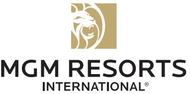
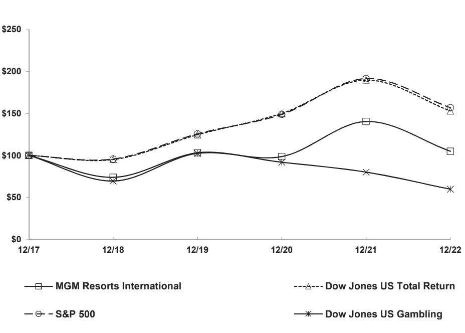
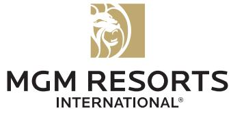
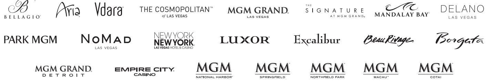
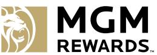

{0}------------------------------------------------

# 2022 ANNUAL REPORT

{1}------------------------------------------------

Entertaining the human race is more than our mission at MGM Resorts, it's the north star that illuminates new possibilities ahead.

In 2022, we achieved several important milestones: welcoming The Cosmopolitan of Las Vegas into our family, saying a heartfelt goodbye to The Mirage, ensuring our continued service in Macau for the next decade and so much more. Together, we're excited to continue delivering extraordinary new experiences that wow our customers from around the world and position us for a growing future.

{2}------------------------------------------------

# UNITED STATES SECURITIES AND EXCHANGE COMMISSION

Washington, D.C. 20549

#### FORM 10-K

(Mark One)

#### ANNUAL REPORT PURSUANT TO SECTION 13 OR 15(d) OF THE SECURITIES EXCHANGE ACT OF 1934 风

For the fiscal year ended December 31, 2022

OR

TRANSITION REPORT PURSUANT TO SECTION 13 OR 15(d) OF THE SECURITIES EXCHANGE ACT OF 1934 □

> For the transition period from to Commission File No. 001-10362

# MGM Resorts International

(Exact name of Registrant as specified in its charter)

Delaware (State or other jurisdiction of incorporation or organization)

88-0215232 (I.R.S. Employer Identification No.)

3600 Las Vegas Boulevard South - Las Vegas, Nevada 89109

(Address of principal executive offices) (Zip Code)

(702) 693-7120

(Registrant's telephone number, including area code)

#### Securities registered pursuant to Section 12(b) of the Act:

| Title of each class            | Trading Symbol(s) | Name of each exchange on which registered |
|--------------------------------|-------------------|-------------------------------------------|
| Common Stock, \$0.01 Par Value | MGM               | New York Stock Exchange (NYSE)            |

#### Securities registered pursuant to Section 12(g) of the Act:

None

Indicate by check mark if the Registrant is a well-known seasoned issuer, as defined in Rule 405 of the Securities Act. Yes V No D

Indicate by check mark if the Registrant is not required to file reports pursuant to Section 15(d) of the Act. Yes I No X

Indicate by check mark whether the Registrant (1) has filed by Section 13 or 15(0) of the Securities Exchange Act of 1934 during the preceding 12 months (or for such shorter period that the such reports), and (2) has been subject to such filing requirements for the past 90 days: Yes & No □

Indicate by check whether the Registrat has submitted electronically every Interactive Data File required to Rule 405 of Regulation ST (§232.405 of this chapter) during the preceding 12 months (or for such shorter period that the registrant was required to submit such files). Yes & No [

Indicate by check mark whether the Registerated filer, an accelerated filer, a non-accelerated filer, a smaller reporting company, or an emerging growth company. See the definitions of "large accerated filer," "smaller reporting company" and "emerging growth company" in Rule 12-2 of the Exchange Act.

Large accelerated filer × Accelerated filer Non-accelerated filer Smaller reporting company Emerging growth company 0

If an emerging growth company, indicate by check if the registrant has elected transition period for complying with any new or revised financial accounting standards provided pursuant to Section 13(a) of the Exchange Act. □

Indicate by check mark whether the registrant has filed a report on its management of the effectiveness of its internal over financial reporting under Section 4040) of the Sarbanes Oxley Act (15 U.S.C.7262(b)) by the registered public accounting firm that prepared or issued its audit report. M Indicate by check mark whether the Registrant is a shell company (as defined in Rule 12b-2 of the Act): Yes [] No &

The aggregate market value of the Registran's Common Stock held by non-affiliates of the 30, 2022 (based on the closing price on the New York Stock Exchange Composite Tape on June 30, 2022) was \$8.2 billion. Shares of common stock held by each person who owns 10% or more of the outstanding common shares have been excluded. As of February 22, 2023, 373,913,450 shares of Register, S0.01 par value, were outstanding.

#### DOCUMENTS INCORPORATED BY REFERENCE

Portions of the Registrant's definitive Proxy Statement of Stockholders are incorporated by reference into Pat III of this Form 10-K.

{3}------------------------------------------------

{4}------------------------------------------------

# TABLE OF CONTENTS

|          |                                                                                                                 | Page |
|----------|-----------------------------------------------------------------------------------------------------------------|------|
|          | PART I                                                                                                          |      |
| Item 1.  | Business                                                                                                        | 1    |
|          | Item 1A. Risk Factors                                                                                           | 13   |
|          | Item 1B. Unresolved Staff Comments                                                                              | 27   |
| Item 2.  | Properties                                                                                                      | 28   |
| Item 3.  | Legal Proceedings                                                                                               | 29   |
| Item 4.  | Mine Safety Disclosures                                                                                         | 29   |
|          | PART II                                                                                                         |      |
| Item 5.  | Market for Registrant's Common Equity, Related Stockholder Matters and Issuer Purchases of Equity Securities | 30   |
| Item 6.  | Reserved                                                                                                        | 32   |
| Item 7.  | Management's Discussion and Analysis of Financial Condition and Results of Operations                           | 32   |
|          | Item 7A. Quantitative and Qualitative Disclosures About Market Risk                                             | રી   |
| Item 8.  | Financial Statements and Supplementary Data                                                                     | 52   |
|          | Consolidated Financial Statements                                                                               | 57   |
|          | Notes to Consolidated Financial Statements                                                                      | 62   |
| Item 9.  | Changes in and Disagreements with Accountants on Accounting and Financial Disclosure                            | 100  |
|          | Item 9A. Controls and Procedures                                                                                | 100  |
|          | Item 9B.  Other Information                                                                                     | 101  |
|          | Item 9C. Disclosure Regarding Foreign Jurisdictions that Prevent Inspections                                    | 101  |
|          | PART III                                                                                                        |      |
|          | Item 10. Directors, Executive Officers and Corporate Governance                                                 | 102  |
| Item 11. | Executive Compensation                                                                                          | 102  |
| Item 12. | Security Ownership of Certain Beneficial Owners and Management and Related Stockholder Matters               | 102  |
| Item 13. | Certain Relationships and Related Transactions, and Director Independence                                       | 102  |
|          | Item 14. Principal Accounting Fees and Services                                                                 | 102  |
|          | PART IV                                                                                                         |      |
|          | Item 15. Exhibits, Financial Statements Schedules                                                               | 103  |
| Item 16. | Form 10-K Summary                                                                                               | 108  |
|          | Signatures                                                                                                      | 109  |

{5}------------------------------------------------

[THIS PAGE INTENTIONALLY LEFT BLANK]

{6}------------------------------------------------

#### **3\$57 ,**

#### **,7(0 %86,1(66**

*MGM Resorts International is referred to as the "Company," "MGM Resorts," or the "Registrant," and together with its subsidiaries may also be referred to as "we," "us" or "our." MGM China Holdings Limited together with its subsidiaries is referred to as "MGM China." Except where the context indicates otherwise, "MGP" refers to MGM Growth Properties LLC together with its consolidated subsidiaries.*

#### **2YHUYLHZ**

0*05HVRUWV,QWHUQDWLRQDOLVD'HODZDUHFRUSRUDWLRQLQFRUSRUDWHGLQWKDWDFWVODUJHO\DVDKROGLQJFRPSDQ\DQGWKURXJK VXEVLGLDULHVLVDJOREDOJDPLQJDQGHQWHUWDLQPHQWFRPSDQ\ZLWKGRPHVWLFDQGLQWHUQDWLRQDOORFDWLRQVIHDWXULQJEHVWLQFODVVKRWHOVDQG FDVLQRVVWDWHRIWKHDUWPHHWLQJDQGFRQIHUHQFHVSDFHVLQFUHGLEOHOLYHDQGWKHDWULFDOHQWHUWDLQPHQWH[SHULHQFHVDQGDQH[WHQVLYHDUUD\ RIUHVWDXUDQWQLJKWOLIHDQGUHWDLORIIHULQJVDQGVSRUWVEHWWLQJDQGRQOLQHJDPLQJRSHUDWLRQV

:HEHOLHYHZHRSHUDWHVHYHUDORIWKHILQHVWFDVLQRUHVRUWVLQWKHZRUOGDQGZHFRQWLQXDOO\UHLQYHVWLQRXUUHVRUWVWRPDLQWDLQ RXU FRPSHWLWLYHDGYDQWDJH:HPDNHVLJQLILFDQWLQYHVWPHQWVLQRXUUHVRUWVWKURXJKQHZO\UHPRGHOHGKRWHOURRPVUHVWDXUDQWVHQWHUWDLQPHQW DQGQLJKWOLIHRIIHULQJVDVZHOODVRWKHUQHZIHDWXUHVDQGDPHQLWLHV:HEHOLHYHZHRSHUDWHWKHKLJKHVWTXDOLW\UHVRUWVLQHDFKRIWKH PDUNHWVLQZKLFKZHRSHUDWH(QVXULQJRXUUHVRUWVDUHWKHSUHPLHUUHVRUWVLQWKHLUUHVSHFWLYHPDUNHWVUHTXLUHVFDSLWDOLQYHVWPHQWVWR PDLQWDLQWKHEHVWSRVVLEOHH[SHULHQFHVIRURXUJXHVWV:HDOVR EHOLHYHWKDWWKURXJKRXURQOLQHJDPLQJRSHUDWLRQVZHFDQFUHDWHDVFDOHG JOREDORQOLQHJDPLQJEXVLQHVV

\$V RI'HFHPEHU ZH RSHUDWH GRPHVWLF FDVLQR UHVRUWV DQGWKURXJK RXU FRQWUROOLQJLQWHUHVWLQ0*0&KLQD +ROGLQJV/LPLWHGWRJHWKHUZLWKLWVVXEVLGLDULHV³0*0&KLQD´ZKLFKRZQV0*0*UDQG3DUDGLVH6\$³0*0*UDQG3DUDGLVH´ RSHUDWHWZRFDVLQRUHVRUWVLQ0DFDX:HDOVRKDYHJOREDORQOLQHJDPLQJRSHUDWLRQVWKURXJKRXUFRQVROLGDWHGVXEVLGLDU\/HR9HJDV\$% ³/HR9HJDV´DQGRXUXQFRQVROLGDWHGRZQHGYHQWXUH%HW0*0//&³%HW0*0´

:HOHDVHWKHUHDOHVWDWHDVVHWVRIRXUGRPHVWLFUHVRUWVSXUVXDQWWRWULSOHQHWOHDVHDJUHHPHQWVDVIXUWKHUGLVFXVVHG LQ1RWH 3ULRUWRWKHFORVLQJRIWKH9,&,7UDQVDFWLRQGHILQHGEHORZ0*0*URZWK3URSHUWLHV//&³0*3´ZDVDFRQVROLGDWHGVXEVLGLDU\ RI RXUVDQGWKURXJK LWVVXEVLGLDU\0*0*URZWK3URSHUWLHV2SHUDWLQJ3DUWQHUVKLS/3³0*323´ZDVWKHODQGORUGRIFHUWDLQRIRXU GRPHVWLFSURSHUWLHVSXUVXDQWWR DQLQWHUFRPSDQ\PDVWHUOHDVHDUUDQJHPHQW

#### *Business Developments*

,QUHFHQW\HDUVLQIXUWKHUDQFHRIRXUYLVLRQWREHWKHZRUOG¶VSUHPLHUJDPLQJHQWHUWDLQPHQWFRPSDQ\ZHKDYHLPSOHPHQWHGDQ DVVHWOLJKWEXVLQHVVPRGHOZKLFKKDVLQYROYHGDFRPSUHKHQVLYH UHYLHZRIRXURZQHGUHDOHVWDWHDVVHWVWRILQGRSSRUWXQLWLHVWRPRQHWL]H WKRVHDVVHWVHIILFLHQWO\DQGDOORZXQORFNHGFDSLWDOWREHUHGHSOR\HGWRZDUGVEDODQFHVKHHWLPSURYHPHQWVQHZJURZWKRSSRUWXQLWLHV DQGWRUHWXUQYDOXHWR RXUVKDUHKROGHUV\$WWKHVDPHWLPHZHKDYHFRQWLQXHGWRIRFXVRQNH\ JURZWKRSSRUWXQLWLHVWKDWDOLJQZLWKRXU YLVLRQSDUWLFXODUO\E\LQYHVWLQJLQ86RQOLQHVSRUWVEHWWLQJDQGL*DPLQJWKURXJK%HW0*0DFTXLULQJ/HR9HJDVWRH[SDQGRXUJOREDO RQOLQHSUHVHQFHH[SDQGLQJRXUGLJLWDOFDSDELOLWLHVDQGVHHNLQJWRGLYHUVLI\RXU\$VLDRSHUDWLRQVZLWKGHYHORSPHQWHIIRUWVLQ-DSDQ

\$VSDUWRIWKDWEXVLQHVVVWUDWHJ\ZHKDYHVRXJKWDQGH[HFXWHG RQRSSRUWXQLWLHVWRLQYHVWLQRXUJURZWKDUHDVGLYHVWRXUUHDO HVWDWHDVVHWVDQGDFTXLUHRUHQWHULQWRYHQWXUHWUDQVDFWLRQVZLWKUHVSHFWWRRQOLQHJDPLQJDQGWKHRSHUDWLRQVRILQWHJUDWHGFDVLQRKRWHO DQGHQWHUWDLQPHQWUHVRUWVLQFOXGLQJWKURXJKWKHIROORZLQJWUDQVDFWLRQV

- ,Q-XO\ZHDQG(QWDLQSOF³(QWDLQ´IRUPHG%HW0*0,QFRQQHFWLRQZLWKLWVIRUPDWLRQZHSURYLGHG%HW0*0ZLWK H[FOXVLYH DFFHVVWR DOO RI RXU GRPHVWLFODQG EDVHG DQG RQOLQH VSRUWV EHWWLQJ PDMRUWRXUQDPHQW SRNHU DQG RQOLQHJDPLQJ RSHUDWLRQVDQG(QWDLQSURYLGHG%HW0*0ZLWKH[FOXVLYHDFFHVVWRLWVWHFKQRORJ\LQWKH8QLWHG6WDWHV
- ,Q -DQXDU\ ZH DFTXLUHGWKH UHDO SURSHUW\ DQG RSHUDWLRQV DVVRFLDWHG ZLWK(PSLUH&LW\&DVLQR
V UDFHWUDFN DQG FDVLQR ³(PSLUH&LW\´IRUWRWDOFRQVLGHUDWLRQRIDSSUR[LPDWHO\ PLOOLRQ6XEVHTXHQWO\0*3DFTXLUHG(PSLUH&LW\¶VGHYHORSHG UHDOSURSHUW\IURPXVDQG(PSLUH&LW\ZDVDGGHGWRWKHPDVWHUOHDVHZLWK0*3

{7}------------------------------------------------

- . In March 2019, we entered into an amendment to the master lease with MGP with respect to improvements made by us related to the rebranding of the Park MGM and NoMad Las Vegas property.
- . In November 2019, the venture that is 5% owned by a subsidiary of ours and 95% owned by a subsidiary of Blackstone Real Estate Investment Trust, Inc. ("BREIT", such venture, the "Bellagio BREIT Venture") was formed, which acquired the Bellagio real estate assets from us for total consideration of \$4.25 billion, and leased such assets back to us pursuant to a lease agreement. Refer to Note 11 for additional information relating to the lease and Note 12 for the guarantee entered into in connection with the transaction.
- In December 2019, we completed the sale of Circus Circus Las Vegas and adjacent land for \$825 million. ●
- . On February 14, 2020, we completed a series of transactions (collectively the "MGM Grand Las Vegas and Mandalay Bay transaction") pursuant to which the real estate assets of MGM Grand Las Vegas and Mandalay Bay (including Mandalay Place) were contributed to the newly formed venture that was 50.1% owned by a subsidiary of MGP OP and 49.9% by a subsidiary of BREIT (such venture, the "VICI BREIT Venture") in exchange for total consideration of \$4.6 billion. See Note 1 for further discussion on the transaction and Note 12 for the guarantee entered into in connection with the transaction.
- . In connection with the MGM Grand Las Vegas and Mandalay Bay transaction, VICI BREIT Venture entered into a lease with us for the real estate assets of Mandalay Bay and MGM Grand Las Vegas. Additionally, the master lease with MGP was modified to remove the Mandalay Bay property.
- Also, on January 14, 2020, we, MGP OP, and MGP entered into a waiver agreement pursuant to which approximately 30 million o MGP OP units that we held were redeemed for \$700 million on Mav 18, 2020 and approximately 24 million MGP OP units that we held were redeemed for \$700 million on December 2, 2020. As a result, the waiver terminated in accordance with its terms. Refer to Note 1 for further information regarding this transaction, which eliminates in consolidation.
- . On March 4, 2021, we delivered a notice of redemption to MGP covering approximately 37 million MGP OP units that we held which was satisfied with aggregate cash proceeds of approximately \$1.2 billion, using cash on hand together with the proceeds from MGP's issuance of Class A shares. See Note 13 for information regarding this transaction, which eliminated in consolidation.
- . On September 27, 2021, we completed the acquisition of the remaining 50% ownership interest in CityCenter Holdings, LLC ("CityCenter") for cash consideration of \$2.125 billion. Refer to Note 4 for additional information on this acquisition.
- . On September 28, 2021, we sold the real estate assets of Aria and Vdara to funds managed by The Blackstone Group Inc. ("Blackstone") for cash consideration of \$3.89 billion and entered into a lease through which the real property is leased back to a subsidiary of ours. Refer to Note 11 for discussion of the lease agreement.
- . On September 28, 2021, we announced that we, together with our venture partner, ORIX Corporation ("ORIX"), were selected by Osaka as the region's integrated resort partner 2021, we and ORIX formed a venture, through which we bid to develop one of Japan's first integrated resorts. On April 27, 2022, we, together with Osaka prefecture/city and our partners at ORIX, submitted an Area Development Plan to Japan's central government.
- o On October 29, 2021, MGP acquired the real estate assets of MGM Springfield from us for cash consideration of \$400 million and MGM Springfield was added to the master lease with MGP, including transactions under the master lease with MGP, have been eliminated in our consolidation of MGP.
- . On April 29, 2022, we completed a series of transactions with VICI Properties, Inc. ("VICI") and MGP whereby VICI acquired MGP in a stock-for-stock transaction, the "VICI Transaction"). MGP Class A shareholders received 1.366 shares of newly issued VICI stock in exchange for each MGP Class A share outstanding and we received 1.366 units of VICI Properties OP LLC ("VICI OP") in exchange for each MGP OP unit held by us. In connection with the exchange, VICE OP redeemed the majority of our VICI OP units, with us retaining an approximate 1% ownership interest in VICI OP. MGP's Class B share that was held by us was cancelled. We no longer hold a controlling interest in MGP and deconsolidated MGP upon the closing of the VICI Transaction. Refer to Note 4 for further discussion of the VICI Transactions. In connection with the VICI

{8}------------------------------------------------

Transaction, we entered into an amended and restated master lease with VICI. Refer to Note 11 for further discussion of the lease.

- . On May 17, 2022, we acquired the operations of The Cosmopolitan of Las Vegas ("The Cosmopolitan") for cash consideration of \$1.625 billion, plus working capital adjustments for a total purchase price of approximately \$1.7 billion. Additionally, we entered into a lease agreement for the real estate assets of The Cosmopolitan. See Note 4 and Note 11 for discussion of the transaction and lease, respectively.
- o On September 7, 2022, we acquired LeoVegas through a tender offer at a cash price of SEK 61 per share, for a total fair value of equity interests acquired of approximately \$556 million, inclusive of cash settlement of equity awards. See Note 4 for discussion of this transaction.
- . On December 16, 2022, we were awarded a new gaming concession of games of chance of chance or other games in casinos in Macau, commencing on January 1, 2023.
- . On December 19, 2022, we completed the sale of the operations of The Mirage to an affiliate of Seminole Hard Rock Entertainment, Inc. ("Hard Rock") for cash consideration of \$1.075 billion, subject to certain purchase price adjustments. At closing, the master lease with VICI was amended to remove The Mirage and reflect a \$90 million reduction in annual cash rent. Refer to Note 4 for further discussion of this transaction.
- On February 15, 2023, we completed the sale of the operations of Gold Strike Tunica to CNE Gaming Holdings, LLC ("CNE"), . a subsidiary of Cherokee Nation Business, for cash consideration of \$450 million, subject to certain purchase price adjustments. At closing, the master lease with VICI was amended to remove Gold Strike Tunica and reflect a \$40 million reduction in annual cash rent. Refer to Note 4 for further discussion of this transaction.

For additional information relating to our acquisitions, divestitures, venture transactions, and other arrangements, including those refered to above, see "Item 7. Management's Discussion and Analysis of Financial Condition and Results of Operations," as well as the notes to our consolidated financial statements specified above.

Impact of COVID-19. See "Item 7. Management's Discussion and Analysis of Financial Condition and Results of Operations — Description of our business and key performance indicators — Impact of COVID-19" for more information about the effect of the COVID-19 pandemic on our business and our recovery. For a discussion of the risks to our business resulting from COVID-19, see "Item 1A. Risk Factors - Risks Related to Our Business. Industry, and Market Conditions."

## Resort Operations

#### General

Most of our revenue is cash-based, through customers wagering with cash or paying for non-gaming services with cash or credit cards. We rely on the ability of our resorts to generate operating cash flow to fund capital expenditures, provide excess cash flow for future development, acquisitions or investments, and repay debt financings.

Our results of operations do not tend to be seasonal in nature as all of our casino resorts, except as otherwise described telated to the impact of COVID-19, typically operate 24 hours a day, every day of the exception of Empire City, which operates 20 hours a day, every day of the year, though a variety of factors may affect the results of any interim period, including the timing of major conventions, Far East baccarat volumes, the timing of entertainment and sports events, the amount and special events for our high-end gaming customers, and the level of play during major holidays, including New Year and Lunar New Year. Our primary casino and hotel operations are owned and managed by us. Other resort amentities may be owned by us but managed by third parties for a fee, or leased to third-party retail and food and food and beverage operators, particularly for branding opportunities.

As of December 31, 2022, we have three reportable segments: Las Vegas Strip Resorts, Regional Operations, and MGM China, as generally described below. See Note 17 for detailed financial information about our reportable segments.

{9}------------------------------------------------

#### Las Vegas Strip Resorts and Regional Operations

Las Vegas Strip Resorts. Las Vegas Strip Resorts consists of the following casino resorts: Aria (including Vdara) (upon its acquisition in September 2021), Bellagio, The Cosmopolitan (upon its acquisition in May 2022), MGM Grand Las Vegas (including The Signature), Mandalay Bay (including Delano and Four Seasons), The Mirage (until its disposition in December 2022), Luxor, New York-New York (including The Park), Excalibur, and Park MGM (including NoMad Las Vegas).

Regional Operations. Regional Operations consists of the following casino resorts: MGM Grand Michigan; Beau Rivage in Biloxi, Mississippi; Gold Strike Tunica, Mississippi (until its disposition in February 2023); Borgata in Atlantic City, New Jersey, MGM National Harbor in Prince George's County, Maryland; MGM Springfield, Massachusetts; Empire City in Yonkers, New York; and MGM Northfield Park in Northfield Park, Ohio.

Over half of the net revenue from our Las Vegas Strip Resorts is typically derived from non-gaming operations, including hotel, food and beverage, entertainment and other non-gaming and the majority of the net revenue from our Regional Operations is typically derived from gaming operations. Our long-term strategy continues to different customers and utilize our significant convention and meeting facilities to allow us to maximize hotel occupancy and customer volumes, which also better labor utilization. Our operating results are highly dependent on the volume of customers at our properties, which in turn affects the price we can charge for our hotel rooms and other amenities.

Our casino operations feature a variety of slots and table games. In addition, we provide our premium players access to highlimit rooms and lounge experiences where players may enjoy an upscale atmosphere.

#### MGM China

We own approximately 56% of MGM China, which owns MGM Grand Paradise, the Macau company that owns and operates the MGM Macau and MGM Cotai casino resorts and holds the related gaming concession and land concessions. We believe our ownership interest in MGM China plays an important role in extending our reach internationally and will foster future growth and profitability. Although visitation during 2020, 2021, and 2022 was significantly reduced by the COVID-19 pandemic, we expect the long-term future growth of the Asian gaming market to drive additional visitation at MGM Cotai.

Our current MGM China operations relate to MGM Macau and MGM Cotai, discussed further below. MGM China's revenues are generated primarily from gaming operations, which are conducted under a gaming concession held by MGM Grand Paradise, a subsidiary of MGM China. Gaming in Macau is currently administered by the Macau Government through concessions awarded to six different concessionaires.

#### Corporate and Other

We have additional business activites including LeoVegas, our investments in unconsolidated affiliates, including BetMGM, and certain other corporate and management operations.

#### Customers and Competition

Our properties operate in highly competitive environments. We compete against gaming companies, as well as other hospitality companies in the markets in which we operate, neighboring markets, and in other parts of the world, including non-gaming resort destinations such as Hawaii. Our gaming operations compete to a lesser extent with state-sponsored lotteries, off-rack wagering, card parlors, iGaming and other forms of legalized gaming in the United States and internationally. For further discussion of the potential impact of competitive conditions on our business, see "Item 1A. Risk Factors - Risks Related to our Business, Industry, and Market Conditions - We face significant competition with respect to destination travel locations generally and with respect to our pers in the industries in which we compete, including increased competition through online sports betting and failure to compete effectively could materially adversely affect our business, financial condition, results of operations and cash flows."

Our primary methods of successful competition include:

- . Locating our resorts in desirable leisure and business travel markets and operating at superior sites within those markets;
- Constructing and maintaining high-quality resorts and facilities, including luxurious guestrooms, state-of-the-art convention o facilities and premier dining, entertainment, retail and other amenities;

{10}------------------------------------------------

- 5HFUXLWLQJWUDLQLQJDQGUHWDLQLQJZHOOTXDOLILHGDQGPRWLYDWHGHPSOR\HHVZKRSURYLGHVXSHULRUFXVWRPHUVHUYLFH
- 3URYLGLQJXQLTXH³PXVWVHH´HQWHUWDLQPHQWDWWUDFWLRQV
- ,QYHVWLQJLQGLJLWDORIIHULQJVDQGRSSRUWXQLWLHVGRPHVWLFDOO\DQGDEURDGDQG
- 'HYHORSLQJGLVWLQFWLYHDQGPHPRUDEOHPDUNHWLQJSURPRWLRQDODQGFXVWRPHUOR\DOW\SURJUDPV

## *Las Vegas Strip Resorts and Regional Operations*

2XU FXVWRPHUV LQFOXGH SUHPLXP JDPLQJ FXVWRPHUV OHLVXUH DQG ZKROHVDOH WUDYHO FXVWRPHUV EXVLQHVV WUDYHOHUV DQG JURXS FXVWRPHUVLQFOXGLQJFRQYHQWLRQVWUDGHDVVRFLDWLRQVDQGVPDOOPHHWLQJV:HKDYHDGLYHUVHSRUWIROLRRISURSHUWLHVZKLFKDSSHDOWRWKH XSSHUHQGRIHDFKPDUNHWVHJPHQWDQGDOVRFDWHUWROHLVXUHDQGYDOXHRULHQWHGWRXUDQGWUDYHOFXVWRPHUV0DQ\RIRXUSURSHUWLHVKDYH VLJQLILFDQWFRQYHQWLRQDQGPHHWLQJVSDFHZKLFKZHXWLOL]HWRGULYHEXVLQHVVWRRXUSURSHUWLHVGXULQJPLGZHHNDQGRIISHDNSHULRGV

2XU/DV9HJDVFDVLQRUHVRUWVFRPSHWHIRUFXVWRPHUVZLWKDODUJHQXPEHURIRWKHUKRWHOFDVLQRVLQWKH/DV9HJDVDUHDLQFOXGLQJ PDMRUKRWHOFDVLQRVRQRUQHDUWKH/DV9HJDV6WULSPDMRUKRWHOFDVLQRVLQWKHGRZQWRZQDUHDZKLFKLVDERXWILYHPLOHVIURPWKH FHQWHU RIWKH/DV9HJDV6WULSDQGVHYHUDOPDMRUKRWHOFDVLQRVHOVHZKHUHLQWKH/DV9HJDVDUHD2XU/DV9HJDV6WULS5HVRUWVDOVRFRPSHWH LQ SDUWZLWKHDFKRWKHU0DMRUFRPSHWLWRUVLQFOXGLQJQHZHQWUDQWVKDYHHLWKHUUHFHQWO\H[SDQGHGWKHLUKRWHOURRPFDSDFLW\DQGFRQYHQWLRQ VSDFHRIIHULQJVRUKDYHSODQVWRH[SDQGWKHLUFDSDFLW\RUFRQVWUXFWQHZUHVRUWVLQ/DV9HJDV\$OVRWKHJURZWKRIJDPLQJLQDUHDV RXWVLGH /DV9HJDVKDVLQFUHDVHGWKHFRPSHWLWLRQIDFHG E\RXURSHUDWLRQVLQ/DV9HJDV

2XWVLGH1HYDGDRXUUHVRUWVSULPDULO\FRPSHWHZLWKRWKHUKRWHOFDVLQRVLQWKHLUPDUNHWVDQGIRUFXVWRPHUVLQVXUURXQGLQJUHJLRQDO JDPLQJ PDUNHWV ZKHUH ORFDWLRQ LV D FULWLFDO IDFWRU WR VXFFHVV ,Q DGGLWLRQ ZH FRPSHWH ZLWK JDPLQJ RSHUDWLRQV LQ VXUURXQGLQJ MXULVGLFWLRQVDQGRWKHUOHLVXUHGHVWLQDWLRQV LQHDFKUHJLRQ

#### *MGM China*

7KH 0DFDX JDPLQJ PDUNHW KDV KLVWRULFDOO\ KDG WKUHH SULPDU\ FXVWRPHU EDVHV 9,3 JDPLQJ RSHUDWLRQV PDLQ IORRU JDPLQJ RSHUDWLRQVDQGVORWPDFKLQHRSHUDWLRQV9,3JDPLQJDW0*0&KLQDLVFRQGXFWHGWKURXJKWKHXVHRIVSHFLDOSXUSRVHQRQQHJRWLDEOH JDPLQJ FKLSV 7KH QRQQHJRWLDEOH FKLSV DOORZ XV WR WUDFN WKH DPRXQW RI ZDJHULQJ FRQGXFWHG WR GHWHUPLQH 9,3 JDPLQJ SOD\ 9,3 FRPPLVVLRQVDUHEDVHGRQDSHUFHQWDJHRIUROOLQJFKLSWXUQRYHU DQGDUHUHFRUGHGDVDUHGXFWLRQRIFDVLQRUHYHQXH0DLQIORRUSOD\HUV GRQRWUHFHLYHFRPPLVVLRQV:HKDYHIRFXVHG RXUEXVLQHVV RQPDLQIORRUJDPLQJRSHUDWLRQVDQGDFFRUGLQJO\9,3JDPLQJRSHUDWLRQV ZHUHQRWDVLJQLILFDQWVRXUFHRIUHYHQXHLQDQGZHGRQRWH[SHFW9,3JDPLQJRSHUDWLRQVWREHDVLJQLILFDQWVRXUFHRIUHYHQXHLQ IXWXUH\HDUV7KHPDMRULW\RI0*0&KLQD
VFDVLQRUHYHQXHKDVEHHQSURYLGHGE\PDLQIORRUJDPLQJRSHUDWLRQVLQUHFHQW\HDUVDQG ZH H[SHFWWKLVFXVWRPHUEDVHZLOO EHWKHSULPDU\VRXUFHRIJURZWK LQWKHIXWXUH:HRIIHUDPHQLWLHVWRDWWUDFWSOD\HUVVXFKDVSUHPLXP JDPLQJORXQJHVDQGVWDGLXPVW\OHHOHFWURQLFWDEOHJDPHVWHUPLQDOVZKLFKLQFOXGHERWKWDEOHJDPHVDQGVORWVWRFUHDWHDGHGLFDWHG H[FOXVLYHJDPLQJVSDFHIRUSUHPLXPPDLQIORRUSOD\HUV¶XVHDVZHOODVQRQJDPLQJDPHQLWLHVVXFKDV7KH0DQVLRQDQG0*0&RWDL (PHUDOG9LOODWRDWWUDFWXOWUDKLJKHQGFXVWRPHUV

,Q'HFHPEHUZHVXVSHQGHGRSHUDWLRQVZLWKRXUSULPDU\ JDPLQJSURPRWHUVLQGHILQLWHO\3ULRUWR'HFHPEHUZHKDG H[WHUQDOO\VRXUFHG9,3JDPLQJSOD\WKURXJKH[WHUQDOJDPLQJSURPRWHUVZKRDVVLVWHG9,3SOD\HUVZLWKWKHLUWUDYHODQGHQWHUWDLQPHQW DUUDQJHPHQWV*DPLQJSURPRWHUVSXUFKDVHGVSHFLDOSXUSRVHQRQQHJRWLDEOHJDPLQJFKLSVDQGLQWXUQWKH\VROGWKHVHFKLSVWRWKHLU SOD\HUV*DPLQJSURPRWHUVZHUHFRPSHQVDWHGWKURXJKSD\PHQWRIUHYHQXHVKDULQJDUUDQJHPHQWVEDVHGRQDSHUFHQWDJHRIWKHJURVV WDEOHJDPHVZLQDQGWKURXJKSD\PHQWRIDSHUFHQWDJHRIUROOLQJ FKLSWXUQRYHU7KH\DOVRUHFHLYHGDQDOORZDQFHEDVHGRQDSHUFHQWDJH RIWKHWDEOHJDPHVWXUQRYHUWKH\ JHQHUDWHGZKLFKFRXOGEHDSSOLHGWRKRWHOURRPVIRRGDQGEHYHUDJHDQGRWKHUGLVFUHWLRQDU\ FXVWRPHU UHODWHGH[SHQVHV*DPLQJSURPRWHUFRPPLVVLRQVZHUHUHFRUGHGDVDUHGXFWLRQRIFDVLQRUHYHQXH

2XUNH\FRPSHWLWRUVLQ0DFDXLQFOXGHILYHRWKHUJDPLQJFRQFHVVLRQDLUHV:HDOVRHQFRXQWHUFRPSHWLWLRQIURPPDMRUJDPLQJ FHQWHUVORFDWHGLQRWKHUDUHDV RI\$VLDDQGDURXQGWKH ZRUOGLQFOXGLQJEXWQRWOLPLWHGWR6LQJDSRUH6RXWK.RUHD9LHWQDP&DPERGLD WKH3KLOLSSLQHV\$XVWUDOLDDQG/DV9HJDV

#### **0DUNHWLQJ**

2XUPDUNHWLQJHIIRUWVDUHFRQGXFWHGWKURXJKYDULRXVPHDQVLQFOXGLQJRXUOR\DOW\SURJUDPV:HDGYHUWLVHRQUDGLRWHOHYLVLRQ LQWHUQHWDQGELOOERDUGVDQGLQQHZVSDSHUVDQGPDJD]LQHVLQVHOHFWHGFLWLHVWKURXJKRXWWKH8QLWHG6WDWHVDQGRYHUVHDVDVZHOODVE\ GLUHFWPDLOHPDLODQGWKURXJKWKHXVHRIVRFLDOPHGLD:HDOVRDGYHUWLVHWKURXJKRXUUHJLRQDOPDUNHWLQJRIILFHVORFDWHGLQPDMRU86 DQGIRUHLJQFLWLHV2XUGLUHFWPDUNHWLQJHIIRUWVXWLOL]HDGYDQFHGDQDO\WLFWHFKQLTXHVWKDWLGHQWLI\FXVWRPHUSUHIHUHQFHVDQGKHOS SUHGLFW

{11}------------------------------------------------

future customer behavior, allowing us to make more relevant offers to customers, influence incremental visits, and help build lasting customer relationships.

MGM Rewards, our customer loyalty program, is a tiered program and allows customers to qualify for benefits across our participating resorts and in both gaming areas, encouraging customers to keep their total spend within our casino resorts. As members advance through tiers, a host of member benefits are unlocked including priority access, exclusive events and experiences. and the opportunity to redeem MGM Rewards for hotel stays, food and beverage, and other MGM Resorts experiences. We also offer the Golden Lion Club for gaming focused customers, in addition to M Ife Rewards, at MGM China. The structured rewards systems based on member value and tier level ensure that customers can progressively access the full range of services that the resorts provide. Our loyalty programs focus on building a rewarding with our customers, encouraging members to increase both visitation and spend.

#### Strategy

We strive to be a leader in the global gaming, entertainment and hospitality industry that delivers extraordinary entertainment across a portfolio of properties in the United States and Macau. The quality of our properties and amenties is evidenced by our success in winning numerous awards, both domestic and globally, including several Four and Five Diamond designations from the American Automobile Association, multiple Four and Five Star designations from Forbes Travel Guide and numerous certifications of our Corporate Social Responsibility efforts.

In order to achieve our vision of becoming the world's premier gaming entertainment company, we developed our strategic plan, which centers on five pillars:

- . Strong People and Culture. Recruit, develop and retain the best talent. Foster a culture of diversity and inclusion. Invest in the employee experience.
- . Customer-Centric Model. Leverage a customer-centric model reinforced by a strong brand and deep customer insights to provide unmatched entertainment experiences for our guests and drive top-line growth.
- Operational Excellence. Operating model refinement to diversify business mix, maximize operating efficiencies and expand . margins. Enhancement of digital capabilities to strengthen customer loyalty.
- Disciplined Capital Allocation to Maximize Shareholder Value. Pursuit of targeted, attractive ROI opportunities that align to our strategic vision. Focus on shareholder returns. Fortify balance sheet.
- . Gaming Entertainment. Innovate our gaming entertainment product to drive continued premium positioning and competitive differentiation. Distribute our product offering to serve the broadest total addressable market possible.

The strategic plan was developed with the intent to regularly revisit, measure, and reevaluate for emerging opportunities.

In allocating resources, our financial strategy is focused on managing a proper mix of investments in our existing properties, strategic growth opportunities, debt repayment and shareholder returns. We believe there are reasonable investments for us to make in new initiatives and at our current resorts that will provide profitable returns.

We regularly evaluate targeted opportunities that provide an attractive return on investment in domestic and international markets, including the ownership, management and operation of gaming facilities and accessing new markets for iGaming and online sports betting, including our acquisition of Leo Vegas. We also leversge our management expertise and well-recognized brands through strategic partnerships and international expansion opportunities.

We continue to maximize the benefits of our operating model by driving optimization of our Centers of Excellence and enabling best in class operations through adjustments within corporate and property business units. In addition, we have implemented several improvement and cost cutting initiatives comprised of labor, sourcing, and revenue programs that have further improved our operating model and have positioned us as a stronger company.

We have continued to focus on our key growth opportunities of developing an integrated resort in Japan, investing in BetMGM, investing in international digital opportunities through our acquisition of LeoVegas, and exploring a full-scale commercial gaming opportunity in New York. In September 2021, we, together with our venture partner, ORIX, were selected by Osaka as the region's integrated resort partner. This selection marks an important step in our long-term bid to develop one of Japan's first integrated casino

{12}------------------------------------------------

resorts. In April 2022, we submitted an area development and are currently awaiting a decision. As it relates to BetMGM, we believe that BetMGM is positioned as a long-term leader in the U.S. online sports betting and iGaming industries. As part of our commitment to the success of BetMGM, we have integrated our MGM Rewards program with BetMGM and have BetMGM branded on-property sportsbooks and kiosks to drive higher value customers at lower acquisition costs through a robust omnchannel strategy. Further, we continue to explore full-scale commercial gaming to Empire City in New York. In January 2023. a request for application for three downstate commercial gaming licenses was released, to respond.

#### Technology

We believe technology, digital and advance/analytics capabilities are critical to optimizing customer experience and loyalty, employee productivity and efficiency and revenue growth. We are focused on using these capabilities to achieve specific goals of creating 'only at MGM' differentiation through unique content and experiences, establishing a perennial engagement with our guests for increased loyalty, digital diversification through enhanced e-commerce and seamless integration of the physical integrated resorts business with digital casino and sports betting cross-property experiences and promotions in Las Vegas to provide much better value to the consumer, enhancing our data driven decisioning capabilities in all aspects of our business for faster decision making, and optimizing our operations and experience through digitization. Additionally, this year we have loyalty technology platform that allows customers to earn points through gaming activities, and we have enabled bundling technology capabilities to sell packages customized to a customer segment.

#### Environmental Sustainability

At MGM Resorts, we have had a long-standing commental and social responsibility. For over a decade, we have had a dedicated board committee focused on Corporate Social Responsibility ("CSR"). In 2019, we had bolstered governance of these areas by uniting our key pillars of Diversity, Equity and Inclusion, Philanthropy and Community Engagement and Environmental Sustainability under one Executive Committee-level leader who manages the MGM Resorts Social Impact and Sustainability Center of Excellence, reports directly to the Chief Executive Officer and President, and serves as liaison to the CSR and Sustainability board committee. This leader also oversees the Human Resources function, and is thus able to integrate Environmental, Social and Governance ("ESG") considerations more deeply into the core culture of our organization through proactive management of our human and social capital initiatives.

## ESG Reporting

Throughout 2022, we continued our progress on key ESG initiatives and enhanced our disclosures, supporting our commitment to MGM's Focused on What Matters platform and the UN Sustainable Development Goals. Our most & Sustainability Report built on the robust disclosures of 2021 to illustrate progress across our public social impact and sustainability goals, and we expect to publish a new report in 2023 detailing progress made in 2022.

Our reporting in 2022 contributed to the growing list of disclosures and frameworks to which we align with our first Task Force on Climate-related Financial Disclosures report (published in May 2022). This report adds to our work to publish disclosures aligned with the Global Reporting Initiative and Sustainability Accounting Standards Board Hotels & Gaming Sector Standards. As our catalog of reports aligned to leading ESG frameworks has grown, we have updated our website to efficiently present these disclosures and policies at mgmresorts.com/esg. The content on this website is for informational purposes only and such content is not incorporated by reference into this Annual Report on Form 10-K.

## Energy & Carbon

The year ended December 31, 2022 was the first full calendar year of operation for our Mega Solar Array ("Mega Array") which. on average, has met or exceeded our productions. We believe that the solar energy produced by the Mega Array will play a key role in meeting our climate goals:

- . 45% reduction in Scope 1 & 2 carbon emissions intensity (pounds of carbon dioxide equivalent per square foot; 2007 baseline) by 2025:
- . 50% reduction in absolute Scope 1 & 2 carbon emissions (metric tons of carbon dioxide equivalent; 2019 baseline) by 2030; and
- . 100% renewable electricity purchased in U.S. and 80% purchased globally by 2030.

{13}------------------------------------------------

In addition, we have committed to reduce its value chain emissions with a goal to reduce carbon emissions across our significant Scope 3 categories by 30% by 2030.

#### Water

We are committed to using water responsibly across our operations and we aim to drive long-term water efficiency by optimizing water systems and implemention measures. In 2022, we developed a global water policy to codify our commitment to water stewardship and a strategic framework for addition, we enhanced our waterrelated disclosures by participating in the 2022 CDP Water Security Questionnaire and achieved an "A", CDP's highest score.

#### Trademarks

Our principal intellectual property consists of trademarks for, among others, Aria, Vdara, Bellagio, The Cosmopolitan, Borgata, Mandalay Bay, MGM, MGM Grand, MGM Resorts International, Luxor, Excalibur, New York, Beau Rivage, Empire City, and Leo Vegas, all of which have been registered or allowed in various classes in the United States and Europe, as applicable. In addition, we have also registered or applied to register numerous other trademarks, such as The Mirage, in connection with our properties, facilities and development projects in the United States and in various other foreign jurisdictions. These trademarks are brand names under which we market our properties and services. We consider these brand names to be business since they have the effect of developing brand identification. We believe that the name recognition, reputation and image that we have developed attract customers to our facilities. Once granted, our trademations are of perpetual duration so long as they are used and periodically renewed. It is our intent to pursue and maintain our trademark registrations consistent with our goals for brand development and identification, and enforcement of our trademark rights.

#### Human Capital

We are focused on fostering a people-drived by how we lead and uphold the following core values: Captivate Our Audience, Inspire Excellence, Champion Inclusion, and Win Together, to create an engaged and diverse workforce. Our long-term people strategy is designed to enhance talent attraction and development to support business guest experience, community engagement, and financial goals. Our workforce development strategies support local hiring and developing a robust workforce in the local communities in which we operan support, community training and employment, fulfilling local hiring commitments (where applicable), and through internship and management programs. In response to labor demands and agile staffing requirements, we have significantly streamlined our recruitment processes for faster to meet business and operational needs.

#### Growth and Development

We invest significant resources to develop the talent needed, now and in the future, to continue to be a premier employer of choice across the gaming, hospitality, and entertainment industries. We are committed to a culture of continuous learning where employees, at all levels, are engaged in developing their knowledge, skills, and we support the long-term career aspirations of our employees through education and professional/personal development. We continue to introduce new learning and development initiatives focused on a broad range of employee segment, contribute toward student loan debt repayment, and have partnered with the Nevada System of Higher Education to allow employees to earn a degree online free of charge for all credit hours. Over the past year we have introduced several and development initiatives including a sabbatical program for our director level and enhanced employee recognition and onboarding programs applicable across all levels.

#### Diversity, Equity, and Inclusion ("DE&I")

Our approach to DE&I is anchored by our corporate and a social impact and sustainability approach that centers on embracing humanity. A comprehensive framework lays out four strategic pillars to guide our work: invest in people; build an inclusive culture; grow business and customer engagement and supplier diversity; and enhance marketplace leadership and community relations. As part of our committed to the following four long-range 2025 goals: (1) ensure that all employees have equal access to leadership opportunities, (2) spend at least 10% of our biddable procurement with diverse suppliers, (3) expand our Supplier Diversity Mentorship Program to achieve 150 graduates and (4) train 100% of management employees on social impact and sustainability policies and goals. In connection with each goal, we have established robust key performance indicators, which are tracked and published in our annual Social Impact and Sustainability Report and reviewed internally with management and our CSR &

{14}------------------------------------------------

Sustainability Committee of the Board of Directors. In addition, we have detailed internal Human Capital workforce reports, which include demographic and diversity data, and are revewed with the CSR & Sustainability Committee of the Board, executive management, and leadership teams on a regular basis.

Internally, we use multiple channels to facilitate communication and to continuously advance one of our core values, Champion Inclusion. The channels include but are not limited to open forums with executives, employee engagement surveys with detailed action planning, and employee network groups.

Work in the area of diversity, equity, and inclusion is advanced through a range of programs and initiatives which include employee education and training, community partnerships, recruitment and talent development, advocacy, engagement and outreach and through internal groups like our Supplier Diversity and ESG task forces. Responsibility is driven and led by our Chief People, Inclusion and Sustainability Officer, who reports directly to the Chief Executive Officer and is supported by a centralized Diversity and Inclusion team and the Human Resources department.

#### Health, Safety, and Wellness

To promote our culture of overall employee health and wellness we provide benefits, tools and resources to help maintain or improve physical, emotional, and financial health. We continue to align benefit offerings to the needs of a diverse workforce across an expanded regional presence and leverage innovative digital solutions to expand access to health and wellness resources, including the recent launch of the World of Wellbeing (WOW), our holistic approach that focuses on the whole person. In addition, in 2022, we continued to ensure our employees' continued health, safety, and wellness in response to COVID-19.

#### Community Engagement and Philanthropy

Our philanthropic focus centers around: Embracing Humanity and Protecting the organize our major programs and initiatives under the pillars of caring for one another and investing in our communities. We established the MGM Resorts Foundation in 2002 as an engagement opportunity for employees to contribute to charitable causes, which provides two types of grants (1) the Employee Emergency Grant, which benefits our employees, and (2) the Community Grant, which benefits local communities. We endeavor to care for our communities through volunteersm and encourage all our employees to volunteer through a variety of programs. In addition, we offer opportunities for our employees to their communities, including through programs such as VolunteerREWARDS, which provides employees with opportunities to earn grant money to the non-profit of choice based on volunteer hours.

#### Employees and Labor Relations

As of December 31, 2022, we had approximately 46,000 full-time and 18,000 part-time employees domestically. In addition, we had approximately 10.000 and 1.000 employees at MGM China and LeoVegas, respectively. We had collective bargaining agreements with unions covering approximately 38.000 of our employees as of December 31, 2022. Collective bargaining agreements covering multiple bargaining units at our Regional Operations and Las Vegas are scheduled to expire in 2023. This includes agreements with the Local Joint Executive Board of Las Vegas Strip resorts and covering approximately 22,000 bargaining unit employees in Las Vegas; those agreements are scheduled to expire May 31, 2023. Additionally, collective bargaining agreements covering all bargaining units at Beau Rivage in Mississippi, two bargaining units at MGM Grand Detroit, the front services, parking, warehouse and facilities bargaining units at MGM National bargaining units in Las Vegas, all bargaining units at MGM Northfield Park, and a number of smaller bargaining units in both Las Vegas are expiring in 2023. Negotiations for successor contracts will be scheduled with our employees' collectives as contract expiration dates approach and will continue throughout 2023. As of December 31, 2022, none of the employees of MGM China or LeoVegas are part of a labor union and the MGM China resorts and LeoVegas are not party to any collective bargaining agreements.

#### Government Regulation and Licensing

The gaming industry is highly regulated, and we must maintain our licenses to continue our operations. Each of our casinos and our online operations are subject to extensive regulations of the jurisdictions of the jurisdiction in which it is located or operates. These and regulations generally concern the responsibility, financial stability and character of the owners, managers, and persons with financial interest in the gaming operations. Violations of laws in one jurisdiction could result in disciplinary action in other jurisdictions.

{15}------------------------------------------------

A more detailed description of the gaming regulations to which we are subject is contained in Exhibit 99.1 to this Annual Report on Form 10-K, which Exhibit is incorporated herein by reference.

Our businesses are subject to various federal, state, local and regulations affecting businesses in general. These laws and regulations include, but are not limited to, restrictions and conditions concerning alcoholic beverages, smoking, employees, currency transactions, taxation, zoning and building regulations under the Americans with Disabilities Act, which requires all public accommodations to meet certain federal requirements related to access with disabilities). construction, land use and marketing. We also deal with significant amounts of cash in our operations and are subject to various reporting and anti-money laundering regulations could change or could be interpreted differently in the future, or new laws and regulations could be enacted. Material changes, new laws or material differences in interpretations by courts or governmental authorities could adversely affect our operating results.

In addition, we are subject to certain federal, state and local environmental laws, regulations and ordinances, including the Clean Air Act, the Clean Water Act, the Resource Conservation Recovery Act, the Comprehensive Environmental Response, Compensation and Liability Act and the Oil Pollution Act of 1990. Under various federal, state and local laws and regulations, an owner or operator of real property may be held liable for the costs of remediation of certain hazardous or toxic substances or wastes located on its property, regardless of whether or not the present owner of, or is responsible for, the presence of such substances or wastes. We have not identified any issues associated with our properties that could reasonably be expected to have an adverse effect on us or the results of our operations.

For a discussion of potential risks to our business relating to regulatory matters, including due to the potential impact of legislative and regulatory changes, please see "Item 1A. Risk Factors — Risks Related to Legal and Regulatory Matters and Changes in Public Policy."

#### Cautionary Statement Concerning Forward-Looking Statements

This Form 10-K and our 2022 Annual Report to Stockholders contain "forward-looking statements" within the meaning of the U.S. Private Securities Litigation Reform Act of 1995. Forward-looking statements can be identified by words such as "anticipates," "intends," "plans," "seeks," "believes," "expects," "will," "may" and similar references to future periods. Examples of forward-looking statements include, but are not limited to, statements we make regarding the impact of COVID-19 on our business, expectations regarding the impact of macroconomic trends on our business, our ability to execute on ongoing and future strategic initiatives, including the development of an integrated resort in Japan and investments we make in online sports betting and iGaming, our expectations regarding our intent to request for application for a downstate commercial gaming license in New York, amounts we will spend on capital expenditures and investments, our expect to future share repurchases and cash dividends on our common stock, dividens we will receive from MGM China, our ability to achieve the benefits of our cost savings initiatives, amounts projected to be realized as deferred tax assets, and our ability to achieve our public social impact and sustainability goals. The foregoing is not a complete list of all forward-looking statements we make.

Forward-looking statements are based on our current expectations and assumptions regarding our business, the economy and other future conditions. Because forward-looking statements relate to the future, they are subject to inherent uncertainties, risks, and changes in circumstances that are difficult to predict. Our actually from those contemplated by the forwardlooking statements. They are neither statements of historical fact nor guarantes of future performance. Therefore, we caution you against relying on any of these forward-looking statements. Important factors that could cause actual results to differ materially from those in the forward-looking statements include, but are not limited to, regional, national or global political, economic, business, competitive, market, and regulatory conditions and the following:

- our substantial indebtedness and significant financial commitments, including the fixed components under our triple-net leases and guarantees we provide of the indebtedness of Bellagio BREIT Venture could adversely affect our development options and financial results and impact our ability to satisfy our obligations;
- . current and future economic, capital and credit market conditions could adversely affect our substantial indebtedness and significant financial commitments, including the fixed components of our rent payments, and to make planned expenditures;

{16}------------------------------------------------

- UHVWULFWLRQV DQG OLPLWDWLRQV LQ WKH DJUHHPHQWV JRYHUQLQJ RXU VHQLRU FUHGLW IDFLOLW\ DQG RWKHU VHQLRU LQGHEWHGQHVV FRXOG VLJQLILFDQWO\DIIHFWRXUDELOLW\WRRSHUDWHRXUEXVLQHVVDVZHOODVVLJQLILFDQWO\DIIHFWRXUOLTXLGLW\
- WKHIDFWWKDWZHDUHUHTXLUHGWRSD\DVLJQLILFDQWSRUWLRQRIRXUFDVKIORZVDVUHQWZKLFKFRXOGDGYHUVHO\DIIHFWRXUDELOLW\ WR IXQGRXURSHUDWLRQVDQG JURZWKVHUYLFHRXULQGHEWHGQHVVDQG OLPLWRXUDELOLW\WRUHDFWWRFRPSHWLWLYHDQGHFRQRPLFFKDQJHV
- VLJQLILFDQW FRPSHWLWLRQ ZH IDFHZLWK UHVSHFWWR GHVWLQDWLRQWUDYHO ORFDWLRQV JHQHUDOO\ DQG ZLWK UHVSHFWWR RXU SHHUVLQWKH LQGXVWULHVLQZKLFKZHFRPSHWH
- WKHLPSDFWRQRXUEXVLQHVVRIHFRQRPLFDQGPDUNHWFRQGLWLRQV LQWKHMXULVGLFWLRQVLQZKLFKZHRSHUDWHDQG LQWKHORFDWLRQVLQ ZKLFKRXUFXVWRPHUVUHVLGH
- WKHIDFWWKDWZHVXVSHQGHGRXUSD\PHQWRIRQJRLQJUHJXODUGLYLGHQGVWRRXUVWRFNKROGHUVDQGPD\QRWHOHFWWRUHVXPHSD\LQJ GLYLGHQGVLQWKHIRUHVHHDEOHIXWXUHRUDWDOO
- DOO RIRXUGRPHVWLFJDPLQJ IDFLOLWLHVDUHOHDVHGDQGFRXOGH[SHULHQFH ULVNVDVVRFLDWHG ZLWKOHDVHG SURSHUW\LQFOXGLQJ ULVNV UHODWLQJWROHDVHWHUPLQDWLRQOHDVHH[WHQVLRQVFKDUJHVDQGRXUUHODWLRQVKLSZLWKWKHOHVVRUZKLFKFRXOGKDYHDPDWHULDODGYHUVH HIIHFWRQRXUEXVLQHVVILQDQFLDOSRVLWLRQRUUHVXOWVRIRSHUDWLRQV
- ILQDQFLDORSHUDWLRQDOUHJXODWRU\RURWKHUSRWHQWLDOFKDOOHQJHVWKDWPD\DULVHZLWKUHVSHFWWR ODQGORUGV XQGHURXUPDVWHUOHDVHV PD\DGYHUVHO\LPSDLURXURSHUDWLRQV
- WKHFRQFHQWUDWLRQRIDVLJQLILFDQWQXPEHURIRXUPDMRUJDPLQJ UHVRUWVRQWKH/DV9HJDV6WULS
- WKHIDFWWKDWZH H[WHQG FUHGLWWRDODUJHSRUWLRQRIRXUFXVWRPHUVDQGZHPD\QRWEHDEOHWRFROOHFWVXFKJDPLQJUHFHLYDEOHV
- WKH SRWHQWLDO RFFXUUHQFH RI LPSDLUPHQWV WR JRRGZLOO LQGHILQLWHOLYHG LQWDQJLEOH DVVHWV RU ORQJOLYHG DVVHWV ZKLFK FRXOG QHJDWLYHO\DIIHFWIXWXUHSURILWV
- WKHVXVFHSWLELOLW\RIOHLVXUHDQG EXVLQHVVWUDYHOHVSHFLDOO\ WUDYHO E\DLUWRJOREDO JHRSROLWLFDOHYHQWVVXFKDVWHUURULVWDWWDFNV RWKHUDFWVRIYLROHQFHDFWVRIZDURUKRVWLOLW\RURXWEUHDNVRILQIHFWLRXVGLVHDVHLQFOXGLQJWKH&29,'SDQGHPLF
- WKHIDFWWKDWFRLQYHVWLQJLQSURSHUWLHVRUEXVLQHVVHVLQFOXGLQJRXULQYHVWPHQWLQ%HW0*0GHFUHDVHVRXUDELOLW\WRPDQDJH ULVN
- WKHIDFWWKDWIXWXUHFRQVWUXFWLRQGHYHORSPHQWRUH[SDQVLRQSURMHFWVZLOOEHVXEMHFWWRVLJQLILFDQWGHYHORSPHQWDQGFRQVWUXFWLRQ ULVNV
- WKH IDFWWKDW RXULQVXUDQFH FRYHUDJHPD\ QRW EH DGHTXDWHWR FRYHU DOOSRVVLEOHORVVHVWKDW RXUSURSHUWLHV FRXOG VXIIHU RXU LQVXUDQFHFRVWVPD\LQFUHDVHDQG ZHPD\QRWEHDEOHWRREWDLQVLPLODULQVXUDQFHFRYHUDJHLQWKHIXWXUH
- WKHIDFWWKDWDIDLOXUHWRSURWHFWRXUWUDGHPDUNVFRXOG KDYHD QHJDWLYHLPSDFWRQWKHYDOXHRIRXUEUDQGQDPHVDQGDGYHUVHO\ DIIHFWRXUEXVLQHVV
- WKHIDFWWKDWDVLJQLILFDQWSRUWLRQRIRXUODERUIRUFHLVFRYHUHG E\FROOHFWLYHEDUJDLQLQJDJUHHPHQWV
- WKHVHQVLWLYLW\RIRXUEXVLQHVVWRHQHUJ\SULFHVDQGDULVHLQ HQHUJ\SULFHVFRXOGKDUPRXURSHUDWLQJUHVXOWV
- WKHSRWHQWLDOIDLOXUHRIIXWXUHHIIRUWVWRH[SDQGWKURXJKLQYHVWPHQWVLQRWKHUEXVLQHVVHVDQG SURSHUWLHVRUWKURXJKDOOLDQFHV RU DFTXLVLWLRQVRUWRGLYHVWVRPHRIRXUSURSHUWLHVDQGRWKHUDVVHWV
- WKHSRWHQWLDOWKDWIDLOXUHWRPDLQWDLQWKHLQWHJULW\RIRXUFRPSXWHUV\VWHPVDQGLQWHUQDOFXVWRPHULQIRUPDWLRQFRXOGUHVXOWLQ GDPDJHWRRXUUHSXWDWLRQDQGRUVXEMHFWXVWRILQHVSD\PHQWRIGDPDJHVODZVXLWVRURWKHUUHVWULFWLRQVRQRXUXVHRUWUDQVIHU RIGDWD
- WKHSRWHQWLDOUHSXWDWLRQDOKDUPDVDUHVXOWRILQFUHDVHG VFUXWLQ\UHODWHGWRRXUFRUSRUDWHVRFLDOUHVSRQVLELOLW\HIIRUWV
- WKHSRVVLELOLW\WKDWZHPD\QRWDFKLHYHRXU(6*UHODWHGJRDOVRUWKDWRXU(6*LQLWLDWLYHVPD\QRWUHVXOWLQWKHLULQWHQGHGRU DQWLFLSDWHGEHQHILWV
- H[WUHPHZHDWKHUFRQGLWLRQVRUFOLPDWHFKDQJHPD\FDXVHSURSHUW\ GDPDJHRULQWHUUXSWEXVLQHVV
- ZDWHUVFDUFLW\FRXOGQHJDWLYHO\LPSDFWRXURSHUDWLRQV
- WKH IDFWWKDW RXU EXVLQHVVHV DUH VXEMHFWWR H[WHQVLYH UHJXODWLRQ DQGWKH FRVW RI FRPSOLDQFH RU IDLOXUHWR FRPSO\ ZLWK VXFK UHJXODWLRQVFRXOGDGYHUVHO\DIIHFWRXUEXVLQHVV
- WKHULVNVDVVRFLDWHGZLWKGRLQJEXVLQHVVRXWVLGHRIWKH8QLWHG 6WDWHVDQGWKHLPSDFWRIDQ\SRWHQWLDOYLRODWLRQVRIWKH)RUHLJQ &RUUXSW3UDFWLFHV\$FWRURWKHU VLPLODUDQWLFRUUXSWLRQODZV
- LQFUHDVHVLQJDPLQJWD[HVDQGIHHVLQWKHMXULVGLFWLRQVLQZKLFKZHRSHUDWH
- RXUDELOLW\WRUHFRJQL]HRXUIRUHLJQWD[FUHGLWGHIHUUHGWD[DVVHWDQGWKHYDULDELOLW\RIWKHYDOXDWLRQDOORZDQFHZHPD\DSSO\ DJDLQVWVXFKGHIHUUHGWD[DVVHW
- FKDQJHVWRILVFDODQGWD[SROLFLHV
- ULVNVUHODWHGWRSHQGLQJFODLPVWKDWKDYHEHHQRUIXWXUHFODLPVWKDWPD\EHEURXJKWDJDLQVWXV
- GLVUXSWLRQVLQWKHDYDLODELOLW\RIRXUFRPSXWHUV\VWHPVWKURXJKF\EHUDWWDFNVRURWKHUZLVHZKLFKFRXOGLPSDFWRXUDELOLW\WR VHUYLFH RXUFXVWRPHUVDQGDGYHUVHO\DIIHFWRXUVDOHVDQGWKHUHVXOWVRIRSHUDWLRQV
- WKHJOREDO&29,'SDQGHPLFKDVFRQWLQXHGWRPDWHULDOO\LPSDFW0*0&KLQD¶VEXVLQHVVILQDQFLDOUHVXOWVDQGOLTXLGLW\DQG VXFKLPSDFWFRXOGZRUVHQDQGODVWIRUDQXQNQRZQSHULRGRIWLPH

{17}------------------------------------------------

- . restrictions on our ability to have any interest or involvement in gaming businesses in mainland China, Macau, Hong Kong and Taiwan, other than through MGM China;
- . the ability of the Macau government to (i) terminate MGM Grand Paradise's concession under certain circumstances without compensating MGM Grand Paradise, (ii) from the eighth year of MGM Grand Paradise's concession, redeem the concession by providing MGM Grand Paradise at least one year's prior notice and subject to the payment of reasonable and fair damages or indemnity to MGM Grand Paradise, or (ii) refuse to grant MGM Grand Paradise an extension of the concession in 2032; and
- o the potential for conflicts of interest to arise because certain of our directors are also directors of MGM China.

Any forward-looking statement made by us in this Form 10-K or our 2022 Annual Report to Stockholders speaks only as of the date on which it is made. Factors or events that could cause our actual results to differ may emerge from time to time, and it is not possible for us to predict all of them. We undertake no oblicly update any forward-looking statement. whether as a result of new information, future developments or otherwise, except as may be required by law. If we update one or more forward-looking statements, no inference should be made that we will make additional updates with respect to those or other forwards.

You should also be aware that while we from time communicate with securities analysts, we do not disclose to them any material non-public information, internal forecasts or other confidential business information. Therefore, you should not assume that we agree with any statement or report issued by any analyst, irrespective of the statement or report. To the extent that reports issued by securities analysts contain projections, forecasts or opinions, those reports are not endorsed by us.

#### Information about our Executive Officers

The following table sets forth, as of February 24, 2023, the name, age and position of each of our executive officers. Executive officers are elected by and serve at the pleasure of the Board of Directors.

| Name                  | Age   | Position                                             |
|-----------------------|-------|------------------------------------------------------|
| William J. Hornbuckle | ર્ણ્ટ | Chief Executive Officer and President                |
| Corey I. Sanders      | રેતે  | Chief Operating Officer                              |
| Jonathan S. Halkyard  | 58    | Chief Financial Officer and Treasurer                |
| John M. McManus       | રે ર  | Chief Legal and Administrative Officer and Secretary |
| Gary M. Fritz         | 49    | President, MGM Resorts International Interactive     |

Mr. Hornbuckle has served as Chief Executive Officer since July 2020 and as President since December 2012. He served as Acting Chief Executive Officer from March 2020 to July 2020, as Chief Operating Officer from March 2019 to March 2020, as President and Chief Customer Development Officer from December 2019, as Chief Marketing Officer from August 2009 to August 2014 and President and Chief Operating Officer of Mandalay Bay Resort & Casino from April 2005 to August 2009.

Mr. Sanders has served as Chief Operating Officer since December 2020. Previously, he served as Chief Financial Officer and Treasurer from March 2019 to January 2021, as Chief Operating Officer from September 2010 through February 2019, as Chief Operating Officer for the Company's Core Brand and Regional Properties from August 2009 to September 2010, as Executive Vice President—Operations from August 2007 to August 2009, and as Executive Vice President and Chief Financial Officer for MGM Grand Resorts from April 2005 to August 2007.

Mr. Halkyard has served as Chief Financial Officer and Treasurer since January 2021. Prior to joining the Company, Mr. Halkyard served as President and Chief Executive Officer of Extended Stay America, Inc. ("Extended Stay") and its paired-share RETT, ESH Hospitality, Inc., from January 2018 through November 2019, as Chief Financial Officer of Extended Stay from January 2015 through December 2017, and as Chief Operating Officer of Extended Stay from September 2015. Prior to joining Extended Stay, Mr. Halkyard served as Chief Financial Officer of NV Energy, Inc. from July 2012 through September 2013 and, prior to that, he served in various executive, finance and managerial roles at Caesars Entertainment Inc. since 1999, including as Chief Financial Officer from 2006 through 2012.

Mr. McManus has served as Chief Legal and Administrative Officer and Secretary since September 2022. He served as Executive Vice President, General Counsel and Secretary from July 2010 to August 2022, as Acting General Counsel from December 2009 to July

{18}------------------------------------------------

2010, as a senior member of the Company's Corporate Legal Department from July 2008 to December 2009, and he served as counsel to various MGM operating subsidiaries from May 2001 to July 2008.

Mr. Fritz has served as President, MGM Resorts Internative since October 2022. From November 2021 until October 2022, he served as Managing Director, Digital Mergers & Acquisitions, Prior to joining the Company, Mr. Fritz served as the sole member of Amanogawa, LLC, a consulting services company he owned. From 2020 until 2022, Amanogawa, LLC was retained by IAC to help lead and manage its interests in the gaming sector. He served as the President and Chief Growth Officer for TripAdvisor, Inc. from 2016 to 2020.

#### Available Information

We maintain a website at www.mgmresorts.com that includes financial and other information for investors. We provide access to our SEC filings, including our annual report on Form 10-K and quarterly reports on Form 10-Q (including related filings in XBRL format), filed and furnished current reports on Form 8-K, and amendments to those reports on our website, free of charge, through a link to the SEC's EDGAR database. Through that link, our filings are available as soon as reasonably practicable after we file or furnish the documents with the SEC. These filings are also available on the SEC's website at www.sec.gov.

Because of the time differences between Macau and the United States, we also use our corporate website as a means of posting important information about MGM China.

References in this document to our website address do not incorporate by reference the information on the websites into this Annual Report on Form 10-K.

#### ITEM 1A. RISK FACTORS

You should be aware that the occurrence of any of the events described in this report or in any other of our filings with the SEC could have a material adverse effect on our business, financial positions and cash flows. In evaluating us, you should consider carefully, among other things, the risks described below.

#### Summary of Risk Factors

The following is a summary of the principal risks that could adversely affect our business, operations and financial results.

#### Risks Related to Our Substantial Financial Commitments

- . Our substantial indebtedness and significant financial commitments, including the fixed component and guarantees we provide on the indebtedness of Bellagio BREIT Venture could adversely affect our operations and financial results and impact our ability to satisfy our obligations.
- . Current and future economic, capital and credit market conditions could adversely affect our substantial indebtedness and significant financial commitments or make planned expenditures.
- . The agreements governing our senior credit facility and other senior indebtedness contain restrictions and limitations that could significantly affect our ability to operate our business, as well as significantly affect our liquidity, and therefore offect our results of operations.
- . We are required to pay a significant portion of our cash flows as rent, which could adversely affect our ability to fund our operations and growth initiatives, service our indebtedness and limit our ability to react to competitive and economic changes.

#### Risks Related to Our Business, Industry, and Market Conditions

- . We face significant competition with respect to destinations generally and with respect to our peers in the industries in which we compete, including increased competition through online sports betting and failure to compete effectively could materially adversely affect our business, financial condition, results of operations and cash flows.
- . Our business is affected by economic and market conditions in which we operate and in the locations in which our customers reside.

{19}------------------------------------------------

- . We have suspended our payment of ongoing regular dividends to our stockholders, and may not elect to resume paying dividends in the foreseeable future or at all.
- . All of our domestic gaming facilities are leased and could experience risks associated with leased property, including risks relating to lease termination, lease extensions, charges and our relationship with the lessor, which could have a material adverse effect on our business, financial position or results of operations.
- . Because a significant number of our major gaming resorts are concentrated on the Las Vegas Strip, we are subject to greater risks than a gaming company that is more geographically diversified.
- We extend credit to a large portion of our customers and we may not be able to collect gaming receivables. .
- . We may incur impairments to goodwill, indefinite-lived intangible assets which could negatively affect our future profits.
- . Leisure and business travel, especially travel by air, are particularly susceptible to global geopolitical events, such as terrorist attacks, other acts of violence or acts of war or hostility or the outbreak of infectious diseases.
- . Co-investing in properties or businesses, including our investment in BetMGM, decreases our ability to manage risk.
- . Any of our future construction, development or expansion projects will be subject to significant development and construction risks, which could have a material adverse impact on related project timetables, costs and our ability to complete the projects.
- . Our insurance coverage may not be adequate to cover all possible losses that our properties could suffer. In addition, our insurance costs may increase and we may not be able to obtain similar insurance coverage in the future.
- Any failure to protect our trademarks could have a negative impact on the value of our brand names and adversely affect our business. .
- . A significant portion of our labor force is covered by collective bargaining agreements.
- . Our business is particularly sensitive to energy prices and a rise in energy prices could harm our operating results.
- . We may seek to expand through investments in other businesses and properties or acquisitions, and we may also seek to divest some of our properties and other assets, any of which may be unsuccessful.
- . The failure to maintain the integrity of our computer systems and customer information could result in damage to our reputation and/or subject us to fines, payment of damages, lawsuits and restrictions on our use of data.
- . We are subject to risks related to corporate social responsibility and reputation.
- . We are subject to risks and costs related to climate change.
- . Water scarcity could negatively impact our operations.

## Risks Related to Legal and Regulatory Matters and Changes in Public Policy

- . Our businesses are subject to extensive regulation and the cost of comply with such regulations may adversely affect our business and results of operations.
- . Any violation of the Foreign Corrupt Practices Act or any other similar anti-corruption laws could have a negative impact on us.
- . If the jurisdictions in which we operate increase gaming taxes and fees, as well as other taxes and fees, our results could be adversely affected.
- . The future recognition of our foreign tax asset is uncertain, and the amount of valuation allowance we may apply against such deferred tax asset may change materially in future periods.
- . We face risks related to pending claims that have been, or future claims that may be, brought against us.

## Risks Related to Our Macau Operations

- . The global COVID-19 pandemic has continued to materially impact MGM China's business, financial results and such impact could worsen and last for an unknown period of time.
- . We have agreed not to have any interest or involvement in gaming businesses in China, Macau, Hong Kong and Taiwan, other than through MGM China.
- . The Macau government can (i) terminate MGM Grand Paradise's concession under certain circumstances without compensating MGM Grand Paradise, (ii) from the eighth year of MGM Grand Paradise's concession by providing MGM Grand Paradise at least one year's prior notice and subject to the payment of reasonable and fair damaty to MGM Grand Paradise, or (iii) refuse to grant MGM Grand Paradise an extension of the concession in 2032.
- . We are subject to risks associated with doing business outside of the United States.
- . Conflicts of interest may arise because certain of our directors are also directors of MGM China, the holding company for MGM Grand Paradise which owns and operates MGM Macau and MGM Cotai.

For a more complete discussion of the material risks facing our business, please see below.

{20}------------------------------------------------

#### Risks Related to Our Substantial Financial Commitments

Our substantial indebtedness and significant financial commitments, including the fixed component and guarantees we provide of the indebtedness of Bellagio BREIT Venture could adversely affect our operations and financial results and impact our abiligations. As of December 31, 2022, we had approximately \$8.8 billion of principal amount of indebtedness outstanding on a consolidated basis, including \$4.2 billion of outstanding indebtedness of MGM China. Any increase in the interest rates applicable to our existing or future borrowings would increase the cost of our indebtedness and reduce the cash flow available to fund our other liquidity needs. We do not guarantee MGM China's obligations under its debt agreements and, to the extent MGM China was to cease to produce cash flow sufficient to service its indebtedness, our ability to make additional investments into MGM China is limited by the covenants in our existing senior credit facility.

In addition, our substantial indebtedness and significant financial commitments could have important negative on us, including:

- . increasing our exposure to general adverse economic and industry conditions;
- . limiting our flexibility to plan for, or react to, changes in our business and industry;
- . limiting our ability to borrow additional funds for working capital expenditures, debt service requirements, execution of our business strategy (including returning value to our shareholders) or other general operating requirements;
- . making it more difficult for us to make payments on our indebtedness; or
- . placing us at a competitive disadvantage compared to less-leveraged competitors.

We currently also provide shortfall guarantees of the \$3.0 billion principal amount of indebtedness (and any interest accrued and unpaid thereon) of Bellagio BREIT Venture, respectively. The terms of each guarantee provide that, after the lenders have exhausted certain remedies to collections under the underlying indebtedness, we would then be responsible for any shortfall between the value of the collateral and the debt obligation, which amount may not have sufficient oash on hand to fund any such obligation to the extent it is triggered in the future. If we do not hand, we may need to rase capital. including incurring additional indebtedness, in order to satisfy our obligation. There can be no asurance that any financing will be wailable to us, or, if available, will be on terms that are satisfactory to us.

Under the terms of MGM Grand Paradise's concession, MGM Grand Paradise is required to implements in gaming and non-gaming projects, for which the non-gaming commitment is subject to increase if market-wide Macau annual gross gaming revenue reaches a specified level. There can be no assurance, that MGM Grand Paradise will have sufficient cash on hand to find these obligations, including any increased investment amounts to the extent they are triggered in the future, or that it would be able to obtain financing to fund these obligations on satisfactory terms or at all. If MGM Grand Paradise is unable to satisfy its investment commitments, its concession contract may be subject to termination by the Macau government. See "—Risks Related to Our Macau government can (i) terminate MGM Grand Paradise's concession under certain circumstances without compensating MGM Grand Paradise, (ii) from the eighth year of MGM Grand Paradise's concession by providing MGM Grand Paradise at least one year's prior notice and subject to the payment of reasonable and fair damaty to MGM Grand Paradise, or (ii) refuse to grant MGM Grand Paradise an extension of the concession in 2032."

Moreover, our businesses are capital intensive. For our owned, leased and managed resorts to remain attractive, we must periodically invest significant capital to keep the maintained, modernized and refurbished. The leases for our operating properties have fixed rental payments (with annual escalators) and also require us to apply a percentage of net reversed at the leased properties to capital expenditures at those properties. Such in ongoing supply of cash and, to the extent that we cannot fund expenditures from cash generated by operations, funds must be otherwise obtained. Similarly, development projects, including any potential future development of an integrated resort in Japan, strategic initiatives, including positioning BetMGM as a leader in online sports betting and iGaming, investments in the growth of our international digital gaming business could require significant capital commitments, the incurrence of additional debt, guarantees of third-party debt or the incurrence of contingent liabilities, any or all of which could have an adverse effect on our business, financial condition, results of operations and cash flows.

Current and future economic, capital and credit market conditions could adversely affect our substantial indebtedness and significant financial comments or make planned expenditures. Our ability to make payments on our substantial indebtedness and other significant financial commitments, including the rent payments under our leases, and to fund planned or committed capital 

{21}------------------------------------------------

expenditures and other investments depends on our ability to generate cash flow, receive distributions from our unconsolidated affiliates and subsidiaries (including MGM China), and borrow under our senior credit facility or incur new indebtedness. If regional and national economic conditions deteriorate, including in connection with a recession, revenues from our operations could decline as consumer spending levels decrease and we could fail to generate cash sufficient to financial and other restrictive covenants in our debt and lease instruments. If we fail to generate cash sufficient to financial and other covenants in our debt and lease instruments, we cannot assure you that future borrowings will be available to us under our senior secured credit facility in an amount sufficient to enable us to pay our indebtedness or fund our other liquidity needs or that we will be able to access the capital markets in the future to borrow additional debt on terms favorable to us, or at all.

In addition, we have a significant amount of in 2023, and thereafter. Our ability to fund or timely refinance and replace our indebtedness will depend upon the econditions discussed above. If we are mable to fund or refinance our indebtedness on a timely basis, we might be forced to seek alternate forms of financing, dispose of assets or minimize capital expenditures and other investments. There is no assurance that any of these altematives would be available to us, if all, on satisfactory terms, on terms that would not be disadvantageous to us, or on terms that would not require us to breach the terms and conditions of future debt agreements or leases.

The agreements governing our senior credit facility and other senior indebtedness contain restrictions and limitations that could significantly affect our ability to operate our business, as well as significantly and therefore could adversely offect our results of operations. Coverning our senior secured credit facility and certain of our debt securities restrict, among other things, our ability to:

- pay dividends or distributions, repurchase equity, prepay certain debt or make certain investments; .
- . incur additional debt;
- . incur liens on assets;
- . sell assets or consolidate with another company or sell all or substantially all of our assets;
- . enter into transactions with affiliates;
- . allow certain subsidiaries to transfer assets or enter into certain agreements; and
- . enter into sale and lease-back transactions.

Our ability to comply with these provisions may be affected by events beyond our control. The breach of obligations not otherwise waived or cured could result in a default under the applicable debt obligations and could trigger acceleration of those obligations, which in turn could trigger cross-defaults under agreements governing our long-term indebtedness. Any default under our senior credit facility or the indentures could adversely affect our financial condition, our results of operations and our ability to make payments on our debt and other financial commitments.

In addition, MGM China has issued debt securities and is a borrower under credit facilities, all of which contain covenants that restrict the borrower's ability to engage in certain transactions, require MGM China to satisfy certain financial covenants and impose certain parating and financial restrictions on MGM China and its subsidiaries. These restrictions include, among other things, limitations on MGM China's ability to pay dividends or distributions to us, incur additional debt, make investments or engage in other businesses, merge or consolidate with other companies, or transfer or sell assets.

We are required to pay a significant portion of our cash flows as rent, which could adversely affect our oberations and growth initiatives, service our indebtedness and lint our ability to react to competitive and economic changes. We are required to make annual rent payments of \$1.7 billion, in the agreeate, unch triple-net lease agreements, which leases are also subject to amual escalators as described elsewhere in this Annual Report on Form 10-K. The leases also require us to spend a certain expenditures at the leased properties. In addition, each of the leases obligates us to comply with certain financial covenants will require us to deposit cash collateral or issue letters of credit of the applicable landlord equal to 6 months or 1 year of rent, as applicable to the circumstances, under the VICI lease, 1 year of rent under Bay and MGM Grand Las Vegas lease, the Aria and Vdara lease, and The Cosmopolitan lease, and 2 years of rent under the Bellagio lease. As a result of the foregoing rent and capital expenditure obligations, our ability to fund our operations, raise capital, make investments, service our debt and otherwise respond to competitive and economic changes may be adversely affected. For example, our obligations under the leases may:

- . make it more difficult for us to satisfy our obligations with respect to our indebtedness and to obtain additional indebtedness;
- . increase our vulnerability to general adverse economic and industry conditions or a downturn in our business;

{22}------------------------------------------------

- require us to dedicate a substantial portion of our cash flow from operations to making rent payments, thereby reducing the availability . of our cash flow to fund working capital expenditures, development projects, pay dividends, repurchase shares and other general corporate purposes;
- . limit our flexibility in planning for, or reacting to, changes in our business and the industry in which we operate;
- . restrict our ability to make acquisitions, divestitures and engage in other significant transactions; and
- . cause us to lose our rights with respect to the applicable leased properties if we fail to pay rent or otherwise default on the leases.

Any of the above factors could have a material adverse effect on our business, financial condition, results of operations and cash flows.

#### Risks Related to Our Business, Industry, and Market Conditions

We face significant competition with respect to destions generally and with respect to our peers in the industries in which we compete, including increased competition through online sports betting and failure to compete effectively could materially adversely affect our business, financial conditions and cash flows. The hotel, resort, entertainment, and gaming inclustries are highly competitive. We do not believe that our competition is limited to a particular geographic area, and hotel, resort, entertainment, and gaming operations in other states or countries, as well as the increased availability of online sports betting and iGaming, could attract our customers. To the extent that new casinos enter our markets or hotel room capacity is expanded by others in major destination locations, competition will increase. Major competitial new entrants, may also expand their hotel room capacity, expand their range of amenties, improve their level of service, or construct new resorts in Las Vegas, Macau or in the domestic regional markets in which we operate, all of which could attract our customers. Also, the growth of retail gaming in areas outside Las Vegas has increased the competition faced by our operations in Las Vegas and elsewhere, For instance, local retail gassed to allow retail gaming in Virginia and Nebraska, with active lobbying occurring in additional states. While we believe our principal competitors are major gaming and hospitality resorts with well-established and recognized brands, we also compet against smaller hotel offerings and peer inventory sources, which allow travelers to book short-term rentals of homes and apartments. We expect that we will continue to face increased competition from new channels of distribution, in consumer-facing technology platforms and other transformations in the travel industry that ould impact our ability to attract and retain customers and related business.

We have also seen significant expansion across the United States in legalized forms of iGaming and expect additional jurisdictions will likely legalize iGaming in the future. We participate in the domestic iGaming and online sports betting market through our venture, BetMGM, which industry participants as well as the broader gaming and entertainment industries. If BetMGM is unable to sustain or grow interest in its offerings it may not be able necessary to successfully compete in the growing market and, as a result, we may not receive the anticipated benefits from our investment. In addition, the expansion of iGaming, online sports betting, and other compete with our land-based operations by reducing customer visitation and spend at our properties.

In addition, competition could increase if changes in gaming restrictions in the United States and elsewhere are enacted, including the addition of new gaming establishments located closer to our casinos. For example, while our Macau operations compete to some extent with casinos located elsewhere in or neas in the region have legalized casino gaming (including Japan) and others (such as Taiwan and Thailand) may legalize casino gaming (or the future. Furthermore, currently MGM Grand Paradise holds one of only six gaming concessions authorized by the Macau government to operate casinos in Macau government were to allow additional competitors to operate in Macau through the grant of additional concessionares open additional facilities, ve would face increased competition. Similarly, as a result of Macau's Gaming Inspection and Co-ordination Bureau increasing scrutiyy and restrictions imposed on gaming promoters, we along with certain other casino operators in Macau, suspended our primaty gamoters, which has led to substantial declines in revenues from gamity we expect competition for the mass market segment amongst Macau operators will grow and if we are unable to maintain and further develop our mass market business and replace revenue previously obtained through use of gaming promoters, our business, financial condition, results of operations and cash flows could be adversely affected.

Most jurisdictions where casino gamitted place numerical and/or geographical limitations on the issuance of new gaming licenses. Although a number of jurisdictions in the United States are considering legalizing or expanding casino gaming, in some cases new gaming operations may be restricted to specific locations and we expect that there will be intense competition for any attractive new opportunities (which may include acquisitions of existing properties) that do arise.

{23}------------------------------------------------

,QDGGLWLRQWRFRPSHWLWLRQZLWKRWKHUKRWHOVUHVRUWVDQGFDVLQRVZHFRPSHWHZLWK GHVWLQDWLRQWUDYHO ORFDWLRQVRXWVLGHRIWKHPDUNHWV LQ ZKLFKZHRSHUDWH2XUIDLOXUHWRFRPSHWHVXFFHVVIXOO\LQRXUYDULRXVPDUNHWVDQGWR FRQWLQXHWRDWWUDFWFXVWRPHUV FRXOGDGYHUVHO\DIIHFWRXU EXVLQHVVILQDQFLDOFRQGLWLRQUHVXOWVRIRSHUDWLRQVDQGFDVKIORZV

*Our business is affected by economic and market conditions in the jurisdictions in which we operate and in the locations in which our customers reside*2XUEXVLQHVVLVSDUWLFXODUO\VHQVLWLYHWRUHGXFWLRQVLQGLVFUHWLRQDU\FRQVXPHUVSHQGLQJDQGFRUSRUDWHVSHQGLQJRQFRQYHQWLRQV WUDGHVKRZVDQGEXVLQHVVGHYHORSPHQW\$GYHUVHPDFURHFRQRPLFFRQGLWLRQVLQFOXGLQJLQIODWLRQHFRQRPLFFRQWUDFWLRQHFRQRPLFXQFHUWDLQW\RU WKHSHUFHSWLRQE\RXUFXVWRPHUVRIZHDNRUZHDNHQLQJHFRQRPLFFRQGLWLRQVPD\FDXVHDGHFOLQHLQGHPDQGIRUKRWHOVFDVLQRUHVRUWVWUDGHVKRZV DQGFRQYHQWLRQVDQGIRUWKHW\SHRIOX[XU\DPHQLWLHVZHRIIHU,QDGGLWLRQFKDQJHVLQGLVFUHWLRQDU\FRQVXPHUVSHQGLQJRUFRQVXPHUSUHIHUHQFHV FRXOG EHGULYHQE\ IDFWRUVVXFKDVWKHLQFUHDVHGFRVWRIWUDYHODQXQVWDEOHMREPDUNHWSHUFHLYHGRUDFWXDO GLVSRVDEOHFRQVXPHULQFRPHDQG ZHDOWKRXWEUHDNVRIFRQWDJLRXVGLVHDVHVRUIHDUVRIZDUDQGDFWVRIWHUURULVPRURWKHUDFWVRIYLROHQFH&RQVXPHUSUHIHUHQFHVDOVRHYROYHRYHU WLPHGXHWRDYDULHW\RIIDFWRUVLQFOXGLQJ GHPRJUDSKLFFKDQJHVZKLFKIRULQVWDQFH KDYHUHVXOWHG LQUHFHQWJURZWK LQFRQVXPHUGHPDQGIRUQRQ JDPLQJRIIHULQJV2XUVXFFHVVGHSHQGVLQSDUWRQRXUDELOLW\WRDQWLFLSDWHWKHSUHIHUHQFHVRIFRQVXPHUVDQGWLPHO\UHDFWWRWKHVHWUHQGVDQGDQ\ IDLOXUHWRGRVRPD\QHJDWLYHO\ LPSDFWRXUUHVXOWVRIRSHUDWLRQV,QSDUWLFXODU\$ULD%HOODJLR0*0*UDQG/DV9HJDVDQG7KH &RVPRSROLWDQ PD\ EHDIIHFWHG E\HFRQRPLFFRQGLWLRQVLQWKH)DU(DVWDQGDOORIRXU1HYDGDUHVRUWVDUHDIIHFWHGE\HFRQRPLFFRQGLWLRQVLQWKH8QLWHG6WDWHV DQG&DOLIRUQLDLQSDUWLFXODU\$ UHFHVVLRQHFRQRPLF VORZGRZQRUDQ\RWKHU VLJQLILFDQWHFRQRPLFFRQGLWLRQLQFOXGLQJFRQWLQXHGRULQFUHDVHG LQIODWLRQDU\SUHVVXUHVDIIHFWLQJFRQVXPHUVFRUSRUDWLRQVRUWKHVXSSO\FKDLQJHQHUDOO\LVOLNHO\WRFDXVHDUHGXFWLRQLQYLVLWDWLRQWRRXUUHVRUWV ZKLFKZRXOGDGYHUVHO\DIIHFWRXURSHUDWLQJUHVXOWV,QDGGLWLRQDGYHUVHPDUNHWFRQGLWLRQVPD\LPSDFWWKHODERUPDUNHWDQGFDXVHGLVUXSWLRQVWR WKHJOREDOVXSSO\FKDLQ ,IZHDUHXQDEOHWRKLUHDQGUHWDLQVXIILFLHQWHPSOR\HHVWRRSHUDWHRXUSURSHUWLHVRUSURFXUHQHFHVVDU\VXSSOLHVRXU EXVLQHVVUHVXOWVRIRSHUDWLRQVDQGUHSXWDWLRQFRXOG EHQHJDWLYHO\LPSDFWHG

,QDGGLWLRQVLQFHZHH[SHFWDVLJQLILFDQWQXPEHURIFXVWRPHUV WRFRPHWR0*00DFDXDQG0*0&RWDL DQGWRDOHVVHUH[WHQWRXU GRPHVWLFSURSHUWLHVIURPPDLQODQG&KLQDJHQHUDOHFRQRPLFUHJXODWRU\JHRSROLWLFDODQGPDUNHWFRQGLWLRQVLQ&KLQDFRXOG LPSDFWRXUILQDQFLDO SURVSHFWV\$Q\ VORZGRZQLQ HFRQRPLF JURZWK RU FKDQJHVWR&KLQD¶V FXUUHQW UHVWULFWLRQV RQWUDYHO DQG FXUUHQF\ FRQYHUVLRQ RUPRYHPHQWV LQFOXGLQJFRQWLQXHGPDUNHWLPSDFWV IURPWKH&29,' RXWEUHDNDQGPDUNHWLPSDFWV UHVXOWLQJ IURP&KLQD¶VDQWLFRUUXSWLRQFDPSDLJQDQG UHODWHGWLJKWHQLQJRIOLTXLGLW\SURYLGHG E\QRQEDQN OHQGLQJHQWLWLHVDQGFURVVERUGHUFXUUHQF\PRQLWRULQJ LQFOXGLQJ LQFUHDVHGUHVWULFWLRQV RQ 8QLRQ3D\ZLWKGUDZDOVDQGRWKHU \$70OLPLWVRQWKHZLWKGUDZDORISDWDFDVDQGIDFLDOUHFRJQLWLRQWHFKQRORJ\RQ\$70PDFKLQHVLQ0DFDXWR VWULFWO\HQIRUFHWKHNQRZ\RXUFXVWRPHUUHJXODWLRQVIRUPDLQODQG&KLQHVHEDQNFDUGKROGHUVFRXOG GLVUXSWWKHQXPEHURIYLVLWRUVIURPPDLQODQG &KLQDDQGRUWKHDPRXQWVWKH\ DUHZLOOLQJWRVSHQGDWRXUSURSHUWLHV,WLV XQFOHDUZKHWKHUWKHVHDQG RWKHUPHDVXUHV ZLOOFRQWLQXHWREHLQHIIHFW EHFRPH PRUH UHVWULFWLYH RU EH UHDGRSWHG LQ WKH IXWXUH 7KHVH GHYHORSPHQWV KDYH KDG DQG DQ\ IXWXUH SROLF\ GHYHORSPHQWV WKDW PD\ EH LPSOHPHQWHGPD\KDYHWKHHIIHFWRIUHGXFLQJWKHQXPEHURIYLVLWRUVWR0DFDXIURPPDLQODQG &KLQDZKLFKFRXOGDGYHUVHO\LPSDFW WRXULVPDQG WKHJDPLQJ LQGXVWU\ LQ0DFDX

)XUWKHUPRUH RXU RSHUDWLRQVLQ0DFDXPD\ EHLPSDFWHG E\ FRPSHWLWLRQ IRUOLPLWHG ODERU UHVRXUFHV DQG RXU DELOLW\WR UHWDLQ DQG KLUH HPSOR\HHV:HFRPSHWHZLWKDODUJHQXPEHURIFDVLQRUHVRUWVIRUDOLPLWHGQXPEHURIHPSOR\HHVDQGZHDQWLFLSDWHWKDWVXFKFRPSHWLWLRQZLOO JURZLQOLJKWRIWKHRSHQLQJRIQHZGHYHORSPHQWVLQ0DFDX:KLOHZHVHHNHPSOR\HHVIURPRXWVLGHRI0DFDXWRDGHTXDWHO\VWDIIRXUUHVRUWV FHUWDLQ0DFDXJRYHUQPHQWSROLFLHVOLPLWRXUDELOLW\WRLPSRUWODERULQFHUWDLQMREFODVVLILFDWLRQVIRULQVWDQFHWKH0DFDXJRYHUQPHQWUHTXLUHV WKDWZHRQO\KLUH0DFDXUHVLGHQWVDVGHDOHUVLQRXUFDVLQRVDQGDQ\IXWXUHJRYHUQPHQWSROLFLHVWKDWIUHH]HRUFDQFHORXUDELOLW\WRLPSRUWODERU FRXOGFDXVHODERUFRVWVWRLQFUHDVH)LQDOO\EHFDXVHDGGLWLRQDO JDPLQJRUQRQJDPLQJSURMHFWVKDYHFRPPHQFHGRSHUDWLRQVDQG RWKHUSURMHFWV DUHXQGHUFRQVWUXFWLRQWKHH[LVWLQJWUDQVSRUWDWLRQLQIUDVWUXFWXUHPD\QHHGWREHH[SDQGHGWRDFFRPPRGDWHLQFUHDVHGYLVLWDWLRQ WR0DFDX ,I WUDQVSRUWDWLRQ IDFLOLWLHV WR DQG IURP 0DFDX DUH LQDGHTXDWH WRPHHW WKH GHPDQGV RI DQ LQFUHDVHG YROXPH RI FXVWRPHUV YLVLWLQJ0DFDX WKH GHVLUDELOLW\RI0DFDXDVDWUDYHO GHVWLQDWLRQDVZHOODVWKHUHVXOWVRIRSHUDWLRQVDWRXUGHYHORSPHQWVLQ0DFDXFRXOG EHQHJDWLYHO\ LPSDFWHG

*We have suspended our payment of ongoing regular dividends to our stockholders, and may not elect to resume paying dividends in the foreseeable future or at all.* 2Q)HEUXDU\ZHDQQRXQFHGWKDWRXU%RDUGRI'LUHFWRUVKDG GHWHUPLQHGWRVXVSHQGRXURQJRLQJUHJXODU GLYLGHQGVLQRUGHUWRIRFXVRQRXUSUHIHUUHGPHWKRGRIUHWXUQLQJYDOXHWRVKDUHKROGHUVWKURXJKRXUVKDUHUHSXUFKDVHSODQ2XUIXWXUHUHVXPSWLRQ RIGLYLGHQGSD\PHQWVLIDQ\ZRXOG EHVXEMHFWWRWKHVROHGLVFUHWLRQRIRXU%RDUGRI'LUHFWRUVDQGRXUDELOLW\WRSD\DQ\GLYLGHQGVLQWKHIXWXUH FRXOG EHOLPLWHG E\DYDULHW\RIIDFWRUVLQFOXGLQJRXUKROGLQJFRPSDQ\VWUXFWXUHH[LVWLQJDQGIXWXUHGHEWDJUHHPHQWVHQWHUHG LQWRE\XVRURXU VXEVLGLDULHVVWDWHODZUHTXLUHPHQWVRXUIXWXUHOLTXLGLW\SRVLWLRQSRWHQWLDODOWHUQDWLYHXVHVRIFDVKJHQHUDOHFRQRPLFFRQGLWLRQVDQGH[SHFWHG IXWXUHILQDQFLDOUHVXOWVLQDGGLWLRQWRRWKHUIDFWRUVVRPHRIZKLFKPD\EHEH\RQGRXUFRQWURO\$FFRUGLQJO\WKHUHFDQEHQR DVVXUDQFHWKDWZH ZLOOUHVXPHSD\LQJ GLYLGHQGVLQWKHIRUHVHHDEOHIXWXUHRUDWDOOZKLFKFRXOGDGYHUVHO\DIIHFWWKHPDUNHWSULFHRIRXUFRPPRQVWRFN

*All of our domestic gaming facilities are leased and could experience risks associated with leased property, including risks relating to lease termination, lease extensions, charges and our relationship with the lessor, which could have a material adverse effect on our business, financial position or results of operations.*\$OORIRXUGRPHVWLFSURSHUWLHVDUHVXEMHFWWRWULSOHQHWOHDVHVWKDWLQDGGLWLRQWRUHQWUHTXLUHXVWR 

{24}------------------------------------------------

pay; (1) all facility maintenance requred in connection with the leased properties and the business conducted on the leased properties, (3) taxes levied on or with respect to the than taxes on the income of the lessor), (4) all capital expenditures, and (5) all utilities and other services necessary or appropriate for the business conducted on the leased properties. We are responsible for paying these expenses notwiths that many of the benefits received in exchange for such costs shall accue in part to the landlords as the owners of the associated facilities. Furthermore, our obligation to pay rent as well as the other costs described above is absolute in virtually all circumstances of the performance of the properties and other circumstances that might abate rent in leases that now place these risks on the tenant, such as certain events of casualty and condemnation. Finally, our lease operations at our properties, subject to certain limited exceptions.

Because a significant number of our major gaming resorts are concentrated on the Las Vegas Strip, we are subject to greater risks than a gaming company that is more geographically diven that a significant number of our major resorts are concentrated on the Las Vegas Strip, our business may be significantly affected by risks common industry. For example, the cost and availability of air services and the impact of any events that disrupt air travel to and from Las Vegas can adversely affect our business. We cannot control the number or frequency of flights to or from Las Vegas, but we rely on air traffic for a significant portion of our visitors. Reductions in flights by major airlines as a result of higher fuel proces, lower wise, can impact the number of visitors to our resorts. Additionally, there is one principal interstate highway between California, where a large number of our customers reside. Capacity constraints of that highway or any other traffic disruptions may also affect the number of customers who visit our facilities.

We extend credit to a large portion of our customers and we may not be able to collect gaming receivables. We conduct a portion of our gaming activities on a credit basis through the issuance of markers which are unsecured instruments. Table games typically are issued more markers than slot players and high-end pically are issued more markers than patrons who tend to wager lower amounts. Highend gaming is more volatile than other forms of gariances in win-loss results attributable to high-end gaming may have a significant positive or negative impact on cash flow and earnings in a particular quarter. Furthermore, the loss of the most significant of these high-end customers could have an adverse effect on our business, financial condition, results of operations and cash flows. We issue markers to those customers whose of play and financial resources warrant, in the opinion of management, an extension of credit. Uncollectible receivables from high-end customers could have a significant impact on our results of operations.

While gaming debts evidenced by markers and judgments on gaming debts are enforceable under the current laws of Nevada judgments on gaming debts are enforceable in all states under the U.S. Constitution, other jurisdictions may determine that enforcement of gaming debts is against public policy. Although courts of some foreign nations will enforce gaming debts directly and the assets in the U.S. of foreign debtors may be reached to satisfy a judgments on gaming debts from United States courts are not binding on the courts of many foreign nations.

Furthermore, we expect that MGM China will be able to enforce its gaming debts only in a limited number of jurisdictions, including Macau. To the extent MGM China gaming customers are from other jurisdictions, MGM China may not have access to a forum in which it will be able to collect all of its gaming receivables because, among other reasons, courts of many jurisdictions do not enforce gaming debts and MGM China may encounter forums that will refuse to enforce such debts. Moreover, under applicable law, MGM China remains obligated to pay taxes on uncollectible winnings from customers.

Even where gaming debts are enforceable, they may not be collect gaming debts could have a significant negative impact on our operating results.

We may incur impairments to goodwill, intengible assets, or long-lived assets which could negatively affect our future profits. We review our goodwill, intangible asses on an annual basis and during interim reporting periods in accordance with the authoritative guidance. Significant negative trends, reduced estimates of figure cash flows, disruntions to our business, slower growth rates or lack of growth have resulted in write-downs and impairment charges in the past and, if one or more of such events occurs in the future, additional impairment charges or write-downs may be required to record additional impairment charges or write-downs, this could have a material adverse impact on our consolidated results of operations.

Leisure and business travel, especially travel by susceptible to global geopolitical events, such as terrorist attacks, other acts of violence or acts of war or hostility of infectious diseases. We are dependent on the willingness of our customers to travel by air. Since most of our customers travel by air to our Las Vegas and Macau properties, any terrorist act or violence, outbreak of hostilities, escalation of war, or any actual or perceived threat to the security of travel by air, could adversely affect our financial

{25}------------------------------------------------

condition, results of operations and cash flows. In outbreak of infectious diseases, such as COVID-19, may severely disrapt domestic and international travel.

Furthermore, although we have been able to purchase coverage for certain types of terrorist acts, insurance coverage against physical loss or business interruption resulting from war and some forms of terrorism continues to be unavailable.

Co-investing in properties or businesses, including our investment in BetMGM, decreases our ability to manage risk. In addition to acquiring or developing hotels and resorts or acquiring companies that complement our business directly, we have from invested, and expect to continue to invest, in properties or businesses as a co-investors often have shared control over the operation of the property or business. Therefore, the operation of businesses is subject to inherent risk due to the shared nature of the enterprise and the need to reach agreements on maters. Furthermore, the occurrence of risks that adversely affect the businesses of our joint ventures or other unconsolidated affiliates could reduce of our investments in such entities, impar their ability to make any potential future distributions to us or require that we make additional capital contributions to them. The shared natures may limit our ability to directly manage these risks.

In addition, investments with other involve risks such as the possibility that the co-investor might become bankrupt or not have the financial resources to meet its obligations, or have economic or business interests or goals that are inconsistent with our business interests or goals, or be in a possition to take action contrary to our instructions or requests or objectives. Consequently, actions by a co-investor might subject the propertes or businesses owned by such entitler, we may be unable to take action without the approval of our co-investors could take actions binding on the property without our consent. Additionally, should a co-investor become bankrupt, we could become liable for its share of liabilities.

For example, we share control of BetMGM with all major operating, investing and financial activities requiring the consent of both members. Disagreements between us and Entain could arise in the future, including with respect to the amount and timing of capital contributions. If we and Entain are unable to support the future finding of BetMGM, then BetMGM may not have the execute on the development or implementation of its strategies, increase its market share, which could result in us not receiving the anticipated benefits from our investment. Finally, if we are awarded a concession to develop an integrated casino resort in Japan, wo would do so in a consortium with ORIX and other local investors. As a result, we could be subject to additional risks related to directly control development activities or the timing of development completion, which may impact our ability to commeted ton our anticipated timeline, or at all, or within the agreed upon specifications.

Any of our future construction, development or expansion projects will be subject to significant development and construction risks, which could have a naterial adverse impact on related project timetables, costs and our ability to complete the projects. Although our business model is primarily asset-light, we intend to continue to evaluate opportunities for future construction, development or expansion projects. Any of our future construction, development or expansion proposed integrated resort in Japan and the potential for full-scale commercial gaming at Empire City, will be subject to a number of risks, including:

- . lack of sufficient, or delays in the availability of, financing;
- . changes to plans and specifications;
- . engineering problems, including defective plans and specifications;
- shortages of, and price increases in, energy, materials and skilled and unskilled labor; .
- . pricing inflation, including wage inflation, in key supply markets;
- . delays in obtaining or inability to obtain necessary permits, licenses and approvals;
- . changes in laws and regulations, or in the interpretation and regulations, applicable to gaming, leisure, residential, real estate development or construction projects;
- . labor disputes or work stoppages;
- . availability of qualified contractors and subcontractors;
- . disputes with and defaults by contractors and subcontractors;
- . personal injuries to workers and other persons;
- . environmental, health and safety issues, including site accidents and the spread of viruses;
- . weather interferences or delays;
- . fires, typhoons and other natural disasters;
- . geological, construction, excavation, regulatory and equipment problems; and
- . other unanticipated circumstances or cost increases.

{26}------------------------------------------------

The occurrence of any of these development and construction risks could increase the total costs, delay or prevent the construction, development, expansion or opening or otherwise affect the design and features of any future might undertake. In addition, the regulatory approvals associated with our development projects may require us to open future casino resorts by a certain specified time and to the extent we are unable to meet those deadlines are not extended, we may lose our regulatory approval to open a casino resort in a proposed jurisdiction, or incur payment penalies in connection with could have an adverse effect on our business. financial condition, results of operations and cash flows.

We also make significant capital expenditures to mantain and upgrade our resorts, which may disrupt operations and displace revenue at the properties, including revenue lost while rooms, restaurants and meeting spaces are under renovation and out of service.

Our insurance coverage may not be adequate to cover all possible losses that our properties could suffer. In addition, our insurance costs may increase and we may not be able to obtain similar . Although we have "all risk" property insurance coverage for our operating properties, which covers damage caused by a casualty loss (such as fire, natural disasters of violence), each policy has certain exclusion, our property insurance coverage is in an amount that may be significantly less than the expected replacement cost of rebuilding the facilities if there was a total loss. Our level of insurance coverage also may not be adequate to over all losses in the event of a major casualty. In addition, certain casualty events, acts of war, loss of income due to cancellation of room reservations due to fear of terrorism or other acts of violence, loss of electrical power due to catastrophic events, rolling blackouts or otherwise, deterioration or corrosion, insect or animal damage, and pollution, may not be overed at all under our policies. Therefore, certain acts could expose us to substantial uninsured losses.

In addition to the damage caused to our properties by a casualty loss, we may suffer business disruption as a result of be subject to claims by third parties that may be interned. While we carry business interruption insurance, this insurance may not be adequate to cover all losses in any such event. Furthermore, our leases covering the MGM Grand Las Vegas & Mandalay Bay, Bellagio, Aria & Vdara, and The Cosmopolitan all require us to maintain specified insurance coverage. We cannot assure you that we will continue to be able to obtain the types and limits of insurance coverage required by the extent such required insurance coverage cannot be obtained at commercially reasonable cost or at all. then we would need to the leases or face a default by the applicable tenant under the lease, which could have material adverse effect on our business.

We renew our insurance policies on an annual basis. The cost of coverage may become so high that we may need to further reduce our policy limits, further increase our deductibles or self-insured retentions, or agree to certain exclusions from our coverage.

Any failure to protect our trademarks could have a negative impact on the value of our brand names and adversely offect our business. The development of intellectual property is part of our overall business strategy, and we regard our intellectual property to be an important element of our success. While our business as a whole is not substantially dependent on combination of several of our trademarks or other intellectual property, we seek to establish and maintain our business operations through the use of trademarks. We file applications for, and obtain trademarks in, the United States and in foreign countries where filing for such protection is appropriate. Despite our efforts to proprietary rights, partes may infringe our trademarks and our rights may be invalidated or unentorceable. The laws of some foreign countries do not protect proprietary rights to as great an extent as the United States. Monitoring the unauthorized use of our intellectual property is difficult. Litigation may be necessary to enforce our intellectual property rights or to determine the validity and scope of the proprietary rights of others. Litigation of this type could result in substantial costs and diversion of resource. We cannot assure you that all of the steps we have taken to protect our trademarks in the United States and foreign countries will be adequate to prevent imitation of our trademarks by others. The unauthorized use or trademarks could diminish the value of our brand and its market acceptance, competitive advantages or goodwill, which could adversely affect our business.

A significant portion of our labor force is covered by collective bargaining agreements. Work stoppages and other labor problems could negatively affect our business and results of operations. As of December 38.000 of our employees are overed by collective bargaining agreements. The collective bargaining most of our Las Vegas union employees expire in 2023. A prolonged dispute with the covered employees or any labor unrest, strikes interruptions in connection with labor negotiations or otherwise could have an adverse impact on our operations, and adverse publicity in the marketplace related to union messaging could further harm our reputation and reduce customer demand for our services. Also, wage and or beneff increases resulting from new labor agreements may be significant and could also have an adverse impact on our results of operations. To the extent that our non-union employees seek union representation or elect union representation, we would have exposure to risks association proceedings, labor negotations and/or economic impacts of newly negotiated labor agreements. Furthermore, we may have, or acquire in the future, multi-employer plans that 

{27}------------------------------------------------

are classified as "endangered," is "seriously endance, Borgati's most significant plan is the Legacy Plan of the UNTE HERE Retirement Fund, which has been listed in "critical status" and is subject to a rehabilitations must adopt measures to improve their finding improvement or relabilitation plan, which may require additional contributions from employers (which may take the form of a surcharge on benefit contributions) and/or modifications to retires . In addition, while Borgata has no current intention to withdrawal in the future could result in the incurrence of a contingent liability that would be payable in an amount and at such time (or over a period of time) that would vary based on a number of factors at the time of (and after) withdrawal. Any such additional costs may be significant.

Our business is particularly sensitive to energy prices could harm our operating results. We are a large consumer of electricity and other energy and, therefore, higher energy prices may have an adverse effect on our results of operations. Accordingly, increases in energy costs may have a negative results. Additionally, higher electricity and gasoline prices that affect our customers may result in reduced visitation to our resorts and a reduction in our revenues.

We may seek to expand through investments in other businesses and properties or acquisitions, and we may also seek to divest some of our properies and other may be unsuccessful. We intend to consider strategic and complementary acquisitions and investments in other businesses, properties or other assets. Furthermore, we may pursue any of these in alliance with third parties. Acquisitions and investments in businesses, as well as these alliances, are subject to risks that could affect our business, including risks related to:

- spending cash and incurring debt; .
- . assuming contingent liabilities;
- . unanticipated issues in integrating information, communications and other systems;
- . unanticipated incompatibility of purchasing, logistics, marketing and administration methods;
- . retaining key employees; and
- . consolidating corporate and administrative infrastructures.

We cannot assure you that we will be able to identify opportunities or commercially reasonable terms or at all. In addition, even if we are able to identify any such opportunities and complete transactions, we camot assure you that we will realize the anticipated synergies and benefits of our acquisitions or that they will be accretive to our results of operations. Our estimates and assumptions regarding expected synergies and benefits of our acquisitions could materially change, including as a result of factors beyond our control, and could delay, decrease or eliminate the expected accetive effect of the aquisitions. In addition, even if we are new assets and businesses, the integration of such asses may result in unanticipated costs, competitive responses, loss of customer or other business relationships and the diversion of management attention, and the expansions in general, whether through acquisition, development or internal growth, could also cause us to including legal, professional and consulting fees.

In addition, we periodically review our business to identify properties or other are non-ore, no longer complement our business, are in markets which may not benefit us as much as other markets or could be sold at significant premiums. From time to time, we may attempt to sell these identified properties and assurance, however, that we will be able to complete dispositions on commercially reasonable terms or at all.

The failure to maintain the integrity of our computer systems and customer information could result in damage to our reputation and/or subject us to fines, payment of damages, lawsuits and restrictions on our use of data. We collect and process information relating to our employees, guests, and others for various business purposes, including marketing and proses. The collection and use of personal data are governed by privacy laws and regulations enates, the United States and other jurisdictions around the world. Privacy laws and regulations continue to evolve and on occasion may be inconsistent (or conflict) between jurisdictions. Various federal, state and foreign legislative or regulatory bodies may enaditional laws and regulations concerning privacy, data retention, data transfer, and data protection. For example, California enacted a comprehensive privacy law, known as the California Consumer Privacy Act of 2018 ("CCPA"), which went into effect on January 1, 2020 and provides some of the strongest privacy requirements in the United States. The CCPA was amended by the California Privacy Rights Act with the changes going into effect in 2023. In addition, new privacy requirements will go into effect in 2023 in Colorado. Connecticut. Utah, and Virginia. Outside the European Union has adopted a data protection regulation known as the General Data Protection, which became fully enforceable in May 2018, that provides data subjects with significant privacy-related rights and imposes operational and compliance requirements on organizations with significant penalties for noncompliance. Other jurisdictions including Canada and China have also amended or adopted new privacy laws and/or requirements which often

{28}------------------------------------------------

include similar requirements and obligations. There may be risks and uncertaintes associated with these and regulations including their interpretation and implementation, as well as the potential effect of certain privacy laws and requlations.

Compliance with applicable privacy laws and regulations may increase our operating costs and/or adversely impact our ability to market our products, properties and services to our guests. In addition, non-compliance with applicable privacy laws and regulations by us (or in some circumstances non-compliance by third parties engaged by us), including accidental loss, inadvertent disclosure, unapproved dissemination or a breach of security on systems storing our data may result in damage to our reputation and/or subject us to fines, payment of damages, lawsuits or restrictions on our use or transfer of data. We rely on proprietary and commercially available systems, and tools to provide security for processing of customer and employee information, such as payment card and other confidential or proprietary information. Our data security measures are reviewed and evaluated regularly; however, they might not protect us against increasingly sophisticated and aggressive threats. In addition, while we maintain cyber risk insurance to assist in the cost of recovery from a significant cyber event, such overage may not be sufficient.

We also rely extensively on computer systems to process transactions, maintain information and manage our businesses. Disruptions in the availability of our computer systems, through cyber-attacks or otherwise, could impact our customers and adversely affect our sales and the results of operations. there las been an increase in criminal evber security attacks against companies where customer and company information has been company data has been destroyed. Our information systems and data, including those we maintain with our third-party service providers, have been subject to cyber security breaches to yber security breaches in the future. In addition, our third-party information system service risks relating to cyber security similar to ours, and we do not directly control any of such parties' information security operations. A significant theft, loss of customer or company data maintained by us or by a third-party service provider could have an adverse effect on our reputation, cause a material disruption to our operations, and result in remediation expensive and litigation by customers and other parties whose information was subject to such attacks, all of which could have a material adverse effect on our business, results of operations and cash flows.

We are subject to risks related to corporation. Many factors influence our reputation. Many factors of our brands including the perception held by our customers, other key stakeholders and the communities in which we do business. Our business faces increasing scrutiny related to environmental, social and risk of damage to our reputation and the value of our brands if we fail to act responsibly in seversity and inclusion, community engagement and philanthropy, environmental sustainability, plastic pollution, climate change, responsible gaming, supply chain management, workplace conduct, human rights, and many others, some of which may be unforeseen. Any harm to our reputation could further impact employee engagement and retention and the willingness of customers and our partners to do business with us, which could have a material adverse results of operations and cash flows.

We are subject to risks and costs related to climate change. Extreme weather conditions, potentially exacerbated by climate change, may cause property damage or interrupt business which our business and results of operations. Certain of our properties are located in areas that may be subject to extreme weather conditions, including, but not limited to, hurrivanes, wildfires, and winter storms in the United States and severe typhoons in Macau. Such extreme weather conditions may internet of critical suppliers, damage our properties, and reduce the number of customers who visit our facilities in such areas. In addition, our operations or the operations of critical suppliers could be adversely in other cause of water stress or shortage. A severe drought of extensive duration experienced in Las Vegas or in the other regions in which we operate or source critical supplies could adversely affect our business. Although we maintain both property and business interruption insurance coverage weather onditions, such coverage is subject to deductibles and limits on maximum benefits, including limitation on the coverage period for business interruption, and we camot assure you that we will be able to fully insure such losses or fully collect, if at all, on claims resulting from sucher conditions.

Furthermore, such extreme weather conditin reduced availability or increased price volatility of certain critical supplies, may interrupt or impede access to our affected properties, and may cause visits to decrease for an indefinite period. Additionally, many states and municipalities have begun to adopt laws and emission reduction reduction targes. Changes in federal, state, and local legislation based on concerns about climate change could result in increased regulatory costs, which may include capital expenditures on our existing properties to ensure compliance with any new or undations, which may potentially adversely affect our operations. There can be no assurance that the potential impacts of climate change and severe weather will not have a material adverse effect on our properties, results of operations, cash flows or business.

Water scarcity could negatively impact our operations. Water is critical to the prosperity of the communities we serve and the ecosystems in which we operate. Water is also a limited resource in may parts of the world, including Las Vegas where the majority of our properties are located. Water availability is facing unprecedented chalten, the effects of climate change, and increasing demand for food and other consumer and industrial products whose manufacturing processes require water. As the centinues to increase in 

{29}------------------------------------------------

WKHDUHDVLQZKLFKZHRSHUDWHDQGDVZDWHUEHFRPHVVFDUFHUDQGWKHTXDOLW\RIDYDLODEOHZDWHUGHWHULRUDWHVRXURSHUDWLRQVPD\LQFXUKLJKHUFRVWV RUIDFHFDSDFLW\FRQVWUDLQWVDQGWKHSRVVLELOLW\RIUHSXWDWLRQDOGDPDJHZKLFKFRXOGDGYHUVHO\DIIHFWRXUSURILWDELOLW\

#### **5LVNV5HODWHGWR/HJDODQG5HJXODWRU\0DWWHUVDQG&KDQJHVLQ3XEOLF3ROLF\**

*Our businesses are subject to extensive regulation and the cost of compliance or failure to comply with such regulations may adversely affect our business and results of operations* 2XU RZQHUVKLS DQG RSHUDWLRQ RIJDPLQJ RSHUDWLRQVLV VXEMHFWWR H[WHQVLYH UHJXODWLRQ E\WKH FRXQWULHVVWDWHVDQG SURYLQFHVLQZKLFKZHRSHUDWH7KHVHODZVUHJXODWLRQVDQGRUGLQDQFHVYDU\IURPMXULVGLFWLRQWRMXULVGLFWLRQEXWJHQHUDOO\ FRQFHUQWKH UHVSRQVLELOLW\ ILQDQFLDO VWDELOLW\DQGFKDUDFWHURIWKH RZQHUVDQGPDQDJHUV RIJDPLQJ RSHUDWLRQVDVZHOODV SHUVRQV ILQDQFLDOO\ LQWHUHVWHGRULQYROYHG LQJDPLQJRSHUDWLRQV\$VVXFKRXUJDPLQJUHJXODWRUVFDQUHTXLUHXVWRGLVDVVRFLDWHRXUVHOYHVIURPVXSSOLHUVRUEXVLQHVV SDUWQHUVIRXQGXQVXLWDEOHE\WKHUHJXODWRUVRUDOWHUQDWLYHO\FHDVHRSHUDWLRQVLQWKDWMXULVGLFWLRQ,QDGGLWLRQXQVXLWDEOH DFWLYLW\RQRXUSDUWRURQ WKHSDUWRIRXUGRPHVWLFRU IRUHLJQXQFRQVROLGDWHGDIILOLDWHVRUVXEVLGLDULHVLQDQ\MXULVGLFWLRQFRXOGKDYHDQHJDWLYHHIIHFWRQRXUDELOLW\WR FRQWLQXHRSHUDWLQJLQRWKHUMXULVGLFWLRQV7KHUHJXODWRU\HQYLURQPHQWLQDQ\SDUWLFXODUMXULVGLFWLRQPD\FKDQJHLQWKHIXWXUH DQGDQ\VXFKFKDQJH FRXOG KDYH D PDWHULDO DGYHUVH HIIHFW RQ RXU UHVXOWV RI RSHUDWLRQV )XUWKHUPRUH RXU L*DPLQJ DQG RQOLQH VSRUWV EHWWLQJ LQLWLDWLYHV PD\ EH SDUWLFXODUO\VXEMHFWWRULVNVUHODWHGWRSRWHQWLDOFKDQJHVLQWKHUHJXODWRU\DQGHQIRUFHPHQWHQYLURQPHQWDVDUHVXOWRIWKH FRQWLQXHG GHYHORSPHQW RIUHJXODWRU\VFKHPHVLQWKLVLQGXVWU\ LQWKH86DQG LQWHUQDWLRQDOO\)RUDVXPPDU\RIJDPLQJDQGRWKHUUHJXODWLRQVWKDWDIIHFWRXUEXVLQHVV VHH³5HJXODWLRQDQG/LFHQVLQJ´DQG([KLELWWRWKLV\$QQXDO 5HSRUWRQ)RUP.

)XUWKHURXUGLUHFWRUVRIILFHUVNH\HPSOR\HHVDQG LQYHVWRUVLQRXUSURSHUWLHVDQG L*DPLQJDQGRQOLQHVSRUWVEHWWLQJLQLWLDWLYHVPXVWPHHW DSSURYDO VWDQGDUGV RI FHUWDLQ VWDWH DQG IRUHLJQ UHJXODWRU\ DXWKRULWLHV ,I VXFK UHJXODWRU\ DXWKRULWLHV ZHUH WR ILQG VXFK D SHUVRQ RU LQYHVWRU XQVXLWDEOHZHZRXOG EHUHTXLUHGWRVHYHURXUUHODWLRQVKLSZLWKWKDWSHUVRQRUWKHLQYHVWRUPD\ EHUHTXLUHGWRGLVSRVHRIKLVKHURULWV LQWHUHVW 5HJXODWRU\DXWKRULWLHVPD\DOVRFRQGXFWLQYHVWLJDWLRQVLQWRWKHFRQGXFWRUDVVRFLDWLRQV RIRXUGLUHFWRUVRIILFHUVNH\HPSOR\HHV RULQYHVWRUVWR HQVXUHFRPSOLDQFHZLWKDSSOLFDEOHVWDQGDUGV&HUWDLQSXEOLFDQG SULYDWHLVVXDQFHVRIVHFXULWLHV ERUURZLQJVXQGHUFUHGLWDJUHHPHQWVJXDUDQWHHV RILQGHEWHGQHVVDQGRWKHUWUDQVDFWLRQVDOVRUHTXLUHWKHDSSURYDORIFHUWDLQUHJXODWRU\DXWKRULWLHV

0DFDXODZVDQGUHJXODWLRQVFRQFHUQLQJJDPLQJDQGJDPLQJFRQFHVVLRQVDUHFRPSOH[DQGDFRXUWRUDGPLQLVWUDWLYHRUUHJXODWRU\ERG\ PD\ LQWKHIXWXUHUHQGHUDQLQWHUSUHWDWLRQRIWKHVHODZVDQGUHJXODWLRQVRULVVXHQHZRUPRGLILHGUHJXODWLRQVWKDWGLIIHUIURP0*0&KLQD¶V LQWHUSUHWDWLRQZKLFKFRXOG KDYHDPDWHULDODGYHUVHHIIHFWRQLWVEXVLQHVVILQDQFLDOFRQGLWLRQDQGUHVXOWVRIRSHUDWLRQV,QDGGLWLRQ0*0*UDQG 3DUDGLVH
VDFWLYLWLHVLQ0DFDXDUHVXEMHFWWRDGPLQLVWUDWLYH UHYLHZDQGDSSURYDO E\YDULRXVJRYHUQPHQWDJHQFLHV:HFDQQRWDVVXUH\RXWKDW 0*0*UDQG3DUDGLVHZLOO EHDEOH WRREWDLQDOOQHFHVVDU\DSSURYDOVDQGDQ\VXFKIDLOXUHWRGRVRPD\PDWHULDOO\DIIHFWLWVORQJWHUPEXVLQHVV VWUDWHJ\DQGRSHUDWLRQV0DFDXODZVSHUPLWUHGUHVVWRWKHFRXUWVZLWKUHVSHFWWRDGPLQLVWUDWLYHDFWLRQVKRZHYHUWRGDWHVXFKUHGUHVVLVODUJHO\ XQWHVWHG LQUHODWLRQWRJDPLQJLVVXHV

,QDGGLWLRQWRJDPLQJUHJXODWLRQVZHDUHDOVRVXEMHFWWRYDULRXVIHGHUDOVWDWH ORFDODQGIRUHLJQODZVDQGUHJXODWLRQVDIIHFWLQJ EXVLQHVVHV LQJHQHUDO7KHVHODZVDQGUHJXODWLRQVLQFOXGHEXWDUHQRWOLPLWHGWRUHVWULFWLRQVDQGFRQGLWLRQVFRQFHUQLQJDOFRKROLFEHYHUDJHVHQYLURQPHQWDO PDWWHUVVPRNLQJHPSOR\HHVFXUUHQF\WUDQVDFWLRQVWD[DWLRQ]RQLQJDQG EXLOGLQJFRGHVDQGPDUNHWLQJDQGDGYHUWLVLQJ)RULQVWDQFHZHDUH VXEMHFWWRFHUWDLQIHGHUDOVWDWHDQG ORFDOHQYLURQPHQWDO ODZVUHJXODWLRQVDQGRUGLQDQFHVLQFOXGLQJWKH&OHDQ\$LU\$FWWKH&OHDQ:DWHU\$FWWKH 5HVRXUFH&RQVHUYDWLRQ5HFRYHU\\$FWWKH&RPSUHKHQVLYH(QYLURQPHQWDO5HVSRQVH&RPSHQVDWLRQDQG/LDELOLW\\$FWWKH(QHUJ\3ROLF\\$FWWKH 6DIH'ULQNLQJ:DWHU\$FW5HQHZDEOH3RUWIROLR6WDQGDUGVWKH2LO3ROOXWLRQ\$FWRIDQGPDQ\RWKHUV8QGHUYDULRXVIHGHUDOVWDWHDQGORFDO HQYLURQPHQWDO ODZVDQGUHJXODWLRQVDQRZQHURURSHUDWRURIUHDOSURSHUW\PD\ EHKHOG OLDEOHIRUWKHFRVWVRIUHPRYDORUUHPHGLDWLRQRIFHUWDLQ KD]DUGRXV RUWR[LF VXEVWDQFHV RUZDVWHVORFDWHG RQLWV SURSHUW\ UHJDUGOHVV RIZKHWKHU RU QRWWKH SUHVHQW RZQHU RU RSHUDWRU NQRZV RI RULV UHVSRQVLEOH IRUWKHSUHVHQFHRIVXFKVXEVWDQFHVRUZDVWHV6XFKODZVDQGUHJXODWLRQVFRXOGFKDQJHRUFRXOGEHLQWHUSUHWHGGLIIHUHQWO\LQWKH IXWXUHRUQHZODZVDQG UHJXODWLRQVFRXOG EHHQDFWHG ,QDGGLWLRQHIIHFWLYH-DQXDU\VPRNLQJLQFDVLQRVLQ0DFDXLQFOXGLQJ0*0 0DFDX DQG0*0&RWDLLV RQO\ SHUPLWWHG LQVLGH VSHFLDOO\ YHQWLODWHG VPRNLQJ URRPV UDWKHUWKDQ RXWVLGH VPRNLQJ DUHDV RU9,3 DUHDV7KH OLNHOLKRRGRURXWFRPHRIVLPLODUOHJLVODWLRQLQRWKHUMXULVGLFWLRQVDQGUHIHUHQGXPVLQWKHIXWXUHFDQQRWEHSUHGLFWHGWKRXJK DQ\VPRNLQJEDQ ZRXOGEHH[SHFWHGWRQHJDWLYHO\ LPSDFWRXUILQDQFLDOSHUIRUPDQFH

:HDOVRGHDOZLWKVLJQLILFDQWDPRXQWVRIFDVK LQRXURSHUDWLRQVDQGDUHVXEMHFWWRUHFRUGNHHSLQJDQGUHSRUWLQJREOLJDWLRQVDVUHTXLUHG E\ YDULRXVDQWLPRQH\ODXQGHULQJODZVDQGUHJXODWLRQV)RULQVWDQFHZHDUHVXEMHFWWR UHJXODWLRQXQGHUWKH&XUUHQF\DQG)RUHLJQ 7UDQVDFWLRQV 5HSRUWLQJ\$FWRIFRPPRQO\ NQRZQDVWKH³%DQN6HFUHF\\$FW´ZKLFKDPRQJRWKHUWKLQJVUHTXLUHVXVWRUHSRUWWRWKH,QWHUQDO5HYHQXH 6HUYLFH ³,56´ DQ\ FXUUHQF\ WUDQVDFWLRQV LQ H[FHVV RI WKDW RFFXU ZLWKLQ D KRXU JDPLQJ GD\ LQFOXGLQJ LGHQWLILFDWLRQ RI WKH LQGLYLGXDOV LQYROYHG LQWKHFXUUHQF\WUDQVDFWLRQ:HDUHDOVRUHTXLUHGWR UHSRUWFHUWDLQVXVSLFLRXVDFWLYLW\ZKHUHZHNQRZ VXVSHFWRUKDYH UHDVRQWR VXVSHFWWUDQVDFWLRQV DPRQJ RWKHUWKLQJVLQYROYH IXQGV IURPLOOHJDO DFWLYLW\ RU DUHLQWHQGHGWR HYDGH IHGHUDO UHJXODWLRQV RU DYRLG UHSRUWLQJUHTXLUHPHQWVRUKDYHQREXVLQHVVRUODZIXOSXUSRVH,QDGGLWLRQXQGHUWKH%DQN6HFUHF\\$FWZHDUHVXEMHFWWRYDULRXV RWKHUUXOHVDQG UHJXODWLRQVLQYROYLQJUHSRUWLQJUHFRUGNHHSLQJDQGUHWHQWLRQ2XUFRPSOLDQFHZLWKWKH%DQN6HFUHF\\$FWLVVXEMHFWWRSHULRGLFH[DPLQDWLRQVE\ 

{30}------------------------------------------------

the IRS. Any such laws and regulations could be interpreted differently in the future, or new laws and regulations could be enacted. Any violations of the anti-money laws, including the Bank Secreey Act, or regulations by any of our properties could have an adverse effect on our financial condition, results of operations or cash flows.

Furthermore, the COVID-19 pandemic has resulted in governments, public institutions and other organizations imposing or recommending restrictions on various activities or other actions to combat its spread. See "—The elobal COVID-19 pandemic has continued to materially impact our business, financial results and liguidity, and such impact could worsen and last for an unknown period of time." In addemicrelated restrictions that resulted in the temporary closures of our properties during 2020, governmental or other convincions have been extended or reimposed from time-to-time and new restrictions may be imposed in the future.

Any violation of the Foreign Cornupt Practices Act or any other similar anti-corruption laws could have a negative impact on us. Historically, a significant portion of our revenue was derived from operations outside the United States, which exposes us to complex foreign and U.S. regulations inherent in doing cross-border business in which we transact business. We are subject to compliance with the United States Foreign Corrupt Pactices Act ("FCPA") and other similar laws, which generally prohibit companies and their internediaries from mans to foreign government officials for the purpose of obtaining or retaining business. While our employees and agents are required to comply with these laws, we cannot be sure that our internal policies and procedures will always protect us from violations of these laws, despite our commitment to legal compliance and corporate ethics. Violations of these laws by us or our non-controlled ventures may result in severe criminal and civil sanctions as well as other penaties against us, and U.S. Department of Justice continue to vigorously pursue enforcement of the FCPA. The ocurrence or allegation of these types of risks may adversely affect our business, performance, prospects, value, financial condition, and results of operations.

If the jurisdictions in which we operate increase gaming taxes and fees, our results could be adversely affected. Federal, state and local authorities dometically raise a significant amount of revenue through taxes and fees, including taxes and fees on gaming activities. From time, legislators and government officials have proposed changes in tax laws, or in the administration of such laws, affecting the gaming industry. Periods of economic downturn or uncertainty and budget deficits may intensify such efforts to raise revenues through increases in gaming or other taxes or changes to tax laws that result in increased taxes to us. If the jurisdictions in which we operate were taxes, impose new taxes or change existing tax laws, our financial condition and results of operations could be materially adversely affected.

The future recognition of our foreign tax credit deferred tax asset is uncertain, and the amount of valuation allowance we may apply against such deferred tax asset may change naterially in future periods. We currently have significant deferred tax assets resulting from foreign tax credit carryforwards that are available to potential taxable foreign-sourced income in future periods, including the recapture of overall domestic losses to the extent of U.S. taxable income per year. We evaluate our foreign tax credit deferred tax asset for recoverability and record a valuation allowance to the extent that we determine it is not more likely than not such asset will be recovered. This evaluation is based on all available evidence, including assumptions oncerning profits and foreign source income. As a result, significant judgment is required in assessing the possible need for a valuation allowance and changes to our assult in a material change in the valuation allowance with a corresponding impact on the period including such change.

We face risks related to pending claims that have be, brought against us. Claims have been brought against us and our subsidiaries in various legal proceedings, and tax claims arise from time to time. We may not be successful in the defense or prosecution of our current or future legal in settlements or damages that could significantly impact our business, financial condition, results of operation. Please see the further discussion in "Legal Proceedings" and Note 12 in the accompanying consolidated financial statements.

#### Risks Related to Our Macau Operations

The global COVID-19 pandemic has continued to materially impact MGM China's business, and liquidity, and such inpact could worsen and last for an unknown period of time. Our properties in Macau were open during the first half of 2022, however, gaming operations were temporarily suspended on July 11, 2022 due to an increase in the number of COVID-19 cases in Macau and resumed on July 23, 2022, subject to certain continuing health safeguards. On October 30, 2022, a COVID-19 case was identified as connected to MGM Cotai. All guests and staff were isolated until November 1, 2022 and all gaming, hotel, restaurant, and retail operations were suspended with limited operations expected to resume beginning November 3, 2022. More broadly, electronic applications for individual and group travel visas to Macau resumed on November 1, 2022, however, certain travel and entry restrictions in Macau and mainland China remained in place at the time, including COVID-19 testing and certain quarantine requiremently impacted visitation to our Macau properties. Beginning in

{31}------------------------------------------------

December 2022, Macau and mainland China started unwinding testing and quarantine requirements as well as travel and entry restrictions associated with the "dynamic zero" COVID-19 policy. On Ianuary 8, 2023, Macau lifted the majority of its COVID-19 pandemic travel and quarantine restrictions with the exception of overseas visitors travelling from outside of mainland China, Hong required to present a negative nucleic acid test or rapid in place until February 6, 2023 when all remaining COVID-19 travel restrictions were removed. Although COVID-19 measures have not been reimplemented to date, the extent and timing of further closures of MGM China's properties, limitations of operations, or whether travel restrictions to or from Macau will be reimplemented is uncertain if there is an increase or continued spread of COVID-19.

The extent to which the COVID-19 pandemic and new variants continue to impact our business, results of operations, and financial results, including the duration and magnitude of such effects, will depend on numerous evolving factors that we may not be able to accurately predict or assess. In addition, we may also face unforesen liability or be subject to additional obligations as a result of the COVID-19 pandemic, including as a result of claims alleging exposure to COVID-19 in connections or facilities or to the extent we are subject to a governmental enforcement action as a result of health and safety compliance. As a result of the ultimate scope. duration and impact the COVID-19 pandemic will have on our results of operations, but it may continue to our business. financial condition, liquidity, results of operations (including revenues and profitability) and stock price.

We have agreed not to have any interest or involvement in gaming businesses in China, Macau, Hong and Taiwan, other than through MGM China. In connection with the gaming concession, we entered into a Third Renewed Deed of Non-Compte Undertakings with MGM China and Ms. Ho, Pansy Catlina Chiu King ("Ms. Ho"), pursuant to which we are restricted from having any interest or involvement in gaming businesses in the People's Republic of China. Macau, Hong Kong and Taiwan, other through MGM China, While gaming is currently prohibited in China, Hong Kong and Taiwan, if it is legalized in the future our ability to compete in these locations could be limited until the earliest of (i) the date MGM China's ordinary shares cease to be listed on The Stock Exchange of Hong Limited or (i) the last day of MGM Grand Paradise's concession for operation of cany extension thereof); or (ii) the date when our ownership of MGM China shares is less than 15% of the then-issued share capital of MGM China.

The Macau government can (i) terminate MGM Grand Paradise's concession under certain circumstances without compensating MGM Grand Paradise, (i) from the eighth year of MGM Grand Paradise's concession, redeem the concession by providing MGM Grand Paradise at least one year's prior notice and subject to the payment of reasonable and fair damages or indemnity to MGM Grand Paradise, or (ii) refuse to grant MGM Grand Paradise on extension in 2032. The Maca government has the right to unilaterally terminate the concession for endangering the national securty of China or Macau by MGM Grand Paradise to perform its obligations, for the public interest or lack of appropriate qualifications of MGM Grand Paring law. From the eighth year of MGM Grand Paradise's concession, the Macar government may redeem the concession by providing MGM Grand Paradise with at least one year of advance notice. In the event the Macau government exercises this redemption right, MGM Grand is entitled to reasonable and fair damages or indemnity. all of MGM Grand Paradise's casino area premises and gaming-related equipment, with the exception of those which have been temporarily transferred to MGM Grand Paradise by the Macau government for use in accordance with the concession contract, would be transferred automatically to the Macau government without compensation to MGM Grand Paradise, and we would cease to generate any revenues from these operations. We cannot assure you that MGM Grand Paradise will perform all of its obligations under the concession contract in a way that satisfies the requirements of the Macau government.

Under the terms of MGM Grand Paradise's concession, MGM Grand Paradise is required to implement sin gaming and non-gaming projects, with a committed investment amount of MOP 16.7 billion (approximately \$2.1 billion as of December 31, 2022), of which MOP 15 billion (approximately \$1.9 billion as of December 31, 2022) is in non-gaming projects, and which is subject to increases of up to 20% in future years in the event that macu annual gross gaming revenue reaches MOP 180 billion (appoximately \$22,4 billion as of December 31, 2022). There can be no assurance, that MGM Grand Paradise will have sufficient cash on hand to fund these obligations, or that it will be able to obtain financing to find these obligations on at all. If MGM Grand Paradise is unable to satisfy its investment commitments, its concession contract may be subject to termination by the Macau government.

Furthermore, under the concession contract, MGM Grand to comply with any laws and regulations that the Macau government might promulgate in the future. We cannot assure you that MGM Grand Paradise will be able to comply with these laws and regulations or other requirements of MGM Grand Paradise's concession contract, or that these laws and regulations or other requirements would not adversely affect our ability to construct or Macau businesses. If any disagreement arises between MGM Grand the Macau government regarding the interpretation of, or MGM Grand Paradise's compliance with, a provision of the concession contract, MGM Grand Paradise will be relying on a consultation process with the Macau government. During any consultation or negotiation, MGM Grand Paradise will be obligated to comply with the terms of the concession contract as interpreted by the Macau government. Currently, there is no precedent concerning how the Macau government will treat the termination of a concession upon the 

{32}------------------------------------------------

circumstances mentioned above. The concession would require us to cease conducting gaming operations in Macau, which would have a material adverse effect on our business, financial condition, results of operations and cash flows.

In addition, the concession contract expires on December 31, 2032. We cannot assure you that MGM Grand Paradise will be able to obtain an extension of the concession contract upon its expiration or be awarded a new gaming concession on terms favorable to MGM Grand Paradise or at all. We cannot provide any assurated with any potential future extension, which could include additional fees or other financial commitments that may have an adverse impact on the financial position of MGM Grand Parade you that if the concession is redeemed by the Macau government, the compensation paid to MGM Grand Parante for the loss of future revenues.

We are subject to risks associated with doing business outside of the United States. Our operations outside of the United States are subject to risks that are inherent in conducting business under non-United States laws, regulations and customs, In particular, the risks associated with the operation of MGM China or any future operations in which we may engage in any other foreign territories, include:

- . changes in laws and policies that govern operations of companies in Macau or other foreign jurisdictions;
- . changes in non-United States government programs;
- . possible failure by our employees or agents to comply with anti-bribery laws such as the United States Foreign Corrupt Practices Act and similar anti-bribery laws in other jurisdictions;
- general economic conditions and policies in China, including restrictions on travel and currency movements; .
- . difficulty in establishing, staffing and managing non-United States operations;
- . different labor regulations;
- . changes in environmental, health and safety laws;
- outbreaks of diseases or epidemics, including the COVID-19 pandemic; .
- . potentially negative consequences from changes in or interpretations of tax laws;
- o political instability and actual or anticipated military and political conflicts;
- . economic instability and inflation, recession or interest rate fluctuations; and
- . uncertainties regarding judicial systems and procedures.

These risks, individually or in the aggregate, could have an adverse effect on our business, financial condition, results of operations and cash flows. We are also exposed to a variety of market risks of changes in foreign currency exchange rates. If the United States dollar strengthens in relation to the countries, our United States dollar reported income from sources where revenue is denominated in the currencies of other such countries will decrease.

Conflicts of interest may arise because certain of our directors of MGM China, the holding company for MGM Grand Paradise which owns and operates MGM Macau and MGM Cotal. As a result of the initial public offering of shares of MGM China common stock in 2011, MGM China has stockholders who are not affiliated with us, and we and certain of our officers and directors who also serve as officers and/or directors of MGM China may have conflicting fiduciary obligations to our stockholders and to the minority stockholders of MGM China. Decisions that could have different implications for us and MGM China, including contractual arrangements that we have entered into or may in the future enter into with MGM China, may give rise to the appearance of a potential conflict of interest or an actual conflict of interest.

#### ITEM 1B. UNRESOLVED STAFF COMMENTS

None.

{33}------------------------------------------------

#### ITEM 2. PROPERTIES

We have provided certain information below about our resorts as of December 31, 2022.

|                                                               | Number of Guestrooms                                                                                                                                                        | Approximate Casino Square | Slots (2) | Gaming Tables (3)                                                                                                                                                           |
|---------------------------------------------------------------|--------------------------------------------------------------------------------------------------------------------------------------------------------------------------------|---------------------------------|-----------|--------------------------------------------------------------------------------------------------------------------------------------------------------------------------------|
| Name and Location Las Vegas Strip Resorts:                 | and Suites                                                                                                                                                                     | Footage(1)                      |           |                                                                                                                                                                                |
| Aria(4)                                                       | 5,497                                                                                                                                                                          | 145,000                         | 1,246     | 141                                                                                                                                                                            |
| Bellagio                                                      | 3,933                                                                                                                                                                          | 157,000                         | 1,284     | 151                                                                                                                                                                            |
| The Cosmopolitan                                              | 3,082                                                                                                                                                                          | 112,000                         | 1,300     | 110                                                                                                                                                                            |
| MGM Grand Las Vegas (5)                                       | 6,731                                                                                                                                                                          | 144,000                         | 1,303     | 97                                                                                                                                                                             |
| Mandalay Bay (6)                                              | 4,750                                                                                                                                                                          | 154,000                         | 1,009     | 69                                                                                                                                                                             |
| Luxor                                                         | 4,397                                                                                                                                                                          | 104,000                         | 805       | 48                                                                                                                                                                             |
| Excalibur                                                     | 3,981                                                                                                                                                                          | 96,000                          | 909       | 42                                                                                                                                                                             |
| New York-New York                                             | 2,024                                                                                                                                                                          | 81,000                          | 878       | 54                                                                                                                                                                             |
| Park MGM (7)                                                  | 2,898                                                                                                                                                                          | 67,000                          | 761       | 64                                                                                                                                                                             |
| Subtotal                                                      | 37,293                                                                                                                                                                         | 1,060,000                       | 9,495     | 776                                                                                                                                                                            |
| Regional Operations:                                          |                                                                                                                                                                                |                                 |           |                                                                                                                                                                                |
| MGM Grand Detroit (Detroit, Michigan) (8)                     | 400                                                                                                                                                                            | 147,000                         | 2,692     | 151                                                                                                                                                                            |
| Beau Rivage (Biloxi, Mississippi)                             | 1,739                                                                                                                                                                          | 90,000                          | 1,455     | 78                                                                                                                                                                             |
| Gold Strike Tunica (Tunica, Mississippi)                      | 1,109                                                                                                                                                                          | 59,000                          | 1,149     | 61                                                                                                                                                                             |
| Borgata (Atlantic City, New Jersey)                           | 2,767                                                                                                                                                                          | 218,000                         | 2,493     | 163                                                                                                                                                                            |
| MGM National Harbor (Prince George's County, Maryland) (9) | 308                                                                                                                                                                            | 154,000                         | 2,086     | 157                                                                                                                                                                            |
| MGM Springfield (Springfield, Massachusetts) (10)             | 240                                                                                                                                                                            | 106,000                         | 1,469     | 48                                                                                                                                                                             |
| MGM Northfield Park (Northfield, Ohio)                        | —                                                                                                                                                                              | 74,000                          | 1,533     | ------------------------------------------------------------------------------------------------------------------------------------------------------------------------------ |
| Empire City (Yonkers, New York)                               | ------------------------------------------------------------------------------------------------------------------------------------------------------------------------------ | 137,000                         | 4,562     | ------------------------------------------------------------------------------------------------------------------------------------------------------------------------------ |
| Subtotal                                                      | 6,563                                                                                                                                                                          | 985,000                         | 17,439    | 658                                                                                                                                                                            |
| MGM China:                                                    |                                                                                                                                                                                |                                 |           |                                                                                                                                                                                |
| MGM Macau - 55.95% owned (Macau S.A.R.)                       | ર્ ૪૪૨                                                                                                                                                                         | 251,000                         | 926       | 294                                                                                                                                                                            |
| MGM Cotai - 55.95% owned (Macau S.A.R.)                       | 1,418                                                                                                                                                                          | 264,000                         | 934       | 258                                                                                                                                                                            |
| Subtotal                                                      | 2,003                                                                                                                                                                          | 515,000                         | 1,860     | 552                                                                                                                                                                            |
| Grand total                                                   | 45,859                                                                                                                                                                         | 2,560,000                       | 28,794    | 1,986                                                                                                                                                                          |

(1) Casino square footage is approximate and includes the gaming floor, race and casino specific walkways, and excludes casino cage and other non-gaming space within the casino area, such as lounges.

Includes slot machines, video poker machines and other electronic gaming devices in service. (2)

(3) Includes blackjack ("21"), baccarat, craps, roulette and other table games in service; does not include poker.

(4) Includes 1,495 condominium-hotel units at Vdara, which are predominantly utilized as company-owned hotel rooms.

(5) Includes 1,728 rooms at The Signature at MGM Grand Las Vegas.

(6) Includes 1,117 rooms at the Delano and 424 rooms at the Four Seasons Hotel.

Includes 293 rooms at NoMad Las Vegas. (7)

 Our local investors have an ownership interest of approximately 3% of MGM Grand Detroit. (8)

Our local investors have a non-voting economic interest in MGM National Harbor. Refer to Note 2 in the accompanying consolidated financial statements for further (9) description of such interest.

(10) Our local investor has a non-voting economic interest in MGM Springfield.

{34}------------------------------------------------

#### LEGAL PROCEEDINGS ITEM 3.

See discussion of legal proceedings in Note 12 – Commitments and Contingencies in the accompanying consolidated financial statements.

#### ITEM 4. MINE SAFETY DISCLOSURES

Not applicable.

{35}------------------------------------------------

#### PART II

#### MARKET FOR REGISTRANT'S COMMON EQUITY, RELATED STOCKHOLDER MATTERS AND ISSUER ITEM 5. PURCHASES OF EQUITY SECURITIES

#### Common Stock Information

Our common stock is traded on the New York Stock Exchange ("NYSE") under the symbol "MGM."

There were approximately 3,143 record holders of our common stock as of February 22, 2023.

#### Dividend Policy

We implemented a dividend program in February 2017 pursuant to which it has paid regular quarterly dividends. In the second quarter of 2020, we reduced our annual dividend to \$0.01 per share in light of the COVID-19 pandemic on our operations at that time. We maintained an annual dividend of \$0.01 per share throughout 2022. On February 8, 2023, we announced that the Board of Directors has determined to suspend the ongoing dividends in light of our current preferred method of returning value to share repurchase plan. To the extent we determine to reinter, the amount, declaration and payment of any future dividends will be subject to the discretion of our Board of Directors who will evaluate our dividend policy from time to time based on factors it deems relevant, and the contractual limitations described below.

#### Purchases of Equity Securities by the Issuer

The following table provides information about share repurchases of our common stock during the quarter ended December 31, 2022:

| Period                               | Total Number of Shares Purchased | Average Price Paid per Share |       | Total Number of Shares Purchased as Part of a Publicly Announced | Dollar Value of Shares that May Yet be Purchased Under the Program (In thousands) |         |
|--------------------------------------|----------------------------------------|---------------------------------|-------|---------------------------------------------------------------------------------|-----------------------------------------------------------------------------------------------------|---------|
| October 1, 2022 - October 31, 2022   | 5,727,219                              |                                 | 31.74 | 5,727,219                                                                       |                                                                                                     | 645.485 |
| November 1, 2022 - November 30, 2022 | 1,259,233                              |                                 | 33.65 | 1,259,233                                                                       |                                                                                                     | 603,108 |
| December 1, 2022 - December 31, 2022 | 3,700,000                              |                                 | 34.61 | 3,700,000                                                                       |                                                                                                     | 475,049 |

In March 2022, we announced that the Board of Directors authorized a \$2.0 billion stock repurchase plan and in February 2023, we announced that the Board of Directors had authorized a \$2.0 billion stock repurchase plans, we may repurchase shares from time in the open market or in privately negotiated agreements. Repurchases of common stock may also be made a Rule 105-1 plan, which would permit common stock to be purchased when we might otherwise be precluded from doing so under insider trading laws. The timing, volume and nature of stock repurchases will be at the sole discretion of manket onditions, applicable securities laws, and may be suspended or discontinued at any time. All shares we repurchased during the quarter ended December 31, 2022 were purchased pursuant to our publicly announced stock repurchase plans and have been retired.

{36}------------------------------------------------

#### PERFORMANCE GRAPH

The graph below matches our cumulative 5-year total shareholder return on common stock with the cumulative total returns of the Dow Jones US Total Return index, the S&P 500 index and the Dow Jones US Gambling index. The performance of a \$100 investment in our common stock and in each index (with the reinvestment of all dividends as required by the SEC) from December 31, 2022. The return shown on the graph is not necessarily indicative of future performance.

The following performance graph shall not be deemed to be "filed" for purposes of Section 18 of the Exchange Act, nor shall this information be incorporated by reference into any future filing under the Securities Act or the extent that we specifically incorporate it by reference into a filing.

> COMPARISON OF 5 YEAR CUMULATIVE TOTAL RETURN* Among MGM Resorts International, the Dow Jones US Total Return Index, the S&P 500 Index and the Dow Jones US Gambling Index

*\$100 invested on 12/31/17 in stock or index, including reinvestment of dividends. Fiscal year ending December 31.

Copyright© 2023 Standard & Poor's, a division of S&P Global. All rights reserved. Copyright© 2023 S&P Dow Jones Indices LLC, a division of S&P Global. All rights reserved.

|                           | 12/17  | 12/18 | 12/19  | 12/20  | 12/21  | 12/22  |
|---------------------------|--------|-------|--------|--------|--------|--------|
|                           |        |       |        |        |        |        |
| MGM Resorts International | 100.00 | 73.85 | 103.16 | ૭૪.૬૨  | 140.40 | 104.93 |
| Dow Jones US Total Return | 100.00 | 95.03 | 124.62 | 150.05 | 189.81 | 152.98 |
| S&P 500                   | 100.00 | 95.62 | 125.72 | 148.85 | 191.58 | 156.89 |
| Dow Jones US Gambling     | 100.00 | 69.38 | 102.38 | 91.80  | 80.03  | 59.67  |

The stock price performance included in this graph is not necessarily indicative of future stock price performance.

{37}------------------------------------------------

#### ITEM 7. MANAGEMENT'S DISCUSSION AND ANALYSIS OF FINANCIAL CONDITION AND RESULTS OF OPERATIONS

This management's discussion and analysis of financial condition and results of operations includes discussion as of and for the year ended December 31, 2022 compared to December 31, 2021. Discussion of our financial condition and results of operations as of and for the year ended December 31, 2021 compared to December 31, 2020 can be found in our Annual Report on Form 10-K for the fissal year ended December 31, 2021, filed with the Securities and Exchange Commission ("SEC") on February 25, 2022.

#### Description of our business and key performance indicators

Our primary business is the operation of casino resorts, which offer gaming, dining, entertainment, retail and other resort amenities. We operate several of the world and we continually reinvest in our resorts to maintain our competitive advantage. Most of our revenue is cash-based, through customers wagering for non-gaming services with cash or credit cards. We rely on the ability of our resorts to generating cash flow to pay rent, fund capital expenditures, provide excess cash flow for future development, repay debt financings, and return capital to our shareholders. We lease of our domestic resorts pursuant to triple-net lease agreements and make significant in our resorts through newly remodeled hotel rooms, restaurants and nightlife offerings, as well as other new features and amenties. We also offer online gaming and sports betting through Leo Vegas, our consolidated subsidiary, as well as through BetMGM, our unconsolidated affiliate.

Our results of operations are affected by decisions we make related to our access to capital and our cost of capital. While we continue to be focused on maintaining a strong balance sheet with adequate liquidity and returning capital to shareholders, we are also dedicated to capitalizing on strategic development or initiatives.

Our results of operations do not tend to be seasonal in nature, though a variety of factors may affect the results of any interim period, including the timing of major conventions, Far East baccarat volumes, the amount and special events for our high-end gaming customers, and the level of play during major holidays, including New Year. While our results do not depend on key individual customers, a significant portion of our operated from high-end gaming customers, which can cause variability in our results. In addition, our success in marketing to customer groups such as convention customers and the financial health of customer segments such as business travelers or high-end gaming customers from a specific country or results. Our results will also depend upon our ability to expand our ownership, management and operation of gaming facilities and accessing new markets for ifaming and online sports betting.

#### Impact of COVID-19

The spread of COVID-19 and developments surrounding the global pandemic have had a significant impact on our business, financial condition, results of operations and cash flows in 2020, 2021 and may continue to impact our business thereafter. In March 2020, all of our domestic properties were temporarily closed pursuant to state and local government restrictions imposed as a result of COVID-19. Throughout the second and third quarters of 2020, all of our properties that were temporarily closed re-opened to the public, with temporary re-closures and re-openings ocurring for certain of our properties or portions the first quarter of 2021. Upon re-opening, the properties continued to operate without certain amenties and subject to certain occupancy limitations varying by jurisdiction. Beginning in the latter part of the first quarter of 2021 and continuing into the second quarter of 2021, our domestic jurisdictions eased and removed prior operating restrictions, including capacity and occupancy limits, as well as social distancing policies. As of December properties were open and not subject to operating restrictions; however, travel and business volume were negatively affected in the first quarter of 2022 due to the spread of the omicron variant.

In Macau, following a temporary closure of our properties on February 5, 2020, operations resumed on February 20, 2020, subject to certain health safeguards, such as limiting the number of seats available at each table game, reduced operating hours at a number of restaurants and bass, temperature checking. The issuance of tourist visas (including the individual visit scheme) for residents of Zhuhai, Guangdong Provinces in mainland China to travel to Macau resumed on August 12, 2020, August 26, 2020 and September 23, 2020, respectively, however several travel and entry restrictions in Macau, Hong Kong and mainland China remained in place (including the temporary suspension of ferry services between Hong Kong and Macau, the negative nucleic acid test result certificate,

{38}------------------------------------------------

DQGPDQGDWRU\TXDUDQWLQHUHTXLUHPHQWVIRUUHWXUQLQJUHVLGHQWVIRUYLVLWRUVIURP+RQJ.RQJ7DLZDQDQGFHUWDLQUHJLRQVLQPDLQODQG&KLQDDQG EDQVRQHQWU\RQRWKHUYLVLWRUVZKLFKVLJQLILFDQWO\ LPSDFWHGYLVLWDWLRQWRRXU0DFDXSURSHUWLHV

,QWKHWKLUGDQGIRXUWK TXDUWHUVRIORFDO&29,'FDVHV ZHUHLGHQWLILHG LQ0DFDX8SRQVXFKRFFXUUHQFHVDVWDWHRILPPHGLDWH SUHYHQWLRQZDVGHFODUHGDQGPDVVPDQGDWRU\QXFOHLFDFLGWHVWLQJZDVLPSRVHG LQ0DFDXWKHYDOLGLW\SHULRGRIQHJDWLYHWHVWUHVXOWVIRUUHHQWU\ LQWR PDLQODQG &KLQD ZDV VKRUWHQHG DQG TXDUDQWLQH UHTXLUHPHQWV ZHUH LPSRVHG FHUWDLQ HYHQWV ZHUH FDQFHOOHG RU VXVSHQGHG DQG LQ VRPH LQVWDQFHVFHUWDLQHQWHUWDLQPHQWDQG OHLVXUHIDFLOLWLHVZHUHFORVHGWKURXJKRXW0DFDX*DPLQJRSHUDWLRQVZHUHWHPSRUDULO\VXVSHQGHGRQ-XO\ GXHWRDQLQFUHDVHLQWKHQXPEHURI&29,'FDVHVLQ0DFDXDQGUHVXPHGRQ-XO\VXEMHFWWRFHUWDLQFRQWLQXLQJKHDOWKVDIHJXDUGV ZLWKPRVWUHVWDXUDQWVDQG EDUVDQG FHUWDLQUHWDLO RXWOHWVUHPDLQLQJFORVHG2Q2FWREHUD&29,'FDVHZDVLGHQWLILHGDV FRQQHFWHG WR0*0&RWDL\$OOJXHVWVDQGVWDIIDW0*0&RWDLZHUHLVRODWHGXQWLO1RYHPEHUDQGDOOJDPLQJKRWHOUHVWDXUDQWDQGUHWDLORSHUDWLRQV ZHUHVXVSHQGHGZLWK OLPLWHGRSHUDWLRQVUHVXPHG EHJLQQLQJ1RYHPEHU

0RUHEURDGO\HOHFWURQLFDSSOLFDWLRQVIRULQGLYLGXDODQG JURXS WUDYHO YLVDVWR0DFDXUHVXPHG RQ1RYHPEHU KRZHYHUFHUWDLQ WUDYHODQGHQWU\UHVWULFWLRQVLQ0DFDXDQGPDLQODQG&KLQDUHPDLQHG LQSODFHDWWKHWLPHLQFOXGLQJ&29,'WHVWLQJDQGFHUWDLQTXDUDQWLQH UHTXLUHPHQWVZKLFKVLJQLILFDQWO\LPSDFWHGYLVLWDWLRQWRRXU0DFDXSURSHUWLHV%HJLQQLQJLQ'HFHPEHU0DFDXDQGPDLQODQG &KLQDVWDUWHG WRXQZLQGWHVWLQJDQGTXDUDQWLQHUHTXLUHPHQWVDVZHOODVWUDYHODQGHQWU\UHVWULFWLRQVDVVRFLDWHGZLWKWKH³G\QDPLF]HUR´&29,'SROLF\2Q -DQXDU\0DFDXOLIWHGWKHPDMRULW\RILWV&29,'SDQGHPLFWUDYHODQG TXDUDQWLQHUHVWULFWLRQVZLWKWKHH[FHSWLRQRIRYHUVHDV YLVLWRUV WUDYHOOLQJIURPRXWVLGHRIPDLQODQG&KLQD+RQJ.RQJDQG7DLZDQ EHLQJUHTXLUHGWRSUHVHQWDQHJDWLYHQXFOHLFDFLGWHVWRUUDSLGDQWLJHQWHVW UHVXOWLQSODFHXQWLO)HEUXDU\ZKHQDOOUHPDLQLQJ&29,'WUDYHOUHVWULFWLRQV ZHUHUHPRYHG

#### *Visitation Statistics*

7KH/DV9HJDV6WULSVHJPHQWUHVXOWVRIRSHUDWLRQVDUHKHDYLO\ LPSDFWHG E\YLVLWRUYROXPHDQGWUHQGV'XULQJWKH\HDUHQGHG'HFHPEHU /DV9HJDVYLVLWRUYROXPHLQFUHDVHGFRPSDUHGWRWKHSULRU\HDUSHULRGDFFRUGLQJWRLQIRUPDWLRQSXEOLVKHGE\WKH/DV9HJDV&RQYHQWLRQ DQG9LVLWRUV\$XWKRULW\7KH/DV9HJDVPDUNHWKDVKDGWKHH[SDQVLRQRIFRQYHQWLRQFHQWHUVSRUWLQJPXVLFDQGHQWHUWDLQPHQWHYHQWV LQWKH FXUUHQW \HDUZKLFK KDYHVLJQLILFDQWO\LPSDFWHGYLVLWDWLRQSRVLWLYHO\DPRQJEXVLQHVVDQG OHLVXUHWUDYHO

7KH 0*0 &KLQD VHJPHQW UHVXOWV RI RSHUDWLRQV DOVR DUH KHDYLO\ LPSDFWHG E\ YLVLWRU YROXPH DQG WUHQGV 'XULQJ WKH \HDU HQGHG 'HFHPEHU 0DFDXYLVLWRUDUULYDOVGHFUHDVHGFRPSDUHGWRWKHSULRU\HDUSHULRGDFFRUGLQJWRVWDWLVWLFVSXEOLVKHGE\ WKH6WDWLVWLFV DQG &HQVXV6HUYLFHRIWKH0DFDX*RYHUQPHQWDVWKHFXUUHQW\HDUSHULRGZDVPRUHQHJDWLYHO\DIIHFWHGE\WUDYHODQGHQWU\UHVWULFWLRQV LQ0DFDX WKDQLQWKHSULRU\HDUSHULRG

)RUDGLVFXVVLRQRIWKHULVNVWRRXUEXVLQHVVUHVXOWLQJIURP&29,'SOHDVHVHH³,WHP\$5LVN)DFWRUV²5LVNV5HODWHGWR2XU%XVLQHVV ,QGXVWU\DQG0DUNHW&RQGLWLRQV´

#### *Other Developments*

,Q)HEUXDU\ZHFRPSOHWHGWKH0*0*UDQG/DV9HJDVDQG0DQGDOD\%D\WUDQVDFWLRQSXUVXDQWWRZKLFKWKHUHDO HVWDWHDVVHWV RI 0*0*UDQG/DV9HJDVDQG0DQGDOD\%D\LQFOXGLQJ0DQGDOD\3ODFHZHUHFRQWULEXWHGWR9,&,%5(,79HQWXUHRZQHGE\0*323 QRZRZQHG E\9,&,DQGE\DVXEVLGLDU\RI%5(,7,QH[FKDQJHIRUWKHFRQWULEXWLRQRIWKHUHDOHVWDWHDVVHWV0*0DQG0*3UHFHLYHG WRWDOFRQVLGHUDWLRQRIELOOLRQZKLFKZDVFRPSULVHGRIELOOLRQRIFDVKELOOLRQRI0*323¶VVHFXUHGLQGHEWHGQHVVDVVXPHG E\9,&, %5(,79HQWXUHDQG0*323¶VHTXLW\ LQWHUHVWLQ9,&,%5(,79HQWXUHQRZRZQHG E\9,&,,QDGGLWLRQ0*323LVVXHGDSSUR[LPDWHO\ PLOOLRQ0*323XQLWVWRXVUHSUHVHQWLQJRIWKHHTXLW\YDOXHRI9,&,%5(,79HQWXUH:HDOVRSURYLGHDVKRUWIDOO JXDUDQWHHRIWKHSULQFLSDO DPRXQWRILQGHEWHGQHVVRI9,&,%5(,79HQWXUHDQGDQ\ LQWHUHVWDFFUXHGDQG XQSDLGWKHUHRQ2QWKHFORVLQJ GDWH%5(,7DOVR SXUFKDVHG DSSUR[LPDWHO\PLOOLRQ0*3&ODVV\$VKDUHVIRUPLOOLRQ6HH1RWH1RWHDQG1RWHLQWKHDFFRPSDQ\LQJFRQVROLGDWHGILQDQFLDO VWDWHPHQWVIRULQIRUPDWLRQUHJDUGLQJWKLVWUDQVDFWLRQOHDVHDJUHHPHQWDQGVKRUWIDOOJXDUDQWHHUHVSHFWLYHO\

,QFRQQHFWLRQZLWKWKH0*0*UDQG/DV9HJDVDQG0DQGDOD\%D\WUDQVDFWLRQWKHPDVWHUOHDVHZLWK0*3ZDVPRGLILHGWRUHPRYHWKH 0DQGDOD\%D\SURSHUW\DQG9,&,%5(,79HQWXUHHQWHUHG LQWRDOHDVHZLWKXVIRUWKHUHDOHVWDWHDVVHWVRI0DQGDOD\%D\DQG0*0*UDQG/DV 9HJDV6HH1RWHIRULQIRUPDWLRQUHJDUGLQJWKH0*0*UDQG/DV9HJDVDQG0DQGDOD\%D\ OHDVH

\$OVRLQ-DQXDU\ZH0*323DQG0*3HQWHUHGLQWRDQDJUHHPHQWIRU0*323WRZDLYHLWVULJKWIROORZLQJWKHFORVLQJRIWKH0*0 *UDQG/DV9HJDVDQG0DQGDOD\%D\WUDQVDFWLRQWRLVVXH0*3&ODVV\$VKDUHV LQOLHXRIFDVKWRXV LQFRQQHFWLRQZLWK XV H[HUFLVLQJRXUULJKWWR UHTXLUH0*323WRUHGHHPWKH0*323XQLWVZHKROGDWDSULFHSHUXQLWHTXDOWRDGLVFRXQWWRWKH WHQGD\DYHUDJHFORVLQJSULFHSULRUWRWKH 

{39}------------------------------------------------

date of the notice of redemption. The waver was effective upon closing of the transaction on February 14, 2020 and was scheduled to teminate on the earlier of February 14, 2022 or upon our receipt of cash proceeds of \$1.4 billion as consideration of our MGP OP units. On May 18, 2020 MGP OP redeemed approximately 30 million MGP OP units that we held for \$700 million, or \$23.10 per unit, and on December 2, 2020, MGP OP redeemed approximately 24 million of the we held for the remaining \$700 million, or \$29.78 per unit. As a result, the waiver terminated in accordance with its terms.

In March 2021, we delivered a notice of redemption to MGP covering approximately 37 million MGP OP units that they held which was satisfied with aggregate cash proceeds of approximately \$1.2 billion, using cash on hand together with the proceeds from MGP's issuance of Class A shares. See Note 13 in the accompanying consolidated financial statements for information regarding this transaction, which eliminates in consolidation.

In September 2021, we completed the acquisition of the remaining 50% ownership interest in CityCenter for cash consideration of \$2.125 billion. Upon the closing of the transaction, we own 100% of CityCenter and accordingly no longer account for our interest under the equity method of accounting, and we now consolidate City Center in our financial statements. See Note 4 in the accompanying consolidated financial statements for information regarding this transaction.

In September 2021, we sold the real estate assets of Aria and Vdara for cash consideration of \$3.89 billion and entered into a lease pursuant to which we lease back the real property. See Note 11 in the accompanying consolidated financial statements for information regarding this lease.

In October 2021, MGP acquired the real estate assets of MGM Springfield was added to the master lease with MGP. Transactions with MGP, including transactions under the master lease with MGP, have been eliminated in our consolidation of MGP.

In April 2022, we completed the VICI Transaction. In comection with the transaction with the transaction, VICI OP redeemed the majority of our VICI OP units for cash consideration of \$4.4 billion, with us retaining an approximate 1% VICI OP. MGP's Class B share that was previously held by us was cancelled. Acordingly, we no longer hold a controlling interest in MCP and deconsolidated MGP upon the closing of the transaction with the VIC Transaction, we entered into an amended and restated master lease with VICI. See Note 11 in the accompanying consolidated financial statements for discussion and lease, respectively.

In May 2022, we acquired the operations of The Cosmopolitan for cash consideration of \$1.625 billion, plus working capital adjustments for a total purchase price of approximately \$1.7 billion. Additionally, we entered into a lease aged of the The Cosmopolitan. See Note 4 and Note 11 in the accompanying consolidated financial statements for discussion of the transaction and lease, respectively.

In June 2022, the Macau government enacted a new gaming law that provides for material changes to the legal form of gaming concessions in Macau, including discontinuing and prohibiting gaming subsequent to their expiration, and also includes material changes to the rights and obligations provided for under the new gaming concessions that were awarded in December 2022, such as limiting the term of concessions to a maximum of 10 years. As a result, we reassessed the useful life of the MGM Grand Paradise gaming subconcession intangible asset and reduced the to align with the contractual term of the subconcession, which expired on December 31, 2022, thereby accelerating the recognition within our statements of operations. See Note 7 in the accompanying consolidated financial statements for further discussion. In December 2022, we were awarded a new gaming concession, which permits the operation of games of chance or other games in casinos in Macau, commencing on January 1, 2023.

In September 2022, we acquired LeoVegas through a tender offer at a cash price of SEK 61 per share, for a total fair value of equity interests acquired of approximately \$556 million, inclusive of eash settlement of equity awards. See Note 4 in the accompanying consolidated financial statements for discussion of this transaction.

In December 2022, we completed the sale of the Mirage to Hard Rock for cash consideration of \$1.075 billion, subject to certain purchase price adjustments. At closing, the master lease with VICI was amended to remove The Mirage and reflect a \$90 million reduction in annual cash rent. Refer to Note 4 in the accompanying consolidated financial statements for discussion of this transaction.

{40}------------------------------------------------

In February 2023, we completed the sale of the operations of Gold Strike Tunica to CNE for cash consideration of \$450 million, subject to certain purchase price adjustments. At closing, the master lease with VICI was amended to remove Gold Strike Tunica and reflect a \$40 million reduction in annual cash rent. Refer to Note 4 in the accompanying consolidated financial statements for further discussion of this transaction.

#### Key Performance Indicators

Key performance indicators related to gaming and hotel revenue are:

- . Gaming revenue indicators: table games drop and slots handle (volume indicators); "win" or "fish is not fully controllable by us. Our normal table games hold Las Vegas Strip Resorts is in the range of 25.0% to 35.0% of table games drop for Baccarat and 19.0% to 23.0% for non-Baccarat; however, reduced gaming volumes as a result of the COVID-19 pandemic could cause volatility in our hold percentages; and
- . Hotel revenue indicators (for Las Vegas Strip Resorts): hotel occupancy (a volume indicator); average daily rate ("ADR," a price indicator); and revenue per available room ("REVPAR," a summary measure of hotel results, combining ADR and occupancy rate). Our calculation of ADR, which is the average price of ocupied rooms per day, includes the impact of complimentary room rates are determined based on standalone selling price. Because the mix of rooms provided on a complimentary basis, particularly to casino customers, includes a disproportionate suite composite ADR including complimentary rooms is slightly higher than the ADR for cash rooms, reflecting the higher retail value of suites. Rooms that were out of service during the years ended December 31, 2021 and 2020 as a result of property closures due to the pandemic were excluded from the available room count when calculating hotel occupancy and REVPAR.

Additional key performance indicators at MGM China are:

- . Gaming revenue indicators: MGM China utilizes "turnover," which is the sum of nonnegotiable chip wagers won by MGM China calculated as nonnegotiable chips purchased plus exchanged less nonnegotiable chips returned. Turnover provides a basis for measuring VIP casino win percentage. Win for VIP gaming operations at MGM China is typically in the range of 2.6% to 3.3% of turnover, however, reduced gaming volumes as a result of the pandemic could cause volatility in MGM China's hold percentages.
## Results of Operations

## Summary Operating Results

The following table summarizes our operating results:

|                                                             | Year Ended December 31, |  |                |  |             |  |
|-------------------------------------------------------------|-------------------------|--|----------------|--|-------------|--|
|                                                             | 2022 2021            |  |                |  | 2020        |  |
|                                                             |                         |  | (In thousands) |  |             |  |
| Net revenues                                                | 13,127,485 ુદ        |  | 9,680,140      |  | 5,162,082   |  |
| Operating income (loss)                                     | 1,439,372               |  | 2,278,699      |  | (642.434)   |  |
| Net income (loss)                                           | 206,731                 |  | 1,208,389      |  | (1,319,907) |  |
| Net income (loss) attributable to MGM Resorts International | 1,473,093               |  | 1,254,370      |  | (1,032,724) |  |

Certain of our properties or portions there temporarily closed due to COVID-19 during the comparative period in 2021 as follows:

- . Park MGM and Mandalay Bay's hotel tower operations were closed midweek and full week hotel operations resumed March 3, 2021.
- . The Mirage's hotel tower operations were closed midweek, with the entire property closed midweek starting January 4, 2021, and re-opened on March 3, 2021.
- . MGM Springfield's hotel was closed and partial hotel operations resumed with midweek closures on March 5, 2021. Full hotel operations resumed on December 13, 2021.
- . MGM Grand Detroit's hotel tower operations were closed and resumed on February 9, 2021.

{41}------------------------------------------------

Consolidated net revenues were \$13.1 billion in 2021, an increase of 36%. The current year benefited from the inclusion of the net revenues of The Cosmopolitan and a full year of net revenues related to Aria, partially offset by the disposition of The Mirage. The current year was initially affected by a decrease in business volume and travel due to the spread of the omicron variant in the early part of the year, however, busequently improved at our domestic resorts with a significant increase primarily at our Las Vegas Strip Resorts over the prior vear, which was negatively affected by midweek property and hotel closures, lower travel activity, and operational restrictions due to the COVID-19 pandemic. At MGM China, the current and prior segmificantly impacted by travel and entry restrictions in Macau with the current year begatively affected by property closures and more significantly impacted by restrictions related to the COVID-19 pandemic compared to the prior year. As a result, net revenues at our Las Vegas Strip Resorts increased 77%, Regional Operations increased 12%, and MGM China decreased 44% compared to the prior year.

Consolidated operating income was \$1.4 billion in 2021, a decrease of 37%. The current year period benefited from an increase in gains from transe in dometic business volumes discussed above, partially offise by an increase in general and administrative expense, an increase in deprecation expense, and a decrease in income from unconsolidated affiliates. Gains from transactions in the current year included a \$2.3 billion net gan related in gain on REIT transactions, net, and a \$1.1 billion net gain related to the operations of The Mirage recorded within property transactions, net, while the prior year benefited from the \$1.6 billion net gain on consolidation of City Center. General and administrative expense increased \$1.7 billion primarily due to an increase of \$1.1 billion related to the Aria and Vdara, VICI, and The Cosmopolitan lease, which commenced in September 2021, April 2022, respectively, as well as other increases, primarily in payroll costs. Depreciation and amortization expense increased \$2.3 billion compared to the primarily to an increase of \$2.5 billion in amortization expense of the MGM Grand Paradise gaming concession as a result of the change in its useful life.

#### Net Revenues by Segment

The following table presents a detail by segment of net revenues:

|                                                       |   | Year Ended December 31, |      |                |    |           |
|-------------------------------------------------------|---|-------------------------|------|----------------|----|-----------|
|                                                       |   | 2022                    |      | 2021           |    | 2020      |
|                                                       |   |                         |      | (In thousands) |    |           |
| Las Vegas Strip Resorts                               |   |                         |      |                |    |           |
| Casino                                                | S | 2,104,096               | ಕ್ಕಾ | 1,549,419      | ಳಿ | 728,254   |
| Rooms                                                 |   | 2,729,715               |      | 1,402,712      |    | 662,813   |
| Food and beverage                                     |   | 2,125,738               |      | 1,015,366      |    | 471,529   |
| Entertainment, retail and other                       |   | 1,438,823               |      | 769,688        |    | 383,189   |
|                                                       |   | 8,398,372               |      | 4,737,185      |    | 2,245,785 |
| Regional Operations                                   |   |                         |      |                |    |           |
| Casino                                                |   | 2,901,072               |      | 2,721,515      |    | 1,569,193 |
| Rooms                                                 |   | 284,213                 |      | 220,828        |    | 130,945   |
| Food and beverage                                     |   | 429,188                 |      | 307,750        |    | 184,153   |
| Entertainment, retail and other, and reimbursed costs |   | 201,412                 |      | 142,270        |    | 82,880    |
|                                                       |   | 3,815,885               |      | 3,392,363      |    | 1,967,171 |
| MGM China                                             |   |                         |      |                |    |           |
| Casino                                                |   | 567,573                 |      | 1,057,962      |    | 565,671   |
| Rooms                                                 |   | 43,216                  |      | 66,498         |    | 36,624    |
| Food and beverage                                     |   | 49,312                  |      | 68,489         |    | 40,284    |
| Entertainment, retail and other                       |   | 13,492                  |      | 17,812         |    | 14,124    |
|                                                       |   | 673,593                 |      | 1,210,761      |    | 656,703   |
| Reportable segment net revenues                       |   | 12,887,850              |      | 9,340,309      |    | 4,869,659 |
| Corporate and other                                   |   | 239,635                 |      | 339,831        |    | 292,423   |
|                                                       | S | 13,127,485              | S    | 9,680,140      | ದ  | 5,162,082 |

{42}------------------------------------------------

#### Las Vegas Strip Resorts

Las Vegas Strip Resorts casino revenue was \$2.1 billion in 2022, compared to \$1.5 billion in 2021, an increase of 36%, due primarily to the inclusion of The Cosmopolitan and a full year of casino revenue related to Aria, partially offied by the Mirage, and was negatively affected by a decrease in business volume and travel due to the omicron variant in the early part of the current year, however, business volumes subsequently improved with a significant increase over the prior year, which was negatively affected by midweek property and hotel closures, lower travel activity, and operational restrictions due to the pandemic.

The following table shows key gaming statistics for our Las Vegas Strip Resorts:

|                   |    | Year Ended December 31, |    |                       |     |        |  |
|-------------------|----|-------------------------|----|-----------------------|-----|--------|--|
|                   |    | 2022                    |    | 2021                  |     | 2020   |  |
|                   |    |                         |    | (Dollars in millions) |     |        |  |
| Table Games Drop  | \$ | 5,804                   | S  | 3,597                 | S   | 2,001  |  |
| Table Games Win   | ಕ  | 1.391                   | S  | 885                   | କ୍ତ | 470    |  |
| Table Games Win % |    | 24.0 %                  |    | 24.6 %                |     | 23.5 % |  |
| Slots Handle      |    | 22,812                  | ਉ  | 15,089                | ક   | 6.904  |  |
| Slots Win         | A  | 2,127                   | ಳಿ | 1,417                 | 8   | 649    |  |
| Slots Hold %      |    | 9.3 %                   |    | 9.4 %                 |     | 9.4 %  |  |

Las Vegas Strip Resorts rooms revenue was \$2.7 billion in 2022, compared to \$1.4 billion in 2021, an increase of 95%. The current year benefited from the inclusion of The Cosmopolitan and a full year of revenues from Aria, partially of The Mirage. Although operations were initially neatively affected by the omicron variant in the vear. REVPAR increased significanty due to an increase in occupancy and ADR as business volume and travel activity improved in the current year.

The following table shows key hotel statistics for our Las Vegas Strip Resorts:

|                                        | Year Ended December 31, |  |      |  |      |  |
|----------------------------------------|-------------------------|--|------|--|------|--|
|                                        | 2022                    |  | 2021 |  | 2020 |  |
| Occupancy(1)                           | 89 %                    |  | 74 % |  | 55 % |  |
| Average Daily Rate (ADR)               | 229                     |  | 173  |  | 161  |  |
| Revenue per Available Room (REVPAR)(1) | 203                     |  | 128  |  | 88   |  |

(1) Rooms that were out of service, including full and midweek closures, during the years ended December 31, 2021 and 2020 due to the COVID-19 pandemic were excluded from the available room count when calculating hotel occupancy and REVPAR.

Las Vegas Strip Resorts food and beverage revenue was \$2.1 billion in 2021, an increase of 109%, and Las Vegas Strip Resorts entertainment, retail and other revenue was \$1.4 billion in 2021, an increase of 87%, due primarily to the inclusion of The Cosmopolitan and a full year of revenues from Aria, partially offset by the Mirage. The current year was initially negatively affected by the early part of the year, however, business volume and travel activity subsequently improved with a significant increase over the prior year, which was negatively impacted by temporary and hotel tower closures at certain properties, lower business and travel activity, and operational restrictions related to the pandemic.

#### Regional Operations

Regional Operations casino revenue was \$2.9 billion in 2021, an increase of 7%, due primarily to table game win increasing 18% over the prior year and slots win increasing 9% over the prior year was negatively affected by midweek hotel closures at certain propertional restrictions related to the pandemic primarily during the first quarter of 2021.

{43}------------------------------------------------

The following table shows key gaming statistics for our Regional Operations:

|                   |    | Year Ended December 31, |    |                       |    |        |  |
|-------------------|----|-------------------------|----|-----------------------|----|--------|--|
|                   |    | 2022                    |    |                       |    | 2020   |  |
|                   |    |                         |    | (Dollars in millions) |    |        |  |
| Table Games Drop  | ಕ  | 4,469                   | ಳಿ | 3,980                 | ಕ  | 2,422  |  |
| Table Games Win   | ಕ  | 933                     | \$ | 788                   | કે | 488    |  |
| Table Games Win % |    | 20.9 %                  |    | 19.8 %                |    | 20.1 % |  |
| Slots Handle      | ಕ  | 28,226                  | 8  | 25,566                | કે | 14.527 |  |
| Slots Win         | \$ | 2,692                   | \$ | 2,462                 | S  | 1,405  |  |
| Slots Hold %      |    | 9.5 %                   |    | 9.6 %                 |    | 9.7 %  |  |

Regional Operations rooms revenue was \$284 million in 2021 an increase of 29%, due to an increase of 29%, due to an increase in business volume and travel activity over the prior year, which was negatively affected by midweek hotel closures and operational restrictions related to the pandemic primarily during the first quarter of 2021.

Regional Operations food and beverage revenue was \$429 million in 2021, an increase of 39%, and Regional Operations entertainment, retail and reimbursed costs revenue was \$201 million in 2021, compared to \$142 million in 2021, an increase of 42%, due primarily to increased business volume and the negatively affected by operational restrictions related to pandemic.

#### MGM China

The following table shows key gaming statistics for MGM China:

|                              |      | Year Ended December 31, |      |                       |    |        |  |
|------------------------------|------|-------------------------|------|-----------------------|----|--------|--|
|                              | 2022 |                         | 2021 |                       |    | 2020   |  |
|                              |      |                         |      | (Dollars in millions) |    |        |  |
| VIP Table Games Turnover     | ಳಿ   | 2.954                   | \$   | 8.499                 | ಕೆ | 7.015  |  |
| VIP Table Games Win          | 8    | 74                      | S    | 272                   | S  | 213    |  |
| VIP Table Games Win %        |      | 2.5 %                   |      | 3.2 %                 |    | 3.0 %  |  |
| Main Floor Table Games Drop  | ಕ್ಕೆ | 2,512                   |      | 4,509                 |    | 2,037  |  |
| Main Floor Table Games Win   | ಳಿ   | 572                     | S    | 966                   | S  | 467    |  |
| Main Floor Table Games Win % |      | 22.8 %                  |      | 21.4 %                |    | 22.9 % |  |

MGM China net revenues were \$674 million in 2022, compared to \$1.2 billion in 2021, a decrease of 44%, due to the current and prior year being significantly impacted by travel and entry restrictions in Macau with the current year being negatively affected by COVID-19 related property closures and more significantly impacted by restrictions related to the COVID-19 pandemic.

## Corporate and other

Corporate and other revenue in the current year includes revenues from LeoVegas, other corporate operations, and management services. In the prior year periods, corporate and other revenue also included reimbursed costs revenue related to our CityCenter management (which was terminated upon the acquisition of CityCenter in September 2021).

## Adjusted Property EBITDAR and Adjusted EBITDAR

The following table presents Adjusted Property EBITDAR. Adjusted Property EBITDAR is our reportable segment generally accepted accounting principles ("GAAP") measure, which we utilize as the primary profit measure for our reportable segments.

{44}------------------------------------------------

See Note 17 to the accompanying consolidated financial statements and "Reportable Segment GAAP measure" below for additional information. Adjusted EBITDAR is a non-GAAP measure, discussed within "Non-GAAP measures" below.

|                         | Year Ended December 31, |           |      |                |      |           |
|-------------------------|-------------------------|-----------|------|----------------|------|-----------|
|                         | 2022                    |           | 2021 |                | 2020 |           |
|                         |                         |           |      | (In thousands) |      |           |
| Las Vegas Strip Resorts | ಳಿ                      | 3,142,308 | f    | 1,738,211      |      | 232,188   |
| Regional Operations     |                         | 1,294,630 |      | 1,217,814      |      | 343,990   |
| MGM China               |                         | (203,136) |      | 25,367         |      | (193,832) |
| Corporate and other     |                         | (736,548) |      | (560,309)      |      | (530,843) |
| Adjusted EBITDAR        | ಳಿ                      | 3,497,254 |      |                |      |           |

#### Las Vegas Strip Resorts

Las Vegas Strip Resorts Adjusted Property EBITDAR was \$3.1 billion in 2022 compared to \$1.7 billion in 2021, an increase of 81%. Las Vegas Strip Resorts Adjusted Property EBITDAR margin increased to 37.4% in 2021. The current year benefited from the increase in revenues, partially offset by increases in contribution from lower-margin non-gaming outlets and promotional activities.

#### Regional Operations

Regional Operations Adjusted Property EBITDAR was \$1.2 billion in 2021, an increase of 6%. Regional Operations Adjusted Property EBITDAR margin decreased to 3.9% in 2021. The margin decrease was due primarily to an increase in contribution from lower margin non-gaming outlets and venues.

#### MGM China

MGM China's Adjusted Property EBITDAR was a loss of \$203 million in 2022 compared to Adjusted Property EBITDAR of \$25 million in 2021. The decrease was due primarily the decrease in revenues, discussed above, and the current year period included an \$18 million charge related to litigation reserves. License fee expense was \$12 million for 2022 and \$21 million in the prior year.

#### Supplemental Information - Same-store Results of Operations

The following table presents the financial results of Las Vegas Strip Resorts on a same-store basis for the periods presented below. Same-Store Adjusted Property EBITDAR is a non-GAAP measure, discussed within "Non-GAAP measures" below.

|                                                              | Year Ended December 31, |             |       |                |    |           |
|--------------------------------------------------------------|-------------------------|-------------|-------|----------------|----|-----------|
|                                                              | 2022                    |             | 2021  |                |    | 2020      |
|                                                              |                         |             |       | (In thousands) |    |           |
| Las Vegas Strip Resorts net revenues                         | ಳಿ                      | 8.398.372   | S     | 4,737,185      | S  | 2,245,785 |
| Acquisitions (1)                                             |                         | (2,226,495) |       | (366,879)      |    |           |
| Dispositions (2)                                             |                         | (559,858)   |       | (419,063)      |    | (172,720  |
| Las Vegas Strip Resorts same-store net revenues              | S                       | 5,612,019   | ਦਿੱਤੇ | 3,951,243      | ಕ  | 2,073,065 |
|                                                              |                         |             |       |                |    |           |
| Las Vegas Strip Resorts Adjusted Property EBITDAR            | ಳಿ                      | 3,142,308   | S     | 1,738,211      | ಳಿ | 232,188   |
| Acquisitions (1)                                             |                         | (908,841)   |       | (159,930)      |    |           |
| Dispositions (2)                                             |                         | (159,267)   |       | (122,127)      |    | 18,354    |
| Las Vegas Strip Resorts Same-Store Adjusted Property EBITDAR | S                       | 2,074,200   | S     | 1,456,154      | S  | 250,542   |

Excludes the net revenues and Adjusted Property EBITDAR of The Cosmopolitan and Aria (1)

(2) Excludes the net revenues and Adjusted Property EBITDAR of The Mirage

{45}------------------------------------------------

#### Operating Results – Details of Certain Charges

Property transactions, net consisted of the following:

|                                              |                      | Year Ended December 31, |        |  |  |  |  |
|----------------------------------------------|----------------------|-------------------------|--------|--|--|--|--|
|                                              | 2022                 | 2021                    | 2020   |  |  |  |  |
|                                              |                      | (In thousands)          |        |  |  |  |  |
| Gain on sale of the operations of The Mirage | (1,066,784) \$ r. |                         |        |  |  |  |  |
| Other property transactions, net             | 29,787               | (67,736)                | 93.567 |  |  |  |  |
|                                              | (1,036,997) f     | (67,736) \$             | 93.567 |  |  |  |  |

See Note 16 to the accompanying consolidated financial statements for discussion of property transactions, net.

## Income (loss) from Unconsolidated Affiliates

The following table summarizes information related to our share of operating income (loss) from unconsolidated affiliates:

|                                             |    | Year Ended December 31, |    |                |   |          |  |
|---------------------------------------------|----|-------------------------|----|----------------|---|----------|--|
|                                             |    | 2022                    |    | 2021           |   | 2020     |  |
|                                             |    |                         |    | (In thousands) |   |          |  |
| CityCenter (through September 26, 2021)     | ಳಿ |                         | 18 | 128,127        | S | (29,753) |  |
| VICI BREIT Venture (through April 29, 2022) |    | 51,051                  |    | 155,817        |   | 136.755  |  |
| BetMGM                                      |    | (234,464)               |    | (211,182)      |   | (61,663) |  |
| Other                                       |    | 23,200                  |    | 12,061         |   | (2.401)  |  |
|                                             | ಳಿ | (160,213) \$            |    | 84.823         |   | 42.938   |  |

In June 2021, CityCenter closed the sale of its Harnon land, for which we recorded a \$50 million gain within our share of operating income from unconsolidated affiliates.

In September 2021, we completed the acquisition of the remaining 50% ownership interest in CityCenter and now own 100% of the equity interest in CityCenter. Accordingly, we no longer account for our interest in CityCenter under the equity method of accounting, and we now consolidate CityCenter in our financial statements.

In April 2022, we completed the VICI Transaction pursuant to which the assets and liabilities of MGP were derecognized, which included MGP OP's investment in the VICI BREIT Venture.

#### Non-operating Results

#### Interest expense

The following table summarizes information related to interest expense, net:

|                         | Year Ended December 31, |         |      |         |  |         |
|-------------------------|-------------------------|---------|------|---------|--|---------|
|                         | 2022                    |         | 2021 |         |  | 2020    |
|                         | (In thousands)          |         |      |         |  |         |
| Total interest incurred | S                       | 595,692 |      | 800,156 |  | 679,251 |
| Interest capitalized    |                         | (738)   |      | (563)   |  | (2,871  |
|                         | 4                       | 594.954 |      | 799,593 |  | 676,380 |

Gross interest expense was \$596 million in 2022 compared to \$800 million in 2021. The decrease from the prior year period is due primarily to a decrease in debt outstanding as a result of the derecognition of MGP OP's senior notes in connection with the deconsolidation of MGP, partially offiset by an increase in the debt outstanding under MGM China's revolving credit facilities. See Note 9 to the accompanying 

{46}------------------------------------------------

consolidated financial statements for discussion on long-term debt and Capital Resources" for discussion on issuances and repayments of long-term debt and other sources and uses of cash.

#### Other, net

Other income, net was \$83 million in 2021. The current and prior year included interest included interest income of \$87 million and \$22 million, respectively, and a net gain on equity investments of \$10 million, respectively. The current year noome was partially offset by a \$12 million loss relating to interest rate swaps, while the prior year included a \$39 million gain on interest rate swaps.

#### Income taxes

The following table summarizes information related to our income taxes:

|                                                              | Year Ended December 31, |           |    |                |       |               |
|--------------------------------------------------------------|-------------------------|-----------|----|----------------|-------|---------------|
|                                                              |                         | 2022      |    | 2021           | 2020  |               |
|                                                              |                         |           |    | (In thousands) |       |               |
| Income (loss) before income taxes                            | ಳಿ                      | 903,799   |    | \$ 1,461,804   |       | \$(1,511,479) |
| Benefit (provision) for income taxes                         |                         | (697,068) |    | (253,415)      |       | 191.572       |
| Effective income tax rate                                    |                         | 77.1 %    |    | 17.3 %         |       | 12.7 %        |
| Federal, state and foreign income taxes paid, net of refunds | 8                       | 22.955    | ଦୁ | 43.018         | ું તે | 8,543         |

Our effective rate for 2022 was unfavorably impacted by losses in Macau that we could not benefit and an increase in state deferred tax liabilities as a result of the New Jersey income, partially offset by a decrease in Macau deferred tax liabilities resulting from the acceleration of amortization of the MGM Grand Paradise gaming subconcession and the exemption from the Macau 12% complementary tax to the year as well as the impact of a decrease in state deferred tax liabilities as a result of the VICI Transation. Our effective rate for 2021 was favorably impacted by the permanent exclusion of the gam on consolidation of CityCenter, partially offset by the unfavorable impact of losses in Macau that we could not benefit.

Cash taxes paid decreased in 2022 comparily due to refinds received from caryback claims related to losses incurred in 2020.

#### Reportable Segment GAAP measure

"Adjusted Property EBITDAR" is our reportable segment GAAP measure, which we utilize as the primary profit measure for our reportable segments and underlying operating Adjusted Property EBITDAR is a measure defined as eamings before interest and other non-operating income (expense), taxes, depreciation, preopening and start-up expenses, property transactions, net, gain on REIT transactions, net, restructuring costs (which represents costs related stock compensation expense, and consulting fees directly related to the operating model component of the MGM 2020 Plan), rent expense related to triple-net operating leases, income from unconsolidated affiliates related to investments in real estates gain on consolidation of City Center, net, gain related to City Center's sale of Harmon land recorded within income from unconsolidated affiliates, corporate expense (which includes CEO transition expense and October 1 litigation settlement) and stock compensation expense, which are not and rent expense related to the master lease with MGP that eliminated in consolidation. We manage capital allocation, tax planning, stock compensation, and financing decisions at the corporate level. "Adjusted Property EBITDAR margin" is Adjusted by related segment net revenues.

#### Non-GAAP Measures

"Same-Store Adjusted Property EBITDAR" is Adjusted Property EBITDAR further adjusted to exclude the Adjusted Property EBITDAR of acquired operating segments from the date of acquisition through the end of the reporting period and to exclude the Adjusted Property EBITDAR of disposed operating segments from the beginning period through the date of disposition. Accordingly, we have excluded the Adjusted Property EBITDAR of The Cosmopolitan for periods subsequent to its acquisition on May 17, 2022, Aria for periods subsequent to its acquisition on September 27, 2021, and The Mirage for to its disposition on December 19, 2022 in Same-Store Adjusted Property EBITDAR for the periods indicated, as applicable.

{47}------------------------------------------------

Same-Store Adjusted Property EBITDAR is a non-GAAP mesure and is presented solely as a supplemental disclosure to reported GAAP measures because management believes this measure is useful in providing meaningful period comparisons of the results of our operations for operating segments that were consolidated for the financial statements in reviewing operating performance over time. Same Adjusted Property EBITDAR should not be viewed as a measure of overall operating performance. considered in isolation, or as an alternative to our reportable segment GAAP measure or as an alternative to any other measure determined in accordance with generally accounting principles, because this measure is not presented on a GAAP basis, and is provided for the limited purposes discussed herein. In addition, Same-Store Adjusted Property EBITDAR may not by all companies and, as a result, may not be comparable to similarly titled non-GAAP financial messures of other ences may be material. A reconciliation of our reportable segment Adjusted Property EBITDAR GAAP measure to Same-Store Adjusted Property EBITDAR is included herein.

"Adjusted EBITDAR" is earnings before interest and other non-operating income (expense), taxes, depreciation and amortization, preopening and start-up expenses, property transactions, net, gain on REIT transactions, net, gain on consolidation of CityCenter, net, CEO transition expense, October 1 litigation settlement, restructuring costs related to severance, accelerated stock compensation expense, and consulting fees directly related to the operating model component of the MGM 2020 Plan), rent expense related to triple-net operating leases and ground leases, gain relater's sale of Harnon land recorded within income from unconsolidated affiliates, and income from unconsolidated affiliates related to investments in real estate ventures.

Adjusted EBITDAR information is a non-GAAP metric, should not be used as an operating metric, and is presented solely as a supplemental disclosure to reported GAAP measure is widely used by analysts, lenders, financial institutions, and investors as a principal basis for the valuation of gaming companies. We believe that while items excluded from Adjusted EBITDAR may be recurring in nature and should not be disrevarded in evaluation of our earnings verformance, it is useful to exclude such items when analyzing current results and trens may not relate specifically to current trends or be indicative of future results. For example, preopenses will be significantly different in periods when we are developing and constructing a major expansion project and will depend on where the current period lies within the development cycle, as well as the size and scope of the project(s). Property transactions, net includes normal recurring disposals, gains and losses related to specific assets within our resorts, but also includes gains or losses on sales of an entire operating resort or a group of resorts and imparment charges on entire asset groups or investments in unconsolidated affiliates, which may not be comparable period. In addition, management excludes rent expense related to triple-net operating leases and ground leases. Management believes excluding rent expense reasing leases and ground leases provides useful information to analysts, lenders when valuing us, as well as companing our results to other gaming companies, without regard to differences in capital structure and leasing arrangements since ther gaming companies may or may not include triple-net operating leases. However, as discussed herein, Adjusted EBITDAR should not be viewed as a measure of overall operating performance, an indicator of our performance, considered in an alternative to operating income or net income, or as an alternative to cash flows from operating as a measure of liquidity, or as an alternative to any other measure determined in accordance with generally accepted accounting principles because is not presented on a GAAP bass and excludes certain expenses, including the rent expense related to our triple-net operating leases, and is provided for the limited purposes discussed herein. In addition, other companies in the gaming and hospitality industries that report Adjusted EBTDAR may calculate Adjusted EBITDAR in a different may be material. We have significant uses of cash flows, including capital expenditures, interest payments, taxes, triple-net lease payments, and debt principal repayments, which are not reflected in Adjusted EBITDAR. A reconciliation of GAAP net income (loss) to Adjusted EBITDAR is included herein.

{48}------------------------------------------------

The following table presents a reconciliation of net income (loss) attributable to MGM Resorts International to Adjusted EBITDAR.

|                                                                       | Year Ended December 31, |                                                                                                                                                                                |    |                                                                                                                                                                                |   |             |
|-----------------------------------------------------------------------|-------------------------|--------------------------------------------------------------------------------------------------------------------------------------------------------------------------------|----|--------------------------------------------------------------------------------------------------------------------------------------------------------------------------------|---|-------------|
|                                                                       |                         | 2022                                                                                                                                                                           |    | 2021                                                                                                                                                                           |   | 2020        |
|                                                                       |                         |                                                                                                                                                                                |    | (In thousands)                                                                                                                                                                 |   |             |
| Net income (loss) attributable to MGM Resorts International           | ಳಿ                      | 1,473,093                                                                                                                                                                      | ಳಿ | 1,254,370                                                                                                                                                                      | ಕ | (1,032,724) |
| Plus: Net loss attributable to noncontrolling interests               |                         | (1,266,362)                                                                                                                                                                    |    | (45,981)                                                                                                                                                                       |   | (287,183)   |
| Net income (loss)                                                     |                         | 206,731                                                                                                                                                                        |    | 1,208,389                                                                                                                                                                      |   | (1,319,907) |
| Provision (benefit) for income taxes                                  |                         | 697,068                                                                                                                                                                        |    | 253,415                                                                                                                                                                        |   | (191,572)   |
| Income (loss) before income taxes                                     |                         | 903,799                                                                                                                                                                        |    | 1,461,804                                                                                                                                                                      |   | (1,511,479) |
| Non-operating (income) expense                                        |                         |                                                                                                                                                                                |    |                                                                                                                                                                                |   |             |
| Interest expense, net of amounts capitalized                          |                         | 594,954                                                                                                                                                                        |    | 799,593                                                                                                                                                                        |   | 676,380     |
| Non-operating items from unconsolidated affiliates                    |                         | 23,457                                                                                                                                                                         |    | 83,243                                                                                                                                                                         |   | 103,304     |
| Other, net                                                            |                         | (82,838)                                                                                                                                                                       |    | (65,941)                                                                                                                                                                       |   | 89,361      |
|                                                                       |                         | 535,573                                                                                                                                                                        |    | 816,895                                                                                                                                                                        |   | 869,045     |
| Operating income (loss)                                               |                         | 1,439,372                                                                                                                                                                      |    | 2,278,699                                                                                                                                                                      |   | (642,434)   |
| Preopening and start-up expenses                                      |                         | 1,876                                                                                                                                                                          |    | 5,094                                                                                                                                                                          |   | 84          |
| Property transactions, net                                            |                         | (1,036,997)                                                                                                                                                                    |    | (67,736)                                                                                                                                                                       |   | 93,567      |
| Depreciation and amortization                                         |                         | 3,482,050                                                                                                                                                                      |    | 1,150,610                                                                                                                                                                      |   | 1,210,556   |
| Gain on REIT transactions, net                                        |                         | (2,277,747)                                                                                                                                                                    |    |                                                                                                                                                                                |   | (1,491,945) |
| Gain on consolidation of CityCenter, net                              |                         |                                                                                                                                                                                |    | (1,562,329)                                                                                                                                                                    |   |             |
| CEO transition expense                                                |                         | ------------------------------------------------------------------------------------------------------------------------------------------------------------------------------ |    | ------------------------------------------------------------------------------------------------------------------------------------------------------------------------------ |   | 44,401      |
| October 1 litigation settlement                                       |                         | ------------------------------------------------------------------------------------------------------------------------------------------------------------------------------ |    | ------------------------------------------------------------------------------------------------------------------------------------------------------------------------------ |   | 49.000      |
| Restructuring                                                         |                         | ------------------------------------------------------------------------------------------------------------------------------------------------------------------------------ |    | ------------------------------------------------------------------------------------------------------------------------------------------------------------------------------ |   | 26,025      |
| Triple-net operating lease and ground lease rent expense              |                         | 1,950,566                                                                                                                                                                      |    | 833,158                                                                                                                                                                        |   | 710,683     |
| Gain related to sale of Harmon land - unconsolidated affiliate        |                         |                                                                                                                                                                                |    | (49,755)                                                                                                                                                                       |   |             |
| Income from unconsolidated affiliates related to real estate ventures |                         | (61,866)                                                                                                                                                                       |    | (166,658)                                                                                                                                                                      |   | (148,434)   |
| Adjusted EBITDAR                                                      | ക                       | 3,497,254                                                                                                                                                                      |    |                                                                                                                                                                                |   |             |

#### Guarantor Financial Information

As of December 31, 2022, all of our principal debt arrangements are guaranteed by each of our wholly owned material domestic subsidiaries that guarantee our senior credit facility. Our principal debt arrangements are not guaranteed by MGM Grand i Harbor, Blue Tarp reDevelopment, LLC (the entity that operates MGM Springfield), and each of their respective subsidiaries. Our foreign subsidiaries, including LeoVegas, MGM China, and each of their respective subsidiaries, are also not guarantors of our principal debt arrangements. In the event that any subsidiary is no longer a guarantor of our future capital markets indebtedness, that subsidiary will be released and relieved of its obligations to guarantee our existing senior notes. The indest notes further provide that in the event of a sale of all of the assets of, or capital stock in a subsidiary guarantor then such subsidiary guarantor will be released and relieved of any obligations under its subsidiary guarantee.

The guarantees provided by the subsidiary guarantors rank senior in right of payment to any future subordinated debt of ours or such subsidiary guarantors, unior to any secured indebtedness to the value of the assess securing such debt and effectively subordinated to any indebtedness and other obligations of our subsidiaries that do not guarantee the senior notes. In addition, the obligations of each subsidiary guarantor under is guarantee is limited so as not to conveyance under applicable law, which may eliminate the subsidiary guarantor's obligations or reduce such obligations to an amount that effectively makes the subsidiary guarantee lack value.

The summarized financial information of us and our guarantor subsidiaries, on a combined basis, is presented below. Prior to the VICI Transaction, certain of our guarantor subsidiaries accounted for the master lease with the rent expense reflected within the summarized financial information. Additionally, assets held for sale assets held for sale associated with Gold Strike Tunica are included within current assets and other current liabilities, respectively, within the summanzed information.

{49}------------------------------------------------

|                             | December 31, 2022 |  |  |  |  |  |
|-----------------------------|-------------------|--|--|--|--|--|
| Balance Sheet               | (In thousands)    |  |  |  |  |  |
| Current assets              | 6,733,048         |  |  |  |  |  |
| Other long-term assets      | 28,802,794        |  |  |  |  |  |
| Other current liabilities   | 3,892,694         |  |  |  |  |  |
| Other long-term liabilities | 28,285,295        |  |  |  |  |  |

|                                                      | Year Ended December 31, 2022 |                |  |  |  |  |
|------------------------------------------------------|------------------------------|----------------|--|--|--|--|
| Income Statement                                     |                              | (In thousands) |  |  |  |  |
| Net revenues                                         | ಳಿ                           | 10,477,542     |  |  |  |  |
| MGP master lease rent expense                        |                              | 429,065        |  |  |  |  |
| Operating income                                     |                              | 4,981,058      |  |  |  |  |
| Income from continuing operations                    |                              | 2,589,135      |  |  |  |  |
| Net income                                           |                              | 1,668,214      |  |  |  |  |
| Net income attributable to MGM Resorts International |                              | 1,668,214      |  |  |  |  |

#### Liquidity and Capital Resources

#### Cash Flows - Summary

Our cash flows consisted of the following:

|                                                     | Year Ended December 31, |      |                |  |                          |  |  |
|-----------------------------------------------------|-------------------------|------|----------------|--|--------------------------|--|--|
|                                                     | 2022                    | 2021 |                |  | 2020                     |  |  |
|                                                     |                         |      | (In thousands) |  |                          |  |  |
| Net cash provided by (used in) operating activities | 1,756,462               | ુક   |                |  | 1,373,423 \$ (1,493,043) |  |  |
| Net cash provided by investing activities           | 2,118,181               |      | 1,543,645      |  | 2,159,304                |  |  |
| Net cash provided by (used in) financing activities | (3,024,302)             |      | (2,814,095)    |  | 2,103,427                |  |  |

#### Cash Flows

Operating activities. Trends in our operating cash flows trends in operating income, excluding non-cash charges, but can be affected by changes in working capital, the timing of significant interest payments or refunds. Cash provided by operating activities was \$1.8 billion in 2022 compared to \$1.4 billion in 2021. The change from the prior year was an Adjusted Property EBITDAR at our Las Vegas Strip Resorts and Regional Operations discussed within the Results of Operations section above and a decrease in cash paid for interest, partially offset by an increase in triple-net lease rent payments.

Investing activities. Our investing cash fluctuate significantly from year to year depending on our decisions with respect to strategic capital investments in new or existing or dispositions or dispositions, and the timing of maintenance capital expenditures to maintain the quality of our resorts. Capital expendrumestments in our existing resorts can also vary depending on timing of larger remodel projects related to our public spaces and hotel rooms.

Cash provided by investing activities was \$2.1 billion in 2021. In 2021. In 2021. In 2022, we received \$4.4 billion in net cash proceeds related to the VICI Transaction and \$1.1 billion in net cash proceeds related to the Mirage, which were partially offset by cash paid of \$1.6 billion to acquired, cash acquired, cash paid of \$279 million in connection with the LeoVegas tender offer, net of cash acquired, cash paid of \$183 million to acquire shares of LeoVegas in the open market during the tender offer period, payments of \$765 million in capital expend below, contributions of \$225 million to our unconsolidated affiliate, BetMGM, and \$282 million in net investments in the prior year period, we received we received \$3.9 billion in net cash proceeds from the sale of the real estate of Aria and Vdara, received \$107 million in net proceeds from the sale of property and equipment. primarily related to the sale of art, which were partially offset by our payments of \$1.8 billion to acquired, \$491 million in capital expenditures, as further discussed below, and contributions of \$225 million to BetMGM.

{50}------------------------------------------------

#### Capital Expenditures

In 2022, we made capital expenditures of \$765 million related to MGM China. Capital expenditures at our Las Vegas Strip Resorts, Regional Operations and other entities of \$734 million were primarily related to expenditures in information technology, room remodels, and convention center remodels.

In 2021, we made capital expenditures of \$491 million related to MGM China. Capital expenditures at MGM China included \$49 million primarily related to construction of the Emerald Tower project at MGM Cotai and \$19 million related to projects at MGM Macau. Capital expenditures at our Las Vegas Strip Resorts, Regional Operations and corporate entities of \$423 million were primarily related to expenditures in information technology and room remodels.

Financing activities. Cash used in financing activities was \$3.0 billion in 2022 compared to \$2.8 billion in 2021. In 2022, we had net borrowings of debt of \$78 million, as further discussed below, distributed \$211 million to noncontrolling interest ovners, and we repurchased \$2.8 billion of our common stock. In comparison, in the prior year period, we had net repayments of debt of \$1.3 billion, as further discussed below, distributed \$324 million to noncontrolling interest owners, and we repurchased \$1.8 billion of our common stock, pati proceeds received of \$793 million from the issuance of MGP's Class A shares.

#### Borrowings and Repayments of Long-term Debt

In 2022, we had net borrowings of debt of \$78 million, which consisted of net draws of \$40 million on MGP OP's revolving credit facility, net borrowings of \$884 million on MGM China credit facility and borrowings of \$224 million on MGM China's second revolving credit facility to find an increase in share capital of MGM Grand to the capital requirements under the new Macau gaming law and for general corporate purposes, partially offset by the repayment of \$1.0 billion of aggregate principal amount of our 7.75% senior notes due 2022 at maturity, and the repayments of \$30 million of LeoVegas senior unsecured notes and \$40 million of Leo Vegas revolving credit facility due to change-in-control provisions.

In 2021, we had net repayments of debt of \$1.3 billion, which consisted of the \$1.7 billion outstanding on City Center's credit facility in full, which was assumed in the acquisition, using cash on hand, and net repayments of \$407 million on MGM China's first revolving credit facility. These repayments were partially offset by MGM China's March 2021 issuance of \$750 million in aggregate principal amount of 4.75% senior notes due 2027 at an issue price of 99.97% and net draws of \$40 million on MGP OP's revolving credit facility, of which \$35 million was used in connection with MGP's acquisition of MGM Springfield with the remainder used to fund MGP's distribution and dividend payments. The net proceeds from MGM China's 4.727 issuance were used to partially repay amounts outstanding under the MGM China first revolving credit facility and for general corporate purposes.

#### Dividends, Distributions to Noncontrolling Interest Owners and Share Repurchases

In 2022, we repurchased and retired \$2.8 billion of our common to our stock repurchase plans. In connection with those repurchases, the February 2020 \$3.0 billion stock repurchase plan was completed. As of December 31. 2022, the remaining availability under the March 2022 \$2.0 billion stock repurchase plan was \$475 million. Additionally, in February 2023, we announced that the Board of Directors authorized a \$2.0 billion stock repurchased and retired \$1.8 billion of our common stock pursuant to our May 2018 \$2.0 billion and February 2020 \$3.0 billion stock repurchase plans. In connection with those repurchases, we completed our May 2018 \$2.0 billion stock repurchase plan.

In March 2022, June 2022, September 2022, we paid dividends of \$0.0025 per share, totaling \$4 million for 2022, In March 2021, June 2021, September 2021, we paid dividends of \$0.0025 per share, totaling \$5 million for 2021.

MGP OP paid the following distributions to its partnership unit holders during 2022 and 2021:

- \$283 million of distributions paid in 2022, of which we received \$166 million and MGP received \$166 million, which MGP concurrently . paid as a dividend to its Class A shareholders; and
- . \$545 million of distributions paid in 2021, of which we received \$243 million and MGP received \$302 million, which MGP concurrently paid as a dividend to its Class A shareholders.

{51}------------------------------------------------

#### *Other Factors Affecting Liquidity and Anticipated Uses of Cash*

:HUHTXLUHDFHUWDLQDPRXQWRIFDVKRQKDQGWRRSHUDWHRXUUHVRUWV,QDGGLWLRQWRUHTXLUHGFDVKRQKDQGIRURSHUDWLRQVZHXWLOL]HFRUSRUDWH FDVKPDQDJHPHQWSURFHGXUHVWRPLQLPL]HWKHDPRXQWRIFDVK KHOG RQKDQGRULQEDQNV)XQGVDUHVZHSWIURPWKHDFFRXQWVDWPRVW RIRXUGRPHVWLF UHVRUWVGDLO\LQWRFHQWUDOEDQN DFFRXQWVDQGH[FHVVIXQGVDUHLQYHVWHGRYHUQLJKWRUDUHXVHGWRUHSD\DPRXQWVGUDZQXQGHURXUUHYROYLQJFUHGLW IDFLOLW\,QDGGLWLRQIURPWLPHWRWLPHZHPD\XVHH[FHVVIXQGVWRUHSXUFKDVHRXURXWVWDQGLQJ GHEWDQGHTXLW\VHFXULWLHVVXEMHFWWROLPLWDWLRQVLQ RXU UHYROYLQJ FUHGLW IDFLOLW\ DQG 'HODZDUH ODZ DV DSSOLFDEOH:H KDYH VLJQLILFDQW RXWVWDQGLQJ GHEW LQWHUHVW SD\PHQWV UHQW SD\PHQWV DQG FRQWUDFWXDOREOLJDWLRQVLQDGGLWLRQWRSODQQHGFDSLWDOH[SHQGLWXUHVDQG FRPPLWPHQWV

\$VRI'HFHPEHUZHKDGFDVKDQGFDVKHTXLYDOHQWVRIELOOLRQRIZKLFK0*0&KLQDKHOGPLOOLRQ,QDGGLWLRQWRWKH FDVKDQGFDVKHTXLYDOHQWV0*0&KLQDDOVRKDGDSSUR[LPDWHO\ PLOOLRQRIUHVWULFWHG FDVK

\$W'HFHPEHUZHKDGELOOLRQLQSULQFLSDODPRXQWRILQGHEWHGQHVVLQFOXGLQJELOOLRQRXWVWDQGLQJXQGHU0*0&KLQD¶V ILUVWUHYROYLQJFUHGLWIDFLOLW\DQGPLOOLRQRXWVWDQGLQJXQGHU0*0&KLQD¶VVHFRQGUHYROYLQJFUHGLWIDFLOLW\1RDPRXQWVZHUHGUDZQRQRXU UHYROYLQJFUHGLWIDFLOLW\:HKDYHELOOLRQRIGHEWPDWXULQJLQWKHQH[WWZHOYHPRQWKVZKLFKZHH[SHFWWRUHSD\ZLWKFDVKRQKDQG

'XHWRWKHFRQWLQXHGLPSDFWRIWKH&29,'SDQGHPLFLQ)HEUXDU\0*0&KLQDIXUWKHUDPHQGHGHDFKRILWVILUVWUHYROYLQJFUHGLW IDFLOLW\DQG LWVVHFRQGUHYROYLQJFUHGLWIDFLOLW\WRH[WHQGWKHILQDQFLDOFRYHQDQWZDLYHUVWKURXJKPDWXULW\LQ0D\

2XUHVWLPDWHGFDVK LQWHUHVWSD\PHQWVEDVHGRQSULQFLSDODPRXQWVRIGHEWRXWVWDQGLQJDQGWKHFRQWUDFWXDOPDWXULW\ GDWHVDQG LQWHUHVWUDWHV DVRI'HFHPEHUIRUDQGDUHDSSUR[LPDWHO\PLOOLRQPLOOLRQDQGPLOOLRQUHVSHFWLYHO\H[FOXGLQJ 0*0&KLQDDQGDSSUR[LPDWHO\ PLOOLRQPLOOLRQDQG PLOOLRQ UHVSHFWLYHO\ RQDFRQVROLGDWHG EDVLVZKLFK LQFOXGHV0*0 &KLQD

:HDUHDOVRUHTXLUHGDVRI'HFHPEHUWRPDNHDQQXDOFDVKUHQWSD\PHQWVRIELOOLRQRYHUWKHQH[WWZHOYHPRQWKVXQGHUWULSOH QHWOHDVHDJUHHPHQWVZKLFKWULSOHQHWOHDVHVDUHDOVRVXEMHFW W WRDQQXDOHVFDODWRUVDQGDOVRUHTXLUHXV R SD\VXEVWDQWLDOO\ DOO FRVWVDVVRFLDWHG ZLWK WKHOHDVHLQFOXGLQJUHDOHVWDWHWD[HVJURXQG OHDVHSD\PHQWVLQVXUDQFHXWLOLWLHVDQGURXWLQHPDLQWHQDQFHLQDGGLWLRQWRWKHDQQXDOFDVKUHQW6HH 1RWHIRUGLVFXVVLRQRIRXU OHDVHVDQG OHDVHREOLJDWLRQV

:HKDYHSODQQHGFDSLWDOH[SHQGLWXUHVLQRIDSSUR[LPDWHO\ PLOOLRQWRPLOOLRQGRPHVWLFDOO\ ZKLFK LVLQFOXVLYHRIWKHFDSLWDO H[SHQGLWXUHVUHTXLUHGXQGHUWKHWULSOHQHWOHDVHDJUHHPHQWVHDFKRIZKLFKUHTXLUHVXVWRVSHQGDVSHFLILHGSHUFHQWDJHRIQHWUHYHQXHVDWWKH UHVSHFWLYHGRPHVWLFSURSHUWLHVDQGDQHVWLPDWHRIDSSUR[LPDWHO\PLOOLRQWRPLOOLRQDW0*0&KLQD5HIHUWR1RWHIRUGLVFXVVLRQ RI0*0*UDQG3DUDGLVH¶VFRPPLWPHQWWRLQYHVWPHQWLQJDPLQJDQG QRQJDPLQJSURMHFWVDQGWKHGHYHORSPHQWRILQWHUQDWLRQDOWRXULVWPDUNHWV DVZHOODVRWKHUFRQWUDFWXDOREOLJDWLRQVSXUVXDQWWRLWVJDPLQJ FRQFHVVLRQ7KH HVWLPDWHGDPRXQWRIWKH LQYHVWPHQWIRUWKDWUHODWHVWRFDSLWDO SURMHFWVLVLQFOXGHGZLWKLQWKHFDSLWDOH[SHQGLWXUHDPRXQWVDERYH

:H DGGLWLRQDOO\ KDYH SODQQHG FRQWULEXWLRQV WR %HW0*0 LQ RI DSSUR[LPDWHO\ PLOOLRQ :H FRQWLQXH WR H[SORUH SRWHQWLDO GHYHORSPHQWRULQYHVWPHQWRSSRUWXQLWLHVVXFKDVDFRPPHUFLDO JDPLQJIDFLOLW\LQ1HZ<RUNDQGRXUYHQWXUHLQ-DSDQZKLFKPD\UHTXLUHFDVK FRPPLWPHQWV LQWKHIXWXUH

:HDOVRH[SHFWWRFRQWLQXHWRUHSXUFKDVHVKDUHVSXUVXDQWWRRXUVKDUHUHSXUFKDVHSODQV6XEVHTXHQWWR'HFHPEHUZHUHSXUFKDVHG DSSUR[LPDWHO\ PLOOLRQ VKDUHV RI RXU FRPPRQ VWRFN DW DQ DYHUDJH SULFH RI SHU VKDUH IRU DQ DJJUHJDWH DPRXQW RI PLOOLRQ 5HSXUFKDVHG VKDUHV ZHUH UHWLUHG 2Q )HEUXDU\ ZH DQQRXQFHG WKDW WKH %RDUG RI 'LUHFWRUV KDV GHWHUPLQHG WR VXVSHQG WKH RQJRLQJ GLYLGHQGVLQOLJKWRIRXUFXUUHQWSUHIHUUHGPHWKRGRIUHWXUQLQJYDOXHWRVKDUHKROGHUVWKURXJKRXUVKDUHUHSXUFKDVHSODQ7RWKHH[WHQWZHGHWHUPLQH WRUHLQVWDWHWKHGLYLGHQG LQWKHIXWXUH GHWHUPLQDWLRQVUHJDUGLQJWKHGHFODUDWLRQDQGSD\PHQWRIGLYLGHQGVLIDQ\ZLOOEHDW WKH GLVFUHWLRQRIRXU ERDUGRIGLUHFWRUVDQGZLOO GHSHQGRQWKHQH[LVWLQJFRQGLWLRQV LQFOXGLQJRXUUHVXOWVRIRSHUDWLRQVILQDQFLDOFRQGLWLRQDQG RWKHUIDFWRUVWKDWRXU %RDUGRI'LUHFWRUVPD\GHHPUHOHYDQW

)RUDGGLWLRQDO LQIRUPDWLRQ UHODWHGWRRXUORQJWHUPREOLJDWLRQVUHIHUWRWKHPDWXULWLHVRIORQJWHUPGHEWWDEOHLQ1RWHDQG WKH OHDVH OLDELOLW\PDWXULW\WDEOHLQ1RWH

#### *Principal Debt Arrangements*

6HH1RWHWRWKHDFFRPSDQ\LQJ FRQVROLGDWHG ILQDQFLDO VWDWHPHQWV IRULQIRUPDWLRQUHJDUGLQJRXUGHEWDJUHHPHQWVDVRI'HFHPEHU 

{52}------------------------------------------------

#### Critical Accounting Policies and Estimates

Management's discussion and analysis of operations and liquidity and capital resources are based on our consolidated financial statements. To prepare our consolidated finance with accounting principles generally accepted in the United States of America, we must make estimates and assumptions that affect the amounts reported in the consolidated financial statements. We regularly evaluate these estimates and assumptions, particularly in areas we consider to be critical accounting estimates and assumptions involve both a significant level of estimation uncertanty due to the levels of subjectivity and judgment necessary to acount for the matters or the susceptibility of such matters to change is high and are had or are reasonably likely to have a material effect on our financial condition or results of operations. However, by their nature, judgments are subject to an inherent degree actual results can differ from our estimates.

#### Loss Reserve for Casino Receivables

Marker play represents a significant portion of the table games volume at certain of our other casinos do not emplasize marker play to the same extent, although we offer markers to customers at those casinos as well. MGM China extends credit to certain in-house VIP gaming customers. We maintain strict controls over the issuance of markers and aggressively pursue collection from our customers who fail to pay their marker balances timely. These collection efforts are similar to those corporations when dealing with overdue customer accounts, including of statements and delinquency notices, personal contacts, the use of outside collection agences and civil litigation. Markers are generally legally enforceable instruments in the United States are not legally enforceable instruments in some foreign countries, but the United States assets of foreign customers may be reached in the United States. We consider the likelihood and difficulty of entorceability, among other factors, when we issue resorts who are not residents of the United States. MGM China performs background checks and investigates credit.

We maintain a loss reserve for casino accounts at all of our operating casino resorts. Expected credit losses, increases the loss reserve. We regularly evaluate the lossino accounts, which involves judgments and assumptions about realizability, curent and expected future economic conditions in various geographies, and business conditions. At domestic resorts where marker play is not significant, the loss reserve is generally established by applying standard reserve percentages to aged account balances, which is supported by ongoing evaluation of relevant historical and any other known information such as the current economic conditions that could drive losses. At domesic resorts where marker play is significant, we apply standard reserve percentages to aged account balances under a specified dollar amount and specifically analyze the collectability of each account with a balance over the specified dollar amount, based on the age of the account, the customer's current and expected future financial condition, collection history, and current and expected future economic conditions. MGM China specifically analyzes the collectability of casino receivables on an individual basis taking into account, the financial condition and the collection history of the customer. Approximately \$54 million of casino receivables and \$25 million and \$31 million of the loss reserve for casino receivables relate to MGM China at December 31, 2022 and 2021, respectively.

The following table shows key statistics related to our casino receivables:

|                                                            | December 31,   |  |         |  |  |  |
|------------------------------------------------------------|----------------|--|---------|--|--|--|
|                                                            | 2022           |  |         |  |  |  |
|                                                            | (In thousands) |  |         |  |  |  |
| Casino receivables                                         | 500,986        |  | 380,907 |  |  |  |
| Loss reserve for casino accounts receivable                | 97.929         |  | 117.539 |  |  |  |
| Loss reserve as a percentage of casino accounts receivable | 20 %           |  | 31 %    |  |  |  |

The loss reserve as a percentage of casino accounts receivable decreased in the current year primarily due to a decrease in the age of outstanding receivables. Because individual customer account balances can be significant, the loss can change significantly between periods, as information about a certain customer becomes in economic conditions ocur. At December 31, 2022, a 100 basis-point change in the loss reservables would change income before income taxes by \$5 million.

#### Fixed Asset Capitalization

Property and equipment are stated at cost. A significant amount of our property and equipment was acquired through business combinations and was therefore recognized at fair value at the acquisition date. Maintenance and repairs that neither materially add to the property

{53}------------------------------------------------

nor appreciably prolong its life are charged to expense as incurred. When we construct asses, we capitalize direct costs of the project, including fees paid to architects and contractors, property taxes, and certain costs of our design and construction subsidiaries.

We must make estimates and assumptions when accounting for capital expenditure is considered a maintenance expense, or a capital asset is a matter of judgment. When constructing or purchasing assets, we must determine whether existing assess are being replaced or otherwise impaired, which also may be a matter of judgment. In addition, our depreciation the assumptions we make about our assets' estimated useful lives based on our experience with similar asses, engineering studies, and our estimate of the asset. Whenever events or circumstances occur which change the estimated useful life of an asset, we account for the change prospectively.

#### Impairment of Long-lived Assets, Goodwill and Indefinite-lived Intangible Assets

We evaluate our property and equipment and other long-lived assets for impairment based on our classification as held for sale or to be held and used. Several criteria must be met before as held for sale, including that management with the appropriate authority commiss to a plan to sell the aset at a reasonable price in relue and is actively seeking a buyer. For assets classified as beld for sale, we recognize the asset at the lower of carrying value less costs of disposal, as estimated based on comparable asset sales, offers received, or a discounted cash flow model. For assets to be review for imparment whenever indicators of imparment exist. We then compare the estimated future of the asset, on an undiscounted basis, to the carrying value of the asset. If the undiscounted cash flows exceed the carrying value, no imparment is indicated. If the undiscounted cash flows do not exceed the carrying value, then an impairment is recorded based on the asset. For operating assets, fair value is typically measured using a discounted cash flow model whereby fiture cash flows are discounted using a weighted average cost of capital asset pricing model, based on guideline companies in our industry. If an asset is still under development, future cash flows include remaining construction costs. All recognized imparment losses, whether for assets to be held and used, are recorded as operating expenses.

There are several estimates, assumptions in measuring impairments of long-lived assets. First, management must determine the usage of the asset. To the extent management decides that an asset will be sold, it is more likely that an impairment may be recognized. Assess must be tested at the lowest level for which identifiable cash flows exist. This means that some assets must be grouped, and management has some discretion in the grouping of assets. Future cash flow estimates are, by their nature, subjective and actually from our estimates.

On a quarterly basis, we review our major long-lived assets to determine if events have occurred or circumstances exist that indicate a potential impairment. Potential factors which could trigger an impairment include underperformance compared to historical or projected operating results, negative industry or economic factors, significant changes to our operating environment, or changes in intended use of the asset group. We estimate future cash flows using our internal budgets and probability weight cash flows in certain circumstances to consider alternative outcomes associated with recoverability of the asset grow, including potential sale. Historically, undiscounted cash flows of our significant operating asset groups have exceeded their carrying values by a substantial margin.

We review indefinite-lived intangible assets at least annual test dates in certain circumstances. We perform our annual impairment test for intentible assets in the fourth quarter of each fiscal vear. Indefinite-lived intangible assets consist primarily of license rights and trademarks. For our 2022 annual impairment tests, we utilized the operform a qualitative ("\$tep zero") analysis for certain of our indefinite-lived intangibles and concluded it was more likely than not that the fair values of such intangibles exceeded their carrying values by a substantial management makes significant judgments and estimates as part of these analyses. If certain future operating results do not meet current expectations it could cause of the intangibles to exceed their fair values in future periods, potentially resulting in an impairment charge.

We review goodwill at least annual test dates in certain circumstances. None of our reporting units incurred any goodwill impairment charges in 2022 annual impairment tests, we either utilized the option to perform a step zero analysis for certain of our reporting units and concluded it was more likely than not that the fair values of such reporting units exceeded their carrying values by a substantial margin or we elected to perform a quantitative analysis and the fair value of the reporting units exceeded their carrying value by a substantial margin. There are several estimates in evaluating these assets for impairment. In particular, future cash flow estimates are, by their nature, subjective and actual results materially from our estimates. If future operating results of our reporting units do not meet current expectations it could cause of our reporting units to exceed their fair values in future periods, potentially resulting in a goodwill impairment charge. In addition, the determination of multiples, capitalization rates used in the imparmpat 

{54}------------------------------------------------

tests are highly judgmental and dependent in large part on expectations of future market conditions or events outside of our control. The value of our Empire City reporting unit is dependent upon us obtaining a commercial gaming thereof, as well as other assumptions that may change throughout the biddinal information becomes known, which includes the size, scope, and timing of constructing an expanded facility, the potential for and timing of a transaction of the improvements and the proceeds and any rent associated with such transaction, and flows generated by the expanded facility, such as license payments and other payments to government entitles, gaming tax and forecasted revenue and expenses from operations. While the quantitative impartment analysis performed in 2022 resulted in the fair value of Empire City exceeding its carrying value by a substantial margin based upon the assumptions as of the date of the analysis, any of these assumptions coult of new or additional information and, if they do, could result in an impairment of up to the full amount of the reporting unit's goodwill of \$256 million.

See Note 2 and Note 7 to the accompanying consolidated financial statements for further discussion of goodwill and other intangible assets.

#### Long-lived assets - MGM Grand Paradise gaming subconcession

In connection with the enactment of the new Macau gaming law in June 2022, that provides for the legal form of gaming concessions in Macau, including and prohibiting gaming subsequent to their expiration, which occurred on December 31, 2022, and provided for other material changes to the rights and obligations provided for under new gaming concessions, we determined that MGM Grand Paradise's gaming subconcession are two separate units of account.

Further, as the material changes in the legal and regulatory environment could have had an adverse effect on the value of MGM Grand Paradise's gaming subconcession, we concluded that a trigger event had occurred in June 2022 for the MGM China asset group. The gaming subconcession was an entity-wide asset of MGM China as the benefit of the right to conduct gaming subconcession was shared by each of MGM China's casino resorts and the gaming subconcession cannot be separated from the casino resorts in which gaming operations are conducted. We determined that the primary asset of the asset group as the real estate component generates a significant portion of the entity's cash flows through gaming operations conducted at its cash oresorts. Accordingly, cash flows were projected over the remaining useful life of the real estate, including cash flows from gaming oneliscounted cash flows of the asset group significantly exceeded the carrying value; accordingly, no impairment was indicated.

There were several estimates inherent in evaluating the gaming subconcession asset for impairment. The asse group to be tested for recoverability and the primary asset of the asset group are matters of judgment on corporate structure, the legal and regulatory environment in which the entity operates, and the level of interdependency between assets used in revenue generating activities. The determination of the primary asset directly affects the period over which cash flows are forming the recoverability test. In particular, future cash flow estimates are, by their nay differ materially from our estimates. In addition, the determination of undiscounted cash flows used in the impairment tests are highly judgmental and dependent of land concession renewals and successfully obtaining a gaming concession with future public tenders.

Additionally, we reassessed the useful life of the gaming subconcession intangible asset and, given the resulting changes described above, we determined that the useful life would no longer be based on the MGM Cotai land concession that ends in January 2038, and that the new useful life is consistent with the remaining contractual term of the existing gaming subconcesson, which ended on December 31, 2022. Accordingly, amortization of the MGM Grand Paradise gaming subconcession was recognized on a straight-ine basis over its reduced useful life, thereby accelerating the recognition of amortization within our statements of operations.

The determination of the unit of account and useful life of the gaming subconcession are based upon facts and circumstances as of a point in time and may change as such conditions develop, evolve, or change. We have determined the unit of account and useful life based upon the final gaming law and is enactment in June 2022 as the enalization of the changes in legal form and rights and obligations related to gaming concessions in Macau.

{55}------------------------------------------------

#### *Impairment of Investments in Unconsolidated Affiliates*

6HH1RWHWRWKHDFFRPSDQ\LQJFRQVROLGDWHGILQDQFLDO VWDWHPHQWVIRUGLVFXVVLRQRIRXUHYDOXDWLRQRIRWKHUWKDQWHPSRUDU\ LPSDLUPHQW RILQYHVWPHQWVLQXQFRQVROLGDWHGDIILOLDWHV'XULQJRXULQYHVWPHQWVLQXQFRQVROLGDWHGDIILOLDWHVKDGQRPDWHULDO LPSDLUPHQWV,QDQG ZHUHFRUGHGPLOOLRQDQGPLOOLRQUHVSHFWLYHO\LQRWKHUWKDQWHPSRUDU\ LPSDLUPHQWFKDUJHVRQHTXLW\PHWKRG LQYHVWPHQWV5HIHU WR1RWHIRUIXUWKHUGLVFXVVLRQ

#### *Income Taxes*

:HDUHVXEMHFWWRLQFRPHWD[HVLQWKH86IHGHUDO MXULVGLFWLRQYDULRXVVWDWHDQG ORFDO MXULVGLFWLRQVDQGIRUHLJQMXULVGLFWLRQVDOWKRXJKWKH LQFRPHWD[HVSDLG LQIRUHLJQMXULVGLFWLRQVDUHQRWPDWHULDO

:HUHFRJQL]HGHIHUUHG WD[DVVHWVDQGOLDELOLWLHVUHODWHGWRQHWRSHUDWLQJORVVHVWD[FUHGLWFDUU\IRUZDUGVDQGWHPSRUDU\GLIIHUHQFHVZLWK IXWXUHWD[FRQVHTXHQFHV:HUHGXFHWKHFDUU\LQJDPRXQWRIGHIHUUHGWD[DVVHWVE\DYDOXDWLRQDOORZDQFHLILWLVPRUHOLNHO\WKDQQRWVXFKDVVHWV ZLOOQRWEHUHDOL]HG\$FFRUGLQJO\WKHQHHGWRHVWDEOLVKYDOXDWLRQDOORZDQFHVIRUGHIHUUHGWD[DVVHWVLVDVVHVVHGDWHDFKUHSRUWLQJSHULRG EDVHGRQ VXFKPRUHOLNHO\WKDQQRWUHDOL]DWLRQWKUHVKROG7KLVDVVHVVPHQWFRQVLGHUVDPRQJRWKHUPDWWHUVWKHQDWXUHIUHTXHQF\DQGVHYHULW\RIFXUUHQW DQGFXPXODWLYHORVVHVIRUHFDVWVRIIXWXUHSURILWDELOLW\WKHVFKHGXOHGUHYHUVDORIGHIHUUHG WD[OLDELOLWLHVWKHGXUDWLRQRI VWDWXWRU\FDUU\IRUZDUG SHULRGVDQGWD[SODQQLQJVWUDWHJLHV

:H UHFRUGHG D YDOXDWLRQ DOORZDQFH RQWKH QHWGHIHUUHGWD[ DVVHWV RI RXU GRPHVWLFMXULVGLFWLRQV RI ELOOLRQ DQG ELOOLRQ DV RI 'HFHPEHUDQGUHVSHFWLYHO\DQGDYDOXDWLRQDOORZDQFHRQFHUWDLQQHWGHIHUUHGWD[DVVHWVRIIRUHLJQMXULVGLFWLRQVRIPLOOLRQ DQGPLOOLRQDVRI'HFHPEHUDQGUHVSHFWLYHO\:HUHDVVHVVWKHUHDOL]DWLRQRIGHIHUUHGWD[DVVHWVHDFKUHSRUWLQJSHULRG,QWKH HYHQWZH ZHUHWR GHWHUPLQHWKDW LWLVPRUHOLNHO\WKDQQRWWKDW ZH ZLOO EH XQDEOHWRUHDOL]HDOO RUSDUWRIRXUGHIHUUHGWD[DVVHWVLQWKHIXWXUHZH ZRXOG LQFUHDVHWKH YDOXDWLRQDOORZDQFHDQGUHFRJQL]HDFRUUHVSRQGLQJFKDUJHWRHDUQLQJVRURWKHUFRPSUHKHQVLYHLQFRPHLQWKHSHULRG LQZKLFK ZHPDNHVXFKDGHWHUPLQDWLRQ/LNHZLVHLIZHODWHUGHWHUPLQHWKDWZHDUHPRUHOLNHO\WKDQQRWWR UHDOL]HWKHGHIHUUHGWD[DVVHWVZHZRXOG UHYHUVHWKHDSSOLFDEOHSRUWLRQRIWKHSUHYLRXVO\UHFRJQL]HGYDOXDWLRQDOORZDQFH,QRUGHUIRUXVWRUHDOL]HRXUGHIHUUHGWD[DVVHWVZHPXVWEHDEOH WRJHQHUDWHVXIILFLHQWWD[DEOHLQFRPHLQWKHMXULVGLFWLRQVLQZKLFKWKH GHIHUUHGWD[DVVHWVDUH ORFDWHG

)XUWKHUPRUHZHDUHVXEMHFWWRURXWLQHFRUSRUDWHLQFRPHWD[DXGLWVLQPDQ\RIWKHVHMXULVGLFWLRQV:HEHOLHYHWKDWSRVLWLRQVWDNHQRQRXU WD[UHWXUQVDUHIXOO\VXSSRUWHGEXWWD[DXWKRULWLHVPD\FKDOOHQJHWKHVHSRVLWLRQVZKLFKPD\QRWEHIXOO\VXVWDLQHGRQH[DPLQDWLRQE\WKHUHOHYDQW WD[DXWKRULWLHV\$FFRUGLQJO\RXULQFRPHWD[SURYLVLRQLQFOXGHVDPRXQWVLQWHQGHGWRVDWLVI\DVVHVVPHQWVWKDWPD\UHVXOWIURPWKHVHFKDOOHQJHV 'HWHUPLQLQJWKHLQFRPHWD[ SURYLVLRQ IRUWKHVH SRWHQWLDODVVHVVPHQWVDQG UHFRUGLQJWKH UHODWHGHIIHFWV UHTXLUHVPDQDJHPHQWMXGJPHQWVDQG HVWLPDWHV7KHDPRXQWVXOWLPDWHO\SDLGRQUHVROXWLRQRIDQDXGLWFRXOG EHPDWHULDOO\GLIIHUHQWIURPWKHDPRXQWVSUHYLRXVO\LQFOXGHG LQRXULQFRPH WD[SURYLVLRQDQGWKHUHIRUHFRXOG KDYHDPDWHULDO LPSDFWRQRXULQFRPHWD[SURYLVLRQQHWLQFRPHDQGFDVKIORZV

5HIHUWR1RWHLQWKHDFFRPSDQ\LQJFRQVROLGDWHGILQDQFLDOVWDWHPHQWVIRUIXUWKHUGLVFXVVLRQUHODWLQJWRLQFRPHWD[HV

{56}------------------------------------------------

#### ITEM 7A. QUANTITATIVE AND QUALITATIVE DISCLOSURES ABOUT MARKET RISK

#### Market Risk

In addition to the inherent risks associated with our normal operations, we are also exposed to additional market risk is the risk of loss arising from adverse changes in market rates and foreign currency exchange rates. Our primary exposure to market risk is interest rate risk associated with our variable rate long-term debt. We attempt to interest rate risk by managing the mix of our long-term fixed rate borrowings under our bank credit facilities. A change in interest rates generally does not have an impact upon our future earnings and cash finstruments. As fixed-rate debt matures, however, and if additional debt is acquired to fund the debt repayment, future earnings and cash flow may be affected by changes in interest rates. This effect would be realized in the periods subsequent to the debt matures. We do not enter into derivative transactions that would be considered speculative positions.

As of December 31, 2022, variable rate borrowings represented approximately 17% of our total borrowings. The following table provides additional information about the maturities of our debt subject to changes in interest rates:

|                       |   | Debt maturing in |    |       |   |       |   |              |   |                                     |   |       |       | Fair Value December 31, |      |       |
|-----------------------|---|------------------|----|-------|---|-------|---|--------------|---|-------------------------------------|---|-------|-------|----------------------------|------|-------|
|                       |   | 2023             |    | 2024  |   | 2025  |   | 2026 2027 |   | Thereafter                          |   |       | Total |                            | 2022 |       |
|                       |   |                  |    |       |   |       |   |              |   | (In millions except interest rates) |   |       |       |                            |      |       |
| Fixed-rate            | S | 1,250            | S  | 750   | 8 | 1.925 |   | \$ 1,150     | r | 1.425                               | S | 750   | e     | 7,250                      | S    | 6,850 |
| Average interest rate |   | 6.0 %            |    | 5.4 % |   | 6.0 % |   | 5.4 %        |   | 5.1 %                               |   | 4.8 % |       | 5.5 %                      |      |       |
| Variable rate         | S | 37               | ge | 1.474 | 6 |       | 4 |              | 4 | -                                   | S |       | S     | 1,511                      | 18   | 1.511 |
| Average interest rate |   | 8.0 %            |    | 6.9 % |   | N/A   |   | N/A          |   | N/A                                 |   | N/A   |       | 7.0 %                      |      |       |

In addition to the risk associated with our variable interest rate debt, we are also exposed to risks related on changes in foreign currency exchange rates, mainly related to MGM China and to our operations at MGM Cotai. While recent fluctuations in exchange rates have not been significant, potential changes in policy by governments of the United States, China, Macau or Hong Kong could cause variability in these exchange rates. We cannot assure you that the Hong Kong do the U.S. dollar or the current peg rate for the Hong dollar will remain at the same level. The possible changes to the Hong Kong dollar may result in severe fluctuations in the exchange rate thereof. For U.S. dollar denominated debt incurred by MGM China, fluctuations in the exchange rates of the Hong Kong dollar in relation to the U.S. dollar could have adverse effects on our financial position and results of operations. As of December 31, 2022, a 1% weakening of the functional currency of MGM China) to the U.S. dollar would result in a foreign currency transaction loss of \$28 million.

{57}------------------------------------------------

#### FINANCIAL STATEMENTS AND SUPPLEMENTARY DATA ITEM 8.

| Financial Statements:                                                   |      |  |  |  |  |
|-------------------------------------------------------------------------|------|--|--|--|--|
| Reports of Independent Registered Public Accounting Firm (PCAOB ID: 34) |      |  |  |  |  |
| Consolidated Balance Sheets - December 31, 2022 and 2021                | 57   |  |  |  |  |
| Years Ended December 31, 2022, 2021 and 2020                            |      |  |  |  |  |
| Consolidated Statements of Operations                                   | રેક  |  |  |  |  |
| Consolidated Statements of Comprehensive Income (Loss)                  | રેતે |  |  |  |  |
| Consolidated Statements of Cash Flows                                   | 60   |  |  |  |  |
| Consolidated Statements of Stockholders' Equity                         | 61   |  |  |  |  |
| Notes to Consolidated Financial Statements                              | 62   |  |  |  |  |
|                                                                         |      |  |  |  |  |

Financial statement schedules have been omitted because they are not applicable, or the required in the consolicated financial statements or the notes thereto.

{58}------------------------------------------------

#### REPORT OF INDEPENDENT REGISTERED PUBLIC ACCOUNTING FIRM

To the Stockholders and the Board of Directors of MGM Resorts International

#### Opinion on Internal Control over Financial Reporting

We have audited the internal control over financial reporting of MGM Resorts International and subsidiaries (the "Company") as of December 31, 2022, based on criteria established in Internal Control — Integrated Framework (2013) issued by the Comnittee of Sponsoring Organizations of the Treadway Commission (COSO). In our opinion, the Company maintained, in all material control over financial reporting as of December 31, 2022, based on criteria established in Internal Control - Integrated Framework (2013) issued by COSO.

We have also audited, in accordance with the standards of the Public Company Accounting Oversight Board (United States) (PCAOB), the consolidated financial statements as of and for the year ended December 31, 2022, of the Company and our report dated February 24, 2023, expressed an unqualified opinion on those financial statements.

As described in Management's Annual Report on Internal Over Financial Reporting, management excluded from its assessment the internal control over financial reporting at The Cosmopolitan''), which was acquired on May 17, 2022, and whose financial statements constitute approximately 11% of total assets and approximately 6% of total revenues of the consolidated financial statement amounts as of and for the year ended December 31, 2022. Accordingly, our audit did not include the internal control over financial reporting at The Cosmopolitan.

#### Basis for Opinion

The Company's management is responsible for maintaining effective internal control reporting and for its assessment of the effectiveness of internal control over financial reporting, included in the accompanying Management's Annual Report on Internal Control Over Financial Reporting. Our responsibility is to expess an opinion on the Company's internal reporting based on our audit. We are a public accounting firm registered with the PCAOB and are required to the Company in acordance with the U.S. federal securities laws and the applicable rules and regulations of the Securities and Exchange Commission and the PCAOB.

We conducted our audit in accordance with the standards of the PCAOB. Those standards require that we plan and to obtain reasonable assurance about whernal control over financial reporting was maintained in all material respects. Our audit included obtaining an understanding of internal reporting, assessing the risk that a material weakness exists, testing and evaluating the design and operating effectiveness of internal control based on the assessed risk, and performing such other procedures as we considered necessary in the circumstances. We believe that our audit provides a reasonable basis for our opinion.

#### Definition and Limitations of Internal Control over Financial Reporting

A company's internal control over financial reporting is a process designed to provide reasonable assurance regarding the reliability of financial reporting and the preparation of financial statemal purposes in accordance with generally accepted accounting principles. A company's internal control over financial reporting includes those policies and procedures that (1) pertain to the maintenance of records that, in reasonable detail, accurately and fairly reflect the transactions of the company; (2) provide reasonable assurance that transactions are recorded as necessary to preparation of financial statements in accordance with generally accepted accounting principles, and that receipts and expenditures of the company are only in accordance with authorizations of management and directors of the company; and (3) provide reasonable assurance regarding or timely detection of unauthorized acquisition, use, or disposition of the company's assets that could have a material effect on the financial statements.

Because of its inherent limitations, internal over financial reporting may not prevent or detect misstatements. Also, projections of any evaluation of effectiveness to future periods are subject to the risk that controls may become of changes in conditions, or that the degree of compliance with the policies or procedures may deteriorate.

/s/ Deloitte & Touche LLP

Las Vegas, Nevada February 24, 2023

{59}------------------------------------------------

#### REPORT OF INDEPENDENT REGISTERED PUBLIC ACCOUNTING FIRM

To the Stockholders and the Board of Directors of MGM Resorts International

#### Opinion on the Financial Statements

We have audited the accompanying consolidated balance sheets International and subsidiaries (the "Company") as of December 31, 2022 and 2021, the related statements of operations, comprehensive income (loss), cash flows and stockholders' equity for each of the three years in the period ended December 31, 2022, and the related to as the "financial statements"). In our opinion, the financial statements present fairly, in all material respects, the financial position of the Company as of December 31, 2022 and 2021, and the results of its operations and its cash of the three years in the period ended December 31, 2022, in conformity with accounting principles generally accepted in the United States of America.

We have also audited, in accordance with the standards of the Public Company Accounting Oversight Board (United States) (PCAOB), the Company's internal control over financial reporting as of December 31, 2022, based on criterial Control -- Internal Control -- Integrated Framework (2013) issued by the Committee of Sponsoring Organizations of the Treadway Commission and our report dated February 24, 2023, expressed an unqualified opinion on the Company's internal control over financial reporting.

#### Basis for Opinion

These financial statements are the responsibility of the Company's management. Our responsibility is to express an opinion on the Company's financial statements based on our audic accounting firm registered with the PCAOB and are required to be independent with respect to the Company in accordance with the U.S. federal securities laws and regulations of the Securities and Exchange Commission and the PCAOB.

We conducted our audits in accordance with the PCAOB. Those standards require that we plan and perform the audit to obtain reasonable assurance about whether the free of material misstatement, whether due to error or fraud. Our audits included performing procedures to assess the ristatement of the financial statements, whether due to error or fraud, and performing procedures that respond to those risks. Such procedures included examining, on a test basis, evidence regarding the amounts and disclosures in the financial statements. Our audits also incluating the accounting principles used and significant estimates made by management, as well as evaluating the overall presentation of the financial statements. We believe that our audits provide a reasonable basis for our opinion.

#### Critical Audit Matters

The critical audit matters communicated below are matters arising from the current-period audit of the financial statements that were communicated or required to be communicated to the audit committee and that (1) relate to accounts or the financial statements and (2) involved our especially challenging, subjective, or complex judgments. The communication of critical audit matters does not alter in any way opinion on the financial statements, taken as a whole, and we are not, by communicating the critical audit matters below, providing separate opinions on the critical audit matters or on the accounts or disclosures to which they relate.

#### The Cosmopolitan of Las Vegas acquisition - Refer to Notes 1 and 4 to the financial statements

#### Critical Audit Matter Description

On May 17, 2022, the Company acquired 100% of the equity interests in the operations of The Cosmopolitan of Las Vegas for cash consideration of \$1.625 billion plus working capital adjustments for a total purchase price of approximately \$1.7 billion. The Company recognized 100% of the aquired assumed liabilities at fair value at the acquisition. Under the acquisition method, the fair value was allocated to the assets acquired in the transaction. The estimated fair values of the identified intangible assets were determined using methodologies under the income approach based on significant inputs that intentible assets include \$130 million of trademarks, which is an intangible asset, and \$95 million of customer lists, which is amortized 

{60}------------------------------------------------

over its estimated useful life of seven years. Goodwill of \$1.3 billion was recognized as the excess of the identifiable assets acquired and liabilities assumed.

The fair value determination of the trademer lists required management to make significant estimates and assumptions around expected cash flows and projected financial results, including forecasted revenues and expenses (collectively the "forecas"), as well as the selection of discount rates. Changes to these assumptions and estimates could have a significant impact on the trademarks, the customer list, and the recognition of goodwill. Therefore, auditing the forecast and the degree of auditor judgment and subjectivity, as well as an increased level of audit effort, including the involvement of fair value specialists.

## How the Critical Audit Matter Was Addressed in the Audit

Our audit procedures related to the forecast and selection of discount rates used by management to determine the aquired intangible assets and the reporting unit assigned goodwill included the following, among others:

- . We tested the effectiveness of controls over determining the tradename and customer list, including those over management's forecast and the selection of discount rates.
- o We evaluated the assumptions and estimates included in the forecast by:
	- Comparing the forecasts to information included in the Company's communications to the Board of Directors, earnings and press releases, gaming industry reports, investor presentations, and analyst reports for the Company and certain of its peer companies:
	- o Comparing the forecasts to historical financial results;
	- Conducting inquiries with management; and o
	- o Evaluating whether the forecast was consistent with evidence obtained in other areas of the audit.
- . With the assistance of our fair value specialists, we evaluated the reasonableness of the discount rates by:
	- Testing the market-based source information underlying the determination of the discount rates and the mathematical accuracy of the discount rate calculations.
	- o Developing a range of independent estimates and comparing those to the discount rate selected by management.

#### MGM Grand Paradise gaming subconcession - Refer to Notes 1 and 7 to the financial statements

#### Critical Audit Matter Description

Pursuant to the agreement dated April 19, 2005 between MGM Grand S.A., a gaming subconcession was acquired by MGM Grand Paradise for the right to operate of chance and other casino games. On June 23, 2022, MGM Grand Paradise entered into an addendum to its subconcession was extended to December 31, 2022. Further, a new gaming law was approved by the Macau Legislative Assembly on June 21, 2022. Under the new gaming law, the existing subconcessions were discontinued and a maximum of six concessions were to be awarded for a term to be specified in the concession contract that may not exceed 10 years and which may be extended by three years under certain exceptional circumstances.

The enactment of the new Macau gaming law in June 2022 provides for the legal form of gaming concessions in Macau, including discontinuing and prohibiting gaming subsequent to their expiration, and also includes material changes to the rights and obligations provided for under the new gaming concessions. As a result, the Company determined that the MGM Grand Paradise gaming subconcession and new gaming concession are two separate units of account. Additionally, in June 2022, the Company reassessed the useful life of the gaming subconcession intangible asset and determined that, given the resulting changes described above, the useful life would no longer be based on the MGM Cotai land concession, which ends in January 2038, and that the useful life should be revised to align with the cessation of the subconcession rights, which ended on December 31, 2022. Accordingly, amortization of the MGM Grand Paradise gaming subconcession was recognized on a straight-line basis over its reduced useful life. The gaming subconcession was fully amortized as of December 31, 2022.

We identified the determination of the unit of account and the useful life of the MGM Grand Paradise gaming subconcession intangible asset as a critical audit matter because the accounting Standard Codfication ("ASC") 350-30, Intangbles-Goodwill and Other: General Intangibles Other than Goodwill, involved challenging, subjective, and complex judgments. Therefore, anditing this matter, involved a higher degree of auditor judgment and subjectivity, including the involvement of specialists.

{61}------------------------------------------------

#### How the Critical Audit Matter Was Addressed in the Audit

Our audit procedures related to the determination of the unit of account and the revision of the useful life of the MGM Grand Paradise gaming subconcession intangible asset included the following, among others:

- . We tested the effectiveness of the controls over management's assessment of the unit of account, management's application of the accounting guidance in ASC 350-30, the revision of the MGM Grand Paradise gaming subconcession intangible asset, and the calculation of the accelerated amortization expense.
- . We inspected the new gaming law which was approved in June 2022 and the underlying agreements related to the subconcession and subsequent extensions. With the assistance of technical accounting specialists, we evaluated the reasonableness of management's application of the accounting guidance in ASC 350-30 and the judgments used by management to determine the unit of account and the revision of the useful life of the MGM Grand Paradise gaming subconcession intangible asset.
- . We recalculated the accelerated amortization expense from June 21, 2022 based on the revision of the useful life.

/s/ Deloitte & Touche LLP

Las Vegas, Nevada February 24, 2023

We have served as the Company's auditor since 2002.

{62}------------------------------------------------

# MGM RESORTS INTERNATIONAL AND SUBSIDIARIES CONSOLIDATED BALANCE SHEETS

(In thousands, except share data)

| (In investinus, except shure uniti)                                         |         | December 31,                                                                                                                                                                   |      |                                                                                                                                                                                |  |  |
|-----------------------------------------------------------------------------|---------|--------------------------------------------------------------------------------------------------------------------------------------------------------------------------------|------|--------------------------------------------------------------------------------------------------------------------------------------------------------------------------------|--|--|
|                                                                             |         | 2022                                                                                                                                                                           |      | 2021                                                                                                                                                                           |  |  |
| ASSETS                                                                      |         |                                                                                                                                                                                |      |                                                                                                                                                                                |  |  |
| Current assets                                                              |         |                                                                                                                                                                                |      |                                                                                                                                                                                |  |  |
| Cash and cash equivalents                                                   | ക്ക     | 5,911,893                                                                                                                                                                      | S    | 4,703,059                                                                                                                                                                      |  |  |
| Restricted cash                                                             |         |                                                                                                                                                                                |      | 500,000                                                                                                                                                                        |  |  |
| Accounts receivable, net                                                    |         | 852,149                                                                                                                                                                        |      | 583,915                                                                                                                                                                        |  |  |
| Inventories                                                                 |         | 126,065                                                                                                                                                                        |      | 96,374                                                                                                                                                                         |  |  |
| Income tax receivable                                                       |         | 73,016                                                                                                                                                                         |      | 273,862                                                                                                                                                                        |  |  |
| Prepaid expenses and other                                                  |         | 583,132                                                                                                                                                                        |      | 258,972                                                                                                                                                                        |  |  |
| Assets held for sale                                                        |         | 608,437                                                                                                                                                                        |      |                                                                                                                                                                                |  |  |
| Total current assets                                                        |         | 8,154,692                                                                                                                                                                      |      | 6,416,182                                                                                                                                                                      |  |  |
| Property and equipment, net                                                 |         | 5,223,928                                                                                                                                                                      |      | 14,435,493                                                                                                                                                                     |  |  |
| Other assets                                                                |         |                                                                                                                                                                                |      |                                                                                                                                                                                |  |  |
| Investments in and advances to unconsolidated affiliates                    |         | 173,039                                                                                                                                                                        |      | 967,044                                                                                                                                                                        |  |  |
| Goodwill                                                                    |         | 5,029,312                                                                                                                                                                      |      | 3,480,997                                                                                                                                                                      |  |  |
| Other intangible assets, net                                                |         | 1,551,252                                                                                                                                                                      |      | 3,616,385                                                                                                                                                                      |  |  |
| Operating lease right-of-use assets, net                                    |         | 24,530,929                                                                                                                                                                     |      | 11,492,805                                                                                                                                                                     |  |  |
| Other long-term assets, net                                                 |         | 1,029,054                                                                                                                                                                      |      | 490,210                                                                                                                                                                        |  |  |
| Total other assets                                                          |         | 32,313,586                                                                                                                                                                     |      | 20,047,441                                                                                                                                                                     |  |  |
|                                                                             | ക       | 45,692,206                                                                                                                                                                     | S    | 40,899,116                                                                                                                                                                     |  |  |
| LIABILITIES AND STOCKHOLDERS' EQUITY                                        |         |                                                                                                                                                                                |      |                                                                                                                                                                                |  |  |
| Current liabilities                                                         |         |                                                                                                                                                                                |      |                                                                                                                                                                                |  |  |
| Accounts and construction payable                                           | ર્જિન્ડ | 369,817                                                                                                                                                                        | ક્કિ | 286,196                                                                                                                                                                        |  |  |
| Current portion of long-term debt                                           |         | 1,286,473                                                                                                                                                                      |      | 1,000,000                                                                                                                                                                      |  |  |
| Accrued interest on long-term debt                                          |         | 83,451                                                                                                                                                                         |      | 172,624                                                                                                                                                                        |  |  |
| Other accrued liabilities                                                   |         | 2,236,323                                                                                                                                                                      |      | 1,983,444                                                                                                                                                                      |  |  |
| Liabilities related to assets held for sale                                 |         | 539,828                                                                                                                                                                        |      | ------------------------------------------------------------------------------------------------------------------------------------------------------------------------------ |  |  |
| Total current liabilities                                                   |         | 4,515,892                                                                                                                                                                      |      | 3,442,264                                                                                                                                                                      |  |  |
|                                                                             |         |                                                                                                                                                                                |      |                                                                                                                                                                                |  |  |
| Deferred income taxes, net                                                  |         | 2,969,443                                                                                                                                                                      |      | 2,439,364                                                                                                                                                                      |  |  |
| Long-term debt, net                                                         |         | 7,432,817                                                                                                                                                                      |      | 11,770,797                                                                                                                                                                     |  |  |
| Operating lease liabilities                                                 |         | 25,149,299                                                                                                                                                                     |      | 11,802,464                                                                                                                                                                     |  |  |
| Other long-term obligations                                                 |         | 256,282                                                                                                                                                                        |      | 319,914                                                                                                                                                                        |  |  |
| Commitments and contingencies (Note 12)                                     |         |                                                                                                                                                                                |      |                                                                                                                                                                                |  |  |
| Redeemable noncontrolling interests                                         |         | 158,350                                                                                                                                                                        |      | 147,547                                                                                                                                                                        |  |  |
| Stockholders' equity                                                        |         |                                                                                                                                                                                |      |                                                                                                                                                                                |  |  |
| Common stock, \$0.01 par value: authorized 1,000,000,000 shares, issued and |         | 3,791                                                                                                                                                                          |      | 4,538                                                                                                                                                                          |  |  |
| Capital in excess of par value                                              |         | ------------------------------------------------------------------------------------------------------------------------------------------------------------------------------ |      | 1,750,135                                                                                                                                                                      |  |  |
| Retained earnings                                                           |         | 4,794,239                                                                                                                                                                      |      | 4,340,588                                                                                                                                                                      |  |  |
| Accumulated other comprehensive income (loss)                               |         | 33,499                                                                                                                                                                         |      | (24,616)                                                                                                                                                                       |  |  |
| Total MGM Resorts International stockholders' equity                        |         | 4,831,529                                                                                                                                                                      |      | 6,070,645                                                                                                                                                                      |  |  |
| Noncontrolling interests                                                    |         | 378,594                                                                                                                                                                        |      | 4,906,121                                                                                                                                                                      |  |  |
| Total stockholders' equity                                                  |         | 5,210,123                                                                                                                                                                      |      | 10,976,766                                                                                                                                                                     |  |  |
|                                                                             | ക്ക     | 45,692,206                                                                                                                                                                     | S    | 40,899,116                                                                                                                                                                     |  |  |

{63}------------------------------------------------

# MGM RESORTS INTERNATIONAL AND SUBSIDIARIES CONSOLIDATED STATEMENTS OF OPERATIONS (In thousands, except per share data)

|                                                             | Year Ended December 31, |             |      |             |       |             |
|-------------------------------------------------------------|-------------------------|-------------|------|-------------|-------|-------------|
|                                                             |                         | 2022        |      | 2021        |       | 2020        |
| Revenues                                                    |                         |             |      |             |       |             |
| Casino                                                      | ക്ക                     | 5,734,173   | ക    | 5,362,912   | ಕ್ಕೆ  | 2,871,720   |
| Rooms                                                       |                         | 3,057,145   |      | 1,690,037   |       | 830,382     |
| Food and beverage                                           |                         | 2,604,238   |      | 1,391,605   |       | 696,040     |
| Entertainment, retail and other                             |                         | 1,686,236   |      | 1,009,503   |       | 518,991     |
| Reimbursed costs                                            |                         | 45,693      |      | 226,083     |       | 244,949     |
|                                                             |                         | 13.127.485  |      | 9,680,140   |       | 5,162,082   |
| Expenses                                                    |                         |             |      |             |       |             |
| Casino                                                      |                         | 2,746,576   |      | 2,551,169   |       | 1,701,783   |
| Rooms                                                       |                         | 937,272     |      | 600,942     |       | 419,156     |
| Food and beverage                                           |                         | 1,905,625   |      | 1,034,780   |       | 674,118     |
| Entertainment, retail and other                             |                         | 1,017,817   |      | 617,635     |       | 412,705     |
| Reimbursed costs                                            |                         | 45,693      |      | 226,083     |       | 244,949     |
| General and administrative                                  |                         | 4,226,617   |      | 2,507,239   |       | 2,122,333   |
| Corporate expense                                           |                         | 479,118     |      | 422,777     |       | 460,148     |
| Preopening and start-up expenses                            |                         | 1,876       |      | 5,094       |       | 84          |
| Property transactions, net                                  |                         | (1,036,997) |      | (67,736)    |       | 93,567      |
| Gain on REIT transactions, net                              |                         | (2,277,747) |      |             |       | (1,491,945) |
| Gain on consolidation of CityCenter, net                    |                         |             |      | (1,562,329) |       |             |
| Depreciation and amortization                               |                         | 3,482,050   |      | 1,150,610   |       | 1,210,556   |
|                                                             |                         | 11,527,900  |      | 7,486,264   |       | 5,847,454   |
| Income (loss) from unconsolidated affiliates                |                         | (160,213)   |      | 84,823      |       | 42,938      |
| Operating income (loss)                                     |                         | 1,439,372   |      | 2,278,699   |       | (642,434)   |
| Non-operating income (expense)                              |                         |             |      |             |       |             |
| Interest expense, net of amounts capitalized                |                         | (594,954)   |      | (799,593)   |       | (676,380)   |
| Non-operating items from unconsolidated affiliates          |                         | (23,457)    |      | (83,243)    |       | (103,304)   |
| Other, net                                                  |                         | 82,838      |      | 65,941      |       | (89,361)    |
|                                                             |                         | (535,573)   |      | (816,895)   |       | (869,045)   |
| Income (loss) before income taxes                           |                         | 903,799     |      | 1,461,804   |       | (1,511,479) |
| Benefit (provision) for income taxes                        |                         | (697,068)   |      | (253,415)   |       | 191,572     |
| Net income (loss)                                           |                         | 206,731     |      | 1,208,389   |       | (1,319,907) |
| Less: Net loss attributable to noncontrolling interests     |                         | 1,266,362   |      | 45,981      |       | 287,183     |
| Net income (loss) attributable to MGM Resorts International | ಕಾ                      | 1,473,093   | S    | 1,254,370   | ಕಾ    | (1,032,724) |
| Earnings (loss) per share                                   |                         |             |      |             |       |             |
| Basic                                                       | ಕಿತ                     | 3.52        | ಲ್ಲಿ | 2.44        | ਦਿੱਤੇ | (2.02)      |
| Diluted                                                     | S                       | 3.49        | S    | 2.41        | ಕಿ    | (2.02)      |
| Weighted average common shares outstanding                  |                         |             |      |             |       |             |
| Basic                                                       |                         | 409,201     |      | 481,930     |       | 494,152     |
| Diluted                                                     |                         | 412,993     |      | 487,356     |       | 494,152     |

{64}------------------------------------------------

## **0*05(62576,17(51\$7,21\$/\$1'68%6,',\$5,(6 &2162/,'\$7('67\$7(0(1762)&2035(+(16,9(,1&20(/266** *(In thousands)*

|                                                                   | <hdu(qghg'hfhpehu <="" th=""><th></th></hdu(qghg'hfhpehu> |  |  |  |  |  |
|-------------------------------------------------------------------|-----------------------------------------------------------|--|--|--|--|--|
|                                                                   |                                                           |  |  |  |  |  |
| 1HWLQFRPH ORVV                                                    |                                                           |  |  |  |  |  |
| 2WKHUFRPSUHKHQVLYHLQFRPH ORVVQHWRIWD[                         |                                                           |  |  |  |  |  |
| )RUHLJQ FXUUHQF\WUDQVODWLRQDGMXVWPHQW                          |                                                           |  |  |  |  |  |
| 8QUHDOL]HG JDLQ ORVV RQFDVKIORZKHGJHV                    |                                                           |  |  |  |  |  |
| 2WKHUFRPSUHKHQVLYHLQFRPH ORVV                                  |                                                           |  |  |  |  |  |
| &RPSUHKHQVLYH LQFRPH ORVV                                         |                                                           |  |  |  |  |  |
| /HVV&RPSUHKHQVLYHORVVDWWULEXWDEOHWRQRQFRQWUROOLQJLQWHUHVWV        |                                                           |  |  |  |  |  |
| &RPSUHKHQVLYHLQFRPHORVVDWWULEXWDEOHWR0*05HVRUWV ,QWHUQDWLRQDO |                                                           |  |  |  |  |  |

{65}------------------------------------------------

# MGM RESORTS INTERNATIONAL AND SUBSIDIARIES CONSOLIDATED STATEMENTS OF CASH FLOWS (In thousands)

|                                                                                                                                                  | Year Ended December 31, |                   |        |                                                                                                                                                                                |      |              |  |  |
|--------------------------------------------------------------------------------------------------------------------------------------------------|-------------------------|-------------------|--------|--------------------------------------------------------------------------------------------------------------------------------------------------------------------------------|------|--------------|--|--|
|                                                                                                                                                  |                         | 2022              |        | 2021                                                                                                                                                                           |      | 2020         |  |  |
| Cash flows from operating activities                                                                                                             |                         |                   |        |                                                                                                                                                                                |      |              |  |  |
| Net income (loss)                                                                                                                                | ಕಿತ                     | 206,731           | સ્ત્રે | 1,208,389                                                                                                                                                                      | ಲ್ಲಾ | (1,319,907)  |  |  |
| Adjustments to reconcile net income (loss) to net cash provided by (used in)                                                                     |                         |                   |        |                                                                                                                                                                                |      |              |  |  |
| operating activities:                                                                                                                            |                         |                   |        |                                                                                                                                                                                |      |              |  |  |
| Depreciation and amortization                                                                                                                    |                         | 3,482,050         |        | 1,150,610                                                                                                                                                                      |      | 1,210,556    |  |  |
| Amortization of debt discounts, premiums and issuance costs                                                                                      |                         | 32,769            |        | 40,328                                                                                                                                                                         |      | 34,363       |  |  |
| Loss on early retirement of debt                                                                                                                 |                         | -                 |        | 37                                                                                                                                                                             |      | 126,462      |  |  |
| Provision for credit losses                                                                                                                      |                         | 22,738            |        | 21,852                                                                                                                                                                         |      | 71,422       |  |  |
| Stock-based compensation                                                                                                                         |                         | 71,296            |        | 65,183                                                                                                                                                                         |      | 106,956      |  |  |
| Property transactions, net                                                                                                                       |                         | (1,036,997)       |        | (67,736)                                                                                                                                                                       |      | 93,567       |  |  |
| Gain on REIT transactions, net                                                                                                                   |                         | (2,277,747)       |        | ------------------------------------------------------------------------------------------------------------------------------------------------------------------------------ |      | (1,491,945)  |  |  |
| Gain on consolidation of CityCenter, net                                                                                                         |                         | -                 |        | (1,562,329)                                                                                                                                                                    |      | - 183.399 |  |  |
| Noncash lease expense                                                                                                                            |                         | 437,603           |        | 188,917                                                                                                                                                                        |      |              |  |  |
| Other investment gains                                                                                                                           |                         | (12,430)          |        | (28,417)                                                                                                                                                                       |      | -            |  |  |
| Loss (income) from unconsolidated affiliates                                                                                                     |                         | 183,670           |        | (1,580)                                                                                                                                                                        |      | 60,366       |  |  |
| Distributions from unconsolidated affiliates                                                                                                     |                         | 37,435            |        | 99,370                                                                                                                                                                         |      | 86,584       |  |  |
| Deferred income taxes                                                                                                                            |                         | 496,189           |        | 241,947                                                                                                                                                                        |      | 18,347       |  |  |
| Change in operating assets and liabilities:                                                                                                      |                         |                   |        |                                                                                                                                                                                |      |              |  |  |
| Accounts receivable                                                                                                                              |                         | (211,687)         |        | (236,182)                                                                                                                                                                      |      | 960,099      |  |  |
| Inventories                                                                                                                                      |                         | (26,627)          |        | 3,107                                                                                                                                                                          |      | 14,705       |  |  |
| Income taxes receivable and payable, net                                                                                                         |                         | 197,097           |        | (30,444)                                                                                                                                                                       |      | (216,250)    |  |  |
| Prepaid expenses and other                                                                                                                       |                         | (14,424)          |        | (36,608)                                                                                                                                                                       |      | (37)         |  |  |
| Accounts payable and accrued liabilities                                                                                                         |                         | 183,839           |        | 442,626                                                                                                                                                                        |      | (1,382,980)  |  |  |
| Other                                                                                                                                            |                         | (15,043)          |        | (125,647)                                                                                                                                                                      |      | (48,750)     |  |  |
| Net cash provided by (used in) operating activities                                                                                              |                         | 1,756,462         |        | 1,373,423                                                                                                                                                                      |      | (1,493,043)  |  |  |
| Cash flows from investing activities                                                                                                             |                         |                   |        |                                                                                                                                                                                |      |              |  |  |
| Capital expenditures                                                                                                                             |                         | (765,067)         |        | (490,697)                                                                                                                                                                      |      | (270,579)    |  |  |
| Dispositions of property and equipment                                                                                                           |                         | 112,019           |        | 106,600                                                                                                                                                                        |      | 6,136        |  |  |
| Proceeds from sale of operating resorts                                                                                                          |                         | 1,054,313         |        | ------------------------------------------------------------------------------------------------------------------------------------------------------------------------------ |      | -            |  |  |
| Proceeds from real estate transactions                                                                                                           |                         | 4,373,820         |        | 3,888,431                                                                                                                                                                      |      | 2,455,839    |  |  |
| Acquisitions, net of cash acquired                                                                                                               |                         | (1,889,118)       |        | (1,789,604)                                                                                                                                                                    |      |              |  |  |
| Investments in unconsolidated affiliates                                                                                                         |                         | (254,786)         |        | (226,889)                                                                                                                                                                      |      | (96,925)     |  |  |
| Distributions from unconsolidated affiliates                                                                                                     |                         | 10,361            |        | 9,694                                                                                                                                                                          |      | 63,960       |  |  |
| Investments and other                                                                                                                            |                         | (523,361)         |        | 46,110                                                                                                                                                                         |      | 873          |  |  |
| Net cash provided by investing activities                                                                                                        |                         | 2,118,181         |        | 1,543,645                                                                                                                                                                      |      | 2,159,304    |  |  |
| Cash flows from financing activities                                                                                                             |                         |                   |        |                                                                                                                                                                                |      |              |  |  |
| Net borrowings (repayments) under bank credit facilities - maturities of 90 days or                                                              |                         | 1,148,276         |        | (2,096,217)                                                                                                                                                                    |      | (1,595,089)  |  |  |
| less                                                                                                                                             |                         |                   |        |                                                                                                                                                                                |      |              |  |  |
| Issuance of long-term debt                                                                                                                       |                         | -                 |        | 749,775                                                                                                                                                                        |      | 3,550,000    |  |  |
| Repayment of long-term debt                                                                                                                      |                         | (1,070,340)       |        | ------------------------------------------------------------------------------------------------------------------------------------------------------------------------------ |      | (846,815)    |  |  |
| Debt issuance costs                                                                                                                              |                         | (1,367)           |        | (18,726)                                                                                                                                                                       |      | (62,348)     |  |  |
| Proceeds from issuance of bridge loan facility                                                                                                   |                         | -                 |        | -                                                                                                                                                                              |      | 1,304,625    |  |  |
| Issuance of MGM Growth Properties Class A shares, net                                                                                            |                         | -                 |        | 792,851                                                                                                                                                                        |      | 524,704      |  |  |
| Dividends paid to common shareholders                                                                                                            |                         | (4,048)           |        | (4,789)                                                                                                                                                                        |      | (77,606)     |  |  |
| Distributions to noncontrolling interest owners                                                                                                  |                         | (210,699)         |        | (324,190)                                                                                                                                                                      |      | (286,385)    |  |  |
| Repurchases of common stock                                                                                                                      |                         | (2,775,217)       |        | (1,753,509)                                                                                                                                                                    |      | (353,720)    |  |  |
| Other                                                                                                                                            |                         | (110,907)         |        | (159,290)                                                                                                                                                                      |      | (53,939)     |  |  |
| Net cash provided by (used in) financing activities                                                                                              |                         | (3,024,302)       |        | (2,814,095)                                                                                                                                                                    |      | 2,103,427    |  |  |
| Effect of exchange rate on cash, cash equivalents, and restricted cash Change in cash and cash equivalents classified as assets held for sale |                         | 8,926 (25,938) |        | (1,551) -                                                                                                                                                                   |      | 2,345 -   |  |  |
| Cash, cash equivalents, and restricted cash                                                                                                      |                         |                   |        |                                                                                                                                                                                |      |              |  |  |
| Net increase for the period                                                                                                                      |                         | 833,329           |        | 101,422                                                                                                                                                                        |      | 2,772,033    |  |  |
| Balance, beginning of period                                                                                                                     |                         | 5,203,059         |        | 5,101,637                                                                                                                                                                      |      | 2,329,604    |  |  |
| Balance, end of period                                                                                                                           | સ્ક્રિ                  | 6,036,388         | ક્ષ્દ  | 5,203,059                                                                                                                                                                      | ક્કિ | 5,101,637    |  |  |
| Supplemental cash flow disclosures                                                                                                               |                         |                   |        |                                                                                                                                                                                |      |              |  |  |
| Interest paid, net of amounts capitalized                                                                                                        | િન્દ                    | 573,629           | ક્ષ્દ  | 705,680                                                                                                                                                                        | ਦਿੰਦ | 639,718      |  |  |
| Federal, state and foreign income taxes paid, net                                                                                                |                         | 22,955            |        | 43,018                                                                                                                                                                         |      | 8,543        |  |  |
| Non-cash investing and financing activities                                                                                                      |                         |                   |        |                                                                                                                                                                                |      |              |  |  |
| Investments in unconsolidated affiliates                                                                                                         | S                       | -                 | ક્ક    | ---                                                                                                                                                                            | S    | 802,000      |  |  |
| VICI BREIT Venture assumption of bridge loan facility                                                                                            |                         | -                 |        | -                                                                                                                                                                              |      | 1,304,625    |  |  |

{66}------------------------------------------------

# MGM RESORTS INTERNATIONAL AND SUBSIDIARIES CONSOLIDATED STATEMENTS OF STOCKHOLDERS' EQUITY For the Years ended December 31, 2022, 2021 and 2020

(In thousands)

|                                                                            |                                                                                                                                                                                | Total MGM Accumulated Resorts Other Capital in Common Stock                                                                                                     |                                                                                                                                                                                     |                                                                                                                                                                                |                                                                                                                                                                                |                                                                                                                                                                                |                                                                                                                                                                                | Total                    |
|----------------------------------------------------------------------------|--------------------------------------------------------------------------------------------------------------------------------------------------------------------------------|--------------------------------------------------------------------------------------------------------------------------------------------------------------------------------|-------------------------------------------------------------------------------------------------------------------------------------------------------------------------------------|--------------------------------------------------------------------------------------------------------------------------------------------------------------------------------|--------------------------------------------------------------------------------------------------------------------------------------------------------------------------------|--------------------------------------------------------------------------------------------------------------------------------------------------------------------------------|--------------------------------------------------------------------------------------------------------------------------------------------------------------------------------|--------------------------|
|                                                                            | Shares                                                                                                                                                                         | Par Value                                                                                                                                                                      | Excess of Par Value                                                                                                                                                              | Retained Earnings                                                                                                                                                           | Comprehensiv e Income (Loss)                                                                                                                                             | International Stockholders' Equity                                                                                                                                       | Noncontrolling Interests                                                                                                                                                    | Stockholders ' Equity |
| Balances, January 1, 2020                                                  | 503,148                                                                                                                                                                        | లు 5,031                                                                                                                                                                    | \$ 3,531,099                                                                                                                                                                        | \$4,201,337                                                                                                                                                                    | (10,202) S                                                                                                                                                                  | S 7,727,265                                                                                                                                                                 | A 4,935,654                                                                                                                                                                 | \$12,662,919             |
| Net loss                                                                   | ------------------------------------------------------------------------------------------------------------------------------------------------------------------------------ | ------------------------------------------------------------------------------------------------------------------------------------------------------------------------------ | -                                                                                                                                                                                   | (1,032,724)                                                                                                                                                                    | -                                                                                                                                                                              | (1,032,724)                                                                                                                                                                    | (293,401)                                                                                                                                                                      | (1,326,125)              |
| Currency translation adjustment                                            | ---                                                                                                                                                                            | ------------------------------------------------------------------------------------------------------------------------------------------------------------------------------ | ------------------------------------------------------------------------------------------------------------------------------------------------------------------------------      | -                                                                                                                                                                              | 15,711                                                                                                                                                                         | 15,711                                                                                                                                                                         | 12,051                                                                                                                                                                         | 27,762                   |
| Cash flow hedges                                                           | —————————————————————————————————————————————————————————————————————————————————————————————————————————————————————————————————————————————————————————————————————————————— | ------------------------------------------------------------------------------------------------------------------------------------------------------------------------------ | ------------------------------------------------------------------------------------------------------------------------------------------------------------------------------      | ------------------------------------------------------------------------------------------------------------------------------------------------------------------------------ | (44,528)                                                                                                                                                                       | (44,528)                                                                                                                                                                       | (34,837)                                                                                                                                                                       | (79,365)                 |
| Stock-based compensation                                                   | --                                                                                                                                                                             | ------------------------------------------------------------------------------------------------------------------------------------------------------------------------------ | 100,907                                                                                                                                                                             | ------------------------------------------------------------------------------------------------------------------------------------------------------------------------------ | -                                                                                                                                                                              | 100,907                                                                                                                                                                        | 6,049                                                                                                                                                                          | 106,956                  |
| Issuance of common stock pursuant to stock-based compensation awards    | 2,031                                                                                                                                                                          | 21                                                                                                                                                                             | (16,424)                                                                                                                                                                            | ------------------------------------------------------------------------------------------------------------------------------------------------------------------------------ | -                                                                                                                                                                              | (16,403)                                                                                                                                                                       | ------------------------------------------------------------------------------------------------------------------------------------------------------------------------------ | (16,403)                 |
| Cash distributions to noncontrolling interest owners                       | ------------------------------------------------------------------------------------------------------------------------------------------------------------------------------ | ------------------------------------------------------------------------------------------------------------------------------------------------------------------------------ | ------------------------------------------------------------------------------------------------------------------------------------------------------------------------------      | ------------------------------------------------------------------------------------------------------------------------------------------------------------------------------ | -                                                                                                                                                                              | ------------------------------------------------------------------------------------------------------------------------------------------------------------------------------ | (221,690)                                                                                                                                                                      | (221,690)                |
| Dividends declared and paid to common shareholders (\$0.1575 per share) | ------------------------------------------------------------------------------------------------------------------------------------------------------------------------------ | ------------------------------------------------------------------------------------------------------------------------------------------------------------------------------ | ------------------------------------------------------------------------------------------------------------------------------------------------------------------------------      | (77,606)                                                                                                                                                                       | ------------------------------------------------------------------------------------------------------------------------------------------------------------------------------ | (77,606)                                                                                                                                                                       | ------------------------------------------------------------------------------------------------------------------------------------------------------------------------------ | (77,606)                 |
| MGP dividend payable to Class A shareholders                               | ------------------------------------------------------------------------------------------------------------------------------------------------------------------------------ | ------------------------------------------------------------------------------------------------------------------------------------------------------------------------------ | ------------------------------------------------------------------------------------------------------------------------------------------------------------------------------      | ------------------------------------------------------------------------------------------------------------------------------------------------------------------------------ | ------------------------------------------------------------------------------------------------------------------------------------------------------------------------------ | ------------------------------------------------------------------------------------------------------------------------------------------------------------------------------ | (64,086)                                                                                                                                                                       | (64,086)                 |
| Issuance of restricted stock units                                         | ------------------------------------------------------------------------------------------------------------------------------------------------------------------------------ | ------------------------------------------------------------------------------------------------------------------------------------------------------------------------------ | 2,142                                                                                                                                                                               | ——                                                                                                                                                                             | -                                                                                                                                                                              | 2,142                                                                                                                                                                          | ------------------------------------------------------------------------------------------------------------------------------------------------------------------------------ | 2,142                    |
| Repurchases of common stock                                                | (10,861)                                                                                                                                                                       | (109)                                                                                                                                                                          | (353,611)                                                                                                                                                                           | -                                                                                                                                                                              | -                                                                                                                                                                              | (353,720)                                                                                                                                                                      | ------------------------------------------------------------------------------------------------------------------------------------------------------------------------------ | (353,720)                |
| Adjustment of redeemable noncontrolling interest to redemption value    | ------------------------------------------------------------------------------------------------------------------------------------------------------------------------------ | ------------------------------------------------------------------------------------------------------------------------------------------------------------------------------ | 35,520                                                                                                                                                                              | —————————————————————————————————————————————————————————————————————————————————————————————————————————————————————————————————————————————————————————————————————————————— | -                                                                                                                                                                              | 35,520                                                                                                                                                                         | ------------------------------------------------------------------------------------------------------------------------------------------------------------------------------ | 35,520                   |
| MGP Class A share issuance                                                 | ---                                                                                                                                                                            | ------------------------------------------------------------------------------------------------------------------------------------------------------------------------------ | 64,188                                                                                                                                                                              | -                                                                                                                                                                              | 646                                                                                                                                                                            | 64,834                                                                                                                                                                         | 442,717                                                                                                                                                                        | 507,551                  |
| MGM Grand Las Vegas and Mandalay Bay transaction                        | —————————————————————————————————————————————————————————————————————————————————————————————————————————————————————————————————————————————————————————————————————————————— | ------------------------------------------------------------------------------------------------------------------------------------------------------------------------------ | (6,503)                                                                                                                                                                             | —————————————————————————————————————————————————————————————————————————————————————————————————————————————————————————————————————————————————————————————————————————————— | (59)                                                                                                                                                                           | (6,562)                                                                                                                                                                        | 8,287                                                                                                                                                                          | 1,725                    |
| Redemption of MGP OP units                                                 | ---                                                                                                                                                                            | ------------------------------------------------------------------------------------------------------------------------------------------------------------------------------ | 83,859                                                                                                                                                                              | -                                                                                                                                                                              | 8,773                                                                                                                                                                          | 92,632                                                                                                                                                                         | (114,924)                                                                                                                                                                      | (22,292)                 |
| Other                                                                      | ------------------------------------------------------------------------------------------------------------------------------------------------------------------------------ | ------------------------------------------------------------------------------------------------------------------------------------------------------------------------------ | (1,724)                                                                                                                                                                             | -                                                                                                                                                                              | (1,018)                                                                                                                                                                        | (2,742)                                                                                                                                                                        | (638)                                                                                                                                                                          | (3,380)                  |
| Balances, December 31, 2020                                                | 494,318                                                                                                                                                                        | 4,943                                                                                                                                                                          | 3,439,453                                                                                                                                                                           | 3,091,007                                                                                                                                                                      | (30,677)                                                                                                                                                                       | 6,504,726                                                                                                                                                                      | 4,675,182                                                                                                                                                                      | 11,179,908               |
| Net income (loss)                                                          | ------------------------------------------------------------------------------------------------------------------------------------------------------------------------------ | ------------------------------------------------------------------------------------------------------------------------------------------------------------------------------ | -                                                                                                                                                                                   | 1,254,370                                                                                                                                                                      | -                                                                                                                                                                              | 1,254,370                                                                                                                                                                      | (55,793)                                                                                                                                                                       | 1,198,577                |
| Currency translation adjustment                                            | ——                                                                                                                                                                             | ------------------------------------------------------------------------------------------------------------------------------------------------------------------------------ | ------------------------------------------------------------------------------------------------------------------------------------------------------------------------------      | ------------------------------------------------------------------------------------------------------------------------------------------------------------------------------ | (13,871)                                                                                                                                                                       | (13,871)                                                                                                                                                                       | (10,784)                                                                                                                                                                       | (24,655)                 |
| Cash flow hedges                                                           | ------------------------------------------------------------------------------------------------------------------------------------------------------------------------------ | ------------------------------------------------------------------------------------------------------------------------------------------------------------------------------ | ------------------------------------------------------------------------------------------------------------------------------------------------------------------------------      | ------------------------------------------------------------------------------------------------------------------------------------------------------------------------------ | 13,723                                                                                                                                                                         | 13,723                                                                                                                                                                         | 21,065                                                                                                                                                                         | 34,788                   |
| Stock-based compensation                                                   | ---                                                                                                                                                                            | ------------------------------------------------------------------------------------------------------------------------------------------------------------------------------ | 59,492                                                                                                                                                                              | -                                                                                                                                                                              | ------------------------------------------------------------------------------------------------------------------------------------------------------------------------------ | 59,492                                                                                                                                                                         | 5,691                                                                                                                                                                          | 65,183                   |
| Issuance of common stock pursuant to stock-based compensation awards    | 2,574                                                                                                                                                                          | 25                                                                                                                                                                             | (44,543)                                                                                                                                                                            | ------------------------------------------------------------------------------------------------------------------------------------------------------------------------------ | -                                                                                                                                                                              | (44,518)                                                                                                                                                                       | ------------------------------------------------------------------------------------------------------------------------------------------------------------------------------ | (44,518)                 |
| Cash distributions to noncontrolling interest owners                       | --                                                                                                                                                                             | ------------------------------------------------------------------------------------------------------------------------------------------------------------------------------ | -                                                                                                                                                                                   | -                                                                                                                                                                              | -                                                                                                                                                                              | ------------------------------------------------------------------------------------------------------------------------------------------------------------------------------ | (250,910)                                                                                                                                                                      | (250,910)                |
| Dividends declared and paid to common shareholders (\$0.01 per share)   | ------------------------------------------------------------------------------------------------------------------------------------------------------------------------------ | ------------------------------------------------------------------------------------------------------------------------------------------------------------------------------ | ——————————————————————————————————————————————————————————————————————————————————————————————————————————————————————————————————————————————————————————————————————————————      | (4,789)                                                                                                                                                                        | ------------------------------------------------------------------------------------------------------------------------------------------------------------------------------ | (4,789)                                                                                                                                                                        | ------------------------------------------------------------------------------------------------------------------------------------------------------------------------------ | (4,789)                  |
| MGP dividend payable to Class A shareholders                               | ------------------------------------------------------------------------------------------------------------------------------------------------------------------------------ | ------------------------------------------------------------------------------------------------------------------------------------------------------------------------------ | ------------------------------------------------------------------------------------------------------------------------------------------------------------------------------      | ------------------------------------------------------------------------------------------------------------------------------------------------------------------------------ | ------------------------------------------------------------------------------------------------------------------------------------------------------------------------------ | -                                                                                                                                                                              | (82,294)                                                                                                                                                                       | (82,294)                 |
| Repurchases of common stock                                                | (43,088)                                                                                                                                                                       | (430)                                                                                                                                                                          | (1,753,079)                                                                                                                                                                         | ——                                                                                                                                                                             | -                                                                                                                                                                              | (1,753,509)                                                                                                                                                                    | ------------------------------------------------------------------------------------------------------------------------------------------------------------------------------ | (1,753,509)              |
| Adjustment of redeemable noncontrolling interest to redemption value    | ——                                                                                                                                                                             | ------------------------------------------------------------------------------------------------------------------------------------------------------------------------------ | (78,298)                                                                                                                                                                            | ------------------------------------------------------------------------------------------------------------------------------------------------------------------------------ | --                                                                                                                                                                             | (78,298)                                                                                                                                                                       | -                                                                                                                                                                              | (78,298)                 |
| MGP Class A share issuances                                                | ------------------------------------------------------------------------------------------------------------------------------------------------------------------------------ | ------------------------------------------------------------------------------------------------------------------------------------------------------------------------------ | 99,934                                                                                                                                                                              | ——                                                                                                                                                                             | 3,240                                                                                                                                                                          | 103,174                                                                                                                                                                        | 656,361                                                                                                                                                                        | 759,535                  |
| Redemption of MGP OP units                                                 | ---                                                                                                                                                                            | ------------------------------------------------------------------------------------------------------------------------------------------------------------------------------ | 171,332                                                                                                                                                                             | ------------------------------------------------------------------------------------------------------------------------------------------------------------------------------ | 5,327                                                                                                                                                                          | 176,659                                                                                                                                                                        | (227,487)                                                                                                                                                                      | (50,828)                 |
| MGM Springfield transaction                                                |                                                                                                                                                                                | ------------------------------------------------------------------------------------------------------------------------------------------------------------------------------ | (133,844)                                                                                                                                                                           | ------------------------------------------------------------------------------------------------------------------------------------------------------------------------------ | ------------------------------------------------------------------------------------------------------------------------------------------------------------------------------ | (133,844)                                                                                                                                                                      | 172,749                                                                                                                                                                        | 38,905                   |
| Other                                                                      | ------------------------------------------------------------------------------------------------------------------------------------------------------------------------------ | -                                                                                                                                                                              | (10,312)                                                                                                                                                                            |                                                                                                                                                                                | (2,358)                                                                                                                                                                        | (12,670)                                                                                                                                                                       | 2,341                                                                                                                                                                          | (10,329)                 |
| Balances, December 31, 2021                                                | 453,804                                                                                                                                                                        | 4,538                                                                                                                                                                          | 1,750,135                                                                                                                                                                           | 4,340,588                                                                                                                                                                      | (24,616)                                                                                                                                                                       | 6,070,645                                                                                                                                                                      | 4,906,121                                                                                                                                                                      | 10,976,766               |
| Net income (loss)                                                          | ------------------------------------------------------------------------------------------------------------------------------------------------------------------------------ | ------------------------------------------------------------------------------------------------------------------------------------------------------------------------------ | ------------------------------------------------------------------------------------------------------------------------------------------------------------------------------      | 1,473,093                                                                                                                                                                      | ------------------------------------------------------------------------------------------------------------------------------------------------------------------------------ | 1,473,093                                                                                                                                                                      | (1,275,865)                                                                                                                                                                    | 197,228                  |
| Currency translation adjustment                                            | —————————————————————————————————————————————————————————————————————————————————————————————————————————————————————————————————————————————————————————————————————————————— | ------------------------------------------------------------------------------------------------------------------------------------------------------------------------------ | ——                                                                                                                                                                                  | ------------------------------------------------------------------------------------------------------------------------------------------------------------------------------ | 34,268                                                                                                                                                                         | 34,268                                                                                                                                                                         | (6,932)                                                                                                                                                                        | 27,336                   |
| Cash flow hedges                                                           | ---                                                                                                                                                                            | ------------------------------------------------------------------------------------------------------------------------------------------------------------------------------ | -                                                                                                                                                                                   | -                                                                                                                                                                              | 13,483                                                                                                                                                                         | 13,483                                                                                                                                                                         | 24,209                                                                                                                                                                         | 37,692                   |
| Stock-based compensation                                                   | ------------------------------------------------------------------------------------------------------------------------------------------------------------------------------ | ------------------------------------------------------------------------------------------------------------------------------------------------------------------------------ | 65,700                                                                                                                                                                              | ------------------------------------------------------------------------------------------------------------------------------------------------------------------------------ | -                                                                                                                                                                              | 65,700                                                                                                                                                                         | 5,596                                                                                                                                                                          | 71,296                   |
| Issuance of common stock pursuant to stock-based compensation awards    | 1,688                                                                                                                                                                          | 17                                                                                                                                                                             | (27,042)                                                                                                                                                                            | ------------------------------------------------------------------------------------------------------------------------------------------------------------------------------ | ------------------------------------------------------------------------------------------------------------------------------------------------------------------------------ | (27,025)                                                                                                                                                                       | ---                                                                                                                                                                            | (27,025)                 |
| Cash distributions to noncontrolling interest owners                       | ------------------------------------------------------------------------------------------------------------------------------------------------------------------------------ | ------------------------------------------------------------------------------------------------------------------------------------------------------------------------------ | ——————————————————————————————————————————————————————————————————————————————————————————————————————————————————————————————————————————————————————————————————————————————      | —————————————————————————————————————————————————————————————————————————————————————————————————————————————————————————————————————————————————————————————————————————————— | —————————————————————————————————————————————————————————————————————————————————————————————————————————————————————————————————————————————————————————————————————————————— | ------------------------------------------------------------------------------------------------------------------------------------------------------------------------------ | (95,622)                                                                                                                                                                       | (95,622)                 |
| Dividends declared and paid to common shareholders (\$0.01 per share)   | ---                                                                                                                                                                            | ------------------------------------------------------------------------------------------------------------------------------------------------------------------------------ | -                                                                                                                                                                                   | (4,048)                                                                                                                                                                        | ------------------------------------------------------------------------------------------------------------------------------------------------------------------------------ | (4,048)                                                                                                                                                                        | ------------------------------------------------------------------------------------------------------------------------------------------------------------------------------ | (4,048)                  |
| Issuance of restricted stock units                                         | —————————————————————————————————————————————————————————————————————————————————————————————————————————————————————————————————————————————————————————————————————————————— | ——                                                                                                                                                                             | 1,941                                                                                                                                                                               | -                                                                                                                                                                              | —————————————————————————————————————————————————————————————————————————————————————————————————————————————————————————————————————————————————————————————————————————————— | 1,941                                                                                                                                                                          | 186                                                                                                                                                                            | 2,127                    |
| Repurchases of common stock                                                | (76,404)                                                                                                                                                                       | (764)                                                                                                                                                                          | (1,759,059)                                                                                                                                                                         | (1,015,394)                                                                                                                                                                    | -                                                                                                                                                                              | (2,775,217)                                                                                                                                                                    | ------------------------------------------------------------------------------------------------------------------------------------------------------------------------------ | (2,775,217)              |
| Adjustment of redeemable noncontrolling interest to redemption value    | ------------------------------------------------------------------------------------------------------------------------------------------------------------------------------ | ------------------------------------------------------------------------------------------------------------------------------------------------------------------------------ | (31,888)                                                                                                                                                                            | ------------------------------------------------------------------------------------------------------------------------------------------------------------------------------ | -                                                                                                                                                                              | (31,888)                                                                                                                                                                       | ------------------------------------------------------------------------------------------------------------------------------------------------------------------------------ | (31,888)                 |
| Deconsolidation of MGP                                                     | ------------------------------------------------------------------------------------------------------------------------------------------------------------------------------ | ------------------------------------------------------------------------------------------------------------------------------------------------------------------------------ | -                                                                                                                                                                                   | -                                                                                                                                                                              | 11,084                                                                                                                                                                         | 11,084                                                                                                                                                                         | (3,184,710)                                                                                                                                                                    | (3,173,626)              |
| Other                                                                      | —————————————————————————————————————————————————————————————————————————————————————————————————————————————————————————————————————————————————————————————————————————————— | ------------------------------------------------------------------------------------------------------------------------------------------------------------------------------ | 213                                                                                                                                                                                 | —————————————————————————————————————————————————————————————————————————————————————————————————————————————————————————————————————————————————————————————————————————————— | (720)                                                                                                                                                                          | (507)                                                                                                                                                                          | 5,611                                                                                                                                                                          | 5,104                    |
| Balances, December 31, 2022                                                | 379,088                                                                                                                                                                        | 3,791 S                                                                                                                                                                     | ------------------------------------------------------------------------------------------------------------------------------------------------------------------------------ S | \$4,794,239                                                                                                                                                                    | 33,499 S                                                                                                                                                                    | S 4,831,529                                                                                                                                                                 | 378,594 S                                                                                                                                                                   | \$ 5,210,123             |

{67}------------------------------------------------

## MGM RESORTS INTERNATIONAL AND SUBSIDIARIES NOTES TO CONSOLIDATED FINANCIAL STATEMENTS

#### NOTE 1 - ORGANIZATION

Organization. MGM Resorts Internation. a Delayare corporation. (together with its consolidated subsidiaries, unless otherwise indicated or unless the context requires othe "Company") is a global gaming and entertainment company with domestic and international locations featuring hotels and casinos, convention, dining, and retail offerings, and sports betting and online gaming operations.

The Company's domestic casino resorts include the following integrated casino, hotel and entertainment resorts in Las Vegas, Nevada: Aria (including Vdara), Bellagio, The Cosmopolitan"), MGM Grand Las Vegas (including The Signature), The Mrage (until its disposition in December 2022). Mandalay Bay, Luxor. New York, Park MGM, and Excalibur. The Company also operates MGM Grand Detroit in Detroit, MGM National Harbor in Prince George's County, Maryland, MGM Springfield in Springfield, Massachusetts, Borgata in Atlantic City, New Jersey, Empire City in York, MGM Northfield Park, Ohio, and the following resorts in Mississippi: Beau Rivage in Biloxi and Gold Strike Tunica (until its disposition in February 2023). Additionally, the Company operates The Park, a dining and entertainment district located between New York and Park MGM. The Company leases the real estate assets of its domestic resorts pursuant to triple-net lease agreements, as further discussed in Note 11.

The Company has an approximate 56% controlling interest in MGM China Holdings Limited (together with its subsidiaries, "MGM China"), which owns MGM Grand Paradise"). MGM Grand Paradise owns and operates MGM Macau and MGM Cotai, two integrated casino, hotel and entertainment resorts in Macau, as well as the related gaming concessions.

The Company also has an approximate 98% controlling interest in LeoVegas"), a consolidated subsidiary that has global online gaming operations headquatered in Sweden and Malta, Additionally, the Company and its venture partner. Entain plc. each have a 50% ownership interest in BetMGM, LLC ("BetMGM"), an unconsolidated affiliate, which provides online in certain jurisdictions in North America.

MGP and the VICI Transaction. Prior to the VICI Transaction (defined below). MGM Growth Properties LLC ("MGP") was a consolidated subsidiary of the Company. Substantially all of its assets were owned by and substantially all of its operations were conducted through MGM Growth Properties Operating LP ("MGP OP"). MGP had two classes of common shares: Class A shares and a single Class B share. The Company owned MGP's Class B share, through which it held a controlling interest in MGP as it was entitled to an amount of votes representing a majority of the total voting power of MGP's shares. The Company and MGP OP units representing limited partner interests in MGP OP. Immediately prior to the Company owned 41.5% of MGP OP units, and MGP held the remaining 58.5% ownership interest in MGP OP.

Additionally, the Company had leased the real essets of certain of its domestic properties from MGP OP, as further discussed in Note 18, and the real estate assets of Mandalay Bay and MGM Grand Las Vegas from a venture that was 50.1% owned by a subsidiary of MGP OP and 49.9% by a subsidiary of Blackstone Real Estate Investment Trust, Inc. ("BREIT", such venture, the "VICI BREIT Venture").

On April 29, 2022, the Company completed a series of transactions with VICI Properties, Inc. ("VICI") and MGP whereby VICI acquired MGP in a stock-for-stock transaction, the "VICI Transaction"), with the Company retaining an approximate 1% ownership interest in VICI Properties OP LLC ("VICI OP"). MGP's Class B share that was held by the Company was cancelled. Accordingly, the Company no longer holds a controlling interest in MGP and decomsolidated MGP upon the closing of the transactions. Refer to Note 4 for further discussion of the transactions. In connection with the VICI Transaction, the Company entered and restated master lease with VICI. Refer to Note 11 for further discussion of the lease.

The Cosmopolitan acquisition. On May 17, 2022, the Company acquired the Cosmopolitan. Additionally, the Company entered into a lease agreement for the Cosmopolitan. Refer to Note 4 for additional information on this acquisition and Note 11 for further discussion of the lease.

LeoVegas acquisition. On September 7, 2022, the Company acquired LeoVegas. Refer to Note 4 for additional information on this acquisition.

{68}------------------------------------------------

The Mirage transaction. On December 19, 2022, the Company completed the sale of the Mirage to an affiliate of Seminole Hard Rock Entertainment, Inc. ("Hard Rock"). Refer to Note 4 for additional information on this disposition.

Gold Strike Tunica transaction. On February 15, 2023, the Company completed the sale of the operations of Gold Strike Tunica to CNE Gaming Holdings, LLC ("CNE"), a subsidiary of Cherokee Nation Business. Refer to Note 4 for additional information on this disposition.

CityCenter acquisition. On September 27, 2021, the Company acquired the 50% ownership interest in CityCenter Holdings, LLC ("CityCenter") held by Infinity World Development Corp ("Infinity World"), a wholy owned subsidiary of Dubai, United Arab Emirates government decree entity. CityCenter is located between Bellagio and consists of Aria, an integrated casino, hotel and entertainment resort; and Vdara, a luxury condominium-hotel. Refer to Note 4 for additional information on this acquisition.

On September 28, 2021, the Company sold the real estate assets of Aria (including Vdara) to funds managed by The Blackstone Group Inc. ("Blackstone") for cash consideration of \$3.89 billion and entered into a lease through which the real property is leased back to a subsidiary of the Company, as further discussed in Note 11.

MGM Grand Las Vegas and Mandalay Bay transaction. On February 14, 2020, the Company completed a series of transactions (collectively the "MGM Grand Las Vegas and Manday Bay transaction") pursuant to which the real estate assets of MGM Grand Las Vegas and Mandalay Bay (including Mandalay Place) were contributed to the newly formed VICI BREIT Venture. In the contribution of the real estate assets, the Company received total consideration of \$4.6 billion, which was comprised of \$2.5 billion of MGP OP's secured indebtedness assumed by VICI BREIT Venture, and MGP OP's 50.1% equity interest in VICI BREIT Venture. In addition, MGP OP issued approximately 3 million MGP OP units to the Company representing 5% of the equity value of VICI BREIT Venture. The Company recorded the difference between consideration received of \$2.5 billion and the MGM Grand Las Vegas real estate assets of \$733 million and selling costs of \$27 million as a net gain on sale of assets of \$1.7 billion, which is reflections, net' in the consolidated statements of operations. The difference between consideration received of \$2.1 billion and the carrying value of the Mandalay Bay real estate asses of \$2.3 billion and selling costs of \$10 million as a net loss on assess of \$2.52 million, which is reflected within "Gain on REIT transactions, net" in the consolidated statements of operations. In connection with the transactions, the Company provides a shortfall guarantee of the principal amount of indebtedness of VICI BREIT Venture (and any interest acrued and unpaid thereon) as further discussed in Note 12. On the closing date, BREIT also purchased approximately 5 million MGP Class A shares for \$150 million.

In connection with the MGM Grand Las Vegas and Mandalay Bay transaction, the master lease with MGP was modified to remove the Mandalay Bay property and VICI BREIT Venture entered into a lease with a subsidiary of the real estate assets of Mandalay Bay and MGM Grand Las Vegas. Refer to Note 11 for a discussion of the lease.

MGM Grand Paradise gaming subconcession. Gaming in Macau is currently administered by the Macau Government through concessions awarded to six different concessionaries. Pursuant to the agreement dated April 19, 2005 between MGM Grand Paradise and SJM Resorts S.A. (formerly Sociedade de Jogos de Macau, S.A.), a gaming subconcession was acquired by MGM Grand Paradise for the right to operate casino games of chance and other casino games for a period commencing on April 20, 2005 through Mach 31, 2020. Pursuant to the then-existing Macau gaming the maximum duration foreseen in the law (up to a maximum term of 20 years), the term of the concessions may be extended one or more times by order of the Chief Executive, which period may not exceed, in total, 5 years. In 2019, MGM Grand Paradise's subconcession term was extended from March 31, 2022, consistent with the expiration of the other concessionaires and subconcessionaires. On June 23, 2022, MGM Grand Paradise entered into an addendum to its subconcession pursuant to which its gaming subconcession was extended to December 31, 2022 (refer to Note 7 for additional considerations relating to the gaming subconcession). In connection with the extension, MGM Grand Paradise paid the Macau government MOP 47 million).

On January 14, 2022, the Macau government of a proposed bill to amend Macau gaming law, which followed a 45day public consultation process regarding draft amendment proposals that were issued in September 2021. The new gaming law was approved by the Macau Legislative Assembly on June 21, 2022 and published in the Macau Official Gazette on June 22, 2022. Under the new gaming law, the existing subconcessions were discontinued and a maximum of six concessions were to be awarded for a term to be specified in the concession contract that may not exceed 10 years and which may be extended by three years under circumstances. The enactment of the new gaming law preceded the public tender for the awarding of new gaming concessions for which the rules of the public tender were published on July 1, 2022, which outlined the details for the qualifications of bidding companies, and the criteria for graming the new gaming

{69}------------------------------------------------

concessions. On December 16, 2022, MGM Grand Paradise was awarded a concession contract to permit the operation of games of chance or other games in casinos in Macau for a period of ten years, commencing on January 1, 2023.

Reportable segments. The Company has three reportable segments: Las Vegas Strip Resorts, Regional Operations and MGM China. See Note 17 for additional information about the Company's segments.

Impact of COVID-19. The spread of the novel 2019 coronavirus ("COVID-19") and developments surrounding the global pandemic have had a significant impact on the Company's business, financial condition, results of operations and cash flows in 2022 and may continue to impact the Company's business thereafter. In March 2020, all of the Company's domestic properties were temporarily closed pursuant to state and local government restrictions imposed as a result of COVID-19. Throughout the second and third quarters of 2020, all of the Company's properies that were temporarily closed re-opened to the public, with temporary re-closures and re-opening for certain of the Company's properties or portions the first quarter of 2021. Upon re-opening, the properties continued to operate without certain amenties and subject to certain occupancy limitations varying by jurisdiction. Beginning in the latter part of the first quarter of 2021 and continuing into the second quarter of 2021, the Company's domestic jurisdictions eased and removed prior operating restrictions, including capacity and occupancy limits, as well as social distancing policies. As of December 31, 2022, all of the Company's domestic properties were open and not subject to operating restrictions; however, travel and business volume were negatively affected in the first quarter of 2022 due to the spread of the omicron variant.

In Macau, following a temporary closure of the Company's properties on February 5, 2020, operations resumed on February 20, 2020, subject to certain health safeguards, such as limiting the number of seats available at each table game, slot machine spacing, reduced operating hours at a number of restaurants and bars, temperature checks. The issuance of tourist visas (including the individual visit scheme) for residents of Zhuhai. Guangdong Provinces in mainland China to travel to Macar resumed on August 12, 2020. August 26, 2020 and September 23, 2020, respectively, however several travel and entry restrictions in Macau, Hong Kong and mainland China remained in place (including the temporary suspension of ferry services between Hong Kong and Macau, the result certificate, and mandatory quarantine requirements for visitors from Hong Kong, Tawan, and certain regions in mainland China, and bans on entry on other visitors), which significantly impacted visitation to the Company's Macau properties.

In the third and fourth quarters of 2021, local COVID-19 cases were identified in Macau. Upon such occurrences, a state of immediate prevention was declared and mass mandatory nucleic acid testing was imposed in Macau, the validity period of negative test resenty into mainland China was shortened and quarants were imposed, certain events were cancelled or suspended, and in some instances, certain entertainment and leisure facilities were closed throughout Macau. Gaming operations were temporarily suspended on July 11, 2022 due to an increase in the number of COVID-19 cases in Macau and resumed on July 23, 2022, subject to certain continuing health safeguards, with most restaurants and bars and certain retail outlets remained closed. On October 30, 2022, a COVID-19 case was identified as connected to MGM Cotal All guests and staff at MGM Cotai were isolated until November 1, 2022 and all gaming, and retail operations were suspended with limited operations resumed beginning November 3, 2022.

More broadly, electronic applications for individual and group travel on November 1, 2022, however, certain travel and entry restrictions in Macau and mained in place at the time, including COVID-19 testing and certain quarantine requirements, which significantly impacted visitation to the Company's Macau properties. Beginning in December 2022, Macau and mainland China started to unwind testing and quarantine as well as travel and entry restrictions associated with the "dynamic zero" COVID-19 policy. On January 8, 2023, Macau lifted the majority of its COVID-19 pandemic travel and quarantine restrictions with the exception of overseas visitors travelling from outside of mainland China, Hong required to present a negative nucler acid test or rapid antigen test result in place until February 6, 2023 when all remaining COVID-19 travel restrictions were removed.

#### NOTE 2 - BASIS OF PRESENTATION AND SIGNIFICANT ACCOUNTING POLICIES

Principles of consolidation. The Company evaluates entities for which control is achieved through means other than voting rights to determine if it is the primary beneficiary of a variable interest entity ("VIE"). The Company consolidates its investment in a VIE when it determines that it is its primary beneficiary. The Company may change its original assessment of a VE upon subsequent events such as the modification of contractual arrangements that affect the characteristics or adequacy of the entity's equity investments at risk and the disposition of all or a portion of an interest held by the primary beneficiary. The Company performs this analysis on an ongoing basis.

The venture (the "Bellagio BREIT Venture") that is 5% owned by a subsidiary of the Company and 95% owned by a subsidiary of BREIT is a VIE because the equity holders as a group larough voting or similar rights to direct the activites of such entity that most

{70}------------------------------------------------

significantly impact such entity's economic performance. The Company is not the primary beneficiary of Bellagio BREIT Venture because the Company does not have power to direct that could potentially be significant to the venture as BREIT, as the managing member, has such power; accordingly, the Company does not consolidate the venture. The Company's maximum exposure to loss in Bellagio BRE/T Venture is equal to the carrying value of its investment of \$56 million as of December 31, 2022, assuming no future capital funding requirements, plus the exposure to loss resulting from the company's guarantee of the debt of Bellagio BREIT Venture, which guarantee is immaterial as of December 31, 2022, as further discussed in Note 12.

For entities determined not to be a VIE, the Company consolidates such entities in which the Company owns 100% of the equity. For entities in which the Company owns less than 100% of the equity interest, the entity under the voting interest model if it has a controlling financial interest based upon the respective entities' ownership agreements, such as MGM China. For these entities, the Company records a noncontrolling interest in the consolidated balance sheets and transactions are eliminated in consolidation. If the entity does not qualition under the voting interest model and the Company has significant influence over the operating and financial decisions of the Company generally accounts for the entity under the equiry method, such as BetMGM, which does not qualify for consolidation as the Company has joint control, given the entity is structured with substantive participating rights whereby both owners participate in the decision making process, which prevents the Company from exerting a controlling financial interest in such entry, as defined in ASC 810. For entities over which the Company does not have significant influence, such as VICI OP, the Company accounts for its equity investment under ASC 321.

Reclassifications. Certain reclassifications have been made to conform the prior period presentation.

Management's use of estimates. The consolidated financial statements have been prepared in conformity with accounting principles generally accepted in the United States of America. The Company's management to make estimates and assumptions that affect the reported amounts of assets and disclosure of contingent asses and liabilities at the financial statements and the reported amounts of revenues and expenses during the reporting period. Actual results could differ from those estimates.

Fair value measurements. Fair value measurements affect the Company's accounting and impairment assessments of its long-lived assets, investments in unconsolidated affiliates or equired, and liabilities assumed in an acquisition, and goodwill and other intangible assets. Fair value measurements also affect the Company's accounting for certain of its financial asses and itabilities. Fair value is defined as the price that would be received to sell an asset or paid to transaction between market participants at the measurement date and is measured according that includes: Level 1 inputs, such as quoted prices in an active market: Level 2 inputs, which are quoted prices for identical or comparable instruments or pricing using observable market data; or Level 3 inputs, which are unobservable inputs. The Company used the following inputs in its fair value measurements:

- . Level 1 inputs when measuring its equity investments recorded at fair value;
- . Level 2 inputs for its long-term debt fair value disclosures. See Note 9;
- . Level 1 and Level 2 inputs for its debt investments; and
- Level 1, Level 2, and Level 3 inputs when of assets acquired and liabilities assumed in acquisitions. See Note 4. .

Equity investments. Fair value is measured based upon trading prices on the applicable securities exchange for equity investments for which the Company has elected the fair value option of Accounting Standards Codification ("ASC") 825, such as LeoVegas (prior to consolidation), and equity investments accounted for under ASC 321 that have a readly determinable fair value such as VICI OP. The fair value of these investments was \$461 million as of December 31, 2022 and 2021, respectively, and is reflected within "Other long-term assets, net' on the consolidated balance shees. Gains and losses are recorded in "Other, net" in the years ended December 31, 2022, and 2021 the Company recorded a net gain on its equity investments of \$10 million, respectively,

Debt investments. The Company's investments in debt securites are classified as trading securites and recorded at fair value. Gains and losses are recorded in "Other, net" in the statement of operations. Debt securities are considered if the criteria for such classification is met or otherwise classified as short-term investments within "Prepaid expenses and other" since the investment of cash is available for current operations.

{71}------------------------------------------------

The following tables present information regarding the Company's debt investments:

|                                              | Fair value level |    | December 31, 2022 (In thousands) |
|----------------------------------------------|------------------|----|-------------------------------------|
| Cash and cash equivalents:                   |                  |    |                                     |
| Money market funds                           | Level 1          | ಳಿ | 12,009                              |
| Commercial paper and certificates of deposit | Level 2          |    | 5,992                               |
| Cash and cash equivalents                    |                  |    | 18.001                              |
| Short-term investments:                      |                  |    |                                     |
| U.S. government securities                   | Level 1          |    | 56.835                              |
| U.S. agency securities                       | Level 2          |    | 9.530                               |
| Commercial paper and certificates of deposit | Level 2          |    | 4.466                               |
| Corporate bonds                              | Level 2          |    | 213,875                             |
| Short-term investments                       |                  |    | 284,706                             |
| Total debt investments                       |                  | S  | 302,707                             |

Cash and cash equivalents. Cash and cash equivalents investments and interest-bearing instruments that are highly liquid with maturities of 90 days or less at the date of acquisition. Book overdraft balances resulting from the Company's cash management program are recorded within "Accounts and construction payable."

Restricted cash. Cash held in an escrow account related to the reverse termination fee that was contractually required for The Cosmopolitan acquisition was reflected as "Restricted Cash" on the consolidated balance sheets as of December 31, 2021. "Restricted Cash" and "Cash and cash equivalents" on the consolidated balance sheets equivalents, and restricted cash" on the consolidated statements of cash flows as of December 31, 2021. MGM China's pledged cash of \$124 million securing the bank guarantees discussed in Note 12 is restricted in use and classified within "Other long-term assets, net." Such and cash equivalents" on the consolidated balance sheets equal "Cash, cash equivalents, and restricted cash" on the consolidated statements of cash flows as of December 31, 2022.

Accounts receivable and credit risk. Financial instruments that potentially subject the Company to concentrations of credit risk consist primarily of casino receivables. The Company issues credit following background checks and investigations of credityorthiness. At December 31, 2022 and 2021, approximately 52%, respectively, of the Company's gross accounts receivable related to casino receivables.

Accounts receivable are typically non-interest bearing and are initially recorded at cost. Accounts are written off when management deems the account to be uncollectible. Recoveries of accounts previously written off are received. An estimated loss reserve is maintained to reduce the Company's receivables to their net carrying amount. The loss reserve is estimated based on both a specific review of customer accounts as well as historical collection experience and current and business onditions. Management believes that as of December 31, 2022, no significant concentrations of credit risk existed for which a loss reserve had not already been recorded.

Inventories. Inventories consist primarily of food and beverage, retail merchandise and operating supplies, and are of cost or net realizable value. Cost is determined primarily using the average cost method for food and operating supplies. Cost for retail merchandise is determined using the cost method.

Property and equipment. Property and equipment are stated at cost. A significant amount of the Company's property and equipment was acquired through business combinations and therefore recognized at fair value at the acquisition date. Gains of property and equipment are included in the determination of income or loss. Maintenance costs are expensed as incurred.

Property and equipment are generally depreciated over the following estimated useful lives on a straight-line basis:

| Buildings and improvements | 15 to 40 years |
|----------------------------|----------------|
| Land improvements          | 10 to 20 years |
| Furniture and fixtures     | 3 to 20 years  |
| Equipment                  | 3 to 15 years  |

{72}------------------------------------------------

The Company evaluates its property and other long-lived assets for impairment based on its classification as held for sale or to be held and used. Several criteria must before an asset is classified as held for sale, including that management with the appropriate authority commits to a plan to sell the asset a reasonable price in relation to its actively seeking a buyer. For assets held for sale, the Company recognizes the asset at the lower of carrying value or fair market value less costs to sell, as estimated based on comparable asset sales, offers received, or a discounted cash flow model. For assets to be held and used, the Company reviewer indicators of impairment exist. The Company the estimated future cash flows of the asset group, on an undiscounted basis, to the carrying value of the asset group. If the undiscounted cash flows exceed the carrying value. no impairment is indicated cash flows do not exceed the carrying value, then an impairment charge is recorded based on the fair value of the asset, typically measured using a discounted cash flow model. If an asset is still under development, fiture cash flows include remaining construction costs. All recognized impairment losses, whether for assets held for sale or assets to be held and used, are recorded as operating expenses.

In connection with the expration of the MGM Grand Paradise gaming subconcession on December 31, 2022, the casino areas of MGM Cotai and MGM Macau reverted, free of charge and without any encumbrances, to the Macau government, which is now the legal owner of the reverted gaming assets. On January 1, 2023 and in commencement of the gaming concession, the gaming assets were temporarily transferred to MGM Grand Paradise for the gaming concession in return for annual payments. As the Company will continue to operate the gaming assets in the same manner as under the gaming subconcession, obtain substantially all of the economic benefits, and bear all of the risks arising from the economic life of the assets as the Company assumes it will be successful in the awarding of a new concession at the end of the company will continue to recognize the reverted gaming assets within "Property and equipment" and depreciate the assets over their remaining estimated useful lives.

Capitalized interest. The interest cost associated with major development and construction projects is capitalized in the cost of the project. When no debt is incurred specifically for a project, interest is capitalized on the project using the weighted average cost of the Company's outstanding borrowings. Capitalization of interest ceases when the project is substantially complete, or development activity is suspended for more than a brief period.

Investments in and advances to unconsolidated affiliates. The Company has investments in unconsolidated affiliates accounted for under the equity method. Under the equity method, carrying value is adjusted for the investes' earnings and losses, amortization of certain basis differences, as well as captal contributions from these companies. Distributions in excess of equity method earnings are recognized as a return of necorded as investing cash inflows in the accompanying consolidated statements of cash flows. The Company classifies operating income and impairments related to its investments in unconsolidated affiliates as a component of operating income or loss and classifies income or losses related to its investments in unconsolidated affiliates as a component of none or loss, as the Company's investments in such unconsolidated affiliates are an extension of the Company's core business operations.

The Company evaluates its investments in unconsolidated affiliates for impairment whenever events or changes indicate that the carrying value of its investment may have experienced an other-than-temporary decline in value. If such conditions exist, the Company compares the estimated fair value of the investment to its carrying value to determinent is indicated and determines whether the impairment is "other-than-temporary" based on its assessment of all relevant factors, including consideration of the Company's intent and ability to retain its investment. The Company estimates fair value using a discounted cash flow analysis based on estimated future results of the investee and market indicators of terminal year capitalization rates, and a market approach that utilizes business enterprise value multiples based on a range of multiples from the Company's peer group.

Goodwill and other intangible assets. Goodwill represents the excess of purchase price over fair market value of net assets acquired in business combinations. Indefinite-lived intangibles consist of trademarks and certain of our gaming livenses. Goodwill and indefinite-lived intangible assets must be reviewed for impairment at least annual test dates in certain circumstances. The Company performs its annual impairment tests in the fourth quarter of each fiscal year. No material impairments were indicated or recorded as a result of the annual impairment review for goodwill and indefinite-lived intangible assets in 2022, 2021, and 2020.

Accounting guidance provides entities the option a qualitative assessment of goodwill and indefinite-lived intangible assess (commonly referred to as "step zero") in order to determine whether impairment testing is necessary. In performing the step zero analysis the Company considers macroeconomic conditions, industry and market considerations, current and forecasted financial performance, entityspecific events, and changes in the composition or carrying anits for goodwill. In addition, the Company takes into consideration the amount of excess of fair value determined in the last quantitative analysis that was performed, as well

{73}------------------------------------------------

DVWKHSHULRGRIWLPHWKDWKDVSDVVHGVLQFHWKHODVWTXDQWLWDWLYHDQDO\VLV,IWKHVWHS]HURDQDO\VLVLQGLFDWHVWKDWLWLVPRUH OLNHO\WKDQQRWWKDWWKH IDLUYDOXHLVOHVVWKDQLWVFDUU\LQJDPRXQWWKHHQWLW\ZRXOGSURFHHGWRDTXDQWLWDWLYHDQDO\VLV

8QGHUWKHTXDQWLWDWLYHDQDO\VLVJRRGZLOOIRUUHOHYDQWUHSRUWLQJXQLWVLVWHVWHGIRULPSDLUPHQWXVLQJDGLVFRXQWHGFDVKIORZDQDO\VLVEDVHG RQWKHHVWLPDWHGIXWXUHUHVXOWVRIWKH&RPSDQ\¶VUHSRUWLQJXQLWVGLVFRXQWHGXVLQJPDUNHWGLVFRXQWUDWHVDQGPDUNHWLQGLFDWRUV RIWHUPLQDO \HDU FDSLWDOL]DWLRQUDWHVDQGDPDUNHWDSSURDFKWKDWXWLOL]HVEXVLQHVVHQWHUSULVHYDOXHPXOWLSOHVEDVHGRQDUDQJHRIPXOWLSOHVIURPWKH&RPSDQ\¶V SHHUJURXS,IWKHIDLUYDOXHRIWKHUHSRUWLQJXQLWLVOHVVWKDQLWVFDUU\LQJYDOXHDQLPSDLUPHQWFKDUJHLVUHFRJQL]HGHTXDOWRWKHGLIIHUHQFH8QGHU WKHTXDQWLWDWLYHDQDO\VLVOLFHQVHULJKWVDUHWHVWHGIRULPSDLUPHQWXVLQJDGLVFRXQWHGFDVKIORZDSSURDFKDQGWUDGHPDUNVDUHWHVWHGIRULPSDLUPHQW XVLQJWKHUHOLHIIURPUR\DOW\PHWKRG,IWKHIDLUYDOXHRIDQLQGHILQLWHOLYHG LQWDQJLEOHDVVHWLVOHVVWKDQLWVFDUU\LQJDPRXQWDQLPSDLUPHQWORVV LVUHFRJQL]HGHTXDOWRWKHGLIIHUHQFH

2WKHULQWDQJLEOHDVVHWVWKDWKDYHDILQLWHOLIHLQFOXGLQJ0*0 *UDQG3DUDGLVH¶VJDPLQJVXEFRQFHVVLRQRWKHUJDPLQJULJKWVLQFHUWDLQ MXULVGLFWLRQVZKHUHWKHQDWXUHRUH[WHQWRIWKHUHQHZDOSURFHVV LVXQFHUWDLQFXVWRPHUOLVWVDQGWHFKQRORJ\DUHDPRUWL]HGRQDVWUDLJKWOLQHEDVLV RYHUWKHLUHVWLPDWHG XVHIXO OLYHV7KH&RPSDQ\UHYLHZVWKHFDUU\LQJDPRXQWRILWVDPRUWL]LQJLQWDQJLEOHDVVHWVIRUSRVVLEOHLPSDLUPHQWZKHQHYHU HYHQWVRUFKDQJHVLQFLUFXPVWDQFHVLQGLFDWHWKDWWKHLUFDUU\LQJDPRXQWPD\ QRWEH UHFRYHUDEOH:KHQWHVWLQJ IRULPSDLUPHQWWKH&RPSDQ\ FRPSDUHVWKHHVWLPDWHGXQGLVFRXQWHGFDVKIORZVRIWKHDVVHWJURXSWRLWVFDUU\LQJYDOXH,IWKHHVWLPDWHGXQGLVFRXQWHGFDVKIORZV H[FHHGWKH FDUU\LQJYDOXHQRLPSDLUPHQWVDUHUHFRUGHG,IWKHXQGLVFRXQWHGFDVKIORZVGRQRWH[FHHGWKHFDUU\LQJYDOXHVDQLPSDLUPHQWLVUHFRUGHG

**1RWHUHFHLYDEOH** ,QFRQQHFWLRQZLWKWKHVDOHRI&LUFXV&LUFXV/DV9HJDVDQGWKH DGMDFHQWODQG LQ'HFHPEHUWKH&RPSDQ\UHFHLYHG DVHFXUHGQRWHGXHLQZLWKDIDFHYDOXHRIPLOOLRQDQGIDLUYDOXHRIPLOOLRQ7KHQRWHKDVDVWDWHG LQWHUHVWUDWHRIIRUWKHILUVW WZR\HDUVIRUIROORZLQJWZR\HDUVDQGIRUWKHILIWK \HDUDQG LVVHFXUHG E\WKHERUURZHUZLWKWKHODQGDGMDFHQWWR&LUFXV&LUFXV/DV 9HJDVDVFROODWHUDOZLWKDQHIIHFWLYHLQWHUHVWUDWHRI7KHLQWHUHVWRQWKHQRWHZKLFK LVFRPSULVHGRIWKHVWDWHG LQWHUHVWDQGWKH GLVFRXQWRQ WKHQRWHDPRUWL]HVLQWRLQWHUHVWLQFRPHXVLQJWKHHIIHFWLYHLQWHUHVWPHWKRGRYHUWKHOHQJWKRIWKHDJUHHPHQW7KHFDUU\LQJYDOXH RIWKHQRWH UHFHLYDEOHZDVPLOOLRQDQG PLOOLRQDVRI'HFHPEHUDQGUHVSHFWLYHO\DQGZDVUHFRUGHGZLWKLQ³2WKHUORQJWHUPDVVHWV QHW´LQWKH FRQVROLGDWHG EDODQFH VKHHWV

**\$FFRXQWV SD\DEOH**\$V RI 'HFHPEHU DQG WKH &RPSDQ\ KDG DFFUXHG PLOOLRQ DQG PLOOLRQ UHVSHFWLYHO\ IRU SXUFKDVHVRISURSHUW\DQGHTXLSPHQWZLWKLQ³\$FFRXQWVDQGFRQVWUXFWLRQSD\DEOH´RQWKHFRQVROLGDWHG EDODQFH VKHHWV

**5HYHQXHUHFRJQLWLRQ** 7KH&RPSDQ\¶VUHYHQXHIURPFRQWUDFWVZLWKFXVWRPHUVFRQVLVWVRIFDVLQRZDJHUVWUDQVDFWLRQVKRWHOURRPVDOHV IRRGDQG EHYHUDJHWUDQVDFWLRQVHQWHUWDLQPHQWVKRZVDQGUHWDLOWUDQVDFWLRQV

7KHWUDQVDFWLRQ SULFH IRUDFDVLQRZDJHULVWKHGLIIHUHQFHEHWZHHQ JDPLQJZLQVDQG ORVVHV³QHWZLQ´ ,QFHUWDLQFLUFXPVWDQFHVWKH &RPSDQ\RIIHUVGLVFRXQWVRQPDUNHUVZKLFK LVHVWLPDWHG EDVHGXSRQKLVWRULFDO EXVLQHVVSUDFWLFHDQGUHFRUGHGDVDUHGXFWLRQRIFDVLQRUHYHQXH &RPPLVVLRQVUHEDWHGWRJDPLQJSURPRWHUVDQG9,3SOD\HUVDW0*0&KLQDDUHDOVRUHFRUGHGDVDUHGXFWLRQRIFDVLQRUHYHQXH7KH&RPSDQ\ DFFRXQWVIRUFDVLQRUHYHQXHRQDSRUWIROLREDVLVJLYHQWKHVLPLODUFKDUDFWHULVWLFVRIZDJHUVE\UHFRJQL]LQJQHWZLQSHUJDPLQJ GD\YHUVXVRQDQ LQGLYLGXDOZDJHUEDVLV

)RUFDVLQRZDJHUWUDQVDFWLRQVWKDWLQFOXGHRWKHUJRRGVDQGVHUYLFHVSURYLGHGE\WKH&RPSDQ\WRJDPLQJSDWURQVRQDGLVFUHWLRQDU\EDVLV WRLQFHQWLYL]HJDPLQJWKH&RPSDQ\DOORFDWHVUHYHQXHIURPWKHFDVLQRZDJHUWUDQVDFWLRQWRWKHJRRGRUVHUYLFHGHOLYHUHG EDVHGXSRQVWDQGDORQH VHOOLQJSULFH³663´'LVFUHWLRQDU\JRRGVDQGVHUYLFHVSURYLGHG E\WKH&RPSDQ\DQGVXSSOLHG E\WKLUGSDUWLHVDUHUHFRJQL]HG DVDQRSHUDWLQJ H[SHQVH

)RUFDVLQRZDJHUWUDQVDFWLRQVWKDWLQFOXGHLQFHQWLYHVHDUQHG E\FXVWRPHUVXQGHUWKH&RPSDQ\¶VOR\DOW\SURJUDPVWKH&RPSDQ\DOORFDWHV DSRUWLRQRIQHWZLQEDVHGXSRQWKH663RIVXFK LQFHQWLYHOHVVHVWLPDWHG EUHDNDJH7KLVDOORFDWLRQLVGHIHUUHGDQGUHFRJQL]HGDVUHYHQXH ZKHQ WKHFXVWRPHUUHGHHPVWKHLQFHQWLYH:KHQUHGHHPHGUHYHQXHLVUHFRJQL]HG LQWKHGHSDUWPHQWWKDWSURYLGHVWKHJRRGVRUVHUYLFH5HGHPSWLRQRI OR\DOW\ LQFHQWLYHVDWWKLUGSDUW\RXWOHWVDUHGHGXFWHGIURPWKHOR\DOW\OLDELOLW\DQGDPRXQWVRZHGDUHSDLGWRWKHWKLUGSDUW\ZLWKDQ\GLVFRXQW UHFHLYHG UHFRUGHG DV RWKHU UHYHQXH\$IWHU DOORFDWLQJ UHYHQXHWR RWKHUJRRGV DQG VHUYLFHV SURYLGHG DV SDUW RI FDVLQRZDJHUWUDQVDFWLRQVWKH &RPSDQ\UHFRUGVWKHUHVLGXDODPRXQWWRFDVLQRUHYHQXH

7KHWUDQVDFWLRQSULFHRIURRPVIRRGDQG EHYHUDJHDQGUHWDLOFRQWUDFWV LVWKHQHWDPRXQWFROOHFWHGIURPWKH FXVWRPHUIRUVXFK JRRGVDQG VHUYLFHV7KHWUDQVDFWLRQSULFH IRUVXFKFRQWUDFWVLVUHFRUGHG DVUHYHQXHZKHQWKHJRRGRUVHUYLFHLVWUDQVIHUUHGWRWKHFXVWRPHURYHUWKHLUVWD\DW WKHKRWHORUZKHQWKHGHOLYHU\ LVPDGH IRUWKHIRRG EHYHUDJH DQG UHWDLO RWKHUFRQWUDFWV6DOHVDQGXVDJHEDVHGWD[HVDUHH[FOXGHG IURP UHYHQXHV)RUVRPHDUUDQJHPHQWVWKH&RPSDQ\DFWVDVDQDJHQWLQWKDWLWDUUDQJHV IRUDQRWKHU SDUW\WRWUDQVIHUJRRGVDQG VHUYLFHVDQGWKH 

{74}------------------------------------------------

Company is not the controlling entity, which primarily include certainment shows and, in certain jurisdictions, the Company's arrangement with BetMGM for online sports betting and iGaming.

The Company also has other contracts that include multiple goods and services that bundle food, beverage, or entertainment offerings with hotel stays and convention services. Tor such arrangements, the Company allocates review based on its relative SSP. The Company primarily determines the SSP of rooms, food and beverage, entertainment, and retail goods and services based on the amount that the Company charges when sold separately in similar circumstances to similar customers.

Contract and Contract-Related Liabilities. There may be a difference between the timing of cash receipts from the customer and the recognition of revenue, resulting in a contract-related liability. The Company generally has three types of liabilities related to contracts with customers: (1) outstanding chip liability, which represents the amounts owed in exchange for gaming chips held by a customer, (2) loyalty program obligations, which represents the deferred allocation of revenue relating to loyalty program incentives earned, and (3) customer advances and other, which is primarily funds deposited by customers before gaming play occurs ("casino front money") and advance payments on goods and services yet to be provided such as advance ticket sales and convention space or for unpaid wagers. These liabilities are generally expected to be recognized as revenue within one year of being purchased, earned, or deposited and are recorded within "Other accrued liabilities" on the consolidated balance sheets.

|                        | Outstanding Chip Liability |             | Loyalty Program |                |      |         |      | Other   | Customer Advances and |         |  |
|------------------------|----------------------------|-------------|-----------------|----------------|------|---------|------|---------|-----------------------|---------|--|
|                        | 2022                       | 2021        | 2022            |                | 2021 |         | 2022 |         |                       | 2021    |  |
|                        |                            |             |                 | (In thousands) |      |         |      |         |                       |         |  |
| Balance at January 1   | 176,219                    | 212,671     |                 | 144.465        | 4    | 139.756 |      | 640,001 |                       | 382-287 |  |
| Balance at December 31 | 185.669                    | 176.219     |                 | 183.602        |      | 144.465 |      | 816,376 |                       | 640.001 |  |
| Increase / (decrease)  | 9.450                      | (36,452) \$ |                 | 39.137         |      | 4.709   |      | 176.375 |                       | 257.714 |  |

The following table summarizes the activity related to contract related liabilities:

The December 31, 2022 balances exclude liabilities related to assets held for sale. See Note 4.

Reimbursed cost. Costs reimbursed pursuant to management services are recognized as revenue it incurs the costs as this reflects when the Company performs its related performance obligation and is entitled to reinbursed costs related primarily to the Company's management of CityCenter (such management was terminated upon the acquisition of CityCenter in September 2021).

Revenue by source. The Company presents the revenue earned disaggregated by the good or service (casino, room, food and beverage, and entertainment, retail and other) and by relevant geographic region within Note 17.

Leases. The Company determines if an arrangement is or contains a lease at inception of the arrangement. An arrangement is or contains a lease if there are identified assets and the use of an identified asset is conveyed for a period of time in exchange for consideration. Control over the identified asset means the lessee has both the right to obtain substantially all of the economic benefits from the use of the asset and the right to direct the use of the asset.

The Company classifies a lease with terms greater than twelve months as either operating or finance. At commencement, the right-of-use ("ROU") assets and lease liabilities are recognized based on the future minimum lease payments over the lease term. The initial measurement of ROU assets also includes any prepaid lease payments and are reduced by any previously accrued deferred rent. When available, such as for the Company's triple-net operating leases for which the lessor has provided the assumptions required for the Company to rate implicit in the lease, the Company uses the rate implicit in the lease to discount lease payments to present value. However, for most of the Company's leases, such as its ground subleases and quinment leases, the Company cannot readily determine the implicit rate. Accordingly the Company ate to discount the lease payments for such leases based on the information available at the commencement date. Lease terms include options to extend or terminate the lease when it is reasonably certain that such option will be exercised. The Company's triple-net operating leases each contain renewal periods at the Company's option, each of which are not considered to be reasonably certain of being exercised. Many of the Company's leases include fixed rental escalation clauses that are factored into the determination of lease payments. For operating lease expense for minimum lease payments is recognized on a straight-line basis over the expected lease term. For finance leases, the ROU asset depreciates on a straight-line base over the shorter of the lease term or useful life of the ROU asset and the lease interest based on the interest method using the discount rate determined at 

{75}------------------------------------------------

lease commencement. Refer to Note 11 for discussion of leases under which the Company is a lessee. Refer to Note 18 for discussion of the master lease with MGP.

The Company is a lessor under certain other lease arrangements. Lease revenues earned by the Company from third parties are classified within the item corresponding to the type or nature of the tenan's good or service. Lease revenues from third-party terants include \$72 million, \$43 million recorded within food and beverage revenue for 2022, 2021 and 2020, respectively, and \$118 million, \$85 million and \$60 million recorded within entertainment, retail, and other revenue for the same such periods from the rental of hotel rooms are recorded as rooms revenues within the consolidated statements of operations.

Advertising. The Company expenses advertising costs as incurred. Advertising expense that primarily relates to media placement costs and which is generally included in general and administrative expenses, was \$235 million and \$88 million for 2022, 2021 and 2020, respectively.

Corporate expense. Corporate expense represents unallocated payroll, professional fees and various other expenses not directly related to the Company's casino resort operations. In addition, corporate expense includes the costs associated with the Company's evaluation and pursuit of new business opportunities, which are expensed as incurred.

Preopening and start-up expenses. Preopening and start-up costs, including organizational costs, are expensed as incurred. Costs classified as preopening and start-up expenses include pavroll, outside services, and other expenses related to new or start-up operations.

Property transactions, net. The Company classifies transactions such as write-downs and impairments, and normal gains and losses on the sale of assets as "Property transactions, net." See Note 16 for a detailed discussion of these amounts.

Redeemable noncontrolling interest. Certain noncontrolling interest parties economic interests in MGM National Harbor which provide for annual preferred distributions by MGM National Harbor to the noncontrolling interest parties based on a percentage of its annual net gaming revenue (as defined in the MGM Nation operating agreement). Such distributions are accued each quarter and are paid 90 days after the end of each fiscal year. The notcontrolling interest parties each have the ability to require MGM Nation to purchase all or a portion of their interests for a purchase price based on a contractually agreed upon formula.

The Company has recorded the interests as "Redeemable noncontrolling interests" in the accompanying consolidated balance sheets and not stockholders' equity because their redemption is not exclusively in the interests were initially accounted for at fair value. Subsequently, the Company recognizes changes in the redemption value as they occur and adjusts the carrying amount of the redeemable noncontrolling interests to equal the maximum redemption value, provided such amount does not fall below the initial carrying value, at the end of each reporting period. The Company records any changes caused by such an excess of par value. Additionally, the carrying amount of the redeemable noncontrolling interests is adjusted for accrued annual preferred distributions, with changes caused by such adjustments recorded within net income (loss) attributable to noncontrolling interests.

Income per share of common stock. The table below reconciles basic and diluted income per share of common stock. Diluted net income attributable to common stockholders includes adjustments for redeemable noncontrolling interests. Difuted werage common and common equivalent shares include adjustments for potential dilution of stock-based awards outstanding under the Company's stock compensation plan.

{76}------------------------------------------------

|                                                                                                | Year Ended December 31, |           |      |           |    |            |  |  |  |  |
|------------------------------------------------------------------------------------------------|-------------------------|-----------|------|-----------|----|------------|--|--|--|--|
|                                                                                                |                         | 2022      | 2021 |           |    | 2020       |  |  |  |  |
| Numerator:                                                                                     |                         |           |      |           |    |            |  |  |  |  |
| Net income (loss) attributable to MGM Resorts International                                    | ಳಿ                      | 1,473,093 | S    | 1,254,370 | ಳಿ | (1,032,724 |  |  |  |  |
| Adjustment related to redeemable noncontrolling interests                                      |                         | (31,888)  |      | (78.298)  |    | 35.520     |  |  |  |  |
| Net income (loss) available to common stockholders - basic and diluted                      | S                       | 1,441,205 | S    | 1,176,072 | S  | (997,204)  |  |  |  |  |
| Denominator:                                                                                   |                         |           |      |           |    |            |  |  |  |  |
| Weighted average common shares outstanding basic                                               |                         | 409,201   |      | 481,930   |    | 494.152    |  |  |  |  |
| Potential dilution from stock-based awards                                                     |                         | 3,792     |      | 5.426     |    |            |  |  |  |  |
| Weighted average common and common equivalent shares - diluted                                 |                         | 412,993   |      | 487,356   |    | 494.152    |  |  |  |  |
| Antidilutive stock-based awards excluded from the calculation of diluted earnings per share |                         | 603       |      | 198       |    | 9.493      |  |  |  |  |

Currency translation. The Company translates the financial statements of foreign subsidiaries that are not denominated in U.S. dollars. Balance sheet accounts are translated at the exch balance sheet date. Income statement accounts are translated at the average rate of exchange prevailing during the period. Translation adjustments resulting from this process are recorded to other comprehensive income (loss). Gains or losses from foreign currency remeasurements are recorded to other non-operating income (expense).

Accumulated other comprehensive income (loss). Comprehensive income (loss) includes net income (loss) and all other non-stockholder changes in equity, or other comprehensive income (loss). Elements of the compehensive income (loss) are reported in the consolidated statements of stockholders' equity.

Share repurchases. Shares repurchased pursuant to the Company's share retired upon purchase. The cost of the repurchases in excess of the aggregate par values capital in excess of par value, to the extent available, with any residual cost applied against retained earnings.

## NOTE 3 - ACCOUNTS RECEIVABLE, NET

Accounts receivable, net consisted of the following:

|                     |   | December 31,   |     |           |  |  |
|---------------------|---|----------------|-----|-----------|--|--|
|                     |   | 2022           |     | 2021      |  |  |
|                     |   | (In thousands) |     |           |  |  |
| Casino              | S | 500,986        | S   | 380,907   |  |  |
| Hotel               |   | 273,327        |     | 180,098   |  |  |
| Other               |   | 191,102        |     | 151,258   |  |  |
|                     |   | 965,415        |     | 712,263   |  |  |
| Less: Loss reserves |   | (113,266)      |     | (128,348) |  |  |
|                     | 6 | 857 140        | י ( | 582 015   |  |  |

Loss reserves consisted of the following:

|                              |   | Balance at Beginning of Period | Expected Credit Losses | Write-offs. Net of Recoveries |          |   | Balance at End of Period |
|------------------------------|---|--------------------------------------|------------------------------|-------------------------------------|----------|---|--------------------------------|
| Loss reserves:               |   |                                      | (In thousands)               |                                     |          |   |                                |
| Year Ended December 31, 2022 | t | 128,348                              | 22,738                       | 4                                   | (37,820) | f | 113,266                        |
| Year Ended December 31, 2021 |   | 126,589                              | 21,852                       |                                     | (20,093) |   | 128,348                        |
| Year Ended December 31, 2020 | e | 94,561                               | 71,422                       | f                                   | (39,394) | 1 | 126,589                        |

{77}------------------------------------------------

#### NOTE 4 - ACQUISITIONS AND DIVESTITURES

Leo Vegas acquisition. On May 2, 2022, the Company commenced a public offer to the shareholders of Leo Vegas to tender 100% of the shares at a price of SEK 61 in cash per share. On September 7, 2022, the Company completed its tender offer and acquired 65% of the outstanding shares of LeoVegas and, at the completion of an extender 22, 2022, acquired an additional 2% of outstanding shares, for an aggregate cash tender price of \$370 million. During the tender offer period, the Company had acquired 31% of outstanding shares in open market purchases that had an acquisition date of approximately \$172 million. As the Company's previous 31% ownership interest was accounted for at fair value, no gain or loss was recorded upon consolidation. The remaining shares, with a fair value of approximately \$11 million based upon the tender price, will be company in cash in comection with squeeze-out proceedings. The acquisition provides the Company an opportunity to create a scaled global online gaming business.

The Company recognized 100% of the assets, liabilities, and noncontrolling interests of Leo Vegas at fair value at the acquisition. The fair value of the acquired equity interests of LeoVegas was determined by the tender price and equaled \$556 million, inclusive of cash settlement of equity awards. Under the acquisition method, the fair value was allocated to the assumed, and noncontrolling interests. The Company estimated fair value using level 2 inputs, and level 3 inputs. The estimated fair values of the identified intangible assets were determined using methodologies under the income approach based on significant inputs that were not observable. The intangible assets include is an indefinite-lived intangible asset, and customer lists and technology, which are finite-lived intangibles that are amortized over each of their estimated useful is primarily attributable to the profitability of LeoVegas in excess of identifiable assets and is not deductible for tax purposes. All of the goodwill was assigned to Corporate and other.

The following table sets forth the purchase price allocation (in thousands):

| Cash and cash equivalents                                            | S | 93,407    |
|----------------------------------------------------------------------|---|-----------|
| Receivables and other current assets                                 |   | 36,872    |
| Technology                                                           |   | 109,027   |
| Trademarks                                                           |   | 144,374   |
| Customer lists                                                       |   | 126,526   |
| Goodwill                                                             |   | 288,367   |
| Other long-term assets                                               |   | 19,181    |
| Accounts payable, accrued liabilities, and other current liabilities |   | (118,302  |
| Debt                                                                 |   | (104,439) |
| Other long-term liabilities                                          |   | (36,457   |
| Noncontrolling interests                                             |   | (2,861    |
|                                                                      | S | 555.695   |

The operating results for LeoVegas are includated statements of operations from the date of acquisition. LeoVegas' net revenue for the period from September 31, 2022 was \$133 million and operating loss and net loss were \$13 million and \$15 million, respectively.

The Cosmopolitan acquisition. On May 17, 2022, the Company acquired 100% of the equity interests in the entities that own the operations of The Cosmopolitan for cash consideration of \$1.625 billion plus working captal adjustments for a total purchase price of approximately \$1.7 billion. The acquisition expands the Company's customer base and provides and experiences for guests in Las Vegas.

The Company recognized 100% of the acquired assets and assumed liabilities at fair value at the acquisition. Under the acquisition method, the fair value was allocated to the assets acquired and liabilities assumed in the Company estimated fair value using level 1 inputs, level 2 inputs. The estimated fair values of the identified intangible assets were determined using methodologies under the income approach based on significant inputs that were not observable. The intangible assets include trademarks, which is an indefinite-lived intangible asset, and customer lists, which is amortized useful life of seven years. Goodwill, which is

{78}------------------------------------------------

deductible for tax purposes, is primarily attributity of The Cosmopolitan in excess of identifiable asses as well as expected synergies. All of the goodwill was assigned to the Las Vegas Strip Resorts segment.

The following table sets forth the purchase price allocation (in thousands):

| Cash and cash equivalents                                            | S | 80,670      |
|----------------------------------------------------------------------|---|-------------|
| Receivables and other current assets                                 |   | 94,354      |
| Property and equipment                                               |   | 120,912     |
| Trademarks                                                           |   | 130,000     |
| Customer lists                                                       |   | 95,000      |
| Goodwill                                                             |   | 1,289,468   |
| Operating lease right-of-use-assets, net                             |   | 3,404,894   |
| Other long- term assets                                              |   | 23,709      |
| Accounts payable, accrued liabilities, and other current liabilities |   | (145,136)   |
| Operating lease liabilities                                          |   | (3,401,815) |
| Other long-term liabilities                                          |   | (1,570)     |
|                                                                      | S | 1,690,486   |

The operating results for The Cosmopolitan are included in the consolidated statements of operations from the clate of acquisition. The Cosmopolitan's net revenue for the period from May 17, 2022 was \$783 million and operating income and net income were \$117 million and \$117 million, respectively.

CityCenter acquisition. On September 27, 2021, the Company acquired Infinity World's 50% ownership interest in CityCenter for cash consideration of \$2.125 billion. Prior to the acquisition, the Company held a 50% ownership interest, which was accounted for under the equity method. Through the acquisition, the Company obtained 100% of the equity interests and therefore consolidated City Center as of September 27, 2021. The fair value of the equity interests was determined by the transaction price and equaled \$4.2.5 billion. The carrying value of the Company's equity method investment was less than its share of CityCenter at the aquisition date, resulting in a net gain of \$1.6 billion upon consolidation, which was recognized as "Gain on consolidation of CityCenter, ne" on the consolidated statements of operations.

On September 28, 2021, the Company sold the real estate assets of Aria and Vdara for cash consideration of \$3.89 billion and entered into a lease agreement pursuant to which the Company leases back the real property. The Company classified the real essets as held for sale as of the acquisition date and accordingly measured the real estate at fair value less costs to sell, as reflected in the table below. See Note 11 for discussion of the lease.

The Company recognized 100% of the assets and liabilities of CityCenter at fair yalue at the acquisition. Under the acquisition method, the fair value was allocated to the assets acquired and liabilities assumed in the Company estimated fair value using level 1 inputs, level 2 inputs. The fair value of the acquired indefinite-lived trademarks was determined using methodologies under the relief from royally method based on significant inputs that were not observable. The goodwill is primarily attributable to the profitability of CityCenter in excess of identifiable assets, of which approximately 50% of the goodwill is deductible for income tax purposes. All of the goodwill was assigned to the Las Vegas Strip Resorts segment.

{79}------------------------------------------------

7KHIROORZLQJWDEOHVHWVIRUWK WKHSXUFKDVHSULFHDOORFDWLRQLQWKRXVDQGV

| &DVKDQGFDVKHTXLYDOHQWV                                        |   |
|---------------------------------------------------------------|------|
| 5HFHLYDEOHVDQGRWKHUFXUUHQWDVVHWV                              |      |
| 3URSHUW\DQGHTXLSPHQWUHDO HVWDWHDVVHWV KHOGIRUVDOH             |      |
| 3URSHUW\DQGHTXLSPHQW                                          |      |
| 7UDGHPDUNV                                                    |      |
| *RRGZLOO                                                      |      |
| 2WKHUORQJWHUPDVVHWV                                           |      |
| \$FFRXQWVSD\DEOHDFFUXHG OLDELOLWLHVDQGRWKHUFXUUHQWOLDELOLWLHV |      |
| 'HEW                                                          |      |
| 2WKHUORQJWHUPOLDELOLWLHV                                      |      |
|                                                               |   |

&LW\&HQWHU¶VQHWUHYHQXHIRUWKHSHULRGIURP6HSWHPEHUWKURXJK'HFHPEHUZDVPLOOLRQDQGRSHUDWLQJ LQFRPH DQGQHWLQFRPHZHUHPLOOLRQDQGPLOOLRQUHVSHFWLYHO\

*Unaudited pro forma information - CityCenter and The Cosmopolitan acquisitions.* 7KH IROORZLQJ XQDXGLWHG SUR IRUPD FRQVROLGDWHG ILQDQFLDO LQIRUPDWLRQ IRUWKH&RPSDQ\ KDVEHHQ SUHSDUHG DVVXPLQJWKH&RPSDQ\¶V DFTXLVLWLRQ RILWV FRQWUROOLQJ LQWHUHVW RI&LW\&HQWHUKDG RFFXUUHGDVRI-DQXDU\DQGWKHDFTXLVLWLRQRI7KH&RVPRSROLWDQKDGRFFXUUHGDVRI-DQXDU\ 7KHSURIRUPDLQIRUPDWLRQH[FOXGHV WKHJDLQRQFRQVROLGDWLRQRI&LW\&HQWHUDQG GRHVQRWUHIOHFWWUDQVDFWLRQVWKDWRFFXUUHGVXEVHTXHQWWRDFTXLVLWLRQVXFKDVWKH\$ULDDQG9GDUDUHDO HVWDWHVDOHOHDVHEDFNWUDQVDFWLRQRUWKHUHSD\PHQWRI&LW\&HQWHU¶VDVVXPHGGHEW7KHXQDXGLWHGSURIRUPDILQDQFLDOLQIRUPDWLRQEHORZLVQRW QHFHVVDULO\LQGLFDWLYHRIHLWKHU IXWXUHUHVXOWVRIRSHUDWLRQVRUUHVXOWVWKDWPLJKWKDYHEHHQDFKLHYHG KDGWKHDFTXLVLWLRQEHHQ FRQVXPPDWHGDV RI WKH LQGLFDWHG GDWH 3UR IRUPD UHVXOWV RI RSHUDWLRQV IRU WKH /HR9HJDV DFTXLVLWLRQ KDYH QRW EHHQ LQFOXGHG EHFDXVH LW LV QRW PDWHULDO WR WKH FRQVROLGDWHGUHVXOWVRIRSHUDWLRQV

|                                                | <hdu(qghg'hfhpehu< th=""></hdu(qghg'hfhpehu<> |  |  |
|------------------------------------------------|-----------------------------------------------|--|--|
|                                                |                                            |  |  |
|                                                | (In thousands)                                |  |  |
| 1HW5HYHQXHV                                    |                                      |  |  |
| 1HWLQFRPHDWWULEXWDEOHWR0*05HVRUWV,QWHUQDWLRQDO |                                            |  |  |

**7KH0LUDJHWUDQVDFWLRQ** 2Q'HFHPEHUWKH&RPSDQ\ FRPSOHWHGWKHVDOHRIWKHRSHUDWLRQVRI7KH0LUDJHWRDQDIILOLDWHRI+DUG 5RFNIRUFDVKFRQVLGHUDWLRQRIELOOLRQVXEMHFWWRFHUWDLQSXUFKDVHSULFHDGMXVWPHQWV\$WFORVLQJWKHPDVWHUOHDVHEHWZHHQWKH&RPSDQ\ DQG9,&,ZDVDPHQGHGWRUHPRYH7KH0LUDJHDQGWRUHIOHFWDPLOOLRQUHGXFWLRQLQDQQXDOFDVKUHQW7KH&RPSDQ\UHFRJQL]HGDELOOLRQ JDLQUHFRUGHGZLWKLQ³3URSHUW\WUDQVDFWLRQVQHW´7KHJDLQUHIOHFWVWKHIDLUYDOXHRIFRQVLGHUDWLRQUHFHLYHGRIELOOLRQOHVVWKHQHWFDUU\LQJ YDOXHRIWKHDVVHWVDQGOLDELOLWLHVGHUHFRJQL]HGRIPLOOLRQ

7KHRSHUDWLRQVRI7KH0LUDJHDUHQRWFODVVLILHGDVGLVFRQWLQXHGRSHUDWLRQVEHFDXVHWKH&RPSDQ\FRQFOXGHGWKDWWKHVDOHLVQRWDVWUDWHJLF VKLIWWKDWKDVDPDMRUHIIHFWRQ WKH&RPSDQ\¶VRSHUDWLRQVRULWVILQDQFLDOUHVXOWVDQG LWGRHVQRWUHSUHVHQWDPDMRUJHRJUDSKLFVHJPHQWRUSURGXFW OLQH

**9,&,7UDQVDFWLRQ** 2Q\$SULO9,&,DFTXLUHG0*3LQDVWRFNIRUVWRFNWUDQVDFWLRQ0*3&ODVV\$VKDUHKROGHUVUHFHLYHG VKDUHVRIQHZO\LVVXHG9,&,VWRFN LQH[FKDQJHIRUHDFK0*3&ODVV\$VKDUHRXWVWDQGLQJDQGWKH&RPSDQ\UHFHLYHGXQLWVRI9,&,23LQ H[FKDQJHIRUHDFK0*323XQLWKHOGE\WKH&RPSDQ\7KHIL[HGH[FKDQJHUDWLRUHSUHVHQWVDQDJUHHGXSRQSULFHRISHUVKDUHRI0*3&ODVV \$VKDUHWRWKHILYHGD\YROXPHZHLJKWHGDYHUDJHSULFHRI9,&,VWRFNDVRIWKHFORVHRIEXVLQHVVRQ-XO\,QFRQQHFWLRQZLWKWKHH[FKDQJH 9,&, 23 UHGHHPHG WKH PDMRULW\ RI WKH &RPSDQ\¶V 9,&, 23 XQLWV IRU FDVK FRQVLGHUDWLRQ RI ELOOLRQ ZLWK WKH &RPSDQ\ UHWDLQLQJ DQ DSSUR[LPDWHRZQHUVKLS LQWHUHVWLQ9,&,23WKDWKDGDIDLUYDOXHRIDSSUR[LPDWHO\PLOOLRQ0*3¶V&ODVV%VKDUHWKDWZDV KHOG E\WKH &RPSDQ\ZDVFDQFHOOHG\$FFRUGLQJO\WKH&RPSDQ\QRORQJHUKROGVDFRQWUROOLQJLQWHUHVWLQ0*3DQG GHFRQVROLGDWHG0*3XSRQWKH FORVLQJRI WKHWUDQVDFWLRQV)XUWKHUWKH&RPSDQ\HQWHUHG LQWRDQDPHQGHG DQGUHVWDWHGPDVWHUOHDVHZLWK 9,&,DVGLVFXVVHG LQ1RWH7KH OHDVH EHWZHHQ WKH&RPSDQ\DQG9,&,%5(,79HQWXUHIRUWKHUHDOHVWDWHDVVHWVRI0DQGDOD\%D\DQG0*0*UDQG/DV9HJDVUHPDLQHGXQFKDQJHG

{80}------------------------------------------------

In connection with the transactions, the Company recognized a \$2.3 billion gain recorded within "Gain on REIT transactions, net." The gain reflects the fair value of consideration received of \$4.8 billion plus the carrying amount of noncontrolling interest immediately prior to the transactions of \$3.2 billion less the net carrying value of the assets and liabilities and accumulated comprehensive income derecognized of \$5.7 billion.

The major classes of assets and liabilities derecognized in connection with The Mirage and VICI transactions are as follows:

|                                                          |       | VICI Transaction                                                                                                                                                            |    | The Mirage |
|----------------------------------------------------------|-------|--------------------------------------------------------------------------------------------------------------------------------------------------------------------------------|----|------------|
|                                                          |       | (In thousands)                                                                                                                                                                 |    |            |
| Cash and cash equivalents                                | S     | 25,387                                                                                                                                                                         | ಳಿ | 26,230     |
| Accounts receivable, net                                 |       | ------------------------------------------------------------------------------------------------------------------------------------------------------------------------------ |    | 22,062     |
| Inventories                                              |       | -                                                                                                                                                                              |    | 6,783      |
| Income tax receivable                                    |       | 5,486                                                                                                                                                                          |    |            |
| Prepaid expenses and other                               |       | 128                                                                                                                                                                            |    | 5,520      |
| Property and equipment, net                              |       | 9,250,519                                                                                                                                                                      |    | 26,724     |
| Investments in and advances to unconsolidated affiliates |       | 817,901                                                                                                                                                                        |    |            |
| Goodwill                                                 |       | ------------------------------------------------------------------------------------------------------------------------------------------------------------------------------ |    | 10,249     |
| Other intangible assets, net                             |       | ------------------------------------------------------------------------------------------------------------------------------------------------------------------------------ |    | 3,095      |
| Operating lease right-of-use assets, net                 |       | 236,255                                                                                                                                                                        |    | 1,316,086  |
| Other long-term assets, net                              |       | 3,991                                                                                                                                                                          |    | 5,377      |
| Total assets                                             | સ્ત્ર | 10,339,667                                                                                                                                                                     | ಕಾ | 1,422,126  |
| Accounts payable                                         | S     | 1,136                                                                                                                                                                          | S  | 4,740      |
| Accrued interest on long-term debt                       |       | 68,150                                                                                                                                                                         |    |            |
| Other accrued liabilities                                |       | 4,057                                                                                                                                                                          |    | 56,256     |
| Deferred income taxes, net                               |       | 1,284                                                                                                                                                                          |    |            |
| Long-term debt, net                                      |       | 4,259,473                                                                                                                                                                      |    |            |
| Operating lease liabilities                              |       | 336,689                                                                                                                                                                        |    | 1,327,571  |
| Other long-term obligations                              |       |                                                                                                                                                                                |    | 5,554      |
| Total liabilities                                        | ക     | 4,670,789                                                                                                                                                                      | ಕಾ | 1,394,121  |

Gold Strike Tunica. On February 15, 2023, the Company completed the sale of the operations of Gold Strike Tunica to CNE for cash consideration of \$450 million, subject to certain purchase price adjustments. At closing, the master lease between the Company and VICI was amended to remove Gold Strike Tunica and to reflect a \$40 million reduction in annual cash rent.

The operations of Gold Strike Tunica is not classified as discontinued operations because the Company concluded that the sale is not a strategic shift that has a major effect on the Company's operations or its financial results and it does not represent a major geographic segm or product line. As the sale was completed subsequent to December 31, 2022, the asset group is classified as held for sale as of December 31, 2022.

{81}------------------------------------------------

The major classes of assets and liabilities classified as held for sale as of December 31, 2022 are as follows (in thousands):

| Cash and cash equivalents                   | S  | 25,938  |
|---------------------------------------------|----|---------|
| Accounts receivable, net                    |    | 3.394   |
| Inventories                                 |    | 1,186   |
| Prepaid expenses and other                  |    | 1,055   |
| Property and equipment, net                 |    | 20,871  |
| Goodwill                                    |    | 40.523  |
| Other intangible assets, net                |    | 5,700   |
| Operating lease right-of-use assets, net    |    | 508,516 |
| Other long-term assets, net                 |    | 1,254   |
| Assets held for sale                        | ಳಿ | 608,437 |
| Accounts payable                            | S  | 3,719   |
| Other accrued liabilities                   |    | 18,385  |
| Other long-term obligations                 |    | 1,709   |
| Operating lease liabilities                 |    | 516,015 |
| Liabilities related to assets held for sale | S  | 539,828 |

## NOTE 5 - PROPERTY AND EQUIPMENT, NET

Property and equipment, net consisted of the following:

|                                                        |                 | December 31,     |  |  |  |
|--------------------------------------------------------|-----------------|------------------|--|--|--|
|                                                        | 2022            | 2021             |  |  |  |
|                                                        |                 | (In thousands)   |  |  |  |
| Land                                                   | ಳಿ 438,954   | 4,082,842 S   |  |  |  |
| Buildings, building improvements and land improvements | 4,513,319       | 12,236,042       |  |  |  |
| Furniture, fixtures and equipment                      | 4,386,745       | 5,722,565        |  |  |  |
| Construction in progress                               | 647,256         | 421,445          |  |  |  |
|                                                        | 9,986,274       | 22,462,894       |  |  |  |
| Less: Accumulated depreciation                         | (4,912,917)     | (8,179,310)      |  |  |  |
| Finance lease ROU assets, net                          | 150,571         | 151,909          |  |  |  |
|                                                        | 5,223,928 ಕೆ | 14.435.493 ಕೆ |  |  |  |

## NOTE 6 - INVESTMENTS IN AND ADVANCES TO UNCONSOLIDATED AFFILIATES

Investments in and advances to unconsolidated affiliates consisted of the following:

|                                                                   | December 31, |                |  |         |
|-------------------------------------------------------------------|--------------|----------------|--|---------|
|                                                                   | 2022         |                |  | 2021    |
|                                                                   |              | (In thousands) |  |         |
| VICI BREIT Venture (50.1% owned by MGP OP through April 28, 2022) | S            | l              |  | 816,756 |
| BetMGM (50%)                                                      |              | 31,760         |  | 41,060  |
| Other                                                             |              | 141,279        |  | 109,228 |
|                                                                   | S            | 173,039        |  | 967,044 |

{82}------------------------------------------------

The Company recorded its share of income (loss) from unconsolidated affiliates, including adjustments for basis differences, as follows:

|                                                    | Year Ended December 31, |              |      |                |  |          |
|----------------------------------------------------|-------------------------|--------------|------|----------------|--|----------|
|                                                    | 2022                    |              | 2021 |                |  | 2020     |
|                                                    |                         |              |      | (In thousands) |  |          |
| Income (loss) from unconsolidated affiliates       |                         | (160,213) \$ |      | 84,823         |  | 42.938   |
| Non-operating items from unconsolidated affiliates |                         | (23.457      |      | (83,243)       |  | (103.304 |
|                                                    |                         | (183,670) \$ |      | 1.580          |  | (60.366) |

The following table summarizes information related to the Company's share of operating income (loss) from unconsolidated affiliates:

|                                             | Year Ended December 31, |              |      |           |   |          |
|---------------------------------------------|-------------------------|--------------|------|-----------|---|----------|
|                                             | 2022                    |              | 2021 |           |   | 2020     |
|                                             | (In thousands)          |              |      |           |   |          |
| CityCenter (through September 26, 2021)     | ಳಿ                      | 1            | \$   | 128,127   | S | (29,753) |
| VICI BREIT Venture (through April 29, 2022) |                         | 51,051       |      | 155.817   |   | 136,755  |
| BetMGM                                      |                         | (234,464)    |      | (211,182) |   | (61,663) |
| Other                                       |                         | 23,200       |      | 12,061    |   | (2,401)  |
|                                             | ಳಿ                      | (160,213) \$ |      | 84.823    | 4 | 42.938   |

Refer to Note 4 for discussion of the acquisition of CityCenter in September 2021 and for discussion of the derecognition of the assets and liabilities of MGP, which included MGP OP's investment in VICI BREIT Venture, in April 2022.

VICI BREIT Venture distributions. During the years ended December 31, 2022, 2021, and 2020, MGP OP received \$32 million, \$94 million, and \$81 million respectively, in distributions.

BetMGM contributions. During the years ended December 31, 2022, the Company contributed \$225 million, \$225 million, and \$80 million to BetMGM, respectively.

CityCenter distributions. During the year ended December 31, 2020, CityCenter paid \$101 million in distributions, of which the Company received its 50% share of approximately \$51 million.

CityCenter sale of Harmon land. In June 2021, CityCenter closed the sale of its Harmon land for \$80 million on which it recorded a \$30 million gain. The Company correspondingly recorded a \$50 million of its 50% share of the gain recorded by CityCenter and \$35 million representing the reversal of certain basis differences.

Other. During the years ended December 31, 2021 and 2020, the Company recognized other-than-temporary impairment charges of \$22 million and \$64 million, respectively, within "Property transactions, net" in the consolidated statements of operations related to investments in unconsolidated affiliates previously classified within "Other" in the "Investments in unconsolidated affiliates" table above.

{83}------------------------------------------------

# NOTE 7 — GOODWILL AND OTHER INTANGIBLE ASSETS

Goodwill and other intangible assets consisted of the following:

|                                           |                  | December 31,    |  |  |  |
|-------------------------------------------|------------------|-----------------|--|--|--|
|                                           | 2022             | 2021            |  |  |  |
|                                           |                  | (In thousands)  |  |  |  |
| Goodwill                                  | ക്ക 5,029,312 | ಳಿ 3,480,997 |  |  |  |
|                                           |                  |                 |  |  |  |
| Indefinite-lived intangible assets:       |                  |                 |  |  |  |
| Trademarks                                | ತಿ 754,431    | S 479,238    |  |  |  |
| Gaming rights and other                   | 385,060          | 378,098         |  |  |  |
| Total indefinite-lived intangible assets  | 1,139,491        | 857,336         |  |  |  |
| Finite-lived intangible assets:           |                  |                 |  |  |  |
| MGM Grand Paradise gaming subconcession   | 4,519,486        | 4,516,532       |  |  |  |
| Less: Accumulated amortization            | (4,519,486)      | (1,865,219)     |  |  |  |
|                                           |                  | 2,651,313       |  |  |  |
| Customer lists                            | 283,232          | 52,000          |  |  |  |
| Less: Accumulated amortization            | (60,055)         | (32,188         |  |  |  |
|                                           | 223,177          | 19,812          |  |  |  |
| Gaming rights                             | 106,600          | 106,600         |  |  |  |
| Less: Accumulated amortization            | (33,316)         | (26,209)        |  |  |  |
|                                           | 73,284           | 80,391          |  |  |  |
| Technology and other                      | 129,061          | 13,207          |  |  |  |
| Less: Accumulated amortization            | (13,761)         | (5,674)         |  |  |  |
|                                           | 115,300          | 7,533           |  |  |  |
| Total finite-lived intangible assets, net | 411,761          | 2,759,049       |  |  |  |
| Total other intangible assets, net        | 1,551,252 ക   | 3,616,385 ക  |  |  |  |

Goodwill. A summary of changes in the Company's goodwill is as follows:

|                         |                         | 2022      |                               |           |                   |                |                      |        |                           |           |
|-------------------------|-------------------------|-----------|-------------------------------|-----------|-------------------|----------------|----------------------|--------|---------------------------|-----------|
|                         | Balance at January 1 |           | Acquisitions/Dive stitures |           | Reclassifications |                | Currency exchange |        | Balance at December 31 |           |
|                         |                         |           |                               |           |                   | (In thousands) |                      |        |                           |           |
| Las Vegas Strip Resorts | ಳಿ                      | 1,427,790 | S                             | 1,279,219 | ಕೆ                |                | S                    |        | S                         | 2,707,009 |
| Regional Operations     |                         | 701.463   |                               |           |                   | (40,523)       |                      |        |                           | 660,940   |
| MGM China               |                         | 1,351,744 |                               |           |                   |                |                      | (866)  |                           | 1,350,878 |
| Corporate and other     |                         |           |                               | 288,367   |                   |                |                      | 22,118 |                           | 310.485   |
|                         | ಳಿ                      | 3.480.997 |                               | 1,567,586 |                   | (40.523)       | S                    | 21,252 |                           | 5,029,312 |

|                         |   |                         |              |   | 2021              |    |                      |   |                           |
|-------------------------|---|-------------------------|--------------|---|-------------------|----|----------------------|---|---------------------------|
|                         |   | Balance at January 1 | Acquisitions |   | Reclassifications |    | Currency exchange |   | Balance at December 31 |
|                         |   |                         |              |   | (In thousands)    |    |                      |   |                           |
| Las Vegas Strip Resorts | ಕ | 30,452                  | 1,397,338    | 8 |                   | \$ |                      | S | 1,427,790                 |
| Regional Operations     |   | 701,463                 |              |   |                   |    |                      |   | 701,463                   |
| MGM China               |   | 1,359,363               |              |   |                   |    | (7,619)              |   | 1,351,744                 |
|                         |   | 2,091,278               | 1,397,338    |   |                   | S  | (7,619)              |   | 3.480.997                 |

Refer to Note 4 for discussion on acquisitions, divestitures, and assets held for sale (reclassifications).

{84}------------------------------------------------

MGM Grand Paradise gaming subconcession. As described in Note 1, the new Macau gaming law in June 2022 provided for material changes to the legal form of gaming oncessions in Macau, including discontinuing and prohibiting gaming subconcessons subsequent to their expiration, and also included material changes to the rights and obligations provided for under the new gaming concessions. As a result, the Company determined that the MGM Grand se gaming subconcession and new gaming concession are two separate units of account.

Further, as the material changes in the legal and requlatory environment could have an adverse effect on the value of MGM Grand Paradise's gaming subconcession, the Company concluded that a triggering event had occurred under ASC 360 in June 2022 for the MGM China asset group. The Company compared the estimated undiscounted cash flows of the carrying value and determined that the undiscounted cash flows significantly exceeded the carrying value and, therefore, no impairment was indicated.

Additionally, in June 2022, the Company reassessed the useful life of the gaming subconcession intangible asset and determined that, given the new gaming law and the resulting changes described above, the useful life would no longer be based on the initial term of the MGM Cotai land concession, which ends in January 2038, and that the useful life should be revised to align with the cessation of the subconcession rights that occurred at the end of the contractual term of the gaming subconcession, which ended on December 31, 2022. Accordingly, amortization of the MGM Grand Paradise gaming subconcession a straight-line basis over its reduced useful life. The gaming subconcession was fully amortized as of December 31, 2022.

Amortization expense related to intangible assets was \$2.7 billion and \$194 million for 2022, 2021, and 2020, respectively. As of December 31, 2022, estimated future amortization is as follows:

| Years ending December 31, | (In thousands) |
|---------------------------|----------------|
| 2023                      | 77,200 S    |
| 2024                      | 75,214         |
| 2025                      | 73,428         |
| 2026                      | 71,643         |
| 2027                      | 54,602         |
| Thereafter                | 59,674         |
|                           | 411.761        |

#### NOTE 8 - OTHER ACCRUED LIABILITIES

Other accrued liabilities consisted of the following:

|                                                          | December 31, |                |    |           |
|----------------------------------------------------------|--------------|----------------|----|-----------|
|                                                          | 2022         |                |    | 2021      |
|                                                          |              | (In thousands) |    |           |
| Contract and contract-related liabilities:               |              |                |    |           |
| Outstanding chip liability                               | S            | 185,669        | ಳಿ | 176,219   |
| Loyalty program obligations                              |              | 183,602        |    | 144,465   |
| Casino front money                                       |              | 265,565        |    | 206,244   |
| Advance deposits and ticket sales                        |              | 346,651        |    | 283,188   |
| Unpaid wagers and other                                  |              | 204,160        |    | 150,569   |
| Other accrued liabilities:                               |              |                |    |           |
| Payroll and related                                      |              | 478,051        |    | 429,797   |
| Taxes, other than income taxes                           |              | 211,756        |    | 195,973   |
| MGP dividend                                             |              |                |    | 82,294    |
| Operating lease liabilities - current (Refer to Note 11) |              | 53,981         |    | 31,706    |
| Finance lease liabilities - current (Refer to Note 11)   |              | 72,420         |    | 87,665    |
| Other                                                    |              | 234,468        |    | 195,324   |
|                                                          | ക്ക          | 2,236,323      | ಳಿ | 1,983,444 |

{85}------------------------------------------------

Long-term debt consisted of the following:

|                                                                     |   | December 31,                                                                                                                                                                   |   |             |
|---------------------------------------------------------------------|---|--------------------------------------------------------------------------------------------------------------------------------------------------------------------------------|---|-------------|
|                                                                     |   | 2022                                                                                                                                                                           |   | 2021        |
|                                                                     |   | (In thousands)                                                                                                                                                                 |   |             |
| MGP OP senior credit facility                                       | S | ------------------------------------------------------------------------------------------------------------------------------------------------------------------------------ | S | 50,000      |
| MGM China first revolving credit facility                           |   | 1,249,744                                                                                                                                                                      |   | 360.414     |
| MGM China second revolving credit facility                          |   | 224,313                                                                                                                                                                        |   |             |
| LeoVegas senior notes, due 2023                                     |   | 36,580                                                                                                                                                                         |   |             |
| 7.75% senior notes, due 2022                                        |   |                                                                                                                                                                                |   | 1,000,000   |
| 6% senior notes, due 2023                                           |   | 1,250,000                                                                                                                                                                      |   | 1,250,000   |
| 5.625% MGP OP senior notes, due 2024                                |   |                                                                                                                                                                                |   | 1,050,000   |
| 5.375% MGM China senior notes, due 2024                             |   | 750,000                                                                                                                                                                        |   | 750,000     |
| 6.75% senior notes, due 2025                                        |   | 750,000                                                                                                                                                                        |   | 750,000     |
| 5.75% senior notes, due 2025                                        |   | 675,000                                                                                                                                                                        |   | 675,000     |
| 4.625% MGP OP senior notes, due 2025                                |   |                                                                                                                                                                                |   | 800,000     |
| 5.25% MGM China senior notes, due 2025                              |   | 500,000                                                                                                                                                                        |   | 500,000     |
| 5.875% MGM China senior notes, due 2026                             |   | 750,000                                                                                                                                                                        |   | 750,000     |
| 4.5% MGP OP senior notes, due 2026                                  |   |                                                                                                                                                                                |   | 500,000     |
| 4.625% senior notes, due 2026                                       |   | 400,000                                                                                                                                                                        |   | 400,000     |
| 5.75% MGP OP senior notes, due 2027                                 |   |                                                                                                                                                                                |   | 750,000     |
| 5.5% senior notes, due 2027                                         |   | 675,000                                                                                                                                                                        |   | 675,000     |
| 4.75% MGM China senior notes, due 2027                              |   | 750,000                                                                                                                                                                        |   | 750,000     |
| 4.5% MGP OP senior notes, due 2028                                  |   |                                                                                                                                                                                |   | 350,000     |
| 4.75% senior notes, due 2028                                        |   | 750,000                                                                                                                                                                        |   | 750,000     |
| 3.875% MGP OP senior notes, due 2029                                |   |                                                                                                                                                                                |   | 750,000     |
| 7% debentures, due 2036                                             |   | 552                                                                                                                                                                            |   | 552         |
|                                                                     |   | 8,761,189                                                                                                                                                                      |   | 12,860,966  |
| Less: Premiums, discounts, and unamortized debt issuance costs, net |   | (41,899)                                                                                                                                                                       |   | (90,169)    |
|                                                                     |   | 8,719,290                                                                                                                                                                      |   | 12,770,797  |
| Less: Current portion                                               |   | (1,286,473)                                                                                                                                                                    |   | (1,000,000) |
|                                                                     | S | 7.432.817                                                                                                                                                                      | S | 11,770,797  |

Interest expense, net consisted of the following:

|                         | Year Ended December 31, |  |                |  |         |
|-------------------------|-------------------------|--|----------------|--|---------|
|                         | 2022 2021            |  | 2020           |  |         |
|                         |                         |  | (In thousands) |  |         |
| Total interest incurred | 595,692                 |  | 800,156        |  | 679.251 |
| Interest capitalized    | (738)                   |  | (563)          |  | (2,871) |
|                         | 594.954                 |  | 799.593        |  | 676,380 |

Senior secured credit facility. In November 2021, the Company terminated its previous revolving facility and entered into a new \$1.675 billion revolving credit facility maturing in November 2026. The revolving credit facility bears interest of SOFR plus 1.50% to 2.25% determined by reference to a rent adjusted total net leverage ratio pricing grid. At December 31, 2022, no amounts were drawn.

On February 14, 2020, in connection with the MGM Grand Las Vegas and Mandalay Bay transaction, the Company used proceeds from the transaction to repay and terminate the \$1.5 billion outstanding revolving facility in full and entered into an unsecured 

{86}------------------------------------------------

credit agreement, comprised of a \$1.5 billion unsecured revolving facility that would mature in February 2025. As a result, the Company incurred a \$4 million loss on early retirement of debt recorded in "Other, net" in the consolidated statements of operations.

The Company's senior secured credit facility is guaranteed by each of the Company's existing direct wholly-owned material domestic restricted subsidiaries, subject to certain excured credit facility is secured by a pledge of the equity in certain of the Company's domestic operating properties. Mandatory preparments will be required of certain events, including sales of certain assets, subject to certain exceptions. The Company's secured credit facility also contains customary representations and warrantes, events of default and positive covenants. The Company was in compliance with its credit facility covenants at December 31, 2022.

MGP OP senior secured credit facility and bridge facility. In April 2022, MGP OP senior secured credit facility was dececognized in connection with the deconsolidation of MGP as a result of the VICI Transaction.

In February 2020, in connection with the MGM Grand Las Vegas and Mandalay Bay transaction, MGP OP amended its senior secured credit facility to, among other things, allow for the incurrence by MGP OP of a nonrecourse guarantee relating to the debt of VICI BREIT Venture (refer to Note 12 for description of such guarantee), and permit the incurrence of the bridge loan facility. A a result of the transaction and the amendment, MGP OP repaid its \$1.3 billion outstanding term loan B facility in full with the proceeds of a bridge facility, which was then assumed by VICI BREIT Venture as partial consideration for MGP OP's contribution. Additionally, MGP OP used the proceeds from the settlement of the forward equity issuances to pay off the outstanding balance of \$399 million on its term loan A facility in full. As a result, MGP OP incurred an \$18 million loss on early retirement of debt recorded in "Other, net" in the consolidated statements of operations.

MGP OP was party to interest rate swaps to mitigate the effects of interent in its variable rate debt as well as forecasted debt issuances. In March 2022, MGP OP terminated its interest rate swap agreements.

MGM China first revolving credit facility. At December 31, 2022, the MGM China first revolving credit facility consisted of a HK\$9.75 billion unsecured revolving credit facility, which was fully drawn. The MGM China first revolving credit facility bears interest at a fluctuating rate per annum based on Hong Kong Interbank Offered Rate ("HIBOR") plus 1.625% to 2.75%, as determined by MGM China's leverage ratio and will mature in May 2024. At December 31, 2022, the weighted average interest rate was 6.80%.

The MGM China first revolving credit facility contains customary representations and warrantes, events of default, and positive, negative, negative, negative, negative, negat and financial covenants, including that MGM compliance with a maximum leverage ratio and a minimum interest coverage ratio. Due to the impact of COVID-19, in February 2021, MGM China amended its first revolving credit agreement to provide for a waiver of its maximum leverage ratio and its minimum interest coverage the fourth quarter of 2022. In February 2022, MGM China further amended its first revolving credit facility to extent waivers through maturity in May 2024. MGM China was in compliance with its applicable MGM China first revolving credit facility covenants at December 31, 2022.

MGM China second revolving credit facility. At December 31, 2022, the MGM China second revolving credit facility consisted of a HKS3.12 billion unsecured revolving credit facility with an option to increase the amount of the facility up to HKS3.9 billion, subject to certain conditions. The MGM China second credit facility bears interest at a fluctuating rate per annum based on HIBOR plus 1.625% to 2.75%, as determined by MGM China's leverage rato and will mature in May 2024. Draws will be subject to satisfaction of certain conditions precedent, including evidence that the MGM China first revolving credit facility has been fully drawn. At December 31, 2022, \$224 million was drawn on the MGM China second revolving credit facility and the weighted average interest rate was 7.72%.

The MGM China second revolving credit facility contains customary representations and warrantes, events of default, and positive, negative and financial covenants, including that MGM China maximum leverage rato and a minimum interest coverage ratio. In February 2021. MGM China amended its second credit facility agreement to provide for a waver of its maximum leverage ratio and its minimum interest coverage ratio through the fourth quarter of 2022, MGM China further amended its second revolving credit facility to extend the financial coverant wavers through maturity in May 2024. MGM China was in compliance with its applicable MGM China second revolving credit facility covenants at December 31, 2022.

LeoVegas revolving credit facility. Upon the Company's acquisition of Leo Vegas revolving credit facility consisted of a E40 million revolving facility, which was fully drawn. The LeoVegas revolving credit facility contained a change-of-control provision which required repayment of the facility within 60 days following a change-of-control event. As the Company's acquisition of Levelas triegeed the change-of-control provision, the revolving credit facility was repaid in November 2022.

{87}------------------------------------------------

CityCenter senior credit facility. In connection, the CityCenter acquisition, the Company assumed \$1,7 billion of CityCenter's indebtedness, which was repaid and extinguished in September 2021 with cash on hand.

Senior notes. In March 2022, the Company repaid its \$1.0 billion 7.75% notes due 2022 upon maturity.

In October 2020, the Company issued \$750 million in aggregate principal amount of 4.75% senior notes due 2028.

In May 2020, the Company issued \$750 million in aggregate principal amount of 6.75% senior notes due 2025.

In March 2020, the Company completed cash tender offers for an aggregate amount of \$750 million of its senior notes, comprised of \$3.5 million principal amount of its outstanding 5.75% senior notes due 2025, \$100 million principal amount of its outstanding 4.625% senior notes due 2026, and \$325 million principal amount of its outstanding 5.5% senior notes due 2027. As a result, the Company incurred a \$105 million loss on early retirement of debt recorded in "Other, net" in the consolidated statements of operations.

MGP OP senior notes. In April 2022, MGP OP senior secured credit facility and the senior notes of MGP OP were derecognized in connection with the deconsolidation of MGP as a result of the VICI Transaction.

In November 2020, MGP OP issued \$750 million in aggregate principal amount of 3.875% senior notes due 2029.

In June 2020, MGP OP issued \$800 million in aggregate principal amount of 4.625% senior notes due 2025.

MGM China senior notes. In March 2021, MGM China issued \$750 million in aggregate principal amount of 4.75% senior notes due 2027 at an issue price of 99.97%.

In June 2020, MGM China issued \$500 million in aggregate principal amount of 5.25% senior notes due 2025.

LeoVegas senior unsecured notes. Upon the Company's acquisition of LeoVegas had senior unsecured notes of SEK 700 million in aggregate principal outstanding with an option to increase the issuance to SEK 800 million. The senior unsecured notes contain change-of-control provided for the holders to request that all or a portion of the principal amount held be repurchased at a price of 101%, together with accrued interest, during notice. In connection with the change-of-control provisions, an aggregate of SEK 319 million of senior unsecured notes were repurchased in November and December 2022.

The notes mature in December 2023 with interest payable quarterly in arrears at an interest quarterly based on Stockholm Interbank Offered Rate plus 550 basis points. As of December 31, 2022, the interest rate in effect was 7,99%.

Maturities of long-term debt. The maturities of the principal amount of the Company's long-term debt as of December 31, 2022 are as follows:

| Year ending December 31, | (In thousands)  |
|--------------------------|-----------------|
| 2023                     | 1,286,580 8  |
| 2024                     | 2,224,057       |
| 2025                     | 1,925,000       |
| 2026                     | 1,150,000       |
| 2027                     | 1,425,000       |
| Thereafter               | 750,552         |
|                          | 8.761.189 S. |

Fair value of long-term debt. The estimated fair value of the Company's long-term debt was \$8.4 billion at December 31, 2022 and 2021, respectively.

{88}------------------------------------------------

#### NOTE 10 - INCOME TAXES

The Company recognizes deferred income tax assets, net of applicable reserves, related to net operating lower ds and certain temporary differences. The Company recognizes future tax benefits to the extent that realization of such benefit is more likely than not. Otherwise, a valuation allowance is applied.

Income (loss) before income taxes for domestic and foreign operations consisted of the following:

|                     |                | Year Ended December 31, |  |           |  |                |  |
|---------------------|----------------|-------------------------|--|-----------|--|----------------|--|
|                     |                | 2022                    |  | 2021      |  | 2020           |  |
|                     | (In thousands) |                         |  |           |  |                |  |
| Domestic operations | ਰ              | 4,251,418               |  | 2,094,324 |  | (665,376)      |  |
| Foreign operations  |                | (3,347,619)             |  | (632,520) |  | (846,103)      |  |
|                     |                | 903.799                 |  | 1,461,804 |  | \$ (1,511,479) |  |

The benefit (provision) for income taxes attributable to income (loss) before income taxes is as follows:

|                                              |      | Year Ended December 31,                                                                                                                                                        |      |                |    |          |  |  |
|----------------------------------------------|------|--------------------------------------------------------------------------------------------------------------------------------------------------------------------------------|------|----------------|----|----------|--|--|
|                                              | 2022 |                                                                                                                                                                                | 2021 |                |    | 2020     |  |  |
| Federal:                                     |      |                                                                                                                                                                                |      | (In thousands) |    |          |  |  |
| Current                                      | S    | (206,426)                                                                                                                                                                      | ಳಿ   | (8,984)        | 8  | 207,544  |  |  |
| Deferred (excluding separate components)     |      | (678,371)                                                                                                                                                                      |      | (189,657)      |    | 19,852   |  |  |
| Deferred - valuation allowance               |      | 5,346                                                                                                                                                                          |      | (14,967)       |    | (42,109) |  |  |
| Other noncurrent                             |      | 18,326                                                                                                                                                                         |      | (14,262)       |    | 4,922    |  |  |
| Benefit (provision) for federal income taxes |      | (861,125)                                                                                                                                                                      |      | (227,870)      |    | 190,209  |  |  |
| State:                                       |      |                                                                                                                                                                                |      |                |    |          |  |  |
| Current                                      |      | (10,389)                                                                                                                                                                       |      | 5              |    | (816)    |  |  |
| Deferred (excluding separate components)     |      | (33,878)                                                                                                                                                                       |      | (28,068)       |    | (33,087  |  |  |
| Deferred - operating loss carryforward       |      | (15,442)                                                                                                                                                                       |      | (27,936)       |    | 47,728   |  |  |
| Deferred - valuation allowance               |      | (2,345)                                                                                                                                                                        |      | (601)          |    | (3,375)  |  |  |
| Other noncurrent                             |      | ------------------------------------------------------------------------------------------------------------------------------------------------------------------------------ |      | 13,260         |    | (946)    |  |  |
| Benefit (provision) for state income taxes   |      | (62,054)                                                                                                                                                                       |      | (43,340)       |    | 9,504    |  |  |
| Foreign:                                     |      |                                                                                                                                                                                |      |                |    |          |  |  |
| Current                                      |      | (2,259)                                                                                                                                                                        |      | (3,717)        |    | (828)    |  |  |
| Deferred (excluding separate components)     |      | 311,614                                                                                                                                                                        |      | 8,943          |    | 4,206    |  |  |
| Deferred - operating loss carryforward       |      | 6,331                                                                                                                                                                          |      | 5,793          |    | 39.920   |  |  |
| Deferred - valuation allowance               |      | (89,575)                                                                                                                                                                       |      | 6,776          |    | (51,439) |  |  |
| Benefit (provision) for foreign income taxes |      | 226,111                                                                                                                                                                        |      | 17,795         |    | (8,141)  |  |  |
|                                              | S    | (697,068)                                                                                                                                                                      | 8    | (253,415)      | ಕೆ | 191,572  |  |  |

{89}------------------------------------------------

A reconciliation of the federal income tax statutory rate and the Company's effective tax rate is as follows:

|                                                               | Year Ended December 31, |        |        |  |  |
|---------------------------------------------------------------|-------------------------|--------|--------|--|--|
|                                                               | 2022                    | 2021   | 2020   |  |  |
| Federal income tax statutory rate                             | 21.0 %                  | 21.0 % | 21.0 % |  |  |
| Net operating loss carryback rate differential                |                         |        | 5.5    |  |  |
| Noncontrolling interest                                       | (2.4)                   | (3.2)  | 1.6    |  |  |
| Foreign income/losses taxed at other than U.S. statutory rate | 53.3                    | 8.2    | (12.5) |  |  |
| Federal valuation allowance                                   | (0.6)                   | 1.0    | (2.8)  |  |  |
| State taxes, net                                              | 5.5                     | 2.3    | 0.5    |  |  |
| Gain on consolidation of CityCenter, net                      |                         | (10.1) |        |  |  |
| General business credits                                      | (1.5)                   | (0.3)  | 0.3    |  |  |
| Permanent and other items                                     | 1.8                     | (1.6)  | (0.9)  |  |  |
|                                                               | 77.1 %                  | 17.3 % | 12.7 % |  |  |

The tax-effected components of the Company's net deferred tax liability are as follows:

|                                               |                    | December 31,       |  |  |
|-----------------------------------------------|--------------------|--------------------|--|--|
|                                               | 2022               | 2021               |  |  |
| Deferred tax assets - federal and state:      |                    | (In thousands)     |  |  |
| Net operating loss carryforward               | S 23,151        | ಳಿ 35,350       |  |  |
| Accruals, reserves and other                  | 9,481              | 39,163             |  |  |
| Lease liabilities                             | 5,830,582          | 2,714,308          |  |  |
| Tax credits                                   | 2,764,266          | 3,060,733          |  |  |
|                                               | 8,627,480          | 5,849,554          |  |  |
| Less: Valuation allowance                     | (2,641,770)        | (2,735,451)        |  |  |
|                                               | 5,985,710          | 3,114,103          |  |  |
| Deferred tax assets - foreign:                |                    |                    |  |  |
| Net operating loss carryforward               | 198,686            | 185,936            |  |  |
| Accruals, reserves and other                  | 12.315             | 15.228             |  |  |
| Property and equipment                        | 32,585             | 27,366             |  |  |
| Lease liabilities                             | 1,219              | 1,458              |  |  |
|                                               | 244,805            | 229,988            |  |  |
| Less: Valuation allowance                     | (244,805)          | (148,811)          |  |  |
|                                               |                    | 81,177             |  |  |
| Total deferred tax assets                     | 5,985,710 ക     | 3,195,280 ക     |  |  |
| Deferred tax liabilities - federal and state: |                    |                    |  |  |
| Property and equipment                        | ಕಾ (330,857)    | ക്ക (1,361,356) |  |  |
| Investments in unconsolidated affiliates      | (585,275)          | (1,252,816)        |  |  |
| Investment in equity securities               | (2,236,093)        |                    |  |  |
| ROU assets                                    | (5,612,241)        | (2,570,620)        |  |  |
| Intangibles                                   | (160,991)          | (141,934)          |  |  |
|                                               | (8,925,457)        | (5,326,726)        |  |  |
| Deferred tax liabilities - foreign:           |                    |                    |  |  |
| Intangibles and other                         | (29,696)           | (307,918)          |  |  |
|                                               | (29,696)           | (307,918)          |  |  |
| Total deferred tax liability                  | (8,955,153)        | (5,634,644)        |  |  |
| Net deferred tax liability                    | (2,969,443) ക്ക | S (2,439,364)   |  |  |

{90}------------------------------------------------

Deferred income tax valuation allowance consisted of the following:

|                                          | Balance at Beginning of Period | Increase Decrease |                | Balance at End of Period |  |           |
|------------------------------------------|--------------------------------------|----------------------|----------------|--------------------------------|--|-----------|
| Deferred income tax valuation allowance: |                                      |                      | (In thousands) |                                |  |           |
| Year Ended December 31, 2022             | 2,884,262 \$                         |                      | 2,313          |                                |  | 2,886,575 |
| Year Ended December 31, 2021             | 2,875,595                            |                      | 8,667          |                                |  | 2,884,262 |
| Year Ended December 31, 2020             | 2,574,056                            |                      | 301,539        |                                |  | 2.875.595 |

The Company has recorded a valuation allowarce of \$2.6 billion on its foreign tax credit ("FTC") carryover of \$2.8 billion as of December 31, 2022, resulting in an FTC net deferred tax asset of approximately \$130 million. The Macau Special Gaming Tax, which is 35% of gross gaming revenue in Macau. Because is presently exempt from the Macau 12% complementary tax on gaming profits, the Company believes payment of the Macau Special Gaming Tax qualifies as a tax paid in lieu of an income tax that is creditable against U.S. taxes. While the Company generate new FTC carryovers after the year ended December 31, 2017, it will be able to utilize its extent it has active foreign source income during the 10year FTC carryforward period. Such foreign source includes the recapture, to the extent of a portion of U.S. taxable income each year, of overall domestic losses that totaled approximately \$356 million at December 31, 2022. The Company relies on future U.S. source operating income in assessing utilization of the overall dosses and, by extension, future FTC realization during the 10-year FTC carryover period. The FTC carryovers will expire if not utilized as follows: \$976 million in 2024; \$674 million in 2025; \$134 million in 2026; and \$200 million in 2027.

The Company's assessment of the realization of its FTC deferred tax asset is based on available evidence, including assumptions concerning tuture U.S. operating profits and foreign source in result, significant judgment is required in assessing the possible need for a valuation allowance and changes to such assumptions could result in a material change with a corresponding impact on the provision for income taxes in the period including such change.

On September 5, 2022. MGM Grand Paradise was granted an extension from the Macau 12% complementary tax on gaming profits through December 31, 2022, concurrent with the end of the term of its gaming subconcession. Absent the exemption from complementary tax on gaming profits, "Net income attributable to MGM Resorts International" would have increased by S3 million in 2022 and decreased by \$10 million in 2021 and diluted earnings per share would have increased by \$0.01 in 2021. The Company continues to assume that MGM Grand Paradise will pay the Macau 12% on gaming grofits for all periods beyond December 31, 2022 and has factored that assumption into the measurement of Macau deferred tax assets and liabilities.

Non-gaming operations remain subject to the Macau complementary tax. At December 31, 2022, foreign net operating loss carry forwards primarily consisted of a complementary tax NOL carryforward of \$1.6 billion at MGM Grand Parations from non-gaming operations that will expire if not utilized in years 2023 through 2025.

MGM Grand Paradise's exemption from the 12% complementary tax on gaming profits does not apply to dividend distributions of such profits to MGM China. Through the year ended December 31, 2022, in lieu of the 12% complementary tax that would otherwise be due by its shareholder. MGM China, on distributions of its gaming profits, MGM Grand Paradise agreed to pay a flat annual payment of approximately \$2 million regardless of the amount of distributable dividends.

There is a \$245 million valuation allowance on certain foreign deferred tax assets, which primarily relates to Macau deferred tax assets at MGM Grand Paradise. The valuation allowance on Macau deferred tax assets increased by \$89 million during 2022 as a result of accelerating amortization for the remaining useful life of the MGM Grand Paradise gaming subconcession.

The Company has NOLs in some of the states in which it operates that total \$373 million as of December to deferred tax assets of \$23 million after federal tax effect and before valuation allowance. The NOL carryforwards in most of the states will expire, if not utilized, between 2025 through 2041. Otherwise, the NOL carryforward indefinitely. The Company has provided a valuation allowance of \$8 million on some of its state deferred tax assets for the NOLs described above.

{91}------------------------------------------------

A reconciliation of the beginning and ending amounts of gross unrecognized tax benefits is as follows:

|                                                | Year Ended December 31, |          |      |                |   |         |  |
|------------------------------------------------|-------------------------|----------|------|----------------|---|---------|--|
|                                                | 2022                    |          | 2021 |                |   | 2020    |  |
|                                                |                         |          |      | (In thousands) |   |         |  |
| Gross unrecognized tax benefits at January 1   | ಳಿ                      | 19,568   | ಳಿ   | 35,617         | S | 33,298  |  |
| Gross increases - prior period tax positions   |                         |          |      | 12.949         |   | 3.717   |  |
| Gross decreases - prior period tax positions   |                         | (12,968) |      | (13,388)       |   | (1,398) |  |
| Gross increases - current period tax positions |                         | 285      |      | 654            |   |         |  |
| Settlements with Taxing Authorities            |                         | -        |      | (16,264)       |   |         |  |
| Gross unrecognized tax benefits at December 31 |                         | 6.885    | 8    | 19,568         | S | 35.617  |  |

The total amount of unrecognized tax benefits that, if recognized, would affect the effective tax rate was \$1 million at December 31, 2022 and 2021, respectively. The Company recognizes related to unrecognized tax benefits in income tax expense, which were not material for each of the periods presented.

The Company files income tax returns in the U.S. federal jurisdictions various state and local jurisdictions, although the income taxes paid in foreign jurisdictions are not material. As of December 31, 2022, other than adjustments resulting from the federal and state income tax audits discussed herein, the federal, state, and local tax jurisdictions in which the Company files tax returns generally cannot assess tax with respect to years ended prior to 2016. However, NOLs generated or utilized in earlier years may be subject to adjustment.

The Company's 2015 through 2019 U.S. consolidated federal income tax returns are currently under examination by the IRS. Such examination is expected to close during 2023, and the Company does not anticipate any material adjustments upon resolution of the examination. The Company's income tax returns filed in New York City for the tax years 2017 through 2019 are currently under examination. Additionally, in 2022, the Company filed a complaint with the Michigan Court of the adjustments from the Michigan examination of tax years 2014 through 2018. The Company does not anticipate any material adjustments upon resolution of either matter.

During the twelve months ended December 31, 2022, the Company reversed \$13 million of unrecognized tax benefit upon the resolution of a tax accounting method issue related to its customer loyalty program.

#### NOTE 11 - LEASES

The Company leases real estate, land underlying certain of its properties, and various equipment under operating and, to a lesser extent, finance lease arrangements.

Real estate assets and land. The Company leases the real estate assets pursuant to triple-net lease agreements, which are classified as operating leases. The triple-net structure of the Company to pay substantially all costs associated with each property, including real estate taxes, insurance (with each lease obligating the Company to spend a specified percentage of net revenues at the properties on captal expenditures), in addition to the annual cash requires the Company to comply with certain financial covenants, which, if not met, would require the Company to maintain cash security or provide one or more letters of credit in favor of the landlord in a months or 1 year of rent, as applicable to the circumstances, under the VICI lease, 1 year of rent under the Mandalay Bay and Las Vegas lease, the Aria and Vdara lease, and The Cosmopolitan lease, and 2 years of rent under the Bellagio lease. The Compliance with is applicable covenants under its leases as of December 31, 2022.

Bellagio lease. The Company leases the real estate assets of Bellagio BREIT Venture. The Bellagio lease commenced November 15, 2019 and has an initial term of 30 year renewal periods, exercisable at the Company's option, with a fixed 2% rent escalator for the first 10 years and, thereafer, an escalator equal to the CP increase during the prior year, subject to a cap of 3% during the 11th through 20th years and 4% thereafter. Annual cash rent payments for the fourth lease year that commenced on December 1, 2022 increased to \$260 million as a result of the 2% fixed annual escalator.

Mandalay Bay and MGM Grand Las Vegas lease. The Company leases the real estate assets of Mandalay Bay and Las Vegas from VICI BREIT Venture. The Mandalay Bay and MGM Grand Las Vegas lease commenced February 14, 2020 and has an initial term of 30 years with two 10-year renewal periods, exercisable at the Company's option, with a fixed 2% rent escalator for the first 15 years and, thereafter,

{92}------------------------------------------------

an escalator equal to the greater of 2% and the the prior year, subject to a cap of 3%. Annual cash rent payments for the third lease year that commenced on March 1, 2022 increased to \$304 million as a result of the 2% fixed annual escalator.

Aria and Vdara lease. The Company leases the real estate assets of Aria and Vdara from funds managed by Blackstone. The Aria and Vdara lease commenced September 28, 2021 and has an initial term of 30 year renewal periods, exercisable at the Company's option, with a fixed 2% rent escalator for the first 15 years, and thereafter of 2% and the CPI increase during the prior year, subject to a cap of 3%. Annual cash rent payments for the second lease year that commenced on October 1, 2022 increased to \$219 million as a result of the 2% fixed annual escalator.

The VICI lease and ground subleases The Company leases the real estate assets of Luxor, New York-New York, Park MGM, Excalibur, The Park, Gold Strike Tunica, MGM Grand Detroit, Borgata, Empire City, MGM National Harbor, MGM Northfeld Park, and MGM Springfield from VICI. The VICI lease commenced April 29, 2022 and has an initial term of 25 years, with three 10-year renewal periods, exercisable at the Company's option, with a first 10 years, and thereafter, an escalator equal to the greater of 2% and the CPI increase during the prior year subject to a cap of 3%. Additionally, the VICI with a right offer with respect to any further gaming development by the Company on the undeveloped land adjacent to Empire City, which VICI may exercise should the Company elect to sell the property. Annual cash rent payments for the first lease year that commenced on April 29, 2022 was \$860 million. In December 2022, in connection with the sale of the Mirage, the VICI lease was amended to remove The Mirage and to reflect a \$90 million reduction in annual cash rent. The modification resulted in a reasessment of the lease classification and remeasurement of the VICI lease, with the lease continuing to be accounted for as and \$1.3 billion of operating lease ROU and \$1.3 billion lease liabilities allocable to The Mirage were derecognized (see Note 4). In connection with the sale of the operations of Gold Strike Tunica, the VICI lease was amended to remove Gold Strike Times and to reflect a \$40 million reduction in annual cash rent. Refer to further discussion of the respective sales.

The Company is required to pay the rent payments under the Borgata, Beau Rivage, and National Harbor through the term of the VICI lease. The ground subleases of Beau River are classified as operating leases and the ground sublease of Borgata is classified as a finance lease.

The Cosmopolitan lease. The Company leases the real estate of The Cosmopolitan from a subsidiary of BREIT. The Cosmopolitan lease commenced May 17, 2022 and has an initial term of 30 year renewal periods, exercisable at the Company's option, with a fixed 2% rent escalator for the first 15 years, and thereafter, an escalator equal to the CPI increase during the prior year, subject to a cap of 3%. Annual cash rent payments for the first lease year that commenced on May 17, 2022 was \$200 million.

MGM China land concessions. MGM Grand Paradise has MGM Cotai land concession contracts with the government of Macau, each with an initial 25-year contract term ending in April 2031 and January 2038, respectively, with a right to renew for further consecutive periods of 10 years, at MGM Grand Paradise's option. The land leases are classified as operating leases.

Components of lease costs and other information related to the Company's leases are:

|                                                                | Year Ended December 31, |           |      |                |   |          |
|----------------------------------------------------------------|-------------------------|-----------|------|----------------|---|----------|
|                                                                | 2022                    |           | 2021 |                |   | 2020     |
|                                                                |                         |           |      | (In thousands) |   |          |
| Operating lease cost, primarily classified within "General and |                         |           |      |                |   |          |
| administrative "(1)                                            | ಳಿ                      | 1,986,853 | ಕ    | 870,779        |   | 751,002  |
|                                                                |                         |           |      |                |   |          |
| Finance lease costs                                            |                         |           |      |                |   |          |
| Interest expense(2)                                            | ಕ                       | 9.233     | ಳಿ   | 2,354          | S | (21,320) |
| Amortization expense                                           |                         | 76,039    |      | 73,475         |   | 70,476   |
| Total finance lease costs                                      | ಕ                       | 85.272    | S    | 75,829         | S | 49.156   |

(1) The Bellegio lease is held with a related in Note 18. Openting lease cost includes \$331 million for each of the years ended December 31, 2022, 2021, and 2020, related to the Bellagio lease.

For the years ended December 31, 2021 and 2020, interest expense includes the of COVID-19 related rent oncessions, which was recognized as negative variable rent (2) expense.

{93}------------------------------------------------

|                                                                                 | 'HFHPEHU       |  |  |  |
|---------------------------------------------------------------------------------|----------------|--|--|--|
|                                                                                 |                |  |  |  |
|                                                                                 | (In thousands) |  |  |  |
| 2SHUDWLQJOHDVHV                                                                 |                |  |  |  |
|  2SHUDWLQJ OHDVH528DVVHWVQHW                                                 |                |  |  |  |
| 2SHUDWLQJOHDVHOLDELOLWLHVFXUUHQWclassified within "Other accrued liabilities"   |                |  |  |  |
| 2SHUDWLQJ OHDVHOLDELOLWLHVORQJWHUP                                              |                |  |  |  |
| 7RWDORSHUDWLQJ OHDVHOLDELOLWLHV                                                 |                |  |  |  |
|                                                                                 |                |  |  |  |
| )LQDQFH OHDVHV                                                                  |                |  |  |  |
| )LQDQFHOHDVH528DVVHWVQHW classified within "Property and equipment, net"        |                |  |  |  |
| )LQDQFHOHDVHOLDELOLWLHVFXUUHQW classified within "Other accrued liabilities"    |                |  |  |  |
| )LQDQFHOHDVHOLDELOLWLHVORQJWHUP classified within "Other long-term obligations" |                |  |  |  |
| 7RWDOILQDQFHOHDVHOLDELOLWLHV                                                    |                |  |  |  |
|                                                                                 |                |  |  |  |
| :HLJKWHGDYHUDJHUHPDLQLQJ OHDVHWHUP\HDUV                                         |                |  |  |  |
| 2SHUDWLQJ OHDVHV                                                                |                |  |  |  |
| )LQDQFHOHDVHV                                                                   |                |  |  |  |
|                                                                                 |                |  |  |  |
| :HLJKWHGDYHUDJHGLVFRXQWUDWH                                                     |                |  |  |  |
| 2SHUDWLQJOHDVHV                                                                 |                |  |  |  |
| )LQDQFH OHDVHV                                                                  |                |  |  |  |

 \$VRI'HFHPEHUDQGRSHUDWLQJOHDVHULJKWRIXVHDVVHWVQHWLQFOXGHGELOOLRQDQGELOOLRQUHODWHGWRWKH%HOODJLROHDVHUHVSHFWLYHO\

 \$VRI'HFHPEHUDQG RSHUDWLQJ OHDVHOLDELOLWLHV±ORQJWHUPLQFOXGHGELOOLRQUHODWHGWRWKH%HOODJLROHDVH IRUHDFKRIWKHUHVSHFWLYHSHULRGV

|                                                                   | <hdu(qghg'hfhpehu< th=""><th></th></hdu(qghg'hfhpehu<> |  |  |                |  |  |
|-------------------------------------------------------------------|--------------------------------------------------------|--|--|----------------|--|--|
|                                                                   |                                                        |  |  |                |  |  |
| &DVKSDLGIRUDPRXQWVLQFOXGHG LQWKHPHDVXUHPHQWRIOHDVH OLDELOLWLHV |                                                        |  |  | (In thousands) |  |  |
| 2SHUDWLQJFDVKRXWIORZVIURPRSHUDWLQJ OHDVHV                         |                                                        |  |  |                |  |  |
| 2SHUDWLQJFDVKRXWIORZVIURPILQDQFH OHDVHV                           |                                                        |  |  |                |  |  |
| )LQDQFLQJ FDVK RXWIORZVIURPILQDQFH OHDVHV                         |                                                        |  |  |                |  |  |
| 528DVVHWVREWDLQHGLQH[FKDQJHIRUQHZOHDVHOLDELOLWLHV                 |                                                        |  |  |                |  |  |
| 2SHUDWLQJ OHDVHV                                                  |                                                        |  |  |                |  |  |
| )LQDQFHOHDVHV                                                     |                                                        |  |  |                |  |  |

 ,QFOXGHGZLWKLQ³2WKHU´ZLWKLQ³&DVKIORZVIURPILQDQFLQJDFWLYLWLHV´RQWKHFRQVROLGDWHG VWDWHPHQWVRIFDVKIORZV

{94}------------------------------------------------

Maturities of lease liabilities were as follows:

|                                                      | Operating      |              |    | Finance  |  |
|------------------------------------------------------|----------------|--------------|----|----------|--|
|                                                      | Leases         |              |    | Leases   |  |
| Year ending December 31,                             | (In thousands) |              |    |          |  |
| 2023                                                 | S              | 1,795,625    | ಳಿ | 78,710   |  |
| 2024                                                 |                | 1,825,986    |    | 8,763    |  |
| 2025                                                 |                | 1,856,204    |    | 8,258    |  |
| 2026                                                 |                | 1,883,099    |    | 7,021    |  |
| 2027                                                 |                | 839,326      |    | 6,992    |  |
| Thereafter                                           |                | 51,965,868   |    | 135.187  |  |
| Total future minimum lease payments                  |                | 60,166,108   |    | 244,931  |  |
| Less: Amount of lease payments representing interest |                | (34,962,828) |    | (84,330) |  |
| Present value of future minimum lease payments       |                | 25,203,280   |    | 160,601  |  |
| Less: Current portion                                |                | (53,981)     |    | (72,420) |  |
| Long-term portion of lease liabilities               | ಳಿ             | 25,149,299   | S  | 88,181   |  |

#### NOTE 12 - COMMITMENTS AND CONTINGENCIES

Litigation. The Company is a party to various legal proceedings, most of which relate to routine matters incidental to its business. Management does not believe that the outcome of such proceedings will have a material adverse effect on the Company's financial position. results of operations or cash flows.

Commitments. MGM Grand Paradise concession contract. Pursuant to the concession contract, MGM Grand to pay (i) a special gaming tax of 35% of gross gaming revenue, which is subject to a minimum annual payment that would be levied in the form of a special premium in the event the minimum amount is not achieved, (ii) a variable premium based on the number of gaming tables and machines, and (iv) special levies of up to 5% of gross gaming revenue. In addition, MGM Grand Paradise is required to make annual payments in connection with the temporary use of the reverted gaming assets based upon square meters of the reverted casino areas. Based upon the approved number of gaming tables and slot machines, estimates of the index, and square meters of the reverted casino areas, each as of January 1, 2023, the minimum future payments for the above obligations are approximately MOP 22.8 billion (\$2.8 billion as of December 31, 2022).

The gaming concession also obligates MGM Grand Paradise to invest in various gaming projects and the development of international tourist markets over the tem of the concession in an amount of approximately MOP 16.7 billion as of December 31, 2022) of which MOP 15 billion as of December 31, 2022) is designated for non-gaming projects, for which the nongaming commitment is subject to increases of up to 20% in the market-wide Macau annual gross gaming revenue achieves or exceeds MOP 180 billion (32.4 billion as of December 31, 2022). The increased commitment is subject to a 4% reduction per year if the triggering event occurs on or after the sixth year of the concession contract. The projects related to the investment are subject to annual review and Macau government approval and, the timing and magnitude of the projects comprising the investment are subject to change.

The gaming law also requires concessionaires to maintain share capital of at least MOP 5 billion (approximately \$622 million as of December 31, 2022), which further required a cash deposit of such amount until commencement of activity under the concession on January 1, 2023 at which point the deposit was available for use in operations, provided that the net asset value of the concessionare is not at any time less than such amount.

Other guarantees. The Company and its subsidiaries are party to various guarantee contracts in the normal course of business, which are generally supported by letters of credit issued by financial institutions. The Company's senior credit that can be issued to \$1.35 billion. At December 31, 2022, \$31 million in letters of credit were outstanding under the Company's senior credit facility. The amount of available borrowings under the credit facility is reduced by any outstanding letters of credit.

MGM China bank guarantees. In May 2019, MGM Grand Paradise provided a bank guarantee to the amount of MOP 820 million, which was increased in September 2022 to MOP 880 million as of December 31, 2022) to

{95}------------------------------------------------

warrant the fulfilment of an existing commitment of labor liabilities upon expiration of the gaming subconcession. In connection with the expiration of the gaming subconcession and issuance of the gaming concession in January 2023, the bank guarantees were cancelled and bank guarantees, secured by pledged cash, were provided to the government of MOP 1 billion (approximately \$124 million as of December 31, 2022) to warrant the fulfillment of labor liabilities and of damages or losses that may result if there is noncompliance with the concession. The guarantees expire 180 days after the end of the concession term.

Bellagio BREIT Venture shortfall guarantee. The Company provides a shortfall guarantee of the \$3.01 billion principal amount of indebtedness (and any interest accrued and unpaid thereon) of Bellagio BREIT Ventures in 2029. The terms of the shortfall guarantee provide that after the lenders have exhausted to collect on the obligations under the indebtedness, the Company would then be responsible for any shortfall between the collateral, which is the real estate assess of Bellagio BREIT Venture, and the debt obligation. This guarantee is accounted for under ASC 460 at fair value is immaterial.

VICI BREIT Venture shortfall guarantee. The Company provides a shortfall guarantee of the \$3.0 billion principal amount of indebtedness (and any interest accrued and unpaid thereon) of VICI BREIT Venture, which has an initial term of 12 years, maturing in 2022, with an anticipated repayment date of March 2030. The terms of the shortfall guarantee provide that after the lenders to collect on the obligations under the indebtedness, the Company would then be responsible for any shortfall between the vollateral, which is the real estate assets of Mandalay Bay and MGM Grand Las Vegas, owned by VICI BREIT Venture, and the debt obligation. This guarantee is accounted for under ASC 460 at fair value; such value is immaterial.

{96}------------------------------------------------

# NOTE 13 — STOCKHOLDERS' EQUITY

## Accumulated Other Comprehensive Income (Loss)

Changes in accumulated other comprehensive income (loss) attributable to MGM Resorts International are as follows:

|                                                                                       | Currency Translation Adjustments                                                                                                                                         | Cash Flow Hedges                                                                                                                                                                    | Other                                                                                                                                                                          | Total           |
|---------------------------------------------------------------------------------------|--------------------------------------------------------------------------------------------------------------------------------------------------------------------------------|----------------------------------------------------------------------------------------------------------------------------------------------------------------------------------------|--------------------------------------------------------------------------------------------------------------------------------------------------------------------------------|-----------------|
|                                                                                       |                                                                                                                                                                                | (In thousands)                                                                                                                                                                         |                                                                                                                                                                                |                 |
| Balances, January 1, 2020                                                             | ട് (2,747)                                                                                                                                                                  | (10,829) ക                                                                                                                                                                          | S 3,374                                                                                                                                                                     | (10,202) ക്ക |
| Other comprehensive income (loss) before reclassifications                            | 27.762                                                                                                                                                                         | (94.740)                                                                                                                                                                               | ------------------------------------------------------------------------------------------------------------------------------------------------------------------------------ | (66,978)        |
| Amounts reclassified from accumulated other comprehensive loss to interest expense | ------------------------------------------------------------------------------------------------------------------------------------------------------------------------------ | 17,922                                                                                                                                                                                 | ------------------------------------------------------------------------------------------------------------------------------------------------------------------------------ | 17,922          |
| Amounts reclassified from accumulated other comprehensive loss to "Other, net"     | -                                                                                                                                                                              | (2,547)                                                                                                                                                                                | ------------------------------------------------------------------------------------------------------------------------------------------------------------------------------ | (2,547)         |
| Other comprehensive income (loss), net of tax                                         | 27,762                                                                                                                                                                         | (79,365)                                                                                                                                                                               | -                                                                                                                                                                              | (51,603)        |
| Other changes in accumulated other comprehensive loss:                                |                                                                                                                                                                                |                                                                                                                                                                                        |                                                                                                                                                                                |                 |
| MGP Class A share issuances                                                           | -                                                                                                                                                                              | -                                                                                                                                                                                      | 646                                                                                                                                                                            | 646             |
| MGM Grand Las Vegas and Mandalay Bay transaction                                      | ------------------------------------------------------------------------------------------------------------------------------------------------------------------------------ | ------------------------------------------------------------------------------------------------------------------------------------------------------------------------------         | (રુત્તે)                                                                                                                                                                       | (રેતે)          |
| Redemption of MGP OP units                                                            | -                                                                                                                                                                              | ------------------------------------------------------------------------------------------------------------------------------------------------------------------------------         | 8.773                                                                                                                                                                          | 8.773           |
| Other                                                                                 | ------------------------------------------------------------------------------------------------------------------------------------------------------------------------------ | ------------------------------------------------------------------------------------------------------------------------------------------------------------------------------         | (1,018)                                                                                                                                                                        | (1,018)         |
| Changes in accumulated other comprehensive loss                                       | 27.762                                                                                                                                                                         | (79,365)                                                                                                                                                                               | 8.342                                                                                                                                                                          | (43,261)        |
| Other comprehensive (income) loss attributable to noncontrolling interest          | (12,051)                                                                                                                                                                       | 34,837                                                                                                                                                                                 | ------------------------------------------------------------------------------------------------------------------------------------------------------------------------------ | 22,786          |
| Balances, December 31, 2020                                                           | 12,964                                                                                                                                                                         | (55.357)                                                                                                                                                                               | 11,716                                                                                                                                                                         | (30.677)        |
| Other comprehensive income (loss) before reclassifications                            | (24,655)                                                                                                                                                                       | 12,588                                                                                                                                                                                 | ------------------------------------------------------------------------------------------------------------------------------------------------------------------------------ | (12,067)        |
| Amounts reclassified from accumulated other comprehensive loss to interest expense | ------------------------------------------------------------------------------------------------------------------------------------------------------------------------------ | 22,200                                                                                                                                                                                 | --                                                                                                                                                                             | 22,200          |
| Other comprehensive income (loss), net of tax                                         | (24,655)                                                                                                                                                                       | 34.788                                                                                                                                                                                 | ------------------------------------------------------------------------------------------------------------------------------------------------------------------------------ | 10,133          |
| Other changes in accumulated other comprehensive loss:                                |                                                                                                                                                                                |                                                                                                                                                                                        |                                                                                                                                                                                |                 |
| MGP Class A share issuances                                                           | ------------------------------------------------------------------------------------------------------------------------------------------------------------------------------ | ------------------------------------------------------------------------------------------------------------------------------------------------------------------------------         | 3,240                                                                                                                                                                          | 3,240           |
| Redemption of MGP OP units                                                            | ------------------------------------------------------------------------------------------------------------------------------------------------------------------------------ | ------------------------------------------------------------------------------------------------------------------------------------------------------------------------------         | 5,327                                                                                                                                                                          | 5,327           |
| Other                                                                                 | ------------------------------------------------------------------------------------------------------------------------------------------------------------------------------ | ------------------------------------------------------------------------------------------------------------------------------------------------------------------------------         | (2,358)                                                                                                                                                                        | (2,358)         |
| Changes in accumulated other comprehensive loss                                       | (24,655)                                                                                                                                                                       | 34,788                                                                                                                                                                                 | 6,209                                                                                                                                                                          | 16,342          |
| Other comprehensive (income) loss attributable to noncontrolling interest          | 10.784                                                                                                                                                                         | (21,065)                                                                                                                                                                               | ------------------------------------------------------------------------------------------------------------------------------------------------------------------------------ | (10,281)        |
| Balances, December 31, 2021                                                           | (907)                                                                                                                                                                          | (41,634)                                                                                                                                                                               | 17,925                                                                                                                                                                         | (24,616)        |
| Other comprehensive income before reclassifications                                   | 27,336                                                                                                                                                                         | 30,692                                                                                                                                                                                 | ------------------------------------------------------------------------------------------------------------------------------------------------------------------------------ | 58,028          |
| Amounts reclassified from accumulated other comprehensive loss to interest expense | -                                                                                                                                                                              | 7,000                                                                                                                                                                                  | -                                                                                                                                                                              | 7,000           |
| Other comprehensive income, net of tax                                                | 27.336                                                                                                                                                                         | 37.692                                                                                                                                                                                 | -                                                                                                                                                                              | 65.028          |
| Other changes in accumulated other comprehensive income:                              |                                                                                                                                                                                |                                                                                                                                                                                        |                                                                                                                                                                                |                 |
| Deconsolidation of MGP                                                                | ------------------------------------------------------------------------------------------------------------------------------------------------------------------------------ | 28,151                                                                                                                                                                                 | (17,067)                                                                                                                                                                       | 11,084          |
| Other                                                                                 | 1,074                                                                                                                                                                          | -                                                                                                                                                                                      | (1,794)                                                                                                                                                                        | (720)           |
| Changes in accumulated other comprehensive income                                     | 28,410                                                                                                                                                                         | 65,843                                                                                                                                                                                 | (18,861)                                                                                                                                                                       | 75,392          |
| Other comprehensive (income) loss attributable to noncontrolling interest          | 6,932                                                                                                                                                                          | (24,209)                                                                                                                                                                               | -                                                                                                                                                                              | (17,277)        |
| Balances, December 31, 2022                                                           | ક્ક 34,435                                                                                                                                                                  | ക്കു ------------------------------------------------------------------------------------------------------------------------------------------------------------------------------ | ક્તિન (936)                                                                                                                                                                 | ക്കു 33,499  |
|                                                                                       |                                                                                                                                                                                |                                                                                                                                                                                        |                                                                                                                                                                                |                 |

{97}------------------------------------------------

#### *Noncontrolling interest*

7KHIROORZLQJ LVDVXPPDU\RIQHWLQFRPHDWWULEXWDEOHWR0*05HVRUWV,QWHUQDWLRQDODQGWUDQVIHUVWRQRQFRQWUROOLQJ LQWHUHVWZKLFK VKRZV WKHHIIHFWVRIFKDQJHVLQWKH&RPSDQ\¶VRZQHUVKLSLQWHUHVWLQDVXEVLGLDU\RQWKHHTXLW\DWWULEXWDEOHWRWKH&RPSDQ\

|                                                                                                       | )RUWKH <hduv(qghg'hfhpehu< th=""></hduv(qghg'hfhpehu<> |   |  |                |  |   |
|-------------------------------------------------------------------------------------------------------|--------------------------------------------------------|---|--|----------------|--|---|
|                                                                                                       |                                                        |   |  |                |  |   |
|                                                                                                       |                                                        |   |  | (In thousands) |  |   |
| 1HWLQFRPHORVVDWWULEXWDEOHWR0*05HVRUWV,QWHUQDWLRQDO                                                   |                                                        |   |  |                |  |   |
| 7UDQVIHUVIURPWRQRQFRQWUROOLQJLQWHUHVW                                                                |                                                        |   |  |                |  |   |
| 0*3&ODVV\$VKDUHLVVXDQFHV                                                                              |                                                        | ² |  |                |  |   |
| 0*0*UDQG/DV9HJDVDQG0DQGDOD\%D\WUDQVDFWLRQ                                                             |                                                        | ² |  | ²              |  |   |
| 5HGHPSWLRQRI0*323XQLWV                                                                                |                                                        | ² |  |                |  |   |
| 'HFRQVROLGDWLRQRI0*3                                                                                  |                                                        |   |  | ²              |  | ² |
| 2WKHU                                                                                                 |                                                        |   |  |                |  |   |
| 1HWWUDQVIHUVIURPQRQFRQWUROOLQJLQWHUHVW                                                                |                                                        |   |  |                |  |   |
| &KDQJHIURPQHWLQFRPHORVVDWWULEXWDEOHWR0*05HVRUWV ,QWHUQDWLRQDODQGWUDQVIHUVWRQRQFRQWUROOLQJLQWHUHVW |                                                        |   |  |                |  |   |

#### *Noncontrolling interest ownership transactions*

**0*3&ODVV\$VKDUHLVVXDQFH±)RUZDUG VHWWOHPHQWV** 2Q)HEUXDU\WKURXJK)HEUXDU\0*3VHWWOHGDSSUR[LPDWHO\ PLOOLRQ&ODVV\$VKDUHVLVVXHGXQGHUIRUZDUGVDOHVDJUHHPHQWVIURP0*3¶V1RYHPEHURIIHULQJDQGXQGHU0*3¶V\$WWKH0DUNHW³\$70´ SURJUDP,QFRQQHFWLRQZLWKWKHVHWWOHPHQWV0*323LVVXHGDQHTXDODPRXQWRI0*323XQLWVWR0*37KH&RPSDQ\DGMXVWHGWKHFDUU\LQJ YDOXHRIWKHQRQFRQWUROOLQJ LQWHUHVWVIRUWKHFKDQJHLQQRQFRQWUROOLQJ LQWHUHVWV¶RZQHUVKLSSHUFHQWDJHRIWKH0*323¶VQHWDVVHWVZLWKRIIVHWWLQJ DGMXVWPHQWVWRFDSLWDO LQH[FHVVRISDUYDOXHDQGDFFXPXODWHG RWKHUFRPSUHKHQVLYHLQFRPH6XEVHTXHQWWRWKHVHWWOHPHQWVWKH&RPSDQ\LQGLUHFWO\ RZQHGRIWKHSDUWQHUVKLSXQLWVLQWKH0*323

**0*3&ODVV\$VKDUHLVVXDQFH±%5(,7**2Q)HEUXDU\LQFRQQHFWLRQZLWK0*3¶VUHJLVWHUHGVDOHRIDSSUR[LPDWHO\PLOOLRQ &ODVV\$ VKDUHV WR %5(,7 0*3 23 LVVXHG DQ HTXDO DPRXQW RI 0*3 23 XQLWV WR 0*3 7KH &RPSDQ\ DGMXVWHG WKH FDUU\LQJ YDOXH RI WKH QRQFRQWUROOLQJ LQWHUHVWVIRUWKHFKDQJHLQQRQFRQWUROOLQJ LQWHUHVWV¶RZQHUVKLSSHUFHQWDJHRI0*323¶VQHWDVVHWVZLWKRIIVHWWLQJDGMXVWPHQWVWR FDSLWDO LQH[FHVVRISDUYDOXHDQGDFFXPXODWHGRWKHUFRPSUHKHQVLYHLQFRPH6XEVHTXHQWWRWKHLVVXDQFHWKH&RPSDQ\LQGLUHFWO\RZQHG RIWKHSDUWQHUVKLSXQLWVLQ0*323

**0*3&ODVV\$VKDUHLVVXDQFH±0*0*UDQG/DV9HJDVDQG0DQGDOD\%D\WUDQVDFWLRQ**,Q)HEUXDU\LQFRQQHFWLRQZLWKWKH 0*0*UDQG/DV9HJDVDQG0DQGDOD\%D\WUDQVDFWLRQ0*323LVVXHGDSSUR[LPDWHO\ PLOOLRQ0*323XQLWVWRWKH&RPSDQ\DVGLVFXVVHG LQ 1RWH7KH&RPSDQ\DGMXVWHGWKHFDUU\LQJYDOXHRIWKHQRQFRQWUROOLQJ LQWHUHVWVIRUWKHFKDQJHLQQRQFRQWUROOLQJ LQWHUHVWV¶RZQHUVKLSSHUFHQWDJH RI0*323¶VQHWDVVHWVZLWKRIIVHWWLQJDGMXVWPHQWVWRFDSLWDOLQH[FHVVRISDUYDOXHDQGDFFXPXODWHGRWKHUFRPSUHKHQVLYHLQFRPH6XEVHTXHQW WRWKHLVVXDQFHWKH&RPSDQ\LQGLUHFWO\RZQHGRIWKHSDUWQHUVKLSXQLWVLQ0*323

**5HGHPSWLRQRI0*323XQLWV** 2Q-DQXDU\WKH&RPSDQ\0*323DQG0*3HQWHUHG LQWR DQDJUHHPHQWIRU0*323WRZDLYH LWVULJKWIROORZLQJWKHFORVLQJRIWKH0*0*UDQG/DV9HJDVDQG 0DQGDOD\%D\WUDQVDFWLRQWRLVVXH0*3&ODVV\$VKDUHVLQOLHXRIFDVKWRWKH &RPSDQ\LQFRQQHFWLRQZLWKWKH&RPSDQ\H[HUFLVLQJLWVULJKWWR UHTXLUH0*323WRUHGHHP0*323XQLWVWKDWWKH&RPSDQ\KROGVDWDSULFH SHUXQLWHTXDOWRDGLVFRXQWWRWKHWHQGD\DYHUDJHFORVLQJSULFHSULRUWRWKHGDWHRIWKHQRWLFHRIUHGHPSWLRQ7KHZDLYHUZDVHIIHFWLYHXSRQ FORVLQJRIWKHWUDQVDFWLRQRQ)HEUXDU\DQGZDVVFKHGXOHGWRWHUPLQDWHRQWKHHDUOLHURI)HEUXDU\RUXSRQWKH&RPSDQ\¶VUHFHLSW RIFDVKSURFHHGVRIELOOLRQDVFRQVLGHUDWLRQIRUWKHUHGHPSWLRQRIWKH&RPSDQ\¶V0*323XQLWV2Q0D\0*323UHGHHPHG DSSUR[LPDWHO\PLOOLRQ0*323 XQLWV IURPWKH&RPSDQ\ IRUPLOOLRQ SXUVXDQWWRWKHZDLYHUDJUHHPHQW7KH&RPSDQ\DGMXVWHGWKH FDUU\LQJYDOXHRIWKHQRQFRQWUROOLQJ LQWHUHVWV IRUWKHFKDQJHLQQRQFRQWUROOLQJLQWHUHVWVRZQHUVKLSSHUFHQWDJHRI0*323¶VQHW DVVHWVZLWK RIIVHWWLQJDGMXVWPHQWVWRFDSLWDO LQH[FHVVRISDUYDOXHDQGDFFXPXODWHGRWKHUFRPSUHKHQVLYHLQFRPH6XEVHTXHQWWRWKHUHGHPSWLRQWKH&RPSDQ\ LQGLUHFWO\RZQHGRIWKHSDUWQHUVKLSXQLWVLQ0*323)XUWKHURQ'HFHPEHU0*323UHGHHPHGDSSUR[LPDWHO\PLOOLRQ0*3 23XQLWVIURPWKH&RPSDQ\IRU PLOOLRQSXUVXDQWWRWKHZDLYHUDJUHHPHQW\$VDUHVXOWWKHZDLYHUWHUPLQDWHG LQDFFRUGDQFH ZLWK LWVWHUPV 7KH&RPSDQ\DGMXVWHGWKHFDUU\LQJYDOXHRIWKHQRQFRQWUROOLQJ LQWHUHVWVIRUWKHFKDQJHLQQRQFRQWUROOLQJ LQWHUHVWV¶RZQHUVKLSSHUFHQWDJHRI

{98}------------------------------------------------

MGP OP's net assets, with offsetting adjustments to capital in excess of par value and accumulated other comprehensive income. Subsequent to the redemption and as of December 31, 2020, the Company indirectly owned 53.0% of the partnership units in MGP OP.

MGP Class A share issuance - March 2021. On March 15, 2021, MGP completed an offering of 22 million of its Class A shares, the proceeds of which were used to partially salisfy MGP's obligations pursuant to the notice of rectain MGM subsidiaries, discussed below. Subsequent to MGP's Class A share issuance and the redemption of MGP OP units, discussed below, the Company indirectly owned 42.1% of the partnership units in MGP OP.

Redemption of MGP OP units - March 2021, subsidiaries of the Company delivered a notice of redemption to MGP covering approximately 37 million MGP OP units they held in accordance with the terms of MGP OP's partnership agreement. Upon recept of the notice of redemption, MGP formed a conflicts committee to determine the it would provide for the MGP OP units. The conflicts committee determined that MGP would redeem approximately 15 million MGP OP units for cash (with such MGP OP units retired upon redemption) and would satsfy its remaining obligation under that notice covering the remaining 22 million MGP OP units using the proceeds, net of the underwriters' discount, of MGP's Class A offering, for aggregate cash proceeds received by the Company of approximately \$1.2 billion. The Company adjusted the carrying value of the change in noncontrolling interests ownership percentage of MGP OP's net assets, with offsetting adjustments to capital in excess of par value and accumulated other comprehensive loss. Subsequent to the collective transactions, the Company indirectly owned 42.1% of the partnership units in MGP OP.

MGP Class A share issuances – ATM program. During the year ended December 31, 2021. MGP issued approximately 3 million Class A shares under its ATM program, which completed its ATM program. In connection with the issuances, MGP OP issued an equal amount of MGP OP units to MGP. The Company adjusted the carrying value of the noncontrolling interests for the change in noncontrolling interests' ownership percentage of MGP OP's net asses, with offsetting adjustments to capital in excess of par value and accumulated other comprehensive loss. Subsequent to the collective issuances, the Company indirectly owned 41.6% of the partnership units in MGP OP.

Deconsolidation of MGP. On April 29, 2022, the Company completed the VICI acquired MCP. In connection with the transaction, the Company no longer holds a controlling interest in MGP including the accumulated other comprehensive loss related to MGP.

#### Other equity activity

MGM Resorts International stock repurchases. In February 2020, upon substantial completion of the May 2018 \$2.0 billion stock repurchase plan, the Company announced that the Board of Directors authorized a \$3.0 billion stock repurchase plan. In March 2022, the Company announced that the Board of Directors authorized a 2.0 billion stock repurchase plan, and, in February announced that the Board of Directors authorized a \$2.0 billion stock repurchase plans, the Company may repurchase shares from time in the open market or in privately negotiated agreements. Repurchases of common stock may also be made under a Rule 1065-1 plan, which would permit common stock to be repurchased when the company might otherwise be preciuded from doing so under insider trading laws. The timing, volume and nature of stock repurchases will be at the sole discretion of manket onditions, applicable securities laws, and other factors, and may be suspended or discontinued at any time.

During the year ended December 31, 2020, the Company repurchased approximately 11 million shares of its common stock at an average price of \$32.57 per share for an aggregate amount of \$354 million. Repurchased shares were retired.

During the year ended December 31, 2021, the Company repurchased approximately 43 million shares of its common stock at an average price of \$40.70 per share for an aggregate amount of \$1.8 billion. Repurchased shares were retired. During the year ended December 31, 2021, the Company completed its May 2018 \$2.0 billion stock repurchase plan.

During the year ended December 31, 2022, the Company repurchased approximately 76 million shares of its common stock at an average price of \$36.32 per share for an aggregate amount of \$2.8 billion, which included the February 2022 repurchase of 4.5 million shares at a price of \$45.00 per share for an aggregate amount of \$202.5 million from funds management LP, a related party. Repurchased shares were retired. During the year ended December 31, 2022, the Company 2020 \$3.0 billion stock repurchase plan. As of December 31, 2022 the remaining availability under the March 2022 \$2.0 billion stock repurchase plan was \$475 million.

Subsequent to the year ended December 31, 2022, the Company repurchased approximately 6 million shares of its common stock at an average price of \$38.12 per share for an aggregate amount of \$210 million. Repurchased shares were retired.

{99}------------------------------------------------

#### NOTE 14 - STOCK-BASED COMPENSATION

MGM Resorts International 2022 Omnibus Incentive Plan. On May 4, 2022, the MGM Resorts 2022 Omnibus Plan") was approved and superseded the amended and restated MGM Resorts 2005 Omnibus Incentive Plan. The Company's 2022 Omnbus Plan allows it to grant up to approximately 18 million shares or stock-based avantons, stock appreciation rights ("SARs"), restricted stock units ("PSUs"), performance share units ("PSUs") and other stock-based awards to eligible directors, officers, employees, and consultants of the Company and its subsidiaries.

As of December 31, 2022, the Company had an aggregate of approximately 16 million shares of common stock available for grant as stock-based awards under the 2022 Omnibus Plan. Additionally, as of December 31, 2022, the Company had less than 1 million aggregate SARs outstanding and approximately 6 million aggreeate RSUs outstanding, including deferred share units and dividend equivalent units related to RSUs and PSUs.

As of December 31, 2022, there was \$101 million of unamortized compense related to stock-based awards, which is expected to be recognized over a weighted average period of 1.7 years.

MGM Growth Properties 2016 Omnibus Incentive Plan and MGM China Share Option Plan. The Company's subsidiaries, MGP and MGM China, each adopted their own equity award plans for the issuance of stock-based awards to each subsidiary's eligible recipients. Vesting of MGP's outstanding awards was accelerated as a result of the change of control of MGP related to the VICI Transaction.

Recognition of compensation cost. Compensation cost was recognized as follows:

|                                                               | Year Ended December 31, |          |      |                |      |         |
|---------------------------------------------------------------|-------------------------|----------|------|----------------|------|---------|
|                                                               |                         | 2022     | 2021 |                | 2020 |         |
| Compensation cost:                                            |                         |          |      | (In thousands) |      |         |
| Omnibus Plan                                                  | ಳಿ                      | 60,264   | \$   | 53,683         | ಳಿ   | 93.096  |
| MGM Growth Properties Omnibus Incentive Plan                  |                         | 5,112    |      | 4,827          |      | 2.854   |
| MGM China Share Option Plan                                   |                         | 5,920    |      | 6,673          |      | 11,006  |
| Total compensation cost                                       |                         | 71,296   |      | 65,183         |      | 106.956 |
| Less: Reimbursed costs and capitalized cost                   |                         |          |      | (1,198)        |      | (2,118) |
| Compensation cost after reimbursed costs and capitalized cost |                         | 71.296   |      | 63.985         |      | 104.838 |
| Less: Related tax benefit                                     |                         | (14.458) |      | (12,982)       |      | (20.605 |
| Compensation cost, net of tax benefit                         | ಕ್ಕೆ                    | 56,838   | ಕ    | 51,003         | ಕ್ಕೆ | 84,233  |

#### NOTE 15 - EMPLOYEE BENEFIT PLANS

Multiemployer benefit plans. The Company currently participates in which the risks of participating differs from single-employer plans in the following aspects:

a) Assets contributed to the multiemployer may be used to provide benefits to employees of other participating employers;

b) If a participating employer stops contributing to the unfunded obligations of the plan may be borne by the remaining participating employers;

c) If an entity chooses to stop participating in some of its multiemployer plans, the entity may be required to pay those plans an amount based on the underfunded status of the plan, referred to as a withdrawal liability; and

d) If the plan is terminated by withdrawal of all employers and if the value of the non-forfeitable benefits exceeds plan assets and withdrawal liability payments, employers are required by law to make up the insufficient difference.

{100}------------------------------------------------

The Company's participation in these plans is presented below.

|                                                         | EIN/Pension    | Pension Protection Act Zone Status (2) |       | FIP/RP     | Contributions by the Company (in thousands)(4) |                     |      |         | Expiration Dates of Collective              |  |
|---------------------------------------------------------|----------------|----------------------------------------------|-------|------------|------------------------------------------------------|---------------------|------|---------|---------------------------------------------------|--|
| Pension Fund(1)                                         | Plan Number    | 2021                                         | 2020  | Status (3) | 2022                                                 | 2021                | 2020 | Imposed | Bargaining Agreements                          |  |
| Southern Nevada Culinary and Bartenders Pension Plan | 88-6016617/001 | Green                                        | Green | No         | \$ 56,235                                            | \$ 37,242 \$ 24,610 |      | No      | 05/31/2023(5): 05/31/2024(5): 05/31/2025(5) |  |
| The I gagar: Dlan of the IINIITE                        |                |                                              |       |            |                                                      |                     |      |         |                                                   |  |

82-0994119/001 Red HERE Retirement Fund (UHF)

Implemented \$ 8,650 \$ 7,683 \$ 5,151 The Company was listed in the plan's Form 5500 as providing more than 5% of the plan years 2021 and 2020 for both plans. At the date the financial (1) statements were issued, Form 5500 was not available for the plan year 2022.

No

5/31/2026

Red

(2) The zone status is based on information that the Company received from the plans actuary. Plans in the red zone are generally less than 6% inned (critical status) and plans in the green zone are at least 80% funded.

Indicates plans for which a Financial Improvement Plan (FIP) or a Rehabilitation Plan (RP) is either pending or has been implemented. (3)

(4) There have been no significant changes that affect the comparability of contributions.

The Company is party to eleven collective bargaining agreements (CBA) that provide for contributions to the Southers Pension Plan, which (ર) are primarily with the Local Joint Executive Board of Las Vegas, for and on behalf of the Culinary Workers Union. The agreements between Ara, Bellagio, The Cosmopolitan, and MGM Grand Las Vegase nore than haft of the Company's employee participants in this plan are overed by those four agreements.

Multiemployer benefit plans other than pensions. Pursuant to its collective bargaining agreements referenced above, the Company also contributes to UNTE HERE Health Fund"), which provides healthcare benefits to its active and retired members. The Company contributed \$218 million, \$143 million to the Health Fund in the years ended December 31, 2022, 2021, and 2020, respectively,

## NOTE 16 - PROPERTY TRANSACTIONS, NET

Property transactions, net consisted of the following:

|                                              |                     | Year Ended December 31, |        |  |  |  |  |
|----------------------------------------------|---------------------|-------------------------|--------|--|--|--|--|
|                                              | 2022                | 2021                    | 2020   |  |  |  |  |
|                                              |                     |                         |        |  |  |  |  |
| Gain on sale of the operations of The Mirage | (1,066,784) \$ y |                         |        |  |  |  |  |
| Other property transactions, net             | 29,787              | (67,736)                | 93.567 |  |  |  |  |
|                                              | (1,036,997) \$ y | (67,736) \$             | 93.567 |  |  |  |  |

Gain on sale of the operations of The Mirage. Refer to Note 4 for discussion.

Other. Other property transactions, net in 2022 includes miscellaneous asset disposals and write-downs.

Other property transactions, net in 2021 includes a gain of \$76 million relating to the sale of art and a gain of \$29 million related to a reduction in the estimate of contingent consideration the Empire City acquisition, partially offset by an other-than-temporary impairment charge of \$22 million related to an inconsolidated affiliate, as discussed in Note 6, as well as miscellaneous asset disposals and write-downs.

Other property transactions, net in 2020 includes other-than-temporary impairment charges of \$64 million related in an unconsolidated affiliate, as discussed in Note 6, a loss of \$17 million related to production show costs, as well as miscellaneous asset disposas and write-downs.

#### NOTE 17 - SEGMENT INFORMATION

The Company's management views each of its casino resorts as an operating segments are aggregated based on their similar economic characteristics, types of services and products provided, the regulatory environments in which they operate and their management and reporting structure. The Company has aggregated its operating segments into the following reportable segments: Las Vegas Strip Resorts, Regional Operations and MGM China.

{101}------------------------------------------------

Las Vegas Strip Resorts. Las Vegas Strip Resorts consists of the following casino resorts in Las Vegas, Nevada: Aria (including Vdara) (upon its acquisition in September 2021), Bellagio, The Cosmopolitan (upon its acquisition in May 2022), MGM Grand Las Vegas (including The Signature), Mandalay Bay (including Delano and Four Seasons), The Mirage (until its disposition in December 2022), Luxor, New York-New York (including The Park), Excalibur, and Park MGM (including NoMad Las Vegas).

Regional Operations. Regional Operations consists of the following casino resorts: MGM Grand in Detroit, Michigan; Beau Rivage in Biloxi, Mississippi; Gold Strike Tunica, Mississipp; Borgata in Atlantic City, New Jersey; MGM National Harbor in Prince George's County, Maryland: MGM Springfield, Massachusetts: Empire City in Yonkers, New York; and MGM Northfeld Park in Northfield Park, Ohio.

#### MGM China. MGM China consists of MGM Macau and MGM Cotai.

The Company's operations related to LeoVegas (upon its acquisition in September 2022), investments in unconsolidated affiliates, and certain other corporate operations and many in been identified as separate reportable sements; therefore, these operations are included in "Corporate and other" in the following segment disclosures to reconcile to consolidated results.

Adjusted Property EBITDAR is the Company's reportable segment GAAP measure, which management utilizes as the primary proffi measure for its reportable segments and underlying operating segments. Adjusted Property EBITDAR is a measure defore interest and other non-operating income (expense), taxes, depreciation and start-up expenses, property transactions, net, gain on REIT transactions, net, restructuring costs related to severance, accelerated stock compensation expense, and consulting fees directly related to the operating model component of the MGM 2020 Plan), rent experating leases and ground leases, income from unconsolidated affiliates related to investments in real estate ventures gain on consolidation of CityCenter, net, gain related to CityCenter's sale of Harmon land recorded within income from unconsolidated affiliates, corporate expense (which includes CEO transition expense and October 1 litigation settlement) and stock compensation expense, which are not allocated to each operating segment, and rent expense related to the master lease with MGP that eliminated in consolidation.

The following tables present the Company's segment information:

|                                                       |    | Year Ended December 31, |      |                |       |           |  |
|-------------------------------------------------------|----|-------------------------|------|----------------|-------|-----------|--|
|                                                       |    | 2022                    |      | 2021           |       | 2020      |  |
|                                                       |    |                         |      | (In thousands) |       |           |  |
| Net revenue                                           |    |                         |      |                |       |           |  |
| Las Vegas Strip Resorts                               |    |                         |      |                |       |           |  |
| Casino                                                | ತಿ | 2,104,096               | S    | 1,549,419      | S     | 728,254   |  |
| Rooms                                                 |    | 2,729,715               |      | 1,402,712      |       | 662,813   |  |
| Food and beverage                                     |    | 2,125,738               |      | 1,015,366      |       | 471,529   |  |
| Entertainment, retail and other                       |    | 1,438,823               |      | 769,688        |       | 383,189   |  |
|                                                       |    | 8,398,372               |      | 4,737,185      |       | 2,245,785 |  |
| Regional Operations                                   |    |                         |      |                |       |           |  |
| Casino                                                |    | 2,901,072               |      | 2,721,515      |       | 1,569,193 |  |
| Rooms                                                 |    | 284,213                 |      | 220,828        |       | 130,945   |  |
| Food and beverage                                     |    | 429,188                 |      | 307,750        |       | 184,153   |  |
| Entertainment, retail and other, and reimbursed costs |    | 201,412                 |      | 142,270        |       | 82,880    |  |
|                                                       |    | 3,815,885               |      | 3,392,363      |       | 1,967,171 |  |
| MGM China                                             |    |                         |      |                |       |           |  |
| Casino                                                |    | 567,573                 |      | 1,057,962      |       | 565,671   |  |
| Rooms                                                 |    | 43.216                  |      | 66,498         |       | 36,624    |  |
| Food and beverage                                     |    | 49,312                  |      | 68,489         |       | 40,284    |  |
| Entertainment, retail and other                       |    | 13,492                  |      | 17,812         |       | 14,124    |  |
|                                                       |    | 673,593                 |      | 1,210,761      |       | 656,703   |  |
| Reportable segment net revenues                       |    | 12,887,850              |      | 9,340,309      |       | 4,869,659 |  |
| Corporate and other                                   |    | 239,635                 |      | 339,831        |       | 292,423   |  |
|                                                       | S  | 13,127,485              | ક્ષ્ | 9,680,140      | ਦਿੱਤੇ | 5,162,082 |  |

{102}------------------------------------------------

|                                                                       | Year Ended December 31, |                                                                                                                                                                                |     |                                                                                                                                                                                |       |             |
|-----------------------------------------------------------------------|-------------------------|--------------------------------------------------------------------------------------------------------------------------------------------------------------------------------|-----|--------------------------------------------------------------------------------------------------------------------------------------------------------------------------------|-------|-------------|
|                                                                       |                         | 2022                                                                                                                                                                           |     | 2021                                                                                                                                                                           |       | 2020        |
|                                                                       |                         |                                                                                                                                                                                |     | (In thousands)                                                                                                                                                                 |       |             |
| Adjusted Property EBITDAR                                             |                         |                                                                                                                                                                                |     |                                                                                                                                                                                |       |             |
| Las Vegas Strip Resorts                                               | ಕಿತ                     | 3,142,308                                                                                                                                                                      | S   | 1,738,211                                                                                                                                                                      | S     | 232,188     |
| Regional Operations                                                   |                         | 1,294,630                                                                                                                                                                      |     | 1,217,814                                                                                                                                                                      |       | 343,990     |
| MGM China                                                             |                         | (203,136)                                                                                                                                                                      |     | 25,367                                                                                                                                                                         |       | (193,832)   |
| Reportable segment Adjusted Property EBITDAR                          |                         | 4,233,802                                                                                                                                                                      |     | 2,981,392                                                                                                                                                                      |       | 382.346     |
| Other operating income (expense)                                      |                         |                                                                                                                                                                                |     |                                                                                                                                                                                |       |             |
| Corporate and other, net                                              |                         | (736,548)                                                                                                                                                                      |     | (560,309)                                                                                                                                                                      |       | (530,843)   |
| Preopening and start-up expenses                                      |                         | (1,876)                                                                                                                                                                        |     | (5,094)                                                                                                                                                                        |       | (84)        |
| Property transactions, net                                            |                         | 1,036,997                                                                                                                                                                      |     | 67,736                                                                                                                                                                         |       | (93,567)    |
| Depreciation and amortization                                         |                         | (3,482,050)                                                                                                                                                                    |     | (1,150,610)                                                                                                                                                                    |       | (1,210,556) |
| Gain on REIT transactions, net                                        |                         | 2,277,747                                                                                                                                                                      |     | -                                                                                                                                                                              |       | 1,491,945   |
| Gain on consolidation of CityCenter, net                              |                         | ------------------------------------------------------------------------------------------------------------------------------------------------------------------------------ |     | 1,562,329                                                                                                                                                                      |       |             |
| CEO transition expense                                                |                         | —————————————————————————————————————————————————————————————————————————————————————————————————————————————————————————————————————————————————————————————————————————————— |     | ------------------------------------------------------------------------------------------------------------------------------------------------------------------------------ |       | (44,401)    |
| October 1 litigation settlement                                       |                         | ------------------------------------------------------------------------------------------------------------------------------------------------------------------------------ |     | ------------------------------------------------------------------------------------------------------------------------------------------------------------------------------ |       | (49,000)    |
| Restructuring                                                         |                         | —————————————————————————————————————————————————————————————————————————————————————————————————————————————————————————————————————————————————————————————————————————————— |     | ------------------------------------------------------------------------------------------------------------------------------------------------------------------------------ |       | (26,025)    |
| Triple-net operating lease and ground lease rent expense              |                         | (1,950,566)                                                                                                                                                                    |     | (833,158)                                                                                                                                                                      |       | (710,683)   |
| Gain related to sale of Harmon land - unconsolidated affiliate        |                         | ------------------------------------------------------------------------------------------------------------------------------------------------------------------------------ |     | 49,755                                                                                                                                                                         |       |             |
| Income from unconsolidated affiliates related to real estate ventures |                         | 61,866                                                                                                                                                                         |     | 166,658                                                                                                                                                                        |       | 148,434     |
| Operating income (loss)                                               |                         | 1,439,372                                                                                                                                                                      |     | 2,278,699                                                                                                                                                                      |       | (642,434)   |
| Non-operating income (expense)                                        |                         |                                                                                                                                                                                |     |                                                                                                                                                                                |       |             |
| Interest expense, net of amounts capitalized                          |                         | (594,954)                                                                                                                                                                      |     | (799,593)                                                                                                                                                                      |       | (676,380)   |
| Non-operating items from unconsolidated affiliates                    |                         | (23,457)                                                                                                                                                                       |     | (83,243)                                                                                                                                                                       |       | (103,304)   |
| Other, net                                                            |                         | 82,838                                                                                                                                                                         |     | 65,941                                                                                                                                                                         |       | (89,361)    |
|                                                                       |                         | (535,573)                                                                                                                                                                      |     | (816,895)                                                                                                                                                                      |       | (869,045)   |
| Income (loss) before income taxes                                     |                         | 903,799                                                                                                                                                                        |     | 1,461,804                                                                                                                                                                      |       | (1,511,479) |
| Benefit (provision) for income taxes                                  |                         | (697,068)                                                                                                                                                                      |     | (253,415)                                                                                                                                                                      |       | 191,572     |
| Net income (loss)                                                     |                         | 206,731                                                                                                                                                                        |     | 1,208,389                                                                                                                                                                      |       | (1,319,907) |
| Less: Net loss attributable to noncontrolling interests               |                         | 1,266,362                                                                                                                                                                      |     | 45,981                                                                                                                                                                         |       | 287,183     |
| Net income (loss) attributable to MGM Resorts International           | ക്ക                     | 1,473,093                                                                                                                                                                      | ക്ക | 1,254,370                                                                                                                                                                      | સ્ત્ર | (1,032,724) |

|                                         | Year Ended December 31, |         |     |                |   |         |
|-----------------------------------------|-------------------------|---------|-----|----------------|---|---------|
|                                         |                         | 2022    |     | 2021           |   | 2020    |
| Capital expenditures:                   |                         |         |     | (In thousands) |   |         |
| Las Vegas Strip Resorts                 | ಳಿ                      | 411,222 | 8   | 266,944        | S | 87,511  |
| Regional Operations                     |                         | 190,811 |     | 77,406         |   | 41.456  |
| MGM China                               |                         | 30,540  |     | 67,989         |   | 108,352 |
| Reportable segment capital expenditures |                         | 632,573 |     | 412,339        |   | 237,319 |
| Corporate and other                     |                         | 132,494 |     | 78.358         |   | 33,260  |
|                                         |                         | 765,067 | છે. | 490,697        |   | 270,579 |

Total assess are not allocated to segments for internal reporting presentations or when determining the allocation of resources and, accordingly, are not presented.

{103}------------------------------------------------

Long-lived assets, which includes property and equipment, net, operating and finance lease right-of-use assets, goodwill, and other intangible assets, net, presented by geographic region are as follows:

|                                       |                          | December 31,                |  |  |
|---------------------------------------|--------------------------|-----------------------------|--|--|
|                                       | 2022 2021             | 2020                        |  |  |
| Long-lived assets:                    | (In thousands)           |                             |  |  |
| United States                         | 31,330,909 t          | \$ 25,848,917 \$ 21,035,992 |  |  |
| China and all other foreign countries | 5,004,512 7,176,763   | 7,617,819                   |  |  |
|                                       | 36,335,421 33,025,680 | 28,653,811                  |  |  |

#### NOTE 18 - RELATED PARTY TRANSACTIONS

#### CityCenter

Management agreements. Until the Company's acquisition of CityCenter in September 2021, the Company was party to a management agreement pursuant to which it managed the operations of CityCenter for a fee of 2% of EBITDA (as defined within the management) for Aria and Vdara. The Company earned fees of \$29 million and \$16 million during the years ended December 31, 2021 and 2020, respectively. The Company incurred costs reimbursable by City Center, primarily for employee compensation and certain allocated costs in performing the Company's management services, of \$187 million during the years ended December 31, 2021 and 2020, respectively. The management agreement was terminated in connection with the Company's acquisition of CityCenter.

#### MGM China

Ms. Ho, Pansy Catilina Chiu King ("Ms. Ho") is the Co-Chairperson of and holds a minority ownership interest in. MGM China. Ms. Ho is also the managing director of Shun Tak Holdings Limited (together with its subsidiaries "Shun Tak"), a leading conglomerate in Hong Kong with core businesses in transportation, and investments. Shun Tak provides various services and products, including ferry tickets, travel of hotel rooms, laundry services and property cleaning services to MGM China, In addition, MGM China leases office space from Tak. MGM China incurred expenses relating to Shun Tak of \$3 million and \$7 million for the years ended December 31, 2022, 2021 and 2020, respectively.

In addition, Ms. Ho indirectly holds a 50% interest in an entity that provides, along with its subsidiary, marketing and public relations consulting services, including for the tendering of MGM China, which totaled \$5 million, \$4 million, and \$1 million for the years ended December 31, 2022, 2021, and 2020, respectively.

On September 1, 2016, the Company purchased 188.1 million common shares of tts MGM China subsidiary from Grand Paradise Macau ("GPM"), an entity controlled by Ms. Ho. As part of the purchase, the Company agreed to pay GPM or its nominee a deferred cash payment of \$50 million. The payments in the ordinary dividends received on such shares, with a final lump sum payment due on the fifth anniversary of the transaction, which was made in September 2021. Such amounts were paid to Expert Angels Limited, an entity controlled by an immediate family member of Ms. Ho.

MGM Branding and Development Holdings, Ltd. (together with its subsidiary MGM Development Services, Ltd., "MGM Branding and Development"), an entity included in the Company's consolidated financial statements in which Ms. Ho indirectly holds a noncontrolling interest, is party to a brand license agreement and a development with MGM China. for which the related amounts are eliminated in consolidation. An entity owned by Ms. Ho received distributions of \$5 million for the years ended December 31, 2022, 2021 and 2020, respectively, in connection of a noncontrolling interest in MGM Branding and Development Holdings, Ltd.

On August 21, 2022, Ms. Ho and MGM Grand Paradise entered into an agreement for her services as Managing Director of MGM Grand Paradise during the term of the "Services Agreement"). The Services Agreement became effective on January 1, 2023 after satisfying certain conditions precedent as defined in the Services Agreement, Ms. Ho will receive compensation of \$8 million annually during the term of the concession and will be entitled to incentive payments up to an aggregate total amount of \$95 million. The amount of the incentive payments earned are subject to the achievement of certain EBITDA targets, as defined in the agreement.

{104}------------------------------------------------

#### MGP

Prior to the closing of the VICI Transaction, the Company leased the real estate assets of The Mirage, Luxor, New York, Park, Park, MGM, Excalibur, The Park, Gold Strike Tunica, MGM Grand Detroit, Beau Rivage, Borgata, Empire City, MGM National Harbor, MGM Northfield Park, and MGM Springfield pursuant to a master lease with MGP.

In February 2020, Mandalay Bay was removed from the master lease with MGP in connection with the MGM Grand Las Vegas and Mandalay Bay transaction and the annual cash rent under the master lease with MGP was reduced by \$133 million.

The annual cash rent payments under the master lease with MGP for the fifth lease year, which commenced on April 1, 2020, increased to \$828 million from \$813 million, as a result of a 2% fixed annual rent escalator that went into effect on April 1, 2020.

The annual cash rent payments under the master lease with MGP for the sixth lease year, which commenced on April 1, 2021, increased to \$843 million from \$828 million, as a result of a 2% fixed annual rent escalator that went into effect on April 1, 2021.

On October 29, 2021, MGP acquired the real estate assets of MGM Springfield from the Company for \$400 million of cash consideration, which was accounted for as a transaction between entrol. The Company adjusted the carrying value of noncontrolling interests to adjust for its share of the difference between the carrying value of the net assets transferred and the consideration received, with offsetting adjustments to capital in excess of par value. The mas amended to add MGM Springfield and reflect a \$30 million increase in annual cash rent to a total of \$873 million. Until final regulatory approvals are obtained, which were not necessary for the transaction to close, the Company and VICI (as the landlord of the property following the VICI Transaction) are subject to a trust agreement, which provides for the property to go into a the Company's option, be returned to the Company) during the interim period in the event that the regulator finds reasonable cause to believe that VICI may not be found suitable. The property would then remain in trust until a final determination regarding VICI's suitability is made.

The annual cash rent payments under the master lease with MGP for the seventh lease year, which commenced on April 1, 2022, increased to \$877 million from \$873 million, due to the sixth 2% annual base rent escalator that went into effect on April 1, 2022, as the adjusted net revenue to rent ratio on which such escalator was met, which increased annual cash rent by \$16 million, partially offset by the percentage rent reset that went into effect on April 1, 2022, calculated based on the percentage of the leased properties during the preceding five year period, which decreased annual cash rent by \$12 million.

In April 2022, the Company completed the VICI Transaction, which resulted in the deconsolidation of MGP, including its investment in the VICI BREIT Venture. Refer to Note 4 for additional information. As part of the transaction, the Company entered into an amended and restated master lease with VICI. Refer to Note 11 for further discussion on the master lease with VICI.

All intercompany transactions, including transactions under the master lease with MGP. have been eliminated in the Company's consolidation of MGP. The public ownership of MGP's Class A shares was recognized as noncontrolling interests in the Company's consolidated financial statements.

#### Bellagio BREIT Venture

The Company has a 5% ownership interest in Bellagio BREIT Venture, which owns the real estate assets of Bellagio and leases such assess to a subsidiary of the Company pursuant to a lease agreement. Refer to Note 11 for further information related to the Bellagio lease.

{105}------------------------------------------------

#### CHANGES IN AND DISAGREEMENTS WITH ACCOUNTANTS ON ACCOUNTING AND FINANCIAL ITEM 9. DISCLOSURE

None.

#### ITEM 9A. CONTROLS AND PROCEDURES

#### Disclosure Controls and Procedures

Our Chief Executive Officer (principal executive officer (principal financial officer) have concluded that our disclosure controls and procedures (as defined in Rules 13a-15(e) under the Securities Exchange Act of 1934, as amended ("the Exchange Act")) were effective as of December 31, 2022 to provide reasonable assurance that information required in the Company's reports under the Exchange Act is recorded, summarized and reported within the time periods specified in the SEC rules and regulations and to provide that such information is accumunicated to management to allow timely decisions regarding required disclosures. This conclusion is based on an evaluation as required by Rules 13-15(b) under the Exchange Act conducted under the supervision and participal executive officer and principal financial officer along with company management.

#### Changes in Internal Control over Financial Reporting

During the quarter ended December 31, 2022, there were no changes in our internal reporting that materially affected, or are reasonably likely to materially affect, our internal control over financial reporting.

#### Management's Annual Report on Internal Control over Financial Reporting

#### Management's Responsibilities

Management is responsible for establishing adequate internal control over financial reporting (as defined in Sections 13a-15(f) and 15d-15(f) of the Exchange Act) for MGM Resorts International and subsidiaries (the "Company").

#### Objective of Internal Control over Financial Reporting

In establishing adequate internal control over financial reporting, management has developed and maintained a system of internal control. policies and procedures designed to provide reasonable assurance that information contained in the accompanying consolidated financial statements and other information presented in this annual report is reliable, does not contain any untrue statement of a material fact or omit to state a material fact, and fairly presents in all mancial condition, results of operations and cash flows of the Company as of and for the periods presented in this annual report. These include controls and procedures designed to ensure that this information is acumulated and communicated to the Company's management, including its principal financial financial officer, as appropriate for all timely decisions regarding required disclosure. Significant elements of the Company's internal reporting include, for example:

- . Hiring skilled accounting personnel and training them appropriately;
- . Written accounting policies:
- . Written documentation of accounting systems and procedures;
- . Segregation of incompatible duties;
- . Internal audit function to monitor the effectiveness of the system of internal control; and
- . Oversight by an independent Audit Committee of the Board of Directors.

#### Management's Evaluation

Management, with the participation of the Company's principal executive officer, has evaluated the Company's internal control over financial using the criteria established in Internal Control-Integrated Framework (2013) issued by the Committee of Sponsoring Organizations of the Treadway Commission.

{106}------------------------------------------------

In making its evaluation of the Company's internal controls over financial reporting as of December 1, 2022, management excluded The Cosmopolitan from its evaluation because it was acquired in the second quarter of 2022. The Cosmopolitan represented approximately 11% of the Company's total assets at December 31, 2022 and approximately 6% of the Company's total revenues for the year ended December 31, 2022.

Based on its evaluation as of December 31, 2022, management believes that the Company's internal reporting is effective in achieving the objectives described above.

The Company's independent registered public accounting firm's report on the effectiveness of our internal control over financial reporting appears herein.

#### ITEM 9B. OTHER INFORMATION

None.

#### DISCLOSURE REGARDING FOREIGN JURISDICTIONS THAT PREVENT INSPECTIONS ITEM 9C.

Not applicable.

{107}------------------------------------------------

#### **3\$57 ,,,**

#### **,7(0 ',5(&7256(;(&87,9(2)),&(56\$1'&25325\$7(*29(51\$1&(**

7KHLQIRUPDWLRQUHTXLUHGE\WKLV,WHPZLOOEHLQFOXGHGLQRXUGHILQLWLYH3UR[\6WDWHPHQWIRURXU\$QQXDO0HHWLQJRI6WRFNKROGHUV ZKLFKZHH[SHFWWRILOHZLWKWKH6(&ZLWKLQGD\VDIWHU'HFHPEHUWKH³3UR[\6WDWHPHQW´DQGLVLQFRUSRUDWHGKHUHLQE\UHIHUHQFH

#### **,7(0 (;(&87,9(&203(16\$7,21**

7KHLQIRUPDWLRQUHTXLUHG E\WKLV,WHPZLOO EHLQFOXGHG LQWKH3UR[\6WDWHPHQWDQG LVLQFRUSRUDWHG KHUHLQE\UHIHUHQFH

## **,7(0 6(&85,7<2:1(56+,32)&(57\$,1%(1(),&,\$/2:1(56\$1'0\$1\$*(0(17\$1'5(/\$7(' 672&.+2/'(50\$77(56**

7KHLQIRUPDWLRQUHTXLUHG E\WKLV,WHPZLOO EHLQFOXGHG LQWKH3UR[\6WDWHPHQWDQG LVLQFRUSRUDWHG KHUHLQE\UHIHUHQFH

#### **(TXLW\&RPSHQVDWLRQ3ODQ,QIRUPDWLRQ**

7KHIROORZLQJWDEOHLQFOXGHVLQIRUPDWLRQDERXWRXUHTXLW\FRPSHQVDWLRQSODQVDW'HFHPEHU

|                                                          | 6HFXULWLHVWREH LVVXHGXSRQ H[HUFLVHRI RXWVWDQGLQJ RSWLRQV | :HLJKWHG DYHUDJHH[HUFLVH SULFHRI RXWVWDQGLQJ RSWLRQV | 6HFXULWLHV DYDLODEOHIRU IXWXUHLVVXDQFH XQGHUHTXLW\ FRPSHQVDWLRQ |
|----------------------------------------------------------|----------------------------------------------------------------------|------------------------------------------------------------------|-----------------------------------------------------------------------------|
|                                                          |                                                                      | (In thousands, except per share data)                            |                                                                             |
| (TXLW\FRPSHQVDWLRQSODQVDSSURYHG E\VHFXULW\KROGHUV        |                                                                      |                                                               |                                                                             |
| (TXLW\FRPSHQVDWLRQSODQVQRWDSSURYHG E\VHFXULW\ KROGHUV | ²                                                                    | ²                                                                | ²                                                                           |

 \$VRI'HFHPEHU ZHKDGPLOOLRQUHVWULFWHG VWRFNXQLWVDQGPLOOLRQSHUIRUPDQFHVKDUHXQLWVRXWVWDQGLQJWKDWGRQRWKDYHDQH[HUFLVH SULFHWKHUHIRUHWKHZHLJKWHGDYHUDJHSHUVKDUHH[HUFLVHSULFHRQO\UHODWHVWRRXWVWDQGLQJVWRFNDSSUHFLDWLRQULJKWV7KHDPRXQWLQFOXGHGLQWKH VHFXULWLHVRXWVWDQGLQJDERYHIRUSHUIRUPDQFH VKDUH XQLWVDVVXPHVWKDWHDFKWDUJHWSULFHLVDFKLHYHG

#### **,7(0 &(57\$,15(/\$7,216+,36\$1'5(/\$7('75\$16\$&7,216\$1'',5(&7256,1'(3(1'(1&(**

7KHLQIRUPDWLRQUHTXLUHG E\WKLV,WHPZLOO EH LQFOXGHG LQWKH 3UR[\6WDWHPHQWDQG LVLQFRUSRUDWHG KHUHLQE\UHIHUHQFH

#### **,7(0 35,1&,3\$/\$&&2817,1*)((6\$1'6(59,&(6**

7KHLQIRUPDWLRQUHTXLUHG E\WKLV,WHPZLOO EH LQFOXGHG LQWKH 3UR[\6WDWHPHQWDQG LVLQFRUSRUDWHG KHUHLQE\UHIHUHQFH

{108}------------------------------------------------

#### ITEM 15. EXHIBITS, FINANCIAL STATEMENT SCHEDULES

Financial Statements. The following consolidated financial statements of the Company are filed as part of this report under (a)(1). Item 8 - "Financial Statements and Supplementary Data."

| Reports of Independent Registered Public Accounting Firm | 23                                    |
|----------------------------------------------------------|---------------------------------------|
| Consolidated Balance Sheets - December 31, 2022 and 2021 | 57                                    |
| Years Ended December 31, 2022, 2021 and 2020             |                                       |
| Consolidated Statements of Operations                    | 28                                    |
| Consolidated Statements of Comprehensive Income (Loss)   | રેતું રહેતું રહેતું રહેવાયું છે. સંતુ |
| Consolidated Statements of Cash Flows                    | 60                                    |
| Consolidated Statements of Stockholders' Equity          | 61                                    |
| Notes to Consolidated Financial Statements               | 62                                    |
|                                                          |                                       |

Financial statement schedules have been omitted because they are not applicable, or the required in the consolidated financial statements or the notes thereto.

#### Exhibits. (a)(3).

Exhibit

| Number | Description                                                                                                                                                                                                                                                                                                                                                                    |
|--------|--------------------------------------------------------------------------------------------------------------------------------------------------------------------------------------------------------------------------------------------------------------------------------------------------------------------------------------------------------------------------------|
| 2.1    | Equity Purchase Agreement by and between MGM CC Holdings, Inc., Infinity World Development Corp. and, solely for purposes of Article X thereof, MGM Resorts International, dated as of June 30, 2021 (incorporated by reference to Exhibit 2.1 of the Company's Current Report on Form 8-K filed on July 1, 2021).                                                       |
| 2.2    | Master Transaction Agreement by and among MGM Resorts International, CityCenter Land, LLC and Ace Purchaser LLC, dated as of June 30, 2021 (incorporated by reference to Exhibit 2.2 of the Company's Current Report on Form 8-K filed on July 1, 2021).                                                                                                                 |
| 2.3    | Master Transaction Agreement, by and among MGM Resorts International, MGM Growth Properties LLC, MGM Growth Properties Operating LP, VICI Properties Inc., Venus Sub LLC, VICI Properties L.P. and VICI Properties OP LLC, dated as of August 4, 2021 (incorporated by reference to Exhibit 2.1 of the Company's Current Report on Form 8-K filed on August 5, 2021). |
| 2.4    | Purchase Agreement by and among BRE Spade Parent LLC, BRE Spade PropCo Holdings LLC, BRE Spade Mezz 1 LLC, BRE Spade Voteco LLC and MGM Resorts International, dated as of September 26, 2021 (incorporated by reference to Exhibit 2.1 of the Company's Current Report on Form 8-K filed on September 28, 2021).                                                     |
| 2.5    | Purchase Agreement by and between MGM Resorts International and HR Nevada, LLC, dated as of December 13, 2021 (incorporated by reference to Exhibit 2.1 of the Company's Current Report on Form 8-K filed on December 14, 2021).                                                                                                                                         |
| 3.1    | Amended and Restated Certificate of Incorporation of the Company, dated June 14, 2011 (incorporated by reference to Exhibit 3.1 to the Company's Quarterly Report on Form 10-Q filed on August 9, 2011).                                                                                                                                                                    |
| 3.2    | Amended and Restated Bylaws of the Company, effective October 7, 2022 (incorporated by reference to Exhibit 3.1 of the Company's Current Report on Form 8-K filed on October 11, 2022).                                                                                                                                                                                     |
| 4.1(1) | Indenture, dated November 15, 1996, by and between Mandalay and Wells Fargo Bank (Colorado), N.A., as Trustee (the "Mandalay November 1996 Indenture") (incorporated by reference to Exhibit 4(e) to the Mandalay October 1996 10-Q).                                                                                                                                    |
| 4.1(2) | Supplemental Indenture, dated as of November 15, 1996, to the Mandalay November 1996 Indenture, with respect to \$150 million aggregate principal amount of 7.0% Senior Notes due 2036 (incorporated by reference to Exhibit 4(f) to the Mandalay October 1996 10-Q).                                                                                                    |
| 4.1(3) | 7.0% Senior Notes due February 15, 2036, in the principal amount of \$150,000,000 (incorporated by reference to Exhibit 4(g) to the Mandalay October 1996 10-Q).                                                                                                                                                                                                            |
| 4.1(4) | Indenture, dated March 22, 2012, between the Company and U.S. Bank National Association, as trustee (incorporated by reference to Exhibit 4.1 of the Company's Current Report on Form 8-K filed on March 22, 2012).                                                                                                                                                      |
|        |                                                                                                                                                                                                                                                                                                                                                                                |

{109}------------------------------------------------

- 4.1(5) Fourth Supplemental Indenture, dated November 25, 2014, among the Company, the guarantors named therein and U.S. Bank National Association, as trustee, to the Indenture, dated as of March 22, 2012, among the Company and U.S. Bank National Association, as trustee, relating to the 6.000% senior notes due 2023 (incorporated by reference to Exhibit 4.1 of the Company's Current Report on Form 8-K filed on November 25, 2014).
- Fifth Supplemental Indenture, dated August 19, 2016, among MGM Resorts International, the guarantors named 4.1(6) therein and U.S. Bank National Association, as trustee, to the Indenture, dated as of March 22, 2012, among MGM Resorts International and U.S. Bank National Association, as trustee, relating to the 4.625% senior notes due 2026 (incorporated by reference to Exhibit 4.1 of the Company's Current Report on Form 8-K filed on August 19, 2016).
- Sixth Supplemental Indenture, dated June 18, 2018, among MGM Resorts International, the guarantors named 4.1(7) therein and U.S. Bank National Association, as trustee, to the Indenture, dated as of March 22, 2012, among MGM Resorts International and U.S. Bank National Association, as trustee, relating to the 5.750% senior notes due 2025 (incorporated by reference to Exhibit 4.1 of the Company's Current Report on Form 8-K filed on June 18, 2018).
- 4.1(8) Seventh Supplemental Indenture, dated April 10, 2019, among MGM Resorts International, the guarantors named therein and U.S. Bank National Association, as trustee, to the Indenture, dated as of March 22, 2012, among MGM Resorts International and U.S. Bank National Association, as trustee, relating to the 5.500% senior notes due 2027 (incorporated by reference to Exhibit 4.1 of the Company's Current Report on Form 8-K filed on April 10, 2019).
- Eighth Supplemental Indenture, dated May 4, 2020, among MGM Resorts International, the guarantors named 4.1(9) therein and U.S. Bank National Association, as trustee, to the Indenture, dated as of March 22, 2012, among MGM Resorts International and U.S. Bank National Association, as trustee, relating to the 6.750% senior notes due 2025 (incorporated by reference to Exhibit 4.1 of the Company's Current Report on Form 8-K filed on May 4, 2020).
- Ninth Supplemental Indenture, dated October 13, 2020, among MGM Resorts International, the guarantors 4.1(10) named therein and U.S. Bank National Association, as trustee, to the Indenture, dated as of March 22, 2012, among MGM Resorts International and U.S. Bank National Association, as trustee, relating to the 4.750% senior notes due 2028 (incorporated by reference to Exhibit 4.1 of the Company's Current Report on Form 8-K filed on October 13, 2020).
- 4.1(11) Indenture governing the 5.375% senior notes due 2024, dated as of May 16, 2019, between MGM China Holdings Limited and U.S. Bank National Association, as trustee (incorporated by reference to Exhibit 4.1 of the Company's Current Report on Form 8-K filed on May 16, 2019).
- 4.1(12) Indenture governing the 5.875% senior notes due 2026, dated as of May 16, 2019, between MGM China Holdings Limited and U.S. Bank National Association, as trustee (incorporated by reference to Exhibit 4.2 of the Company's Current Report on Form 8-K filed on May 16, 2019).
- Indenture governing the 5.25% senior notes due 2025, dated as of June 18. 2020, between MGM China Holdings 4.1(13) Limited and Wilmington Savings Fund Society. FSB, as trustee (incorporated by reference to Exhibit 4.1 of the Company's Current Report on Form 8-K filed on June 22, 2020).
- 4.1(14) Indenture governing the 4.75% senior notes due 2027, dated as of March 31, 2021, between MGM China Holdings Limited and Wilmington Savings Fund Society, FSB, as trustee (incorporated by reference to Exhibit 4.1 of the Company's Current Report on Form 8-K filed on March 31, 2021).
- 4.2 Guarantee (Mandalay Resort Group 7.0% Senior Notes due 2036), dated as of April 25, 2005, by the Company and certain subsidiaries of the Company, in favor of The Bank of New York, as trustee for the benefit of the holders of the Notes pursuant to the Indenture referred to therein (incorporated by reference to Exhibit 10.22 of the Company's Quarterly Report on Form 10-O filed on November 9, 2005).
- Description of MGM Common Stock (incorporated by reference to Exhibit 4.4 of the Company's Annual Report 4.3 on Form 10-K filed on February 26, 2021).
- Credit Agreement, dated as of November 24, 2021, among the Company, Bank of America, N.A., as 10.1(1) administrative agent, and certain lenders party thereto (incorporated by reference to Exhibit 10.1 of the Company's Current Report on Form 8-K filed on November 26, 2021).
- Revolving Credit Facility Agreement, dated August 12, 2019 (the "2019 Revolving Credit Facility"), by and 10.1(2) among MGM China Holdings Limited and certain Arrangers and Lenders party thereto (incorporated by reference to Exhibit 10.1 of the Company's Current Report on Form 8-K filed on August 13, 2019).
- Amendment Letter to the 2019 Revolving Credit Facility Agreement, dated February 18, 2020, by and among 10.1(3) MGM China Holdings Limited and certain Arrangers and Lenders Party thereto (incorporated by reference to Exhibit 10.1 of the Company's Quarterly Report on Form 10-Q filed on May 1, 2020).
- 10.1(4) Amendment Letter to the 2019 Revolving Credit Facility Agreement, dated April 9, 2020, by and among MGM China Holdings Limited and certain Arrangers and Lenders Party thereto (incorporated by reference to Exhibit 10.3 of the Company's Quarterly Report on Form 10-Q filed on August 3, 2020).
- 10.1(5) Revolving Credit Facility Agreement, dated May 26, 2020 (the "2020 Revolving Credit Facility"), by and among MGM China Holdings Limited and certain Lenders party thereto (incorporated by reference to Exhibit 10.1 of the Company's Current Report on Form 8-K filed on May 29, 2020).

{110}------------------------------------------------

- ,QFUHDVH&RQILUPDWLRQWR 5HYROYLQJ&UHGLW )DFLOLW\ GDWHG DV RI -XQH EHWZHHQWKH ,QFUHDVH /HQGHUDQGWKH)DFLOLW\\$JHQWLQFRUSRUDWHG E\UHIHUHQFHWR([KLELWRIWKH&RPSDQ\¶V\$QQXDO5HSRUW RQ)RUP.ILOHGRQ)HEUXDU\
- \$PHQGPHQW/HWWHUWRWKH5HYROYLQJ&UHGLW)DFLOLW\GDWHG2FWREHUE\DQGDPRQJ0*0&KLQD +ROGLQJV /LPLWHG DQG FHUWDLQ\$UUDQJHUV DQG /HQGHUV 3DUW\ WKHUHWR LQFRUSRUDWHG E\ UHIHUHQFH WR ([KLELW RIWKH&RPSDQ\¶V\$QQXDO5HSRUWRQ)RUP.ILOHGRQ)HEUXDU\
- \$PHQGPHQW/HWWHUWRWKH5HYROYLQJ&UHGLW)DFLOLW\GDWHG2FWREHUE\DQGDPRQJ0*0&KLQD +ROGLQJV /LPLWHG DQG FHUWDLQ\$UUDQJHUV DQG /HQGHUV 3DUW\ WKHUHWR LQFRUSRUDWHG E\ UHIHUHQFH WR ([KLELW RIWKH&RPSDQ\¶V\$QQXDO5HSRUWRQ)RUP.ILOHGRQ)HEUXDU\
- \$PHQGPHQW/HWWHUWRWKH5HYROYLQJ&UHGLW)DFLOLW\GDWHG )HEUXDU\E\DQGDPRQJ0*0&KLQD +ROGLQJV/LPLWHGDQGFHUWDLQ\$UUDQJHUVDQG/HQGHUV3DUW\WKHUHWR LQFRUSRUDWHG E\UHIHUHQFHWR([KLELW RIWKH&RPSDQ\¶V4XDUWHUO\5HSRUWRQ)RUP4ILOHGRQ0D\
- \$PHQGPHQW/HWWHUWRWKH5HYROYLQJ&UHGLW)DFLOLW\GDWHG )HEUXDU\E\DQGDPRQJ0*0&KLQD +ROGLQJV/LPLWHGDQGFHUWDLQ\$UUDQJHUVDQG/HQGHUV3DUW\WKHUHWR LQFRUSRUDWHG E\UHIHUHQFHWR([KLELW RIWKH&RPSDQ\¶V4XDUWHUO\5HSRUWRQ)RUP4ILOHGRQ0D\
- \$PHQGPHQW/HWWHUWRWKH5HYROYLQJ&UHGLW)DFLOLW\GDWHG )HEUXDU\E\DQGDPRQJ0*0&KLQD +ROGLQJV/LPLWHGDQGFHUWDLQ\$UUDQJHUVDQG/HQGHUV3DUW\WKHUHWR LQFRUSRUDWHG E\UHIHUHQFHWR([KLELW RIWKH&RPSDQ\¶V4XDUWHUO\5HSRUWRQ)RUP4ILOHGRQ0D\
- \$PHQGPHQW/HWWHUWRWKH5HYROYLQJ&UHGLW)DFLOLW\GDWHG )HEUXDU\E\DQGDPRQJ0*0&KLQD +ROGLQJV/LPLWHGDQGFHUWDLQ\$UUDQJHUVDQG/HQGHUV3DUW\WKHUHWR LQFRUSRUDWHG E\UHIHUHQFHWR([KLELW RIWKH&RPSDQ\¶V4XDUWHUO\5HSRUWRQ)RUP4ILOHGRQ0D\
- *XDUDQW\\$JUHHPHQW GDWHG DV RI 1RYHPEHU LQFRUSRUDWHG E\ UHIHUHQFH WR ([KLELW WR WKH &RPSDQ\¶V&XUUHQW5HSRUWRQ)RUP.ILOHGRQ1RYHPEHU
- *XDUDQW\ \$JUHHPHQW GDWHG DV RI )HEUXDU\ LQFRUSRUDWHG E\ UHIHUHQFH WR ([KLELW RI WKH &RPSDQ\¶V4XDUWHUO\5HSRUWRQ)RUP4ILOHGRQ0D\
- &RQFHVVLRQ&RQWUDFWHIIHFWLYHDVRI-DQXDU\E\DQG EHWZHHQ0*0*UDQG3DUDGLVH6\$DQGWKH *RYHUQPHQWRIWKH0DFDX6\$5
- /DQG &RQFHVVLRQ\$JUHHPHQW GDWHG DV RI\$SULO UHODWLQJ WR WKH 0*0 0DFDX UHVRUW DQG FDVLQR EHWZHHQ WKH 6SHFLDO\$GPLQLVWUDWLYH 5HJLRQ RI 0DFDX DQG 0*0 *UDQG 3DUDGLVH 6\$ LQFRUSRUDWHG E\ UHIHUHQFHWR([KLELWRIWKH&RPSDQ\¶V4XDUWHUO\5HSRUWRQ )RUP4ILOHGRQ\$XJXVW
- /DQG&RQFHVVLRQ\$JUHHPHQWHIIHFWLYHDVRI-DQXDU\UHODWLQJWRWKH0*0&RWDLUHVRUWDQGFDVLQR EHWZHHQ WKH 6SHFLDO \$GPLQLVWUDWLYH 5HJLRQ RI 0DFDX DQG 0*0 *UDQG 3DUDGLVH 6\$ LQFRUSRUDWHG E\ UHIHUHQFHWR([KLELWRIWKH&RPSDQ\¶V\$QQXDO5HSRUWRQ)RUP.ILOHGRQ0DUFK
- \$PHQGHGDQG5HVWDWHG0DVWHU/HDVHE\DQG EHWZHHQ0*3/HVVRU//&DQG0*0/HVVHH//&GDWHGDVRI \$SULOLQFRUSRUDWHG E\UHIHUHQFHWR([KLELWRIWKH&RPSDQ\¶V&XUUHQW5HSRUWRQ)RUP.ILOHG RQ\$SULO
- )LUVW\$PHQGPHQWWR\$PHQGHGDQG5HVWDWHG0DVWHU/HDVH GDWHGDV RI'HFHPEHUE\DQG EHWZHHQ 0*3 /HVVRU //& DQG0*0 /HVVHH //&LQFRUSRUDWHG E\ UHIHUHQFHWR ([KLELW RI WKH &RPSDQ\¶V &XUUHQW5HSRUWRQ)RUP.ILOHGRQ'HFHPEHU
- /HDVH E\ DQG EHWZHHQ %&25( 3DUDGLVH //& DQG %HOODJLR //& GDWHG DV RI 1RYHPEHU LQFRUSRUDWHGE\UHIHUHQFHWR([KLELWRIWKH&RPSDQ\¶V&XUUHQW5HSRUWRQ)RUP.ILOHGRQ1RYHPEHU
- )LUVW\$PHQGPHQWWR/HDVHE\DQGEHWZHHQ%&25(3DUDGLVH//&DQG%HOODJLR//&GDWHGDVRI\$SULO LQFRUSRUDWHG E\UHIHUHQFHWR([KLELWRIWKH&RPSDQ\¶V4XDUWHUO\5HSRUWRQ)RUP4ILOHGRQ \$XJXVW
- 6HFRQG\$PHQGPHQWWR/HDVHE\DQG EHWZHHQ%&25(3DUDGLVH//&DQG%HOODJLR//&GDWHGDVRI)HEUXDU\ LQFRUSRUDWHG E\UHIHUHQFHWR([KLELWRIWKH&RPSDQ\¶V4XDUWHUO\5HSRUWRQ)RUP4ILOHG RQ0D\
- /HDVHE\DQG EHWZHHQ0DQGDOD\3URS&R//&0*0*UDQG3URS&R//&DQG0*0/HVVHH,,//&GDWHG DVRI)HEUXDU\LQFRUSRUDWHG E\UHIHUHQFHWR([KLELWRIWKH&RPSDQ\
V&XUUHQW5HSRUWRQ)RUP .ILOHGRQ)HEUXDU\
- 0DVWHU/HDVHE\DQGDPRQJ\$FH\$3URS&R//&\$FH93URS&R//&DQG0*0/HVVHH,,, //&GDWHGDVRI 6HSWHPEHULQFRUSRUDWHG E\UHIHUHQFHWR([KLELWRIWKH&RPSDQ\
V&XUUHQW5HSRUWRQ)RUP .ILOHGRQ6HSWHPEHU
- /HDVH E\ DQG EHWZHHQ 0DUNHU /9 3URSFR //& DQG 1HYDGD 3URSHUW\ //& GDWHG DV RI 0D\ LQFRUSRUDWHG E\UHIHUHQFHWR([KLELWRIWKH&XUUHQW5HSRUWRQ)RUP.ILOHGRQ0D\
- 7D[3URWHFWLRQ\$JUHHPHQWE\DQGDPRQJ%HOODJLR//&%&25(3DUDGLVH3DUHQW//&DQG%&25(3DUDGLVH -9//&GDWHGDVRI1RYHPEHULQFRUSRUDWHG E\UHIHUHQFHWR([KLELWRIWKH&RPSDQ\¶V&XUUHQW 5HSRUWRQ)RUP.ILOHGRQ1RYHPEHU

{111}------------------------------------------------

- 10.3(10) Tax Protection Agreement, by and among MGM Resorts International, MGM Growth Properties Operating Partnership LP and MGP BREIT Venture 1 LLC, dated as of February 14, 2020 (incorporated by reference to Exhibit 10.3 of the Company's Current Report on Form 8-K filed on February 18, 2020).
- Tax Protection Agreement, by and among VICI Properties, Inc., VICI Properties OP LLC, MGM Resorts 10.3(11) International and the other parties thereto, dated as of April 29, 2022 (incorporated by reference to Exhibit 10.2 of the Current Report on Form 8-K filed on April 29, 2022).
- *10.4(1) Amended and Restated 2005 Omnibus Incentive Plan (incorporated by reference to Exhibit 10.1 of the Company's Current Report on Form 8-K filed on June 10, 2014).
- MGM Resorts International 2022 Omnibus Incentive Plan (incorporated by reference to Exhibit 10.1 of the *10.4(2) Current Report on Form 8-K filed on May 9, 2022).
- Second Amended and Restated Annual Performance-Based Incentive Plan for Executive Officers *10.4(3) (incorporated by reference to Appendix A of the Company's Proxy Statement filed on April 20, 2016).
- Deferred Compensation Plan II, as Amended and Restated, effective December 17, 2014 (incorporated by *10.4(4) reference to Exhibit 10.4(6) of the Company's Annual Report on Form 10-K filed on March 2, 2015).
- Amendment Number Two to the MGM Resorts Deferred Compensation Plan II, effective November 1, 2022. *10.4(5)
- Supplemental Executive Retirement Plan II, dated as of December 30, 2004 (incorporated by reference to *10.4(6) Exhibit 10.1 of the Company's Current Report on Form 8-K filed on January 10, 2005).
- Amendment No. 1 to the Supplemental Executive Retirement Plan II, dated as of July 10, 2007 (incorporated *10.4(7) by reference to Exhibit 10.3(12) of the Company's Annual Report on Form 10-K filed on February 29, 2008 ).
- Amendment No. 2 to the Supplemental Executive Retirement Plan II, dated as of October 15, 2007 *10.4(8) (incorporated by reference to Exhibit 10.3(14) of the Company's Annual Report on Form 10-K filed on February 29, 2008).
- Amendment No. 1 to the Supplemental Executive Retirement Plan II, dated as of November 4, 2008 *10.4(9) (incorporated by reference to Exhibit 10.2 of the Company's Current Report on Form 8-K filed on November 7. 2008).
- Amendment No. 4 to the Supplemental Executive Retirement Plan II, effective November 1, 2022. *10.4(10)
- Employment Agreement, effective as of September 1, 2022, by and between the Company and William *10.4(11) Hornbuckle (incorporated by reference to Exhibit 10.1 of the Company's Current Report on Form 8-K filed on August 22, 2022).
- *10.4(12) Employment Agreement, effective as of September 1, 2022, by and between the Company and Corey Sanders (incorporated by reference to Exhibit 10.2 of the Company's Current Report on Form 8-K filed on August 22, 2022).
- Employment Agreement, effective as of September 1, 2022, by and between the Company and Jonathan S. *10.4(13) Halkyard (incorporated by reference to Exhibit 10.3 of the Company's Current Report on Form 8-K filed on August 22, 2022).
- Employment Agreement, effective as of September 1, 2022, by and between the Company and John McManus *10.4(14) (incorporated by reference to Exhibit 10.4 of the Company's Current Report on Form 8-K filed on August 22, 2022).
- First Amendment to Employment Agreement, dated as of December 6, 2022, by and between the Company *10.4(15) and William Hornbuckle.
- First Amendment to Employment Agreement, dated as of December 6, 2022, by and between the Company *10.4(16) and Corey Sanders.
- *10.4(17) First Amendment to Employment Agreement, dated as of December 6, 2022, by and between the Company and Jonathan Halkyard.
- First Amendment to Employment Agreement, dated as of December 6, 2022, by and between the Company *10.4(18) and John McManus.
- Employment agreement, effective as of October 1, 2022, by and between the Company and Gary Fritz. *10.4(19)
- *10.4(20) Amended and Restated Deferred Compensation Plan for Non-employee Directors, effective as of June 5, 2014 (incorporated by reference to Exhibit 10.1 of the Company's Quarterly Report on Form 10-Q filed on August 11, 2014).
- *10.4(21) First Amendment to MGM Resorts International 2012 Deferred Compensation Plan for Non-Employee Directors, dated as of April 27, 2022 (incorporated by reference to Exhibit 10.6 of the Company's Quarterly Report on Form 10-Q filed on August 3, 2022).
- Second Amendment to MGM Resorts International 2012 Deferred Compensation Plan for Non-Employee *10.4(22) Directors, dated as of October 17, 2022.

{112}------------------------------------------------

- )RUPRI5HVWULFWHG6WRFN8QLWV\$JUHHPHQWRIWKH&RPSDQ\HIIHFWLYHIRUDZDUGVJUDQWHG LQ2FWREHUDQG WKHUHDIWHULQFRUSRUDWHGE\UHIHUHQFHWR([KLELWRIWKH&RPSDQ\¶V4XDUWHUO\5HSRUWRQ)RUP4ILOHG RQ1RYHPEHU
- )RUPRI5HVWULFWHG6WRFN8QLWV\$JUHHPHQWRIWKH&RPSDQ\ 3HUIRUPDQFHHIIHFWLYH IRUDZDUGVJUDQWHG LQ 2FWREHUDQGWKHUHDIWHULQFRUSRUDWHG E\UHIHUHQFHWR([KLELWRIWKH&RPSDQ\¶V4XDUWHUO\5HSRUWRQ )RUP4ILOHGRQ1RYHPEHU
- )RUP RI 568 \$JUHHPHQW 1DPHG ([HFXWLYH 2IILFHU (PSOR\PHQW \$JUHHPHQW \$ZDUGV LQFRUSRUDWHG E\ UHIHUHQFHWR([KLELWRIWKH &RPSDQ\
V&XUUHQW5HSRUWRQ)RUP.ILOHGRQ0DUFK
- )RUPRI568\$JUHHPHQW+RUQEXFNOH LQFRUSRUDWHG E\UHIHUHQFHWR([KLELWRIWKH&RPSDQ\
V&XUUHQW 5HSRUWRQ)RUP.ILOHGRQ0DUFK
- )RUPRI3HUIRUPDQFH6KDUH8QLWV\$JUHHPHQWRIWKH&RPSDQ\HIIHFWLYHIRUDZDUGVJUDQWHG LQ2FWREHU DQGWKHUHDIWHULQFRUSRUDWHG E\UHIHUHQFHWR([KLELWRIWKH&RPSDQ\¶V4XDUWHUO\5HSRUWRQ)RUP4 ILOHGRQ1RYHPEHU
- )RUPRI%RQXV3HUIRUPDQFH6KDUH8QLWV\$JUHHPHQWRIWKH&RPSDQ\HIIHFWLYHIRUERQXVDZDUGVJUDQWHG LQ 0DUFKDQGWKHUHDIWHULQFRUSRUDWHGE\UHIHUHQFHWR([KLELWRIWKH&RPSDQ\¶V4XDUWHUO\5HSRUWRQ )RUP4ILOHGRQ0D\
- \$PHQGHG DQG 5HVWDWHG &KDQJH RI &RQWURO 3ROLF\ IRU ([HFXWLYH 2IILFHUV HIIHFWLYH \$XJXVW LQFRUSRUDWHGE\UHIHUHQFHWR([KLELWRIWKH&RPSDQ\¶V&XUUHQW5HSRUWRQ)RUP.ILOHGRQ\$XJXVW
- )RUPRI0HPRUDQGXP\$JUHHPHQWUH&KDQJHVWR6HYHUDQFHDQG&KDQJHRI&RQWURO3ROLFLHVLQFRUSRUDWHG E\ UHIHUHQFHWR([KLELWRIWKH &RPSDQ\¶V&XUUHQW5HSRUWRQ)RUP.ILOHGRQ1RYHPEHU
- )RUPRI/HWWHUWR(PSOR\HHV UH([LVWLQJ(TXLW\\$ZDUGVLQFRUSRUDWHG E\ UHIHUHQFHWR([KLELWRIWKH &RPSDQ\¶V&XUUHQW5HSRUWRQ)RUP.ILOHGRQ0DUFK
- )RUPRI3HUIRUPDQFH6KDUH8QLW\$JUHHPHQW\$QQXDO*UDQW LQFRUSRUDWHG E\UHIHUHQFHWR([KLELWRIWKH &RPSDQ\¶V&XUUHQW5HSRUWRQ)RUP.ILOHGRQ0DUFK
- )RUP RI5HVWULFWHG6WRFN8QLW\$JUHHPHQW1RQ(PSOR\HH'LUHFWRU LQFRUSRUDWHG E\ UHIHUHQFHWR([KLELW RIWKH&RPSDQ\¶V&XUUHQW5HSRUWRQ)RUP.ILOHGRQ0DUFK
- )RUPRI5HVWULFWHG6WRFN8QLW\$JUHHPHQWQR3HUIRUPDQFH+XUGOH LQFRUSRUDWHG E\UHIHUHQFHWR([KLELW RIWKH&RPSDQ\¶V&XUUHQW5HSRUWRQ)RUP.ILOHGRQ0DUFK
- )RUPRI5HVWULFWHG6WRFN8QLW'HIHUUHG3D\PHQW%RQXV LQFRUSRUDWHG E\UHIHUHQFHWR([KLELWRIWKH &RPSDQ\¶V4XDUWHUO\5HSRUWRQ)RUP4ILOHGRQ0D\
- )RUPRI5HODWLYH3HUIRUPDQFH6KDUH8QLW\$JUHHPHQW\$QQXDO*UDQW LQFRUSRUDWHG E\UHIHUHQFHWR([KLELW RIWKH&RPSDQ\¶V\$QQXDO5HSRUWRQ)RUPဩ.ILOHGRQ0DUFK
- )RUPRI3HUIRUPDQFH6KDUH8QLW\$JUHHPHQW\$QQXDO*UDQW LQFRUSRUDWHG E\UHIHUHQFHWR([KLELWRI WKH&RPSDQ\¶V\$QQXDO5HSRUWRQ)RUP.ILOHGRQ)HEUXDU\
- )RUP RI 3HUIRUPDQFH 6KDUH 8QLW\$JUHHPHQW \$QQXDO *UDQW 0HVVUV +RUQEXFNOH 6DQGHUV 0F0DQXV LQFRUSRUDWHG E\ UHIHUHQFH WR ([KLELW  RI WKH &RPSDQ\¶V\$QQXDO 5HSRUW RQ )RUP . ILOHG RQ )HEUXDU\
- )RUP RI5HVWULFWHG 6WRFN8QLW\$JUHHPHQWQR 3HUIRUPDQFH +XUGOH LQFRUSRUDWHG E\ UHIHUHQFHWR ([KLELW RIWKH&RPSDQ\¶V\$QQXDO5HSRUWRQ)RUP.ILOHGRQ)HEUXDU\
- )RUPRI5HODWLYH3HUIRUPDQFH6KDUH8QLW\$JUHHPHQW\$QQXDO*UDQW LQFRUSRUDWHG E\UHIHUHQFHWR([KLELW RIWKH&RPSDQ\¶V\$QQXDO5HSRUWRQ)RUP.ILOHGRQ)HEUXDU\
- )RUP RI 5HODWLYH 3HUIRUPDQFH 6KDUH 8QLW \$JUHHPHQW \$QQXDO *UDQW 0HVVUV +RUQEXFNOH 6DQGHUV 0F0DQXV LQFRUSRUDWHG E\UHIHUHQFHWR([KLELWRIWKH &RPSDQ\¶V\$QQXDO5HSRUWRQ)RUP. ILOHGRQ)HEUXDU\
- )RUPRI2PQLEXV\$PHQGPHQWWR5HODWLYH3HUIRUPDQFH6KDUH8QLW\$JUHHPHQWVLQFRUSRUDWHG E\UHIHUHQFHWR ([KLELWRIWKH&RPSDQ\¶V 4XDUWHUO\ 5HSRUWRQ)RUP4ILOHGRQ0D\
- )RUPRI5HODWLYH3HUIRUPDQFH6KDUH8QLW\$JUHHPHQW\$QQXDO*UDQW LQFRUSRUDWHG E\UHIHUHQFHWR([KLELW RIWKH&RPSDQ\¶V\$QQXDO5HSRUWRQ)RUP.ILOHGRQ)HEUXDU\
- )RUP RI 5HODWLYH 3HUIRUPDQFH 6KDUH 8QLW \$JUHHPHQW \$QQXDO *UDQW 0HVVUV +RUQEXFNOH 6DQGHUV 0F0DQXV LQFRUSRUDWHG E\UHIHUHQFHWR([KLELWRIWKH &RPSDQ\¶V\$QQXDO5HSRUWRQ)URP. ILOHGRQ)HEUXDU\
- /LVWRIVXEVLGLDULHVRIWKH&RPSDQ\
- 6XEVLGLDU\*XDUDQWRUV
- &RQVHQWRI'HORLWWH 7RXFKH//3
- &HUWLILFDWLRQRI&KLHI([HFXWLYH2IILFHURI3HULRGLF5HSRUW3XUVXDQWWR5XOHDDDQG5XOHGဩD
- &HUWLILFDWLRQRI&KLHI)LQDQFLDO2IILFHURI3HULRGLF5HSRUW3XUVXDQWWR5XOHDDDQG5XOHGဩD
- &HUWLILFDWLRQRI&KLHI([HFXWLYH2IILFHU3XUVXDQWWR86& 6HFWLRQ

{113}------------------------------------------------

- &HUWLILFDWLRQRI&KLHI)LQDQFLDO 2IILFHU3XUVXDQWWR86& 6HFWLRQ
- 'HVFULSWLRQRI5HJXODWLRQDQG/LFHQVLQJ
- ,16 ,QOLQH;%5/,QVWDQFH'RFXPHQW±WKH LQVWDQFH GRFXPHQWGRHVQRW DSSHDULQWKH,QWHUDFWLYH'DWD)LOHEHFDXVH LWV;%5/WDJVDUH HPEHGGHG ZLWKLQWKH,QOLQH;%5/GRFXPHQW
- 6&+ ,QOLQH;%5/7D[RQRP\([WHQVLRQ6FKHPD'RFXPHQW
- &\$/ ,QOLQH;%5/7D[RQRP\([WHQVLRQ&DOFXODWLRQ/LQNEDVH'RFXPHQW
- '() ,QOLQH;%5/7D[RQRP\([WHQVLRQ'HILQLWLRQ/LQNEDVH'RFXPHQW
- /\$% ,QOLQH;%5/7D[RQRP\([WHQVLRQ/DEHO/LQNEDVH'RFXPHQW
- 35( ,QOLQH;%5/7D[RQRP\([WHQVLRQ3UHVHQWDWLRQ/LQNEDVH'RFXPHQW
- 7KH FRYHU SDJH IURPWKLV\$QQXDO5HSRUW RQ )RUP . IRUWKH\HDU HQGHG'HFHPEHU KDVEHHQ IRUPDWWHG LQ,QOLQH;%5/
- 0DQDJHPHQWFRQWUDFWRUFRPSHQVDWRU\ SODQRUDUUDQJHPHQW

 ([KLELWVDQGVKDOOQRWEHGHHPHGILOHGZLWKWKH6(& QRUVKDOOWKH\ EHGHHPHG LQFRUSRUDWHG E\UHIHUHQFHLQ DQ\ILOLQJZLWKWKH6(&XQGHUWKH([FKDQJH\$FWRUWKH6HFXULWLHV\$FWRIDVDPHQGHGZKHWKHUPDGHEHIRUHRU DIWHUWKHGDWHKHUHRIDQG LUUHVSHFWLYHRIDQ\JHQHUDO LQFRUSRUDWLRQODQJXDJHLQDQ\ILOLQJV

&HUWDLQ ORQJWHUP GHEW LQVWUXPHQWV RI RXU FRQVROLGDWHG VXEVLGLDULHV XQGHU ZKLFK WKH WRWDO DPRXQW RI VHFXULWLHV DXWKRUL]HG GRHVQRWH[FHHGSHUFHQWRIRXUFRQVROLGDWHGDVVHWVDUHQRWILOHGDVH[KLELWVWRWKLV\$QQXDO5HSRUWRQ )RUP.:HZLOOIXUQLVKDFRS\RIWKHVHDJUHHPHQWVWRWKH6(&XSRQUHTXHVW

,QDFFRUGDQFHZLWK5XOHRI5HJXODWLRQ67WKH;%5/LQIRUPDWLRQLQFOXGHG LQ([KLELWDQG([KLELWWRWKLV )RUP . VKDOO QRWEHGHHPHGWREH ILOHG IRUSXUSRVHV RI6HFWLRQ RIWKH6HFXULWLHV([FKDQJH\$FW RI DV DPHQGHG WKH³([FKDQJH\$FW´ RURWKHUZLVHVXEMHFWWRWKHOLDELOLW\RIWKDWVHFWLRQDQGVKDOOQRWEHLQFRUSRUDWHG E\ UHIHUHQFHLQWRDQ\UHJLVWUDWLRQVWDWHPHQWRURWKHUGRFXPHQWILOHGXQGHUWKH6HFXULWLHV\$FWRIDVDPHQGHGRUWKH ([FKDQJH\$FWH[FHSWDVVKDOO EHH[SUHVVO\VHWIRUWK E\VSHFLILFUHIHUHQFHLQVXFKILOLQJ

## **,7(0 )250.6800\$5<**

1RQH

{114}------------------------------------------------

#### SIGNATURES

Pursuant to the requirements of Section 13 or 15(d) of the Securities Exchange Act of 1934, the Registrant has duly caused this report to be signed on its behalf by the undersigned, thereunto duly authorized.

## MGM Resorts International

By: /s/ William J. Hornbuckle William J. Hornbuckle Chief Executive Officer and President (Principal Executive Officer)

Dated: February 24, 2023

Pursuant to the requirements of the Securities Exchange Act of 1934, this report has been signed by the following persons on behalf of the Registrant and in the capacities and on the dates indicated.

| Signature                 | Title                                                                  | Date              |
|---------------------------|------------------------------------------------------------------------|-------------------|
| /s/ William J. Hornbuckle | Chief Executive Officer and President (Principal Executive Officer) | February 24, 2023 |
| William J. Hornbuckle     |                                                                        |                   |
| /s/ Jonathan S. Halkyard  | Chief Financial Officer and Treasurer (Principal Financial Officer) | February 24, 2023 |
| Jonathan S. Halkyard      |                                                                        |                   |
| /s/ Todd R. Meinert       | Senior Vice President and Chief Accounting Officer                  | February 24, 2023 |
| Todd R. Meinert           | (Princinal Accounting Officer)                                         |                   |
| /s/ Paul J. Salem         | Chairman of the Board                                                  | February 24, 2023 |
| Paul J. Salem             |                                                                        |                   |
| /s/ Mary Chris Jammet     | Director                                                               | February 24, 2023 |
| Mary Chris Jammet         |                                                                        |                   |
| /s/ Barry Diller          | Director                                                               | February 24, 2023 |
| Barry Diller              |                                                                        |                   |
| /s/ Alexis M. Herman      | Director                                                               | February 24, 2023 |
| Alexis M. Herman          |                                                                        |                   |
| /s/ Joseph M. Levin       | Director                                                               | February 24, 2023 |
| Joseph M. Levin           |                                                                        |                   |
| /s/ Rose McKinney-James   | Director                                                               | February 24, 2023 |
| Rose McKinney-James       |                                                                        |                   |

{115}------------------------------------------------

| Signature               | Title    | Date              |
|-------------------------|----------|-------------------|
| /s/ Keith A. Meister    | Director | February 24, 2023 |
| Keith A. Meister        |          |                   |
| /s/ Gregory M. Spierkel | Director | February 24, 2023 |
| Gregory M. Spierkel     |          |                   |
| /s/ Janet G. Swartz     | Director | February 24, 2023 |
| Janet G. Swartz         |          |                   |
| /s/ Daniel J. Taylor    | Director | February 24, 2023 |
| Daniel J. Taylor        |          |                   |

------------------------------------------------------------------------------------------------------------------------------------------------------------------------------

{116}------------------------------------------------

{117}------------------------------------------------

{118}------------------------------------------------

# **CORPORATE INFORMATION**

# **DIRECTORS**

**PAUL SALEM**  Chairman of the Board Senior Managing Director Emeritus Providence Equity Partners

**BARRY DILLER**  Director Chairman and Senior Executive of IAC

**ALEXIS M. HERMAN**  Director Chair and Chief Executive Officer New Ventures LLC, a corporate consulting company

**WILLIAM J. HORNBUCKLE**  Director Chief Executive Officer and President MGM Resorts International

**MARY CHRIS JAMMET**  Director Founder and Principal of Bristol Partners, LLC

**JOEY LEVIN**  Director Chief Executive Officer of IAC

# **OFFICERS**

**WILLIAM J. HORNBUCKLE**  Chief Executive Officer and President

**JONATHAN S. HALKYARD**  Chief Financial Officer and Treasurer

**COREY I. SANDERS**  Chief Operating Officer

**ROSE MCKINNEY-JAMES** 

Director Managing Principal of Energy Works Consulting LLC and McKinney James & Associates

**KEITH A. MEISTER**  Director Managing Partner and Chief Investment Officer Corvex Management LP

**GREGORY M. SPIERKEL**  Director

**JAN G. SWARTZ**  Director Group President of Holland America Group of Carnival Corporation

**DANIEL J. TAYLOR**  Director

**BEN WINSTON**  Director Producer, Director and Founding Partner of Fulwell 73

**JOHN M. MCMANUS**  Chief Legal and Administrative Officer and Secretary

**GARY FRITZ**  President, Interactive

{119}------------------------------------------------

