{0}------------------------------------------------

# **UNITED STATES SECURITIES AND EXCHANGE COMMISSION**

35

**WASHINGTON, DC 20549**

# **FORM 10-K**

**(Mark One)**

☒ **ANNUAL REPORT PURSUANT TO SECTION 13 OR 15(d) OF THE SECURITIES EXCHANGE ACT OF 1934**

**For the fiscal year ended December 31, 2022**

**OR**

☐ **TRANSITION REPORT PURSUANT TO SECTION 13 OR 15(d) OF THE SECURITIES EXCHANGE ACT OF 1934**

**Commission File Number: 001-38529**

# **Verrica Pharmaceuticals Inc.**

**(Exact Name of Registrant as Specified in its Charter)**

| Delaware                                                                                                                                                                                                                                                                                                                                                                  |               |                                                                    |                   | 46-3137900                                                                |   |  |
|---------------------------------------------------------------------------------------------------------------------------------------------------------------------------------------------------------------------------------------------------------------------------------------------------------------------------------------------------------------------------|---------------|--------------------------------------------------------------------|-------------------|---------------------------------------------------------------------------|---|--|
| (State or other jurisdiction of                                                                                                                                                                                                                                                                                                                                           |               |                                                                    |                   | (I.R.S. Employer                                                          |   |  |
| incorporation or organization) 44 West Gay Street, Suite 400                                                                                                                                                                                                                                                                                                           |               |                                                                    |                   | Identification No.)                                                       |   |  |
| West Chester, PA                                                                                                                                                                                                                                                                                                                                                          |               |                                                                    |                   | 19380                                                                     |   |  |
| (Address of principal executive offices)                                                                                                                                                                                                                                                                                                                                  |               |                                                                    |                   | (Zip Code)                                                                |   |  |
|                                                                                                                                                                                                                                                                                                                                                                           |               | Registrant's telephone number, including area code: (484) 453-3300 |                   |                                                                           |   |  |
|                                                                                                                                                                                                                                                                                                                                                                           |               | Securities registered pursuant to Section 12(b) of the Act:        |                   |                                                                           |   |  |
| Title of Each Class Common Stock, \$0.0001 par value                                                                                                                                                                                                                                                                                                                   |               | Trading Symbol VRCA                                             |                   | Name of Each Exchange on which Registered The Nasdaq Stock Market, LLC |   |  |
|                                                                                                                                                                                                                                                                                                                                                                           |               | Securities registered pursuant to Section 12(g) of the Act: None   |                   |                                                                           |   |  |
| Indicate by check mark if the registrant is a well-known seasoned issuer, as defined in Rule 405 of the Securities Act. Yes ☐ No ☒                                                                                                                                                                                                                                        |               |                                                                    |                   |                                                                           |   |  |
| Indicate by check mark if the registrant is not required to file reports pursuant to Section 13 or 15(d) of the Act. Yes ☐ No ☒                                                                                                                                                                                                                                           |               |                                                                    |                   |                                                                           |   |  |
| Indicate by check mark whether the registrant (1) has filed all reports required to be filed by Section 13 or 15(d) of the Securities Exchange Act of 1934 during the preceding 12 months (or for such shorter period that the registrant was required to file such reports), and (2) has been subject to such filing requirements for the past 90 days.               |               |                                                                    | Yes ☒ No ☐        |                                                                           |   |  |
| Indicate by check mark whether the registrant has submitted electronically every Interactive Data File required to be submitted pursuant to Rule 405 of Regulation S-T (§ 232.405 of this chapter) during the preceding 12 months (or for such shorter period that the registrant was required to submit such files). Yes ☒ No ☐                                       |               |                                                                    |                   |                                                                           |   |  |
| Indicate by check mark whether the registrant is a large accelerated filer, an accelerated filer, a non-accelerated filer, smaller reporting company, or an emerging growth company. See the definitions of "large accelerated filer," "accelerated filer," "smaller reporting company," and "emerging growth company" in Rule 12b-2 of the Exchange Act.              |               |                                                                    |                   |                                                                           |   |  |
| Large accelerated filer ☐                                                                                                                                                                                                                                                                                                                                              |               |                                                                    |                   | Accelerated filer                                                         | ☐ |  |
| Non-accelerated filer ☒                                                                                                                                                                                                                                                                                                                                                |               |                                                                    |                   | Small reporting company                                                   | ☒ |  |
|                                                                                                                                                                                                                                                                                                                                                                           |               |                                                                    |                   | Emerging growth company                                                   | ☒ |  |
| If an emerging growth company, indicate by check mark if the registrant has elected not to use the extended transition period for complying with any new or revised financial accounting standards provided pursuant to Section 13(a) of the Exchange Act. ☒                                                                                                           |               |                                                                    |                   |                                                                           |   |  |
| Indicate by check mark whether the registrant has filed a report on and attestation to its management's assessment of the effectiveness of its internal control over financial reporting under Section 404(b) of the Sarbanes-Oxley Act (15 U.S.C. 7262(b)) by the registered public accounting firm that prepared or issued its audit report. ☐                       |               |                                                                    |                   |                                                                           |   |  |
| If securities are registered pursuant to Section 12(b) of the Act, indicate by check mark whether the financial statements of the registrant included in the fi ling reflect the correction of an error to previously issued financial statements. ☐                                                                                                                   |               |                                                                    |                   |                                                                           |   |  |
| Indicate by check mark whether any of those error corrections are restatements that required a recovery analysis of incentive-based compensation received by any of the registrant's executive officers during the relevant recovery period pursuant to §240.10D-1(b). ☐                                                                                               |               |                                                                    |                   |                                                                           |   |  |
| Indicate by check mark whether the registrant is a shell company (as defined in Rule 12b-2 of the Exchange Act). Yes ☐ No ☒                                                                                                                                                                                                                                               |               |                                                                    |                   |                                                                           |   |  |
| The aggregate market value of Verrica Pharmaceuticals Inc.'s voting and non-voting common equity held by non-affiliates as of June 30, 2022 (the last business day of the registrant's most recently completed second fiscal quarter) based on the closing sale price of \$1.92 as reported on the Nasdaq Global Market on that date was approximately \$31.5 million. |               |                                                                    |                   |                                                                           |   |  |
| As of March 1, 2023, the registrant had 41,852,053 shares of common stock, \$0.0001 par value per share, outstanding. DOCUMENTS INCORPORATED BY REFERENCE                                                                                                                                                                                                              |               |                                                                    |                   |                                                                           |   |  |
| Portions of the registrant's definitive proxy statement, to be filed pursuant to Regulation 14A under the Securities Exchange Act of 1934, for its 2023 Annual Meeting of Stockholders are incorporated by reference in Part III of this Form 10-K.                                                                                                                    |               |                                                                    |                   |                                                                           |   |  |
| Auditor Firm Id: 185                                                                                                                                                                                                                                                                                                                                                   | Auditor Name: | KPMG LLP                                                           | Auditor Location: | Philadelphia, PA                                                          |   |  |
|                                                                                                                                                                                                                                                                                                                                                                           |               |                                                                    |                   |                                                                           |   |  |

{1}------------------------------------------------

## **SPECIAL NOTE REGARDING FORWARD-LOOKING STATEMENTS**

This Annual Report on Form 10-K (this "Annual Report") contains forward-looking statements within the meaning of Section 27A of the Securities Act of 1933, as amended, and Section 21E of the Securities Exchange Act of 1934, as amended, or the Exchange Act, that involve substantial risks and uncertainties. The forward-looking statements are contained principally in Part I, Item 1. "Business," Part I, Item 1A. "Risk Factors," and Part II, Item 7. "Management's Discussion and Analysis of Financial Condition and Results of Operations," but are also contained elsewhere in this Annual Report. In some cases, you can identify forward-looking statements by the words "may," "might," "will," "could," "would," "should," "expect," "intend," "plan," "objective," "anticipate," "believe," "estimate," "predict," "project," "potential," "continue" and "ongoing," or the negative of these terms, or other comparable terminology intended to identify statements about the future. These statements involve known and unknown risks, uncertainties and other factors that may cause our actual results, levels of activity, performance or achievements to be materially different from the information expressed or implied by these forward-looking statements. Although we believe that we have a reasonable basis for each forward-looking statement contained in this Annual Report, we caution you that these statements are based on a combination of facts and factors currently known by us and our expectations of the future, about which we cannot be certain. Forward-looking statements include statements about:

- our plans to develop and commercialize our product candidates;
- the timing of our planned clinical trials for our product candidates;
- the timing of and our ability to obtain and maintain regulatory approvals for VP-102 for the treatment of molluscum and our other product candidates;
- the clinical utility of our product candidates;
- our commercialization, marketing and manufacturing capabilities and strategy;
- our expectations about the willingness of healthcare professionals to use our product candidates;
- our expectations about third-party payors to reimburse or patients to pay for our product candidates;
- our intellectual property position;
- our plans to in-license, acquire, develop and commercialize additional product candidates for other dermatological conditions to build a fully integrated dermatology company;
- our competitive position and the development of and projections relating to our competitors or our industry;
- our ability to identify, recruit and retain key personnel;
- the impact of laws and regulations;
- our expectations regarding the time during which we will be an emerging growth company under the JOBS Act;
- the impacts of global economic uncertainty and the COVID-19 pandemic on our business;
- our plans to identify additional product candidates with significant commercial potential that are consistent with our commercial objectives; and
- our estimates regarding future revenue, expenses and needs for additional financing.

You should refer to Item 1A. "Risk Factors" in this Annual Report for a discussion of important factors that may cause our actual results to differ materially from those expressed or implied by our forward‑looking statements. As a result of these factors, we cannot assure you that the forward‑looking statements in this Annual Report will prove to be accurate. Furthermore, if our forward‑looking statements prove to be inaccurate, the inaccuracy may be material. In light of the significant uncertainties in these forward‑looking statements, you should not regard these statements as a representation or warranty by us or any other person that we will achieve our objectives and plans in any specified time frame, or at all. The forward-looking statements in this Annual Report represent our views as of the date of this Annual Report. We anticipate that subsequent events and developments may cause our views to

{2}------------------------------------------------

change. However, while we may elect to update these forward-looking statements at some point in the future, we undertake no obligation to publicly update any forward‑looking statements, whether as a result of new information, future events or otherwise, except as required by law. You should, therefore, not rely on these forward-looking statements as representing our views as of any date subsequent to the date of this Annual Report.

Unless otherwise indicated or the context otherwise requires, all references in this Annual Report to "the Company," "we," "our," "ours," "us" or similar terms refer to Verrica Pharmaceuticals Inc. "Verrica," the Verrica logo, YCANTH and other trademarks or service marks of Verrica Pharmaceuticals Inc. appearing in this Annual Report are the property of Verrica Pharmaceuticals Inc. This Annual Report contains additional trade names, trademarks and service marks of others, which are the property of their respective owners.

{3}------------------------------------------------

## **Table of Contents**

|            |                                                                                                              | Page |
|------------|--------------------------------------------------------------------------------------------------------------|------|
|            | PART I                                                                                                       |      |
| Item 1.    | Business                                                                                                     | 4    |
| Item 1A.   | Risk Factors                                                                                                 | 31   |
| Item 1B.   | Unresolved Staff Comments                                                                                    | 75   |
| Item 2.    | Properties                                                                                                   | 75   |
| Item 3.    | Legal Proceedings                                                                                            | 75   |
| Item 4.    | Mine Safety Disclosures                                                                                      | 76   |
|            | PART II                                                                                                      |      |
| Item 5.    | Market for Registrant's Common Equity, Related Stockholder Matters and Issuer Purchases of Equity Securities | 77   |
| Item 6.    | Reserved                                                                                                     | 77   |
| Item 7.    | Management's Discussion and Analysis of Financial Condition and Results of Operations                        | 78   |
| Item 7A.   | Quantitative and Qualitative Disclosures About Market Risk                                                   | 89   |
| Item 8.    | Financial Statements and Supplementary Data                                                                  | 90   |
| Item 9.    | Changes in and Disagreements with Accountants on Accounting and Financial Disclosure                         | 111  |
| Item 9A.   | Controls and Procedures                                                                                      | 111  |
| Item 9B.   | Other Information                                                                                            | 111  |
| Item 9C    | Disclosure Regarding Foreign Jurisdictions that Prevent Inspections                                          | 111  |
|            | PART III                                                                                                     |      |
| Item 10.   | Directors, Executive Officers and Corporate Governance                                                       | 112  |
| Item 11.   | Executive Compensation                                                                                       | 112  |
| Item 12.   | Security Ownership of Certain Beneficial Owners and Management and Related Stockholder Matters               | 112  |
| Item 13.   | Certain Relationships and Related Transactions, and Director Independence                                    | 112  |
| Item 14.   | Principal Accountant Fees and Services                                                                       | 112  |
|            | PART IV                                                                                                      |      |
| Item 15.   | Exhibits and Financial Statement Schedules                                                                   | 113  |
| Item 16.   | Form 10-K Summary                                                                                            | 116  |
| Signatures |                                                                                                              | 117  |
|            |                                                                                                              |      |

{4}------------------------------------------------

#### **ITEM 1. BUSINESS**

#### **Overview**

We are a dermatology therapeutics company developing medications for skin diseases requiring medical intervention. We are primarily focused on developing clinician administered therapies in areas of high unmet need. Our current product pipeline consists of three product candidates: (i) VP-102, a propriety drug-device combination that contains a GMP-controlled formulation of cantharidin which is being developed for potential use in treating molluscum contagiosum, external genital warts and common warts, (ii) VP-315, an oncolytic peptide-based injectable therapy for the potential treatment of dermatology oncologic conditions, including basal cell carcinoma, and (iii) VP-103, a second cantharidin based drug device combination for the potential treatment of plantar warts.

Our lead product candidate, VP-102, is initially being developed for the treatment of molluscum contagiosum, or molluscum, a highly contagious and primarily pediatric viral skin disease. There are currently no products approved by the U.S. Food and Drug Administration, or FDA, nor is there an established standard of care for any of these diseases, resulting in significant undertreated populations. Molluscum and common warts are two of the largest unmet needs in dermatology. VP-102 has the potential to be the first FDA-approved product for molluscum and for its active pharmaceutical ingredient, or API, to be characterized as a new chemical entity, or NCE, with the five years of non-patent regulatory exclusivity associated with that designation. We also believe VP-102 has the potential to qualify for pediatric exclusivity in common warts, which would provide for an additional six months of non-patent exclusivity. In addition, our granted patents and pending patent applications include claims drawn to our cantharidin formulations, applicator devices and related accessories, dosing regimens, methods of preparation including methods of synthesis, and methods of use.

#### *VP-102 - Treatment of Molluscum*

Molluscum is a highly contagious common skin disease caused by a pox virus that produces multiple raised flesh-colored papules, or skin lesions. Molluscum typically presents with 10 to 30 lesions and can present with over 100 lesions. If left untreated, molluscum lesions persist for an average of 13 months, with some cases remaining unresolved for more than two years. The symptoms of molluscum tend to cause considerable anxiety, and parents frequently seek treatment due to its highly contagious nature and physical appearance.

We estimate approximately 6 million people in the United States have molluscum. Of the 6 million people with molluscum, we estimate that approximately 1 million are diagnosed annually. Molluscum has a 5% to 11% prevalence rate in children with the greatest incidence in individuals aged one to 14 years old. Accordingly, we estimate this represents a total addressable U.S. market of over \$1 billion. We believe that the molluscum prevalence rate in the European Union and Asia is at least as high as in the United States.

Compounded cantharidin has been used for many years by dermatologists to treat molluscum, but it has many limitations. Those limitations include that it is not FDA-approved, could have highly variable purity, is not readily available and is often not produced in accordance with good manufacturing practices, or GMP. In addition, the formulation and administration of compounded cantharidin is not standardized and is poorly controlled. Other existing therapies, such as cryotherapy, curettage and laser surgery are also used, but are often painful and may lead to scarring. The potential for scarring and pain makes many of these treatments particularly unsuitable for children. As a result, a significant need exists for a clinically proven and FDA-approved treatment for molluscum.

We have designed VP-102 to address the significant limitations of current compounded cantharidin formulations, including with respect to safety, purity, efficacy, stability and ease of administration. VP-102 contains the first GMP-controlled formulation of cantharidin with a defined pharmaceutical batch process and an API that is greater than 99% pure. We believe VP-102 addresses the shortcomings associated with current therapies, including pain and discomfort, potential scarring and inconsistent outcomes, and has the potential to be the first FDA-approved product for the treatment of molluscum.

{5}------------------------------------------------

In January 2019, we reported positive top-line results from our Phase 3 CAMP-1 and CAMP-2 pivotal trials with VP-102 for the treatment of molluscum. Based on the results from these trials, we submitted a new drug application, or NDA, to the FDA for VP-102 for the treatment of molluscum in September 2019. In November 2019, we received notice that the FDA accepted the NDA for filing, with a Prescription Drug User Fee Act, or PDUFA, goal date of July 13, 2020. In July 2020, we received a Complete Response Letter, or CRL, from the FDA for our NDA. We resubmitted our NDA for VP-102 for the treatment of molluscum in December 2020. In February 2021, we received notice that the FDA accepted the resubmitted NDA for filing, with a PDUFA goal date of June 23, 2021. On May 28, 2021, the FDA extended the PDUFA date to September 23, 2021 to allow the Agency additional time to review information submitted by Verrica in response to comments from the agency regarding our human factors study.

On September 17, 2021, the FDA issued a CRL regarding our NDA for VP-102. According to the CRL, the FDA identified deficiencies at a facility of Sterling Pharmaceutical Services, or Sterling, a contract manufacturing organization, or CMO, which were unrelated to the manufacturing of VP-102 but instead raised general quality issues at the facility, predominately on the septic, or sterile side, of the facility. The FDA did not identify any clinical, safety or product specific CMC deficiencies related to VP-102. Following the CRL, on September 22, 2021, we received a General Advice Letter from the FDA with recommendations to improve VP-102's user interface. On November 5, 2021, we were notified that the inspection of Sterling that had been classified as "voluntary action indicated", or VAI, was closed and that the VAI classification would not directly negatively impact FDA's assessment of our NDA regarding Sterling. With the satisfactory resolution of the facility inspection, we resubmitted the NDA for the approval of VP-102 for the treatment of molluscum on November 29, 2021. The resubmission was limited to those sections and elements of the NDA that were identified as deficiencies in the CRL issued by the FDA in September 2021. The resubmission addressed the successful resolution of inspection deficiencies identified at Sterling in the CRL, as well as the recommendations included in the General Advice Letter received from the FDA that relate to VP-102's user interface. On December 15, 2021 the FDA accepted our NDA resubmission for VP-102 and assigned a PDUFA goal date of May 24, 2022.

On May 24, 2022, we announced that we received a CRL regarding our NDA for VP-102 from the FDA. The only deficiency listed in the CRL was related to the deficiencies identified at a general reinspection at a facility of Sterling that manufactured the bulk solution used in VP-102. Sterling received notice from the FDA on May 19, 2022 that as a result of the inspection, it is on "official action indicated", or OAI, status. This classification resulted from a week-long reinspection of Sterling conducted by the FDA in February 2022 but none of the issues identified by the FDA during the reinspection were specific to the manufacture of VP-102. We were also informed by the FDA that it had completed its review of our NDA and product label, there were no open questions on the NDA review, and the VP-102 label was ready to be communicated. On June 27, 2022 we held a Type A meeting with the FDA regarding the path forward for the resubmission and potential approval of the NDA for VP-102. During the Type A meeting the FDA indicated that it could not accept our NDA resubmission with Sterling listed as the primary manufacturer of the bulk solution for VP-102 if Sterling was on OAI status at the time of resubmission. Following the FDA's commentary, we selected a new CMO partner to produce the bulk solution, Piramal Pharma Solutions, and the technology transfer process was completed in January 2023. On January 23, 2023 we resubmitted the NDA for VP-102 to the FDA. The FDA accepted our NDA resubmission on February 27, 2023 and assigned a PDUFA goal date of July 23, 2023.

### *VP-102 - Treatment of External Genital Warts*

In addition, we are also developing VP-102 for the treatment of external genital warts, or EGW. EGW is a viral skin disease caused by the human papilloma virus, or HPV, which forms lesions on the surface of the skin. An estimated 17% of the approximately 4.1 million patient visits for all types of warts are for the treatment of EGW. We initiated a Phase 2 clinical trial evaluating the optimal dose regimen, efficacy, safety and tolerability of VP-102 in patients with EGW in June 2019. In November 2020, we announced positive topline results from our Phase 2 clinical trial of VP-102 for the treatment of EGW. An end of Phase 2 meeting was held with the FDA in May 2021. We intend to initiate a Phase 3 trial of VP-102 for the treatment of EGW and to dose the first patient in the second half of 2024.

{6}------------------------------------------------

#### *VP-102 - Treatment of Common Warts*

We are also developing VP-102 for the treatment of common warts. Common warts typically result in two to five lesions. We estimate approximately 22 million people in the United States have common warts and the total addressable U.S. market to be over \$1 billion with an estimated 2 million patient visits for common warts each year. In the United States, approximately 50% of the patients who seek treatment for common warts are children, and approximately 25% of common warts patients are treated by pediatricians. We believe that the common wart patient opportunity in the European Union and Asia is at least as large as that in the United States. There are currently no FDA-approved products indicated for the treatment of common warts. While common warts can be treated with slow acting, over-the-counter products, the warts tend to be highly refractory and a cause for multiple consultations. We believe that cantharidin's role as a widely recognized and effective blistering agent for the treatment of skin lesions, coupled with VP-102's safety and efficacy data in clinical trials for the treatment of molluscum and convenient ease of administration, will allow VP-102 to address many of the shortcomings associated with current therapies. In June 2019, we announced positive topline results from our COVE-1 Phase 2 open label clinical trial of VP-102 for the treatment of common warts. COVE-1 included two cohorts that evaluated the safety and efficacy of VP-102 in subjects with up to six warts.

Based on feedback from the FDA regarding our Phase 3 program in common warts, we are currently evaluating the benefits of conducting an additional Phase 2 clinical trial that would be designed to further evaluate the treatment indication, application time, or regimen and long-term sustainability.

#### *VP-315 - Treatment of Dermatological Oncology*

We are also developing VP-315 for the treatment of dermatological oncology indications. We obtained an exclusive worldwide license from Lytix BioPharma AS, or Lytix, to develop and commercialize VP-315 for dermatologic oncology indications, including non-metastatic melanoma and non-metastatic Merkel cell carcinoma, and we intend to focus initially on basal cell and squamous cell carcinomas as the lead indications for development. Basal cell carcinoma is the most common form of cancer in the U.S., and incidence is rising worldwide. There are approximately 3-4 million diagnoses of basal cell carcinomas in the U.S. each year, with a high unmet need for new treatment options.

The FDA accepted our IND in November 2021. We dosed the first patient in a Phase 2 trial of VP-315 in Basal Cell Carcinoma, in April 2022. The Phase 2 trial is a three-part, open-label, multicenter, dose-escalation, proof-of-concept trial of VP-315 when administered intratumorally to adults with biopsy-proven basal cell carcinoma. Part 1 of the trial is designed to evaluate VP-315's safety profile when administered in escalating doses to individual subjects. Part 2 is designed to confirm the exploratory dose from Part 1 and identify the recommended dose for Part 3. Part 3 is designed to evaluate the efficacy profile of the two selected doses of VP-315 and determine the optimal therapeutic dose. We enrolled 10 patients in Part 1 of the trial. In Part 1, VP-315 demonstrated a favorable safety and tolerability profile with no reported serious adverse events. We expect to initiate Part 2 of the trial in the second quarter of 2023 and Part 3 of the trial in the second half of 2023.

#### *VP-103 - Treatment of Plantar Warts*

We are developing our second cantharidin-based product candidate, VP-103, for the treatment of plantar warts. An estimated one-third of the approximately 4.1 million annual patient visits for all types of warts are for the treatment of plantar warts, which are warts located on the bottom of the foot.

We are conducting necessary drug development activities for VP-103 and are evaluating when to initiate a Phase 2 clinical trial for the treatment of plantar warts.

We believe we have the opportunity to expand our proprietary cantharidin formulations for the treatment of additional dermatological conditions with high unmet needs.

{7}------------------------------------------------

Except as provided for in the Torii Agreement, described below, we retain exclusive royalty-free rights to VP-102 and VP-103 across all indications.

# *License Agreements*

On March 17, 2021, we entered into a collaboration and license agreement, or the Torii Agreement, with Torii Pharmaceutical Co., Ltd., or Torii, pursuant to which we granted Torii an exclusive license to develop and commercialize our product candidates that contain VP-102 for the treatment of molluscum contagiosum and common warts in Japan. Additionally, we granted Torii a right of first negotiation with respect to additional indications for the licensed products and certain additional products for use in the licensed field, in each case in Japan. Pursuant to the Torii Agreement, we received payments from Torii of \$0.5 million in December 2020 and \$11.5 million in April 2021. On July 25, 2022 Torii dosed the first patient in its Phase 3 trial of VP-102 (referred to as TO-208 in Japan) for molluscum contagiosum in Japan, triggering an \$8.0 million milestone payment recognized as collaboration revenue for the year ended December 31, 2022. Additionally, we are entitled to receive from Torii an additional \$50.0 million in aggregate payments contingent on achievement of specified development, regulatory, and sales milestones, in addition to tiered transfer price payments for supply of product in the percentage range of the mid-30s to the mid-40s of net sales. We recognized collaboration revenue of \$1.0 million for the year ended December 31, 2022 related to supplies and development activity pursuant to this agreement.

In August 2020, we entered into an exclusive license agreement with Lytix pursuant to which we obtained an exclusive worldwide license for certain technology of Lytix to develop VP-315 for use in all malignant and pre-malignant dermatological indications, other than metastatic melanoma and metastatic Merkel cell carcinoma.

# **Our Pipeline**

The following table summarizes our product candidates. Except as provided by the Torii Agreement, we retain exclusive, royalty-free rights for VP-102 (YCANTH) and VP-103.

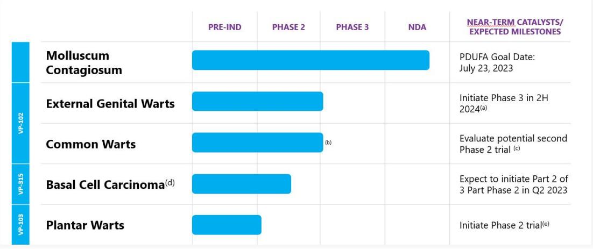

(a) Timing for initiating clinical trials for External Genital Warts may be subject to change.

(b) Originally designed Phase 2 program completed.

- (c) We are evaluating potential for conducting an additional Phase 2 trial based on FDA feedback for Phase 3 trial protocol.
- (d) License excludes metastatic melanoma and metastatic Merkel cell carcinoma. Phase 2 study initiated in April 2022 for the treatment of Basal Cell Carcinoma.

- (e) Timing for initiating clinical trials for Plantar Warts to be determined.

{8}------------------------------------------------

## **VP-102 for the Treatment of Molluscum**

We are developing VP-102 as a proprietary drug-device combination of a novel 0.7% w/v topical solution of cantharidin administered through our single-use precision applicator. VP-102 has the potential to be the first FDA-approved treatment for molluscum and we believe it will address many of the shortcomings associated with current therapies, including pain and discomfort, scarring and lack of effectiveness.

We have designed VP-102 to address the significant limitations of current compounded cantharidin formulations for the treatment of molluscum, with respect to safety, purity, efficacy, stability and ease of administration. VP-102 contains the first GMP-controlled formulation of cantharidin with a defined pharmaceutical batch process and an API that is greater than 99% pure.

Our proprietary single-use applicator allows for precise application to each lesion. Our applicator contains a sealed glass ampule providing longterm room temperature stability without the changes in concentration due to evaporation seen in compounded formulations.

*Clinical Development for Molluscum*

{9}------------------------------------------------

Below is a summary of our clinical development for the indication of molluscum.

| Trial and Status                                                                                                                | Formulation and Application Method                                                                                          | Trial Design                                                                                                                                                                                                                                                                                                                        | Trial Objectives                                                                                                                                                                                                        |
|---------------------------------------------------------------------------------------------------------------------------------|--------------------------------------------------------------------------------------------------------------------------------|-------------------------------------------------------------------------------------------------------------------------------------------------------------------------------------------------------------------------------------------------------------------------------------------------------------------------------------|-------------------------------------------------------------------------------------------------------------------------------------------------------------------------------------------------------------------------|
| Phase 3 Clinical Trials (CAMP-1 and CAMP-2) (n=266 and 262, respectively) Top-line results reported in January 2019 | VP-102                                                                                                                         | • Randomized, double-blinded, multicenter, placebo‑controlled • Safety and efficacy evaluated every 21 days for up to 4 applications                                                                                                                                                                     | • To evaluate the efficacy of dermal application of VP‑102 relative to placebo for complete clearance at Day 84 • To assess the safety and tolerability of VP‑102                      |
| Phase 2 Innovate Trial (n=32) Results reported in September 2018                                                       | VP-102                                                                                                                         | • Open-label, single center • 24-hour treatment • Blood draws in subjects with more than 21 lesions for evaluating PK • Safety and efficacy evaluated every 21 days for up to four applications • Impact of quality of life assessed via the CDLQI • Duration: 12 weeks | • To determine any possible systemic exposure from a single 24-hour application of VP‑102 • To confirm safety and efficacy with applicator • To assess impact on quality of life |
| Phase 2 Investigator Sponsored Pilot Trial (n=30) Completed in September 2017                                          | Our proprietary formulation of cantharidin used in VP‑102, applied with the wooden stick part of a cotton-tipped swab | • Open-label, single center • Six hour and 24- hour treatment cohorts • Safety and efficacy evaluated every 21 days for up to four applications • Impact of quality of life assessed via the CDLQI • Duration: 12 weeks                                                          | • To evaluate safety and efficacy and determine optimal treatment duration • To assess impact on quality of life                                                                                   |

{10}------------------------------------------------

# *Phase 3 Clinical Trials—CAMP-1 and CAMP-2*

In January 2019, we announced positive topline results from our Phase 3 CAMP-1 and CAMP-2 pivotal trials with VP-102 for the treatment of molluscum. The two trials, identical in design, were randomized, double-blind, multicenter, placebo-controlled trials of VP-102 for the treatment of molluscum. CAMP-1 was conducted under a SPA with the FDA. The primary objective of the trials was to evaluate the efficacy of dermal application of VP-102 relative to placebo in subjects 2 years of age and older with molluscum, when treated once every 21 days for up to four applications, by assessing the proportion of subjects achieving complete clearance of all treatable molluscum lesions at Day 84 (Week 12/End of Study visit). Secondary endpoints included the proportion of subjects with complete clearance at study visits on Days 21 (Week 3), 42 (Week 6) and 63 (Week 9).

CAMP-1 and CAMP-2 enrolled 528 subjects in total and were conducted at 31 centers in the United States. Results from CAMP-1 and CAMP-2 showed 46% and 54% of subjects treated with VP-102, respectively, achieved complete clearance of all treatable molluscum lesions at Day 84 versus 18% and 13% of subjects in the placebo groups (p<0.0001). By Day 84, VP-102 treated subjects had a 69% and 83% mean reduction in the number of molluscum lesions, a pre-specified endpoint, in CAMP-1 and CAMP-2, respectively, compared to a 20% increase and a 19% reduction for subjects on placebo.

Consistent with the results from the Phase 2 clinical trials, VP-102 was also well-tolerated in the Phase 3 trials, with side effects that were primarily mild to moderate. The most frequently reported adverse events were application site reactions that are well-known, reversible side effects related to the mechanism of action of cantharidin, a blistering agent, which is the active ingredient in VP-102. There were no treatment-related serious adverse events reported in CAMP-1 or CAMP-2.

Based on the results of these trials, we submitted an NDA to the FDA for VP-102 for the treatment of molluscum in September 2019. In November 2019, we received notice that the FDA accepted the NDA for filing, with a PDUFA goal date of July 13, 2020. In July 2020, we received a CRL, from the FDA for our NDA. We resubmitted our NDA for VP-102 for the treatment of molluscum in December 2020. In February 2021, we received notice that the FDA accepted the resubmitted NDA for filing, with a PDUFA goal date of June 23, 2021. On May 28, 2021 the FDA extended the PDUFA date to September 23, 2021 to allow the Agency additional time to review information submitted by Verrica in response to comments from the agency regarding our human factors study.

On September 17, 2021, the FDA issued a CRL regarding our NDA for VP-102. According to the CRL, the FDA identified deficiencies at a facility of Sterling, which were unrelated to the manufacturing of VP-102 but instead raised general quality issues at the facility. The FDA did not identify any clinical, safety or product specific CMC deficiencies related to VP-102. Following the CRL, on September 22, 2021 we received a General Advice Letter from the FDA with recommendations to improve VP-102's user interface. On November 5, 2021, we were notified that the inspection of Sterling that had been classified as "voluntary action indicated", or VAI, was closed and that the VAI classification would not directly negatively impact FDA's assessment of our NDA regarding Sterling. With the satisfactory resolution of the facility inspection, we resubmitted the NDA for the approval of VP-102 for the treatment of molluscum on November 29, 2021. The resubmission was limited to those sections and elements of the NDA that were identified as deficiencies in the CRL issued by the FDA in September 2021. The resubmission addressed the successful resolution of inspection deficiencies identified at Sterling in the CRL, as well as the recommendations included in the General Advice Letter received from the FDA that relate to VP-102's user interface. On December 15, 2021 the FDA accepted our NDA resubmission for VP-102 and assigned a PDUFA goal date of May 24, 2022.

On May 24, 2022, we announced that we received a CRL regarding our NDA for VP-102 from the FDA. The only deficiency listed in the CRL was related to the deficiencies identified at a general reinspection at a facility of Sterling that manufactured the bulk solution used in VP-102. Sterling received notice from the FDA on May 19, 2022 that as a result of the inspection, it was on "official action indicated", or OAI, status. This classification resulted from a week-long reinspection of Sterling conducted by the FDA in February 2022 but none of the issues identified by the FDA during the reinspection were specific to the manufacture of VP-102. We were also informed by the FDA that it had completed its review of our NDA and product label, there were no open questions on the NDA review, and the VP-102 label was ready to be communicated. On June 27, 2022 we held a Type A meeting

{11}------------------------------------------------

with the FDA regarding the path forward for the resubmission and potential approval of the NDA for VP-102. During the Type A meeting the FDA indicated that it could not accept our NDA resubmission with Sterling listed as the primary manufacturer of the bulk solution for VP-102 if Sterling was on OAI status at the time of resubmission. Following the FDA's commentary, we selected a new CMO partner to produce the bulk solution, Piramal Pharma Solutions, and the technology transfer process was completed in January 2023. We resubmitted the NDA on January 23, 2023. The FDA accepted our NDA resubmission on February 27, 2023 and assigned a PDUFA goal date of July 23, 2023.

## **VP-102 for the Treatment of External Genital Warts**

We are also developing VP-102 for the treatment of EGW. EGW is a viral skin disease caused by HPV which forms lesions on the surface of the skin. An estimated 17% of the approximately 4.1 million patient visits for all types of warts are for the treatment of EGW. We believe VP-102 may have the potential to offer a safe and effective treatment for EGW because of the shared characteristics with molluscum. We initiated a Phase 2 clinical trial evaluating the optimal dose regimen, efficacy, safety and tolerability of VP-102 in patients with EGW in June 2019, as summarized in the table below. In November 2020, we announced positive results from our Phase 2 clinical trial of VP-102 for the treatment of EGW.

The Phase 2 trial was comprised of two parts. The primary objective for Part A was to evaluate three regimens of application of VP-102 (2-hour, 6 hour, 24-hour duration of skin exposure) in subjects with EGW and identify the two best regimens by assessing safety and tolerability of VP-102 when administered topically after subjects completed a 48-hour assessment. The primary objective for Part B was to evaluate two regimens of application of VP-102 in subjects with EGW and identify the regimen with the best risk benefit profile when administered topically once every 21 days for up to 4 applications.

For the Part A and B intent-to-treat, or ITT, population, statistically significant complete clearance of EGW was observed for both VP-102 treatment groups versus their respective placebo treatment groups by treatment visit 4 and was maintained through Day 84 end of treatment, or EOT. Complete clearance of EGW was observed for subjects treated with VP-102 through the Follow-up Study Day 112 and the Day 147, end of study visit, or EOS, but the differences were not statistically significant versus subjects treated with placebo. For all primary and secondary efficacy endpoints analyzed, VP-102 was effective in reducing the number and size of EGW in this subject population, demonstrating statistical significance versus placebo. Efficacy results were comparable between the VP-102 6-hour and VP-102 24-hour treatment groups at Day 84 EOT. However, results of secondary and exploratory efficacy analyses demonstrated trends suggesting earlier response and sustained response of the VP-102 24-hour treatment group. Both the VP-102 6-hour and VP-102 24-hour treatment groups presented comparable and favorable safety profiles, with most adverse events being local skin responses related to the mechanism of action of cantharidin. The adverse event profile and efficacy demonstrated in this trial support the conclusion that the 24-hour exposure regimen represents an acceptable risk benefit profile and the conduct of a larger placebo-controlled Phase 3 study is warranted.

{12}------------------------------------------------

| Trial and Status                                                                       | Formulation | Trial Design                                                                                                                                                                                                                                                               | Trial Objectives                                                |  |  |
|----------------------------------------------------------------------------------------|-------------|----------------------------------------------------------------------------------------------------------------------------------------------------------------------------------------------------------------------------------------------------------------------------|-----------------------------------------------------------------|--|--|
| Phase 2 CARE-1 Trial n=105, Total Part A; 18/Part B;87 Completed July 8, 2020 | VP-102      | • Randomized, placebo-controlled, multi-center • Two-part (n=108 total) • Dosing regimens of every 21 days evaluated for up to 4 applications Duration of skin exposure was • evaluated for 2, 6 and 24-hours treatment | • To evaluate safety and efficacy over four treatments |  |  |

Based on the results of the Phase 2 trial, an end of Phase 2 meeting was held with the FDA in May 2021. We intend to initiate the Phase 3 trial of VP-102 for the treatment of EGW in the second half of 2024. The Phase 3 program (CARE-2) will consist of two identical trials as well as a pharmacokinetics, or PK study, as required for registration. The trials are designed to be double-blind, randomized and vehicle-controlled to evaluate the efficacy and safety of VP-102 in subjects with EGW. The trials utilize a treatment interval of 21 days with a maximum of up to four treatments, which is consistent with the previous Phase 2 trial. We expect approximately 25 sites will be utilized for each of the two trials. We expect approximately 410 subjects will be enrolled in each trial with the goal to have an aggregate of approximately 532 subjects complete the trials.

We are designing the PK study to determine any potential systemic exposure to cantharidin from a single 24-hour topical application of VP-102 using Gas Chromatography – Mass Spectrometry (GC-MS).

# **VP-102 for the Treatment of Common Warts**

We are also developing VP-102 for the treatment of common warts. Published studies and clinical use provide support for cantharidin as a safe and effective treatment for common warts. We believe that VP-102 has the potential to address many of the shortcomings associated with current therapies, including pain and discomfort, scarring, and lack of effectiveness. In addition, we believe VP-102's convenient ease of administration will differentiate it from existing alternative unapproved therapies.

We conducted an open-label Phase 2 clinical trial (COVE-1) to evaluate the efficacy, safety and tolerability of VP-102 in subjects with up to six common warts. In this study, there were two cohorts. Cohort 1 was conducted at a single site with 21 subjects age 2 years and older receiving up to 4 treatments with VP-102 at least 14 days between treatments with longer treatment intervals allowed at the discretion of the investigator depending on a specific subject's clinical response. Cohort 2 was conducted at four sites with 35 subjects age 12 years and older receiving up to 4 treatments with VP-102 every 21 days. Paring of warts, a technique commonly used by dermatologists to prepare the wart for treatment, was allowed in Cohort 2 to remove any adherent thick scale from a wart prior to application of VP-102. The primary objective of both cohorts was to evaluate the efficacy of up to 4 dermal applications of VP-102 when applied to common warts by assessing the proportion of subjects achieving complete clearance of all treatable warts at Day 84. Complete clearance of warts at Day 84 for Cohort 1 was observed in 19.0% of subjects, and for Cohort 2 complete clearance was observed in 51.4% of subjects. By Day 84, there was a mean decrease from baseline in the number of warts of 31.2% for Cohort 1 subjects and 53.8% for Cohort 2 subjects. In both cohorts, the most frequently reported adverse events were anticipated application site skin reactions that were primarily mild or moderate in intensity, including vesicles, pain, erythema, pruritus, scabbing, dryness, edema, and post-inflammatory pigmentation changes. There were no deaths or serious adverse events reported, and there were no adverse events leading to trial drug discontinuation.

{13}------------------------------------------------

| Trial and Status                                                                                               | Formulation | Trial Design                                                                                                                                                                                                                                       | Trial Objectives                                                |  |  |
|----------------------------------------------------------------------------------------------------------------|-------------|----------------------------------------------------------------------------------------------------------------------------------------------------------------------------------------------------------------------------------------------------|-----------------------------------------------------------------|--|--|
| Phase 2 COVE-1 Trial (Cohort 1 and Cohort 2: n=21 and 35, respectively) Results reported in June 2019 | VP-102      | • Open-label, multi center • 2 cohorts • Dosing regimens of 14 (Cohort 1) and 21 (Cohort 2) days evaluated for up to 4 applications • 24-hour treatment • Wart paring allowed in the second cohort | • To evaluate safety and efficacy over four treatments |  |  |

Based on feedback from the FDA regarding a potential Phase 3 trial protocol, we are currently evaluating conducting an additional Phase 2 clinical trial of VP-102 for the treatment of common warts.

## VP**-315 for the Treatment of Dermatological Oncology Indications**

We are developing our product candidate, VP-315, for the treatment of dermatological oncology indications. The FDA accepted our IND in November 2021. We dosed the first patient in a Phase 2 trial of VP-315 in Basal Cell Carcinoma in April 2022. The Phase 2 trial is a three-part, openlabel, multicenter, dose-escalation, proof-of-concept trial of VP-315 when administered intratumorally to adults with biopsy-proven basal cell carcinoma. Part 1 of the trial is designed to evaluate VP-315's safety profile when administered in escalating doses to individual subjects. Part 2 is designed to confirm the exploratory dose from Part 1 and identify the recommended dose for Part 3. Part 3 is designed to evaluate the efficacy profile of the two selected doses of VP-315 and determine the optimal therapeutic dose. We enrolled 10 patients in Part 1 of the trial. In Part 1, VP-315 demonstrated a favorable safety and tolerability profile with no reported serious adverse events. We expect to initiate Part 2 of the trial in the second quarter of 2023 and Part 3 of the trial in the second half of 2023.

In total, the trial is expected to enroll approximately 66 adult subjects with a histological diagnosis of basal cell carcinoma in at least one eligible target lesion. Both clinical and histological clearance of treated lesion(s) at excision will be assessed

## **VP-103 for the Treatment of Plantar Warts**

We are also developing our second cantharidin-based product candidate, VP-103, for the treatment of plantar warts, which are warts located on the bottom of the foot. An estimated one-third of the approximately 4.1 million patient visits for all types of warts are for the treatment of plantar warts. To date, plantar warts have been difficult to treat, as they are refractory and available treatments often lead to both pain and scarring. We are conducting necessary drug development activities for VP-103 and are evaluating when to initiate a Phase 2 clinical trial for the treatment of plantar warts.

# **Manufacturing**

We do not have any manufacturing facilities. We have been relying on third parties for the manufacture of our product candidates for preclinical studies and clinical trials and will continue to rely on these third parties in the near term for the commercial manufacture of our drug products if they are approved during the initial commercial phase. Manufacturing of the API for our product candidates requires a raw material that is derived from a natural source.

{14}------------------------------------------------

To date, we have obtained naturally-sourced cantharidin directly or indirectly from our supplier based in the People's Republic of China. On July 16, 2018, we entered into a Supply Agreement, or the Supply Agreement, with Funing County Development Brucea Javanica Professional Cooperatives, or the Supplier, pursuant to which the Supplier has agreed to supply naturally-sourced cantharidin to us for a specified fixed price. Pursuant to the Supply Agreement, the Supplier has agreed that it will not supply cantharidin, any beetles or other raw material from which cantharidin is derived to any other customer in North America, subject to specified minimum annual purchase orders and forecasts.

Pursuant to the Supply Agreement, we have provided the Supplier with purchase orders in 2018, 2019, 2021 and 2022 and may submit additional purchase orders from time to time, so long as the purchase orders are at least six months prior to the proposed delivery date. As of January 31, 2023, we held inventories of approximately 120,000 finished drug product applicators in various stages of completion and possessed total inventories in a combination of raw cantharidin and converted API adequate to produce over 17 million additional finished drug product applicators in the United States, with additional raw cantharidin already manufactured awaiting shipment.

The term of the Supply Agreement is five years and thereafter will be renewed automatically for 12-month periods, unless terminated by either party at least 12 months prior to the end of the applicable term. In addition, either party has the right to terminate the Supply Agreement under certain circumstances, including (i) upon a material breach of the Supply Agreement if the breaching party has failed to remedy the breach within 45 days or if the breach is not capable of remedy within 45 days or (ii) the other party becomes insolvent or goes into liquidation.

Our contract manufacturers and primary packaging vendor are FDA-registered establishments and have a history of supplying products to the pharmaceutical industry.

We have demonstrated capability to successfully manufacture the API the bulk drug intermediate, filled ampules and assembled applicators at our proposed commercial batch sizes. Validation activities for the commercial manufacturing and assembly processes have been completed. Given the nature of both the API as well as several of the excipients, special handling will be required to minimize risks to personnel during processing. Analytical testing methods for both the API as well as the finished drug product have been developed and qualified. It is expected that these existing methods will prove appropriate for release of commercial product.

Our proprietary individual applicator and its parts are fabricated using common methods and materials and we currently plan to have our applicators built using semi-custom equipment performing well established automated assembly techniques. This equipment has successfully undergone initial engineering feasibility evaluations. As part of the proposed resolution to FDA comments in the CRL regarding the human factors validation, we have designed and developed an accessory to facilitate the preparation of the applicator assembly by the healthcare professional. The proposed commercial applicator assembly and this accessory have successfully undergone both engineering testing as well as evaluation in a simulated clinical setting.

## **Commercialization**

We intend to commercialize VP-102, or any other product candidates that we may successfully develop, in the United States by building a specialized sales organization focused on pediatric dermatologists, dermatologists and select pediatricians. We believe a scientifically oriented, customerfocused team of approximately 50 to 60 sales representatives would allow us to reach the approximately 400 pediatric dermatologists and 9,000 dermatologists in the United States with the highest potential for using VP-102. In the future, we may develop and commercialize VP-102 for additional geographic regions, independently or with a strategic partner. For instance, on March 17, 2021, we entered into the Torii Agreement, pursuant to which we granted Torii an exclusive license to develop and commercialize our product candidates that contain a topical formulation of cantharidin for the treatment of molluscum contagiosum and common warts in Japan, including VP-102. Additionally, we granted Torii a right of first negotiation with respect to additional indications for the licensed products and certain additional products for use in the licensed field, in each case in Japan.

We intend to seek drug product reimbursement for VP-102. Based on a survey of 40 physicians that we commissioned, 87% of physicians reported they would use VP-102 if the cost of the drug were covered. Furthermore, we have commissioned market research and met with payor organizations representing over 205 million lives. The surveyed payors recognized that there is a significant unmet need for molluscum and a current lack of an effective treatment. Given the unmet need and the results of clinical trials of VP-102 to date, the surveyed payors anticipate the majority of patients would have access to VP-102, if approved, with minimal to no restrictions.

{15}------------------------------------------------

We believe dermatologists tend to be particularly focused on the safety of pharmaceutical products because, while skin diseases can have profound effects on patients' quality of life, few are life-threatening. As a result, we believe that dermatologists, as well as their patients, often prefer to use topical treatments when possible to limit the risk of systemic side effects. Dermatologists also tend to place a high level of emphasis on products that are easy to use because they often manage high volumes of patients. We believe this also contributes to a general preference for topical treatments. Finally, in our experience, dermatologists tend to engage with sales and medical affairs personnel from the pharmaceutical industry regarding the scientific evidence supporting dermatology products and the challenges experienced by physicians and patients in the use of these products. Dermatologists often rely on trusted relationships with scientifically oriented, customer-focused sales representatives who can provide them with the necessary information to support their use of appropriate treatments.

## **Competition**

The pharmaceutical industry is subject to rapidly advancing technologies, intense competition and a strong emphasis on proprietary products. We face potential competition from many different sources, including major pharmaceutical, specialty pharmaceutical and biotechnology companies, compounding facilities, academic institutions, governmental agencies and public and private research institutions. Any product candidates that we successfully develop and commercialize will compete with existing treatments and new treatments that may become available in the future.

The key competitive factors affecting the success of VP-102, if approved, are likely to be its efficacy, safety, convenience, pricing and stability. With respect to VP-102 for the treatment of molluscum, we will be primarily competing with therapies such as other topical products, curettage, cryotherapy, laser surgery, natural oils, off-label drugs, natural remedies and compounded unstandardized cantharidin. Under Section 503A of the FDCA, if VP-102 is approved, compounded topical cantharidin products with the same, similar or an easily substitutable dosage strength would be considered essentially copies of VP-102 and may not be compounded regularly or in inordinate amounts, subject to certain limited individual exceptions. These exceptions include if there is a difference between the compounded product and VP-102 that is made for an individual patient, and a prescribing practitioner determines produces a significant difference for that patient. In addition, pursuant to Section 503B of the FDCA, once VP-102 is approved, compounding facilities registered as outsourcing facilities would not be able to compound cantharidin products, unless there is a difference from VP-102 that produces a clinical difference for an individual patient, as determined by a prescribing practitioner. With respect to VP-102 for EGW, we will be competing with cryosurgery, laser surgery, and topical destructive therapies such as trichloroacetic acid. There are also several FDA-approved prescription pharmaceutical therapies for EGW including imiquimod, podofilox, and sinecatechins. In addition, EGW are caused by HPV and may be prevented or treated by HPV vaccines that are FDA-approved. With respect to VP-102 for common warts and VP-103 for plantar warts, we will primarily be competing with over-the-counter products, cryotherapy, curettage, laser surgery, or other off-label therapies. There are currently no FDA-approved prescription pharmaceutical therapies for the treatment of molluscum, common warts, or plantar warts.

We are aware of several other product candidates in development as potential treatments for the indications we intend to target. Novan has submitted a NDA to the FDA seeking marketing approval for the topical treatment of molluscum contagiosum. There are a number of other companies developing products for common warts. In addition, other drugs have been used off label as treatments for molluscum and common warts.

A number of other companies are in various stages of developing treatments for basal cell carcinoma. Although surgery is historically the most common treatment for superficial basal cell carcinoma, several companies are working on non-surgical alternative treatments due to the risk of disfigurement, infection and scarring seen from more invasive treatments. At least three companies are currently conducting trials for superficial basal cell carcinoma and several companies who already have FDA approval to treat more advanced and metastatic cancers, are conducting trials to expand their indications to include locally advanced and metastatic basal cell carcinoma.

### **Intellectual Property**

In addition to our five year regulatory exclusivity, the extent of our commercial success depends in part on our ability to obtain and maintain proprietary protection for VP-102, including our proprietary cantharidin formulation and applicator and any of our future product candidates, medical devices, synthetic methodologies, novel

{16}------------------------------------------------

discoveries, drug development technologies and know-how; to operate without infringing on or otherwise violating the proprietary rights of others; and to prevent others from infringing or otherwise violating our proprietary rights. Our policy is to seek to protect our proprietary position by, among other methods, filing U.S. and foreign patent applications related to our product candidate and other proprietary technologies, inventions, and improvements that are important to the development and implementation of our business. We also rely on trademarks, trade secrets, know-how, continuing technological innovation, and in-licensing opportunities to develop and maintain our proprietary position.

While we seek broad coverage under our pending patent applications, our granted patents and pending patent applications do not include any claims drawn to the active pharmaceutical agent cantharidin *per se* or for the broad use of our API alone for the treatment of warts or molluscum. However, our granted patents and pending patent applications do claim, for example, our cantharidin formulations, applicator devices and related accessories, dosing regimens, methods of preparation including methods of synthesis, and methods of use. Despite these patent filings, there is always a risk that modification of the specific formulation, manufacturing process, method of application of cantharidin to the skin and/or specific method of use may allow a competitor to avoid infringement claims. In addition, patents, if granted, will expire, and we cannot provide any assurance that any additional patents will issue from our pending or any future patent applications.

We currently have two issued United States patents covering the cantharidin formulation of VP-102, applicator devices and systems comprising the formulation, and methods of using the same, e.g., for the treatment of molluscum contagiosum. Excluding any patent term extension, these two U.S. patents will expire on May 28, 2035 and August 22, 2038, respectively. Additionally, we have granted patents in Australia, Brazil, Canada, Israel, Japan, South Korea and Mexico covering our proprietary cantharidin formulations, applicator devices and systems comprising the formulations, and methods of using the same.

We also currently have one issued United States design patent covering the design of our VP-102 applicator. This issued U.S. design patent will expire on October 27, 2035. Additionally, we have granted design patents in Australia, Brazil, Canada, China, Europe, Hong Kong, India, Israel, Japan, South Korea and United Kingdom, as well as allowed design patent applications in the United States and Mexico, covering the design of our proprietary ampule crush tool for use with our VP-102 applicator.

In addition, we currently have two United States patents covering methods of preparing and purifying cantharidin. We also have granted patents in Australia, Brazil, China, India, Japan, and Mexico, as well as an allowed patent application in Israel, covering methods of preparing cantharidin. Additionally, we have a granted patent in Japan covering methods of purifying cantharidin.

As of February 2, 2023, we have nationalized six international PCT patent applications for utility patents, five of which have been nationalized in the United States, Australia, Brazil, Canada, China, Europe, Israel, India, Japan, South Korea, and Mexico, and one of which has been nationalized in the United States, Europe, and Japan. Five of these European patent applications have been registered in Hong Kong. These patent applications relate to VP-102, including our proprietary cantharidin formulation and applicator, and other inventions related to VP-102. Our patent applications related to VP-102 include proposed claims relating to (i) methods for the synthesis of cantharidin, (ii) our specific formulations and preparations of VP-102, (iii) methods for purifying cantharidin, (iv) methods for detecting impurities in cantharidin, (v) the design of our proprietary applicator, including both the general design and specific design elements, (vi) claims related to safety features included in the VP-102 formulation, including colorants and bittering agents, and (vii) methods of administration of VP-102 for the treatment of skin lesions. In addition to the foregoing, we currently have one pending international PCT patent application covering our proprietary ampule crush tool for use with our VP-102 applicator. We have also filed a United States design patent covering the design of our VP-102 applicator, and design patent applications covering the design of the ampule crush tool in Australia, Brazil, Canada, China, Europe, United Kingdom, Hong Kong, Israel, India, Japan, South Korea, Mexico, and the United States. Excluding any patent term adjustment and patent term extension, any additional utility patents to issue from these patent applications are projected to expire between 2034 and 2041. Any additional design patents to issue from our pending design patent applications will each expire fifteen years from the date of issuance. We cannot provide any assurance as to whether any additional patents will issue from these patent applications or, if any patents do issue, the scope of the claims that will be allowed.

{17}------------------------------------------------

Individual patents extend for varying periods depending on the date of filing of the patent application or the date of patent issuance and the legal term of patents in the countries, in which they are obtained. Generally, utility patents issued from applications in the United States are granted for a term of 20 years from the earliest effective non-provisional filing date. In addition, in certain instances, a patent's term can be adjusted to recapture a portion of the United States Patent and Trademark Office, or the USPTO, delay in examining and issuing the patent, and extended to recapture a portion of the patent term effectively lost as a result of the FDA regulatory review period of the drug covered by the patent. However, as to the FDA component, the restoration period cannot be longer than five years, the total patent term including the restoration period must not exceed 14 years following FDA approval of the drug, and the extension may only apply to one patent that covers the approved drug (and to only those patent claims covering the approved drug or a method for using it). There can be no assurance that any such patent term adjustment or extension will be obtained. The duration of foreign patents varies in accordance with provisions of applicable local law, but typically is also 20 years from the earliest effective non-provisional filing date. However, the actual protection afforded by a patent varies on a product-by-product basis, from country to country and depends upon many factors, including the type of patent, the scope of its coverage, the availability of regulatory-related extensions, the availability of legal remedies in a particular country, and the validity and enforceability of the patent.

Furthermore, we rely upon trade secrets, know-how, and continuing technological innovation to develop and maintain our competitive position. We seek to protect our proprietary information, in part, using confidentiality agreements with our commercial partners, collaborators, employees, and consultants and invention assignment agreements with our employees. We also have confidentiality agreements and/or invention assignment agreements with our commercial partners and selected consultants. These agreements are designed to protect our proprietary information and, in the case of the invention assignment agreements, to grant us ownership of technologies that are developed through a relationship with a third party. These agreements may be breached, and we may not have adequate remedies for any such breach. In addition, our trade secrets may otherwise become known or be independently discovered by competitors. To the extent that our commercial partners, collaborators, employees, and consultants use intellectual property owned by others in their work for us, disputes may arise as to the rights in related or resulting know-how and inventions.

## *Lytix License Agreement*

On August 7, 2020, we entered into the Lytix Agreement, pursuant to which we obtained a worldwide, exclusive, royalty-bearing license, with the right to sublicense, for certain technology of Lytix to research, develop, manufacture, have manufactured, use, sell, have sold, offer for sale, import and otherwise commercialize VP-315 for use in all malignant and pre-malignant dermatological indications, other than metastatic melanoma and metastatic Merkel cell carcinoma. Our right to manufacture the active pharmaceutical ingredient is limited to certain instances, and Lytix is obligated to manufacture and supply our clinical and commercial needs for such active pharmaceutical ingredient. We are obligated to use commercially reasonable efforts to develop and to commercialize the product, which development and commercialization will be overseen by a joint steering committee. Lytix has agreed not to pursue any products in the field of dermatology other than VP-315 for use in metastatic melanoma and metastatic Merkel cell carcinoma. Lytix has granted us an exclusive option to negotiate for an exclusive license for use of the active ingredient in VP-315 in additional dermatological indications.

In connection with entering the Lytix Agreement, we made initial payment of \$250,000. We made additional payments of \$2.25 million in February 2021 and \$1.0 million in May 2022 upon the achievement by Lytix of a regulatory milestone. Additionally, we are obligated to pay up to \$111.0 million contingent on achievement of specified development, regulatory, and sales milestones, and tiered royalties based on worldwide annual net sales ranging in the low double digits to the mid-teens, subject to certain customary reductions. Our obligation to pay royalties expires on a country-by-country and product-by-product basis on the later of the expiration or abandonment of the last to expire licensed patent covering the active ingredient of VP-315 anywhere in the world and expiration of regulatory exclusivity for VP-315 in such country. Additionally, all upfront fees and milestone-based payments received by us from a sublicensee will be treated as net sales and will be subject to the royalty payment obligations under the Lytix Agreement, and all royalties received by us from a sublicensee shall be shared with Lytix at a rate that is initially 50% but decreases based on the stage of development of VP-315 at the time such sublicense is granted.

{18}------------------------------------------------

The Lytix Agreement expires on a product-by-product and a country-by-country basis upon expiration of the royalty term for such product in such country. At any time after the first anniversary of the execution of the Lytix Agreement, we have the right to terminate the agreement, either on a region-byregion basis or in its entirety, upon specified written notice to Lytix. Lytix may terminate the agreement, either on a region-by-region basis or in its entirety, if we develop or commercialize a competing product in the licensed field, or in its entirety if we challenge the validity, enforceability or scope of any licensed patent, subject in each case to certain cure rights. Either party may terminate the Lytix Agreement in the event of an uncured material breach or insolvency of the other party.

#### *Torii Collaboration and License Agreement*

In August 2020, we entered into an option agreement with Torii for the development and commercialization of our product candidates for the treatment of molluscum contagiosum and common warts in Japan, including VP-102, or the Option Agreement. Torii paid us \$0.5 million to secure the exclusive option. The \$0.5 million is included in deferred revenue as of December 31, 2020 in the balance sheet.

On March 2, 2021, Torii exercised the exclusive option in the Option Agreement. On March 17, 2021, we entered into the Torii Agreement with Torii, pursuant to which we granted Torii an exclusive license to develop and commercialize our product candidates that contain a topical formulation of cantharidin for the treatment of molluscum contagiosum and common warts in Japan, including VP-102. Additionally, we granted Torii a right of first negotiation with respect to additional indications for the licensed products and certain additional products for use in the licensed field, in each case in Japan.

Under the Torii Agreement, Torii is responsible for all development activities and specified costs in support of obtaining regulatory approval of the licensed products in Japan, provided, that Torii's activities will be overseen by a joint steering committee. Torii is required to use commercially reasonable efforts to conduct all development necessary to obtain regulatory approval for licensed products in Japan, to obtain and maintain such approvals, and to commercialize licensed products upon receipt of such approvals.

Pursuant to the Torii Agreement, we received payments from Torii of \$0.5 million in December 2020 and \$11.5 million in April 2021. On July 25, 2022 Torii dosed the first patient in its Phase 3 trial of VP-102 (referred to as TO-208 in Japan) for molluscum contagiosum in Japan, triggering an \$8.0 million milestone payment recognized as collaboration revenue for the year ended December 31, 2022. Additionally, we are entitled to receive from Torii an additional \$50.0 million in aggregate payments contingent on achievement of specified development, regulatory, and sales milestones, in addition to tiered transfer price payments for supply of product in the percentage range of the mid-30s to the mid-40s of net sales. The transfer payments shall be payable, on a product-by-product basis, beginning on the first commercial sale of such product and ending on the latest of (a) expiration of the last-toexpire valid claim contained in certain licensed patents in Japan that cover such product, (b) expiration of regulatory exclusivity for the first indication for such product in Japan, and, (c) (i) with respect to the first product, ten years after first commercial sale of such product, and, (ii) with respect to any other product, the later of (x) ten years after first commercial sale of the first product and (y) five years after first commercial sale of such product.

On March 7, 2022, pursuant to the Torii Agreement, we entered into a Clinical Supply Agreement with Torii, whereby we are obligated to supply product to Torii for use in clinical trials and other development activities. We recognized billed and unbilled collaboration revenue of \$0.9 million and \$0.1 million for the year ended December 31, 2022, respectively, related to supplies and development activity pursuant to this agreement.

The Torii Agreement expires on a product-by-product basis upon expiration of Torii's obligation under the agreement to make transfer price payments for such product. Torii has the right to terminate the agreement upon specified prior written notice to us. Additionally, either party may terminate the agreement in the event of an uncured material breach of the agreement by, or insolvency of, the other party. We may terminate the agreement in the event that Torii commences a legal action challenging the validity, enforceability or scope of any licensed patents.

{19}------------------------------------------------

# **Government Regulation and Product Approval**

Government authorities in the United States, at the federal, state and local levels, and in other countries, extensively regulate, among other things, the research, development, testing, manufacture, packaging, storage, recordkeeping, labeling, advertising, promotion, distribution, marketing, import and export of pharmaceutical products, such as those we are developing. We, along with third-party contractors, will be required to navigate the various chemistry, manufacturing and controls, preclinical, clinical and commercial approval requirements of the governing regulatory agencies of the countries in which we wish to conduct studies or seek approval of our product candidates. The processes for obtaining regulatory approvals in the United States and in foreign countries, along with subsequent compliance with applicable statutes and regulations, require the expenditure of substantial time and financial resources.

# *United States Government Regulation*

In the United States, the FDA regulates drugs under the FDCA and its implementing regulations. The process of obtaining regulatory approvals and the subsequent compliance with appropriate federal, state, local and foreign statutes and regulations requires the expenditure of substantial time and financial resources. Failure to comply with the applicable United States requirements at any time during the drug development process, approval process or after approval, may subject an applicant to a variety of administrative or judicial sanctions, such as the FDA's refusal to approve pending new drug applications, or NDAs, withdrawal of an approval, imposition of a clinical hold, issuance of warning or untitled letters, product recalls, product seizures, total or partial suspension of production or distribution, injunctions, fines, refusals of government contracts, restitution, disgorgement or civil or criminal penalties.

The process required by the FDA before a drug may be marketed in the United States generally involves:

- completion of preclinical laboratory tests, animal studies and formulation studies in compliance with the FDA's good laboratory practice, or GLP, regulations;
- submission to the FDA of an IND, which must become effective before human clinical trials may begin;
- approval by an independent institutional review board, or IRB, at each clinical site before each clinical trial may be initiated;
- performance of adequate and well-controlled clinical trials in accordance with good clinical practice, or GCP, requirements to establish the safety and efficacy of the proposed drug for each indication;
- submission to the FDA of an NDA together with payment of the applicable user fee;
- satisfactory completion of an FDA advisory committee review, if applicable;
- satisfactory completion of chemistry, manufacturing and controls testing, an FDA inspection of the manufacturing facility or facilities at which the product is produced to assess compliance with cGMP requirements, and to assure that the facilities, methods and controls are adequate to preserve the drug's identity, strength, quality and purity;
- satisfactory completion of an FDA inspection of selected clinical sites to assure compliance with GCPs and the integrity of the clinical data; and
- FDA review and approval of the NDA.

VP-102 is designed to be administered to patients via a proprietary applicator by a healthcare professional. In the United States, products composed of components that would normally be regulated by different centers at the FDA are known as combination products. Typically, the FDA's Office of Combination Products assigns a combination product to a specific agency center as the lead reviewer. The FDA determines which center will lead a product's review based upon the product's primary mode of action. Depending on the type of combination product, its approval, clearance or licensure may usually be obtained through the submission of a single marketing application. VP-102 will be regulated as a drug device combination product, and the FDA has permitted a single regulatory submission seeking approval of VP-102 with the applicator in each indication for which we seek approval. Even when a single marketing application is required for a combination product, such as an NDA for a

{20}------------------------------------------------

combination pharmaceutical and device product, both the FDA's Center for Drug Evaluation and Research and the FDA's Center for Devices and Radiological Health may participate in the review. An applicant will also need to discuss with the agency how to apply certain premarket requirements and post-marketing regulatory requirements, including conduct of clinical trials, adverse event reporting and good manufacturing practices, to their combination product.

# *Preclinical Studies*

Preclinical studies include laboratory evaluation of product chemistry, toxicity and formulation, as well as animal studies to assess potential safety and efficacy. An IND sponsor must submit the results of the nonclinical tests, together with manufacturing information, analytical data and any available clinical data or literature, among other things, to the FDA as part of an IND. Some nonclinical testing may continue even after the IND is submitted. An IND automatically becomes effective and a clinical trial proposed in the IND may begin 30 days after receipt by the FDA, unless before that time the FDA raises concerns or questions related to one or more proposed clinical trials and places the clinical trial on a clinical hold. In such a case, the IND sponsor and the FDA must resolve any outstanding concerns before the clinical trial can begin. As a result, submission of an IND may not result in the FDA allowing clinical trials to commence.

# *Clinical Trials*

Clinical trials involve the administration of the investigational new drug to human subjects under the supervision of qualified investigators in accordance with GCP requirements, which include the requirement that all research subjects provide their informed consent in writing for their participation in any clinical trial. Clinical trials are conducted under protocols detailing, among other things, the objectives of the trial, the parameters to be used in monitoring safety and the effectiveness criteria to be evaluated. A protocol for each clinical trial and any subsequent protocol amendments must be submitted to the FDA as part of the IND. In addition, an IRB at each institution participating in the clinical trial must review and approve the plan for any clinical trial before it commences at that institution, and the IRB must continue to oversee the clinical trial while it is being conducted. Information about certain clinical trials must be submitted within specific timeframes to the National Institutes of Health, or NIH, for public dissemination on their ClinicalTrials.gov website.

Human clinical trials are typically conducted in three sequential phases, which may overlap or be combined. In Phase 1, the drug is initially introduced into healthy human subjects or patients with the target disease or condition and tested for safety, dosage tolerance, absorption, metabolism, distribution, excretion and, if possible, to gain an initial indication of its effectiveness. In Phase 2, the drug typically is administered to a limited patient population to identify possible adverse effects and safety risks, to preliminarily evaluate the efficacy of the product for specific targeted diseases and to determine dosage tolerance and optimal dosage. In Phase 3, the drug is administered to an expanded patient population, generally at geographically dispersed clinical trial sites, in well-controlled clinical trials to generate enough data to statistically evaluate the safety and efficacy of the product for approval, to establish the overall risk-benefit profile of the product and to provide adequate information for the labeling of the product.

In some cases, the FDA may condition approval of an NDA for a product candidate on the sponsor's agreement to conduct additional clinical trials after NDA approval. In other cases, a sponsor may voluntarily conduct additional clinical trials post approval to gain more information about the drug. Such post approval trials are typically referred to as Phase 4 clinical trials.

Progress reports detailing the results of the clinical trials must be submitted, at least annually, to the FDA, and more frequently if serious adverse events occur. Phase 1, Phase 2 and Phase 3 clinical trials may not be completed successfully within any specified period, or at all. Furthermore, the FDA or the sponsor may suspend or terminate a clinical trial at any time on various grounds, including a finding that the research subjects are being exposed to an unacceptable health risk. Similarly, an IRB can suspend or terminate approval of a clinical trial at its institution if the clinical trial is not being conducted in accordance with the IRB's requirements, or if the drug has been associated with unexpected serious harm to patients.

{21}------------------------------------------------

Concurrent with clinical trials, companies usually complete additional animal studies and must also develop additional information about the chemistry and physical characteristics of the product and finalize a process for manufacturing the product in commercial quantities in accordance with cGMP requirements. The manufacturing process must be capable of consistently producing quality batches of the product candidate and, among other things, the manufacturer must develop methods for testing the identity, strength, quality and purity of the final product. Additionally, appropriate packaging must be selected and tested, and stability studies must be conducted to demonstrate that the product candidate does not undergo unacceptable deterioration over its shelf life.

## *Marketing Approval*

Assuming successful completion of the required clinical testing, the results of the preclinical studies and clinical trials, together with detailed information relating to the product's chemistry, manufacture, controls data and proposed labeling, among other things, are submitted to the FDA as part of an NDA requesting approval to market the product for one or more indications. In most cases, the submission of an NDA is subject to a substantial application user fee. Under the Prescription Drug User Fee Act, or PDUFA, guidelines that are currently in effect, the FDA has a goal of ten months from the date of "filing" of a standard NDA for a new molecular entity to review and act on the submission. This review typically takes twelve months from the date the NDA is submitted to the FDA because the FDA has sixty days from receipt to make a decision as to whether the application has been accepted for filing.

In addition, under the Pediatric Research Equity Act of 2003 as amended and reauthored, certain NDAs or supplements to an NDA must contain data that are adequate to assess the safety and effectiveness of the drug for the claimed indications in all relevant pediatric subpopulations, and to support dosing and administration for each pediatric subpopulation for which the product is safe and effective. The FDA may, on its own initiative or at the request of the applicant, grant deferrals for submission of some or all pediatric data until after approval of the product for use in adults, or full or partial waivers from the pediatric data requirements.

The FDA also may require submission of a risk evaluation and mitigation strategy, or REMS, plan to ensure that the benefits of the drug outweigh its risks. The REMS plan could include medication guides, physician communication plans, assessment plans, and/or elements to assure safe use, such as restricted distribution methods, patient registries or other risk minimization tools.

The FDA conducts a preliminary review of all NDAs within the first 60 days after submission, before accepting them for filing, to determine whether they are sufficiently complete to permit substantive review. The FDA may request additional information rather than accept an NDA for filing. In this event, the application must be resubmitted with the additional information. The resubmitted application is also subject to review before the FDA accepts it for filing. Once the submission is accepted for filing, the FDA begins an in-depth substantive review. The FDA reviews an NDA to determine, among other things, whether the drug is safe and effective and whether the facility in which it is manufactured, processed, packaged or held meets standards designed to assure the product's continued safety, quality and purity.

The FDA may refer an application for a novel drug to an advisory committee. An advisory committee is a panel of independent experts, including clinicians and other scientific experts, that reviews, evaluates and provides a recommendation as to whether the application should be approved and under what conditions. The FDA is not bound by the recommendations of an advisory committee, but it considers such recommendations carefully when making decisions.

Before approving an NDA, the FDA typically will inspect the facility or facilities where the product is manufactured. The FDA will not approve an application unless it determines that the manufacturing processes and facilities are in compliance with cGMP requirements and adequate to assure consistent production of the product within required specifications. Additionally, before approving an NDA, the FDA will typically inspect one or more clinical trial sites to assure compliance with GCP requirements.

The testing and approval process for an NDA requires substantial time, effort and financial resources, and each may take several years to complete. Data obtained from preclinical and clinical testing are not always conclusive and may be susceptible to varying interpretations, which could delay, limit or prevent regulatory approval. The FDA may not grant approval of an NDA on a timely basis, or at all.

{22}------------------------------------------------

After evaluating the NDA and all related information, including the advisory committee recommendation, if any, and inspection reports regarding the manufacturing facilities and clinical trial sites, the FDA may issue an approval letter, or, in some cases, a complete response letter. A complete response letter generally contains a statement of specific conditions that must be met in order to secure final approval of the NDA and may require additional chemistry, manufacturing and controls documentation, clinical or preclinical testing in order for the FDA to reconsider the application. Even with submission of this additional information, the FDA ultimately may decide that the application does not satisfy the regulatory criteria for approval. If and when those conditions have been met to the FDA's satisfaction, the FDA will typically issue an approval letter. An approval letter authorizes commercial marketing of the drug with specific prescribing information for specific indications.

Even if the FDA approves a product, it may limit the approved indications for use of the product, require that contraindications, warnings or precautions be included in the product labeling, require that post-approval studies, including Phase 4 clinical trials, be conducted to further assess a drug's safety after approval, require testing and surveillance programs to monitor the product after commercialization, or impose other conditions, including distribution and use restrictions or other risk management mechanisms under a REMS, which can materially affect the potential market and profitability of the product. The FDA may prevent or limit further marketing of a product based on the results of post-marketing studies or surveillance programs. After approval, some types of changes to the approved product, such as adding new indications, manufacturing changes, and additional labeling claims, are subject to further testing requirements, post approval submission, and FDA review and approval.

## *Special Protocol Assessment*

A sponsor may request a Special Protocol Assessment, or SPA, the purpose of which is to reach agreement with the FDA on the Phase 3 clinical trial protocol design and analysis that will form the primary basis of an efficacy claim. A SPA request must be made before the proposed trial begins, and all open issues must be resolved before the trial begins for a SPA to be approved. If a written agreement is reached, it will be documented in a SPA letter or the minutes of a meeting between the sponsor and the FDA and made part of the administrative record.

Even if the FDA agrees to the design, execution and analyses proposed in protocols reviewed under the SPA process, the FDA may revoke or alter its agreement under the following circumstances:

- public health concerns emerge that were unrecognized at the time of the protocol assessment, or the director of the review division determines that a substantial scientific issue essential to determining safety or efficacy has been identified after testing has begun;
- a sponsor fails to follow a protocol that was agreed upon with the FDA; or
- the relevant data, assumptions, or information provided by the sponsor in a request for SPA change, are found to be false statements or misstatements, or are found to omit relevant facts.

A documented SPA may be modified, and such modification will be deemed binding by the FDA review division, except under the circumstances described above, if the FDA and the sponsor agree in writing to modify the protocol and such modification is intended to improve the study. A SPA, however, does not guarantee that a trial will be successful.

#### *Orange Book Listing*

In seeking approval for a drug through an NDA, applicants are required to list with the FDA certain patents whose claims cover the applicant's product. Upon approval of an NDA, each of the patents listed in the application for the drug is then published in the FDA's Approved Drug Products with Therapeutic Equivalence Evaluations, known as the Orange Book. Any applicant who files an Abbreviated New Drug Application, or ANDA, seeking approval of a generic equivalent version of a drug listed in the Orange Book or a 505(b)(2) NDA referencing a drug listed in the Orange Book must certify, for each patent listed in the Orange Book for the referenced drug, to the FDA that (1) no patent information on the drug product that is the subject of the application has been submitted to the FDA, (2) such patent has expired, (3) the date on which such patent expires or (4) such patent is invalid or will not be infringed upon by the manufacture, use or sale of the drug product for which the application is submitted. The fourth certification described above is known as a paragraph IV certification. A notice of the paragraph IV certification must be provided to each owner of the patent that is the subject of the certification and to the holder of the approved NDA to which the ANDA refers. The applicant may also elect to submit a "section viii" statement

{23}------------------------------------------------

certifying that its proposed label does not contain (or carves out) any language regarding the patented method-of-use rather than certify to a listed methodof-use patent. This section viii statement does not require notice to the patent holder or NDA owner. There might also be no relevant patent certification.

If the reference NDA holder and patent owners assert a patent challenge directed to one of the Orange Book listed patents within 45 days of the receipt of the paragraph IV certification notice, the FDA is prohibited from approving the application until the earlier of 30 months from the receipt of the paragraph IV certification expiration of the patent, settlement of the lawsuit, or a decision in the infringement case that is favorable to the applicant. Even if the 45 days expire, a patent infringement lawsuit can be brought and could delay market entry, but it would not extend the FDA-related 30-month stay of approval.

The ANDA or 505(b)(2) application also will not be approved until any applicable non-patent exclusivity listed in the Orange Book for the branded reference drug has expired. Specifically, the holder of the NDA for the listed drug may be entitled to a period of non-patent exclusivity, during which the FDA cannot approve an ANDA or 505(b)(2) application that relies on the listed drug. For example, a pharmaceutical manufacturer may obtain five years of non-patent exclusivity upon NDA approval of a New Chemical Entity, or NCE, which is a drug that contains an active moiety that has not been approved by FDA in any other NDA. An "active moiety" is defined as the molecule or ion responsible for the drug substance's physiological or pharmacologic action. During the five-year exclusivity period, the FDA cannot accept for filing any ANDA seeking approval of a generic version of that drug or any 505(b)(2) NDA for the same active moiety and that relies on the FDA's findings regarding that drug, except that FDA may accept an application for filing after four years if the follow-on applicant makes a paragraph IV certification. This exclusivity period may be extended by an additional six months if certain requirements are met to qualify the product for pediatric exclusivity, including the receipt of a written request from the FDA that we conduct certain pediatric studies, the submission of study reports from such studies to the FDA after receipt of the written request and satisfaction of the conditions specified in the written request.

#### *Post-Approval Requirements*

Drugs manufactured or distributed pursuant to FDA approvals are subject to pervasive and continuing regulation by the FDA, including, among other things, requirements relating to recordkeeping, periodic reporting, product sampling and distribution, advertising and promotion and reporting of adverse experiences with the product. After approval, most changes to the approved product, such as adding new indications, manufacturing changes or other labeling claims, are subject to further testing requirements and prior FDA review and approval. There also are continuing annual program fee requirements for any marketed products.

Even if the FDA approves a product, it may limit the approved indications for use of the product, require that contraindications, warnings or precautions be included in the product labeling, including a boxed warning, require that post-approval studies, including Phase 4 clinical trials, be conducted to further assess a drug's safety after approval, require testing and surveillance programs to monitor the product after commercialization, or impose other conditions, including distribution restrictions or other risk management mechanisms under a REMS, which can materially affect the potential market and profitability of the product. The FDA may prevent or limit further marketing of a product based on the results of post-marketing studies or surveillance programs.

In addition, drug manufacturers and other entities involved in the manufacture and distribution of approved drugs are required to register their establishments with the FDA and state agencies and are subject to periodic unannounced inspections by the FDA and these state agencies for compliance with cGMP requirements. Changes to the manufacturing process are strictly regulated and often require prior FDA approval before being implemented. FDA regulations also require investigation and correction of any deviations from cGMP and impose reporting and documentation requirements upon the sponsor and any third-party manufacturers that the sponsor may decide to use. Accordingly, manufacturers must continue to expend time, money and effort in the area of production and quality control to maintain cGMP compliance.

{24}------------------------------------------------

Once an approval is granted, the FDA may withdraw the approval if compliance with regulatory requirements and standards is not maintained or if problems occur after the product reaches the market or if requested by the Sponsor. Later discovery of previously unknown problems with a product, including adverse events of unanticipated severity or frequency, or with manufacturing processes, or failure to comply with regulatory requirements, may result in mandatory revisions to the approved labeling to add new safety information; imposition of post-market studies or clinical trials to assess new safety risks; or imposition of distribution or other restrictions under a REMS program. Other potential FDA enforcement actions include, among other things:

- restrictions on the marketing or manufacturing of the product, complete withdrawal of the product from the market or product recalls;
- fines, warning letters or holds on post-approval clinical trials;
- refusal of the FDA to approve pending NDAs or supplements to approved NDAs, or suspension or revocation of product approvals;
- product seizure or detention, or refusal to permit the import or export of products; or
- injunctions or the imposition of civil or criminal penalties.

The FDA strictly regulates marketing, labeling, advertising and promotion of products. Drugs may be promoted only for the approved indications and in accordance with the provisions of the approved label, although physicians, in the practice of medicine, may prescribe approved drugs for unapproved indications. Companies may also share truthful and not misleading information that is otherwise consistent with the labeling. The FDA and other agencies actively enforce the laws and regulations prohibiting the promotion of off-label uses, and a company that is found to have improperly promoted off-label uses may be subject to significant liability. However, physicians may, in their independent medical judgement, prescribe legally available products for off-label uses. The FDA does not regulate the behavior of physicians in their choice of treatments but the FDA does restrict manufacturer's communications on the subject of off-label use of their products. Promotional materials distributed by companies must be submitted to the FDA on the date of first use.

In addition, the distribution of prescription pharmaceutical products is subject to the Drug Supply Chain Security Act and state laws that limit the distribution of prescription pharmaceutical product samples and impose requirements to ensure accountability in distribution.

#### *Regulation of Compounding Pharmacies*

Compounding is a practice in which a licensed pharmacist, a licensed physician, or in the case of an outsourcing facility, a person under the supervision of a licensed pharmacist, combines, mixes, or alters ingredients of a drug to create a medication tailored to the needs of an individual patient. Although we are not engaged in compounding, the active pharmaceutical ingredient in our product candidate VP-102 has historically been used in the compounding of topical pharmaceutical products, and we could be subject to competition by compounders upon approval of VP-102, subject to the requirements set forth in Sections 503A and 503B of the FDCA.

Section 503A of the FDCA exempts licensed pharmacists or licensed physicians who compound products for identified, individual patients, based on the receipt of a valid prescription order, from the FDCA's new drug approval requirements, cGMP requirements, and the requirement to label products with adequate directions for use, provided certain conditions are met. These conditions include that the pharmacist or physician does not compound regularly or in inordinate amounts any drug product that is essentially a copy of a commercially available drug product, unless there is a difference between the compounded product and the commercially available product that is made for an individual patient, and which the prescribing practitioner determines produces a significant difference for that patient. The FDA has interpreted this prohibition to mean that the compounding of a product with the same active pharmaceutical ingredient as a commercially available drug, that has the same, similar, or an easily substitutable dosage strength as the commercially available drug, and that can be used by the same route of administration as the commercially available drug, cannot be conducted under Section 503A usually, very often, or at regular times or intervals, or more frequently or in larger quantities than needed to address unanticipated emergency circumstance, unless the limited exception described above applies.

{25}------------------------------------------------

In addition, compounding under Section 503A may only use bulk drug substances that appear on a list issued by FDA through regulations, and/or that comply with certain other conditions specified in the statute.

Unlike Section 503A, Section 503B of the FDCA allows certain entities to compound drugs that are not necessarily prepared in response to prescriptions for identified, individual patients. Such facilities must register with the FDA as outsourcing facilities, and once registered (including payment of a fee), the outsourcing facility must meet certain conditions in order to be exempt from the FDCA's approval requirements and the requirement to label products with adequate directions for use. Under Section 503B, a drug must be compounded in compliance with cGMP, by or under the direct supervision of a licensed pharmacist in order to be so exempt. The outsourcing facility must also report specific information about the products that it compounds, including a list of all of the products it compounded during the previous six months, and information about the compounded products, such as the source of the active ingredients used to compound pursuant to Section 503B(b)(2). If the outsourcing facility compounds using bulk drug substances, the bulk drug substances must either appear on a list established by the FDA of bulk drug substances for which there is a clinical need or be used to compound drugs that appear on a list established by the FDA of drugs for which there is a shortage. Although the FDA has not yet established a list of bulk drug substances for which there is a clinical need, the FDA has announced an interim policy pursuant to which bulk drug substances may be nominated for inclusion on such list and, provided certain conditions are met, outsourcing facilities may compound with such bulk drug substances pending evaluation of the substances for inclusion on the FDA's list of bulk drug substances for which there is a clinical need. Cantharidin is currently listed among those nominated substances for which bulk drug substance may be used in compounding by outsourcing facilities pending FDA's evaluation. In March 2019, the FDA issued Guidance for Industry addressing the criteria by which the FDA intends to evaluate whether there exists a clinical need for compounding with a bulk drug substance, including, in the case of a bulk drug substance that is a component of an FDA-approved drug, an evaluation of whether there exists an attribute of the approved drug that makes it medically unsuitable to treat certain patients; whether the drug product proposed to be compounded is intended to address that attribute; and whether the drug product proposed to be compounded must be compounded from a bulk drug substance rather than from the finished, FDAapproved drug product. As FDA has implemented these criteria as in the final Guidance for Industry, and if VP-102 is approved, an outsourcing facility would need to satisfy these criteria before being permitted to compound a cantharidin product using bulk cantharidin.

In addition, an outsourcing facility must meet other conditions described in Section 503B, including reporting adverse events and labeling compounded products with certain information. Registered outsourcing facilities are prohibited from selling compounded drugs through a wholesale distributor, or from compounding drugs that are essentially copies of FDA-approved drugs. A drug is "essentially a copy of an approved drug" if it is identical or nearly identical to an approved drug, which the FDA has interpreted to mean that it has the same active ingredient(s), route of administration, dosage form, dosage strength and excipients as the approved drug, or if it has the same active ingredient as an approved drug and there is not a change from the approved drug that produces a clinical difference for an individual patient, as determined by the prescribing practitioner. Registered outsourcing facilities are subject to FDA inspection, and FDA conducts inspections on a risk-based frequency under Section 503B(b)(4) of the FDCA.

## *Federal and State Fraud and Abuse, Data Privacy and Security, and Transparency Laws and Regulations*

In addition to FDA restrictions on marketing of pharmaceutical products, federal and state healthcare laws and regulations restrict business practices in the biopharmaceutical industry. These laws may impact, among other things, our current and future business operations, including our clinical research activities, and proposed sales, marketing and education programs and constrain the business or financial arrangements and relationships with healthcare providers and other parties through which we market, sell and distribute our products for which we obtain marketing approval. These laws include antikickback and false claims laws and regulations, data privacy and security, and transparency laws and regulations, including, without limitation, those laws described below.

{26}------------------------------------------------

The federal Anti-Kickback Statute prohibits, among other things, individuals or entities from knowingly and willfully offering, paying, soliciting or receiving remuneration, directly or indirectly, overtly or covertly, in cash or in kind to induce or in return for purchasing, leasing, ordering or arranging for or recommending the purchase, lease or order of any item or service reimbursable under Medicare, Medicaid or other federal healthcare programs. The term "remuneration" has been broadly interpreted to include anything of value. The federal Anti-Kickback Statute has been interpreted to apply to arrangements between pharmaceutical manufacturers on one hand and prescribers, purchasers, formulary managers, and other individuals and entities on the other hand. Although there are a number of statutory exceptions and regulatory safe harbors protecting some common activities from prosecution, the exceptions and safe harbors are drawn narrowly and require strict compliance to offer protection. Practices that involve remuneration that may be alleged to be intended to induce prescribing, purchases or recommendations may be subject to scrutiny if they do not qualify for an exception or safe harbor.

In addition, a person or entity does not need to have actual knowledge of this statute or specific intent to violate it in order to have committed a violation. Further, the government may assert that a claim including items or services resulting from a violation of the federal Anti-Kickback Statute constitutes a false or fraudulent claim for purposes of the False Claims Act and the civil monetary penalties statute.

The federal civil and criminal false claims laws, including the False Claims Act, prohibit, among other things, any individual or entity from knowingly presenting, or causing to be presented, a false claim for payment to the federal government or knowingly making, using or causing to be made or used a false record or statement material to a false or fraudulent claim to the federal government. A claim includes "any request or demand" for money or property presented to the U.S. government. Several pharmaceutical and other healthcare companies have been prosecuted under these laws for allegedly providing free product to customers with the expectation that the customers would bill federal programs for the product. Other companies have been prosecuted for causing false claims to be submitted because of the companies' marketing of products for unapproved, and thus non-reimbursable, uses.

The federal Health Insurance Portability and Accountability Act of 1996, or HIPAA, created additional federal criminal statutes that prohibit, among other things, knowingly and willfully executing or attempting to execute a scheme to defraud any healthcare benefit program, including private third-party payors and knowingly and willfully falsifying, concealing or covering up a material fact or making any materially false, fictitious or fraudulent statement in connection with the delivery of or payment for healthcare benefits, items or services. Similar to the federal Anti-Kickback Statute, a person or entity does not need to have actual knowledge of the statute or specific intent to violate it in order to have committed a violation.

HIPAA, as amended by the Health Information Technology for Economic and Clinical Health Act, or HITECH, and their respective implementing regulations, impose certain requirements relating to the privacy, security and transmission of individually identifiable health information without appropriate authorization on certain health plans, healthcare clearinghouses and certain healthcare providers, known as covered entities, and their respective business associates, independent contractors that perform certain services involving the use or disclosure of individually identifiable health information and their subcontractors that use, disclose, access, or otherwise process individually identifiable health information. HITECH also created new tiers of civil monetary penalties, amended HIPAA to make civil and criminal penalties directly applicable to business associates, and gave state attorneys general new authority to file civil actions for damages or injunctions in federal courts to enforce HIPAA and seek attorneys' fees and costs associated with pursuing federal civil actions.

The federal Physician Payments Sunshine Act requires certain manufacturers of drugs, devices, biologics and medical supplies for which payment is available under Medicare, Medicaid or the Children's Health Insurance Program, with specific exceptions, to report annually to the Centers for Medicare & Medicaid Services, or CMS, information related to payments or other transfers of value made to physicians (defined to include doctors, dentists, optometrists, podiatrists, and chiropractors), teaching hospitals, and other health care professionals (such as physician assistants and nurse practitioners), as well as information regarding ownership and investment interests held by physicians and their immediate family members.

{27}------------------------------------------------

We may also be subject to state and foreign law equivalents of each of the above federal laws; state laws that require manufacturers to report information related to payments and other transfers of value to physicians and other healthcare providers or marketing expenditures; state laws that require pharmaceutical companies to comply with the pharmaceutical industry's voluntary compliance guidelines and the relevant compliance guidance promulgated by the federal government, or that otherwise restrict payments that may be made to healthcare providers; state laws that require reporting of information related to drug pricing; state and local laws that require the registration of pharmaceutical sales representatives; as well as state and foreign laws that govern the privacy and security of health information in some circumstances, many of which differ from each other in significant ways and often are not preempted by HIPAA, thus complicating compliance efforts.

Efforts to ensure that our business arrangements with third parties will comply with applicable healthcare laws and regulations will involve substantial costs. Because of the breadth of these laws and the narrowness of the statutory exceptions and regulatory safe harbors available, it is possible that some of our business activities could be subject to challenge under one or more of such laws. It is possible that governmental authorities will conclude that our business practices may not comply with current or future statutes, regulations or case law involving applicable fraud and abuse or other healthcare laws and regulations. If our operations are found to be in violation of any of these laws or any other governmental regulations that may apply to us, we may be subject to significant civil, criminal and administrative penalties, damages, fines, disgorgement, imprisonment, exclusion from participating in government funded healthcare programs, such as Medicare and Medicaid, additional reporting requirements and oversight if we become subject to a corporate integrity agreement or similar agreement to resolve allegations of non-compliance with these laws, contractual damages, reputational harm and the curtailment or restructuring of our operations. To the extent that any of our products are sold in a foreign country, we may be subject to similar foreign laws and regulations, which may include, for instance, applicable post-marketing requirements, including safety surveillance, anti-fraud and abuse laws and implementation of corporate compliance programs and reporting of payments or transfers of value to healthcare professionals.

#### *Coverage and Reimbursement*

Market acceptance and sales of any drug products depend in part on coverage and the extent to which adequate reimbursement for drug products will be available from third-party payors, including government health administration authorities, managed care organizations and other private health insurers. Coverage and reimbursement for our product also depends on coverage and adequate reimbursement for the procedures using VP-102 for the treatment of molluscum, external genital warts, and/or common warts. Obtaining coverage and adequate reimbursement for our products may be particularly difficult because of the higher prices often associated with drugs administered under the supervision of a physician. Separate reimbursement for the product itself or the treatment or procedure in which our product is used may not be available. Even if the procedure using our product is covered, thirdparty payors may package the cost of the drug into the procedure payment and not separately reimburse the physician for the costs associated with our product. A decision by a third-party payor not to cover or separately reimburse for our products could reduce physician utilization of our products once approved. Additionally, in the United States, there is no uniform policy of coverage and reimbursement among third-party payors. Third-party payors often rely upon Medicare coverage policy and payment limitations in setting their own coverage and reimbursement policies. However, decisions regarding the extent of coverage and amount of reimbursement to be provided is made on a payor-by-payor basis. One payor's determination to provide coverage for a drug product does not assure that other payors will also provide coverage, and adequate reimbursement.

Third-party payors determine which medical procedures they will cover and establish reimbursement levels. Even if a third-party payor covers a particular procedure, the resulting reimbursement payment rates may not be adequate. Patients who are treated in-office for a medical condition generally rely on third-party payors to reimburse all or part of the costs associated with the procedure and may be unwilling to undergo such procedures for the treatment of molluscum, external genital warts, and/or common warts in the absence of such coverage and adequate reimbursement.

Reimbursement by a third-party payor may depend upon a number of factors, including the third-party payor's determination that a procedure is safe, effective, and medically necessary; appropriate for the specific patient; cost-effective; supported by peer-reviewed medical journals; included in clinical practice guidelines; and neither cosmetic, experimental, nor investigational.

{28}------------------------------------------------

Further, from time to time, typically on an annual basis, payment rates are updated and revised by third-party payors. Such updates could impact the demand for our product candidates, to the extent that customers who are prescribed our product candidates, if approved, are not separately reimbursed for the cost of the product candidates. An example of payment updates is the Medicare program updates to physician payments, which is done on an annual basis. Any reduction in reimbursement from Medicare or other government programs may result in a similar reduction in payments from private payors.

#### *Impact of Healthcare Reform on our Business*

In the United States and some foreign jurisdictions, there have been, and continue to be, several legislative and regulatory changes and proposed changes regarding the healthcare system that could prevent or delay marketing approval of drug product candidates, restrict or regulate post-approval activities, and affect the profitable sale of drug product candidates.

Among policy makers and payors in the United States and elsewhere, there is significant interest in promoting changes in healthcare systems with the stated goals of containing healthcare costs, improving quality and/or expanding access. In the United States, the pharmaceutical industry has been a particular focus of these efforts and has been significantly affected by major legislative initiatives. For example, in March 2010, the Patient Protection and Affordable Care Act, as amended by the Health Care and Education Reconciliation Act, or collectively, the ACA, was passed, which substantially changed the way healthcare is financed by both the government and private insurers, and significantly impacts the U.S. pharmaceutical industry. The ACA, among other things: (i) increased the minimum Medicaid rebates owed by manufacturers under the Medicaid Drug Rebate Program and extends the rebate program to individuals enrolled in Medicaid managed care organizations; (ii) established an annual, nondeductible fee on any entity that manufactures or imports certain specified branded prescription drugs and biologic agents apportioned among these entities according to their market share in some government healthcare programs; (iii) expanded the availability of lower pricing under the 340B drug pricing program by adding new entities to the program; (iv) increased the statutory minimum rebates a manufacturer must pay under the Medicaid Drug Rebate Program, to 23.1% and 13% of the average manufacturer price for most branded and generic drugs, respectively and capped the total rebate amount for innovator drugs at 100% of the Average Manufacturer Price, or AMP; (v) expanded the eligibility criteria for Medicaid programs by, among other things, allowing states to offer Medicaid coverage to additional individuals, thereby potentially increasing manufacturers' Medicaid rebate liability; (vi) created a new Patient-Centered Outcomes Research Institute to oversee, identify priorities in, and conduct comparative clinical effectiveness research, along with funding for such research; and (vii) established a Center for Medicare and Medicaid Innovation at CMS to test innovative payment and service delivery models to lower Medicare and Medicaid spending, potentially including prescription drug spending.

There have been judicial and Congressional challenges to certain aspects of the ACA. For example on June 17, 2021, the U.S. Supreme Court dismissed a challenge on procedural grounds that argued the ACA is unconstitutional in its entirety because the "individual mandate" was repealed by Congress. Thus, the ACA will remain in effect in its current form. Further, there have been a number of health reform initiatives by the Biden administration that have impacted the ACA. For example, on August 16, 2022, President Biden signed the Inflation Reduction Act of 2022, or IRA, into law, which among other things, extends enhanced subsidies for individuals purchasing health insurance coverage in ACA marketplaces through plan year 2025. The IRA also eliminates the "donut hole" under the Medicare Part D program beginning in 2025 by significantly lowering the beneficiary maximum out-of-pocket cost and creating a new manufacturer discount program. It is possible that the ACA will be subject to judicial or Congressional challenges in the future. It is unclear how such challenges and the healthcare reform measures of the Biden administration will impact the ACA and our business.

Other legislative changes have been proposed and adopted since the ACA was enacted. These changes include aggregate reductions to Medicare payments to providers of 2% per fiscal year pursuant to the Budget Control Act of 2011, which began in 2013, and due to subsequent legislative amendments to the statute, including the BBA, will remain in effect until 2031 unless additional Congressional action is taken. Under current legislation, the actual reduction in Medicare payments will vary from 1% in 2022 to up to 4% in the final fiscal year of this sequester. Additionally, on March 11, 2021, President Biden signed the American Rescue Plan Act of 2021 into law, which eliminates the statutory Medicaid drug rebate cap, currently set at 100% of a drug's average manufacturer price, for single source and innovator multiple source drugs, beginning January 1, 2024. The American Taxpayer Relief Act of

{29}------------------------------------------------

2012, among other things, further reduced Medicare payments to several providers, including hospitals and cancer treatment centers, and increased the statute of limitations period for the government to recover overpayments to providers from three to five years. These new laws may result in additional reductions in Medicare and other healthcare funding, which could have an adverse effect on customers for our product candidates, if approved, and, accordingly, our financial operations.

Additionally, there has been heightened governmental scrutiny in the United States of pharmaceutical pricing practices in light of the rising cost of prescription drugs and biologics. Such scrutiny has resulted in several recent congressional inquiries, presidential executive orders and proposed and enacted federal and state legislation designed to, among other things, bring more transparency to product pricing, review the relationship between pricing and manufacturer patient programs, and reform government program reimbursement methodologies for products. At the federal level, for example, in July 2021, the Biden administration released an executive order, "Promoting Competition in the American Economy," with multiple provisions aimed at prescription drugs. In response to Biden's executive order, on September 9, 2021, the Department of Health and Human Services, or HHS released a Comprehensive Plan for Addressing High Drug Prices that outlines principles for drug pricing reform and sets out a variety of potential legislative policies that Congress could pursue to advance these principles. In addition, the IRA, among other things, (1) directs HHS to negotiate the price of certain singlesource drugs and biologics covered under Medicare and (2) imposes rebates under Medicare Part B and Medicare Part D to penalize price increases that outpace inflation. The IRA permits HHS to implement many of these provisions through guidance, as opposed to regulation, for the initial years. These provisions will take effect progressively starting in fiscal year 2023, although they may be subject to legal challenges. . It is currently unclear how the IRA will be effectuated but is likely to have a significant impact on the pharmaceutical industry. Further, the Biden administration released an additional executive order on October 14, 2022, directing HHS to submit a report within 90 days on how the Center for Medicare and Medicaid Innovation can be further leveraged to test new models for lowering drug costs for Medicare and Medicaid beneficiaries. At the state level, legislatures are increasingly passing legislation and implementing regulations designed to control pharmaceutical and biological product pricing, including price or patient reimbursement constraints, discounts, restrictions on certain product access and marketing cost disclosure and transparency measures, and, in some cases, designed to encourage importation from other countries and bulk purchasing.

# **Employees and Human Capital Resources**

As of December 31, 2022, we had 22 full-time employees. All of our employees are located in the United States. None of our employees is represented by a labor union or covered by a collective bargaining agreement. We consider our relationship with our employees to be good.

Our human capital resources objectives include, as applicable, identifying, recruiting, retaining, incentivizing and integrating our existing and new employees, advisors and consultants. The principal purposes of our equity incentive plans are to attract, retain and reward personnel through the granting of stock-based compensation awards in order to increase stockholder value and the success of our company by motivating such individuals to perform to the best of their abilities and achieve our objectives.

#### **Insurance**

We currently maintain product liability insurance coverage for our products and clinical trials in amounts consistent with industry standards. However, insurance coverage is becoming increasingly expensive, and we may not be able to obtain or maintain insurance coverage at a reasonable cost or in sufficient amounts to protect us against losses due to liability.

#### **Corporate Information**

We were incorporated under the laws of the State of Delaware on July 3, 2013. Our principal executive offices are located at 44 West Gay Street, Suite 400, West Chester, PA 19380 and our telephone number is (484) 453-3300.

{30}------------------------------------------------

#### **Available Information**

Our internet website address is www.verrica.com. In addition to the information about us and our subsidiaries contained in this Annual Report, information about us can be found on our website. Our website and information included in or linked to our website are not part of this Annual Report.

Our annual reports on Form 10-K, quarterly reports on Form 10-Q, current reports on Form 8-K and amendments to those reports filed or furnished pursuant to Section 13(a) or 15(d) of the Securities Exchange Act of 1934, as amended, are available free of charge through our website as soon as reasonably practicable after they are electronically filed with or furnished to the Securities and Exchange Commission, or SEC. Additionally the SEC maintains an internet site that contains reports, proxy and information statements and other information. The address of the SEC's website is www.sec.gov.

{31}------------------------------------------------

# **ITEM 1A. RISK FACTORS**

*You should carefully consider the risks described below, as well as general economic and business risks and the other information in this Annual Report on Form 10-K. The occurrence of any of the events or circumstances described below or other adverse events could have a material adverse ef ect on our business, results of operations and financial condition and could cause the trading price of our common stock to decline. Additional risks or uncertainties not presently known to us or that we currently deem immaterial may also harm our business.*

# **Risks Factors Summary**

Our business is subject to a number of risks and uncertainties, including those risks discussed below. These risks include, among others, the following:

# • **Risks Related to Our Financial Position and Capital Needs**

- o We have incurred significant losses since our inception. We expect to incur losses over the next several years and may never achieve or maintain profitability.
- o We will need substantial additional funding to meet our financial obligations and to pursue our business objectives, including launching VP-102 for molluscum contagiosum. If we are unable to raise capital when needed, we could be forced to curtail our planned operations and the pursuit of our growth strategy, which could impact our ability to continue as a going concern.
- o We have a limited operating history and no history of commercializing products, which may make it difficult for you to evaluate the success of our business to date and to assess our future viability.

# • **Risks Related to the Development of Our Product Candidates**

- o Our lead product candidate, VP-102, is being developed for the treatment of molluscum, external genital warts and common warts, for which we are currently conducting clinical trials. If we are unable to successfully develop, receive regulatory approval for and commercialize VP-102 for the treatment of molluscum, external genital warts and common warts or any other indications, or successfully develop any other product candidates, or experience significant delays in doing so, our business will be harmed.
# • **Risks Related to the Commercialization of Our Product Candidates**

- o In light of our receipt of a CRL from the FDA regarding our NDA for VP-102, the timing for VP-102 approval is uncertain, and we may never obtain regulatory approval in the United States.
- o We face substantial competition, including from compounded cantharidin products that may compete with VP-102 and any other product candidates, which may result in a smaller than expected commercial opportunity and/or others discovering, developing or commercializing products before or more successfully than we do.
- o The success of VP-102 for the treatment of molluscum, external genital warts and common warts will depend significantly on coverage and adequate reimbursement or the willingness of patients to pay for these procedures.
- o The market for VP-102 and any other product candidates may not be as large as we expect.

## • **Risks Related to Our Dependence on Third Parties**

- o We currently rely on a third party to supply our raw material used in VP-102, and if we encounter any extended difficulties in procuring, or creating an alternative for, our raw material in VP-102 or any of our other product candidates we may develop, our business operations would be impaired.

{32}------------------------------------------------

- o We have entered into, and may seek additional, collaborations with third parties for the development or commercialization of our product candidates. If those collaborations are not successful, we may not be able to capitalize on the market potential of these product candidates.
# • **Risks Related to Our Intellectual Property**

- o If we are unable to obtain or protect intellectual property rights related to any of our product candidates, we may not be able to compete effectively in our market.
# • **Risks Related to Legal and Regulatory Compliance Matters**

- o We expect to expand our development and regulatory capabilities and potentially implement sales, marketing and distribution capabilities, and as a result, we may encounter difficulties in managing our growth, which could disrupt our operations.
# • **Risks Related to Employee Matters and Managing Our Growth**

- o We expect to expand our development and regulatory capabilities and potentially implement sales, marketing and distribution capabilities, and as a result, we may encounter difficulties in managing our growth, which could disrupt our operations.
## • **Risks Related to Ownership of Our Common Stock and Our Status as a Public Company**

- o The trading price of the shares of our common stock may be volatile, and purchasers of our common stock could incur substantial losses.
# **Risks Related to Our Financial Position and Capital Needs**

# *We have incurred significant losses since our inception. We expect to incur losses over the next several years and may never achieve or maintain profitability.*

We are a clinical-stage dermatology therapeutics company with limited operating history. Since inception, we have incurred significant net losses. We incurred net losses of \$24.5 million and \$35.1 million for the years ended December 31, 2022 and 2021, respectively. As of December 31, 2022, we had an accumulated deficit of \$163.5 million. Since inception, we have financed our operations with \$123.2 million in gross proceeds raised in our initial public offering and private placements of convertible debt and convertible preferred stock and \$55.0 million in net proceeds from subsequent follow-on offerings. We have no products approved for commercialization and have never generated any revenue.

We have devoted substantially all of our financial resources and efforts to the development of our novel topical solution of cantharidin and our lead product candidate, VP-102, for the treatment of molluscum, including preclinical studies and clinical trials. We have completed two pivotal Phase 3 clinical trials and submitted an NDA for VP-102 for the treatment of molluscum. In addition to developing VP-102 for the treatment of molluscum, we are also developing VP-102 as a treatment for external genital warts and common warts. We are developing VP-315 for the treatment of dermatological oncology indications and our second cantharidin-based product candidate, VP-103, for the treatment of plantar warts.

{33}------------------------------------------------

Therefore, we expect to continue to incur significant expenses and operating losses over the next several years. Our net losses may fluctuate significantly from quarter to quarter and year to year. We anticipate that our expenses will increase substantially as we:

- continue clinical trials evaluating VP-315 for the treatment of dermatological oncology indications, including basal cell carcinoma and squamous cell carcinoma;
- continue our ongoing clinical programs evaluating VP-102 for the treatment of external genital warts and common warts, as well as initiate and complete additional clinical trials as needed;
- initiate clinical trials evaluating VP-103 for the treatment of plantar warts;
- pursue regulatory approvals for VP-102 for the treatment of molluscum, and eventually for the treatment of external genital warts and common warts or any other indications we may pursue for VP-102, as well as for VP-315 and VP-103;
- seek to discover and develop additional product candidates;
- establish a commercialization infrastructure and scale up external manufacturing and distribution capabilities to commercialize any product candidates for which we may obtain regulatory approval, including VP-102, VP-315 and VP-103;
- seek to in-license or acquire additional product candidates for other dermatological conditions;
- adapt our regulatory compliance efforts to incorporate requirements applicable to marketed products;
- maintain, expand and protect our intellectual property portfolio;
- hire additional clinical, manufacturing and scientific personnel;
- add operational, financial and management information systems and personnel, including personnel to support our product development and planned future commercialization efforts; and
- incur additional legal, accounting and other expenses in operating as a public company.

To become and remain profitable, we must succeed in developing and eventually commercializing product candidates that generate significant revenue. This will require us to be successful in a range of challenging activities, including completing preclinical testing and clinical trials of our product candidates, obtaining regulatory approval, and manufacturing, marketing and selling any product candidates for which we may obtain regulatory approval, as well as discovering and developing additional product candidates. We are only in the preliminary stages of most of these activities. We may never succeed in these activities and, even if we do, may never generate revenue that is significant enough to achieve profitability.

In cases where we are successful in obtaining regulatory approval to market one or more of our product candidates, our revenue will be dependent, in part, upon the size of the markets in the territories for which we gain regulatory approval, the accepted price for the product, the ability to obtain coverage and reimbursement, and whether we own the commercial rights for that territory. If the number of our addressable patients is not as significant as we estimate, the indication approved by regulatory authorities is narrower than we expect, or the treatment population is narrowed by competition, physician choice or treatment guidelines, we may not generate significant revenue from sales of such products, even if approved.

Because of the numerous risks and uncertainties associated with product development, we are unable to accurately predict the timing or amount of expenses or when, or if, we will be able to achieve profitability. If we are required by regulatory authorities to perform studies in addition to those expected, or if there are any delays in the initiation and completion of our clinical trials or the development of any of our product candidates, our expenses could increase.

Even if we achieve profitability, we may not be able to sustain or increase profitability on a quarterly or annual basis. Our failure to become and remain profitable would depress the value of our company and could impair our ability to raise capital, expand our business, maintain our development efforts, obtain product approvals, diversify our offerings or continue our operations.

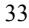

{34}------------------------------------------------

# *We will need substantial additional funding to meet our financial obligations and to pursue our business objectives including launching VP-102 for molluscum contagiosum. If we are unable to raise capital when needed, we could be forced to curtail our planned operations and the pursuit of our growth strategy which could impact our ability to continue as a going concern.*

Identifying potential product candidates and conducting preclinical testing and clinical trials is a time-consuming, expensive and uncertain process that takes years to complete, and we may never generate the necessary data or results required to obtain regulatory approval and achieve product sales. We expect to continue to incur significant expenses and operating losses over the next several years as we seek marketing approval for VP-102 for the treatment of molluscum, pursue clinical trials and marketing approval for VP-102 for the treatment of external genital warts, common warts, and other indications, pursue clinical trials and marketing approval for VP-315 for the treatment of dermatological oncology indications, VP-103 for the treatment of plantar warts, and advance any of our other product candidates we may develop or otherwise acquire. In addition, our product candidates, if approved, may not achieve commercial success. Our revenue, if any, will be derived from sales of products that are not currently commercially available. If we obtain marketing approval for VP-102 for the treatment of molluscum, external genital warts or common warts or any other product candidates that we develop, we expect to incur significant commercialization expenses related to product sales, marketing, distribution and manufacturing.

As of December 31, 2022, we had cash and cash equivalents of \$34.3 million. We believe that our existing cash and cash equivalents as of December 31, 2022, plus the net proceeds from the February 2023 offering of common stock and pre-funded warrants of \$30.1 million, will be sufficient to support our planned operations into the first quarter of 2024. This estimate is based on assumptions that may prove to be wrong, and we could use our available capital resources sooner than we expect. As a result, our financials have been prepared on a going concern basis. If we are unable to obtain sufficient funding, our business, prospects, financial condition and results of operations will be materially and adversely affected and we may be unable to continue as a going concern. If we are unable to continue as a going concern, we may have to liquidate our assets and may receive less than the value at which those assets are carried on our audited financial statements, and it is likely that investors will lose all or a part of their investment. In addition, if there remains substantial doubt about our ability to continue as a going concern, investors or other financing sources may be unwilling to provide additional funding to us on commercially reasonable terms or at all.

Changes may occur beyond our control that would cause us to consume our available capital before that time, including changes in and progress of our development activities, acquisitions of additional product candidates, and changes in regulation. Our future capital requirements will depend on many factors, including:

- the costs and timing of future commercialization activities, including product manufacturing, marketing, sales and distribution, for VP-102 for the treatment of molluscum, if approved, and any of our product candidates for which we receive marketing approval;
- the scope, progress, costs and results of our development programs evaluating VP-102 as a potential treatment for external genital warts and common warts, VP-315 and VP-103;
- the extent to which we develop, in-license or acquire other product candidates or technologies;
- the number and development requirements of other product candidates that we may pursue;
- the costs, timing and outcome of regulatory review of our product candidates;
- the revenue, if any, received from commercial sales of our product candidates for which we receive marketing approval;
- our ability to establish collaborations to commercialize VP-102 or any of our other product candidates outside the United States; and
- the costs and timing of preparing, filing and prosecuting patent applications, maintaining and enforcing our intellectual property rights and defending any intellectual property-related claims.

We may require additional capital to commercialize VP-102 for the treatment of molluscum, external genital warts and/or common warts, VP-315 for the treatment of dermatological oncology indications and/or VP-103 for the treatment of plantar warts. If we receive regulatory approval for VP-102, VP-315 or VP-103 for these indications, we expect to incur significant commercialization expenses related to product manufacturing, sales, marketing and

{35}------------------------------------------------

distribution, depending on where we choose to commercialize. Additional funds may not be available on a timely basis, on favorable terms, or at all, and such funds, if raised, may not be sufficient to enable us to continue to implement our long-term business strategy. If we are unable to raise sufficient additional capital, we could be forced to curtail our planned operations and the pursuit of our growth strategy.

## *Raising additional capital may cause dilution to our stockholders, restrict our operations or require us to relinquish rights to our technologies or product candidates.*

Until such time, if ever, as we can generate substantial revenue, we may finance our cash needs through a combination of equity offerings, debt financings and license and collaboration agreements. We do not currently have any committed external source of funds. To the extent that we raise additional capital through the sale of equity or convertible debt securities, your ownership interest will be diluted, and the terms of these securities may include liquidation or other preferences that adversely affect your rights as a common stockholder. Debt financing and preferred equity financing, if available, may involve agreements that include covenants limiting or restricting our ability to take specific actions, such as incurring additional debt, making capital expenditures or declaring dividends. For instance, under the Loan Agreements as described below, we are restricted from paying dividends or making other distributions or payments on our capital stock, subject to limited exceptions.

If we raise additional funds through collaborations, strategic alliances or marketing, distribution or licensing arrangements with third parties, we may be required to relinquish valuable rights to our technologies, future revenue streams or product candidates or grant licenses on terms that may not be favorable to us. If we are unable to raise additional funds through equity or debt financings when needed, we may be required to delay, limit, reduce or terminate our product development or future commercialization efforts or grant rights to develop and market product candidates that we would otherwise prefer to develop and market ourselves.

# *We have a limited operating history and no history of commercializing products, which may make it dif icult for you to evaluate the success of our business to date and to assess our future viability.*

We commenced operations in 2013, and our operations to date have been largely focused on raising capital and developing our novel topical solution of cantharidin and our lead product candidate, VP-102, for the treatment of molluscum, external genital warts and common warts, including undertaking preclinical studies and conducting clinical trials. VP-102 is our only product candidate for which we have completed clinical trials. We have not yet demonstrated our ability to successfully obtain regulatory approvals, manufacture a product on a commercial scale, or arrange for a third party to do so on our behalf, or conduct sales and marketing activities necessary for successful commercialization. Consequently, any predictions you make about our future success or viability may not be as accurate as they could be if we had a longer operating history or a history of successfully developing and commercializing products.

We may encounter unforeseen expenses, difficulties, complications, delays and other known or unknown factors in achieving our business objectives. We will need to transition at some point from a company with a development focus to a company capable of supporting commercial activities. We may not be successful in such a transition.

## **Risks Related to the Development of Our Product Candidates**

*Our lead product candidate, VP-102, is being developed for the treatment of molluscum, external genital warts and common warts for which we are currently conducting clinical trials. If we are unable to successfully develop, receive regulatory approval for and commercialize VP-102 for the treatment of molluscum, external genital warts, common warts, or any other indications, or successfully develop any other product candidates, or experience significant delays in doing so, our business will be harmed.*

We currently have no products that are approved for commercial sale. We have completed two pivotal Phase 3 clinical trials and submitted a New Drug Application, or NDA, for VP-102 for the treatment of molluscum in the U.S. We received a CRL from the FDA in May 2022 related to deficiencies identified at a general reinspection at a facility of our CMO, Sterling, that manufactures VP-102. Following the FDA's commentary, we selected a new CMO partner to produce the bulk solution. We completed the technology transfer in January 2023. We re-submitted

{36}------------------------------------------------

the NDA in the first quarter of 2023, however, there can be no assurance that we will receive approval from the FDA. Although we announced, in January 2023, the successful transfer of technology to our new CMO partner for production of VP-102 bulk solution, Piramal Pharma Solutions, the FDA may inspect Piramal in conjunction with its review of our NDA and may object to conditions, including through issuance of 483 observations that may trigger another CRL for our NDA. In addition to developing VP-102 for the treatment of molluscum, we are also developing VP-102 as a treatment for external genital warts and common warts. We also plan to develop VP-315 for the treatment of dermatological oncology indications, including basal cell carcinoma and squamous cell carcinoma. In addition, we plan to develop our second cantharidin-based product candidate, VP-103, for the treatment of plantar warts. We have not completed the development and regulatory approval process of any product candidates and we may never be able to develop marketable products. We have invested substantially all of our efforts and financial resources in the development of our cantharidin formula and VP-102 for the treatment of molluscum, external genital warts and common warts. Our ability to generate revenue from our product candidates, will depend heavily on their successful development, regulatory approval and eventual commercialization of these product candidates. The success of VP-102, VP-315 and VP-103 or any other product candidates that we develop or otherwise may acquire will depend on several factors, including:

- timely and successful completion of preclinical studies and our clinical trials;
- successful development of, or making arrangements with third-party manufacturers for, our commercial manufacturing processes for any of our product candidates that receive regulatory approval;
- receipt of timely marketing approvals from applicable regulatory authorities;
- launching commercial sales of products, if approved;
- acceptance of our products, if approved, by patients, the medical community and third-party payors, for their approved indications;
- our success in educating physicians and patients about the benefits, administration and use of VP-102 or any other product candidates, if approved;
- the prevalence and severity of adverse events experienced with VP-102 or our other product candidates;
- the availability, perceived advantages, cost, safety and efficacy of alternative treatments for molluscum, external genital warts and/or common warts or any other indications which we may pursue for VP-102 or any other product candidates;
- our ability to produce VP-102 or any other product candidates on a commercial scale;
- obtaining and maintaining patent, trademark and trade secret protection and regulatory exclusivity for our product candidates and otherwise protecting our rights in our intellectual property portfolio;
- maintaining compliance with regulatory requirements, including current good manufacturing practices, or cGMPs;
- competing effectively with other procedures; and
- maintaining a continued acceptable safety, tolerability and efficacy profile of the products following approval.

Whether regulatory approval will be granted is unpredictable and depends upon numerous factors, including the substantial discretion of the regulatory authorities. Our product candidates' success in clinical trials is not guaranteed, and even if clinical trials are successful, it will not guarantee regulatory approval. Following submission of an NDA, it may not be accepted for substantive review, or even if it is accepted for substantive review, the FDA or other comparable foreign regulatory authorities may require that we conduct additional studies or clinical trials, provide additional data, take additional manufacturing steps, or require other conditions before they will reconsider or approve our application. If the FDA or other comparable foreign regulatory authorities require additional studies, clinical trials or data, we would incur increased costs and delays in the marketing approval process, which may require us to expend more resources than we have available. In addition, the FDA or other comparable foreign regulatory authorities may not consider sufficient any additional required studies, clinical trials, data or information that we perform and complete or generate, or we may decide to abandon the program.

{37}------------------------------------------------

It is possible that VP-102, VP-315, VP-103 or any of our other product candidates we may develop or otherwise acquire will never obtain regulatory approval, even if we expend substantial time and resources seeking such approval. If we do not achieve one or more of these factors in a timely manner or at all, we could experience significant delays or an inability to successfully commercialize our product candidates, which would harm our business.

# *Clinical product development involves a lengthy and expensive process, with an uncertain outcome. We may incur additional costs or experience delays in completing, or ultimately be unable to complete, the development and commercialization of our product candidates.*

The risk of failure for product candidates is high. It is impossible to predict when or if any of our product candidates will prove effective or safe in humans or will receive regulatory approval. Before obtaining marketing approval from regulatory authorities for the sale of any product candidate, we must complete preclinical development and then conduct extensive clinical trials to demonstrate the safety and efficacy of our product candidates in humans. Clinical testing is expensive, difficult to design and implement, can take many years to complete and is inherently uncertain as to outcome. A failure of one or more clinical trials can occur at any stage of testing or at any time during the trial process. The outcome of preclinical testing and early clinical trials may not be predictive of the results of later clinical trials, and interim results of a clinical trial do not necessarily predict final results. Moreover, preclinical and clinical data are often susceptible to varying interpretations and analyses, and many companies that have believed their product candidates performed satisfactorily in preclinical studies and clinical trials have nonetheless failed to obtain marketing approval of their products.

We cannot assure you that any clinical trial that we have conducted, are currently conducting, or may conduct in the future, will demonstrate consistent or adequate efficacy and safety to obtain regulatory approval to market our product candidates.

We may experience delays in ongoing clinical trials for our product candidates, and we do not know whether future clinical trials, if any, will begin on time, need to be redesigned, enroll an adequate number of patients on time or be completed on schedule, if at all. For example, following the initiation of our Phase 2 trial of VP-102 for the treatment of common warts, we discovered the need to amend the treatment regimen of the protocol in order to introduce greater flexibility of the treatment interval. We amended the trial protocol in order to add a second cohort to the trial with the desired treatment frequency. We may experience numerous unforeseen events during or as a result of clinical trials that could delay or prevent our ability to receive marketing approval or commercialize our product candidates, including:

- regulators or institutional review boards may not authorize us or our investigators to commence a clinical trial or conduct a clinical trial at a prospective trial site;
- we may experience delays in reaching, or failing to reach, agreement on acceptable clinical trial contracts or clinical trial protocols with prospective trial sites or prospective contract research organizations, or CROs, the terms of which can be subject to extensive negotiation and may vary significantly among different CROs and trial sites;
- clinical trials of our product candidates may produce negative or inconclusive results, including failure to demonstrate statistical significance, and we may decide, or regulators may require us, to conduct additional clinical trials or abandon product development programs;
- the number of patients required for clinical trials of our product candidates may be larger than we anticipate, enrollment in these clinical trials may be slower than we anticipate, or participants may drop out of these clinical trials or fail to return for post-treatment follow-up at a higher rate than we anticipate;
- our product candidates may have undesirable side effects or other unexpected characteristics, causing us or our investigators, regulators or institutional review boards to suspend or terminate the trials;
- our third-party contractors may fail to comply with regulatory requirements or meet their contractual obligations to us in a timely manner, or at all;

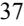

{38}------------------------------------------------

- regulators or institutional review boards may require that we or our investigators suspend or terminate clinical development for various reasons, including noncompliance with regulatory requirements or a finding that the participants are being exposed to unacceptable health risks;
- the cost of clinical trials of our product candidates may be greater than we anticipate; and
- the supply or quality of our product candidates or other materials necessary to conduct clinical trials of our product candidates may be insufficient or inadequate.

We could also encounter delays if a clinical trial is suspended or terminated by us, by the institutional review boards of the institutions in which such trials are being conducted, by the safety review committee for such trial or by the FDA or other regulatory authorities. Such authorities may impose such a suspension or termination due to a number of factors, including failure to conduct the clinical trial in accordance with regulatory requirements or our clinical protocols, inspection of the clinical trial operations or trial site by the FDA or other regulatory authorities resulting in the imposition of a clinical hold, unforeseen safety issues or adverse side effects, failure to demonstrate a benefit from using a product, changes in governmental regulations or administrative actions or lack of adequate funding to continue the clinical trial. If we experience delays in the completion of, or termination of, any clinical trial of our product candidates, the commercial prospects of our product candidates will be harmed, and our ability to generate product revenues from any of these product candidates will be delayed. In addition, any delays in completing our clinical trials will increase our costs, slow down our product candidate development and approval process and jeopardize our ability to commence product sales and generate revenues. Any of these occurrences may harm our business, financial condition and prospects significantly. In addition, many of the factors that cause, or lead to, a delay in the commencement or completion of clinical trials may also ultimately lead to the denial of regulatory approval of our product candidates. If we are required to conduct additional clinical trials or other testing of our product candidates beyond those that we currently contemplate, if we are unable to successfully complete clinical trials of our product candidates or other testing, if the results of these trials or tests are not favorable or if there are safety concerns, we may:

- be delayed in obtaining marketing approval for our product candidates;
- not obtain marketing approval at all;
- obtain approval for indications or patient populations that are not as broad as intended or desired;
- obtain approval with labeling that includes significant use or distribution restrictions or safety warnings;
- be subject to additional post-marketing testing requirements; or
- have the product removed from the market after obtaining marketing approval.

Our product development costs will also increase if we experience delays in testing or marketing approvals. We do not know whether any of our preclinical studies or clinical trials will begin as planned, will need to be restructured or will be completed on schedule, or at all. Significant preclinical study or clinical trial delays also could shorten any periods during which we may have the exclusive right to commercialize our product candidates or allow our competitors to bring products to market before we do and impair our ability to successfully commercialize, or receive approval for, our product candidates. For example, if a competitor obtained FDA approval for a product containing cantharidin before we are able to obtain approval for our product, this could result in the approval of our product being delayed until the expiration of any NCE exclusivity or other regulatory exclusivity received by such competitor.

# *If we experience delays or dif iculties in the enrollment and/or maintenance of patients in clinical trials, our receipt of necessary regulatory approvals could be delayed or prevented.*

Successful and timely completion of clinical trials will require that we enroll a sufficient number of patients. Patient enrollment, a significant factor in the timing of clinical trials, is affected by many factors including the size and nature of the patient population. Trials may be subject to delays as a result of patient enrollment taking longer than anticipated or patient withdrawal. We may not be able to initiate or continue clinical trials for our product candidates if we are unable to locate and enroll a sufficient number of eligible patients to participate in these trials as

{39}------------------------------------------------

required by the FDA or similar regulatory authorities outside the United States. We cannot predict how successful we will be at enrolling subjects in future clinical trials. Subject enrollment is affected by other factors including:

- the eligibility criteria for the trial in question;
- the perceived risks and benefits of the product candidate in the trial;
- the availability of products and other treatments to treat the skin disease in the trial;
- the willingness of patients to be enrolled in our clinical trials;
- the efforts to facilitate timely enrollment in clinical trials;
- the patient referral practices of physicians;
- the ability to monitor patients adequately during and after treatment; and
- the proximity and availability of clinical trial sites for prospective patients.

Our inability to enroll a sufficient number of patients for clinical trials would result in significant delays and could require us or them to abandon one or more clinical trials altogether. For example, parents may be reluctant to enroll their children in our clinical trials that have a relatively high risk of their child being assigned to placebo when in the alternative, they could decline participation, and receive compounded cantharidin outside of the clinical trial, if available, or pursue other alternative therapies. Enrollment delays in these clinical trials may result in increased development costs for our product candidates, which would cause the value of our company to decline and limit our ability to obtain additional financing. Furthermore, we rely on and expect to continue to rely on CROs and clinical trial sites to ensure the proper and timely conduct of our clinical trials and we will have limited influence over their performance.

Furthermore, even if we are able to enroll a sufficient number of patients for our clinical trials, we may have difficulty maintaining patients in our clinical trials.

#### *Success in preclinical studies or earlier clinical trials may not be indicative of results in future clinical trials.*

Success in preclinical testing and early clinical trials does not ensure that later clinical trials will generate the same results or otherwise provide adequate data to demonstrate the efficacy and safety of a product candidate. Preclinical tests and Phase 1 and Phase 2 clinical trials are primarily designed to test safety, to study pharmacokinetics and pharmacodynamics and to understand the side effects of product candidates at various doses and schedules. Success in preclinical or animal studies and early clinical trials does not ensure that later large-scale efficacy trials will be successful, nor does it predict final results. Our product candidates may fail to show the desired safety and efficacy in clinical development despite positive results in preclinical studies or having successfully advanced through initial clinical trials.

In addition, the design of a clinical trial can determine whether its results will support approval of a product and flaws in the design of a clinical trial may not become apparent until the clinical trial is well advanced. As an organization, we have limited experience designing clinical trials and may be unable to design and execute a clinical trial to support regulatory approval. Many companies in the pharmaceutical and biotechnology industries have suffered significant setbacks in late-stage clinical trials even after achieving promising results in preclinical testing and earlier-stage clinical trials. Data obtained from preclinical and clinical activities are subject to varying interpretations, which may delay, limit or prevent regulatory approval. In addition, we may experience regulatory delays or rejections as a result of many factors, including changes in regulatory policy during the period of our product candidate development. Any such delays could negatively impact our business, financial condition, results of operations and prospects.

# *Interim "top-line" and preliminary results from our clinical trials that we announce or publish from time to time may change as more patient data become available and are subject to audit and verification procedures that could result in material changes in the final data.*

From time to time, we may publish interim top-line or preliminary results from our clinical trials. Interim results from clinical trials that we may complete are subject to the risk that one or more of the clinical outcomes may materially change as patient enrollment continues and more patient data become available. Preliminary or top-line

{40}------------------------------------------------

results also remain subject to audit and verification procedures that may result in the final data being materially different from the preliminary data we previously published. As a result, interim and preliminary data should be viewed with caution until the final data are available. Differences between preliminary or interim data and final data could significantly harm our business prospects and may cause the trading price of our common stock to fluctuate significantly.

# *Our clinical trials may fail to demonstrate the safety and ef icacy of our product candidates, or serious adverse or unacceptable side ef ects may be identified during the development of our product candidates, which could prevent or delay regulatory approval and commercialization, increase our costs or necessitate the abandonment or limitation of the development of some of our product candidates.*

Before obtaining regulatory approvals for the commercial sale of our product candidates, we must demonstrate through lengthy, complex and expensive preclinical testing and clinical trials that our product candidates are both safe and effective for use in each target indication, and failures can occur at any stage of testing. Clinical trials often fail to demonstrate safety and efficacy of the product candidate studied for the target indication.

If our product candidates are associated with side effects in clinical trials or have characteristics that are unexpected, we may need to abandon their development or limit development to more narrow uses in which the side effects or other characteristics are less prevalent, less severe or more acceptable from a risk-benefit perspective. The FDA or an institutional review board may also require that we suspend, discontinue, or limit our clinical trials based on safety information, or that we conduct additional animal or human studies regarding the safety and efficacy of our product candidates which we have not planned or anticipated. Such findings could further result in regulatory authorities failing to provide marketing authorization for our product candidates or limiting the scope of the approved indication, if approved. Many product candidates that initially showed promise in early stage testing have later been found to cause side effects that prevented further development of the product candidate.

Additionally, if one or more of our product candidates receives marketing approval, and we or others identify undesirable side effects caused by such products, a number of potentially significant negative consequences could result, including:

- regulatory authorities may withdraw approvals of such product;
- regulatory authorities may require additional warnings on the labels;
- we may be required to create a medication guide outlining the risks of such side effects for distribution to patients;
- we could be sued and held liable for harm caused to patients; and
- our reputation and physician or patient acceptance of our products may suffer.

There can be no assurance that we will resolve any issues related to any product-related adverse events to the satisfaction of the FDA or any regulatory agency in a timely manner or at all. Moreover, any of these events could prevent us from achieving or maintaining market acceptance of the particular product candidate, if approved, and could significantly harm our business, results of operations and prospects.

## *VP-102 is a drug-device combination involving a proprietary applicator, which may result in additional regulatory and other risks.*

VP-102 is a drug-device combination product for administration of our cantharidin formulation through our proprietary applicator. We may experience delays in obtaining regulatory approval of VP-102 given the increased complexity of the review process when approval of a drug and a delivery device is sought under a single marketing application. VP-102 will be regulated as a drug-device combination product, which requires coordination within the FDA and similar foreign regulatory agencies for review of the product candidate's device and drug components. We have filed a single marketing application for the approval of a drug-device combination product, with guidance by the FDA. Although the FDA and similar foreign regulatory agencies have systems in place for the review and approval of combination products such as ours, we may experience delays in the development, approval, and commercialization of our product candidate due to regulatory timing constraints and uncertainties in the product development and approval process, the inherent complexities of combination products, as well as coordination

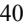

{41}------------------------------------------------

## between two different centers within FDA responsible for review of the different components of the combination product.

Failure to successfully develop or supply the device, delays in or failure of the studies conducted by us, our collaborators, or third-party providers, or failure of our company, our collaborators, or third-party providers to obtain or maintain regulatory approval or clearance of the device component of VP-102 could result in increased development costs, delays in or failure to obtain regulatory approval, and associated delays in VP-102 reaching the market. Further, failure to successfully develop or supply the device, or to gain or maintain its approval, could adversely affect sales of VP-102.

#### *Changes in methods of product candidate manufacturing or formulation may result in additional costs or delay.*

As product candidates proceed through preclinical studies to late-stage clinical trials towards potential approval and commercialization, it is common that various aspects of the development program, such as manufacturing methods and formulation, are altered along the way in an effort to optimize processes and results. Such changes carry the risk that they will not achieve these intended objectives. Any of these changes could cause our product candidates to perform differently and affect the results of planned clinical trials or other future clinical trials conducted with the altered materials. Such changes may also require additional testing, FDA notification or FDA approval. This could delay completion of clinical trials, require the conduct of bridging clinical trials or the repetition of one or more clinical trials, increase clinical trial costs, delay approval of our product candidates and jeopardize our ability to commence sales and generate revenue.

## *We may not be successful in our ef orts to increase our pipeline of product candidates, including by pursuing additional indications for our current product candidate or in-licensing or acquiring additional product candidates for other dermatological conditions.*

A key element of our strategy is to build and expand our pipeline of product candidates, including by developing VP-102 for the treatment of external genital warts and common warts and potentially other dermatological conditions, VP-315 for the treatment of dermatological oncology indications, including basal cell carcinoma and squamous cell carcinoma and VP-103 for the treatment of plantar warts. In addition, we intend to in-license or acquire additional product candidates for other dermatological conditions to build a fully integrated dermatology company. We may not be able to identify or develop product candidates that are safe, tolerable and effective. Even if we are successful in continuing to build our pipeline, the potential product candidates that we identify, in-license or acquire may not be suitable for clinical development, including as a result of being shown to have harmful side effects or other characteristics that indicate that they are unlikely to be products that will receive marketing approval and achieve market acceptance.

41

{42}------------------------------------------------

# *We may expend our limited resources to pursue a particular product candidate or indication and fail to capitalize on product candidates or indications that may be more profitable or for which there is a greater likelihood of success.*

Because we have limited financial and management resources, we focus on development programs and product candidates that we identify for specific indications. As such, we are currently primarily focused on the development, and potential future commercialization, of VP-102 for the treatment of molluscum, as well as the development of VP-315 for the potential treatment of basal cell carcinoma. As a result, we may forego pursuit of opportunities with other product candidates, or we may delay the development of other indications for VP-102 and for VP-103 that may later prove to have greater commercial potential. Our resource allocation decisions may cause us to fail to capitalize on viable commercial products or profitable market opportunities. Our spending on current and future development programs and product candidates for specific indications may not yield any commercially viable products. If we do not accurately evaluate the commercial potential or target market for a particular product candidate, we may relinquish valuable rights to that product candidate through collaboration, licensing or other royalty arrangements in cases in which it would have been more advantageous for us to retain sole development and commercialization rights to such product candidate.

# *The regulatory approval processes of the FDA and comparable foreign authorities are lengthy, time consuming and inherently unpredictable. If we are not able to obtain required regulatory approval for our product candidates, our business will be substantially harmed.*

The time required to obtain approval or other marketing authorizations by the FDA and comparable foreign authorities is unpredictable but typically takes many years following the commencement of clinical trials and depends upon numerous factors, including the substantial discretion of the regulatory authorities. In addition, approval policies, regulations, or the type and amount of clinical data necessary to gain approval may change during the course of a product candidate's clinical development and may vary among jurisdictions. We have not obtained regulatory approval for VP-102 or any product candidate and it is possible that neither VP-102 nor any product candidates we may seek to develop in the future will ever obtain regulatory approval. Neither we nor any future collaborator is permitted to market VP-102 or any future drug product candidates in the United States until we receive regulatory approval of an NDA from the FDA. To date, we have not met or discussed with the European Medicines Agency or any other comparable foreign authority regarding regulatory approval for VP-102 or any other product candidate outside of the United States.

Prior to obtaining approval to commercialize VP-102 and any other drug product candidate in the United States or abroad, we must demonstrate with substantial evidence from well-controlled clinical trials, and to the satisfaction of the FDA or foreign regulatory agencies, that such product candidates are safe and effective for their intended uses. Results from nonclinical studies and clinical trials can be interpreted in different ways. Even if we believe the nonclinical or clinical data for our product candidates are promising, such data may not be sufficient to support approval by the FDA and other regulatory authorities. The FDA may also require us to conduct additional nonclinical studies or clinical trials for our product candidates either prior to or after approval, or it may object to elements of our clinical development program.

Of the large number of products in development, only a small percentage successfully complete the FDA or foreign regulatory approval processes and are commercialized. The lengthy approval or marketing authorization process as well as the unpredictability of future clinical trial results may result in our failing to obtain regulatory approval or marketing authorization to market our product candidates, which would significantly harm our business, financial condition, results of operations and prospects.

We have invested a significant portion of our time and financial resources in the development of VP-102. Our business is dependent on our ability to successfully complete preclinical and clinical development of, obtain regulatory approval for, and, if approved, successfully commercialize VP-102 and any future product candidates in a timely manner.

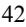

{43}------------------------------------------------

Even if we eventually complete clinical testing and receive approval of an NDA or foreign marketing application for VP-102 or any future product candidates, the FDA or the applicable foreign regulatory agency may grant approval or other marketing authorization contingent on the performance of costly additional clinical trials, including post-market clinical trials. The FDA or the applicable foreign regulatory agency also may approve or authorize for marketing a product candidate for a more limited indication or patient population that we originally request, and the FDA or applicable foreign regulatory agency may not approve or authorize the labeling that we believe is necessary or desirable for the successful commercialization of a product candidate. Any delay in obtaining, or inability to obtain, applicable regulatory approval or other marketing authorization would delay or prevent commercialization of that product candidate and would materially adversely impact our business and prospects.

In addition, the FDA and other regulatory authorities may change their policies, issue additional regulations or revise existing regulations, or take other actions, which may prevent or delay approval of our future products under development on a timely basis. Such policy or regulatory changes could impose additional requirements upon us that could delay our ability to obtain approvals, increase the costs of compliance or restrict our ability to maintain any marketing authorizations we may have obtained.

Furthermore, even if we obtain regulatory approval for VP-102 and any future product candidates, we will still need to develop a commercial organization, establish a commercially viable pricing structure and obtain approval for adequate reimbursement from third-party and government payors. If we are unable to successfully commercialize VP-102 and any future product candidates, we may not be able to generate sufficient revenue to continue our business.

## **Risks Related to the Commercialization of Our Product Candidates**

# *In light of our receipt of a CRL from the FDA regarding our NDA for VP-102, the timing for VP-102 approval is uncertain, and we may never obtain regulatory approval in the United States.*

In November 2021, we resubmitted an NDA to the FDA for VP-102 for the treatment of molluscum. On May 24, 2022, we announced that we received a CRL from the FDA as a direct result of deficiencies identified by the FDA during a general reinspection of our CMO, Sterling. As a result, the approval of our NDA for VP-102 has been delayed and may never occur.

On June 27, 2022, we held a Type A meeting with the FDA to discuss the resubmission and potential approval of the NDA. During the Type A meeting the FDA indicated that it could not accept our NDA resubmission with Sterling listed as the primary manufacturer of the bulk solution for VP-102 if Sterling was on OAI status at the time of resubmission. Following the FDA's commentary, we selected a new CMO partner to produce the bulk solution, Piramal Pharma Solutions, and the technology transfer process was completed in January 2023. On January 23, 2023 we resubmitted the NDA for VP-102 to the FDA. The FDA accepted our NDA resubmission on February 27, 2023 and assigned a PDUFA goal date of July 23, 2023.

We cannot predict the outcome of any interactions with the FDA. Nor can we guarantee when, or if, we will be successful in receiving regulatory approval for VP-102. If we do not obtain approval for VP-102 or are delayed in obtaining such approval, it would have a material adverse effect on our operations and financial condition.

# *Even if any of our product candidates receives marketing approval, it may fail to achieve the degree of market acceptance by physicians, patients, thirdparty payors and others in the medical community necessary for commercial success.*

If any of our product candidates receives marketing approval, it may nonetheless fail to gain sufficient market acceptance by physicians, patients, third-party payors and others in the medical community. If our product candidates do not achieve an adequate level of acceptance, we may not generate significant revenue and we may not become profitable. The degree of market acceptance of our product candidates, if approved for commercial sale, will depend on a number of factors, including:

- the efficacy, safety and potential advantages compared to alternative treatments, including for VP-102, compared to compounded cantharidin;
- our ability to offer our products for sale at competitive prices;

{44}------------------------------------------------

- the convenience and ease of administration compared to alternative treatments, including compounded cantharidin;
- the willingness of the target patient population to try new treatments and of physicians to prescribe these treatments;
- our ability to hire and retain a sales force in the United States;
- the strength of marketing and distribution support;
- the availability of third-party coverage and adequate reimbursement for VP-102 and any other potential product candidates;
- the prevalence and severity of any side effects; and
- any restrictions on the use of our products together with other medications.

In the case of VP-102, the failure of healthcare professionals or patients to perceive the benefits of using VP-102 instead of compounded cantharidin or other alternative therapies, such as curettage or cryotherapy, would adversely affect the commercial success of VP-102, if approved.

# *If we are unable to establish sales, marketing and distribution capabilities for VP-102 or any other product candidate that may receive regulatory approval, we may not be successful in commercializing those product candidates if and when they are approved.*

We do not have sales or marketing infrastructure. To achieve commercial success for VP-102 and any other product candidate for which we may obtain marketing approval, we will need to establish a sales and marketing organization. In the future, we expect to build a focused sales and marketing infrastructure to market or co-promote some of our product candidates in the United States, if and when they are approved. There are risks involved with establishing our own sales, marketing and distribution capabilities. For example, recruiting and training a sales force is expensive and time consuming and could delay any product launch. If the commercial launch of a product candidate for which we recruit a sales force and establish marketing capabilities is delayed or does not occur for any reason, we would have prematurely or unnecessarily incurred these commercialization expenses. This may be costly, and our investment would be lost if we cannot retain or reposition our sales and marketing personnel.

Factors that may inhibit our efforts to commercialize our products on our own include:

- our inability to recruit, train and retain adequate numbers of effective sales and marketing personnel;
- the inability of sales personnel to obtain access to physicians or educate adequate numbers of physicians on the benefits of prescribing any future products;
- the lack of complementary products to be offered by sales personnel, which may put us at a competitive disadvantage relative to companies with more extensive product lines; and
- unforeseen costs and expenses associated with creating an independent sales and marketing organization.

If we are unable to establish our own sales, marketing and distribution capabilities and are forced to enter into arrangements with, and rely on, third parties to perform these services, our revenue and our profitability, if any, are likely to be lower than if we had developed such capabilities ourselves. In addition, we may not be successful in entering into arrangements with third parties to sell, market and distribute our product candidates or may be unable to do so on terms that are favorable to us. We likely will have little control over such third parties, and any of them may fail to devote the necessary resources and attention to sell and market our products effectively. If we do not establish sales, marketing and distribution capabilities successfully, either on our own or in collaboration with third parties, we will not be successful in commercializing our product candidates.

{45}------------------------------------------------

# *We face substantial competition, including from compounded cantharidin products that may compete with VP-102 and any other product candidates, which may result in a smaller than expected commercial opportunity and/or others discovering, developing or commercializing products before or more successfully than we do.*

The development and commercialization of new products is highly competitive. We face competition with respect to our current product candidates and will face competition with respect to any product candidates that we may seek to develop or commercialize in the future, from many different sources, including major pharmaceutical and specialty pharmaceutical companies, compounding facilities, academic institutions and governmental agencies and public and private research institutions.

We are aware of several other product candidates in earlier stages of development as potential treatments for the indications we intend to target. Novan has submitted a NDA to the FDA seeking marketing approval for the topical treatment of molluscum contagiosum. There are a number of other companies developing products for common warts. In addition, other drugs have been and may continue to be used off label as treatment for molluscum, external genital warts, common warts, and plantar warts, and there are other existing alternative therapies such as curettage or cryotherapy.

Currently some of the market demand for cantharidin may be satisfied by compounding pharmacies and registered outsourcing facilities regulated under Sections 503A and 503B of the FDCA. If we receive approval for VP-102, any compounding by licensed pharmacists or licensed physicians under Section 503A would not be legally permitted to include, regularly or in inordinate amounts, the compounding of any drug that is essentially a copy of VP-102. The FDA has announced that it intends to consider a compounded drug product to be essentially a copy of a commercially available drug under Section 503A if it has the same API, has the same, similar, or an easily substitutable dosage strength, and can be used by the same route of administration. However, a compounded product would not be considered essentially a copy of VP-102, and could be compounded under Section 503A, if there were a difference between the compounded product and VP-102 that was made for an individual patient, and which the prescribing practitioner determines produces a significant difference for that patient. Similarly, any compounding by outsourcing facilities under Section 503B would not be legally permitted to include the compounding of a drug that is essentially a copy of VP-102, if approved, where the compounded drug would be considered essentially a copy if it were identical or nearly identical to VP-102 (which the FDA has interpreted to mean that it has the same active ingredient(s), route of administration, dosage form, dosage strength and excipients as the approved drug), or if it contains the active ingredient in VP-102 (cantharidin), unless there is a change from the approved drug that produces a clinical difference for an individual patient as determined by the prescribing practitioner.

Compounding pharmacies and registered outsourcing facilities may therefore be permitted to compound cantharidin drug products, even if we receive approval for VP-102, if a prescribing practitioner determines that a compounded product prescribed for a specific patient features a change from VP-102 that produces a significant difference for the patient (under Section 503A), or if a prescribing practitioner determines that a compounded cantharidin product features a change from VP-102 that produces a clinical difference for the patient (under Section 503B). Physicians may determine that such differences exist for some or all of their patients and may choose to prescribe compounded cantharidin products for such patients. Moreover, under Section 503B, outsourcing facilities are not limited to compounding in response to prescriptions for identified, individual patients, and could compound using bulk cantharidin provided cantharidin appears on a list established by the FDA of bulk drug substances for which there is a clinical need or satisfies certain other limited conditions. Although the FDA has not yet established a list of bulk drug substances for which there is a clinical need, the FDA has announced an interim policy pursuant to which bulk drug substances may be nominated for inclusion on such list and, provided certain conditions are met, outsourcing facilities may compound with such bulk drug substances pending evaluation of the substances for inclusion on the FDA's list of bulk drug substances for which there is a clinical need. Cantharidin is currently listed among those nominated substances for which bulk drug substance may be used in compounding by outsourcing facilities pending FDA's evaluation.

In March 2019, the FDA issued Guidance for Industry addressing the criteria by which the FDA intends to evaluate whether there exists a clinical need for compounding with a bulk drug substance, including, in the case of a bulk drug substance that is a component of an FDA-approved drug, an evaluation of whether there exists an attribute of the approved drug that makes it medically unsuitable to treat certain patients; whether the drug product proposed to be compounded is intended to address that attribute; and whether the drug product proposed to be compounded

{46}------------------------------------------------

must be compounded from a bulk drug substance rather than from the finished, FDA-approved drug product. If the FDA implements these criteria as in the Guidance for Industry, and if VP-102 is approved, an outsourcing facility may be permitted to compound a cantharidin product using bulk cantharidin notwithstanding our approval provided it satisfies these and other criteria set forth in the FDA's guidance.

In addition, the FDA may, in its enforcement discretion, not prioritize enforcement of the restrictions under Sections 503A and 503B on compounding drugs that are essentially copies of VP-102, if approved, in which case compounded drug product that is essentially a copy of VP-102 could be made available to physicians and their patients. In the event compounders are authorized to continue to compound cantharidin products following approval of VP-102, if approved, we could be subject to significant competition.

In addition, our commercial opportunity could be reduced or eliminated if our competitors develop and commercialize products that are safer, more effective, have fewer or less severe side effects, are more convenient or are less expensive than VP-102 or any other product that we may develop. Our competitors also may obtain FDA or other regulatory approval for their products more rapidly than we may obtain approval for our product, which could result in our competitors establishing a strong market position before we are able to enter the market or, if a competitor obtained FDA approval for a product containing cantharidin before we are able to obtain approval for our product, could result in the approval of our product being delayed until the expiration of any NCE exclusivity or other regulatory exclusivity received by such competitor.

Many of the companies against which we are competing, or against which we may compete in the future, have significantly greater financial resources and expertise in research and development, manufacturing, preclinical testing, conducting clinical trials, obtaining regulatory approvals and marketing approved products than we do. Mergers and acquisitions in the pharmaceutical and biotechnology industries may result in even more resources being concentrated among a smaller number of our competitors. Smaller or early-stage companies may also prove to be significant competitors, particularly through collaborative arrangements with large and established companies. These competitors also compete with us in recruiting and retaining qualified scientific and management personnel and establishing clinical trial sites and patient registration for clinical trials, as well as in acquiring technologies complementary to, or that may be necessary for, our programs.

#### *We intend to seek NCE exclusivity and/or pediatric exclusivity for VP-102 and future product candidates, and we may be unsuccessful.*

As part of our business strategy, we intend to seek NCE exclusivity for VP-102 or future product candidates. In the United States, a pharmaceutical manufacturer may obtain five years of non-patent exclusivity upon NDA approval of an NCE which is a drug that contains an active moiety that has not been approved by the FDA in any other NDA. An "active moiety" is defined as the molecule or ion responsible for the drug substance's physiological or pharmacologic action. During the five-year exclusivity period, the FDA cannot accept for filing any ANDA seeking approval of a generic version of that drug or any 505(b)(2) NDA for the same active moiety and that relies on the FDA's findings regarding that drug, except that FDA may accept an application for filing after four years if the follow-on applicant makes a paragraph IV certification. This exclusivity period may be extended by an additional six months if certain requirements are met to qualify the product for pediatric exclusivity, including the receipt of a written request from the FDA that we conduct certain pediatric studies, the submission of study reports from such studies to the FDA after receipt of the written request and satisfaction of the conditions specified in the written request. We believe that cantharidin constitutes an NCE, such that VP-102 should, if approved, be eligible for NCE exclusivity and that our planned clinical trials will qualify VP-102 for pediatric exclusivity if a written request from the FDA is received. However, there can be no guarantee that we will successfully obtain such exclusivity, and if any of our competitors obtains FDA approval of an NDA for a cantharidin drug product before we do, they, and not us, may be eligible for NCE exclusivity. If we do not obtain NCE exclusivity for VP-102, or if a competitor obtains NCE exclusivity for a cantharidin product before we receive approval of an NDA for VP-102, our ability to commence sales and generate revenue would be adversely affected.

Moreover, even if we obtain NCE exclusivity and/or pediatric exclusivity for VP-102, such exclusivity would not block the sale of compounded cantharidin products in those situations where compounding would be permitted under Sections 503A or 503B of the FDCA.

{47}------------------------------------------------

# *The success of VP-102 for the treatment of molluscum, external genital warts and common warts will depend significantly on coverage and adequate reimbursement or the willingness of patients to pay for these procedures.*

We believe our success depends on continued coverage and adequate reimbursement for procedures using VP-102 for the treatment of molluscum, external genital warts and/or common warts or, in the absence of coverage and adequate reimbursement, on the extent to which patients will be willing to pay out of pocket for such procedures. Obtaining coverage and adequate reimbursement for our products may be particularly difficult because of the higher prices often associated with drugs administered under the supervision of a physician. Separate reimbursement for the product itself or the treatment or procedure in which our product is used may not be available. Even if the procedure using our product is covered, third-party payors may package the cost of the drug into the procedure payment and not separately reimburse the physician for the costs associated with our product. A decision by a third-party payor not to cover or separately reimburse for our products could reduce physician utilization of our products once approved. Additionally, in the United States, there is no uniform policy of coverage and reimbursement among third-party payors. Third-party payors often rely upon Medicare coverage policy and payment limitations in setting their own coverage and reimbursement policies. However, decisions regarding the extent of coverage and amount of reimbursement to be provided is made on a payor-by-payor basis. One payor's determination to provide coverage for a drug product does not assure that other payors will also provide coverage, and adequate reimbursement.

Third-party payors determine which medical procedures they will cover and establish reimbursement levels. Even if a third-party payor covers a particular procedure, the resulting reimbursement payment rates may not be adequate. Patients who are treated in-office for a medical condition generally rely on third-party payors to reimburse all or part of the costs associated with the procedure and may be unwilling to undergo such procedures for the treatment of molluscum, external genital warts and/or common warts in the absence of such coverage and adequate reimbursement. Physicians may be unlikely to offer procedures for such treatment if they are not covered by insurance and may be unlikely to purchase and use our product candidates, if approved, for molluscum, external genital warts and/or common warts unless coverage is provided, and reimbursement is adequate.

Reimbursement by a third-party payor may depend upon a number of factors, including the third-party payor's determination that a procedure is safe, effective and medically necessary; appropriate for the specific patient; cost-effective; supported by peer-reviewed medical journals; included in clinical practice guidelines; and neither cosmetic, experimental, nor investigational.

Further, from time to time, typically on an annual basis, payment rates are updated and revised by third-party payors. Such updates could impact the demand for our product candidates, to the extent that patients who are prescribed our product candidates, if approved, are not separately reimbursed for the cost of the product candidates. An example of payment updates is the Medicare program updates to physician payments, which is done on an annual basis. In the past, when the application of the formula resulted in lower payment, Congress has passed interim legislation to prevent the reductions. The Medicare Access and CHIP Reauthorization Act of 2015, or MACRA, ended the use of the statutory formula and also referred to as the Sustainable Growth Rate, for certain payment and established a quality payment incentive program, also referred to as the Quality Payment Program. This program provides clinicians with two ways to participate, including through the Advanced Alternative Payment Models, or APMs and the Merit-based Incentive Payment System, or MIPS. In November 2019, CMS issued a final rule finalizing the changes to the Quality Payment Program. At this time, it is unclear how the introduction of the Quality Payment Program will impact overall physician reimbursement under the Medicare program. Any resulting decrease in payment under the merit-based reimbursement system may adversely affect our revenue and results of operations. In addition, the Medicare physician fee schedule has been adapted by some private payors into their plan-specific physician payment schedule. We cannot predict how pending and future healthcare legislation will impact our business, and any changes in coverage and reimbursement that further restricts coverage of our product candidates or lowers reimbursement for procedures using our products could harm our business.

Foreign governments also have their own healthcare reimbursement systems, which vary significantly by country and region, and we cannot be sure that coverage and adequate reimbursement will be made available with respect to the treatments in which our products are used under any foreign reimbursement system.

There can be no assurance that VP-102 for the treatment of molluscum, external genital warts and/or common warts, if approved for sale in the United States or in other countries, will be considered medically reasonable and

{48}------------------------------------------------

necessary, that they will be considered cost-effective by third-party payors, that coverage or an adequate level of reimbursement will be available, or that reimbursement policies and practices in the United States and in foreign countries where our products are sold will not adversely affect our ability to sell our product candidates profitably, if they are approved for sale.

# *The market for VP-102 and any other product candidates may not be as large as we expect.*

Our lead indications for VP-102 are for molluscum, external genital warts and common warts, each of which are skin diseases that are currently undertreated with no standard of care. If VP-102 is approved for any of these indications, individuals may continue to decline treatment for molluscum, external genital warts and/or common warts as, if left untreated, these skin diseases will eventually be resolved by the body's immune system.

In addition, our estimates of the potential market opportunity for VP-102 and any other product candidates include several key assumptions based on our industry knowledge, industry publications, third-party research reports and surveys of dermatologists commissioned by us. These assumptions include the prevalence of molluscum, external genital warts, common warts and other skin diseases as well as the estimated reimbursement levels for VP-102, if approved. However, there can be no assurance that any of these assumptions are, or will remain, accurate. Furthermore, even if our estimates relating to the prevalence of molluscum, external genital warts, common warts and other skin diseases as well as the estimated reimbursement levels for VP-102, if approved, are accurate, the degree of market acceptance by the medical community and those infected by such skin diseases following regulatory approval, if any, could impact our assumptions and reduce the market size for VP-102 in molluscum, external genital warts, common warts or any other indication. For example, if VP-102 is approved for molluscum, external genital warts or common warts, there can be no assurance that the medical community will prescribe VP-102 for patients over current forms of available alternative therapies. Furthermore, the market research study we commissioned surveying payor organizations has no bearing on the payors, and any assumptions or interpretations based on the results of this study, may ultimately be inaccurate. If the actual market for VP-102 in molluscum, external genital warts, common warts or any other indication we may pursue for VP-102 or for any other product candidate we may develop is smaller than we expect, our revenues, if any, may be limited and it may be more difficult for us to achieve or maintain profitability.

# *Product liability lawsuits against us could cause us to incur substantial liabilities and to limit commercialization of any products that we may develop.*

We face an inherent risk of product liability exposure related to the testing of our product candidates in human clinical trials and will face an even greater risk if we commercially sell any products that we may develop. If we cannot successfully defend ourselves against claims that our product candidates or drugs caused injuries, we will incur substantial liabilities. Regardless of merit or eventual outcome, liability claims may result in:

- decreased demand for any product candidates or drugs that we may develop;
- injury to our reputation and significant negative media attention;
- withdrawal of clinical trial participants;
- significant costs to defend the related litigation;
- substantial monetary awards paid to trial participants or patients;
- loss of revenue;
- reduced resources of our management to pursue our business strategy; and
- the inability to commercialize any products that we may develop.

We currently hold \$10 million in product liability insurance coverage in the aggregate, with a per incident limit of \$10 million, which may not be adequate to cover all liabilities that we may incur. We may need to increase our insurance coverage as we expand our clinical trials or if we commence commercialization of our product candidates. Insurance coverage is increasingly expensive. We may not be able to maintain insurance coverage at a reasonable cost or in an amount adequate to satisfy any liability that may arise.

{49}------------------------------------------------

# *Our business activities involve the use of hazardous materials, which require compliance with environmental and occupational safety laws regulating the use of such materials. If we or our vendors violate these laws, we could be subject to significant fines, liabilities or other adverse consequences.*

Our business activities involve the controlled use of hazardous materials, including corrosive, explosive and flammable chemicals and other hazardous compounds in addition to certain biological hazardous waste. Ultimately, the activities of our third-party product manufacturers when a product candidate reaches commercialization will also require the use of hazardous materials. Accordingly, we are subject to federal, state and local laws governing the use, handling and disposal of these materials. For example, cantharidin is classified as an extremely hazardous substance in the United States and is subject to strict reporting requirements. Furthermore, the excipients in our product candidate are combustible and flammable. If not handled properly, there is a risk of explosion which could carry liability risk and affect the availability or capacity of the affected vendor. Although we believe that our and our vendors' safety procedures for handling and disposing of these materials comply in all material respects with the standards prescribed by local, state and federal regulations, we cannot completely eliminate the risk of accidental contamination or injury from these materials. In addition, our collaborators may not comply with these laws. In the event of an accident or failure to comply with environmental laws, we could be held liable for damages that result, and any such liability could exceed our assets and resources, or we could be subject to limitations or stoppages related to our use of these materials which may lead to an interruption of our business operations or those of our third-party contractors. While we believe that our existing insurance coverage is generally adequate for our normal handling of these hazardous materials, it may not be sufficient to cover pollution conditions or other extraordinary or unanticipated events. Furthermore, an accident could damage or force us to shut down our operations or one of our vendors. Changes in environmental laws may impose costly compliance requirements on us or otherwise subject us to future liabilities and additional laws relating to the management, handling, generation, manufacture, transportation, storage, use and disposal of materials used in or generated by the manufacture of our products or related to our clinical trials. In addition, we cannot predict the effect that these potential requirements may have on us, our suppliers and contractors or our customers.

## **Risks Related to Our Dependence on Third Parties**

# *We will rely on third parties to conduct our future clinical trials for product candidates, and those third parties may not perform satisfactorily, including failing to meet deadlines for the completion of such trials.*

We have engaged a CRO historically to conduct our clinical trials and expect to engage a CRO for future clinical trials for VP-102 or other product candidates that we may progress to clinical development. We expect to continue to rely on third parties, such as clinical data management organizations, medical institutions and clinical investigators, to conduct those clinical trials. If any of our relationships with these third parties terminate, we may not be able to timely enter into arrangements with alternative third parties or to do so on commercially reasonable terms, if at all. In addition, any third parties conducting our clinical trials will not be our employees, and except for remedies available to us under our agreements with such third parties, we cannot control whether or not they devote sufficient time and resources to our clinical programs. If these third parties do not successfully carry out their contractual duties or obligations or meet expected deadlines, if they need to be replaced or if the quality or accuracy of the clinical data they obtain is compromised due to the failure to adhere to our clinical protocols, regulatory requirements or for other reasons, our clinical trials may be extended, delayed or terminated and we may not be able to obtain regulatory approval for or successfully commercialize our product candidates. Consequently, our results of operations and the commercial prospects for our product candidates would be harmed, our costs could increase substantially and our ability to generate revenue could be delayed significantly.

Switching or adding CROs involves substantial cost and requires management time and focus. In addition, there is a natural transition period when a new CRO commences work. As a result, delays occur, which can materially impact our ability to meet our desired clinical development timelines. Though we intend to carefully manage our relationships with our CROs, there can be no assurance that we will not encounter challenges or delays in the future or that these delays or challenges will not have a material adverse impact on our business, financial condition and prospects.

We rely on these parties for execution of our preclinical studies and clinical trials, and generally do not control their activities. Our reliance on these third parties for research and development activities will reduce our control over these activities but will not relieve us of our responsibilities. For example, we will remain responsible for

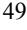

{50}------------------------------------------------

ensuring that each of our clinical trials is conducted in accordance with the general investigational plan and protocols for the trial. Moreover, the FDA requires us to comply with standards, commonly referred to as good clinical practices, or GCPs, for conducting, recording and reporting the results of clinical trials to assure that data and reported results are credible and accurate and that the rights, integrity and confidentiality of trial participants are protected. We also are required to register ongoing clinical trials and post the results of completed clinical trials on a government-sponsored database, ClinicalTrials.gov, within specified timeframes. Failure to do so can result in fines, adverse publicity and civil and criminal sanctions. If we or any of our CROs or other third parties, including trial sites, fails to comply with applicable GCPs, the clinical data generated in our clinical trials may be deemed unreliable and the FDA, EMA or comparable foreign regulatory authorities may require us to perform additional clinical trials before approving our marketing applications. We cannot assure you that upon inspection by a given regulatory authority, such regulatory authority will determine that any of our clinical trials complies with GCP regulations. In addition, our clinical trials must be conducted with product produced under cGMP conditions. Our failure to comply with these regulations may require us to repeat clinical trials, which would delay the regulatory approval process.

In addition, principal investigators for our clinical trials may serve as scientific advisors or consultants to us from time to time and receive compensation in connection with such services. Under certain circumstances, we may be required to report some of these relationships to the FDA. The FDA may conclude that a financial relationship between us and a principal investigator has created a conflict of interest or otherwise affected interpretation of the trial. The FDA may therefore question the integrity of the data generated at the applicable clinical trial site and the utility of the clinical trial itself may be jeopardized. This could result in a delay in approval, or rejection, of our marketing applications by the FDA and may ultimately lead to the denial of marketing approval of VP-102 and any other product candidates.

We also expect to rely on other third parties to store and distribute product supplies for our clinical trials. Any performance failure on the part of our distributors could delay clinical development or marketing approval of our product candidates or commercialization of our products, producing additional losses and depriving us of potential revenue.

# *We currently rely on a third party to supply our raw material used in VP-102, and if we encounter any extended dif iculties in procuring, or creating an alternative for, our raw material in VP-102 or any of our other product candidates we may develop, our business operations would be impaired.*

To date, we have obtained naturally-sourced cantharidin, which is the raw material used to manufacture the API for VP-102 and is obtained from blister beetles, directly or indirectly from suppliers based in the People's Republic of China, or the PRC. We are exposed to a number of environmental risks, including:

- risk of contamination being introduced in the beetle population through environmental factors that we cannot control, which would result in unexpected anomalies or new impurities in the cantharidin;
- loss of the beetle's habitat and other similar environmental risks to the beetle population whether due to climate change, over-development, or otherwise; and
- risk of disease in the beetles.

In addition, any business, public health or economic challenges our existing supplier faces, whether in the ordinary course or not, could impair its ability to meet our cantharidin supply needs. Accordingly, there is a risk that supplies of our product may be significantly delayed by or may become unavailable for an extended period of time as a result of any issues affecting our supplier's supply and production of naturally-sourced cantharidin.

Furthermore, our supplier's operations may be curtailed or delayed in the event the regulators in the PRC determine that our supplier is not acting in accordance with laws or under appropriate permits or licenses. We may also face additional supply chain risks due to the regulatory and political structure of the PRC, or as a result of the international relationship between the PRC and the United States or any of the other countries in which our products are marketed. For example, any deterioration in the trade relationship between the U.S. and China, which imposes any restrictions, tariffs or limitations on the export of cantharidin from China would impact our ability to meet our raw material needs. We are also exposed to foreign exchange risks, and fluctuations in exchange rates between the U.S. dollar and the Renminbi could negatively impact the commercial viability of importing cantharidin from the PRC.

{51}------------------------------------------------

While we have successfully developed a lab scale process for synthesizing the cantharidin molecule, there is risk that we will be unable to scale the process to produce a sufficient quantity of synthetically derived cantharidin to meet our needs and, even if we are ultimately able to scale the proposed process successfully, we cannot predict when we will be able to do so. Intermediate compounds in this proposed synthetic process have been successfully synthesized to a pilot scale. If we are unable to scale the developed process for manufacturing cantharidin synthetically to a satisfactory commercial scale, we may be forced to continue to rely on naturally sourced cantharidin.

Any extended difficulties we face in maintaining our supply of cantharidin, or limitations we face in increasing our supply to meet commercial needs for VP-102 or any of our other product candidates, whether such cantharidin is naturally sourced or synthetically derived, would impair our business operations.

# *We contract with third parties for the manufacture of VP-102 for preclinical and clinical testing and expect to continue to do so for commercialization. This reliance on third parties increases the risk that we will not have suf icient quantities of VP-102 or such quantities at an acceptable cost, which could delay, prevent or impair our development or commercialization ef orts.*

We do not have any manufacturing facilities or personnel. We currently rely, and expect to continue to rely, on third parties for the manufacture of VP-102, or any other product candidates which we may pursue, for preclinical and clinical testing as well as for commercial manufacture if VP-102 or any other product candidate which we may pursue receives marketing approval. This reliance on third parties increases the risk that we will not have sufficient quantities of VP-102 or be able to obtain quantities at an acceptable cost or quality, which could delay, prevent or impair our ability to timely conduct our clinical trials or our other development or commercialization efforts.

We also expect to rely on third-party manufacturers or third-party collaborators for the manufacture of commercial supply of VP-102 or any other product candidates for which we obtain marketing approval. The facilities used by our contract manufacturers to manufacture our product candidates must be approved by the FDA or other regulatory authorities pursuant to inspections that will be conducted prior to approval of our NDA, if at all, and in the future of additional NDAs or comparable marketing application to the FDA or other regulatory authority. We do not have control over a supplier's or manufacturer's compliance with laws, regulations and applicable cGMP standards and other laws and regulations, such as those related to environmental health and safety matters. If our contract manufacturers cannot successfully manufacture material that conforms to our specifications and the strict regulatory requirements of the FDA or others, they will not be able to secure and maintain regulatory approval for their manufacturing facilities. For example, on May 24, 2022, we announced that we received a CRL regarding our NDA for VP-102 from the FDA. The only deficiency listed in the CRL was related to the deficiencies identified at a general reinspection at a facility of Sterling that manufactures VP-102. In addition, we have no control over the ability of our contract manufacturers to maintain adequate quality control, quality assurance and qualified personnel. If the FDA or a comparable foreign regulatory authority does not approve these facilities for the manufacture of our product candidates or if it withdraws any such approval in the future, we may need to find alternative manufacturing facilities, which would significantly impact our ability to develop, obtain regulatory approval for or market our product candidates, if approved.

We may be unable to establish any agreements with future third-party manufacturers or to do so on acceptable terms. Even if we are able to establish agreements with third-party manufacturers, qualifying and validating such manufacturers may take a significant period of time and reliance on third-party manufacturers entails additional risks, including:

- reliance on the third party for regulatory compliance and quality assurance;
- the possible breach of the manufacturing agreement by the third party;
- the possible misappropriation of our proprietary information, including our trade secrets and know-how;
- the possible increase in costs for the applicator components, raw materials or API in VP-102; and
- the possible termination or nonrenewal of any agreement by any third party at a time that is costly or inconvenient for us.

{52}------------------------------------------------

Third-party manufacturers may not be able to comply with cGMP regulations or similar regulatory requirements outside the United States. Our failure, or the failure of our third-party manufacturers, to comply with applicable regulations could result in sanctions being imposed on us, including clinical holds, fines, injunctions, civil penalties, delays, suspension or withdrawal of approvals, license revocation, seizures or recalls of product candidates or drugs, operating restrictions and criminal prosecutions, any of which could significantly and adversely affect supplies of our products.

Our product candidates and any drugs that we may develop may compete with other product candidates and drugs for access to manufacturing facilities. There are no assurances we would be able to enter into similar commercial arrangements with other manufacturers that operate under cGMP regulations and that might be capable of manufacturing for us. Any performance failure on the part of our existing or future manufacturers could delay clinical development or marketing approval.

To date, all assembly of our single-use precision applicators has been done using manual processes. In order to meet anticipated volume requirements, we will need to successfully validate our proposed automated assembly process as designed. If our current contract manufacturers cannot perform as agreed, we may be required to replace such manufacturers. We may incur added costs and delays in identifying and qualifying any such replacement. We expect to continue to depend on third-party contract manufacturers for the foreseeable future. Our current and anticipated future dependence upon others for the manufacture of our product candidates or drugs may adversely affect our future profit margins and our ability to commercialize any drugs that receive marketing approval on a timely and competitive basis. If there is any disruption in our supply chain, it could take a significant period of time to qualify and validate a replacement on terms acceptable to us, if we are able to at all.

# *We have entered into, and may seek additional, collaborations with third parties for the development or commercialization of our product candidates. If those collaborations are not successful, we may not be able to capitalize on the market potential of these product candidates.*

On March 17, 2021, we entered into the Torii Agreement, pursuant to which we granted Torii an exclusive license to develop and commercialize our product candidates that contain a topical formulation of cantharidin for the treatment of molluscum contagiosum and common warts in Japan, including VP-102. Additionally, we granted Torii a right of first negotiation with respect to additional indications for the licensed products and certain additional products for use in the licensed field, in each case in Japan. We may seek additional third-party collaborators for the development and commercialization of our product candidates, including for the commercialization of any of our product candidates that are approved for marketing outside the United States. Our likely collaborators for any collaboration arrangements include large and mid-size pharmaceutical companies, regional and national pharmaceutical companies and biotechnology companies. Such agreements may provide us limited control over the amount and timing of resources that our collaborators dedicate to the development or commercialization of our product candidates. For instance, Torii is responsible for all development activities and specified costs in support of obtaining regulatory approval of the licensed products in Japan, provided that Torii's activities will be overseen by a joint steering committee.

Our ability to generate revenue from these arrangements will depend on our collaborators' abilities to successfully perform the functions assigned to them in these arrangements.

Collaborations involving our product candidates would pose the following risks to us:

- collaborators have significant discretion in determining the efforts and resources that they will apply to these collaborations;
- collaborators may not perform their obligations as expected;
- collaborators may not pursue development and commercialization of any product candidates that achieve regulatory approval or may elect not to continue or renew development or commercialization programs based on clinical trial results, changes in the collaborators' strategic focus or available funding, or external factors, such as an acquisition, that divert resources or create competing priorities;

{53}------------------------------------------------

- collaborators may delay clinical trials, provide insufficient funding for a clinical trial program, stop a clinical trial or abandon a product candidate, repeat or conduct new clinical trials or require a new formulation of a product candidate for clinical testing;
- collaborators could independently develop, or develop with third parties, products that compete directly or indirectly with our product candidates if the collaborators believe that competitive products are more likely to be successfully developed or can be commercialized under terms that are more economically attractive than ours;
- product candidates discovered in collaboration with us may be viewed by our collaborators as competitive with their own product candidates or drugs, which may cause collaborators to cease to devote resources to the commercialization of our product candidates;
- a collaborator with marketing and distribution rights to one or more of our product candidates that achieve regulatory approval may not commit sufficient resources to the marketing and distribution of such products;
- disagreements with collaborators, including disagreements over proprietary rights, contract interpretation or the preferred course of development, might cause delays or termination of the research, development or commercialization of product candidates, might lead to additional responsibilities for us with respect to product candidates, or might result in litigation or arbitration, any of which would be timeconsuming and expensive;
- collaborators may not properly maintain or defend our or their intellectual property rights or may use our or their proprietary information in such a way as to invite litigation that could jeopardize or invalidate such intellectual property or proprietary information or expose us to potential litigation;
- collaborators may infringe the intellectual property rights of third parties, which may expose us to litigation and potential liability; and
- collaborations may be terminated for the convenience of the collaborator and, if terminated, we could be required to raise additional capital to pursue further development or commercialization of the applicable product candidates.

Collaboration agreements may not lead to development or commercialization of product candidates in the most efficient manner or at all. If a present or future collaborator of ours were to be involved in a business combination, the continued pursuit and emphasis on our product development or commercialization program could be delayed, diminished or terminated. Further cannot guarantee these relationships, including our relationship with Torii, will continue or that we will be able to receive the milestone or transfer price payments pursuant to the Torii Agreement or any other future collaboration agreement.

#### *If we are not able to establish additional collaborations, we may have to alter our development and commercialization plans.*

Our product development programs and the potential commercialization of our product candidates will require substantial additional capital. For some of our product candidates, we may decide to collaborate with pharmaceutical and biotechnology companies for the development and potential commercialization of those product candidates. For instance, we have entered into the Torii Agreement, pursuant to which we granted Torii an exclusive license to develop and commercialize our product candidates that contain a topical formulation of cantharidin for the treatment of molluscum contagiosum and common warts in Japan, including VP-102.

We face significant competition in seeking appropriate collaborators. Whether we reach a definitive agreement for a collaboration will depend, among other things, upon our assessment of the collaborator's resources and expertise, the terms and conditions of the proposed collaboration and the proposed collaborator's evaluation of a number of factors. Those factors may include the design or results of clinical trials, the likelihood of approval by the FDA or similar regulatory authorities outside the United States, the potential market for the subject product candidate, the costs and complexities of manufacturing and delivering such product candidate to patients, the potential of competing products, the existence of uncertainty with respect to our ownership of technology, which can exist if there is a challenge to such ownership without regard to the merits of the challenge and industry and market

{54}------------------------------------------------

conditions generally. The collaborator may also consider alternative product candidates or technologies for similar indications that may be available to collaborate on and whether such a collaboration could be more attractive than the one with us for our product candidate. Collaborations are complex and time- consuming to negotiate and document. In addition, there have been a significant number of recent business combinations among large pharmaceutical companies that have resulted in a reduced number of potential future collaborators.

We may not be able to negotiate collaborations on a timely basis, on acceptable terms, or at all. If we are unable to do so, we may have to curtail the development of such product candidate, reduce or delay its development program or one or more of our other development programs, delay its potential commercialization or reduce the scope of any sales or marketing activities, or increase our expenditures and undertake development or commercialization activities at our own expense. If we elect to increase our expenditures to fund development or commercialization activities on our own, we may need to obtain additional capital, which may not be available to us on acceptable terms or at all. If we do not have sufficient funds, we may not be able to further develop our product candidates or bring them to market and generate revenue.

## **Risks Related to Our Intellectual Property**

# *If we are unable to obtain or protect intellectual property rights related to any of our product candidates, we may not be able to compete ef ectively in our market.*

We plan to rely upon a combination of patents, trade secret protection, and confidentiality agreements to protect the intellectual property related to our product candidates. The issuance, scope, validity, enforceability, strength, and commercial value of patents in the pharmaceutical field involves complex legal and scientific questions and can be uncertain. Although we currently have several issued United States and foreign patents, other patent applications that we own may fail to result in other issued patents with claims that cover the product candidates in the United States or in foreign jurisdictions. If this were to occur, early generic competition could be expected against our product candidates in development in certain jurisdictions. There may be relevant prior art relating to our patents and patent applications which could invalidate a patent or prevent a patent from issuing based on a pending patent application. In particular, because the API in many of our product candidates has been available and used for many years, it is possible that these products have previously been used in such a manner that such prior usage would affect our ability to obtain patents based on our patent applications. Moreover, because numerous parties have developed and/or commercialized, or are developing, a wide variety of applicator devices for use with topical dermatological medications, it is possible that prior art related to applicator devices could affect our ability to obtain patent protection for our planned product applicator device or that disputes may arise related to whether third-party applicator devices infringe patents we have applied for.

The patent prosecution process is expensive and time-consuming. We may not be able to prepare, file, and prosecute all necessary or desirable patent applications for a commercially reasonable cost or in a timely manner or in all jurisdictions. It is also possible that we may fail to identify patentable aspects of inventions made in the course of development and commercialization activities before it is too late to obtain patent protection on them. Moreover, depending on the terms of any future in-licenses to which we may become a party, we may not have the right to control the preparation, filing, and prosecution of patent applications, or to maintain the patents, covering technology in-licensed from third parties. Therefore, these patents and patent applications may not be prosecuted and enforced in a manner consistent with the best interests of our business.

In addition to the protection we hope to receive from patents we have applied for, we rely on trade secret protection and confidentiality agreements to protect proprietary know-how that is not patentable, processes for which patents are difficult to enforce and any other elements of our drug development and reformulation processes that involve proprietary know-how, information, or technology that is not covered by patents. Although we generally require all of our employees to assign their inventions to us, and all of our employees, consultants, advisors, and any third parties who have access to our proprietary know-how, information, or technology to enter into confidentiality agreements, we cannot provide any assurances that all such agreements have been duly executed, or that our trade secrets and other confidential proprietary information will not be disclosed. Moreover, our competitors may independently develop knowledge, methods and know-how equivalent to our trade secrets. Competitors could purchase our products and replicate some or all of the competitive advantages we derive from our development efforts for technologies on which we do not have patent protection. If any of our trade secrets were to

{55}------------------------------------------------

be lawfully obtained or independently developed by a competitor, we would have no right to prevent them, or those to whom they communicate it, from using that technology or information to compete with us. If any of our trade secrets were to be disclosed to or independently developed by a competitor, our competitive position would be harmed.

We also seek to preserve the integrity and confidentiality of our data and trade secrets by maintaining physical security of our premises and physical and electronic security of our information technology systems. While we have confidence in these individuals, organizations and systems, agreements or security measures may be breached, and we may not have adequate remedies for any breach. Also, if the steps taken to maintain our trade secrets are deemed inadequate, we may have insufficient recourse against third parties for misappropriating the trade secret. In addition, others may independently discover our trade secrets and proprietary information. The FDA has recently made changes to its rules that may make it harder for the FDA to withhold information from the public and may require the FDA to make certain information publicly accessible, and it is not clear how these new rules will be interpreted. If we are unable to prevent material disclosure of the non-patented intellectual property related to our technologies to third parties, and there is no guarantee that we will have any such enforceable trade secret protection, we may not be able to establish or maintain a competitive advantage in our market, which could materially adversely affect our business, results of operations and financial condition.

# *We may enjoy only limited geographical protection with respect to certain patents and we may not be able to protect our intellectual property rights throughout the world.*

Filing and prosecuting patent applications and defending patents covering our product candidates in all countries throughout the world would be prohibitively expensive. Competitors may use our technologies in jurisdictions where we have not obtained patent protection to develop their own products and, further, may export otherwise infringing products to territories where we have patent protection, but enforcement rights are not as strong as that in the United States or Europe. These products may compete with our product candidates, and our current and future patents or other intellectual property rights may not be effective or sufficient to prevent them from competing.

In addition, we may decide to abandon national and regional patent applications before grant. The examination of each national or regional patent application is an independent proceeding. As a result, patent applications in the same family may issue as patents in some jurisdictions, such as in the United States, but may issue as patents with claims of different scope or may even be refused in other jurisdictions. It is also quite common that depending on the country, the scope of patent protection may vary for the same product candidate or technology.

While we intend to protect our intellectual property rights in our expected significant markets, we cannot ensure that we will be able to initiate or maintain similar efforts in all jurisdictions in which we may wish to market our product candidates. Accordingly, our efforts to protect our intellectual property rights in such countries may be inadequate, which may have an adverse effect on our ability to successfully commercialize our product candidates in all of our expected significant foreign markets. If we encounter difficulties in protecting, or are otherwise precluded from effectively protecting, the intellectual property rights important for our business in such jurisdictions, the value of these rights may be diminished, and we may face additional competition from others in those jurisdictions.

The laws of some jurisdictions do not protect intellectual property rights to the same extent as the laws or rules and regulations in the United States and Europe, and many companies have encountered significant difficulties in protecting and defending such rights in such jurisdictions. The legal systems of certain countries, particularly certain developing countries, do not favor the enforcement of patents, trade secrets, and other intellectual property rights, which could make it difficult for us to stop the infringement of our patents or marketing of competing products in violation of our proprietary rights generally. Proceedings to enforce our patent rights in other jurisdictions, whether or not successful, could result in substantial costs and divert our efforts and attention from other aspects of our business, could put our patents at risk of being invalidated or interpreted narrowly and our patent applications at risk of not issuing as patents, and could provoke third parties to assert claims against us. We may not prevail in any lawsuits that we initiate and the damages or other remedies awarded, if any, may not be commercially meaningful. Accordingly, our efforts to enforce our intellectual property rights around the world may be inadequate to obtain a significant commercial advantage from the intellectual property that we develop or license.

Some countries also have compulsory licensing laws under which a patent owner may be compelled to grant licenses to third parties. In addition, some countries limit the enforceability of patents against government agencies

{56}------------------------------------------------

or government contractors. In those countries, the patent owner may have limited remedies, which could materially diminish the value of such patents. If we are forced to grant a license to third parties with respect to any patents relevant to our business, our competitive position may be impaired.

# *Recent patent reform legislation could increase the uncertainties and costs surrounding the prosecution of our patent applications and the enforcement or defense of our patents.*

Our ability to obtain patents is highly uncertain because, to date, some legal principles remain unresolved, there has not been a consistent policy regarding the breadth or interpretation of claims allowed in patents in the United States and the specific content of patents and patent applications that are necessary to support and interpret patent claims is highly uncertain due to the complex nature of the relevant legal, scientific, and factual issues. Changes in either patent laws or interpretations of patent laws in the United States and other countries may diminish the value of our intellectual property or narrow the scope of our patent protection.

For example, on September 16, 2011, the Leahy-Smith America Invents Act, or the Leahy-Smith Act, was signed into law. The Leahy-Smith Act includes a number of significant changes to United States patent law. These include provisions that affect the way patent applications will be prosecuted and may also affect patent litigation. The United States Patent and Trademark Office, or USPTO, has developed new and untested regulations and procedures to govern the full implementation of the Leahy-Smith Act, and many of the substantive changes to patent law associated with the Leahy-Smith Act, and in particular, the first to file provisions, only became effective in March 2013. The Leahy-Smith Act has also introduced procedures making it easier for third parties to challenge issued patents, as well as to intervene in the prosecution of patent applications. Finally, the Leahy-Smith Act contains new statutory provisions that require the USPTO to issue new regulations for their implementation, and it may take the courts years to interpret the provisions of the new statute. It is too early to tell what, if any, impact the Leahy-Smith Act will have on the operation of our business and the protection and enforcement of our intellectual property. However, the Leahy-Smith Act and its implementation could increase the uncertainties and costs surrounding the prosecution of our patent applications and the enforcement or defense of our patents. Further, the U.S. Supreme Court has ruled on several patent cases in recent years, either narrowing the scope of patent protection available in certain circumstances or weakening the rights of patent owners in certain situations. In addition to increasing uncertainty with regard to our ability to obtain patents in the future, this combination of events has created uncertainty with respect to the value of patents, once obtained. Depending on actions by the U.S. Congress, the federal courts, and the USPTO, the laws and regulations governing patents could change in unpredictable ways that would weaken our ability to obtain new patents or to enforce patents that we have owned or licensed or that we might obtain in the future. An inability to obtain, enforce, and defend patents covering our proprietary technologies would materially and adversely affect our business prospects and financial condition.

Similarly, changes in patent laws and regulations in other countries or jurisdictions or changes in the governmental bodies that enforce them or changes in how the relevant governmental authority enforces patent laws or regulations may weaken our ability to obtain new patents or to enforce patents that we may obtain in the future. Further, the laws of some foreign countries do not protect proprietary rights to the same extent or in the same manner as the laws of the United States. As a result, we may encounter significant problems in protecting and defending our intellectual property both in the United States and abroad. For example, if the issuance to us, in a given country, of a patent covering an invention is not followed by the issuance, in other countries, of patents covering the same invention, or if any judicial interpretation of the validity, enforceability, or scope of the claims, or the written description or enablement, in a patent issued in one country is not similar to the interpretation given to the corresponding patent issued in another country, our ability to protect our intellectual property in those countries may be limited. Changes in either patent laws or in interpretations of patent laws in the United States and other countries may materially diminish the value of our intellectual property or narrow the scope of our patent protection.

# *Obtaining and maintaining our patent protection depends on compliance with various procedural, document submission, fee payment, and other requirements imposed by government patent agencies, and our patent protection could be reduced or eliminated for non-compliance with these requirements.*

Periodic maintenance fees, renewal fees, annuity fees, and various other government fees on patents and/or applications will be due to be paid to the USPTO and various government patent agencies outside of the United States over the lifetime of our patents and/or applications and any patent rights we may obtain in the future. We rely on our outside counsel to pay these fees. The USPTO and various non-U.S. government patent agencies require compliance with several procedural, documentary, fee payment, and other similar provisions during the patent

{57}------------------------------------------------

application process. We employ reputable law firms and other professionals to help us comply. In many cases, an inadvertent lapse can be cured by payment of a late fee or by other means in accordance with the applicable rules. There are situations, however, in which non-compliance can result in abandonment or lapse of the patents or patent applications, resulting in partial or complete loss of patent rights in the relevant jurisdiction. In such an event, potential competitors might be able to enter the market, and this circumstance could harm our business.

# *The patent applications that we have covering our product candidates are limited to specific formulations, preparations and devices, and methods of use and manufacturing processes, and our market opportunity for our product candidates may be limited by the lack of patent protection for the active ingredient itself and by competition from other formulations and manufacturing processes, as well as administration methods that may be developed by competitors***.**

Cantharidin is a naturally occurring compound found in many species of blister beetles and has been used since ancient times for medicinal purposes. Therefore, the composition of matter for the chemical structure of cantharidin itself, which is the API used in our product candidates, is not eligible for patent protection. We seek to obtain patent protection for our manufacturing technology, drug administering technology, and our product candidates, including specific formulations, preparations and devices, and methods of use and manufacturing processes. Although the protection afforded by our patents and patent applications may be significant with respect to VP-102, when looking at the ability of the patents and patent applications to block competition, the protection offered by the patents and patents applications may be, to some extent, more limited than the protection provided by a patent claiming the composition of matter of an entirely new chemical entity previously unknown. As a result, generic products that do not infringe the claims of our patents covering formulations, preparations, devices, methods of use, and manufacturing processes may be available while we are marketing our products. In general, method of use patents are more difficult to enforce than composition of matter patents because, for example, of the risks that the FDA may approve alternative uses of the subject compound not covered by method of use patents, and others may engage in off-label sale or use of the subject compound. Physicians are permitted to prescribe an approved product for uses that are not described in the product's labeling. Although off-label prescriptions may infringe the method of use patents we have applied for, the practice is common across medical specialties and such infringement is difficult to prevent or prosecute. In addition, competitors who obtain the requisite regulatory approval will be able to commercialize products with the same active ingredient as our product candidates so long as the competitors do not infringe any process, use, formulation, preparation or device patents issued to us, protect our product candidates, subject to any regulatory exclusivity we may be able to obtain for our product candidates.

Patent applications covering products containing the same active ingredient as our product candidates indicates that competitors have sought to develop and may seek to commercialize competing formulations that may not be covered by our patents and patent applications. The commercial opportunity for our product candidates could be significantly harmed if competitors are able to develop and commercialize alternative formulations of our product candidates that are different from ours and do not infringe our issued patents covering our product candidates, our device, our manufacturing processes or uses of our product candidates.

#### *We may be involved in lawsuits to protect or enforce our patents, which could be expensive, time consuming and unsuccessful.*

Competitors may infringe the patents we have been granted. To counter infringement or unauthorized use, we may be required to file infringement claims, which can be expensive and time-consuming. If we initiate legal proceedings against a third party to enforce a patent covering one of our product candidates, the defendant could counterclaim that the patent covering our product or product candidate is invalid and/or unenforceable. In patent litigation in the United States, defendant counterclaims alleging invalidity and/or unenforceability are common, and there are numerous grounds upon which a third party can assert invalidity or unenforceability of a patent. In an infringement proceeding, a court may decide that a patent of ours is not valid or is unenforceable or may refuse to stop the other party from using the technology at issue on the grounds that our patents do not cover the technology in question. Third parties may also raise similar claims before administrative bodies in the United States or abroad, even outside the context of litigation. Such mechanisms include re-examination, post grant review, *inter partes* review (IPR), and equivalent proceedings in foreign jurisdictions (e.g., opposition proceedings). Such proceedings could result in revocation of or amendment to our patents in such a way that they no longer cover our product candidates. The outcome following legal assertions of invalidity and unenforceability is unpredictable. With respect

{58}------------------------------------------------

to the validity question, for example, we cannot be certain that there is no invalidating prior art, of which we, our patent counsel, and the patent examiner were unaware during prosecution. If a defendant were to prevail on a legal assertion of invalidity and/or unenforceability, we would lose at least part, and perhaps all, of the patent protection on our product candidates. An adverse result in any litigation or defense proceedings could put one or more of our patents at risk of being invalidated or interpreted narrowly, could put our patent applications at risk of not issuing and could have a material adverse impact on our business.

Interference proceedings provoked by third parties or brought by us may be necessary to determine the priority of inventions with respect to our patent applications. An unfavorable outcome could require us to cease using the related technology or to attempt to license rights to it from the prevailing party. Our business could be harmed if the prevailing party does not offer us a license on commercially reasonable terms. Our defense of litigation or interference proceedings may fail and, even if successful, may result in substantial costs and distract our management and other employees. We may not be able to prevent misappropriation of our intellectual property rights, particularly in countries where the laws may not protect those rights as fully as in the United States.

Furthermore, because of the substantial amount of discovery required in connection with intellectual property litigation, there is a risk that some of our confidential information could be compromised by disclosure during this type of litigation. There could also be public announcements of the results of hearings, motions, or other interim proceedings or developments. If securities analysts or investors perceive these results to be negative, it could have a material adverse effect on the price of our common stock.

#### *Third parties may initiate legal proceedings alleging that we are infringing their intellectual property rights, the outcome of which would be uncertain.*

As our current and future product candidates progress toward commercialization, the possibility of a patent infringement claim against us increases. There can be no assurance that our current and future product candidates do not infringe other parties' patents or other proprietary rights, and competitors or other parties may assert that we infringe their proprietary rights in any event. We may become party to, or threatened with, adversarial proceedings or litigation regarding intellectual property rights with respect to our current and future product candidates, including interference or derivation proceedings before the USPTO. Even if we believe such claims are without merit, a court of competent jurisdiction could hold that these third-party patents are valid, enforceable, and infringed, which could have a negative impact on our ability to commercialize VP-102 and any future product candidates. In order to successfully challenge the validity of any such U.S. patent in federal court, we would need to overcome a presumption of validity. As this burden is a high one requiring us to present clear and convincing evidence as to the invalidity of any such U.S. patent claim, there is no assurance that a court of competent jurisdiction would invalidate the claims of any such U.S. patent. Moreover, given the vast number of patents in our field of technology, we cannot be certain that we do not infringe existing patents, or that we will not infringe patents that may be granted in the future. Because numerous parties have developed and/or commercialized, or are developing, a wide variety of applicator devices for use with topical dermatological medications, it is possible that third parties may assert that our applicator device infringes patents they own or have applied for. While we may decide to initiate proceedings to challenge the validity of these or other patents in the future, we may be unsuccessful, and courts or patent offices in the United States and abroad could uphold the validity of any such patent. Furthermore, because patent applications can take many years to issue and may be confidential for 18 months or more after filing, and because pending patent claims can be revised before issuance, there may be applications now pending which may later result in issued patents that may be infringed by the manufacture, use, or sale of our product candidates. Regardless of when filed, we may fail to identify relevant third-party patents or patent applications, or we may incorrectly conclude that a third-party patent is invalid or not infringed by our product candidates or activities. If a patent holder believes our drug or product candidate infringes its patent, the patent holder may sue us even if we have received patent protection for our technology. Moreover, we may face patent infringement claims from non-practicing entities that have no relevant drug revenue and against whom our own patent portfolio may thus have no deterrent effect. If a patent infringement suit were threatened or brought against us, we could be forced to stop or delay research, development, manufacturing, or sales of the drug or product candidate that is the subject of the actual or threatened suit.

If we are found to infringe a third party's intellectual property rights, we could be required to obtain a license from such third party to continue commercializing our product candidates. However, we may not be able to obtain

{59}------------------------------------------------

any required license on commercially reasonable terms or at all. Even if a license can be obtained on acceptable terms, the rights may be non-exclusive, which could give our competitors access to the same technology or intellectual property rights licensed to us. If we fail to obtain a required license, we may be unable to effectively market product candidates based on our technology, which could limit our ability to generate revenue or achieve profitability and possibly prevent us from generating revenue sufficient to sustain our operations. Alternatively, we may need to redesign our infringing products, which may be impossible or require substantial time and monetary expenditure. Under certain circumstances, we could be forced, including by court orders, to cease commercializing our product candidates. In addition, in any such proceeding or litigation, we could be found liable for substantial monetary damages, potentially including treble damages and attorneys' fees, if we are found to have willfully infringed. A finding of infringement could prevent us from commercializing our product candidates or force us to cease some of our business operations, which could harm our business. Any claims by third parties that we have misappropriated their confidential information or trade secrets could have a similar negative impact on our business.

The cost to us in defending or initiating any litigation or other proceeding relating to patent or other proprietary rights, even if resolved in our favor, could be substantial, and litigation would divert our management's attention. Some of our competitors may be able to sustain the costs of complex patent litigation more effectively than we can because they have substantially greater resources. Uncertainties resulting from the initiation and continuation of patent litigation or other proceedings could delay our research and development efforts and limit our ability to continue our operations.

# *We may be subject to claims that our employees, consultants, or independent contractors have wrongfully used or disclosed confidential information of third parties.*

We employ individuals who were previously employed at other biotechnology or pharmaceutical companies. Although we try to ensure that our employees, consultants, and advisors do not use the proprietary information or know-how of others in their work for us, we may be subject to claims that we or our employees, consultants, or independent contractors have inadvertently or otherwise used or disclosed confidential information of our employees' former employers or other third parties. We may also be subject to claims that former employers or other third parties have an ownership interest in our patents. Litigation may be necessary to defend against these claims. There is no guarantee of success in defending these claims, and even if we are successful, litigation could result in substantial cost and be a distraction to our management and other employees.

#### *We may be subject to claims challenging the inventorship or ownership of our patents and other intellectual property.*

We may also be subject to claims that former employees, collaborators, or other third parties have an ownership interest in our patents and patent applications, our future patents, or other intellectual property. We may be subject to ownership disputes in the future arising, for example, from conflicting obligations of consultants or others who are involved in developing our product candidates. Although it is our policy to require our employees and contractors who may be involved in the conception or development of intellectual property to execute agreements assigning such intellectual property to us, we may be unsuccessful in executing such an agreement with each party who, in fact, conceives or develops intellectual property that we regard as our own, and we cannot be certain that our agreements with such parties will be upheld in the face of a potential challenge, or that they will not be breached, for which we may not have an adequate remedy. The assignment of intellectual property rights may not be self-executing, or the assignment agreements may be breached, and litigation may be necessary to defend against these and other claims challenging inventorship or ownership. If we fail in defending any such claims, in addition to paying monetary damages, we may lose valuable intellectual property rights, such as exclusive ownership of, or right to use, valuable intellectual property. Such an outcome could have a material adverse effect on our business. Even if we are successful in defending against such claims, litigation could result in substantial costs and be a distraction to management and other employees.

# *Reliance on third parties requires us to share our trade secrets, which increases the possibility that a competitor will discover them, or that our trade secrets will be misappropriated or disclosed.*

If we rely on third parties to manufacture or commercialize VP-102 or any future product candidates, or if we collaborate with additional third parties for the development of VP-102 or any future product candidates, we must, at

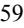

{60}------------------------------------------------

times, share trade secrets with them. We may also conduct joint research and development programs that may require us to share trade secrets under the terms of our research and development partnerships or similar agreements. We seek to protect our proprietary technology in part by entering into confidentiality agreements and, if applicable, material transfer agreements, consulting agreements, or other similar agreements with our advisors, employees, third-party contractors, and consultants prior to beginning research or disclosing proprietary information. These agreements typically limit the rights of the third parties to use or disclose our confidential information, including our trade secrets. Despite the contractual provisions employed when working with third parties, the need to share trade secrets and other confidential information increases the risk that such trade secrets become known by our competitors, are inadvertently incorporated into the technology of others, or are disclosed or used in violation of these agreements. Given that our proprietary position is based, in part, on our know-how and trade secrets, a competitor's discovery of our trade secrets or other unauthorized use or disclosure could have an adverse effect on our business and results of operations.

In addition, these agreements typically restrict the ability of our advisors, employees, third-party contractors, and consultants to publish data potentially relating to our trade secrets. Despite our efforts to protect our trade secrets, we may not be able to prevent the unauthorized disclosure or use of our technical know-how or other trade secrets by the parties to these agreements. Moreover, we cannot guarantee that we have entered into such agreements with each party that may have or have had access to our confidential information or proprietary technology and processes. Monitoring unauthorized uses and disclosures is difficult, and we do not know whether the steps we have taken to protect our proprietary technologies will be effective. If any of the collaborators, scientific advisors, employees, contractors, and consultants who are parties to these agreements breaches or violates the terms of any of these agreements, we may not have adequate remedies for any such breach or violation, and we could lose our trade secrets as a result. Moreover, if confidential information that is licensed or disclosed to us by our partners, collaborators, or others is inadvertently disclosed or subject to a breach or violation, we may be exposed to liability to the owner of that confidential information. Enforcing a claim that a third-party illegally obtained and is using our trade secrets, like patent litigation, is expensive and time consuming, and the outcome is unpredictable. In addition, courts outside the United States are sometimes less willing to protect trade secrets.

#### *Intellectual property rights do not necessarily address all potential threats to our competitive advantage.*

The degree of future protection afforded by our intellectual property rights is uncertain because intellectual property rights have limitations and may not adequately protect our business or permit us to maintain our competitive advantage. The following examples are illustrative:

- others may be able to make products that are similar to our product candidates but that are not covered by the claims of our patents or future patents;
- we or future collaborators might not have been the first to make the inventions covered by our patents, future issued patents, or our pending patent applications;
- we or future collaborators might not have been the first to file patent applications covering certain of our inventions;
- others may independently develop similar or alternative technologies or duplicate any of our technologies without infringing our intellectual property rights;
- it is possible that our pending patent applications will not lead to issued patents;
- issued patents that we own may be held invalid or unenforceable as a result of legal challenges by our competitors;
- issued patents that we own may not provide coverage for all aspects of our product candidates in all countries;
- our competitors might conduct research and development activities in countries where we do not have patent rights and then use the information learned from such activities to develop competitive products for sale in our major commercial markets;
- we may not develop additional proprietary technologies that are patentable; and
- the patents of others may have an adverse effect on our business.

{61}------------------------------------------------

## **Risks Related to Legal and Regulatory Compliance Matters**

# *Our relationships with customers, physicians, and third-party payors may be subject, directly or indirectly, to federal and state healthcare fraud and abuse laws, false claims laws, health information privacy and security laws, and other healthcare laws and regulations. If we are unable to comply, or have not fully complied, with such laws, we could face substantial penalties.*

Healthcare providers, including physicians and third-party payors in the United States and elsewhere will play a primary role in the recommendation and prescription of any product candidates for which we obtain marketing approval. Our current and future arrangements with healthcare professionals, principal investigators, consultants, customers and third-party payors may subject us to various federal and state fraud and abuse laws and other healthcare laws, including, without limitation, the federal Anti-Kickback Statute, the federal civil and criminal false claims laws and the law commonly referred to as the Physician Payments Sunshine Act and regulations. These laws will impact, among other things, our clinical research, proposed sales, marketing and educational programs, and other interactions with healthcare professionals. In addition, we may be subject to patient privacy laws by both the federal government and the states in which we conduct or may conduct our business. The laws that will affect our operations include, but are not limited to:

- the federal Anti-Kickback Statute, which prohibits, among other things, individuals or entities from knowingly and willfully soliciting, receiving, offering or paying any remuneration, directly or indirectly, overtly or covertly, in cash or in kind, in return for the purchase, recommendation, leasing or furnishing of an item or service reimbursable under a federal healthcare program, such as the Medicare and Medicaid programs. The term "remuneration" has been broadly interpreted to include anything of value. Although there are a number of statutory exceptions and regulatory safe harbors protecting some common activities from prosecution, the exceptions and safe harbors are drawn narrowly and require strict compliance in order to offer protection. Practices that involve remuneration that may be alleged to be intended to induce prescribing, purchases or recommendations may be subject to scrutiny if they do not qualify for an exception or safe harbor. A person does not need to have actual knowledge of this statute or specific intent to violate it in order to have committed a violation. In addition, the Patient Protection and Affordable Care Act, as amended by the Health Care and Education Reconciliation Act, or collectively, the ACA, provides that the government may assert that a claim including items or services resulting from a violation of the federal Anti-Kickback Statute constitutes a false or fraudulent claim for purposes of the False Claims Act and the civil monetary penalties statute;
- the federal civil and criminal false claims laws, including, without limitation, the False Claims Act, and civil monetary penalty laws which prohibit, among other things, individuals or entities from knowingly presenting, or causing to be presented, claims for payment or approval from Medicare, Medicaid or other government payors that are false or fraudulent or making a false statement to avoid, decrease or conceal an obligation to pay money to the federal government. A claim includes "any request or demand" for money or property presented to the U.S. government. Several pharmaceutical and other healthcare companies have been prosecuted under these laws for allegedly providing free product to customers with the expectation that the customers would bill federal programs for the product. Other companies have been prosecuted for causing false claims to be submitted because of the companies' marketing of products for unapproved or off-label, and thus non-reimbursable, uses;
- the federal Health Insurance Portability and Accountability Act of 1996, or HIPAA, created additional federal criminal statutes which prohibit, among other things, a person from knowingly and willfully executing, or attempting to execute, a scheme to defraud any healthcare benefit program, including private third-party payors and knowingly and willfully falsifying, concealing or covering up a material fact or making any materially false, fictitious or fraudulent statement in connection with the delivery of or payment for healthcare benefits, items or services. Similar to the federal Anti-Kickback Statute, a person or entity does not need to have actual knowledge of the statute or specific intent to violate it in order to have committed a violation;
- HIPAA, as amended by the Health Information Technology for Economic and Clinical Health Act, or HITECH, and their implementing regulations, which imposes certain requirements relating to the

{62}------------------------------------------------

privacy, security and transmission of individually identifiable health information without appropriate authorization on health plans, healthcare clearinghouses and certain healthcare providers, known as covered entities, and their respective business associates, independent contractors that perform certain services involving the use or disclosure of individually identifiable health information and their subcontractors that use, disclose, access, or otherwise process individually identifiable health information. HITECH also created new tiers of civil monetary penalties, amended HIPAA to make civil and criminal penalties directly applicable to business associates, and gave state attorneys general new authority to file civil actions for damages or injunctions in federal courts to enforce HIPAA and seek attorneys' fees and costs associated with pursuing federal civil actions;

- the federal transparency laws, including the federal Physician Payments Sunshine Act, which requires certain manufacturers of drugs, devices, biologics and medical supplies for which payment is available under Medicare, Medicaid or the Children's Health Insurance Program, with specific exceptions, to report annually to the Centers for Medicare & Medicaid Services, or CMS, information related to: (i) payments or other "transfers of value'' made to physicians (defined to include doctors, dentists, optometrists, podiatrists, and chiropractors), other health care professionals (such as physician assistants and nurse practitioners), and teaching hospitals; and (ii) ownership and investment interests held by physicians and their immediate family members; and
- state and foreign law equivalents of each of the above federal laws; state laws that require manufacturers to report information related to payments and other transfers of value to physicians and other healthcare providers or marketing expenditures; state laws that require pharmaceutical companies to comply with the pharmaceutical industry's voluntary compliance guidelines and the relevant compliance guidance promulgated by the federal government, or that otherwise restrict payments that may be made to healthcare providers; state laws that require the reporting of information related to drug prices; state and local laws that require the registration of pharmaceutical sales representatives; and state and foreign laws that govern the privacy and security of health information in some circumstances, many of which differ from each other in significant ways and often are not preempted by HIPAA, thus complicating compliance efforts.
- U.S. data privacy regulations, such as the CCPA, which creates new individual privacy rights for consumers and places increased privacy and security obligations on entities handling personal data of consumers or households. The CCPA requires covered companies to provide new disclosures to California consumers, provides such consumers new ways to opt-out of certain sales of personal information, and allows for a new cause of action for data breaches;
- new U.S. data privacy regulations, such as the California Privacy Rights Act of 2020 ("CPRA"), effective January 1, 2023, which will expand the CCPA. For example, the CPRA establishes a new California Privacy Protection Agency to implement and enforce the CPRA. In addition, Virginia passed the Consumer Data Protection Act, and Colorado passed the Colorado Privacy Act, both of which differ from the CPRA and become effective in 2023. If we become subject to new data privacy laws, at the state level, the risk of enforcement action against us could increase because we may become subject to additional obligations, and the number of individuals or entities that can initiate actions against us may increase (including individuals, via a private right of action, and state actors).;
- foreign data privacy regulations, such as the General Data Protection Regulation (2016/679), or GDPR, which went into effect on May 25, 2018 and applies to identified or identifiable personal data in electronic or paper form. Under the GDPR, fines of up to €20.0 million or up to 4% of the annual global turnover of the infringer, whichever is greater, could be imposed for significant non-compliance. The GDPR includes more stringent operational requirements for processors and controllers of personal data and creates additional rights for data subjects, including a private right of action. Other such foreign data privacy obligations include the EU GDPR as it forms part of United Kingdom ("UK") law by virtue of section 3 of the European Union (Withdrawal) Act 2018 ("UK GDPR"); and
- data localization and cross-border laws and regulations, such as the GDPR, which generally restricts the transfer of personal data to countries outside of the EEA, such as the United States, which the European Commission does not consider to provide an adequate level of data privacy and security. The European Commission released a set of "Standard Contractual Clauses" that are designed to be a valid mechanism

{63}------------------------------------------------

by which entities can transfer personal data out of the EEA to such jurisdictions. The Standard Contractual Clauses, however, require parties that rely upon that legal mechanism to comply with additional obligations, such as conducting transfer impact assessments to determine whether additional security measures are necessary to protect the at-issue personal data. Moreover, due to potential legal challenges, there exists some uncertainty regarding whether the Standard Contractual Clauses will remain a valid mechanism for transfers of personal data out of the EEA.

Because of the breadth of these laws and the narrowness of the statutory exceptions and regulatory safe harbors available, it is possible that some of our business activities could be subject to challenge under one or more of such laws. It is possible that governmental authorities will conclude that our business practices may not comply with current or future statutes, regulations or case law involving applicable fraud and abuse or other healthcare laws and regulations. If our operations are found to be in violation of any of these laws or any other governmental regulations that may apply to us, we may be subject to significant civil, criminal and administrative penalties, damages, fines, disgorgement, imprisonment, exclusion from participating in government funded healthcare programs, such as Medicare and Medicaid, additional reporting requirements and oversight if we become subject to a corporate integrity agreement or similar agreement to resolve allegations of non-compliance with these laws, contractual damages, reputational harm and the curtailment or restructuring of our operations.

The risk of our being found in violation of these laws is increased by the fact that many of them have not been fully interpreted by the regulatory authorities or the courts, and their provisions are open to a variety of interpretations. Efforts to ensure that our business arrangements with third parties will comply with applicable healthcare laws and regulations will involve substantial costs. Any action against us for violation of these laws, even if we successfully defend against it, could cause us to incur significant legal expenses and divert our management's attention from the operation of our business. The shifting compliance environment and the need to build and maintain robust and expandable systems to comply with multiple jurisdictions with different compliance and/or reporting requirements increases the possibility that a healthcare company may run afoul of one or more of the requirements.

#### *The FDA and other regulatory agencies actively enforce the laws and regulations prohibiting the promotion of of -label uses.*

If VP-102 or other product candidates that we may identify are approved and we are found to have improperly promoted off-label uses of those products, we may become subject to significant liability. The FDA and other regulatory agencies strictly regulate the promotional claims that may be made about prescription products, such as our product candidates, if approved. In particular, generally, a product may not be promoted for uses that are not approved by the FDA or such other regulatory agencies as reflected in the product's approved labeling. However, physicians may, in their independent medical judgment, prescribe legally available products for off-label uses. The FDA does not regulate the behavior of physicians in their choice of treatments but the FDA does restrict manufacturer's communications on the subject of off-label use of their products. If we are found to have promoted such off-label uses, we may become subject to significant liability. The federal government has levied large civil and criminal fines against companies for alleged improper promotion of off-label use and has enjoined several companies from engaging in off-label promotion. The FDA has also required that companies enter into consent decrees or permanent injunctions under which specified promotional conduct is changed or curtailed. If we cannot successfully manage the promotion of our product candidates, if approved, we could become subject to significant liability, which would materially adversely affect our business and financial condition.

## *Even if we obtain regulatory approval for VP-102 or any future product candidates, they will remain subject to ongoing regulatory oversight.*

Even if we obtain any regulatory approval for VP-102 or any future product candidates, such product candidates, once approved, will be subject to ongoing regulatory requirements for manufacturing, labeling, packaging, storage, advertising, promoting, sampling, record-keeping and submitting of safety and other post-market information among other things. Any regulatory approvals that we receive for VP-102 or any future product candidates may also be subject to a REMS, limitations on the approved indicated uses for which the drug may be marketed or to the conditions of approval, or contain requirements for potentially costly post-marketing testing, including Phase 4 trials, and surveillance to monitor the quality, safety and efficacy of the drug. An unsuccessful

{64}------------------------------------------------

post-marketing study or failure to complete such a study could result in the withdrawal of marketing approval. We will further be required to immediately report any serious and unexpected adverse events and certain quality or production problems with our products to regulatory authorities along with other periodic reports.

Any new legislation addressing drug safety issues could result in delays in product development or commercialization, or increased costs to assure compliance. We will also have to comply with requirements concerning advertising and promotion for our products. Promotional communications with respect to prescription drug products are subject to a variety of legal and regulatory restrictions and must be consistent with the information in the product's approved label. As such, we will not be allowed to promote our products for indications or uses for which they do not have approval. The holder of an approved NDA must submit new or supplemental applications and obtain prior approval for certain changes to the approved product, product labeling, or manufacturing process.

In addition, drug manufacturers and their facilities are subject to payment of user fees and continual review and periodic inspections by the FDA and other regulatory authorities for compliance with cGMP requirements and adherence to commitments made in the NDA or foreign marketing application. If we, or a regulatory authority, discover previously unknown problems with a drug, such as adverse events of unanticipated severity or frequency, or problems with the facility where the drug is manufactured or if a regulatory authority disagrees with the promotion, marketing or labeling of that drug, a regulatory authority may impose restrictions relative to that drug, the manufacturing facility or us, including requesting a recall or requiring withdrawal of the drug from the market or suspension of manufacturing.

If we fail to comply with applicable regulatory requirements following approval of VP-102 or any future product candidates, a regulatory authority may:

- issue an untitled letter or warning letter asserting that we are in violation of the law;
- seek an injunction or impose administrative, civil or criminal penalties or monetary fines;
- suspend or withdraw regulatory approval;
- suspend any ongoing clinical trials;
- refuse to approve a pending NDA or comparable foreign marketing application (or any supplements thereto) submitted by us or our strategic partners;
- restrict the marketing or manufacturing of the drug;
- seize or detain the drug or otherwise require the withdrawal of the drug from the market;
- refuse to permit the import or export of product candidates; or
- refuse to allow us to enter into supply contracts, including government contracts.

Any government investigation of alleged violations of law could require us to expend significant time and resources in response and could generate negative publicity. The occurrence of any event or penalty described above may inhibit our ability to commercialize VP-102 or any future product candidates and harm our business, financial condition, results of operations and prospects.

#### *Healthcare legislative or regulatory reform measures may have a negative impact on our business and results of operations.*

In the United States and some foreign jurisdictions, there have been, and continue to be, several legislative and regulatory changes and proposed changes regarding the healthcare system that could prevent or delay marketing approval of product candidates, restrict or regulate post-approval activities, and affect our ability to profitably sell any product candidates for which we obtain marketing approval.

Among policy makers and payors in the United States and elsewhere, there is significant interest in promoting changes in healthcare systems with the stated goals of containing healthcare costs, improving quality and/or expanding access. In the United States, the pharmaceutical industry has been a particular focus of these efforts and has been significantly affected by major legislative initiatives. For example, in March 2010, the ACA was passed, which substantially changed the way healthcare is financed by both the government and private insurers, and

{65}------------------------------------------------

significantly impacts the U.S. pharmaceutical industry. The ACA, among other things: (i) increased the minimum Medicaid rebates owed by manufacturers under the Medicaid Drug Rebate Program and extends the rebate program to individuals enrolled in Medicaid managed care organizations; (ii) established an annual, nondeductible fee on any entity that manufactures or imports certain specified branded prescription drugs and biologic agents apportioned among these entities according to their market share in some government healthcare programs; (iii) expanded the availability of lower pricing under the 340B drug pricing program by adding new entities to the program; (iv) increased the statutory minimum rebates a manufacturer must pay under the Medicaid Drug Rebate Program, to 23.1% and 13% of the average manufacturer price for most branded and generic drugs, respectively and capped the total rebate amount for innovator drugs at 100% of the Average Manufacturer Price, or AMP; (v) expanded the eligibility criteria for Medicaid programs by, among other things, allowing states to offer Medicaid coverage to additional individuals and by adding new mandatory eligibility categories for individuals with income at or below 133% of the federal poverty level, thereby potentially increasing manufacturers' Medicaid rebate liability; (vi) created a new Patient-Centered Outcomes Research Institute to oversee, identify priorities in, and conduct comparative clinical effectiveness research, along with funding for such research; and (vii) established a Center for Medicare and Medicaid Innovation at CMS to test innovative payment and service delivery models to lower Medicare and Medicaid spending, potentially including prescription drug spending.

There have been judicial, Congressional and executive branch challenges to certain aspects of the ACA. While Congress has not passed comprehensive repeal legislation, bills affecting the implementation of certain taxes under the ACA have been signed into law. The Tax Cuts and Jobs Act of 2017, or Tax Act includes a provision repealing, effective January 1, 2019, the tax-based shared responsibility payment imposed by the ACA on certain individuals who fail to maintain qualifying health coverage for all or part of a year that is commonly referred to as the "individual mandate". In addition, the 2020 federal spending package permanently eliminates, effective January 1, 2020, the ACA-mandated "Cadillac" tax on high-cost employer-sponsored health coverage and medical device tax and, effective January 1, 2021, also eliminates the health insurer tax. The Bipartisan Budget Act of 2018, or the BBA, among other things, amended the ACA, effective January 1, 2019, to close the coverage gap in most Medicare drug plans, commonly referred to as the "donut hole." In December 2018, CMS published a final rule permitting further collections and payments to and from certain ACA qualified health plans and health insurance issuers under the ACA risk adjustment program in response to the outcome of federal district court litigation regarding the method CMS uses to determine this risk adjustment. On June 17, 2021, the U.S. Supreme Court dismissed a challenge on procedural grounds that argued the Affordable Care Act is unconstitutional in its entirety because the "individual mandate" was repealed by Congress. Further, there have been a number of health reform measures by the Biden administration that have impacted the ACA. For example, on August 16, 2022, President Biden signed the Inflation Reduction Act of 2022, or IRA, into law, which among other things, extends enhanced subsidies for individuals purchasing health insurance coverage in ACA marketplaces through plan year 2025. The IRA also eliminates the "donut hole" under the Medicare Part D program beginning in 2025 by significantly lowering the beneficiary maximum out-of-pocket cost and creating a new manufacturer discount program. It is possible that the ACA will be subject to judicial or Congressional challenges in the future. It is unclear how such challenges and the healthcare reform measures of the Biden administration will impact the ACA and our business.

Other legislative changes have been proposed and adopted since the ACA was enacted. These changes include aggregate reductions to Medicare payments to providers of 2% per fiscal year pursuant to the Budget Control Act of 2011, which began in 2013, and due to subsequent legislative amendments to the statute, will remain in effect until 2031 unless additional Congressional action is taken. Under current legislation, the actual reduction in Medicare payments will vary from 1% in 2022 to up to 4% in the final fiscal year of this sequester. Additionally, on March 11, 2021, President Biden signed the American Rescue Plan Act of 2021 into law, which eliminates the statutory Medicaid drug rebate cap, currently set at 100% of a drug's average manufacturer price, for single source and innovator multiple source drugs, beginning January 1, 2024. The American Taxpayer Relief Act of 2012, among other things, further reduced Medicare payments to several providers, including hospitals and cancer treatment centers, and increased the statute of limitations period for the government to recover overpayments to providers from three to five years. These new laws may result in additional reductions in Medicare and other healthcare funding, which could have an adverse effect on customers for our product candidates, if approved, and, accordingly, our financial operations.

Additionally, there has been heightened governmental scrutiny in the United States of pharmaceutical pricing practices in light of the rising cost of prescription drugs and biologics. Such scrutiny has resulted in several recent congressional inquiries and proposed and enacted federal and state legislation designed to, among other things, bring more transparency to product pricing, review the relationship between pricing and manufacturer patient programs, and reform government program reimbursement methodologies for products. At the federal level, in July 2021, the Biden administration released an executive order, "Promoting Competition in the American Economy," with

{66}------------------------------------------------

multiple provisions aimed at prescription drugs. In response to Biden's executive order, on September 9, 2021, the Department of Health and Human Services, or HHS released a Comprehensive Plan for Addressing High Drug Prices that outlines principles for drug pricing reform and sets out a variety of potential legislative policies that Congress could pursue to advance these principles. In addition, the IRA, among other things, (1) directs HHS to negotiate the price of certain single-source drugs and biologics covered under Medicare and (2) imposes rebates under Medicare Part B and Medicare Part D to penalize price increases that outpace inflation. These provisions will take effect progressively starting in fiscal year 2023, although they may be subject to legal challenges. It is currently unclear how the IRA will be implemented but is likely to have a significant impact on the pharmaceutical industry. Further, the Biden administration released an additional executive order on October 14, 2022, directing HHS to submit a report within 90 days on how the Center for Medicare and Medicaid Innovation can be further leveraged to test new models for lowering drug costs for Medicare and Medicaid beneficiaries. It is unclear how these developments could affect covered hospitals who might purchase our future products and affect the rates we may charge such facilities for our approved products in the future, if any. At the state level, legislatures are increasingly passing legislation and implementing regulations designed to control pharmaceutical and biological product pricing, including price or patient reimbursement constraints, discounts, restrictions on certain product access and marketing cost disclosure and transparency measures, and, in some cases, designed to encourage importation from other countries and bulk purchasing.

We expect that these and other healthcare reform measures that may be adopted in the future, may result in more rigorous coverage criteria and in additional downward pressure on the price that we receive for any approved drug. Any reduction in reimbursement from Medicare or other government programs may result in a similar reduction in payments from private payors. The implementation of cost containment measures or other healthcare reforms may prevent us from being able to generate revenue, attain profitability, or commercialize our drugs.

In addition, FDA regulations and guidance may be revised or reinterpreted by the FDA in ways that may significantly affect our business and our products. The Trump administration undertook several executive actions, including the issuance of a number of Executive Orders, that could impose significant burdens on, or otherwise materially delay, the FDA's ability to engage in routine oversight activities such as implementing statutes through rulemaking, issuance of guidance, and review and approval of marketing applications. It is difficult to predict how these requirements will be interpreted and implemented and the extent to which they will impact the FDA's ability to exercise its regulatory authority, particularly in light of the new Biden administration. If these executive actions impose restrictions on the FDA's ability to engage in oversight and implementation activities in the normal course, our business may be negatively impacted. Any new regulations or guidance, including implementation of or new guidance regarding the frameworks for compounding under Sections 503A and 503B of the FDCA, or revisions or reinterpretations of existing regulations or guidance, may impose additional costs or lengthen FDA review times for VP-102 or any future product candidates. We cannot determine how changes in regulations, statutes, policies, or interpretations when and if issued, enacted or adopted, may affect our business in the future. Such changes could, among other things, require:

- additional clinical trials to be conducted prior to obtaining approval;
- changes to manufacturing methods;
- recalls, replacements, or discontinuance of one or more of our products; and
- additional recordkeeping.

Such changes would likely require substantial time and impose significant costs, or could reduce the potential commercial value of VP-102 or other product candidates by authorizing competition in the form of compounded cantharidin products, and could materially harm our business and our financial results. In addition, delays in receipt of or failure to receive regulatory clearances or approvals for any other products would harm our business, financial condition, and results of operations.

## *Our business activities may be subject to the Foreign Corrupt Practices Act, or FCPA, and similar anti-bribery and anti-corruption laws.*

Our business activities may be subject to the FCPA and similar anti-bribery or anti-corruption laws, regulations or rules of other countries in which we operate. The FCPA generally prohibits offering, promising,

{67}------------------------------------------------

giving, or authorizing others to give anything of value, either directly or indirectly, to a non-U.S. government official in order to influence official action, or otherwise obtain or retain business. The FCPA also requires public companies to make and keep books and records that accurately and fairly reflect the transactions of the corporation and to devise and maintain an adequate system of internal accounting controls. Our business is heavily regulated and therefore involves significant interaction with public officials, including officials of non-U.S. governments. Additionally, in many other countries, the health care providers who prescribe pharmaceuticals are employed by their government, and the purchasers of pharmaceuticals are government entities; therefore, our dealings with these prescribers and purchasers are subject to regulation under the FCPA. We may engage third parties to sell our products sell our products outside the United States, to conduct clinical trials, and/or to obtain necessary permits, licenses, patent registrations, and other regulatory approvals. We have direct or indirect interactions with officials and employees of government agencies or government-affiliated hospitals, universities, and other organizations. There is no certainty that all of our employees, agents, suppliers, manufacturers, contractors, or collaborators, or those of our affiliates, will comply with all applicable laws and regulations, particularly given the high level of complexity of these laws. We can be held liable for the corrupt or other illegal activities of our employees, agents, contractors, and other collaborators, even if we do not explicitly authorize or have actual knowledge of such activities.

Violations of these laws and regulations could result in fines, criminal sanctions against us, our officers, or our employees, the closing down of facilities, including those of our suppliers and manufacturers, requirements to obtain export licenses, cessation of business activities in sanctioned countries, implementation of compliance programs, and prohibitions on the conduct of our business. Any such violations could include prohibitions on our ability to offer our products in one or more countries as well as difficulties in manufacturing or continuing to develop our products, and could materially damage our reputation, our brand, our international expansion efforts, our ability to attract and retain employees, and our business, prospects, operating results, and financial condition.

# *We are subject to governmental export and import controls that could impair our ability to compete in international markets due to licensing requirements and subject us to liability if we are not in compliance with applicable laws. Compliance with these legal requirements could limit our ability to compete in foreign markets and subject us to liability if we violate them.*

We are subject to export control and import laws and regulations, including the U.S. Export Administration Regulations, U.S. Customs regulations and various economic and trade sanctions regulations administered by the U.S. Treasury Department's Office of Foreign Assets Controls. Exports of our product candidates outside of the U.S. must be made in compliance with these laws and regulations. If we fail to comply with these laws and regulations, we and certain of our employees could be subject to substantial civil or criminal penalties, including the possible loss of export or import privileges; fines, which may be imposed on us and responsible employees or managers; and, in extreme cases, the incarceration of responsible employees or managers.

In addition, changes in our product candidates or changes in applicable export or import laws and regulations may create delays in the introduction, provision or sale of our product candidates in international markets, prevent customers from using our product candidates or, in some cases, prevent the export or import of our product candidates to certain countries, governments or persons altogether. Any limitation on our ability to export, provide or sell our product candidates could adversely affect our business, financial condition and results of operations.

### **Risks Related to Employee Matters and Managing Our Growth**

#### *Our future success depends on our ability to retain key executives and to attract, retain and motivate qualified personnel.*

We are highly dependent on the management, development, clinical, financial and business development expertise of Ted White, our President and Chief Executive Officer, Joe Bonaccorso, our Chief Commercial Officer, Gary Goldenberg, our Chief Medical Officer, P. Terence Kohler Jr., our Chief Financial Officer, Chris Hayes, our Chief Legal Officer and the other members of our scientific and clinical teams. While we have entered into employment agreements with our executive officers, each of them may currently terminate their employment with us at any time. We do not maintain "key person" insurance for any of our executives or employees.

Recruiting and retaining qualified scientific and clinical personnel and, if we progress the development of our product pipeline toward scaling up for commercialization, manufacturing and sales and marketing personnel, will

{68}------------------------------------------------

also be critical to our success. The loss of the services of our executive officers or other key employees could impede the achievement of our development and commercialization objectives and seriously harm our ability to successfully implement our business strategy. Furthermore, replacing executive officers and key employees may be difficult and may take an extended period of time because of the limited number of individuals in our industry with the breadth of skills and experience required to successfully develop, gain regulatory approval of and commercialize products. Competition to hire from this limited pool is intense, and we may be unable to hire, train, retain or motivate these key personnel on acceptable terms given the competition among numerous pharmaceutical and biotechnology companies for similar personnel. We also experience competition for the hiring of scientific and clinical personnel from universities and research institutions. In addition, we rely on consultants and advisors, including scientific and clinical advisors, to assist us in formulating our development and commercialization strategy. Our consultants and advisors may be employed by employers other than us and may have commitments under consulting or advisory contracts with other entities that may limit their availability to us. If we are unable to continue to attract and retain high quality personnel, our ability to pursue our growth strategy will be limited.

## *We expect to expand our development and regulatory capabilities and potentially implement sales, marketing and distribution capabilities, and as a result, we may encounter dif iculties in managing our growth, which could disrupt our operations.*

As of December 31, 2022, we had 22 full-time employees. As our development progresses, we expect to experience significant growth in the number of our employees and the scope of our operations, particularly in the areas of product development, regulatory affairs and, if any of our product candidates receives marketing approval, sales, marketing and distribution. To manage our anticipated future growth, we must continue to implement and improve our managerial, operational and financial systems, expand our facilities and continue to recruit and train additional qualified personnel. Due to our limited financial resources and the limited experience of our management team in managing a company with such anticipated growth, we may not be able to effectively manage the expansion of our operations or recruit and train additional qualified personnel. The expansion of our operations may lead to significant costs and may divert our management and business development resources. Any inability to manage growth could delay the execution of our business plans or disrupt our operations.

# *Our employees, independent contractors, consultants, commercial collaborators, principal investigators, CROs, suppliers and vendors may engage in misconduct or other improper activities, including non-compliance with regulatory standards and requirements.*

We are exposed to the risk that our employees, independent contractors, consultants, commercial collaborators, principal investigators, CROs, suppliers and vendors may engage in fraudulent conduct or other illegal activity. Misconduct by these parties could include intentional, reckless and/or negligent conduct or disclosure of unauthorized activities to us that violates FDA regulations, including those laws requiring the reporting of true, complete and accurate information to the FDA, manufacturing standards, federal and state healthcare laws and regulations, and laws that require the true, complete and accurate reporting of financial information or data. In particular, sales, marketing and business arrangements in the healthcare industry are subject to extensive laws and regulations intended to prevent fraud, kickbacks, self-dealing and other abusive practices. These laws and regulations may restrict or prohibit a wide range of pricing, discounting, marketing and promotion, sales commission, customer incentive programs and other business arrangements. Misconduct by these parties could also involve the improper use of individually identifiable information, including, without limitation, information obtained in the course of clinical trials, which could result in regulatory sanctions and serious harm to our reputation. We have adopted a code of business conduct and ethics, but it is not always possible to identify and deter misconduct, and the precautions we take to detect and prevent this activity may not be effective in controlling unknown or unmanaged risks or losses or in protecting us from governmental investigations or other actions or lawsuits stemming from a failure to be in compliance with such laws or regulations. If any such actions are instituted against us, and we are not successful in defending ourselves or asserting our rights, those actions could have a significant impact on our business, including the imposition of significant civil, criminal and administrative penalties, including, without limitation, damages, fines, disgorgement, imprisonment, exclusion from participation in government healthcare programs, such as Medicare and Medicaid, additional reporting requirements and oversight if we become subject to a corporate integrity agreement or similar agreement to resolve allegations of non-compliance with these laws, and the curtailment or restructuring of our operations.

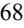

{69}------------------------------------------------

# *The trading price of the shares of our common stock may be volatile, and purchasers of our common stock could incur substantial losses.*

Our stock price may be volatile. The stock market in general and the market for biopharmaceutical companies in particular have experienced extreme volatility that has often been unrelated to the operating performance of particular companies. As a result of this volatility, investors may not be able to sell their common stock at or above the price paid for the shares. The market price for our common stock may be influenced by many factors, including:

- the commencement, enrollment or results of our clinical trials of VP-102 for the treatment of external genital warts and common warts and any future clinical trials we may conduct, or changes in the development status of our product candidates;
- any delay in our regulatory filings for VP-102 for the treatment of molluscum, external genital warts and common warts or any other product candidate we may develop, including VP-315 and VP-103, and any adverse development or perceived adverse development with respect to the applicable regulatory authority's review of such filings, including without limitation the FDA's issuance of a "refusal to file" letter or a request for additional information;
- adverse results from, delays in or termination of clinical trials;
- adverse regulatory decisions, including failure to receive regulatory approval of our product candidates;
- unanticipated serious safety concerns related to the use of VP-102 or any other product candidate;
- changes in financial estimates by us or by any securities analysts who might cover our stock;
- conditions or trends in our industry;
- changes in the market valuations of similar companies;
- stock market price and volume fluctuations of comparable companies and, in particular, those that operate in the biopharmaceutical industry;
- publication of research reports about us or our industry or positive or negative recommendations or withdrawal of research coverage by securities analysts;
- announcements by us or our competitors of significant acquisitions, strategic partnerships or divestitures;
- announcements of investigations or regulatory scrutiny of our operations or lawsuits filed against us;
- investors' general perception of our company and our business;
- recruitment or departure of key personnel;
- overall performance of the equity markets;
- trading volume of our common stock;
- disputes or other developments relating to proprietary rights, including patents, litigation matters and our ability to obtain patent protection for our technologies;
- significant lawsuits, including patent or stockholder litigation;
- changes in the structure of healthcare payment systems;
- general political and economic conditions; and
- other events or factors, many of which are beyond our control.

In addition, in the past, stockholders have initiated class action lawsuits against pharmaceutical and biotechnology companies following periods of volatility in the market prices of these companies' stock. Such litigation, if instituted against us, could cause us to incur substantial costs and divert management's attention and resources from our business.

{70}------------------------------------------------

# *Sales of a substantial number of shares of our common stock in the public market could cause the market price of our common stock to drop significantly, even if our business is doing well.*

Sales of a substantial number of shares of our common stock in the public market could occur at any time, subject to the restrictions and limitations described below. If our stockholders sell, or the market perceives that our stockholders intend to sell, substantial amounts of our common stock in the public market, the market price of our common stock could decline significantly. All of our outstanding shares of common stock are available for sale in the public market, subject only to the restrictions of Rule 144 under the Securities Act in the case of our affiliates.

In addition, we have filed registration statements on Form S-8 under the Securities Act registering the issuance of shares of common stock subject to options or other equity awards issued or reserved for future issuance under our equity incentive plans. Shares registered under this registration statement on Form S-8 are available for sale in the public market subject to vesting arrangements and exercise of options, the lock-up agreements described above and the restrictions of Rule 144 in the case of our affiliates.

# *Provisions in our corporate charter documents and under Delaware law may prevent or frustrate attempts by our stockholders to change our management and hinder ef orts to acquire a controlling interest in us, and the market price of our common stock may be lower as a result.*

There are provisions in our certificate of incorporation and bylaws that may make it difficult for a third party to acquire, or attempt to acquire, control of our company, even if a change of control was considered favorable by you and other stockholders. For example, our board of directors has the authority to issue up to 10,000,000 shares of preferred stock. The board of directors can fix the price, rights, preferences, privileges, and restrictions of the preferred stock without any further vote or action by our stockholders. The issuance of shares of preferred stock may delay or prevent a change of control transaction. As a result, the market price of our common stock and the voting and other rights of our stockholders may be adversely affected. An issuance of shares of preferred stock may result in the loss of voting control to other stockholders.

Our charter documents contain other provisions that could have an anti-takeover effect, including:

- only one of our three classes of directors are elected each year;
- stockholders are not entitled to remove directors other than by a 66 ⅔% vote and only for cause;
- stockholders are not permitted to take actions by written consent;
- stockholders cannot call a special meeting of stockholders; and
- stockholders must give advance notice to nominate directors or submit proposals for consideration at stockholder meetings.

In addition, we are subject to the anti-takeover provisions of Section 203 of the Delaware General Corporation Law, which regulates corporate acquisitions by prohibiting Delaware corporations from engaging in specified business combinations with particular stockholders of those companies. These provisions could discourage potential acquisition proposals and could delay or prevent a change of control transaction. They could also have the effect of discouraging others from making tender offers for our common stock, including transactions that may be in your best interests. These provisions may also prevent changes in our management or limit the price that investors are willing to pay for our stock.

# *Concentration of ownership of our common stock among our existing executive of icers, directors and principal stockholders may prevent our other stockholders from influencing significant corporate decisions.*

Our executive officers, directors and current beneficial owners of 5% or more of our common stock and their respective affiliates, including entities affiliated with Paul B. Manning, in the aggregate, beneficially own a majority of our outstanding common stock. As a result, these persons, acting together, can significantly influence all matters requiring stockholder approval, including the election and removal of directors, any merger, consolidation, sale of all or substantially all of our assets, or other significant corporate transactions.

{71}------------------------------------------------

Some of these persons or entities may have interests different than yours. For example, because many of these stockholders purchased their shares at prices substantially below the current market price of our common stock and have held their shares for a longer period, they may be more interested in selling our company to an acquirer than other investors, or they may want us to pursue strategies that deviate from the interests of other stockholders.

# *We are an "emerging growth company" and, as a result of the reduced disclosure and governance requirements applicable to emerging growth companies, our common stock may be less attractive to investors.*

We are an "emerging growth company" as defined in the Jumpstart Our Business Startups Act of 2012, or the JOBS Act, and we intend to take advantage of some of the exemptions from reporting requirements that are applicable to other public companies that are not emerging growth companies, including:

- being permitted to provide only two years of audited financial statements, in addition to any required unaudited interim financial statements, with correspondingly reduced "Management's Discussion and Analysis of Financial Condition and Results of Operations" disclosure;
- not being required to comply with the auditor attestation requirements in the assessment of our internal control over financial reporting;
- not being required to comply with any requirement that may be adopted by the Public Company Accounting Oversight Board regarding mandatory audit firm rotation or a supplement to the auditor's report providing additional information about the audit and the financial statements;
- reduced disclosure obligations regarding executive compensation in our periodic reports, proxy statements and registration statements; and
- not being required to hold a nonbinding advisory vote on executive compensation and shareholder approval of any golden parachute payments not previously approved.

We cannot predict if investors will find our common stock less attractive because we will rely on these exemptions. If some investors find our common stock less attractive as a result, there may be a less active trading market for our common stock and our stock price may be more volatile. We may take advantage of these reporting exemptions until we are no longer an emerging growth company. We will remain an emerging growth company until December 31, 2023.

Under Section 107(b) of the JOBS Act, emerging growth companies can delay adopting new or revised accounting standards until such time as those standards apply to private companies. We have irrevocably elected not to avail ourselves of this exemption from new or revised accounting standards and, therefore, we will be subject to the same new or revised accounting standards as other public companies that are not emerging growth companies.

# *If we fail to maintain proper and ef ective internal controls our ability to produce accurate financial statements on a timely basis could be impaired.*

We are subject to the reporting requirements of the Securities Exchange Act of 1934, the Sarbanes-Oxley Act and the rules and regulations of the stock market on which our common stock is listed. The Sarbanes-Oxley Act requires, among other things, that we maintain effective disclosure controls and procedures and internal control over financial reporting.

We perform system and process evaluation and testing of our internal control over financial reporting to allow management to report on the effectiveness of our internal control over financial reporting in our Form 10-K filing for that year, as required by Section 404 of the Sarbanes-Oxley Act. This requires that we incur substantial additional professional fees and internal costs to expand our accounting and finance functions and that we expend significant management efforts.

Our internal control over financial reporting will not prevent or detect all errors and all fraud. A control system, no matter how well designed and operated, can provide only reasonable, not absolute, assurance that the control system's objectives will be met. Because of the inherent limitations in all control systems, no evaluation of controls can provide absolute assurance that misstatements due to error or fraud will not occur or that all control issues and instances of fraud will be detected.

{72}------------------------------------------------

If we are not able to comply with the requirements of Section 404 of the Sarbanes-Oxley Act in a timely manner, or if we are unable to maintain proper and effective internal controls, we may not be able to produce timely and accurate financial statements. If that were to happen, the market price of our stock could decline and we could be subject to sanctions or investigations by the stock exchange on which our common stock is listed, the Securities and Exchange Commission, or SEC, or other regulatory authorities.

#### *We might not be able to utilize a significant portion of our net operating loss carryforwards.*

As of December 31, 2022, we had federal and state net operating loss carryforwards of approximately \$118.1 million and \$120.7 million, respectively. The federal net operating loss carryforwards included in the foregoing totals that were generated in tax years prior to 2018 (federal of approximately \$6.9 million) will begin to expire, if not utilized, by 2033. These net operating loss carryforwards could expire unused and be unavailable to offset future income tax liabilities. Under the 2017 federal income tax law changes, as modified by subsequent legislation the federal net operating losses incurred in tax years beginning in 2018 and future years may be carried forward indefinitely, but the deductibility of such federal net operating losses is limited to no more than 80% of the excess, if any, of current year taxable income. In addition, under Section 382 of the Internal Revenue Code of 1986, as amended, and corresponding provisions of state law, if a corporation undergoes an "ownership change," which is generally defined as a greater than 50% change, by value, in its equity ownership over a three-year period, the corporation's ability to use its pre-change net operating loss carryforwards and other pre-change tax attributes to offset its post-change income or taxes may be limited. We may experience ownership changes in the future as a result of subsequent shifts in our stock ownership, some of which may be outside of our control. If an ownership change occurs and our ability to use our net operating loss carryforwards is materially limited, it would harm our future operating results by effectively increasing our future tax obligations.

#### *We do not anticipate paying any cash dividends on our common stock in the foreseeable future.*

You should not rely on an investment in our common stock to provide dividend income. We have not declared or paid cash dividends on our common stock to date. We currently intend to retain our future earnings, if any, to fund the development and growth of our business. In addition, the terms of the Loan Agreements restrict us from paying dividends, subject to limited exceptions, and any future debt agreements may also preclude us from paying dividends. As a result, capital appreciation, if any, of our common stock will be your sole source of gain for the foreseeable future. Investors seeking cash dividends should not purchase our common stock.

#### *We have begun to incur increased costs and demands upon management as a result of being a public company.*

As a public company listed in the United States, we have begun to incur significant additional legal, accounting and other costs. These additional costs could negatively affect our financial results. In addition, changing laws, regulations and standards relating to corporate governance and public disclosure, including regulations implemented by the SEC and the Nasdaq Stock Market, may increase legal and financial compliance costs and make some activities more time-consuming. These laws, regulations and standards are subject to varying interpretations and, as a result, their application in practice may evolve over time as new guidance is provided by regulatory and governing bodies. We intend to invest resources to comply with evolving laws, regulations and standards, and this investment may result in increased general and administrative expenses and a diversion of management's time and attention from revenue-generating activities to compliance activities. If notwithstanding our efforts to comply with new laws, regulations and standards, we fail to comply, regulatory authorities may initiate legal proceedings against us and our business may be harmed.

Failure to comply with these rules might also make it more difficult for us to obtain some types of insurance, including director and officer liability insurance, and we might be forced to accept reduced policy limits and coverage or incur substantially higher costs to obtain the same or similar coverage. The impact of these events could also make it more difficult for us to attract and retain qualified persons to serve on our board of directors, on committees of our board of directors or as members of senior management.

{73}------------------------------------------------

# *Our amended and restated certificate of incorporation provides that the Court of Chancery of the State of Delaware and, to the extent enforceable, the federal district courts of the United States of America will be the exclusive forums for substantially all disputes between us and our stockholders, which could limit our stockholders' ability to obtain a favorable judicial forum for disputes with us or our directors, of icers or employees.*

Our amended and restated certificate of incorporation provides that the Court of Chancery of the State of Delaware is the exclusive forum for (i) any derivative action or proceeding brought on our behalf, (ii) any action asserting a claim for breach of a fiduciary duty owed by any of our directors, officers or other employees to us or our stockholders, (iii) any action asserting a claim arising pursuant to any provision of the Delaware General Corporation Law, our amended and restated certificate of incorporation or our amended and restated bylaws or (iv) any action asserting a claim governed by the internal affairs doctrine. Our amended and restated certificate of incorporation further provides that the federal district courts of the United States of America will be the exclusive forum for resolving any complaint asserting a cause of action arising under the Securities Act, subject to and contingent upon a final adjudication in the State of Delaware of the enforceability of such exclusive forum provision. These exclusive forum provisions may limit a stockholder's ability to bring a claim in a judicial forum that it finds favorable for disputes with us or our directors, officers or other employees, which may discourage such lawsuits against us and our directors, officers and other employees. For example, stockholders who do bring a claim in the Court of Chancery could face additional litigation costs in pursuing any such claim, particularly if they do not reside in or near the State of Delaware. The Court of Chancery and federal district courts may also reach different judgments or results than would other courts, including courts where a stockholder considering an action may be located or would otherwise choose to bring the action, and such judgments or results may be more favorable to us than to our stockholders. Some companies that adopted a similar federal district court forum selection provision are currently subject to a suit in the Chancery Court of Delaware by stockholders who assert that the provision is not enforceable. If a court were to find either choice of forum provision contained in our amended and restated certificate of incorporation to be inapplicable or unenforceable in an action, we may incur additional costs associated with resolving such action in other jurisdictions, which could adversely affect our business and financial condition. For example, the Court of Chancery of the State of Delaware recently determined that the exclusive forum provision of federal district courts of the United States of America for resolving any complaint asserting a cause of action arising under the Securities Act is not enforceable. However, this decision has been appealed and may be reviewed and ultimately overturned by the Delaware Supreme Court. If this ultimate adjudication were to occur, we would enforce the federal district court exclusive forum provision in our amended and restated certificate of incorporation.

### **General Risk Factors**

# *Our business and operations would suf er in the event of computer system failures, cyber-attacks or a deficiency in our cyber-security, including but not limited to regulatory investigations or actions; litigation; fines and penalties; disruptions of our business operations; reputational harm; loss of revenue or profits; and other adverse consequences.*

Despite the implementation of security measures, our internal computer systems, and those of third parties on which we rely, are vulnerable to damage from computer viruses, malware, natural disasters, terrorism, war, telecommunication and electrical failures, cyber-attacks or cyber-intrusions over the Internet, attachments to emails, persons inside our organization, or persons with access to systems inside our organization. Cyberattacks, malicious internet-based activity, and online and offline fraud are prevalent and continue to increase. These threats are becoming increasingly difficult to detect. These threats come from a variety of sources. In addition to traditional computer "hackers," threat actors, personnel (such as through theft or misuse), sophisticated nation-states, and nation-state-supported actors now engage in attacks. We and the third parties upon which we rely may be subject to a variety of evolving threats, including but not limited to social-engineering attacks (including through phishing attacks), malicious code (such as viruses and worms), malware (including as a result of advanced persistent threat intrusions), denial-of-service attacks (such as credential stuffing), personnel misconduct or error, ransomware attacks, supply-chain attacks, software bugs, server malfunctions, software or hardware failures, loss of data or other information technology assets, adware, telecommunications failures, earthquakes, fires, floods, and other similar threats.

Any of the foregoing could result in a material disruption of our clinical and product development activities and business operations, in addition to possibly requiring substantial expenditures of resources to remedy. For example, the loss or compromise of clinical trial data from completed or ongoing clinical trials could result in delays in our regulatory approval efforts and significantly increase our costs to recover or reproduce the data. To the extent

{74}------------------------------------------------

that any disruption or security incident was to result in a loss or damage to our data or applications, or inappropriate disclosure of confidential or proprietary information, we could incur significant unexpected losses, expenses and liabilities, we could face litigation or suffer reputational harm and the further development of our product candidates could be delayed. Our contracts may not contain limitations of liability, and even where they do, there can be no assurance that limitations of liability in our contracts are sufficient to protect us from liabilities, damages, or claims related to our data privacy and security obligations. We cannot be sure that our insurance coverage will be adequate or sufficient to protect us from or to mitigate liabilities arising out of our privacy and security practices, that such coverage will continue to be available on commercially reasonable terms or at all, or that such coverage will pay future claims.

# *Unfavorable conditions, including inflationary pressure, in the global economy could limit our ability to grow our business and negatively af ect our operating results.*

General worldwide economic conditions have experienced significant instability in recent years including the recent global economic uncertainty and financial market conditions. For example, inflation rates, particularly in the United States and United Kingdom, have increased recently to levels not seen in years, and increased inflation may result in increases in our operating costs (including our labor costs), reduced liquidity and limits on our ability to access credit or otherwise raise capital. In addition, the Federal Reserve has raised, and may again raise, interest rates in response to concerns about inflation, which coupled with reduced government spending and volatility in financial markets may have the effect of further increasing economic uncertainty and heightening these risks. Additionally, financial markets around the world experienced volatility following the invasion of Ukraine by Russia in February 2022. These conditions make it extremely difficult for us to accurately forecast and plan future business activities.

# *COVID-19 has impacted and could continue to adversely impact our business.*

COVID-19 has spread worldwide, resulting in governments implementing numerous containment measures such as travel bans and restrictions, quarantines and shutdowns. These measures have impacted, and may further impact, our workforce and operations.

As COVID-19 continues to evolve, we may experience continued and additional disruptions or impairments that could impact our business, supply chain, clinical trials, or ability to obtain regulatory approval for, or commercialize, VP-102, including:

- delays or inability to obtain raw material, ingredients, or components;
- possible capacity constraints at key suppliers and service providers which could impact the ability to build launch stock;
- further delays or difficulties in enrolling patients in our clinical trials;
- further delays or difficulties in clinical site initiation, including difficulties in recruiting clinical site investigators and clinical site staff;
- limitations on travel or access to third-party facilities imposed or recommended by federal or state governments, employers, suppliers, and others; and
- limitations of internal and third-party employee resources that would otherwise be focused on the above activities, including sickness of employees or their families, travel restrictions or social distancing, or the desire of employees to avoid contact with large groups of people.

## *An active trading market for our common stock may not continue to develop or be sustained.*

Prior to our initial public offering, there was no public market for our common stock, and we cannot assure you that an active trading market for our shares will continue to develop or be sustained. As a result, it may be difficult for you to sell shares at an attractive price or at all.

{75}------------------------------------------------

# *If equity research analysts do not publish research or reports, or publish unfavorable research or reports, about us, our business or our market, our stock price and trading volume could decline.*

The trading market for our common stock will be influenced by the research and reports that equity research analysts publish about us and our business. As a newly public company, we have only limited research coverage by equity research analysts. Equity research analysts may elect not to initiate or continue to provide research coverage of our common stock, and such lack of research coverage may adversely affect the market price of our common stock. Even if we continue to have equity research analyst coverage, we will not have any control over the analysts or the content and opinions included in their reports. The price of our stock could decline if one or more equity research analysts downgrade our stock or issue other unfavorable commentary or research. If one or more equity research analysts ceases coverage of our company or fails to publish reports on us regularly, demand for our stock could decrease, which in turn could cause our stock price or trading volume to decline.

## *Our ef ective tax rate may fluctuate, and we may incur obligations in tax jurisdictions in excess of accrued amounts.*

We are subject to taxation in more than one tax jurisdiction. As a result, our effective tax rate is derived from a combination of applicable tax rates in the various places that we operate. In preparing our financial statements, we estimate the amount of tax that will become payable in each of such places. Nevertheless, our effective tax rate may be different than experienced in the past due to numerous factors, including passage of the 2017 federal income tax law, changes in the mix of our profitability from jurisdiction to jurisdiction, the results of examinations and audits of our tax filings, our inability to secure or sustain acceptable agreements with tax authorities, changes in accounting for income taxes and changes in tax laws. Any of these factors could cause us to experience an effective tax rate significantly different from previous periods or our current expectations.

## **ITEM 1B. UNRESOLVED STAFF COMMENTS**

None.

#### **ITEM 2. PROPERTIES**

On July 1, 2019, we entered into a lease for 5,829 square feet of office space located in West Chester, Pennsylvania that serves as our headquarters. The initial term of the lease is seven years with one five-year renewal option and an ongoing right of first offer to lease up to approximately 5,000 square feet of additional space on the same floor of the building. On March 12, 2020, we entered into an amendment to that lease agreement. The amendment expands the original premises to include 5,372 square feet of additional office space increasing the total rentable premise to 11,201 square feet of space. The commencement date for the lease was September 1, 2020.

We believe that our existing facilities are suitable and adequate to meet our current needs. We intend to add new facilities or expand existing facilities as we add employees, and we believe that suitable additional or substitute space will be available as needed to accommodate any such expansion of our operations.

## **ITEM 3. LEGAL PROCEEDINGS**

On June 6, 2022, plaintiff Kranthi Gorlamari, or Gorlamari, filed a putative class action complaint captioned Gorlamari v. Verrica Pharmaceuticals Inc., et al., in the U.S. District Court for the Eastern District of Pennsylvania against us and certain of our current and former officers and directors ("Defendants"). Gorlamari filed an amended complaint on January 12, 2023. The amended complaint alleges that Defendants violated federal securities laws by, among other things, failing to disclose certain manufacturing deficiencies at the facility where our contract manufacturer produced bulk solution for the VP-102 drug device and that such deficiencies posed a risk to the prospects for regulatory approval of VP-102 for the treatment of molluscum. The amended complaint seeks unspecified compensatory damages and other relief on behalf of Gorlamari and all other persons and entities which

{76}------------------------------------------------

purchased or otherwise acquired our securities between May 19, 2021 and May 24, 2022. The litigation is still in the early stages, and we intend to vigorously defend ourself against these allegations.

From time to time, we may be subject to litigation and claims arising in the ordinary course of business. Other than as set forth above, we are not currently a party to any material legal proceedings and we are not aware of any pending or threatened legal proceeding against us that we believe could have a material adverse effect on our business, operating results, cash flows or financial condition.

# **ITEM 4. MINE SAFETY DISCLOSURES**

None.

{77}------------------------------------------------

## **PART II**

# **ITEM 5. MARKET FOR REGISTRANT'S COMMON EQUITY, RELATED STOCKHOLDER MATTERS AND ISSUER PURCHASES OF EQUITY SECURITIES**

#### **Dividend Policy**

We have never declared or paid, and do not anticipate declaring or paying, in the foreseeable future, any cash dividends on our capital stock. We currently intend to retain all available funds and any future earnings to support our operations and finance the growth and development of our business. Pursuant to the Loan Agreements, we are also restricted from paying dividends or making other distributions or payments on our capital stock, subject to limited exceptions. Any future determination related to our dividend policy will be made at the discretion of our board of directors and will depend upon, among other factors, our results of operations, financial condition, capital requirements, contractual restrictions, business prospects and other factors our board of directors may deem relevant.

#### **Stockholders**

Our common stock is listed on the Nasdaq Global Select Market under the symbol "VRCA". As of March 1, 2023, we had 41,852,053 shares of common stock outstanding held by 20 holders of record. The actual number of stockholders is greater than this number of record holders and includes stockholders who are beneficial owners but whose shares are held in street name by brokers and other nominees. This number of holders of record also does not include stockholders whose shares may be held in trust by other entities.

#### **Use of Proceeds from Initial Public Offering of Common Stock**

Not applicable.

**Recent Sales of Unregistered Securities**

None.

## **Purchases of Equity Securities by the Issuer and Affiliated Parties**

None.

#### **ITEM 6. RESERVED**

{78}------------------------------------------------

#### **ITEM 7. MANAGEMENT'S DISCUSSION AND ANALYSIS OF FINANCIAL CONDITION AND RESULTS OF OPERATIONS**

*You should read the following discussion and analysis of our financial condition and results of operations in conjunction with the financial statements and the related notes to those statements included later in this Annual Report. In addition to historical financial information, the following discussion contains forward*‑*looking statements that reflect our plans, estimates, beliefs and expectations that involve risks and uncertainties. Our actual results and the timing of events could dif er materially from those discussed in these forward*‑*looking statements. Factors that could cause or contribute to these dif erences include those discussed below and elsewhere in this Annual Report, particularly in Item 1A. "Risk Factors" and "Special Note Regarding Forward*‑*Looking Statements."*

#### **Overview**

We are a dermatology therapeutics company developing medications for skin diseases requiring medical intervention. We are primarily focused on developing clinician administered therapies in areas of high unmet need. Our current product pipeline consists of three product candidates: (i) VP-102, a propriety drug-device combination that contains a GMP-controlled formulation of cantharidin which is being developed for potential use in treating molluscum contagiosum, external genital warts and common warts, (ii) VP-315, an oncolytic peptide-based injectable therapy for the potential treatment of dermatology oncologic conditions, including basal cell carcinoma, and (iii) VP-103, a second cantharidin based drug device combination for the potential treatment of plantar warts.

Our lead product candidate, VP-102, is initially being developed for the treatment of molluscum contagiosum, or molluscum, a highly contagious and primarily pediatric viral skin disease. There are currently no products approved by the U.S. Food and Drug Administration, or FDA, nor is there an established standard of care for any of these diseases, resulting in significant undertreated populations. Molluscum and common warts are two of the largest unmet needs in dermatology. VP-102 has the potential to be the first FDA-approved product for molluscum and for its active pharmaceutical ingredient, or API, to be characterized as a new chemical entity, or NCE, with the five years of non-patent regulatory exclusivity associated with that designation. We also believe VP-102 has the potential to qualify for pediatric exclusivity in common warts, which would provide for an additional six months of non-patent exclusivity. In addition, our granted patents and pending patent applications include claims drawn to our cantharidin formulations, applicator devices and related accessories, dosing regimens, methods of preparation including methods of synthesis, and methods of use.

In January 2019, we reported positive top-line results from our Phase 3 CAMP-1 and CAMP-2 pivotal trials with VP-102 for the treatment of molluscum. Both clinical trials evaluated the safety and efficacy of VP-102 compared to placebo. In each trial, we observed that a clinically and statistically significant proportion of subjects treated with VP-102 achieved complete clearance of all treatable molluscum lesions compared to subjects treated with placebo. VP-102 was well-tolerated in both trials, with no serious adverse events reported in VP-102 treated subjects. CAMP-1 was conducted under a special protocol assessment, or SPA, agreement with the FDA. Based on the results from these trials, we submitted a new drug application, or NDA, to the FDA for VP-102 for the treatment of molluscum in September 2019. In November 2019, we received notice that the FDA accepted the NDA for filing, with a Prescription Drug User Fee Act, or PDUFA, goal date of July 13, 2020. In July 2020, we received a Complete Response Letter, or CRL, from the FDA for our NDA. We resubmitted our NDA for VP-102 for the treatment of molluscum in December 2020. In February 2021, we received notice that the FDA accepted the resubmitted NDA for filing, with a PDUFA goal date of June 23, 2021 which was subsequently extended to September 23, 2021.

On September 17, 2021, the FDA issued a CRL regarding our NDA for VP-102. According to the CRL, the FDA identified deficiencies at a facility of Sterling Pharmaceutical Services, or Sterling, a contract manufacturing organization, or CMO, which were unrelated to the manufacturing of VP-102 but instead raise general quality issues at the facility. The FDA did not identify any clinical, safety or product specific CMC deficiencies related to VP-102. Following the CRL, on September 22, 2021 we received a General Advice Letter from the FDA with recommendations to improve VP-102's user interface. On November 5, 2021, we were notified that the inspection of Sterling has been classified as "voluntary action indicated", or VAI, was closed and that the VAI classification will not directly negatively impact FDA's assessment of our NDA regarding Sterling. With the satisfactory resolution of the facility inspection, we resubmitted the NDA for the approval of VP-102 for the treatment of molluscum. The resubmission was limited to those sections and elements of the NDA that were identified as deficiencies in the CRL

{79}------------------------------------------------

issued by the FDA in September 2021. In December 2021 the FDA acknowledged our resubmission of the NDA and assigned a PDUFA goal date of May 24, 2022.

On May 24, 2022, we announced that we received a CRL regarding our NDA for VP-102 from the FDA. The only deficiency listed in the CRL was related to the deficiencies identified at a general reinspection at a facility of Sterling that manufactured VP-102. Sterling received notice from the FDA on May 19, 2022 that as a result of the inspection, it is on "official action indicated", or OAI, status. This classification resulted from a week-long reinspection of Sterling conducted by the FDA in February 2022 but none of the issues identified by the FDA during the reinspection were specific to the manufacture of VP-102. We were also informed by the FDA that it had completed its review of our NDA and product label, there were no open questions on the NDA review, and the VP-102 label was ready to be communicated. On June 27, 2022 we held a Type A meeting with the FDA regarding the path forward for the resubmission and potential approval of the NDA for VP-102. During the Type A meeting the FDA indicated that it could not accept our NDA resubmission with Sterling listed as the primary manufacturer of the bulk solution for VP-102 if Sterling was on OAI status at the time of resubmission. Following the FDA's commentary, we selected a new CMO partner to produce the bulk solution, Piramal Pharma Solutions, and the technology transfer process was completed in January 2023. On January 23, 2023 we resubmitted the NDA for VP-102 to the FDA. The FDA accepted our NDA resubmission on February 27, 2023 and assigned a PDUFA goal date of July 23, 2023.

In addition, we are also developing VP-102 for the treatment of external genital warts. We initiated a Phase 2 clinical trial evaluating the optimal dose regimen, efficacy, safety and tolerability of VP-102 in patients with external genital warts in June 2019. In November 2020, we announced positive topline results from our Phase 2 clinical trial of VP-102 for the treatment of external genital warts. Based on the results of the Phase 2 trial, we intend to initiate a Phase 3 trial of VP-102 for the treatment of external genital warts and to dose the first patient in the second half of 2024.

We also intend to develop our product candidate, VP-315, for the treatment of dermatological oncology indications. The FDA accepted our IND in November 2021. We dosed the first patient in a Phase 2 trial of VP-315 in Basal Cell Carcinoma in April 2022. The Phase 2 trial is a three-part, openlabel, multicenter, dose-escalation, proof-of-concept study with a safety run-in designed to assess the safety, pharmacokinetics, and efficacy of VP-315 when administered intratumorally to adults with biopsy-proven basal cell carcinoma. In Part 1 of the trial, VP-315 demonstrated a favorable safety and tolerability profile with no reported serious adverse events. We expect to initiate Part 2 of the trial in the second quarter of 2023 and Part 3 of the trial in the second half of 2023.

In addition, we are conducting necessary drug development activities for VP-103, our second cantharidin-based product candidate, and are evaluating when to initiate a Phase 2 clinical trial for the treatment of plantar warts.

In June 2019, we announced positive topline results from our COVE-1 Phase 2 open label clinical trial of VP-102 for the treatment of verruca vulgaris, or common warts. Based on feedback from the FDA regarding a potential Phase 3 trial protocol, we are currently evaluating conducting an additional Phase 2 clinical trial of VP-102 for the treatment of common warts that would be designed to further evaluate the treatment indication, application time, or regimen and long term sustainability.

On March 17, 2021, we entered into a collaboration and license agreement, or the Torii Agreement, with Torii Pharmaceutical Co., Ltd., or Torii, pursuant to which we granted Torii an exclusive license to develop and commercialize our product candidates that contain a topical formulation of cantharidin for the treatment of molluscum contagiosum and common warts in Japan, including VP-102. Additionally, we granted Torii a right of first negotiation with respect to additional indications for the licensed products and certain additional products for use in the licensed field, in each case in Japan. Pursuant to the Torii Agreement, we are entitled to receive an up-front payment from Torii of \$11.5 million. On July 25, 2022 Torii dosed the first patient in its Phase 3 trial of VP-102 (referred to as TO-208 in Japan) for molluscum contagiosum in Japan, triggering an \$8.0 million milestone payment recognized as collaboration revenue in the year ended December 31, 2022. Additionally, we are entitled to receive from Torii an additional \$50.0 million in aggregate payments contingent on achievement of specified development, regulatory, and sales milestones, in addition to tiered transfer price payments for supply of product in the percentage range of the mid-30s to the mid-40s of net sales. We recognized collaboration revenue of \$1.0

{80}------------------------------------------------

million for the year ended December 31, 2022 related to supplies and development activity pursuant to this agreement.

On March 7, 2022, pursuant to the Torii Agreement, we entered into a Clinical Supply Agreement with Torii, whereby we are obligated to supply product to Torii for use in clinical trials and other development activities. We recognized billed and unbilled collaboration revenue of \$0.9 million and \$0.1 million, respectively for the year ended December 31, 2022, related to supplies and development activity pursuant to this agreement.

In August 2020, we entered into an exclusive license agreement with Lytix Biopharma AS, or Lytix, pursuant to which we obtained a worldwide, license for certain technology of Lytix to develop VP-315 for use in all malignant and pre-malignant dermatological indications, other than metastatic melanoma and metastatic Merkel cell carcinoma.

Our strategy is to advance VP-102 through regulatory approval and self-commercialize in the United States for the treatment of several skin diseases. We intend to build a specialized sales organization in the United States focused on pediatric dermatologists, dermatologists, and select pediatricians. In the future, we also intend to develop VP-102 for commercialization in additional geographic regions, either alone or together with a strategic partner.

Since our inception in 2013, our operations have focused on developing VP-102, organizing and staffing our company, business planning, raising capital, establishing our intellectual property portfolio and conducting clinical trials. We do not have any product candidates approved for sale and have not generated any revenue from product sales. We have funded our operations primarily through the sale of equity and equity-linked securities and through borrowing under our loan agreement with Silicon Valley Bank, or SVB.

On June 19, 2018, we completed an IPO of common stock, which resulted in the issuance and sale of 5,750,000 shares of common stock at a public offering price of \$15.00 per share, generating net proceeds of \$78.4 million after deducting underwriting discounts and other offering costs. We completed a follow-on public offering of our common stock in March 2021, generating net proceeds of \$28.1 million after deducting underwriting discounts and other offering costs. In July 2022, we closed a second follow-on public offering in which we sold 13,575,000 shares of common stock at a public offering price of \$2.10 per share, resulting in total net proceeds of \$26.9 million after deducting underwriting discounts and commissions, and offering expenses. In February 2023, we closed an underwritten offering of 750,000 shares of our common stock and pre-funded warrants to purchase 4,064,814 shares of common stock. The shares of common stock were sold at a price of \$6.75 per share and the pre-funded warrants were sold at a price of \$6.7499 per prefunded warrant, resulting in total net proceeds of \$30.1 million, after deducting underwriting discounts and commissions, and offering expenses.

We believe that our existing cash and cash equivalents as of December 31, 2022, plus the net proceeds from the February 2023 offering of common stock and pre-funded warrants of \$30.1 million will be sufficient to support our planned operations into the first quarter of 2024.

Since inception, we have incurred significant operating losses. For the years ended December 31, 2022 and 2021, our net loss was \$24.5 million and \$35.1 million, respectively. As of December 31, 2022, we had an accumulated deficit of \$163.5 million. We expect to continue to incur significant expenses and operating losses for the foreseeable future. We anticipate that our expenses will increase significantly in connection with our ongoing activities, as we:

- continue our ongoing clinical program evaluating VP-315 for the treatment of basal cell carcinoma and potentially additional dermatological oncology indications;
- initiate clinical trials evaluating VP-102 for the treatment of external genital warts;
- continue our ongoing clinical programs evaluating VP-102 for the treatment of common warts as well as initiate and complete additional clinical trials, as needed;
- initiate clinical trials evaluating VP-103 for the treatment of plantar warts;

{81}------------------------------------------------

- pursue regulatory approvals for VP-102 for the treatment of molluscum, and eventually for the treatment of external genital warts, common warts or any other indications we may pursue for VP-102, as well as for VP-103 or VP-315;
- seek to discover and develop additional product candidates;
- ultimately establish a commercialization infrastructure and scale up external manufacturing and distribution capabilities to commercialize any product candidates for which we may obtain regulatory approval, including VP-102, VP-315 and VP-103;
- seek to in-license or acquire additional product candidates for other dermatological conditions;
- adapt our regulatory compliance efforts to incorporate requirements applicable to marketed products;
- maintain, expand and protect our intellectual property portfolio;
- hire additional clinical, manufacturing and scientific personnel;
- add operational, financial and management information systems and personnel, including personnel to support our product development and planned future commercialization efforts; and
- incur additional legal, accounting and other expenses in operating as a public company.

Unfavorable conditions in the economy both in the United States and abroad may negatively affect the growth of our business and our results of operations. For example, macroeconomic events, including the COVID-19 pandemic, rising inflation, the U.S. Federal Reserve raising interest rates and the Russia-Ukraine war, have led to economic uncertainty globally. The effect of macroeconomic conditions may not be fully reflected in our results of operations until future periods. If, however, economic uncertainty increases or the global economy worsens, our business, financial condition and results of operations may be harmed. For further discussion of the potential impacts of macroeconomic events on our business, financial condition, and operating results, see the section titled "Risk Factors."

#### **Critical Accounting Estimates**

The preparation of our financial statements requires us to make estimates and assumptions that affect the reported amounts of assets and liabilities and the disclosure of contingent assets and liabilities at the date of our financial statements, as well as the reported revenues and expenses during the reported periods. We base our estimates on historical experience and on various other factors that we believe are reasonable under the circumstances, the results of which form the basis for making judgments about the carrying value of assets and liabilities that are not apparent from other sources. Actual results may differ from these estimates under different assumptions or conditions.

A summary of our significant accounting policies appears in the notes to our audited financial statements for the year ended December 31, 2022 included in this Annual Report on Form 10-K. However, we believe that the following accounting estimate is important to understanding and evaluating our reported financial results, and we have accordingly included it in this discussion.

#### *Research and Development Costs*

We rely on third parties to conduct our preclinical studies and clinical trials, and to provide services, including manufacturing of product in connection with the clinical trials. At the end of each reporting period, we compare payments made to third-party service providers to the estimated progress toward completion of the applicable research or development objectives. Such estimates are subject to change as additional information becomes available. Depending on the timing of payments to the service providers and the progress that we estimate has been made as a result of the service provided, we may record net prepaid or accrued expense relating to these costs. As of December 31, 2022, we did not make any material adjustments to our prior estimates of accrued research and development expenses.

{82}------------------------------------------------

#### **JOBS Act**

In April 2012, the Jumpstart Our Business Startups Act of 2012, or the JOBS Act, was enacted. Section 107 of the JOBS Act provides that an "emerging growth company" can take advantage of the extended transition period provided in Section 7(a)(2)(B) of the Securities Act for complying with new or revised accounting standards. Thus, an emerging growth company can delay the adoption of certain accounting standards until those standards would otherwise apply to private companies. We have irrevocably elected not to avail ourselves of this extended transition period and, as a result, we will adopt new or revised accounting standards on the relevant dates on which adoption of such standards is required for other public companies.

Subject to certain conditions, as an emerging growth company, we may rely on certain exemptions, including exemptions from (i) providing an auditor's attestation report on our system of internal controls over financial reporting pursuant to Section 404(b) of the Sarbanes-Oxley Act and (ii) complying with any requirement that may be adopted by the Public Company Accounting Oversight Board regarding mandatory audit firm rotation or a supplement to the auditor's report providing additional information about the audit and the financial statements, known as the auditor discussion and analysis. We will remain an emerging growth company until December 31, 2023.

## **Components of Operating Results**

#### *Collaboration Revenue*

We have not received any revenue from product sales since our inception. Collaboration revenue represents revenue from the Torii Agreement pursuant to which we granted Torii an exclusive license to develop and commercialize our product candidates that contain a topical formulation of cantharidin for the treatment of molluscum contagiosum and common warts in Japan including VP-102.

## *Operating Expenses*

#### *Research and Development Expenses*

Research and development expenses consist of expenses incurred in connection with the discovery and development of our product candidates. We expense research and development costs as incurred. These expenses include:

- expenses incurred under agreements with contract research organizations, or CROs, as well as investigative sites and consultants that conduct our clinical trials and preclinical studies;
- manufacturing and supply scale-up expenses and the cost of acquiring and manufacturing preclinical and clinical trial supply and commercial supply, including manufacturing validation batches;
- outsourced professional scientific development services;
- employee-related expenses, which include salaries, benefits and stock-based compensation;
- expenses relating to regulatory activities; and
- laboratory materials and supplies used to support our research activities.

Research and development activities are central to our business model. Product candidates in later stages of clinical development generally have higher development costs than those in earlier stages of clinical development, primarily due to the increased size and duration of later-stage clinical trials. We expect our research and development expenses to increase over the next several years as we increase personnel costs, including stock-based compensation, initiate and conduct clinical trials of VP-102 in patients with external genital warts, VP-102 in patients with common warts, VP-315 for dermatological oncology indications,VP-103 in patients with plantar warts, and conduct other clinical trials and prepare regulatory filings for our product candidates.

{83}------------------------------------------------

The successful development of our product candidates is highly uncertain. At this time, we cannot reasonably estimate or know the nature, timing and costs of the efforts that will be necessary to complete the remainder of the development of, or when, if ever, material net cash inflows may commence from our product candidates. This uncertainty is due to the numerous risks and uncertainties associated with the duration and cost of clinical trials, which vary significantly over the life of a project as a result of many factors, including:

- the number of clinical sites included in the trials;
- the length of time required to enroll suitable patients;
- the number of patients that ultimately participate in the trials;
- the number of doses patients receive;
- the duration of patient follow-up; and
- the results of our clinical trials.

Our expenditures are subject to additional uncertainties, including the manufacturing process for our product candidates, the terms and timing of regulatory approvals, and the expense of filing, prosecuting, defending and enforcing any patent claims or other intellectual property rights. We may never succeed in achieving regulatory approval for our product candidates. We may obtain unexpected results from our clinical trials. We may elect to discontinue, delay or modify clinical trials of our product candidates. A change in the outcome of any of these variables with respect to the development of a product candidate could mean a significant change in the costs and timing associated with the development of that product candidate. For example, if the FDA or other regulatory authorities were to require us to conduct clinical trials beyond those that we currently anticipate, or if we experience significant delays in enrollment in any of our clinical trials, we could be required to expend significant additional financial resources and time on the completion of clinical development.

#### *General and Administrative Expenses*

General and administrative expenses consist principally of salaries and related costs for personnel in executive and administrative functions, including stock-based compensation, travel expenses and recruiting expenses. Other general and administrative expenses include market research costs, insurance costs, and professional fees for audit, tax and legal services.

We anticipate that our general and administrative expenses, including payroll and related expenses, will increase in the future as we continue to increase our headcount to support the expected growth in our business, expand our operations and organizational capabilities, and prepare for potential commercialization of VP-102 for the treatment of molluscum, if successfully developed and approved. We also anticipate increased expenses associated with general operations, including costs related to audit, tax and legal services, director and officer insurance premiums, and investor relations costs.

#### *Cost of Collaboration Revenue*

The costs of collaboration revenue consists of payments for manufacturing supply to support development and testing services pursuant to the Torii Clinical Supply Agreement.

#### *Income Taxes*

Since our inception in 2013, we have not recorded any U.S. federal or state income tax benefits for the net losses we have incurred in each year due to our uncertainty of realizing a benefit from those items. As of December 31, 2022, we had federal and state net operating loss carryforwards of approximately \$118.1 million and \$120.7 million, respectively. The federal net operating loss carryforwards included in the foregoing totals that were generated prior to 2018 (federal of approximately \$6.9 million) will begin to expire, if not utilized, by 2033. Utilization of the net operating loss carryforwards may be subject to an annual limitation according to Section 382 of the Internal Revenue Code of 1986, as amended, and similar provisions.

{84}------------------------------------------------

## **Results of Operations for the Years Ended December 31, 2022 and 2021**

The following table summarizes our results of operations for the years ended December 31, 2022 and 2021 (in thousands):

|                                | For the Year Ended December 31, |    |           |    |           |
|--------------------------------|---------------------------------|----|-----------|----|-----------|
|                                | 2022                            |    | 2021      |    | Change    |
| Collaboration revenue          | \$ 9,032                     | \$ | 12,000    | \$ | (2,968 )  |
| Expenses:                      |                                 |    |           |    |           |
| Research and development       | 12,198                          |    | 15,929    |    | (3,731 )  |
| General and administrative     | 17,405                          |    | 26,979    |    | (9,574 )  |
| Cost of collaboration revenue  | 725                             |    | —         |    | 725       |
| Total expenses                 | 30,328                          |    | 42,908    |    | (12,580 ) |
| Loss from operations           | (21,296 )                       |    | (30,908 ) |    | 9,612     |
| Other (expense) income:        |                                 |    |           |    |           |
| Interest income                | 476                             |    | 123       |    | 353       |
| Interest expense               | (2,172 )                        |    | (4,295 )  |    | 2,123     |
| Loss on extinguishment of debt | (1,437 )                        |    | —         |    | (1,437 )  |
| Other expense                  | (58 )                           |    | —         |    | (58 )     |
| Total other expense, net       | (3,191 )                        |    | (4,172 )  |    | 981       |
| Net loss                       | \$ (24,487 )                 | \$ | (35,080 ) | \$ | 10,593    |
|                                |                                 |    |           |    |           |

#### *Collaboration Revenue*

Collaboration revenue was \$9.0 million for the year ended December 31, 2022, compared to \$12.0 million for the year ended December 31, 2021. For the year ended December 31, 2022, we recognized an \$8.0 million milestone payment and revenue of \$1.0 million related to supplies and development activity. Pursuant to the exercise of the license option in March 17, 2021 per the Torii Agreement we recognized revenue of \$12.0 million for the year ended December 31, 2021 comprised of an up-front payment of \$0.5 million received in December 2020 and \$11.5 million payment paid in April 2021.

#### *Research and Development Expenses*

Research and development expenses were \$12.2 million for the year ended December 31, 2022, compared to \$15.9 million for the year ended December 31, 2021. The decrease of \$3.7 million was primarily attributable to decreased Chemistry, Manufacturing and Controls, or CMC, costs related to our development of VP-102 for molluscum and a decrease of \$1.3 million related to payments made to Lytix upon the achievement of a regulatory milestones for VP-315 partially offset by increased clinical costs related to our on-going clinical trials for VP-315.

The following table summarizes our research and development expense by product candidate or, for unallocated expenses, by type for the years ended December 31, 2022 and 2021. We did not incur any research and development expense for VP-103 during the years ended December 31, 2022 or 2021.

|                                  | For the Year Ended December 31, |    |        |    |          |
|----------------------------------|------------------------------------|----|--------|----|----------|
|                                  | 2022                               |    | 2021   |    | Change   |
| VP-102                           | \$ 3,474                        | \$ | 6,174  | \$ | (2,700 ) |
| VP-315                           | 2,955                              |    | 3,825  |    | (870 )   |
| Stock based compensation         | 1,460                              |    | 1,513  |    | (53 )    |
| Other unallocated expenses       | 4,309                              |    | 4,417  |    | (108 )   |
| Research and development expense | \$ 12,198                       | \$ | 15,929 | \$ | (3,731 ) |

{85}------------------------------------------------

## *General and Administrative Expenses*

General and administrative expenses were \$17.4 million for the year ended December 31, 2022, compared to \$27.0 million for the year ended December 31, 2021. The decrease of \$9.6 million was primarily driven by lower expenses related to pre-commercial activities for VP-102 and decreases in headcount, insurance, professional fees, and other operating costs.

## *Cost of Collaboration Revenue*

Collaboration revenue costs were \$0.7 million for the year ended December 31, 2022, compared to no costs for the year ended December 31, 2021. The cost of collaboration revenue during 2022 consisted of payments for manufacturing supply to support development and testing services pursuant to the Torii Clinical Supply Agreement.

#### *Interest Income*

Interest income for the years ended December 31, 2022 and 2021 consisted of interest earned on our cash, cash equivalents and marketable securities. The increase of \$0.4 million was primarily a result of higher interest rates.

#### *Interest Expense*

Interest expense for the year ended December 31, 2022 and 2021 consisted of interest expense on the Mezzanine Loan Agreement as noted in Note 11 to our financial statements. The decrease of \$2.1 million was primarily a result of the voluntary repayment of the Mezzanine Loan Agreement on July 11, 2022.

## *Loss on Extinguishment of Debt*

For the year ended December 31, 2022, we recognized a \$1.4 million loss on debt extinguishment which was made up entirely of non-cash unamortized debt issuance costs as a result of the voluntary repayment of the Mezzanine Loan Agreement on July 11, 2022.

# **Results of Operations for Years Ended December 31, 2021 and 2020**

For a discussion and analysis of changes in financial condition and results of operations for the year ended December 31, 2021 as compared to the year ended December 31, 2020, refer to our Annual Report on Form 10-K for the fiscal year ended December 31, 2021, filed with the SEC on March 3, 2022.

#### **Liquidity and Capital Resources**

#### *Overview*

Since our inception, we have not generated any product revenue and have incurred net losses and negative cash flows from our operations. We have financed our operations since inception through sales of our convertible preferred stock, the sale of our common stock in our IPO, receiving aggregate gross proceeds of \$123.2 million and most recently, \$28.1 and \$26.9 million in net proceeds from issuance of common stock in follow-on offerings in March 2021 and July 2022, respectively, and \$20.0 million from the Torii Agreement. In February 2023, we closed an underwritten offering of 750,000 shares of our common stock and pre-funded warrants to purchase 4,064,814 shares of common stock. The shares of common stock were sold at a price of \$6.75 per share and the pre-funded warrants were sold at a price of \$6.7499 per pre-funded warrant, resulting in total net proceeds of \$30.1 million, after deducting underwriting discounts and commissions, and offering expenses.

As of December 31, 2022, we had cash and cash equivalents of \$34.3 million. Cash in excess of immediate requirements is invested in accordance with our investment policy, primarily with a view to liquidity and capital preservation.

85

In addition, we have an operating lease for office space in West Chester with obligations through September 1, 2027 of \$1.8 million including imputed interest.

## *Indebtedness*

{86}------------------------------------------------

On March 10, 2020, we entered into (i) a mezzanine loan and security agreement, or the Mezzanine Loan Agreement, with Silicon Valley Bank, as administrative agent and collateral agent, or the Agent, and Silicon Valley Bank and West River Innovation Lending Fund VIII, L.P., as lenders, or the Mezzanine Lenders, pursuant to which the Mezzanine Lenders have agreed to lend us up to \$50.0 million in a series of term loans, and (ii) a loan and security agreement, or the Senior Loan Agreement, and together with the Mezzanine Loan Agreement, the Loan Agreements, with Silicon Valley Bank, as lender, or the Senior Lender, and together with the Mezzanine Lenders, the Lenders, pursuant to which the Senior Lender has agreed to provide us a revolving line of credit of up to \$5.0 million. Upon entering into the Loan Agreements, we borrowed \$35.0 million in term loans, or the Term A Loan, from the Mezzanine Lenders. We entered into amendments to the Loan Agreements in October 2020 under which we borrowed an additional \$5.0 million in term loans, or the Term B1 Loan and together with the Term A Loan, the Loans, on March 1, 2021.

On July 11, 2022, we voluntarily repaid in full the debt outstanding under the Loan Agreements. Our prepayment amount was approximately \$43.8 million, inclusive of principal amount of debt, the final payment fee, and accrued interest, and satisfied all of our outstanding debt obligations under the Loan Agreements. We did not incur any prepayment penalties in connection with the repayment of the amounts payable under the Loan Agreements, which had a scheduled maturity of March 1, 2024. The prepayment was made in full using restricted cash of \$40.0 million, which was set aside as cash collateral in a March 2022 amendment to the Mezzanine Loan Agreement, as well as cash on hand.

## *Cash Flows*

The following table summarizes our cash flows for the years ended December 31, 2022 and 2021 (in thousands):

|                                                     | For the Year Ended December 31, |    |           |
|-----------------------------------------------------|------------------------------------|----|-----------|
|                                                     | 2022                               |    | 2021      |
| Net cash used in operating activities               | \$ (18,650 )                    | \$ | (27,582 ) |
| Net cash provided by (used in) investing activities | 54,041                             |    | (998 )    |
| Net cash (used in) provided by financing activities | (16,870 )                          |    | 33,646    |
| Net increase in cash and cash equivalents           | \$ 18,521                       | \$ | 5,066     |

## *Operating Activities*

During the year ended December 31, 2022, operating activities used \$18.7 million of cash, primarily resulting from a net loss of \$24.5 million and noncash stock-based compensation of \$5.0 million and non-cash interest expense of \$0.4 million. Net cash used in operating assets and liabilities of \$0.7 million consisted primarily of an increase in license receivable of \$0.5 million partially offset by a decrease in accounts payable and accrued expenses of \$0.2 million.

During the year ended December 31, 2021, operating activities used \$27.6 million of cash, primarily resulting from a net loss of \$35.1 million and noncash stock-based compensation of \$6.1 million and non-cash interest expense of \$1.4 million. Net cash used in operating assets and liabilities of \$0.5 million consisted primarily of an decrease in deferred revenue of \$0.5 million, and a decrease in prepaid expenses and operating lease liability partially offset by an increase in accounts payable and accrued expenses of \$0.7 million.

{87}------------------------------------------------

## *Investing Activities*

During the year ended December 31, 2022, net cash provided by investing activities was related to the sales and maturities of marketable securities of \$59.0 million partially offset by purchases of marketable securities of \$4.5 million and purchases of property and equipment of \$0.3 million.

During the year ended December 31, 2021, net cash used in investing activities was related to the purchase of marketable securities of \$68.9 million and purchases of property and equipment of \$0.9 million, partially offset by the sales and maturities of marketable securities of \$69.0 million.

#### *Financing Activities*

During the year ended December 31, 2022, net cash used in financing activities was \$16.9 million, which was primarily related to the voluntary repayment of outstanding debt of \$43.8 million partially offset by proceeds from issuance of common stock, net of issuance costs of \$26.9 million.

During the year ended December 31, 2021, net cash provided by financing activities was \$33.6 million, which was primarily related to the proceeds from issuance of common stock, net of issuance costs of \$28.1 million and proceeds from debt, net of issuance costs of \$5.0 million.

#### *Funding Requirements*

We expect our expenses to increase in connection with our ongoing activities, particularly as we continue the research and development of, continue or initiate clinical trials of, and seek marketing approval for our product candidates. In addition, if we obtain marketing approval for any of our product candidates, we expect to incur significant commercialization expenses related to sales, marketing, manufacturing and distribution. Furthermore, we expect to incur additional costs associated with operating as a public company. Accordingly, we may need to obtain additional funding in connection with our continuing operations. If we are unable to raise capital when needed or on attractive terms, we would be forced to delay, reduce or eliminate our research and development programs or future commercialization efforts.

We believe that our existing cash and cash equivalents as of December 31, 2022, plus the net proceeds from the February 2023 offering of common stock and pre-funded warrants of \$30.1 million will be sufficient to support our planned operations into the first quarter of 2024. Our future capital requirements will depend on many factors, including:

- the costs, timing and outcome of regulatory review of our product candidates;
- the scope, progress, results and costs of our clinical trials;
- the scope, prioritization and number of our research and development programs;
- the costs of preparing, filing and prosecuting patent applications, maintaining and enforcing our intellectual property rights and defending intellectual property-related claims;
- our ability to maintain compliance with covenants under our loan agreements;
- the extent to which we acquire or in-license other product candidates and technologies;
- the impact on the timing of our clinical trials and our business due to the COVID-19 pandemic;
- the costs to scale up and secure manufacturing arrangements for commercial production; and
- the costs of establishing or contracting for sales and marketing capabilities if we obtain regulatory approvals to market our product candidates.

Identifying potential product candidates and conducting preclinical studies and clinical trials is a time-consuming, expensive and uncertain process that takes many years to complete, and we may never generate the necessary data or results required to obtain marketing approval and achieve product sales. In addition, our product candidates, if approved, may not achieve commercial success. Our commercial revenues, if any, will be derived from sales of a product candidate that we do not expect to be commercially available in the near term, if at all. We may need to continue to rely on additional financing to achieve our business objectives. Adequate additional financing may not be available to us on acceptable terms, or at all.

{88}------------------------------------------------

Our financial statements have been prepared on a going concern basis, which contemplates the realization of assets and satisfaction of liabilities in the normal course of business. The financial statements do not include any adjustments relating to the recoverability and classification of recorded asset amounts or the amounts and classification of liabilities that might result from the outcome of this uncertainty. We anticipate incurring additional losses until such time, if ever, that we can obtain marketing approval to sell, and then generate significant sales of, VP-102. We will need substantial additional financing to fund our operations and to develop and commercialize our drug candidate. These factors raise substantial doubt about our ability to continue as a going concern.

Until such time, if ever, as we can generate substantial product revenues, we expect to finance our cash needs through a combination of equity offerings, debt financings, collaborations, strategic alliances and licensing arrangements. Our ability to raise additional capital may be adversely impacted by potential worsening global economic conditions and the recent disruptions to, and volatility in, the credit and financial markets in the United States and worldwide resulting from the ongoing COVID-19 pandemic. To the extent that we raise additional capital through the sale of equity or convertible debt securities, ownership interests of existing stockholders may be diluted, and the terms of these securities may include liquidation or other preferences that adversely affect our existing stockholders' rights. Debt financing, if available, may involve agreements that include covenants limiting or restricting our ability to take specific actions, such as incurring additional debt, making capital expenditures or declaring dividends.

If we raise funds through additional collaborations, strategic alliances or licensing arrangements with third parties, we may have to relinquish valuable rights to our technologies, future revenue streams, research programs or product candidates or to grant licenses on terms that may not be favorable to us. If we are unable to raise additional funds through equity or debt financings when needed, we may be required to delay, limit, reduce or terminate our product development or future commercialization efforts or grant rights to develop and market product candidates that we would otherwise prefer to develop and market ourselves.

## **Other Contractual Obligations and Commitments**

On August 7, 2020, we entered into an exclusive license agreement, or the Lytix Agreement, with Lytix, pursuant to which we obtained a worldwide, exclusive, royalty-bearing license, with the right to sublicense, for certain technology of Lytix to research, develop, manufacture, have manufactured, use, sell, have sold, offer for sale, import and otherwise commercialize VP-315 for use in all malignant and pre-malignant dermatological indications, other than metastatic melanoma and metastatic Merkel cell carcinoma. Our right to manufacture the active pharmaceutical ingredient is limited to certain instances, and Lytix is obligated to manufacture and supply our clinical and commercial needs for such active pharmaceutical ingredient. We are obligated to use commercially reasonable efforts to develop and to commercialize the product, which development and commercialization will be overseen by a joint steering committee. Lytix has agreed not to pursue any products in the field of dermatology other than VP-315 for use in metastatic melanoma and metastatic Merkel cell carcinoma. Lytix has granted us an exclusive option to negotiate for an exclusive license for use of VP-315 in additional dermatological indications.

In connection with entering the Lytix Agreement, we made an initial payment of \$250,000 and additional payments of \$3.3 million upon the achievement by Lytix of certain regulatory milestones. Additionally, we are obligated to pay up to \$111.0 million contingent on achievement of specified development, regulatory, and sales milestones, and tiered royalties based on worldwide annual net sales ranging in the low double digits to the mid-teens, subject to certain customary reductions. Our obligation to pay royalties expires on a country-by-country and product-by-product basis on the later of the expiration or abandonment of the last to expire licensed patent covering VP-315 anywhere in the world and expiration of regulatory exclusivity for VP-315 in such country. Additionally, all upfront fees and milestone-based payments received by us from a sublicensee will be treated as net sales and will be subject to the royalty payment obligations under the Lytix Agreement, and all royalties received by us from a sublicensee shall be shared with Lytix at a rate that is initially 50% but decreases based on the stage of development of VP-315 at the time such sublicense is granted.

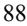

{89}------------------------------------------------

# I**TEM 7A. QUANTITATIVE AND QUALITATIVE DISCLOSURES ABOUT MARKET RISK**

Our primary exposure to market risk is interest rate sensitivity, which is affected by changes in the general level of U.S. interest rates, particularly because our investments, including cash equivalents, are in the form of U.S. Treasury securities, asset-backed securities, and commercial paper. Our marketable securities are subject to interest rate risk and will fall in value if market interest rates increase. However, due to the short-term nature and lowrisk profile of our investment portfolio, we do not expect that an immediate 100 basis point change in market interest rates would have a material effect on the fair market value of our investment portfolio. We have the ability to hold our marketable securities until maturity, and therefore we would not expect our operating results or cash flows to be affected to any significant degree by the effect of a change in market interest rates on our investments.

We are also exposed to market risk related to changes in foreign currency exchange rates. We contract with vendors that are located outside of the United States, including in China, and certain invoices are denominated in foreign currencies. We are subject to fluctuations in foreign currency rates in connection with these arrangements. We do not currently hedge our foreign currency exchange rate risk. As of December 31, 2022, we had minimal or no liabilities denominated in foreign currencies.

Inflation generally affects us by increasing our cost of labor and clinical trial costs. We do not believe that inflation had a material effect on our business, financial condition or results of operations during the year ended December 31, 2022.

{90}------------------------------------------------

# **ITEM 8. FINANCIAL STATEMENTS AND SUPPLEMENTARY DATA**

#### **Index to Financial Statements**

| Report of Independent Registered Public Accounting Firm                                        | 91 |
|------------------------------------------------------------------------------------------------|----|
| Balance Sheets as of December 31, 2022 and 2021                                                | 92 |
| Statements of Operations and Comprehensive Loss for the years ended December 31, 2022 and 2021 | 93 |
| Statements of Stockholders' Equity for the years ended December 31, 2022 and 2021              | 94 |
| Statements of Cash Flows for the years ended December 31, 2022 and 2021                        | 95 |
| Notes to Financial Statements                                                                  | 96 |
|                                                                                                |    |

{91}------------------------------------------------

## **Report of Independent Registered Public Accounting Firm**

# To the Stockholders and the Board of Directors Verrica Pharmaceuticals Inc.:

#### *Opinion on the Financial Statements*

We have audited the accompanying balance sheets of Verrica Pharmaceuticals Inc. (the Company) as of December 31, 2022 and 2021, the related statements of operations and comprehensive loss, stockholders' equity, and cash flows for the years then ended, and the related notes (collectively, the financial statements). In our opinion, the financial statements present fairly, in all material respects, the financial position of the Company as of December 31, 2022 and 2021, and the results of its operations and its cash flows for the years then ended, in conformity with U.S. generally accepted accounting principles.

#### *Going Concern*

The accompanying financial statements have been prepared assuming that the Company will continue as a going concern. As discussed in Note 1 to the financial statements, the Company has incurred substantial operating losses since inception that raise substantial doubt about its ability to continue as a going concern. Management's plans in regard to these matters are also described in Note 1. The financial statements do not include any adjustments that might result from the outcome of this uncertainty.

#### *Basis for Opinion*

These financial statements are the responsibility of the Company's management. Our responsibility is to express an opinion on these financial statements based on our audits. We are a public accounting firm registered with the Public Company Accounting Oversight Board (United States) (PCAOB) and are required to be independent with respect to the Company in accordance with the U.S. federal securities laws and the applicable rules and regulations of the Securities and Exchange Commission and the PCAOB.

We conducted our audits in accordance with the standards of the PCAOB. Those standards require that we plan and perform the audit to obtain reasonable assurance about whether the financial statements are free of material misstatement, whether due to error or fraud. The Company is not required to have, nor were we engaged to perform, an audit of its internal control over financial reporting. As part of our audits, we are required to obtain an understanding of internal control over financial reporting but not for the purpose of expressing an opinion on the effectiveness of the Company's internal control over financial reporting. Accordingly, we express no such opinion.

Our audits included performing procedures to assess the risks of material misstatement of the financial statements, whether due to error or fraud, and performing procedures that respond to those risks. Such procedures included examining, on a test basis, evidence regarding the amounts and disclosures in the financial statements. Our audits also included evaluating the accounting principles used and significant estimates made by management, as well as evaluating the overall presentation of the financial statements. We believe that our audits provide a reasonable basis for our opinion.

#### /s/ KPMG LLP

We have served as the Company's auditor since 2017.

Philadelphia, Pennsylvania March 6, 2023

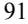

{92}------------------------------------------------

# **VERRICA PHARMACEUTICALS INC. BALANCE SHEETS**

(in thousands, except share and per share amounts)

|                                                                                        | December 31, |            |    |            |
|----------------------------------------------------------------------------------------|--------------|------------|----|------------|
|                                                                                        |              | 2022       |    | 2021       |
| ASSETS                                                                                 |              |            |    |            |
| Current assets:                                                                        |              |            |    |            |
| Cash and cash equivalents                                                              | \$           | 34,273     | \$ | 15,752     |
| Marketable securities                                                                  |              | —          |    | 54,602     |
| Collaboration revenue receivable                                                       |              | 388        |    | —          |
| Unbilled collaboration revenue receivable                                              |              | 99         |    | —          |
| Prepaid expenses and other assets                                                      |              | 4,355      |    | 3,974      |
| Total current assets                                                                   |              | 39,115     |    | 74,328     |
| Property and equipment, net                                                            |              | 3,887      |    | 3,894      |
| Operating lease right-of-use asset                                                     |              | 1,443      |    | 1,608      |
| Other non-current assets                                                               |              | 276        |    | 295        |
| Total assets                                                                           | \$           | 44,721     | \$ | 80,125     |
| LIABILITIES AND STOCKHOLDERS' EQUITY                                                   |              |            |    |            |
| Current liabilities:                                                                   |              |            |    |            |
| Accounts payable                                                                       | \$           | 507        | \$ | 845        |
| Accrued expenses and other current liabilities                                         |              | 2,655      |    | 3,266      |
| Operating lease liability                                                              |              | 297        |    | 245        |
| Financing lease liability                                                              |              | —          |    | 6          |
| Debt, net                                                                              |              | —          |    | 41,693     |
| Total current liabilities                                                              |              | 3,459      |    | 46,055     |
| Operating lease liability                                                              |              | 1,229      |    | 1,449      |
| Financing lease liability                                                              |              | —          |    | 16         |
| Total liabilities                                                                      |              | 4,688      |    | 47,520     |
| Stockholders' equity:                                                                  |              |            |    |            |
| Preferred stock, \$0.0001 par value; 10,000,000 shares authorized; no shares           |              |            |    |            |
| issued and outstanding as of December 31, 2022 and 2021                                |              | —          |    | —          |
| Common stock, \$0.0001 par value; 200,000,000 authorized; 41,199,197 shares issued and |              |            |    |            |
| 41,094,053 shares outstanding as of December 31, 2022; 27,624,197 shares issued and    |              |            |    |            |
| 27,519,053 shares outstanding as of December 31, 2021                                  |              | 4          |    | 3          |
| Treasury stock, at cost, 105,144 shares as of December 31, 2022 and 2021               |              | —          |    | —          |
| Additional paid-in capital                                                             |              | 203,482    |    | 171,597    |
| Accumulated deficit                                                                    |              | (163,453 ) |    | (138,966 ) |
| Accumulated other comprehensive loss                                                   |              | —          |    | (29 )      |
| Total stockholders' equity                                                             |              | 40,033     |    | 32,605     |
| Total liabilities and stockholders' equity                                             | \$           | 44,721     | \$ | 80,125     |

*The accompanying notes are an integral part of these financial statements.*

{93}------------------------------------------------

# **VERRICA PHARMACEUTICALS INC. STATEMENTS OF OPERATIONS AND COMPREHENSIVE LOSS** (in thousands, except share and per share amounts)

**For the Year Ended December 31, 2022 2021 Collaboration revenue** \$ 9,032 \$ 12,000 **Expenses:** Research and development 12,198 15,929 General and administrative 17,405 26,979 Cost of collaboration revenue 725 — Total expenses 30,328 42,908 **Loss from operations** (21,296 ) (30,908 ) **Other (expense) income:** Interest income 476 123 Interest expense (2,172 ) (4,295 ) Loss on extinguishment of debt (1,437 ) — Other expense (58 ) — Total other expense, net (3,191 ) (4,172 ) **Net loss \$ (24,487 ) \$ (35,080 )** Net loss per share, basic and diluted \$ (0.72 ) \$ (1.30 ) Weighted-average common shares outstanding, basic and diluted 34,163,437 27,044,462 Net loss \$ (24,487 ) \$ (35,080 ) Other comprehensive loss: Unrealized gain (loss) on marketable securities 29 (30 ) **Comprehensive loss \$ (24,458 ) \$ (35,110 )**

*The accompanying notes are an integral part of these financial statements.*

{94}------------------------------------------------

# **VERRICA PHARMACEUTICALS INC. STATEMENTS OF STOCKHOLDERS' EQUITY** (in thousands, except share amounts)

**Accumulated Total Additional Treasury Other Stockholders' Common Stock PaidIn Accumulated Stock Comprehensive Equity Shares Issued Amount Capital Deficit Shares Cost income (Loss) Balance as of December 31, 2020 25,546,257 \$ 3 \$ 136,868 \$ (103,886 ) 105,144 \$ — \$ 1 \$ 32,986** Stock-based compensation — — 6,053 — — — — **6,053** Issuance of common stock, net of issuance costs 2,033,899 — 28,118 — — — — **28,118** Exercise of stock options 44,041 — 558 — — — — **558** Net loss — — — (35,080 ) — — — **(35,080 )** Unrealized loss on marketable securities — — — — — — (30 ) **(30 ) Balance as of December 31, 2021 27,624,197 3 171,597 (138,966 ) 105,144** — **(29 ) 32,605** Stock-based compensation — — 4,985 — — — — **4,985** Issuance of common stock, net of issuance costs 13,575,000 1 26,900 — — — — **26,901** Net loss — — — (24,487 ) — — — **(24,487 )** Unrealized gain on marketable securities — — — — — — 29 **29 Balance as of December 31, 2022 41,199,197 \$ 4 \$ 203,482 \$ (163,453 ) 105,144 \$ — \$ — \$ 40,033**

*The accompanying notes are an integral part of these financial statements.*

{95}------------------------------------------------

# **VERRICA PHARMACEUTICALS INC. STATEMENTS OF CASH FLOWS**

(in thousands)

|                                                                             | For the Year Ended December 31, |    |           |
|-----------------------------------------------------------------------------|------------------------------------|----|-----------|
|                                                                             | 2022                               |    | 2021      |
| Cash flows from operating activities                                        |                                    |    |           |
| Net loss                                                                    | \$ (24,487 )                    | \$ | (35,080 ) |
| Adjustments to reconcile net loss to net cash used in operating activities: |                                    |    |           |
| Stock-based compensation                                                    | 4,985                              |    | 6,053     |
| Amortization of premiums on marketable securities                           | 108                                |    | 66        |
| Depreciation expense                                                        | 454                                |    | 244       |
| Noncash interest expense                                                    | 383                                |    | 1,442     |
| Amortization of operating lease right-of-use asset                          | 264                                |    | 228       |
| Loss on extinguishment of debt                                              | 1,437                              |    | —         |
| Gain on lease termination                                                   | 6                                  |    | —         |
| Changes in operating assets and liabilities:                                |                                    |    |           |
| Prepaid expenses and other assets                                           | (456 )                             |    | (543 )    |
| Collaboration revenue receivable, billed and unbilled                       | (487 )                             |    | —         |
| Accounts payable                                                            | (338 )                             |    | 497       |
| Accrued expenses and other current liabilities                              | (255 )                             |    | 208       |
| Deferred revenue                                                            | —                                  |    | (500 )    |
| Operating lease liability                                                   | (264 )                             |    | (197 )    |
| Net cash used in operating activities                                       | (18,650 )                          |    | (27,582 ) |
| Cash flows from investing activities                                        |                                    |    |           |
| Purchases of marketable securities                                          | (4,485 )                           |    | (68,914 ) |
| Sales and maturities of marketable securities                               | 59,008                             |    | 69,000    |
| Purchases of property and equipment                                         | (302 )                             |    | (883 )    |
| Deposits                                                                    | (180 )                             |    | (201 )    |
| Net cash provided by (used in) investing activities                         | 54,041                             |    | (998 )    |
| Cash flows from financing activities                                        |                                    |    |           |
| Proceeds from exercise of stock options                                     | —                                  |    | 558       |
| Proceeds from issuance of common stock, net of issuance costs               | 26,901                             |    | 28,118    |
| Proceeds from issuance of debt, net of issuance costs                       | —                                  |    | 4,975     |
| Debt issuance costs                                                         | (17 )                              |    | —         |
| Repayment of debt                                                           | (43,750 )                          |    | —         |
| Repayment of financing lease                                                | (4 )                               |    | (5 )      |
| Net cash (used in) provided by financing activities                         | (16,870 )                          |    | 33,646    |
| Net increase in cash and cash equivalents                                   | 18,521                             |    | 5,066     |
| Cash and cash equivalents at the beginning of the year                      | 15,752                             |    | 10,686    |
| Cash and cash equivalents at the end of the year                            | \$ 34,273                       | \$ | 15,752    |
|                                                                             |                                    |    |           |
| Supplemental disclosure of noncash investing and financing activities:      |                                    |    |           |
| Property and equipment purchases payable or accrued at period end           | \$ 167                          | \$ | 255       |
| Right-of-use asset obtained in exchange for lease obligation                | \$ 99                           | \$ | —         |
| Change in unrealized loss on marketable securities                          | \$ 29                           | \$ | (30 )     |
| Cash paid for interest                                                      | \$ 1,789                        | \$ | 2,850     |
|                                                                             |                                    |    |           |

*The accompanying notes are an integral part of these financial statements.*

{96}------------------------------------------------

# **VERRICA PHARMACEUTICALS INC. Notes to Financial Statements**

## **Note 1—Organization and Description of Business Operations**

Verrica Pharmaceuticals Inc. (the "Company") was formed on July 3, 2013 and is incorporated in the State of Delaware. The Company is a dermatology therapeutics company developing medications for skin diseases requiring medical intervention.

#### *Liquidity and Capital Resources*

The Company has incurred substantial operating losses since inception and expects to continue to incur significant losses for the foreseeable future and may never become profitable. As of December 31, 2022, the Company had an accumulated deficit of \$163.5 million. On March 17, 2021, the Company entered into the Torii Agreement (as defined in Note 13), pursuant to which the Company received an upfront payment from Torii Pharmaceutical Co., Ltd. ("Torii") of \$11.5 million in April 2021 and an \$8.0 million milestone payment in August 2022. On March 25, 2021, the Company closed a follow-on public offering in which it sold 2,033,899 shares of common stock at a public offering price of \$14.75 per share, resulting in net proceeds of \$28.1 million after deducting underwriting discounts and commissions, and offering expenses. In July 2022, the Company sold 13,575,000 shares of common stock at a public offering price of \$2.10 per share, resulting in cumulative net proceeds of \$26.9 million after deducting underwriting discounts and commissions, and offering expenses. On February 23, 2023 the Company sold 750,000 shares of its common stock and pre-funded warrants to purchase 4,064,814 shares of common stock. The shares of common stock were sold at a price of \$6.75 per share and the pre-funded warrants were sold at a price of \$6.7499 per pre-funded warrant resulting in net proceeds of \$30.1 million after deducting underwriting discounts and commissions, and offering expenses of approximately \$2.3 million (see Note 14).

In March 2020, the Company entered into a mezzanine loan and security agreement (the "Mezzanine Loan Agreement"), with Silicon Valley Bank, as administrative agent and collateral agent (the "Agent"), and Silicon Valley Bank and West River Innovation Lending Fund VIII, L.P., as lenders, (the "Mezzanine Lenders"), pursuant to which the Company borrowed (i) \$35.0 million in March 2020 and (ii) \$5.0 million on March 1, 2021. On July 11, 2022, the Company voluntarily repaid in full the debt outstanding under the Mezzanine Loan Agreement (see Note 11).

The Company believes its cash, and cash equivalents of \$34.3 million as of December 31, 2022 plus the net proceeds from the February 2023 offering of common stock and pre-funded warrants of \$30.1 million will be sufficient to support the Company's planned operations into the first quarter of 2024. Substantial additional financing will be needed by the Company to fund its operations. The Company's financial statements have been prepared on a going concern basis, which contemplates the realization of assets and satisfaction of liabilities in the normal course of business. The financial statements do not include any adjustments relating to the recoverability and classification of recorded asset amounts or the amounts and classification of liabilities that might result from the outcome of this uncertainty. The Company anticipates incurring additional losses until such time, if ever, that it can obtain marketing approval to sell, and then generate significant sales of VP-102. These factors raise substantial doubt about the Company's ability to continue as a going concern within one year after the date the financial statements are issued. The Company plans to secure additional capital in the future through equity or debt financings, partnerships, or other sources to carry out the Company's planned development activities. If the Company is unable to raise capital when needed or on attractive terms, the Company would be forced to delay, reduce or eliminate its research and development programs or future commercialization efforts.

## **Note 2—Significant Accounting Policies**

#### *Basis of Presentation*

The accompanying financial statements have been prepared in conformity with accounting principles generally accepted in the United States of America ("GAAP"). Any reference in these notes to applicable guidance is meant to refer to the authoritative United States generally accepted accounting principles as found in the

{97}------------------------------------------------

Accounting Standards Codification ("ASC") and Accounting Standards Update ("ASU") of the Financial Accounting Standards Board ("FASB"). The Company's functional currency is the U.S. dollar.

The Company has been actively monitoring the novel coronavirus ("COVID-19") pandemic and its impact globally. Management believes the financial results for the years ended December 31, 2022 and 2021, were not significantly impacted by COVID-19. In addition, management believes the remote working arrangements, travel restrictions and any other regulations imposed by various governmental jurisdictions have had limited impact on the Company's ability to maintain internal operations during the year. The full extent to which the COVID-19 pandemic will directly or indirectly impact the Company's business, results of operations and financial condition will depend on future developments that are highly uncertain, including as a result of new information that may emerge concerning COVID-19 and the actions taken to contain it or treat COVID-19.

## *Use of Estimates*

The preparation of financial statements in conformity with GAAP requires management to make estimates and assumptions that affect the reported amounts of assets and liabilities and disclosure of contingent assets and liabilities at the date of the financial statements and the reported amounts of expenses during the reporting period. These estimates and assumptions are based on current facts, historical experience as well as other pertinent industry and regulatory authority information, including the potential future effects of COVID-19, the results of which form the basis for making judgments about the carrying values of assets and liabilities and the recording of expenses that are not readily apparent from other sources. Actual results may differ materially and adversely from these estimates. To the extent there are material differences between the estimates and actual results, the Company's future results of operations will be affected.

#### *Segments*

Operating segments are identified as components of an enterprise about which separate discrete financial information is available for evaluation by the chief operating decision-maker in making decisions regarding resource allocation and assessing performance. The Company views its operations and manages its business in one operating segment.

#### *Cash, Cash Equivalents and Marketable Securities*

The Company considers all highly liquid investments purchased with original maturities of 90 days or less at acquisition to be cash equivalents. Cash and cash equivalents include cash held in banks and money market mutual funds.

The Company classifies its marketable securities as "available-for-sale", pursuant to *ASC 320*, *Investments—Debt and Equity Securities*, carries them at fair market value and classifies them as current assets on its balance sheets. There were no marketable securities as of December 31, 2022. Unrealized gains and losses on marketable debt securities are recorded as a separate component of accumulated other comprehensive gain or loss included in stockholders' equity.

#### *Concentrations of Credit Risk and Of -Balance Sheet Risk*

Cash, cash equivalents and marketable securities are financial instruments that are potentially subject to concentrations of credit risk. The Company's deposits are in accounts at large financial institutions, and amounts may exceed federally insured limits. The Company believes it is not exposed to significant credit risk due to the financial strength of the depository institutions in which the funds are held. The Company has no financial instruments with off-balance sheet risk of loss.

{98}------------------------------------------------

# *Property and Equipment*

Property and equipment is recorded at cost less accumulated depreciation. Depreciation and amortization is calculated using the straight line method over the expected useful life of the asset, after the assets are placed in service.

Expenditures associated with upgrades and enhancements that improve, add functionality, or otherwise extend the life of property and equipment are capitalized, while expenditures that do not, such as repairs and maintenance, are expensed as incurred.

The Company reviews long-lived assets, including property and equipment, for impairment whenever events or changes in business circumstances indicate that the carrying amount of an asset may not be fully recoverable. If the estimated undiscounted future cash flows expected to result from the use of the asset and its eventual disposition is less than its carrying amount, an impairment loss would be recognized if the carrying value of the asset exceeds its fair value. Fair value is generally determined using discounted cash flows. No impairment losses have been recorded during the years ended December 31, 2022 or 2021. The Company generally uses the following depreciable lives for its major classifications of property and equipment:

| Description                                 | Useful lives |
|---------------------------------------------|--------------|
| Machinery and equipment                     | 3 - 5 years  |
| Office furniture and fixtures and equipment | 3 years      |
| Leasehold improvements                      | Lease Term   |
| Automobiles                                 | 3 years      |

# *Revenue*

In accordance with FASB's ASC 606, Revenue from Contracts with Customers ("ASC 606"), the Company recognizes revenue when its customer obtains control of promised goods or services, in an amount that reflects the consideration which the entity expects to receive in exchange for those goods or services. To determine revenue recognition for arrangements that the Company determines are within the scope of ASC 606, it performs the following five steps:

- (i) identify the contract(s) with a customer;
- (ii) identify the performance obligations in the contract;
- (iii) determine the transaction price;
- (iv) allocate the transaction price to the performance obligations in the contract; and
- (v) recognize revenue when (or as) the entity satisfies a performance obligation.

The Company applies the five-step model to contracts when it determines that it is probable it will collect the consideration it is entitled to in exchange for the goods or services it transfers to the customer. At contract inception, once the contract is determined to be within the scope of ASC 606, the Company assesses the goods or services promised within each contract and determines those that are performance obligations and assesses whether each promised good or service is distinct. The Company then recognizes as revenue the amount of the transaction price that is allocated to the respective performance obligation when (or as) the performance obligation is satisfied.

## *Collaboration Revenues*

The Company's revenues have been solely generated through its licensing and collaboration arrangements. The terms of the arrangements typically include payments to the Company of one or more of the following: nonrefundable, up-front license fees: regulatory and commercial milestone payments; payments for manufacturing supply services; materials shipped to support development; and royalties on net sales of licensed products.

In determining the appropriate amount of revenue to be recognized as it fulfills its obligations under each of its agreements, the Company performs the following steps:

{99}------------------------------------------------

- (i) identification of the promised goods or services in the contract;
- (ii) determination of whether the promised goods or services are performance obligations including whether they are distinct in the context of the contract;
- (iii) measurement of the transaction price, including the constraint on variable consideration;
- (iv) allocation of the transaction price to the performance obligations; and
- (v) recognition of revenue when (or as) the Company satisfies each performance obligation.

The Company's revenue arrangements may include the following:

*Up-front License Fees*: If a license is determined to be distinct from the other performance obligations identified in the arrangement, the Company recognizes revenues from nonrefundable, up-front fees allocated to the license when the license is transferred to the licensee and the licensee is able to use and benefit from the license. For licenses that are bundled with other promises, the Company utilizes judgment to assess the nature of the combined performance obligation to determine whether the combined performance obligation is satisfied over time or at a point in time and, if over time, the appropriate method of measuring progress for purposes of recognizing revenue from non-refundable, up-front fees. The Company evaluates the measure of progress each reporting period and, if necessary, adjusts the measure of performance and related revenue recognition.

*Milestone Payments:* At the inception of an agreement that includes regulatory or commercial milestone payments, the Company evaluates whether each milestone is considered probable of being achieved and estimates the amount to be included in the transaction price using the most likely amount method. If it is probable that a significant revenue reversal would not occur, the associated milestone value is included in the transaction price. Milestone payments that are not within the control of the Company or the licensee, such as regulatory approvals, are not considered probable of being achieved until those approvals are received. At each reporting period, the Company assesses the probability of achievement of each milestone under its current agreements.

*Royalties:* If the Company is entitled to receive sales-based royalties from its collaborator, including milestone payments based on the level of sales, and the license is deemed to be the predominant item to which the royalties relate, the Company recognizes revenue at the later of (i) when the related sales occur, provided the reported sales are reliably measurable, or (ii) when the performance obligation to which some or all of the royalty has been allocated has been satisfied (or partially satisfied).

*Manufacturing Supply and Research Services*: Arrangements that include a promise for supply of drug substance or drug product for either clinical development or commercial supply at the licensee's discretion are generally considered as options. The Company assesses if these options provide a material right to the licensee and if so, they are accounted for as separate performance obligations. If not, the supply services are recognized as collaboration revenue as the Company provides the services.

The Company receives payments from its licensees based on schedules established in each contract. Amounts are recorded as accounts receivable when the Company's right to consideration is unconditional. The Company does not assess whether a contract has a significant financing component if the expectation at contract inception is such that the period between payment by the licensees and the transfer of the promised goods or services to the licensees will be one year or less. See Note 13 for a full discussion of the Company's collaboration arrangements.

## *Research and Development Costs*

The Company's research and development expenses consist primarily of costs associated with the Company's clinical trials, salaries, payroll taxes, employee benefits, and equity-based compensation charges for those individuals involved in ongoing research and development efforts. Research and development costs are expensed as incurred. Advance payments for goods and services that will be used in future research and development activities are expensed when the activity has been performed or when the goods have been received rather than when the payment is made.

{100}------------------------------------------------

#### *Fair Value Measurement*

ASC 820, *Fair Value Measurements*, provides guidance on the development and disclosure of fair value measurements. Under this accounting guidance, fair value is defined as an exit price, representing the amount that would be received to sell an asset or paid to transfer a liability in an orderly transaction between market participants at the measurement date. As such, fair value is a market-based measurement that should be determined based on assumptions that market participants would use in pricing an asset or a liability.

The accounting guidance classifies fair value measurements in one of the following three categories for disclosure purposes:

Level 1: Quoted prices in active markets for identical assets or liabilities.

Level 2: Inputs other than Level 1 prices for similar assets or liabilities that are directly or indirectly observable in the marketplace.

Level 3: Unobservable inputs which are supported by little or no market activity and values determined using pricing models, discounted cash flow methodologies, or similar techniques, as well as instruments for which the determination of fair value requires significant judgment or estimation.

#### *Comprehensive Loss*

Comprehensive loss is defined as the change in equity of a business enterprise during a period from transactions, and other events and circumstances from non-owner sources. For the years ended December 31, 2022 and 2021, comprehensive loss includes net loss and unrealized gain (loss) on marketable securities.

## *Stock-Based Compensation*

The Company accounts for stock-based compensation awards in accordance with *ASC 718, Compensation –Stock Compensation*. The Company uses the Black-Scholes option-pricing model to value its stock option awards. For stock-based awards granted to employees, non-employees and to members of the board of directors for their services, the Company estimates the grant date fair value of each option award and recognizes compensation expense on a straight-line basis over the vesting period of the award.

The use of the Black‑Scholes option-pricing model requires management to make assumptions with respect to the expected term of the option, the expected volatility of the common stock consistent with the expected life of the option, risk‑free interest rates, and, for grants prior to the Company's IPO, the value of the common stock. The expected life of stock options was estimated using the "simplified method," as the Company has limited historical information to develop reasonable expectations about future exercise patterns and post-vesting employment termination behavior for its stock options grants. The simplified method is based on the average of the vesting tranches and the contractual life of each grant. The Company historically has been a private company and lacks company-specific historical and implied volatility information. Therefore, it estimates its expected stock volatility based on the historical volatility of a publicly traded set of peer companies in addition to the volatility of the Company's stock. The risk-free interest rate is based on U.S. Treasury notes with a term approximating the expected life of the option. Expected dividend yield is zero based on the fact that the Company has never paid cash dividends and does not expect to pay any cash dividends in the foreseeable future.

The fair value of restricted stock awards are based on the closing price of the Company's common stock on the grant date.

{101}------------------------------------------------

### *Income Taxes*

Income taxes are recorded in accordance with ASC 740, *Income Taxes*, which provides for deferred taxes using an asset and liability approach. The Company recognizes deferred tax assets and liabilities for the expected future tax consequences of events that have been included in the financial statements or tax returns. Deferred tax assets and liabilities are determined based on the difference between the financial statement and tax bases of assets and liabilities using enacted tax rates in effect for the year in which the differences are expected to reverse. Valuation allowances are provided, if based upon the weight of available evidence, it is more likely than not that some or all of the deferred tax assets will not be realized.

The Company accounts for uncertain tax positions in accordance with the provisions of ASC 740. When uncertain tax positions exist, the Company recognizes the tax benefit of tax positions to the extent that the benefit would more likely than not be realized assuming examination by the taxing authority. The determination as to whether the tax benefit will more likely than not be realized is based upon the technical merits of the tax position as well as consideration of the available facts and circumstances.

## *Net Loss Per Share*

Net loss per share of common stock is computed by dividing net loss applicable to common stockholders by the weighted average number of shares of common stock outstanding for the period. Diluted net loss per share excludes the potential impact of common stock options and unvested shares of restricted stock because their effect would be anti-dilutive due to the Company's net loss. Since the Company had a net loss in each of the periods presented, basic and dilutive net loss per common share are the same.

The table below provides potential shares outstanding that were not included in the computation of diluted net loss per common share, as the inclusion of these securities would have been anti-dilutive:

|                                                 |           | As of December 31, |  |  |
|-------------------------------------------------|-----------|--------------------|--|--|
|                                                 | 2022      | 2021               |  |  |
| Shares issuable upon exercise of stock options  | 3,932,779 | 3,443,817          |  |  |
| Non-vested shares under restricted stock grants | 425,000   | 425,000            |  |  |
| Total                                           | 4,357,779 | 3,868,817          |  |  |

#### *Recently Adopted Accounting Pronouncements*

In June 2022, the FASB issued Accounting Standards Update No. 2022-03, Fair Value Measurement of Equity Securities Subject to Contractual Sale Restrictions. This standard clarifies that a contractual restriction on the sale of an equity security is not considered part of the unit of account of the equity security and, therefore, is not considered in measuring fair value. This standard becomes effective for the Company on January 1, 2024, and is not expected to have a material impact on the Company's financial statements and related disclosures.

In June 2016, the FASB issued ASU 2016-13, Financial Instruments—Credit Losses, Measurement of Credit Losses on Financial Instruments (Topic 326). The standard amends the impairment model by requiring entities to use a forward-looking approach based on expected losses to estimate credit losses for most financial assets and certain other instruments that aren't measured at fair value through net income. For available-for-sale debt securities, entities will be required to recognize an allowance for credit losses rather than a reduction in carrying value of the asset. Entities will no longer be permitted to consider the length of time that fair value has been less than amortized cost when evaluating when credit losses should be recognized. This new guidance is effective for the Company as of January 1, 2023 and will not have a material impact on the Company's financial statements and related disclosures.

$$_{101}$$

{102}------------------------------------------------

# **Note 3—Investments in Marketable Securities**

Investments in marketable securities consist of the following: (in thousands):

|                             | As of December 31, 2021 |                   |    |                              |    |                               |    |               |
|-----------------------------|-------------------------|-------------------|----|------------------------------|----|-------------------------------|----|---------------|
|                             |                         | Amortized Cost |    | Gross Unrealized Gains |    | Gross Unrealized Losses |    | Fair Value |
| U.S. treasury securities    | \$                      | 15,272            | \$ | —                            | \$ | (15 )                         | \$ | 15,257        |
| Commercial paper            |                         | 28,980            |    | —                            |    | —                             |    | 28,980        |
| Asset-backed securities     |                         | 10,379            |    | —                            |    | (14 )                         |    | 10,365        |
| Total marketable securities | \$                      | 54,631            | \$ | —                            | \$ | (29 )                         | \$ | 54,602        |

The Company did not have marketable securities as of December 31, 2022. Unrealized gains and losses on marketable debt securities are recorded as a separate component of accumulated other comprehensive income (loss) included in stockholders' equity. Realized gains (losses) are included in interest income (expense) in the statement of operations and comprehensive loss on a specific identification basis. The Company recorded nominal realized gains and losses during the years ended December 31, 2022 and 2021. The Company has not recorded any impairment charges on marketable securities related to other-than-temporary declines in market value during the years ended December 31, 2022 or 2021.

Accretion of bond discount and premium on marketable securities and interest income on marketable securities is recorded as interest income on the statement of operations and comprehensive loss.

There were no marketable securities with a maturity of greater than one year at December 31, 2021.

Fair value is the price that would be received to sell an asset or paid to transfer a liability in an orderly transaction between market participants at the measurement date. Financial assets and liabilities carried at fair value are classified and disclosed in one of the following three categories:

Level 1 — Quoted market prices in active markets for identical assets or liabilities.

Level 2 — Observable inputs other than Level 1 prices, such as quoted prices for similar assets or liabilities; quoted prices in markets that are not active; or other inputs that are observable or can be corroborated by observable market data for substantially the full term of the assets or liabilities.

Level 3 — Unobservable inputs that are supported by little or no market activity and that are significant to the fair value of the assets or liabilities.

The following tables presents fair value by level in accordance with ASC 820 (see Note 2) of the Company's marketable securities (in thousands):

|                          | Fair Value Measurement as of December 31, 2021 |         |    |         |    |         |    |        |
|--------------------------|------------------------------------------------|---------|----|---------|----|---------|----|--------|
|                          |                                                | Level 1 |    | Level 2 |    | Level 3 |    | Total  |
| U.S. treasury securities | \$                                             | 15,257  | \$ | —       | \$ | —       | \$ | 15,257 |
| Commercial paper         |                                                | —       |    | 28,980  |    | —       |    | 28,980 |
| Asset-backed securities  |                                                | —       |    | 10,365  |    | —       |    | 10,365 |
| Total                    | \$                                             | 15,257  | \$ | 39,345  | \$ | —       | \$ | 54,602 |

## N**ote 4—Property and Equipment**

Property and equipment, net consists of (in thousands):

{103}------------------------------------------------

|                                   | As of December 31, |        |    |        |  |
|-----------------------------------|--------------------|--------|----|--------|--|
|                                   | 2022               |        |    | 2021   |  |
| Machinery and equipment           | \$                 | 1,392  | \$ | 737    |  |
| Office furniture and fixtures     |                    | 303    |    | 303    |  |
| Office equipment                  |                    | 301    |    | 301    |  |
| Leasehold improvements            |                    | 54     |    | 49     |  |
| Automobiles                       |                    | —      |    | 27     |  |
| Construction in process           |                    | 2,536  |    | 2,731  |  |
|                                   |                    | 4,586  |    | 4,148  |  |
| Accumulated depreciation          |                    | (699 ) |    | (254 ) |  |
| Total property and equipment, net | \$                 | 3,887  | \$ | 3,894  |  |

Depreciation expense for the years ended December 31, 2022 and 2021 was \$454,000 and \$244,000, respectively.

The Company has recorded an asset classified as construction in process associated with the construction of a product assembly and packaging line that will be placed into service for commercial manufacturing upon future regulatory product approval.

# **Note 5—Related Party Transactions**

Prior to the completion of the initial public offering ("IPO") of the Company's common stock in June 2018, the Company was controlled by PBM VP Holdings, LLC ("PBM VP Holdings") an affiliate of PBM Capital Group, LLC ("PBM"). Paul B. Manning, who is the Chairman and Chief Executive Officer of PBM and the current chairman of the Company's Board of Directors, and certain entities affiliated with Mr. Manning, continue to be the Company's largest shareholder on a collective basis.

On December 2, 2015, the Company entered into a Services Agreement (the "SA") with PBM. Pursuant to the terms of the SA, which had an initial term of twelve months (and was automatically renewable for successive monthly periods), PBM rendered advisory and consulting services to the Company. Services provided under the SA included certain business development, operations, technical, contract, accounting and back office support services. In consideration for these services, the Company was obligated to pay PBM a monthly management fee. On October 1, 2019, the SA was amended to reduce the monthly management fee to \$5,000 as a result of a reduction in services provided by PBM.

For each of the years ended December 31, 2022 and 2021, the Company incurred expenses under the SA of \$60,000, of which \$36,000 were included in general and administrative expenses, and \$24,000 were included in research and development expenses.

As of December 31, 2022 and 2021, the Company had no payables due to PBM and its affiliates.

On September 8, 2022, the Company entered into a clinical service agreement with Clinical Enrollment LLC which is controlled by Bryan Manning, the son of Paul B. Manning, who is the current chairman of the Company's Board of Directors. Paul B. Manning along with certain entities affiliated with Mr. Manning, are the Company's largest shareholder on a collective basis. Pursuant to the clinical service agreement, Clinical Enrollment LLC may provide recruiting support services for the Company's VP-315 clinical trial. No fees will be due under the agreement until a minimum number of patients are enrolled in the clinical trial by the vendor. When the minimum enrollments are met, compensation will include a \$35 thousand development fee for the production of media, video, and web content to support the recruitment services and a \$15 thousand fee per eligible patient enrolled in the trial. For the year ended December 31, 2022 the Company incurred expenses of \$30,000 related to the video production which was included in research and development expense and recognized as an outstanding payable as of December 31, 2022.

{104}------------------------------------------------

## **Note 6—Accrued Expenses**

Accrued expenses and other current liabilities consisted of the following (in thousands):

|                                                      | As of December 31, |    |       |  |
|------------------------------------------------------|--------------------|----|-------|--|
|                                                      | 2022               |    | 2021  |  |
| Compensation and related costs                       | \$ 1,399        | \$ | 1,667 |  |
| Clinical trials and drug development                 | 974                |    | 613   |  |
| Construction in process                              | 167                |    | 131   |  |
| Professional fees                                    | 58                 |    | 406   |  |
| Machinery and equipment                              | 57                 |    | 124   |  |
| Interest expense                                     | —                  |    | 250   |  |
| Other accrued expenses and other current liabilities | —                  |    | 75    |  |
| Total accrued expenses and other current liabilities | \$ 2,655        | \$ | 3,266 |  |

#### **Note 7—Commitments and Contingencies**

## *Litigation*

On June 6, 2022, plaintiff Kranthi Gorlamari, or Gorlamari, filed a putative class action complaint captioned Gorlamari v. Verrica Pharmaceuticals Inc., et al., in the U.S. District Court for the Eastern District of Pennsylvania against the Company and certain of its current and former officers and directors ("Defendants"). Gorlamari filed an amended complaint on January 12, 2023. The amended complaint alleges that Defendants violated federal securities laws by, among other things, failing to disclose certain manufacturing deficiencies at the facility where our contract manufacturer produced bulk solution for the VP-102 drug device and that such deficiencies posed a risk to the prospects for regulatory approval of VP-102 for the treatment of molluscum. The amended complaint seeks unspecified compensatory damages and other relief on behalf of Gorlamari and all other persons and entities which purchased or otherwise acquired our securities between May 19, 2021 and May 24, 2022. The litigation is still in the early stages, and the Company intend to vigorously defend itself against these allegations.

The Company is involved in ordinary, routine legal proceedings that are not considered by management to be material. In the opinion of Company counsel and management, the ultimate liabilities resulting from such legal proceedings will not materially affect the financial position of the Company or its results of operations or cash flows.

#### *Supply Agreement and Purchase Order*

On July 16, 2018, the Company entered into a supply agreement with a supplier of crude cantharidin material. All executed purchase orders for crude cantharidin in the ordinary course of business are expected to be covered under the terms of the supply agreement. Pursuant to the supply agreement, the supplier has agreed that it will not supply cantharidin, any beetles or other raw material from which cantharidin is derived to any other customer in North America, subject to specified minimum annual purchase orders and forecasts by the Company. The supply agreement has an initial five-year term, which is subject to automatic renewal absent termination by either party in accordance with the terms of the supply agreement. Each party also has the right to terminate the supply agreement for other customary reasons such as material breach or bankruptcy.

During 2022 and 2021, the Company executed a purchase order pursuant to which the Company agreed to purchase \$0.7 million and \$0.8 million, respectively of crude cantharidin material and made prepayments of \$0.7 million and \$0.8 million in each year against the purchase orders. As of December 31, 2022, the Company has not received the shipments for the purchases during 2022 and 2021. As of December 31, 2022 and 2021 the balance sheet reflects prepaid expense of \$1.5 million and \$0.8 million, respectively.

{105}------------------------------------------------

# **Note 8—Stockholders' Equity**

#### *Common Stock*

The Company had authorized 200,000,000 shares of common stock, \$0.0001 par value per share, as of each of December 31, 2022 and 2021. Each share of common stock is entitled to one vote. Common stock owners are entitled to dividends when funds are legally available and declared by the Board.

On March 25, 2021, the Company closed a follow-on public offering in which it sold 2,033,899 shares of common stock at a public offering price of \$14.75 per share, resulting in net proceeds of \$28.1 million after deducting underwriting discounts and commissions, and offering expenses. In July 2022, the Company sold a total of 13,575,000 shares of common stock at a public offering price of \$2.10 per share, resulting in net proceeds of \$26.9 million after deducting underwriting discounts and commissions, and offering expenses.

## **Note 9—Stock-Based Compensation**

In June 2018, the Board adopted and approved the 2018 Equity Incentive Plan (the "2018 Plan"), which amended and restated the Company's prior 2013 Equity Incentive Plan (the "2013 Plan") and became effective in connection with the IPO. Prior to the effectiveness of the 2018 Plan, the 2013 Plan provided for the grant of share-based awards to employees, directors and consultants of the Company. As a result of the effectiveness of the 2018 Plan, no further grants may be made under the 2013 Plan.

The 2018 Plan provides for the grant of incentive stock options to employees, and for the grant of nonstatutory stock options, stock appreciation rights, restricted stock awards, restricted stock unit awards, performance-based stock awards and other forms of stock awards to employees, including officers, consultants and directors. The 2018 Plan also provides for the grant of performance-based cash awards to employees, including officers, consultants and directors. The Company initially reserved 3,738,199 shares of common stock for issuance under the 2018 Plan, which is the sum of (1) 2,198,198 new shares, plus (2) the number of shares reserved for issuance under the 2013 Plan at the time the 2018 Plan became effective, plus (3) any shares subject to outstanding stock options or other stock awards that would have otherwise returned to the 2013 Plan (such as upon the expiration or termination of a stock award prior to exercise). The number of shares of common stock reserved for issuance under the 2018 Plan will automatically increase on January 1 each year, for a period of ten years, from January 1, 2019 through January 1, 2028, by 4% of the total number of shares of the Company's common stock outstanding on December 31 of the preceding calendar year, or a lesser number of shares as may be determined by the Board. As of December 31, 2022, 3,108,393 shares were available for grant under the 2018 Plan.

## *Stock Options*

The Company's employee and non-employee stock options generally vest as follows: 25% after 12 months of continuous services and the remaining 75% on a ratable basis over a 36-month period from 12 months after the grant date. Stock options granted during the year ended December 31, 2022 have a maximum contractual term of 10 years. The stock options are subject to time vesting requirements through 2026, are nontransferable, and have term expiration dates set to expire through 2032.

The grant date fair value of employee and non-employee stock option awards is determined using the Black-Scholes option-pricing model. The following assumptions were used during the years ended December 31, 2022 and 2021 to estimate the fair value of employee and non-employee stock option awards:

|                                        | For the Year Ended December 31, |                  |  |  |
|----------------------------------------|---------------------------------|------------------|--|--|
|                                        | 2022                            | 2021             |  |  |
| Exercise price                         | \$2.15 - \$8.48                 | \$9.26 - \$15.10 |  |  |
| Risk-free rate of interest             | 1.67% - 4.36%                   | 0.76% - 1.24%    |  |  |
| Expected term (years)                  | 5.3 - 6.0                       | 6                |  |  |
| Expected stock price volatility        | 86.58% - 95.10%                 | 87.14% - 89.39%  |  |  |
| Dividend yield                         | —                               | —                |  |  |
| Weighted average grant date fair value | \$5.23                          | \$9.72           |  |  |

{106}------------------------------------------------

The following table summarizes the Company's employee and non-employee stock option activity under the 2013 Plan and 2018 Plan for the years ended December 31, 2022 and 2021:

|                                                           |                     | Weighted                  | Weighted average remaining | Aggregate          |
|-----------------------------------------------------------|---------------------|---------------------------|----------------------------------|--------------------|
|                                                           | Number of shares | average exercise price | contractual life (in years)   | intrinsic value |
| Outstanding as of December 31, 2020                       | 2,901,908 \$        | 9.57                      |                                  |                    |
| Options granted                                           | 1,222,786           | 13.28                     |                                  |                    |
| Exercised                                                 | (44,041 )           | 12.67                     |                                  |                    |
| Forfeited                                                 | (462,617 )          | 13.87                     |                                  |                    |
| Expired                                                   | (174,219 )          | 13.84                     |                                  |                    |
| Outstanding as of December 31, 2021                       | 3,443,817           | 10.05                     |                                  |                    |
| Options granted                                           | 1,137,936           | 6.86                      |                                  |                    |
| Exercised                                                 | —                   | —                         |                                  |                    |
| Forfeited                                                 | (468,335 )          | 10.23                     |                                  |                    |
| Expired                                                   | (180,639 )          | 12.65                     |                                  |                    |
| Outstanding as of December 31, 2022                       | 3,932,779 \$        | 8.99                      | 7.3 \$                           | 173,604            |
| Options vested and exercisable as of December 31, 2022 | 2,272,105 \$        | 9.08                      | 6.3 \$                           | 122,193            |

The aggregate intrinsic value in the above table is calculated as the difference between fair market value of the Company's common stock price and the exercise price of the stock options. The weighted average grant date fair value per share for the employee and non-employee stock options granted during the years ended December 31, 2022 and 2021 was \$5.23 and \$9.72, respectively. As of December 31, 2022, the total unrecognized compensation related to unvested employee and non-employee stock option awards granted was \$9.1 million, which the Company expects to recognize over a weightedaverage period of 2.4 years.

# *Restricted Stock*

In November 2019 and August 2020, the Company granted 300,000 and 250,000 restricted stock units to its executive officers. The restricted stock units vest 50% upon receipt of regulatory approval of the Company's new drug application for VP-102 for the treatment of molluscum (the "Approval Date") and 50% shall vest on the one year anniversary of the Approval Date subject to the holders' continuous service through each applicable date. No compensation expenses has been recognized for these nonvested restricted stock units as these shares are performance based and the triggering event was not determined to be probable as of December 31, 2022. As of December 31, 2022 the total unrecognized compensation expense related to the restricted stock was \$5.0 million.

The following table summarizes the activity related to the restricted stock awards:

|                                    |                  | Weighted Average Grant Date Fair |
|------------------------------------|------------------|-------------------------------------|
|                                    | Number of Shares | Value                               |
| Non-vested as of December 31, 2020 | 475,000          | \$ 11.74                         |
| Forfeitures                        | (50,000 )        | 12.29                               |
| Non-vested as of December 31, 2021 | 425,000          | 11.68                               |
| Non-vested as of December 31, 2022 | 425,000          | \$ 11.68                         |

{107}------------------------------------------------

Stock-based compensation expense, which includes expense for both employees and non-employees, has been reported in the Company's statements of operations for the years ended December 31, 2022 and 2021 as follows (in thousands):

|                                | For the Year Ended December 31, |    |       |  |
|--------------------------------|---------------------------------|----|-------|--|
| Research and development       | 2022                            |    | 2021  |  |
|                                | \$ 1,460                     | \$ | 1,513 |  |
| General and administrative     | 3,525                           |    | 4,540 |  |
| Total stock-based compensation | \$ 4,985                     | \$ | 6,053 |  |

## **Note 10—Leases**

The Company leases 11,201 square feet of office space located in West Chester, Pennsylvania that serves as the Company's headquarters. The initial term will expire on September 1, 2027. Base rent over the initial term is approximately \$2.4 million, and the Company is also responsible for its share of the landlord's operating expense.

The Company leases office space in Scotch Plains, New Jersey under an agreement classified as an operating lease, which commenced on May 1, 2022 and expires on April 30, 2025. Base rent over the initial term is approximately \$104,000. During the year ended December 31, 2022, the Company recognized a right-of-use asset of \$99,000 and a lease liability of \$95,000.

In July 2022, the Company terminated an auto lease and recognized a \$6 thousand gain in other income in the statement of operations resulting from the early termination.

The components of lease expense are as follows (in thousands):

|                         | For the Year Ended December 31, |      |    |      |
|-------------------------|------------------------------------|------|----|------|
|                         |                                    | 2022 |    | 2021 |
| Finance lease cost      |                                    |      |    |      |
| Amortization ROU assets | \$                                 | 4    | \$ | 5    |
| Operating lease         |                                    |      |    |      |
| Operating lease costs   | \$                                 | 369  | \$ | 346  |
| Short-term lease costs  |                                    | 7    |    | 21   |
| Total operating lease   | \$                                 | 376  | \$ | 367  |

Maturities of the Company's operating leases, excluding short-term leases as of December 31, 2022 are as follows (in thousands):

|                       | December 31, 2022 |  |  |  |
|-----------------------|-------------------|--|--|--|
|                       | Operating         |  |  |  |
| 2023                  | 383               |  |  |  |
| 2024                  | 392               |  |  |  |
| 2025                  | 372               |  |  |  |
| Thereafter            | 613               |  |  |  |
| Total lease payments  | 1,760             |  |  |  |
| Less imputed interest | (234 )            |  |  |  |
| Lease liability       | \$ 1,526       |  |  |  |

The remaining term of the Company's operating leases was 4.6 years and the discount rate used to measure the present value of the Company's operating lease liabilities was 6.25% as of December 31, 2022.

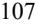

{108}------------------------------------------------

# **Note 11–Debt**

On March 10, 2020 (the "Effective Date"), the Company entered into (i) the Mezzanine Loan Agreement with the Agent, and the Mezzanine Lenders, pursuant to which the Mezzanine Lenders have agreed to lend the Company up to \$50.0 million in a series of term loans, and (ii) a loan and security agreement (the "Senior Loan Agreement", and together with the Mezzanine Loan Agreement, the "Loan Agreements") with Silicon Valley Bank, as lender (the "Senior Lender", and together with the Mezzanine Lenders, the "Lenders"), pursuant to which the Senior Lender has agreed to provide the Company with a revolving line of credit of up to \$5.0 million. Upon entering into the Loan Agreements, the Company borrowed \$35.0 million in term loans from the Mezzanine Lenders (the "Term A Loan"). The Company entered into amendments to the Loan Agreements in October 2020 under which the Company borrowed an additional \$5.0 million in term loans (the "Term B1 Loan"), on March 1, 2021. The Company incurred debt issuance costs of \$4.3 million, including the final payment fee of \$3.8 million related to the Term A Loan and Term B1 Loan.

On July 11, 2022, the Company voluntarily repaid the entire debt balance in full of \$43.8 million, inclusive of principal amount of debt, the final payment fee, and accrued interest, and satisfied all of the Company's outstanding debt obligations under the Loan Agreements. The Company did not incur any prepayment penalties in connection with the repayment of the Loan Agreements, which had a scheduled maturity of March 1, 2024. The prepayment was made in full using restricted cash of \$40.0 million, which was set aside as cash collateral in a March 2022 amendment to the Mezzanine Loan Agreement, as well as cash on hand of \$3.8 million for the final payment fee. For the year ended December 31, 2022, the Company recognized a \$1.4 million loss on debt extinguishment which was made up entirely of non-cash unamortized debt issuance costs.

For the years ended December 31, 2022 and 2021, the Company recognized interest expense of \$2.2 million and \$4.3 million, respectively, of which \$0.6 million and \$1.4 million, respectively, was non-cash interest expense related to the amortization of deferred debt issuance costs and accrual of the final payment fee.

## **Note 12–Income Taxes**

There is no provision for income taxes as the Company has incurred operating losses since inception and maintains a full valuation allowance against its deferred tax assets.

Differences between the provision (benefit) for income taxes and income taxes at the statutory federal income tax rate are as follows (in thousands):

|                                                   | For the Year Ended December 31, |          |    |          |
|---------------------------------------------------|------------------------------------|----------|----|----------|
|                                                   |                                    | 2022     |    | 2021     |
| Tax computed at statutory federal income tax rate | \$                                 | (5,142 ) | \$ | (7,367 ) |
| State taxes, net of federal benefit               |                                    | (955 )   |    | (2,697 ) |
| Permanent items                                   |                                    | 251      |    | 282      |
| R&D credits                                       |                                    | (235 )   |    | 26       |
| Change in tax rate                                |                                    | 4,637    |    | —        |
| Other                                             |                                    | 127      |    | 205      |
| Change in valuation allowance                     |                                    | 1,317    |    | 9,551    |
| Income tax provision (benefit)                    | \$                                 | —        | \$ | —        |

{109}------------------------------------------------

Significant components of the Company's deferred tax assets and liabilities are as follows (in thousands):

|                                                | As of December 31, |    |           |
|------------------------------------------------|-----------------------|----|-----------|
|                                                | 2022                  |    | 2021      |
| Deferred tax assets:                           |                       |    |           |
| Net operating loss carryovers                  | \$ 29,771          | \$ | 31,514    |
| Share-based compensation                       | 3,704                 |    | 3,321     |
| Tax credits                                    | 2,615                 |    | 2,380     |
| Sec. 174 capitalization                        | 2,465                 |    | —         |
| Amortization                                   | 780                   |    | 678       |
| Accrued compensation                           | 345                   |    | 479       |
| Lease liabilities                              | 383                   |    | 497       |
| Other                                          | 70                    |    | 16        |
| Total deferred tax assets                      | 40,133                |    | 38,885    |
| Less valuation allowance                       | (39,732 )             |    | (38,414 ) |
| Deferred tax asset, net of valuation allowance | 401                   |    | 471       |
| Deferred tax liabilities:                      |                       |    |           |
| Right-of-use assets                            | (362 )                |    | (466 )    |
| Fixed assets                                   | (39 )                 |    | (5 )      |
| Total deferred tax liabilities                 | (401 )                |    | (471 )    |
| Net deferred tax assets                        | \$ —               | \$ | —         |

The Company has determined, based upon all available evidence, that it is more likely than not that the net deferred tax asset will not be realized and, accordingly, has provided a full valuation allowance against its net deferred tax asset.

As of December 31, 2022, the Company had federal and state net operating loss carryforwards of approximately \$118.1 million and \$120.7 million, respectively. The federal net operating loss carryforwards included in the foregoing totals that were generated prior to 2018 (federal of approximately \$6.9 million) will begin to expire, if not utilized, by 2033. Under the 2017 federal income tax law changes, federal net operating losses incurred in 2018 and in future years may be carried forward indefinitely, but the deductibility of such federal net operating losses is limited. As of December 31, 2022, the Company had federal and state research and development carryforwards of \$2.6 million. In addition, under Section 382 of the Internal Revenue Code of 1986, as amended, and corresponding provisions of state law, if a corporation undergoes an "ownership change," which is generally defined as a greater than 50% change, by value, in its equity ownership over a three-year period, the corporation's ability to use its pre-change net operating loss and tax credit carryforwards may be limited. The Company has not done an analysis to determine whether or not ownership changes have occurred since inception.

The Company will recognize interest and penalties, if any, related to uncertain tax positions in income tax expense. As of December 31, 2022 and 2021, the Company had no accrued interest or penalties related to uncertain tax positions and no amounts have been recognized in the Company's statement of operations. The Company does not anticipate a material change to unrecognized tax benefits in the next twelve months.

The 2017 and subsequent federal and state tax years for the Company remain open for the assessment of income taxes.

# **Note 13—License and Collaboration Agreements**

On March 17, 2021, the Company entered into a collaboration and license agreement (the "Torii Agreement") with Torii, pursuant to which the Company granted Torii an exclusive license to develop and commercialize the Company's product candidates that contain a topical formulation of cantharidin for the treatment of molluscum contagiosum and common warts in Japan, including VP-102. Additionally, the Company granted Torii a right of first negotiation with respect to additional indications for the licensed products and certain additional products for use in the licensed field, in each case in Japan.

{110}------------------------------------------------

Pursuant to the Torii Agreement, the Company received payments from Torii of \$0.5 million in December 2020 and \$11.5 million in April 2021. On July 25, 2022 Torii dosed the first patient in its Phase 3 trial of VP-102 (referred to as TO-208 in Japan) for molluscum contagiosum in Japan, triggering an \$8.0 million milestone payment recognized as collaboration revenue in the statement of operations for the year period ended December 31, 2022. Additionally, the Company is entitled to receive from Torii an additional \$50 million in aggregate payments from Torii contingent on achievement of specified development, regulatory, and sales milestones, in addition to tiered transfer price payments for supply of product in the percentage range of the mid-30's to the mid-40's of net sales. The transfer payments shall be payable, on a product-by-product basis, beginning on the first commercial sale of such product and ending on the latest of (a) expiration of the last-to-expire valid claim contained in certain licensed patents in Japan that cover such product, (b) expiration of regulatory exclusivity for the first indication for such product in Japan, and, (c) (i) with respect to the first product, ten years after first commercial sale of such product, and, (ii) with respect to any other product, the later of (x) ten years after first commercial sale of the first product and (y) five years after first commercial sale of such product.

The Torii Agreement expires on a product-by-product basis upon expiration of Torii's obligation under the agreement to make transfer price payments for such product. Torii has the right to terminate the agreement upon specified prior written notice to us. Additionally, either party may terminate the agreement in the event of an uncured material breach of the agreement by, or insolvency of, the other party. The Company may terminate the agreement in the event that Torii commences a legal action challenging the validity, enforceability or scope of any licensed patents.

On March 7, 2022, the Company executed a Clinical Supply Agreement with Torii, whereby the Company will supply product to Torii for use in clinical trials and other development activities. The Company recognized billed and unbilled collaboration revenue of \$0.9 million and \$0.1 million for the year ended December 31, 2022, respectively related to supplies and development activity pursuant to this agreement.

In August 2020, the Company entered into an exclusive license agreement with Lytix Biopharma AS ("Lytix") for the use of licensed technology to research, develop, manufacture, have manufactured, use, sell, have sold, offer for sale, import, and otherwise commercialize products for use in all malignant and pre-malignant dermatological indications, other than metastatic melanoma and metastatic Merkel cell carcinoma (the" Lytix Agreement"). As part of the Lytix Agreement, the Company paid Lytix a one-time up-front fee of \$0.3 million in 2020. In addition, in May 2022 and February 2021, the Company paid Lytix a one-time \$1.0 million and \$2.3 million payment, respectively upon the achievement by Lytix of a regulatory milestone. The \$1.0 and \$2.3 million payments were recognized in research and development expense in the statement of operations for the years ended December 31, 2022 and 2021, respectively. The Company is also obligated to pay up to \$111.0 million contingent on achievement of specified development, regulatory, and sales milestones, as well as tiered royalties based on worldwide annual net sales ranging in the low double digits to the mid-teens, subject to certain customary reductions. The Company's obligation to pay royalties expires on a country-by-country and product-by-product basis on the later of the expiration or abandonment of the last to expire licensed patent covering VP-315 anywhere in the world and expiration of regulatory exclusivity for VP-315 in such country. Additionally, all upfront fees and milestone based payments received by the Company from a sublicensee will be treated as net sales and will be subject to the royalty payment obligations under the Lytix Agreement, and all royalties received by the Company from a sublicensee shall be shared with Lytix at a rate that is initially 50% but decreases based on the stage of development of VP-315 at the time such sublicense is granted.

#### **Note 14–Subsequent Event**

On February 23, 2023, the Company closed an underwritten offering of 750,000 shares of its common stock and pre-funded warrants to purchase 4,064,814 shares of common stock. The shares of common stock were sold at a price of \$6.75 per share and the pre-funded warrants were sold at a price of \$6.7499 per pre-funded warrant. The offering was substantially led by one healthcare dedicated fund. The gross proceeds from the offering to the Company were approximately \$32.5 million, before deducting underwriting discounts and commissions, and offering expenses of approximately \$2.3 million.

{111}------------------------------------------------

## **ITEM 9. CHANGES IN AND DISAGREEMENTS WITH ACCOUNTANTS ON ACCOUNTING AND FINANCIAL DISCLOSURE**

None.

# **ITEM 9A. CONTROLS AND PROCEDURES**

## **Evaluation of Disclosure Controls and Procedures.**

Our management, with the participation of our Chief Executive Officer and Chief Financial Officer, has evaluated the effectiveness of our disclosure controls and procedures (as such term is defined in Rules 13a-15(e) and 15d-15(e) under the Exchange Act) as of the end of the period covered by this Annual Report on Form 10-K to ensure that the information required to be disclosed by us in the reports that it files or submits under the Exchange Act is recorded, processed, summarized and reported within the time periods specified in SEC rules and forms, and that information required to be disclosed in the reports we file or submit under the Exchange Act is accumulated and communicated to our management, including our Chief Executive Officer and Chief Financial Officer, to allow timely decisions regarding required disclosures. Management recognizes that any controls and procedures, no matter how well designed and operated, can provide only reasonable assurance of achieving their objectives and management necessarily applies its judgment in evaluating the cost benefit relationship of possible controls and procedures. Based on such evaluation, our Chief Executive Officer and Chief Financial Officer have concluded that our disclosure controls and procedures were effective at the reasonable assurance level as of December 31, 2022.

#### **Management's Report on Internal Control Over Financial Reporting**

Management is responsible for establishing and maintaining adequate internal control over financial reporting as defined in Rules 13a-15(f) and 15d-15(f) under the Exchange Act.

Our internal control over financial reporting is a process designed to provide reasonable assurance regarding the reliability of financial reporting and the preparation of financial statements for external purposes in accordance with generally accepted accounting principles. Because of its inherent limitations, internal control over financial reporting may not prevent or detect misstatements. Also, projections of any evaluation of effectiveness to future periods are subject to the risk that controls may become inadequate because of changes in conditions, or that the degree of compliance with the policies or procedures may deteriorate.

Management utilized the criteria established in the Internal Control – Integrated Framework (2013) issued by the Committee of Sponsoring Organizations of the Treadway Commission (COSO) to assess the effectiveness of our internal control over financial reporting as of December 31, 2022. Based on the assessment, management concluded that the Company's internal control over financial reporting was effective as of December 31, 2022 to provide reasonable assurance regarding the reliability of financial reporting and the preparation of financial statements for external purposes in accordance with U.S. GAAP.

This Annual Report does not include an attestation report of our registered public accounting firm regarding internal control over financial reporting pursuant to Section 404(c) of the Sarbanes Oxley Act of 2002. Because we qualify as an emerging growth company under the JOBS Act, management's report was not subject to attestation by our independent registered public accounting firm.

## **Changes in Internal Control Over Financial Reporting**

There has been no changes in our internal control over financial reporting identified in connection with the evaluation required by Rule 13a-15(d) and 15d-15(d) of the Exchange Act that occurred during the year ended December 31, 2022 that has materially affected, or is reasonably likely to materially affect, our internal control over financial reporting.

## **ITEM 9B. OTHER INFORMATION**

{112}------------------------------------------------

# **ITEM 9C. DISCLOSURE REGARDING FOREIGN JURISDICTIONS THAT PREVENT INSPECTIONS**

Not applicable.

## **PART III**

We will file a definitive Proxy Statement for our 2023 Annual Meeting of Stockholders (the "2023 Proxy Statement") with the SEC, pursuant to Regulation 14A, not later than 120 days after the end of our fiscal year. Accordingly, certain information required by Part III has been omitted under General Instruction G(3) to Form 10-K. Only those sections of the 2023 Proxy Statement that specifically address the items set forth herein are incorporated by reference.

## **ITEM 10. DIRECTORS, EXECUTIVE OFFICERS AND CORPORATE GOVERNANCE**

The information required by Item 10 is hereby incorporated by reference to the sections of the 2023 Proxy Statement under the captions "Information Regarding the Board of Directors and Corporate Governance," "Election of Directors," "Executive Officers" and "Section 16(a) Beneficial Ownership Reporting Compliance."

## **ITEM 11. EXECUTIVE COMPENSATION**

The information required by Item 11 is hereby incorporated by reference to the sections of the 2023 Proxy Statement under the captions "Executive Compensation" and "Non-Employee Director Compensation."

# **ITEM 12. SECURITY OWNERSHIP OF CERTAIN BENEFICIAL OWNERS AND MANAGEMENT AND RELATED STOCKHOLDER MATTERS**

The information required by Item 12 is hereby incorporated by reference to the sections of the 2023 Proxy Statement under the captions "Security Ownership of Certain Beneficial Owners and Management" and "Securities Authorized for Issuance under Equity Compensation Plans."

## **ITEM 13. CERTAIN RELATIONSHIPS AND RELATED TRANSACTIONS, AND DIRECTOR INDEPENDENCE**

The information required by Item 13 is hereby incorporated by reference to the sections of the 2023 Proxy Statement under the captions "Transactions with Related Persons" and "Independence of the Board of Directors."

#### **ITEM 14. PRINCIPAL ACCOUNTING FEES AND SERVICES**

The information required by Item 14 is hereby incorporated by reference to the sections of the 2023 Proxy Statement under the caption "Ratification of Selection of Independent Auditors."

{113}------------------------------------------------

#### **ITEM 15. EXHIBITS AND FINANCIAL STATEMENT SCHEDULES**

We have filed the following documents as part of this Annual Report:

#### **(a)(1) Financial Statements**

The financial statements are included in Item 8. "Financial Statements and Supplementary Data."

#### **(a)(2) Financial Statement Schedules**

All schedules are omitted as information required is inapplicable or the information is presented in the financial statements and the related notes.

## **(a)(3) Exhibits**

| Exhibit Number | Description of Exhibit                                                                                                                                                                                                                                                                                                                                                                                |
|-------------------|-------------------------------------------------------------------------------------------------------------------------------------------------------------------------------------------------------------------------------------------------------------------------------------------------------------------------------------------------------------------------------------------------------|
| 3.1               | Amended and Restated Certificate of Incorporation of the Registrant (incorporated herein by reference to Exhibit 3.3 to the Registrant's Registration Statement on Form S-1 (File No. 333-225104), filed with the Securities and Exchange Commission on May 22, 2018)                                                                                                                              |
| 3.2               | Amended and Restated Bylaws of the Registrant (incorporated herein by reference to Exhibit 3.4 to the Registrant's Registration Statement on Form S-1 (File No. 333-225104), filed with the Securities and Exchange Commission on May 22, 2018)                                                                                                                                                    |
| 4.1               | Description of Verrica Pharmaceuticals Inc. Common Stock (incorporated herein by reference to Exhibit 4.1 to the Registrant's Annual Report on Form 10-K (File No. 001-38529), filed with the Securities and Exchange Commission on March 13, 2020).                                                                                                                                               |
| 10.1              | Amended and Restated Investors' Rights Agreement by and among the Registrant and certain of its stockholders, dated February 20, 2018 (incorporated herein by reference to Exhibit 10.1 to the Registrant's Registration Statement on Form S-1 (File No. 333-225104), filed with the Securities and Exchange Commission on May 22, 2018)                                                        |
| 10.2+             | 2013 Equity Incentive Plan, as amended (incorporated herein by reference to Exhibit 10.2 to the Registrant's Registration Statement on Form S-1 (File No. 333-225104), filed with the Securities and Exchange Commission on May 22, 2018)                                                                                                                                                          |
| 10.3+             | Form of Stock Option Grant Notice and Stock Option Agreement under 2013 Equity Incentive Plan (incorporated herein by reference to Exhibit 10.3 to the Registrant's Registration Statement on Form S-1 (File No. 333-225104), filed with the Securities and Exchange Commission on May 22, 2018)                                                                                                |
| 10.4+             | 2018 Equity Incentive Plan (incorporated herein by reference to Exhibit 10.4 to Amendment No. 1 to the Registrant's Registration Statement on Form S-1 (File No. 333-225104), filed with the Securities and Exchange Commission on June 5, 2018)                                                                                                                                                   |
| 10.5+             | Form of Stock Option Grant Notice, Stock Option Agreement, Restricted Stock Unit Grant Notice, and Restricted Stock Unit Award Agreement under 2018 Equity Incentive Plan (incorporated herein by reference to Exhibit 10.5 to Amendment No. 1 to the Registrant's Registration Statement on Form S-1 (File No. 333-225104), filed with the Securities and Exchange Commission on June 5, 2018) |
| 10.6+             | Form of Indemnification Agreement with Executive Officers and Directors (incorporated herein by reference to Exhibit 10.6 to the Registrant's Registration Statement on Form S-1 (File No. 333-225104), filed with the Securities and Exchange Commission on May 22, 2018)                                                                                                                      |
|                   |                                                                                                                                                                                                                                                                                                                                                                                                       |

{114}------------------------------------------------

| 10.7   | Services Agreement, by and between the Registrant and PBM Capital Group, LLC, dated as of December 2, 2015, as amended on March 29, 2018 (incorporated herein by reference to Exhibit 10.12 to the Registrant's Registration Statement on Form S-1 (File No. 333-225104), filed with the Securities and Exchange Commission on May 22, 2018)         |
|--------|------------------------------------------------------------------------------------------------------------------------------------------------------------------------------------------------------------------------------------------------------------------------------------------------------------------------------------------------------------|
| 10.8#  | Supply Agreement, by and between the Registrant and Funing County Development Brucea Javanica Professional Cooperatives, dated as of July 16, 2018 (incorporated herein by reference to Exhibit 10.1 to the Registrant's Quarterly Report on Form 10-Q (File No. 001- 38529), filed with the Securities and Exchange Commission on November 7, 2018) |
| 10.9   | Second Amendment to Services Agreement, by and between the Registrant and PBM Capital Group, LLC, dated as of January 1, 2019 (incorporated herein by reference to Exhibit 10.19 to the Registrant's Annual Report on Form 10-K (File No. 001-38529), filed with the Securities and Exchange Commission on March 7, 2019).                           |
| 10.10  | Lease Agreement, by and between the Registrant and 44 West Gay LLC, dated as of July 1, 2019 (incorporated herein by reference to Exhibit 10.1 to the Registrant's Current Report on Form 8-K (File No. 001-38529), filed with the Securities and Exchange Commission on July 1, 2019).                                                              |
| 10.11+ | Employment Agreement, by and between the Registrant and P. Terence Kohler, dated as of July 16, 2021 (incorporated herein by reference to Exhibit 10.1 to the Registrant's Quarterly Report on Form 10-Q (File No. 001-38529), filed with the Securities and Exchange Commission on November 11, 2021).                                              |
| 10.12  | Third Amendment to Services Agreement, by and between the Registrant and PBM Capital Group, LLC, dated as of October 1, 2019 (incorporated herein by reference to Exhibit 10.2 to the Registrant's Quarterly Report on Form 10-Q (File No. 001-38529), filed with the Securities and Exchange Commission on November 6, 2019).                       |
| 10.13+ | Amended and Restated Employment Agreement, by and between the Registrant and Ted White, dated as of January 10, 2020 (incorporated herein by reference to Exhibit 10.18 to the Registrant's Annual Report on Form 10-K (File No. 001-38529), filed with the Securities and Exchange Commission on March 13, 2020).                                   |
| 10.14+ | Amended and Restated Employment Agreement, by and between the Registrant and Joe Bonaccorso, dated as of January 10, 2020 (incorporated herein by reference to Exhibit 10.19 to the Registrant's Annual Report on Form 10-K (File No. 001-38529), filed with the Securities and Exchange Commission on March 13, 2020).                              |
| 10.15  | First Amendment to Lease Agreement, by and between the Registrant and 44 West Gay LLC, dated as of March 12, 2020 (incorporated herein by reference to Exhibit 10.5 to the Registrant's Quarterly Report on Form 10-Q (File No. 001-38529), filed with the Securities and Exchange Commission on May 7, 2020).                                       |

{115}------------------------------------------------

- 10.16 Second Amendment to Lease Agreement, by and between the Registrant and 44 West Gay LLC, dated as of April 27, 2020 [(incorporated](https://www.sec.gov/Archives/edgar/data/1660334/000156459020036455/vrca-ex101_7.htm) herein by reference to Exhibit 10.1 to the Registrant's Quarterly Report on Form 10-Q (File No. 001-38529), filed with the Securities and Exchange Commission on August 5, 2020).
- 10.17* Exclusive License Agreement, by and between the Registrant and Lytix Biopharma AS, dated as of August 7, 2020 [(incorporated](https://www.sec.gov/Archives/edgar/data/1660334/000156459020052242/vrca-ex101_46.htm) herein by reference to Exhibit 10.1 to the Registrant's Quarterly Report on Form 10-Q (File No. 001-38529), filed with the Securities and Exchange Commission on November 9, 2020).
- 10.18+ Employment Agreement by and between the Registrant and Gary Goldenberg, dated as of August 1, 2020 [(incorporated](https://www.sec.gov/Archives/edgar/data/1660334/000095017022002685/vrca-ex10_23.htm) herein by reference to Exhibit 10.23 to the Registrant's Annual Report on Form 10-K (File No. 001-38529), filed with the Securities and Exchange Commission on March 2, 2022).
- 10.19+ [.Employment](https://www.sec.gov/Archives/edgar/data/1660334/000095017022002685/vrca-ex10_24.htm) Agreement, by and between the Registrant and Christopher Hayes, dated as of February 27, 2020 (incorporated herein by reference to Exhibit 10.24 to the Registrant's Annual Report on Form 10-K (File No. 001-38529), filed with the Securities and Exchange Commission on March 2, 2022).
- 10.20* Collaboration and License Agreement, by and between the Company and Torii [Pharmaceutical](https://www.sec.gov/Archives/edgar/data/1660334/000156459021025318/vrca-ex101_8.htm) Co., Ltd., dated March 17, 2021 (incorporated herein by reference to exhibit 10.1 to the Registrant's Quarterly Report on Form 10-Q (File No. 001-38529), filed with the Securities and Exchange Commission on May 7, 2021).
- 10.21+ Amended and Restated [Non-Employee](https://www.sec.gov/Archives/edgar/data/1660334/000095017022002685/vrca-ex10_27.htm) Director Compensation Policy, adopted by the Board as of February 24, 2022 (incorporated herein by reference to Exhibit 10.27 to the Registrant's Annual Report on Form 10-K (File No. 001-38529), filed with the Securities and Exchange Commission on March 2, 2022).
- 10.22 Open Market Sale Agreement between the Registrant and Jefferies LLC, dated November 7, 2022 (incorporated herein by reference to Exhibit 1.2 to the Registrant's Registration Statement on Form S-3 (File No. [333-268229),](https://www.sec.gov/Archives/edgar/data/1660334/000119312522279251/d418490dex12.htm) filed with the Securities and Exchange Commission on November 7, 2022). SM
- 23.1 Consent of KPMG LLP, [independent](#page-118-0) registered public accounting firm
- 24.1 Power of Attorney [(included](#page-117-0) on signature page)
- 31.1 Certification of Principal Executive Officer pursuant to Rules 13a-14(a) and 15d-14(a) promulgated under the Securities Exchange Act of 1934, as adopted pursuant to Section 302 of the [Sarbanes-Oxley](#page-119-0) Act of 2002.
- 31.2 Certification of Principal Financial Officer pursuant to Rules 13a-14(a) and 15d-14(a) promulgated under the Securities Exchange Act of 1934, as adopted pursuant to section 302 of the [Sarbanes-Oxley](#page-120-0) Act of 2002.
- 32.1^ Certification of Principal Executive Officer and Principal Financial Officer pursuant to Rules 13a-14(b) and 15d-14(b) promulgated under the Securities Exchange Act of 1934 and 18 U.S.C. Section 1350, as adopted pursuant to section 906 of The [Sarbanes-Oxley](#page-121-0) Act of 2002.
- 101.INS Inline XBRL Instance Document the instance document does not appear in the interactive data file because its XBRL tags are embedded within the inline XBRL document.
- 101.SCH Inline XBRL Taxonomy Extension Schema Document
- 101.CAL Inline XBRL Taxonomy Extension Calculation Linkbase Document
- 101.DEF Inline XBRL Taxonomy Extension Definition Linkbase Document
- 101.LAB Inline XBRL Taxonomy Extension Label Linkbase Document
- 101.PRE Inline XBRL Taxonomy Extension Presentation Linkbase Document

{116}------------------------------------------------

+ Indicates management contract or compensatory plan.

# Confidential treatment has been granted with respect to portions of this exhibit (indicated by asterisks) and those portions have been separately filed with the Securities and Exchange Commission.

* Certain portions of this exhibit, indicated by asterisks, have been omitted pursuant to Item 601(b)(10) of Regulation S-K because they are not material and would likely cause competitive harm to the registrant if publicly disclosed.

^ These certifications are being furnished solely to accompany this Annual Report pursuant to 18 U.S.C. Section 1350, and are not being filed for purposes of Section 18 of the Securities Exchange Act of 1934, as amended, and are not to be incorporated by reference into any filing of the Registrant, whether made before or after the date hereof, regardless of any general incorporation language in such filing.

#### **ITEM 16. FORM 10-K SUMMARY**

Not applicable.

{117}------------------------------------------------

#### **SIGNATURES**

Pursuant to the requirements of Section 13 or 15(d) of the Securities Exchange Act of 1934, the registrant has duly caused this report to be signed on its behalf by the undersigned, thereunto duly authorized.

VERRICA PHARMACEUTICALS INC.

By: /s/ *Ted White*

March 6, 2023 Ted White *President and Chief Executive Officer*

KNOW ALL PERSONS BY THESE PRESENTS, that each person whose signature appears below constitutes and appoints Ted White and P. Terence Kohler, Jr., jointly and severally, as his or her true and lawful attorneys-in-fact and agents, with full power of substitution and resubstitution, for him and in his name, place and stead, in any and all capacities, to sign this Annual Report on Form 10-K of Verrica Pharmaceuticals Inc., and any or all amendments thereto, and to file the same, with all exhibits thereto, and other documents in connection therewith, with the Securities and Exchange Commission, granting unto said attorneys-in-fact and agents full power and authority to do and perform each and every act and thing requisite or necessary to be done in and about the premises hereby ratifying and confirming all that said attorneys-in-fact and agents, or his, her or their substitute or substitutes, may lawfully do or cause to be done by virtue hereof.

Pursuant to the requirements of the Securities Exchange Act of 1934, as amended, this report has been signed below by the following persons on behalf of the registrant and in the capacities and on the dates indicated.

| Signature                                           | Title                                                                                     | Date          |
|-----------------------------------------------------|-------------------------------------------------------------------------------------------|---------------|
| /s/ Ted White Ted White                          | President, Chief Executive Officer and Director (Principal Executive Officer)             | March 6, 2023 |
| /s/ P. Terence Kohler, Jr P. Terence Kohler, Jr. | Chief Financial Officer (Principal Financial Officer and Principal Accounting Officer) | March 6, 2023 |
| /s/ Paul B. Manning Paul B. Manning              | Chairman of the Board of Directors                                                        | March 6, 2023 |
| /s/ Sean Stalfort Sean Stalfort                  | Director                                                                                  | March 6, 2023 |
| /s/ Craig Ballaron Craig Ballaron                | Director                                                                                  | March 6, 2023 |
| /s/ Mark Prygocki Mark Prygocki                  | Director                                                                                  | March 6, 2023 |
| /s/ Lawrence Eichenfield Lawrence Eichenfield    | Director                                                                                  | March 6, 2023 |
| /s/ Diem Nguyen Diem Nguyen                      | Director                                                                                  | March 6, 2023 |
|                                                     |                                                                                           |               |

{118}------------------------------------------------

# **Consent of Independent Registered Public Accounting Firm**

The Board of Directors Verrica Pharmaceuticals Inc.:

We consent to the incorporation by reference in the registration statements (Nos. 333-226153, 333-231265, 333-237174, 333-255919 and 333-264784) on Form S-8 and (No. 333-268229) on Form S-3 of our report dated March 6, 2023, with respect to the financial statements of Verrica Pharmaceuticals Inc.

/s/ KPMG LLP Philadelphia, Pennsylvania March 6, 2023

{119}------------------------------------------------

# **CERTIFICATION OF PRINCIPAL EXECUTIVE OFFICER PURSUANT TO SECTION 302 OF THE SARBANES-OXLEY ACT OF 2002**

I, Ted White, certify that:

- 1. I have reviewed this Annual Report on Form 10-K for the year ended December 31, 2022 of Verrica Pharmaceuticals Inc. (the "registrant");
- 2. Based on my knowledge, this report does not contain any untrue statement of a material fact or omit to state a material fact necessary to make the statements made, in light of the circumstances under which such statements were made, not misleading with respect to the period covered by this report;
- 3. Based on my knowledge, the financial statements, and other financial information included in this report, fairly present in all material respects the financial condition, results of operations and cash flows of the registrant as of, and for, the periods presented in this report;
- 4. The registrant's other certifying officer(s) and I are responsible for establishing and maintaining disclosure controls and procedures (as defined in Exchange Act Rules 13a-15(e) and 15d-15(e)) and internal control over financial reporting (as defined in Exchange Act Rules 13a-15(f) and 15d-15(f)) for the registrant and have:
	- (a) Designed such disclosure controls and procedures, or caused such disclosure controls and procedures to be designed under our supervision, to ensure that material information relating to the registrant, including its consolidated subsidiaries, is made known to us by others within those entities, particularly during the period in which this report is being prepared;
	- (b) Designed such internal control over financial reporting, or caused such internal control over financial reporting to be designed under our supervision, to provide reasonable assurance regarding the reliability of financial reporting and the preparation of financial statements for external purposes in accordance with generally accepted accounting principles;
	- (c) Evaluated the effectiveness of the registrant's disclosure controls and procedures and presented in this report our conclusions about the effectiveness of the disclosure controls and procedures, as of the end of the period covered by this report based on such evaluation; and
	- (d) Disclosed in this report any change in the registrant's internal control over financial reporting that occurred during the registrant's most recent fiscal quarter (the registrant's fourth fiscal quarter in the case of an annual report) that has materially affected, or is reasonably likely to materially affect, the registrant's internal control over financial reporting; and
- 5. The registrant's other certifying officer(s) and I have disclosed, based on our most recent evaluation of internal control over financial reporting, to the registrant's auditors and the audit committee of the registrant's board of directors (or persons performing the equivalent functions):
	- (a) All significant deficiencies and material weaknesses in the design or operation of internal control over financial reporting which are reasonably likely to adversely affect the registrant's ability to record, process, summarize and report financial information; and
	- (b) Any fraud, whether or not material, that involves management or other employees who have a significant role in the registrant's internal control over financial reporting.

Date: March 6, 2023

/s/ Ted White

Ted White President and Chief Executive Officer (Principal Executive Officer)

{120}------------------------------------------------

# **CERTIFICATION OF PRINCIPAL EXECUTIVE OFFICER PURSUANT TO SECTION 302 OF THE SARBANES-OXLEY ACT OF 2002**

I, P.Terence Kohler, Jr., certify that:

- 1. I have reviewed this Annual Report on Form 10-K for the year ended December 31, 2022 of Verrica Pharmaceuticals Inc. (the "registrant");
- 2. Based on my knowledge, this report does not contain any untrue statement of a material fact or omit to state a material fact necessary to make the statements made, in light of the circumstances under which such statements were made, not misleading with respect to the period covered by this report;
- 3. Based on my knowledge, the financial statements, and other financial information included in this report, fairly present in all material respects the financial condition, results of operations and cash flows of the registrant as of, and for, the periods presented in this report;
- 4. The registrant's other certifying officer(s) and I are responsible for establishing and maintaining disclosure controls and procedures (as defined in Exchange Act Rules 13a-15(e) and 15d-15(e)) and internal control over financial reporting (as defined in Exchange Act Rules 13a-15(f) and 15d-15(f)) for the registrant and have:
	- (a) Designed such disclosure controls and procedures, or caused such disclosure controls and procedures to be designed under our supervision, to ensure that material information relating to the registrant, including its consolidated subsidiaries, is made known to us by others within those entities, particularly during the period in which this report is being prepared;
	- (b) Designed such internal control over financial reporting, or caused such internal control over financial reporting to be designed under our supervision, to provide reasonable assurance regarding the reliability of financial reporting and the preparation of financial statements for external purposes in accordance with generally accepted accounting principles;
	- (c) Evaluated the effectiveness of the registrant's disclosure controls and procedures and presented in this report our conclusions about the effectiveness of the disclosure controls and procedures, as of the end of the period covered by this report based on such evaluation; and
	- (d) Disclosed in this report any change in the registrant's internal control over financial reporting that occurred during the registrant's most recent fiscal quarter (the registrant's fourth fiscal quarter in the case of an annual report) that has materially affected, or is reasonably likely to materially affect, the registrant's internal control over financial reporting; and
- 5. The registrant's other certifying officer(s) and I have disclosed, based on our most recent evaluation of internal control over financial reporting, to the registrant's auditors and the audit committee of the registrant's board of directors (or persons performing the equivalent functions):
	- (a) All significant deficiencies and material weaknesses in the design or operation of internal control over financial reporting which are reasonably likely to adversely affect the registrant's ability to record, process, summarize and report financial information; and
	- (b) Any fraud, whether or not material, that involves management or other employees who have a significant role in the registrant's internal control over financial reporting.

Date: March 6, 2023

/s/ P. Terence Kohler, Jr.

P. Terence Kohler, Jr. Chief Financial Officer (Principal Financial Officer)

{121}------------------------------------------------

# **CERTIFICATIONS OF PRINCIPAL EXECUTIVE OFFICER AND PRINCIPAL FINANCIAL OFFICER PURSUANT TO 18 U.S.C. SECTION 1350, AS ADOPTED PURSUANT TO SECTION 906 OF THE SARBANES-OXLEY ACT OF 2002**

Pursuant to the requirement set forth in Rule 13a-14(b) of the Securities Exchange Act of 1934, as amended, (the "Exchange Act") and Section 1350 of Chapter 63 of Title 18 of the United States Code (18 U.S.C. §1350),Ted White, President and Chief Executive Officer of Verrica Pharmaceuticals Inc. (the "Company"), and P.Terence Kohler, Jr., Chief Financial Officer of the Company, each hereby certifies that, to the best of his knowledge:

- **1.** The Company's Annual Report on Form 10-K for the year ended December 31, 2022, to which this Certification is attached as Exhibit 32.1 (the "Annual Report"), fully complies with the requirements of Section 13(a) or Section 15(d) of the Exchange Act; and
- **2.** The information contained in the Annual Report fairly presents, in all material respects, the financial condition and results of operations of the Company.

**IN WITNESS WHEREOF**, the undersigned have set their hands hereto as of the 6 th day of March, 2023.

| /s/ Ted White                         | /s/ P. Terence Kohler, Jr.    |
|---------------------------------------|-------------------------------|
| Ted White                             | P. Terence Kohler, Jr.        |
| President and Chief Executive Officer | Chief Financial Officer       |
| (Principal Executive Officer)         | (Principal Financial Officer) |

- * This certification accompanies the Form 10-K to which it relates, is not deemed filed with the Securities and Exchange Commission and is not to be incorporated by reference into any filing of the Company under the Securities Act of 1933, as amended, or the Exchange Act (whether made before or after the date of the Form 10-K), irrespective of any general incorporation language contained in such filing.

{122}------------------------------------------------