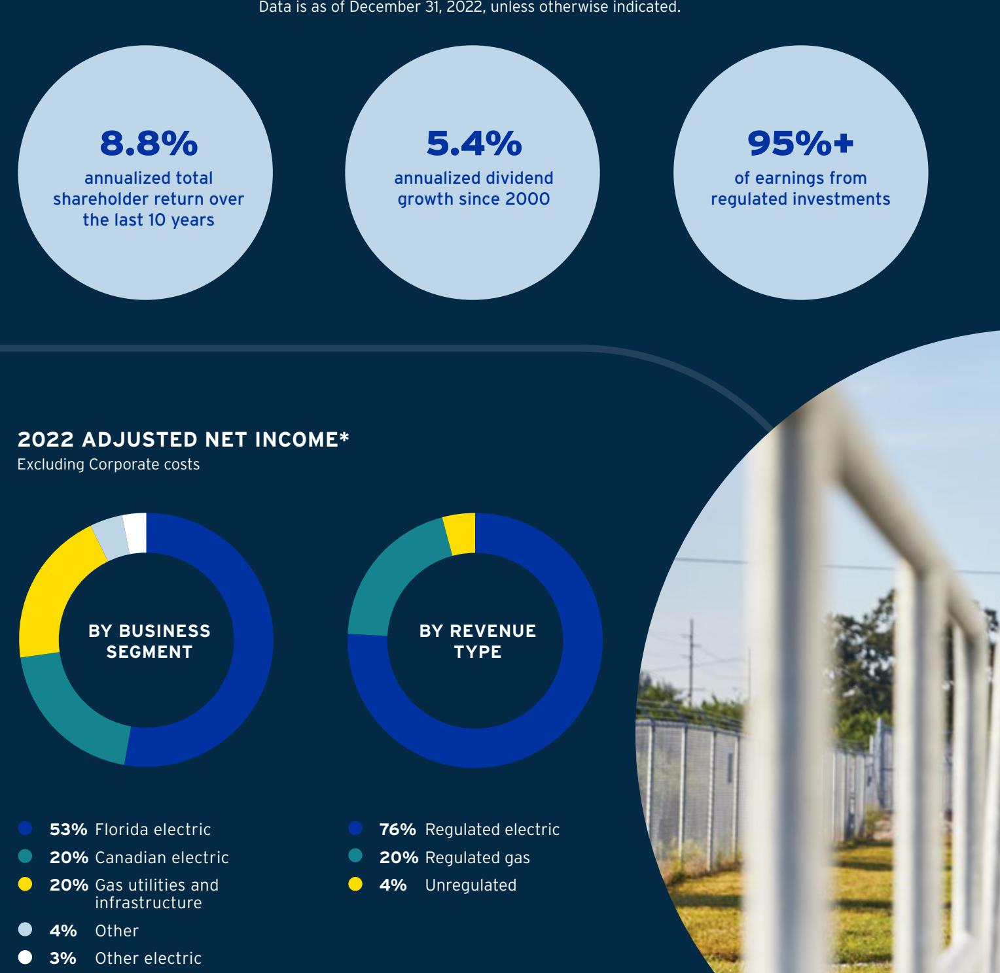
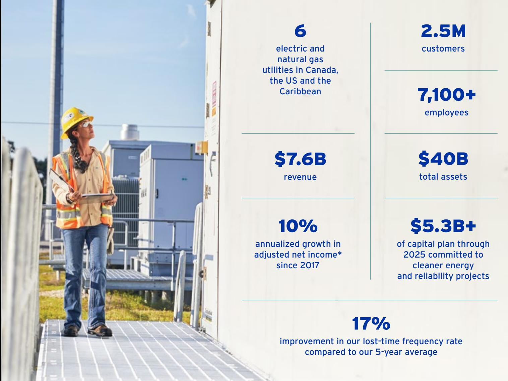
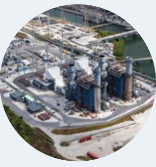

{0}------------------------------------------------

### 2022 ANNUAL REPORT

{1}------------------------------------------------

# 2022 Financial Highlights

Data is as of December 31, 2022, unless otherwise indicated.

* Based on 2022 adjusted net income attributable to common shareholders ("adjusted net income"), excluding Corporate costs of \$267 million. Adjusted net income is a non-GAAP measure which does not have standardized meaning under USGAAP. For more information and a reconciliation to the nearest GAAP measure, refer to "Non-GAAP Financial Measures and Ratios" in Emera's Q4 2022 MD&A.

{2}------------------------------------------------

## Emera at a Glance

Data is as of December 31, 2022, unless otherwise indicated.

From our origins as a single electric utility, Emera has grown into an energy leader serving customers in Canada, the US and the Caribbean. Our companies include electric and natural gas utilities, gas pipelines, and energy marketing and trading operations.

* Adjusted net income is a non-GAAP measure which does not have standardized meaning under USGAAP. For more information and a reconciliation to the nearest GAAP measure, refer to "Non-GAAP Financial Measures and Ratios" in Emera's Q4 2022 MD&A.

{3}------------------------------------------------

## Our Strategy

Our world is changing quickly, and we're ready. For nearly two decades, we've been focused on safely delivering cleaner, reliable energy at a pace that's balanced against cost impacts for our customers. We're delivering solutions to the key challenges facing our industry: decarbonization, decentralization and digitalization.

**TEAMS** We're a team of experts leading the way to a cleaner energy future as we work toward our

2050 net-zero vision.

#### **DELIVERING FOR OUR CUSTOMERS**

Every day, we're safely and cost-effectively delivering cleaner, more reliable energy for our customers.

#### **DRIVING GROWTH AND REINVESTMENT**

Delivering for our customers drives predictable returns and steady growth for our investors, enabling us to reinvest in our teams, companies and communities.

#### **DELIVERING ON OUR CLIMATE COMMITMENT**

The team across Emera is working together to meet our Climate Commitment goals and our vision to achieve net-zero CO2 emissions by 2050.

41% reduction in CO2 emissions since 2005*

* Undergoing final review and verification.

1,654 MW installed renewable capacity

68% reduction in use of coal in generation (GWh) since 2005

{4}------------------------------------------------

**We continue to invest in new technologies and innovation to support our Climate Commitment.*** 

#### **2040 GOAL**

80% reduction in CO2 emissions and last coal unit retired no later than 2040

#### **2025 GOAL**

55% reduction in CO2 emissions

**2050 VISION** Net-zero

CO2 emissions

* Our Climate Commitment goals are compared to 2005 levels.

{5}------------------------------------------------

## Why Invest in Emera

Through our proven strategy and our portfolio of high-quality, regulated utilities, our expert teams across Emera continue to drive long-term value for shareholders.

### Visible Growth Plan

\$8B to \$9B capital investment plan1 through 2025

7% to 8% forecasted rate base growth through 2025

65% of adjusted net income2 , excluding Corporate costs, came from Florida in 2022

75% of CapEx plan from 2023–2025 is focused in Florida — the fastest growing US state in 2022

### Sustainable Dividend Growth

4% to 5% dividend growth target through 2025

> 5.3% dividend yield3

### Constructive Regulatory Environments

89% of adjusted net income2 , excluding Corporate costs, derived from our four core regulated utilities

> Highly rated regulatory environments

### Strong, ESG-Driven Strategy

63% of capital plan to 2025 committed to decarbonization and reliability

\$18M invested in our communities in 20224

- 1 Emera's capital investment plan includes \$240 million equity investment in 2023.
- 2 Based on 2022 adjusted net income, excluding Corporate costs of \$267 million. Adjusted net income is a non-GAAP measure which does not have standardized meaning under USGAAP. For more information and a reconciliation to the nearest GAAP measure, refer to "Non-GAAP Financial Measures and Ratios" in Emera's Q4 2022 MD&A.
- 3 As of December 31, 2022. Our share price on this date was \$51.75.
- 4 Includes a one-time, \$5 million contribution to the University of South Florida to establish the TECO Clean Energy Research Center.

{6}------------------------------------------------

# Letter from the Chair and the CEO

#### **FELLOW SHAREHOLDERS,**

In 2022, the Emera team advanced our strategy of safely delivering cleaner, more reliable energy for our customers with a focus on growth and long-term value for our shareholders. Despite significant challenges like increasingly intense weather, rising inflation rates and supply chain disruptions, Emera's overall performance in 2022 is a testament to the strength of our strategy, our team and our diversified portfolio.

#### **STRATEGY IN ACTION**

Our role as leaders in the energy transition is driving growth as we invest strategically to reduce emissions, add more renewable energy to our generation and improve grid resiliency to enhance reliability for our customers.

In 2022, the execution of our strategy was realized in our \$2.6 billion capital plan that was largely focused on cleaner energy and reliability investments. Last year, we achieved a 41 per cent reduction in CO2 emissions across Emera, compared to 2005 levels.

Here are just some of the projects our teams advanced last year that highlight our environmental priorities and how our strategy continues to drive growth and value for our customers and shareholders:

- The Big Bend Modernization project at Tampa Electric was completed in December 2022 on time, on budget and with a world-class level of safety performance. In addition to reducing CO2 emissions, the facility is now one of the most efficient natural gas generation units in North America. It's also estimated that this modernization project will save customers more than \$700 million over the 30-year life of the plant.

**Jackie Sheppard** Chair, Emera Inc. Board of Directors

{7}------------------------------------------------

- Tampa Electric continued its investment in solar generation in 2022, completing the installation of three new solar sites and bringing its total solar generation in service to more than 1,000 MW. With this achievement, Tampa Electric continues to have the highest proportion of solar generation per customer of any utility in Florida. Our investments in solar have allowed us to decrease the carbon intensity of our generation mix, and saved customers over \$80 million USD in avoided fuel costs in 2022.
- The Maritime Link is a transformational energy project that is a key part of the solution for reducing the use of coal at Nova Scotia Power. By replacing high-carbon generation

with clean hydroelectric energy, the Link saved customers in Nova Scotia almost \$100 million last year and will continue to deliver significant value for decades to come.

- The team at Barbados Light & Power brought the Clean Energy Bridge (CEB) into service in June 2022. Supplying roughly 27 per cent of the island's energy needs, this 33 MW medium-speed diesel generating plant is enhancing reliability and grid resiliency for customers. The CEB replaces older, less-efficient infrastructure, reducing fuel costs and providing critical baseload energy as the country transitions to 100 per cent renewable energy.

{8}------------------------------------------------

#### **SAFETY**

Safety is our number one priority, and we are deeply committed to building a strong safety culture. We continued to implement comprehensive enterprise-wide safety systems, and in 2022 the team achieved a ten per cent improvement in our Occupational Safety and Health Administration (OSHA) injury rate and a 17 per cent improvement in our lost-time frequency rate compared to our average over the last five years both better than the industry average. This improvement is particularly notable given that our teams in Nova Scotia and Florida also responded to two historic hurricanes in 2022 — in both cases without any lost-time injuries.

Despite our efforts and progress, we lost a colleague at Nova Scotia Power in 2022. This tragic loss was profoundly felt across our entire organization and has served to strengthen our resolve to build an Emera where no one gets hurt.

#### **DIVERSITY, EQUITY AND INCLUSION (DEI)**

A strong, diverse team makes our business better. Our Emera-wide DEI strategy guides our efforts in building and maintaining a healthy, diverse and inclusive workplace and culture.

Our Emera DEI Council drives common focus while also supporting our operating companies in addressing their unique DEI journeys. Across the organization, voluntary Employee Resource Groups (ERGs) are in place for Black employees, Latinx employees, veterans, employees in the LGBTQ+ community, women engineers, and women in trades and technology.

We are also committed to building more diverse and inclusive communities where we live and work. In 2022, we invested more than \$18 million in our communities, with over \$2 million invested from Emera's DEI Fund.

**The Emera team was the driving force behind our " achievements in 2022. The work they do delivers for customers, fuels our growth and positions Emera to continue to provide predictable, sustainable earnings and long-term value to our shareholders."**

{9}------------------------------------------------

#### **FINANCIAL RESULTS**

For 2022, we reported \$850 million in annual adjusted net income1 and adjusted earnings per share (EPS)1 of \$3.20. Excluding the impact of a litigation award received2 in the fourth quarter, annual adjusted earnings1 of \$805 million is our highest ever adjusted annual earnings1 and represents an increase of 11 per cent over the previous year. The equivalent annual adjusted EPS1 of \$3.03 was an eight per cent increase over the previous year.

Last year, we also increased our dividend by four per cent, in line with our four to five per cent dividend growth target through 2025. We are proud of our track record of long-term dividend growth, having provided 5.4 per cent growth on an annualized basis since 2000.

While our Total Shareholder Return (TSR) has historically been strong relative to our energy industry peers, the introduction and passage of Bill 212 in Nova Scotia directly and indirectly impacted our share price performance in 2022. We are focused on addressing this underperformance, and we are confident in our ability to return to superior performance for our shareholders. Looking forward, we believe that we are well positioned to continue our track record of providing strong and predictable earnings and dividend growth for our shareholders.

#### **THANK YOU**

The Emera team was the driving force behind our achievements in 2022. The work they do delivers for customers, fuels our growth and positions Emera to continue to provide predictable, sustainable earnings and long-term value to our shareholders.

Thank you to Emera's Board of Directors and the entire Emera team for your continued commitment and extraordinary work on behalf of our customers, communities and shareholders.

To our valued shareholders, thank you for your ongoing confidence in Emera.

**Jackie Sheppard** Chair, Emera Inc. Board of Directors

**Scott Balfour** President and Chief Executive Officer, Emera Inc.

1 Adjusted net income and adjusted EPS are a non-GAAP measure and a non-GAAP ratio, respectively, which do not have standardized meaning under USGAAP. For more information and a reconciliation to the nearest GAAP measure, refer to "Non-GAAP Financial Measures and Ratios" in Emera's Q4 2022 MD&A.

2 2022 results include the impact of a \$45 million after-tax litigation award recognized in the fourth quarter. The impact is \$0.17 on adjusted EPS.

{10}------------------------------------------------

## Financial Review

| Forward-looking Information              | 11 |
|---------------------------------------------|----|
| Introduction and Strategic Overview         | 11 |
| Non-GAAP Financial Measures and Ratios   | 13 |
| Consolidated Financial Review            | 15 |
| Significant Items Affecting Earnings        | 15 |
| Consolidated Financial Highlights           | 15 |
| Consolidated Income Statement Highlights | 17 |
| Business Overview and Outlook               | 19 |
| Florida Electric Utility                 | 19 |
| Canadian Electric Utilities                 | 20 |
| Gas Utilities and Infrastructure         | 23 |
| Other Electric Utilities                 | 24 |
| Other                                    | 26 |
| Consolidated Balance Sheet Highlights       | 27 |
| Oher Developments                           | 28 |
| Financial Highlights                        | 29 |
| Florida Electric Utility                 | 29 |
| Canadian Electric Utilities                 | 30 |
| Gas Utilities and Infrastructure         | 33 |
| Other Electric Utilities                    | 35 |
| Other                                    | 36 |

| Liquidity and Capital Resources                                | 38 |
|----------------------------------------------------------------|----|
| Consolidated Cash Flow Highlights                              | 39 |
| Working Capital                                             | 40 |
| Contractual Obligations                                        | 40 |
| Forecasted Gross Consolidated                                  |    |
| Capital Expenditures                                        | 41 |
| Debt Management                                             | 41 |
| Credit Ratings                                              | 43 |
| Guaranteed Debt                                                | 43 |
| Outstanding Stock Data                                         | 44 |
| Pension Funding                                                | 45 |
| Off-Balance Sheet Arrangements                                 | 45 |
| Dividend Payout Ratio                                       | 46 |
| Transactions with Related Parties                           | 46 |
| Enterprise Risk and Risk Management                            | 47 |
| Risk Management including Financial Instruments             | 57 |
| Disclosure and Internal Controls                               | 59 |
| Critical Accounting Estimates                                  | 59 |
| Changes in Accounting Policies and Practices                | 63 |
| Future Accounting Pronouncements                            | 63 |
| Summary of Quarterly Results                                   | 64 |
| Management Report                                              | 65 |
| Independent Auditor's Report                                   | 66 |
| Report of Independent Registered Public Accounting Firm  | 70 |
| Consolidated Financial Statements                              | 73 |
| Notes to the Consolidated Financial Statements              | 79 |
| Emera Leadership and Board139                                  |    |
| Shareholder Information140                                     |    |

{11}------------------------------------------------

## Management's Discussion & Analysis

#### As at February 23, 2023

Management's Discussion & Analysis ("MD&A") provides a review of the results of operations of Emera Incorporated and its subsidiaries and investments during the fourth quarter of 2022 relative to the same quarter in 2021; for the full year of 2022 relative to 2021 and selected financial information for 2020; and its financial position as at December 31, 2022 relative to December 31, 2021. Throughout this discussion, "Emera" and "Company" refer to Emera Incorporated and all of its consolidated subsidiaries and investments. The Company's activities are carried out through five reportable segments: Florida Electric Utility, Canadian Electric Utilities, Gas Utilities and Infrastructure, Other Electric Utilities, and Other.

This discussion and analysis should be read in conjunction with the Emera annual audited consolidated financial statements and supporting notes as at and for the year ended December 31, 2022. Emera follows United States Generally Accepted Accounting Principles ("USGAAP" or "GAAP").

The accounting policies used by Emera's rate-regulated entities may differ from those used by Emera's non-rate-regulated businesses with respect to the timing of recognition of certain assets, liabilities, revenues and expenses. At December 31, 2022, Emera's rate-regulated subsidiaries and investments include:

| Emera Rate-Regulated Subsidiary or Equity Investment                        | Accounting Policies Approved/Examined By                                                            |  |  |  |  |  |  |
|-----------------------------------------------------------------------------|-----------------------------------------------------------------------------------------------------|--|--|--|--|--|--|
| Subsidiary                                                                  |                                                                                                     |  |  |  |  |  |  |
| Tampa Electric – Electric Division of Tampa Electric Company ("TEC") (1) | Florida Public Service Commission ("FPSC") and the Federal Energy Regulatory Commission ("FERC") |  |  |  |  |  |  |
| Nova Scotia Power Inc. ("NSPI")                                             | Nova Scotia Utility and Review Board ("UARB")                                                       |  |  |  |  |  |  |
| Peoples Gas System ("PGS") – Gas Division of TEC (1)                        | FPSC                                                                                                |  |  |  |  |  |  |
| New Mexico Gas Company, Inc. ("NMGC")                                       | New Mexico Public Regulation Commission ("NMPRC")                                                   |  |  |  |  |  |  |
| SeaCoast Gas Transmission, LLC ("SeaCoast")                                 | FPSC                                                                                                |  |  |  |  |  |  |
| Emera Brunswick Pipeline Company Limited ("Brunswick Pipeline")          | Canadian Energy Regulator ("CER")                                                                   |  |  |  |  |  |  |
| Barbados Light & Power Company Limited ("BLPC")                             | Fair Trading Commission, Barbados ("FTC")                                                           |  |  |  |  |  |  |
| Grand Bahama Power Company Limited ("GBPC")                                 | The Grand Bahama Port Authority ("GBPA")                                                            |  |  |  |  |  |  |

#### **Equity Investments**

| NSP Maritime Link Inc. ("NSPML")                       | UARB                                                                              |
|--------------------------------------------------------|-----------------------------------------------------------------------------------|
| Labrador Island Link Limited Partnership ("LIL")       | Newfoundland and Labrador Board of Commissioners of Public Utilities ("NLPUB") |
| Maritimes & Northeast Pipeline Limited Partnership and | CER and FERC                                                                      |
| Maritimes & Northeast Pipeline, LLC ("M&NP")           |                                                                                   |
| St. Lucia Electricity Services Limited ("Lucelec")     | National Utility Regulatory Commission ("NURC")                                   |

(1) Effective January 1, 2023, Peoples Gas System ceased to be a division of TEC and the gas utility was reorganized, resulting in a separate legal entity called Peoples Gas System, Inc., a wholly owned direct subsidiary of TECO Gas Operations, Inc.

All amounts are in Canadian dollars ("CAD"), except for the Florida Electric Utility, Gas Utilities and Infrastructure, and Other Electric Utilities sections of the MD&A, which are reported in United States dollar ("USD") unless otherwise stated.

Additional information related to Emera, including the Company's Annual Information Form, can be found on SEDAR at www.sedar.com.

{12}------------------------------------------------

### Forward-looking Information

This MD&A contains "forward-looking information" and statements which reflect the current view with respect to the Company's expectations regarding future growth, results of operations, performance, carbon dioxide emissions reduction goals, business prospects and opportunities, and may not be appropriate for other purposes within the meaning of applicable Canadian securities laws. All such information and statements are made pursuant to safe harbour provisions contained in applicable securities legislation. The words "anticipates", "believes", "budget", "could", "estimates", "expects", "forecast", "intends", "may", "might", "plans", "projects", "schedule", "should", "targets", "will", "would" and similar expressions are often intended to identify forward-looking information, although not all forward-looking information contains these identifying words. The forward-looking information reflects management's current beliefs and is based on information currently available to Emera's management and should not be read as guarantees of future events, performance or results, and will not necessarily be accurate indications of whether, or the time at which, such events, performance or results will be achieved.

The forward-looking information is based on reasonable assumptions and is subject to risks, uncertainties and other factors that could cause actual results to differ materially from historical results or results anticipated by the forward-looking information. Factors that could cause results or events to differ from current expectations include, without limitation: regulatory and political risk; operating and maintenance risks; changes in economic conditions; commodity price and availability risk; liquidity and capital market risk; future dividend growth; timing and costs associated with certain capital investments; expected impacts on Emera of challenges in the global economy; estimated energy consumption rates; maintenance of adequate insurance coverage; changes in customer energy usage patterns; developments in technology that could reduce demand for electricity; global climate change; weather; unanticipated maintenance and other expenditures; system operating and maintenance risk; derivative financial instruments and hedging; interest rate risk; inflation risk; counterparty risk; disruption of fuel supply; country risks; environmental risks; foreign exchange ("FX"); regulatory and government decisions, including changes to environmental, financial reporting and tax legislation; risks associated with pension plan performance and funding requirements; loss of service area; risk of failure of information technology ("IT") infrastructure and cybersecurity risks; uncertainties associated with infectious diseases, pandemics and similar public health threats, such as the COVID-19 novel coronavirus ("COVID-19") pandemic; market energy sales prices; labour relations; and availability of labour and management resources.

Readers are cautioned not to place undue reliance on forward-looking information, as actual results could differ materially from the plans, expectations, estimates or intentions and statements expressed in the forward-looking information. All forward-looking information in this MD&A is qualified in its entirety by the above cautionary statements and, except as required by law, Emera undertakes no obligation to revise or update any forward-looking information as a result of new information, future events or otherwise.

### Introduction and Strategic Overview

Based in Halifax, Nova Scotia, Emera owns and operates cost-of-service rate-regulated electric and gas utilities in Canada, the United States and the Caribbean. Cost-of-service utilities provide essential electric and gas services in designated territories under franchises and are overseen by regulatory authorities. Emera's strategic focus continues to be safely delivering cleaner, affordable and reliable energy to its customers.

The majority of Emera's investment in rate-regulated businesses are located in Florida with other investments in Nova Scotia, New Mexico and the Caribbean. Emera's portfolio of regulated utilities provides reliable earnings, cash flow and dividends. Earnings opportunities in regulated utilities are generally driven by the magnitude of net investment in the utility (known as "rate base"), and the amount of equity in the capital structure and the return on that equity ("ROE") as approved through regulation. Earnings are also affected by sales volumes and operating expenses.

{13}------------------------------------------------

Emera's capital investment plan is \$8 – 9 billion over the 2023-to-2025 period (including a \$240 million equity investment in the LIL in 2023), mainly focused in Florida. This results in a forecasted rate base growth of approximately 7 per cent to 8 per cent through 2025. The capital investment plan continues to include significant investments across the portfolio in renewable and cleaner generation, reliability and integrity investments, infrastructure modernization, and customer-focused technologies. Emera's capital investment plan is being funded primarily through internally generated cash flows and debt raised at the operating company level. Equity requirements in support of the Company's capital investment plan are expected to be funded through the issuance of preferred equity and the issuance of common equity through Emera's dividend reinvestment plan ("DRIP") and at-the-market program ("ATM program"). Maintaining investment-grade credit ratings is a priority of the Company.

Emera has provided annual dividend growth guidance of four to five per cent through 2025. The Company targets a long-term dividend payout ratio of adjusted net income of 70 to 75 per cent and, while the payout ratio is likely to exceed that target through and beyond the forecast period, it is expected to return to that range over time. For further information on the non-GAAP measure "Dividend Payout Ratio of Adjusted Net Income", refer to the "Non-GAAP Financial Measures and Ratios" section.

Seasonal patterns and other weather events affect demand and operating costs. Similarly, mark-to-market adjustments and foreign currency exchange can have a material impact on financial results for a specific period. Emera's consolidated net income and cash flows are impacted by movements in the USD relative to the Canadian dollar. Emera may hedge both transactional and translational exposure. These impacts, as well as the timing of capital investments and other factors, mean results in any one quarter are not necessarily indicative of results in any other quarter, or for the year as a whole.

Energy markets worldwide are facing significant change and Emera is well positioned to respond to shifting customer demands, digitization, decarbonization, complex regulatory environments, and decentralized generation.

Customers are looking for more choice, better control, and enhanced reliability in a time where costs of decentralized generation and storage have become more competitive in some regions. Advancing technologies are transforming the way utilities interact with their customers and generate and transmit energy. In addition, climate change and extreme weather are shaping how utilities operate and how they invest in infrastructure. There is also an overall need to replace aging infrastructure and further enhance reliability. Emera will play a role in all of these trends. Emera's strategy is to fund investments in renewable energy and technology assets which protect the environment and benefit customers through fuel or operating cost savings.

For example, significant investments to facilitate the use of renewable and low-carbon energy include the Maritime Link in Atlantic Canada, and the ongoing construction of solar generation and modernization of the Big Bend Power Station at Tampa Electric. Emera's utilities are also investing in reliability projects and replacing aging infrastructure. All of these projects demonstrate Emera's strategy of safely delivering cleaner, reliable, and affordable energy for its customers.

Building on its decarbonization progress, Emera is continuing its efforts by establishing clear carbon reduction goals and a vision to achieve net-zero carbon dioxide emissions by 2050.

This vision is inspired by Emera's strong track record, the Company's experienced team, and a clear path to Emera's interim carbon goals. With existing technologies and resources, and subject to supportive government and regulatory decisions, Emera is working to achieve the following goals compared to corresponding 2005 levels:

- A 55 per cent reduction in carbon dioxide emissions by 2025.
- The retirement of Emera's last existing coal unit no later than 2040.
- An 80 per cent reduction in carbon dioxide emissions by 2040.

Achieving the above climate goals on these timelines is subject to the Company's regulatory obligations and other external factors beyond Emera's control.

Emera seeks to deliver on its Climate Commitment while maintaining its focus on investing in reliability and staying focused on the cost impacts for customers. Emera is also committed to identifying emerging technologies and continuing to work constructively with policymakers, regulators, partners, investors and customers to achieve these goals and realize its net-zero vision.

Emera is committed to world-class safety, operational excellence, good governance, excellent customer service, reliability, being an employer of choice, and building constructive relationships.

{14}------------------------------------------------

### Non-GAAP Financial Measures and Ratios

Emera uses financial measures and ratios that do not have standardized meaning under USGAAP and may not be comparable to similar measures presented by other entities. Emera calculates the non-GAAP measures and ratios by adjusting certain GAAP measures for specific items. Management believes excluding these items better distinguishes the ongoing operations of the business and allows investors to better understand and evaluate the business. These measures and ratios are discussed and reconciled below.

#### **Adjusted Net Income Attributable to Common Shareholders, Adjusted Earnings (Loss) Per Common Share ("EPS") – Basic and Dividend Payout Ratio of Adjusted Net Income**

Emera calculates an adjusted net income attributable to common shareholders ("adjusted net income") measure by excluding the effect of mark-to-market ("MTM") adjustments, impairment charges, the impact of the NSPML unrecoverable costs, and the 2020 gain on sale of Emera Maine.

Management believes excluding from net income the effect of these MTM valuations and changes thereto, until settlement, better aligns the intent and financial effect of these contracts with the underlying cash flows, and therefore excludes these MTM adjustments for evaluation of performance and incentive compensation. The MTM adjustments are related to the following:

- held-for-trading ("HFT") commodity derivative instruments, including adjustments related to the price differential between the point where natural gas is sourced and where it is delivered, and the related amortization of transportation capacity recognized as a result of certain Emera Energy marketing and trading transactions;
- the business activities of Bear Swamp Power Company LLC ("Bear Swamp") included in Emera's equity income;
- equity securities held in BLPC and a captive reinsurance company in the Other segment; and
- FX hedges entered into to hedge USD denominated operating unit earnings exposure.

For further detail on MTM adjustments, refer to the "Consolidated Financial Review", "Financial Highlights – Other Electric Utilities", and "Financial Highlights – Other" sections.

In Q4 2022, the Company recognized a \$73 million non-cash goodwill impairment charge related to GBPC due to a decline in the fair value of the reporting unit. The fair value decline was driven by the effects of macro-economic factors on the discount rate calculation, including the risk-free rate assumption. Management believes excluding from net income the effect of this charge better distinguishes ongoing operations of the business and allows investors to better understand and evaluate the Company. For further details on this GBPC impairment charge, refer to "Significant Items Impacting Earnings", and "Financial Highlights – Other" sections.

In February 2022, the UARB issued a decision to disallow the recovery of \$9 million in costs (\$7 million after-tax) included in NSPML's final capital cost application. The after-tax unrecoverable costs were recognized in "Income from equity investments" in Emera's Consolidated Statements of Income. Management believes excluding these unrecoverable costs from the calculation of adjusted net income better reflects the underlying operations in the period. For further details on the NSPML unrecoverable costs, refer to the "Business Overview and Outlook – Canadian Electric Utilities" and "Financial Highlights – Canadian Electric Utilities" sections.

In 2020, the Company recognized a gain on the sale of Emera Maine and certain non-cash impairment charges. Management believes excluding these from net income better distinguishes ongoing operations of the business and allows investors to better understand and evaluate the business.

Adjusted EPS – basic and dividend payout ratio of adjusted net income are non-GAAP ratios which are calculated using adjusted net income, as described above. For further details on dividend payout ratio of adjusted net income, see the "Dividend Payout Ratio" section.

Emera calculates adjusted net income for the Canadian Electric Utilities, Other Electric Utilities, and Other segments. Reconciliation to the nearest GAAP measure is included in each segment. Refer to "Financial Highlights – Canadian Electric Utilities", "Financial Highlights – Other Electric Utilities" and "Financial Highlights – Other" sections.

{15}------------------------------------------------

The following reconciles net income attributable to common shareholders to adjusted net income:

| For the millions of dollars (except per share amounts) | Three months ended December 31 2022 2021 |    |      | 2022       | 2021       | Year ended December 31 2020 |      |
|-----------------------------------------------------------|---------------------------------------------------|----|------|------------|------------|-----------------------------------|------|
| Net income attributable to common shareholders            | \$ 483                                         | \$ | 324  | \$ 945  | \$ 510  | \$                                | 938  |
| MTM gain (loss), after-tax (1)                            | 307                                               |    | 156  | 175        | (213)      |                                   | (10) |
| Impairment charges, after-tax (2)                         | (73)                                              |    | –    | (73)       | –          |                                   | (26) |
| NSPML unrecoverable costs (3)                             | –                                                 |    | –    | (7)        | –          |                                   | –    |
| Gain on sale, after tax and transaction costs (4)         | –                                                 |    | –    | –          | –          |                                   | 309  |
| Adjusted net income attributable to common shareholders   | \$ 249                                         | \$ | 168  | \$ 850  | \$ 723  | \$                                | 665  |
| EPS – basic                                               | \$ 1.80                                        | \$ | 1.24 | \$ 3.56 | \$ 1.98 | \$                                | 3.78 |
| Adjusted EPS – basic                                      | \$ 0.93                                        | \$ | 0.64 | \$ 3.20 | \$ 2.81 | \$                                | 2.68 |

(1) Net of income tax expense of \$124 million for the three months ended December 31, 2022 (2021 – \$63 million expense) and \$73 million expense for the year ended December 31, 2022 (2021 – \$86 million recovery) (2020 – \$8 million recovery).

(2) Net of income tax expense of nil for the three months and year ended December 31, 2022 (2021 – nil) (2020 – \$1 million expense).

(3) Emera accounts for NSPML as an equity investment and therefore the after-tax unrecoverable costs were recorded in "Income from equity investments" on Emera's Consolidated Statements of Income.

(4) Net of income tax expense of \$276 million for the year ended December 31, 2020.

#### **EBITDA and Adjusted EBITDA**

Earnings before interest, income taxes, depreciation and amortization ("EBITDA") and adjusted EBITDA are non-GAAP financial measures used by Emera. These financial measures are used by numerous investors and lenders to better understand cash flows and credit quality. EBITDA is useful to assess Emera's operating performance and indicates the Company's ability to service or incur debt, invest in capital, and finance working capital requirements.

Similar to adjusted net income calculations described above, adjusted EBITDA represents EBITDA absent the income effect of MTM adjustments, impairment charges, the NSPML unrecoverable costs, and the 2020 gain on sale of Emera Maine.

The following is a reconciliation of net income to EBITDA and Adjusted EBITDA:

| For the millions of dollars                                | 2022        | Three months ended December 31 2021 | 2022        | 2021        | Year ended December 31 2020 |
|---------------------------------------------------------------|-------------|-------------------------------------------|-------------|-------------|-----------------------------------|
| Net income (1)                                                | \$ 499   | \$ 338                                 | \$ 1,009 | \$ 561   | \$ 984                         |
| Interest expense, net                                         | 206         | 151                                       | 709         | 611         | 679                               |
| Income tax expense (recovery)                                 | 154         | 85                                        | 185         | (6)         | 341                               |
| Depreciation and amortization                                 | 254         | 227                                       | 952         | 902         | 881                               |
| EBITDA                                                        | \$ 1,113 | \$ 801                                 | \$ 2,855 | \$ 2,068 | \$ 2,885                       |
| MTM gain (loss), excluding income tax                         | 431         | 219                                       | 248         | (299)       | (18)                              |
| Impairment charges, excluding income tax                      | (73)        | –                                         | (73)        | –           | (25)                              |
| NSPML unrecoverable costs (2)                                 | –           | –                                         | (7)         | –           | –                                 |
| Gain on sale, net of transaction costs (excluding income tax) | –           | –                                         | –           | –           | 585                               |
| Adjusted EBITDA                                               | \$ 755   | \$ 582                                 | \$ 2,687 | \$ 2,367 | \$ 2,343                       |

(1) Net income is before Non-controlling interest in subsidiaries and Preferred stock dividends.

(2) Emera accounts for NSPML as an equity investment and therefore the after-tax unrecoverable costs were recorded in "Income from equity investments" on Emera's Consolidated Statements of Income.

{16}------------------------------------------------

### Consolidated Financial Review

#### **SIGNIFICANT ITEMS AFFECTING EARNINGS**

#### **GBPC Impairment Charge**

In Q4 2022, Emera recognized a goodwill impairment charge of \$73 million (\$0.27 per common share) for GBPC due to a decline in the fair value of the reporting unit. Although the cash flows of GBPC have not changed significantly compared to previous periods, the decline in the fair value was driven by the effects of macro-economic factors on discount rate calculations, including the risk-free rate assumption. This non-cash charge was recorded in "Impairment charge" on the Consolidated Statements of Income and reduced the GBPC goodwill balance to nil. For further details, refer to note 22 in the consolidated financial statements.

#### **TECO Guatemala Holdings ("TGH") International Arbitration and Award**

On December 15, 2022, a payment of \$63 million (\$45 million after tax and legal costs, or \$0.17 per common share), was made by the Republic of Guatemala to TECO Energy in satisfaction of the second and final award issued by the International Centre of the Settlement of Investment Disputes tribunal regarding a dispute over an investment of TGH, a wholly owned subsidiary of TECO Energy. The dispute related to the 2007 intervention by the government of Guatemala in an ongoing independent ratesetting process to unilaterally set a new and lower tariff. The payment was recognized in "Other income, net" on the Consolidated Statements of Income. For further details, refer to note 27 in the consolidated financial statements.

#### **Earnings Impact of MTM Gain (Loss), After-Tax**

MTM gain, after-tax increased \$151 million to \$307 million in Q4 2022, compared to \$156 million in Q4 2021, and for the year ended December 31, increased \$388 million to \$175 million compared to a MTM loss, after-tax of \$213 million for the same period in 2021. These increases were due to changes in existing positions and reversal of losses in 2022, partially offset by higher amortization in 2022 of gas transportation assets at Emera Energy.

#### **CONSOLIDATED FINANCIAL HIGHLIGHTS**

| For the millions of dollars                 | Three months ended December 31 |      |      |      |    |       |           | Year ended December 31 |
|------------------------------------------------|-----------------------------------|------|------|------|----|-------|-----------|---------------------------|
| Adjusted net income                            |                                   | 2022 | 2021 |      |    | 2022  | 2021      | 2020                      |
| Florida Electric Utility                       | \$                                | 124  | \$   | 85   | \$ | 596   | \$ 462 | \$ 501                 |
| Canadian Electric Utilities                    |                                   | 46   |      | 67   |    | 222   | 241       | 221                       |
| Gas Utilities and Infrastructure               |                                   | 72   |      | 55   |    | 221   | 198       | 162                       |
| Other Electric Utilities                       |                                   | 8    |      | 5    |    | 29    | 20        | 33                        |
| Other                                          |                                   | (1)  |      | (44) |    | (218) | (198)     | (252)                     |
| Adjusted net income                            | \$                                | 249  | \$   | 168  | \$ | 850   | \$ 723 | \$ 665                 |
| MTM gain (loss), after-tax                     |                                   | 307  |      | 156  |    | 175   | (213)     | (10)                      |
| Impairment charges, after-tax                  |                                   | (73) |      | –    |    | (73)  | –         | (26)                      |
| NSPML unrecoverable costs                      |                                   | –    |      | –    |    | (7)   | –         | –                         |
| Gain on sale, after tax and transaction costs  |                                   | –    |      | –    |    | –     | –         | 309                       |
| Net income attributable to common shareholders | \$                                | 483  | \$   | 324  | \$ | 945   | \$ 510 | \$ 938                 |

{17}------------------------------------------------

The following table highlights the significant changes in adjusted net income from 2021 to 2022:

| For the millions of dollars                                                                |    | Three months ended December 31 | Year ended December 31 |
|-----------------------------------------------------------------------------------------------|----|-----------------------------------|---------------------------|
| Adjusted net income – 2021                                                                    | \$ | 168                               | \$ 723                 |
| Operating Unit Performance                                                                    |    |                                   |                           |
| Increased earnings at Tampa Electric due to higher revenues as a result of rate increases     |    |                                   |                           |
| effective January 2022, customer growth, and the impact of a weakening CAD. These             |    |                                   |                           |
| were partially offset by higher operating, maintenance and general expenses ("OM&G"),         |    |                                   |                           |
| increased interest expense, and higher depreciation. Year-over-year also increased due to     |    |                                   |                           |
| favourable weather                                                                            |    | 39                                | 134                       |
| Increased earnings at Emera Energy Services ("EES") due to favourable market conditions       |    | 21                                | 21                        |
| Increased earnings at PGS due to higher off-system sales and customer growth, partially       |    |                                   |                           |
| offset by higher OM&G. Year-over-year also increased due to reversal of accumulated           |    |                                   |                           |
| depreciation as a result of the rate case settlement                                          |    | 2                                 | 10                        |
| Increased earnings at Seacoast due to commencement of a 34-year pipeline lateral lease        |    |                                   |                           |
| in 2022                                                                                       |    | 2                                 | 9                         |
| Increased earnings at NMGC were primarily due to higher asset optimization revenues.          |    |                                   |                           |
| Year-over-year increased earnings were partially offset by higher OM&G and increased          |    |                                   |                           |
| depreciation                                                                                  |    | 11                                | 4                         |
| Decreased earnings at NSPI due to higher OM&G primarily due to increased costs for storm      |    |                                   |                           |
| restoration, IT, power generation, regulatory affairs, and higher depreciation. This was      |    |                                   |                           |
| partially offset by higher sales volumes. Quarter-over-quarter also decreased due to          |    |                                   |                           |
| unfavourable weather                                                                          |    | (20)                              | (10)                      |
| Corporate                                                                                     |    |                                   |                           |
| TGH award, after tax and legal costs, in Q4 2022. Refer to the "Significant Items Affecting   |    |                                   |                           |
| Earnings" section                                                                             |    | 45                                | 45                        |
| Increased income tax recovery primarily due to increased losses before provision for          |    |                                   |                           |
| income taxes                                                                                  |    | 17                                | 34                        |
| Increased OM&G, pre-tax, due to the timing of long-term compensation and related hedges       |    | (19)                              | (55)                      |
| Increased FX loss, pre-tax, primarily due to realized gains in 2021 on FX hedges entered into |    |                                   |                           |
| to hedge USD denominated operating unit earnings exposure                                     |    | (9)                               | (28)                      |
| Increased interest expense, pre-tax, due to higher interest rates and increased total debt    |    | (17)                              | (27)                      |
| Increased preferred stock dividends due to issuance of preferred shares in 2021               |    | (2)                               | (13)                      |
| Other Variances                                                                               |    | 11                                | 3                         |
| Adjusted net income – 2022                                                                    | \$ | 249                               | \$ 850                 |

For further details of reportable segments contributions, refer to the "Financial Highlights" section.

| For the                                               |               |               | Year ended December 31 |
|-------------------------------------------------------|---------------|---------------|---------------------------|
| millions of dollars                                   | 2022          | 2021          | 2020                      |
| Operating cash flow before changes in working capital | \$ 1,147   | \$ 1,337   | \$ 1,420               |
| Change in working capital                             | (234)         | (152)         | 217                       |
| Operating cash flow                                   | \$ 913     | \$ 1,185   | \$ 1,637               |
| Investing cash flow                                   | \$ (2,569) | \$ (2,332) | \$ (1,224)             |
| Financing cash flow                                   | \$ 1,555      | \$ 1,311   | \$ (372)               |

{18}------------------------------------------------

For further discussion of cash flow, refer to the "Consolidated Cash Flow Highlights" section.

| As at                                            |        |        | December 31 |
|--------------------------------------------------|--------|--------|-------------|
| millions of dollars                              | 2022   | 2021   | 2020        |
| Total assets                                     | \$     | \$     | \$          |
|                                                  | 39,742 | 34,244 | 31,234      |
| Total long-term debt (including current portion) | \$     | \$     | \$          |
|                                                  | 16,318 | 14,658 | 13,721      |

#### **CONSOLIDATED INCOME STATEMENT HIGHLIGHTS**

| For the millions of dollars (except per share amounts)                | 2022        | Three months ended December 31 2021 | Variance   | 2022        | Year ended December 31 2021 | Variance    | Year ended December 31 2020 |
|-----------------------------------------------------------------------------|-------------|-------------------------------------------|------------|-------------|-----------------------------------|-------------|-----------------------------------|
| Operating revenues                                                          | \$ 2,358 | \$ 1,868                               | \$ 490  | \$ 7,588 | \$ 5,765                       | \$ 1,823 | \$ 5,506                       |
| Operating expenses                                                          | 1,638       | 1,352                                     | (286)      | 5,959       | 4,835                             | (1,124)     | 4,359                             |
| Income from operations                                                      | \$ 720   | \$ 516                                 | \$ 204  | \$ 1,629 | \$ 930                         | \$ 699   | \$ 1,147                       |
| Net income attributable to common                                           |             |                                           |            |             |                                   |             |                                   |
| shareholders                                                                | \$ 483   | \$ 324                                 | \$ 159  | \$ 945   | \$ 510                         | \$ 435   | \$ 938                         |
| Adjusted net income                                                         | \$ 249   | \$ 168                                 | \$ 81   | \$ 850   | \$ 723                         | \$ 127   | \$ 665                         |
| Weighted average shares of common stock outstanding (in millions) (1) | 269.0       | 260.8                                     | 8.2        | 265.5       | 257.2                             | 8.3         | 247.8                             |
| EPS – basic                                                                 | \$ 1.80  | \$ 1.24                                | \$ 0.56 | \$ 3.56  | \$ 1.98                        | \$ 1.58  | \$ 3.78                        |
| EPS – diluted                                                               | \$ 1.80  | \$ 1.20                                | \$ 0.60 | \$ 3.55  | \$ 1.98                        | \$ 1.57  | \$ 3.78                        |
| Adjusted EPS – basic                                                        | \$ 0.93  | \$ 0.64                                | \$ 0.29 | \$ 3.20  | \$ 2.81                        | \$ 0.39  | \$ 2.68                        |
| Adjusted EBITDA                                                             | \$ 755   | \$ 582                                 | \$ 173  | \$ 2,687 | \$ 2,367                       | \$ 320   | \$ 2,343                       |
| Dividends per common share                                                  |             |                                           |            |             |                                   |             |                                   |
| declared                                                                    | \$ 0.6900   | \$ 0.6625                                 | \$ 0.0275  | \$ 2.6775   | \$ 2.5750                         | \$ 0.1025   | \$ 2.4750                         |
| Dividends per first preferred shares                                        |             |                                           |            |             |                                   |             |                                   |
| declared:                                                                   |             |                                           |            |             |                                   |             |                                   |
| Series A                                                                    |             |                                           |            | \$ 0.5456   | \$ 0.5456                         | \$ –     | \$ 0.6155                         |
| Series B                                                                    |             |                                           |            | \$ 0.6869   | \$ 0.4873                         | \$ 0.1996   | \$ 0.6965                         |
| Series C                                                                    |             |                                           |            | \$ 1.1802   | \$ 1.1802                         | \$ –     | \$ 1.1802                         |
| Series E                                                                    |             |                                           |            | \$ 1.1250   | \$ 1.1250                         | \$ –     | \$ 1.1250                         |
| Series F                                                                    |             |                                           |            | \$ 1.0505   | \$ 1.0505                         | \$ –     | \$ 1.0535                         |
| Series H                                                                    |             |                                           |            | \$ 1.2250   | \$ 1.2250                         | \$ –     | \$ 1.2250                      |
| Series J                                                                    |             |                                           |            | \$ 1.0625   | \$ 0.6470                         | \$ 0.4155   | \$ –                           |
| Series L                                                                    |             |                                           |            | \$ 1.1500   | \$ 0.1638                         | \$ 0.9862   | \$ –                           |

(1) Effective February 10, 2022, deferred share units are no longer able to be settled in shares and are therefore excluded from weighted average shares of common stock outstanding.

#### **Operating Revenues**

For Q4 2022, operating revenues increased \$490 million compared to Q4 2021 and, absent increased MTM gains of \$195 million, increased \$295 million. For the year ended December 31, 2022, operating revenues increased \$1,823 million compared to 2021 and, absent increased MTM gains of \$555 million, increased by \$1,268 million. The increases in both periods were due to: higher fuel revenues at NMGC, Tampa Electric PGS and BLPC; new rates effective January 2022 and customer growth at Tampa Electric; the impact of a weaker CAD; higher off-system sales and customer growth at PGS; and increased marketing and trading margin due to favourable market conditions at EES. Year-over-year also increased due to increased sales volumes at NSPI and favourable weather at Tampa Electric.

{19}------------------------------------------------

#### **Operating Expenses**

For Q4 2022, operating expenses increased \$286 million compared to Q4 2021 and, absent the GBPC impairment charge of \$73 million, increased by \$213 million. For the year ended December 31, 2022, operating expenses increased \$1,124 million compared to 2021 and, absent the GBPC impairment charge of \$73 million, increased by \$1,051 million. The increases in both periods were due to: higher natural gas prices at NMGC and PGS; the impact of a weaker CAD; and increased OM&G at Tampa Electric, Corporate, NSPI, NMGC and PGS. Year-over-year also increased due to higher natural gas and fuel prices at Tampa Electric and BLPC.

#### **Other Income, Net**

Other income, net increased for Q4 2022 and the year ended December 31, 2022, compared to the same periods in 2021, primarily due to the TGH award in Q4 2022.

#### **Net Income and Adjusted Net Income**

Net income attributable to common shareholders for Q4 2022, as compared to Q4 2021, was favourably impacted by the \$151 million increase in MTM gains, after-tax and unfavourably impacted by the \$73 million GBPC impairment charge. Absent these changes, adjusted net income increased \$81 million. The increase was primarily due to: the TGH award in Q4 2022; higher earnings contribution from Tampa Electric, Emera Energy and NMGC; and the impact of a weaker CAD. These were partially offset by lower earnings contribution from NSPI and increased corporate OM&G due to the timing of long-term compensation and related hedges, and higher corporate interest expense.

Net income attributable to common shareholders for the year ended 2022, as compared to the same period in 2021, was favourably impacted by the \$388 million increase in MTM gains, after-tax and unfavourably impacted by the \$73 million GBPC impairment charge as well as the \$7 million in NSPML unrecoverable costs. Absent these changes, adjusted net income increased \$127 million. The increase was primarily due to: higher earnings contributions from Tampa Electric, Emera Energy, PGS and Seacoast; the TGH award in Q4 2022; and the impact of a weaker CAD. These were partially offset by increased corporate OM&G due to the timing of long-term compensation and related hedges, higher corporate interest expense, realized gains on corporate FX hedges in 2021, increased preferred stock dividends and lower earnings contribution from NSPI.

#### **EPS and Adjusted EPS – Basic**

EPS and Adjusted EPS – basic were higher for Q4 2022, and for the year ended December 31, 2022, due to the impact of higher earnings as discussed above, partially offset by the impact of the increase in weighted average shares of common stock outstanding.

#### **Effect of Foreign Currency Translation**

Emera operates in Canada, the United States and various Caribbean countries and, as such, generates revenues and incurs expenses denominated in local currencies which are translated into CAD for financial reporting. Changes in translation rates, particularly in the value of the USD against the CAD, can positively or adversely affect results.

In general, Emera's earnings benefit from a weakening CAD and are adversely impacted by a strengthening CAD. The impact in any period is driven by rate changes, the timing and percentage of earnings from foreign operations, and the impact of FX hedges entered into to hedge USD denominated operating unit earnings exposure.

{20}------------------------------------------------

Results of foreign operations are translated at the weighted average rate of exchange, and assets and liabilities of foreign operations are translated at period end rates. The relevant CAD/USD exchange rates for 2022 and 2021 are as follows:

|                                  | Three months ended December 31 |    |      |    |      | Year ended December 31 |      |  |
|----------------------------------|-----------------------------------|----|------|----|------|---------------------------|------|--|
|                                  | 2022                              |    | 2021 |    | 2022 |                           | 2021 |  |
| Weighted average CAD/USD         | \$ 1.37                        | \$ | 1.26 | \$ | 1.34 | \$                        | 1.26 |  |
| Period end CAD/USD exchange rate | \$ 1.35                        | \$ | 1.27 | \$ | 1.35 | \$                        | 1.27 |  |

The table below includes Emera's significant segments whose contributions to adjusted net income are recorded in USD currency.

| For the                              | Three months ended December 31 |    |      |    |      | Year ended December 31 |      |  |  |
|--------------------------------------|-----------------------------------|----|------|----|------|---------------------------|------|--|--|
| millions of USD                      | 2022                              |    | 2021 |    | 2022 |                           | 2021 |  |  |
| Florida Electric Utility             | \$ 91                          | \$ | 67   | \$ | 458  | \$                        | 369  |  |  |
| Other Electric Utilities             | 7                                 |    | 4    |    | 23   |                           | 16   |  |  |
| Gas Utilities and Infrastructure (1) | 45                                |    | 37   |    | 143  |                           | 130  |  |  |
| Other segment (2)                    | 30                                |    | (20) |    | (50) |                           | (98) |  |  |
| Total (3)                            | \$ 173                         | \$ | 88   | \$ | 574  | \$                        | 417  |  |  |

(1) Includes USD net income from PGS, NMGC, SeaCoast and M&NP.

(2) Includes Emera Energy's USD adjusted net income from EES, Bear Swamp and interest expense on Emera Inc.'s USD denominated debt.

(3) Excludes \$222 million USD in MTM gain, after-tax, for the three months ended December 31, 2022 (2021 – \$122 million USD MTM gain, after-tax) and MTM gain, after-tax of \$130 million USD for the year ended December 31, 2022 (2021 – \$164 million USD MTM loss, after-tax) and the GBPC impairment charge of \$54 million USD for the three months and year ended December 31, 2022 (2021 – nil).

The impact of the weakening CAD, partially offset by the unrealized losses on FX hedges increased net income by \$42 million in Q4 2022 and \$30 million for the year ended December 31, 2022, compared to the same periods in 2021. Weakening of the CAD increased adjusted net income by \$14 million in Q4 2022 and \$28 million for the year ended December 31, 2022, compared to the same periods in 2021. Impacts of the weakening CAD include the impacts of corporate FX hedges in the Other segment.

### Business Overview and Outlook

#### **FLORIDA ELECTRIC UTILITY**

Florida Electric Utility consists of Tampa Electric, a vertically integrated regulated electric utility engaged in the generation, transmission and distribution of electricity, serving customers in West Central Florida. Tampa Electric has \$12.1 billion USD of assets and approximately 827,000 customers at December 31, 2022. Tampa Electric owns 6,549 megawatts ("MW") of generating capacity, of which 78 per cent is natural gas-fired, 15 per cent is solar and 7 per cent is coal. Tampa Electric owns 2,171 kilometres of transmission facilities and 19,916 kilometres of distribution facilities. Tampa Electric meets the planning criteria for reserve capacity established by the FPSC, which is a 20 per cent reserve margin over firm peak demand.

Tampa Electric's approved regulated ROE range is 9.25 per cent to 11.25 per cent, based on an allowed equity capital structure of 54 per cent. An ROE of 10.20 per cent will be used for the calculation of the return on investments for clauses.

Tampa Electric anticipates earning within its ROE range in 2023. New base rates effective January 1, 2023, as a result of the 2021 settlement agreement, will result in higher 2023 USD earnings than in 2022. Normalizing 2022 for weather, Tampa Electric sales volumes in 2023 are projected to be higher than in 2022 due to customer growth. Tampa Electric expects customer growth rates in 2023 to be comparable to 2022, reflective of the current expected economic growth in Florida.

On January 23, 2023, Tampa Electric requested an adjustment to its fuel charges to recover the 2022 fuel under-recovery of \$518 million USD over a period of 21 months. The request also included an adjustment to 2023 projected fuel costs to reflect the reduction in natural gas prices since September 2022 for a projected reduction of \$170 million USD for the balance of 2023. The proposed changes will be decided by the FPSC in March 2023, and recovery is expected to begin in April 2023.

{21}------------------------------------------------

On September 28, 2022, Hurricane Ian made landfall in Southwest Florida as a Category 4 hurricane and, as a result, approximately 291,000 customers lost power. The majority of Hurricane Ian restoration costs were charged against Tampa Electric's FPSC approved storm reserve, resulting in minimal impact to earnings for 2022. The total cost of restoration was \$126 million USD, with approximately \$119 million USD charged to the storm reserve. Total restoration costs charged to the storm reserve have exceeded the reserve balance and have been deferred as a regulatory asset for future recovery. On January 23, 2023, Tampa Electric petitioned the FPSC for recovery of the storm reserve regulatory asset and the replenishment of the balance in the reserve to the previous approved reserve level of \$56 million USD, for a total of approximately \$131 million USD. The proposed changes will be decided by the FPSC in March 2023, and recovery is expected to begin in April 2023 through March 2024.

The mid-course fuel adjustment requested by Tampa Electric on January 19, 2022, was approved on March 1, 2022. The rate increase, effective with the first billing cycle in April 2022, covered higher fuel and capacity costs of \$169 million USD and was spread over customer bills from April 1, 2022 through December 2022.

In 2023, capital investment in the Florida Electric Utility segment is expected to be \$1.3 billion USD (2022 – \$1.1 billion USD), including allowance for funds used during construction ("AFUDC"). Capital projects include solar investments, grid modernization and storm hardening investments.

#### **CANADIAN ELECTRIC UTILITIES**

Canadian Electric Utilities includes NSPI and ENL. NSPI is a vertically integrated regulated electric utility engaged in the generation, transmission and distribution of electricity and the primary electricity supplier to customers in Nova Scotia. ENL is a holding company with equity investments in NSPML and LIL: two transmission investments related to the development of an 824 MW hydroelectric generating facility at Muskrat Falls on the Lower Churchill River in Labrador.

#### **NSPI**

With \$6.8 billion of assets and approximately 541,000 customers, NSPI owns 2,420 MW of generating capacity, of which approximately 44 per cent is coal-fired; 28 per cent is natural gas and/or oil; 19 per cent is hydro and wind; 7 per cent is petcoke and 2 per cent is biomass-fueled generation. In addition, NSPI has contracts to purchase renewable energy from independent power producers ("IPPs"), which own 546 MW of capacity. NSPI also has rights to 153 MW of Maritime Link capacity, representing Nalcor Energy's ("Nalcor") Nova Scotia Block ("NS Block") delivery obligations, as discussed below. NSPI owns approximately 5,000 kilometres of transmission facilities and 28,000 kilometres of distribution facilities.

NSPI's approved regulated ROE range is 8.75 per cent to 9.25 per cent, based on an actual five-quarter average regulated common equity component of up to 40 per cent of approved rate base.

NSPI anticipates earning near the low end of its allowed ROE range in 2023, and below the allowed range in 2024. NSPI expects earnings and sales volumes to be higher in 2023 than 2022.

NSPI operated under a three-year fuel stability plan which resulted in an average annual overall rate increase of 1.5 per cent to recover fuel costs for the period of 2020 through 2022. These rates include recovery of Maritime Link costs (discussed below in the "ENL, NSPML" section).

{22}------------------------------------------------

On November 9, 2022, the Nova Scotia provincial government enacted Bill 212, "Public Utilities Act (amended)". The legislation limits non-fuel rate increases in NSPI's 2022 General Rate Application ("GRA") to the UARB, excluding increases relating to demand side management ("DSM") costs, to a total of 1.8 per cent between the effective date of the UARB's decision and the end of 2024. The legislation also:

- requires revenue generated from the non-fuel rate increase to be used only to improve the reliability of service to ratepayers,
- limits NSPI's return on equity to 9.25 per cent and equity ratio to 40 per cent, and
- limits the rate used to accrue interest on regulatory deferrals to the Bank of Canada policy interest rate plus 1.75 per cent, unless otherwise directed by the UARB.

Actions required to address the impact of Bill 212, "Public Utilities Act (amended)", include a material reduction in NSPI's planned capital investments and operating costs over the 2023 through 2024 period. Such deferral of capital investment and operating costs may result in higher customer costs in future periods. The legislation will have a direct and negative impact on the financial performance of NSPI and has had a negative impact on NSPI's credit quality. For more information on this risk, refer to the "Risk Management and Financial Instruments – Regulatory and Political Risk" section.

On November 24, 2022, NSPI filed with the UARB a comprehensive settlement agreement between NSPI, key customer representatives and participating interest groups ("NSPI Settlement Agreement") in relation to its GRA filed in January 2022. The NSPI Settlement Agreement was structured to be consistent with the amendments to the Public Utilities Act made under Bill 212, which included a 1.8 per cent cap on non-fuel rate increases for 2023 and 2024. Bill 212, "Public Utilities Act (amended)," is described further above. The NSPI Settlement Agreement also addresses the recovery of fuel costs over the settlement period and establishes a DSM rider. This will result in a combined fuel and non-fuel rate increase of 6.9 per cent each year for 2023 and 2024 and annualized incremental revenue (fuel and non-fuel) of \$105 million in 2023 and \$115 million in 2024. In addition, any under or over recovery of fuel costs will be addressed through the UARB's established FAM process. NSPI's ROE range will continue to be 8.75 per cent to 9.25 per cent, based on an actual five-quarter average regulated common equity component of up to 40 per cent. The NSPI Settlement Agreement also establishes a storm rider for each of 2023, 2024 and 2025, which gives NSPI the option to apply to the UARB for recovery of costs if major storm restoration expense exceeds approximately \$10 million in a given year. On February 2, 2023, NSPI received the UARB's decision, which substantially approved the NSPI Settlement Agreement as filed. Approved rate increases will be effective as of the date of the decision.

On September 24, 2022, Nova Scotia was struck by Hurricane Fiona, which made landfall as a post-tropical storm equivalent to a Category 2 hurricane. The storm had sustained winds of over 100 kilometres per hour and peak gusts of approximately 180 kilometres per hour. This historic storm for Nova Scotia caused significant and widespread damage to NSPI's transmission and distribution system and at the height of the storm approximately 415,000 customers lost power. The total cost of the restoration was approximately \$115 million, of which \$91 million was capitalized to Property, plant and equipment ("PP&E") and \$24 million deferred to Other long-term assets for future amortization, subject to UARB approval. NSPI intends to submit an application to the UARB requesting to defer the recognition of incremental operating costs related to storm restoration. If the deferral is approved, this balance will be reclassified to "Regulatory assets" and amortized over the UARB approved recognition period.

Energy from renewable sources has increased with Nalcor's NS Block delivery obligations from the Muskrat Falls hydroelectric project ("Muskrat Falls") commencing in 2021. Nalcor is obligated to provide NSPI with approximately 900 GWh of energy annually over 35 years. In addition, for the first five years of the NS Block, Nalcor is obligated to provide approximately 240 GWh of additional energy from the Supplemental Energy Block transmitted through the Maritime Link. Nalcor's final commissioning of the LIL has experienced delays and it's expected that final commissioning of the LIL will be completed in 2023. During these final stages of commissioning, there will be interruptions in supply, with any resultant delivery shortfalls being delivered on a timely basis in accordance with the Energy and Capacity Agreement. NSPI has the option of purchasing additional market-priced energy from Nalcor through the Energy Access Agreement. The Energy Access Agreement enables NSPI to access a market-priced bid from Nalcor for up to 1.8 Terawatt hours ("TWh") of energy in any given year and, on average, 1.2 TWh of energy per year through August 31, 2041.

Capital investment for 2023, including AFUDC, is expected to be approximately \$375 million (2022 – \$540 million). NSPI is primarily investing in capital projects required to support power system reliability and reliable service for customers.

{23}------------------------------------------------

#### Environmental Legislation and Regulations

NSPI is subject to environmental laws and regulations set by both the Government of Canada and the Province of Nova Scotia. NSPI continues to work with both levels of government to comply with these laws and regulations to maximize efficiency of emission control measures and minimize customer cost. NSPI anticipates that costs prudently incurred to achieve legislated compliance will be recoverable under NSPI's regulatory framework. NSPI faces risks associated with achieving climate-related and environmental legislative requirements, including the risk of non-compliance, which could adversely affect NSPI's operations and financial performance. For further discussion on these risks and environmental legislation and regulations, refer to the "Enterprise Risk and Risk Management" section. Recent developments related to provincial and federal environmental laws and regulations are outlined below.

#### *Nova Scotia Cap-and-Trade Program Regulations:*

NSPI is a participant in the Nova Scotia Cap-and-Trade Program ("Cap-and-Trade Program") and is subject to the 2019 through 2022 compliance period. NSPI received granted emissions allowances under the Cap-and-Trade Program and is permitted to purchase up to five per cent of the credits available at provincial auctions. Any remaining allowance shortfall requires the purchase of reserve credits directly from the provincial government, which are anticipated to be priced at a premium to provincial auction pricing. Compliance is forecast to be achieved through granted emissions allowances and credit purchases under the Cap-and-Trade Program, including reserve credits. Lower than forecast Muskrat Falls energy received during the compliance period has resulted in the increased deployment of higher carbon-emitting generation sources. The Province of Nova Scotia has agreed to provide approximately \$165 million of relief from the 2019 through 2022 compliance costs, which was equal to the total cost of compliance forecast at the time of the fuel update submitted by NSPI to the UARB in September 2022 as part of the GRA. Discussions related to the final amount of relief and how this relief will be provided are ongoing. Further, NSPI's regulatory framework provides for the recovery of costs prudently incurred to comply with the Cap-and-Trade Program Regulations pursuant to NSPI's FAM.

#### *Carbon Pricing Regulations:*

On November 9, 2022, the Nova Scotia provincial government enacted Bill 208, "Environment Act (amended)". The legislation provides the framework for Nova Scotia's system to comply with the federal government's 2023 through 2030 carbon pollution pricing regulations laid out in the Pan-Canadian Framework on Clean Growth and Climate Change. Nova Scotia's proposed system utilizes an output-based pricing system that will implement performance standards for large industrial greenhouse gas emitters to achieve emission reduction goals. Subsequent regulations will be required to detail how the pricing system will operate. The Province of Nova Scotia's proposed output-based pricing system is subject to the approval of the federal government. If an agreement is not reached between the federal and provincial governments on a Nova Scotia system that meets the federal compliance criteria, Nova Scotia will be subject to the federal carbon pollution pricing backstop which uses emissions performances standards that vary by fuel type, and a carbon price that will start at \$65 per tonne in 2023 and increase by \$15 per tonne annually, reaching \$170 per tonne by 2030. NSPI's regulatory framework provides for the recovery of costs prudently incurred to comply with carbon pricing programs pursuant to NSPI's FAM.

#### *Nova Scotia Renewable Energy Regulations:*

Under the provincially legislated Renewable Energy Regulations, 40 per cent of electric sales must be generated from renewable sources. This standard was predicated on receipt of the full NS Block. Due to the delay of the NS Block, the provincial government provided NSPI with an alternative compliance plan that requires NSPI to achieve 40 per cent of electric sales generated from renewable sources over the 2020 through 2022 period. With delivery of the NS Block commencing later than anticipated, as well as further interruptions in supply due to delays in the LIL, NSPI did not achieve the requirements of the alternative compliance plan. The Renewable Energy Regulations require NSPI to have acted in a duly diligent manner. If NSPI is found not to have acted in a duly diligent manner, it could be subject to a maximum penalty of \$10 million.

{24}------------------------------------------------

#### **ENL**

Total equity earnings from NSPML and LIL are expected to be higher in 2023, compared to 2022. Both the NSPML and LIL investments are recorded as "Investments subject to significant influence" on Emera's Consolidated Balance Sheets.

#### NSPML

Equity earnings from the Maritime Link are dependent on the approved ROE and operational performance of NSPML. NSPML's approved regulated ROE range is 8.75 per cent to 9.25 per cent, based on an actual five-quarter average regulated common equity component of up to 30 per cent.

The Maritime Link assets entered service on January 15, 2018, enabling the transmission of energy between Newfoundland and Nova Scotia, improved reliability and ancillary benefits, supporting the efficiency and reliability of energy in both provinces. Nalcor continues to advance towards completion of the LIL, and it's expected final commissioning will be achieved in 2023. Nalcor's NS Block delivery obligations commenced on August 15, 2021, and the NS Block will be delivered over the next 35 years pursuant to the project agreements. As Nalcor is in the final stages of commissioning the LIL, there will be commissioning related interruptions in supply with any resultant delivery shortfalls being delivered on a timely basis in accordance with the Energy and Capacity Agreement.

In February 2022, the UARB issued its decision and Board Order approving NSPML's requested rate base of approximately \$1.8 billion less \$9 million of costs (\$7 million after-tax) that would not have otherwise been recoverable if incurred by NSPI. NSPML also received approval to collect up to \$168 million (2021 – \$172 million) from NSPI for the recovery of costs associated with the Maritime Link in 2022. This was subject to a holdback of up to \$2 million per month, beginning April 2022, contingent on receiving at least 90 per cent of NS Block deliveries, including Supplemental Energy deliveries.

In December 2022, NSPML received UARB approval to collect up to \$164 million from NSPI for the recovery of costs associated with the Maritime Link in 2023. This continues to be subject to a holdback of up to \$2 million a month, as discussed above. On December 22, 2022, the UARB clarified its earlier direction regarding the holdback and NSPI can now release the holdback to NSPML when 90 per cent of NS Block deliveries, including Supplemental Energy deliveries, is achieved. This enabled NSPI to pay NSPML approximately \$4 million of the 2022 holdback. As of December 31, 2022, an additional \$14 million in aggregate has been held back by NSPI. Determination of allocation of the \$14 million between NSPML and NSPI will be subject to a regulatory process that is expected to commence in early 2023 to review the holdback mechanism.

NSPML does not anticipate any significant capital investment in 2023.

#### LIL

ENL is a limited partner with Nalcor in LIL. Construction of the LIL is complete and Nalcor is forecasting it will achieve final commissioning in 2023.

Equity earnings from the LIL investment are based upon the book value of the equity investment and the approved ROE. Emera's current equity investment is \$740 million, comprised of \$410 million in equity contribution and \$330 million of accumulated equity earnings. Emera's total equity contribution in the LIL, excluding accumulated equity earnings, is estimated to be approximately \$650 million after the Lower Churchill projects are completed.

Cash earnings and return of equity will begin after commissioning of the LIL by Nalcor, which is anticipated in 2023, and until that point Emera will continue to record AFUDC earnings.

#### **GAS UTILITIES AND INFRASTRUCTURE**

Gas Utilities and Infrastructure includes PGS, NMGC, SeaCoast, Brunswick Pipeline and Emera's non-consolidated investment in M&NP. PGS is a regulated gas distribution utility engaged in the purchase, distribution and sale of natural gas serving customers in Florida. NMGC is an intrastate regulated gas distribution utility engaged in the purchase, transmission, distribution and sale of natural gas serving customers in New Mexico. SeaCoast is a regulated intrastate natural gas transmission company offering services in Florida. Brunswick Pipeline is a regulated 145-kilometre pipeline delivering re-gasified liquefied natural gas from Saint John, New Brunswick, to markets in the northeastern United States.

{25}------------------------------------------------

#### **Peoples Gas System**

With \$2.5 billion USD of assets and approximately 468,000 customers, the PGS system includes 24,300 kilometres of natural gas mains and 13,500 kilometres of service lines. Natural gas throughput (the amount of gas delivered to its customers, including transportation-only service) was 2 billion therms in 2022.

The approved ROE range for PGS is 8.9 per cent to 11.0 per cent, based on an allowed equity capital structure of 54.7 per cent. An ROE of 9.9 per cent is used for the calculation of return on investments for clauses.

#### **New Mexico Gas Company, Inc.**

With \$2.0 billion USD of assets and approximately 545,000 customers, NMGC's system includes approximately 2,426 kilometres of transmission pipelines and 17,781 kilometres of distribution pipelines. Annual natural gas throughput was approximately 926 million therms in 2022.

The approved ROE for NMGC is 9.375 per cent, on an allowed equity capital structure of 52 per cent.

#### **Gas Utilities and Infrastructure Outlook**

Gas Utilities and Infrastructure USD earnings are anticipated to be higher in 2023 than 2022, primarily due to a base rate increase at NMGC, effective January 2023.

PGS expects 2023 rate base growth and USD earnings to be consistent with 2022 as higher revenues from customer growth offset increased interest expenses and the effect of inflation. Increased residential and commercial sales volumes and customer growth are anticipated in 2023. PGS anticipates earning below its allowed ROE range in 2023 primarily due to rate base growth. As a result, on February 3, 2023, PGS notified the FPSC that it is planning to file a base rate proceeding in April 2023 for new rates effective January 2024.

The PGS rate case settlement, which was approved in November 2020, provides the ability to reverse a total of \$34 million USD of accumulated depreciation through 2023. Through December 31, 2022, PGS reversed \$14 million USD accumulated depreciation. The reversal of the remaining accumulated depreciation is expected to occur over 2023.

NMGC expects 2023 rate base and USD earnings to be higher in 2023 than 2022 due to base rate increases effective January 2023, as discussed below, and rate base growth to expand the distribution system and to continue to reliably serve customers. NMGC anticipates earning near its authorized ROE in 2023 and expects customer growth rates to be consistent with historical trends. NMGC's asset optimization revenues for 2022 were well above the historical average, and may not recur in 2023.

On December 13, 2021, NMGC filed a rate case with the NMPRC for new rates to become effective January 2023. On May 20, 2022, NMGC filed an unopposed settlement agreement with the NMPRC for an increase of \$19 million USD in annual base revenues. The rates reflect the recovery of increased operating costs and capital investments in pipelines and related infrastructure. The NMPRC approved the settlement agreement on November 30, 2022.

In 2018, SeaCoast executed a 34-year agreement to provide long-term firm gas transportation service via a 21-mile, 30-inch pipeline lateral. The lease of the pipeline lateral commenced January 1, 2022.

In 2023, capital investment in the Gas Utilities and Infrastructure segment is expected to be approximately \$475 million USD (2022 – \$436 million USD), including AFUDC. PGS will make investments to expand its system and support customer growth. NMGC will continue to make investments to maintain the reliability of its system and support customer growth.

#### **OTHER ELECTRIC UTILITIES**

Other Electric Utilities includes Emera (Caribbean) Incorporated ("ECI"), a holding company with regulated electric utilities. ECI's regulated utilities include vertically integrated regulated electric utilities of BLPC on the island of Barbados, GBPC on Grand Bahama Island, and a 19.5 per cent interest in Lucelec on the island of St. Lucia, which is accounted for on the equity basis.

On March 31, 2022, Emera completed the sale of its 51.9 per cent interest in Dominica Electricity Services Ltd. ("Domlec") for proceeds which approximated carrying value. Domlec was included in the Other Electric Utilities segment in Q1 2022. The sale did not have a material impact on earnings.

{26}------------------------------------------------

#### **BLPC**

With \$505 million USD of assets and approximately 133,000 customers, BLPC owns 276 MW of generating capacity, of which 96 per cent is oil-fired and four per cent is solar. BLPC owns approximately 188 kilometres of transmission facilities and 3,789 kilometres of distribution facilities. BLPC's approved regulated return on rate base for 2022 was 10 per cent.

#### **GBPC**

With \$338 million USD of assets and approximately 19,000 customers, GBPC owns 98 MW of oil-fired generation, approximately 90 kilometres of transmission facilities and 670 kilometres of distribution facilities. GBPC's approved regulatory return on rate base for 2023 is 8.32 per cent (2022 – 8.23 per cent).

#### **Other Electric Utilities Outlook**

Absent the impact of the GBPC impairment charge in Q4 2022, Other Electric Utilities' USD earnings in 2023 are expected to increase over the prior year primarily as a result of higher earnings due to higher base rates at BLPC.

BLPC currently operates pursuant to a franchise to generate, transmit and distribute electricity on the island of Barbados until 2028. In 2019, the Government of Barbados passed legislation amending the number of licenses required for the supply of electricity from a single integrated license which currently exists, to multiple licenses for Generation, Transmission and Distribution, Storage, Dispatch and Sales. In March 2021, BLPC reached commercial agreement with the Government of Barbados for each of the license types, subject to the passage of implementing legislation. The new licenses are expected to take effect in 2023 on completion of the legislative process. The Dispatch license will have a term of five years with the remaining licenses having terms ranging from 25-30 years. BLPC anticipates that any increased costs associated with the implementation of the new multi-licensed structure will be recoverable through BLPC's regulatory framework. BLPC is awaiting final enactment and will work towards implementation of the licenses once received.

On October 4, 2021 BLPC submitted a general rate review application to the FTC. The application seeks a rate adjustment and the implementation of a cost reflective rate structure that will facilitate the changes expected in the newly reformed electricity market and the country's transition toward 100 per cent renewable energy generation. The application seeks recovery of capital investment in plant, equipment and related infrastructure and results in an increase in annual non-fuel revenue of approximately \$23 million USD upon approval. The application includes a request for an allowed regulatory ROE of 12.50 per cent on an allowed equity capital structure of 65 per cent. On September 16, 2022, the FTC granted BLPC interim rate relief, allowing an increase in base rates of approximately \$3 million USD for the remainder of 2022 and approximately \$1 million USD per month for 2023. Interim rate relief is effective from September 16, 2022 until the implementation of final rates. The hearing concluded in October 2022. On February 15, 2023, the FTC issued a decision on the BLPC rate review application which included the following significant items: an allowed regulatory ROE of 11.75 per cent, an equity capital structure of 55 per cent, a directive to update the major components of rate base to September 16, 2022, and a directive to establish regulatory liabilities of approximately \$70 million USD related to the self-insurance fund, accumulated depreciation, and taxes. The impacts to BLPC's rate base and final rates are not yet determinable but management does not expect the decision to have a material impact on Emera's adjusted net income. BLPC will seek to clarify aspects of the FTC decision in its compliance filing and is also considering filing a submission to the FTC for a review of the decision. BLPC expects a decision on final rates from the FTC in 2023.

On January 14, 2022, the GBPA issued its decision on GBPC's rate application. The decision, which became effective April 1, 2022, allows for an increase in revenues of \$3.5 million USD. The new rates include a regulatory ROE of 12.84 per cent.

Effective November 1, 2022, GBPC's fuel pass through charge was increased due to an increase in global oil prices impacting the unhedged fuel cost. In 2023, the fuel pass through charge will be adjusted monthly, in-line with actual fuel costs.

In 2023, capital investment in the Other Electric Utilities segment is expected to be approximately \$65 million USD (2022 – \$48 million USD), primarily in more efficient and cleaner sources of generation, including renewables and battery storage.

{27}------------------------------------------------

#### **OTHER**

The Other segment includes those business operations that in a normal year are below the required threshold for reporting as separate segments; and corporate expense and revenue items that are not directly allocated to the operations of Emera's subsidiaries and investments.

Business operations in the Other segment include Emera Energy and Emera Technologies LLC ("ETL"). Emera Energy consists of EES, a wholly owned physical energy marketing and trading business and an equity investment in a 50 per cent joint venture ownership of Bear Swamp, a 660 MW pumped storage hydroelectric facility in northwestern Massachusetts. ETL is a wholly owned technology company focused on finding ways to deliver renewable and resilient energy to customers.

Corporate items included in the Other segment are certain corporate-wide functions including executive management, strategic planning, treasury services, legal, financial reporting, tax planning, corporate business development, corporate governance, investor relations, risk management, insurance, acquisition and disposition related costs, gains or losses on select assets sales, and corporate human resource activities. It includes interest revenue on intercompany financings and interest expense on corporate debt in both Canada and the United States. It also includes costs associated with corporate activities that are not directly allocated to the operations of Emera's subsidiaries and investments.

Earnings from EES are generally dependent on market conditions. In particular, volatility in natural gas and electricity markets, which can be influenced by weather, local supply constraints and other supply and demand factors, can provide higher levels of margin opportunity. The business is seasonal, with Q1 and Q4 usually providing the greatest opportunity for earnings. EES is generally expected to deliver annual adjusted net income within its guidance range of \$15 to \$30 million USD (\$45 to \$70 million USD of margin).

Absent the TGH award in Q4 2022, the adjusted net loss from the Other segment is expected to be higher in 2023, based on EES returning to its normal earnings range in 2023 and increased interest expense. The increase is expected to be partially offset by decreased taxes due to a higher net loss.

The Other segment does not anticipate any significant capital investment in 2023.

{28}------------------------------------------------

### Consolidated Balance Sheet Highlights

Significant changes in the Consolidated Balance Sheets between December 31, 2021 and December 31, 2022 include:

|                                                           | Increase   |                                                                                                                                                                                                                                                                                                                                                                                                                                                                                                                                                                                                                                     |
|-----------------------------------------------------------|------------|-------------------------------------------------------------------------------------------------------------------------------------------------------------------------------------------------------------------------------------------------------------------------------------------------------------------------------------------------------------------------------------------------------------------------------------------------------------------------------------------------------------------------------------------------------------------------------------------------------------------------------------|
| millions of dollars                                       | (Decrease) | Explanation                                                                                                                                                                                                                                                                                                                                                                                                                                                                                                                                                                                                                         |
| Assets                                                    |            |                                                                                                                                                                                                                                                                                                                                                                                                                                                                                                                                                                                                                                     |
| Cash and cash equivalents                                 | \$         | (84) Decreased due to increased investment in PP&E at regulated utilities and dividends on common stock. These were partially offset by proceeds from short-term debt issuance at Emera and Tampa Electric, increased proceeds under committed credit facilities at NSPI and Emera, cash from operations, and issuance of common stock                                                                                                                                                                                                                                                                                  |
| Inventory                                                 | 231        | Increased due to higher commodity prices at Emera Energy and NSPI, increased materials inventory at Tampa Electric and the effect of the FX translation of Emera's foreign affiliates                                                                                                                                                                                                                                                                                                                                                                                                                                         |
| Derivative instruments (current and long-term)         | 95         | Increased due to reversal of 2021 contracts at Emera Energy                                                                                                                                                                                                                                                                                                                                                                                                                                                                                                                                                                         |
| Regulatory assets (current and long-term)              | 1,054      | Increased due to higher fuel cost recovery clauses at Tampa Electric, increased FAM deferrals, driven mainly by increased Cap-and Trade emissions compliance charges, and increased deferred income tax regulatory assets at NSPI, the effect of the FX translation of Emera's foreign affiliates, recognition of storm reserve asset at Tampa Electric due to restoration costs from Hurricane Ian in excess of the storm reserve liability, and increased pension and post-retirement plan deferrals at Tampa and NSPI. These were partially offset by recovery of gas costs from the NMGC 2021 winter event |
| Receivables and other assets (current and long-term)   | 1,165      | Increased due to higher gas transportation assets and higher trade receivables due to higher commodity prices at Emera Energy, fuel option receivable at NMGC and the effect of the FX translation of Emera's foreign affiliates                                                                                                                                                                                                                                                                                                                                                                                              |
| PP&E, net of accumulated depreciation and amortization | 2,643      | Increased due to the effect of the FX translation of Emera's foreign affiliates, and capital additions. These were partially offset by reclassification of Seacoast's pipeline lateral on commencement of the lease in 2022                                                                                                                                                                                                                                                                                                                                                                                                   |
| Net investment in direct finance and sales type leases | 101        | Increased due to commencement of the pipeline lease at Seacoast in 2022                                                                                                                                                                                                                                                                                                                                                                                                                                                                                                                                                             |
| Goodwill                                                  | 316        | Increased due to the effect of the FX translation of Emera's foreign affiliates, partially offset by the GBPC impairment                                                                                                                                                                                                                                                                                                                                                                                                                                                                                                         |

{29}------------------------------------------------

|                                      | Increase    |                                                                                      |
|--------------------------------------|-------------|--------------------------------------------------------------------------------------|
| millions of dollars                  | (Decrease)  | Explanation                                                                          |
| Liabilities and Equity               |             |                                                                                      |
| Short-term debt and long-term        | \$ 2,644 | Increased due to the effect of the FX translation of Emera's foreign affiliates,     |
| debt (including current portion)     |             | issuance of short-term debt at Emera and Tampa Electric, and net borrowings          |
|                                      |             | under the committed credit facility at NSPI and Emera                                |
| Accounts payable                     | 540         | Increased due to increased commodity prices at Emera Energy, Tampa Electric          |
|                                      |             | and NMGC, the effect of the FX translation of Emera's foreign affiliates, higher     |
|                                      |             | cash collateral position on derivative instruments at NSPI, and timing of            |
|                                      |             | payments at Tampa Electric and NSPI                                                  |
| Deferred income tax liabilities, net | 386         | Increased due to tax deductions in excess of accounting depreciation related         |
| of deferred income tax assets        |             | to PP&E, increase in net regulatory assets, decrease in net derivative liabilities,  |
|                                      |             | and the effect of the FX translation of Emera's foreign affiliates, partially offset |
|                                      |             | by net increase in tax loss carryforwards                                            |
| Derivative instruments (current      | 396         | Increased due to new contracts in 2022, partially offset by reversal of 2021         |
| and long-term)                       |             | contracts and changes in existing positions at Emera Energy                          |
| Regulatory liabilities (current and  | 218         | Increased due to NMGC gas hedge settlements and the effect of the FX                 |
| long-term)                           |             | translation of Emera's foreign affiliates, partially offset by decreased storm       |
|                                      |             | reserve at Tampa Electric due to restoration costs incurred from Hurricane Ian       |
| Pension and post-retirement          |             | (89) Decreased due to favourable changes in actuarial assumptions, partially offset  |
| liabilities                          |             | by lower investment returns                                                          |
| Other liabilities (current and       | 170         | Increased due to accrued emissions compliance charges at NSPI and the effect         |
| long-term)                           |             | of the FX translation of Emera's foreign affiliates                                  |
| Common stock                         | 520         | Increased due to Emera's ATM equity program and shares issued under                  |
|                                      |             | the DRIP                                                                             |
| Accumulated other comprehensive      | 553         | Increased due to the effect of the FX translation of Emera's foreign affiliates      |
| income                               |             |                                                                                      |
| Retained earnings                    | 236         | Increased due to net income in excess of dividends paid                              |

### Other Developments

#### **USGAAP Reporting Extension**

Emera was granted exemptive relief by Canadian securities regulators on September 13, 2022, and under the Companies Act (Nova Scotia) on October 12, 2022, each allowing Emera to continue to report its financial results in accordance with USGAAP (collectively the "Exemptive Relief"). The Exemptive Relief will terminate on the earliest of: (i) January 1, 2027; (ii) if the Company ceases to have rate-regulated activities, the first day of the Company's financial year that commences after the Company ceases to have rate-regulated activities; and (iii) the first day of the Company's financial year that commences on or following the later of: (a) the effective date prescribed by the International Accounting Standards Board ("IASB") for the mandatory application of a standard within IFRS specific to entities with rate-regulated activities ("Mandatory Rate-regulated Standard"); and (b) two years after the IASB publishes the final version of a Mandatory Rate-regulated Standard. The Exemptive Relief replaces similar relief that had been granted to Emera in 2018 and would have expired by no later than January 1, 2024.

#### **Increase in Common Dividends**

On September 22, 2022, the Emera Board of Directors approved an increase in the annual common share dividend rate to \$2.76 from \$2.65. The first payment was effective November 15, 2022. Emera also extended its dividend growth rate target of four to five per cent through 2025.

#### **APPOINTMENTS**

Effective July 1, 2022, Michael Barrett was appointed Executive Vice President and General Counsel for Emera. Mr. Barrett was most recently the General Counsel for Emera.

Effective June 30, 2022, Bruce Marchand was appointed Chief Risk and Sustainability Officer for Emera. Mr. Marchand was most recently the Chief Legal and Compliance Officer for Emera.

{30}------------------------------------------------

### Financial Highlights

### **FLORIDA ELECTRIC UTILITY**

All amounts are reported in USD, unless otherwise stated.

| For the                                           | Three months ended December 31 |      |    |      |    |       | Year ended December 31 |       |
|---------------------------------------------------|-----------------------------------|------|----|------|----|-------|---------------------------|-------|
| millions of USD (except as indicated)             |                                   | 2022 |    | 2021 |    | 2022  |                           | 2021  |
| Operating revenues – regulated electric           | \$                                | 597  | \$ | 561  | \$ | 2,523 | \$                        | 2,174 |
| Regulated fuel for generation and purchased power | \$                                | 201  | \$ | 212  | \$ | 832   | \$                        | 713   |
| Contribution to consolidated net income           | \$                                | 91   | \$ | 67   | \$ | 458   | \$                        | 369   |
| Contribution to consolidated net income – CAD     | \$                                | 124  | \$ | 85   | \$ | 596   | \$                        | 462   |
| Average fuel costs in dollars per MWh             | \$                                | 41   | \$ | 44   | \$ | 39    | \$                        | 34    |

The impact of the change in the FX rate increased CAD earnings for the three months and year ended December 31, 2022, by \$10 million and \$23 million, respectively.

#### **Net Income**

Highlights of the net income changes are summarized in the following table:

| For the millions of USD                                                                                                                                                                    |    | Three months ended December 31 | Year ended December 31 |       |  |
|-----------------------------------------------------------------------------------------------------------------------------------------------------------------------------------------------|----|-----------------------------------|---------------------------|-------|--|
| Contribution to consolidated net income – 2021                                                                                                                                                | \$ | 67                                | \$                        | 369   |  |
| Increased operating revenues due to higher rates effective January 2022, higher fuel recovery clause revenue as a result of increased fuel costs, and customer growth. Year-over-year also |    |                                   |                           |       |  |
| increased due to favourable weather                                                                                                                                                           |    | 36                                |                           | 349   |  |
| Fuel for generation and purchased power decreased in Q4 due to lower natural gas prices                                                                                                       |    |                                   |                           |       |  |
| quarter-over-quarter. Year-over-year, fuel increased due to higher natural gas prices                                                                                                         |    | 11                                |                           | (119) |  |
| Increased OM&G due to timing of deferred clause recoveries. Year-over-year the increase is also due to higher transmission and distribution costs, higher benefit costs and higher         |    |                                   |                           |       |  |
| insurance costs                                                                                                                                                                               |    | (6)                               |                           | (52)  |  |
| Increased depreciation and amortization due to additions to facilities and the in-service of                                                                                                  |    |                                   |                           |       |  |
| generation projects                                                                                                                                                                           |    | (5)                               |                           | (15)  |  |
| Increased interest expense due to higher interest rates and higher borrowings to support                                                                                                      |    |                                   |                           |       |  |
| Tampa Electric's ongoing operations, including fuel under-recoveries, and capital investments                                                                                                 |    | (16)                              |                           | (32)  |  |
| Decreased AFUDC earnings due to timing of Big Bend modernization and solar projects                                                                                                           |    | (4)                               |                           | (10)  |  |
| Increased income tax expense year-over-year primarily due to increased income before                                                                                                          |    |                                   |                           |       |  |
| provision for income taxes                                                                                                                                                                    |    | –                                 |                           | (36)  |  |
| Other                                                                                                                                                                                         |    | 8                                 |                           | 4     |  |
| Contribution to consolidated net income – 2022                                                                                                                                                | \$ | 91                                | \$                        | 458   |  |

#### **Operating Revenues – Regulated Electric**

Annual electric revenues and sales volumes are summarized in the following table by customer class:

|             | Electric Revenues (millions of USD) |    |       | Electric Sales Volumes (Gigawatt hours ("GWh")) |        |  |
|-------------|----------------------------------------|----|-------|----------------------------------------------------|--------|--|
|             | 2022                                   |    | 2021  | 2022                                               | 2021   |  |
| Residential | \$ 1,381                            | \$ | 1,156 | 10,109                                             | 9,941  |  |
| Commercial  | 666                                    |    | 602   | 6,300                                              | 6,144  |  |
| Industrial  | 176                                    |    | 172   | 2,111                                              | 2,122  |  |
| Other (1)   | 300                                    |    | 244   | 2,352                                              | 2,000  |  |
| Total       | \$ 2,523                            | \$ | 2,174 | 20,872                                             | 20,207 |  |

(1) Other includes sales to public authorities, off-system sales to other utilities and regulatory deferrals related to clauses.

{31}------------------------------------------------

#### **Regulated Fuel for Generation and Purchased Power**

Annual production volumes are summarized in the following table:

|                 |        | Production Volumes (GWh) |  |  |  |
|-----------------|--------|--------------------------|--|--|--|
|                 | 2022   | 2021                     |  |  |  |
| Natural gas     | 17,083 | 16,142                   |  |  |  |
| Purchased power | 1,685  | 2,301                    |  |  |  |
| Solar           | 1,492  | 1,252                    |  |  |  |
| Coal            | 1,325  | 1,342                    |  |  |  |
| Total           | 21,585 | 21,037                   |  |  |  |

Tampa Electric's fuel costs are affected by commodity prices and generation mix that is largely dependent on economic dispatch of the generating fleet, bringing the lowest cost options on first (renewable energy from solar), such that the incremental cost of production increases as sales volumes increase. Generation mix may also be affected by plant outages, plant performance, availability of lower priced short-term purchased power, availability of renewable solar generation, and compliance with environmental standards and regulations.

#### **Regulatory Environment**

Tampa Electric is regulated by the FPSC and is also subject to regulation by the FERC. The FPSC sets rates at a level that allows utilities such as Tampa Electric to collect total revenues or revenue requirements equal to their cost of providing service, plus an appropriate return on invested capital. Base rates are determined in FPSC rate setting hearings which can occur at the initiative of Tampa Electric, the FPSC or other interested parties. For further details on Tampa Electric's regulatory environment, base rates and recovery mechanisms, refer to note 7 in the consolidated financial statements.

#### **CANADIAN ELECTRIC UTILITIES**

| For the                                               | Three months ended December 31 |      |    |      |             | Year ended December 31 |       |
|-------------------------------------------------------|-----------------------------------|------|----|------|-------------|---------------------------|-------|
| millions of dollars (except as indicated)             |                                   | 2022 |    | 2021 | 2022        |                           | 2021  |
| Operating revenues – regulated electric               | \$                                | 421  | \$ | 389  | \$ 1,675 | \$                        | 1,501 |
| Regulated fuel for generation and purchased power (1) | \$                                | 173  | \$ | 263  | \$ 950   | \$                        | 817   |
| Contribution to consolidated adjusted net income      | \$                                | 46   | \$ | 67   | \$ 222   | \$                        | 241   |
| NSPML unrecoverable costs                             | \$                                | –    | \$ | –    | \$ (7)   | \$                        | –     |
| Contribution to consolidated net income               | \$                                | 46   | \$ | 67   | \$ 215   | \$                        | 241   |
| Average fuel costs in dollars per MWh                 | \$                                | 61   | \$ | 93   | \$ 85    | \$                        | 75    |

(1) Regulated fuel for generation and purchased power includes NSPI's FAM and fixed cost deferrals on the Consolidated Statements of Income, however it is excluded in the segment overview.

Canadian Electric Utilities' contribution to consolidated adjusted net income is summarized in the following table:

| For the                                          | Three months ended December 31 |      |    |      | Year ended December 31 |    |      |
|--------------------------------------------------|-----------------------------------|------|----|------|---------------------------|----|------|
| millions of dollars                              |                                   | 2022 |    | 2021 | 2022                      |    | 2021 |
| NSPI                                             | \$                                | 23   | \$ | 43   | \$ 131                 | \$ | 141  |
| Equity investment in LIL                         |                                   | 15   |    | 14   | 55                        |    | 51   |
| Equity investment in NSPML (1)                   |                                   | 8    |    | 10   | 36                        |    | 49   |
| Contribution to consolidated adjusted net income | \$                                | 46   | \$ | 67   | \$ 222                 | \$ | 241  |

(1) Excludes \$7 million in NSPML unrecoverable costs, after-tax, for the year ended December 31, 2022 (2021 – nil).

{32}------------------------------------------------

#### **Net Income**

Highlights of the net income changes are summarized in the following table:

| For the millions of dollars                                                                                                                                                                                                                                                                                                                                                          |    | Three months ended December 31 | Year ended December 31 |       |
|-----------------------------------------------------------------------------------------------------------------------------------------------------------------------------------------------------------------------------------------------------------------------------------------------------------------------------------------------------------------------------------------|----|-----------------------------------|---------------------------|-------|
| Contribution to consolidated net income – 2021                                                                                                                                                                                                                                                                                                                                          | \$ | 67                                | \$                        | 241   |
| Increased operating revenues due to increased electric revenues related to recovery of fuel costs from an industrial customer, increased residential and commercial class sales volumes, and increased electricity pricing effective January 1, 2022. Quarter-over-quarter increase partially                                                                                     |    |                                   |                           |       |
| offset by unfavourable weather                                                                                                                                                                                                                                                                                                                                                          |    | 32                                |                           | 174   |
| Decreased regulated fuel for generation and purchased power quarter-over-quarter due to lower Cap-and-Trade Program provision and lower Maritime Link assessment costs. Increased regulated fuel for generation and purchased power year-over year due to increased Nova Scotia Cap-and-Trade program provision, increased commodity prices and higher sales volume, partially |    |                                   |                           |       |
| offset by a favourable change in generation mix                                                                                                                                                                                                                                                                                                                                         |    | 90                                |                           | (133) |
| Decreased FAM and fixed cost deferrals year-over-year due to increased recovery of fuel costs, partially offset by increased Cap-and-Trade provision. Quarter-over-quarter decreased due to                                                                                                                                                                                          |    |                                   |                           |       |
| increased recovery of fuel costs and decreased Cap-and-Trade provision                                                                                                                                                                                                                                                                                                                  |    | (120)                             |                           | (16)  |
| Increased OM&G due to higher costs for storm restoration, IT, power generation, and                                                                                                                                                                                                                                                                                                     |    |                                   |                           |       |
| regulatory affairs                                                                                                                                                                                                                                                                                                                                                                      |    | (20)                              |                           | (47)  |
| Increased depreciation and amortization due to increased PP&E in-service                                                                                                                                                                                                                                                                                                                |    | (5)                               |                           | (13)  |
| Decreased income tax expense primarily due to increased tax deductions in excess of accounting depreciation and amortization related to PP&E and deferrals and decreased income before provision for income taxes. This was partially offset by the benefit of tax loss carryforwards                                                                                             |    |                                   |                           |       |
| recognized as a deferred income tax regulatory liability                                                                                                                                                                                                                                                                                                                                |    | 7                                 |                           | 18    |
| Year-over-year decrease in net income from equity investment in NSPML primarily due to the                                                                                                                                                                                                                                                                                              |    |                                   |                           |       |
| Maritime Link holdback                                                                                                                                                                                                                                                                                                                                                                  |    | (2)                               |                           | (13)  |
| NSPML unrecoverable costs                                                                                                                                                                                                                                                                                                                                                               |    | –                                 |                           | (7)   |
| Other                                                                                                                                                                                                                                                                                                                                                                                   |    | (3)                               |                           | 11    |
| Contribution to consolidated net income – 2022                                                                                                                                                                                                                                                                                                                                          | \$ | 46                                | \$                        | 215   |

#### **NSPI**

#### Operating Revenues – Regulated Electric

Annual electric revenues and sales volumes are summarized in the following tables by customer class:

|             | Electric Revenues (millions of dollars) |    |       | Electric Sales Volumes (GWh) |        |  |
|-------------|--------------------------------------------|----|-------|---------------------------------|--------|--|
|             | 2022                                       |    | 2021  | 2022                            | 2021   |  |
| Residential | \$ 834                                  | \$ | 797   | 4,822                           | 4,661  |  |
| Commercial  | 427                                        |    | 407   | 3,006                           | 2,902  |  |
| Industrial  | 353                                        |    | 237   | 2,480                           | 2,480  |  |
| Other       | 28                                         |    | 27    | 148                             | 153    |  |
| Total       | \$ 1,642                                | \$ | 1,468 | 10,456                          | 10,196 |  |

{33}------------------------------------------------

#### Regulated Fuel for Generation and Purchased Power

Annual production volumes are summarized in the following table:

|                          |        | Production Volumes (GWh) |
|--------------------------|--------|-----------------------------|
|                          | 2022   | 2021                        |
| Coal                     | 3,771  | 4,623                       |
| Natural gas              | 1,650  | 1,673                       |
| Purchased power – other  | 910    | 865                         |
| Petcoke                  | 897    | 519                         |
| Oil                      | 251    | 81                          |
| Total non-renewables     | 7,479  | 7,761                       |
| Purchased power          | 2,423  | 1,977                       |
| Wind and hydro           | 1,105  | 1,007                       |
| Biomass                  | 127    | 160                         |
| Total renewables         | 3,655  | 3,144                       |
| Total production volumes | 11,134 | 10,905                      |

NSPI's fuel costs are affected by commodity prices and generation mix, which is largely dependent on economic dispatch of the generating fleet. NSPI brings the lowest cost options on stream first after renewable energy from IPPs, including Community Feed-in Tariff ("COMFIT") participants, for which NSPI has power purchase agreements in place, and the NS Block of energy, including the Supplemental Energy Block. NSPI pays annual assessments approved by the UARB to NSPML for use of the Maritime Link, and therefore utilizes all transmitted NS Block and Supplemental Energy Block energy received which carries no additional fuel cost.

NSPI-owned hydro and wind have no fuel cost component. After hydro and wind, historically, petcoke and coal have the lowest per-unit fuel cost, followed by natural gas. Oil, biomass and purchased power have the next lowest fuel cost, depending on the relative pricing of each. Generation mix may also be affected by plant outages, availability of renewable generation, availability of energy from the NS Block, plant performance, and compliance with environmental standards including the Cap-and-Trade Program.

The generation mix has undergone significant transformation with the addition of non-dispatchable renewable energy sources such as wind, including from IPPs and COMFIT, which typically have a higher cost per MWh than NSPI-owned generation or other purchased power sources.

The provision for the Cap-and-Trade program was an \$18 million recovery for the three months ended December 31, 2022 (2021 – \$35 million expense) and a \$134 million expense for the year ended December 31, 2022 (2021 – \$38 million expense). For further information on this non-cash accrual, the estimated costs and the FAM regulatory balance, refer to note 7 in the consolidated financial statements.

#### **Regulatory Environment – NSPI**

NSPI is a public utility as defined in the Public Utilities Act and is subject to regulation under the Public Utilities Act by the UARB. The Public Utilities Act gives the UARB supervisory powers over NSPI's operations and expenditures. Electricity rates for NSPI's customers are subject to UARB approval. NSPI is not subject to a general annual rate review process, but rather participates in hearings held from time to time at NSPI's or the UARB's request. For further details on NSPI's regulatory environment and recovery mechanisms, refer to note 7 in the consolidated financial statements.

{34}------------------------------------------------

#### **GAS UTILITIES AND INFRASTRUCTURE**

All amounts are reported in USD, unless otherwise stated.

| For the                                       | Three months ended December 31 |      |    |      | Year ended December 31 |    |       |
|-----------------------------------------------|-----------------------------------|------|----|------|---------------------------|----|-------|
| millions of USD (except as indicated)         |                                   | 2022 |    | 2021 | 2022                      |    | 2021  |
| Operating revenues – regulated gas (1)        | \$                                | 372  | \$ | 307  | \$ 1,296               | \$ | 1,006 |
| Operating revenues – non-regulated            |                                   | 2    |    | 2    | 12                        |    | 12    |
| Total operating revenue                       | \$                                | 374  | \$ | 309  | \$ 1,308               | \$ | 1,018 |
| Regulated cost of natural gas                 | \$                                | 181  | \$ | 139  | \$ 614                 | \$ | 375   |
| Contribution to consolidated net income       | \$                                | 53   | \$ | 44   | \$ 170                 | \$ | 157   |
| Contribution to consolidated net income – CAD | \$                                | 72   | \$ | 55   | \$ 221                 | \$ | 198   |

(1) Operating revenues – regulated gas includes \$13 million of finance income from Brunswick Pipeline (2021 – \$12 million) for the three months ended December 31, 2022 and \$47 million (2021 – \$46 million) for the year ended December 31 2022; however, it is excluded from the gas revenues and cost of natural gas analysis below.

Gas Utilities and Infrastructure's contribution to consolidated net income is summarized in the following table:

| For the                                 | Three months ended December 31 |    |      |           | Year ended December 31 |      |
|-----------------------------------------|-----------------------------------|----|------|-----------|---------------------------|------|
| millions of USD                         | 2022                              |    | 2021 | 2022      |                           | 2021 |
| PGS                                     | \$ 17                          | \$ | 17   | \$ 82  | \$                        | 77   |
| NMGC                                    | 22                                |    | 15   | 35        |                           | 33   |
| Other                                   | 14                                |    | 12   | 53        |                           | 47   |
| Contribution to consolidated net income | \$ 53                          | \$ | 44   | \$ 170 | \$                        | 157  |

The impact of the change in the FX rate increased CAD earnings for the three months and year ended December 31, 2022, by \$4 million and \$6 million, respectively.

#### **Net Income**

Highlights of the net income changes are summarized in the following table:

| For the millions of USD                                                                   |    | Three months ended December 31 |           |  |
|----------------------------------------------------------------------------------------------|----|-----------------------------------|-----------|--|
| Contribution to consolidated net income – 2021                                               | \$ | 44                                | \$ 157 |  |
| Increased gas revenues due to higher purchased gas adjustment clause revenues at NMGC and    |    |                                   |           |  |
| PGS as a result of higher gas prices, higher off-system sales, and customer growth at PGS    |    | 55                                | 280       |  |
| Increased asset optimization revenues at NMGC. In 2022, NMGC's 30 per cent share of asset    |    |                                   |           |  |
| optimization revenues were well above the historical average, and may not reoccur in 2023    |    | 10                                | 10        |  |
| Increased cost of natural gas sold due to higher gas prices at NMGC and PGS, and higher off  |    |                                   |           |  |
| system sales at PGS                                                                          |    | (42)                              | (239)     |  |
| Increased OM&G primarily due to higher labour and benefits costs at NMGC and PGS, and higher |    |                                   |           |  |
| contractor costs at PGS                                                                      |    | (3)                               | (22)      |  |
| Increased depreciation and amortization due to asset growth at PGS and NMGC. Year-over-year, |    |                                   |           |  |
| the increase was more than offset by the reversal of accumulated depreciation as a result of |    |                                   |           |  |
| the rate case settlement at PGS                                                              |    | (2)                               | 6         |  |
| Increased interest expense due to higher interest rates                                      |    | (4)                               | (10)      |  |
| Increased income tax expense primarily due to increased income before provision for          |    |                                   |           |  |
| income taxes                                                                                 |    | (2)                               | (7)       |  |
| Other                                                                                        |    | (3)                               | (5)       |  |
| Contribution to consolidated net income – 2022                                               | \$ | 53                                | \$ 170 |  |

{35}------------------------------------------------

#### **Operating Revenues – Regulated Gas**

Annual gas revenues and sales volumes are summarized in the following tables by customer class:

|                |             | Gas Revenues (millions of USD) | Gas Volumes (Therms) |       |  |
|----------------|-------------|-----------------------------------|-------------------------|-------|--|
|                | 2022        | 2021                              | 2022                    | 2021  |  |
| Residential    | \$ 614   | \$ 510                         | 421                     | 405   |  |
| Commercial     | 354         | 301                               | 836                     | 799   |  |
| Industrial (1) | 64          | 53                                | 1,429                   | 1,434 |  |
| Other (2)      | 217         | 96                                | 227                     | 137   |  |
| Total (3)      | \$ 1,249 | \$ 960                         | 2,913                   | 2,775 |  |

(1) Industrial gas revenue includes sales to power generation customers.

(2) Other gas revenue includes off-system sales to other utilities and various other items.

(3) Total gas revenue excludes \$47 million of finance income from Brunswick Pipeline (2021 – \$46 million).

#### **Regulated Cost of Natural Gas**

PGS and NMGC purchase gas from various suppliers depending on the needs of their customers. In Florida, gas is delivered to the PGS distribution system through interstate pipelines on which PGS has firm transportation capacity for delivery by PGS to its customers. NMGC's natural gas is transported on major interstate pipelines and NMGC's intrastate transmission and distribution system for delivery to customers.

In Florida, natural gas service is unbundled for non-residential customers and residential customers who use more than 1,999 therms annually and elect the option. In New Mexico, NMGC is required, if requested, to provide transportation-only services for all customer classes. The commodity portion of bundled sales is included in operating revenues, at the cost of the gas on a pass-through basis, therefore no net earnings effect when a customer shifts to transportation-only sales.

Annual gas sales by type are summarized in the following table:

|                |       | Gas Volumes by Type (millions of Therms) |
|----------------|-------|---------------------------------------------|
|                | 2022  | 2021                                        |
| Transportation | 2,206 | 2,154                                       |
| System supply  | 707   | 621                                         |
| Total          | 2,913 | 2,775                                       |

#### **Regulatory Environments**

PGS is regulated by the FPSC. The FPSC sets rates at a level that allows utilities such as PGS to collect total revenues or revenue requirements equal to their cost of providing service, plus an appropriate return on invested capital.

NMGC is subject to regulation by the NMPRC. The NMPRC sets rates at a level that allows NMGC to collect total revenues equal to its cost of providing service, plus an appropriate return on invested capital.

For further information on PGS and NMGC's regulatory environment and recovery mechanisms, refer to note 7 in the consolidated financial statements.

{36}------------------------------------------------

#### **OTHER ELECTRIC UTILITIES**

All amounts are reported in USD, unless otherwise stated.

| For the                                                | Three months ended December 31 |      |    |      |            | Year ended December 31 |       |  |
|--------------------------------------------------------|-----------------------------------|------|----|------|------------|---------------------------|-------|--|
| millions of USD (except as indicated)                  |                                   | 2022 |    | 2021 | 2022       |                           | 2021  |  |
| Operating revenues – regulated electric                | \$                                | 98   | \$ | 98   | \$ 398  | \$                        | 355   |  |
| Regulated fuel for generation and purchased power      | \$                                | 54   | \$ | 52   | \$ 223  | \$                        | 175   |  |
| Contribution to consolidated adjusted net income       | \$                                | 7    | \$ | 4    | \$ 23   | \$                        | 16    |  |
| Contribution to consolidated adjusted net income – CAD | \$                                | 8    | \$ | 5    | \$ 29   | \$                        | 20    |  |
| GBPC Impairment charge                                 | \$                                | 54   | \$ | –    | \$ 54   | \$                        | –     |  |
| Equity securities MTM gain (loss)                      | \$                                | 1    | \$ | 2    | \$ (4)  | \$                        | 1     |  |
| Contribution to consolidated net income                | \$                                | (46) | \$ | 6    | \$ (35) | \$                        | 17    |  |
| Contribution to consolidated net income – CAD          | \$                                | (62) | \$ | 7    | \$ (48) | \$                        | 21    |  |
| Electric sales volumes (GWh)                           |                                   | 301  |    | 330  | 1,239      |                           | 1,262 |  |
| Electric production volumes (GWh)                      |                                   | 336  |    | 357  | 1,340      |                           | 1,359 |  |
| Average fuel cost in dollars per MWh                   | \$                                | 161  | \$ | 146  | \$ 166  | \$                        | 129   |  |

The impact of the change in the FX rate increased net loss by \$3 million for the three months and year ended December 31, 2022 and had a minimal impact on adjusted net income for the same periods.

Other Electric Utilities' contribution to consolidated adjusted net income is summarized in the following table:

| For the                                          |    | Three months ended December 31 |    |      |    |      |    | Year ended December 31 |  |
|--------------------------------------------------|----|-----------------------------------|----|------|----|------|----|---------------------------|--|
| millions of USD                                  |    | 2022                              |    | 2021 |    | 2022 |    | 2021                      |  |
| BLPC                                             | \$ | 5                                 | \$ | 6    | \$ | 11   | \$ | 11                        |  |
| GBPC                                             |    | 1                                 |    | –    |    | 10   |    | 8                         |  |
| Other                                            |    | 1                                 |    | (2)  |    | 2    |    | (3)                       |  |
| Contribution to consolidated adjusted net income | \$ | 7                                 | \$ | 4    | \$ | 23   | \$ | 16                        |  |

#### **Net Income**

Highlights of the net income changes are summarized in the following table:

| For the millions of USD                                                                     |    | Three months ended December 31 |    |      |
|------------------------------------------------------------------------------------------------|----|-----------------------------------|----|------|
| Contribution to consolidated net income – 2021                                                 | \$ | 6                                 | \$ | 17   |
| Increased operating revenues – regulated electric year-over-year due to higher fuel revenue at |    |                                   |    |      |
| BLPC as a result of higher fuel prices, partially offset by the sale of Domlec in Q1 2022      |    | –                                 |    | 43   |
| Increased fuel for generation and purchased power as a result of higher fuel prices at BLPC    |    | (2)                               |    | (48) |
| Decreased OM&G due to the sale of Domlec in Q1 2022 and lower generation costs at GBPC,        |    |                                   |    |      |
| partially offset by the recognition of Hurricane Dorian insurance proceeds at GBPC in 2021     |    | 11                                |    | 17   |
| Goodwill impairment charge at GBPC                                                             |    | (54)                              |    | (54) |
| Decreased MTM gain on equity securities held in BLPC                                           |    | (1)                               |    | (5)  |
| Other                                                                                          |    | (6)                               |    | (5)  |
| Contribution to consolidated net income – 2022                                                 | \$ | (46)                              | \$ | (35) |

{37}------------------------------------------------

#### **Regulatory Environments**

BLPC is regulated by the FTC, an independent regulator. Rates are set to recover prudently incurred costs of providing electricity service to customers plus an appropriate return on capital invested.

GBPC is regulated by the GBPA. Rates are set to recover prudently incurred costs of providing electricity service to customers plus an appropriate return on rate base.

For further details on BLPC and GBPC's regulatory environments and recovery mechanisms, refer to note 7 in the consolidated financial statements.

#### **OTHER**

| For the millions of dollars                          |    | Three months ended December 31 2021 | 2022 | Year ended December 31 2021 |             |    |       |
|---------------------------------------------------------|----|-------------------------------------------|------|-----------------------------------|-------------|----|-------|
| Marketing and trading margin (1) (2)                    | \$ | 2022 72                                | \$   | 39                                | \$ 143   | \$ | 102   |
| Other non-regulated operating revenue                   |    | 3                                         |      | 5                                 | 16          |    | 30    |
| Total operating revenues – non-regulated                | \$ | 75                                        | \$   | 44                                | \$ 159   | \$ | 132   |
| Contribution to consolidated adjusted net income (loss) | \$ | (1)                                       | \$   | (44)                              | \$ (218) | \$ | (198) |
| MTM gain (loss), after-tax (3)                          |    | 304                                       |      | 154                               | 179         |    | (214) |
| Contribution to consolidated net income (loss)          | \$ | 303                                       | \$   | 110                               | \$ (39)  | \$ | (412) |

(1) Marketing and trading margin represents EES's purchases and sales of natural gas and electricity, pipeline and storage capacity costs and energy asset management services' revenues.

(2) Marketing and trading margin excludes a MTM gain, pre-tax of \$430 million in Q4 2022 (2021 – \$212 million gain) and a gain of \$281 million for the year ended December 31, 2022 (2021 – \$289 million loss).

(3) Net of income tax expense of \$124 million for the three months ended December 31, 2022 (2021 – \$63 million expense) and \$73 million expense for the year ended December 31, 2022 (2021 – \$86 million recovery).

Other's contribution to consolidated adjusted net income is summarized in the following table:

| For the millions of dollars                           |    | Three months ended December 31 2021 2022 |    |      |    |            |    | Year ended December 31 2021 |
|----------------------------------------------------------|----|---------------------------------------------------|----|------|----|------------|----|-----------------------------------|
| Emera Energy                                             | \$ | 41                                                | \$ | 17   | \$ | 2022 70 | \$ | 54                                |
| Corporate – see breakdown of adjusted contribution below |    | (37)                                              |    | (57) |    | (267)      |    | (231)                             |
| Emera Technologies                                       |    | (5)                                               |    | (4)  |    | (18)       |    | (17)                              |
| Other                                                    |    | –                                                 |    | –    |    | (3)        |    | (4)                               |
| Contribution to consolidated adjusted net income (loss)  | \$ | (1)                                               | \$ | (44) | \$ | (218)      | \$ | (198)                             |

#### **MTM Adjustments**

Emera Energy's "Marketing and trading margin", "Non-regulated fuel for generation and purchased power", "Income from equity investments" and "Income tax expense (recovery)" are affected by MTM adjustments. Management believes excluding the effect of MTM valuations, and changes thereto, from income until settlement better matches the financial effect of these contracts with the underlying cash flows. Variance explanations of the MTM changes for this quarter and for the year are explained in the chart below.

Emera Energy has a number of asset management agreements ("AMA") with counterparties, including local gas distribution utilities, power utilities and natural gas producers in North America. The AMAs involve Emera Energy buying or selling gas for a specific term, and the corresponding release of the counterparties' gas transportation/storage capacity to Emera Energy. MTM adjustments on these AMAs arise on the price differential between the point where gas is sourced and where it is delivered. At inception, the MTM adjustment is offset fully by the value of the corresponding gas transportation asset, which is amortized over the term of the AMA contract.

{38}------------------------------------------------

Subsequent changes in gas price differentials, to the extent they are not offset by the accounting amortization of the gas transportation asset, will result in MTM gains or losses recorded in income. MTM adjustments may be substantial during the term of the contract, especially in the winter months of a contract when delivered volumes and market pricing are usually at peak levels. As a contract is realized, and volumes reduce, MTM volatility is expected to decrease. Ultimately, the gas transportation asset and the MTM adjustment reduce to zero at the end of the contract term. As the business grows, and AMA volumes increase, MTM volatility resulting in gains and losses may also increase.

Emera Corporate has FX forwards to manage the cash flow risk of forecasted USD cash inflows. Fluctuations in the FX rate result in MTM gains or losses recorded in income.

#### **Net Income**

Highlights of the net income changes are summarized in the following table:

| For the millions of dollars                                                                                                                                                                   |    | Three months ended December 31 |    |       |
|--------------------------------------------------------------------------------------------------------------------------------------------------------------------------------------------------|----|-----------------------------------|----|-------|
| Contribution to consolidated net income (loss) – 2021                                                                                                                                            | \$ | 110                               | \$ | (412) |
| Increased marketing and trading margin due to weather driven market conditions that increased pricing and volatility, which created profitable opportunities for Emera Energy. Year-over-year |    |                                   |    |       |
| increase also reflected sustained higher pricing and volatility                                                                                                                                  |    | 33                                |    | 41    |
| Increased OM&G, pre-tax, primarily due to the timing of long-term compensation and related                                                                                                       |    |                                   |    |       |
| hedges                                                                                                                                                                                           |    | (19)                              |    | (55)  |
| Increased interest expense, pre-tax, due to increased interest rates and increased total debt                                                                                                    |    | (17)                              |    | (27)  |
| Increased FX loss, pre-tax, primarily due to realized gains in 2021 on FX hedges entered into to                                                                                                 |    |                                   |    |       |
| hedge USD denominated operating unit earnings exposure                                                                                                                                           |    | (9)                               |    | (28)  |
| Increased income tax recovery primarily due to increased losses before provision for                                                                                                             |    |                                   |    |       |
| income taxes                                                                                                                                                                                     |    | 5                                 |    | 25    |
| Increased preferred stock dividends due to issuance of preferred shares in 2021                                                                                                                  |    | (2)                               |    | (13)  |
| TGH award, after tax and legal costs                                                                                                                                                             |    | 45                                |    | 45    |
| Increased MTM gain, after-tax, due to change in existing positions and larger reversal of MTM losses in 2022, partially offset by higher amortization of gas transportation assets in 2022 at |    |                                   |    |       |
| Emera Energy                                                                                                                                                                                     |    | 150                               |    | 393   |
| Other                                                                                                                                                                                            |    | 7                                 |    | (8)   |
| Contribution to consolidated net income (loss) – 2022                                                                                                                                            | \$ | 303                               | \$ | (39)  |

#### **Emera Energy**

EES derives revenue and earnings from the wholesale marketing and trading of natural gas and electricity within the Company's risk tolerances, including those related to value-at-risk ("VaR") and credit exposure. EES purchases and sells physical natural gas and electricity, the related transportation and transmission capacity rights, and provides energy asset management services. The primary market area for the natural gas and power marketing and trading business is northeastern North America, including the Marcellus and Utica shale supply areas. EES also participates in the Florida, United States Gulf Coast and Midwest/Central Canadian natural gas markets. Its counterparties include electric and gas utilities, natural gas producers, electricity generators and other marketing and trading entities. EES operates in a competitive environment, and the business relies on knowledge of the region's energy markets, understanding of pipeline and transmission infrastructure, a network of counterparty relationships and a focus on customer service. EES manages its commodity risk by limiting open positions, utilizing financial products to hedge purchases and sales, and investing in transportation capacity rights to enable movement across its portfolio.

{39}------------------------------------------------

#### **Corporate**

Corporate's adjusted loss is summarized in the following table:

| For the                              | Three months ended December 31 |    |      |    |       | Year ended December 31 |       |  |  |
|--------------------------------------|-----------------------------------|----|------|----|-------|---------------------------|-------|--|--|
| millions of dollars                  | 2022                              |    | 2021 |    | 2022  |                           | 2021  |  |  |
| Operating expenses (1)               | \$ 20                          | \$ | 1    | \$ | 83    | \$                        | 28    |  |  |
| Interest expense                     | 83                                |    | 65   |    | 291   |                           | 264   |  |  |
| Income tax recovery                  | (35)                              |    | (18) |    | (109) |                           | (75)  |  |  |
| Preferred dividends                  | 16                                |    | 14   |    | 63    |                           | 50    |  |  |
| TGH award, after tax and legal costs | (45)                              |    | –    |    | (45)  |                           | –     |  |  |
| Other (2) (3)                        | (2)                               |    | (5)  |    | (16)  |                           | (36)  |  |  |
| Corporate adjusted net loss (4)      | \$ (37)                        | \$ | (57) | \$ | (267) | \$                        | (231) |  |  |

(1) Operating expenses include OM&G and depreciation. In Q4 2021, OM&G and depreciation were offset by a decrease in long-term incentive compensation. The value of long-term incentive compensation and related hedges are impacted by changes in Emera's period end share price.

(2) Other includes realized FX gains and losses on FX hedges entered into to hedge USD denominated operating unit earnings exposure.

(3) Includes a realized, pre-tax net loss of \$5 million (2021 – \$5 million gain) quarter-to-date and a \$6 million loss for the year ended December 31, 2022 (2021 – \$18 million gain) on FX hedges, as discussed above.

(4) Excludes a MTM gain, after-tax of \$9 million for the three months ended December 31, 2022 (2021 – \$3 million loss) and a MTM loss, after-tax of \$12 million for the year ended December 31, 2023 (2021 – \$14 million loss).

### Liquidity and Capital Resources

The Company generates internally sourced cash from its various regulated and non-regulated energy investments. Utility customer bases are diversified by both sales volumes and revenues among customer classes. Emera's non-regulated businesses provide diverse revenue streams and counterparties to the business. Circumstances that could affect the Company's ability to generate cash include changes to global macro-economic conditions, downturns in markets served by Emera, impact of fuel commodity price changes on collateral requirements and timely recoveries of fuel costs from customers, the loss of one or more large customers, regulatory decisions affecting customer rates and the recovery of regulatory assets, and changes in environmental legislation. Emera's subsidiaries are generally in a financial position to contribute cash dividends to Emera provided they do not breach their debt covenants, where applicable, after giving effect to the dividend payment, and maintain their credit metrics.

Emera's future liquidity and capital needs will be predominately for working capital requirements, ongoing rate base investment, business acquisitions, greenfield development, dividends and debt servicing. Emera has an \$8 – 9 billion capital investment plan over the 2023-to-2025 period (including a \$240 million equity investment in the LIL in 2023), mainly focused in Florida. This plan includes significant rate base investments across the portfolio in renewable and cleaner generation, infrastructure modernization and customer-focused technologies. Capital investments at the regulated utilities are subject to regulatory approval.

Emera plans to use cash from operations and debt raised at the utilities to support normal operations, repayment of existing debt, and capital requirements. Debt raised at certain of the Company's utilities is subject to applicable regulatory approvals. Equity requirements in support of the Company's capital investment plan are expected to be funded through the issuance of preferred equity and the issuance of common equity through Emera's DRIP and ATM program.

Emera has credit facilities with varying maturities that cumulatively provide \$4.7 billion of credit, with approximately \$1.1 billion undrawn and available at December 31, 2022. The Company was holding a cash balance of \$332 million at December 31, 2022. For further discussion, refer to the "Debt Management" section below. For additional information regarding the credit facilities, refer to notes 23 and 25 in the consolidated financial statements.

{40}------------------------------------------------

#### **CONSOLIDATED CASH FLOW HIGHLIGHTS**

Significant changes in the Consolidated Statements of Cash Flows between the years ended December 31, 2022 and 2021 include:

| millions of dollars                                                           | 2022      | 2021        | \$ Change   |
|-------------------------------------------------------------------------------|-----------|-------------|-------------|
| Cash, cash equivalents and restricted cash, beginning of period               | \$ 417 | \$ 254   | \$ 163   |
| Provided by (used in):                                                        |           |             |             |
| Operating cash flow before changes in working capital                         | 1,147     | 1,337       | (190)       |
| Change in working capital                                                     | (234)     | (152)       | (82)        |
| Operating activities                                                          | \$ 913 | \$ 1,185 | \$ (272) |
| Investing activities                                                          | (2,569)   | (2,332)     | (237)       |
| Financing activities                                                          | 1,555     | 1,311       | 244         |
| Effect of exchange rate changes on cash, cash equivalents and restricted cash | 16        | (1)         | 17          |
| Cash, cash equivalents, and restricted cash, end of period                    | \$ 332 | \$ 417   | \$ (85)  |

#### **Cash Flow from Operating Activities**

Net cash provided by operating activities decreased \$272 million to \$913 million for the year ended December 31, 2022, compared to \$1,185 million in 2021.

Cash from operations before changes in working capital decreased \$190 million for the year ended December 31, 2022. This decrease was due to under-recovery of clause-related costs primarily due to higher natural gas prices at Tampa Electric, unfavourable changes in Tampa Electric's storm reserve balance as a result of Hurricane Ian, increased fuel for generation and purchased power at NSPI, and decreased long-term payables due to the Nova Scotia Cap-and-Trade accrued emissions compliance charges being reclassified to other current liabilities as the liability is anticipated to be settled in 2023. This was partially offset by the 2021 deferral of gas costs at NMGC resulting from the extreme cold weather event, increased revenues at Tampa Electric and NSPI, favourable changes in regulatory liabilities due to the NMGC gas hedge settlement, TGH award, and increased marketing and trading margin at Emera Energy.

Changes in working capital decreased operating cash flows by \$82 million for the year ended December 31, 2022. This decrease was due to unfavourable changes in accounts receivable at NMGC due to the gas hedge settlement, unfavourable changes in accounts receivable at NSPI, unfavourable changes in cash collateral positions on derivative instruments at NSPI, and the required prepayment of income taxes and related interest at NSPI. This was partially offset by the Nova Scotia Cap-and-Trade accrued emissions compliance charges, favourable changes in cash collateral positions at Emera Energy, and favourable changes in accounts payable at Tampa Electric and NMGC.

#### **Cash Flow Used in Investing Activities**

Net cash used in investing activities increased \$237 million to \$2,569 million for the year ended December 31, 2022, compared to \$2,332 million in 2021. The increase was due to higher capital investment in 2022.

Capital expenditures for the year ended December 31, 2022, including AFUDC, were \$2,646 million compared to \$2,420 million in 2021. Details of 2022 capital spending by segment are shown below:

- \$1,481 million Florida Electric Utility (2021 \$1,408 million);
- \$518 million Canadian Electric Utilities (2021 \$374 million);
- \$578 million Gas Utilities and Infrastructure (2021 \$522 million);
- \$63 million Other Electric Utilities (2021 \$111 million); and
- \$6 million Other (2021 \$5 million).

{41}------------------------------------------------

#### **Cash Flow from Financing Activities**

Net cash provided by financing activities increased \$244 million to \$1,555 million for the year ended December 31, 2022, compared to \$1,311 million in 2021. This increase was due to higher proceeds of short-term debt at Tampa Electric, proceeds from committed credit facilities at NSPI, and term loan issuance at Emera in 2022. These were partially offset by the issuance of preferred shares in 2021, lower proceeds of long-term debt at Tampa Electric, and net proceeds of long-term debt at NMGC in 2021.

#### **WORKING CAPITAL**

As at December 31, 2022, Emera's cash and cash equivalents were \$310 million (2021 – \$394 million) and Emera's investment in non-cash working capital was \$1,173 million (2021 – \$491 million). Of the cash and cash equivalents held at December 31, 2022, \$250 million was held by Emera's foreign subsidiaries (2021 – \$194 million). A portion of these funds are invested in countries that have certain exchange controls, approvals, and processes for repatriation. Such funds are available to fund local operating and capital requirements unless repatriated.

#### **CONTRACTUAL OBLIGATIONS**

As at December 31, 2022, contractual commitments for each of the next five years and in aggregate thereafter consisted of the following:

| millions of dollars               | 2023        | 2024        | 2025        | 2026        | 2027        | Thereafter  | Total     |
|-----------------------------------|-------------|-------------|-------------|-------------|-------------|-------------|-----------|
| Long-term debt principal          | \$ 574   | \$ 1,613 | \$ 262   | \$ 3,110 | \$ 946   | \$ 9,937 | \$ 16,442 |
| Interest payment obligations (1)  | 720         | 699         | 653         | 566         | 472         | 6,995       | 10,105    |
| Transportation (2)                | 693         | 516         | 423         | 383         | 367         | 2,817       | 5,199     |
| Purchased power (3)               | 269         | 243         | 237         | 228         | 243         | 2,145       | 3,365     |
| Fuel, gas supply and storage      | 1,161       | 282         | 138         | 40          | 5           | 1           | 1,627     |
| Capital projects                  | 264         | 89          | 4           | 1           | –           | –           | 358       |
| Asset retirement obligations      | 15          | 2           | 2           | 1           | 1           | 415         | 436       |
| Pension and post-retirement       |             |             |             |             |             |             |           |
| obligations (4)                   | 38          | 31          | 31          | 82          | 59          | 178         | 419       |
| Equity investment commitments (5) | 240         | –           | –           | –           | –           | –           | 240       |
| Other                             | 154         | 142         | 132         | 49          | 42          | 189         | 708       |
|                                   | \$ 4,128 | \$ 3,617 | \$ 1,882 | \$ 4,460 | \$ 2,135 | \$ 22,677   | \$ 38,899 |

(1) Future interest payments are calculated based on the assumption that all debt is outstanding until maturity. For debt instruments with variable rates, interest is calculated for all future periods using the rates in effect at December 31, 2022, including any expected required payment under associated swap agreements.

(2) Purchasing commitments for transportation of fuel and transportation capacity on various pipelines. Includes a commitment of \$144 million related to a gas transportation contract between PGS and SeaCoast through 2040.

(3) Annual requirement to purchase electricity production from IPPs or other utilities over varying contract lengths.

(4) The estimated contractual obligation is calculated as the current legislatively required contributions to the registered funded pension plans (excluding the possibility of wind-up), plus the estimated costs of further benefit accruals contracted under NSPI's Collective Bargaining Agreement and estimated benefit payments related to other unfunded benefit plans.

(5) Emera has a commitment to make a final equity contribution to the LIL upon its commissioning. Once commissioned, the commercial agreements between Emera and Nalcor require true ups to finalize the respective investment obligations of the parties in relation to the Maritime Link and LIL.

NSPI has a contractual obligation to pay NSPML for use of the Maritime Link over approximately 38 years from its January 15, 2018 in-service date. In February 2022, the UARB issued its decision and Board Order approving NSPML's requested rate base of approximately \$1.8 billion. In December 2022, the UARB approved the collection of \$164 million from NSPI for the recovery of Maritime Link costs in 2023. The timing and amounts payable to NSPML for the remainder of the 38-year commitment period are subject to UARB approval.

Emera has committed to obtain certain transmission rights for Nalcor, if requested, to enable it to transmit energy which is not otherwise used in Newfoundland and Labrador or Nova Scotia. Nalcor has the right to transmit this energy from Nova Scotia to New England energy markets effective August 15, 2021, the date the NS Block delivery obligation commenced, and continuing for 50 years. As transmission rights are contracted, the obligations are included within "Other" in the above table.

{42}------------------------------------------------

#### **FORECASTED GROSS CONSOLIDATED CAPITAL EXPENDITURES**

The 2023 forecasted gross consolidated capital expenditures are as follows:

|                                            |                  | Canadian  | Gas            |                |          |             |
|--------------------------------------------|------------------|-----------|----------------|----------------|----------|-------------|
|                                            | Florida          | Electric  | Utilities and  | Other Electric |          |             |
| millions of dollars                        | Electric Utility | Utilities | Infrastructure | Utilities      | Other    | Total       |
| Generation                                 | \$ 276        | \$ 120 | \$ –        | \$ 36       | \$ –  | \$ 432   |
| New renewable generation                   | 402              | –         | –              | 4              | –        | 406         |
| Transmission                               | 100              | 74        | –              | –              | –        | 174         |
| Distribution                               | 479              | 121       | –              | 34             | –        | 634         |
| Gas transmission and distribution          | –                | –         | 639            | –              | –        | 639         |
| Facilities, equipment, vehicles, and other | 516              | 60        | –              | 17             | 11       | 604         |
|                                            | \$ 1,773      | \$ 375 | \$ 639      | \$ 91       | \$ 11 | \$ 2,889 |

#### **DEBT MANAGEMENT**

In addition to funds generated from operations, Emera and its subsidiaries have, in aggregate, access to committed syndicated revolving and non-revolving bank lines of credit in either CAD or USD per the table below.

|                                                                  |               |                      |           | Undrawn          |
|------------------------------------------------------------------|---------------|----------------------|-----------|------------------|
| millions of dollars                                              | Maturity      | Credit Facilities | Utilized  | and Available |
| Emera – Unsecured committed revolving credit facility            | June 2027     | \$ 900            | \$ 403 | \$ 497        |
| TEC (in USD) – Unsecured committed revolving credit facility (1) | December 2026 | 800                  | 620       | 180              |
| NSPI – Unsecured committed revolving credit facility             | December 2027 | 800                  | 497       | 303              |
| Emera – Unsecured non-revolving facility                         | December 2023 | 400                  | 400       | –                |
| Emera – Unsecured non-revolving facility                         | August 2023   | 400                  | 400       | –                |
| TEC (in USD) – Unsecured non-revolving facility (2)              | December 2023 | 400                  | 400       | –                |
| TECO Finance (in USD) – Unsecured committed revolving credit     |               |                      |           |                  |
| facility                                                         | December 2026 | 400                  | 355       | 45               |
| NSPI – Unsecured non-revolving facility                          | July 2024     | 400                  | 400       | –                |
| NMGC (in USD) – Unsecured revolving credit facility              | December 2026 | 125                  | 45        | 80               |
| NMGC (in USD) – Unsecured non-revolving facility                 | March 2024    | 80                   | 80        | –                |
| Other (in USD) – Unsecured committed revolving credit facilities | Various       | 21                   | 7         | 14               |

(1) This facility is available for use by Tampa Electric and PGS. At December 31, 2022, \$554 million USD was used by Tampa Electric and \$66 million USD was used by PGS.

(2) This facility is available for use by Tampa Electric and PGS. At December 31, 2022, \$300 million USD was used by Tampa Electric and \$100 million USD was used by PGS.

Emera and its subsidiaries have certain financial and other covenants associated with their debt and credit facilities. Covenants are tested regularly, and the Company is in compliance with covenant requirements as at December 31, 2022. Emera's significant covenant is listed below:

|                              | Financial Covenant    | Requirement                     | As at December 31, 2022 |
|------------------------------|-----------------------|---------------------------------|----------------------------|
| Emera                        |                       |                                 |                            |
| Syndicated credit facilities | Debt to capital ratio | Less than or equal to 0.70 to 1 | 0.57 : 1                   |

Recent significant financing activity for Emera and its subsidiaries are discussed below by segment:

#### **Florida Electric Utilities**

On December 13, 2022, TEC amended its 364-day non-revolving credit facility to extend the maturity date from December 16, 2022 to December 13, 2023 and reduced the facility amount from \$500 million USD to \$400 million USD. There were no other significant changes in commercial terms from the prior agreement.

{43}------------------------------------------------

On September 15, 2022, TEC repaid a \$250 million USD note upon maturity. The note was repaid using existing credit facilities.

On July 12, 2022, TEC completed an issuance of \$600 million USD senior notes. The issuance included \$300 million USD senior notes that bear an interest rate of 3.875 per cent with a maturity date of July 12, 2024, and \$300 million USD senior notes that bear an interest rate of 5 per cent with a maturity date of July 15, 2052. Proceeds from the issuance were used to repay TEC's \$470 million USD commercial paper, due in 2022, and for general corporate purposes.

#### **Canadian Electric Utilities**

On December 16, 2022, NSPI amended its revolving operating credit facility to extend the maturity date from December 16, 2026 to December 16, 2027 and increase the amount of the facility from \$600 million to \$800 million. There were no other significant changes in commercial terms from the prior agreement.

On July 15, 2022, NSPI entered into a \$400 million non-revolving term credit facility which matures on July 15, 2024. The credit facility contains customary representation and warranties, events of default and financial and other covenants, and bears interest at Bankers' Acceptances or prime rate advances, plus a margin. Proceeds from this facility were used for general corporate purposes.

#### **Gas Utilities and Infrastructure**

On September 23, 2022, NMGC amended its \$80 million USD, unsecured, non-revolving term credit facility to extend the maturity from September 23, 2022, to March 22, 2024. There were no other changes in commercial terms from the prior agreement.

On June 30, 2022, Brunswick Pipeline amended its non-revolving credit agreement to extend the maturity from June 30, 2025 to June 30, 2026. There were no other changes in commercial terms from the prior agreement.

#### **Other Electric Utilities**

On March 25, 2022, ECI amended its amortizing floating rate notes to extend the maturity from March 25, 2022 to March 25, 2027. There were no other changes in commercial terms from the prior agreement.

#### **Other**

On December 16, 2022, Emera amended its \$900 million revolving operating credit facility to extend the maturity date from June 30, 2026 to June 30, 2027. There were no other significant changes in commercial terms from the prior agreement.

On December 16, 2022, Emera amended its \$400 million non-revolving term credit facility to extend the maturity from December 16, 2022 to December 16, 2023. There were no other significant changes in commercial terms from the prior agreement.

On August 2, 2022, Emera entered into a \$400 million non-revolving term facility which matures on August 2, 2023. The credit agreement contains customary representation and warranties, events of default and financial and other covenants and bears interest at Bankers' Acceptances or prime rate advances, plus a margin. Proceeds from this facility were used for general corporate purposes.

{44}------------------------------------------------

#### **CREDIT RATINGS**

Emera and its subsidiaries have been assigned the following senior unsecured debt ratings:

|                          | Fitch (1)       | S&P (2) (3)     | Moody's (4) (5) | DBRS (6)           |
|--------------------------|-----------------|-----------------|-----------------|--------------------|
| Emera Inc.               | BBB (Negative)  | BBB- (Negative) | Baa3 (Negative) | N/A                |
| TECO Energy/TECO Finance | N/A             | N/A             | N/A             | N/A                |
| TEC                      | A (Negative)    | BBB+ (Negative) | A3 (Negative)   | N/A                |
| NMGC                     | BBB+ (Negative) | N/A             | N/A             | N/A                |
| NSPI                     | N/A             | BBB- (Negative) | N/A             | BBB (high)(stable) |

(1) On November 21, 2022, Fitch Ratings ("Fitch") affirmed its BBB issuer rating for Emera Inc. Fitch also affirmed the A- issuer and A unsecured debt ratings for TEC and BBB+ for NMGC. Emera and subsidiaries' outlook was changed to negative from stable.

(2) On November 21, 2022, S&P Global Ratings ("S&P") affirmed its BBB issuer rating for Emera Inc. and TECO Energy, while affirming the BBB+ issuer credit

ratings for TEC. S&P downgraded NSPI's issue-level and senior unsecured debt ratings to BBB-. Emera and subsidiaries' outlook remained at negative. (3) On October 24, 2022, S&P affirmed its BBB issuer rating for Emera Inc. S&P also affirmed ratings on NSPI, TECO Energy, and TEC affirming the BBB+ issuer credit ratings for NSPI and TEC. Emera and subsidiaries' outlook was changed to negative from stable.

(4) On November 2, 2022, Moody's Investor Services ("Moody's") affirmed its Baa3 issuer rating for Emera Inc. Moody's also affirmed ratings on TECO Finance and TEC, affirming the TECO Finance Baa1 issuer rating and A3 issuer rating for TEC. Emera and subsidiaries' outlook was changed to negative from stable.

(5) On June 2, 2022, Moody's affirmed its Baa1 issuer rating for TECO Finance. Moody's also affirmed TEC's A3 issuer rating and changed the outlook to stable from positive.

(6) On December 20, 2022, DBRS ("Dominion Bond Rating Service") downgraded its issuer credit and senior unsecured rating for NSPI to BBB (high). NSPI's outlook remained unchanged at stable.

The downgrades from both S&P and DBRS of NSPI were attributed to their view of the enactment of Bill 212, "Public Utilities Act (amended)", as a political intervention in the regulatory process that resulted in an increase in political risk and a reduction in the stability and predictability of NSPI's regulatory environment.

#### **GUARANTEED DEBT**

As of December 31, 2022, the Company had \$2.75 billion USD senior unsecured notes ("U.S. Notes") outstanding.

The U.S. Notes are fully and unconditionally guaranteed, on a joint and several basis, by Emera and Emera US Holdings Inc. (in such capacity, the "Guarantor Subsidiaries"). Emera owns, directly or indirectly, all of the limited and general partnership interests in Emera US Finance LP. Other subsidiaries of the Company do not guarantee the U.S. Notes (such subsidiaries are referred to as the "Non-Guarantor Subsidiaries") however, Emera has unrestricted access to the assets of consolidated entities.

In compliance with Rule 13-01 of Regulation S-X, the Company is including summarized financial information for Emera, Emera US Holdings Inc., and Emera US Finance LP (together, the "Obligor Group"), on a combined basis after transactions and balances between the combined entities have been eliminated. Investments in and equity earnings of the Non-Guarantor Subsidiaries have been excluded from the summarized financial information.

The Obligor Group was not determined using geographic, service line or other similar criteria and, as a result the summarized financial information includes portions of Emera's domestic and international operations. Accordingly, this basis of presentation is not intended to present Emera's financial condition or results of operations for any purpose other than to comply with the specific requirements for guarantor reporting.

{45}------------------------------------------------

#### **Summarized Statement of Income (loss)**

The Company recognized income related to guaranteed debt under the following categories:

| For the              | Year ended December 31 |      |  |
|----------------------|------------------------|------|--|
| millions of dollars  | 2022                   | 2021 |  |
| Loss from operations | \$ (73) \$       | (21) |  |
| Net losses (1)       | \$ (131) \$      | (86) |  |

(1) Includes \$262 million in interest and dividend income, net, from non-guarantor subsidiaries.

#### **Summarized Balance Sheet**

The Company has the following categories on the balance sheet related to guaranteed debt:

| As at                     |           | December 31 |
|---------------------------|-----------|-------------|
| millions of dollars       | 2022      | 2021        |
| Current assets (1)        | \$ 172 | \$ 329   |
| Goodwill                  | 6,012     | 5,628       |
| Other assets (2)          | 6,402     | 6,027       |
| Total assets (3)          | \$ 12,586 | \$ 11,984   |
| Current liabilities (4)   | \$ 1,903  | \$ 888   |
| Long-term liabilities (5) | 6,431     | 6,403       |
| Total liabilities         | \$ 8,334  | \$ 7,291 |

(1) Includes \$144 million (2021 – \$140 million) in amounts due from non-guarantor subsidiaries.

(2) Includes \$6,058 million (2021 – \$5,749 million) in amounts due from non-guarantor subsidiaries.

(3) Excludes investments in non-guarantor subsidiaries. Consolidated Emera total assets are \$39,742 million (2021 – \$34,244 million).

(4) Includes \$392 million (2021 – \$346 million) due to non-guarantor subsidiaries.

(5) Includes \$769 million (2021 – \$776 million) due to non-guarantor subsidiaries.

#### **OUTSTANDING STOCK DATA**

#### **Common Stock**

|                                                                            | millions of | millions of |
|----------------------------------------------------------------------------|-------------|-------------|
| Issued and outstanding:                                                    | shares      | dollars     |
| Balance, December 31, 2021                                                 | 261.07      | \$ 7,242 |
| Issuance of common stock under ATM program (1)                             | 4.07        | 248         |
| Issued under the DRIP, net of discounts                                    | 4.21        | 238         |
| Senior management stock options exercised and Employee Share Purchase Plan | 0.60        | 34          |
| Balance, December 31, 2022                                                 | 269.95      | \$ 7,762 |

(1) In Q4 2022, 278,545 common shares were issued under Emera's ATM program at an average price of \$54.06 per share for gross proceeds of \$15 million (\$15 million net of after-tax issuance costs). For the year ended December 31, 2022, 4,072,469 common shares were issued under Emera's ATM program at an average price of \$61.31 per share for gross proceeds of \$250 million (\$248 million net of after-tax issuance costs). As at December 31, 2022, an aggregate gross sales limit of \$207 million remained available for issuance under the ATM program.

As at February 16, 2023, the amount of issued and outstanding common shares was 271.4 million.

If all outstanding stock options were converted as at February 16, 2023, an additional 2.9 million common shares would be issued and outstanding.

#### **Preferred Stock**

As at February 16, 2023, Emera had the following preferred shares issued and outstanding: Series A – 4.9 million; Series B – 1.1 million; Series C – 10.0 million; Series E – 5.0 million; Series F – 8.0 million; Series H – 12.0 million; Series J – 8.0 million, and Series L – 9.0 million. Emera's preferred shares do not have voting rights unless the Company fails to pay, in aggregate, eight quarterly dividends.

{46}------------------------------------------------

### Pension Funding

For funding purposes, Emera determines required contributions to its largest defined benefit pension plans based on smoothed asset values. This reduces volatility in the cash funding requirement as the impact of investment gains and losses are recognized over a three-year period. The cash required in 2023 for defined benefit pension plans is expected to be \$44 million (2022 – \$45 million). All pension plan contributions are tax deductible and will be funded with cash from operations.

Emera's defined benefit pension plans employ a long-term strategic approach with respect to asset allocation, real return and risk. The underlying objective is to earn an appropriate return, given the Company's goal of preserving capital with an acceptable level of risk for the pension fund investments.

To achieve the overall long-term asset allocation, pension assets are managed by external investment managers per the pension plan's investment policy and governance framework. The asset allocation includes investments in the assets of Canadian and global equities, domestic and global bonds and short-term investments. Emera reviews investment manager performance on a regular basis and adjusts the plans' asset mixes as needed in accordance with the pension plans' investment policy.

Emera's projected contributions to defined contribution pension plans are \$44 million for 2023 (2022 – \$41 million).

#### **DEFINED BENEFIT PENSION PLAN SUMMARY**

| in millions of dollars                     |    |     |    |       |    |      |           |       |  |       |
|--------------------------------------------|----|-----|----|-------|----|------|-----------|-------|--|-------|
| Plans by region TECO Energy             |    |     |    |       |    | NSPI | Caribbean |       |  | Total |
| Assets as at December 31, 2022             | \$ | 880 | \$ | 1,273 | \$ | 10   | \$        | 2,163 |  |       |
| Accounting obligation at December 31, 2022 | \$ | 902 | \$ | 1,240 | \$ | 16   | \$        | 2,158 |  |       |
| Accounting expense during fiscal 2022      | \$ | 10  | \$ | (3)   | \$ | 1    | \$        | 8     |  |       |

### Off-Balance Sheet Arrangements

#### **DEFEASANCE**

Upon privatization in 1992, NSPI became responsible for managing a portfolio of defeasance securities that provide principal and interest streams to match the related defeased debt, which at December 31, 2022 totalled \$200 million (2021 – \$200 million). The securities are held in trust for an affiliate of the Province of Nova Scotia. Approximately 66 per cent of the defeasance portfolio consists of investments in the related debt, eliminating all risk associated with this portion of the portfolio; the remaining defeasance portfolio has a market value higher than the related debt, reducing the future risk of this portion of the portfolio.

#### **GUARANTEES AND LETTERS OF CREDIT**

Emera has guarantees and letters of credit on behalf of third parties outstanding. The following significant guarantees and letters of credit are not included within the Consolidated Balance Sheets as at December 31, 2022:

TECO Energy has issued a guarantee in connection with SeaCoast's performance of obligations under a gas transportation precedent agreement. The guarantee is for a maximum potential amount of \$45 million USD if SeaCoast fails to pay or perform under the contract. The guarantee expires five years after the gas transportation precedent agreement termination date, which was terminated on January 1, 2022. In the event that TECO Energy's and Emera's long-term senior unsecured credit ratings are downgraded below investment grade by Moody's or S&P, TECO Energy would be required to provide its counterparty a letter of credit or cash deposit of \$27 million USD.

TECO Energy issued a guarantee in connection with SeaCoast's performance obligations under a firm service agreement, which expires on December 31, 2055, subject to two extension terms at the option of the counterparty with a final expiration date of December 31, 2071. The guarantee is for a maximum potential amount of \$13 million USD if SeaCoast fails to pay or perform under the firm service agreement. In the event that TECO Energy's long-term senior unsecured credit ratings are downgraded below investment grade by Moody's or S&P, TECO Energy would need to provide either a substitute guarantee from an affiliate with an investment grade credit rating or a letter of credit or cash deposit of \$13 million USD.

{47}------------------------------------------------

Emera Inc. has issued a guarantee of up to \$35 million USD relating to outstanding notes of GBPC. The guarantee for the notes will expire in May 2023.

Emera Inc. has issued a guarantee of \$66 million USD relating to outstanding notes of ECI. This guarantee will automatically terminate on the date upon which the obligations have been repaid in full.

NSPI has issued guarantees on behalf of its subsidiary, NS Power Energy Marketing Incorporated ("NSPEMI"), in the amount of \$119 million USD (2021 – \$118 million USD) with terms of varying lengths.

The Company has standby letters of credit and surety bonds in the amount of \$145 million USD (December 31, 2021 – \$148 million USD) to third parties that have extended credit to Emera and its subsidiaries. These letters of credit and surety bonds typically have a one-year term and are renewed annually as required.

Emera Inc., on behalf of NSPI, has a standby letter of credit to secure obligations under a supplementary retirement plan. The expiry date of this letter of credit was extended to June 2023. The amount committed as at December 31, 2022 was \$63 million (December 31, 2021 – \$64 million).

### Dividend Payout Ratio

Emera has provided annual dividend growth guidance of four to five per cent through 2025. The Company targets a long-term dividend payout ratio of adjusted net income of 70 to 75 per cent, and while the payout ratio is likely to exceed that target through and beyond the forecast period, it is expected to return to that range over time. Emera's common share dividends paid in 2022 were \$2.6775 (\$0.6625 in Q1, Q2, and Q3 and \$0.6900 in Q4) per common share and \$2.5750 (\$0.6375 in Q1, Q2, and Q3 and \$0.6625 in Q4) per common share for 2021, representing a dividend payout ratio of 75 per cent in 2022 (2021 – 129 per cent) and a dividend payout ratio of adjusted net income of 83 per cent in 2022 (2021 – 91 per cent).

On September 22, 2022, the Emera Board of Directors approved an increase in the annual common share dividend rate to \$2.76 from \$2.65. The first quarterly dividend payment at the increased rate was paid on November 15, 2022.

### Transactions with Related Parties

In the ordinary course of business, Emera provides energy and other services and enters into transactions with its subsidiaries, associates and other related companies on terms similar to those offered to non-related parties. Intercompany balances and intercompany transactions have been eliminated on consolidation, except for the net profit on certain transactions between nonregulated and regulated entities in accordance with accounting standards for rate-regulated entities. All material amounts are under normal interest and credit terms.

Significant transactions between Emera and its associated companies are as follows:

- Transactions between NSPI and NSPML related to the Maritime Link assessment are reported in the Consolidated Statements of Income. NSPI's expense is reported in Regulated fuel for generation and purchased power, totalling \$157 million for the year ended December 31, 2022 (2021 – \$149 million). NSPML is accounted for as an equity investment and therefore, the corresponding earnings related to this revenue are reflected in Income from equity investments. For further details, refer to the "Business Overview and Outlook – Canadian Electric Utilities – ENL" and "Contractual Obligations" sections.
- Natural gas transportation capacity purchases from M&NP are reported in the Consolidated Statements of Income. Purchases from M&NP reported net in Operating revenues, Non-regulated, totalled \$9 million for the year ended December 31, 2022 (2021 – \$19 million).

There were no significant receivables or payables between Emera and its associated companies reported on Emera's Consolidated Balance Sheets as at December 31, 2022 and at December 31, 2021.

{48}------------------------------------------------

### Enterprise Risk and Risk Management

Emera has an enterprise-wide risk management process, overseen by its Enterprise Risk Management Committee ("ERMC") and monitored by the Board of Directors, to ensure an effective, consistent and coherent approach to risk management. Certain risk management activities for Emera are overseen by the ERMC to ensure such risks are appropriately identified, assessed, monitored and subject to appropriate controls.

The Board of Directors established a Risk and Sustainability Committee ("RSC") in September 2021. The mandate of the RSC is to assist the Board in carrying out its risk and sustainability oversight responsibilities. The RSC's mandate includes oversight of the Company's Enterprise Risk Management framework, including the identification, assessment, monitoring and management of enterprise risks. It also includes oversight of the Company's approach to sustainability and its performance relative to its sustainability objectives.

The Company's financial risk management activities are focused on those areas that most significantly impact profitability, quality and consistency of income, and cash flow. Emera's risk management focus extends to key operational risks including safety and environment, which represent core values of Emera. In this section, Emera describes the principal risks that management believes could materially affect its business, revenues, operating income, net income, net assets, liquidity or capital resources. The nature of risk is such that no list is comprehensive, and other risks may arise or risks not currently considered material may become material in the future.

#### **REGULATORY AND POLITICAL RISK**

The Company's rate-regulated subsidiaries and certain investments subject to significant influence are subject to risk of the recovery of costs and investments. Regulatory and political risk can include changes in regulatory frameworks, shifts in government policy, legislative changes, and regulatory decisions.

As cost-of-service utilities with an obligation to serve customers, Emera's utilities operate under formal regulatory frameworks, and must obtain regulatory approval to change or add rates and/or riders. Emera also holds investments in entities in which it has significant influence, and which are subject to regulatory and political risk including NSPML, LIL, and M&NP. As a regulated Group II pipeline, the tolls of Brunswick Pipeline are regulated by the CER on a complaint basis, as opposed to the regulatory approval process described above. In the absence of a complaint, the CER does not normally undertake a detailed examination of Brunswick Pipeline's tolls, which are subject to a firm service agreement, expiring in 2034, with Repsol Energy North America Canada Partnership. The agreement provides for a predetermined toll increase in the fifth and fifteenth year of the contract.

Regulators administer legislation covering material aspects of the utilities' businesses, including customer rates and/or riders, the underlying allowed ROEs, deemed capital structures, capital investment, the terms and conditions for the provision of service, performance standards, and affiliate transactions. Costs and investments can be recovered upon approval by the respective regulator as an adjustment to rates and/or riders, which normally require a public hearing process or may be mandated by other governmental bodies. During public hearing processes, consultants and customer representatives scrutinize the costs, actions and plans of these rate-regulated companies, and their respective regulators determine whether to allow recovery and to adjust rates based upon the evidence and any contrary evidence from other parties. In some circumstances, other government bodies may influence the setting of rates. Regulatory decisions, legislative changes, and prolonged delays in the recovery of costs or regulatory assets could result in decreased rate affordability for customers and could materially affect Emera and its utilities.

Emera's utilities generally manage this risk through transparent regulatory disclosure, ongoing stakeholder and government consultation, and multi-party engagement on aspects such as utility operations, regulatory audits, rate filings and capital plans. The subsidiaries employ a collaborative regulatory approach through technical conferences and, where appropriate, negotiated settlements.

Changes in government and shifts in government policy and legislation can impact the commercial and regulatory frameworks under which Emera and its subsidiaries operate. This includes initiatives regarding deregulation or restructuring of the energy industry. Deregulation or restructuring of the energy industry may result in increased competition and unrecovered costs that could adversely affect operations, net income and cash flows. State and local policies in some United States jurisdictions have sought to prevent or limit the ability of utilities to provide customers the choice to use natural gas while in other jurisdictions policies have been adopted to prevent limitations on the use of natural gas. Changes in applicable state or local laws and regulations, including electrification legislation, could adversely impact PGS and NMGC.

{49}------------------------------------------------

Emera cannot predict future legislative, policy, or regulatory changes, whether caused by economic, political or other factors, or its ability to respond in an effective and timely manner or the resulting compliance costs. Government interference in the regulatory process can undermine regulatory stability, predictability, and independence, and could have a material adverse effect on the Company.

#### **GLOBAL CLIMATE CHANGE RISK**

The Company is subject to risks that may arise from the impacts of climate change. There is increasing public concern about climate change and growing support for reducing carbon dioxide emissions. Municipal, state, provincial and federal governments have been setting policies and enacting laws and regulations to deal with climate change impacts in a variety of ways, including decarbonization initiatives and promotion of cleaner energy and renewable energy generation of electricity. Refer to "Changes in Environmental Legislation" risk below. Insurance companies have begun to limit their exposure to coal-fired electricity generation and are evaluating the medium and long-term impacts of climate change which may result in fewer insurers, more restrictive coverage and increased premiums. Refer to the "Markets" section below and "Uninsured Risk".

Climate change may lead to increased frequency and intensity of weather events and related impacts such as storms, ice storms, hurricanes, cyclones, heavy rainfall, extreme winds, wildfires, flooding and storm surge. The potential impacts of climate change, such as rising sea levels and larger storm surges from more intense hurricanes, can combine to produce even greater damage to coastal generation and other facilities. Climate change is also characterized by rising global temperatures. Increased air temperatures may bring increased frequency and severity of wildfires within the Company's service territories. Refer to "Weather Risk" and "System Operating and Maintenance Risks".

The Company has made significant investments to facilitate the use of renewable and lower-carbon energy including wind generation, the Maritime Link in Atlantic Canada, and in Florida, solar generation and modernization of the Big Bend Power Station. Tampa Electric has taken significant steps to reduce overall emissions at its facilities as a result of its capital investment plan which has and will continue to reduce carbon dioxide emissions. In 2022, NSPI achieved reductions of carbon dioxide emissions of approximately 45 per cent from 2005 levels. NSPI expects to exceed the Canadian target of 40-45 per cent reduction by 2030, as set out in the Canadian Net-Zero Emissions Accountability Act. Both the Government of Nova Scotia and the Government of Canada have enacted or introduced legislation that includes goals of net-zero GHG emissions by 2050. The Province of Nova Scotia has established targets with respect to the percentage of renewable energy in NSPI's generation mix, reductions in GHG emissions, as well as the goal to phase out coal-fired electricity generation by 2030. Failure to meet such goals by 2030 could result in material fines, penalties, other sanctions and adverse reputational impacts. NSPI continues to work with both the provincial and federal governments on measures to seek to address their carbon reduction goals. Future compliance with provincial and federal GHG emission caps, coal phase out requirements and targets, and renewable standards has been challenged as a result of the constraints imposed by the enactment of Bill 212, "Public Utilities Act (amended)". Within Emera's natural gas utilities, there are ongoing efforts to reduce methane and carbon dioxide emissions through replacement of aging infrastructure, more efficient operations, operational and supply chain optimization, and support of public policy initiatives that address the effects of climate change.

The Company's long-term capital investment plan includes significant investment across the portfolio in renewable and cleaner generation, infrastructure modernization, storm hardening, energy storage and customer-focused technologies. All these initiatives contribute toward mitigating the potential impacts of climate change. The Company continues to engage with government, regulators, industry partners and stakeholders to share information and participate in the development of climate change related policies and initiatives.

#### **Physical Impacts**

The Company is subject to physical risks that arise, or may arise, from global climate change, including damage to operating assets from more frequent and intense weather events and from wildfires due to warming air temperatures and increasing drought conditions. Substantially all of the Company's fossil fueled generation assets are located at or near coastal sites and, as such, are exposed to the separate and combined effects of rising sea levels and increasing storm intensity, including storm surges and flooding. Refer to "Weather Risk" for further information.

{50}------------------------------------------------

These risks are mitigated to an extent through features such as flood walls at certain plants and through the location of plants on higher ground. Planned investments in under-grounding parts of the electricity infrastructure contribute to risk mitigation, as does insurance coverage (for assets other than electricity transmission and distribution assets). In addition, implementation of regulatory mechanisms for recovery of costs, such as storm reserves and regulatory deferral accounts, help smooth out the recovery of storm restoration costs over time.

#### **Reputation**

Failure to address issues related to climate change could affect Emera's reputation with stakeholders, its ability to operate and grow, and the Company's access to, and cost of, capital. Refer to "Liquidity and Capital Market Risk". The Company seeks to mitigate this in part by moving away from higher-carbon generation in favour of lower-carbon generation and non-emitting renewable generation.

#### **Markets**

Changing carbon-related costs, policy and regulatory changes and shifts in supply and demand factors could lead to more expensive or more scarce products and services that are required by the Company in its operations. This could lead to supply shortages, delivery delays and the need to source alternate products and services. The Company seeks to mitigate these risks through close monitoring of such developments and adaptive changes to supply chain procurement strategies.

Given concerns regarding carbon-emitting generation, those assets and businesses may, over time, become difficult (or uneconomic) to insure in commercial insurance markets. In the short term, this may be mitigated through increased investment in engineered protection or alternative risk financing (such as funded self-insurance or regulatory structures, including storm reserves). Longer-term mitigation may be achieved through infrastructure siting decisions and further engineered protections. This risk may also be mitigated through the continued transition away from high-carbon generation sources to sources with low or zero carbon dioxide emissions.

#### **Policy**

Government and regulatory initiatives, including greenhouse gas emissions standards, air emissions standards and generation mix standards, are being proposed and adopted in many jurisdictions in response to concerns regarding the effects of climate change. In some jurisdictions, government policy has included timelines for mandated shutdowns of coal generating facilities, percentage of electricity generation from renewables, carbon pricing, emissions limits and cap and trade mechanisms. Over the medium and longer terms, this could potentially lead to a significant portion of hydrocarbon infrastructure assets being subject to additional regulation and limitations in respect of GHG emissions and operations. The Company is subject to climaterelated and environmental legislative and regulatory requirements. Such legislative and regulatory initiatives could adversely affect Emera's operations and financial performance. Refer to "Regulatory and Political Risk" and "Changes in Environmental Legislation" risk. The Company seeks to mitigate these risks through active engagement with governments and regulators to pursue transition strategies that meet the needs of customers, stakeholders and the Company. This has included NSPI's participation in negotiated equivalency agreements in Nova Scotia to provide for an affordable transition to lower-carbon generation. Equivalency agreements allow NSPI to achieve compliance with federal GHG emissions regulations by meeting provincial legislative and regulatory requirements as they are deemed to be equivalent. There is no guarantee that such equivalency agreements will be renewed or remain in force in the future.

#### **Regulatory**

Depending on the regulatory response to government legislation and regulations, the Company may be exposed to the risk of reduced recovery through rates in respect of the affected assets. Valuation impairments could result from such regulatory outcomes. Mitigation efforts in respect of these risks include active engagement with policy makers and regulators to find mechanisms to avoid such impacts while being responsive to customers' and stakeholders' objectives.

{51}------------------------------------------------

#### **Legal**

The Company could face litigation or regulatory action related to environmental harms from carbon dioxide emissions or climate change public disclosure issues. The Company addresses these risks through compliance with all relevant laws, emissions reduction strategies, and public disclosure of climate change risks.

#### **Water Resources**

For thermal plants requiring cooling water, reduced availability of water resulting from climate change could adversely impact operations or the costs of operations. The Company seeks ways to reduce and recycle water as it does in its Polk power plant in Florida, where recovered and treated wastewater is used in operations to reduce reliance on fresh water supplies in an area where water is not as abundant as in other markets.

The Company operates hydroelectric generation in certain of its markets. Such generation depends on availability of water and the hydrological profile of water sources. Changes in precipitation patterns, water temperatures and air temperatures could adversely affect the availability of water and consequently the amount of electricity that may be produced from such facilities. The Company is reinvesting in the efficiency of certain hydroelectric generation facilities to increase generation capacity and continues to monitor changing hydrology patterns. Such issues may also affect the availability of third-party owned hydroelectricity purchased power sources.

#### **WEATHER RISK**

The Company is subject to risks that arise or may arise from weather including seasonal variations impacting energy sales, more frequent and intense weather events, changing air temperatures, wildfires and extreme weather conditions associated with climate change. Refer to "Global Climate Change Risk".

Fluctuations in the amount of electricity or natural gas used by customers can vary significantly in response to seasonal changes in weather and could impact the operations, results of operations, financial condition, and cash flows of the Company's utilities. For example, Tampa Electric could see lower demand in summer months if temperatures are cooler than expected. Further, extreme weather conditions such as hurricanes and other severe weather conditions which may be associated with climate change could cause these seasonal fluctuations to be more pronounced. In the absence of a regulatory recovery mechanism for unanticipated costs, such events could influence the Company's results of operations, financial conditions or cash flows.

Extreme weather events create a risk of physical damage to the Company's assets. High winds can impact structures and cause widespread damage to transmission and distribution infrastructure, solar generation, and wind powered generation. Increased frequency and severity of weather events increases the likelihood that the duration of power outages and fuel supply disruptions could increase. Increased frequency and intensity of flooding and storm surge could adversely affect the operations of utilities and in particular generation assets. The impact of extreme weather events would be amplified if the same events affect multiple utilities.

Each of Emera's regulated electric utilities have programs for storm hardening of transmission and distribution facilities to minimize damage, but there can be no assurance that these measures will fully mitigate the risk. This risk to transmission and distribution facilities is typically not insured, and as such the restoration cost is generally recovered through regulatory processes, either in advance through reserves or designated self-insurance funds, or after the fact through the establishment of regulatory assets. Recovery is not assured and is subject to prudency review. The risk to generation assets is, in part, mitigated through the design, siting, construction and maintenance of such facilities, regular risk assessments, engineered mitigation, emergency storm response plans, and insurance.

The risk of wildfires is addressed primarily through asset management programs for natural gas transmission and distribution operations, and vegetation management programs for electric transmission and distribution facilities. If it is found to be responsible for such a fire, the Company could suffer costs, losses and damages, all or some of which may not be recoverable through insurance, legal, regulatory cost recovery or other processes. If not recovered through these means, they could materially affect Emera's business and financial results including its reputation with customers, regulators, governments and financial markets. Resulting costs could include fire suppression costs, regeneration, timber value, increased insurance costs and costs arising from damages and losses incurred by third parties.

{52}------------------------------------------------

#### **CHANGES IN ENVIRONMENTAL LEGISLATION**

Emera is subject to regulation by federal, provincial, state, regional and local authorities regarding environmental matters, primarily related to its utility operations. This includes laws setting GHG emissions standards and air emissions standards. Emera is also subject to laws regarding waste management, wastewater discharges and aquatic and terrestrial habitats.

Changes to GHG emissions standards and air emissions standards could adversely affect Emera's operations and financial performance. Legislative or regulatory changes could influence decisions regarding early retirement of generation facilities and may result in stranded costs if the Company is not able to fully recover the costs and investment in the affected generation assets. Recovery is not assured and is subject to prudency review. Legislative or regulatory changes may curtail sales of natural gas to new customers, which could reduce future customer growth in Emera's natural gas businesses. Stricter environmental laws and enforcement of such laws in the future could increase Emera's exposure to additional liabilities and costs. These changes could also affect earnings and strategy by changing the nature and timing of capital investments.

In addition to imposing continuing compliance obligations, there are permit requirements, laws and regulations authorizing the imposition of penalties for non-compliance, including fines, injunctive relief, and other sanctions. The cost of complying with current and future environmental requirements is, and may be, material to Emera. Failure to comply with environmental requirements or to recover environmental costs in a timely manner through rates, could have a material adverse effect on Emera. In addition, Emera's business could be materially affected by changes in government policy, utility regulation, and environmental and other legislation that could occur in response to environmental and climate change concerns.

Emera manages its environmental risk by operating in a manner that is respectful and protective of the environment and in compliance with applicable legal requirements and Company policy. Emera has implemented this policy through the development and application of environmental management systems in its operating subsidiaries. Comprehensive audit programs are in place to regularly test compliance.

#### **CYBERSECURITY RISK**

Emera is exposed to potential risks related to cyberattacks and unauthorized access. The Company increasingly relies on IT systems network, and cloud infrastructure to manage its business and safely operate its assets, including controls for interconnected systems of generation, distribution and transmission as well as financial, billing and other business systems. Emera also relies on third-party service providers to conduct business. As the Company operates critical infrastructure, it may be at greater risk of cyberattacks by third parties, which could include nation-state-controlled parties. This risk may be further elevated by geo-political risks such as the ongoing conflict between Russia and Ukraine.

Cyberattacks can reach the Company's assets and information via their interfaces with third parties or the public internet and gain access to critical infrastructures. Cyberattacks can also occur via personnel with direct access to critical assets or trusted networks. Methods used to attack critical assets could include general purpose or energy-sector-specific malware delivered via network transfer, removable media, viruses, attachments, or links in e-mails. The methods used by attackers are continuously evolving and can be difficult to predict and detect.

Despite security measures in place, that are described below, the Company's systems, assets and information could experience security breaches that could cause system failures, disrupt operations, or adversely affect safety. Such breaches could compromise customer, employee-related or other information systems and could result in loss of service to customers, unavailability of critical assets, safety issues, or the release, destruction, or misuse of critical, sensitive or confidential information. These breaches could also delay delivery or result in contamination or degradation of hydrocarbon products the Company transports, stores or distributes.

Cyberattacks or unauthorized accesses may cause costs, losses and damages all, or some of which, may not be recoverable (through insurance, legal, regulatory cost recovery or other processes). This could materially adversely affect Emera's business and financial results including its reputation with customers, regulators, governments and financial markets. Resulting costs could include, amongst others, response, recovery and remediation costs, increased protection or insurance costs and costs arising from damages and losses incurred by third parties. If any such security breaches occur, there is no assurance they can be adequately addressed in a timely manner.

{53}------------------------------------------------

The Company seeks to manage these risks by aligning to a common set of cybersecurity standards and policies derived, in part, on the National Institute of Standards and Technology's Cyber Security Framework, periodic security testing, program maturity objectives, cybersecurity incident readiness program, and employee communication and training. With respect to certain of its assets, the Company is required to comply with rules and standards relating to cybersecurity and IT including, but not limited to, those mandated by bodies such as the North American Electric Reliability Corporation, Northeast Power Coordinating Council, and the United States Department of Homeland Security. The status of key elements of the Company's cybersecurity program is reported to the RSC.

#### **PUBLIC HEALTH RISK**

An outbreak of infectious disease, a pandemic or a similar public health threat, such as the COVID-19 pandemic, or a fear of any of the foregoing, could adversely impact the Company, including causing operating, supply chain and project development delays and disruptions, labour shortages and shutdowns (including as a result of government regulation and prevention measures), which could have a negative impact on the Company's operations.

Any adverse changes in general economic and market conditions arising as a result of a public health threat could negatively impact demand for electricity and natural gas, revenue, operating costs, timing and extent of capital expenditures, results of financing efforts, or credit risk and counterparty risk; which could result in a material adverse effect on the Company's business. The Company maintains pandemic and business contingency plans in each of its operations to manage and help mitigate the impact of any such public health threat.

#### **ENERGY CONSUMPTION RISK**

Emera's rate-regulated utilities are affected by demand for energy based on changing customer patterns due to fluctuations in a number of factors including general economic conditions, weather events, customers' focus on energy efficiency, changes in rates, and advancements in new technologies such as rooftop solar, electric vehicles and battery storage. Government policies promoting distributed generation, and new technology developments that enable those policies, have the potential to impact how electricity enters the system and how it is bought and sold. In addition, increases in distributed generation may impact demand resulting in lower load and revenues. These changes could negatively impact Emera's operations, rate base, net earnings, and cash flows. The Company's rate-regulated utilities are focused on understanding customer demand, energy efficiency, and government policy to ensure that the impact of these activities benefit customers, that they do not negatively impact the reliability of the energy service and that they are addressed through regulations.

#### **FOREIGN EXCHANGE RISK**

The Company is exposed to foreign currency exchange rate changes. Emera operates internationally, with an increasing amount of the Company's net income earned outside of Canada. As such, Emera is exposed to movements in exchange rates between the CAD and, particularly, the USD, which could positively or adversely affect results.

Consistent with the Company's risk management policies, Emera manages currency risks through matching United States denominated debt to finance its Unites States operations and may use foreign currency derivative instruments to hedge specific transactions and earnings exposure. The Company may enter FX forward and swap contracts to limit exposure on certain foreign currency transactions such as fuel purchases, revenue streams and capital expenditures, and on net income earned outside of Canada. The regulatory framework for the Company's rate-regulated subsidiaries permits the recovery of prudently incurred costs, including FX.

The Company does not utilize derivative financial instruments for foreign currency trading or speculative purposes or to hedge the value of its investments in foreign subsidiaries. Exchange gains and losses on net investments in foreign subsidiaries do not impact net income as they are reported in Accumulated Other Comprehensive Income (Loss) ("AOCI") ("AOCL").

#### **LIQUIDITY AND CAPITAL MARKET RISK**

Liquidity risk relates to Emera's ability to ensure sufficient funds are available to meet its financial obligations. Emera manages this risk by forecasting cash requirements on a continuous basis to determine whether sufficient funds are available. Liquidity and capital needs could be financed through internally generated cash flows, asset sales, short-term credit facilities, and ongoing access to capital markets. The Company reasonably expects liquidity sources to exceed capital needs.

{54}------------------------------------------------

Emera's access to capital and cost of borrowing is subject to several risk factors, including financial market conditions, market disruptions and ratings assigned by credit rating agencies. Disruptions in capital markets could prevent Emera from issuing new securities or cause the Company to issue securities with less than preferred terms and conditions. Emera's growth plan requires significant capital investments in PP&E and the risk associated with changes in interest rates could have an adverse effect on the cost of financing. The Company's future access to capital and cost of borrowing may be impacted by various market disruptions. The inability to access cost-effective capital could have a material impact on Emera's ability to fund its growth plan.

Emera is subject to financial risk associated with changes in its credit ratings. There are a number of factors that rating agencies evaluate to determine credit ratings, including the Company's business, its regulatory framework and legislative environment, political interference in the regulatory process, the ability to recover costs and earn returns, diversification, leverage, liquidity and increased exposure to climate change-related impacts, including increased frequency and severity of hurricanes and other severe weather events. A decrease in a credit rating could result in higher interest rates in future financings, increased borrowing costs under certain existing credit facilities, limit access to the commercial paper market, or limit the availability of adequate credit support for subsidiary operations. For certain derivative instruments, if the credit ratings of the Company were reduced below investment grade, the full value of the net liability of these positions could be required to be posted as collateral. Emera manages these risks by actively monitoring and managing key financial metrics with the objective of sustaining investment grade credit ratings.

The Company has exposure to its own common share price through the issuance of various forms of stock-based compensation, which affect earnings through revaluation of the outstanding units every period. The Company uses equity derivatives to reduce the earnings volatility derived from stock-based compensation.

#### **GENERAL ECONOMIC RISK**

The Company has exposure to the macro-economic conditions in North America and in other geographic regions in which Emera operates. Like most utilities, economic factors such as consumer income, employment and housing affect demand for electricity and natural gas and, in turn, the Company's financial results. Adverse changes in general economic conditions and inflation may impact the ability of customers to afford rate increases arising from increases to fuel, operating, capital, environmental compliance, and other costs, and therefore could materially affect Emera and its utilities. This may also result in higher credit and counterparty risk, adverse shifts in government policy and legislation, and/or increased risk to full and timely recovery of costs and regulatory assets.

#### **Interest Rate Risk**

Emera utilizes a combination of fixed and floating rate debt financing for operations and capital expenditures, resulting in an exposure to interest rate risk. Emera seeks to manage interest rate risk through a portfolio approach that includes the use of fixed and floating rate debt with staggered maturities. The Company will, from time to time, issue long-term debt or enter interest rate hedging contracts to limit its exposure to fluctuations in floating interest rate debt.

For Emera's regulated subsidiaries, the cost of debt is a component of rates and prudently incurred debt costs are recovered from customers. Regulatory ROE will generally follow the direction of interest rates, such that regulatory ROEs are likely to fall in times of reducing interest rates and rise in times of increasing interest rates, albeit not directly and generally with a lag period reflecting the regulatory process. Rising interest rates may also negatively affect the economic viability of project development and acquisition initiatives.

As with most other utilities and other similar yield-returning investments, Emera's share price may be affected by changes in interest rates and could underperform the market in an environment of rising interest rates.

#### **Inflation Risk**

The Company may be exposed to changes in inflation that may result in increased operating and maintenance costs, capital investment, and fuel costs compared to the revenues provided by customer rates. Emera's utilities have budgeting and forecasting processes to identify inflationary risk factors and measure operating performance, as well as collective bargaining agreements that mitigate the short-term impact of inflation on labour costs.

{55}------------------------------------------------

#### **PROJECT DEVELOPMENT AND LAND USE RIGHTS RISK**

The Company's capital plan includes significant investment in generation, infrastructure modernization, and customer-focused technologies. Any projects planned or currently in construction, particularly significant capital projects, may be subject to risks including, but not limited to, impact on costs from schedule delays, risk of cost overruns, ensuring compliance with operating and environmental requirements and other events within or beyond the Company's control. The Company's projects may also require approvals and permits at the federal, provincial, state, regional and local levels. There is no assurance that Emera will be able to obtain the necessary project approvals or applicable permits or receive regulatory approval to recover the costs in rates.

Some of the Company's assets are located on land owned by third parties, including Indigenous Peoples, and may be subject to land claims. Present or future assets may be located on lands that have been used for traditional purposes and therefore subject to specific consultations, consents, or conditions for development or operation. If the Company's rights to locate and operate its assets on any such lands are subject to expiry or become invalid, it may incur material costs to renew rights or obtain such rights. If reasonable terms for land-use rights cannot be negotiated, the Company may incur significant costs to remove and relocate its assets and restore the land. Additional costs incurred could cause projects to be uneconomical to proceed with.

Emera manages these project development and land use rights risks by deploying robust project and risk management approaches, led by teams with extensive experience in large projects. The Company consults with Indigenous Peoples in obtaining approvals, constructing, maintaining and operating such facilities, consistent with laws and public policy frameworks. Emera maintains relationships through on-going communications with stakeholders, including Indigenous Peoples, landowners and governments.

#### **COUNTERPARTY RISK**

Emera is exposed to risk related to its reliance on certain key partners, suppliers, and customers, any of which may endure financial challenges resulting from commodity price and market volatility, economic instability or adversity, adverse political or regulatory changes and other causes which may cause or contribute to such parties' insolvency, bankruptcy, restructuring or default on their contractual obligations to Emera. Emera is also exposed to potential losses related to amounts receivable from customers, energy marketing collateral deposits and derivative assets due to a counterparty's non-performance under an agreement.

Emera manages this counterparty risk through due diligence and third-party risk assessment processes prior to signing contracts, contractual rights and remedies, regulatory frameworks, and by monitoring significant developments with its customers, partners and suppliers. The Company also manages credit risk with policies and procedures for counterparty analysis, exposure measurement, and exposure monitoring and mitigation. Credit assessments may be conducted on new customers and counterparties, and deposits or collateral may be requested on certain accounts. There is no assurance that management strategies will be effective, and significant counterparty defaults could have a material effect on the Company.

#### **COUNTRY RISK**

The majority of Emera's earnings are from outside of Canada, mostly concentrated in the United States. Emera's investments are currently in regions where political and economic risks are considered by the Company to be acceptable. For more information, refer to the "Regulatory and Political Risk" and "General Economic Risk" sections above. Emera's operations in some countries may be subject to changes in economic growth, restrictions on the repatriation of income or capital exchange controls, inflation, the effect of global health, safety and environmental matters, including climate change, or economic conditions and market conditions, and change in financial policy and availability of credit. The Company mitigates this risk through a rigorous approval process for investment, and by forecasting cash requirements on a continuous basis to determine whether sufficient funds are available in all affiliates.

{56}------------------------------------------------

#### **COMMODITY PRICE RISK**

The Company's utility fuel supply is subject to commodity price risk. In addition, Emera Energy is subject to commodity price risk through its portfolio of commodity contracts and arrangements.

The Company manages this risk through established processes and practices to identify, monitor, report and mitigate these risks. These include the Company's commercial arrangements, such as the combination of supply and purchase agreements, asset management agreements, pipeline transportation agreements, and financial hedging instruments. In addition, its credit policies, counterparty credit assessments, market and credit position reporting, and other risk management and reporting practices, are also used to manage and mitigate this risk.

#### **Regulated Utilities**

The Company's utility fuel supply is exposed to broader global conditions, which may include impacts on delivery reliability and price, despite contracted terms. Supply and demand dynamics in fuel markets can be affected by a wide range of factors which are difficult to predict and may change rapidly, including but not limited to, currency fluctuations, changes in global economic conditions, natural disasters, transportation or production disruptions, and geo-political risks, such as political instability, conflicts, changes to international trade agreements, trade sanctions or embargos. The Company seeks to manage this risk using financial hedging instruments and physical contracts and through contractual protection with counterparties, where applicable.

The majority of Emera's regulated electric and gas utilities have adopted and implemented fuel adjustment mechanisms and purchased gas adjustment mechanisms respectively, which further helps manage commodity price risk, as the regulatory framework for the Company's rate-regulated subsidiaries permits the recovery of prudently incurred fuel and gas costs. There is no assurance that such mechanisms and regulatory frameworks will continue to exist in the future. Prolonged and substantial increases in fuel prices could result in decreased rate affordability, increased risk of recovery of costs or regulatory assets, and/or negative impacts on customer consumption patterns and sales.

#### **Emera Energy Marketing and Trading**

Emera Energy has employed further measures to manage commodity risk. The majority of Emera Energy's portfolio of electricity and gas marketing and trading contracts and, in particular, its natural gas asset management arrangements, are contracted on a back-to-back basis, avoiding any material long or short commodity positions. However, the portfolio is subject to commodity price risk, particularly with respect to basis point differentials between relevant markets in the event of an operational issue or counterparty default. Changes in commodity prices can also result in increased collateral requirements associated with physical contracts and financial hedges, resulting in higher liquidity requirements and increased costs to the business.

To measure commodity price risk exposure, Emera Energy employs a number of controls and processes, including an estimated VaR analysis of its exposures. The VaR amount represents an estimate of the potential change in fair value that could occur from changes in Emera Energy's portfolio or changes in market factors within a given confidence level, if an instrument or portfolio is held for a specified time period. The VaR calculation is used to quantify exposure to market risk associated with physical commodities, primarily natural gas and power positions.

#### **FUTURE EMPLOYEE BENEFIT PLAN PERFORMANCE AND FUNDING RISK**

Emera subsidiaries have both defined benefit and defined contribution employee pension plans that cover their employees and retirees. All defined benefit plans are closed to new entrants, except for the TECO Energy Group Retirement Plan. The cost of providing these benefit plans varies depending on plan provisions, interest rates, inflation, investment performance and actuarial assumptions concerning the future. Actuarial assumptions include earnings on plan assets, discount rates (interest rates used to determine funding levels, contributions to the plans and the pension and post-retirement liabilities) and expectations around future salary growth, inflation and mortality. Three of the largest drivers of cost are investment performance, interest rates and inflation, which are affected by global financial and capital markets. Depending on future interest rates and future inflation and actual versus expected investment performance, Emera could be required to make larger contributions in the future to fund these plans, which could adversely affect Emera's cash flows, financial condition and operations.

Each of Emera's employee defined benefit pension plans are managed according to an approved investment policy and governance framework. Emera employs a long-term approach with respect to asset allocation and each investment policy outlines the level of risk which the Company is prepared to accept with respect to the investment of the pension funds in achieving both the Company's fiduciary and financial objectives. Studies are routinely undertaken approximately every five years with the objective that the plans' asset allocations are appropriate for meeting Emera's long-term pension objectives.

{57}------------------------------------------------

#### **LABOUR RISK**

Emera's ability to deliver service to its customers and to execute its growth plan depends on attracting, developing and retaining a skilled workforce. Utilities are faced with demographic challenges related to trades, technical staff and engineers with an increasing number of employees expected to retire over the next several years. Failure to attract, develop and retain an appropriately qualified workforce could adversely affect the Company's operations and financial results. Emera seeks to manage this risk through maintaining competitive compensation programs, a dedicated talent acquisition team, human resources programs and practices, including ethics and diversity training, employee engagement surveys, succession planning for key positions and apprenticeship programs.

Approximately 32 per cent of Emera's labour force is represented by unions and subject to collective labour agreements. The inability to maintain or negotiate future agreements on acceptable terms could result in higher labour costs and work disruptions, which could adversely affect service to customers and have an adverse effect on the Company's earnings, cash flow and financial position. Emera seeks to manage this risk through ongoing discussions and working to maintain positive relationships with local unions. The Company maintains contingency plans in each of its operations to manage and reduce the effect of any potential labour disruption.

#### **IT RISK**

Emera relies on various IT systems to manage operations. This subjects Emera to inherent costs and risks associated with maintaining, upgrading, replacing and changing these systems. This includes impairment of its IT, potential disruption of internal control systems, substantial capital expenditures, demands on management time and other risks of delays, difficulties in upgrading existing systems, transitioning to new systems or integrating new systems into its current systems. Emera's digital transformation strategy, including investment in infrastructure modernization and customer focused technologies, is driving increased investment in IT solutions, resulting in increased project risks associated with the implementation of these solutions.

Emera manages these risks through IT asset lifecycle planning and management, governance, internal auditing and testing of systems, and executive oversight. Employees with extensive subject matter expertise assist in risk identification and mitigation, project management, implementation, change management and training. System resiliency, formal disaster recovery and backup processes, combined with critical incident response practices, table-top exercises, and simulations, help mitigate operational disruptions.

#### **INCOME TAX RISK**

The computation of the Company's provision for income taxes is impacted by changes in tax legislation in Canada, the United States and the Caribbean. Any such changes could affect the Company's future earnings, cash flows, and financial position. The value of Emera's existing deferred tax assets and liabilities are determined by existing tax laws and could be negatively impacted by changes in laws. Emera monitors the status of existing tax laws to ensure that changes impacting the Company are appropriately reflected in the Company's tax compliance filings and financial results.

#### **SYSTEM OPERATING AND MAINTENANCE RISKS**

The safe and reliable operation of electric generation and electric and natural gas transmission and distribution systems is critical to Emera's operations. There are a variety of hazards and operational risks inherent in operating electric utilities and natural gas transmission and distribution pipelines. Electric generation, transmission and distribution operations can be impacted by risks such as mechanical failures, supply chain issues impacting timely access to critical equipment, activities of third parties, terrorism, cyberattacks, damage to facilities, solar panels and infrastructure caused by hurricanes, storms, falling trees, lightning strikes, floods, fires and other natural disasters. Natural gas pipeline operations can also be impacted by risks such as leaks, explosions, mechanical failures, activities of third parties, terrorism, cyberattacks, and damage to the pipeline facilities and equipment caused by hurricanes, storms, floods, fires and other natural disasters. Refer to "Global Climate Change Risk" and "Weather Risk". Electric utility and natural gas transmission and distribution pipeline operation interruption could negatively affect revenue, earnings, and cash flows as well as customer and public confidence, and public safety.

Emera manages these risks by investing in a highly skilled workforce, operating prudently, preventative maintenance, safety and operations management systems, third-party risk program, and making effective capital investments. Insurance, warranties, or recovery through regulatory mechanisms may not cover any or all these losses, which could adversely affect the Company's results of operations and cash flows.

{58}------------------------------------------------

#### **Fuel Supply Disruptions**

Emera's electric and natural gas utilities are also exposed to the risk of fuel supply chain disruptions, both within and outside their service territories, which may be caused by severe weather or natural disasters. This may also be caused by damage to, operational issues with, terrorist or cyberattacks on, third party fuel production, storage, pipeline, and distribution facilities. The risk of fuel supply disruptions is managed through contractual protections, maintaining a diversity of fuel suppliers and transportation contracts, and contracting for access to third-party storage facilities. Significant unanticipated fuel supply disruptions, such as those which arose from Winter Storm Uri in February 2021, could result in increased exposure to commodity price risk for Emera's regulated electric and gas utilities and Emera Energy, and these could have adverse effects on service to utility customers and on the Company's reputation, earnings, cash flow and financial position.

#### **UNINSURED RISK**

Emera and its subsidiaries maintain insurance to cover accidental loss suffered to its facilities and to provide indemnity in the event of liability to third parties. This is consistent with Emera's risk management policies. Certain facilities, in particular coal and other thermal generation, may, over time, become more difficult (or uneconomic) to insure as a result of the impact of global climate change. Refer to "Global Climate Change Risk – Markets". There are certain elements of Emera's operations which are not insured. These include a significant portion of its electric utilities' transmission and distribution assets, as is customary in the industry. The cost of this coverage is not economically viable. In addition, Emera accepts deductibles and self-insured retentions under its various insurance policies. Insurance is subject to coverage limits as well as time sensitive claims discovery and reporting provisions and there can be no assurance that the types of liabilities or losses that may be incurred by the Company and its subsidiaries will be covered by insurance.

The occurrence of significant uninsured claims, claims in excess of the insurance coverage limits maintained by Emera and its subsidiaries, or claims that fall within a significant self-insured retention could have a material adverse effect on Emera's results of operations, cash flows and financial position, if regulatory recovery is not available.

The Company mitigates its uninsured risk by ensuring insurance limits align with risk exposures, and for uninsured assets and operations, that appropriate risk assessments and mitigation measures are in place. The regulatory framework for the Company's rate-regulated subsidiaries permits the recovery of prudently incurred costs, including uninsured losses.

### Risk Management including Financial Instruments

Emera's risk management policies and procedures provide a framework through which management monitors various risk exposures. The risk management policies and practices are overseen by the Board of Directors. The Company has established a number of processes and practices to identify, monitor, report on and mitigate material risks to the Company. This includes establishment of the ERMC, whose responsibilities include preparing an updated risk dashboard and heat map presented at regular meetings of the Board's Risk and Sustainability Committee. Furthermore, a corporate team independent from operations is responsible for tracking and reporting on market and credit risks.

The Company manages its exposure to normal operating and market risks relating to commodity prices, FX, interest rates and share prices through contractual protections with counterparties where practicable, and by using financial instruments consisting mainly of FX forwards and swaps, interest rate options and swaps, equity derivatives, and coal, oil and gas futures, options, forwards and swaps. In addition, the Company has contracts for the physical purchase and sale of natural gas. These physical and financial contracts are classified as held-for-trading ("HFT"). Collectively, these contracts and financial instruments are considered derivatives.

The Company recognizes the fair value of all its derivatives on its balance sheet, except for non-financial derivatives that meet the normal purchases and normal sales ("NPNS") exception. Physical contracts that meet the NPNS exception are not recognized on the balance sheet; these contracts are recognized in income when they settle. A physical contract generally qualifies for the NPNS exception if the transaction is reasonable in relation to the Company's business needs, the counterparty owns or controls resources within the proximity to allow for physical delivery, the Company intends to receive physical delivery of the commodity, and the Company deems the counterparty creditworthy. The Company continually assesses contracts designated under the NPNS exception and will discontinue the treatment of these contracts under this exemption where the criteria are no longer met.

{59}------------------------------------------------

Derivatives qualify for hedge accounting if they meet stringent documentation requirements and can be proven to effectively hedge the identified risk both at the inception and over the term of the instrument. Specifically, for cash flow hedges, the change in the fair value of derivatives is deferred to AOCI and recognized in income in the same period the related hedged item is realized. Where the documentation or effectiveness requirements are not met, the derivatives are recognized at fair value with any changes in fair value recognized in net income in the reporting period, unless deferred as a result of regulatory accounting.

Derivatives entered into by NSPI, NMGC and GBPC that are documented as economic hedges or for which the NPNS exception has not been taken, are subject to regulatory accounting treatment. The change in fair value of the derivatives is deferred to a regulatory asset or liability. The gain or loss is recognized in the hedged item when the hedged item is settled. Management believes any gains or losses resulting from settlement of these derivatives related to fuel for generation and purchased power will be refunded to or collected from customers in future rates. Tampa Electric has no derivatives related to hedging as a result of a FPSC approved five-year moratorium on hedging of natural gas purchases which ended on December 31, 2022. Tampa Electric's moratorium on hedging of natural gas purchases will continue through December 31, 2024, as a result of Tampa Electric's 2021 rate case settlement agreement.

Derivatives that do not meet any of the above criteria are designated as HFT, with changes in fair value normally recorded in net income of the period. The Company has not elected to designate any derivatives to be included in the HFT category where another accounting treatment would apply.

#### **DERIVATIVE ASSETS AND LIABILITIES RECOGNIZED ON THE BALANCE SHEET**

| As at millions of dollars            | December 31 2022 | December 31 2021 |
|-----------------------------------------|---------------------|---------------------|
| Regulatory Deferral:                    |                     |                     |
| Derivative instrument assets (1)        | \$ 238           | \$ 237           |
| Derivative instrument liabilities (2)   | (25)                | (20)                |
| Regulatory assets (1)                   | 30                  | 23                  |
| Regulatory liabilities (2)              | (230)               | (241)               |
| Net asset (liability)                   | \$ 13            | \$ (1)           |
| HFT Derivatives:                        |                     |                     |
| Derivative instrument assets (1)        | \$ 153           | \$ 53            |
| Derivatives instruments liabilities (2) | (1,025)             | (662)               |
| Net liability                           | \$ (872)         | \$ (609)         |
| Other Derivatives:                      |                     |                     |
| Derivative instrument assets (1)        | \$ 5             | \$ 11            |
| Derivatives instruments liabilities (2) | (28)                | –                   |
| Net asset (liability)                   | \$ (23)          | \$ 11            |
|                                         |                     |                     |

(1) Current and other assets.

(2) Current and long-term liabilities.

#### **REALIZED AND UNREALIZED GAINS (LOSSES) RECOGNIZED IN NET INCOME**

| For the                                               |    |      | Year ended December 31 |
|-------------------------------------------------------|----|------|---------------------------|
| millions of dollars                                   |    | 2022 | 2021                      |
| Regulatory Deferral:                                  |    |      |                           |
| Regulated fuel for generation and purchased power (1) | \$ | 210  | \$ 34                  |
| HFT Derivatives:                                      |    |      |                           |
| Non-regulated operating revenues                      | \$ | 64   | \$ (138)               |
| Other Derivatives:                                    |    |      |                           |
| OM&G                                                  | \$ | (22) | \$ 26                  |
| Other income, net                                     |    | (24) | 3                         |
| Net gains (losses)                                    | \$ | (46) | \$ 29                  |
| Total net gains (losses)                              | \$ | 228  | \$ (75)                |

(1) Realized gains (losses) on derivative instruments settled and consumed in the period, hedging relationships that have been terminated or the hedged transaction is no longer probable. Realized gains (losses) recorded in inventory will be recognized in "Regulated fuel for generation and purchased power" when the hedged item is consumed.

{60}------------------------------------------------

As of December 31, 2022, the unrealized gain in AOCI was \$16 million, net of tax (2021 – \$18 million, net of tax). For the year ended December 31, 2022, unrealized gains of \$2 million (2021 – \$1 million), have been reclassified into interest expense.

### Disclosure and Internal Controls

Management is responsible for establishing and maintaining adequate disclosure controls and procedures ("DC&P") and internal control over financial reporting ("ICFR"), as defined in National Instrument 52-109 Certification of Disclosure in Issuers' Annual and Interim Filings ("NI 52-109"). The Company's internal control framework is based on the criteria published in the Internal Control – Integrated Framework (2013), a report issued by the Committee of Sponsoring Organizations ("COSO") of the Treadway Commission. Management, including the Chief Executive Officer and Chief Financial Officer, evaluated the design and effectiveness of the Company's DC&P and ICFR as at December 31, 2022 to provide reasonable assurance regarding the reliability of financial reporting in accordance with USGAAP.

Management recognizes the inherent limitations in internal control systems, no matter how well designed. Control systems determined to be appropriately designed can only provide reasonable assurance with respect to the reliability of financial reporting and may not prevent or detect all misstatements.

There were no changes in the Company's ICFR, during the year ended December 31, 2022, that have materially affected, or are reasonably likely to materially affect, the Company's internal control over financial reporting.

### Critical Accounting Estimates

The preparation of consolidated financial statements in accordance with USGAAP requires management to make estimates and assumptions. These may affect the reported amounts of assets and liabilities at the date of the financial statements and reported amounts of revenues and expenses during the reporting periods. Significant areas requiring use of management estimates relate to rate-regulated assets and liabilities, accumulated reserve for cost of removal, pension and post-retirement benefits, unbilled revenue, useful lives for depreciable assets, goodwill and long-lived assets impairment assessments, income taxes, asset retirement obligations ("ARO"), and valuation of financial instruments. Management evaluates the Company's estimates on an ongoing basis based upon historical experience, current and expected conditions and assumptions believed to be reasonable at the time the assumption is made, with any adjustments recognized in income in the year they arise.

#### **RATE REGULATION**

The rate-regulated accounting policies of Emera's rate-regulated subsidiaries and regulated equity investments are subject to examination and approval by their respective regulators and may differ from the accounting policies of non-rate-regulated companies. Differences occur when regulators render their decisions on rate applications or other matters, and generally involve a difference in the timing of revenue and expense recognition. The accounting for these items is based on expectations of the future actions of the regulators. Assumptions and judgments used by regulatory authorities continue to have an impact on the recovery of costs, the rate earned on invested capital, and the timing and amount of assets to be recovered. The application of regulatory accounting guidance is a critical accounting policy as a change in these assumptions may result in a material impact on reported assets, liabilities and the results of operations.

As at December 31, 2022, the Company has recorded \$3,620 million (2021 – \$2,566 million) of regulatory assets and \$2,273 million (2021 – \$2,055 million) of regulatory liabilities.

#### **ACCUMULATED RESERVE – COST OF REMOVAL**

Tampa Electric, PGS, NMGC and NSPI recognize non-ARO costs of removal ("COR") as regulatory liabilities. The non-ARO COR represent estimated funds received from customers through depreciation rates to cover future COR of PP&E upon retirement that are not legally required. The companies accrue for COR over the life of the related assets based on depreciation studies approved by their respective regulators. The costs are estimated based on historical experience and future expectations, including expected timing and estimated future cash outlays. As at December 31, 2022, the balance of the Accumulated reserve – COR within regulatory liabilities was \$895 million (2021 – \$819 million).

{61}------------------------------------------------

#### **PENSION AND OTHER POST-RETIREMENT EMPLOYEE BENEFITS**

The Company provides post-retirement benefits to employees, including defined benefit pension plans. The cost of providing these benefits is dependent upon many factors that result from actual plan experience and assumptions of future expectations.

The accounting related to employee post-retirement benefits is a critical accounting estimate. Changes in the estimated benefit obligation, affected by employee demographics, including age, compensation levels, employment periods, contribution levels and earnings, could have a material impact on reported assets, liabilities, accumulated other comprehensive income and results of operations. Changes in key actuarial assumptions, including anticipated rates of return on plan assets and discount rates used in determining the accrued benefit obligation and benefit costs, could change annual funding requirements. This could have a significant impact on the Company's annual earnings and cash requirements.

The pension plan assets are comprised primarily of equity and fixed income investments. Fluctuations in actual equity market returns and changes in interest rates may result in changes to pension costs in future periods.

The Company's accounting policy is to amortize the net actuarial gain or loss that exceeds 10 per cent of the greater of the projected benefit obligation / accumulated post-retirement benefit obligation ("PBO") and the market-related value of assets, over active plan members' average remaining service period. For the largest plans this is currently 8.3 years (8.7 years for 2022 benefit cost) for the Canadian plans and a weighted average of 11.4 years for the United States plans). The Company's use of smoothed asset values reduces volatility related to the amortization of actuarial investment experience. As a result, the main cause of volatility in reported pension cost is the discount rate used to determine the PBO.

The discount rate used to determine benefit costs is based on the yield of high quality long-term corporate bonds in each operating entity's country and is determined with reference to bonds which have the same duration as the PBO as at January 1 of the fiscal year. The following table shows the discount rate for benefit cost purposes and the expected return on plan assets for each plan:

|                                                |                                               | 2022                                 |                                               | 2021                                 |
|------------------------------------------------|-----------------------------------------------|--------------------------------------|-----------------------------------------------|--------------------------------------|
|                                                | Discount rate for benefit cost purposes | Expected return on plan assets | Discount rate for benefit cost purposes | Expected return on plan assets |
| TECO Energy Group Retirement Plan              | 2.78%                                         | 6.50%                                | 2.38%                                         | 6.70%                                |
| TECO Energy Group Supplemental Executive       |                                               |                                      |                                               |                                      |
| Retirement Plan (1)                            | 2.35/5.33%                                    | N/A                                  | 1.84%                                         | N/A                                  |
| TECO Energy Group Benefit Restoration Plan (1) | 2.27/4.19/5.48%                               | N/A                                  | 1.71%                                         | N/A                                  |
| TECO Energy Post-retirement Health and         |                                               |                                      |                                               |                                      |
| Welfare Plan                                   | 2.84%                                         | N/A                                  | 2.47%                                         | N/A                                  |
| New Mexico Gas Company Retiree Medical Plan    | 2.85%                                         | 1.50%                                | 2.49%                                         | 4.00%                                |
| NSPI                                           | 3.25%, 3.48%                                  | 5.75%                                | 2.59%, 2.85%                                  | 5.25%                                |
| GBPC Salaried                                  | 5.75%                                         | 6.00%                                | 4.25%                                         | 6.00%                                |
| GBPC Union                                     | 5.75%                                         | 5.35%                                | 5.65%                                         | 5.65%                                |

(1) The discount rate and expected return on assets for benefit cost purposes is updated throughout the year as special events occur, such as settlements and curtailments.

Based on management's estimate, the reported benefit cost for defined benefit and defined contribution plans was \$64 million in 2022 (2021 – \$85 million). The reported benefit cost is impacted by numerous assumptions, including the discount rate and asset return assumptions. A 0.25 per cent change in the discount rate and asset return assumptions would have had +/- impact on the 2022 benefit cost of \$0.5 million and \$1 million respectively (2021 – \$1 million and \$3 million).

#### **UNBILLED REVENUE**

Electric and gas revenues are billed on a systematic basis over a one or two-month period for NSPI and a one-month period for other Emera utilities. At the end of each month, the Company must make an estimate of energy delivered to customers since the date their meter was last read and determine related revenues earned but not yet billed. The unbilled revenue is estimated based on several factors, including current month's generation, estimated customer usage by class, weather, line losses, inter-period changes to customer classes and applicable customer rates. Based on the extent of estimates included in the determination of unbilled revenue, actual results may differ from the estimate. At December 31, 2022, unbilled revenues totalled \$424 million (2021 – \$318 million) on total regulated operating revenues of \$7,154 million (2021 – \$5,926 million).

#### **60 EMERA 2022 ANNUAL REPORT**

{62}------------------------------------------------

#### **PROPERTY, PLANT AND EQUIPMENT**

PP&E represents 58 per cent of total assets on the Company's balance sheet and include the generation, transmission and distribution, and other assets of the Company.

Depreciation is determined by the straight-line method, based on the estimated remaining service lives of the depreciable assets in each category. The service lives of regulated PP&E are determined based on depreciation studies and require appropriate regulatory approval. Due to the magnitude of the Company's PP&E, changes in estimated depreciation rates can have a material impact on depreciation expense and accumulated depreciation.

Depreciation expense was \$927 million for the year ended December 31, 2022 (2021 – \$877 million).

#### **GOODWILL IMPAIRMENT ASSESSMENTS**

Goodwill is calculated as the excess of the purchase price of an acquired entity over the estimated fair values of identifiable assets acquired, and liabilities assumed at the acquisition date. Goodwill is carried at initial cost less any write-down for impairment and is adjusted for the impact of foreign exchange. Under the applicable accounting guidance, goodwill is subject to assessment for impairment at the reporting unit level annually, or if an event or change in circumstances indicates that the fair value of a reporting unit may be below its carrying value. Application of the goodwill impairment test requires management judgment on significant assumptions and estimates. When assessing goodwill for impairment, the Company has the option of first performing a qualitative assessment to determine whether a quantitative assessment is necessary. In performing a qualitative assessment management considers, among other factors, macroeconomic conditions, industry and market considerations and overall financial performance.

If the Company performs the qualitative assessment and determines that it is more likely than not that its fair value is less than its carrying amount, or if the Company chooses to bypass the qualitative assessment, a quantitative test is performed. The quantitative test compares the fair value of the reporting unit to its carrying amount, including goodwill. If the carrying amount of the reporting unit exceeds its fair value, an impairment loss is recorded. Significant assumptions used in estimating the fair value include discount and growth rates, rate case assumptions including future cost of capital, valuation of the reporting units' net operating loss ("NOL") and projected operating and capital cash flows. Adverse changes in these assumptions could result in a future material impairment of the goodwill assigned to Emera's reporting units.

As of December 31, 2022, \$6,009 million of Emera's goodwill represents the excess of the acquisition purchase price for TECO Energy (Tampa Electric, PGS and NMGC reporting units) over the fair values assigned to identifiable assets acquired and liabilities assumed. In Q4 2022, qualitative assessments were performed for Tampa Electric and PGS given the significant excess of fair value over carrying amounts calculated during the last quantitative test in Q4 2019. Management concluded it was more likely than not that the fair value of these reporting units exceeded their respective carrying amounts, including goodwill. As such, no quantitative testing was required. For the NMGC reporting unit, Emera elected to bypass a qualitative assessment and performed a quantitative impairment assessment using a combination of the income and market approach. This assessment estimated that the fair value of the NMGC reporting unit exceeded its carrying amount, including goodwill. As a result of this assessment, no impairment charges were recognized.

In Q4 2022, the Company elected to bypass a qualitative assessment and performed a quantitative impairment assessment for GBPC, using the income approach, as this reporting unit is sensitive to changes in assumptions due to limited excess of fair value over the carrying value, including goodwill. Although the cash flows of GBPC have not changed significantly compared to previous periods, it was determined that the carrying value, including goodwill, exceeded the fair value, due to an increase in discount rates. The discount rate for the reporting unit was negatively impacted by changes in the macro-economic environment, including the risk-free rate assumption. As a result of this assessment, a goodwill impairment charge of \$73 million was recorded in 2022, reducing the GBPC goodwill balance to nil as at December 31, 2022. No impairment was recorded in 2021. For further detail, refer to note 22.

As of December 31, 2022, the Company had goodwill with a total carrying amount of \$6,012 million (December 31, 2021 – \$5,696 million). The change in the carrying value of goodwill from 2021 to 2022 was a result of the effect of the FX translation of Emera's foreign affiliates, partially offset by the GBPC impairment.

{63}------------------------------------------------

#### **LONG-LIVED ASSETS IMPAIRMENT ASSESSMENTS**

In accordance with accounting guidance for long-lived assets, the Company assesses whether there has been an impairment of long-lived assets and intangibles when a triggering event occurs, such as a significant market disruption or the sale of a business. The assessment involves comparing the undiscounted expected future cash flows, to the carrying value of the asset. When the undiscounted cash flow analysis indicates a long-lived asset is not recoverable, the amount of the impairment loss is determined by measuring the excess of the carrying amount of the long-lived asset over its estimated fair value.

The Company believes accounting estimates related to asset impairments are critical estimates, as they are highly susceptible to change and the impact of an impairment on reported assets and earnings could be material. Management is required to make assumptions based on expectations regarding the results of operations for significant/indefinite future periods and the current and expected market conditions in such periods. Markets can experience significant uncertainties. Estimates based on the Company's assumptions relating to future results of operations or other recoverable amounts are based on a combination of historical experience, fundamental economic analysis, observable market activity and independent market studies. The Company's expectations regarding uses and holding periods of assets are based on internal long-term budgets and projections, which consider external factors and market forces, as of the end of each reporting period. Assumptions made by management are consistent with generally accepted industry approaches and assumptions used for valuation and pricing activities.

As at December 31, 2022, there were no indications of impairment of Emera's long-lived assets. No impairment charges were recognized in either 2022 or 2021.

#### **INCOME TAXES**

Income taxes are determined based on the expected tax treatment of transactions recorded in the consolidated financial statements. In determining income taxes, tax legislation is interpreted in a variety of jurisdictions, the likelihood that deferred tax assets will be realized is assessed and assumptions about the expected timing of the reversal of deferred tax assets and liabilities are made. Uncertainty associated with application of tax statutes and regulations and the outcomes of tax audits and appeals, requires that judgments and estimates be made in the accrual process and in the calculation of effective tax rates. Only income tax benefits that meet the "more likely than not" threshold may be recognized or continue to be recognized. Unrecognized tax benefits are evaluated quarterly and changes are recorded based on new information, including issuance of relevant guidance by the courts or tax authorities and developments in examinations of the Company's tax returns.

The Company believes the accounting estimates related to income taxes are critical estimates. The realization of deferred tax assets is dependent upon the generation of sufficient taxable income, both operating and capital, in future periods. A change in the estimated valuation allowance could have a material impact on reported assets and results of operations. Administrative actions of the tax authorities, changes in tax law or regulation, and the uncertainty associated with the application of tax statutes and regulations, could change the Company's estimate of income taxes, including the potential for elimination or reduction of the Company's ability to realize tax benefits and to utilize deferred tax assets.

#### **ASSET RETIREMENT OBLIGATIONS**

Measurement of the fair value of AROs requires the Company to make reasonable estimates concerning the method and timing of settlement associated with the legally obligated costs. There are uncertainties in estimating future asset-retirement costs due to potential events, such as changing legislation or regulations, and advances in remediation technologies. Emera has AROs associated with the remediation of generation, transmission, distribution and pipeline assets.

An ARO represents the fair value of the estimated cash flows necessary to discharge the future obligation using the Company's credit-adjusted risk-free rate. The amounts are reduced by actual expenditures incurred. Estimated future cash flows are based on completed depreciation studies, remediation reports, prior experience, estimated useful lives, and governmental regulatory requirements. The present value of the liability is recorded and the carrying amount of the related long-lived asset is correspondingly increased. The amount capitalized at inception is depreciated in the same manner as the related long-lived asset. Over time, the liability is accreted to its estimated future value. Accretion expense is included as part of "Depreciation and amortization expense". Any accretion expense not yet approved by the regulator is recorded in "PP&E" and included in the next depreciation study. Accordingly, changes to the ARO or cost recognition attributable to changes in the factors discussed above, should not impact the results of operations of the Company.

{64}------------------------------------------------

Some of the Company's transmission and distribution assets may have conditional AROs which are not recognized in the consolidated financial statements as the fair value of these obligations could not be reasonably estimated given there is insufficient information to do so. A conditional ARO refers to a legal obligation to perform an asset retirement activity in which the timing and/or method of settlement are conditional on a future event that may or may not be within the control of the entity. Management monitors these obligations and a liability is recognized at fair value when an amount can be determined.

As at December 31, 2022, AROs recorded on the balance sheet were \$174 million (2021 – \$174 million). The Company estimates the undiscounted amount of cash flow required to settle the obligations is approximately \$429 million (2021 – \$422 million), which will be incurred between 2023 and 2061. The majority of these costs will be incurred between 2028 and 2050.

#### **FINANCIAL INSTRUMENTS**

The Company is required to determine the fair value of all derivatives except those which qualify for the normal purchase, normal sale exception. Fair value is the price that would be received for the sale of an asset or paid to transfer a liability in an orderly arms-length transaction between market participants at the measurement date. Fair value measurements are required to reflect assumptions that market participants would use in pricing an asset or liability based on the best available information, including the risks inherent in a particular valuation technique, such as a pricing model, and the risks inherent in the inputs to the model.

#### **LEVEL DETERMINATIONS AND CLASSIFICATIONS**

The Company uses Level 1, 2, and 3 classifications in the fair value hierarchy. The fair value measurement of a financial instrument is included in only one of the three levels and is based on the lowest level input significant to the derivation of the fair value. Fair values are determined, directly or indirectly, using inputs that are observable for the asset or liability. Only in limited circumstances does the Company enter into commodity transactions involving non-standard features where market observable data is not available or have contract terms that extend beyond five years.

### Changes in Accounting Policies and Practices

The new USGAAP accounting policy that is applicable to, and adopted by the Company in 2022, is described as follows:

#### **FACILITATION OF THE EFFECTS OF REFERENCE RATE REFORM ON FINANCIAL REPORTING**

The Company adopted Accounting Standard Update ("ASU") 2022-06, *Reference Rate Reform (Topic 848): Deferral of the Sunset Date of Topic 848* in Q4 2022. The update extends the period of time preparers can utilize the reference rate reform relief guidance issued under ASU 2020-04, which was adopted by the Company in Q4 2020. The guidance in ASU 2022-06 was effective as of the date of issuance and entities may elect to apply the guidance prospectively through to December 31, 2024. The Company has applied the guidance permitted by ASU 2020-04 to certain debt agreements that were amended during the current period. The Company's transition from reference rates will not have a material impact on the consolidated financial statements.

### Future Accounting Pronouncements

The Company considers the applicability and impact of all ASUs issued by the Financial Accounting Standards Board ("FASB"). ASUs issued by FASB, but which are not yet effective, were assessed and determined to be either not applicable to the Company or to have an insignificant impact on the consolidated financial statements.

{65}------------------------------------------------

### Summary of Quarterly Results

| For the quarter ended             |            |            |              |            |            |              |              |            |
|-----------------------------------|------------|------------|--------------|------------|------------|--------------|--------------|------------|
| millions of dollars               | Q4         | Q3         | Q2           | Q1         | Q4         | Q3           | Q2           | Q1         |
| (except per share amounts)        | 2022       | 2022       | 2022         | 2022       | 2021       | 2021         | 2021         | 2021       |
| Operating revenues                | \$ 2,358   | \$ 1,835   | \$ 1,380     | \$ 2,015   | \$ 1,868   | \$ 1,148     | \$ 1,137     | \$ 1,612   |
| Net income (loss) attributable to |            |            |              |            |            |              |              |            |
| common shareholders               | \$ 483  | \$ 167  | \$ (67)   | \$ 362  | \$ 324  | \$ (70)   | \$ (17)   | \$ 273  |
| Adjusted net income               | \$ 249  | \$ 203  | \$ 156    | \$ 242  | \$ 168  | \$ 175    | \$ 137    | \$ 243  |
| EPS – basic                       | \$ 1.80 | \$ 0.63    | \$ (0.25) | \$ 1.38    | \$ 1.24 | \$ (0.27) | \$ (0.07) | \$ 1.08 |
| EPS – diluted                     | \$ 1.80 | \$ 0.63    | \$ (0.25) | \$ 1.38    | \$ 1.20 | \$ (0.27) | \$ (0.07) | \$ 1.08 |
| Adjusted EPS – basic              | \$ 0.93 | \$ 0.76 | \$ 0.59      | \$ 0.92 | \$ 0.64 | \$ 0.68   | \$ 0.54   | \$ 0.96 |

Quarterly operating revenues and adjusted net income are affected by seasonality. The first quarter provides strong earnings contributions due to a significant portion of the Company's operations being in northeastern North America, where winter is the peak electricity usage season. The third quarter provides strong earnings contributions due to summer being the heaviest electric consumption season in Florida. Seasonal and other weather patterns, as well as the number and severity of storms, can affect demand for energy and the cost of service. Quarterly results could also be affected by items outlined in the "Significant Items Affecting Earnings" section.

{66}------------------------------------------------

# Management Report

#### **Management's Responsibility for Financial Reporting**

The accompanying consolidated financial statements of Emera Incorporated and the information in this annual report are the responsibility of management and have been approved by the Board of Directors ("Board").

The consolidated financial statements have been prepared by management in accordance with United States Generally Accepted Accounting Principles. When alternative accounting methods exist, management has chosen those it considers most appropriate in the circumstances. In preparation of these consolidated financial statements, estimates are sometimes necessary when transactions affecting the current accounting period cannot be finalized with certainty until future periods. Management represents that such estimates, which have been properly reflected in the accompanying consolidated financial statements, are based on careful judgments and are within reasonable limits of materiality. Management has determined such amounts on a reasonable basis in order to ensure that the consolidated financial statements are presented fairly in all material respects. Management has prepared the financial information presented elsewhere in the annual report and has ensured that it is consistent with that in the consolidated financial statements.

Emera Incorporated maintains effective systems of internal accounting and administrative controls, consistent with reasonable cost. Such systems are designed to provide reasonable assurance that the financial information is reliable and accurate, and that Emera Incorporated's assets are appropriately accounted for and adequately safeguarded.

The Board is responsible for ensuring that management fulfils its responsibilities for financial reporting and is ultimately responsible for reviewing and approving the consolidated financial statements. The Board carries out this responsibility principally through its Audit Committee.

The Audit Committee is appointed by the Board, and its members are directors who are not officers or employees of Emera Incorporated. The Audit Committee meets periodically with management, as well as with the internal auditors and with the external auditors, to discuss internal controls over the financial reporting process, auditing matters and financial reporting issues, to satisfy itself that each party is properly discharging its responsibilities, and to review the annual report, the consolidated financial statements and the external auditors' report. The Audit Committee reports its findings to the Board for consideration when approving the consolidated financial statements for issuance to the shareholders. The Audit Committee also considers, for review by the Board and approval by the shareholders, the appointment of the external auditors.

The consolidated financial statements have been audited by Ernst & Young LLP, the external auditors, in accordance with Canadian Generally Accepted Auditing Standards and with the standards of the Public Company Accounting Oversight Board. Ernst & Young LLP has full and free access to the Audit Committee.

February 23, 2023

**"Scott Balfour" "Gregory Blunden"** President and Chief Executive Officer Chief Financial Officer

{67}------------------------------------------------

## Independent Auditor's Report

To the Shareholders and the Board of Directors of Emera Incorporated

#### **Opinion**

We have audited the consolidated financial statements of Emera Incorporated (the "Company"), which comprise the Consolidated Balance Sheets as at December 31, 2022 and 2021, and the Consolidated Statements of Income, Consolidated Statements of Comprehensive Income, Consolidated Statements of Changes in Equity and Consolidated Statements of Cash Flows for the years then ended, and notes to the consolidated financial statements, including a summary of significant accounting policies.

In our opinion, the accompanying consolidated financial statements present fairly, in all material respects, the consolidated financial position of the Company as at December 31, 2022 and 2021, and the consolidated results of its operations and its consolidated cash flows for the years then ended in accordance with United States generally accepted accounting principles ("USGAAP").

#### **Basis for opinion**

We conducted our audit in accordance with Canadian generally accepted auditing standards. Our responsibilities under those standards are further described in the *Auditor's responsibilities for the audit of the consolidated financial statements* section of our report. We are independent of the Company in accordance with the ethical requirements that are relevant to our audit of the consolidated financial statements in Canada, and we have fulfilled our other ethical responsibilities in accordance with these requirements. We believe that the audit evidence we have obtained is sufficient and appropriate to provide a basis for our opinion.

#### **Key audit matters**

Key audit matters are those matters that, in our professional judgment, were of most significance in the audit of the consolidated financial statements of the current period. These matters were addressed in the context of the audit of the consolidated financial statements as a whole, and in forming the auditor's opinion thereon, and we do not provide a separate opinion on these matters. For each matter below, our description of how our audit addressed the matter is provided in that context.

We have fulfilled the responsibilities described in the *Auditor's responsibilities for the audit of the consolidated financial statements* section of our report, including in relation to these matters. Accordingly, our audit included the performance of procedures designed to respond to our assessment of the risks of material misstatement of the consolidated financial statements. The results of our audit procedures, including the procedures performed to address the matters below, provide the basis for our audit opinion on the accompanying consolidated financial statements.

#### **Accounting for the effects of rate regulation**

Key Audit Matter As disclosed in note 7 of the consolidated financial statements, the Company has \$3.6 billion in regulatory assets and \$2.3 billion in regulatory liabilities. The Company's rate-regulated subsidiaries are subject to regulation by various federal, state and provincial regulatory authorities in the geographic regions in which they operate. The regulatory rates are designed to recover the prudently incurred costs of providing the regulated products or services and provide a reasonable return on the equity invested or assets, as applicable. In addition to regulatory assets and liabilities, rate regulation impacts multiple financial statement line items, including, but not limited to, property, plant and equipment ("PP&E"), operating revenues and expenses, income taxes, and depreciation expense.

> Auditing the impact of rate regulation on the Company's financial statements is complex and highly judgmental due to the significant judgments made by the Company to support its accounting and disclosure for regulatory matters when final regulatory decisions or orders have not yet been obtained or when regulatory formulas are complex. There is also subjectivity involved in assessing the potential impact of future regulatory decisions on the financial statements. Although the Company expects to recover costs from customers through rates, there is a risk that the regulator will not approve full recovery of the costs incurred. The Company's judgments include making an assessment of the probability of recovery of and return on costs incurred, of the potential disallowance of part of the cost incurred, or of the probable refund to customers through future rates.

{68}------------------------------------------------

#### **Accounting for the effects of rate regulation**

How Our Audit Addressed the Key Audit Matter We performed audit procedures that included, amongst others, assessing the Company's evaluation of the probability of future recovery for regulatory assets, PP&E, and refund of regulatory liabilities by obtaining and reviewing relevant regulatory orders, filings, testimony, hearings and correspondence, and other publicly available information. For regulatory matters for which regulatory decisions or orders have not yet been obtained, we inspected the rate-regulated subsidiaries' filings for any evidence that might contradict the Company's assertions, and reviewed other regulatory orders, filings and correspondence for other entities within the same or similar jurisdictions to assess the likelihood of recovery in future rates based on the regulator's treatment of similar costs under similar circumstances. We obtained and evaluated an analysis from the Company and corroborated that analysis with letters from legal counsel, when appropriate, regarding cost recoveries or future changes in rates. We also assessed the methodology, accuracy and completeness of the Company's calculations of regulatory asset and liability balances based on provisions and formulas outlined in rate orders and other correspondence with the regulators. We evaluated the Company's disclosures related to the impacts of rate regulation. **Fair value measurement and disclosure of derivative financial instruments** Key Audit Matter Held-for-trading ("HFT") derivative assets of \$429 million and liabilities of \$1,301 million, disclosed in note 15 to the consolidated financial statements, are measured at fair value. The Company recognized \$64 million in realized and unrealized gains during the year with respect to HFT derivatives.

> Auditing the Company's valuation of HFT derivatives is complex and highly judgmental due to the complexity of the contract terms and valuation models, and the significant estimation required in determining the fair value of the contracts. In determining the fair value of HFT derivatives, significant assumptions about future economic and market assumptions with uncertain outcomes are used, including third-party sourced forward commodity pricing curves based on illiquid markets, internally developed correlation factors and basis differentials. These assumptions have a significant impact on the fair value of the HFT derivatives.

How Our Audit Addressed the Key Audit Matter We performed audit procedures that included, amongst others, reviewing executed contracts and agreements for the identification of inputs and assumptions impacting the valuation of derivatives. With the support of our valuation specialists, we assessed the methodology and mathematical accuracy of the Company's valuation models and compared the commodity pricing curves used by the Company to current market and economic data. For the forward commodity pricing curves, we compared the Company's pricing curves to independently sourced pricing curves. We also assessed the methodology and mathematical accuracy of the Company's calculations to develop correlation factors and basis differentials. In addition, we assessed whether the fair value hierarchy disclosures in note 16 to the consolidated financial statements were consistent with the source of the significant inputs and assumptions used in determining the fair value of derivatives.

#### **Other information**

Management is responsible for the other information. The other information comprises:

- Management's Discussion and Analysis
- The information, other than the consolidated financial statements and our auditor's reports thereon, in the Annual Report

Our opinion on the consolidated financial statements does not cover the other information and we do not express any form of assurance conclusion thereon.

In connection with our audit of the consolidated financial statements, our responsibility is to read the other information, and in doing so, consider whether the other information is materially inconsistent with the consolidated financial statements or our knowledge obtained in the audit or otherwise appears to be materially misstated.

{69}------------------------------------------------

We obtained Management's Discussion & Analysis prior to the date of this auditor's report. If, based on the work we have performed, we conclude that there is a material misstatement of this other information, we are required to report that fact. We have nothing to report in this regard.

The Annual Report is expected to be made available to us after the date of the auditor's report. If based on the work we will perform on this other information, we conclude there is a material misstatement of other information, we are required to report that fact to those charged with governance.

#### **Responsibilities of management and those charged with governance for the consolidated financial statements**

Management is responsible for the preparation and fair presentation of the consolidated financial statements in accordance with USGAAP, and for such internal control as management determines is necessary to enable the preparation of consolidated financial statements that are free from material misstatement, whether due to fraud or error.

In preparing the consolidated financial statements, management is responsible for assessing the Company's ability to continue as a going concern, disclosing, as applicable, matters related to going concern and using the going concern basis of accounting unless management either intends to liquidate the Company or to cease operations, or has no realistic alternative but to do so.

Those charged with governance are responsible for overseeing the Company's financial reporting process.

#### **Auditor's responsibilities for the audit of the consolidated financial statements**

Our objectives are to obtain reasonable assurance about whether the consolidated financial statements as a whole are free from material misstatement, whether due to fraud or error, and to issue an auditor's report that includes our opinion. Reasonable assurance is a high level of assurance, but is not a guarantee that an audit conducted in accordance with Canadian generally accepted auditing standards will always detect a material misstatement when it exists. Misstatements can arise from fraud or error and are considered material if, individually or in the aggregate, they could reasonably be expected to influence the economic decisions of users taken on the basis of these consolidated financial statements.

As part of an audit in accordance with Canadian generally accepted auditing standards, we exercise professional judgment and maintain professional skepticism throughout the audit. We also:

- Identify and assess the risks of material misstatement of the consolidated financial statements, whether due to fraud or error, design and perform audit procedures responsive to those risks, and obtain audit evidence that is sufficient and appropriate to provide a basis for our opinion. The risk of not detecting a material misstatement resulting from fraud is higher than for one resulting from error, as fraud may involve collusion, forgery, intentional omissions, misrepresentations, or the override of internal control.
- Obtain an understanding of internal control relevant to the audit in order to design audit procedures that are appropriate in the circumstances, but not for the purpose of expressing an opinion on the effectiveness of the Company's internal control.
- Evaluate the appropriateness of accounting policies used and the reasonableness of accounting estimates and related disclosures made by management.
- Conclude on the appropriateness of management's use of the going concern basis of accounting and, based on the audit evidence obtained, whether a material uncertainty exists related to events or conditions that may cast significant doubt on the Company's ability to continue as a going concern. If we conclude that a material uncertainty exists, we are required to draw attention in our auditor's report to the related disclosures in the consolidated financial statements or, if such disclosures are inadequate, to modify our opinion. Our conclusions are based on the audit evidence obtained up to the date of our auditor's report. However, future events or conditions may cause the Company to cease to continue as a going concern.
- Evaluate the overall presentation, structure and content of the consolidated financial statements, including the disclosures, and whether the consolidated financial statements represent the underlying transactions and events in a manner that achieves fair presentation.
- Obtain sufficient appropriate audit evidence regarding the financial information of the entities or business activities within the Company to express an opinion on the consolidated financial statements. We are responsible for the direction, supervision and performance of the group audit. We remain solely responsible for our audit opinion.

{70}------------------------------------------------

We communicate with those charged with governance regarding, among other matters, the planned scope and timing of the audit and significant audit findings, including any significant deficiencies in internal control that we identify during our audit.

We also provide those charged with governance with a statement that we have complied with relevant ethical requirements regarding independence, and to communicate with them all relationships and other matters that may reasonably be thought to bear on our independence, and where applicable, related safeguards.

From the matters communicated with those charged with governance, we determine those matters that were of most significance in the audit of the consolidated financial statements of the current period and are therefore the key audit matters. We describe these matters in our auditor's report unless law or regulation precludes public disclosure about the matter or when, in extremely rare circumstances, we determine that a matter should not be communicated in our report because the adverse consequences of doing so would reasonably be expected to outweigh the public interest benefits of such communication.

The engagement partner on the audit resulting in this independent auditor's report is Tracy Brennan.

Chartered Professional Accountants

Halifax, Canada February 23, 2023

{71}------------------------------------------------

## Report of Independent Registered Public Accounting Firm

To the Shareholders and the Board of Directors of Emera Incorporated

#### **Opinion on the Consolidated Financial Statements**

We have audited the accompanying Consolidated Balance Sheets of Emera Incorporated (the "Company") as of December 31, 2022 and 2021, the related Consolidated Statements of Income, Consolidated Statements of Comprehensive Income, Consolidated Statements of Changes in Equity and Consolidated Statements of Cash Flows for the years then ended, and the related notes (collectively referred to as the "consolidated financial statements"). In our opinion, the consolidated financial statements present fairly, in all material respects, the consolidated financial position of the Company as of December 31, 2022 and 2021, and the consolidated results of its operations and its consolidated cash flows for each of the two years in the period ended December 31, 2022, in conformity with United States generally accepted accounting principles.

#### **Basis for Opinion**

These consolidated financial statements are the responsibility of the Company's management. Our responsibility is to express an opinion on the Company's consolidated financial statements based on our audits. We are a public accounting firm registered with the Public Company Accounting Oversight Board (United States) ("PCAOB") and are required to be independent with respect to the Company in accordance with the U.S. federal securities laws and the applicable rules and regulations of the Securities and Exchange Commission and the PCAOB.

We conducted our audits in accordance with the standards of the PCAOB. Those standards require that we plan and perform the audits to obtain reasonable assurance about whether the consolidated financial statements are free of material misstatement, whether due to error or fraud. The Company is not required to have, nor were we engaged to perform, an audit of its internal control over financial reporting. As part of our audits we are required to obtain an understanding of internal control over financial reporting but not for the purpose of expressing an opinion on the effectiveness of the Company's internal control over financial reporting. Accordingly, we express no such opinion.

Our audits included performing procedures to assess the risks of material misstatement of the consolidated financial statements, whether due to error or fraud, and performing procedures that respond to those risks. Such procedures included examining, on a test basis, evidence regarding the amounts and disclosures in the consolidated financial statements. Our audits also included evaluating the accounting principles used and significant estimates made by management, as well as evaluating the overall presentation of the consolidated financial statements. We believe that our audits provide a reasonable basis for our opinion.

{72}------------------------------------------------

#### **Critical Audit Matters**

The critical audit matters communicated below are matters arising from the current period audit of the financial statements that were communicated or required to be communicated to the audit committee and that: (1) relate to accounts or disclosures that are material to the financial statements and (2) involved our especially challenging, subjective or complex judgments. The communication of critical audit matters does not alter in any way our opinion on the consolidated financial statements, taken as a whole, and we are not, by communicating the critical audit matters below, providing separate opinions on the critical audit matters or on the accounts or disclosures to which they relate.

#### **Accounting for the effects of rate regulation**

Description of the Matter

As disclosed in note 7 of the consolidated financial statements, the Company has \$3.6 billion in regulatory assets and \$2.3 billion in regulatory liabilities. The Company's rate-regulated subsidiaries are subject to regulation by various federal, state and provincial regulatory authorities in the geographic regions in which they operate. The regulatory rates are designed to recover the prudently incurred costs of providing the regulated products or services and provide a reasonable return on the equity invested or assets, as applicable. In addition to regulatory assets and liabilities, rate regulation impacts multiple financial statement line items, including, but not limited to, PP&E, operating revenues and expenses, income taxes, and depreciation expense.

Auditing the impact of rate regulation on the Company's financial statements is complex and highly judgmental due to the significant judgments made by the Company to support its accounting and disclosure for regulatory matters when final regulatory decisions or orders have not yet been obtained or when regulatory formulas are complex. There is also subjectivity involved in assessing the potential impact of future regulatory decisions on the financial statements. Although the Company expects to recover costs from customers through rates, there is a risk that the regulator will not approve full recovery of the costs incurred. The Company's judgments include making an assessment of the probability of recovery of and return on costs incurred, of the potential disallowance of part of the cost incurred, or of the probable refund to customers through future rates.

How We Addressed the Matter in Our Audit We performed audit procedures that included, amongst others, assessing the Company's evaluation of the probability of future recovery for regulatory assets, PP&E, and refund of regulatory liabilities by obtaining and reviewing relevant regulatory orders, filings, testimony, hearings and correspondence, and other publicly available information. For regulatory matters for which regulatory decisions or orders have not yet been obtained, we inspected the rate-regulated subsidiaries' filings for any evidence that might contradict the Company's assertions, and reviewed other regulatory orders, filings and correspondence for other entities within the same or similar jurisdictions to assess the likelihood of recovery in future rates based on the regulator's treatment of similar costs under similar circumstances. We obtained and evaluated an analysis from the Company and corroborated that analysis with letters from legal counsel, when appropriate, regarding cost recoveries or future changes in rates. We also assessed the methodology, accuracy and completeness of the Company's calculations of regulatory asset and liability balances based on provisions and formulas outlined in rate orders and other correspondence with the regulators. We evaluated the Company's disclosures related to the impacts of rate regulation.

{73}------------------------------------------------

#### **Fair value measurement of derivative financial instruments** Description of the Matter Held-for-trading ("HFT") derivative assets of \$429 million and liabilities of \$1,301 million, disclosed in note 15 to the consolidated financial statements, are measured at fair value. The Company recognized \$64 million in realized and unrealized gains during the year with respect to HFT derivatives. Auditing the Company's valuation of HFT derivatives is complex and highly judgmental due to the complexity of the contract terms and valuation models, and the significant estimation required in determining the fair value of the contracts. In determining the fair value of HFT derivatives, significant assumptions about future economic and market assumptions with uncertain outcomes are used, including third-party sourced forward commodity pricing curves based on illiquid markets, internally developed correlation factors and basis differentials. These assumptions have a significant impact on the fair value of the HFT derivatives. How We Addressed the Matter in Our Audit We performed audit procedures that included, amongst others, reviewing executed contracts and agreements for the identification of inputs and assumptions impacting the valuation of derivatives. With the support of our valuation specialists, we assessed the methodology and mathematical accuracy of the Company's valuation models and compared the commodity pricing curves used by the Company to current market and economic data. For the forward commodity pricing curves, we compared the Company's pricing curves to independently sourced pricing curves. We also assessed the methodology and mathematical accuracy of the Company's calculations to develop correlation factors and basis differentials. In addition, we assessed whether the fair value hierarchy disclosures in note 16 to the consolidated financial statements were consistent with the source of the significant inputs and assumptions used in determining the fair value of derivatives.

Chartered Professional Accountants

We have served as the Company's auditor since 1998.

Halifax, Canada February 23, 2023

{74}------------------------------------------------

#### **Emera Incorporated**

## Consolidated Statements of Income

| For the                                                                     |    |           | Year ended December 31 |           |  |
|-----------------------------------------------------------------------------|----|-----------|------------------------|-----------|--|
| millions of dollars (except per share amounts)                              |    | 2022      |                        | 2021      |  |
| Operating revenues                                                          |    |           |                        |           |  |
| Regulated electric                                                          | \$ | 5,473     | \$                     | 4,665     |  |
| Regulated gas                                                               |    | 1,681     |                        | 1,261     |  |
| Non-regulated                                                               |    | 434       |                        | (161)     |  |
| Total operating revenues (note 6)                                           |    | 7,588     |                        | 5,765     |  |
| Operating expenses                                                          |    |           |                        |           |  |
| Regulated fuel for generation and purchased power                           |    | 2,171     |                        | 1,763     |  |
| Regulated cost of natural gas                                               |    | 800       |                        | 472       |  |
| Operating, maintenance and general expenses ("OM&G")                        |    | 1,596     |                        | 1,368     |  |
| Provincial, state, and municipal taxes                                      |    | 367       |                        | 330       |  |
| Depreciation and amortization                                               |    | 952       |                        | 902       |  |
| Impairment charges (note 22)                                                |    | 73        |                        | –         |  |
| Total operating expenses                                                    |    | 5,959     |                        | 4,835     |  |
| Income from operations                                                      |    | 1,629     |                        | 930       |  |
| Income from equity investments (note 8)                                     |    | 129       |                        | 143       |  |
| Other income, net (note 9)                                                  |    | 145       |                        | 93        |  |
| Interest expense, net                                                       |    | 709       |                        | 611       |  |
| Income before provision for income taxes                                    |    | 1,194     |                        | 555       |  |
| Income tax expense (recovery) (note 10)                                     |    | 185       |                        | (6)       |  |
| Net income                                                                  |    | 1,009     |                        | 561       |  |
| Non-controlling interest in subsidiaries                                    |    | 1         |                        | 1         |  |
| Preferred stock dividends                                                   |    | 63        |                        | 50        |  |
| Net income attributable to common shareholders                              | \$ | 945       | \$                     | 510       |  |
| Weighted average shares of common stock outstanding (in millions) (note 12) |    |           |                        |           |  |
| Basic                                                                       |    | 266       |                        | 257       |  |
| Diluted                                                                     |    | 266       |                        | 258       |  |
| Earnings per common share (note 12 )                                        |    |           |                        |           |  |
| Basic                                                                       | \$ | 3.56      | \$                     | 1.98      |  |
| Diluted                                                                     | \$ | 3.55      | \$                     | 1.98      |  |
| Dividends per common share declared                                         |    | \$ 2.6775 |                        | \$ 2.5750 |  |

The accompanying notes are an integral part of these consolidated financial statements.

{75}------------------------------------------------

## **Emera Incorporated** Consolidated Statements of Comprehensive Income

| For the                                                                       |    | Year ended December 31 |           |
|-------------------------------------------------------------------------------|----|------------------------|-----------|
| millions of dollars                                                           |    | 2022                   | 2021      |
| Net income                                                                    | \$ | 1,009                  | \$ 561 |
| Other comprehensive income (loss), net of tax                                 |    |                        |           |
| Foreign currency translation adjustment (1)                                   |    | 629                    | (42)      |
| Unrealized (losses) gains on net investment hedges (2) (3)                    |    | (97)                   | 5         |
| Cash flow hedges                                                              |    |                        |           |
| Net derivative gains (4)                                                      |    | –                      | 18        |
| Less: reclassification adjustment for gains included in income                |    | (2)                    | (1)       |
| Net effects of cash flow hedges                                               |    | (2)                    | 17        |
| Unrealized losses on available-for-sale investment                            |    | (1)                    | –         |
| Net change in unrecognized pension and post-retirement benefit obligation (5) |    | 24                     | 124       |
| Other comprehensive income (loss) (6)                                         |    | 553                    | 104       |
| Comprehensive income                                                          |    | 1,562                  | 665       |
| Comprehensive income attributable to non-controlling interest                 |    | 1                      | 1         |
| Comprehensive Income of Emera Incorporated                                    | \$ | 1,561                  | \$ 664 |

The accompanying notes are an integral part of these consolidated financial statements.

(1) Net of tax expense of \$7 million for the year ended December 31, 2022 (2021 – \$5 million expense).

(2) The Company has designated \$1.2 billion United States dollar (USD) denominated Hybrid Notes as a hedge of the foreign currency exposure of its net investment in USD denominated operations.

(3) Net of tax recovery of \$6 million for the year ended December 31, 2022 (2021 – \$1 million expense).

(4) Net of tax recovery of \$1 million for the year ended December 31, 2022 (2021 – \$6 million expense).

(5) Net of tax expense of \$1 million for the year ended December 31, 2022 (2021 – \$2 million expense).

(6) Net of tax expense of \$1 million for the year ended December 31, 2022 (2021 – \$14 million expense).

{76}------------------------------------------------

## **Emera Incorporated** Consolidated Balance Sheets

| As at millions of dollars                                            | December 31 2022 | December 31 2021 |  |  |
|-------------------------------------------------------------------------|---------------------|---------------------|--|--|
| Assets                                                                  |                     |                     |  |  |
| Current assets                                                          |                     |                     |  |  |
| Cash and cash equivalents                                               | \$ 310           | \$ 394           |  |  |
| Restricted cash (note 32)                                               | 22                  | 23                  |  |  |
| Inventory (note 14)                                                     | 769                 | 538                 |  |  |
| Derivative instruments (notes 15 and 16)                                | 296                 | 195                 |  |  |
| Regulatory assets (note 7)                                              | 602                 | 253                 |  |  |
| Receivables and other current assets (note 18)                          | 2,897               | 1,733               |  |  |
|                                                                         | 4,896               | 3,136               |  |  |
| Property, plant and equipment ("PP&E"), net of accumulated depreciation |                     |                     |  |  |
| and amortization of \$9,574 and \$8,739, respectively (note 20)         | 22,996              | 20,353              |  |  |
| Other assets                                                            |                     |                     |  |  |
| Deferred income taxes (note 10)                                         | 237                 | 295                 |  |  |
| Derivative instruments (notes 15 and 16)                                | 100                 | 106                 |  |  |
| Regulatory assets (note 7)                                              | 3,018               | 2,313               |  |  |
| Net investment in direct finance and sales type leases (note 19)        | 604                 | 503                 |  |  |
| Investments subject to significant influence (note 8)                   | 1,418               | 1,382               |  |  |
| Goodwill (note 22)                                                      | 6,012               | 5,696               |  |  |
| Other long-term assets (note 32) 461                                 |                     |                     |  |  |
|                                                                         | 11,850              | 10,755              |  |  |
| Total assets                                                            | \$ 39,742           | \$ 34,244        |  |  |

The accompanying notes are an integral part of these consolidated financial statements.

{77}------------------------------------------------

## **Emera Incorporated**  Consolidated Balance Sheets (continued)

| As at millions of dollars                              | December 31 2022 | December 31 2021 |  |  |
|-----------------------------------------------------------|---------------------|---------------------|--|--|
| Liabilities and Equity                                    |                     |                     |  |  |
| Current liabilities                                       |                     |                     |  |  |
| Short-term debt (note 23)                                 | \$ 2,726         | \$ 1,742         |  |  |
| Current portion of long-term debt (note 25)               | 574                 | 462                 |  |  |
| Accounts payable                                          | 2,025               | 1,485               |  |  |
| Derivative instruments (notes 15 and 16)                  | 888                 | 533                 |  |  |
| Regulatory liabilities (notes 7 and 32)                   | 495                 | 290                 |  |  |
| Other current liabilities (note 24)                       | 579                 | 366                 |  |  |
|                                                           | 7,287               | 4,878               |  |  |
| Long-term liabilities                                     |                     |                     |  |  |
| Long-term debt (note 25)                                  | 15,744              | 14,196              |  |  |
| Deferred income taxes (note 10)                           | 2,196               | 1,868               |  |  |
| Derivative instruments (notes 15 and 16)                  | 190                 | 149                 |  |  |
| Regulatory liabilities (note 7)                           | 1,778               | 1,765               |  |  |
| Pension and post-retirement liabilities (note 21)         | 281                 | 370                 |  |  |
| Other long-term liabilities (notes 8 and 26)              | 825                 | 868                 |  |  |
|                                                           | 21,014              | 19,216              |  |  |
| Equity                                                    |                     |                     |  |  |
| Common stock (note 11)                                    | 7,762               | 7,242               |  |  |
| Cumulative preferred stock (note 28)                      | 1,422               | 1,422               |  |  |
| Contributed surplus                                       | 81                  | 79                  |  |  |
| Accumulated other comprehensive income ("AOCI") (note 13) | 578                 | 25                  |  |  |
| Retained earnings                                         | 1,584               | 1,348               |  |  |
| Total Emera Incorporated equity                           | 11,427              | 10,116              |  |  |
| Non-controlling interest in subsidiaries (note 29)        | 14                  | 34                  |  |  |
| Total equity                                              | 11,441              | 10,150              |  |  |
| Total liabilities and equity \$ 39,742              |                     |                     |  |  |

Commitments and contingencies (note 27)

The accompanying notes are an integral part of these consolidated financial statements.

#### **Approved on behalf of the Board of Directors**

**"M. Jacqueline Sheppard" "Scott Balfour"**

Chair of the Board President and Chief Executive Officer

{78}------------------------------------------------

## **Emera Incorporated** Consolidated Statements of Cash Flows

| For the millions of dollars                                                    |    |         | Year ended December 31 2021 |  |  |
|-----------------------------------------------------------------------------------|----|---------|--------------------------------|--|--|
| Operating activities                                                              |    | 2022    |                                |  |  |
| Net income                                                                        | \$ | 1,009   | \$ 561                      |  |  |
| Adjustments to reconcile net income to net cash provided by operating activities: |    |         |                                |  |  |
| Depreciation and amortization                                                     |    | 959     | 915                            |  |  |
| Income from equity investments, net of dividends                                  |    | (61)    | (69)                           |  |  |
| Allowance for equity funds used during construction                               |    | (52)    | (61)                           |  |  |
| Deferred income taxes, net                                                        |    | 152     | (37)                           |  |  |
| Net change in pension and post-retirement liabilities                             |    | (48)    | (23)                           |  |  |
| Fuel adjustment mechanism ("FAM")                                                 |    | (162)   | (166)                          |  |  |
| Net change in fair value of derivative instruments                                |    | 206     | 404                            |  |  |
| Net change in regulatory assets and liabilities                                   |    | (471)   | (176)                          |  |  |
| Net change in capitalized transportation capacity                                 |    | (445)   | (107)                          |  |  |
| Impairment charge                                                                 |    | 73      | –                              |  |  |
| Other operating activities, net                                                   |    | (13)    | 96                             |  |  |
| Changes in non-cash working capital (note 30)                                     |    | (234)   | (152)                          |  |  |
| Net cash provided by operating activities                                         |    | 913     | 1,185                          |  |  |
| Investing activities                                                              |    |         |                                |  |  |
| Additions to PP&E                                                                 |    | (2,596) | (2,359)                        |  |  |
| Other investing activities                                                        |    | 27      | 27                             |  |  |
| Net cash used in investing activities                                             |    | (2,569) | (2,332)                        |  |  |
| Financing activities                                                              |    |         |                                |  |  |
| Change in short-term debt, net                                                    |    | 1,028   | (155)                          |  |  |
| Proceeds from short-term debt with maturities greater than 90 days                |    | 544     | 640                            |  |  |
| Repayment of short-term debt with maturities greater than 90 days                 |    | (680)   | (377)                          |  |  |
| Proceeds from long-term debt, net of issuance costs                               |    | 784     | 2,554                          |  |  |
| Retirement of long-term debt                                                      |    | (367)   | (1,660)                        |  |  |
| Net proceeds under committed credit facilities                                    |    | 511     | 82                             |  |  |
| Issuance of common stock, net of issuance costs                                   |    | 277     | 317                            |  |  |
| Issuance of preferred stock, net of issuance costs (note 28)                      |    | –       | 416                            |  |  |
| Dividends on common stock                                                         |    | (472)   | (443)                          |  |  |
| Dividends on preferred stock                                                      |    | (63)    | (50)                           |  |  |
| Other financing activities                                                        |    | (7)     | (13)                           |  |  |
| Net cash provided by financing activities                                         |    | 1,555   | 1,311                          |  |  |
| Effect of exchange rate changes on cash, cash equivalents, and restricted cash    |    | 16      | (1)                            |  |  |
| Net increase (decrease) in cash, cash equivalents, and restricted cash            |    | (85)    | 163                            |  |  |
| Cash, cash equivalents, and restricted cash, beginning of year                    |    | 417     | 254                            |  |  |
| Cash, cash equivalents, and restricted cash, end of year                          | \$ | 332     | \$ 417                      |  |  |
| Cash, cash equivalents and restricted cash consists of:                           |    |         |                                |  |  |
| Cash                                                                              | \$ | 302     | \$ 237                      |  |  |
| Short-term investments                                                            |    | 8       | 157                            |  |  |
| Restricted cash                                                                   |    | 22      | 23                             |  |  |
| Cash, cash equivalents and restricted cash                                        | \$ | 332     | \$ 417                      |  |  |

Supplementary Information to Consolidated Statements of Cash Flows (note 30)

The accompanying notes are an integral part of these consolidated financial statements.

{79}------------------------------------------------

## **Emera Incorporated** Consolidated Statements of Changes in Equity

| millions of dollars Balance, December 31, 2021 \$ 7,242 \$ 1,422 \$ 79 \$ 25 \$ 1,348 \$ 34 \$ 10,150 Net income of Emera Inc. – – – – 1,008 1 1,009 Other comprehensive income, net of tax expense of \$1 million – – – 553 – – 553 Dividends declared on preferred stock (note 28) – – – – (63) – (63) Dividends declared on common stock (\$2.6775/share) – – – – (709) – (709) Issued under the at-the-market program ("ATM"), net of after-tax issuance costs 248 – – – – – 248 Issued under the Dividend Reinvestment Program ("DRIP"), net of discount 238 – – – – – 238 Senior management stock options exercised and Employee Share Purchase Plan 34 – 2 – – – 36 Disposal of non-controlling interest of Dominica Electricity Services |
|-----------------------------------------------------------------------------------------------------------------------------------------------------------------------------------------------------------------------------------------------------------------------------------------------------------------------------------------------------------------------------------------------------------------------------------------------------------------------------------------------------------------------------------------------------------------------------------------------------------------------------------------------------------------------------------------------------------------------------------------------------------------------------------------------------------------------------------------------------------------------------------------------------------------------------------------------------------------------------------------------------|
|                                                                                                                                                                                                                                                                                                                                                                                                                                                                                                                                                                                                                                                                                                                                                                                                                                                                                                                                                                                                     |
|                                                                                                                                                                                                                                                                                                                                                                                                                                                                                                                                                                                                                                                                                                                                                                                                                                                                                                                                                                                                     |
|                                                                                                                                                                                                                                                                                                                                                                                                                                                                                                                                                                                                                                                                                                                                                                                                                                                                                                                                                                                                     |
|                                                                                                                                                                                                                                                                                                                                                                                                                                                                                                                                                                                                                                                                                                                                                                                                                                                                                                                                                                                                     |
|                                                                                                                                                                                                                                                                                                                                                                                                                                                                                                                                                                                                                                                                                                                                                                                                                                                                                                                                                                                                     |
|                                                                                                                                                                                                                                                                                                                                                                                                                                                                                                                                                                                                                                                                                                                                                                                                                                                                                                                                                                                                     |
|                                                                                                                                                                                                                                                                                                                                                                                                                                                                                                                                                                                                                                                                                                                                                                                                                                                                                                                                                                                                     |
|                                                                                                                                                                                                                                                                                                                                                                                                                                                                                                                                                                                                                                                                                                                                                                                                                                                                                                                                                                                                     |
|                                                                                                                                                                                                                                                                                                                                                                                                                                                                                                                                                                                                                                                                                                                                                                                                                                                                                                                                                                                                     |
|                                                                                                                                                                                                                                                                                                                                                                                                                                                                                                                                                                                                                                                                                                                                                                                                                                                                                                                                                                                                     |
|                                                                                                                                                                                                                                                                                                                                                                                                                                                                                                                                                                                                                                                                                                                                                                                                                                                                                                                                                                                                     |
|                                                                                                                                                                                                                                                                                                                                                                                                                                                                                                                                                                                                                                                                                                                                                                                                                                                                                                                                                                                                     |
|                                                                                                                                                                                                                                                                                                                                                                                                                                                                                                                                                                                                                                                                                                                                                                                                                                                                                                                                                                                                     |
|                                                                                                                                                                                                                                                                                                                                                                                                                                                                                                                                                                                                                                                                                                                                                                                                                                                                                                                                                                                                     |
|                                                                                                                                                                                                                                                                                                                                                                                                                                                                                                                                                                                                                                                                                                                                                                                                                                                                                                                                                                                                     |
|                                                                                                                                                                                                                                                                                                                                                                                                                                                                                                                                                                                                                                                                                                                                                                                                                                                                                                                                                                                                     |
|                                                                                                                                                                                                                                                                                                                                                                                                                                                                                                                                                                                                                                                                                                                                                                                                                                                                                                                                                                                                     |
|                                                                                                                                                                                                                                                                                                                                                                                                                                                                                                                                                                                                                                                                                                                                                                                                                                                                                                                                                                                                     |
|                                                                                                                                                                                                                                                                                                                                                                                                                                                                                                                                                                                                                                                                                                                                                                                                                                                                                                                                                                                                     |
|                                                                                                                                                                                                                                                                                                                                                                                                                                                                                                                                                                                                                                                                                                                                                                                                                                                                                                                                                                                                     |
| Ltd ("Domlec") – – – – – (20) (20)                                                                                                                                                                                                                                                                                                                                                                                                                                                                                                                                                                                                                                                                                                                                                                                                                                                                                                                                             |
| Other – – – – – (1) (1)                                                                                                                                                                                                                                                                                                                                                                                                                                                                                                                                                                                                                                                                                                                                                                                                                                                                                                                                                        |
| Balance, December 31, 2022 \$ 7,762 \$ 1,422 \$ 81 \$ 578 \$ 1,584 \$ 14 \$ 11,441                                                                                                                                                                                                                                                                                                                                                                                                                                                                                                                                                                                                                                                                                                                                                                                                                                                                        |
|                                                                                                                                                                                                                                                                                                                                                                                                                                                                                                                                                                                                                                                                                                                                                                                                                                                                                                                                                                                                     |
| Balance, December 31, 2020 \$ 6,705 \$ 1,004 \$ 79 \$ (79) \$ 1,495 \$ 34 \$ 9,238                                                                                                                                                                                                                                                                                                                                                                                                                                                                                                                                                                                                                                                                                                                                                                                                                                                                        |
| Net income of Emera Inc. – – – – 560 1 561                                                                                                                                                                                                                                                                                                                                                                                                                                                                                                                                                                                                                                                                                                                                                                                                                                                                                                                                     |
| Other comprehensive income, net of                                                                                                                                                                                                                                                                                                                                                                                                                                                                                                                                                                                                                                                                                                                                                                                                                                                                                                                                                                  |
| tax expense of \$14 million – – – 104 – – 104                                                                                                                                                                                                                                                                                                                                                                                                                                                                                                                                                                                                                                                                                                                                                                                                                                                                                                                                  |
| Issuance of preferred stock, net of                                                                                                                                                                                                                                                                                                                                                                                                                                                                                                                                                                                                                                                                                                                                                                                                                                                                                                                                                                 |
| after-tax issuance costs – 418 – – – – 418                                                                                                                                                                                                                                                                                                                                                                                                                                                                                                                                                                                                                                                                                                                                                                                                                                                                                                                                     |
| Dividends declared on preferred                                                                                                                                                                                                                                                                                                                                                                                                                                                                                                                                                                                                                                                                                                                                                                                                                                                                                                                                                                     |
| stock (note 28) – – – – (50) – (50)                                                                                                                                                                                                                                                                                                                                                                                                                                                                                                                                                                                                                                                                                                                                                                                                                                                                                                                                            |
| Dividends declared on common                                                                                                                                                                                                                                                                                                                                                                                                                                                                                                                                                                                                                                                                                                                                                                                                                                                                                                                                                                        |
| stock (\$2.5750/share) – – – – (657) – (657)                                                                                                                                                                                                                                                                                                                                                                                                                                                                                                                                                                                                                                                                                                                                                                                                                                                                                                                                   |
| Issued under the ATM, net of after                                                                                                                                                                                                                                                                                                                                                                                                                                                                                                                                                                                                                                                                                                                                                                                                                                                                                                                                                                  |
| tax issuance costs 284 – – – – – 284                                                                                                                                                                                                                                                                                                                                                                                                                                                                                                                                                                                                                                                                                                                                                                                                                                                                                                                                           |
| Issued under the DRIP, net of                                                                                                                                                                                                                                                                                                                                                                                                                                                                                                                                                                                                                                                                                                                                                                                                                                                                                                                                                                       |
| discount 215 – – – – – 215                                                                                                                                                                                                                                                                                                                                                                                                                                                                                                                                                                                                                                                                                                                                                                                                                                                                                                                                                     |
| Senior management stock options                                                                                                                                                                                                                                                                                                                                                                                                                                                                                                                                                                                                                                                                                                                                                                                                                                                                                                                                                                     |
| exercised and Employee Share                                                                                                                                                                                                                                                                                                                                                                                                                                                                                                                                                                                                                                                                                                                                                                                                                                                                                                                                                                        |
| Purchase Plan 38 – – – – – 38                                                                                                                                                                                                                                                                                                                                                                                                                                                                                                                                                                                                                                                                                                                                                                                                                                                                                                                                                  |
| Other – – – – – (1) (1)                                                                                                                                                                                                                                                                                                                                                                                                                                                                                                                                                                                                                                                                                                                                                                                                                                                                                                                                                        |
| Balance, December 31, 2021 \$ 7,242 \$ 1,422 \$ 79 \$ 25 \$ 1,348 \$ 34 \$ 10,150                                                                                                                                                                                                                                                                                                                                                                                                                                                                                                                                                                                                                                                                                                                                                                                                                                                                         |

The accompanying notes are an integral part of these consolidated financial statements.

{80}------------------------------------------------

## **Emera Incorporated** Notes to the Consolidated Financial Statements

As at December 31, 2022 and 2021

### 1. Summary of Significant Accounting Policies

#### **NATURE OF OPERATIONS**

Emera Incorporated ("Emera" or the "Company") is an energy and services company which invests in electricity generation, transmission and distribution, and gas transmission and distribution.

At December 31, 2022, Emera's reportable segments include the following:

- Florida Electric Utility, which consists of Tampa Electric, a vertically integrated regulated electric utility, serving approximately 827,000 customers in West Central Florida;
- Canadian Electric Utilities, which includes:
	- Nova Scotia Power Inc. ("NSPI"), a vertically integrated regulated electric utility and the primary electricity supplier in Nova Scotia, serving approximately 541,000 customers; and
	- Emera Newfoundland & Labrador Holdings Inc. ("ENL"), consisting of two transmission investments related to an 824 megawatt ("MW") hydroelectric generating facility at Muskrat Falls on the Lower Churchill River in Labrador, owned and constructed by Nalcor Energy. ENL's two investments are:
		- a 100 per cent investment in NSP Maritime Link Inc. ("NSPML"), which developed the Maritime Link Project, a \$1.8 billion (including allowance for funds used during construction ("AFUDC")) transmission project; and
		- a 31.9 per cent investment in the partnership capital of Labrador-Island Link Limited Partnership ("LIL"), a \$3.7 billion electricity transmission project in Newfoundland and Labrador.
- Gas Utilities and Infrastructure, which includes:
	- Peoples Gas System ("PGS"), a regulated gas distribution utility, serving approximately 468,000 customers across Florida;
	- New Mexico Gas Company, Inc. ("NMGC"), a regulated gas distribution utility, serving approximately 545,000 customers in New Mexico;
	- Emera Brunswick Pipeline Company Limited ("Brunswick Pipeline"), a 145-kilometre pipeline delivering re-gasified liquefied natural gas ("LNG") from Saint John, New Brunswick to the United States border under a 25-year firm service agreement with Repsol Energy North America Canada Partnership, which expires in 2034;
	- SeaCoast Gas Transmission, LLC ("SeaCoast"), a regulated intrastate natural gas transmission company in Florida; and
	- a 12.9 per cent interest in Maritimes & Northeast Pipeline ("M&NP"), a 1,400-kilometre pipeline that transports natural gas throughout markets in Atlantic Canada and the northeastern United States.
- Other Electric Utilities, which includes Emera (Caribbean) Incorporated ("ECI"), a holding company with regulated electric utilities that include:
	- The Barbados Light & Power Company Limited ("BLPC"), a vertically integrated regulated electric utility on the island of Barbados, serving approximately 133,000 customers;
	- Grand Bahama Power Company Limited ("GBPC"), a vertically integrated regulated electric utility on Grand Bahama Island, serving approximately 19,000 customers; and
	- a 19.5 per cent equity interest in St. Lucia Electricity Services Limited ("Lucelec"), a vertically integrated regulated electric utility on the island of St. Lucia.

{81}------------------------------------------------

- Emera's other reportable segment includes investments in energy-related non-regulated companies which includes:
	- Emera Energy, which consists of:
		- Emera Energy Services ("EES"), a physical energy business that purchases and sells natural gas and electricity and provides related energy asset management services;
		- Brooklyn Power Corporation ("Brooklyn Energy"), a 30 MW biomass co-generation electricity facility in Brooklyn, Nova Scotia; and
		- a 50.0 per cent joint venture interest in Bear Swamp Power Company LLC ("Bear Swamp"), a 660 MW pumped storage hydroelectric facility in northwestern Massachusetts.
	- Emera US Finance LP ("Emera Finance") and TECO Finance, Inc. ("TECO Finance"), financing subsidiaries of Emera;
	- Emera Technologies LLC, a wholly owned technology company focused on finding ways to deliver renewables and resilient energy to customers;
	- Emera US Holdings Inc., a wholly owned holding company for certain of Emera's assets located in the United States; and
	- Other investments.

#### **BASIS OF PRESENTATION**

These consolidated financial statements are prepared and presented in accordance with United States Generally Accepted Accounting Principles ("USGAAP") and in the opinion of management, include all adjustments that are of a recurring nature and necessary to fairly state the financial position of Emera.

All dollar amounts are presented in Canadian dollars ("CAD"), unless otherwise indicated.

#### **PRINCIPLES OF CONSOLIDATION**

These consolidated financial statements include the accounts of Emera Incorporated, its majority-owned subsidiaries, and a variable interest entity ("VIE") in which Emera is the primary beneficiary. Emera uses the equity method of accounting to record investments in which the Company has the ability to exercise significant influence, and for VIEs in which Emera is not the primary beneficiary.

The Company performs ongoing analysis to assess whether it holds any VIEs or whether any reconsideration events have arisen with respect to existing VIEs. To identify potential VIEs, management reviews contractual and ownership arrangements such as leases, long-term purchase power agreements, tolling contracts, guarantees, jointly owned facilities and equity investments. VIEs of which the Company is deemed the primary beneficiary must be consolidated. The primary beneficiary of a VIE has both the power to direct the activities of the entity that most significantly impacts its economic performance and the obligation to absorb losses of the entity that could potentially be significant to the entity. In circumstances where Emera has an investment in a VIE but is not deemed the primary beneficiary, the VIE is accounted for using the equity method. For further details on VIEs, refer to note 32.

Intercompany balances and transactions have been eliminated on consolidation, except for the net profit on certain transactions between certain non-regulated and regulated entities in accordance with accounting standards for rate-regulated entities. The net profit on these transactions, which would be eliminated in the absence of the accounting standards for rate-regulated entities, is recorded in non-regulated operating revenues. An offset is recorded to PP&E, regulatory assets, regulated fuel for generation and purchased power, or OM&G, depending on the nature of the transaction.

#### **USE OF MANAGEMENT ESTIMATES**

The preparation of consolidated financial statements in accordance with USGAAP requires management to make estimates and assumptions. These may affect the reported amounts of assets and liabilities at the date of the financial statements and reported amounts of revenues and expenses during the reporting periods. Significant areas requiring use of management estimates relate to rate-regulated assets and liabilities, accumulated reserve for cost of removal, pension and post-retirement benefits, unbilled revenue, useful lives for depreciable assets, goodwill and long-lived assets impairment assessments, income taxes, asset retirement obligations ("ARO"), and valuation of financial instruments. Management evaluates the Company's estimates on an ongoing basis based upon historical experience, current and expected conditions and assumptions believed to be reasonable at the time the assumption is made, with any adjustments recognized in income in the year they arise.

{82}------------------------------------------------

#### **REGULATORY MATTERS**

Regulatory accounting applies where rates are established by, or subject to approval by, an independent third-party regulator. The rates are designed to recover prudently incurred costs of providing the regulated products or services and provide an opportunity for a reasonable rate of return on invested capital, as applicable. For further detail, refer to note 7.

#### **FOREIGN CURRENCY TRANSLATION**

Monetary assets and liabilities denominated in foreign currencies are converted to CAD at the rates of exchange prevailing at the balance sheet date. The resulting differences between the translation at the original transaction date and the balance sheet date are included in income.

Assets and liabilities of foreign operations whose functional currency is not the Canadian dollar are translated using exchange rates in effect at the balance sheet date and the results of operations at the average exchange rate in effect for the period. The resulting exchange gains and losses on the assets and liabilities are deferred on the balance sheet in AOCI.

The Company designates certain USD denominated debt held in CAD functional currency companies as hedges of net investments in USD denominated foreign operations. The change in the carrying amount of these investments, measured at the exchange rates in effect at the balance sheet date is recorded in Other Comprehensive Income ("OCI").

#### **REVENUE RECOGNITION**

#### **Regulated Electric and Gas Revenue:**

Electric and gas revenues, including energy charges, demand charges, basic facilities charges and clauses and riders, are recognized when obligations under the terms of a contract are satisfied, which is when electricity and gas are delivered to customers over time as the customer simultaneously receives and consumes the benefits. Electric and gas revenues are recognized on an accrual basis and include billed and unbilled revenues. Revenues related to the sale of electricity and gas are recognized at rates approved by the respective regulator and recorded based on metered usage, which occurs on a periodic, systematic basis, generally monthly or bi-monthly. At the end of each reporting period, the electricity and gas delivered to customers, but not billed, is estimated and the corresponding unbilled revenue is recognized. The Company's estimate of unbilled revenue at the end of the reporting period is calculated by estimating the number of megawatt hours ("MWh") or therms delivered to customers at the established rates expected to prevail in the upcoming billing cycle. This estimate includes assumptions as to the pattern of energy demand, weather, line losses and inter-period changes to customer classes.

#### **Non-regulated Revenue:**

Marketing and trading margins are comprised of Emera Energy's corresponding purchases and sales of natural gas and electricity, pipeline capacity costs and energy asset management revenues. Revenues are recorded when obligations under the terms of the contract are satisfied and are presented on a net basis, reflecting the nature of the contractual relationships with customers and suppliers.

Energy sales are recognized when obligations under the terms of the contracts are satisfied, which is when electricity is delivered to customers over time.

Other non-regulated revenues are recorded when obligations under the terms of the contract are satisfied.

#### **Other:**

Sales, value add, and other taxes, except for gross receipts taxes discussed below, collected by the Company concurrent with revenue-producing activities are excluded from revenue.

#### **LEASES**

The Company determines whether a contract contains a lease at inception by evaluating if the contract conveys the right to control the use of an identified asset for a period of time in exchange for consideration.

Emera has leases with independent power producers ("IPP") and other utilities with annual requirements to purchase wind and hydro energy over varying contract lengths that are classified as finance leases. These finance leases are not recorded on the Company's Consolidated Balance Sheets, as payments associated with the leases are variable in nature and there are no minimum fixed lease payments. Lease expense associated with these leases is recorded as "Regulated fuel for generation and purchased power" on the Consolidated Statements of Income.

{83}------------------------------------------------

Operating lease liabilities and right-of-use assets are recognized on the Consolidated Balance Sheets based on the present value of the future minimum lease payments over the lease term at commencement date. As most of Emera's leases do not provide an implicit rate, the incremental borrowing rate at commencement of the lease is used in determining the present value of future lease payments. Lease expense is recognized on a straight-line basis over the lease term and is recorded as "Operating, maintenance and general" on the Consolidated Statements of Income.

Where the Company is the lessor, a lease is a sales-type lease if certain criteria are met and the arrangement transfers control of the underlying asset to the lessee. For arrangements where the criteria are met due to the presence of a third-party residual value guarantee, the lease is a direct financing lease.

For direct finance leases, a net investment in the lease is recorded that consists of the sum of the minimum lease payments and residual value, net of estimated executory costs and unearned income. The difference between the gross investment and the cost of the leased item is recorded as unearned income at the inception of the lease. Unearned income is recognized in income over the life of the lease using a constant rate of interest equal to the internal rate of return on the lease.

For sales-type leases, the accounting is similar to the accounting for direct finance leases, however the difference between the fair value and the carrying value of the leased item is recorded at lease commencement rather than deferred over the term of the lease.

Emera has certain contractual agreements that include lease and non-lease components, which management has elected to account for as a single lease component.

#### **FRANCHISE FEES AND GROSS RECEIPTS**

Tampa Electric and PGS recover from customers certain costs incurred, on a dollar-for-dollar basis, through prices approved by the Florida Public Service Commission ("FPSC"). The amounts included in customers' bills for franchise fees and gross receipt taxes are included as "Regulated electric" and "Regulated gas" revenues in the Consolidated Statements of Income. Franchise fees and gross receipt taxes payable by Tampa Electric and PGS are included as an expense on the Consolidated Statements of Income in "Provincial, state and municipal taxes".

NMGC is an agent in the collection and payment of franchise fees and gross receipt taxes and is not required by a tariff to present the amounts on a gross basis. Therefore, NMGC's franchise fees and gross receipt taxes are presented net with no line item impact on the Consolidated Statements of Income.

#### **PROPERTY, PLANT AND EQUIPMENT**

PP&E are recorded at original cost, including AFUDC or capitalized interest, net of contributions received in aid of construction.

The cost of additions, including betterments and replacements of units are included in "Property, plant and equipment". When units of regulated PP&E are replaced, renewed or retired, their cost, plus removal or disposal costs, less salvage proceeds, is charged to accumulated depreciation, with no gain or loss reflected in income. Where a disposition of non-regulated PP&E occurs, gains and losses are included in income as the dispositions occur.

The cost of PP&E represents the original cost of materials, contracted services, direct labour, AFUDC for regulated property or interest for non-regulated property, ARO, and overhead attributable to the capital project. Overhead includes corporate costs such as finance, information technology and labour costs, along with other costs related to support functions, employee benefits, insurance, procurement, and fleet operating and maintenance. Expenditures for project development are capitalized if they are expected to have a future economic benefit.

Normal maintenance projects and major maintenance projects that do not increase the overall life of the related assets are expensed as incurred. When a major maintenance project increases the life or value of the underlying asset, the cost is capitalized.

Depreciation is determined by the straight-line method, based on the estimated remaining service lives of the depreciable assets in each functional class of depreciable property. For some of Emera's rate-regulated subsidiaries, depreciation is calculated using the group remaining life method, which is applied to the average investment, adjusted for anticipated costs of removal less salvage, in functional classes of depreciable property. The service lives of regulated assets require regulatory approval.

{84}------------------------------------------------

Intangible assets, which are included in "Property, plant and equipment," consist primarily of computer software and land rights. Amortization is determined by the straight-line method, based on the estimated remaining service lives of the asset in each category. For some of Emera's rate-regulated subsidiaries, amortization is calculated using the amortizable life method which is applied to the net book value to date over the remaining life of those assets. The service lives of regulated intangible assets require regulatory approval.

#### **GOODWILL**

Goodwill is calculated as the excess of the purchase price of an acquired entity over the estimated fair values of identifiable assets acquired and liabilities assumed at the acquisition date. Goodwill is carried at initial cost less any write-down for impairment and is adjusted for the impact of foreign exchange. Under the applicable accounting guidance, goodwill is subject to assessment for impairment at the reporting unit level annually, or if an event or change in circumstances indicates that the fair value of a reporting unit may be below its carrying value. When assessing goodwill for impairment, the Company has the option of first performing a qualitative assessment to determine whether a quantitative assessment is necessary. In performing a qualitative assessment management considers, among other factors, macroeconomic conditions, industry and market considerations and overall financial performance.

If the Company performs the qualitative assessment and determines that it is more likely than not that its fair value is less than its carrying amount, or if the Company chooses to bypass the qualitative assessment, a quantitative test is performed. The quantitative test compares the fair value of the reporting unit to its carrying amount, including goodwill. If the carrying amount of the reporting unit exceeds its fair value, an impairment loss is recorded. Management estimates the fair value of the reporting unit by using the income approach, or a combination of the income and market approach. The income approach is applied using a discounted cash flow analysis which relies on management's best estimate of the reporting units' projected cash flows. The analysis includes an estimate of terminal values based on these expected cash flows using a methodology which derives a valuation using an assumed perpetual annuity based on the reporting unit's residual cash flows. The discount rate used is a market participant rate based on a peer group of publicly traded comparable companies and represents the weighted average cost of capital of comparable companies. When using the market approach, management estimates fair value based on comparable companies and transactions within the utility industry. Significant assumptions used in estimating the fair value include discount and growth rates, rate case assumptions including future cost of capital, valuation of the reporting units' net operating loss ("NOL") and projected operating and capital cash flows. Adverse changes in these assumptions could result in a future material impairment of the goodwill assigned to Emera's reporting units.

As of December 31, 2022, \$6,009 million of Emera's goodwill represents the excess of the acquisition purchase price for TECO Energy (Tampa Electric, PGS and NMGC reporting units) over the fair values assigned to identifiable assets acquired and liabilities assumed. In Q4 2022, qualitative assessments were performed for Tampa Electric and PGS given the significant excess of fair value over carrying amounts calculated during the last quantitative test in Q4 2019. Management concluded it was more likely than not that the fair value of these reporting units exceeded their respective carrying amounts, including goodwill. As such, no quantitative testing was required. For the NMGC reporting unit, Emera elected to bypass a qualitative assessment and performed a quantitative impairment assessment using a combination of the income and market approach. This assessment estimated that the fair value of the NMGC reporting unit exceeded its carrying amount, including goodwill. As a result of this assessment, no impairment charges were recognized.

In Q4 2022, the Company elected to bypass a qualitative assessment and performed a quantitative impairment assessment for GBPC, using the income approach, as this reporting unit is sensitive to changes in assumptions due to limited excess of fair value over the carrying value, including goodwill. Although the cash flows of GBPC have not changed significantly compared to previous periods, it was determined that the carrying amount, including goodwill, exceeded the fair value, due to an increase in discount rates. The discount rate for the reporting unit was negatively impacted by changes in the macro-economic environment, including the risk-free rate assumption. As a result of this assessment, a goodwill impairment charge of \$73 million was recorded in 2022, reducing the GBPC goodwill balance to nil as at December 31, 2022. No impairment was recorded in 2021. For further detail, refer to note 22.

{85}------------------------------------------------

#### **INCOME TAXES AND INVESTMENT TAX CREDITS**

Emera recognizes deferred income tax assets and liabilities for the future tax consequences of events that have been included in the financial statements or income tax returns. Deferred income tax assets and liabilities are determined based on the difference between the carrying value of assets and liabilities on the Consolidated Balance Sheets, and their respective tax bases using enacted tax rates in effect for the year in which the differences are expected to reverse. The effect of a change in income tax rates on deferred income tax assets and liabilities is recognized in earnings in the period when the change is enacted, unless required to be offset to a regulatory asset or liability by law or by order of the regulator. Emera recognizes the effect of income tax positions only when it is more likely than not that they will be realized. Management reviews all readily available current and historical information, including forward-looking information, and the likelihood that deferred tax assets will be recovered from future taxable income is assessed and assumptions about the expected timing of the reversal of deferred tax assets and liabilities are made. If management subsequently determines that it is likely that some or all of a deferred income tax asset will not be realized, then a valuation allowance is recorded to reflect the amount of deferred income tax asset expected to be realized.

Generally, investment tax credits are recorded as a reduction to income tax expense in the current or future periods to the extent that realization of such benefit is more likely than not. Investment tax credits earned by Tampa Electric, PGS and NMGC on regulated assets are deferred and amortized over the estimated service lives of the related properties, as required by regulatory practices.

Tampa Electric, PGS, NMGC and BLPC collect income taxes from customers based on current and deferred income taxes. NSPI, ENL and Brunswick Pipeline collect income taxes from customers based on income tax that is currently payable except for the deferred income taxes on certain regulatory balances specifically prescribed by the regulator. For the balance of regulated deferred income taxes, NSPI, ENL and Brunswick Pipeline recognize regulatory assets or liabilities where the deferred income taxes are expected to be recovered from or returned to customers in future years. These regulated assets or liabilities are grossed up using the respective income tax rate to reflect the income tax associated with future revenues that are required to fund these deferred income tax liabilities, and the income tax benefits associated with reduced revenues resulting from the realization of deferred income tax assets. GBPC is not subject to income taxes.

Emera classifies interest and penalties associated with unrecognized tax benefits as interest and operating expense, respectively. For further detail, refer to note 10.

#### **DERIVATIVES AND HEDGING ACTIVITIES**

The Company manages its exposure to normal operating and market risks relating to commodity prices, foreign exchange, interest rates and share prices through contractual protections with counterparties where practicable, and by using financial instruments consisting mainly of foreign exchange forwards and swaps, interest rate options and swaps, equity derivatives, and coal, oil and gas futures, options, forwards and swaps. In addition, the Company has contracts for the physical purchase and sale of natural gas. These physical and financial contracts are classified as held-for-trading ("HFT"). Collectively, these contracts and financial instruments are considered derivatives.

The Company recognizes the fair value of all its derivatives on its balance sheet, except for non-financial derivatives that meet the normal purchases and normal sales ("NPNS") exception. Physical contracts that meet the NPNS exception are not recognized on the balance sheet; these contracts are recognized in income when they settle. A physical contract generally qualifies for the NPNS exception if the transaction is reasonable in relation to the Company's business needs, the counterparty owns or controls resources within the proximity to allow for physical delivery, the Company intends to receive physical delivery of the commodity, and the Company deems the counterparty creditworthy. The Company continually assesses contracts designated under the NPNS exception and will discontinue the treatment of these contracts under this exemption where the criteria are no longer met.

Derivatives qualify for hedge accounting if they meet stringent documentation requirements and can be proven to effectively hedge the identified risk both at the inception and over the term of the instrument. Specifically, for cash flow hedges, the change in the fair value of derivatives is deferred to AOCI and recognized in income in the same period the related hedged item is realized. Where the documentation or effectiveness requirements are not met, the derivatives are recognized at fair value with any changes in fair value recognized in net income in the reporting period, unless deferred as a result of regulatory accounting.

{86}------------------------------------------------

Derivatives entered into by NSPI, NMGC and GBPC that are documented as economic hedges or for which the NPNS exception has not been taken, are subject to regulatory accounting treatment. The change in fair value of the derivatives is deferred to a regulatory asset or liability. The gain or loss is recognized in the hedged item when the hedged item is settled. Management believes any gains or losses resulting from settlement of these derivatives related to fuel for generation and purchased power will be refunded to or collected from customers in future rates. Tampa Electric has no derivatives related to hedging as a result of a FPSC approved five-year moratorium on hedging of natural gas purchases which ends on December 31, 2022. Tampa Electric's moratorium on hedging of natural gas purchases will continue through December 31, 2024, as a result of Tampa Electric's 2021 rate case settlement agreement.

Derivatives that do not meet any of the above criteria are designated as HFT, with changes in fair value normally recorded in net income of the period. The Company has not elected to designate any derivatives to be included in the HFT category where another accounting treatment would apply.

Emera classifies gains and losses on derivatives as a component of fuel for generation and purchased power, other expenses, inventory, OM&G and PP&E, depending on the nature of the item being economically hedged. Transportation capacity arising as a result of marketing and trading derivative transactions is recognized as an asset in "Receivables and other current assets" and amortized over the period of the transportation contract term. Cash flows from derivative activities are presented in the same category as the item being hedged within operating or investing activities on the Consolidated Statements of Cash Flows. Non-hedged derivatives are included in operating cash flows on the Consolidated Statements of Cash Flows.

Derivatives, as reflected on the Consolidated Balance Sheets, are not offset by the fair value amounts of cash collateral with the same counterparty. Rights to reclaim cash collateral are recognized in "Receivables and other current assets" and obligations to return cash collateral are recognized in "Accounts payable".

#### **CASH, CASH EQUIVALENTS AND RESTRICTED CASH**

Cash equivalents consist of highly liquid short-term investments with original maturities of three months or less at acquisition.

#### **RECEIVABLES AND ALLOWANCE FOR CREDIT LOSSES**

Utility customer receivables are recorded at the invoiced amount and do not bear interest. Standard payment terms for electricity and gas sales are approximately 30 days. A late payment fee may be assessed on account balances after the due date. The Company recognizes allowances for credit losses to reduce accounts receivable for amounts expected to be uncollectable. Management estimates credit losses related to accounts receivable by considering historical loss experience, customer deposits, current events, the characteristics of existing accounts and reasonable and supportable forecasts that affect the collectability of the reported amount. Provisions for credit losses on receivables are expensed to maintain the allowance at a level considered adequate to cover expected losses. Receivables are written off against the allowance when they are deemed uncollectible.

#### **INVENTORY**

Fuel and materials inventories are valued at the lower of weighted-average cost or net realizable value, unless evidence indicates that the weighted-average cost will be recovered in future customer rates.

#### **ASSET IMPAIRMENT**

#### **Long-Lived Assets:**

Emera assesses whether there has been an impairment of long-lived assets and intangibles when a triggering event occurs, such as a significant market disruption or sale of a business.

The assessment involves comparing the undiscounted expected future cash flows to the carrying value of the asset. When the undiscounted cash flow analysis indicates a long-lived asset is not recoverable, the amount of the impairment loss is determined by measuring the excess of the carrying amount of the long-lived asset over its estimated fair value. The Company's assumptions relating to future results of operations or other recoverable amounts, are based on a combination of historical experience, fundamental economic analysis, observable market activity and independent market studies. The Company's expectations regarding uses and holding periods of assets are based on internal long-term budgets and projections, which consider external factors and market forces, as of the end of each reporting period. The assumptions made are consistent with generally accepted industry approaches and assumptions used for valuation and pricing activities.

As at December 31, 2022, there are no indications of impairment of Emera's long-lived assets. No impairment charges related to long-lived assets were recognized in 2022 or 2021.

{87}------------------------------------------------

#### **Equity Method Investments:**

The carrying value of investments accounted for under the equity method are assessed for impairment by comparing the fair value of these investments to their carrying values, if a fair value assessment was completed, or by reviewing for the presence of impairment indicators. If an impairment exists, and it is determined to be other-than-temporary, a charge is recognized in earnings equal to the amount the carrying value exceeds the investment's fair value. No impairment of equity method investments was required in either 2022 or 2021.

#### **Financial Assets:**

Equity investments, other than those accounted for under the equity method, are measured at fair value, with changes in fair value recognized in the Consolidated Statements of Income. Equity investments that do not have readily determinable fair values are recorded at cost minus impairment, if any, plus or minus changes resulting from observable price changes in orderly transactions for the identical or similar investments. No impairment of financial assets was required in either 2022 or 2021.

#### **ASSET RETIREMENT OBLIGATIONS**

An ARO is recognized if a legal obligation exists in connection with the future disposal or removal costs resulting from the permanent retirement, abandonment or sale of a long-lived asset. A legal obligation may exist under an existing or enacted law or statute, written or oral contract, or by legal construction under the doctrine of promissory estoppel.

An ARO represents the fair value of the estimated cash flows necessary to discharge the future obligation, using the Company's credit adjusted risk-free rate. The amounts are reduced by actual expenditures incurred. Estimated future cash flows are based on completed depreciation studies, remediation reports, prior experience, estimated useful lives, and governmental regulatory requirements. The present value of the liability is recorded and the carrying amount of the related long-lived asset is correspondingly increased. The amount capitalized at inception is depreciated in the same manner as the related long-lived asset. Over time, the liability is accreted to its estimated future value. AROs are included in "Other long-term liabilities" and accretion expense is included as part of "Depreciation and amortization". Any regulated accretion expense not yet approved by the regulator is recorded in "Property, plant and equipment" and included in the next depreciation study.

Some of the Company's transmission and distribution assets may have conditional AROs which are not recognized in the consolidated financial statements, as the fair value of these obligations could not be reasonably estimated, given there is insufficient information to do so. A conditional ARO refers to a legal obligation to perform an asset retirement activity in which the timing and/or method of settlement are conditional on a future event that may or may not be within the control of the entity. Management monitors these obligations and a liability is recognized at fair value in the period in which an amount can be determined.

#### **COST OF REMOVAL**

Tampa Electric, PGS, NMGC and NSPI recognize non-ARO costs of removal ("COR") as regulatory liabilities. The non-ARO COR represent funds received from customers through depreciation rates to cover estimated future non-legally required COR of PP&E upon retirement. The companies accrue for COR over the life of the related assets based on depreciation studies approved by their respective regulators. The costs are estimated based on historical experience and future expectations, including expected timing and estimated future cash outlays.

{88}------------------------------------------------

#### **STOCK-BASED COMPENSATION**

The Company has several stock-based compensation plans: a common share option plan for senior management; an employee common share purchase plan; a deferred share unit ("DSU") plan; a performance share unit ("PSU") plan; and a restricted share unit ("RSU") plan. The Company accounts for its plans in accordance with the fair value-based method of accounting for stock-based compensation. Stock-based compensation cost is measured at the grant date, based on the calculated fair value of the award, and is recognized as an expense over the employee's or director's requisite service period using the graded vesting method. Stock-based compensation plans recognized as liabilities are initially measured at fair value and re-measured at fair value at each reporting date, with the change in liability recognized in income.

#### **EMPLOYEE BENEFITS**

The costs of the Company's pension and other post-retirement benefit programs for employees are expensed over the periods during which employees render service. The Company recognizes the funded status of its defined-benefit and other postretirement plans on the balance sheet and recognizes changes in funded status in the year the change occurs. The Company recognizes the unamortized gains and losses and past service costs in AOCI or regulatory assets. The components of net periodic benefit cost other than the service cost component are included in "Other income, net" on the Consolidated Statements of Income. For further detail, refer to note 21.

### 2. Change in Accounting Policy

The new USGAAP accounting policy that is applicable to, and adopted by the Company in 2022, is described as follows:

#### **FACILITATION OF THE EFFECTS OF REFERENCE RATE REFORM ON FINANCIAL REPORTING**

The Company adopted Accounting Standard Update ("ASU") 2022-06, *Reference Rate Reform (Topic 848): Deferral of the Sunset Date of Topic 848* in Q4 2022. The update extends the period of time preparers can utilize the reference rate reform relief guidance issued under ASU 2020-04, which was adopted by the Company in Q4 2020. The guidance in ASU 2022-06 was effective as of the date of issuance and entities may elect to apply the guidance prospectively through to December 31, 2024. The Company has applied the guidance permitted by ASU 2020-04 to certain debt agreements that were amended during the current period. The Company's transition from reference rates will not have a material impact on the consolidated financial statements.

### 3. Future Accounting Pronouncements

The Company considers the applicability and impact of all ASUs issued by the Financial Accounting Standards Board ("FASB"). ASUs issued by FASB, but which are not yet effective, were assessed and determined to be either not applicable to the Company or to have an insignificant impact on the consolidated financial statements.

### 4. Dispositions

On March 31, 2022, Emera completed the sale of its 51.9 per cent interest in Domlec for proceeds which approximated its carrying value. Domlec was included in the Company's Other Electric reportable segment up to its date of sale. The sale did not have a material impact on earnings.

{89}------------------------------------------------

### 5. Segment Information

Emera manages its reportable segments separately due in part to their different operating, regulatory and geographical environments. Segments are reported based on each subsidiary's contribution of revenues, net income attributable to common shareholders and total assets, as reported to the Company's chief operating decision maker.

| millions of dollars                      | Florida Electric Utility | Canadian Electric Utilities | Gas Utilities and Infrastructure | Other Electric Utilities | Other      | Inter segment Eliminations | Total     |
|------------------------------------------|--------------------------------|-----------------------------------|----------------------------------------|--------------------------------|------------|----------------------------------|-----------|
| For the year ended December 31, 2022     |                                |                                   |                                        |                                |            |                                  |           |
| Operating revenues from                  |                                |                                   |                                        |                                |            |                                  |           |
| external customers (1)                   | \$ 3,280                       | \$ 1,675                          | \$ 1,697                            | \$ 518                      | \$ 418  | \$ –                          | \$ 7,588  |
| Inter-segment revenues (1)               | 7                              | –                                 | 7                                      | –                              | 22         | (36)                             | –         |
| Total operating revenues                 | 3,287                          | 1,675                             | 1,704                                  | 518                            | 440        | (36)                             | 7,588     |
| Regulated fuel for generation and        |                                |                                   |                                        |                                |            |                                  |           |
| purchased power                          | 1,086                          | 803                               | –                                      | 290                            | –          | (8)                              | 2,171     |
| Regulated cost of natural gas            | –                              | –                                 | 800                                    | –                              | –          | –                                | 800       |
| OM&G                                     | 625                            | 338                               | 365                                    | 123                            | 156        | (11)                             | 1,596     |
| Provincial, state and municipal taxes    | 235                            | 43                                | 83                                     | 3                              | 3          | –                                | 367       |
| Depreciation and amortization            | 507                            | 259                               | 118                                    | 61                             | 7          | –                                | 952       |
| Income from equity investments           | –                              | 87                                | 21                                     | 4                              | 17         | –                                | 129       |
| Other income (expense), net              | 68                             | 24                                | 13                                     | –                              | 23         | 17                               | 145       |
| Interest expense, net (2)                | 185                            | 136                               | 81                                     | 19                             | 288        | –                                | 709       |
| Impairment charge                        | –                              | –                                 | –                                      | 73                             | –          | –                                | 73        |
| Income tax expense (recovery)            | 121                            | (8)                               | 70                                     | –                              | 2          | –                                | 185       |
| Non-controlling interest in subsidiaries | –                              | –                                 | –                                      | 1                              | –          | –                                | 1         |
| Preferred stock dividends                | –                              | –                                 | –                                      | –                              | 63         | –                                | 63        |
| Net income (loss) attributable to        |                                |                                   |                                        |                                |            |                                  |           |
| common shareholders                      | \$ 596                      | \$ 215                         | \$ 221                              | \$ (48)                     | \$ (39) | \$ –                          | \$ 945 |
| Capital expenditures                     | \$ 1,425                       | \$ 507                         | \$ 574                              | \$ 63                       | \$ 6    | \$ –                          | \$ 2,575  |
| As at December 31, 2022                  |                                |                                   |                                        |                                |            |                                  |           |
| Total assets                             | \$21,053                       | \$ 8,223                          | \$ 7,737                            | \$ 1,337                       | \$ 2,835   | \$ (1,443)                    | \$ 39,742 |
| Investments subject to                   |                                |                                   |                                        |                                |            |                                  |           |
| significant influence                    | \$                             | – \$ 1,241                        | \$ 128                              | \$ 49                       | \$ –    | \$ –                          | \$ 1,418  |
| Goodwill                                 | \$ 4,739                    | \$ –                           | \$ 1,270                            | \$ –                        | \$ 3    | \$ –                          | \$ 6,012  |

(1) All significant inter-company balances and transactions have been eliminated on consolidation except for certain transactions between non-regulated and regulated entities. Management believes elimination of these transactions would understate PP&E, OM&G, or regulated fuel for generation and purchased power. Inter-company transactions that have not been eliminated are measured at the amount of consideration established and agreed to by the related parties. Eliminated transactions are included in determining reportable segments.

(2) Segment net income is reported on a basis that includes internally allocated financing costs of \$13 million for the year ended December 31, 2022, between the Gas Utilities and Infrastructure and Other segments.

{90}------------------------------------------------

|                                          | Florida Electric |      | Canadian Electric | Gas Utilities and | Other Electric |             | Inter segment       |             |
|------------------------------------------|---------------------|------|----------------------|----------------------|-------------------|-------------|------------------------|-------------|
| millions of dollars                      | Utility             |      | Utilities            | Infrastructure       | Utilities         | Other       | Eliminations           | Total       |
| For the year ended December 31, 2021     |                     |      |                      |                      |                   |             |                        |             |
| Operating revenues from                  |                     |      |                      |                      |                   |             |                        |             |
| external customers (1)                   | \$ 2,718         |      | \$ 1,501             | \$ 1,276          | \$ 445         | \$ (175) | \$ –                | \$ 5,765 |
| Inter-segment revenues (1)               | 6                   |      | –                    | 4                    | –                 | 18          | (28)                   | –           |
| Total operating revenues                 | 2,724               |      | 1,501                | 1,280                | 445               | (157)       | (28)                   | 5,765       |
| Regulated fuel for generation and        |                     |      |                      |                      |                   |             |                        |             |
| purchased power                          | 894                 |      | 654                  | –                    | 218               | –           | (3)                    | 1,763       |
| Regulated cost of natural gas            | –                   |      | –                    | 472                  | –                 | –           | –                      | 472         |
| OM&G                                     | 536                 |      | 291                  | 325                  | 140               | 106         | (30)                   | 1,368       |
| Provincial, state and municipal taxes    | 212                 |      | 43                   | 69                   | 4                 | 2           | –                      | 330         |
| Depreciation and amortization            | 469                 |      | 246                  | 121                  | 58                | 8           | –                      | 902         |
| Income from equity investments           | –                   |      | 103                  | 20                   | 4                 | 16          | –                      | 143         |
| Other income (expenses), net             | 59                  |      | 12                   | 11                   | 15                | 1           | (5)                    | 93          |
| Interest expense, net (2)                | 138                 |      | 132                  | 64                   | 21                | 256         | –                      | 611         |
| Income tax expense (recovery)            | 72                  |      | 9                    | 62                   | 1                 | (150)       | –                      | (6)         |
| Non-controlling interest in subsidiaries | –                   |      | –                    | –                    | 1                 | –           | –                      | 1           |
| Preferred stock dividends                | –                   |      | –                    | –                    | –                 | 50          | –                      | 50          |
| Net income (loss) attributable to common |                     |      |                      |                      |                   |             |                        |             |
| shareholders                             | \$ 462           | \$   | 241                  | \$ 198            | \$ 21          | \$ (412) | \$ –                | \$ 510   |
| Capital expenditures                     | \$ 1,331         | \$   | 366                  | \$ 515            | \$ 111         | \$ 5     | \$ –                | \$ 2,328    |
| As at December 31, 2021                  |                     |      |                      |                      |                   |             |                        |             |
| Total assets                             | \$ 17,903           | \$   | 7,418                | \$ 6,666          | \$ 1,402          | \$ 2,034    | \$ (1,179) \$34,244 |             |
| Investments subject to                   |                     |      |                      |                      |                   |             |                        |             |
| significant influence                    | \$                  | – \$ | 1,215                | \$ 123            | \$ 44          | \$ –     | \$ –                | \$ 1,382    |
| Goodwill                                 | \$ 4,436            | \$   | –                    | \$ 1,189          | \$ 68          | \$ 3     | \$ –                | \$ 5,696 |

(1) All significant inter-company balances and transactions have been eliminated on consolidation except for certain transactions between non-regulated and regulated entities. Management believes the elimination of these transactions would understate PP&E, OM&G, or regulated fuel for generation and purchased power. Inter-company transactions that have not been eliminated are measured at the amount of consideration established and agreed to by the related parties. Eliminated transactions are included in determining reportable segments.

(2) Segment net income is reported on a basis that includes internally allocated financing costs of \$13 million for the year ended December 31, 2021, between the Gas Utilities and Infrastructure and Other segments.

#### **GEOGRAPHICAL INFORMATION**

Revenues (based on country of origin of the product or service sold)

| For the             |             | Year ended December 31 |
|---------------------|-------------|------------------------|
| millions of dollars | 2022        | 2021                   |
| United States       | \$ 5,346 | \$ 3,754            |
| Canada              | 1,725       | 1,566                  |
| Barbados            | 384         | 292                    |
| The Bahamas         | 122         | 110                    |
| Dominica            | 11          | 43                     |
|                     | \$ 7,588 | \$ 5,765            |

#### Property Plant and Equipment:

| As at millions of dollars | December 31 2022 | December 31 2021 |
|------------------------------|---------------------|---------------------|
| United States                | \$ 17,382           | \$ 14,978           |
| Canada                       | 4,689               | 4,440               |
| Barbados                     | 583                 | 535                 |
| The Bahamas                  | 342                 | 322                 |
| Dominica                     | –                   | 78                  |
|                              | \$ 22,996           | \$ 20,353           |

{91}------------------------------------------------

### 6. Revenue

The following disaggregates the Company's revenue by major source:

|                                       |    |          |    |                   |    | Electric      | Gas |                | Other       |    |              |    |          |
|---------------------------------------|----|----------|----|-------------------|----|---------------|-----|----------------|-------------|----|--------------|----|----------|
|                                       |    | Florida  |    | Canadian Other |    | Gas Utilities |     | Inter          |             |    |              |    |          |
|                                       |    | Electric |    | Electric          |    | Electric      |     | and            |             |    | segment      |    |          |
| millions of dollars                   |    | Utility  |    | Utilities         |    | Utilities     |     | Infrastructure | Other       |    | Eliminations |    | Total    |
| For the year ended December 31, 2022  |    |          |    |                   |    |               |     |                |             |    |              |    |          |
| Regulated Revenue                     |    |          |    |                   |    |               |     |                |             |    |              |    |          |
| Residential                           |    | \$ 1,799 | \$ | 834               | \$ | 184           | \$  | 800            | \$ –     | \$ | –            | \$ | 3,617    |
| Commercial                            |    | 869      |    | 427               |    | 282           |     | 461            | –           |    | –            |    | 2,039    |
| Industrial                            |    | 230      |    | 353               |    | 32            |     | 83             | –           |    | (7)          |    | 691      |
| Other regulatory deferrals            |    | 371      |    | 28                |    | 12            |     | –              | –           |    | –            |    | 411      |
| Other (1)                             |    | 18       |    | 33                |    | 8             |     | 283            | –           |    | (7)          |    | 335      |
| Finance income (2) (3)                |    | –        |    | –                 |    | –             |     | 61             | –           |    |              |    | 61       |
| Regulated revenue                     |    | \$ 3,287 | \$ | 1,675             | \$ | 518           | \$  | 1,688          | \$ –     | \$ | (14)         | \$ | 7,154    |
| Non-Regulated Revenue                 |    |          |    |                   |    |               |     |                |             |    |              |    |          |
| Marketing and trading margin (4)      |    | –        |    | –                 |    | –             |     | –              | 143         |    | –            |    | 143      |
| Other non-regulated operating revenue |    | –        |    | –                 |    | –             |     | 16             | 16          |    | (10)         |    | 22       |
| Mark-to-market (3)                    |    | –        |    | –                 |    | –             |     | –              | 281         |    | (12)         |    | 269      |
| Non-regulated revenue                 | \$ | –        | \$ | –                 | \$ | –             | \$  | 16             | \$ 440   | \$ | (22)         | \$ | 434      |
| Total operating revenues              |    | \$ 3,287 |    | \$ 1,675          | \$ | 518           | \$  | 1,704          | \$ 440   | \$ | (36)         |    | \$ 7,588 |
|                                       |    |          |    |                   |    |               |     |                |             |    |              |    |          |
| For the year ended December 31, 2021  |    |          |    |                   |    |               |     |                |             |    |              |    |          |
| Regulated Revenue                     |    |          |    |                   |    |               |     |                |             |    |              |    |          |
| Residential                           |    | \$ 1,449 | \$ | 797               | \$ | 165           | \$  | 642            | \$ –     | \$ | –            |    | \$ 3,053 |
| Commercial                            |    | 754      |    | 407               |    | 232           |     | 379            | –           |    | –            |    | 1,772    |
| Industrial                            |    | 215      |    | 237               |    | 26            |     | 65             | –           |    | (2)          |    | 541      |
| Other regulatory deferrals            |    | 289      |    | 27                |    | 7             |     | –              | –           |    | –            |    | 323      |
| Other (1)                             |    | 17       |    | 33                |    | 15            |     | 122            | –           |    | (8)          |    | 179      |
| Finance income (2) (3)                |    | –        |    | –                 |    | –             |     | 58             | –           |    | –            |    | 58       |
| Regulated revenue                     |    | \$ 2,724 |    | \$ 1,501          | \$ | 445           | \$  | 1,266          | \$ –     | \$ | (10)         |    | \$ 5,926 |
| Non-Regulated Revenue                 |    |          |    |                   |    |               |     |                |             |    |              |    |          |
| Marketing and trading margin (4)      |    | –        |    | –                 |    | –             |     | –              | 102         |    | –            |    | 102      |
| Other non-regulated operating revenue |    | –        |    | –                 |    | –             |     | 14             | 30          |    | (21)         |    | 23       |
| Mark-to-market (3)                    |    | –        |    | –                 |    | –             |     | –              | (289)       |    | 3            |    | (286)    |
| Non-regulated revenue                 | \$ | –        | \$ | –                 | \$ | –             | \$  | 14             | \$ (157) | \$ | (18)         | \$ | (161)    |
| Total operating revenues              |    | \$ 2,724 |    | \$ 1,501          | \$ | 445           | \$  | 1,280          | \$ (157) | \$ | (28)         |    | \$ 5,765 |

(1) Other includes rental revenues, which do not represent revenue from contracts with customers.

(2) Revenue related to Brunswick Pipeline's service agreement with Repsol Energy Canada.

(3) Revenue which does not represent revenues from contracts with customers.

(4) Includes gains (losses) on settlement of energy related derivatives, which do not represent revenue from contracts with customers.

#### **Remaining Performance Obligations**

Remaining performance obligations primarily represent gas transportation contracts, lighting contracts and long-term steam supply arrangements with fixed contract terms. As of December 31, 2022, the aggregate amount of the transaction price allocated to remaining performance obligations was \$450 million (2021 – \$437 million). This amount includes \$144 million of future performance obligations related to a gas transportation contract between SeaCoast and PGS through 2040. This amount excludes contracts with an original expected length of one year or less and variable amounts for which Emera recognizes revenue at the amount to which it has the right to invoice for services performed. Emera expects to recognize revenue for the remaining performance obligations through 2042.

{92}------------------------------------------------

### 7. Regulatory Assets and Liabilities

Regulatory assets represent prudently incurred costs that have been deferred because it is probable they will be recovered through future rates or tolls collected from customers. Management believes existing regulatory assets are probable for recovery either because the Company received specific approval from the applicable regulator, or due to regulatory precedent established for similar circumstances. If management no longer considers it probable that an asset will be recovered, the deferred costs are charged to income.

Regulatory liabilities represent obligations to make refunds to customers or to reduce future revenues for previous collections. If management no longer considers it probable that a liability will be settled, the related amount is recognized in income.

For regulatory assets and liabilities that are amortized, the amortization is as approved by the respective regulator.

| As at millions of dollars                                  |    | December 31 2022 | December 31 2021 |       |
|---------------------------------------------------------------|----|---------------------|---------------------|-------|
| Regulatory assets                                             |    |                     |                     |       |
| Deferred income tax regulatory assets                         | \$ | 1,166               | \$                  | 1,045 |
| Cost recovery clauses                                         |    | 707                 |                     | 114   |
| Tampa Electric capital cost recovery for early retired assets |    | 674                 |                     | 657   |
| Pension and post-retirement medical plan                      |    | 369                 |                     | 291   |
| FAM                                                           |    | 307                 |                     | 145   |
| Storm reserve                                                 |    | 103                 |                     | –     |
| NMGC winter event gas cost recovery                           |    | 69                  |                     | 117   |
| Storm restoration                                             |    | 35                  |                     | 35    |
| Deferrals related to derivative instruments                   |    | 30                  |                     | 23    |
| Environmental remediations                                    |    | 27                  |                     | 27    |
| Stranded cost recovery                                        |    | 27                  |                     | 26    |
| Other                                                         |    | 106                 |                     | 86    |
|                                                               | \$ | 3,620               | \$                  | 2,566 |
| Current                                                       | \$ | 602                 | \$                  | 253   |
| Long-term                                                     |    | 3,018               |                     | 2,313 |
| Total regulatory assets                                       | \$ | 3,620               | \$                  | 2,566 |
| Regulatory liabilities                                        |    |                     |                     |       |
| Accumulated reserve – cost of removal                         |    | 895                 |                     | 819   |
| Deferred income tax regulatory liabilities                    |    | 877                 |                     | 863   |
| Deferrals related to derivative instruments                   |    | 230                 |                     | 241   |
| NMGC gas hedge settlements (note 18)                          |    | 162                 |                     | –     |
| Cost recovery clauses                                         |    | 70                  |                     | 35    |
| Self-insurance fund (note 32)                                 |    | 30                  |                     | 28    |
| Storm reserve                                                 |    | –                   |                     | 58    |
| Other                                                         |    | 9                   |                     | 11    |
|                                                               | \$ | 2,273               | \$                  | 2,055 |
| Current                                                       | \$ | 495                 | \$                  | 290   |
| Long-term                                                     |    | 1,778               |                     | 1,765 |
| Total regulatory liabilities                                  | \$ | 2,273               | \$                  | 2,055 |

#### **Deferred Income Tax Regulatory Assets and Liabilities**

To the extent deferred income taxes are expected to be recovered from or returned to customers in future years, a regulatory asset or liability is recognized as appropriate.

#### **Cost Recovery Clauses**

These assets and liabilities are related to Tampa Electric, PGS and NMGC clauses and riders. They are recovered or refunded through cost-recovery mechanisms approved by the FPSC or New Mexico Public Regulation Commission ("NMPRC"), as applicable, on a dollar-for-dollar basis in a subsequent period.

{93}------------------------------------------------

#### **Tampa Electric Capital Cost Recovery for Early Retired Assets**

This regulatory asset is related to the remaining net book value of Big Bend Power Station Units 1 through 3 and smart meter assets that were retired. The balance earns a rate of return as permitted by the FPSC and will be recovered as a separate line item on customer bills for a period of 15 years. This recovery mechanism is authorized by and survives the term of the settlement agreement approved by the FPSC in 2021. For further information, refer to "Big Bend Modernization Project" in the Tampa Electric section below.

#### **Pension and Post-Retirement Medical Plan**

This asset is primarily related to the deferred costs of pension and post-retirement benefits at Tampa Electric, PGS and NMGC. It is included in rate base and earns a rate of return as permitted by the FPSC and NMPRC as applicable. It is amortized over the remaining service life of plan participants.

#### **FAM**

This regulated asset is the difference between actual fuel costs and amounts recovered from NSPI customers through electricity rates in a given year and deferred to a FAM regulatory asset or liability and recovered from or returned to customers in subsequent periods. For the years 2020 through 2022, differences between actual fuel costs and fuel revenues recovered from customers will be recovered from customers in future periods. The Nova Scotia Utility and Review Board's ("UARB") decision to approve the fuel stability plan directed that any annual non-fuel revenues above NSPI's approved range of ROE are to be applied to the FAM.

#### **Storm Reserve**

The storm reserve is for hurricanes and other named storms that cause significant damage to Tampa Electric and PGS systems. As allowed by the FPSC, if the charges to the storm reserve exceed the storm liability, the excess is to be carried as a regulatory asset. Tampa Electric and PGS can petition the FPSC to seek recovery of restoration costs over a 12-month period, or longer, as determined by the FPSC, as well as replenish the reserve. In September 2022, Tampa Electric and PGS were impacted by Hurricane Ian. For further information, refer to "Storm Reserve – Hurricane Ian" in both Tampa Electric and PGS sections below.

#### **NMGC Winter Event Gas Cost Recovery**

In February 2021, the State of New Mexico experienced an extreme cold weather event that resulted in an incremental \$108 million USD for gas costs above what it would normally have paid during this period. NMGC normally recovers gas supply and related costs through a purchased gas adjustment clause ("PGAC"). On April 16, 2021, NMGC filed a Motion for Extraordinary Relief, as permitted by the NMPRC rules, to extend the terms of the repayment of the incremental gas costs and to recover a carrying charge. On June 15, 2021, the NMPRC approved the recovery of \$108 million USD and related borrowing costs over a period of 30 months beginning July 1, 2021.

#### **Storm Restoration**

This asset represents storm restoration costs incurred by GBPC. GBPC maintains insurance for its generation facilities and, as with most utilities, its transmission and distribution networks are not covered by commercial insurance.

In January 2020, the Grand Bahama Port Authority ("GBPA") approved the recovery of \$15 million USD of costs related to Hurricane Dorian in 2019, over a five-year period. The recovery was implemented through rates on January 1, 2021.

Restoration costs associated with Hurricane Matthew in 2016 are being recovered through an approved fuel charge. For further information, refer to "Storm Restoration Costs – Hurricane Matthew" in the GBPC section below.

#### **Deferrals Related to Derivative Instruments**

This asset is primarily related to NSPI deferring changes in fair value of derivatives that are documented as economic hedges or that do not qualify for NPNS exemption, as a regulatory asset or liability as approved by its regulator. The realized gain or loss is recognized when the hedged item settles in regulated fuel for generation and purchased power, inventory, other income, OM&G or PP&E, depending on the nature of the item being economically hedged.

{94}------------------------------------------------

#### **Environmental Remediations**

This asset is primarily related to PGS costs associated with environmental remediation at Manufactured Gas Plant sites. The balance is included in rate base, partially offsetting the related liability, and earns a rate of return as permitted by the FPSC. The timing of recovery is based on a settlement agreement approved by the FPSC.

#### **Stranded Cost Recovery**

Due to the decommissioning of a GBPC steam turbine in 2012, the GBPA approved the recovery of a \$21 million USD stranded cost through electricity rates; it is included in rate base and is expected to be included in rates in future years.

#### **Accumulated Reserve – Cost of Removal ("COR")**

This regulatory liability represents the non-ARO COR reserve in Tampa Electric, PGS, NMGC and NSPI. AROs represent the fair value of estimated cash flows associated with the Company's legal obligation to retire its PP&E. Non-ARO COR represent estimated funds received from customers through depreciation rates to cover future COR of PP&E value upon retirement that are not legally required. This reduces rate base for ratemaking purposes. This liability is reduced as COR are incurred and increased as depreciation is recorded for existing assets and as new assets are put into service.

#### **NMGC Gas Hedge Settlements**

This regulatory liability represents the regulatory deferral of gas options exercised above strike price but will settle in cash in Q1 2023. The value from the cash settlement of this options will flow through to customers via the PGAC.

#### **REGULATORY ENVIRONMENTS AND UPDATES**

#### **Florida Electric Utility**

Tampa Electric is regulated by the FPSC and is also subject to regulation by the Federal Energy Regulatory Commission ("FERC"). The FPSC sets rates at a level that allows utilities such as Tampa Electric to collect total revenues or revenue requirements equal to their cost of providing service, plus an appropriate return on invested capital. Base rates are determined in FPSC rate setting hearings which can occur at the initiative of Tampa Electric, the FPSC or other interested parties.

Tampa Electric's approved regulated return on equity ("ROE") range for 2022 and 2021 was 9.25 per cent to 11.25 per cent based on an allowed equity capital structure of 54 per cent. An ROE of 10.20 per cent (2021 – 10.25 per cent) is used for the calculation of the return on investments for clauses.

#### Fuel Recovery and Other Cost Recovery Clauses:

Tampa Electric has a fuel recovery clause approved by the FPSC, allowing the opportunity to recover fluctuating fuel expenses from customers through annual fuel rate adjustments. The FPSC annually approves cost-recovery rates for purchased power, capacity, environmental and conservation costs, including a return on capital invested. Differences between the prudently incurred fuel costs and the cost-recovery rates and amounts recovered from customers through electricity rates in a year are deferred to a regulatory asset or liability and recovered from or returned to customers in subsequent periods.

On January 23, 2023, Tampa Electric requested an adjustment to its fuel charges to recover the 2022 fuel under-recovery of \$518 million USD over a period of 21 months. The request also included an adjustment to 2023 projected fuel costs to reflect the reduction in natural gas prices since September 2022 for a projected reduction of \$170 million USD for the balance of 2023. The proposed changes will be decided by the FPSC in March 2023, and recovery is expected to begin in April 2023.

The mid-course fuel adjustment requested by Tampa Electric on January 19, 2022, was approved on March 1, 2022. The rate increase, effective with the first billing cycle in April 2022, covered higher fuel and capacity costs of \$169 million USD, and was spread over customer bills from April 1, 2022 through December 2022.

{95}------------------------------------------------

#### Base Rates:

On October 21, 2021, the FPSC approved a settlement agreement filed by Tampa Electric. The settlement agreement allows for an increase to rates of \$191 million USD annually effective January 2022. This increase consisted of \$123 million USD in base rate charges and \$68 million USD to recover the costs of retiring assets including, Big Bend coal generation assets Units 1 through 3 and meter assets. The settlement agreement further includes two subsequent year adjustments of \$90 million USD and \$21 million USD, effective January 2023 and January 2024, respectively related to the recovery of future investments in the Big Bend Modernization project and solar generation. The allowed equity in the capital structure will continue to be 54 per cent from investor sources of capital. The settlement agreement includes an allowed regulated ROE range of 9.0 per cent to 11.0 per cent with a 9.95 per cent midpoint. It also provides for a 25 basis point increase in the allowed ROE range and mid-point, and \$10 million USD of additional revenue, if United States Treasury Bond yields exceed a specific threshold set on the date the FPSC approved the agreement. Under the agreement base rates are frozen from January 1, 2022 to December 31, 2024, unless Tampa Electric's earned ROE were to fall below the bottom of the range during that time. The settlement agreement provides for the deferral of income taxes as a result of changes in tax laws. The changes would be reflected as a regulatory asset or liability and either result in an increase or a decrease in customer rates through a subsequent regulatory process. The settlement agreement further creates a mechanism to recover the costs of retiring coal generation units and meter assets over a period of 15 years which survives the term of that agreement. The settlement agreement sets new depreciation and dismantlement rates effective January 1, 2022 and contains the provisions that Tampa Electric will not have to file another depreciation study during the term of the agreement but will file a new depreciation study no more than one year, nor less than 90 days, before the filing of its next general base rate proceeding. Tampa Electric agreed not to hedge natural gas through the period ending on December 31, 2024.

On August 16, 2022, the FPSC approved Tampa Electric's request to increase revenue and ROE due to increases in the 30-year United States Treasury bond yield rate. Effective July 1, 2022, the new mid-point ROE is 10.20 per cent, and the range is 9.25 per cent to 11.25 per cent.

#### Storm Reserve – Hurricane Ian:

In September 2022, Tampa Electric was impacted by Hurricane Ian. Total restoration costs were \$126 million USD, with \$119 million USD of restoration costs charged against Tampa Electric's FPSC approved storm reserve. Total restoration costs charged to the storm reserve have exceeded the reserve balance and have been deferred as a regulatory asset for future recovery. On January 23, 2023, Tampa Electric petitioned the FPSC for recovery of the storm reserve regulatory asset and the replenishment of the balance in the reserve to the previous approved reserve level of \$56 million USD, for a total of approximately \$131 million USD. The proposed changes will be decided by the FPSC in March 2023 and recovery is expected to begin in April 2023 through March 2024.

#### Solar Base Rate Adjustments Included in Base Rates:

During 2017 to 2021, Tampa Electric invested \$850 million USD in 600 MW of utility-scale solar photovoltaic projects, which is recoverable through FPSC-approved solar base rate adjustments ("SoBRAs"). AFUDC was earned on these projects during construction. The FPSC has approved SoBRAs representing a total of 600 MW or \$104 million USD annually in estimated revenue requirements for in-service projects.

On October 12, 2021, the FPSC approved the true-up filing for SoBRA tranche 3, included in base rates as of January 2020. A \$4 million USD true-up was returned to customers during 2021. No true-up for SoBRA tranche 4 was required.

#### Storm Protection Cost Recovery Clause and Settlement Agreement:

On October 3, 2019, the FPSC issued a rule to implement a Storm Protection Plan ("SPP") Cost Recovery Clause. This clause provides a process for Florida investor-owned utilities, including Tampa Electric, to recover transmission and distribution storm hardening costs for incremental activities not already included in base rates. Differences between prudently incurred clauserecoverable costs and amounts recovered from customers through electricity rates in a year are deferred and recovered from or returned to customers in a subsequent year. A settlement agreement was approved on August 10, 2020, and Tampa Electric's cost recovery began in January 2021. The current approved plan addressed the years 2020 through 2022, and in April 2022 Tampa Electric submitted a new plan to determine cost recovery in 2023, 2024 and 2025. On October 4, 2022, the FPSC approved Tampa Electric's SPP.

{96}------------------------------------------------

#### Big Bend Modernization Project:

Tampa Electric invested \$876 million USD, including \$91 million USD of AFUDC, during 2018 through 2022 to modernize the Big Bend Power Station. The modernization project repowered Big Bend Unit 1 with natural gas combined-cycle technology and eliminated coal as this unit's fuel. As part of the modernization project, Tampa Electric retired the Unit 1 components that will not be used in the modernized plant in 2020 and Big Bend Unit 2 in 2021. Tampa Electric plans to retire Big Bend Unit 3 in 2023 as it is in the best interest of the customers from an economic, environmental risk and operational perspective.

At December 31, 2021, the balance sheet included \$636 million USD in electric utility plant and \$267 million USD in accumulated depreciation related to Unit 1 components and Unit 2 and Unit 3 assets. In accordance with Tampa Electric's 2017 settlement agreement approved by the FPSC, Tampa Electric continued to account for its existing investment in Unit 1, 2 and 3 in electric utility plant and depreciated the assets using the current depreciation rates until December 31, 2021, at which point they were reclassified to a regulatory asset on the balance sheet.

Tampa Electric's 2021 settlement agreement provides recovery for the Big Bend Modernization project in two phases. The first phase was a revenue increase to cover the costs of the assets in service during 2022, among other items. The remainder of the project costs will be recovered as part of the 2023 subsequent year adjustment. The settlement agreement also includes a new charge to recover the remaining costs of the retiring Big Bend coal generation assets, Units 1 through 3, which will be spread over 15 years and will survive the termination of the settlement agreement. The special capital recovery schedule for all three units was applied beginning January 1, 2022. This recovery mechanism is authorized by and survives the term of the settlement agreement approved by the FPSC in 2021.

#### **Canadian Electric Utilities**

#### NSPI

NSPI is a public utility as defined in the Public Utilities Act of Nova Scotia ("Public Utilities Act") and is subject to regulation under the Public Utilities Act by the UARB. The Public Utilities Act gives the UARB supervisory powers over NSPI's operations and expenditures. Electricity rates for NSPI's customers are also subject to UARB approval. NSPI is not subject to a general annual rate review process, but rather participates in hearings held from time to time at NSPI's or the UARB's request.

NSPI is regulated under a cost-of-service model, with rates set to recover prudently incurred costs of providing electricity service to customers and provide a reasonable return to investors. NSPI's approved regulated ROE range for 2022 and 2021 was 8.75 per cent to 9.25 per cent based on an actual five quarter average regulated common equity component of up to 40 per cent of approved rate base.

NSPI has a FAM, approved by the UARB, allowing NSPI to recover fluctuating fuel costs from customers through regularly scheduled fuel rate adjustments. Differences between prudently incurred fuel costs and amounts recovered from customers through electricity rates in a year are deferred to a FAM regulatory asset or liability and recovered from or returned to customers in subsequent periods.

For the period of 2020 through 2022, NSPI operated under a three-year fuel stability plan which resulted in an average annual overall rate increase of 1.5 per cent to recover fuel costs. These rates included recovery of Maritime Link costs.

#### *General Rate Application ("GRA"):*

On November 9, 2022, the Nova Scotia provincial government enacted Bill 212, "Public Utilities Act (amended)". The legislation limits non-fuel rate increases in NSPI's 2022 GRA to the UARB, excluding increases relating to demand side management ("DSM") costs, to a total of 1.8 per cent between the effective date of the UARB's decision and the end of 2024. The legislation also:

- requires revenue generated from the non-fuel rate increase to be used only to improve the reliability of service to ratepayers,
- limits NSPI's return on equity to 9.25 per cent and equity ratio to 40 per cent, and
- limits the rate used to accrue interest on regulatory deferrals to the Bank of Canada policy interest rate plus 1.75 per cent, unless otherwise directed by the UARB.

{97}------------------------------------------------

On November 24, 2022, NSPI filed with the UARB a comprehensive settlement agreement between NSPI, key customer representatives and participating interest groups ("NSPI Settlement Agreement") in relation to its GRA filed in January 2022. The NSPI Settlement Agreement was structured to be consistent with the amendments to the Public Utilities Act made under Bill 212, including the 1.8 per cent cap on non-fuel rate increases for 2023 and 2024. The NSPI Settlement Agreement also addresses the recovery of fuel costs over the settlement period and establishes a DSM rider. This will result in a combined fuel and non-fuel rate increase of 6.9 per cent each year for 2023 and 2024, and annualised incremental revenue (fuel and non-fuel) of \$105 million in 2023 and \$115 million in 2024. In addition, any under or over recovery of fuel costs will be addressed through the UARB's established FAM process. NSPI's ROE range will continue to be 8.75 per cent to 9.25 per cent, based on an actual five-quarter average regulated common equity component of up to 40 per cent. The NSPI Settlement Agreement also establishes a storm rider for each of 2023, 2024 and 2025, which gives NSPI the option to apply to the UARB for recovery of costs if major storm restoration expense exceeds approximately \$10 million in a given year. On February 2, 2023, NSPI received the UARB's decision, which substantially approved the Settlement Agreement as filed. Approved rate increases will be effective as of the date of the decision.

#### *Maritime Link:*

The Maritime Link is a \$1.8 billion (including AFUDC) transmission project including two 170-kilometre sub-sea cables, connecting the island of Newfoundland and Nova Scotia. The Maritime Link entered service on January 15, 2018 and NSPI started interim assessment payments to NSPML at that time. As part of a three-year fuel stability plan, electricity rates were set to include amounts of \$164 million and \$162 million for 2021 and 2022, respectively. Any difference between the amounts included in the fuel stability plan and those approved by the UARB through the NSPML interim assessment application will be addressed through the FAM.

#### *Nova Scotia Cap-and-Trade ("Cap-and-Trade") Program:*

As at December 31, 2022, the FAM includes a recovery of \$172 million (December 31, 2021 – \$38 million) non-cash accrual representing the estimated future cost of acquiring emissions credits for the 2019 through 2022 Cap-and-Trade compliance period. Emissions for the compliance period will not be finalized until the completion of the environmental audit which begins in March 2023. Emissions are currently based upon audited actual emissions from 2019 through 2021 and unaudited actuals for 2022. The total cost of compliance with the Cap-and-Trade program compliance period could change depending on the price paid for both credits at remaining provincial auctions and reserve credits purchased from the provincial government, and the results of the 2022 environmental emissions audit.

Lower than forecast Muskrat Falls energy received during the compliance period has resulted in the increased deployment of higher carbon-emitting generation sources. The Province of Nova Scotia has agreed to provide approximately \$165 million of relief from the 2019 through 2022 compliance costs, which was equal to the total cost of compliance forecast at the time of the fuel update submitted by NSPI to the UARB in September 2022 as part of the GRA. Discussions related to the final amount of relief and how this relief will be provided are ongoing. Further, NSPI's regulatory framework provides for the recovery of costs prudently incurred to comply with the Cap-and-Trade Program Regulations pursuant to NSPI's FAM.

#### NSPML

Equity earnings from the Maritime Link are dependent on the approved ROE and operational performance of NSPML. NSPML's approved regulated ROE range is 8.75 per cent to 9.25 per cent, based on an actual five-quarter average regulated common equity component of up to 30 per cent.

Nalcor's Nova Scotia Block ("NS Block") delivery obligations commenced on August 15, 2021 and delivery will continue over the next 35 years pursuant to the agreements.

In February 2022, the UARB issued its decision and Board Order approving NSPML's requested rate base of approximately \$1.8 billion less \$9 million of costs (\$7 million after-tax) that would not have otherwise been recoverable if incurred by NSPI. NSPML also received approval to collect up to \$168 million (2021 – \$172 million) from NSPI for the recovery of costs associated with the Maritime Link in 2022. This was subject to a holdback of up to \$2 million a month, beginning April 2022, contingent on receiving at least 90 per cent of NS Block deliveries, including Supplemental Energy deliveries.

{98}------------------------------------------------

In December 2022, NSPML received UARB approval to collect up to \$164 million from NSPI for the recovery of costs associated with the Maritime Link in 2023. This continues to be subject to a holdback of up to \$2 million a month, as discussed above. On December 22, 2022, the UARB clarified its earlier direction regarding the holdback and NSPI can now release the holdback to NSPML when 90 per cent of NS Block deliveries, including Supplemental Energy deliveries, is achieved. This enabled NSPI to pay NSPML approximately \$4 million of the 2022 holdback. As of December 31, 2022, an additional \$14 million in aggregate has been held-back by NSPI. Determination of the allocation of the \$14 million between NSPML and NSPI will be subject to a regulatory process that is expected to commence in early 2023 to review the holdback mechanism.

#### **Gas Utilities and Infrastructure**

#### PGS

PGS is regulated by the FPSC. The FPSC sets rates at a level that allows utilities such as PGS to collect total revenues or revenue requirements equal to their cost of providing service, plus an appropriate return on invested capital.

PGS's approved ROE range for 2022 and 2021 was 8.9 per cent to 11.0 per cent with a 9.9 per cent midpoint, based on an allowed equity capital structure of 54.7 per cent.

#### *Fuel Recovery:*

PGS recovers the costs it pays for gas supply and interstate transportation for system supply through its PGAC. This clause is designed to recover actual costs incurred by PGS for purchased gas, gas storage services, interstate pipeline capacity, and other related items associated with the purchase, distribution, and sale of natural gas to its customers. These charges may be adjusted monthly based on a cap approved annually by the FPSC.

#### *Recovery of Energy Conservation and Pipeline Replacement Programs:*

The FPSC annually approves a conservation charge that is intended to permit PGS to recover prudently incurred expenditures in developing and implementing cost effective energy conservation programs which are required by Florida law and approved and monitored by the FPSC. PGS also has a Cast Iron/Bare Steel Pipe Replacement clause to recover the cost of accelerating the replacement of cast iron and bare steel distribution lines in the PGS system. In February 2017, the FPSC approved expansion of the Cast Iron/Bare Steel clause to allow recovery of accelerated replacement of certain obsolete plastic pipe. The majority of cast iron and bare steel pipe has been removed from its system, with replacement of obsolete plastic pipe continuing until 2028 under the rider.

#### *Storm Reserve – Hurricane Ian:*

In September 2022, Hurricane Ian impacted PGS's operations in Fort Myers and Sarasota. The restoration costs were approximately \$2 million USD and \$1 million was charged against PGS's FPSC-approved storm reserve.

#### *Base Rates:*

On November 19, 2020, the FPSC approved a settlement agreement filed by PGS. The settlement agreement allows for an increase to base rates by \$58 million USD annually, effective January 1 2021, which is a \$34 million USD increase in revenue and \$24 million USD increase of revenues previously recovered through the cast iron and bare steel replacement rider. It provides PGS the ability to reverse a total of \$34 million USD of accumulated depreciation through 2023. During 2022, PGS reversed \$14 million USD of the \$34 million USD accumulated depreciation. No amounts were reversed prior to 2022. In addition, the agreement sets new depreciation rates effective January 1, 2021. Under the agreement base rates are frozen from January 1, 2021 to December 31, 2023, unless its earned ROE were to fall below 8.9 per cent before that time with an allowed equity in the capital structure of 54.7 per cent from investor sources of capital. The settlement agreement provides for the deferral of income taxes as a result of changes in tax laws. The changes would be reflected as a regulatory asset or liability and either result in an increase or a decrease in customer rates through a subsequent regulatory process.

#### NMGC

NMGC is subject to regulation by the NMPRC. The NMPRC sets rates at a level that allows NMGC to collect total revenues equal to its cost of providing service, plus an appropriate return on invested capital.

NMGC's approved ROE for 2022 and 2021 was 9.375 per cent on an allowed equity capital structure of 52 per cent.

{99}------------------------------------------------

#### *Fuel Recovery:*

NMGC recovers gas supply costs through a PGAC. This clause recovers actual costs for purchased gas, gas storage services, interstate pipeline capacity, and other related items associated with the purchase, transmission, distribution, and sale of natural gas to its customers. On a monthly basis, NMGC can adjust the charges based on the next month's expected cost of gas and any prior month under-recovery or over-recovery. The NMPRC requires that NMGC annually file a reconciliation of the PGAC period costs and recoveries. NMGC must file a PGAC Continuation Filing with the NMPRC every four years to establish that the continued use of the PGAC is reasonable and necessary. In December 2020, NMGC received approval of its PGAC Continuation Filing for the four-year period ending December 2024.

#### *Base Rates:*

On December 13, 2021, NMGC filed a rate case with the NMPRC for new rates to become effective January 2023. On May 20, 2022, NMGC filed an unopposed settlement agreement with the NMPRC for an increase of \$19 million USD in annual base revenues. The rates reflect the recovery of increased operating costs and capital investments in pipelines and related infrastructure. The NMPRC approved the settlement agreement on November 30, 2022.

#### *Weather Normalization Mechanism:*

In July 2019, the NMPRC approved changes to the company's rate design to include a five-year pilot of Weather Normalization Mechanism. This clause is designed to lower the variability of weather impacts during the October through April heating seasons. The Weather Normalization Mechanism allows customer rates and company revenue to be more predictable by partially removing the impact of warmer than usual or colder than usual weather. Weather-related revenue increases or decreases experienced from October to April are adjusted annually in October of the following heating season.

#### *Integrity Management Programs ("IMP") Regulatory Asset:*

A portion of NMGC's annual spending on infrastructure is for IMP, or the replacement and update of legacy systems. These programs are driven both by NMGC integrity management plans and federal and state mandates. In December 2020, NMGC received approval through its rate case to defer costs through an IMP regulatory asset for certain of its IMP capital investments occurring between January 1, 2022 and December 31, 2023 and petitioned recovery of the regulatory asset in its rate case filed on December 13, 2021. On November 30, 2022, the NMPRC issued a Final Order that included approval of recovery of the IMP regulatory asset.

#### Brunswick Pipeline

Brunswick Pipeline is a 145-kilometre pipeline delivering natural gas from the Saint John LNG import terminal near Saint John, New Brunswick to markets in the northeastern United States. Brunswick Pipeline entered into a 25-year firm service agreement commencing in July 2009 with Repsol Energy North America Canada Partnership. The agreement provides for a predetermined toll increase in the fifth and fifteenth year of the contract. The pipeline is considered a Group II pipeline regulated by the Canada Energy Regulator ("CER"). The CER Gas Transportation Tariff is filed by Brunswick Pipeline in compliance with the requirements of the CER Act and sets forth the terms and conditions of the transportation rendered by Brunswick Pipeline.

#### **Other Electric Utilities**

#### BLPC

BLPC is regulated by the Fair Trading Commission ("FTC"), an independent regulator, under the Utilities Regulation (Procedural) Rules 2003. BLPC is regulated under a cost-of-service model, with rates set to recover prudently incurred costs of providing electricity service to customers plus an appropriate return on capital invested. BLPC's approved regulated return on rate base was 10 per cent for 2022 and 2021.

#### *Licenses:*

The Government of Barbados has granted BLPC a franchise to generate, transmit and distribute electricity on the island until 2028. In 2019, the Government of Barbados passed legislation amending the number of licenses required for the supply of electricity from a single integrated license which currently exists to multiple licenses for Generation, Transmission and Distribution, Storage, Dispatch and Sales. In March 2021, BLPC reached commercial agreement with the Government of Barbados for each of the license types, subject to the passage of implementing legislation. The new licenses are expected to take effect in 2023 on completion of the legislative process. The Dispatch license will have a term of 5 years with the remaining licenses having terms ranging from 25-30 years. BLPC anticipates that any increased costs associated with the implementation of the new multi-licensed structure will be recoverable through BLPC's regulatory framework. BLPC is awaiting final enactment and will work towards implementation of the licenses once received.

{100}------------------------------------------------

#### *Fuel Recovery*

BLPC's fuel costs flow through a fuel pass-through mechanism which provides opportunity to recover all prudently incurred fuel costs from customers in a timely manner. The calculation of the fuel charge is adjusted on a monthly basis and reported to the FTC for approval.

On October 4, 2021 BLPC submitted a general rate review application to the FTC. The application seeks a rate adjustment and the implementation of a cost reflective rate structure that will facilitate the changes expected in the newly reformed electricity market and the country's transition towards 100 per cent renewable energy generation. The application seeks recovery of capital investment in plant, equipment and related infrastructure and results in an increase in annual non-fuel revenue of approximately \$23 million USD upon approval. The application includes a request for allowed regulatory ROE of 12.50 per cent on an allowed equity capital structure of 65 per cent. On September 16, 2022, the FTC granted BLPC interim rate relief, allowing an increase in base rates of approximately \$3 million USD for the remainder of 2022 and approximately \$1 million USD per month for 2023. Interim rate relief is effective from September 16, 2022 until the implementation of final rates. The hearing concluded in October 2022. On February 15, 2023, the FTC issued a decision on the BLPC rate review application which included the following significant items: an allowed regulatory ROE of 11.75 per cent, an equity capital structure of 55 per cent, a directive to update the major components of rate base to September 16, 2022, and a directive to establish regulatory liabilities of approximately \$70 million USD related to the self-insurance fund, accumulated depreciation, and taxes. The impacts to BLPC's rate base and final rates are not yet determinable. BLPC will seek to clarify aspects of the FTC decision in its compliance filing and is also considering filing a submission to the FTC for a review of the decision. BLPC expects a decision on final rates from the FTC in 2023.

#### *Fuel Hedging:*

On October 21, 2021, the FTC approved BLPC's application to implement a fuel hedging program which will be incorporated into the calculation of the fuel clause adjustment. On November 10, 2021, BLPC requested the FTC review the required 50/50 cost sharing arrangement between BLPC and customers in relation to the hedging administrative costs, or any gains and losses associated with the hedging program. A decision is expected from the FTC in 2023.

#### GBPC

GBPC is regulated by the GBPA. The GBPA has granted GBPC a licensed, regulated and exclusive franchise to produce, transmit and distribute electricity on the island until 2054. Rates are set to recover prudently incurred costs of providing electricity service to customers plus an appropriate return on rate base. GBPC's approved regulated return on rate base was 8.23 per cent for 2022 (2021 – 8.37 per cent).

#### *Fuel Recovery:*

GBPC's fuel costs flow through a fuel pass-through mechanism which provides the opportunity to recover all prudently incurred fuel costs from customers in a timely manner.

Effective November 1, 2022, GBPC's fuel pass through charge was increased due to an increase in global oil prices impacting the unhedged fuel cost. In 2023, the fuel pass through charge will be adjusted monthly, in-line with actual fuel costs.

#### *Base Rates:*

There is a fuel pass-through mechanism and tariff review policy with new rates submitted every three years. On January 14, 2022, the GBPA issued its decision on GBPC's application for rate review that was filed with the GBPA on September 23, 2021. The decision, which became effective April 1, 2022, allows for an increase in revenues of \$3.5 million USD. The new rates include a regulatory ROE of 12.84 per cent.

#### *Storm Restoration Costs – Hurricane Matthew:*

In 2017, as part of the recovery of costs incurred as a result of Hurricane Matthew, the GBPA approved a fixed per kWh fuel charge and allowed the difference between this and the actual cost of fuel to be applied to the Hurricane Matthew regulatory asset. As part of its decision on GBPC's application for rate review, issued January 14, 2022, and effective April 1, 2022, the GBPA approved the continued amortization of the remaining regulatory asset over the three year period ending December 31, 2024.

{101}------------------------------------------------

### 8. Investments Subject to Significant Influence and Equity Income

|                     |                |    |                   |    |      | Equity Income      |             |           |  |  |
|---------------------|----------------|----|-------------------|----|------|--------------------|-------------|-----------|--|--|
|                     | Carrying Value |    |                   |    |      | For the year ended |             |           |  |  |
|                     |                |    | As at December 31 |    |      |                    | December 31 | Ownership |  |  |
| millions of dollars | 2022           |    | 2021              |    | 2022 |                    | 2021        | 2022      |  |  |
| LIL (1)             | \$ 740      | \$ | 682               | \$ | 58   | \$                 | 54          | 31.9      |  |  |
| NSPML               | 501            |    | 533               |    | 29   |                    | 49          | 100.0     |  |  |
| M&NP (2)            | 128            |    | 123               |    | 21   |                    | 20          | 12.9      |  |  |
| Lucelec (2)         | 49             |    | 44                |    | 4    |                    | 4           | 19.5      |  |  |
| Bear Swamp (3)      | –              |    | –                 |    | 17   |                    | 16          | 50.0      |  |  |
|                     | \$ 1,418    | \$ | 1,382             | \$ | 129  | \$                 | 143         |           |  |  |

(1) Emera indirectly owns 100 per cent of the Class B units, which comprises 24.5 per cent of the total units issued. Percentage ownership in LIL is subject to change, based on the balance of capital investments required from Emera and Nalcor Energy to complete construction of the LIL. Emera's ultimate percentage investment in LIL will be determined upon final costing of all transmission projects related to the Muskrat Falls development, including the LIL, Labrador Transmission Assets and Maritime Link Projects, such that Emera's total investment in the Maritime Link and LIL will equal 49 per cent of the cost of all of these transmission developments.

(2) Although Emera's ownership percentage of these entities is relatively low, it is considered to have significant influence over the operating and financial decisions of these companies through Board representation. Therefore, Emera records its investment in these entities using the equity method.

(3) The investment balance in Bear Swamp is in a credit position primarily as a result of a \$179 million distribution received in 2015. Bear Swamp's credit investment balance of \$95 million (2021 – \$104 million) is recorded in Other long-term liabilities on the Consolidated Balance Sheets.

Equity investments include a \$9 million difference between the cost and the underlying fair value of the investees' assets as at the date of acquisition. The excess is attributable to goodwill.

Emera accounts for its variable interest investment in NSPML as an equity investment (note 32). NSPML's consolidated summarized balance sheets are illustrated as follows:

| As at millions of dollars | December 31 2022 |       |    | December 31 2021 |
|------------------------------|---------------------|-------|----|---------------------|
| Balance Sheets               |                     |       |    |                     |
| Current assets               | \$                  | 17    | \$ | 25                  |
| PP&E                         |                     | 1,517 |    | 1,587               |
| Regulatory assets            |                     | 265   |    | 247                 |
| Non-current assets           |                     | 29    |    | 31                  |
| Total assets                 | \$                  | 1,828 | \$ | 1,890               |
| Current liabilities          | \$                  | 48    | \$ | 50                  |
| Long-term debt (1)           |                     | 1,149 |    | 1,189               |
| Non-current liabilities      |                     | 130   |    | 118                 |
| Equity                       |                     | 501   |    | 533                 |
| Total liabilities and equity | \$                  | 1,828 | \$ | 1,890               |

(1) The project debt has been guaranteed by the Government of Canada.

### 9. Other Income, Net

| For the millions of dollars    | Year ended December 31 2022 | 2021     |
|-----------------------------------|--------------------------------|----------|
| TECO Guatemala Holdings award (1) | \$ 63                       | \$ –  |
| AFUDC                             | 52                             | 61       |
| Other                             | 30                             | 32       |
|                                   | \$ 145                      | \$ 93 |

(1) Refer to note 27 for further detail related to the TECO Guatemala Holdings award.

{102}------------------------------------------------

### 10. Income Taxes

The income tax provision, for the years ended December 31, differs from that computed using the enacted combined Canadian federal and provincial statutory income tax rate for the following reasons:

| millions of dollars                                                                                | 2022        | 2021      |
|----------------------------------------------------------------------------------------------------|-------------|-----------|
| Income before provision for income taxes                                                           | \$ 1,194 | \$ 555 |
| Statutory income tax rate                                                                          | 29.0%       | 29.0%     |
| Income taxes, at statutory income tax rate                                                         | 346         | 161       |
| Deferred income taxes on regulated income recorded as regulatory assets and regulatory liabilities | (70)        | (62)      |
| Foreign tax rate variance                                                                          | (44)        | (42)      |
| Amortization of deferred income tax regulatory liabilities                                         | (33)        | (33)      |
| GBPC impairment charge                                                                             | 21          | –         |
| Tax effect of equity earnings                                                                      | (10)        | (16)      |
| Tax credits                                                                                        | (18)        | (13)      |
| Other                                                                                              | (7)         | (1)       |
| Income tax expense (recovery)                                                                      | \$ 185   | \$ (6) |
| Effective income tax rate                                                                          | 15%         | (1%)      |

On August 16, 2022, the United States Inflation Reduction Act ("IRA") was signed into legislation. The IRA includes numerous tax incentives for clean energy, such as the extension and modification of existing investment and production tax credits for projects placed in service through 2024 and introduces new technology-neutral clean energy related tax credits beginning in 2025. During 2022, the Company recorded a \$9 million regulatory liability in recognition of its obligation to pass the incremental tax benefits realized to customers.

The following table reflects the composition of taxes on income from continuing operations presented in the Consolidated Statements of Income for the years ended December 31:

| millions of dollars           | 2022      | 2021      |
|-------------------------------|-----------|-----------|
| Current income taxes          |           |           |
| Canada                        | \$ 25  | \$ 20  |
| United States                 | 8         | 11        |
| Deferred income taxes         |           |           |
| Canada                        | 120       | (33)      |
| United States                 | 252       | 118       |
| Other                         | –         | 2         |
| Investment tax credits        |           |           |
| United States                 | (7)       | (11)      |
| Operating loss carryforwards  |           |           |
| Canada                        | (92)      | (64)      |
| United States                 | (121)     | (49)      |
| Income tax expense (recovery) | \$ 185 | \$ (6) |

The following table reflects the composition of income before provision for income taxes presented in the Consolidated Statements of Income for the years ended December 31:

| millions of dollars                      | 2022        | 2021      |
|------------------------------------------|-------------|-----------|
| Canada                                   | \$ 173   | \$ 244 |
| United States                            | 1,063       | 289       |
| Other                                    | (42)        | 22        |
| Income before provision for income taxes | \$ 1,194 | \$ 555 |

{103}------------------------------------------------

The deferred income tax assets and liabilities presented in the Consolidated Balance Sheets as at December 31 consisted of the following:

| millions of dollars                                         | 2022          | 2021          |
|-------------------------------------------------------------|---------------|---------------|
| Deferred income tax assets:                                 |               |               |
| Tax loss carryforwards                                      | \$ 1,207   | \$ 873     |
| Tax credit carryforwards                                    | 415           | 375           |
| Regulatory liabilities – cost of removal                    | 177           | 170           |
| Derivative instruments                                      | 45            | 188           |
| Other                                                       | 428           | 434           |
| Total deferred income tax assets before valuation allowance | 2,272         | 2,040         |
| Valuation allowance                                         | (312)         | (256)         |
| Total deferred income tax assets after valuation allowance  | \$ 1,960   | \$ 1,784   |
| Deferred income tax (liabilities):                          |               |               |
| PP&E                                                        | \$ (2,981) | \$ (2,622) |
| Regulatory assets                                           | (219)         | (78)          |
| Derivative instruments                                      | (125)         | (197)         |
| Other                                                       | (594)         | (460)         |
| Total deferred income tax liabilities                       | \$ (3,919) | \$ (3,357) |
| Consolidated Balance Sheets presentation:                   |               |               |
| Long-term deferred income tax assets                        | \$ 237     | \$ 295     |
| Long-term deferred income tax liabilities                   | (2,196)       | (1,868)       |
| Net deferred income tax liabilities                         | \$ (1,959) | \$ (1,573) |

Considering all evidence regarding the utilization of the Company's deferred income tax assets, it has been determined that Emera is more likely than not to realize all recorded deferred income tax assets, except for certain loss carryforwards and unrealized capital losses on long-term debt and investments. A valuation allowance of \$312 million has been recorded as at December 31, 2022 (2021 – \$256 million) related to the loss carryforwards, long-term debt and investments.

The Company intends to indefinitely reinvest earnings from certain foreign operations. Accordingly, as at December 31, 2022, \$3.8 billion (2021 – \$2.9 billion) in cumulative temporary differences for which deferred taxes might otherwise be required, have not been recognized. It is impractical to estimate the amount of income and withholding tax that might be payable if a reversal of temporary differences occurred.

Emera's NOL, capital loss and tax credit carryforwards and their expiration periods as at December 31, 2022 consisted of the following:

| millions of dollars | Tax Carryforwards | Subject to Valuation Allowance |       |             |                 |  |  | Net Tax Carryforwards | Expiration Period |
|---------------------|----------------------|--------------------------------------|-------|-------------|-----------------|--|--|--------------------------|----------------------|
| Canada              |                      |                                      |       |             |                 |  |  |                          |                      |
| NOL                 | \$ 2,372          | \$                                   | (977) | \$ 1,395 | 2026–2042       |  |  |                          |                      |
| Capital loss        | 79                   |                                      | (79)  | –           | Indefinite      |  |  |                          |                      |
| United States       |                      |                                      |       |             |                 |  |  |                          |                      |
| Federal NOL         | \$ 2,082          | \$                                   | –     | \$ 2,082 | 2032–Indefinite |  |  |                          |                      |
| State NOL           | 1,489                |                                      | –     | 1,489       | 2032–Indefinite |  |  |                          |                      |
| Tax credit          | 415                  |                                      | –     | 415         | 2025–2042       |  |  |                          |                      |
| Other               |                      |                                      |       |             |                 |  |  |                          |                      |
| NOL                 | \$ 73             | \$                                   | (33)  | \$ 40    | 2023–2029       |  |  |                          |                      |

{104}------------------------------------------------

The following table provides details of the change in unrecognized tax benefits for the years ended December 31 as follows:

| millions of dollars                                    | 2022     |   | 2021     |
|--------------------------------------------------------|----------|---|----------|
| Balance, January 1                                     | \$ 28 |   | \$ 30 |
| Increases due to tax positions related to current year | 5        |   | 4        |
| Increases due to tax positions related to a prior year | 2        |   | 1        |
| Decreases due to tax positions related to a prior year | (2)      |   | (1)      |
| Decreases due to settlement with tax authorities       |          | – | (6)      |
| Balance, December 31                                   | \$ 33 |   | \$ 28 |

The total amount of unrecognized tax benefits as at December 31, 2022 was \$33 million (2021 – \$28 million), which would affect the effective tax rate if recognized. The total amount of accrued interest with respect to unrecognized tax benefits was \$7 million (2021 – \$6 million) with \$1 million interest expense recognized in the Consolidated Statements of Income (2021 – nil). No penalties have been accrued. The balance of unrecognized tax benefits could change in the next 12 months as a result of resolving Canada Revenue Agency ("CRA") and Internal Revenue Service audits. A reasonable estimate of any change cannot be made at this time.

During 2022, the CRA issued notices of reassessment to NSPI for the 2013 through 2016 taxation years. NSPI and the CRA are currently in a dispute with respect to the timing of certain tax deductions for its 2006 through 2010 and 2013 through 2016 taxation years. The ultimate permissibility of the tax deductions is not in dispute; rather, it is the timing of those deductions. The cumulative net amount in dispute to date is \$126 million (2021 – \$62 million), including interest. NSPI has prepaid \$55 million (2021 – \$23 million) of the amount in dispute, as required by CRA.

On November 29, 2019, NSPI filed a Notice of Appeal with the Tax Court of Canada with respect to its dispute of the 2006 through 2010 taxation years. Should NSPI be successful in defending its position, all payments including applicable interest will be refunded. If NSPI is unsuccessful in defending any portion of its position, the resulting taxes and applicable interest will be deducted from amounts previously paid, with the difference, if any, either owed to, or refunded from, the CRA. The related tax deductions will be available in subsequent years.

Should NSPI be similarly reassessed by the CRA for years not currently in dispute, further payments will be required; however, the ultimate permissibility of these deductions would be similarly not in dispute.

NSPI and its advisors believe that NSPI has reported its tax position appropriately. NSPI continues to assess its options to resolving the dispute; however, the outcome of the Notice of Appeal process is not determinable at this time.

Emera files a Canadian federal income tax return, which includes its Nova Scotia provincial income tax. Emera's subsidiaries file Canadian, US, Barbados, and St. Lucia income tax returns. As at December 31, 2022, the Company's tax years still open to examination by taxing authorities include 2005 and subsequent years.

### 11. Common Stock

**Authorized:** Unlimited number of non-par value common shares.

|                                                        | 2022                  |                        |       |                       |    |                        |  |
|--------------------------------------------------------|-----------------------|------------------------|-------|-----------------------|----|------------------------|--|
| Issued and outstanding:                                | millions of shares | millions of dollars |       | millions of shares |    | millions of dollars |  |
| Balance, December 31, 2021                             | 261.07                | \$                     | 7,242 | 251.43                | \$ | 6,705                  |  |
| Issuance of common stock under ATM program (1) (2)     | 4.07                  |                        | 248   | 4.99                  |    | 284                    |  |
| Issued under the DRIP, net of discounts                | 4.21                  |                        | 238   | 3.90                  |    | 215                    |  |
| Senior management stock options exercised and Employee |                       |                        |       |                       |    |                        |  |
| Share Purchase Plan                                    | 0.60                  |                        | 34    | 0.75                  |    | 38                     |  |
| Balance, December 31, 2022                             | 269.95                | \$                     | 7,762 | 261.07                | \$ | 7,242                  |  |

(1) As at December 31, 2021, a total of 4,987,123 common shares were issued under Emera's ATM program at an average price of \$57.63 per share for gross proceeds of \$287 million (\$284 million net of after-tax issuance costs).

(2) For the year ended December 31, 2022, 4,072,469 common shares were issued under Emera's ATM program at an average price of \$61.31 per share for gross proceeds of \$250 million (\$248 million net of after-tax issuance costs).

{105}------------------------------------------------

On August 12, 2021, Emera renewed its ATM Program that allows the Company to issue up to \$600 million of common shares from treasury to the public from time to time, at the Company's discretion, at the prevailing market price. The ATM Program was renewed pursuant to a prospectus supplement to the Company's short form base shelf prospectus dated August 5, 2021. The ATM program is expected to remain in effect until September 5, 2023. As at December 31, 2022, an aggregate gross sales limit of \$207 million remains available for issuance under the ATM program.

As at December 31, 2022, the following common shares were reserved for issuance: 6 million (2021 – 6.2 million) under the senior management stock option plan, 2.7 million (2021 – 3.1 million) under the employee common share purchase plan and 10 million (2021 – 14.2 million) under the DRIP.

The issuance of common shares under the common share compensation arrangements does not allow the plans to exceed 10 per cent of Emera's outstanding common shares. As at December 31, 2022, Emera is in compliance with this requirement.

### 12. Earnings Per Share

Basic earnings per share is determined by dividing net income attributable to common shareholders by the weighted average number of common shares outstanding during the period. Diluted EPS is computed by dividing net income attributable to common shareholders by the weighted average number of common shares outstanding during the period, adjusted for the exercise and/or conversion of all potentially dilutive securities. Such dilutive items include Company contributions to the senior management stock option plan, convertible debentures and shares issued under the DRIP.

The following table reconciles the computation of basic and diluted earnings per share:

| For the                                                       |             | Year ended December 31 |
|---------------------------------------------------------------|-------------|------------------------|
| millions of dollars (except per share amounts)                | 2022        | 2021                   |
| Numerator                                                     |             |                        |
| Net income attributable to common shareholders                | \$ 945.1 | \$ 510.5            |
| Diluted numerator                                             | 945.1       | 510.5                  |
| Denominator                                                   |             |                        |
| Weighted average shares of common stock outstanding           | 265.5       | 255.9                  |
| Weighted average deferred share units outstanding (1)         | –           | 1.3                    |
| Weighted average shares of common stock outstanding – basic   | 265.5       | 257.2                  |
| Stock-based compensation                                      | 0.4         | 0.4                    |
| Weighted average shares of common stock outstanding – diluted | 265.9       | 257.6                  |
| Earnings per common share                                     |             |                        |
| Basic                                                         | \$ 3.56  | \$ 1.98             |
| Diluted                                                       | \$ 3.55  | \$ 1.98             |

(1) Effective February 10, 2022, deferred share units are no longer able to be settled in shares and are therefore no longer included in the calculation of earnings per common share.

{106}------------------------------------------------

### 13. Accumulated Other Comprehensive Income

The components of AOCI are as follows:

| millions of dollars                      | Unrealized gain (loss) on translation of self-sustaining foreign operations | Net change in net investment hedges | Gains on derivatives recognized as cash flow hedges | Net change on available for-sale investments | Net change in unrecognized pension and post retirement benefit costs | Total AOCI |
|------------------------------------------|--------------------------------------------------------------------------------------------|-------------------------------------------|-----------------------------------------------------------------|-------------------------------------------------------|-------------------------------------------------------------------------------------|------------|
| For the year ended December 31, 2022     |                                                                                            |                                           |                                                                 |                                                       |                                                                                     |            |
| Balance, January 1, 2022                 | \$ 10                                                                                   | \$ 35                                  | \$ 18                                                        | \$ (1)                                             | \$ (37)                                                                          | \$ 25   |
| Other comprehensive income (loss) before |                                                                                            |                                           |                                                                 |                                                       |                                                                                     |            |
| reclassifications                        | 629                                                                                        | (97)                                      | –                                                               | (1)                                                   | –                                                                                   | 531        |
| Amounts reclassified from AOCI           | –                                                                                          | –                                         | (2)                                                             | –                                                     | 24                                                                                  | 22         |
| Net current period other comprehensive   |                                                                                            |                                           |                                                                 |                                                       |                                                                                     |            |
| income (loss)                            | 629                                                                                        | (97)                                      | (2)                                                             | (1)                                                   | 24                                                                                  | 553        |
| Balance, December 31, 2022               | \$ 639                                                                                  | \$ (62)                                | \$ 16                                                        | \$ (2)                                             | \$ (13)                                                                          | \$ 578  |
| For the year ended December 31, 2021     |                                                                                            |                                           |                                                                 |                                                       |                                                                                     |            |
| Balance, January 1, 2020                 | \$ 52                                                                                   | \$ 30                                  | \$ 1                                                         | \$ (1)                                             | \$ (161)                                                                         | \$ (79) |
| Other comprehensive (loss) income before |                                                                                            |                                           |                                                                 |                                                       |                                                                                     |            |
| reclassifications                        | (42)                                                                                       | 5                                         | 18                                                              | –                                                     | –                                                                                   | (19)       |
| Amounts reclassified from AOCI           | –                                                                                          | –                                         | (1)                                                             | –                                                     | 124                                                                                 | 123        |
| Net current period other comprehensive   |                                                                                            |                                           |                                                                 |                                                       |                                                                                     |            |
| income (loss)                            | (42)                                                                                       | 5                                         | 17                                                              | –                                                     | 124                                                                                 | 104        |
| Balance, December 31, 2021               | \$ 10                                                                                   | \$ 35                                  | \$ 18                                                        | \$ (1)                                             | \$ (37)                                                                          | \$ 25   |

The reclassifications out of accumulated other comprehensive income (loss) are as follows:

| For the                                                              | Year ended December 31                                      |           |           |
|----------------------------------------------------------------------|-------------------------------------------------------------|-----------|-----------|
| millions of dollars                                                  |                                                             | 2022      | 2021      |
|                                                                      | Affected line item in the Consolidated Financial Statements |           |           |
| Gains on derivatives recognized as cash flow hedges                  |                                                             |           |           |
| Interest rate hedge                                                  | Interest expense, net                                       | \$ (2) | \$ (1) |
| Net change in unrecognized pension and post-retirement benefit costs |                                                             |           |           |
| Actuarial losses                                                     | Other income, net                                           | \$ 10  | \$ 24  |
| Amounts reclassified into obligations                                | Pension and post-retirement benefits                        | 15        | 102       |
| Total before tax                                                     |                                                             | 25        | 126       |
| Income tax expense                                                   |                                                             | (1)       | (2)       |
| Total net of tax                                                     |                                                             | \$ 24  | \$ 124 |
| Total reclassifications out of AOCI, net of tax, for the period      |                                                             | \$ 22  | \$ 123 |

{107}------------------------------------------------

### 14. Inventory

| As at millions of dollars | December 31 2022 | December 31 2021 |     |  |
|------------------------------|---------------------|---------------------|-----|--|
| Fuel                         | \$ 404           | \$                  | 255 |  |
| Materials                    | 365                 |                     | 283 |  |
| Total                        | \$ 769           | \$                  | 538 |  |

### 15. Derivative Instruments

Derivative assets and liabilities relating to the foregoing categories consisted of the following:

|                                                          |    |                     |                     | Derivative Assets | Derivative Liabilities |                     |    |                     |
|----------------------------------------------------------|----|---------------------|---------------------|-------------------|------------------------|---------------------|----|---------------------|
| As at millions of dollars                             |    | December 31 2022 | December 31 2021 |                   |                        | December 31 2022 |    | December 31 2021 |
| Regulatory deferral:                                     |    |                     |                     |                   |                        |                     |    |                     |
| Commodity swaps and forwards                             | \$ | 186                 | \$                  | 146               | \$                     | 42                  | \$ | 16                  |
| FX forwards                                              |    | 18                  |                     | 7                 |                        | 1                   |    | 8                   |
| Physical natural gas purchases and sales                 |    | 52                  |                     | 88                |                        | –                   |    | –                   |
|                                                          |    | 256                 |                     | 241               |                        | 43                  |    | 24                  |
| HFT derivatives:                                         |    |                     |                     |                   |                        |                     |    |                     |
| Power swaps and physical contracts                       |    | 89                  |                     | 33                |                        | 77                  |    | 32                  |
| Natural gas swaps, futures, forwards, physical contracts |    | 340                 |                     | 208               |                        | 1,224               |    | 818                 |
|                                                          |    | 429                 |                     | 241               |                        | 1,301               |    | 850                 |
| Other derivatives:                                       |    |                     |                     |                   |                        |                     |    |                     |
| Equity derivatives                                       |    | –                   |                     | 11                |                        | 5                   |    | –                   |
| FX forwards                                              |    | 5                   |                     | –                 |                        | 23                  |    | –                   |
|                                                          |    | 5                   |                     | 11                |                        | 28                  |    | –                   |
| Total gross current derivatives                          |    | 690                 |                     | 493               |                        | 1,372               |    | 874                 |
| Impact of master netting agreements:                     |    |                     |                     |                   |                        |                     |    |                     |
| Regulatory deferral                                      |    | (18)                |                     | (4)               |                        | (18)                |    | (4)                 |
| HFT derivatives                                          |    | (276)               |                     | (188)             |                        | (276)               |    | (188)               |
| Total impact of master netting agreements                |    | (294)               |                     | (192)             |                        | (294)               |    | (192)               |
| Total derivatives                                        | \$ | 396                 | \$                  | 301               | \$                     | 1,078               | \$ | 682                 |
| Current (1)                                              |    | 296                 |                     | 195               |                        | 888                 |    | 533                 |
| Long-term (1)                                            |    | 100                 |                     | 106               |                        | 190                 |    | 149                 |
| Total derivatives                                        | \$ | 396                 | \$                  | 301               | \$                     | 1,078               | \$ | 682                 |

(1) Derivative assets and liabilities are classified as current or long-term based upon the maturities of the underlying contracts.

#### **CASH FLOW HEDGES**

On May 26, 2021, the treasury lock was settled for a gain of \$19 million that is being amortized through interest expense over 10 years as the underlying hedged item settles. As of December 31, 2022, the unrealized gain in AOCI was \$16 million, net of tax (2021 – \$18 million, net of tax). For the year ended December 31, 2022, unrealized gains of \$2 million (2021 – \$1 million) have been reclassified from AOCI into interest expense. The Company expects \$2 million of unrealized gains currently in AOCI to be reclassified into net income within the next twelve months.

{108}------------------------------------------------

#### **REGULATORY DEFERRAL**

The Company has recorded the following changes in realized and unrealized gains (losses) with respect to derivatives receiving regulatory deferral:

| For the year ended December 31                   |                                      |                                    | 2022           |                                      |                                    | 2021           |
|--------------------------------------------------|--------------------------------------|------------------------------------|----------------|--------------------------------------|------------------------------------|----------------|
| millions of dollars                              | Physical natural gas purchases | Commodity swaps and forwards | FX forwards | Physical natural gas purchases | Commodity swaps and forwards | FX forwards |
| Unrealized gain (loss) in regulatory assets      | \$ –                              | \$ (69)                         | \$ 1        | \$ –                              | \$ (7)                          | \$ 9        |
| Unrealized gain (loss) in regulatory liabilities | 28                                   | 343                                | 16             | 88                                   | 218                                | (3)            |
| Realized loss in regulatory assets               | –                                    | 48                                 | –              | –                                    | –                                  | –              |
| Realized gain in regulatory liabilities          | –                                    | (41)                               | –              | –                                    | (3)                                | –              |
| Realized (gain) loss in inventory (1)            | –                                    | (121)                              | 1              | –                                    | (8)                                | 5              |
| Realized (gain) loss in regulated fuel for       |                                      |                                    |                |                                      |                                    |                |
| generation and purchased power (2)               | (64)                                 | (146)                              | –              | –                                    | (39)                               | 5              |
| Total change derivative instruments              | \$ (36)                           | \$ 14                           | \$ 18       | \$ 88                             | \$ 161                          | \$ 16       |

(1) Realized (gains) losses will be recognized in fuel for generation and purchased power when the hedged item is consumed.

(2) Realized (gains) losses on derivative instruments settled and consumed in the period and hedging relationships that have been terminated or the hedged transaction is no longer probable.

As at December 31, 2022, the Company had the following notional volumes designated for regulatory deferral that are expected to settle as outlined below:

| millions                                | 2023      | 2024–2026 |
|-----------------------------------------|-----------|-----------|
| Physical natural gas purchases:         |           |           |
| Natural gas (Mmbtu)                     | 6         | –         |
| Commodity swaps and forwards purchases: |           |           |
| Natural gas (Mmbtu)                     | 18        | 12        |
| Power (MWh)                             | 1         | 1         |
| FX swaps and forwards:                  |           |           |
| FX contracts (millions of USD)          | \$ 206 | \$ 123 |
| Weighted average rate                   | 1.2832    | 1.3064    |
| % of USD requirements                   | 50%       | 28%       |

#### **HFT DERIVATIVES**

The Company has recognized the following realized and unrealized gains (losses) with respect to HFT derivatives:

| For the millions of dollars                                                                  | Year ended December 31 2022 | 2021        |
|-------------------------------------------------------------------------------------------------|--------------------------------|-------------|
| Power swaps and physical contracts in non-regulated operating revenues                          | \$ 17                       | \$ 4     |
| Natural gas swaps, forwards, futures and physical contracts in non-regulated operating revenues | 47                             | (142)       |
| Total gains (losses) in net income                                                              | \$ 64                       | \$ (138) |

As at December 31, 2022, the Company had the following notional volumes of outstanding HFT derivatives that are expected to settle as outlined below:

| millions                      | 2023 | 2024 | 2025 | 2026 | 2027 and thereafter |
|-------------------------------|------|------|------|------|------------------------|
| Natural gas purchases (Mmbtu) | 319  | 92   | 42   | 36   | 131                    |
| Natural gas sales (Mmbtu)     | 492  | 205  | 105  | 6    | 19                     |
| Power purchases (MWh)         | 2    | –    | –    | –    | –                      |
| Power sales (MWh)             | 2    | –    | –    | –    | –                      |

{109}------------------------------------------------

#### **OTHER DERIVATIVES**

As at December 31, 2022, the Company had equity derivatives in place to manage the cash flow risk associated with forecasted future cash settlements of deferred compensation obligations and FX forwards in place to manage cash flow risk associated with forecasted USD cash inflows. The equity derivatives hedge the return on 2.8 million shares and extends until December 2023. The FX forwards have a combined notional amount of \$448 million USD and expire throughout 2023, 2024, and 2025.

The Company has recognized the following realized and unrealized gains (losses) with respect to other derivatives:

| For the millions of dollars            |    |                | 2022                  |                | Year ended December 31 2021 |
|-------------------------------------------|----|----------------|-----------------------|----------------|--------------------------------|
|                                           |    | FX Forwards | Equity Derivatives | FX Forwards | Equity Derivatives          |
| Unrealized gain (loss) in OM&G            | \$ | –              | \$ (5)             | \$ –        | \$ 11                       |
| Unrealized loss in other income, net      |    | (18)           | –                     | (15)           | –                              |
| Realized gain (loss) in OM&G              |    | –              | (17)                  | –              | 15                             |
| Realized gain (loss) in other income, net |    | (6)            | –                     | 18             | –                              |
| Total gains (losses) in net income        | \$ | (24)           | \$ (22)            | \$ 3        | \$ 26                       |

#### **CREDIT RISK**

The Company is exposed to credit risk with respect to amounts receivable from customers, energy marketing collateral deposits and derivative assets. Credit risk is the potential loss from a counterparty's non-performance under an agreement. The Company manages credit risk with policies and procedures for counterparty analysis, exposure measurement, and exposure monitoring and mitigation. Credit assessments are conducted on all new customers and counterparties, and deposits or collateral are requested on any high-risk accounts.

The Company assesses the potential for credit losses on a regular basis and, where appropriate, maintains provisions. With respect to counterparties, the Company has implemented procedures to monitor the creditworthiness and credit exposure of counterparties and to consider default probability in valuing the counterparty positions. The Company monitors counterparties' credit standing, including those that are experiencing financial problems, have significant swings in default probability rates, have credit rating changes by external rating agencies, or have changes in ownership. Net liability positions are adjusted based on the Company's current default probability. Net asset positions are adjusted based on the counterparty's current default probability. The Company assesses credit risk internally for counterparties that are not rated.

As at December 31, 2022, the maximum exposure the Company had to credit risk was \$1.9 billion (2021 – \$1.3 billion), which includes accounts receivable net of collateral/deposits and assets related to derivatives.

It is possible that volatility in commodity prices could cause the Company to have material credit risk exposures with one or more counterparties. If such counterparties fail to perform their obligations under one or more agreements, the Company could suffer a material financial loss. The Company transacts with counterparties as part of its risk management strategy for managing commodity price, FX and interest rate risk. Counterparties that exceed established credit limits can provide a cash deposit or letter of credit to the Company for the value in excess of the credit limit where contractually required. The total cash deposits/ collateral on hand as at December 31, 2022 was \$386 million (2021 – \$341 million), which mitigates the Company's maximum credit risk exposure. The Company uses the cash as payment for the amount receivable or returns the deposit/collateral to the customer/counterparty where it is no longer required by the Company.

The Company enters into commodity master arrangements with its counterparties to manage certain risks, including credit risk to these counterparties. The Company generally enters into International Swaps and Derivatives Association agreements, North American Energy Standards Board agreements and, or Edison Electric Institute agreements. The Company believes entering into such agreements offers protection by creating contractual rights relating to creditworthiness, collateral, non-performance and default.

As at December 31, 2022, the Company had \$131 million (2021 – \$114 million) in financial assets, considered to be past due, which have been outstanding for an average 60 days. The fair value of these financial assets is \$114 million (2021 – \$93 million), the difference of which is included in the allowance for credit losses. These assets primarily relate to accounts receivable from electric and gas revenue.

{110}------------------------------------------------

#### **CONCENTRATION RISK**

The Company's concentrations of risk consisted of the following:

| As at                                          |    |             | December 31, 2022 | December 31, 2021         |         |            |  |
|------------------------------------------------|----|-------------|-------------------|---------------------------|---------|------------|--|
|                                                |    | millions of |                   | % of total millions of |         | % of total |  |
|                                                |    | dollars     | exposure          |                           | dollars | exposure   |  |
| Receivables, net                               |    |             |                   |                           |         |            |  |
| Regulated utilities:                           |    |             |                   |                           |         |            |  |
| Residential                                    | \$ | 455         | 19%               | \$                        | 384     | 24%        |  |
| Commercial                                     |    | 192         | 8%                |                           | 167     | 10%        |  |
| Industrial                                     |    | 121         | 5%                |                           | 54      | 3%         |  |
| Other                                          |    | 122         | 5%                |                           | 91      | 6%         |  |
|                                                |    | 890         | 37%               |                           | 696     | 43%        |  |
| Trading group:                                 |    |             |                   |                           |         |            |  |
| Credit rating of A- or above                   |    | 125         | 5%                |                           | 66      | 4%         |  |
| Credit rating of BBB- to BBB+                  |    | 75          | 3%                |                           | 107     | 7%         |  |
| Not rated                                      |    | 307         | 13%               |                           | 132     | 8%         |  |
|                                                |    | 507         | 21%               |                           | 305     | 19%        |  |
| Other accounts receivable                      |    | 585         | 25%               |                           | 329     | 20%        |  |
|                                                |    | 1,982       | 83%               |                           | 1,330   | 82%        |  |
| Derivative Instruments (current and long-term) |    |             |                   |                           |         |            |  |
| Credit rating of A- or above                   |    | 202         | 9%                |                           | 155     | 9%         |  |
| Credit rating of BBB- to BBB+                  |    | 8           | 0%                |                           | 22      | 1%         |  |
| Not rated                                      |    | 186         | 8%                |                           | 124     | 8%         |  |
|                                                |    | 396         | 17%               |                           | 301     | 18%        |  |
|                                                | \$ | 2,378       | 100%              | \$                        | 1,631   | 100%       |  |

#### **CASH COLLATERAL**

The Company's cash collateral positions consisted of the following:

| As at millions of dollars         | December 31 2022 |     | December 31 2021 |     |  |
|--------------------------------------|---------------------|-----|---------------------|-----|--|
| Cash collateral provided to others   | \$                  | 224 | \$                  | 212 |  |
| Cash collateral received from others | \$                  | 112 | \$                  | 100 |  |

Collateral is posted in the normal course of business based on the Company's creditworthiness, including its senior unsecured credit rating as determined by certain major credit rating agencies. Certain derivatives contain financial assurance provisions that require collateral to be posted if a material adverse credit-related event occurs. If a material adverse event resulted in the senior unsecured debt falling below investment grade, the counterparties to such derivatives could request ongoing full collateralization.

As at December 31, 2022, the total fair value of derivatives in a liability position was \$1,078 million (December 31, 2021 – \$682 million). If the credit ratings of the Company were reduced below investment grade, the full value of the net liability position could be required to be posted as collateral for these derivatives.

### 16. Fair Value Measurements

The Company is required to determine the fair value of all derivatives except those which qualify for the NPNS exemption (see note 1) and uses a market approach to do so. The three levels of the fair value hierarchy are defined as follows:

Level 1 – Where possible, the Company bases the fair valuation of its financial assets and liabilities on quoted prices in active markets ("quoted prices") for identical assets and liabilities.

Level 2 – Where quoted prices for identical assets and liabilities are not available, the valuation of certain contracts must be based on quoted prices for similar assets and liabilities with an adjustment related to location differences. Also, certain derivatives are valued using quotes from over-the-counter clearing houses.

{111}------------------------------------------------

Level 3 – Where the information required for a Level 1 or Level 2 valuation is not available, derivatives must be valued using unobservable or internally-developed inputs. The primary reasons for a Level 3 classification are as follows:

- While valuations were based on quoted prices, significant assumptions were necessary to reflect seasonal or monthly shaping and locational basis differentials.
- The term of certain transactions extends beyond the period when quoted prices are available and, accordingly, assumptions were made to extrapolate prices from the last quoted period through the end of the transaction term.
- The valuations of certain transactions were based on internal models, although quoted prices were utilized in the valuations.

Derivative assets and liabilities are classified in their entirety based on the lowest level of input that is significant to the fair value measurement.

The following tables set out the classification of the methodology used by the Company to fair value its derivatives:

| As at                                                        |           |           |             | December 31, 2022 |
|--------------------------------------------------------------|-----------|-----------|-------------|-------------------|
| millions of dollars                                          | Level 1   | Level 2   | Level 3     | Total             |
| Assets                                                       |           |           |             |                   |
| Regulatory deferral:                                         |           |           |             |                   |
| Commodity swaps and forwards                                 | \$ 120 | \$ 48  | \$ –     | \$ 168         |
| FX forwards                                                  | –         | 18        | –           | 18                |
| Physical natural gas purchases                               | –         | –         | 52          | 52                |
|                                                              | 120       | 66        | 52          | 238               |
| HFT derivatives:                                             |           |           |             |                   |
| Power swaps and physical contracts                           | 9         | 31        | 4           | 44                |
| Natural gas swaps, futures, forwards, physical contracts and |           |           |             |                   |
| related transportation                                       | 3         | 72        | 34          | 109               |
|                                                              | 12        | 103       | 38          | 153               |
| Other derivatives:                                           |           |           |             |                   |
| FX forwards                                                  | –         | 5         | –           | 5                 |
| Total assets                                                 | 132       | 174       | 90          | 396               |
| Liabilities                                                  |           |           |             |                   |
| Regulatory deferral:                                         |           |           |             |                   |
| Commodity swaps and forwards                                 | 15        | 9         | –           | 24                |
| FX forwards                                                  | –         | 1         | –           | 1                 |
|                                                              | 15        | 10        | –           | 25                |
| HFT derivatives:                                             |           |           |             |                   |
| Power swaps and physical contracts                           | 2         | 28        | 1           | 31                |
| Natural gas swaps, futures, forwards and physical contracts  | 51        | 118       | 825         | 994               |
|                                                              | 53        | 146       | 826         | 1,025             |
| Other derivatives:                                           |           |           |             |                   |
| FX forwards                                                  | –         | 23        | –           | 23                |
| Equity derivatives                                           | 5         | –         | –           | 5                 |
|                                                              | 5         | 23        | –           | 28                |
| Total liabilities                                            | 73        | 179       | 826         | 1,078             |
| Net assets (liabilities)                                     | \$ 59  | \$ (5) | \$ (736) | \$ (682)       |

{112}------------------------------------------------

| As at                                                        |                 |         |             | December 31, 2021 |
|--------------------------------------------------------------|-----------------|---------|-------------|-------------------|
| millions of dollars                                          | Level 1         | Level 2 | Level 3     | Total             |
| Assets                                                       |                 |         |             |                   |
| Regulatory deferral:                                         |                 |         |             |                   |
| Commodity swaps and forwards                                 | \$ 101 \$ | 41      | \$ –     | \$ 142         |
| FX forwards                                                  | –               | 7       | –           | 7                 |
| Physical natural gas purchases and sales                     | –               | –       | 88          | 88                |
|                                                              | 101             | 48      | 88          | 237               |
| HFT derivatives:                                             |                 |         |             |                   |
| Power swaps and physical contracts                           | 4               | 5       | 4           | 13                |
| Natural gas swaps, futures, forwards, physical contracts and |                 |         |             |                   |
| related transportation                                       | (1)             | 29      | 12          | 40                |
|                                                              | 3               | 34      | 16          | 53                |
| Other derivatives:                                           |                 |         |             |                   |
| Equity derivatives                                           | 11              | –       | –           | 11                |
| Total assets                                                 | 115             | 82      | 104         | 301               |
| Liabilities                                                  |                 |         |             |                   |
| Regulatory deferral:                                         |                 |         |             |                   |
| Commodity swaps and forwards                                 | 7               | 5       | –           | 12                |
| FX forwards                                                  | –               | 8       | –           | 8                 |
|                                                              | 7               | 13      | –           | 20                |
| HFT derivatives:                                             |                 |         |             |                   |
| Power swaps and physical contracts                           | 4               | 5       | 3           | 12                |
| Natural gas swaps, futures, forwards and physical contracts  | 13              | 122     | 515         | 650               |
|                                                              | 17              | 127     | 518         | 662               |
| Total liabilities                                            | 24              | 140     | 518         | 682               |
| Net assets (liabilities)                                     | \$ 91 \$  | (58)    | \$ (414) | \$ (381)       |

The change in the fair value of the Level 3 financial assets for the year ended December 31, 2022 was as follows:

|                                                                         |                                      | Regulatory Deferral |    | HFT Derivatives |             |    |           |  |
|-------------------------------------------------------------------------|--------------------------------------|------------------------|----|-----------------|-------------|----|-----------|--|
| millions of dollars                                                     | Physical natural gas purchases |                        |    | Power           | Natural gas |    | Total     |  |
| Balance, January 1, 2022                                                | \$                                   | 88                     | \$ | 4               | \$          | 12 | \$ 104 |  |
| Realized gains included in fuel for generation and purchased power      |                                      | (64)                   |    | –               |             | –  | (64)      |  |
| Unrealized gains included in regulatory liabilities                     |                                      | 28                     |    | –               |             | –  | 28        |  |
| Total realized and unrealized gains included in non-regulated operating |                                      |                        |    |                 |             |    |           |  |
| revenues                                                                |                                      | –                      |    | –               |             | 22 | 22        |  |
| Balance, December 31, 2022                                              | \$                                   | 52                     | \$ | 4               | \$          | 34 | \$ 90  |  |

The change in the fair value of the Level 3 financial liabilities for the year ended December 31, 2022 was as follows:

|                                                                                           |         | HFT Derivatives |             |           |
|-------------------------------------------------------------------------------------------|---------|-----------------|-------------|-----------|
| millions of dollars                                                                       | Power   |                 | Natural gas | Total     |
| Balance, January 1, 2022                                                                  | \$ 3 | \$              | 515         | \$ 518 |
| Total realized and unrealized gains (losses) included in non-regulated operating revenues | (2)     |                 | 310         | 308       |
| Balance, December 31, 2022                                                                | \$ 1 | \$              | 825         | \$ 826 |

{113}------------------------------------------------

Significant unobservable inputs used in the fair value measurement of Emera's natural gas and power derivatives include third-party sourced pricing for instruments based on illiquid markets. Significant increases (decreases) in any of these inputs in isolation would result in a significantly lower (higher) fair value measurement. Other unobservable inputs used include internally developed correlation factors and basis differentials; own credit risk; and discount rates. Internally developed correlations and basis differentials are reviewed on a quarterly basis based on statistical analysis of the spot markets in the various illiquid term markets. Discount rates may include a risk premium for those long-term forward contracts with illiquid future price points to incorporate the inherent uncertainty of these points. Any risk premiums for long-term contracts are evaluated by observing similar industry practices and in discussion with industry peers.

The Company uses a modelled pricing valuation technique for determining the fair value of Level 3 derivative instruments. The following table outlines quantitative information about the significant unobservable inputs used in the fair value measurements categorized within Level 3 of the fair value hierarchy:

| As at                           |          |             |                     |         |          | December 31, 2022 |
|---------------------------------|----------|-------------|---------------------|---------|----------|-------------------|
|                                 |          |             | Significant         |         |          | Weighted          |
| millions of dollars             |          | Fair Value  | Unobservable Input  | Low     | High     | Average (1)       |
|                                 | Assets   | Liabilities |                     |         |          |                   |
| Regulatory deferral – Physical  | \$ 52 | \$ –     | Third-party pricing | \$5.79  | \$31.85  | \$12.27           |
| natural gas purchases and sales |          |             |                     |         |          |                   |
| HFT derivatives – Power swaps   | 4        | 1           | Third-party pricing | \$43.24 | \$269.10 | \$138.79          |
| and physical contracts          |          |             |                     |         |          |                   |
| HFT derivatives –               | 34       | 825         | Third-party pricing | \$2.45  | \$33.88  | \$12.01           |
| Natural gas swaps, futures,     |          |             |                     |         |          |                   |
| forwards and physical contracts |          |             |                     |         |          |                   |
| Total                           | \$ 90 | \$ 826   |                     |         |          |                   |
| Net liability                   |          | \$ 736   |                     |         |          |                   |

(1) Unobservable inputs were weighted by the relative fair value of the instruments.

| As at                           |           |             |                                   |         |          | December 31, 2021       |
|---------------------------------|-----------|-------------|-----------------------------------|---------|----------|-------------------------|
| millions of dollars             |           | Fair Value  | Significant Unobservable Input | Low     | High     | Weighted Average (1) |
|                                 | Assets    | Liabilities |                                   |         |          |                         |
| Regulatory deferral – Physical  | \$ 88  | \$ –     | Third-party pricing               | \$4.51  | \$26.09  | \$9.74                  |
| natural gas purchases and sales |           |             |                                   |         |          |                         |
| HFT derivatives – Power swaps   | 4         | 3           | Third-party pricing               | \$37.05 | \$213.00 | \$99.34                 |
| and physical contracts          |           |             |                                   |         |          |                         |
| HFT derivatives –               | 12        | 515         | Third-party pricing               | \$1.90  | \$21.53  | \$8.80                  |
| Natural gas swaps, futures,     |           |             |                                   |         |          |                         |
| forwards and physical contracts |           |             |                                   |         |          |                         |
| Total                           | \$ 104 | \$ 518   |                                   |         |          |                         |
| Net liability                   |           | \$ 414   |                                   |         |          |                         |

(1) Unobservable inputs were weighted by the relative fair value of the instruments.

Long-term debt is a financial liability not measured at fair value on the Consolidated Balance Sheets. The balance consisted of the following:

| As at millions of dollars | Carrying Amount | Fair Value         | Level 1 | Level 2      | Level 3   | Total        |
|------------------------------|--------------------|--------------------|---------|--------------|-----------|--------------|
| December 31, 2022            | \$ 16,318          | \$ 14,670 \$ | –       | \$ 14,284 | \$ 386 | \$ 14,670 |
| December 31, 2021            | \$ 14,658       | \$ 16,775 \$    | –       | \$ 16,308 | \$ 467 | \$ 16,775    |

{114}------------------------------------------------

The Company has designated \$1.2 billion USD denominated Hybrid Notes as a hedge of the foreign currency exposure of its net investment in USD denominated operations. The Company's Hybrid Notes are contingently convertible into preferred shares in the event of bankruptcy or other related events. A redemption option on or after June 15, 2026 is available and at the control of the Company. The Hybrid Notes are classified as Level 2 financial assets. As at December 31, 2022, the fair value of the Hybrid Notes was \$1.1 billion (2021 – \$1.7 billion). An after-tax foreign currency loss of \$97 million was recorded in AOCI for the year ended December 31, 2022 (2021 – \$5 million after-tax gain).

### 17. Related Party Transactions

In the ordinary course of business, Emera provides energy and other services and enters into transactions with its subsidiaries, associates and other related companies on terms similar to those offered to non-related parties. Intercompany balances and intercompany transactions have been eliminated on consolidation, except for the net profit on certain transactions between nonregulated and regulated entities in accordance with accounting standards for rate-regulated entities. All material amounts are under normal interest and credit terms.

Significant transactions between Emera and its associated companies are as follows:

- Transactions between NSPI and NSPML related to the Maritime Link assessment are reported in the Consolidated Statements of Income. NSPI's expense is reported in Regulated fuel for generation and purchased power, totalling \$157 million for the year ended December 31, 2022 (2021 – \$149 million). NSPML is accounted for as an equity investment and therefore, the corresponding earnings related to this revenue are reflected in Income from equity investments.
- Natural gas transportation capacity purchases from M&NP are reported in the Consolidated Statements of Income. Purchases from M&NP reported net in Operating revenues, Non-regulated, totalled \$9 million for the year ended December 31, 2022 (2021 – \$19 million).

There were no significant receivables or payables between Emera and its associated companies reported on Emera's Consolidated Balance Sheets as at December 31, 2022 and at December 31, 2021.

### 18. Receivables and Other Current Assets

| As at millions of dollars               |    | December 31 2022 | December 31 2021 |       |  |
|--------------------------------------------|----|---------------------|---------------------|-------|--|
| Customer accounts receivable – billed      | \$ | 1,096               | \$                  | 767   |  |
| Customer accounts receivable – unbilled    |    | 424                 |                     | 318   |  |
| Allowance for credit losses                |    | (17)                |                     | (21)  |  |
| Capitalized transportation capacity (1)    |    | 781                 |                     | 316   |  |
| NMGC gas hedge settlement receivable (2)   |    | 162                 |                     | –     |  |
| Income tax receivable                      |    | 9                   |                     | 8     |  |
| Prepaid expenses                           |    | 82                  |                     | 65    |  |
| Other                                      |    | 360                 |                     | 280   |  |
| Total receivables and other current assets | \$ | 2,897               | \$                  | 1,733 |  |

(1) Capitalized transportation capacity represents the value of transportation/storage received by EES on asset management agreements at the inception of the contracts. The asset is amortized over the term of each contract.

(2) Related amount is included in regulatory liabilities for NMGC as gas hedges are part of the PGAC. Refer to note 7.

{115}------------------------------------------------

### 19. Leases

#### **LESSEE**

The Company has operating leases for buildings, land, telecommunication services, and rail cars. Emera's leases have remaining lease terms of 1 year to 63 years, some of which include options to extend the leases for up to 65 years. These options are included as part of the lease term when it is considered reasonably certain that they will be exercised.

| As at millions of dollars Classification |                             | December 31 2022 | December 31 2021 |    |
|------------------------------------------------|-----------------------------|---------------------|---------------------|----|
| Right-of-use asset                             | Other long-term assets      | \$ 58            | \$                  | 58 |
| Lease liabilities                              |                             |                     |                     |    |
| Current                                        | Other current liabilities   | 3                   |                     | 3  |
| Long-term                                      | Other long-term liabilities | 59                  |                     | 58 |
| Total lease liabilities                        |                             | \$ 62            | \$                  | 61 |

The Company has recorded lease expense of \$138 million for the year ended December 31, 2022 (2021 – \$150 million), of which \$131 million (2021 – \$142 million) relates to variable costs for power generation facility finance leases, recorded in "Regulated fuel for generation and purchased power" in the Consolidated Statements of Income.

Future minimum lease payments under non-cancellable operating leases for each of the next five years and in aggregate thereafter are as follows:

| millions of dollars    | 2023    | 2024    | 2025    | 2026    | 2027    | Thereafter | Total     |
|------------------------|---------|---------|---------|---------|---------|------------|-----------|
| Minimum lease payments | \$ 6 | \$ 6 | \$ 5 | \$ 3 | \$ 3 | \$ 116  | \$ 139 |
| Less imputed interest  |         |         |         |         |         |            | (77)      |
| Total                  |         |         |         |         |         |            | \$ 62  |

Additional information related to Emera's leases is as follows:

|                                                                         |    |       | Year ended December 31 |
|-------------------------------------------------------------------------|----|-------|------------------------|
| For the                                                                 |    | 2022  | 2021                   |
| Cash paid for amounts included in the measurement of lease liabilities: |    |       |                        |
| Operating cash flows for operating leases (millions of dollars)         | \$ | 8     | \$ 7                |
| Right-of-use assets obtained in exchange for lease obligations:         |    |       |                        |
| Operating leases (millions of dollars)                                  | \$ | 1     | \$ –                |
| Weighted average remaining lease term (years)                           |    | 44    | 44                     |
| Weighted average discount rate – operating leases                       |    | 3.98% | 3.98%                  |

#### **LESSOR**

The Company's net investment in direct finance and sales-type leases primarily relates to Brunswick Pipeline, Seacoast, compressed natural gas ("CNG") stations and heat pumps.

The Company manages its risk associated with the residual value of the Brunswick Pipeline lease through proper routine maintenance of the asset.

Customers have the option to purchase CNG station assets by paying a make-whole payment at the date of the purchase based on a targeted internal rate of return or may take possession of the CNG station asset at the end of the lease term for no cost. Customers have the option to purchase heat pumps at the end of the lease term for a nominal fee.

Commencing in January 2022, the Company leased a Seacoast pipeline, a 21-mile, 30-inch lateral that is classified as a sales-type lease. The term of the pipeline lateral lease is 34 years with a net investment of \$100 million USD. The lessee of the new pipeline lateral has renewal options for an additional 16 years. These renewal options have not been included as part of the pipeline lateral lease term as it is not reasonably certain that they will be exercised.

Direct finance and sales-type lease unearned income is recognized in income over the life of the lease using a constant rate of interest equal to the internal rate of return on the lease and is recorded as "Operating revenues – regulated gas" and "Other income, net" on the Consolidated Statements of Income.

{116}------------------------------------------------

The total net investment in direct finance and sales-type leases consist of the following:

| As at millions of dollars                                                       |    | December 31 2022 |    |       |
|------------------------------------------------------------------------------------|----|---------------------|----|-------|
| Total minimum lease payment to be received                                         | \$ | 1,393               | \$ | 947   |
| Less: amounts representing estimated executory costs                               |    | (205)               |    | (165) |
| Minimum lease payments receivable                                                  | \$ | 1,188               | \$ | 782   |
| Estimated residual value of leased property (unguaranteed)                         |    | 183                 |    | 183   |
| Less: unearned finance lease income                                                |    | (733)               |    | (443) |
| Net investment in direct finance and sales-type leases                             | \$ | 638                 | \$ | 522   |
| Principal due within one year (included in "Receivables and other current assets") |    | 34                  |    | 19    |
| Net Investment in direct finance and sales type leases – long-term                 | \$ | 604                 | \$ | 503   |

As at December 31, 2022, future minimum lease payments to be received for each of the next five years and in aggregate thereafter are as follows:

| millions of dollars                   | 2023     | 2024     | 2025     | 2026     | 2027     | Thereafter | Total       |
|---------------------------------------|----------|----------|----------|----------|----------|------------|-------------|
| Minimum lease payments to be received | \$ 90 | \$ 92 | \$ 95 | \$ 94 | \$ 92 | \$ 930  | \$ 1,393 |
| Less: executory costs                 |          |          |          |          |          |            | (205)       |
| Total                                 |          |          |          |          |          |            | \$ 1,188 |

### 20. Property, Plant and Equipment

PP&E consisted of the following regulated and non-regulated assets:

| As at                              |                       | December 31  | December 31  |
|------------------------------------|-----------------------|--------------|--------------|
| millions of dollars                | Estimated useful life | 2022         | 2021         |
| Generation                         | 2 to 131              | \$ 13,083 | \$ 11,173 |
| Transmission                       | 10 to 80              | 2,731        | 2,532        |
| Distribution                       | 10 to 65              | 6,978        | 6,305        |
| Gas transmission and distribution  | 13 to 83              | 5,061        | 4,385        |
| General plant and other (1)        | 2 to 71               | 2,723        | 2,473        |
| Total cost                         |                       | 30,576       | 26,868       |
| Less: Accumulated depreciation (1) |                       | (9,574)      | (8,739)      |
|                                    |                       | 21,002       | 18,129       |
| Construction work in progress (1)  |                       | 1,994        | 2,224        |
| Net book value                     |                       | \$ 22,996 | \$ 20,353 |

(1) SeaCoast owns a 50% undivided ownership interest in a jointly owned 26-mile pipeline lateral located in Florida, which went into service in 2020. At December 31, 2022, SeaCoast's share of plant in service was \$27 million USD (2021 – \$27 million USD), and accumulated depreciation of \$1 million USD (2021 – \$1 million USD). SeaCoast's undivided ownership interest is financed with its funds and all operations are accounted for as if such participating interest were a wholly owned facility. SeaCoast's share of direct expenses of the jointly owned pipeline is included in OM&G in the Consolidated Statements of Income.

{117}------------------------------------------------

### 21. Employee Benefit Plans

Emera maintains a number of contributory defined-benefit and defined-contribution pension plans, which cover substantially all of its employees. In addition, the Company provides non-pension benefits for its retirees. These plans cover employees in Nova Scotia, New Brunswick, Newfoundland and Labrador, Florida, New Mexico, Barbados, and Grand Bahama Island.

Emera's net periodic benefit cost included the following:

#### **BENEFIT OBLIGATION AND PLAN ASSETS**

The changes in benefit obligation and plan assets, and the funded status for all plans were as follows:

| For the millions of dollars                                                                                |    |                                  | 2022                         | Year ended December 31 2021 |    |                                  |                              |  |
|---------------------------------------------------------------------------------------------------------------|----|----------------------------------|------------------------------|--------------------------------|----|----------------------------------|------------------------------|--|
| Change in Projected Benefit Obligation ("PBO") and Accumulated Post-retirement Benefit Obligation ("APBO") |    | Defined benefit pension plans | Non-pension benefit plans |                                |    | Defined benefit pension plans | Non-pension benefit plans |  |
| Balance, January 1                                                                                            | \$ | 2,624                            | \$                           | 318                            | \$ | 2,759                            | \$ 339                    |  |
| Service cost                                                                                                  |    | 41                               |                              | 4                              |    | 43                               | 5                            |  |
| Plan participant contributions                                                                                |    | 6                                |                              | 6                              |    | 6                                | 4                            |  |
| Interest cost                                                                                                 |    | 80                               |                              | 9                              |    | 67                               | 8                            |  |
| Benefits paid                                                                                                 |    | (174)                            |                              | (31)                           |    | (160)                            | (27)                         |  |
| Actuarial gains                                                                                               |    | (480)                            |                              | (79)                           |    | (89)                             | (10)                         |  |
| Settlements and curtailments                                                                                  |    | (6)                              |                              | –                              |    | –                                | –                            |  |
| Foreign currency translation adjustment                                                                       |    | 67                               |                              | 16                             |    | (2)                              | (1)                          |  |
| Balance, December 31                                                                                          |    | 2,158                            |                              | 243                            |    | 2,624                            | 318                          |  |
| Change in plan assets                                                                                         |    |                                  |                              |                                |    |                                  |                              |  |
| Balance, January 1                                                                                            |    | 2,702                            |                              | 51                             |    | 2,605                            | 52                           |  |
| Employer contributions                                                                                        |    | 45                               |                              | 24                             |    | 42                               | 21                           |  |
| Plan participant contributions                                                                                |    | 6                                |                              | 6                              |    | 6                                | 4                            |  |
| Benefits paid                                                                                                 |    | (174)                            |                              | (31)                           |    | (160)                            | (27)                         |  |
| Actual return on assets, net of expenses                                                                      |    | (489)                            |                              | (7)                            |    | 214                              | 2                            |  |
| Settlements and curtailments                                                                                  |    | (6)                              |                              | –                              |    | –                                | –                            |  |
| Foreign currency translation adjustment                                                                       |    | 79                               |                              | 3                              |    | (5)                              | (1)                          |  |
| Balance, December 31                                                                                          |    | 2,163                            |                              | 46                             |    | 2,702                            | 51                           |  |
| Funded status, end of year                                                                                    | \$ | 5                                | \$                           | (197)                          | \$ | 78                               | \$ (267)                  |  |

The actuarial gains recognized in the period are primarily due to changes in the discount rate and compensation-related assumption changes. This was partially offset by losses associated with member experience and indexation.

#### **PLANS WITH PBO/APBO IN EXCESS OF PLAN ASSETS**

The aggregate financial position for all pension plans where the PBO or APBO (for post-retirement benefit plans) exceeds the plan assets for the years ended December 31 is as follows:

| millions of dollars       |                                  |       |    | 2022                         |                                  |       |                              | 2021  |
|---------------------------|----------------------------------|-------|----|------------------------------|----------------------------------|-------|------------------------------|-------|
|                           | Defined benefit pension plans |       |    | Non-pension benefit plans | Defined benefit pension plans |       | Non-pension benefit plans |       |
| PBO/APBO                  | \$                               | 1,006 | \$ | 221                          | \$                               | 140   | \$                           | 290   |
| Fair value of plan assets |                                  | 914   |    | –                            |                                  | 35    |                              | –     |
| Funded status             | \$                               | (92)  | \$ | (221)                        | \$                               | (105) | \$                           | (290) |

{118}------------------------------------------------

#### **PLANS WITH ACCUMULATED BENEFIT OBLIGATION ("ABO") IN EXCESS OF PLAN ASSETS**

The ABO for the defined benefit pension plans was \$2,080 million as at December 31, 2022 (2021 – \$2,507 million). The aggregate financial position for those plans with an ABO in excess of the plan assets for the years ended December 31 is as follows:

| millions of dollars       | 2022                             | 2021                             |
|---------------------------|----------------------------------|----------------------------------|
|                           | Defined benefit pension plans | Defined benefit pension plans |
| ABO                       | \$ 111                        | \$ 133                        |
| Fair value of plan assets | 33                               | 35                               |
| Funded status             | \$ (78)                       | \$ (98)                       |

#### **BALANCE SHEET**

The amounts recognized in the Consolidated Balance Sheets consisted of the following:

| As at millions of dollars                         |                                  |      |    | December 31 2022          |                                  |                              | December 31 2021 |
|------------------------------------------------------|----------------------------------|------|----|------------------------------|----------------------------------|------------------------------|---------------------|
|                                                      | Defined benefit pension plans |      |    | Non-pension benefit plans | Defined benefit pension plans | Non-pension benefit plans |                     |
| Other current liabilities                            | \$                               | (13) | \$ | (20)                         | \$ (7)                        | \$                           | (20)                |
| Long-term liabilities                                |                                  | (80) |    | (201)                        | (100)                            |                              | (270)               |
| Other long-term assets                               |                                  | 98   |    | 24                           | 185                              |                              | 23                  |
| AOCI, net of tax and regulatory assets               |                                  | 358  |    | 22                           | 230                              |                              | 90                  |
| Less: Deferred income tax (expense) recovery in AOCI |                                  | (7)  |    | (1)                          | (8)                              |                              | 1                   |
| Net amount recognized                                | \$                               | 356  | \$ | (176)                        | \$ 300                        | \$                           | (176)               |

#### **AMOUNTS RECOGNIZED IN AOCI AND REGULATORY ASSETS**

Unamortized gains and losses and past service costs arising on post-retirement benefits are recorded in AOCI or regulatory assets. The following table summarizes the change in AOCI and regulatory assets:

|                                                    |    | Regulatory | Actuarial (gains) losses |  |
|----------------------------------------------------|----|------------|-----------------------------|--|
| millions of dollars                                |    | assets     |                             |  |
| Defined Benefit Pension Plans                      |    |            |                             |  |
| Balance, January 1, 2022                           | \$ | 192        | \$ 30                    |  |
| Amortized in current period                        |    | (21)       | (10)                        |  |
| Current year addition to AOCI or regulatory assets |    | 147        | (5)                         |  |
| Change in FX rate                                  |    | 18         | –                           |  |
| Balance, December 31, 2022                         | \$ | 336        | \$ 15                    |  |
| Non-pension benefits plans                         |    |            |                             |  |
| Balance, January 1, 2022                           | \$ | 91         | \$ –                     |  |
| Amortized in current period                        |    | (2)        | –                           |  |
| Current year addition to AOCI or regulatory assets |    | (62)       | (10)                        |  |
| Change in FX rate                                  |    | 4          | –                           |  |
| Balance, December 31, 2022                         | \$ | 31         | \$ (10)                  |  |

{119}------------------------------------------------

| As at                                  |                                  | December         |                                                 |                              |    |     |  |
|----------------------------------------|----------------------------------|------------------|-------------------------------------------------|------------------------------|----|-----|--|
| millions of dollars                    |                                  | December 2021 |                                                 |                              |    |     |  |
|                                        | Defined benefit pension plans |                  | Non-pension Defined benefit benefit plans | Non-pension benefit plans |    |     |  |
| Actuarial losses (gains)               | \$ 15                         | \$               | (10)                                            | \$ 30                     | \$ | –   |  |
| Deferred income tax expense (recovery) | 7                                |                  | 1                                               | 8                            |    | (1) |  |
| AOCI, net of tax                       | 22                               |                  | (9)                                             | 38                           |    | (1) |  |
| Regulatory assets                      | 336                              |                  | 31                                              | 192                          |    | 91  |  |
| AOCI, net of tax and regulatory assets | \$ 358                        | \$               | 22                                              | \$ 230                    | \$ | 90  |  |

#### **BENEFIT COST COMPONENTS**

Emera's net periodic benefit cost included the following:

| As at                          | Year ended December 31 |                                  |    |                              |                                  |       |                              |     |
|--------------------------------|------------------------|----------------------------------|----|------------------------------|----------------------------------|-------|------------------------------|-----|
| millions of dollars            | 2022 2021           |                                  |    |                              |                                  |       |                              |     |
|                                |                        | Defined benefit pension plans |    | Non-pension benefit plans | Defined benefit pension plans |       | Non-pension benefit plans |     |
| Service cost                   | \$                     | 41                               | \$ | 4                            | \$                               | 43    | \$                           | 5   |
| Interest cost                  |                        | 80                               |    | 9                            |                                  | 67    |                              | 8   |
| Expected return on plan assets |                        | (144)                            |    | –                            |                                  | (132) |                              | (1) |
| Current year amortization of:  |                        |                                  |    |                              |                                  |       |                              |     |
| Actuarial losses               |                        | 8                                |    | –                            |                                  | 21    |                              | 3   |
| Regulatory assets (liability)  |                        | 21                               |    | 2                            |                                  | 24    |                              | 2   |
| Settlement, curtailments       |                        | 2                                |    | –                            |                                  | –     |                              | –   |
| Total                          | \$                     | 8                                | \$ | 15                           | \$                               | 23    | \$                           | 17  |

The expected return on plan assets is determined based on the market-related value of plan assets of \$2,482 million as at January 1, 2022 (2021 – \$2,151 million), adjusted for interest on certain cash flows during the year. The market-related value of assets is based on a five-year smoothed asset value. Any investment gains (or losses) in excess of (or less than) the expected return on plan assets are recognized on a straight-line basis into the market-related value of assets over a five-year period.

#### **PENSION PLAN ASSET ALLOCATIONS**

Emera's investment policy includes discussion regarding the investment philosophy, the level of risk which the Company is prepared to accept with respect to the investment of the Pension Funds, and the basis for measuring the performance of the assets. Central to the policy is the target asset allocation by major asset categories. The objective of the target asset allocation is to diversify risk and to achieve asset returns that meet or exceed the plan's actuarial assumptions. The diversification of assets reduces the inherent risk in financial markets by requiring that assets be spread out amongst various asset classes. Within each asset class, a further diversification is undertaken through the investment in a broad range of investment and non-investment grade securities. Emera's target asset allocation is as follows:

#### **Canadian Pension Plans**

| Asset class           | Target Range at Market |
|-----------------------|------------------------|
| Short-term securities | 0% to 5%               |
| Fixed income          | 35% to 50%             |
| Equities:             |                        |
| Canadian              | 7% to 17%              |
| Non-Canadian          | 36% to 60%             |

{120}------------------------------------------------

#### **Non-Canadian Pension Plans**

|              | Target Range at Market |
|--------------|------------------------|
| Asset class  | Weighted Average       |
| Fixed income | 30% to 50%             |
| Equities     | 50% to 70%             |

Pension Plan assets are overseen by the respective Management Pension Committees in the sponsoring companies. All pension investments are in accordance with policies approved by the respective Board of Directors of each sponsoring company.

The following tables set out the classification of the methodology used by the Company to fair value its investments:

| millions of dollars                          |    | NAV   | Level 1   | Level 2   | Total       | Percentage        |
|----------------------------------------------|----|-------|-----------|-----------|-------------|-------------------|
| As at                                        |    |       |           |           |             | December 31, 2022 |
| Cash and cash equivalents                    | \$ | –     | \$ 70  | \$ –   | \$ 70    | 3%                |
| Net in-transits                              |    | –     | (70)      | –         | (70)        | (3)%              |
| Equity securities:                           |    |       |           |           |             |                   |
| Canadian equity                              |    | –     | 87        | –         | 87          | 4%                |
| United States equity                         |    | –     | 233       | –         | 233         | 11%               |
| Other equity                                 |    | –     | 186       | –         | 186         | 8%                |
| Fixed income securities:                     |    |       |           |           |             |                   |
| Government                                   |    | –     | –         | 104       | 104         | 5%                |
| Corporate                                    |    | –     | –         | 83        | 83          | 4%                |
| Other                                        |    | –     | 3         | 11        | 14          | 1%                |
| Mutual funds                                 |    | –     | 68        | –         | 68          | 3%                |
| Other                                        |    | –     | –         | (3)       | (3)         | –%                |
| Open-ended investments measured at NAV (1)   |    | 790   | –         | –         | 790         | 36%               |
| Common collective trusts measured at NAV (2) |    | 601   | –         | –         | 601         | 28%               |
| Total                                        | \$ | 1,391 | \$ 577 | \$ 195 | \$ 2,163 | 100%              |

| millions of dollars                          | NAV         |    | Level 1 |    | Level 2           | Total       | Percentage |
|----------------------------------------------|-------------|----|---------|----|-------------------|-------------|------------|
| As at                                        |             |    |         |    | December 31, 2021 |             |            |
| Cash and cash equivalents                    | \$ –     | \$ | 60      | \$ | –                 | \$ 60    | 2%         |
| Net in-transits                              | –           |    | (84)    |    | –                 | (84)        | (3)%       |
| Equity securities:                           |             |    |         |    |                   |             |            |
| Canadian equity                              | –           |    | 97      |    | –                 | 97          | 4%         |
| United States equity                         | –           |    | 366     |    | –                 | 366         | 14%        |
| Other equity                                 | –           |    | 215     |    | –                 | 215         | 8%         |
| Fixed income securities:                     |             |    |         |    |                   |             |            |
| Government                                   | –           |    | –       |    | 132               | 132         | 5%         |
| Corporate                                    | –           |    | –       |    | 117               | 117         | 4%         |
| Other                                        | –           |    | 8       |    | 3                 | 11          | –%         |
| Mutual funds                                 | –           |    | 86      |    | –                 | 86          | 3%         |
| Other                                        | –           |    | 1       |    | (1)               | –           | –%         |
| Open-ended investments measured at NAV (1)   | 952         |    | –       |    | –                 | 952         | 35%        |
| Common collective trusts measured at NAV (2) | 750         |    | –       |    | –                 | 750         | 28%        |
| Total                                        | \$ 1,702 | \$ | 749     | \$ | 251               | \$ 2,702 | 100%       |

(1) NAV investments are open-ended registered and non-registered mutual funds, collective investment trusts, or pooled funds. NAV's are calculated at least monthly and the funds honor subscription and redemption activity regularly.

(2) The common collective trusts are private funds valued at NAV. The NAVs are calculated based on bid prices of the underlying securities. Since the prices are not published to external sources, NAV is used as a practical expedient. Certain funds invest primarily in equity securities of domestic and foreign issuers while others invest in long duration U.S. investment grade fixed income assets and seeks to increase return through active management of interest rate and credit risks. The funds honor subscription and redemption activity regularly.

Refer to note 16 for more information on the fair value hierarchy and inputs used to measure fair value.

{121}------------------------------------------------

#### **POST-RETIREMENT BENEFIT PLANS**

There are no assets set aside to pay for most of the Company's post-retirement benefit plans. As is common practice, postretirement health benefits are paid from general accounts as required. The primary exceptions to this is the NMGC Retiree Medical Plan, which is fully funded.

#### **INVESTMENTS IN EMERA**

As at December 31, 2022 and 2021, the assets related to the pension funds and post-retirement benefit plans did not hold any material investments in Emera or its subsidiaries securities. However, as a significant portion of assets for the benefit plan are held in pooled assets, there may be indirect investments in these securities.

#### **CASH FLOWS**

The following table shows the expected cash flows for defined benefit pension and other post-retirement benefit plans:

| millions of dollars                     | Defined benefit pension plans | Non-pension benefit plans |  |
|-----------------------------------------|----------------------------------|------------------------------|--|
| Expected employer contributions 2023 | \$ 44                         | \$ 20                     |  |
| Expected benefit payments               |                                  |                              |  |
| 2023                                    | 164                              | 22                           |  |
| 2024                                    | 161                              | 23                           |  |
| 2025                                    | 168                              | 23                           |  |
| 2026                                    | 172                              | 22                           |  |
| 2027                                    | 178                              | 22                           |  |
| 2028–2032                               | 919                              | 105                          |  |

#### **ASSUMPTIONS**

The following table shows the assumptions that have been used in accounting for defined benefit pension and other postretirement benefit plans:

|                                            | 2022                             |                              | 2021                             |                              |
|--------------------------------------------|----------------------------------|------------------------------|----------------------------------|------------------------------|
| (weighted average assumptions)             | Defined benefit pension plans | Non-pension benefit plans | Defined benefit pension plans | Non-pension benefit plans |
| Benefit obligation – December 31:          |                                  |                              |                                  |                              |
| Discount rate – past service               | 5.33%                            | 5.31%                        | 3.05%                            | 2.81%                        |
| Discount rate – future service             | 5.34%                            | 5.32%                        | 3.18%                            | 2.92%                        |
| Rate of compensation increase              | 3.62%                            | 3.61%                        | 3.31%                            | 3.29%                        |
| Health care trend – initial (next year)    | –                                | 5.40%                        | –                                | 5.09%                        |
| – ultimate                                 | –                                | 3.77%                        | –                                | 3.77%                        |
| – year ultimate reached                    |                                  | 2043                         |                                  | 2042                         |
| Benefit cost for year ended December 31:   |                                  |                              |                                  |                              |
| Discount rate – past service               | 3.05%                            | 2.81%                        | 2.49%                            | 2.48%                        |
| Discount rate – future service             | 3.18%                            | 2.92%                        | 2.64%                            | 2.51%                        |
| Expected long-term return on plan assets   | 6.07%                            | 1.32%                        | 5.86%                            | –%                           |
| Rate of compensation increase              | 3.31%                            | 3.29%                        | 2.89%                            | 3.04%                        |
| Health care trend – initial (current year) | –                                | 5.09%                        | –                                | 5.64%                        |
| – ultimate                                 | –                                | 3.77%                        | –                                | 4.35%                        |
| – year ultimate reached                    |                                  | 2042                         |                                  | 2038                         |

Actual assumptions used differ by plan.

The expected long-term rate of return on plan assets is based on historical and projected real rates of return for the plan's current asset allocation, and assumed inflation. A real rate of return is determined for each asset class. Based on the asset allocation, an overall expected real rate of return for all assets is determined. The asset return assumption is equal to the overall real rate of return assumption added to the inflation assumption, adjusted for assumed expenses to be paid from the plan.

{122}------------------------------------------------

The discount rate is based on high-quality long-term corporate bonds, with maturities matching the estimated cash flows from the pension plan.

#### **DEFINED CONTRIBUTION PLAN**

Emera also provides a defined contribution pension plan for certain employees. The Company's contribution for the year ended December 31, 2022 was \$41 million (2021 – \$45 million).

### 22. Goodwill

The change in goodwill for the year ended December 31 is due to the following:

| millions of dollars        | 2022        | 2021        |
|----------------------------|-------------|-------------|
| Balance, January 1         | \$ 5,696 | \$ 5,720 |
| GBPC impairment charge (1) | (73)        | –           |
| Change in FX rate          | 389         | (24)        |
| Balance, December 31       | \$ 6,012 | \$ 5,696 |

(1) At the beginning of the period, Emera's accumulated impairment charges related to GBPC were \$30 million.

Goodwill is subject to an annual assessment for impairment at the reporting unit level. The goodwill on Emera's Consolidated Balance Sheets at December 31, 2022, primarily relates to TECO Energy. Emera's reporting units with goodwill are Tampa Electric, PGS, NMGC, and GBPC.

In 2022, Emera performed a qualitative impairment assessment for Tampa Electric and PGS, concluding that the fair value of the reporting units exceeded their respective carrying amounts, and as such, no quantitative assessments were performed and no impairment charges were recognized. For the NMGC reporting unit, Emera elected to bypass a qualitative assessment and performed a quantitative impairment assessment using a combination of the income approach and market approach. This assessment estimated that the fair value of the NMGC reporting unit exceeded its carrying amount, including goodwill. As a result of this assessment, no impairment charges were recognized.

In 2022, the Company elected to bypass a qualitative assessment and performed a quantitative impairment assessment for GBPC, using the income approach, as this reporting unit is sensitive to changes in assumptions due to limited excess of fair value over carrying amount, including goodwill. Although the cash flows of GBPC have not changed significantly compared to previous periods, it was determined that the fair value did not exceed its carrying amount, including goodwill, primarily due to an increase in discount rates. The discount rate for the reporting unit was negatively impacted by changes in the macro-economic environment, including the risk-free rate assumption. As a result of this assessment, a goodwill impairment charge of \$73 million was recorded in 2022, reducing the GBPC goodwill balance to nil as at December 31, 2022. This non-cash charge is included in "Impairment charge" on the Consolidated Statements of Income.

{123}------------------------------------------------

### 23. Short-Term Debt

Emera's short-term borrowings consist of commercial paper issuances, advances on revolving and non-revolving credit facilities and short-term notes. Short-term debt and the related weighted-average interest rates as at December 31 consisted of the following:

| millions of dollars                                            | 2022        | Weighted average interest rate | 2021        | Weighted average interest rate |
|----------------------------------------------------------------|-------------|--------------------------------------|-------------|--------------------------------------|
| Tampa Electric Company ("TEC")                                 |             |                                      |             |                                      |
| Advances on term, revolving and accounts receivable facilities | \$ 1,380 | 5.00%                                | \$ 945   | 0.58%                                |
| Emera                                                          |             |                                      |             |                                      |
| Non-revolving term facility                                    | 796         | 5.19%                                | 400         | 0.96%                                |
| Bank indebtedness                                              | –           | –%                                   | 6           | –%                                   |
| TECO Finance                                                   |             |                                      |             |                                      |
| Advances on revolving credit and term facilities               | 481         | 5.47%                                | 355         | 1.20%                                |
| NMGC                                                           |             |                                      |             |                                      |
| Advances on revolving credit facilities                        | 59          | 5.15%                                | 25          | 1.20%                                |
| GBPC                                                           |             |                                      |             |                                      |
| Advances on revolving credit facilities                        | 10          | 5.25%                                | 10          | 5.25%                                |
| NSPI                                                           |             |                                      |             |                                      |
| Bank indebtedness                                              | –           | –%                                   | 1           | –%                                   |
| Short-term debt                                                | \$ 2,726 |                                      | \$ 1,742 |                                      |

The Company's total short-term revolving and non-revolving credit facilities, outstanding borrowings and available capacity as at December 31 were as follows:

| millions of dollars                                   | Maturity  | 2022        | 2021        |
|-------------------------------------------------------|-----------|-------------|-------------|
| TEC – Unsecured committed revolving credit facility   | 2026      | \$ 1,084 | \$ 1,014 |
| TECO Energy/TECO Finance – revolving credit facility  | 2026      | 542         | 507         |
| Emera – non-revolving term facility                   | 2023      | 400         | 400         |
| Emera – non-revolving term facility                   | 2023      | 400         | –           |
| TEC – Unsecured non-revolving facility                | 2023      | 542         | 634         |
| NMGC – revolving credit facility                      | 2026      | 169         | 158         |
| GBPC – revolving credit facility                      | on demand | 18          | 16          |
| Total                                                 |           | \$ 3,155 | \$ 2,729 |
| Less:                                                 |           |             |             |
| Advances under revolving credit and term facilities   |           | 2,731       | 1,735       |
| Letters of credit issued within the credit facilities |           | 4           | 4           |
| Total advances under available facilities             |           | 2,735       | 1,739       |
| Available capacity under existing agreements          |           | \$ 420   | \$ 990   |

The weighted average interest rate on outstanding short-term debt at December 31, 2022 was 5.01 per cent (2021 – 0.83 per cent).

{124}------------------------------------------------

#### **RECENT SIGNIFICANT FINANCING ACTIVITY BY SEGMENT**

#### **Florida Electric Utilities**

On December 13, 2022, TEC amended its 364-day non-revolving term credit facility to extend the maturity date from December 16, 2022 to December 13, 2023 and reduced the facility amount from \$500 million USD to \$400 million USD. There were no other significant changes in commercial terms from the prior agreement.

#### **Other**

On December 16, 2022, Emera amended its \$400 million non-revolving term credit facility to extend the maturity from December 16, 2022 to December 16, 2023. There were no other significant changes in commercial terms from the prior agreement.

On August 2, 2022, Emera entered into a \$400 million non-revolving term facility which matures on August 2, 2023. The credit agreement contains customary representation and warranties, events of default and financial and other covenants and bears interest at Bankers' Acceptances or prime rate advances, plus a margin.

### 24. Other Current Liabilities

| As at millions of dollars                         | December 31 2022 | December 31 2021 |
|------------------------------------------------------|---------------------|---------------------|
| Accrued charges                                      | \$ 174           | \$ 157           |
| Nova Scotia Cap-and-Trade Program provision (note 7) | 172                 | –                   |
| Accrued interest on long-term debt                   | 97                  | 75                  |
| Pension and post-retirement liabilities (note 21)    | 33                  | 27                  |
| Sales and other taxes payable                        | 14                  | 6                   |
| Income tax payable                                   | 9                   | 6                   |
| Other                                                | 80                  | 95                  |
|                                                      | \$ 579           | \$ 366           |

{125}------------------------------------------------

### 25. Long-Term Debt

Bonds, notes and debentures are at fixed interest rates and are unsecured unless noted below. Included are certain bankers' acceptances and commercial paper where the Company has the intention and the unencumbered ability to refinance the obligations for a period greater than one year.

Long-term debt as at December 31 consisted of the following:

|                                                            |          | Weighted average  |           |             |             |
|------------------------------------------------------------|----------|-------------------|-----------|-------------|-------------|
| millions of dollars                                        |          | interest rate (1) | Maturity  |             |             |
|                                                            | 2022     | 2021              |           | 2022        | 2021        |
| Emera                                                      |          |                   |           |             |             |
| Bankers acceptances, LIBOR loans                           | Variable | Variable          | 2027      | \$ 403   | \$ 378   |
| Unsecured fixed rate notes                                 | 2.90%    | 2.90%             | 2023      | 500         | 500         |
| Fixed to floating subordinated notes (USD) (2)             | 6.75%    | 6.75%             | 2076      | 1,625       | 1,521       |
| Emera Finance                                              |          |                   |           | \$ 2,528    | \$ 2,399 |
| Unsecured senior notes (USD)                               |          |                   |           |             |             |
|                                                            | 3.65%    | 3.65%             | 2024–2046 | \$ 3,725    | \$ 3,487 |
| Tampa Electric (3)                                         |          |                   |           |             |             |
| Fixed rate notes and bonds (USD)                           | 4.15%    | 4.15%             | 2024–2052 | \$ 4,341 | \$ 3,683 |
| PGS                                                        |          |                   |           |             |             |
| Fixed rate notes and bonds (USD)                           | 3.78%    | 3.78%             | 2024–2052 | \$ 772   | \$ 660   |
| NMGC Fixed rate notes and bonds (USD)                   | 3.11%    | 3.11%             | 2026–2051 | \$ 521   | \$ 488   |
|                                                            |          |                   |           |             |             |
| Non-revolving term facility, floating rate                 | Variable | Variable          | 2024      | 108         | 101         |
| NMGI                                                       |          |                   |           | \$ 629   | \$ 589   |
| Fixed rate notes and bonds (USD)                           | 3.64%    | 3.64%             | 2024      | \$ 203   | \$ 190   |
| NSPI                                                       |          |                   |           |             |             |
| Discount notes                                             | Variable | Variable          | 2024–2027 | \$ 881   | \$ 376   |
| Medium term fixed rate notes                               | 5.14%    | 5.14%             | 2025–2097 | 2,665       | 2,665       |
|                                                            |          |                   |           | \$ 3,546    | \$ 3,041 |
| EBP                                                        |          |                   |           |             |             |
| Senior secured credit facility                             | Variable | Variable          | 2026      | \$ 249   | \$ 249   |
| ECI                                                        |          |                   |           |             |             |
| Secured senior notes (USD)                                 | Variable | Variable          | 2026      | \$ 86    | \$ 84    |
| Amortizing fixed rate notes (USD)                          | 3.97%    | 3.97%             | 2024–2026 | 100         | 104         |
| Non-revolving term facility, floating rate                 | Variable | Variable          | 2027      | 30          | 28          |
| Non-revolving term facility, fixed rate                    | 2.05%    | 2.36%             | 2025–2026 | 91          | 101         |
| Secured fixed rate senior notes (4)                        | 3.06%    | 4.43%             | 2023–2029 | 142         | 161         |
|                                                            |          |                   |           | \$ 449   | \$ 478   |
| Adjustments                                                |          |                   |           |             |             |
| Fair market value adjustment – TECO Energy acquisition (5) |          |                   |           | \$ 2     | \$ 3     |
| Debt issuance costs                                        |          |                   |           | (126)       | (121)       |
| Amount due within one year                                 |          |                   |           | (574)       | (462)       |
|                                                            |          |                   |           | \$ (698) | \$ (580) |
| Long-Term Debt                                             |          |                   |           | \$ 15,744   | \$ 14,196   |

(1) Weighted average interest rate of fixed rate long-term debt.

(2) In 2022, the Company recognized \$110 million in interest expense (2021 – \$102 million) related to its fixed to floating subordinated notes.

(3) A substantial part of Tampa Electric's tangible assets are pledged as collateral to secure its first mortgage bonds. There are currently no bonds outstanding under Tampa Electric's first mortgage bond indenture.

(4) Notes are issued and payable in either USD or BBD.

(5) On acquisition of TECO Energy, Emera recorded a fair market value adjustment on the unregulated long-term debt acquired. The fair market value adjustment is amortized over the remaining term of the debt.

{126}------------------------------------------------

The Company's total long-term revolving credit facilities, outstanding borrowings and available capacity as at December 31 were as follows:

| millions of dollars                               | Maturity      | 2022        | 2021        |
|---------------------------------------------------|---------------|-------------|-------------|
| Emera – revolving credit facility (1)             | June 2027     | \$ 900   | \$ 900   |
| NSPI – revolving credit facility (1)              | December 2027 | 800         | 600         |
| NSPI – non-revolving credit facility              | July 2024     | 400         | –           |
| NMGC – non-revolving credit facility              | March 2024    | 108         | –           |
| ECI – revolving credit facilities                 | 2023–2032     | 11          | 27          |
| Total                                             |               | \$ 2,219 | \$ 1,527 |
| Less:                                             |               |             |             |
| Borrowings under credit facilities                |               | 1,396       | 770         |
| Letters of credit issued inside credit facilities |               | 12          | 124         |
| Use of available facilities                       |               | \$ 1,408 | \$ 894   |
| Available capacity under existing agreements      |               | \$ 811   | \$ 633   |

(1) Advances on the revolving credit facility can be made by way of overdraft on accounts up to \$50 million.

#### **DEBT COVENANTS**

Emera and its subsidiaries have debt covenants associated with their credit facilities. Covenants are tested regularly and the Company is in compliance with covenant requirements. Emera's significant covenants are listed below:

|                              |                       |                                 | As at             |
|------------------------------|-----------------------|---------------------------------|-------------------|
|                              | Financial Covenant    | Requirement                     | December 31, 2022 |
| Emera                        |                       |                                 |                   |
| Syndicated credit facilities | Debt to capital ratio | Less than or equal to 0.70 to 1 | 0.57 : 1          |

#### **RECENT SIGNIFICANT FINANCING ACTIVITY BY SEGMENT**

#### **Florida Electric Utility**

On September 15, 2022, TEC repaid a \$250 million USD note upon maturity. The note was repaid using existing credit facilities.

On July 12, 2022, TEC completed an issuance of \$600 million USD senior notes. The issuance included \$300 million USD senior notes that bear an interest rate of 3.875 per cent with a maturity date of July 12, 2024, and \$300 million USD senior notes that bear an interest rate of 5 per cent with a maturity date of July 15, 2052.

#### **Canadian Electric Utilities**

On December 16, 2022, NSPI amended its revolving operating credit facility to extend the maturity date from December 16, 2026 to December 16, 2027 and increase the amount of the facility from \$600 million to \$800 million. There were no other significant changes in commercial terms from the prior agreement.

On July 15, 2022, NSPI entered into a \$400 million non-revolving term credit facility which matures on July 15, 2024. The credit facility contains customary representation and warranties, events of default and financial and other covenants, and bears interest at Bankers' Acceptances or prime rate advances, plus a margin.

#### **Gas Utilities and Infrastructure**

On September 23, 2022, NMGC amended its \$80 million USD, unsecured, non-revolving term credit facility to extend the maturity from September 23, 2022, to March 22, 2024. There were no other changes in commercial terms from the prior agreement.

On June 30, 2022, Brunswick Pipeline amended its non-revolving credit agreement to extend the maturity from June 30, 2025 to June 30, 2026. There were no other changes in commercial terms from the prior agreement.

#### **Other Electric Utilities**

On March 25, 2022, ECI amended its amortizing floating rate notes to extend the maturity from March 25, 2022 to March 25, 2027. There were no other changes in commercial terms from the prior agreement.

{127}------------------------------------------------

#### **Other**

On December 16, 2022, Emera amended its \$900 million revolving operating credit facility to extend the maturity date from June 30, 2026 to June 30, 2027. There were no other significant changes in commercial terms from the prior agreement.

#### **LONG-TERM DEBT MATURITIES**

As at December 31, long-term debt maturities, including capital lease obligations, for each of the next five years and in aggregate thereafter are as follows:

| millions of dollars | 2023      | 2024        | 2025      | 2026        | 2027      | Thereafter  | Total        |
|---------------------|-----------|-------------|-----------|-------------|-----------|-------------|--------------|
| Emera               | \$ 500 | \$ –     | \$ –   | \$ 1,625 | \$ 403 | \$ –     | \$ 2,528  |
| Emera US Finance LP | –         | 407         | –         | 1,016       | –         | 2,302       | 3,725        |
| Tampa Electric      | –         | 356         | –         | –           | –         | 3,985       | 4,341        |
| PGS                 | –         | 51          | –         | –           | –         | 721         | 772          |
| NMGC                | –         | 108         | –         | 95          | –         | 426         | 629          |
| NMGI                | –         | 203         | –         | –           | –         | –           | 203          |
| NSPI                | –         | 398         | 125       | 40          | 483       | 2,500       | 3,546        |
| EBP                 | –         | –           | –         | 249         | –         | –           | 249          |
| ECI                 | 74        | 90          | 137       | 85          | 60        | 3           | 449          |
| Total               | \$ 574 | \$ 1,613 | \$ 262 | \$ 3,110 | \$ 946 | \$ 9,937 | \$ 16,442 |

### 26. Asset Retirement Obligations

AROs mostly relate to reclamation of land at the thermal, hydro and combustion turbine sites; and the disposal of polychlorinated biphenyls in transmission and distribution equipment and a pipeline site. Certain hydro, transmission and distribution assets may have additional AROs that cannot be measured as these assets are expected to be used for an indefinite period and, as a result, a reasonable estimate of the fair value of any related ARO cannot be made.

The change in ARO for the years ended December 31 is as follows:

| millions of dollars                                       | 2022      |     | 2021      |
|-----------------------------------------------------------|-----------|-----|-----------|
| Balance, January 1                                        | \$ 174 |     | \$ 178 |
| Accretion included in depreciation expense                |           | 9   | 10        |
| Change in FX rate                                         |           | 3   | (1)       |
| Additions                                                 |           | 1   | 1         |
| Accretion deferred to regulatory asset (included in PP&E) |           | 1   | (2)       |
| Liabilities settled (1)                                   |           | (1) | (13)      |
| Revisions in estimated cash flows                         | (13)      |     | –         |
| Other                                                     |           | –   | 1         |
| Balance, December 31                                      | \$ 174 |     | \$ 174 |

(1) Tampa Electric produced ash and other by-products, collectively known as CCR's, at its Big Bend and Polk power stations. The decrease in ARO in 2021 was due to the closure of CCR management facilities.

{128}------------------------------------------------

### 27. Commitments and Contingencies

#### **A. COMMITMENTS**

As at December 31, 2022, contractual commitments (excluding pensions and other post-retirement obligations, long-term debt and asset retirement obligations) for each of the next five years and in aggregate thereafter consisted of the following:

| millions of dollars               | 2023        | 2024        | 2025      | 2026      | 2027      | Thereafter  | Total       |
|-----------------------------------|-------------|-------------|-----------|-----------|-----------|-------------|-------------|
| Transportation (1)                | \$ 693   | \$ 516   | \$ 423 | \$ 383 | \$ 367 | \$ 2,817 | \$ 5,199 |
| Purchased power (2)               | 269         | 243         | 237       | 228       | 243       | 2,145       | 3,365       |
| Fuel, gas supply and storage      | 1,161       | 282         | 138       | 40        | 5         | 1           | 1,627       |
| Capital projects                  | 264         | 89          | 4         | 1         | –         | –           | 358         |
| Equity investment commitments (3) | 240         | –           | –         | –         | –         | –           | 240         |
| Other                             | 149         | 142         | 132       | 49        | 42        | 189         | 703         |
|                                   | \$ 2,776 | \$ 1,272 | \$ 934 | \$ 701 | \$ 657 | \$ 5,152 | \$ 11,492   |

(1) Purchasing commitments for transportation of fuel and transportation capacity on various pipelines. Includes a commitment of \$144 million related to a gas transportation contract between PGS and SeaCoast through 2040.

(2) Annual requirement to purchase electricity production from IPPs or other utilities over varying contract lengths.

(3) Emera has a commitment to make a final equity contribution to the LIL upon its commissioning. Once commissioned, the commercial agreements between Emera and Nalcor require true ups to finalize the respective investment obligations of the parties in relation to the Maritime Link and LIL.

NSPI has a contractual obligation to pay NSPML for use of the Maritime Link over approximately 38 years from its January 15, 2018 in-service date. In February 2022, the UARB issued its decision and Board Order approving NSPML's requested rate base of approximately \$1.8 billion. In December 2022, the UARB approved the collection of \$164 million from NSPI for the recovery of Maritime Link costs in 2023. The timing and amounts payable to NSPML for the remainder of the 38-year commitment period are subject to UARB approval.

Emera has committed to obtain certain transmission rights for Nalcor, if requested, to enable it to transmit energy which is not otherwise used in Newfoundland and Labrador or Nova Scotia. Nalcor has the right to transmit this energy from Nova Scotia to New England energy markets effective August 15, 2021, the date the NS Block delivery obligation commenced, and continuing for 50 years. As transmission rights are contracted, the obligations are included within "Other" in the above table.

#### **B. LEGAL PROCEEDINGS**

#### **TECO Guatemala Holdings ("TGH")**

Prior to Emera's acquisition of TECO Energy in 2016, TGH, a wholly owned subsidiary of TECO Energy, divested of its indirect investment in the Guatemala electricity sector, but retained certain claims against the Republic of Guatemala ("Guatemala"). In 2013, TGH asserted an arbitration claim against Guatemala with the International Centre for the Settlement of Investment Disputes ("ICSID") under the Dominican Republic Central America – United States Free Trade Agreement. The arbitration concerned TGH's allegation that Guatemala unfairly set the distribution tariff for a local distribution company which harmed TGH's investment in that company. A tribunal established by the ICSID ruled in favour of TGH (the "First Award") and, in November 2020, Guatemala made a payment of approximately \$38 million USD in full and final satisfaction of the First Award.

On September 23, 2016, TGH had filed a request for resubmission to arbitration seeking damages in addition to those awarded in the First Award. On May 13, 2020, an ICSID tribunal awarded TGH additional damages and costs against Guatemala of more than \$35 million USD plus interest (the "Second Award"). TGH subsequently requested a reconsideration of the interest quantum awarded in connection with the Second Award. On October 16, 2020, the tribunal granted TGH's request for additional interest. The additional amount was approximately \$2 million USD. On February 12, 2021, Guatemala filed an application with ICSID for annulment of the Second Award. On March 31, 2021, ICSID constituted an ad hoc Committee to oversee the annulment proceeding. A three-day hearing was held before the ad hoc Committee beginning on July 27, 2022.

On November 28, 2022, TGH and Guatemala entered into a settlement agreement with respect to the Second Award. Pursuant to the settlement agreement, on December 15, 2022, Guatemala paid TGH \$46 million USD and the parties agreed to settle all outstanding disputes, concluding this matter. This amount was recognized in "Other Income, net" on the Consolidated Statements of Income.

{129}------------------------------------------------

#### **Superfund and Former Manufactured Gas Plant Sites**

TEC, through its Tampa Electric and PGS divisions, is a potentially responsible party ("PRP") for certain superfund sites and, through its PGS division, for certain former manufactured gas plant sites. While the joint and several liability associated with these sites presents the potential for significant response costs, as at December 31, 2022, TEC estimated its financial liability to be \$17 million (\$13 million USD), primarily at PGS. This estimate assumes that other involved PRPs are credit-worthy entities. This amount has been accrued and is primarily reflected in the long-term liability section under "Other long-term liabilities" on the Consolidated Balance Sheets. The environmental remediation costs associated with these sites are expected to be paid over many years.

The estimated amounts represent only the portion of the cleanup costs attributable to TEC. The estimates to perform the work are based on TEC's experience with similar work, adjusted for site-specific conditions and agreements with the respective governmental agencies. The estimates are made in current dollars, are not discounted and do not assume any insurance recoveries.

In instances where other PRPs are involved, most of those PRPs are believed to be currently credit-worthy and are likely to continue to be credit-worthy for the duration of the remediation work. However, in those instances that they are not, TEC could be liable for more than TEC's actual percentage of the remediation costs. Other factors that could impact these estimates include additional testing and investigation which could expand the scope of the cleanup activities, additional liability that might arise from the cleanup activities themselves or changes in laws or regulations that could require additional remediation. Under current regulations, these costs are recoverable through customer rates established in base rate proceedings.

#### **Other Legal Proceedings**

Emera and its subsidiaries may, from time to time, be involved in other legal proceedings, claims and litigation that arise in the ordinary course of business which the Company believes would not reasonably be expected to have a material adverse effect on the financial condition of the Company.

#### **C. PRINCIPAL FINANCIAL RISKS AND UNCERTAINTIES**

Emera believes the following principal financial risks could materially affect the Company in the normal course of business. Risks associated with derivative instruments and fair value measurements are discussed in note 15 and note 16.

Sound risk management is an essential discipline for running the business efficiently and pursuing the Company's strategy successfully. Emera has an enterprise-wide risk management process, overseen by its Enterprise Risk Management Committee ("ERMC") and monitored by the Board of Directors, to ensure an effective, consistent and coherent approach to risk management. The Board of Directors established a Risk and Sustainability Committee ('RSC") in September 2021. The RSC's mandate includes oversight of the Company's Enterprise Risk Management framework, including the identification, assessment, monitoring and management of enterprise risks. It also includes oversight of the Company's approach to sustainability and its performance relative to its sustainability objectives.

#### **Regulatory and Political Risk**

The Company's rate-regulated subsidiaries and certain investments subject to significant influence are subject to risk of the recovery of costs and investments. Regulatory and political risk can include changes in regulatory frameworks, shifts in government policy, legislative changes, and regulatory decisions.

As cost-of-service utilities with an obligation to serve customers, Emera's utilities operate under formal regulatory frameworks, and must obtain regulatory approval to change or add rates and/or riders. Emera also holds investments in entities in which it has significant influence, and which are subject to regulatory and political risk including NSPML, LIL, and M&NP. As a regulated Group II pipeline, the tolls of Brunswick Pipeline are regulated by the CER on a complaint basis, as opposed to the regulatory approval process described above. In the absence of a complaint, the CER does not normally undertake a detailed examination of Brunswick Pipeline's tolls, which are subject to a firm service agreement expiring in 2034, with Repsol Energy North America Canada Partnership. The agreement provides for a predetermined toll increase in the fifth and fifteenth year of the contract.

{130}------------------------------------------------

Regulators administer legislation covering material aspects of the utilities' businesses, including customer rates and/or riders, the underlying allowed ROEs, deemed capital structures, capital investment, the terms and conditions for the provision of service, performance standards, and affiliate transactions. Costs and investments can be recovered upon approval by the respective regulator as an adjustment to rates and/or riders, which normally requires a public hearing process or may be mandated by other governmental bodies. During public hearing processes, consultants and customer representatives scrutinize the costs, actions and plans of these rate-regulated companies, and their respective regulators determine whether to allow recovery and to adjust rates based upon the evidence and any contrary evidence from other parties. In some circumstances, other government bodies may influence the setting of rates. Regulatory decisions, legislative changes, and prolonged delays in the recovery of costs or regulatory assets could result in decreased rate affordability for customers and could materially affect Emera and its utilities.

Emera's utilities generally manage this risk through transparent regulatory disclosure, ongoing stakeholder and government consultation and multi-party engagement on aspects such as utility operations, regulatory audits, rate filings and capital plans. The subsidiaries employ a collaborative regulatory approach through technical conferences and, where appropriate, negotiated settlements.

Changes in government and shifts in government policy and legislation can impact the commercial and regulatory frameworks under which Emera and its subsidiaries operate. This includes initiatives regarding deregulation or restructuring of the energy industry. Deregulation or restructuring of the energy industry may result in increased competition and unrecovered costs that could adversely affect operations, net income and cash flows. State and local policies in some United States jurisdictions have sought to prevent or limit the ability of utilities to provide customers the choice to use natural gas while in other jurisdictions policies have been adopted to prevent limitations on the use of natural gas. Changes in applicable state or local laws and regulations, including electrification legislation, could adversely impact PGS and NMGC.

Emera cannot predict future legislative, policy, or regulatory changes, whether caused by economic, political or other factors, or its ability to respond in an effective and timely manner or the resulting compliance costs. Government interference in the regulatory process can undermine regulatory stability, predictability, and independence, and could have a material adverse effect on the Company.

#### **Foreign Exchange Risk**

The Company is exposed to foreign currency exchange rate changes. Emera operates internationally, with an increasing amount of the Company's net income earned outside of Canada. As such, Emera is exposed to movements in exchange rates between the CAD and, particularly, the USD, which could positively or adversely affect results.

Consistent with the Company's risk management policies, Emera manages currency risks through matching United States denominated debt to finance its United States operations and may use foreign currency derivative instruments to hedge specific transactions and earnings exposure. The Company may enter FX forward and swap contracts to limit exposure on certain foreign currency transactions such as fuel purchases, revenue streams and capital expenditures, and on net income earned outside of Canada. The regulatory framework for the Company's rate-regulated subsidiaries permits the recovery of prudently incurred costs, including FX.

The Company does not utilize derivative financial instruments for foreign currency trading or speculative purposes or to hedge the value of its investments in foreign subsidiaries. Exchange gains and losses on net investments in foreign subsidiaries do not impact net income as they are reported in AOCI.

#### **Liquidity and Capital Market Risk**

Liquidity risk relates to Emera's ability to ensure sufficient funds are available to meet its financial obligations. Emera manages this risk by forecasting cash requirements on a continuous basis to determine whether sufficient funds are available. Liquidity and capital needs could be financed through internally generated cash flows, asset sales, short-term credit facilities, and ongoing access to capital markets.

Emera's access to capital and cost of borrowing is subject to several risk factors, including financial market conditions, market disruptions, and ratings assigned by credit rating agencies. Disruptions in capital markets could prevent Emera from issuing new securities or cause the Company to issue securities with less than preferred terms and conditions. Emera's growth plan requires significant capital investments in PP&E and the risk associated with changes in interest rates could have an adverse effect on the cost of financing. The Company's future access to capital and cost of borrowing may be impacted by various market disruptions. The inability to access cost-effective capital could have a material impact on Emera's ability to fund its growth plan.

{131}------------------------------------------------

Emera is subject to financial risk associated with changes in its credit ratings. There are a number of factors that rating agencies evaluate to determine credit ratings, including the Company's business, its regulatory framework and the legislative environment, political interference in the regulatory process, the ability to recover costs and earn returns, diversification, leverage, liquidity and increased exposure to climate change-related impacts, including increased frequency and severity of hurricanes and other severe weather events. A decrease in a credit rating could result in higher interest rates in future financings, increased borrowing costs under certain existing credit facilities, limit access to the commercial paper market or limit the availability of adequate credit support for subsidiary operations. For certain derivative instruments, if the credit ratings of the Company were reduced below investment grade, the full value of the net liability of these positions could be required to be posted as collateral. Emera manages these risks by actively monitoring and managing key financial metrics with the objective of sustaining investment grade credit ratings.

The Company has exposure to its own common share price through the issuance of various forms of stock-based compensation, which affect earnings through revaluation of the outstanding units every period. The Company uses equity derivatives to reduce the earnings volatility derived from stock-based compensation.

#### **General Economic Risk**

The Company has exposure to the macro-economic conditions in North America and in other geographic regions in which Emera operates. Like most utilities, economic factors such as consumer income, employment and housing affect demand for electricity and natural gas, and in turn the Company's financial results. Adverse changes in general economic conditions and inflation may impact the ability of customers to afford rate increases arising from increases to fuel, operating, capital, environmental compliance, and other costs, and therefore could materially affect Emera and its utilities. This may also result in higher credit and counterparty risk, adverse shifts in government policy and legislation, and/or increased risk to full and timely recovery of costs and regulatory assets.

#### Interest Rate Risk

Emera utilizes a combination of fixed and floating rate debt financing for operations and capital expenditures, resulting in an exposure to interest rate risk. Emera seeks to manage interest rate risk through a portfolio approach that includes the use of fixed and floating rate debt with staggered maturities. The Company will, from time to time, issue long-term debt or enter interest rate hedging contracts to limit its exposure to fluctuations in floating interest rate debt.

For Emera's regulated subsidiaries, the cost of debt is a component of rates and prudently incurred debt costs are recovered from customers. Regulatory ROE will generally follow the direction of interest rates, such that regulatory ROE's are likely to fall in times of reducing interest rates and rise in times of increasing interest rates, albeit not directly and generally with a lag period reflecting the regulatory process. Rising interest rates may also negatively affect the economic viability of project development and acquisition initiatives.

As with most other utilities and other similar yield-returning investments, Emera's share price may be affected by changes in interest rates and could underperform the market in an environment of rising interest rates.

#### Inflation Risk

The Company may be exposed to changes in inflation that may result in increased operating and maintenance costs, capital investment, and fuel costs compared to the revenues provided by customer rates. Emera's utilities have budgeting and forecasting processes to identify inflationary risk factors and measure operating performance, as well as collective bargaining agreements that mitigate the short-term impact of inflation on labour costs.

#### **Commodity Price Risk**

The Company's utility fuel supply is subject to commodity price risk. In addition, Emera Energy is subject to commodity price risk through its portfolio of commodity contracts and arrangements.

The Company manages this risk through established processes and practices to identify, monitor, report and mitigate these risks. These include the Company's commercial arrangements, such as the combination of supply and purchase agreements, asset management agreements, pipeline transportation agreements and financial hedging instruments. In addition, its credit policies, counterparty credit assessments, market and credit position reporting, and other risk management and reporting practices, are also used to manage and mitigate this risk.

{132}------------------------------------------------

#### Regulated Utilities

The Company's utility fuel supply is exposed to broader global conditions, which may include impacts on delivery reliability and price, despite contracted terms. Supply and demand dynamics in fuel markets can be affected by a wide range of factors which are difficult to predict and may change rapidly, including but not limited to currency fluctuations, changes in global economic conditions, natural disasters, transportation or production disruptions, and geo-political risks such as political instability, conflicts, changes to international trade agreements, trade sanctions or embargos. The Company seeks to manage this risk using financial hedging instruments and physical contracts and through contractual protection with counterparties, where applicable.

The majority of Emera's regulated electric and gas utilities have adopted and implemented fuel adjustment mechanisms and purchased gas adjustment mechanisms respectively, which has further helped manage commodity price risk, as the regulatory framework for the Company's rate-regulated subsidiaries permits the recovery of prudently incurred fuel and gas costs. There is no assurance that such mechanisms and regulatory frameworks will continue to exist in the future. Prolonged and substantial increases in fuel prices could result in decreased rate affordability, increased risk of recovery of costs or regulatory assets, and/or negative impacts on customer consumption patterns and sales.

#### Emera Energy Marketing and Trading

Emera Energy has employed further measures to manage commodity risk. The majority of Emera Energy's portfolio of electricity and gas marketing and trading contracts and, in particular, its natural gas asset management arrangements, are contracted on a back-to-back basis, avoiding any material long or short commodity positions. However, the portfolio is subject to commodity price risk, particularly with respect to basis point differentials between relevant markets in the event of an operational issue or counterparty default. Changes in commodity prices can also result in increased collateral requirements associated with physical contracts and financial hedges, resulting in higher liquidity requirements and increased costs to the business.

To measure commodity price risk exposure, Emera Energy employs a number of controls and processes, including an estimated VaR analysis of its exposures. The VaR amount represents an estimate of the potential change in fair value that could occur from changes in Emera Energy's portfolio or changes in market factors within a given confidence level, if an instrument or portfolio is held for a specified time period. The VaR calculation is used to quantify exposure to market risk associated with physical commodities, primarily natural gas and power positions.

#### **Income Tax Risk**

The computation of the Company's provision for income taxes is impacted by changes in tax legislation in Canada, the United States and the Caribbean. Any such changes could affect the Company's future earnings, cash flows, and financial position. The value of Emera's existing deferred tax assets and liabilities are determined by existing tax laws and could be negatively impacted by changes in laws. Emera monitors the status of existing tax laws to ensure that changes impacting the Company are appropriately reflected in the Company's tax compliance filings and financial results.

#### **D. GUARANTEES AND LETTERS OF CREDIT**

Emera has guarantees and letters of credit on behalf of third parties outstanding. The following significant guarantees and letters of credit are not included within the Consolidated Balance Sheets as at December 31, 2022:

TECO Energy has issued a guarantee in connection with SeaCoast's performance of obligations under a gas transportation precedent agreement. The guarantee is for a maximum potential amount of \$45 million USD if SeaCoast fails to pay or perform under the contract. The guarantee expires five years after the gas transportation precedent agreement termination date, which was terminated on January 1, 2022. In the event that TECO Energy's and Emera's long-term senior unsecured credit ratings are downgraded below investment grade by Moody's Investor Services ("Moody's") or S&P Global Ratings ("S&P"). TECO Energy would be required to provide its counterparty a letter of credit or cash deposit of \$27 million USD.

TECO Energy issued a guarantee in connection with SeaCoast's performance obligations under a firm service agreement, which expires on December 31, 2055, subject to two extension terms at the option of the counterparty with a final expiration date of December 31, 2071. The guarantee is for a maximum potential amount of \$13 million USD if SeaCoast fails to pay or perform under the firm service agreement. In the event that TECO Energy's long-term senior unsecured credit ratings are downgraded below investment grade by Moody's or S&P, TECO Energy would need to provide either a substitute guarantee from an affiliate with an investment grade credit rating or a letter of credit or cash deposit of \$13 million USD.

Emera Inc. has issued a guarantee of up to \$35 million USD relating to outstanding notes of GBPC. The guarantee for the notes will expire in May 2023.

{133}------------------------------------------------

Emera Inc. has issued a guarantee of \$66 million USD relating to outstanding notes of ECI. This guarantee will automatically terminate on the date upon which the obligations have been repaid in full.

NSPI has issued guarantees on behalf of its subsidiary, NS Power Energy Marketing Incorporated ("NSPEMI"), in the amount of \$119 million USD (2021 – \$118 million USD) with terms of varying lengths.

The Company has standby letters of credit and surety bonds in the amount of \$145 million USD (December 31, 2020 – \$148 million USD) to third parties that have extended credit to Emera and its subsidiaries. These letters of credit and surety bonds typically have a one-year term and are renewed annually as required.

Emera Inc., on behalf of NSPI, has a standby letter of credit to secure obligations under a supplementary retirement plan. The expiry date of this letter of credit was extended to June 2023. The amount committed as at December 31, 2022 was \$63 million (December 31, 2021 – \$64 million).

#### **Collaborative Arrangements**

For the years ended December 31, 2022 and 2021, the Company has identified the following material collaborative arrangements:

Through NSPI, the Company is a participant in three wind energy projects in Nova Scotia. The percentage ownership of the wind project assets is based on the relative value of each party's project assets by the total project assets. NSPI has power purchase arrangements to purchase the entire net output of the projects and, therefore, NSPI's portion of the revenues are recorded net within regulated fuel for generation and purchased power. NSPI's portion of operating expenses is recorded in OM&G. In 2022, NSPI recognized \$12 million net expense (2021 – \$18 million) in "Regulated fuel for generation and purchased power" and \$3 million (2021 – \$3 million) in OM&G.

### 28. Cumulative Preferred Stock

#### **Authorized:**

Unlimited number of First Preferred shares, issuable in series.

Unlimited number of Second Preferred shares, issuable in series.

|          |                              |                               |                           | December 31, 2022 | December 31, 2021 |                           |    |                 |
|----------|------------------------------|-------------------------------|---------------------------|-------------------|-------------------|---------------------------|----|-----------------|
|          | Annual Dividend per Share | Redemption Price per Share | Issued and Outstanding |                   | Net Proceeds   | Issued and Outstanding |    | Net Proceeds |
| Series A | \$ 0.5456                 | \$ 25.00                   | 4,866,814                 | \$                | 119               | 4,866,814                 | \$ | 119             |
| Series B | Floating                     | \$ 25.00                   | 1,133,186                 | \$                | 28                | 1,133,186                 | \$ | 28              |
| Series C | \$ 1.1802                 | \$ 25.00                   | 10,000,000                | \$                | 245               | 10,000,000                | \$ | 245             |
| Series E | \$ 1.1250                 | \$ 25.00                   | 5,000,000                 | \$                | 122               | 5,000,000                 | \$ | 122             |
| Series F | \$ 1.0505                 | \$ 25.00                   | 8,000,000                 | \$                | 195               | 8,000,000                 | \$ | 195             |
| Series H | \$ 1.2250                 | \$ 25.00                   | 12,000,000                | \$                | 295               | 12,000,000                | \$ | 295             |
| Series J | \$ 1.0625                 | \$ 25.00                   | 8,000,000                 | \$                | 196               | 8,000,000                 | \$ | 196             |
| Series L | \$ 1.1500                 | \$ 26.00                   | 9,000,000                 | \$                | 222               | 9,000,000                 | \$ | 222             |
| Total    |                              |                               | 58,000,000                | \$                | 1,422             | 58,000,000                | \$ | 1,422           |

{134}------------------------------------------------

Characteristics of the First Preferred Shares:

| First Preferred Shares (1) (2) | Initial Yield (%) | Current Annual Dividend (\$) | Minimum Reset Dividend Yield (%) | Earliest Redemption and/or Conversion Option Date | Redemption Value (\$) | Right to Convert on a One for One Basis |
|--------------------------------|-------------------------|---------------------------------------|-------------------------------------------|---------------------------------------------------------|-----------------------------|--------------------------------------------------|
| Fixed rate reset (3) (4)       |                         |                                       |                                           |                                                         |                             |                                                  |
| Series A                       | 4.400                   | 0.5456                                | 1.84                                      | August 15, 2025                                         | 25.00                       | Series B                                         |
| Series C                       | 4.100                   | 1.1802                                | 2.65                                      | August 15, 2023                                         | 25.00                       | Series D                                         |
| Series F                       | 4.202                   | 1.0505                                | 2.63                                      | February 15, 2025                                       | 25.00                       | Series G                                         |
| Minimum rate reset (3) (4)     |                         |                                       |                                           |                                                         |                             |                                                  |
| Series B                       | 2.393                   | Floating                              | 1.84                                      | August 15, 2025                                         | 25.00                       | Series A                                         |
| Series H                       | 4.900                   | 1.2250                                | 4.90                                      | August 15, 2023                                         | 25.00                       | Series I                                         |
| Series J                       | 4.250                   | 1.0625                                | 4.25                                      | May 15, 2026                                            | 25.00                       | Series K                                         |
| Perpetual fixed rate           |                         |                                       |                                           |                                                         |                             |                                                  |
| Series E (5)                   | 4.500                   | 1.1250                                |                                           |                                                         | 25.00                       |                                                  |
| Series L (6)                   | 4.600                   | 1.1500                                |                                           | November 15, 2026                                       | 26.00                       |                                                  |

(1) Holders are entitled to receive fixed or floating cumulative cash dividends when declared by the Board of Directors of the Corporation.

(2) On or after the specified redemption dates, the Corporation has the option to redeem for cash the outstanding First Preferred Shares, in whole or in part, at the specified per share redemption value plus all accrued and unpaid dividends up to but excluding the dates fixed for redemption.

(3) On the redemption and/or conversion option date the reset annual dividend per share will be determined by multiplying \$25.00 per share by the annual fixed or floating dividend rate, which for Series A, C, F and H is the sum of the five-year Government of Canada Bond Yield on the applicable reset date, plus the applicable reset dividend yield (Series H annual reset rate must be a minimum of 4.90 per cent) and for Series B equals the Government of Treasury Bill Rate on the applicable reset date, plus 1.84 per cent.

(4) On each conversion option date, the holders have the option, subject to certain conditions, to convert any or all of their Shares into an equal number of Cumulative Redeemable First Preferred Shares of a specified series. The Company has the right to redeem the outstanding Preferred Shares, Series D, Series G and Series I shares without the consent of the holder every five years thereafter for cash, in whole or in part at a price of \$25.00 per share plus all accrued and unpaid dividends up to but excluding the date fixed for redemption and \$25.50 per share plus all accrued and unpaid dividends up to but excluding the date fixed for redemption in the case of redemptions on any other date after August 15, 2023, February 15, 2025 and August 15, 2023, respectively. The reset dividend yield for Series I equals the Government of Treasury Bill Rate on the applicable reset date, plus 2.54 per cent. (5) First Preferred Shares, Series E are redeemable at \$25.00 per share.

(6) First Preferred Shares, Series L are redeemable at \$26.00 on or after November 15, 2026 to November 15, 2027, decreasing \$0.25 each year until November 15, 2030 and \$25.00 per share thereafter.

First Preferred Shares are neither redeemable at the option of the shareholder nor have a mandatory redemption date. They are classified as equity and the associated dividends are deducted on the Consolidated Statements of Income before arriving at "Net income attributable to common shareholders" and shown on the Consolidated Statement of Equity as a deduction from retained earnings.

The First Preferred Shares of each series rank on a parity with the First Preferred Shares of every other series and are entitled to a preference over the Second Preferred Shares, the Common Shares, and any other shares ranking junior to the First Preferred Shares with respect to the payment of dividends and the distribution of the remaining property and assets or return of capital of the Company in the liquidation, dissolution or wind-up, whether voluntary or involuntary.

In the event the Company fails to pay, in aggregate, eight quarterly dividends on any series of the First Preferred Shares, the holders of the First Preferred Shares, for only so long as the dividends remain in arrears, will be entitled to attend any meeting of shareholders of the Company at which directors are to be elected and to vote for the election of two directors out of the total number of directors elected at any such meeting.

### 29. Non-Controlling Interest in Subsidiaries

| As at millions of dollars | December 31 2022 | December 31 2021 |
|------------------------------|---------------------|---------------------|
| Preferred shares of GBPC     | \$ 14            | \$ 14            |
| Domlec (1)                   | –                   | 20                  |
|                              | \$ 14            | \$ 34            |

(1) On March 31, 2022, Emera disposed its interest in Domlec. For further details, refer to note 4.

{135}------------------------------------------------

#### **PREFERRED SHARES OF GBPC:**

#### **Authorized:**

10,000 non-voting cumulative redeemable variable perpetual preferred shares.

|                               |                     | 2022                   |                     | 2021                   |
|-------------------------------|---------------------|------------------------|---------------------|------------------------|
| Issued and outstanding:       | number of shares | millions of dollars | number of shares | millions of dollars |
| Outstanding as at December 31 | 10,000              | \$ 14               | 10,000              | \$ 14               |

#### **GBPC NON–VOTING CUMULATIVE VARIABLE PERPETUAL PREFERRED STOCK:**

The preferred shares are redeemable by GBPC after June 17, 2021, at \$1,000 Bahamian per share plus accrued and unpaid dividends and are entitled to a 6.0 per cent per annum fixed cumulative preferential dividend to be paid semi-annually.

The Preferred Shares rank behind GBPC's current and future secured and unsecured debt and ahead of all of GBPC's current and future common stock.

### 30. Supplementary Information to Consolidated Statements of Cash Flows

| For the                                  |    | Year ended December 31 |       |  |
|------------------------------------------|----|------------------------|-------|--|
| millions of dollars                      |    | 2022                   | 2021  |  |
| Changes in non-cash working capital:     |    |                        |       |  |
| Inventory                                | \$ | (214) \$            | (84)  |  |
| Receivables and other current assets (1) |    | (636)                  | (364) |  |
| Accounts payable                         |    | 423                    | 289   |  |
| Other current liabilities (2)            |    | 193                    | 7     |  |
| Total non-cash working capital           | \$ | (234) \$            | (152) |  |

(1) Includes \$(162) million related to the January 2023 settlement of NMGC gas hedges. Offsetting regulatory liability is included in operating cash flow before working capital resulting in no impact to net cash provided by operating activities.

(2) Includes \$172 million related to the Nova Scotia Cap-and-Trade program. For further detail, refer to note 7. Offsetting regulatory asset (FAM) balance is included in operating cash flow before working capital resulting in no impact to net cash provided by operating activities.

#### **Supplemental disclosure of cash paid (received):**

| Interest                                                   | \$ 699     | \$ 603   |
|------------------------------------------------------------|---------------|-------------|
| Income taxes                                               | \$ 67      | \$ 24    |
| Supplemental disclosure of non-cash activities:            |               |             |
| Common share dividends reinvested                          | \$ 237     | \$ 214   |
| Reclassification of long-term debt to short-term debt      | \$ 500     | \$ –     |
| Decrease in accrued capital expenditures                   | \$ (13) \$ | (45)        |
| Supplemental disclosure of operating activities:           |               |             |
| Net change in short-term regulatory assets and liabilities | \$ (157)   | \$ (108) |

### 31. Stock-Based Compensation

#### **EMPLOYEE COMMON SHARE PURCHASE PLAN AND COMMON SHAREHOLDERS DIVIDEND REINVESTMENT AND SHARE PURCHASE PLAN**

Eligible employees may participate in Emera's Employee Common Share Purchase Plan. As of December 31, 2022, the plan allows employees to make cash contributions of a minimum of \$25 to a maximum of \$20,000 CAD or \$15,000 USD per year for the purpose of purchasing common shares of Emera. The Company also contributes 20 per cent of the employees' contributions to the plan.

The plan allows the reinvestment of dividends for all participants except for where it is prohibited by law. The maximum aggregate number of Emera common shares reserved for issuance under this plan is 7 million common shares. As at December 31, 2022, Emera is in compliance with this requirement.

{136}------------------------------------------------

Compensation cost for shares issued under the Employee Common Share Purchase Plan for the year ended December 31, 2022 was \$3 million (2021 – \$3 million) and is included in OM&G on the Consolidated Statements of Income.

The Company also has a Common Shareholders Dividend Reinvestment and Share Purchase Plan ("Dividend Reinvestment Plan"), which provides an opportunity for shareholders to reinvest dividends and purchase common shares. This plan provides for a discount of up to 5 per cent from the average market price of Emera's common shares for common shares purchased in connection with the reinvestment of cash dividends. The discount was 2 per cent in 2022.

#### **STOCK-BASED COMPENSATION PLANS**

#### **Stock Option Plan**

The Company has a stock option plan that grants options to senior management of the Company for a maximum term of 10 years. The option price of the stock options is the closing price of the Company's common shares on the Toronto Stock Exchange on the last business day on which such shares were traded before the date on which the option is granted. The maximum aggregate number of shares issuable under this plan is 14.7 million shares. As at December 31, 2022, Emera is in compliance with this requirement.

Stock options granted in 2021 and prior vest in 25 per cent increments on the first, second, third and fourth anniversaries of the date of the grant. Stock options granted in 2022 vest in 20 per cent increments on the first, second, third, fourth and fifth anniversaries of the date of the grant. If an option is not exercised within 10 years, it expires and the optionee loses all rights thereunder. The holder of the option has no rights as a shareholder until the option is exercised and shares have been issued. The total number of stocks to be optioned to any optionee shall not exceed five per cent of the issued and outstanding common stocks on the date the option is granted.

For stock options granted in 2021 and prior, unless a stock option has expired, vested options may be exercised within the 27 months following the option holders date of retirement, six months following a termination without just cause or death, and within sixty days following the date of termination for just cause or resignation. Commencing with the 2022 stock option grant, vested options may be exercised during the full term of the option following the option holders date of retirement, six months following a termination without just cause or death, and within sixty days following the date of termination for just cause or resignation. If stock options are not exercised within such time, they expire.

The Company uses the Black-Scholes valuation model to estimate the compensation expense related to its stock-based compensation and recognizes the expense over the vesting period on a straight-line basis.

The following table shows the weighted average fair values per stock option along with the assumptions incorporated into the valuation models for options granted, for the year-ended December 31:

| 2022                                                 | 2021       |
|------------------------------------------------------|------------|
| Weighted average fair value per option \$ 5.35 | \$ 3.63 |
| Expected term (1) 5 years                         | 5 years    |
| Risk-free interest rate (2) 1.79%                 | 0.60%      |
| Expected dividend yield (3) 4.55%                 | 5.00%      |
| Expected volatility (4) 18.87%                    | 19.14%     |

(1) The expected term of the option awards is calculated based on historical exercise behaviour and represents the period of time that the options are expected to be outstanding.

(2) Based on the Bank of Canada five-year government bond yields.

(3) Incorporates current dividend rates and historical dividend increase patterns.

(4) Estimated using the five-year historical volatility.

{137}------------------------------------------------

#### The following table summarizes stock option information for 2022:

|                                               |                      | Total Options |                                                    |                      | Non-Vested Options (1) |                                              |  |  |  |
|-----------------------------------------------|----------------------|---------------|----------------------------------------------------|----------------------|------------------------|----------------------------------------------|--|--|--|
|                                               | Number of Options |               | Weighted Average Exercise Price per Share | Number of Options |                        | Weighted Average Grant Date Fair Value |  |  |  |
| Outstanding as at December 31, 2021           | 2,590,304            | \$            | 48.48                                              | 1,452,475            | \$                     | 3.18                                         |  |  |  |
| Granted                                       | 467,100              |               | 58.26                                              | 467,100              |                        | 5.35                                         |  |  |  |
| Exercised                                     | (203,525)            |               | 43.87                                              | N/A                  |                        | N/A                                          |  |  |  |
| Vested                                        | N/A                  |               | N/A                                                | (571,175)            |                        | 2.83                                         |  |  |  |
| Options outstanding December 31, 2022         | 2,853,879            | \$            | 50.41                                              | 1,348,400            | \$                     | 4.08                                         |  |  |  |
| Options exercisable December 31, 2022 (2) (3) | 1,505,479            | \$            | 46.59                                              |                      |                        |                                              |  |  |  |

(1) As at December 31, 2022, there was \$4 million of unrecognized compensation related to stock options not yet vested which is expected to be recognized over a weighted average period of approximately 3 years (2021 – \$3 million, 3 years).

(2) As at December 31, 2022, the weighted average remaining term of vested options was 5 years with an aggregate intrinsic value of \$10 million (2021 – 6 years, \$21 million).

(3) As at December 31, 2022, the fair value of options that vested in the year was \$2 million (2021 – \$1 million).

Compensation cost recognized for stock options for the year ended December 31, 2022 was \$2 million (2021 – \$2 million), which is included in OM&G on the Consolidated Statements of Income.

As at December 31, 2022, cash received from option exercises was \$9 million (2021 – \$14 million). The total intrinsic value of options exercised for the year ended December 31, 2022 was \$4 million (2021 – \$6 million). The range of exercise prices for the options outstanding as at December 31, 2022 was \$32.35 to \$60.03 (2021 – \$32.35 to \$60.03).

#### **SHARE UNIT PLANS**

The Company has DSU, PSU and RSU plans. The plans and the liabilities are marked-to-market at the end of each period based on an average common share price at the end of the period.

#### **Deferred Share Unit Plans**

Under the Directors' DSU plan, Directors of the Company may elect to receive all or any portion of their compensation in DSUs in lieu of cash compensation, subject to requirements to receive a minimum portion of their annual retainer in DSUs. Directors' fees are paid on a quarterly basis and, at the time of each payment of fees, the applicable amount is converted to DSUs. A DSU has a value equal to one Emera common share. When a dividend is paid on Emera's common shares, the Director's DSU account is credited with additional DSUs. DSUs cannot be redeemed for cash until the Director retires, resigns or otherwise leaves the Board. The cash redemption value of a DSU equals the market value of a common share at the time of redemption, pursuant to the plan. Following retirement or resignation from the Board, the value of the DSUs credited to the participant's account is calculated by multiplying the number of DSUs in the participant's account by Emera's closing common share price on the date DSUs are redeemed.

Under the executive and senior management DSU plan, each participant may elect to defer all or a percentage of their annual incentive award in the form of DSUs with the understanding, for participants who are subject to executive share ownership guidelines, a minimum of 50 per cent of the value of their actual annual incentive award (25 per cent in the first year of the program) will be payable in DSUs until the applicable guidelines are met.

When short-term incentive awards are determined, the amount elected is converted to DSUs, which have a value equal to the market price of an Emera common share. When a dividend is paid on Emera's common shares, each participant's DSU account is allocated additional DSUs equal in value to the dividends paid on an equivalent number of Emera common shares. Following termination of employment or retirement, and by December 15 of the calendar year after termination or retirement, the value of the DSUs credited to the participant's account is calculated by multiplying the number of DSUs in the participant's account by the average of Emera's stock closing price for the fifty trading days prior to a given calculation date. Payments are made in cash.

In addition, special DSU awards may be made from time to time by the Management Resources and Compensation Committee ("MRCC"), to selected executives and senior management to recognize singular achievements or by achieving certain corporate objectives.

{138}------------------------------------------------

A summary of the activity related to employee and director DSUs for the year ended December 31, 2022 is presented in the following table:

|                                                     | Employee DSU | Weighted Average Grant Date Fair Value | Director DSU | Weighted Average Grant Date Fair Value |
|-----------------------------------------------------|-----------------|----------------------------------------------|-----------------|----------------------------------------------|
| Outstanding as at December 31, 2021                 | 610,601         | \$ 39.22                                  | 614,365         | \$ 43.80                                  |
| Granted including DRIP                              | 76,252          | 52.42                                        | 104,465         | 57.89                                        |
| Exercised                                           | (59,630)        | 31.57                                        | (54,572)        | 46.04                                        |
| Outstanding and exercisable as at December 31, 2022 | 627,223         | \$ 41.55                                  | 664,258         | \$ 45.83                                  |

Compensation cost recovery recognized for employee and director DSU's for the year ended December 31, 2022 was \$6 million (2021 – \$9 million expense). Tax expense related to this compensation cost recovery for share units realized for the year ended December 31, 2022 was \$2 million (2021 – \$3 million tax recovery). The aggregate intrinsic value of the outstanding shares for the year ended December 31, 2022 for employees was \$33 million (2021 – \$39 million). The aggregate intrinsic value of the outstanding shares for the year ended December 31, 2022 for directors was \$34 million (2021 – \$39 million). Cash payments made during the year ended December 31, 2021 associated with the DSU plan was \$8 million (2021 – \$11 million).

#### **Performance Share Unit Plan**

Under the PSU plan, certain executive and senior employees are eligible for long-term incentives payable through the PSU plan. PSUs are granted annually for three-year overlapping performance cycles, resulting in a cash payment. PSUs are granted based on the average of Emera's stock closing price for the fifty trading days prior to the effective grant date. Dividend equivalents are awarded and paid in the form of additional PSUs. The PSU value varies according to the Emera common share market price and corporate performance.

PSUs vest at the end of the three-year cycle and the payouts will be calculated and approved by the MRCC early in the following year. The value of the payout considers actual service over the performance cycle and may be pro-rated in certain departure scenarios.

A summary of the activity related to employee PSUs for the year ended December 31, 2022 is presented in the following table:

|                                     | Employee PSU | Weighted Average Grant Date Fair Value | Aggregate Intrinsic Value |
|-------------------------------------|-----------------|----------------------------------------------|------------------------------|
| Outstanding as at December 31, 2021 | 951,935         | \$ 48.60                                  | \$ 66                     |
| Granted including DRIP              | 242,462         | 59.30                                        |                              |
| Exercised                           | (357,960)       | 42.85                                        |                              |
| Forfeited                           | (145,991)       | 44.28                                        |                              |
| Outstanding as at December 31, 2022 | 690,446         | \$ 56.24                                  | \$ 40                     |

Compensation cost recognized for the PSU plan for the year ended December 31, 2022 was \$18 million (2021 – \$12 million). Tax benefits related to this compensation cost for share units realized for the year ended December 31, 2022 were \$5 million (2021 – \$3 million). Cash payments made during the year ended December 31, 2021 associated with the PSU plan was \$24 million (2021 – \$29 million).

#### **Restricted Share Unit Plan**

Under the RSU plan, certain executive and senior employees are eligible for long-term incentives payable through the RSU plan. RSUs are granted annually for three-year overlapping performance cycles, resulting in a cash payment. RSUs are granted based on the average of Emera's stock closing price for the fifty trading days prior to the effective grant date. Dividend equivalents are awarded and paid in the form of additional RSUs. The RSU value varies according to the Emera common share market price.

RSUs vest at the end of the three-year cycle and the payouts will be calculated and approved by the MRCC early in the following year. The value of the payout considers actual service over the performance cycle and may be pro-rated in certain departure scenarios.

{139}------------------------------------------------

A summary of the activity related to employee RSUs for the year ended December 31, 2022 is presented in the following table:

|                                     |          | Weighted        |                 |
|-------------------------------------|----------|-----------------|-----------------|
|                                     | Employee | Average Grant   | Aggregate       |
|                                     | RSU      | Date Fair Value | Intrinsic Value |
| Outstanding as at December 31, 2021 | 343,952  | \$ 54.64     | \$ 24        |
| Granted including DRIP              | 180,426  | 59.30           |                 |
| Exercised                           | (134)    | 54.63           |                 |
| Forfeited                           | (15,776) | 56.08           |                 |
| Outstanding as at December 31, 2022 | 508,468  | \$ 56.25     | \$ 30        |

Compensation cost recognized for the RSU plan for the year ended December 31, 2022 was \$9 million (2021 – \$8 million). Tax benefits related to this compensation cost for share units realized for the year ended December 31, 2022 were \$2 million (2021 – \$2 million). Cash payments made during the year ended December 31, 2022 associated with the RSU plan was nil (2021 – nil).

### 32. Variable Interest Entities

Emera holds a variable interest in NSPML, a VIE for which it was determined that Emera is not the primary beneficiary since it does not have the controlling financial interest of NSPML. When the critical milestones were achieved, Nalcor Energy was deemed the primary beneficiary of the asset for financial reporting purposes as it has authority over the majority of the direct activities that are expected to most significantly impact the economic performance of the Maritime Link. Thus, Emera began recording the Maritime Link as an equity investment.

BLPC has established a Self-Insurance Fund ("SIF"), primarily for the purpose of building a fund to cover risk against damage and consequential loss to certain generating, transmission and distribution systems. ECI holds a variable interest in the SIF for which it was determined that ECI was the primary beneficiary and, accordingly, the SIF must be consolidated by ECI. In its determination that ECI controls the SIF, management considered that, in substance, the activities of the SIF are being conducted on behalf of ECI's subsidiary BLPC and BLPC, alone, obtains the benefits from the SIF's operations. Additionally, because ECI, through BLPC, has rights to all the benefits of the SIF, it is also exposed to the risks related to the activities of the SIF. Any withdrawal of SIF fund assets by the Company would be subject to existing regulations. Emera's consolidated VIE in the SIF is recorded as "Other longterm assets", "Restricted cash" and "Regulatory liabilities" on the Consolidated Balance Sheets. Amounts included in restricted cash represent the cash portion of funds required to be set aside for the BLPC SIF.

The Company has identified certain long-term purchase power agreements that meet the definition of variable interests as the Company has to purchase all or a majority of the electricity generation at a fixed price. However, it was determined that the Company was not the primary beneficiary since it lacked the power to direct the activities of the entity, including the ability to operate the generating facilities and make management decisions.

The following table provides information about Emera's portion of material unconsolidated VIEs:

| As at                                                     | December 31, 2022 |     |    |                        | December 31, 2021 |     |      |                        |
|-----------------------------------------------------------|-------------------|-----|----|------------------------|-------------------|-----|------|------------------------|
|                                                           |                   |     |    | Maximum Exposure to |                   |     |      | Maximum Exposure to |
| millions of dollars                                       | Total Assets      |     |    | Loss                   | Total Assets      |     | Loss |                        |
| Unconsolidated VIEs in which Emera has variable interests |                   |     |    |                        |                   |     |      |                        |
| NSPML (equity accounted)                                  | \$                | 501 | \$ | 6                      | \$                | 533 | \$   | 11                     |

### 33. Comparative Information

These financial statements contain certain reclassifications of prior period amounts to be consistent with the current period presentation, with no effect on net income.

### 34. Subsequent Events

These financial statements and notes reflect the Company's evaluation of events occurring subsequent to the balance sheet date through February 23, 2023, the date the financial statements were issued.

{140}------------------------------------------------

## Emera Leadership and Board

As of March 31, 2023

### Emera Leadership

**Scott Balfour** President and Chief Executive Officer, Emera Inc.

**Mike Barrett** Executive Vice President, Legal and General Counsel, Emera Inc.

**Greg Blunden** Chief Financial Officer, Emera Inc.

**Archie Collins** President and Chief Executive Officer, Tampa Electric

**Peter Gregg** President and Chief Executive Officer, Nova Scotia Power

#### **Karen Hutt**

Executive Vice President, Business Development and Strategy, Emera Inc.

**Bruce Marchand**

Chief Risk and Sustainability Officer, Emera Inc.

**Dan Muldoon** Executive Vice President, Project Development and Operations Support, Emera Inc.

#### **Michael Roberts** Chief Human Resources

Officer, Emera Inc.

**Ryan Shell** President, New Mexico Gas Company

**Judy Steele** President and Chief Operating Officer, Emera Energy

**Helen Wesley** President, Peoples Gas

### Board of Directors

**Jackie Sheppard** Chair, Emera Board of Directors Calgary, Alberta

**Scott Balfour** President and Chief Executive Officer Halifax, Nova Scotia

**James Bertram** Calgary, Alberta

**Henry Demone** Lunenburg, Nova Scotia

**Paula Gold-Williams** San Antonio, Texas

**Kent Harvey** New York, New York **Lynn Loewen** Westmount, Quebec

**Ian Robertson** Oakville, Ontario

**Andrea Rosen** Toronto, Ontario

**Richard Sergel** Boston, Massachusetts

**Karen Sheriff** Picton, Ontario

**Jochen Tilk** Toronto, Ontario

{141}------------------------------------------------

## Shareholder Information

For general inquiries, please contact our corporate office:

#### **Emera Inc.**

P.O. Box 910 Halifax, Nova Scotia B3J 2W5 T: 902.450.0507 or 1.888.450.0507

Information regarding Company news and initiatives, including our 2022 Annual Report, is available on our website: [www.emera.com](http://www.emera.com)

### Transfer Agent

TSX Trust Company P.O. Box 2082, Station C Halifax, NS B3J 3B7 T: 1.877.982.8762 F: 1.888.249.6189 www.tsxtrust.com

### Investor Services

T: 902.428.6060 or 1.800.358.1995 F: 902.428.6181 E: [investors@emera.com](mailto:investors%40emera.com?subject=)

### Financial Analysts, Portfolio Managers and Institutional Investors

Dave Bezanson Vice President, Investor Relations and Pensions T: 902.474.2126 [E: dave.bezanson@emera.com](mailto:%20dave.bezanson%40emera.com%20?subject=)

Arianne Amirkhalkhali Manager, Investor Relations T: 902.425.8130 [E: arianne.amirkhalkhali@emera.com](mailto:%20arianne.amirkhalkhali%40emera.com%20?subject=)

This Annual Report contains forwardlooking information. Actual future results may differ materially. Additional financial and operational information is filed electronically with various securities commissions in Canada through the System for Electronic Document Analysis and Retrieval (SEDAR).

### Share Listings

Toronto Stock Exchange (TSX) Common shares: EMA Preferred shares: EMA.PR.A, EMA.PR.B, EMA.PR.C, EMA.PR.E, EMA.PR.F, EMA.PR.H, EMA.PR.J and EMA.PR.L Barbados Stock Exchange (BSE) Depositary receipts: EMABDR Bahamas International Securities Exchange (BISX) Depositary receipts: EMAB

### Shares Outstanding

Common shares: 269,944,308 (as of December 31, 2022)

### Dividends Paid in 2022

Emera Inc. paid common share dividends of \$0.6625 per quarter in Q1, Q2 and Q3 (annualized rate of \$2.65 per common share) and \$0.69 in Q4 (annualized rate of \$2.76 per common share), for an effective annual common share dividend rate of \$2.6775 per common share.

### Dividend Payments in 2023

Subject to approval by the Board of Directors, dividends for Emera Inc. are payable on or about the 15th of February, May, August and November. A first quarter common share dividend of \$0.69, a Series A First Preferred Share dividend of \$0.1364, a Series B First Preferred Share dividend of \$0.3570, a Series C First Preferred Share dividend of \$0.29506, a Series E First Preferred Share dividend of \$0.28125, a Series F First Preferred Share dividend of \$0.26263, a Series H First Preferred Share dividend of \$0.30625, a Series J First Preferred Share dividend of \$0.265625 and a Series L First Preferred Share dividend of \$0.2875 were declared and paid on February 15, 2023.

### Dividend Reinvestment and Share Purchase Plan

Emera's Dividend Reinvestment and Share Purchase Plan is available to shareholders who reside in Canada. The plan provides a convenient and economical means of acquiring additional common shares through the reinvestment of dividends with a discount of up to five per cent. In 2022, the discount was two per cent. Plan participants may also contribute cash payments of up to \$5,000 per quarter. Plan participants pay no commissions, service charges or brokerage fees for shares purchased under the plan. Please contact Investor Services if you have questions or wish to receive an enrollment form.

### Direct Deposit Service

Registered shareholders may have dividends deposited directly to any bank account in Canada. To arrange this service, please contact TSX Trust Company. Beneficial shareholders should contact their financial intermediary.

### Quarterly Earnings

Quarterly earnings are expected to be announced in May, August and November 2023. Year-end results for 2022 were released in February 2023.

Emera is represented in the TSX Composite, TSX Capped Utilities, TSX60 and select MSCI and FTSE World indexes.

{142}------------------------------------------------

## Our Operating Companies

As of March 31, 2023

#### **TAMPA ELECTRIC**

Vertically integrated electric utility serving about 830,000 customers in west central Florida.

#### **NOVA SCOTIA POWER**

Vertically integrated electric utility serving approximately 540,000 customers in Nova Scotia.

#### **PEOPLES GAS**

Natural gas utility serving 470,000 customers in Florida.

#### **NEW MEXICO GAS**

Natural gas utility serving 540,000 customers in New Mexico.

#### **EMERA CARIBBEAN**

Vertically integrated electric utilities serving more than 150,000 customers on the islands of Barbados and Grand Bahama.

#### **EMERA NEWFOUNDLAND & LABRADOR**

Owns and operates the Maritime Link and manages Emera's investment in an associated project.

#### **EMERA ENERGY**

Energy marketing and trading, asset management and optimization in Canada and the US.

#### **EMERA NEW BRUNSWICK**

Owns and operates the Brunswick pipeline, a 145-kilometre natural gas pipeline in New Brunswick.

#### **EMERA TECHNOLOGIES**

A technology company focused on finding new, innovative ways to deliver renewable and resilient energy to customers.

{143}------------------------------------------------

**SEE REVERSE FOR A FULL LIST OF OUR OPERATIONS**

**[www.emera.com](http://www.emera.com)**