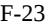

{0}------------------------------------------------

# **UNITED STATES SECURITIES AND EXCHANGE COMMISSION WASHINGTON, D.C. 20549 FORM 10-K** (Mark one) ☒ **ANNUAL REPORT PURSUANT TO SECTION 13 OR 15(d) OF THE SECURITIES EXCHANGE ACT OF 1934 For the fiscal year ended December 31, 2022** or ☐ **TRANSITION REPORT PURSUANT TO SECTION 13 OR 15(d) OF THE SECURITIES EXCHANGE ACT OF 1934 For the transition period from ______ to _____ Commission file number 1-08546 TRINITY PLACE HOLDINGS INC.** (Exact name of registrant as specified in its charter) **Delaware** (State or Other Jurisdiction of Incorporation or Organization) **No. 22-2465228** (I.R.S. Employer Identification No.) **340 Madison Avenue, New York, New York** (Address of Principal Executive Offices) **10173** (Zip Code) Registrant's telephone number, including area code: **(212) 235-2190 Securities registered pursuant to Section 12(b) of the Act:** Title of Each Class Trading Symbol Name of each exchange on which registered Common Stock \$0.01 Par Value Per Share TPHS NYSE American **Securities registered pursuant to Section 12(g) of the Act:** NONE Indicate by check mark if the registrant is a well-known seasoned issuer, as defined in Rule 405 of the Securities Act. Yes ☐ No ⌧ Indicate by check mark if the registrant is not required to file reports pursuant to Section 13 or Section 15(d) of the Act. Yes ☐ No ⌧ Indicate by check mark whether the registrant (1) has filed all reports required to be filed by Section 13 or 15(d) of the Securities Exchange Act of 1934 during the preceding 12 months (or for such shorter period that the registrant was required to file such reports), and (2) has been subject to such filing requirements for the past 90 days. Yes ⌧ No ☐ Indicate by check mark whether the registrant has submitted electronically every Interactive Data File required to be submitted pursuant to Rule 405 of Regulation S-T (§232.405 of this chapter) during the preceding 12 months (or for such shorter period that the registrant was required to submit such files). Yes ⌧ No ☐ Indicate by check mark whether the registrant is a large accelerated filer, an accelerated filer, a non-accelerated filer, a smaller reporting company, or an emerging growth company. See the definitions of "large accelerated filer," "accelerated filer," "smaller reporting company," and "emerging growth company" in Rule 12b-2 of the Exchange Act. Large Accelerated Filer☐ Accelerated Filer ☐ Non-Accelerated Filer ☒ Smaller Reporting Company☒ Emerging Growth Company☐ If an emerging growth company, indicate by check mark if the registrant has elected not to use the extended transition period for complying with any new or revised financial accounting standards provided pursuant to Section 13(a) of the Exchange Act. ☐ Indicate by check mark whether the registrant has filed a report on and attestation to its management's assessment of the effectiveness of its internal control over financial reporting under Section 404(b) of the Sarbanes-Oxley Act (15 U.S.C. 7262(b)) by the registered public accounting firm that prepared or issued its audit report. ☐ If securities are registered pursuant to Section 12(b) of the Act, indicate by check mark whether the financial statements of the registrant included in the filing reflect the correction of an error to previously issued financial statements. £ Indicate by check mark whether any of those error corrections are restatements that required a recovery analysis of incentive-based compensation received by any of the registrant's executive officers during the relevant recovery period pursuant to §240.10D-1(b). £ Indicate by check mark whether the registrant is a shell company (as defined in Rule 12b-2 of the Exchange Act). Yes ☐ No ⌧ As of June 30, 2022, the aggregate market value of the registrant's common stock held by non-affiliates of the registrant was approximately \$25,710,000. Indicate by check mark whether the registrant has filed all documents and reports required to be filed by Section 12, 13 or 15(d) of the Securities Exchange Act of 1934 subsequent to the distributions of securities under a plan confirmed by a court. Yes ⌧ No ☐ As of March 31, 2023, there were 37,163,137 shares of the registrant's common stock outstanding. **DOCUMENTS INCORPORATED BY REFERENCE** Portions of the registrant's definitive proxy statement relating to the registrant's 2023 Annual Meeting of Stockholders to be filed hereafter are incorporated by reference into Part III of this Annual Report on Form 10-K.

{1}------------------------------------------------

### **Form 10-K Index**

|          |                                                                     | Page |
|----------|---------------------------------------------------------------------|------|
| PART I   |                                                                     |      |
| Item 1.  | BUSINESS                                                            | 1    |
| Item 1A. | RISK FACTORS                                                        | 4    |
| Item 1B. | UNRESOLVED STAFF COMMENTS                                           | 16   |
| Item 2.  | PROPERTIES                                                          | 17   |
| Item 3.  | LEGAL PROCEEDINGS                                                   | 19   |
| Item 4.  | MINE SAFETY DISCLOSURES                                             | 19   |
| PART II  |                                                                     |      |
| Item 5.  | MARKET FOR REGISTRANT'S COMMON EQUITY, RELATED STOCKHOLDER MATTERS  |      |
|          | AND ISSUER PURCHASES OF EQUITY SECURITIES                           | 20   |
| Item 6.  | (RESERVED)                                                          | 20   |
| Item 7.  | MANAGEMENT'S DISCUSSION AND ANALYSIS OF FINANCIAL CONDITION AND     |      |
|          | RESULTS OF OPERATIONS                                               | 20   |
| Item 7A. | QUANTITATIVE AND QUALITATIVE DISCLOSURES ABOUT MARKET RISK          | 36   |
| Item 8.  | FINANCIAL STATEMENTS AND SUPPLEMENTARY DATA                         | 36   |
| Item 9.  | CHANGES IN AND DISAGREEMENTS WITH ACCOUNTANTS ON ACCOUNTING AND     |      |
|          | FINANCIAL DISCLOSURE                                                | 36   |
| Item 9A. | CONTROLS AND PROCEDURES                                             | 36   |
| Item 9B. | OTHER INFORMATION                                                   | 37   |
| Item 9C. | DISCLOSURE REGARDING FOREIGN JURISDICTIONS THAT PREVENT INSPECTIONS | 37   |
| PART III |                                                                     |      |
| Item 10. | DIRECTORS, EXECUTIVE OFFICERS AND CORPORATE GOVERNANCE              | 37   |
| Item 11. | EXECUTIVE COMPENSATION                                              | 38   |
| Item 12. | SECURITY OWNERSHIP OF CERTAIN BENEFICIAL OWNERS AND MANAGEMENT AND  |      |
|          | RELATED STOCKHOLDER MATTERS                                         | 38   |
| Item 13. | CERTAIN RELATIONSHIPS AND RELATED TRANSACTIONS, AND DIRECTOR        |      |
|          | INDEPENDENCE                                                        | 38   |
| Item 14. | PRINCIPAL ACCOUNTANT FEES AND SERVICES                              | 38   |
| PART IV  |                                                                     |      |
| Item 15. | EXHIBITS AND FINANCIAL STATEMENT SCHEDULES                          | 39   |
| Item 16. | FORM 10-K SUMMARY                                                   | 42   |

{2}------------------------------------------------

#### **PART I**

#### **Item 1. BUSINESS**

#### *Overview*

Trinity Place Holdings Inc., which we refer to in this Annual Report on Form 10-K as "Trinity," "we," "our," or "us", is a real estate holding, investment, development and asset management company. Our largest asset is a property located at 77 Greenwich Street in Lower Manhattan ("77 Greenwich"), which is nearing completion as a mixed-use project consisting of a 90-unit residential condominium tower, retail space and a New York City elementary school. We also own a 105-unit, 12 story multi-family property located at 237 11 th Street in Brooklyn, New York ("237 11 th") as well as a property occupied by a retail tenant in Paramus, New Jersey. In February 2023, we sold our 10% interest in a joint venture that owned a multifamily property at 250 North 10 th Street, Brooklyn, New York. See Item 2. Properties below for a more detailed description of our properties owned at December 31, 2022. In addition to our real estate portfolio, we also control a variety of intellectual property assets focused on the consumer sector, a legacy of our predecessor, Syms Corp. ("Syms"). We also had approximately \$275.8 million of federal net operating loss carry forwards ("NOLs") at December 31, 2022, which can be used to reduce our future taxable income and capital gains.

#### *Liquidity and Going Concern; Management's Plans; Recent Developments*

The COVID-19 pandemic and related matters, including government actions, shifts in residential consumer sentiment and changes to the broader and local economies, had a significant adverse impact on our business. More recently, the economic downturn, increased interest rates and high inflation have also impacted our business. While we believe many of these trends will reverse or stabilize, and the New York City economy and residential real estate markets have generally seen continued improvement in 2022 and to date in 2023, given our focus on New York City residential real estate, our business has been particularly impacted. As of December 31, 2022, we had total cash and restricted cash of \$22.1 million, of which approximately \$1.5 million was cash and cash equivalents and approximately \$20.5 million was restricted cash. We also had \$2.0 million available under our secured line of credit at December 31, 2022, which has since been drawn. The Company's cash and cash equivalents will not be sufficient to fund the Company's operations, debt service, amortization and maturities and corporate expenses over the next 12 months, unless we are able to extend or refinance our maturing debt and raise additional capital, creating substantial doubt about our ability to continue as a going concern. Management is exploring opportunities to secure additional funding through the sale of assets, refinancings of outstanding indebtedness, and equity or debt financings or other sources. The Company also continues to explore a range of strategic and financing alternatives to maximize stockholder value, and to engage with parties that have expressed interest in the Company's attributes and assets and may see the Company as a potential vehicle for growth, with potential opportunities to recapitalize the Company at a lower cost of capital. The Company has engaged Houlihan Lokey and Ackman-Ziff to act as advisors (our "Advisors") in connection with our strategic review process and to assist us in identifying and evaluating potential alternatives. Potential strategic alternatives that may be evaluated include securing an equity and/or debt financing of the Company, refinancing of existing debt, and/or a sale or merger or reverse merger of the Company. The Company is also in discussions with its lenders regarding the deferment of upcoming interest, amortization and other payment obligations for the period ending March 31, 2023 and going forward. The Company is also exploring a refinancing of the debt in respect of 237 11 th . Given the current environment there can be no assurance that we will be able to enter into any of the contemplated or future extensions, amendments or waivers with our lenders, raise additional capital, refinance indebtedness or enter into other financing arrangements or engage in asset sales or strategic partnerships sufficient to fund our cash needs, on terms satisfactory to us, if at all. Further, in the event that market conditions preclude our ability to consummate such transactions, we will be required to evaluate additional alternatives in restructuring our business and our capital structure, including but not limited to filing for bankruptcy protection or seeking an out-of-court restructuring of our liabilities. See Part I. Item 1A. Risk Factors, Part II. Item 7. Management's Discussion and Analysis of Financial Condition and Results of Operation and Note 1 to our consolidated financial statements and of this Annual Report on Form 10-K for further information.

While construction at 77 Greenwich has taken longer than projected due to the impacts of COVID-19 and supply-chain issues over the past years, and the impact of the pandemic and broader economic conditions have impeded the sale of residential condominium units at 77 Greenwich, we continue to sign and close contracts for our residential condominium units, including five units since December 31, 2022. The units that remain available to be sold are larger, higher floor

{3}------------------------------------------------

units. The substantial majority of the construction is completed with amenity spaces and punch-list items anticipated to be completed by April 30, 2023.

The lease of the outparcel building at our Paramus property expired on March 31, 2023 and the tenant elected not to renew its lease.

#### *Business and Growth Strategies*

Historically, our primary business objective has been to maximize the risk adjusted, time adjusted return on investment in our portfolio of properties and new acquisitions and investments across all points of the economic cycle. Our strategies to achieve this objective have recently included (i) the sale and closing of residential condominium units at 77 Greenwich and the development, redevelopment, repositioning and potential disposition of our legacy retail property in Paramus, New Jersey; (ii) identifying additional acquisition and investment opportunities, including high-quality, multi-family real estate in New York City; (iii) entering into joint ventures in respect of attractive properties; and (iv) enhancing our capital structure. We are currently focused on exploring a range of strategic and financing alternatives to maximize stockholder value, which may include securing additional equity or debt financings, refinancings of existing debt, and/or a sale or merger of the Company.

#### *Competition*

The markets in which our properties are located are inherently competitive. With respect to our operating properties currently located in Brooklyn, New York and Paramus, New Jersey, and any future real estate assets that we acquire, invest in or develop, we will be competing for some of the same tenants, contractors, lenders and potential purchasers or investors with respect to other properties within the same markets, but owned by other investors, many of whom have greater resources than we do.

Competitive factors with respect to 77 Greenwich may have a more material effect on us as it is our most significant real estate asset. Various municipal entities are making and have indicated an intent to continue to make significant investments in the immediate vicinity of 77 Greenwich to support the growth of the downtown Manhattan neighborhood as a vibrant 24/7 community to work, live and visit. Several privately funded commercial and residential developments are being constructed or have been proposed and office buildings are being converted to residential use to take advantage of the increasing desirability of the neighborhood. The impact of these changing supply and demand characteristics is uncertain, and they could positively or negatively impact our plan to maximize the value of 77 Greenwich.

In addition, we face competition in identifying and closing on new investment and acquisition opportunities, including from larger and more established real estate firms with greater capital resources and access to financing.

#### *Regulatory Matters*

#### *Environmental Compliance*

Under various federal, state and local laws, ordinances and regulations, a current or previous owner or operator of real estate may be required to investigate and remediate hazardous or toxic substances at a property, and may be held liable to a governmental entity or to third parties for property damage or personal injuries and for investigation and clean-up costs incurred by the parties in connection with the contamination. These laws often impose liability without regard to whether the owner or operator had knowledge of, or was responsible for, the release of the hazardous or toxic substances. The presence of contamination or the failure to remediate contamination may adversely affect the owner's ability to sell or lease real estate or to borrow using the real estate as collateral.

Other federal, state and local laws, ordinances and regulations require abatement or removal of asbestos-containing materials in the event of demolition or certain renovations or remodeling, the cost of which may be substantial for certain redevelopment projects that a potential purchaser would want to undertake with respect to any particular parcel of real estate we own. Such laws, ordinances and regulations also govern emissions from and exposure to asbestos fibers in the air. Federal and state laws also regulate the operation and removal of underground storage tanks. In connection with the ownership and management of certain properties, we could be held liable for the costs of remedial action with respect to these regulated substances or related claims.

{4}------------------------------------------------

#### *Zoning and Planning*

In connection with any development or redevelopment of our properties, whether currently owned or acquired in the future, we will be required to comply with applicable zoning, land-use, building, occupancy, and other laws and regulations. In many cases, we are and will continue to be required to obtain governmental permits, site plan approvals and/or other authorizations, or seek variances, prior to proceeding with planned development, acquisition or other activities.

The Zoning Resolution of the City of New York, effective as of December 15, 1961, as amended (the "Zoning Resolution"), governs the use and development of properties in New York City. Properties in New York City may be developed on an as-of-right basis, i.e. without any discretionary city approvals, unless the proposed use or bulk does not comply with the applicable provisions of the Zoning Resolution. Discretionary approvals may be requested from the New York City Planning Commission or the Board of Standards and Appeals. Discretionary approvals are subject to hearing and public participation requirements and are also subject to environmental review pursuant to the State Environmental Quality Review Act, as implemented by the City Environmental Quality Review.

#### *Chapter 11 Cases and Plan of Reorganization of Syms*

Trinity is the successor to Syms, which also owned Filene's Basement. In September 2012, the Syms Plan of Reorganization (the "Plan") became effective and Syms and its subsidiaries consummated their reorganization under Chapter 11 through a series of transactions and emerged from bankruptcy. As part of those transactions, reorganized Syms merged with and into Trinity, with Trinity as the surviving corporation and successor issuer pursuant to Rule 12g-3 under Section 21E of the Securities Exchange Act of 1934, as amended (the "Exchange Act").

In March 2016, we satisfied our final payment and reserve obligations under the Plan. In February 2018, the bankruptcy court entered the final decree pursuant to which the chapter 11 cases of the reorganized debtors were closed. In January 2020, we made our final payment of \$109,000 to the multiemployer pension plan claim, which was the final legacy claim of the Plan to be paid. As of December 31, 2022, the Syms sponsored pension plan was underfunded for accounting purposes by approximately \$651,000 (see Note 9 – Pension Plans to our consolidated financial statements for further information).

#### *Intellectual Property Assets*

We control a variety of intellectual property assets focused on the consumer sector, a legacy of our predecessor, Syms, including FilenesBasement.com, our rights to the Stanley Blacker® brand, as well as the intellectual property associated with the Running of the Brides® event and An Educated Consumer is Our Best Customer® slogan. In addition, various trademarks are controlled and/or owned by us, including "Filene's Basement"®, "Stanley Blacker"®, "Running of the Brides"® and "An Educated Consumer is Our Best Customer,"® and have been registered with the United States Patent and Trademark Office.

#### *Human Capital Resources*

As of December 31, 2022, we had a total of seven employees, six of which were full-time and one part-time, in executive, management, finance, accounting, operations and administrative capacities.

#### *General Information about Trinity*

Trinity is incorporated in Delaware. Trinity maintains its headquarters at 340 Madison Avenue, Suite 3C, New York, New York, 10173, and the telephone number is (212) 235-2190.

#### *Available Information*

Our website address is www.trinityplaceholdings.com or www.tphs.com. References in this document to our website are not and should not be considered part of this Annual Report on Form 10-K, and the information on our website is not incorporated by reference into this Annual Report.

{5}------------------------------------------------

#### **Item 1A. RISK FACTORS**

Our business, operations and financial condition are subject to various risks. Some of these risks are described below, and stockholders should take such risks into account when evaluating us or any investment decision involving us. This section does not describe all risks that may be applicable to us, our industry or our business, and it is intended only as a summary of certain material risk factors. Additional risks and uncertainties that we do not presently know about or that we currently believe are not material may also adversely affect our business. More detailed information concerning certain of the risk factors described below is contained in other sections of this Annual Report on Form 10-K. Stockholders should also refer to the other information contained in our periodic reports, including the Cautionary Note Regarding Forward-Looking Statements section, our consolidated financial statements and the related notes and Management's Discussion and Analysis of Financial Condition and Results of Operations section for a further discussion of the risks, uncertainties and assumptions relating to our business.

#### **Risk Factors Related to Our Business**

*We have a limited amount of unrestricted cash and liquidity and variable cash needs. If we are not successful in consummating a strategic transaction, raising significant additional capital and/or receiving significant amounts on account of our claims involving 237 11 th in a timely manner, we will have insufficient cash and liquidity to service our debt and pay operating expenses and other obligations over the next 12 months, which would have a material adverse effect on our business and financial condition.*

We have a limited amount of unrestricted cash and liquidity available for working capital and our cash needs are significant and variable under different circumstances, including near term debt maturities and other payment obligations. The Company's cash and cash equivalents will not be sufficient to fund the Company's operations, debt service, amortization and maturities and corporate expenses over the next 12 months, unless we are able to extend or refinance our maturing debt and/or raise additional capital, creating substantial doubt about our ability to continue as a going concern. Management is currently in discussions with the Company's lenders regarding the deferment of upcoming payments and exploring opportunities to secure additional funding through the sale of assets, refinancings of outstanding indebtedness, and equity or debt financings or other sources. The Company also continues to explore a range of strategic and financing alternatives to maximize stockholder value. We have engaged our Advisors in connection with our strategic review process and to assist us in identifying and evaluating potential alternatives. Potential strategic alternatives that may be evaluated include securing an equity and/or debt financing of the Company, refinancing of existing debt, and/or a sale or merger or reverse merger of the Company. However, there is no assurance that we will be successful in reaching agreements with our lenders, consummating any such strategic transaction or obtaining capital sufficient to meet our operating needs, in each case, on terms or a timeframe acceptable to us or at all. In addition, if funds are raised by issuing equity securities, dilution to existing shareholders will result and future investors may purchase shares at prices below current market values and/or be granted rights superior to those of existing shareholders. Further, in the event that market conditions preclude our ability to consummate such transactions, we may be required to evaluate additional alternatives in restructuring our business and our capital structure, including but not limited to, filing for bankruptcy protection or seeking an out-of-court restructuring of our liabilities. See Item 7. Management's Discussion and Analysis of Financial Condition and Results of Operation - Liquidity and Capital Resources and Note 1 to our consolidated financial statements for more information regarding our ability to continue as a going concern and related matters.

### *We have limited cash resources, generate minimal revenues from operations, and are reliant on external sources of capital to fund ongoing operations.*

Our revenue generating activities have not yet produced sufficient funds for profitable operations and working capital. Accordingly, our continued operation will require raising additional capital on acceptable terms and entering into acceptable modifications to, or refinancings of, our indebtedness. We have relied and will continue to rely substantially upon equity and debt financing to fund our ongoing operations. There can be no assurance that additional sources of capital will be available to us on commercially favorable terms. In addition, our inability to access the capital markets on favorable terms, because of a low stock price, unfavorable market conditions or otherwise, will affect our ability to execute our business plan as scheduled. If we are unable to raise capital on market terms, our ability to run our operations and/or grow through new acquisitions and investments, and thus become profitable, will be materially adversely impacted.

{6}------------------------------------------------

### *We have not generated an operating profit and consequently our business plan is difficult to evaluate and our long-term viability cannot be assured.*

Since our formation, we have generated limited revenues and had negative cash flow from operations. The development of our business plan has required, and will continue to require, substantial capital expenditures. There can be no assurance that our business will be successful, that we will be able to achieve or maintain a profitable operation, or that we will not encounter unforeseen difficulties that may deplete our capital resources more rapidly than anticipated. There can be no assurance that we will achieve or sustain profitability or positive cash flows from our operating activities.

# *We are subject to leverage at both our parent company and our subsidiaries and face risks generally associated with our debt, including an increased risk of default on our obligations and an increase in debt service requirements that could adversely affect our financial condition and results of operations.*

We have incurred substantial indebtedness in furtherance of our activities, at both the parent company level and subsidiary level, resulting in an increased risk of default on our obligations and in an increase in debt service requirements, which could adversely affect our financial condition and results of operations. As a result, we are subject to the risks associated with debt financing, including the risk that our cash flow will be insufficient to meet required payments of principal and interest, the risk that we may fail to repay or refinance existing debt as it matures, which may result in forced disposition of assets on disadvantageous terms or have other adverse consequences, and the risk that if we refinance any of our debt, we may do so on refinancing terms less favorable than the terms of our existing debt.

Several of our loans have near-term maturities and other significant payment obligations. In addition, several of our loans require interest rate cap agreements be in place for the duration of the loan. Although many of our loans contain extension options, the 237 11 th Loan and the 77 Mortgage Loan require replacement interest rate cap agreements be put in place in order to extend the loan maturity. With the significant increase in interest rates, the cost of purchasing such an interest rate cap has become material. Due to cash constrains, we may not have the funds available to purchase the required interest rate cap which, unless we can restructure or refinance the loan, would likely have a material adverse effect on our financial condition and results of operations. If we are not successful in meeting the extension requirements, or amending, waiving or paying the near-term maturities and other payment obligations, or our lenders accelerated their respective loan, crossdefaults would also exist and we would have insufficient cash and liquidity to service our debt and pay operating expenses and other obligations.

All of our properties secure loans. Certain of our loans contain cross-default provisions. The failure by us or our borrower subsidiaries to make scheduled repayments under the loan agreements, or the default of any of the obligations under our loans, would have an adverse impact on our financial condition, results of operations and cash flows. Upon the occurrence of an event of default, we or our applicable subsidiary may be required to immediately repay all amounts outstanding under the respective loan and the lenders may exercise other remedies available to them, including foreclosing on the respective property securing the loan.

See Item 7. Management's Discussion and Analysis of Financial Condition and Results of Operations - Liquidity and Capital Resources and Note 11 – Loans Payable and Secured Line of Credit to our consolidated financial statements, for further discussion regarding our financing activities.

#### *Covenants in our loan agreements could limit our flexibility and adversely affect our financial condition.*

Our loan agreements contain a number of financial and other restrictive covenants, including restrictions on debt, liens, business activities, equity repurchases, distributions and dividends, disposition of assets and transactions with affiliates, as well as financial covenants regarding loan to value and net worth. These covenants may limit our flexibility to pursue certain acquisitions or investments or incur additional debt. If we fail to meet or satisfy any of these covenants, we would be in default under these agreements and our indebtedness could be declared due and payable. In addition, our lenders could terminate their commitments, require the posting of additional collateral and enforce their interests against existing collateral. If we were to default under our loan agreements, our financial condition would be adversely affected.

{7}------------------------------------------------

# *A significant part of our current business plan is focused on completion of and the sale of condominiums at 77 Greenwich. An inability to execute this business plan due to adverse trends in the New York City residential condominium market or otherwise would have a material adverse effect on our financial condition and results of operations.*

Our business plan includes the development or redevelopment of our legacy commercial real estate properties and in particular completion of and the sale of condominiums at 77 Greenwich, which currently is our largest asset. As a result, our revenues and future growth are heavily dependent on the success of implementing our business plan for 77 Greenwich.

77 Greenwich consists of 90 luxury residential condominium apartments, in addition to a retail condominium unit and a New York City elementary school condominium unit. A variety of factors determine New York City residential condominium trends and will impact the sales and pricing of the residential condominium units at 77 Greenwich. These factors include, among others, available supply, changes in interest rates, the availability of home mortgages, foreign exchange rates, foreign buyer patterns, local employment trends, and prices and velocity of sales. Sales of residential condominium units in general, and in particular in New York City, have historically experienced greater volatility than detached single family houses, which may expose us to more risk. These and other factors fluctuate over time. Based on a number of reports, there is a historically high number of unsold units in newly constructed luxury residential condominiums in New York City, which has resulted in demand and pricing pressures. When we commenced sales in the spring of 2019, the New York City market, in particular downtown Manhattan, was in a period of softness. This was exacerbated by the impact of the COVID-19 pandemic. Due to current market conditions in New York City, several competing residential condominium projects located in downtown Manhattan, specifically in the Financial District, have been put on hold. The status of unsold residential condominium units in 2023 and beyond is inherently uncertain. Closings on sales commenced in September 2021 and are ongoing. An inability to successfully execute our business plan with respect to 77 Greenwich would likely have a material adverse effect on our financial condition and results of operations.

# *We may evaluate and potentially consummate a strategic transaction, which could require significant management attention, consume our financial resources, disrupt our business and adversely affect our results of operations, and we may fail to realize the anticipated benefits of such a strategic transaction***.**

Our success will depend, in part, on our ability to consummate a strategic transaction in the near-term. The identification of a suitable candidate for a strategic transaction can be difficult, time-consuming, and costly, and we may not be able to successfully complete identified strategic transactions. Strategic transactions are inherently risky, and ultimately, if we do not complete an announced strategic transaction successfully and in a timely manner, we may not realize the anticipated benefits of the strategic transaction. Achieving the anticipated benefits of any transaction involves a number of risks, including disruption of our ongoing business and distraction of our management and employees from daily operations or other opportunities and challenges, utilization of our financial resources for a transaction that may fail to realize the anticipated benefits, regulatory risks, including maintaining good standing with existing regulatory bodies or receiving any necessary approvals, and the failure of the due diligence processes to identify significant problems, liabilities or challenges of the strategic partner.

Our failure to address these risks or other problems encountered in connection with any strategic transaction could cause us to fail to realize the anticipated benefits of the transaction, cause us to incur unanticipated liabilities and harm our business generally. In addition, such a transaction could also result in dilutive issuances of our equity securities, the incurrence of debt, contingent liabilities, amortization expenses or the write-off of goodwill, any of which could harm our financial condition.

{8}------------------------------------------------

# *Investment returns from 77 Greenwich and other properties we may acquire and/or develop may be less than anticipated.*

Our development of 77 Greenwich and other properties we acquire and/or develop are exposed to risks, including the following:

- we may sell residential condominium units at 77 Greenwich and other acquired or developed properties at prices, and/or lease commercial and residential properties at current or future rents, that are less than the prices or rents projected at the time we decide to undertake the acquisition or development;
- the velocity of leasing at commercial and residential properties, and/or condominium sales at 77 Greenwich or future acquisition or development properties may fluctuate depending on a number of factors, including market and economic conditions, and may result in our investments being less profitable than we expected or not profitable at all; and
- operating expenses and real estate taxes may be greater than projected at the time of acquisition or development, resulting in our investment being less profitable than we expected.

# *Our investment in property development for 77 Greenwich and other properties may be more costly than anticipated.*

We intend to continue to develop or redevelop our current and future properties. Our current and future development and construction activities, including with respect to 77 Greenwich, may be exposed to the following risks:

- we may be unable to proceed with the development of properties other than 77 Greenwich because we cannot obtain financing on favorable terms, or at all;
- we may incur construction costs for a development project that exceed our original estimates due to increases in interest rates, increased materials, labor, leasing or other costs, and increases in unforeseen costs such as those related to the supply chain disruption, which could make completion of the project less profitable because market rents or condominium unit sales prices, as applicable, may not increase sufficiently to compensate for the increase in construction costs;
- we may be unable to obtain, or face delays in obtaining, required zoning, land-use, building, occupancy, and other governmental permits and authorizations, which could result in increased costs and could require us to abandon our activities entirely with respect to a project;
- we may abandon development opportunities after we begin to explore them and as a result we may lose deposits or fail to recover expenses already incurred;
- we may expend funds on and devote management's time to projects which we do not complete;
- we may be unable to complete construction and/or leasing of our rental properties and sales of our condominium projects (currently limited to 77 Greenwich) on schedule, or at all; and
- we may suspend development projects after construction has begun due to changes in economic conditions or other factors, and this may result in the write-off of costs, payment of additional costs or increases in overall costs when the development project is restarted.

# *Our revenues and the value of our portfolio are affected by a number of factors that affect investments in leased commercial and residential real estate generally.*

We are subject to the general risks of investing in and owning leasable real estate in connection with our existing retail and residential properties and new properties or investments in leasable real estate. These risks include the ability to secure leases with new tenants, renew leases with existing tenants, the non-performance of lease obligations by tenants, leasehold improvements that will be costly or difficult to remove or certain upgrades that may be needed should it become necessary to re-rent the leased space for other uses, rights of termination of leases due to events of casualty or condemnation affecting

{9}------------------------------------------------

the leased space or the property or due to interruption of the tenant's quiet enjoyment of the leased premises, and obligations of a landlord to restore the leased premises or the property following events of casualty or condemnation, and potentially, as occurred at 237 11 th , damages arising from defective construction. The occurrence of any of these events, particularly with respect to leases at our commercial real estate property, or issues that affect numerous residential units, could adversely impact, and in the case of 237 11 th , has adversely impacted, our results of operations, liquidity and financial condition.

In addition, if our competitors offer space at net effective rental rates below our current net effective rental rates or market rates, we may lose current or potential tenants to other properties in our markets. Additionally, we may need to reduce net effective rental rates below our current rates or offer incentives in order to retain tenants upon expiration of their leases or to attract new tenants. Our results of operations and cash flow may be adversely affected as a result of these factors.

#### *We may be unable to lease vacant space, renew our current leases, or re-lease space as our current leases expire.*

The lease of a long-term tenant at the outparcel of our Paramus property recently expired. Leases at that or our other properties may not be renewed or such properties may not be re-leased at favorable rental rates. If the rental rates for our properties decrease, our tenants do not renew their leases or we do not re-lease a significant portion of our available space, tenant defaults or space that is currently unoccupied, and space for which leases are scheduled to expire, our financial condition, results of operations and cash flows could be materially adversely affected. There are numerous commercial developers, real estate companies, financial institutions and other investors with greater financial resources that compete with us in seeking tenants who we desire to lease space in our properties.

The bankruptcy of, or a downturn in the business of, any of the major tenants at our commercial real estate properties that causes them to reject their leases, or to not renew their leases as they expire, or renew at lower rental rates, may adversely affect our cash flows and property values. In addition, retailers at our properties face increasing competition from ecommerce, outlet malls, discount shopping clubs, direct mail and telemarketing, which could reduce rents payable to us and reduce our ability to attract and retain tenants at our properties leading to increased vacancy rates at our properties.

In addition, if we are unable to renew leases or re-lease a property, the resale value of that property could be diminished because the market value of a particular property will depend in part upon the value of the leases of such property.

#### *We may acquire properties subject to known and unknown liabilities and with limited or no recourse to the seller.*

Properties we acquire may be subject to known or unknown liabilities with no or minimal recourse to the seller. As a result, if a property is damaged, we may need to pay to have it repaired, and our ability to recover any such payments through insurance, indemnities, litigation or otherwise is uncertain. We have purchased one property subject to unknown construction defects due to water penetration in the walls, 237 11 th , and there can be no assurance that we will not do so again. During the pendency of repairs, units were unable to be leased, and following completion of repairs, they needed to be re-leased. Also, if a liability was asserted against us arising from our ownership of a property, we might have to pay substantial sums to settle it. Unknown liabilities with respect to properties acquired might include:

- liabilities for repair of damaged properties or faulty construction;
- claims by tenants, vendors or other persons arising from dealing with the former owners of the properties;
- liabilities incurred in the ordinary course of business;
- claims for indemnification by general partners, directors, officers and others indemnified by the former owners of the properties; and
- liabilities for clean-up of undisclosed environmental contamination and/or repair or other remediation of construction defects.

Any of these occurrences could adversely affect our cash flow, even if some or all of the costs are ultimately borne by a third party, and the impact could be material.

{10}------------------------------------------------

# *Multi-family residential properties may be subject to rent stabilization regulations, which limit our ability to raise rents above specified maximum amounts and could give rise to claims by tenants that their rents exceed such specified maximum amounts.*

The Rent Stabilization Law and Code imposes rent control or rent stabilization on certain apartment buildings. The rent stabilization regulations applicable to our multi-family residential properties set maximum rates for annual rent increases, entitle our tenants to receive required services from us and entitle our tenants to have their leases renewed. The limitations established by present or future rent stabilization regulations may impair our ability to maintain rents at market levels at properties subject to such regulations.

Pursuant to the Housing Stability and Tenant Protection Act of 2019, which is a set of New York State laws, vacancy lease increases were eliminated, whereby the landlord was permitted to increase the rent by as much as 20% for a tenant moving into a vacant apartment, to which significant increases in rent for New York City properties were historically attributed.

With respect to certain types of properties in New York City, solely by virtue of the real estate tax exemption under RPTL Section 421-a, the Rent Guidelines Board of New York City, approves renewal lease rent increases. In 2022, the Rent Guidelines Board approved a 3.25% increase on 12-month lease renewals and a 5.0% increase on 24-month lease renewals.

The application of rent stabilization to apartments in our multi-family residential properties will limit the amount of rent we are able to collect, which could have a material adverse effect on our ability to fully take advantage of the investments that we are making in our properties. In addition, there can be no assurances that changes to rent stabilization laws will not have a similar or greater negative impact on our ability to collect rents.

There is a proposed New York State bill (Good Cause Eviction), which, if passed may impose restrictions on rent increases and the right not to renew market rate unit leases. If passed, there will be restrictions on an owner's ability to grow market rents.

### *Competition for new acquisitions and investments may reduce the number of opportunities available to us and increase the costs of those acquisitions and investments.*

We face competition for acquisition and investment opportunities from other investors, particularly those investors who are willing to incur more leverage. This competition may adversely affect us by subjecting us to the following risks:

- an inability to acquire a desired property because of competition from other well-capitalized real estate investors, many of whom have greater resources than us, including publicly traded and privately held REITs, private real estate funds, domestic and foreign financial institutions, life insurance companies, sovereign wealth funds, pension trusts, partnerships and individual investors; and
- an increase in the purchase price for the acquisition of such property.

If we are unable to successfully acquire or invest in additional properties, our ability to grow our business would be adversely affected. In addition, increases in the cost of acquisition opportunities could adversely affect our results of operations.

#### *We face risks associated with acquisitions of and investments in new properties.*

We may acquire interests in properties, individual properties and portfolios of properties. Our acquisition and investment activities may be exposed to, and their success may be adversely affected by, the following risks:

- we may be unable to finance acquisitions, investments and developments of properties, including with respect to raising capital to contribute as equity, on favorable terms or at all;
- we may be unable to complete proposed acquisitions or other transactions due to an inability to meet required closing conditions;

{11}------------------------------------------------

- we may expend funds on, and devote management time to, opportunities which we do not complete, and which may include non-refundable deposits;
- we may be unable to lease our acquired properties on the same terms as contemplated as part of our underwriting;
- properties that we acquire or in which we invest may fail to perform as we expected;
- our estimates of the costs we incur in renovating, improving, developing or redeveloping acquired properties may be inaccurate;
- we may not be able to obtain adequate insurance coverage for acquired properties; and
- we may be unable to quickly and efficiently integrate new acquisitions, investments and developments, particularly acquisitions of portfolios of properties, into our existing operations, and therefore our results of operations and financial condition could be adversely affected.

#### *We are subject to the risks associated with joint ventures.*

We formed a joint venture with a third party to acquire and operate the 250 North 10 th property located in Brooklyn, New York. We may become involved in additional joint ventures in the future with respect to current or future properties. Joint venture investments may involve risks not otherwise present for investments made or owned solely by us, including the possibility that our joint venture partner might become bankrupt, or may take action contrary to our instructions, requests, policies or objectives. Other risks of joint venture investments include impasse on decisions, such as a sale, because neither we nor a joint venture partner would have full control over the joint venture, activities conducted by a partner that have a negative impact on the joint venture or us, and disputes with our partner.

#### *The phasing out of LIBOR after 2021 may affect our financial results.*

The chief executive of the United Kingdom Financial Conduct Authority ("FCA"), which regulates LIBOR, has announced that the FCA intends to stop compelling banks to submit rates for the calculation of LIBOR after 2021. The U.S. Dollar Libor will continue to be published until 2023. It is not possible to predict the effect of these changes or the establishment of alternative reference rates.

The Alternative Reference Rate Committee ("ARRC"), a committee convened by the Federal Reserve that includes major market participants, and on which the Securities and Exchange Commission ("SEC") staff and other regulators participate, has proposed an alternative rate, the Secured Overnight Financing Rate ("SOFR"), to replace U.S. Dollar LIBOR. Any changes announced by the FCA, ARRC, other regulators or any other successor governance or oversight body, or future changes adopted by such body, in the method pursuant to which U.S. Dollar LIBOR, SOFR, or any other alternative rates are determined may result in a sudden or prolonged increase or decrease in the reported LIBOR rates. If that were to occur, the levels of interest payments we incur and interest payments we receive may change. It is also uncertain whether SOFR or any other alternative rate will gain market acceptance. In addition, although our LIBOR based obligations and investments provide for alternative methods of calculating the interest rate if LIBOR is not reported, uncertainty as to the extent and manner of future changes may result in interest rates and/or payments that are higher than, lower than or that do not otherwise correlate over time with the interest rates and/or payments that would have been made on our obligations if LIBOR rate was available in its current form. We may also need to renegotiate our LIBOR based obligations, which we may not be successful in doing on a timely basis or on terms acceptable to us. In 2023, the 237 11 th Loan was converted from LIBOR to SOFR.

### *We may not receive or be able to maintain certain tax benefits if we are not in compliance with certain requirements of the NYC Department of Housing Preservation and Development.*

We may not receive or be able to maintain certain existing or anticipated tax benefits related to the 237 11 th property or the 250 N 10 th property if we are not in compliance with certain requirements of the NYC Department of Housing Preservation and Development ("HPD"). This property currently benefit from a real estate tax exemption under New York Real Property Tax Law (the "RPTL") Section 421-a, as a result of a specified percentage of the units in such buildings

{12}------------------------------------------------

being designated as affordable rate units or market rate units and/or subject to rent stabilization guidelines, among other requirements. Section 421-a of the New York RPTL provides an exemption from real estate taxes on the amount of the assessed value of newly constructed improvements if certain requirements are met. A property cannot maintain or continue to receive Section 421-a tax benefits without HPD's determination that all Section 421-a eligibility requirements have and continue to be met. Although HPD has issued final Certificates of Eligibility with respect to the Section 421-a tax benefits for 237 11 th and we are currently in compliance with all applicable Section 421-a requirements for this property, there can be no assurance that compliance with the Section 421-a requirements for this property will continue to be maintained. If we are not able to maintain compliance with the requirements of the Section 421-a partial tax exemption program, as applicable to this property, HPD may find that such property is ineligible to receive the tax exemption benefits related to the Section 421-a partial tax exemption program.

# *Our ability to develop or redevelop our properties and enter into new leases with tenants will depend on our obtaining certain permits, site plan approvals and other governmental approvals from local municipalities, which we may not be able to obtain on a timely basis or at all.*

In order to develop or redevelop our properties, we will be required to obtain certain permits, site plan approvals or other governmental approvals from local municipalities. We may not be able to secure all the necessary permits or approvals on a timely basis or at all, which may prevent us from developing or redeveloping our properties according to our business plan. Additionally, potential acquirers or tenants may also need to obtain certain permits or approvals in order to utilize our properties in the manner they intend to do so. The specific permit and approval requirements are set by the state and the various local jurisdictions, including but not limited to city, town, county, township and state agencies having control over the specific properties. Our inability to obtain permits and approvals to develop or redevelop our properties, or the inability of potential purchasers and tenants of our properties to obtain necessary permits and approvals, could severely and adversely affect our business.

### *We may incur significant costs to comply with environmental laws and environmental contamination may impair our ability to lease and/or sell real estate.*

Our operations and properties are subject to various federal, state and local laws and regulations concerning the protection of the environment, including air and water quality, hazardous or toxic substances and health and safety. Under some environmental laws, a current or previous owner or operator of real estate may be required to investigate and clean up hazardous or toxic substances released at a property. The owner or operator may also be held liable to a governmental entity or to third parties for property damage or personal injuries and for investigation and clean-up costs incurred by those parties because of the contamination. These laws often impose liability without regard to whether the owner or operator knew of the release of the substances or caused the release. The presence of contamination or the failure to remediate contamination may impair our ability to sell or lease real estate or to borrow using the real estate as collateral. Other laws and regulations govern indoor and outdoor air quality including those that can require the abatement or removal of asbestos-containing materials in the event of damage, demolition, renovation or remodeling and also govern emissions of and exposure to asbestos fibers in the air. The maintenance and removal of lead paint and certain electrical equipment containing polychlorinated biphenyls (PCBs) are also regulated by federal and state laws. We are also subject to risks associated with human exposure to chemical or biological contaminants such as molds, pollens, viruses and bacteria which, above certain levels, can be alleged to be connected to allergic or other health effects and symptoms in susceptible individuals. We could incur fines for environmental compliance and be held liable for the costs of remedial action with respect to the foregoing regulated substances or related claims arising out of environmental contamination or human exposure to contamination at or from our properties.

Each of our properties has been subject to varying degrees of environmental assessment. To date, these environmental assessments have not revealed any environmental condition material to our business. However, identification of new compliance concerns or undiscovered areas of contamination, changes in the extent or known scope of contamination, human exposure to contamination or changes in clean-up or compliance requirements could result in significant costs to us.

{13}------------------------------------------------

### *Compliance or failure to comply with the Americans with Disabilities Act ("ADA") or other safety regulations and requirements could result in substantial costs.*

The ADA generally requires that public buildings, including our properties, meet certain federal requirements related to access and use by disabled persons. These rules are subject to interpretation and change. Noncompliance could result in the imposition of fines by the federal government or the award of damages to private litigants and/or legal fees to their counsel. If, under the ADA, we are required to make substantial alterations and capital expenditures in one or more of our operating properties, including the removal of access barriers, it could adversely affect our financial condition and results of operations.

Our properties are subject to various federal, state and local regulatory requirements, such as state and local fire and life safety requirements. If we fail to comply with these requirements, we could incur fines or private damage awards. We do not know whether existing requirements will change or whether compliance with future requirements will require significant unanticipated expenditures that will affect our cash flow and results of operations.

# *The loss of key personnel upon whom we depend to operate our business or the inability to attract additional qualified personnel could adversely affect our business.*

We believe that our future success will depend in large part on our ability to retain or attract highly qualified and experienced management and other personnel, including in particular our President and Chief Executive Officer, Matthew Messinger. We may not be successful in retaining key personnel or in attracting other highly qualified personnel. Any inability to retain or attract qualified management and other personnel could have a material adverse effect on our business, results of operations and financial condition.

#### *Our ability to utilize our NOLs to reduce future tax payments may be limited as a result of future transactions.*

We had approximately \$275.8 million of federal NOLs as of December 31, 2022. Section 382 of the Internal Revenue Code (the "Code"), limits the ability of a company to utilize its NOLs after an ownership change. For purposes of Section 382, an ownership change occurs if the percentage of the stock of the company owned by persons holding 5% or more of the stock increases by more than 50 percentage points over a rolling three year lookback period. Generally, if an ownership change occurs, the annual taxable income limitation on our use of NOLs is equal to the product of the applicable long-term tax exempt rate and the value of our stock immediately before the ownership change. If we undergo an ownership change, our ability to utilize our NOLs would be subject to significant limitations. In addition, the 2017 tax legislation known as the Tax Cuts and Jobs Act (the "TCJA") limited the deductibility of NOLs arising in tax years beginning after December 31, 2017 to 80 percent of taxable income (computed without regard to the net operating loss deduction) for the taxable year, and eliminated the ability of taxpayers to carryback such NOLs to prior years. These limitations were modified by the "Coronavirus Aid, Relief, and Economic Security (CARES) Act," signed into law on March 27, 2020. The CARES Act suspended the 80% limitation on the use of NOLs for tax years beginning before January 1, 2021, and allowed losses arising in taxable years beginning after December 31, 2017 and before January 1, 2021 to be carried back up to five years.

### *Political and economic uncertainty, and developments related to outbreaks of contagious diseases could have an adverse effect on us.*

We cannot predict how current and future political and economic uncertainty, including uncertainty related to taxation and increases in interest rates, will affect our critical tenants, joint venture partners, lenders, financial institutions and general economic conditions, including consumer confidence and the volatility of the stock market and real estate market. In addition, we cannot predict the potential outbreak of contagious diseases in the future.

These issues may cause consumers to postpone discretionary spending in response to tighter credit, reduced consumer confidence and other macroeconomic factors affecting consumer spending behavior, resulting in a downturn in the business of our tenants and an impact on potential purchases of our residential condominium units. In the event political and economic uncertainty results in financial turmoil affecting the banking system and financial markets or significant financial service institution failures, there could be a new or incremental tightening in the credit markets, low liquidity,

{14}------------------------------------------------

and extreme volatility in fixed income, credit, currency and equity markets. Each of these could have an adverse effect on our business, financial condition and operating results.

#### *Breaches of information technology systems could materially harm our business and reputation.*

We collect and retain on information technology systems certain financial, personal and other sensitive information provided by third parties, including tenants, vendors and employees. We also rely on information technology systems for the collection and distribution of funds.

There can be no assurance that we will be able to prevent unauthorized access to sensitive information or the unauthorized distribution of funds. Any loss of this information or unauthorized distribution of funds as a result of a breach of information technology systems may result in loss of funds to which we are entitled, legal liability and costs (including damages and penalties), as well as damage to our reputation, that could materially and adversely affect our business and financial performance.

#### **Risks Related to Our Common Stock**

#### *Our common stock is thinly traded and the price of our common stock has fluctuated significantly.*

Our common stock, currently listed on the NYSE American, is thinly traded. Because our common stock is thinly traded, even small trades can have a significant impact on the market price of our common stock, especially when there are limited buyers in the market. We cannot assure stockholders that an active market for our common stock will develop in the foreseeable future or, if developed, that it will be sustained. In addition, we may determine the benefits of listing our shares on the NYSE American do not merit the associated costs. As a result of these factors, stockholders may not be able to resell their common stock. Volatility in the market price of our common stock and lack of liquidity may prevent stockholders from being able to sell their shares at or above the price paid for such shares. The market price of our common stock could fluctuate significantly for various reasons, many of which are beyond our control, including:

- our ability to raise additional capital to fund our cash needs, obtain additional financing and refinance existing loans and on favorable terms or evaluate and potentially consummate a strategic transaction and realize the anticipated benefits of any such transaction;
- the potential issuance of additional shares of common stock including at prices that are below the then-current trading price of our common stock;
- changes in the real estate markets in which we operate, especially New York City;
- our ability to develop or redevelop or successfully sell units in 77 Greenwich or at other properties in the future;
- volatility in global and/or U.S. equities markets;
- our financial results or those of other companies in our industry;
- the public's reaction to our press releases and other public announcements and our filings with the SEC;
- new laws or regulations or new interpretations of laws or regulations applicable to our business;
- changes in general conditions in the United States and global economies or financial markets, including those resulting from inflation, rising interest rates, war, incidents of terrorism or responses to such events;
- sales of common stock by our executive officers, directors and significant stockholders;
- changes in generally accepted accounting principles, policies, guidance, or interpretations; and
- other factors described in our filings with the SEC, including among others in connection with the risks noted in this Annual Report on Form 10-K.

{15}------------------------------------------------

In addition, while our common stock remains thinly traded, small sales or purchases may cause the price of our common stock to fluctuate dramatically up or down without regard to our financial health or business prospects. Downward fluctuations can impair, and have impaired, our ability to raise equity capital on acceptable terms.

### *Stockholders may experience dilution of their ownership interests upon the issuance of additional shares of our common stock or securities convertible into shares of our common stock.*

We may issue additional equity securities in capital raising transactions or otherwise, resulting in the dilution of the ownership interests of our present stockholders. We are currently authorized to issue an aggregate of 120,000,000 shares of capital stock consisting of 79,999,997 shares of common stock, two shares of a class of preferred stock (which were redeemed in accordance with their terms and may not be reissued), one share of a class of special stock and 40,000,000 shares of blank check preferred stock. Outstanding as of December 31, 2022 were 36,907,862 shares of our common stock, one share of special stock, and warrants to purchase 7,179,000 shares of our common stock.

We have in the past and we may in the future raise additional capital through public or private offerings of our common stock or other securities that are convertible into or exercisable for our common stock. Any future issuance of our equity or equity-linked securities may dilute then-current stockholders' ownership percentages and could also result in a decrease in the fair market value of our equity securities, because our assets would be owned by a larger pool of outstanding equity. We may also issue such securities in connection with hiring or retaining employees and consultants, as payment to providers of goods and services, in connection with future acquisitions and investments, development, redevelopment and repositioning of assets, or for other business purposes. Our board of directors may at any time authorize the issuance of additional common stock without stockholder approval, unless the approval of our common stockholders is required by applicable law, rule or regulation, including NYSE American regulations, or our certificate of incorporation. The terms of preferred or other equity or equity-linked securities we may issue in future transactions may be more favorable to new investors, and may include dividend and/or liquidation preferences, anti-dilution protection, pre-emptive rights, superior voting rights and the issuance of warrants or other derivative securities, among other terms, which may have a further dilutive effect. Our outstanding warrants also contain these types of provisions. Also, the future issuance of any such additional shares of common stock or other securities may create downward pressure on the trading price of our common stock. There can be no assurance that any such future issuances will not be at a price or have conversion or exercise prices below the price at which shares of the common stock are then traded.

### *A decline in the price of our common stock, including as a result of a sale of a substantial number of shares of our common stock, may impair our ability to raise capital in the future.*

A decline in the price of our common stock, whether as a result of market conditions, sales of a substantial number of shares of our common stock, or other reasons, may make it more difficult for us to sell equity or equity-related securities in the future at a time and price that we deem reasonable or appropriate, which would impair our ability to raise capital.

Capital-raising transactions resulting in a large amount of newly issued shares that become readily tradable, or other events that cause current stockholders to sell shares, could place downward pressure on the trading price of our stock. In addition, the lack of a robust resale market may require a stockholder who desires to sell a large number of shares of common stock to sell the shares in increments over time to mitigate any adverse impact of the sales on the market price of our stock.

If our stockholders sell, or the market perceives that our stockholders intend to sell for various reasons, including the ending of restrictions on resale of substantial amounts of our common stock in the public market, including shares issued upon the exercise of outstanding options, the market price of our common stock could fall. A significant amount of restricted shares previously issued by us have been registered for resale on registration statements filed with the SEC.

### *More than 50% of our shares of common stock are currently controlled by four of our stockholders who may have the ability to influence the election of directors and the outcome of matters submitted to our stockholders.*

More than 50% of our shares of common stock are controlled by four of our stockholders. As a result, these stockholders may have the ability to significantly influence the outcome of issues submitted to our stockholders for a vote. The interests of these stockholders may not always coincide with our interests or the interests of other stockholders, and they may act in a manner that advances their best interests and not necessarily those of other stockholders. The concentration of

{16}------------------------------------------------

ownership could also deter unsolicited takeovers, including transactions in which stockholders might otherwise receive a premium for their shares over then current market prices.

# *The holder of our special stock and one of our lenders each have the right to appoint a member to our board of directors and, consequently, the ability to exert influence over us.*

In connection with the investment in us by Third Avenue Trust, on behalf of Third Avenue Real Estate Value Fund ("Third Avenue"), Third Avenue was issued one share of a class of special stock and our certificate of incorporation was amended to provide that, subject to the other terms and conditions of our certificate of incorporation, from the issuance of the one share of special stock and until the "Special Stock Ownership Threshold" of 2,345,000 shares of common stock is no longer satisfied, Third Avenue has the right to elect one director to the board of directors. In addition, pursuant to the terms of the credit agreement and letter agreement we entered into in December 2019, as amended, with the lender under our Corporate Credit Facility (the "CCF Lender"), the CCF Lender has the right to elect one director to the board of directors, or, at the election of the CCF Lender, a board observer, so long as certain conditions are met as described in more detail in Note 11 – Loans Payable and Secured Line of Credit and Note 12 – Stockholders' Equity. As a result, for so long as these board appointment rights are in effect, Third Avenue and the CCF Lender may be able to exert influence over our policies and management, potentially in a manner which may not be in our best interests or the best interests of the other stockholders.

# *In order to protect our ability to utilize our NOLs and certain other tax attributes, our certificate of incorporation includes certain transfer restrictions with respect to our stock, which may limit the liquidity of our common stock.*

To reduce the risk of a potential adverse effect on our ability to use our NOLs and certain other tax attributes for U.S. Federal income tax purposes, our certificate of incorporation contains certain transfer restrictions with respect to our stock by substantial stockholders. These restrictions may adversely affect the ability of certain holders of our common stock to dispose of or acquire shares of our common stock and may have an adverse impact on the liquidity of our stock generally.

## *We have not paid dividends on our common stock in the past and do not expect to pay dividends on our common stock for the foreseeable future. Any return on investment may be limited to the value of our common stock.*

We have never paid a cash dividend on our common stock. We expect that any income received from operations will be devoted to our future operations and growth. We do not expect to pay cash dividends on our common stock in the near future. Payment of dividends in the future will depend upon our profitability at the time, cash available for those dividends, and such other factors as our board of directors may consider relevant. If we do not pay dividends, our common stock may be less valuable because a return on an investor's investment will only occur if our stock price appreciates.

# *Our charter documents and Delaware law could prevent a takeover that stockholders consider favorable and could also reduce the market price of our stock.*

Our certificate of incorporation and bylaws and Delaware law contain provisions that could delay or prevent a change in control of us. These provisions could also make it more difficult for stockholders to elect directors and take other corporate actions. In addition to the matters identified in the risk factors above relating to the provisions of our certificate of incorporation, these provisions include:

- a classified board of directors with two-year staggered terms;
- limitations in our certificate of incorporation on acquisitions and dispositions of our common stock designed to protect our NOLs and certain other tax attributes; and
- authorization for blank check preferred stock, which could be issued with voting, liquidation, dividend and other rights superior to our common stock.

These and other provisions in our certificate of incorporation and bylaws and under Delaware law could discourage potential takeover attempts, reduce the price that investors might be willing to pay in the future for shares of common stock and result in the market price of the common stock being lower than it would be without these provisions.

{17}------------------------------------------------

# *Our certificate of incorporation designates the Court of Chancery in the State of Delaware as the exclusive forum for certain actions or proceedings that may be initiated by our stockholders, which could discourage claims or limit stockholders' ability to make a claim against the Company, our directors, officers, and employees.*

The Company's certificate of incorporation provides that the Court of Chancery of the State of Delaware is the exclusive forum for any derivative action or proceeding brought on the Company's behalf; any action asserting a breach of fiduciary duty; any action asserting a claim against the Company arising pursuant to the Delaware General Corporation Law, the Company's certificate of incorporation or bylaws; or any action asserting a claim against the Company that is governed by the internal affairs doctrine. This provision is not intended to apply to claims arising under the Securities Act and the Exchange Act. To the extent the provision could be construed to apply to such claims, there is uncertainty as to whether a court would enforce the provision in such respect, and the Company's stockholders will not be deemed to have waived the Company's compliance with federal securities laws and the rules and regulations thereunder.

The exclusive forum provision may discourage claims or limit stockholders' ability to submit claims in a judicial forum that they find favorable and may create additional costs as a result. If a court were to determine the exclusive forum provision to be inapplicable and unenforceable in an action, we may incur additional costs in conjunction with our efforts to resolve the dispute in an alternative jurisdiction, which could have a negative impact on our results of operations.

# *Because we are a U.S. real property holding corporation, non-U.S. holders of our common stock could be subject to U.S. federal income tax on the gain from its sale, exchange or other disposition.*

Because we are a U.S. real property holding corporation, which we refer to as "USRPHC," under the Foreign Investment in Real Property Tax Act of 1980 and applicable U.S. Treasury regulations, which we refer to collectively as the "FIRPTA Rules," unless an exception applies, certain non-U.S. investors in our common stock could be subject to U.S. federal income tax on the gain from the sale, exchange or other disposition of shares of our common stock, and such non-U.S. investors could be required to file a United States federal income tax return. In addition, the purchaser of such common stock may be required to withhold 15% of the purchase price and remit such amount to the U.S. Internal Revenue Service.

Under the FIRPTA Rules, we are a USRPHC because our interests in U.S. real property comprise at least 50% of the fair market value of our assets. Our common stock trades on the NYSE American. So long as it continues to do so, and is regularly quoted by brokers or dealers making a market in our common stock, our common stock will be treated as "regularly traded on an established securities market" (within the meaning of the FIRPTA Rules). As a result, (i) a non-U.S. investor who, actually or constructively, holds no more than 5% of our common stock would not be subject to U.S. federal income tax on the gain from the sale, exchange or other disposition of our common stock under the FIRPTA Rules, and (ii) a purchaser of such stock from a non-U.S. investor would not be required to withhold any portion of the purchase price of such stock, regardless of the percentage of our common stock held by such non-U.S. investor. Any of our common stockholders that are non-U.S. persons should consult their tax advisors to determine the consequences of investing in our common stock.

#### **Forward-looking statements may prove inaccurate.**

See Item 7, "Management's Discussion and Analysis of Financial Condition and Results of Operations—Cautionary Note Regarding Forward-Looking Statements," for additional disclosure regarding forward-looking statements.

# **Item 1B. UNRESOLVED STAFF COMMENTS**

None.

{18}------------------------------------------------

#### **Item 2. PROPERTIES**

Below is certain information regarding our real estate properties as of December 31, 2022:

| Property Location                           | Type of Property                       | Building Size (estimated rentable square feet) | Number of Units | Leased at December 31, 2022 |
|---------------------------------------------|----------------------------------------|---------------------------------------------------------|--------------------|-----------------------------------|
| Owned Locations                             |                                        |                                                         |                    |                                   |
|                                             |                                        |                                                         |                    |                                   |
| 77 Greenwich, New York, New York (1)        | Residential condominium units for sale | —                                                       | —                  | N/A                               |
|                                             |                                        |                                                         |                    |                                   |
| Paramus, New Jersey (2)                     | Retail                                 | 77,000                                                  | —                  | 100.0 %                           |
|                                             |                                        |                                                         |                    |                                   |
| th Street, Brooklyn, New York (3) 237 11 | Multi-family                           | 80,000                                                  | 105                | 100.0 %                           |
|                                             |                                        |                                                         |                    |                                   |
| Total                                       |                                        | 157,000                                                 | 105                |                                   |
|                                             |                                        |                                                         |                    |                                   |
| Joint Venture                               |                                        |                                                         |                    |                                   |
|                                             |                                        |                                                         |                    |                                   |
| 250 North 10th Street, Brooklyn, New York - |                                        |                                                         |                    |                                   |
| 10% (4)                                     | Multi-family                           | 158,000                                                 | 234                | 98.3 %                            |
|                                             |                                        |                                                         |                    |                                   |
|                                             |                                        |                                                         |                    |                                   |
| Grand Total                                 |                                        | 315,000                                                 | 339                |                                   |

(1) **77 Greenwich.** We are nearing completion of an over 300,000 gross square foot mixed-use building that corresponds to the approximate total of 233,000 zoning square feet. The property consists of 90 luxury residential condominium apartments, 7,500 square feet of retail space, almost all of which is street level, a 476-seat elementary school serving New York City District 2, including the adaptive reuse of the landmarked Robert and Anne Dickey House. As of December 31, 2022, all finishes were complete through the 35th floor. As of December 31, 2022, we had received our temporary certificates of occupancy ("TCOs") for the condominium units on floors 11-35 (except the units noted below), lobby, Cloud Club (lounge, terrace, game room, dining room, kitchen and kids play room), mechanical rooms, and portions of the cellar (including the bike and storage rooms.) As of March 1, 2023, we had received TCOs for 100% of the residential units. We have closed on the sale of 28 residential condominium units through December 31, 2022, with 62 remaining units to sell as of December 31, 2022, and closed on the sale of five additional units since December 31, 2022.

We entered into an agreement with the New York City School Construction Authority (the "SCA"), whereby we constructed a school sold to the SCA as part of our condominium development at 77 Greenwich. Pursuant to the agreement, the SCA agreed to pay us \$41.5 million for the purchase of their condominium unit and reimburse us for the costs associated with constructing the school, including a construction supervision fee of approximately \$5.0 million. Payments for construction are being made by the SCA to the general contractor in installments as construction on their condominium unit progresses. Payments to us for the land and construction supervision fee commenced in January 2018 and continued through October 2019 for the land and will continue through completion of the SCA buildout for the construction supervision fee. An aggregate of \$46.3 million had been paid to us by the SCA as of December 31, 2022 with approximately \$207,000 remaining to be paid. We have also received an aggregate of \$54.7 million in reimbursable construction costs from the SCA through December 31, 2022. In April 2020, the SCA closed on the purchase of the school condominium unit from us, at which point title transferred to the SCA. The SCA has completed the buildout of the interior space, which is a public elementary school with approximately 476 seats. The school received its final TCO and opened to students in September 2022.

- (2) **Paramus Property.** The Paramus property consists of a one-story and partial two-story, 73,000 square foot freestanding building and an outparcel building of approximately 4,000 square feet, for approximately 77,000 total square feet of rentable space. The primary building is comprised of approximately 47,000 square feet of ground floor space, and two separate mezzanine levels of approximately 21,000 and 5,000 square feet. The 73,000 square foot building is leased to Restoration Hardware Holdings, Inc. (NYSE: RH) pursuant to a license agreement that began on

{19}------------------------------------------------

June 1, 2016, is terminable upon three months' notice, and currently is scheduled to end on March 31, 2024. The outparcel building was leased to a long-term tenant whose lease expired on March 31, 2023 and elected not to renew its lease. The land area of the Paramus property consists of approximately 292,000 square feet, or approximately 6.7 acres.

The Paramus property had been under contract for sale pursuant to a purchase and sale agreement, which was subject to site plan approval. The agreement was terminated by the buyer in January 2023. We are currently exploring options with respect to the Paramus property, including development, redevelopment or sale, among others.

- (3) **237 11 th Street.** In 2018, we acquired a 105-unit, 12-story multi-family apartment building encompassing approximately 93,000 gross square feet (approximately 80,000 rentable square feet) located at 237 11 th Street, Park Slope, Brooklyn, New York for a purchase price of \$81.2 million, excluding transaction costs of approximately \$0.7 million. The property also includes 6,264 square feet of retail space, all of which is leased to Starbucks Inc. (NQGS:SBUX), an oral surgeon and a health and wellness tenant. Located on the border of the Park Slope and Gowanus neighborhoods of Brooklyn, the property is located one block from the 4th Avenue/9th Street subway station. The 237 11 th property offers an array of modern amenities that surpass what is available in the neighborhood's "brownstone" housing stock. The property also benefits from a 15-year Section 421-a real estate tax exemption. Although all apartments are market rate units, they are subject to New York City's rent stabilization law during the remaining term of the Section 421-a real estate tax exemption. Due the approval of the Gowanus up-zoning, this property benefitted to the extent of approximately 30,000 square feet of air rights.
Due to water damage in apartment units and other property at 237 11 th resulting from construction defects which we believe were concealed by the prior ownership team and its contractor, we submitted a notice of claim to our insurance carrier for property damage and business interruption (lost revenue) in September 2018. The insurance carrier subsequently disclaimed coverage for the losses and we filed a complaint against the carrier alleging that it breached the insurance policy by denying coverage. We also filed legal claims against the seller, its parent company, and the general contractor to recover damages arising from defective construction of the building, including defects that resulted in water damage as well as other defects. In addition, the general contractor impleaded into that litigation several subcontractors who performed work on the property. Management expects to recover some portion of the cost incurred to repair the property through the litigations and/or settlement negotiations with the seller, its parent company, the general contractor, the subcontractors, and the insurance carrier, although the amount of damages that may be recoverable in litigation and/or potential settlement negotiations are uncertain at this time, as is the timing of receipt of any such payments. We continue to pursue all legal remedies. We incurred significant cash outflows for costs associated with these repairs and remediation, which commenced in September 2019 and were completed as of December 31, 2021.

- (4) **250 North 10 th Street.** As of December 31, 2022, through a joint venture, we owned a 10% interest in the entity formed to acquire and operate 250 North 10 th Street, a 234-unit apartment building in Williamsburg, Brooklyn, New York. We sold our interest to our JV Partner in February 2023, resulting in net proceeds of approximately \$1.2 million after repayment of our Partner Loan.
#### *Lease Expirations*

As of December 31, 2022, we have two retail leases at our Paramus property with 77,000 square feet of leased space with annualized rent of \$638,000 per year. The lease of the outparcel building expired in March 2023, and the lease for the primary building expires in March 2024. We also have a retail lease at the 237 11 th property with 2,006 square feet of leased space with annualized rent of \$130,000 per year that expires in 2027, a second retail lease at the 237 11 th property with 1,074 square feet of leased space with average annualized rent of \$94,506 per year that expires in 2036 and a third retail lease at the 237 11 th property with 2,208 square feet of leased space with average annualized rent of \$153,366 per year that expires in 2032. We also have a retail lease at 77 Greenwich with 1,061 square feet of leased space with an average annualized rent of \$88,085 per year that expires in 2032. All our other leases are residential leases most of which expire within twelve or twenty-four months of the commencement date.

{20}------------------------------------------------

### **Corporate Headquarters**

We lease our corporate headquarters in New York, New York (approximately 6,271 square feet). The lease expires in March 2025.

# **Item 3. LEGAL PROCEEDINGS**

In the normal course of business, we are party to routine legal proceedings. Based on advice of counsel and available information, including current status or stage of proceedings, and taking into account accruals where they have been established, management currently believes that any liabilities ultimately resulting from litigation we are currently involved in will not, individually or in the aggregate, have a material adverse effect on our consolidated financial position, results of operations or liquidity.

# **Item 4. MINE SAFETY DISCLOSURES**

Not applicable.

{21}------------------------------------------------

#### **PART II**

### **Item 5. MARKET FOR REGISTRANT'S COMMON EQUITY, RELATED STOCKHOLDER MATTERS AND ISSUER PURCHASES OF EQUITY SECURITIES**

Our common stock trades on the NYSE American. The trading symbol of our common stock is "TPHS".

#### *Outstanding Common Stock and Holders*

As of March 31, 2023, we had 43,903,363 shares issued and 37,163,137 shares outstanding and there were approximately 137 record holders of our common stock.

#### *Recent Sales of Unregistered Securities*

None.

#### *Issuer Purchases of Equity Securities*

None.

#### **Item 6. (RESERVED)**

## **Item 7. MANAGEMENT'S DISCUSSION AND ANALYSIS OF FINANCIAL CONDITION AND RESULTS OF OPERATIONS**

The following discussion related to our consolidated financial statements should be read in conjunction with the financial statements appearing in Item 8 of this Annual Report on Form 10-K. A detailed discussion of the results of operations for the year ended December 31, 2021 compared to the year ended December 31, 2020 is not included herein and can be found in the Management's Discussion and Analysis section in the 2021 Annual Report on Form 10-K/A filed with the SEC on October 5, 2022.

#### *Overview*

We are a real estate holding, investment, development and asset management company. Our largest asset is a property located at 77 Greenwich Street in Lower Manhattan ("77 Greenwich"), which is nearing completion as a mixed-use project consisting of a 90-unit residential condominium tower, retail space and a New York City elementary school. We also own a 105-unit, 12-story multi-family property located at 237 11 th Street in Brooklyn, New York ("237 11 th"), as well as a property occupied by a retail tenant in Paramus, New Jersey. In February 2023, we sold our 10% interest in a joint venture that owned a multifamily property at 250 North 10 th Street, Brooklyn, New York. See Item 2. Properties above for a more detailed description of our properties that were owned at December 31, 2022. In addition to our real estate portfolio, we also control a variety of intellectual property assets focused on the consumer sector, a legacy of our predecessor, Syms Corp. ("Syms"). We also had approximately \$275.8 million of federal net operating loss carry forwards ("NOLs") at December 31, 2022, which can be used to reduce our future taxable income and capital gains.

#### *Liquidity and Going Concern; Management's Plans; Recent Developments*

The COVID-19 pandemic and related matters, including government actions, shifts in residential consumer sentiment and changes to the broader and local economies, had a significant adverse impact on our business. More recently, the economic downturn, increased interest rates and high inflation have also impacted our business. While we believe many of these trends will reverse or stabilize, and the New York City economy and residential real estate markets have generally seen continued improvement in 2022 and to date in 2023, given our focus on New York City residential real estate, our business has been particularly impacted. As of December 31, 2022, we had total cash and restricted cash of \$22.1 million, of which approximately \$1.6 million was cash and cash equivalents and approximately \$20.5 million was restricted cash. We also had \$2.0 million available under our secured line of credit at December 31, 2022, which has since been drawn. The Company's cash and cash equivalents will not be sufficient to fund the Company's operations, debt service, amortization

{22}------------------------------------------------

and maturities and corporate expenses over the next 12 months, unless we are able to extend or refinance our maturing debt and raise additional capital, creating substantial doubt about our ability to continue as a going concern. Management is exploring opportunities to secure additional funding through the sale of assets, refinancings of outstanding indebtedness, and equity or debt financings or other sources. The Company also continues to explore a range of strategic and financing alternatives to maximize stockholder value, and to engage with parties that have expressed interest in the Company's attributes and assets and may see the Company as a potential vehicle for growth, with potential opportunities to recapitalize the Company at a lower cost of capital. The Company has engaged our Advisors in connection with our strategic review process and to assist us in identifying and evaluating potential alternatives. Potential strategic alternatives that may be evaluated include securing an equity and/or debt financing of the Company, refinancing of existing debt, and/or a sale or merger or reverse merger of the Company. The Company is also in discussions with its lenders regarding the deferment of upcoming interest, amortization and other payment obligations for the period ending March 31, 2023 and going forward. The Company is also exploring a refinancing of the debt in respect of 237 11 th . Given the current environment there can be no assurance that we will be able to enter into any of the contemplated or future extensions, amendments or waivers with our lenders, raise additional capital, refinance indebtedness or enter into other financing arrangements or engage in asset sales or strategic partnerships sufficient to fund our cash needs, on terms satisfactory to us, if at all. Further, in the event that market conditions preclude our ability to consummate such transactions, we will be required to evaluate additional alternatives in restructuring our business and our capital structure, including but not limited to filing for bankruptcy protection or seeking an out-of-court restructuring of our liabilities. See Part I. Item 1A. Risk Factors and Note 1 to our consolidated financial statements and of this Annual Report on Form 10-K for further information.

While construction at 77 Greenwich has taken longer than projected due to the impacts of COVID-19 and supply-chain issues over the past years, and the impact of the pandemic and broader economic conditions have impeded the sale of residential condominium units at 77 Greenwich, we continue to sign and close contracts for our residential condominium units, including five units since December 31, 2022. The units that remain available to be sold are larger, higher floor units. The substantial majority of the construction is completed with amenity spaces and punch-list items anticipated to be completed by April 30, 2023.

#### *Business and Growth Strategies*

Historically, our primary business objective has been to maximize the risk adjusted, time adjusted return on investment in our portfolio of properties and new acquisitions and investments across all points of the economic cycle. Our strategies to achieve this objective have recently included (i) the sale and closing of residential condominium units at 77 Greenwich and the development, redevelopment, repositioning and potential disposition of our legacy retail property in Paramus, New Jersey; (ii) identifying additional acquisition and investment opportunities, including high-quality, multi-family real estate in New York City; (iii) entering into joint ventures in respect of attractive properties; and (iv) enhancing our capital structure. We are currently focused on exploring a range of strategic and financing alternatives to maximize stockholder value, which may include securing additional equity or debt financings, refinancings of existing debt, and/or a sale or merger of the Company.

#### *Impact of COVID-19*

Our business, financial condition, results of operations and stock price have been and may continue to be adversely impacted by the outbreak of COVID-19 and resulting restrictions and such impact could continue to be material. The extent to which the COVID-19 pandemic will impact the Company's business, operations and financial results in the future will depend on numerous evolving factors that the Company is not able to predict at this time, including, but not limited to, the impact on sales of residential condominium units at 77 Greenwich, which has been material; the impact on the timing for construction of 77 Greenwich; and the impact on the timing of the 237 11 th litigation due to backlog in the New York City court system and the slowdown in judicial proceedings. With the implementation of COVID-19 vaccination programs and companies encouraging employees to return to the office, more potential tenants are moving back into New York City, which has resulted in an increase in face rents and a reduction in concessions. Notwithstanding these broader market trends, signs of distress, including discounted sales prices and debt workouts, in the New York City investment market have been almost non-existent over the past several years. Multi-family property sales transaction volumes increased in 2022 and 2021 compared to 2020 and properties have been sold at record prices, although market conditions continue to fluctuate.

{23}------------------------------------------------

#### *Development and Other Activities During 2022*

As of December 31, 2022, all residential unit finishes at 77 Greenwich were complete. As of December 31, 2022, we had received our TCOs for the condominium units on floors 11-35 (except the units noted below), lobby, Cloud Club (lounge, terrace, game room, dining room, kitchen and kids play room), mechanical rooms, and portions of the cellar (including the bike and storage rooms.) The project was approximately 95% complete at December 31, 2022. As of March 1, 2023, we had received TCOs for 100% of the residential units. As of December 31, 2022, we had closed on the sale of 28 residential condominium units at 77 Greenwich, at an aggregate gross sales price of \$63.6 million, and as of March 31, 2023 we had closed on five additional residential condominium units at an aggregate gross sales price of \$13.7 million. Other units are under contract that are expected to close in the coming months. Units that closed during 2022 and 2021 were generally lower priced, smaller units on the building's lower floors, many of which entered into contract during the height of the pandemic. These units were completed first and were covered by the initial TCOs. Getting these units under contract allowed us to obtain approval from the New York State Attorney General and therefore start the closing process on residential units.

In addition, as of December 31, 2022 237 11 th was 100.0% leased.

#### **Results of Operations**

#### *Results of Operations for the Year Ended December 31, 2022 Compared to the Year Ended December 31, 2021*

Total rental revenues in total increased by approximately \$2.3 million to \$5.5 million for year ended December 31, 2022 from \$3.2 million for the year ended December 31, 2021. This consisted of an increase in base rent revenues of approximately \$2.3 million to \$5.3 million for the year ended December 31, 2022 from \$3.0 million for the year ended December 31, 2021, as well as a slight increase in tenant reimbursement revenue of approximately \$36,000 to \$224,000 for the year ended December 31, 2022 from \$188,000 for the year ended December 31, 2021. The increase in total rental revenues and its related components was due to higher occupancy, higher base rents and fewer rent concessions at 237 11 th during the year ended December 31, 2022 compared to the year ended December 31, 2021 which was due to completion of remediation of the construction related defects.

Other income, which consisted mainly of the SCA construction supervision fee, decreased by approximately \$173,000 to \$182,000 for the year ended December 31, 2022 from \$355,000 for the year ended December 31, 2021 as a result of a reduction in the SCA's construction.

Sales of residential condominium units at 77 Greenwich increased by approximately \$13.6 million to \$37.3 million for the year ended December 31, 2022 from \$23.7 million for the year ended December 31, 2021. We closed on 14 residential condominium units in each of the years ended December 31, 2022 and 2021. Units that we closed during 2022 and 2021 were generally lower priced, smaller units on the building's lower floors, many of which entered into contract during the height of the pandemic.

Property operating expenses decreased by approximately \$1.4 million to \$4.2 million for the year ended December 31, 2022 from \$5.6 million for the year ended December 31, 2021. The decrease was principally due to expenses associated with 237 11 th , including approximately \$2.5 million in lower remediation related costs incurred during the year ended December 31, 2022 compared to the year ended December 31, 2021, reflecting completion of remediation efforts by December 31, 2021, which was partially offset by less capitalized operating costs at 77 Greenwich. Property operating expenses consisted primarily of expenses incurred for utilities, payroll, COVID-19 related supplies and general operating expenses as well as repairs and maintenance and leasing commission at 237 11 th and 77 Greenwich, and to a lesser extent expenses related to the Paramus, New Jersey property.

Real estate tax expense increased by approximately \$1.0 million to \$1.7 million for the year ended December 31, 2022 from \$724,000 for the year ended December 31, 2021. This increase was mainly due to less capitalized real estate tax expenses for 77 Greenwich for the year ended December 31, 2022 as compared to the year ended December 31, 2021.

General and administrative expenses increased by approximately \$621,000 to \$5.7 million for the year ended December 31, 2022 from \$5.1 million for the year ended December 31, 2021. For the year ended December 31, 2022, approximately

{24}------------------------------------------------

\$463,000 related to stock-based compensation, \$2.6 million related to payroll and payroll related expenses, \$1.5 million related to other corporate expenses, including board fees, corporate office rent and insurance and \$1.2 million related to legal, accounting and other professional fees. For the year ended December 31, 2021, approximately \$477,000 related to stock-based compensation, \$2.7 million related to payroll and payroll related expenses, \$1.1 million related to other corporate expenses, including board fees, corporate office rent and insurance and \$854,000 related to legal, accounting and other professional fees.

Pension related costs increased by approximately \$481,000 to \$548,000 for the year ended December 31, 2022 from \$67,000 for the year ended December 31, 2021. These costs represent other periodic pension costs and professional fees incurred in connection with the legacy Syms Pension Plan (see Note 9 – Pension Plan to our consolidated financial statements for further information).

Cost of sales – residential condominium units increased by approximately \$12.9 million to \$35.2 million for the year ended December 31, 2022 from \$22.3 million for the year ended December 31, 2021. We closed on 14 residential condominium units for both of the years ended December 31, 2022 and 2021. Cost of sales consists of construction and capitalized operating costs that are allocated to the respective condominium units being sold, as well as closing costs of the residential condominium units. Units that we closed during 2022 and 2021 were generally lower priced, smaller units on the building's lower floors.

Transaction related costs were \$163,000 for the year ended December 31, 2022 and were not incurred for the year ended December 31, 2021. These costs represent professional fees and other costs incurred in connection with the underwriting and evaluation of potential acquisitions and investments for transactions that were not consummated, as well as costs for potential leases at our retail properties that were not consummated.

Depreciation and amortization remained consistent at \$4.0 million for the years ended December 31, 2022 and 2021. For the year ended December 31, 2022, depreciation and amortization expense consisted of depreciation for the Paramus, New Jersey property of approximately \$1.1 million, depreciation for 237 11 th of approximately \$1.6 million, the amortization of lease commissions and acquired in-place leases of approximately \$770,000 for 237 11 th , and amortization of warrants of approximately \$456,000. For the year ended December 31, 2021, depreciation and amortization expense consisted of depreciation for the Paramus, New Jersey property of approximately \$1.1 million, depreciation for 237 11 th of approximately \$1.6 million, the amortization of lease commissions, acquired in-place leases of approximately \$768,000 for 237 11 th , and warrants of approximately \$456,000.

Equity in net income from unconsolidated joint ventures increased by approximately \$1.4 million to \$804,000 for the year ended December 31, 2022 from a net loss of \$555,000 for the year ended December 31, 2021. Equity in net income from unconsolidated joint ventures represented our 50% share in The Berkley, which was sold in April 2022, and our 10% share in 250 North 10 th . For the year ended December 31, 2022, our share of the net income is primarily comprised of operating income before depreciation of \$1.1 million offset by depreciation and amortization of \$774,000, interest expense of \$430,000, gain from the change in the fair market value of the interest rate swap of \$77,000 and a gain on the settlement of the interest rate swap of \$1.0 million upon the sale of The Berkley in April 2022. For the year ended December 31, 2021, our share of the loss is primarily comprised of operating income before depreciation of \$1.7 million offset by depreciation and amortization of \$1.5 million, interest expense of \$745,000 and the change in the fair market value of the interest rate swap of \$77,000.

Equity in net gain on sale of unconsolidated joint venture property represents the sale of The Berkley in April 2022 for a sale price of \$70.8 million. In connection with the sale of the property, our share of the gain was approximately \$4.5 million.

Unrealized gain on warrants increased by approximately \$1.0 million to \$1.1 million for the year ended December 31, 2022 from \$73,000 for the year ended December 31, 2021. This represents the change in the fair market valuation of the warrants due mainly to the change in our stock price on the measurement date.

Interest expense, net increased by approximately \$7.8 million to \$15.7 million for the year ended December 31, 2022 from \$7.9 million, net for the year ended December 31, 2021. For the year ended December 31, 2022, there was approximately

{25}------------------------------------------------

\$20.6 million of gross interest expense incurred, \$4.9 million of which was capitalized into residential condominium units for sale. For the year ended December 31, 2021, there was approximately \$21.2 million of gross interest expense incurred, \$13.3 million of which was capitalized into residential condominium units for sale, and \$2,000 of interest income. The decrease in gross interest expense was mainly due to overall lower average borrowings during the year ended December 31, 2022 compared to the year ended December 31, 2021 from the on-going paydown of the 77 Mortgage Loan and repayment of the Berkley Partner Loan, partially offset by higher overall interest rates on our loans after December 31, 2021.

Interest expense - amortization of deferred finance costs increased approximately \$932,000 to \$2.4 million for the year ended December 31, 2022 from \$1.5 million for the year ended December 31, 2021. The increase was principally due to less capitalized amortization of finance costs for our loans and secured line of credit as part of residential condominium units for sale, partially offset by the write-off of deferred finance costs related to the refinancing of the 237 11 th Loans that we closed on in September 2021.

We recorded a \$288,000 tax expense for the year ended December 31, 2022 compared to \$265,000 for the year ended December 31, 2021.

Net loss attributable to common stockholders decreased by approximately \$115,000 to \$20.7 million for the year ended December 31, 2022 from \$20.8 million for the year ended December 31, 2021. This is a result of the changes discussed above, principally due to the sale of The Berkley, increased rental revenue and lower property operating expenses at 237 11 th due to the completion of the remediation work by the end of 2021, 100% occupancy at 237 11 th by the end of December 31, 2022, an increase in our equity in net income in our joint ventures, a larger unrealized gain on warrants and our net profit on the sale of residential condominium units at 77 Greenwich partially offset by increased operating and interest expenses at 77 Greenwich.

#### **Liquidity and Capital Resources**

The COVID-19 pandemic and related matters, including government actions, shifts in residential consumer sentiment and changes to the broader and local economies, had a significant adverse impact on our business. More recently, the economic downturn, increased interest rates and high inflation have also impacted our business. While we believe many of these trends will reverse or stabilize, and the New York City economy and residential real estate markets have generally seen continued improvement in 2022 and to date in 2023, given our focus on New York City residential real estate, our business has been particularly impacted, and may continue to be, as described elsewhere in this Annual Report on Form 10-K.

We currently expect that our principal sources of funds to meet our short-term and long-term liquidity requirements for working capital and repayments of outstanding indebtedness and other costs will include some or all of the following:

- (1) net proceeds from divestitures of properties or interest in properties;
- (2) proceeds from new debt financings, increases to existing debt financings and/or other forms of secured or unsecured debt financing;
- (3) proceeds from equity or equity-linked offerings, including rights offerings or convertible debt or equity or equitylinked securities issued in connection with debt financings;
- (4) cash on hand; and
- (5) cash flow from operations.

Cash flow from operations is primarily dependent upon the occupancy level of our portfolio, the net effective rental rates achieved on our leases, the collectability of rent, operating escalations and recoveries from our tenants and the level of operating and other costs which will be affected by inflation and rising interest rates, among other factors.

As of December 31, 2022, we had total cash and restricted cash of \$22.1 million, of which approximately \$1.6 million was cash and cash equivalents and approximately \$20.5 million was restricted cash. We also had \$2.0 million available under our secured line of credit at December 31, 2022, which has since been drawn. Restricted cash represents amounts required to be restricted under our loan agreements, letter of credit (see Note 11 – Loans Payable and Secured Line of Credit to our

{26}------------------------------------------------

consolidated financial statements for further information), deposits on residential condominium sales at 77 Greenwich and tenant related security deposits.

#### *Material Cash Requirements*

The Company's material cash requirements include the following contractual and debt obligations as of December 31, 2022 (dollars in thousands):

|                                                                                                                 | Payments Due by Period |         |    |         |              |           |         |
|-----------------------------------------------------------------------------------------------------------------|------------------------|---------|----|---------|--------------|-----------|---------|
| Contractual Obligations                                                                                         |                        | Total   |    | 2023    | 2024         | 2025      | 2026    |
| Operating lease (1)                                                                                             | \$                     | 1,056   | \$ | 470     | \$ 470    | \$ 116 | \$ — |
| Loans payable (2)                                                                                               |                        | 210,816 |    | 210,816 | —            | —         | —       |
| Corporate credit facility (3)                                                                                   |                        | 35,750  |    | 7,000   | 28,750       | —         | —       |
| Secured line of credit (4)                                                                                      |                        | 9,750   |    | 9,750   | —            | —         | —       |
| Note payable (5)                                                                                                |                        | 5,863   |    | 5,863   | —            | —         | —       |
| Interest payable on loans payable, corporate credit facility, secured line of credit and note payable (6) |                        | 12,233  |    | 6,510   | 5,723        | —         | —       |
|                                                                                                                 |                        |         |    |         |              |           |         |
| Total contractual obligations                                                                                   | \$                     | 275,468 | \$ | 240,409 | \$ 34,943 | \$ 116 | \$ — |

- (1) This represents the remaining operating lease payments for our corporate office in New York, New York. See Note 10- Commitments to our consolidated financial statements for further discussion regarding this lease obligation.
- (2) See Note 11 Loans Payable and Secured Line of Credit to our consolidated financial statements for further discussion regarding the 77 Mortgage Loan and the Mezzanine Loan, both relating to 77 Greenwich, and the 237 11 th Loans relating to 237 11 th . These loans are subject to extensions, under certain circumstances, including purchase of interest rate caps. The total excludes \$2.1 million of net deferred finance costs.
- (3) See Note 11 Loans Payable and Secured Line of Credit to our consolidated financial statements for further discussion regarding the corporate credit facility. Under the terms of the CCF, the Company is currently obligated to prepay the outstanding principal balance in an aggregate amount of \$7.0 million on or prior to May 1, 2023. The Company is in discussions with the CCF Lender regarding the extension of this payment obligation. This loan is subject to extension, under certain circumstances. The total excludes \$1.3 million of net deferred finance costs.
- (4) See Note 11 Loans Payable and Secured Line of Credit to our consolidated financial statements for further discussion regarding the secured line of credit.
- (5) This represents the note payable to our joint venture partner in connection with the financing of our portion of the equity for the January 2020 acquisition of a property in Brooklyn, New York, which was repaid in February 2023 in connection with the sale of our joint venture interest in this property. See Note 11 – Loans Payable and Secured Line of Credit to our consolidated financial statements for further discussion regarding the note payable.
- (6) This represents the accrued interest payable as of December 31, 2022 for all loans payable and our secured line of credit.

{27}------------------------------------------------

#### *Capital Expenditures*

We estimate that for the year ending December 31, 2023, we will not require any funds for capital expenditures and development or redevelopment expenditures (including tenant improvements and leasing commissions) on existing properties, other than for 77 Greenwich which will be funded under the 77 Mortgage Loan. We currently anticipate that the proceeds available under the 77 Mortgage Loan, together with equity funded by us to date, will be sufficient to close out the construction project at 77 Greenwich without us making any further cash contributions.

#### *Cash Position*

The Company's cash and cash equivalents will not be sufficient to fund the Company's operations, debt service, amortization and maturities and corporate expenses over the next 12 months, unless we are able to extend or refinance our maturing debt and raise additional capital, creating substantial doubt about our ability to continue as a going concern. Management is exploring opportunities to secure additional funding through the sale of assets, refinancings of outstanding indebtedness, and equity or debt financings or other sources. The Company also continues to explore a range of strategic and financing alternatives to maximize stockholder value, and to engage with parties that have expressed interest in the Company's attributes and assets and may see the Company as a potential vehicle for growth, with potential opportunities to recapitalize the Company at a lower cost of capital. The Company has engaged our Advisors in connection with our strategic review process and to assist us in identifying and evaluating potential alternatives. Potential strategic alternatives that may be evaluated include securing an equity and/or debt financing of the Company, refinancing of existing debt, and/or a sale or merger or reverse merger of the Company. The Company is also in discussions with its CCF Lender regarding the deferral of near term payment obligations, and recently agreed to a 60-day extension of the maturity of its secured line of credit. The Company is also exploring a refinancing of the debt in respect of 237 11 th . Given the current environment there can be no assurance that we will be able to enter into extensions, amendments and/or waivers with our lenders, raise additional capital, refinance indebtedness or enter into other financing arrangements or engage in asset sales or strategic partnerships sufficient to fund our cash needs, on terms satisfactory to us, if at all. Further, in the event that market conditions preclude our ability to consummate such transactions, we will be required to evaluate additional alternatives in restructuring our business and our capital structure, including but not limited to filing for bankruptcy protection or seeking an out-of-court restructuring of our liabilities. See Part I. Item 1A. Risk Factors and Note 1 to our consolidated financial statements and of this Annual Report on Form 10-K for further information.

#### *Corporate Credit Facility*

In December 2019, we entered into a credit agreement (the "Corporate Credit Facility" or "CCF") with an affiliate of a global institutional investment management firm as initial lender (the "CCF Lender") and Trimont Real Estate Advisors, LLC, as administrative agent (the "Corporate Facility Administrative Agent"), pursuant to which the CCF Lender agreed to extend us credit in multiple draws aggregating \$70.0 million, subject to increase by \$25.0 million upon satisfaction of certain conditions and the consent of the CCF Lender. The CCF matures on December 19, 2024, subject to extensions until December 19, 2025 and June 19, 2026, respectively, under certain circumstances. The CCF provided for the proceeds of the Corporate Credit Facility to be used for investments in certain multi-family apartment buildings in the greater New York City area and certain non-residential real estate investments approved by the CCF Lender in its reasonable discretion, as well as in connection with certain property recapitalizations and in specified amounts for general corporate purposes and working capital. The CCF bears interest at a rate per annum equal to the sum of (i) 5.25% and (ii) a scheduled interest rate (the "Cash Pay Interest Rate") based on six-month periods from the initial closing date, which Cash Pay Interest Rate, from the Closing Date until the six-month anniversary of the initial closing date initially equaled 4.0% and increases by 125 basis points in each succeeding six-month period, subject to increase during the extension periods. A \$2.45 million commitment fee was payable 50% on the initial draw and 50% as amounts under the CCF are drawn, with any remaining balance due on the last date of the draw period, and a 1.0% exit fee is payable in respect of CCF repayments. As of December 31, 2022, we had paid \$1.85 million of the commitment fee. The CCF may be prepaid at any time subject to a prepayment premium on the portion of the CCF being repaid.

At December 31, 2022, the CCF had an outstanding balance of \$35.75 million, excluding deferred finance fees of \$1.3 million, and an effective interest rate of 9.875%. Accrued interest totaled approximately \$6.1 million at December 31, 2022, \$419,000 of which was paid during the second week of January 2023. We are in discussions with the CCF Lender

{28}------------------------------------------------

regarding deferment of upcoming interest payments and a \$7.0 million amortization payment due on May 1, 2023. See Note 11 – Loans Payable and Secured Line of Credit to our consolidated financial statements for further discussion.

In connection with the December 2020 transaction described below, the Company entered into an amendment to the Corporate Credit Facility (the "Corporate Facility Amendment") pursuant to which, among other things, (i) the CCF Lender and the Corporate Facility Administrative Agent permitted the Company to enter into the Mezzanine Loan Agreement (as defined below), the amendment to the 77 Greenwich Construction Facility and related documents, (ii) the commitment made by the CCF Lender under the Corporate Credit Facility was reduced by the amount of the Mezzanine Loan (as defined below) from \$70.0 million to \$62.5 million, subject to increase by \$25.0 million upon satisfaction of certain conditions and the consent of the CCF Lender, and (iii) the multiple on invested capital, or MOIC, amount that would be due and payable by the Company upon the final repayment of the loan pursuant to the CCF if no event of default exists and is continuing under the CCF at any time prior to December 22, 2022, was amended to combine the CCF and the Mezzanine Loan for purposes of calculating the MOIC, to the extent not previously paid, if any. See Note 11 – Loans Payable and Secured Line of Credit to our consolidated financial statements for further discussion.

In connection with the closing of the 77 Mortgage Loan and amendment to the Mezzanine Loan described below, we entered into amendments to our CCF in October 2021 and November 2021, pursuant to which, among other things, the parties agreed that (a) no additional funds will be drawn under the CCF, (b) the minimum liquidity requirement was made consistent with the 77 Mortgage Loan Agreement until May 1, 2023, (c) the Company will prepay the outstanding principal balance of the CCF in an amount no less than \$7.0 million on or prior to May 1, 2023 and (d) the MOIC provisions were revised to provide that (i) the MOIC amount due upon final repayment of the CCF loan was amended to be consistent with the Mezzanine Loan such that if no event of default exists and is continuing under the CCF at any time prior to June 22, 2023, the amount due will be combined with the Mezzanine Loan, to the extent not previously paid, if any, and (ii) the amount of the CCF used to calculate the MOIC was reduced to \$35.75 million. We entered into an amendment in November 2022, which eliminated the minimum liquidity requirement.

In connection with the CCF, we also entered into a warrant agreement with the CCF Lender pursuant to which we issued to the CCF Lender ten-year warrants (the "Warrants") to purchase up to 7,179,000 shares of our common stock. In connection with the Corporate Facility Amendment, the exercise price of the Warrants was amended from \$6.50 per share to \$4.31 per share, payable in cash or pursuant to a cashless exercise. See Note 12 – Stockholders Equity – Warrants to our consolidated financial statements for further discussion regarding the warrants.

As of December 31, 2022, the CCF was fully drawn and we were in compliance with all covenants of the CCF.

#### *77 Mortgage Loan*

In October 2021, a wholly-owned subsidiary of ours (the "Mortgage Borrower") entered into a loan agreement with Macquarie PF Inc., a part of Macquarie Capital, the advisory, capital markets and principal investment arm of Macquarie Group, as lender and administrative agent (the "77 Mortgage Lender"), pursuant to which 77 Mortgage Lender agreed to extend credit to Mortgage Borrower in the amount of up to \$166.7 million (the "77 Mortgage Loan"), subject to the satisfaction of certain conditions (the "77 Mortgage Loan Agreement"). We borrowed \$133.1 million on the closing date of the 77 Mortgage Loan and the balance of the funds used to repay the construction facility were obtained from an increase in the Mezzanine Loan, the Berkley Partner Loan and funds raised through the Private Placement. At loan closing in October 2021, \$33.6 million was available to be used to, among other things, complete construction of 77 Greenwich and fund carry costs while the residential condominium units are being sold, \$30.6 million of such amount had been drawn by December 31, 2022. The \$3.0 million additional amount remained undrawn at December 31, 2022.

The 77 Mortgage Loan has a two-year term with an option to extend for an additional year, if the loan balance is \$70.0 million or less and we purchase a new interest rate cap. The 77 Mortgage Loan is secured by the Mortgage Borrower's fee interest in 77 Greenwich. The 77 Mortgage Loan bears interest at a rate per annum equal to the greater of (i) 7.00% in excess of LIBOR and (ii) 7.25%; provided that, if, on April 22, 2023, the outstanding principal balance of the 77 Mortgage Loan, together with any accrued and unpaid PIK Interest and unpaid Additional Unused Fee (as those terms are defined below) is equal to or greater than \$91.0 million, the rate per annum will be equal to the greater of (i) 9.00% in excess of LIBOR and (ii) 9.25%. If cash flow from 77 Greenwich (including proceeds from the sales of residential units) is

{29}------------------------------------------------

insufficient to pay interest payments when due, any accrued but unpaid interest will remain unpaid and interest will continue to accrue on such unpaid amounts ("PIK Interest") until the cumulative PIK Interest and Additional Unused Fee accrues to \$4.5 million (the "Threshold Amount"), after which all such amounts in excess of the Threshold Amount shall be paid in cash on a monthly basis until such amounts are less than the Threshold Amount. As advances of the 77 Mortgage Loan are made to Mortgage Borrower and the outstanding principal balance of the 77 Mortgage Loan increases, net proceeds from the sales of condominium units will be paid to 77 Mortgage Lender to reduce the outstanding balance of the 77 Mortgage Loan. A 1% per annum fee (the "Additional Unused Fee") on a \$3.0 million portion (the "Additional Amount") of the 77 Mortgage Loan, is payable on a monthly basis on the undrawn portion of such Additional Amount. To the extent the 77 Mortgage Loan was not fully funded by October 22, 2022 (April 22, 2023 in the case of amounts with respect to construction work related to the new handicapped accessible subway entrance on Trinity Place), 77 Mortgage Lender may in its discretion force fund the remaining balance other than the Additional Amount into a reserve account held by 77 Mortgage Lender and disbursed in accordance with the terms of the 77 Mortgage Loan Agreement. The 77 Mortgage Lender elected to force fund the 77 Mortgage Loan in October 2022. The 77 Mortgage Loan is prepayable without penalty, subject to 77 Mortgage Lender receiving a minimum total return of \$15.26 million, or if an advance has been made of the Additional Amount, the sum of \$15.26 million, plus 10% of the Additional Amount that has been disbursed, in each case, inclusive of interest and fees, and must be prepaid in part in certain circumstances such as in the event of the sale of residential and retail condominium units. Mortgage Borrower was required to achieve completion of the construction work and the improvements for the Project on or before July 1, 2022, subject to certain exceptions. In November 2022, we amended the 77 Mortgage Loan to, amongst other things, extend the Final Completion date to September 29, 2023 and eliminate the liquidity requirement. At that time, we drew down \$3.0 million under the letter of credit to fund an interest reserve and \$1.0 million to pay down the PIK balance. The 77 Mortgage Loan Agreement also includes additional customary affirmative and negative covenants for loans of this type, with the first sales pace covenant in April 2023. Based on sales closed through March 31, 2023, we met this sales covenant.

In connection with the 77 Mortgage Loan Agreement, we entered into guarantees with the 77 Mortgage Lender pursuant to which we guaranteed the completion and payment of costs and expenses related to the construction; the payment of accrued and unpaid interest and other fees, costs, expenses and payments due and payable with respect to the 77 Mortgage Loan or 77 Greenwich; and the payment when due of all amounts due to 77 Mortgage Lender, as a result of "bad-boy" provisions. Mortgage Borrower and the Company also entered into an environmental compliance and indemnification undertaking for the benefit of 77 Mortgage Lender.

As of December 31, 2022, the 77 Mortgage Loan had been paid down by approximately \$47.8 million of proceeds from closed sales of residential condominium units to a balance of \$120.5 million, which includes \$4.7 million in PIK interest. As of December 31, 2022, we were in compliance with all covenants of the 77 Mortgage Loan.

#### *Mezzanine Loan*

In December 2020, we entered into a mezzanine loan agreement with an affiliate of the CCF Lender (the "Mezzanine Loan Agreement", and the loan thereunder, the "Mezzanine Loan"). The Mezzanine Loan was originally in the amount of \$7.5 million and has a term of three years with two one-year extension options, exercisable under certain circumstances. The collateral for the Mezzanine Loan was the borrower's equity interest in its direct, wholly-owned subsidiary. As of December 31, 2022, the blended interest rate for the 77 Greenwich Construction Facility and the Mezzanine Loan was 10.2% on an annual basis. Interest on the Mezzanine Loan is not payable on a monthly basis but instead is automatically added to the unpaid principal amount on a monthly basis (and therefore accrues interest) and is payable in full on the maturity date of the Mezzanine Loan. Upon final repayment of the Mezzanine Loan, a MOIC will be due on substantially the same terms as provided for in the CCF. Subject to the prior sentence the Mezzanine Loan may be prepaid in whole or in part, without penalty or premium (other than payment of the MOIC amount, if applicable, as provided above), upon prior written notice to the lender under the Mezzanine Loan. In connection with the Mezzanine Loan, the Company entered into a completion guaranty, carry guaranty, equity funding guaranty, recourse guaranty and environmental indemnification undertaking.

In October 2021, the Mezzanine Loan Agreement was amended and restated to, among other things, (i) increase the amount of the loan thereunder by approximately \$22.77 million, of which \$0.77 million reflected interest previously accrued under the original Mezzanine Loan, (ii) reflect the pledge of the equity interests in the Mortgage Borrower to the Mezzanine

{30}------------------------------------------------

Lender as additional collateral for the Mezzanine Loan and (iii) conform certain of the covenants to those included in the 77 Mortgage Loan Agreement, as applicable. Additionally, the existing completion guaranty, carry guaranty, recourse guaranty and environmental indemnification executed in connection with the original Mezzanine Loan Agreement were amended to conform to the mortgage guarantees and mortgage environmental indemnity made in connection with the 77 Mortgage Loan (and the existing equity funding guaranty was terminated). In November 2022, the Mezzanine Loan was amended to, amongst other things, extend the Final Completion date to September 29, 2023 and eliminate the liquidity requirement.

As of December 31, 2022, the Mezzanine Loan had a balance of \$30.3 million and accrued interest totaled approximately \$5.8 million. See Note 11 – Loans Payable and Secured Line of Credit to our consolidated financial statements for further discussion.

As of December 31, 2022, we were in compliance with the covenants of the Mezzanine Loan.

#### *237 11 th Loans*

In June 2021, we entered into a \$50.0 million senior loan (the "237 11 th Senior Loan") and a \$10 million mezzanine loan (the "237 11 th Mezz Loan" and together with the 237 11 th Senior Loan, the "237 11 th Loans"), provided by Natixis, bearing interest at a blended rate of 3.05% per annum. The LIBOR-based floating rate 237 11 th Loans have an initial term of two years and three one-year extension options. The first extension option is not subject to satisfaction of any financial tests but requires a new interest rate cap be purchased by the Company. \$1.5 million of the 237 11 th Senior Loan proceeds were initially held back by Natixis to cover debt service and operating expense shortfalls, as well as leasing related costs, but were drawn down in 2022. There was an outstanding balance of \$50.0 million on the 237 11 th Senior Loan and \$10.0 million on the 237 11 th Mezz Loan at December 31, 2022. We are currently exploring a potential refinancing of our 237 11 th Loans.

From time to time, properties that we own, acquire or develop may experience defects, including concealed defects, or damage due to natural causes, defective workmanship or other reasons. In these situations, we pursue our rights and remedies as appropriate with insurers, contractors, sellers and others. Due to water damage in apartment units and other property at 237 11 th resulting from construction defects which we believe were concealed by the prior ownership team and its contractor, we submitted a notice of claim to our insurance carrier for property damage and business interruption (lost revenue) in September 2018. The insurance carrier subsequently disclaimed coverage for the losses and we filed a complaint against the carrier alleging that it breached the insurance policy by denying coverage. We also filed legal claims against the seller, its parent company, and the general contractor to recover damages arising from defective construction of the building, including defects that resulted in water damage as well as other defects. In addition, the general contractor has impleaded into that litigation several subcontractors who performed work on the property. Management expects to recover some portion of the cost incurred to repair the property through the litigations and/or settlement negotiations with the seller, its parent company, the general contractor, the subcontractors, and the insurance carrier, although the amount of damages that may be recoverable in litigation and/or potential settlement negotiations are uncertain at this time, as is the timing of receipt of any such payments. We continue to pursue all legal remedies. We incurred significant cash outflows for costs associated with these repairs and remediation, which commenced in September 2019 and was completed by December 31, 2021.

As of December 31, 2022, we were in compliance with the covenants of the 237 11 th Loans, except for the minimum liquidity requirement. The lender has agreed in principle to waive this requirement through the initial maturity date of the loan of July 9, 2023 and the parties are working on documentation.

#### *The Berkley Loan*

We owned a 50% interest in a joint venture formed to acquire and operate The Berkley. On February 28, 2020, in connection with a refinancing, The Berkley acquisition loan was repaid in full and was replaced with a new 7-year, \$33.0 million loan (the "New Berkley Loan") which bore interest at a fixed rate of 2.717% and was interest only during the initial five years. In connection with the sale of The Berkley in April 2022, the New Berkley Loan was repaid in full and retired.

{31}------------------------------------------------

#### *The Berkley Partner Loan*

In October 2021, we entered into a loan agreement with our partner in the Berkley JV, pursuant to which our partner agreed to lend us up to \$10.5 million principal amount, \$500,000 of which was available only to be applied to interest payments, secured by our interest in the joint venture entity, maturing in one year. The loan bore interest at a rate of 10% per year, with a portion deferred until maturity. This loan had a balance of \$10.1 million when it was repaid in full in April 2022 in connection with the sale of The Berkley.

#### *Secured Line of Credit*

Our \$11.75 million line of credit with Webster Bank (formerly known as Sterling National Bank) is secured by the Paramus, New Jersey property, and guaranteed by Trinity Place Holdings Inc. The secured line of credit, which was scheduled to mature on March 23, 2023, was extended to May 22, 2023. The Paramus property had been under contract for sale pursuant to a purchase and sale agreement, which was subject to site plan approval. The agreement was terminated by the buyer in January 2023. The Company is in discussions with the lender regarding a further extension. The secured line of credit bears interest at the prime rate. The secured line of credit is pre-payable at any time without penalty. As of December 31, 2022, the secured line of credit had an outstanding balance of \$9.75 million and an effective interest rate of 7.5%.

#### *250 North 10 th Note*

We owned a 10% interest in a joint venture with TF Cornerstone (the "250 North 10 th JV") formed to acquire and operate 250 North 10 th , a 234-unit apartment building in Williamsburg, Brooklyn, New York. In January 2020, the 250 North 10 th JV closed on the acquisition of the property through a wholly-owned special purpose entity for a purchase price of \$137.75 million, of which \$82.75 million was financed through a 15-year mortgage loan (the "250 North 10 th Note") secured by 250 North 10 th and the balance was paid in cash. Our share of the equity totaling approximately \$5.9 million was funded through a loan (the "Partner Loan") from our joint venture partner. The Partner Loan bore interest at 7.0% and was prepayable any time within its four year term. We sold our interest in 250 N 10 th Avenue to our joint venture partner in February 2023 resulting in net proceeds of approximately \$1.2 million after repayment of our Partner Loan and release from the mortgage guaranty.

#### *Private Placement Transaction and Rights Offering*

In October 2021, we entered into a private placement agreement with certain existing shareholders ("Investors"), pursuant to which we issued to the Investors an aggregate of 2,539,473 shares of our common stock at a price of \$1.90 per share, and we received gross proceeds of \$4.8 million, which closed on the same day.

In December 2021, we closed on a common stock rights offering to existing shareholders at a price of \$1.90 per share, which resulted in the issuance of 903,576 shares of our common stock and we received gross proceeds of \$1.7 million.

#### *At-The-Market Equity Offering Program*

In August 2021, we entered into an "at-the-market" equity offering program (the "ATM Program"), to sell up to an aggregate of \$10.0 million in shares of our common stock.

We sold no shares of our common stock during the year ended December 31, 2022. During the year ended December 31, 2021, we sold 701,327 shares of our common stock for aggregate gross proceeds of approximately \$1.4 million (excluding approximately \$169,000 in professional and brokerage fees) at a weighted average price of \$1.95 per share.

The ATM Program is currently unavailable as a result of the late filing of the Company's Quarterly Report on Form 10-Q for the second quarter of 2022. The Company currently anticipates it will become available again later in 2023.

{32}------------------------------------------------

#### **Cash Flows**

#### *Cash Flows for the Year Ended December 31, 2022 Compared to the Year Ended December 31, 2021*

Net cash provided by operating activities increased by approximately \$22.6 million to \$1.4 million for the year ended December 31, 2022 from net cash used of \$21.2 million for the year ended December 31, 2021. This increase was mainly due to the less capitalized costs at 77 Greenwich this year compared to last year, and an increase in accounts payable and accrued expenses of \$1.3 million over the same period last year, partially offset by a larger decrease in prepaid expenses and other assets, net and receivables of approximately \$2.6 million compared to the same period last year.

Net cash provided by investing activities increased by approximately \$17.5 million to \$17.3 million for the year ended December 31, 2022 from net cash used of \$140,000 for the year ended December 31, 2021. The increase in net cash provided by investing activities was due to \$17.4 million in net proceeds from the closing on the sale of The Berkley in April 2022.

Net cash used in financing activities increased by approximately \$51.6 million to \$21.5 million for the year ended December 31, 2022 from net cash provided of \$30.2 million for the year ended December 31, 2021. The increase in net cash used in financing activities primarily relates to the approximate \$38.3 million of loan paydowns from the 77 Greenwich Mortgage Loan from the proceeds of residential condominium sales, the \$10.1 million payoff of the Berkley Partner Loan after the sale of The Berkley, and a \$3.0 million net paydown of the Secured Line of Credit, partially offset by \$2.3 million less in net borrowings from the loans and secured line of credit this period compared to the same period last year as well as \$7.6 million from the sale of common stock in 2021.

#### **Net Operating Losses**

We believe that our U.S. federal NOLs as of the emergence date of the Syms bankruptcy were approximately \$162.8 million and believe our U.S. federal NOLs as of December 31, 2022 were approximately \$275.8 million. In connection with the conveyance of the school condominium to the SCA, we applied approximately \$11.6 million of federal NOLs against taxable capital gains of approximately \$18.5 million. Since 2009 through December 31, 2022, we have utilized approximately \$20.1 million of the federal NOLs.

Based on management's assessment, it is more likely than not that the entire deferred tax assets will not be realized by future taxable income or tax planning strategies. Accordingly, a valuation allowance of \$78.3 million was recorded as of December 31, 2022.

We believe that certain of the transactions that occurred in connection with our emergence from bankruptcy in September 2012, including the rights offering and the redemption of the Syms shares owned by the former majority shareholder of Syms in accordance with the Plan, resulted in us undergoing an "ownership change," as that term is used in Section 382 of the Code. However, while the analysis is complex and subject to subjective determinations and uncertainties, we believe that we should qualify for treatment under Section 382(l)(5) of the Code. As a result, we believe that our NOLs are not subject to an annual limitation under Section 382. However, if we were to undergo a subsequent ownership change in the future, our ability to utilize our NOLs could be subject to limitation under Section 382. In addition, the TCJA limited the deductibility of NOLs arising in tax years beginning after December 31, 2017 to 80 percent of taxable income (computed without regard to the net operating loss deduction) for the taxable year. However, the CARES Act suspended the 80% limitation on the use of NOLs for tax years beginning before January 1, 2021, and allowed losses arising in taxable years beginning after December 31, 2017 and before January 1, 2021 to be carried back up to five years.

Even if all of our regular U.S. federal income tax liability for a given year is reduced to zero by virtue of utilizing our NOLs, we may still be subject to state, local or other non-federal income taxes.

Our certificate of incorporation includes a provision intended to help preserve certain tax benefits primarily associated with our NOLs. This provision generally prohibits transfers of stock that would result in a person or group of persons becoming a 4.75% stockholder, or that would result in an increase or decrease in stock ownership by a person or group of persons that is an existing 4.75% stockholder.

{33}------------------------------------------------

#### **Critical Accounting Policies and Estimates**

Management's discussion and analysis of financial condition and results of operations is based upon our consolidated financial statements, which have been prepared in accordance with generally accepted accounting principles in the United States of America ("GAAP"). The preparation of financial statements in conformity with GAAP requires the use of estimates and assumptions that could affect the reported amounts in our consolidated financial statements. Actual results could differ from these estimates. A summary of our significant accounting policies is presented in Note 2 – Summary of Significant Accounting Policies in our consolidated financial statements. Set forth below is a summary of the accounting policies that management believes are critical to the preparation of the consolidated financial statements included in this report. Certain of the accounting policies used in the preparation of these consolidated financial statements are particularly important for an understanding of the financial position and results of operations presented in the historical consolidated financial statements included in this report and require the application of significant judgment by management and, as a result, are subject to a degree of uncertainty.

#### *Critical Accounting Policies*

- *a. Real Estate* Real estate assets are stated at historical cost, less accumulated depreciation and amortization. All costs related to the improvement or replacement of real estate properties are capitalized. Additions, renovations and improvements that enhance and/or extend the useful life of a property are also capitalized. Expenditures for ordinary maintenance, repairs and improvements that do not materially prolong the useful life of an asset are charged to operations as incurred. Depreciation and amortization are determined using the straight-line method over the estimated useful lives as described in the table below:

| Category                   | Terms                                                 |
|----------------------------|-------------------------------------------------------|
| Buildings and improvements | 10 - 39 years                                         |
| Tenant improvements        | Shorter of remaining term of the lease or useful life |
| Furniture and fixtures     | 5 - 8 years                                           |

- *b. Residential Condominium Units for Sale* We capitalize certain costs related to the development and redevelopment of real estate including initial project acquisition costs, pre-construction costs and construction costs for each specific property. Additionally, we capitalize operating costs, interest, real estate taxes, insurance and compensation and related costs of personnel directly involved with the specific project related to real estate that is under development. Capitalization of these costs begin when the activities and related expenditures commence, and cease as the condominium units receives its temporary certificates of occupancy ("TCOs").
77 Greenwich is a condominium development project which includes residential condominium units that are ready for sale. Residential condominium units for sale as of December 31, 2022 and 2021 includes 77 Greenwich, and in all cases, excludes costs of development for the residential condominium units at 77 Greenwich that were sold. The residential condominium units for sale are stated at the lower of cost or net realizable value. Management considers relevant cash flows relating to budgeted project costs and estimated costs to complete, estimated sales velocity, expected proceeds from the sales of completed condominium units, including any potential declines in market values, and other available information in assessing whether the 77 Greenwich development project is impaired. Residential condominium units are evaluated for impairment based on the contracted and projected sales prices compared to the total estimated cost to construct. Any calculated impairments are recorded immediately in cost of sales. No provision for impairment was recorded for our unsold residential condominium units at either December 31, 2022 or 2021, respectively.

- *c. Valuation of Long-Lived Assets* We periodically review long-lived assets for impairment whenever changes in circumstances indicate that the carrying amount of the assets may not be fully recoverable. We consider relevant cash flow, management's strategic plans and significant decreases, if any, in the market value of the asset and other available information in assessing whether the carrying value of the assets can be recovered. When such events occur, we compare the carrying amount of the asset to the undiscounted expected future cash flows, excluding interest charges, from the use and eventual disposition of the asset. If this comparison indicates an impairment, the carrying amount would then be compared to the estimated fair value of the long-lived asset. An impairment loss would be measured as the amount by which the carrying value of the long-lived asset exceeds its estimated fair value. We

{34}------------------------------------------------

considered all the aforementioned indicators of impairment for our real estate and residential condominium units for sale for the years ended December 31, 2022 and 2021, respectively, and no provision for impairment was recorded during the years ended December 31, 2022 or 2021, respectively.

- *d. Income Taxes* We account for income taxes under the asset and liability method as required by the provisions of ASC 740, "Income Taxes." Under this method, deferred tax assets and liabilities are determined based on differences between financial reporting and tax bases of assets and liabilities and are measured using the enacted tax rates and laws that will be in effect when the differences are expected to reverse. We provide a valuation allowance for deferred tax assets for which we do not consider realization of such assets to be more likely than not.
ASC 740-10-65 addresses the determination of whether tax benefits claimed or expected to be claimed on a tax return should be recorded in the financial statements. Under ASC 740-10-65, we may recognize the tax benefit from an uncertain tax position only if it is more likely than not that the tax position will be sustained on examination by the taxing authorities based on the technical merits of the position. The tax benefits recognized in the financial statements from such a position should be measured based on the largest benefit that has a greater than fifty percent likelihood of being realized upon ultimate settlement. ASC 740-10-65 also provides guidance on de-recognition, classification, interest and penalties on income taxes, accounting in interim periods and increased other disclosures. As of both December 31, 2022 and 2021, we had determined that no liabilities are required in connection with unrecognized tax positions. As of December 31, 2022, our tax returns for the years ended December 31, 2018 through December 31, 2021 are subject to review by the Internal Revenue Service. Our state returns are open to examination for the years December 31, 2017 or 2018 through December 31, 2021, depending on the jurisdiction.

- *e. Revenue Recognition* Leases with tenants are accounted for as operating leases. Minimum rents are recognized on a straight-line basis over the term of the respective lease, beginning when the tenant takes possession of the space. The excess of rents recognized over amounts contractually due pursuant to the underlying leases are included in deferred rents receivable. In addition, retail leases typically provide for the reimbursement of real estate taxes, insurance and other property operating expenses. As lessor, when reporting revenue, we have elected to combine the lease and nonlease components of our operating lease agreements and account for the components as a single lease component in accordance with ASC Topic 842. Lease revenues and reimbursement of real estate taxes, insurance and other property operating expenses are presented in the consolidated statements of operations and comprehensive (loss) income as "rental revenues." Also, these reimbursements of expenses are recognized within revenue in the period the expenses are incurred. We assess the collectability of our accounts receivable related to tenant revenues. We applied the guidance under ASC 842 in assessing our lease payments: if collection of rents under specific operating leases is not probable, then we recognize the lesser of that lease's rental income on a straight-line basis or cash received, plus variable rents as earned. Once this assessment is completed, we apply a general reserve, as provided under ASC 450- 20, if applicable.
Revenues on sale of residential condominiums reflects the gross sales price from sales of residential condominium units which are recognized at the time of the closing of a sale, when title to and possession of the units are transferred to the buyer. Our performance obligation, to deliver the agreed-upon condominium, is generally satisfied in less than one year from the original contract date. Cash proceeds from unit closings held in escrow for our benefit are included in restricted cash in the consolidated balance sheets. Customer cash deposits on residential condominiums that are in contract are recorded as restricted cash and the related liability is recorded in accounts payable and accrued expenses in our consolidated balance sheets. Our cost of sales consists of allocated expenses related to the initial acquisition, demolition, construction and development of the condominium complex, including associated building costs, development fees, as well as salaries, benefits, bonuses and share-based compensation expense, including other directly associated overhead costs, in addition to qualifying interest and financing costs. See b. Residential Condominium Units for Sale above.

- f. *Stock-Based Compensation* We have granted stock-based compensation, which is described below in Note 13 Stock-Based Compensation. We account for stock-based compensation in accordance with ASC 718, "Compensation-Stock Compensation," which establishes accounting for stock-based awards exchanged for employee services and ASU No. 2018-07, "Compensation - Stock Compensation (Topic 718), Improvements to Nonemployee Share-Based Payment Accounting," which provides additional guidance related to share-based payment transactions for acquiring

{35}------------------------------------------------

goods or services from non-employees. Under the provisions of ASC 718-10-35, stock-based compensation cost is measured at the grant date, based on the fair value of the award on that date, and is expensed at the grant date (for the portion that vests immediately) or ratably over the related vesting periods.

#### **Accounting Standards Updates**

See Note 2 - Summary of Significant Accounting Policies to our consolidated financial statements.

#### **Cautionary Note Regarding Forward-Looking Statements**

This Annual Report on Form 10-K, including information included or incorporated by reference in this Annual Report on or any supplement to this Annual Report, may include forward-looking statements within the meaning of Section 27A of the Securities Act and the Exchange Act, and information relating to us that are based on the beliefs of management as well as assumptions made by and information currently available to management. These forward-looking statements include, but are not limited to, statements about our plans, objectives, expectations and intentions that are not historical facts, and other statements identified by words such as "may," "will," "expects," "believes," "plans," "estimates," "potential," or "continues," or the negative thereof or other and similar expressions. In addition, in some cases, you can identify forwardlooking statements by words or phrases such as "trend," "potential," "opportunity," "believe," "comfortable," "expect," "anticipate," "current," "intention," "estimate," "position," "assume," "outlook," "continue," "remain," "maintain," "sustain," "seek," "achieve," and similar expressions. Such statements reflect our current views with respect to future events, the outcome of which is subject to certain risks, including among others:

- our expectation that our existing capital resources will not be sufficient to fund our operations for at least the next 12 months if we are not successful in consummating a strategic transaction and/or raising additional capital;
- risks and uncertainties as to the terms, timing, structure, benefits and costs of any capital raising or strategic transaction and whether one will be consummated on terms acceptable to us or at all;
- our limited cash resources, generation of minimal revenues from operations, and our reliance on external sources of financing to fund operations in the future;
- risks associated with our debt and upcoming debt maturities and other payment obligations and the risk of defaults on our obligations, debt service requirements and covenant compliance;
- our ability to obtain additional financing and refinance existing loans and on favorable terms;
- risks associated with covenant restrictions in our loan documents that could limit our flexibility to execute our business plan;
- our ability to execute our business plan, including as it relates to the development of and sale of residential condominium units at our largest asset, 77 Greenwich;
- risks associated with the Company evaluating and potentially consummating a strategic transaction, including the risk that the Company may fail to realize the anticipated benefits of any such transaction;
- our investment in property development may be more costly than anticipated and investment returns from our properties planned to be developed may be less than anticipated;
- adverse trends in the New York City residential condominium market;
- general economic and business conditions, including with respect to real estate, and their effect on the New York City residential real estate market in particular;

{36}------------------------------------------------

- our ability to enter into new leases and renew existing leases with tenants at our commercial and residential properties;
- we may acquire properties subject to unknown or known liabilities, with limited or no recourse to the seller;
- risks associated with the effect that rent stabilization regulations may have on our ability to raise and collect rents;
- competition for new acquisitions and investments;
- risks associated with acquisitions and investments in owned and leased real estate;
- risks associated with joint ventures;
- our ability to maintain certain state tax benefits with respect to certain of our properties;
- our ability to obtain required permits, site plan approvals and/or other governmental approvals in connection with the development or redevelopment of our properties;
- costs associated with complying with environmental laws and environmental contamination, as well as the Americans with Disabilities Act or other safety regulations and requirements;
- loss of key personnel;
- the effects of new tax laws;
- our ability to utilize our NOLs to offset future taxable income and capital gains for U.S. Federal, state and local income tax purposes;
- risks associated with current political and economic uncertainty, and developments related to the outbreak of contagious diseases;
- risks associated with breaches of information technology systems;
- stock price volatility and other risks associated with a lightly traded stock;
- stockholders may be diluted by the issuance of additional shares of common stock or securities convertible into common stock in the future;
- a declining stock price may make it more difficult to raise capital in the future;
- the influence of certain significant stockholders;
- limitations in our charter on transactions in our common stock by substantial stockholders, designed to protect our ability to utilize our NOLs and certain other tax attributes, may not succeed and/or may limit the liquidity of our common stock;
- certain provisions in our charter documents and Delaware law may have the effect of making more difficult or otherwise discouraging, delaying or deterring a takeover or other change of control of us;
- certain provisions in our charter documents may have the effect of limiting our stockholders' ability to obtain a favorable judicial forum for certain disputes; and
- unanticipated difficulties which may arise and other factors which may be outside our control or that are not currently known to us or which we believe are not material.

{37}------------------------------------------------

In evaluating such statements, you should specifically consider the risks identified under the section entitled "Risk Factors" in this Annual Report on Form 10-K, any of which could cause actual results to differ materially from the anticipated results. Should one or more of these risks or uncertainties materialize, or should underlying assumptions prove incorrect, actual results or outcomes may vary materially from those contemplated by any forward looking statements. Subsequent written and oral forward-looking statements attributable to us or persons acting on our behalf are expressly qualified in their entirety by the cautionary statements in this paragraph and elsewhere described in this Annual Report on Form 10-K and other reports filed with the SEC. All forward-looking statements speak only as of the date of this Annual Report on Form 10-K or, in the case of any documents incorporated by reference in this Annual Report on Form 10-K, the date of such document, in each case based on information available to us as of such date, and we assume no obligation to update any forward-looking statements, except as required by law.

### **Item 7A. QUANTITATIVE AND QUALITATIVE DISCLOSURES ABOUT MARKET RISK**

As a smaller reporting company, we are not required to provide the disclosure required by this Item.

#### **Item 8. FINANCIAL STATEMENTS AND SUPPLEMENTARY DATA**

See Index to Financial Statements and Supplemental Data on page 37.

# **Item 9. CHANGES IN AND DISAGREEMENTS WITH ACCOUNTANTS ON ACCOUNTING AND FINANCIAL DISCLOSURE**

None.

#### **Item 9A. CONTROLS AND PROCEDURES**

#### **Evaluation of Disclosure Controls and Procedures**

We maintain disclosure controls and procedures that are designed to ensure that information required to be disclosed in our Exchange Act reports is recorded, processed, summarized and reported within the time periods specified in the SEC's rules and forms, and that such information is accumulated and communicated to our management, including our Chief Executive Officer (the "CEO") and Chief Financial Officer (the "CFO"), as appropriate, to allow timely decisions regarding required disclosure based closely on the definition of "disclosure controls and procedures" in Rule 13a-15(e) of the Exchange Act. Notwithstanding the foregoing, a control system, no matter how well designed and operated, can provide only reasonable, not absolute, assurance that it will detect or uncover failures within the Company to disclose material information otherwise required to be set forth in our periodic reports.

Our management, with the participation of our CEO and CFO, evaluated the effectiveness of our disclosure controls and procedures (as defined in Rules 13a-15(e) and 15d-15(e) promulgated under the Exchange Act as of the end of the period covered by this Annual Report on Form 10-K. Based on such evaluation, our CEO and CFO have concluded that as of December 31, 2022, our disclosure controls and procedures were not effective at the reasonable assurance level as a result of the material weakness in our internal control over financial reporting discussed below.

#### **Changes in Internal Control Over Financial Reporting**

Management evaluated its internal controls over financial reporting and found them to not be effective. Other than in connection with the material weakness described below, there were no changes in our internal control over financial reporting identified in management's evaluation pursuant to Rules 13a-15(d) or 15d-15(d) of the Exchange Act during the period from October 1, 2022 to December 31, 2022 that have materially affected, or are reasonably likely to materially affect, our internal control over financial reporting.

#### **Previously Reported Material Weakness in Internal Control over Financial Reporting**

A material weakness is a deficiency, or a combination of deficiencies, in internal control over financial reporting, such that there is a reasonable possibility that a material misstatement of our annual or interim financial statements will not be

{38}------------------------------------------------

prevented or detected on a timely basis. In connection with the preparation of our consolidated financial statements as of and for the quarter ended June 30, 2022, our management identified two material weaknesses in our internal control over financial reporting related to errors identified in connection with the accounting treatment regarding the overcapitalization of internally allocated construction related costs related to the development project at 77 Greenwich and a disclosure error in the classification on the balance sheets of our 77 Greenwich property which was classified as real estate under development in real estate and is now classified as residential condominium units for sale. There was also a restatement on the statement of cash flows from investing activities to operating activities related to this error. Our management communicated the results of its assessment to the Audit Committee of the Board of Directors of the Company.

As disclosed in Item 4. "Controls and Procedures" of our Quarterly Report on Form 10-Q for the quarterly period ending March 31, 2022 and June 30, 2022, we previously identified a material weakness in our internal control over financial reporting related to an error identified in connection with the classification of a property as real estate under development which was not subsequently reported as an operating property when circumstances at the property changed, resulting in the incorrect capitalization of certain costs.

Management is in the process of remediating the material weakness and believes that the consolidated financial statements, and related notes thereto included in this Annual Report on Form 10-K fairly present, in all material aspects, the Company's financial condition, results of operations and cash flows for the periods presented.

#### **Remediation**

We have commenced measures to remediate the identified material weaknesses. We performed additional procedures to ensure the properties we own are properly classified as either an operating property or property under development, and that we are capitalizing the appropriate amount of internally allocated construction related costs related to the development project at 77 Greenwich Street. Until the material weakness is remediated, we will continue to perform additional analysis and other post-closing procedures to ensure that our consolidated financial statements are prepared in accordance with U.S. GAAP. The material weakness will not be considered remediated until management designs and implements effective controls that operate for a sufficient period of time and management has concluded, through testing, that these controls are effective.

#### **Item 9B. OTHER INFORMATION**

**None.**

### **Item 9C. DISCLOSURE REGARDING FOREIGN JURISDICTIONS THAT PREVENT INSPECTIONS**

**None.**

# **PART III**

# **Item 10. DIRECTORS, EXECUTIVE OFFICERS AND CORPORATE GOVERNANCE**

We maintain a code of ethics applicable to our Principal Executive Officer and senior financial and professional personnel (including our Principal Financial Officer, Principal Accounting Officer or controller and persons performing similar functions). Our code of ethics is posted on our website at www.tphs.com under "Financials". In the event we have any amendments to or waivers from any provision of our code of ethics applicable to our Principal Executive Officer, Principal Financial Officer, Principal Accounting Officer or controller, or persons performing similar functions, we intend to satisfy the disclosure requirement under Item 5.05 of Form 8-K by posting such information on our website.

The other information required by this Item will be set forth in our definitive proxy statement relating to our 2023 Annual Meeting of Stockholders, which will be filed with the SEC pursuant to Regulation 14A under the Exchange Act (the "2023 Proxy Statement"), and is incorporated herein by reference. If such proxy statement is not filed on or before April 28,

{39}------------------------------------------------

2023, the information called for by this Item will be filed as part of an amendment to this Annual Report on Form 10-K on or before such date.

### **Item 11. EXECUTIVE COMPENSATION**

The information required by this Item will be set forth in the 2023 Proxy Statement and is incorporated herein by reference. If such proxy statement is not filed on or before April 28, 2023, the information called for by this Item will be filed as part of an amendment to this Annual Report on Form 10-K on or before such date.

# **Item 12. SECURITY OWNERSHIP OF CERTAIN BENEFICIAL OWNERS AND MANAGEMENT AND RELATED STOCKHOLDER MATTERS**

The information required by this Item will be set forth in the 2023 Proxy Statement and is incorporated herein by reference. If such proxy statement is not filed on or before April 28, 2023, the information called for by this Item will be filed as part of an amendment to this Annual Report on Form 10-K on or before such date.

# **Item 13. CERTAIN RELATIONSHIPS AND RELATED TRANSACTIONS, AND DIRECTOR INDEPENDENCE**

The information required by this Item will be set forth in the 2023 Proxy Statement and is incorporated herein by reference. If such proxy statement is not filed on or before April 28, 2023, the information called for by this Item will be filed as part of an amendment to this Annual Report on Form 10-K on or before such date.

# **Item 14. PRINCIPAL ACCOUNTANT FEES AND SERVICES**

The information required by this Item will be set forth in the 2023 Proxy Statement and is incorporated herein by reference. If such proxy statement is not filed on or before April 28, 2023, the information called for by this Item will be filed as part of an amendment to this Annual Report on Form 10-K on or before such date.

{40}------------------------------------------------

#### **PART IV**

#### **Item 15. EXHIBITS AND FINANCIAL STATEMENT SCHEDULES**

- (a)(1) Financial Statements filed as part of this Annual Report on Form 10-K:

| Report of Independent Registered Public Accounting Firm (BDO USA, LLP, New York, New York, PCAOB ID #243)                                            | F-1 |
|---------------------------------------------------------------------------------------------------------------------------------------------------------|-----|
| Consolidated Balance Sheets as of December 31, 2022 and December 31, 2021                                                                               | F-3 |
| Consolidated Statements of Operations and Comprehensive (Loss) Income for the years ended December 31, 2022, December 31, 2021 and December 31, 2020 | F-4 |
| Consolidated Statements of Stockholders' Equity for the years ended December 31, 2022, December 31, 2021 and December 31, 2020                       | F-5 |
| Consolidated Statements of Cash Flows for the years ended December 31, 2022, December 31, 2021 and December 31, 2020                                 | F-6 |
| Notes to Consolidated Financial Statements                                                                                                              | F-7 |
| (a)(2) List of Financial Statement Schedules filed as part of this Annual Report on Form 10-K:                                                          |     |

Schedule III – Consolidated Real Estate and [Accumulated](#page-73-0) Depreciation F-29

Schedules other than those listed are omitted as they are not applicable or the required information has been included in the financial statements or notes thereto.

- (a)(3) Exhibits
- 2.1 Modified Second Amended Joint Chapter 11 Plan of [Reorganization](https://www.sec.gov/Archives/edgar/data/724742/000134100412001168/ex99-1.htm) of Syms Corp. and its Subsidiaries (incorporated by reference to Exhibit 99.1 of the Form 8-K filed by us on September 6, 2012)
- 2.2 Agreement and Plan of Merger by and between Syms Corp. and Trinity Place Holdings Inc. dated September 14, 2012 [(incorporated](https://www.sec.gov/Archives/edgar/data/724742/000114420412052038/v323827_ex2-1.htm) by reference to Exhibit 2.1 of the Form 8-K12G3 filed by us on September 19, 2012)
- 3.1 Amended and Restated Certificate of [Incorporation](https://www.sec.gov/Archives/edgar/data/724742/000114420415009091/v401440_ex3-1.htm) of Trinity Place Holdings Inc. (incorporated by reference to Exhibit 3.1 of the Form 8-K filed by us on February 13, 2015)
- 3.2 Bylaws of Trinity Place Holdings Inc. [(incorporated](https://www.sec.gov/Archives/edgar/data/724742/000114420412052038/v323827_ex3-2.htm) by reference to Exhibit 3.2 of the Form 8-K filed by us on September 19, 2012)
- 4.1 Form of Trinity Place Holdings Inc. Common Stock Certificate [(incorporated](https://www.sec.gov/Archives/edgar/data/724742/000114420415054899/v420149_ex4-3.htm) by reference to Exhibit 4.3 of the Registration Statement on Form S-3 filed by us on September 15, 2015)
- 4.2 Description of Trinity Place Holdings Inc. Securities Registered Pursuant to Section 12 of the Securities Exchange Act of 1934 [(incorporated](https://www.sec.gov/Archives/edgar/data/724742/000110465920033149/tm205283d1_ex4-2.htm) by reference to Exhibit 4.2 of the Form 10-K filed by us on March 13, 2020)
- 10.1 Stock Purchase Agreement, dated as of October 1, 2013, between Trinity Place Holdings Inc. and Third Avenue Trust, on behalf of Third Avenue Real Estate Value Fund [(incorporated](https://www.sec.gov/Archives/edgar/data/724742/000114420413053661/v356378_ex10-1.htm) by reference to Exhibit 10.1 of the Form 8-K filed by us on October 2, 2013)

{41}------------------------------------------------

- 10.2 Motion for an Order (i) Authorizing the Reorganized Debtors to Enter into Secured Debt Financing and Effectuate the Transactions [Contemplated](https://www.sec.gov/Archives/edgar/data/724742/000114420414076591/v397827_ex10-1.htm) Therein; (ii) Authorizing the Reorganized Debtors to Sell Syms Owned Real Estate; and (iii) Granting Related Relief (incorporated by reference to Exhibit 10.1 of the Form 8- K filed by us on December 31, 2014)
- 10.3 Investment Agreement, by and among MFP Partners, L.P. and the Company, dated as of September 11, 2015 (including the form of Registration Rights Agreement) [(incorporated](https://www.sec.gov/Archives/edgar/data/724742/000114420415054897/v420180_ex10-1.htm) by reference to Exhibit 10.1 of the Form 8-K filed by us on September 15, 2015)
- 10.4 Investment Agreement, by and among Third Avenue Trust, on behalf of Third Avenue Real Estate Value Fund and the Company, dated as of September 11, 2015 (including the form of Registration Rights Agreement) [(incorporated](https://www.sec.gov/Archives/edgar/data/724742/000114420415054897/v420180_ex10-2.htm) by reference to Exhibit 10.2 of the Form 8-K filed by us on September 15, 2015)
- 10.5 Employment Agreement, dated as of October 1, 2013, between Trinity Place Holdings Inc. and Matthew Messinger [(incorporated](https://www.sec.gov/Archives/edgar/data/724742/000114420413053661/v356378_ex10-2.htm) by reference to Exhibit 10.2 of the Form 8-K filed by us on October 2, 2013)*
- 10.6 Amendment to Employment Agreement, dated as of September 11, 2015, by and between Trinity Place Holdings Inc. and Matthew Messinger [(incorporated](https://www.sec.gov/Archives/edgar/data/724742/000114420415054897/v420180_ex10-3.htm) by reference to Exhibit 10.3 of the Form 8-K filed by us on September 15, 2015)*
- 10.7 Trinity Place Holdings Inc. Restricted Stock Unit Agreement, entered into as of January 28, 2016, by and between Matthew Messinger and Trinity Place Holdings Inc. [(incorporated](https://www.sec.gov/Archives/edgar/data/724742/000114420416078214/v430224_ex10-1.htm) by reference to Exhibit 10.1 of the Form 8-K filed by us on February 1, 2016)*
- 10.8 Letter Agreement, between Trinity Place Holdings Inc. and Steven Kahn, dated September 16, 2015 [(incorporated](https://www.sec.gov/Archives/edgar/data/724742/000114420415055915/v420690_ex10-1.htm) by reference to Exhibit 10.1 of the Form 8-K filed by us on September 22, 2015)*
- 10.9 Letter Agreement, between Trinity Place Holdings Inc. (formerly Syms Corp.) and Richard Pyontek, dated June 24, 2011 [(incorporated](https://www.sec.gov/Archives/edgar/data/724742/000114420416100509/v438598_ex10-2.htm) by reference to Exhibit 10.2 of the Form 10-Q filed by us on May 10, 2016)*
- 10.10 Trinity Place Holdings Inc. 2015 Stock Incentive Plan (as amended, effective April 23, 2021) [(incorporated](https://www.sec.gov/Archives/edgar/data/724742/000110465921088865/tm2121311d1_ex10-1.htm) by reference to Exhibit 10.1 of the Form 8-K filed by us on July 2, 2021)*
- 10.11 Form of Restricted Stock Unit Agreement for employees [(incorporated](https://www.sec.gov/Archives/edgar/data/724742/000114420414034610/v378078_ex10-6.htm) by reference to Exhibit 10.6 of the Form 10-K filed by us on May 30, 2014)*
- 10.12 Private Placement Agreement, by and among the Company and the investors identified on Schedule A therein, dated as of February 14, 2017 (including the form of Registration Rights Agreement) [(incorporated](https://www.sec.gov/Archives/edgar/data/724742/000114420417010232/v459708_ex10-1.htm) by reference to Exhibit 10.1 of the Form 8-K filed by us on February 21, 2017)
- 10.13 Credit Agreement, dated as of December 19, 2019, among Trinity Place Holdings Inc., as Borrower, certain subsidiaries of Trinity Place Holdings Inc., from time to time party thereto, as Guarantors, the initial lenders named therein, as Initial Lenders, and Trimont Real Estate Advisors, LLC, as [administrative](https://www.sec.gov/Archives/edgar/data/724742/000110465919074682/tm1926680d1_ex10-1.htm) agent (incorporated by reference to Exhibit 10.1 of the Current Report on Form 8-K filed by us on December 20, 2019)
- 10.14 Amendment No. 2 to Credit Agreement, dated as of December 22, 2020, among Trinity Place Holdings Inc., as Borrower, each subsidiary of Borrower listed on the signature pages thereto, as a guarantor, the lenders party thereto, and Trimont Real Estate Advisors, LLC, as [administrative](https://www.sec.gov/Archives/edgar/data/724742/000155837021015805/tphs-20210930xex10d6.htm) agent (incorporated by reference to Exhibit 10.6 of the Quarterly Report on Form 10-Q filed by us on November 12, 2021)

{42}------------------------------------------------

- 10.15 Amendment No. 3 to Credit Agreement, dated as of October 22, 2021, among Trinity Place Holdings Inc., as Borrower, each subsidiary of Borrower listed on the signature pages thereto, as a guarantor, the lenders party thereto, and Trimont Real Estate Advisors, LLC, as [administrative](https://www.sec.gov/Archives/edgar/data/724742/000110465921129270/tm2130844d1_ex10-5.htm) agent (incorporated by reference to Exhibit 10.5 of the Form 8-K filed by us on October 25, 2021)
- 10.16 Amendment No. 4 to Credit Agreement, dated as of November 10, 2021, among Trinity Place Holdings Inc., as Borrower, each subsidiary of Borrower listed on the signature pages thereto, as a guarantor, the lenders party thereto, and Trimont Real Estate Advisors, LLC, as [administrative](https://www.sec.gov/Archives/edgar/data/724742/000155837021015805/tphs-20210930xex10d8.htm) agent (incorporated by reference to Exhibit 10.8 of the Quarterly Report on Form 10-Q filed by us on November 12, 2021)
- 10.17 Amendment No. 5 to Credit Agreement, dated as of November 30, 2022, among Trinity Place Holdings Inc. as Borrower, each subsidiary of Borrower listed on the signature pages thereto, as a guarantor, the lenders party thereto, and Trimont Real Estate Advisor, LLC, as [administrative](#page-74-0) agent **
- 10.18 Warrant Agreement, dated as of December 19, 2019, among Trinity Place Holdings Inc. and TPHS Lender LLC. [(incorporated](https://www.sec.gov/Archives/edgar/data/724742/000110465919074682/tm1926680d1_ex10-2.htm) by reference to Exhibit 10.2 of the Current Report on Form 8-K filed by us on December 20, 2019)
- 10.19 Amendment to Warrant Agreement, dated as of December 22, 2020, between Trinity Place Holdings Inc. and TPHS Lender LLC [(incorporated](https://www.sec.gov/Archives/edgar/data/724742/000155837021003848/tphs-20201231xex10d21.htm) by reference to Exhibit 10.21 of the Annual Report on Form 10-K filed by us on March 31, 2021)
- 10.20 Registration Rights Agreement, dated as of December 19, 2019, by and between Trinity Place Holdings Inc. and the investors set forth on Schedule A thereof [(incorporated](https://www.sec.gov/Archives/edgar/data/724742/000110465919074682/tm1926680d1_ex10-3.htm) by reference to Exhibit 10.3 of the Current Report on Form 8-K filed by us on December 20, 2019)
- 10.21 Letter Agreement, dated as of December 19, 2019, between Trinity Place Holdings Inc. and TPHS Lender LLC [(incorporated](https://www.sec.gov/Archives/edgar/data/724742/000110465919074682/tm1926680d1_ex10-4.htm) by reference to Exhibit 10.4 of the Current Report on Form 8-K filed by us on December 20, 2019)
- 10.22 Amended and Restated Mezzanine Loan Agreement, dated as of October 22, 2021 by and among [TPHGreenwich](https://www.sec.gov/Archives/edgar/data/724742/000110465921129270/tm2130844d1_ex10-4.htm) Subordinate Mezz LLC, as borrower, TPHGreenwich Mezz LLC, as additional pledger, TPHS Lender II LLC, as lender and TPHS Lender II LLC, as administrative agent (incorporated by reference to Exhibit 10.4 of the Current Report on Form 8-K filed by us on October 25, 2021).
- 10.23 First Amendment to Amended and Restated Mezzanine Agreement and Loan Documents, dated as of November 30, 2022, by and among TPHS Lender II LLC, as lender and TPHS Lender II LLC, as administrative agent, [TPHGreenwich](#page-82-0) Subordinate Mezz LLC, as borrower, TPHGreenwich Mezz LLC, as additional pledger and Trinity Place Holdings Inc., as guarantor.**
- 10.24 Master Loan Agreement, dated as of October 22, 2021 by and between [TPHGreenwich](https://www.sec.gov/Archives/edgar/data/724742/000110465921129270/tm2130844d1_ex10-1.htm) Owner LLC, as borrower, and Macquarie PF Inc., as lender and administrative agent (incorporated by reference to Exhibit 10.1 of the Current Report on Form 8-K filed by us on October 25, 2021)
- 10.25 Guaranty of Payment and Completion, dated as of October 22, 2021, by [TPHGreenwich](https://www.sec.gov/Archives/edgar/data/724742/000110465921129270/tm2130844d1_ex10-2.htm) Owner LLC, as borrower, and Trinity Place Holdings Inc., to and for the benefit of Macquarie PF Inc., as lender and administrative agent (incorporated by reference to Exhibit 10.2 of the Current Report on Form 8-K filed by us on October 25, 2021)
- 10.26 Interest and Carry Guaranty, made as of October 22, 2021 by Trinity Place Holdings Inc. to Macquarie PF Inc. [(incorporated](https://www.sec.gov/Archives/edgar/data/724742/000110465921129270/tm2130844d1_ex10-3.htm) by reference to Exhibit 10.3 of the Current Report on Form 8-K filed by us on October 25, 2021)
- 10.27 First Amendment to Master Loan Agreement and Loan Documents, dated as of November 30, 2022, by and among Macquarie PF Inc., as lender, [TPHGreenwich](#page-95-0) Owner LLC, as borrower, and Trinity Place Holdings Inc., as guarantor.**

{43}------------------------------------------------

- 10.28 Private Placement Agreement, by and among the Company and the investors identified on Schedule A therein, dated as of October 22, 2021 (including the form of Registration Rights Agreement) [(incorporated](https://www.sec.gov/Archives/edgar/data/724742/000110465921129270/tm2130844d1_ex10-6.htm) by reference to Exhibit 10.6 of the Current Report on Form 8-K filed by us on October 25, 2021)
- 21.1 List of [Subsidiaries**](#page-113-0)
- 23.1 [Consent](#page-114-0) of BDO USA, LLP**
- 31.1 Certification of Chief Executive Officer pursuant to Rule 13a-14(a) under the Securities and Exchange Act of 1934, as adopted pursuant to Section 302 of the [Sarbanes-Oxley](#page-115-0) Act of 2002**
- 31.2 Certification of Chief Financial Officer pursuant to Rule 13a-14(a) under the Securities and Exchange Act of 1934, as adopted pursuant to Section 302 of the [Sarbanes-Oxley](#page-116-0) Act of 2002**
- 32.1 Certification of Chief Executive Officer pursuant to Rule 13a-14(b) under the Securities and Exchange Act of 1934 and 18.U.S.C. Section 1350, as adopted pursuant to Section 906 of the [Sarbanes-Oxley](#page-117-0) Act of 2002***
- 32.2 Certification of Chief Financial Officer pursuant to Rule 13a-14(b) under the Securities and Exchange Act of 1934 and 18.U.S.C. Section 1350, as adopted pursuant to Section 906 of the [Sarbanes-Oxley](#page-118-0) Act of 2002***
- 101.10 The following financial statements from the Trinity Place Holdings Inc. Annual Report on Form 10-K for the year ended December 31, 2022, as formatted in XBRL:**
- 101.INS Inline XBRL Instance Document
- 101.SCH Inline XBRL Taxonomy Extension Schema Document
- 101.CAL Inline XBRL Taxonomy Extension Calculation Linkbase Document
- 101.DEF Inline XBRL Taxonomy Extension Definition Linkbase Document
- 101.LAB Inline XBRL Taxonomy Extension Label Linkbase Document
- 101.PRE Inline XBRL Taxonomy Extension Presentation Linkbase Document
- 104 Cover Page Interactive Data File (formatted as inline XBRL and contained in Exhibit 101)**

** Filed herewith

- *** Furnished herewith
#### **Item 16. FORM 10-K SUMMARY**

None.

* Management contract, compensatory plan or arrangement.

{44}------------------------------------------------

#### **SIGNATURES**

Pursuant to the requirements of Section 13 or 15(d) of the Securities Exchange Act of 1934, the registrant has duly caused this report to be signed on its behalf by the undersigned, thereunto duly authorized.

#### **Trinity Place Holdings Inc.**

By: /s/ Matthew Messinger Matthew Messinger President and Chief Executive Officer

Date: March 31, 2023

Pursuant to the requirements of the Securities Exchange Act of 1934, as amended, this Annual Report on Form 10-K has been signed below by the following persons on behalf of the registrant and in the capacities and on the dates indicated.

| Signature                                  | Title                                                                            | Date March 31, 2023 |  |  |
|--------------------------------------------|----------------------------------------------------------------------------------|------------------------|--|--|
| /s/ Matthew Messinger Matthew Messinger | President, Chief Executive Officer and Director (Principal Executive Officer) |                        |  |  |
| /s/ Steven Kahn Steven Kahn             | Chief Financial Officer (Principal Financial Officer)                         | March 31, 2023         |  |  |
| /s/ Richard Pyontek Richard Pyontek     | Chief Accounting Officer (Principal Accounting Officer)                       | March 31, 2023         |  |  |
| /s/ Alexander Matina Alexander Matina   | Director (Chairman of the Board)                                                 | March 31, 2023         |  |  |
| /s/ Jeffrey Citrin Jeffrey Citrin       | Director                                                                         | March 31, 2023         |  |  |
| /s/ Alan Cohen Alan Cohen               | Director                                                                         | March 31, 2023         |  |  |
| /s/ Joanne Minieri Joanne Minieri       | Director                                                                         | March 31, 2023         |  |  |
| /s/ Keith Pattiz Keith Pattiz           | Director                                                                         | March 31, 2023         |  |  |

{45}------------------------------------------------

# **Report of Independent Registered Public Accounting Firm**

Stockholders and Board of Directors Trinity Place Holdings Inc. New York, New York

#### **Opinion on the Consolidated Financial Statements**

We have audited the accompanying consolidated balance sheets of Trinity Place Holdings Incorporated (the "Company") as of December 31, 2022 and 2021, the related consolidated statements of operations and comprehensive (loss) income, stockholders' equity, and cash flows for each of the three years in the period ended December 31, 2022, and the related notes and the financial statement schedule listed in the accompanying index (collectively referred to as the "consolidated financial statements"). In our opinion, the consolidated financial statements present fairly, in all material respects, the financial position of the Company at December 31, 2022 and 2021, and the results of its operations and its cash flows for each of the three years in the period ended December 31, 2022, in conformity with accounting principles generally accepted in the United States of America.

#### **Going Concern Uncertainty**

The accompanying consolidated financial statements have been prepared assuming the Company will continue as a going concern. As discussed in Note 1 to the consolidated financial statements, the Company has loans with varying debt maturities during the next 12 months for which there can be no guarantee that the Company will be able to refinance or extend the maturity dates of the loans. This condition raises substantial doubt about the Company's ability to continue as a going concern. Management's plans regarding this matter are also described in Note 1. The consolidated financial statements do not include any adjustments that might result from the outcome of this uncertainty.

#### **Basis for Opinion**

These consolidated financial statements are the responsibility of the Company's management. Our responsibility is to express an opinion on the Company's consolidated financial statements based on our audits. We are a public accounting firm registered with the Public Company Accounting Oversight Board (United States) ("PCAOB") and are required to be independent with respect to the Company in accordance with the U.S. federal securities laws and the applicable rules and regulations of the Securities and Exchange Commission and the PCAOB.

We conducted our audits in accordance with the standards of the PCAOB. Those standards require that we plan and perform the audit to obtain reasonable assurance about whether the consolidated financial statements are free of material misstatement, whether due to error or fraud. The Company is not required to have, nor were we engaged to perform, an audit of its internal control over financial reporting. As part of our audits, we are required to obtain an understanding of internal control over financial reporting but not for the purpose of expressing an opinion on the effectiveness of the Company's internal control over financial reporting. Accordingly, we express no such opinion.

Our audits included performing procedures to assess the risks of material misstatement of the consolidated financial statements, whether due to error or fraud, and performing procedures that respond to those risks. Such procedures included examining, on a test basis, evidence regarding the amounts and disclosures in the consolidated financial statements. Our audits also included evaluating the accounting principles used and significant estimates made by management, as well as evaluating the overall presentation of the consolidated financial statements. We believe that our audits provide a reasonable basis for our opinion.

#### **Critical Audit Matter**

The critical audit matter communicated below is a matter arising from the current period audit of the consolidated financial statements that was communicated or required to be communicated to the audit committee and that: (1) relates to accounts or disclosures that are material to the consolidated financial statements and (2) involved our especially challenging, subjective, or complex judgments. The communication of a critical audit matter does not alter in any way our opinion on the consolidated financial statements, taken as a whole, and we are not, by communicating the critical audit matter below, providing separate opinions on the critical audit matter or on the accounts or disclosures to which it relates.

{46}------------------------------------------------

#### **Impairment Assessment of Residential Condominium Units for Sale**

As of December 31, 2022, the Company recorded total residential condominium units for sale of approximately \$203 million. Residential condominium units for sale are stated at the lower of cost or net realizable value and evaluated for impairment based on the contracted and projected sales prices compared to the total estimated cost to construct. The Company tests the recoverability of the residential condominium units for sale whenever events or changes in circumstances indicate those amounts may not be recoverable. The Company identified impairment indicators and performed an impairment assessment on residential condominium units for sale.

We identified the assessment of impairment of residential condominium units for sale as a critical audit matter due to the subjectivity and complexity of management's judgments in the future cash flow projections, including expected sales proceeds from the sale of completed condominium units. Auditing management's determination of the expected sales proceeds from the sale of completed condominium units used in the cash flow projections involved especially challenging auditor judgment due to the nature and extent of audit effort required to address these matters, including the use of professionals with specialized skill and knowledge.

The primary procedures we performed to address this critical audit matter included:

- Evaluating the reasonableness of management's determination of the expected sales proceeds from the sale of completed condominium units.

- Using personnel with specialized skill and knowledge in valuation to assist in evaluating management's determination of the expected sales proceeds from the sale of completed condominium units.

/s/ BDO USA, LLP

New York, New York

We have served as the Company's auditor since 2003.

March 31, 2023

{47}------------------------------------------------

# **TRINITY PLACE HOLDINGS INC. CONSOLIDATED BALANCE SHEETS (In thousands, except par value and share amounts)**

|                                                                                                                                                                                                                    | December 31, 2022 |         | December 31, 2021 |         |  |
|--------------------------------------------------------------------------------------------------------------------------------------------------------------------------------------------------------------------|----------------------|---------|----------------------|---------|--|
| ASSETS                                                                                                                                                                                                             |                      |         |                      |         |  |
|                                                                                                                                                                                                                    |                      |         |                      |         |  |
| Real estate, net                                                                                                                                                                                                   | \$                   | 64,651  | \$                   | 67,334  |  |
| Residential condominium units for sale                                                                                                                                                                             |                      | 202,999 |                      | 216,983 |  |
| Cash and cash equivalents                                                                                                                                                                                          |                      | 1,548   |                      | 4,310   |  |
| Restricted cash                                                                                                                                                                                                    |                      | 20,507  |                      | 20,535  |  |
| Prepaid expenses and other assets, net                                                                                                                                                                             |                      | 3,774   |                      | 4,126   |  |
| Investments in unconsolidated joint ventures                                                                                                                                                                       |                      | 4,386   |                      | 17,938  |  |
| Receivables                                                                                                                                                                                                        |                      | 262     |                      | 84      |  |
| Deferred rents receivable                                                                                                                                                                                          |                      | 163     |                      | 114     |  |
| Right-of-use asset                                                                                                                                                                                                 |                      | 945     |                      | 1,314   |  |
| Intangible assets, net                                                                                                                                                                                             |                      | 7,692   |                      | 8,432   |  |
| Total assets                                                                                                                                                                                                       | \$                   | 306,927 | \$                   | 341,170 |  |
|                                                                                                                                                                                                                    |                      |         |                      |         |  |
| LIABILITIES                                                                                                                                                                                                        |                      |         |                      |         |  |
|                                                                                                                                                                                                                    |                      |         |                      |         |  |
| Loans payable, net                                                                                                                                                                                                 | \$                   | 208,762 | \$                   | 219,249 |  |
| Corporate credit facility, net                                                                                                                                                                                     |                      | 34,429  |                      | 32,844  |  |
| Secured line of credit, net                                                                                                                                                                                        |                      | 9,750   |                      | 12,750  |  |
| Note payable                                                                                                                                                                                                       |                      | 5,863   |                      | 5,863   |  |
| Accounts payable and accrued expenses                                                                                                                                                                              |                      | 19,018  |                      | 17,864  |  |
| Pension liability                                                                                                                                                                                                  |                      | 651     |                      | —       |  |
| Lease liability                                                                                                                                                                                                    |                      | 1,037   |                      | 1,447   |  |
| Warrant liability                                                                                                                                                                                                  |                      | 76      |                      | 1,146   |  |
| Total liabilities                                                                                                                                                                                                  |                      | 279,586 |                      | 291,163 |  |
|                                                                                                                                                                                                                    |                      |         |                      |         |  |
| Commitments and Contingencies                                                                                                                                                                                      |                      |         |                      |         |  |
| STOCKHOLDERS' EQUITY                                                                                                                                                                                               |                      |         |                      |         |  |
|                                                                                                                                                                                                                    |                      |         |                      |         |  |
| Preferred stock, \$0.01 par value; 40,000,000 shares authorized; no shares issued and outstanding                                                                                                                  |                      | —       |                      | —       |  |
| Preferred stock, \$0.01 par value; 2 shares authorized; no shares issued and outstanding at December 31, 2022                                                                                                      |                      |         |                      |         |  |
| and December 31, 2021                                                                                                                                                                                              |                      | —       |                      | —       |  |
| Special stock, \$0.01 par value; 1 share authorized, issued and outstanding at December 31, 2022 and                                                                                                               |                      |         |                      |         |  |
| December 31, 2021                                                                                                                                                                                                  |                      | —       |                      | —       |  |
| Common stock, \$0.01 par value; 79,999,997 shares authorized; 43,448,384 and 43,024,424 shares issued at December 31, 2022 and December 31, 2021, respectively; 36,907,862 and 36,626,549 shares outstanding at |                      |         |                      |         |  |

| December 31, 2022 and December 31, 2021, respectively                                                    | 435           | 430           |
|----------------------------------------------------------------------------------------------------------|---------------|---------------|
| Additional paid-in capital                                                                               | 144,879       | 144,282       |
| Treasury stock (6,540,522 and 6,397,875 shares at December 31, 2022 and December 31, 2021, respectively) | (57,461)      | (57,166)      |
| Accumulated other comprehensive loss                                                                     | (3,626)       | (1,343)       |
| Accumulated deficit                                                                                      | (56,886)      | (36,196)      |
|                                                                                                          |               |               |
| Total stockholders' equity                                                                               | 27,341        | 50,007        |
|                                                                                                          |               |               |
| Total liabilities and stockholders' equity                                                               | \$ 306,927 | \$ 341,170 |
|                                                                                                          |               |               |

See Notes to Consolidated Financial Statements

{48}------------------------------------------------

# **TRINITY PLACE HOLDINGS INC. CONSOLIDATED STATEMENTS OF OPERATIONS AND COMPREHENSIVE (LOSS) INCOME (In thousands, except per share amounts)**

|                                                                     | For the Year Ended December 31, 2022 | For the Year Ended December 31, 2021 | For the Year Ended December 31, 2020 |         |  |
|---------------------------------------------------------------------|--------------------------------------------|--------------------------------------------|--------------------------------------------|---------|--|
| Revenues                                                            |                                            |                                            |                                            |         |  |
| Rental revenues                                                     | \$ 5,502                                | \$ 3,225                                | \$                                         | 1,563   |  |
| Other income                                                        | 182                                        | 355                                        |                                            | 263     |  |
| Sales of residential condominium units                              | 37,300                                     | 23,685                                     |                                            | —       |  |
| Total revenues                                                      | 42,984                                     | 27,265                                     |                                            | 1,826   |  |
| Operating Expenses                                                  |                                            |                                            |                                            |         |  |
| Property operating expenses                                         | 4,180                                      | 5,583                                      |                                            | 9,120   |  |
| Real estate taxes                                                   | 1,697                                      | 724                                        |                                            | 254     |  |
| General and administrative                                          | 5,754                                      | 5,133                                      |                                            | 5,217   |  |
| Pension related costs                                               | 548                                        | 67                                         |                                            | 345     |  |
| Cost of sales - residential condominium units                       | 35,236                                     | 22,370                                     |                                            | —       |  |
| Transaction related costs                                           | 163                                        | —                                          |                                            | 133     |  |
| Depreciation and amortization                                       | 4,018                                      | 4,003                                      |                                            | 3,907   |  |
| Total operating expenses                                            | 51,596                                     | 37,880                                     |                                            | 18,976  |  |
| Gain on sale of school condominium                                  | —                                          | —                                          |                                            | 24,196  |  |
| Operating (loss) income                                             | (8,612)                                    | (10,615)                                   |                                            | 7,046   |  |
| Equity in net income (loss) from unconsolidated joint ventures      | 804                                        | (555)                                      |                                            | (1,571) |  |
| Equity in net gain on sale of unconsolidated joint venture property | 4,490                                      | —                                          |                                            | —       |  |
| Unrealized gain on warrants                                         | 1,070                                      | 73                                         |                                            | 965     |  |
| Interest expense, net                                               | (15,701)                                   | (7,922)                                    |                                            | (1,540) |  |
| Interest expense - amortization of deferred finance costs           | (2,453)                                    | (1,521)                                    |                                            | (261)   |  |
| (Loss) income before taxes                                          | (20,402)                                   | (20,540)                                   |                                            | 4,639   |  |
| Tax expense                                                         | (288)                                      | (265)                                      |                                            | (306)   |  |
| Net (loss) income attributable to common stockholders               | \$ (20,690)                             | \$ (20,805)                             | \$                                         | 4,333   |  |
| Other comprehensive (loss) income:                                  |                                            |                                            |                                            |         |  |
| Unrealized (loss) gain on pension liability                         | (2,283)                                    | 816                                        |                                            | 1,015   |  |
| Comprehensive (loss) income attributable to common stockholders     | \$ (22,973)                             | \$ (19,989)                             | \$                                         | 5,348   |  |
| (Loss) income per share - basic                                     | \$ (0.56)                               | \$ (0.62)                               | \$                                         | 0.13    |  |
| (Loss) income per share - diluted                                   | \$ (0.56)                               | \$ (0.62)                               | \$                                         | 0.13    |  |
| Weighted average number of common shares - basic                    | 37,224                                     | 33,322                                     |                                            | 32,305  |  |
| Weighted average number of common shares - diluted                  | 37,224                                     | 33,322                                     |                                            | 32,860  |  |
|                                                                     |                                            |                                            |                                            |         |  |

See Notes to Consolidated Financial Statements

{49}------------------------------------------------

# **TRINITY PLACE HOLDINGS INC. CONSOLIDATED STATEMENTS OF STOCKHOLDERS' EQUITY (In thousands)**

|                                                | Common Stock |           | Additional Paid-In |                  |    | Treasury Stock |    | Accumulated |    | Accumulated Other Comprehensive |    |          |
|------------------------------------------------|--------------|-----------|-----------------------|------------------|----|----------------|----|-------------|----|---------------------------------------|----|----------|
|                                                | Shares       | Amount    | Capital               | Shares Amount |    | Deficit        |    | Loss        |    | Total                                 |    |          |
| Balance as of December 31, 2019                | 37,612       | \$ 376 | \$ 134,217         | (5,731)          | \$ | (55,731)       | \$ | (19,724)    | \$ | (3,174)                               | \$ | 55,964   |
| Net income available to common stockholders | —            | —         | —                     | —                |    | —              |    | 4,333       |    | —                                     |    | 4,333    |
| Settlement of stock awards                     | 543          | 5         | —                     | (222)            |    | (701)          |    | —           |    | —                                     |    | (696)    |
| Unrealized gain on pension liability           | —            | —         | —                     | —                |    | —              |    | —           |    | 1,015                                 |    | 1,015    |
| Stock-based compensation expense               | —            | —         | 1,163                 | —                |    | —              |    | —           |    | —                                     |    | 1,163    |
| Stock-based consulting fees                    | 190          | 2         | 598                   | —                |    | —              |    | —           |    | —                                     |    | 600      |
| Stock buy-back                                 | —            | —         | —                     | (220)            |    | (359)          |    | —           |    | —                                     |    | (359)    |
|                                                |              |           |                       |                  |    |                |    |             |    |                                       |    |          |
| Balance as of December 31, 2020                | 38,345       | \$ 383 | \$ 135,978         | (6,173)          | \$ | (56,791)       | \$ | (15,391)    | \$ | (2,159)                               | \$ | 62,020   |
| Net loss available to common                   |              |           |                       |                  |    |                |    |             |    |                                       |    |          |
| stockholders                                   | —            | —         | —                     | —                |    | —              |    | (20,805)    |    | —                                     |    | (20,805) |
| Settlement of stock awards                     | 535          | 5         | —                     | (225)            |    | (375)          |    | —           |    | —                                     |    | (370)    |
| Unrealized gain on pension liability           | —            | —         | —                     | —                |    | —              |    | —           |    | 816                                   |    | 816      |
| Sale of common stock                           | 4,144        | 42        | 7,597                 | —                |    | —              |    | —           |    | —                                     |    | 7,639    |
| Stock-based compensation expense               | —            | —         | 707                   | —                |    | —              |    | —           |    | —                                     |    | 707      |
|                                                |              |           |                       |                  |    |                |    |             |    |                                       |    |          |
| Balance as of December 31, 2021                | 43,024       | \$ 430 | \$ 144,282         | (6,398)          | \$ | (57,166)       | \$ | (36,196)    | \$ | (1,343)                               | \$ | 50,007   |
|                                                |              |           |                       |                  |    |                |    |             |    |                                       |    |          |
| Net loss available to common                   |              |           |                       |                  |    |                |    |             |    |                                       |    |          |
| stockholders                                   | —            | —         | —                     | —                |    | —              |    | (20,690)    |    | —                                     |    | (20,690) |
| Settlement of stock awards                     | 424          | 5         | —                     | (143)            |    | (295)          |    | —           |    | —                                     |    | (290)    |
| Unrealized loss on pension liability           | —            | —         | —                     | —                |    | —              |    | —           |    | (2,283)                               |    | (2,283)  |
| Stock-based compensation expense               | —            | —         | 597                   | —                |    | —              |    | —           |    | —                                     |    | 597      |
| Balance as of December 31, 2022                | 43,448       | \$ 435 | \$ 144,879         | (6,541)          | \$ | (57,461)       | \$ | (56,886)    | \$ | (3,626)                               | \$ | 27,341   |

See Notes to Consolidated Financial Statements

{50}------------------------------------------------

#### **TRINITY PLACE HOLDINGS INC. CONSOLIDATED STATEMENTS OF CASH FLOWS (In thousands)**

|                                                                                                                                                                           | For the Year Ended December 31, 2022 | For the Year Ended December 31, 2021 | For the Year Ended December 31, 2020 |
|---------------------------------------------------------------------------------------------------------------------------------------------------------------------------|-----------------------------------------------|-----------------------------------------------|-----------------------------------------------|
| CASH FLOWS FROM OPERATING ACTIVITIES:                                                                                                                                     |                                               |                                               |                                               |
| Net (loss) income attributable to common stockholders Adjustments to reconcile net (loss) income attributable to common stockholders to net cash provided by (used in) | \$ (20,690)                                | \$ (20,805)                                | \$ 4,333                                   |
| operating activities: Depreciation and amortization and amortization of deferred finance costs                                                                         | 6,471                                         | 5,524                                         | 4,168                                         |
| Other non-cash adjustment - paid-in-kind interest                                                                                                                         | 4,651                                         | 1,850                                         | —                                             |
| Stock-based compensation expense                                                                                                                                          | 553                                           | 530                                           | 806                                           |
| Gain on sale of school condominium                                                                                                                                        | —                                             | —                                             | (24,196)                                      |
| Gain on sale of joint venture real estate Deferred rents receivable                                                                                                    | (4,490) (49)                               | — (24)                                     | — (84)                                     |
| Other non-cash adjustments - pension expense                                                                                                                              | —                                             | 816                                           | 1,015                                         |
| Unrealized gain on warrants                                                                                                                                               | (1,070)                                       | (73)                                          | (965)                                         |
| Equity in net (income) loss from unconsolidated joint ventures                                                                                                            | (804)                                         | 555                                           | 1,571                                         |
| Distributions from unconsolidated joint ventures                                                                                                                          | 1,428                                         | 885                                           | 1,110                                         |
| Decrease (increase) in operating assets: Residential condominium units for sale                                                                                        | 15,600                                        | (11,450)                                      | (46,473)                                      |
| Receivables                                                                                                                                                               | (178)                                         | 882                                           | 2,392                                         |
| Prepaid expenses and other assets, net                                                                                                                                    | (1,783)                                       | (257)                                         | 190                                           |
| Increase (decrease) in operating liabilities:                                                                                                                             |                                               |                                               |                                               |
| Accounts payable and accrued expenses                                                                                                                                     | 1,712                                         | 1,617                                         | 1,285                                         |
| Pension liability                                                                                                                                                         | —                                             | (1,288)                                       | (1,033)                                       |
| Net cash provided by (used in) operating activities                                                                                                                       | 1,351                                         | (21,238)                                      | (55,881)                                      |
| CASH FLOWS FROM INVESTING ACTIVITIES:                                                                                                                                     |                                               |                                               |                                               |
| Additions to real estate                                                                                                                                                  | (93)                                          | (140)                                         | (4,279)                                       |
| Investments in unconsolidated joint ventures                                                                                                                              | —                                             | —                                             | (5,383)                                       |
| Net proceeds from sale of unconsolidated joint venture                                                                                                                    | 17,418                                        | —                                             | —                                             |
| Net cash provided by (used in) investing activities                                                                                                                       | 17,325                                        | (140)                                         | (9,662)                                       |
| CASH FLOWS FROM FINANCING ACTIVITIES:                                                                                                                                     |                                               |                                               |                                               |
| Proceeds from loans and corporate credit facility                                                                                                                         | 30,239                                        | 249,984                                       | 86,361                                        |
| Proceeds from secured line of credit                                                                                                                                      | 500                                           | 8,200                                         | 5,000                                         |
| Payment of finance costs                                                                                                                                                  | —                                             | (6,552)                                       | (1,497)                                       |
| Repayment of loans                                                                                                                                                        | (48,415)                                      | (225,547)                                     | (23,368)                                      |
| Repayment of secured line of credit                                                                                                                                       | (3,500)                                       | (3,200)                                       | (2,500)                                       |
| Settlement of stock awards Stock buy-back                                                                                                                              | (290) —                                    | (370) —                                    | (695) (359)                                |
| Sale of common stock, net                                                                                                                                                 | —                                             | 7,639                                         | —                                             |
| Net cash (used in) provided by financing activities                                                                                                                       | (21,466)                                      | 30,154                                        | 62,942                                        |
|                                                                                                                                                                           |                                               |                                               |                                               |
| NET (DECREASE) INCREASE IN CASH AND CASH EQUIVALENTS AND RESTRICTED CASH                                                                                                  | (2,790)                                       | 8,776                                         | (2,601)                                       |
| CASH AND CASH EQUIVALENTS AND RESTRICTED CASH, BEGINNING OF PERIOD                                                                                                        | 24,845                                        | 16,069                                        | 18,670                                        |
| CASH AND CASH EQUIVALENTS AND RESTRICTED CASH, END OF PERIOD                                                                                                              | \$ 22,055                                  | \$ 24,845                                  | \$ 16,069                                  |
| CASH AND CASH EQUIVALENTS, BEGINNING PERIOD                                                                                                                               | \$ 4,310                                   | \$ 6,515                                   | \$ 9,196                                   |
| RESTRICTED CASH, BEGINNING OF PERIOD                                                                                                                                      | 20,535                                        | 9,554                                         | 9,474                                         |
| CASH AND CASH EQUIVALENTS AND RESTRICTED CASH, BEGINNING OF PERIOD                                                                                                        | \$ 24,845                                  | \$ 16,069                                  | \$ 18,670                                  |
|                                                                                                                                                                           |                                               |                                               |                                               |
| CASH AND CASH EQUIVALENTS, END OF PERIOD                                                                                                                                  | \$ 1,548                                   | \$ 4,310                                   | \$ 6,515                                   |
| RESTRICTED CASH, END OF PERIOD CASH AND CASH EQUIVALENTS AND RESTRICTED CASH, END OF PERIOD                                                                            | \$ 20,507 22,055                        | \$ 20,535 24,845                        | \$ 9,554 16,069                         |
|                                                                                                                                                                           |                                               |                                               |                                               |
| SUPPLEMENTAL DISCLOSURE OF CASH FLOW INFORMATION:                                                                                                                         |                                               |                                               |                                               |
| Cash paid during the period for: Interest                                                                                                                                 | \$ 12,711                                  | \$ 16,042                                  | \$ 15,495                                  |
| Cash paid during the period for: Taxes                                                                                                                                    | \$ 381                                     | \$ 395                                     | \$ 251                                     |
|                                                                                                                                                                           |                                               |                                               |                                               |
| SUPPLEMENTAL DISCLOSURE OF NON-CASH INVESTING AND FINANCING ACTIVITIES:                                                                                                   |                                               |                                               |                                               |
| Capitalized amortization of deferred financing costs and warrants                                                                                                         | \$ 1,572                                   | \$ 3,193                                   | \$ 2,668                                   |
| Capitalized stock-based compensation expense                                                                                                                              | \$ 44                                      | \$ 122                                     | \$ 299                                     |
| Unrealized loss on pension liability                                                                                                                                      | \$ (2,283)                                 | \$ —                                       | \$ —                                       |
| Loan forgiveness                                                                                                                                                          | \$ —                                       | \$ 243                                     | \$ —                                       |
| Investment in unconsolidated joint venture                                                                                                                                | \$ —                                       | \$ —                                       | \$ 5,193                                   |
|                                                                                                                                                                           |                                               |                                               |                                               |

See Notes to Consolidated Financial Statements

{51}------------------------------------------------

# Trinity Place Holdings Inc. Notes to Consolidated Financial Statements December 31, 2022

# **NOTE 1 – BASIS OF PRESENTATION**

### *General Business Plan*

Trinity Place Holdings Inc., which we refer to in these financial statements as "Trinity," "we," "our," or "us," is a real estate holding, investment, development and asset management company. Our largest asset is currently a property located at 77 Greenwich Street in Lower Manhattan ("77 Greenwich"), which is nearing completion as a mixed-use project consisting of a 90-unit residential condominium tower, retail space and a New York City elementary school. We also own a 105-unit, 12-story multi-family property located at 237 11 th Street in Brooklyn, New York ("237 11 th"), and, through a joint venture, a 10% interest in a 234-unit multi-family property at 250 North 10 th street in Brooklyn, New York ("250 North 10 th") that we sold to our joint venture partner in February 2023, as well as a property occupied by a retail tenant in Paramus, New Jersey.

We also control a variety of intellectual property assets focused on the consumer sector, a legacy of our predecessor, Syms Corp. ("Syms"), including FilenesBasement.com, our rights to the Stanley Blacker® brand, as well as the intellectual property associated with the Running of the Brides® event and An Educated Consumer is Our Best Customer® slogan. In addition, we had approximately \$275.8 million of federal net operating loss carryforwards ("NOLs") at December 31, 2022, which can be used to reduce our future taxable income and capital gains.

Square footage, leased occupancy percentage and residential unit disclosures in the notes to consolidated financial statements are unaudited.

# *Liquidity and Going Concern; Management's Plans; Recent Developments*

Our financial statements are prepared using accounting principles generally accepted in the United States of America applicable to a going concern, which contemplate the realization of assets and liquidation of liabilities in the normal course of business. The COVID-19 pandemic and related matters, including government actions, shifts in residential consumer sentiment and changes to the broader and local economies, had a significant adverse impact on our business. More recently, the economic downturn, increased interest rates and high inflation have also impacted our business. As of December 31, 2022, we had total cash and restricted cash of \$22.1 million, of which approximately \$1.5 million was cash and cash equivalents and approximately \$20.5 million was restricted cash. We also had \$2.0 million available under our secured line of credit at December 31, 2022, which has since been drawn. The Company's cash and cash equivalents will not be sufficient to fund the Company's operations, debt service, amortization and maturities and corporate expenses over the next 12 months, unless we are able to extend or refinance our maturing debt and raise additional capital, creating substantial doubt about our ability to continue as a going concern. Management is exploring opportunities to secure additional funding through the sale of assets, refinancings of outstanding indebtedness, and equity or debt financings or other sources. The Company also continues to explore a range of strategic and financing alternatives. Potential strategic alternatives that may be evaluated include securing an equity and/or debt financing of the Company, refinancing of existing debt, and/or a sale or merger or reverse merger of the Company. The Company is also in discussions with its lenders regarding the deferment of upcoming interest, amortization and other payment obligations for the period ending March 31, 2023 and going forward. The Company is also exploring a refinancing of the debt in respect of 237 11 th . Given the current environment there can be no assurance that we will be able to enter into any of the contemplated or future extensions, amendments or waivers with our lenders, raise additional capital, refinance indebtedness or enter into other financing arrangements or engage in asset sales or strategic partnerships sufficient to fund our cash needs, on terms satisfactory to us, if at all. Further, in the event that market conditions preclude our ability to consummate such transactions, we will be required to evaluate additional alternatives in restructuring our business and our capital structure, including but not limited to filing for bankruptcy protection or seeking an out-of-court restructuring of our liabilities.

While construction at 77 Greenwich has taken longer than projected and the impact of the pandemic and broader economic conditions have impeded the sale of residential condominium units at 77 Greenwich, we continue to sign and close contracts for our residential condominium units, including five units since December 31, 2022.

The financial statements do not include any adjustments that might result from the outcome of any uncertainty as to our ability to continue as a going concern.

{52}------------------------------------------------

# **NOTE 2 – SUMMARY OF SIGNIFICANT ACCOUNTING POLICIES**

#### **Basis of Presentation**

- a. *Principles of Consolidation -* The consolidated financial statements include our accounts and those of our subsidiaries which are or were wholly-owned or controlled by us. Entities which we do not control through our voting interest and entities which are variable interest entities, but where we are not the primary beneficiary, are accounted for under the equity method. Accordingly, our share of the earnings or losses of our unconsolidated joint ventures, The Berkley, which was sold in April 2022, and 250 North 10 th , are included in our consolidated statements of operations and comprehensive (loss) income (see Note 14 – Investments in Unconsolidated Joint Ventures for further information). All significant intercompany balances and transactions have been eliminated.
We are required to consolidate a variable interest entity (the "VIE") in which we are considered the primary beneficiary. The primary beneficiary is the entity that has (i) the power to direct the activities that most significantly impact the entity's economic performance and (ii) the obligation to absorb losses of the VIE or the right to receive benefits from the VIE that could be significant to the VIE. As of December 31, 2022, we concluded that 250 North 10 th continues to be a VIE. Due to our lack of control and no equity at risk, we determined that we are not the primary beneficiary and we accounted for this investment under the equity method (see Note 15 – Subsequent Events for sale of our interest in our joint venture.

We assess the accounting treatment for joint venture investments, which includes a review of the joint venture or limited liability company agreement to determine which party has what rights and whether those rights are protective or participating. For potential VIEs, we review such agreements in order to determine which party has the power to direct the activities that most significantly impact the entity's economic performance. In situations where we and our partner equally share authority, we do not consolidate the joint venture as we consider these to be substantive participation rights that result in shared power of the activities that most significantly impact the performance of the joint venture. Our joint venture agreements may contain certain protective rights such as requiring partner approval to sell, finance or refinance the property and the payment of capital expenditures and operating expenditures outside of the approved budget or operating plan.

- b. *Investments in Unconsolidated Joint Ventures -* We account for our investments in unconsolidated joint ventures, namely, The Berkley, which was sold in April 2022, and 250 North 10 th , under the equity method of accounting (see Note 14 - Investments in Unconsolidated Joint Ventures for further information). We also assess our investments in our unconsolidated joint ventures for recoverability, and if it is determined that a loss in value of an investment is other than temporary, we write down the investment to its fair value. We evaluate each equity investment for impairment based on each joint ventures' projected cash flows. No provision for impairment was recorded for the value of our equity investments at either December 31, 2022 or 2021.
- c. *Use of Estimates* The preparation of financial statements in conformity with accounting principles generally accepted in the United States of America ("GAAP") requires management to make estimates and assumptions that affect the reported amounts of assets and liabilities and disclosure of contingent assets and liabilities at the date of the financial statements and the reported amounts of revenues and expenses during the reporting period. Accordingly, actual results could differ from those estimates (see Note 2g. for further discussion).
- d. *Reportable Segments* We operate in one reportable segment, commercial real estate.
- e. *Concentrations of Credit Risk* Our financial instruments that are exposed to concentrations of credit risk consist primarily of cash and cash equivalents. We hold substantially all of our cash and cash equivalents in banks. Such cash balances at times exceed federally insured limits.
- f. *Real Estate* Real estate assets are stated at historical cost, less accumulated depreciation and amortization. All costs related to the improvement or replacement of real estate properties are capitalized. Additions, renovations and improvements that enhance and/or extend the useful life of a property are also capitalized. Expenditures for ordinary maintenance, repairs and improvements that do not materially prolong the useful life of an asset are charged to operations as incurred. Depreciation and amortization are determined using the straight-line method over the estimated useful lives as described in the table below:

| Category                   | Terms                                                 |
|----------------------------|-------------------------------------------------------|
| Buildings and improvements | 10 - 39 years                                         |
| Tenant improvements        | Shorter of remaining term of the lease or useful life |
| Furniture and fixtures     | 5 - 8 years                                           |

{53}------------------------------------------------

- g. *Residential Condominium Units for Sale* We capitalize certain costs related to the development and redevelopment of real estate including initial project acquisition costs, pre-construction costs and construction costs for each specific property. Additionally, we capitalize operating costs, interest, real estate taxes, insurance and compensation and related costs of personnel directly involved with the specific project related to real estate that is under development. Capitalization of these costs begin when the activities and related expenditures commence, and cease as the condominium units receives its temporary certificates of occupancy ("TCOs").
77 Greenwich is a condominium development project which includes residential condominium units that are ready for sale. Residential condominium units for sale as of December 31, 2022 and 2021 includes 77 Greenwich, and in all cases, excludes costs of development for the residential condominium units at 77 Greenwich that were sold. The residential condominium units for sale are stated at the lower of cost or net realizable value. Management considers relevant cash flows relating to budgeted project costs and estimated costs to complete, estimated sales velocity, expected proceeds from the sales of completed condominium units, including any potential declines in market values, and other available information in assessing whether the 77 Greenwich development project is impaired. Residential condominium units are evaluated for impairment based on the contracted and projected sales prices compared to the total estimated cost to construct. Any calculated impairments are recorded immediately in cost of sales. No provision for impairment was recorded for our unsold residential condominium units at either December 31, 2022 or 2021.

- h. *Valuation of Long-Lived Assets* We periodically review long-lived assets for impairment whenever changes in circumstances indicate that the carrying amount of the assets may not be fully recoverable. We consider relevant cash flow, management's strategic plans and significant decreases, if any, in the market value of the asset and other available information in assessing whether the carrying value of the assets can be recovered. When such events occur, we compare the carrying amount of the asset to the undiscounted expected future cash flows, excluding interest charges, from the use and eventual disposition of the asset. If this comparison indicates an impairment, the carrying amount would then be compared to the estimated fair value of the long-lived asset. An impairment loss would be measured as the amount by which the carrying value of the long-lived asset exceeds its estimated fair value. We considered all the aforementioned indicators of impairment for our real estate and condominium units for sale for the years ended December 31, 2022 and 2021, respectively, and no provision for impairment was recorded during the years ended December 31, 2022 or 2021, respectively.
- i. *Fair Value Measurements* We determine fair value in accordance with Accounting Standards Codification ("ASC") 820, "Fair Value Measurement," for financial assets and liabilities. This standard defines fair value, provides guidance for measuring fair value and requires certain disclosures.

Fair value is defined as the price that would be received to sell an asset or transfer a liability in an orderly transaction between market participants at the measurement date. Where available, fair value is based on observable market prices or parameters or derived from such prices or parameters. Where observable prices or inputs are not available, valuation models are applied. These valuation techniques involve some level of management estimation and judgment, the degree of which is dependent on the price transparency for the instruments or market and the instruments' complexity. Assets and liabilities disclosed at fair value are categorized based upon the level of judgment associated with the inputs used to measure their fair value. Hierarchical levels, which are defined by ASC 820-10-35, are directly related to the amount of subjectivity associated with the inputs to the fair valuation of these assets and liabilities. Determining which category an asset or liability falls within the hierarchy requires significant judgment and we evaluate our hierarchy disclosures each quarter.

**Level 1** - Valuations based on quoted prices for identical assets and liabilities in active markets.

**Level 2** - Valuations based on observable inputs other than quoted prices included in Level 1, such as quoted prices for similar assets and liabilities in active markets, quoted prices for identical or similar assets and liabilities in markets that are not active, or other inputs that are observable or can be corroborated by observable market data.

**Level 3** - Valuations based on unobservable inputs reflecting management's own assumptions, consistent with reasonably available assumptions made by other market participants. These valuations require significant judgment.

- j. *Cash and Cash Equivalents* Cash and cash equivalents include securities with original maturities of three months or less when purchased.
- k. *Restricted Cash* Restricted cash represents amounts required to be restricted under our loan agreements, letter of credit (see Note 11 - Loans Payable and Secured Line of Credit for further information), deposits on residential condominium sales at 77 Greenwich, condominium sales proceeds that have not yet been transferred to the lender and tenant related security deposits.

{54}------------------------------------------------

- l. *Revenue Recognition* Leases with tenants are accounted for as operating leases. Minimum rents are recognized on a straight-line basis over the term of the respective lease, beginning when the tenant takes possession of the space. The excess of rents recognized over amounts contractually due pursuant to the underlying leases are included in deferred rents receivable. In addition, retail leases typically provide for the reimbursement of real estate taxes, insurance and other property operating expenses. As lessor, when reporting revenue, we have elected to combine the lease and non-lease components of our operating lease agreements and account for the components as a single lease component in accordance with ASC Topic 842. Lease revenues and reimbursement of real estate taxes, insurance and other property operating expenses are presented in the consolidated statements of operations and comprehensive (loss) income as "rental revenues." Also, these reimbursements of expenses are recognized within revenue in the period the expenses are incurred. We assess the collectability of our accounts receivable related to tenant revenues. We applied the guidance under ASC 842 in assessing our lease payments: if collection of rents under specific operating leases is not probable, then we recognize the lesser of that lease's rental income on a straight-line basis or cash received, plus variable rents as earned. Once this assessment is completed, we apply a general reserve, as provided under ASC 450-20, if applicable.
Revenues on sale of residential condominiums reflects the gross sales price from sales of residential condominium units which are recognized at the time of the closing of a sale, when title to and possession of the units are transferred to the buyer. Our performance obligation, to deliver the agreed-upon condominium, is generally satisfied in less than one year from the original contract date. Cash proceeds from unit closings held in escrow for our benefit are included in restricted cash in the consolidated balance sheets. Customer cash deposits on residential condominiums that are in contract are recorded as restricted cash and the related liability is recorded in accounts payable and accrued expenses in our consolidated balance sheets. Our cost of sales consists of allocated expenses related to the initial acquisition, demolition, construction and development of the condominium complex, including associated building costs, development fees, as well as salaries, benefits, bonuses and share-based compensation expense, including other directly associated overhead costs, in addition to qualifying interest and financing costs. See also g. Residential Condominium Units for Sale above.

- m. *Stock-Based Compensation* We have granted stock-based compensation, which is described below in Note 12 Stock-Based Compensation. Stock-based compensation cost is measured at the grant date, based on the fair value of the award on that date, and is expensed at the grant date (for the portion that vests immediately) or ratably over the related vesting periods. Shares that are forfeited are added back into the pool of shares available under the Stock Incentive Plan, see Note 13 – Stock-Based Compensation, Plan, and any recorded expense related to forfeited shares are reversed in the year of forfeiture.
- n. *Income Taxes* We account for income taxes under the asset and liability method as required by the provisions of ASC 740, "Income Taxes." Under this method, deferred tax assets and liabilities are determined based on differences between financial reporting and tax bases of assets and liabilities and are measured using the enacted tax rates and laws that will be in effect when the differences are expected to reverse. We provide a valuation allowance for deferred tax assets for which we do not consider realization of such assets to be more likely than not.

ASC 740-10-65 addresses the determination of whether tax benefits claimed or expected to be claimed on a tax return should be recorded in the financial statements. Under ASC 740-10-65, we may recognize the tax benefit from an uncertain tax position only if it is more likely than not that the tax position will be sustained on examination by the taxing authorities based on the technical merits of the position. The tax benefits recognized in the financial statements from such a position should be measured based on the largest benefit that has a greater than fifty percent likelihood of being realized upon ultimate settlement. ASC 740-10-65 also provides guidance on de-recognition, classification, interest and penalties on income taxes, accounting in interim periods and increased other disclosures. As of both December 31, 2022 and 2021, we had determined that no liabilities are required in connection with unrecognized tax positions. As of December 31, 2022, our tax returns for the years ended December 31, 2018 through December 31, 2021 are subject to review by the Internal Revenue Service. Our state returns are open to examination for the years December 31, 2017 or 2018 through December 31, 2021, depending on the jurisdiction.

We are subject to certain federal, state and local income and franchise taxes.

- o. *Earnings (loss) Per Share* We present both basic and diluted earnings (loss) per share. Basic earnings (loss) per share is computed by dividing net income (loss) attributable to common stockholders by the weighted average number of shares of common stock outstanding for the period. Diluted earnings (loss) per share reflects the potential dilution that could occur if securities or other contracts to issue common stock were exercised or converted into common stock, where such exercise or conversion would result in a lower per share amount. 7,179,000 warrants exercisable at \$4.31 per share were excluded from the computation of diluted earnings (loss) per share because the awards would have been antidilutive for the years ended December 31, 2022 and 2021. Shares issuable at December 31, 2022 comprising 238,060 restricted stock units that have vested but not yet settled were excluded from the computation of diluted earnings (loss) per share because the awards would have been antidilutive for the year ended December

{55}------------------------------------------------

31, 2022. Shares issuable at December 31, 2021 comprising 310,074 restricted stock units that have vested but not yet settled were excluded from the computation of diluted earnings (loss) per share because the awards would have been antidilutive for the year ended December 31, 2021.

- p. *Deferred Finance Costs* Capitalized and deferred finance costs represent commitment fees, legal, title and other third party costs associated with obtaining commitments for mortgage financings which result in a closing of such financing. These costs are being offset against loans payable and secured line of credit in the consolidated balance sheets for mortgage financings and had an unamortized balance of \$2.1 million and \$5.1 million at December 31, 2022 and 2021, respectively. Costs for our corporate credit facility are being offset against corporate credit facility, net, in the consolidated balance sheets and had an unamortized balance of \$1.3 million and \$2.9 million at December 31, 2022 and 2021, respectively. Unamortized deferred finance costs are expensed when the associated debt is refinanced with a new lender or repaid before maturity. Costs incurred in seeking financing transactions which do not close are expensed in the period in which it is determined that the financing will not close.
- q. *Deferred Lease Costs* Deferred lease costs consist of fees and direct costs incurred to initiate and renew retail operating leases and are amortized to depreciation and amortization on a straight-line basis over the related non-cancelable lease term. Lease costs incurred under our residential leases are expensed as incurred.
- r. *Underwriting Commissions and Costs* Underwriting commissions and costs incurred in connection with our stock offerings are reflected as a reduction of additional paid-in-capital in stockholders' equity.
- s. *Reclassifications* Certain reclassifications have been made to enhance comparability and consistency with the current period presentation. These reclassifications had no effect on the reported results of operations.

#### **Accounting Standards Updates**

### *Recently Adopted Accounting and Reporting Guidance*

In July 2021, the Financial Accounting Standards Board (the "FASB") issued Accounting Standards Updated ("ASU") No. 2021-05 Leases (Topic 842) Lessors - Certain Leases with Variable Lease Payments. ASU 2021-05 amends the lease classification requirements for lessors when classifying and accounting for a lease with variable lease payments that do not depend on a reference rate index or a rate. The update provides criteria, that if met, the lease would be classified and accounted for as an operating lease. ASU 2021-05 is effective for reporting periods beginning after December 15, 2021. The Company adopted this guidance on January 1, 2022 and it did not have a material impact on the Company's consolidated financial statements.

In June 2016, the FASB issued ASU No. 2016-13, Financial Instruments—Credit Losses (Topic 326), changing the impairment model for most financial instruments by requiring companies to recognize an allowance for expected losses, rather than incurred losses. The ASU will apply to most financial assets measured at amortized cost and certain other instruments, including trade and other receivables, loans, available-for-sale and held-to-maturity debt securities, net investments in leases, and off-balance-sheet credit exposures. The Company has adopted this standard effective January 1, 2023. The adoption of this standard primarily applied to the valuation of the Company's accounts receivable. Implementation of this standard did not have a material impact on our financial position.

#### *Recently Issued Accounting Pronouncements*

In March 2020, the FASB issued ASU 2020-04, Facilitation of the Effects of Reference Rate Reform on Financial Reporting (ASU 2020-04). ASU 2020-04 provides companies with optional guidance to ease the potential accounting burden associated with transitioning away from reference rates that are expected to be discontinued. This guidance is effective beginning on March 12, 2020, and all entities may elect to apply the amendments prospectively through December 31, 2022. In December 2022, the FASB issued ASU 2022-06, Deferral of the Sunset Date of Topic 848, to extend the temporary accounting rules under Topic 848 from December 31, 2022 to December 31, 2024. The Company is currently evaluating the impact of these accounting standards updates but do not expect that the adoption of ASU 2020-04 and ASU 2022- 06 will have a material impact on our consolidated financial statements and related disclosures.

#### **NOTE 3 – RESIDENTIAL CONDOMINIUM UNITS FOR SALE**

Residential condominium units for sale as of December 31, 2022 and 2021 includes 77 Greenwich, and in all cases, excludes costs of development for the residential condominium units at 77 Greenwich that were sold. Closings on residential condominium units started in September 2021 with 14 closings having occurred through December 31, 2021 and an additional 14 closings during the year ended December 31, 2022.

{56}------------------------------------------------

# **NOTE 4 – REAL ESTATE, NET and INTANGIBLE ASSETS, NET**

As of December 31, 2022 and 2021, real estate, net consisted of the following (dollars in thousands):

|                                    | December 31, 2022 |    | December 31, 2021 |  |
|------------------------------------|----------------------|----|----------------------|--|
|                                    |                      |    |                      |  |
| Building and building improvements | \$ 51,141         | \$ | 51,141               |  |
| Tenant improvements                | 221                  |    | 200                  |  |
| Furniture and fixtures             | 847                  |    | 775                  |  |
| Land and land improvements         | 28,847               |    | 28,847               |  |
|                                    | 81,056               |    | 80,963               |  |
| Less: accumulated depreciation     | 16,405               |    | 13,629               |  |
|                                    | \$ 64,651         | \$ | 67,334               |  |
|                                    |                      |    |                      |  |

Building and building improvements, tenant improvements, furniture and fixtures, and land and land improvements included the 237 11 th property and the Paramus, New Jersey property as of December 31, 2022 and December 31, 2021. Depreciation expense amounted to approximately \$4.0 million, \$4.0 million and \$3.9 million for the years ended December 31, 2022, 2021 and 2020, respectively.

In May 2018, we closed on the acquisition of 237 11 th , a 105-unit, 12-story multi-family apartment building located at 237 11 th Street, Brooklyn, New York for a purchase price of \$81.2 million, excluding transaction costs of approximately \$0.7 million. Due to water damage in apartment units and other property at 237 11 th resulting from construction defects, we submitted a notice of claim to our insurance carrier for property damage and business interruption (lost revenue) in September 2018. The insurance carrier subsequently disclaimed coverage for the losses and we filed a complaint against the carrier alleging that it breached the insurance policy by denying coverage. We also filed legal claims against the seller, its parent company, and the general contractor to recover damages arising from the defective construction. In addition, the general contractor impleaded into that litigation several subcontractors who performed work on the property. Management expects to recover some portion of the cost incurred to repair the property through the litigations and/or settlement negotiations with the seller, its parent company, the general contractor, the subcontractors, and the insurance carrier, although the amount of damages that may be recoverable in litigation and/or potential settlement negotiations are uncertain at this time, as is the timing of receipt of any such payments, which has been impacted by the COVID-19 pandemic, including the resulting backlog in the court system and slowdown in judicial proceedings. We have, from time to time, engaged in mediation with the seller, its parent company, the general contractor, and the third-party defendants impleaded by the general contractor to explore the possibility of settling the case involving those parties, but to date, we have not reached an agreement, and we continue to pursue all legal remedies. We incurred significant cash outflows for costs associated with these repairs and remediation, which commenced in September 2019 and was completed as of December 31, 2021. As of December 31, 2022, the property was 100% leased.

As of December 31, 2022 and 2021, intangible assets, net consisted of the real estate tax abatement at its original valuation of \$11.1 million offset by its related accumulated amortization of approximately \$3.4 million and \$2.7 million at December 31, 2022 and 2021, respectively. Amortization expense amounted to \$740,000 for each of the three years ended December 31, 2022, 2021 and 2020, respectively.

As of December 31, 2022, the estimated annual amortization of intangible assets for each of the five succeeding years and thereafter is as follows (dollars in thousands):

| Year       |  | Real Estate Tax Abatement Amortization |       |  |  |
|------------|--|-------------------------------------------------|-------|--|--|
|            |  |                                                 |       |  |  |
| 2023       |  | \$                                              | 740   |  |  |
| 2024       |  |                                                 | 740   |  |  |
| 2025       |  |                                                 | 740   |  |  |
| 2026       |  |                                                 | 740   |  |  |
| 2027       |  |                                                 | 740   |  |  |
| Thereafter |  |                                                 | 3,992 |  |  |

{57}------------------------------------------------

*77 Greenwich and the New York City School Construction Authority*

We entered into an agreement with the New York City School Construction Authority (the "SCA"), whereby we constructed a school sold to the SCA as part of our condominium development at 77 Greenwich. Pursuant to the agreement, the SCA agreed to pay us \$41.5 million for the purchase of their condominium unit and reimburse us for the costs associated with constructing the school, including a construction supervision fee of approximately \$5.0 million. Payments for construction are being made by the SCA to the general contractor in installments as construction on their condominium unit progresses. Payments to us for the land and construction supervision fee commenced in January 2018 and continued through October 2019 for the land and will continue through completion of the SCA buildout for the construction supervision fee, with an aggregate of \$46.3 million having been paid to us as of December 31, 2022 from the SCA, with approximately \$243,000 remaining to be paid. We have also received an aggregate of \$54.7 million in reimbursable construction costs from the SCA through December 31, 2022. In April 2020, the SCA closed on the purchase of the school condominium unit with us, at which point title transferred to the SCA, and the SCA has recently completed the buildout of the interior space, which is a public elementary school with approximately 476 seats. The school received its final TCO and opened to students in September 2022. We have also guaranteed certain obligations with respect to the construction of the school.

# **NOTE 5 – PREPAID EXPENSES AND OTHER ASSETS, NET**

As of December 31, 2022 and 2021, prepaid expenses and other assets, net consisted of the following (dollars in thousands):

|                                 | December 31, 2022 |       | December 31, 2021 |       |
|---------------------------------|----------------------|-------|----------------------|-------|
|                                 |                      |       |                      |       |
| Prepaid expenses                | \$                   | 2,494 | \$                   | 673   |
| Deferred finance costs warrants |                      | 2,184 |                      | 2,184 |
| Other                           |                      | 1,066 |                      | 2,736 |
|                                 |                      | 5,744 |                      | 5,593 |
| Less: accumulated amortization  |                      | 1,970 |                      | 1,467 |
|                                 | \$                   | 3,774 | \$                   | 4,126 |

#### **NOTE 6 – INCOME TAXES**

The provision for taxes is as follows (dollars in thousands):

|             | Year Ended December 31, 2022 | Year Ended December 31, 2021 | Year Ended December 31, 2020 |
|-------------|---------------------------------|---------------------------------|---------------------------------|
| Current:    |                                 |                                 |                                 |
| Federal     | \$ —                         | \$ —                         | \$ —                         |
| State       | 288                             | 265                             | 306                             |
|             | \$ 288                       | \$ 265                       | \$ 306                       |
| Deferred:   |                                 |                                 |                                 |
| Federal     | \$ —                         | \$ —                         | \$ —                         |
| State       | —                               | —                               | —                               |
|             | \$ —                         | \$ —                         | \$ —                         |
|             |                                 |                                 |                                 |
| Tax expense | \$ 288                       | \$ 265                       | \$ 306                       |

{58}------------------------------------------------

The following is a reconciliation of income taxes computed at the U.S. Federal statutory rate to the provision for income taxes:

|                                   | Year Ended December 31, 2022 | Year Ended December 31, 2021 | Year Ended December 31, 2020 |
|-----------------------------------|---------------------------------|---------------------------------|---------------------------------|
| Statutory federal income tax rate | 21.0 %                          | 21.0 %                          | 21.0 %                          |
| State taxes                       | 13.6 %                          | 16.7 %                          | 6.3 %                           |
| Permanent non-deductible expenses | (0.1)%                          | (0.3)%                          | 5.0 %                           |
| Change of valuation allowance     | (36.0)%                         | (38.5)%                         | (27.8)%                         |
|                                   |                                 |                                 |                                 |
| Effective income tax rate         | (1.5)%                          | (1.1)%                          | 4.5 %                           |

The composition of our deferred tax assets and liabilities is as follows (dollars in thousands):

|                                              | December 31, 2022 |          | December 31, 2021 |          |
|----------------------------------------------|-------------------|----------|-------------------|----------|
| Deferred tax assets:                         |                   |          |                   |          |
| Charitable contributions                     | \$                | 6        | \$                | 1        |
| Net operating loss carry forwards            |                   | 74,313   |                   | 66,851   |
| Depreciation (including air rights)          |                   | 5,717    |                   | 5,737    |
| Lease liability                              |                   | 359      |                   | 507      |
| Other                                        |                   | 212      |                   | 256      |
| Pension costs                                |                   | 225      |                   | —        |
| Investment in joint ventures                 |                   | 448      |                   | 777      |
| Accrued expenses                             |                   | 356      |                   | 332      |
| Total deferred tax assets                    | \$                | 81,636   | \$                | 74,461   |
| Valuation allowance                          |                   | (78,285) |                   | (70,134) |
| Deferred tax asset after valuation allowance | \$                | 3,351    | \$                | 4,327    |
|                                              |                   |          |                   |          |
| Deferred tax liabilities:                    |                   |          |                   |          |
| Intangibles                                  | \$                | (2,706)  | \$                | (3,003)  |
| Other                                        |                   | (261)    |                   | (253)    |
| Pension costs                                |                   | —        |                   | (571)    |
| Right-of-use asset                           |                   | (384)    |                   | (500)    |
| Total deferred tax liabilities               | \$                | (3,351)  | \$                | (4,327)  |
| Net deferred tax assets                      | \$                | —        | \$                | —        |
|                                              |                   |          |                   |          |
| Current deferred tax assets                  | \$                | —        | \$                | —        |
| Long-term deferred tax assets                |                   | —        |                   | —        |
| Total deferred tax assets                    | \$                | —        | \$                | —        |

#### *Effects of the Tax Cuts and Jobs Act*

On March 27, 2020, the "Coronavirus Aid, Relief, and Economic Security (CARES) Act" was signed into law. The CARES Act, suspended the limitations under the TCJA on the use of NOLs for tax years beginning before January 1, 2021, and allowed losses arising in taxable years beginning after December 31, 2017 and before January 1, 2021 to be carried back up to five years. The CARES Act also accelerated the ability of corporations to recover AMT credits, permitting a full refund for tax years 2018 and 2019. Additionally, the CARES Act included provisions relating to refundable payroll tax credits, deferral of employer side social security payments, modifications to the net interest deduction limitations, increased limitations on qualified charitable contributions, and technical corrections to tax depreciation methods for qualified improvement property. It also appropriated funds for the SBA Paycheck Protection Program loans that are forgivable in certain situations to promote continued employment, as well as Economic Injury Disaster Loans to provide liquidity to small businesses harmed by COVID-19.

Pursuant to the tax legislation known as the Tax Cuts and Jobs Act (the "TCJA") of 2017, corporate alternative minimum tax ("AMT") credit carryforwards are eligible for a 50% refund in tax years 2018 through 2020, and beginning in tax year 2021, any remaining AMT credit carryforwards are 100% refundable. As a result of these new rules, we had recorded a tax benefit and refund receivable of \$3.1 million in connection with our valuation allowance release. We received approximately \$1.6 million of the refund receivable in October 2019 and the balance of approximately \$1.5 million became fully refundable in 2020 as a result of the CARES Act, and was received in July 2020.

{59}------------------------------------------------

#### *Other*

As of December 31, 2022, we had federal NOLs of approximately \$275.8 million. NOLs generated prior to tax-year 2018 will expire in years through fiscal 2037 while NOLs generated in 2018 and forward carry-over indefinitely. The gain resulting from the conveyance of the school condominium to the SCA was fully offset by our available NOL carryforward. Since 2009 through December 31, 2022, we have utilized approximately \$20.1 million of our federal NOLs. As of December 31, 2022, we also had state NOLs of approximately \$193.8 million. These state NOLs have various expiration dates through 2021, if applicable. We also had New York State and New York City prior NOL conversion ("PNOLC") subtraction pools of approximately \$27.9 million and \$22.9 million, respectively. The conversion to the PNOLC under the New York State and New York City corporate tax reforms does not have any material tax impact.

Based on management's assessment, we believe it is more likely than not that the entire deferred tax assets will not be realized by future taxable income or tax planning strategy. In recognition of this risk, we have provided a valuation allowance of \$78.3 million and \$70.1 million as of December 31, 2022 and 2021, respectively. If our assumptions change and we determine we will be able to realize these NOLs, the tax benefits relating to any reversal of the valuation allowance in deferred tax assets would be recognized as a reduction of income tax expense and an increase in the deferred tax asset.

#### **NOTE 7 – RENTAL REVENUE**

Our retail property located in Paramus, New Jersey is 100% leased to two tenants as of December 31, 2022, one lease expired on March 31, 2023 and elected not to renew their lease, and the other expires on March 31, 2024.

Our multi-family property at 237 11 th is occupied by tenants who have leases ranging from one to two years and three retail tenants with leases expiring in 2027, 2032 and 2036, respectively.

We currently have one retail lease signed at 77 Greenwich which expires in 2033.

Future minimum rent due under non-cancellable tenant operating leases (excluding license agreements) as of December 31, 2022 is as follows (dollars in thousands):

| Year       | Future Minimum Rent |
|------------|------------------------|
| 2023       | \$ 3,372            |
| 2024       | 831                    |
| 2025       | 467                    |
| 2026       | 484                    |
| 2027       | 445                    |
| Thereafter | 2,220                  |
|            | \$ 7,819            |

#### **NOTE 8 – FAIR VALUE MEASUREMENTS**

The fair value of our financial instruments are determined based upon applicable accounting guidance. Fair value is defined as the price that would be received to sell an asset or paid to transfer a liability in an orderly transaction between market participants at the measurement date. The guidance requires disclosure of the level within the fair value hierarchy in which the fair value measurements fall, including measurements using quoted prices in active markets for identical assets or liabilities (Level 1), quoted prices for similar instruments in active markets or quoted prices for identical or similar instruments in markets that are not active (Level 2), and significant valuation assumptions that are not readily observable in the market (Level 3).

The fair values of cash and cash equivalents, receivables, accounts payable and accrued expenses, and other liabilities approximated their carrying value because of their short-term nature. The fair value of the consolidated loans payable, Corporate Credit Facility, the secured line of credit and note payable approximated their carrying values as they are variable-rate instruments under Level 1. The warrant liability is recorded at fair value under Level 2.

On an annual recurring basis, we are required to use fair value measures when measuring plan assets of our pension plans. As we elected to adopt the measurement date provisions of ASC 715, "Employers' Accounting for Defined Benefit Pension and Other Postretirement Plans," as of March 4, 2007, we are required to determine the fair value of our pension plan assets as of December 31, 2022. The fair value of pension plan assets was \$12.6 million at December 31, 2022. These assets are valued in active liquid markets under Level 2.

{60}------------------------------------------------

We recognized the fair values of all derivatives in prepaid expenses and other assets, net on our consolidated balance sheets based on Level 2 information. Derivatives that are not hedges are adjusted to fair value through earnings. The changes in the fair value of the derivative is offset against the change in fair value of the hedged asset through interest expense, net for the years ended December 31, 2022 and 2021, respectively. Reported net loss may increase or decrease prospectively, depending on future levels of interest rates and other variables affecting the fair values of hedging instruments and hedged items, but will have no effect on cash flows.

The following table summarizes our consolidated hedging instruments, all of which hedge variable rate debt, as of December 31, 2022 and 2021, respectively (dollars in thousands):

|                                                | Fair Value Asset as of December 31, |          |    | Change in Fair Value as of December 31, |  |          |    | Notional Amount |    | All-In Capped Rate | Interest Rate Cap Expiration Date |                 |
|------------------------------------------------|----------------------------------------|----------|----|--------------------------------------------|--|----------|----|--------------------|----|--------------------------|--------------------------------------------|-----------------|
|                                                |                                        | 2022     |    | 2021                                       |  | 2022     |    | 2021               |    |                          |                                            |                 |
| Interest Rate Caps:                            |                                        |          |    |                                            |  |          |    |                    |    |                          |                                            |                 |
| 77 Mortgage Loan                               |                                        | \$ 1,298 | \$ | 59                                         |  | \$ 1,239 | \$ | (12)               | \$ | 100,000                  |                                            | 2.5 % 11/1/2023 |
| th Loans 237 11                             |                                        | 707      |    | 30                                         |  | 677      |    | (2)                |    | 60,000                   | 2.5 %                                      | 7/9/2023        |
| Included in prepaid expenses and other assets, |                                        |          |    |                                            |  |          |    |                    |    |                          |                                            |                 |
| net                                            |                                        | \$ 2,005 | \$ | 89                                         |  | \$ 1,916 | \$ | (14)               |    |                          |                                            |                 |

#### **NOTE 9 – PENSION PLANS**

#### *Defined Benefit Pension Plan*

Syms sponsored a defined benefit pension plan for certain eligible employees not covered under a collective bargaining agreement. The pension plan was frozen effective December 31, 2006. At December 31, 2022, we had recorded an underfunded pension balance of \$651,000 which is included in pension liability on the accompanying consolidated balance sheet, and as of December 31, 2021 we had recorded an overfunded pension balance of \$1.6 million which is included in prepaid expenses and other assets, net on the accompanying consolidated balance sheet. These balances do not include the estimated cost to us of terminating the plan in a standard termination, which would require us to make additional contributions to the plan so that the assets of the plan are sufficient to satisfy all benefit liabilities.

We currently plan to continue to maintain the Syms pension plan and make all contributions required under applicable minimum funding rules; however, we may terminate it at any time. In the event we terminate the plan, we intend that any such termination would be a standard termination. We have not taken any steps to commence such a termination and currently have no intention of terminating the pension plan. In accordance with minimum funding requirements and court ordered allowed claims distributions, we paid approximately \$6.1 million to the Syms sponsored plan from September 17, 2012 through December 31, 2022. Historically, we have funded this plan in the third quarter of the calendar year. We funded \$400,000 to the Syms sponsored plan during each of the years ended December 31, 2022, 2021 and 2020, respectively.

{61}------------------------------------------------

Presented below is financial information relating to this plan for the periods indicated (dollars in thousands):

|                                                 | Year Ended December 31, 2022 | Year Ended December 31, 2021 |           |  |
|-------------------------------------------------|------------------------------------|------------------------------------|-----------|--|
| CHANGE IN BENEFIT OBLIGATION:                   |                                    |                                    |           |  |
| Net benefit obligation - beginning of period    | \$ 14,308                       | \$                                 | \$ 14,224 |  |
| Interest cost                                   | 694                                |                                    | 665       |  |
| Actuarial (gain) loss                           | (888)                              |                                    | 344       |  |
| Gross benefits paid                             | (846)                              |                                    | (925)     |  |
| Net benefit obligation - end of period          | \$ 13,268                       | \$                                 | 14,308    |  |
|                                                 |                                    |                                    |           |  |
| CHANGE IN PLAN ASSETS:                          |                                    |                                    |           |  |
| Fair value of plan assets - beginning of period | \$ 15,940                       | \$                                 | 14,568    |  |
| Employer contributions                          | 400                                |                                    | 400       |  |
| Gross benefits paid                             | (846)                              |                                    | (925)     |  |
| (Loss) return on plan assets                    | (2,877)                            |                                    | 1,897     |  |
| Fair value of plan assets - end of period       | \$ 12,617                       | \$                                 | 15,940    |  |
|                                                 |                                    |                                    |           |  |
| (Under) over funded status at end of period     | \$ (651)                        | \$                                 | 1,632     |  |

The pension expense includes the following components (dollars in thousands):

|                                   | Year Ended December 31, 2022 | Year Ended December 31, 2021 |       |    | Year Ended December 31, 2020 |  |
|-----------------------------------|------------------------------------|------------------------------------|-------|----|------------------------------------|--|
| COMPONENTS OF NET PERIODIC COST:  |                                    |                                    |       |    |                                    |  |
| Interest cost                     | \$ 694                          | \$                                 | 665   | \$ | 658                                |  |
| Gain on assets                    | (953)                              |                                    | (842) |    | (758)                              |  |
| Amortization of loss              | —                                  |                                    | 105   |    | 247                                |  |
| Net periodic (benefit) cost       | \$ (259)                        | \$                                 | (72)  | \$ | 147                                |  |
|                                   |                                    |                                    |       |    |                                    |  |
| WEIGHTED-AVERAGE ASSUMPTION USED: |                                    |                                    |       |    |                                    |  |
| Discount rate                     | 5.0 %                              |                                    | 5.0 % |    | 5.0 %                              |  |
| Rate of compensation increase     | 0.0 %                              |                                    | 0.0 % |    | 0.0 %                              |  |

The expected long-term rate of return on plan assets was 6% for the years ended December 31, 2022, 2021 and 2020.

As of December 31, 2022 the benefits expected to be paid in the next five years and then in the aggregate for the five fiscal years thereafter are as follows (dollars in thousands):

| Year      | Amount      |
|-----------|-------------|
| 2023      | \$ 1,078 |
| 2024      | 1,069       |
| 2025      | 1,072       |
| 2026      | 1,061       |
| 2027      | 1,061       |
| 2028-2032 | 4,147       |

{62}------------------------------------------------

The fair values and asset allocation of our plan assets as of December 31, 2022 and 2021 and the target allocation for fiscal 2022, by asset category, are presented in the following table. All fair values are based on quoted prices in active markets for identical assets (Level 1 in the fair value hierarchy) (dollars in thousands):

|                         |                  | December 31, 2022 |            |                     | December 31, 2021 |                     |  |  |
|-------------------------|------------------|-------------------|------------|---------------------|-------------------|---------------------|--|--|
| Asset Category          | Asset Allocation |                   | Fair Value | % of Plan Assets | Fair Value (1)    | % of Plan Assets |  |  |
| Cash and equivalents    | 0% to 10 %       | \$                | 748        | 6 %                 | \$ 928         | 6 %                 |  |  |
| Equity securities       | 40% to 57 %      |                   | 8,870      | 61 %                | 9,678             | 61 %                |  |  |
| Fixed income securities | 35% to 50 %      |                   | 2,999      | 33 %                | 5,334             | 33 %                |  |  |
| Total                   |                  | \$                | 12,617     | 100 %               | \$ 15,940      | 100 %               |  |  |

Under the provisions of ASC 715, we are required to recognize in our consolidated balance sheets the unfunded status of the benefit plan. This is measured as the difference between plan assets at fair value and the projected benefit obligation. For the pension plan, this is equal to the accumulated benefit obligation.

*401(k) Plan –* We have established a 401(k) plan for all of our employees. Eligible employees are able to contribute a percentage of their salary to the plan subject to statutory limits. We paid approximately \$61,000, \$69,000 and \$71,000 in matching contributions to this plan during the years ended December 31, 2022, 2021 and 2020, respectively.

# **NOTE 10 – COMMITMENTS**

- a. *Leases* **–** The lease for our corporate office located at 340 Madison Avenue, New York, New York expires on March 31, 2025. Rent expense paid for this operating lease was approximately \$470,000, \$447,000 and \$439,000 for the years ended December 31, 2022, 2021 and 2020, respectively.
The remaining lease obligation, excluding any extension options, for our corporate office is as follows (dollars in thousands):

|                                   | Future Minimum |
|-----------------------------------|-------------------|
| Year Ended                        | Rentals           |
| 2023                              | \$ 470         |
| 2024                              | 470               |
| 2025                              | 116               |
| Total undiscounted lease payments | \$ 1,056       |
| Discount                          | (19)              |
| Lease Liability                   | \$ 1,037       |

- b. *Legal Proceedings* In the normal course of business, we are party to routine legal proceedings. Based on advice of counsel and available information, including current status or stage of proceeding, and taking into account accruals where they have been established, management currently believes that any liabilities ultimately resulting from litigation we are currently involved in will not, individually or in the aggregate, have a material adverse effect on our consolidated financial position, results of operations or liquidity.
### **NOTE 11 – LOANS PAYABLE AND SECURED LINE OF CREDIT**

#### **Corporate Credit Facility**

In December 2019, we entered into a multiple draw credit agreement aggregating \$70.0 million (the "Corporate Credit Facility," or "CCF"), which may be increased by \$25.0 million subject to satisfaction of certain conditions and the consent of the lender (the "CCF Lender"). Draws under the Corporate Credit Facility were allowed during the 32-month period following the closing date of the Corporate Credit Facility (the "Closing Date"). The CCF matures on December 19, 2024, subject to extensions until December 19, 2025 and June 19, 2026, respectively, under certain circumstances. The CCF provided for the proceeds of the CCF to be used for investments in certain multi-family apartment buildings in the greater New York City area and certain non-residential real estate investments approved by the CCF Lender in its reasonable discretion, as well as in connection with certain property recapitalizations and in specified amounts for general corporate purposes and working capital.

{63}------------------------------------------------

In connection with the closing of the 77 Mortgage Loan and amendment to the Mezzanine Loan described below, we entered into amendments, dated as of October 22, 2021 and November 10, 2021, to our CCF pursuant to which, among other things, the parties agreed that (a) no additional funds will be drawn under the CCF, (b) the minimum liquidity requirement was made consistent with the 77 Mortgage Loan Agreement until May 1, 2023, (c) the Company will prepay the outstanding principal balance of the CCF in an amount no less than \$7.0 million on or prior to May 1, 2023 and (d) the multiple on invested capital (the "MOIC") provisions were revised to provide that (i) the MOIC amount due upon final repayment of the CCF loan was amended to be consistent with the Mezzanine Loan such that if no event of default exists and is continuing under the CCF at any time prior to June 22, 2023, the amount due will be combined with the Mezzanine Loan, to the extent not previously paid, if any, and (ii) the amount of the CCF used to calculate the MOIC was reduced to \$35.75 million. We entered into an amendment in November 2022, which eliminated the minimum liquidity requirement.

The CCF had an outstanding balance of \$35.75 million at both December 31, 2022 and 2021, excluding deferred finance fees of \$1.3 million and \$2.9 million, respectively. Accrued interest, which is included in accounts payable and accrued expenses, totaled approximately \$6.1 million at December 31, 2022, of which approximately \$419,000 was paid during the first week of January 2023, and \$3.8 million at December 31, 2021, of which approximately \$413,000 was paid during the first week of January 2022. We are in discussions with the CCF Lender regarding the deferment of upcoming interest payments and a \$7.0 million amortization payment due on May 1, 2023. As of December 31, 2022, we were in compliance with all covenants of the CCF.

The CCF bears interest at a rate per annum equal to the sum of (i) 5.25% and (ii) a scheduled interest rate of 4% (the "Cash Pay Interest Rate") which increases by 0.125% every six-month period from the Closing Date, subject to increase during the extension periods. The effective interest rate at December 31, 2022 and 2021 was 10.0% and 9.5%, respectively. A \$2.45 million commitment fee was payable 50% on the initial draw and 50% as amounts under the CCF are drawn, with any remaining balance due on the last date of the draw period, and a 1.0% exit fee is payable in respect of CCF repayments. As of December 31, 2022, we had paid \$1.85 million of the commitment fee. With the reduction in the committed amount under the CCF, no further commitment fee is due. The CCF may be prepaid at any time subject to a prepayment premium on the portion of the CCF being repaid. The CCF is subject to certain mandatory prepayment provisions, including that, subject to the terms of the mortgage loan documents applicable to the Company's 77 Greenwich property, 90% or 100% of the net cash proceeds of residential condominium sales, depending on the circumstances, and 70% of the net cash proceeds of retail condominium sales at the Company's 77 Greenwich property shall be used to repay the CCF. Upon final repayment of the CCF, the MOIC amount equal to 30% of the initial CCF amount plus drawn incremental amounts less the sum of all interest payments, commitment fee and exit fee payments and prepayment premiums, if any, shall be due, if such amounts are less than the MOIC amount. The collateral for the CCF consists of (i) 100% of the equity interests in our direct subsidiaries, to the extent such a pledge is permitted by the organizational documents of such subsidiary and any financing agreements to which such subsidiary is a party, (ii) our cash and cash equivalents, excluding restricted cash and cash applied toward certain liquidity requirements under existing financing arrangements, and (iii) other non-real estate assets of ours, including intellectual property.

The CCF provides that we and our subsidiaries must comply with various affirmative and negative covenants including restrictions on debt, liens, business activities, equity repurchases, distributions and dividends, disposition of assets and transactions with affiliates, as well as financial covenants regarding corporate loan to value and net worth. Under the CCF, we are permitted to repurchase up to \$2.0 million of our common stock pursuant to board approved programs with CCF proceeds, \$1.5 million with other sources of cash and otherwise subject to the consent of the required lenders. The CCF also provides for certain events of default, including cross-defaults to our other loans, and for a guaranty of the CCF obligations by our loan party subsidiaries.

Pursuant to the terms of the CCF, so long as the CCF is outstanding and the CCF Lender is owed or holds greater than 50% of the sum of (x) the aggregate principal amount of the balance outstanding and (y) the aggregate unused commitments, the CCF Lender will have the right to appoint one member to our and each of our subsidiary's board of directors or equivalent governing body (the "Designee"). At the election of the CCF Lender, a board observer may be selected in lieu of a board member. The Designee may also sit on up to three committees of the board of directors or equivalent governing body of ours and each subsidiary of the Designee's choosing from time to time. The Designee will be entitled to receive customary reimbursement of expenses incurred in connection with his or her service as a member of the board and/or any committee thereof but will not, except in the case of an independent director, receive compensation for such service.

In connection with the December 2020 transaction noted below, the Company entered into an amendment to the CCF, pursuant to which, among other things, (i) we were permitted to enter into the Mezzanine Loan Agreement (as defined below), the amendment to the 77 Greenwich Construction Facility (as defined below) and related documents, (ii) the commitment made by the CCF Lender under the CCF was reduced by the \$7.5 million, and (iii) the MOIC amount was amended to combine the CCF and the Mezzanine Loan. In addition, the exercise price of the warrants issued in connection with the CCF was amended from \$6.50 per share to \$4.31 per share (the "Warrant Agreement Amendment") (see Note 12 – Stockholders Equity – Warrants to our consolidated financial statements for further discussion regarding the warrants).

{64}------------------------------------------------

### **Loans Payable**

#### *77 Greenwich Construction Facility*

In December 2017, we closed on a \$189.5 million construction facility for 77 Greenwich (the "77 Greenwich Construction Facility"). We drew down proceeds as costs related to the construction of the new mixed-use building were incurred.

As a result of the refinancing transaction in October 2021, the 77 Greenwich Construction Facility was repaid in full, see 77 Mortgage Loan below.

#### *77 Mortgage Loan*

In October 2021, a wholly-owned subsidiary of ours (the "Mortgage Borrower") entered into a loan agreement with Macquarie PF Inc., a part of Macquarie Capital, the advisory, capital markets and principal investment arm of Macquarie Group, as lender and administrative agent (the "77 Mortgage Lender"), pursuant to which 77 Mortgage Lender agreed to extend credit to Mortgage Borrower in the amount of up to \$166.7 million (the "77 Mortgage Loan"), subject to the satisfaction of certain conditions (the "77 Mortgage Loan Agreement"). The 77 Greenwich Construction Facility had an aggregate balance of \$159.4 million at the time it was repaid in full at closing of the 77 Mortgage Loan. We borrowed \$133.1 million on the closing date of the 77 Mortgage Loan and the balance of the funds used to repay the facility were obtained from an increase in the Mezzanine Loan, the Berkley Partner Loan as well as funds raised through the Private Placement. At loan closing in October 2021, \$33.6 million was available to be used to, among other things, complete construction of 77 Greenwich and fund carry costs while the residential condominium units are being sold.

The 77 Mortgage Loan has a two-year term, maturing on October 1, 2023, with an option to extend for an additional year, if the loan balance is \$70.0 million or less and we purchase a new interest rate cap. The 77 Mortgage Loan is secured by the Mortgage Borrower's fee interest in 77 Greenwich. The 77 Mortgage Loan bears interest at a rate per annum equal to the greater of (i) 7.00% in excess of LIBOR and (ii) 7.25%; provided that, if, on April 22, 2023, the outstanding principal balance of the 77 Mortgage Loan, together with any accrued and unpaid PIK Interest and unpaid Additional Unused Fee (as those terms are defined below) is equal to or greater than \$91.0 million, the rate per annum will be equal to the greater of (i) 9.00% in excess of LIBOR and (ii) 9.25%. If cash flow from 77 Greenwich (including proceeds from the sales of residential condominium units) is insufficient to pay interest payments when due, any accrued but unpaid interest will remain unpaid and interest will continue to accrue on such unpaid amounts ("PIK Interest") until the cumulative PIK Interest and Additional Unused Fee accrues to \$4.5 million (the "Threshold Amount"), after which all such amounts in excess of the Threshold Amount shall be paid in cash on a monthly basis until such amounts are less than the Threshold Amount. As advances of the 77 Mortgage Loan are made to Mortgage Borrower and the outstanding principal balance of the 77 Mortgage Loan increases, net proceeds from the sales of condominium units will be paid to 77 Mortgage Lender to reduce the outstanding balance of the 77 Mortgage Loan. A 1% per annum fee (the "Additional Unused Fee") on a \$3.0 million portion (the "Additional Amount") of the 77 Mortgage Loan, is payable on a monthly basis on the undrawn portion of such Additional Amount. To the extent the 77 Mortgage Loan is not fully funded by October 22, 2022 (April 22, 2023 in the case of amounts with respect to construction work related to the new handicapped accessible subway entrance on Trinity Place), 77 Mortgage Lender may in its discretion force fund the remaining balance other than the Additional Amount into a reserve account held by 77 Mortgage Lender and disbursed in accordance with the terms of the 77 Mortgage Loan Agreement. The 77 Mortgage Lender elected to force fund the 77 Mortgage Loan in October 2022. The 77 Mortgage Loan is prepayable without penalty, subject to 77 Mortgage Lender receiving a minimum total return of \$15.26 million, or if an advance has been made of the Additional Amount, the sum of \$15.26 million, plus 10% of the Additional Amount that has been disbursed, in each case, inclusive of interest and fees, and must be prepaid in part in certain circumstances such as in the event of the sale of residential and retail condominium units. Mortgage Borrower is required to achieve completion of the construction work and the improvements for the Project on or before July 1, 2022, subject to certain exceptions. The 77 Mortgage Loan Agreement also includes additional customary affirmative and negative covenants for loans of this type, with the first sales pace covenant in April 2023. Based on sales closed through March 31, 2023, we met this sales covenant. In November 2022, we amended the 77 Mortgage Loan to, amongst other things, extend the Final Completion date to September 29, 2023 and eliminate the liquidity requirement. At that time, we drew down \$3.0 million under the letter of credit to fund an interest reserve and \$1.0 million to pay down the PIK balance. The Company determined that the 77 Mortgage Loan was considered a troubled debt restructuring due to a decrease in the post restructuring effective interest rate. The Company determined that the 77 Mortgage Loan will be treated as a modification with no gain or loss recognized during the year ended December 31, 2022 as the carrying amount of the loan was not greater than the respective undiscounted cash flows of the modified loan.

In connection with the 77 Mortgage Loan Agreement, we entered into guarantees with the 77 Mortgage Lender pursuant to which we guaranteed the completion and payment of costs and expenses related to the construction; the payment of accrued and unpaid interest and other fees, costs, expenses and payments due and payable with respect to the 77 Mortgage Loan or 77 Greenwich; and the payment when

{65}------------------------------------------------

due of all amounts due to 77 Mortgage Lender, as a result of "bad-boy" provisions. Mortgage Borrower and the Company also entered into an environmental compliance and indemnification undertaking for the benefit of 77 Mortgage Lender.

As of December 31, 2022, the 77 Mortgage Loan had a balance of \$120.5 million, which includes \$4.7 million in PIK interest. In 2022, the 77 Mortgage loan was paid down by approximately \$47.8 million through closed sales of residential condominium units. As of December 31, 2022, we were in compliance with all covenants under the 77 Mortgage Loan.

As of December 31, 2022, we had received our TCOs for the condominium units on floors 11-35 (except the units noted below), lobby, Cloud Club (lounge, terrace, game room, dining room, kitchen and kids play room), mechanical rooms, and portions of the cellar (including the bike and storage rooms.) As of March 1, 2023, we had received TCOs for 100% of the residential units. Upon the granting of our first TCO in March 2021 and having 16 units under contract, our offering plan was declared effective. In connection with the December 2020 amendment, we paid down \$8.0 million of the 77 Greenwich Construction Facility and funded certain reserves to the lender, a portion of which was funded by a release of certain cash collateral and the balance of which was funded by the Mezzanine loan (see below).

# *Mezzanine Loan*

In December 2020, we entered into a mezzanine loan agreement with an affiliate of the CCF Lender (the "Mezzanine Loan Agreement", and the loan thereunder, the "Mezzanine Loan"). The Mezzanine Loan was originally for the amount of \$7.5 million and has a term of three years with two one-year extension options, exercisable under certain circumstances. The collateral for the Mezzanine Loan was the borrower's equity interest in its direct, wholly-owned subsidiary, which owns 100% of the equity interests in the borrower under the 77 Greenwich Construction Facility. At closing the blended interest rate for the 77 Greenwich Construction Facility and the Mezzanine Loan, assuming the 77 Greenwich Construction Facility and the Mezzanine Loan are fully drawn, was 9.44% on an annual basis. As of December 31, 2022, the blended interest rate was 10.2%. Interest on the Mezzanine Loan is not payable on a monthly basis but instead is automatically added to the unpaid principal amount on a monthly basis (and therefore accrues interest) and is payable in full on the maturity date of the Mezzanine Loan. Upon final repayment of the Mezzanine Loan, a MOIC will be due on substantially the same terms as provided for in the CCF. The Mezzanine Loan may not be prepaid prior to prepayment in full of the 77 Greenwich Construction Facility, but if the 77 Greenwich Construction Facility is being prepaid in full, the Mezzanine Loan may be prepaid simultaneously therewith. Subject to the prior sentence the Mezzanine Loan may be prepaid in whole or in part, without penalty or premium (other than payment of the MOIC amount, if applicable, as provided above), upon prior written notice to the lender under the Mezzanine Loan. In connection with the Mezzanine Loan, the Company entered into a completion guaranty, carry guaranty, equity funding guaranty, recourse guaranty and environmental indemnification undertaking substantially consistent with the Company's existing guarantees made to the 77 Greenwich Lender in connection with the 77 Greenwich Construction Facility.

In October 2021, the Mezzanine Loan Agreement was amended and restated to, among other things, (i) increase the amount of the loan thereunder by approximately \$22.77 million, of which \$0.77 million reflects interest previously accrued under the original Mezzanine Loan, (ii) reflected the pledge of the equity interests in the Mortgage Borrower to the Mezzanine Lender as additional collateral for the Mezzanine Loan and (iii) conform certain of the covenants to those included in the 77 Mortgage Loan Agreement, as applicable. Additionally, the existing completion guaranty, carry guaranty, recourse guaranty and environmental indemnification executed in connection with the original Mezzanine Loan Agreement were amended to conform to the mortgage guarantees and mortgage environmental indemnity made in connection with the 77 Mortgage Loan (and the existing equity funding guaranty was terminated). In November 2022, we amended the Mezzanine Loan Agreement to, amongst other things, extend the Final Completion date to September 29, 2023 and eliminate the liquidity requirement.

As of December 31, 2022, the Mezzanine Loan had a balance of \$30.3 million and accrued interest totaled approximately \$5.8 million.

As of December 31, 2022, we were in compliance with the covenants of the Mezzanine Loan.

#### *237 11 th Loans*

In May 2018, in connection with the acquisition of 237 11 th , we entered into two-year interest-only financings with an aggregate principal amount of \$67.8 million, which was comprised of a \$52.4 million mortgage loan and a \$15.4 million mezzanine loan. The mezzanine loan was repaid in full in February 2020. In June 2021, we repaid the mortgage loan's balance of \$56.4 million in full and paid an exit fee of \$567,000.

Simultaneously, in June 2021, in connection with the refinancing of the mortgage loan, we entered into a \$50.0 million senior loan (the "237 11 th Senior Loan") and a \$10 million mezzanine loan (the "237 11 th Mezz Loan" and together with the 237 11 th Senior Loan, the "237 11 th Loans"), provided by Natixis, bearing interest at a blended rate of 3.05% per annum. The LIBOR-based floating rate 237 11 th Loans have an

{66}------------------------------------------------

initial term of two years and three one-year extension options. The first extension option is not subject to satisfaction of any financial tests, but requires a new interest rate cap be purchased by the Company. \$1.5 million of the 237 11 th Senior Loan proceeds were initially held back by Natixis to cover debt service and operating expense shortfalls, as well as leasing related costs.

In December 2022, we amended the 237 11 th Loans to allow for the funding of the undrawn operating expense shortfall holdback, force fund the undrawn portion of the leasing related costs and convert the loan benchmark from LIBOR to SOFR. The Company determined that the 237 11th Loans are considered a troubled debt restructuring due to a decrease in the post restructuring effective interest rate. The Company determined that the 237 11 th Loans will be treated as modifications with no gain or loss recognized during the year ended December 31, 2022 as the carrying amount of each loan was not greater than the respective undiscounted cash flows of the modified loans. As of December 31, 2022, there was an outstanding balance of \$50.0 million on the 237 11 th Senior Loan and \$10.0 million on the 237 11 th Mezz Loan. We are currently exploring a potential refinancing of our 237 11 th Loans.

In June 2021, we entered into an interest rate cap agreement as required under the 237 11 th Loans. The interest rate cap agreement provided the right to receive cash if the reference interest rate rose above a contractual rate. We paid a premium of approximately \$32,500 for the 2.5% interest rate cap on the 30-day LIBOR rate on a notional amount of \$60.0 million. The interest rate cap matures in July 2023. We did not designate this interest rate cap as a hedge and are recognizing the change in estimated fair value in interest expense.

The 237 11 th Loans require us to comply with various customary affirmative and negative covenants and provide for certain events of default, the occurrence of which would permit the lender to declare the 237 11 th Loans due and payable, among other remedies. As of December 31, 2022, we were in compliance with the covenants of the 237 11 th Loans, except for the minimum liquidity requirement. The lender has agreed in principle to waive this requirement through the initial maturity date of the loan of July 9, 2023 and the parties are working on documentation.

# *The Berkley Partner Loan*

In October 2021, we entered into a loan agreement with our partner in The Berkley JV, pursuant to which our partner agreed to lend us up to \$10.5 million principal amount, \$500,000 of which is available only to be applied to interest payments, secured by our interest in the joint venture entity, maturing in one year. The loan bore interest at a rate of 10% per year, with a portion deferred until maturity. This loan had a balance of \$10.1 million when it was repaid in full in April 2022 in connection with the sale of the Berkley.

# **Secured Line of Credit**

Our \$11.75 million secured line of credit is secured by the Paramus, New Jersey property. The secured line of credit, which was scheduled to mature on March 23, 2023, was extended to May 22, 2023. The Paramus property had been under contract for sale pursuant to a purchase and sale agreement, which was subject to site plan approval. The agreement was terminated by the buyer in January 2023. The Company is in discussions with the lender regarding a further extension. The secured line of credit bears interest at the prime rate. The secured line of credit is pre-payable at any time without penalty. This secured line of credit had an outstanding balance of \$9.75 million and \$12.75 million at December 31, 2022 and 2021, respectively, and an effective interest rate of 7.5% and 3.25% as of December 31, 2022 and 2021, respectively.

#### **Note Payable (250 North 10 th Note)**

We owned a 10% interest in a joint venture with TF Cornerstone (the "250 North 10 th JV") formed to acquire and operate 250 North 10 th , a 234-unit apartment building in Williamsburg, Brooklyn, New York. On January 15, 2020, the 250 North 10 th JV closed on the acquisition of the property through a wholly-owned special purpose entity. Our share of the equity totaling approximately \$5.9 million was funded through a loan (the "Partner Loan") from our joint venture partner. The Partner Loan had a balance of \$5.9 million at December 31, 2022 and 2021, respectively, bore interest at 7.0% and was prepayable any time within its four year term. We sold our interest in the joint venture to our joint venture partner in February 2023. See also Note 14 – Investments in Unconsolidated Joint Ventures.

{67}------------------------------------------------

# **Principal Maturities**

Combined aggregate principal maturities of our loans, secured line of credit and note payable as of December 31, 2022, excluding extension options, were as follows (dollars in thousands):

| Year of Maturity                                           |    | Principal |  |  |  |
|------------------------------------------------------------|----|-----------|--|--|--|
| 2023                                                       | \$ | 226,429   |  |  |  |
| 2024                                                       |    | 35,750    |  |  |  |
| 2025                                                       |    | —         |  |  |  |
| 2026                                                       |    | —         |  |  |  |
| 2027                                                       |    | —         |  |  |  |
|                                                            |    | 262,179   |  |  |  |
| Less: deferred finance costs, net                          |    | (3,375)   |  |  |  |
| Total loans, secured line of credit, and note payable, net | \$ | 258,804   |  |  |  |

### **Interest Expense, net**

Consolidated interest expense (income), net includes the following (dollars in thousands):

|                       | Year Ended December 31, 2022 |    | Year Ended December 31, 2021 |    | Year Ended December 31, 2020 |  |  |
|-----------------------|------------------------------------|----|------------------------------------|----|------------------------------------|--|--|
|                       |                                    |    |                                    |    |                                    |  |  |
| Interest expense      | \$ 20,616                       | \$ | 21,238                             | \$ | 17,174                             |  |  |
| Interest capitalized  | (4,915)                            |    | (13,314)                           |    | (15,577)                           |  |  |
| Interest income       | —                                  |    | (2)                                |    | (57)                               |  |  |
| Interest expense, net | \$ 15,701                       | \$ | 7,922                              | \$ | 1,540                              |  |  |
|                       |                                    |    |                                    |    |                                    |  |  |

# **NOTE 12 – STOCKHOLDERS' EQUITY**

# *Capital Stock*

Our authorized capital stock consists of 120,000,000 shares consisting of 79,999,997 shares of common stock, \$0.01 par value per share, two (2) shares of preferred stock, \$0.01 par value per share (which have been redeemed in accordance with their terms and may not be reissued), one (1) share of special stock, \$0.01 par value per share, and 40,000,000 shares of a new class of blank-check preferred stock, \$0.01 par value per share. As of December 31, 2022 and 2021, there were 43,448,384 shares and 43,024,424 shares of common stock issued, respectively, and 36,907,862 shares and 36,626,549 shares of common stock outstanding, respectively, with the difference being held in treasury stock.

# *Warrants*

In December 2019, we entered into a Warrant Agreement (the "Warrant Agreement") with the lender under our Corporate Credit Facility (see Note 11 – Loans Payable and Secured Line of Credit – Corporate Credit Facility) (the "Warrant Holder") pursuant to which we issued tenyear warrants (the "Warrants") to the Warrant Holder to purchase up to 7,179,000 shares of our common stock. On December 22, 2020, the Company entered into the Warrant Agreement Amendment, whereby the exercise price of the warrants issued in connection with the Corporate Credit Facility was amended to be \$4.50 per share. In connection with the October 2021 Private Placement, the exercise price of the warrants were further reduced to \$4.31 per share (the "Exercise Price"), which is payable in cash or pursuant to a cashless exercise. The Warrant Agreement provides that we will not issue shares of common stock upon exercise of the Warrants if either (1) the Warrant Holder, together with its affiliates, would beneficially hold 5% or more of the shares of common stock outstanding immediately after giving effect to such exercise, or (2) such exercise would result in the issuance of more than 19.9% of the shares of issued and outstanding common stock as of the date of the Warrant Agreement, prior to giving effect to the issuance of the Warrants, and such issuance would require shareholder approval under the NYSE American LLC listing requirements. The Warrant Agreement provides for certain adjustments to the Exercise Price and/or the number of shares of common stock issuable upon exercise pursuant to customary anti-dilution provisions. Upon a change of control of the Company, the Warrants will be automatically converted into the right to receive the difference between the consideration

{68}------------------------------------------------

the Warrant Holder would have received if it exercised the Warrants immediately prior to the change of control and the aggregate Exercise Price, payable at the election of the Warrant Holder in the consideration payable in the change of control or, if such consideration is other than cash, in cash. The Warrants were valued at approximately \$76,000 and \$1.1 million at December 31, 2022 and 2021, respectively. The unrealized gain of \$1.0 million and \$73,000 from the change in fair value of the Warrants during the years ended December 31, 2022 and 2021, respectively, was recorded in the consolidated statements of operations and comprehensive (loss) income.

In connection with the issuance of the Warrants, we also entered into a registration rights agreement with the Warrant Holder, pursuant to which we agreed to register for resale the shares of common stock issuable upon exercise of the Warrants (the "Registration Rights Agreement"), and a letter agreement with the Warrant Holder (the "Letter Agreement") pursuant to which we agreed to provide (i) certain information rights, (ii) the right to appoint one member of the board of directors of the Company, or in lieu thereof a board observer, and (iii) certain preemptive rights for a period of five years following the exercise of any of the Warrants so long as the Warrant Holder continues to hold shares of common stock. With respect to the board appointment right, the Letter Agreement includes a similar right as the Corporate Credit Facility described in Note 11– Loans Payable and Secured Line of Credit, so long as the Warrant Holder together with its affiliates beneficially holds at least 5% of the outstanding common stock of the Company, assuming the exercise of all outstanding Warrants; provided that the Warrant Holder does not have such appointment right at any time a Designee or observer may be appointed pursuant to the terms of the Corporate Credit Facility.

# *Private Placement Transaction and Rights Offering*

On October 22, 2021, we entered into a private placement agreement with certain existing shareholders ("Investors"), pursuant to which we issued to the Investors an aggregate of 2,539,473 shares of common stock at a price of \$1.90 per share, and we received gross proceeds of \$4.8 million, which closed on the same day. The private placement agreement contained customary representations, warranties, covenants, conditions and indemnities for agreements of this type. We also entered into a registration rights agreement with the Investors pursuant to which it agreed to file a shelf registration statement registering offers and sales of the private placement shares. The sale of the private placement shares in accordance with the private placement agreement was made in reliance on the exemption from registration of Section 4(a)(2) of the Securities Act of 1933, as amended.

On December 8, 2021, we consummated our common stock rights offering of 2,650,000 shares of common stock to existing shareholders of ours on the record date of November 3, 2021, at a price of \$1.90 per share. The consummation of the rights offering resulted in the issuance of 903,576 shares of our common stock and we received gross proceeds of \$1.7 million.

# *At-The-Market Equity Offering Program*

In August 2021, we entered into an "at-the-market" equity offering program (the "ATM Program"), to sell up to an aggregate of \$10.0 million in shares of our common stock.

We sold no shares of our common stock during the year ended December 31, 2022. During the year ended December 31, 2021, we sold 701,327 shares of our common stock for aggregate gross proceeds of approximately \$1.4 million (excluding approximately \$169,000 in professional and brokerage fees) at a weighted average price of \$1.95 per share.

The ATM Program is currently unavailable as a result of the late filing of the Company's Quarterly Report on Form 10-Q for the second quarter of 2022.

### *Share Repurchase Program*

In December 2019, our Board of Directors approved a stock repurchase program under which we can purchase up to \$5.0 million of shares of our common stock, which is now subject to the terms of our Corporate Credit Facility. Repurchases under the stock repurchase program may be made through open market or privately negotiated transactions at times and on such terms and in such amounts as management deems appropriate, subject to market conditions, regulatory requirements and other factors. The program does not obligate the Company to repurchase any particular amount of common stock, and may be suspended or discontinued at any time without notice.

From inception of the stock repurchase program through December 31, 2020, the Company repurchased 250,197 shares of common stock for approximately \$483,361, or an average price per share of \$1.93. As of December 31, 2022, approximately \$4.5 million of shares remained available for purchase under the stock repurchase program, subject to the terms of our Corporate Credit Facility. There was no stock repurchase activity by the Company or any "affiliated purchaser" of the Company, as defined in Rule 10b-18(a)(3) under the Exchange Act, during the years ended December 31, 2022 or 2021.

{69}------------------------------------------------

#### *Preferred Stock*

We are authorized to issue two shares of preferred stock (one share each of Series A and Series B preferred stock, each of which was automatically redeemed in 2016 and may not be reissued), one share of special stock and 40,000,000 shares of blank-check preferred stock. The share of special stock was issued and sold to Third Avenue Trust, on behalf of Third Avenue Real Estate Value Fund ("Third Avenue"), and enables Third Avenue or its affiliated designee to elect one member of the Board of Directors.

### **NOTE 13 – STOCK-BASED COMPENSATION**

#### *Stock Incentive Plan*

We adopted the Trinity Place Holdings Inc. 2015 Stock Incentive Plan (the "SIP"), effective September 9, 2015. Prior to the adoption of the SIP, we granted restricted stock units ("RSUs") to our executive officers and employees pursuant to individual agreements. The SIP, which has a ten-year term, authorizes (i) stock options that do not qualify as incentive stock options under Section 422 of the Code, or NQSOs, (ii) stock appreciation rights, (iii) shares of restricted and unrestricted common stock, and (iv) RSUs. The exercise price of stock options will be determined by the compensation committee, but may not be less than 100% of the fair market value of the shares of common stock on the date of grant. To date, no stock options have been granted under the SIP. The SIP initially authorized the issuance of up to 800,000 shares of common stock. In June 2019, our stockholders approved an amendment and restatement of the SIP, including an increase to the number of shares of common stock available for awards under the SIP by 1,000,000 shares and in June 2021, our stockholders approved an increase to the number of shares of common stock available for awards under the SIP by 1,500,000 shares. Our SIP activity as of December 31, 2022 and 2021 was as follows:

|                                                         | Year Ended December 31, 2022 |                                                    |      | Year Ended December 31, 2021 |                                                    |      |  |
|---------------------------------------------------------|---------------------------------|----------------------------------------------------|------|---------------------------------|----------------------------------------------------|------|--|
|                                                         | Number of Shares             | Weighted Average Fair Value at Grant Date |      | Number of Shares             | Weighted Average Fair Value at Grant Date |      |  |
| Balance available, beginning of period                  | 1,569,449                       |                                                    | -    | 548,370                         |                                                    | -    |  |
| Additional shares approved by stockholders              | -                               |                                                    | -    | 1,500,000                       |                                                    | -    |  |
| Granted to employees                                    | (333,500)                       | \$                                                 | 1.84 | (310,000)                       | \$                                                 | 1.25 |  |
| Granted to non-employee directors                       | (86,408)                        | \$                                                 | 1.25 | (61,167)                        | \$                                                 | 1.77 |  |
| Deferred under non-employee director's deferral program | (152,217)                       | \$                                                 | 1.25 | (107,754)                       | \$                                                 | 1.77 |  |
| Forfeitures by former employees                         | 60,500                          | \$                                                 | 1.68 | —                               |                                                    | -    |  |
| Balance available, end of period                        | 1,057,824                       |                                                    | -    | 1,569,449                       |                                                    | -    |  |

#### *Restricted Stock Units*

We grant RSUs to certain executive officers and employees as part of compensation. These grants generally have vesting dates ranging from immediate vest at grant date to three years, with a distribution of shares at various dates ranging from the time of vesting up to seven years after vesting. Shares that are forfeited are added back into the pool of shares available under the SIP, and any recorded expense related to forfeited shares are reversed in the year of forfeiture.

During the year ended December 31, 2022, we granted 333,500 RSUs to certain employees. These RSUs vest and settle at various times over a two or three year period, subject to each employee's continued employment. Approximately \$340,000 in stock-based compensation expense related to these shares was amortized during the year ended December 31, 2022, of which approximately \$29,000 was capitalized into residential condominium units for sale with the remaining net amount recognized in the consolidated statement of operations and comprehensive loss.

Total stock-based compensation for the years ended December 31, 2022, 2021 and 2020 totaled \$507,000, \$604,000 and \$1.0 million, respectively, of which approximate \$44,000, \$127,000 and \$305,000, respectively, was capitalized as part of residential condominium units for sale with the remaining net amount recognized in the consolidated statements of operations and comprehensive (loss) income.

{70}------------------------------------------------

|                                   | Year Ended December 31, 2022 |                                            |      | Year Ended December 31, 2021 |    |                                                    |  |
|-----------------------------------|---------------------------------|--------------------------------------------|------|---------------------------------|----|----------------------------------------------------|--|
|                                   | Number of Shares             | Weighted Average Fair Value at Grant |      | Number of Date Shares     |    | Weighted Average Fair Value at Grant Date |  |
| Non-vested at beginning of period | 551,083                         | \$                                         | 2.14 | 469,000                         | \$ | 3.43                                               |  |
| Granted RSUs                      | 333,500                         | \$                                         | 1.84 | 310,000                         | \$ | 1.25                                               |  |
| Vested                            | (296,084)                       | \$                                         | 2.22 | (227,917)                       | \$ | 3.59                                               |  |
| Forfeited by former employees     | (60,500)                        | \$                                         | 1.68 | —                               | \$ | —                                                  |  |
| Non-vested at end of period       | 527,999                         | \$                                         | 1.80 | 551,083                         | \$ | 2.14                                               |  |

As of December 31, 2022, there was approximately \$213,000 of total unrecognized compensation expense related to unvested RSUs, which is expected to be recognized through December 2024.

During the year ended December 31, 2022, we issued 366,099 shares of common stock to employees and executive officers to settle vested RSUs from previous RSU grants. In connection with those transactions, we repurchased 171,196 shares to provide for the employees' withholding tax liabilities.

During the year ended December 31, 2022, we issued 86,408 shares of common stock to non-employee directors who received a portion of their annual compensation in shares of the Company's common stock.

# *Director Deferral Plan*

Our Non-Employee Director's Deferral Program (the "Deferral Program"), as amended in December 2018, allows our non-employee directors to elect to receive the cash portion of their annual compensation in shares of the Company's common stock, as well as to defer receipt of the portion of their annual board compensation that is paid in equity. Any deferred amounts are paid under the SIP (as is nonemployee directors' annual equity compensation that is not deferred). Compensation deferred under the Deferral Program is reflected by the grant of stock units equal to the number of shares that would have been received absent a deferral election. The stock units, which are fully vested at grant, generally will be settled under the SIP for an equal number of shares of common stock within 10 days after the participant ceases to be a director. In the event that we distribute dividends, each participant shall receive a number of additional stock units (including fractional stock units) equal to the quotient of (i) the aggregate amount of the dividend that the participant would have received had all outstanding stock units been shares of common stock divided by (ii) the closing price of a share of common stock on the date the dividend was issued.

As of December 31, 2022 and 2021 a total of 437,170 and 284,913 stock units, respectively, have been deferred under the Deferral Program.

# **NOTE 14 – INVESTMENTS IN UNCONSOLIDATED JOINT VENTURES**

We owned a 50% interest in a joint venture (the "Berkley JV") formed to acquire and operate The Berkley, a 95-unit multi-family property. In December 2016, the Berkley JV closed on the acquisition of The Berkley for a purchase price of \$68.885 million. On February 28, 2020, in connection with a refinancing, the Berkley JV repaid the Berkley Loan in full and replaced it with a new 7-year, \$33.0 million loan (the "New Berkley Loan") which bore interest at a fixed rate of 2.717% and was interest only during the initial five years. We and our joint venture partner were joint and several recourse carve-out guarantors under the New Berkley Loan. In October 2021, we entered into a loan agreement with our joint venture partner (see Note 11 – Loans Payable and Secured Line of Credit – The Berkley Partner Loan), which was repaid in full when this property was sold in April 2022 for \$70.8 million. In connection with the sale of the property, the Berkley JV recognized a gain on sale of approximately \$9.0 million as well as a gain of \$2.0 million upon settlement of the underlying interest rate swap.

As of December 31, 2022 we owned a 10% interest in the 250 North 10 th JV formed to acquire and operate 250 North 10 th , a 234-unit apartment building in Williamsburg, Brooklyn, New York. On January 15, 2020, the 250 North 10 th JV closed on the acquisition of the property for a purchase price of \$137.75 million, of which \$82.75 million was financed through a 15-year mortgage loan (the "250 North 10 th Note") secured by 250 North 10 th and the balance was paid in cash. The non-recourse 250 North 10 th Note bears interest at 3.39% for the duration of the loan term and has covenants, defaults and a non-recourse carve out guaranty executed by us. Our share of the equity totaling approximately \$5.9 million was funded through the Partner Loan from our joint venture partner. We earned an acquisition fee at closing and are entitled to ongoing asset management fees and a promote upon the achievement of certain performance hurdles. As of December 31, 2022, the net carrying amount of our investment in this entity was approximately \$4.4 million and our maximum exposure to

{71}------------------------------------------------

loss in this entity is limited to the carrying amount of our investment. We sold our interest in this joint venture to our joint venture partner in February 2023.

As we do not control the 250 North 10 th JV (and did not control The Berkley JV), we account for these joint ventures under the equity method of accounting. We entered into an interest rate swap on February 28, 2020, whereby we recognized our share of the fair value liability of approximately \$77,000 of income and \$77,000 of loss for the year ended December 31, 2022 and 2021, respectively. The combined balance sheets for our unconsolidated joint ventures at December 31, 2022 and 2021 are as follows (dollars in thousands):

|                                                  | December 31, 2022 | December 31, 2021 |          |  |
|--------------------------------------------------|----------------------|----------------------|----------|--|
| ASSETS                                           |                      |                      |          |  |
|                                                  |                      |                      |          |  |
| Real estate, net                                 | \$ 113,571        | \$                   | 164,143  |  |
| Cash and cash equivalents                        | 1,345                |                      | 1,244    |  |
| Restricted cash                                  | 731                  |                      | 891      |  |
| Tenant and other receivables, net                | 197                  |                      | 225      |  |
| Prepaid expenses and other assets, net           | 2,185                |                      | 315      |  |
| Intangible assets, net                           | 9,047                |                      | 21,527   |  |
| Total assets                                     | \$ 127,076        | \$                   | 188,345  |  |
|                                                  |                      |                      |          |  |
| LIABILITIES                                      |                      |                      |          |  |
|                                                  |                      |                      |          |  |
| Mortgages payable, net                           | \$ 80,495         | \$                   | 112,934  |  |
| Accounts payable and accrued expenses            | 1,507                |                      | 1,849    |  |
| Total liabilities                                | 82,002               |                      | 114,783  |  |
|                                                  |                      |                      |          |  |
| MEMBERS' EQUITY                                  |                      |                      |          |  |
|                                                  |                      |                      |          |  |
| Members' equity                                  | 48,677               |                      | 87,654   |  |
| Accumulated deficit                              | (3,603)              |                      | (14,092) |  |
| Total members' equity                            | 45,074               |                      | 73,562   |  |
| Total liabilities and members' equity            | \$ 127,076        | \$                   | 188,345  |  |
| Our investments in unconsolidated joint ventures | \$ 4,386          | \$                   | 17,938   |  |
|                                                  |                      |                      |          |  |

{72}------------------------------------------------

The combined statements of operations for the unconsolidated joint ventures through the date of sale for the years ended December 31, 2022, 2021, and 2020 are as follows (dollars in thousands):

|                                                            | For the Year Ended December 31, 2022 |    | For the Year Ended December 31, 2021 |    | For the Year Ended December 31, 2020 |  |
|------------------------------------------------------------|--------------------------------------------|----|--------------------------------------------|----|--------------------------------------------|--|
| Revenues                                                   |                                            |    |                                            |    |                                            |  |
| Rental revenues                                            | \$ 11,383                               | \$ | 12,679                                     | \$ | 12,747                                     |  |
|                                                            |                                            |    |                                            |    |                                            |  |
| Total revenues                                             | 11,383                                     |    | 12,679                                     |    | 12,747                                     |  |
|                                                            |                                            |    |                                            |    |                                            |  |
| Operating Expenses                                         |                                            |    |                                            |    |                                            |  |
| Property operating expenses                                | 3,596                                      |    | 4,065                                      |    | 3,605                                      |  |
| Real estate taxes                                          | 72                                         |    | 100                                        |    | 94                                         |  |
| Amortization                                               | 1,974                                      |    | 2,479                                      |    | 5,676                                      |  |
| Depreciation                                               | 3,032                                      |    | 3,937                                      |    | 3,833                                      |  |
| Total operating expenses                                   | 8,674                                      |    | 10,581                                     |    | 13,208                                     |  |
|                                                            |                                            |    |                                            |    |                                            |  |
| Gain on sale of real estate                                | 8,981                                      |    | —                                          |    | —                                          |  |
|                                                            |                                            |    |                                            |    |                                            |  |
| Operating income (loss)                                    | 11,690                                     |    | 2,098                                      |    | (461)                                      |  |
| Gain on sale of interest rate swap                         | 2,005                                      |    | —                                          |    | —                                          |  |
| Interest expense                                           | (3,138)                                    |    | (3,806)                                    |    | (3,780)                                    |  |
| Interest expense - amortization of deferred finance costs  | (221)                                      |    | (289)                                      |    | (1,881)                                    |  |
| Interest income (expense) - change in fair market value of |                                            |    |                                            |    |                                            |  |
| interest rate swap                                         | 153                                        |    | (153)                                      |    | —                                          |  |
| Net income (loss)                                          | \$ 10,489                               | \$ | (2,150)                                    | \$ | (6,122)                                    |  |
|                                                            |                                            |    |                                            |    |                                            |  |
| Our equity in net income (loss) from unconsolidated joint  |                                            |    |                                            |    |                                            |  |
| ventures                                                   | \$ 5,294                                | \$ | (555)                                      | \$ | (1,571)                                    |  |
|                                                            |                                            |    |                                            |    |                                            |  |

# **NOTE 15 – SUBSEQUENT EVENTS**

In February 2023, we sold our interest in 250 N 10 th Avenue to our joint venture partner resulting in net proceeds of approximately \$1.2 million after repayment of our Partner Loan and release from the mortgage guaranty.

Our secured line of credit, which was scheduled to mature on March 22, 2023, had its maturity date extended to May 22, 2023. The Paramus property purchase and sale agreement, which was subject to site plan approval, was terminated by the buyer in January 2023. The Company is in discussions with the lender regarding a further extension.

Other than as disclosed above and elsewhere in these consolidated financial statements, there were no subsequent events requiring adjustment to, or disclosure in, the consolidated financial statements.

{73}------------------------------------------------

| Schedule III - Consolidated Real Estate and Accumulated Depreciation |
|----------------------------------------------------------------------|
| (dollars in thousands)                                               |

|                         |                                           |                  | Initial Cost         |                                                            |                                         |                                                                        | Amounts at which Carried at December 31, 2022 |                                     |                                                            |           |                             |                                                     |
|-------------------------|-------------------------------------------|------------------|----------------------|------------------------------------------------------------|-----------------------------------------|------------------------------------------------------------------------|-----------------------------------------------|-------------------------------------|------------------------------------------------------------|-----------|-----------------------------|-----------------------------------------------------|
| Property Description | Encumbrances (1) Improvements Development | Land and Land | Real Estate Under | Building, Building and Tenant Improvements (2) | Cost Subsequent to Acquisition | Building, Capitalized Building and Tenant Improvements (2) | Land                                          | Real Estate Under Development | Building, Building and Tenant Improvements (2) | Total     | Accumulated Depreciation | Date of Acquisition (A) / Construction (C) |
| Brooklyn, New York   | 59,650                                    | 27,939           | —                    | 42,177                                                     | —                                       | 249                                                                    | 27,939                                        | —                                   | 42,426                                                     | 70,365    | 7,456                       | 2018 (A) / 2017(C)                                  |
| Paramus, NJ             | 9,750                                     | 908              | —                    | 3,647                                                      | —                                       | 6,136                                                                  | 908                                           | —                                   | 9,783                                                      | 10,691    | 8,949                       | 1980 (A) / 1984(C)                                  |
|                         | \$ 69,400 \$                           | 28,847 \$        | — \$                 | 45,824 \$                                                  | — \$                                    | 6,385                                                                  | \$ 28,847 \$                               | — \$                                | 52,209 \$                                                  | 81,056 \$ | 16,405                      |                                                     |

(1) Encumbrances are net of deferred finance costs of approximately \$350,000.

- (2) Depreciation on buildings and improvements reflected in the consolidated statements of operations and comprehensive (loss) income is calculated on the straight-line basis over estimated useful lives of 10 to 39 years.
(a) Reconciliation of Total Real Estate Properties:

The following table reconciles the activity for the real estate properties for the periods reported (dollars in thousands):

|                                | Year Ended December 31, 2022 |        | Year Ended December 31, 2021 |  |  |
|--------------------------------|------------------------------------|--------|------------------------------------|--|--|
|                                |                                    |        |                                    |  |  |
| Balance at beginning of period | \$                                 | 80,963 | \$ 80,908                       |  |  |
| Additions                      |                                    | 93     | 55                                 |  |  |
| Balance at end of period       | \$                                 | 81,056 | \$ 80,963                       |  |  |

The aggregate cost of land, building and improvements, before depreciation, for federal income tax purposes at December 31, 2022 and 2021 was \$81.0 million (unaudited) and \$81.0 million (unaudited), respectively.

(b) Reconciliation of Accumulated Depreciation:

The following table reconciles the accumulated depreciation for the periods reported (dollars in thousands):

|                                     | Year Ended December 31, 2022 |        |    | Year Ended December 31, 2021 |  |  |
|-------------------------------------|------------------------------------|--------|----|------------------------------------|--|--|
|                                     |                                    |        |    |                                    |  |  |
| Balance at beginning of period      | \$                                 | 13,629 | \$ | 10,868                             |  |  |
| Depreciation related to real estate |                                    | 2,776  |    | 2,761                              |  |  |
| Balance at end of period            | \$                                 | 16,405 | \$ | 13,629                             |  |  |

{74}------------------------------------------------

# **AMENDMENT NO. 5 TO CREDIT AGREEMENT**

This **AMENDMENT NO. 5 TO CREDIT AGREEMENT** (this "Amendment") is entered into as of November 30, 2022, among **TRINITY PLACE HOLDINGS INC.**, a Delaware corporation, as Borrower (the "Borrower"), each Subsidiary of the Borrower listed on the signature pages hereto, as a Guarantor, **THE LENDERS PARTY HERETO** and **TPHS LENDER LLC**, as administrative agent (together with its permitted successors in such capacity, the "Administrative Agent"). Unless otherwise defined herein, each capitalized term used in this Amendment (including the recitals) and not defined herein shall be defined in accordance with the Credit Agreement.

# **RECITALS:**

WHEREAS, Borrower, each Subsidiary of the Borrower listed on the signature pages hereto, the Administrative Agent and the Lenders are parties to that certain Credit Agreement, dated as of December 19, 2019 (as (i) amended by that certain Amendment No. 1 to Credit Agreement, dated as of January 30, 2020, by and between Borrower, the Administrative Agent and the Initial Lender, (ii) amended by that certain letter, dated as of January 30, 2020, from Borrower as consented to by the Initial Lender and acknowledged by the Administrative Agent, (iii) amended by that certain Amendment No. 2 to Credit Agreement, dated as of December 22, 2020, by and between Borrower, the Administrative Agent and the Initial Lender, (iv) amended by that certain Amendment No. 3 to Credit Agreement, dated as of October 22, 2021, by and between Borrower, the Administrative Agent and the Initial Lender (the "Third Amendment"), (v) amended by that certain Amendment No. 4 to Credit Agreement, dated as of November 10, 2021, by and between Borrower, the Administrative Agent and the Initial Lender, and (vi) as further amended, restated, supplemented or otherwise modified from time to time, the "Credit Agreement"); and

WHEREAS, the Borrower, the Lenders and the Administrative Agent desire to amend the Credit Agreement in accordance with the terms of this Amendment.

WHEREAS, in consideration of the promises and the mutual agreements set forth herein and for other good and valuable consideration, the receipt and sufficiency of which is hereby acknowledged, the parties hereto hereby agree as follows:

# **SECTION 1 AMENDMENTS TO CREDIT AGREEMENT**

1. Effective as of the Amendment No. 5 Effective Date (as defined below):

1.1. Section 5.04(c) of the Credit Agreement is hereby deleted in its entirety and replaced with the following:

"(c) Intentionally Omitted."

1.2. The Form of Compliance Certificate attached as Exhibit C to the Credit Agreement is hereby amended by deleting paragraph 7 therefrom.

# **SECTION 2 MISCELLANEOUS**

2.1. Conditions to Effectiveness of this Amendment. This Amendment (including, without limitation, the amendments to the Credit Agreement described in Section 1 hereof), shall become effective upon receipt by the Administrative Agent of this Agreement, duly executed and delivered by each applicable Loan Party and each other Person party thereto (the "Amendment No. 5 Effective Date").

{75}------------------------------------------------

2.2. Representations and Warranties. To induce the other parties hereto to enter into this Amendment, each Loan Party represents and warrants to the Administrative Agent and each of the Lenders that, as of the Amendment No. 5 Effective Date and immediately after giving effect to this Amendment:

(a) This Amendment has been duly executed and delivered by each Loan Party, and constitutes the legal, valid and binding obligation of such Loan Party, enforceable against such Loan Party, in accordance with its terms, except to the extent that the enforceability may be limited by applicable bankruptcy, insolvency, reorganization, moratorium or other similar laws generally affecting creditors' rights and by equitable principles (regardless of whether enforcement is sought in equity or at law). The Credit Agreement, as amended by this Amendment, constitutes the legal, valid and binding obligation of each Loan Party, enforceable against such Loan Party, in accordance with its terms, except to the extent that the enforceability may be limited by applicable bankruptcy, insolvency, reorganization, moratorium or other similar laws generally affecting creditors' rights and by equitable principles (regardless of whether enforcement is sought in equity or at law).

(b) The execution and delivery by each Loan Party of this Amendment, and the performance of its obligations hereunder and the other transactions contemplated by this Amendment, are within the corporate, limited liability company or partnership powers of such Loan Party, have been duly authorized by all necessary corporate, limited liability company or partnership action, and do not (i) contravene Organization Documents of such Loan Party, (ii) violate any law, rule, regulation (including, without limitation, Regulation X of the Board of Governors of the Federal Reserve System), order, writ, judgment, injunction, decree, determination or award, (iii) conflict with or result in the breach of, or constitute a default under, any Material Contract, loan agreement, indenture, mortgage, deed of trust, lease or other instrument binding on or affecting any Loan Party, any of its Subsidiaries or any of their properties or (iv) except for the Liens created under the Loan Documents, result in or require the creation or imposition of any Lien upon or with respect to any of the properties of any Loan Party or any of its Subsidiaries. No Loan Party or any of its Subsidiaries is in violation of any such law, rule, regulation, order, writ, judgment, injunction, decree, determination or award or in breach of any such contract, loan agreement, indenture, mortgage, deed of trust, lease or other instrument, the violation or breach of which could reasonably be expected to result in a Material Adverse Effect.

(c) The representations and warranties of each Loan Party contained in Article IV of the Credit Agreement as amended by this Amendment, and the representations and warranties in each other Loan Document are true and correct in all material respects (except to the extent that any representation or warranty that is qualified by materiality shall be true and correct in all respects) on and as of the Amendment No. 5 Effective Date, except to the extent that such representations and warranties specifically refer to an earlier date, in which case they shall be true and correct in all material respects (or, if qualified by materiality, in all respects) as of such earlier date, except to the extent that failure of a representation or warranty to be true and correct does not result from a breach of a covenant under the Credit Agreement, and except that for purposes of Section 3.02 of the Credit Agreement, the representations and warranties contained in Section 4.01(g) of the Credit Agreement shall be deemed to refer to the most recent statements furnished pursuant to subsections (b) and (c), respectively, of Section 5.03 of the Credit Agreement and the items listed on any schedule shall be reasonably acceptable to the Required Lenders.

(d) No Default or Event of Default has occurred or is continuing under the Credit Agreement.

2.3 Acknowledgments and Affirmations. Each Loan Party hereby acknowledges the terms of this Amendment and confirms and reaffirms, as of the date hereof, (i) the covenants and agreements contained in each Loan Document to which it is a party, including, in each case, such covenants and

-2-

{76}------------------------------------------------

agreements as in effect immediately after giving effect to this Amendment and the transactions contemplated hereby and thereby, (ii) to the extent applicable, its guarantee of the Obligations and (iii) its grant of Liens on the Collateral to secure the Obligations pursuant to the Security Agreement; *provided* that, on and after the effectiveness of this Amendment, each reference in the Security Agreement and in each of the other Loan Documents to "the Credit Agreement", "thereunder", "thereof" or words of like import shall mean and be a reference to the Credit Agreement, as amended hereby. Except as herein otherwise specifically provided, all provisions of the Credit Agreement shall remain in full force and effect and be unaffected hereby. This Amendment is a Loan Document. Each Loan Party, the Administrative Agent and each Lender acknowledges and affirms that no Lender has made (and Borrower has not requested) an Incremental Term Advance pursuant to the Credit Agreement.

2.4 Counterparts; Integration. This Amendment may be executed by one or more of the parties to this Amendment on any number of separate counterparts, and all of said counterparts taken together shall be deemed to constitute one and the same instrument. This Amendment together with the Credit Agreement and the other Loan Documents, constitute the entire agreement among the parties hereto and thereto regarding the subject matter hereof and thereof and supersede all prior agreements and understandings, oral or written, regarding such subject matter. Delivery of an executed counterpart to this Amendment or any other Loan Document by facsimile transmission or by electronic mail shall be as effective as delivery of a manually executed counterpart hereof.

2.5 Jurisdiction, Etc.; Governing Law. Sections 9.14 (*Jurisdiction, Etc.*) and 9.15 (*Governing Law*) of the Credit Agreement are hereby incorporated by reference into this Amendment, *mutatis mutandis*.

2.6 Severability. Any provision of this Amendment held to be invalid, illegal or unenforceable in any jurisdiction shall, as to such jurisdiction, be ineffective to the extent of such invalidity, illegality or unenforceability without affecting the validity, legality and enforceability of the remaining provisions thereof; and the invalidity of a particular provision in a particular jurisdiction shall not invalidate such provision in any other jurisdiction.

2.7 Payment of Expenses. The Borrower agrees to pay and reimburse, pursuant to Section 9.04 of the Credit Agreement, the Administrative Agent for all of its reasonable out-of-pocket costs and expenses incurred in connection with this Amendment.

2.8 Effect of Amendment. Except as expressly set forth herein, this Amendment shall not by implication or otherwise limit, impair, constitute a waiver of, or otherwise affect the rights and remedies of the Lenders, the Administrative Agent, the Borrower or the Guarantors under the Credit Agreement or any other Loan Document, and, except as expressly set forth herein, shall not alter, modify, amend or in any way affect any of the other terms, conditions, obligations, covenants or agreements contained in the Credit Agreement or any other Loan Document, all of which are ratified and affirmed in all respects and shall continue in full force and effect. Nothing herein shall be deemed to entitle any Person to a consent to, or a waiver, amendment, modification or other change of, any of the terms, conditions, obligations, covenants or agreements contained in the Credit Agreement or any other Loan Document in similar or different circumstances. This Amendment shall apply and be effective only with respect to the provisions amended herein of the Credit Agreement. Upon the effectiveness of this Amendment, each reference in the Credit Agreement to "this Agreement," "hereunder," "hereof," "herein" or words of similar import shall mean and be a reference to the Credit Agreement as amended by this Amendment and each reference in any other Loan Document shall mean the Credit Agreement as amended hereby. This Amendment shall constitute a Loan Document.

-3-

{77}------------------------------------------------

2.9 Release of Claims. Each Loan Party hereby releases, acquits and forever discharges Administrative Agent and each of the Lenders (collectively, the "Lender Parties") from any and all claims, demands, debts, actions, causes of action, suits, defenses, offsets against the Indebtedness and Obligations of the Loan Parties and liabilities of any kind or character whatsoever, known or unknown, suspected or unsuspected, in contract or in tort, at law or in equity, including without limitation, such claims and defenses as fraud, mistake, duress, usury and any other claim of so-called "lender liability", which the Loan Parties ever had, now have or might hereafter have against the Lender Parties, jointly or severally, for or by reason of any matter, cause or thing whatsoever occurring prior to the date hereof in respect of (i) the Lender Parties' administration of the Facility and the Loans, (ii) the Loan Documents, (iii) this Agreement, (iv) the Collateral and (v) the Indebtedness and Obligations of the Loan Parties.

2.10 Replacement of Administrative Agent. Borrower and each Subsidiary of the Borrower listed on the signature pages hereto hereby acknowledges that effective as of August 31, 2022, TPHS Lender LLC has been appointed as administrative agent under the Credit Agreement.

[Signature pages follow.]

{78}------------------------------------------------

**IN WITNESS WHEREOF**, this Amendment has been duly executed and delivered as of the date first above written.

# **TRINITY PLACE HOLDINGS INC.**, as Borrower

By:/s/ Steven Kahn

Name:Steven Kahn Title: Chief Financial Officer

# **TPH 250 N 10 INVESTOR LLC,** as a Guarantor

By:/s/ Steven Kahn

Name:Steven Kahn Title: Chief Financial Officer

# **TPH 223 N 8TH INVESTOR LLC**, as a Guarantor

By:/s/ Steven Kahn Name:Steven Kahn Title: Chief Financial Officer

# **TPHGREENWICH HOLDINGS LLC**, as a Guarantor

By:/s/ Steven Kahn Name:Steven Kahn Title: Chief Financial Officer

{79}------------------------------------------------

# **TPH IP LLC**, as a Guarantor

By:/s/ Steven Kahn Name:Steven Kahn Title: Chief Financial Officer

**FILENE'S BASEMENT, LLC**, as a Guarantor

By:/s/ Steven Kahn

Name:Steven Kahn Title: Chief Financial Officer

# **TPH MERRICK LLC**, as a Guarantor

By:/s/ Steven Kahn Name:Steven Kahn

Title: Chief Financial Officer

# **TPH 470 4TH AVENUE INVESTOR LLC**, as a Guarantor

By:/s/ Steven Kahn

Name:Steven Kahn Title: Chief Financial Officer

{80}------------------------------------------------

# **TPHS LENDER LLC**, as Administrative Agent

By:Midtown Acquisitions GP LLC, its Manager

By:/s/ Joshua D. Morris Name:Joshua D. Morris Title: Manager

{81}------------------------------------------------

# **TPHS LENDER LLC**, as Initial Lender

By:Midtown Acquisitions GP LLC, its Manager

By:/s/ Joshua D. Morris

Name:Joshua D. Morris Title: Manager

{82}------------------------------------------------

**Exhibit 10.23**

**EXECUTION VERSION**

# **FIRST AMENDMENT TO AMENDED AND RESTATED MEZZANINE LOAN AGREEMENT AND LOAN DOCUMENTS**

**THIS FIRST AMENDMENT TO AMENDED AND RESTATED MEZZANINE LOAN AGREEMENT AND LOAN DOCUMENTS** (this "**Amendment**") is dated as of November 30, 2022 (the "**Amendment Execution Date**"), but effective as of September 28, 2022 (the "**Amendment Effective Date**"), by and among **TPHS LENDER II LLC**, a Delaware limited liability company, with an address at 520 Madison Avenue, 30th Floor, New York, New York 10022 (together with its successors and/or assigns, "**Lender**"), **TPHS LENDER II LLC**, a Delaware limited liability company, with an address at 520 Madison Avenue, 30th Floor, New York, New York 10022, as administrative agent (together with its successors and/or assigns in such capacity, the "**Administrative Agent**") for the benefit of Lender, **TPHGREENWICH SUBORDINATE MEZZ LLC**, a Delaware limited liability company with an address at c/o Trinity Place Holdings Inc., 340 Madison Avenue, 3rd Floor, Suite 3C, New York, New York 10173 ("**Borrower**"), **TPHGREENWICH MEZZ LLC**, a Delaware limited liability company with an address at c/o Trinity Place Holdings Inc., 340 Madison Avenue, 3rd Floor, Suite 3C, New York, New York 10173 ("**Additional Pledgor**") and, solely for purposes of Sections 5, 7(b), 8, 9 and 10 hereof, **TRINITY PLACE HOLDINGS INC., a Delaware corporation**, having an address at 340 Madison Avenue, 3rd Floor, Suite 3C, New York, New York 10173 ("**Guarantor**").

# R E C I T A L S:

A. Pursuant to that certain Amended and Restated Mezzanine Loan Agreement (as amended, restated, supplemented or otherwise modified from time to time prior to the date hereof, the "**Original Loan Agreement**"), dated as of October 22, 2021 (the "**Closing Date**"), among Borrower, Additional Pledgor Lender and Administrative Agent, Lender made a mezzanine loan in the principal amount of Thirty Million Two Hundred Seventy Thousand Seven Hundred Eighty-Nine and 73/100 Dollars (\$30,270,789.73) (the "**Loan**"), which Loan is evidenced by that certain Amended and Restated Mezzanine Promissory Note, dated as of October 22, 2021, in the principal amount of \$30,270,789.73 (as the same may be amended, restated, replaced (whether by one or more replacement notes), supplemented, renewed, extended or otherwise modified from time to time, the "**Note**"). Capitalized terms used but not defined herein shall have the meanings ascribed thereto in the Original Loan Agreement (as amended pursuant to this Amendment).

B. The Loan is secured, *inter alia*, by (i) that certain Pledge and Security Agreement dated as of December 22, 2020, from Borrower for the benefit of Administrative Agent (for the benefit of Lender), as amended by that certain Omnibus Amendment, dated as of October 22, 2021, by and among Borrower, Additional Pledgor, Lender and Administrative Agent and (ii) that certain Pledge and Security Agreement, dated as of October 22, 2021, from Additional Pledgor for the benefit of Administrative Agent (for the benefit of Lender).

{83}------------------------------------------------

C. Prior to the date hereof, Mortgage Borrower has requested, and Mortgage Lender has funded, certain Advances (as defined in the Mortgage Loan Agreement) in order for Mortgage Borrower to make the "Termination Payment" (as such term is defined in the Transit Improvement Agreement, as amended by that certain First Amendment to Transit Improvement Agreement, dated March 28, 2019, and by that certain Second Amendment to Transit Improvement Agreement, dated September 15, 2022 (the Transit Improvement Agreement, as amended, the "**Amended TIA**") to the MTA (the "**Termination Payment Funding**"), and, by that certain letter dated of October 27, 2022, the MTA has confirmed that the Amended TIA and all of Mortgage Borrower's obligations thereunder have been terminated (except to the extent any liabilities or obligations of Mortgage Borrower under the Amended TIA shall survive such termination).

D. In consideration of the foregoing and certain other accommodations requested by Borrower, the parties now desire to amend the Original Loan Agreement and the Loan Documents on the terms and conditions set forth in this Amendment.

NOW THEREFORE, in consideration of the foregoing recitals, the mutual covenants and agreements contained herein, and for other good and valuable consideration, the receipt and sufficiency of which are hereby acknowledged, the parties agree as follows:

1. Conditions Precedent. Administrative Agent's and Lender's execution of this Amendment shall be conditioned upon satisfaction of the following condition precedents, as reasonably determined by Administrative Agent:

(a) Execution and delivery of this Amendment and all other amendments and/or restatements of Loan Documents required in connection herewith by Borrower, Additional Pledgor, Guarantor, Lender and Administrative Agent;

(b) All fees and expenses payable to Administrative Agent and Lender pursuant to the Original Loan Agreement and the other Loan Documents, including reasonable out-of-pocket expenses incurred by Administrative Agent in connection with this Amendment shall have been paid by Borrower to Administrative Agent, in full;

(c) All payments on the Loan, as modified by this Amendment are current in accordance with the terms, provisions, covenants and conditions of this Amendment and the other Loan Documents;

(d) Administrative Agent shall have approved and received a fully-executed Mortgage Loan Amendment (as hereinafter defined); and

(e) Administrative Agent shall have approved the updated budget for the Project attached hereto as Exhibit A (the "**Updated Approved Budget**").

2. MTA Work. As a result of the Termination Payment Funding made pursuant to and in accordance with the Updated Approved Budget, Administrative Agent, Lender, Additional Pledgor and Borrower hereby acknowledge and agree that from and after the date hereof, all obligations of Mortgage Borrower under the Amended TIA or otherwise in connection with the MTA Work have been satisfied in full and Mortgage Borrower shall have no further

-2-

{84}------------------------------------------------

obligations under the Mortgage Loan Documents or the Loan Documents in respect thereof (except to the extent any liabilities or obligations of Mortgage Borrower under the Amended TIA shall survive such termination). Any and all references to "Transit Improvement Agreement" and "MTA Work" under the Loan Documents (including, but not limited to, the Completion Guaranty) shall be deemed to be of no further force and effect.

# 3. Amendments to Original Loan Agreement.

(a) Existing Definitions. Section 1.1 of the Original Loan Agreement is hereby amended by deleting the definitions of "Completion Date" and replacing such definition with the following:

"**Completion Date**" shall mean September 29, 2023.

(b) New Definitions. The Original Loan Agreement is hereby amended by adding the following definitions in alphabetical order to Section 1.1 of the Original Loan Agreement:

"**Amendment Execution Date**" shall mean November 30, 2022.

"**Quarterly Sales Hurdle**" is defined in Section 2.7(f).

"**Quarterly Sales Hurdle Shortfall Payment**" is defined in Section 2.7(f).

"**Sales Hurdle Period**" shall mean each period commencing on the first calendar day of a calendar quarter and ending on (and including) the last day of such calendar quarter, provided that it is agreed and acknowledged by Lender and Borrower that the first Sales Hurdle Period shall commence on the Amendment Execution Date and expire on March 31, 2023.

"**Sales Hurdle Surplus Amount**" is defined in Section 2.7(f).

"**Sales Hurdle Threshold Amount**" is defined in Section 2.7(f).

(c) Section 2.7(e) of the Original Loan Agreement is hereby deleted in its entirety and replaced with the folliwng:

"(e) Intentionally Omitted."

(d) Section 2.7 of the Original Loan Agreement is hereby amended by inserting the following as a new clause (f):

> "(f) Commencing on April 3, 2023, and on each subsequent Payment Date thereafter immediately following the expiration of a Sales Hurdle Period, Borrower shall, or shall have caused Mortgage Borrower, during the immediately preceding Sales Hurdle Period, to consummate the sale of Residential Units or the Retail Unit (i.e., fee title to such Condominium Units shall have been conveyed to the applicable Residential Unit Purchasers or the purchaser of the Retail Unit) in

> > -3-

{85}------------------------------------------------

accordance with this Agreement and the Mortgage Loan Agreement such that proceeds applied pursuant to and in accordance with Section 2.7 hereof and Section 2.7 of the Mortgage Loan Agreement result in an amount of at least \$7,500,000.00 (the "**Sales Hurdle Threshold Amount**") to be applied towards the repayment of the Mortgage Loan (the "**Quarterly Sales Hurdle**") and, after the payment in full of the Mortgage Loan, towards the repayment of the Loan. For the avoidance of doubt, Exhibit B attached hereto sets forth, for each Sales Hurdle Period, the cumulative principal amount that is required to have been repaid at the end of each Sales Hurdle Period. In the event that Mortgage Borrower has not timely satisfied the Quarterly Sales Hurdle by the expiration of the applicable Sales Hurdles Period, Borrower shall be required, on or prior to the first Business Day to occur after such Sales Hurdles Period, to make, or cause Mortgage Borrower to make, a partial prepayment of the Mortgage Loan (and, after the payment in full of the Mortgage Loan, the Loan) in accordance with the terms of Section 2.5 of the Loan Agreement and the Mortgage Loan Agreement, as applicable, in an amount equal to the difference between the Sales Hurdle Threshold Amount and the aggregate Residential Net Unit Net Sales Proceeds and the Retail Net Unit Sales Proceeds applied towards the repayment of the Loan during the applicable Sales Hurdle Period (such payment, a "**Quarterly Sales Hurdle Shortfall Payment**"). Notwithstanding the foregoing, to the extent that Borrower shall have caused, or caused Mortgage Borrower to cause, the sale of Residential Units with an aggregate Residential Unit Net Sales Proceeds and/or the sale of the Retail Unit with Retail Unit Net Sales Proceeds in excess, in the aggregate, of the Sales Hurdle Threshold Amount and applied the same towards the repayment of the Mortgage Loan or the Loan, as applicable (any excess amounts above the Sales Hurdle Threshold Amount is referred to herein as the "**Sales Hurdle Surplus Amount**"), then the Sales Hurdle Threshold Amount(s) required to satisfy the Quarterly Sales Hurdle(s) for the next succeeding Sales Hurdle Period or Sales Hurdle Periods, as applicable, shall be reduced dollar-fordollar by such Sales Hurdle Surplus Amount."

(e) Section 2.9(a) of the Original Loan Agreement is hereby deleted in its entirety and replaced with the following:

> "(a) Borrower shall cause Mortgage Borrower to comply with the obligations of Mortgage Borrower set forth in Sections 2.9, 2.10, 2.11 and 2.13 of the Mortgage Loan Agreement."

(f) Section 4.1(b) of the Original Loan Agreement is hereby deleted in its entirety and replaced with the following:

> "(b) Borrower shall cause Mortgage Borrower to achieve each of the following conditions on or before the date specified therefor (each such condition shall be referred to individually as a "**Milestone Construction Hurdle**" and the corresponding dates for Mortgage Borrower to achieve such Milestone Construction Hurdle are referred to individually as a "**Milestone**

> > -4-

{86}------------------------------------------------

**Deadline**"), it being expressly understood and agreed by Borrower that in no event shall any Milestone Deadline be extended due to Force Majeure events.

# **Milestone Construction Hurdle**

# **Milestone Deadline**

- **(from Construction Timeline)** 1 Substantial Completion and Temporary Certificate(s) of Occupancy for all Residential Units and the 41st floor Cloud Club amenities (marketing floor designations) March 1, 2023
- 2 Substantial Completion and Temporary Certificate of Occupancy for the 42nd floor roof deck amenities (marketing floor designations) June 30, 2023
- 3 Temporary Certificate of Occupancy for the 12th floor terrace and dog run (marketing floor designations) September 29, 2023
- 4 Final Completion September 29, 2023

(g) Section 9.1(a)(v) of the Original Loan Agreement is hereby in its entirety and replaced with the following:

> "(v) Borrower shall deliver the following in connection with the sale and marketing of Residential Units: (A) no later than 5:00 PM EST on the Monday of each week (1) a weekly traffic report, including a listing of all tours completed, a description of the units viewed and a description of purchasers, both prospective and under-contract (i.e. cash or financing), (2) a summary of offers received during the previous week and counter-offers made by Mortgage Borrower, (3) copies of all Residential Unit Contracts of Sale, (4) an updated closing schedule, (5) any material correspondence received by Sales Agent or any Residential Unit Purchaser, (6) any other detailed material marketing and sales reports or information not specified in subsections (1) through (5) above, and (B) no later than 5:00 PM EST on the Monday of every other week, a detailed summary of deposits and escrow accounts. Any failure of Borrower to provide Lender with the statements, reports or information required by this Section 9.1(a)(v) within ten (10) days following Lender's written request therefor shall constitute an immediate Event of Default."

(h) Section 11.1 of the Original Loan Agreement is hereby amended by adding the following as a new clause (hh):

> "(hh) if Borrower shall fail to (or cause or permit Mortgage Borrower to fail to) either satisfy a Quarterly Sales Hurdle or make the prepayment then required pursuant to Section 2.7(f)."

4. Omnibus Modifications. From and after the Amendment Effective Date, the Original Loan Agreement and each of the other Loan Documents shall be revised as follows:

-5-

{87}------------------------------------------------

(a) Loan Agreement References. All references to the "**Agreement**" contained in the Original Loan Agreement or to the "**Loan Agreement**" contained in any of the other Loan Documents, shall mean the Original Loan Agreement, as amended by this Amendment, as the same may be further amended, restated, replaced, supplemented or otherwise modified from time to time.

(b) Loan Document References. All references to any Loan Document contained in the Original Loan Agreement or any of the other Loan Documents shall mean such Loan Document, in each case, as amended and ratified by this Amendment, and as each such Loan Document may be amended, restated, replaced, supplemented or otherwise modified from time to time. All references to the "**Loan Documents**" contained in the Original Loan Agreement or any of the other Loan Documents shall mean the Loan Documents, in each case, as amended or otherwise modified by this Amendment, and as each of the same may be amended, restated, replaced, supplemented or otherwise modified from time to time.

5. No Further Modification. Except as expressly set forth in this Amendment, (a) all of the terms and provisions of the Loan Documents shall remain unmodified and in full force and effect and (b) the execution, delivery and effectiveness of this Amendment shall not operate as a waiver of any right, power or remedy of Administrative Agent, Lender, Borrower, Additional Pledgor or Guarantor under the Loan Documents or any other document, instrument or agreement executed and/or delivered in connection therewith.

6. Consent to the Mortgage Loan Amendment. Administrative Agent and Lender hereby consent to the execution and delivery of that certain First Amendment to the Master Loan Agreement and Loan Documents among Mortgage Lender, Mortgage Borrower and Guarantor (the "**Mortgage Loan Amendment**").

# 7. Representations and Warranties.

(a) Borrower and Additional Pledgor each hereby represents and warrants to Administrative Agent and Lender as of the date hereof as follows:

(i) As of November 1, 2022, the outstanding principal balance (including accrued and unpaid Capitalized PIK) of the Loan was \$35,184,194.43.

(ii) Each of Borrower and Additional Pledgor has, to the extent applicable, the power and requisite authority to execute, deliver and perform its obligations under this Amendment and any other document executed in connection herewith and, to the extent applicable, is duly authorized to, and has taken all action necessary to authorize, execute, deliver and perform its obligations under this Amendment.

(iii) This Amendment constitutes legal, valid and binding obligations of Borrower and Additional Pledgor (as applicable) enforceable in accordance with its terms, subject to applicable bankruptcy, insolvency and similar laws affecting the rights of creditors generally, and general principles of equity.

-6-

{88}------------------------------------------------

(iv) No consent, approval, authorization or order of any court or Governmental Authority or any third party is required in connection with the execution and delivery by Borrower and Additional Pledgor of this Amendment or to consummate the transactions contemplated hereby, other than those that have been obtained by Borrower and Additional Pledgor.

(v) Each of Borrower and Additional Pledgor does not have any defense, off-set, claim, counterclaim or cause of action of any kind or nature whatsoever against Lender or Administrative Agent with respect to the Loan or the Loan Documents to which Borrower and Additional Pledgor is a party or any debt incurred by Borrower pursuant to the Loan Documents.

(vi) The representations and warranties made by Borrower and Additional Pledgor in the Original Loan Agreement and the other Loan Documents or otherwise made by Borrower and Additional Pledgor in connection therewith are true and correct in all material respects as if remade on the Amendment Execution Date, except (i) to the extent the subject matter of such representation or warranty relates to a particular date specified therein, in which case such representation shall be true and correct as of such specified date, (ii) to the extent such representation or warranty is no longer true as a result of the passage of time and/or the conduct, acts, omissions, events or circumstances that did not result from a Potential Default or Event of Default by Borrower or Additional Pledgor.

(vii) Borrower has previously delivered to Administrative Agent all of the relevant formation and organizational documents of Borrower, Additional Pledgor and Guarantor, and all such formation documents remain in full force and effect and have not been amended or modified in any way since such documents were delivered to Administrative Agent on the Closing Date.

(b) Guarantor hereby represents and warrants to Administrative Agent and Lender as of the date hereof as follows:

(i) Guarantor has, to the extent applicable, the power and requisite authority to execute, deliver and perform its obligations under this Amendment and, to the extent applicable, is duly authorized to, and has taken all action necessary to authorize, execute, deliver and perform its obligations under this Amendment.

(ii) This Amendment constitutes legal, valid and binding obligations of Guarantor enforceable in accordance with its terms, subject to applicable bankruptcy, insolvency and similar laws affecting the rights of creditors generally, and general principles of equity.

(iii) No consent, approval, authorization or order of any court or Governmental Authority or any third party is required in connection with the execution and delivery by Guarantor of this Amendment or to consummate the transactions contemplated hereby, other than those that have been obtained by Guarantor.

-7-

{89}------------------------------------------------

(iv) Guarantor does not have any defense, off-set, claim, counterclaim or cause of action of any kind or nature whatsoever against Lender or Administrative Agent with respect to the Loan or the Loan Documents to which Guarantor is a party.

(v) The representations and warranties made by Guarantor in the Loan Documents or otherwise made by Guarantor in connection therewith are true and correct in all material respects as if remade on the Amendment Execution Date, except (i) to the extent the subject matter of such representation or warranty relates to a particular date specified therein, in which case such representation shall be true and correct as of such specified date, (ii) to the extent such representation or warranty is no longer true as a result of the passage of time and/or the conduct, acts, omissions, events or circumstances that did not result from a Potential Default or Event of Default by Guarantor.

8. Reaffirmation of Guaranties. Guarantor agrees and acknowledges that the Recourse Guaranty Agreement, Completion Guaranty, Carry Guaranty and Environmental Indemnification Agreement (collectively, the "**Guaranties**"), as and to the extent amended by this Amendment, are and shall remain in full force and effect and are enforceable against Guarantor upon the terms and conditions set forth therein subject to applicable bankruptcy, insolvency and similar laws affecting the rights of creditors generally, and general principles of equity. Guarantor hereby reaffirms the Guaranties, as and to the extent amended by this Amendment, and its liabilities, waivers, agreements, covenants and obligations under the Guaranties, as and to the extent amended by this Amendment. Guarantor confirms that the applicable Guaranties, as and to the extent amended by this Amendment, are and shall remain fully enforceable, unimpaired and effective to guaranty the obligations under the applicable Guaranties, both before and after the execution and delivery of this Amendment. Guarantor has had the opportunity to review this Amendment and is entering into this Amendment with full knowledge of each of the foregoing. Guarantor further reaffirms its respective obligations under the applicable Guaranties, as and solely to the extent amended by this Amendment, are separate and distinct from Borrower's and Additional Pledgor's obligations under the other Loan Documents.

9. Ratification. The Original Loan Agreement and the other Loan Documents, as modified by this Amendment, are hereby ratified and confirmed and shall continue in full force and effect.

# 10. Waiver and Release.

(a) Effective on the execution of this Amendment, Borrower, Additional Pledgor and Guarantor, on their own behalf and on behalf of each of their respective past, present and future predecessors, successors, subsidiaries, parent entities, assigns, shareholders, partners, members, owners, other principals, affiliates, managers, and, with respect to Borrower, Additional Pledgor and Guarantor and each of the other foregoing entities and individuals, each of their respective predecessors, successors, assigns, and past and present shareholders, partners, members, owners, other principals, affiliates, managers, employees, officers, directors, attorneys, agents, other representatives, insurers and any other individuals and entities claiming or acting by, through, under or in concert with Borrower or Guarantor (collectively, the "**Borrower Party Releasors**"), hereby fully and forever release, relinquish, discharge and acquit Administrative

-8-

{90}------------------------------------------------

Agent, Lender and their respective past, present, and future predecessors, successors, subsidiaries, parent entities, assigns, participants, shareholders, partners, members, owners, other principals, affiliates, managers, and, with respect to each of the foregoing entities and individuals, each of their respective predecessors, successors, assigns, participants and past and present shareholders, partners, members, owners, other principals, affiliates, managers, employees, officers, directors, attorneys, agents, other representatives, insurers and any other individuals and/or entities claiming or acting by, through, under or in concert with each such entity or individual (collectively, the

"**Lender Party Releasees**"), of and from and against any and all claims, demands, obligations, duties, liabilities, damages (including, without limitation, special, punitive, indirect or consequential damages), expenses, claims of offset, indebtedness, debts, breaches of contract, duty or relationship, acts, omissions, misfeasance, malfeasance, causes of action, sums of money, accounts, compensation, contracts, controversies, promises, damages, costs, losses and remedies therefor, choses in action, rights of indemnity or liability of any type, kind, nature, description or character whatsoever, arising, directly or indirectly, in any manner from and/or out of (i) the Loan, the Loan Documents and/or the Collateral, (ii) Administrative Agent's and Lender's acts, statements, conduct, representations and omissions made in connection therewith, including, without limitation, the disbursement of funds or any election of Administrative Agent or Lender to refrain from any such disbursements, and the negotiation of this Amendment, and (iii) any fact, matter, transaction or event relating thereto, whether known or unknown, suspected or unsuspected, whether now existing or hereafter arising, which could, might or may be claimed to exist, whether liquidated or unliquidated, each though fully set forth herein at length; provided, however, that the foregoing release, relinquishment, discharge and acquittal shall not apply to any future breach of any of the obligations, covenants or agreements of any of the Lender Party Releasees that are expressly set forth in this Amendment or to any other matters first arising after the Amendment Execution Date.

(b) With respect to the claims released pursuant to Section 10(a) hereof, Borrower Party Releasors hereby waive the provisions of any applicable laws restricting the release of claims which the releasing parties do not know or suspect to exist at the time of release, which, if known, would have materially affected the decision to agree to these releases. In this connection, Borrower Party Releasors hereby agree, represent and warrant to Administrative Agent and Lender that they realize and acknowledge that factual matters now unknown may have given or may hereafter give rise to causes of action, claims, demands, debts, controversies, damages, costs, losses and expenses which are presently unknown, unanticipated and unsuspected, and Borrower Party Releasors further agree, represent and warrant that the releases provided herein have been negotiated and agreed upon in light of that realization and that, to the extent set forth in Section 10(a) hereof, Borrower Party Releasors nevertheless hereby intend to release, discharge and acquit the parties set forth hereinabove from any such unknown causes of action, claims, demands, debts, controversies, damages, costs, losses and expenses which are in any manner set forth in or related to the Loan and all dealings in connection therewith.

(c) Borrower Party Releasors hereby acknowledge that they have not relied upon any representation of any kind made by Administrative Agent, Lender or any Affiliate of Administrative Agent or Lender in making the foregoing release.

-9-

{91}------------------------------------------------

(d) Borrower Party Releasors represent and warrant to Administrative Agent and Lender that they have not heretofore assigned or transferred, or purported to assign or to transfer, to any person or entity any matter released by such party hereunder or any portion thereof or interest therein, and each Borrower Party Releasor agrees to indemnify, protect, defend and hold each of the Lender Party Releasees harmless from and against any and all claims based on or arising out of any such assignment or transfer or purported assignment or transfer by such party.

11. Counterparts. This Amendment may be executed in multiple counterparts, each of which is to be deemed original for all purposes, but all of which together shall constitute one and the same instrument.

12. Exculpation. Section 13.1 of the Original Loan Agreement is hereby incorporated in this Amendment by reference.

13. Incorporation by Reference. To the extent that any provisions or defined terms contained in any other Loan Document are used herein or incorporated herein by reference, and such other Loan Document is terminated or otherwise satisfied prior to the termination of this Agreement, then, for the avoidance of doubt, such provisions and/or defined terms shall survive until the payment in full of all of the Obligations under each Loan Document without regard to the fact that the Loan Document originally containing the same has been otherwise terminated or satisfied.

14. Miscellaneous. The headings used in this Amendment are for convenience only and shall be disregarded in interpreting the substantive provisions of this Amendment. Time is of the essence of each term of the Loan Documents, including this Amendment. If any provision of this Amendment or any of the other Loan Documents shall be determined by a court of competent jurisdiction to be invalid, illegal or unenforceable, that portion shall be deemed severed from this Amendment and the remaining parts shall remain in full force as though the invalid, illegal, or unenforceable portion had never been a part thereof. The Loan Documents (as modified by this Amendment), including this Amendment, contain or expressly incorporate by reference the entire agreement of the parties with respect to the matters contemplated therein and supersede all prior negotiations or agreements, written or oral. The Loan Documents (as modified by this Amendment) shall not be modified except by written instrument executed by all parties. Any future reference to the Loan Documents shall include any amendments, renewals or extensions now or hereafter approved by Lender in writing.

15. GOVERNING LAW. Section 14.19 of the Original Loan Agreement is hereby incorporated in this Amendment by reference.

16. TRIAL BY JURY. Section 14.18 of the Original Loan is hereby incorporated in this Amendment by reference.

# **[SIGNATURE PAGE FOLLOWS]**

-10-

{92}------------------------------------------------

# **BORROWER**:

**TPHGREENWICH SUBORDINATE MEZZ LLC**, a Delaware limited liability company

By: /s/ Steven Kahn Name:Steven Kahn Title: Chief Financial Officer

# **ADDITIONAL PLEDGOR**:

**TPHGREENWICH MEZZ LLC**, a Delaware limited liability company

By: /s/ Steven Kahn Name:Steven Kahn Title: Chief Financial Officer

[Additional signatures appear on the following page]

{93}------------------------------------------------

# **ADMINISTRATIVE AGENT:**

# **TPHS LENDER II LLC,** a Delaware limited liability company

By: Midtown Acquisitions GP LLC, its Manager

- By: /s/ Joshua D. Morris Name: Joshua D. Morris Title: Manager
# **LENDER:**

**TPHS LENDER II LLC,** a Delaware limited liability company

By: Midtown Acquisitions GP LLC, its Manager

By: /s/ Joshua D. Morris Name: Joshua D. Morris Title: Manager

[Additional signatures appear on the following page]

{94}------------------------------------------------

The undersigned acknowledges this Amendment as of the date first written above solely with respect to the provisions of Sections 5, 7(b), 8, 9 and 10 of this Amendment:

# **GUARANTOR**:

**TRINITY PLACE HOLDINGS INC.**, a Delaware corporation

By: /s/ Steven Kahn

Name: Steven Kahn Title: Chief Financial Officer

{95}------------------------------------------------

# **FIRST AMENDMENT TO MASTER LOAN AGREEMENT AND LOAN DOCUMENTS**

**THIS FIRST AMENDMENT TO MASTER LOAN AGREEMENT AND LOAN DOCUMENTS** (this "**Amendment**") is dated as of November 30, 2022 (the "**Amendment Execution Date**"), but effective as of September 28, 2022 (the "**Amendment Effective Date**"), by and among **MACQUARIE PF INC.,** a Delaware corporation, with an address at 125 West 55th Street, New York, New York 10019 (together with its successors and/or assigns, "**Lender**"), **TPHGREENWICH OWNER LLC**, a Delaware limited liability company with an address at c/o Trinity Place Holdings Inc., 340 Madison Avenue, 3rd Floor, Suite 3C, New York, New York 10173 ("**Borrower**") and, solely for purposes of Sections 5, 7(b), 8, 9 and 10 hereof, **TRINITY PLACE HOLDINGS INC., a Delaware corporation**, having an address at 340 Madison Avenue, 3rd Floor, Suite 3C, New York, New York 10173 ("**Guarantor**").

# R E C I T A L S:

A. Pursuant to (x) that certain Master Loan Agreement (as amended, restated, supplemented or otherwise modified from time to time prior to the date hereof, the "**Original Loan Agreement**"), (y) that certain Amended and Restated Building Loan Agreement (as amended, restated, supplemented or otherwise modified from time to time prior to the date hereof, the "**Building Loan Agreement**"), and (z) that certain Project Loan Agreement, (as amended, restated, supplemented or otherwise modified from time to time prior to the date hereof, the "**Project Loan Agreement**"; together with the Original Loan Agreement and Building Loan Agreement, collectively, the "**Loan Agreements**"), each dated as of October 22, 2021 (the "**Closing Date**"), between Borrower and Lender, Lender made (i) a term loan in the principal amount of Twenty Eight Million Nine Hundred Sixty One Thousand Nine Hundred Forty Five and 00/100 Dollars (\$28,961,945.00) (the "**Term Loan**"), (ii) a building loan in the principal amount of up to One Hundred Twenty Eight Million One Hundred Ninety Seven Thousand Eight Hundred Seventy Eight and 00/100 Dollars \$(128,197.878.00) (the "**Building Loan**"), and (iii) a project loan in the principal amount of up to Nine Million Five Hundred Forty Thousand One Hundred Seventy Seven and 00/100 Dollars (\$9,540,177.00) (the "**Project Loan**" together with Term Loan and Building Loan collectively the "**Loan**" or "**Loans**"), which Loans are evidenced by (i) that certain Amended, Restated and Consolidated Term Loan Promissory Note in the principal amount of \$28,961,945.00 (the "**Term Loan Note**"), (ii) that certain Amended, Restated and Consolidated Building Loan Promissory Note in the principal amount of up to \$128,197.878.00 (the "**Building Loan Note**"), and (iii) that certain Project Loan Promissory Note in the principal amount of up to \$9,540,177.00 (the "**Project Loan Note**"; together with the Term Loan Note and Building Loan Note, as the same may be amended or modified from time to time, collectively, the "**Note**"). Capitalized terms used but not defined herein shall have the meanings ascribed thereto in the Original Loan Agreement (as amended pursuant to this Amendment).

B. The Loan is secured, *inter alia*, by Borrower's interest in and to that certain real property located in the City of New York, County of New York and State of New York and more particularly described in Exhibit A attached to the Mortgage described below (collectively, the

{96}------------------------------------------------

"**Premises**"), as evidenced by (i) that certain Amended, Restated and Consolidated Term Loan Mortgage, Assignment of Leases and Rents, Security Agreement and Fixture Filing (the "**Term Loan Mortgage**"), (ii) that certain Amended, Restated and Consolidated Building Loan Mortgage, Assignment of Leases and Rents, Security Agreement and Fixture Filing (the "**Building Loan Mortgage**"), and (iii) that certain Project Loan Mortgage, Assignment of Leases and Rents, Security Agreement and Fixture Filing (the "**Project Loan Mortgage**"; together with the Term Loan Mortgage and the Building Loan Mortgage, as the same may be amended or modified from time to time, collectively, the "**Mortgage**").

C. Prior to the date hereof, Borrower has requested, and Lender has funded, certain Advances in order for Borrower to make the "Termination Payment" (as such term is defined in the Transit Improvement Agreement, as amended by that certain First Amendment to Transit Improvement Agreement, dated March 28, 2019, and by that certain Second Amendment to Transit Improvement Agreement, dated September 15, 2022 (the Transit Improvement Agreement, as amended, the "**Amended TIA**") to the MTA (the "**Termination Payment Funding**"), and, by that certain letter dated of October 27, 2022, the MTA has confirmed that the Amended TIA and all of Borrower's obligations thereunder have been terminated (except to the extent any liabilities or obligations of Borrower under the Amended TIA shall survive such termination).

D. In consideration of the foregoing and certain other accommodations requested by Borrower, Lender and Borrower have agreed, among other things, that Lender shall draw upon the Letter of Credit for the full Required L/C amount to (i) fund a PIK Interest Reserve Account as more particularly set forth herein, and (ii) make a payment to Lender on account of accrued and unpaid PIK Interest existing as of the Amendment Execution Date.

E. Therefore, the parties now desire to amend the Original Loan Agreement and the Loan Documents on the terms and conditions set forth in this Amendment.

NOW THEREFORE, in consideration of the foregoing recitals, the mutual covenants and agreements contained herein, and for other good and valuable consideration, the receipt and sufficiency of which are hereby acknowledged, the parties agree as follows:

1. Conditions Precedent. Lender's execution of this Amendment shall be conditioned upon satisfaction of the following condition precedents, as reasonably determined by Lender:

(a) Execution and delivery of this Amendment and all other amendments and/or restatements of Loan Documents required in connection herewith by Borrower, Guarantor, and Lender;

(b) All fees and expenses payable to Lender pursuant to the Original Loan Agreement and the other Loan Documents, including reasonable out-of-pocket expenses incurred by Lender in connection with this Amendment shall have been paid by Borrower to Lender, in full;

(c) All payments on the Loan, as modified by this Amendment (including, but not limited to, all payments of taxes, assessments, insurance premiums and other expenses

{97}------------------------------------------------

relating to the Premises), are current in accordance with the terms, provisions, covenants and conditions of this Amendment and the other Loan Documents, and the Loan is not Out of Balance;

(d) Lender shall have received, in immediately available funds, the Required L/C Amount (\$4,000,00.00), drawn under the Letter of Credit, the proceeds of which shall be applied as follows: (i) \$1,000,000.00 to pay accrued and unpaid PIK Interest existing as of the Amendment Execution Date, and (ii) \$3,000,000.00 to be deposited in the PIK Interest Reserve Account to be applied in accordance with Section 2.13 of the Loan Agreements (as amended by this Amendment);

(e) Lender shall have approved and received a fully-executed Mezzanine Loan Amendment (as hereinafter defined); and

(f) Lender shall have approved the updated budget for the Project attached hereto as Exhibit A (the "**Updated Approved Budget**").

2. MTA Work. As a result of the Termination Payment Funding made pursuant to and in accordance with the Updated Approved Budget, Lender and Borrower hereby acknowledge and agree that from and after the date hereof, all obligations of Borrower under the Amended TIA or otherwise in connection with the MTA Work have been satisfied in full and Borrower shall have no further obligations under the Loan Documents in respect thereof (except to the extent any liabilities or obligations of Borrower under the Amended TIA shall survive such termination). Any and all references to "Transit Improvement Agreement" and "MTA Work" under the Loan Documents (including, but not limited to, the Completion Guaranty) shall be deemed to be of no further force and effect.

3. Letter of Credit Draw Authorization. Borrower hereby authorizes Lender to draw upon the Letter of Credit in the full amount of the Required L/C Amount pursuant to Section 8.21 of the Original Loan Agreement.

4. Amendments to Original Loan Agreement.

(a) Existing Definitions. Section 1.1 of the Original Loan Agreement is hereby amended by deleting the definitions of "Completion Date", "Disbursement to Borrower" and "Funds", and replacing such definitions with the following:

"**Completion Date**" shall mean September 29, 2023.

"**Disbursement to Borrower**" or "**Disbursement**" means the disbursement of Funds by Lender to Borrower in accordance with the applicable provisions of this Agreement, from the Loan Reserve, Carry Cost Reserve Account, PIK Interest Reserve Account or as a Loan Advance.

"**Funds"** means the proceeds of the Loan, Required Equity and any other amounts in the Loan Reserve, PIK Interest Reserve Account or Carry Cost Reserve Account.

{98}------------------------------------------------

(b) New Definitions. The Original Loan Agreement is hereby amended by adding the following definitions in alphabetical order to Section 1.1 of the Original Loan Agreement:

"**Amendment Execution Date**" shall mean November 30, 2022.

"**Excess PIK Interest Reserve Funds**" is defined in Section 2.13(b).

"**Monthly PIK Interest Reserve Funds Maximum Amount**" is defined in Section 2.13(b).

"**Quarterly Sales Hurdle**" is defined in Section 2.7(f).

"**Quarterly Sales Hurdle Shortfall Payment**" is defined in Section 2.7(f).

"**PIK Interest Balance Trigger Shortfall**" is defined in Section 2.13(b).

"**PIK Interest Reserve Account**" is defined in Section 2.13(a).

"**PIK Interest Reserve Funds**" is defined in Section 2.13(a).

"**Sales Hurdle Period**" shall mean each period commencing on the first calendar day of a calendar quarter and ending on (and including) the last day of such calendar quarter, provided that it is agreed and acknowledged by Lender and Borrower that the first Sales Hurdle Period shall commence on the Amendment Execution Date and expire on March 31, 2023.

"**Sales Hurdle Surplus Amount**" is defined in Section 2.7(f).

"**Sales Hurdle Threshold Amount**" is defined in Section 2.7(f).

(c) Section 2.7(d)(i) of the Original Loan Agreement is hereby deleted in its entirety and replaced with the following:

> "(i) First, to the principal balance of the Loan (but not accrued and unpaid PIK Interest) up to the amount of the Residential Unit Minimum Release Price or Retail Unit Minimum Release Price, as applicable, plus any Exit Fee due and payable on such principal repayment (pro rata);"

(d) Section 2.7(e) of the Original Loan Agreement is hereby deleted in its entirety and replaced with the following:

"(e) Intentionally Omitted."

(e) Section 2.7 of the Original Loan Agreement is hereby amended by inserting the following as a new clause (f):

> "(f) Commencing on April 3, 2023, and on each subsequent Payment Date thereafter immediately following the expiration of a Sales Hurdle Period,

{99}------------------------------------------------

Borrower shall have caused, during the immediately preceding Sales Hurdle Period, the sale of Residential Units or the Retail Unit (i.e., fee title to such Condominium Units shall have been conveyed to the applicable Residential Unit Purchasers or the purchaser of the Retail Unit) in accordance with this Agreement such that proceeds applied pursuant to and in accordance with Section 2.7 result in an amount of at least \$7,500,000.00 (the "**Sales Hurdle Threshold Amount**") to be applied towards the repayment of the Loan (the "**Quarterly Sales Hurdle**"). For the avoidance of doubt, Exhibit B attached hereto sets forth, for each Sales Hurdle Period, the cumulative principal amount that is required to have been repaid at the end of each Sales Hurdle Period. In the event that Borrower has not timely satisfied the Quarterly Sales Hurdle by the expiration of the applicable Sales Hurdles Period, Borrower shall be required, on or prior to the first Business Day to occur after such Sales Hurdles Period, to make a partial prepayment of the Loan in accordance with the terms of Section 2.5 in an amount equal to the difference between the Sales Hurdle Threshold Amount and the aggregate Residential Net Unit Net Sales Proceeds and the Retail Net Unit Sales Proceeds applied towards the repayment of the Loan during the applicable Sales Hurdle Period (such payment, a "**Quarterly Sales Hurdle Shortfall Payment**"). Notwithstanding the foregoing, to the extent that Borrower shall have caused the sale of Residential Units with an aggregate Residential Unit Net Sales Proceeds and/or the sale of the Retail Unit with Retail Unit Net Sales Proceeds in excess, in the aggregate, of the Sales Hurdle Threshold Amount and applied the same towards the repayment of the Loan (any excess amounts above the Sales Hurdle Threshold Amount is referred to herein as the "**Sales Hurdle Surplus Amount**"), then the Sales Hurdle Threshold Amount(s) required to satisfy the Quarterly Sales Hurdle(s) for the next succeeding Sales Hurdle Period or Sales Hurdle Periods, as applicable, shall be reduced dollar-for-dollar by such Sales Hurdle Surplus Amount."

(f) Section 2.10 of the Original Loan Agreement is hereby deleted in its entirety and replaced with the following:

> "Section 2.10 **Reserve Account**. The Carry Cost Reserve Account and PIK Interest Reserve Account shall be under the sole dominion and control of Lender. All interest earned on the Carry Cost Reserve Account and PIK Interest Reserve Account shall be allocated to Borrower for income tax purposes, but it shall be added to and disbursed as a part of the Carry Cost Reserve or PIK Interest Reserve Account, as applicable. Borrower hereby assigns and grants Lender a security interest in (x) the Carry Cost Reserve funds in the Carry Cost Reserve Account and (y) the PIK Interest Reserve Funds in the PIK Interest Reserve Account, as security for payment and performance of Borrower's obligations under the Loan Documents. All (x) Carry Cost Reserve funds in the Carry Cost Reserve Account and (y) PIK Interest Reserve Funds in the PIK Interest Reserve Account, shall be additional security for the Loan, and upon the occurrence of an Event of Default, Lender shall be authorized to apply such funds to Borrower's obligations under the Loan Documents in such order and priority as Lender may elect in its sole discretion."

{100}------------------------------------------------

(g) The Original Loan Agreement is hereby amended by adding the following as a new Section 2.13 therein:

# "Section 2.13 **PIK Interest Reserve**.

(a) **Deposit of PIK Interest Reserve Funds**. On the Amendment Execution Date, Borrower shall cause to be deposited Three Million and No/100 Dollars (\$3,000,000.00) into an interest reserve (the "**PIK Interest Reserve Account**") to be held in accordance with this Section 2.13. Amounts so deposited pursuant to this Section 2.13(a), together with any other amounts paid by Borrower to Lender for deposit into the PIK Interest Reserve Account, shall hereinafter be referred to as the "**PIK Interest Reserve Funds**".

(b) **Disbursements from PIK Interest Reserve Account**. Subject to Section 2.3(b), provided no Event of Default is continuing, commencing on the Payment Date occurring on December 1, 2022 and on any Payment Date thereafter, Lender shall, if requested by Borrower at least two (2) Business Days prior to a Payment Date (which request may be made by email without the need to provide the request via another delivery method), disburse PIK Interest Reserve Funds in an amount (except as otherwise set forth below) not to exceed Three Hundred Thirty-Five Thousand and No/100 Dollars (\$335,000.00) (the "**Monthly PIK Interest Reserve Funds Maximum Amount**"), solely to the extent, and in the amount, that the aggregate amount of accrued and unpaid PIK Interest (but not Additional Contingency Unused Fee) during the Interest Period immediately preceding such Payment Date exceeds the PIK Balance Trigger (a "**PIK Interest Balance Trigger Shortfall**") and Borrower would otherwise be required to make a cash payment of such PIK Interest Balance Trigger Shortfall in accordance with Section 2.3(b). Notwithstanding the foregoing, Borrower shall be permitted to carry-over to any future Payment Date in which a PIK Interest Balance Trigger Shortfall exists, the aggregate amount of any PIK Interest Reserve Funds that were not disbursed on a Payment Date ("**Excess PIK Interest Reserve Funds**"), and Borrower shall be permitted to request Excess PIK Interest Reserve Funds to cover one or more PIK Balance Trigger Shortfalls.

(c) For the avoidance of doubt, in no event shall the aggregate amount drawn from the PIK Interest Reserve Account at any given time exceed the product of (i) the Monthly PIK Interest Reserve Funds Maximum Amount and (ii) the number of months elapsed from the Amendment Execution Date. A schedule of the permitted aggregate drawdowns is depicted on Exhibit B attached hereto.

(d) Borrower agrees and acknowledges that neither the insufficiency of the amount of, nor the unavailability of, the PIK Interest Reserve Funds is intended to, and shall therefore not, constitute a limitation on the obligation of Borrower to pay the monthly installments of interest and/or PIK Interest as and when required under this Agreement. Upon full payment of the Indebtedness in

{101}------------------------------------------------

accordance with the Loan Documents, the balance of the PIK Interest Reserve Funds then in Lender's possession, if any, shall be paid over to Borrower."

(h) Section 3.11 of the Original Loan Agreement is hereby deleted in its entirety and replaced with the following:

> "Section 3.11 **Balancing; Loan Reserve**. If at any time during the term of the Loan, Lender reasonably determines that the Loan is Out of Balance (taking into account any Interest Rate Protection Agreements in place, amounts remaining in the Contingency Line Item available for the Project on a percentage complete basis and Available Cost Savings), Borrower shall, prior to any further Disbursements to Borrower being made by Lender, make an additional Equity Deposit in an amount sufficient to bring the Loan "in balance" for deposit into the Loan Reserve within twenty (20) Business Days following demand from Lender. Anything contained in this Agreement to the contrary notwithstanding: (i) it is expressly understood and agreed that Borrower shall cause the Loan to be "in balance" at all times, and (ii) Lender shall not be obligated to make any Disbursements to Borrower if the Loan is Out of Balance. The Loan shall be deemed "**Out of Balance**" if the ratio, expressed as a percent, of (a) the sum (without duplication) of (i) the remaining costs to achieve Final Completion of the Construction Work (other than such SCA Additional Construction Items and SCA Pre- and Post-Turnover Work that Borrower is not required to complete as a result of a default of the SCA pursuant to the terms of the School Unit Purchase Agreement) and SCA Fit-Out Impacted Work in accordance with the School Unit Purchase Agreement, (ii) estimated cash interest under the Loan at the Contract Rate and the Additional Contingency Unused Fee required to be paid through the earlier of the date Lender reasonably projects that the Loan will be repaid (taking into account available PIK Interest and accrual of the Additional Contingency Unused Fee up to the PIK Balance Trigger in accordance with this Agreement at the time of calculation), (iii) pending and/or disputed Change Orders, each as reasonably determined by Lender (provided that Lender shall not determine that the Loan is Out of Balance solely based on the voided and disputed Change Orders set forth on Sections III and IV, respectively, of Schedule C attached hereto as of the date hereof, unless it receives new information from and after the Closing Date that would reasonably be expected to alter the amount or status of any such disputed Change Orders, including final resolution with respect thereto), (iv) estimated Carry Costs required to be paid through the date Lender reasonably projects all Residential Units will be sold, (v) amounts required to be escrowed under applicable Legal Requirements in connection with the sale of Residential Units in order to obtain a permanent certificate of occupancy with respect to the Project (to the extent such amounts are not reasonably expected to be funded using Purchase Agreement Deposits), and (vi) estimated costs and expenses for the payment of leasing commissions, tenant improvement allowances and tenant improvement work with respect to the Retail Unit, to (b) the sum (without duplication) of (i) the unfunded portion of the Building Loan and the Project Loan, (ii) the Equity Deposits, if any, then held by Lender, (iii) the Carry Cost

{102}------------------------------------------------

Reserve Funds, (iv) amounts funded or to be funded by the SCA but not yet applied (in the case of amounts not yet funded by the SCA at the time in question, so long as no default by the SCA shall have occurred thereunder which continues after the giving of any applicable notice and expiration of the applicable cure period; provided, however, that School Cost Payments that the SCA fails to fund when required under the terms of the School Unit Purchase Agreement or which Lender reasonably determines under Section 3.4(e)(y) will not be funded by the SCA shall not be taken into account in the forgoing calculation) and amounts in the School Purchase Control Account or School Cost Control Account, (v) amounts on deposit in the Loan Reserve, and (vi) amounts in the PIK Interest Reserve Account, is greater than one-hundred percent (100%). Amounts described in clause (b) of the immediately preceding sentence shall only be taken into account to the extent there are corresponding costs described in clause (a) of such sentence for which they can be utilized. The unfunded portions of the Building Loan and the Project Loan will include the required Contingency, as reasonably determined by Lender based upon the then current percent of completion, and Available Cost Savings. Notwithstanding anything to the contrary contained in Section 3.4(e) or this Section 3.11, the Loan shall not be deemed to be Out of Balance due to the fact that a default by SCA under the School Unit Purchase Agreement shall have occurred which continues after the giving of any applicable notice and expiration of the applicable cure period, SCA shall have failed to fund any School Cost Payments when required under the terms of the School Unit Purchase Agreement or Lender has reasonably determined under Section 3.4(e)(y) that certain School Cost Payments will not be funded by SCA, in any such case, so long as Borrower or SCA thereafter funds each School Cost Payment on or prior to the later to occur of (x) the date upon which such School Cost Payment would have been payable by SCA under the School Unit Purchase Agreement if not for such default by SCA, failure to fund by SCA or determination by Lender or (y) the date upon which Borrower is required to make such payment pursuant Section 3.4(e)(y).

(i) Section 8.21 of the Original Loan Agreement (captioned "Letter of Credit"), and all references to Letter of Credit contained in the Original Loan Agreement, are hereby deleted in their entirety.

(j) Section 4.1(b) of the Original Loan Agreement is hereby deleted in its entirety and replaced with the following:

> "(b) Borrower shall achieve each of the following conditions on or before the date specified therefor (each such condition shall be referred to individually as a "**Milestone Construction Hurdle**" and the corresponding dates for Borrower to achieve such Milestone Construction Hurdle are referred to individually as a "**Milestone Deadline**"), it being expressly understood and agreed by Borrower that in no event shall any Milestone Deadline be extended due to Force Majeure events.

{103}------------------------------------------------

# **Milestone Construction Hurdle (from Construction Timeline)**

- 1 Substantial Completion and Temporary Certificate(s) of Occupancy for all Residential Units and the 41st floor Cloud Club amenities (marketing floor designations) March 1, 2023
- 2 Substantial Completion and Temporary Certificate of Occupancy for the 42nd floor roof deck amenities (marketing floor designations) June 30, 2023
- 3 Temporary Certificate of Occupancy for the 12th floor terrace and dog run (marketing floor designations) September 29, 2023
- 4 Final Completion September 29, 2023

- (k) Section 9.1(a)(v) of the Original Loan Agreement is hereby in its entirety and replaced with
the following:

"(v) Borrower shall deliver the following in connection with the sale and marketing of Residential Units: (A) no later than 5:00 PM EST on the Monday of each week (1) a weekly traffic report, including a listing of all tours completed, a description of the units viewed and a description of purchasers, both prospective and under-contract (i.e. cash or financing), (2) a summary of offers received during the previous week and counter-offers made by Borrower, (3) copies of all Residential Unit Contracts of Sale, (4) an updated closing schedule, (5) any material correspondence received by Sales Agent or any Residential Unit Purchaser, (6) any other detailed material marketing and sales reports or information not specified in subsections (1) through (5) above, and (B) no later than 5:00 PM EST on the Monday of every other week (1) a detailed summary of deposits and escrow accounts, and (2) an updated statement of all Required PCO Reserve Deposit Amounts being held pursuant to the PCO Escrow Requirement. Any failure of Borrower to provide Lender with the statements, reports or information required by this Section 9.1(a)(v) within ten (10) days following Lender's written request therefor shall constitute an immediate Event of Default."

(l) Section 11.1(a) of the Original Loan Agreement is hereby deleted in its entirety and replaced with the following:

> "(a) Failure to pay (i) any monthly installment of interest in accordance with Section 2.3 on the date such amount is due (provided that it shall not be an Event of Default under this clause (i) (x) so long as Borrower makes such payment of interest due within two (2) Business Days after the applicable Payment Date, and Borrower has not failed to make any other payments of interest due with respect to the Loan on the applicable Payment Date more than two (2) other times during the twelve (12) month period prior to such missed

{104}------------------------------------------------

payment or (y) solely in connection with the payment of any PIK Interest Balance Trigger Shortfall, subject to Section 2.13(b), if there are sufficient funds available in the PIK Interest Reserve Account and Borrower otherwise satisfies all of the conditions to a Disbursement to Borrower), (ii) the failure to pay Lender the Residential Unit Net Sale Proceeds or Retail Unit Net Sale Proceeds in accordance with Section 2.3(c) or Section 2.3(d), as applicable, or (iii) the entire amount due under the Loan Documents by the Maturity Date;"

(m) Section 11.1 of the Original Loan Agreement is hereby amended by adding the following as a new clause (hh):

> "(hh) if Borrower shall fail to either satisfy a Quarterly Sales Hurdle or make the prepayment then required pursuant to Section 2.7(f)."

(n) Exhibit B to the Original Loan Agreement is hereby deleted in its entirety and replaced with the Updated Approved Budget attached to this Amendment as Exhibit A.

5. Omnibus Modifications. From and after the Amendment Effective Date, the Original Loan Agreement and each of the other Loan Documents shall be revised as follows:

(a) Loan Agreement References. All references to the "**Agreement**" contained in the Original Loan Agreement or to the "**Master Loan Agreement**" or "**Loan Agreement**" contained in any of the other Loan Documents, shall mean the Original Loan Agreement, as amended by this Amendment, as the same may be further amended, restated, replaced, supplemented or otherwise modified from time to time.

(b) Loan Document References. All references to any Loan Document contained in the Original Loan Agreement or any of the other Loan Documents shall mean such Loan Document, in each case, as amended and ratified by this Amendment, and as each such Loan Document may be amended, restated, replaced, supplemented or otherwise modified from time to time. All references to the "**Loan Documents**" contained in the Original Loan Agreement or any of the other Loan Documents shall mean the Loan Documents, in each case, as amended or otherwise modified by this Amendment, and as each of the same may be amended, restated, replaced, supplemented or otherwise modified from time to time.

6. No Further Modification. Except as expressly set forth in this Amendment, (a) all of the terms and provisions of the Loan Documents shall remain unmodified and in full force and effect and (b) the execution, delivery and effectiveness of this Amendment shall not operate as a waiver of any right, power or remedy of Lender, Borrower or Guarantor under the Loan Documents or any other document, instrument or agreement executed and/or delivered in connection therewith.

7. Consent to the Mezzanine Loan Amendment. Pursuant to Section 10.1(b) of the Original Loan Agreement, Lender hereby consents to the execution and delivery of that certain First Amendment to the Mezzanine Loan Agreement and Loan Documents among Mezzanine Lender, Mezzanine Borrower and Guarantor (the "**Mezzanine Loan Amendment**").

{105}------------------------------------------------

# 8. Representations and Warranties.

(a) Borrower hereby represents and warrants to Lender as of the date hereof as follows:

(i) As of the date hereof, (i) the outstanding principal balance (including accrued and unpaid PIK Interest) of (1) the Term Loan is \$31,501,369.00, (2) the Building Loan is \$85,008,318.00 and (3) Project Loan is \$10,012,762.00, and (ii) the remaining amount of unadvanced Loan Advances is \$3,000,000.00 (representing the Additional Contingency Amount).

(ii) Borrower has, to the extent applicable, the power and requisite authority to execute, deliver and perform its obligations under this Amendment and any other document executed in connection herewith and, to the extent applicable, is duly authorized to, and has taken all action necessary to authorize, execute, deliver and perform its obligations under this Amendment.

(iii) This Amendment constitutes legal, valid and binding obligations of Borrower (as applicable) enforceable in accordance with its terms, subject to applicable bankruptcy, insolvency and similar laws affecting the rights of creditors generally, and general principles of equity.

(iv) No consent, approval, authorization or order of any court or Governmental Authority or any third party is required in connection with the execution and delivery by Borrower of this Amendment or to consummate the transactions contemplated hereby, other than those that have been obtained by Borrower.

(v) Borrower does not have any defense, off-set, claim, counterclaim or cause of action of any kind or nature whatsoever against Lender with respect to the Loan or the Loan Documents to which Borrower is a party or any debt incurred by Borrower pursuant to the Loan Documents.

(vi) The representations and warranties made by Borrower in the Original Loan Agreement and the other Loan Documents or otherwise made by Borrower in connection therewith are true and correct in all material respects as if remade on the Amendment Execution Date, except (i) to the extent the subject matter of such representation or warranty relates to a particular date specified therein, in which case such representation shall be true and correct as of such specified date, (ii) to the extent such representation or warranty is no longer true as a result of the passage of time and/or the conduct, acts, omissions, events or circumstances that did not result from a Potential Default or Event of Default by Borrower.

(vii) Borrower has previously delivered to Lender all of the relevant formation and organizational documents of Borrower and Guarantor, and all such formation documents remain in full force and effect and have not been amended or modified in any way since such documents were delivered to Lender on the Closing Date.

{106}------------------------------------------------

(b) Guarantor hereby represents and warrants to Lender as of the date hereof as follows:

(i) Guarantor has, to the extent applicable, the power and requisite authority to execute, deliver and perform its obligations under this Amendment and, to the extent applicable, is duly authorized to, and has taken all action necessary to authorize, execute, deliver and perform its obligations under this Amendment.

(ii) This Amendment constitutes legal, valid and binding obligations of Guarantor enforceable in accordance with its terms, subject to applicable bankruptcy, insolvency and similar laws affecting the rights of creditors generally, and general principles of equity.

(iii) No consent, approval, authorization or order of any court or Governmental Authority or any third party is required in connection with the execution and delivery by Guarantor of this Amendment or to consummate the transactions contemplated hereby, other than those that have been obtained by Guarantor.

(iv) Guarantor does not have any defense, off-set, claim, counterclaim or cause of action of any kind or nature whatsoever against Lender with respect to the Loan or the Loan Documents to which Guarantor is a party.

(v) The representations and warranties made by Guarantor in the Loan Documents or otherwise made by Guarantor in connection therewith are true and correct in all material respects as if remade on the Amendment Execution Date, except (i) to the extent the subject matter of such representation or warranty relates to a particular date specified therein, in which case such representation shall be true and correct as of such specified date, (ii) to the extent such representation or warranty is no longer true as a result of the passage of time and/or the conduct, acts, omissions, events or circumstances that did not result from a Potential Default or Event of Default by Guarantor.

9. Reaffirmation of Guaranties. Guarantor agrees and acknowledges that the Recourse Guaranty Agreement, Completion Guaranty, Interest and Carry Guaranty and Environmental Indemnification Agreement (collectively, the "**Guaranties**"), as and to the extent amended by this Amendment, are and shall remain in full force and effect and are enforceable against Guarantor upon the terms and conditions set forth therein subject to applicable bankruptcy, insolvency and similar laws affecting the rights of creditors generally, and general principles of equity. Guarantor hereby reaffirms the Guaranties, as and to the extent amended by this Amendment, and its liabilities, waivers, agreements, covenants and obligations under the Guaranties, as and to the extent amended by this Amendment. Guarantor confirms that the applicable Guaranties, as and to the extent amended by this Amendment, are and shall remain fully enforceable, unimpaired and effective to guaranty the obligations under the applicable Guaranties, both before and after the execution and delivery of this Amendment. Guarantor has had the opportunity to review this Amendment and is entering into this Amendment with full knowledge of each of the foregoing. Guarantor further reaffirms its respective obligations under the applicable Guaranties, as and solely to the extent amended by this Amendment, are separate and distinct from Borrower's obligations under the other Loan Documents.

{107}------------------------------------------------

10. Ratification. The Original Loan Agreement and the other Loan Documents, as modified by this Amendment, are hereby ratified and confirmed and shall continue in full force and effect.

# 11. Waiver and Release.

(a) Effective on the execution of this Amendment, Borrower and Guarantor, on their own behalf and on behalf of each of their respective past, present and future predecessors, successors, subsidiaries, parent entities, assigns, shareholders, partners, members, owners, other principals, affiliates, managers, and, with respect to Borrower and Guarantor and each of the other foregoing entities and individuals, each of their respective predecessors, successors, assigns, and past and present shareholders, partners, members, owners, other principals, affiliates, managers, employees, officers, directors, attorneys, agents, other representatives, insurers and any other individuals and entities claiming or acting by, through, under or in concert with Borrower or Guarantor (collectively, the "**Borrower Party Releasors**"), hereby fully and forever release, relinquish, discharge and acquit Lender and its respective past, present, and future predecessors, successors, subsidiaries, parent entities, assigns, participants, shareholders, partners, members, owners, other principals, affiliates, managers, and, with respect to each of the foregoing entities and individuals, each of their respective predecessors, successors, assigns, participants and past and present shareholders, partners, members, owners, other principals, affiliates, managers, employees, officers, directors, attorneys, agents, other representatives, insurers and any other individuals and/or entities claiming or acting by, through, under or in concert with each such entity or individual (collectively, the "**Lender Party Releasees**"), of and from and against any and all claims, demands, obligations, duties, liabilities, damages (including, without limitation, special, punitive, indirect or consequential damages), expenses, claims of offset, indebtedness, debts, breaches of contract, duty or relationship, acts, omissions, misfeasance, malfeasance, causes of action, sums of money, accounts, compensation, contracts, controversies, promises, damages, costs, losses and remedies therefor, choses in action, rights of indemnity or liability of any type, kind, nature, description or character whatsoever, arising, directly or indirectly, in any manner from and/or out of (i) the Loan, the Loan Documents and/or the Premises, (ii) Lender's acts, statements, conduct, representations and omissions made in connection therewith, including, without limitation, the disbursement of funds or any election of Lender to refrain from any such disbursements, and the negotiation of this Amendment, and (iii) any fact, matter, transaction or event relating thereto, whether known or unknown, suspected or unsuspected, whether now existing or hereafter arising, which could, might or may be claimed to exist, whether liquidated or unliquidated, each though fully set forth herein at length; provided, however, that the foregoing release, relinquishment, discharge and acquittal shall not apply to any future breach of any of the obligations, covenants or agreements of any of the Lender Party Releasees that are expressly set forth in this Amendment or to any other matters first arising after the Amendment Execution Date.

(b) With respect to the claims released pursuant to Section 11(a) hereof, Borrower Party Releasors hereby waive the provisions of any applicable laws restricting the release of claims which the releasing parties do not know or suspect to exist at the time of release, which, if known, would have materially affected the decision to agree to these releases. In this connection, Borrower Party Releasors hereby agree, represent and warrant to Lender that

{108}------------------------------------------------

they realize and acknowledge that factual matters now unknown may have given or may hereafter give rise to causes of action, claims, demands, debts, controversies, damages, costs, losses and expenses which are presently unknown, unanticipated and unsuspected, and Borrower Party Releasors further agree, represent and warrant that the releases provided herein have been negotiated and agreed upon in light of that realization and that, to the extent set forth in Section 11(a) hereof, Borrower Party Releasors nevertheless hereby intend to release, discharge and acquit the parties set forth hereinabove from any such unknown causes of action, claims, demands, debts, controversies, damages, costs, losses and expenses which are in any manner set forth in or related to the Loan and all dealings in connection therewith.

(c) Borrower Party Releasors hereby acknowledge that they have not relied upon any representation of any kind made by Lender or any Affiliate of Lender in making the foregoing release.

(d) Borrower Party Releasors represent and warrant to Lender that they have not heretofore assigned or transferred, or purported to assign or to transfer, to any person or entity any matter released by such party hereunder or any portion thereof or interest therein, and each Borrower Party Releasor agrees to indemnify, protect, defend and hold each of the Lender Party Releasees harmless from and against any and all claims based on or arising out of any such assignment or transfer or purported assignment or transfer by such party.

12. Counterparts. This Amendment may be executed in multiple counterparts, each of which is to be deemed original for all purposes, but all of which together shall constitute one and the same instrument.

13. Exculpation. Section 13.1 of the Original Loan Agreement is hereby incorporated in this Amendment by reference.

14. Incorporation by Reference. To the extent that any provisions or defined terms contained in any other Loan Document are used herein or incorporated herein by reference, and such other Loan Document is terminated or otherwise satisfied prior to the termination of this Agreement, then, for the avoidance of doubt, such provisions and/or defined terms shall survive until the payment in full of all of the Obligations under each Loan Document without regard to the fact that the Loan Document originally containing the same has been otherwise terminated or satisfied.

15. Miscellaneous. The headings used in this Amendment are for convenience only and shall be disregarded in interpreting the substantive provisions of this Amendment. Time is of the essence of each term of the Loan Documents, including this Amendment. If any provision of this Amendment or any of the other Loan Documents shall be determined by a court of competent jurisdiction to be invalid, illegal or unenforceable, that portion shall be deemed severed from this Amendment and the remaining parts shall remain in full force as though the invalid, illegal, or unenforceable portion had never been a part thereof. The Loan Documents (as modified by this Amendment), including this Amendment, contain or expressly incorporate by reference the entire agreement of the parties with respect to the matters contemplated therein and supersede all prior negotiations or agreements, written or oral. The Loan Documents (as modified by this Amendment) shall not be modified except by written instrument executed by all

{109}------------------------------------------------

parties. Any future reference to the Loan Documents shall include any amendments, renewals or extensions now or hereafter approved by Lender in writing.

16. GOVERNING LAW. Section 14.19 of the Original Loan Agreement is hereby incorporated in this Amendment by reference.

17. TRIAL BY JURY. Section 14.18 of the Original Loan is hereby incorporated in this Amendment by reference.

# **[SIGNATURE PAGE FOLLOWS]**

{110}------------------------------------------------

# **BORROWER**:

# **TPHGREENWICH OWNER LLC**,

a Delaware limited liability company

By: /s/ Steven Kahn Name: Steven Kahn Title: Chief Financial Officer

[Additional signatures appear on the following page]

{111}------------------------------------------------

# **LENDER AND ADMINISTRATIVE AGENT:**

# **MACQUARIE PF INC.,**

a Delaware corporation

- By: /s/ Jackie Hamilton Name: Jackie Hamilton Title: Authorized Signatory
- By: /s/ Gautham Srinivas Name: Gautham Srinivas Title: Authorized Signatory

{112}------------------------------------------------

The undersigned acknowledges this Amendment as of the date first written above solely with respect to the provisions of Sections 5, 7(b), 8, 9, 10 of this Amendment:

# **GUARANTOR**:

# **TRINITY PLACE HOLDINGS INC.**,

a Delaware corporation

By: /s/ Steven Kahn

Name: Steven Kahn Title: Chief Financial Officer

{113}------------------------------------------------

#### **E x h i b i t 2 1 . 1**

#### **L I S T O F S U B S I D I A R I E S**

4 2 T r i n i t y P l a c e C o n d o m in i u m ( D E ) 4 7 0 4th Av e n u e F e e O w n e r L L C ( D E ) 4 7 0 4th Av e n u e O w n e r L L C ( D E ) F i l e n e ' s B a s e m e n t , L L C ( D E ) T P H 2 2 3 N 8th I n v e s t o r L L C ( D E ) T P H 2 5 0 N 1 0 I n v e s t o r L L C ( D E ) T P H 4 7 0 4th Av e n u e I n v e s t o r L L C ( D E ) T P H F o r e s t H i l l L L C ( D E ) T P H I P L L C ( D E ) T P H M e r r i c k L L C ( D E ) T P H R o u t e 1 7 L L C ( D E ) T P H G r e e n w i c h H o l d i n g s L L C ( D E ) T P H G r e e n w i c h O w n e r L L C ( D E ) T P H G r e e n w i c h M e z z L L C ( D E ) T P H G r e e n w i c h S u b o r d i n a t e M e z z L L C ( D E ) 

{114}------------------------------------------------

Trinity Place Holdings Inc. New York, New York

We hereby consent to the incorporation by reference in the Registration Statements on Form S-3 (Nos. 333-193396, 333-208740, 333- 216754, 333-235276 and 333-262293) and Form S-8 (Nos. 333-207324, 333-232266 and 333-257650) of Trinity Place Holdings Inc. of our report dated March 31, 2023, relating to the consolidated financial statements and schedule, which appears in this Form 10-K. Our report contains an explanatory paragraph regarding the Company's ability to continue as a going concern.

/s/ BDO USA, LLP

New York, New York

March 31, 2023

{115}------------------------------------------------

# I, Matthew Messinger, certify that:

- 1. I have reviewed this Annual Report on Form 10-K of Trinity Place Holdings Inc.;
- 2. Based on my knowledge, this report does not contain any untrue statement of a material fact or omit to state a material fact necessary to make the statements made, in light of the circumstances under which such statements were made, not misleading with respect to the period covered by this report;
- 3. Based on my knowledge, the financial statements, and other financial information included in this report, fairly present in all material respects the financial condition, results of operations and cash flows of the registrant as of, and for, the periods presented in this report;
- 4. The registrant's other certifying officer and I are responsible for establishing and maintaining disclosure controls and procedures (as defined in Exchange Act Rules 13a-15(e) and 15d-15(e)) and internal control over financial reporting (as defined in Exchange Act Rules 13a-15(f) and 15d-15(f)) for the registrant and have:
	- a. designed such disclosure controls and procedures, or caused such disclosure controls and procedures to be designed under our supervision, to ensure that material information relating to the registrant, including its consolidated subsidiaries, is made known to us by others within those entities, particularly during the period in which this report is being prepared;
	- b. designed such internal control over financial reporting, or caused such internal control over financial reporting to be designed under our supervision, to provide reasonable assurance regarding the reliability of financial reporting and the preparation of financial statements for external purposes in accordance with generally accepted accounting principles;
	- c. evaluated the effectiveness of the registrant's disclosure controls and procedures and presented in this report our conclusions about the effectiveness of the disclosure controls and procedures, as of the end of the period covered by this report based on such evaluation; and
	- d. disclosed in this report any change in the registrant's internal control over financial reporting that occurred during the registrant's most recent fiscal quarter (the registrant's fourth fiscal quarter in the case of an annual report) that has materially affected, or is reasonably likely to materially affect, the registrant's internal control over financial reporting; and
- 5. The registrant's other certifying officer and I have disclosed, based on our most recent evaluation of internal control over financial reporting, to the registrant's auditors and the audit committee of registrant's board of directors (or persons performing the equivalent functions):
	- a. all significant deficiencies and material weaknesses in the design or operation of internal control over financial reporting which are reasonably likely to adversely affect the registrant's ability to record, process, summarize and report financial information; and
	- b. any fraud, whether or not material, that involves management or other employees who have a significant role in the registrant's internal control over financial reporting.

Date:March 31, 2023

- By: /s/ Matthew Messinger Matthew Messinger President and Chief Executive Officer Trinity Place Holdings Inc.

{116}------------------------------------------------

# I, Steven Kahn, certify that:

- 1. I have reviewed this Annual Report on Form 10-K of Trinity Place Holdings Inc.;
- 2. Based on my knowledge, this report does not contain any untrue statement of a material fact or omit to state a material fact necessary to make the statements made, in light of the circumstances under which such statements were made, not misleading with respect to the period covered by this report;
- 3. Based on my knowledge, the financial statements, and other financial information included in this report, fairly present in all material respects the financial condition, results of operations and cash flows of the registrant as of, and for, the periods presented in this report;
- 4. The registrant's other certifying officer and I are responsible for establishing and maintaining disclosure controls and procedures (as defined in Exchange Act Rules 13a-15(e) and 15d-15(e)) and internal control over financial reporting (as defined in Exchange Act Rules 13a-15(f) and 15d-15(f)) for the registrant and have:
	- a. designed such disclosure controls and procedures, or caused such disclosure controls and procedures to be designed under our supervision, to ensure that material information relating to the registrant, including its consolidated subsidiaries, is made known to us by others within those entities, particularly during the period in which this report is being prepared;
	- b. designed such internal control over financial reporting, or caused such internal control over financial reporting to be designed under our supervision, to provide reasonable assurance regarding the reliability of financial reporting and the preparation of financial statements for external purposes in accordance with generally accepted accounting principles;
	- c. evaluated the effectiveness of the registrant's disclosure controls and procedures and presented in this report our conclusions about the effectiveness of the disclosure controls and procedures, as of the end of the period covered by this report based on such evaluation; and
	- d. disclosed in this report any change in the registrant's internal control over financial reporting that occurred during the registrant's most recent fiscal quarter (the registrant's fourth fiscal quarter in the case of an annual report) that has materially affected, or is reasonably likely to materially affect, the registrant's internal control over financial reporting; and
- 5. The registrant's other certifying officer and I have disclosed, based on our most recent evaluation of internal control over financial reporting, to the registrant's auditors and the audit committee of registrant's board of directors (or persons performing the equivalent functions):
	- a. all significant deficiencies and material weaknesses in the design or operation of internal control over financial reporting which are reasonably likely to adversely affect the registrant's ability to record, process, summarize and report financial information; and
	- b. any fraud, whether or not material, that involves management or other employees who have a significant role in the registrant's internal control over financial reporting.

Date:March 31, 2023

By: /s/ Steven Kahn Steven Kahn Chief Financial Officer Trinity Place Holdings Inc.

{117}------------------------------------------------

# CERTIFICATION PURSUANT TO 18 U.S.C. SECTION 1350, AS ADOPTED PURSUANT TO SECTION 906 OF THE SARBANES-OXLEY ACT OF 2002

In connection with the Annual Report of Trinity Place Holdings Inc. ("Trinity") on Form 10-K for the year ended December 31, 2022 as filed with the Securities and Exchange Commission on the date hereof (the "Report"), I, Matthew Messinger, President and Chief Executive Officer of Trinity, certify, to the best of my knowledge, pursuant to 18 U.S.C. § 1350, as adopted pursuant to § 906 of the Sarbanes-Oxley Act of 2002, that:

- (1) The Report fully complies with the requirements of Section 13(a) or 15(d) of the Securities Exchange Act of 1934; and
- (2) The information contained in the Report fairly presents, in all material respects, the financial condition and results of operations of Trinity.

# By: /s/ Matthew Messinger

Matthew Messinger President and Chief Executive Officer Trinity Place Holdings Inc. March 31, 2023

A signed original of this written statement required by Section 906 has been provided to Trinity Place Holdings Inc. and will be retained by Trinity Place Holdings Inc. and furnished to the Securities and Exchange Commission or its staff upon request.

{118}------------------------------------------------

# CERTIFICATION PURSUANT TO 18 U.S.C. SECTION 1350, AS ADOPTED PURSUANT TO SECTION 906 OF THE SARBANES-OXLEY ACT OF 2002

In connection with the Annual Report of Trinity Place Holdings Inc. ("Trinity") on Form 10-K for the year ended December 31, 2022 as filed with the Securities and Exchange Commission on the date hereof (the "Report"), I, Steven Kahn, Chief Financial Officer of Trinity, certify, to the best of my knowledge, pursuant to 18 U.S.C. § 1350, as adopted pursuant to § 906 of the Sarbanes-Oxley Act of 2002, that:

(1) The Report fully complies with the requirements of Section 13(a) or 15(d) of the Securities Exchange Act of 1934; and

- (2) The information contained in the Report fairly presents, in all material respects, the financial condition and results of operations of Trinity.
By: /s/ Steven Kahn Steven Kahn Chief Financial Officer Trinity Place Holdings Inc. March 31, 2023

A signed original of this written statement required by Section 906 has been provided to Trinity Place Holdings Inc. and will be retained by Trinity Place Holdings Inc. and furnished to the Securities and Exchange Commission or its staff upon request.