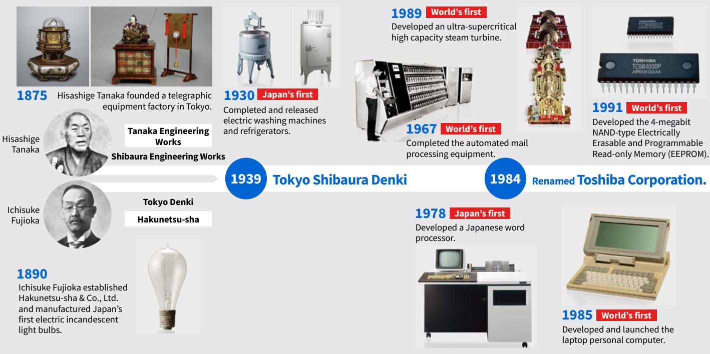
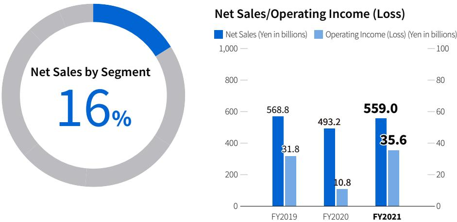

{0}------------------------------------------------

# Year ended March 31, 2022

{1}------------------------------------------------

### **The Essence of Toshiba**

The Essence of Toshiba is the basis for the sustainable growth of Toshiba Group and the foundation of all corporate activities.

The Essence of Toshiba comprises three elements: Basic Commitment of Toshiba Group, Our Purpose, and Our Values.

With Toshiba's Basic Commitment kept close to that Toshiba Group makes in society – together with our values, the shared beliefs that guide our actions.

### **Basic Commitment of Toshiba Group**

### **Committed to People, Committed to the Future.**

At Toshiba, we commit to raising the quality of life for people around the world, ensuring progress that is in harmony with our planet.

### **Our Purpose**

We are Toshiba. We have an unwavering drive to make and do things that lead to a better world.

A planet that's safer and cleaner. A society that's both sustainable and dynamic. A life as comfortable as it is exciting.

That's the future we believe in. We see its possibilities, and work every day to deliver answers that will bring on a brilliant new day.

By combining the power of invention with our expertise and desire for a better world, we imagine things that have never been – and make them a reality.

That is our potential. Working together, we inspire a belief in each other and our customers that no challenge is too great, and there's no promise we can't fulfill.

### **We turn on the promise of a new day.**

### **Our Values**

### **Do the right thing**

We act with integrity, honesty and openness, doing what's right not what's easy.

### **Look for a better way**

We continually strive to find new and better ways, embracing change as a means for progress.

### **Always consider the impact**

We think about how what we do will change the world for the better, both today and for generations to come.

### **Create together**

We collaborate with each other and our customers, so that we can grow together.

{2}------------------------------------------------

### CONTENTS

**Committed to People, Committed to the Future.**

**Basic Commitment of Toshiba Group**

We are Toshiba. We have an unwavering drive to make and do things that lead to a better world.

A society that's both sustainable and dynamic.

We see its possibilities, and work every day to deliver answers that will bring on a brilliant new day.

By combining the power of invention with our expertise and desire for a better world, we imagine things that have never been –

That is our potential. Working together, we inspire a belief in each other and

there's no promise we can't fulfill.

our customers that no challenge is too great, and

**We turn on the promise of a new day.**

At Toshiba, we commit to raising the quality of life for people around the world, ensuring progress that is in harmony with our planet.

A planet that's safer and cleaner.

That's the future we believe in.

and make them a reality.

A life as comfortable as it is exciting.

**Our Purpose**

**The Essence of Toshiba**

The Essence of Toshiba is the basis for the

sustainable growth of Toshiba Group and

the foundation of all corporate activities.

The Essence of Toshiba comprises three

elements: Basic Commitment of Toshiba

With Toshiba's Basic Commitment kept close to

that Toshiba Group makes in society – together

with our values, the shared beliefs that guide

our actions.

Group, Our Purpose, and Our Values.

**Our Values**

**Do the right thing**

**Look for a better way**

**Create together**

together.

not what's easy.

We act with integrity, honesty and openness, doing what's right—

We continually strive to find new and better ways, embracing change as a means for progress.

**Always consider the impact** We think about how what we do will change the world for the better, both today and for generations to come.

We collaborate with each other and our customers, so that we can grow

| Message from CEO                                                 | 03 |
|------------------------------------------------------------------|----|
| Message from the Chairperson of the Board of Directors        | 09 |
| History of Value Creation—Toshiba's DNA                          | 11 |
| Strategies                                                       |    |
| Toshiba Group Management Policy - Vision for Transformation - | 13 |
| Toshiba Group Technology Strategy                                | 23 |
| Intellectual Property                                            | 27 |
| Business Results                                                 |    |
| Financial Highlights (Consolidated)                              | 31 |
| Non-Financial Highlights (Consolidated)                          | 32 |
| Management Organization Chart                                    | 33 |
| Toshiba Group's Business Activities                              | 34 |
| Businesses                                                       |    |
| Energy Systems & Solutions                                       | 35 |
| Infrastructure Systems & Solutions                               | 37 |
| Building Solutions                                               | 39 |
| Electronic Devices & Storage Solutions                           | 41 |
| Digital Solutions                                                | 43 |
| Others                                                           | 45 |

### [Sustainability](#page-46-0)

| Sustainability Management                                                         | 46 |
|-----------------------------------------------------------------------------------|----|
| Material Issues and KPIs                                                          | 49 |
| Environment                                                                       | 51 |
| Social                                                                            | 54 |
| Governance                                                                        | 57 |
| Information Disclosure Based on the TCFD Recommendations                       | 59 |
| Highlights of Corporate Governance                                                | 64 |
| Corporate Governance                                                              | 65 |
| Data Section                                                                      |    |
| SASB Reference Table                                                              | 77 |
| Shareholder Information                                                           | 79 |
| Stock Information                                                                 | 80 |
| Consolidated Subsidiaries and Affiliated Companies Accounted for by the Equity |    |
| Method                                                                            | 81 |
| Corporate History                                                                 | 82 |
| Corporate Data                                                                    | 83 |
| Editorial Policy                                                                  | 84 |

{3}------------------------------------------------

### **Message from CEO**

{4}------------------------------------------------

We will meet the expectations of society by building new businesses rooted in our Basic Commitment while maintaining a foundation for innovation

Taro SHIMADA Representative Executive Officer,

October 2022

President and CEO

{5}------------------------------------------------

### **What needs to be done for Toshiba to be Toshiba**

Putting our Basic Commitment, "Committed to People, Committed to the Future," into practice, we will build infrastructure that everyone can enjoy in order to help keep people's lives safe and secure and will help to achieve a sustainable future through carbon neutrality and the circular economy while working for social and environmental stability via a society connected by data. As the person responsible for leading these efforts, I would like first to discuss what needs to be valued and what needs to be done for Toshiba to truly be Toshiba.

Throughout its history, Toshiba has created many things that did not exist previously through its own ingenuity, and has provided such creation to the society. What has made this innovation possible is by bringing together a broad array of specialists and harnessing highly diverse R&D capabilities in the name of values that go beyond the mere pursuit of profit. In order to exist as a company that constantly generates the next new thing as expected by the society, we intend to build new businesses rooted in our Basic Commitment while maintaining a foundation for innovation. In this way, we will fulfill society's expectations.

Toward a sustainable future, we intend to maximize the power of data with a view to the further evolution of the digital economy. This will be based on the business assets we have built up in the infrastructure sector. Through products and services already being provided to customers, including automatic ticket gates, ETC systems, elevators, and POS systems, we have the ability to acquire large amounts of data, and we intend to connect this data and convert it into value. With regard to carbon neutrality initiatives, issues cannot be solved without data for making CO2 emissions and environmental impact transparent. While expanding our data business to enhance the value of infrastructure, we will work to achieve carbon neutrality and a circular economy.

{6}------------------------------------------------

### **Breaking down two types of rigidity to transform our business model**

Under the Toshiba Next Plan launched in FY2018, earnings improved and Toshiba became a company capable of generating profit consistently. It was an outcome of our success in materializing the low hanging fruits that can be achieved in the short term, including structural reforms and cross-functional team (CFT) activities in procurement, sales, and other areas. To continue improving earnings going forward, the key will be to convert to an asset-light business model while promoting value chain transformation, including product and design modularization, and also IT systems in which IT and digital are fully utilized for the realization of business process reforms.

In addition, while making data services business a pillar of earnings, we will raise its operating income margin to 26% toward FY2030 and use this business to generate 20% (120.0 billion yen) of the operating income out of 600.0 billion yen that we are projecting for the company overall.

To achieve this goal, there are two issues Toshiba needs to resolve: "internal rigidity" and "external rigidity." We will carry out three strategies—digital evolution (DE) to enhance services and recurring businesses, digital transformation (DX) to build platforms based on DE, and quantum transformation (QX) to create a quantum world where various platforms are connected across industries—in order to accommodate to changing society along with the further evolution of the digital economy. Promoting these strategies will not be possible without breaking through the two rigidities.

Internal rigidity is when internal organizations become siloed and do not effectively share information nor the results of improvement activities. In today's digital, service-oriented era, what was once the right business unit at the time of its inception is no longer relevant, and what actually needs to be done to serve customers became different. Separating software from hardware is the key to overcome this dilemma. Currently, the product is developed in a vertically divided organization in silos, and the software is incorporated into the hardware and provided as a part of a system. Separating software from hardware will allow to make updates and functional upgrades at the software level alone. Doing so will then enable us to add variety of applications, which will generate new services that allow customers to use functions that they only need in the amount that they want, which will enhance recurring business and enable us to fully realize DE. Furthermore, by creating software platforms and connecting them to other companies' hardware and applications, we will achieve DX that further expand our data services business. Beyond that, under QX, optimal solutions are identified from complex interplay of various platforms created under DX through quantum technology.

On the other hand, external rigidity is the challenge that Toshiba faces because Toshiba tries to do everything by itself, and unable to leverage R&D diversity and convert achievements into business value. Going forward, through collaboration with external parties, we will ensure that values of high potential technologies with a large market to be realized as quickly as possible.

{7}------------------------------------------------

### **Toshiba's market superiority in data services business**

We have enormous customer access points through providing products and services in the area of infrastructure, and this makes it possible for us to acquire data from both consumers and industry. This will be Toshiba's major market advantage in expanding data services business through DX.

For example, in businesses that start with people flow data, new services will be created by leveraging usage data on lighting, elevators, escalators, cash registers, trains, roads, and more. In businesses based on energy and CO2 data, we will harness our extremely unique position that we have from being involved at every stage of energy business, from generation to distribution, storage, and use. This will enable us to provide more advanced energy balancing function and to visualize CO2 emission in supply chains utilizing data on renewable energy output predictions and electricity demand forecasts.

In data services business, privacy and security risks related to data handling must be considered, and confident systems must be established. Based on the general assumption that the right of data that comes from people should belong to its person, and should never be used against their will, we have solicited the opinions of specialists in the law and ethics and engaged in repeated discussions over the past several years with a view to providing people-friendly services with high added value. We have developed systems to provide robust data security and proactive privacy protections that put people first, not companies, and we are promoting highly progressive initiatives ahead of other companies.

At the same time, to lay a foundation for future business development through QX, we are accelerating R&D and actual commercialization of quantum technologies. In particular, with respect to our commercial demonstration of quantum cryptography technology, we are in the top position globally and going forward plan to launch services around the world simultaneously. After that, we will promote diverse development and proposals through collaboration between industry, academia and government to create industry through quantum technology. There are no other companies with QX as a core component of their strategies. This is a major endeavor that will bring about development not only for Japan but for humanity as a whole.

### **Considering strategic alternatives for maximizing corporate value**

Toshiba is holding discussions with potential investors and sponsors as potential partners and reviewing strategic alternatives that include privatization. This process is being led by the management team but is also being overseen by the Special Committee, which is made up entirely of independent outside directors in order to eliminate arbitrariness, and on this basis we will work to ensure transparency to the full extent possible to keep from negatively affecting competition among the potential partners.

As the Representative Executive Officer, President and CEO, I am involved in these discussions and also participate as an observer on the Special Committee. In addition, it is the Board of Directors that will make the final determination based on the matters reviewed by the management team and Special Committee, and as a director I will have one vote. To maximize corporate value, we will fully consider all options, and I will faithfully carry out my mission.

{8}------------------------------------------------

### **Toward a rich future with stakeholders**

For a sustainable future, we will develop DE, DX, and QX, and in transforming our business structure so that the data services business becomes a pillar of earnings, I am asking each and every employee to take an active role in the transformation and contribute to Toshiba's future.

At the same time, to effect a change in consciousness, I am actively encouraging employees to reduce overtime work and take their paid vacation days. Without some leeway in how we work, working in a way that gives rise to innovation becomes impossible and we are prevented from receiving the various inputs required to think about new things. Going forward, working styles will be an issue that will greatly change the awareness not only of Toshiba internally but also of society as a whole, starting with our customers.

Our Basic Commitment, "Committed to People, Committed to the Future," is at once the expression of our intention to realize a sustainable society. We will work to create a rich future with all of our stakeholders as our efforts to fulfill this commitment broadly permeate society in the form of new value.

{9}------------------------------------------------

# **Message from the Chairperson of the Board of Directors**

I am Akihiro Watanabe, and I have been a member of the Board of Directors since June 2022, serving as Chairperson of the Board.

In assuming the position of Chairperson, I have received words of encouragement from many people in Japan and overseas, and I realized that Toshiba is truly a company that is loved by many people.

I used to manage an M&A advisory company listed on the First Section of the Tokyo Stock Exchange, which merged with a U.S. company and went private in November 2021. I understand that my experience in privatizing the company I founded and my 30-year career as an M&A advisor are highly valued, and this persuaded me to accept the position of Chairperson of Toshiba's Board of Directors.

My knowledge of Toshiba was limited, as I had very limited contact with the company earlier in my career. As an accountant, my impression of the company was that it was a troubled company which had suffered many scandals in recent years. However, my perception changed dramatically when I began to study the company upon accepting the Chairperson position. That is when I was touched by Toshiba's corporate philosophy, "Committed to People, Committed to the Future." I was so impressed that I got goosebumps. I don't know any other company that has such a wonderful corporate philosophy, and I was really proud that there was a Japanese company that had such an inspirational philosophy long before the words ESG and SDGs were thought up.

I feel that Toshiba's underlying strength is its employees, including those I have met at research laboratories and factories. They are all truly good and excellent people, and that they work enthusiastically for the benefit of customers and society. From my own experience, I strongly believe that the power to overcome many crises lies in the power of people. The company I founded was a venture that started out with scarce human, material, or financial resources. The only way for a venture company to survive is to maximize the capabilities of its people, and that is the job of the management. In fact, it was thanks to the efforts of our employees that we were able to overcome numerous crises that followed its formation, including the Lehman Shock, the Great East Japan Earthquake, Brexit, and the COVID-19 pandemic. People have told me that I took a big risk by becoming Chairperson, however, I believe that Toshiba has a bright future because of its excellent corporate philosophy and talented employees.

Now that it has been a few months since I took the job, I have come to realize that Toshiba is truly a "good" company, but not a "strong" one. It has to address various challenges in order to become a stronger Toshiba. For example, Toshiba has an invaluable ecosystem in Japan in which each business monetizes the innovations of the Central Research Laboratory and uses the funds to create the next innovation. When you get down to the nitty-gritty of Toshiba's ecosystem, the current diverse business entities are giant venture funds that produce cash to generate ESG innovations. However, the scale of Toshiba has changed due to divestments made in the past. We are now at a point where we need to explore a new way to sustain this ecosystem.

That is exactly the reason why the entire Board is seeking a strategic alternative which includes privatization as one option. This is also a process that is designed to address the various challenges Toshiba currently faces to find the most suitable path forward in the best interests of all stakeholders, including shareholders. We are considering all possible alternatives, free from the influence of any particular stakeholder. The option we select must be feasible, and a strategy that allows Toshiba to grow over the medium to long term while preserving the best of Toshiba, and leads to the generation of cash flows.

In discussing corporate value, we must not forget the non-financial values of corporate philosophy and the significance of Toshiba's existence in society. It is most important that Toshiba pay close attention to intangible assets that are not recorded on the balance sheet, such as R&D, patents and human resources, and to maximize their long-term value. I believe that management must show each employee the mountain we have to climb and to lead and encourage each employee to have an image of their own personal growth and to work with excitement and dreams.

{10}------------------------------------------------

To this end, Toshiba's Board of Directors must gather all available information and draw on the wisdom of the public and its history, and make prudent business decisions in the best interests of shareholders and all other stakeholders.

Our newly formed Board is unified in its mission to create a stronger Toshiba, and operates as one team with members from diverse backgrounds bringing in their individual expertise and perspectives. All 12 board members are among the best in the world. They reflect not only diversity in nationality, gender and generation, but also have diverse experience, ranging from corporate management, corporate restructuring, extensive knowledge of fraud-related matters, to deep insight into capital markets. I am certain that the reappointed Board members, who have already had to make challenging decisions, and the new Board members will operate with a sense of unity and mutual respect. The shareholders have shown confidence in us, and we have a responsibility to act in the best interests of all stakeholders. To ensure a healthy and constructive debate among ourselves at this diverse Board, we aim to establish best boardroom practices, and strive to steadily improve its operation.

The job of the Chairperson and outside directors is to support and oversee the CEO and other managers as they work hard to create value for shareholders and stakeholders. The Board and management are completely aligned on the need to maximize Toshiba's corporate value, and see the need for radical transformation in achieving this goal. In addition to this, we are at a point in our company's history where we must address the very important topic of considering strategic alternatives.

It is no easy task to pursue the best interests of all stakeholders, including shareholders, while at the same time engaging in

sustainable management that contributes to the development of society through business. However, Toshiba has an excellent corporate philosophy, talented employees, and world-class directors. Above all, we have stakeholders who love Toshiba. At a time when we must tackle global challenges such as carbon neutrality, we must not forget that Toshiba has stakeholders beyond the existing definition of stakeholders, namely, the stakeholders of tomorrow's Earth.

As Chairperson of the Board of Directors, I am committed to serving the best interests of Toshiba and all its stakeholders, as expressed in our corporate philosophy, "Committed to People, Committed to the Future." I promise to do my utmost to support the management as it seeks to maximize Toshiba's corporate value.

October, 2022

### Akihiro Watanabe

Outside Director Chairperson of the Board of Directors

{11}------------------------------------------------

# **History of Value Creation—Toshiba's DNA**

Toshiba's roots can be traced back to the time when the heritage of two men—Hisashige Tanaka, dubbed *Karakuri Giemon* (inventor of mechanical devices), and Ichisuke Fujioka, known as the Thomas Edison of Japan—joined forces.

Tanaka Engineering Works (later Shibaura Engineering Works), founded by Tanaka in 1873, and Hakunetsu-sha, established by Fujioka in 1890, were the two companies that would eventually become Toshiba Corporation. They both were business ventures that dreamed of a bright future for Japan, aspiring to create something never seen before that would benefit people and society.

### **Toshiba's Roots Committed to People, Committed to the Future.**

"Committed to People, Committed to the Future." is the long standing Basic Commitment of Toshiba Group that expresses our credo since founding to always be on the watch for issues facing society amid the changing times and resolve them through business.

Today, in our everyday lives, we are asked to be responsible for a sustainable future. Natural disasters caused by climate change threaten the safety and security of our lives. Social and environmental stability are impaired by problems such as information inequality and natural resource depletion.

### **Our unwavering drive to make and do things that lead to a better world for over 140 years**

### **Toshiba's Technology to Turn on the Promise of a New Day**

### Founding

In 1930, Toshiba released Japan's first electric washing machines and completed Japan's first electric refrigerators. In 1955, the Company also released Japan's first electric rice cookers.

At a time when many women's lives were bound to the domestic realm, these products allowed women to have more free time.

#### 1960s

The automated mail processing equipment completed in 1967 was the world's first to mechanize manual work by recognizing handwritten characters, and became a forerunner of labor-saving equipment in the advanced information society.

At the same time, it led to the widespread use of optical character reading (OCR) technology, automatic ticket gates, and other cutting-edge image recognition technologies. In addition, research on superconducting materials, which began in the early 1960s, has borne fruit in the form of heavy ion cancer treatment devices, leading to the technology for next-generation medicine.

#### 1970s

In 1978, Toshiba completed Japan's first practical *kana-kanji* conversion system and released Japan's first Japanese word processor.

The development of *kana-kanji* conversion technology and high-capacity storage led to mobile music devices enjoyed by people out on the street, e-mail, social media, and other methods of communication, which have become the norm today.

### 1980s

Toshiba commercialized the world's first laptop personal computer in 1985, and the world's first NAND flash memory in 1991. These developments laid the foundation for an internet-driven society.

{12}------------------------------------------------

Toshiba is working for a sustainable future for the earth and its people by contributing to the realization of carbon neutrality and a circular economy.

Specific initiatives include protecting the safety and security of individual livelihoods by building infrastructure that is accessible to everyone, and ensuring social and environmental stability by building a society connected by data.

For many years now, Toshiba has engaged in businesses that support essential social infrastructure, including power generation, water treatment and transportation. Today, the knowledge, technology and customer connections cultivated thorough these businesses are invaluable assets. We will draw on them as we continue to create previously unseen value by maximizing the power of data.

Superconducting rotating gantry irradiation system for heavy-ion radiotherapy Collaboration with QST/iQMS **2016 World's first**

#### Developed the practical multi parameters phased array weather radar. **2017 World's first**

#### Demonstrated quantum **2021 World's No. 1**

cryptographic communications covering the world's longest*1 communication distance of over 600km.

### Film-based perovskite photovoltaic module with the world's highest*2 power **2021 World's No. 1**

conversion efficiency Share of mega solar power plant installations **2021 Japan's No. 1**

### **2007 World's first**

Developed the 320-detector row CT scanner.

**2020 Japan's first** Launched operations of a large-scale carbon capture and storage facility in Omuta, Fukuoka Prefecture*3.

World's leading scale H2 energy system (Fukushima Hydrogen Energy Research Field: FH2R) **2020 World's leading scale**

*1. Toshiba's survey in June 2020 *2. Among film-based perovskite photovoltaic modules with and active area of over 100cm2 made of plastic substrates, Toshiba's survey (as of September 10, 2021) *3. Japan's first carbon capture unit to capture over 50% of total CO2 emissions from a thermal power plant

#### 2010s

In 2017, Toshiba developed the world's first practical multi parameters phased array weather radar.

As torrential rains are caused by locally and rapidly developing cumulonimbus clouds, they had been considered difficult to predict. However, the multi parameters phased array weather radar makes it possible to predict the signs of torrential rains and resulting rainfall quickly and accurately.

#### 2020s

In 2021, Toshiba developed the world's largest film-based perovskite photovoltaic module with the world's highest power generation efficiency. The module can be installed in urban areas where it is difficult to secure a large area of land, even on the walls of buildings and condominiums and the roofs of large vehicles, which used to be considered unsuitable for installation.

"We want to be the first to deliver products and services that make people's dreams come true and change society." This passion has been the source of Toshiba's products and services.

Toshiba's technology has altered the way people live and has also changed society.

{13}------------------------------------------------

# **Toshiba Group Management Policy - Vision for Transformation -**

### **Toshiba Group's Vision**

**Contribute to the achievement of carbon neutrality & circular economy through digitization**

### **Committed to People, Committed to the Future.**

At Toshiba, we commit to raising the quality of life for people around the world, ensuring progress

that is in harmony with our planet.

### **Future**

### **People Safe, secure lifestyles for everyone**

Poverty, human rights, disasters, disputes

**Building an infrastructure that everyone can enjoy**

### **Planet Social and environmental stability**

Education, equality & fairness, climate change, resource depletion

**Building a society connected by data**

"Committed to People, Committed to the Future," this is the basic commitment of Toshiba. We commit to raising the quality of life for people around the world, ensuring progress that is in harmony with our planet.

It is important to first protect the safety and security of everyday life of each individual. It is to make a world without poverty, disasters or conflicts. What we can do is to "build an infrastructure that everyone can enjoy."

Once "People" are satisfied, the next level is to consider the "Planet." Realization of social and environmental stability becomes the next important step, and Toshiba aims to "build a society connected by data."

After the society is further stabilized, we will move on to consider the "Future." In other words, the greater question becomes the future of our children, and the sustainability of people and the planet. What we can do and what we should do is to "realize carbon neutrality and circular economy."

As a means to realize these things that need to be done, "digital" is important. As the digital economy evolves, new social value will be created in the future having various companies get connected across industrial boundaries.

### Evolution of the digital economy

{14}------------------------------------------------

Toshiba has identified the DE, DX, and QX strategy to respond to those changes.

The first stage of its development is the digital evolution (DE) to enhance services and recurring businesses. That is to be followed by the digital transformation (DX), which is a stage to build platforms based on DE. We will further develop this into a quantum transformation (QX), a quantum world where various platforms are connected across industries.

### **Toshiba Group Mid-to-Long Term Target**

| FY 30 Target: Net sales 5.0 T yen, ROS 12.0%, Operating Income 600 B yen |                        |                        |                        |                         |
|--------------------------------------------------------------------------|------------------------|------------------------|------------------------|-------------------------|
|                                                                          | FY 21 Results *1    | FY 22 Forecast *1   | FY 25 Target           | FY 30 Target            |
| Net sales                                                                | 3.34 T yen             | 3.30 T yen          | 4.00 T yen          | 5.00 T yen           |
| Operating income (ROS%)                                               | 159 B yen (4.8%) | 170 B yen (5.2%) | 360 B yen (9.0%) | 600 B yen (12.0%) |
| EBITDA *2                                                             | 244 B yen           | 270 B yen           | 500 B yen           |                         |
| ROIC *3                                                               | 15.8 %                 | 13.8 %              | 17.0 %              |                         |
| FCF *4                                                                | 125 B yen           | 100 B yen           | 250 B yen           |                         |

*1 FY21 results and FY22 forecast includes the results and forecast of Toshiba Carrier Corporation,

*2 EBITDA = Operating income + Depreciation

*3 ROIC = (Net income - Non-controlling interest - Interest expense × (1 - tax rate) )/ (Net interest - bearing debt + Net assets)

*4 Free Cash Flow

For FY30, we target to achieve net sales of 5.0 trillion yen, operating income of 600 billion yen, and operating income margin of 12.0%. The target for FY25 is net sales of 4.0 trillion yen, operating income of 360 billion yen, operating income margin of 9.0%, EBITDA of 500 billion yen, ROIC of 17%, and free cash flow of 250 billion yen.

**Forecasting growth in the highly profitable data service business toward FY30**

More specifically, toward FY30, we aim to transform Toshiba into a company with a data service as the pillar that generates our earnings. In the area of data services, we plan to achieve extremely high profitability with an operating income margin of 26%, and we expect it to generate approximately 20% of the company's operating income.

{15}------------------------------------------------

**Toshiba Group Management Policy - Vision for Transformation -** 

**Many businesses contribute to economic security by supplying core infrastructure and**

### **Current Status of Toshiba Group**

For more than 100 years, Toshiba group has been involved in businesses that support critical public infrastructures, such as electric power and railroads. We hold the No.1 market share in many of these businesses including water supply and sewerage systems. These businesses will be valuable assets for a digital business.

### **Impact of the Toshiba Next Plan and Efforts toward Further Enhancement of Core Profitability**

**Steady improvement in core profitability at each segment**

Under the Toshiba Next Plan, launched in 2018, we have been working to strengthen core profitability as Phase 1. Despite the impact of COVID in FY20 and a shortage of semiconductors and soaring material prices in the previous fiscal year, profitability has recovered steadily in all segments so far, and we have seen four-point improvement in the overall income margin.

In particular, the digital solutions business have shown stable improvement, which we attribute to our steady improvement efforts, such as standardization of software development processes and utilization of overseas software development bases.

Going forward, we intend to build a stronger earning structure by expanding this successful example to the entire company.

{16}------------------------------------------------

### **Expanding from CFT activities and restructuring efforts to value chain transformation**

Toshiba had focused first on materializing the low hanging fruits that can be achieved in the short term, such as structural reforms and CFT activities in procurement, sales and other areas, and has realized 180 billion yen improvement over four years starting from 2018.

Going forward, we will promote a business process reforms, including design and production and also IT system reforms to realize these reforms as value chain transformation and work to sustainably strengthen core-profitability through a chain of two reforms. Through these activities, we aim to improve profitability by further reducing costs of approximately 70 billion yen by FY25.

### **Update on Activities Aimed at Further Enhancing of Core Profitability**

With regard to the reduction of the number of subsidiaries, we aim to achieve 40% reduction by FY25, and as of the end of April, 2022, we have already achieved a 30% reduction.

As for initiatives related to a value chain transformation in the area of design and product modularization, we expect to achieve approximately 70% by the end of FY22 toward the completion of modularization of 67 target products by FY25.

In the smart factory initiative, we are aiming to expand to all major production sites, and targeting for 65% of its production sites to reach level 3 by FY25.

{17}------------------------------------------------

### **Resolving Corporate Challenges**

There are two types of rigidities as challenges for Toshiba in achieving its goals.

### **Challenges: Inability to leverage R&D diversity and convert achievements into business value**

The strength of Toshiba lies in its ability to develop technologies that are completely new to the world. There are many "world's first" that originated from Toshiba. However, Toshiba has not fully capitalized on the business seeds. Toshiba tries to do everything by itself. However, it is the age of ecosystems and platforms. Rather than launching a completely proprietary technologies single-handedly, leveraging its ecosystems to enable earlier takeoff of businesses should lead to significantly greater corporate value.

**External Rigidity** Methodology-related issues

- (Lack of industry connections and business know-how)
### **Obsession with full or majority ownership**

{18}------------------------------------------------

Here we explain the approach to breaking through these two rigidities and resolving corporate challenges. First, internal rigidity. We will take the steps below for software defined transformation to resolve the internal rigidity.

**Internal Rigidity** Organization-related issues

### **Software Defined Transformation**

- Transform businesses through "DE → DX → QX" evolution and discover new business potential from a data-oriented perspective
#### Integration and optimization of software development

- Aggregate software personnel dispersed throughout Toshiba group
- Improve efficiency through standardized processes

Currently, the product is developed in a vertically divided organization in silos, and the software is incorporated into the hardware and provided as a part of a system.

To take this to the digital evolution (DE), the first stage, it is important to separate the software from the hardware. This will enable us to add a variety of applications, which will generate new services as well as to enhance the recurring businesses or providing SaaS business; these will greatly contribute to making the business more profitable.

Next, we need to standardize the software so that such software could be connected to other companies' hardware and applications, making it possible to create a platform. Once this is completed, then services will be greatly expanded and the scale-free network comprised of such software will be formed; it will enable data-centric service development as the second stage, called DX. It will be extremely asset-light and also scalable business model that will consequently allow us to achieve exponential growth.

Beyond that, various platforms under DX stage will be created, and a quantum world of quantum transformation (QX) will emerge, in which optimal solutions are identified from a complex interplay of platforms.

{19}------------------------------------------------

### **Toshiba Group Management Policy - Vision for Transformation -**

We have named this project as "SHIBUYA Project" as we call it internally.

The City of Shibuya is currently undergoing a major transformation. It has fundamentally been transforming the city without stopping millions of people come and go. This is exactly what we are trying to do. We will not stop our business while we revitalize the company.

We will integrate and optimize software development.

### Toshiba Group's software development personnel

A far greater number of software development personnel currently belong to non-digital segment and are dispersed over our 30 group companies. And there are many things that can be improved in devilment practices and staffing. We will thoroughly improve this going forward.

{20}------------------------------------------------

Platforms emerge from the consumer diamond on the right, just as the so-called GAFA are collecting data directly from consumers. However, even there, there are much data that can be extracted from the hardware that so far has not yet been acquired. POS, lighting, elevators and other businesses will greatly contribute to the acquisition of such human data. In terms of acquiring human data, these are our focus areas.

Furthermore, in the B2B area on the left, data acquisition has not been accomplished. Many companies try to acquire data from large corporations in this very small end, but it is very difficult. In fact, when we take a look at successful examples of acquiring human data, it is more reasonable to capture data from the bigger diamond.

We will tackle both these diamonds. Toshiba hopes to become a platformer in both of these areas, especially in the B2B area where data acquisition has not been successfully accomplished yet.

{21}------------------------------------------------

### **Toshiba Group Management Policy - Vision for Transformation -**

Realizing the value of potential technologies is the way to resolve the external rigidity.

**External Rigidity** Methodology-related issues

### **Realizing the value of potential technologies**

Consider working with external partners in order to realize value from high potential technologies with large expected target markets

*1 Photovoltaics, *2 Estimated global market of PV panels for EV based on the expected number of EVs in 2030 ( <https://www.nedo.go.jp/content/100873452.pdf> ), *3 Fuji-Keizai: Trends in advanced PV development and market outlook in future(FY2020 version), *4 Niobium Titanium Oxide , *5 Estimated by Fuji-Keizai Outlook of energy, large size rechargeable batteries and materials(2020) , *6 LiDAR module global market estimated by 3D LiDAR marketing analysis(TSR) etc., *7 Global market of security screening systems,*8 MEMS sensor global market in global forecast in 2030(SDKI Inc.)

Toshiba's strength lies in its diversity in its development. In the past, we have created and introduced products that had never existed before by combining technologies in many areas.

Even today, for example, there are a number of technologies with strong business potential such as semiconductors and material technologies that have an estimated market size of over 2.5 trillion yen. Others are copper oxide tandem PV, perovskite, NTO anode batteries, LiDAR, millimeter wave imaging and MEMS sensors.

However, Toshiba has not fully capitalized on the business seeds. We will promote measures to ensure that values of these high potential technologies to be realized as quickly as possible.

{22}------------------------------------------------

If we determine that values can be realized at an early stage through collaboration with external parties, we will consider using partners such as companies seeking to expand their businesses in a digitalized field or existing players in that field. As a result, we believe that a variety of value can be captured including data utilization and financial returns.

Toshiba Group has been providing products and services that supports people's lives and society under our Basic Commitment, "Committed to People, Committed to the Future." We believe this is a mission that will not change in the future.

However, in response to the development of the digital economy and the age of ecosystems and platforms, the company must also change through the transformation as DE, DX, and QX. We intend to transform Toshiba into a company that makes data services as pillar of its earnings. To achieve this goal, we need to break through the two rigidities of internal and external rigidity to maximize the potential that Toshiba Group possesses. We are promoting software defined transformation through SHIBUYA Project to separate software from hardware. And we show you the concrete steps that we are taking going forward. Through these transformations, we will become a company that harnesses the power of digital and data to contribute to the realization of carbon neutrality and circular economy.

{23}------------------------------------------------

# **Toshiba Group Technology Strategy**

### **Toshiba Group Technology Policy**

Carbon neutrality has been promoted worldwide by shifting to renewable energy. In addition, since our life has been significantly influenced by escalation of natural disasters, aging social infrastructures, a decrease in working population, pandemics, and cyberattacks, infrastructure resilience has been increasingly needed.

Through a good track record in productization and systematization mainly in the energy/social infrastructures field over 145 years, Toshiba Group has cultivated research and development ability to generate "1" from "0" leveraging technological diversity, as well as combined strength in engineering ability to structure devices, components, and systems meeting social and customer needs as solutions.

Using such strengths, the Group will promote provision of infrastructure services centering on "TOSHIBA SPINEX" brand based on open IoT reference architecture, leading the carbon neutrality and the realization of resilient infrastructures, guided by the Basic Commitment "Committed to People, Committed to the Future."

Going forward, the Group will aim at creation of products, systems, and services which contribute to creation of new social values toward resolution of social issues, by promoting DE/DX and QX that provide platforms using industrial and human data, with a core of differentiated devices, components, and systems.

*1 : Power to Gas *2 : Power to Chemicals

The ratio of R&D expenses to sales in Toshiba Group stands at approximately 5%. Our policy on R&D is to concentrate investment on business areas of focus and take into account investment efficiency.

{24}------------------------------------------------

[Strategies](#page-13-0) [Business Results](#page-31-0) [Businesses](#page-35-0) [Sustainability](#page-46-0) [Data Section](#page-77-0)

### **Toshiba Group R&D Structure**

Toshiba conducts research and development that best suit the purpose, from both aspects of seeds-oriented R&D triggered by future technologies and concepts, and needs-oriented R&D based on customer feedback and product planning. We have a research and development structure in which our relevant sites are categorized according to their role. Corporate R&D organizations that tackle basic and fundamental research from a medium- to long-term perspective; R&D organizations of Group companies that engage in short- and midterm core technology development; and design and engineering divisions of Group companies that are geared to realizing products and services. This structure is optimal for solving technological challenges.

Toshiba has built research and development sites not only in Japan but also in the United States, Europe, China, India, Vietnam, among others. These sites cooperate organically across borders to conduct a wide array of cutting-edge research and development on a global basis. In order to boost our global competitiveness, we are improving our capacity to respond swiftly to changes in the market, in our research and development as well. Particularly in China and the rest of Asia, where markets are expanding, we are working to locally operate not only manufacturing sites, but also engineering sites and development sites. Going forward, our research and development in emerging countries will create products and services that will appeal to the global market including in developed countries.

### Major R&D bases in Japan and overseas

Toshiba Integrated Report 2022 24

{25}------------------------------------------------

### **R&D Cases to Create New Values**

As R&D cases to realize a carbon neutral society and services based on industrial and people-flow data, we introduce initiatives for a transparent Cu2O solar cell and face recognition AI technology. In the transparent Cu2O solar cell, we have been developing a highly efficient and low-cost tandem solar cell, and confirmed that it has potential of exceeding the world's highest efficiency in silicon solar cells as Cu2O-Si tandem solar cell. Furthermore, Toshiba's unique face recognition AI achieved the highest recognition accuracy in Japanese companies in Face Recognition Vendor Test Ongoing by National Institute of Standards and Technology.

### **Toshiba Developed Transparent Cu2O Solar Cell Which Achieved the World's Highest Efficiency for Highly Efficient and Low-cost Tandem Solar Cell**

Toward the realization of a carbon neutral society, in Japan, the Ministry of Economy, Trade and Industry announced "Green Growth Strategy Through Achieving Carbon Neutrality in 2050"*1 which declared the policy of increasing a percentage of renewable energy in the domestic power generation amount to 50-60% by 2050. Especially, to promote transportation electrification, the tandem solar cell which can supply power necessary for operation is expected to be more needed by mobility systems such as automobiles and trains which offer only limited installation space for a solar cell.

Tandem solar cells can raise an overall conversion efficiency by layering two solar cells as a bottom cell and a top cell to generate power together. While the development of a highly efficient and low-cost top cell which can be layered over an existing silicon solar cell was going ahead, Toshiba developed a low-cost transparent Cu2O solar cell*2 as a top cell for the first time in the world in 2019. This time, Toshiba successfully realized the world's highest conversion efficiency (PCE) of 9.5% by curbing impurities in the power generation layer and increasing the power generation area from 3x3mm² to 10x3mm².*3 In addition, it was confirmed that the Cu2O-Si tandem solar cell with a Cu2O solar cell layered over silicon (Si) solar cell has potential of exceeding the world's highest PCE of 26.7%*4 in silicon solar cells. In case of an electric vehicle (EV) equipped with the Cu2O-Si tandem solar cell, a one-time charge is estimated to enable the solar cell to power the EV for 37km for a day.*5

Going forward, Toshiba will push ahead with the development in order to achieve the PCE of 10%, a target value of the top Cu2O cells for high efficiency tandem solar cells (PCE=30%), entrusted by New Energy and Industry Technology Development Organization (NEDO). Apart from the entrusted project from NEDO, Toshiba will cooperate with Toshiba Energy Systems & Solutions Corporation to aim to complete manufacturing technology for several inch-Cu2O-Si tandem solar cells around the same size as today's mainstream silicon solar cells by FY2025.

*2 <https://www.global.toshiba/ww/technology/corporate/rdc/rd/topics/19/1901-01.html>

*3 Source: Toshiba as of September 2022

*1 <https://www.meti.go.jp/english/press/2020/1225_001.html>

*4 The world's highest PCE of silicon solar cells as of December 2021, published in Nature Energy 2, 17032 (2017) *5 Simplified trial calculation based on the document published by NEDO ( <https://www.nedo.go.jp/english/news/AA5en_100358.html> )

{26}------------------------------------------------

### **Toshiba Achieved the Highest Recognition Accuracy in Japanese Companies in Face Recognition Vendor Test Ongoing by National Institute of Standards and Technology**

In the face recognition technology that Toshiba has researched and developed for many years, it was at top level in the world, and ranked top in Japanese companies*1 in three categories of a face recognition benchmark test (FRVT Ongoing 1:1 Verification*2) hosted by National Institute of Standards and Technology (NIST*3).

Toshiba's unique face recognition AI to identify an individual from an image registers a face of a person to be identified with a face database in advance to check the person in the image in real time and grants metadata. As "Kaometa®," a face recognition AI for broadcasters and other media, Toshiba Digital Solutions Corporation began to provide services in April 2020. The face recognition AI supports operations such as quick and accurate production of TV programs, by precisely recognizing a face of a person in an image in real time to identify the person.

Toshiba's face recognition technology could very accurately recognize an individual in "VISABORDER category," "1:1 Verification," a verification test using images taken at time of entry and departure, and was ranked ninth in the world, and first in Japanese companies. Also, in "BORDER Photos category," a verification test using images taken at time of crossing a border, it ranked eighth in the world, and first in Japanese companies. Furthermore, in "MUGSHOT Photos ΔT ≥12 YRS category," a verification test using face images which degraded over 12 years or more, it ranked ninth in the world, and first in Japanese companies.*4

Toshiba Group has offered non-contact identity verification services using the face recognition technology in various aspects. In order to contribute to a society by providing safer, more secure and convenient services, the Group will also appropriately use extensive person recognition technologies including technology to chase a person in reference to clothes and other appearance*5 depending on the situation while paying adequate attention to privacy.

- *3 National Institute of Standards and Technology *4 As of the publication of report on October 28, 2021
- *5 <https://www.global.toshiba/ww/technology/corporate/rdc/rd/topics/17/1708-01.html>

*1 <https://pages.nist.gov/frvt/html/frvt11.html>

*2 Face Recognition Vendor Test Ongoing Positioned as an industry benchmark test with over 350 algorithms posted from 240 organizations worldwide

{27}------------------------------------------------

# **Intellectual Property**

### **Intellectual Property Strategy**

Toshiba Group is aiming at expanding opportunities for solving social issues and maximizing corporate values by implementing intellectual property (IP) strategies.

In the service segment that respectively combine Energy and Infrastructure with Digital, it is important to expand opportunities for solving social issues and formulate an IP strategy to make a success of business, taking into account the entire business including not only the service segment but also the cyber segment and the physical segment. Therefore, Toshiba Group has emphasized on conceptualizing IP strategies from various perspectives such as collaboration creation with business partners and utilization of IPs, overviewing the entire business schemes.

In order to perform IP strategies, it is essential to manage IP items (patents, data, know-how, and the like). Especially, in the cyber segment, as it would be important how to handle data and to keep and manage a secret as confidential information to prevent leakage of expertise, we thoroughly strengthen utilization and protection of data, and management of expertise (keeping secrets).

In addition, as a basis of IP strategies, intellectual properties which support advantageous technologies and products are essential, particularly in the physical segment. Therefore, we are focusing on enhancing IP capabilities by creating IP based on IP information analysis and IP strategies, optimizing IP portfolios in consideration of competitiveness, and having free to operate throughtpatent clearance for other companies.

### Toshiba Group Intellectual Property Policy

### **Expand opportunities to resolve social issues and maximize corporate value**

{28}------------------------------------------------

### **The Organizational Structure Concerning Intellectual Property**

The organizational structure of the Intellectual Property Division is composed of the Intellectual Property Office in the corporate staff division, and the intellectual property divisions at our individual laboratories and key Group companies. The Intellectual Property Office in the corporate staff division is responsible for, related to Intellectual Property across Toshiba Group, formulating and promoting strategy and measures, handing contracts and disputes, managing patent information and deals with matters related to intellectual property right laws, such as the Copyright Law. Meanwhile, the intellectual property divisions of research laboratories and key Group companies pursue intellectual property strategies in their respective development and business domains and work to strengthen their intellectual property activities in order to build a superior intellectual property portfolio. Personnel in charge of intellectual property are stationed in the United States and China, promoting our IP strategies on a global basis.

In relation to management resource allocation including investment in intellectual properties, and implementation of strategies related to business portfolios, each Executive Officer reports a progress in initiatives to the Board of Directors, and is provided with supervision and advice from the Board.

### **Education on Intellectual Properties**

Every year, e-learning for Standards of Conduct for Toshiba Group is provided to employees of Toshiba Group in Japan for the purpose of making them reaffirm the code of behavior including IP rights and reminding them of matters mainly related to copyrights. In FY2021, 99.4% of the employees attended the education.

In addition, we provide general education on IP rights to new employees in Corporate Entry Program (CEP), then offer education by job rank in light of each business division.

A basic educational program has been provided for IP personnel in order to enable them to respond to practical operations in two years through learning knowledge on domestic and overseas IP rights, preparation of patent specifications, and practical training with office action/OJT for intermediate procedures, etc.

In addition, we provide education at our overseas subsidiaries that is appropriate for each region. For example, our Chinese subsidiaries provide copyright training on the proper use of software, and our U.S. subsidiaries provide intellectual property training targeting both newly hired and existing employees.

{29}------------------------------------------------

### **Intellectual Property**

### Global Patent Portfolio

A majority of patents are applied for overseas, mainly in the U.S. and China, to operate business globally. In each business segment, items to be applied for a patent are selected so that the optimal portfolio can be created based on IP strategies.

The number of patent applications over the past three years is as follows.

No./Component ratio of patent applications (from April 2019 to March 2022)

Toshiba Group assesses the validity of rights in all its registered patents each year to create a patent portfolio optimized for each business segment.

#### No./Component ratio of patents Owned (as of March 2022)

### Protection of the Toshiba Brand

The Toshiba brand symbolizes the corporate value of Toshiba Group, and the value of the goods and services that Toshiba Group provides. In order to ensure that the Toshiba brand is intact, we have worked to manage trademark rights and eliminate counterfeit products.

Failure to take action against counterfeits of Toshiba products would pose not only the risk of damage to Toshiba's brand value and public confidence, but also the risk of customers mistaking counterfeit products as genuine, finding the purchase does not deliver the expected performance, and being involved in an accident. To prevent this, we strive to eliminate counterfeit products, collaborating with domestic and overseas anti-counterfeit organizations, and are actively appealing to local government agencies and other organizations for more stringent control.

{30}------------------------------------------------

### Change in the number of counterfeit product cases responded

Breakdown of counterfeit product cases responded by region (from April 2021 to March 2022)

### External Recognition of Toshiba's Intellectual Property

Toshiba Group's diverse state-of-the-art technologies and its brand are highly appreciated. Prominent awards received include the following:

### Toshiba was selected as Clarivate Top 100 Global Innovators™ 2022 and Top 100 Best Protected Global Brands 2021

Toshiba was selected as "Clarivate Top 100 Global Innovators™" in 11 consecutive years, in which top 100 innovative companies/organizations are selected worldwide by U.K. information service company Clarivate Plc with patent data analysis. In addition, "TOSHIBA" was selected in "Top 100 Best Protected Global Brands," an award to select the most impactful and best protected brand in the world through the analysis of IP data including trademark information, global case law and digital domain name protection, which was newly announced by Clarivate.

### Winner of FY2021 National Commendation for Invention - Invention Prize Invention of technology for treating contaminated waste water from nuclear power plants (Patent No. 6158014)

The invention, related to an adsorbent developed to remove radionuclides from contaminated water discharged from the Fukushima Daiichi Nuclear Power Plant, won the 2021 National Commendation for Invention – Invention Prize.

It allows for simultaneous and high-adsorbent performance removal of radioactive cesium (Cs) and radioactive strontium (Sr) from within the contaminated water from the Fukushima Daiichi Nuclear Power Plant. This invention has been realized by achieving improved adsorption performance through crystallization control and practical strength through granulation control. The adsorbent boasts high-adsorbent performance and can be processed with fewer adsorption towers than if using conventional products. The invention minimizes the amount of radioactive waste generated and helps contribute to a reduced environmental load.

{31}------------------------------------------------

# **Financial Highlights (Consolidated)**

For the detailed financial information, please refer to the **[Financial Report for the Fiscal Year ended March 31, 2022](https://www.global.toshiba/content/dam/toshiba/ww/ir/corporate/finance/annual-report/pdf/ar2022/tfr2022e.pdf)** .

### Net sales / Ratio of overseas sales

Net sales increased by 282.6 billion yen year on year to 3,337.0 billion yen, reflecting higher sales year on year in all business segments, as both the global and domestic economy has shown signs of recovery with the eased impact of COVID-19.

### Operating income / Return on sales (ROS)

Operating income increased by 54.5 billion yen year on year to 158.9 billion yen, reflecting higher operating income in the Energy Systems & Soln*, Building Soln, Retail & Printing Soln, Electronic Devices & Storage Soln, and Digital Soln, despite lower operating income in the Infrastructure Systems & Soln and Others. *Soln: Solutions

### Equity attributable to shareholders of the Company / Shareholders' equity ratio

Equity attributable to shareholders of the Company (Yen in billions) Shareholders' equity ratio (%)

Equity attributable to shareholders of the Company increased by 42.1 billion yen from the end of the previous fiscal year to 1,206.6 billion yen due to increases in net income and comprehensive income.

### Cash flows

Cash flows from operating activities increased by 104.1 billion yen year on year to 249.2 billion yen, reflecting improvements in EBITDA and working capital. Cash flows from investing activities increased by 17.9 billion yen year on year to 124.5 billion yen. As a result, free cash flow increased by 86.2 billion yen year on year to 124.7 billion yen.

### Net income (loss) / Earnings (loss) per share

Net income increased by 80.7 billion yen year on year to 194.7 billion yen, reflecting higher operating income and an increase in equity earnings from Kioxia Holdings Corporation, etc.

### R&D expense / R&D expense to sales ratio

R&D expense amounted to 151.9 billion yen, 1.4 billion yen higher than in the previous fiscal year. The R&D expense to sales ratio was 4.6%, 0.3% points down from the previous fiscal year.

{32}------------------------------------------------

Number of reports received by whistleblower system

# **Non-Financial Highlights (Consolidated)**

#### Trends in the number / percentage of female exempt employees (Toshiba and key Group companies*, section manager level or higher)

*Sum of the figures for Toshiba Corporation, Toshiba Energy Systems & Solutions Corporation, Toshiba Infrastructure Systems & Solutions Corporation, Toshiba Electronic Devices & Storage Corporation, and Toshiba Digital Solutions Corporation

FY2019 FY2020 **FY2021**

### Lost-time injury frequency rate* at Toshiba Group in Japan*

National average for electrical appliance industry LTIFR at Toshiba Group in Japan

*Figures in parentheses: (Number of reports to the internal secretariat / Number of reports to an attorney's office) *Includes duplicate reports made to the internal secretariat

*LTIFR: Lost Time Injury Frequency Rate, the number of lost time injuries occurring in a workplace per 1 million man-hours worked *Includes accidents involving part-time workers, fixed-term workers and dispatched workers

### Energy-derived CO2 emissions and rate of improvement of emissions per unit activity

Emissions (Million t-CO2)

Rate of improvement of emissions per unit activity (%)

*CO2 emission coefficients for electricity are calculated using emission coefficients provided by power companies.

*Per unit activity refers to values related to energy consumption required for manufacturing (nominal output, the number of products manufactured, number of persons, total floor area, etc.). *Based on the Seventh Environmental Action Plan, FY2020 is set as the base year.

*CO2 emission coefficients for electricity are calculated using emission coefficients provided by power companies.

### Amount of water received and rate of improvement of the amount of water received per unit activity

Amount of water received (Million m3)

*Based on the Seventh Environmental Action Plan, FY2020 is set as the base year.

### Total GHG emissions* (Million t-CO2)

{33}------------------------------------------------

# **Management Organization Chart**

### **TOSHIBA CORPORATION**

### **Energy Systems & Solutions**

Toshiba Energy Systems & Solutions Corporation Toshiba Plant Systems & Services Corporation

### **Infrastructure Systems & Solutions**

Toshiba Infrastructure Systems & Solutions Corporation

#### **Building Solutions**

Toshiba Elevator and Building Systems Corporation Toshiba Lighting & Technology Corporation

### **Retail & Printing Solutions**

Toshiba Tec Corporation

### **Electronic Devices & Storage Solutions**

Toshiba Electronic Devices & Storage Corporation

#### **Digital Solutions**

Toshiba Digital Solutions Corporation

- Toshiba America, Inc.
- Toshiba Europe Ltd.
- Toshiba Asia Pacific Pte. Ltd.
- Toshiba (China) Co., Ltd.

{34}------------------------------------------------

# **Toshiba Group's Business Activities**

### **Energy Systems & Solutions P.35**

The scope of our business embraces large-scale power generation systems for nuclear and thermal power, along with renewable energy generation systems for hydro, geothermal, solar, and wind power. Our related businesses include power transmission and distribution systems that deliver electricity directly to end users, Virtual Power Plant (VPP) for efficient utilization of distributed energy sources, and green hydrogen energy systems that harness renewable energy.

**Energy Business Domain:** Toshiba Energy Systems & Solutions Corporation Toshiba Plant Systems & Services Corporation

### **Infrastructure System & Solutions P.37**

For many years, we have provided products, systems, and services to public-sector customers responsible for maintaining the infrastructure of essential utilities. In coming years, we will fully embrace IoT and artificial intelligence (AI) in order to establish safer, more secure, and more convenient social infrastructure systems.

#### **Social Infrastructure Business Domain:**

Toshiba Infrastructure Systems & Solutions Corporation

### **Building Solutions P.39**

Our portfolio covers elevators & escalators for buildings and facilities, ventilation, and lighting, all essential to the day-to-day comfort of people. Through these businesses, we also offer energy-saving, environmentally conscious products and services, as well as building solutions that improve building security and reliability.

#### **Building Solutions Business Domain:**

- Toshiba Elevator and Building Systems Corporation
- Toshiba Lighting & Technology Corporation
- Toshiba Carrier Corporation

* The business results of Toshiba Carrier Corporation are included in FY2021. However, Toshiba Carrier Corporation was deconsolidated from Toshiba Group on August 1, 2022, on completion of a share transfer.

**Retail & Printing Solutions** Toshiba Tec Corporation

### **Electronic Devices & Storage Solutions P.41**

We are expanding our business by focusing on markets where we anticipate steady growth, such as automotive and industrial semiconductors, large capacity HDDs for data centers, semiconductor manufacturing equipment, and materials and devices. By providing high-added-value products, we are helping to advance the role of big data in society, and contributing to the realization of a carbon-neutral and safe, secure society.

**Electronic Devices Business Domain:**

Toshiba Electronic Devices & Storage Corporation

### **Digital Solutions P.43**

By utilizing the knowledge that Toshiba has amassed across numerous business domains, along with cutting-edge technologies like IoT, AI and quantum related technologies, we create digital solutions that provide our customers with new value and services, and that enrich the wider society.

**Digital Solutions Business Domain:** Toshiba Digital Solutions Corporation

Energy Systems & Solutions Infrastructure Systems & Solutions Building Solutions Retail & Printing Solutions Electronic Devices & Storage Solutions

Digital Solutions Others

Ration in the above graph prior to elimination of inter-segment sales

{35}------------------------------------------------

### **Energy Systems & Solutions**

#### Main Businesses

As of March 31, 2022

- Nuclear power generation systems
- Thermal power generation systems
- Hydroelectric power generation systems
- Solar Photovoltaic systems
- Transmission & Distribution systems

In power generation systems, sales of nuclear power decreased due to the impact of differences in the progress of processes related to safety measures. However, sales of thermal and hydroelectric power increased due to differences in the size of overseas projects. Sales of transmission, transformation, and distribution systems increased due to higher sales of transmission, transformation, and distribution systems. As a result, overall sales of power generation systems increased.

### **Business Overview**

In terms of profit and loss, both power generation systems and transmission, transformation, distribution, etc. increased due to the impact of increased sales, resulting in an overall increase in profit for the division as a whole.

### **Proposal of CO2 Resource Utilization Study Adopted by Ministry of the Environment as a Model Business**

In response to the call by the Global Environment Bureau, Ministry of the Environment, for "Projects to Promote the Creation of Circular Carbon Society Model through CO2 Recycling," Toshiba Corporation, Toshiba Energy Systems & Solutions Corporation, Toyo Engineering Corporation, Idemitsu Kosan Co., Ltd., Japan CCS Co., Ltd., and All Nippon Airways Co., Ltd. proposed a "Regional CO2 Resource Utilization Study Business Through Electrolysis Utilizing Artificial Photosynthesis Technology," which was subsequently adopted as a commissioned project.

The six companies combined technology to convert carbon dioxide (CO2) to carbon monoxide (CO) developed at the Toshiba Corporate Research & Development Center (Artificial Photosynthesis Technology) with tech-

Regional Circular Carbon Society Model (Illustration)

nology to synthesize liquid fuel from CO and hydrogen, using it to manufacture sustainable aviation fuel and to investigate carbon recycling business models. This initiative was adopted by the Ministry of Environment as a commissioned project. Toshiba Energy Systems & Solutions Corporation will build a prototype of a full-scale CO2 electrolysis device and demonstrate its operation. All six companies will create a basic plan to utilize their knowledge, technology, related plant equipment, and other resources to demonstrate the entire process from the separation and collection of CO2 to the production and consumption of aviation fuel. Going forward, the data and knowledge obtained from this commissioned project will be reflected in the carbon recycling society model and used to evaluate the feasibility of the business.

Through this demonstration project, the six companies will contribute to the commercialization of a sustainable aviation fuel supply chain based on carbon recycling, as well as promoting regional revitalization.

{36}------------------------------------------------

### **Offshore Wind Power Business Initiatives**

Toshiba Energy Systems & Solutions Corporation is conducting a variety of initiatives in the field of offshore wind power generation in order to help expand deployments of this technology.

In the field of wind resource analysis technology for offshore wind power generation, the company is working on joint research with Kyushu University and Hitachi Zosen Corporation. This research utilizes Kyushu University's wind resource prediction technology to measure wind condition at the wind farm, and to analyze and evaluate both this and operational data in order to develop techniques for the evaluation of wind speed distribution in the areas of wind farm and the amount of power generated, as well as techniques for optimizing wind turbine layout. The results of this research have been widely acclaimed, such as by being selected for the cover design of international journal "energies," and winning the 54th Ichimura Prize in Science against Global Warming.

In addition, Toshiba Energy Systems & Solutions Corporation and TEPCO Renewable Power, Inc. submitted their joint offshore wind power operation and maintenance enhancement project (enhancement of preventative maintenance / maintenance through the use of digital technology) for adoption as a New Energy and Industrial Technology Development Organization (NEDO) Green Innovation Fund project for reducing the cost of offshore wind power generation, for which it was accepted. Through this project, Toshiba Energy Systems & Solutions Corporation seeks to develop technology to lower the cost of maintenance that can be applied to floating offshore wind turbines that are expected to be constructed in the future, such as performing

external visual inspections of wind turbines remotely using drones, using robots to automate the inspection of inside the nacelle where the generator, etc., are located, and developing offshore wind turbine integrity analysis services that utilize measurement data from sensors, etc.

Moreover, Toshiba Energy Systems & Solutions Corporation has entered into a strategic partnership agreement with GE Renewable Energy of the U.S. By leveraging their respective strengths to help develop the offshore wind power generation market in Japan, the two companies aim to contribute to the expansion of the domestic offshore wind market and help achieve a carbon-neutral society.

Wind Resource Analysis

### **Acquisition of the EtaPRO™ Power Plant Monitoring Software Business**

Toshiba Energy Systems & Solutions Corporation has acquired from U.S.-based GP Strategies the latter's business department of EtaPRO™ power plant monitoring software for power generation companies.

EtaPRO™ is a real-time digital platform for improving the efficiency and reliability of power generating assets through empirical and physics-based digital twin technology combined with traditional vibration frequency analysis for detecting and diagnosing equipment deterioration or operating abnormalities in their earliest stages. Over the past 30 years it has been deployed in 60 countries and in thermal, nuclear, hydroelectric, wind, and solar power plants generating approximately 700 GW.

Under the terms of the acquisition, EtaPRO™ related businesses such as software, trademarks, intellectual properties, customer contracts, services such as maintenance and remote monitoring and the locations & personnel associated with those operations have been transfered to a company named EtaPRO LLC, which was established under Toshiba America Energy Systems Corporation, a U.S. subsidiary of Toshiba Energy Systems & Solusions Corporation.

With this acquisition, Toshiba Energy Systems & Solutions Corporation will add the digital technologies provided by EtaPRO™ system to its existing maintenance services, which are centered on turbine and power generation equipment, enabling it to offer customers services that contribute to customer's asset performance management.

Going forward it seeks to expand its services business utilizing EtaPRO™ and will enhance the extensibility and functionality of EtaPRO™ itself.

{37}------------------------------------------------

## **Infrastructure Systems & Solutions**

As of March 31, 2022

- Water supply and sewage systems
- Road Systems
- Telecommunication systems
- Railway systems
- Power distribution systems
- Communication & broadcast systems
- Security & automation systems
- Motor & drive systems

Although revenues from railway and industrial systems declined due to a decline in scale, mainly in the industrial systems business, revenues from public infrastructure increased due to an increase in the scale of the social systems business and other factors. As a result, the segment as a whole remained almost unchanged.

#### **Business Overview**

Earnings in the Public Infrastructure segment increased due to an increase in the scale of the Social Systems business. However, operating income in the Railway & Industrial Systems segment declined as a whole due to lower sales in the Industrial Systems segment, soaring materials costs, restructuring costs, and an increase in overseas project costs in the Railway Business.

### **A Sewage Treatment Project in India wins Japan Construction International Award**

The 4th Japan Construction International Award, honored by the Minister of Land, Infrastructure, Transport and Tourism of Japan, conferred upon Salori Sewage Treatment Plant and related facilities in Allahabad. The Design, Build, Operate & Maintain and Transfer of the project and related facilities were undertaken by Toshiba Water Solutions Private Limited (TWS), Toshiba Infrastructure Systems & Solutions Corporation's subsidiary in India.

These prizes were established by the Ministry of Land, Infrastructure, Transport and Tourism of Japan with the aim of strengthening Japan's competitiveness and providing support to Japanese companies pursuing further expansion overseas, and are used to honor overseas construction projects that provide high-quality infrastructure, or Japanese companies that are taking an active leadership role overseas. This is the first time that such a prize has been awarded to a project in which Toshiba Infrastructure Systems & Solutions Corporation has been involved.

In this project, in 2014 TWS received an order from the Uttar Pradesh Jal Nigam (state water supply and sewerage department) in India for the design and construction of the sewage treatment plant and pump station, and the operation and maintenance of the facilities for a period of 10 years. India faces extremely serious water problems, and TWS's involvement in the development of sewage treatment facilities, which forms the core of the national project for purifying the Ganges River, has attracted a positive response in local society. It

Full view of the Salori Sewage Treatment Plan

has also been acclaimed as a cornerstone for ongoing participation in other projects in India. The project was also given high marks for minimizing the footprint of the site through the use of innovative techniques to reduce both the construction period and operating costs, while still complying with the Indian government's requirements for discharged water quality. Another area that has won praise is the reduction of lifecycle costs in designing and constructing the plant by adopting equipment that can be easily obtained and maintained in India.

We will use this award as an opportunity to further strengthen the overseas water treatment business, primarily in India, thus helping to establish a sustainable hydrological cycle and contributing to the creation of advanced environmental communities.

{38}------------------------------------------------

### **Cumulative Deliveries of Solid Insulated Switchgear That Contributes to the Prevention of Global Warming Reach 2,000 Units**

Cumulative deliveries of solid insulated switchgear manufactured and sold by Toshiba Infrastructure Systems & Solutions Corporation have reached 2,000 units. These products do not use SF6, a gas that has potent greenhouse effects.

Switchgear is used to receive and distribute high-voltage electricity transmitted from power plants to buildings and factories. This equipment must have extremely high levels of safety and reliability, and previously SF6 gas was widely used as an electrical insulator within its high-voltage section.

Toshiba Infrastructure Systems & Solutions Corporation has conducted intensive research into the provision of environmentally friendly products in order to prevent global warming. It has been a global leader in

Solid Insulated Switchgear

solid insulated switchgear that avoids the use of SF6 gas in the highvoltage section, instead providing insulation through a covering of epoxy resin that is based on new materials. In 2002, it launched the first generation of products for a rated voltage of 24 kV (kilovolts), and in 2004, a product for a rated voltage of 36 kV went on sale. Since that time, it has overcome numerous technical issues associated with the shift to higher voltages, and now offers a lineup that includes the only product with a rated voltage of 84 kV in the world.

We will continue to use our technical innovation and manufacturing capabilities to pursue endless challenges going forward, supporting the power supply needs of our customers as well as helping them to achieve carbon neutrality.

### **Development and Commercialization of Fingerprint Authentication USB Dongle**

Toshiba Infrastructure Systems & Solutions Corporation has commercialized its BISCADE™ Dongle for fingerprint authentication and commenced sales activities.

The BISCADE™ Dongle is a compact device that uses fingerprint authentication to enable simple and secure logon to computers, tablets and other systems, eliminating the need for the user to remember an ID and password. It can also be used with devices equipped with a USB Type-C interface.

The BISCADE™ Dongle incorporates a secure chip of the kind used in credit and other cards, a microcontroller chip to extract and compare fingerprint features, and a fingerprint sensor. Because the comparison between the fingerprint features stored beforehand in the secure chip and the fingerprint data acquired by the fingerprint sensor is only performed inside the dongle, the fingerprint data does not leave the device.

This makes it possible for a single BISCADE™ Dongle to perform both possession authentication simply by the user holding it and biometric authentication through fingerprint verification, which helps to enhance the security of IT equipment to which user access must be controlled. Furthermore, it is possible to safely use the important information stored on the secure chip in the dongle in conjunction with ID verification.

In recent years, the widespread use of the internet has made security countermeasures increasingly important. By following the commercialization in 2020 of the BISCADE™ Card, a fingerprint authentication IC card, with the commercialization of the BISCADE™ Dongle, Toshiba Infrastructure Systems & Solutions Corporation continues to strengthen its lineup of BISCADE™ Dongle for fingerprint authentication security countermeasures products using fingerprint authentication.

{39}------------------------------------------------

# **Building Solutions**

As of March 31, 2022

- Elevators
- Light fixtures
- Industrial light parts
- Commercial air-conditioner
- Compressors

### **Business Overview**

Sales of lighting decreased, but increased sales of elevators and air conditioners resulted in an overall increase in sales.

In terms of profit and loss, despite a decline in profits from elevators and lighting, operating income increased as a result of higher profits from air conditioning.

### **Commencing Operation of Interior Digital Signage for Elevators**

Toshiba Elevator and Building Systems Corporation has commenced operation of interior digital signage jointly developed with Dai Nippon Printing Co., Ltd. for use in condominium and office building elevators.

This service distributes information on facilities and the local area, advertisements, and other information to users of condominiums and office buildings. Toshiba Elevator and Building Systems Corporation is responsible for the installation and maintenance of the digital signage equipment, while Dai Nippon Printing Co., Ltd. is in charge of creating content for display and soliciting advertisements.

Digital signage in an elevator

The content displayed on the monitor is divided into three parts with multiple items of information displayed simultaneously, so that users can instantly grasp a variety of information. The attributes of the user are inferred from images acquired by a camera equipped with sensors, and the advertisements and content distributed are optimized for that individual.

Moreover, because this service is based on a contract under which Toshiba Elevator and Building Systems Corporation provides equipment installation and maintenance free of charge, owners of condominiums and facilities can easily begin the service without paying deployment or operating costs, and are responsible only for minor costs such as the electricity charges for monitors.

The goal is to install 5,000 monitors by the end of FY2022. Going forward, we will also use this service to offer products and services that further increase customer satisfaction.

### **Transfer of Shares of Toshiba's Consolidated Subsidiaries in the Air-Conditioner Business**

Toshiba has completed the transfer of 55% outstanding shares of Toshiba Carrier Corporation to US-based Global Comfort Solutions LLC, a subsidiary of US-based Carrier Corporation.

After the share transfer, the proportion of shares in Toshiba Carrier Corporation owned by Toshiba will be 5%, but Toshiba Carrier Corporation will continue to develop, manufacture, and sell air-conditioner systems globally under the Toshiba brand.

{40}------------------------------------------------

### **Toshiba Started "People-Flow Analysis Service" Using a LED Light with a Camera "View LED"**

Toshiba Lighting & Technology Corporation has provided "ViewLED Solution" in which AI on cloud analyzes images shot with a LED light with a camera "ViewLED" on a ceiling to solve issues. In November 2021, the company started "People-Flow Analysis Service" for supporting comprehension of and improvement measures for behavior of people in various facilities (warehouses, plants, and gyms, etc.) by quantifying people's movements and visualizing them with trajectory drawing. In the service, images of people's movements shot

with the LED light with a camera "ViewLED" can be remotely viewed, recorded, and managed on cloud. By outputting drawings of people's trajectory at arbitrary time slot and CSV data, the flow of people can be quantified and visualized to solve issues.

In addition to the above, "ViewLED Solution" has provided services of intrusion detection and work analysis. The total of three services support resolution of various issues from security to an improvement of productivity.

Detect access to a designated area

Make a tracing of people's movement to visualize flow of people

Recognize finger motion to visualize operations

{41}------------------------------------------------

### **Electronic Devices & Storage Solutions**

As of March 31, 2022

- Power devices
- Small-signal devices
- Optoelectronic devices
- In-vehicle digital & logic
- Microcomputers
- Analog ICs
- HDDs
- Semiconductor manufacturing equipment
- Parts materials

Semiconductors saw a recovery in market conditions, particularly in automotive applications, leading to higher sales. Sales of HDDs and other products rose as a result of a recovery in plant operations and an increase in sales to large-capacity data centers.

### **Business Overview**

Net Sales by Segment

24**%**

In terms of profit and loss, in addition to the effects of structural reforms in semiconductors, both Semiconductors and HDDs and others saw increased sales, resulting in an increase in profit for the segment as a whole.

### **Decision to Construct a New 300-mm Wafer Fabrication Facility for the Production of Power Semiconductors**

In February 2022, Toshiba Electronic Devices & Storage Corporation made the decision to construct a new 300-mm wafer fabrication facility for power semiconductors within its Kaga Toshiba Electronics Corporation site. From the perspective of securing the optimal production space while monitoring market trends, construction will be divided into two phases.

Operations are scheduled to begin by the end of FY2024 after the completion of Phase-1 construction. When the Phase-1 facility has reached full capacity, production capacity of power semiconductors*1 is expected to have expanded to 2.5 times that of FY2021.

Power semiconductors, whose role is to supply and manage power, are essential components for boost-

Artist's impression of the new 300-milimeter wafer fabrication facility, Kaga Toshiba Electronics (the building on the right)

ing the energy-saving features of all types of electrical equipment, and for achieving carbon neutrality. Given the growth in vehicle electrification, the automation of industrial equipment and other applications, demand is projected to continue expanding. In order to respond to strong demand for power semiconductors, Toshiba Electronic Devices & Storage Corporation will make and execute successive decisions on the new facility, such as the installation of specific equipment, the timing of the commencement of operations, production capacity, production plans, while monitoring market trends.

Going forward, Toshiba Electronic Devices & Storage Corporation will actively engage in initiatives to bolster the competitiveness of the business, such as through timely capital investment and R&D, thus helping to achieve an energy-efficient society and carbon neutrality.

#### *1

200-mm and 300-mm production line capacity (calculated on 200-mm wafer basis)

{42}------------------------------------------------

### **World's First Demonstration of Significant Improvements in HDD Recording Performance Using Microwave Assisted Switching - Microwave Assisted Magnetic Recording (MAS-MAMR)**

In a world first, the Toshiba Group has demonstrated improvements in recording performance through the use of a next-generation magnetic recording technology called Microwave Assisted Switching - Microwave Assisted Magnetic Recording (MAS-MAMR)*2 with the ultimate aim of achieving further increases in hard disk drive (HDD) capacity.

As an important part of the information infrastructure that supports the rapid evolution of remote work and the digitalization of society, there is a rising need for expanded data storage capacity and demand for greater nearline HDD capacity, centered on data centers, continues to increase. As one of the technologies for enhancing HDD recording density, the Toshiba Group is moving forward with the development of an approach called Microwave Assisted Magnetic Recording (MAMR).

The MAS-MAMR technology employed in this demonstration uses microwaves to irradiate localized areas of the recording media to enhance recording performance, and reflects the recent success of joint efforts by the Toshiba Group, HDD medium manufacturer Showa Denko K. K., and HDD head manufacturer TDK Corporation to improve the effectiveness of MAS-MAMR.

Using this technology, the Toshiba Group aims to achieve early commercialization of nearline HDDs with capacities exceeding 30 TB. Going forward, the Toshiba Group will address the enormous increase in storage needs by continuing to develop MAMR technology to increase the capacity of current nearline HDDs, while working in parallel on next-generation recording technology.

### **Commencement of Multi-beam Mask Writer Shipments**

NuFlare Technology, Inc. has begun shipments of multi-beam mask writers, which constitute the next generation of electron beam mask writers. Going forward, it will expand shipments to Asia and North America, aiming to achieve a global market share of 50% in FY2023.

Electron beam mask writers are devices for manufacturing the photomasks that form the master plates used to transfer semiconductor circuit patterns. Photomasks are etched with minute circuit patterns. Such circuit patterns are exposed and transferred to the wafers, which are the semiconductor material, to form circuits on the wafer.

Multi-beam Mask Writer (MBM™-2000)

As the data-driven society evolves, there is growing demand for semiconductors, which are needed to realize the digitalization of information, particularly advanced semiconductors with increasingly miniaturized features. The progress of miniaturization has resulted in dramatic increases in the volume of data contained in photomask circuit patterns, and there has been an issue with the time taken for writing using the traditional single-beam mask writer that writes such circuit patterns to the photomask by using one beam. By combining the writing component technology it has developed for its single-beam mask writer with additional proprietary technology, NuFlare Technology, Inc.'s multi-beam mask writer is able to control 260,000 beams for high-speed, high-precision writing to achieve superior production efficiency and reliability.

Fueled by the trend of information digitalization, the growing demand for advanced semiconductors with increasingly miniaturized features is expanding the market, and we can expect this new demand for electron beam mask writers to increase going forward. By leveraging the customer relationships and technological capabilities that it has cultivated over many years to provide cutting-edge electron beam mask writers, NuFlare Technology, Inc. will continue to contribute to the development of the semiconductor industry, mankind and human society.

*2

MAS-MAMR: Microwave Assisted Switching - Microwave Assisted Magnetic Recording.

{43}------------------------------------------------

# **Digital Solutions**

### Overall, sales grew compared with the previous year, but the division as a whole saw an increase due to a large increase in system projects for government agencies.

**Business Overview**

In terms of profit and loss, the segment as a whole saw an increase in profit due to the impact of

### **Global Rollout of the Quantum Key Distribution (QKD)**

increased sales, etc.

Today's society is seeing explosive growth in the volume of data as a result of technological progress, and the secure communication of confidential information is an urgent issue. In order to protect individual, corporate, and state information, the Toshiba Group has been researching and developing Quantum Key Distribution (QKD) technology for more than 20 years, and has acquired more patents in this area than any other organization globally.

QKD is used to distribute the encryption keys that are used to protect important confidential data. In QKD, encryption keys are transmitted over optical fibers in the form of photons (light particles). A feature of quantum mechanics is that photons undergo an unavoidable change in state when they come into contact with something, and using this property enables the indisputable detection of encryption key eavesdropping by third parties. At the instant the encryption key eavesdropping is detected the key is automatically voided and a new one is created, so in theory it is impossible to eavesdrop an encryption key. The introduction of QKD would enable data communication platforms to be protected from the threat of cyber attacks, and ensure the security of data communications.

The Toshiba Group is establishing partnerships in related industries and conducting repeated demonstrations and testing, aiming for an early rollout of QKD in industries in the U.S., U.K., Singapore, and South Korea,

> as well as in Japan. In August 2021, the Group announced a collaboration with Singapore's SpeQtral Pte. Ltd., and in October 2021 it announced that it would work with the U.K.'s British Telecommunications plc to build, demonstrate and test world's first quantum-secured commercial metro network. In February 2022, the Toshiba Group, JPMorgan Chase & Co., and Ciena conducted testing on the U.S.'s first finance application execution platform, and succeeded in demonstrating the viability of QKD.

> Furthermore, in March 2022, the Toshiba Group began a joint QKD demonstration project with KT Corporation of South Korea. Through these collaborations, the Toshiba Group is accelerating the global rollout of QKD.

QKD system

{44}------------------------------------------------

### **Promoting an Ecosystem of Interconnectability Being Created by Companies etc., Which Aims to Resolve Social Issues through the ifLink Open Community and "Democratize IoT"**

Toshiba Digital Solutions Corporation has opened up its ifLink® Platform, which is a cocreation IoT platform allowing anybody to easily build IoT (Internet of Things) services, in order to encourage community activities that lead to the creation of greater numbers of solutions.

ifLink® refers to an IoT platform that makes it easy for anybody to build, use and provide IoT services by allowing users to combine a wide range of generally available IoT equipment (Internet-connectible sensors, IT-enabled home appliances, robots, etc.) with web services without the need for programming. ifLink® was opened up to enable new services and solutions to be generated rapidly in an ecosystem of interconnectability created by its various participants, and the ifLink Open Community consortium was established in 2020 by core members Toshiba and Toshiba Digital Solutions Corporation. With participation by more than 100 companies, schools, and other organizations, the community voluntarily promotes mutual links between IoT products and web services, and the conception, testing and commercialization of ideas. In 2021 these activities gave birth to ClosedBuster™*, a CO2 concentration monitoring service, as a solution for dealing with COVID-19. ClosedBuster™ uses CO2 concentration measuring to detect, visualize, and take action with regard to the airtightness of stores and other facilities, and is used by major restaurant chains and other organizations to prevent COVID-19 from infecting or spreading to others. These activities have been praised as an example of corporations cooperating on COVID-19 countermeasures, and have received awards from multiple

* ClosedBuster™ is a product of WDS Co., Ltd.

#### Democratization of the IoT

Easy for anyone to use (**A**vailable)

Can be used right away (**A**gility)

> Inexpensive to use (**A**ffordable)

organizations. In addition, the methods used by ifLink® from the stages of conception to testing are being considered for inclusion as part of the high school educational curriculum for digital transformation (DX). Going forward, ifLink Open Community will continue to implement a variety of initiatives to resolve social issues and to develop human resources in its role as a community for linking corporations and schools.

### **Transfer of Chubu Toshiba Engineering Corporation Stock**

Toshiba Digital Solutions Corporation and KIOXIA Holdings Corporation have entered into an agreement to transfer all the outstanding shares of Toshiba Corporation's consolidated subsidiary Chubu Toshiba Engineering Corporation to KIOXIA Corporation.

Chubu Toshiba Engineering Corporation is engaged in engineering operations related to the development, design, and manufacturing of semiconductors, and is also involved in the development, operation and maintenance of semiconductor systems and other business. The stock transfer agreement was entered into after the relevant parties came to the conclusion that the increasing sophistication of semiconductor development and system operation made integration with KIOXIA Corporation the optimal path forward for Chubu Toshiba Engineering Corporation. The transfer was completed on June 1, 2022.

{45}------------------------------------------------

### **Others**

Sales declined due to the transfer of shares of a subsidiary under the Staff division and the deconsolidation of the subsidiary, resulting in an overall decline in sales. **Business Overview**

### **Launch of 20Ah-HP Rechargeable Lithium-ion Battery Cell That Delivers Both High Energy and High Power**

Toshiba has hitherto developed a lineup of rechargeable lithium-ion batteries in the two categories of high-power cells and high-capacity cells, and in January 2022 it began taking orders for a new SCiB™ product, the 20Ah-HP, which combines the advantages of both types.

For rechargeable lithium-ion batteries it is generally difficult to combine energy density with high input/ output performance. High energy density is a measure of high endurance and in applications such as electric vehicles, for example, this means a longer range. On the other hand, input/output performance (which is a measure of instantaneous power) deteriorates, making it difficult to use in situations that require sharp inflows or outflows of energy, such as rapid charging.

The 20Ah-HP succeeds in maintaining an energy density at the level of the 20Ah cell, one of the aforementioned high-capacity cells, while reducing internal resistance by 40%, achieving approximately 1.7 times the input performance and 1.6 times the output performance compared to the 20Ah cell. The reduction in internal resistance results in the suppression of heat buildup when large currents are applied, enabling cooling systems to be simplified and made less costly. Another advantage of SCiB™ products is that the usable capacity

20Ah-HP Cell

range is larger than that of other rechargeable batteries, and the reduced overvoltage of the 20Ah-HP cell is a factor in increasing the range of capacities that can be used. Moreover, because the input/output performance has been improved while maintaining the size of previous "highcapacity cells," it can be used without design changes in applications where existing "highcapacity cells" are being used.

By combining high input/output performance with high energy density, the 20Ah-HP cell expands the range of applications open to SCiB™ products, and is expected to be used not only in vehicles but also in a wide variety of industries, including manufacturing and distribution systems, harbor facilities, construction, maritime and traffic equipment, and storage systems. Going forward, Toshiba will continue to actively develop the SCiB™ rechargeable lithium-ion battery business for a range of different applications, including vehicles, industrial equipment and storage battery systems, as it contributes to achieving a carbon-neutral society.

{46}------------------------------------------------

### **Sustainability Management**

Toshiba Group has long positioned "Committed to People, Committed to the Future." as the main text of our Basic Commitment, the expression of our unwavering determination to contribute to society's development through our business activities. Grounded in this commitment, as a member of a society that faces issues that include energy shortages, resource depletion, and climate change, we have taken initiatives to help solve issues by considering the impact of our corporate activities on society over the long-term, rather than simply pursuing short-term profits. To further advance the initiatives and strengthen our activities to contribute to social sustainability, we have established Toshiba Group Sustainability Policy, for promoting sustainability management and enhancing our corporate value. Toshiba Group Sustainability Policy was resolved by the Board of Directors.

### **Toshiba Group Sustainability Policy**

The Basic Commitment of Toshiba Group is "Committed to People, Committed to the Future.". This commitment is the foundation of Our Purpose: an unwavering drive to make and do things that lead to a better world. Toshiba Group aims to solve issues facing our society and to contribute to its development through our business.

Toshiba Group considers the long-term impact of its corporate activities on society and takes action to address the material issues we identify. In accordance with the Standards of Conduct for Toshiba Group, we place the highest priority on life, safety, and compliance (observance of laws, regulations, social norms, and ethics), and drive sustainability management in cooperation with our stakeholders in order to enhance our corporate value. We comply with international standards and seek opinions from the experts thus enabling us to make responsible decisions regarding our commitment to society.

- 1. Toshiba Group contributes to the sustainable development of society by developing and producing products and services which enrich lives. It does so by bringing together its history of creativity, technological strength and advanced quality that it has long cultivated.
- 2. Toshiba Group proactively works to reduce environmental impacts throughout its entire value chain with the goal of positively addressing various global environmental issues.
- 3. Toshiba Group supports internationally recognized principles on human rights, and respects the human rights of every stakeholder who contributes to its activities, including customers, shareholders and employees.
- 4. Toshiba Group works with suppliers to promote sustainable procurement activities which take into account such matters as human rights and the environment.
- 5. Toshiba Group's sustainability management approach incorporates a long-term perspective to protect and maintain its sustainable growth.
- 6. Toshiba Group reports on its sustainability objectives, activities and results to promote a constructive dialogue and trusted relationships with stakeholders.

October 21, 2021

### **Committed to People, Committed to the Future.**

In order to develop sustainably as a company, Toshiba Group strives to strengthen E (environment), S (social), and G (governance) and implement sustainability management as steps to build ethical and transparent management foundations. At the same time, we will make efforts to create and provide rich value in collaboration with our various stakeholders, such as our customers, shareholders and investors, suppliers, employees, and local communities. We conduct all corporate activities fairly and honestly, guided by **[the Standards of Con](https://www.global.toshiba/ww/sustainability/corporate/standards-of-conduct.html)[duct for Toshiba Group](https://www.global.toshiba/ww/sustainability/corporate/standards-of-conduct.html)** .

{47}------------------------------------------------

### **Sustainability Management Structure**

In 2003 Toshiba established an in-house organization to promote CSR, and has put in place a promotion system that covers the Group. As companies are urged to make more effort to help solve global issues represented in the Sustainable Development Goals (SDGs) and help create a sustainable society, we established the Sustainability Management Division in April 2021. Incorporating a sustainability perspective into management, we promote ESG and SDGs activities through all of our corporate activities.

We reviewed our sustainability management structure and newly established the Sustainability Strategy Committee chaired by the President and CEO with members comprising executives related to sustainability, presidents of key Group companies*, and managers related to sustainability. Starting from FY2021, the committee meeting is held twice a year as a general rule. The Sustainability Strategy Committee decides on strategies and measures to promote sustainability in Toshiba Group. At its meeting held in August 2021, the committee discussed and identified new material issues (important issues).

Under the Sustainability Strategy Committee, we set up three committees, namely the Sustainability Promotion Committee that considers specific measures based on decisions made by the Sustainability Strategy Committee, develops an action plan, and monitors progress; the Corporate Environmental Management Committee that has functioned since 1991; and the Non-financial Information Disclosure Committee that approves the disclosure of ESG information to be included in our Integrated Report and Sustainability Report. The Sustainability Promotion Committee is chaired by the executive in charge of sustainability. The Corporate Environmental Management Committee is chaired by the executive in charge of environment. As a general rule, each of the committees holds a meeting twice a year to discuss and examine various measures that Toshiba Group is promoting.

The executive in charge of sustainability and environment regularly report the status of measures being taken and receive supervision and advice at the Board of Directors meetings.

* Toshiba Energy Systems & Solutions Corporation, Toshiba Infrastructure Systems & Solutions Corporation, Toshiba Electronic Devices & Storage Corporation, Toshiba Digital Solutions Corporation, Toshiba Tec Corporation, Toshiba Elevator and Building Systems Corporation, Toshiba Lighting & Technology Corporation, and Toshiba Plant Systems & Services Corporation.

### Sustainability Management Structure

The main details of the initiatives undertaken at each committee meeting in FY2021 are as follows:

#### Sustainability Strategy Committee

Formulation of Sustainability Policy, examination and determination of KPIs based on material issues, formulation of Human Rights Policy, revision of Procurement Policy, confirmation of measures to address climate change

#### Sustainability Promotion Committee

Examination of KPIs based on material issues, discussion on determination of Human Rights Policy, discussion on revision of Procurement Policy

#### Corporate Environmental Management Committee

Review of Environmental Future Vision 2050, confirmation of progress on the Environmental Action Plan

{48}------------------------------------------------

#### Non-financial Information Disclosure Committee

Confirmation and approval of information presented in Sustainability Report and Integrated Report

The content, context, and wording of the Sustainability Policy were examined and resolved by the Board of Directors. Further, the Board of Directors received and accepted the report on the material issues examined by the business execution side.

### **Monitoring**

The Sustainability Promotion Committee monitors the progress of sustainability-related measures such as KPIs based on material issues. In FY2021, the KPI items and their targets for FY2022 and FY2023 were examined by the committee based on the material issues reiden-

tified in the year, and approved by the Sustainability Strategy Committee.

See below for material issues and KPIs.

#### **[Material Issues and KPIs](https://www.global.toshiba/ww/sustainability/corporate/csr-management/materiality.html)**

- **[Environment: For the irreplaceable global environment in which we live](https://www.global.toshiba/ww/sustainability/corporate/performance/envronment.html)**
- **[Social: For respect of human rights, to nurture people and technology, and to give back to society](https://www.global.toshiba/ww/sustainability/corporate/performance/social.html)**
- **[Governance: For further strengthening thorough governance](https://www.global.toshiba/ww/sustainability/corporate/performance/governance.html)**

From FY2022 onward, the Sustainability Promotion Committee will monitor the status of sustainability-related measures, such as the achievement of KPIs, and work to further strengthen initiatives.

### **Increasing Employee Awareness of Sustainability**

In order to raise sustainability awareness of employees in Toshiba Group, the President and CEO reaffirms the philosophy of Basic Commitment of the Toshiba Group at every opportunity, such as the start of each half-year term, at company ceremonies, and at start-of-year addresses. The importance of implementing sustainability management is also communicated. We also conduct sustainability management-related training for newly hired employees and newly appointed managers as needed as well as annual e-learning for all employees in line with the Standards of Conduct for Toshiba Group in areas such as the environment, information security, respect for human rights, engineering ethics, compliance with antitrust laws and prohibition of bribery.

#### Toshiba Group's Sustainability Month

Since FY2006, Toshiba Group has designated December as Sustainability Month (renamed from CSR Month in FY2020). During this month, we hold seminars on topics such as human rights, and concentrate on social contribution activities at each of the Group companies and business sites.

In FY2021, the President and CEO explained in his message the reidentification of the Company's material issues and also the importance of sustainability-related initiatives including active participation in those addressing climate change and social contribution activities. He also spoke of his desire for every employee to reconsider how their individual work can link in with society.

During the month, Mr. Kenji Fuma, CEO of Neural Inc. gave an online seminar on the ESG and initiatives towards carbon neutrality which companies are expected to achieve. We also utilized our internal website to distribute the content aimed at deepening knowledge of ESG and the Toshiba Group's sustainability management as well as seminars on human rights, and also to share examples of social contribution activities and health and safety activities that were commended for their excellence.

Additionally, in FY2021, an annually-held Toshiba Group Volunteer Days event took place at the beginning of December, which is around the International Volunteer Day on December 5, to provide volunteering opportunities for all Toshiba Group employees.

Moving forward, we will continue to work to raise each employee's awareness of sustainability.

{49}------------------------------------------------

# **Material Issues and KPIs**

Guided by the Essence of Toshiba, Toshiba Group works on material issues that could impact business activities from a medium and longterm perspective in accordance with the Sustainability Policy and promotes sustainability management that contributes to the development of society.

We have tackled the material issues identified in 2013 by regularly confirming their status. However, response to climate change is now required on a global scale, and social issues are changing according to various perspectives as seen in the SDGs adopted by the United Nations. Toshiba Group also reviewed its businesses. Accordingly, we re-identified new material issues in FY2021.

We position the material issues under the Essence of Toshiba and the Sustainability Policy, and will work on initiatives Group-wide.

### **Toshiba Group's Material Issues**

We believe that in order for people and businesses to survive, it is vital that the earth, in which we live, is safe, stable, and a place that humans can thrive. Guided by the Essence of Toshiba, our business activities contribute to finding solutions to a range of social issues and supporting the sustainable growth of society, in consideration of not only the present global environment but also the planet in the future. We recognize the importance of maintaining a management foundations with integrity and transparency to support our business activities, and, to that end, have set out the following as material issues to be addressed by Toshiba Group so as to increase our corporate value.

|                                                                                                  | Vision for 2030                                                                                                                                                                                           | Materiality                                                                                                                                                                                    |  |
|--------------------------------------------------------------------------------------------------|-----------------------------------------------------------------------------------------------------------------------------------------------------------------------------------------------------------|------------------------------------------------------------------------------------------------------------------------------------------------------------------------------------------------|--|
| For the irreplaceable global environment in which we live                                     | Promote corporate activities with full consider ation for the global environment throughout our value chain, from design, procurement, manufac turing, logistics and sales, through to disposal. | Respond to climate change Respond to the circular economy Consider ecosystems                                                                                                            |  |
| For respect of human rights, to nurture people and technology, and to give back to society | Encourage every Group employee to feel pride and fulfillment in their work, and to harness creativity and technology in collaborating with business partners to realize rich value.              | Secure, retain and train human resources Ensure employee health and safety Promote respect for human rights Promote sustainable procurement Strengthen R&D to stimulate innovation |  |
| For further strengthening thorough governance                                                 | Practice transparent corporate governance and optimal internal controls; and execute manage ment with integrity, trusted by stakeholders.                                                           | Strengthen governance Strengthen cyber resilience                                                                                                                                           |  |

{50}------------------------------------------------

In order to ensure a bright future for people and the planet, Toshiba Group is aiming to realize carbon neutrality and a circular economy. Specifically, we will make maximum use of the power of data to build infrastructure that everyone can enjoy in the safe and secure life and a connected data society that will ensure social and environmental stability.

We recognize that the "strengthen cyber resilience", which is indispensable to promoting data-based business, the "strengthen R&D to stimulate innovation", which forms the foundation of our business, and the "secure, retain and train human resources" are material issues especially tied to our business deeply., Toshiba Group address all our material issues including these with integrity.

### **KPIs**

The Sustainability Strategy Committee decides on KPIs in line with material issues and we work on them. The Sustainability Promotion Committee monitors efforts related to these items to strengthen future initiatives.

### **Process of Material Issues Identification**

Before re-identifying material issues, Toshiba Group extracted and organized issues with reference to the SDGs, which are universal social issues, the Global Risks Report published by the World Economic Forum (WEF), and guidelines including the SASB Standards. We narrowed them down to those of priority, evaluating them by their closeness to the businesses specified in the Mid-term Business Plan that starts from FY2022 and their importance in terms of strengthening the foundations to drive businesses. External experts then reviewed the draft of the selected issues. In August 2021, the Sustainability Strategy Committee chaired by the President and CEO confirmed the selection. The re-identified material issues were also reported to the Executive session of the Board in September 2021.

### Process of Material Issues Identification

{51}------------------------------------------------

# **Environment**

### For the irreplaceable global environment in which we live

### **Environmental Future Vision 2050**

In recent years, climate change, the depletion of energy and resources, and various other environmental issues have intensified, to the point where they threaten the safe, secure lives of future generations. With regard to climate change in particular, given the impacts of typhoons, floods, and droughts in many parts of the world, the movement toward carbon neutrality has been accelerated in each country. In the face of these circumstances, companies are required to take proactive measures. In addition, countries worldwide have been trying to address issues such as the transition to a circular economy, marine plastics, water resources, and biodiversity conservation; and society's interest in such issues are on the rise.

As such, Toshiba Group formulated the Environmental Future Vision 2050 as a new long-term vision to address carbon neutrality, the circular economy, and other issues from a global perspective. With the goal of "contributing to the realization of a sustainable society through environmental management which aims to create enriched value and to ensure harmony with the earth," the Environmental Future Vision 2050 aims to realize a sustainable society – in other words, a decarbonized society, a resource circulating society, and a society in harmony with nature. We will promote the implementation of initiatives in three areas; "response to climate change," "response to the circular economy," and "consideration of ecosystems" so as to realize the ideal situation in 2050.

Toshiba Group regards these three areas stated in the Environmental Future Vision 2050 as environmental materiality. Positioning the environmental initiatives as material issues which would lead to an increase in corporate values, the Group will promote corporate activities in consideration of the present and future global environment through the entire value chain including design, procurement, manufacture, distribution, sale, and disposal.

{52}------------------------------------------------

### **KPIs and Achievements in Environmental Field**

### Respond to Climate Change

To respond to the issues of global warming, which may increase the possibility of natural disasters including typhoons, floods, tornadoes, droughts, and sea level rise, the world is accelerating movements toward achieving carbon neutrality by 2050, which is essentially net zero in terms of greenhouse gas (GHG) emissions. Under Environmental Future Vision 2050, Toshiba Group will promote the reduction of GHG emissions in product manufacturing and in the use of products and services; and the reduction of GHG emissions derived from products and services purchased in cooperation with suppliers, in order to respond to climate change throughout its entire value chain. Toshiba Group also aims to contribute to the realization of a sustainable society by promoting businesses related to climate change adaptation measures.

| KPIs                                                                                                                           | FY2021 Achievements | FY2022 Targets     | FY2023 Targets     |
|--------------------------------------------------------------------------------------------------------------------------------|---------------------|--------------------|--------------------|
| Total GHG generated in business activities:                                                                                    | 1.03 million t-CO2  | 1.02 million t-CO2 | 0.98 million t-CO2 |
| Reduction rate of GHG emissions from products and services associated with power supply (compared to FY2019)                | 69.3% reduction     | 11.4% reduction    | 13.6% reduction    |
| Reductions in GHG emissions contributed by products and services associated with renewable energy supply (cumulative total) | 8.38 million t-CO2  | 28 million t-CO2   | 43 million t-CO2   |
| Reductions in GHG emissions contributed by products and services associated with power consumption (cumulative total)       | 25.64 million t-CO2 | 41 million t-CO2   | 57 million t-CO2   |

* FY2021 achievements include figures for Toshiba Carrier Corporation.

See below for details on initiatives.

#### **[Response to Climate Change](https://www.global.toshiba/ww/environment/corporate/climate.html)**

### Respond to the Circular Economy

We, as a company, are required to use limited resources with care in our production activities and cyclically use them to curb resource consumption and environmental impact.

Under the Environmental Future Vision 2050, Toshiba Group aims to contribute to the realization of a sustainable society by reducing waste volume in business activities, recycling used products and parts, and building circular economy business models based on solutions that employ digital technologies, which is our focus business.

| KPIs                                                                             | FY2021 Achievements | FY2022 Targets | FY2023 Targets |
|----------------------------------------------------------------------------------|---------------------|----------------|----------------|
| Waste volume in business activities                                              | 30,000 t            | 25,000 t       | 25,000 t       |
| Amount of plastic resources recycled in products and services (cumulative total) | 808 t               | 1,200 t        | 1,800 t        |
| Amount of resources saved in products and services (cumulative total)            | 110,000 t           | 270,000 t      | 400,000 t      |

* FY2021 achievements include figures for Toshiba Carrier Corporation.

See below for details on initiatives.

#### **[Response to the Circular Economy](https://www.global.toshiba/ww/environment/corporate/economy.html)**

{53}------------------------------------------------

### Consider Ecosystems

Our lives and well-being are supported by the blessings of nature. We must recognize that humans are part of the ecosystem and work together to preserve them. At the same time, we must use natural resources in a sustainable manner so as not to exhaust or contaminate them.

Under the Environmental Future Vision 2050, Toshiba Group will contribute to the creation of a society where humans live in harmony with nature and continue to enjoy the blessings of ecosystems by promoting compliance with policies and regulations on chemical substance management in countries around the world, proper management of water resources, and activities to conserve biodiversity on and off the premises of its sites.

| KPIs                                                           | FY2021 Achievements | FY2022 Targets     | FY2023 Targets     |
|----------------------------------------------------------------|---------------------|--------------------|--------------------|
| Amount of chemicals discharged per unit in business activities | 87% compared to     | 1% improvement     | 1% improvement     |
|                                                                | FY2020              | compared to FY2021 | compared to FY2022 |
| Amount of water received per unit in business activities       | 91% compared to     | 1% improvement     | 1% improvement     |
|                                                                | FY2020              | compared to FY2021 | compared to FY2022 |

* FY2021 achievements include figures for Toshiba Carrier Corporation.

See below for details on initiatives.

**[Consideration of Ecosystems](https://www.global.toshiba/ww/environment/corporate/ecology.html)**

{54}------------------------------------------------

# For respect of human rights, to nurture people and technology, **Social**

and to give back to society

Toshiba Group has incorporated its determination to leverage its business activities towards the development of society into its Basic Commitment, "Committed to People, Committed to the Future."

Toshiba Group is committed to respecting the human rights of all its stakeholders who are involved in and support our business activities, and encourages every Group employee to feel pride and fulfillment in their work, and to harness creativity and technology in collaborating with business partners to realize rich value.

In particular, we have set "Secure, retain and train human resources", "Ensure employee health and safety", "Promote respect for human rights", "Promote sustainable procurement", and "Strengthen R&D to stimulate innovation" as material issues along with specific KPIs for these, and are engaged in efforts to achieve them.

### **KPIs and Achievements in Social**

### Secure, Retain and Train Human Resources

In order that we may "turn on the promise of a new day" as stated in the Basic Commitment of the Toshiba Group, we are focusing efforts on creating an open corporate culture in which sincere, richly diverse and autonomous human resources, displaying a passion for transformation, are enabled to set out a new future for the Company, work in collaboration with each other while respecting each other's differences, and work together to create new value. We are working to build a fair human resource management system, to foster and fully utilize human resources, and to promote diversity and inclusion initiatives such that each employee is able to play an active role in the Company with both enthusiasm and satisfaction in their work.

| KPIs                                                                    | FY2021 Achievements | FY2022 Targets                 | FY2023 Targets |
|-------------------------------------------------------------------------|---------------------|--------------------------------|----------------|
| Percentage of female employees in executive and in managerial positions |                     | 6.0%                           | 6.5%           |
| (Percentage of female exempt employees)*1                               | 5.5%                | Set a target of 8% for FY2025  |                |
| Engagement score in the employee engagement survey*1 *2              | 63%                 | 63%                            | 64%            |
|                                                                         |                     | Set a target of 66% for FY2025 |                |
| Number of AI experts*3                                                  | 1,800               | 2,000                          | 2,100          |

*1 At Toshiba, Toshiba Energy Systems & Solutions Corporation, Toshiba Infrastructure Systems & Solutions Corporation, Toshiba Electronic Devices & Storage Corporation, and Toshiba Digital Solutions Corporation

*2 Uses the average point scores from responses to three engagement-related questions in the employee engagement survey; From FY2022, we intend to change the notation method from % to points due to a change in the survey method

*3 At Toshiba, Toshiba Energy Systems & Solutions Corporation, Toshiba Infrastructure Systems & Solutions Corporation, Toshiba Electronic Devices & Storage Corporation, Toshiba Digital Solutions Corporation, Toshiba Tec Corporation, Toshiba Elevator and Building Systems Corporation, Toshiba Lighting & Technology Corporation

See below for details on initiatives.

**[Fair Evaluation and Talent Development](https://www.global.toshiba/ww/sustainability/corporate/performance/social/hrd.html)**

**[Promotion of Diversity and Inclusion](https://www.global.toshiba/ww/sustainability/corporate/performance/social/diversity.html)**

{55}------------------------------------------------

### Ensure Employee Health and Safety

It is vital for each and every employee to maintain and strengthen both their mental and physical health in order to shine and flourish professionally. This is only possible in a safe and comfortable work environment. We place the top priority to human life, safety and legal compliance, and support the occupational health and safety (OHS) of employees.

| KPIs                                         | FY2021 Achievements | FY2022 Targets                                                                                                                                      | FY2023 Targets |  |
|----------------------------------------------|---------------------|-----------------------------------------------------------------------------------------------------------------------------------------------------|----------------|--|
| Fatality due to work-related accidents       | 1                   | Zero (no accidents)                                                                                                                                 |                |  |
| Severity rate of work-related accidents*1    | 0.05                | 0.01*2 or less                                                                                                                                   |                |  |
| Ratio of employees with metabolic syndrome*1 | 34.3%               | 28.6% of less*3 by the end of FY2025; The targets for each year up to FY2025 should be at the same value as the previous fiscal year or less. |                |  |

*1 At Toshiba Group companies in Japan

*2 The target value is the average value (value published by Ministry of Health, Labour and Welfare) for the electrical appliance industry (companies of 1,000 employees or more) for 2020

*3 The 2019 national average (value published by Ministry of Health, Labour and Welfare) was decided as the target value at the OHS Management Conference held in the first half of FY2020

See below for details on initiatives.

**[Ensure Employee Health and Safety](https://www.global.toshiba/ww/sustainability/corporate/performance/social/safety.html)**

### Respect for Human Rights

In order for a company to act as a member of society, it is essential to respect human rights of various people who support society.

Guided by the Basic Commitment of the Toshiba Group, we respect the rights of all stakeholders, such as our employees, customers, and shareholders. We support the universal principles regarding human rights and labor practices, including the Universal Declaration of Human Rights, and respect human rights through sound business activities.

| KPIs                                                                                                                                                                    | FY2021 Achievements | FY2022 Targets | FY2023 Targets |
|-------------------------------------------------------------------------------------------------------------------------------------------------------------------------|---------------------|----------------|----------------|
| Rate of human rights-related seminars and workshops for sustainability leaders held                                                                                  | ―                   | *1 100%     | *2 100%     |
| Participation rate in human rights education programs (e-learning) under the Standards of Conduct for Toshiba Group                                                  | 99%                 | 100%           | 100%           |
| Human rights due diligence initiatives (a) Implementation rate of human rights impact assessments in our own compa ny's businesses                                | ―                   | *1 100%     | ―              |
| Human rights due diligence initiatives (b) Implementation rate of the survey on the actual conditions and the measures for correction, prevention, and mitigation | ―                   | ―              | 100% *3     |

*1 At Toshiba, key Group companies, Toshiba Elevator and Building Systems Corporation, Toshiba Lighting & Technology Corporation, and Toshiba Plant Systems & Services Corporation

*2 At companies at which workshops are held and Group companies which have been identified as being high-risk in human rights impact assessments

*3 Group companies identified as being high-risk in human rights impact assessments

See below for details on initiatives.

**[Respect for Human Rights](https://www.global.toshiba/ww/sustainability/corporate/performance/social/human-rights.html)**

{56}------------------------------------------------

### Promote Sustainable Procurement

Toshiba Group promotes, together with its suppliers, activities to improve corporate value as well as the value of its customers through sustainable procurement initiatives such as those that are in full compliance with laws, regulations, and social norms, and that consider human rights, occupational health and safety, and the environment.

We request suppliers to agree with the Toshiba Group Procurement Policy and to put it into action at their companies including supply chains, and also evaluate their CSR and sustainability initiatives. We will also provide our procurement employees with training on sustainable procurement, and educate them about important CSR and sustainability issues in the supply chain, such as human rights, labor, health and safety, and the environment.

| KPIs                                                                                           | FY2021 Achievements | FY2022 Targets | FY2023 Targets |
|------------------------------------------------------------------------------------------------|---------------------|----------------|----------------|
| Percentage of new suppliers consenting to Toshiba Group Procurement Policy                  | 91.4%               | 100%           | 100%           |
| Number of suppliers where we conducted our Sustainability Survey*1 (cumulative numbers)     | 10,885              | 11,400         | 12,000         |
| Participation rate of Group procurement employees in sustainable procurement training (%)*2 | 33%                 | 38%            | 100%           |

*1 The number of companies is a cumulative total. Conducted 100% at key suppliers.

*2 Excluding Toshiba Tec Corporation.

See below for details on initiatives.

- **[Promote sustainable procurement](https://www.global.toshiba/ww/sustainability/corporate/performance/social/procurement.html)**
- **[Fair Trading (Risk Management and Compliance)](https://www.global.toshiba/ww/sustainability/corporate/performance/governance/compliance.html#cat7)**
- **[Procurement](https://www.global.toshiba/ww/procurement/corporate.html)**

### Strengthen R&D to Stimulate Innovation

Toshiba Group boasts a technological prowess, experience, and a proven track record in the manufacturing industry cultivated over the course of more than 140 years of operations. Through the provision of products and services that combine our strengths in the physical domains with our strengths in the field of AI-based digital technology, which is built on more than 50 years of research, we will contribute to finding solutions to social issues. With the aim of realizing a safe, secure, and comfortable society for everybody, we will strengthen our Research and Development (R&D) efforts to create the type of innovation that supports society and contributes to the advancement of an information-driven society.

| KPIs                               | FY2021 Achievement | FY2022 Target  | FY2023 Target  |
|------------------------------------|--------------------|----------------|----------------|
| Ratio of R&D expenses to sales (%) | 4.6%               | 5.0% or higher | 5.0% or higher |

See below for details on initiatives.

**[Strengthen R&D to Stimulate Innovation](https://www.global.toshiba/ww/sustainability/corporate/performance/social/innovation.html)**

**[R&D and Technology](https://www.global.toshiba/ww/technology/corporate.html)**

### **Other Initiatives**

We also report on our other initiatives in the social sector.

See below.

- **[Intellectual Properties Initiatives](https://www.global.toshiba/ww/sustainability/corporate/performance/social/intellectual-property.html)**
- **[Improvement of Customer Satisfaction](https://www.global.toshiba/ww/sustainability/corporate/performance/social/cs.html)**
- **[Quality Control for Safety and Reliability](https://www.global.toshiba/ww/sustainability/corporate/performance/social/quality.html)**
- **[Product Safety and Product Security](https://www.global.toshiba/ww/sustainability/corporate/performance/social/pdctsafety.html)**
- **[Social Contribution Activities](https://www.global.toshiba/ww/sustainability/corporate/performance/social/community.html)**

| SOLDS |  |  |
|-------|--|--|
|       |  |  |

{57}------------------------------------------------

# **Governance**

### For further strengthening thorough governance

Toshiba Group practices transparent corporate governance and optimal internal controls; and executes management with integrity, trusted by stakeholders.

As a sustainable company operating under the Basic Commitment of "Committed to People, Committed to the Future," we aim to leverage our business activities towards the development of our society and the realization of a sustainable society.

We have set "strengthen governance" and "strengthen cyber resilience" as our material issues along with specific KPIs, which we are working to achieve through our initiatives.

**[Material Issues and KPIs](https://www.global.toshiba/ww/sustainability/corporate/csr-management/materiality.html)**

### **KPIs and Achievements in Governance**

### Strengthen Governance

The basic policy and objectives of Toshiba's corporate governance are to realize sustainable growth and raise the enterprise value of the Group over the medium- to long-term, and to contribute to the interests of all stakeholders, including shareholders, investors, employees, customers, business partners, creditors, and local communities.

Our **[Corporate Governance Guidelines](https://www.global.toshiba/ww/ir/corporate/esg/governance.html)** stipulate that outside directors comprise a majority (50% or greater) of directors so that the Board of Directors can appropriately perform monitoring and supervisory functions.

| KPIs                                                                                                              | FY2021 Achievement | FY2022 Target | FY2023 Target |
|-------------------------------------------------------------------------------------------------------------------|--------------------|---------------|---------------|
| Percentage of outside directors on Toshiba's Nomination Committee, Audit Committee, and Compensation Committee | 100%               | 100%          | 100%          |

See below for details on initiatives.

**[Corporate Governance](https://www.global.toshiba/ww/ir/corporate/esg/governance.html)**

{58}------------------------------------------------

Strengthen Cyber Resilience

Toshiba Group is engaged in businesses centered on energy, social infrastructure, electronic devices, and digital solutions, helping support people's lives. We consider it our responsibility to leverage the knowledge and experience we have acquired through manufacturing since our founding, not just in the physical world but also in the online connected world that extends into all areas, in order to strengthen cyber security, protect society, and deliver peace of mind.

To ensure total security for information, products, control, and data, Toshiba Group has adopted the concept of "cyber resilience", which is the ability to prepare for possible cyber-attacks and other security incidents, minimize their impact, and recover as quickly as possible. To put this concept into practice, we have defined the following three parameters: P for "prepare," M for "mitigate," and R for "respond & recover." P denotes preparations for cyber security incidents; M signifies mitigation of a loss caused by an incident; and R indicates the time required to deal with and recover from an incident. To become cyber-resilient, it is necessary to promote P and M and reduce R. To realize such cyber resilience, Toshiba Group promotes comprehensive cyber security measures from the three perspectives of governance, security operations, and human resource development.

| KPIs                                                   | FY2021 Achievement | FY2022 Target                       | FY2023 Target                                                                |
|--------------------------------------------------------|--------------------|-------------------------------------|------------------------------------------------------------------------------|
| Self-assessment of cyber security management maturity* | 3.2                | Higher than previous fiscal year | Higher than previous fiscal year (upon reaching 4, remain at 4 or higher) |

* Self-assessment of cyber security management maturity: This refers to the self-assessment aimed at visualizing the current maturity level of cyber security management to enable each company to understand the gap between targets and reality. There are five evaluation levels, with maturity levels evaluated by categories such as governance, risk management, incident response, educational program. This is currently applied to key Group companies, Toshiba Elevator and Building Systems Corporation, Toshiba Lighting & Technology Corporation, Toshiba Plant Systems & Services Corporation, Toshiba Development & Engineering Corporation

See below for details on initiatives.

#### **[Cyber Security Report](https://www.global.toshiba/ww/cybersecurity/corporate/report.html)**

**[Cyber Security](https://www.global.toshiba/ww/cybersecurity/corporate.html)**

### **Other Initiatives**

We also report on other initiatives within the governance sector.

See below.

- **[Risk Management and Compliance](https://www.global.toshiba/ww/sustainability/corporate/performance/governance/compliance.html)**
**[AI Governance Statement](https://www.global.toshiba/ww/technology/corporate/ai-statement.html)**

{59}------------------------------------------------

# **Information Disclosure Based on the TCFD Recommendations**

The impact of climate change is intensifying every year, society's interest in this issue is on the rise, triggering demands that companies step up their actions. The Task Force on Climate-related Financial Disclosures (TCFD), which was established by the Financial Stability Board, published its final report in 2017 that urged companies to disclose information on their climate-related risks and opportunities. We have endorsed the TCFD recommendations and are a member of the TCFD Consortium, which aims to promote actions by organizations in Japan in support of the TCFD recommendations. We aim to proactively disclose information on climate change in the four areas (Governance, Strategy, Risk Management, and Metrics and Targets) specified by the TCFD.

### **Governance**

We have a system in place that has the Board of Directors appropriately supervise our efforts to address climate change and other important sustainability-related issues. Important policies, strategies, and measures concerning sustainability are discussed at the Sustainability Strategy Committee meeting held twice a year before they are reported to the Board of Directors. Executives related to sustainability, presidents of key Group companies, and managers related to sustainability participate in the meetings of the Sustainability Strategy Committee chaired by the President and CEO. Of the items discussed at this meeting, the Executive in charge of Sustainability and the Executive in charge of Environment report on important issues related to management at the Board of Directors meetings to be reflected in the Group's business strategy twice a year.

In FY2020, the Sustainability Strategy Committee reported on the progress of initiatives related to the Science Based Targets (SBT), TCFD, and the long-term vision entitled "Toshiba Group's Environmental Future Vision 2050" to the Board of Directors. In FY2021, the Board of Directors resolved to adopt a new policy on sustainability management, which includes the company's response to climate change, in the Toshiba Group Sustainability Policy.

More detailed measures and policies related to the environment are discussed at the meetings of the Corporate Environmental Management Committee set up under the Sustainability Strategy Committee. The Corporate Environmental Management Committee meeting, chaired by the Executive in charge of Environment, is held twice a year and is attended by environmental promotion managers of key Group companies and corporate staff division managers. What is discussed here is then spread within each Group company in the Environmental Management Committee of Group Companies meetings to be held at key Group companies.

**[Environmental Management Structure](https://www.global.toshiba/ww/environment/corporate/vision/organization.html)**

- **[Sustainability Management](https://www.global.toshiba/ww/sustainability/corporate/csr-management/management.html)** (Sustainability website)

{60}------------------------------------------------

### **Strategy**

Under the Sustainability Strategy Committee chaired by the President and CEO, we conduct scenario analysis for each business domain to grasp climate change-related risks and opportunities.

### **Setting scenarios**

In scenario analysis, we set up the following two scenarios:

#### 1.5°C and well-below 2°C scenario:

For mainly transition risks and opportunities, we use the B2DS, SDS, and NZE2050 scenarios created by the International Energy Agency (IEA), assuming a world where the temperature increases by 1.5°C and well-below 2°C. This scenario predicts increase in costs due to carbon tax, energy saving related regulations, the introduction of renewable energy, etc., as well as increase in business opportunities due to growing demand for energy technologies to realize decarbonization and energy-saving products and services.

#### 4°C scenario:

For mainly physical risks and opportunities, we use the RCP8.5 scenario by the Intergovernmental Panel on Climate Change (IPCC), assuming a world where the temperature increases by 4°C. Although this scenario does not predict a greater impact of regulations and technology than the 1.5°C and well-below 2°C scenario, the impact of physical damage such as greater risk of natural disasters like typhoons and flooding caused by unusual weather may increase.

### **Analysis method**

#### Scope:

Our scenario analysis is conducted in the following five business domains taking into consideration the scale of the business and the significance of the impact of climate change. Since each domain has a range of businesses and the content and degree of impact of risks and opportunities vary according to the business, we conduct a detailed analysis for each business division to identify risks and opportunities that are specific to each business. Not stopping at the initiatives of our own company, the analysis covers the entire value chain including the upstream (suppliers) and downstream (customers, users).

- Energy Systems & Solutions Business
- Infrastructure Systems & Solutions Business
- Electronic Devices & Storage Solutions Business
- Digital Solutions Business
- Battery Business

#### Time frames :

Three time frames are set (short-, mid-, and long-terms). We assumed the present to 3 years as the short-term in light of the period of Toshiba Group's Seventh Environmental Action Plan (final year: FY2023), 4 to 10 years as the mid-term in light of the setting periods of Toshiba Group's management policy (FY2025 and FY2030), and 11 to 30 years as the long-term in light of Toshiba Group's Environmental Future Vision 2050.

#### Analysis steps:

We conduct scenario analysis in line with the steps, "Risk importance assessment," "Definition of scenario groups," "Business impact assessment," and "Definition of countermeasures" based on the TCFD recommendations.

In the most recent scenario analysis, we used a common format in the business domains listed in the above scope. First, each business division identifies transition and physical risks and opportunities that climate change would pose to their respective business in line with the two scenarios, "1.5°C and well-below 2°C" and "4°C," based on the risk and opportunity categories presented in the TCFD recommendations, in light of the relevant business circumstances. Then, each business division assesses the importance of each risk and opportunity in accordance with the company-wide assessment standards. We set (1) three levels of impact (assessed by impact on sales or expense amounts) and (2) three levels of likelihood (assessed by probability and frequency) as the assessment standards. By multiplying the two assessment results, we categorize the final importance into one of three levels: low, medium, and high. Note that in this report we have mainly disclosed risks and opportunities with medium and higher importance based on the assessment results.

In addition, these analysis results were reviewed by related corporate staff divisions (Strategic Planning Division, IR Division, Sustainability Division, Environment Division) to reflect the viewpoint of each area of expertise. Moreover, of the risks and opportunities that have been identified and assessed, those with particularly high importance or those that are unique to each business will be calculated for the amount of financial impact by setting parameters, and we will give priority to formulating countermeasures for such items.

{61}------------------------------------------------

### **Analysis results**

The main results of the latest scenario analysis conducted in 2022 are as follows.

### Risks Common to Toshiba Group

|                                            |                     |                     | Risks                                                                                                                                                                                                                                                                                                                                                                                                                                                                                                                                                                                                                | Response                                                                                                                                                                                                                                                                                        |  |
|--------------------------------------------|---------------------|---------------------|----------------------------------------------------------------------------------------------------------------------------------------------------------------------------------------------------------------------------------------------------------------------------------------------------------------------------------------------------------------------------------------------------------------------------------------------------------------------------------------------------------------------------------------------------------------------------------------------------------------------|-------------------------------------------------------------------------------------------------------------------------------------------------------------------------------------------------------------------------------------------------------------------------------------------------|--|
| 1.5°C and well-below 2°C scenario | Transition Risks | Policy and Legal | Increase in response costs due to the introduction of carbon tax and the emissions trading system, price passed through to raw materials Increase in response costs as a result of expanding introduc tion of renewable energy Increase in response costs as a result of the change in the definition of renewable energy Increase in response costs due to strengthened energy sav ing performance regulations of countries including the Eu ropean Ecodesign Directive (ErP Directive) Increase in development costs of compliant products due to the adoption of the EU taxonomy | Environmental Future Vision 2050 Response to Climate Change Response to Climate Change in Business Activities Ensuring of Environmental Risk Management and Compliance Toshiba Group Green Procurement Guidelines Promote Sustainable Procurement (Sustainability website) |  |
|                                            |                     | Technology          | Missing out on sales opportunities as a result of delayed de velopment in response to growing demand for products and services related to decarbonization                                                                                                                                                                                                                                                                                                                                                                                                                                                      | Environmental Future Vision 2050                                                                                                                                                                                                                                                                |  |
|                                            |                     | Market              | Missing out on sales opportunities due to delayed response to changes in the preference of the market and customers, such as growing demand to respond to climate change Increase in prices of procured items due to accelerated de carbonization initiatives at suppliers                                                                                                                                                                                                                                                                                                                               | Products and Services Associated with Power Consumption Products and Services Associated with Power Supply                                                                                                                                                                                |  |
|                                            |                     | Reputation          | Increase in business continuity risk as a result of lost trust from stakeholders due to delayed response to climate change Missing out on opportunities to receive ESG investment due to declined evaluation regarding climate change response                                                                                                                                                                                                                                                                                                                                                           | Improvement of reporting based on external requirements Evaluation by External Parties (Sustainability website) Participation in External CSR Organizations (Sustainability website) Evaluations                                                                                 |  |
| 4°C scenario                            | Physical Risks      |                     | Suspended operations and increase in response costs due to impacts of natural disasters such as typhoons and floods (listed below) Damage to production equipment Impact on component procurement due to damage to sup pliers Impact on logistics and sales capabilities Impact on employees                                                                                                                                                                                                                                                                                                    | Formulation and implementation of BCP measures at each site, such as raising the floor where equipment is installed in areas at risk of large-scale water hazards Securing multiple suppliers Checking BCP measures during the assessment process prior to new site construction |  |

* Opportunities are listed under "Risks and Opportunities by Business."

### Toshiba Group's Risks and Opportunities by Business

|                                                                                               | Risks                                                                                                                                                                                                                                                                                                                                                                                                                                                                                                                                                                                                                                                                                                                                                                                                                                                         | Opportunities                                                                                                                                                                                                                                                                                                                                                                          |                                                                                                                                                                                                                                                                                                                                                                                                                       |
|-----------------------------------------------------------------------------------------------|---------------------------------------------------------------------------------------------------------------------------------------------------------------------------------------------------------------------------------------------------------------------------------------------------------------------------------------------------------------------------------------------------------------------------------------------------------------------------------------------------------------------------------------------------------------------------------------------------------------------------------------------------------------------------------------------------------------------------------------------------------------------------------------------------------------------------------------------------------------|----------------------------------------------------------------------------------------------------------------------------------------------------------------------------------------------------------------------------------------------------------------------------------------------------------------------------------------------------------------------------------------|-----------------------------------------------------------------------------------------------------------------------------------------------------------------------------------------------------------------------------------------------------------------------------------------------------------------------------------------------------------------------------------------------------------------------|
| Ene rgy Sy ste ms & S olu tio ns Bus ine ss                  | [Transition Risks] - Increase in response costs and missing out on sales opportunities due to regulations on the sale of equipment that uses sulfur hexaflu oride (SF6) such as gas insulated switchgears, for which regulations are increasingly restrictive - Missing out on sales opportunities for products due to delayed devel opment of new technologies related to renewable energy - Missing out on sales opportunities due to the shortage or difficulty in procuring renewable energy-related components - Increase in product development and production costs as a result of changing the materials of energy related products for low carboniza tion or decarbonization - Costs for design changes in wind power generation facilities in antici pation of stronger winds blowing due to unusual weather | - Increase in demand for renewable energy-related technologies - Increase in demand for hydrogen solutions - Increase in demand for virtual power plants (VPP) - Increase in demand for SF6 gas-free equipment - Spread and expansion of CCUS (car bon capture, use, storage)                                                                               | [Response] Renewable Energy Hydrogen Energy VPP(Virtual Power Plant) Toshiba and Meidensha to develop GIS jointly using natural origin gases (News Release) Efforts for CO2 emission reduc tion – CO2 capture technology Development Project of Integrat ed Demonstration Facility and Supply Chain for Sustainable CCUS Adopted by Ministry of the Environment (News Release) |
| Infr Sol ast utio ruc tur ns e S Bus yst ine em ss s & | [Transition Risks] - Increase in response costs and missing out on sales opportunities due to regulations on the sale of equipment that uses sulfur hexaflu oride (SF6) such as cubicle gas insulated switchgears (C-GIS) for which regulations are increasingly restrictive - Increase in development costs as a result of introducing low carbon technologies or next-generation technologies to social infrastructure products, industrial equipment, etc. - Increase in procurement costs due to price hikes in steel, copper, alu minum, etc. - Increase in product development and production costs as a result of changing the materials for low carbonization and decarbonization in social infrastructure facilities, etc.                                                                                       | - Increase in demand for railway sys tems using batteries that contribute to reducing environmental impacts - Increase in demand for automotive products due to increased sales of electric vehicles - Increase in demand for disaster management solutions - Increase in demand for products with low CO2 emissions and systems linked to such products | [Response] Railway Systems Automotive Systems Disaster Management Solutions Stormwater Drainage Renewable Energy Power Genera tion Systems Weather Radar Robotics, Logistics System Solutions                                                                                                                                                                                              |

{62}------------------------------------------------

|                                                                                                     | Risks                                                                                                                                                                                                                                                                                                                                                                                                                                                                                                                                                                                                                                                                                                                                                                                                                                                                                                                                                                            | Opportunities                                                                                                                                                                                                                                                                                                                                                                                                                                                                                                                                                                                                                                                                                                                                                                                    |                                                                                                                                                                                                                                                                                                             |
|-----------------------------------------------------------------------------------------------------|----------------------------------------------------------------------------------------------------------------------------------------------------------------------------------------------------------------------------------------------------------------------------------------------------------------------------------------------------------------------------------------------------------------------------------------------------------------------------------------------------------------------------------------------------------------------------------------------------------------------------------------------------------------------------------------------------------------------------------------------------------------------------------------------------------------------------------------------------------------------------------------------------------------------------------------------------------------------------------|--------------------------------------------------------------------------------------------------------------------------------------------------------------------------------------------------------------------------------------------------------------------------------------------------------------------------------------------------------------------------------------------------------------------------------------------------------------------------------------------------------------------------------------------------------------------------------------------------------------------------------------------------------------------------------------------------------------------------------------------------------------------------------------------------|-------------------------------------------------------------------------------------------------------------------------------------------------------------------------------------------------------------------------------------------------------------------------------------------------------------|
| Sto rag Ele e S ctro olu nic tio Dev ns ices Bus & ine ss | [Transition Risks] - Increase in costs as a result of installing detoxifying equipment or changing to alternative gases due to tightened regulations on wa fer-etching process gas - Increase in amount of capital investment for reducing greenhouse gas emissions - Missing out on sales opportunities due to being unable to develop products for low carbonization or decarbonization including power semiconductors at an appropriate time - Increase in procurement costs due to price hikes in main components [Physical Risks] - Impact on manufacturing processes and increase in costs attributable to water shortage due to temperature rise                                                                                                                                                                                                                                                                                      | - Increase in demand for energy effi ciency products, including power semiconductors and high-efficiency semiconductors - Increase in demand for semiconduc tor products that are adapted to de mand for energy saving products. - Increase in demand for products re lated to electric vehicles due to the expansion of their market - Increase in demand for low power consumption helium-filled HDDs                                                                                                                                                                                                                                                                                                                                                         | [Response] Power Semiconductors Toshiba to Expand Power Semiconductor Production Capacity with 300-millimeter Wafer Fabrication Facility (News Release) Automotive Devices Storage Products                                                                                         |
| Dig ital So luti ons Bu sin ess                                                | [Transition Risks] - Missing out on sales opportunities due to a shortage of digital human resources who facilitate the advancement of technologies that devel op the digital economy (DE*1 → DX*2 → QX*3), and increase in develop ment costs in this area - Increase in costs for securing and developing digital human resources for facilitating the expansion of the digital service market [Physical Risks] - Temporary suspension of product and service provision due to natu ral disasters caused by unusual weather, resulting in customers to whom products are delivered (factories, etc.) being affected by them and distribution being cut off                                                                                                                                                                                                                                                                                    | - Increase in demand for ICT solutions (manufacturing IoT solution "Meister Factory series," manufacturing IoT cloud service "Meister ManufactX™," etc.) that contribute to reducing greenhouse gas through improved productivity and streamlining of op erations - Increase in demand for co-creation and collaboration with partners who are developing decarbonization businesses (strategic procurement solution "Meister SRM™," etc.) - Increase in demand for mainte nance, operation, and recurring businesses for reducing environ mental impacts - Increase in demand for co-creation and data utilization businesses (hu man resource management solution "Generalist®", etc.) that involve cus tomers and the industry | [Response] Factory IoT Platform Manufacturing IoT Cloud Service "Meister ManufactX™" Strategic Procurement Solution "Meister SRM™" Collaboration with Zeroboard Inc. on GHG Emissions Calculation and Visualization Services Human Resource Management Solution "Generalist®" |
| Bat tery Bu sin ess                                                                     | [Transition Risks] - Increase in costs for automotive battery products due to tightening of automobile fuel consumption regulations (CAFE*4 regulations, etc.) - Increase in procurement costs due to export controls in rare earth producing countries - Increase in response costs and price pass-through to procured items due to the EU battery regulation - Increase in energy costs due to delayed investment in technologies that reduce greenhouse gas in manufacturing processes - Missing out on sales opportunities due to delayed development of materials that emit less greenhouse gas for reducing carbon footprint - Increase in procurement costs as a result of changing materials due to more advanced energy saving technologies for battery products - Missing out on overseas sales opportunities due to delayed invest ment decisions in response to increasing demand for automotive battery products, etc. | - Increase in demand for automotive batteries as a result of the shift to hybrid and electric vehicles - Increase in demand for stationary and industrial batteries with high energy saving performance intend ed for railways, vessels, industrial equipment, etc. - Increase in demand for storage bat tery systems due to accelerated in troduction of renewable energy - Increase in demand for products that meet needs for adaptation measures such as emergency stor age battery systems                                                                                                                                                                                                                                                        | [Response] SCiB™ Rechargeable battery Toshiba's SCiB™ rechargeable battery used in various fields SCiB™ Topics Sustainability of SCiB™ Construction of Yokohama Battery Operations for Increasing Produc tion of Lithium-ion Batteries (Completed in 2021)                       |

As a result of the scenario analysis for each business assuming the 1.5°C and well-below 2°C scenario and the 4°C scenario, we identified different risk factors depending on the characteristics of each business. For example, technology and market risks of renewable energy-related products in the Energy Systems & Solutions business, policy and legal risks concerning GHG emissions in manufacturing processes in the Electronic Devices & Storage Solutions business, and risks related to human resources in the Digital Solutions business. As for opportunities, we also identified various business opportunities for each business, including renewable energy-related technologies, railway systems, disaster management solutions, power semiconductors, ICT solutions that contribute to reducing GHG, and automotive batteries.

### **Countermeasures**

The countermeasures for risks and opportunities that were identified and assessed in the above scenario analysis will be incorporated into part of a future mid-term business plan of each business domain, and its progress will be regularly managed.

Toshiba Group's new management policy announced in FY2022 declares that we regard the social trend toward carbon neutrality as an opportunity and will contribute to achieving carbon neutrality by building infrastructure that everyone can enjoy and a connected data society in our business activities. In addition, as stated in Toshiba Group's material issues as well as long-term vision Environmental Future Vision 2050, we uphold response to climate change as a priority item and aim to achieve carbon neutrality throughout Toshiba Group's entire value chain by FY2050. Going forward, we will continue to reflect scenario analysis results in Toshiba Group's business strategy and engage in sustainable business management while appropriately responding to risks and opportunities of climate change.

{63}------------------------------------------------

- **[Material issues and KPIs (KPIs)](https://www.global.toshiba/ww/sustainability/corporate/csr-management/materiality.html)** (Sustainability website)
- **[Environmental Future Vision 2050](https://www.global.toshiba/ww/environment/corporate/vision/vision2050.html)**
- **[Response to Climate Change in Business Activities](https://www.global.toshiba/ww/environment/corporate/climate/dealing.html)**
- **[Products and Services Associated with Power Supply](https://www.global.toshiba/ww/environment/corporate/climate/earth-2.html)**
- **[Products and Services Associated with Power Consumption](https://www.global.toshiba/ww/environment/corporate/climate/earth-3.html)**
- **[Adaptation Measures to Avoid the Effect of Climate Change](https://www.global.toshiba/ww/environment/corporate/climate/earth-4.html)**

### **Risk Management**

Toshiba Group's risk management concerning climate change is incorporated into the company-wide risk management process. For business risks that have significant impact on management including climate-related risks, we clarify management decision criteria, permissible risk limits, and corporate policy on business withdrawal in making management decisions to achieve Toshiba Group's sustainable growth and increase corporate value. In addition, for each risk case, the Business Risk Review Committee conducts risk assessment, identifies the maximum risk, and establishes items for monitoring.

Matters of particular importance are discussed at the Management Meeting. The Business Risk Review Committee meeting is held several times annually as matters arise. Since FY2022, we have added climate-related risks (policy and legal risks, technology risks, market risks, reputation risks, physical risks) based on the TCFD recommendations to the business risk criteria and will work to strengthen the assessment processes concerning climate change.

With regard to risk management specialized for climate change, we identify risks and assess their importance as part of the scenario analysis for the main business domains, which are conducted under the Sustainability Strategy Committee, and share the results with the Committee. For the risks identified and assessed here, the executive in charge of sustainability and the executive in charge of environment bring them up to the Board of Directors meetings to be reflected in the Group's management strategy.

**[Risk Management and Compliance](https://www.global.toshiba/ww/sustainability/corporate/performance/governance/compliance.html)** (Sustainability website)

### **Metrics and Targets**

Under the Environmental Future Vision 2050, we aim to achieve carbon neutrality throughout Toshiba Group's entire value chain by FY2050. As a milestone, we aim to reduce GHG emissions by 70% by FY2030 compared to the FY2019 level.

We set out the following breakdown of GHG reduction target for FY2030 and are promoting related initiatives.

- 1. Reduce the total of Scope 1*1 and Scope 2*2 (GHG emissions generated from Toshiba Group's own business activities) by 70% by FY2030.
- 2. Reduce use-phase GHG emissions of "products and services associated with power supply"*3 sold in Scope 3*4 by 80% by FY2030.
- 3. Reduce use-phase GHG emissions of "products and services associated with power consumption"*5 sold in Scope 3 by 14% by FY2030.
- 4. Reduce GHG emissions from products and services purchased from other companies in Scope 3.

Targets 1 to 3 above are compared to the FY2019 levels. The base year for target 4 is to be determined.

*1: Volume of direct emissions through fuel use at Toshiba Group

*3: Power generation plants, etc.

*2: Volume of indirect emissions through use of electricity and heat purchased by Toshiba Group

*4: Volume of indirect emissions generated by Toshiba's value chain (raw materials procurement, distribution, sales, disposal, etc.) outside Scopes 1 and 2 *5: Social infrastructure products, building-related products (lighting equipment, elevators and escalators), retail and printing equipment, power semiconductors, etc.

**[The Seventh Environmental Action Plan](https://www.global.toshiba/ww/environment/corporate/vision/plan2.html)**

{64}------------------------------------------------

### **Highlights of Corporate Governance**

### **Point 1 Each committee composed exclusively of Outside Directors**

The Nomination Committee, Audit Committee, Compensation Committee and Special Committee, composed exclusively of Outside Directors, determine the content of proposals for the election and dismissal of Directors to be submitted at shareholder meetings, supervise the execution of duties by Executive Officers, determine the content of individual compensation, etc. for each Executive Officer, engage with potential investors and sponsors, and review strategic alternatives. The Nomination Committee, Audit Committee, Compensation Committee and Special Committee are chaired by Outside Director.

### **Point 2 Directors with a wide range of skills and backgrounds**

Our Board of Directors is composed of Directors with experience in international business, expertise in business portfolio management, business transformation, M&A, capital markets and capital allocation, and deep knowledge in law and compliance, and the composition of Directors could also reflect in management sufficient diversity viewpoints in terms of gender and international experience.

### **Point 3 Establishment of Special Committee**

On April 7, 2022, the Company established a Special Committee, in order to engage with potential investors and sponsors and review strategic alternatives. The Special Committee along with management, will engage in the negotiation process by confirming the potential structures in advance, receiving timely reports on the negotiation status, providing opinions at important junctures. The Special Committee shall also conduct an analysis on thorough process to compare offers and structures, and identify the privatization offer that is best for our diverse stakeholders including shareholders. As a result of the establishment of the Special Committee, the Strategic Review Committee was dissolved.

### **Point 4 Governance Enhancement Committee**

The investigators indicated that the 181st Ordinary General Meeting of Shareholders held on July 31, 2020 had not been conducted fairly as required by the Corporate Governance Code. The Company takes such the indication seriously and determined to initiate an inquiry that would, in an objective and transparent manner, through means including the participation of third parties, investigate and identify root causes, clarify responsibilities, and take appropriate measures to prevent recurrence, in respect of what is referred to in the investigation report as the "Pressure Issue." Thereafter, the Company established the Governance Enhancement Committee and assigned to it the missions of (i) analyzing the root causes; (ii) clarifying responsibility; and (iii) making suggestions on how to develop measures to prevent recurrence. On November 12, 2021, the Company received an investigation report from the Committee and the Company takes the contents of the report seriously, and the Company formulated recurrence prevention measures based on the suggestions contained in the report in December 2021.

{65}------------------------------------------------

# **Corporate Governance Policy**

### **Basic Views of Corporate Governance**

The basic policy and objectives of Company's corporate governance are to realize sustainable growth and raise the enterprise value of the Group over the medium- to long-term, and to contribute to the interests of all stakeholders, including shareholders, investors, employees, customers, business partners, creditors, and local communities. Under this policy, as the Company puts importance on the Board of Directors' function to supervise business execution, the Company adopts a company with Nomination committee, etc., as its form of organization, that delegates business execution decisions to Executive Officers, allowing the Board of Directors to concentrate on monitoring and supervising execution and determining basic strategy. The Company has also established **["Corporate Governance Guidelines"](https://www.global.toshiba/ww/ir/corporate/esg/governance.html)** (Latest version: December 22, 2021) that form the framework of governance of the Company.

### Corporate Governance Structure

### **State of Activities of the Board of Directors and Committees**

During the FY2021, the Board of Directors met 27 times, the Nomination Committee 20 times, the Audit Committee 13 times, the Compensation Committee 17 times and the Strategic Review Committee 20 times. The following outlines the Board of Directors' and committees' principal activities.

- The report of June 10, 2021 submitted by the persons who investigated the status of the operations and property of the stock company as set forth in Article 316, Paragraph 2 of the Companies Act indicates that, when compared to the provisions of the Corporate Governance Code, the Ordinary General Meeting of Shareholders for the 181st fiscal year held on July 31, 2020 cannot be said to have been conducted in a fair manner.
 With regard to the so-called Pressure Problem, in which external third parties also participated, it was determined that an objective, transparent, and exhaustive inquiry should be conducted into the real causes and facts of the matter to clarify the locus of responsibility and to put together measures to prevent a recurrence. To this end, a Governance Enhancement Committee was set up and commissioned to provide advice in relation to the

 State of activities of the Board of Directors causes of the problem, the clarification of responsibility, and measures to prevent a recurrence. The report compiled by this Committee was received on November 12, 2021.

- Based on the advice given in the above-mentioned Committee report, the Board of Directors and executives have held discussions and formulated measures to prevent a recurrence, focused on building healthy relationships of trust with shareholders, improving an organizational structure that is excessively reliant on government ministries and agencies, rebuilding of corporate governance, and practicing the correct "tone at the top."
- In June 2021, a Strategic Review Committee ("SRC") was set up, and worked to formulate business plans aimed at maximizing shareholder value. Over the course of approximately five months, the Company evaluated and considered various strate-

{66}------------------------------------------------

gic options based on verification by and advice from the SRC.

- With the objective of eliciting the opinions of shareholders and other matters in relation to the above-mentioned strategic restructuring, the decision was taken to hold an Extraordinary General Meeting of Shareholders on March 24, 2022. At the Extraordinary General Meeting of Shareholders, proposals by both the Company and shareholders were rejected, but based on the opinions of shareholders as revealed at the Extraordinary General Meeting of Shareholders the Company decided to maintain its efforts to rebuild relationships of trust with shareholders while continuing to consider all available strategic options to enhance corporate value.
- The Board of Directors was provided with reports on business plans, budget, risk control information and the state of duty execution by Directors and Executive Officers pursuant to applicable laws and regulations, the Articles of Incorporation, the Board of Directors Regulations, etc.

#### State of activities by committees

- The Nomination Committee deliberated candidates for successors to Executive Officer, President and CEO.
- The Nomination Committee deliberated on a proposal for the election of Executive Officer, President and CEO.
- The Nomination Committee deliberated on the composition of the Board of Directors.
- The Nomination Committee deliberated on the candidates for Outside Directors.
- The Nomination Committee deliberated on the election of Chairperson of the Board of Directors to be submitted to the Board of Directors.

#### **B. Audit Committee**

- The Audit Committee audited the state of the execution of duties by executives, by attending the Board of Directors and other key meetings and by making inquiries to Executive Officers and other personnel, with a focus on the state of observance of laws and regulations and preventing the recurrence of inappropriate accounting conduct. In addition, the Audit Committee received reports regularly from the Internal Audit Division on their audit results, and from the Internal Control Promotion Division and the Project Audit Division on their state of activities. The Audit Committee also made inquiries to other internal control management departments, thereby verifying the state of implementation of improved internal control system and the status of progress of corporate culture reform programs. All of the fulltime and part-time Audit Committee members attended all hearings and reporting sessions, checked materials and minutes, and participated actively in audit activities.
- With regard to the inappropriate accounting conduct, the Company continued the claim for damages filed in the Tokyo District Court in November 2015 against five former executives, including those with experience as President.
- The whistleblowing system operated by the Audit Committee, the committee received 34 whistleblowing reports and responded. The Audit Committee was briefed on details and status of responses of all 148 reports to the whistleblowing contact point on the Company's executive side. The committee has prioritized the reports related to accounting and compliance to verify their investigation results and status of improvements.
- Through liaison meeting with Group company auditors, as well as through education and the like, the Audit Committee worked to strengthen auditing governance of Group companies and improve audit quality by bolstering coordination with Group company's auditors.
- With regard to so-called Pressure Problem described in the report of June 10, 2021 submitted by the persons who investigated the status of the operations and property of the stock company as set forth in Article 316, Paragraph 2 of the Companies Act, the Audit Committee selected members of the Governance Enhancement Committee set up to provide advice in relation to the causes of the problem, the clarification of responsibility, and measures to prevent a recurrence.

 Furthermore, in terms of monitoring the organizational structure for improvements to resolve the excessive reliance on government ministries and agencies, the Audit Committee began operating a system of checking the record of contacts between officers and employees of the Company and senior government officials.

#### **A. Nomination Committee C. Compensation Committee**

- The Compensation Committee deliberated on the provision of the performance-linked compensation for Executive Officers, etc. according to their performance evaluation for FY2020.
- The Compensation Committee deliberated on changes to, and the applicable period of, FY2021 compensation.
- The Compensation Committee deliberated on revisions to the Compensation Policy and the Officer Compensation Rules.
- The Compensation Committee deliberated on the details of the individual compensation to be paid to Directors and Executive Officers from July 2021.
- The Compensation Committee deliberated certain parts of compensation for Directors.
- Based on the report of the Governance Enhancement Committee, the Compensation Committee deliberated the treatment of compensation for officers.
- The Compensation Committee deliberated on FY2021 shortterm incentives for Executive Officers.
- The Compensation Committee deliberated on the compensation plan for Directors and Executive Officers.

#### **D. Strategic Review Committee**

- The Strategic Review Committee engaged with shareholders, and received extensive feedback.
- The Strategic Review Committee requested the executive team to formulate a midterm business plan, and deliberated the plan that was subsequently submitted.
- The Strategic Review Committee engaged with strategic and financial investors, and deliberated options other than those in the mid-term business plan.
- The Strategic Review Committee deliberated the structure of tax-qualified spinoffs.
- The Strategic Review Committee supervised preparations for spin-off plans.
- On April 7, 2022, a Special Committee was established with the aim of engaging with potential investors and sponsors and considering strategic options. As a result, the Strategic Review Committee was dissolved.

{67}------------------------------------------------

### **Compensation Policy**

### Compensation Policy

The Compensation Committee establishes compensation policy regarding compensation of each Director and/or Executive Officer. With respect to matters such as compensation for Company Directors and Executive Officers for the current fiscal year, the Compensation Committee has determined that the Company's method for determining compensation and the amount of compensation already determined are aligned with this policy.

The content of the policy concerning decision-making with regard to compensation, etc. for individual Company officers is as follows. Since the main responsibility of Directors is to supervise the execution of the overall Group's business, and increase the corporate value, the basic policy is to determine compensation for Directors by chiefly focusing on securing highly competent personnel, ensuring effective functioning of the supervisory function, and improving corporate value from a medium to long term perspective.

Since the main responsibility of Executive Officers is to increase corporate value in their capacity as executives responsible for companies or divisions within the Group, the Company has a basic policy to determine compensation for Executive Officers at an adequate level to secure highly competent personnel and ensure the effectiveness of their compensation package as an incentive to improve business performance, based on a balance between fixed compensation and performance-linked compensation. **1 Compensation for Directors**

- Directors are paid the Base salary (fixed amount) and the Committee Allowance (fixed amount) in accordance with the scope of their responsibilities. If multiple committees concurrently serve, the applicable Committee Allowances will be added up and paid. Directors who concurrently hold offices as an Executive Officer are paid only the compensation for Executive Officers specified in below and not paid compensation for Directors.
- The Base Salary and the Committee Allowance are paid by cash and shares of the Company at a prescribed rate.
- When traveling to attend a Meeting of the Board of Directors, Executive Session of the Board, or a Committee held in a non-resident country, the Attendance Allowance is paid according to the actual travel record.
- With regard to compensation paid by stock that is paid in the form of the Company's stock, mechanisms such as restricted stocks with transfer restrictions until retirement will be used.

#### **2 Compensation for Executive Officers**

- Compensation for Executive Officers consists of Base salary (fixed amount), determined according to rank, and performance-linked compensation.
- Performance-linked compensation is determined in accordance with the performance and medium to long term management indicators of the Company overall and the divisions under the charge of the Executive Officers during the fiscal year, with cash and stock of the Company paid at a rate set according to rank.
- The Base Salary and the Performance-linked compensation are paid by cash and shares of the Company at a prescribed rate.
- With regard to compensation paid by stock that is paid in the form of the Company's stock, mechanisms such as restricted stocks with transfer restrictions until retirement will be used to secure effectiveness as an incentive for medium- to long-term improvement of business performance.

#### **3 Compensation standards**

Compensation standards are determined at suitable levels as a global company, with the aim of securing highly competent management personnel suitable for managing Toshiba which is entering a period of change. The compensation standards of other listed companies and payroll and benefits are considered when determining the Company's compensation standards of management.

Compensation pertaining to the above is set as follows:

| Director          | Base salary + Committee Allowance + Attendance allowance for travel to non-resident countries |
|-------------------|-----------------------------------------------------------------------------------------------|
| Executive officer | Base salary + Performance-linked compensation (shares and cash)                               |

### **Policy on Risk Management and Compliance**

Toshiba Group has set up three lines of internal control system, with the relevant business divisions as the front line, the administrative divisions as the second, and the audit divisions as the third. The system is designed to effectively manage risks by assigning to each line a clearly defined role and set of duties, which it carries out appropriately, at the same time exercising a checks-and-balances function. In order to respond to changes in the business environment and to the diverse and ever-changing risks that arise when conducting business activities, we will ensure effective risk management.

Toshiba's shares were designated as securities on alert on September 15, 2015 due to inappropriate accounting. After that, Toshiba improved its internal control system and the designation was lifted on October 12, 2017. As reported in the Report on Improvements of Internal Management System and Progress Report on Improvements of Internal Management System released on October 20, 2017 and July 25, 2018 respectively, Toshiba has continued its efforts to strengthen the internal control system and worked to regain the trust of shareholders, investors, and all other stakeholders. On August 1, 2017, Toshiba's shares were reassigned to the Second Section of Tokyo Stock Exchange and Nagoya Stock Exchange. As a result of aforementioned efforts, our shares were designated as first section securities of both of the exchanges again on January 29, 2021. Toshiba will continue to work to enhance its internal control system.

At Toshiba Group, top management regularly issues messages on compliance so as to clarify its own stance and to foster a culture in which compliance is prioritized across the whole Group.

{68}------------------------------------------------

[Strategies](#page-13-0) [Business Results](#page-31-0) [Businesses](#page-35-0) [Sustainability](#page-46-0) [Data Section](#page-77-0)

At Toshiba Group, we formulated and are striving to entrench the **[Standards of Conduct for Toshiba Group (SOC)](https://www.global.toshiba/ww/sustainability/corporate/standards-of-conduct.html)** as a specific action guideline since we are a company that contributes to the realization of a sustainable society while conducting fair, sincere and highly transparent business activities. We are also working toward making the SOC an integral part of the entire Toshiba Group. The SOC is one of the Toshiba Group's important basic guidelines, and therefore, its revision requires approval by the Board of Directors.

Toshiba Group maintains a policy of zero tolerance against fraud, investigates all facts to identify the cause of any such occurrences, treats the facts seriously, makes every effort to prevent recurrence, and discloses information in a proper and timely manner as necessary. Any employees involved with cases of fraud are handled rigorously, including through the implementation of disciplinary action.

#### Structure of Risk Management and Compliance

Toshiba has separate management systems for compliance and other risks and business risks. Business risks refer to uncertain factors that may prevent the achievement of business and project objectives on strategic decision-making and execution of business activities.

To address compliance and other risks, we appoint a Chief Risk Compliance Management Officer (CRO) to oversee risk management and compliance for the whole Group. In addition, under the CRO, the Legal & Compliance Division responds to whistleblower reports, attempts to achieve global compliance, aims to strengthen the whistleblower system, and is advancing effective risk management and compliance activities.

The CRO chairs the Risk Compliance Committee, which is attended by executives in charge of corporate staff divisions. The committee analyzes whistleblower reports and cases both inside and outside the Company and evaluates the impacts of risks and the status of risk control in accordance with the risk table that covers compliance risks based on the **[Standards of Conduct for](https://www.global.toshiba/ww/sustainability/corporate/standards-of-conduct.html)  [Toshiba Group](https://www.global.toshiba/ww/sustainability/corporate/standards-of-conduct.html)**. It then determines priority measures of the immediate fiscal year. The Risk Compliance Committee is attended by members of the Audit Committee who also serve as directors. The agenda deliberated at the committee is reported to the Board of Directors.

In response to the inappropriate accounting treatment in 2015, Toshiba has worked to strengthen accounting compliance by establishing a special accounting compliance system. In order to further strengthen the overall compliance system, in FY2021, we evolved the system into one that encompasses accounting compliance and other types of compliance, and began promoting centralized management.

#### Risk Management and Compliance Committee

*1: The Risk Compliance Committee manages matters related to the Standards of Conduct for Toshiba Group and matters related to risk management and compliance. *2: CPL is an abbreviation combining CL (contractual liability) and PL (product liability).

{69}------------------------------------------------

Toshiba operates a risk management system (RMS) incorporating a PDCA cycle* led by administrative divisions at the second line of internal control system. The aim is to identify the status at each Toshiba Group company of initiatives on compliance risk and to promote improvement in an integrated manner. With the RMS, we implement the Risk Assessment Program (RAP) to assess risks of Toshiba Group companies. The administrative divisions provide guidance to improve the compliance risks identified. At the same time, the relevant business divisions at the front line of internal control system themselves work to identify and mitigate the risks autonomously.

Furthermore, since FY2020, we have systematically organized fraud risk scenarios related to financial reporting and accounting, and conducted inspections on Group companies to understand the status of their fraud risk, while strengthening guidance to improve such status.

In the event of a serious compliance-related incident, there is a system in place by which such incident is reported immediately to the President and CEO, CRO, and members of the Audit Committee, among others. A reporting system was also added in FY2021. Under these systems, the relevant in-house committees, etc. promptly evaluate and implement countermeasures.

Meanwhile, Toshiba deals with business risks by clarifying management decision criteria, permissible risk limits and corporate policy on business withdrawal in making management decisions for business execution to achieve Toshiba Group's sustainable growth and increase corporate value. In addition, for each risk case, the Business Risk Review Committee conducts risk assessment, identifies the maximum risk, and establishes items for monitoring.

* Plan: Identification and assessment of risks; Do: creation and operation of rules; Check: review and fact-finding surveys; Action: formulation and implementation of improvement plans

### Whistleblower System

In order to create an open work environment, Toshiba is enhancing its whistleblower system, on top of preventing risks by stimulating day-to-day communication in each workplace.

In January 2000, Toshiba established a whistleblower system Toshiba Hotline to collect internal information on SOC violations, particularly those concerning laws and regulations, and to deal with wrongdoing through a self-rectification system. Under this system, an employee can report an incident and seek advice via e-mail or phone. In April 2019, we transferred the function of receiving whistleblower reports to an external organization to further ensure anonymity, lower the hurdle of reporting to the hotline, and build a stronger sense of safety. E-mail support is available 24/7. In June 2022, we began accepting reports in English, targeting those employees at Toshiba Group companies in Japan who find it difficult to make the reports in the Japanese language. Also, a reception hotline was set up at an external attorney's office in January 2005, primarily to receive information about potential legal violations.

Furthermore, in October 2015, the new Audit Committee Hotline was set up, which allows people to report directly to the Audit Committee, which is composed of outside directors. With this new system, even matters in which the involvement of top management is suspected can be safely reported.

The Audit Committee also has access rights to the Toshiba Hotline, and provides appropriate guidance and supervision.

In April 2006, Toshiba set up a supplier whistleblower system Clean Partner Line to receive reports from suppliers and business partners to prevent SOC violations by employees in charge of procurement and order placements for construction and other works.

Each Toshiba Group company has its own whistleblower system. In addition, employees of the Toshiba Group in Japan can use the aforementioned Toshiba Hotline. Besides the whistleblower system at each company, in FY2021, we introduced the Toshiba Group Overseas Hotline for Toshiba Group companies overseas, by designating each Regional Representative Subsidiary as the secretariat for the corresponding region so as to cover laws and regulations and languages for different countries and regions.

At Toshiba Group, in accordance with laws, regulations, and internal regulations, officers and employees who make whistleblower reports with honest and legitimate intent do not receive unfavorable treatment such as dismissal and demotion as a result of having made the reports. Toshiba Group strives to ensure that the officers and employees can use the whistleblower system at ease. Specifically, each Group company has stipulated in its regulations a confidentiality obligation that allows limited persons in charge to access to what is reported by whistleblowers and a prohibition of unfavorable treatment of whistleblowers, as well as prepared manuals for persons in charge of whistleblowing. Toshiba Group in Japan maintains and operates a response system that complies with the amended Whistleblower Protection Act. We notified employees about the existence of the system and its assurance of strict anonymity through e-learning. We also reported on whistleblower cases to the whole Company on a number of occasions.

Of the reports received, Toshiba strived to investigate all facts on cases of possible legal violations or fraud to identify the cause, and handled such cases rigorously and imposed appropriate disciplinary sanctions on the offenders and implementing such measures to prevent recurrence. Meanwhile, the majority of the reports received were related to labor and general affairs. When a reported case was not a legal violation but there were or likely to be inappropriate situations, we provided instructions for improvement or issued alerts in cooperation with the relevant division. In cases involving consultations and questions about duties of the informants themselves, we gave advice on how to deal with the situation. For reports other than anonymous reports, we explained the status of our responses to the whistleblowers, in principle.

In accordance with laws, regulations, and internal regulations, confidential advisers (at the external organization or attorney's office for the Toshiba Hotline, and at the internal secretariat for the Audit Committee Hotline) never disclose the names or contact addresses of the informants, except in cases in which consent has been obtained from them.

Out of the whistleblower reports, cases that everyone should bear in mind are taught as part of employee training. In order to protect whistleblower anonymity, such cases are presented after they are anonymized, with some details changed so that the whistleblower and the workplace where they work cannot be identified. The number of reports received is released regularly on the company's internal website.

{70}------------------------------------------------

### Toshiba's Whistleblower System

### **Business Risk Factors**

The Group's business areas of energy systems, infrastructure systems, building, retail & printing, devices & storage, and digital solutions require highly advanced technology for their operation. At the same time, the Group faces fierce global competition. Under such circumstances, major risk factors related to the Group recognized by the Company are described in **[Toshiba's Investor Relations website](https://www.global.toshiba/ww/ir/corporate/overview/risk.html?utm_source=www&utm_medium=web&utm_campaign=since202203CorpIr)**. However, they should not be regarded as a complete and comprehensive statement of risk factors relating to the Group, and there are unforeseeable risk factors other than those described in said former website. The actual occurrence of any of those risk factors may adversely affect the Group's operating results and financial condition.

Further, the risks described in said former website are identified by the Group based on information that the Group has obtained as of June 27, 2022 (the date of submission annual securities report for the 183rd period), and involve inherent uncertainties, and, therefore, the actual results may differ.

{71}------------------------------------------------

### **Directors**

The Company is promoting various initiatives with the aim of expanding its Total Shareholder Return (TSR) through maximizing its corporate value.

Currently, of the twelve (12) Directors, ten (10) are Outside Directors and two (2) are Directors who also serve as Executive Officers. Outside Directors are the majority of the Board of Directors, in order to enhance the governance. In addition, including five (5) non-Japanese Outside Directors, the Board of Directors is composed of Directors with experience in international business, expertise in business portfolio management, business restructuring, M&A, capital markets and capital allocation, and deep knowledge in law and compliance, and the composition of directors could also reflect in management sufficient diversity viewpoints in terms of gender and international experience.

In deciding the candidates for Director, the Nomination Committee judged that the candidates conformed to the Director Nomination Criteria separately designated by the Nomination Committee and that the candidates had the appropriate qualifications for Director.

#### The specific details are described at the **[website](https://www.global.toshiba/ww/ir/corporate/esg/governance.html)** .

| Name                    |                                 | Current position(s) in the Company                                                                                     | Corporate management | Law and compliance | Accounting and auditing | Diversity* | M&A | Corporate restructuring | Capital markets | International business esperience |
|-------------------------|---------------------------------|---------------------------------------------------------------------------------------------------------------------------|-------------------------|-----------------------|----------------------------|------------|-----|----------------------------|--------------------|-----------------------------------------|
| Taro SHIMADA            |                                 | Representative Executive Officer President and Chief Executive Officer                                           |                         |                       |                            |            |     |                            |                    |                                         |
| Goro YANASE             |                                 | Representative Executive Officer Corporate Senior Executive Vice President and Chief Operating Officer        |                         |                       |                            |            |     |                            |                    |                                         |
| Akihiro WATANABE        | Outside Director Independent | Chairperson of the Board of Directors Vice Chairperson, Nomination Committee Vice Chairperson, Special Committee |                         |                       |                            |            |     |                            |                    |                                         |
| Paul J. BROUGH          | Outside Director Independent | Vice Chairperson, Special Committee Member, Nomination Committee                                                 |                         |                       |                            |            |     |                            |                    |                                         |
| Ayako Hirota WEISSMAN   | Outside Director Independent | Chairperson, Compensation Committee Member, Special Committee                                                       |                         |                       |                            |            |     |                            |                    |                                         |
| Jerome Thomas BLACK     | Outside Director Independent | Chairperson, Special Committee Member, Nomination Committee                                                      |                         |                       |                            |            |     |                            |                    |                                         |
| George Raymond ZAGE III | Outside Director Independent | Chairperson, Nomination Committee Member, Special Committee                                                         |                         |                       |                            |            |     |                            |                    |                                         |
| Katsunori HASHIMOTO     | Outside Director Independent | Chairperson, Audit Committee Member, Nomination Committee                                                        |                         |                       |                            |            |     |                            |                    |                                         |
| Mikio MOCHIZUKI         | Outside Director Independent | Member, Audit Committee Member, Compensation Committee                                                              |                         |                       |                            |            |     |                            |                    |                                         |
| Ayumi UZAWA             | Outside Director Independent | Member, Audit Committee Member, Compensation Committee                                                              |                         |                       |                            |            |     |                            |                    |                                         |
| Eijiro IMAI             | Outside Director Independent | Member, Compensation Committee Member, Special Committee                                                            |                         |                       |                            |            |     |                            |                    |                                         |
| Nabeel BHANJI           | Outside Director Independent | Member, Special Committee                                                                                                 |                         |                       |                            |            |     |                            |                    |                                         |

*Diversity indicates diversity of gender, ethnicity, nationality, and other identities.

{72}------------------------------------------------

#### **Directors**

Taro SHIMADA Director October 22, 1966

| April                        | 1990: Joined ShinMaywa Industries, Ltd. |                                                                                                                                                         | October 2019 -              | Director and Corporate Vice President, Toshiba                                                                                                                                |  |  |  |
|------------------------------|-----------------------------------------|---------------------------------------------------------------------------------------------------------------------------------------------------------|-----------------------------|-------------------------------------------------------------------------------------------------------------------------------------------------------------------------------|--|--|--|
|                              |                                         | September 1999: Joined Structural Dynamics Research Corpora tion                                                                                     | April 2020: April 2020 - | Digital Solutions Corporation Executive Officer and Corporate Senior Vice President of the Company Director and President, Toshiba Digital Solu tions Corporation |  |  |  |
| February                     |                                         | 2010: Representative Director and President, Japa nese Corporation and Executive Vice Presi dent, U.S. Headquarters, Siemens PLM Soft             | March 2022:                 |                                                                                                                                                                               |  |  |  |
|                              |                                         | ware                                                                                                                                                    | December 2020 -             | Outside Director, WingArc1st Inc.                                                                                                                                             |  |  |  |
|                              |                                         | September 2015: Senior Executive Officer, General Manager of Digital Factory Business Headquarters, and General Manager of Process and Drive Busi | May 2022:                   |                                                                                                                                                                               |  |  |  |
|                              |                                         |                                                                                                                                                         | March 2022 - present:    | Representative Executive Officer, President and CEO of the Company                                                                                                         |  |  |  |
|                              |                                         | ness Headquarters, Siemens K.K.                                                                                                                         | June 2022 -                 | Director of the Company                                                                                                                                                       |  |  |  |
| October 2018- March 2019: |                                         | Joined the Company as Corporate Digital Busi ness Officer                                                                                            | present:                    |                                                                                                                                                                               |  |  |  |
| April 2019 -                 | April 2020:                             | Executive Officer and Corporate Vice President of the Company                                                                                        |                             |                                                                                                                                                                               |  |  |  |

| D > |
|-----|
| O   |
| J   |
|     |
| A   |
|     |

|  | April            | 1991: Joined the Company                                                                                                             | June                     | 2020: Representative Director, President & CEO,                                                           |  |
|--|------------------|--------------------------------------------------------------------------------------------------------------------------------------|--------------------------|-----------------------------------------------------------------------------------------------------------|--|
|  | April October | 2017: General Manager, Nuclear Energy Systems & Services Division of the Company                                                  |                          | Toshiba Elevator and Building Systems Corpo ration                                                     |  |
|  |                  | 2017: General Manager, Nuclear Energy Systems & Services Division, Toshiba Energy Systems & Solutions Corporation              | March 2022 - present: | Representative Executive Officer, Corporate Se nior Executive Vice President and COO of the Company |  |
|  | June             | 2018: Director and General Manager, Nuclear Energy Systems & Services Division, Toshiba Energy Systems & Solutions Corporation | June 2022 - present:  | Director of the Company                                                                                   |  |
|  | April            | 2019: Director and Deputy General Manager, Power Systems Division, Toshiba Energy Systems & Solutions Corporation              |                          |                                                                                                           |  |

Goro YANASE Director October 27, 1965

#### **Outside Directors**

Akihiro WATANABE

Outside Director February 18, 1959

|  | October                       | 1980: Joined Heiwa Audit Corporation                                                                    | March 2008 -                                 | Founder and Representative Director, GCA Sav                                            |
|--|-------------------------------|---------------------------------------------------------------------------------------------------------|----------------------------------------------|-----------------------------------------------------------------------------------------|
|  | May                           | 1982: Joined New York office of Peat Marwick Mitch ell & Co. (currently KPMG LLP)                    | February 2022:                               | vian Group Corporation (currently GCA Corpo ration)                                  |
|  | July                          | 1990: Partner, Peat Marwick Mitchell & Co.                                                              | May 2013 - March 2019: December 2015 - | Outside Director, Qualicaps Co., Ltd.                                                   |
|  | July 1994 - March 2002:    | Representative Director, KPMG Corporate Fi nance K.K. Representative, Akihiro Watanabe CPA Office |                                              | Outside Director, Maruho Co., Ltd.                                                      |
|  | April 2002 - present:      |                                                                                                         | present: September 2016 - May 2018:    | Outside Director, FamilyMart UNY Holdings Co., Ltd. (currently FamilyMart Co., Ltd.) |
|  | October 2002 - March 2019: | Visiting Professor, Kobe University Graduate School of Business Administration                       | February                                     | 2022: Chairman, Managing Director, Chairman of                                          |
|  | April 2004 - March 2008:   | Founder, Representative Director and Partner, GCA Corporation                                        | June 2022 - present:                      | Asia Corporate Finance, Houlihan Lokey K.K. Outside Director of the Company          |
|  |                               |                                                                                                         |                                              |                                                                                         |
|  |                               |                                                                                                         |                                              |                                                                                         |

{73}------------------------------------------------

### **Outside Directors**

Paul J. BROUGH Outside Director November 13, 1956

|                                   | September 1983: Joined KPMG Hong Kong                                                                                              |
|-----------------------------------|------------------------------------------------------------------------------------------------------------------------------------|
| October                           | 1991: Partner, KPMG Hong Kong                                                                                                      |
| July                              | 1995: Head of Consulting, KPMG Hong Kong                                                                                           |
| October                           | 1997: Head of Financial Advisory Services, KPMG Hong Kong                                                                       |
| October                           | 1999: Asia-Pacific head of Financial Advisory Ser vices, KPMG Hong Kong and member of KP MG's global advisory steering group |
|                                   | September 2008: Joint-Liquidator of various Lehman Brothers entities located in Asia                                            |
| April 2009 - March 2012:       | Regional Senior Partner, KPMG Hong Kong                                                                                            |
| March 2012 -                      | Chief Executive, Blue Willow Limited                                                                                               |
| present:                          |                                                                                                                                    |
| September 2012 - January 2013: | Chief Restructuring Officer, Sino-Forest Inter national Corporation                                                             |
| September 2012 - April 2021:   | Independent Non-Executive Director, GL Limit ed                                                                                 |

February 2013 - April 2015: Chairman and CEO, Emerald Plantation Holdings Limited Group

| October 2013 -               | Director (until May 2015) and Interim CEO (until |
|------------------------------|--------------------------------------------------|
| May 2015:                    | April 2015), Greenheart Group Limited            |
| October 2013 -               | Independent Non-Executive Director, Habib        |
| present:                     | Bank Zurich (Hong Kong) Limited                  |
| May 2015 -                   | Independent Non-Executive Director, Noble        |
| May 2017:                    | Group Limited                                    |
| January 2016 -               | Executive Director and Chief Restructuring Offi  |
| June 2016:                   | cer, China Fishery Group Limited                 |
| September 2016 -             | Independent Non-Executive Director, Vitasoy      |
| present:                     | International Holdings Limited                   |
| May 2017 - December 2018: | Executive Chairman, Noble Group Limited          |
| May 2017 -                   | Independent Non-Executive Director, The Ex       |
| present:                     | ecutive Center Limited                           |
| December 2018 -              | Executive Chairman, Noble Group Holdings         |
| October 2019:                | Limited                                          |
| June 2019 - present:      | Outside Director of the Company                  |
|                              |                                                  |

- November 2021 present: Independent Non-Executive Director, Guoco Group Limited

### Ayako Hirota WEISSMAN

Outside Director May 9, 1957

| January         | 1984: Vice President, Equitable Capital Management                                 |  |
|-----------------|------------------------------------------------------------------------------------|--|
| January         | 1987: Managing Director, Smith Barney, Harris Up ham & Co. Inc. (now Citigroup) |  |
| October         | 1999: Partner, Feirstein Capital Management LLC                                    |  |
| January         | 2002: Portfolio Manager, Kingdon Capital Manage ment LLC                        |  |
| June            | 2006: Founder and Chief Executive Officer, AS Hirota Capital Management LLC     |  |
| November 2010 - | Senior Vice President, Senior Portfolio Manag                                      |  |

present: er and Director in charge of Asia Strategy, Horizon Asset Management, Inc. (now Horizon Kinetics LLC)

- June 2015 June 2019: Outside Director, SBI Holdings, Inc. June 2019 present: Outside Director of the Company
- February 2020 present: Non-Executive Director, Nippon Active Value Fund plc

Jerome Thomas BLACK Outside Director May 29, 1959

| October | 1986: Joined Ernst & Young LLP                                                        |
|---------|---------------------------------------------------------------------------------------|
| January | 1995: Joined Kurt Salmon Associates, Inc.                                             |
| March   | 2002: Global Practice Development Managing Direc tor, Kurt Salmon Associates, Inc. |
| January | 2005: Managing Director, North America, Kurt Salm on Associates, Inc.              |

July 1982: Joined Arthur Andersen & Co.

January 2006: President, Consumer Products Division, Kurt Salmon Associates, Inc.

- January 2008: Chief Executive Officer, Kurt Salmon Associates, Inc.
- March 2009: Joined Aeon Co., Ltd., Advisor
- May 2009: Executive Officer, Chief Executive of Group Strategy & IT and Chief Executive Officer of Asian Operation, Aeon Co., Ltd.
- March 2010: Executive Officer, Chief Executive Officer of ASEAN Business and Chief Executive Officer of Group IT and Digital Business, Chief Group Strategy Officer, Aeon Co., Ltd.
- March 2011: Senior Managing Executive Officer, Chief Group Strategy Officer; Chief Executive Officer of Group IT and Digital Business, Aeon Co., Ltd.

| March                          | 2012: Senior Managing Executive Officer, Advisor to Group CEO; Chief Group Strategy Digital and IT Officer, Aeon Co., Ltd.        |
|--------------------------------|-----------------------------------------------------------------------------------------------------------------------------------------|
| March                          | 2013: Senior Managing Executive Officer, Advisor to Group CEO; Chief Strategy, Digital, IT and Mar keting Officer, Aeon Co., Ltd. |
| March                          | 2014: Senior Managing Executive Officer, Merchan dising Strategy and Digital Shift Promotion Of ficer, Aeon Co., Ltd.             |
| February 2015 - May 2016:   | Executive Officer, Digital Business, Aeon Co., Ltd.                                                                                  |
| March 2016 - February 2017: | Director, Executive Officer and Vice President of AEON RETAIL Co., Ltd.                                                              |
| April 2017 -                   | Advisor, Aeon Co., Ltd.                                                                                                                 |
| present:                       |                                                                                                                                         |
| June 2019 - present:        | Outside Director of the Company                                                                                                         |
| May 2021 - present:         | Senior Advisor, Japan Computer Vision Corpo ration                                                                                   |
|                                |                                                                                                                                         |

{74}------------------------------------------------

#### **Outside Directors**

| June                            | 1991: Joined PriceWaterhouse                                            |  |
|---------------------------------|-------------------------------------------------------------------------|--|
| August 1992 - February 2000: | Vice President of Investment Banking Division, Goldman Sachs & Co    |  |
| March                           | 2000: Joined Farallon Capital Management L.L.C                          |  |
|                                 | September 2002: Managing Director, Farallon Capital Asia Pte. Ltd    |  |
| January 2008 - August 2018:  | Managing Director and CEO, Farallon Capital Asia Pte. Ltd            |  |
| August 2013 - present:       | Independent Non-Executive Director, White haven Coal Limited         |  |
| August 2016 - June 2021:     | Commissioner (Non-Executive), PT Aplikasia Karya Anak Bangsa(Go-Jek) |  |
|                                 |                                                                         |  |

| August 2018 - present:    | Founder and CEO, Tiga Investments Pte. Ltd. Senior Advisor (Part time), Farallon Capital Management, L.L.C |
|------------------------------|------------------------------------------------------------------------------------------------------------------|
| April 2019 - present:     | Commissioner (Non-Executive), PT Lippo Kar awaci Tbk                                                          |
| June 2019 - present:      | Outside Director of the Company                                                                                  |
| June 2020 - present:      | Chairman and CEO, Tiga Acquisition Corp                                                                          |
| May 2021 - present:       | Director, EDBI Pte. Ltd                                                                                          |
| September 2021 - present: | Independent Non-Executive Director, The Ex ecutive Center Limited                                             |

George Raymond ZAGE III Outside Director January 20, 1970

| April          |             | 1978: Joined YKK Corporation |
|----------------|-------------|------------------------------|
|                |             | Corporation                  |
|                |             | DuPont K.K.                  |
|                |             | de Nemours, Inc.             |
|                |             |                              |
| October 1998 - | April 1999: | Inc.                         |
|                |             |                              |
|                |             |                              |

#### October 1986: Chief Financial Officer, U.K. subsidiary of YKK Corporation April 1990: Corporate Accounting, Finance, Department, DuPont K.K. August 1996: Senior Financial Analyst, Automotive, DuPont de Nemours, Inc. January 1998: Global Business Reporting Project Leader, Finance, DuPont de Nemours, Inc. October 1998 - April 1999: Audit Manager, Finance, DuPont de Nemours, Inc. May 1999: Treasurer, Tokyo Treasury Center, DuPont K.K. August 2001: General Manager of Finance, DuPont K.K.

| January | 2002: Director of Finance, DuPont K.K. (Board of Di rectors) |  |
|---------|-----------------------------------------------------------------|--|
|         |                                                                 |  |

|                                     |            | November 2009: Director and Managing Executive Officer – Fi nance and Affiliated, DuPont K.K.                                                  |
|-------------------------------------|------------|---------------------------------------------------------------------------------------------------------------------------------------------------|
| January                             |            | 2013: Director and Senior Managing Executive Offi cer, DuPont K.K.                                                                             |
| June 2014 -                         | July 2018: | President and Representative Director, Danis co Japan Ltd.                                                                                     |
| September 2014 - September 2020: |            | Director and Executive Vice President, DuPont K.K.                                                                                             |
| October 2020 -                      | present:   | Chairperson, DSS Sustainable Solutions Ja pan, LLC Professor, Graduate School of Business Admin istration, Tokyo Metropolitan University |
| June 2021 -                         | present:   | Outside Director of the Company                                                                                                                   |

Mikio MOCHIZUKI Outside Director July 8, 1954

- April 1978: Joined Ishikawajima-Harima Heavy Industries Co., Ltd. (currently IHI Corporation)
- April 2011: Executive Officer, IHI Corporation and President and CEO, IHI Inc. (Regional Headquarter for the Americas)
- April 2014: Managing Executive Officer and General Manager of Finance & Accounting Division, IHI Corporation
- June 2016: Director, Managing Executive Officer and General Manager of Finance & Accounting Division, IHI Corporation

| April                     | 2017: Director, Managing Executive Officer, President of Industrial Systems & General Purpose Ma chinery Business Area, IHI Corporation |
|---------------------------|-----------------------------------------------------------------------------------------------------------------------------------------------|
| April                     | 2018: Director, IHI Corporation                                                                                                               |
| June 2018 - June 2021: | Advisor, IHI Corporation                                                                                                                      |
| June 2021 - present:   | Outside Director, Aida Engineering, Ltd.                                                                                                      |
| June 2022 - present:   | Outside Director of the Company                                                                                                               |
|                           |                                                                                                                                               |

{75}------------------------------------------------

### **Outside Directors**

Ayumi UZAWA Outside Director June 21, 1967

| October 1990 - March 1993:     | Joined Asahi Shinwa Accounting Corporation (currently KPMG AZSA LLC), Osaka Office                                                  |
|-----------------------------------|----------------------------------------------------------------------------------------------------------------------------------------|
| August                            | 1994: Registered as Certified Public Accountant                                                                                        |
| August 1995 - March 1999:      | Joined Deloitte Touche Tohmatsu (currently Deloitte Touche Tohmatsu LLC), Tokyo Office                                              |
| April 1999 - October 2004:     | 2nd Investigation Division, Criminal Affairs Bu reau, the Metropolitan Police Department (Fi nancial Investigator and Inspector) |
| November 2004 - February 2011: | Special Investigation Division, Secretariat, Se curities and Exchange Surveillance Commis sion                                   |
| March 2011 - present:          | Representative, Uzawa CPA Office                                                                                                       |
| July                              | 2011: Registered as Certified Fraud Examiner                                                                                           |
| July 2011 - present:           | Advisor, Financial and Securities Expert Com mittee, Supreme Public Prosecutors' Office                                             |

- June 2012 June 2018: Director, Japan Association of Certified Fraud Examiners (ACFE Japan)
- June 2013 November 2014: Outside Director, Meiji Machine Co., Ltd.
- December 2014 November 2016: Outside Director, Japan Best Rescue System Co., Ltd.
- September 2016 present Auditor (part-time), Aurora Debt Collection Co., Ltd.
- April 2020 March 2021: Contract Staff (Advisor), New Energy and Industrial Technology Development Organization

June 2022 present: Outside Director of the Company

Eijiro IMAI Outside Director July 2, 1980

October 2004 - April 2007: Joined Nishimura & Tokiwa (currently Nishimura & Asahi) May 2007: Joined Bain Capital Asia LLC October 2013: Joined Farallon Capital Japan LLC January 2019 present: Managing Director, Farallon Capital Japan LLC March 2022 present: Outside Director, BroadBand Tower, Inc. June 2022 present: Outside Director of the Company

Nabeel BHANJI Outside Director December 19, 1985

75 Toshiba Integrated Report 2022

July 2007 - September 2008: Investment Banker, Goldman Sachs & Co September 2008 - May 2010: Investment Professional, Apax Partners July 2012 present: Senior Portfolio Manager, Elliott Investment Management April 2021 present: President, Elliott Opportunity II Corporation June 2022 present: Outside Director of the Company

{76}------------------------------------------------

### **Executive Officers**

| Representative Executive Officer President and CEO                                    | Taro SHIMADA      |                                                                                                                                                                                                                                                                                                                                                                               |
|------------------------------------------------------------------------------------------|-------------------|-------------------------------------------------------------------------------------------------------------------------------------------------------------------------------------------------------------------------------------------------------------------------------------------------------------------------------------------------------------------------------|
| Representative Executive Officer Corporate Senior Executive Vice President and COO | Goro YANASAE      | General Executive, Strategic Planning Div. and Infrastructure Services Promotion Div.                                                                                                                                                                                                                                                                                         |
| Representative Executive Officer Corporate Executive Vice President and CFO        | Masayoshi HIRATA  | General Executive, Finance & Cash Management Div., Accounting Div. and Project Monitoring & Oversight Div.                                                                                                                                                                                                                                                                 |
| Representative Executive Officers Corporate Executive Vice Presidents                 | Takayuki KONNO    | General Executive, Marketing Div., Battery Div. and Branch Offices, Responsible for Infrastructure Systems business (President and CEO, Toshiba Infrastructure Systems & Solutions Corporation), Responsible for Building Solutions business, Assistant to Corporate Senior Vice President; YOTSUYANAGI (Toshiba Plant Systems & Services Corporation), the Americas |
|                                                                                          | Hiroyuki SATO     | Responsible for Electronic Devices & Storage business (President and CEO, Toshiba Electronic Devices & Storage Corporation), Europe, Middle East and Africa, China and East Asia                                                                                                                                                                                           |
| Executive Officers Corporate Senior Vice Presidents                                   | Keiichi YUMITA    | General Executive, Information Systems Div.  and Business Process Re-engineering Div.                                                                                                                                                                                                                                                                                         |
|                                                                                          | Tsutomu KAMIJO    | General Executive, Procurement Div. and Corporate Production Planning Div., Assistant to Corporate Vice President; SATA (Corporate Manufacturing Engineering Center)                                                                                                                                                                                                       |
|                                                                                          | Shunsuke OKADA    | General Executive, Cyber-Physical Systems x Design Div., Vice President, Cyber-Physical Systems x Design Div., Responsible for Digital Solutions business (President and CEO, Toshiba Digital Solutions Corporation)                                                                                                                                                    |
|                                                                                          | Takamasa MIHARA   | General Executive, Sustainability Management Div., Human Resources and Administration Div. and Corporate Communication Div.                                                                                                                                                                                                                                                |
|                                                                                          | Tadasu YOTSUYANAG | General Executive, WEC Div., Responsible for Energy System business (President and CEO, Toshiba Energy Systems & Solutions Corporation / Toshiba Plant Systems & Services Corporation), Asia Pacific                                                                                                                                                                    |
| Executive Officers Ayumi WADA Corporate Vice Presidents                            |                   | General Executive, Legal & Compliance Div.                                                                                                                                                                                                                                                                                                                                    |
|                                                                                          | Yutaka SATA       | General Executive, Corporate Technology Planning Div., Research & Development Center, Corporate Manufacturing Engineering Center and Digital Innovation Technology Center, Vice President, Digital Innovation Technology Center                                                                                                                                         |
|                                                                                          | Yuko HIRAI        | General Executive, Internal Audit Div. Vice President, Audit Committee Office                                                                                                                                                                                                                                                                                                 |

As of June 28, 2022

{77}------------------------------------------------

### **SASB Reference Table**

| Topic                           | Accounting Metric                                                                                                            | Category                   | Unit of Measure                    | Code         |  |
|---------------------------------|------------------------------------------------------------------------------------------------------------------------------|----------------------------|------------------------------------|--------------|--|
| Energy Management               | (1) Total energy consumed (2) Percentage grid electricity (3) Percentage renewable                                     | Quantitative               | Gigajoules (GJ), Percentage (%) | RT-EE-130a.1 |  |
| Hazardous Waste                 | Amount of hazardous waste generated, percentage recycled                                                                  | Quantitative               | Metric tons (t), Percentage (%) | RT-EE-150a.1 |  |
| Management                      | Number and aggregate quantity of reportable spills, quantity recovered                                                    | Quantitative               | Number, Kilograms (kg)          | RT-EE-150a.2 |  |
|                                 | Number of recalls issued, total units recalled                                                                               | Quantitative               | Number                             | RT-EE-250a.1 |  |
| Product Safety                  | Total amount of monetary losses as a result of legal proceedings associated with product safety                           | Quantitative               | Reporting currency                 | RT-EE-250a.2 |  |
|                                 | Percentage of products by revenue that contain IEC 62474 declarable substances                                            | Quantitative               | Percentage (%) by revenue       | RT-EE-410a.1 |  |
| Product Lifecycle Management | Percentage of eligible products, by revenue, that meet ENERGY STAR® criteria                                              | Quantitative               | Percentage (%) by revenue       | RT-EE-410a.2 |  |
|                                 | Revenue from renewable energy-related and energy efficiency-related products                                              | Quantitative               | Reporting currency                 | RT-EE-410a.3 |  |
| Materials Sourcing              | Description of the management of risks associated with the use of critical materials                                      | Discussion and Analysis | n/a                                | RT-EE-440a.1 |  |
| Business Ethics                 | Description of policies and practices for prevention of: (1) corruption and bribery; and (2) anticompetitive behavior  | Discussion and Analysis | n/a                                | RT-EE-510a.1 |  |
|                                 | Total amount of monetary losses as a result of legal proceedings associated with bribery or corruption                    | Quantitative               | Reporting currency                 | RT-EE-510a.2 |  |
|                                 | Total amount of monetary losses as a result of legal proceedings associated with anti-competitive behavior regulations | Quantitative               | Reporting currency                 | RT-EE-510a.3 |  |
|                                 | Activity Metric                                                                                                              | Category                   | Unit of Measure                    | Code         |  |
|                                 | Number of units produced by product category                                                                                 | Quantitative               | Number                             | RT-EE-000.A  |  |
| Number of employees             |                                                                                                                              | Quantitative               | Number                             | RT-EE-000.B  |  |

[Risk Management Using the Business Continuity Plan](https://www.global.toshiba/ww/sustainability/corporate/performance/governance/compliance.html#cat13) 

*1: Renewable energy refers to energy from solar power

*2: The total volume of hazardous waste is the amount of specially controlled industrial waste defined by the Waste Management and Public Cleasing Law in Japan

*3: Volume of hazardous waste recycled refers to the amount of specially controlled industrial waste that the company recycled

{78}------------------------------------------------

**SASB Reference Table**

|                                                | Disclosure                                                                                                                                                                                                                                                                                                                                                                                                                                                                                                                                                                                                                                                                                                                                                                                                                                                                                                                                                                                                                                                                                                                                    | Reference                                                                              |
|------------------------------------------------|-----------------------------------------------------------------------------------------------------------------------------------------------------------------------------------------------------------------------------------------------------------------------------------------------------------------------------------------------------------------------------------------------------------------------------------------------------------------------------------------------------------------------------------------------------------------------------------------------------------------------------------------------------------------------------------------------------------------------------------------------------------------------------------------------------------------------------------------------------------------------------------------------------------------------------------------------------------------------------------------------------------------------------------------------------------------------------------------------------------------------------------------------|----------------------------------------------------------------------------------------|
| (1) 21,009,647 GJ (2) 82% (3) 0.3% *1 |                                                                                                                                                                                                                                                                                                                                                                                                                                                                                                                                                                                                                                                                                                                                                                                                                                                                                                                                                                                                                                                                                                                                               | Overview of Environmental Impacts Response to Climate Change in Business Activities |
|                                                | Total amount of hazardous waste: 3,500 t *2 Percentage recycled: 85% *3 Percentage incinerated: 11% *4 Number of substances: 25 *5 Amount of chemical substances released: 520,846 kg *5                                                                                                                                                                                                                                                                                                                                                                                                                                                                                                                                                                                                                                                                                                                                                                                                                                                                                                                           | Overview of Environmental Impacts Reduction of Waste Volume in Business Activities  |
|                                                | No reportable chemical substances were released into the soil Number of recalls started from FY2021: 2 voluntary recalls Number of units recalled: 4,151                                                                                                                                                                                                                                                                                                                                                                                                                                                                                                                                                                                                                                                                                                                                                                                                                                                                                                                                                                                | Disclosure of Product Safety and Quality Information                                   |
| —                                              |                                                                                                                                                                                                                                                                                                                                                                                                                                                                                                                                                                                                                                                                                                                                                                                                                                                                                                                                                                                                                                                                                                                                               |                                                                                        |
|                                                | Toshiba Group promotes green procurement as a part of our environmental consider ations in the manufacturing processes. Our Green Procurement Guidelines supported management of chemical substances in procured goods by establishing the "Toshiba Group Environment-related Substance List," which includes applicable substances on the IEC62474 Declarable Substance List. Since 1999, we have revised the Green Pro curement Guidelines as necessary in order to respond to changing circumstances, such as stricter regulations on chemicals contained in products.                                                                                                                                                                                                                                                                                                                                                                                                                                                                                                                                                   | Toshiba Group Green Procurement Guidelines Green Procurement / Green Purchase       |
|                                                | Some multifunction peripherals (MFPs) manufactured and sold by Toshiba Tec Corpo ration meet the ENERGY STAR® criteria. However, net sales from these products is insig nificant in terms of Toshiba Group's overall consolidated sales.                                                                                                                                                                                                                                                                                                                                                                                                                                                                                                                                                                                                                                                                                                                                                                                                                                                                                                |                                                                                        |
|                                                | Toshiba Group provides a wide range of equipment, systems and services that gener ate, transfer, store and smartly use electricity. We aim to build a society that realizes both a stable electricity supply and harmony with the environment and future genera tions can live with peace of mind.                                                                                                                                                                                                                                                                                                                                                                                                                                                                                                                                                                                                                                                                                                                                                                                                                                   |                                                                                        |
|                                                | Toshiba Group introduced Business Continuity Plan (BCP) Procurement Guidelines in 2012. In the same year, we built a system to manage corporate information on up stream suppliers, in order to minimize the risk of and the time required to resolve sup ply chain disruptions.                                                                                                                                                                                                                                                                                                                                                                                                                                                                                                                                                                                                                                                                                                                                                                                                                                                     | Risk Management Using the Business Continuity Plan (BCP)                            |
|                                                | Toshiba Group has engaged in rigorous efforts to prevent violation of antitrust law, bribery, and other corrupt practices. For each, it has established compliance programs reflecting laws and regulations in Japan and overseas as well as associated sets of guidelines. Those guidelines clearly define and prohibit subject acts such as cartels, bribery and facilitation payments. In addition, the compliance programs and guide lines stipulate the internal systems, and provide for pre-screening related to contact with civil servants and a due diligence policy for comprehending risks of bribery re garding with concerned parties. Also, in accordance with provisions of the compliance programs, Toshiba makes sure to provide education, and conduct voluntary audit, etc. To prevent violations and early detect situations leading to violations, Toshiba Group established the whistleblower system for employees and the Clean Partner Line for suppliers and business partners as a system to report violations or suspected viola tions, encouraging them to use such systems. | Compliance with the Antimonopoly Act and Anti corruption                            |
| 0 yen                                          |                                                                                                                                                                                                                                                                                                                                                                                                                                                                                                                                                                                                                                                                                                                                                                                                                                                                                                                                                                                                                                                                                                                                               |                                                                                        |
| 0 yen                                          |                                                                                                                                                                                                                                                                                                                                                                                                                                                                                                                                                                                                                                                                                                                                                                                                                                                                                                                                                                                                                                                                                                                                               |                                                                                        |
|                                                |                                                                                                                                                                                                                                                                                                                                                                                                                                                                                                                                                                                                                                                                                                                                                                                                                                                                                                                                                                                                                                                                                                                                               |                                                                                        |
|                                                | Disclosure                                                                                                                                                                                                                                                                                                                                                                                                                                                                                                                                                                                                                                                                                                                                                                                                                                                                                                                                                                                                                                                                                                                                    | Reference                                                                              |
|                                                | Toshiba Group contributes to a sustainable future through the global delivery of prod ucts and services in a wide range of business domains.                                                                                                                                                                                                                                                                                                                                                                                                                                                                                                                                                                                                                                                                                                                                                                                                                                                                                                                                                                                               | Toshiba Group Business Domains                                                         |
| 116,224*6                                      |                                                                                                                                                                                                                                                                                                                                                                                                                                                                                                                                                                                                                                                                                                                                                                                                                                                                                                                                                                                                                                                                                                                                               | Corporate Data                                                                         |
|                                                |                                                                                                                                                                                                                                                                                                                                                                                                                                                                                                                                                                                                                                                                                                                                                                                                                                                                                                                                                                                                                                                                                                                                               |                                                                                        |

*4: Volume of hazardous waste incinerated refers to the amount of specially controlled industrial waste that the company used for energy recovery

*5: Reportable amount of chemical substances released is the number and volume of substances managed by Toshiba Group among substances designated as hazardous substances in the Comprehensive Environmental Response, Compensation, and Liability Act (CERCA) in the U.S.

*6: As of March 31, 2022

{79}------------------------------------------------

### **Shareholder Information**

### Distribution of Shareholder (As of March 31 of each year)

|                              | 2018/3 | 2019/3 | 2020/3 | 2021/3 | 2022/3 |
|------------------------------|--------|--------|--------|--------|--------|
| Individuals and others       | 15.9 % | 16.8 % | 20.2 % | 20.5 % | 16.9 % |
| Overseas entities and others | 72.3   | 69.8   | 62.7   | 50.5   | 52.9   |
| Other entities               | 1.5    | 1.7    | 1.8    | 1.8    | 1.6    |
| Securities companies         | 1.1    | 1.6    | 1.9    | 3.1    | 2.8    |
| Financial institutions       | 9.2    | 10.1   | 13.4   | 24.1   | 25.8   |

Note: For the purpose of calculation of shareholding ratio, share units of treasury stock are included in "Individuals and others".

### Principal Shareholders (As of March, 31, 2022)

| Name of Shareholder                                    | Shareholding ratio (percentage) |  |
|--------------------------------------------------------|------------------------------------|--|
| The Master Trust Bank of Japan, Ltd. (Trust Account)   | 11.6 %                             |  |
| SUNTERA (CAYMAN) LIMITED AS TRUSTEE OF ECM MASTER FUND | 4.6                                |  |
| CHINOOK HOLDINGS LTD                                   | 3.6                                |  |
| Custody Bank of Japan, Ltd. (Trust Account)            | 3.5                                |  |
| 3D INVESTMENT VALUE MASTER FUND                        | 3.4                                |  |
| BCSL CLIENT RE BBPLC NYBR                              | 2.9                                |  |
| The Dai-ichi Life Insurance Company, Limited           | 2.7                                |  |
| Nippon Life Insurance Company                          | 2.6                                |  |
| GOLDMAN SACHS INTERNATIONAL                            | 2.5                                |  |
| MSIP CLIENT SECURITIES                                 | 2.5                                |  |

(Notes)

1. For the purpose of calculation of shareholding ratio in the above table of principal shareholders, treasury shares are excluded from total number of issued shares (denominator).

2. The change report on large-volume holdings offered for public inspection on March 4, 2021 notes that a total of 11 companies, including BlackRock Japan Co., Ltd., held 23,720K shares as of February 26, 2021 (percentage of stock certificates, etc. held: 5.21%). However, as the Company was unable to confirm the beneficial ownership or number of shares held as of the end of the fiscal year under review, these companies are not included in the table above.

3. The report on large-volume holdings offered for public inspection on April 2, 2021 notes that 3D Investment Partners Pte. Ltd. held 32,791K shares as of March 29, 2021 (ratio of stock certificates, etc. held:7.2%). However, as the Company was unable to confirm the beneficial ownership or number of shares held as of the end of the fiscal year under review, 3D Investment Partners Pte. Ltd. is not included in the above table.

4. The change report on large-volume holdings offered for public inspection on March 31, 2022 notes that Effissimo Capital Management Pte Ltd. held 42,868K shares as of March 24, 2021 (ratio of stock certificates,etc. held: 9.90%). However, as the Company was unable to confirm the beneficial ownership or number of shares held as of the end of the fiscal year under review, Effissimo Capital Management Pte Ltd. is not included in the above table.

5. The change report on large-volume holdings offered for public inspection on June 2, 2022 notes that Farallon Capital Management L.L.C. and CHINOOK HOLDINGS LTD jointly held 22,960K shares as of May 26, 2022 (percentage of stock certificates, etc. held: 5.30%). However, as the Company was unable to confirm the beneficial ownership or number of shares held as of the end of the fiscal year.

{80}------------------------------------------------

### **Stock Information**

|                                                                                         |                          | 2018/3    | 2019/3    | 2020/3       | 2021/3    | 2022/3    |
|-----------------------------------------------------------------------------------------|--------------------------|-----------|-----------|--------------|-----------|-----------|
| Common stock price                                                                      | *1 (Yen, fiscal year) |           |           |              |           |           |
| High                                                                                    |                          | 347       | 3,980     | 4,030        | 4,010     | 5,245 *3  |
| Low                                                                                     |                          | 193       | 2,840     | 1,982        | 2,301     | 3,825     |
| Nikkei average                                                                          | (Yen)                    | 21,454.30 | 21,205.81 | 18,917.01    | 29,178.80 | 27,821.43 |
| Number of shares issued                                                                 | (Millions of shares)     | 6,521     | 544       | 455          | 455       | 433*3     |
| Market capitalization                                                                   | *2 (Billions of yen)  | 2,008.4   | 1,917.6   | 1,082.9      | 1,702.7   | 2,014.1   |
| Earnings (Loss) per share attributable to shareholders of the Company *4 (Yen) |                          | 1,628.88  | 1,641.85  | (236.39 ) | 251.25    | 442.05    |
| Annual dividends per share                                                              | (Yen)                    | —         | 30        | 20           | 80        | 220       |
| Payout ratio                                                                            | (%) (Consolidated)       | —         | 1.83      | —            | 31.8      | 49.8      |
| Number of shareholders                                                                  |                          | 300,871   | 270,570   | 269,067      | 270,598   | 228,187   |
| Price-to-earnings ratio (PER)                                                           | (Times)                  | 1.89      | 2.15      | —            | 14.89     | 10.52     |
| Price-to-cash flows ratio (PCFR)                                                        | (Times)                  | 1.7       | 2.0       | —            | 8.5       | 7.3       |
| Price-to-book value ratio (PBR)                                                         | (Times)                  | 2.6       | 1.3       | 1.1          | 1.5       | 1.7       |

*1: Common stock price until July 31, 2017 is based on the 1st section of the Tokyo Stock Exchange, and from August 1, 2017 until January 28, 2021 on the 2nd section of the Tokyo Stock Exchange. Also from January 29, 2021 onward is based on the 1st section of the Tokyo Stock Exchange

*2: Market capitalization = Common stock price [year-end/yen/close] × Total issued shares

*3: The Company implemented a share consolidation with a ratio of 10 common shares to 1 share as of October 1, 2018.

*4: Earnings (Loss) per share attributable to shareholders of the Company before the fiscal year ended March 31, 2018 has been revised.

### Stock Price and Trading Volume Trends (for past 5 fiscal years)

* The Company implemented a share consolidation with a ratio of 10 common shares to 1 share as of October 1, 2018. The stock price and the trading volume are calculated assuming that the share consolidation was implemented on April, 2017.

{81}------------------------------------------------

### **Consolidated Subsidiaries and Affiliated Companies Accounted for by the Equity Method**

### Consolidated Subsidiaries (As of March 31, 2022)

### Domestic

- Japan Semiconductor Corporation
- Kaga Toshiba Electronics Corporation
- Nishishiba Electric Co., Ltd.
- Nuclear Fuel Industries, Ltd.
- NuFlare Technology, Inc.
- Toshiba Data Corporation
- Toshiba Electronic Devices & Storage Corporation
- Toshiba Digital Solutions Corporation
- Toshiba Elevator and Building Systems Corporation
- Toshiba Energy Systems & Solutions Corporation
- Toshiba Global Commerce Solutions Holdings Corporation
- Toshiba Industrial Products and Systems Corporation
- Toshiba Infrastructure Systems & Solutions Corporation
- Toshiba IT-Services Corporation
- Toshiba Lighting & Technology Corporation
- Toshiba Materials Co., Ltd.
- Toshiba Plant Systems & Services Corporation
- Toshiba Tec Corporation*
- Toshiba Tec Solution Service Corporation
- Toshiba Trading Inc.

103 companies in total including the 20 above * Listed Company in stock market

- 
Overseas

- Toshiba America Business Solutions, Inc.
- Toshiba America Electronic Components, Inc.
- Toshiba America, Inc.
- Toshiba Asia Pacific Pte., Ltd.
- Toshiba (Australia) Pty., Ltd.
- Toshiba (China) Co., Ltd.
- Toshiba Dalian Co., Ltd.
- Toshiba Electronics Europe GmbH
- Toshiba Electronic Components Taiwan Corporation
- Toshiba Elevator (China) Co., Ltd.
- Toshiba Elevator (Shenyang) Co., Ltd.
- Toshiba Europe GmbH
- Toshiba Hydro Power (Hangzhou) Co., Ltd.
- Toshiba Industrial Products Asia Co., Ltd.
- Toshiba Information Equipment (Philippines), Inc.
- Toshiba International Corporation
- Toshiba International Procurement Hong Kong, Ltd.
- Toshiba JSW Power Systems Private Ltd.
- Co., Ltd.
- Toshiba Semiconductor (Thailand) Co., Ltd.
- Toshiba Tec Europe Imaging Systems S.A.
- Toshiba Tec France Imaging Systems S.A.
- Toshiba Tec Information Systems (Shenzhen) Co., Ltd.
- Toshiba Tec Singapore Pte., Ltd.
- Toshiba Tec U.K. Imaging Systems Ltd.
- Toshiba Transmission & Distribution Systems Asia Sdn. Bhd.
- Toshiba Transmission & Distribution Systems (India) Private Ltd.
- TPSC (India) Private Ltd.
- TPSC (Thailand) Co., Ltd.

179 companies in total including the 31 above

### Affiliated Companies Accounted for by the Equity Method (As of March 31, 2022)

#### Domestic

- EREX New Energy Saiki Co., Ltd.
- Kioxia Corporation
- Kioxia Holdings Corporation
- KK6 Safety Measures Joint Venture Corporation
- SBS Toshiba Logistics Corporation
- Toshiba Mitsubishi Electric Industrial Systems Corporation
- WingArc1st Inc.

47 companies in total including the 7 above

### Overseas

- Changzhou Toshiba Transformer Co., Ltd.
- Dalian Toshiba Locomotive Electric Equipment Co.,Ltd.
- GE Toshiba Turbine Components de Mexico S.R.L. de C.V.
- Henan Pinggao Toshiba High-Voltage Switchgear Co., Ltd.
- PG Toshiba (Henan) Switchgear Components Manufacturing Co. , Ltd.
- Schneider Toshiba Inverter SAS
- TDS Lithium-Ion Battery Gujarat Private Ltd.
- TMEIC Corporation Americas
- TMEIC Industrial Systems India Private Ltd.
- Toshiba Mitsubishi-Electric Industrial Systems (China) Corporation

87 companies in total including the 10 above

- 
- 
- 
- Toshiba Lighting & Technology (Kunshan)
- 

- Toshiba Europe Ltd. Toshiba Gulf FZE

{82}------------------------------------------------

### **Corporate History**

| July       | 1875 | A shop-cum-factory (called Tanaka Seizo-sho from 1882; later Shibaura Engineering Works Co., Ltd.) opened in Tokyo.                                                                                                                                                                                                                                                                                                                                                          |  |
|------------|------|------------------------------------------------------------------------------------------------------------------------------------------------------------------------------------------------------------------------------------------------------------------------------------------------------------------------------------------------------------------------------------------------------------------------------------------------------------------------------|--|
| Apr.       | 1890 | Hakunetsu-sha & Co., Ltd. (from 1899 Tokyo Electric Company) founded.                                                                                                                                                                                                                                                                                                                                                                                                        |  |
| Jan.       | 1896 | Tokyo Hakunetsu Dentokyu Seizo Co., Ltd. established (Renamed Tokyo Electric Co, Ltd. in 1899)                                                                                                                                                                                                                                                                                                                                                                               |  |
| June       | 1904 | Shibaura Engineering Works Co., Ltd. established.                                                                                                                                                                                                                                                                                                                                                                                                                            |  |
| Sept. 1939 |      | Shibaura Engineering Works Co., Ltd. merged with Tokyo Electric Company to become Tokyo Shibaura Electric Co., Ltd.                                                                                                                                                                                                                                                                                                                                                          |  |
| Oct.       | 1942 | Absorbed Shibaura Mazda Industry Co., Ltd. and Nippon Medical Electric Co., Ltd., expanding home appliance line-up.                                                                                                                                                                                                                                                                                                                                                          |  |
| July       | 1943 | Absorbed Tokyo Electric Co., Ltd. and Toyo Fire Brick Co., Ltd., expanding line-up of communications equipment.                                                                                                                                                                                                                                                                                                                                                              |  |
| Feb.       | 1950 | Under the Law on Elimination of Excessive Concentration of Economic Power, a group of 14 companies, including Tokyo Electric Appliances Co., Ltd., now Toshiba TEC Corp., was separated from Tokyo Shibaura Electric Co., Ltd.                                                                                                                                                                                                                                            |  |
| Apr.       |      | Absorbed Toshiba Rolling Stock Co., Ltd., expanding rolling stock products.                                                                                                                                                                                                                                                                                                                                                                                                  |  |
| Nov.       | 1955 | Absorbed Dengyo-sha Prime Mover Works Ltd.                                                                                                                                                                                                                                                                                                                                                                                                                                   |  |
| Nov.       | 1961 | Absorbed lshikawajima-Shibaura Turbine Co., Ltd., expanding line-up of turbines.                                                                                                                                                                                                                                                                                                                                                                                             |  |
| Apr.       | 1984 | Japanese official trade name changed to "Toshiba Corporation."                                                                                                                                                                                                                                                                                                                                                                                                               |  |
| June       | 1998 | Introduced corporate executive officer system.                                                                                                                                                                                                                                                                                                                                                                                                                               |  |
| Apr.       | 1999 | Introduced in-house company system.                                                                                                                                                                                                                                                                                                                                                                                                                                          |  |
| July       | 2001 | Changed registered headquarters from Kawasaki City, Kanagawa, to Minato Ward, Tokyo.                                                                                                                                                                                                                                                                                                                                                                                         |  |
| June       | 2003 | Adopted the Company with Committees (now, company with three Committee, etc.) system.                                                                                                                                                                                                                                                                                                                                                                                        |  |
| Oct.       |      | Transferred electric equipment for manufacturing plant business to TMA Electric Corp. (now Toshiba Mitsubishi-Electric Industrial Systems Corp.).                                                                                                                                                                                                                                                                                                                         |  |
| Oct.       | 2006 | Acquired Westinghouse Group.                                                                                                                                                                                                                                                                                                                                                                                                                                                 |  |
| June       | 2009 | Raised funds by public offering.                                                                                                                                                                                                                                                                                                                                                                                                                                             |  |
| Oct.       |      | Acquired HDD business from Fujitsu Ltd.                                                                                                                                                                                                                                                                                                                                                                                                                                      |  |
| Oct.       | 2010 | Merged mobile phone business with that of Fujitsu Ltd. and transferred it to Fujitsu Toshiba Mobile Communications Ltd. (now Fujitsu Mobile Communications Ltd.).                                                                                                                                                                                                                                                                                                         |  |
| July       | 2011 | Acquired Landis+Gyr AG.                                                                                                                                                                                                                                                                                                                                                                                                                                                      |  |
| Mar.       | 2012 | Transferred all shares of Toshiba Mobile Display Co., Ltd. to Japan Display Inc., a company established with co-funding by Innovation Network Corporation of Japan, Toshiba Corporation, Sony Corporation and Hitachi, Ltd.                                                                                                                                                                                                                                               |  |
| Aug.       |      | Toshiba TEC Corporation acquired the retail store solutions business of US-based IBM (International Business Machines Corporation).                                                                                                                                                                                                                                                                                                                                          |  |
| Sept. 2015 |      | Decided that, in principle, the majority of the directors of the Company, and all members of the Nomination Committee, Audit Committee and Compensation Committee, shall be outside directors.                                                                                                                                                                                                                                                                            |  |
| Mar.       | 2016 | Sold off all shares of Toshiba Medical Systems Corporation.                                                                                                                                                                                                                                                                                                                                                                                                                  |  |
| June       |      | Sold off 80.1% shares of Toshiba Lifestyle Products & Services Corporation.                                                                                                                                                                                                                                                                                                                                                                                                  |  |
| June       |      | The Board decided to no longer appoint advisers to the Board ("Sodanyaku").                                                                                                                                                                                                                                                                                                                                                                                                  |  |
| Mar.       | 2017 | Westinghouse Group deconsolidated from Toshiba Group by Westinghouse Electric Company filing a voluntary petition for relief under Chapter 11.                                                                                                                                                                                                                                                                                                                            |  |
| Apr.       |      | Split off and transferred the memory business to Formerly Toshiba Memory Corporation by means of a company split.                                                                                                                                                                                                                                                                                                                                                            |  |
| July       |      | Split off and transferred the social infrastructure business to Toshiba Electric Service Corp. (Toshiba Infrastructure Systems & Solutions Corp.) by means of a company split. Split off and transferred the electronic devices business to Toshiba Electric Devices & Storage Corp. by means of a company split. Split off and transferred the ICT solutions business to Toshiba Solutions Corp. (Toshiba Digital Solutions Corp.) by means of a company split. |  |
| July       |      | Sold off 100% shares of Landis+Gyr Group.                                                                                                                                                                                                                                                                                                                                                                                                                                    |  |
| Oct.       |      | Split off and transferred the energy business to Toshiba Energy Systems & Solutions Corp. by means of a company split.                                                                                                                                                                                                                                                                                                                                                       |  |
| Feb.       | 2018 | Transferred 95% shares of Toshiba Visual Solutions Corporation to China's Hisense Group.                                                                                                                                                                                                                                                                                                                                                                                     |  |
| June       |      | Transferred all shares of Formerly Toshiba Memory Corporation.                                                                                                                                                                                                                                                                                                                                                                                                               |  |
| Oct.       |      | Transferred 80.1% shares of Toshiba Client Solutions Co., Ltd. (now Dynabook Inc.) to Sharp Corporation.                                                                                                                                                                                                                                                                                                                                                                     |  |
| Aug.       | 2022 | Transferred 55% of the outstanding shares of Toshiba Carrier Corporation to US-based Global Comfort Solutions LLC, a subsidiary of US-based Carrier Corporation                                                                                                                                                                                                                                                                                                           |  |

{83}------------------------------------------------

#### Toshiba Corporation

1-1, Shibaura 1-chome, Minato-ku, Tokyo, Japan (headquarters)

| Founded                                           | July 1875                           |
|---------------------------------------------------|-------------------------------------|
| Number of Employees                               | Approx. 116,000 (consolidated)      |
| Fiscal Year                                       | April 1 to March 31                 |
| Authorized Number of Shares                       | 1 billion                           |
| Number of Shares Issued                           | 433,137,955                         |
| Number of Shareholders                            | 186,263                             |
| Stock Exchange Listings                           | Tokyo, Nagoya                       |
| Ticker Code on the Tokyo Stock Exchange / ISIN | 6502 / JP359 2200004                |
| Shareholder Registration Agent                    | Sumitomo Mitsui Trust Bank, Limited |

This report has not been audited by our independent auditor.

Forward-looking statements

 This report contains forward-looking statements concerning future plans, strategies and the performance of Toshiba Group. These forward-looking statements are not historical facts, rather they are based on management's assumptions and beliefs in light of the economic, financial and other data currently available. Since Toshiba Group promotes business in various market environments in many countries and regions, its activities are subject to a number of risks and uncertainties that,without limitation, relate to economic conditions, worldwide mega-competition in the electronics business, customer demand, foreign currency exchange rates, tax rules, regulations and other factors. Toshiba therefore wishes to caution readers that actual results might differ materially from its expectations.

- Regarding items reported in this report
- Any corrections made to this report will be published on our website, as referenced above.
- Product names may be trademarks of the respective companies.
- This report has been prepared for the purposes of providing information and does not constitute an offer to sell or a solicitation of an offer to buy any security of Toshiba, its subsidiaries or any other company in Japan, the United States or any other jurisdiction.

{84}------------------------------------------------

### **Editorial Policy**

The goal of this report is to act as an effective communication tool that helps all stakeholders including shareholders and investors to understand about Toshiba Group. We have endeavored to report strategies and results in an integrated manner including both financial and non-financial information.

This integrated report conforms to the integrated reporting frameworks recommended by the International Integrated Reporting Council and by the Guidance for Collaborative Value Creation issued by the Japanese Ministry of Economy, Trade and Industry.

Reporting period: April 1, 2021 to March 31, 2022, including some information after April 2022. Reporting scope: Toshiba Corporation and Toshiba Group

Please refer to our website for detailed investors information and non-financial information.

### Reports Website

### Financial and non-financial information Financial information

outlines

[Integrated Report](https://www.toshiba.co.jp/about/ir/en/finance/ar/index.htm) Financial reports (main), non-financial

Sources of timely information

| TOSHIEA Color                                                                                                                                                                                                                    | 1                                                                                                                                                                                                                                                                                                                                                                                                                                                                                                                                                                                                                                              |
|-------------------------------------------------------------------------------------------------------------------------------------------------------------------------------------------------------------------------------------|------------------------------------------------------------------------------------------------------------------------------------------------------------------------------------------------------------------------------------------------------------------------------------------------------------------------------------------------------------------------------------------------------------------------------------------------------------------------------------------------------------------------------------------------------------------------------------------------------------------------------------------------|
| Inned Pagen   Products and Incorporative   Association   Associate   Parel                                                                                                                                                          |                                                                                                                                                                                                                                                                                                                                                                                                                                                                                                                                                                                                                                                |
| EXP. Francellender Francisco (10) Schoologic (1) Schwitness (1) Schwarters, RCanada (1980) (1980) (1980) (                                                                                                                          |                                                                                                                                                                                                                                                                                                                                                                                                                                                                                                                                                                                                                                                |
|  Investor Relations                                                                                                                                                                                                              | Class Corpor, Microso Auction an 6,201-0.0 Price V-4,500 Change a-m (4,95) 1 1.000 21 Call P. Britantial 100000000000000000000000000000000000000000000000000000000000000000000000000000000000000000000000000000000000000000000000000000000000000000000000000000000000000000000000000000 1 1.000 Recomes 1 1 (2) (1) (1) (1) (1) (1) (1) (1) (1) (1) (1) (1) (1) (1) (1) (1) (1) (1) (1) (1) (1) (1) (1) (1) (1) (1) (1) (1) (1) (1) (1) (1) (1) (1) (1) (1) (1) (1) (1) (1) (1) (1) (1) (1 T 1 - T 19.000 1.00 1 1 19 1 1 1 Financial I bringle first of the collections. |
| Latest IR Contents                                                                                                                                                                                                                  |                                                                                                                                                                                                                                                                                                                                                                                                                                                                                                                                                                                                                                                |
| In FYOND-GI Results Presentat In EVONDA-CA Banalto Farrison, For to Tenant Tags the Tur 1 Google Charley mana fiska In FORMIC Council Security Chancel Mars, FA, January > FF200 Highled Rupel 11. Phoen | In 100 Calleridae 5.00 ---- engala for 3. Concession Chieffance Countries taken and canading to Business                                                                                                                                                                                                                                                                                                                                                                                                                                                                                                                        |
| Information P.OND GI Business Rossily is plannative in announced un Fuls. W.                                                                                                                                                     |                                                                                                                                                                                                                                                                                                                                                                                                                                                                                                                                                                                                                                                |
|                                                                                                                                                                                                                                     |                                                                                                                                                                                                                                                                                                                                                                                                                                                                                                                                                                                                                                                |

### [IR website](https://www.toshiba.co.jp/about/ir/index.htm)

Financial information; legal disclosures

### [IR website for smartphones](https://www.toshiba.co.jp/about/ir/sp/index.htm)

Financial information; legal disclosures

### [Cyber Security Report](https://www.global.toshiba/ww/cybersecurity/corporate/report.html)

Details of cyber security enhancement activities

Overview of cyber security activities

#### [Environment website](https://www.global.toshiba/ww/environment/corporate.html)

[Sustainability website](https://www.global.toshiba/ww/sustainability/corporate.html)

Sustainability infomation

Non-financial information

Environmental information

{85}------------------------------------------------

Investor Relations Group Corporate Strategy Oice Strategic Planning Division