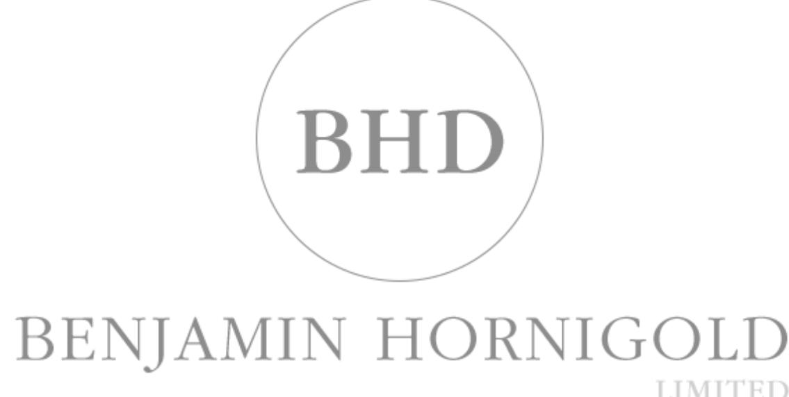

{0}------------------------------------------------

ACN 614 854 045

# FINANCIAL REPORT

30 JUNE 2022

*"veritas et aequitas"*

{1}------------------------------------------------

#### Benjamin Hornigold Ltd Corporate Directory 30 June 2022

| Directors                                |                                     |                         |  |  |
|------------------------------------------|-------------------------------------|-------------------------|--|--|
| Mr Michael Glennon                       | Non-Executive Director and Chairman |                         |  |  |
| Mr Sulieman Ravell                       | Non-Executive Director              |                         |  |  |
| Mr Gary Miller                           | Non-Executive Director              |                         |  |  |
|                                          |                                     |                         |  |  |
| Company Secretary                        |                                     |                         |  |  |
| Mr Michael Glennon                       |                                     |                         |  |  |
|                                          |                                     |                         |  |  |
| Registered Office                        |                                     | Auditor                 |  |  |
| Level 10                                 |                                     | Pitcher Partners        |  |  |
| 171 Clarence Street                      |                                     | Level 38                |  |  |
| Sydney NSW 2000                          |                                     | 345 Queen Street        |  |  |
|                                          |                                     | Brisbane QLD 4000       |  |  |
|                                          |                                     |                         |  |  |
| Stock Exchange Listing                   |                                     | Share Registry          |  |  |
| Australian Securities Exchange code: BHD |                                     | Link Market Services    |  |  |
|                                          |                                     | Level 21                |  |  |
|                                          |                                     | 10 Eagle Street         |  |  |
|                                          |                                     | Brisbane QLD 4000       |  |  |
|                                          |                                     |                         |  |  |
| Website address                          |                                     | Email address           |  |  |
| www.bhdlimited.com.au                    |                                     | cosec@bhdlimited.com.au |  |  |

{2}------------------------------------------------

#### Dear Shareholders

The 2022 financial year was a challenging year for global markets. The BHD portfolio was impacted by the general instability in the market driven by inflation concerns, tensions in Ukraine and the flow on effects from these events to markets globally. Equity markets were displaying signs of overvaluation, especially in the tech and unlisted space which was probably a reflection more of overvaluation driven by unsustainably low interest rates following on from Covid-19 measures put in place by Central Banks to minimise the damage to their economies as the world went into lockdown. That overreaction forced asset prices higher and at the first sign of a shift back to interest rate normalisation we are experiencing a winding back of asset prices. The upside of this pullback in asset prices is that we see more value in the equity market and the potential for strong returns with many companies now at oversold levels.

We have focused on investing in lower-risk situations as a means to generate returns while limiting downside, though these investments were not immune to a global sell-off in risk assets and still have risk and correlation with equity markets. Over the year BHD's investment portfolio generated a gross return of (-5.97%) gross of dividends and franking. This compares with the S&P/ASX 200 Accumulation Index return of (-6.47%) and the S&P/ASX Small Ordinaries Accumulation Index return of (-19.5%).

We expect to continue with the same strategy, preserving capital and at the same time providing us with sufficient capital to fund ongoing legal matters while pursuing recovery of loans owed to the company. While these loans have been impaired, they still remain outstanding and your Directors are of the opinion that we will recover additional funds for investors in pursuing these debts.

In regards to the outcome of the various legal matters before the company, the process has been significantly slower than we anticipated as we await the outcome of various other actions being undertaken by Administrators, ASIC and Insurance Companies. Notably, the recent judgement to wind up Henry Morgan Ltd provided significant findings from the Federal Court and likely to provide tailwinds for our claims.

The Company experienced some small wins in the financial in relation to clawing back funds for shareholders. We received a small insurance payout over the period over \$116k.

As a final point, your Directors have all backed the company, now owning over 30% of the issued capital. We have returned the shares to trading on the ASX, providing liquidity for shareholders who wish to sell and still remain committed to maximising the potential for shareholders from our impaired loans and other claims.

Stay safe, stay well

Gary, Michael & Sulieman

{3}------------------------------------------------

#### **Introduction**

The Directors present their report of Benjamin Hornigold Limited (referred to hereafter as the 'Company' or 'BHD') for the year ended 30 June 2022, together with the financial statements, and the auditor's report.

#### **Directors**

The following persons were Directors of the Company during the whole of the financial year and up to the date of this report, unless otherwise stated:

| Directors' name | Date appointed | Date resigned |
|-----------------|----------------|---------------|
| Michael Glennon | 12 Jun 2019    | -             |
| Gary Miller     | 12 Jun 2019    | -             |
| Sulieman Ravell | 12 Jun 2019    | -             |

#### **Information on Current Directors' and Company Secretary's interests, experience and qualifications**

| Name:                                   | Michael Glennon                                                                                                                                                                                                                                                                                                                                                                                                                                                                               |  |  |
|-----------------------------------------|-----------------------------------------------------------------------------------------------------------------------------------------------------------------------------------------------------------------------------------------------------------------------------------------------------------------------------------------------------------------------------------------------------------------------------------------------------------------------------------------------|--|--|
| Title:                                  | Appointed as a Non-Executive Director, Non-Executive Chair and Company Secretary on 12 June 2019.                                                                                                                                                                                                                                                                                                                                                                                          |  |  |
| Qualifications                          | Bachelor of Commerce                                                                                                                                                                                                                                                                                                                                                                                                                                                                          |  |  |
| Experience and expertise:         | Mr Glennon is the Chief Investment Officer and Portfolio Manager at Glennon Capital Pty Ltd. Mr Glennon has been a small cap Portfolio Manager since 1999. He has extensive experience in equity markets and funds management. He was a co-founder of several boutique funds management firms. He has served on the Boards of both public and private businesses and has provided them with strategic and operational advice as well as market related advice and guidance. |  |  |
| Other current Directorships:         | Glennon Small Companies Ltd (ASX code: GC1) from 29 April 2015.                                                                                                                                                                                                                                                                                                                                                                                                                               |  |  |
| Former Directorships (last 3 years): | Excelsior Capital Ltd (ASX code: ECL) resigned 4 October 2019.                                                                                                                                                                                                                                                                                                                                                                                                                                |  |  |
| Special responsibilities:            | Chairman and Company Secretary                                                                                                                                                                                                                                                                                                                                                                                                                                                                |  |  |
| Interests in shares:                    | Indirect interest at 30 June 2022: 4,828,094 ordinary shares held by Glennon Small Companies Limited (ASX code: GC1), of which Mr Glennon is a Director and shareholder.                                                                                                                                                                                                                                                                                                                |  |  |
| Interests in options:                   | Nil                                                                                                                                                                                                                                                                                                                                                                                                                                                                                           |  |  |

{4}------------------------------------------------

| Name:                                             | Sulieman Ravell                                                                                                                                                                                                                                                                                                                                                                                                                                                                                                                                                                            |  |  |  |
|---------------------------------------------------|--------------------------------------------------------------------------------------------------------------------------------------------------------------------------------------------------------------------------------------------------------------------------------------------------------------------------------------------------------------------------------------------------------------------------------------------------------------------------------------------------------------------------------------------------------------------------------------------|--|--|--|
| Title:                                            | Non-Executive Director, appointed 12 June 2019                                                                                                                                                                                                                                                                                                                                                                                                                                                                                                                                             |  |  |  |
| Qualifications                                    | Beng (Hons), AFPC (UK), ADFP, Cert IV Mortgage Services                                                                                                                                                                                                                                                                                                                                                                                                                                                                                                                                    |  |  |  |
| Experience and                                 | Mr Ravell has over 25 years' experience in the financial services industry. He is a Representative Director and the Responsible Manager of NW Advice Pty Ltd and Wealth Focus Pty Ltd, and is responsible for providing advice to clients, principally focused on strategy and asset allocation.                                                                                                                                                                                                                                                                                  |  |  |  |
| expertise:                                        | He was previously a member of the Filtered Research Committee, a service aimed at avoiding product failures and assisting adviser groups in constructing approved product lists.                                                                                                                                                                                                                                                                                                                                                                                                     |  |  |  |
| Other current Directorships:                   | Glennon Small Companies Ltd (ASX code: GC1) from 9 June 2020.                                                                                                                                                                                                                                                                                                                                                                                                                                                                                                                              |  |  |  |
| Former listed Directorships (last 3 years): | Nil                                                                                                                                                                                                                                                                                                                                                                                                                                                                                                                                                                                        |  |  |  |
| Special responsibilities:                      | Nil                                                                                                                                                                                                                                                                                                                                                                                                                                                                                                                                                                                        |  |  |  |
| Interests in shares:                              | Indirect interest in 1,247,549 ordinary shares at 30 June 2022: • 1 ordinary share held by Wealth Focus Pty Ltd. Wealth Focus Holdings Pty Ltd is the sole shareholder of Wealth Focus Pty Ltd. A shareholder of Wealth Focus Holdings is S4 Family Services Pty Ltd ATF S4 Family Trust of which Mr Ravell is a beneficiary; and • 505,567 ordinary shares held by S4 Family Services Pty Ltd ATF S4 Family Trust of which Mr Ravell is a beneficiary. • 741,981 ordinary shares held by S4 Super Pty Ltd of which Mr Ravell Shareholder and a Director. |  |  |  |
| Interests in options:                             | Nil                                                                                                                                                                                                                                                                                                                                                                                                                                                                                                                                                                                        |  |  |  |

{5}------------------------------------------------

| Name:                                             | Gary Miller                                                                                                                                                                                                                                                                                                                                                                                                                                                |  |  |  |
|---------------------------------------------------|------------------------------------------------------------------------------------------------------------------------------------------------------------------------------------------------------------------------------------------------------------------------------------------------------------------------------------------------------------------------------------------------------------------------------------------------------------|--|--|--|
| Title:                                            | Non-Executive Director, appointed 12 June 2019                                                                                                                                                                                                                                                                                                                                                                                                             |  |  |  |
| Qualifications:                                   | Diploma of Financial Advising                                                                                                                                                                                                                                                                                                                                                                                                                              |  |  |  |
| Experience and expertise:                      | Mr Miller has a Diploma of Financial Advising and 30 years of broad experience in financial markets.                                                                                                                                                                                                                                                                                                                                                    |  |  |  |
|                                                   | Director (2011 to April 2020) and Responsible Officer of Miller Wealth Management Pty Ltd which held an Australian Financial Services License from 2011 to 2020. He was previously a partner in a Brisbane based financial planning firm and a member of the investment committee of an ASX listed financial services group. Mr Miller is also experienced in commercial property investment, development finance and property development. |  |  |  |
| Other current Directorships:                   | Nil                                                                                                                                                                                                                                                                                                                                                                                                                                                        |  |  |  |
| Former listed Directorships (last 3 years): | Nil                                                                                                                                                                                                                                                                                                                                                                                                                                                        |  |  |  |
| Special                                           | Chair of Audit & Risk Committee                                                                                                                                                                                                                                                                                                                                                                                                                            |  |  |  |
| responsibilities:                                 | Chair of Remuneration Committee                                                                                                                                                                                                                                                                                                                                                                                                                            |  |  |  |
| Interests in shares:                              | Indirect interest at 30 June 2022: 1,207,130 ordinary shares via GTM Family Super Pty Ltd, which holds legal title to the BHD shares as trustee for GTM Super Fund, of which Mr Miller is a beneficiary.                                                                                                                                                                                                                                             |  |  |  |
| Interests in options:                             | Nil                                                                                                                                                                                                                                                                                                                                                                                                                                                        |  |  |  |

#### **Company Secretary**

Michael Glennon has held the role of Company Secretary since 12 June 2019. Mr Glennon's particulars are set out in the Information on Directors above.

#### **Meetings of Directors**

The number of meetings of the Company's Board of Directors ('the Board') and of each Board committee held during the year ended 30 June 2022, and the number of meetings attended by each Director were:

|           |          | Board |          | Audit and Risk Committee |  |
|-----------|----------|-------|----------|--------------------------|--|
|           | Attended | Held  | Attended | Held                     |  |
| M Glennon | 9        | 9     | 3        | 3                        |  |
| G Miller  | 9        | 9     | 3        | 3                        |  |
| S Ravell  | 9        | 9     | 3        | 3                        |  |

Held: represents the number of meetings held during the time the Director held office or was a member of the relevant committee.

#### **Remuneration Committee**

No Remuneration Committee meetings were held during the financial year as there were not any matters to consider that were not agreed by the Board. The Chair of the Committee is Gary Miller.

{6}------------------------------------------------

#### **Audit and Risk Committee composition**

Due to the size and nature of activities, the Committee will comprise the full Board. The Chair of the Committee is Gary Miller.

#### **Principal activities**

The Company is a Listed Investment Company (LIC) incorporated on 28 September 2016. The Company provides investors with the opportunity to gain exposure to an investment portfolio that is actively managed. The investment portfolio is invested in a small number of high conviction investments in undervalued assets, that provide growth opportunities with the aim of achieving above average returns, (whilst limiting volatility) over the medium to long term. Further details on these investments are included in the Review of Operations.

#### **Business model and objectives**

The Company has historically aimed to deliver shareholder returns by providing an actively managed portfolio with diversification across products and global markets. The Company's investment style is best described as Opportunistic with the aim of providing an absolute return.

#### **Review of operations**

The profit(loss) earned by the Company after providing for income tax amounted to \$(1,239,019) (2021: \$1,260,803) and return on average capital employed is negative 17% (2021: positive 15%).

The \$2,499,822 decrease in profits is primarily due to net trading profits on financial instruments decreasing by \$2,310,181. The major changes are set out below:

|                                      | 2022 \$  | 2021 \$ | Increase/(decrease) in profits |          |
|--------------------------------------|-------------|------------|-----------------------------------|----------|
|                                      |             |            | \$                                | %        |
|                                      |             |            | variance                          | variance |
| Net trading (loss)/gain on financial | (870,472)   | 1,439,709  | (2,310,181)                       | (160%)   |
| instruments(1)                       |             |            |                                   |          |
| Other revenue                        | 139,268     | 125,879    | 13,389                            | 11%      |
| Government Grants                    | -           | 54,651     | (54,651)                          | (100%)   |
| Interest received(2)                 | 559,950     | 524,460    | 35,490                            | 7%       |
| Impairment of receivables            | (446,520)   | (214,876)  | (231,645)                         | (108%)   |
| Legal fees                           | (180,611)   | (152,394)  | (28,217)                          | (19%)    |
| Directors' fees                      | (302,500)   | (301,129)  | (1,371)                           | (0.5%)   |
| Income tax (expense)/ benefit        | -           | -          | -                                 | -        |
| Other expenses                       | (138,134)   | (215,497)  | 77,363                            | 36%      |
| Total (loss)/profit                  | (1,239,019) | 1,260,803  | (2,499,822)                       | (198%)   |

#### **Notes:**

*(1) Net (loss)/gain on financial instruments measured at fair value through profit or loss includes:*

- Dividends \$146,367 (2021: \$767,758).
- Realised gains on sale of investments \$536,603 (2021: \$218,814).
- Unrealised (losses)/gains on investments \$(1,823,761) (2021: gain \$260,112).
- Fair value impairment of former related party JB Financial Group Pty Ltd ("JBFG") Convertible Loan and interest of \$(307,896) (2021: \$(279,680)).
- Other income from investments \$270,319 (2021: \$193,025).

#### *(2) Interest received*

- JBFG Convertible loan interest of \$307,896 (2021: \$279,680), which was fully provided for (refer Note 1 above).
- Former related party loan interest \$238,480 (2021: \$214,876), which was fully provided for.
- Other interest \$13,574 (2021: \$29,904).

{7}------------------------------------------------

#### **Corporate events**

There have been no security issues during the year.

The Board has considered the impact of the COVID-19 pandemic and noted that the S&P/ASX 200 Accumulation Index for the year to 30 June 22 has shown a (-6.47%) return; the Board does not believe the COVID-19 pandemic will have any impact on the Company's ability to continue as a going concern.

#### **Significant changes in the state of affairs**

Apart from the matters discussed in this Report, there were no other significant changes in the state of affairs of the Company during the financial year.

#### **Matters subsequent to the end of the financial year**

No matters or circumstances have arisen since 30 June 2022 that have significantly affected, or may significantly affect the Company's operations, the results of those operations, or the Company's state of affairs in future financial years.

#### **Dividends**

No dividends have been paid or proposed during the year.

#### **Likely developments and expected results of operations**

The Company will continue operating as a LIC. The Company is focused on achieving the maximum return of capital from its investments.

#### **Environmental regulation**

The Company is not subject to any significant environmental regulation under Australian Commonwealth or State law.

#### **Shares under option**

There are no unissued ordinary shares of the Company under option at the date of this report.

During and since the year ended 30 June 2022, no shares were issued (2021: nil) pursuant to the exercise of options.

#### **Indemnifying officers**

The Company has an agreement to indemnify any person who is or has been an officer of the Company.

#### **Indemnifying and insurance of auditor**

The Company has not, during or since the end of the financial year, indemnified or agreed to indemnify the auditor of the Company or any related entity against a liability incurred by the auditors.

#### **Non-audit services**

Details of the amounts paid or payable to the auditors for non-audit services provided during the financial year are set out in Note 16 of this report.

The Directors are satisfied that the provision of non-audit services provided during the financial year, by the auditor (or by another person or firm on the auditor's behalf), is compatible with the general standard of independence for auditors imposed by the *Corporations Act 2001*.

The auditors are of the opinion that the services, as disclosed in Note 16 to this report, do not compromise the external auditor's independence requirements under the *Corporations Act 2001* for the following reasons:

- All non-audit services have been reviewed and approved to ensure that they do not impact the integrity and objectivity of the auditor; and
- None of the services undermine the general principles relating to auditor independence as set out in APES 110 Code of Ethics for Professional Accountants (including Independence Standards) issued by the Accounting Professional and Ethical Standards Board, including reviewing or auditing the auditor's own work, acting in a management or decision-making capacity for the Company, acting as advocate for the Company or jointly sharing economic risk and rewards.

{8}------------------------------------------------

#### **Officer of the Company**

There are no officers of the Company who are former partners of the auditor.

#### **Proceedings on behalf of the Company**

No person has applied to the Court under section 237 of the *Corporations Act 2001* for leave to bring proceedings on behalf of the Company, or to intervene in any proceedings to which the Company is a party for the purpose of taking responsibility on behalf of the Company for all or part of those proceedings.

#### **Auditor's independence declaration**

A copy of the auditor's independence declaration as required under section 307C of the *Corporations Act 2001* is set out immediately after this Directors' Report.

#### **Auditor**

Pitcher Partners was appointed as auditor in January 2019 and continues in office in accordance with section 327 of the *Corporations Act 2001*.

#### **Remuneration report (audited)**

This Remuneration Report outlines the remuneration arrangements of the Company for the year ended 30 June 2022. The report details the remuneration arrangements for the Key Management Personnel ('KMP') within the Company. KMP are defined as those persons having authority and responsibility for planning, directing and controlling activities of the Company, including any Director. During the 2022 financial year, the KMP for the Company comprised the Directors of the Company, as set out below. The Company has no other executives.

The remuneration report details the KMP remuneration arrangements for the Company, in accordance with the requirements of the *Corporations Act 2001* and its Regulations.

#### *Shareholders AGM votes on the 2021 Remuneration Report*

The Company received 45.57% 'yes' poll votes on the adoption of the Remuneration Report for the year ended 30 June 2021. As more than 25% of Shareholders voted 'no' the Company has received a 'first strike'; as a result, the Annual General Meeting will include a Conditional Spill Resolution to address this issue.

#### *Remuneration framework*

The objective of the Company's remuneration framework is to align KMP objectives with shareholder and business objectives by providing fixed remuneration to Board members. The Board of the Company believes the remuneration framework to be appropriate and effective in its ability to attract and retain high-quality KMP to run and manage the Company, as well as creating an alignment of interests between Directors and shareholders.

The Board's policy for determining the nature and amount of remuneration for KMP of the Company is as follows:

- The remuneration arrangements are developed and approved by the Board.
- Non-Executive Directors do not receive performance-related remuneration and are not entitled to participate in equity-based incentive plans in the Company.
- All KMP receive a fixed Director's fee which is based on factors such as relevant industry standards.
- The Board reviews KMP remuneration arrangements periodically by reference to the Company's performance and comparable information from industry sectors.

Total remuneration available to the Directors for their services as Directors is a maximum of \$450,000. Any increase in the aggregate amount of Directors' fees over \$450,000 must be approved by a resolution of the shareholders.

The Board's policy is to remunerate non-executive Directors at market rates for time, commitment and responsibilities. Independent external advice is sought when required.

In addition, the Company's Securities Trading policy prohibits Directors and KMP from using the Company's securities as collateral in any financial transaction, including margin loan arrangements.

{9}------------------------------------------------

#### *Performance-based remuneration*

There is currently no performance-based remuneration paid directly by the Company. Measures may be specifically tailored in the future.

#### *Relationship between remuneration policy and Company performance*

The remuneration framework has been tailored to align the goals ofshareholders, Directors and executives. The Company commenced operations in May 2017 and remuneration will be reviewed regularly in the context of the framework outlined above, including reference to Company performance. The Company believes this framework will be effective in increasing shareholder wealth.

#### **Performance conditions linked to remuneration**

There are currently no performance conditions linked to KMP remuneration.

#### *Consequences of performance on shareholder wealth*

In considering the Company's performance and benefits for shareholder wealth, the Board has regard to the following index in respect of the current financial period:

- The S&P/ASX 200 Accumulation Index
The portfolio underperformed the Index and the impact of the performance is shown below on the NTA.

|                                      | 30 June 2022 | 30 June 2021 | 30 June 2020 | 30 June 2019 | 30 June 2018 |
|--------------------------------------|-----------------|-----------------|-----------------|-----------------|-----------------|
|                                      | \$              | \$              | \$              | \$              | \$              |
| Profit/(loss) attributable to owners | (1,239,019)     | 1,260,803       | (750,237)       | (9,821,543)     | (2,993,948)     |
| of the Company                       |                 |                 |                 |                 |                 |
| Dividends paid per share             | -               | -               | -               | -               | 0.12            |
| Share price                          | 0.22            | 0.31            | 0.21            | 0.71(1)         | 0.71            |
| NTA before deferred tax              | 0.30            | 0.35            | 0.30            | 0.33            | 0.68            |

(1) The Company was suspended by the ASX on 30 July 2018 at which time the share price was \$0.71.

#### *Employment details of members of KMP*

Remuneration and other terms of employment for KMP are formalised in service agreements. The following table provides employment details of persons who were KMP of the Company during the financial period.

| Name/title:        | Michael Glennon – Non-Executive Chairman and Company Secretary              |
|--------------------|-----------------------------------------------------------------------------|
| Agreement          | 1 July 2019                                                                 |
| commenced:         |                                                                             |
| Term of agreement: | No fixed term                                                               |
|                    | Non-executive fee \$50,000 pa                                               |
|                    | Chairman fee \$25,000 pa                                                    |
|                    | Superannuation guarantee at 10%                                             |
| Details:           | Director's fees are 100% of remuneration                                    |
|                    |                                                                             |
|                    |                                                                             |
| Name/title:        | Sulieman Ravell – Non-Executive Director                                    |
| Agreement          | 1 July 2019                                                                 |
| commenced:         |                                                                             |
| Term of agreement: | No fixed term                                                               |
|                    | Non-executive fee \$50,000 pa                                               |
|                    | Additional fees payable until default loans and advances recovered \$50,000 |
|                    | pa                                                                          |
|                    | Superannuation guarantee at 10%                                             |

{10}------------------------------------------------

| Name/title:        | Gary Miller – Non-Executive Director                                        |
|--------------------|-----------------------------------------------------------------------------|
| Agreement          | 1 July 2019                                                                 |
| commenced:         |                                                                             |
| Term of agreement: | No fixed term                                                               |
|                    | Non-executive fee \$50,000                                                  |
|                    | Additional fees payable until default loans and advances recovered \$50,000 |
|                    | pa                                                                          |
|                    | Superannuation guarantee at 10%                                             |
| Details:           | Director's fees are 100% of remuneration                                    |

Key management personnel have no entitlement to termination payments in the event of removal for misconduct.

#### *Details of remuneration*

The following table of benefits and payments represents the components of the current period remuneration expenses for each member of KMP of the Company. Such amounts have been calculated in accordance with Australian Accounting Standards.

#### **Table of benefits and payments for the year ended 30 June 2022**

|           | Short-term benefits     |               |                 | Post Employment benefits | Long Term benefits | Share– based payments |         |
|-----------|-------------------------|---------------|-----------------|--------------------------------|--------------------------|-----------------------------|---------|
| 2022      | Cash salary and fees | Cash Bonus | Non Monetary | Super annuation             | Long Service leave | Equity settled           | Total   |
| M         |                         |               |                 |                                |                          |                             |         |
| Glennon   | 75,000                  | -             | -               | 7,500                          | -                        | -                           | 82,500  |
| G Miller  | 100,000                 | -             | -               | 10,000                         | -                        | -                           | 110,000 |
| S Ravell  | 100,000                 | -             | -               | 10,000                         | -                        | -                           | 110,000 |
| Total KMP | 275,000                 | -             | -               | 27,500                         | -                        | -                           | 302,500 |

#### **Table of benefits and payments for the year ended 30 June 2021**

|           | Short-term benefits     |               |                 | Post Employment benefits | Long Term benefits | Share– based payment s |         |
|-----------|-------------------------|---------------|-----------------|--------------------------------|--------------------------|---------------------------------|---------|
|           | Cash salary and fees | Cash Bonus | Non Monetary | Super annuation             | Long Service leave | Equity settled               | Total   |
| M Glennon | 75,000                  | -             | -               | 7,129                          | -                        | -                               | 82,129  |
| G Miller  | 100,000                 | -             | -               | 9,500                          | -                        | -                               | 109,500 |
| S Ravell  | 100,000                 | -             | -               | 9,500                          | -                        | -                               | 109,500 |
| Total KMP | 275,000                 | -             | -               | 26,129                         | -                        | -                               | 301,129 |

#### *Cash bonuses, performance-related bonuses and share-based payments*

No options or bonuses were granted as remuneration to KMP during the period.

#### *KMP Shareholdings*

The number of ordinary shares of the Company held by each KMP of the Company, directly or indirectly or by their personally related parties during the financial period is as follows:

{11}------------------------------------------------

| Balance at 1 July 2021 | Granted as remuneration during the period | Issued on exercise of options during the period | Acquired on market | Balance at 30 June 2022 |
|---------------------------|----------------------------------------------------|----------------------------------------------------------|-----------------------|----------------------------|
| 4,529,094                 | -                                                  | -                                                        | 299,000               | 4,828,094                  |
| 1,086,963                 | -                                                  | -                                                        | 120,167               | 1,207,130                  |
| 982,176                   | -                                                  | -                                                        | 265,373               | 1,247,549                  |
| 6,598,233                 | -                                                  | -                                                        | 684,540               | 7,282,773                  |
|                           |                                                    |                                                          |                       |                            |

(1) Mr Glennon holds 4,828,094 (2021: 4,529,094) ordinary shares indirectly via Glennon Small Companies Limited (ASX code: GC1), of which Mr Glennon is a director and shareholder.

(2) Mr Miller holds 1,207,130 (2021: 1,086,963) ordinary shares via GTM Family Super Pty Ltd, of which Mr Miller is a beneficiary.

(3) Mr Ravell holds 1,247,549 (2021: 982,176) ordinary shares indirectly:

o 1 (2021: 1) ordinary share held by Wealth Focus Pty Ltd. Wealth Focus Holdings Pty Ltd is the sole shareholder of Wealth Focus Pty Ltd. A shareholder of Wealth Focus Holdings is S4 Family Services Pty Ltd ATF S4 Family Trust of which Mr Ravell is a beneficiary; and

o Nil (2021: 279,175) ordinary shares held by R4 Trading Pty Ltd a company owned by S4 Family Services Pty Ltd ATF S4 Family Trust of which Mr Ravell is a beneficiary.

o 505,567 (2021: nil) ordinary shares held by S4 Family Services Pty Ltd ATF S4 Family Trust of which Mr Ravell is a beneficiary.

- o 741,981 (2021: 703,000) ordinary shares held by S4 Super Pty Ltd, of which Mr Ravell is a Shareholder and a Director.
#### *Options*

There are no options on issue at 30 June 2022 and 30 June 2021.

There have been no other transactions involving equity instruments other than those described in the tables above relating to options and shareholdings.

#### *Other transactions with KMP and/or their related parties*

Note 19 details the transactions conducted between the Company and KMP or their related parties, other than those disclosed above relating to equity and compensation that were conducted other than in accordance with normal employee, customer or supplier relationships on terms no more favourable than those reasonably expected under arm's length dealings with unrelated persons.

#### *This concludes the remuneration report, which has been audited.*

#### **Rounding**

The amounts contained in this report and in the financial report have not been rounded under the option available to the Group under ASIC Class Order 2016/191. The Group is an entity to which the Class Order applies.

This report is made in accordance with a resolution of Directors, pursuant to section 298(2)(a) of the *Corporations Act 2001*.

On behalf of the Directors

Mr Michael Glennon Non-Executive Chairman

29 August 2022

{12}------------------------------------------------

The Directors Benjamin Hornigold Ltd Suite 1, Level 17 25 Bligh Street Sydney NSW 2000

#### **Auditor's Independence Declaration**

In relation to the independent audit for the year ended 30 June 2022, to the best of my knowledge and belief there have been:

- (i) no contraventions of the auditor independence requirements of the *Corporations Act 2001*; and
- (ii) no contraventions of APES 110 *Code of Ethics for Professional Accountants (including Independence Standards)*.

PITCHER PARTNERS

WARWICK FACE Partner

Brisbane, Queensland 29th August 2022

**Brisbane Sydney Newcastle Melbourne Adelaide Perth** 

An Independent Queensland Partnership ABN 84 797 724 539. Liability limited by a scheme approved under Professional Standards Legislation. Pitcher Partners is a member of the global network of Baker Tilly International Limited, the members of which are separate and independent legal entities.

NIGEL FISCHER MARK NICHOLSON PETER CAMENZULI JASON EVANS KYLIE LAMPRECHT NORMAN THURECHT BRETT HEADRICK WARWICK FACE COLE WILKINSON

SIMON CHUN JEREMY JONES TOM SPLATT

JAMES FIELD DANIEL COLWELL ROBYN COOPER

*pitcher.com.au* 

FELICITY CRIMSTON CHERYL MASON KIERAN WALLIS

MURRAY GRAHAM ANDREW ROBIN KAREN LEVINE

{13}------------------------------------------------

#### Benjamin Hornigold Ltd Contents 30 June 2022

|                                                                       | Page Number |
|-----------------------------------------------------------------------|-------------|
| Statement of profit or loss and other comprehensive income            | 13          |
| Statement of financial position                                       | 14          |
| Statement of changes in equity                                        | 15          |
| Statement of cash flows                                               | 16          |
| Notes to the financial statements                                     | 17          |
| Directors' declaration                                                | 33          |
| Independent auditor's report to the members of Benjamin Hornigold Ltd | 34          |
| Corporate Governance Statement                                        | 38          |
| Additional Information for Listed Public Companies                    | 39          |

{14}------------------------------------------------

#### Benjamin Hornigold Ltd Statement of profit or loss and other comprehensive income For the year 30 June 2022

|                                                                                                     | Note | 2022 \$             | 2021 \$ |
|-----------------------------------------------------------------------------------------------------|------|------------------------|------------|
| Revenue from investment portfolio                                                                   |      |                        |            |
| Net (loss)/gain on financial instruments measured at fair                                           |      |                        |            |
| value through profit or loss                                                                        |      |                        |            |
| Net realised gain on trading activities                                                             |      | 146,367                | 767,758    |
| Net (loss)/gain on investment activities                                                            |      | (1,287,158)            | 478,926    |
| Other income from investments                                                                       |      | 270,319                | 193,025    |
| Net (loss)/gain from investment portfolio                                                           | 5    | (870,472)              | 1,439,709  |
| Other revenue                                                                                       | 5    | 139,268                | 125,879    |
| Other income Interest revenue calculated using the effective interest                            | 5    | -                      | 54,651     |
| method                                                                                              |      | 559,950                | 524,460    |
| Total (loss)/income                                                                                 |      | (171,254)              | 2,144,699  |
|                                                                                                     |      |                        |            |
| Expenses                                                                                            |      |                        | (214,876)  |
| Impairment of receivables Directors' fees                                                        |      | (446,520) (302,500) | (301,129)  |
| Professional fees                                                                                   |      | (266,781)              | (279,562)  |
| Other expenses                                                                                      |      | (51,964)               | (88,329)   |
| Total expenses                                                                                      |      | (1,067,765)            | (883,896)  |
|                                                                                                     |      |                        |            |
| (Loss)/Profit before income tax                                                                     |      | (1,239,019)            | 1,260,803  |
| Income tax expense                                                                                  | 7    | -                      | -          |
| (Loss)/Profit after income tax for the year attributable to the owners of Benjamin Hornigold Ltd |      | (1,239,019)            | 1,260,803  |
| Other comprehensive income for the year, net of tax                                                 |      | -                      | -          |
| Total comprehensive (loss)/income for the year                                                      |      |                        |            |
| attributable to the owners of Benjamin Hornigold Ltd                                                |      | (1,239,019)            | 1,260,803  |
|                                                                                                     |      | Cents                  | Cents      |
| Basic and diluted (losses)/earnings per share                                                       | 17   | (5.13)                 | 5.22       |

{15}------------------------------------------------

### Benjamin Hornigold Ltd Statement of financial position As at 30 June 2022

|                                                  | Note | 2022         | 2021         |
|--------------------------------------------------|------|--------------|--------------|
|                                                  |      | \$           | \$           |
| Assets                                           |      |              |              |
| Cash and cash equivalents                        | 8    | 1,334,877    | 2,010,840    |
| Investments at fair value through profit or loss | 9    | 6,115,535    | 6,268,287    |
| Other receivables                                | 10   | 225,709      | 513,965      |
| Prepayments                                      |      | 34,494       | 25,094       |
| Total assets                                     |      | 7,710,615    | 8,818,186    |
|                                                  |      |              |              |
| Liabilities                                      |      |              |              |
| Trade and other payables                         | 11   | 395,062      | 263,614      |
| Total liabilities                                |      | 395,062      | 263,614      |
|                                                  |      |              |              |
| Net assets                                       |      | 7,315,553    | 8,554,572    |
|                                                  |      |              |              |
| Equity                                           |      |              |              |
| Issued capital                                   | 12   | 23,528,129   | 23,528,129   |
| Profit reserve                                   |      | 278,143      | -            |
| Accumulated gains/(losses)                       |      | (16,490,719) | (14,973,557) |
| Total equity                                     |      | 7,315,553    | 8,554,572    |

{16}------------------------------------------------

#### Benjamin Hornigold Ltd Statement of changes in equity For the year ended 30 June 2022

|                                                                                                      | Issued capital       | Profit reserve       | Accumulated gains/(losses)       | Total equity       |
|------------------------------------------------------------------------------------------------------|-------------------------|-------------------------|-------------------------------------|-----------------------|
|                                                                                                      | \$                      | \$                      | \$                                  | \$                    |
| Balance at 1 July 2020                                                                               | 23,528,129              | -                       | (16,234,360)                        | 7,293,769             |
| Profit after income tax for the year                                                                 | -                       | -                       | 1,260,803                           | 1,260,803             |
| Other comprehensive income for the year, net of tax                                               | -                       | -                       | -                                   | -                     |
| Total comprehensive income for the year                                                           | -                       | -                       | 1,260,803                           | 1,260,803             |
| Transactions with owners in their capacity as owners:                                             |                         |                         |                                     |                       |
| Issue of share capital                                                                               | -                       | -                       | -                                   | -                     |
| Balance at 30 June 2021                                                                              | 23,528,129              | -                       | (14,973,557)                        | 8,554,572             |
|                                                                                                      | Issued capital \$ | Profit reserve \$ | Accumulated gains/(losses) \$ | Total equity \$ |
| Balance at 1 July 2021                                                                               | 23,528,129              | -                       | (14,973,557)                        | 8,554,572             |
| Loss after income tax for the year                                                                   | -                       | -                       | (1,239,019)                         | (1,239,019)           |
| Other comprehensive income for the year, net of tax                                               | -                       | -                       | -                                   | -                     |
| Total comprehensive income for the year                                                           | -                       | -                       | (1,239,019)                         | (1,239,019)           |
| Transfer of profits reserve (net of tax) Transactions with owners in their capacity as owners: |                         | 278,143                 | (278,143)                           | -                     |
| Issue of share capital                                                                               | -                       | -                       | -                                   | -                     |
| Balance at 30 June 2022                                                                              | 23,528,129              | 278,143                 | (16,490,719)                        | 7,315,553             |

{17}------------------------------------------------

#### Benjamin Hornigold Ltd Statement of Cash Flows For the year ended 30 June 2022

|                                                                                                  | Note  | 2022 \$  | 2021 \$   |
|--------------------------------------------------------------------------------------------------|-------|-------------|--------------|
| Cash flows from operating activities                                                             |       |             |              |
| Payments for operating and administrative expenses                                               |       | (591,796)   | (667,660)    |
| Interest received                                                                                |       | 13,574      | 29,904       |
| Cost reimbursed                                                                                  |       | 22,500      | 125,879      |
| Other revenue                                                                                    |       | 213,636     | 186,620      |
| Payments for investments                                                                         |       | (7,201,081) | (11,314,901) |
| Proceeds from sale of investments                                                                |       | 6,721,355   | 5,679,902    |
| Dividends received                                                                               |       | 153,247     | 375,344      |
| Commissions and brokerage fees paid                                                              |       | (7,398)     | -            |
| Receipts from Government Grants                                                                  |       | -           | 54,651       |
| Net cash used in operating activities                                                            | 21(a) | (675,963)   | (5,530,261)  |
| Cash flows from investing activities Net cash from investing activities                       |       | -           | -            |
| Cash flows from financing activities Net cash from financing activities                       |       | -           | -            |
| Net (decrease) in cash and cash equivalents Cash and cash equivalents at the beginning of the |       | (675,963)   | (5,530,261)  |
| financial year                                                                                   |       | 2,010,840   | 7,541,101    |
| Cash and cash equivalents at the end of the financial                                            |       |             |              |
| year                                                                                             | 8     | 1,334,877   | 2,010,840    |

{18}------------------------------------------------

#### **Note 1. Reporting Entity**

Benjamin Hornigold Ltd (the 'Company') is a listed public investment company domiciled in Australia. The registered office is located at Level 10, 171 Clarence Street, Sydney NSW 2000.

The investment objective of the Company is to achieve moderate to high portfolio returns over the medium to long term.

The Company was incorporated on 28 September 2016 and commenced operations on 11 May 2017.

The Company is a for-profit entity and these financial statements have been prepared using historical cost basis. The Company is an investment company and accounts for investments at fair value through profit or loss in accordance with AASB 9 *Financial Instruments* and AASB 10 *Consolidated Financial Statements.*

The financial statements are general purpose financial statements which have been prepared in accordance with Australian Accounting Standards adopted by the Australian Accounting Standards Board (AASB) and the *Corporations Act 2001*. The financial report complies with the International Financial Reporting Standards (IFRS) and interpretations adopted by the International Accounting Standards Board (IASB).

The financial statements are presented in Australian dollars which is the Company's functional and presentation currency.

All amounts have been rounded to the nearest whole dollar unless otherwise stated.

The financial statements were authorised by the Board of Directors on 29 August 2022.

#### **Note 2. Significant accounting policies**

The principal accounting policies adopted in the preparation of the financial statements are set out either in the respective notes or below. These policies have been consistently applied to all the years presented, unless otherwise stated.

#### **New Accounting Standards and Interpretations not yet mandatory or early adopted**

Australian Accounting Standards and Interpretations that have recently been issued or amended but are not yet mandatory, have not been early adopted by the Company for the annual reporting period ended 30 June 2022. The Company's assessment of the impact of these new or amended Accounting Standards and Interpretations and there is no material impact.

#### **Basis of preparation**

#### *Critical accounting estimates*

The preparation of the financial statements requires the use of certain critical accounting estimates. It also requires management to exercise its judgement in the process of applying the Company's accounting policies. The areas involving a higher degree of judgement or complexity, or areas where assumptions and estimates are significant to the financial statements, are disclosed in Note 3.

#### **Investments and other financial assets**

Investments and other financial assets are initially measured at fair value. Transaction costs are included as part of the initial measurement, except for financial assets at fair value through profit or loss. They are subsequently measured at either amortised cost or fair value depending on their classification. Classification is determined based on the purpose of the acquisition and subsequent reclassification to other categories is restricted.

{19}------------------------------------------------

Financial assets are derecognised when the rights to receive cash flows from the financial assets have expired or have been transferred and the Company has transferred substantially all the risks and rewards of ownership.

#### *Investments at fair value through profit or loss*

Investments at fair value through profit or loss are either:

- (i) held for trading, where they are acquired for the purpose of selling in the short-term with an intention of making a profit; or
- (ii) designated as such upon initial recognition, where they are managed on a fair value basis or to eliminate or significantly reduce an accounting mismatch. Except for effective hedging instruments, derivatives are also categorised as fair value through profit or loss. Fair value movements are recognised in profit or loss.

#### **Loans**

Loans are financial assets initially recognised at fair value plus directly attributable transaction costs and fees. Loans are subsequently measured at amortised cost using the effective interest rate method where there have been contractual cashflows which represent solely payment of principal and interest ('SPPI') on the principal balance outstanding and they are held within a business model whose objective is achieved through holding loans to collect these cashflows.

#### *Impairment of financial assets*

At the end of each reporting period, an assessment is made as to the extent of any expected credit losses ('ECLs') impacting on the estimated future cash flows of the financial asset. Expected credit losses may arise where there are indications that the counterparty is experiencing significant financial difficulty or might enter insolvency proceedings or other financial reorganisation, where there has been a default or delinquency in interest or principal payments, or where changes in economic conditions have occurred impacting on the likelihood of defaults.

Interest earned on these balances is presented on a net basis in the income statement as this reflects how the customer is charged.

#### **Profit reserve**

A profit reserve has been created representing an amount allocated from current period earnings that is preserved for future dividend payments.

#### **Dividends**

Provision is made for the amount of any dividend declared on fully paid ordinary shares, being appropriately authorised and no longer at the discretion of the entity, on or before the end of the reporting period but not distributed at the end of the reporting period.

In accordance with the *Corporation Act 2001*, the Company may pay a dividend where the Company's assets exceed its liabilities, the payment of the dividend is fair and reasonable to the Company's shareholders as a whole and the payment of the dividend does not materially prejudice the Company's ability to pay its creditors.

#### **Note 3. Critical accounting judgements, estimates and assumptions**

The preparation of the financial statements requires management to make judgements, estimates and assumptions that affect the reported amounts in the financial statements. Management continually evaluates its judgements and estimates in relation to assets, liabilities, contingent liabilities, revenue and expenses. Management bases its judgements, estimates and assumptions on historical experience and on other various factors, including expectations of future events, which management believes to be reasonable under the circumstances. The resulting accounting judgements and estimates will seldom equal the related actual results. The judgements, estimates and assumptions that have a significant risk of causing a material adjustment to the carrying amounts of assets and within the next financial year are discussed below.

{20}------------------------------------------------

#### *Fair value measurement hierarchy*

The Company is required to classify all assets and liabilities, measured at fair value, using a three level hierarchy, based on the lowest level of input that is significant to the entire fair value measurement, being: Level 1: Quoted prices (unadjusted) in active markets for identical assets or liabilities that the entity can access at the measurement date; Level 2: Inputs other than quoted prices included within Level 1 that are observable for the asset or liability, either directly or indirectly; and Level 3: Unobservable inputs for the asset or liability. Considerable judgement is required to determine what is significant to fair value and therefore which category the asset or liability is placed in can be subjective.

The fair value of regularly traded quoted instruments is based on current market prices, otherwise management make an assessment on the bid ask spread of the share price and will use a value within that range. The fair value of privately held investments (and instruments that are linked to their value) which are not currently traded in the public market are estimated using valuation techniques, such as the Income Approach, the Market Approach and the Cost Approach; these valuation approaches are included in Level 3 of the hierarchy. Factors considered in determining the fair value of these investments include, but are not limited to, market conditions, purchase price, nature of investment, estimation of liquidity value, subsequent third-party equity financing or significant change in operating performance or potential resulting in a change in valuation, and other pertinent information. Refer to Note 9 for further information.

#### *Allowance for expected credit losses*

The allowance for expected credit losses assessment requires a degree of estimation and judgement. It is based on the lifetime expected credit loss, grouped based on days overdue, and makes assumptions to allocate an overall expected credit loss rate for each group. These assumptions include recent sales experience, historical collection rates, the impact of the Coronavirus (COVID-19) pandemic and forwardlooking information that is available. The allowance for expected credit losses, as disclosed in Note 10, is calculated based on the information available at the time of preparation. The actual credit losses in future years may be higher or lower.

#### *Recovery of deferred tax assets*

Deferred tax assets are recognised for deductible temporary differences and tax losses only if the Company considers it is probable that future taxable amounts will be available to utilise those temporary differences and losses.

#### *Estimated fair values of level 2 and level 3 investments*

The Company carries its investments at fair value with changes in the fair values recognised in Statement of profit or loss and other comprehensive income. At the end of each reporting period, the Directors update their assessment of the fair value of securities which are categorised under level 2 and level 3 in the fair value hierarchy. Refer to Note 6 for information on level 2 and level 3 securities.

#### *Impact of COVID-19 pandemic*

Judgement has been exercised in considering the impacts that the Coronavirus (COVID-19) pandemic has had, or may have, on the operations of the Company and its financial position and results. During the financial year there has been no significant impact upon the financial results and position of the Company reported on in these financial statements as a result of the COVID-19 pandemic.

#### **Note 4. Operating segments**

Operating segments are identified based on the financial information periodically reviewed by the Board (representing the Chief Operating Decision Maker) in assessing the performance and determining the allocation of resources. As the Company operates in only one segment, all results presented in this financial report relate to the financial services segment.

The Company operates materially in only one geographical segment being Australia.

{21}------------------------------------------------

#### **Note 5. Revenue**

|                                                         | 2022        | 2021      |
|---------------------------------------------------------|-------------|-----------|
|                                                         | \$          | \$        |
| Net gain/(loss) from investment portfolio               |             |           |
| Fully franked dividends received                        | 128,204     | 751,574   |
| Unfranked dividends                                     | 8,866       | 10,322    |
| Overseas dividends                                      | 9,297       | 5,862     |
|                                                         | 146,367     | 767,758   |
| Net gain/(loss) on investment activities                |             |           |
| Net realised gain on investment activities (a)          | 536,603     | 218,814   |
| Net unrealised gain/(loss) on investment activities (a) | (1,823,761) | 260,112   |
|                                                         | (1,287,158) | 478,926   |
|                                                         |             |           |
| Other income from investments                           | 270,319     | 193,025   |
|                                                         | (870,472)   | 1,439,709 |
|                                                         |             |           |
| Other revenue                                           |             |           |
| Cost recoveries (b)                                     | 139,268     | 125,879   |
|                                                         |             |           |
| Government Grants                                       |             |           |
| COVID-19 Government Stimulus                            | -           | 54,651    |

#### (a) Refer to Notes 9 and 10 for further detail.

- (b) Cost recoveries
During the year the Company recovered \$139,268 of legal costs from insurers and a prior related party. In previous year, the Company announced on 17 July 2020 that the company recovered \$120,467 from John Bridgeman Ltd (JBL) in respect of Takeover Panel costs following orders made by the Supreme Court of Queensland. In addition, \$5,412 of costs were recovered from Peter Aardoom in respect of overpayment of director fees and associated recovery costs.

#### *Accounting policy for revenue recognition*

Revenue is recognised at the transaction price specified in the contract and excludes any taxes collected on behalf of third parties.

#### *Net gains / (losses) on investments*

Gains and losses arising from changes in fair value of investments held are recognised in the statement of profit or loss in the period in which they arise.

#### *Government grants*

Government grants relating to costs are deferred and recognised in the profit or loss over the period necessary to match them with the costs that they are intended to compensate.

#### *Foreign currency gains / (losses)*

Foreign currency transactions are translated into Australian dollars using the exchange rates at the reporting date. Foreign exchange gains and losses resulting from the settlement of such transactions and from the translation at financial year-end exchange rates of monetary assets and liabilities denominated in foreign currencies are recognised in profit or loss.

#### *Dividends*

Dividends and distributions are brought into account on the dates that the securities trade ex-dividends. Demerger dividends arising form company de-consolidations are treated as a return of capital and not as a dividend.

{22}------------------------------------------------

#### *Interest income*

Interest income is recognised as the interest accrues (using the effective interest method, which is the rate that exactly discounts estimated future cash receipts through the expected life of the financial instrument) to the net carrying amount of the financial asset.

#### **Note 6. Fair value measurement**

#### *Fair value hierarchy*

The following tables detail the Company's assets and liabilities, measured or disclosed at fair value, using a three-level hierarchy, based on the lowest level of input that is significant to the entire fair value measurement, being:

- Level 1: Quoted prices (unadjusted) in active markets for identical assets or liabilities that the entity can access at the measurement date.
- Level 2: Inputs other than quoted prices included within Level 1 that are observable for the asset or liability, either directly or indirectly.

Level 3: Unobservable inputs for the asset or liability.

|                                    | Level 1   | Level 2 | Level 3 | Total     |
|------------------------------------|-----------|---------|---------|-----------|
| 2022                               | \$        | \$      | \$      | \$        |
| Assets                             |           |         |         |           |
| Listed ordinary shares (Note 9(a)) | 4,938,213 | -       | -       | 4,938,213 |
| Other investments (Note 9(a))      | 1,153,324 | 23,998  | -       | 1,177,322 |
| Total assets                       | 6,091,537 | 23,998  | -       | 6,115,535 |
| Liabilities                        |           |         |         |           |
| Derivative financial liabilities   | -         | -       | -       | -         |
| Total liabilities                  | -         | -       | -       | -         |
| 2021                               |           |         |         |           |
| Assets                             |           |         |         |           |
| Listed ordinary shares (Note 9(a)) | 4,467,078 | -       | -       | 4,467,078 |
| Other investments (Note 9(a))      | 1,733,578 | 67,631  | -       | 1,801,209 |
| Total assets                       | 6,200,656 | 67,631  | -       | 6,268,287 |
| Liabilities                        |           |         |         |           |
| Derivative financial liabilities   | -         | -       | -       | -         |
| Total liabilities                  | -         | -       | -       | -         |
|                                    |           |         |         |           |

There were no transfers between levels during the financial year.

The carrying amounts of trade and other receivables and trade and other payables are assumed to approximate their fair values due to their short-term nature.

#### *Level 3 assets and liabilities*

Movements in level 3 assets and liabilities during the current financial year are set out below.

|                                          | Convertible |           |  |
|------------------------------------------|-------------|-----------|--|
|                                          | loan        | Total     |  |
|                                          | \$          | \$        |  |
| Balance at 30 June 2021                  | -           | -         |  |
| Net gain/(loss) on investment activities | (307,896)   | (307,896) |  |
| Accrued interest on convertible loan     | 307,896     | 307,896   |  |
| Balance at 30 June 2022                  | -           | -         |  |

{23}------------------------------------------------

|                                          | Convertible |             |  |
|------------------------------------------|-------------|-------------|--|
|                                          | loan \$  | Total \$ |  |
| Prior year:                              |             |             |  |
| Balance at 30 June 2020                  | -           | -           |  |
| Net gain/(loss) on investment activities | (279,680)   | (279,680)   |  |
| Accrued interest on convertible loan     | 279,680     | 279,680     |  |
| Balance at 30 June 2021                  | -           | -           |  |

#### *Accounting policy for fair value measurement*

When an asset or liability, financial or non-financial, is measured at fair value for recognition or disclosure purposes, the fair value is based on the price that would be received to sell an asset or paid to transfer a liability in an orderly transaction between market participants at the measurement date; and assumes that the transaction will take place either: in the principal market; or in the absence of a principal market, in the most advantageous market.

Fair value is measured using the assumptions that market participants would use when pricing the asset or liability, assuming they act in their economic best interests. For non-financial assets, the fair value measurement is based on its highest and best use. Valuation techniques that are appropriate in the circumstances and for which sufficient data are available to measure fair value, are used, maximising the use of relevant observable inputs and minimising the use of unobservable inputs.

#### **Note 7. Income tax**

The income tax expense for the period comprises current income tax expense and deferred tax expense/(benefit).

Current income tax expense charged to profit or loss is the tax payable on taxable income. Current tax liabilities/(assets) are measured at the amounts expected to be paid to/ (recovered from) the relevant taxation authority.

Deferred income tax expense reflects movements in deferred tax asset and deferred tax liability balances during the period as well as unused tax losses.

Current and deferred income tax expense/(benefit) is charged or credited outside profit or loss when the tax relates to items that are recognised outside profit or loss.

Deferred tax assets and liabilities are calculated at the tax rates that are expected to apply to the period when the asset is realised or the liability is settled and their measurement also reflects the manner in which management expects to recover or settle the carrying amount of the related asset or liability.

Deferred tax assets and liabilities are recognised for temporary differences at the tax rates expected to be applied when the assets are recovered or liabilities are settled, based on those tax rates that are enacted or substantively enacted, except for:

- When the taxable temporary difference is associated with interests in subsidiaries, associates or joint ventures, and the timing of the reversal can be controlled and it is probable that the temporary difference will not reverse in the foreseeable future; or
- When the deferred income tax asset or liability arises from the initial recognition of goodwill or an asset or liability in a transaction that is not a business combination and that, at the time of the transaction, affects neither the accounting nor taxable profits.

{24}------------------------------------------------

Deferred tax assets relating to temporary differences and unused tax losses are recognised only to the extent that it is probable that future taxable profit will be available against which the benefits of the deferred tax asset can be utilised.

Current tax assets and liabilities are offset where a legally enforceable right of set-off exists and it is intended that net settlement or simultaneous realisation and settlement of the respective asset and liability will occur. Deferred tax assets and liabilities are offset where: (a) a legally enforceable right of set-off exists; and (b) the deferred tax assets and liabilities relate to income taxes levied by the same taxation authority on either the same taxable entity or different taxable entities where it is intended that net settlement or simultaneous realisation and settlement of the respective asset and liability will occur in future periods in which significant amounts of deferred tax assets or liabilities are expected to be recovered or settled.

|                                                          | 2022        | 2021      |
|----------------------------------------------------------|-------------|-----------|
|                                                          | \$          | \$        |
| (a) Components of Income tax Expense                     |             |           |
| Income tax expense/(benefit)                             |             |           |
| Current tax                                              | -           | -         |
| Deferred tax                                             | 120,894     | 85,891    |
| Unrecognised tax losses used                             | (120,894)   | (85,891)  |
| Aggregate income tax expense/(benefit)                   | -           | -         |
| (b) Prima facie tax payable                              |             |           |
| Profit/(loss) before income tax (expense)/benefit        | (1,239,019) | 1,260,803 |
| Tax at the statutory tax rate of 25% (2021: 26%)         | (309,755)   | 327,809   |
| Add/(loss) tax effect of:                                |             |           |
| Tax effect of amounts which are not deductible/(taxable) |             |           |
| in calculating taxable income:                           |             |           |
| Non-deductible expenses                                  | 136,594     | 149,490   |
| Other income not included as assessable                  | (122,951)   | (55,868)  |
| Timing differences not recognised                        | 417,006     | (335,540) |
| Tax losses used/effect of reduction in tax rate          | (120,894)   | (85,891)  |
| Income tax expense/(benefit)                             | -           | -         |

#### **Deferred tax**

In line with our existing accounting policy, the Company has exercised judgement in determining the extent of recognition of deferred tax balances. The Company does not consider it is probable that future taxable amounts will be available to utilise those temporary differences and losses, and as a result no deferred tax asset has been recognised.

#### **Tax losses**

The future income tax benefit attributable to tax losses at 25% (2021: 26%) not recognised amounts to \$2,431,912 (2021: \$2,654,919).

#### **Note 8. Cash and cash equivalents**

|                                                  | 2022      | 2021      |
|--------------------------------------------------|-----------|-----------|
|                                                  | \$        | \$        |
| Cash at bank                                     | 1,334,867 | 2,010,830 |
| Cash held with investment brokers – unrestricted | 10        | 10        |
|                                                  | 1,334,877 | 2,010,840 |

{25}------------------------------------------------

#### *Accounting policy for cash and cash equivalents*

Cash and cash equivalents include cash on hand, deposits held at call with financial institutions, other shortterm, highly liquid investments with original maturities of three months or less that are readily convertible to known amounts of cash and which are subject to an insignificant risk of changes in value.

#### **Note 9. Investments at fair value through profit or loss**

|                                                                        | 2022      | 2021      |
|------------------------------------------------------------------------|-----------|-----------|
|                                                                        | \$        | \$        |
| Investments – designated at fair value through profit or loss          | 6,115,535 | 6,268,287 |
| Convertible loan – designated at fair value through profit or loss (a) | -         | -         |
|                                                                        | 6,115,535 | 6,268,287 |

(a) The convertible loan including interest amounts to \$3,359,866 (2021: \$3,051,970) is in default and had been fully impaired at 30 June 2021. Interest impaired in the period amounted to \$307,896 (2021: \$279,680).

#### **Reconciliation**

Reconciliation of the fair value at the beginning and end of the year and prior financial year are set out below:

|                                                        |             | Convertible |             |  |
|--------------------------------------------------------|-------------|-------------|-------------|--|
|                                                        | Investments | loan(a)     | Total       |  |
|                                                        | \$          | \$          | \$          |  |
| Fair value at 30 June 2021                             | 6,268,287   | -           | 6,268,287   |  |
| Purchased investments at cost                          | 7,388,681   | -           | 7,388,681   |  |
| Sales at cost net of reinvestment                      | (6,565,360) | -           | (6,565,360) |  |
| Net recognised gain/(loss) on investment activities | (976,073)   | (307,896)   | (1,283,969) |  |
| Accrued interest on convertible loan                   | -           | 307,896     | 307,896     |  |
| Fair value at 30 June 2022                             | 6,115,535   | -           | 6,115,535   |  |
| Prior year:                                            |             |             |             |  |
| Fair value at 30 June 2020                             | -           | -           | -           |  |
| Purchased investments at cost                          | 11,214,901  | -           | 11,214,901  |  |
| Sales at cost net of reinvestment                      | (5,486,406) | -           | (5,486,406) |  |
| Net recognised gain/(loss) on investment activities | 539,792     | (279,680)   | 260,112     |  |
| Accrued interest on convertible loan                   | -           | 279,680     | 279,680     |  |
| Fair value at 30 June 2021                             | 6,268,287   | -           | 6,268,287   |  |
|                                                        |             |             |             |  |

Refer to Note 6 for further information on fair value measurement.

(1) Convertible loan

On the 11 September 2017, the Company entered into a convertible loan agreement with JBFG for \$2,200,000. No interest has been paid on this loan and as a result the loan is in default at 30 June 2022 and 30 June 2021.

#### **Note 10. Other receivables**

|                                                           | 2022      | 2021      |
|-----------------------------------------------------------|-----------|-----------|
|                                                           | \$        | \$        |
| Trading fee receivable on JBFX foreign currency banknotes | 71,632    | 71,632    |
| Overpaid performance fees (a)                             | 53,773    | 53,773    |
| Less allowance for expected credit losses                 | (125,405) | (125,405) |
|                                                           | -         | -         |

{26}------------------------------------------------

|                                                                        | 2022 \$  | 2021 \$  |
|------------------------------------------------------------------------|-------------|-------------|
| Loans and advances to previously related parties measured at amortised |             |             |
| cost                                                                   |             |             |
| JBL loan (b)                                                           | 1,302,066   | 1,161,253   |
| JBFG loan (b)                                                          | 1,138,835   | 1,041,167   |
| Less allowance for expected credit losses (b)                          | (2,440,901) | (2,202,420) |
| Other receivables                                                      | 225,709     | 513,965     |
|                                                                        | 225,709     | 513,965     |
|                                                                        |             |             |
| Total other receivables                                                | 225,709     | 513,965     |
|                                                                        |             |             |
| Loss allowance:                                                        |             |             |
| Opening balance                                                        | 2,327,825   | 2,112,949   |
| Loss allowances recognised (b)                                         | 238,480     | 214,876     |
| Closing balance                                                        | 2,566,305   | 2,327,825   |

(a) In the prior years, a performance fee of \$4,553,773 was paid in advance to JBL in respect of a JBTH transaction. In August 2018, \$4,500,000 of the prepaid fees were repaid by the establishment of a \$4,500,000 loan agreement with JBL. The loan had been repaid in full in prior years, in accordance with Takeover Panel Refer Orders 02 (TP19/08) refer to 10(b) Loans and advances below, for further information.

At 30 June 2022 \$53,773 (2021: \$53,773) was receivable of which \$53,773 (2021: \$53,773) was impaired.

#### (b) Loans and advances measured at amortised cost.

| 2022             | JBL Loan(i)+(ii) | JBFG Loan(iii) | Total     |
|------------------|---------------------|-------------------|-----------|
|                  | \$                  | \$                | \$        |
| Opening loan     | -                   | -                 | -         |
| Interest charged | 140,813             | 97,667            | 238,480   |
| ECL provision    | (140,813)           | (97,667)          | (238,480) |
| Closing loan     | -                   | -                 | -         |

| 2021             | JBL Loan (i) | JBFG Loan(ii) | Total     |
|------------------|-----------------|------------------|-----------|
|                  | \$              | \$               | \$        |
| Opening loan     | -               | -                | -         |
| Interest charged | 125,583         | 89,293           | 214,876   |
| ECL provision    | (125,583)       | (89,293)         | (214,876) |
| Closing loan     | -               | -                | -         |

#### (i) JBL Loan

On 2 August 2018 the Company made a loan of \$1,134,154 to JBL for an initial term of one year at 11.5% per annum interest. On 16 October 2018 the term of the loan was extended to 8 February 2020. On 12 February 2020 \$149,548 of the JBL loan was repaid by JBL complying with orders made in the Supreme Court of Queensland on 4 February 2020.

{27}------------------------------------------------

For the year ended 30 June 2022 \$140,813 (2021: \$125,583) of interest has been recognised, all of which was receivable at 30 June 2022 (2021: \$125,583). No interest repayments have been received since December 2018 and as a result the loan is in default. An impairment charge of \$140,813 has been recognised in the current year (2021: \$125,583).

#### (ii) JBFG Loan

In July 2018, the Company entered into a short-term loan agreement with Genesis for \$800,000 at 9% per annum repayable in October 2018. On 24 December 2018, the Company extended the loan agreement with Genesis to a maturity date of 31 October 2019. On 7 May 2019, the loan plus interest totalling \$857,995 was assigned from Genesis to JBFG.

For the year ended 30 June 2022 \$97,667 (2021: \$89,293) of interest has been recognised. An impairment provision of \$97,667 (2021: \$89,293) has been recognised in the current year as repayment of the loan plus interest. As repayment was not made on 31 October 2019, the loan is in default.

#### *Accounting policy for trade and other receivables*

Trade receivables are initially recognised at fair value and subsequently measured at amortised cost using the expected credit loss (ECL) method. The Company calculated the provisions for ECL based on a threestage approach. ECL are a probability- weighted estimate of the cash shortfalls expected to result from defaults over the relevant timeframe under AASB 9 *Financial Instruments*. They are determined by revaluation a range of possible outcomes, taking into account the time value of money, past events, current conditions and forecast economic conditions. The model uses three main components to determine the ECL including:

- Probability of default (PD) the probability that the counterparty will default,
- Loss given default (LGD) the loss that is expected from the default event,
- Exposure to default (EAD) the estimated outstanding amount of credit exposure at the time of default.

The three ECL stages are:

- 1. 12 months ECL performing
For financial assets where there has been no significant increase in credit risk since origination, a provision for 12 months ECL is recognised.

- 2. Lifetime ECL performing For financial assets where there is a significant increase in credit risk since origination but the assets are still performing, a provision for lifetime ECL is recognised.
- 3. Lifetime ECL non-performing For financial assets where there is a significant increase in credit risk since origination but the assets are not performing due to default, a provision for lifetime ECL is recognised.

|                         | JBL         | JBFG        | JBFG       |             |
|-------------------------|-------------|-------------|------------|-------------|
| 2022                    | Loan        | Loan        | Receivable | Total       |
|                         | \$          | \$          | \$         | \$          |
| Net loan and interest   | 1,302,066   | 1,138,835   | -          | 2,440,901   |
|                         |             |             |            |             |
| Performing Stage 1      | -           | -           | -          | -           |
|                         |             |             |            |             |
| Performing Stage 2      | -           | -           | -          | -           |
|                         |             |             |            |             |
| Non-Performing Stage 3  | 1,302,066   | 1,138,835   | -          | 2,440,901   |
| Total provision for ECL | (1,302,066) | (1,138,835) | -          | (2,440,901) |
|                         |             |             |            |             |
| Balance Stage 3         | -           | -           | -          | -           |

{28}------------------------------------------------

|                         | JBL         | JBFG        | JBFG       |             |
|-------------------------|-------------|-------------|------------|-------------|
| 2021                    | Loan        | Loan        | Receivable | Total       |
|                         | \$          | \$          | \$         | \$          |
| Net loan and interest   | 1,161,253   | 1,041,167   | -          | 2,202,420   |
|                         |             |             |            |             |
| Performing Stage 1      | -           | -           | -          | -           |
|                         |             |             |            |             |
| Performing Stage 2      | -           | -           | -          | -           |
|                         |             |             |            |             |
| Non-Performing Stage 3  | 1,161,253   | 1,041,167   | -          | 2,202,420   |
| Total provision for ECL | (1,161,253) | (1,041,167) | -          | (2,202,420) |
|                         |             |             |            |             |
| Balance Stage 3         | -           | -           | -          | -           |

#### **Note 11. Trade and other payables**

| 2022 \$ Trade payables 395,062 | 2021    |
|-----------------------------------------|---------|
|                                         | \$      |
|                                         | 263,614 |

#### *Accounting policy for trade and other payables*

These amounts represent liabilities for goods and services provided to the Company prior to the end of the financial year and which are unpaid. Due to their short-term nature, they are measured at amortised cost and are not discounted. The amounts are unsecured and are usually paid within 30 days of recognition.

#### **Note 12. Issued capital**

|                              | 2022       | 2021       | 2022       | 2021       |
|------------------------------|------------|------------|------------|------------|
|                              | Shares     | Shares     | \$         | \$         |
| Ordinary shares - fully paid | 24,155,241 | 24,155,241 | 23,528,129 | 23,528,129 |

There have been no movements in share capital during the period.

#### *Ordinary shares*

Ordinary shares entitle the holder to participate in dividends and the proceeds on the winding up of the Company in proportion to the number of and amounts paid on the shares held. The fully paid ordinary shares have no par value and the Company does not have a limited amount of authorised capital.

Fully paid ordinary shares carry one vote per share and carry the rights to dividends.

#### *Options on issue*

At 30 June 2022, nil (2021: nil) options are on issue. During the year nil (2021: nil) options have been exercised.

#### *Capital risk management*

The Company's objectives when managing capital is to safeguard its ability to continue as a going concern, so that it can provide returns for shareholders and benefits for other stakeholders and to maintain an optimum capital structure to reduce the cost of capital.

Capital is regarded as total equity, as recognised in the statement of financial position, plus net debt. Net debt is calculated as total borrowings less cash and cash equivalents.

In order to maintain or adjust the capital structure, the Company may adjust the amount of dividends paid to shareholders, return capital to shareholders, issue new shares or sell assets to reduce debt.

{29}------------------------------------------------

The Company would look to raise capital when an opportunity to invest in a business or company was seen as value adding relative to the current Company's share price at the time of the investment.

The capital risk management policy remains unchanged from the prior Annual Report.

#### *Accounting policy for issued capital* Ordinary shares are classified as equity.

Incremental costs directly attributable to the issue of new shares or options are shown in equity as a deduction, net of tax, from the proceeds.

#### **Note 13. Dividends**

#### *Dividends*

There were no dividends paid during the financial year (2021: \$nil).

*Franking credits*

|                                                                                  | 2022 \$ | 2021 \$ |
|----------------------------------------------------------------------------------|------------|------------|
| Franking credits available for subsequent financial years based on a tax rate of |            |            |
| 25% (2021: 26%)                                                                  | 425,422    | 370,849    |

#### *Accounting policy for dividends*

Dividends are recognised when declared during the financial year and no longer at the discretion of the Company.

#### **Note 14. Financial instruments**

#### *Financial risk management objectives*

This note presents information about the Company's objectives, policies and processes for measuring and managing risk.

The Company's operational investing activities are exposed to a variety of financial risks. These risks include market risk (including currency risk, interest rate risk and price risk), credit risk and liquidity risk. The oversight and management of the Company's risk management program has been conferred upon the Board of Directors. The Board is responsible for reviewing that the Company maintains effective risk management and internal control systems and processes.

#### *Market Risk*

Market risk is the risk that the fair value or future cash flows of a financial instrument will fluctuate due to changes in market prices such as foreign exchange rates, interest rates, equity prices and credit spreads.

#### *Price risk*

Market prices fluctuate due to a range of factors specific to the individual investments or factors affecting the market in general. Price risk exposure arose from the Company's open derivative positions.

The Investment Manager's investment decision process is fundamental to the management of price risk. The Investment Manager undertakes extensive assessment of market dynamics, considers the impact of key events, changes in leading indicators as well as market extremes before investing, investing further capital or exiting investments.

{30}------------------------------------------------

#### *Price risk sensitivity analysis*

As at 30 June 2022 an increase of 5% (2021: 5%) in market prices applicable at the reporting date would have increased the Company's profit and net assets by \$305,777 (2021: \$313,414). A decrease of 5% in market prices would have an equal and opposite effect. This analysis assumes that all other variables remain constant.

The sensitivity level demonstrated each year depends on the specific derivative contract open positions held at the balance date. The level is based on the initial margin percentage required to buy the derivative positions. The initial margin percentage requirement is considered to be a fair indicator of the perceived volatility of the derivative.

#### *Interest rate risk*

The Company is not exposed to any significant interest rate risk in respect of financial assets and liabilities.

#### *Credit risk*

Credit risk refers to the risk that a counterparty will default on its contractual obligations resulting in financial loss to the Company. The Company obtains guarantees where appropriate to mitigate credit risk. The maximum exposure to credit risk at the reporting date to recognised financial assets is the carrying amount, net of any provisions for impairment of those assets, as disclosed in the statement of financial position and notes to the financial statements. The Company does not hold any collateral.

Cash and balances held with brokers are held with highly rated Australian retail banks and trading activities are conducted through stockbrokers. Cash holdings are categorised as follows:

| Risk Rating | 2022      | 2021      |
|-------------|-----------|-----------|
|             | \$        | \$        |
| A+          | 1,334,867 | 2,010,830 |
| Unrated     | 10        | 10        |
|             |           |           |

**1,337,877** 2,010,840

The maximum exposure to credit risk for derivatives is any unrealised profit and margins paid on the positions that the Company held at the reporting date. The credit risk exposure for cash and deposit holdings is the carrying amount at the reporting date.

At 30 June 2022 and 30 June 2021, receivables were neither past due nor impaired, unless stated so in this report.

#### *Liquidity risk*

Liquidity risk is the risk that the Company will encounter difficulty in meeting its financial obligations as they fall due.

The following table summarises the contractual maturity of the Company's financial liabilities at the reporting date:

|                       | Carrying amount | Contractual cash flow | At call | 6 months or less |
|-----------------------|--------------------|--------------------------|---------|---------------------|
| 2022                  | \$                 | \$                       | \$      | \$                  |
| Financial liabilities |                    |                          |         |                     |
| Payables              | 395,062            | 395,062                  |         | - 395,062        |
|                       | 395,062            | 395,062                  |         | - 395,062        |

{31}------------------------------------------------

|                       | Carrying amount | Contractual cash flow | At call | 6 months or less |
|-----------------------|--------------------|--------------------------|---------|---------------------|
| 2021                  | \$                 | \$                       | \$      | \$                  |
| Financial liabilities |                    |                          |         |                     |
| Payables              | 263,614            | 263,614                  | -       | 263,614             |
|                       | 263,614            | 263,614                  | -       | 263,614             |

#### *Fair value of financial instruments*

Unless otherwise stated, the carrying amounts of financial instruments reflects their fair value.

#### **Note 15. Key management personnel disclosures**

#### *Directors*

Short term employee benefits are expensed as the related service is provided. A liability is recognised for the amount expected to be paid if the Company has a legal obligation or constructive obligation to pay this amount as a result of past service provided by the employee and the obligation can be measured reliably. If benefits are not expected to be settled wholly within 12 months of the reporting date, then they are discounted.

Refer to the remuneration report for details of the remuneration paid or payable to each member of the Company's key management personnel (KMP) for the period ended 30 June 2022.

The total remuneration paid to KMP of the Company during the period is as follows:

|                              | 2022    | 2021    |
|------------------------------|---------|---------|
|                              | \$      | \$      |
| Short term employee benefits | 275,000 | 275,000 |
| Post-employment benefits     | 27,500  | 26,129  |
|                              | 302,500 | 301,129 |
|                              |         |         |

At 30 June 2022, \$25,094 (2021: \$25,094) of Directors' fees are prepaid.

#### **Note 16. Remuneration of auditors**

During the financial year the following fees were paid or payable for services provided by Pitcher Partners (2021: Pitcher Partners), the auditor of the Company:

|                                                              | 2022 \$  | 2021 \$ |
|--------------------------------------------------------------|-------------|------------|
| Audit services                                               |             |            |
| Audit or review of the financial statements                  | 53,750      | 47,500     |
| Non-assurance services                                       |             |            |
| Tax compliance fees                                          | -           | 5,000      |
| Total                                                        | 53,750      | 52,500     |
| Note 17. Basic and diluted earnings per share                |             |            |
|                                                              | 2022        | 2021       |
|                                                              | \$          | \$         |
| Profit/(loss) after income tax attributable to the owners of |             |            |
| Benjamin Hornigold Ltd                                       | (1,239,019) | 1,260,803  |

{32}------------------------------------------------

| Basic and diluted earnings per share                                                                                                                    | 2022 Cents (5.13) | 2021 Cents 5.22 |
|---------------------------------------------------------------------------------------------------------------------------------------------------------|-------------------------|-----------------------|
|                                                                                                                                                         | Number                  | Number                |
| Weighted average number of ordinary shares used in calculating basic earnings per share Adjustments for calculation of diluted earnings per share | 24,155,241 -         | 24,155,241 -       |
| Weighted average number of ordinary shares used in calculating diluted earnings per share                                                            | 24,155,241              | 24,155,241            |

#### *Accounting policy for earnings per share*

#### Basic earnings per share

Basic earnings per share is calculated by dividing the profit attributable to the owners of Benjamin Hornigold Ltd, excluding any costs of servicing equity other than ordinary shares, by the weighted average number of ordinary shares outstanding during the financial year, adjusted for bonus elements in ordinary shares issued during the financial year.

#### Diluted earnings per share

There are no instruments excluded from the calculation of diluted earnings per share that could potentially dilute basic earnings per share in the future because they are anti-dilutive for both periods presented. There have been no transactions involving ordinary shares or potential ordinary shares that would significantly change the number of ordinary shares or potential ordinary shares outstanding between the reporting date and the date of completion of these financial statements.

#### **Note 18. Contingent liabilities**

The Company has no contingent liabilities at 30 June 2022 or 30 June 2021.

#### **Note 19. Related party transactions**

#### *Transactions with related parties include:*

- A. The compensation arrangements with the Directors'; *Key management personnel* Disclosures relating to key management personnel are set out in Note 15 and the remuneration report included in the Directors' report.
- B. The interest in the Company held directly and indirectly by the Directors. Disclosures relating to key management personnel interest in shares and options are set out in the remuneration report included in the Directors' report
- C. Sulieman Ravell via a related trust, is a shareholder of Wealth Focus Pty Ltd, which received \$nil (2021: \$2,000 plus GST) in allocating stock under a public offer to Benjamin Hornigold Ltd.

#### **Note 20. Events after the reporting period**

No other matters or circumstances have arisen since 30 June 2022 that has significantly affected, or may significantly affect the Company's operations, the results of those operations, or the Company's state of affairs in future financial years.

{33}------------------------------------------------

#### **Note 21. Reconciliation of profit/(loss) after income tax to net cash used in operating activities**

- (a) Cash and cash equivalents include cash on hand, deposits available on-demand with banks and unrestricted cash held with brokers. Cash and cash equivalents have maturities of 3 or less months from the date of acquisition. They are measured at gross value of the outstanding balance.

|                                                               | 2022 \$  | 2021 \$  |
|---------------------------------------------------------------|-------------|-------------|
| Profit/(loss) after income tax (expense)/benefit for the year | (1,239,019) | 1,260,803   |
| Change in operating assets and liabilities:                   |             |             |
| (Increase)/decrease in prepayments                            | (9,401)     | -           |
| (Increase)/decrease in receivables                            | 288,255     | (513,755)   |
| (Increase)/decrease in investments                            | 152,752     | (6,268,287) |
| Increase/(decrease) in payables                               | 131,450     | (9,022)     |
| Net cash used in operating activities                         | (675,963)   | (5,530,261) |

(b) Non-cash investing and financing activities

There were no non-cash transactions during the year or prior year.

{34}------------------------------------------------

In the Directors' opinion:

- the attached financial statements and notes comply with the *Corporations Act 2001*, the Accounting Standards, the Corporations Regulations 2001 and other mandatory professional reporting requirements;
- the attached financial statements and notes comply with International Financial Reporting Standards as issued by the International Accounting Standards Board as described in Note 2 to the financial statements;
- the attached financial statements and notes give a true and fair view of the Company's financial position as at 30 June 2022 and of its performance for the financial year ended on that date; and
- there are reasonable grounds to believe that the Company will be able to pay its debts as and when they become due and payable.

The Directors have been given the declarations required by section 295A of the *Corporations Act 2001*.

Signed in accordance with a resolution of Directors made pursuant to section 295(5)(a) of the *Corporations Act 2001*.

On behalf of the Directors

Michael Glennon Non-Executive Chairman

_________________________

29 August 2022

{35}------------------------------------------------

#### **Independent Auditor's Report to the Members of Benjamin Hornigold Ltd**

#### **Report on the Audit of the Financial Report**

#### *Opinion*

We have audited the financial report of Benjamin Hornigold Ltd ("the Company"), which comprises the statement of financial position as at 30 June 2022, the statement of profit or loss and other comprehensive income, statement of changes in equity and statement of cash flows for the year then ended, notes to the financial statements including a summary of significant accounting policies, and the directors' declaration.

In our opinion, the accompanying financial report of Benjamin Hornigold Ltd, is in accordance with the *Corporations Act 2001*, including:

- (a) giving a true and fair view of the Company's financial position as at 30 June 2022 and of its financial performance for the year then ended; and
- (b) complying with Australian Accounting Standards and the *Corporations Regulations 2001*.

#### *Basis for Opinion*

We conducted our audit in accordance with Australian Auditing Standards. Our responsibilities under those standards are further described in the *Auditor's Responsibilities for the Audit of the Financial Report* section of our report. We are independent of the Company in accordance with the auditor independence requirements of the *Corporations Act 2001* and the ethical requirements of the Accounting Professional and Ethical Standards Board's APES 110 *Code of Ethics for Professional Accountants (including Independence Standards)* "the Code" that are relevant to our audit of the financial report in Australia. We have also fulfilled our other ethical responsibilities in accordance with the Code.

We confirm that the independence declaration required by the *Corporations Act 2001*, which has been given to the directors of the Company, would be in the same terms if given to the directors as at the time of this auditor's report.

We believe that the audit evidence we have obtained is sufficient and appropriate to provide a basis for our opinion.

#### *Key Audit Matters*

Key audit matters are those matters that, in our professional judgement, were of most significance in our audit of the financial report of the current period. These matters were addressed in the context of our audit of the financial report as a whole, and in forming our opinion thereon, and we do not provide a separate opinion on these matters.

**Brisbane Sydney Newcastle Melbourne Adelaide Perth** 

**Pitcher Partners is an association of independent firms.**

An Independent Queensland Partnership ABN 84 797 724 539. Liability limited by a scheme approved under Professional Standards Legislation. Pitcher Partners is a member of the global network of Baker Tilly International Limited, the members of which are separate and independent legal entities.

NIGEL FISCHER MARK NICHOLSON PETER CAMENZULI JASON EVANS KYLIE LAMPRECHT NORMAN THURECHT BRETT HEADRICK WARWICK FACE COLE WILKINSON

SIMON CHUN JEREMY JONES TOM SPLATT

JAMES FIELD DANIEL COLWELL ROBYN COOPER

*pitcher.com.au* 

FELICITY CRIMSTON CHERYL MASON KIERAN WALLIS

MURRAY GRAHAM ANDREW ROBIN KAREN LEVINE

{36}------------------------------------------------

#### **Key Audit Matter How our audit addressed the key audit matter**

#### **Valuation of financial assets**

#### **Refer to Note 9**

The Company invests in various financial instruments exposing it to a number of financial risks, including market risk, credit risk and liquidity risk.

As at 30 June 2022, financial assets totalled \$6,115,535 (2021: \$6,268,287) and include listed and unlisted securities at fair value through profit or loss.

Financial assets at fair value through profit of loss are classified according to the fair value hierarchy within AASB 13 *Fair Value Measurement* as follows:

- Level 1 (i.e. inputs are quoted prices in active markets for identical assets);
- Level 2 (i.e. inputs other than quoted prices included within level 1 that are observable, either directly or indirectly); or
- Level 3 (i.e. inputs are unobservable) represented by convertible loan note which has been fully impaired as at balance date.

This is assessed as a key audit matter due to the significance of the balance, representing 79% of total assets and the most significant driver of the Company's Net Tangible Assets and Profits.

Our procedures included, amongst others:

- Obtaining an understanding of the design and implementation of the relevant controls associated with the acquisition and valuation of financial assets.
- Obtaining supporting documentation to confirm the quantity of shares held at the reporting date.
- Agreeing the valuation of listed securities to their quoted market value at the reporting date.
- Recalculating the fair value gain or loss recognised in the profit or loss arising from the mark to market adjustments at the reporting date.
- Recalculating interest accrued on convertible notes and ensuring it is in accordance with the contractual terms of the note deed.
- Assessing the disclosure of the quantitative and qualitative considerations when determining the fair value hierarchy in the financial report of the Company in accordance with Australian Accounting Standards.

#### *Other Information*

The directors are responsible for the other information. The other information comprises the Operating Financial Report, the Company's Director's, Corporate Governance Statement and ASX Information which was obtained as at the date of our audit report, and any additional other information that will be included in the Company's annual report for the year ended 30 June 2022, but does not include the financial report and our auditor's report thereon.

Our opinion on the financial report does not cover the other information and accordingly we do not express any form of assurance conclusion thereon.

In connection with our audit of the financial report, our responsibility is to read the other information and, in doing so, consider whether the other information is materially inconsistent with the financial report or our knowledge obtained in the audit or otherwise appears to be materially misstated.

If, based on the work we have performed, we conclude that there is a material misstatement of this other information, we are required to report that fact. We have nothing to report in this regard.

{37}------------------------------------------------

#### *Responsibilities of the Directors for the Financial Report*

The directors of the Company are responsible for the preparation of the financial report that gives a true and fair view in accordance with Australian Accounting Standards and the *Corporations Act 2001*  and for such internal control as the directors determine is necessary to enable the preparation of the financial report that gives a true and fair view and is free from material misstatement, whether due to fraud or error.

In preparing the financial report, the directors are responsible for assessing the Company's ability to continue as a going concern, disclosing, as applicable, matters related to going concern and using the going concern basis of accounting unless the directors either intend to liquidate the Company or to cease operations, or have no realistic alternative but to do so.

#### *Auditor's Responsibilities for the Audit of the Financial Report*

Our objectives are to obtain reasonable assurance about whether the financial report as a whole is free from material misstatement, whether due to fraud or error, and to issue an auditor's report that includes our opinion. Reasonable assurance is a high level of assurance, but is not a guarantee that an audit conducted in accordance with the Australian Auditing Standards will always detect a material misstatement when it exists. Misstatements can arise from fraud or error and are considered material if, individually or in the aggregate, they could reasonably be expected to influence the economic decisions of users taken on the basis of this financial report.

As part of an audit in accordance with the Australian Auditing Standards, we exercise professional judgement and maintain professional scepticism throughout the audit. We also:

- Identify and assess the risks of material misstatement of the financial report, whether due to fraud or error, design and perform audit procedures responsive to those risks, and obtain audit evidence that is sufficient and appropriate to provide a basis for our opinion. The risk of not detecting a material misstatement resulting from fraud is higher than for one resulting from error, as fraud may involve collusion, forgery, intentional omissions, misrepresentations, or the override of internal control.
- Obtain an understanding of internal control relevant to the audit in order to design audit procedures that are appropriate in the circumstances, but not for the purpose of expressing an opinion on the effectiveness of the Company's internal control.
- Evaluate the appropriateness of accounting policies used and the reasonableness of accounting estimates and related disclosures made by the directors.
- Conclude on the appropriateness of the directors' use of the going concern basis of accounting and, based on the audit evidence obtained, whether a material uncertainty exists related to events or conditions that may cast significant doubt on the Company's ability to continue as a going concern. If we conclude that a material uncertainty exists, we are required to draw attention in our auditor's report to the related disclosures in the financial report or, if such disclosures are inadequate, to modify our opinion. Our conclusions are based on the audit evidence obtained up to the date of our auditor's report. However, future events or conditions may cause the Company to cease to continue as a going concern.
- Evaluate the overall presentation, structure and content of the financial report, including the disclosures, and whether the financial report represents the underlying transactions and events in a manner that achieves fair presentation.

We communicate with the directors regarding, among other matters, the planned scope and timing of the audit and significant audit findings, including any significant deficiencies in internal control that we identify during our audit.

We also provide the directors with a statement that we have complied with relevant ethical requirements regarding independence, and to communicate with them all relationships and other matters that may reasonably be thought to bear on our independence, and where applicable, related safeguards.

3 **Pitcher Partners is an association of independent firms.**

An Independent Queensland Partnership ABN 84 797 724 539. Liability limited by a scheme approved under Professional Standards Legislation. Pitcher Partners is a member of the global network of Baker Tilly International Limited, the members of which are separate and independent legal entities.

{38}------------------------------------------------

From the matters communicated with the directors, we determine those matters that were of most significance in the audit of the financial report of the current period and are therefore the key audit matters. We describe these matters in our auditor's report unless law or regulation precludes public disclosure about the matter or when, in extremely rare circumstances, we determine that a matter should not be communicated in our report because the adverse consequences of doing so would reasonably be expected to outweigh the public interest benefits of such communication.

#### **Report on the Remuneration Report**

#### *Opinion on the Remuneration Report*

We have audited the Remuneration Report included in pages 7 to 10 of the directors' report for the year ended 30 June 2022. In our opinion, the Remuneration Report of Benjamin Hornigold Ltd, for the year ended 30 June 2022, complies with section 300A of the *Corporations Act 2001*.

#### *Responsibilities*

The directors of the Company are responsible for the preparation and presentation of the Remuneration Report in accordance with section 300A of the *Corporations Act 2001*. Our responsibility is to express an opinion on the Remuneration Report, based on our audit conducted in accordance with Australian Auditing Standards.

PITCHER PARTNERS WARWICK FACE Partner

Brisbane, Queensland 29th August 2022

{39}------------------------------------------------

#### Benjamin Hornigold Ltd Corporate Governance Statement

Benjamin Hornigold Ltd ("Company") and the Board of Directors are responsible for the Corporate Governance of the Company and are committed to achieving the highest standard of Corporate Governance, business integrity and professionalism with due regard to the interests of all stakeholders. The Board guides and monitors the business and affairs of the Company on behalf of the shareholders by whom they are elected and to whom they are accountable.

As such, the Company has adopted the fourth edition of the Corporate Governance Principles and Recommendations which was released by the ASX Corporate Governance Council on 27 February 2019 and is effective for financial years beginning on or after 1 July 2020.

The Company's Corporate Governance Statement for the financial year ending 30 June 2022 was approved by the Board on 29 August 2022. The Corporate Governance Statement is available at www.bhdlimited.com.au.

{40}------------------------------------------------

# Benjamin Hornigold Ltd

## Investors Supplementary information at 23 August 2022

The information contained below is to be read in conjunction with the annual report of Benjamin Hornigold Ltd dated 30 June 2022.

#### **Details of ordinary share capital**

24,155,241 shares held by 404 Shareholders.

#### **Details of top 20 Shareholders**

The following is a list of the top 20 Shareholders of the Company:

| Rank | Name                                      |                     | No. of Shares | %      |
|------|-------------------------------------------|---------------------|------------------|--------|
| 1    | J P MORGAN NOMINEES AUSTRALIA PTY LIMITED |                     | 5,119,460        | 21.19  |
| 2    | DAWNEY & CO LTD                           |                     | 2,921,892        | 12.10  |
| 3    | GTM FAMILY SUPER PTY LTD                  |                     | 1,207,130        | 4.99   |
| 4    | HURLBOOK PTY LIMITED                      |                     | 1,100,000        | 4.55   |
| 5    | MR JOHN CHARLES PLUMMER                   |                     | 1,013,009        | 4.19   |
| 6    | S4 SUPER PTY LTD                          |                     | 741,981          | 3.07   |
| 7    | BARRACUDA CAPITAL PTY LTD                 |                     | 543,658          | 2.25   |
| 8    | S4 FAMILY SERVICES PTY LTD                |                     | 505,567          | 2.09   |
| 9    | RAVENSWOOD SUPERANNUATION PTY LTD         |                     | 500,000          | 2.07   |
| 10   | CO SUPER PTY LTD                          |                     | 489,690          | 2.03   |
| 11   | KNABLIG PTY LIMITED                       |                     | 450,000          | 1.86   |
| 12   | COTREE PTY LTD                            |                     | 365,169          | 1.51   |
| 13   | INGOT CAPITAL INVESTMENTS PTY LTD         |                     | 349,500          | 1.45   |
| 14   | LWP INSTALLATIONS AND MAINTENANCE PTY LTD |                     | 320,278          | 1.33   |
| 15   | KEARNEY HOLDINGS (QLD) PTY LTD            |                     | 280,115          | 1.16   |
| 16   | MR BOBBY VINCENT LI                       |                     | 263,210          | 1.09   |
| 17   | BUMPS SKI & SURF PTY LTD                  |                     | 245,932          | 1.02   |
| 18   | MR WEI XIE & MS YUN CHU                   |                     | 238,173          | 0.99   |
| 19   | GOLD TIGER INVESTMENTS PTY LTD            |                     | 226,798          | 0.94   |
| 20   | GREEN ACTIVIST RETIREMENT FUND PTY LTD    |                     | 225,000          | 0.93   |
|      |                                           | Total               | 17,198,014       | 70.81  |
|      |                                           | Balance of register | 7,048,679        | 29.19  |
|      |                                           | Grand total         | 24,155,241       | 100.00 |

#### **Details of substantial shareholders**

The following is a list of substantial shareholders of the Company and their associates:

| Name of substantial         | Registered holder of the shares                         | Number of   | % of total |
|-----------------------------|---------------------------------------------------------|-------------|------------|
| shareholder                 |                                                         | shares held | shares     |
| Glennon Capital Pty Limited | Glennon Small Companies Pty Ltd                         | 4,828,094   | 19.99%     |
| Dawney & Co Ltd             | Dawney & Co Ltd                                         | 3,013,344   | 12.47%     |
| Sulieman Ravell             | S4 Super Pty ltd <s4 ltd="" pty="" super=""></s4>       | 741,981     | 5.16%      |
|                             | S4 Family Services Pty ltd <s4 family="" trust=""></s4> | 505,567     |            |
|                             | Wealth Focus Pty Ltd                                    | 1           |            |
|                             | Total                                                   | 1,247,549   |            |
| John Charles Plummer        | John Charles Plummer                                    | 1,013,009   |            |
|                             | Gold Tiger Investments Pty Ltd                          | 226,798     |            |
|                             | Total                                                   | 1,239,807   | 5.13%      |

{41}------------------------------------------------

# Benjamin Hornigold Ltd Investors Supplementary information at 23 August 2022

#### **Distribution of shareholder numbers**

| Number of shares held | Number of shareholders | Number of shares | %      |
|-----------------------|------------------------|------------------|--------|
| 1 – 1,000             | 47                     | 17,752           | 0.07   |
| 1,001, - 5,000        | 109                    | 364,198          | 1.51   |
| 5,001 – 10,000        | 77                     | 685,659          | 2.84   |
| 10,001 – 50,000       | 122                    | 2,850,892        | 11.80  |
| 50,001 – 100,000      | 16                     | 1,205,777        | 4.99   |
| More than 100,001     | 33                     | 19,030,963       | 78.79  |
|                       | 404                    | 24,155,241       | 100.00 |

#### **Number of shareholders with less than a marketable parcel of securities**

As at 23 August 2022, there were a total of 57 shareholders with less than a marketable parcel of securities held.

#### **Types of securities and voting rights**

There is one class of ordinary shares. Each share is entitled to one vote when a poll is called, otherwise each member present at a meeting or by proxy has one vote.

#### **Listed options**

There are no listed options on issue.

# **Unlisted options**

There are no unlisted options.

#### **On-market Buy-backs**

There are no on-market buy-backs.

#### **Securities Exchange**

The Company is listed on the Australian Securities Exchange of Australia.

#### **Investments at balance sheet date**

At 30 June 2022, the Company held the following investments and assets:

| Asset                                            | Original     | Net realised | Provision     | Balance     |
|--------------------------------------------------|--------------|--------------|---------------|-------------|
|                                                  | value        | loss(1)      |               | Sheet value |
| Cash and cash equivalents (Note 8)               | \$1,334,877  | -            | -             | \$1,334,877 |
| Investments at fair value through profit or loss |              |              |               |             |
| Listed and unlisted investments (Note 9)         | \$6,115,535  | -            | -             | \$6,115,535 |
| Convertible loan – interest (Note 9)             | \$307,896    | \$(307,896)  | -             | -           |
| Loans at amortised costs                         |              |              |               |             |
| Loan to John Bridgeman Ltd (Note 10)             | \$1,138,835  | -            | \$(1,138,835) | -           |
| Loan to JB Financial Group Pty Ltd (Note 10)     | \$1,302,066  | -            | \$(1,302,066) | -           |
| Total                                            | \$10,199,209 | (\$307,896)  | (\$2,440,901) | \$7,450,412 |
|                                                  |              |              |               |             |

(1) The convertible loan with JB Financial Group Pty Ltd including interest amounts to \$3,359,866 (2021: \$3,051,970) is in default and had been fully impaired at 30 June 2022 and 30 June 2021. Interest impaired in the period amounted to \$307,896 (2021: \$279,680).

| Investments                         | Market Value At 30 Jun 2022 |
|-------------------------------------|--------------------------------|
|                                     | \$                             |
| Listed shares                       |                                |
| Aurizon Holdings Ltd                | 228,000                        |
| Bailador Technology Investments Ltd | 166,175                        |
| Betashares Nasdaq 100 ETF           | 94,286                         |
| CD Private Equity Fund I            | 87,785                         |
| CD Private Equity Fund II           | 429,455                        |
| CD Private Equity Fund III          | 257,928                        |

{42}------------------------------------------------

# Benjamin Hornigold Ltd Investors Supplementary information at 23 August 2022

| Investments                                                   | Market Value              |
|---------------------------------------------------------------|---------------------------|
| Carindale Property Trust                                      | At 30 Jun 2022 147,524 |
|                                                               |                           |
| Elanor Investors Group                                        | 290,506                   |
| Elanor Retail Property Fund                                   | 123,200                   |
| Family Zone Cyber Safety Limited                              | 97,806                    |
| Market Vectors Gold Miners ETF                                | 191,617                   |
| Humm Group Limited                                            | 197,079                   |
| Kogan.Com Ltd                                                 | 47,845                    |
| Kiland Ltd                                                    | 506,927                   |
| Link Administration Holdings Limited                          | 547,348                   |
| McPherson's Ltd                                               | 108,530                   |
| Naos Ex-50 - Convertible Bond                                 | 56,520                    |
| Navigator Global Ltd                                          | 161,692                   |
| Pact Group Holdings Ltd                                       | 70,141                    |
| Platinum Asset Management Limited                             | 243,485                   |
| Sequoia Financial Group Ltd                                   | 85,550                    |
| WAM Alternative Assets Limited                                | 201,666                   |
| Waypoint REIT                                                 | 345,228                   |
| Unibail-Rodamco-Westfield                                     | 251,920                   |
| Total Listed investments                                      | 4,938,213                 |
|                                                               |                           |
| Other security investments                                    |                           |
| 1851 Emerging Companies Fund                                  | 78,542                    |
| Ausbil Global Resources Fund                                  | 456,220                   |
| Ellerston Global Mid Small Unhedged Class B                   | 618,562                   |
| Henry Morgan Limited1)                                        | -                         |
| John Bridgeman Limited(2)                                     | -                         |
| Monash Absolute Investment Company Ltd                        | 23,998                    |
| Total other security investments                              | 1,177,322                 |
|                                                               |                           |
| Investments - designated at fair value through profit or loss | 6,115,535                 |

(1) Henry Morgan Limited was delisted on 3 February 2020 and is in liquidation.

(2) John Bridgeman Limited was delisted on 23 October 2020.

#### *Investment income and expenses year ended 30 June 2022:*

|                                                      | \$        |
|------------------------------------------------------|-----------|
| Net gains(losses) from investment portfolio (Note 5) | (870,472) |
| Impairment of receivables                            | (446,520) |
| Broker fees                                          | (7,398)   |