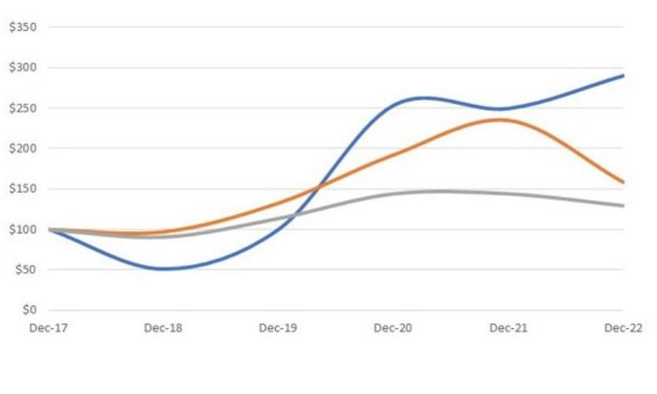
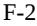

{0}------------------------------------------------

## **UNITED STATES SECURITIES AND EXCHANGE COMMISSION**

**Washington, D.C. 20549**

## **FORM 10-K**

#### **(Mark One)**

### ☒ **ANNUAL REPORT PURSUANT TO SECTION 13 OR 15(d) OF THE SECURITIES EXCHANGE ACT OF 1934**

**For the Fiscal Year Ended December 31, 2022**

**OR**

☐ **TRANSITION REPORT PURSUANT TO SECTION 13 OR 15(d) OF THE SECURITIES EXCHANGE ACT OF 1934**

**For the Transition Period from to**

**Commission File Number: 001-37708**

# **Syndax Pharmaceuticals, Inc.**

**(Exact name of Registrant as specified in its charter)**

**(State or Other Jurisdiction of Incorporation or Organization)**

**(Primary Standard Industrial Classification Code Number)**

**Delaware 2834 32-0162505 (I.R.S. Employer Identification Number)**

**35 Gatehouse Drive, Building D, Floor 3**

**Waltham, Massachusetts 02451 (781) 419-1400**

**(Address, Including Zip Code, and Telephone Number, Including Area Code, of Registrant's Principal Executive Offices)**

**Securities registered pursuant to Section 12(b) of the Act:**

| Title of each class | Trading Symbol(s) | Name of each exchange on which registered |
|---------------------|-------------------|-------------------------------------------|
| Common Stock        | SNDX              | The Nasdaq Stock Market, LLC              |

#### **Securities registered pursuant to Section 12(g) of the Act: None**

Indicate by check mark if the registrant is a well-known seasoned issuer, as defined in Rule 405 of the Securities Act. Yes ☒ No ☐

Indicate by check mark if the registrant is not required to file reports pursuant to Section 13 or 15(d) of the Securities Act. Yes ☐ No ☒

Indicate by check mark whether the registrant (1) has filed all reports required to be filed by Section 13 or 15(d) of the Securities Exchange Act of 1934 during the preceding 12 months (or for such shorter period that the registrant was required to file such reports), and (2) has been subject to the filing requirements for the past 90 days. Yes ☒ No ☐

Indicate by check mark whether the registrant has submitted electronically every Interactive Data File required to be submitted pursuant to Rule 405 of Regulation S-T (§ 232.405 of this chapter) during the preceding 12 months (or for such shorter period that the registrant was required to submit such files). Yes ☒ No ☐

Indicate by check mark whether the registrant is a large accelerated filer, an accelerated filer, a non-accelerated filer, a smaller reporting company, or an emerging growth company. See the definitions of "large accelerated filer," "accelerated filer," "smaller reporting company" and "emerging growth company" in Rule 12b-2 of the Exchange Act.

| Large Accelerated Filer | ☒ | Accelerated Filer         | ☐ |
|-------------------------|---|---------------------------|---|
| Non-accelerated Filer   | ☐ | Smaller Reporting Company | ☐ |
| Emerging growth company | ☐ |                           |   |

If an emerging growth company, indicate by check mark if the registrant has elected not to use the extended transition period for complying with any new or revised accounting standards provided pursuant to Section 13(a) of the Exchange Act. ☐

Indicate by check mark whether the registrant is a shell company (as defined in Rule 12b-2 of the Exchange Act.) Yes ☐ No ☒

Indicate by check mark whether the registrant has filed a report on and attestation to its management's assessment of the effectiveness of its internal control over financial reporting under Section 404(b) of the Sarbanes-Oxley Act (15 U.S.C. 7262(b)) by the registered public accounting firm that prepared or issued its audit report. ☒

If securities are registered pursuant to Section 12(b) of the Act, indicate by check mark whether the financial statements of the registrant included in the filing reflect the correction of an error to previously issued financial statements.☐

Indicate by check mark whether any of those error corrections are restatements that required a recovery analysis of incentive-based compensation received by any of the registrant's executive officers during the relevant recovery period pursuant to §240.10D-1(b). ☐

The aggregate market value of the voting and non-voting of common equity held by non-affiliates of the registrant was \$1,084,471,643 as of June 30, 2022 based on the closing price of \$19.24 as reported on the Nasdaq Global Select Market on such date. Shares of the registrant's common stock held by executive officers, directors, and their affiliates have been excluded from this calculation. The determination of affiliate status is not necessarily a conclusive determination for other purposes.

As of February 24, 2023, there were 68,442.572 shares of common stock outstanding.

#### **DOCUMENTS INCORPORATED BY REFERENCE**

Portions of the registrant's definitive proxy statement for its 2023 Annual Meeting of Stockholders, which the registrant intends to file pursuant to Regulation 14A with the Securities and Exchange Commission not later than 120 days after the registrant's fiscal year ended December 31, 2022, are incorporated by reference into Part III of this Annual Report on Form 10-K.

| Auditor Firm Id: | #34 | Auditor Name: | Deloitte & Touche LLP | Auditor Location: | New York, New York |
|------------------|-----|---------------|-----------------------|-------------------|--------------------|
|                  |     |               |                       |                   |                    |

{1}------------------------------------------------

#### **TABLE OF CONTENTS**

**Page**

### **SPECIAL NOTE REGARDING [FORWARD-LOOKING](#page-2-0) STATEMENTS** ii

| 1 22 53 53 53 53 Market for Registrant's Common Equity, Related Stockholder Matters and Issuers Purchases of Equity Securities 54 56 57 67 |
|--------------------------------------------------------------------------------------------------------------------------------------------------------------------------|
|                                                                                                                                                                          |
|                                                                                                                                                                          |
|                                                                                                                                                                          |
|                                                                                                                                                                          |
|                                                                                                                                                                          |
|                                                                                                                                                                          |
|                                                                                                                                                                          |
|                                                                                                                                                                          |
|                                                                                                                                                                          |
|                                                                                                                                                                          |
|                                                                                                                                                                          |
| 68                                                                                                                                                                       |
| 68                                                                                                                                                                       |
| 68                                                                                                                                                                       |
| 70                                                                                                                                                                       |
| 70                                                                                                                                                                       |
|                                                                                                                                                                          |
| 71                                                                                                                                                                       |
| 71                                                                                                                                                                       |
| 71                                                                                                                                                                       |
| 71                                                                                                                                                                       |
| 71                                                                                                                                                                       |
|                                                                                                                                                                          |
| 72                                                                                                                                                                       |
| 76                                                                                                                                                                       |
|                                                                                                                                                                          |

i

{2}------------------------------------------------

### **SPECIAL NOTE REGARDING FORWARD-LOOKING STATEMENTS**

This Annual Report on Form 10-K, or Annual Report, contains forward-looking statements within the meaning of Section 27A of the Securities Act of 1933, as amended, and Section 21E of the Securities Exchange Act of 1934, as amended. All statements other than statements of historical fact are "forward-looking statements" for purposes of this Annual Report. In some cases, you can identify forward-looking statements by terminology such as "anticipate," "believe," "could," "estimate," "expects," "intend," "may," "plan," "potential," "predict," "project," "should," "will," "would" or the negative or plural of those terms, and similar expressions.

Forward-looking statements include, but are not limited to, statements about:

- our estimates regarding our expenses, future revenues, anticipated capital requirements and our needs for additional financing;
- the initiation, cost, timing, progress and results of our research and development activities, clinical trials and preclinical studies;
- our ability to replicate results in future clinical trials;
- our expectations regarding the potential safety, efficacy or clinical utility of our product candidates as well as the potential use of our product candidates to treat various cancer indications and fibrotic diseases;
- our ability to obtain and maintain regulatory approval for our product candidates and the timing or likelihood of regulatory filings and approvals for such candidates;
- our ability to maintain our licenses with Bayer Pharma AG, Eddingpharm Investment Company Limited, UCB Biopharma Sprl, and Vitae Pharmaceuticals, Inc., a subsidiary of Allergan plc, which was acquired by AbbVie Inc.;
- the success of our collaboration with Incyte Corporation, or Incyte, to further develop and commercialize axatilimab;
- the potential milestone and royalty payments under certain of our license agreements;
- the implementation of our strategic plans for our business and development of our product candidates;
- the scope of protection we establish and maintain for intellectual property rights covering our product candidates and our technology;
- the market adoption of our product candidates by physicians and patients;
- developments relating to our competitors and our industry;
- the impact of public health crises and other adverse global economic conditions on our operations, research and development and clinical trials and potential disruption in the operations and business of third-party manufacturers, contract research organizations, or CROs, other service providers, and collaborators with whom we conduct business; and
- business interruptions resulting from geo-political actions, including war or the perception that hostilities may be imminent (such as the ongoing war between Russia and Ukraine), terrorism, natural disasters or public health crises.

Factors that may cause actual results to differ materially from current expectations include, among other things, those set forth in Part I, Item 1A, "Risk Factors," below and for the reasons described elsewhere in this Annual Report. Any forward-looking statement in this Annual Report reflects our current view with respect to future events and is subject to these and other risks, uncertainties and assumptions. Given these uncertainties, you should not rely on these forward-looking statements as predictions of future events. Although we believe that the expectations reflected in the forward-looking statements are reasonable, our information may be incomplete or limited and we cannot guarantee future results. Except as required by law, we assume no obligation to update or revise these forward-looking statements for any reason, even if new information becomes available in the future.

{3}------------------------------------------------

This Annual Report also contains estimates, projections and other information concerning our industry, our business and the markets for certain drugs and consumer products, including data regarding the estimated size of those markets, their projected growth rates and the incidence of certain medical conditions. Information that is based on estimates, forecasts, projections or similar methodologies is inherently subject to uncertainties and actual events or circumstances may differ materially from events and circumstances reflected in this information. Unless otherwise expressly stated, we obtained these industry, business, market and other data from reports, research surveys, studies and similar data prepared by third parties, industry, medical and general publications, government data and similar sources and we have not independently verified the data from third party sources. In some cases, we do not expressly refer to the sources from which these data are derived.

In this Annual Report, unless otherwise stated or as the context otherwise requires, references to "Syndax," "the Company," "we," "us," "our" and similar references refer to Syndax Pharmaceuticals, Inc. and its wholly owned subsidiaries. This Annual Report also contains references to our trademarks and to trademarks belonging to other entities. Solely for convenience, trademarks and trade names referred to, including logos, artwork and other visual displays, may appear without the ® or TM symbols, but such references are not intended to indicate, in any way, that their respective owners will not assert, to the fullest extent under applicable law, their rights thereto. We do not intend our use or display of other companies' trade names or trademarks to imply a relationship with, or endorsement or sponsorship of us by, any other companies.

{4}------------------------------------------------

### **Item 1. BUSINESS**

### **Our Company**

We are a clinical-stage biopharmaceutical company developing an innovative pipeline of cancer therapies. Our two lead product candidates are revumenib (SNDX-5613), and axatilimab (SNDX-6352). We are developing revumenib, a potent, selective, small molecule inhibitor of the menin-MLL binding interaction for the treatment of KMT2A rearranged, or KMT2Ar, also known as mixed lineage leukemia rearranged or MLLr, acute leukemias including acute lymphoblastic leukemia, or ALL, and acute myeloid leukemia, or AML, and NPM1 mutant AML. We are also developing axatilimab, a monoclonal antibody that blocks the colony stimulating factor 1, or CSF-1 receptor, in chronic graft-versus-host disease, or cGVHD, as well as idiopathic pulmonary fibrosis, or IPF. We plan to continue to leverage the technical and business expertise of our management team and scientific collaborators to license, acquire and develop additional therapeutics to expand our pipeline.

### **Our Strategy**

We are developing revumenib in acute leukemias and axatilimab for use in cGVHD and potentially other fibrotic-macrophage driven diseases, such as IPF, as single agents and in combination with approved drugs. Key elements of our strategy include:

- Develop revumenib for the treatment of genetically defined leukemias. We believe that revumenib has the potential to treat at least two genetically defined acute leukemias: (i) KMT2Ar and (ii) mutations in NPM1, or NPM1c, AML. Our Phase 1/2 open-label AUGMENT-101 trial is ongoing. We have initiated the pivotal Phase 2 portion of the trial with relapsed/refractory, or R/R, patients to be enrolled in three indication-specific expansion cohorts to determine the efficacy, short- and long-term safety, and tolerability of revumenib in KMT2Ar ALL, KMT2Ar AML and NPM1c AML. We are also concurrently expanding into the frontline and maintenance settings with new trials.
- Develop axatilimab for the treatment of cGVHD. We have completed enrollment in the pivotal AGAVE-201 trial for the treatment of patients with cGVHD and, together with Incyte, plan to commence a clinical trial testing axatilimab in combination with ruxolitinib in steroid naive cGVHD. We are also exploring the use of axatilimab to treat other fibrotic diseases where monocyte-derived macrophages have been shown to play a role, such as IPF.
- Leverage the technical, clinical, regulatory and business expertise of our management team and scientific collaborators to license, acquire and develop additional cancer therapies to expand our pipeline. We licensed the global rights to axatilimab and revumenib and are working closely with our collaboration partner, Incyte, on the development and commercialization of axatilimab. We are continuing to leverage the collective talent within our organization and network of advisors to guide our pipeline expansion and development plans.

{5}------------------------------------------------

### **Revumenib**

Our first clinical-stage product candidate, revumenib, is a potent, orally active inhibitor of the high affinity interaction site on menin with the protein MLL1. This specific interaction is a key driver for two genetically defined acute leukemias: (i) KMT2Ar and (ii) NPM1c AML. The R/R settings of both diseases have a poor prognosis. In preclinical testing, revumenib has demonstrated benefit in leukemic models of disease. Initial clinical evidence with revumenib also supports the hypothesis that disruption of the menin-MLL interaction can lead to responses in acute leukemias.

Our near-term focus is to rapidly establish proof-of-concept that revumenib is a targeted therapy that can potentially provide meaningful clinical benefit to adult and pediatric R/R patients with mNPM1 and KMT2Ar, ALL

{6}------------------------------------------------

or AML. In 2019, we commenced AUGMENT-101, a clinical trial consisting initially of a Phase 1 dose escalation portion to determine the maximum tolerated dose, or MTD, and recommended Phase 2 dose of revumenib in patients with R/R KMT2Ar or NPM1c acute leukemia. We are conducting the trial at multiple centers globally. As discussed below, we have completed the Phase 1 portion of the trial, and the pivotal Phase 2 portion of the trial is ongoing, enrolling R/R patients across each of three distinct trial populations: patients with NPM1 mutant AML, patients with KMT2Ar AML, and patients with KMT2Ar ALL to determine the efficacy, safety, and tolerability of revumenib. Based on discussions with the U.S. Food and Drug Administration, or FDA, AUGMENT-101 may serve as the basis for regulatory filings in each of the three populations.

On November 3, 2022, we announced updated data from the Phase 1 portion of the ongoing AUGMENT-101 trial of revumenib in patients with R/R NPM1 mutant or MLLr acute leukemia. As of the March 2022 data cutoff date, 60 patients with R/R mNPM1 or KMT2Ar acute leukemia were evaluable for efficacy, an increase of 9 patients from the 51 evaluable for efficacy at the 2021 ASH Annual Meeting. In the efficacy evaluable population, the overall response rate, which we define as CR, plus CRh, plus CRp, plus MLFS, was 53% (32/60), with CR/CRh rate of 30% (18/60), and 78% (14/18) of patients with CR/CRh attaining minimal residual disease, or MRD, negativity. Additional analyses from the trial indicate that at doses which met the protocol defined criteria for a recommended Phase 2 dose, the CR/CRh rate was 27% in both the KMT2Ar (10/37) and the mutant NPM1 (3/11) patient populations. A total of 38% (12/32) of responders proceeded to transplant. The median time to response in the trial was 1.9 months, and the median duration of CR/CRh response was 9.1 months in the efficacy evaluable population as of data cutoff. Revumenib was well-tolerated, and there were no discontinuations due to treatment related adverse events. This data was featured in two oral sessions at the 2022 ASH Annual Meeting.

The data shows that revumenib has been well tolerated to date, and no new safety signals were identified in the trial, including in patients who proceeded to stem cell transplant. The only dose limiting toxicity observed was asymptomatic Grade 3 QT prolongation. No ventricular arrythmias or other clinical sequelae related to QTc prolongation were reported. All cases of differentiation syndrome were Grade 2 and readily managed with standard therapies. Grade 3 and greater treatment-related adverse events other than dose limiting toxicity included diarrhea (3%), fatigue (3%), anemia (3%), tumor lysis syndrome (2%), neutropenia (2%), thrombocytopenia (2%), hypercalcemia (2%) and hypokalemia (2%).

Two trials, BEAT-AML and AUGMENT-102, are ongoing and will assess the safety, tolerability, and preliminary anti-leukemic efficacy of revumenib and establish an appropriate Phase 2 dose when used in combination with other approved agents. BEAT-AML is a front-line combination trial of revumenib with venetoclax and azacitidine being conducted as part of the Leukemia & Lymphoma Society's Beat AML ® Master Clinical Trial. AUGMENT-102 is a trial assessing revumenib in combination with chemotherapy in patients with R/R mNPM1 or KMT2Ar acute leukemias.

In the first quarter of 2023, the Australasian Leukemia and Lymphoma Group initiated the INTERCEPT trial of revumenib as monotherapy in patients with AML who are minimal residual disease-positive following initial treatment. The trial is a part of the INTERCEPT AML Master Clinical Trial, a collaborative clinical trial investigating novel therapies to target early relapse and clonal evolution as pre-emptive therapy in AML. Revumenib is the first menin inhibitor to be included in the INTERCEPT AML Master Clinical Trial.

Also in the first quarter of 2023, we initiated a proof-of-concept clinical trial of revumenib in patients with unresectable metastatic microsatellite stable colorectal cancer, or CRC. We expect to report initial topline data from the trial by the end of 2023.

In January 2020, the FDA granted revumenib Orphan Drug Designation, or ODD, for the treatment of adult and pediatric AML and in June 2021, the FDA granted Fast Track Designation to revumenib for the treatment of adult and pediatric patients with relapsed or refractory acute leukemias harboring a MLLr or NPM1 mutation. In December 2021, we announced that the European Commission granted ODD to revumenib for the treatment of AML. On December 5, 2022, we announced that the FDA granted Breakthrough Therapy Designation, or BTD, for

{7}------------------------------------------------

revumenib for the treatment of R/R acute leukemia harboring a KMT2A rearrangement, regardless of age or tumor type. Following the receipt of BTD, we will pool data from the AUGMENT-101 cohorts enrolling R/R KMT2Ar AML and R/R KMT2Ar ALL to file a single New Drug Application, or NDA, for the treatment of adult and pediatric KMT2Ar acute leukemia. We have completed enrollment of a sufficient number of KMT2Ar acute leukemia patients to support this filing strategy and expect to share topline data from the KMT2Ar cohort in the third quarter of 2023, and submit an NDA filing by the end of 2023. We also expect to complete enrollment of the NPM1 AML cohort in the second half of 2023.

#### *Revumenib*

#### *Rationale for Targeting MLLr*

MLLr leukemias arise by rare, spontaneous translocations at the MLL1 locus (11q23). It is estimated that approximately 10% of AML and ALL harbor this MLL-re-arrangement with a worldwide incidence of approximately 5,000 to 7,000 cases per year. These translocations generate oncogenic fusion proteins with more than 90 different MLL fusions currently known. All MLL fusion proteins bind with high affinity to the chromatin associated protein menin through a conserved N-terminal sequence. This specific interaction with menin enables an aberrant transcription program that drives leukemic transformation. In pre-clinical animal models, small molecule inhibitors of the menin-MLL interaction have demonstrated deep and durable single agent treatment effects in multiple leukemic xenografts harboring MLL fusions. Inhibiting the menin-MLL1 interaction represents a novel targeted strategy for the treatment of MLLr leukemias. Today, the first choice therapy for both MLLr AML and MLLr ALL still relies heavily on intensive chemotherapy, if a patient can tolerate such treatment. Despite these patients being routinely diagnosed, there are currently no targeted therapies approved to treat patients with MLLr acute leukemias. Currently there are several other clinical-stage menin-inhibitors in development for the treatment of MLLr AML and MLLr ALL.

#### *Rationale for Targeting Nucleophosmin 1 Mutant AML*

NPM1 is among the most frequently mutated genes in AML, found in approximately 30% of AML cases for an incidence of approximately 20,000 cases per year. Mutations in NPM1, or NPM1c, lead to the aberrant cytoplasmic localization of the mutants. NPM1c lead to its aberrant cytoplasmic localization. Recent preclinical research has demonstrated that NPM1c works directly with the menin-MLL complex to induce a leukemic transcription program. As a result, NPM1c harboring cells are sensitive to menin-MLL interaction inhibitors. In NPM1c cells, inhibition of the menin-MLL interaction suppresses the leukemic transcription program, causing growth arrest, terminal differentiation and cell death. In animal models, small molecule inhibitors of the menin-MLL interaction have demonstrated deep and durable single agent treatment effects in multiple NPM1c xenografts. Based on these findings, blocking the menin-MLL1 interaction represents a novel targeted strategy for the treatment of NPM1c AML.

Like MLLr, NPM1 is readily diagnosed as part of the standard AML patient work-up today, and yet there are no targeted therapies specifically approved to treat patients with NPM1c AML. There are several additional clinical stage agents currently advancing as potential treatments for NPM1c AML.

*Rational for Targeting CRC*

{8}------------------------------------------------

CRC is the second most lethal cancer, the third most prevalent malignant tumor worldwide, and the fourth most common cancer diagnosed in the United States each year. In 2022, over 150,000 new CRC cases arose, and 52,000 deaths were reported, accounting for nearly 10% of new cancer cases and deaths in the U.S. Meanwhile, the five-year survival rate for CRC is approximately 65% and drops to 15% for metastatic CRC.

Today, physicians can choose from a number of approved chemotherapies (*Stivarga*,® *Lonsurf®*), immunotherapies (*Yervoy®*, *Keytruda®*, *Opdivo®*) and targeted agents (*Avastin®*, *Cyramza®*, *Zaltrap®*, *Erbitux®*, *Vectibix®*, *Braftovi®*) to treat CRC. Despite these advancements, there remains a critical need for more effective therapies to address metastatic CRC.

Nearly all colorectal tumors, harbor genetic mutations that lead to the hyperactivation of b-catenin signaling, which in turn initiate the expression of various downstream targets that promote proliferation and maintain a stem cell state, highlighting the potential value of developing treatments that target bcatenin signaling in cancer. b-catenin itself, however, is an intractable drug target and the mechanisms underlying b-catenin–driven transcription remain largely elusive, underscoring the need to identify therapeutically tractable components of b-catenin transcriptional output. Recently, several researchers have utilized functional genomic screens to uncover new targets of high relevance to the oncogenic property of b-catenin. Through this process they have validated the selective dependence of KMT2A for growth of b-catenin–active CRC cells and showed KMT2A expression to be associated with malignant CRC growth in vivo and shortened survival in patients with CRC. Targeting KMT2A using menin inhibitors has been shown to selectively reduce the viability of b-catenin–active cells and CRC organoids, but not b-catenin–inactive cells and normal organoids.

### **Axatilimab**

We are also developing axatilimab a monoclonal antibody targeting the colony stimulating factor-1 receptor, or CSF-1R, a cell surface protein thought to control the survival and function of monocytes and macrophages. Axatilimab binds with high affinity to CSF-1R and blocks the binding of the two known CSF-1R ligands CSF-1 and IL-34. CSF-1R is expressed on the surface of specific immune cells known as macrophages and their precursor cells known as monocytes. CSF-1R signaling on these cells has been demonstrated in preclinical studies conducted in animal models of skin and lung cGVHD to be the key regulatory pathway involved in the expansion and infiltration of the macrophages that mediate fibrosis and the cGVHD disease process. Blocking CSF-1R activity with an experimental CSF-1R antibody in these studies was shown to prevent and treat the symptoms of cGVHD. We believe that by inhibiting CSF-1R activation on monocytes and macrophages, axatilimab has the potential to be used to treat cGVHD as well as other fibrotic diseases where monocyte-derived macrophages have been shown to play a significant role.

{9}------------------------------------------------

Our near-term focus is to rapidly establish that axatilimab can provide meaningful clinical benefit in patients with advanced cGVHD where prior therapies are no longer effective and to establish proof-of-concept of using axatilimab to treat other fibrotic diseases where monocyte-derived macrophages have been shown to play a role.

On November 3, 2022, we and Incyte announced completion of enrollment in the pivotal AGAVE-201 trial evaluating axatilimab in patients with cGVHD following two or more prior lines of therapy. The trial is evaluating the safety and efficacy of three dosing regimens of axatilimab. The primary endpoint will assess objective response rate based on the 2014 NIH consensus criteria for cGVHD, with key secondary endpoints including duration of response and improvement in modified Lee Symptom Scale score. Together with Incyte, we expect to report topline data in mid-2023, and if successful, expect to submit a Biologics License Application by the end of 2023.

In the first half of 2023, we plan to initiate a Phase 2b trial to assess the efficacy, safety and tolerability of axatilimab in patients with IPF. This 52 week, randomized, double-blind and placebo-controlled trial is expected to enroll approximately 170 patients. The primary endpoint will assess the change from baseline in forced vital capacity, which is the current registrational endpoint in IPF.

We are working with Incyte to initiate a trial testing axatilimab in combination with ruxolitinib in steroid naive cGVHD. The Phase 1 trial is expected to begin later this year.

In March and April of 2021, we announced that the FDA granted ODD to axatilimab for the treatment of patients with cGVHD and IPF.

#### *Axatilimab in GVHD*

cGVHD, an immune response of the donor-derived hematopoietic cells against recipient tissues, is a serious, potentially life-threatening complication of allogeneic hematopoietic stem cell transplantation, or HSCT, that can last for years. cGVHD is estimated to develop in approximately 40% of transplant recipients and affects approximately 14,000 patients in the United States. cGVHD typically manifests across multiple organ systems, with the skin and mucosa being commonly involved, and is characterized by the development of fibrotic tissue.

The first line of therapy for cGVHD is typically corticosteroids, though approximately 50% of patients may require treatment with additional systemic therapies, such as extracorporeal photopheresis, cytostatic agents such as mycophenolate moftetil, methotrexate, and immunomodulators such as rituximab, IL-2. *Imbruvica*® (ibrutinib), a BTK inhibitor, was the first FDA-approved therapy for cGVHD and is indicated for use after one or more lines of therapy. *Imbruvica* received approval based on Phase 1/2 clinical trial data that showed a 68% overall response rate, with 48% of responses lasting 20 weeks or longer and reduced dependence on steroids for most patients. The FDA has approved two additional drugs, *Rezurock*® (belomosidil) and *Jakafi*® (ruxolitinib), for use in patients with cGVHD after failure of one or more lines of systemic therapy. While approved agents have shown a benefit in improving symptoms of this disease, none have demonstrated an improvement in long-term outcomes and a significant unmet medical need still remains for this patient population. Additionally, all currently approved agents are believed to exert their effect through T- and B-cells, with minimal impact on macrophages. By inhibiting the work of monocyte-derived macrophages, Axatilimab, provides a differentiated way to treat cGVHD, which we expect is ultimately expected to have a more pronounced impact on the fibrotic process. We also believe that shifting CSF-1R inhibition earlier in the treatment phase of cGVHD, to minimize formation of fibrotic tissue, could have a meaningful long-term impact on the disease process itself.

#### *Axatilimab in IPF*

IPF is a specific form of chronic, fibrosing, interstitial pneumonia limited to the lungs with a median survival of approximately three to five years after diagnosis. IPF is a rare disease, with an estimated prevalence of 281,000 people among the seven major market countries. IPF incidence and prevalence increase with age and are higher

{10}------------------------------------------------

among males. Although rare, the incidence of IPF is increasing, likely due to an increasing understanding of the disease and the recent development of uniform diagnostic criteria.

There are currently two approved therapies for IPF, nintedanib and pirfenidone. Despite these recent advances, the unmet medical need in IPF remains high, with a five-year mortality rate of 50% to 70% with deaths occurring mainly due to respiratory failure. Lung transplantation remains the only curative treatment option, but less than five percent of IPF patients undergo lung transplantation. There is an urgent need for new and more effective treatments for IPF that can address the limitations of current treatment options, improve mortality, and quality of life.

Growing evidence suggests macrophages are critical regulators of lung fibrosis. Recent work has established a role for monocyte-derived macrophages as the pathogenic population of cells required for the development of fibrosis and that drive the fibrotic process. Reducing the circulating levels of pathogenic monocyte-derived macrophage precursors or inhibiting their activation in tissues provides an opportunity to therapeutically intervene and directly inhibit fibrosis. Recent experiments have demonstrated that the monocyte-derived, pro-fibrotic macrophages are CSF-1-dependent and CSF-1R inhibition through anti-CSF-1R antibody can block fibrosis in fibrotic disease models. We believe that using axatilimab to inhibit the work of monocyte-derived macrophages may provide a differentiated way to treat IPF, and could result in a more pronounced impact on the fibrotic process.

#### **Entinostat**

Entinostat is our oral, small molecule product candidate that has direct effects on both cancer cells and immune regulatory cells, potentially enhancing the body's immune response to tumors. We have deprioritized the development of entinostat, but maintain a license, development and commercialization agreement with Eddingpharm International Company Limited, or Eddingpharm, under which we granted Eddingpharm an exclusive license under our intellectual property rights to develop and commercialize entinostat in China and certain other Asian countries.

#### **Collaborations**

#### *Incyte Collaboration and License Agreement*

In September 2021, we entered into a collaboration and license agreement, or the Incyte Collaboration Agreement, with Incyte for the development and commercialization of axatilimab. Additionally, in September 2021 we entered into a share purchase agreement with Incyte, or the Incyte Share Purchase Agreement. Under the terms of the Incyte Collaboration Agreement, Incyte received exclusive commercialization rights outside of the United States, and we and Incyte will, subject to the exercise of our co-promotion option, have co-commercialization rights in the United States, with respect to axatilimab. Incyte is responsible for leading commercialization strategy and booking all revenue from worldwide sales of axatilimab, subject to its royalty payment obligations set forth below. The parties will share equally the profits and losses from the co-commercialization efforts. We and Incyte are codeveloping axatilimab and sharing development costs associated with global and U.S.-specific clinical trials, with Incyte responsible for 55% of such costs and we are responsible for 45% of such costs. Each company is responsible for funding any independent development activities. All development costs related to the collaboration are subject to a joint development plan. A joint development committee between us and Incyte will govern future development of axatilimab.

We are eligible to receive up to \$220 million in future contingent development and regulatory milestones and up to \$230 million in commercialization milestones under the Incyte Collaboration Agreement. In addition, we are eligible to receive tiered royalties on potential net sales of the licensed product comprising axatilimab ranging from the low to mid double-digit percentages. In December 2021, we received an upfront cash payment of \$117 million and we issued 1,421,523 shares of common stock for an aggregate purchase price of \$35 million, or \$24.62 per share.

{11}------------------------------------------------

#### **License Agreements**

#### *Vitae Pharmaceuticals, Inc.*

We have a license agreement with Vitae Pharmaceuticals, Inc., a subsidiary of AbbVie plc, or the AbbVie License Agreement, under which Vitae granted us an exclusive, sublicensable, worldwide license to, preclinical, orally-available, small molecule inhibitors of the interaction of menin with the MLL protein, or the Menin Assets. We are solely responsible for the development and commercialization of the Menin Assets.

Subject to the achievement of certain milestone events, we may be required to pay Vitae up to an aggregate of \$99 million in one-time development and regulatory milestone payments over the term of the AbbVie License Agreement. In the event that we or any of its affiliates or sublicensees commercializes the Menin Assets, we will also be obligated to pay Vitae low single to low double-digit royalties on sales, subject to reduction in certain circumstances, as well as up to an aggregate of \$70.0 million in potential one-time, sales-based milestone payments based on achievement of certain annual sales thresholds. Under certain circumstances, we may be required to share a percentage of non-royalty income from sublicensees, subject to certain deductions, with Vitae. Since the inception of the agreement, we achieved certain development and regulatory milestones resulting in \$8.0 million in milestone payments to Vitae, which included a \$2.0 million payment in 2022. Additionally, in the fourth quarter 2022, we achieved certain development and regulatory milestones resulting in a \$2.0 million accrued expense at December 31, 2022. The amount was paid in the first quarter of 2023.

Each party may terminate the AbbVie License Agreement for the other party's uncured material breach or insolvency; and we may terminate the AbbVie License Agreement at will at any time upon advance written notice to Vitae. Vitae may terminate the AbbVie License Agreement if we or any of its affiliates or sublicensees institutes a legal challenge to the validity, enforceability, or patentability of the licensed patent rights. Unless terminated earlier in accordance with its terms, the AbbVie License Agreement will continue on a country-by-country and product-by-product basis until the later of: (i) the expiration of all of the licensed patent rights in such country; (ii) the expiration of all regulatory exclusivity applicable to the product in such country; and (iii) 10 years from the date of the first commercial sale of the product in such country.

#### *UCB*

We have a license agreement with UCB, or the UCB license agreement, under which UCB granted us a worldwide, sublicensable, exclusive license to UCB6352, which we refer to as axatilimab. The UCB license agreement permits us to use axatilimab or other licensed products for all human uses, including treatment, prevention and diagnostic uses, in all indications, diseases, conditions or disorders, and we are obligated to use commercially reasonable efforts to develop, obtain regulatory approval and commercialize a certain licensed product. We are solely responsible for the development and commercialization of axatilimab.

Subject to the achievement of certain milestone events, we may be required to pay UCB up to \$119.5 million in one-time development and regulatory milestone payments over the term of the UCB license agreement. In the event that we or any of our affiliates or sublicensees commercializes axatilimab, we will also be obligated to pay UCB low double-digit royalties on sales, subject to reduction in certain circumstances, as well as up to an aggregate of \$250.0 million in potential one-time, sales-based milestone payments based on achievement of certain annual sales thresholds. Under certain circumstances, we may be required to share a percentage of non-royalty income from sublicensees, subject to certain deductions, with UCB. During the year ended December 31, 2020 and 2021, we were required to pay \$2.0 million and \$4.0 million, respectively, due to the achievement of certain development and regulatory milestones. Additionally, in connection with its most recent amendment of the UCB License Agreement, in the second quarter of 2022 we paid UCB \$5.8 million, which was recognized as a milestone expense.

{12}------------------------------------------------

Each party may terminate the UCB license agreement for the other party's uncured material breach or insolvency; and we may terminate the UCB license agreement at will at any time upon advance written notice to UCB. UCB may terminate the UCB license agreement if we or any of our affiliates or sublicensees institutes a legal challenge to the validity, enforceability, or patentability of the licensed patent rights. Unless terminated earlier in accordance with its terms, the UCB license agreement will continue on a country-by-country and product-by-product basis until the later of: (i) the expiration of all of the licensed patent rights in such country; (ii) the expiration of all regulatory exclusivity applicable to the product in such country; and (iii) 10 years from the date of the first commercial sale of the product in such country.

#### *Bayer Pharma AG*

We have a license agreement with Bayer Pharma AG, or Bayer, pursuant to which we obtained a worldwide, exclusive license to develop and commercialize entinostat and any other products containing the same active ingredient. The Bayer license agreement, as amended, permits us to use entinostat or other licensed products for the treatment of any human disease, and we are obligated to use commercially reasonable efforts to develop, manufacture and commercialize licensed products for all commercially reasonable indications. Initially, Bayer manufactured and supplied our requirements of entinostat, but effective May 2012, manufacturing rights and responsibility for entinostat was transferred to us, by mutual agreement of the parties.

We are obligated to pay up to approximately \$50.0 million in the aggregate upon obtaining certain milestones in the development and marketing approval of entinostat, assuming that we pursue at least two different indications for entinostat or any other licensed product. We are also obligated to pay Bayer up to \$100.0 million in aggregate sales milestones, and a tiered single-digit royalty on net sales by us, our affiliates and sublicensees of entinostat and any other licensed products under the Bayer license agreement. We are obligated to pay Bayer these royalties on a country-by-country basis for the life of the relevant licensed patents covering such product or 15 years after the first commercial sale of such product in such country, whichever is longer. We cannot determine the date on which our royalty payment obligations to Bayer would expire because no commercial sales of entinostat have occurred and the last-to-expire relevant patent covering entinostat in a given country may change in the future.

The Bayer license agreement will remain in effect until the expiration of our royalty obligations under the agreement in all countries. Upon expiration of the agreement our licenses become fully paid-up and irrevocable. Either party may terminate the Bayer license agreement in its entirety or with respect to certain countries in the event of an uncured material breach by the other party. Either party may terminate the Bayer license agreement if voluntary or involuntary bankruptcy proceedings are instituted against the other party, if the other party makes an assignment for the benefit of creditors, or upon the occurrence of other specific events relating to the insolvency or dissolution of the other party. Bayer may terminate the Bayer license agreement if we seek to revoke or challenge the validity of any patent licensed to us by Bayer under the Bayer license agreement or if we procure or assist a third party to take any such action.

#### *Eddingpharm International Company Limited*

We have a license, development and commercialization agreement with Eddingpharm International Company Limited, or Eddingpharm, under which we granted Eddingpharm an exclusive license under our intellectual property rights to develop and commercialize entinostat in China and certain other Asian countries. This license includes a sublicense under the rights we received under the Bayer license agreement. If we acquire or develop any other anti-cancer drug that, like entinostat, is a selective inhibitor of Class I HDAC, such drug will be included in this license as well. Eddingpharm is manufacturing entinostat during the term of the agreement or through termination of the agreement for our breach. During the term of the agreement, subject to certain exceptions, each party is prohibited from commercializing in China and certain other Asian countries any other selective inhibitor of Class I HDACs for the same indication as entinostat, with all forms of cancer being treated as the same indication.

We are eligible to receive up to \$10.0 million in development and regulatory milestone payments as well as royalty payments based on revenue targets. Royalty payment obligations will be payable in each country in the Eddingpharm territory until the later to occur of (i) the date that all valid claims of the last effective license patent in such country expires or is abandoned, withheld or otherwise invalidated and (ii) 15 years from the date of first commercial sale of entinostat in such country. Any payments owed to Bayer as a result of Eddingpharm's

{13}------------------------------------------------

development of entinostat in the Eddingpharm territory will be made by us out of the payments we receive from Eddingpharm.

The agreement with Eddingpharm will expire with respect to each country in the Eddingpharm territory upon the expiration of all royalty payment obligations in such country. In addition, we may terminate the agreement in its entirety upon written notice to Eddingpharm if Eddingpharm or any affiliate commences any action or proceeding that challenges the validity, enforceability or scope of any licensed patent in the Eddingpharm territory. Eddingpharm may terminate the agreement in its entirety for convenience at any time upon advance notice to us. Either party may terminate the agreement for the other party's uncured material breach, or bankruptcy or related actions or proceedings. If we commit an uncured material breach of certain provisions of the agreement, Eddingpharm may, instead of terminating the agreement, elect to continue the agreement in full force and effect except certain payments to us will be reduced.

#### **Sales and Marketing**

Given our stage of development, we have recently started building a commercial infrastructure to support sales of our product candidates in the United States. We expect that our targeted sales force will focus on a well-defined group of medical oncologists, primarily in the non-hospital and academic settings, who are responsible for the care and treatment of cancer patients. For revumenib, we expect to manage sales, marketing and distribution through internal resources and third-party relationships. In accordance with our agreement, Incyte will lead the commercialization of axatilimab globally and we will elect whether to co-promote axatilimab in the United States. While we may commit significant financial and management resources to commercial activities, we would also consider collaborating with one or more pharmaceutical companies to enhance our commercial capabilities. Outside the United States, we plan to rely on our current partners and may seek additional pharmaceutical partners for sales and marketing activities.

#### **Manufacturing**

We do not own or operate manufacturing facilities for the production of axatilimab, revumenib or entinostat, and we do not have plans to develop our own manufacturing operations in the foreseeable future. We currently rely on third-party contract manufacturers as well as Incyte for all of our required raw materials, active pharmaceutical ingredients and finished product for our preclinical research and clinical trials. We do not have any current contractual relationship for the manufacture of commercial supplies. If axatilimab, revumenib or entinostat is approved by any regulatory agency, we intend to enter into agreements with a third-party contract manufacturer and one or more backup manufacturers for the commercial production of such product. Development and commercial quantities of any products that we develop will need to be manufactured in facilities, and by processes, that comply with the requirements of the FDA and the regulatory agencies of other jurisdictions in which we are seeking approval.

#### **Intellectual Property**

#### *Patents and Property Rights*

Through licensed intellectual property and our owned intellectual property, we seek patent protection in the United States and internationally for our product candidates, their methods of use and processes for their manufacture, as well as for other technologies, where appropriate. Our policy is to actively seek to protect our proprietary position by, among other things, filing patent applications in the United States and abroad claiming our proprietary technologies that are important to the development of our business. We also rely on trade secrets, know-how, continuing technological innovation and inlicensing opportunities to develop and maintain our proprietary position.

{14}------------------------------------------------

We cannot be sure that patents will be granted with respect to any of our owned or licensed pending patent applications or with respect to any patent applications filed by us or our licensors in the future, nor can we be sure that any of our existing owned or licensed patents or any patents that may be granted to us or to our licensors in the future will protect our technology. Our success will depend significantly on our ability to obtain and maintain patent and other proprietary protection for the technologies that we consider important to our business, defend our patents, preserve the confidentiality of our trade secrets, operate our business without infringing the patents and proprietary rights of third parties, and prevent third parties from infringing our proprietary rights.

#### *Axatilimab Patent Portfolio*

We in-licensed from UCB a patent portfolio directed to axatilimab. As of December 31, 2022, the axatilimab composition-of-matter patent portfolio included two granted U.S. patents, 27 granted non-U.S. patents, including a granted EP patent which has been validated in 37 countries, and 16 non-U.S. pending patent applications. The in-licensed granted patents covering axatilimab, and any non-U.S. pending applications should they issue, will expire in August 2034 or later should patent term extension be granted.

Our in-licensed patent portfolio also includes pending U.S. and non-U.S. patent applications directed to methods for the treatment and/or prophylaxis of fibrotic disease by administration of an inhibitor of CSF-1R activity, methods for the treatment and/or prophylaxis of inflammatory bowel disease, or IBD, by administration of an inhibitor of CSF-1R activity, and liquid pharmaceutical compositions of anti-CSF-1R antibodies. If these pending applications were to issue as one or more patents, these patents would expire between November 2024 and February 2036 or later should patent term extension be granted. Further, the in-licensed portfolio includes three non-U.S. patents directed to methods of treating solid tumors by administration of an inhibitor of CSF-1R activity. The three patents expired in October 2020.

Our owned axatilimab patent portfolio includes one pending U.S. patent application and six non-U.S. patent applications directed to combinations of entinostat and axatilimab. If any one of these applications were to issue as one or more patents, these patents would expire in May 2038 or later should patent term extension be granted. Our owned axatilimab patent portfolio also consists of one pending international patent application under the Patent Cooperation Treaty, or PCT, directed to the treatment regimens and methods of using axatilimab includes one pending U.S. patent application and 18 non-U.S. patent applications. If this PCT application were to issue as one or more patents, these patents would expire in December 2040 or later should patent term extension be granted.

#### *Menin Asset Patent Portfolio*

We in-licensed from Vitae Pharmaceuticals, Inc., a subsidiary of AbbVie plc, a patent portfolio directed to a series of selective preclinical inhibitors targeting the binding interaction of menin with MLL-r. As of December 31, 2022, the in-licensed portfolio includes three granted U.S. patents, U.S. Patent Nos. 11,479,557, 10,683,302 and 10,899,758, 13 granted non-U.S patents, including a granted European patent, which was validated in 30 member states, four allowed non-U.S patent applications, two pending U.S. applications and 20 non-U.S. pending patent applications covering composition of matter and methods of treating, e.g., MLL. The granted patents based on the in-licensed applications are expected to expire June 2037 or later should patent term extension be granted. If the in-licensed application were to issue as one or more patents, these patents would expire between June 2037 and September 2037.

Our owned menin patent portfolio consists of eleven pending non-U.S. patent applications and one U.S. patent application, directed to combinations of a menin inhibitor and a CYP3A inhibitor for the treatment of various cancers. Our owned menin patent portfolio also consists of two U.S. provisional applications directed to menin inhibitors and combinations with various other compounds. If any applications arising from the provisional applications were to issue as one or more patents, these patents would expire between April 2041 and May 2043 or later should patent term extension be granted.

We also co-own with Vitae and Syngene International Limited two pending non-U.S. patent applications, one pending U.S. patent application, and one pending PCT, covering composition of matter and methods of treating cancer and other diseases mediated by the menin-MLL interaction.

{15}------------------------------------------------

#### *Entinostat Patent Portfolio*

We strive to protect entinostat with multiple layers of patents. As of December 31, 2022, our portfolio included four owned pending U.S. nonprovisional patent applications, three owned granted U.S. patents, U.S. Patent Nos. 10,226,472, 11,324,822, and 11,397,184 which expire in August 2032, March 2036 and September 2036, respectively, or later should patent term extension be granted, directed to methods of treating a patient with combinations of entinostat and pembrolizumab or other therapeutic agents, nine granted non-U.S. patents (including two European patents validated in at least 5 countries), three allowed non-U.S. patent applications, and 39 owned non-U.S. pending patent applications. Our owned entinostat patent portfolio includes pending U.S. and non-U.S. patent applications directed to methods of treating cancer patients by administration of entinostat and exemestane, methods of treating cancer patients by administration of entinostat in combination with an HER2 inhibitor, treatments with entinostat combined with anti PD-1 or anti PD-L1 antibodies, entinostat and CSF-1 or CSF-1R combination therapies (also discussed above in the Axatilimab Patent Portfolio) and patient selection for combination therapy comprising entinostat and a second therapeutic agent. If our owned pending U.S. applications and non-U.S. applications were to issue as one or more patents, these patents would expire between August 2032 and May 2039 or later should patent term extension be granted.

The patent portfolio we licensed from Bayer contains a number of issued U.S. and foreign patents as well as patent applications pending outside the United States. A number of the patents and patent applications we licensed from Bayer are directed to entinostat while other patents and patent applications are directed to compounds other than entinostat. As of December 31, 2022, the portfolio we licensed from Bayer included seven issued U.S. patents, 62 granted non-U.S. patents and 17 patent applications pending in non-U.S. patent offices. For example, the portfolio we licensed from Bayer includes reissue U.S. Patent RE39,754, which covers a genus of benzamide compounds including entinostat or SNDX-275. RE39,754 is a composition of matter patent having an initial term which expired in September 2017.

The portfolio we licensed from Bayer also includes U.S. Patent 7,973,166, or the '166- patent, which covers a crystalline polymorph of entinostat which is referred to as crystalline polymorph- B, the crystalline polymorph used in the clinical development of entinostat. Many compounds can exist in different crystalline forms. A compound which in the solid state may exhibit multiple different crystalline forms is called polymorphic, and each crystalline form of the same chemical compound is termed a polymorph. A new crystalline form of a compound may arise, for example, due to a change in the chemical process or the introduction of an impurity. Such new crystalline forms may be patented. By comparison, the U.S. Patent RE39,754, which expired in September 2017, covers the chemical entity of entinostat and any crystalline or non-crystalline form of entinostat. On March 7, 2014, our licensor Bayer applied for reissue of the '166 patent. The reissue application sought to add three additional inventors to the '166 patent. The reissue was granted as RE45,499 on April 28, 2015, at which time the original '166 patent was surrendered. The reissue patent has the same force and effect as the original '166 patent and the same August 2029 expiration date.

Of the unexpired foreign-granted patents we licensed from Bayer, there are 33 granted foreign counterparts of the '166 patent (now RE45,499) that cover crystalline polymorph B, including the European patent and Eurasian patent. The granted European patent comprises 37 national countries that have all been validated, and the granted Eurasian patent comprises nine countries that have all been validated. Likewise, there are 3 pending foreign counterparts of the '166 crystalline polymorph B patent. Other patents and patent applications in the licensed Bayer portfolio are expired and cover methods of treatment by administration of entinostat. For example, U.S. Patent 7,317,028, which expired in October 2017, covers methods of treating selected cancers by administration of entinostat; U.S. Patent 7,687,525, which also expired in September 2017, covers methods of treating autoimmune disease by administration of entinostat; U.S. Patent 6,320,078, which expired in July 2019, covers methods of manufacturing entinostat; U.S. Patent No. 8,026,239, which expired in September 2017, covers methods of treating certain malignant tumors by administration of a compound within a subgenus of benzamide compounds including entinostat; U.S. Patent RE40,703, which expired in September 2017, covers a subgenus of benzamide compounds that does not include entinostat; and U.S. Patent 6,794,392, which expired in September 2017, covers a subgenus of benzamide compounds that does not include entinostat.

{16}------------------------------------------------

### *Patent Term*

The term of individual patents depends upon the legal term of the patents in the countries in which they are obtained. In most countries in which we file, the patent term is 20 years from the date of filing the earliest non-provisional application or PCT application.

In the United States, a patent's term may be lengthened by patent term adjustment, which compensates a patentee for administrative delays by the USPTO in granting a patent, or may be shortened if a patent is terminally disclaimed over an earlier-filed patent. The term of a patent that covers an approved drug may also be eligible for patent term extension, which permits patent term restoration as compensation for the patent term lost during the development and regulatory review process. To obtain a patent extension in the United States, the term of the relevant patent must not have expired before the extension application, the patent cannot have been extended previously under this law, an application for extension must be submitted, the product must be subject to regulatory review prior to its commercialization, and the permission for the commercial marketing or use of the product after such regulatory review period is the first permitted commercial marketing or use of the product. If our future products contain active ingredients which have not been previously approved, we may be eligible for a patent term extension in the United States. In the United States, we expect to seek extension of patent terms under the Drug Price Competition and Patent Term Restoration Act of 1984, which permits a patent term extension of up to five years beyond the expiration of the patent for patent claims covering a new chemical entity. If patent extensions are available to us outside of the United States, we would expect to file for a patent term extension in applicable jurisdictions.

### *Confidential Information and Inventions Assignment Agreements*

We require our employees and consultants to execute confidentiality agreements upon the commencement of employment, consulting or collaborative relationships with us. These agreements provide that all confidential information developed or made known during the course of the relationship with us be kept confidential and not disclosed to third parties except in specific circumstances.

In the case of employees, the agreements provide that all inventions resulting from work performed for us, utilizing our property or relating to our business and conceived or completed by the individual during employment shall be our exclusive property to the extent permitted by applicable law. Our consulting and service agreements also provide for assignment to us of any intellectual property resulting from services performed for us.

### **Government Regulation and Product Approval**

#### *United States Government Regulation*

In the United States, the FDA regulates drugs and biologics under the Federal Food, Drug, and Cosmetic Act, or FDCA, the Public Health Service Act, and related regulations. Drugs and biologics are also subject to other federal, state and local statutes and regulations. The FDA and comparable regulatory agencies in state and local jurisdictions impose substantial requirements upon, among other things, the testing, development, manufacture, quality control, safety, purity, potency, labeling, storage, distribution, record keeping and reporting, approval, import and export, advertising and promotion, and postmarket surveillance of drugs and biologics.

### *Biopharmaceutical Product Development Process*

The process required by the FDA before biopharmaceutical products may be marketed in the United States generally involves the following:

- completion of extensive preclinical laboratory tests and animal studies in accordance with applicable regulations, including the FDA's good laboratory practice, or GLP regulations;
- submission of an IND application which must become effective before clinical trials may begin;
- performance of adequate and well-controlled human clinical trials in accordance with applicable regulations, including the FDA's current good clinical practice, or GCP, regulations to establish the safety and efficacy of the proposed drug for its intended use or uses;

{17}------------------------------------------------

- submission to the FDA of an NDA for a new drug product or a Biologics License Application, or BLA, for biologics;
- a determination by the FDA within 60 days of its receipt of an NDA or BLA to accept the application for filing and review;
- satisfactory completion of an FDA inspection of the manufacturing facility or facilities where the drug or biologic is produced to assess compliance with the FDA's current Good Manufacturing Practices, or cGMP, regulations to assure that the facilities, methods and controls are adequate to preserve the product's identity, strength, quality and purity;
- potential FDA audit of the preclinical and/or clinical trial sites that generated the data in support of an NDA or BLA; and
- FDA review and approval of an NDA or BLA prior to any commercial marketing or sale of the biopharmaceutical product in the United States.

Before testing any compounds with potential therapeutic value in humans, the product candidate enters the preclinical testing stage. Preclinical tests include laboratory evaluations of product chemistry and formulation, as well as animal studies to assess the potential safety, toxicity profile and activity of the product candidate. The conduct of the preclinical tests must comply with federal regulations and requirements including GLPs.

Prior to commencing the first clinical trial in humans, an IND must be submitted to the FDA, and the IND must become effective. A sponsor must submit preclinical testing results to the FDA as part of the IND and the FDA must evaluate whether there is an adequate basis for testing the drug in humans. The IND automatically becomes effective 30 days after receipt by the FDA unless the FDA within the 30-day time period raises concerns or questions about the submitted data or the conduct of the proposed clinical trial and places the IND on clinical hold. In such case, the IND application sponsor must resolve any outstanding concerns with the FDA before the clinical trial may begin. A separate submission to the existing IND application must be made for each successive clinical trial to be conducted during product development. Further, an independent Institutional Review Board, or IRB, for each site proposing to conduct the clinical trial must review and approve the protocol and informed consent for any clinical trial before it commences at that site. Informed consent must also be obtained from each study subject. Regulatory authorities, an IRB, a data safety monitoring board or the trial sponsor may suspend or terminate a clinical trial at any time on various grounds, including a finding that the participants are being exposed to an unacceptable health risk.

Human clinical trials are typically conducted in three sequential phases that may overlap:

- Phase 1—The drug is initially given to healthy human subjects or patients and tested for safety, dosage tolerance, absorption, metabolism, distribution and excretion, the side effects associated with increasing doses, and if possible, to gain early evidence on effectiveness.
- Phase 2—The drug is evaluated in a limited patient population to identify possible adverse effects and safety risks, to preliminarily evaluate the efficacy of the product for specific targeted diseases or conditions and to determine dosage tolerance, optimal dosage and dosing schedule.
- Phase 3—Clinical trials are undertaken to further evaluate dosage, clinical efficacy and safety at geographically dispersed clinical trial sites. These clinical trials are intended to establish the overall benefit-risk ratio of the product and to provide an adequate basis for product approval by the FDA.

Post-approval studies, or Phase 4 clinical trials, may be conducted after initial marketing approval. These studies may be required by the FDA as a condition of approval and are used to gain additional experience from the treatment of patients in the intended therapeutic indication. The FDA also has express statutory authority to require post-market clinical studies to address safety issues.

Some clinical trials are overseen by an independent group of qualified experts organized by the clinical trial sponsor, known as a data monitoring board or committee. This group provides recommendations for whether or not a trial may move forward at designated checkpoints based on access to certain data from the study. A sponsor may also suspend or terminate a clinical trial based on evolving business objectives and/or competitive climate.

{18}------------------------------------------------

Concurrent with clinical trials, companies usually complete additional animal studies and must also develop additional information about the chemistry and physical characteristics of the product candidate as well as finalize a process for manufacturing the product in commercial quantities in accordance with cGMP requirements. The manufacturing process must be capable of consistently producing quality batches of the drug candidate and, among other things, must include developed methods for testing the identity, strength, quality and purity of the finished product. Additionally, appropriate packaging must be selected and tested and stability studies must be conducted to demonstrate that the product candidate does not undergo unacceptable deterioration over its shelf life.

#### *FDA Review and Approval Processes*

In order to obtain approval to market a biopharmaceutical product in the United States, a marketing application must be submitted to the FDA that provides data establishing to the FDA's satisfaction the safety and effectiveness of the investigational drug for the proposed indication. Each NDA or BLA submission requires a substantial user fee payment unless a waiver or exemption applies. The application includes all relevant data available from pertinent nonclinical studies and clinical trials, including negative or ambiguous results as well as positive findings, together with detailed information relating to the product's chemistry, manufacturing, controls and proposed labeling, among other things. Data can come from company-sponsored clinical trials intended to test the safety and effectiveness of a use of a product, or from a number of alternative sources, including studies initiated by investigators.

The FDA will initially review an NDA or BLA for completeness before it accepts it for filing. The FDA has 60 days from its receipt of an application to determine whether the application will be accepted for filing based on the agency's threshold determination that the application is sufficiently complete to permit substantive review. If it is not, the FDA may refuse to file the application and request additional information, in which case the application must be resubmitted with the supplemental information, and review of the application is delayed. After an NDA or BLA submission is accepted for filing, the FDA reviews the application to determine, among other things, whether the proposed product is safe and effective for its intended use, and whether the product is being manufactured in accordance with cGMP to assure and preserve the product's identity, strength, quality and purity. The FDA may refer applications for novel drug products or drug products that present difficult questions of safety or efficacy to an advisory committee, typically a panel that includes clinicians and other experts, for review, evaluation and a recommendation as to whether the application should be approved and, if so, under what conditions. The FDA is not bound by the recommendations of an advisory committee, but it considers such recommendations carefully when making decisions.

Upon the filing of an NDA or BLA, the FDA may grant a priority review designation to a product, which sets the target date for FDA action on the application at 6 months, rather than the standard 10 months. Priority review is given for drug that treats a serious condition and, if approved, would provide a significant improvement in safety or effectiveness. Priority review designation does not change the scientific or medical standard for approval or the quality of evidence necessary to support approval.

Before approving an NDA or BLA, the FDA will inspect the facilities at which the product is manufactured. The FDA will not approve the product unless it determines that the manufacturing processes and facilities are in compliance with cGMP requirements and adequate to assure consistent production of the product within required specifications. Additionally, before approving an NDA or BLA, the FDA may inspect one or more clinical sites to assure compliance with GCP.

After the FDA completes its initial review of an NDA or BLA, it will communicate to the sponsor that the product is approved, or it will issue a complete response letter to communicate that the application will not be approved in its current form and inform the sponsor of changes that must be made or additional clinical, nonclinical or manufacturing data that must be received before the application can be approved.

{19}------------------------------------------------

Even if a product candidate receives regulatory approval, the approval may be limited to specific disease states, patient populations and dosages, or might contain significant limitations on use in the form of warnings, precautions or contraindications, or in the form of onerous risk management plans, restrictions on distribution, or post-marketing study requirements. For example, the FDA may require Phase 4 testing, which involves clinical trials designed to further assess a drug's safety and effectiveness and may require testing and surveillance programs to monitor the safety of approved products that have been commercialized. The FDA may also determine that a risk evaluation and mitigation strategy, or REMS, is necessary to assure the safe use of the drug. If the FDA concludes a REMS is needed, the sponsor of an NDA must submit a proposed REMS, and the FDA will not approve an NDA without an approved REMS, if required.

#### *Expedited Review Programs*

Among other programs, the FDA may expedite the review of a product candidate designated as a breakthrough therapy, which is intended, alone or in combination with one or more other drugs, to treat a serious or life-threatening disease or condition and preliminary clinical evidence indicates that the drug may demonstrate substantial improvement over existing therapies on one or more clinically significant endpoints, such as substantial treatment effects observed early in clinical development. A sponsor may request the FDA to designate a drug as a breakthrough therapy at the time of, or any time after, the submission of an IND application for the drug. If the FDA designates a drug as a breakthrough therapy, it must take actions appropriate to expedite the development and review of the application, which may include holding meetings with the sponsor and the review team throughout the development of the drug; providing timely advice to, and interactive communication with, the sponsor regarding the development of the drug to ensure that the development program to gather the nonclinical and clinical data necessary for approval is as efficient as practicable; involving senior managers and experienced review staff, as appropriate, in a collaborative, cross-disciplinary review; assigning a cross-disciplinary project lead for the FDA review team to facilitate an efficient review of the development program and to serve as a scientific liaison between the review team and the sponsor; and taking steps to ensure that the design of the clinical trials is as efficient as practicable, when scientifically appropriate, such as by minimizing the number of patients exposed to a potentially less efficacious treatment. The FDA may rescind a breakthrough therapy designation in the future if further clinical development later shows that the criteria for designation are no longer met.

Breakthrough therapy designation does not change the standards for approval but may expedite the development or review process.

#### *Post-Approval Requirements*

If and when approved, any products manufactured or distributed by us or on our behalf will be subject to continuing regulation by the FDA, including requirements for record-keeping, reporting of adverse experiences and submitting annual reports.

Biopharmaceutical manufacturers are required to register their facilities with the FDA and certain state agencies, and are subject to periodic unannounced inspections by the FDA and certain state agencies for compliance with cGMPs, which impose certain quality processes, manufacturing controls and documentation requirements upon us and our third-party manufacturers in order to ensure that the product is safe, has the identity and strength, and meets the quality and purity characteristics that it purports to have. The FDA and certain states also impose requirements on manufacturers and distributors to establish the pedigree of product in the chain of distribution, including technology capable of tracking and tracing product as it moves through the distribution chain. We cannot be certain that we or our present or future suppliers will be able to comply with the cGMP and other FDA regulatory requirements. If our present or future suppliers are not able to comply with these requirements, the FDA may halt our clinical trials, fail to approve any application, shut down manufacturing operations or withdraw approval of an application, or we may recall the product from distribution. Noncompliance with cGMP or other requirements can result in issuance of warning letters, civil and criminal penalties, seizures and injunctive action.

The FDA closely regulates the labeling, marketing and promotion of drugs and biologics. While doctors are free to prescribe any drug approved by the FDA for any use based on the doctor's independent medical judgement, a company can only make claims relating to safety and efficacy of a drug that are consistent with FDA approval, and the company is allowed to actively market a drug only for the particular use and treatment approved by the FDA. In

{20}------------------------------------------------

addition, any claims we make for our products in advertising or promotion must be appropriately balanced with important safety information and otherwise be adequately substantiated. Failure to comply with these requirements can result in adverse publicity, warning letters, corrective advertising, injunctions and potential civil and criminal penalties. Government regulators recently have increased their scrutiny of the promotion and marketing of drugs.

### *Coverage and Reimbursement*

In both domestic and foreign markets, sales of any products for which we may receive regulatory approval will depend in part upon the availability of coverage and adequate reimbursement to healthcare providers from third-party payors. Such third-party payors include government health programs, such as Medicare and Medicaid, as well as managed care organizations, private health insurers and other organizations. Coverage decisions may depend upon clinical and economic standards that disfavor new drug products when more established or lower cost therapeutic alternatives are available. Assuming coverage is granted, the reimbursement rates paid for covered products might not be adequate. Even if favorable coverage status and adequate reimbursement rates are attained, less favorable coverage policies and reimbursement rates may be implemented in the future. The marketability of any products for which we may receive regulatory approval for commercial sale may suffer if the government and other third-party payors fail to provide coverage and adequate reimbursement to allow us to sell such products on a competitive and profitable basis. For example, under these circumstances, physicians may limit how much or under what circumstances they will prescribe or administer such products, and patients may decline to purchase them. This, in turn, could affect our ability to successfully commercialize our products and impact our profitability, results of operations, financial condition, and future success.

In the United States, the European Union and other potentially significant markets for our product candidates, government authorities and third-party payors are increasingly attempting to limit or regulate the price of medical products and services, particularly for new and innovative products and therapies. Such pressure, along with the increased emphasis on managed healthcare in the United States and on country and regional pricing and reimbursement controls in the European Union, will likely put additional downward pressure on product pricing, reimbursement and usage, which may adversely affect our future product sales and results of operations. These pressures can arise from rules and practices of managed care groups, judicial decisions, governmental laws and regulations related to government healthcare programs, healthcare reform, and pharmaceutical coverage and reimbursement policies.

The market for any product candidates for which we may receive regulatory approval will depend significantly on the degree to which these products are listed on third-party payors' drug formularies or lists of medications for which third-party payors provide coverage and reimbursement to the extent products for which we may receive regulatory approval are covered under a pharmacy benefit or are otherwise subject to a formulary. The industry competition to be included on such formularies often leads to downward pricing pressures on pharmaceutical companies. Also, third-party payors may refuse to include a particular branded drug on their formularies or otherwise restrict patient access to a branded drug when a less costly generic equivalent or other alternative is available. In addition, because each third-party payor individually approves coverage and reimbursement levels, obtaining coverage and adequate reimbursement is a time-consuming and costly process. Further, one payor's determination to provide coverage for a drug product does not assure that other payors will also provide coverage for the drug product. We may be required to provide scientific and clinical support for the use of any product to each third-party payor separately with no assurance that approval would be obtained, and we may need to conduct expensive pharmacoeconomic studies in order to demonstrate the cost-effectiveness of our products. We cannot be certain that our product candidates will be considered cost-effective. This process could delay the market acceptance of any product candidates for which we may receive approval and could have a negative effect on our future revenues and operating results.

{21}------------------------------------------------

### *Federal and State Fraud and Abuse and Data Privacy and Security Laws and Regulations*

In addition to FDA restrictions on marketing of pharmaceutical products, federal and state laws restrict business practices in the pharmaceutical industry. These laws include anti-kickback and false claims laws and regulations as well as data privacy and security laws and regulations. The laws that will affect our operations include, but are not limited to:

- the federal Anti-Kickback Statute, which prohibits, among other things, persons or entities from knowingly and willfully soliciting, receiving, offering or paying any remuneration (including any kickback, bribe or rebate), directly or indirectly, overtly or covertly, in cash or in kind, in return for the purchase, recommendation, leasing or furnishing of an item or service reimbursable under a federal healthcare program, such as the Medicare and Medicaid programs. This statute has been interpreted to apply to arrangements between pharmaceutical manufacturers on the one hand, and prescribers, purchasers and formulary managers on the other. The Patient Protection and Affordable Care Act, as amended by the Health Care and Education Reconciliation Act, collectively, the Affordable Care Act, amended the intent requirement of the federal Anti-Kickback Statute so that a person or entity no longer needs to have actual knowledge of this statute or specific intent to violate it in order to have committed a violation;
- federal civil and criminal false claims laws, including, without limitation, the False Claims Act, and civil monetary penalty laws which prohibit, among other things, individuals or entities from knowingly presenting, or causing to be presented, claims for payment or approval from Medicare, Medicaid or other government payors that are false or fraudulent or making a false statement to avoid, decrease or conceal an obligation to pay money to the federal government. The Affordable Care Act provides, and recent government cases against pharmaceutical manufacturers support, the view that federal Anti-Kickback Statute violations and certain marketing practices, including off-label promotion, may implicate the False Claims Act;
- the federal Health Insurance Portability and Accountability Act of 1996, or HIPAA, which created additional federal criminal statutes that prohibit a person from knowingly and willfully executing a scheme or making false or fraudulent statements to defraud any healthcare benefit program, regardless of the payor (e.g., public or private);
- HIPAA, as amended by the Health Information Technology for Economic and Clinical Health Act, or HITECH, and their implementing regulations, which imposes certain requirements relating to the privacy, security and transmission of individually identifiable health information without appropriate authorization by entities subject to the rule, such as health plans, healthcare clearinghouses and certain healthcare providers, known as covered entities, and their respective business associates, individuals or entities that perform certain services on behalf of a covered entity that involves the use or disclosure of individually identifiable health information, and their covered subcontractors;
- the federal Physician Payments Sunshine Act, which requires certain manufacturers of drugs, devices, biologics and medical supplies for which payment is available under Medicare, Medicaid or the Children's Health Insurance Program, with specific exceptions, to report annually to the Centers for Medicare & Medicaid Services, or CMS, information related to: (i) payments or other "transfers of value" made to physicians (defined to include doctors, dentists, optometrists, podiatrists and chiropractors), other healthcare professionals (such as physician assistants and nurse practitioners), and teaching hospitals; and (ii) ownership and investment interests held by physicians and their immediate family members;
- state law equivalents of each of the above federal laws, state laws that require manufacturers to report information related to payments and other transfers of value to physicians and other healthcare providers or marketing expenditures, state laws that require pharmaceutical companies to comply with the pharmaceutical industry's voluntary compliance guidelines and the relevant compliance guidance promulgated by the federal government or to adopt compliance programs as prescribed by state laws and regulations, or that otherwise restrict payments that may be made to healthcare providers, state laws that require manufactures to report pricing information regarding certain drugs, state and local laws that require the registration of pharmaceutical sales representatives, and state laws that govern the privacy and security of health information, which differ from each other in significant ways and often are not preempted by HIPAA, thus complicating compliance efforts.

{22}------------------------------------------------

We may also be subject to federal and state laws that govern the privacy and security of other personal information, including federal and state consumer protection laws, state data security laws, and data breach notification laws. A data breach affecting sensitive personal information, including health information, could result in significant legal and financial exposure and reputational damages.

Because of the breadth of these laws and the narrowness of available statutory and regulatory exemptions, it is possible that some of our business activities could be subject to challenge, investigation or legal action under one or more of such laws. If our operations are found to be in violation of any of the federal and state laws described above or any other governmental regulations that apply to us, we may be subject to significant civil, criminal, and administrative penalties, including, without limitation, damages, fines, imprisonment, disgorgement, exclusion from participation in government healthcare programs, additional reporting requirements and oversight if we become subject to a corporate integrity agreement or similar agreement to resolve allegations of non-compliance with these laws, and the curtailment or restructuring of our operations.

To the extent that any of our product candidates receive approval and are sold in a foreign country, we may be subject to similar foreign laws and regulations, which may include, for instance, applicable post-marketing requirements, including safety surveillance, anti-fraud and abuse laws, international data protection laws (including the General Data Protection Directive ((EU) 2016/679) on the protection of individuals with regard to the processing of personal data and on the free movement of such data as well as EU member state implementing legislation), and implementation of corporate compliance programs and reporting of payments or transfers of value to healthcare professionals.

### *Healthcare Reform*

In the United States and some foreign jurisdictions, there have been a number of legislative and regulatory changes and proposed changes regarding the healthcare system that could prevent or delay marketing approval of our product candidates, restrict or regulate post-approval activities and affect our ability to profitably sell any product candidates for which we obtain marketing approval. Among policy makers and payors in the United States and elsewhere, there is significant interest in promoting changes in healthcare systems with the stated goals of containing healthcare costs, improving quality and expanding access. In the United States, the pharmaceutical industry has been a particular focus of these efforts and has been significantly affected by major legislative initiatives. In March 2010, then President Obama signed into law the Affordable Care Act, which substantially changed the way healthcare will be financed by both governmental and private insurers, and significantly impacts the pharmaceutical industry. Among the provisions of the Affordable Care Act of importance to our business, including, without limitation, our ability to commercialize, and the prices we may obtain for, any of our product candidates that are approved for sale, are the following:

- an annual, nondeductible fee payable by any entity that manufactures or imports specified branded prescription drugs and biologic agents;
- an increase in the statutory minimum rebates a manufacturer must pay under the Medicaid Drug Rebate Program;
- expansion of healthcare fraud and abuse laws, including the federal False Claims Act and the federal Anti-Kickback Statute, new government investigative powers and enhanced penalties for noncompliance;
- a new Medicare Part D coverage gap discount program, in which manufacturers must now agree to offer 70% point-of- sale discounts off negotiated prices;
- extension of manufacturers' Medicaid rebate liability;
- expansion of eligibility criteria for Medicaid programs;
- expansion of the entities eligible for discounts under the Public Health Service pharmaceutical pricing program;
- new requirements to report financial arrangements with physicians and teaching hospitals;

{23}------------------------------------------------

- a new requirement to annually report drug samples that manufacturers and distributors provide to physicians; and
- a new Patient-Centered Outcomes Research Institute to oversee, identify priorities in and conduct comparative clinical effectiveness research, along with funding for such research.

There have been executive, judicial and Congressional challenges to certain aspects of the Affordable Care Act. For example, the Tax Cuts and Jobs Act of 2017, or Tax Act, included a provision which repealed, effective January 1, 2019, the tax-based shared responsibility payment imposed by the Affordable Care Act on certain individuals who fail to maintain qualifying health coverage for all or part of a year that is commonly referred to as the "individual mandate". In addition, the 2020 federal spending package permanently eliminated, effective January 1, 2020, the Affordable Care Act's mandated "Cadillac" tax on high-cost employer-sponsored health coverage and medical device tax and, effective January 1, 2021, also eliminated the health insurer tax. On June 17, 2021, the U.S. Supreme Court dismissed a challenge on procedural grounds that argued the Affordable Care Act is unconstitutional in its entirety because the "individual mandate" was repealed by Congress. Further, on August 16, 2022, President Biden signed the Inflation Reduction Act of 2022, or IRA, into law, which among other things, extends enhanced subsidies for individuals purchasing health insurance coverage in Affordable Care Act marketplaces through plan year 2025. The IRA also eliminates the "donut hole" under the Medicare Part D program beginning in 2025 by significantly lowering the beneficiary maximum out-of-pocket cost and creating a new manufacturer discount program. It is possible that the Affordable Care Act will be subject to judicial or Congressional challenges in the future. It is unclear how any such challenges and the healthcare reform measures of the Biden administration will impact the Affordable Care Act.

There has been increasing legislative and enforcement interest in the United States with respect to specialty drug pricing practices. Specifically, there have been several recent U.S. Congressional inquiries, Presidential executive orders, and proposed and enacted federal and state legislation designed to, among other things, bring more transparency to drug pricing, review the relationship between pricing and manufacturer patient programs, reduce the cost of drugs under Medicare, and reform government program reimbursement methodologies for drugs. At the federal level, in July 2021, the Biden administration released an executive order, "Promoting Competition in the American Economy," with multiple provisions aimed at prescription drugs. In response to Biden's executive order, on September 9, 2021, the U.S. Department of Health and Human Services, or HHS, released a Comprehensive Plan for Addressing High Drug Prices that outlines principles for drug pricing reform and sets out a variety of potential legislative policies that Congress could pursue as well as potential administrative actions HHS can take to advance these principles. Further, the IRA, among other things (i) directs HHS to negotiate the price of certain high-expenditure, single-source drugs and biologics covered under Medicare and (ii) imposes rebates under Medicare Part B and Medicare Part D to penalize price increases that outpace inflation. These provisions will take effect progressively starting in fiscal year 2023, although they may be subject to legal challenges. Additionally, the Biden administration released an additional executive order on October 14, 2022, directing HHS to report on how the Center for Medicare and Medicaid Innovation can be further leveraged to test new models for lowering drug costs for Medicare and Medicaid beneficiaries. At the state level, legislatures are increasingly passing legislation and implementing regulations designed to control pharmaceutical and biological product pricing, including price or patient reimbursement constraints, discounts, restrictions on certain product access and marketing cost disclosure and transparency measures, and, in some cases, designed to encourage importation from other countries and bulk purchasing.

The full impact on our business of the Affordable Care Act and other new laws is uncertain but may result in additional reductions in Medicare and other healthcare funding. Nor is it clear whether other legislative changes will be adopted, if any, or how such changes would affect the demand for our products once commercialized.

#### *Regulations Outside of the United States*

In addition to regulations in the United States, we will be subject to a variety of foreign regulations governing clinical trials and commercial sales and distribution of our product candidates to the extent we choose to sell any products outside of the United States. Whether or not we obtain FDA approval for a product, we must obtain approval of a product by the comparable regulatory authorities of foreign countries before we can commence clinical trials or marketing of the product in those countries. The approval process varies from country to country

{24}------------------------------------------------

and the time may be longer or shorter than that required for FDA approval. The requirements governing the conduct of clinical trials, product licensing, pricing and reimbursement vary greatly from country to country. As in the United States, post-approval regulatory requirements, such as those regarding product manufacture, marketing, or distribution would apply to any product that is approved outside the United States.

#### *Other Regulations*

We are also subject to numerous federal, state and local laws relating to such matters as safe working conditions, manufacturing practices, environmental protection, fire hazard control, and disposal of hazardous or potentially hazardous substances. We may incur significant costs to comply with such laws and regulations now or in the future.

#### **Employees and Human Capital Resources**

As of February 22, 2023, we had 107 full-time employees. Of the full-time employees, 68 were primarily engaged in research and development activities and 24 have an M.D. or Ph.D degree. None of our employees are represented by labor unions or covered by collective bargaining agreements. We consider our relationship with our employees to be good.

Our human capital resources objectives include, as applicable, identifying, recruiting, retaining, incentivizing and integrating our existing and additional employees. The principal purposes of our equity incentive plans are to attract, retain and motivate selected employees, consultants and directors through the granting of equity-based compensation awards and cash-based compensation awards, in order to increase stockholder value and the success of our company by motivating such individuals to perform to the best of their abilities and achieve our objectives.

#### *Compensation and Benefits*

We consider a number of measures and objectives in managing our human capital assets, including, among others, employee engagement, development, and training, talent acquisition and retention, employee safety and wellness, diversity and inclusion, and compensation and pay equity. We provide our employees with salaries and bonuses intended to be competitive for our industry, opportunities for equity ownership, development programs that enable continued learning and growth and a robust benefits package to promote well-being across all aspects of their lives, including health care, retirement planning and paid time off. In addition, we have conducted employee surveys to gauge employee engagement and identify areas of future focus for our human capital practices and benefits offerings.

#### *Diversity, Equity and Inclusion (DEI)*

We believe that a diverse workforce is critical to our success and we are fundamentally committed to creating and maintaining a work environment in which employees are treated fairly, with dignity, decency, respect and in accordance with all applicable laws. We understand that varied perspectives lead to the best ideas and outcomes. We believe that by creating a workplace where every individual can feel welcome and valued, we will be better able to achieve our corporate objectives. All employees must adhere to a code of business conduct and ethics and our employee handbook, which combined, define standards for appropriate behavior and are annually trained to help prevent, identify, report, and stop any type of discrimination and harassment. Our recruitment, hiring, development, training, compensation, and advancement is based on qualifications, performance, skills, and experience without regard to gender, race or ethnicity.

#### **Environmental, Social and Governance Commitment**

We are highly committed to policies and practices focused on environmental, social and governance, or ESG, positively impacting our social community and maintaining and cultivating good corporate governance. By focusing on ESG policies and practices, we believe that we can affect a meaningful and positive change in our communities and continue to cultivate our open and inclusive collaborative culture. Some of the initiatives that we were most proud of in 2022 included continuing support for the scientific, medical, patient and local communities in which we operate, including disease awareness and supporting community needs through both participation in events as well

{25}------------------------------------------------

as charitable giving to the community at large. We are committed to reducing our environmental footprint. Electric car charging stations are available to employees at our Massachusetts office location. We have been methodically minimizing our use of paper records in favor of electronic records and have a robust recycling program in each office for paper, batteries and electronic equipment. We enable our employees to participate in various charity events, including walks, races and other events that impact change in the communities of the patients that we serve. This allows our employees to support causes that are meaningful to them and their families and aligns with our mission, goals and vision.

### **Corporate and Other Information**

We were incorporated in Delaware in 2005. In 2011, we established a wholly owned subsidiary in the United Kingdom, in 2014 we established a wholly owned U.S. subsidiary, and in 2021, we established a wholly owned subsidiary in the Netherlands. There have been no material activities for these entities to date. We currently operate in one segment.

Our principal office is located in Waltham, Massachusetts, where we lease approximately 12,000 square feet of office space pursuant to a lease that expires in February 2025. We also lease approximately 4,000 square feet of office space in New York, NY pursuant to a lease that expires in August 2025. We believe our facilities are adequate to meet our current needs, although we may seek to negotiate new leases or evaluate additional or alternate space for our operations. We believe appropriate alternative space will be readily available on commercially reasonable terms.

We file electronically with the SEC, our annual reports on Form 10-K, quarterly reports on Form 10-Q, current reports on Form 8-K, and amendments to those reports filed or furnished pursuant to Section 13(a) or 15(d) of the Exchange Act. We make available on our website at www.syndax.com, under "Investors," free of charge, copies of these reports as soon as reasonably practicable after filing or furnishing these reports with the SEC.

### **Item 1A. Risk Factors**

*This Annual Report contains forward-looking information based on our current expectations. Because our business is subject to many risks and our actual results may differ materially from any forward-looking statements made by or on behalf of us, this section includes a discussion of important factors that could affect our business, operating results, financial condition and the trading price of our common stock. You should carefully consider these risk factors, together with all of the other information included in this Annual Report as well as our other publicly available filings with the Securities and Exchange Commission.*

### **Summary of Selected Risks**

Our business is subject to numerous risks and uncertainties, of which you should be aware before making a decision to invest in our securities. These risks and uncertainties include, among others, the following:

- We may incur additional costs or experience delays in completing, or ultimately be unable to complete, the development and commercialization of any of our product candidates.
- We are currently developing several product candidates. If we are unable to successfully complete clinical development of, obtain regulatory approval for and commercialize our product candidates, our business prospects will be significantly harmed.
- Revumenib has undergone limited clinical testing and we may fail to show that it is well tolerated and provides sufficient clinical benefit for patients.
- Axatilimab has undergone limited clinical testing and we may fail to show that it is well tolerated and provides a sufficient clinical benefit for patients.
- Interim top-line and preliminary data from our clinical trials that we announce or publish from time to time may change as more patient data becomes available and are subject to audit and verification procedures that could result in material changes in the final data.

{26}------------------------------------------------

- Incyte may fail to perform its obligations as expected under the collaboration or may deprioritize its investment to further develop and commercialize axatilimab.
- If we are or our collaborators are unable to enroll patients in clinical trials, these clinical trials may not be completed on a timely basis or at all.
- The regulatory approval processes of the FDA and foreign regulatory authorities are lengthy, time-consuming and inherently unpredictable. Our inability to obtain regulatory approval for our product candidates would harm our business.
- Our product candidates may not achieve adequate market acceptance among physicians, patients, healthcare payors and others in the medical community to be commercially successful.
- We rely on third-party suppliers as well as Incyte to manufacture and distribute our clinical drug supplies for our product candidates, we intend to rely on third parties for commercial manufacturing and distribution of our product candidates and we expect to rely on third parties for manufacturing and distribution of preclinical, clinical and commercial supplies of any future product candidates.
- Even if our product candidates receive regulatory approval, they may still face future development and regulatory difficulties.
- Our product candidates may cause undesirable side effects or have other properties that could delay or prevent their regulatory approval, limit the commercial scope of their approved use, or result in significant negative consequences following any marketing approval.
- We have incurred net losses since our inception, except 2021, and anticipate that we will continue to incur net losses for the foreseeable future.
- We currently have no source of product revenue and may never achieve or maintain profitability.
- We will require additional capital to finance our planned operations, which may not be available to us on acceptable terms, or at all. As a result, we may not complete the development and commercialization of, or obtain regulatory approval for our existing product candidates or develop new product candidates.
- If we are unable to obtain or protect intellectual property rights, we may not be able to compete effectively in our market.
- We may not be able to protect our intellectual property rights throughout the world.
- The market price of our stock may be volatile and you could lose all or part of your investment.
- We may sell additional equity or debt securities or enter into other arrangements to fund our operations, which may result in dilution to our stockholders and impose restrictions or limitations on our business.

### **Risks Related to Our Business and Industry**

### *We are currently developing several product candidates. If we are unable to successfully complete clinical development of, obtain regulatory approval for and commercialize our product candidates, our business prospects will be significantly harmed.*

Our financial success will depend substantially on our ability to effectively and profitably commercialize our product candidates. In order to commercialize our product candidates, we will be required to obtain regulatory approvals by establishing that each of them is sufficiently safe and effective. The clinical and commercial success of our product candidates will depend on a number of factors, including the following:

- the initiation, cost, timing, progress and results of our research and development activities, clinical trials and preclinical studies;
- timely completion of any future clinical trials of revumenib and axatilimab;
- interruption of key clinical trial activities, in connection with public health threats or any future geopolitical tensions, such as the ongoing war between Russia and Ukraine;

{27}------------------------------------------------

- whether we are required by the FDA or foreign regulatory authorities to conduct additional clinical trials prior to receiving marketing approval;
- the prevalence and severity of adverse drug reactions in any of our clinical trials;
- the ability to demonstrate safety and efficacy of our product candidates for their proposed indications and the timely receipt of necessary marketing approvals from the FDA and foreign regulatory authorities;
- successfully meeting the endpoints in the clinical trials of our product candidates;
- achieving and maintaining compliance with all applicable regulatory requirements;
- the potential use of our product candidates to treat various cancer indications and fibrotic diseases;
- the availability, perceived advantages, relative cost, relative safety and relative efficacy of alternative and competing treatments;
- the effectiveness of our own or our potential strategic collaborators' marketing, sales and distribution strategy and operations in the United States and abroad;
- the ability of our collaboration partner and of third-party contract manufacturers to produce trial supplies and to develop, validate and maintain a commercially viable manufacturing process that is compliant with cGMP;
- our ability to successfully commercialize our product candidates in the United States and abroad, whether alone or in collaboration with others; and
- our ability to enforce our intellectual property rights in and to our product candidates.

If we fail to obtain regulatory approval for our product candidates, we will not be able to generate product sales, which will have a material adverse effect on our business and our prospects.

### *Revumenib has undergone limited clinical testing and we may fail to show that it is well tolerated and provides sufficient clinical benefit for patients.*

Research suggests that certain acute leukemias, such as KMT2Ar leukemias and nucleophosmin 1, or NPM1, mutant acute myeloid leukemia, or AML, are driven by the interaction of menin, a nuclear protein involved in transcription, with the N-terminus of MLL1 protein, a histone methyl transferase. In NPM1 mutant AML the interaction with menin occurs via the wild type MLL1 protein, and in KMT2Ar acute leukemias, the interaction occurs via a mutant form of MLL1, a fusion protein known as MLLr. MLLr results from a rare, spontaneous fusion between the N-terminus of the mixed lineage leukemia protein-1, or MLL1, and a host of signaling molecules and nuclear transcription factors. This fusion produces an aberrant transcription program that drives leukemic transformation. In pre-clinical animal models, small molecule inhibitors of the menin-MLLr interaction, such as revumenib, which bind to, and block the interaction of menin with either MLLr or MLL1, have demonstrated deep and durable single agent treatment effects in multiple leukemic xenograft models harboring MLL fusions or NPM1 mutations. Our strategy for developing revumenib is to conduct a Phase 1/2 clinical trial in r/r patients with KMT2Ar and NPM1 mutant acute leukemias and determine if the observed clinical efficacy supports further development. The Phase 1 portion of the trial is assessing the safety, tolerability and pharmacokinetics of revumenib, and seeks to establish a recommended Phase 2 dose. It is open label, and we have released and may in the future release results from time to time that reflect small numbers of patients which may not be accurately predictive of safety or efficacy results later in the trial or in subsequent trials. The Phase 2 portion is evaluating the efficacy of revumenib across three expansion cohorts enrolling pediatric and adult R/R patients with KMT2Ar acute lymphoblastic leukemia, or ALL, KMT2Ar AML, and NPM1 mutant AML. While we believe that we have established sufficient efficacy to warrant continued development in these indications, we have not yet sufficiently demonstrated a favorable risk-benefit of revumenib in patients.

### *Axatilimab has undergone limited clinical testing and we may fail to show that it is well tolerated and provides a clinical benefit for patients.*

{28}------------------------------------------------

Preclinical studies suggest that CSF-1/CSF-1R signaling may be the key regulatory pathway involved in the expansion and infiltration of donor derived macrophages that mediate the disease processes involved in cGVHD and other fibrotic or inflammatory diseases. Nonclinical studies and analysis of patient samples indicates that the cGVHD inflammatory disease process is a result of a complex interaction between host and donor immune cells including B cells, and regulatory T cells with M2 differentiated macrophages in target tissue appearing to represent the common distal mediator of fibrosis. Therefore, we hypothesize that a CSF-1R signal inhibitor such as axatilimab may play a meaningful role as a monotherapy agent in the treatment of cGVHD. Our approach is to conduct a Phase 1/2 clinical trial with axatilimab in subjects with active cGVHD who have failed at least two prior lines of therapy. Following our end of Phase 1 meeting with the FDA, we have aligned on a regulatory path for axatilimab for the treatment of cGVHD and commenced a pivotal Phase 2 clinical trial, AGAVE-201, to assess the safety and efficacy of different doses and schedules of axatilimab for the treatment of patients with cGVHD. While we believe that we have established sufficient efficacy to warrant continued development in this indication, we have not yet sufficiently demonstrated a favorable risk-benefit of axatilimab in patients.

### *Interim top-line and preliminary data from our clinical trials that we announce or publish from time to time may change as more patient data become available and are subject to audit and verification procedures that could result in material changes in the final data.*

From time to time, we may publish interim top-line or preliminary data from our clinical trials. For example, in April and December 2021 and in November 2022, we announced interim data from our Phase 1/2 clinical trial of revumenib. Interim data from clinical trials that we may complete are subject to the risk that one or more of the clinical outcomes may materially change as patient enrollment continues and more patient data become available. Preliminary or top-line data also remain subject to audit and verification procedures that may result in the final data being materially different from the preliminary data we previously published. Preliminary or top-line data may include, for example, data regarding a small percentage of the patients enrolled in a clinical trial, and such preliminary data should not be viewed as an indication, belief or guarantee that other patients enrolled in such clinical trial will achieve similar results or that the preliminary results from such patients will be maintained. As a result, interim and preliminary data should be viewed with caution until the final data are available. Differences between preliminary or interim data and final data could significantly harm our business prospects and may cause the trading price of our common stock to fluctuate significantly.

### *We may incur additional costs or experience delays in completing, or ultimately be unable to complete, the development and commercialization of any of our product candidates.*

Before obtaining marketing approval from regulatory authorities for the sale of any of our product candidates, we or our collaborators must conduct extensive trials to demonstrate the safety and efficacy of the product candidates in humans. Clinical testing is expensive and difficult to design and implement, can take many years to complete and is inherently uncertain as to the outcome. A failure of one or more trials can occur at any stage of testing. The outcome of preclinical studies and early clinical trials may not accurately predict the success of later trials, and interim results of a trial do not necessarily predict final results. A number of companies in the pharmaceutical and biotechnology industries have suffered significant setbacks in advanced trials due to lack of efficacy or unacceptable safety profiles, notwithstanding promising results in earlier trials.

### *We are dependent upon our collaboration with Incyte to further develop and commercialize axatilimab. If we or Incyte fail to perform as expected the potential for us to generate future revenues under the collaboration could be significantly reduced, the development and/or commercialization of axatilimab may be terminated or substantially delayed, and our business could be adversely affected.*

We are subject to numerous risks related to the Incyte Collaboration Agreement to collaborate on the development and commercialization of axatilimab.

For example, there is no assurance that the parties will achieve any of the regulatory development or sales milestones, that we will receive any future milestone or royalty payments under the collaboration agreement. Incyte's activities may be influenced by, among other things, the efforts and allocation of resources by Incyte, which we cannot control. If Incyte does not perform in the manner we expect or fulfill its responsibilities in a timely manner, or at all, the clinical development, manufacturing, regulatory approval, and commercialization efforts related to axatilimab could be delayed or terminated. In addition, our license with Incyte may be unsuccessful due to other factors, including, without limitation, the following:

{29}------------------------------------------------

- Incyte may terminate the agreement for convenience upon 90 or 180 days' notice depending on whether or not the parties have commercialized axatilimab in an indication in the respective territory;
- Incyte may change the focus of its development and commercialization efforts or prioritize other programs more highly and, accordingly, reduce the efforts and resources allocated to axatilimab
- Incyte may, within its commercially reasonable discretion, choose not to develop and commercialize axatilimab in all relevant markets or for one or more indications, if at all; and
- if Incyte is acquired during the term of our collaboration, the acquirer may have competing programs or different strategic priorities that could cause it to reduce its commitment to our collaboration or to terminate the collaboration.

We cannot ensure that the potential strategic benefits and opportunities expected from this collaboration with be realized on our anticipated timeline or at all.

### *If we or our collaborators are unable to enroll patients in clinical trials, these clinical trials may not be completed on a timely basis or at all.*

The timely completion of clinical trials largely depends on patient enrollment. Many factors affect patient enrollment, including:

- the impact of public health crises, or geopolitical tensions, such as the ongoing war between Russia and Ukraine;
- perception about the relative efficacy of our product candidates versus other compounds in clinical development or commercially available;
- evolving standard of care in treating cancer patients;
- the size and nature of the patient population, especially in the case of an orphan indication, we are pursuing;
- the number and location of clinical trial sites enrolled;
- competition with other organizations or our own clinical trials for clinical trial sites or patients;
- the eligibility and exclusion criteria for the trial;
- the design of the trial;
- ability to obtain and maintain patient consent; and
- risk that enrolled subjects will drop out before completion.

As a result of the above factors, there is a risk that our or our collaborators' clinical trials may not be completed on a timely basis or at all.

### *We may be required to relinquish important rights to and control over the development and commercialization of our product candidates to our current or future collaborators.*

Our collaborations, including any future strategic collaborations we enter into, could subject us to a number of risks, including:

- we may be required to undertake the expenditure of substantial operational, financial and management resources;
- we may be required to issue equity securities that would dilute our existing stockholders' percentage of ownership;
- we may be required to assume substantial actual or contingent liabilities;
- we may not be able to control the amount and timing of resources that our strategic collaborators devote to the development or commercialization of our product candidates;

{30}------------------------------------------------

- strategic collaborators may delay clinical trials, provide insufficient funding, terminate a clinical trial or abandon a product candidate, repeat or conduct new clinical trials or require a new version of a product candidate for clinical testing;
- strategic collaborators may not pursue further development and commercialization of products resulting from the strategic collaboration arrangement or may elect to discontinue research and development programs;
- strategic collaborators may not commit adequate resources to the marketing and distribution of our product candidates, limiting our potential revenues from these products;
- disputes may arise between us and our strategic collaborators that result in the delay or termination of the research, development or commercialization of our product candidates or that result in costly litigation or arbitration that diverts management's attention and consumes resources;
- strategic collaborators may experience financial difficulties;
- strategic collaborators may not properly maintain or defend our intellectual property rights or may use our proprietary information in a manner that could jeopardize or invalidate our proprietary information or expose us to potential litigation;
- business combinations or significant changes in a strategic collaborator's business strategy may also adversely affect a strategic collaborator's willingness or ability to complete its obligations under any arrangement;
- strategic collaborators could decide to move forward with a competing product candidate developed either independently or in collaboration with others, including our competitors; and
- strategic collaborators could terminate the arrangement or allow it to expire, which would delay the development and may increase the cost of developing, our product candidates.

### *We may explore strategic collaborations that may never materialize or may fail.*

We periodically explore a variety of possible strategic collaborations in an effort to gain access to additional product candidates or resources. At the current time, we cannot predict what form such a strategic collaboration might take. We are likely to face significant competition in seeking appropriate strategic collaborators, and strategic collaborations can be complicated and time consuming to negotiate and document. We may enter into strategic collaborations that we subsequently no longer wish to pursue, and we may not be able to negotiate strategic collaborations on acceptable terms, or at all. We are unable to predict when, if ever, we will enter into any additional strategic collaborations because of the numerous risks and uncertainties associated with establishing them.

### *The regulatory approval processes of the FDA and foreign regulatory authorities are lengthy, time-consuming and inherently unpredictable. Our inability to obtain regulatory approval for our product candidates would harm our business.*

The FDA and comparable foreign regulatory authorities extensively and rigorously regulate and evaluate the manufacture, testing, distribution, advertising and marketing of drug products prior to granting marketing approvals with respect to such products. This approval process generally requires, at minimum, testing of any product candidate in preclinical studies and clinical trials to establish its safety and effectiveness, and confirmation by the FDA and comparable foreign regulatory authorities that any such product candidate, and any parties involved in its manufacturing, testing and development, complied with current Good Manufacturing Practices, or GMP, current Good Laboratory Practices, or GLP, and current Good Clinical Practices, or GCP, regulations, standards and guidelines during such manufacturing, testing and development. The time required to obtain approval by the FDA and foreign regulatory authorities is unpredictable, but typically takes many years following the commencement of preclinical studies and clinical trials and depends upon numerous factors, including the substantial discretion of the regulatory authorities. In addition, approval policies, regulations, or the type and amount of clinical data necessary to gain approval may change during the course of a product candidate's clinical development and may vary among jurisdictions. We have not obtained regulatory approval for any of our product candidates and it is possible that we will never obtain regulatory approval for our existing product candidates or any future product candidates.

{31}------------------------------------------------

In addition, our product candidates could fail to receive regulatory approval from the FDA or foreign regulatory authorities for other reasons, including but not limited to:

- failure to demonstrate that our product candidates are effective for their proposed indication and have an acceptable safety profile;
- failure of clinical trials to meet the primary endpoints or level of statistical significance required for approval;
- failure to demonstrate that the clinical and other benefits of a product candidate outweigh any of its safety risks;
- disagreement with our interpretation of data from preclinical studies or clinical trials;
- disagreement with the design, size, conduct or implementation of our or our collaborators' trials;
- the insufficiency of data collected from trials of our product candidates to support the submission and filing of an NDA, BLA or other submission or to obtain regulatory approval;
- failure to obtain approval of the manufacturing and testing processes or facilities of third-party manufacturers with whom we contract for clinical and commercial supplies;
- receipt of a negative opinion from an advisory committee due to a change in the standard of care regardless of the outcome of the clinical trials; or
- changes in the approval policies or regulations that render our preclinical and clinical data insufficient for approval.

The FDA or foreign regulatory authorities may require more information, including additional preclinical or clinical data, to support approval, which may delay or prevent approval and our commercialization plans, or may cause us to decide to abandon our development program. Even if we were to obtain approval, regulatory authorities may approve one or more of our product candidates for a more limited patient population than we request, may grant approval contingent on the performance of costly post-marketing trials, may impose a risk evaluation and mitigation strategy, or REMS, or foreign regulatory authorities may require the establishment or modification of a similar strategy that may, for instance, restrict distribution of one or more of our product candidates and impose burdensome implementation requirements on us, or may approve it with a label that does not include the labeling claims necessary or desirable for the successful commercialization of one or more of our product candidates, all of which could limit our ability to successfully commercialize our product candidates.

### *Our product candidates may not achieve adequate market acceptance among physicians, patients, healthcare payors and others in the medical community to be commercially successful.*

Even if our product candidates receive regulatory approval, they may not gain sufficient market acceptance among physicians, patients, healthcare payors and others in the medical community. Our commercial success also depends on coverage and adequate reimbursement by third-party payors, including government payors, which may be difficult or time-consuming to obtain, may be limited in scope and may not be obtained in all jurisdictions in which we may seek to market our product candidates. The degree of market acceptance will depend on a number of factors, including:

- the efficacy and safety profile as demonstrated in trials;
- the timing of market introduction as well as competitive products;
- the clinical indications for which the product candidate is approved;
- acceptance of the product candidate as a safe and effective treatment by physicians, clinics and patients;
- the potential and perceived advantages of our product candidates over alternative treatments;
- the cost of treatment in relation to alternative treatments;
- pricing and the availability of coverage and adequate reimbursement by third-party payors, including government authorities;

{32}------------------------------------------------

- relative convenience and ease of administration;
- the frequency and severity of adverse events;
- the effectiveness of sales and marketing; and
- unfavorable publicity relating to our product candidates.

If our product candidates are approved but do not achieve an adequate level of acceptance by physicians, hospitals, healthcare payors and patients, we may not generate sufficient revenue to become or remain profitable.

### *We rely on third-party suppliers as well as Incyte to manufacture and distribute our clinical drug supplies for our product candidates, we intend to rely on these parties for commercial manufacturing and distribution of our product candidates and we expect to rely on third parties for manufacturing and distribution of preclinical, clinical and commercial supplies of any future product candidates.*

We do not currently have, nor do we plan to acquire, the infrastructure or capability to manufacture or distribute preclinical, clinical or commercial quantities of drug substance or drug product, including our existing product candidates. While we expect to continue to depend on third-party manufacturers and Incyte for the foreseeable future, we do not have direct control over the ability of these parties to maintain adequate manufacturing capacity and capabilities to serve our needs, including quality control, quality assurance and qualified personnel. In additional, public health crises, may impact the ability of our existing or future manufacturers to perform their obligations to us.

We are dependent on our third-party manufacturers and Incyte for compliance with cGMPs and for manufacture of both active drug substances and finished drug products. Facilities used by our third-party manufacturers and Incyte to manufacture drug substance and drug product for commercial sale must be approved by the FDA or other relevant foreign regulatory agencies pursuant to inspections that will be conducted after we submit our NDA or relevant foreign regulatory submission to the applicable regulatory agency. If our third-party manufacturers or Incyte cannot successfully manufacture materials that conform to our specifications and/or the strict regulatory requirements of the FDA or foreign regulatory agencies, they will not be able to secure and/or maintain regulatory approval for their manufacturing facilities. Furthermore, these third-party manufacturers are engaged with other companies to supply and/or manufacture materials or products for such companies, which also exposes our third-party manufacturers to regulatory risks for the production of such materials and products. As a result, failure to meet the regulatory requirements for the production of those materials and products may also affect the regulatory clearance of a third-party manufacturers' facility. If the FDA or a foreign regulatory agency does not approve these facilities for the manufacture of our product candidates, or if it withdraws its approval in the future, we may need to find alternative manufacturing facilities, which would impede or delay our ability to develop, obtain regulatory approval for or market our product candidates, if approved.

#### *Even if our product candidates receive regulatory approval, they may still face future development and regulatory difficulties.*

Even if we obtain regulatory approval for our product candidates, they would be subject to ongoing requirements by the FDA and foreign regulatory authorities governing the manufacture, quality control, further development, labeling, packaging, storage, distribution, safety surveillance, import, export, advertising, promotion, recordkeeping and reporting of safety and other post-market information. The FDA and foreign regulatory authorities will continue to monitor closely the safety profile of any product even after approval. If the FDA or foreign regulatory authorities become aware of new safety information after approval of a product candidate, they may require labeling changes or establishment of a REMS or similar strategy, impose significant restrictions on its indicated uses or marketing, or impose ongoing requirements for potentially costly post-approval studies or post-market surveillance.

In addition, manufacturers of drug products and their facilities are subject to continual review and periodic inspections by the FDA and other regulatory authorities for compliance with cGMP regulations and standards. If we or a regulatory agency discover previously unknown problems with a product, such as adverse events of unanticipated severity or frequency, or problems with the facility where the product is manufactured, a regulatory agency may impose restrictions on that product, the manufacturing facility or us, including withdrawal of the

{33}------------------------------------------------

product from the market or suspension of manufacturing, or we may recall the product from distribution. If we, or our third-party manufacturers, fail to comply with applicable regulatory requirements, a regulatory agency may:

- issue warning letters or untitled letters;
- mandate modifications to promotional materials or require us to provide corrective information to healthcare practitioners;
- require us to enter into a consent decree, which can include imposition of various fines, reimbursements for inspection costs, required due dates for specific actions and penalties for noncompliance;
- seek an injunction or impose civil or criminal penalties or monetary fines;
- suspend or withdraw regulatory approval;
- suspend any ongoing clinical trials;
- refuse to approve pending applications or supplements to applications filed by us;
- suspend or impose restrictions on operations, including costly new manufacturing requirements; or
- seize or detain products, or refuse to permit the import or export of products.

The occurrence of any event or penalty described above may inhibit our ability to commercialize and generate revenue from the sale of our product candidates.

Advertising and promotion of any product candidate that obtains approval in the United States is heavily scrutinized by the FDA's Office of Prescription Drug Promotion, the Department of Justice, the Department of Health and Human Services' Office of Inspector General, state attorneys general, members of Congress, other government agencies and the public. While physicians may prescribe products for off-label uses as the FDA and other regulatory agencies do not regulate a physician's choice of drug treatment made in the physician's independent medical judgment, they do restrict promotional communications from companies or their sales force with respect to off-label uses of products for which marketing clearance has not been issued. Companies may only share truthful and not misleading information that is otherwise consistent with a product's FDA approved labeling. Violations, including promotion of our products for unapproved (or off-label) uses, may be subject to enforcement letters, inquiries and investigations, and civil and criminal sanctions by the government. Additionally, foreign regulatory authorities will heavily scrutinize advertising and promotion of any product candidate that obtains approval in their respective jurisdictions.

In the United States, engaging in the impermissible promotion of our products for off-label uses can also subject us to false claims litigation under federal and state statutes, which can lead to administrative, civil and criminal penalties, damages, monetary fines, disgorgement, individual imprisonment, exclusion from participation in Medicare, Medicaid and other federal healthcare programs, curtailment or restructuring of our operations and agreements that materially restrict the manner in which a company promotes or distributes drug products. These false claims statutes include, but are not limited to, the federal civil False Claims Act, which allows any individual to bring a lawsuit against an individual or entity, including a pharmaceutical or biopharmaceutical company on behalf of the federal government alleging the knowing submission of false or fraudulent claims, or causing to present such false or fraudulent claims, for payment or approval by a federal program such as Medicare or Medicaid. These False Claims Act lawsuits against pharmaceutical or biopharmaceutical companies have increased significantly in number and breadth, leading to several substantial civil and criminal settlements regarding certain sales practices, including promoting off-label drug uses involving fines in excess of \$1.0 billion. This growth in litigation has increased the risk that a pharmaceutical company will have to defend a false claim action, pay settlement fines or restitution, agree to comply with burdensome reporting and compliance obligations, and be excluded from participation in Medicare, Medicaid and other federal and state healthcare programs. If we, or any partner that we may engage, do not lawfully promote our approved products, we may become subject to such litigation, which may have a material adverse effect on our business, financial condition and results of operations.

*Our product candidates may cause undesirable side effects or have other properties that could delay or prevent their regulatory approval, limit the commercial scope of their approved use, or result in significant negative consequences following any marketing approval.*

{34}------------------------------------------------

Undesirable side effects caused by our product candidates could cause the interruption, delay or halting of the trials and could result in a more restrictive label or the delay or denial of regulatory approval by the FDA or other foreign regulatory authorities. Results of the clinical trials may reveal a high and unacceptable severity and prevalence of side effects or other unexpected characteristics. In such event, the trials could be suspended or terminated, or the FDA or foreign regulatory authorities could deny approval of our product candidates for any or all targeted indications. Drug-related side effects could affect patient recruitment or the ability of enrolled subjects to complete the trial or result in potential product liability claims. Any of these occurrences may harm our business, financial condition and prospects.

Additionally, if our product candidates receive marketing approval, and we or others later identify undesirable side effects, a number of potentially significant negative consequences could result, including:

- we may suspend marketing of, or withdraw or recall, the product;
- regulatory authorities may withdraw approvals;
- regulatory authorities may require additional warnings on the product labels;
- the FDA or other regulatory authorities may issue safety alerts, Dear Healthcare Provider letters, press releases or other communications containing warnings about the product;
- the FDA may require the establishment or modification of a REMS or foreign regulatory authorities may require the establishment or modification of a similar strategy that may, for instance, restrict distribution of the product and impose burdensome implementation requirements on us;
- regulatory authorities may require that we conduct post-marketing studies;
- we could be sued and held liable for harm caused to subjects or patients; and
- our reputation may suffer.

Any of these events could prevent us from achieving or maintaining market acceptance of our product candidates for use in targeted indications or otherwise materially harm its commercial prospects, if approved, and could harm our business, results of operations and prospects.

### *Our failure to obtain regulatory approval in international jurisdictions would prevent us from marketing our product candidates outside the United States.*

In order to market and sell our product candidates in other jurisdictions, we must obtain separate marketing approvals for those jurisdictions and comply with their numerous and varying regulatory requirements. We may not obtain foreign regulatory approvals on a timely basis, or at all. The approval procedure varies among countries and can involve additional testing. The time required to obtain approval may differ substantially from that required to obtain FDA approval. The regulatory approval process outside the United States generally includes all of the risks associated with obtaining FDA approval. In addition, in many countries outside the United States, product reimbursement approvals must be secured before regulatory authorities will approve the product for sale in that country. Obtaining foreign regulatory approvals and compliance with foreign regulatory requirements could result in significant delays, difficulties and costs for us and could delay or prevent the introduction of our product candidates in certain countries. Further, clinical trials conducted in one country may not be accepted by regulatory authorities in other countries and regulatory approval in one country does not ensure approval in any other country, while a failure or delay in obtaining regulatory approval in one country may have a negative effect on the regulatory approval process in others. Our failure to obtain approval of our product candidates by foreign regulatory authorities may negatively impact the commercial prospects of such product candidates and our business prospects could decline. Also, if regulatory approval for our product candidates is granted, it may be later withdrawn. If we fail to comply with the regulatory requirements in international jurisdictions and receive applicable marketing approvals, our target market will be reduced and our ability to realize the full market potential for our product candidates will be harmed and our business may be adversely affected.

### *We face significant competition from other biotechnology and pharmaceutical companies, and our operating results will suffer if we fail to compete effectively.*

{35}------------------------------------------------

Even if any of our product candidates received regulatory approval, such product candidates would face competition from other therapies in the relevant indication. For example, chronic graft versus host disease has historically been managed by off-label treatments. However, in the past several years, the FDA has approved three drugs, ibrutinib (*Imbruvica®*), belomosidil (*Rezurock*®) and ruxolitinib (*Jakafi*®), for use in patients with cGVHD after failure of one or more lines of systemic therapy. All three of these drugs may compete with axatilimab in patients diagnosed with cGVHD.

Revumenib is being developed for the treatment of R/R adult and pediatric patients with KMT2Ar ALL, KMT2Ar AML and NPM1 mutant AML. At this time, there are no drugs approved for these defined populations and patients are managed using the standard of care treatment regimens developed for general AML and ALL populations. While there are other agents in early development for similar populations, revumenib has the potential to be the first defined therapy for patients with KMT2Ar ALL, KMT2Ar AML and/or NPM1 mutant AML.

Many of our existing or potential competitors have substantially greater financial, technical and human resources than we do and significantly greater experience in the discovery and development of product candidates, obtaining FDA and other regulatory approvals of products and the commercialization of those products. Our competitors may be more successful than us in obtaining FDA approval for drugs and achieving widespread market acceptance. Our competitors' drugs may be more effective or more effectively marketed and sold than any drug we may commercialize and may render our product candidates obsolete or non-competitive before we can recover the expenses of developing and commercializing any of our product candidates. Our competitors may also obtain FDA or other regulatory approval for their products more rapidly than we may obtain approval for ours. We anticipate that we will face intense and increasing competition as new drugs enter the market and advanced technologies become available.

We believe that our ability to successfully compete will depend on, among other things:

- the efficacy and safety profile of our product candidates relative to marketed products and product candidates in development by third parties;
- the time it takes for our product candidates to complete clinical development and receive marketing approval;
- our ability to commercialize our product candidates if they receive regulatory approval;
- the price of our product candidates, including in comparison to branded or generic competitors;
- whether coverage and adequate levels of reimbursement are available under private and governmental health insurance plans, including Medicare;
- our ability to manufacture commercial quantities of our product candidates if they receive regulatory approval; and
- our ability to negotiate preferential formulary status for our product candidates.

Even if we obtain regulatory approval of our product candidates, the availability and price of our competitors' products could limit the demand and the price we are able to charge. We may not be able to implement our business plan if the acceptance of our product candidates is inhibited by price competition or the reluctance of physicians to switch from existing methods of treatment, or if physicians switch to other new drug or biologic products or choose to reserve our drugs for use in limited circumstances.

#### *We are dependent on UCB Biopharma Sprl, or UCB, to comply with the terms of our license agreement for axatilimab.*

Our commercial success also depends upon our ability to develop, manufacture, market and sell axatilimab. We have a worldwide, sublicensable, exclusive license to axatilimab pursuant to a license agreement with UCB. Certain of the rights licensed to us under the UCB license agreement are inlicensed by UCB from third parties. We are dependent on UCB maintaining the applicable third-party license agreements in full force and effect, which may include activities and performance obligations that are not within our control. If any of these third-party license agreements terminate, certain of our rights to develop, manufacture, commercialize or sell axatilimab may be terminated as well. The occurrence of any of these events could adversely affect the development and commercialization of axatilimab, and materially harm our business.

{36}------------------------------------------------

### *Our employees, consultants and collaborators may engage in misconduct or other improper activities, including insider trading and non-compliance with regulatory standards and requirements.*

We are exposed to the risk that our employees, consultants, distributors, and collaborators may engage in fraudulent or illegal activity. Misconduct by these parties could include intentional, reckless or negligent conduct or disclosure of unauthorized activities to us that violates the regulations of the FDA and non-U.S. regulators, including those laws requiring the reporting of true, complete and accurate information to such regulators, manufacturing standards, healthcare fraud and abuse laws and regulations in the United States and abroad or laws that require the true, complete and accurate reporting of financial information or data. In particular, sales, marketing and business arrangements in the healthcare industry, including the sale of pharmaceuticals, are subject to extensive laws and regulations intended to prevent fraud, misconduct, kickbacks, self-dealing and other abusive practices. These laws and regulations may restrict or prohibit a wide range of pricing, discounting, marketing and promotion, sales commission, customer incentive programs and other business arrangements. It is not always possible to identify and deter misconduct by our employees and other third parties, and the precautions we take to detect and prevent this activity may not be effective in controlling unknown or unmanaged risks or losses or in protecting us from governmental investigations or other actions or lawsuits stemming from a failure to comply with these laws or regulations. If any such actions are instituted against us and we are not successful in defending ourselves or asserting our rights, those actions could result in the imposition of significant fines or other sanctions, including the imposition of civil, criminal and administrative penalties, damages, monetary fines, disgorgement, individual imprisonment, possible exclusion from participation in Medicare, Medicaid and other federal healthcare programs, additional reporting obligations and oversight if we become subject to a corporate integrity agreement or other agreement to resolve allegations of non-compliance with these laws, contractual damages, reputational harm, diminished profits and future earnings and curtailment of operations, any of which could adversely affect our ability to operate our business and our results of operations. Whether or not we are successful in defending against such actions or investigations, we could incur substantial costs, including legal fees, and divert the attention of management in defending ourselves against any of these claims or investigations.

### *We must attract and retain additional highly skilled employees in order to succeed.*

To succeed, we must recruit, retain, manage and motivate qualified clinical, scientific, technical, commercial and management personnel and we face significant competition for experienced personnel. If we do not succeed in attracting and retaining qualified personnel, particularly at the management level, it could adversely affect our ability to execute our business plan and harm our operating results. In particular, the loss of one or more of our executive officers could be detrimental to us if we cannot recruit suitable replacements in a timely manner. The competition for qualified personnel in the pharmaceutical and biopharmaceutical industries is intense and as a result, we may be unable to continue to attract and retain qualified personnel necessary for the development of our business or to recruit suitable replacement personnel.

Many of the other pharmaceutical companies that we compete against for qualified personnel have greater financial and other resources, different risk profiles and a longer history in the industry than we do. They also may provide more diverse opportunities and better chances for career advancement. Some of these characteristics may be more appealing to high-quality candidates than what we have to offer. If we are unable to continue to attract and retain high-quality personnel, the rate and success at which we can discover and develop product candidates and our business will be limited.

### *Even if we commercialize our product candidates, they or any other product candidates that we develop, may become subject to unfavorable pricing regulations or third-party coverage or reimbursement practices, which could harm our business.*

Our ability to successfully commercialize our existing product candidates, or any other product candidates that we develop, will depend in part on the extent to which coverage and adequate reimbursement for these products and related treatments will be available from third-party payors, including government healthcare programs, private health insurers, pharmacy benefit managers, managed care plans and other organizations. Third-party payors determine which medications they will cover and establish reimbursement levels. Third-party payors have attempted to control costs by limiting coverage and the amount of reimbursement for particular medications. Increasingly, third-party payors are requiring that drug companies provide them with predetermined rebates and discounts from list prices and are challenging the prices charged for medical products.

{37}------------------------------------------------

We cannot be sure that coverage and reimbursement will be available for any product that we commercialize and, if reimbursement is available, what the level of reimbursement will be. Limitation on coverage and reimbursement may impact the demand for, or the price of, and our ability to successfully commercialize any product candidates that we develop.

There may be significant delays in obtaining adequate coverage and reimbursement for newly approved drugs, and coverage may be more limited than the indications for which the drug is approved by the FDA or foreign regulatory authorities. Moreover, eligibility for coverage and reimbursement does not imply that a drug will be paid for in all cases or at a rate that covers our costs, including research, development, manufacture, marketing, sale and distribution expenses. Interim reimbursement levels for new drugs, if applicable, may also not be sufficient to cover our costs and may only be temporary. Reimbursement rates may vary according to the use of the drug and the clinical setting in which it is used, may be based on reimbursement levels already set for lower cost drugs and may be incorporated into existing payments for other services. Net prices for drugs may be reduced by mandatory discounts or rebates required by government healthcare programs or private payors and by any future relaxation of laws that presently restrict imports of drugs from countries where they may be sold at lower prices than in the United States.

Private payors often follow decisions by CMS, regarding coverage and reimbursement to a substantial degree. However, one payor's determination to provide coverage for a drug product does not assure that other payors will also provide coverage for the drug product. As a result, the coverage determination process is often a time-consuming and costly process that will require us to provide scientific and clinical support for the use of our products to each payor separately, with no assurance that coverage and adequate reimbursement will be applied consistently or obtained in the first instance. Our inability to promptly obtain coverage and adequate reimbursement rates from both government-funded and private payors for any approved products that we develop could have an adverse effect on our operating results, our ability to raise capital needed to commercialize products and our overall financial condition.

The regulations that govern marketing approvals, coverage and reimbursement for new drug products vary widely from country to country. Current and future legislation may significantly change the approval requirements in ways that could involve additional costs and cause delays in obtaining approvals. Some countries require approval of the sale price of a drug before it can be marketed. In many countries, the pricing review period begins after marketing or product licensing approval is granted. In some foreign markets, prescription pharmaceutical pricing remains subject to continuing governmental control even after initial approval is granted. As a result, we may obtain marketing approval for our product candidates in a particular country but be subject to price regulations that delay our commercial launch of the product, possibly for lengthy time periods, which could negatively impact the revenues we generate from the sale of the product in that particular country. Adverse pricing limitations may hinder our ability to recoup our investment even if our product candidates obtain marketing approval.

There can be no assurance that our product candidates, if they are approved for sale in the United States or in other countries, will be considered medically reasonable and necessary for a specific indication, that it will be considered cost effective by third-party payors, that coverage and an adequate level of reimbursement will be available, or that third-party payors' reimbursement policies will not adversely affect our ability to sell our product candidates profitably

#### *Current and future legislation may increase the difficulty and cost for us to commercialize our product candidates and affect the prices we may obtain.*

The United States and many foreign jurisdictions have enacted or proposed legislative and regulatory changes affecting the healthcare system that could prevent or delay marketing approval of our product candidates, restrict or regulate post-approval activities and affect our ability to profitably sell any product candidate for which we obtain marketing approval.

For example, then President Obama signed into law the Affordable Care Act. Among other cost containment measures, the Affordable Care Act established an annual, nondeductible fee on any entity that manufactures or imports branded prescription drugs and biologic agents, a Medicare Part D coverage gap discount program, and a formula that increased the rebates a manufacturer must pay under the Medicaid Drug Rebate Program.

There have been executive, judicial and Congressional challenges to certain aspects of the Affordable Care Act.

{38}------------------------------------------------

While Congress has not passed comprehensive repeal legislation, several bills affecting the implementation of certain taxes under the Affordable Care Act have been signed into law. The Tax Cuts and Jobs Act of 2017 includes a provision that repealed, effective January 1, 2019, the tax-based shared responsibility payment imposed by the Affordable Care Act on certain individuals who fail to maintain qualifying health coverage for all or part of a year that is commonly referred to as the "individual mandate." On June 17, 2021, the U.S. Supreme Court dismissed a challenge on procedural grounds that argued the Affordable Care Act is unconstitutional in its entirety because the "individual mandate" was repealed by Congress. On August 16, 2022, President Biden signed the Inflation Reduction Act of 2022 or IRA, into law, which among other things, extends enhanced subsidies for individuals purchasing health insurance coverage in Affordable Care Act marketplaces through plan year 2025. The IRA also eliminates the "donut hole" under the Medicare Part D program beginning in 2025 by significantly lowering the beneficiary maximum out-of-pocket costs through a newly established manufacturer discount program. It is possible that the Affordable Care Act will be subject to judicial or Congressional challenges in the future. It is unclear how any such challenges and the healthcare reform measures of the Biden administration will impact the Affordable Care Act and our business.

Other legislative changes have been proposed and adopted since the Affordable Care Act was enacted. These changes include aggregate reductions to Medicare payments to providers of up to 2% per fiscal year, which began in 2013, and due to subsequent legislative amendments to the statute, will remain in effect through 2031 unless additional Congressional action is taken. Under current legislation, the actual reduction in Medicare payments will vary from 1% in 2022 to up to 4% in the final fiscal year of this sequester.

Additional changes that may affect our business include the expansion of new programs such as Medicare payment for performance initiatives for physicians under the Medicare Access and CHIP Reauthorization Act of 2015, or MACRA, which ended the use of the statutory formula and established a quality payment program, also referred to as the Quality Payment Program. In November 2019, CMS issued a final rule finalizing the changes to the Quality Payment Program. At this time, the full impact to overall physician reimbursement as a result of the introduction of the Quality Payment Program remains unclear.

Also, there has been heightened governmental scrutiny recently over the manner in which drug manufacturers set prices for their marketed products, which have resulted in several, Presidential executive orders, Congressional inquiries and proposed and enacted federal and state legislation designed to, among other things, bring more transparency to product pricing, review the relationship between pricing and manufacturer patient programs, and reform government program reimbursement methodologies for drug products. At the federal level, in July 2021, the Biden administration released an executive order, "Promoting Competition in the American Economy," with multiple provisions aimed at prescription drugs. In response to President Biden's executive order, on September 9, 2021, HHS, released a Comprehensive Plan for Addressing High Drug Prices that outlines principles for drug pricing reform and sets out a variety of potential legislative policies that Congress could pursue as well as potential administrative actions HHS can take to advance these principles. In addition, the IRA, among other things, (i) directs the Secretary of HHS to negotiate the price of certain high-expenditure, single-source drugs and biologics covered under Medicare Part B and Medicare Part D, and subjects drug manufacturers to civil monetary penalties and a potential excise tax by offering a price that is not equal to or less than the negotiated "maximum fair price" under the law, and (ii) imposes rebates under Medicare Part B and Medicare Part D to penalize price increases that outpace inflation. These provisions will take effect progressively starting in fiscal year 2023, although they may be subject to legal challenges. Further, the Biden administration released an additional executive order on October 14, 2022, directing HHS to report on how the Center for Medicare and Medicaid Innovation can be further leveraged to test new models for lowering drug costs for Medicare and Medicaid beneficiaries. At the state level, legislatures have increasingly passed and implemented regulations designed to control pharmaceutical and biological product pricing, including price or patient reimbursement constraints, discounts, restrictions on certain product access and marketing cost disclosure and transparency measures, and, in some cases, designed to encourage importation from other countries and bulk purchasing.

We expect these and other healthcare reform measures that may be adopted in the future, may result in more rigorous coverage criteria and in additional downward pressure on the price that we receive for any approved drug. For example, based on a recent executive order, the Biden administration expressed its intent to pursue certain policy initiatives to reduce drug prices. Any reduction in reimbursement from Medicare or other government programs may result in a similar reduction in payments from private payors. The implementation of cost containment measures or other healthcare reforms may prevent us from being able to generate revenue, attain profitability or commercialize our products.

{39}------------------------------------------------

### *We are in the process of building our sales, marketing and distribution infrastructure.*

In order to market any approved product candidate in the future, we must build our sales, marketing, distribution, managerial and other nontechnical capabilities or make arrangements with third parties to perform these services, as we do not presently have all of these capabilities. To develop our internal sales, distribution and marketing capabilities, we must invest significant amounts of financial and management resources in the future. For drugs where we decide to perform sales, marketing and distribution functions ourselves, we could face a number of challenges, including that:

- we may not be able to attract and build an effective marketing or sales organization;
- the cost of establishing, training and providing regulatory oversight for a marketing or sales force may not be justifiable in light of the revenues generated by any particular product;
- our direct or indirect sales and marketing efforts may not be successful; and
- there are significant legal and regulatory risks in drug marketing and sales that we have never faced, and any failure to comply with all legal and regulatory requirements for sales, marketing and distribution could result in enforcement action by the FDA or other authorities that could jeopardize our ability to market the product or could subject us to substantial liabilities.

Alternatively, we may rely on third parties to launch and market our product candidates, if approved. We may have limited or no control over the sales, marketing and distribution activities of these third parties and our future revenue may depend on the success of these third parties. Additionally, if these third parties fail to comply with all applicable legal or regulatory requirements, the FDA or another governmental agency could take enforcement action that could jeopardize their ability and our ability to market our product candidates.

### *Product liability lawsuits against us could cause us to incur substantial liabilities and to limit commercialization of our product candidates.*

We face an inherent risk of product liability exposure related to the testing of our product candidates in human trials and will face an even greater risk if we commercially sell any products that we may develop. Product liability claims may be brought against us by subjects enrolled in our trials, patients, healthcare providers or others using, administering or selling our products. If we cannot successfully defend ourselves against claims that our product candidates or other products that we may develop caused injuries, we could incur substantial liabilities. Regardless of merit or eventual outcome, liability claims may result in:

- decreased demand for our product candidates;
- termination of clinical trial sites or entire trial programs;
- injury to our reputation and significant negative media attention;
- withdrawal of trial participants;
- significant costs to defend the related litigation;
- substantial monetary awards to trial subjects or patients;
- diversion of management and scientific resources from our business operations; and
- the inability to commercialize any products that we may develop.

While we currently hold trial liability insurance coverage consistent with industry standards, this may not adequately cover all liabilities that we may incur. We also may not be able to maintain insurance coverage at a reasonable cost or in an amount adequate to satisfy any liability that may arise in the future. We intend to expand our insurance coverage for products to include the sale of commercial products if we obtain marketing approval for our product candidates, but we may be unable to obtain commercially reasonable product liability insurance. A successful product liability claim or series of claims brought against us, particularly if judgments exceed our insurance coverage, could decrease our cash and adversely affect our business and financial condition.

{40}------------------------------------------------

*Our relationships with healthcare providers, customers and third-party payors will be subject to applicable anti-kickback, fraud and abuse, transparency and other healthcare laws and regulations as well as privacy and data security laws and regulations, which could expose us to criminal sanctions, civil penalties, contractual damages, reputational harm, fines, exclusion from participation in government healthcare programs, curtailments or restrictions of our operations, administrative burdens and diminished profits and future earnings*

Healthcare providers, including physicians and third-party payors play a primary role in the recommendation and prescription of any product candidates for which we obtain marketing approval. Our current and future arrangements with healthcare providers, third-party payors and customers may expose us to broadly applicable fraud and abuse and other healthcare laws and regulations that may constrain the business or financial arrangements and relationships through which we conduct clinical research and market, sell and distribute our products for which we obtain marketing approval. Restrictions under applicable federal and state healthcare laws and regulations, include, but are not limited to, the following:

- the federal Anti-Kickback Statute prohibits persons from, among other things, knowingly and willfully soliciting, offering, receiving or providing remuneration, directly or indirectly, in cash or in kind, to induce or reward, or in return for, the referral of an individual for the furnishing or arranging for the furnishing, or the purchase, lease or order, or arranging for or recommending purchase, lease or order, or any good or service for which payment may be made under a federal healthcare program such as Medicare and Medicaid;
- the federal false claims, including the federal civil False Claims Act, impose criminal and civil penalties, including through civil whistleblower or qui tam actions, and civil monetary penalties laws, which prohibit knowingly presenting, or causing to be presented, to the federal government, claims for payment that are false or fraudulent or making a false statement to avoid, decrease or conceal an obligation to pay money to the federal government;
- the federal Health Insurance Portability and Accountability Act of 1996, or HIPAA, which prohibits, among other things, knowingly and willfully executing, or attempting to execute, a scheme or artifice to defraud any healthcare benefit program or obtain, by means of false or fraudulent pretenses, representations, or promises, any of the money or property owned by, or under the custody or control of, any healthcare benefit program, regardless of the payor (e.g., public or private), willfully obstructing a criminal investigation of a healthcare offense, and knowingly and willfully falsifying, concealing or covering up by any trick or device a material fact or making any materially false, fictitious or fraudulent statements in connection with the delivery of, or payment for, healthcare benefits, items or services relating to healthcare matters;
- HIPAA, as amended by the Health Information Technology for Economic and Clinical Health Act of 2009, or HITECH, also imposes obligations on covered entities, including certain health care providers, health plans and health care clearinghouses as well as their business associates that perform certain services involving the use or disclosure of individually identifiable health information for or on behalf of such covered entities, and their covered subcontractors, with respect to safeguarding the privacy, security and transmission of individually identifiable health information;
- the federal Physician Payments Sunshine Act requires certain manufacturers of drugs, devices, biologics and medical supplies for which payment is available under Medicare, Medicaid or the Children's Health Insurance Program to report annually to CMS information related to "payments or other transfers of value" made to physicians (defined to include doctors, dentists, optometrists, podiatrists and chiropractors), other healthcare professionals (such as physician assistants and nurse practitioners), and teaching hospitals and applicable manufacturers and applicable group purchasing organizations to report annually to CMS ownership and investment interests held by physicians (as defined above) and their immediate family members; and
- analogous state and foreign laws and regulations, such as state anti-kickback and false claims laws, which may apply to sales or marketing arrangements and claims involving healthcare items or services reimbursed by non-governmental third-party payors, including private insurers; state and foreign laws that require pharmaceutical companies to comply with the pharmaceutical industry's voluntary compliance guidelines and the relevant compliance guidance promulgated by the federal government or otherwise restrict payments that may be made to healthcare providers; state and foreign laws that require

{41}------------------------------------------------

drug manufacturers to report information related to payments and other transfers of value to physicians and other healthcare providers or marketing expenditures; state laws that require manufacturers to report pricing information regarding certain drugs; state and local laws that require the registration of pharmaceutical sales representatives; state and foreign laws that govern the privacy and security of health information in certain circumstances, many of which differ from each other in significant ways and often are not preempted by HIPAA, thus complicating compliance efforts; and federal, state, and foreign laws that govern the privacy and security of other personal information, including federal and state consumer protection laws, state data security laws, and data breach notification laws (a data breach affecting sensitive personal information, including health information, could result in significant legal and financial exposure and reputational damages).

Efforts to ensure that our business arrangements with third parties and our business generally, will comply with applicable healthcare laws and regulations will involve substantial costs. It is possible that governmental authorities will conclude that our business practices may not comply with current or future statutes, regulations or case law interpreting applicable fraud and abuse or other healthcare laws and regulations. If our operations are found to be in violation of any of these laws or any other governmental regulations that may apply to us, we may be subject to significant civil, criminal and administrative penalties, damages, fines, disgorgement, imprisonment, exclusion from government funded healthcare programs, such as Medicare and Medicaid, contractual damages, reputational harm, additional reporting requirements and oversight if we become subject to a corporate integrity agreement or similar agreement to resolve allegations of non-compliance with these laws, and the curtailment or restructuring of our operations. Defending against any such actions can be costly, time-consuming and may require significant financial and personnel resources. Therefore, even if we are successful in defending against any such actions that may be brought against us, our business may be impaired. Further, if any physician or other healthcare provider or entity with whom we expect to do business is found not to be in compliance with applicable laws, that person or entity may be subject to criminal, civil or administrative sanctions, including exclusions from government-funded healthcare programs.

### *Significant disruptions of our information technology systems or data security incidents could result in significant financial, legal, regulatory, business and reputational harm to us.*

We are increasingly dependent on information technology systems and infrastructure, including mobile technologies, to operate our business. In the ordinary course of our business, we collect, store, process and transmit large amounts of sensitive information, including intellectual property, proprietary business information, personal information and other confidential information. It is critical that we do so in a secure manner to maintain the confidentiality, integrity and availability of such sensitive information. We have also outsourced elements of our operations (including elements of our information technology infrastructure) to third parties, and as a result, we manage a number of third-party vendors who may or could have access to our computer networks, our confidential information or the confidential information of third parties that is in our possession. In addition, those third-party vendors may in turn subcontract or outsource some of their responsibilities to other parties. While all information technology operations are inherently vulnerable to inadvertent or intentional security breaches, incidents, attacks and exposures, the accessibility and distributed nature of our information technology systems, and the sensitive information stored on those systems, make such systems potentially vulnerable to unintentional or malicious, internal and external attacks on our technology environment. In addition, following the onset of the COVID-19 pandemic, we enabled substantially all of our employees to work remotely (and currently offer a hybrid-work environment), which may make us more vulnerable to cyberattacks. Potential vulnerabilities can be exploited from inadvertent or intentional actions of our employees, third-party vendors, business partners, or by malicious third parties. Attacks of this nature are increasing in their frequency, levels of persistence, sophistication and intensity, and are being conducted by sophisticated and organized groups and individuals with a wide range of motives (including, but not limited to, industrial espionage) and expertise, including organized criminal groups, "hacktivists," nation states and others. In addition to the extraction of sensitive information, such attacks could include the deployment of harmful malware, ransomware, denial-of-service attacks, social engineering and other means to affect service reliability and threaten the confidentiality, integrity and availability of information. The prevalent use of mobile devices further increases the risk of data security incidents.

{42}------------------------------------------------

Significant disruptions of our, our third-party vendors' and/or business partners' information technology systems or other similar data security incidents could adversely affect our business operations and/or result in the loss, misappropriation and/or unauthorized access, use or disclosure of, or the prevention of access to, sensitive information, which could result in financial, legal, regulatory, business and reputational harm to us. In addition, information technology system disruptions, whether from attacks on our technology environment or from computer viruses, natural disasters, terrorism, war and telecommunication and electrical failures, could result in a material disruption of our development programs and our business operations. For example, the loss of clinical trial data from completed or future clinical trials could result in delays in our regulatory approval efforts and significantly increase our costs to recover or reproduce the data.

There is no way of knowing with certainty whether we have experienced any data security incidents that have not been discovered. While we have no reason to believe this to be the case, attackers have become very sophisticated in the ways that they conceal access to systems. Many companies that have been attacked are not aware that they have been attacked. Any event that leads to unauthorized access, use or disclosure of personal information, including but not limited to personal information regarding employees or clinical trial patients, could disrupt our business, harm our reputation, compel us to comply with applicable federal and/or state breach notification laws and foreign law equivalents, subject us to time consuming, distracting and expensive litigation, regulatory investigation and oversight, mandatory corrective action, require us to verify the correctness of database contents, or otherwise subject us to liability under laws, regulations and contractual obligations, including those that protect the privacy and security of personal information. This could result in increased costs to us and result in significant legal and financial exposure and/or reputational harm. Any failure or perceived failure by us or our vendors or business partners to comply with our privacy, confidentiality or data security-related legal or other obligations to third parties, or any further security incidents or other inappropriate access events resulting in the unauthorized access, release or transfer of sensitive information, which could include personally identifiable information, may result in governmental investigations, enforcement actions, regulatory fines, litigation, or public statements against us by advocacy groups or others, and could cause third parties, including clinical sites, regulators or current and potential partners, to lose trust in us or we could be subject to claims by third parties that we have breached our privacy- or confidentiality-related obligations, which could materially and adversely affect our business and prospects. Moreover, data security incidents and other inappropriate access can be difficult to detect. Any delay in identifying them may lead to increased harm of the type described above. While we have implemented security measures to protect our information technology systems and infrastructure, there can be no assurance that such measures will successfully prevent service interruptions or security incidents. Further, because of the work-from-home policies we implemented due to COVID-19, information that is normally protected, including company confidential information, may be less secure.

#### **Risks Related to Our Financial Position and Capital Needs**

#### *We have incurred net losses since our inception, except 2021, and anticipate that we will continue to incur net losses for the foreseeable future.*

Investment in biopharmaceutical product development is highly speculative because it entails substantial upfront capital expenditures and significant risk that any potential product candidate will fail to demonstrate adequate efficacy or an acceptable safety profile, gain regulatory approval or be commercially viable. We are a clinical-stage biopharmaceutical company with limited operating history. We have no products approved for commercial sale and have not generated any product revenues to date, and we continue to incur significant research and development and other expenses related to our ongoing operations and clinical development of our product candidates. As a result, we are not and have never been profitable and have incurred losses in each period since our inception in 2005, except in 2021.

For the year ended December 31, 2022, we reported a net loss of \$149.3 million. As of December 31, 2022, we had an accumulated deficit of \$693.0 million, which included non-cash charges for stock-based compensation, preferred stock accretion and historical extinguishment charges. We expect to continue to incur significant losses for the foreseeable future, and we expect these losses to increase as we continue our pre-commercialization activities for, and our research and development of, and seek regulatory approvals for, our product candidates. We may also encounter unforeseen expenses, difficulties, complications, delays and other unknown factors that may adversely affect our business. The size of our future net losses will depend, in part, on the rate of future growth of our

{43}------------------------------------------------

expenses and our ability to generate revenues, if any. Our prior losses and expected future losses have had and will continue to have an adverse effect on our stockholders' equity and working capital.

#### *We currently have no source of product revenue and may never achieve or maintain profitability.*

Our ability to generate product revenue and become profitable depends upon our ability to successfully commercialize our product candidates. We do not anticipate generating revenue from the sale of our product candidates for the foreseeable future. Our ability to generate future product revenue also depends on a number of additional factors, including, but not limited to, our ability to:

- successfully complete the research and clinical development of, and receive regulatory approval for, our product candidates;
- launch, commercialize and achieve market acceptance of our product candidates, and if launched independently, successfully establish a sales, marketing and distribution infrastructure;
- continue to build a portfolio of product candidates through the acquisition or in-license of products, product candidates or technologies;
- initiate preclinical and clinical trials for any additional product candidates that we may pursue in the future;
- establish and maintain supplier and manufacturing relationships with third parties, and ensure adequate and legally compliant manufacturing of bulk drug substances and drug products to maintain that supply;
- obtain coverage and adequate product reimbursement from third-party payors, including government payors;
- establish, maintain, expand and protect our intellectual property rights; and
- attract, hire and retain additional qualified personnel.

In addition, because of the numerous risks and uncertainties associated with drug development, we are unable to predict the timing or amount of increased expenses, and if or when we will achieve or maintain profitability. In addition, our expenses could increase beyond expectations if we decide to or are required by the FDA or foreign regulatory authorities to perform studies or trials in addition to those that we currently anticipate. Even if we complete the development and regulatory processes described above, we anticipate incurring significant costs associated with launching and commercializing our current product candidates and any other product candidates we may develop.

Even if we generate revenues from the sale of our product candidates, we may not become profitable and may need to obtain additional funding to continue operations or acquire additional products that will require additional funding to develop them. If we fail to become profitable or do not sustain profitability on a continuing basis, then we may be unable to continue our operations at planned levels and be forced to reduce our operations or even shut down.

### *We will require additional capital to finance our planned operations, which may not be available to us on acceptable terms, or at all. As a result, we may not complete the development and commercialization of, or obtain regulatory approval for our existing product candidates or develop new product candidates.*

Our operations have consumed substantial amounts of cash since our inception, primarily due to our research and development efforts. We expect our research and development expenses to increase substantially in connection with our ongoing and planned activities. We believe that our existing cash, cash equivalents and short-term investments will fund our projected operating expenses and capital expenditure requirements for at least the next 12 months. Unexpected circumstances may cause us to consume capital more rapidly than we currently anticipate, including as a result of the global economic slowdown, including any recessions that have occurred or may occur in the future. In addition, we may discover that we need to conduct additional activities that exceed our current budget to achieve appropriate rates of patient enrollment, which would increase our development costs.

{44}------------------------------------------------

In any event, we will require additional capital to continue the development of, obtain regulatory approval for, and to commercialize our existing product candidates and any future product candidates. Any efforts to secure additional financing may divert our management from our day-to-day activities, which may adversely affect our ability to develop and commercialize our product candidates.

While the long-term economic impact of either the COVID-19 pandemic or the war between Russia and Ukraine is difficult to assess or predict, each of these events has caused significant disruptions to the global financial markets and contributed to a general global economic slowdown. Furthermore, inflation rates have increased recently to levels not seen in decades. Increased inflation may result in increased operating costs (including labor costs) and may affect our operating budgets. In addition, the U.S. Federal Reserve has raised and is expected to further raise, interest rates in response to concerns about inflation. Increases in interest rates, especially if coupled with reduced government spending and volatility in financial markets, may further increase economic uncertainty and heighten these risks. If the disruptions and slowdown deepen or persist, we may not be able to access additional capital on favorable terms, or at all, which could in the future negatively affect our financial condition and our ability to pursue our business strategy. We cannot guarantee that future financing will be available in sufficient amounts or on terms acceptable to us, if at all. If we do not raise additional capital when required or on acceptable terms, we may need to:

- delay, scale back or discontinue the development or commercialization of our product candidates or cease operations altogether;
- seek strategic alliances for our existing product candidates on terms less favorable than might otherwise be available; or
- relinquish, or license on unfavorable terms, our rights to technologies or any future product candidates that we otherwise would seek to develop or commercialize ourselves.

If we need to conduct additional fundraising activities and we do not raise additional capital in sufficient amounts or on terms acceptable to us, we may be unable to pursue development and commercialization efforts, which will harm our business, operating results and prospects.

Our future funding requirements, both short- and long-term, will depend on many factors, including:

- the initiation, progress, timing, costs and results of clinical trials of our product candidates;
- the outcome, timing and cost of seeking and obtaining regulatory approvals from the FDA and comparable foreign regulatory authorities, including the potential for such authorities to require that we perform more trials than we currently expect;
- the cost to establish, maintain, expand and defend the scope of our intellectual property portfolio, including the amount and timing of any payments we may be required to make, or that we may receive, in connection with licensing, preparing, filing, prosecuting, defending and enforcing any patents or other intellectual property rights;
- market acceptance of our product candidates;
- the cost and timing of selecting, auditing and developing manufacturing capabilities, and potentially validating manufacturing sites for commercial-scale manufacturing;
- the cost and timing for obtaining pricing, and coverage and reimbursement by third-party payors, which may require additional trials to address pharmacoeconomic benefit;
- the cost of establishing sales, marketing and distribution capabilities for our product candidates if any candidate receives regulatory approval and we determine to commercialize it ourselves;
- the costs of acquiring, licensing or investing in additional businesses, products, product candidates and technologies;
- the effect of competing technological and market developments;
- our need to implement additional internal systems and infrastructure, including financial and reporting systems, as we grow our company; and

{45}------------------------------------------------

- business interruptions resulting from geo-political actions, including war or the perception that hostilities may be imminent (such as the ongoing war between Russia and Ukraine), terrorism, natural disasters, including earthquakes, typhoons, floods and fires, or public health crises.
If we cannot expand our operations or otherwise capitalize on our business opportunities because we cannot secure sufficient capital, our business, financial condition and results of operations could be materially adversely affected.

### *Changes in tax laws or regulations could materially adversely affect our company.*

New tax laws or regulations could be enacted at any time, and existing tax laws or regulations could be interpreted, modified or applied in a manner that is adverse to us, which could adversely affect our business and financial condition. For example, legislation enacted in 2017, informally titled the Tax Cuts and Jobs Act, or the Tax Act, enacted many significant changes to the U.S. tax laws, including changes in corporate tax rates, which collectively may impact the utilization of our NOLs and other deferred tax assets, the deductibility of expenses, and the taxation of foreign earnings. Future guidance from the Internal Revenue Service and other tax authorities with respect to the Tax Act may affect us, and certain aspects of the Tax Act could be repealed or modified in future legislation. For example, the Coronavirus Aid, Relief and Economic Security Act, or the CARES Act, modified certain provisions of the Tax Act. In addition, it is uncertain if and to what extent various states will conform to the Tax Act, the CARES Act, or any newly enacted federal tax legislation. Most recently, the IRA included a number of significant drug pricing reforms, including the establishment of a drug price negotiation program within the U.S. Department of Health and Human Services that would require pharmaceutical manufacturers to charge a negotiated "maximum fair price" for certain selected drugs or pay an excise tax for noncompliance, the establishment of rebate payment requirements on manufacturers under Medicare Parts B and D to penalize price increases that outpace inflation, and a redesign of the Part D benefit, as part of which manufacturers are required to provide discounts on Part D drugs and Part D beneficiaries' annual out-of-pocket spending will be capped at \$2,000 beginning in 2025. The impact of changes under the Tax Act, the CARES Act, the IRA, or future reform legislation could increase our future U.S. tax expense and could have a material adverse impact on our business and financial condition.

### *Our ability to use our net operating loss carryforwards and certain other tax attributes may be limited.*

We have incurred substantial losses during our history. We do not expect to become profitable in the near future, and we may never achieve profitability. Unused losses generally are available to be carried forward to offset future taxable income, if any. Under Sections 382 and 383 of the Code if a corporation undergoes an "ownership change," generally defined as a greater than 50% change (by value) in its equity ownership over a three-year period, the corporation's ability to use its pre-change net operating loss carryforwards, or NOLs, and other pre-change tax attributes (such as research tax credits) to offset its post-change taxable income or taxes may be limited. We last completed an analysis through December 31, 2020 and determined that on March 30, 2007, August 21, 2015, and May 4, 2020, ownership changes had occurred. We may also experience ownership changes in the future as a result of shifts in our stock ownership, some of which may be outside of our control. As a result, our ability to use our pre-change NOLs to offset U.S. federal taxable income may be subject to limitations, which could potentially result in increased future tax liability to us. In addition, at the state level, there may be periods during which the use of NOLs is suspended or otherwise limited, which could accelerate or permanently increase state taxes owed.

### **Risks Related to Intellectual Property**

### *If we are unable to obtain or protect intellectual property rights, we may not be able to compete effectively in our market.*

Our success depends in significant part on our and our licensors' and licensees' ability to establish, maintain and protect patents and other intellectual property rights and operate without infringing the intellectual property rights of others. We have filed patent applications both in the United States and in foreign jurisdictions to obtain patent rights to inventions we have discovered. We have also licensed from third parties rights to patent portfolios. Some of these licenses give us the right to prepare, file and prosecute patent applications and maintain and enforce patents we have licensed, and other licenses may not give us such rights.

{46}------------------------------------------------

The patent prosecution process is expensive and time-consuming, and we and our current or future licensors and licensees may not be able to prepare, file and prosecute all necessary or desirable patent applications at a reasonable cost or in a timely manner. It is also possible that we or our licensors or licensees will fail to identify patentable aspects of inventions made in the course of development and commercialization activities before it is too late to obtain patent protection on them. Moreover, in some circumstances, we may not have the right to control the preparation, filing and prosecution of patent applications, or to maintain the patents, covering technology that we license from or license to third parties and are reliant on our licensors or licensees. Therefore, these patents and applications may not be prosecuted and enforced in a manner consistent with the best interests of our business. If our current or future licensors or licensees fail to establish, maintain or protect such patents and other intellectual property rights, such rights may be reduced or eliminated. If our licensors or licensees are not fully cooperative or disagree with us as to the prosecution, maintenance or enforcement of any patent rights, such patent rights could be compromised.

The patent position of biotechnology and pharmaceutical companies generally is highly uncertain, involves complex legal and factual questions and has in recent years been the subject of much litigation. As a result, the issuance, scope, validity, enforceability and commercial value of our and our current or future licensors' or licensees' patent rights are highly uncertain. Our and our licensors' or licensees' pending and future patent applications may not result in patents being issued which protect our technology or products, in whole or in part, or which effectively prevent others from commercializing competitive technologies and products. The patent examination process may require us or our licensors or licensees to narrow the scope of the claims of our or our licensors' or licensees' pending and future patent applications, which may limit the scope of patent protection that may be obtained. It is possible that third parties with products that are very similar to ours will circumvent our or our licensors' or licensees' patents by means of alternate designs or processes. We cannot be certain that we are the first to invent the inventions covered by pending patent applications and, if we are not, we may be subject to priority disputes. We may be required to disclaim part or all of the term of certain patents or all of the term of certain patent applications. There may be prior art of which we are not aware that may affect the validity or enforceability of a patent claim. There also may be prior art of which we are aware, but which we do not believe affects the validity or enforceability of a claim, which may, nonetheless, ultimately be found to affect the validity or enforceability of a claim. No assurance can be given that if challenged, our patents would be declared by a court to be valid or enforceable or that even if found valid and enforceable, a competitor's technology or product would be found by a court to infringe our patents. We may analyze patents or patent applications of our competitors that we believe are relevant to our activities, and consider that we are free to operate in relation to our product candidate, but our competitors may achieve issued claims, including in patents we consider to be unrelated, which block our efforts or may potentially result in our product candidate or our activities infringing such claims. The possibility exists that others will develop products which have the same effect as our products on an independent basis which do not infringe our patents or other intellectual property rights, or will design around the claims of patents that we have had issued that cover our products. Our and our licensors' or licensees' patent applications cannot be enforced against third parties practicing the technology claimed in such applications unless and until a patent issues from such applications, and then only to the extent the issued claims cover the technology.

Furthermore, given the amount of time required for the development, testing and regulatory review of new product candidates, patents protecting such candidates might expire before or shortly after such candidates are commercialized. As a result, our owned and licensed patent portfolio may not provide us with sufficient rights to exclude others from commercializing products similar or identical to ours. Entinostat composition of matter U.S. Patent RE39,754, which we licensed from Bayer, covers the chemical entity of entinostat and any crystalline or non-crystalline form of entinostat and expired in September 2017.

The portfolio we licensed from Bayer also includes U.S. Patent 7,973,166, or the '166 patent, which covers a crystalline polymorph of entinostat which is referred to as crystalline polymorph B, the crystalline polymorph used in the clinical development of entinostat. Many compounds can exist in different crystalline forms. A compound which in the solid state may exhibit multiple different crystalline forms is called polymorphic, and each crystalline form of the same chemical compound is termed a polymorph. A new crystalline form of a compound may arise, for example, due to a change in the chemical process or the introduction of an impurity. Such new crystalline forms may be patented. The '166 patent expires in 2029. On March 7, 2014, our licensor Bayer applied for reissue of the '166 patent. The reissue application seeks to add three inventors not originally listed on the '166 patent. The reissue application does not seek to amend the claims issued in the '166 patent. On April 28, 2015, the United States Patent and Trademark Office, or the USPTO, re-issued the '166 patent as U.S. patent RE45,499. RE45,499 reissued with

{47}------------------------------------------------

the same claims originally issued in the '166 patent and the list of inventors on RE45,499 now lists the additional three inventors that were not included on the '166 patent. The '166 patent has now been surrendered in favor of RE45,499. RE45,499 has the same term as the initial term of the '166 patent, which expires in August 2029. After expiry of RE39,754, which occurred in September 2017, a competitor may develop a competing polymorphic form other than based on polymorph B, which could compete with polymorph B.

In spite of our efforts and efforts of our licensor, we may not be successful in defending the validity of the claims of the RE45,499 reissue patent or any of its foreign counterparts. If the claims of the '166 patent or any of its counterparts are found to be invalid by a competent court, we may not be able to effectively block entry of generic versions of our entinostat crystalline polymorph B candidate products into markets where the crystalline polymorph B patent claims are found to be invalid. Additionally, even if we submit an NDA before the expiration of U.S. Patent RE45,499 and are successful in obtaining an extension of the term of U.S. Patent RE45,499 based on FDA regulatory delays, such extension will only extend the term of RE45,499 for a few additional years (up to a maximum of five additional years for patent claims covering a new chemical entity).

The portfolio that we licensed from UCB includes granted patents and applications with pending claims directed to the composition of matter of axatilimab (a humanized, full-length IgG4 (kappa light chain) antibody with high affinity for the CSF-1R) as well as claims directed to methods of use of axatilimab. There is no guarantee that any further patents will be granted based on the pending applications we licensed from UCB or even if one or more patents are granted that the claims issued in those patents would cover axatilimab, methods of using axatilimab, or formulations of axatilimab. Based on the priority date and filing date of the applications in the portfolio we licensed from UCB, we expect that additional patents, if any, granted based on the currently pending applications would expire in 2036. The actual term of any patents granted based on the pending applications we licensed from UCB can only be determined after such patents are actually granted.

The portfolio that we licensed from Vitae Pharmaceuticals, which is now a subsidiary of AbbVie Inc., or AbbVie, includes granted patents and applications with pending claims directed to inhibitors of the interaction of menin with MLL and MLL fusion proteins, pharmaceutical compositions containing the same, and their use in the treatment of cancer and other diseases mediated by the menin-MLL interaction. There is no guarantee that any additional patents will be granted based on the pending applications that we licensed from AbbVie or even if one or more patents are granted that the claims issued in those patents would cover the desired lead compounds, compositions, and methods of use thereof. Based on the priority date and filing date of the applications in the portfolio that we licensed from AbbVie, we expect that a patent, if any, granted based on the currently pending applications would expire in 2037. The actual term of any patents granted based on the pending applications that we licensed from AbbVie can only be determined after such patents are actually granted.

#### *We may not be able to protect our intellectual property rights throughout the world.*

Filing, prosecuting, enforcing and defending patents on product candidates in all countries throughout the world is prohibitively expensive, and our or our licensors' intellectual property rights in some countries outside the United States can be less extensive than those in the United States. In addition, the laws of some foreign countries do not protect intellectual property rights to the same extent as federal and state laws in the United States. Consequently, we and our licensors may not be able to prevent third parties from practicing our and our licensors' inventions in countries outside the United States, or from selling or importing products made using our and our licensors' inventions in and into the United States or other jurisdictions. Competitors may use our and our licensors' technologies in jurisdictions where we have not obtained patent protection to develop their own products and may export otherwise infringing products to territories where we and our licensors have patent protection, but enforcement is not as strong as that in the United States. These products may compete with our product candidates and our and our licensors' patents or other intellectual property rights may not be effective or sufficient to prevent them from competing.

Many companies have encountered significant problems in protecting and defending intellectual property rights in foreign jurisdictions. The legal systems of certain countries, particularly certain developing countries, do not favor the enforcement of patents and other intellectual property protection, particularly those relating to biopharmaceuticals, which could make it difficult for us and our licensors to stop the infringement of our and our licensors' patents or marketing of competing products in violation of our and our licensors' proprietary rights generally. Proceedings to enforce our and our licensors' patent rights in foreign jurisdictions could result in substantial costs and divert our attention from other aspects of our business, could put our and our licensors' patents

{48}------------------------------------------------

at risk of being invalidated or interpreted narrowly and our and our licensors' patent applications at risk of not issuing and could provoke third parties to assert claims against us or our licensors. We or our licensors may not prevail in any lawsuits that we or our licensors initiate and the damages or other remedies awarded, if any, may not be commercially meaningful.

The requirements for patentability may differ in certain countries, particularly developing countries. For example, unlike other countries, China has a heightened requirement for patentability, and specifically requires a detailed description of medical uses of a claimed drug. In India, unlike the United States, there is no link between regulatory approval of a drug and its patent status. Furthermore, generic drug manufacturers or other competitors may challenge the scope, validity or enforceability of our or our licensors' patents, requiring us or our licensors to engage in complex, lengthy and costly litigation or other proceedings. Generic drug manufacturers may develop, seek approval for, and launch generic versions of our products. In addition to India, certain countries in Europe and developing countries, including China, have compulsory licensing laws under which a patent owner may be compelled to grant licenses to third parties. In those countries, we and our licensors may have limited remedies if patents are infringed or if we or our licensors are compelled to grant a license to a third party, which could materially diminish the value of those patents. This could limit our potential revenue opportunities. Accordingly, our and our licensors' efforts to enforce intellectual property rights around the world may be inadequate to obtain a significant commercial advantage from the intellectual property that we own or license.

### *If we breach the UCB license agreement related to axatilimab or if the UCB license agreement is otherwise terminated, we could lose the ability to continue the development and commercialization of axatilimab.*

Our commercial success depends upon our ability to develop, manufacture, market and sell axatilimab. Subject to the achievement of certain milestone events, we may be required to pay UCB up to \$119.5 million in one-time development and regulatory milestone payments over the term of the UCB license agreement. If we or any of our affiliates or sublicensees commercializes axatilimab, we will also be obligated to pay UCB low double-digit royalties on sales, subject to reduction in certain circumstances, as well as up to an aggregate of \$250 million in potential one-time sales-based milestone payments based on achievement of certain annual sales thresholds. Under certain circumstances, we may be required to share a percentage of non-royalty income from sublicensees, subject to certain deductions, with UCB.

Either party may terminate the UCB license agreement in its entirety or with respect to certain countries in the event of an uncured material breach by the other party. Either party may terminate the UCB license agreement if voluntary or involuntary bankruptcy proceedings are instituted against the other party, if the other party makes an assignment for the benefit of creditors, or upon the occurrence of other specific events relating to the insolvency or dissolution of the other party. UCB may terminate the UCB license agreement if we seek to revoke or challenge the validity of any patent licensed to us by UCB under the UCB license agreement or if we procure or assist a third party to take any such action.

Unless terminated earlier in accordance with its terms, the UCB license agreement will continue on a country-by-country and product-by-product basis until the later of: (i) the expiration of all of the licensed patent rights in such country; (ii) the expiration of all regulatory exclusivity applicable to the product in such country; and (iii) 10 years from the date of the first commercial sale of the product in such country. We cannot determine the date on which our royalty payment obligations to UCB would expire because no commercial sales of axatilimab have occurred and the last-to-expire relevant patent covering axatilimab in a given country may change in the future.

If the UCB license agreement is terminated, we would not be able to develop, manufacture, market or sell axatilimab and would need to negotiate a new or reinstated agreement, which may not be available to us on equally favorable terms, or at all. In addition, our collaboration with Incyte to further develop and commercialize axatilimab is dependent upon the effectiveness of the UCB license agreement. If the UCB license agreement is terminated, Incyte may terminate our collaboration and our business could be adversely affected.

### *If we breach the license agreement related to revumenib or if the license agreement is otherwise terminated, we could lose the ability to continue the development and commercialization of revumenib.*

Our commercial success depends upon our ability to develop, manufacture, market and sell revumenib. Subject to the achievement of certain milestone events, we may be required to pay Vitae, which is now a subsidiary of AbbVie, up to \$99 million in one-time development and regulatory milestone payments over the term of the

{49}------------------------------------------------

AbbVie license agreement. In the event that we or any of our affiliates or sublicensees commercializes revumenib, we will also be obligated to pay AbbVie low single to low double-digit royalties on sales, subject to reduction in certain circumstances, as well as up to an aggregate of \$70 million in potential onetime sales-based milestone payments based on achievement of certain annual sales thresholds. Under certain circumstances, we may be required to share a percentage of non-royalty income from sublicensees, subject to certain deductions, with AbbVie.

Either party may terminate the license agreement in its entirety or with respect to certain countries in the event of an uncured material breach by the other party. Either party may terminate the license agreement if voluntary or involuntary bankruptcy proceedings are instituted against the other party, if the other party makes an assignment for the benefit of creditors, or upon the occurrence of other specific events relating to the insolvency or dissolution of the other party. AbbVie may terminate the license agreement if we seek to revoke or challenge the validity of any patent licensed to us by AbbVie under the license agreement or if we procure or assist a third party to take any such action.

Unless terminated earlier in accordance with its terms, the license agreement will continue on a country-by-country and product-by-product basis until the later of: (i) the expiration of all of the licensed patent rights in such country; (ii) the expiration of all regulatory exclusivity applicable to the product in such country; and (iii) 10 years from the date of the first commercial sale of the product in such country. We cannot determine the date on which our royalty payment obligations to AbbVie would expire because no commercial sales of revumenib have occurred and the last-to-expire relevant patent covering revumenib in a given country may change in the future.

If the license agreement is terminated, we would not be able to develop, manufacture, market or sell revumenib and would need to negotiate a new or reinstated agreement, which may not be available to us on equally favorable terms, or at all.

### *If we breach our license agreement with Bayer related to entinostat or if the license agreement is otherwise terminated, we could lose the ability to continue the development and commercialization of entinostat.*

We have a license, development and commercialization agreement, or the Bayer license agreement, with Bayer pursuant to which we obtained a worldwide, exclusive license to develop and commercialize entinostat and any other products containing the same active ingredient. The Bayer license agreement, as amended, permits us to use entinostat or other licensed products under the Bayer license agreement for the treatment of any human disease, and we are obligated to use commercially reasonable efforts to develop, manufacture and commercialize licensed products for all commercially reasonable indications.

We are obligated to pay Bayer up to approximately \$50 million in the aggregate upon obtaining certain milestones in the development and marketing approval of entinostat, assuming that we pursue at least two different indications for entinostat or any other licensed product under the Bayer license agreement. We are also obligated to pay Bayer up to \$100 million in aggregate sales milestones, and a tiered, single-digit royalty on net sales by us, our affiliates and sublicensees of entinostat and any other licensed products under the Bayer license agreement. We are obligated to pay Bayer these royalties on a country-by-country basis for the life of the relevant licensed patents covering such product or 15 years after the first commercial sale of such product in such country, whichever is longer. We cannot determine the date on which our royalty payment obligations to Bayer would expire because no commercial sales of entinostat have occurred and the last-to-expire relevant patent covering entinostat in a given country may change in the future.

The Bayer license agreement will remain in effect until the expiration of our royalty obligations under the agreement in all countries. Either party may terminate the Bayer license agreement in its entirety or with respect to certain countries in the event of an uncured material breach by the other party. Either party may terminate the Bayer license agreement if voluntary or involuntary bankruptcy proceedings are instituted against the other party, if the other party makes an assignment for the benefit of creditors, or upon the occurrence of other specific events relating to the insolvency or dissolution of the other party. Bayer may terminate the Bayer license agreement if we seek to revoke or challenge the validity of any patent licensed to us by Bayer under the Bayer license agreement or if we procure or assist a third party to take any such action.

If the Bayer license agreement is terminated, we would not be able to develop, manufacture, market or sell entinostat and would need to negotiate a new or reinstated agreement, which may not be available to us on equally favorable terms, or at all.

{50}------------------------------------------------

#### *Changes in patent law could diminish the value of patents in general, thereby impairing our ability to protect our product candidates.*

As is the case with other biotechnology and pharmaceutical companies, our success is heavily dependent on intellectual property, particularly patents. Obtaining and enforcing patents in the biopharmaceutical industry involve technological and legal complexity, and obtaining and enforcing biopharmaceutical patents is costly, time-consuming, and inherently uncertain. The Supreme Court has ruled on several patent cases in recent years, either narrowing the scope of patent protection available in certain circumstances or weakening the rights of patent owners in certain situations. In addition to increasing uncertainty with regard to our and our licensors' ability to obtain patents in the future, this combination of events has created uncertainty with respect to the value of patents, once obtained. Depending on decisions by Congress, the federal courts, and the U.S. Patent and Trademark Office, or USPTO, the laws and regulations governing patents could change in unpredictable ways that may weaken our and our licensors' ability to obtain new patents or to enforce existing patents and patents we and our licensors or collaborators may obtain in the future. In view of recent developments in U.S. patent laws, in spite of our efforts and the efforts of our licensors, we may face difficulties in obtaining allowance of our biomarker based patient selection patent claims or if we are successful in obtaining allowance of our biomarker based patient selection claims, we or our licensor may be unsuccessful in defending the validity of such claims if challenged before a competent court.

Recent patent reform legislation could increase the uncertainties and costs surrounding the prosecution of our and our licensors' patent applications and the enforcement or defense of our or our licensors' issued patents. On September 16, 2011, the Leahy-Smith America Invents Act, or the America Invents Act, was signed into law. The America Invents Act includes a number of significant changes to U.S. patent law. These include provisions that affect the way patent applications are prosecuted and may also affect patent litigation. The USPTO recently developed new regulations and procedures to govern administration of the American Invents Act, and many of the substantive changes to patent law associated with the America Invents Act and in particular, the first to file provisions, only became effective on March 16, 2013. Accordingly, it is not clear what, if any, impact the America Invents Act will have on the operation of our business. However, the America Invents Act and its implementation could increase the uncertainties and costs surrounding the prosecution of our or our licensors' patent applications and the enforcement or defense of our or our licensors' issued patents, all of which could harm our business and financial condition.

### *Obtaining and maintaining our patent protection depends on compliance with various procedural, document submission, fee payment and other requirements imposed by governmental patent agencies, and our patent protection could be reduced or eliminated for non-compliance with these requirements.*

Periodic maintenance and annuity fees on any issued patent are due to be paid to the USPTO and foreign patent agencies in several stages over the lifetime of the patent. The USPTO and various foreign governmental patent agencies require compliance with a number of procedural, documentary, fee payment and other similar provisions during the patent application process. While an inadvertent lapse can in many cases be cured by payment of a late fee or by other means in accordance with the applicable rules, there are situations in which noncompliance can result in abandonment or lapse of the patent or patent application, resulting in partial or complete loss of patent rights in the relevant jurisdiction. Non-compliance events that could result in abandonment or lapse of a patent or patent application include failure to respond to official actions within prescribed time limits, non-payment of fees and failure to properly legalize and submit formal documents. If we or our licensors fail to maintain the patents and patent applications covering our product candidates, our competitors might be able to enter the market, which would harm our business.

### *We may become involved in lawsuits to protect or enforce our intellectual property, which could be expensive, time-consuming and unsuccessful and have an adverse effect on the success of our business and on our stock price.*

Third parties may infringe our or our licensors' patents or misappropriate or otherwise violate our or our licensors' intellectual property rights. In the future, we or our licensors may initiate legal proceedings to enforce or defend our or our licensors' intellectual property rights, to protect our or our licensors' trade secrets or to determine the validity or scope of intellectual property rights we own or control. Also, third parties may initiate legal proceedings against us or our licensors to challenge the validity or scope of intellectual property rights we own or control. The proceedings can be expensive and time-consuming and many of our or our licensors' adversaries in these proceedings may have the ability to dedicate substantially greater resources to prosecuting these legal actions

{51}------------------------------------------------

than we or our licensors can. Accordingly, despite our or our licensors' efforts, we or our licensors may not be able to prevent third parties from infringing upon or misappropriating intellectual property rights we own or control, particularly in countries where the laws may not protect our rights as fully as in the United States. Litigation could result in substantial costs and diversion of management resources, which could harm our business and financial results. In addition, in an infringement proceeding, a court may decide that a patent owned by or licensed to us is invalid or unenforceable or may refuse to stop the other party from using the technology at issue on the grounds that our or our licensors' patents do not cover the technology in question. An adverse result in any litigation proceeding could put one or more of our or our licensors' patents at risk of being invalidated, held unenforceable or interpreted narrowly.

Third-party pre-issuance submission of prior art to the USPTO, or opposition, derivation, reexamination, *inter partes* review or interference proceedings, or other pre-issuance or post-grant proceedings in the United States or other jurisdictions provoked by third parties or brought by us or our licensors or collaborators may be necessary to determine the priority of inventions with respect to our or our licensors' patents or patent applications. An unfavorable outcome could require us or our licensors to cease using the related technology and commercializing our product candidates, or to attempt to license rights to it from the prevailing party. Our business could be harmed if the prevailing party does not offer us or our licensors a license on commercially reasonable terms or at all. Even if we or our licensors obtain a license, it may be non-exclusive, thereby giving our competitors access to the same technologies licensed to us or our licensors. In addition, if the breadth or strength of protection provided by our or our licensors' patents and patent applications is threatened, it could dissuade companies from collaborating with us to license, develop or commercialize current or future product candidates. Even if we successfully defend such litigation or proceeding, we may incur substantial costs and it may distract our management and other employees. We could be found liable for monetary damages, including treble damages and attorneys' fees, if we are found to have willfully infringed a patent.

Furthermore, because of the substantial amount of discovery required in connection with intellectual property litigation, there is a risk that some of our confidential information could be compromised by disclosure during this process. There could also be public announcements of the results of hearings, motions or other interim proceedings or developments. If securities analysts or investors perceive these results to be negative, it could have a downward effect on the price of shares of our common stock.

### *Third parties may initiate legal proceedings against us alleging that we infringe their intellectual property rights or we may initiate legal proceedings against third parties to challenge the validity or scope of intellectual property rights controlled by third parties, the outcome of which would be uncertain and could have an adverse effect on the success of our business.*

Third parties may initiate legal proceedings against us or our licensors or collaborators alleging that we or our licensors or collaborators infringe their intellectual property rights or we or our licensors or collaborators may initiate legal proceedings against third parties to challenge the validity or scope of intellectual property rights controlled by third parties, including in oppositions, interferences, reexaminations, *inter partes* reviews or derivation proceedings before the United States or other jurisdictions. These proceedings can be expensive and time-consuming and many of our or our licensors' adversaries in these proceedings may have the ability to dedicate substantially greater resources to prosecuting these legal actions than we or our licensors or collaborators can.

An unfavorable outcome could require us or our licensors or collaborators to cease using the related technology or developing or commercializing our product candidates, or to attempt to license rights to it from the prevailing party. Our business could be harmed if the prevailing party does not offer us or our licensors or collaborators a license on commercially reasonable terms or at all. Even if we or our licensors or collaborators obtain a license, it may be non-exclusive, thereby giving our competitors access to the same technologies licensed to us or our licensors or collaborators. In addition, we could be found liable for monetary damages, including treble damages and attorneys' fees, if we are found to have willfully infringed a patent. A finding of infringement could prevent us from commercializing our product candidates or force us to cease some of our business operations, which could materially harm our business.

### *We may be subject to claims by third parties asserting that we or our employees have misappropriated their intellectual property, or claiming ownership of what we regard as our own intellectual property.*

{52}------------------------------------------------

Many of our employees, including our senior management, were previously employed at universities or at other biotechnology or pharmaceutical companies, including our competitors or potential competitors. Some of these employees executed proprietary rights, non-disclosure and non-competition agreements in connection with such previous employment. Although we try to ensure that our employees do not use the proprietary information or knowhow of others in their work for us, we may be subject to claims that we or these employees have used or disclosed confidential information or intellectual property, including trade secrets or other proprietary information, of any such employee's former employer. Litigation may be necessary to defend against these claims

In addition, for some of our in-licensed patents and patent applications, we do not have access to every patent assignments or employee agreements demonstrating that all inventors have assigned their rights to the inventions or related patents. As a result, we may be subject to claims of ownership by such inventors.

If we fail in prosecuting or defending any such claims, in addition to paying monetary damages, we may lose valuable intellectual property rights or personnel or sustain damages. Such intellectual property rights could be awarded to a third party, and we could be required to obtain a license from such third party to commercialize our technology or products. Such a license may not be available on commercially reasonable terms or at all. Even if we successfully prosecute or defend against such claims, litigation could result in substantial costs and distract management.

#### *Our inability to protect our confidential information and trade secrets would harm our business and competitive position.*

In addition to seeking patents for some of our technology and products, we also rely on trade secrets, including unpatented know-how, technology and other proprietary information, to maintain our competitive position. We seek to protect these trade secrets, in part, by entering into non-disclosure and confidentiality agreements with parties who have access to them, such as our employees, corporate collaborators, outside scientific collaborators, thirdparty manufacturers, consultants, advisors and other third parties. We also enter into confidentiality and invention or patent assignment agreements with our employees and consultants. Despite these efforts, any of these parties may breach the agreements and disclose our proprietary information, including our trade secrets, and we may not be able to obtain adequate remedies for such breaches. Enforcing a claim that a party illegally disclosed or misappropriated a trade secret is difficult, expensive and time-consuming, and the outcome is unpredictable. In addition, some courts both within and outside the United States may be less willing or unwilling to protect trade secrets. If a competitor lawfully obtained or independently developed any of our trade secrets, we would have no right to prevent such competitor from using that technology or information to compete with us, which could harm our competitive position.

#### **Risks Related to Ownership of Our Common Stock and Other General Matters**

#### *The market price of our stock may be volatile and you could lose all or part of your investment.*

The trading price of our common stock is highly volatile and subject to wide fluctuations in response to various factors, some of which we cannot control. In addition to the factors discussed in this "Risk Factors" section and elsewhere in this report, these factors include:

- the success of competitive products or technologies;
- regulatory actions with respect to our products or our competitors' products;
- actual or anticipated changes in our growth rate relative to our competitors;
- announcements by us or our competitors of significant acquisitions, strategic collaborations, joint ventures, collaborations or capital commitments;
- results of trials of our product candidates or those of our competitors;
- regulatory or legal developments in the United States and other countries;
- developments or disputes concerning patent applications, issued patents or other proprietary rights;
- the recruitment or departure of key personnel;

{53}------------------------------------------------

- the level of expenses related to our product candidates or clinical development programs;
- actual or anticipated changes in estimates as to financial results, development timelines or recommendations by securities analysts;
- variations in our financial results or those of companies that are perceived to be similar to us;
- fluctuations in the valuation of companies perceived by investors to be comparable to us;
- share price and volume fluctuations attributable to inconsistent trading volume levels of our shares;
- announcement or expectation of additional financing efforts;
- sales of our common stock by us, our insiders or our other stockholders;
- changes in the structure of healthcare payment systems;
- market conditions in the pharmaceutical and biotechnology sectors; and
- general economic, industry, political and market conditions, including, but not limited to new or ongoing public health crises and the war between Russia and Ukraine.

In addition, the stock market in general, and the Nasdaq Global Select Market, or Nasdaq, and biopharmaceutical companies in particular, frequently experiences extreme price and volume fluctuations that have often been unrelated or disproportionate to the operating performance of such companies. Broad market and industry factors, including potentially worsening economic conditions and other adverse effects or developments may negatively affect the market price of our common stock, regardless of our actual operating performance. The realization of any of the above risks or any of a broad range of other risks, including those described in this "Risk Factors" section, could have a dramatic and negative impact on the market price of our common stock.

#### *Unstable market and economic conditions may have serious adverse consequences on our business, financial condition and share price.*

The global economy, including credit and financial markets, has experienced extreme volatility and disruptions, including severely diminished liquidity and credit availability, declines in consumer confidence, declines in economic growth, increases in unemployment rates, increases in inflation rates and uncertainty about economic stability. For example, the COVID-19 pandemic resulted in widespread unemployment, economic slowdown and extreme volatility in the capital markets. Similarly, the current Russia-Ukraine war has created extreme volatility in the global capital markets and is expected to have further global economic consequences, including disruptions of the global supply chain and energy markets. Any such volatility and disruptions may have adverse consequences on us or the third parties on whom we rely. If the equity and credit markets deteriorate, including as a result of political unrest or war, it may make any necessary debt or equity financing more difficult to obtain in a timely manner or on favorable terms, more costly or more dilutive. Inflation can adversely affect us by increasing our costs, including personnel costs (wages). Any significant increases in inflation and related increase in interest rates could have a material adverse effect on our business, results of operations and financial condition

### *We may sell additional equity or debt securities or enter into other arrangements to fund our operations, which may result in dilution to our stockholders and impose restrictions or limitations on our business.*

Until we can generate a sufficient amount of profit from our products, if ever, we expect to finance our future cash needs through public or private equity or debt offerings. If we raise additional funds through the issuance of additional equity or debt securities, it may result in dilution to our existing stockholders and/or increased fixed payment obligations and the terms of these securities may include liquidation or other preferences that adversely affect your rights as a stockholder. For example, in December 2022, we sold a total of 7,840,909 shares of our common stock and there were no issuances of prefunded warrants to purchase shares of our common stock. The shares of common stock into which the warrants may be exercised are considered outstanding for the purposes of computing earnings per share. Additionally, in April 2022, we sold 1,111,111 common shares under the 2021 ATM Program, with net proceeds of approximately \$19.4 million. The issuance of these shares of our common stock resulted, and any future issuance pursuant to the exercise of the outstanding pre-funded warrants or sales under the 2021 ATM Program will result, in dilution to our stockholders.

{54}------------------------------------------------

We may also seek additional funding through government or other third-party funding and other collaborations, strategic alliances and licensing arrangements. These financing activities may have an adverse impact on our stockholders' rights as well as on our operations, and such additional funding may not be available on reasonable terms, if at all. Furthermore, these securities may have rights senior to those of our common stock and could contain covenants that would restrict our operations and potentially impair our competitiveness, such as limitations on our ability to incur additional debt, limitations on our ability to acquire, sell or license intellectual property rights and other operating restrictions that could adversely impact our ability to conduct our business.

Additionally, if we seek funds through arrangements with collaborative partners, these arrangements may require us to relinquish rights to some of our technologies or product candidates or otherwise agree to terms unfavorable to us. Any of these events could significantly harm our business, financial condition and prospects.

### *If securities or industry analysts do not publish research or reports about our business, or if they issue an adverse or misleading opinion regarding our stock, our stock price and trading volume could decline.*

The trading market for our common stock is influenced by the research and reports that industry or securities analysts publish about us or our business. If no or few securities or industry analysts continue coverage of us, the trading price for our stock could be negatively impacted. If any of the analysts who cover us issue an adverse or misleading opinion regarding us, our business model, our intellectual property or our stock performance, or if our trials or operating results fail to meet the expectations of analysts, our stock price could decline. If one or more of these analysts cease coverage of us or fail to publish reports on us regularly, we could lose visibility in the financial markets, which in turn could cause our stock price or trading volume to decline.

### *Our principal stockholders and management own a significant percentage of our stock and will be able to exert significant influence control over matters subject to stockholder approval.*

As of December 31, 2022, our executive officers, directors, holders of 5% or more of our capital stock and their respective affiliates beneficially owned approximately 41.9% of our outstanding voting stock and options. As a result, these stockholders will continue to have a significant influence over all matters requiring stockholder approval. For example, these stockholders may be able to influence elections of directors, amendments of our organizational documents, or approval of any merger, sale of assets or other major corporate transaction. This may prevent or discourage unsolicited acquisition proposals or offers for our common stock that you may feel are in your best interest as one of our stockholders. The interests of this group of stockholders may not always coincide with your interests or the interests of other stockholders and they may act in a manner that advances their best interests and not necessarily those of other stockholders, including seeking a premium value for their common stock, and might affect the prevailing market price for our common stock.

### *We may be subject to securities litigation, which is expensive and could divert management attention.*

The market price of our common stock may be volatile, and in the past, companies that have experienced volatility in the market price of their stock have been subject to securities class action litigation. We may be the target of this type of litigation in the future. Securities litigation against us could result in substantial costs and divert our management's attention from other business concerns, which could seriously harm our business.

### *If we fail to maintain an effective system of internal control over financial reporting in the future, we may not be able to accurately report our financial condition, results of operations or cash flows, which may adversely affect investor confidence in us and, as a result, the value of our common stock.*

The Sarbanes-Oxley Act requires, among other things, that we maintain effective internal controls for financial reporting and disclosure controls and procedures. Commencing after the filing of our initial annual report on Form 10-K, we have been required, under Section 404 of the Sarbanes-Oxley Act, to furnish a report by management on, among other things, the effectiveness of our internal control over financial reporting. This assessment needs to include disclosure of any material weaknesses identified by our management in our internal control over financial reporting. A material weakness is a deficiency, or combination of deficiencies, in internal control over financial reporting that results in more than a reasonable possibility that a material misstatement of annual or interim financial statements will not be prevented or detected on a timely basis. Section 404 of the Sarbanes-Oxley Act also generally requires an attestation from our independent registered public accounting firm on the effectiveness of our internal control over financial reporting.

{55}------------------------------------------------

We are required to get an attestation from our independent registered public accounting firm on the effectiveness of our internal control over financial reporting. Our compliance with Section 404 requires that we incur substantial expense and expend significant management efforts. We currently do not have an internal audit group, and we may need to hire additional accounting and financial staff with appropriate public company experience and technical accounting knowledge and compile the system and process documentation necessary to perform the evaluation needed to comply with Section 404. We may not be able to complete our evaluation, testing and any required remediation in a timely fashion. During the evaluation and testing process, if we identify one or more material weaknesses in our internal control over financial reporting, we will be unable to assert that our internal control over financial reporting is effective. We cannot assure you that there will not be material weaknesses or significant deficiencies in our internal control over financial reporting in the future. Any failure to maintain internal control over financial reporting could severely inhibit our ability to accurately report our financial condition, results of operations or cash flows. If we are unable to conclude that our internal control over financial reporting is effective, or if our independent registered public accounting firm determines we have a material weakness or significant deficiency in our internal control over financial reporting once that firm begin its Section 404 reviews, we could lose investor confidence in the accuracy and completeness of our financial reports, the market price of our common stock could decline, and we could be subject to sanctions or investigations by the Nasdaq Global Select Market, the SEC or other regulatory authorities. Failure to remedy any material weakness in our internal control over financial reporting, or to implement or maintain other effective control systems required of public companies, could also restrict our future access to the capital markets.

### *Some provisions of our charter documents and Delaware law may have anti-takeover effects that could discourage an acquisition of us by others, even if an acquisition would benefit our stockholders and may prevent attempts by our stockholders to replace or remove our current management.*

Provisions in our amended and restated certificate of incorporation and amended and restated bylaws, as well as provisions of Delaware law, could make it more difficult for a third party to acquire us or increase the cost of acquiring us, even if doing so would benefit our stockholders, or remove our current management. These provisions include a classified board of directors, a prohibition on actions by written consent of our stockholders and the ability of our board of directors to issue preferred stock without stockholder approval. These provisions may frustrate or prevent any attempts by our stockholders to replace or remove our current management by making it more difficult for stockholders to replace members of our board of directors, who are responsible for appointing the members of our management. Because we are incorporated in Delaware, we are governed by the provisions of Section 203 of the Delaware General Corporation Law, or the DGCL, which may discourage, delay or prevent someone from acquiring us or merging with us whether or not it is desired by or beneficial to our stockholders. Under the DGCL, a corporation may not, in general, engage in a business combination with any holder of 15% or more of its capital stock unless the holder has held the stock for three years or, among other things, the board of directors has approved the transaction. Any provision of our amended and restated certificate of incorporation or amended and restated bylaws or Delaware law that has the effect of delaying or deterring a change of control could limit the opportunity

{56}------------------------------------------------

for our stockholders to receive a premium for their shares of our common stock and could also affect the price that some investors are willing to pay for our common stock.

### **Item 1B. Unresolved Staff Comments**

None.

#### **Item 2. Properties**

Our headquarters is located in Waltham, Massachusetts, and consists of 12,207 square feet of leased office space under a lease that expires on February 28, 2025. We also have 4,039 square feet of leased office space in New York, New York, under a lease that expires on August 31, 2025. We believe that our existing facilities are sufficient for our needs for the foreseeable future. If we determine that additional or new facilities are needed in the future, we believe that appropriate alternative space would be available to us on commercially reasonable terms.

#### **Item 3. Legal Proceedings**

We are not currently a party to any material legal proceedings.

### **Item 4. Mine Safety Disclosures**

Not applicable.

{57}------------------------------------------------

#### **PART II**

#### **Item 5. Market for Registrant's Common Equity, Related Stockholder Matters and Issuer Purchases of Equity Securities**

#### **Market Information**

Our common stock began trading on the Nasdaq Global Select Market on March 2, 2016, under the symbol "SNDX." Prior to that time, there was no public market for our common stock.

#### **Holders of Record**

As of February 22, 2023, we had approximately 18 holders of record of our common stock. Certain shares are held in "street" name and accordingly, the number of beneficial owners of such shares is not known or included in the foregoing number. This number of holders of record also does not include stockholders whose shares may be held in trust by other entities.

#### **Dividend Policy**

We have never declared or paid any cash dividends on our common stock. We currently intend to retain future earnings to fund the development and growth of our business. We do not expect to pay any cash dividends in the foreseeable future. Any future determination to pay dividends will be made at the discretion of our board of directors and will depend on then-existing conditions, including our financial conditions, operating results, contractual restrictions, capital requirements, business prospects and other factors our board of directors may deem relevant.

#### **Performance Graph**

The performance graph shown below compares the annual change in cumulative total shareholder return on our common shares with the Nasdaq Composite Index and the Nasdaq Biotechnology Index from December 31, 2017, through the year ended December 31, 2022. The graph assumes an investment of \$100 on December 31, 2017 in our common shares, the Nasdaq Composite Index and the Nasdaq Biotechnology Index and assumes that any dividends are reinvested. All index values are weighted by the capitalization of the companies included in the index. The comparisons shown in the graph below are based upon historical data. The stock price performance included in this graph is not necessarily indicative of future stock price performance. The following performance graph and related information shall not be deemed to be "soliciting material" or to be "filed" with the Securities and Exchange Commission, or SEC, for purposes of Section 18 of the Securities Exchange Act of 1934, as amended, or the Exchange Act, nor shall such information be incorporated by reference into any future filing under the Exchange Act or Securities Act, except to the extent that we specifically incorporate it by reference into such filing.

{58}------------------------------------------------

{59}------------------------------------------------

{60}------------------------------------------------

### **Item 7. Management's Discussion and Analysis of Financial Condition and Results of Operations**

*The following discussion and analysis should be read in conjunction with "Selected Financial Data" and our consolidated financial statements and related notes included elsewhere in this Annual Report. This discussion and analysis and other parts of this Annual Report contain forward-looking statements based upon current beliefs, plans and expectations that involve risks, uncertainties and assumptions, such as statements regarding our plans, objectives, expectations, intentions and projections. Our actual results and the timing of selected events could differ materially from those anticipated in these forward-looking statements as a result of several factors, including those set forth under "Risk Factors" and elsewhere in this Annual Report. You should carefully read the "Risk Factors" section of this Annual Report to gain an understanding of the important factors that could cause actual results to differ materially from our forward-looking statements. Please also see the section entitled "Special Note Regarding Forward-Looking Statements."*

*For the discussion of the financial condition and results of operations for the year ended December 31, 2021 compared to the year ended December 31, 2020, refer to "Management's Discussion and Analysis of Financial Condition and Results of Operations—Results of Operations" and "—Liquidity and Capital Resources" included in the Annual Report on Form 10-K filed with the SEC on March 1, 2022.*

#### **Overview**

We are a clinical-stage biopharmaceutical company developing an innovative pipeline of cancer therapies. Our two lead product candidates are revumenib (SNDX-5613), and axatilimab (SNDX-6352). We are developing revumenib, a potent, selective, small molecule inhibitor of the menin-MLL binding interaction for the treatment of KMT2A rearranged, also known as mixed lineage leukemia rearranged or MLLr, acute leukemias including acute lymphoblastic leukemia, ALL, and acute myeloid leukemia, AML, and NPM1 mutant AML. We are also developing axatilimab, a monoclonal antibody that blocks the colony stimulating factor 1, or CSF-1 receptor, in chronic graft-versus-host disease, or cGVHD, as well as idiopathic pulmonary fibrosis, or IPF. We plan to continue to leverage the technical and business expertise of our management team and scientific collaborators to license, acquire and develop additional therapeutics to expand our pipeline.

We have no products approved for commercial sale and have not generated any product revenues from product sales to date. We continue to incur significant research and development and other expenses related to our ongoing operations. We have generated minimal license revenue, except for in 2021. Other than in 2021, we have never been profitable and have incurred losses in each period since our inception in 2005. For the years ended December 31, 2022 and 2020, we reported a net loss of \$149.3 million and \$73.2 million, respectively. For the year ended December 31, 2021, we reported a net profit of \$24.9 million. As of December 31, 2022, we had an accumulated deficit of \$693.0 million, which included non-cash charges for stock-based compensation, preferred stock accretion and extinguishment charges. As of December 31, 2022, we had cash, cash equivalents and short-term and longterm investments of \$481.3 million.

#### *Significant Risks and Uncertainties*

The global economic slowdown, the overall disruption of global healthcare systems and other risks and uncertainties associated with the public health crises and the ongoing war between Russia and Ukraine may have a material adverse effect on our business, financial condition, results of operations and growth prospects. The resulting high inflation rates may materially affect our business and corresponding financial position and cash flows. Inflationary factors, such as increases in the cost of our clinical trial materials and supplies, interest rates and overhead costs may adversely affect our operating results. Rising interest rates also present a recent challenge impacting the U.S. economy and could make it more difficult for us to obtain traditional financing on acceptable terms, if at all, in the future. Additionally, the general consensus among economists suggests that we should expect a higher recession risk to continue, which, together with the foregoing, could result in further economic uncertainty and volatility in the capital markets in the near term, and could negatively affect our operations. Furthermore, such economic conditions have produced downward pressure on share prices. Although we do not believe that inflation has had a material impact on our financial position or results of operations to date, we may experience increases in the near future (especially if inflation rates remain high or begin to rise again) on our operating costs, including our labor costs and research and development costs, due to supply chain constraints, the global geopolitical tension as a

{61}------------------------------------------------

result of the ongoing war between Russia and Ukraine, worsening global macroeconomic conditions and employee availability and wage increases, which may result in additional stress on our working capital resources.

In addition, we are subject to other challenges and risks specific to our business and our ability to execute on our strategy, as well as risks and uncertainties common to companies in the pharmaceutical industry with development and commercial operations, including, without limitation, risks and uncertainties associated with: obtaining regulatory approval of our late-stage product candidate; identifying; acquiring or in-licensing additional products or product candidates; pharmaceutical product development and the inherent uncertainty of clinical success; and the challenges of protecting and enhancing our intellectual property rights; complying with applicable regulatory requirements.

#### **Financial Overview**

#### *Revenue*

To date, we have not generated any product revenues. Our ability to generate revenue and become profitable depends upon our ability to obtain marketing approval of and successfully commercialize our product candidates. Our revenues for the years ended December 31, 2021 and 2020 have been solely derived from our license, development and commercialization agreements with Kyowa Kirin Co., Ltd., or KKC, and with Incyte Pharmaceuticals, Inc, or Incyte. We generated no revenue during the year ended December 31, 2022.

In September 2021, we entered into a collaboration and license agreement with Incyte or the Incyte Collaboration Agreement, with Incyte for the worldwide development and commercialization of axatilimab. Additionally, in September 2021, we entered into a share purchase agreement with Incyte, or the Incyte Share Purchase Agreement. Under the terms of the Incyte Collaboration Agreement, Incyte received exclusive commercialization rights outside of the United States, and we and Incyte will, subject to the exercise of our co-promotion option, have co-commercialization rights in the United States, with respect to axatilimab. Incyte is responsible for leading commercialization strategy and booking all revenue from worldwide sales of axatilimab, subject to its royalty payment obligations set forth below. The parties will share equally the profits and losses from the co-commercialization efforts. We and Incyte are co-developing axatilimab and sharing development costs associated with global and U.S.-specific clinical trials, with Incyte responsible for 55% of such costs and we are responsible for 45% of such costs. Each company is responsible for funding any independent development activities. All development costs related to the collaboration are subject to a joint development plan. A joint development committee between us and Incyte will govern future development of axatilimab. Incyte is responsible for 100% of future development costs for trials that are specific to ex-U.S. countries. All development costs related to the collaboration will be subject to a joint development plan. In December 2021, we received an upfront cash payment of \$117 million and issued 1,421,523 shares of common stock for an aggregate purchase price of \$35 million. We allocated \$126.6 million of the total consideration received to the license, and such amount was recognized as license revenue upon transfer of license to Incyte.

We granted KKC an exclusive license to develop and commercialize entinostat in Japan and Korea, or the KKC license agreement. In 2015, we received a \$25.0 million upfront payment from KKC, inclusive of an equity investment. We allocated \$17.3 million of the upfront payment to the license fee, and such fee is being recognized as revenue ratably over our expected performance period (expected to be through 2029). The balance of the upfront payment of \$7.7 million was allocated to KKC's purchase of shares of our convertible preferred stock.

In September 2021, KKC informed us that they discontinued the entinostat program and cancelled the license to develop and commercialize entinostat. As a result, we recognized \$12.4 million in revenue which was previously deferred in the third quarter of 2021.

#### *Research and Development*

Since our inception, we have primarily focused on our clinical development programs. Research and development expenses consist primarily of costs incurred for the development of our product candidates and include:

- expenses incurred under agreements related to our clinical trials, including the costs for investigative sites and contract research organizations, or CROs, that conduct our clinical trials;

{62}------------------------------------------------

- employee-related expenses associated with our research and development activities, including salaries, benefits, travel and non-cash stockbased compensation expenses;
- manufacturing process-development, clinical supplies and technology-transfer expenses;
- license fees and milestone payments under our license agreements;
- consulting fees paid to third parties;
- allocated facilities and overhead expenses; and
- costs associated with regulatory operations and regulatory compliance requirements.

Internal and external research and development costs are expensed as they are incurred. Cost-sharing amounts received by us are recorded as reductions to research and development expense. Costs for certain development activities, such as clinical trials, are recognized based on an evaluation of the progress to completion of specific tasks using data such as patient enrollment, clinical site activations or other information provided to us by our vendors.

Research and development activities are central to our business model. Drug candidates in late stages of clinical development generally have higher development costs than those in earlier stages of clinical development, primarily due to the increased size and duration of late-stage clinical trials. We plan to continue to spend a significant amount of our resources on research and development activities for the foreseeable future as we continue to advance the development of our product candidates. The amount of research and development expenses allocated to external spending will continue to grow, while we expect our internal spending to grow at a slower and more controlled pace.

It is difficult to determine, with certainty, the duration and completion costs of our current or future preclinical programs, clinical studies and clinical trials of our product candidates. The duration, costs and timing of clinical studies and clinical trials of our product candidates will depend on a variety of factors that include, but are not limited to, the following:

- per patient costs;
- the number of patients that participate;
- the number of sites;
- the countries in which the studies and trials are conducted;
- the length of time required to enroll eligible patients;
- the potential additional safety monitoring or other studies requested by regulatory agencies;
- the duration of patient monitoring;
- the efficacy and safety profile of the product candidates; and
- timing and receipt of any regulatory approvals.

In addition, the probability of success for each drug product candidate will depend on numerous factors, including competition, manufacturing capability and commercial viability. The successful development of our product candidates is highly uncertain. At this time, we cannot reasonably estimate the nature, timing or costs of the efforts that will be necessary to complete the remainder of the development of our product candidates for the period, if any, in which material net cash inflows from these potential product candidates may commence. Clinical development timelines, the probability of success and development costs can differ materially from expectations.

#### *General and Administrative*

General and administrative expenses consist primarily of employee-related expenses, including salaries, benefits, non-cash stock-based compensation and travel expenses, for our employees in executive, finance, business development and support functions. Other general and administrative expenses include facility-related costs not otherwise allocated to research and development expenses and accounting, tax, legal and consulting services. We

{63}------------------------------------------------

anticipate that our general and administrative expenses will increase in the future as we increase our headcount to support our continued research and development and potential commercialization of our product candidates. Additionally, if and when we believe a regulatory approval of the first product candidate appears likely, we anticipate an increase in payroll and related expenses as a result of our preparation for commercial operations, especially as it relates to the sales and marketing of our product candidates.

### *Interest expense*

Interest expense consists primarily of interest expense on our term loan, operational and capital leases.

### *Interest Income*

Interest income consists of income earned on our cash, cash equivalents and short and long-term investment balances.

### *Other Income (Expense)*

Other income (expense) includes income recorded for the change in fair value of derivative liability established based on the terms under of the Letter Agreement with connection with the share purchase agreement.

### *Recent Accounting Pronouncements*

From time to time, new accounting pronouncements are issued by the Financial Accounting Standards Board, or FASB, or other standard setting bodies and adopted by us as of the specified effective date. Unless otherwise discussed in Note 3 to our audited consolidated financial statements included in this Annual Report, we believe that the impact of recently issued standards that are not yet effective will not have a material impact on our financial position or results of operations upon adoption.

### *Critical Accounting Estimates*

Our management's discussion and analysis of financial condition and results of operations are based on our financial statements, which have been prepared in accordance with accounting principles generally accepted in the United States of America. The preparation of these financial statements requires us to make estimates and judgments that affect the reported amounts of assets, liabilities and expenses and the disclosure of contingent assets and liabilities in our financial statements. We base our estimates on historical experience, known trends and events and various other factors that are believed to be reasonable under the circumstances, the results of which form the basis for making judgments about the carrying values of assets and liabilities that are not readily apparent from other sources. Actual results may differ from these estimates under different assumptions or conditions. In making estimates and judgments, management employs critical accounting policies. Our critical accounting policies are described in greater detail in Note 3 to our audited consolidated financial statements included in this Annual Report.

We have listed below our critical accounting estimates that we believe to have the greatest potential impact on our consolidated financial statements. Historically, our assumptions, judgments and estimates relative to our critical accounting estimates have not differed materially from actual results.

### *Revenue from Contracts with Customers*

We enter into license agreements for the development and commercialization of our product candidates. License agreements may include nonrefundable upfront payments, contingent payments based on the occurrence of specified events under our license arrangements, partial or complete reimbursement of research and development expenses, license fees and royalties on sales of entinostat if they are successfully approved and commercialized. Our performance obligations under the license agreements may include the transfer of intellectual property rights in the form of licenses, obligations to provide research and development services and related materials and participation on certain development and/or commercialization committees.

Revenue is recognized when, or as, performance obligations are satisfied, which occurs when control of the promised products or services is transferred to customers. Revenue is measured as the amount of consideration we expect to receive in exchange for transferring products or services to a customer, or the transaction price. To the extent that the transaction price includes variable consideration, we estimate the amount of variable consideration

{64}------------------------------------------------

that should be included in the transaction price utilizing the most likely amount method. Variable consideration is included in the transaction price if, in our judgment, it is probable that a significant future reversal of cumulative revenue under the contract will not occur. Estimates of variable consideration and determination of whether to include estimated amounts in the transaction price are based largely on an assessment of our anticipated performance and all information (historical, current and forecasted) that is reasonably available.

We assessed the promises to determine if they are distinct performance obligations. Once the performance obligations are determined, the transaction price is allocated based on a relative standalone selling price basis. Milestone payments and royalties are typically considered variable consideration at the outset of the contract and are recognized in the transaction price either upon occurrence or when the constraint of a probable reversal is no longer applicable.

For license fee revenues as of December 31, 2021, we recorded revenues of \$126.6 million relating to the Incyte Collaboration Agreement and \$13.3 million relating to the KKC Agreement. For the year ended December 31, 2022, no revenue has been recognized.

We applied significant judgment to our Incyte Collaboration Agreement. We evaluated whether our contractual obligations represented distinct performance obligations. Such evaluation required judgment since it was made from the customer's perspective. We determined that the transfer of the license to Incyte was a distinct performance obligation, separate from the ongoing collaboration activities. As such, we estimated the standalone selling price to be \$126.6 million which we recognized as \$126.6 million of license revenue for the year ended December 31, 2021.

We applied significant judgment to our KKC Agreement. We evaluated whether our contractual obligations represented distinct performance obligations. Such evaluation required judgment since it was made from the customer's perspective. We determined that our performance obligations under the collaboration at contract inception were not distinct and represented a single performance obligation. In September 2021, KKC informed us, that they have discontinued the entinostat program and have cancelled the license to develop and commercialize entinostat. As a result, we recognized \$12.4 million in revenue which was previously deferred in the third quarter of 2021.

#### *Accrued Research and Development Expenses*

As part of the process of preparing our consolidated financial statements, we are required to estimate our accrued research and development expenses. This process involves reviewing contracts and vendor agreements, communicating with our applicable personnel to identify services that have been performed on our behalf and estimating the level of service performed and the associated cost incurred for the service when we have not yet been invoiced or otherwise notified of actual cost. We make estimates of our accrued and prepaid clinical expenses as of each balance sheet date in our consolidated financial statements based on facts and circumstances known to us at that time. Examples of estimated accrued research and development expenses include fees paid to contract research organizations, or CROs, and investigative sites in connection with clinical studies and to vendors related to product manufacturing and development of clinical supplies.

We base our expenses related to clinical study and trial costs on our estimates of the services received and efforts expended pursuant to contracts with multiple research institutions and CROs that conduct and manage clinical studies on our behalf. The financial terms of these agreements are subject to negotiation, vary from contract to contract and may result in uneven payment flows and expense recognition. Payments under some of these contracts depend on factors out of our control, such as the successful enrollment of patients and the completion of clinical trial milestones. In accruing service fees, we estimate the time period over which services will be performed and the level of effort to be expended in each period. If the actual timing of the performance of services or the level of effort varies from our estimate, we adjust the accrual accordingly. Although we do not expect our estimates to be materially different from amounts actually incurred, if our estimates of the status and timing of services performed differ from the actual status and timing of services performed, we may report amounts that are too high or too low in any particular period. To date, we have not experienced any significant adjustments to our estimates.

{65}------------------------------------------------

### **Results of Operations**

The following table summarizes our results of operations for the years ended December 31, 2022, 2021 and 2020:

### *Comparison of the years ended December 31, 2022 and 2021:*

|                               | Years Ended December 31, |    |          | 2022 - 2021 Increase (Decrease) |           |    | 2021 - 2020 Increase (Decrease) |           |           |         |
|-------------------------------|-----------------------------|----|----------|------------------------------------|-----------|----|------------------------------------|-----------|-----------|---------|
| (in thousands)                | 2022                        |    | 2021     |                                    | 2020      |    | \$                                 | %         | \$        | %       |
| Revenues:                     |                             |    |          |                                    |           |    |                                    |           |           |         |
| License fees                  | \$ -                     | \$ | 139,709  | \$                                 | 1,517     | \$ | (139,709 )                         | (100 )%\$ | 138,192   | 9110 %  |
| Total revenues                | -                           |    | 139,709  |                                    | 1,517     |    | (139,709 )                         | (100 )%   | 138,192   | 9110 %  |
| Operating expenses:           |                             |    |          |                                    |           |    |                                    |           |           |         |
| Research and development      | 118,499                     |    | 88,248   |                                    | 50,435    |    | 30,251                             | 34 %      | 37,813    | 75 %    |
| General and administrative    | 33,258                      |    | 25,241   |                                    | 22,505    |    | 8,017                              | 32 %      | 2,736     | 12 %    |
| Total operating expenses      | 151,757                     |    | 113,489  |                                    | 72,940    |    | 38,268                             | 34 %      | 40,549    | 56 %    |
| (Loss) Income from operations | (151,757 )                  |    | 26,220   |                                    | (71,423 ) |    | 177,977                            | (679 )%   | (97,643 ) | (137 )% |
| Other income (expense):       |                             |    |          |                                    |           |    |                                    |           |           |         |
| Interest expense              | (3,137 )                    |    | (1,899 ) |                                    | (2,357 )  |    | (1,238 )                           | 65 %      | 458       | (19 )%  |
| Interest income               | 5,872                       |    | 403      |                                    | 841       |    | 5,469                              | 1357 %    | (438 )    | (52 )%  |
| Other (expense) income        | (316 )                      |    | 202      |                                    | (219 )    |    | (518 )                             | 256 %     | 421       | 192 %   |
| Total other income (expense)  | 2,419                       |    | (1,294 ) |                                    | (1,735 )  |    | 3,713                              | (287 )%   | 441       | (25 )%  |
| Net (loss) income             | \$ (149,338 )            | \$ | 24,926   | \$                                 | (73,158 ) | \$ | 181,690                            | (729 )%\$ | (98,084 ) | (134 )% |

### *License Fees*

For the year ended December 31, 2022 no license fees were recognized. For year ended December 31, 2021, we recognized license fees of \$139.7 million, derived from the Incyte and KKC license agreements. The KKC license agreement was terminated in September 2021.

#### *Research and Development*

For the year ended December 31, 2022, our total research and development expenses increased by \$30.3 million or 34 %, to \$118.5 million from \$88.2 million for the prior year due to increases in clinical trial activities expenses of \$19.0 million, employee related expenses of \$9.5 million, professional expenses of \$1.5 million, and other expenses of \$0.3 million. The increase in clinical activities expenses was due to increased study activities related to axatilimab of \$27.1 million, revumenib of \$9.7 million, and an increase in license fees of \$5.5 million, which were offset by the collaboration cost reimbursement of \$22.2 million and a reduction in the entinostat program of \$1.1 million. The increase in employee-related expense is primarily due to salary and benefits of \$7.9 million and increase in stock-based compensation of \$1.6 million due to increase in headcount. The increase in other expenses of \$0.3 million is primarily due to travel and entertainment.

We expect research and development expenses to fluctuate from quarter to quarter depending on the timing of clinical trial activities, clinical manufacturing, and other development activities.

Research and development expenses consisted of the following:

|                                            | Years Ended December 31, |         |    | Increase (Decrease) |    |        |      |  |
|--------------------------------------------|-----------------------------|---------|----|------------------------|----|--------|------|--|
| (in thousands)                             |                             | 2022    |    | 2021                   |    | \$     | %    |  |
| External research and development expenses | \$                          | 89,788  | \$ | 68,468                 | \$ | 21,320 | 31 % |  |
| Internal research and development expenses |                             | 28,711  |    | 19,780                 |    | 8,931  | 45 % |  |
| Total research and development expenses    | \$                          | 118,499 | \$ | 88,248                 | \$ | 30,251 | 34 % |  |

{66}------------------------------------------------

#### *General and Administrative*

For the year ended December 31, 2022, our total general and administrative expenses increased by \$8.0 million, or 32 %, to \$33.3 million, from \$25.2 million for the prior year. The increase in general and administrative expenses was primarily due to increased employee-related expenses of \$5.3 million, professional fees of \$1.4 million and other expenses of \$1.3 million. The increase in employee-related expenses is due to an increase of \$4.3 million for salary and benefits due to increased headcount and stock compensation expense of \$1.0 million. The increase in other expense is due to an increase of \$1.1 million for travel and entertainment and \$0.2 million for rent and utilities.

#### *Interest Income and Interest Expense*

For the year ended December 31, 2022, interest income, increased by \$5.5 million from the prior year. This increase was primarily due to higher interest rates on our investments.

Interest expense consists primarily of interest expense on our term loan, operational and capital leases. The increase is primarily due to our amended term loan and loan payoff during the third quarter of 2022. For additional information on the loan payoff, please refer to Note 14, Loan Payable, to our consolidated financial statements.

#### *Other (Expense) Income*

Other (expense) income decreased by \$0.5 million from the prior year. This decrease was primarily due to the change in fair value of the derivative liability recorded as of the Incyte Collaboration Agreement.

#### **Liquidity and Capital Resources**

#### *Overview*

As of December 31, 2022, we had cash, cash equivalents and short-term and long-term investments totaling \$481.3 million. Since our inception, our operations have been primarily financed by net proceeds from our IPO, and follow-on stock offerings, our term loan, sale of convertible preferred stock and convertible debt securities and proceeds from our license agreements. We believe that our cash, cash equivalents and short-term investments as of December 31, 2022, will fund our projected operating expenses and capital expenditure requirements for at least the next 12 months. In addition to our existing cash, cash equivalents, short-term and long-term investments, we are eligible to receive research and development funding and to earn milestone and other contingent payments for the achievement of defined collaboration objectives and certain development, regulatory and commercial milestones, and royalty payments under our collaboration agreements. Our ability to earn these milestone and contingent payments and the timing of achieving these milestones is primarily dependent upon the outcome of our collaborators' research and development activities and is uncertain at this time.

#### *Loan and Security Agreement*

In February 2020, we entered into a loan and security agreement, with Hercules Capital, Inc., or Hercules, as amended in December 2021, which we refer to as the Amended Loan Agreement. We terminated the Amended Loan Agreement in September 2022. On September 23, 2022, we made a prepayment of \$21.5 million to satisfy in full all of our principal and interest obligations and related fees under the Amended Loan Agreement. The payoff amount paid by us in connection with the termination of the Amended Loan Agreement was pursuant to a payoff letter with Hercules and included payment of (a) \$1.0 million as an end-of term fee and (b) \$0.4 million as a pre-payment fee. Hercules released all security interests held on our assets.

For additional details on our Amended Loan Agreement, see Note 14 to our consolidated financial statements in this Annual Report.

#### *Future Funding Requirements*

We believe that our available cash, cash equivalents, short-term and long-term investments are sufficient to fund existing and planned cash requirements. Our primary uses of capital are, and we expect will continue to be, compensation and related expenses, third-party clinical research and development services, clinical costs, legal and

{67}------------------------------------------------

other regulatory expenses and general overhead costs. We have based our estimates on assumptions that may prove to be incorrect, and we could use our capital resources sooner than we currently expect.

Additionally, the process of testing drug candidates in clinical trials is costly, and the timing of progress in these trials is uncertain. We cannot estimate the actual amounts necessary to successfully complete the development and commercialization of our product candidates or whether, or when, we may achieve profitability. Our future capital requirements will depend on many factors, including:

- the initiation, progress, timing, costs and results of clinical trials of our product candidates;
- the outcome, timing and cost of seeking and obtaining regulatory approvals from the FDA and comparable foreign regulatory authorities, including the potential for such authorities to require that we perform more trials than we currently expect;
- the cost to establish, maintain, expand and defend the scope of our intellectual property portfolio, including the amount and timing of any payments we may be required to make, or that we may receive, in connection with licensing, preparing, filing, prosecuting, defending and enforcing any patents or other intellectual property rights;
- market acceptance of our product candidates;
- the cost and timing of selecting, auditing and developing manufacturing capabilities, and potentially validating manufacturing sites for commercial-scale manufacturing;
- the cost and timing for obtaining pricing and reimbursement, which may require additional trials to address pharmacoeconomic benefit;
- the cost of establishing sales, marketing and distribution capabilities for our product candidates if any product candidate receives regulatory approval and we determine to commercialize it ourselves;
- the costs of acquiring, licensing or investing in additional businesses, products, product candidates and technologies;
- the interruption of key clinical trial activities, such as clinical trial site monitoring;
- the cost of disruption to our supply chain and operations, and associated delays in the manufacturing and supply of our products, which would adversely impact our ability to continue our clinical trial operations;
- the effect of competing technological and market developments; and
- our need to implement additional internal systems and infrastructure, including financial and reporting systems, as we grow our company.

We have no products approved for commercial sale and have not generated any product revenues from product sales to date. Until such time, if ever, as we can generate substantial product revenues, we expect to finance our cash needs through a combination of equity offerings, debt financings and additional funding from license and collaboration arrangements. Except for any obligations of our collaborators to reimburse us for research and development expenses or to make milestone or royalty payments under our agreements with them, we will not have any committed external source of liquidity.

Our material cash requirements include the following contractual obligations as of December 31, 2022, and the effects that such obligations are expected to have on our liquidity and cash flows in future periods. For additional information, see our consolidated financial statements.

{68}------------------------------------------------

| (in thousands)                            | Less than Total 1 Year |    | 1 to 3 Years |    | 3 to 5 Years |    | More than 5 Years |    |   |
|-------------------------------------------|------------------------------|----|-----------------|----|-----------------|----|----------------------|----|---|
| (1) Operating leases for office space  | \$ 1,351                  | \$ | 567             | \$ | 784             | \$ | —                    | \$ | — |
| (2) Capital lease for office equipment | 22                           |    | 7               |    | 13              |    | 2                    |    | — |
|                                           | \$ 1,373                  | \$ | 574             | \$ | 797             | \$ | 2                    | \$ | — |

In August 2021, we signed a 36-month extension of the lease for the office space in Waltham, Massachusetts. In August 2022, we signed a 36-month extension of the lease for the office space in New York, New York. The minimum lease payments above do not include any related common area maintenance charges or real estate taxes. (1)

In January 2022, we entered into two four-year non-cancelable leases for office equipment, which are accounted for as capital leases. The leased assets are included in property and equipment, net. (2)

We have incurred losses and cumulative negative cash flows from operations since our inception, excluding year ending December 31, 2022. As of December 31, 2022, we had an accumulated deficit of \$693.0 million. We anticipate that we will continue to incur significant losses for at least the next several years. We expect that our research and development and general and administrative expenses will continue to increase. As a result, we will need additional capital to fund our operations, which we may raise through a combination of the sale of equity, debt financings, or other sources, including potential collaborations. To the extent that we raise additional capital through the future sale of equity or debt, the ownership interest of our stockholders will be diluted, and the terms of these securities may include liquidation or other preferences that adversely affect the rights of our existing common stockholders. If we raise additional funds through collaboration arrangements in the future, we may have to relinquish valuable rights to our technologies, future revenue streams or drug candidates or grant licenses on terms that may not be favorable to us. If we are unable to raise additional funds through equity or debt financings when needed, we may be required to delay, limit, reduce or terminate our product development or future commercialization efforts or grant rights to develop and market drug candidates that we would otherwise prefer to develop and market ourselves.

### **At-the-Market Offering Program**

In March 2021, we entered into a sales agreement with Cowen and Company, LLC, or Cowen, under which we may issue and sell shares of our common stock having aggregate sales proceeds of up to \$75.0 million from time to time through Cowen, acting as agent, in a series of one or more at-themarket equity offerings, or the 2021 ATM Program. Cowen is not required to sell any specific amount but acts as our sales agent using commercially reasonable efforts consistent with its normal trading and sales practices. Shares sold pursuant to the sales agreement will be sold pursuant to a shelf registration statement on Form S-3 ASR (Registration No. 333-254661), which became automatically effective upon filing on March 24, 2021. Our common stock will be sold at prevailing market prices at the time of the sale; and as a result, prices may vary. As of December 31, 2022, we sold 1,111,111 shares of common stock under the 2021 ATM Program for net proceeds of approximately \$19.4 million.

### *Cash Flows*

The following is a summary of cash flows:

|                                                      | Years Ended December 31, |    |            |    |           |  |
|------------------------------------------------------|--------------------------|----|------------|----|-----------|--|
| (in thousands)                                       | 2022 2021             |    |            |    | 2020      |  |
| Net cash (used in) provided by operating activities  | \$ (133,675 )         |    | 29,131     | \$ | (71,260 ) |  |
| Net cash (used in) investing activities              | (186,188 ) (40,873 )  |    | (142,530 ) |    |           |  |
| Net cash provided by financing activities            | 172,254                  |    | 118,464    |    | 304,424   |  |
| Net (decrease) increase in cash and cash equivalents | \$ (147,609 )         | \$ | 106,722    | \$ | 90,634    |  |

{69}------------------------------------------------

#### *Net Cash (Used in) Provided by Operating Activities*

Net cash used in operating activities for the year ended December 31, 2022, was \$133.7 million and primarily consisted of our net loss of \$149.3 million adjusted for non-cash items including stock-based compensation of \$16.0 million, non-cash operating lease expense of \$0.4 million, an investment increase of \$3.4 million, a net increase in operating assets and liabitiies of \$1.7 million, and an increase in non-cash interest expense associated with the term loan of \$1.1 million. The significant items in the increase in operating assets and liabilities include an increase in accrued expenses and other liabilities of \$9.4 million, an increase in collaboration receivable of \$3.5 million, partially offset by a decrease in prepaid expenses and other assets of \$3.0 million, and a decrease in accounts payable of \$1.3 million.

Net cash provided by operating activities for the year ended December 31, 2021 was \$29.1 million and primarily consisted of our net income of \$24.9 million adjusted for non-cash items including stock-based compensation of \$13.3 million, non-cash operating lease expense of \$0.4 million, an investment amortization of \$0.6 million, a decrease in non-cash interest expense associated with the term loan of \$0.2 million, a decrease of the derivative liability associated with the Incyte Collaboration Agreement of \$0.4 million, and a net decrease in operating assets and liabilities of \$9.6 million. The significant items in the decrease in operating assets and liabilities include a decrease in prepaid expenses and other assets of \$1.4 million, an increase in accounts payable of \$2.1 million, and a decrease in deferred revenue of \$13.1 million partially offset by an increase in accrued expenses and other liabilities of \$2.8 million.

#### *Net Cash (Used in) Investing Activities*

Net cash used in investing activities for the year ended December 31, 2022, was \$186.2 million and was primarily due to the purchase of \$495.3 million of available-for-sale marketable securities partially offset by \$308.9 million in proceeds from the maturities of available-for-sale marketable securities.

Net cash used in investing activities for the year ended December 31, 2021, was \$40.9 million and was primarily due to the purchase of \$294.7 million of available-for-sale marketable securities partially offset by \$254.0 million in proceeds from the maturities of available-for-sale marketable securities.

#### *Net Cash Provided by Financing Activities*

Net cash provided by financing activities for the year ended December 31, 2022, was \$172.3 million and was primarily due to proceeds of \$162.0 million from issuance of common stock, \$19.4 million of proceeds from an at-the-market offering, and \$11.9 million of proceeds from stock option exercises and ESPP purchases, partially offset by payment of the term loan of \$21.0 million.

Net cash provided by financing activities for the year ended December 31, 2021, was \$118.5 million and was primarily due proceeds of \$24.8 million from sales of common stock to Incyte Agreement, proceeds of \$81.2 million from sale of common stock in a follow-on offering, \$6.7 million of proceeds from stock option exercises and ESPP purchases, \$5.1 million of proceeds from our ATM Program and, \$0.6 million of proceeds from the Incyte Collaboration Agreement allocated to the derivate liability in connection with the side letter.

{70}------------------------------------------------

### **Net Operating Loss and Research and Development Tax Credit Carryforwards**

December 31, 2022, we had federal and state tax net operating loss carryforwards of approximately \$99.6 million and \$42.8 million, respectively. We have generated federal NOLs of \$77.5 million that have an indefinite carryforward period. The remaining \$22.1 million of federal NOLs and the state NOLs will begin to expire at various dates starting in 2026. At December 31, 2022, we had available income tax credits of approximately \$8.9 million, with \$5.7 million attributable to Federal R&D credits and \$3.2 million attributable to state R&D credits, which are available to reduce future income taxes, if any. These income tax credits began to expire in 2022.

Utilization of the net operating losses and credits may be subject to a substantial annual limitation due to ownership change limitations provided by the Internal Revenue Code of 1986, as amended. The annual limitation may result in the expiration of our net operating losses and credits before we can use them. We have recorded a valuation allowance on all of our deferred tax assets, including our deferred tax assets related to our net operating loss and research and development tax credit carryforwards.

#### **Item 7A. Quantitative and Qualitative Disclosures about Market Risk**

The market risk inherent in our financial instruments and in our financial position represents the potential loss arising from adverse changes in interest rates. As of December 31, 2022, we had cash, cash equivalents and short-term and long-term investments of \$481.3 million, consisting of overnight investments, interest-bearing money market funds and highly rated federal bonds and short and long-term investments including commercial paper, highly rated corporate bonds and treasuries. Our primary exposure to market risk is interest rate sensitivity, which is affected by changes in the general level of U.S. interest rates. The primary objectives of our investment activities are to ensure liquidity and to preserve principal while at the same time maximizing the interest income, we receive from our marketable securities without significantly increasing risk. We have established guidelines regarding approved investments and maturities of investments, which are designed to maintain safety and liquidity. Due to the relative short-term maturities of our cash equivalents and the low risk profile of our short and long-term investments, an immediate 100 basis point change in interest rates would not have a material effect on the fair market value of our cash equivalents and short and long-term investments. We have the ability to hold our investments until maturity, and therefore, we would not expect our operating results or cash flows to be affected to any significant degree by the effect of a change in market interest rates on our investment portfolio.

We do not believe that inflation and changing prices had a significant impact on our results of operations for any periods presented herein.

{71}------------------------------------------------

#### **Item 8. Financial Statements and Supplementary Data**

Our consolidated financial statements, together with the report of our independent registered public accounting firm, appear in this Annual Report on Form 10-K beginning on page F-1.

#### **Item 9. Changes in and Disagreements with Accountants on Accounting and Financial Disclosure**

None.

#### **Item 9A. Controls and Procedures**

#### **Evaluation of our Disclosure Controls and Procedures**

Our management, with the participation of our principal executive officer and our principal financial officer, evaluated, the effectiveness of our disclosure controls and procedures as of December 31, 2022. The term "disclosure controls and procedures," as defined in Rules 13a-15(e) and 15d-15(e) under the Securities Exchange Act of 1934, as amended, or the Exchange Act, means controls and other procedures of a company that are designed to ensure that information required to be disclosed by a company in the reports that it files or submits under the Exchange Act are recorded, processed, summarized and reported within the time periods specified in the Securities and Exchange Commission's rules and forms. Disclosure controls and procedures include, without limitation, controls and procedures designed to ensure that information required to be disclosed by a company in the reports that it files or submits under the Exchange Act is accumulated and communicated to our management, including our principal executive and principal financial officers, or persons performing similar functions, as appropriate to allow timely decisions regarding required disclosure. Management recognizes that any controls and procedures, no matter how well designed and operated, can provide only reasonable assurance of achieving their objectives and our management necessarily applies its judgment in evaluating the cost-benefit relationship of possible controls and procedures. Based on evaluation of our disclosure controls and procedures as of December 31, 2022, our principle executive officer and principal financial officer concluded that, as of such date, our disclosure controls and procedures were effective at the reasonable assurance level.

#### **Management's Annual Report on Internal Control Over Financial Reporting**

Our management is responsible for establishing and maintaining adequate internal control over financial reporting, as such term is defined in Rules 13a-15(f) and 15d-15(f) promulgated under the Exchange Act as a process designed by, or under the supervision of, the company's principal executive and principal financial officers to provide reasonable assurance regarding the reliability of financial reporting and the preparation of financial statements for external purposes in accordance with generally accepted accounting principles. Because of its inherent limitations, internal control over financial reporting may not prevent or detect misstatements. Therefore, even those systems determined to be effective can provide only reasonable assurance with respect to financial statement preparation and presentation. Projections of any evaluation of effectiveness to future periods are subject to the risk that controls may become inadequate because of changes in conditions, or that the degree of compliance with the policies or procedures may deteriorate.

Our management assessed the effectiveness of our internal control over financial reporting as of December 31, 2022. In making this assessment, management used the criteria set forth by the Committee of Sponsoring organizations of the Treadway Commission (COSO) in Internal Control – Integrated Framework (2013). Based on that assessment, our management concluded that, as of December 31, 2022, our internal control over financial reporting was effective.

#### **Attestation Report of the Registered Public Accounting Firm**

Deloitte & Touche LLP, the independent registered public accounting firm that audited the consolidated financial statements included in this Annual Report on Form 10-K, has issued an attestation report on the effectiveness of internal control over financial reporting as of December 31, 2022, included herein.

{72}------------------------------------------------

### **Changes in Internal Control Over Financial Reporting**

No change in our internal control over financial reporting (as defined in Rules 13a-15(f) and 15d-15(f) under the Exchange Act) occurred during the fiscal quarter ended December 31, 2022 that has materially affected, or is reasonably likely to materially affect, our internal control over financial reporting.

### **REPORT OF INDEPENDENT REGISTERED PUBLIC ACCOUNTING FIRM**

To the stockholders and the Board of Directors of Syndax Pharmaceuticals, Inc.

### **Opinion on Internal Control over Financial Reporting**

We have audited the internal control over financial reporting of Syndax Pharmaceuticals, Inc. and subsidiaries (the "Company") as of December 31, 2022, based on criteria established in *Internal Control — Integrated Framework (2013)* issued by the Committee of Sponsoring Organizations of the Treadway Commission (COSO). In our opinion, the Company maintained, in all material respects, effective internal control over financial reporting as of December 31, 2022, based on criteria established in *Internal Control — Integrated Framework (2013)* issued by COSO.

We have also audited, in accordance with the standards of the Public Company Accounting Oversight Board (United States) (PCAOB), the consolidated financial statements as of and for the year ended December 31, 2022, of the Company and our report dated February 28, 2023, expressed an unqualified opinion on those financial statements.

### **Basis for Opinion**

The Company's management is responsible for maintaining effective internal control over financial reporting and for its assessment of the effectiveness of internal control over financial reporting, included in the accompanying Management's Annual Report on Internal Control over Financial Reporting. Our responsibility is to express an opinion on the Company's internal control over financial reporting based on our audit. We are a public accounting firm registered with the PCAOB and are required to be independent with respect to the Company in accordance with the U.S. federal securities laws and the applicable rules and regulations of the Securities and Exchange Commission and the PCAOB.

We conducted our audit in accordance with the standards of the PCAOB. Those standards require that we plan and perform the audit to obtain reasonable assurance about whether effective internal control over financial reporting was maintained in all material respects. Our audit included obtaining an understanding of internal control over financial reporting, assessing the risk that a material weakness exists, testing and evaluating the design and operating effectiveness of internal control based on the assessed risk, and performing such other procedures as we considered necessary in the circumstances. We believe that our audit provides a reasonable basis for our opinion.

### **Definition and Limitations of Internal Control over Financial Reporting**

A company's internal control over financial reporting is a process designed to provide reasonable assurance regarding the reliability of financial reporting and the preparation of financial statements for external purposes in accordance with generally accepted accounting principles. A company's internal control over financial reporting includes those policies and procedures that (1) pertain to the maintenance of records that, in reasonable detail, accurately and fairly reflect the transactions and dispositions of the assets of the company; (2) provide reasonable assurance that transactions are recorded as necessary to permit preparation of financial statements in accordance with generally accepted accounting principles, and that receipts and expenditures of the company are being made only in accordance with authorizations of management and directors of the company; and (3) provide reasonable assurance regarding prevention or timely detection of unauthorized acquisition, use, or disposition of the company's assets that could have a material effect on the financial statements.

Because of its inherent limitations, internal control over financial reporting may not prevent or detect misstatements. Also, projections of any evaluation of effectiveness to future periods are subject to the risk that controls may become

{73}------------------------------------------------

inadequate because of changes in conditions, or that the degree of compliance with the policies or procedures may deteriorate.

/s/ Deloitte & Touche LLP

Boston, Massachusetts February 28, 2023

#### **Item 9B. Other Information**

None.

#### **Item 9C. Disclosure Regarding Foreign Jurisdictions that Prevent Inspections**

Not Applicable

{74}------------------------------------------------

### **PART III**

Certain information required by Part III is omitted from this Annual Report because we will file with the SEC a definitive proxy statement pursuant to Regulation 14A, or the 2023 Proxy Statement, no later than 120 days after the end of our fiscal year, and certain information included therein is incorporated herein by reference.

### **Item 10. Directors, Executive Officers, and Corporate Governance**

The information required by this item is incorporated by reference to the information set forth in the sections titled "Information About Our Board of Directors," "Executive Officers" and "The Board of Directors and Its Committees" and "Delinquent Section 16(a) Reports," if applicable, in our 2023 Proxy Statement.

#### **Item 11. Executive Compensation**

The information required by this item is incorporated by reference to the information set forth in the sections titled "Executive Compensation" and "Director Compensation" in our 2023 Proxy Statement.

Information regarding our Code of Business Conduct and Ethics, or the Code of Conduct, required by this item will be contained in our 2023 Proxy Statement under the caption "The Board of Directors and Its Committees – Code of Business Conduct and Ethics," and is hereby incorporated by reference. If we make any substantive amendments to the Code of Conduct or grants any waiver from a provision of the Code of Conduct to any executive officer or director, we will promptly disclose the nature of the amendment or waiver on its website. The full text of our Code of Conduct is available at the investors section of our website at www.syndax.com. The reference to our website address does not constitute incorporation by reference of the information contained at or available through our website, and you should not consider it to be a part of this Annual Report.

#### **Item 12. Security Ownership of Certain Beneficial Owners and Management and Related Stockholder Matters**

The information required by this item is incorporated by reference to the information set forth in the section titled "Security Ownership of Certain Beneficial Owners and Management and Related Stockholder Matters" in our 2023 Proxy Statement.

#### **Item 13. Certain Relationships and Related Transactions and Director Independence**

The information required by this item is incorporated by reference to the information set forth in the sections titled "The Board of Directors and Its Committees – Board Independence" and "Certain Relationships and Related Party Transactions" in our 2023 Proxy Statement.

#### **Item 14. Principal Accountant Fees and Services**

The information required by this item is incorporated by reference to the information set forth in the sections titled "Independent Registered Public Accounting Firm Fees" and "Pre-Approval Policies and Procedures" contained in Proposal 2 in our 2023 Proxy Statement.

{75}------------------------------------------------

### **PART IV**

### **Item 15. Exhibits, Financial Statements and Schedules**

(a)(1) Financial Statements.

|                                                                                                             | Pages |
|-------------------------------------------------------------------------------------------------------------|-------|
| Report of Independent Registered Public Accounting Firm                                                     | F-2   |
| Consolidated Balance Sheets as of December 31, 2022 and 2021                                                | F-4   |
| Consolidated Statements of Operations for the Years Ended December 31, 2022, 2021 and 2020                  | F-5   |
| Consolidated Statements of Comprehensive (Loss) Income for the Years Ended December 31, 2022, 2021 and 2020 | F-6   |
| Consolidated Statements of Stockholders' Equity for the Years Ended December 31, 2022, 2021 and 2020        | F-7   |
| Consolidated Statements of Cash Flows for the Years Ended December 31, 2022, 2021 and 2020                  | F-8   |
| Notes to Consolidated Financial Statements                                                                  | F-10  |
|                                                                                                             |       |

(a)(2) Financial Statement Schedules.

All schedules have been omitted because they are not required or because the required information is given in the Consolidated Financial Statements or Notes thereto.

(a)(3) Exhibits.

| Exhibit No. | Description                                                                                                                                                                                                                                                                                                        |
|----------------|--------------------------------------------------------------------------------------------------------------------------------------------------------------------------------------------------------------------------------------------------------------------------------------------------------------------|
| 3.1            | Amended and Restated Certificate of Incorporation of the Company (incorporated herein by reference to Exhibit 3.1 to the Company's Current Report on Form 8-K (File No. 001-37708), as filed with the SEC on March 8, 2016).                                                                                    |
| 3.2            | Amended and Restated Bylaws of the Company (incorporated herein by reference to Exhibit 3.2 to the Company's Current Report on Form 8-K (File No. 001-37708), as filed with the SEC on March 8, 2016).                                                                                                          |
| 4.1            | Specimen Common Stock Certificate of the Company (incorporated herein by reference to Exhibit 4.1 to the Company's Registration Statement on Form S-1/A (File No. 333-208861), as filed with the SEC on February 20, 2016).                                                                                     |
| 4.2            | Form of Pre-Funded Warrant issued pursuant to the securities purchase agreement between the Company and Certain Purchasers, dated December 16, 2021 (incorporated by reference to Exhibit 4.1 to the Company's Current Report on Form 8-K (File No. 001-37708), as filed with the SEC on December 17, 2021). |
| 4.3            | Description of Capital Stock (incorporated by reference to Exhibit 4.5 to the Company's Annual Report on Form 10-K (File No. 001- 37708), as filed with the SEC on March 5, 2020).                                                                                                                              |
| 10.1*          | 2007 Stock Plan (incorporated herein by reference to Exhibit 10.3 to the Company's Registration Statement on Form S-1 (File No. 333- 208861), as filed with the SEC on January 4, 2016).                                                                                                                        |
| 10.2*          | 2007 Stock Plan Amendment, dated as of March 8, 2013 (incorporated herein by reference to Exhibit 10.4 to the Company's Registration Statement on Form S-1 (File No. 333-208861), as filed with the SEC on January 4, 2016).                                                                                    |
| 10.3*          | 2007 Stock Plan Amendment, dated as of July 10, 2013 (incorporated herein by reference to Exhibit 10.5 to the Company's Registration Statement on Form S-1 (File No. 333-208861), as filed with the SEC on January 4, 2016).                                                                                    |
| 10.4*          | 2007 Stock Plan Amendment, dated as of January 23, 2014 (incorporated herein by reference to Exhibit 10.6 to the Company's Registration Statement on Form S-1 (File No. 333-208861), as filed with the SEC on January 4, 2016).                                                                                 |

{76}------------------------------------------------

| Exhibit No. | Description                                                                                                                                                                                                                                                                                                    |
|----------------|----------------------------------------------------------------------------------------------------------------------------------------------------------------------------------------------------------------------------------------------------------------------------------------------------------------|
| 10.5*          | 2007 Stock Plan Amendment, dated as of December 17, 2014 (incorporated herein by reference to Exhibit 10.7 to the Company's Registration Statement on Form S-1 (File No. 333-208861), as filed with the SEC on January 4, 2016).                                                                            |
| 10.6*          | 2007 Stock Plan Amendment, dated as of May 28, 2015 (incorporated herein by reference to Exhibit 10.8 to the Company's Registration Statement on Form S-1 (File No. 333-208861), as filed with the SEC on January 4, 2016).                                                                                 |
| 10.7*          | 2007 Stock Plan Amendment, dated as of August 20, 2015 (incorporated herein by reference to Exhibit 10.9 to the Company's Registration Statement on Form S-1 (File No. 333-208861), as filed with the SEC on January 4, 2016).                                                                              |
| 10.8*          | Form of Incentive Stock Option Agreement under 2007 Stock Plan (incorporated herein by reference to Exhibit 10.10 to the Company's Registration Statement on Form S-1 (File No. 333-208861), as filed with the SEC on January 4, 2016).                                                                     |
| 10.9*          | Form of Non-Statutory Stock Option Agreement under 2007 Stock Plan (incorporated herein by reference to Exhibit 10.11 to the Company's Registration Statement on Form S-1 (File No. 333-208861), as filed with the SEC on January 4, 2016).                                                                 |
| 10.10*         | 2015 Omnibus Incentive Plan (incorporated herein by reference to Exhibit 10.12 to the Company's Registration Statement on Form S-8 (File No. 333-210412), as filed with the SEC on March 25, 2016).                                                                                                         |
| 10.11*         | Form of Incentive Stock Option Agreement under 2015 Omnibus Incentive Plan (incorporated herein by reference to Exhibit 10.13 to the Company's Registration Statement on Form S-1 (File No. 333-208861), as filed with the SEC on January 4, 2016).                                                         |
| 10.12*         | Form of Non-Qualified Option Agreement under 2015 Omnibus Incentive Plan (incorporated herein by reference to Exhibit 10.14 to the Company's Registration Statement on Form S-1 (File No. 333-208861), as filed with the SEC on January 4, 2016).                                                           |
| 10.13*         | Form of Stock Unit Agreement under 2015 Omnibus Incentive Plan (incorporated herein by reference to Exhibit 10.1 to the Company's Quarterly Report on Form 10-Q (File No. 001-37708), as filed with the SEC on August 6, 2020).                                                                             |
| 10.14*         | Form of Deferred Settlement Stock Unit Agreement under 2015 Omnibus Incentive Plan (incorporated herein by reference to Exhibit 10.14 to the Company's Annual Report on Form 10-K (file No. 001-37708), as filed with the SEC on March 12, 2021).                                                           |
| 10.15*         | 2015 Employee Stock Purchase Plan (incorporated herein by reference to Exhibit 4.16 to the Company's Registration Statement on Form S-8 (File No. 333-210412), as filed with the SEC on March 25, 2016).                                                                                                    |
| 10.16*         | Syndax Pharmaceuticals, Inc. 2023 Inducement Plan (incorporated herein by reference to Exhibit 10.1 to the Company's Current Report on Form 8-K (File No. 001-37708), as filed with the SEC on February 8, 2023).                                                                                           |
| 10.17*         | Form of Option Agreement pursuant to the Syndax Pharmaceuticals, Inc. 2023 Inducement Plan (incorporated herein by reference to Exhibit 10.2 to the Company's Current Report on Form 8-K (File No. 001-37708), as filed with the SEC on February 8, 2023).                                                  |
| 10.18*         | Amended and Restated Executive Employment Agreement by and between the Company and Briggs W. Morrison, M.D., dated as of February 2, 2022 (incorporated herein by reference to Exhibit 10.16 to the Company's Annual Report on Form 10-K (File No. 001- 37708), as filed with the SEC on March 1, 2022). |
| 10.19*         | Amended and Restated Executive Employment Agreement by and between the Company and Michael A. Metzger, dated as of February 2, 2022 (incorporated herein by reference to Exhibit 10.17 to the                                                                                                               |

{77}------------------------------------------------

| Exhibit No. | Description                                                                                                                                                                                                                                                                                                                              |
|----------------|------------------------------------------------------------------------------------------------------------------------------------------------------------------------------------------------------------------------------------------------------------------------------------------------------------------------------------------|
|                | Company's Annual Report on Form 10-K (File No. 001-37708), as filed with the SEC on March 1, 2022).                                                                                                                                                                                                                                      |
| 10.20*         | Executive Employment Agreement by and between the Company and Catherine Madigan, M.D., dated as of March 1, 2022 (incorporated herein by reference to Exhibit 10.1 to the Company's Quarterly Report on Form 10-Q (File No. 001-37708), as filed with the SEC on May 9, 2022).                                                     |
| 10.21*         | Executive Employment Agreement by and between the Company and Anjali Ganguli, Ph.D., dated as of September 30, 2021 (incorporated herein by reference to Exhibit 10.2 to the Company's Quarterly Report on Form 10-Q (File No. 001-37708), as filed with the SEC on May 9, 2022).                                                  |
| 10.22*         | Executive Employment Agreement by and between the Company and Keith A. Goldan, dated as of June 8, 2022 (incorporated herein by reference to Exhibit 10.1 to the Company's Current Report on Form 8-K (File No. 001-37708), as filed with the SEC on June 13, 2022).                                                                  |
| 10.23*         | Executive Employment Agreement by and between the Company and Steve M. Sabus, dated as of December 1, 2022 (incorporated herein by reference to Exhibit 10.1 to the Company's Current Report on Form 8-K (File No. 001-37708), as filed with the SEC on December 5, 2022).                                                         |
| 10.24*         | Non-employee Director Compensation Policy, as amended, dated as of February 2, 2023.                                                                                                                                                                                                                                                     |
| 10.25*         | Form of Indemnification Agreement by and between the company and each of its directors and officers (incorporated herein by reference to Exhibit 10.21 to the Company's Registration Statement on Form S-1 (File No. 333-208861), as filed with the SEC on January 4, 2016).                                                       |
| 10.26†         | License, Development and Commercialization Agreement by and between the company and Bayer Schering Pharma AG, dated as of March 26, 2007 (incorporated herein by reference to Exhibit 10.22 to the Company's Registration Statement on Form S-1 (File No. 333- 208861), as filed with the SEC on January 4, 2016).                 |
| 10.27†         | First Amendment to the License, Development and Commercialization Agreement by and between the company and Bayer Pharma AG, dated as of October 13, 2012 (incorporated herein by reference to Exhibit 10.23 to the Company's Registration Statement on Form S-1 (File No. 333-208861), as filed with the SEC on January 4, 2016).  |
| 10.28          | Second Amendment to the License, Development and Commercialization Agreement by and between the company and Bayer Pharma AG, dated as of February 1, 2013 (incorporated herein by reference to Exhibit 10.24 to the Company's Registration Statement on Form S-1 (File No. 333-208861), as filed with the SEC on January 4, 2016). |
| 10.29†         | Third Amendment to the License, Development and Commercialization Agreement by and between the company and Bayer Pharma AG, dated as of October 9, 2013 (incorporated herein by reference to Exhibit 10.25 to the Company's Registration Statement on Form S 1 (File No. 333-208861), as filed with the SEC on January 4, 2016).   |
| 10.30†         | Letter Agreement by and between the company and Bayer Pharma AG, dated as of September 18, 2014 (incorporated herein by reference to Exhibit 10.26 to the Company's Registration Statement on Form S-1 (File No. 333-208861), as filed with the SEC on January 4, 2016).                                                           |
| 10.31†         | License Agreement by and between the Company and UCB Biopharma Sprl, dated as of July 1, 2016 (incorporated herein by reference to Exhibit 10.1 to the Company's Current Report on Form 8-K (File No. 001- 37708), as filed with the SEC on October 7, 2016).                                                                         |
| 10.32†         | Side Agreement by and between the Company and UCB Biopharma Sprl, dated March 8, 2017 (incorporated herein by reference to Exhibit 10.4 to the Company's Quarterly Report on Form 10-Q (File No. 001-37708), as filed with the SEC on May 9, 2017).                                                                                   |

{78}------------------------------------------------

| Exhibit No. | Description                                                                                                                                                                                                                                                                                       |
|----------------|---------------------------------------------------------------------------------------------------------------------------------------------------------------------------------------------------------------------------------------------------------------------------------------------------|
| 10.33†         | Amendment No. 1 to License Agreement by and between the Company and UCB Biopharma Sprl, dated as of July 9, 2019 (incorporated herein by reference to Exhibit 10.2 to the Company's Quarterly Report on Form 10-Q (File No. 001-37708), as filed with the SEC on November 7, 2019).         |
| 10.34†         | Mutual Release and Settlement Agreement by and between the Company and UCB Biopharma SRL, dated as of June 6, 2022 (incorporated herein by reference to Exhibit 10.1 to the Company's Quarterly Report on Form 10-Q (File No. 001-37708), as filed with the SEC on August 8, 2022).         |
| 10.35†         | License Agreement by and between the Company and Vitae Pharmaceuticals, Inc., dated as of October 13, 2017 (incorporated herein by reference to Exhibit 10.47 to the Company's Annual Report on Form 10-K (File No. 001-37708), as filed with the SEC on March 8, 2018).                    |
| 10.36†         | Amendment No. 1 to License Agreement by and between the Company and Vitae Pharmaceuticals, Inc., dated as of January 25, 2019 (incorporated herein by reference to Exhibit 10.1 to the Company's Quarterly Report on Form 10-Q (File No. 001-37708), as filed with the SEC on May 8, 2019). |
| 10.37†         | Collaboration and License Agreement by and between the Company and Incyte Corporation, dated as of September 24, 2021 (incorporated herein by reference to Exhibit 10.1 to the Company's Quarterly Report on Form 10-Q (File No. 001-37708), as filed with the SEC on November 15, 2021).   |
| 10.38          | Purchase Agreement by and between the Company and Incyte Corporation, dated as of September 24, 2021 (incorporated herein by reference to Exhibit 10.2 to the Company's Quarterly Report on Form 10-Q (File No. 001-37708), as filed with the SEC on November 15, 2021).                    |
| 21.1           | Subsidiaries of the Registrant.                                                                                                                                                                                                                                                                   |
| 23.1           | Consent of Independent Registered Public Accounting Firm.                                                                                                                                                                                                                                         |
| 24.1           | Power of Attorney (included on the signature page to this report).                                                                                                                                                                                                                                |
| 31.1           | Certification of the Principal Executive Officer pursuant to Rule 13a-14(a) or 15d-14(a) of the Securities Exchange Act of 1934.                                                                                                                                                                  |
| 31.2           | Certification of the Principal Financial Officer and Principal Accounting Officer pursuant to Rule 13a-14(a) or 15d-14(a) of the Securities Exchange Act of 1934.                                                                                                                              |
| 32.1+          | Certification of Principal Executive Officer and Principal Financial Officer pursuant to Rule 13a-14(b) or 15d-14(b) of the Exchange Act and 18 U.S.C. Section 1350, as adopted pursuant to Section 906 of the Sarbanes-Oxley Act of 2002.                                                     |
| 101.INS        | Inline XBRL Instance Document.                                                                                                                                                                                                                                                                    |
| 101.SCH        | Inline XBRL Taxonomy Extension Schema Document.                                                                                                                                                                                                                                                   |
| 101.CAL        | Inline XBRL Taxonomy Extension Calculation Linkbase Document.                                                                                                                                                                                                                                     |
| 101.DEF        | Inline XBRL Taxonomy Extension Definition Linkbase Document                                                                                                                                                                                                                                       |
| 101.LAB        | Inline XBRL Taxonomy Extension Label Linkbase Document.                                                                                                                                                                                                                                           |
| 101.PRE        | Inline XBRL Taxonomy Extension Presentation Linkbase Document.                                                                                                                                                                                                                                    |
| 104            | Cover Page Interactive Data File (formatted as Inline XBRL and contained in Exhibit 101)                                                                                                                                                                                                          |

+ Furnished herewith and not deemed to be "filed" for purposes of Section 18 of the Securities Exchange Act of 1934, as amended (the "Exchange Act"), and shall not be deemed to be incorporated by reference into any filing under the Securities Act of 1933, as amended, or the Exchange Act. † Confidential treatment has been granted for certain portions of this exhibit. These portions have been omitted and filed separately with the SEC.

* Indicates a management contract or compensatory plan.

{79}------------------------------------------------

#### **Item 16. Form 10-K Summary**

Not applicable.

#### **SIGNATURES**

Pursuant to the requirements of Section 13 of 15(d) of the Securities Exchange Act of 1934, the registrant has duly caused this report to be signed on its behalf by the undersigned, thereunto duly authorized.

### **SYNDAX PHARMACEUTICALS, INC.**

Date: February 28, 2023 By: /s/ Michael A. Metzger

Michael A. Metzger

*Chief Executive Officer*

#### **POWER OF ATTORNEY**

Each person whose individual signature appears below hereby authorizes and appoints Michael A. Metzger and Luke J. Albrecht, and each of them, with full power of substitution and resubstitution and full power to act without the other, as his or her true and lawful attorney-in-fact and agent to act in his or her name, place and stead and to execute in the name and on behalf of each person, individually and in each capacity stated below, and to file any and all amendments to this report on Form 10-K, and to file the same, with all exhibits thereto, and other documents in connection therewith, with the Securities and Exchange Commission, granting unto said attorneys-in-fact and agents, and each of them, full power and authority to do and perform each and every act and thing, ratifying and confirming all that said attorneys-in-fact and agents or any of them or their or his or her substitute or substitutes may lawfully do or cause to be done by virtue thereof.

Pursuant to the requirements of the Securities Exchange Act of 1934, this report has been signed below by the following persons on behalf of the registrant and in the capacities and on the dates indicated.

| Signature                   | Title                                | Date              |
|-----------------------------|--------------------------------------|-------------------|
| /s/ Michael A. Metzger      | Chief Executive Officer and Director | February 28, 2023 |
| Michael A. Metzger          | (Principal Executive Officer)        |                   |
| /s/ Keith Goldan            | Chief Financial Officer              | February 28, 2023 |
| Keith Goldan                | (Principal Financial Officer)        |                   |
| /s/ Dennis G. Podlesak      | Chairman of the Board of Directors   | February 28, 2023 |
| Dennis G. Podlesak          |                                      |                   |
| /s/ Martin H. Huber, M.D.   | Director                             | February 28, 2023 |
| Martin H. Huber, M.D.       |                                      |                   |
| /s/ Jennifer Jarrett        | Director                             | February 28, 2023 |
| Jennifer Jarrett            |                                      |                   |
| /s/ Keith A. Katkin         | Director                             | February 28, 2023 |
| Keith A. Katkin             |                                      |                   |
| /s/ Pierre Legault          | Director                             | February 28, 2023 |
| Pierre Legault              |                                      |                   |
| /s/ William Meury           | Director                             | February 28, 2023 |
| William Meury               |                                      |                   |
| /s/ Briggs W. Morrison, MD. | President, Head of Research &        | February 28, 2023 |
|                             |                                      |                   |

{80}------------------------------------------------

B r i g g s W. M o r r i s o n , M D.

{81}------------------------------------------------

### **Syndax Pharmaceuticals, Inc.**

#### **Index to Consolidated Financial Statements**

|                                                                                                             | Pages |
|-------------------------------------------------------------------------------------------------------------|-------|
| Report of Independent Registered Public Accounting Firm (PCAOB ID 34)                                       | F-2   |
| Consolidated Balance Sheets as of December 31, 2022 and 2021                                                | F-4   |
| Consolidated Statements of Operations for the Years Ended December 31, 2022, 2021 and 2020                  | F-5   |
| Consolidated Statements of Comprehensive (Loss) Income for the Years Ended December 31, 2022, 2021 and 2020 | F-6   |
| Consolidated Statements of Stockholders' Equity for the Years Ended December 31, 2022, 2021 and 2020        | F-7   |
| Consolidated Statements of Cash Flows for the Years Ended December 31, 2022, 2021 and 2020                  | F-8   |
| Notes to Consolidated Financial Statements                                                                  | F-10  |
|                                                                                                             |       |

{82}------------------------------------------------

### **REPORT OF INDEPENDENT REGISTERED PUBLIC ACCOUNTING FIRM**

To the stockholders and Board of Directors of Syndax Pharmaceuticals, Inc.

### **Opinion on the Financial Statements**

We have audited the accompanying consolidated balance sheets of Syndax Pharmaceuticals, Inc. and subsidiaries (the "Company") as of December 31, 2022 and 2021, the related consolidated statements of operations, comprehensive (loss) income, stockholders' equity, and cash flows, for each of the three years in the period ended December 31, 2022, and the related notes (collectively referred to as the "financial statements"). In our opinion, the financial statements present fairly, in all material respects, the financial position of the Company as of December 31, 2022 and 2021, and the results of its operations and its cash flows for each of the three years in the period ended December 31, 2022, in conformity with accounting principles generally accepted in the United States of America.

We have also audited, in accordance with the standards of the Public Company Accounting Oversight Board (United States) (PCAOB), the Company's internal control over financial reporting as of December 31, 2022, based on criteria established in *Internal Control — Integrated Framework (2013)* issued by the Committee of Sponsoring Organizations of the Treadway Commission and our report dated February 28, 2023, expressed an unqualified opinion on the Company's internal control over financial reporting.

### **Basis for Opinion**

These financial statements are the responsibility of the Company's management. Our responsibility is to express an opinion on the Company's financial statements based on our audits. We are a public accounting firm registered with the PCAOB and are required to be independent with respect to the Company in accordance with the U.S. federal securities laws and the applicable rules and regulations of the Securities and Exchange Commission and the PCAOB.

We conducted our audits in accordance with the standards of the PCAOB. Those standards require that we plan and perform the audit to obtain reasonable assurance about whether the financial statements are free of material misstatement, whether due to error or fraud. Our audits included performing procedures to assess the risks of material misstatement of the financial statements, whether due to error or fraud, and performing procedures that respond to those risks. Such procedures included examining, on a test basis, evidence regarding the amounts and disclosures in the financial statements. Our audits also included evaluating the accounting principles used and significant estimates made by management, as well as evaluating the overall presentation of the financial statements. We believe that our audits provide a reasonable basis for our opinion.

### **Critical Audit Matter**

The critical audit matter communicated below is a matter arising from the current-period audit of the financial statements that was communicated or required to be communicated to the audit committee and that (1) relates to accounts or disclosures that are material to the financial statements and (2) involved our especially challenging, subjective, or complex judgments. The communication of critical audit matters does not alter in any way our opinion on the financial statements, taken as a whole, and we are not, by communicating the critical audit matter below, providing a separate opinion on the critical audit matter or on the accounts or disclosures to which it relates.

### *Prepaid and Accrued Clinical Costs— Refer to Notes 3 and 11 to the financial statements*

### *Critical Audit Matter Description*

As disclosed in Notes 3 and 11 to the financial statements, the Company expenses research and development costs as incurred, which include costs relating to clinical trial and clinical study activities. Expenses related to clinical trials and studies are based on estimates of the services received and efforts expended pursuant to contracts with each of the Contract Research Organizations ("CROs"). Tracking the progress of the clinical study and trial

{83}------------------------------------------------

activities, including payments made by the Company and by the CROs, allows the Company to record the appropriate expense, prepayments, and accruals under the terms of the agreements.

We identified the estimates for research and development expenses and clinical costs as a critical audit matter due to the (i) the significant judgment by management in determining the prepaid or accrued costs and (ii) high degree of auditor judgment and subjectivity and effort in performing procedures and evaluating audit evidence for these accrued or prepaid costs and the factors related to progress towards or the estimated current stage of completion of the research and development activities or studies, invoicing to date under the contracts, and communications from the research institution, or other companies, of any actual costs incurred during the period that have not yet been invoiced.

### *How the Critical Audit Matter Was Addressed in the Audit*

Our audit procedures related to prepaid and accrued clinical costs included the following, among others:

- We tested the effectiveness of internal controls over the prepaid and accrued clinic costs calculations, including management's controls over the assessment and estimation of the costs incurred for significant research and development activities performed by third parties.
- For a sample, we tested the prepaid and accrued clinic costs by:
	- o testing the completeness and accuracy of inputs through inspection of the terms of contracts, statements of work, and communications between the Company and CROs and testing of actual amounts invoiced and paid under the contracts and comparing such information to the amounts used in management's estimates.
	- o evaluating the reasonableness of the assumptions used in developing the estimates (including the progress towards completion of specific tasks and the associated cost incurred for services the Company has not yet been invoiced or otherwise notified of the actual cost a period end) through inquiries of Company personnel responsible for overseeing the research and development activities to understand progress of the activities, inspection of correspondence between the Company and these organizations, and retrospective reviews.

/s/ Deloitte & Touche LLP

Boston, Massachusetts February 28, 2023

We have served as the Company's auditor since 2008.

{84}------------------------------------------------

### **CONSOLIDATED BALANCE SHEETS**

*(In thousands, except share and per share data)*

|                                                                                                                                      | December 31,  |    |            |
|--------------------------------------------------------------------------------------------------------------------------------------|---------------|----|------------|
|                                                                                                                                      | 2022          |    | 2021       |
| ASSETS                                                                                                                               |               |    |            |
| Current assets:                                                                                                                      |               |    |            |
| Cash and cash equivalents                                                                                                            | \$ 74,356  | \$ | 221,965    |
| Restricted cash                                                                                                                      | —             |    | 115        |
| Short-term investments                                                                                                               | 401,446       |    | 217,971    |
| Short-term deposits                                                                                                                  | 8,595         |    | 6,894      |
| Collaboration receivable, net                                                                                                        | 3,474         |    | —          |
| Prepaid expenses and other current assets                                                                                            | 1,915         |    | 1,451      |
| Total current assets                                                                                                                 | 489,786       |    | 448,396    |
| Long-term investments                                                                                                                | 5,469         |    | —          |
| Property and equipment, net                                                                                                          | 20            |    | 278        |
| Right-of-use asset                                                                                                                   | 1,039         |    | 983        |
| Restricted cash                                                                                                                      | 115           |    | —          |
| Other assets                                                                                                                         | 807           |    | —          |
| Total assets                                                                                                                         | \$ 497,236 | \$ | 449,657    |
| LIABILITIES AND STOCKHOLDERS' EQUITY                                                                                                 |               |    |            |
| Current liabilities:                                                                                                                 |               |    |            |
| Accounts payable                                                                                                                     | \$ 4,350   | \$ | 5,669      |
| Accrued expenses and other current liabilities                                                                                       | 24,276        |    | 14,465     |
| Current portion of right-of-use liability                                                                                            | 434           |    | 361        |
| Current portion of capital lease                                                                                                     | 5             |    | 1          |
| Derivative liability                                                                                                                 | —             |    | 187        |
| Total current liabilities                                                                                                            | 29,065        |    | 20,683     |
| Long-term liabilities:                                                                                                               |               |    |            |
| Right-of-use liability, less current portion                                                                                         | 709           |    | 711        |
| Capital lease, less current portion                                                                                                  | 13            |    | —          |
| Term loan, less current portion                                                                                                      | —             |    | 19,895     |
| Total long-term liabilities                                                                                                          | 722           |    | 20,606     |
|                                                                                                                                      |               |    |            |
| Total liabilities                                                                                                                    | 29,787        |    | 41,289     |
| Commitments and contingencies (Note 16)                                                                                              |               |    |            |
| Stockholders' equity:                                                                                                                |               |    |            |
| Preferred stock, \$0.001 par value, 10,000,000 shares authorized; 0 shares outstanding at December 31, 2022 and December 31, 2021 | —             |    | —          |
| Common stock, \$0.0001 par value, 100,000,000 shares authorized;                                                                     |               |    |            |
| 68,111,385 and 54,983,105 shares outstanding at December 31, 2022                                                                    |               |    |            |
| and December 31, 2021, respectively                                                                                                  | 7             |    | 6          |
| Additional paid-in capital                                                                                                           | 1,161,288     |    | 952,019    |
| Accumulated other comprehensive (loss) income                                                                                        | (806 )        |    | 45         |
| Accumulated deficit                                                                                                                  | (693,040 )    |    | (543,702 ) |
| Total stockholders' equity                                                                                                           | 467,449       |    | 408,368    |
| Total liabilities and stockholders' equity                                                                                           | \$ 497,236 | \$ | 449,657    |
|                                                                                                                                      |               |    |            |

The accompanying notes are an integral part of these consolidated financial statements.

{85}------------------------------------------------

### **CONSOLIDATED STATEMENTS OF OPERATIONS**

*(In thousands, except share and per share data)*

|                                                                       | Years Ended December 31, |            |  |            |
|-----------------------------------------------------------------------|--------------------------|------------|--|------------|
|                                                                       | 2022                     | 2021       |  | 2020       |
| Revenues:                                                             |                          |            |  |            |
| License fees                                                          | \$ — \$               | 139,709 \$ |  | 1,517      |
| Total revenues                                                        | —                        | 139,709    |  | 1,517      |
| Operating expenses:                                                   |                          |            |  |            |
| Research and development                                              | 118,499                  | 88,248     |  | 50,435     |
| General and administrative                                            | 33,258                   | 25,241     |  | 22,505     |
| Total operating expenses                                              | 151,757                  | 113,489    |  | 72,940     |
| (Loss) income from operations                                         | (151,757 )               | 26,220     |  | (71,423 )  |
| Other income (expense):                                               |                          |            |  |            |
| Interest expense                                                      | (3,137 )                 | (1,899 )   |  | (2,357 )   |
| Interest income                                                       | 5,872                    | 403        |  | 841        |
| Other (expense) income:                                               | (316 )                   | 202        |  | (219 )     |
| Total other income (expense)                                          | 2,419                    | (1,294 )   |  | (1,735 )   |
| Net (loss) income                                                     | \$ (149,338 ) \$      | 24,926 \$  |  | (73,158 )  |
| Net (loss) income attributable to common stockholders                 | \$ (149,338 ) \$      | 24,926 \$  |  | (77,064 )  |
|                                                                       |                          |            |  |            |
| Net (loss) income Per Share:                                          |                          |            |  |            |
| Basic (loss) earnings per share attributable to common stockholders   | \$ (2.46 ) \$         | 0.48 \$    |  | (1.87 )    |
| Diluted (loss) earnings per share attributable to common stockholders | \$ (2.46 ) \$         | 0.46 \$    |  | (1.87 )    |
| Weighted-average common shares used in calculating:                   |                          |            |  |            |
| Basic (loss) earnings per share attributable to common stockholders   | 60,760,906               | 52,064,809 |  | 41,308,242 |
| Diluted (loss) earnings per share attributable to common stockholders | 60,760,906               | 53,622,904 |  | 41,308,242 |
|                                                                       |                          |            |  |            |

The accompanying notes are an integral part of these consolidated financial statements.

{86}------------------------------------------------

#### **CONSOLIDATED STATEMENTS OF COMPREHENSIVE (LOSS) INCOME**

*(In thousands)*

|                                                              | Years Ended December 31, |            |    |        |      |           |
|--------------------------------------------------------------|--------------------------|------------|----|--------|------|-----------|
|                                                              |                          | 2022       |    | 2021   | 2020 |           |
| Net (loss) income                                            | \$                       | (149,338 ) | \$ | 24,926 | \$   | (73,158 ) |
| Other comprehensive (loss) gain:                             |                          |            |    |        |      |           |
| Unrealized (loss) gains on marketable securities, net of tax |                          | (851 )     |    | 49     |      | (4 )      |
| Comprehensive (loss) income                                  | \$                       | (150,189 ) | \$ | 24,975 | \$   | (73,162 ) |

The accompanying notes are an integral part of these consolidated financial statements.

{87}------------------------------------------------

## **SYNDAX PHARMACEUTICALS, INC. CONSOLIDATED STATEMENTS OF STOCKHOLDERS' EQUITY**

*(In thousands, except share and per share data)*

|                                                                                                      |            | Common Stock \$0.0001 Par Value |        | Additional Paid-In |              | Accumulated Other Comprehensiv e |         | Accumulated   | Total Stockholders' Equity |  |
|------------------------------------------------------------------------------------------------------|------------|---------------------------------------|--------|-----------------------|--------------|-------------------------------------------|---------|---------------|----------------------------------|--|
|                                                                                                      | Shares     |                                       | Amount |                       | Capital      | (Loss) Income                             |         | Deficit       | (Deficit)                        |  |
| Balance—January 1, 2020                                                                              | 27,140,484 | \$                                    | 3      | \$                    | 527,067 \$   |                                           | - \$    | (495,470 ) \$ | 31,600                           |  |
| Proceeds from direct offering, net of \$93 offering expenses                                         | 3,036,719  |                                       | —      |                       | 24,201       | —                                         |         | —             | 24,201                           |  |
| Proceeds from pre-funded common stock warrant from direct offering, net of \$41 offering expenses | —          |                                       | —      |                       | 10,665       | —                                         |         | —             | 10,665                           |  |
| Proceeds from direct offering, net of \$7,132 offering expenses                                      | 6,388,889  |                                       | 1      |                       | 107,867      | —                                         |         | —             | 107,868                          |  |
| Proceeds from direct offering, net of \$8,770 offering expenses                                      | 6,250,000  |                                       | 1      |                       | 134,980      | —                                         |         | —             | 134,981                          |  |
| Deemed dividend from repricing Series 1 and 2 warrants                                               | —          |                                       | —      |                       | 3,906        | —                                         |         | —             | 3,906                            |  |
| Repricing Series 1 and 2 warrants                                                                    | —          |                                       | —      |                       | (3,906 )     | —                                         |         | —             | (3,906 )                         |  |
| Stock purchase under ESPP                                                                            | 33,706     |                                       | —      |                       | —            | —                                         |         | —             | —                                |  |
| Pre-funded warrant exercise                                                                          | 2,280,318  |                                       | —      |                       | —            | —                                         |         | —             | —                                |  |
| Stock-based compensation expense                                                                     | —          |                                       | —      |                       | 9,057        | —                                         |         | —             | 9,057                            |  |
| Unrealized loss on short-term investments                                                            | —          |                                       | —      |                       | —            | (4 )                                      |         | —             | (4 )                             |  |
| Exercise of Series 1 and Series 2 warrants                                                           | 1,995,941  |                                       | —      |                       | —            | —                                         |         | —             | —                                |  |
| Employee withholdings ESPP                                                                           | —          |                                       | —      |                       | 345          | —                                         |         | —             | 345                              |  |
| Proceeds from exercise of stock options                                                              | 755,166    |                                       | —      |                       | 6,633        | —                                         |         | —             | 6,633                            |  |
| Net loss                                                                                             | —          |                                       | —      |                       | —            | —                                         |         | (73,158 )     | (73,158 )                        |  |
| Balance—December 31, 2020                                                                            | 47,881,223 | \$                                    | 5      | \$                    | 820,815 \$   |                                           | (4 ) \$ | (568,628 ) \$ | 252,188                          |  |
| Proceeds from at-the-market offering, net of \$159 offering expenses                              | 277,629    |                                       | —      |                       | 5,131        | —                                         |         | —             | 5,131                            |  |
| Proceeds from direct offering, net of \$5,332 offering expenses                                      | 3,802,144  |                                       | 1      |                       | 81,205       | —                                         |         | —             | 81,206                           |  |
| Stock purchase under ESPP                                                                            | 26,878     |                                       | —      |                       | —            | —                                         |         | —             | —                                |  |
| Pre-funded warrant exercise                                                                          | 725,784    |                                       | —      |                       | —            | —                                         |         | —             | —                                |  |
| Proceeds from Incyte Share Purchase Agreement                                                        | 1,421,523  |                                       | —      |                       | 24,848       | —                                         |         | —             | 24,848                           |  |
| Stock-based compensation expense                                                                     | —          |                                       | —      |                       | 13,317       | —                                         |         | —             | 13,317                           |  |
| Unrealized gain on short-term investments                                                            | —          |                                       | —      |                       | —            | 49                                        |         | —             | 49                               |  |
| Vesting of RSU                                                                                       | 5,500      |                                       | —      |                       | —            | —                                         |         | —             | —                                |  |
| Employee withholdings ESPP                                                                           | —          |                                       | —      |                       | 367          | —                                         |         | —             | 367                              |  |
| Proceeds from exercise of stock options                                                              | 842,424    |                                       | —      |                       | 6,336        | —                                         |         | —             | 6,336                            |  |
| Net income                                                                                           | —          |                                       | —      |                       | —            | —                                         |         | 24,926        | 24,926                           |  |
| Balance—December 31, 2021                                                                            | 54,983,105 |                                       | 6      | \$                    | 952,019 \$   |                                           | 45 \$   | (543,702 ) \$ | 408,368                          |  |
| Proceeds from at-the-market offering, net of \$600 offering expenses                              | 1,111,111  |                                       | —      |                       | 19,425       | —                                         |         | —             | 19,425                           |  |
| Proceeds from direct offering, net of \$10,535 offering expenses                                     | 7,840,909  |                                       | 1      |                       | 161,965      | —                                         |         | —             | 161,966                          |  |
| Stock purchase under ESPP                                                                            | 28,999     |                                       | —      |                       | —            | —                                         |         | —             | —                                |  |
| Pre-funded warrant cashless exercise                                                                 | 2,832,151  |                                       | —      |                       | —            | —                                         |         | —             | —                                |  |
| Stock-based compensation expense                                                                     | —          |                                       | —      |                       | 16,019       | —                                         |         | —             | 16,019                           |  |
| Unrealized loss on investments                                                                       | —          |                                       | —      |                       | —            | (851 )                                    |         | —             | (851 )                           |  |
| Vesting of RSU                                                                                       | 38,749     |                                       | —      |                       | —            | —                                         |         | —             | —                                |  |
| Employee withholdings ESPP                                                                           | —          |                                       | —      |                       | 401          | —                                         |         |               | 401                              |  |
| Proceeds from exercise of stock options                                                              | 1,276,361  |                                       | —      |                       | 11,459       | —                                         |         | —             | 11,459                           |  |
| Net loss                                                                                             | —          |                                       | —      |                       | —            | —                                         |         | (149,338 )    | (149,338 )                       |  |
| Balance—December 31, 2022                                                                            | 68,111,385 | \$                                    | 7      | \$                    | 1,161,288 \$ | (806 ) \$                                 |         | (693,040 ) \$ | 467,449                          |  |

The accompanying notes are an integral part of these consolidated financial statements.

{88}------------------------------------------------

### **CONSOLIDATED STATEMENTS OF CASH FLOWS**

*(In thousands)*

|                                                                                                       | Years Ended December 31, |            |    |            |    |            |
|-------------------------------------------------------------------------------------------------------|--------------------------|------------|----|------------|----|------------|
|                                                                                                       |                          | 2022       |    | 2021       |    | 2020       |
| CASH FLOWS FROM OPERATING ACTIVITIES:                                                                 |                          |            |    |            |    |            |
| Net (loss) income                                                                                     | \$                       | (149,338 ) | \$ | 24,926     | \$ | (73,158 )  |
| Adjustments to reconcile net loss to net cash provided (used in) provided by operating activities: |                          |            |    |            |    |            |
| Depreciation                                                                                          |                          | 33         |    | 43         |    | 89         |
| (Accretion) and Amortization of investments                                                           |                          | (3,382 )   |    | 644        |    | (130 )     |
| Non-cash operating lease expense                                                                      |                          | 421        |    | 413        |    | 426        |
| Non-cash interest expense                                                                             |                          | 1,103      |    | (225 )     |    | 389        |
| Changes in fair value of derivative liability                                                         |                          | (187 )     |    | (389 )     |    | —          |
| Stock-based compensation                                                                              |                          | 16,019     |    | 13,317     |    | 9,057      |
| Other                                                                                                 |                          | —          |    | (1 )       |    | 1          |
| Changes in operating assets and liabilities:                                                          |                          |            |    |            |    |            |
| Prepaid expenses and other assets                                                                     |                          | (2,972 )   |    | (1,394 )   |    | (4,314 )   |
| Collaboration receivable, net                                                                         |                          | (3,474 )   |    | —          |    | —          |
| Accounts payable                                                                                      |                          | (1,319 )   |    | 2,161      |    | (2,670 )   |
| Deferred revenue                                                                                      |                          | —          |    | (13,133 )  |    | (1,517 )   |
| Accrued expenses and other liabilities                                                                |                          | 9,421      |    | 2,769      |    | 567        |
| Net cash (used in) provided by operating activities                                                   |                          | (133,675 ) |    | 29,131     |    | (71,260 )  |
| CASH FLOWS FROM INVESTING ACTIVITIES:                                                                 |                          |            |    |            |    |            |
| Purchases of property and equipment                                                                   |                          | —          |    | (129 )     |    | —          |
| Proceeds from sales of equipment                                                                      |                          | 225        |    | —          |    | —          |
| Purchases of short and long-term investments                                                          |                          | (495,346 ) |    | (294,719 ) |    | (278,937 ) |
| Proceeds from sales and maturities of short-term investments                                          |                          | 308,933    |    | 253,975    |    | 136,407    |
| Net cash used in investing activities                                                                 |                          | (186,188 ) |    | (40,873 )  |    | (142,530 ) |
| CASH FLOWS FROM FINANCING ACTIVITIES:                                                                 |                          |            |    |            |    |            |
| Proceeds from issuance of common stock in follow on public offerings, net                          |                          | 161,965    |    | 81,206     |    | 242,849    |
| Proceeds from issuance of common stock in at-the-market                                               |                          |            |    |            |    |            |
| offering, net                                                                                         |                          | 19,425     |    | 5,131      |    | —          |
| Allocation of proceeds to common stock issued under the Incyte Share Purchase Agreement               |                          | —          |    | 24,848     |    | —          |
| Allocation of proceeds to derivative liability recorded under the Incyte Share Purchase Agreement  |                          | —          |    | 576        |    | —          |
| Proceeds from issuance of common stock in direct placement offering, net                           |                          | —          |    | —          |    | 34,866     |
| Payment on term loan                                                                                  |                          | (20,996 )  |    | —          |    | —          |
| Proceeds from term loan agreement, net                                                                |                          | —          |    | —          |    | 19,730     |
| Proceeds from ESPP                                                                                    |                          | 401        |    | 367        |    | 345        |
| Proceeds from stock option exercises                                                                  |                          | 11,459     |    | 6,336      |    | 6,633      |
| Other                                                                                                 |                          |            |    | —          |    | 1          |
| Net cash provided by financing activities                                                             |                          | 172,254    |    | 118,464    |    | 304,424    |
| NET (DECREASE) INCREASE IN CASH, CASH EQUIVALENTS                                                     |                          |            |    |            |    |            |
| AND RESTRICTED CASH                                                                                   |                          | (147,609 ) |    | 106,722    |    | 90,634     |
| CASH, CASH EQUIVALENTS AND RESTRICTED CASH—beginning of year                                          |                          | 222,080    |    | 115,358    |    | 24,724     |
| CASH, CASH EQUIVALENTS AND RESTRICTED CASH—end of year                                                | \$                       | 74,471     | \$ | 222,080    | \$ | 115,358    |

The following table provides a reconciliation of cash, cash equivalents, and restricted cash equivalents reported within the consolidated balance sheets that sum to the total of the amounts shown in the consolidated statements of cash flows:

|                                            | Years Ended December 31, |    |                |    |         |  |  |
|--------------------------------------------|--------------------------|----|----------------|----|---------|--|--|
|                                            | 2022                     |    | 2021           |    | 2020    |  |  |
|                                            |                          |    | (In thousands) |    |         |  |  |
| Cash and cash equivalents                  | \$ 74,356             | \$ | 221,965        | \$ | 115,243 |  |  |
| Restricted cash                            | 115                      |    | 115            |    | 115     |  |  |
| Cash, cash equivalents and restricted cash | \$ 74,471             | \$ | 222,080        | \$ | 115,358 |  |  |

{89}------------------------------------------------

Supplemental disclosures of cash flow information (Note 17).

The accompanying notes are an integral part of these consolidated financial statements.

{90}------------------------------------------------

#### **NOTES TO CONSOLIDATED FINANCIAL STATEMENTS**

#### **1. Nature of Business**

Syndax Pharmaceuticals, Inc. ("the Company" or "Syndax") is a clinical-stage biopharmaceutical company developing an innovative pipeline of cancer therapies. The Company's two lead product candidates are revumenib (SNDX-5613) and axatilimab (SNDX-6352). The Company is developing revumenib, a small molecule inhibitor of the menin-mixed lineage leukemia 1, or menin-MLL1, binding interaction for the treatment of KMT2A rearranged, or KMT2Ar, acute leukemias and nucleophosmin 1, or NPM1, mutant acute myeloid leukemia, or AML. The Company is also developing axatilimab, a monoclonal antibody that blocks the colony stimulating factor 1, or CSF-1 receptor, in chronic graft-versus-host disease, or cGVHD, as well as idiopathic pulmonary fibrosis, or IPF. The Company plans to continue to leverage the technical and business expertise of its management team and scientific collaborators to license, acquire and develop additional therapeutics to expand its pipeline.

Since its inception, the Company has devoted its efforts principally to research and development and raising capital. The Company is subject to risks common to companies in the development stage, including, but not limited to, successful development of therapeutics, obtaining additional funding, protection of proprietary therapeutics, compliance with government regulations, fluctuations in operating results, dependence on key personnel and collaborative partners, and risks associated with industry changes. The Company's long-term success is dependent upon its ability to successfully develop and market its product candidates, expand its oncology drug pipeline, earn revenue, obtain additional capital when needed, and ultimately, achieve profitable operations. The Company anticipates that it will be several years before any of its product candidates is approved, if ever, and the Company begins to generate revenue from sales of such product candidates. Accordingly, management expects to incur substantial losses on the ongoing development of its product candidates and does not expect to achieve positive cash flow from operations for the foreseeable future, if ever. As a result, the Company will continue to require additional capital to move forward with its business plan. While certain amounts of this additional capital were raised in the past, there can be no assurance that funds necessary beyond these amounts will be available in amounts or on terms sufficient to ensure ongoing operations.

The Company's management believes that the cash, cash equivalents and short-term investments balances as of December 31, 2022, should enable the Company to maintain its planned operations for at least 12 months from the issuance date of these financial statements. The Company's ability to fund all of its planned operations internally beyond that date, including the completion of its ongoing and planned clinical trial activities, may be substantially dependent upon whether the Company can obtain sufficient funding on terms acceptable to the Company. Proceeds from additional capital transactions would allow the Company to accelerate and/or expand its planned research and development activities. In the event that sufficient funds were not available, the Company may be required to delay or reduce expenditures to conserve cash, which could involve scaling back or curtailing development and general and administrative activities.

The Company is subject to challenges and risks specific to its business and ability to execute on the strategy, as well as risks and uncertainties common to companies in the pharmaceutical industry with development and commercial operations, including, without limitation, risks and uncertainties associated with: obtaining regulatory approval of the Company's late-stage product candidate; delays or problems in the supply of the Company's products, loss of single source suppliers or failure to comply with manufacturing regulations; identifying, acquiring or in-licensing additional products or product candidates; pharmaceutical product development and the inherent uncertainty of clinical success; and the challenges of protecting and enhancing the Company's intellectual property rights; complying with applicable regulatory requirements.

#### **2. Basis of Presentation**

The Company has prepared the accompanying consolidated financial statements in conformity with accounting principles generally accepted in the United States of America ("U.S. GAAP").

{91}------------------------------------------------

### **3. Summary of Significant Accounting Policies**

#### *Estimates*

The preparation of consolidated financial statements in conformity with U.S. GAAP requires management to make estimates and assumptions that affect the reported amounts of assets and liabilities and the disclosure of contingent assets and liabilities at the date of the consolidated financial statements and the reported amounts of costs and expenses during the reporting period. The Company bases estimates and assumptions on historical experience when available and on various factors that it believes to be reasonable under the circumstances. The Company evaluates its estimates and assumptions on an ongoing basis. The Company's actual results may differ from these estimates under different assumptions or conditions.

Estimates and assumptions about future events and their effects cannot be determined with certainty and therefore require the exercise of judgment. As of the date of issuance of these financial statements, the Company is not aware of any specific event or circumstance that would require the Company to update its estimates, assumptions and judgments or revise the carrying value of its assets or liabilities. These estimates may change as new events occur and additional information is obtained and are recognized in the consolidated financial statements as soon as they become known. Actual results could differ from those estimates and any such differences may be material to the Company's consolidated financial statements.

#### *Cash Equivalents*

Cash equivalents include all highly liquid investments maturing within 90 days or less from the date of purchase. Cash equivalents include money market funds, corporate debt securities, U.S. government agency notes, and overnight deposits.

### *Restricted Cash*

The Company classifies as restricted cash all cash pledged as collateral to secure long-term obligations and all cash whose use is otherwise limited by contractual provisions. Amounts are reported as non-current unless restrictions are expected to be released in the next 12 months.

#### *Marketable Securities*

All investments in marketable securities are classified as available-for-sale and are reported at fair value with unrealized gains and losses excluded from earnings and reported net of tax in accumulated other comprehensive income, which is a component of stockholders' equity. Unrealized losses that are determined to be other-than-temporary, based on current and expected market conditions, are recognized in earnings. Declines in fair value determined to be credit related are charged to earnings. The cost of marketable securities sold is determined by the specific identification method.

#### *Segment Reporting*

Operating segments are identified as components of an enterprise about which separate discrete financial information is available for evaluation by the chief operating decision maker, or decision-making group, in making decisions regarding resource allocation and assessing performance. The Company has one operating segment.

### *Concentrations of Credit Risk*

Cash and cash equivalents, restricted cash, and short and long-term investments are financial instruments that potentially subject the Company to concentrations of credit risk. Substantially all of the Company's cash, cash equivalents, and short and long-term investments were deposited in accounts at two financial institutions, and at times, such deposits may exceed federally insured limits. The Company has not experienced any losses in such accounts, and management believes that the Company is not exposed to significant credit risk due to the financial position of the depository institutions in which those deposits are held. The Company's available-for-sale investments primarily consist of government money market funds, corporate debt securities, commercial paper, credit card asset-backed securities and overnight deposits and potentially subject the Company to concentrations of credit risk.

{92}------------------------------------------------

### *Property and Equipment*

Property and equipment are recorded at cost. Depreciation is recorded using the straight-line method over the estimated useful lives of the assets (three to five years). Assets under capital leases are amortized over the shorter of their useful lives or lease term using the straight-line method. Major replacements and improvements are capitalized, while general repairs and maintenance are expensed as incurred.

### *Impairment of Long-Lived Assets*

Long-lived assets are reviewed for impairment whenever events or changes in circumstances indicate that the carrying amount of the asset may not be recoverable. When such events occur, the Company compares the carrying amounts of the assets to their undiscounted expected future cash flows. If this comparison indicates that there is impairment, the amount of impairment is calculated as the difference between the carrying value and fair value. To date, no such impairments have been recognized.

### *Debt Issuance Cost*

Debt issuance costs consist of payments made to secure commitments under certain debt financing arrangements. These amounts are recognized as interest expense over the period of the financing arrangement using the effective interest method. If the financing arrangement is cancelled or forfeited, or if the utility of the arrangement to the Company is otherwise compromised, these costs are recognized as interest expense immediately. The Company's consolidated financial statements present debt issuance costs related to a recognized debt liability as a direct reduction from the carrying amount of that debt liability.

### *Derivative Financial Instruments*

The Company accounts for derivative financial instruments as either equity or liabilities in accordance with FASB Accounting Standards Codification *(ASC 815)*, *Derivatives and Hedging*, based on the characteristics and provisions of each instrument. The derivative liability is recorded at fair value, which is estimated using a Black Scholes model. The liability is measured quarterly with any change in fair value being recognized in the statement of operations. We do not hold or issue derivative instruments for trading or speculative purposes.

### *Revenue Recognition*

The Company recognizes revenue when its customer obtains control of promised goods or services, in an amount that reflects the consideration which we expect to receive in exchange for those goods or services. The Company recognize revenue following the five – step model prescribed under FASB Accounting Standards Codification (*ASC 606), Revenue from Contracts with Customers*: (i) identify contract(s) with customer; (ii) identify the performance obligations in the contract; (iii) determine the transaction price; (iv) allocate the transaction price to the performance obligations in the contract; and (v) recognize revenue when (or as) we satisfy the performance obligations.

*Licenses of Intellectual Property*: Revenue from non-refundable, up-front fees allocated to the licenses related to the Company's intellectual property, are recognized as the license is transferred to the customer and the customer is able to use and benefit from the license. This generally takes place over the related know-how transfer period, or if applicable, over the term of transfer of future updates to the intellectual property.

{93}------------------------------------------------

*Development Milestone Payments*: The Company evaluates whether milestones are considered probable of being reached and estimates the amount to be included in the transaction price using the most likely amount method. If it is probable that a significant revenue reversal would not occur, the associated milestone value is included in the transaction price. Milestone payments that are not within the control of the Company or the licensee, such as regulatory approvals, are generally not considered probable of being achieved until those approvals are received. The transaction price is then allocated to each performance obligation on a relative stand-alone selling price basis, for which the Company recognizes revenue as or when the performance obligations under the contract are satisfied. At the end of each subsequent reporting period, the Company re-evaluates the probability of achievement of such development milestones and any related constraint, and if necessary, adjusts its estimate of the overall transaction price. Any such adjustments are recorded on a cumulative catch-up basis, which would affect license fees and earnings in the period of adjustment.

*Commercial Milestone Payments and Royalties*: For arrangements that include sales-based royalties, including milestone payments based on the level of commercial sales, and the license is deemed to be the predominant item to which the royalties or commercial milestones relate, the Company will recognize revenue at the later of when the related sales occur or when the performance obligation to which some or all of the royalty has been allocated has been satisfied (or partially satisfied). To date no commercial milestone payments or royalties have been achieved.

When no performance obligations are required of the Company, or following the completion of the performance obligation period, such amounts are recognized as revenue upon transfer of control of the goods or services to the customer. Generally, all amounts received or due other than sales-based milestones and royalties are classified as license fees.

Deferred revenue arises from amounts received in advance of the culmination of the earnings process and is recognized as revenue in future periods as performance obligations are satisfied. Deferred revenue expected to be recognized within the next twelve months is classified as a current liability. Upfront payment contract liabilities resulting from the Company's license agreements do not represent a financing component as the payment is not financing the transfer of goods or services, and the technology underlying the licenses granted reflects research and development expenses already incurred by the Company.

For additional information on our collaboration and license arrangements, please read *Note 4, Collaborative Research and License Agreements*, to these consolidated financial statements.

#### *Research and Development*

Research and development costs are expensed as incurred. Research and development expenses include payroll and personnel expenses, consulting costs, external contract research and development expenses, and allocated overhead, including rent, equipment depreciation, and utilities. Research and development costs that are paid in advance of performance are capitalized as a prepaid expense and amortized over the service period as the services are provided. The Company expenses upfront license payments related to acquired technologies that have not yet reached technological feasibility and have no alternative future use.

In instances where the Company enters into cost-sharing arrangements, all research and development costs reimbursed by the collaborators are accounted for as reductions to research and development expense. During the year ended December 31, 2022, the Company has incurred external costs related to Incyte cost-sharing collaboration. During the years ended December 31,2021 and 2020, the Company incurred no external costs related to costsharing collaborations.

#### *Clinical Costs*

Clinical study and trial costs are a component of research and development expenses. The Company expenses clinical trial activities performed by third parties based on an evaluation of the progress to completion of specific contract tasks using data such as patient enrollment, clinical site activations, or other information provided to us by our vendors. Depending on the progression of the contract and timing of invoicing and payment the research and

{94}------------------------------------------------

development expense can be an accrued expense or a prepaid expense. Prepaid clinical study and trial costs are included in short-term deposits on the accompanying consolidated balance sheet.

#### *Income Taxes*

The Company records deferred tax assets and liabilities for the expected future tax consequences of temporary differences between the Company's financial statement carrying amounts and the tax bases of assets and liabilities and for loss and credit carryforwards using enacted tax rates expected to be in effect in the years in which the differences reverse. A valuation allowance is provided to reduce the net deferred tax assets to the amount that will more likely than not be realized. The Company determines whether it is more likely than not that a tax position will be sustained upon examination. If it is not more likely than not that a position will be sustained, none of the benefit attributable to the position is recognized. The tax benefit to be recognized for any tax position that meets the more-likely-than-not recognition threshold is calculated as the largest amount that is more than 50% likely of being realized upon resolution of the contingency. The Company accounts for interest and penalties related to uncertain tax positions as part of its provision for income taxes.

#### *Guarantees and Indemnifications*

As permitted under Delaware law, the Company indemnifies its officers, directors, and employees for certain events or occurrences that happen by reason of the relationship with, or position held at, the Company. The Company has standard indemnification arrangements under office leases (as described in Note 5) that require it to indemnify the landlord against all costs, expenses, fines, suits, claims, demands, liabilities, and actions directly resulting from any breach, violation, or nonperformance of any covenant or condition of the Company's lease. Through December 31, 2022, the Company had not experienced any losses related to these indemnification obligations and no claims were outstanding. The Company does not expect significant claims related to these indemnification obligations, and consequently, concluded that the fair value of these obligations is negligible, and no related reserves were established.

#### *Stock-Based Compensation*

The Company accounts for all stock option awards granted to employees and non-employees using a fair value method. Stock-based compensation is measured at the grant date fair value of the stock option grants and is recognized over the requisite service period of the awards (usually the vesting period) on a straight-line basis. For equity awards that have a performance condition, the Company recognizes compensation expense based on its assessment of the probability that the performance condition will be achieved. The Company accounts for forfeitures as they occur.

#### *Earnings (Loss) Per Share*

Basic earnings per share is computed by dividing undistributed net income attributable to Syndax by the weighted-average number of common shares outstanding during the period. Diluted earnings per share is computed based on the treasury method by dividing net income by the weighted-average number of common shares outstanding during the period plus potentially dilutive common equivalent shares outstanding.

#### *Recently Issued and Adopted Accounting Pronouncements*

From time to time, new accounting pronouncements are issued by the Financial Accounting Standards Board FASB or other accounting standard setting bodies that we adopt as of the specified effective date. Unless otherwise discussed below, we do not believe that the adoption of recently issued standards have or may have a material impact on our consolidated financial statements or disclosures.

{95}------------------------------------------------

### **4. Collaborative Research and License Agreements**

#### **Incyte Collaboration**

In September 2021, the Company entered into the Incyte License and Collaboration Agreement with Incyte covering the worldwide development and commercialization of SNDX-6352 (axatilimab). Also, in September 2021 the Company entered into a share purchase agreement with Incyte, or the Incyte Share Purchase Agreement. These agreements are collectively referred to as the Incyte Agreements. Under the terms of the Incyte Agreements, Incyte will receive exclusive commercialization rights outside of the United States, subject to its royalty payment obligations set forth below. In the United States, Incyte and the Company will co-commercialize axatilimab, with the Company having the right to co-promote axatilimab with Incyte, subject to the Company's exercise of its co-promotion option. Incyte will be responsible for leading all aspects of commercialization of axatilimab in the United States. The Company and Incyte will share equally the profits and losses from co-commercialization efforts in the United States. The Company and Incyte have agreed to co-develop axatilimab and to share development costs associated with global and U.S. – specific clinical trials, with Incyte responsible for 55% of such costs and the Company responsible for 45% of such costs. Each company will be responsible for funding any of its own independent development activities. Incyte is responsible for 100% of future development costs for trials that are specific to ex-U.S. countries. All development costs related to the collaboration will be subject to a joint development plan.

Under the terms of the Incyte Agreements, Incyte paid the Company a non-refundable cash payment of \$117 million. The Company is eligible to receive up to \$220 million in future contingent development and regulatory milestones and up to \$230 million in commercialization milestones as well as tiered royalties ranging in the mid-teens percentage on net sales of the licensed product comprising axatilimab in Europe and Japan and low double digit percentage in the rest of the world outside of the United States. The Company's right to receive royalties in any particular country will expire upon the last to occur of (a) the expiration of licensed patent rights covering the licensed product in that particular country, (b) a specified period of time after the first post – marketing authorization sale of a licensed product in that country, and (c) the expiration of any regulatory exclusivity for that licensed product in that country.

In December 2021, the Company and Incyte signed a Letter Agreement. Upon the signing of the Letter Agreement both the Incyte Agreement and Incyte Share Purchase Agreement became effective. As a result, the Company received the upfront fee of \$117 million and the Company issued 1,421,523 shares of common stock for an aggregate purchase price of \$35 million, or \$24.62 per share, for total cash consideration \$152 million.

The Incyte Agreement and the Incyte Share Purchase Agreement were executed on the same date and negotiated simultaneously. Management therefore concluded that the Incyte Agreements are to be combined for accounting purposes and therefore allocated the total consideration to the units of account identified. The common stock issued to Incyte was recorded at fair value of \$24.8 million. Pursuant to the Letter Agreement, Incyte is permitted to terminate the Incyte Agreement, under circumstances under which the upfront payment of \$117 million would be returned to Incyte and a cash settlement on the sale of the Company's common stock would be made to make the parties whole (the "Letter Agreement"). In connection with the closing of this transaction in December 2021, the Company determined that the cash settlement feature of the Letter Agreement represented an embedded derivative requiring bifurcation and separate accounting recognition at fair value. The Letter Agreement terminated in March 2022. Accordingly, the Company initially allocated \$0.6 million of the total consideration received to the derivative liability, see Note 9 for further discussion of the derivative liability. As of December 31, 2022, the fair value of the derivative is zero.

The Company evaluated the terms of the Incyte Agreement and determined it is within the scope of Accounting Standard Update *2018-18, Collaborative Arrangements (Topic 808)*, and has elements that are within the scope of *Topic 606* and *Topic 808*.

The Company identified the following promises in the Incyte Agreements that were evaluated under the scope of *Topic 606*: (i) delivery of a license for SNDX-6532 to develop, commercialize, and conduct medical affairs and (ii) services to be performed in accordance with the development plan. The Company also evaluated whether certain options outlined within the Incyte Agreements represented material rights that would give rise to a performance

{96}------------------------------------------------

obligation and concluded that none of the options convey a material right to Incyte and therefore are not considered separate performance obligations within the Incyte Agreements.

The Company assessed the above promises and determined that the license for SNDX-6532 represents the only performance obligation within the scope of *Topic 606*. The license for SNDX-6532 is considered functional intellectual property and distinct from other promises under the contract as Incyte can benefit from the license on its own or together with other readily available resources. The services performed by the Company to obtain regulatory approval of SNDX-6532 are not complex or specialized, could be performed by another qualified third party, are not expected to significantly modify or customize the license given that SNDX-6532 is late-stage intellectual property that has completed its Phase 1/2 trial and is currently enrolling in a global pivotal Phase 2 trial, and the services are expected to be performed over a short period of time. Therefore, the license represents a separate performance obligation within a contract with a customer under the scope of *Topic 606* at contract inception.

The Company considers the collaborative research and development activities and manufacturing activities to be separate units of account within the scope of *Topic 808* and are not deliverables under *Topic 606*. The Company and Incyte are both active participants in the activities and are exposed to significant risks and rewards that are dependent on the commercial success of the activities in the arrangement.

Under the scope of *Topic 606*, the Company identified contract promises for the license of intellectual property and know-how rights for SNDX-6352. The Company determined that the license was capable of being distinct from the ongoing collaboration activities. After the allocation to the common stock and derivative liability, the total transaction price to be allocated to the Incyte Agreement is \$126.6 million. The Company estimated the standalone selling price of the license to be the entire \$126.6 million, based on an application of the income approach by measuring the fair value of the discounted cash flows from commercialization. Significant assumptions included in the valuation included judgments relating to the probability of achieving both regulatory and commercial milestones, forecasted future cash flows and the election of the discount rate. As the Company concluded the license was distinct, revenue of \$126.6 million was recognized upon transfer of the license to Incyte in the year ended December 31, 2021.

The Company used the most likely amount method to estimate variable consideration and estimated that the most likely amount for each potential preclinical, development, and regulatory variable consideration milestone payment under this agreement is zero, as achievement of those milestones is uncertain and highly susceptible to factors outside the Company's control. Accordingly, all such milestone payments were excluded from the transaction price. Management will reevaluate the transaction price at the end of each reporting period and as uncertain events are resolved or other changes in circumstances occur, will adjust the transaction price as necessary. Sales based royalties, including milestones based on the level of sales, were also excluded from the transaction price, as the license is deemed to be the predominant item to which the royalties relate. The company will recognize such revenue at the later of (i) when the related sales occur, or (ii) when the performance obligation to which some or all of the royalty has been allocated has been satisfied (or partially satisfied).

#### **5. Leases**

#### *Leases*

The Company accounts for leases in accordance with *ASC 842, Leases*, and determines whether an arrangement is a lease at inception. Operating lease right-of-use ("ROU") assets and lease liabilities are recognized based on the present value of the future minimum lease payments over the lease term at commencement date. Lease agreements with lease and non-lease components are accounted for separately. For leases that do not provide an implicit rate, the Company uses the incremental borrowing rate based on the information available at commencement date in determining the present value of future payments. The ROU asset also includes any lease payments made and excludes lease incentives and initial direct costs incurred. The lease terms may include options to extend or terminate the lease when it is reasonably certain that the Company will exercise that option. Leases with an initial term of 12 months or less are not recorded on the balance sheet as the Company has elected to apply the short-term lease exemption. Lease expense for minimum lease payments is recognized on a straight-line basis over the lease term.

$$\text{F-16}$$

{97}------------------------------------------------

The Company identified two existing long-term building leases on the adoption date of ASC 842 that are classified as operating leases. In September 2016, the Company entered into a five-year operating lease for 12,207 square feet of office space in Waltham, Massachusetts, with a lease commencement date of March 1, 2017. On August 17, 2021, the Company signed a 36-month extension to the lease for the Waltham, Massachusetts office with aggregate payments of \$1.6 million, with a lease commencement date of March 1, 2022.

In December 2015, the Company entered into a 62-month operating lease for 4,039 square feet of space in New York, New York, which commenced on January 1, 2016. In February 2021, the Company signed an 18-month extension to the lease for the New York office, which commenced on March 1, 2021. In August 2022, the Company signed a 36-month extension to the lease for the New York office, with aggregate payments of \$689,000, with a lease commencement date of September 1, 2022. The remaining lease terms as of December 31, 2022, for the facility in Waltham, Massachusetts and New York, New York, were 26 months and 32 months, respectively.

As of December 31, 2022, the consolidated balance sheet includes a \$1.0 million operating lease ROU asset and a \$1.1 million ROU liability. The Company used a weighted average discount rate of 14% to calculate its lease obligations, and an increase or decrease in the rate does not have a significant impact on the ROU asset or ROU liability. The ROU asset is amortized on a straight-line basis over the remainder of the lease term. For the year ended December 31, 2022, the Company recorded approximately \$440,000 in operating lease expense and made approximately \$567,000 in lease payments.

Future minimum lease payments under the Company's operating leases, were as follows:

| Maturity of lease liabilities (in thousands) | As of December 31, 2022 |
|-------------------------------------------------|----------------------------|
| 2023                                            | \$ 567                  |
| 2024                                            | 585                        |
| Thereafter                                      | 199                        |
| Total lease payments                            | \$ 1,351                |
| Less: imputed interest                          | (208 )                     |
| Total operating lease liability                 | \$ 1,143                |

Future minimum lease payments under the Company's capital leases as of December 31, 2022, and 2021, were \$22,441 and \$1,000, respectively.

### **6. Earnings (Loss) per Share**

Basic and diluted earnings (loss) per share are calculated as follows (in 000s):

|                                                              | Years Ended December 31, |            |      |        |    |           |
|--------------------------------------------------------------|--------------------------|------------|------|--------|----|-----------|
|                                                              | 2022                     |            | 2021 |        |    | 2020      |
| Numerator:                                                   |                          |            |      |        |    |           |
| Net (loss) income                                            | \$                       | (149,338 ) | \$   | 24,926 | \$ | (73,158 ) |
| Deemed dividend due to warrant reset                         |                          | —          |      | —      |    | (3,906 )  |
| Net (loss) income attributable to common stockholders        | \$                       | (149,338 ) | \$   | 24,926 | \$ | (77,064 ) |
| Denominator:                                                 |                          |            |      |        |    |           |
| Weighted-average common shares outstanding                   |                          | 60,761     |      | 52,065 |    | 41,308    |
| Effective of Dilutive Securities                             |                          |            |      |        |    |           |
| Options to purchase common stock                             |                          | —          |      | 1,429  |    | —         |
| Non - vested restricted stock units (RSUs)                   |                          | —          |      | 118    |    | —         |
| ESPP to purchase common stock                                |                          | —          |      | 11     |    | —         |
| Dilutive potential common shares                             |                          | —          |      | 1,558  |    | —         |
| Shares used in calculating diluted earnings (loss) per share |                          | 60,761     |      | 53,623 |    | 41,308    |

The following potentially dilutive securities have been excluded from the computation of diluted weighted-average shares outstanding because such securities have an antidilutive impact due to losses reported (in common stock equivalent shares, in 000s):

{98}------------------------------------------------

| December 31, |      |       |  |
|--------------|------|-------|--|
| 2022         | 2021 | 2020  |  |
| 7,982        | —    | 6,380 |  |
| 131          | —    | 19    |  |
| 17           | —    | 16    |  |
|              |      |       |  |

For additional information related to the Company's common stock see Note 12.

### **7. Significant Agreements**

### *Vitae Pharmaceuticals, Inc.*

In October 2017, the Company entered into a license agreement (the "Allergan License Agreement") with Vitae Pharmaceuticals, Inc., a subsidiary of Allergan ("Allergan"), under which Allergan granted the Company an exclusive, sublicensable, worldwide license to a portfolio of preclinical, orally available, small molecule inhibitors of the interaction of menin with Mixed Lineage Leukemia ("MLL") protein (the "Menin Assets"). The Company made a nonrefundable upfront payment of \$5.0 million to Allergan in the fourth quarter of 2017. Additionally, subject to the achievement of certain milestone events, the Company may be required to pay Allergan up to \$99.0 million in one-time development and regulatory milestone payments over the term of the Allergan License Agreement. In the event that the Company or any of its affiliates or sublicensees commercializes the Menin Assets, the Company will also be obligated to pay Allergan low single to low double-digit royalties on sales, subject to reduction in certain circumstances, as well as up to an aggregate of \$70.0 million in potential one-time, sales-based milestone payments based on achievement of certain annual sales thresholds. Under certain circumstances, the Company may be required to share a percentage of non-royalty income from sublicensees, subject to certain deductions, with Allergan. The Company is solely responsible for the development and commercialization of the Menin Assets. Each party may terminate the Allergan License Agreement for the other party's uncured material breach or insolvency; and the Company may terminate the Allergan License Agreement at will at any time upon advance written notice to Allergan. Allergan may terminate the Allergan License Agreement if the Company or any of its affiliates or sublicensees institutes a legal challenge to the validity, enforceability, or patentability of the licensed patent rights. Unless terminated earlier in accordance with its terms, the Allergan License Agreement will continue on a country-by-country and product-by-product basis until the later of: (i) the expiration of all of the licensed patent rights in such country; (ii) the expiration of all regulatory exclusivity applicable to the product in such country; and (iii) 10 years from the date of the first commercial sale of the product in such country.

As of the date of the Allergan License Agreement, the asset acquired had no alternative future use nor had it reached a stage of technological feasibility. As the processes or activities that were acquired along with the license do not constitute a "business," the transaction has been accounted for as an asset acquisition. As a result, in 2017, the upfront payment of \$5.0 million was recorded as research and development expense in the consolidated statements of operations. Since the inception of the agreement, the Company achieved certain development and regulatory milestones resulting in \$8.0 million in expense, which included \$2.0 million in expense paid in February 2022. Additionally, in the fourth quarter 2022, the Company achieved certain development and regulatory milestones resulting in a \$2.0 million expense, which has been recorded in accrued expenses as of December 31. 2022. The amount was paid in the first quarter of 2023.

### *UCB Biopharma Sprl*

In July 2016, the Company entered into a license agreement (the "UCB License Agreement") with UCB Biopharma Sprl ("UCB"), under which UCB granted to the Company a worldwide, sublicensable, exclusive license to UCB6352, which the Company refers to as SNDX-6352 or axatilimab, an IND-ready anti-CSF-1R monoclonal antibody. The Company made a nonrefundable upfront payment of \$5.0 million to UCB in the third quarter of 2016. Additionally, subject to the achievement of certain milestone events, the Company may be required to pay UCB up to \$119.5 million in one-time development and regulatory milestone payments over the term of the UCB License Agreement. In the event that the Company or any of its affiliates or sublicensees commercializes SNDX-6352, the Company will also be obligated to pay UCB low double-digit royalties on sales, subject to reduction in certain circumstances, as well as up to an aggregate of \$250.0 million in potential one-time, sales-based milestone payments based on achievement of certain annual sales thresholds. Under certain circumstances, the Company may be

{99}------------------------------------------------

required to share a percentage of non-royalty income from sublicensees, subject to certain deductions, with UCB. The Company will be solely responsible for the development and commercialization of SNDX-6352, except that UCB is performing a limited set of transitional chemistry, manufacturing and control tasks related to SNDX-6352. Each party may terminate the UCB License Agreement for the other party's uncured material breach or insolvency; and the Company may terminate the UCB License Agreement at will at any time upon advance written notice to UCB. UCB may terminate the UCB License Agreement if the Company or any of its affiliates or sublicensees institutes a legal challenge to the validity, enforceability, or patentability of the licensed patent rights. Unless terminated earlier in accordance with its terms, the UCB License Agreement will continue on a country-by-country and product-by-product basis until the later of: (i) the expiration of all of the licensed patent rights in such country; (ii) the expiration of all regulatory exclusivity applicable to the product in such country; and (iii) 10 years from the date of the first commercial sale of the product in such country.

As of the date of the UCB License Agreement, the asset acquired had no alternative future use nor had it reached a stage of technological feasibility. As the processes or activities that were acquired along with the license do not constitute a "business," the transaction has been accounted for as an asset acquisition. As a result, in 2016, the upfront payment of \$5.0 million was recorded as research and development expense in the consolidated statements of operations. Since the start of the license agreement, the Company achieved certain development and regulatory milestones and has recorded \$6.0 million as research and development expense. Additionally, in connection with its most recent amendment of the UCB License Agreement, in the second quarter of 2022 the Company paid UCB \$5.8 million, which is recognized as a milestone expense.

#### *Bayer Pharma AG (formerly known as Bayer Schering Pharma AG)*

In March 2007, the Company entered into a license agreement (the "Bayer Agreement") with Bayer Schering Pharma AG ("Bayer") for a worldwide, exclusive license to develop and commercialize entinostat and any other products containing the same active ingredient. Under the terms of the Bayer Agreement, the Company paid a nonrefundable up-front license fee of \$2.0 million and is responsible for the development and marketing of entinostat. The Company recorded the \$2.0 million license fee as research and development expense during the year ended December 31, 2007, as it had no alternative future use. The Company will pay Bayer royalties on a sliding scale based on net sales, if any, and make future milestone payments to Bayer of up to \$150.0 million in the event that certain specified development and regulatory goals and sales levels are achieved.

#### **8. Property and Equipment, net**

Property and equipment, net, consisted of the following (in thousands):

|                                      | December 31, |    |        |  |
|--------------------------------------|--------------|----|--------|--|
|                                      | 2022         |    | 2021   |  |
| Equipment                            | \$ 84     | \$ | 386    |  |
| Leasehold improvements               | 167          |    | 167    |  |
| Furniture and fixtures               | 134          |    | 134    |  |
| Office and computer equipment        | 34           |    | 21     |  |
| Office equipment under capital lease | —            |    | 13     |  |
| Total property and equipment         | 419          |    | 721    |  |
| Accumulated depreciation             | (399 )       |    | (443 ) |  |
| Property and equipment, net          | \$ 20     | \$ | 278    |  |

Depreciation expense was \$33,000 and \$43,000 for years ended December 31, 2022, and 2021, respectively.

#### **9. Fair Value Measurements**

The carrying amounts of cash and cash equivalents, restricted cash, accounts payable, and accrued expenses approximated their estimated fair values due to the short-term nature of these financial instruments. Fair value is

{100}------------------------------------------------

defined as the exchange price that would be received for an asset or paid to transfer a liability (an exit price) in the principal or most advantageous market for the asset or liability in an orderly transaction between market participants on the measurement date. Valuation techniques used to measure fair value are performed in a manner to maximize the use of observable inputs and minimize the use of unobservable inputs.

The accounting standard describes a fair value hierarchy based on three levels of inputs, of which the first two are considered observable and the last unobservable, that may be used to measure fair value, which are the following:

*Level 1—*Quoted prices (unadjusted) in active markets that are accessible at the market date for identical unrestricted assets or liabilities.

*Level 2—*Inputs other than Level 1 that are observable, either directly or indirectly, such as quoted prices for similar assets or liabilities; quoted prices in markets that are not active; or other inputs for which all significant inputs are observable or can be corroborated by observable market data for substantially the full term of the assets or liabilities.

*Level 3—*Unobservable inputs that are supported by little or no market activity and that are significant to the fair value of the assets or liabilities.

The table below presents information about the Company's assets and liabilities that are regularly measured and carried at fair value and indicate the level within the fair value hierarchy of valuation techniques the Company utilized to determine such fair values (in thousands):

|                        |                            | Fair Value Measurements Using                         |        |                                                           |         |    |                                                    |
|------------------------|----------------------------|-------------------------------------------------------|--------|-----------------------------------------------------------|---------|----|----------------------------------------------------|
|                        | Total Carrying Value | Quoted Prices in Active Markets (Level 1) |        | Significant Other Observable Inputs (Level 2) |         |    | Significant Unobservable Inputs (Level 3) |
| December 31, 2022      |                            |                                                       |        |                                                           |         |    |                                                    |
| Assets:                |                            |                                                       |        |                                                           |         |    |                                                    |
| Cash equivalents       | \$ 74,356               | \$                                                    | 59,496 | \$                                                        | 14,860  | \$ | —                                                  |
| Short-term investments | 401,446                    |                                                       | —      |                                                           | 401,446 |    | —                                                  |
| Long-term investments  | 5,469                      |                                                       | —      |                                                           | 5,469   |    | —                                                  |
| Total assets           | \$ 481,271              | \$                                                    | 59,496 | \$                                                        | 421,775 | \$ | —                                                  |
|                        |                            |                                                       |        |                                                           |         |    |                                                    |
|                        |                            |                                                       |        |                                                           |         |    |                                                    |
| December 31, 2021      |                            |                                                       |        |                                                           |         |    |                                                    |
| Assets:                |                            |                                                       |        |                                                           |         |    |                                                    |
| Cash equivalents       | \$ 221,964              | \$                                                    | 96,816 | \$                                                        | 125,148 | \$ | —                                                  |
| Short-term investments | 217,971                    |                                                       | —      |                                                           | 217,971 |    | —                                                  |
| Total assets           | \$ 439,935              | \$                                                    | 96,816 | \$                                                        | 343,119 | \$ | —                                                  |
|                        |                            |                                                       |        |                                                           |         |    |                                                    |
| Liabilities:           |                            |                                                       |        |                                                           |         |    |                                                    |
| Derivative liability   | 187                        |                                                       | —      |                                                           | —       |    | 187                                                |
| Total liabilities      | \$ 187                  | \$                                                    | —      | \$                                                        | —       | \$ | 187                                                |

There have been no material impairments of our assets measured and carried at fair value during the years ended December 31, 2022, and 2021. In addition, there have been no changes in valuation techniques during the years ended December 31, 2022, and 2021. The fair value of Level 1 instruments classified as cash equivalents are valued using quoted market prices in active markets. The fair value of Level 2 instruments classified as cash equivalents and short and long-term investments was determined other than quoted prices in active markets, which are either directly or indirectly observable as of the reporting date and fair value is determined using models or other valuation methodologies. The fair value of the Level 3 instrument is determined using unobservable inputs and the Company utilized a Black Scholes valuation model as of December 9, 2021 (initial recognition) and December 31, 2021, respectively.

{101}------------------------------------------------

The following table summarizes the significant unobservable inputs in the fair value measurement of the Company's contingent consideration obligations as of December 31, 2021:

|                      |            | As of December 31, 2021 |          |                  |  |  |  |
|----------------------|------------|-------------------------|----------|------------------|--|--|--|
|                      | Fair Value | Unobservable Input      | Range    | Weighted Average |  |  |  |
| (in thousands)       |            |                         |          |                  |  |  |  |
| Liabilities:         |            |                         |          |                  |  |  |  |
| Derivative Liability | \$ 187  | Discount Rate           | 4-5%     | 4.5%             |  |  |  |
|                      |            | Volatility              | 58-61%   | 59.5%            |  |  |  |
|                      |            | Expected timing of the  | 9 months | 9 months         |  |  |  |
|                      |            | Termination Right       |          |                  |  |  |  |

The following table summarizes the fair value rollforward (in thousands):

|                       | As of December 31 |        |  |  |  |  |  |
|-----------------------|-------------------|--------|--|--|--|--|--|
|                       | 2022              | 2021   |  |  |  |  |  |
| Derivative Liability: |                   |        |  |  |  |  |  |
| Beginning Balance 1/1 | \$ 187 \$      | —      |  |  |  |  |  |
| Additions             | -                 | 576    |  |  |  |  |  |
| Change in fair value  | (187 )            | (389 ) |  |  |  |  |  |
| Ending Balance 12/31  | \$ — \$        | 187    |  |  |  |  |  |

The short-term and long-term investments are classified as available-for-sale securities. As of December 31, 2022, the remaining contractual maturities of the available-for-sale securities were 1 to 15 months, and the balance in the Company's accumulated other comprehensive income was comprised solely of activity related to the Company's available-for-sale securities. There were no realized gains or losses recognized on the sale or maturity of available-for-sale securities during the three years ended December 31, 2022. As a result, the Company did not reclassify any amounts out of accumulated other comprehensive income for the same periods. The Company has a limited number of available-for-sale securities in insignificant loss positions as of December 31, 2022, which the Company does not intend to sell and has concluded will not be required to sell before recovery of the amortized cost for the investment at maturity.

The following table summarizes the available-for-sale securities (in thousands):

|                   | Amortized Cost |    | Unrealized Gains |    | Unrealized Losses |    | Fair Value |  |
|-------------------|-------------------|----|---------------------|----|----------------------|----|---------------|--|
| December 31, 2022 |                   |    |                     |    |                      |    |               |  |
| Commercial paper  | \$ 321,630     | \$ | —                   | \$ | (205 )               | \$ | 321,425       |  |
| US Treasury       | 64,759            |    | —                   |    | (566 )               |    | 64,193        |  |
| Federal bonds     | 36,192            |    | —                   |    | (35 )                |    | 36,157        |  |
|                   | \$ 422,581     | \$ | —                   | \$ | (806 )               | \$ | 421,775       |  |
| December 31, 2021 |                   |    |                     |    |                      |    |               |  |
| Commercial paper  | \$ 306,715     | \$ | 70                  | \$ | (17 )                | \$ | 306,768       |  |
| Corporate bonds   | 22,147            |    | —                   |    | (6 )                 |    | 22,141        |  |
| US Treasury       | 14,212            |    | —                   |    | (2 )                 |    | 14,210        |  |
|                   | \$ 343,074     | \$ | 70                  | \$ | (25 )                | \$ | 343,119       |  |

{102}------------------------------------------------

### **10. Prepaid Expenses and Other Current Assets**

Prepaid expenses and other current assets consisted of the following (in thousands):

|                                                 | December 31, |       |    |       |
|-------------------------------------------------|--------------|-------|----|-------|
|                                                 |              | 2022  |    | 2021  |
| Prepaid insurance                               | \$           | 692   | \$ | 642   |
| Interest receivable on investments              |              | 583   |    | 429   |
| Prepaid subscriptions                           |              | 446   |    | 230   |
| Other                                           |              | 194   |    | 150   |
| Total prepaid expenses and other current assets | \$           | 1,915 | \$ | 1,451 |

### **11. Accrued Expenses and Other Current Liabilities**

Accrued expenses and other current liabilities consisted of the following (in thousands):

| December 31, |        |    |        |  |  |
|--------------|--------|----|--------|--|--|
| 2022         |        |    | 2021   |  |  |
| \$           | 14,375 | \$ | 5,760  |  |  |
|              | 5,945  |    | 4,342  |  |  |
|              | 1,352  |    | 662    |  |  |
|              | 2,000  |    | 2,000  |  |  |
|              | 604    |    | 1,701  |  |  |
| \$           | 24,276 | \$ | 14,465 |  |  |
|              |        |    |        |  |  |

### **12. Common Stock**

The Company is authorized to issue 100,000,000 shares of common stock. The holders of each share of common stock are entitled to one vote per share held and are entitled to receive dividends, if and when declared by the Board, and to share ratably in the Company's assets available for distribution to stockholders, in the event of liquidation.

In March 2021, the Company entered into a new sales agreement with Cowen and Company, LLC ("Cowen") under which the Company may issue and sell shares of its common stock having aggregate sales proceeds of up to \$75.0 million from time to time through Cowen, acting as agent, in a series of one or more ATM equity offerings (the "2021 ATM Program"). Cowen is not required to sell any specific amount but acts as the Company's sales agent using commercially reasonable efforts consistent with its normal trading and sales practices. Shares sold pursuant to the sales agreement will be sold pursuant to a shelf registration statement on Form S-3ASR (Registration No. 333-254661), which became automatically effective upon filing on March 24, 2021. The Company's common stock will be sold at prevailing market prices at the time of sale; and as a result, prices may vary. In the year ended December 31, 2022, the Company sold 1,111,111 common shares of common stock under the 2021 ATM Program, with net proceeds of approximately \$19.4 million.

In December 2021, the Company issued 3,802,144 shares of common stock and Pre-Funded Warrants to purchase 1,142,856 shares of common stock. The offering price for the securities was \$17.50 per share or \$17.4999 for each Pre-Funded Warrant, with net proceeds of approximately \$81.2 million. As of December 31, 2022, 1,142,856 pre-funded warrants were considered issued and outstanding. On January 24, 2023, 86,000 Pre-Funded Warrants were exercised for 85,998 shares of common stock, under a cashless exercise. As of February 24, 2023, the pre-funded warrants considered issued and outstanding were 1,056,856.

In December 2021, in connection with the Incyte License and Collaboration Agreement and Share Purchase Agreement, the Company issued 1,421,523 shares of common stock, with net proceeds of approximately \$35.0 million. The Company recorded the equity issuance at a fair value of \$24.8 million based on the market price of the stock on the date of issuance.

{103}------------------------------------------------

In December 2022, the Company issued 7,840,909 shares of common stock. The offering price for the securities was \$22.00 per share, with gross proceeds of approximately \$172.5 million, offset by \$10.5 million of issuance cost.

The Company has reserved for future issuance the following shares of common stock related to the potential warrant exercise, exercise of stock options, and the employee stock purchase plan:

|                                                 | December 31, 2022 |
|-------------------------------------------------|-------------------|
| Common stock issuable under pre-funded warrants | 1,142,856         |
| Options to purchase common stock                | 8,924,365         |
| Employee Stock Purchase Plan                    | 1,517,411         |
| Total                                           | 11,584,632        |

#### **13. Stock-Based Compensation**

In September 2015, the Company's board of directors adopted its 2015 Omnibus Incentive Plan ("2015 Plan"), which was subsequently approved by its stockholders and became effective upon the closing of the IPO on March 8, 2016. The 2015 Plan replaced the 2007 Stock Plan ("2007 Plan") and allows for the granting of incentive stock options, nonqualified stock options, stock appreciation rights, restricted stock, unrestricted stock, stock units, dividend equivalent rights, performance awards, annual incentive awards, and other equity-based awards to the Company's executives and other employees, nonemployee members of the board of directors, and consultants of the Company. Any options or awards outstanding under the Company's 2007 Plan remains outstanding and effective. Any shares of common stock related to awards outstanding under the 2007 Plan that thereafter terminate by expiration, forfeiture, cancellation or otherwise without the issuance of such shares will be added to, and included in, the 2015 Plan reserve amount. The Company initially reserved 1,750,000 shares of its common stock for the issuance of awards under the 2015 Plan. As of December 31, 2022, there were 1,349,150 shares available for issuance under the 2015 Plan.

The 2015 Plan provides that the number of shares reserved and available for issuance under the 2015 Plan will automatically increase each January 1, beginning on January 1, 2017, by 4% of the outstanding number of shares of common stock on the immediately preceding December 31 or such lesser number of shares as determined by the Company's board of directors. On January 1, 2023, the shares available for issuance under the 2015 Plan were increased to 4,073,605.

The Company recognized stock-based compensation expense related to the issuance of stock option awards to employees and non-employees and related to the Employee Stock Purchase Plan in the consolidated statements of operations as follows (in thousands):

|                            |    | Years Ended December 31, |    |        |      |       |  |
|----------------------------|----|--------------------------|----|--------|------|-------|--|
|                            |    | 2022                     |    | 2021   | 2020 |       |  |
| Research and development   | \$ | 6,016                    | \$ | 4,398  | \$   | 2,400 |  |
| General and administrative |    | 10,003                   |    | 8,919  |      | 6,657 |  |
| Total                      | \$ | 16,019                   | \$ | 13,317 | \$   | 9,057 |  |

#### *Stock Options and Restricted Stock Units*

As of December 31, 2022, there was \$43.0 million of unrecognized compensation cost related to employee and non-employee unvested stock options and restricted stock units ("RSU's") granted under the 2007 and 2015 Plans, which is expected to be recognized over a weighted-average remaining service period of 3.0 years. Stock compensation costs have not been capitalized by the Company. As of December 31, 2022, there was \$0.3 million of unrecognized compensation cost related to performance-based options, and \$42.7 million of unrecognized compensation expense related to service-based options.

{104}------------------------------------------------

Our stock-based awards are subject to either service or performance-based vesting conditions. Compensation expense related to awards to employees, directors and non-employees with service-based vesting conditions is recognized on a straight-line basis based on the grant date fair value over the associated service period of the award, which is generally the vesting term. Compensation expense related to awards to employees with performancebased vesting conditions is recognized based on the grant date fair value over the requisite service period using the straight-line method to the extent achievement of the performance condition is probable.

In 2017, the Company granted 60,000 options with performance conditions ("2017 Performance Awards"), 13,333 of which vested in 2019 and 6,667 which were cancelled as of December 31, 2019. On January 1, 2021, the Company determined that a second performance had not been achieved. As a result of this, the Company cancelled 20,000 options. In the years ended December 31, 2022, 2021 and 2020 the Company recorded approximately \$6,000, \$25,000, and \$9,000, respectively of stock compensation associated with these awards. As of December 31, 2022, no options remain to vest under the 2017 Performance Awards.

In 2019, the Company granted to certain employees 583,000 stock options that contain performance-based vesting criteria ("2019 Performance Awards"), primarily related to the achievement of certain clinical and regulatory development milestones related to product candidates. Additionally, in 2022, the Company granted to certain employees 140,000 performance-based stock options ("2022 Performance Awards"), primarily related to the achievement of certain regulatory development milestones related to product candidates. Recognition of stock-based compensation expense associated with these performance-based stock options commences when the performance condition is considered probable of achievement, using management's best estimates, which consider the inherent risk and uncertainty regarding the future outcomes of the milestones.

In the fourth quarter of 2020, one performance milestone, for the 2019 Performance Awards, was achieved. The Company recorded approximately \$128,000 and \$257,000 of stock compensation related to the achievement of the performance milestone for years ended December 31, 2022, and 2021. All other performance milestones were not achieved, and the associated awards have been cancelled. As of December 31, 2022, no options remain to vest under the 2019 Performance awards.

In the first quarter of 2022, management estimated one of the milestones, for the 2022 Performance Awards, was probable of achievement and, as such, the Company recorded approximately \$479,000 of stock compensation expense for these awards for the year ended December 31, 2022. As of December 31, 2022, 140,000 stock options outstanding were unvested, and no options had been cancelled.

In October 2021, in connection with the retirement of two employees, the Company entered into severance and consulting agreements. Under these agreements the Company extended the vesting term for an aggregate of 34,728 unvested options, which would not have otherwise vested and extended the exercise period of the vested options post termination of the consulting agreement. The Company accounted for the change as a modification of an equity award under ASC 718. As a result of the modifications, the Company recognized approximately \$0.8 million of incremental stock compensation expense in 2021.

The fair value of each option award is estimated on the date of grant using the Black-Scholes option-pricing model with the weighted-average assumptions noted in the table below. Expected volatility for the Company's common stock was determined based on an average of the historical volatility of the Company's public stock price. The Company estimated the expected term of its employee stock options using the "simplified" method, whereby, the expected term equals the average of the vesting term and the original contractual term of the option. The contractual life of the option was used for the estimated life of the non-employee grants. The assumed dividend yield is based upon the Company's expectation of not paying dividends in the foreseeable future. The risk-free interest rate for periods within the expected life of the option is based upon the U.S. Treasury yield curve in effect at the time of grant. The Company accounts for forfeitures when they occur. The grant date fair values of options issued to employees and non-employees were estimated using the Black-Scholes option-pricing model with the following assumptions:

{105}------------------------------------------------

|                          | Years Ended December 31, |         |         |  |
|--------------------------|--------------------------|---------|---------|--|
|                          | 2022                     | 2021    | 2020    |  |
| Expected term (in years) | 6.04                     | 6.02    | 5.97    |  |
| Volatility rate          | 77.87 %                  | 85.84 % | 81.59 % |  |
| Risk-free interest rate  | 2.52 %                   | 0.67 %  | 1.20 %  |  |
| Expected dividend yield  | 0.00 %                   | 0.00 %  | 0.00 %  |  |

A summary of employee and non-employee option activity under the Company's equity award plans is presented below (in thousands, except share

data):

|                                                          | Number of Options | Weighted Average Exercise Price | Weighted Average Remaining Contractual Term (in years) | Aggregate Intrinsic Value |
|----------------------------------------------------------|----------------------|------------------------------------------|-----------------------------------------------------------------------|---------------------------------|
| Outstanding—January 1, 2022                              | 6,921,514            | \$ 11.99                              | 6.9                                                                   | \$ 68,609                    |
| Granted                                                  | 3,020,850            | \$ 18.39                              |                                                                       |                                 |
| Exercised                                                | (1,276,361 ) \$      | 8.78                                     |                                                                       |                                 |
| Cancelled, forfeited or expired                          | (684,326 ) \$        | 17.84                                    |                                                                       |                                 |
| Outstanding—December 31, 2022                            | 7,981,677            |                                          | 7.3                                                                   | \$ 88,016                    |
| Exercisable—December 31, 2022                            | 4,313,997            |                                          | 5.9                                                                   | \$ 61,851                    |
| Options vested, or expected to vest—December 31, 2022 | 7,981,677            |                                          | 7.3                                                                   | \$ 88,016                    |

The weighted-average grant date fair value of options granted during the years ended December 31, 2022, 2021 and 2020, was \$12.64, \$14.70, and \$7.88 per share, respectively. The fair value is being expensed over the vesting period of the options (usually three to four years) on a straight-line basis as the services are being provided.

There were 1.3 million options exercised for the year ended December 31, 2022, resulting in total proceeds of \$11.5 million; 842,424 options exercised for the year ended December 31, 2021, resulting in total proceeds of \$6.3 million; and 755,166 options exercised for the year ended December 31, 2020, resulting in total proceeds of 6.6 million. The intrinsic value of options exercised during the years ended December 31, 2022, 2021 and 2020 was \$17.0 million, \$10.1 million, and \$7.1 million, respectively. In accordance with the Company's policy, the shares were issued from a pool of shares reserved for issuance under the 2007 and 2015 Plans.

### *Restricted Stock Units*

RSUs awarded to Board of Directors or employees vest on either i) one – year anniversary date of the related grant or ii) 25% on each anniversary for 4 years. The following table summarizes our RSU activity:

|                            | Number of Shares | Weighted Average Grant Date Fair Value |
|----------------------------|---------------------|----------------------------------------------|
| Unvested—December 31, 2021 | 132,333             | \$ 20.11                                  |
| Granted (1)                | 131,205             | \$ 15.79                                  |
| Vested                     | (38,750 )           | \$ 17.61                                  |
| Unvested—December 31, 2022 | 224,788             | \$ 18.02                                  |
|                            |                     |                                              |

(1) RSU's granted in 2022 and 2021 had a weighted average grant date fair value of \$15.79 and \$21.19, respectively. The fair values of RSU's vested in 2022 and 2021 totaled \$705,000 and \$60,000, respectively.

{106}------------------------------------------------

### *Employee Stock Purchase Plan*

In September 2015, the Company's Board adopted the Employee Stock Purchase Plan (the "ESPP"), which was subsequently approved by the Company's stockholders and became effective in 2016. The ESPP authorized the initial issuance of up to a total of 250,000 shares of common stock to the Company's employees. The number of shares of common stock available under the ESPP will automatically increase on January 1st of each year, continuing until the expiration of the ESPP, in an amount equal to the lesser of (a) 1% of the total number of shares of common stock outstanding on December 31st of the preceding calendar year, or (b) 250,000 shares. On January 1, 2023, the shares of common stock reserved for issuance under the ESPP was increased to 1,767,411. Under the terms of the ESPP, eligible employees can elect to acquire shares of the Company's common stock through periodic payroll deductions during a series of six-month offering periods. Purchases under the ESPP are affected on the last business day of each offering period at a 15% discount to the lower of closing price on that day or the closing price on the first day of the offering period. The Company issued 28,999 and 26,878 shares during 2022 and 2021, respectively.

The ESPP is considered a compensatory plan with the related compensation cost expensed over the six-month offering period. For the years ended December 31, 2022, 2021 and 2020 the Company recorded stock-based compensation expense related to the ESPP of \$166,000, \$175,000, and \$203,000 respectively.

### *Employee Benefit Plan*

The Company has a Section 401(k) defined contribution savings plan for its employees. The plan covers substantially all employees who meet minimum age and service requirements and allows participants to defer a portion of their annual compensation on a pretax basis, subject to legal limitations. Company contributions to the plan may be made at the discretion of the Board. For the years ended December 31, 2022, 2021 and 2020, the Company made \$712,000, \$444,000, and \$250,000 contributions to the plan, respectively.

### **14. Loan Payable**

In February 2020, the Company entered into a loan and security agreement (the "Loan Agreement") with Hercules Capital, Inc. ("Hercules"). In December 2021, the Company entered into Amendment No. 1 to the Company's Loan Agreement (the "First Amendment" and the Loan Agreement, as amended, the "Amended Loan Agreement") with several banks and financial institutions or entities from time-to-time party thereto (collectively, the "Lender") and Hercules, in its capacity as administrative agent for itself and the Lender. The Company terminated the Amended Loan Agreement in September 2022.

The First Amendment provided for an aggregate maximum borrowing of up to \$80.0 million, consisting of three tranches, including a term loan of up to \$20.0 million (the "Initial Advance"). Borrowings under the Amended Loan Agreement were collateralized by substantially all of the Company's and its subsidiaries personal property and other assets, other than its intellectual property.

The Company was obligated to make monthly interest-only payments through January 1, 2023. Borrowings under the Amended Loan Agreement bore interest at an annual interest rate from the greater of (y) 9.25% or (z) 6.00% plus *the Wall Street Journal* prime rate. After the Interest-Only Period (as defined in the Amended Loan Agreement), borrowings under the Amended Loan Agreement were repayable in equal monthly payments of principal and accrued interest until the maturity date of the loan. At the Company's option, the Company could prepay all, but not less than all, of the outstanding borrowings, subject to a prepayment premium equal to (i) 2.0% of the principal amount outstanding if the prepayment occurs during the first year following the First Amendment, (ii) 1.5% of the principal amount outstanding if the prepayment occurs during the second year following the First Amendment, and (iii) 1.0% of the principal amount outstanding at any time thereafter but prior to the maturity date. The Amended Loan Agreement also applied a 4.99% end of term charge to any future draws payable on the maturity date. The Company was accruing the final payment over the term of the debt.

On September 23, 2022, the Company made a prepayment of \$21.5 million to satisfy in full all of the Company's principal and interest obligations and related fees under the Amended Loan Agreement. The payoff amount paid by the Company in connection with the termination of the Amended Loan Agreement was pursuant to a payoff letter with Hercules and included payment of (a) \$1.0 million as an end-of term fee and (b) \$0.4 million as a

{107}------------------------------------------------

pre-payment fee. Hercules released all security interests held on the assets of the Company and its subsidiaries. The Amended Loan Agreement was fully terminated as of September 23, 2022.

During the years ended December 31, 2022 and 2021, the Company recognized \$2.1 million, which included \$0.4 million of pre-payment fee, and \$1.9 million, respectively, of interest expense related to the Initial Advance pursuant to the Amended Loan Agreement.

### **15. Income Taxes**

The Company has not recorded any net tax provision for the periods presented due to the utilization of tax attributes to offset current year federal and state taxable income, the historical losses incurred, and the need for a full valuation allowance on deferred tax assets. The Company's current year profit and historical losses before income tax for the periods presented was generated entirely in the United States.

A reconciliation of the provision for income taxes computed at the statutory federal income tax rate to the provision for income taxes as reflected in the financial statements is as follows:

|                                               |         | Years Ended December 31, |         |  |  |
|-----------------------------------------------|---------|--------------------------|---------|--|--|
|                                               | 2022    | 2021                     | 2020    |  |  |
| Income tax computed at federal statutory rate | 21.0 %  | 21.0 %                   | 21.0 %  |  |  |
| State taxes, net of federal benefit           | 2.5 %   | 2.9 %                    | 1.8 %   |  |  |
| General business credit carryovers            | 1.0 %   | -5.0 %                   | 0.9 %   |  |  |
| Non-deductible expenses                       | -0.2 %  | -0.5 %                   | 0.0 %   |  |  |
| Change in valuation allowance                 | -24.1 % | -19.2 %                  | -23.7 % |  |  |
| Return to provision true up                   | -0.2 %  | 0.0 %                    | 0.0 %   |  |  |
| Other                                         | 0.0 %   | 0.8 %                    | 0.0 %   |  |  |
|                                               | 0.0 %   | 0.0 %                    | 0.0 %   |  |  |

The significant components of the Company's deferred tax are as follows (in thousands):

|                                                | Years Ended December 31, |            |    |           |  |
|------------------------------------------------|-----------------------------|------------|----|-----------|--|
|                                                | 2022                        |            |    | 2021      |  |
| Deferred tax assets (liabilities):             |                             |            |    |           |  |
| Net operating loss carryforwards               | \$                          | 23,650     | \$ | 17,642    |  |
| Research and development credits               |                             | 8,124      |    | 6,113     |  |
| Capitalized start-up and other costs           |                             | 45,374     |    | 34,898    |  |
| Capitalized research and development costs     |                             | 48,917     |    | 31,365    |  |
| Equity based compensation                      |                             | 5,004      |    | 6,277     |  |
| Accruals                                       |                             | 1,985      |    | 845       |  |
| Other temporary differences                    |                             | 27         |    | 10        |  |
| Deferred tax assets before valuation allowance |                             | 133,081    |    | 97,150    |  |
| Valuation allowances                           |                             | (133,081 ) |    | (97,150 ) |  |
| Net deferred tax assets                        | \$                          | —          | \$ | —         |  |

The Company has provided a valuation allowance for the full amount of the net deferred tax assets as the realization of the deferred tax assets is not determined to be more likely than not. The valuation allowance increased by \$35.9 million in 2022 due to the increase in deferred tax assets, primarily driven by the generation of net operating losses and capitalized start-up costs, partially offset by a decrease to other deferred tax assets. The valuation allowance decreased by \$4.8 million in 2021 due to the decrease in deferred tax assets, primarily driven by utilization of tax attributes to offset federal and state taxable income, partially offset by an increase to other deferred tax assets.

As of December 31, 2022, the Company had approximately \$99.6 million and \$42.8 million in federal and state Net Operating Losses ("NOLs"), respectively, which may be available to offset future taxable income. The Company has generated federal NOLs of \$77.5 million which have an indefinite carryforward period. The remaining \$22.1 million of federal NOLs and the Company's state NOLs will begin to expire at various dates starting in 2026.

{108}------------------------------------------------

As of December 31, 2022, the Company had federal and state research credits of \$5.7 million and \$3.2 million, respectively, which began to expire in 2022.

Realization of future tax benefits is dependent on many factors, including the Company's ability to generate taxable income within the net operating loss carryforward period. Under the Internal Revenue Code provisions, certain substantial changes in the Company's ownership, including the sale of the Company or significant changes in ownership due to sales of equity, may have limited, or may limit in the future, the amount of net operating loss carryforwards which could be used annually to offset future taxable income. The Company completed an analysis through December 31, 2020, and determined that on March 30, 2007, August 21, 2015 and May 4, 2020 ownership changes had occurred. The Company may also experience ownership changes in the future as a result of subsequent shifts in our stock ownership, some of which may be outside of our control. As a result, its ability to use its pre-change NOLs to offset U.S. federal taxable income may be subject to limitations, which could potentially result in increased future tax liability. In addition, at the state level, there may be periods during which the use of NOLs is suspended or otherwise limited, which could accelerate or permanently increase state taxes owed.

The Coronavirus Aid, Relief and Economic Security Act (CARES Act) was enacted in the United States on March 27, 2020. The CARES Act is an emergency economic stimulus package that includes spending and tax breaks to strengthen the United States economy and fund a nationwide effort to curtail the effect of COVID-19. While the CARES Act provides extensive tax changes in response to the COVID-19 pandemic, the provisions did not have a significant impact on the Company's financial results. Beginning in 2022, the Tax Cuts and Jobs Act of 2017 ("TCJA") eliminates the option to deduct research and development expenditures currently and requires taxpayers to amortize them, over five years for domestically incurred expenditures and over fifteen years for foreign incurred expenditures, pursuant to IRC Section 174. As of December 31, 2022, the Company has recorded a deferred tax asset of \$48.9 million related to the Capitalized IRC Section 174 expenditures, of which \$22.2 million relate to expenses required to be capitalized under the TCJA.

As of December 31, 2022, and 2021, the Company had uncertain tax positions of \$0.1 million related to research and development credits, which reduce the deferred tax assets with a corresponding decrease to the valuation allowance. The Company has elected to recognize interest and penalties related to income tax matters as a component of income tax expense, of which no interest or penalties were recorded for the years ended December 31, 2022 and 2021. The Company expects none of the unrecognized tax benefits to decrease within the next 12 months related to expired statutes or settlement with the taxing authorities. Due to the Company's valuation allowance as of December 31, 2022, none of the Company's unrecognized tax benefits, if recognized, would affect the effective tax rate.

A reconciliation of the Company's unrecognized tax benefits is as follows (in thousands):

|                                             | Years Ended December 31, |       |    |      |           |
|---------------------------------------------|--------------------------|-------|----|------|-----------|
|                                             |                          | 2022  |    | 2021 | 2020      |
| Unrecognized tax benefit--beginning of year | \$                       | 163   | \$ | 163  | \$ 163 |
| Decreases related to prior period positions |                          | (20 ) |    | —    | —         |
| Unrecognized tax benefit--end of year       | \$                       | 143   | \$ | 163  | \$ 163 |

The Company files tax returns in the U.S. and various states. All tax years since inception (October 11, 2005) remain open to examination by major tax jurisdictions to which the Company is subject, as carryforward attributes generated in years past may still be adjusted upon examination by the Internal Revenue Service or state tax authorities if they have or will be used in a future period. The Company is currently not under examination by the Internal Revenue Service or any other jurisdictions for any tax years.

### **16. Commitments and Contingencies**

### *License Agreements*

Incyte – In September 2021, the Company entered into the Incyte Agreement and Incyte Stock Purchase Agreement. Under the terms of the Incyte Agreement, Incyte will receive exclusive commercialization rights of axatilimab outside of the United States. In the United States, Incyte and the Company will co-commercialize

{109}------------------------------------------------

axatilimab, with the Company having the right to co-promote the product with Incyte. In exchange for these rights, Incyte agreed to pay a non-refundable cash payment of \$117 million and in addition a \$35 million equity investment. In certain cases, the Company is required to assist Incyte and is responsible for 45% of development costs associated with global and U.S. specific clinical trials.

Eddingpharm—In April 2013, the Company entered into a License and Development Agreement (the "Eddingpharm License Agreement") and a Series B-1 purchase agreement (the "Eddingpharm Purchase Agreement") with Eddingpharm International Company Limited ("Eddingpharm"). Under the terms of the Eddingpharm License Agreement, Eddingpharm, in exchange for rights to develop and commercialize entinostat in China and certain other Asian countries, purchased \$5.0 million of Series B-1 and agreed to make certain contingent milestone and royalty payments based on revenue targets. In certain cases, the Company is required to assist Eddingpharm, and Eddingpharm is required to reimburse the Company for any out-of-pocket expenses incurred in providing this assistance, including reimbursement for person-hours above a certain cap.

From time to time, the Company may be subject to various claims and proceedings in the ordinary course of business. If the potential loss from any claim, asserted or unasserted, or proceeding is considered probable and the amount is reasonably estimable, the Company will accrue a liability for the estimated loss. There were no contingent liabilities recorded as of December 31, 2022, or 2021.

### **17. Supplemental Cash Flow Information**

|                                                                             | Years Ended December 31, |    |                |    |       |
|-----------------------------------------------------------------------------|--------------------------|----|----------------|----|-------|
|                                                                             | 2022                     |    | 2021           |    | 2020  |
|                                                                             |                          |    | (In thousands) |    |       |
| Supplemental Disclosures of Cash Flow Information                           |                          |    |                |    |       |
| Interest paid                                                               | \$ 2,059              | \$ | 1,997          | \$ | 1,631 |
| Supplemental Disclosures of Non-Cash Investing and Financing Activities: |                          |    |                |    |       |
| Issuance costs included in accounts payable and accrued expenses            | \$ 131                | \$ | 134            | \$ | 43    |

{110}------------------------------------------------

### **AMENDED & RESTATED**

### **NON-EMPLOYEE DIRECTOR COMPENSATION POLICY**

### **Effective: February 2, 2023**

Each member of the Board of Directors (the "*Board*") who is not also serving as an employee of Syndax Pharmaceuticals, Inc. (the "*Company*") or any of its subsidiaries will receive the compensation described in this Amended and Restated Non-Employee Director Compensation Policy for his or her Board service. This policy may be amended at any time in the sole discretion of the Board.

Each non-employee director serving on the Board of the Company will receive an annual base cash fee for his or her services of \$43,470. Each non-employee director other than the non-executive chairperson of the Board (the "*Chair*") shall also receive an annual award of deferred settlement restricted stock units to purchase 16,000 shares and the Chair shall also receive an annual award of deferred settlement restricted stock units to purchase 32,000 shares (each as adjusted for stock splits, stock dividends, recapitalization and similar events) of the Company's common stock on the same date that the Board awards annual stock option grants to the Company's executive officers (each an "*Annual Option Award*"). Each Annual Option Award will vest on the one-year anniversary of the date of grant, subject to the director's continued service to the Company.

Newly appointed non-employee directors will receive at the time of his or her appointment to the Board, a one-time initial award of options to purchase 35,000 shares (as adjusted for stock splits, stock dividends, recapitalization and similar events) of the Company's common stock (the "*New Director Award*"). Each New Director Award will vest monthly over a three-year period.

The Chair will also receive an annual cash retainer of \$76,072 for his or her service in such role.

Each non-employee director, other than the chairperson of such committee, who serves on the following committees will receive an annual cash retainer, for each committee on which he or she serves, as listed below:

- Audit committee \$10,867
- Compensation committee \$8,150
- Science & Technology committee \$8,150
- Nominating and corporate governance committee \$5,434

Each chairperson of the audit, compensation, nominating and corporate governance and science and technology committees will receive an additional annual cash retainer as follows:

- Audit committee \$21,735
- Compensation committee \$16,300
- Science & Technology committee \$16,300
- Nominating and corporate governance committee \$10,867

The Company will also reimburse each of the directors for his or her travel expenses incurred in connection with his or her attendance at Board and committee meetings. All cash retainers will be paid in equal quarterly installments.

{111}------------------------------------------------

### **SUBSIDIARIES OF SYNDAX PHARMACEUTICALS, INC.**

| Name                          | Jurisdiction of Incorporation |
|-------------------------------|-------------------------------|
| Syndax Securities Corporation | Massachusetts                 |
| Syndax Limited                | United Kingdom                |
| Syndax Europe B.V.            | Netherlands                   |

{112}------------------------------------------------

### **CONSENT OF INDEPENDENT REGISTERED PUBLIC ACCOUNTING FIRM**

We consent to the incorporation by reference in Registration Statement No. 333-254661 on Form S-3 and Registration Statement Nos. 333-210412, 333- 220172, 333-226678, 333-233083, 333-241654, 333-258628, and 333-263185 on Form S-8 of our reports dated February 28, 2023, relating to the financial statements of Syndax Pharmaceuticals, Inc. and subsidiaries and the effectiveness of Syndax Pharmaceuticals, Inc. and subsidiaries' internal control over financial reporting appearing in this Annual Report on Form 10-K for the year ended December 31, 2022.

/s/ Deloitte & Touche LLP

Boston, Massachusetts February 28, 2023

{113}------------------------------------------------

### **CERTIFICATIONS**

### I, Michael A. Metzger, certify that:

1. I have reviewed this Annual Report on Form 10-K of Syndax Pharmaceuticals, Inc.;

2. Based on my knowledge, this report does not contain any untrue statement of a material fact or omit to state a material fact necessary to make the statements made, in light of the circumstances under which such statements were made, not misleading with respect to the period covered by this report;

3. Based on my knowledge, the financial statements, and other financial information included in this report, fairly present in all material respects the financial condition, results of operations and cash flows of the registrant as of, and for, the periods presented in this report;

4. The registrant's other certifying officer(s) and I are responsible for establishing and maintaining disclosure controls and procedures (as defined in Exchange Act Rules 13a-15(e) and 15d-15(e)) and internal control over financial reporting (as defined in exchange act rules 13a-15(f) and 15d-15(f)) for the registrant and have:

(a) Designed such disclosure controls and procedures, or caused such disclosure controls and procedures to be designed under our supervision, to ensure that material information relating to the registrant, including its consolidated subsidiaries, is made known to us by others within those entities, particularly during the period in which this report is being prepared;

(b) Designed such internal control over financial reporting, or caused such internal control over financial reporting to be designed under our supervision, to provide reasonable assurance regarding the reliability of financial reporting and the preparation of financial statements for external purposes in accordance with generally accepted accounting principles;

(c) Evaluated the effectiveness of the registrant's disclosure controls and procedures and presented in this report our conclusions about the effectiveness of the disclosure controls and procedures, as of the end of the period covered by this report based on such evaluation; and

(d) Disclosed in this report any change in the registrant's internal control over financial reporting that occurred during the registrant's most recent fiscal quarter (the registrant's fourth fiscal quarter in the case of an annual report) that has materially affected, or is reasonably likely to materially affect, the registrant's internal control over financial reporting; and

5. The registrant's other certifying officer(s) and I have disclosed, based on our most recent evaluation of internal control over financial reporting, to the registrant's auditors and the audit committee of the registrant's board of directors (or persons performing the equivalent functions):

(a) All significant deficiencies and material weaknesses in the design or operation of internal control over financial reporting which are reasonably likely to adversely affect the registrant's ability to record, process, summarize and report financial information; and

(b) Any fraud, whether or not material, that involves management or other employees who have a significant role in the registrant's internal control over financial reporting.

Date: February 28, 2023

By: /s/ Michael A. Metzger

Michael A. Metzger

Chief Executive Officer

(Principal Executive Officer)

{114}------------------------------------------------

### **CERTIFICATIONS**

I, Keith A. Goldan, certify that:

1. I have reviewed this Annual Report on Form 10-K of Syndax Pharmaceuticals, Inc.;

2. Based on my knowledge, this report does not contain any untrue statement of a material fact or omit to state a material fact necessary to make the statements made, in light of the circumstances under which such statements were made, not misleading with respect to the period covered by this report;

3. Based on my knowledge, the financial statements, and other financial information included in this report, fairly present in all material respects the financial condition, results of operations and cash flows of the registrant as of, and for, the periods presented in this report;

4. The registrant's other certifying officer(s) and I are responsible for establishing and maintaining disclosure controls and procedures (as defined in Exchange Act Rules 13a-15(e) and 15d-15(e)) and internal control over financial reporting (as defined in exchange act rules 13a-15(f) and 15d-15(f)) for the registrant and have:

(a) Designed such disclosure controls and procedures, or caused such disclosure controls and procedures to be designed under our supervision, to ensure that material information relating to the registrant, including its consolidated subsidiaries, is made known to us by others within those entities, particularly during the period in which this report is being prepared;

(b) Designed such internal control over financial reporting, or caused such internal control over financial reporting to be designed under our supervision, to provide reasonable assurance regarding the reliability of financial reporting and the preparation of financial statements for external purposes in accordance with generally accepted accounting principles;

(c) Evaluated the effectiveness of the registrant's disclosure controls and procedures and presented in this report our conclusions about the effectiveness of the disclosure controls and procedures, as of the end of the period covered by this report based on such evaluation; and

(d) Disclosed in this report any change in the registrant's internal control over financial reporting that occurred during the registrant's most recent fiscal quarter (the registrant's fourth fiscal quarter in the case of an annual report) that has materially affected, or is reasonably likely to materially affect, the registrant's internal control over financial reporting; and

5. The registrant's other certifying officer(s) and I have disclosed, based on our most recent evaluation of internal control over financial reporting, to the registrant's auditors and the audit committee of the registrant's board of directors (or persons performing the equivalent functions):

(a) All significant deficiencies and material weaknesses in the design or operation of internal control over financial reporting which are reasonably likely to adversely affect the registrant's ability to record, process, summarize and report financial information; and

(b) Any fraud, whether or not material, that involves management or other employees who have a significant role in the registrant's internal control over financial reporting.

Date: February 28, 2023

By: /s/ Keith A. Goldan

Keith A. Goldan

Chief Financial Officer

(Principal Financial Officer)

{115}------------------------------------------------

### **CERTIFICATIONS PURSUANT TO 18 U.S.C. SECTION 1350, AS ADOPTED PURSUANT TO SECTION 906 OF THE SARBANES-OXLEY ACT OF 2002 ***

Pursuant to the requirement set forth in Rule 13a-14(b) of the Securities Exchange Act of 1934, as amended (the "Exchange Act"), and Section 1350 of Chapter 63 of Title 18 of the United States Code (18 U.S.C. § 1350), Michael A. Metzger, Chief Executive Officer and Director of Syndax Pharmaceuticals, Inc. (the "Company"), and Keith A. Goldan, ChiefFinancial Officer and Treasurer of the Company, each hereby certifies that, to the best of his knowledge:

(1) The Company's Annual Report on Form 10-K, for the year ended December 31, 2022, to which this Certification is attached as Exhibit 32.1 (the "Annual Report"), fully complies with the requirements of Section 13(a) or 15(d) of the Securities Exchange Act of 1934, as amended; and

(2) The information contained in the Annual Report fairly presents, in all material respects, the financial condition and results of operations of the Company for the period covered by the Annual Report.

Date: February 28, 2023

By /s/ Michael A. Metzger Michael A. Metzger Chief Executive Officer

Date: February 28, 2023

_______

By /s/ Keith A. Goldan Keith A. Goldan

Chief Financial Officer and Treasurer

* This certification accompanies the Annual Report, to which it relates, is not deemed filed with the Securities and Exchange Commission and is not to be incorporated by reference into any filing of the Company under the Securities Act of 1933, as amended, or the Securities Exchange Act of 1934, as amended (whether made before or after the date of the Annual Report), irrespective of any general incorporation language contained in such filing

{116}------------------------------------------------