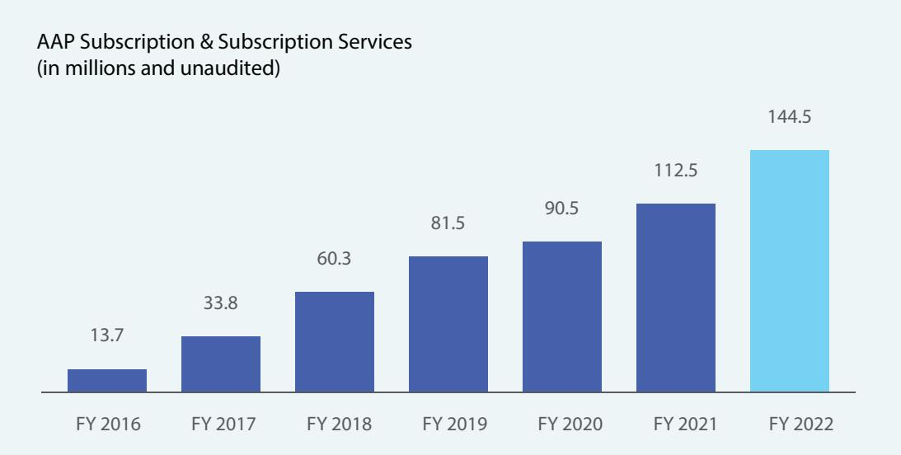
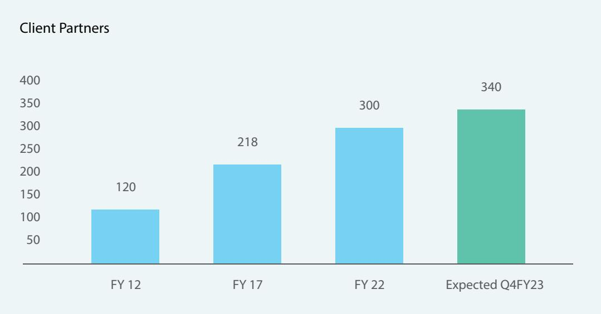
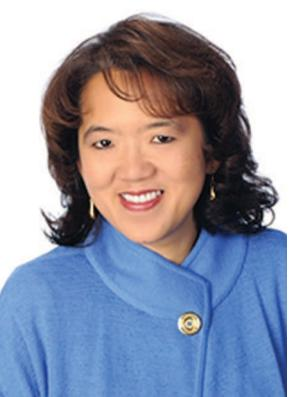
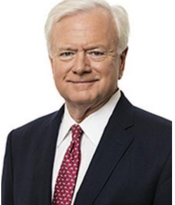
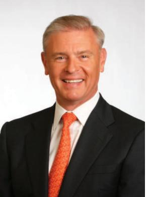
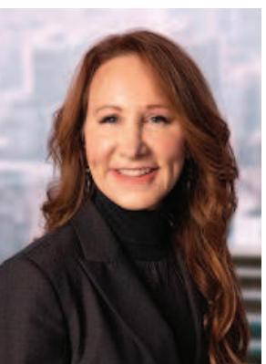
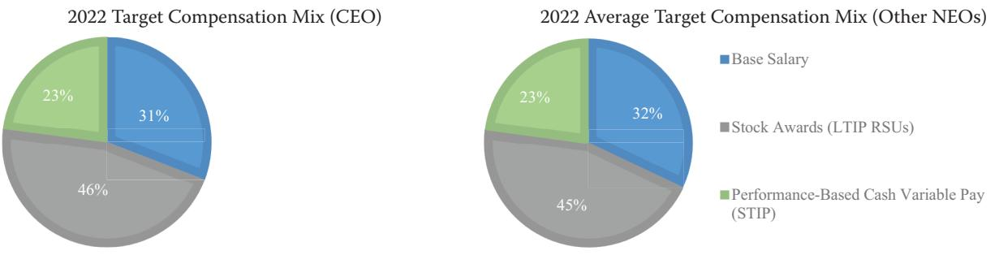
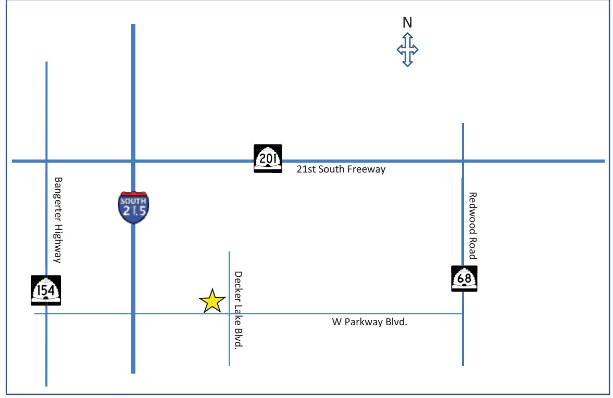
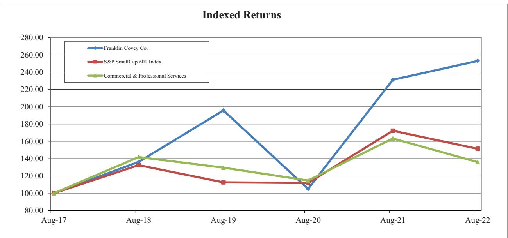

{0}------------------------------------------------

**2022 ANNUAL REPORT**

FRA22151353 Version 1.0.6 © Franklin Covey Co. All rights reserved. Annual Report 2022

# Timeless. Trusted. Transformative.

{1}------------------------------------------------

# **Mission Statement**

We enable greatness in people and organizations everywhere.

# **Vision**

Our vision is to profoundly impact the way billions of people throughout the world live, work, and achieve their own great purposes.

## **To Be the Workplace of Choice for Achievers With Heart, We Value:**

#### **The Whole Person**

We embrace the uniqueness and diversity of each individual and cultivate a culture of belonging.

#### **The Principles We Teach**

We believe in universal principles of effectiveness and strive to model what we teach.

#### **Lasting Client Impact**

We care deeply about our clients and helping them achieve their own great purposes.

**Executive Team**

**Board of Directors**

**Shareholder Information**

We invite shareholders to attend our

on Friday, January 20, 2023, at the Hyrum W. Smith Auditorium on the Franklin Covey Co. headquarters campus,

2200 West Parkway Boulevard, Salt Lake City, Utah 84119.

New York, New York 10017-6702 **Registrar and Transfer Agent** Broadridge Financial Solutions, Inc.

**Common Stock**

date of November 30, 2022.

The Company's Common Stock is traded on the New York Stock Exchange under the ticker symbol FC. There were approximately 486 shareholders of record on the Company's record

The certifications required by Section 302 of the Sarbanes-Oxley Act have been filed as exhibits to the Company's SEC Form 10-K. The most recent certification required by Section 303A.12(a) of the New York Stock Exchange Listed Company Manual has been filed with the New York Stock Exchange

No dividends have been paid or declared on the

Additional financial information is available to shareholders. Requests should be directed to the attention of Investor Relations, Franklin Covey Co., 2200 West Parkway Boulevard, Salt Lake City, Utah 84119-2331, or call at 801-817-1776. Additional information on the Company is available on the Internet at http://www.franklincovey.com.

Deloitte & Touche, LLP 111 S. Main Street Suite 1500 Salt Lake City, Utah 84111

Dorsey & Whitney LLP 111 S. Main Street Suite 2100 Salt Lake City, Utah 84111-2176 Jones Day Reavis & Pogue 222 East 41st Street

51 Mercedes Way Edgewood, NY 11717

**Certifications**

without qualification.

Company's common stock.

**Requests for Additional Information**

**Dividend**

**Counsel**

Annual Meeting of Shareholders at 8:30 a.m.

**Independent Registered Public Accountants**

**Annual Meeting**

Robert A. Whitman Executive Chairman and Chairman of the Board

Donald J. McNamara

Derek C. M. van Bever

Joel C. Peterson

Nancy Phillips Director

of Directors Anne H. Chow Lead Independent

Director Craig Cuffie Director

Director

Director

Director

Jennifer Colosimo

Enterprise Division M. Sean Covey President

Education Division

Executive Vice President Chief People Officer

Executive Vice President

© Franklin Covey Co. All rights reserved.

C. Todd Davis

Colleen Dom

of Operations

President

Paul Walker President and Chief Executive Officer Stephen D. Young Chief Financial Officer and Corporate Secretary

#### **The Pursuit of Growth**

We are committed to meaningful growth as individuals and as an organization.

{2}------------------------------------------------

# **TABLE OF CONTENTS**

| Letter to Shareholders                                    | 2   |  |  |  |
|-----------------------------------------------------------|-----|--|--|--|
| Financial Highlights                                      | 5   |  |  |  |
| Proxy Statement                                           | 6   |  |  |  |
| Form 10-K                                                 | 54  |  |  |  |
| Management's Discussion and Analysis                      | 79  |  |  |  |
| Report of Independent Registered Public Accounting Firm . | 99  |  |  |  |
| Consolidated Financial Statements 102                  |     |  |  |  |
| Notes to Consolidated Financial Statements                | 106 |  |  |  |
| Corporate Information Inside Back Cover                |     |  |  |  |

{3}------------------------------------------------

#### **Dear Fellow Shareholders,**

We are pleased to share our results for Fiscal 2022, results which were strong, and even better than expected.

Some key highlights include the following:

#### **First, our revenue growth metrics were very strong:**

- Total revenue grew 17%, to \$262.8 million, and excluding operations in China and Japan, whose economies continue to be impacted by Covid-related restrictions, revenue grew 21%.
- Subscription and subscription services revenue grew even more rapidly, increasing 29%.
- The durability and predictability of our revenue also continued to increase, and our visibility into future revenue growth continued to expand, with: (1) our balance of Deferred Subscription Revenue (Billed and Unbilled) increasing 20% for the year to \$153.4 million; (2) the percent of All Access Pass contracts which are multiyear increasing to 46% at year end, up from 41% at the end of fiscal 2021; (3) the percentage of our total All Access Pass subscription revenue represented by multiyear contracts (of at least two years) increasing to 61% of total contracted subscription revenue at year-end, up from 57% at the end of fiscal 2021; and (4) the average Lifetime Value of our All Access Pass customers continued to increase.

#### **Second, our profitability-related metrics were also outstanding:**

- Our Gross Profit grew 17% to \$201.9 million, and our Gross Margin remained strong at 76.8%.
- Operating SG&A as a percent of sales improved another 389 bps in fiscal 2022, ending up at 60.8%, compared with 64.7% in fiscal 2021, which was 139 bps better than in fiscal 2020.
- Our flow-through percentage was high, with 37% of our growth in revenue flowing-through to increases in Adjusted EBITDA. As a result, Adjusted EBITDA increased 51%, or \$14.2 million, to \$42.2 million.
- Net Cash provided by Operating Activities increased 13% to \$52.3 million.
- We returned a significant amount of capital to shareholders, investing \$23.9 million to repurchase 585,000 shares: and,
- Our liquidity remained high. Even after investing the \$23.9 million for share repurchases, we ended the year with \$75.5 million of liquidity.

We are extremely pleased by our accelerating revenue and Adjusted EBITDA growth and the business' momentum. Prior to the pandemic we talked about our ability to predictably generate high single digit revenue growth, while at the same time achieving even more rapid growth in Adjusted EBITDA. We are really pleased to now be expecting to consistently achieve at least low teens revenue growth, with the expectation that this growth will increase to mid-teens, and then high teens in the coming years, and with the expectation that a significant percentage of this strong revenue growth will flow-through to even more rapid increases in Adjusted EBITDA and Cash Flow.

There are five key drivers underly these results. We would like to emphasize that while each of these drivers is important in any environment, we believe these drivers are even more important in uncertain and turbulent times like at present.

**Driver 1: The markets we have chosen to serve are very large, are growing significantly, and are highly fragmented.** This provides us with enormous headroom for growth and the opportunity to earn a significant share of our chosen segments in these markets.

{4}------------------------------------------------

**Driver 2: We are focused on the most important, lucrative, and durable space in each of these markets.** The opportunities and challenges we help our clients address – challenges that require the collective action of large numbers of people – are ''must win'' for organizations. These are durable and enduring challenges. This provides us with the opportunity to not only partner with our organizational clients and schools in good times, but to become even more important to them in challenging times.

**Driver 3: The ongoing strength of our subscription business model.** Because of the importance of the challenges we help organizations address, and because organizations are typically needing to address several of these challenges simultaneously, seven years ago we moved to a subscription model so that our clients could have access to the full strength and breadth of our powerful solutions.

This subscription model combines our unique strengths, which include our: (a) best-in-class content; (b) ability to provide clients with the broadest range of impactful delivery options across almost any combination of modalities; (c) global sales and delivery reach; and (d) strength, reach and impact of our thought leadership.

Together they have proven to be a powerful engine that has driven and is driving accelerated growth; is significantly increasing the predictability and durability of our revenue; and is creating a high flow- through of increases in revenue to growth in profitability and cash flow.

**Driver 4: We will take advantage of compelling opportunities to accelerate our growth.** The combination of: (1) the large and growing markets we serve; (2) the importance of the challenges we help our clients address; and (3) the strength of our business model is creating exciting opportunities to further accelerate our growth. We have made and are making significant ongoing investments in new content in technology and in the growth of our direct sales force which now exceeds 300 salespeople, or client partners, and is expected to grow to 340 client partners by the end of fiscal 2023.

{5}------------------------------------------------

#### **Driver 5: We will invest our strong cash flow to create significant additional value for shareholders.**

FranklinCovey has generated significant amounts of free cash flow over the years. We have invested this free cash flow at high rates of return both in the business, and in returning capital to shareholders through substantial share repurchases. We expect to continue to generate significant amounts of free cash flow in the coming years and expect to be able to continue to invest this cash to create significant additional shareholder value.

In conclusion, we anticipate our subscription business to continue to achieve significant top and bottom line growth in fiscal 2023 and well into the future, and for substantially all our business to become subscription and subscription services over the next few years. As this occurs, we expect to: (a) achieve accelerated growth in revenue, Adjusted EBITDA and cash flow; (b) substantially increase our number of clients – clients who go on to become ''clients for life;'' and (c) ensure that FranklinCovey makes accelerated progress toward its goal of being ''the workplace of choice for achievers with heart.''

We are grateful to our associates and partners all over the world for their tremendous efforts on behalf of our clients.

We thank you, our shareholders, for the trust you have extended to us. We are committed to ensuring that your trust is well-placed.

We wish you all a great 2023, a year in which you and your families are safe, well, and happy, and one in which we expect FranklinCovey's progress to accelerate even further.

With gratitude,

Paul Walker President & CEO Franklin Covey Co.

Stephen D. Young Chief Financial Officer Franklin Covey Co.

Robert A. Whitman Chairman & Executive Chair Franklin Covey Co.

{6}------------------------------------------------

#### **Financial Highlights**

| August 31,                           | 2022       | 2021       | 2020         | 2019         | 2018         |
|--------------------------------------|------------|------------|--------------|--------------|--------------|
| In thousands, except per-share data  |            |            |              |              |              |
| Income Statement Data:               |            |            |              |              |              |
| Net sales                            | \$262,841  | \$224,168  | \$198,456    | \$225,356    | \$209,758    |
| Gross profit                         | 201,912    | 172,902    | 145,370      | 159,314      | 148,289      |
| Income (loss) from operations        | 23,674     | 8,101      | 3,058        | 2,655        | (3,366)      |
| Income (loss) before income taxes    | 22,064     | 6,075      | 796          | 592          | (5,520)      |
| Income tax benefit (provision)       | (3,634)    | 7,548      | (10,231)     | (1,615)      | (367)        |
| Net income (loss)                    | 18,430     | 13,623     | (9,435)      | (1,023)      | (5,887)      |
| Earnings (loss) per share:           |            |            |              |              |              |
| Basic                                | \$ 1.30 | \$ 0.97 | \$ (0.68) | \$ (0.07) | \$ (0.43) |
| Diluted                              | 1.27       | 0.96       | (0.68)       | (0.07)       | (0.43)       |
| Balance Sheet Data:                  |            |            |              |              |              |
| Total current assets                 | \$155,883  | \$136,708  | \$101,664    | \$119,340    | \$100,163    |
| Other long-term assets               | 12,735     | 15,153     | 15,611       | 10,039       | 12,935       |
| Total assets                         | 259,155    | 249,654    | 205,437      | 224,913      | 213,875      |
| Long-term obligations                | 31,579     | 41,974     | 51,056       | 46,690       | 50,936       |
| Total liabilities                    | 176,341    | 169,791    | 145,984      | 142,899      | 133,375      |
| Shareholders' equity                 | 82,814     | 79,863     | 59,453       | 82,014       | 80,500       |
|                                      |            |            |              |              |              |
| Cash flows from operating activities | \$ 52,254  | \$ 46,177  | \$ 27,563    | \$ 30,452    | \$ 16,861    |

{7}------------------------------------------------

[This page intentionally left blank]

{8}------------------------------------------------

Proxy Statement

{9}------------------------------------------------

[This page intentionally left blank]

{10}------------------------------------------------

# **NOTICE OF ANNUAL MEETING OF SHAREHOLDERS**

## **To Be Held January 20, 2023**

## **FRANKLIN COVEY CO.**

You are cordially invited to attend the Annual Meeting of Shareholders of Franklin Covey Co. (the Company), which will be held on Friday, January 20, 2023 at 8:30 a.m., in the Hyrum W. Smith Auditorium, 2200 West Parkway Boulevard, Salt Lake City, Utah 84119-2331 (the Annual Meeting), for the following purposes:

- (i) To elect seven directors to serve until the 2024 annual meeting of shareholders;
- (ii) To hold an advisory vote on executive compensation;
- (iii) To ratify the appointment of Deloitte & Touche LLP as the Company's independent registered public accountants for fiscal 2023; and
- (iv) To transact such other business as may properly come before the Annual Meeting or at any adjournment or postponement thereof.

**Important Notice Regarding the Availability of Proxy Materials for the Annual Meeting to be Held on January 20, 2023**. The proxy statement and annual report to shareholders are available at www.proxyvote.com.

The Board of Directors has fixed the close of business on Wednesday, November 30, 2022 as the record date for the determination of shareholders entitled to receive notice of and to vote at the Annual Meeting and at any adjournment or postponement thereof.

You are cordially invited to attend the Annual Meeting in person. To ensure that your vote is counted at the Annual Meeting, however, please vote as promptly as possible.

By Order of the Board of Directors,

Robert A. Whitman Executive Chairman and Chairman of the Board of Directors December 19, 2022

# **IMPORTANT**

**Whether or not you expect to attend the Annual Meeting in person, to assure that your shares will be represented, please promptly complete your proxy. Your proxy will not be used if you are present at the Annual Meeting and desire to vote your shares personally.**

{11}------------------------------------------------

**Franklin Covey Co. 2200 West Parkway Boulevard Salt Lake City, Utah 84119-2331**

# **PROXY STATEMENT**

**Annual Meeting of Shareholders January 20, 2023**

# **SOLICITATION OF PROXIES**

This Proxy Statement is being made available to the shareholders of Franklin Covey Co., a Utah corporation (us, our, we, Franklin Covey, or the Company), in connection with the solicitation by the board of directors (the Board or Board of Directors) of the Company of proxies from holders of outstanding shares of our Common Stock, \$0.05 par value per share (the Common Stock), for use at our Annual Meeting of Shareholders to be held on Friday, January 20, 2023, at 8:30 a.m., in the Hyrum W. Smith Auditorium, 2200 West Parkway Boulevard, Salt Lake City, Utah 84119-2331, and at any adjournment or postponement thereof. This Proxy Statement, the Notice of Annual Meeting of Shareholders, and the accompanying form of proxy are first being mailed to shareholders of the Company on or about December 19, 2022.

# **PURPOSE OF THE ANNUAL MEETING**

Shareholders of the Company will consider and vote on the following proposals: (i) to elect seven directors to serve until the next annual meeting; (ii) to hold an advisory vote on executive compensation; (iii) to ratify the appointment of Deloitte & Touche LLP (Deloitte) as our independent registered public accountants for the fiscal year ending August 31, 2023; and (iv) to transact such other business as may properly come before the Annual Meeting or at any adjournment or postponement thereof.

# **COSTS OF SOLICITATION**

We will bear all costs and expenses relating to the solicitation of proxies, including the costs of preparation, assembly, printing, and mailing to shareholders this Proxy Statement and accompanying materials. In addition to the solicitation of proxies by use of the mails, our directors, officers, and employees, without receiving additional compensation, may solicit proxies personally or by telephone, facsimile, or electronic mail. Arrangements will be made with brokerage firms and other custodians, nominees, and fiduciaries for the forwarding of solicitation materials to the beneficial owners of the shares of Common Stock held by such persons, and we will reimburse such brokerage firms, custodians, nominees, and fiduciaries for reasonable out-of-pocket expenses incurred by them in connection therewith.

# **INFORMATION ABOUT VOTING**

## **Who can vote?**

The only voting securities that we have outstanding are shares of our Common Stock. Our Board of Directors has fixed the close of business on Wednesday, November 30, 2022 as the record date for determination of shareholders entitled to notice of, and to vote at, the Annual Meeting (the Record Date). Only shareholders of record at the close of business on the Record Date are entitled to vote at the Annual Meeting. As of the Record Date, there were 13,896,546 shares of our Common Stock issued and outstanding. The holders of record of the shares of our Common Stock on the Record Date are entitled to cast one vote per share on each matter submitted to a vote at the Annual Meeting.

{12}------------------------------------------------

### **What is the difference between a shareholder of record and a ''street name'' holder?**

If your shares are registered directly in your name with Broadridge, our stock transfer agent, you are considered a shareholder of record with respect to those shares. If your shares are held in a stock brokerage account or by a bank or other nominee, you are considered the beneficial owner of those shares, but not the shareholder of record, and your shares are held in ''street name.'' You are entitled to vote your shares whether you are the shareholder of record or you hold the shares in street name.

### **How can you vote?**

You may submit your proxy by mail, telephone, or the Internet. If you are submitting your proxy by mail, you should complete, sign, and date your proxy card and return it in the envelope provided. Sign your name exactly as it appears on the proxy card. If you plan to vote by telephone or the Internet, voting instructions are printed on your proxy card. If you hold your shares through an account with a brokerage firm, bank, or other nominee, please follow the instructions you receive from them to vote your shares. If you provide specific voting instructions, your shares will be voted as you have instructed. Proxy cards submitted by mail must be received by our voting tabulator no later than Thursday, January 19, 2023 to be voted at the Annual Meeting. You may also vote in person at the Annual Meeting.

## **What if I do not specify on my proxy card how I want my shares voted?**

Shares of Common Stock which are entitled to be voted at the Annual Meeting and which are represented by properly executed proxies will be voted in accordance with the instructions indicated on such proxies. If no instructions are indicated, such shares will be voted (i) **FOR** the election of each of the seven director nominees (Proposal No. 1); (ii) **FOR** the proposal regarding an advisory vote on executive compensation (Proposal No. 2); (iii) **FOR** the ratification of the appointment of Deloitte as our independent registered public accountants for the fiscal year ending August 31, 2023 (Proposal No. 3); and in the discretion of the proxy holders as to any other matters as may properly come before the Annual Meeting or at any adjournment or postponement thereof. It is not currently anticipated that any other matters will be presented at the Annual Meeting.

## **What is ''householding?''**

We are sending only one notice or one copy of our proxy materials to shareholders who share the same last name and address, unless they have notified us that they want to receive multiple copies. This practice, known as ''householding,'' is designed to reduce duplicate mailings, and printing and mailing costs. If any shareholder residing at such address wishes to receive a separate copy of our proxy materials in the future, or, if any shareholders sharing an address are receiving multiple copies of our proxy materials and would like to request a single copy, they may contact the Office of the Corporate Secretary at 2200 West Parkway Blvd., Salt Lake City, Utah 84119-2331.

## **How do I vote at the Annual Meeting?**

You may vote in person by written ballot at the Annual Meeting. However, if your shares are held in street name, you must bring a legal proxy or other proof from that broker, trust, bank, or other nominee of your beneficial ownership of those shares as of the record date in order to vote at the Annual Meeting. If you vote by proxy and also attend the Annual Meeting, you do not need to vote again at the Annual Meeting.

## **What are broker non-votes?**

When a broker, bank, or other nominee has discretion to vote on one or more proposals at a meeting but does not have discretion to vote on other matters at the meeting, the broker, bank, or other nominee will inform the inspector of election that it does not have the authority to vote on the ''non-discretionary'' matters with respect to shares held for beneficial owners which did not provide voting instructions with respect to the ''non-discretionary'' matters. This situation is commonly referred to as a ''broker non-vote.''

{13}------------------------------------------------

## **If my shares are held in street name, will my broker, bank or other nominee vote my shares for me?**

Generally no. If you hold your shares in street name and do not give voting instructions to your broker, bank, or other nominee, then your broker, bank, or other nominee may only vote your shares with respect to ''discretionary'' matters, but may not vote your shares with respect to ''non-discretionary'' matters. Each of our proposals, except for Proposal No. 3, the ratification of the appointment of our independent registered public accounting firm, are considered ''non-discretionary'' matters. As a result, if you hold your shares in street name, your broker, bank, or other nominee will not have discretion to vote your shares at the Annual Meeting, except for Proposal No. 3, if you do not provide voting instructions. Accordingly, it is important that street name holders give instructions to their broker, bank, or other nominee by following the voting instructions received from their broker, banker, or other nominee.

## **May I revoke my vote prior to the Annual Meeting?**

Yes. A shareholder who has completed a proxy may revoke it at any time prior to its exercise at the Annual Meeting by returning a proxy bearing a later date, by filing with the Secretary of the Company, at the address set forth below, a written notice of revocation bearing a later date than the proxy being revoked, or by voting the Common Stock covered thereby in person at the Annual Meeting.

## **What is a Quorum?**

A quorum is the presence, in person or by proxy, of at least a majority of the shares of our Common Stock outstanding as of the close of business on the Record Date. A quorum is necessary to transact business at the Annual Meeting. Abstentions and ''broker non-votes'' will be included in determining the presence of a quorum at the Annual Meeting. Holders of common stock will vote as a single class. If there are not sufficient shares represented for a quorum, then the Annual Meeting may be adjourned or postponed from time to time until a quorum is established.

## **What Vote is Required for a Proposal to be Approved?**

Subject to the paragraph below, the seven nominees receiving the highest number of affirmative votes of the shares entitled to be voted for them, up to the seven directors to be elected by those shares, will be elected as directors to serve until the next annual meeting of shareholders or until their successors are duly elected and qualified. Abstentions and broker non-votes will have no effect on the election of directors.

Pursuant to the Company's bylaws, any nominee for director who receives a greater number of votes ''withheld'' or ''against'' from his or her election than votes ''for'' his or her election shall immediately offer to tender his or her resignation following certification of such shareholder vote. The Corporate Governance and Nominating Committee (the Nominating Committee) shall promptly consider the director's resignation offer and make a recommendation to the Board of Directors on whether to accept or reject the offer. The Board of Directors shall act on the recommendation of the Nominating Committee and publicly disclose its decision within 90 days following certification of the shareholder vote.

Approval of Proposal No. 2, the advisory vote on executive compensation, requires that the number of votes cast in favor of the proposal exceeds the number of votes cast in opposition. Abstentions and broker non-votes are not considered votes cast for the foregoing purpose and will not have any effect on the outcome of this proposal.

The ratification of the appointment of Deloitte as our independent registered public accountants (Proposal No. 3) requires that the number of votes cast in favor of the proposal exceeds the number of votes cast in opposition. Abstentions and broker non-votes will not have any effect on the outcome of this proposal.

## **What are the Board's voting recommendations?**

The Board of Directors recommends that you vote **''FOR''** proposal nos. 1, 2, and 3 as further described in this Proxy Statement.

## **The Company's Principal Office and Main Telephone Number**

Our principal executive offices are located at 2200 West Parkway Blvd., Salt Lake City, Utah 84119-2331 and our main telephone number is (801) 817-1776.

{14}------------------------------------------------

# **FISCAL 2022 ENVIRONMENTAL STEWARDSHIP, SOCIAL RESPONSIBILITY, AND GOVERNANCE (ESG) HIGHLIGHTS**

At Franklin Covey, we believe we all have a role to play in shaping a brighter and more sustainable future for our clients, our people, our communities, and our shareholders. As we continue to evolve our programs and initiatives to support a more sustainable future, we have focused our efforts on diversity, equity and inclusion, environmental sustainability, supporting our communities, and improving stakeholder engagement.

Fiscal 2022 presented a variety of challenges to our business and was unique from a number of standpoints. The lessons learned from these challenges gave us a greater sense of urgency and sharpened our focus on driving positive change, within Franklin Covey, with our clients, and with our communities that we serve. As a leading training and content company, some of the most consequential conversations we have with our clients are on the topics encompassed by ESG matters.

At Franklin Covey, we hold ourselves to the highest standards. With the ongoing global pandemic and calls for racial and gender equality, we have renewed our efforts and commitment to drive positive change for our employees and the communities in which they live. Some highlights from our fiscal 2022 ESG efforts include:

- We have a Director of Learning, Development, and Inclusion who is responsible for the internal learning and development of our associates in ways that align with our strategic plans for equality and growth.
- We have the Franklin Covey Diversity, Equity, and Inclusion Council, which is comprised of approximately 35 associates from across our organization who are tasked with monitoring and implementing diversity, equity, and inclusion initiatives at all levels within the Company.
- Two of our seven candidates for our Board of Directors are ethnically diverse.
- Two of our seven candidates for our Board of Directors are women.
- Approximately 67 percent of our workforce constitute women.
- Maintaining our commitment to diversity, 31 percent of our new hires were ethnically diverse.
- We expanded the number of Employee Resource Groups (ERGs) sponsored by the Company.
- During the COVID-19 pandemic, we worked to ensure our employees were safe, first and foremost, felt supported, and were able to be productive.
- We continue to provide our employees access to our content through the All Access Pass and the *Leader in Me* membership to assist with their continued growth and development.
- In September 2022, we held our second annual International Day of Service, which was focused on feeding the hungry and distribution of food to the less fortunate. Combined with the efforts of our international direct offices and international licensee partners, we contributed thousands of hours to help alleviate hunger all over the world.

For more information on our ESG efforts, please refer to the discussion under the heading ''Environmental Stewardship, Social Responsibility, and Governance'' found later in this Proxy Statement.

{15}------------------------------------------------

# **BOARD OF DIRECTORS AND CORPORATE GOVERNANCE**

#### **Board Oversight**

Our Board is responsible for and committed to the independent oversight of the business and affairs of our Company, including financial performance, Chief Executive Officer (CEO) performance, succession planning, strategy, risk management, compensation, growth, and innovations. In carrying out its responsibilities, the Board advises our CEO and other members of our senior management team to help drive success for our clients and long-term value creation for our shareholders.

#### **Corporate Governance**

Franklin Covey upholds a set of basic values and principles to guide our actions, and we are committed to maintaining the highest standards of business conduct and corporate governance. Our emphasis on corporate governance begins at the top, with our directors, who are elected by, and are accountable to you, our shareholders. This commitment to governance extends to our management team and to all of our employees. We have adopted a Code of Business Conduct and Ethics for our directors, officers, and senior financial officers that include the Chief Executive Officer, Chief Financial Officer (CFO), and other members of our financial leadership team. The Corporate Governance Guidelines and Code of Business Conduct and Ethics are available on our website at www.franklincovey.com. In addition, each of the Corporate Governance Guidelines and the Code of Business Conduct and Ethics are available in print free of charge to any shareholder by making a written request to Investor Relations, Franklin Covey Co., 2200 West Parkway Boulevard, Salt Lake City, Utah 84119-2331. The Code of Business Conduct and Ethics applies to all directors, officers, and employees of Franklin Covey.

A feature of our corporate governance is that our standing committees are comprised of independent directors, as discussed below. We believe this structure allows for a collective focus by a majority of our independent directors on the various complex matters that come before Board committees. The overlap inherent in this structure assists these independent directors in the execution of their responsibilities.

## **Diversity of Board Skills and Experience**

Our directors have significant experience with our business and are familiar with the risks and competition we face, which allow them to participate actively and effectively in Board and committee discussions and deliberations. Our directors meet and speak frequently with each other and with members of our senior management team. These formal meetings and informal discussions occur based on the needs of our business and the market environment.

The Nominating Committee, in its board composition discussions, has focused on diversity of experience and perspectives in relation to guiding and overseeing the growth and development of our business. The Board believes the skills, qualities, attributes, and experiences of its directors provide the Company with the business acumen and range of perspectives to engage each other and management to effectively address our evolving needs and represent the best interests of our shareholders. Consistent with our longstanding focus on diversity and inclusion, the Nominating Committee believes our Board should reflect over time a diversity of gender, race, and age. Although we do not have a formal policy on Board member diversity, and the Nominating Committee does not follow strict criteria when making decisions, we believe considering diversity is aligned with the Board's objective of enhancing composition and available skills to most effectively evaluate and guide our strategy now and in the future. In addition to the considerations discussed in the ''Director Nomination Process'' section below, the Nominating Committee seeks Board candidates who have the ability to bring diversity to the Board, which includes diverse viewpoints and perspectives.

{16}------------------------------------------------

#### **Nominees for Election to the Board of Directors**

Our Board currently consists of seven directors, five of whom are considered independent. Nominees for election to the Board of Directors shall be elected to serve until the next annual meeting of shareholders or until their successors shall have been elected and qualified or until such director's earlier death, resignation, or removal. At the Annual Meeting, proxies cannot be voted for a greater number of individuals than the seven nominees named in this Proxy Statement.

We believe each of the nominees listed below bring extensive experience across a variety of disciplines that provides valuable breadth and depth to our Board. The biographies below describe the skills, qualities, attributes, and experiences of each of the nominees that led the Board to determine that it is appropriate to nominate these directors for election.

We have a policy that members of our Board of Directors should retire from service at age 75 unless an extension is specifically approved. In accordance with this policy, an extension was approved for Joel C. Peterson, who is standing for election at our Annual Meeting.

#### **Anne H. Chow, 56**

Lead Independent Director *Director Since:* March 2016 *Committees:* Chair of the Corporate Governance and Nominating Committee and member of the Organization and Compensation Committee, and Growth and Innovations Committee *Other Directorships:* None

Ms. Chow is currently serving as Lead Independent Director of the Board of Directors at Franklin Covey. Anne is the founder of The Rewired CEO, a business services firm based in the Dallas, Texas area and has been serving as CEO since August 2022. Ms. Chow was also recently appointed as Adjunct Professor of Executive Education at the Kellogg School of Management, Northwestern University. Reflective of her impact in driving success at the intersection of people, culture, and technology, she was named to Fortune's Most Powerful Women in Business twice and Forbes inaugural CEO Next List of Leaders set to revolutionize American business among other recognition.

In her prior role, Anne was the CEO of AT&T Business at AT&T from 2019 to 2022. As CEO of AT&T Business, Anne was responsible for the company's Business Solutions organization which serves nearly 3 million business customers in more than 200 countries and territories around the world, including nearly all the world's Fortune 1000 companies. Ms. Chow's responsibilities included all AT&T's business services across wireless, networking, cybersecurity, and advanced solutions, covering more than \$35 billion in revenues. Since 2000, Ms. Chow has held a variety of executive leadership positions at AT&T, including Senior Vice President – Global Solutions and Sales Operations and Senior Vice President – Premier Client Group. With decades of strategic and operational experience in the technology and telecom industry, Anne has led many global organizations through major transformations, developing and executing innovative growth strategies while building role model relationships. Anne is passionate about business and culture transformation, education, diversity and inclusion, and cultivating next generation leaders.

Ms. Chow holds a Master's Degree in Business Administration with Distinction from The Johnson School at Cornell University, as well as a Bachelor of Science Degree and Masters of Engineering Degree in Electrical Engineering from Cornell University. Anne is also a graduate of the Pre-College Division of the Juilliard School of Music.

**Director Qualifications:** The Company believes that Ms. Chow's strong sales and enterprise relationship background as well as her extensive distribution and cross-functional global leadership experience provide valuable insight and skills to our Board of Directors. Ms. Chow's significant leadership involvement with diversified entities throughout her career provides her with wide-ranging perspective and experience in the areas of management, operations, finance, and marketing.

{17}------------------------------------------------

#### **Craig Cuffie, 61**

Independent Director *Director Since*: September 2021 *Committees*: Member of the Audit Committee, Organization and Compensation Committee, and Growth and Innovations Committee *Other Directorships*: None

Since June of 2022, Mr. Cuffie has served as Group Chief Procurement Officer at HSBC, one of the world's largest banks. In his current role, Mr. Cuffie is responsible for Sourcing, Procurement, Expense Management, Corporate Travel, Sustainability, and Third-Party Management. Prior to joining HSBC, Mr. Cuffie served as Executive Vice President and Chief Procurement Officer at Salesforce, where he served as an executive member of the Global Cyber Security Governance Team, the Global Policy Governance Team, and the Global Crisis Incident Management Team. Mr. Cuffie's service at Salesforce ran from 2017 to June of 2022.

Prior to joining Salesforce, Craig founded Eagle Island Advisors in 2015, a boutique private equity firm focused on sourcing lower mid-market opportunities in the 3rd Party Logistics industry. From 2013 to 2015, Mr. Cuffie served as Vice-President of Global Operations at Jawbone, Inc., and was Chief Procurement Officer and Vice-President of Supply Chain at Clearwire from 2010 through 2013. Over his career, Mr. Cuffie has accumulated over 30 years of business experience with 20 years of global management responsibility. Craig's business experience includes board of director service, supply chain, income statement management, manufacturing, and procurement in multiple geographies.

Mr. Cuffie earned his Masters Degree in management from Renssalaer Polytechnic Institute and is a member of the Executive Leadership Council, the Stanford University Graduate School of Business, Global Supply Chain Forum, the Institute for Supply Chain Management, and the procurement 50 cohort of the World 50. While at Salesforce, Craig was an executive sponsor of BOLDforce and AbilityForce, Salesforces' Employee Resource Groups focused on Black employees and employees with disabilities, respectively. Mr. Cuffie is a frequent speaker on Diversity and Inclusion, its value and impact to corporate America and society.

**Director Qualifications**: Mr. Cuffie's extensive financial and operational expertise, as well as international leadership and prior board experience, provides him with wide-ranging knowledge and experience. His professional involvement in various capacities during his career enabled Craig to gain experience in many areas including finance, organizational development, financial planning, and corporate governance. Mr. Cuffie's substantial financial knowledge and leadership experience enable him to make valuable contributions to our Board of Directors and on the Audit Committee.

#### **Donald J. McNamara, 69**

Independent Director *Director Since*: June 1999 *Committees*: Chair of the Audit Committee *Other Directorships*: Crow Holdings and A&O Hotels & Hostels

Mr. McNamara is the founder of The Hampstead Group LLC, a private equity investor based in Dallas, Texas, and has served as its Chairman since its inception in 1989. He has over 35 years of successful investment experience, including Bass Brothers Enterprises, Marriott Corporation, and JMB Realty. Mr. McNamara currently serves as a Senior Advisor to TPG's real estate platform, which includes \$8 billion of assets collectively in its equity and debt platforms. Mr. McNamara received an undergraduate degree in architecture from Virginia Tech in 1976 and an MBA from Harvard University in 1978.

{18}------------------------------------------------

**Director Qualifications:** Mr. McNamara's experience in private equity provides him with considerable expertise in financial and strategic matters. This expertise enables him to make valuable contributions to the Company in the areas of raising capital, capital deployment, acquisitions and dispositions, and other major financial decisions. This experience also qualifies Mr. McNamara to serve as the Audit Committee financial expert. Don's involvement with other entities throughout his career provides him with wide-ranging perspective and experience in the areas of management, operations, and strategy. In addition, Mr. McNamara has a meaningful understanding of our operations having served on our Board of Directors for over 20 years, enabling him to make contributions to our strategy, innovation, and long-range plans.

#### **Joel C. Peterson, 75**

Director *Director Since*: May 1997 *Committees*: None *Other Directorships*: Packsize

Mr. Peterson has been on the faculty of the Graduate School of Business at Stanford University since 1992, teaching courses in real estate investment, entrepreneurship, and leadership. Joel is the former Chairman of the Board of Overseers at the Hoover Institution at Stanford and started his second term as an Overseer in the fall of 2021. Mr. Peterson formerly served as the Chairman of the Board of JetBlue Airways, and is the Founding Partner and Chairman of Peterson Partners, a Salt Lake City-based investment management firm which has invested in over 200 companies through 13 funds in four primary asset classes: growth-oriented private equity, venture capital, real estate, and search funds. Prior to Stanford Business School and founding Peterson Partners, Mr. Peterson was Chief Executive Officer of Trammell Crow Company, then the world's largest private commercial real estate development firm. Mr. Peterson earned an MBA from Harvard University and received his bachelor's degree from Brigham Young University.

**Director Qualifications:** Mr. Peterson brings chief executive leadership, extensive financial experience, and strong academic skills to our Board of Directors. Mr. Peterson's roles in executive leadership, financial management, and private equity enable him to make key contributions in the areas of leadership, raising capital, capital deployment, strategy, operations, and growth. His experience with Peterson Partners and teaching courses on entrepreneurship adds valuable knowledge in growth and long-term strategic planning as well as accessing and deploying capital. Joel also has a deep understanding of the Company's operations and background with nearly 25 years of experience on our Board of Directors. Further, prior to the FranklinCovey merger, Mr. Peterson served as a director of Covey Leadership Center from 1993 to 1997.

#### **Nancy Phillips, 55**

Independent Director

*Director Since*: May 2020 *Committees*: Chair of the Organization and Compensation Committee and member of the

Corporate Governance and Nominating Committee, and Growth and Innovations Committee *Other Directorships*: None

Since December 2019, Ms. Phillips has served as Executive Vice President, Chief People Officer, at Paramount, overseeing the combined company's global human resources organization. Nancy is responsible for driving Paramount's human resources strategy and delivering global programs to create a positive employee experience and a culture of high performance. Ms. Phillips also oversees the company's Human Resource (HR) business partners, talent acquisition, organizational effectiveness, learning and development, total rewards, people analytics, HR operations, and global security.

{19}------------------------------------------------

Ms. Phillips previously served as the Executive Vice President, Chief Human Resources Officer at Nielsen from January 2017 to December 2019, as well as on the Nielsen Foundation's Board of Directors. Under her leadership, Nielsen was ranked No. 2 on Forbes' ''Employers for Diversity'' list and received multiple ''Great Place to Work'' awards globally.

Prior to joining Nielsen, Nancy was Chief Human Resources Officer of Broadcom during 2015 and 2016 prior to its sale to Avago Technologies, the largest technology deal in history at that time. Before joining Broadcom, from 2010 to 2014, she led the HR organization for Hewlett Packard's Imaging and Printing Group, as well as HP's Enterprise Services business group, a global organization with more than 120,000 employees. Prior to her experience at HP, Ms. Phillips served as Executive Vice President and Chief Human Resources Officer for Fifth Third Bancorp, a diversified financial services company with \$133 billion in assets from 2008 to 2010. Nancy also spent 11 years with the General Electric Company serving in a variety of HR leadership roles.

Nancy is active in a range of professional associations, and in 2006 received a YWCA TWIN (Tribute to Women) award in Silicon Valley for her commitment to diversity and inclusion. A member of the Florida Bar, she began her professional career as an attorney. Ms. Phillips earned a B.A. in English from the University of Delaware and a J.D. from Samford University in Birmingham, Alabama.

**Director Qualifications:** Ms. Phillips' extensive experience in human resource management provides our Board with expertise in human capital management and compensation, which provides her with the knowledge to serve effectively on our Organization and Compensation and Corporate Governance and Nominating Committees. Nancy's legal background provides additional insight and expertise to regulatory and other potentially complex human resource matters.

# **Derek C.M. van Bever, 65**

Independent Director *Director Since:* September 2019 *Committees*: Chair of the Growth and Innovations Committee and member of the Audit Committee, and Corporate Governance and Nominating Committee *Other Directorships:* None

Mr. van Bever is a Senior Lecturer of Business Administration in the General Management Unit at the Harvard Business School and is a director of the Forum for Growth and Innovation. Derek teaches courses in the Harvard MBA program, including *Building and Sustaining a Successful Enterprise*, and *Leadership and Corporate Accountability*. Mr. van Bever is co-chair of Harvard's Executive Education course in *Disruptive Innovation* and is co-director of the Harvard Macy Institute's *Leading Innovation in Health Care and Education* course.

In 1983, Derek co-founded The Advisory Board Company, a global research, consulting, and technology firm serving hospital and university executives, and was chief research officer of The Corporate Executive Board, the world's largest executive advisory network. Mr. van Bever's research interests include the challenges facing leading companies seeking discontinuous renewal through market-creating innovation, as well as the new models for uniting faith, leadership, and corporate mission that are emerging in the economy. With his colleague Matthew S. Olsen, Derek is co-author of the book, *Stall Points* (Yale University Press, 2008), a quantitative and qualitative analysis of the growth experience of companies in the Fortune 100 across the past half-century. A 2008 *Harvard Business Review* article authored by Mr. van Bever on the book entitled *When Growth Stalls* won the McKinsey Award for that year.

Derek received his Masters of Business Administration from the Harvard Business School in 1988, and is a 2011 graduate of Harvard Divinity School (HDS). Mr. van Bever is a member of the HDS Dean's Council and recently received the 2019 Dean's Leadership Award for his leadership in the school's strategic planning efforts around its 2016 bicentennial.

{20}------------------------------------------------

**Director Qualifications:** Mr. van Bever brings experience in thought leadership and expertise in business growth, innovation, subscription businesses, and strategy to our Board of Directors. In his role as chief research officer for The Corporate Executive Board, Derek directed teams studying best practices in strategy, innovation, talent management, finance, and governance in the large-corporate sector worldwide. The Company believes Mr. van Bever's experience, thought leadership, and research abilities make him a valuable addition to its Board of Directors.

#### **Robert A. Whitman, 69**

Executive Chairman and Chair of the Board of Directors *Director Since*: May 1997 *Committees*: None *Other Directorships*: None

Mr. Whitman has served as the Chairman of the Board of Directors since June 1999 and served as Chief Executive Officer of the Company from January 2000 through August 2021. Mr. Whitman currently serves as Executive Chairman and Chairman of the Board of Directors. Mr. Whitman previously served as a director of the Covey Leadership Center from 1994 to 1997. Prior to joining us, Mr. Whitman served as President and Co-Chief Executive Officer of The Hampstead Group LLC from 1992 to 2000 and is a founding partner at Whitman Peterson. Bob received his Bachelor of Arts Degree in Finance from the University of Utah and his MBA from the Harvard Business School.

**Director Qualifications:** Mr. Whitman's leadership experience as the Chief Executive Officer of the Company for 21 years and his in-depth knowledge of our strategic priorities and operations enable him to provide valuable contributions and facilitate effective communication between management and the Board of Directors in his new role as Executive Chairman. Mr. Whitman's extensive experience in finance, private-equity investing, and leadership also provides him with the knowledge to make valuable contributions to the Board of Directors in the areas of finance, raising capital, and capital deployment.

{21}------------------------------------------------

#### **Affirmative Determination Regarding Board Independence**

The Board of Directors has determined each of the following directors to be an ''independent director'' under the listing standards of the New York Stock Exchange (NYSE): Anne H. Chow, Craig Cuffie, Donald J. McNamara, Nancy Phillips, and Derek van Bever.

The Company has engaged Ms. Anne H. Chow to deliver keynote addresses to clients and prospective clients on its behalf. Ms. Chow will receive compensation for the speeches that she delivers. The Board of Directors has reviewed the nature and amounts of expected compensation from these addresses and has determined that Ms. Chow will remain an independent director.

In assessing the independence of the directors, the Board of Directors determines whether or not any director has a material relationship with us (either directly, or as a partner, shareholder, or officer of an organization that has a relationship with us). The Board of Directors considers all relevant facts and circumstances in making independence determinations, including the director independence standards adopted by the Board of Directors and the existence of related-party transactions as described in the section entitled ''Certain Relationships and Related Transactions'' found in this report.

## **Board Leadership Structure**

The Board of Directors does not have a policy on whether the roles of Chairman and CEO should be separate or combined. Following the September 1, 2021 appointment of Robert A. Whitman as Executive Chairman and Chairman of the Board and Paul S. Walker as Chief Executive Officer, these roles are no longer combined. Drawing on Mr. Whitman's capabilities, broad experience, and extensive knowledge of the Company and its operations, his responsibilities as Executive Chairman have included:

- Advising the Company and the new CEO during the transition of the Chief Executive Officer;
- Focusing his efforts on corporate strategy, innovations, key financial matters, and capital transactions;
- Attending meetings with Company leadership, business partners, employees, and others as requested by the CEO or the Board;
- Assisting the Board with its oversight of the Company's risks;
- Communicating with both internal and external stakeholders, as appropriate;
- Acting as a primary liaison between the Board and management; and
- Creating tight alignment between the Board and management as to the Company's strategic direction, and supporting the execution of the Company's strategy.

We believe Mr. Whitman's leadership and previous experience with the Company and its operations will enable him to provide meaningful contributions in the Executive Chairman role. Our Board regularly assesses the roles of Chief Executive Officer and Chairman of the Board, and deliberates the merits of its leadership structure to ensure that the most efficient and appropriate structure is in place. The Board of Directors has determined that if the Chairman of the Board is not an independent director, then there should be a Lead Independent Director.

Ultimately, we believe that our current leadership structure, combined with strong governance practices, creates a productive relationship between our Board and management, including strong independent oversight that benefits our shareholders. As CEO, Mr. Walker is directly accountable to our Board and, through our Board, to our shareholders. Mr. Whitman's role as Executive Chairman and Chairman of the Board is also directly accountable to the Board and to our shareholders. We believe Mr. Whitman's role is both counterbalanced and enhanced by the overall independence of the Board and independent leadership provided by our Lead Independent Director, Ms. Anne H. Chow. Ms. Chow, as Chair of our Nominating Committee, was designated as the Lead Independent Director by our Board. Our independent directors may elect another independent director as Lead Independent Director at any time. Mr. Walker, Mr. Whitman, and Ms. Chow meet and speak frequently regarding our Board and our Company.

{22}------------------------------------------------

#### **The Board of Director's Role in Risk Management Oversight**

The Audit Committee of our Board of Directors has responsibility for the oversight of risk management, while our management team is responsible for the day-to-day risk management process. With the oversight of the Board of Directors, management has developed an enterprise risk management strategy, whereby management identifies the top individual risks that we face with respect to our business, operations, strategy, and other factors that were recognized after discussions with key business and functional leaders and reviews of external information. In addition to evaluating various key risks, management identifies ways to manage and mitigate such risks. During fiscal 2022, our management met regularly with the Audit Committee to discuss the identified risks and the efforts that are designed to mitigate and manage these risks. These risks are allocated to the various committees of the Board of Directors to allow the committees to examine a particular risk in detail and assess its potential impact to our operations. For example, the Audit Committee reviews compliance and risk management processes and practices related to accounting and financial reporting matters; the Nominating Committee reviews the risks related to succession planning and the independence of the Board of Directors; and the Organization and Compensation Committee reviews the risks related to our various compensation plans. In the event that a committee is allocated responsibility for examining and analyzing a specific risk, such committee reports on the relevant risk exposure during its regular reports to the entire Board of Directors.

As part of its responsibilities, the Organization and Compensation Committee periodically reviews our compensation policies and programs to ensure that the compensation programs offer appropriate performance incentives for employees, including executive officers, while mitigating excessive risk taking. We believe that our various compensation programs contain provisions that discourage excessive risk taking. These provisions include:

- An appropriate balance between annual cash compensation and equity compensation that may be earned over several years.
- Metrics that are weighted between the achievement of overall financial goals and individual objectives.
- Stock ownership guidelines that encourage executive officers to accumulate meaningful levels of equity ownership, which align the interests of executives with those of long-term shareholders.

Based on a review of the nature of our operations by the Organization and Compensation Committee, we do not believe that any areas of the Company are incented to take excessive risks that would likely have a material adverse effect on our operations.

{23}------------------------------------------------

# **BOARD OF DIRECTOR COMMITTEES AND MEETINGS**

Our Board has three standing committees: Audit, Nominating, and Organization and Compensation (the Compensation Committee). The specific membership of each committee allows us to take advantage of our directors' diverse skill sets, which enables deep focus on relevant committee matters. The following table shows the current membership of each of our standing committees.

| Director           | Audit | Nominating | Compensation |
|--------------------|-------|------------|--------------|
| Anne H. Chow       | —     |            |              |
| Craig Cuffie       |       | —          |              |
| Donald J. McNamara |       | —          | —            |
| Joel C. Peterson   | —     | —          | —            |
| Nancy Phillips     | —     |            |              |
| Derek van Bever    |       |            | —            |
| Robert A. Whitman  | —     | —          | —            |

Committee Chair Committee Member

The Board of Directors has adopted a written charter for each of the standing committees, which are reviewed annually. These charters are available on our website at www.franklincovey.com. Shareholders may obtain a printed copy of any of these charters free of charge by making a written request to Investor Relations, Franklin Covey Co., 2200 West Parkway Boulevard, Salt Lake City, Utah 84119-2331.

## **The Audit Committee**

The Audit Committee functions on behalf of the Board of Directors in accordance with Section 3(a)(58)(A) of the Securities Exchange Act of 1934, as amended (the Exchange Act). The Audit Committee's primary functions are to:

- assist our Board in its oversight of our financial statements, legal and regulatory compliance, independent auditors' qualification, independence, internal audit function performance, and internal controls over financial reporting;
- decide whether to appoint, retain, or terminate our independent auditors;
- pre-approve all audit, audit-related, tax, and other services, if any, to be provided by the independent auditors; and
- prepare the Audit Committee Report.

The Audit Committee is chaired by Mr. McNamara, and each of the members of the Audit Committee is independent as described under NYSE rules and meets the enhanced independence standards established by Rule 10A-3 promulgated under the Exchange Act. The Board of Directors has determined that one of the Audit Committee members, Donald J. McNamara, is an ''audit committee financial expert'' as defined in Item 407(d)(5)(ii) of Regulation S-K.

{24}------------------------------------------------

#### **The Corporate Governance and Nominating Committee**

The Corporate Governance and Nominating Committee is chaired by Ms. Anne H. Chow. The primary purposes of the Nominating Committee are to:

- recommend individuals for nomination, election, or appointment as members of our Board and its committees;
- oversee the evaluation of the performance of our Board, its committees, and our management;
- ensure that our committees are comprised of qualified and experienced independent directors;
- review and concur in the succession plans for our CEO and other members of senior management; and
- take a leadership role in shaping our corporate governance, including developing, recommending to the Board, and reviewing on an ongoing basis the corporate governance principles and practices that apply to our Company.

In carrying out the responsibilities of the Nominating Committee, Ms. Chow frequently met or had discussions with Mr. Walker and Mr. Whitman during the fiscal year. All of the members of the Nominating Committee are independent as defined under NYSE rules.

## **The Organization and Compensation Committee**

We are in a business that relies heavily on our people for a competitive advantage. As a result, our Organization and Compensation Committee plays a pivotal role in enabling us to attract and retain the best talent for the growth and strategic needs of our Company. Whenever possible, our goal is to be in a position to appoint people from within our Company to our most senior leadership positions, and our executive compensation program is intended to incentivize our people to stay at Franklin Covey and to aspire to these senior roles.

The Compensation Committee is chaired by Ms. Nancy Phillips and regularly met without any employees present to discuss executive compensation matters, including Mr. Walker's compensation package, during fiscal 2022. The primary functions of the Compensation Committee are to:

- determine and approve the compensation of our CEO and other executive officers;
- review and make recommendations to the Board for any incentive compensation and equity-based plans that are subject to Board approval;
- assist our Board in its oversight of the development, implementation, and effectiveness of our policies and strategies relating to our human capital management, including recruiting, retention, career development and progression, diversity, and employment practices;
- review management development plans and succession plans to ensure business continuity (other than that within the purview of the Nominating Committee);
- provide risk oversight of all Company compensation plans;
- review periodically the form and amount of non-employee director compensation and make recommendations to our Board with respect thereto; and
- prepare the Compensation Committee Report.

All of the Compensation Committee members are independent as defined under the NYSE enhanced independence standards. As described below in ''Compensation Committee Interlocks and Insider Participation'' and ''Certain Relationships and Related Transactions,'' none of the Compensation Committee members had any material business relationships with the Company.

The Compensation Committee administers all elements of our executive compensation program, including our stock-based long-term incentive plans. In consultation with the Compensation Committee, Mr. Walker annually reviews and establishes compensation for the other Named Executive Officers. The Compensation Committee regularly reports to the full Board on decisions related to the executive compensation program.

{25}------------------------------------------------

#### **Compensation Consultants**

Our Compensation Committee recognizes the importance of using an independent compensation consulting firm that is appropriately qualified and that provides services to our Board. During fiscal 2022, the Compensation Committee engaged and received the advice of Mercer as compensation consultants. Mercer provided information to the Compensation Committee regarding stock-based compensation plans, executive compensation, and director compensation that were used as components of the overall mix of information used to evaluate our compensation plans. Our Compensation Committee reviewed its relationship with Mercer and determined that its work does not raise any conflicts of interest and that Mercer was independent under the factors set forth in the NYSE rules for compensation committee advisors. Further information regarding the role of these compensation consultants can be found in the Compensation Discussion and Analysis.

#### **Compensation Committee Interlocks and Insider Participation**

Nancy Phillips, Anne H. Chow, Craig Cuffie, and Dennis G. Heiner each served on the Compensation Committee during fiscal 2022. In accordance with our retirement policy, Mr. Heiner did not stand for reelection at our 2022 annual meeting of shareholders. No member of the Compensation Committee was an officer or employee of the Company or any of our subsidiaries or had any substantial business dealings with the Company or any of our subsidiaries during fiscal 2022 nor was formerly an officer of the Company. None of our executive officers serves as a member of the board of directors or compensation committee of any entity that has one or more executive officers serving as a member of the Board or our Compensation Committee.

#### **Growth and Innovations Committee**

Our Board of Directors has established a supplemental Growth and Innovations Committee to leverage the skills and abilities of our Directors to achieve specific objectives. The Growth and Innovations Committee does not have a charter and is not required by Securities and Exchange Commission (SEC) rules or Company bylaws. Our Growth and Innovations Committee is designed to: 1) assist our management with strategic guidance over growth initiatives and the execution of these initiatives to drive increased sales and shareholder return; and 2) provide strategic direction in our efforts to expand our content and offerings into areas that will provide meaningful results for clients and new growth opportunities.

Mr. van Bever is the Chair of the Growth and Innovations Committee and is joined by Ms. Chow, Mr. Cuffie, and Ms. Phillips as members of this committee. We believe the experience and skills of these directors provides valuable strategic direction to the Company's ongoing growth and innovation objectives.

#### **Commitment of our Directors**

Our Board and its standing committees met regularly during fiscal 2022 as shown below.

|              | Meetings |
|--------------|----------|
| Board        | 4        |
| Audit        | 7        |
| Nominating   | 4        |
| Compensation | 5        |

In addition to the formal meetings shown above, our Board regularly participated in informal update calls with members of our executive management as necessary throughout fiscal 2022.

Our Lead Independent Director plays an active role on our Board of Directors. Ms. Chow reviewed the agenda, schedule, and materials for each Board and Nominating Committee meeting and presided over executive sessions of the independent directors. Any independent director may call for an executive session and suggest agenda items for Board or committee meetings.

{26}------------------------------------------------

All of the members of our Board of Directors attended at least 75 percent of the Board and committee meetings for which they were entitled to participate. Although we encourage Board members to attend our Annual Meeting, we do not have a formal policy regarding director attendance at our annual shareholder meetings. Seven members of our Board of Directors were available for questions at our most recent annual meeting of shareholders, which was held in January 2022.

## **Director Nomination Process**

As indicated above, the Nominating Committee oversees the director nomination process. The Nominating Committee is responsible for identifying and evaluating candidates for membership on the Board of Directors and recommending to the Board of Directors nominees to stand for election. Each candidate to serve on the Board of Directors must be able to fulfill the responsibilities for directors set out in the Corporate Governance Guidelines approved by the Board of Directors. These Corporate Governance Guidelines may be found on our website at www.franklincovey.com. In addition to the qualifications set forth in the Corporate Governance Guidelines, nominees for director will be selected on the basis of such attributes as their integrity, experience, achievements, judgment, intelligence, personal character, ability to make independent analytical inquiries, willingness to devote adequate time to Board duties, and the likelihood that he or she will be able to serve on the Board for a sustained period. In connection with the selection of nominees for director, consideration will be given to the Board's overall balance of diversity of perspectives, backgrounds, and experiences. We believe it is important to have an appropriate mix of diversity for the optimal functionality of the Board of Directors. Although we do not have a formal diversity policy relating to the identification and evaluation of nominees for director, the Nominating Committee considers all of the criteria described above in identifying and selecting nominees and in the future may establish additional minimum criteria for nominees.

Although not an automatically disqualifying factor, the inability of a director candidate to meet independence standards of the NYSE will weigh negatively in any assessment of a candidate's suitability.

The Nominating Committee intends to use a variety of means of identifying nominees for director, including outside search firms, recommendations from current Board members, and recommendations from shareholders. In determining whether to nominate a candidate, the Nominating Committee will consider the current composition and capabilities of serving Board members, as well as additional capabilities considered necessary or desirable in light of existing Company needs and then assess the need for new or additional members to provide those capabilities.

Unless well known to one or more members of the Nominating Committee, normally at least one member of the Nominating Committee will interview a prospective candidate who is identified as having high potential to satisfy the expectations, requirements, qualities, and capabilities for Board membership.

## **Shareholder Nominations**

The Nominating Committee, will consider, but shall not be required to nominate, candidates recommended by our shareholders who beneficially own at the time of the recommendation not less than one percent of our outstanding stock (Qualifying Shareholders).

Generally speaking, the manner in which the Nominating Committee evaluates nominees for director recommended by a Qualifying Shareholder will be the same as for nominees from other nominating sources. However, the Nominating Committee will seek and consider information concerning the relationship between a Qualifying Shareholder's nominee and that Qualifying Shareholder to determine whether the nominee can effectively represent the interests of all shareholders.

Qualifying Shareholders wishing to make recommendations to the Nominating Committee for its consideration may do so by submitting a written recommendation, including detailed information on the proposed candidate, including education, professional experience, and expertise, via mail addressed as follows:

Franklin Covey Co. c/o Stephen D. Young, Corporate Secretary 2200 West Parkway Boulevard Salt Lake City, UT 84119-2331

{27}------------------------------------------------

#### **Communications with Directors**

Shareholders or other interested parties wishing to communicate directly with the Board of Directors or the non-management directors as a group, may contact the Lead Independent Director directly via e-mail at lead.director@franklincovey.com. Our Audit Committee chairman may also be contacted directly via e-mail at audit.committee@franklincovey.com. You may also contact members of the Board in writing by addressing the correspondence to that individual or group, c/o Stephen D. Young, Corporate Secretary, Franklin Covey Co., 2200 West Parkway Boulevard, Salt Lake City, Utah 84119-2331. All such written communications will initially be received and processed by the office of the Corporate Secretary. Depending on the nature of the correspondence, the Secretary or Assistant Secretary will initially review such correspondence and either (i) immediately forward the correspondence to the indicated director and to the Chair of the Nominating Committee, or (ii) hold for review during the next regular meeting of the Board of Directors.

## **Fiscal 2022 Director Compensation**

Director compensation is set by the Organization and Compensation Committee and approved by the Board of Directors. Our management does not play a role in setting Board compensation. During fiscal 2022, we compensated members of the Board of Directors using a combination of cash and equity-based compensation. Robert A. Whitman, our Executive Chairman and Chairman of the Board of Directors and previous CEO, does not currently receive compensation for his service as a director. The fiscal 2022 compensation received by Mr. Whitman for his role as Executive Chairman and Chairman of the Board is shown in the Fiscal 2022 Summary Compensation Table, contained in the ''Executive Compensation'' section of this proxy statement.

During fiscal 2022, the other directors were paid the following amounts for services provided:

| Compensation Element                                   | Amount    |
|--------------------------------------------------------|-----------|
| Annual restricted stock award                          | \$110,000 |
| Annual cash retainer                                   | 50,000    |
| Committee retainer, paid for service on each committee | 10,000    |
| Lead independent director annual retainer              | 30,000    |
| Audit committee chair annual retainer                  | 15,000    |
| Compensation committee chair annual retainer           | 10,000    |
| Nominating committee chair annual retainer             | 5,000     |

We reimbursed the Directors for their out-of-pocket travel and related expenses incurred while attending Board and committee meetings.

## **Fiscal 2022 Director Compensation Table**

| A                    | B              | C       | D      | E              | F                          | G         | H       |
|----------------------|----------------|---------|--------|----------------|----------------------------|-----------|---------|
|                      | Fees earned |         |        |                | Change in pension value |           |         |
|                      | or             |         |        | Non-Equity     | and nonqualified           |           |         |
|                      | paid           | Stock   | Option | Incentive Plan | deferred compensation      | All other |         |
|                      | in cash        | awards  | Awards | Compensation   | earnings                   | Comp      | Total   |
| Name                 | (\$)           | (\$)    | (\$)   | (\$)           | (\$)                       | (\$)      | (\$)    |
| Anne H. Chow(1)      | 106,250        | 110,000 | —      | —              | —                          | 15,000    | 231,250 |
| Craig Cuffie         | 75,000         | 110,000 | —      | —              | —                          | —         | 185,000 |
| Dennis G. Heiner     | 33,750         | —       | —      | —              | —                          | —         | 33,750  |
| Donald J. McNamara   | 72,500         | 110,000 | —      | —              | —                          | —         | 182,500 |
| Joel C. Peterson     | 47,500         | 110,000 | —      | —              | —                          | —         | 157,500 |
| Nancy Phillips       | 87,500         | 110,000 | —      | —              | —                          | —         | 197,500 |
| Derek C.M. van Bever | 80,000         | 110,000 | —      | —              | —                          | —         | 190,000 |

Amounts reported in column C represent the fair value of stock-based compensation granted to each non-employee member of the Board of Directors. All Board of Director unvested stock awards are made annually in January following the Annual Meeting and have one-year vesting terms. In January 2022, each non-employee member of the

{28}------------------------------------------------

Board received an unvested stock award of 2,210 shares that had a fair value of \$110,000. The number of shares awarded to each member of the Board of Directors was determined by dividing the fair value of the share award by \$49.78 per share, which was the closing price of our common stock on the date that the award was granted. At August 31, 2022, the directors held a total of 13,260 shares of unvested stock. For further information on the stock-based compensation awards presented in Column C, refer to Note 12 to our Consolidated Financial Statements in our Annual Report on Form 10-K for the fiscal year ended August 31, 2022 as filed with the SEC on November 14, 2022.

- (1) In addition to compensation received for service on our Board of Directors, Ms. Anne Chow may also deliver speeches and presentations on our behalf. During fiscal 2022, Ms. Chow presented at three events and received \$15,000 in additional compensation, which is shown in column G on the Director Compensation Table above.
#### **Fiscal 2023 Director Compensation**

The following changes to Board compensation have been approved by the Compensation Committee for fiscal 2023:

- The annual cash retainer will increase from \$50,000 per year to \$65,000 per year.
- The fair value of the annual unvested stock award will increase from \$110,000 per year to \$120,000 per year.

No other changes were approved for fiscal 2023 Board of Director compensation.

# **ENVIRONMENTAL STEWARDSHIP, SOCIAL RESPONSIBILITY, AND GOVERNANCE**

#### *Culture and Diversity, Equity, and Inclusion (DEI) at Franklin Covey*

Our mission is to enable greatness in individuals and organizations regardless of race, religion, gender, or other individual characteristics. We stand firmly against racism and discrimination and we expect our associates to create environments of acceptance and contribution as we teach in our *Unconscious Bias* offering. Our goal is to have every associate feel they are a valued member of a winning team doing meaningful work in an environment of trust. To accomplish this goal, we are focused on attracting, developing, and retaining talent while looking through the lens of diversity, equity, and inclusion in each area.

In January 2021, we established the new position of Director of Learning, Development, and Inclusion. This position is responsible for the internal learning and development of our associates in ways that align with our strategic plans for growth. In addition, we established the Franklin Covey Diversity, Equity, and Inclusion Council, which is comprised of approximately 35 associates from across our organization who are tasked with monitoring and implementing diversity, equity, and inclusion initiatives at all levels within the Company. Franklin Covey also sponsors an increasing number of Employee Resource Groups, which are groups of employees who come together based on a shared interest in a specific dimension of diversity. Our global ERG network spans varying dimensions of diversity and is open to all associates. These ERGs are a cornerstone of our diversity, equity and inclusion efforts. We believe our ERGs represent and support our diverse workforce, facilitate networking and connections with peers, and create a culture of inclusion and engagement within the organization.

We believe the diverse and global makeup of our workforce allows us to successfully serve a variety of clients with different needs on a worldwide basis.

We also remain steadfast in our commitment to recruiting and developing Black, Indigenous, and People of Color (BIPOC) associates. From June 1, 2021, through May 31, 2022, 31 percent of our new hires were BIPOC associates. In an effort to increase the population of BIPOC associates, we have expanded our recruitment efforts. We hope to increase the number of BIPOC applicants to ensure we are hiring the most qualified people while increasing our diversity. We are also actively engaged in ensuring that our associate promotions are fair and equitable.

Through our ongoing associate development efforts, from June 1, 2021, to May 31, 2022, over 73 percent of our promotions awarded were to women and more than 29 percent of promotions were awarded to BIPOC associates. As of June 1, 2022, 47 percent of all Vice Presidents within Franklin Covey are women.

For more information on our Human Capital resources, refer to Item 1 in our Form 10-K for the fiscal year ended August 31, 2022 as filed with the SEC on November 14, 2022.

{29}------------------------------------------------

#### *Our Response to COVID-19*

Franklin Covey cares about the health and safety of its associates. In response to the COVID-19 pandemic, we quickly and effectively transitioned more than 90 percent of our associates to remote work and worked diligently to adhere to the Centers for Disease Control and Prevention and local health professional guidance to ensure that we implemented best practices to protect the safety of colleagues while continuing to serve clients, partners, and other stakeholders. We believe these actions have been effective during the ongoing COVID-19 pandemic.

#### *Supporting Our Communities*

We strongly believe that the benefits of our success and scale should enrich our stakeholders, including the communities in which we operate. We are committed to being responsible global and corporate citizens by positively contributing to the communities in which we work and live.

In September 2022, we held our second annual International Day of Service, which was focused on feeding the hungry and distribution of food to the less fortunate. Combined with the efforts of our international direct offices and international licensee partners, Franklin Covey associates volunteered thousands of hours to help alleviate hunger around the world. We plan to continue this day of service as an annual event to be held in connection with our annual kick off meetings.

#### *Environmental Sustainability*

As one of the world's leading training and content companies, we acknowledge our responsibility to reduce our environmental impact where possible. We care about our communities—both local and global—and we are committed to pursuing environmental sustainability initiatives.

In fiscal 2022, our use of air travel remained significantly below our historical travel, while our use of virtual meetings and interviews increased significantly. We are likely to retain some degree of this change in the future. In addition, the majority of our workforce now works from home, which reduces our carbon footprint and congestion of roadways.

Our training materials are available in digital or paper-based formats. If a client chooses to use printed materials, we seek to source our training materials from suppliers which are environmentally responsible. In addition, our materials are primarily comprised of paper, which we believe is a sustainable and renewable resource.

#### *Stakeholder Engagement: Extending our Reach*

We seek to create deeper partnerships with organizations to drive and advance our purpose of enabling greatness in people and organizations throughout the world. As a result, we engage with the following stakeholders:

- Clients and potential clients, including schools
- Shareholders and potential shareholders
- Associates and potential associates
- Suppliers/Vendors

We believe our efforts in the ESG arena will promote and create positive differences in our associates and the communities in which we live and operate. We believe that our content and offerings are designed to foster greater equality and respect, and will improve the cultures of organizations that utilize our offerings.

{30}------------------------------------------------

# **PRINCIPAL HOLDERS OF VOTING SECURITIES**

The following table sets forth information as of November 30, 2022, with respect to the beneficial ownership of shares of Common Stock by each person known by us to be the beneficial owner of more than five percent of our Common Stock, by each director, by our executive officers, and by all directors and officers as a group. Unless noted otherwise, each person named has sole voting and investment power with respect to the shares indicated. The percentages set forth below have been computed without taking into account treasury shares held by us and are based on 13,896,546 shares of Common Stock outstanding as of November 30, 2022. At the date of this report, there were no shares of Series A or B Preferred Stock outstanding.

|                                                                    | Number of        |                        |
|--------------------------------------------------------------------|------------------|------------------------|
| As of November 30, 2022                                            | Common Shares | Percentage of Class |
| Blackrock, Inc.(1)                                                 |                  |                        |
| 55 East 52nd Street                                                |                  |                        |
| New York, NY 10055                                                 | 1,053,812        | 7.6%                   |
| Robert A. Whitman                                                  | 596,062          | 4.3%                   |
| Donald J. McNamara(2)(3)                                           | 443,036          | 3.2%                   |
| Joel C. Peterson(2)                                                | 234,436          | 1.7%                   |
| M. Sean Covey                                                      | 206,735          | 1.5%                   |
| Stephen D. Young                                                   | 189,417          | 1.4%                   |
| Colleen Dom                                                        | 29,539           | *%                     |
| C. Todd Davis                                                      | 26,677           | *%                     |
| Paul S. Walker                                                     | 25,558           | *%                     |
| Anne H. Chow(2)                                                    | 18,738           | *%                     |
| Derek C.M. van Bever(2)                                            | 7,067            | *%                     |
| Jennifer C. Colosimo                                               | 6,648            | *%                     |
| Nancy Phillips(2)                                                  | 4,007            | *%                     |
| Craig Cuffie(2)                                                    | —                | — %                 |
| All directors and executive officers as a group (13 persons)(2)(3) | 1,787,920        | 12.9%                  |

* The percentage of shares beneficially owned by the director or nominee does not exceed 1% of our Common Stock.

- (1) Information for Blackrock Inc. is provided as of September 30, 2022, the filing of their last 13F Report.
- (2) The share amounts indicated exclude unvested stock awards currently held by the following persons in the following amounts: Anne H. Chow, 2,210 shares; Craig Cuffie, 2,210 shares; Donald J. McNamara, 2,210 shares; Joel C. Peterson, 2,210 shares; Nancy Phillips, 2,210 shares; Derek C.M. van Bever, 2,210 shares; and all directors as a group, 13,260 shares. These unvested stock awards do not have voting power or dividend rights until the shares actually vest to members of the Board of Directors.
- (3) The share amount includes those held for Donald J. McNamara by the Donald J. and Joan P. McNamara Foundation with respect to 23,000 shares. Mr. McNamara is the trustee of his foundation, having sole voting and dispositive control of all shares held by the foundation, and may be deemed to have beneficial ownership of such shares.

## **Delinquent Section 16(a) Reports**

Section 16(a) of the Exchange Act requires our Board and executive officers, and persons who own more than 10 percent of our Common Stock, to file with the SEC initial reports of ownership and reports of changes in ownership of our Common Stock and other securities which are derivative of our Common Stock. Executive officers, directors and holders of more than 10 percent of our Common Stock are required by SEC regulations to furnish us with copies of all such reports they file. Based upon a review of the copies of such forms received by us and information furnished by the persons named above, we believe that all reports were filed on a timely basis during fiscal 2022, except for the following: A Form 3 was filed for Mr. Craig Cuffie on October 7, 2021 that should have been 

{31}------------------------------------------------

filed on October 1, 2021 and Form 4s were filed for Ms. Colosimo, Mr. Covey, Mr. Davis, Ms. Dom, Mr. Walker, Mr. Whitman, and Mr. Young on August 9, 2022 that should have been filed on October 1, 2021. These Form 4s were for time-vested stock-based compensation shares granted in connection with the fiscal 2022 long-term incentive plan award, which are expected to vest on August 31, 2024.

# **CERTAIN RELATIONSHIPS AND RELATED TRANSACTIONS**

#### **Review and Approval of Related Party Transactions**

We review all relationships and transactions in which the Company and certain related persons, including our directors, executive officers, and their immediate family members, are participants, to determine whether such persons have a direct or indirect material interest. Our legal and accounting departments have responsibility for the development and implementation of processes and controls to obtain information from the directors and executive officers with respect to related party transactions and for then determining, based upon the facts and circumstances, whether the Company or a related party has a direct or indirect material interest in the transaction. As required under SEC rules, transactions that are determined to be directly or indirectly material to us or the related party are disclosed in our Proxy Statement. In addition, a disinterested majority of the full Board of Directors or Audit Committee reviews and approves any related party transaction that is required to be disclosed.

#### **Related Party Transactions**

We previously acquired CoveyLink Worldwide, LLC (CoveyLink). CoveyLink conducts seminars and training courses, and provides consulting based upon the book *The Speed of Trust* by Stephen M.R. Covey, who is the brother of M. Sean Covey. Prior to the acquisition date, CoveyLink granted us a non-exclusive license related to *The Speed of Trust* book and related training courses for which we paid CoveyLink specified royalties. As part of the CoveyLink acquisition, we obtained an amended and restated license of intellectual property that granted us an exclusive, perpetual, worldwide, transferable, royalty-bearing license to use, sell, and perform the licensed material in any format or medium and through any market or distribution channel. The amount expensed for these royalties to Stephen M.R. Covey under the amended and restated license agreement totaled \$1.8 million during the fiscal year ended August 31, 2022. In connection with the CoveyLink acquisition, we also signed a speaking services agreement that pays Stephen M.R. Covey a portion of the speaking revenues received for his presentations. During fiscal 2022 we expensed \$0.8 million for these presentations.

We pay M. Sean Covey, who is also an executive officer of the Company, a percentage of the royalty proceeds received from the sales of certain books authored by him in addition to his salary. During the fiscal year ended August 31, 2022, we expensed \$0.1 million for these royalty payments.

During fiscal 2022, we employed Joshua M.R. Covey, who is the brother of M. Sean Covey, and paid him compensation totaling \$251,750. We also employed Dr. John Covey, an uncle of M. Sean Covey, and paid him compensation totaling \$45,760 in fiscal 2022.

We employ John Harding, who is the brother-in-law of Stephen D. Young, and paid him compensation totaling \$122,933 during the fiscal year ended August 31, 2022.

Each of these listed transactions was approved according to the procedures cited above.

{32}------------------------------------------------

# **COMPENSATION DISCUSSION AND ANALYSIS**

#### **Named Executive Officers**

Our Compensation Committee, composed of three independent directors, determined the fiscal 2022 compensation for our named executive officers, whom we call our ''NEOs'' and who held the following positions during fiscal 2022:

- **Paul S. Walker** President and Chief Executive Officer (CEO);
- **Stephen D. Young** Chief Financial Officer (CFO);
- **Robert A. Whitman** Executive Chairman and Chairman of the Board of Directors;
- **M. Sean Covey** President of the Education Division; and
- **Jennifer C. Colosimo** President of the Enterprise Division.

#### **Overview**

This Compensation Discussion and Analysis (CD&A) describes in detail:

- The guiding principles, philosophy, and objectives of our executive compensation program, including shareholder-minded compensation practices we employ;
- Our fiscal 2022 executive compensation program; and
- Actual compensation earned by or provided to our NEOs as required by SEC rules.

Effective September 1, 2021, Mr. Whitman, the Company's Chairman and CEO during fiscal 2021, transitioned to the role of Executive Chairman. Mr. Walker began serving as the Company's President and CEO on that date.

We begin this CD&A with a short summary of our basic approach to executive compensation and our financial results for fiscal 2022.

## **Basic Elements of and Approach to Executive Compensation at Franklin Covey**

The basic elements of compensation for our executives, including our NEOs, are salary, annual cash incentive compensation based on progress against specified performance metrics, which we call ''STIP'' (short-term incentive plan) awards, time and performance-based equity awards, which we call ''LTIP'' (long-term incentive plan) awards, and employee benefits, including retirement and severance benefits. The Compensation Committee of our Board of Directors sets salaries and STIP metrics at the beginning of each year and considers LTIP awards annually.

We are a people business. We take what we believe to be a rigorous pay-for-performance approach. Accordingly, the key elements of compensation are similar in structure for all employees within our various geographic regions. In recent years, we have increased the percentage of pay that is based on performance and performance-measured compensation for more senior roles, including our NEOs, to further align executive pay with shareholder interests. We have also adopted many compensation policies that we believe to be shareholder minded. As a result, we are pleased to have again received overwhelming support from shareholders in our annual ''say-on-pay'' votes, including an over 97% approval for our say-on-pay vote in fiscal 2022.

#### **Fiscal 2022 Performance**

As a result of our continued transition to a subscription-based model, performance for fiscal 2022 was very strong and exceeded expectations:

- Our consolidated revenue increased 17% year-over-year to \$262.8 million.
- Our adjusted earnings before interest, taxes, depreciation and amortization (Adjusted EBITDA) increased 51% year-over-year to \$42.2 million.

This strong performance reflects the continuation and acceleration of key trends, including the following: (1) our Enterprise Division sales grew 15% to \$194.4 million in fiscal 2022; (2) our Education Division sales grew 26% to

{33}------------------------------------------------

\$61.9 million in fiscal 2022; and (3) we achieved significant increases in All Access Pass deferred revenue within our international operations that will increase the reported results for these operations in the future. In North America, All Access Pass subscription and subscription services sales now account for 88% of total sales and are expected to continue increasing over the next few years. We also anticipate All Access Pass and subscription services to make up the majority of our sales in our international operations in the coming years.

## **Shareholder-Minded Compensation Practices**

The Compensation Committee regularly reviews and considers the views of shareholders and proxy advisory firms on corporate pay practices. In this regard, we reach out to key shareholders to solicit their views on executive compensation and consider the results of our annual say-on-pay vote. Taking these and other inputs into account, the Compensation Committee has implemented and maintains the following policies:

- **Clawback Policy** The Board has authority to require reimbursement of any STIP or LTIP payment made to an executive officer where: (1) the payment was based on achieving financial results that were subsequently the subject of a substantial restatement of Company financial statements filed with the SEC; (2) the Board determines the executive engaged in misconduct that caused the need for the substantial restatement; and (3) a lower payment would have been made to the executive based on the restated financial results. In such an instance, the Company expects that it will seek to recover from the individual executive the amount by which the individual executive's incentive payments for the relevant period exceeded the lower payment that would have been made based on the restated financial results. We note that, in light of the SEC's adoption of final clawback rules in October 2022, our clawback policy is expected to change when necessary in order to comply with final stock exchange listing standards.
- **Hedging Policy** Our directors and executive officers are prohibited from buying or selling publicly traded options, puts, calls or other derivative instruments related to Company stock. All other employees are discouraged from engaging in hedging transactions related to Company stock.
- **No Option Repricing Without Shareholder Approval** Our equity plans expressly prohibit option repricing without shareholder approval.
- **No Excise Tax Gross-ups** Excise tax gross-ups for our NEOs are prohibited.
- **Stock Ownership Guidelines** Our stock ownership guidelines require an ownership threshold of five times base salary for our CEO, three times base salary for our CFO and two times base salary for our other NEOs. Each NEO is targeted to reach the applicable threshold within five years of the policy becoming applicable to the NEO and from the date the NEO first has shares awarded as part of their annual compensation. NEOs are prohibited from selling any shares until after these established guidelines are met. The Compensation Committee annually reviews executives' progress toward meeting these guidelines. For fiscal 2022, the stock ownership of Mr. Young, Mr. Whitman, and Mr. Covey met or exceeded the applicable threshold, and Mr. Walker and Ms. Colosimo are also currently expected to meet their ownership threshold within the allotted time.

In addition to the stock ownership guidelines for our NEOs, a Board policy requires that each director who is not an employee of the Company maintain beneficial ownership of the Company's common stock and/or vested restricted stock units (RSUs), equal in value to at least five times the annual Board cash retainer at all times during his or her tenure on the Board. New directors have up to five years of service on the Board in which to meet this ownership requirement.

- **No Significant Perquisites** No significant ''corporate perquisites'' such as country club memberships or automobile allowances are provided to our NEOs.
- **No Employment Agreements for NEOs and Limited Change-in-Control Benefits** The Company does not enter into employment agreements with its NEOs and has a change-in-control policy for its NEOs that provides for a specific potential change-in-control severance benefit of only one times total targeted annual cash compensation without any excise tax gross-ups. Our NEOs are subject to the same general (non-change-in-control) severance policies as all Company employees.

{34}------------------------------------------------

- **Pay for Performance Awards** The fiscal 2022 LTIP performance-based equity awards were designed to incentivize specific achievement levels in our results of operations and pay out only if those specified operating improvements are achieved.
#### **Consideration of 2022 Say-on-Pay Voting Results**

We held our annual advisory say-on-pay vote with respect to the compensation of our NEOs at our Annual Meeting conducted in January 2022. Over 97% of the votes cast were in favor of the compensation of our NEOs. Considering its ongoing shareholder-minded compensation policies, discussions with advisors and the indications of this vote, our Board of Directors and the Compensation Committee considered and discussed this shareholder vote result during fiscal 2022 and determined not to make significant changes to the existing program for fiscal 2022 in response to shareholder feedback. The Compensation Committee expects to periodically explore various executive pay and corporate governance changes to the extent appropriate to keep our executive compensation program aligned with best practices in our competitive market and the Company's particular circumstances, keeping shareholder views in mind. The Compensation Committee intends to continue holding say-on-pay votes with shareholders on an annual basis, consistent with our shareholders' recommendation.

## **Guiding Philosophy, Principles and Objectives of our Executive Compensation Program**

To fulfill our mission and implement our strategy, Franklin Covey must attract, motivate, and retain highly qualified employees. We achieve this objective, in part, through working to achieve both a winning culture and a competitive performance-based total compensation program. We align our executives' interests with those of our shareholders by tying STIP and LTIP compensation to the Company's achievement of key measures of growth and key strategic objectives.

We believe variable, performance-based compensation should constitute a significant percentage of our executives' overall compensation opportunity. All executive base salary, STIP, and LTIP compensation is designed to be market-based. Variable cash incentive pay and LTIP pay are linked to, and designed to reward the achievement of, specific performance targets.

The philosophy and objectives of our executive compensation program are reflected in the compensation principles listed below, which guide the Compensation Committee in its oversight of our compensation practices and plans. The specific objectives of our executive compensation program are to reward achievement of our strategic and annual business plans and to link a major portion of pay directly to performance. The key principles that guide the Compensation Committee are that the Company's executive compensation program should:

- *Reflect Performance:* We establish multi-year objectives for the Company relating to both growth and the achievement of key strategic objectives to align compensation with performance over both the short and long term. Annual performance targets are established in the context of these multi-year objectives, and for fiscal 2022 consisted primarily of goals for growth in revenue, new business, Adjusted EBITDA, and deferred revenue. NEO performance pay levels for the year are generally determined by assessing the Company's level of achievement compared to these objectives. Since our NEOs are responsible for overall Company performance against these objectives, their compensation can vary (and has varied) significantly from year to year.
- *Encourage Long-Term Company-Wide Focus:* We believe that compensation should encourage and reward both the achievement of annual objectives and longer-term, Company-wide performance improvement. We use a service-based and performance-based award program to focus NEO efforts on long-term growth in shareholder value. We believe that paying a significant portion of variable compensation to our NEOs in the form of equity-based compensation that vests over a period of time, based on performance, also encourages a long-term, Company-wide focus. Value is realized through delivering results today, but in a way that builds the foundation for delivering even stronger results in the future. We believe that this practice will lead to our NEOs having a considerable investment in our shares over time. This investment in turn advances both a culture of teamwork and partnership and encourages a stewardship mentality for the Company among our key leaders.
- *Attract and Retain Talent:* We understand the importance of hiring and retaining the best people. Retention of talented employees is critical to successfully executing our business strategy. We seek to be what we refer to internally as ''the workplace of choice for achievers with heart.'' Successful execution of our business strategy

{35}------------------------------------------------

requires that our management team be in place, engaged and focusing their best energy and talents on achieving our business goals and strategies. For us, compensation is not just an overhead expense; it is a key component of the investments we make and costs we incur to generate our revenues. In determining the compensation of our NEOs and in reviewing the effectiveness of our compensation program for attracting and retaining talent, the Compensation Committee generally considers the competitive market for talent. We believe that our compensation programs should enable us to attract and retain talented people and incentivize them to contribute their finest talents to achieving our objectives. We are pleased that, even in the context of the very demanding results they must achieve, our executive officers have an average tenure of over 22 years with our Company (ranging from one to 36 years).

In addition to aligning our compensation programs with the achievement of objectives that drive shareholder value, the Compensation Committee also considers the consistency of our compensation programs and works to ensure that our variable compensation does not encourage imprudent risk-taking. We have determined that our Company's approach to the compensation process addresses the need to balance prudence with performance through a combination of:

- Controls on the allocation and overall management of risk-taking;
- Comprehensive profit and loss and other management information, that provides ongoing performance feedback;
- Rigorous, multi-party performance assessments and compensation decisions; and
- A Company-wide compensation structure that strives to meet industry best practice standards, including a business model that is based on compensating our associates in direct proportion to the revenue and profit contribution they generate.

Our compensation framework seeks to balance risk and reward. Our executive team is involved in identifying relevant risks and performance metrics for our business. We work to create a cadence of accountability within our organization through continuous evaluation and measurement of performance compared to what we refer to internally as our ''Wildly Important Goals'' of achieving profitable growth, meeting strategic objectives, and building a winning culture. Based on the considerations discussed above, in connection with its compensation decisions for fiscal 2022, our Compensation Committee concluded that our Company's compensation program and policies are structured such that they do not encourage imprudent risk-taking, and that there are no risks arising from such programs and policies that are reasonably likely to have a material adverse effect on the Company.

## **Analysis of Fiscal 2022 Compensation Decisions and Actions**

#### *Fiscal 2022 Executive Compensation Determination Process*

The Compensation Committee determined the form and amount of fixed compensation and established specific performance metrics for determining year-end variable compensation to be awarded to our NEOs for fiscal 2022 considering: (1) our financial performance over the prior year and past several years and expectations for fiscal 2022; (2) the individual and collective performance of our NEOs relative to the achievement of metric-based strategic objectives related to growth in key areas; and (3) compensation in connection with our goal of attracting and retaining the best talent. In particular, the Compensation Committee reviewed at a general level the following financial metrics and related growth rates in connection with making its key compensation decisions:

- Revenue;
- Adjusted EBITDA and operating income;
- Multi-year changes in operating income, Adjusted EBITDA and specific revenue targets;
- Achieving high rates of revenue retention for subscription-based revenue; and
- Overall performance, while still continuing through challenges from the COVID-19 pandemic.

{36}------------------------------------------------

*Management Input Regarding Compensation Decisions:* Our Compensation Committee meets in executive session to discuss the performance of our CEO and each of the other NEOs. Our CEO submitted year-end variable compensation calculations (certified by our CFO) and recommendations to the Committee for our other executives, including the NEOs. These calculations and recommendations precisely followed the payout guidelines established for incentive compensation relating to financial performance.

*General Market Assessment:* Our Compensation Committee evaluates our NEO compensation program at a high level against market practices. In fiscal 2022, the Committee asked Mercer, the Committee's compensation consultant, to assess our NEO compensation program, identify considerations that could inform compensation decisions, and advise as to current market practices, trends, and plan designs. Mercer reviewed data from its own research and databases and used this information primarily as supplemental data to assist the Compensation Committee in understanding current market practices related to executive compensation. Mercer has advised us that our compensation program (1) contains features that reinforce significant alignment with shareholders and a long-term focus, (2) blends subjective assessment and policies in a way that addresses known and perceived risks at levels consistent with market compensation for similar-sized and comparable professional services and content companies, and (3) has been aligned with corporate performance.

The Compensation Committee has assessed Mercer's independence, as required under NYSE rules, and considered and assessed all relevant factors, including those required by the SEC that could give rise to a potential conflict of interest during fiscal 2022. The Compensation Committee did not identify any conflicts of interest raised by the work performed by Mercer.

In making pay decisions for fiscal 2022, the Compensation Committee considered how executive compensation should drive desired performance toward our business objectives. The Compensation Committee also considered the specific business opportunities and challenges facing the Company compared to those of our competitors and similar-sized companies. However, the Compensation Committee did not specifically benchmark elements of compensation when making its fiscal 2022 executive compensation decisions. Finally, the Compensation Committee generally considered the past performance of our NEOs, including performance against previous individual and corporate objectives, expected contribution to future corporate objectives and whether the NEOs' performance was achieved consistent with our governing values. The Compensation Committee made final judgments regarding the appropriate compensation level for each NEO based on these additional inputs.

The following peer group was used for fiscal 2022. These companies were selected based on size, industry, and types of professional services offered. The list of peers remains similar to those selected in fiscal 2021 but with the removal of GP Strategies Corporation which was acquired by another organization. Changes in the peer group are occasionally made to achieve the most accurate comparison. Annual revenues for the peer group, which is one of the factors considered in selecting the peers, range from approximately \$100 million to \$1.0 billion. The data for this peer group was regressed due to the overall revenue of the peer group, to be more comparable with our revenue. With our fiscal 2022 revenues totaling approximately \$263 million, we believe with the previously stated regression, this peer group is appropriate for comparative purposes. This peer group is one of many tools used by the Compensation Committee for assessing executive compensation and was comprised of the following companies for fiscal 2022:

- Computer Task Group, Inc.
- CRA International, Inc.
- Exponent, Inc.
- Forrester Research, Inc.
- The Hackett Group, Inc.
- HealthStream, Inc.
- Heidrick & Struggles International, Inc.
- Huron Consulting Group, Inc.
- Information Services Group, Inc.

{37}------------------------------------------------

- Mastech Digital, Inc.
- RCM Technologies, Inc.
- Resources Connection, Inc.

#### *Decisions on Key Elements of Fiscal 2022 Executive Compensation*

*Total Compensation:* In addition to the specific elements of compensation discussed below, we establish annual targets for the total compensation provided to our NEOs. Based on the key factors described above, along with our expected growth, the Compensation Committee established fiscal 2022 total compensation targets of \$1.6 million for our CEO and \$1.0 million, on average, for our other NEOs, assuming achievement of targeted results under our STIP and LTIP. These calculations exclude book royalty payments made to Mr. Covey, as noted in the Fiscal 2022 Summary Compensation Table.

*Total Compensation Mix:* The following charts identify the fiscal 2022 target compensation mix for our CEO and average mix for our other NEOs.

In particular, the Compensation Committee gave consideration to our CEO's base pay, which affects his overall compensation level, against a peer set which includes companies that are substantially larger by revenues than Franklin Covey and considered this in setting his compensation levels.

#### *Base Salaries*

The Company pays a base salary to each of our NEOs to provide a base level of fixed income for services rendered. The Compensation Committee annually reviews base salary market data and if appropriate, will adjust base salaries to remain at competitive levels. The Committee continues to emphasize performance-based variable pay as the primary means by which NEOs may increase their total compensation absent increases in responsibilities. Effective September 1, 2021, in connection with Mr. Whitman's transition from Chief Executive Officer to Executive Chairman and Chairman of the Board of Directors, his annual base salary rate was reduced from \$500,000 to \$200,000, and Mr. Walker's annual base salary rate was increased from \$425,000 to \$500,000 to reflect his appointment to his new role. For specific information about the NEOs' base salaries for fiscal 2022, see the ''Salary'' column in the ''Fiscal Year 2022 Summary Compensation Table'' below.

#### *Annual Performance-Based Variable Pay*

*Fiscal 2022 Performance-Based Cash Variable Pay Plan:* The Company provides annual performance-based cash incentive opportunities to link our NEOs' interests to specific financial and strategic goals established by the Compensation Committee*.* In fiscal 2022, this STIP for our NEOs included two components for the payout calculation: (1) annual financial performance objectives (70% of payout) and (2) metric-based executive team performance objectives (30% of payout). Effective September 1, 2021, in connection with Mr. Whitman's transition from Chief Executive Officer to Executive Chairman and Chairman of the Board of Directors, his target STIP payout opportunity was reduced from \$575,000, and Mr. Walker's target STIP payout opportunity was increased from \$284,750 to reflect his appointment to his new role. The target STIP payout opportunities at 100% for our NEOs, determined by the Compensation Committee based on the considerations described above were: \$375,000 for

{38}------------------------------------------------

Mr. Walker; \$235,000 for Mr. Young; \$200,000 for Mr. Whitman; \$220,000 for Mr. Covey and \$250,000 for Ms. Colosimo. The STIP reinforces our strong pay-for-performance philosophy and rewards the achievement of specific business and financial goals during the fiscal year. STIP opportunities can range from 0% to 200% of target based on performance.

Financial Performance Component (70%): The threshold necessary for NEOs to earn 100% of the financial performance component of their target STIP payout in fiscal 2022 was an increase in Qualified Adjusted EBITDA to \$30 million, compared to \$28.0 million for the previous fiscal year. Qualified Adjusted EBITDA is calculated as reported Adjusted EBITDA which is adjusted for the impact of foreign exchange and potentially other items.

The Company uses Qualified Adjusted EBITDA in its analysis and decision-making because it provides information that facilitates consistent internal comparisons to the historical operating performance of prior periods, and we believe the measure provides greater transparency to evaluate operational activities and financial results. Qualified Adjusted EBITDA is also the primary measure by which internal business segment performance is evaluated and is regularly communicated to our analysts. Refer to the table in Appendix A for the reconciliation of Adjusted EBITDA to consolidated net income (loss), a comparable GAAP financial measure.

In fiscal 2022, Qualified Adjusted EBITDA was \$42.2 million, which exceeded the \$30 million threshold, and was 51% higher than the \$28.0 million achieved in fiscal 2021. This performance resulted in a payout of 200% of the 70% financial performance component (a maximum payout of the financial performance component of the STIP).

The following table shows the potential payouts to our NEOs based on the degree of attainment of fiscal 2022 STIP Qualified Adjusted EBITDA objectives (and assuming metric-based executive team performance objectives were achieved). Pro-rata calculations are on a straight-line basis between the performance levels.

| Potential payouts for fiscal 2022 STIP Qualified Adjusted EBITDA objectives (70%)                     |                                                                                                                                       |                                                                                                     |                                                                                                                                                         |                                                                                                                                            |  |  |  |  |
|-------------------------------------------------------------------------------------------------------|---------------------------------------------------------------------------------------------------------------------------------------|-----------------------------------------------------------------------------------------------------|---------------------------------------------------------------------------------------------------------------------------------------------------------|--------------------------------------------------------------------------------------------------------------------------------------------|--|--|--|--|
| Qualified Adjusted EBITDA less than \$25.0 million and not meeting performance objectives | If Qualified Adjusted EBITDA as calculated was > \$25.0 million and< \$30.0 million and meeting performance objectives | Targeted Qualified Adjusted EBITDA of \$30.0 million and meeting performance objectives | If Qualified Adjusted EBITDA (including STIP expense) was > \$30.0 million and < \$35.0 million in and meeting performance objectives | Qualified Adjusted EBITDA (including STIP expense) equal to or greater than \$35 million and meeting performance objectives |  |  |  |  |
| 0%                                                                                                    | Pro-rata calculation                                                                                                                  | 100%                                                                                                | Pro-rata calculation                                                                                                                                    | 200%                                                                                                                                       |  |  |  |  |

Performance Objectives Component (30%): The performance objectives component of the STIP represents 30% of the STIP award. Goals under this component are objectives with specific measures related to the transition to a subscription-based business model as well as recurring All Access Pass revenue. Each key strategic goal is individually weighted based on difficulty and on the effort required to achieve the goal, with most goals weighted between 25% and 35% of this portion of the STIP award opportunity. We believe that the goals established for each NEO were ''stretch'' goals tied to over-achieving compared to our annual plan in support of the Company's long-term strategy of building its subscription business. Each goal was typically linked to what we refer to internally and was previously mentioned as our ''Wildly Important Goals'' that are cascaded throughout the Company, and progress toward each of these goals was tracked regularly. As a point of context as to the rigor of these non-disclosed goals, in recent years, we have achieved various levels of payout under this 30% component: 200% achievement in fiscal 2021; 48% achievement in fiscal 2020; 84% achievement in fiscal 2019; and 100% achievement in each of fiscal 2018 and 2017. Based on performance against these objectives, and the strong performance of the Company's subscription business, NEOs were paid 95% of the performance objectives component.

The Adjusted EBITDA portion of the payout combined with the achievement of 95% of the 30% performance objective component resulted in a total payout of 198.5% of STIP for fiscal 2022. These payouts are reflected in the ''Fiscal Year 2022 Summary Compensation Table'' found in this document under the heading ''Non-Equity Incentive Plan Compensation.'' For more information about the NEOs' award opportunities under the STIP for fiscal 2022, see the ''Fiscal Year 2022 Grants of Plan-Based Awards'' table below. No other annual variable cash compensation awards were earned by the NEOs during fiscal 2022.

{39}------------------------------------------------

#### *Equity Compensation*

We believe that the granting of long-term equity awards over the years has created strong alignment of interests between NEOs and shareholders, as reflected in our strong financial performance from fiscal 2010 through fiscal 2022. The same program and philosophy were reflected in our use of LTIP equity awards in fiscal 2022.

*Fiscal 2022 LTIP – Service-Based and Performance-Based Equity Grants:* A significant portion of our NEOs' total targeted compensation for fiscal 2022 was provided in the form of performance-based stock awards that vest upon the achievement of key financial objectives included in our longer-term financial plan over a period of years, and service-based stock awards that vest upon the completion of three years of service. If the performance targets are not achieved within the allotted time frame, then the performance based award tranches are forfeited.

During fiscal 2022, the Compensation Committee granted service-based and performance-based equity awards to our NEOs. Shares may be earned under the fiscal 2022 LTIP award based on two components over an approximate three-year service period, which ends on August 31, 2024, as described below:

- (1) 25% of the fiscal 2022 LTIP award vests after three years of service and is expected to vest on August 31, 2024; and
- (2) 75% of the fiscal 2022 LTIP award is based on Qualified Adjusted EBITDA performance, as defined earlier. We believe that Adjusted EBITDA is one of the most important measures of our financial results and is important in both the short- and long term. Therefore, this measure is used in both our STIP and LTIP award plans. The Compensation Committee sets the Qualified Adjusted EBITDA award thresholds at levels which are expected peak in the final year of the award measurement period. Qualified Adjusted EBITDA for purposes of fiscal 2022 LTIP is based on the highest Qualified Adjusted EBITDA achieved for any rolling four-quarter period during the three-year measurement period ending August 31, 2024.

In addition to payout levels of 50%, 100%, and 200% for the achievement of applicable performance goals, the number of shares paid in settlement of the performance-based tranche with the financial targets is a straight-line pro-rata calculation between a 50% threshold and a 100% target, and a different straight-line pro-rata calculation between 100% target and 200% maximum. Inasmuch as earning the performance-based LTIP award requires meeting total performance targets over a three-year period, as of August 31, 2022, the fiscal 2022 performance-based LTIP award remained unearned. The three-year performance targets for the fiscal 2022 LTIP award (and the corresponding payout levels for achieving the targets) are as follows:

Qualified Adjusted EBITDA Performance Measures

- \$42.0 million (50% of target minimum threshold);
- \$48.0 million (100% of target); and
- \$55.0 million (200% of target maximum threshold).

We believe that our LTIP equity-based program aligns a significant portion of our executive compensation with improving performance, which increases intrinsic value to our shareholders. Effective September 1, 2021, in connection with Mr. Whitman's transition from Chief Executive Officer to Executive Chairman and Chairman of the Board of Directors, his target LTIP award opportunity was reduced from \$1,150,000 to \$1,000,000, and Mr. Walker's target LTIP award opportunity was increased from \$425,000 to \$750,000 to reflect his appointment to his new role.

For further information regarding our specific LTIP awards and other share-based compensation instruments (including applicable performance achievement), please refer to the notes to our financial statements found in our Annual Report on Form 10-K for the fiscal year ended August 31, 2022, and the footnotes to the Outstanding Equity Awards at Fiscal 2022 Year-End table that are provided below. For more information about the NEOs' award opportunities under the LTIP for fiscal 2022, see the ''Fiscal Year 2022 Summary Compensation Table'' and ''Fiscal Year 2022 Grants of Plan-Based Awards'' table below.

*Qualified Retirement Benefits:* Each of our NEOs participates in our 401(k) plan, which is our tax-qualified retirement plan available to all eligible U.S. employees. We match participant contributions dollar-for-dollar on the first 1% of

{40}------------------------------------------------

salary contributed to the 401(k) plan and 50 cents on the dollar for the next 4% of salary contributed. Our match for executives is the same received by all associates who participate in the 401(k) plan. Contributions to the 401(k) plan from highly compensated employees are currently limited to a maximum of 12% of compensation, subject to statutory limits.

*Other Benefits:* The Compensation Committee evaluates the market competitiveness of the executive benefit package to determine the most critical and essential benefits necessary to retain executives. Based on market information received from Mercer, the Compensation Committee determined to include executive life insurance for certain NEOs. In addition, several years ago, the Company agreed to provide Mr. Whitman, our former CEO, with supplemental disability insurance. For fiscal 2022, the Compensation Committee was provided with the estimated value of these items (which value is included in the Fiscal 2022 Summary Compensation Table below), and determined, as in prior years, that these amounts were not material in determining our NEOs' fiscal 2022 compensation.

- *Term Life Insurance:* Franklin Covey provides a portable 20-year term life policy for Mr. Whitman and Mr. Young. The coverage amount is about 6.5 times Mr. Whitman's target annual cash compensation (base salary plus target performance-based cash variable pay), and about 2.5 times Mr. Young's target annual cash compensation (base salary plus target performance-based cash variable pay). The increase in multiple for Mr. Whitman compared to fiscal year 2021 is due to his decrease in compensation for fiscal 2022 due to his transition to the role of Executive Chairman on September 1, 2021.
- *Supplemental Disability Insurance:* Franklin Covey provides Mr. Whitman with long-term disability insurance which, combined with our current group policy, provides, in the aggregate, monthly long-term disability benefits equal to about 100% of his fiscal 2022 target cash compensation. Again, the increase in percentage for Mr. Whitman compared to fiscal year 2021 is due to his decrease in compensation for fiscal 2022 due to his transition to the role of Executive Chairman on September 1, 2021. Our other NEOs may purchase voluntary supplemental disability insurance at their own expense.

We maintain a number of other broad-based employee benefit plans in which, consistent with our values, our NEOs participate on the same terms as other employees who meet the eligibility requirements, subject to any legal limitations on amounts that may be contributed to or benefits payable under the plans. These benefits include:

- Our high-deductible health plans and health savings accounts administered under Sections 125 and 223 of the Internal Revenue Code of 1986, as amended (the Code); and
- Our employee stock purchase plan implemented and administered under Section 423 of the Code.

*Severance Policy:* We have implemented a severance policy to establish, in advance, the appropriate treatment for terminated NEOs and to help ensure market competitiveness. The severance policy uses the same benefit formula for our NEOs as it uses for all our employees. We do not ''gross-up'' severance payments to compensate for taxes. For more information about the terms of this severance policy, see the section below entitled ''Executive Compensation – Potential Payments Upon Termination or Change-in-Control.''

*Employment Agreements and Change-in-Control Severance Agreements:* We do not have employment agreements with any of our NEOs, but we are a party to change-in-control severance agreements with each of our NEOs. However, consistent with our conservative approach to compensation specific matters that raise shareholder sensitivities, the severance amount is only one time the executive's salary and bonus. For more information about the terms of these change-in-control severance agreements, see the section below entitled ''Executive Compensation – Potential Payments Upon Termination or Change-in-Control.''

{41}------------------------------------------------

## **EXECUTIVE COMPENSATION**

The Fiscal 2022 Summary Compensation Table below sets forth compensation information for our NEOs relating to fiscal 2022, fiscal 2021, and fiscal 2020, as applicable.

Under SEC rules, the 2022 Summary Compensation Table is required to include for a particular year only those equity-based awards granted *during* that year, rather than awards granted after our fiscal year end, even if the equity-based award was granted for services in that year. By contrast, SEC rules require disclosure of cash compensation to be included for the year earned, even if payment is made after year-end.

#### **Fiscal 2022 Summary Compensation Table** Salary (\$) Bonus (\$) Stock Awards (\$) Non-Equity Incentive Plan Compensation (\$)

| Name and Principal Position                                | Year | Salary (\$) | Bonus (\$) | Stock Awards (\$) | Incentive Plan Compensation (\$) | All Other Compensation (\$) | Total (\$) |
|------------------------------------------------------------|------|----------------|---------------|-------------------------|----------------------------------------|-----------------------------------|---------------|
| Paul S. Walker                                             | 2022 | 497,115        | —             | 853,235                 | 744,375                                | 21,281                            | 2,116,006     |
| President and CEO                                          | 2021 | 425,000        | —             | 425,000                 | 569,500                                | 15,408                            | 1,434,908     |
|                                                            | 2020 | 419,231        | —             | 425,000                 | 237,196                                | 15,457                            | 1,096,884     |
| Stephen D. Young                                           | 2022 | 350,000        | —             | 398,220                 | 466,475                                | 22,670                            | 1,237,365     |
| CFO                                                        | 2021 | 350,000        | —             | 350,000                 | 470,000                                | 12,756                            | 1,182,756     |
|                                                            | 2020 | 350,000        | —             | 350,000                 | 195,755                                | 20,011                            | 915,766       |
| Robert W. Whitman                                          | 2022 | 214,423        | —             | 1,137,679               | 397,000                                | 77,230                            | 1,826,332     |
| Executive Chairman                                         | 2021 | 575,000        | —             | 1,150,000               | 1,150,000                              | 79,251                            | 2,954,251     |
|                                                            | 2020 | 575,000        | —             | 1,150,000               | 478,975                                | 73,681                            | 2,277,656     |
| M. Sean Covey                                              | 2022 | 327,692        | —             | 250,309                 | 436,700                                | 141,274                           | 1,155,975     |
| President - Education                                      | 2021 | 300,000        | —             | 200,000                 | 400,000                                | 132,593                           | 1,032,593     |
| Division                                                   | 2020 | 300,000        | —             | 200,000                 | 166,600                                | 115,306                           | 781,906       |
| Jennifer C. Colosimo President – Enterprise Division | 2022 | 375,000        | —             | 227,555                 | 496,250                                | 19,453                            | 1,118,258     |

*Salary:* The amounts reported in the ''Salary'' column represent base salaries paid in cash to each NEO for the fiscal year indicated.

*Stock Awards:* The amounts reported in the ''Stock Awards'' column for fiscal 2022 represent the aggregate grant date fair value (computed in accordance with Financial Accounting Standards Board Accounting Standards Codification Topic 718, or ASC Topic 718), based on the probable outcome of any applicable performance criteria, excluding the effect of estimated forfeitures, for the stock awards granted to NEOs as LTIP awards during fiscal 2022. The probable outcome of the awards granted during fiscal 2022 with performance conditions were based on the Company meeting the 100% target for the financial performance condition. Assuming the maximum performance level is achieved, the value of each LTIP award in this column would be as follows: Mr. Walker, \$1,493,139; Mr. Young, \$696,839; Mr. Whitman, \$1,990,868; Mr. Covey, \$437,996; and Ms. Colosimo, \$398,174 (for further information regarding these stock awards and the assumptions made in their valuation, refer to Note 12, *Stock-Based Compensation Plans*, in our consolidated financial statements included in our Annual Report on Form 10-K for the fiscal year that ended on August 31, 2022).

*Non-Equity Incentive Plan Compensation:* The amounts reported in the ''Non-Equity Incentive Plan Compensation'' column represent the amounts paid to each NEO under the STIP for the fiscal year indicated. Payments are based on achieving strategic objectives established annually and meeting annual financial targets.

{42}------------------------------------------------

*All Other Compensation:* The amounts reported for fiscal 2022 in the ''All Other Compensation'' column are set forth in the ''Fiscal 2022 All Other Compensation Table'' below.

## **Fiscal 2022 All Other Compensation Table**

|              |      | Company Contributions to 401(k) Plan(a) | Executive Life Insurance Premiums(b) | Executive Disability Premiums(c) | Other(d)           | Total  |
|--------------|------|--------------------------------------------------|--------------------------------------------|----------------------------------------|--------------------|--------|
| Name         | Year | (\$)                                             | (\$)                                       | (\$)                                   | (\$)               | (\$)   |
| Mr. Walker   | 2022 | 8,952                                            | —                                          | —                                      | 12,329             | 21,281 |
| Mr. Young    | 2022 | 5,250                                            | 6,785                                      | —                                      | 10,635             | 22,670 |
| Mr. Whitman  | 2022 | 3,923                                            | 7,310                                      | 45,376                                 | 20,621             | 77,230 |
| Mr. Covey    | 2022 | 9,333                                            | —                                          | —                                      | 131,941(e) 141,274 |        |
| Ms. Colosimo | 2022 | 8,700                                            | —                                          | —                                      | 10,753             | 19,453 |

(a) We match dollar-for-dollar the first one percent of salary contributed to the 401(k) plan and 50 cents on the dollar of the next four percent of salary contributed. Our match for executives is the same match received by all associates who participate in the 401(k) plan.

- (b) For the Executive Chairman and CFO, we maintain an executive life insurance policy with a face value of about 6.5 times the annual cash compensation for the Executive Chairman and about 2.5 times the annual cash compensation for the CFO. These amounts show the annual premiums paid for each 20-year term executive life insurance policy.
- (c) We provide Mr. Whitman with long-term disability insurance which, combined with our current group policy, provides, in the aggregate, monthly long-term disability benefits equal to 100% of his fiscal 2022 target cash compensation. The amount shows the premiums paid for Mr. Whitman's supplemental long-term disability coverage.
- (d) Amounts are for costs associated with executives' attendance at Franklin Covey's Chairman's Club Trip, honoring sales and delivery associates who exceeded their annual goals.
- (e) For Mr. Covey, this amount includes \$123,791 of royalties earned during fiscal 2022 from books he authored that are used in our training and education businesses.

{43}------------------------------------------------

## **Fiscal 2022 Grants of Plan-Based Awards**

The following table sets forth the plan-based equity and cash awards that were granted to our NEOs during fiscal 2022. We granted three types of awards in fiscal 2022: annual incentive-based cash awards (STIP); LTIP equity awards in the form of service-based awards; and LTIP equity awards in the form of performance-based awards.

|                |          |           |                           |                                |           |        |                                | All Other                  | Grant                       |  |
|----------------|----------|-----------|---------------------------|--------------------------------|-----------|--------|--------------------------------|----------------------------|-----------------------------|--|
|                |          |           | Non-Equity Incentive Plan | Estimated Future Payouts Under |           |        | Estimated Future Payouts Under | Stock Awards: Number of | Date Fair Value of Stock |  |
|                |          |           | Awards                    |                                |           |        | Equity Incentive Plan Awards   | Shares or Stock            | and Option                  |  |
|                | Grant    | Threshold | Target                    | Maximum                        | Threshold | Target | Maximum                        | Units                      | Awards(d)                   |  |
| Name           | Date     | (\$)      | (\$)                      | (\$)                           | (#)       | (#)    | (#)                            | (#)                        | (\$)                        |  |
| Mr. Walker     |          |           |                           |                                |           |        |                                |                            |                             |  |
| STIP(a)        | 10/21/21 | —         | 375,000                   | 750,000                        | —         | —      | —                              | —                          | —                           |  |
| LTIP shares(b) | 02/04/22 | —         | —                         | —                              | 6,862     | 13,723 | 27,446                         | —                          | 639,903                     |  |
| LTIP shares(c) | 02/04/22 | —         | —                         | —                              | —         | —      | —                              | 4,575                      | 213,332                     |  |
| Mr. Young      |          |           |                           |                                |           |        |                                |                            |                             |  |
| STIP(a)        | 10/21/21 | —         | 235,000                   | 470,000                        | —         | —      | —                              | —                          | —                           |  |
| LTIP shares(b) | 02/04/22 | —         | —                         | —                              | 3,203     | 6,405  | 12,809                         | —                          | 298,665                     |  |
| LTIP shares(c) | 02/04/22 | —         | —                         | —                              | —         | —      | —                              | 2,135                      | 99,555                      |  |
| Mr. Whitman    |          |           |                           |                                |           |        |                                |                            |                             |  |
| STIP(a)        | 10/21/21 | —         | 200,000                   | 400,000                        | —         | —      | —                              | —                          | —                           |  |
| LTIP shares(b) | 02/04/22 | —         | —                         | —                              | 9,149     | 18,298 | 36,595                         | —                          | 853,236                     |  |
| LTIP shares(c) | 02/04/22 | —         | —                         | —                              | —         | —      | —                              | 6,100                      | 284,443                     |  |
| Mr. Covey      |          |           |                           |                                |           |        |                                |                            |                             |  |
| STIP(a)        | 10/21/21 | —         | 220,000                   | 440,000                        | —         | —      | —                              | —                          | —                           |  |
| LTIP shares(b) | 02/04/22 | —         | —                         | —                              | 2,013     | 4,026  | 8,051                          | —                          | 187,732                     |  |
| LTIP shares(c) | 02/04/22 | —         | —                         | —                              | —         | —      | —                              | 1,342                      | 62,577                      |  |
| Ms. Colosimo   |          |           |                           |                                |           |        |                                |                            |                             |  |
| STIP(a)        | 10/21/21 | —         | 250,000                   | 500,000                        | —         | —      | —                              | —                          | —                           |  |
| LTIP shares(b) | 02/04/22 | —         | —                         | —                              | 1,830     | 3,660  | 7,319                          | —                          | 170,666                     |  |
| LTIP shares(c) | 02/04/22 | —         | —                         | —                              | —         | —      | —                              | 1,220                      | 56,889                      |  |

(a) These amounts relate to the STIP cash awards for the annual performance period ending August 31, 2022. The actual payouts made to the NEOs for this program are reflected in the ''Non-Equity Incentive Plan Compensation'' column of the ''Fiscal 2022 Summary Compensation Table'' above.

- (b) These amounts relate to the LTIP equity awards granted to the NEOs in the form of performance-based awards, which vest based on the highest rolling four-quarter levels of Qualified Adjusted EBITDA achieved during the measurement period, which ends on August 31, 2024. Our fiscal 2022 LTIP Awards were granted following shareholder approval of the Franklin Covey Co. 2022 Omnibus Incentive Plan and the registration of these shares on Form S-8, which was effective on February 4, 2022.
- (c) These amounts relate to the LTIP equity awards granted to the NEOs in the form of service-based awards, which are expected vest on August 31, 2024.
- (d) The amounts reported in the ''Grant Date Fair Value of Stock and Option Awards'' column for fiscal 2022 represent the aggregate grant date fair values (computed in accordance with ASC Topic 718), based on the probable outcome of any applicable performance conditions, excluding the effect of estimated forfeitures, for the awards granted to NEOs as LTIP awards. For the performance-based awards, the fair value on the grant date was based on the probable (Target) outcome that the target award would vest to participants.

{44}------------------------------------------------

#### **Employment and Change-in-Control Severance Agreements**

We do not maintain employment agreements with any of our NEOs, but we do maintain change-in-control severance agreements with each of our NEOs. For more information about the terms of these change-in-control severance agreements, see the section below entitled ''Executive Compensation – Potential Payments Upon Termination or Change-in-Control.'' Also see the section above entitled ''Compensation Discussion and Analysis – Total Compensation Mix'' for more information about the mix of compensation elements for our NEOs.

### **Outstanding Equity Awards at Fiscal 2022 Year-End**

The following equity awards granted to our NEOs were outstanding as of August 31, 2022.

|              |               | Option Awards                                                                       |                                     |                              | Other Stock Awards                                                            |                                                                                         |                                                                                                                                  |                                                                                                                                                            |  |  |
|--------------|---------------|-------------------------------------------------------------------------------------|-------------------------------------|------------------------------|-------------------------------------------------------------------------------|-----------------------------------------------------------------------------------------|----------------------------------------------------------------------------------------------------------------------------------|------------------------------------------------------------------------------------------------------------------------------------------------------------|--|--|
| Name         | Grant Date | Number of Securities Underlying Unexercised Options (#) Exerciseable | Option Exercise Price (\$) | Option Expiration Date | Number of Shares or Units of Stock That Have Not Vested (#) | Market Value of Shares or Units of Stock That Have Not Vested (\$)(g) | Equity Incentive Plan Awards: Number of Unearned Shares, Units, or Other Rights That Have Not Vested (#) | Equity Incentive Plan Awards: Market or Payout Value of Unearned Shares, Units, or Other Rights That Have Not Vested (\$)(g) |  |  |
| Mr. Walker   | 02/04/22(a)   | —                                                                                   | —                                   | —                            | —                                                                             | —                                                                                       | 27,446                                                                                                                           | 1,305,606                                                                                                                                                  |  |  |
|              | 02/04/22(b)   | —                                                                                   | —                                   | —                            | 4,575                                                                         | 217,633                                                                                 | —                                                                                                                                | —                                                                                                                                                          |  |  |
|              | 10/02/20(c)   | —                                                                                   | —                                   | —                            | —                                                                             | —                                                                                       | 36,957                                                                                                                           | 1,758,044                                                                                                                                                  |  |  |
|              | 10/02/20(d)   | —                                                                                   | —                                   | —                            | 6,160                                                                         | 293,031                                                                                 | —                                                                                                                                | —                                                                                                                                                          |  |  |
|              | 10/18/19(e)   | —                                                                                   | —                                   | —                            | —                                                                             | —                                                                                       | 14,699                                                                                                                           | 699,231                                                                                                                                                    |  |  |
|              | 10/01/18(f)   | —                                                                                   | —                                   | —                            | —                                                                             | —                                                                                       | 19,223                                                                                                                           | 914,438                                                                                                                                                    |  |  |
| Mr. Young    | 02/04/22(a)   | —                                                                                   | —                                   | —                            | —                                                                             | —                                                                                       | 12,809                                                                                                                           | 609,324                                                                                                                                                    |  |  |
|              | 02/04/22(b)   | —                                                                                   | —                                   | —                            | 2,135                                                                         | 101,562                                                                                 | —                                                                                                                                | —                                                                                                                                                          |  |  |
|              | 10/02/20(c)   | —                                                                                   | —                                   | —                            | —                                                                             | —                                                                                       | 30,435                                                                                                                           | 1,447,793                                                                                                                                                  |  |  |
|              | 10/02/20(d)   | —                                                                                   | —                                   | —                            | 5,073                                                                         | 241,323                                                                                 | —                                                                                                                                | —                                                                                                                                                          |  |  |
|              | 10/18/19(e)   | —                                                                                   | —                                   | —                            | —                                                                             | —                                                                                       | 14,699                                                                                                                           | 699,231                                                                                                                                                    |  |  |
|              | 10/01/18(f)   | —                                                                                   | —                                   | —                            | —                                                                             | —                                                                                       | 22,428                                                                                                                           | 1,066,900                                                                                                                                                  |  |  |
| Mr. Whitman  | 02/04/22(a)   | —                                                                                   | —                                   | —                            | —                                                                             | —                                                                                       | 36,595                                                                                                                           | 1,740,824                                                                                                                                                  |  |  |
|              | 02/04/22(b)   | —                                                                                   | —                                   | —                            | 6,100                                                                         | 290,177                                                                                 | —                                                                                                                                | —                                                                                                                                                          |  |  |
|              | 10/02/20(c)   | —                                                                                   | —                                   | —                            | —                                                                             | —                                                                                       | 100,000                                                                                                                          | 4,757,000                                                                                                                                                  |  |  |
|              | 10/02/20(d)   | —                                                                                   | —                                   | —                            | 16,667                                                                        | 792,849                                                                                 | —                                                                                                                                | —                                                                                                                                                          |  |  |
|              | 10/18/19(e)   | —                                                                                   | —                                   | —                            | —                                                                             | —                                                                                       | 48,293                                                                                                                           | 2,297,298                                                                                                                                                  |  |  |
|              | 10/01/18(f)   | —                                                                                   | —                                   | —                            | —                                                                             | —                                                                                       | 73,688                                                                                                                           | 3,505,338                                                                                                                                                  |  |  |
| Mr. Covey    | 02/04/22(a)   | —                                                                                   | —                                   | —                            | —                                                                             | —                                                                                       | 8,051                                                                                                                            | 382,986                                                                                                                                                    |  |  |
|              | 02/04/22(b)   | —                                                                                   | —                                   | —                            | 1,342                                                                         | 63,839                                                                                  | —                                                                                                                                | —                                                                                                                                                          |  |  |
|              | 10/02/20(c)   | —                                                                                   | —                                   | —                            | —                                                                             | —                                                                                       | 17,392                                                                                                                           | 827,337                                                                                                                                                    |  |  |
|              | 10/02/20(d)   | —                                                                                   | —                                   | —                            | 2,899                                                                         | 137,905                                                                                 | —                                                                                                                                | —                                                                                                                                                          |  |  |
|              | 10/18/19(e)   | —                                                                                   | —                                   | —                            | —                                                                             | —                                                                                       | 8,400                                                                                                                            | 399,588                                                                                                                                                    |  |  |
|              | 10/01/18(f)   | —                                                                                   | —                                   | —                            | —                                                                             | —                                                                                       | 12,816                                                                                                                           | 609,657                                                                                                                                                    |  |  |
| Ms. Colosimo | 02/04/22(a)   | —                                                                                   | —                                   | —                            | —                                                                             | —                                                                                       | 7,319                                                                                                                            | 348,165                                                                                                                                                    |  |  |
|              | 02/04/22(b)   | —                                                                                   | —                                   | —                            | 1,220                                                                         | 58,035                                                                                  | —                                                                                                                                | —                                                                                                                                                          |  |  |
|              | 10/02/20(c)   | —                                                                                   | —                                   | —                            | —                                                                             | —                                                                                       | 17,392                                                                                                                           | 827,337                                                                                                                                                    |  |  |
|              | 10/02/20(d)   | —                                                                                   | —                                   | —                            | 2,899                                                                         | 137,905                                                                                 | —                                                                                                                                | —                                                                                                                                                          |  |  |
|              | 10/18/19(e)   | —                                                                                   | —                                   | —                            | —                                                                             | —                                                                                       | 1,890                                                                                                                            | 89,907                                                                                                                                                     |  |  |
|              | 10/01/18(f)   | —                                                                                   | —                                   | —                            | —                                                                             | —                                                                                       | 1,442                                                                                                                            | 68,596                                                                                                                                                     |  |  |

(a) These awards are LTIP awards (at maximum) granted in the form of performance-based awards in fiscal 2022 (February 4, 2022). The vesting requirements of this award are described in the preceding Compensation Discussion and Analysis.

{45}------------------------------------------------

- (b) These awards are LTIP awards granted in the form of time-based, or service-based, awards in fiscal 2022 (February 4, 2022) which are expected to vest on August 31, 2024. The vesting conditions for this award are described in the preceding Compensation Discussion and Analysis.
- (c) These awards are LTIP awards (at maximum) granted in the form of performance-based awards in fiscal 2021 (October 2, 2020). These awards vest based on the achievement of specified levels of Qualified Adjusted EBITDA during the measurement period, which ends on August 31, 2023. The minimum threshold, target, and maximum award levels for this award are \$34.0 million, \$40.0 million, and \$47.0 million, respectively.
- (d) These awards are LTIP awards granted in the form of service-based awards in fiscal 2021 (October 2, 2020) which generally are expected to vest on August 31, 2023.
- (e) These awards are LTIP awards (at maximum) granted in the form of performance-based awards in fiscal 2020 (October 18, 2019). These shares vest based on the achievement of specified levels of Qualified Adjusted EBITDA and Subscription and Related Sales. The original minimum threshold, target, and maximum award levels for the Qualified Adjusted EBITDA tranche were \$40.0 million, \$47.0 million, and \$52.0 million, respectively. The minimum threshold, target, and maximum award levels for the Subscription and Related Sales tranche are \$165.0 million, \$185.0 million, and \$205.0 million, respectively. Due to the impact of the COVID-19 pandemic and uncertainties related to the economic recovery from the pandemic, on October 2, 2020, the Compensation Committee lengthened the service period for the performance-based tranches of the fiscal 2020 LTIP award by two years. The measurement period was extended from August 31, 2022 to August 31, 2024, and the Qualified Adjusted EBITDA thresholds were each increased by \$2.0 million from the amounts described above. There were no changes to the Subscription and Related Sales tranches.
- (f) These awards are LTIP awards (at maximum) granted in the form of performance-based awards in fiscal 2019 (October 1, 2018). These shares vest based on the achievement of specified levels of Qualified Adjusted EBITDA and Subscription and Related Sales. The original minimum threshold, target, and maximum award levels for the Qualified Adjusted EBITDA tranche were \$28.0 million, \$35.0 million, and \$40.0 million, respectively. The minimum threshold, target, and maximum award levels for the Subscription and Related Sales tranche are achieved at \$145.0 million, \$165.0 million, and \$185.0 million, respectively. Due to the impact of the COVID-19 pandemic and uncertainties related to the economic recovery from the pandemic, on October 2, 2020, the Compensation Committee lengthened the service period for the performance-based tranches of the fiscal 2019 LTIP award by two years. The measurement period was extended from August 31, 2021 to August 31, 2023, and the Qualified Adjusted EBITDA thresholds were each increased by \$2.0 million from the amounts described above. There were no changes to the Subscription and Related Sales tranches.
- (g) Values were determined by multiplying the target number of performance awards, or the number of service-based awards, by the closing price per share of the Company's common stock on the NYSE on August 31, 2022 of \$47.57.

#### **Fiscal 2022 Option Exercises and Stock Vested**

|              | Option Awards    |                   | Other Stock Awards |                   |  |
|--------------|------------------|-------------------|--------------------|-------------------|--|
|              | Number of Shares |                   |                    |                   |  |
|              | Acquired on      |                   | Number of Shares   |                   |  |
|              | Exercise         | Value Realized on | Acquired on        | Value Realized on |  |
| Name         | (#)              | Exercise (\$)     | Vesting (#)(a)     | Vesting (\$)(b)   |  |
| Mr. Walker   | —                | —                 | 2,975              | 141,521           |  |
| Mr. Young    | —                | —                 | 2,450              | 116,547           |  |
| Mr. Whitman  | —                | —                 | 8,049              | 382,891           |  |
| Mr. Covey    | —                | —                 | 1,400              | 66,598            |  |
| Ms. Colosimo | —                | —                 | 1,050              | 49,949            |  |

(a) On August 31, 2022 the time-based tranche of the fiscal 2020 LTIP award vested, which was the completion of three years of service for the award recipients.

- (b) The value realized was determined by multiplying the number of shares acquired upon vesting from the 2020 LTIP award by \$47.57, which was the closing share price of the Company's common stock on August 31, 2022.

{46}------------------------------------------------

## **Potential Payments Upon Termination or Change-in-Control**

#### *Severance Benefits Upon Termination Without Cause*

Our NEOs are subject to the same general (non-change-in-control) severance policies as all Franklin Covey employees. Under our severance policy, Company employees, including each of the NEOs, who are terminated involuntarily by the Company without cause receive a lump-sum payment equal to one week's salary for every \$10,000 of their annual total targeted cash compensation. Additionally, we pay COBRA medical and dental premiums for the term of the severance period up to 18 months, as stipulated by COBRA regulations. As a condition to receipt of severance benefits, the NEO must agree to abide by specific non-compete, non-solicitation, and confidentiality requirements. The target total severance payment equals the target annual cash compensation plus target COBRA premiums for the severance period. The amounts below assume that each NEO experienced a qualifying termination of employment on August 31, 2022 (the last business day of fiscal 2022).

#### **Estimated Severance Amounts as of August 31, 2022**

|              |      | Target                                |                        |                               |                                               | Target Severance                          |                             |
|--------------|------|---------------------------------------|------------------------|-------------------------------|-----------------------------------------------|----------------------------------------------|-----------------------------|
| Name         | Year | Total Severance Payment (\$) | Base Salary (\$) | Target Annual STIP (\$) | Target Annual Cash Compensation (\$) | Compensation (Excluding COBRA) (\$) | Target COBRA Premiums |
| Mr. Walker   | 2022 | 1,516,206                             | 500,000                | 375,000                       | 875,000                                       | 1,480,000                                    | 36,206                      |
| Mr. Young    | 2022 | 684,051                               | 350,000                | 235,000                       | 585,000                                       | 663,750                                      | 20,301                      |
| Mr. Whitman  | 2022 | 321,455                               | 200,000                | 200,000                       | 400,000                                       | 307,692                                      | 13,763                      |
| Mr. Covey    | 2022 | 609,387                               | 330,000                | 220,000                       | 550,000                                       | 581,730                                      | 27,657                      |
| Ms. Colosimo | 2022 | 788,891                               | 375,000                | 250,000                       | 625,000                                       | 757,211                                      | 31,680                      |

#### *Change-in-Control Severance Benefit*

The Company has entered into a change-in-control severance agreement with each NEO. Under the terms of the agreements, upon the occurrence of a change-in-control and a qualifying termination, each NEO is entitled to a lump-sum severance payment equal to one time their current annual total targeted cash compensation, plus reimbursement of premiums to secure medical benefit continuation coverage for a period of one year. The target total severance payment equals the target annual cash compensation plus target COBRA premiums for the severance period. There are no excise tax gross-ups provided under the agreements. The amounts below assume that each NEO incurred a qualifying termination of employment on August 31, 2022.

#### **Estimated Change-in-Control Severance Amounts as of August 31, 2022**

| Name         | Year | Target Total Severance Payment (\$) | Base Salary (\$) | Target Annual STIP (\$) | Target Annual Cash Compensation (\$) | Target COBRA Premiums (\$) |
|--------------|------|-------------------------------------------------|------------------------|-------------------------------|--------------------------------------------------|-------------------------------------|
| Mr. Walker   | 2022 | 901,149                                         | 500,000                | 375,000                       | 875,000                                          | 26,149                              |
| Mr. Young    | 2022 | 602,892                                         | 350,000                | 235,000                       | 585,000                                          | 17,892                              |
| Mr. Whitman  | 2022 | 417,892                                         | 200,000                | 200,000                       | 400,000                                          | 17,892                              |
| Mr. Covey    | 2022 | 576,149                                         | 330,000                | 220,000                       | 550,000                                          | 26,149                              |
| Ms. Colosimo | 2022 | 651,149                                         | 375,000                | 250,000                       | 625,000                                          | 26,149                              |

{47}------------------------------------------------

# **Compensation Committee Report**

Our Compensation Committee reviewed the Compensation Discussion and Analysis (CD&A), as prepared by management of Franklin Covey, and discussed the CD&A with management of Franklin Covey. Based on the Committee's review and discussions, the Committee recommended to the Board that the CD&A be included in this Proxy Statement and in the Company's Annual Report on Form 10-K for the fiscal year ended August 31, 2022.

Compensation Committee:

Nancy Phillips, Chair Anne H. Chow Craig Cuffie

# **CEO Pay Ratio Disclosure**

- The Dodd-Frank Wall Street Reform and Consumer Protection Act requires the Company to disclose the ratio of the CEO's annual total compensation (under the Summary Compensation Table definition) to that of the Company's median employee (excluding the CEO) using the same methodology.
- Our CEO's annual total compensation for fiscal 2022, as disclosed in the Summary Compensation Table, is \$2,116,006. The annual total compensation for our median employee is \$86,615. The ratio between the CEO's and median employee's annual total compensation as of August 31, 2022, is approximately 24:1.
- To determine the median employee, we prepared a list of our employee population as of June 30, 2022. We included the global employee population (approximately 1,100 employees), whether employed on a full-time, part-time, temporary, or seasonal basis.
- We established a consistently applied compensation measure consisting of total cash paid from July 1, 2021, through June 30, 2022. We annualized compensation for employees hired during that time. Non-U.S. employee compensation was converted to U.S. dollars based on applicable exchange rates as of June 30, 2022.
- We believe that the ratio is a reasonable estimate calculated in a manner consistent with Item 402(u) of SEC Regulation S-K. Given the rule's flexibility, the method the Company used to determine the median employee may be different from its peers, so other companies' CEO pay ratios may not be comparable.

{48}------------------------------------------------

# **AUDIT COMMITTEE REPORT**

*The following is the report of the Audit Committee with respect to our audited financial statements for the fiscal year ended August 31, 2022. The information contained in this report shall not be deemed ''soliciting material'' or otherwise considered ''filed'' with the SEC, and such information shall not be incorporated by reference under the Exchange Act except to the extent that we specifically incorporate such information by reference in such filing.*

The Audit Committee assists the Board of Directors in fulfilling its responsibility for oversight of the quality and integrity of the accounting, auditing, and reporting practices of the Company. The Audit Committee is comprised entirely of independent directors and operates in accordance with a written charter, which was adopted by the Board of Directors. A copy of that charter is available on our website at www.franklincovey.com. Each member of the Audit Committee is ''independent,'' as required by the applicable listing standards of the New York Stock Exchange and the rules of the SEC.

The Audit Committee oversees the Company's financial reporting process on behalf of the Board of Directors. The Company's management has primary responsibility for the financial statements and reporting process, including the Company's internal control over financial reporting. The independent registered public accounting firm is responsible for performing an integrated audit of the Company's financial statements and internal control over financial reporting in accordance with the auditing standards of the Public Company Accounting Oversight Board.

In fulfilling its oversight responsibilities, the Audit Committee reviewed and discussed with management the audited financial statements to be included in the Annual Report on Form 10-K for the fiscal year ended August 31, 2022. This review included a discussion of the quality and the acceptability of the Company's financial reporting and system of internal controls, including the clarity of disclosures in the financial statements. The Audit Committee also reviewed and discussed with the Company's independent registered public accounting firm the audited financial statements of the Company for the fiscal year ended August 31, 2022, their judgments as to the quality and acceptability of the Company's financial reporting, and such other matters as are required to be discussed by Public Company Accounting Oversight Board standards.

The Audit Committee obtained from the independent registered public accountants a formal written statement describing all relationships between the auditors and the Company that might bear on the auditors' independence consistent with applicable requirements of the Public Company Accounting Oversight Board and discussed with the auditors any relationships that may impact their objectivity and independence, and satisfied itself as to the auditors' independence. The Audit Committee meets periodically with the independent registered public accounting firm, with and without management present, to discuss the results of the independent registered public accounting firm's examinations and evaluations of the Company's internal control and the overall quality of the Company's financial reporting.

Based upon the review and discussions referred to above, the Audit Committee recommended that the Company's audited financial statements be included in the Company's Annual Report on Form 10-K for the fiscal year ended August 31, 2022, for filing with the SEC.

Date: November 10, 2022

Donald J. McNamara, Chairman Craig Cuffie Derek C.M. van Bever

{49}------------------------------------------------

# **OVERVIEW OF PROPOSALS**

This Proxy Statement includes three proposals requiring shareholder action. Proposal No. 1 requests the election of seven directors to the Board of Directors. Proposal No. 2 requests an advisory vote on executive compensation. Proposal No. 3 requests the ratification of Deloitte & Touche LLP as our independent registered public accounting firm for fiscal 2023. Each of these proposals is discussed in more detail in the pages that follow.

# **PROPOSAL NO. 1**

# **Election of Directors**

At the Annual Meeting, seven directors are to be elected to serve until the next annual meeting of shareholders or until their successors shall be duly elected and qualified. Our director nominees have a great diversity of experience and bring to our Board a wide variety of skills, qualifications, and viewpoints that strengthen their ability to carry out their oversight role on behalf of our shareholders. They have developed their skills and gained experience across a broad range of industries and disciplines in both established and growth markets. The biographies contained in the section of this Proxy Statement entitled, ''Nominees for Election to the Board of Directors'' describe the many areas of individual expertise that each director nominee brings to our board.

Unless the shareholder indicates otherwise, each proxy will be voted in favor of the seven nominees listed below. Each of the nominees is currently serving as a director of the Company. If any of the nominees should be unavailable to serve, which is not now anticipated, the proxies solicited hereby will be voted for such other persons as shall be designated by the present Board of Directors.

## **Vote Required**

The seven nominees receiving the highest number of affirmative votes of the shares entitled to be voted for them, up to the seven directors to be elected by those shares, will be elected as directors to serve until the next annual meeting of shareholders or until their successors are duly elected and qualified. Abstentions and broker non-votes will have no effect on the election of directors.

Pursuant to the Company's bylaws, any nominee for director who receives a greater number of votes ''withheld'' or ''against'' from his or her election than votes ''for'' his or her election shall immediately offer to tender his or her resignation following certification of such shareholder vote. The Nominating Committee shall promptly consider the director's resignation offer and make a recommendation to the Board of Directors on whether to accept or reject the offer. The Board of Directors shall act on the recommendation of the Nominating Committee and publicly disclose its decision within 90 days following certification of the shareholder vote.

## **Recommendation of the Board**

**The Board of Directors recommends that shareholders vote FOR the election of Anne H. Chow, Craig Cuffie, Donald J. McNamara, Joel C. Peterson, Nancy Phillips, Derek C.M. van Bever, and Robert A. Whitman.**

{50}------------------------------------------------

# **PROPOSAL NO. 2**

# **Advisory Vote on Executive Compensation**

In accordance with the requirements of Section 14A of the Exchange Act and the related rules of the SEC, the Company is providing its shareholders with the opportunity to cast an advisory vote on executive compensation as described below. We believe that it is appropriate to seek the views of shareholders on the design and effectiveness of our executive compensation program.

The overall goal of our executive compensation program is to attract, motivate, and retain a talented and creative team of executives who will provide leadership for our success in dynamic and competitive markets. The Company seeks to accomplish this goal in a way that rewards performance and that is aligned with shareholders' long-term interests. We believe that our executive compensation program, which utilizes both short-term cash awards and long-term equity awards, satisfies this goal and is strongly aligned with the long-term interest of our shareholders.

The Compensation Discussion and Analysis, as presented within this Proxy Statement, describes the Company's executive compensation program and the decisions made by the Compensation Committee during fiscal 2022 in more detail. We believe that the compensation program for the Named Executive Officers is instrumental in helping the Company achieve its financial goals. Please refer to the information contained in the Compensation Discussion and Analysis as you consider this proposal.

We are asking the shareholders to vote on the following resolution:

RESOLVED, that the shareholders hereby approve the compensation of the Company's Named Executive Officers, as disclosed in this Proxy Statement pursuant to Item 402 of Regulation S-K, including the Compensation Discussion and Analysis, compensation tables, and narrative disclosure.

As an advisory vote, this proposal is not binding upon the Company. However, the Compensation Committee, which is responsible for designing and administering our executive compensation program, values the opinions expressed by shareholders in their vote on this proposal and will consider the outcome of the vote when making future compensation decisions for the Named Executive Officers. We currently intend to include a shareholder advisory vote on our executive compensation program each year at our annual meeting of shareholders.

## **Vote Required**

Approval of Proposal No. 2 requires that the number of votes cast in favor of the proposal exceeds the number of votes cast in opposition. Abstentions and broker non-votes will not have any effect on the outcome of this proposal.

## **Recommendation of the Board**

**The Board recommends that shareholders vote FOR Proposal No. 2.**

{51}------------------------------------------------

# **PROPOSAL NO. 3**

# **Ratification of Appointment of Independent Registered Public Accounting Firm**

The Audit Committee has selected the independent registered public accounting firm Deloitte & Touche LLP to audit our financial statements for fiscal 2023. Deloitte began serving as our independent registered public accounting firm in the third quarter of fiscal 2016. In making its selection, the Audit Committee took into account:

- Deloitte's knowledge of the Company's business allows it to design and enhance its audit plan by focusing on known and emerging risks, which creates efficiency and controls cost through iteration.
- Deloitte has a global footprint and the expertise and capabilities necessary to handle the breadth and complexity of our international business, accounting practices, and internal controls.
- Deloitte generally attends each Audit Committee meeting and meets regularly in closed door sessions with our Audit Committee so they can provide timely and candid feedback to the Committee regarding accounting and control issues which may impact the Company.
- Deloitte is an independent public accounting firm and is subject to oversight and inspection by the United States Public Company Accounting Oversight Board (PCAOB), Big 4 peer reviews, and SEC regulations. The results of these reviews are communicated to the Audit Committee.
- Deloitte has significant policies and procedures in place to maintain its continued independence, including mandatory lead audit partner rotation to balance fresh perspectives with the benefits of having a tenured auditor with institutional knowledge.

The members of our Audit Committee believe that the continued retention of Deloitte as our independent registered public accounting firm is in the best interests of our Company and our shareholders.

## **Principal Accountant Fees**

The following table shows the fees accrued or paid to our independent registered public accounting firm for the fiscal years ended August 31, 2022 and 2021:

|                       | Fiscal 2022   | Fiscal 2021 |
|-----------------------|---------------|-------------|
| Audit Fees(1)         | \$ 698,134 | \$701,084   |
| Audit-Related Fees(2) | 20,000        | —           |
| Tax Fees(3)           | 391,479       | 54,465      |
| All Other Fees(4)     | —             | —           |
|                       | \$1,109,613   | \$755,549   |

(1) Audit fees represent fees and expenses for professional services provided in connection with the audit of our consolidated financial statements and the effectiveness of internal controls over financial reporting found in the Annual Report on Form 10-K and reviews of our financial statements contained in Quarterly Reports on Form 10-Q, accounting consultations on actual transactions, and audit services provided in connection with other statutory filings.

- (2) Audit-Related Fees consist of fees for services related to registration statements and other transactions.
- (3) Tax Fees consisted primarily of fees and expenses for services related to tax compliance, tax planning, and tax consulting.
- (4) Deloitte did not provide any ''other services'' during the periods presented.

The Audit Committee pre-approves all services to be performed by our independent registered public accountants and subsequently reviews the actual fees and expenses paid to them. All of the audit-related services and tax services provided by our independent registered public accounting firm during the fiscal years ended August 31, 2022 and 2021 were pre-approved by the Audit Committee. The Audit Committee has determined that the fees paid for non-audit services are compatible with maintaining independence as our independent registered public accountants.

{52}------------------------------------------------

The Board of Directors anticipates that one or more representatives of Deloitte will be present at the Annual Meeting, will have the opportunity to make a statement if they desire to do so, and will be available to respond to appropriate questions.

## **Vote Required**

The ratification of the appointment of Deloitte & Touche LLP as our independent registered public accountants requires that the number of votes cast in favor of the proposal exceeds the number of votes cast in opposition. Abstentions and broker non-votes will not have any effect on the outcome of this proposal.

#### **Board Recommendation**

**The Board recommends that shareholders vote FOR the appointment of Deloitte & Touche LLP as the Company's independent registered public accountants.**

{53}------------------------------------------------

# **OTHER MATTERS**

As of the date of this Proxy Statement, the Board of Directors knows of no other matters to be presented for action at the meeting. However, if any further business should properly come before the meeting, the persons named as proxies in the accompanying form of proxy will vote on such business in accordance with their best judgment.

# **PROPOSALS OF SHAREHOLDERS**

## **Requirements for Shareholder Proposals to be Considered for Inclusion in Our Proxy Materials**

Shareholders may present proposals for inclusion in our proxy statement and form of proxy for the annual meeting of shareholders to be held in calendar year 2023, provided that such proposals must be received by us, at our executive offices (2200 West Parkway Boulevard, Salt Lake City, Utah 84119-2331) no later than August 21, 2023, provided that this date may be changed in the event that the date of the annual meeting of shareholders to be held in calendar year 2023 is changed by more than 30 days from the date of the annual meeting of shareholders to be held in calendar year 2022. Such proposals must also comply with the requirements as to form and substance established by the SEC if such proposals are to be included in our proxy statement and form of proxy.

### **Requirements for Shareholder Proposals to be Brought Before the Annual Meeting**

Our bylaws provide that, except in the case of proposals made in accordance with Rule 14a-8, for shareholder nominations to the Board of Directors or other proposals to be considered at an annual meeting of shareholders, the shareholder must have given timely notice thereof in writing to the Secretary of Franklin Covey not less than 60 nor more than 90 calendar days prior to the one year anniversary of the date of the immediately preceding annual meeting. To be timely for the annual meeting of shareholders to be held in calendar year 2023, a shareholder's notice must be delivered or mailed to, and received by, our Secretary at our executive offices (2200 West Parkway Boulevard, Salt Lake City, Utah 84119-2331) between October 22, 2023 and November 21, 2023. However, in the event that the annual meeting is called for a date that is not within 30 calendar days of the anniversary of the date on which the immediately preceding annual meeting of shareholders was called, to be timely, notice by the shareholder must be so received not earlier than the close of business on the 90th day prior to such annual meeting and not later than the close of business on the later of either (i) the 60th day prior to such annual meeting, or (ii) the close of business on the tenth day following the day on which notice of the date of the meeting was mailed or public disclosure of the date of the meeting was made by the Company, whichever occurs first. In no event will the public announcement of an adjournment of an annual meeting of shareholders commence a new time period for the giving of a shareholder's notice as provided above. A shareholder's notice to our Secretary must set forth the information required by our bylaws with respect to each matter the shareholder proposes to bring before the annual meeting.

## **Universal Proxy Rules**

To comply with the universal proxy rules, stockholders who intend to solicit proxies in support of director nominees other than the Company's nominees must provide notice that sets forth the information required by Rule 14a-19 under the Exchange Act no later than 60 calendar days prior to the anniversary of the previous year's annual meeting, which will be November 21, 2023 (except that, if the date of the meeting has changed by more than 30 days from the previous year, then notice must be provided by the later of 60 days prior to the date of the annual meeting or the 10th day following the day on which the public announcement of the date of the annual meeting is first made by the Company).

{54}------------------------------------------------

# **WHERE YOU CAN FIND MORE INFORMATION**

We file annual, quarterly, and current reports, proxy statements and other information with the SEC. These filings are also available to the public from the SEC's web site at http://www.sec.gov.

**We will provide without charge to any person from whom a Proxy is solicited by the Board of Directors, upon the written request of such person, a copy of our 2022 Annual Report on Form 10-K, including the financial statements and schedules thereto (as well as exhibits thereto, if specifically requested), required to be filed with the Securities and Exchange Commission. Written requests for such information should be directed to Franklin Covey Co., Investor Relations Department, 2200 West Parkway Boulevard, Salt Lake City, Utah 84119-2331, Attn: Mr. Stephen D. Young.**

You should rely only on the information contained in this Proxy Statement. We have not authorized anyone to provide you with information different from that contained in this Proxy Statement. The information contained in this Proxy Statement is accurate only as of the date of this Proxy Statement, regardless of the time of delivery of this Proxy Statement.

{55}------------------------------------------------

# **DIRECTIONS TO THE ANNUAL MEETING**

- ♦ Take I-15 North to the 21st South Freeway; merge onto the 21st South Freeway Westbound
- ♦ Take the **Redwood Road** exit ♦ Take the 21st South Freeway
- 
- ♦ Turn right at Parkway Blvd. (2495 South), this intersection has a traffic light, gas station on corner
- 
- ♦ Franklin Covey will be the block after UPS on your right
- ♦ 2200 West Parkway Blvd., Salt Lake City, UT 84119
- ♦ Park at the Washington Building, this building has 3 big flagpoles at the front door
- ♦ Receptionist in the Washington building will be able to help you

#### **Directions to Franklin Covey from Provo/South Directions to Franklin Covey from Downtown/North**

- ♦ If entering I-15 from 600 South on-ramp southbound
- 
- ♦ Turn left (South) onto Redwood Road. ♦ Take the first exit off 21st South Freeway which is **Redwood Road**
	- ♦ Turn left (South) onto Redwood Road.
- ♦ You will pass UPS on your right ♦ Turn right at Parkway Blvd. (2495 South), this intersection has a traffic light, gas station on corner
	- ♦ You will pass UPS on your right
	- ♦ Franklin Covey will be the block after UPS on your right
	- ♦ 2200 West Parkway Blvd., Salt Lake City, UT 84119
	- ♦ Park at the Washington Building, this building has 3 big flagpoles at the front door
	- ♦ Receptionist in the Washington building will be able to help you

If you need further assistance or additional directions, please call our receptionist at (801) 817-1776.

{56}------------------------------------------------

#### **Appendix A**

# **ADJUSTED EBITDA RECONCILIATION TO NET INCOME (LOSS)**

We define ''Adjusted EBITDA'' as net income or (loss) excluding the impact of interest expense, income tax expense, amortization of finite-lived intangible assets, depreciation, share-based compensation expense, adjustments to the fair value of contingent consideration liabilities, and certain other items. The Company references this non-GAAP financial measure in its disclosures and decision making because it provides supplemental information that facilitates consistent internal comparisons to the historical operating performance of prior periods and the Company believes it provides investors with greater transparency to evaluate operational activities and financial results.

# Fiscal Year Ended August 31, 2022 2021 2020 2019 2018 Reconciliation of net income (loss) to Adjusted EBITDA:

## **Reconciliation of Net Income (Loss) to Adjusted EBITDA**

(in thousands and unaudited)

| Net income (loss)                                            | \$18,430 | \$13,623 | \$ (9,435) | \$ (1,023) | \$ (5,887) |
|--------------------------------------------------------------|----------|----------|------------|------------|------------|
| Adjustments:                                                 |          |          |            |            |            |
| Interest expense, net                                        | 1,610    | 2,026    | 2,262      | 2,063      | 2,154      |
| Income tax provision (benefit)                               | 3,634    | (7,548)  | 10,231     | 1,615      | 367        |
| Amortization                                                 | 5,266    | 5,006    | 4,606      | 4,976      | 5,368      |
| Depreciation                                                 | 4,903    | 6,190    | 6,664      | 6,364      | 5,161      |
| Stock-based compensation                                     | 8,286    | 8,617    | (573)      | 4,789      | 2,846      |
| Increase (decrease) to the fair value of contingent earn out |          |          |            |            |            |
| liabilities                                                  | 68       | 193      | (49)       | 1,334      | 1,014      |
| Gain from insurance settlement                               | —        | (150)    | (933)      | —          | —          |
| Government COVID-19 assistance                               | —        | (299)    | (514)      | —          | —          |
| Knowledge Capital wind-down costs                            | —        | —        | 389        | —          | —          |
| Restructuring costs                                          | —        | —        | 1,636      | —          | —          |
| ERP system implementation costs                              | —        | —        | —          | —          | 855        |
| Business acquisition costs                                   | —        | 300      | —          | —          | —          |
| Licensee transition costs                                    | —        | —        | —          | 488        | —          |
|                                                              | \$42,197 | \$27,958 | \$14,284   | \$20,606   | \$11,878   |
|                                                              |          |          |            |            |            |

{57}------------------------------------------------

[This page intentionally left blank]

{58}------------------------------------------------

Form 10-K

{59}------------------------------------------------

[This page intentionally left blank]

{60}------------------------------------------------

#### UNITED STATES SECURITIES AND EXCHANGE COMMISSION Washington, D.C. 20549

# Form 10-K

- ☑ ANNUAL REPORT PURSUANT TO SECTION 13 OR 15(d) OF THE SECURITIES EXCHANGE ACT OF 1934 FOR THE FISCAL YEAR ENDED AUGUST 31, 2022
OR

- □ TRANSITION REPORT PURSUANT TO SECTION 13 OR 15(d) OF THE SECURITIES EXCHANGE ACT OF 1934 FOR THE TRANSITION PERIOD FROM TO

# Franklin Covey Co.

(Exact name of registrant as specified in its charter)

| Utah                                                              | 001-11107             | 87-0401551                        |
|-------------------------------------------------------------------|-----------------------|-----------------------------------|
| (State or other jurisdiction of incorporation or organization) | (Commission File No.) | (IRS Employer Identification No.) |

(Commission File No.) (IRS Employer Identification No.)

**2200 West Parkway Boulevard**

**Salt Lake City, Utah 84119-2331**

**(Address of principal executive offices, including zip code)**

**Registrant's telephone number, including area code: (801) 817-1776**

Securities registered pursuant to Section 12(b) of the Act:

| Title of Each Class                                                                                                                                                                                                                                                                                                                                                       | Trading Symbol                                                   | Name of Each Exchange on Which Registered |
|---------------------------------------------------------------------------------------------------------------------------------------------------------------------------------------------------------------------------------------------------------------------------------------------------------------------------------------------------------------------------|---------------------------------------------------------------------|----------------------------------------------|
| Common Stock, \$.05 Par Value                                                                                                                                                                                                                                                                                                                                             | FC                                                                  | New York Stock Exchange                      |
|                                                                                                                                                                                                                                                                                                                                                                           | Securities registered pursuant to Section 12(g) of the Act: None |                                              |
| Indicate by check mark if the registrant is a well-known seasoned issuer, as defined in Rule 405 of the Securities Act. Yes □ No ☑                                                                                                                                                                                                                                        |                                                                     |                                              |
| Indicate by check mark if the registrant is not required to file reports pursuant to Section 13 or Section 15(d) of the Act. Yes □ No ☑                                                                                                                                                                                                                                   |                                                                     |                                              |
| Indicate by check mark whether the registrant (1) has filed all reports required to be filed by Section 13 or 15(d) of the Securities Exchange Act of 1934 during the preceding 12 months (or for such shorter period that the registrant was required to file such reports), and (2) has been subject to such filing requirements for the past 90 days. Yes ☑ No □ |                                                                     |                                              |
| Indicate by check mark whether the registrant has submitted electronically every Interactive Data File required to be submitted pursuant to Rule 405 of Regulation S-T (§232.405 of this chapter) during the preceding 12 months (or for such shorter period that the registrant was required to submit and post such files). Yes ☑ No □                            |                                                                     |                                              |
| Indicate by check mark whether the registrant is a large accelerated filer, an accelerated filer, a non-accelerated filer, a smaller reporting                                                                                                                                                                                                                            |                                                                     |                                              |

company, or an emerging growth company. See definitions of ''large accelerated filer,'' ''accelerated filer,'' ''smaller reporting company,'' and ''emerging growth company'' in Rule 12b-2 of the Exchange Act:

| Large Accelerated Filer | □ | Accelerated Filer         | ☑ |
|-------------------------|---|---------------------------|---|
| Non-accelerated Filer   | □ | Smaller Reporting Company | □ |
| Emerging growth company | □ |                           |   |

If an emerging growth company, indicate by check mark if the registrant has elected not to use the extended transition period for complying with any new or revised financial accounting standards provided pursuant to Section 13(a) of the Exchange Act. □ Indicate by check mark whether the registrant has filed a report on and attestation to its management's assessment of the effectiveness of its internal control over financial reporting under Section 404(b) of the Sarbanes-Oxley Act (15 U.S.C. 7262(b)) by the registered public accounting firm that prepared or issued its audit report. ☑

Indicate by check mark whether the registrant is a shell company (as defined in Rule 12b-2 of the Exchange Act). Yes □ No ☑ As of February 28, 2022, the aggregate market value of the Registrant's Common Stock held by non-affiliates of the Registrant was approximately \$502.7 million, which was based upon the closing price of \$46.10 per share as reported by the New York Stock Exchange. As of October 31, 2022, the Registrant had 13,896,516 shares of Common Stock outstanding.

#### **DOCUMENTS INCORPORATED BY REFERENCE**

Parts of the Registrant's Definitive Proxy Statement for the Annual Meeting of Shareholders, which is scheduled to be held on January 20, 2023, are incorporated by reference in Part III of this Form 10-K.

{61}------------------------------------------------

[This page intentionally left blank]

{62}------------------------------------------------

#### Franklin Covey Co. TABLE OF CONTENTS

|         | PART I 56                                                                                      |  |
|---------|------------------------------------------------------------------------------------------------|--|
| Item 1  | Business 57                                                                                    |  |
| Item 1A | Risk Factors. 65                                                                               |  |
| Item 1B | Unresolved Staff Comments 76                                                                   |  |
| Item 2  | Properties 76                                                                                  |  |
| Item 3  | Legal Proceedings. 76                                                                          |  |
| Item 4  | Mine Safety Disclosures. 76                                                                    |  |
|         | PART II 77                                                                                     |  |
| Item 5  | Market for the Registrant's Common Equity, Related Shareholder Maters, and Issuer Purchases of |  |
|         | Equity Securities. 77                                                                          |  |
| Item 6  | Reserved 78                                                                                    |  |
| Item 7  | Management's Discussion and Analysis of Financial Condition and Results of Operations 79       |  |
| Item 7A | Quantitative and Qualitative Disclosures About Market Risk 98                                  |  |
| Item 8  | Financial Statements and Supplementary Data 99                                                 |  |
|         | Report of Independent Registered Public Accounting Firm PCAOB ID No. 34 99                     |  |
| Item 9  | Changes in and Disagreements With Accountants on Accounting and Financial Disclosure 140       |  |
| Item 9A | Controls and Procedures 140                                                                    |  |
| Item 9B | Other Information 141                                                                          |  |
| Item 9C | Disclosure Regarding Foreign Jurisdictions that Prevent Inspections 141                        |  |
|         | PART III 142                                                                                   |  |
| Item 10 | Directors, Executive Officers and Corporate Governance 142                                     |  |
| Item 11 | Executive Compensation 142                                                                     |  |
| Item 12 | Security Ownership of Certain Beneficial Owners and Management and Related Stockholder         |  |
|         | Matters 142                                                                                    |  |
| Item 13 | Certain Relationships and Related Transactions, and Director Independence 143                  |  |
| Item 14 | Principal Accountant Fees and Services 143                                                     |  |
|         | PART IV 144                                                                                    |  |
| Item 15 | Exhibits and Financial Statement Schedules 144                                                 |  |
| Item 16 | Form 10-K Summary 146                                                                          |  |
|         | Signatures 147                                                                                 |  |

{63}------------------------------------------------

# **PART I**

## **Disclosure Regarding Forward-Looking Statements**

This Annual Report on Form 10-K contains ''forward-looking statements'' within the meaning of Section 27A of the Securities Act of 1933, as amended (the Securities Act), and Section 21E of the Securities Exchange Act of 1934, as amended (the Exchange Act), and such forward-looking statements involve risks and uncertainties. Statements about future sales, costs, margins, cost savings, foreign currency exchange rates, earnings, earnings per share, cash flows, plans, objectives, expectations, growth, profitability, or recovery from the COVID-19 pandemic are forward-looking statements based on management's estimates, assumptions, and projections. Words such as ''could,'' ''may,'' ''will,'' ''should,'' ''likely,'' ''anticipates,'' ''expects,'' ''intends,'' ''plans,'' ''projects,'' ''believes,'' ''estimates,'' and variations on such words, including similar expressions, are used to identify these forward-looking statements. These forward-looking statements are only predictions, subject to risks and uncertainties, and actual results could differ materially from those discussed in this, and other reports, filed with the Securities and Exchange Commission (SEC) and elsewhere. Forward-looking statements are not guarantees of future performance and involve risks, uncertainties, and assumptions that are difficult to predict. Risks, uncertainties, and other factors that might cause such differences, some of which could be material, include, but are not limited to, the factors discussed under the section of this report entitled ''Risk Factors.''

Forward-looking statements in this report are based on management's current views and assumptions regarding future events and speak only as of the date when made. Franklin Covey Co. undertakes no obligation to publicly update or revise any forward-looking statements, whether as a result of new information, future events, or otherwise, except as required by federal securities laws.

In this Annual Report on Form 10-K, unless the context requires otherwise, the terms ''the Company,'' ''Franklin Covey,'' ''us,'' ''we,'' and ''our'' refer to Franklin Covey Co. and its subsidiaries.

{64}------------------------------------------------

# **ITEM 1. BUSINESS**

#### **General Information**

Franklin Covey is a global company focused on organizational performance improvement. Our mission is to ''enable greatness in people and organizations everywhere,'' and our global structure is designed to help individuals and organizations achieve results that require collective behavior change. From the foundational work of Dr. Stephen R. Covey in leadership and personal effectiveness, and Hyrum W. Smith in productivity and time management, we have developed deep expertise that extends to helping organizations and individuals achieve desired results through lasting behavioral change. We believe that our clients are able to utilize our content and offerings to create cultures which include high-performing, collaborative individuals, led by effective, trust building leaders who execute with excellence and deliver measurably improved results for all of their key stakeholders.

The Company was incorporated in 1983 under the laws of the state of Utah, and we merged with the Covey Leadership Center in 1997 to form Franklin Covey Co. Our consolidated net sales for the fiscal year ended August 31, 2022 totaled \$262.8 million and our shares of common stock are traded on the New York Stock Exchange (NYSE) under the ticker symbol ''FC.''

Our fiscal year ends on August 31 of each year. Unless otherwise noted, references to fiscal years apply to the 12 months ended August 31 of the specified year.

The Company's principal executive offices are located at 2200 West Parkway Boulevard, Salt Lake City, Utah 84119-2331, and our telephone number is (801) 817-1776. Our website is www.franklincovey.com.

## **Franklin Covey Services and Offerings**

Our mission is to ''enable greatness in people and organizations everywhere,'' and we believe that we are experts at solving certain pervasive, intractable problems, each of which requires a change in human behavior. Our services and products are designed to help our clients succeed in four key areas:

- 1. Develop **exceptional leaders** at every level.
- 2. Instill **habits of effectiveness** in every individual.
- 3. Build an **inclusive, high-trust culture**.
- 4. Use a **common execution framework** to pursue their most important goals.

We believe that when organizations partner with us, their people change behavior—both individually and collectively—in ways that help solve an organization's most pressing problems and achieve breakthrough results. Lasting behavior change begins with individuals from the inside out, with how people see themselves and the world around them. These insights translate into how individuals engage and lead others. Our content, which is based on timeless principles of human effectiveness, is designed to help people change both their mindset and behavior.

We seek to combine the best content, people, and technology to help our clients achieve results at scale—across an entire organization. We believe the combination of powerful content, teams of experts, a dynamic behavior change platform, and key metrics can guide leaders and teams through impact journeys that deliver exceptional results again and again.

Our services and products are primarily delivered through our subscription offerings, which are comprised of the All Access Pass (AAP), which is primarily sold through our Enterprise Division, and the *Leader in Me* membership, which is designed specifically for our Education Division. We believe the AAP is a revolutionary and innovative way to deliver our content to clients of various sizes, including large, multinational organizations, in a flexible and cost-effective manner. Clients may utilize complete offerings such as *The 7 Habits of Highly Effective People*, *The Four Disciplines of Execution*, and *The 5 Choices to Extraordinary Productivity*, or use individual concepts from any of our well-known offerings to create a custom solution to fit their organizational or individual training needs. Since the introduction of the All Access Pass, we have developed the role of Implementation Specialists to provide our clients with the direction necessary to create meaningful impact journeys using our tools and content. An impact journey is a

{65}------------------------------------------------

customized plan to utilize the content and offerings on the AAP to achieve a client's specific goals and to provide them with the keys to obtain maximum value from the pass. We have also translated AAP materials into numerous additional languages, which allows the AAP to be used effectively by multinational entities and provides for greater international sales opportunities.

In our Education Division, we offer the *Leader in Me* membership, which provides access to the *Leader in Me* online service, and authorizes use of Franklin Covey's proprietary intellectual property. The *Leader in Me* online service provides access to digital versions of student leadership guides, leadership lessons, illustrated leadership stories, and a variety of other resources to enable an educational institution to effectively implement and utilize the *Leader in Me* program. We believe that the tools and resources available through the *Leader in Me* membership will provide measurable results that are designed to develop student leadership, improve school culture, and increase academic proficiency.

To deliver these services and products, we operate globally with one common brand and a business model designed to enable us to provide clients around the world with the same high level of service. To achieve this high level of service we have sales and support associates in various locations around the United States and Canada, and operate wholly owned subsidiaries in Australia, China, Japan, the United Kingdom, Germany, Switzerland, and Austria. In foreign locations where we do not have a directly owned office, we may contract with independent licensee partners who deliver our content and provide services in 150 other countries and territories around the world.

Further information about our content and services can be found on our website at www.franklincovey.com. However, the information contained in, or that can be accessed through, our website does not constitute any part of this Annual Report.

## **Business Development**

Our business is currently structured around two divisions, the Enterprise Division and the Education Division. The Enterprise Division consists of our Direct Office and International Licensee segments and is focused on selling our offerings to corporations, governments, not-for-profits, and other related organizations. Franklin Covey offerings delivered through the Enterprise Division are designed to help organizations and individuals achieve their own great purposes through behavior changing content and coaching. Our Education Division is centered around the principles found in the *Leader in Me* and is dedicated to helping educational institutions build cultures that will produce great results, including increased student performance, improved school culture, and increased parental and teacher involvement.

Following the launch of our AAP subscription service and *Leader in Me* membership, we have consistently sought to improve the technology, content, and overall client experience with these offerings. Bob Whitman, our former Chief Executive Officer and current Executive Chairman of our Board of Directors described our commitment to continued development as, ''We don't want to fall in love with our current solutions, we want to 'fall in love with problems' and keep working to find solutions that help people make real progress.'' We believe that continued investments in technology, content, and personnel are key to subscription service renewals and the future growth of our offerings.

In addition to the internal development of our offerings, we have on occasion sought to grow our sales through acquisitions of businesses and content licenses, and opening new international offices. Over the past few years, our growth investment efforts have included the following:

- **Acquisition of Strive Talent, Inc.** In April 2021 we purchased Strive Talent, Inc. (Strive), a San Francisco-based technology company which has developed and markets an innovative learning deployment platform. The Strive platform is expected to enable the seamless integration and deployment of our content, services, technology, and metrics to deliver behavioral impact at scale, primarily through the Company's AAP subscription. We are excited to fully roll out the new capabilities of the Strive platform in early fiscal 2023 and believe the new Impact Platform will provide significant additional value to our clients and appeal to potential new clients.

{66}------------------------------------------------

- **Investment in New Client Partners** On August 31, 2018, we had 214 client partners. Despite the recent employment turmoil during the COVID-19 pandemic and the ongoing recovery, we have increased the number of client partners to 300 at August 31, 2022. We expect to hire additional sales professionals in fiscal 2023 and future periods to provide additional growth opportunities.
We seek to consistently deliver world-class content with the broadest and deepest distribution capabilities through the most flexible content delivery modalities and expect to make additional investments in technology, content, and personnel in fiscal 2023 and in future periods as market conditions allow. These investments may include business acquisitions, the acquisition of license rights, and hiring additional personnel.

## **Our Associates**

We have approximately 1,150 associates worldwide, who are mostly full-time employees. We also utilize independent contractors and temporary personnel to supplement our workforce. None of our associates are represented by a union or collective bargaining agreement, and we have never experienced a material labor interruption due to labor disagreements. For more information regarding our associates refer to the Human Capital Resources disclosures found later in this section.

## **Our Industry and Clients**

According to the *Training* magazine 2022 Training Industry Survey, the total size of the U.S. training industry is expected to increase 10 percent over 2021 and is estimated to be \$101.6 billion. As such, we believe that there is ample room for growth and increased market share within our industry. Overall, the training industry is highly fragmented and includes a wide variety of training and service providers of varying sizes. We believe our competitive advantages in this industry stem from our fully integrated principle-centered training offerings, our wide variety of delivery options, and various implementation tools to help organizations and individuals measurably improve their effectiveness.

The training industry is a highly competitive and rapidly changing global marketplace and we compete with a variety of organizations of assorted sizes that offer services comparable with ours. Based upon our annual sales, we believe that we are a significant competitor in the performance skills and education market. Other significant comparative companies that compete with our Enterprise Division include: LinkedIn Learning, Development Dimension International, SkillSoft, Coursera, Udemy Business, Harvard Business Publishing, Cornerstone, Workboard, and Korn Ferry, among others. Our Education Division competes with entities such as: Second Step, Avid, Responsive Classroom, Panorama Education, and 7 Mindsets.

We believe that the principal competitive factors in the industry in which we compete include the following:

- Quality of offerings, services, and solutions
- Skills and capabilities of people who develop and deliver our content
- Innovative training and consulting services combined with effective technology and products
- Ability to add value to client operations
- Reputation and client references
- Pricing
- Global reach and scale
- Branding and name recognition in our marketplace

Given the relative ease of entry into the training market, the number of our competitors could increase, many of whom may imitate existing methods of distribution, or could offer similar content and programs at lower prices. However, we believe that we have several areas of competitive differentiation in our industry. We believe that our competitive advantages include: (1) the quality of our content; (2) the breadth of our delivery options, including the AAP and *Leader in Me* membership; (3) our global reach, which allows truly multinational clients to scale our content uniformly across the globe; and (4) the significant impact which our offerings can have on our clients' organization and results.

{67}------------------------------------------------

We have a relatively broad base of clients, which includes thousands of organizational, governmental, educational, and individual clients in both the United States and in other countries that are served through our directly owned operations. We have thousands of additional organizational clients throughout the world which are served through our global licensee partner network, and we believe that our content, in all its forms, delivers results that encourage strong client loyalty. Our clients are in a broad array of industries and we are not dependent on a single client or industry group. During the periods presented in this report, none of our clients were responsible for more than ten percent of our consolidated revenues.

## **Our Intellectual Property**

Our success has resulted in part from our proprietary content, methodologies, and other intellectual property rights. We seek to protect our intellectual property through a combination of trademarks, copyrights, and confidentiality agreements. We claim rights for over 660 trademarks in the United States and foreign countries, and we have obtained registration in the United States and numerous foreign countries for many of our trademarks including *FranklinCovey, The 7 Habits of Highly Effective People, The 4 Disciplines of Execution*, and *The 7 Habits*. We consider our trademarks and other proprietary rights to be important and material to our business and we regularly review the status of our trademarks and renew them to prevent the trademark protection from lapsing.

We claim nearly 235 registered copyrights, and own sole or joint copyrights on our books, manuals, text and other printed information provided in our training programs, and other electronic media products, including audio and video media. We may license, rather than sell, facilitator workbooks and other seminar and training materials in order to protect our intellectual property rights therein. We place trademark and copyright notices on our instructional, marketing, and advertising materials. In order to maintain the proprietary nature of our product information, we enter into written confidentiality agreements with certain executives, product developers, sales professionals, training consultants, other employees, and licensees.

## **Our Products and Sustainability**

We offer training materials and related accessories in either digital or paper formats. Our printed training materials are primarily comprised of paper, which we believe is a renewable and sustainable resource. We purchase our training materials and related products from various vendors and suppliers located both domestically and internationally, and we are not dependent upon any one vendor for the production of our training and related materials as the raw materials for these products are readily available. Our training materials are primarily warehoused and distributed from an independent warehouse facility located in Des Moines, Iowa.

#### **Seasonality**

Our fourth quarter of each fiscal year typically has higher sales and operating income than other fiscal quarters primarily due to increased revenues in our Education Division (when school administrators and faculty have professional development days) and to increased sales that typically occur during that quarter from year-end incentive programs. Overall, training sales are moderately seasonal because of the timing of corporate training, which is not typically scheduled as heavily during holiday and certain vacation periods.

## **Human Capital Resources**

#### *A Culture of Belonging at Franklin Covey*

Our mission is to ''enable greatness in people and organizations everywhere,'' which is also the cornerstone of our culture. To fulfill that mission and successfully implement our strategy, we must attract, develop, and retain highly qualified associates for each role in the organization. We currently have approximately 1,150 associates worldwide dedicated to providing the best service possible for our clients and for each other. Our goal is to have every associate feel they are *a valued member of a winning team doing meaningful work in an environment of trust*. To accomplish this ideal outcome, we are continuously focused on attracting, developing, and retaining talent while looking through the lens of diversity, equity, and inclusion in each area.

{68}------------------------------------------------

#### *Providing Focus and Accountability*

We have historically attracted ''mission-driven'' people who care deeply about making a difference in the world. Our approaches to ensure accountability and responsibility to our mission and culture are shared by all of us and are further fortified through our Diversity, Equity, and Inclusion (DEI) Core Council, the Director of Learning, Development, and Inclusion, and the Manager of Diversity Partnerships.

The purpose of the DEI Core Council is to provide input, insight, feedback, and guidance on our Diversity, Equity, and Inclusivity commitments and initiatives as we strive to enhance our intent of being the workplace of choice for achievers with heart. This multi-disciplinary council is comprised of approximately 35 associates from across our organization. During fiscal 2022, the DEI Core Council focused on hiring and promotion opportunities, and building cultural competence.

The role of Director of Learning, Development, and Inclusion is accountable for the internal learning and development of our associates in ways that align with our strategic plans for growth through the multi-dimensional lens of inclusion. In fiscal 2022, we grew the Mentorship and Employee Resource programs and evaluated our Contribution Conversations program for effectiveness. We also worked to align our Human Resource Information System and Learning Management Systems (LMS), and to support the professional development of our internal LMS stakeholder groups.

#### *Attracting Talent*

Our recruiting and hiring efforts cast a wide net when looking for candidates by partnering with many groups and agencies, including alumni organizations, multiple diversity job boards, diversity career fairs, the Utah Governor's Committee on Employment of People with Disabilities and Business Relations, and ElevatHER – an organization designed to promote women in leadership.

We remain steadfast in our commitment to recruiting and developing underinvested and underrepresented groups of employees. Women currently constitute 67 percent of our workforce, while the number of women in leadership grew to 44 percent. Black, Indigenous, and People of Color (BIPOC) associates currently comprise 19 percent of our workforce, which represents growth of more than five percent over the prior year. We continue to make efforts to increase the representation of BIPOC, veterans, women, and individuals with disabilities in our workforce while ensuring that our associate promotions are fair and equitable.

#### *Developing Talent*

We believe that building an environment that encourages lifelong learning and development is essential for us to maintain a high level of service and to achieve our goal of having every associate feel they are *a valued member of a winning team doing meaningful work in an environment of trust*. We believe Franklin Covey is one of the world's premier training and consulting organizations. We develop and deliver various offerings, including leadership and individual effectiveness, to clients around the globe, and we provide these same world-class offerings to our associates. During an associate's first year, they complete a three-part Company culture orientation, including our *7 Habits of Highly Effective People* offering, which is the cultural operating system for our organization. Our associates have unlimited access to our content and training through the AAP, where they can experience the exact high-quality solutions available to our clients.

If an associate struggles with reaching their goals or producing the results required of the role, a thoughtful and thorough performance plan is created and implemented by the associate's manager and our Chief People Officer. The performance plan is designed to help the associate recalibrate and bring performance up to expectations. Through this transparent coaching process, struggling associates can learn how to improve their performance and become engaged, successful contributors in their roles. We believe this process strengthens our associate base while reducing the cost of finding and training new associates.

{69}------------------------------------------------

#### *Retaining Talent*

Talented people are always in high demand, and even more so when talent searches align their purpose and values with the organizations and teams they work for and with. From June 1, 2021 through May 31, 2022, our associate turnover rate in the United States and Canada was 17 percent, which we believe is reasonable for our industry and the make-up of our workforce, especially considering the impact of the ''great resignation,'' which has impacted workforces around the world over the past few years.

To retain our associates, we believe it is crucial to continually focus on making sure our associates are highly engaged and feel valued. We further address retention efforts in several ways, including training our leaders in our solutions such as *The 6 Critical Practices for Leading a Team, Multipliers, Unconscious Bias,* and *Leading Change*. Our employee retention practices include holding consistent, compelling one-on-one interviews, where leaders regularly take time to connect with their associates and to understand what is working well for them and what is not. In our 2022 Culture Survey, 86 percent of associates said they had at least one meaningful conversation with their manager in the past year. Though one conversation seems like a low benchmark, these conversations are essential because they are not performance reviews. Our Contribution Conversations are an open, ongoing dialogue focused on how our associates want to contribute and bring their ''best selves'' to work. Based on these discussions, leaders are encouraged to ''clear the path'' of those things that may hold the associate back. We aim to establish a culture of feedback where feedback for both leaders and associates is a normal and worthwhile part of how work gets done. Contribution Conversations align with our core value to focus on the whole person and allow our associates to find their voice. We believe these efforts are vital to creating an atmosphere of continuous improvement.

We currently have six Employee Resource Groups (ERGs): Veterans and First Responders, BOLD (Black Originators, Leaders, and Doers), WIN (Women's International Network), Global Wellness, FC Ability, and LGBTQ+. These employee-led networks serve historically underinvested and underrepresented associates and allies. They offer safe spaces for people to come together based on a shared interest in a specific dimension of equity and inclusion while actively working to enhance career opportunities, build cultural competence, and foster community within the organization. We believe our ERGs represent and support our diverse workforce, facilitate networking, and foster connections and engagement within the organization.

The Mentorship Program is company-wide and is for all employees. Mentees and mentors are paired based on self-selected areas of interest and ability, giving the partners a great deal of flexibility for how they can best engage with each other for mutual benefit and professional development. This program started as 30 pairs of mentors and mentees and has now increased to 86 pairs of participants.

Our compensation plans are audited periodically to confirm ongoing pay equity. We provide a generous personal time off benefit as well as a flexible and inclusive holiday schedule, reflecting the diversity of our workforce and the celebration of various cultural and religious affiliations. We also offer 100 percent salary continuance for up to 12 weeks in a rolling 12-month period, for qualifying medical leaves, and provide many other employee-minded benefits.

Our focus on human capital has been a hallmark of Franklin Covey for decades, understanding that people truly are a company's most valuable asset, and that culture is an organization's ultimate competitive advantage. In 2017, our Organization and Compensation Committee determined to make Talent Stewardship a standing agenda item at committee meetings, and we recently included diversity, equity, and inclusion efforts as an additional standing agenda item. The Organization and Compensation Committee is actively involved in helping to determine best practices and implement new and innovative ways to help us continually improve in attracting, developing, and retaining top talent for Franklin Covey.

#### **Information About Our Executive Officers**

On September 1, 2021, Paul S. Walker was appointed President and Chief Executive Officer of Franklin Covey Co. and Robert A. Whitman transitioned from his role as Chief Executive Officer to Executive Chairman and Chairman of the Board of Directors. Unless noted in the biographical information, the remaining executives served in their described roles throughout the fiscal year ended August 31, 2022.

{70}------------------------------------------------

**M. Sean Covey,** 58, currently serves as President of the Franklin Covey Education Division, and has led the growth of this Division from its infancy to its status today. The Education Division works with thousands of education entities throughout the world in the K-12 and Higher Education markets. Mr. Covey previously ran the Franklin Covey international licensee network and has been an executive officer since September 2008. Sean also served as the Executive Vice President of Innovations from 2003 to 2018, where he led the development of many of our offerings, including the *The 4 Disciplines of Execution* and *The Leader in Me*. Prior to 2006, Sean ran the Franklin Covey retail chain of stores. Previous to Franklin Covey, Sean worked for the Walt Disney Company, Trammel Crow Ventures, and Deloitte & Touche Consulting. Mr. Covey is also a New York Times best-selling author and has authored or coauthored several books, including *The 4 Disciplines of Execution*, *The Leader in Me*, and the international bestseller *The 7 Habits of Highly Effective Teens*. Sean graduated from Brigham Young University with a Bachelor's degree in English and later earned an MBA from Harvard Business School. While at BYU, Sean was the quarterback for the football team where he earned several honors and led his team to two bowl games. Sean is also the founder and Chairman of ''Bridle Up Hope,'' a global non-profit organization with a mission to inspire hope, confidence, and resilience in young women through equestrian training, life skills development, and service.

**Jennifer C. Colosimo,** 53, has served as the President of the Enterprise Division since September 2020 and was appointed an executive officer in January 2021. Ms. Colosimo began her career with Andersen Consulting (now Accenture) in 1991 and joined Franklin Covey in 1996 and served in various roles including Client Partner, Delivery Consultant, Chief Operations Officer, and head of the Leadership Practice until 2011. During this time, Jennifer coauthored the book, *Great Work, Great Career* with Dr. Stephen R. Covey. From May 2011 through April 2016, Ms. Colosimo led teams responsible for culture, learning, and corporate social responsibility with DaVita and several private equity-backed organizations. Ms. Colosimo returned to Franklin Covey in April 2016 as the Senior Vice President of Sales and Operations in the United States and Canada. Jennifer sits on the Audit and Finance Committee of the Women's Foundation of Colorado and was a board member of the Girl Scouts of Colorado for 10 years. Ms. Colosimo completed her Bachelor of Science at the University of Utah and received a Master of Science from Purdue University. Jennifer has also completed post-graduate work on Authentic Leadership and Executive Coaching through the Harvard Business School and Columbia University, respectively.

**Colleen Dom,** 60, was appointed the Executive Vice-President of Operations in September 2013. Ms. Dom began her career with the Company in 1985 and served as the first Client Service Coordinator, providing service and seminar support for some of the Company's very first clients. Prior to her appointment as an Executive Vice President, Ms. Dom served as Vice President of Domestic Operations since 1997 where she had responsibility for the Company's North American operations, including client support, supply chain, and feedback operations. During her time at Franklin Covey Co., Colleen has been instrumental in creating and implementing systems and processes that have supported the Company's strategic objectives and has more than 35 years of experience in client services, sales support, operations, management, and supply chain. Due to her valuable understanding of the Company's global operations, Ms. Dom has been responsible for numerous key assignments that have enhanced client support, optimized operations, and built capabilities for future growth. Prior to joining the Company, Colleen worked in retail management and in the financial investment industry.

**C. Todd Davis,** 65, is an Executive Vice President and Chief People Officer, and has been an executive officer since September 2008. Todd has over 35 years of experience in training, training development, sales and marketing, human resources, coaching, and executive recruiting. Mr. Davis has been with Franklin Covey for the past 26 years. Previously, Mr. Davis was a Director of our Innovations Group where he led the development of core offerings including *The 7 Habits of Highly Effective People – Signature Program*. Todd also worked for several years as our Director of Recruitment and was responsible for attracting, hiring, and retaining top talent for the organization. Prior to joining Franklin Covey, Mr. Davis worked in the medical industry for nine years where he recruited physicians and medical executives along with marketing physician services to hospitals and clinics throughout the country. Todd is the author of The Wall Street Journal's best-selling book, *Get Better: 15 Proven Practices to Build Effective Relationships at Work* and a co-author of the books *Talent Unleashed* and *Everyone Deserves A Great Manager – The 6 Critical Practices for Leading A Team.*

**Paul S. Walker,** 47, currently serves as the Company's President and Chief Executive Officer. Mr. Walker began his career with the Company in 2000 in the role of business developer, and quickly moved to become a Client Partner and then an Area Director. In 2007, Mr. Walker became General Manager of the North America Central Region. In 2014,

{71}------------------------------------------------

Paul assumed responsibility for the Company's United Kingdom operations in addition to his role as General Manager of the Central Region. In 2016, Mr. Walker relocated to the Company's Salt Lake City, Utah headquarters where he served as Executive Vice President of Global Sales and Delivery and as President of the Company's Enterprise Division until November 2019 when Paul was appointed President and Chief Operating Officer. During his time at Franklin Covey, Paul has led many digital transformation projects, including the transition to the All Access Pass. Mr. Walker graduated from Brigham Young University with a Bachelor of Arts in Communications.

**Robert A. Whitman,** 69, has served as Chairman of the Board of Directors since June 1999 and served as Chief Executive Officer of the Company from January 2000 through August 2021. Mr. Whitman currently serves as Executive Chairman and Chairman of the Board of Directors as described above. Bob previously served as a director of the Covey Leadership Center from 1994 to 1997. Prior to joining Franklin Covey, Mr. Whitman served as President and Co-Chief Executive Officer of The Hampstead Group from 1992 to 2000 and is a founding partner at Whitman Peterson. Mr. Whitman received his Bachelor of Arts degree in Finance from the University of Utah and his MBA from the Harvard Business School.

**Stephen D. Young,** 69, joined Franklin Covey as Executive Vice President of Finance, was appointed Chief Accounting Officer and Controller in January 2001, Chief Financial Officer in November 2002, and Corporate Secretary in March 2005. Prior to joining us, he served as Senior Vice-President of Finance, Chief Financial Officer, and director of international operations for Weider Nutrition for seven years; as Vice-President of Finance at First Health for ten years; and as an auditor at Fox and Company, a public accounting firm, for four years. Mr. Young has more than 40 years of accounting and management experience and is a Certified Public Accountant. Mr. Young was awarded a Bachelor of Science in Accounting from Brigham Young University.

#### **Available Information**

We regularly file reports with the SEC. These reports include, but are not limited to, Annual Reports on Form 10-K, Quarterly Reports on Form 10-Q, Current Reports on Form 8-K, and security transaction reports on Forms 3, 4, or 5. The SEC also maintains electronic versions of the Company's reports, proxy and information statements, and other information that the Company files with the SEC on its website at www.sec.gov.

The Company makes our Annual Report on Form 10-K, Quarterly Reports on Form 10-Q, current reports on Form 8-K, and other reports filed or furnished with the SEC available to the public, free of charge, through our website at www.franklincovey.com. These reports are provided through our website as soon as is reasonably practicable after we file or furnish these reports with the SEC.

{72}------------------------------------------------

# **ITEM 1A. RISK FACTORS**

Our business environment, current domestic and international economic conditions, impacts from the ongoing COVID-19 pandemic, geopolitical circumstances, changing social standards, and other specific risks may affect our future business decisions and financial performance. The matters discussed below may cause our future results to differ from past results or those described in forward-looking statements and could have a material effect on our business, financial condition, liquidity, results of operations, and stock price, and should be considered in evaluating our Company.

The risks included here are not exhaustive. Other sections of this report may include additional risk factors which could adversely affect our business and financial performance. Moreover, we operate in a very competitive and rapidly changing global environment. New risk factors emerge from time to time and it is not possible for management to predict all such risk factors, nor can we assess the impact of all such risk factors on our business or the extent to which any factor, or combination of factors, may cause actual results to differ materially from those contained in any forward-looking statements. Given these risks and uncertainties, investors should not place undue reliance on forward-looking statements as a prediction of actual results. Further, the disclosure of risks identified below does not imply that the risk has already materialized.

#### **COVID-19 Pandemic Risks**

#### **Our results of operations have been adversely affected and could be materially impacted in the future by the ongoing coronavirus (COVID-19) pandemic.**

The global spread of COVID-19 has created significant volatility, uncertainty, and economic disruption in the United States and elsewhere in the world over the past several quarters. The extent to which the ongoing COVID-19 pandemic impacts our business, operations, and financial results will depend on numerous evolving factors that we may not be able to accurately predict, including: the duration, scope, and severity of the pandemic; governmental, business, and individuals' actions that have been taken, and continue to be taken, in response to the pandemic; the impact of the pandemic on worldwide economic activity, including related supply chain issues (including, for example, shipping delays, capacity constraints, increasing labor costs, and supply shortages), and actions taken in response to such impacts; the effect on our clients, including educational institutions, and client demand for our services; our ability to conduct in-person programs; our ability to sell and provide our services and solutions, including the impact of travel restrictions and from people working from home; the ability of our clients to pay for our services on a timely basis or at all; the ability to maintain sufficient liquidity; and any closure of our offices. Any of these events, or related conditions, could cause or contribute to the risks and uncertainties described in this Annual Report and could materially adversely affect our business, financial condition, results of operations, cash flows, and stock price.

#### **Training Industry and Related Risks**

#### **We operate in an intensely competitive industry and our competitors may develop programs, services, or courses that adversely affect our ability to sell our offerings.**

The training and consulting services industry is intensely competitive with relatively easy entry. Competitors continually introduce new programs, services, and delivery methods that may compete directly with our offerings, or that may make our offerings uncompetitive or obsolete. Larger competitors may have superior abilities to compete for clients and skilled professionals, reducing our ability to deliver quality work to our clients. Some of our competitors may have greater financial and other resources than we do. In addition, one or more of our competitors may develop and implement training courses or methodologies that may adversely affect our ability to sell our offerings and products to new clients. Any one of these circumstances could have an adverse effect on our ability to obtain new business and successfully deliver our services.

#### **Our results of operations could be adversely affected by economic and political conditions and the effects of these conditions on our clients' businesses and their levels of business activity.**

Global economic and political conditions affect our clients' businesses and the markets in which they operate. Instability in the global credit markets; the impact of uncertainty regarding global central bank monetary policy; instability in the geopolitical environment in many parts of the world, including international hostilities; inflation; 

{73}------------------------------------------------

energy shortages and pricing; the current economic challenges in China, including the global economic ramifications of Chinese economic difficulties; and other disruptions may continue to put pressure on global economic conditions. If global economic, political, and market conditions, or conditions in key markets, remain uncertain or deteriorate further, we may experience material adverse impacts on our business, operating results, and financial condition.

Our financial results are somewhat dependent on the amount that current and prospective clients budget for training. A serious and/or prolonged economic downturn combined with a negative or uncertain political climate could adversely affect our clients' financial condition and the amount budgeted for training by our clients. These conditions may reduce the demand for our services or depress the pricing of those services and have an adverse impact on our results of operations. Changes in global economic conditions may also shift demand to services for which we do not have competitive advantages, and this could negatively affect the amount of business that we are able to obtain. Such economic, political, and client spending conditions are influenced by a wide range of factors that are beyond our control and that we have no comparative advantage in forecasting. If we are unable to successfully anticipate these changing conditions, we may be unable to effectively plan for and respond to those changes, and our business could be adversely affected.

Our business success also depends in part upon continued growth in the use of training and consulting services and the renewal of existing contracts by our clients. In challenging economic environments, our clients may reduce or defer their spending on new services and consulting solutions in order to focus on other priorities. At the same time, many companies have already invested substantial resources in their current means of conducting their business and they may be reluctant or slow to adopt new approaches that could disrupt existing personnel and/or processes. If growth in the general use of training and consulting services in business or our clients' spending on these items declines, or if we cannot convince our clients or potential clients to embrace new services and solutions, our results of operations could be adversely affected.

In addition, our business tends to lag behind economic cycles and, consequently, the benefits of an economic recovery following a period of economic downturn may take longer for us to realize than other segments of the economy.

#### **Failure to maintain our reputation, brand image, and culture could negatively impact our business.**

Our success depends on our ability to maintain and enhance our brand image and reputation. Maintaining, promoting, and growing our brands will depend on our design and marketing efforts, including advertising and consumer campaigns, content and platform innovation and quality, and our efforts in these respects may not have the desired impact on our brand image and reputation. In addition, our success in maintaining, extending, and expanding our brand image depends on our ability to adapt to a rapidly changing media environment, including our increasing reliance on social media and digital dissemination of advertising campaigns on our digital platforms and through our digital experiences. We could be adversely impacted if we fail to achieve any of these objectives.

Our brand value also depends on our ability to maintain a positive consumer perception of our corporate integrity, purpose, and brand culture. Negative claims or publicity involving us, our culture and values, our products, services and experiences, consumer data, or any of our affiliates could seriously damage our reputation and brand image, regardless of whether such claims are accurate. Further, our reputation and brand image could be damaged as a result of our support of, association with or lack of support or disapproval of certain social causes, as well as any decisions we make to continue to conduct, or change, certain of our activities in response to such considerations. Social media, which accelerates and potentially amplifies the scope of negative publicity, can increase the challenges of responding to negative claims. Adverse publicity about regulatory or legal action against us, or by us, could also damage our reputation and brand image, undermine consumer confidence in us and reduce long-term demand for our products, even if the regulatory or legal action is unfounded or not material to our operations. If the reputation, perception, or image of any of our brands is tarnished or if we receive negative publicity, our financial condition and results of operations could be materially and adversely affected.

#### **Some terminology, language, or content in our offerings may be deemed offensive by certain individuals due to rapidly changing societal norms, which may cause damage to our brand or reputation.**

Our mission is to enable greatness in individuals and organizations regardless of race, religion, gender, or other individual characteristics. We write and design our content and materials to accomplish this mission and believe that the principles we teach improve lives. Through our directly owned offices and international licensees, our content is

{74}------------------------------------------------

delivered in numerous countries around the world in different languages and in different cultures. The language, graphics, and examples used in our content and materials may be understood and interpreted differently by individuals based on culture, experience, societal norms, and other factors. As a result, some individuals may find some of the content in our materials offensive. While we have developed an ongoing review process to remove potentially offensive terms or images from our materials, a rapidly changing cultural and social environment may create unfavorable interpretations of language or images faster than we can identify and remediate them. Although our intent is to educate and improve individual lives and organizational cultures without offense, an unfavorable interpretation by an individual or organization of the language, concepts, or images used in our content or materials may harm our reputation and brand, cause us to lose business, and adversely affect our business and results of operations.

#### **We have only a limited ability to protect our intellectual property rights, which are important to our success.**

Our financial success is partially dependent on our ability to protect our proprietary offerings and other intellectual property. The existing laws of some countries in which we provide services might offer only limited protection of our intellectual property rights. To protect our intellectual property, we rely upon a combination of confidentiality policies, nondisclosure and other contractual arrangements, as well as copyright and trademark laws. The steps we take in this regard may not be adequate to prevent or deter infringement or other misappropriation of our intellectual property, and we might not be able to detect unauthorized use of, or take appropriate and timely steps to enforce, our intellectual property rights, especially in foreign jurisdictions.

The loss of proprietary content or the unauthorized use of our intellectual property may create greater competition, loss of revenue, adverse publicity, and may limit our ability to reuse that intellectual property with other clients. Any limitation on our ability to provide a service or solution could cause us to lose revenue-generating opportunities and require us to incur additional expenses to develop new or modified solutions for future engagements.

#### **We depend on key personnel, the loss of whom could harm our business.**

Our future success will depend, in part, on the continued service of key executive officers and personnel. The loss of the services of any key individuals could harm our business. Our future success also depends on our ability to identify, attract, and retain additional qualified senior personnel. Competition for such individuals in the current labor market and in our industry is intense, and we may not be successful in attracting and retaining such personnel.

## **If we are unable to attract, retain, and motivate high-quality employees, including sales personnel and training consultants, we may not be able to grow our business as projected or may not be able to compete effectively.**

Our success and ability to grow are partially dependent on our ability to hire, retain, and motivate sufficient numbers of talented people with the increasingly diverse skills needed to serve our clients and grow our business. Competition for skilled personnel is intense at all levels of experience and seniority. There is a risk that we will find it difficult to hire and retain a sufficient number of employees with the skills or backgrounds we require, or that it will prove difficult to retain them in a competitive and inflationary labor market. If we are unable to hire and retain talented sales and delivery employees with the skills, and in the locations, we require, we might not be able to grow our business at projected levels or may not be able to effectively deliver our content and services. If we need to hire additional personnel to maintain a specified number of sales personnel or are required to re-assign personnel from other geographic areas, it could increase our costs and adversely affect our profit margins. In addition, the inability of newly hired sales personnel to achieve increased sales metrics as they progress may inhibit our ability to attain anticipated sales growth.

{75}------------------------------------------------

#### **Our work with governmental clients exposes us to additional risks that are inherent in the government contracting process.**

Our clients include national, state, provincial, and local governmental entities, and our work with these governmental entities has various risks inherent in the governmental contracting process. These risks include, but are not limited to, the following:

- Governmental entities typically fund projects through appropriated monies. While these projects are often planned and executed as multi-year projects, the governmental entities usually reserve the right to change the scope of, or terminate, these projects for lack of approved funding, budgetary changes, and other discretionary reasons. Changes in governmental priorities or other political developments, including disruptions in governmental operations, could result in changes in the scope of, or in termination of, our existing contracts.
- Governmental entities often reserve the right to audit our contract costs, including allocated indirect costs, and conduct inquiries and investigations of our business practices with respect to our government contracts. Findings from an audit may result in our being required to prospectively adjust previously agreed upon rates for our work, which may affect our future margins.
- If a governmental client discovers improper activities in the course of audits or investigations, we may become subject to various civil and criminal penalties and administrative sanctions, which may include termination of contracts, forfeiture of profits, suspension of payments, fines and suspensions, or debarment from doing business with other agencies of that government.
- Political and economic factors such as pending elections, the outcome of elections, revisions to governmental tax policies, sequestration, debt ceiling negotiations, and reduced tax revenues can affect the number and terms of new governmental contracts signed.

The occurrences or conditions described above could affect not only our business with the particular governmental agency involved, but also our business with other agencies of the same or other governmental entities. Additionally, because of their visibility and political nature, governmental contracts may present a heightened risk to our reputation. Any of these factors could have an adverse effect on our business or our results of operations.

#### **Cybersecurity and Information Technology Risks**

#### **The All Access Pass and Leader in Me subscription services are internet-based platforms, and as such we are subject to increased risks of cyber-attacks and other security breaches that could have a material adverse effect on our business.**

As part of selling subscription-based services, we collect, process, and retain a limited amount of sensitive and confidential information regarding our customers. Because our subscription services are internet-based platforms, our facilities and systems may be vulnerable to external or internal security breaches, acts of vandalism, computer viruses, misplaced or lost data, stolen intellectual property, programming or human errors, or other similar events.

The access by unauthorized persons to, or the improper disclosure by us of, confidential information regarding our customers or our own proprietary information, software, methodologies, and business secrets could result in significant legal and financial exposure, damage to our reputation, or a loss of confidence in the security of our systems, products, and services, which could have a material adverse effect on our business, financial condition, or results of operations. To the extent we are involved in any future cyber-attacks or other breaches, our brand and reputation could be affected, and these conditions could also have a material adverse effect on our business, financial condition, or results of operations.

#### **We could incur additional liabilities or our reputation could be damaged if we do not protect client data or if our information systems are breached.**

We are dependent on information technology networks and systems to process, transmit, and store electronic information and to communicate between our locations around the world and with our clients. Security breaches of this infrastructure could lead to shutdowns or disruptions of our systems and potential unauthorized disclosure of personal or confidential information. We are also required at times to manage, utilize, and store personal data,

{76}------------------------------------------------

including sensitive or confidential client or employee data. As a result, we are subject to numerous U.S. and foreign jurisdiction laws and regulations designed to protect this information, such as the various U.S. federal and state laws governing the protection of personal data. If we, our associates, business partners, or our service providers negligently disregard or intentionally breach our established controls with respect to such data or otherwise mismanages or misappropriates that data, we could be subject to monetary damages, fines, and/or criminal prosecution. Unauthorized disclosure of personal, sensitive, or confidential client or employee data, whether through systems failure, employee negligence, fraud, or misappropriation could damage our reputation and cause us to lose clients.

Legal requirements relating to the collection, storage, handling, and transfer of personal data continue to evolve. For example, in May 2018 the General Data Protection Regulation (GDPR) became effective in the European Union (EU). The GDPR imposed strict requirements on the collection, use, security, and transfer of personal information in and from EU member states. Under GDPR, fines of up to 20 million Euros or up to four percent of the annual global revenues of the infringer, whichever is greater, could be imposed. Although GDPR applies across the European Union, local data protection authorities still have the ability to interpret GDPR, which may create inconsistencies in application on a country-by-country basis. Furthermore, with the United Kingdom's (UK) transition out of the EU as of January 1, 2021, we may encounter additional complexity with respect to data privacy and data transfers to and from the UK under the UK GDPR. Other countries, such as Brazil and South Africa, have also enacted data protection laws analogous to GDPR. We have implemented controls and procedures, including a team dedicated to data protection, to comply with the requirements of GDPR/UK GDPR and analogous laws. However, these new procedures and controls may not be completely effective in preventing unauthorized breaches of personal data.

In addition, on July 16, 2020, the Court of Justice of the European Union (CJEU) invalidated the EU-U.S. Privacy Shield, a framework that had enabled companies to transfer data from EU member states to the U.S. On September 8, 2020, the Swiss Federal Data Protection and Information Commissioner followed suit, and announced that the Swiss-U.S. Privacy Shield Framework was inadequate for personal information transfers from Switzerland to the U.S. Both cases raised questions about the viability of Standard Contractual Clauses (SCCs) as a Privacy-Shield alternative. On June 4, 2021, the European Commission adopted new SCCs, which imposed on companies additional obligations relating to data transfers, including the obligation to conduct a transfer impact assessment and, depending on a party's role in the transfer and the laws and practices of the destination country, to implement additional security measures, and to update internal privacy practices. Regulatory guidance suggests that certain transfers of personal data to the U.S. could be compliant only if the recipient is able to implement specific technical and procedural security controls to protect that personal data, and such controls may not be practical for certain service delivery models, in particular those reliant on cloud services. Decisions in several countries in the EU have created additional uncertainty surrounding the conditions necessary to properly implement the SCCs in the context of U.S. transfers, in particular, the nature of the technical and organizational controls necessary for such transfers to be lawful. To the extent we rely on the SCCs for data transfers, we may be required to incur significant time and resources to update our contractual arrangements and implement the supplementary security measures, necessary to comply with new requirements. Compliance may also require changes in services, business practices, or internal systems that may result in increased costs, lower revenue, reduced efficiency, or greater difficulty in competing with foreign-based firms. Failure to comply with existing or new rules may result in significant penalties or orders to stop the alleged noncompliant activity. The inability to import personal information from Europe to the United States or other countries may decrease demand for our products and services as our customers that are subject to such laws may seek alternatives that do not involve personal information transfers out of Europe. Our inability to import personal information to the United States and other countries may decrease the functionality or effectiveness of our products and services, increase costs, and adversely impact our marketing efforts, plans, and activities.

Further, on August 20, 2021, China adopted the PRC Personal Information Protection Law, or PIPL. The PIPL took effect on November 1, 2021. The PIPL establishes comprehensive requirements relating to the collection, use, transfer, security, and other processing of personal information in or from China. The PIPL incorporates many requirements common to international privacy laws, such as GDPR, and adds unique regulatory requirements relating to data localization, international data transfers, consumer consent, the processing of ''sensitive personal information,'' and the operations of certain ''internet platform services.'' While several new regulations and practical guidelines have been published by the PRC in order to implement the PIPL, key regulations are not yet in force, including those concerning contractual clauses for international data transfers and other requirements relating to international data transfers and

{77}------------------------------------------------

data localization. Fines and penalties under the PIPL range from fines up to RMB 50,000,000 or five percent of global annual turnover, to the cancellation of business authorizations, personal liability or professional restrictions for responsible company officers, as well as criminal and civil liability. Early enforcement actions under PIPL have included civil actions against companies that fail to obtain proper consent for processing sensitive personal information or other unlawful data collection. Recent regulatory actions have centered on ineffective channels for data subjects to exercise rights, the over-collection of personal information, and deceptive practices. In the event the law requires us to store data in China, or limits our ability to transfer data across borders, we may experience increased costs, business inefficiencies, lost sales, decreased demand, and decreased competitiveness, as we may be unable to provide our services or certain features, or provide them in an efficient or centralized manner. Additionally, local companies may be favored by customers who will not consent to or accept transfer of their data out of China. Fines, corrective actions, or other penalties asserted due to alleged noncompliance may impose additional financial or operational costs, limit our ability to attract and retain local talent, or limit our ability to do business in China. These risks may be magnified due to regulatory uncertainty and short periods to achieve compliance. Additionally, under the PIPL, we may be subject to additional liabilities, claims, penalties, or causes of action in the event of a breach of customer personal information.

Other governmental authorities throughout the U.S. and around the world are considering or have adopted similar types of legislative and regulatory proposals concerning data protection. For example, in June 2018, the State of California enacted the California Consumer Privacy Act of 2018 (the CCPA), which was took effect on January 1, 2020. The CCPA requires companies that process information on California residents to make new disclosures to consumers about their data collection, use and sharing practices, and allows consumers to opt out of data sales, as well as certain data sharing with third parties and provides a new private cause of action for data breaches. Additionally, the California Privacy Rights Act (the CPRA) amendments to the CCPA created additional obligations relating to consumer data beginning on January 1, 2022, with enforcement beginning on July 1, 2023. The CPRA amendments expand the private right of action for consumers, expands the CCPA's limitation on sharing of personal information, and removes the 30-day window to cure alleged noncompliance before being subject to administrative enforcement. Other states, including Colorado, Virginia, and Utah have also passed comprehensive privacy laws that are now in effect or will come into effect in the coming years. Furthermore, in June 2022, the first draft of a comprehensive federal privacy bill was introduced to congress. If enacted, the proposed American Data Privacy and Protection Act would largely preempt state privacy legislation; however, the scope of preemption and enforcement-related matters remain uncertain. The Federal Trade Commission and many state attorneys general are interpreting federal and state consumer protection laws to impose standards for the online collection, use, dissemination, and security of data. These privacy, security, and data protection laws and regulations continue to evolve and enforcement in the U.S. and internationally continues to increase. These developments could impose significant limitations on or require changes to our business, restrict our use or storage of personal information, and increase risks of legal liability, which may in turn increase our compliance risk and expenses, and make our business more costly or less efficient to conduct.

We strive to employ global best practices in securing and monitoring code, applications, systems, processes, and data, and our data protection practices are regularly reviewed and validated by an external auditing firm. However, these efforts may be insufficient to protect sensitive information against illegal activities and we may be exposed to additional liabilities from the various data protection laws enacted within the jurisdictions where we operate.

#### **Our business is becoming increasingly dependent on information technology and will require additional cash investments in order to grow and meet the demands of our clients.**

Since the introduction of our online subscription services, our dependence on the use of sophisticated technologies and information systems has increased. Moreover, our technology platforms will require continuing cash investments (including business acquisitions such as the acquisition of Strive in fiscal 2021) by us to expand existing offerings, improve the client experience, and develop complementary offerings. Our future success depends in part on our ability to adapt our services and infrastructure while continuing to improve the performance, features, and reliability of our services in response to the evolving demands of the marketplace. Failure to adapt and improve these areas could have an adverse effect on our business, including our results of operations, financial position, and cash flows.

{78}------------------------------------------------

#### **Liquidity and Capital Resource Risks**

#### **We may not be able to generate sufficient cash to service our indebtedness, and we may be forced to take other actions to satisfy our payment obligations under our indebtedness, which may not be successful.**

Our ability to make scheduled payments on or to refinance our indebtedness depends on our future performance, including the performance of our subsidiaries, which will be affected by financial, business and economic conditions, competition, and other factors. We are unable to control many of these factors, such as the general economy, economic conditions in the industries in which we operate, and competitive pressures. Our cash flows may be insufficient to allow us to pay principal and interest on our indebtedness and to meet our other obligations. If our cash flows and capital resources are insufficient to fund our debt service obligations, we may be forced to reduce or delay investments and capital expenditures or to sell assets, seek additional capital, or restructure or refinance our indebtedness. These alternative measures may be unsuccessful and we may not meet our scheduled debt service obligations. In addition, the terms of existing or future debt agreements, including our 2019 Credit Agreement (as defined below) and subsequent modifications, may restrict us from pursuing any of these alternatives.

In the event that we need to refinance all or a portion of our outstanding indebtedness before maturity or as it matures, we may not be able to obtain terms as favorable as the terms of our existing indebtedness or refinance our existing indebtedness at all. If interest rates or other factors existing at the time of refinancing result in higher interest rates upon refinancing, we will incur higher interest expense. Furthermore, if any rating agency changes our credit rating or outlook, our debt and equity securities could be negatively affected, which could adversely affect our financial condition and financial results.

#### **Failure to comply with the terms and conditions of our credit facility may have an adverse effect upon our business and operations.**

Our secured credit agreement and subsequent modifications require us to be in compliance with customary non-financial terms and conditions as well as specified financial ratios. Failure to comply with these terms and conditions or maintain adequate financial performance to comply with specific financial ratios entitles the lender to certain remedies, including the right to immediately call due any amounts owed on the credit agreement. Such events would have an adverse effect upon our business and operations as there can be no assurance that we may be able to obtain other forms of financing or raise additional capital on terms that would be acceptable to us.

#### **We may need additional capital in the future, and this capital may not be available to us on favorable terms or at all.**

We may need to raise additional funds through public or private debt offerings or equity financings in order to:

- Develop new services, programs, or offerings
- Take advantage of opportunities, including business acquisitions
- Respond to competitive pressures

Going forward, we will continue to incur costs necessary for the day-to-day operation and potential growth of the business and may use our available revolving line of credit facility and other financing alternatives, if necessary, for these expenditures. We obtained a new credit agreement in August 2019 (the 2019 Credit Agreement) with our existing lender that expires in August 2024. We expect to regularly renew or amend our lending agreement in the future to maintain the availability of this credit facility. Additional potential sources of liquidity available to us include factoring receivables, issuance of additional equity, or issuance of debt from public or private sources. If necessary, we will evaluate all of these options and select one or more of them depending on overall capital needs and the associated cost of capital.

Any additional capital raised through the sale of equity could dilute current shareholders' ownership percentage in us. Furthermore, we may be unable to obtain the necessary capital on terms or conditions that are favorable to us, or at all.

{79}------------------------------------------------

#### **Public Company Risks**

#### **We may fail to meet analyst expectations, which could cause the price of our stock to decline.**

Our common stock is publicly traded on the New York Stock Exchange (NYSE), and at any given time various securities analysts follow our financial results and issue reports on us. These periodic reports include information about our historical financial results as well as the analysts' estimates of our future performance. The analysts' estimates are based on their own opinions and are often different from our estimates or expectations. The price of our common stock could, however, decline if an analyst downgrades our common stock or if those analysts issue other unfavorable commentary or cease publishing reports about us or our business. If analysts do not continue to follow us or if our operating results are below the estimates or expectations of public market analysts and investors, our stock price could decline. If our stock price is volatile, we may become involved in securities litigation following a decline in price. Any litigation could result in substantial costs and a diversion of management's attention and resources that are needed to successfully run our business.

#### **Our business performance may not be sufficient for us to meet the financial guidance that we provide publicly.**

We may provide financial guidance to the public based upon expectations regarding our financial performance. While we believe that our annual financial guidance provides investors and analysts with insight into our view of the Company's future performance, such financial guidance is based on assumptions that may not always prove to be accurate and may vary from actual results. If we fail to meet the financial guidance that we provide, or if we find it necessary to revise such guidance during the year, the market value of our common stock could be adversely affected.

#### **Our future quarterly operating results are subject to factors that can cause fluctuations in our stock price.**

Historically, our stock price has experienced significant volatility. We expect that our stock price may continue to experience volatility in the future due to a variety of potential factors that may include the following:

- Fluctuations in our quarterly results of operations and cash flows
- Increased overall market volatility
- Variations between our actual financial results and market expectations
- Changes in key balances, such as cash and cash equivalents
- Currency exchange rate fluctuations
- Unexpected asset impairment charges

These factors, among others, may have an adverse effect upon our stock price in the future.

#### **General Business Risks**

#### **Our results of operations may be adversely impacted by the costs of persistent and rising inflation if we are unable to pass these costs on to our clients.**

In recent quarters inflation has increased significantly in the United States and in many of the countries where we conduct business. Inflation increases the cost of many aspects of our business, including the cost of our products sold, benefit costs, travel expenses, and associate salaries since we must increase our compensation to retain key personnel. If we are unable to increase our prices to sufficiently offset the increased costs of doing business, our results of operations and profitability may be adversely impacted.

#### **Unstable market and economic conditions may have serious adverse consequences on our business, financial condition, and operations.**

The global credit and financial markets have from time to time experienced extreme volatility and disruptions, including severely diminished liquidity and credit availability, declines in consumer confidence, declines in economic growth, increases in unemployment rates, and uncertainty about economic stability. The financial markets and the global economy may also be adversely affected by the current or anticipated impact of military conflict, including the conflict between Russia and Ukraine, terrorism, or other geopolitical events. Sanctions imposed by the United States

{80}------------------------------------------------

and other countries in response to such conflicts, including the one in Ukraine, may also adversely impact the financial markets and the global economy, and any economic countermeasures by the affected countries or others could exacerbate market and economic instability. There can be no assurance that further deterioration in markets and confidence in economic conditions will not occur. Our general business strategy may be adversely affected by any such economic downturn, volatile business environment or continued unpredictable and unstable market conditions.

#### **Our global operations pose complex management, foreign currency, legal, tax, and economic risks, which we may not adequately address.**

We have sales offices in Australia, China, Japan, Germany, Switzerland, Austria, and the United Kingdom. We also have licensed operations in numerous other foreign countries. As a result of these foreign operations and their impact upon our financial statements, we are subject to a number of risks, including:

- Restrictions on the movement of cash
- The absence in some jurisdictions of effective laws to protect our intellectual property rights
- Political instability
- Currency exchange rate fluctuations

In addition, the United Kingdom's withdrawal from the EU, or Brexit, became effective on January 21, 2020. The UK and EU subsequently signed and EU-UK Trade and Cooperation Agreement. This agreement provides details on how some aspects of the UK and EU's relationship will operate going forward; however, there continues to be uncertainty over the practical consequences of Brexit. The impact of Brexit depends on the implementation of this agreement, as well as the terms of the UK's future trade agreements with other countries, and such impact may not be fully realized for several years or longer. This lack of clarity could lead to economic and legal uncertainty, including significant volatility in global stock markets and currency exchange rates among other things. We have experienced or expect we may in the future experience impacts on our operations from the following:

- More stringent rules of origin on goods traded between the UK and the EU;
- additional procedures related to goods traded between the EU and non-EU countries; and
- new product registration requirements applicable including to avoid any new tariffs or quotas, or as a result of REACH and the new UK REACH regime.

While we believe that some of these adverse impacts will be resolved in the coming years as the UK becomes accustomed to operating independent of the EU, we may in the future experience adverse consequences from Brexit, which could have a negative impact on our future operations, operating results, and financial condition.

#### **Our global operations expose us to numerous and sometimes conflicting legal and regulatory requirements, and violation of these regulations could harm our business.**

Because we provide services to clients in many countries, we are subject to numerous, and sometimes conflicting, regulations on matters as diverse as import/export controls, content requirements, trade restrictions, tariffs, taxation, sanctions, government affairs, internal and disclosure control obligations, data privacy, and labor relations. Violations of these regulations in the conduct of our business could result in fines, criminal sanctions against us or our officers, prohibitions on doing business, and damage to our reputation. Violations of these regulations in connection with the performance of our obligations to our clients also could result in liability for monetary damages, fines, unfavorable publicity, and allegations by our clients that we have not performed our contractual obligations. Due to the varying degrees of development of the legal systems of the countries in which we operate, local laws may be insufficient to protect our rights.

In many parts of the world, including countries in which we operate, practices in the local business community might not conform to international business standards and could violate anticorruption regulations, including the United States Foreign Corrupt Practices Act, which prohibits giving anything of value intended to influence the awarding of government contracts. Although we have policies and procedures to ensure legal and regulatory compliance, our

{81}------------------------------------------------

employees, licensee operators, and agents could take actions that violate these requirements. Violations of these regulations could subject us to criminal or civil enforcement actions, including fines and suspension or disqualification from United States federal procurement contracting, any of which could have an adverse effect on our business.

#### **We have significant intangible assets, goodwill, and long-term asset balances that may be impaired if cash flows from related activities decline.**

Due to the nature of our business, we have significant amounts of intangible assets, including goodwill, resulting from events such as the acquisition of businesses and the licensing of content. Our intangible assets are evaluated for impairment based on qualitative factors or upon cash flows and estimated royalties from revenue streams (indefinite-lived intangible assets) if necessary. Our goodwill is evaluated through qualitative factors and by comparing the fair value of the reporting units to the carrying value of our net assets if necessary. Although our current sales, cash flows, and market capitalization are sufficient to support the carrying basis of these long-lived assets, if our sales, cash flows, or common stock price decline, we may be faced with significant asset impairment charges that would have an adverse impact upon our results of operations.

#### **The Company's use of accounting estimates involves judgment and could impact our financial results.**

Our most critical accounting estimates are described in Management's Discussion and Analysis found in Item 7 of this report under the section entitled ''Use of Estimates and Critical Accounting Policies.'' In addition, as discussed in various footnotes to our financial statements as found in Item 8, we make certain estimates for loss contingencies, including decisions related to legal proceedings and reserves. Because, by definition, these estimates and assumptions involve the use of judgment, our actual financial results may differ from these estimates. If our estimates or assumptions underlying such contingencies and reserves prove incorrect, we may be required to record additional adjustments or losses relating to such matters, which would negatively affect our financial results.

#### **Ineffective internal controls could impact our business and operating results.**

Our internal control over financial reporting may not prevent or detect misstatements because of its inherent limitations, including the possibility of human error, the circumvention or overriding of controls, or fraud. Even effective internal controls can provide only reasonable assurance with respect to the preparation and fair presentation of financial statements. If we fail to maintain the adequacy of our internal controls, including any failure to implement required new or improved controls, or if we experience difficulties in their implementation, our business and operating results may be harmed and we could fail to meet our financial reporting obligations.

#### **Extreme weather conditions and natural disasters could negatively impact our operating results and financial condition.**

Extreme weather conditions in the areas in which our suppliers, customers, distribution facilities, offices, and headquarters are located could adversely affect our operating results and financial condition. Moreover, natural disasters such as earthquakes, hurricanes, wildfires, and tsunamis, whether occurring in the United States or abroad, and their related consequences and effects, including energy shortages and public health issues, have in the past temporarily disrupted, and could in the future disrupt, our operations, the operations of our customers, vendors and suppliers or have in the past resulted in, and in the future could result in, economic instability that may negatively impact our operating results and financial condition. In particular, if a natural disaster or severe weather event were to occur in an area in which we or our suppliers, customers, distribution facilities and vendors are located, our continued success would depend, in part, on the safety and availability of the relevant personnel and facilities and proper functioning of our or third parties' computer, network, telecommunication and other systems and operations. If we were to experience a local or regional disaster or other business continuity event or concurrent events, we could experience operational challenges, in particular depending upon how a local or regional event may affect our human capital across our operations or with regard to particular aspects of our operations, such as key executive officers or personnel. Further, if we are unable to find alternative suppliers, replace capacity at key distribution locations or quickly repair damage to our information technology systems, our ability to serve our customers could be adversely affected. These events could result in reputational damage, lost sales, cancellation charges or markdowns, all of which could have an adverse effect on our business, results of operations, and financial condition.

{82}------------------------------------------------

#### **The impacts of climate change and related regulatory responses could adversely affect our business.**

Sustainability and protecting our natural environment are significant priorities at Franklin Covey and we strive to implement practices and policies that support this concern. However, we cannot predict the long-term impacts on us from climate change or related regulatory responses. Complying with regulations relating to climate change, including, for example, disclosure of the impacts of climate change on our business, could require us to expend significant resources, and could adversely affect our results of operations and financial condition. We will continue to monitor the impacts of such issues on our business and consider responsive action as needed.

Further, climate change may increase both the frequency and severity of extreme weather conditions and natural disasters, which may affect our business operations, either in a particular region or globally, as well as the activities of our vendors, suppliers, and customers. For example, the delivery of our services is somewhat dependent on reliable and relatively inexpensive electricity. If electricity is not readily available or affordable, we may not be able to deliver our products and services and our operating results may be adversely impacted. In addition, the physical changes prompted by climate change could result in changes in regulations or consumer preferences, which could in turn affect our business, operating results, and financial condition.

{83}------------------------------------------------

# **ITEM 1B. UNRESOLVED STAFF COMMENTS**

None.

# **ITEM 2. PROPERTIES**

As of August 31, 2022, our principal executive offices in Salt Lake City, Utah occupy approximately 54,000 square feet of leased office space that is accounted for as a financing arrangement, which expires in 2025. This facility accommodates our executive team and corporate administration, as well as other professionals. The master lease agreement on our principal executive offices contains six five-year renewal options that may be exercised at our discretion. Additionally, we occupy leased sales and administrative offices both in the United States and various countries around the world as shown below. These leased facilities are accounted for as operating leases.

We consider our existing facilities to be in good condition and suitable for our current and expected level of operations in the upcoming fiscal year and in future periods.

## **International Sales Offices**

Banbury, England Tokyo, Japan China: Beijing, Shanghai, Guangzhou, and Shenzhen

# **ITEM 3. LEGAL PROCEEDINGS**

From time to time, we are the subject of certain legal actions, which we consider routine to our business activities. At August 31, 2022, we were not party to any litigation or legal proceeding that, in the current opinion of management, could have a material adverse effect on our financial position, liquidity, or results of operations. However, due to the risks and uncertainties inherent in legal proceedings, actual results could differ from current expectations.

# **ITEM 4. MINE SAFETY DISCLOSURES**

Not applicable.

{84}------------------------------------------------

# **PART II**

# **ITEM 5. MARKET FOR REGISTRANT'S COMMON EQUITY, RELATED STOCKHOLDER MATTERS AND ISSUER PURCHASES OF EQUITY SECURITIES**

Our common stock is listed and traded on the NYSE under the symbol ''FC.''

We did not pay or declare dividends on our common stock during the fiscal years ended August 31, 2022 or 2021. Any determination to pay cash dividends will be at the discretion of our board of directors and will be dependent upon our results of operations, financial condition, terms of our financing arrangements, and such other factors as the board deems relevant. We currently anticipate that we will retain all available funds to repay our liabilities, finance future growth and business opportunities, and to repurchase outstanding shares of our common stock.

As of October 31, 2022, we had 13,896,516 shares of common stock outstanding, which were held by 488 shareholders of record. A number of our shareholders hold their shares in street name; therefore, we believe that there are substantially more beneficial owners of our common stock.

#### **Purchases of Common Stock by the Issuer**

We did not have any purchases of our common stock during the fourth quarter of fiscal 2022.

On November 15, 2019, our Board of Directors approved a new plan to repurchase up to \$40.0 million of our outstanding common stock. The previously existing common stock repurchase plan was canceled and the new common share repurchase plan does not have an expiration date. Through August 31, 2022, we have purchased 504,411 shares of our common stock for \$20.5 million under the terms of this Board-approved plan.

The actual timing, number, and value of common shares repurchased under this plan will be determined at our discretion and will depend on a number of factors, including, among others, general market and business conditions, the trading price of common shares, and applicable legal requirements. We have no obligation to repurchase any common shares under the authorization, and the repurchase plan may be suspended, discontinued, or modified at any time for any reason.

{85}------------------------------------------------

#### **Performance Graph**

The following graph demonstrates a five-year comparison of cumulative total returns for Franklin Covey Co. common stock, the S&P SmallCap 600 Index, and the S&P 600 Commercial & Professional Services Index. The graph assumes an investment of \$100 on August 31, 2017 in each of our common stock, the stocks comprising the S&P SmallCap 600 Index, and the stocks comprising the S&P 600 Commercial & Professional Services Index. Each of the indices assumes that all dividends were reinvested.

The stock performance shown on the performance graph above is not necessarily indicative of future performance. The Company will not make or endorse any predictions as to our future stock performance.

The performance graph above is being furnished solely to accompany this Annual Report on Form 10-K pursuant to Item 201(e) of Regulation S-K, and is not being filed for purposes of Section 18 of the Exchange Act, as amended, and is not to be incorporated by reference into any filing of the Company, whether made before or after the date hereof, regardless of any general incorporation language in such filing.

# **ITEM 6.**

Reserved.

{86}------------------------------------------------

# **ITEM 7. MANAGEMENT'S DISCUSSION AND ANALYSIS OF FINANCIAL CONDITION AND RESULTS OF OPERATIONS**

The following Management's Discussion and Analysis is intended to provide a summary of the principal factors affecting the results of operations, liquidity and capital resources, and the critical accounting estimates of Franklin Covey Co. (also referred to as we, us, our, the Company, and Franklin Covey) and subsidiaries. This discussion and analysis should be read together with the accompanying consolidated financial statements and related notes contained in Item 8 of this Annual Report on Form 10-K (Form 10-K) and the Risk Factors discussed in Item 1A of this Form 10-K. Forward-looking statements in this discussion are qualified by the cautionary statement under the heading ''Safe Harbor Statement Under the Private Securities Litigation Reform Act Of 1995'' contained later in Item 7 of this Form 10-K.

## **Non-GAAP Measures**

This Management's Discussion and Analysis includes the concepts of adjusted earnings before interest, income taxes, depreciation, and amortization (Adjusted EBITDA) and ''constant currency,'' which are non-GAAP measures. We define Adjusted EBITDA as net income or loss excluding the impact of interest expense, income taxes, intangible asset amortization, depreciation, stock-based compensation expense, and certain other items such as adjustments to the fair value of expected contingent consideration liabilities arising from business acquisitions. Constant currency is a non-GAAP financial measure that removes the impact of fluctuations in foreign currency exchange rates and is calculated by translating the current period's financial results at the same average exchange rates in effect during the prior year and then comparing this amount to the prior year.

We reference these non-GAAP financial measures in our decision making because they provide supplemental information that facilitates consistent internal comparisons to the historical operating performance of prior periods and we believe it provides investors with greater transparency to evaluate operational activities and financial results. For a reconciliation of our segment Adjusted EBITDA to net income or loss, a related GAAP measure, please refer to Note 16 *Segment Information* to our consolidated financial statements as presented in Item 8 of this Form 10-K.

# **EXECUTIVE SUMMARY**

## **General Overview**

Franklin Covey Co. is a global company focused on individual and organizational performance improvement. Our mission is to ''enable greatness in people and organizations everywhere,'' and our worldwide resources are organized to help individuals and organizations achieve sustained superior performance at scale through changes in human behavior. We believe that our content and services create the connection between capabilities and results. In the training and consulting marketplace, we believe there are three important characteristics that distinguish us from our competitors.

- 1. **World Class Content** Our content is based on timeless principles of human effectiveness and is designed to help people change both their mindset and behavior. When our content is applied consistently in an organization, we believe the culture of that organization will change to enable the organization to get desired results and achieve its own great purposes.
- 2. **Breadth and Scalability of Delivery Options** We have a wide range of content delivery options, including: the All Access Pass, the *Leader in Me* membership, and other intellectual property licenses, digital online learning, on-site training, training led through certified facilitators, blended learning, and organization-wide transformational processes, including consulting and coaching. We believe our investments in digital delivery modalities over the past few years have enabled us to deliver our content to clients in a high-quality learning environment whether those clients are working remotely or in a centralized location.

{87}------------------------------------------------

- 3. **Global Capability** We have sales professionals in the United States and Canada who serve clients in the private sector, in government, and in educational institutions; wholly owned subsidiaries in Australia, China, Japan, the United Kingdom, Germany, Switzerland, and Austria; and we contract with independent licensee partners who deliver our content and provide services in 150 countries and territories around the world.
We have some of the best-known offerings in the training industry, including a suite of individual-effectiveness and leadership-development training content based on the best-selling books, *The 7 Habits of Highly Effective People*, *The Speed of Trust*, *Multipliers*, and *The 4 Disciplines of Execution*, and proprietary content in the areas of Execution, Sales Performance, Productivity, Customer Loyalty, Leadership, and Education. We believe that our offerings help individuals, teams, and entire organizations transform their results through achieving systematic, sustainable, and measurable changes in human behavior. Our offerings are described in further detail at www.franklincovey.com. The information contained in, or that can be accessed through, our website does not constitute a part of this Annual Report on Form 10-K, and the descriptions found therein should not be viewed as a warranty or guarantee of results.

Our fiscal year ends on August 31, and unless otherwise indicated, fiscal 2022, fiscal 2021, and fiscal 2020 refer to the twelve-month periods ended August 31, 2022, 2021, 2020, and so forth.

## **Fiscal 2022 Financial Overview**

We were pleased with the strength of our fiscal 2022 financial results, which featured increased sales, strong gross margins, increased income from operations, and improved liquidity compared with fiscal 2021, despite macroeconomic challenges and the continuing difficulties associated with the COVID-19 pandemic, especially in China and Japan. Increased sales during fiscal 2022 were primarily driven by strong subscription and subscription services sales, including the following:

- All Access Pass subscription and subscription services sales grew 28 percent to \$144.5 million in fiscal 2022 compared with \$112.5 million in fiscal 2021. In our Enterprise Division, where most AAP contracts are sold, sales increased 15 percent to \$194.4 million compared with \$168.6 million in the prior year.
- Education Division revenues grew 26 percent to \$61.9 million on the strength of increased *Leader in Me* membership revenues and subscription services, including coaching and consulting, and sales of materials. During fiscal 2022, the Education Division added a record 739 new *Leader in Me* schools in the United States and Canada.
- Total Company deferred revenue at August 31, 2022 topped \$100 million for the first time and totaled \$102.4 million. The sum of billed subscription and unbilled deferred subscription revenue at August 31, 2022 grew 20 percent to \$153.4 million, compared with August 31, 2021. Approximately 46 percent of our AAP subscriptions are now multi-year contracts.

We believe the momentum gained in fiscal 2022 will carry over into fiscal 2023 and generate additional growth. In October 2022, we launched the Impact Platform, which is our new interactive AAP platform based on technology we acquired from Strive Talent, Inc. in fiscal 2021. We believe our investments in technology, content, and people will also generate future growth in fiscal 2023 and beyond.

Our consolidated revenue for fiscal 2022 year grew 17 percent, or \$38.7 million, to \$262.8 million compared with \$224.2 million in the prior year. Our sales in fiscal 2022 increased primarily due to strong sales of subscription and subscription services, including a strong recovery of onsite training days. Despite unfavorable exchange rate fluctuations and ongoing challenges in the macroeconomic and operating environment during fiscal 2022, especially in Asia, our AAP and *Leader in Me* membership revenues increased compared with fiscal 2021 and each of our operating segments were able to increase sales over the prior year. On a constant currency basis, our sales for fiscal 2022 increased 18 percent to \$265.5 million. Our revenue growth in fiscal 2022 was driven primarily by a combination of contract renewals, expansions, and new customers as price increases did not have a material impact on our sales growth over fiscal 2021. Enterprise Division sales for the year increased 15 percent, or \$25.8 million, to \$194.4 million compared with \$168.6 million in the prior year, and were driven primarily by increased AAP revenues and recovering licensee and international direct office revenues. All Access Pass subscription and subscription services sales grew 28 percent in fiscal 2022, licensee revenues increased 17 percent, or \$1.5 million, and international direct office sales increased four percent, or \$1.4 million, compared with fiscal 2021. Education Division revenues increased 26 percent,

{88}------------------------------------------------

or \$13.0 million, to \$61.9 million compared with \$48.9 million in the prior year. Our Education Division subscription and subscription related revenue, which primarily consists of the *Leader in Me* membership and consulting days invoiced with the *Leader in Me* online service, increased 29 percent compared with fiscal 2021. As previously mentioned, the Education Division added a record 739 new *Leader in Me* schools in the United States and Canada during fiscal 2022.

At August 31, 2022, we had \$102.4 million of deferred revenue compared with \$88.6 million at August 31, 2021. Our deferred revenue noted above at August 31, 2022 and August 31, 2021 each includes \$2.7 million of deferred revenue that was classified as long-term based on expected recognition. Total deferred subscription revenue increased 14 percent, or \$11.0 million, to \$88.1 million at August 31, 2022. Our unbilled deferred revenue at August 31, 2022 grew 30 percent to \$65.4 million compared with \$50.4 million at the end of fiscal 2021. At August 31, 2022, the sum of our deferred subscription revenue plus unbilled deferred subscription revenue grew 20 percent, or \$26.0 million, to \$153.4 million compared with \$127.4 million at August 31, 2021. Unbilled deferred revenue represents business that is contracted, but unbilled and therefore excluded from our balance sheet.

The following table sets forth our consolidated net sales by division and by reportable segment for the fiscal years indicated (in thousands):

| YEAR ENDED AUGUST 31,   | 2022      | % Change | 2021      | % Change | 2020      |
|-------------------------|-----------|----------|-----------|----------|-----------|
| Enterprise Division:    |           |          |           |          |           |
| Direct offices          | \$183,845 | 15       | \$159,608 | 14       | \$139,780 |
| International licensees | 10,551    | 17       | 9,036     | 7        | 8,451     |
|                         | 194,396   | 15       | 168,644   | 14       | 148,231   |
| Education Division      | 61,852    | 26       | 48,902    | 13       | 43,405    |
| Corporate and other     | 6,593     | —        | 6,622     | (3)      | 6,820     |
| Consolidated sales      | \$262,841 | 17       | \$224,168 | 13       | \$198,456 |

Gross profit consists of net sales less the cost of services provided or the cost of goods sold. Our cost of sales includes the direct costs of delivering content onsite at client locations, including presenter costs; amortization of previously capitalized curriculum development costs; content royalties; materials used in the production of training products and related assessments; manufacturing labor costs; and freight. Gross profit may be affected by, among other things, the mix of services sold to clients, prices of materials, travel, labor rates, changes in product discount levels, and freight costs. Consolidated cost of sales in fiscal 2022 totaled \$60.9 million compared with \$51.3 million for fiscal 2021. Our gross profit for the fiscal year ended August 31, 2022 increased 17 percent, or \$29.0 million, to \$201.9 million, compared with \$172.9 million in fiscal 2021, and increased primarily due to increased sales as described above. Our gross margin in fiscal 2022 remained strong at 76.8 percent of sales compared with 77.1 percent in the prior year.

Our operating expenses in fiscal 2022 increased \$13.4 million compared with fiscal 2021 primarily due to a \$14.8 million increase in selling, general, and administrative (SG&A) expenses. Despite the increase in SG&A expenses, as a percentage of revenue, our SG&A expenses in fiscal 2022 decreased to 60.8 percent compared with 64.7 percent in fiscal 2021. Our SG&A expenses increased primarily due to increased associate costs resulting from new personnel and increased salaries; increased commissions on higher sales; increased travel expense; increased curriculum development expense; and increased marketing and advertising expenses. At August 31, 2022, we had 300 client partners compared with 273 at August 31, 2021.

Our fiscal 2022 income from operations improved 192 percent, or \$15.6 million, to \$23.7 million compared with \$8.1 million in the prior year. Fiscal 2022 pre-tax income was \$22.1 million compared with \$6.1 million in fiscal 2021, reflecting the items noted above.

Our effective income tax rate for fiscal 2022 was approximately 16 percent compared with an effective benefit rate of approximately 124 percent in fiscal 2021 on pre-tax income of \$6.1 million. Our unusual income tax benefit in fiscal 2021 was primarily the result of a \$10.5 million reduction in the valuation allowance against certain deferred tax assets, based on a return to a three-year cumulative pre-tax income measurement during fiscal 2021, and the outlook for continued strong financial performance. Our effective rate in fiscal 2022 benefitted from decreasing the valuation allowances against other deferred tax assets during the year.

{89}------------------------------------------------

Net income for the year ended August 31, 2022 was \$18.4 million, or \$1.27 per diluted share, compared with \$13.6 million, or \$0.96 per diluted share, in the prior year. Our Adjusted EBITDA for fiscal 2022 increased 51 percent, or \$14.2 million, to \$42.2 million compared with \$28.0 million in fiscal 2021, reflecting the above-noted factors.

Further details regarding these items can be found in the comparative analysis of fiscal 2022 with fiscal 2021 as discussed within this Management's Discussion and Analysis.

Our liquidity, financial position, and capital resources remained strong during fiscal 2022. At August 31, 2022, we had \$60.5 million of cash, with no borrowings on our \$15.0 million revolving credit facility, compared with \$47.4 million of cash, and no borrowings on our revolving credit facility, at August 31, 2021. Cash flows from operating activities remained strong and increased 13 percent to \$52.3 million for fiscal 2022 compared with \$46.2 million in the prior year. For further information regarding our liquidity and cash flows, refer to the Liquidity and Capital Resources discussion found within this Management's Discussion and Analysis.

For a discussion of the results of operations and changes in financial condition for fiscal 2021 compared with fiscal 2020, refer to Part II, Item 7 Management's Discussion and Analysis of Financial Condition and Results of Operations in our fiscal 2021 Form 10-K, which was filed with the United States Securities and Exchange Commission on November 12, 2021.

## **Impact of the COVID-19 Pandemic on Our Financial Statements**

COVID-19 was first identified in China during December 2019, and subsequently declared a pandemic by the World Health Organization. Since its discovery, COVID-19 and its variants have surfaced in nearly all regions around the world and have resulted in government-imposed travel restrictions and business slowdowns or shutdowns in affected areas. These closures had a significant adverse impact on our business beginning in the third quarter of fiscal 2020. After a strong start to fiscal 2020, our sales in the third and fourth quarters decreased 29 percent compared with the third and fourth quarters of fiscal 2019.

However, as individuals and businesses began adapting to pandemic-related circumstances, our business also began to recover. Driven primarily by previous changes to a subscription-based business model, we were able to quickly pivot to delivering content live-online and through our other digital modalities. As a result, our subscription service clients are able to access content and programs from remote locations, which allows continued engagement of personnel and students during long periods of displacement from normal working or classroom conditions. The ability to deliver high-quality content to our clients, combined with adaptations to the pandemic and loosening restrictions provided a path to recovery in fiscal 2021 and our sales increased 13 percent compared with fiscal 2020. Through successful efforts to contain costs and reduced travel expense, our profitability also improved significantly in fiscal 2021.

The momentum and recovery achieved in fiscal 2021 provided a strong foundation for fiscal 2022 as our sales and profitability improved over fiscal 2021, as previously discussed. However, certain areas of our operations continue to be adversely impacted from the lingering effects of the pandemic. Our direct offices in China and Japan, and many of our international licensee partners continue to experience significant business disruptions from continued governmental and individual efforts to address the ongoing impact of the COVID-19 virus and its variants. While we remain optimistic about the future, continued ''zero tolerance'' and similar policies may continue to hamper business activity in fiscal 2023 and in future periods in certain countries and geographic regions through implementation of additional lockdowns or restrictions. We will continue to monitor developments related to the COVID-19 pandemic, including personnel and supply chain issues, and their actual and potential impacts on our financial position, results of operations, and liquidity.

# **Key Strategic Objectives**

We believe following key strategic priorities will position us for continued growth in fiscal 2023 and beyond:

- **Increase the Impact and Scale of Our Solutions** We intend to build the capabilities to dramatically increase the impact and scale of our solutions with significant investments in people, content, and technology. During fiscal 2023 and future periods, we expect to hire new leaders, salespeople, and team members; offer new and refreshed content and solutions; launch the new Impact Platform, which is built on the technology we acquired from Strive in fiscal 2021; work to integrate content, client personnel, and

{90}------------------------------------------------

technology in a manner that will help our clients build winning cultures; and launch a new version of *The Leader in Me* curriculum through our Education Division. We consistently seek to provide our clients world-class solutions, using the best technology, that will allow them to transform their organizations into high performing entities.

- **Refresh our Brand and Messaging** We are focused on telling our story more broadly and powerfully, with the goal of helping significantly more people understand what we do and how we can help them. In January 2022, we launched a new brand that was designed to reflect our development into content and technology while retaining our connection to the principles that have driven our growth over the years. The new branding has brought more visitors to our website, registered more people for our marketing events, and generated more thought leadership guide downloads than ever before. We seek to increase the visibility of our services to a much larger audience and believe these efforts will provide added opportunities in the training marketplace.
- **Accelerate the Flywheel** We seek to build on the momentum of our subscription businesses, which are centered around the All Access Pass in the Enterprise Division and the *Leader in Me* membership in the Education Division. During fiscal 2022, we achieved our highest logo and revenue retention and delivered the most training and coaching in our history. Additionally, we added the most new schools in our history and had close to the highest level of school retention in history. With millions of AAP users throughout thousands of organizations globally and many thousands of students in schools around the world, we believe that our growth and building momentum have established a strong foundation for future growth and accelerating the ''flywheel'' of results for our clients, associates, and shareholders.
- **Invest in and Expand Our Culture** We believe that we are *the workplace of choice for achievers with heart*. During fiscal 2022 we sought to expand and improve our culture by launching a new set of corporate values, focusing our teams on making a culture commitment, and standardizing our communication and collaboration toolset. We strive to maintain a culture that provides a great place to work and allows individuals to contribute their best talents and abilities. We believe this atmosphere produces better solutions for our clients and feelings of well-being and satisfaction for our associates. Through our efforts to improve our culture, we have made great progress in our diversity, equity, and inclusion initiatives and created a welcoming environment for the many new and talented associates that joined us during fiscal 2022.

We believe the pursuit of these strategic priorities will enable us to be the most trusted leadership company in the world by providing world-class solutions to our clients that will improve their organizations, by creating a rewarding and appealing environment for our associates, and by driving results that will provide return to our shareholders.

Other key factors that influence our operating results include: the number of organizations that are active customers; the number of people trained within those organizations; the continuation or renewal of existing services contracts, especially subscription renewals; the availability of budgeted training spending at our clients and prospective clients, which, in certain content categories, can be significantly influenced by general economic conditions; client satisfaction with our offerings and services; the number and productivity of our international licensee operations; and our ability to manage operating costs necessary to develop and provide meaningful offerings and related products to our clients.

{91}------------------------------------------------

# **Results of Operations**

The following table sets forth, for the fiscal years indicated, the percentage of total sales represented by the line items through income or loss before income taxes in our consolidated statements of operations. This table should be read in conjunction with the accompanying discussion and analysis, the consolidated financial statements, and the related notes to the consolidated financial statements (amounts in percentages).

| YEAR ENDED AUGUST 31,                | 2022  | 2021  | 2020  |
|--------------------------------------|-------|-------|-------|
| Sales                                | 100.0 | 100.0 | 100.0 |
| Cost of sales                        | 23.2  | 22.9  | 26.7  |
| Gross profit                         | 76.8  | 77.1  | 73.3  |
| Selling, general, and administrative | 60.8  | 64.7  | 65.5  |
| Stock-based compensation             | 3.2   | 3.8   | (0.3) |
| Restructuring costs                  | —     | —     | 0.8   |
| Depreciation                         | 1.9   | 2.8   | 3.4   |
| Amortization                         | 2.0   | 2.2   | 2.3   |
| Total operating expenses             | 67.9  | 73.5  | 71.7  |
| Income from operations               | 8.9   | 3.6   | 1.6   |
| Interest income                      | —     | —     | —     |
| Interest expense                     | (0.6) | (0.9) | (1.2) |
| Income before income taxes           | 8.4   | 2.7   | 0.4   |

# **FISCAL 2022 COMPARED WITH FISCAL 2021 RESULTS OF OPERATIONS**

## **Enterprise Division**

#### **Direct Offices Segment**

The Direct Office segment includes our sales personnel that serve clients in the United States and Canada; our directly owned international offices in Japan, China, the United Kingdom, Australia, and our offices in Germany, Switzerland, and Austria; and other groups such as our government services office and books and audio sales. The following comparative information is for our Direct Offices segment for the periods indicated (in thousands):

|                 | Fiscal Year Ended August 31, 2022 | % of Sales | Fiscal Year Ended August 31, 2021 | % of Sales | Change   |
|-----------------|--------------------------------------|---------------|--------------------------------------|---------------|----------|
| Sales           | \$183,845                            | 100.0         | \$159,608                            | 100.0         | \$24,237 |
| Cost of sales   | 35,794                               | 19.5          | 30,192                               | 18.9          | 5,602    |
| Gross profit    | 148,051                              | 80.5          | 129,416                              | 81.1          | 18,635   |
| SG&A expenses   | 110,554                              | 60.1          | 101,468                              | 63.6          | 9,086    |
| Adjusted EBITDA | \$ 37,497                            | 20.4          | \$ 27,948                            | 17.5          | \$ 9,549 |

During fiscal 2022, our Direct Office segment sales increased 15 percent to \$183.8 million compared with \$159.6 million in fiscal 2021. The increase is the result of strong performance in our offices in the United States and Canada which grew 19 percent in fiscal 2022, and sales growth from our international direct offices which increased four percent over the prior year. During fiscal 2022 our AAP subscription and subscription related revenues remained strong and increased 28 percent over fiscal 2021 to \$144.5 million, while annual AAP revenue retention remained well above 90 percent. We are encouraged by this momentum as invoiced sales in the U.S./Canada direct offices were the highest ever recorded in a quarterly period during our second quarter of fiscal 2022 and were very strong during the rest of fiscal 2022. Strong AAP sales were reflected by significant increases in billed and unbilled deferred revenue during the fiscal year. We believe the continued increase in invoiced AAP and other subscription sales, which are initially deferred and recognized on the balance sheet, provide a significant base for continued revenue growth in future periods.

{92}------------------------------------------------

The performance of our international direct offices during fiscal 2022 was directly related to the level of recovery from the pandemic and corresponding business activity in each country. For fiscal 2022, sales increased in each of our international direct offices, except for China, which had a resurgence of COVID cases during fiscal 2022 and enacted strict lockdown measures to mitigate the spread of the virus. Sales growth during fiscal 2022 was led by our office in the United Kingdom, which grew 41 percent compared with fiscal 2021 and was followed by strong growth at our offices in Australia, and Germany/Switzerland/Austria. While we remain confident in our international direct offices' ability to grow in future periods, growth in our China and Japan offices is expected to be slowed by mandated restrictions aimed to curb the ongoing pandemic and prevailing economic conditions in those countries. Foreign exchange rates had a \$2.0 million unfavorable impact on our Direct Office sales and a \$0.5 million adverse effect on operating income during fiscal 2022.

*Gross Profit.* Direct Office gross profit increased primarily due to sales growth as previously described. Direct Office gross margin remained strong, and was 80.5 percent compared with 81.1 percent in the prior year.

*SG&A Expense.* Direct Office SG&A expense for fiscal 2022 increased primarily due to increased associate costs from new personnel and increased salaries; increased commissions on higher sales; the acquisition of Strive Talent, Inc., which was completed in the third quarter of fiscal 2021; increased platform and content development expense; and increased travel costs.

#### **International Licensees Segment**

In foreign locations where we do not have a directly owned office, our training and consulting services are delivered through independent licensees. The following comparative information is for our international licensee operations in the periods indicated (in thousands):

|                 | Fiscal Year Ended August 31, 2022 | % of Sales | Fiscal Year Ended August 31, 2021 | % of Sales | Change  |
|-----------------|--------------------------------------|---------------|--------------------------------------|---------------|---------|
| Sales           | \$10,551                             | 100.0         | \$9,036                              | 100.0         | \$1,515 |
| Cost of sales   | 1,169                                | 11.1          | 1,309                                | 14.5          | (140)   |
| Gross profit    | 9,382                                | 88.9          | 7,727                                | 85.5          | 1,655   |
| SG&A expenses   | 4,418                                | 41.9          | 4,141                                | 45.8          | 277     |
| Adjusted EBITDA | \$ 4,964                             | 47.0          | \$3,586                              | 39.7          | \$1,378 |

*Sales*. Our international licensee revenues are primarily comprised of royalty revenues. During fiscal 2022, our licensee revenues increased primarily due to increased royalty revenues from certain licensees as economies in many of the countries where our licensees operate continue to recover from the pandemic. The ongoing recovery led to improved licensee royalty revenues and continued increases in our share of AAP sales. Compared with the prior year, our royalty revenues increased 11 percent and our share of AAP revenues increased by 108 percent to \$1.4 million. We receive additional revenue from the international licensees for AAP sales to cover a portion of the costs of operating the AAP portal. Partially offsetting these increases were decreased service revenues through our licensee support team and decreased wholesale product sales. Foreign exchange rates had a \$0.4 million unfavorable impact on international licensee revenues and operating results during fiscal 2022.

*Gross Profit*. Gross profit increased primarily due to increased royalty revenues and AAP revenues as previously described. Gross margin improved primarily due to the mix of revenue recognized during fiscal 2022, which included more royalty and AAP revenues and less licensee support and product revenues than the prior year.

*SG&A Expense.* International licensee SG&A expenses increased slightly due to additional spending on technology, development, and various other shared service costs.

{93}------------------------------------------------

#### **Education Division**

Our Education Division is comprised of our domestic and international Education practice operations, which are focused on sales to educational institutions, and includes our widely acclaimed *Leader in Me* program designed for students primarily in K-6 elementary schools. The following comparative information is for our Education Division in the periods indicated (in thousands):

|                 | Fiscal Year Ended | % of  | Fiscal Year Ended | % of  |          |
|-----------------|-------------------|-------|-------------------|-------|----------|
|                 | August 31, 2022   | Sales | August 31, 2021   | Sales | Change   |
| Sales           | \$61,852          | 100.0 | \$48,902          | 100.0 | \$12,950 |
| Cost of sales   | 20,646            | 33.4  | 16,131            | 33.0  | 4,515    |
| Gross profit    | 41,206            | 66.6  | 32,771            | 67.0  | 8,435    |
| SG&A expenses   | 32,798            | 53.0  | 27,953            | 57.2  | 4,845    |
| Adjusted EBITDA | \$ 8,408          | 13.6  | \$ 4,818          | 9.9   | \$ 3,590 |

*Sales.* Education Division sales for fiscal 2022 grew 26 percent, or \$13.0 million, on the strength of increased *Leader in Me* subscription revenues and subscription services, including coaching and consulting, and sales of materials used by schools in connection with their membership subscription. During fiscal 2022, the Education Division added a record 739 new *Leader in Me* schools in the United States and Canada, which is a 29 percent increase over fiscal 2021, and retained nearly 90 percent of its existing *Leader in Me* schools in the United States and Canada. Education Division subscription and subscription related revenue increased 29 percent compared with fiscal 2021. Following the challenges in the educational environment over the past couple of years related to the pandemic and its recovery, we were very encouraged by the growth of our Education Division during fiscal 2022 and believe this growth sets a strong foundation for future sales growth as schools and districts realize the value of the *Leader in Me* membership for both students and teachers. Foreign exchange rates had a \$0.1 million unfavorable impact on Education Division sales and operating income during fiscal 2022. As of August 31, 2022, the *Leader in Me* program is used in over 3,300 schools in the United States and Canada, compared with nearly 2,900 schools at August 31, 2021.

*Gross Profit.* Education Division gross profit increased primarily due to increased sales as previously described. Education segment gross margin remained strong at 66.6 percent of sales compared with 67.0 percent in the prior year.

*SG&A Expenses.* Education SG&A expenses increased primarily due to increased associate costs from additional commission expense on improved sales, additional sales support headcount, and increased salaries compared with the prior year. In addition, travel expenses rose due to increased travel days by associates compared with the pandemic periods and an increase in the costs of traveling.

## **Other Operating Expense Items**

*Depreciation* – Depreciation expense decreased \$1.3 million compared with the prior year primarily due to the full depreciation of certain assets during the fiscal year and reduced capital expenditures in the past couple of years. We currently expect depreciation expense will total approximately \$5.7 million in fiscal 2023.

*Amortization* **–** Amortization expense increased \$0.3 million compared with fiscal 2021 primarily due to the acquisition of Strive Talent, Inc. during the third quarter of fiscal 2021. We currently expect amortization expense will total \$4.3 million during fiscal 2023.

*Interest Expense* – Our interest expense during fiscal 2022 decreased \$0.4 million primarily due to reduced term loan debt and a reduced principal balance on our financing obligation (long-term lease on our corporate campus) compared with the prior year. However, rising interest rates in future periods may partially offset the benefit of lower debt balances during fiscal 2023 and future periods.

{94}------------------------------------------------

#### **Income Taxes**

Our effective income tax expense rate for the fiscal year ended August 31, 2022 was approximately 16 percent, compared with an income tax benefit rate of approximately 124 percent in fiscal 2021. Our effective income tax rate for fiscal 2022 was lower than the statutory rate due primarily to a \$2.8 million decrease in the valuation allowance against our deferred income tax assets and a \$0.6 million benefit for share-based compensation deductions in excess of the corresponding book expense. These tax benefits were partially offset by tax expense of \$1.2 million for non-deductible executive compensation. The income tax benefit rate recognized in fiscal 2021 was primarily due to a \$10.5 million decrease in the valuation allowance against our deferred income tax assets and a \$0.5 million tax benefit from the exercise of stock options, which were partially offset by a \$0.8 million reduction in foreign tax credit carryforwards.

We paid \$3.2 million in cash for income taxes during fiscal 2022. We anticipate that our total cash paid for income taxes over the coming three to five years will be less than our total income tax provision to the extent we are able to utilize net operating loss carryforwards, foreign tax credit carryforwards, and other deferred income tax assets.

## **QUARTERLY RESULTS**

The following tables set forth selected unaudited quarterly consolidated financial data for the fiscal years ended August 31, 2022 and 2021. The quarterly consolidated financial data reflects, in the opinion of management, all normal and recurring adjustments necessary to fairly present the results of operations for such periods. Results of any one or more quarters are not necessarily indicative of continuing trends (in thousands, except for per-share amounts).

|                                      | November 30  | February 28      | May 31     | August 31  |  |
|--------------------------------------|--------------|------------------|------------|------------|--|
| Net sales                            | \$61,259     | \$56,599         | \$66,176   | \$78,806   |  |
| Gross profit                         | 47,598       | 44,114           | 51,132     | 59,067     |  |
| Selling, general, and administrative | 39,343       | 38,061           | 42,637     | 48,027     |  |
| Depreciation                         | 1,279        | 1,190            | 1,217      | 1,217      |  |
| Amortization                         | 1,431        | 1,346            | 1,329      | 1,160      |  |
| Income from operations               | 5,545        | 3,517            | 5,949      | 8,663      |  |
| Income before income taxes           | 5,114        | 3,106            | 5,565      | 8,280      |  |
| Net income                           | 3,812        | 1,878            | 7,162      | 5,578      |  |
| Net income per share:                |              |                  |            |            |  |
| Basic                                | \$ 0.27   | \$ 0.13       | \$ 0.51 | \$ 0.40 |  |
| Diluted                              | 0.27         | 0.13             | 0.51       | 0.39       |  |
| YEAR ENDED AUGUST 31, 2021           |              |                  |            |            |  |
|                                      | November 30  | February 28      | May 31     | August 31  |  |
| Net sales                            | \$48,324     | \$48,162         | \$58,736   | \$68,945   |  |
| Gross profit                         | 36,386       | 37,340           | 45,907     | 53,268     |  |
| Selling, general, and administrative | 33,683       | 33,623 40,132 |            | 46,166     |  |
| Depreciation                         | 1,741        | 1,740            | 1,423      | 1,286      |  |
| Amortization                         | 1,131        | 1,133            | 1,238      | 1,503      |  |
| Income (loss) from operations        | (169)        | 844              | 3,114      | 4,313      |  |
| Income (loss) before income taxes    | (713)        | 320              | 2,605      | 3,864      |  |
| Net income (loss)                    | (892)        | (46)             | 12,754     | 1,807      |  |
| Net income (loss) per share:         |              |                  |            |            |  |
| Basic and diluted                    | \$ (0.06) | \$ (0.00)     | \$ 0.90 | \$ 0.13 |  |

#### YEAR ENDED AUGUST 31, 2022

{95}------------------------------------------------

In normal operating years, our fourth quarter typically has higher sales and operating income than other fiscal quarters primarily due to increased revenues in our Education Division (when school administrators and faculty have professional development days) and from increased sales that typically occur during that quarter resulting from year-end incentive programs. Overall, subscription service and training sales are moderately seasonal because of the timing of corporate training, which is not typically scheduled as heavily during holiday and certain vacation periods. Quarterly fluctuations may also be affected by other factors including increased subscription sales, the introduction of new offerings, pandemics or other natural disasters, business acquisitions, the addition of new organizational customers, and the elimination of underperforming offerings.

For more information on our quarterly results of operations, refer to our quarterly reports on Form 10-Q as filed with the SEC. Our quarterly reports for the periods indicated are available free of charge at www.sec.gov.

# **LIQUIDITY AND CAPITAL RESOURCES**

## **Introduction**

Our cash balance at August 31, 2022 totaled \$60.5 million, with no borrowings on our \$15.0 million revolving credit facility. Of our \$60.5 million in cash at August 31, 2022, \$16.9 million was held outside the U.S. by our foreign subsidiaries. We routinely repatriate cash from our foreign subsidiaries and consider cash generated from foreign activities a key component of our overall liquidity position. Our primary sources of liquidity are cash flows from the sale of services and products in the normal course of business and available proceeds from our credit facility. Our primary uses of liquidity include payments for operating activities, purchases of our common stock, debt payments, capital expenditures (including curriculum development), working capital expansion, business acquisitions, and contingent payments from previous business acquisitions.

The following table summarizes our cash flows from operating, investing, and financing activities for the past three years (in thousands):

| YEAR ENDED AUGUST 31,              | 2022      | 2021      | 2020        |
|------------------------------------|-----------|-----------|-------------|
| Total cash provided by (used for): |           |           |             |
| Operating activities               | \$ 52,254 | \$ 46,177 | \$ 27,563   |
| Investing activities               | (5,331)   | (14,315)  | (11,865)    |
| Financing activities               | (32,670)  | (11,479)  | (16,557)    |
| Effect of exchange rates on cash   | (1,153)   | (103)     | 297         |
| Increase (decrease) in cash and    |           |           |             |
| cash equivalents                   | \$ 13,100 | \$ 20,280 | \$ (562) |

## **Our Current Credit Agreement**

On August 7, 2019, we entered into a new credit agreement (the 2019 Credit Agreement) with our existing lender, which replaced our amended and restated credit agreement dated March 2011. The 2019 Credit Agreement provides up to \$25.0 million in term loans and a \$15.0 million revolving line of credit, which expires in August 2024. Upon entering into the 2019 Credit Agreement, we borrowed \$20.0 million through a term loan and used the proceeds to repay all indebtedness under the previous credit agreement. During November 2019, we borrowed the remaining \$5.0 million term loan available on the 2019 Credit Agreement.

In anticipation of potential covenant compliance issues associated with the COVID-19 pandemic and uncertainties associated with the economic recovery, on July 8, 2020, we entered into the First Modification Agreement to the 2019 Credit Agreement. The primary purpose of the First Modification Agreement was to provide temporary alternative borrowing covenants for the fiscal quarters ending August 31, 2020 through May 31, 2021. In connection with the acquisition of Strive Talent, Inc. in April 2021, we entered into a Consent and Second Modification Agreement to the 2019 Credit Agreement.

{96}------------------------------------------------

The primary purposes of the Consent and Second Modification Agreement were to:

- Consent to the purchase of Strive.
- Reinstate the original debt covenants of the 2019 Credit Agreement which were temporarily replaced by alternate debt covenants in the First Modification Agreement to the 2019 Credit Agreement.
- Reduce the interest rate for borrowings from LIBOR plus 3.0 percent to LIBOR plus 1.85 percent, which was the original rate on the 2019 Credit Agreement. The unused credit commitment fee also returns to the previously established 0.2 percent. The 2019 Credit Agreement contains provisions for adopting alternative interest rate measures when LIBOR is discontinued, which we do not believe will have a material impact on our interest expense.

The Consent and Second Modification Agreement did not change any repayment or credit availability terms on the 2019 Credit Agreement.

At August 31, 2022, our reinstated debt covenants consist of the following: (i) a Funded Indebtedness to Adjusted EBITDAR Ratio of less than 3.00 to 1.00; (ii) a Fixed Charge Coverage ratio not less than 1.15 to 1.00; (iii) an annual limit on capital expenditures (excluding capitalized curriculum development costs) of \$8.0 million; and (iv) consolidated accounts receivable of not less than 150 percent of the aggregate amount of the outstanding borrowings on the revolving line of credit, the undrawn amount of outstanding letters of credit, and the amount of unreimbursed letter of credit disbursements. In the event of noncompliance with these financial covenants and other defined events of default, the lender is entitled to certain remedies, including acceleration of the repayment of any amounts outstanding on the 2019 Credit Agreement. At August 31, 2022, we believe that we were in compliance with the terms and covenants applicable to the 2019 Credit Agreement and subsequent modifications.

In addition to our term loan obligations and notes payable to the former owners of Strive Talent, Inc., we have a long-term lease on our corporate campus that is accounted for as a financing obligation. For further information on our debt and leasing obligations, refer to the notes to our consolidated financial statements as presented in Item 8 of this Annual Report on Form 10-K.

The following discussion is a description of the primary factors affecting our cash flows and their effects upon our liquidity and capital resources during the fiscal year ended August 31, 2022.

## **Cash Flows from Operating Activities**

Our primary source of cash from operating activities was the sale of services and products to our customers in the normal course of business. The primary uses of cash for operating activities were payments for selling, general, and administrative expenses; payments for direct costs necessary to conduct training programs; payments to suppliers for materials used in training manuals sold; and to fund working capital needs. During fiscal 2022, our cash provided by operating activities increased 13 percent to \$52.3 million compared with \$46.2 million in fiscal 2021. The increase was primarily due to improved operating income, strong collections of accounts receivable, and favorable changes in working capital. Despite ongoing pandemic conditions in certain countries, our collection of accounts receivable remained strong during fiscal 2022 and provided the necessary cash to support our operations, pay our obligations, and make critical investments.

## **Cash Flows from Investing Activities and Capital Expenditures**

Our cash used for investing activities during fiscal 2022 totaled \$5.3 million. The primary uses of cash for investing activities during the year were purchases of property and equipment in the normal course of business and additional investments in the development of our offerings.

Our purchases of property and equipment during fiscal 2022 consisted primarily of computer hardware and software, and leasehold improvements on our corporate campus. We expect to continue investing in our content and delivery modalities, including the AAP and *Leader in Me* subscription service portals, and also expect to make required leasehold improvements on our corporate campus in future periods. We currently anticipate that our purchases of property and equipment will total \$7.6 million in fiscal 2023.

{97}------------------------------------------------

We spent \$2.2 million during fiscal 2022 on the development of various content and offerings. We believe continued investment in our content and offerings is key to future growth and the development of our subscription offerings. We currently expect that our capital spending for curriculum development will increase in future periods and will total \$9.5 million during fiscal 2023.

#### **Cash Flows from Financing Activities**

During the fiscal year ended August 31, 2022, our net cash used for financing activities totaled \$32.7 million. Our primary uses of financing cash during fiscal 2022 included \$23.9 million for purchases of our common stock for treasury, \$8.7 million used for principal payments on our term loans, financing obligation, and Strive note payable, and \$1.4 million of cash used to pay contingent consideration liabilities from previous business acquisitions. Our purchases of common stock during fiscal 2022 were comprised of \$20.3 million from open market purchases and \$3.5 million for shares withheld from participants to pay statutory income taxes on stock-based compensation awards which were distributed during fiscal 2022. Partially offsetting these uses of cash were \$1.3 million of proceeds from Employee Stock Purchase Plan participants to purchase shares of our stock during fiscal 2022.

On November 15, 2019, our Board of Directors approved a new plan to purchase up to \$40.0 million of the Company's outstanding common stock. The previously existing common stock repurchase plan was canceled and the new common share repurchase plan does not have an expiration date. At August 31, 2022, we had \$19.5 million of authorized purchases remaining under this board-approved plan. Our uses of financing cash during fiscal 2023 are expected to include required payments on our term loans, financing obligation, note payable from the acquisition of Strive, contingent consideration payments from previous business acquisitions, and may include purchases of our common stock for treasury.

The Inflation Reduction Act of 2022 imposes a one percent excise tax on purchases of our common stock beginning on January 1, 2023. This new tax may reduce the number of shares that we purchase on the open market in future periods through our approved common stock purchase plan. However, the timing and amount of common stock purchases is dependent on a number of factors, including available resources and market conditions, and we are not obligated to make purchases of our common stock during any future period.

## **Sources of Cash and Liquidity**

We expect to meet our projected capital expenditures, repay amounts borrowed on our 2019 Credit Agreement, service our existing financing obligation, and meet other working capital requirements during fiscal 2023 from current cash balances, future cash flows from operating activities, and available borrowings from our revolving line of credit. Going forward, we will continue to incur costs necessary for the day-to-day operation and potential growth of the business and may use our available revolving line of credit and other financing alternatives, if necessary, for these expenditures. At August 31, 2022, we had \$15.0 million of available borrowing capacity on our revolving line of credit. Our 2019 Credit Agreement expires in August 2024 and we expect to renew or amend the 2019 Credit Agreement on a regular basis to maintain the long-term borrowing capacity of this credit facility. Additional potential sources of liquidity available to us include factoring receivables, issuance of additional equity, or issuance of debt from public or private sources. If necessary, we will evaluate all of these options and select one or more of them depending on overall capital needs and the associated cost of capital. However, the COVID-19 pandemic and other macroeconomic difficulties has created uncertainty in capital markets, which may limit our ability to access liquidity on favorable terms, or at all.

We believe that our existing cash and cash equivalents, cash generated by operating activities, and availability of external funds as described above, will be sufficient for us to maintain our operations over the next 12 months. However, our ability to maintain adequate capital for our operations in the future is dependent upon a number of factors, including sales trends, macroeconomic activity, our ability to contain costs, levels of capital expenditures, collection of accounts receivable, and other factors. Some of the factors that influence our operations are not within our control, such as general economic conditions and the introduction of new offerings or technology by our competitors.

{98}------------------------------------------------

During the periods presented within this Annual Report, inflation has not had a material effect on our operations. However, economic conditions indicate that future inflationary pressure may have an impact on a variety of our operating costs, including associate compensation, benefit costs, travel costs, and the price of materials used in the production of training products and related accessories, including paper and related raw materials. We may not be able to pass on such increased costs to our customers.

We will continue to monitor our liquidity position and may pursue additional financing alternatives, as described above, to maintain sufficient resources for future growth and capital requirements. However, there can be no assurance such financing alternatives will be available to us on acceptable terms, or at all.

## **Material Cash Requirements**

We do not operate any manufacturing, mining, or other capital-intensive facilities, and we have not structured any special purpose entities, or participated in any commodity trading activities, which would expose us to potential undisclosed liabilities or create adverse consequences to our liquidity. However, we have cash expenditures and are subject to various contractual obligations that are required to run our business. As discussed above, general economic conditions indicate that future inflationary pressure may affect these expenditures. Our material cash requirements include the following:

- **Associate and Consultant Compensation** Associate and consultant compensation is our largest recurring use of cash. Our compensation plans for associates and delivery consultants include fixed (salaried) and variable (commissions, bonuses, etc.) elements as well as the cost of benefits, and may fluctuate with sales, financial results, and hiring/retention activity. During fiscal 2022, we expensed approximately \$161 million for associate and delivery consultant cash compensation. Associate compensation expense is included in SG&A expense and consultant compensation is included in our cost of sales. These associate costs include variable compensation such as commissions, incentives, and bonuses, and may fluctuate from year-to-year.
- **Information Technology** Our business is reliant on computer software and hardware. Our subscription service portals require ongoing development, recurring maintenance, and utilize various software. In addition, we utilize various software programs to run our business, including applications for customer resource management, general ledger, cybersecurity, spreadsheets, word processing, e-mail, etc. Including capitalized hardware and software, we spent approximately \$8 million for information technology software and hardware during fiscal 2022. We expect spending related to our AAP subscription and *Leader in Me* membership service portals to increase in future years.
- **Content Development** We believe that ongoing investment in our content and offerings is key to our future success. Our innovations group is responsible for the development of new content as well as refreshing and maintaining our existing content. Including capitalized development, we spent approximately \$7 million (excluding compensation discussed above) for the development and maintenance of our offerings and content in fiscal 2022.
- **Income Taxes** We are required to pay income taxes in the various jurisdictions where we operate. During fiscal 2022, we paid \$3.2 million in cash for income taxes during fiscal 2022. Our use of cash for income taxes in future periods depends upon our profitability and our ability to utilize tax assets such as net operating loss carryforwards and foreign income tax credits.

{99}------------------------------------------------

- **Contractual Obligations** In addition to the expenses described above, which we believe are required to successfully run our business, we have other longer-term contractual obligations, which require additional cash payments. We have summarized our significant contractual obligations at August 31, 2022 in the following table (in thousands):

|                                            | Fiscal   | Fiscal   | Fiscal  | Fiscal  |             |            |          |
|--------------------------------------------|----------|----------|---------|---------|-------------|------------|----------|
| Description                                | 2023     | 2024     | 2025    | 2026    | Fiscal 2027 | Thereafter | Total    |
| Required lease payments on corporate       |          |          |         |         |             |            |          |
| campus                                     | \$ 3,952 | \$ 4,031 | \$3,301 | \$ — | \$—         | \$—        | \$11,284 |
| Term loans payable to bank(1)              | 5,308    | 5,097    | —       | —       | —           | —          | 10,405   |
| Strive contingent compensation(2)(3)       | 1,133    | 720      | 740     | 760     | —           | —          | 3,353    |
| Strive note payable                        | 835      | 835      | 835     | 835     | —           | —          | 3,340    |
| Purchase obligations                       | 2,568    | —        | —       | —       | —           | —          | 2,568    |
| Minimum operating lease payments           | 633      | 422      | 97      | 13      | —           | —          | 1,165    |
| Jhana contingent consideration payments(2) | 729      | —        | —       | —       | —           | —          | 729      |
|                                            | \$15,158 | \$11,105 | \$4,973 | \$1,608 | \$—         | \$—        | \$32,844 |

(1) Payment amounts shown include interest at 4.2 percent, which is the current rate on our term loan obligations under the 2019 Credit Agreement and the Consent and Second Modification Agreement.

(2) The payment of contingent consideration resulting from prior business acquisitions is based on current estimates and projections. We reassess the fair value of estimated contingent consideration payments each quarter based on available information. The actual payment of contingent consideration amounts may differ in amount and timing from those shown in the table.

(3) Contingent compensation from the acquisition of Strive Talent, Inc. is based on current estimates and projections and includes a \$1.0 million bonus payable to Strive employees that are employed 18 months from the acquisition date. After forfeitures and early payments, this amount is expected to be \$0.6 million in fiscal 2023. The actual payment of Strive contingent compensation amounts may differ in amount and timing from those shown in the table and we may pay these obligations with shares of our common stock or in cash at our sole discretion.

# **CRITICAL ACCOUNTING ESTIMATES**

Our consolidated financial statements were prepared in accordance with accounting principles generally accepted in the United States of America. The significant accounting policies that we used to prepare our consolidated financial statements are outlined primarily in Note 1 and in Note 2 (revenue recognition policies) to the consolidated financial statements, which are presented in Part II, Item 8 of this Form 10-K. Some of those accounting policies require us to make assumptions and use judgments that may affect the amounts reported in our consolidated financial statements. Management regularly evaluates its estimates and assumptions and bases those estimates and assumptions on historical experience, factors that are believed to be reasonable under the circumstances, and requirements under accounting principles generally accepted in the United States of America. Actual results may differ from these estimates under different assumptions or conditions, including changes in economic and political conditions and other circumstances that are not within our control, but which may have an impact on these estimates and our actual financial results.

The following items require the most significant judgment and often involve complex estimates:

## **Revenue Recognition**

We account for revenue in accordance with Accounting Standards Update No. 2014-09, *Revenue from Contracts with Customers (Topic 606)*. For the All Access Pass, judgment is required to determine whether the intellectual property and web-based functionality and content are considered distinct and accounted for separately, or not distinct and accounted for together.

We have determined to account for the AAP as a single performance obligation and recognize the associated transaction price ratably over the term of the underlying contract beginning on the commencement date of each contract, which is the date the Company's platforms and resources are made available to the customer. This determination was reached after considering that our web-based functionality and content, in combination with our intellectual property, each represent inputs that transform into a combined output that represents the intended outcome of the AAP, which is to provide a continuously accessible, customized, and dynamic learning and development solution only accessible through the AAP platform.

{100}------------------------------------------------

Judgment is required to determine the stand-alone selling price (SSP) for each distinct performance obligation in a revenue contract. Where we have more than one distinct performance obligation, we must allocate the transaction price to each performance obligation based on its relative SSP. The SSP is the price which we would sell a promised product or service separately to a customer. In determining the SSP, we consider the size and volume of transactions, price lists, historical sales, and contract prices. We may modify our pricing from time-to-time in the future, which could result in changes to the SSP.

### **Stock-Based Compensation**

Our shareholders have approved performance-based long-term incentive plans (LTIPs) that provide for grants of stock-based performance awards to certain managerial personnel and executive management as directed by the Organization and Compensation Committee of the Board of Directors. The number of common shares that are vested and issued to LTIP participants is variable and is based upon the achievement of specified performance objectives during defined service periods. Due to the variable number of common shares that may be issued under the LTIP, we reevaluate our LTIP grants on a quarterly basis and adjust the expected vesting dates and number of shares expected to be awarded based upon actual and estimated financial results of the Company compared with the performance goals set for the award. Adjustments to the number of shares awarded, and to the corresponding compensation expense, are made on a cumulative basis at the adjustment date based upon the new estimated probable number of common shares to be awarded.

The analysis of our LTIP awards contains uncertainties because we are required to make assumptions and judgments about the timing and/or the eventual number of shares that will vest in each LTIP grant. The assumptions and judgments that are essential to the analysis include forecasted sales and operating income levels during the LTIP service periods. These forecasted amounts may be difficult to predict over the life of the LTIP awards due to changes in our business, such as from the introduction of subscription-based services, or other external factors, such as the COVID-19 pandemic, and their impact on our financial results. Events such as these may leave some previously approved performance measures obsolete or unattainable. The evaluation of LTIP performance awards and the corresponding use of estimated amounts may produce additional volatility in our consolidated financial statements as we record cumulative adjustments to the estimated service periods and number of common shares to be awarded under the LTIP grants as described above. For example, uncertainties associated with the impact of and expected recovery from the COVID-19 pandemic resulted in a significant reversal of previously recognized performance award stock-based compensation expense during fiscal 2020.

## **Accounts Receivable Valuation**

Trade accounts receivable are recorded at the invoiced amount and do not bear interest. Our allowance for doubtful accounts calculations contain uncertainties because the calculations require us to make assumptions and judgments regarding the collectability of customer accounts, which may be influenced by a number of factors that are not within our control, such as the financial health of each customer. We regularly review the collectability assumptions of our allowance for doubtful accounts calculation and compare them against historical collections. Adjustments to the assumptions may either increase or decrease our total allowance for doubtful accounts and may adversely impact our financial results. For example, a 10 percent increase to our allowance for doubtful accounts at August 31, 2022 would decrease our reported income from operations by approximately \$0.4 million.

For further information regarding the calculation of our allowance for doubtful accounts, refer to the notes to our financial statements as presented in Item 8 of this Annual Report on Form 10-K.

#### **Valuation of Indefinite-Lived Intangible Assets and Goodwill**

Intangible assets that are deemed to have an indefinite life and goodwill balances are not amortized, but rather are tested for impairment on an annual basis, or more often if events or circumstances indicate that a potential impairment exists. The Covey trade name intangible asset originated from the merger with the Covey Leadership Center in 1997 and has been deemed to have an indefinite life. This intangible asset is quantitatively tested for impairment using the present value of estimated royalties on trade name related revenues, which consist primarily of training seminars and related products, and international licensee royalties.

{101}------------------------------------------------

Goodwill is recorded when the purchase price for a business acquisition exceeds the estimated fair value of the net tangible and identified intangible assets acquired. Under current accounting guidance, an annual or interim goodwill impairment test is performed by comparing the fair value of a reporting unit with its carrying amount, and an impairment charge is recognized for the amount by which the carrying amount exceeds the reporting unit's fair value.

We tested goodwill for impairment at August 31, 2022 at the reporting unit level using a qualitative approach. We determined that it was more likely than not that the fair value of each of our reporting units was more than their carrying values. This determination required judgment to estimate future cash flows and operating results and considered current operating results, expected future operating results, and various other factors such as macroeconomic conditions. Some of these factors are not within our control.

On an interim basis, we consider whether events or circumstances are present that may lead to the determination that goodwill may be impaired. These circumstances include, but are not limited to, the following:

- significant underperformance relative to historical or projected future operating results;
- significant change in the manner of our use of acquired assets or the strategy for the overall business;
- significant change in prevailing interest rates;
- significant negative industry or economic trend;
- significant change in market capitalization relative to book value; and/or
- significant negative change in market multiples of the comparable company set.

If, based on events or changing circumstances, we determine it is more likely than not that the fair value of a reporting unit does not exceed its carrying value, we would be required to test goodwill for impairment.

Determining the fair value of a reporting unit is judgmental in nature and involves the use of significant estimates and assumptions. These estimates and assumptions include revenue growth rates and operating margins used to calculate projected future cash flows, risk-adjusted discount rates, future economic and market conditions, and determination of appropriate market comparables. We base our fair value estimates on assumptions we believe to be reasonable, but that are unpredictable and inherently uncertain. Actual future results may differ from those estimates. In addition, we make certain judgments and assumptions in allocating shared assets and liabilities to determine the carrying values for each of our reporting units. The timing and frequency of our goodwill impairment tests are based on an ongoing assessment of events and circumstances that would indicate a possible impairment. Based on the results of our goodwill impairment analysis during fiscal 2022, we determined that no impairment existed at August 31, 2022, as we determined that it was more likely than not that each reportable operating segment's estimated fair value exceeded its carrying value. We will continue to monitor our goodwill and intangible assets for impairment and conduct formal tests when impairment indicators are present.

#### **Impairment of Long-Lived Assets**

Long-lived tangible assets and finite-lived intangible assets are reviewed for possible impairment whenever events or changes in circumstances indicate that the carrying amount of such assets may not be recoverable. We use an estimate of undiscounted future net cash flows of the assets over their remaining useful lives in determining whether the carrying value of the assets is recoverable. If the carrying values of the assets exceed the anticipated future cash flows of the assets, we calculate an impairment loss. The impairment loss calculation compares the carrying value of the asset to the asset's estimated fair value, which may be based upon discounted cash flows over the estimated remaining useful life of the asset. If we recognize an impairment loss, the adjusted carrying amount of the asset becomes its new cost basis, which is then depreciated or amortized over the remaining useful life of the asset. Impairment of long-lived assets is assessed at the lowest levels for which there are identifiable cash flows that are independent from other groups of assets.

Our impairment evaluation calculations contain uncertainties because they require us to make assumptions and apply judgment in order to estimate future cash flows, forecast the useful lives of the assets, and select a discount rate that reflects the risk inherent in future cash flows. Although we have not made any recent material changes to our

{102}------------------------------------------------

long-lived assets impairment assessment methodology, if forecasts and assumptions used to support the carrying value of our long-lived tangible and finite-lived intangible assets change in the future, significant impairment charges could result that would adversely affect our results of operations and financial condition.

### **Acquisitions and Contingent Consideration Liabilities**

We record acquisitions resulting in the consolidation of an enterprise using the purchase method of accounting. Under this method, the acquiring company records the assets acquired, including intangible assets that can be identified and named, and liabilities assumed based on their estimated fair values at the date of acquisition. The purchase price in excess of the fair value of the assets acquired and liabilities assumed is recorded as goodwill. If the assets acquired, net of liabilities assumed, are greater than the purchase price paid, then a bargain purchase has occurred and the Company will recognize the gain immediately in earnings. Among other sources of relevant information, we use independent appraisals or other valuations to assist in determining the estimated fair values of the assets and liabilities. Various assumptions are used in the determination of these estimated fair values including discount rates, market and volume growth rates, product or service selling prices, cost structures, royalty rates, and other prospective financial information.

Additionally, we are required to reassess the fair value of contingent consideration liabilities resulting from business acquisitions at each reporting period. Although subsequent changes to the contingent consideration liabilities do not affect the goodwill generated from the acquisition transaction, the valuation of expected contingent consideration often requires us to estimate future sales and/or profitability. These estimates require the use of numerous assumptions, many of which may change frequently and lead to increased or decreased operating income in future periods. For instance, during fiscal 2022 we recorded \$0.1 million of net increases to the fair value of our contingent consideration liabilities compared with \$0.2 million of increases during fiscal 2021, and approximately \$49,000 of decreases in fiscal 2020. Changes to the fair value of contingent consideration liabilities are recorded as a component of SG&A expenses.

#### **Income Taxes**

We regularly evaluate our United States federal and various state and foreign jurisdiction income tax exposures. We account for certain aspects of our income tax provision using the provisions of ASC 740-10-05, which addresses the determination of whether tax benefits claimed or expected to be claimed on a tax return should be recorded in the financial statements. We may recognize the tax benefit from an uncertain tax position only if it is more likely than not that the tax position will be sustained upon examination by the taxing authorities, based on the technical merits of the position. The tax benefits recognized in the financial statements from such a position are measured based on the largest benefit that has a greater than 50 percent likelihood of being realized upon final settlement. The provisions of ASC 740-10-05 also provide guidance on de-recognition, classification, interest, and penalties on income taxes, accounting for income taxes in interim periods, and require increased disclosure of various income tax items. Taxes and penalties are components of our overall income tax provision.

We record previously unrecognized tax benefits in the financial statements when it becomes more likely than not (greater than a 50 percent likelihood) that the tax position will be sustained. To assess the probability of sustaining a tax position, we consider all available evidence. In many instances, sufficient positive evidence may not be available until the expiration of the statute of limitations for audits by taxing jurisdictions, at which time the entire benefit will be recognized as a discrete item in the applicable period.

Our unrecognized tax benefits result from uncertain tax positions about which we are required to make assumptions and apply judgment to estimate the exposures associated with our various tax filing positions. The calculation of our income tax provision or benefit, as applicable, requires estimates of future taxable income or losses. During the course of the fiscal year, these estimates are compared to actual financial results and adjustments may be made to our tax provision or benefit to reflect these revised estimates. Our effective income tax rate is also affected by changes in tax law and the results of tax audits by various jurisdictions. Although we believe that our judgments and estimates discussed herein are reasonable, actual results could differ, and we could be exposed to losses or gains that could be material.

{103}------------------------------------------------

We establish valuation allowances for deferred tax assets when we estimate it is more likely than not that the tax assets will not be realized. The determination of whether valuation allowances are needed on our deferred income tax assets contains uncertainties because we must project future income, including the use of tax-planning strategies, by individual tax jurisdictions. Changes in industry and economic conditions and the competitive environment may impact the accuracy of our projections. We regularly assess the likelihood that our deferred tax assets will be realized and determine if adjustments to our valuation allowance are necessary. These evaluations may produce additional volatility in our tax provision or benefit, net income or loss, and earnings or loss per share. For example, in consideration of the relevant accounting guidance, we reevaluated our deferred tax assets during fiscal 2020 and considered both positive and negative evidence in determining whether it is more likely than not that some portion or all of our deferred tax assets will be realized. Because of the cumulative pre-tax losses over the past three fiscal years, combined with the expected continued disruptions and negative impact to our business resulting from uncertainties related to the recovery from the pandemic, we were unable to overcome accounting guidance indicating that it is more-likely-than-not that insufficient taxable income will be available to realize all of our deferred tax assets before they expire, which are primarily foreign tax credit carryforwards and a portion of our net operating loss carryforwards. Accordingly, we increased the valuation allowance against our deferred tax assets in fiscal 2020. Due to better-than-expected results in fiscal 2021, we reversed a substantial portion of these valuation allowances.

# **RECENT ACCOUNTING PRONOUNCEMENTS**

Refer to Note 1 to the consolidated financial statements for information on recent accounting pronouncements.

# **REGULATORY COMPLIANCE**

We are registered in states in which we do business that have a sales tax and we collect and remit sales or use tax on sales made in these jurisdictions. Compliance with environmental laws and regulations (including new laws and regulations relating to climate change) has not had a material effect on our operations. We believe we are in compliance with applicable governmental regulations in the United States and the countries in which we operate.

# **SAFE HARBOR STATEMENT UNDER THE PRIVATE SECURITIES LITIGATION REFORM ACT OF 1995**

Certain statements made by the Company in this report are ''forward-looking statements'' within the meaning of the Private Securities Litigation Reform Act of 1995 and Section 21E of the Securities Exchange Act of 1934 as amended (the Exchange Act). Forward-looking statements include, without limitation, any statement that may predict, forecast, indicate, or imply future results, performance, or achievements, and may contain words such as ''believe,'' ''anticipate,'' ''expect,'' ''estimate,'' ''project,'' or words or phrases of similar meaning. In our reports and filings we may make forward-looking statements regarding, among other things, our expectations about future sales levels and financial results, expected effects from the COVID-19 pandemic, including effects on how we conduct our business and our results of operations, the timing and duration of the recovery from the COVID-19 pandemic, future training and consulting sales activity, expected benefits from the All Access Pass and the electronic delivery of our content, anticipated renewals of subscription offerings, the impact of new accounting standards on our financial condition and results of operations, the amount and timing of capital expenditures, anticipated expenses, including SG&A expenses, depreciation, and amortization, future gross margins, the release of new services or products, the adequacy of existing capital resources, our ability to renew or extend our line of credit facility, the amount of cash expected to be paid for income taxes, our ability to maintain adequate capital for our operations for at least the upcoming 12 months, the seasonality of future sales, future compliance with the terms and conditions of our line of credit, the ability to borrow on our line of credit, expected collection of accounts receivable, estimated capital expenditures, and cash flow estimates used to determine the fair value of long-lived assets. These, and other forward-looking statements, are subject to certain risks and uncertainties that may cause actual results to differ materially from the forward-looking statements. These risks and uncertainties are disclosed from time to time in reports filed by us with the SEC, including reports on Forms 8-K, 10-Q, and 10-K. Such risks and uncertainties include, but are not limited to, the matters discussed in Item 1A of this annual report on Form 10-K for the fiscal year ended August 31, 2022, entitled ''Risk Factors.'' In addition, such risks and uncertainties may include unanticipated developments in any one or more of the following areas: cybersecurity risks; unanticipated costs or capital expenditures; delays or unanticipated outcomes relating to our strategic plans; dependence on existing products or services; the rate and consumer

{104}------------------------------------------------

acceptance of new product introductions, including the All Access Pass and Impact Platform; competition; the impact of foreign exchange rates; the number and nature of customers and their product orders, including changes in the timing or mix of product or training orders; pricing of our products and services and those of competitors; adverse publicity; and other factors which may adversely affect our business.

The risks included here are not exhaustive. Other sections of this report may include additional factors that could adversely affect our business and financial performance. Moreover, we operate in a very competitive and rapidly changing environment. New risk factors may emerge and it is not possible for our management to predict all such risk factors, nor can we assess the impact of all such risk factors on our business or the extent to which any single factor, or combination of factors, may cause actual results to differ materially from those contained in forward-looking statements. Given these risks and uncertainties, investors should not rely on forward-looking statements as a prediction of actual results.

The market price of our common stock has been and may remain volatile. In addition, the stock markets in general have experienced increased volatility. Factors such as quarter-to-quarter variations in revenues and earnings or losses and our failure to meet expectations could have a significant impact on the market price of our common stock. In addition, the price of our common stock can change for reasons unrelated to our performance. Due to our relatively low market capitalization, the price of our common stock may also be affected by conditions such as a lack of analyst coverage and fewer potential investors.

Forward-looking statements are based on management's expectations as of the date made, and the Company does not undertake any responsibility to update any of these statements in the future except as required by law. Actual future performance and results will differ and may differ materially from that contained in or suggested by forward-looking statements as a result of the factors set forth in this Management's Discussion and Analysis of Financial Condition and Results of Operations and elsewhere in our filings with the SEC.

{105}------------------------------------------------

# **ITEM 7A. QUANTITATIVE AND QUALITATIVE DISCLOSURES ABOUT MARKET RISK**

## **Market Risk of Financial Instruments**

We are exposed to financial instrument market risk primarily through fluctuations in foreign currency exchange rates and interest rates. To manage risks associated with foreign currency exchange and interest rates, we may make limited use of derivative financial instruments. Derivatives are financial instruments that derive their value from one or more underlying financial instruments. As a matter of policy, our derivative instruments are entered into for periods consistent with the related underlying exposures and do not constitute positions that are independent of those exposures. In addition, we do not enter into derivative contracts for trading or speculative purposes, nor are we party to any leveraged derivative instrument. During the fiscal years ended August 31, 2022, 2021, and 2020, we were not party to any foreign exchange contracts, interest rate swap agreements, or similar derivative instruments.

## **Foreign Exchange Sensitivity**

Due to the global nature of our operations, we are subject to risks associated with transactions that are denominated in currencies other than the United States dollar, as well as the effects of translating amounts denominated in foreign currencies to United States dollars as a normal part of the reporting process. The objective of our foreign currency risk management activities is to reduce foreign currency risk in the consolidated financial statements. In order to manage foreign currency risks, we may make limited use of foreign currency forward contracts and other foreign currency related derivative instruments.

## **Interest Rate Sensitivity**

Our long-term liabilities primarily consist of term loans payable obtained from the lender on our 2019 Credit Agreement, a long-term lease agreement (financing obligation) associated with the previous sale of our corporate headquarters, a note payable to the former owners of Strive, amounts borrowed on our revolving credit facility, deferred income taxes, and contingent consideration payments resulting from our business acquisitions. Our overall interest rate sensitivity is primarily influenced by any amounts borrowed on term loans or on our revolving line of credit facility, and the prevailing interest rate on these instruments. The effective interest rate on the term loans and our revolving line of credit facility was 4.2 percent at August 31, 2022, and we may incur additional expense if interest rates increase in future periods. For example, a one percent increase in the interest rate on our term loans payable at August 31, 2022 would result in approximately \$0.1 million of additional interest expense in fiscal 2023. We did not have borrowings on our revolving credit facility at August 31, 2022 and our other obligations have fixed interest rates. Our financing obligation has a payment structure equivalent to a long-term leasing arrangement with a fixed interest rate of 7.7 percent and our note payable to the former owners of Strive has a fixed discount rate of 3.6 percent. Our other long-term liabilities do not include an interest component.

{106}------------------------------------------------

# **ITEM 8. FINANCIAL STATEMENTS AND SUPPLEMENTARY DATA**

# **REPORT OF INDEPENDENT REGISTERED PUBLIC ACCOUNTING FIRM**

To the shareholders and the Board of Directors of Franklin Covey Co.

## **Opinion on Internal Control over Financial Reporting**

We have audited the internal control over financial reporting of Franklin Covey Co. and subsidiaries (the ''Company'') as of August 31, 2022, based on criteria established in *Internal Control — Integrated Framework (2013)* issued by the Committee of Sponsoring Organizations of the Treadway Commission (COSO). In our opinion, the Company maintained, in all material respects, effective internal control over financial reporting as of August 31, 2022, based on criteria established in *Internal Control — Integrated Framework (2013)* issued by COSO.

We have also audited, in accordance with the standards of the Public Company Accounting Oversight Board (United States) (PCAOB), the consolidated financial statements as of and for the year ended August 31, 2022, of the Company and our report dated November 14, 2022, expressed an unqualified opinion on those financial statements.

## **Basis for Opinion**

The Company's management is responsible for maintaining effective internal control over financial reporting and for its assessment of the effectiveness of internal control over financial reporting, included in the accompanying Management's Report on Internal Control over Financial Reporting. Our responsibility is to express an opinion on the Company's internal control over financial reporting based on our audit. We are a public accounting firm registered with the PCAOB and are required to be independent with respect to the Company in accordance with the U.S. federal securities laws and the applicable rules and regulations of the Securities and Exchange Commission and the PCAOB.

We conducted our audit in accordance with the standards of the PCAOB. Those standards require that we plan and perform the audit to obtain reasonable assurance about whether effective internal control over financial reporting was maintained in all material respects. Our audit included obtaining an understanding of internal control over financial reporting, assessing the risk that a material weakness exists, testing and evaluating the design and operating effectiveness of internal control based on the assessed risk, and performing such other procedures as we considered necessary in the circumstances. We believe that our audit provides a reasonable basis for our opinion.

## **Definition and Limitations of Internal Control over Financial Reporting**

A company's internal control over financial reporting is a process designed to provide reasonable assurance regarding the reliability of financial reporting and the preparation of financial statements for external purposes in accordance with generally accepted accounting principles. A company's internal control over financial reporting includes those policies and procedures that (1) pertain to the maintenance of records that, in reasonable detail, accurately and fairly reflect the transactions and dispositions of the assets of the company; (2) provide reasonable assurance that transactions are recorded as necessary to permit preparation of financial statements in accordance with generally accepted accounting principles, and that receipts and expenditures of the company are being made only in accordance with authorizations of management and directors of the company; and (3) provide reasonable assurance regarding prevention or timely detection of unauthorized acquisition, use, or disposition of the company's assets that could have a material effect on the financial statements.

Because of its inherent limitations, internal control over financial reporting may not prevent or detect misstatements. Also, projections of any evaluation of effectiveness to future periods are subject to the risk that controls may become inadequate because of changes in conditions, or that the degree of compliance with the policies or procedures may deteriorate.

Salt Lake City, Utah November 14, 2022

{107}------------------------------------------------

# **REPORT OF INDEPENDENT REGISTERED PUBLIC ACCOUNTING FIRM**

To the shareholders and the Board of Directors of Franklin Covey Co.

## **Opinion on the Financial Statements**

We have audited the accompanying consolidated balance sheets of Franklin Covey Co. and subsidiaries (the ''Company'') as of August 31, 2022 and 2021, the related consolidated statements of operations and comprehensive income (loss), shareholders' equity, and cash flows, for each of the three years in the period ended August 31, 2022, and the related notes (collectively referred to as the ''financial statements''). In our opinion, the financial statements present fairly, in all material respects, the financial position of the Company as of August 31, 2022 and 2021, and the results of its operations and its cash flows for each of the three years in the period ended August 31, 2022, in conformity with accounting principles generally accepted in the United States of America.

We have also audited, in accordance with the standards of the Public Company Accounting Oversight Board (United States) (PCAOB), the Company's internal control over financial reporting as of August 31, 2022, based on criteria established in *Internal Control — Integrated Framework (2013)* issued by the Committee of Sponsoring Organizations of the Treadway Commission and our report dated November 14, 2022, expressed an unqualified opinion on the Company's internal control over financial reporting.

## **Basis for Opinion**

These financial statements are the responsibility of the Company's management. Our responsibility is to express an opinion on the Company's financial statements based on our audits. We are a public accounting firm registered with the PCAOB and are required to be independent with respect to the Company in accordance with the U.S. federal securities laws and the applicable rules and regulations of the Securities and Exchange Commission and the PCAOB.

We conducted our audits in accordance with the standards of the PCAOB. Those standards require that we plan and perform the audit to obtain reasonable assurance about whether the financial statements are free of material misstatement, whether due to error or fraud. Our audits included performing procedures to assess the risks of material misstatement of the financial statements, whether due to error or fraud, and performing procedures that respond to those risks. Such procedures included examining, on a test basis, evidence regarding the amounts and disclosures in the financial statements. Our audits also included evaluating the accounting principles used and significant estimates made by management, as well as evaluating the overall presentation of the financial statements. We believe that our audits provide a reasonable basis for our opinion.

## **Critical Audit Matter**

The critical audit matter communicated below is a matter arising from the current-period audit of the financial statements that was communicated or required to be communicated to the audit committee and that (1) relates to accounts or disclosures that are material to the financial statements and (2) involved our especially challenging, subjective, or complex judgments. The communication of critical audit matters does not alter in any way our opinion on the financial statements, taken as a whole, and we are not, by communicating the critical audit matter below, providing a separate opinion on the critical audit matter or on the accounts or disclosures to which it relates.

## **Revenue Recognition – Refer to Note 2 to the Financial Statements**

#### *Critical Audit Matter Description*

The Company recognizes revenue upon the transfer of control of promised products and services to customers in an amount equal to the consideration expected to be received in exchange for those products and services. The Company's *Leader in Me* subscription offering contracts often include promises to transfer multiple products or services to a customer that are considered distinct performance obligations that should be accounted for separately. The transaction price is allocated to each performance obligation on a relative standalone selling price (SSP) basis. The SSP is the price which the Company would sell a promised product or service separately to a customer. In determining the SSP, the Company considers the size and volume of transactions, price lists, historical sales, and contract prices.

{108}------------------------------------------------

Given the increased extent of audit effort in evaluating management's judgments in determining SSP, we identified the determination of SSP for the *Leader in Me* membership offerings as a critical audit matter.

*How the Critical Audit Matter Was Addressed in the Audit*

Our audit procedures related to the Company's determination of SSP for these performance obligations, included the following, among others:

- We tested the effectiveness of internal controls over the determination of SSP.
- We selected a sample of customer agreements and performed the following:
	- Obtained and read customer contracts and invoices for each selection to evaluate if relevant contractual terms have been appropriately considered by management.
	- Assessed the terms in the customer agreement and evaluated the appropriateness of management's application of their accounting policies, along with their use of estimates, in the determination of revenue recognition conclusions.
	- Assessed the reasonableness of management's estimates of stand-alone selling prices for products and services and the allocation of the transaction price to identified performance obligations determined on a relative stand-alone selling basis.
	- Tested the mathematical accuracy of management's calculations of revenue and the associated timing of revenue recognized in the financial statements.

Salt Lake City, Utah November 14, 2022

We have served as the Company's auditor since 2016.

{109}------------------------------------------------

# **FRANKLIN COVEY CO. CONSOLIDATED BALANCE SHEETS**

| AUGUST 31,                                                                       | 2022              | 2021              |
|----------------------------------------------------------------------------------|-------------------|-------------------|
| In thousands, except per-share data                                              |                   |                   |
| ASSETS                                                                           |                   |                   |
|                                                                                  |                   |                   |
| Current assets: Cash and cash equivalents                                     | \$ 60,517      | \$ 47,417      |
|                                                                                  |                   |                   |
| Accounts receivable, less allowance for doubtful accounts of \$4,492 and \$4,643 | 72,561            | 70,680            |
| Inventories                                                                      | 3,527             | 2,496             |
| Prepaid expenses                                                                 | 4,711             | 3,252             |
| Other current assets Total current assets                                     | 14,567 155,883 | 12,863 136,708 |
|                                                                                  |                   |                   |
| Property and equipment, net                                                      | 9,798             | 11,525            |
| Intangible assets, net                                                           | 44,833            | 50,097            |
| Goodwill                                                                         | 31,220            | 31,220            |
| Deferred income tax assets                                                       | 4,686             | 4,951             |
| Other long-term assets                                                           | 12,735            | 15,153            |
|                                                                                  | \$259,155         | \$249,654         |
|                                                                                  |                   |                   |
| LIABILITIES AND SHAREHOLDERS' EQUITY                                             |                   |                   |
| Current liabilities:                                                             |                   |                   |
| Current portion of notes payable                                                 | \$ 5,835       | \$ 5,835       |
| Current portion of financing obligation                                          | 3,199             | 2,887             |
| Accounts payable                                                                 | 10,864            | 6,948             |
| Deferred subscription revenue                                                    | 85,543            | 74,772            |
| Other deferred revenue                                                           | 14,150            | 11,117            |
| Accrued liabilities                                                              | 34,205            | 34,980            |
| Total current liabilities                                                        | 153,796           | 136,539           |
|                                                                                  |                   |                   |
| Notes payable, less current portion                                              | 7,268             | 12,975            |
| Financing obligation, less current portion                                       | 7,962             | 11,161            |
| Other liabilities                                                                | 7,116             | 8,741             |
| Deferred income tax liabilities                                                  | 199               | 375               |
| Total liabilities                                                                | 176,341           | 169,791           |
|                                                                                  |                   |                   |
| Commitments and contingencies (Note 9)                                           |                   |                   |
| Shareholders' equity:                                                            |                   |                   |
| Common stock, \$.05 par value; 40,000 shares authorized, 27,056 shares issued    | 1,353             | 1,353             |
| Additional paid-in capital                                                       | 220,246           | 214,888           |
| Retained earnings                                                                | 82,021            | 63,591            |
| Accumulated other comprehensive income (loss)                                    | (542)             | 709               |
| Treasury stock at cost, 13,203 shares and 12,889 shares                          | (220,264)         | (200,678)         |
| Total shareholders' equity                                                       | 82,814            | 79,863            |
|                                                                                  | \$259,155         | \$249,654         |
|                                                                                  |                   |                   |

{110}------------------------------------------------

# **FRANKLIN COVEY CO. CONSOLIDATED STATEMENTS OF OPERATIONS AND COMPREHENSIVE INCOME (LOSS)**

| YEAR ENDED AUGUST 31,                                                | 2022       | 2021       | 2020          |
|----------------------------------------------------------------------|------------|------------|---------------|
| In thousands, except per-share amounts                               |            |            |               |
| Net sales                                                            | \$262,841  | \$224,168  | \$198,456     |
| Cost of sales                                                        | 60,929     | 51,266     | 53,086        |
| Gross profit                                                         | 201,912    | 172,902    | 145,370       |
| Selling, general, and administrative                                 | 159,783    | 144,988    | 129,979       |
| Stock-based compensation                                             | 8,286      | 8,617      | (573)         |
| Restructuring costs                                                  | —          | —          | 1,636         |
| Depreciation                                                         | 4,903      | 6,190      | 6,664         |
| Amortization                                                         | 5,266      | 5,006      | 4,606         |
| Income from operations                                               | 23,674     | 8,101      | 3,058         |
| Interest income                                                      | 65         | 73         | 56            |
| Interest expense                                                     | (1,675)    | (2,099)    | (2,318)       |
| Income before income taxes                                           | 22,064     | 6,075      | 796           |
| Benefit (provision) for income taxes                                 | (3,634)    | 7,548      | (10,231)      |
| Net income (loss)                                                    | \$ 18,430  | \$ 13,623  | \$ (9,435)    |
| Net income (loss) per share:                                         |            |            |               |
| Basic                                                                | \$ 1.30 | \$ 0.97 | \$ (0.68)  |
| Diluted                                                              | 1.27       | 0.96       | (0.68)        |
| Weighted average number of common shares:                            |            |            |               |
| Basic                                                                | 14,147     | 14,090     | 13,892        |
| Diluted                                                              | 14,555     | 14,143     | 13,892        |
| COMPREHENSIVE INCOME (LOSS):                                         |            |            |               |
| Net income (loss)                                                    | \$ 18,430  | \$ 13,623  | \$ (9,435) |
| Foreign currency translation adjustments, net of income tax benefits |            |            |               |
| of \$176, \$11, and \$16                                             | (1,251)    | 68         | 372           |
| Comprehensive income (loss)                                          | \$ 17,179  | \$ 13,691  | \$ (9,063)    |

{111}------------------------------------------------

# **FRANKLIN COVEY CO. CONSOLIDATED STATEMENTS OF CASH FLOWS**

| In thousands CASH FLOWS FROM OPERATING ACTIVITIES Net income (loss) \$ 18,430 \$ 13,623 \$ (9,435) Adjustments to reconcile net income (loss) to net cash provided by operating activities: Depreciation and amortization 10,169 11,196 11,270 Amortization of capitalized curriculum development costs 3,354 3,445 3,949 Deferred income taxes 121 (9,790) 9,094 Stock-based compensation expense 8,286 8,617 (573) Change in the fair value of contingent consideration liabilities 68 193 (49) Amortization of right-of-use operating lease assets 913 1,003 331 Changes in assets and liabilities, net of effect of acquired businesses: Decrease (increase) in accounts receivable, net (2,406) (14,266) 17,142 Decrease (increase) in inventories (1,048) 463 552 Decrease in receivable from related party — — 26 Increase in prepaid expenses and other assets (2,692) (880) (767) Increase (decrease) in accounts payable and accrued liabilities 4,358 14,372 (5,464) Increase in deferred revenue 14,245 19,788 2,806 Increase (decrease) in income taxes payable/receivable 138 273 (794) Decrease in other liabilities (1,682) (1,860) (525) Net cash provided by operating activities 52,254 46,177 27,563 CASH FLOWS FROM INVESTING ACTIVITIES Purchases of property and equipment (3,177) (1,602) (4,183) Capitalized curriculum development costs (2,154) (2,504) (5,082) Acquisition of businesses, net of cash acquired — (10,209) — Purchase of note receivable from bank (Note 17) — — (2,600) Net cash used for investing activities (5,331) (14,315) (11,865) CASH FLOWS FROM FINANCING ACTIVITIES Proceeds from line of credit borrowings — — 14,870 Payments on line of credit borrowings — — (14,870) Proceeds from term notes payable financing — — 5,000 Principal payments on notes payable (5,835) (5,000) (5,000) Principal payments on financing obligation (2,887) (2,600) (2,335) Purchases of common stock for treasury (23,850) (2,971) (13,971) Payment of contingent consideration liabilities (1,434) (1,981) (1,297) Proceeds from sales of common stock held in treasury 1,336 1,073 1,046 Net cash used for financing activities (32,670) (11,479) (16,557) Effect of foreign currency exchange rates on cash and cash equivalents (1,153) (103) 297 Net increase (decrease) in cash and cash equivalents 13,100 20,280 (562) Cash and cash equivalents at beginning of the year 47,417 27,137 27,699 Cash and cash equivalents at end of the year \$ 60,517 \$ 47,417 \$ 27,137 Supplemental disclosure of cash flow information: Cash paid for income taxes \$ 3,210 \$ 1,766 \$ 2,057 Cash paid for interest 1,655 2,069 2,280 Non-cash investing and financing activities: Purchases of property and equipment financed by accounts payable \$ 529 \$ 399 \$ 35 License rights acquired through royalties payable financing — — 4,009 Use of notes receivable to modify revenue contract (Note 17) — — 3,246 | YEAR ENDED AUGUST 31, | 2022 | 2021 | 2020 |
|---------------------------------------------------------------------------------------------------------------------------------------------------------------------------------------------------------------------------------------------------------------------------------------------------------------------------------------------------------------------------------------------------------------------------------------------------------------------------------------------------------------------------------------------------------------------------------------------------------------------------------------------------------------------------------------------------------------------------------------------------------------------------------------------------------------------------------------------------------------------------------------------------------------------------------------------------------------------------------------------------------------------------------------------------------------------------------------------------------------------------------------------------------------------------------------------------------------------------------------------------------------------------------------------------------------------------------------------------------------------------------------------------------------------------------------------------------------------------------------------------------------------------------------------------------------------------------------------------------------------------------------------------------------------------------------------------------------------------------------------------------------------------------------------------------------------------------------------------------------------------------------------------------------------------------------------------------------------------------------------------------------------------------------------------------------------------------------------------------------------------------------------------------------------------------------------------------------------------------------------------------------------------------------------------------------------------------------------------------------------------------------------------------------------------------------------------------------------------------------------------------------------------------------------------------------------------------------------------------------------------------------------------------------------------------------------------------------------------------------------------------------------------------------------------------------------------------------------------------------------------------------------------------------------------------------------------------------------------------------------------------------------------------------------------------------------------------------------------------------------------------------------------------------------------------------------------------------------------------------------------------------------------------------------------------------------------------------------------------------------------------------------------------------------------------------------------------------------------------------------|-----------------------|------|------|------|
|                                                                                                                                                                                                                                                                                                                                                                                                                                                                                                                                                                                                                                                                                                                                                                                                                                                                                                                                                                                                                                                                                                                                                                                                                                                                                                                                                                                                                                                                                                                                                                                                                                                                                                                                                                                                                                                                                                                                                                                                                                                                                                                                                                                                                                                                                                                                                                                                                                                                                                                                                                                                                                                                                                                                                                                                                                                                                                                                                                                                                                                                                                                                                                                                                                                                                                                                                                                                                                                                                             |                       |      |      |      |
|                                                                                                                                                                                                                                                                                                                                                                                                                                                                                                                                                                                                                                                                                                                                                                                                                                                                                                                                                                                                                                                                                                                                                                                                                                                                                                                                                                                                                                                                                                                                                                                                                                                                                                                                                                                                                                                                                                                                                                                                                                                                                                                                                                                                                                                                                                                                                                                                                                                                                                                                                                                                                                                                                                                                                                                                                                                                                                                                                                                                                                                                                                                                                                                                                                                                                                                                                                                                                                                                                             |                       |      |      |      |
|                                                                                                                                                                                                                                                                                                                                                                                                                                                                                                                                                                                                                                                                                                                                                                                                                                                                                                                                                                                                                                                                                                                                                                                                                                                                                                                                                                                                                                                                                                                                                                                                                                                                                                                                                                                                                                                                                                                                                                                                                                                                                                                                                                                                                                                                                                                                                                                                                                                                                                                                                                                                                                                                                                                                                                                                                                                                                                                                                                                                                                                                                                                                                                                                                                                                                                                                                                                                                                                                                             |                       |      |      |      |
|                                                                                                                                                                                                                                                                                                                                                                                                                                                                                                                                                                                                                                                                                                                                                                                                                                                                                                                                                                                                                                                                                                                                                                                                                                                                                                                                                                                                                                                                                                                                                                                                                                                                                                                                                                                                                                                                                                                                                                                                                                                                                                                                                                                                                                                                                                                                                                                                                                                                                                                                                                                                                                                                                                                                                                                                                                                                                                                                                                                                                                                                                                                                                                                                                                                                                                                                                                                                                                                                                             |                       |      |      |      |
|                                                                                                                                                                                                                                                                                                                                                                                                                                                                                                                                                                                                                                                                                                                                                                                                                                                                                                                                                                                                                                                                                                                                                                                                                                                                                                                                                                                                                                                                                                                                                                                                                                                                                                                                                                                                                                                                                                                                                                                                                                                                                                                                                                                                                                                                                                                                                                                                                                                                                                                                                                                                                                                                                                                                                                                                                                                                                                                                                                                                                                                                                                                                                                                                                                                                                                                                                                                                                                                                                             |                       |      |      |      |
|                                                                                                                                                                                                                                                                                                                                                                                                                                                                                                                                                                                                                                                                                                                                                                                                                                                                                                                                                                                                                                                                                                                                                                                                                                                                                                                                                                                                                                                                                                                                                                                                                                                                                                                                                                                                                                                                                                                                                                                                                                                                                                                                                                                                                                                                                                                                                                                                                                                                                                                                                                                                                                                                                                                                                                                                                                                                                                                                                                                                                                                                                                                                                                                                                                                                                                                                                                                                                                                                                             |                       |      |      |      |
|                                                                                                                                                                                                                                                                                                                                                                                                                                                                                                                                                                                                                                                                                                                                                                                                                                                                                                                                                                                                                                                                                                                                                                                                                                                                                                                                                                                                                                                                                                                                                                                                                                                                                                                                                                                                                                                                                                                                                                                                                                                                                                                                                                                                                                                                                                                                                                                                                                                                                                                                                                                                                                                                                                                                                                                                                                                                                                                                                                                                                                                                                                                                                                                                                                                                                                                                                                                                                                                                                             |                       |      |      |      |
|                                                                                                                                                                                                                                                                                                                                                                                                                                                                                                                                                                                                                                                                                                                                                                                                                                                                                                                                                                                                                                                                                                                                                                                                                                                                                                                                                                                                                                                                                                                                                                                                                                                                                                                                                                                                                                                                                                                                                                                                                                                                                                                                                                                                                                                                                                                                                                                                                                                                                                                                                                                                                                                                                                                                                                                                                                                                                                                                                                                                                                                                                                                                                                                                                                                                                                                                                                                                                                                                                             |                       |      |      |      |
|                                                                                                                                                                                                                                                                                                                                                                                                                                                                                                                                                                                                                                                                                                                                                                                                                                                                                                                                                                                                                                                                                                                                                                                                                                                                                                                                                                                                                                                                                                                                                                                                                                                                                                                                                                                                                                                                                                                                                                                                                                                                                                                                                                                                                                                                                                                                                                                                                                                                                                                                                                                                                                                                                                                                                                                                                                                                                                                                                                                                                                                                                                                                                                                                                                                                                                                                                                                                                                                                                             |                       |      |      |      |
|                                                                                                                                                                                                                                                                                                                                                                                                                                                                                                                                                                                                                                                                                                                                                                                                                                                                                                                                                                                                                                                                                                                                                                                                                                                                                                                                                                                                                                                                                                                                                                                                                                                                                                                                                                                                                                                                                                                                                                                                                                                                                                                                                                                                                                                                                                                                                                                                                                                                                                                                                                                                                                                                                                                                                                                                                                                                                                                                                                                                                                                                                                                                                                                                                                                                                                                                                                                                                                                                                             |                       |      |      |      |
|                                                                                                                                                                                                                                                                                                                                                                                                                                                                                                                                                                                                                                                                                                                                                                                                                                                                                                                                                                                                                                                                                                                                                                                                                                                                                                                                                                                                                                                                                                                                                                                                                                                                                                                                                                                                                                                                                                                                                                                                                                                                                                                                                                                                                                                                                                                                                                                                                                                                                                                                                                                                                                                                                                                                                                                                                                                                                                                                                                                                                                                                                                                                                                                                                                                                                                                                                                                                                                                                                             |                       |      |      |      |
|                                                                                                                                                                                                                                                                                                                                                                                                                                                                                                                                                                                                                                                                                                                                                                                                                                                                                                                                                                                                                                                                                                                                                                                                                                                                                                                                                                                                                                                                                                                                                                                                                                                                                                                                                                                                                                                                                                                                                                                                                                                                                                                                                                                                                                                                                                                                                                                                                                                                                                                                                                                                                                                                                                                                                                                                                                                                                                                                                                                                                                                                                                                                                                                                                                                                                                                                                                                                                                                                                             |                       |      |      |      |
|                                                                                                                                                                                                                                                                                                                                                                                                                                                                                                                                                                                                                                                                                                                                                                                                                                                                                                                                                                                                                                                                                                                                                                                                                                                                                                                                                                                                                                                                                                                                                                                                                                                                                                                                                                                                                                                                                                                                                                                                                                                                                                                                                                                                                                                                                                                                                                                                                                                                                                                                                                                                                                                                                                                                                                                                                                                                                                                                                                                                                                                                                                                                                                                                                                                                                                                                                                                                                                                                                             |                       |      |      |      |
|                                                                                                                                                                                                                                                                                                                                                                                                                                                                                                                                                                                                                                                                                                                                                                                                                                                                                                                                                                                                                                                                                                                                                                                                                                                                                                                                                                                                                                                                                                                                                                                                                                                                                                                                                                                                                                                                                                                                                                                                                                                                                                                                                                                                                                                                                                                                                                                                                                                                                                                                                                                                                                                                                                                                                                                                                                                                                                                                                                                                                                                                                                                                                                                                                                                                                                                                                                                                                                                                                             |                       |      |      |      |
|                                                                                                                                                                                                                                                                                                                                                                                                                                                                                                                                                                                                                                                                                                                                                                                                                                                                                                                                                                                                                                                                                                                                                                                                                                                                                                                                                                                                                                                                                                                                                                                                                                                                                                                                                                                                                                                                                                                                                                                                                                                                                                                                                                                                                                                                                                                                                                                                                                                                                                                                                                                                                                                                                                                                                                                                                                                                                                                                                                                                                                                                                                                                                                                                                                                                                                                                                                                                                                                                                             |                       |      |      |      |
|                                                                                                                                                                                                                                                                                                                                                                                                                                                                                                                                                                                                                                                                                                                                                                                                                                                                                                                                                                                                                                                                                                                                                                                                                                                                                                                                                                                                                                                                                                                                                                                                                                                                                                                                                                                                                                                                                                                                                                                                                                                                                                                                                                                                                                                                                                                                                                                                                                                                                                                                                                                                                                                                                                                                                                                                                                                                                                                                                                                                                                                                                                                                                                                                                                                                                                                                                                                                                                                                                             |                       |      |      |      |
|                                                                                                                                                                                                                                                                                                                                                                                                                                                                                                                                                                                                                                                                                                                                                                                                                                                                                                                                                                                                                                                                                                                                                                                                                                                                                                                                                                                                                                                                                                                                                                                                                                                                                                                                                                                                                                                                                                                                                                                                                                                                                                                                                                                                                                                                                                                                                                                                                                                                                                                                                                                                                                                                                                                                                                                                                                                                                                                                                                                                                                                                                                                                                                                                                                                                                                                                                                                                                                                                                             |                       |      |      |      |
|                                                                                                                                                                                                                                                                                                                                                                                                                                                                                                                                                                                                                                                                                                                                                                                                                                                                                                                                                                                                                                                                                                                                                                                                                                                                                                                                                                                                                                                                                                                                                                                                                                                                                                                                                                                                                                                                                                                                                                                                                                                                                                                                                                                                                                                                                                                                                                                                                                                                                                                                                                                                                                                                                                                                                                                                                                                                                                                                                                                                                                                                                                                                                                                                                                                                                                                                                                                                                                                                                             |                       |      |      |      |
|                                                                                                                                                                                                                                                                                                                                                                                                                                                                                                                                                                                                                                                                                                                                                                                                                                                                                                                                                                                                                                                                                                                                                                                                                                                                                                                                                                                                                                                                                                                                                                                                                                                                                                                                                                                                                                                                                                                                                                                                                                                                                                                                                                                                                                                                                                                                                                                                                                                                                                                                                                                                                                                                                                                                                                                                                                                                                                                                                                                                                                                                                                                                                                                                                                                                                                                                                                                                                                                                                             |                       |      |      |      |
|                                                                                                                                                                                                                                                                                                                                                                                                                                                                                                                                                                                                                                                                                                                                                                                                                                                                                                                                                                                                                                                                                                                                                                                                                                                                                                                                                                                                                                                                                                                                                                                                                                                                                                                                                                                                                                                                                                                                                                                                                                                                                                                                                                                                                                                                                                                                                                                                                                                                                                                                                                                                                                                                                                                                                                                                                                                                                                                                                                                                                                                                                                                                                                                                                                                                                                                                                                                                                                                                                             |                       |      |      |      |
|                                                                                                                                                                                                                                                                                                                                                                                                                                                                                                                                                                                                                                                                                                                                                                                                                                                                                                                                                                                                                                                                                                                                                                                                                                                                                                                                                                                                                                                                                                                                                                                                                                                                                                                                                                                                                                                                                                                                                                                                                                                                                                                                                                                                                                                                                                                                                                                                                                                                                                                                                                                                                                                                                                                                                                                                                                                                                                                                                                                                                                                                                                                                                                                                                                                                                                                                                                                                                                                                                             |                       |      |      |      |
|                                                                                                                                                                                                                                                                                                                                                                                                                                                                                                                                                                                                                                                                                                                                                                                                                                                                                                                                                                                                                                                                                                                                                                                                                                                                                                                                                                                                                                                                                                                                                                                                                                                                                                                                                                                                                                                                                                                                                                                                                                                                                                                                                                                                                                                                                                                                                                                                                                                                                                                                                                                                                                                                                                                                                                                                                                                                                                                                                                                                                                                                                                                                                                                                                                                                                                                                                                                                                                                                                             |                       |      |      |      |
|                                                                                                                                                                                                                                                                                                                                                                                                                                                                                                                                                                                                                                                                                                                                                                                                                                                                                                                                                                                                                                                                                                                                                                                                                                                                                                                                                                                                                                                                                                                                                                                                                                                                                                                                                                                                                                                                                                                                                                                                                                                                                                                                                                                                                                                                                                                                                                                                                                                                                                                                                                                                                                                                                                                                                                                                                                                                                                                                                                                                                                                                                                                                                                                                                                                                                                                                                                                                                                                                                             |                       |      |      |      |
|                                                                                                                                                                                                                                                                                                                                                                                                                                                                                                                                                                                                                                                                                                                                                                                                                                                                                                                                                                                                                                                                                                                                                                                                                                                                                                                                                                                                                                                                                                                                                                                                                                                                                                                                                                                                                                                                                                                                                                                                                                                                                                                                                                                                                                                                                                                                                                                                                                                                                                                                                                                                                                                                                                                                                                                                                                                                                                                                                                                                                                                                                                                                                                                                                                                                                                                                                                                                                                                                                             |                       |      |      |      |
|                                                                                                                                                                                                                                                                                                                                                                                                                                                                                                                                                                                                                                                                                                                                                                                                                                                                                                                                                                                                                                                                                                                                                                                                                                                                                                                                                                                                                                                                                                                                                                                                                                                                                                                                                                                                                                                                                                                                                                                                                                                                                                                                                                                                                                                                                                                                                                                                                                                                                                                                                                                                                                                                                                                                                                                                                                                                                                                                                                                                                                                                                                                                                                                                                                                                                                                                                                                                                                                                                             |                       |      |      |      |
|                                                                                                                                                                                                                                                                                                                                                                                                                                                                                                                                                                                                                                                                                                                                                                                                                                                                                                                                                                                                                                                                                                                                                                                                                                                                                                                                                                                                                                                                                                                                                                                                                                                                                                                                                                                                                                                                                                                                                                                                                                                                                                                                                                                                                                                                                                                                                                                                                                                                                                                                                                                                                                                                                                                                                                                                                                                                                                                                                                                                                                                                                                                                                                                                                                                                                                                                                                                                                                                                                             |                       |      |      |      |
|                                                                                                                                                                                                                                                                                                                                                                                                                                                                                                                                                                                                                                                                                                                                                                                                                                                                                                                                                                                                                                                                                                                                                                                                                                                                                                                                                                                                                                                                                                                                                                                                                                                                                                                                                                                                                                                                                                                                                                                                                                                                                                                                                                                                                                                                                                                                                                                                                                                                                                                                                                                                                                                                                                                                                                                                                                                                                                                                                                                                                                                                                                                                                                                                                                                                                                                                                                                                                                                                                             |                       |      |      |      |
|                                                                                                                                                                                                                                                                                                                                                                                                                                                                                                                                                                                                                                                                                                                                                                                                                                                                                                                                                                                                                                                                                                                                                                                                                                                                                                                                                                                                                                                                                                                                                                                                                                                                                                                                                                                                                                                                                                                                                                                                                                                                                                                                                                                                                                                                                                                                                                                                                                                                                                                                                                                                                                                                                                                                                                                                                                                                                                                                                                                                                                                                                                                                                                                                                                                                                                                                                                                                                                                                                             |                       |      |      |      |
|                                                                                                                                                                                                                                                                                                                                                                                                                                                                                                                                                                                                                                                                                                                                                                                                                                                                                                                                                                                                                                                                                                                                                                                                                                                                                                                                                                                                                                                                                                                                                                                                                                                                                                                                                                                                                                                                                                                                                                                                                                                                                                                                                                                                                                                                                                                                                                                                                                                                                                                                                                                                                                                                                                                                                                                                                                                                                                                                                                                                                                                                                                                                                                                                                                                                                                                                                                                                                                                                                             |                       |      |      |      |
|                                                                                                                                                                                                                                                                                                                                                                                                                                                                                                                                                                                                                                                                                                                                                                                                                                                                                                                                                                                                                                                                                                                                                                                                                                                                                                                                                                                                                                                                                                                                                                                                                                                                                                                                                                                                                                                                                                                                                                                                                                                                                                                                                                                                                                                                                                                                                                                                                                                                                                                                                                                                                                                                                                                                                                                                                                                                                                                                                                                                                                                                                                                                                                                                                                                                                                                                                                                                                                                                                             |                       |      |      |      |
|                                                                                                                                                                                                                                                                                                                                                                                                                                                                                                                                                                                                                                                                                                                                                                                                                                                                                                                                                                                                                                                                                                                                                                                                                                                                                                                                                                                                                                                                                                                                                                                                                                                                                                                                                                                                                                                                                                                                                                                                                                                                                                                                                                                                                                                                                                                                                                                                                                                                                                                                                                                                                                                                                                                                                                                                                                                                                                                                                                                                                                                                                                                                                                                                                                                                                                                                                                                                                                                                                             |                       |      |      |      |
|                                                                                                                                                                                                                                                                                                                                                                                                                                                                                                                                                                                                                                                                                                                                                                                                                                                                                                                                                                                                                                                                                                                                                                                                                                                                                                                                                                                                                                                                                                                                                                                                                                                                                                                                                                                                                                                                                                                                                                                                                                                                                                                                                                                                                                                                                                                                                                                                                                                                                                                                                                                                                                                                                                                                                                                                                                                                                                                                                                                                                                                                                                                                                                                                                                                                                                                                                                                                                                                                                             |                       |      |      |      |
|                                                                                                                                                                                                                                                                                                                                                                                                                                                                                                                                                                                                                                                                                                                                                                                                                                                                                                                                                                                                                                                                                                                                                                                                                                                                                                                                                                                                                                                                                                                                                                                                                                                                                                                                                                                                                                                                                                                                                                                                                                                                                                                                                                                                                                                                                                                                                                                                                                                                                                                                                                                                                                                                                                                                                                                                                                                                                                                                                                                                                                                                                                                                                                                                                                                                                                                                                                                                                                                                                             |                       |      |      |      |
|                                                                                                                                                                                                                                                                                                                                                                                                                                                                                                                                                                                                                                                                                                                                                                                                                                                                                                                                                                                                                                                                                                                                                                                                                                                                                                                                                                                                                                                                                                                                                                                                                                                                                                                                                                                                                                                                                                                                                                                                                                                                                                                                                                                                                                                                                                                                                                                                                                                                                                                                                                                                                                                                                                                                                                                                                                                                                                                                                                                                                                                                                                                                                                                                                                                                                                                                                                                                                                                                                             |                       |      |      |      |
|                                                                                                                                                                                                                                                                                                                                                                                                                                                                                                                                                                                                                                                                                                                                                                                                                                                                                                                                                                                                                                                                                                                                                                                                                                                                                                                                                                                                                                                                                                                                                                                                                                                                                                                                                                                                                                                                                                                                                                                                                                                                                                                                                                                                                                                                                                                                                                                                                                                                                                                                                                                                                                                                                                                                                                                                                                                                                                                                                                                                                                                                                                                                                                                                                                                                                                                                                                                                                                                                                             |                       |      |      |      |
|                                                                                                                                                                                                                                                                                                                                                                                                                                                                                                                                                                                                                                                                                                                                                                                                                                                                                                                                                                                                                                                                                                                                                                                                                                                                                                                                                                                                                                                                                                                                                                                                                                                                                                                                                                                                                                                                                                                                                                                                                                                                                                                                                                                                                                                                                                                                                                                                                                                                                                                                                                                                                                                                                                                                                                                                                                                                                                                                                                                                                                                                                                                                                                                                                                                                                                                                                                                                                                                                                             |                       |      |      |      |
|                                                                                                                                                                                                                                                                                                                                                                                                                                                                                                                                                                                                                                                                                                                                                                                                                                                                                                                                                                                                                                                                                                                                                                                                                                                                                                                                                                                                                                                                                                                                                                                                                                                                                                                                                                                                                                                                                                                                                                                                                                                                                                                                                                                                                                                                                                                                                                                                                                                                                                                                                                                                                                                                                                                                                                                                                                                                                                                                                                                                                                                                                                                                                                                                                                                                                                                                                                                                                                                                                             |                       |      |      |      |
|                                                                                                                                                                                                                                                                                                                                                                                                                                                                                                                                                                                                                                                                                                                                                                                                                                                                                                                                                                                                                                                                                                                                                                                                                                                                                                                                                                                                                                                                                                                                                                                                                                                                                                                                                                                                                                                                                                                                                                                                                                                                                                                                                                                                                                                                                                                                                                                                                                                                                                                                                                                                                                                                                                                                                                                                                                                                                                                                                                                                                                                                                                                                                                                                                                                                                                                                                                                                                                                                                             |                       |      |      |      |
|                                                                                                                                                                                                                                                                                                                                                                                                                                                                                                                                                                                                                                                                                                                                                                                                                                                                                                                                                                                                                                                                                                                                                                                                                                                                                                                                                                                                                                                                                                                                                                                                                                                                                                                                                                                                                                                                                                                                                                                                                                                                                                                                                                                                                                                                                                                                                                                                                                                                                                                                                                                                                                                                                                                                                                                                                                                                                                                                                                                                                                                                                                                                                                                                                                                                                                                                                                                                                                                                                             |                       |      |      |      |
|                                                                                                                                                                                                                                                                                                                                                                                                                                                                                                                                                                                                                                                                                                                                                                                                                                                                                                                                                                                                                                                                                                                                                                                                                                                                                                                                                                                                                                                                                                                                                                                                                                                                                                                                                                                                                                                                                                                                                                                                                                                                                                                                                                                                                                                                                                                                                                                                                                                                                                                                                                                                                                                                                                                                                                                                                                                                                                                                                                                                                                                                                                                                                                                                                                                                                                                                                                                                                                                                                             |                       |      |      |      |
|                                                                                                                                                                                                                                                                                                                                                                                                                                                                                                                                                                                                                                                                                                                                                                                                                                                                                                                                                                                                                                                                                                                                                                                                                                                                                                                                                                                                                                                                                                                                                                                                                                                                                                                                                                                                                                                                                                                                                                                                                                                                                                                                                                                                                                                                                                                                                                                                                                                                                                                                                                                                                                                                                                                                                                                                                                                                                                                                                                                                                                                                                                                                                                                                                                                                                                                                                                                                                                                                                             |                       |      |      |      |
|                                                                                                                                                                                                                                                                                                                                                                                                                                                                                                                                                                                                                                                                                                                                                                                                                                                                                                                                                                                                                                                                                                                                                                                                                                                                                                                                                                                                                                                                                                                                                                                                                                                                                                                                                                                                                                                                                                                                                                                                                                                                                                                                                                                                                                                                                                                                                                                                                                                                                                                                                                                                                                                                                                                                                                                                                                                                                                                                                                                                                                                                                                                                                                                                                                                                                                                                                                                                                                                                                             |                       |      |      |      |
|                                                                                                                                                                                                                                                                                                                                                                                                                                                                                                                                                                                                                                                                                                                                                                                                                                                                                                                                                                                                                                                                                                                                                                                                                                                                                                                                                                                                                                                                                                                                                                                                                                                                                                                                                                                                                                                                                                                                                                                                                                                                                                                                                                                                                                                                                                                                                                                                                                                                                                                                                                                                                                                                                                                                                                                                                                                                                                                                                                                                                                                                                                                                                                                                                                                                                                                                                                                                                                                                                             |                       |      |      |      |
|                                                                                                                                                                                                                                                                                                                                                                                                                                                                                                                                                                                                                                                                                                                                                                                                                                                                                                                                                                                                                                                                                                                                                                                                                                                                                                                                                                                                                                                                                                                                                                                                                                                                                                                                                                                                                                                                                                                                                                                                                                                                                                                                                                                                                                                                                                                                                                                                                                                                                                                                                                                                                                                                                                                                                                                                                                                                                                                                                                                                                                                                                                                                                                                                                                                                                                                                                                                                                                                                                             |                       |      |      |      |
|                                                                                                                                                                                                                                                                                                                                                                                                                                                                                                                                                                                                                                                                                                                                                                                                                                                                                                                                                                                                                                                                                                                                                                                                                                                                                                                                                                                                                                                                                                                                                                                                                                                                                                                                                                                                                                                                                                                                                                                                                                                                                                                                                                                                                                                                                                                                                                                                                                                                                                                                                                                                                                                                                                                                                                                                                                                                                                                                                                                                                                                                                                                                                                                                                                                                                                                                                                                                                                                                                             |                       |      |      |      |
|                                                                                                                                                                                                                                                                                                                                                                                                                                                                                                                                                                                                                                                                                                                                                                                                                                                                                                                                                                                                                                                                                                                                                                                                                                                                                                                                                                                                                                                                                                                                                                                                                                                                                                                                                                                                                                                                                                                                                                                                                                                                                                                                                                                                                                                                                                                                                                                                                                                                                                                                                                                                                                                                                                                                                                                                                                                                                                                                                                                                                                                                                                                                                                                                                                                                                                                                                                                                                                                                                             |                       |      |      |      |
|                                                                                                                                                                                                                                                                                                                                                                                                                                                                                                                                                                                                                                                                                                                                                                                                                                                                                                                                                                                                                                                                                                                                                                                                                                                                                                                                                                                                                                                                                                                                                                                                                                                                                                                                                                                                                                                                                                                                                                                                                                                                                                                                                                                                                                                                                                                                                                                                                                                                                                                                                                                                                                                                                                                                                                                                                                                                                                                                                                                                                                                                                                                                                                                                                                                                                                                                                                                                                                                                                             |                       |      |      |      |
|                                                                                                                                                                                                                                                                                                                                                                                                                                                                                                                                                                                                                                                                                                                                                                                                                                                                                                                                                                                                                                                                                                                                                                                                                                                                                                                                                                                                                                                                                                                                                                                                                                                                                                                                                                                                                                                                                                                                                                                                                                                                                                                                                                                                                                                                                                                                                                                                                                                                                                                                                                                                                                                                                                                                                                                                                                                                                                                                                                                                                                                                                                                                                                                                                                                                                                                                                                                                                                                                                             |                       |      |      |      |
|                                                                                                                                                                                                                                                                                                                                                                                                                                                                                                                                                                                                                                                                                                                                                                                                                                                                                                                                                                                                                                                                                                                                                                                                                                                                                                                                                                                                                                                                                                                                                                                                                                                                                                                                                                                                                                                                                                                                                                                                                                                                                                                                                                                                                                                                                                                                                                                                                                                                                                                                                                                                                                                                                                                                                                                                                                                                                                                                                                                                                                                                                                                                                                                                                                                                                                                                                                                                                                                                                             |                       |      |      |      |
|                                                                                                                                                                                                                                                                                                                                                                                                                                                                                                                                                                                                                                                                                                                                                                                                                                                                                                                                                                                                                                                                                                                                                                                                                                                                                                                                                                                                                                                                                                                                                                                                                                                                                                                                                                                                                                                                                                                                                                                                                                                                                                                                                                                                                                                                                                                                                                                                                                                                                                                                                                                                                                                                                                                                                                                                                                                                                                                                                                                                                                                                                                                                                                                                                                                                                                                                                                                                                                                                                             |                       |      |      |      |
|                                                                                                                                                                                                                                                                                                                                                                                                                                                                                                                                                                                                                                                                                                                                                                                                                                                                                                                                                                                                                                                                                                                                                                                                                                                                                                                                                                                                                                                                                                                                                                                                                                                                                                                                                                                                                                                                                                                                                                                                                                                                                                                                                                                                                                                                                                                                                                                                                                                                                                                                                                                                                                                                                                                                                                                                                                                                                                                                                                                                                                                                                                                                                                                                                                                                                                                                                                                                                                                                                             |                       |      |      |      |

{112}------------------------------------------------

# **FRANKLIN COVEY CO. CONSOLIDATED STATEMENTS OF SHAREHOLDERS' EQUITY**

|                                           | Common Stock | Common Stock | Additional Paid-In | Retained  | Accumulated Other Comprehensive | Treasury Stock | Treasury Stock |
|-------------------------------------------|-----------------|-----------------|-----------------------|-----------|---------------------------------------|-------------------|-------------------|
|                                           | Shares          | Amount          | Capital               | Earnings  | Income (Loss)                         | Shares            | Amount            |
| In thousands                              |                 |                 |                       |           |                                       |                   |                   |
| Balance at August 31, 2019                | 27,056          | \$ 1,353        | \$ 215,964            | \$ 59,403 | \$ 269                             | (13,087)          | \$ (194,975)      |
| Issuance of common stock from treasury |                 |                 | (3,138)               |           |                                       | 291               | 4,184             |
| Purchase of treasury shares               |                 |                 |                       |           |                                       | (400)             | (13,971)          |
| Unvested share award                      |                 |                 | (333)                 |           |                                       | 21                | 333               |
| Stock-based compensation                  |                 |                 | (573)                 |           |                                       |                   |                   |
| Cumulative translation adjustments     |                 |                 |                       |           | 372                                   |                   |                   |
| Net loss                                  |                 |                 |                       | (9,435)   |                                       |                   |                   |
|                                           |                 |                 |                       |           |                                       |                   |                   |
| Balance at August 31, 2020                | 27,056          | 1,353           | 211,920               | 49,968    | 641                                   | (13,175)          | (204,429)         |
| Issuance of common stock from treasury |                 |                 | (5,213)               |           |                                       | 405               | 6,286             |
| Purchase of treasury shares               |                 |                 |                       |           |                                       | (147)             | (2,971)           |
| Unvested share award                      |                 |                 | (436)                 |           |                                       | 28                | 436               |
| Stock-based compensation                  |                 |                 | 8,617                 |           |                                       |                   |                   |
| Cumulative translation adjustments     |                 |                 |                       |           | 68                                    |                   |                   |
| Net income                                |                 |                 |                       | 13,623    |                                       |                   |                   |
|                                           |                 |                 |                       |           |                                       |                   |                   |
| Balance at August 31, 2021                | 27,056          | 1,353           | 214,888               | 63,591    | 709                                   | (12,889)          | (200,678)         |
| Issuance of common stock from treasury |                 |                 | (2,719)               |           |                                       | 258               | 4,055             |
| Purchase of treasury shares               |                 |                 |                       |           |                                       | (585)             | (23,850)          |
| Unvested share award                      |                 |                 | (209)                 |           |                                       | 13                | 209               |
| Stock-based compensation                  |                 |                 | 8,286                 |           |                                       |                   |                   |
| Cumulative translation adjustments     |                 |                 |                       |           | (1,251)                               |                   |                   |
| Net income                                |                 |                 |                       | 18,430    |                                       |                   |                   |
| Balance at August 31, 2022                | 27,056          | \$1,353         | \$220,246             | \$82,021  | \$ (542)                              | (13,203)          | \$(220,264)       |

{113}------------------------------------------------

# **FRANKLIN COVEY CO.**

# **NOTES TO CONSOLIDATED FINANCIAL STATEMENTS**

# **1. NATURE OF OPERATIONS AND SUMMARY OF SIGNIFICANT ACCOUNTING POLICIES**

Franklin Covey Co. (hereafter referred to as we, us, our, or the Company) is a global company specializing in organizational performance improvement. We help individuals and organizations achieve results that require a change in human behavior and our mission is to ''enable greatness in people and organizations everywhere.'' We have some of the best-known offerings in the training industry, including a suite of individual-effectiveness and leadershipdevelopment training and products based on the best-selling books, *The 7 Habits of Highly Effective People, The Speed of Trust, The Leader In Me*, *The Four Disciplines of Execution*, and *Multipliers*, and proprietary content in the areas of Leadership, Execution, Productivity, Sales Performance, and Educational improvement. Our offerings are described in further detail at www.franklincovey.com and elsewhere in this report. Through our organizational research and curriculum development efforts, we seek to consistently create, develop, and introduce new services and products that help individuals and organizations achieve their own great purposes.

## **Fiscal Year**

Our fiscal year ends on August 31 of each year and our fiscal quarters end on the last day of November, February, and May. Unless otherwise noted, references to fiscal years apply to the 12 months ended August 31 of the specified year.

#### **Basis of Presentation**

The accompanying consolidated financial statements include the accounts of the Company and our wholly-owned subsidiaries, which consist of Franklin Development Corp., and our offices in Japan, China, the United Kingdom, Australia, Germany, Switzerland, and Austria. Intercompany balances and transactions are eliminated in consolidation.

## **Pervasiveness of Estimates**

The preparation of financial statements in conformity with generally accepted accounting principles requires us to make estimates and assumptions that affect the reported amounts of assets, liabilities, shareholders' equity, revenues, and expenses. Actual results could differ from those estimates.

## **Cash and Cash Equivalents**

Some of our cash is deposited with financial institutions located throughout the United States of America and at banks in foreign countries where we operate subsidiary offices, and at times may exceed insured limits. We consider all highly liquid debt instruments with an original maturity date of three months or less to be cash equivalents. We did not hold a significant amount of investments that would be considered cash equivalent instruments at either August 31, 2022 or 2021. Of our \$60.5 million in cash at August 31, 2022, \$16.9 million was held outside the U.S. by our foreign subsidiaries. We routinely repatriate cash from our foreign subsidiaries and consider cash generated from foreign activities a key component of our overall liquidity position.

{114}------------------------------------------------

#### **Inventories**

Inventories are stated at the lower of cost or net realizable value, cost being determined using the first-in, first-out method. Elements of cost in inventories generally include raw materials and direct labor. Cash flows from the sale of inventory are included in cash flows provided by operating activities in our consolidated statements of cash flows. Our inventories are comprised primarily of training materials, books, training-related accessories, and consisted of the following (in thousands):

| AUGUST 31,     | 2022    | 2021    |
|----------------|---------|---------|
| Finished goods | \$3,519 | \$2,468 |
| Raw materials  | 8       | 28      |
|                | \$3,527 | \$2,496 |

Provision is made to reduce excess and obsolete inventories to their estimated net realizable value. In assessing the valuation of our inventories, we make judgments regarding future demand requirements and compare these estimates with current and committed inventory levels. Inventory requirements may change based on projected customer demand, training curriculum life-cycle changes, and other factors that could affect the valuation of our inventories.

#### **Other Current Assets**

Significant components of our other current assets were as follows (in thousands):

| AUGUST 31,           | 2022     | 2021     |
|----------------------|----------|----------|
| Deferred commissions | \$12,598 | \$10,991 |
| Other current assets | 1,969    | 1,872    |
|                      | \$14,567 | \$12,863 |

We defer commission expense on subscription-based sales and recognize the commission expense with the recognition of the corresponding revenue.

## **Property and Equipment**

Property and equipment are recorded at cost. Depreciation expense, which includes depreciation on our corporate campus that is accounted for as a financing obligation (Note 7), is calculated using the straight-line method over the lesser of the expected useful life of the asset or the contracted lease period. We generally use the following depreciable lives for our major classifications of property and equipment:

| Description                                                                |             | Useful Lives |
|----------------------------------------------------------------------------|-------------|--------------|
| Buildings                                                                  |             | 20 years     |
| Machinery and equipment                                                    |             | 5–7 years    |
| Computer hardware and software                                             |             | 3–5 years    |
| Furniture, fixtures, and leasehold improvements                            |             | 5–7 years    |
| Our property and equipment were comprised of the following (in thousands): |             |              |
| AUGUST 31,                                                                 | 2022        | 2021         |
| Land and improvements                                                      | \$ 1,312 | \$ 1,312  |
| Buildings                                                                  | 30,038      | 30,059       |
| Machinery and equipment                                                    | 543         | 915          |
| Computer hardware and software                                             | 26,030      | 29,127       |
| Furniture, fixtures, and leasehold improvements                            | 9,287       | 9,426        |
|                                                                            | 67,210      | 70,839       |
| Less accumulated depreciation                                              | (57,412)    | (59,314)     |
|                                                                            | \$ 9,798 | \$ 11,525    |

{115}------------------------------------------------

We expense costs for repairs and maintenance as incurred. Gains and losses resulting from the sale of property and equipment are recorded in income from operations. Depreciation of capitalized subscription portal costs is included in depreciation expense in the accompanying consolidated statements of operations and comprehensive income (loss).

### **Impairment of Long-Lived Assets**

Long-lived tangible assets and finite-lived intangible assets are reviewed for possible impairment whenever events or changes in circumstances indicate that the carrying amount of such assets may not be recoverable. We use an estimate of undiscounted future net cash flows of the assets over the remaining useful lives in determining whether the carrying value of the assets is recoverable. If the carrying values of the assets exceed the anticipated future cash flows of the assets, we recognize an impairment loss equal to the difference between the carrying values of the assets and their estimated fair values. Impairment of long-lived assets is assessed at the lowest levels for which there are identifiable cash flows that are independent from other groups of assets. The evaluation of long-lived assets requires us to use estimates of future cash flows. If forecasts and assumptions used to support the realizability of our long-lived tangible and finite-lived intangible assets change in the future, significant impairment charges could result that would adversely affect our results of operations and financial condition. There were no long-lived asset impairment charges during any of the periods presented in this report.

#### **Indefinite-Lived Intangible Assets and Goodwill Impairment Testing**

Intangible assets that are deemed to have an indefinite life and acquired goodwill are not amortized, but rather are tested for impairment on an annual basis or more often if events or circumstances indicate that a potential impairment exists. The Covey trade name intangible asset has been deemed to have an indefinite life. This intangible asset is tested for impairment using qualitative factors or the present value of estimated royalties on trade name related revenues, which consist primarily of training seminars and work sessions, international licensee sales, and related products. Based on the fiscal 2022 evaluation of the Covey trade name, we believe the fair value of the Covey trade name substantially exceeds its carrying value. No impairment charges were recorded against the Covey trade name during the periods presented in this report.

Goodwill is recorded when the purchase price for a business acquisition exceeds the estimated fair value of the net tangible and identified intangible assets acquired. We test goodwill for impairment each year on August 31 or upon the occurrence of events or changes in circumstances which indicate that goodwill may be impaired. Goodwill is assigned to our reporting units, which are our operating segments, where discrete financial information is available that is regularly reviewed by management to evaluate segment performance.

During the annual impairment testing process, we have the option to first perform a qualitative assessment (commonly referred to as Step Zero) over relative events and circumstances to determine whether it is more likely than not that the fair value of a reporting unit is less than its carrying value or to perform a quantitative assessment where we estimate the fair value of each reporting unit using both an income and market approach. At August 31, 2022, we completed a Step Zero assessment and concluded there were no indicators of impairment. Refer to Note 5, *Intangible Assets and Goodwill* for further information on our goodwill.

When we perform a quantitative analysis to assess the recoverability of our goodwill, we determine the estimated fair value of each reporting unit and compare it to the carrying value of the reporting unit, including goodwill. If the fair value is less than the carrying value of the net assets and related goodwill, an impairment charge is recognized for the difference. The estimated fair value of each reporting unit is calculated using a combination of the income approach (discounted cash flows) and the market approach (using market multiples derived from a set of companies with comparable market characteristics). The value estimated using a discounted cash flow model is weighted against the estimated value derived from the guideline company market approach method. This market approach method estimates the price reasonably expected to be realized from the sale of the reporting unit based on comparable companies. In developing the discounted cash flow analysis, our assumptions about future revenues and expenses, capital expenditures, and changes in working capital are based on our internal plan and assume a terminal growth rate thereafter. The discounted cash flow analysis is derived from valuation techniques in which one or more significant inputs are not observable and constitute Level 3 fair value measures.

{116}------------------------------------------------

Determining the fair value of a reporting unit is judgmental in nature and involves the use of significant estimates and assumptions. These estimates and assumptions include revenue growth rates and operating margins used to calculate projected future cash flows, risk-adjusted discount rates, future economic and market conditions, and determination of appropriate market comparables. We base our fair value estimates on assumptions we believe to be reasonable, but that are unpredictable and inherently uncertain. Actual future results may differ from those estimates.

## **Capitalized Curriculum Development Costs**

During the normal course of business, we develop training courses and related materials that we sell to our clients. Capitalized curriculum development costs include certain expenditures to develop course materials such as video segments, course manuals, and other related materials. Our capitalized curriculum development spending in fiscal 2022, which totaled \$2.2 million, was primarily for various Education practice offerings and content for the AAP. Curriculum costs are capitalized when there is a major revision to an existing course that requires a significant re-write of the course materials. Costs incurred to maintain existing offerings are expensed when incurred. In addition, development costs incurred in the research and development of new offerings and software products to be sold, leased, or otherwise marketed are expensed as incurred until economic and technological feasibility has been established.

Capitalized development costs are amortized over three- to five-year useful lives, which are based on numerous factors, including expected cycles of major changes to our content. Capitalized curriculum development costs are reported as a component of other long-term assets in our consolidated balance sheets and totaled \$5.0 million and \$6.2 million at August 31, 2022 and 2021. Amortization of capitalized curriculum development costs is reported as a component of cost of sales in the accompanying consolidated statements of operations and comprehensive income (loss).

### **Accrued Liabilities**

Significant components of our accrued liabilities were as follows (in thousands):

| AUGUST 31,                | 2022     | 2021     |
|---------------------------|----------|----------|
| Accrued compensation      | \$20,608 | \$17,955 |
| Other accrued liabilities | 13,597   | 17,025   |
|                           | \$34,205 | \$34,980 |

#### **Contingent Consideration Payments from Business Acquisitions**

Business acquisitions may include contingent consideration payments based on various future financial measures related to the acquired entity. Contingent consideration is required to be recognized at fair value as of the acquisition date. We estimate the fair value of these liabilities based on financial projections of the acquired company and estimated probabilities of achievement. Based on updated estimates and projections, the contingent consideration liabilities are adjusted at each reporting date to their estimated fair value. Changes in fair value subsequent to the acquisition date are reported in selling, general, and administrative expense in our consolidated statements of operations and comprehensive income (loss), and may have a material impact on our operating results. Variations in the fair value of contingent consideration liabilities may result from changes in discount periods or rates, changes in the timing and amount of earnings estimates, and changes in probability assumptions with respect to the likelihood of achieving various payment criteria.

#### **Foreign Currency Translation and Transactions**

The functional currencies of our foreign operations are the reported local currencies. Translation adjustments result from translating our foreign subsidiaries' financial statements into United States dollars. The balance sheet accounts of our foreign subsidiaries are translated into United States dollars using the exchange rate in effect at the balance sheet dates. Revenues and expenses are translated using average exchange rates for each month during the fiscal year. The resulting translation differences are recorded as a component of accumulated other comprehensive income (loss) 

{117}------------------------------------------------

in shareholders' equity. Foreign currency transaction losses totaled \$0.5 million, \$0.1 million, and \$0.1 million for the fiscal years ended August 31, 2022, 2021, and 2020, respectively, and are included as a component of selling, general, and administrative expenses in our consolidated statements of operations and comprehensive income (loss).

#### **Revenue Recognition**

We account for revenue in accordance with Accounting Standards Update (ASU) No. 2014-09, *Revenue from Contracts with Customers (Topic 606)*. For further information on revenue recognition, refer to Note 2, *Revenue Recognition*.

Revenue is recognized as the net amount to be received after deducting estimated amounts for discounts and product returns.

#### **Stock-Based Compensation**

We record the compensation expense for all stock-based payments, including grants of stock options and the compensatory elements of our employee stock purchase plan, in our consolidated statements of operations and comprehensive income (loss) based upon their fair values over the requisite service period. For more information on our stock-based compensation plans, refer to Note 12.

#### **Shipping and Handling Fees and Costs**

All shipping and handling fees billed to customers are recorded as a component of net sales. All costs incurred related to the shipping and handling of products are recorded in cost of sales.

#### **Advertising Costs**

Costs for advertising are expensed as incurred. Advertising costs included in selling, general, and administrative expenses totaled \$4.8 million, \$4.0 million, and \$3.3 million for the fiscal years ended August 31, 2022, 2021, and 2020.

#### **Restructuring Costs**

During the fourth quarter of fiscal 2020, we restructured certain information technology, central operations, and marketing functions. We incurred \$1.6 million of severance costs related to these restructuring activities. At August 31, 2022, we had less than \$0.1 million of remaining accrued restructuring costs, which are expected to be paid during fiscal 2023.

#### **Income Taxes**

Our income tax provision has been determined using the asset and liability approach of accounting for income taxes. Under this approach, deferred income taxes represent the future tax consequences expected to occur when the reported amounts of assets and liabilities are recovered or paid. The income tax provision represents income taxes paid or payable for the current year plus the change in deferred taxes during the year. Deferred income taxes result from differences between the financial and tax bases of our assets and liabilities and are adjusted for tax rates and tax laws when changes are enacted. A valuation allowance is provided against deferred income tax assets when it is more likely than not that all or some portion of the deferred income tax assets will not be realized. Interest and penalties related to uncertain tax positions are recognized as components of income tax benefit or expense in our consolidated statements of operations and comprehensive income (loss).

We may recognize the tax benefit from an uncertain tax position only if it is more likely than not that the tax position will be sustained on examination by the taxing authorities based on the technical merits of the position. The tax benefits recognized in the financial statements from such a position are measured based on the largest benefit that has a greater than 50 percent likelihood of being realized upon ultimate settlement.

We provide for income taxes, net of applicable foreign tax credits, on temporary differences in our investment in foreign subsidiaries, which consist primarily of unrepatriated earnings.

{118}------------------------------------------------

#### **Comprehensive Income (Loss)**

Comprehensive income (loss) includes changes to equity accounts that were not the result of transactions with shareholders. Comprehensive income (loss) is comprised of net income or loss and other comprehensive income and loss items. Our other comprehensive income and losses generally consist of changes in the cumulative foreign currency translation adjustment, net of tax.

#### **Accounting Pronouncements Issued and Adopted**

#### *Income Taxes*

On September 1, 2021, we adopted Accounting Standards Update (ASU) No. 2019-12, *Simplifying the Accounting for Income Taxes* (ASU 2019-12), which simplifies the accounting for income taxes, eliminates certain exceptions within ASC 740, *Income Taxes*, and clarifies certain aspects of the current guidance to promote consistency among reporting entities. The adoption of ASU 2019-12 did not have a material impact on our consolidated financial statements.

#### *Credit Losses on Financial Instruments*

On September 1, 2020, we adopted ASU No. 2016-13, *Financial Instruments-Credit Losses (Topic 326): Measurement of Credit Losses on Financial Instruments* (Topic 326). This new standard is intended to improve financial reporting by requiring more timely recognition of credit losses on trade accounts receivable and requires the measurement of all expected credit losses based on historical experience, current economic conditions, and reasonable and supportable forecasts. The adoption of this ASU did not have a material impact on our consolidated financial statements and disclosures. For further information on our receivables, refer to Note 4, *Accounts Receivable*.

#### *Accounting for Implementation Costs Incurred in a Cloud Computing Arrangement*

On September 1, 2020, we adopted ASU No. 2018-15, *Intangibles—Goodwill and Other—Internal-Use Software (Subtopic 350-40): Customer's Accounting for Implementation Costs Incurred in a Cloud Computing Arrangement That Is a Service Contract* (ASU 2018-15). This guidance clarifies the accounting for implementation costs in a cloud computing arrangement that is a service contract and aligns the requirements for capitalizing those costs with the capitalization requirements for costs incurred to develop or obtain internal-use software. The Company adopted ASU 2018-15 on a prospective basis and the adoption of this new standard did not have a material impact on our consolidated financial statements or disclosures.

# **2. REVENUE RECOGNTION**

We earn revenue from contracts with customers primarily through the delivery of our All Access Pass and the *Leader in Me* membership subscription offerings, through the delivery of training days and training course materials (whether digitally or in person), and through the licensing of rights to sell our content into geographic locations where the Company does not maintain a direct office. We also earn revenues from leasing arrangements that are not accounted for under Topic 606. Returns and refunds are generally immaterial, and we do not have any significant warranty obligations.

We recognize revenue upon the transfer of control of promised products and services to customers in an amount equal to the consideration we expect to receive in exchange for those products or services. Although rare, if the consideration promised in a contract includes variable amounts, we evaluate the estimate of variable consideration to determine whether the estimate needs to be constrained. We include the variable consideration in the transaction price only to the extent that it is probable a significant reversal of the amount of cumulative revenue recognized will not occur.

The Company determines the amount of revenue to be recognized through application of the following steps:

- Identification of the contract with a customer
- Identification of the performance obligations in the contract
- Determination of the transaction price
- Allocation of the transaction price to the performance obligations in the contract
- Recognition of revenue when the Company satisfies the performance obligations

{119}------------------------------------------------

Taxes assessed by a government authority that are collected from a customer are excluded from net revenue.

#### **Subscription Revenues**

Subscription revenues primarily relate to the Company's AAP and the *Leader in Me* membership offerings. We have determined that it is most appropriate to account for the AAP as a single performance obligation and recognize the associated transaction price ratably over the term of the underlying contract beginning on the commencement date of each contract, which is the date the Company's platforms and resources are made available to the customer. This determination was reached after considering that our web-based functionality and content, in combination with our intellectual property, each represent inputs that transform into a combined output that represents the intended outcome of the AAP, which is to provide a continuously accessible, customized, and dynamic learning and development solution only accessible through the AAP platform.

We typically invoice our customers annually upon execution of the contract or subsequent renewals. Amounts that have been invoiced are recorded in accounts receivable and in unearned revenue or revenue, depending on whether transfer of control has occurred.

Our *Leader in Me* membership offering is bifurcated into a portal membership obligation and a coaching delivery obligation. We have determined that it is appropriate to recognize revenue related to the portal membership over the term of the underlying contract and to recognize revenue from coaching as those services are performed. The combined contract amount is recorded in deferred subscription revenue until the performance obligations are satisfied. Any additional coaching or training days which are contracted independent of a *Leader in Me* membership are recorded as revenue in accordance with our general policy for services and products as described below.

#### **Services and Products**

We deliver Company-led training days from our offerings, such as *The 7 Habits of Highly Effective People*, at a customer's location or live-online based upon a daily consultant rate and a set price for training materials. These revenues are recognized as the training days occur and the services are performed. Customers also have the option to purchase training materials and present our offerings through internal facilitators and not through the use of a Franklin Covey consultant. Revenue is recognized from these product sales when the materials are shipped. Shipping revenues associated with product sales are recorded in revenue with the corresponding shipping cost being recorded as a component of cost of sales.

## **Royalties**

Our international strategy includes the use of licensees in countries where we do not have a wholly-owned direct office. Licensee companies are unrelated entities that have been granted a license to translate our content and offerings, adapt the content to the local culture, and sell our content in a specific country or region. We recognize revenue on the upfront fees from the sale of a territory to a licensee over the term of the initial contract. Licensees are then required to pay us royalties based upon a percentage of their sales to clients. We recognize royalty income each reporting period based upon the sales information reported to us from our licensees. When sales information is not received from a particular licensee at the end of a reporting period, the Company estimates the amount of royalties to be received for the period that is being reported based upon prior forecasts and historical performance. These estimated royalties are recorded as revenue and are adjusted in the subsequent period. Refer to the disaggregated revenue information presented in Note 16, *Segment Information*, for our royalty revenues in the fiscal years presented in this report.

#### **Contracts with Multiple Performance Obligations**

We periodically enter into contracts that include multiple performance obligations. A performance obligation is a promise in a contract to transfer products or services that are distinct, or that are distinct within the context of the contract. A contract's transaction price is allocated to each distinct performance obligation and recognized as revenue when the performance obligation is satisfied. Determining whether products and services meet the distinct criteria that should be accounted for separately or combined as one unit of accounting requires significant judgment.

{120}------------------------------------------------

When determining whether goods and services meet the distinct criteria, we consider various factors for each agreement including the availability of the services and the nature of the offerings and services. We allocate the transaction price to each performance obligation on a relative standalone selling price (SSP) basis. Judgment is required to determine the SSP for each distinct performance obligation. The SSP is the price which the Company would sell a promised product or service separately to a customer. In determining the SSP, we consider the size and volume of transactions, price lists, historical sales, and contract prices. We may modify our pricing from time-to-time in the future, which could result in changes to the SSP.

### **Contract Balances**

As described above, our subscription revenue is generally recognized ratably over the term of the underlying contract beginning on the commencement date of each agreement. The timing of when these contracts are invoiced, cash is collected, and revenue is recognized impacts our accounts receivable and deferred subscription revenue accounts. We generally bill our clients in advance for subscription offerings or within the month that the training and products are delivered. As such, consideration due to the Company for work performed is included in accounts receivable and we do not have a significant amount of contract assets. Our receivables are generally collected within 30 to 150 days but typically no longer than 12 months. Deferred subscription revenue primarily consists of billings or payments received in advance of revenue being recognized from our subscription offerings. Furthermore, our clients, to expend funds in a particular budget cycle, may prepay for services or products which are a component of our other deferred revenue. Our deferred subscription revenue and our other deferred revenue totaled \$102.4 million at August 31, 2022 and \$88.6 million at August 31, 2021, of which \$2.7 million was classified as components of other long-term liabilities at each of August 31, 2022 and August 31, 2021, respectively. The amount of deferred revenue that was generated from subscription offerings totaled \$88.1 million at August 31, 2022 and \$77.0 million at August 31, 2021. During the fiscal years ended August 31, 2022 and 2021, we recognized \$123.1 million and \$99.5 million of previously deferred subscription revenue.

#### **Remaining Performance Obligations**

When possible, we enter into multi-year non-cancellable contracts which are invoiced either upon execution of the contract or at the beginning of each annual contract period. Our remaining performance obligation represents contracted revenue that has not yet been recognized, including unearned revenue and unbilled amounts that will be recognized as revenue in future periods. Transaction price is influenced by factors such as seasonality, the average length of the contract term, and the ability of the Company to continue to enter multi-year non-cancellable contracts. At August 31, 2022 we had \$153.4 million of remaining performance obligations, including \$88.1 million of deferred revenue related to our subscription offerings. The remaining performance obligation does not include other deferred revenue as amounts included in other deferred revenue include items such as deposits that are generally refundable at the client's request prior to the satisfaction of the obligation.

## **Costs Capitalized to Obtain Contracts**

We capitalize the incremental costs of obtaining non-cancellable subscription revenue, primarily from the All Access Pass and the *Leader in Me* membership offerings. These incremental costs consist of sales commissions paid to our sales force and include the associated payroll taxes and fringe benefits. As the same commission rates are paid annually when the customer renews their contract, the capitalized commission costs are generally amortized ratably on an annual basis consistent with the recognition of the corresponding subscription revenue. At August 31, 2022, we have \$13.8 million of capitalized direct commissions, of which \$12.6 million is included in other current assets and \$1.2 million is in other long-term assets based on the expected recognition of the commission expense. During the fiscal year ended August 31, 2022, we capitalized \$18.1 million of commission costs to obtain revenue contracts and amortized \$16.4 million of deferred commissions to selling, general, and administrative expense. At August 31, 2021, we had \$12.1 million of capitalized direct sales commissions with \$11.0 million included in other current assets and \$1.1 million included in other long-term liabilities.

Refer to Note 16, *Segment Information*, to these consolidated financial statements for our disaggregated revenue information.

{121}------------------------------------------------

# **3. ACQUISITION OF STRIVE TALENT, INC.**

On April 26, 2021 (the Closing Date), through our wholly-owned subsidiary Franklin Covey Client Sales, Inc., we purchased all of the issued and outstanding stock of Strive Talent, Inc. (Strive), a San Francisco-based technology company which has developed and markets an innovative learning deployment platform. The Strive platform is expected to enable the seamless integration and deployment of our content, services, technology, and metrics to deliver behavioral impact at scale, primarily through the Company's All Access Pass subscription. The aggregate consideration for the purchase of Strive may total up to \$20.0 million and is comprised of the following:

- Approximately \$10.6 million paid in cash on the Closing Date of the transaction, including \$1.0 million placed in escrow for 18 months from the Closing Date to serve as the first source of funds to satisfy certain indemnification obligations of Strive.
- Approximately \$4.2 million payable in equal cash payments on the first five anniversaries of the Closing Date (Note 6). The note payable is recorded at present value and accrues interest at 3.6 percent until the amount is paid in full.
- A maximum of approximately \$4.2 million may be earned by the former principal owner of Strive over a five-year period ending in May 2026. The total value of this consideration is contingent upon sales and growth of the AAP subscription and subscription services revenues during the five-year period measurement ending in May 2026. The contingent earn out payments are conditional upon the continued employment of former principal owner of Strive over the first four years of the measurement period. These payments may be made in either cash or shares of our common stock at our sole discretion.
- Approximately \$1.0 million will be paid 18 months following the Closing Date to stockholders and option holders of Strive who are still employed by the Company or its affiliates as of such 18-month date, subject to certain exceptions. The bonus payments are forfeit by the individuals if they voluntarily terminate their employment with the Company prior to the 18-month anniversary of the purchase. These payments may be made in either cash or shares of our common stock at our sole discretion.

As described above, included in the purchase agreement for the acquisition of Strive are additional contingent payments of up to \$5.2 million subject to continued employment of the primary seller and certain employees. These payments are expensed as earned and may be settled by us, at our sole discretion, in shares of our common stock or cash. Based on the relevant accounting literature for business acquisitions, the initial purchase price of Strive is comprised of the following:

| Cash paid at closing | \$10,554 |
|----------------------|----------|
| Notes payable        | 3,766    |
| Total purchase price | \$14,320 |

{122}------------------------------------------------

We have included the operating results of Strive in our financial statements since the Closing Date. However, the acquisition of Strive had an immaterial impact on our results of operations in fiscal 2021 and pro forma financial information for this acquisition was not deemed necessary. For the twelve months ended December 31, 2020, Strive had revenues of \$1.3 million (unaudited) and an operating loss of \$(1.1) million (unaudited). Strive does not meet the definition of a *significant subsidiary* as specified by Regulation S-X of the Securities and Exchange Commission. The major classes of assets and liabilities to which we have allocated the purchase price were as follows (in thousands):

| Cash acquired                       | \$ 345 |
|-------------------------------------|-----------|
| Accounts receivable                 | 154       |
| Prepaid and other current assets    | 56        |
| Property and equipment              | 13        |
| Intangible assets                   | 7,976     |
| Goodwill                            | 7,000     |
| Assets acquired                     | 15,544    |
|                                     |           |
| Deferred revenue                    | (52)      |
| Accrued liabilities                 | (135)     |
| Deferred income tax liability       | (1,037)   |
| Notes payable, current portion      | (835)     |
| Notes payable, less current portion | (2,931)   |
| Liabilities assumed                 | (4,990)   |
|                                     | \$10,554  |

The allocation of the purchase price to the intangible assets acquired was as follows (in thousands):

| Description                   | Amount    | Weighted Average Life |
|-------------------------------|-----------|--------------------------|
| Non-compete agreements        | \$ 171 | 2 years                  |
| Content                       | 389       | 5 years                  |
| Customer relationships        | 764       | 3 years                  |
| Tradename                     | 889       | 5 years                  |
| Internally developed software | 5,763     | 8 years                  |
|                               | \$7,976   | 7 years                  |

The goodwill generated by the Strive acquisition is primarily attributable to the technology, content, and software development capabilities that complement our existing AAP subscription and was allocated to our operating segments based on relative fair value. None of the goodwill or intangible assets generated by the acquisition of Strive are expected to be deductible for income tax purposes. Acquisition costs totaled \$0.3 million and were recorded in selling, general, and administrative expense in the accompanying consolidated statement of operations and comprehensive income (loss) for the fiscal year ended August 31, 2021.

{123}------------------------------------------------

# **4. ACCOUNTS RECEIVABLE**

Our trade accounts receivable are recorded at net realizable value, which includes an allowance for estimated credit losses as described in Note 1, *Nature of Operations and Summary of Significant Accounting Policies*. Under the guidance found in ASC Topic 326, the ''expected credit loss'' model replaced the previous ''incurred loss'' model and requires consideration of a broader range of information to estimate expected credit losses over the lives of our trade accounts receivable. Our prior methodology for estimating credit losses on our trade accounts receivable did not differ significantly from the new requirements of Topic 326, which was adopted in fiscal 2021.

We maintain an allowance for credit losses related to our trade accounts receivable for future expected credit losses resulting from the inability or unwillingness of our customers to make required payments. We estimate the allowance based upon historical bad debts, current customer receivable balances, age of customer receivable balances, and the customers' financial condition in relation to a representative pool of assets consisting of customers with similar risk characteristics. The allowance is adjusted as appropriate to reflect differences in current conditions as well as changes in forecasted macroeconomic conditions. Receivables that do not share risk characteristics are evaluated on an individual basis, including those associated with customers that have a higher probability of default. Our estimate of credit losses includes expected current and future economic and market conditions related to the ongoing COVID-19 pandemic. We do not have a significant amount of notes or other receivables.

The following schedule provides a reconciliation of the activity in our allowance for estimated credit losses during the periods indicated (in thousands):

| YEAR ENDED AUGUST 31,         | 2022    | 2021     | 2020     |
|-------------------------------|---------|----------|----------|
| Beginning balance             | \$4,643 | \$ 4,159 | \$ 4,242 |
| Charged to costs and expenses | 306     | 1,553    | 2,023    |
| Deductions                    | (457)   | (1,069)  | (2,106)  |
| Ending balance                | \$4,492 | \$ 4,643 | \$ 4,159 |

Deductions on the foregoing table represent the write-off of amounts deemed uncollectible during the fiscal year presented. Recoveries of amounts previously written off were insignificant for the periods presented. No customer accounted for more than 10 percent of our sales or accounts receivable in any year presented.

{124}------------------------------------------------

# **5. INTANGIBLE ASSETS AND GOODWILL**

#### **Intangible Assets**

Our intangible assets were comprised of the following (in thousands):

|                                    | Gross     |              |              |
|------------------------------------|-----------|--------------|--------------|
|                                    | Carrying  | Accumulated  | Net Carrying |
| AUGUST 31, 2022                    | Amount    | Amortization | Amount       |
| Finite-lived intangible assets:    |           |              |              |
| Acquired content                   | \$ 49,964 | \$(42,501)   | \$ 7,463     |
| License rights                     | 32,077    | (24,401)     | 7,676        |
| Customer lists                     | 16,140    | (15,028)     | 1,112        |
| Acquired technology                | 7,282     | (2,479)      | 4,803        |
| Trade names                        | 1,883     | (1,231)      | 652          |
| Non-compete agreements and other   | 930       | (803)        | 127          |
|                                    | 108,276   | (86,443)     | 21,833       |
| Indefinite-lived intangible asset: |           |              |              |
| Covey trade name                   | 23,000    | —            | 23,000       |
|                                    | \$131,276 | \$(86,443)   | \$44,833     |
|                                    |           |              |              |
| AUGUST 31, 2021                    |           |              |              |
| Finite-lived intangible assets:    |           |              |              |
| Acquired content                   | \$ 50,003 | \$(40,352)   | \$ 9,651     |
| License rights                     | 32,133    | (23,036)     | 9,097        |
| Customer lists                     | 16,168    | (14,519)     | 1,649        |
| Acquired technology                | 7,282     | (1,759)      | 5,523        |
| Trade names                        | 1,883     | (933)        | 950          |
| Non-compete agreements and other   | 930       | (703)        | 227          |
|                                    | 108,399   | (81,302)     | 27,097       |
| Indefinite-lived intangible asset: |           |              |              |
| Covey trade name                   | 23,000    | —            | 23,000       |
|                                    | \$131,399 | \$(81,302)   | \$50,097     |
|                                    |           |              |              |

In April 2021, we acquired Strive Talent, Inc. (Note 3), which generated \$8.0 million of intangible assets that are included in the tables above.

Our intangible assets are amortized over the estimated useful life of the asset. The range of remaining estimated useful lives and weighted-average amortization period over which we are amortizing the major categories of finite-lived intangible assets at August 31, 2022 were as follows:

| Category of Intangible Asset     | Range of Remaining Estimated Useful Lives | Weighted Average Original Amortization Period |
|----------------------------------|----------------------------------------------|--------------------------------------------------|
| Acquired content                 | 4 to 5 years                                 | 24 years                                         |
| License rights                   | 5 to 7 years                                 | 26 years                                         |
| Customer lists                   | 2 to 4 years                                 | 11 years                                         |
| Acquired technology              | 7 years                                      | 6 years                                          |
| Trade names                      | 4 years                                      | 5 years                                          |
| Non-compete agreements and other | 1 to 5 years                                 | 3 years                                          |

{125}------------------------------------------------

\$31,220

Our aggregate amortization expense from finite-lived intangible assets totaled \$5.3 million, \$5.0 million, and \$4.6 million for the fiscal years ended August 31, 2022, 2021, and 2020. Amortization expense from our intangible assets over the next five years is expected to be as follows (in thousands):

#### YEAR ENDING AUGUST 31,

| 2023 | \$4,342 |
|------|---------|
| 2024 | 4,200   |
| 2025 | 4,029   |
| 2026 | 3,938   |
| 2027 | 3,157   |

#### **Goodwill**

The acquisition of Strive in fiscal 2021 generated \$7.0 million of goodwill which was allocated to the Direct Office and International Licensee segments based on their relative fair value. We performed our annual testing of goodwill in accordance with our accounting policies described in Note 1, *Nature of Operations and Summary of Significant Accounting Policies*. We completed a Step Zero assessment as of August 31, 2022 and concluded there were no indicators of impairment and we do not have any accumulated impairment charges against the carrying value of our goodwill. At each of August 31, 2022 and 2021, goodwill was allocated to our segments as shown below (in thousands):

| Direct offices          | \$22,962 |
|-------------------------|----------|
| International licensees | 5,928    |
| Education practice      | 2,330    |
|                         |          |

# **6. NOTES PAYABLE AND SECURED CREDIT AGREEMENT**

#### **Notes Payable**

At August 31, 2022 and 2021, our notes payable consisted of term notes payable to a bank from our amended and secured credit agreement and a note payable to the former owners of Strive Talent, Inc. (Note 3), which was acquired during fiscal 2021. The note payable to the former owners of Strive is recorded at net present value and accrues interest at 3.6 percent until the obligation is paid in full. The balances and classification of our notes payable were as follows at the dates indicated (in thousands):

|                                 |                    | Current Portion of Notes Payable |                    | Notes Payable, Less Current Portion |
|---------------------------------|--------------------|-------------------------------------|--------------------|----------------------------------------|
| Description                     | August 31, 2022 | August 31, 2021                  | August 31, 2022 | August 31, 2021                     |
| Bank term notes payable         | \$5,000            | \$5,000                             | \$5,000            | \$10,000                               |
| Strive acquisition note payable | 835                | 835                                 | 2,268              | 2,975                                  |
|                                 | \$5,835            | \$5,835                             | \$7,268            | \$12,975                               |

{126}------------------------------------------------

Principal payments of \$1.25 million on our term notes payable are due and payable on the first day of each January, April, July, and October until the term loan liability is fully repaid in 2024. Interest on the term loans accrues at LIBOR plus 1.85 percent and is payable on the first day of each month. Under the terms of the Strive acquisition, we pay the former principal owner of Strive \$0.8 million each April for the first five years following the acquisition. Principal payments on these notes payable are as follows over the next five years (in thousands):

| YEAR ENDING AUGUST 31, | Term Notes Payable | Strive Note Payable | Total    |
|------------------------|-----------------------|------------------------|----------|
| 2023                   | \$ 5,000              | \$ 835              | \$ 5,835 |
| 2024                   | 5,000                 | 835                    | 5,835    |
| 2025                   | —                     | 835                    | 835      |
| 2026                   | —                     | 835                    | 835      |
| 2027                   | —                     | —                      | —        |
|                        | \$10,000              | \$3,340                | \$13,340 |

### **Secured Credit Agreement**

On August 7, 2019, we entered into a new credit agreement (the 2019 Credit Agreement) with our existing lender, which replaced the amended and restated credit agreement dated March 2011 (the Original Credit Agreement). The 2019 Credit Agreement provides up to \$25.0 million in term loans and a \$15.0 million revolving line of credit. Upon entering into the 2019 Credit Agreement, we borrowed \$20.0 million of the available term loan and used the proceeds to repay all indebtedness under the Original Credit Agreement. During November 2019, we borrowed the remaining \$5.0 million of available term loan capacity on the 2019 Credit Agreement.

The 2019 Credit Agreement is secured by substantially all of the assets of the Company and certain of our subsidiaries, and contains customary representations, warranties, and covenants.

#### *Second Modification Agreement*

To address potential covenant compliance issues associated with the uncertainties surrounding the economic recovery from the COVID-19 pandemic, on July 8, 2020, we entered into the First Modification Agreement to the 2019 Credit Agreement. The primary purpose of the First Modification Agreement was to provide temporary alternative borrowing covenants for the fiscal quarters ending August 31, 2020 through May 31, 2021. In connection with the acquisition of Strive, we entered into a Consent and Second Modification Agreement to the 2019 Credit Agreement. The primary purposes of the Consent and Second Modification Agreement were to:

- Consent to the purchase of Strive Talent, Inc.
- Reinstate the original debt covenants of the 2019 Agreement which were temporarily replaced by alternate debt covenants in the First Modification Agreement to the 2019 Agreement.
- Reduce the interest rate for borrowings from LIBOR plus 3.0 percent to LIBOR plus 1.85 percent, which was the original rate on the 2019 Credit Agreement. The unused credit commitment fee also returns to the previously established 0.2 percent.

The Consent and Second Modification Agreement did not change any repayment or credit availability terms on the 2019 Credit Agreement. Our reinstated debt covenants consist of the following: (i) a Funded Indebtedness to Adjusted EBITDAR Ratio of less than 3.00 to 1.00; (ii) a Fixed Charge Coverage ratio not less than 1.15 to 1.00; (iii) an annual limit on capital expenditures (excluding capitalized curriculum development costs) of \$8.0 million; and (iv) consolidated accounts receivable of not less than 150% of the aggregate amount of the outstanding borrowings on the revolving line of credit, the undrawn amount of outstanding letters of credit, and the amount of unreimbursed letter of credit disbursements.

{127}------------------------------------------------

In the event of noncompliance with these financial covenants and other defined events of default, the lender is entitled to certain remedies, including acceleration of the repayment of any amounts outstanding on the 2019 Credit Agreement. At August 31, 2022, we believe that we were in compliance with the terms and covenants applicable to the 2019 Credit Agreement and subsequent modifications.

Interest on all borrowings under the 2019 Credit Agreement is due and payable on the first day of each month. The effective interest rate on our term loan obligations was 4.2 percent at August 31, 2022 and 2.4 percent at August 31, 2021.

#### *Revolving Line of Credit*

The key terms and conditions of our revolving line of credit associated with the 2019 Credit Agreement are as follows:

- **Available Credit –** \$15.0 million less outstanding standby letters of credit, which totaled \$10,000 at August 31, 2022.
- **Maturity Date –** August 7, 2024.
- **Interest Rate –** The effective interest rate is LIBOR plus 1.85 percent per annum and the unused commitment fee on the line of credit is 0.2 percent per annum.

We did not have any borrowings on the revolving line of credit at either of August 31, 2022 or 2021.

# **7. FINANCING OBLIGATION**

We previously sold our corporate headquarters campus located in Salt Lake City, Utah, and entered into a 20-year master lease agreement with the purchaser, an unrelated private investment group. The 20-year master lease agreement contains six additional five-year renewal options that allow us to maintain our operations at the current location for up to 50 years. Although the corporate headquarters facility was sold and we have no legal ownership of the property, the applicable accounting guidance prohibited us from recording the transaction as a sale since we subleased a significant portion of the property that was sold. In transition to the lease accounting guidance in ASC 842, we reassessed whether the contract met the sale criteria under the new leasing standard. Based on this assessment, we determined that the sale criteria under the new leasing standard was not met and we will continue to account for the corporate campus lease as a financing obligation on our consolidated balance sheet in future periods.

The financing obligation on our corporate campus was comprised of the following (in thousands):

| AUGUST 31,                                                                                                                                                        | 2022     | 2021     |
|-------------------------------------------------------------------------------------------------------------------------------------------------------------------|----------|----------|
| Financing obligation payable in monthly installments of \$328 at August 31, 2022, including principal and interest, with two percent annual increases (imputed |          |          |
| interest at 7.7%), through June 2025                                                                                                                              | \$11,161 | \$14,048 |
| Less current portion                                                                                                                                              | (3,199)  | (2,887)  |
| Total financing obligation, less current portion                                                                                                                  | \$ 7,962 | \$11,161 |

Future principal maturities of our financing obligation were as follows at August 31, 2021 (in thousands):

| YEAR ENDING AUGUST 31, |          |
|------------------------|----------|
| 2023                   | \$ 3,199 |
| 2024                   | 3,538    |
| 2025                   | 4,424    |
| Thereafter             | —        |
|                        | \$11,161 |

{128}------------------------------------------------

Our remaining future minimum payments under the financing obligation in the initial 20-year lease term are as follows (in thousands):

| 2023                                                          | \$ 3,952 |
|---------------------------------------------------------------|----------|
| 2024                                                          | 4,031    |
| 2025                                                          | 3,301    |
| Thereafter                                                    | —        |
| Total future minimum financing obligation payments            | 11,284   |
| Less interest                                                 | (1,435)  |
| Present value of future minimum financing obligation payments | \$ 9,849 |

The \$1.3 million difference between the carrying value of the financing obligation and the present value of the future minimum financing obligation payments represents the carrying value of the land sold in the financing transaction, which is not depreciated. At the conclusion of the master lease agreement, the remaining financing obligation and carrying value of the land will be offset and written off our consolidated financial statements.

# **8. LEASES**

## **Lessee Obligations**

In the normal course of business, we lease office space, primarily for international sales administration offices, in commercial office complexes that are conducive to sales and administrative operations. We also rent warehousing and distribution facilities that are designed to provide secure storage and efficient distribution of our training products, books, and accessories, and certain office equipment. These leases are classified as operating leases. Operating lease assets and liabilities are recognized at the commencement date based on the present value of the lease payments over the lease term. Since most of our leases do not provide an implicit rate, we use our incremental borrowing rate based on the information available at the commencement date in determining the present value of lease payments. Leases with an initial term of 12 months or less are not recorded on the balance sheet. For operating leases, expense is recognized on a straight-line basis over the lease term. We do not have significant amounts of variable lease payments.

Some of our operating leases contain renewal options that may be exercised at our discretion after the completion of the base rental term. At August 31, 2022, we had operating leases with remaining terms ranging from less than one year to approximately three years. The amounts of assets and liabilities (in thousands) and other information related to our operating leases follows:

|                                        | Balance Sheet Caption       | Amount  |
|----------------------------------------|-----------------------------|---------|
| Assets:                                |                             |         |
| Operating lease right of use assets    | Other long-term assets      | \$1,114 |
|                                        |                             |         |
| Liabilities:                           |                             |         |
| Current:                               |                             |         |
| Operating lease liabilities            | Accrued liabilities         | 598     |
| Long-Term:                             |                             |         |
| Operating lease liabilities            | Other long-term liabilities | 516     |
|                                        |                             | \$1,114 |
| Weighted Average Remaining Lease Term: |                             |         |
|                                        |                             |         |
| Operating leases (years)               |                             | 2.0     |
| Weighted Average Discount Rate:        |                             |         |
| Operating leases                       |                             | 4.1%    |

{129}------------------------------------------------

In fiscal 2022, we obtained \$0.3 million of right-of-use operating lease assets in exchange for operating lease liabilities. Future minimum lease payments under our operating leases at August 31, 2022, are as follows (in thousands):

#### YEAR ENDING AUGUST 31,

| 2023                                         | \$ 633 |
|----------------------------------------------|-----------|
| 2024                                         | 422       |
| 2025                                         | 97        |
| 2026                                         | 13        |
| 2027                                         | —         |
| Thereafter                                   | —         |
| Total operating lease payments               | 1,165     |
| Less imputed interest                        | (51)      |
| Present value of operating lease liabilities | \$1,114   |

We recognize lease expense on a straight-line basis over the life of the lease agreement. Total rent expense recorded in selling, general, and administrative expense from our lease agreements totaled \$1.5 million, \$1.6 million, and \$1.5 million for the fiscal years ended August 31, 2022, 2021, and 2020.

#### **Lessor Accounting**

We have subleased the majority of our corporate headquarters campus located in Salt Lake City, Utah to multiple tenants. These sublease agreements are accounted for as operating leases. We recognize sublease income on a straight-line basis over the life of the sublease agreement. The cost basis of our corporate campus was \$36.0 million, which had a carrying value of \$3.7 million at August 31, 2022. The following future minimum lease payments due to us from our sublease agreements at August 31, 2022, are as follows (in thousands):

YEAR ENDING AUGUST 31,

| 2023       | \$2,643 |
|------------|---------|
| 2024       | 2,124   |
| 2025       | 1,751   |
| 2026       | —       |
| Thereafter | —       |
|            | \$6,518 |

Sublease revenue totaled \$3.9 million, \$4.0 million, and \$3.9 million during the fiscal years ended August 31, 2022, 2021, and 2020.

# **9. COMMITMENTS AND CONTINGENCIES**

## **Warehouse Outsourcing Contract**

We have a warehousing services agreement with an independent warehouse and distribution company to provide product kitting, warehousing, and order fulfillment services at a facility in Des Moines, Iowa. Under the terms of this contract, we pay a fixed charge of approximately \$90,000 per year for account management services and variable charges for other warehousing services based on specified activities, including shipping charges. This warehousing contract expired on September 30, 2022. Subsequent to August 31, 2022, we signed a one-year extension to this warehousing contract.

During fiscal years ended August 31, 2022, 2021, and 2020, we expensed \$2.5 million, \$2.1 million, and \$2.1 million for services provided under the terms of our warehouse and distribution outsourcing contract. The total amount expensed each year includes freight charges, which are billed to us based upon activity. Freight charges included in the

{130}------------------------------------------------

warehouse and distribution outsourcing costs totaled \$1.7 million, \$1.4 million, and \$1.3 million during the fiscal years ended August 31, 2022, 2021, and 2020, respectively. Because of the variable component of the agreement, our payments for warehouse and distribution services may fluctuate in the future due to changes in sales and levels of specified activities.

#### **Purchase Commitments**

During the normal course of business, we issue purchase orders to various vendors for products and services. At August 31, 2022, we had open purchase commitments totaling \$2.6 million for products and services to be delivered primarily in fiscal 2023.

## **Letters of Credit**

At August 31, 2022 and 2021, we had standby letters of credit totaling \$10,000. These letters of credit were required to secure commitments for a certain insurance policy. No amounts were drawn on the letters of credit at either August 31, 2022 or August 31, 2021.

## **Legal Matters and Loss Contingencies**

We are the subject of certain legal actions, which we consider routine to our business activities. At August 31, 2022, we believe that, after consultation with legal counsel, any potential liability to us under these other actions will not materially affect our financial position, liquidity, or results of operations.

# **10. SHAREHOLDERS' EQUITY**

## **Preferred Stock**

We have 14.0 million shares of preferred stock authorized for issuance. At August 31, 2022 and 2021, no shares of preferred stock were issued or outstanding.

## **Treasury Stock**

On November 15, 2019, our Board of Directors approved a new plan to repurchase up to \$40.0 million of our outstanding common stock. The previously existing common stock repurchase plan was canceled and the new common share repurchase plan does not have an expiration date. During fiscal 2022, we purchased 499,411 shares of our common stock for \$20.3 million in open market purchases. The actual timing, number, and value of common shares repurchased under this plan will be determined at our discretion and will depend on a number of factors, including, among others, general market and business conditions, the trading price of our common shares, and applicable legal requirements. We have no obligation to repurchase any common shares under the authorization, and the repurchase plan may be suspended, discontinued, or modified at any time for any reason.

During fiscal 2022, we withheld 86,125 shares of common stock, with a cost basis of \$3.5 million, for statutory taxes on stock-based compensation awards (Note 12). Shares withheld for income taxes were valued at the market price on the date the stock-based plan shares were distributed to participants. The cost of common stock purchased for treasury on our consolidated statement of cash flows for fiscal 2021 was entirely comprised of 147,092 shares withheld for income taxes on various stock-based compensation awards, which had a total cost of \$3.0 million. Our cash paid for shares of common stock in fiscal 2020 was comprised of 284,608 shares purchased from Knowledge Capital Investment Group (Note 17), 109,896 shares withheld for statutory income taxes on various stock-based compensation plans which were valued at \$3.7 million, and 5,000 shares purchased under the terms of our fiscal 2020 Board-approved purchase plan.

{131}------------------------------------------------

# **11. FAIR VALUE OF FINANCIAL INSTRUMENTS**

Fair value is defined as the price that would be received to sell an asset or paid to transfer a liability (an exit price) in an orderly transaction between market participants at the measurement date. The accounting standards related to fair value measurements include a hierarchy for information and valuations used in measuring fair value that is broken down into the following three levels based on reliability:

- Level 1 valuations are based on quoted prices in active markets for identical instruments that the Company can access at the measurement date.
- Level 2 valuations are based on inputs other than quoted prices included in Level 1 that are observable for the instrument, either directly or indirectly, for substantially the full term of the asset or liability including the following:
	- a. quoted prices for similar, but not identical, instruments in active markets;
	- b. quoted prices for identical or similar instruments in markets that are not active;
	- c. inputs other than quoted prices that are observable for the instrument; or
	- d. inputs that are derived principally from or corroborated by observable market data by correlation or other means.
- Level 3 valuations are based on information that is unobservable and significant to the overall fair value measurement.

The book values of our financial instruments at August 31, 2022 and 2021 approximated their fair values. The assessment of the fair values of our financial instruments is based on a variety of factors and assumptions. Accordingly, the fair values may not represent the actual values of the financial instruments that could have been realized at August 31, 2022 or 2021, or that will be realized in the future, and do not include expenses that could be incurred in an actual sale or settlement. The following methods and assumptions were used to determine the fair values of our financial instruments, none of which were held for trading or speculative purposes.

**Cash, Cash Equivalents, and Accounts Receivable**– The carrying amounts of cash, cash equivalents, and accounts receivable approximate their fair values due to the liquidity and short-term maturity of these instruments.

**Other Assets**– Our other assets, including notes receivable, were recorded at the net realizable value of estimated future cash flows from these instruments.

**Debt Obligations**– At August 31, 2022, our debt obligations consisted primarily of variable-rate term notes payable and a note payable to the former owners of Strive. Our term notes payable and revolving line of credit are negotiated components of our 2019 Credit Agreement, which was completed in August 2019 and modified in April 2021. Since the interest rate for any obligation on our 2019 Credit Agreement is variable, the applicable interest rates on the term loan and revolving line of credit are reflective of current market conditions, and the carrying value of term loan and revolving line of credit (when applicable) obligations therefore approximate their fair value.

## **Contingent Consideration Liabilities from Business Acquisitions**

We have a contingent consideration liability arising from a previous business acquisition. We measure the fair value of our contingent consideration liability at each reporting date based on the valuation model described below. Changes to the fair value of the contingent consideration liabilities are recorded in selling, general, and administrative expenses in the accompanying consolidated statements of operations and comprehensive income (loss) in the period of adjustment. The fair value of the contingent consideration liability from the acquisition of Jhana Education (Jhana) changed as follows during the fiscal year ended August 31, 2022 (in thousands):

| AUGUST 31,                 |         |                         |           |       |
|----------------------------|---------|-------------------------|-----------|-------|
|                            | 2021    | Change in Fair Value | Payments  | 2022  |
| Jhana contingent liability | \$2,095 | \$68                    | \$(1,434) | \$729 |

{132}------------------------------------------------

At each quarterly reporting date, we estimate the fair value of our contingent consideration liability for the acquisition of Jhana through the use of a Monte Carlo simulation. The Jhana purchase price included potential contingent consideration of \$7.2 million through the measurement period, which ends in July 2026. The fair value of the Jhana contingent consideration is a Level 3 measurement because we estimate projected consolidated Company and AAP sales over the measurement period. Changes in expected qualifying revenues over the measurement period influence the timing and amount of these contingent payments to the former owners of Jhana. Based on the timing of expected payments, all of the Jhana contingent consideration liability is recorded as a component of accrued liabilities at August 31, 2022. Adjustments to the fair value of our contingent consideration liability are included in selling, general, and administrative expense in the accompanying consolidated statements of operations and comprehensive income (loss).

# **12. STOCK-BASED COMPENSATION PLANS**

## **Overview**

We utilize various stock-based compensation plans as integral components of our overall compensation and associate retention strategy. Our shareholders have approved various stock incentive plans that permit us to grant performance awards, unvested stock awards, stock options, fully-vested stock awards, and employee stock purchase plan (ESPP) shares. The Organization and Compensation Committee of the Board of Directors (the Compensation Committee) has responsibility for the approval and oversight of our stock-based compensation plans.

On January 14, 2022, our shareholders approved the Franklin Covey Co. 2022 Omnibus Incentive Plan (the 2022 Plan), which authorized an additional 1,000,000 shares of common stock for issuance as stock-based payments. A more detailed description of the 2022 Plan is set forth in our Definitive Proxy Statement filed with the SEC on December 15, 2021. At August 31, 2022, the 2022 Plan had approximately 838,000 shares available for future grants.

Our employee stock purchase plan (ESPP) is administered under the terms of the Franklin Covey Co. 2017 Employee Stock Purchase Plan, which was approved by our shareholders at the annual meeting of shareholders held on January 26, 2018. For additional information regarding the Franklin Covey Co. 2017 Employee Stock Purchase Plan, please refer to our definitive Proxy Statement as filed with the SEC on December 22, 2017. At August 31, 2022, we had approximately 773,000 shares available for purchase by plan participants under the terms of the current shareholder-approved ESPP.

The total compensation expense of our various stock-based compensation plans was as follows (in thousands):

| YEAR ENDED AUGUST 31,           | 2022    | 2021    | 2020        |
|---------------------------------|---------|---------|-------------|
| Performance awards              | \$6,133 | \$7,298 | \$(1,518)   |
| Strive acquisition compensation | 1,196   | 354     | —           |
| Unvested stock awards           | 673     | 700     | 700         |
| Compensation cost of the ESPP   | 239     | 205     | 185         |
| Fully vested stock awards       | 45      | 60      | 60          |
|                                 | \$8,286 | \$8,617 | \$ (573) |

No stock-based compensation was capitalized during the fiscal years presented in this report. We recognize forfeitures of stock-based compensation instruments as they occur. During fiscal 2022, we issued 272,060 shares of our common stock from shares held in treasury for various stock-based compensation arrangements, including the ESPP. Our stock-based compensation plans allow shares to be withheld from the award to pay the participants' statutory income tax liabilities. We withheld 86,125 shares of our common stock, with a fair value of \$3.5 million, for statutory income taxes during fiscal 2022.

At each quarterly or annual reporting date, we evaluate the number and probability of shares expected to vest in each of our performance-based long-term incentive plan (LTIP) awards and adjust our stock-based compensation expense to correspond with the number of shares expected to vest over the anticipated service period. Due to the significant impact of the COVID-19 pandemic on our results of operations in the third quarter of fiscal 2020 and the uncertainties surrounding the recovery of the world's economies and our business, we determined that the LTIP award 

{133}------------------------------------------------

tranches based on qualified Adjusted EBITDA for outstanding LTIP awards (except the fiscal 2018 LTIP award) would not vest before the end of the respective service periods. We therefore reversed the previously recognized stock-based compensation expense associated with these awards during fiscal 2020, which produced a benefit from stock-based compensation for the year. On October 2, 2020, the Compensation Committee modified the terms of our performance-based LTIP award tranches to extend the service period of each financial-metric based tranche by two years and increase each qualified Adjusted EBITDA vesting target by \$2.0 million. No time-based vesting LTIP tranches were modified. During fiscal 2022 and fiscal 2021 we reassessed the probability of awards vesting under the modified conditions and have expensed awards based on the new vesting requirements and expected financial results over the revised service periods.

The following is a description of our stock-based compensation plans.

#### **Performance Awards**

The Compensation Committee has awarded various performance-based stock compensation awards to members of our senior management as long-term incentive-based compensation. These awards vest to the participants based upon the achievement of specified performance criteria. Compensation expense is recognized as we determine it is probable that the shares will vest. Adjustments to compensation expense to reflect the timing of and the number of shares expected to be awarded are made on a cumulative basis at the date of the adjustment. We reevaluate the likelihood and/or the number of shares expected to vest under performance awards at each reporting date. Based on current estimates and projections, we have \$10.6 million of unrecognized compensation expense related to our annual LTIP awards at August 31, 2022.

The following is a description of our performance-based awards as of August 31, 2022.

**Fiscal 2022 LTIP Award** – On February 4, 2022, the Compensation Committee granted a new LTIP award to our executive officers and members of senior management. The fiscal 2022 LTIP award has two tranches, which consist of the following: 1) shares that vest after three years of service and 2) shares that vest based on the achievement of specified levels of qualified Adjusted EBITDA. Twenty-five percent of a participant's award vests after three years of service, and the number of shares awarded in this tranche does not fluctuate based on financial measures. The number of shares granted in this tranche totals 24,649 shares. The remaining tranche is based on the highest rolling four-quarter level of qualified Adjusted EBITDA achieved in the three-year period ended August 31, 2024. The number of shares that will vest to participants for this tranche is variable and may be 50 percent of the award (minimum award threshold) or up to 200 percent of the participant's award (maximum threshold) depending on the level of qualified Adjusted EBITDA achieved. The number of shares that may be earned for achieving 100 percent of the performance-based objective totals 73,929 shares. The maximum number of shares that may be awarded in connection with the performance-based tranche of the 2022 LTIP totals 147,858 shares.

**Fiscal 2021 LTIP Award** – On October 2, 2020, the Compensation Committee of the Board of Directors granted a new LTIP award to our executive officers and members of senior management. The fiscal 2021 LTIP award has two tranches, which consist of the following: 1) shares that vest after three years of service and 2) the achievement of specified levels of qualified Adjusted EBITDA. Twenty-five percent of a participant's award vests after three years of service, and the number of shares awarded in this tranche does not fluctuate based on financial measures. The number of shares granted in this tranche totals 52,696 shares. The remaining tranche is based on the highest rolling four-quarter level of qualified Adjusted EBITDA achieved in the three-year period ended August 31, 2023. The number of shares that will vest to participants for this tranche is variable and may be 50 percent of the award (minimum award threshold) or up to 200 percent of the participant's award (maximum threshold) depending on the level of qualified Adjusted EBITDA achieved. The number of shares that may be earned for achieving 100 percent of the performance-based objective totals 158,088 shares. The maximum number of shares that may be awarded in connection with the performance-based tranche of the 2021 LTIP totals 316,176 shares.

{134}------------------------------------------------

**Strive Acquisition Compensation** – We structured two parts of the consideration for the fiscal 2021 acquisition of Strive (Note 3) as potentially payable in shares of our common stock. Each of the following amounts may be payable in shares of our common stock or cash at our sole discretion:

- *Contingent Consideration* A maximum of approximately \$4.2 million may be earned by the former principal owner of Strive over a five-year period ending in May 2026. The total value of this consideration is contingent upon sales and growth of the All Access Pass subscription and subscription services revenues during the five-year measurement period. We measure the contingent consideration each quarter and divide the total by the average of the closing share price of our common stock on the NYSE over the last 15 trading days of the quarter. Shares are required to be distributed within 45 days following the end of each quarter. Through August 31, 2022, we have recognized \$0.8 million of share-based compensation expense for the Strive contingent consideration payments.
- *Bonus Payments –* Approximately \$1.0 million will be paid 18 months following the Closing Date to stockholders and option holders of Strive who are still employed by the Company or its affiliates as of the 18-month date, subject to certain exceptions. We are expensing these awards evenly over the service period, which is 18 months. We have less than \$0.1 million of unrecognized share-based compensation expense for these awards at August 31, 2022.

We have reserved 200,000 shares of our common stock from our 2019 Omnibus Plan for potential payment of this consideration related to the acquisition of Strive.

**Fiscal 2020 LTIP Award** – On October 18, 2019, the Compensation Committee of the Board of Directors granted a new LTIP award to our executive officers and members of senior management. The fiscal 2020 LTIP award has three tranches, which consist of the following: 1) shares that vest after three years of service; 2) shares that vest based on the achievement of specified levels of qualified Adjusted EBITDA; and 3) shares that vest based on the achievement of specified levels of subscription service sales. Twenty-five percent of a participant's award vests after three years of service, and the number of shares awarded in this tranche does not fluctuate based on financial measures. The number of shares granted in this tranche totals 25,101 shares. The remaining two tranches of the award are based on the highest rolling four-quarter levels of qualified Adjusted EBITDA and subscription service sales achieved in the three-year period which originally ended August 31, 2022. The number of shares that will vest to participants for these two tranches is variable and may be 50 percent of the award (minimum award threshold) up to 200 percent of the participant's award (maximum threshold). The maximum number of shares that may be awarded in connection with these tranches totals 150,630 shares. As described above, the qualified Adjusted EBITDA vesting targets for the fiscal 2020 LTIP were increased by \$2.0 million and the life of the award was extended to August 31, 2024.

**Fiscal 2019 LTIP Award** – On October 1, 2018, the Compensation Committee granted a performance-based LTIP award to our executive officers and members of senior management. The fiscal 2019 LTIP award has three tranches, which consist of the following: 1) shares that vest after three years of service; 2) the achievement of certain levels of qualified Adjusted EBITDA; and 3) the achievement of certain levels of subscription service sales. Twenty-five percent of a participant's award vests after three years of service, and the number of shares awarded in this tranche will not fluctuate based on financial measures. The number of shares granted in this tranche totals 36,470 shares. The remaining two tranches of the fiscal 2019 award are based on the highest rolling four-quarter levels of qualified Adjusted EBITDA and subscription service sales achieved in the measurement period that originally ended August 31, 2021. The number of shares that will vest to participants for these two tranches is variable and may be 50 percent of the award (minimum threshold) up to 200 percent of the participant's award (maximum threshold). The maximum number of shares that may be awarded in connection with these tranches totals 218,818 shares. During fiscal 2021, the fiscal 2019 LTIP award was modified by increasing the qualified Adjusted EBITDA vesting targets by \$2.0 million and extending the measurement period by two years to August 31, 2023.

## **Unvested Stock Awards**

The annual Board of Director unvested stock award, which is administered under the terms of the Franklin Covey Co. Omnibus Incentive Plans, is designed to provide our non-employee directors, who are not eligible to participate in our ESPP, an opportunity to obtain an interest in the Company through the acquisition of shares of our common stock as part of their compensation. For fiscal 2022, each eligible director received a whole-share grant equal to \$110,000 with

{135}------------------------------------------------

a one-year vesting period. The Board of Director unvested awards are generally granted in January (following the Annual Shareholders' Meeting) of each year, and shares granted under the terms of this annual award may not be voted or participate in any common stock dividends until they are vested.

We issued 13,260 shares, 28,049 shares, and 21,420 shares of our common stock to eligible members of the Board of Directors during fiscal 2022, fiscal 2021, and fiscal 2020 as unvested stock awards. The fair value of shares awarded to the directors was \$0.7 million in each of fiscal 2022, fiscal 2021, and fiscal 2020 as calculated on the grant date of the awards. The corresponding compensation cost of each award is recognized over the service period of the award, which is one year. The cost of the common stock issued from treasury for these awards was \$0.2 million in fiscal 2022, \$0.4 million in fiscal 2021, and \$0.3 million in fiscal 2020. The following information applies to our unvested stock awards for the fiscal year ended August 31, 2022:

|                                            | Number of Shares | Weighted-Average Grant Date Fair Value Per Share |
|--------------------------------------------|---------------------|--------------------------------------------------------|
| Restricted stock awards at August 31, 2021 | 28,049              | \$24.96                                                |
| Granted                                    | 13,260              | 49.78                                                  |
| Forfeited                                  | —                   | —                                                      |
| Vested                                     | (28,049)            | 24.96                                                  |
| Restricted stock awards at August 31, 2022 | 13,260              | \$49.78                                                |

At August 31, 2022, there was \$0.2 million of unrecognized compensation cost left on our unvested stock awards, which is expected to be recognized over the remaining service period of approximately four months. The total recognized income tax benefit from unvested stock awards totaled \$0.2 million for each of the years ended August 31, 2022, 2021, and 2020. The intrinsic value of our unvested stock awards at August 31, 2022 was \$0.6 million.

## **Stock Options**

On January 12, 2021, our Chief Executive Officer (CEO) exercised his remaining stock options, which would have expired on January 14, 2021. After these stock options were exercised, we do not have any remaining stock options outstanding. The Stock options exercised during fiscal 2021 and 2020 were exercised on a net basis, meaning no cash was paid to exercise the options. For the 218,750 options exercised in fiscal 2021, we withheld 51,738 shares of our common stock with a fair value of \$1.3 million for income taxes. The intrinsic value of options exercised in fiscal 2021 totaled \$2.9 million and we recognized an income tax benefit of \$0.7 million, of which \$0.5 million was recognized upon the exercise of the options. During fiscal 2020, 350,000 stock options were exercised and we withheld 102,656 shares of our common stock for statutory income taxes, which had a fair value of \$3.6 million. The intrinsic value of options exercised during fiscal 2020 totaled \$8.0 million and we recognized an income tax benefit of \$1.8 million from the exercise of these options.

## **Employee Stock Purchase Plan**

We have an employee stock purchase plan that offers qualified employees the opportunity to purchase shares of our common stock at a price equal to 85 percent of the average fair market value of our common stock on the last trading day of each quarter. ESPP participants purchased a total of 36,960 shares, 51,581 shares, and 41,409 shares of our common stock during the fiscal years ended August 31, 2022, 2021, and 2020, which had a corresponding cost basis of \$0.6 million in fiscal 2022, \$0.8 million in fiscal 2021, and \$0.6 million in fiscal 2020. We received cash proceeds for these shares from ESPP participants totaling \$1.3 million in fiscal 2022; \$1.1 million in fiscal 2021; and \$1.0 million during fiscal 2020.

## **Fully Vested Stock Awards**

We have a stock-based incentive program that is designed to reward our client partners and training consultants for exceptional long-term performance. The program grants shares of our common stock to client partners who have achieved certain cumulative sales goals and to training consultants who have delivered a specified number of training days during their career. Three individuals qualified for these awards in fiscal 2022 and four individuals qualified for these awards in each of the fiscal years ended August 31, 2021 and 2020.

{136}------------------------------------------------

# **13. EMPLOYEE BENEFIT PLANS**

We have defined contribution profit sharing plans for our employees that qualify under Section 401(k) of the Internal Revenue Code. These plans provide retirement benefits for employees meeting minimum age and service requirements. Qualified participants may contribute up to 75 percent of their gross wages, subject to certain limitations. These plans also provide for matching contributions to the participants that are paid by the Company. The matching contributions, which were expensed as incurred, totaled \$2.7 million, \$2.5 million, and \$2.3 million during the fiscal years ended August 31, 2022, 2021, and 2020, respectively. We do not sponsor or participate in any defined-benefit pension plans.

# **14. INCOME TAXES**

Our benefit (provision) for income taxes consisted of the following (in thousands):

| YEAR ENDED AUGUST 31,                     | 2022      | 2021     | 2020       |
|-------------------------------------------|-----------|----------|------------|
| Current:                                  |           |          |            |
| Federal                                   | \$ —   | \$ —  | \$ (15) |
| State                                     | (1,221)   | (286)    | (87)       |
| Foreign                                   | (2,202)   | (1,773)  | (1,145)    |
|                                           | (3,423)   | (2,059)  | (1,247)    |
|                                           |           |          |            |
| Deferred:                                 |           |          |            |
| Federal                                   | (9,339)   | 2,869    | 2,306      |
| State                                     | (889)     | 13       | 98         |
| Foreign                                   | 24        | 24       | (77)       |
| Operating loss carryforward               | 7,150     | (3,058)  | (50)       |
| Valuation allowance                       | 2,845     | 10,546   | (11,261)   |
| Foreign tax credit carryforward reduction | (2)       | (787)    | —          |
|                                           | (211)     | 9,607    | (8,984)    |
|                                           | \$(3,634) | \$ 7,548 | \$(10,231) |

The allocation of our total income tax benefit (provision) is as follows (in thousands):

| YEAR ENDED AUGUST 31,             | 2022      | 2021    | 2020       |
|-----------------------------------|-----------|---------|------------|
| Net income (loss)                 | \$(3,634) | \$7,548 | \$(10,231) |
| Other comprehensive income (loss) | 176       | 11      | 16         |
|                                   | \$(3,458) | \$7,559 | \$(10,215) |

Income (loss) before income taxes consisted of the following (in thousands):

| YEAR ENDED AUGUST 31, | 2022     | 2021    | 2020      |
|-----------------------|----------|---------|-----------|
| United States         | \$21,152 | \$6,834 | \$ 3,062  |
| Foreign               | 912      | (759)   | (2,266)   |
|                       | \$22,064 | \$6,075 | \$ 796 |

{137}------------------------------------------------

| YEAR ENDED AUGUST 31,                                             | 2022    | 2021    | 2020       |
|-------------------------------------------------------------------|---------|---------|------------|
| Federal statutory income tax rate                                 | (21.0)% | (21.0)% | (21.0)%    |
| State income taxes, net of federal effect                         | (3.9)   | (1.6)   | 16.9       |
| Valuation allowance                                               | 12.9    | 173.6   | (1,412.9)  |
| Foreign tax credit carryforward reduction                         | —       | (13.0)  | —          |
| Executive stock options                                           | —       | 7.7     | 199.9      |
| Foreign jurisdictions tax differential                            | (1.1)   | (4.0)   | 1.4        |
| Tax differential on income subject to both U.S. and foreign taxes | (0.2)   | (0.7)   | 11.9       |
| Uncertain tax positions                                           | (0.8)   | (3.0)   | 13.8       |
| Non-deductible executive compensation                             | (5.5)   | (5.8)   | (18.2)     |
| Non-deductible meals and entertainment                            | (0.1)   | (0.2)   | (22.3)     |
| Other stock-based compensation                                    | 2.5     | —       | —          |
| Payout of deferred compensation (NQDC)                            | —       | —       | 6.1        |
| Other                                                             | 0.7     | (7.8)   | (59.3)     |
|                                                                   | (16.5)% | 124.2%  | (1,283.7)% |

The differences between income taxes at the statutory federal income tax rate and the consolidated income tax rate reported in our consolidated statements of operations and comprehensive income (loss) were as follows:

Our effective income tax expense rate for fiscal 2022 of 16.5 percent was lower than the statutory tax rate primarily due to a \$2.8 million decrease in the valuation allowance against our deferred income tax assets and a \$0.6 million benefit for share-based compensation deductions in excess of the corresponding book expense. These tax benefits were partially offset by tax expense of \$1.2 million for non-deductible executive compensation.

Our effective income tax benefit rate for fiscal 2021 of 124.2 percent was primarily due to a \$10.5 million reduction in our valuation allowance against deferred income tax assets, which was partially offset by the reduction of \$0.8 million in foreign tax credit carryforwards resulting from tax withheld by foreign jurisdictions in excess of amounts allowable as credits against our U.S. income taxes. In fiscal 2020, as explained below, we recognized \$11.3 million of additional income tax expense resulting from the increase in the valuation allowance against our deferred tax assets. Due to the near break-even amount of pre-tax income during fiscal 2020, the effect of non-temporary items on our effective income tax rate was greatly amplified.

In consideration of the relevant accounting guidance, we reevaluated our deferred tax assets during fiscal 2020 and considered both positive and negative evidence in determining whether it is more likely than not that some portion or all of our deferred tax assets will be realized. Because of the cumulative pre-tax losses over the prior three fiscal years, combined with the expected continued disruptions and negative impact to our business resulting from uncertainties related to the recovery from the pandemic, we were unable to overcome accounting guidance indicating that it is more-likely-than-not that insufficient taxable income will be available to realize all of our deferred tax assets before they expire, primarily foreign tax credit carryforwards and a portion of our net operating loss carryforwards. Based on this assessment, we increased the valuation allowance against our deferred tax assets, which generated \$11.3 million of additional income tax expense in fiscal 2020.

Our strong financial performance during fiscal 2021 produced cumulative three-year pre-tax income through August 31, 2021. Because of better-than-expected earnings during fiscal 2021, as well as a favorable outlook for future earnings, particularly from sales of our All Access Pass, we reduced the valuation allowance against our deferred tax assets by \$10.5 million during fiscal 2021. In fiscal 2022, we reduced the valuation allowance against our deferred tax assets by \$2.8 million, due primarily to foreign tax credits claimed on our fiscal 2021 U.S. federal income tax return which we previously concluded would expire unused.

We are subject to the anti-deferral provisions on Global Intangible Low-Taxed Income (GILTI) under the Tax Cut and Jobs Act of 2017. We have elected to treat taxes due on future U.S. inclusions in taxable income related to GILTI as a current period expense when incurred (the Period Cost Method). We recorded an insignificant amount of income tax expense in fiscal 2022 and no income tax expense in fiscal 2021 or fiscal 2020 under the GILTI provisions. During

{138}------------------------------------------------

fiscal 2019, we recorded income tax expense of \$0.3 million under GILTI. However, IRS guidance issued after we filed our fiscal 2019 federal income tax return allowed us to amend the return and reverse the GILTI tax previously recorded. Accordingly, we recorded a \$0.3 million benefit for this reversal during fiscal 2021.

On August 16, 2022, President Biden signed the Inflation Reduction Act, which includes a new 15 percent corporate minimum tax on certain large corporations and a one percent excise tax on stock repurchases made after December 31, 2022. We do not anticipate this legislation will have a material impact on our consolidated financial statements.

The significant components of our deferred tax assets and liabilities were as follows (in thousands):

| AUGUST 31,                                   | 2022        | 2021        |
|----------------------------------------------|-------------|-------------|
| Deferred income tax assets:                  |             |             |
| Net operating loss carryforward              | \$ 11,334   | \$ 5,986 |
| Foreign income tax credit carryforward       | 4,096       | 9,466       |
| Sale and financing of corporate headquarters | 2,638       | 3,307       |
| Stock-based compensation                     | 2,503       | 2,022       |
| Bonus and other accruals                     | 2,094       | 2,483       |
| Deferred revenue                             | 1,596       | 1,075       |
| Inventory and bad debt reserves              | 1,533       | 1,551       |
| Other                                        | 605         | 653         |
| Total deferred income tax assets             | 26,399      | 26,543      |
| Less: valuation allowance                    | (1,685)     | (4,530)     |
| Net deferred income tax assets               | 24,714      | 22,013      |
| Deferred income tax liabilities:             |             |             |
| Intangibles step-ups – indefinite lived      | (5,478)     | (5,461)     |
| Intangibles step-ups – finite lived          | (3,186)     | (4,008)     |
| Intangible asset impairment and amortization | (3,851)     | (3,537)     |
| Self-constructed tangible assets             | (3,811)     | —           |
| Deferred commissions                         | (3,187)     | (2,784)     |
| Unremitted earnings of foreign subsidiaries  | (388)       | (646)       |
| Property and equipment depreciation          | (326)       | (1,001)     |
| Total deferred income tax liabilities        | (20,227)    | (17,437)    |
| Net deferred income taxes                    | \$ 4,487 | \$ 4,576 |

Deferred income tax amounts are recorded as follows in our consolidated balance sheets (in thousands):

| AUGUST 31,                    | 2022    | 2021    |
|-------------------------------|---------|---------|
| Long-term assets              | \$4,686 | \$4,951 |
| Long-term liabilities         | (199)   | (375)   |
| Net deferred income tax asset | \$4,487 | \$4,576 |

{139}------------------------------------------------

|                       |                   |                        | Loss                     | Loss                      |          |  |
|-----------------------|-------------------|------------------------|--------------------------|---------------------------|----------|--|
|                       | Loss Carryforward | Deductions in Prior | Deductions in Current | Operating Loss Carried |          |  |
| Loss Carryforward     | Expires           |                        |                          |                           |          |  |
| for Year Ended        | August 31,        | Amount                 | Years                    | Year                      | Forward  |  |
| Acquired NOL - Jhana  |                   |                        |                          |                           |          |  |
| December 31, 2015     | 2034              | \$ 1,491 \$(1,428)  |                          | \$—                       | \$ 63 |  |
| December 31, 2016     | 2035              | 3,052                  | — —                   |                           |          |  |
| July 15, 2017         | 2036              | 1,117                  | —                        | —                         | 1,117    |  |
|                       |                   | 5,660                  | (1,428)                  |                           | 4,232    |  |
| Acquired NOL - Strive |                   |                        |                          |                           |          |  |
| December 31, 2018     | No Expiration     | 947                    | (295)                    | —                         | 652      |  |
| December 31, 2019     | No Expiration     | 869                    | —                        | —                         | 869      |  |
| December 31, 2020     | No Expiration     | 1,133                  | —                        | —                         | 1,133    |  |
| April 25, 2021        | No Expiration     | 553                    | —                        | —                         | 553      |  |
|                       |                   | 3,502                  | (295)                    | —                         | 3,207    |  |
| August 31, 2022       | No Expiration     | 30,675                 | —                        | —                         | 30,675   |  |
|                       |                   | \$39,837               | \$(1,723)                | \$—                       | \$38,114 |  |

Our U.S. federal net operating loss carryforwards were comprised of the following at August 31, 2022 (in thousands):

Certain operating loss carryforwards in the table above were obtained through the fiscal 2017 acquisition of Jhana Education (Jhana) and the fiscal 2021 acquisition of Strive (Note 3).

We have U.S. state net operating loss carryforwards generated in fiscal 2009 and before in various jurisdictions that expire primarily between September 1, 2022 and August 31, 2029. The U.S. state net operating loss carryforwards generated in fiscal 2017 and fiscal 2018 primarily expire on August 31, 2037 and 2038, respectively. The state net operating loss carryforwards acquired through the purchase of Jhana stock expire between August 31, 2034 and August 31, 2036. The state net operating loss carryforwards acquired through the purchase of Strive stock expire between August 31, 2038 and August 31, 2041. The state net operating loss carryforwards generated in fiscal 2022 primarily expire on August 31, 2042.

Our U.S. foreign income tax credit carryforwards were comprised of the following at August 31, 2022 (in thousands):

| Credit Generated in Fiscal Year Ended August 31, | Credit Expires August 31, | Credits Generated | Credits Used in Prior Years | Credits Reduced in Current Year | Credits Used in Current Year | Credits Carried Forward |
|--------------------------------------------------------|------------------------------|----------------------|--------------------------------|------------------------------------|---------------------------------|----------------------------|
| 2018                                                   | 2028                         | \$1,727              | \$ (967)                    | \$—                                | \$—                             | \$ 760                  |
| 2019                                                   | 2029                         | 1,578                | (234)                          | —                                  | —                               | 1,344                      |
| 2020                                                   | 2030                         | 1,010                | (147)                          | —                                  | —                               | 863                        |
| 2022                                                   | 2032                         | 1,129                | —                              | —                                  | —                               | 1,129                      |
|                                                        |                              | \$5,444              | \$(1,348)                      | \$—                                | \$—                             | \$4,096                    |

As previously explained, during fiscal 2020 we significantly increased the valuation allowance on our deferred income tax assets. During fiscal 2021 we reversed nearly all of the valuation allowance amounts that we recorded in 2020. The remaining valuation allowance at August 31, 2021 related primarily to the foreign tax credit carryforward from fiscal 2011, which we expected to expire in fiscal 2022, and losses of certain foreign subsidiaries. During fiscal 2022 we were able to utilize the foreign tax credit carryforward from 2011, and the remaining valuation allowance at August 31, 2022 relates primarily to the losses of certain foreign subsidiaries, which we expect will expire.

{140}------------------------------------------------

Activity in our deferred income tax asset valuation allowance was as follows for the periods indicated (in thousands):

| YEAR ENDED AUGUST 31,         | 2022     | 2021        | 2020     |
|-------------------------------|----------|-------------|----------|
| Beginning balance             | \$ 4,530 | \$ 15,076   | \$ 3,815 |
| Charged to costs and expenses | 683      | 394         | 11,269   |
| Deductions                    | (3,528)  | (10,940)    | (8)      |
| Ending balance                | \$ 1,685 | \$ 4,530 | \$15,076 |

Except for the deferred tax assets subject to valuation allowances, we have determined that projected future taxable income is adequate to allow for realization of all deferred tax assets. We considered sources of taxable income, including reversals of taxable temporary differences, future taxable income exclusive of reversing temporary differences and carryforwards, and reasonable, practical tax-planning strategies to generate additional taxable income. Based on the factors described above, we concluded that realization of our deferred tax assets, except those subject to the valuation allowances described above, is more likely than not at August 31, 2022.

A reconciliation of the beginning and ending amount of gross unrecognized tax benefits is as follows (in thousands):

| YEAR ENDED AUGUST 31,                                                                                        | 2022    | 2021    | 2020    |
|--------------------------------------------------------------------------------------------------------------|---------|---------|---------|
| Beginning balance                                                                                            | \$1,594 | \$1,640 | \$1,895 |
| Additions based on tax positions related to the current year                                                 | 77      | 349     | 172     |
| Additions for tax positions in prior years                                                                   | 207     | 79      | 10      |
| Reductions for tax positions of prior years resulting from the lapse of applicable statute of limitations | —       | (188)   | (289)   |
| Other reductions for tax positions of prior years                                                            | (281)   | (286)   | (148)   |
| Ending balance                                                                                               | \$1,597 | \$1,594 | \$1,640 |

The total amount of unrecognized tax benefits that, if recognized, would affect the effective tax rate is \$1.3 million at each of August 31, 2022 and 2021. Included in the ending balance of gross unrecognized tax benefits at August 31, 2022 is \$1.6 million related to individual states' net operating loss carryforwards. Interest and penalties related to uncertain tax positions are recognized as components of income tax expense. The net accruals and reversals of interest and penalties increased our income tax expense by \$0.1 million in fiscal 2022 and had an insignificant effect on our income taxes in each of fiscal 2021 and fiscal 2020. The balance of interest and penalties included in other long-term liabilities on our consolidated balance sheets was \$0.3 million on August 31, 2022 and \$0.2 million on August 31, 2021. During the next 12 months, we expect an immaterial change in unrecognized tax benefits.

We file United States federal income tax returns as well as income tax returns in various states and foreign jurisdictions. The tax years that remain subject to examinations for our major tax jurisdictions are shown below.

| 2015-2022 | Australia, Canada, and Japan               |
|-----------|--------------------------------------------|
| 2016-2022 | China                                      |
| 2017-2022 | Germany, Switzerland, and Austria          |
| 2018-2022 | United Kingdom, Singapore                  |
| 2018-2022 | United States – state and local income tax |
| 2019-2022 | United States – federal income tax         |

{141}------------------------------------------------

# **15. INCOME (LOSS) PER SHARE**

The following schedule shows the calculation of income (loss) per share for the periods presented (in thousands, except per-share amounts).

| YEAR ENDED AUGUST 31,                                 | 2022       | 2021       | 2020         |
|-------------------------------------------------------|------------|------------|--------------|
| Numerator for basic and diluted earnings per share:   |            |            |              |
| Net income (loss)                                     | \$18,430   | \$13,623   | \$ (9,435)   |
| Denominator for basic and diluted earnings per share: |            |            |              |
| Basic weighted average shares outstanding             | 14,147     | 14,090     | 13,892       |
| Effect of dilutive securities:                        |            |            |              |
| Stock options and other stock-based awards            | 408        | 53         | —            |
| Diluted weighted average shares outstanding           | 14,555     | 14,143     | 13,892       |
| EPS Calculations:                                     |            |            |              |
| Net income (loss) per share:                          |            |            |              |
| Basic                                                 | \$ 1.30 | \$ 0.97 | \$ (0.68) |
| Diluted                                               | 1.27       | 0.96       | (0.68)       |

# **16. SEGMENT INFORMATION**

#### **Reportable Segments**

Our sales are primarily comprised of training and consulting services and our internal reporting structure is comprised of three reportable operating segments and a corporate services group. Our internal reporting structure and reportable segments are organized primarily around the client channels which produce the Company's revenues. The following is a brief description of our reportable segments:

- **Direct Offices** This segment includes our sales personnel that serve the United States and Canada; our international sales offices located in Japan, China, the United Kingdom, Australia, Germany, Switzerland, and Austria; our governmental sales channel; our coaching operations; and our books and audio sales channel.
- **International Licensees** This segment is primarily comprised of our international licensees' royalty revenues.
- **Education Practice** This group includes our domestic and international Education practice operations, which are focused on sales to educational institutions.
- **Corporate and Other** Our corporate and other information includes royalty revenue from Franklin Planner Corporation (Note 17), leasing operations, shipping and handling revenues, and certain corporate administrative expenses.

We have determined that the Company's chief operating decision maker continues to be the CEO, and the primary measurement tool used in business unit performance analysis is Adjusted EBITDA, which may not be calculated as similarly titled amounts reported by other companies. For reporting purposes, we define Adjusted EBITDA as net income or loss excluding the impact of interest, income taxes, intangible asset amortization, depreciation, stock-based compensation expense, and certain other items such as adjustments to the fair value of expected contingent consideration liabilities arising from business acquisitions, and other unusual or infrequent items.

Our operations are not capital intensive and we do not own any manufacturing facilities or equipment. Accordingly, we do not allocate assets to the divisions for analysis purposes. Interest expense and interest income are primarily generated at the corporate level and are not allocated. Income taxes are likewise calculated and paid on a corporate level (except for entities that operate in foreign jurisdictions) and are not allocated for analysis purposes.

{142}------------------------------------------------

We account for our segment information on the same basis as the accompanying consolidated financial statements (in thousands).

|                                   | Sales to External |              | Adjusted |
|-----------------------------------|-------------------|--------------|----------|
| Fiscal Year Ended August 31, 2022 | Customers         | Gross Profit | EBITDA   |
| Enterprise Division:              |                   |              |          |
| Direct offices                    | \$183,845         | \$148,051    | \$37,497 |
| International licensees           | 10,551            | 9,382        | 4,964    |
|                                   | 194,396           | 157,433      | 42,461   |
| Education Division                | 61,852            | 41,206       | 8,408    |
| Corporate and eliminations        | 6,593             | 3,273        | (8,672)  |
| Consolidated                      | \$262,841         | \$201,912    | \$42,197 |
| Fiscal Year Ended August 31, 2021 |                   |              |          |
| Enterprise Division:              |                   |              |          |
| Direct offices                    | \$159,608         | \$129,416    | \$27,948 |
| International licensees           | 9,036             | 7,727        | 3,586    |
|                                   | 168,644           | 137,143      | 31,534   |
| Education Division                | 48,902            | 32,771       | 4,818    |
| Corporate and eliminations        | 6,622             | 2,988        | (8,394)  |
| Consolidated                      | \$224,168         | \$172,902    | \$27,958 |
| Fiscal Year Ended August 31, 2020 |                   |              |          |
| Enterprise Division:              |                   |              |          |
| Direct offices                    | \$139,780         | \$108,144    | \$17,694 |
| International licensees           | 8,451             | 6,679        | 2,406    |
|                                   | 148,231           | 114,823      | 20,100   |
| Education Division                | 43,405            | 27,099       | (90)     |
| Corporate and eliminations        | 6,820             | 3,448        | (5,726)  |
| Consolidated                      | \$198,456         | \$145,370    | \$14,284 |

{143}------------------------------------------------

| YEAR ENDED AUGUST 31,                                           | 2022     | 2021     | 2020       |
|-----------------------------------------------------------------|----------|----------|------------|
| Segment Adjusted EBITDA                                         | \$50,869 | \$36,352 | \$ 20,010  |
| Corporate expenses                                              | (8,672)  | (8,394)  | (5,726)    |
| Consolidated Adjusted EBITDA                                    | 42,197   | 27,958   | 14,284     |
| Stock-based compensation                                        | (8,286)  | (8,617)  | 573        |
| Reduction (increase) in contingent consideration liabilities | (68)     | (193)    | 49         |
| Restructuring costs                                             | —        | —        | (1,636)    |
| Gain from insurance settlement                                  | —        | 150      | 933        |
| Government COVID assistance                                     | —        | 299      | 514        |
| Business acquisition costs                                      | —        | (300)    | —          |
| Knowledge Capital wind-down costs                               | —        | —        | (389)      |
| Depreciation                                                    | (4,903)  | (6,190)  | (6,664)    |
| Amortization                                                    | (5,266)  | (5,006)  | (4,606)    |
| Income from operations                                          | 23,674   | 8,101    | 3,058      |
| Interest income                                                 | 65       | 73       | 56         |
| Interest expense                                                | (1,675)  | (2,099)  | (2,318)    |
| Income before income taxes                                      | 22,064   | 6,075    | 796        |
| Benefit (provision) for income taxes                            | (3,634)  | 7,548    | (10,231)   |
| Net income (loss)                                               | \$18,430 | \$13,623 | \$ (9,435) |

A reconciliation of Adjusted EBITDA to consolidated net income (loss) is provided below (in thousands):

#### **Disaggregated Revenue**

Our revenues are derived primarily from the United States. However, we also operate directly-owned offices or contract with licensees to provide our services in various countries throughout the world. Our consolidated revenues were derived from the following countries/regions (in thousands):

| YEAR ENDED AUGUST 31,     | 2022      | 2021      | 2020      |
|---------------------------|-----------|-----------|-----------|
| Americas                  | \$218,863 | \$182,954 | \$160,989 |
| Asia Pacific              | 26,835    | 28,621    | 25,622    |
| Europe/Middle East/Africa | 17,143    | 12,593    | 11,845    |
|                           | \$262,841 | \$224,168 | \$198,456 |

The following table presents our revenue disaggregated by our significant revenue generating activities. Sales of services and products include training and consulting services and related products such as training manuals. Subscription sales include revenues from our subscription services such as the All Access Pass and *Leader in Me* membership. We receive royalty revenue from our international licensees and from other sources such as book publishing arrangements. Corporate royalties are amounts received from Franklin Planner Co. pursuant to a licensing arrangement obtained in fiscal 2020 (Note 17). Leases and other revenue is primarily comprised of lease revenues from sub-leases for space at our corporate headquarters campus and from shipping and handling revenues (in thousands).

{144}------------------------------------------------

| Fiscal Year Ended                    | Services and |               |           | Leases and |              |
|--------------------------------------|--------------|---------------|-----------|------------|--------------|
| August 31, 2022                      | Products     | Subscriptions | Royalties | Other      | Consolidated |
| Enterprise Division:                 |              |               |           |            |              |
| Direct offices                       | \$ 93,324    | \$ 88,055     | \$ 2,466  | \$ —    | \$183,845    |
| International licensees              | 429          | 1,281         | 8,841     | —          | 10,551       |
|                                      | 93,753       | 89,336        | 11,307    | —          | 194,396      |
| Education Division                   | 25,134       | 34,037        | 2,681     | —          | 61,852       |
| Corporate and eliminations           | —            | —             | 1,194     | 5,399      | 6,593        |
| Consolidated                         | \$118,887    | \$123,373     | \$15,182  | \$5,399    | \$262,841    |
| Fiscal Year Ended August 31, 2021 |              |               |           |            |              |
| Enterprise Division:                 |              |               |           |            |              |
| Direct offices                       | \$ 84,111    | \$ 72,789     | \$ 2,708  | \$ —    | \$159,608    |
| International licensees              | 1,085        | —             | 7,951     | —          | 9,036        |
|                                      | 85,196       | 72,789        | 10,659    | —          | 168,644      |
| Education Division                   | 19,747       | 26,742        | 2,413     | —          | 48,902       |
| Corporate and eliminations           | —            | —             | 1,396     | 5,226      | 6,622        |
| Consolidated                         | \$104,943    | \$ 99,531     | \$14,468  | \$5,226    | \$224,168    |
| Fiscal Year Ended                    |              |               |           |            |              |
| August 31, 2020                      |              |               |           |            |              |
| Enterprise Division:                 |              |               |           |            |              |
| Direct offices                       | \$ 75,580    | \$ 60,954     | \$ 3,246  | \$ —    | \$139,780    |
| International licensees              | 1,411        | —             | 7,040     | —          | 8,451        |
|                                      | 76,991       | 60,954        | 10,286    | —          | 148,231      |
| Education Division                   | 15,107       | 25,587        | 2,711     | —          | 43,405       |
| Corporate and eliminations           | —            | —             | 1,985     | 4,835      | 6,820        |
| Consolidated                         | \$ 92,098    | \$ 86,541     | \$14,982  | \$4,835    | \$198,456    |

Inter-segment sales were immaterial for the periods presented and were eliminated in consolidation.

#### **Other Geographic Information**

At August 31, 2022, we had wholly owned direct offices in Australia, China, Japan, the United Kingdom, Germany, Switzerland, and Austria. Our long-lived assets, excluding intangible assets and goodwill, were held in the following locations for the periods indicated (in thousands):

| AUGUST 31,                        | 2022     | 2021     |
|-----------------------------------|----------|----------|
| United States/Canada              | \$24,179 | \$27,038 |
| China                             | 1,375    | 2,133    |
| Japan                             | 983      | 1,238    |
| United Kingdom                    | 425      | 702      |
| Australia                         | 155      | 160      |
| Germany, Switzerland, and Austria | 102      | 120      |
| Singapore                         | —        | 238      |
|                                   | \$27,219 | \$31,629 |

{145}------------------------------------------------

# **17. RELATED PARTY TRANSACTIONS**

#### **Knowledge Capital Investment Group**

In December 2019, Knowledge Capital Investment Group (Knowledge Capital), an investor which held 2.8 million shares of our common stock stemming from its initial investment in Franklin Covey over 20 years ago, wound up its operations and distributed its assets to investors. On December 9, 2019, prior to the distribution of its assets to investors, we purchased 284,608 shares of our common stock from Knowledge Capital at \$35.1361 per share, for an aggregate purchase price of \$10.1 million, including legal costs. Our CEO and a member of our Board of Directors each owned a partnership interest in Knowledge Capital. As of August 31, 2020, Knowledge Capital did not own any shares of our common stock.

## **FC Organizational Products**

We previously owned a 19.5 percent interest in FC Organizational Products (FCOP), an entity that purchased substantially all of our consumer solutions business unit assets in fiscal 2008 for the purpose of selling planners and related organizational products under a comprehensive licensing agreement. As a result of FCOP's structure as a limited liability company with separate owner capital accounts, we determined that our investment in FCOP was more than minor and we were required to account for our investment in FCOP using the equity method of accounting. We have not recorded our share of FCOP's losses in the accompanying consolidated statements of operations and comprehensive income (loss) because we have impaired and written off investment balances, as defined within the applicable accounting guidance, in excess of our share of FCOP's losses.

Due to significant operating losses incurred after the establishment of FCOP, we reconsidered whether FCOP was a variable interest entity as defined under ASC 810, and determined that FCOP was a variable interest entity. We further determined that we were not the primary beneficiary of FCOP because we did not have the ability to direct the activities that most significantly impact FCOP's economic performance, which primarily consisted of the day-to-day sale of planning products and related accessories, and we did not have an obligation to absorb losses or the right to receive benefits from FCOP that could have been significant.

On November 4, 2019, FCOP sold substantially all of its assets to Franklin Planner Corporation (FPC), a new unrelated entity, and FCOP was dissolved. FPC has continued FCOP's business of selling planners and other related consumer products based on the license agreement which granted FCOP the exclusive rights described below.

In connection with this transaction, we exchanged approximately \$3.2 million of receivables from FCOP to amend the term and royalty provisions of the existing license agreement. The \$3.2 million of consideration included a \$2.6 million note receivable, which represented FCOP's third-party bank debt that we purchased directly from the bank on the transaction date. The amended license agreement grants the exclusive right to use certain of our trademarks and other intellectual property in connection with certain consumer products and provides us with minimum royalties of approximately \$1.3 million per year. We are also entitled to receive additional variable royalties if certain FPC financial metrics exceed specified levels. FPC assumed the amended license agreement from FCOP upon the purchase of FCOP's assets. We recorded the \$3.2 million consideration for the amendment to the license agreement as a capitalized cost of the license agreement and will reduce our royalty revenue by amortizing this amount over the remainder of the initial term of the license agreement, which ends in approximately 30 years. During the fiscal years ended August 31, 2022, 2021, and 2020, we recognized \$1.2 million, \$1.4 million, and \$2.0 million of royalty revenues (net of the amortization of costs capitalized to obtain the contract) from the amended license agreement with FPC.

We do not have an ownership interest in FPC, do not have any obligation to provide additional subordinated support to FPC, do not have control over the day-to-day operations of FPC, and accordingly do not account for FPC as a variable interest entity. We receive payments for royalties and rented space from FPC. At August 31, 2022 and August 31, 2021, we had \$1.7 million and \$1.8 million receivable, respectively, from FPC which are recorded in other current assets. Since most of FPC's sales and cash flows are seasonal and occur between October and January, we expect to receive the majority of the required cash payments for royalties and outstanding receivables during our second and third quarters of each fiscal year. During fiscal 2022 and 2021, we received \$2.0 million and \$1.5 million of cash from FPC as payment for royalties and reimbursable operating costs.

{146}------------------------------------------------

#### **CoveyLink Acquisition and Contractual Payments**

We previously acquired the assets of CoveyLink Worldwide, LLC (CoveyLink). CoveyLink conducts training and provides consulting based upon the book *The Speed of Trust* by Stephen M.R. Covey, who is the brother of one of our executive officers.

Prior to the acquisition date, CoveyLink had granted us a non-exclusive license for content related to *The Speed of Trust* book and related training courses for which we paid CoveyLink specified royalties. As part of the CoveyLink acquisition, we signed an amended and restated license for intellectual property that granted us an exclusive, perpetual, worldwide, transferable, royalty-bearing license to use, reproduce, display, distribute, sell, prepare derivative works of, and perform the licensed material in any format or medium and through any market or distribution channel. We are required to pay Stephen M.R. Covey royalties for the use of certain intellectual property developed by him. The amount expensed for these royalties totaled \$1.8 million, \$1.5 million, and \$1.6 million during the fiscal years ended August 31, 2022, 2021, and 2020. As part of the acquisition of CoveyLink, we signed an amended license agreement as well as a speaker services agreement. Based on the provisions of the speakers' services agreement, we pay Stephen M.R. Covey a portion of the speaking revenues received for his presentations. We expensed \$0.8 million, \$0.6 million, and \$0.8 million for payment on these presentations during the fiscal years ended August 31, 2022, 2021 and 2020. We had \$0.3 million and \$0.2 million accrued for these royalties and speaking fees at August 31, 2022 and 2021, respectively, which were included as components of accrued liabilities on our consolidated balance sheets.

## **Other Related Party Transactions**

We pay an executive officer of the Company a percentage of the royalty proceeds received from the sales of certain books authored by him in addition to his annual salary. During each of the fiscal years ended August 31, 2022, 2021, and 2020, we expensed \$0.1 million for these royalties. We had an insignificant amount accrued to this executive officer at August 31, 2022 and 2021 as payable under the terms of these arrangements. These amounts are included as components of accrued liabilities in our consolidated balance sheets.

We pay a company owned by the brother of a member of our executive management team for the production of video segments used in our offerings. During the fiscal years ended August 31, 2022 and 2021, we paid \$0.3 million and \$0.8 million to this company for services provided.

{147}------------------------------------------------

# **ITEM 9. CHANGES IN AND DISAGREEMENTS WITH ACCOUNTANTS ON ACCOUNTING AND FINANCIAL DISCLOSURE**

None.

# **ITEM 9A. CONTROLS AND PROCEDURES**

#### **Disclosure Controls and Procedures**

Disclosure controls and procedures are designed with the objective of ensuring that information required to be disclosed in the Company's reports filed under the Exchange Act, such as this report, is recorded, processed, summarized, and reported within the time periods specified in the SEC's rules and forms. Disclosure controls and procedures are also designed with the objective of ensuring that such information is accumulated and communicated to the Company's management, including the Company's Chief Executive Officer and Chief Financial Officer, as appropriate, to allow timely decisions regarding required disclosure.

## **Evaluation of Disclosure Controls and Procedures**

An evaluation was conducted under the supervision and with the participation of our management, including the Chief Executive Officer and Chief Financial Officer, of the effectiveness of the design and operation of our disclosure controls and procedures, as defined in Rules 13a-15(e) and 15d-15(e) of the Exchange Act, as of the end of the period covered by this report.

Based on this evaluation, our Chief Executive Officer and our Chief Financial Officer concluded that, as of the end of the period covered by this report, our disclosure controls and procedures were effective.

### **Management's Report on Internal Control Over Financial Reporting**

The management of Franklin Covey Co. is responsible for establishing and maintaining adequate internal control over financial reporting for the Company (including its consolidated subsidiaries) and all related information appearing in the Company's Annual Report on Form 10-K. The Company's internal control over financial reporting is designed to provide reasonable assurance regarding the reliability of financial reporting and the preparation of financial statements for external purposes in accordance with accounting principles generally accepted in the United States of America. Internal control over financial reporting includes those policies and procedures that:

- 1. pertain to the maintenance of records that in reasonable detail accurately and fairly reflect the transactions and dispositions of our assets;
- 2. provide reasonable assurance that the transactions are recorded as necessary to permit preparation of financial statements in accordance with generally accepted accounting principles, and that our receipts and expenditures are being made only in accordance with the authorization of management and/or of our Board of Directors; and
- 3. provide reasonable assurance regarding the prevention or timely detection of any unauthorized acquisition, use, or disposition of our assets that could have a material effect on our financial statements.

Because of its inherent limitations, internal control over financial reporting may not prevent or detect misstatements. Also, projections of any evaluation of effectiveness in future periods are subject to the risk that controls may become inadequate because of changes in conditions, or that the degree of compliance with the policies or procedures may deteriorate.

Under the supervision and with the participation of our management, including our Chief Executive Officer and Chief Financial Officer, we conducted an evaluation of the effectiveness of our internal control over financial reporting using the criteria set forth in *Internal Control—Integrated Framework* as issued by the Committee of Sponsoring Organizations of the Treadway Commission (2013 COSO Framework). Based upon this evaluation, our management concluded that our internal control over financial reporting was effective as of the end of the period covered by this Annual Report on Form 10-K.

{148}------------------------------------------------

Our independent registered public accounting firm, Deloitte & Touche LLP, has audited the consolidated financial statements included in this annual report on Form 10-K and, as part of their audit, has issued an audit report, included herein, on the effectiveness of our internal control over financial reporting. Their report is included in Item 8 of this Report on Form 10-K.

## **Changes in Internal Control Over Financial Reporting**

There were no changes in our internal control over financial reporting (as defined in Rule 13a-15(f) or 15d-15(f)) during the fourth quarter ended August 31, 2022 that materially affected, or are reasonably likely to materially affect, our internal controls over financial reporting.

# **ITEM 9B. OTHER INFORMATION**

None.

# **ITEM 9C. DISCLOSURE REGARDING FOREIGN JURISDICTIONS THAT PREVENT INSPECTIONS**

Not Applicable.

{149}------------------------------------------------

# **PART III**

# **ITEM 10. DIRECTORS, EXECUTIVE OFFICERS AND CORPORATE GOVERNANCE**

Certain information required by this Item is incorporated by reference to the sections entitled ''Nominees for Election to the Board of Directors,'' ''Delinquent Section 16(a) Reports,'' ''Corporate Governance,'' and ''Board of Director Committees and Meetings'' in our definitive Proxy Statement for the annual meeting of shareholders, which is scheduled to be held on January 20, 2023. The definitive Proxy Statement will be filed with the SEC pursuant to Regulation 14A of the Exchange Act. Executive officer biographies may be found in Item 1, under the section entitled ''Information About Our Executive Officers,'' of this Annual Report on Form 10-K.

The Board of Directors has determined that one of the Audit Committee members, Mr. Donald J. McNamara, is a ''financial expert'' as defined in Regulation S-K 407(d)(5) adopted under the Securities Exchange Act of 1934, as amended. Our Board of Directors has also determined that Mr. McNamara is an ''independent director'' as defined by the NYSE.

We have adopted a code of ethics for our senior financial officers that include the Chief Executive Officer, the Chief Financial Officer, and other members of our financial leadership team. This code of ethics is available on our website at www.franklincovey.com. We intend to satisfy any disclosure requirements under Item 5.05 of Form 8-K regarding amendment to, or waiver from, a provision of this Code of Business Conduct and Ethics by posting such information on our web site at the address and location specified above.

# **ITEM 11. EXECUTIVE COMPENSATION**

The information required by this Item is incorporated by reference to the sections entitled ''Compensation Discussion and Analysis,'' ''Compensation Committee Interlocks and Insider Participation,'' and ''Compensation Committee Report'' in our definitive Proxy Statement for the annual meeting of shareholders, which is scheduled to be held on January 20, 2023.

# **ITEM 12. SECURITY OWNERSHIP OF CERTAIN BENEFICIAL OWNERS AND MANAGEMENT AND RELATED STOCKHOLDER MATTERS**

#### **Securities Authorized for Issuance Under Equity Compensation Plans**

| Plan Category                                             | [a] Number of securities to be issued upon exercise of outstanding options, warrants, and rights | [b] Weighted-average exercise price of outstanding options, warrants, and rights | [c] Number of securities remaining available for future issuance under equity compensation plans (excluding securities reflected in column [a]) |
|-----------------------------------------------------------|--------------------------------------------------------------------------------------------------------------|----------------------------------------------------------------------------------------------|-------------------------------------------------------------------------------------------------------------------------------------------------------------|
|                                                           | (in thousands)                                                                                               |                                                                                              | (in thousands)                                                                                                                                              |
| Equity compensation plans approved by security holders | 1,155(1)(2)                                                                                                  | \$—                                                                                          | 1,611(3)(4)                                                                                                                                                 |

(1) Excludes 13,260 shares of restricted stock awards that are subject to forfeiture.

(2) Amount includes 1,154,709 performance share awards that may be awarded under the terms of various long-term incentive plans, including stock-based compensation plans associated with the acquisition of Strive in fiscal 2021. The number of shares eventually awarded to participants through our long-term incentive plans is generally variable and based upon the achievement of specified financial goals. For performance-based compensation awards where the number of shares may fluctuate within a range based on the achievement of the specified goal, this amount includes the maximum number of shares that may be awarded to participants. The actual number of shares issued to participants therefore, may be less than the amount disclosed. At August 31, 2022 we did not have any unexercised stock options outstanding. For further information on our stock-based compensation plans, refer to the notes to our financial statements as presented in Item 8 of this report.

(3) Amount is comprised of the remaining shares authorized under our 2022 Omnibus Incentive Plan and 2017 Employee Stock Purchase Plan. The number of performance-based plan shares expected to be awarded at August 31, 2022 may change in future periods based upon the achievement of specified goals and revisions to estimates.

- (4) At August 31, 2022, we had approximately 773,000 shares authorized for purchase by participants in our Employee Stock Purchase Plan.

{150}------------------------------------------------

#### **Beneficial Ownership of Company Stock**

The remaining information required by this Item is incorporated by reference to the section entitled ''Principal Holders of Voting Securities'' in our definitive Proxy Statement for the annual meeting of shareholders, which is scheduled to be held on January 20, 2023.

# **ITEM 13. CERTAIN RELATIONSHIPS AND RELATED TRANSACTIONS, AND DIRECTOR INDEPENDENCE**

The information required by this Item is incorporated by reference to the section entitled ''Certain Relationships and Related Transactions'' and ''Corporate Governance'' in our definitive Proxy Statement for the annual meeting of shareholders, which is scheduled to be held on January 20, 2023.

# **ITEM 14. PRINCIPAL ACCOUNTANT FEES AND SERVICES**

The information required by this Item is incorporated by reference to the section entitled ''Principal Accountant Fees'' in our definitive Proxy Statement for the annual meeting of shareholders, which is scheduled to be held on January 20, 2023.

{151}------------------------------------------------

# **PART IV**

# **ITEM 15. EXHIBITS AND FINANCIAL STATEMENT SCHEDULES**

#### (a) List of documents filed as part of this report:

- 1. *Financial Statements.* The consolidated financial statements of the Company and Report of Independent Registered Public Accounting Firm thereon included in the Annual Report to Shareholders on Form 10-K for the year ended August 31, 2022, are as follows:
Report of Independent Registered Public Accounting Firm

Consolidated Balance Sheets at August 31, 2022 and 2021

Consolidated Statements of Operations and Statements of Comprehensive Income (Loss) for the fiscal years ended August 31, 2022, 2021, and 2020

Consolidated Statements of Cash Flows for the fiscal years ended August 31, 2022, 2021, and 2020

Consolidated Statements of Shareholders' Equity for the fiscal years ended August 31, 2022, 2021, and 2020

Notes to Consolidated Financial Statements

- 2. *Financial Statement Schedules.*
Other financial statement schedules are omitted because they are not required or applicable, or the required information is shown in the financial statements or notes thereto, or contained in this report.

- 3. *Exhibit List.*

| Exhibit No. | Exhibit                                                                                                                                                                                                          | Incorporated By Reference | Filed Herewith |
|----------------|------------------------------------------------------------------------------------------------------------------------------------------------------------------------------------------------------------------|------------------------------|-------------------|
| 2.1            | Stock Purchase Agreement by and among the stockholders of Strive Talent, Inc., William James Houghteling as the Stockholder Representative, and Franklin Covey Client Sales, dated as of April 26, 2021 | (16)                         |                   |
| 3.1            | Articles of Restatement dated March 4, 2005 amending and restating the Company's Articles of Incorporation                                                                                                    | (4)                          |                   |
| 3.2            | Amendment to Amended and Restated Articles of Incorporation of Franklin Covey (Appendix C)                                                                                                                    | (6)                          |                   |
| 3.3            | Amended and Restated Bylaws of Franklin Covey Co.                                                                                                                                                                | (8)                          |                   |
| 4.1            | Specimen Certificate of the Registrant's Common Stock, par value \$.05 per share                                                                                                                              | (2)                          |                   |
| 4.2            | Stockholder Agreements, dated May 11, 1999 and June 2, 1999                                                                                                                                                      | (3)                          |                   |
| 4.3            | Registration Rights Agreement, dated June 2, 1999                                                                                                                                                                | (3)                          |                   |
| 4.4            | Description of Securities Registered Under Section 12 of the Exchange Act                                                                                                                                     | (13)                         |                   |
| 10.1*          | Forms of Nonstatutory Stock Options                                                                                                                                                                              | (1)                          |                   |
| 10.2           | Master Lease Agreement, dated June 17, 2005, between Franklin SaltLake LLC (Landlord) and Franklin Development Corporation (Tenant)                                                                        | (5)                          |                   |
| 10.3           | Purchase and Sale Agreement and Escrow Instructions between Levy Affiliated Holdings, LLC (Buyer) and Franklin Development Corporation (Seller) and Amendments                                             | (5)                          |                   |

{152}------------------------------------------------

| Exhibit No. | Exhibit                                                                                                                                                                           | Incorporated By Reference | Filed Herewith |
|----------------|-----------------------------------------------------------------------------------------------------------------------------------------------------------------------------------|------------------------------|-------------------|
| 10.4           | Asset Purchase Agreement by and Among Covey/Link, LLC, CoveyLink Worldwide LLC, Franklin Covey Co., and Franklin Covey Client Sales, Inc. dated December 31, 2008           | (7)                          |                   |
| 10.5           | Amended and Restated License of Intellectual Property by and Among Franklin Covey Co. and Covey/Link, LLC, dated December 31, 2008                                          | (7)                          |                   |
| 10.6*          | Form of Change in Control Severance Agreement                                                                                                                                     | (9)                          |                   |
| 10.7*          | Franklin Covey Co. 2017 Employee Stock Purchase Plan                                                                                                                              | (10)                         |                   |
| 10.8*          | Franklin Covey Co. 2019 Omnibus Incentive Plan                                                                                                                                    | (11)                         |                   |
| 10.9           | Credit Agreement by and among JPMorgan Chase Bank, N.A., Franklin Covey Co., and the subsidiary guarantors party thereto, dated August 7, 2019                              | (12)                         |                   |
| 10.10          | Pledge and Security Agreement by and between JPMorgan Chase Bank, N.A., Franklin Covey Co., and the subsidiary guarantors party thereto, dated August 7, 2019               | (12)                         |                   |
| 10.11          | First Modification Agreement by and among JPMorgan Chase Bank, N.A., Franklin Covey Co., and the subsidiary guarantors signatory thereto, dated July 8, 2020                | (14)                         |                   |
| 10.12          | Separation Agreement and General Release between Scott J. Miller and Franklin Covey Co., dated November 2, 2020                                                                | (15)                         |                   |
| 10.13          | Independent Contractor Agreement between Scott J. Miller and Franklin Covey Co., dated November 1, 2020                                                                        | (15)                         |                   |
| 10.14          | Intellectual Property Agreement between Scott J. Miller and Franklin Covey Co., dated November 1, 2020                                                                         | (15)                         |                   |
| 10.15          | Consent and Second Modification Agreement by and among JPMorgan Chase Bank, N.A., Franklin Covey Co., and the subsidiary guarantors signatory thereto, dated April 26, 2021 | (16)                         |                   |
| 10.16*         | Franklin Covey Co. 2022 Omnibus Incentive Plan                                                                                                                                    | (17)                         |                   |
| 21             | Subsidiaries of the Registrant                                                                                                                                                    |                              | ★★                |
| 23             | Consent of Independent Registered Public Accounting Firm                                                                                                                          |                              | ★★                |
| 31.1           | Rule 13a-14(a) Certification of the Chief Executive Officer                                                                                                                       |                              | ★★                |
| 31.2           | Rule 13a-14(a) Certification of the Chief Financial Officer                                                                                                                       |                              | ★★                |
| 32             | Section 1350 Certifications                                                                                                                                                       |                              | ★★                |
| 101.INS        | Inline XBRL Instance Document – the instance document does not appear in the Interactive Data File because its XBRL tags are embedded within the Inline XBRL document       |                              | ★★                |
| 101.SCH        | Inline XBRL Taxonomy Extension Schema                                                                                                                                             |                              | ★★                |
| 101.CAL        | Inline XBRL Taxonomy Extension Calculation Linkbase                                                                                                                               |                              | ★★                |
| 101.DEF        | Inline Taxonomy Extension Definition Linkbase                                                                                                                                     |                              | ★★                |
| 101.LAB        | Inline Taxonomy Extension Label Linkbase                                                                                                                                          |                              | ★★                |
| 101.PRE        | Inline Extension Presentation Linkbase                                                                                                                                            |                              | ★★                |
| 104            | Cover Page Interactive Data File (formatted as Inline XBRL and contained in Exhibit 101)                                                                                       |                              | ★★                |

(1) Incorporated by reference to Registration Statement on Form S-1 filed with the Commission on April 17, 1992, Registration No. 33-47283.

(2) Incorporated by reference to Amendment No. 1 to Registration Statement on Form S-1 filed with the Commission on May 26, 1992, Registration No. 33-47283.

(3) Incorporated by reference to Schedule 13D (CUSIP No. 534691090 as filed with the Commission on June 14, 1999). Registration No. 005-43123.

{153}------------------------------------------------

- (4) Incorporated by reference to Report on Form 8-K filed with the Commission on March 10, 2005.**
- (5) Incorporated by reference to Report on Form 8-K filed with the Commission on June 27, 2005.**
- (6) Incorporated by reference to the Definitive Proxy Statement on Form DEF 14A filed with the Commission on December 12, 2005.**
- (7) Incorporated by reference to Report on Form 10-Q filed with the Commission on April 9, 2009.**
- (8) Incorporated by reference to Report on Form 8-K filed with the Commission on February 1, 2012.**
- (9) Incorporated by reference to Report on Form 8-K filed with the Commission on March 14, 2012.**
- (10) Incorporated by reference to the Definitive Proxy Statement on Form DEF 14A (Appendix A) filed with the Commission on December 22, 2017.**
- (11) Incorporated by reference to the Definitive Proxy Statement on Form DEF 14A (Appendix A) filed with the Commission on December 20, 2018.**
- (12) Incorporated by reference to Report on Form 8-K filed with the Commission on August 8, 2019.**
- (13) Incorporated by reference to Report on Form 10-K/A filed with the Commission on December 12, 2019.**
- (14) Incorporated by reference to Report on Form 8-K filed with the Commission on July 10, 2020.**
- (15) Incorporated by reference to Report on Form 8-K filed with the Commission on November 5, 2020.**
- (16) Incorporated by reference to Report on Form 8-K filed with the Commission on April 29, 2021.**
- (17) Incorporated by reference to Report on Form 8-K filed with the Commission on January 14, 2022.**
- ★★ Filed herewith and attached to this report.
- * Indicates a management contract or compensatory plan or agreement.
- ** Registration No. 001-11107.

# **ITEM 16. FORM 10-K SUMMARY**

None.

{154}------------------------------------------------

# **SIGNATURES**

Pursuant to the requirements of Section 13 or 15(d) of the Securities Exchange Act of 1934, the registrant has duly caused this report to be signed on its behalf by the undersigned, thereunto duly authorized, on November 14, 2022.

FRANKLIN COVEY CO.

By: /s/ Paul S. Walker

Paul S. Walker President and Chief Executive Officer

Pursuant to the requirements of the Securities Exchange Act of 1934, this report has been signed below by the following persons on behalf of the registrant and in the capacities and on the dates indicated.

| Signature              | Title                        | Date              |
|------------------------|------------------------------|-------------------|
| /s/ Robert A. Whitman  | Executive Chairman and       | November 14, 2022 |
| Robert A. Whitman      | Chairman of the Board        |                   |
| /s/ Anne H. Chow       | Director                     | November 14, 2022 |
| Anne H. Chow           |                              |                   |
| /s/ Craig Cuffie       | Director                     | November 14, 2022 |
| Craig Cuffie           |                              |                   |
| /s/ Donald J. McNamara | Director                     | November 14, 2022 |
| Donald J. McNamara     |                              |                   |
| /s/ Joel C. Peterson   | Director                     | November 14, 2022 |
| Joel C. Peterson       |                              |                   |
| /s/ Nancy Phillips     | Director                     | November 14, 2022 |
| Nancy Phillips         |                              |                   |
| /s/ Derek van Bever    | Director                     | November 14, 2022 |
| Derek van Bever        |                              |                   |
| /s/ Paul S. Walker     | President and                | November 14, 2022 |
| Paul S. Walker         | Chief Executive Officer      |                   |
| /s/ Stephen D. Young   | Chief Financial Officer      | November 14, 2022 |
| Stephen D. Young       | and Chief Accounting Officer |                   |

{155}------------------------------------------------

# **SECTION 302 CERTIFICATION**

I, Paul S. Walker, certify that:

- 1. I have reviewed this yearly report on Form 10-K of Franklin Covey Co.;
- 2. Based on my knowledge, this report does not contain any untrue statement of a material fact or omit to state a material fact necessary to make the statements made, in light of the circumstances under which such statements were made, not misleading with respect to the period covered by this report;
- 3. Based on my knowledge, the financial statements, and other financial information included in this report, fairly present in all material respects the financial condition, results of operations and cash flows of the registrant as of, and for, the periods presented in this report;
- 4. The registrant's other certifying officer and I are responsible for establishing and maintaining disclosure controls and procedures (as defined in Exchange Act Rules 13a-15(e) and 15d-15(e)) and internal control over financial reporting (as defined in Exchange Act Rules 13a-15(f) and 15d-15(f)) for the registrant and have:
	- a) Designed such disclosure controls and procedures, or caused such disclosure controls and procedures to be designed under our supervision, to ensure that material information relating to the registrant, including its consolidated subsidiaries, is made known to us by others within those entities, particularly during the period in which this report is being prepared;
	- b) Designed such internal control over financial reporting, or caused such internal control over financial reporting to be designed under our supervision, to provide reasonable assurance regarding the reliability of financial reporting and the preparation of financial statements for external purposes in accordance with generally accepted accounting principles;
	- c) Evaluated the effectiveness of the registrant's disclosure controls and procedures and presented in this report our conclusions about the effectiveness of the disclosure controls and procedures, as of the end of the period covered by this report based on such evaluation; and
	- d) Disclosed in this report any change in the registrant's internal control over financial reporting that occurred during the registrant's most recent fiscal quarter (the registrant's fourth fiscal quarter in the case of an annual report) that has materially affected, or is reasonably likely to materially affect, the registrant's internal control over financial reporting; and
- 5. The registrant's other certifying officer and I have disclosed, based on our most recent evaluation of internal control over financial reporting, to the registrant's auditors and the audit committee of the registrant's board of directors (or persons performing the equivalent functions):
	- a) All significant deficiencies and material weaknesses in the design or operation of internal control over financial reporting which are reasonably likely to adversely affect the registrant's ability to record, process, summarize and report financial information; and
	- b) Any fraud, whether or not material, that involves management or other employees who have a significant role in the registrant's internal control over financial reporting.

Date: November 14, 2022

/s/ Paul S. Walker

Paul S. Walker Chief Executive Officer

{156}------------------------------------------------

# **SECTION 302 CERTIFICATION**

I, Stephen D. Young, certify that:

- 1. I have reviewed this yearly report on Form 10-K of Franklin Covey Co.;
- 2. Based on my knowledge, this report does not contain any untrue statement of a material fact or omit to state a material fact necessary to make the statements made, in light of the circumstances under which such statements were made, not misleading with respect to the period covered by this report;
- 3. Based on my knowledge, the financial statements, and other financial information included in this report, fairly present in all material respects the financial condition, results of operations and cash flows of the registrant as of, and for, the periods presented in this report;
- 4. The registrant's other certifying officer and I are responsible for establishing and maintaining disclosure controls and procedures (as defined in Exchange Act Rules 13a-15(e) and 15d-15(e)) and internal control over financial reporting (as defined in Exchange Act Rules 13a-15(f) and 15d-15(f)) for the registrant and have:
	- a) Designed such disclosure controls and procedures, or caused such disclosure controls and procedures to be designed under our supervision, to ensure that material information relating to the registrant, including its consolidated subsidiaries, is made known to us by others within those entities, particularly during the period in which this report is being prepared;
	- b) Designed such internal control over financial reporting, or caused such internal control over financial reporting to be designed under our supervision, to provide reasonable assurance regarding the reliability of financial reporting and the preparation of financial statements for external purposes in accordance with generally accepted accounting principles;
	- c) Evaluated the effectiveness of the registrant's disclosure controls and procedures and presented in this report our conclusions about the effectiveness of the disclosure controls and procedures, as of the end of the period covered by this report based on such evaluation; and
	- d) Disclosed in this report any change in the registrant's internal control over financial reporting that occurred during the registrant's most recent fiscal quarter (the registrant's fourth fiscal quarter in the case of an annual report) that has materially affected, or is reasonably likely to materially affect, the registrant's internal control over financial reporting; and
- 5. The registrant's other certifying officer and I have disclosed, based on our most recent evaluation of internal control over financial reporting, to the registrant's auditors and the audit committee of the registrant's board of directors (or persons performing the equivalent functions):
	- a) All significant deficiencies and material weaknesses in the design or operation of internal control over financial reporting which are reasonably likely to adversely affect the registrant's ability to record, process, summarize and report financial information; and
	- b) Any fraud, whether or not material, that involves management or other employees who have a significant role in the registrant's internal control over financial reporting.

Date: November 14, 2022

/s/ Stephen D. Young

Stephen D. Young Chief Financial Officer

{157}------------------------------------------------

# **CERTIFICATION**

In connection with the yearly report of Franklin Covey Co. (the ''Company'') on Form 10-K for the period ended August 31, 2022, as filed with the Securities and Exchange Commission (the ''Report''), we, Robert A. Whitman, President and Chief Executive Officer of the Company, and Stephen D. Young, Chief Financial Officer of the Company, hereby certify as of the date hereof, solely for purposes of Title 18, Chapter 63, Section 1350 of the United States Code, that to the best of our knowledge:

- 1. The Report fully complies with the requirements of Section 13(a) or 15(d), as applicable, of the Securities Exchange Act of 1934, and
- 2. The information contained in the Report fairly presents, in all material respects, the financial condition and results of operations of the Company at the dates and for the periods indicated.

This Certification has not been, and shall not be deemed, ''filed'' with the Securities and Exchange Commission.

Paul S. Walker Chief Executive Officer

Date: November 14, 2022

/s/ Paul S. Walker /s/ Stephen D. Young

Stephen D. Young Chief Financial Officer

Date: November 14, 2022

{158}------------------------------------------------

# **Executive Team**

Paul Walker President and Chief Executive Officer

Stephen D. Young Chief Financial Officer and Corporate Secretary

Jennifer Colosimo President Enterprise Division

**Mission Statement**

**Vision**

**The Whole Person**

**The Principles We Teach**

of belonging.

we teach.

We enable greatness in people and

Our vision is to profoundly impact the way

billions of people throughout the world live,

work, and achieve their own great purposes.

**Lasting Client Impact**

**The Pursuit of Growth**

We care deeply about our clients and helping them achieve their own great purposes.

We are committed to meaningful growth as individuals and as an organization.

organizations everywhere.

**To Be the Workplace of Choice for Achievers With Heart, We Value:**

We embrace the uniqueness and diversity of each individual and cultivate a culture

We believe in universal principles of effectiveness and strive to model what M. Sean Covey President Education Division

C. Todd Davis Executive Vice President Chief People Officer

Colleen Dom Executive Vice President of Operations

## **Board of Directors**

Robert A. Whitman Executive Chairman and Chairman of the Board of Directors

Anne H. Chow Lead Independent Director

Craig Cuffie Director

Donald J. McNamara Director

Joel C. Peterson

Director

Nancy Phillips Director

Derek C. M. van Bever Director

# **Shareholder Information**

#### **Annual Meeting**

We invite shareholders to attend our Annual Meeting of Shareholders at 8:30 a.m. on Friday, January 20, 2023, at the Hyrum W. Smith Auditorium on the Franklin Covey Co. headquarters campus, 2200 West Parkway Boulevard, Salt Lake City, Utah 84119.

# **Independent Registered Public Accountants**

Deloitte & Touche, LLP 111 S. Main Street Suite 1500 Salt Lake City, Utah 84111

#### **Counsel**

Dorsey & Whitney LLP 111 S. Main Street Suite 2100 Salt Lake City, Utah 84111-2176

Jones Day Reavis & Pogue 222 East 41st Street New York, New York 10017-6702

#### **Registrar and Transfer Agent**

Broadridge Financial Solutions, Inc. 51 Mercedes Way Edgewood, NY 11717

> **Common Stock** The Company's Common Stock is traded

on the New York Stock Exchange under the ticker symbol FC. There were approximately 486 shareholders of record on the Company's record date of November 30, 2022.

#### **Certifications**

The certifications required by Section 302 of the Sarbanes-Oxley Act have been filed as exhibits to the Company's SEC Form 10-K. The most recent certification required by Section 303A.12(a) of the New York Stock Exchange Listed Company Manual has been filed with the New York Stock Exchange without qualification.

#### **Dividend**

No dividends have been paid or declared on the Company's common stock.

#### **Requests for Additional Information**

Additional financial information is available to shareholders. Requests should be directed to the attention of Investor Relations, Franklin Covey Co., 2200 West Parkway Boulevard, Salt Lake City, Utah 84119-2331, or call at 801-817-1776. Additional information on the Company is available on the Internet at http://www.franklincovey.com.

{159}------------------------------------------------

FRA22151353 Version 1.0.6 © Franklin Covey Co. All rights reserved. **2022 ANNUAL REPORT**

Timeless.

Transformative.

Annual Report 2022

Trusted.