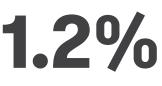

{0}------------------------------------------------

**Building futures and protecting what matters**

Annual Report 2021-22

{1}------------------------------------------------

## **The road to resilience**

**Learn more1**

Suncorp has long advocated for greater investment in measures that help make Australian households and communities more resilient to natural hazards. As extreme weather events become more frequent, it's important that the homes on every street, neighbourhood and community become as strong as they can be. In 2022, Suncorp Insurance launched Resilience Road, an initiative aimed at encouraging homeowners to take practical steps to strengthen and safeguard their homes against extreme weather.

**INTRODUCTION** HOW WE CREATE VALUE FINANCIAL PERFORMANCE CORPORATE GOVERNANCE DIRECTORS' REPORT

{2}------------------------------------------------

## Acknowledgement of Country

REMUNERATION REPORT FINANCIAL STATEMENTS SHAREHOLDER INFORMATION

Suncorp acknowledges the Traditional Custodians of the lands on which we operate and pay our respects to Elders past, present and emerging.

# In this report

| Introduction and overview                         | 2  |
|---------------------------------------------------|----|
| About this report                                 | 4  |
| Additional reports                                | 4  |
| About Suncorp Group                               | 4  |
| Financial snapshot                                | 5  |
| Chairman's message                                | 6  |
| Group CEO's message                               | 8  |
| How we create value                               | 10 |
| Our business and strategy                         | 10 |
| Value we create                                   | 14 |
| Our operating environment                         | 16 |
| What matters most                                 | 18 |
| Our customers                                     | 22 |
| Our people                                        | 26 |
| Our community                                     | 30 |
| Our approach to environment and climate change | 32 |
| Our approach to risk management                   | 48 |
| Financial performance                             | 52 |
| Suncorp Group                                     | 52 |
| Insurance (Australia)                             | 55 |
| Suncorp Bank                                      | 56 |
| Suncorp New Zealand                               | 57 |

| Corporate Governance Statement                                               |     |
|------------------------------------------------------------------------------|-----|
| Directors' Report                                                            | 72  |
| Lead Auditor's Independence Declaration                                      | 85  |
| Remuneration Report                                                          | 86  |
| Financial statements                                                         | 114 |
| Consolidated statement of comprehensive income                            | 116 |
| Consolidated statement of financial position                              | 117 |
| Consolidated statement of changes in equity                               | 118 |
| Consolidated statement of cash flows                                      | 119 |
| Notes to the consolidated financial statements                            | 120 |
| Directors' Declaration                                                       | 184 |
| Independent Auditor's Report to the shareholders of Suncorp Group Limited | 185 |
| Shareholder information                                                      | 194 |
| Performance summary                                                          | 194 |
| Shareholder information                                                      | 195 |
| Financial calendar and key payment dates                                     | 201 |
| How to contact us                                                            | 202 |

{3}------------------------------------------------

# **About this report**

Our FY22 Annual Report includes information on our financial and non-financial performance for the reporting period 1 July 2021 to 30 June 2022. In preparing this report, we have drawn on aspects of the International Integrated Reporting <IR> Framework to describe how our business model, strategy, governance and risk management processes help us manage risks and opportunities in our operating environment and deliver value for our stakeholders. We outline our response to external social and environmental challenges, including how we are continuing to support our customers, people and communities as they recover from numerous extreme weather events. We also outline how we are strengthening our approach to managing the impacts of climate change.

**INTRODUCTION** HOW WE CREATE VALUE FINANCIAL PERFORMANCE CORPORATE GOVERNANCE DIRECTORS' REPORT

The statutory reporting elements of the Directors' Report, including the operating and financial review (OFR), are featured on pages 10 to 85 of this report, along with sections outlining How we create value, Financial performance and our Corporate Governance Statement. All metrics included in the Directors' Report on pages 72 to 85 have been verified through our internal verification process. KPMG was engaged by Suncorp Group to undertake limited assurance over selected non-financial metrics in Suncorp's FY22 annual report. KPMG's independent Limited Assurance Statement to the Board and Management of Suncorp Group is available on the Suncorp Group website. Selected disclosures are identified throughout footnotes within the report. The Remuneration Report on pages [86](#page-85-0) to 112 and the Financial statements on pages 114 to 184 have been audited by KPMG.

Our approach to sustainability reporting has been developed in accordance with the Global Reporting Initiative (GRI) Standards: Core option. For a full list of disclosures referenced in this report, on our website and in the 2021-22 Sustainability Data Pack, please refer to the GRI Content Index on our website.

# Additional reports

**Learn more1**

More information on the Group's financial, non-financial, risk and sustainability performance is available online at [suncorpgroup.com.au](http://suncorpgroup.com.au).

**FY22 Investor Pack** suncorpgroup.com.au/ investors/events

suncorpgroup.com.au/ corporate-responsibility/ reports

# **About Suncorp Group**

**FY22 Proxy Voting Report** suncorpgroup.com.au/ corporate-responsibility/ reports

**2021 Tax Transparency Report** [suncorpgroup.com.au/](http://suncorpgroup.com.au/uploads/2021-Suncorp-Tax-Transparency-Report.pdf) [uploads/2021-Suncorp-Tax-](http://suncorpgroup.com.au/uploads/2021-Suncorp-Tax-Transparency-Report.pdf)[Transparency-Report.pdf](http://suncorpgroup.com.au/uploads/2021-Suncorp-Tax-Transparency-Report.pdf)

**2020-21 Modern Slavery Statement** [suncorpgroup.com.au/](http://suncorpgroup.com.au/uploads/Suncorp-2020-21-Modern-Slavery-Statement.pdf) [uploads/Suncorp-2020-](http://suncorpgroup.com.au/uploads/Suncorp-2020-21-Modern-Slavery-Statement.pdf) [21-Modern-Slavery-](http://suncorpgroup.com.au/uploads/Suncorp-2020-21-Modern-Slavery-Statement.pdf)[Statement.pdf](http://suncorpgroup.com.au/uploads/Suncorp-2020-21-Modern-Slavery-Statement.pdf)

Suncorp Group offers insurance and banking products and services through some of Australia and New Zealand's most recognisable brands. With a heritage dating back to 1902, we have grown to become an ASX-listed company with more than 13,000 people and approximately \$106 billion in assets. Suncorp Group comprises three core businesses, each empowered to deliver for their customers.

Following a comprehensive strategic review, on 18 July 2022, we announced a share sale and purchase agreement with Australia and New Zealand Banking Group Limited (ANZ), to sell our banking business. The transaction is subject to a range of regulatory and government approvals. The targeted timeframe for completion is the second half of the calendar year 2023. Until this time we will continue to own and run the Bank.

4 Annual Report 2021-22

1 suncorpgroup.com.au/corporate-responsibility/reports

{4}------------------------------------------------

# **Financial snapshot1**

REMUNERATION REPORT FINANCIAL STATEMENTS SHAREHOLDER INFORMATION

**\$9.25bn**

Insurance (Australia) GWP2 9.2%

**NZ\$2.13bn**

New Zealand GWP 14.1%

**\$48.1bn**

Bank total deposits

15.9%

# **\$62.1bn** Bank total lending3 7.8%

# **9.0%** Group underlying ITR (FY21 7.2%)4

# **\$2,781m**

Group operating expenses5 3.2%

# **\$673m**

Group cash earnings 36.7%

# **\$681m**

Group net profit after tax 34.1%

# **40 cents**

Per share total ordinary dividend, fully franked

- 1 All changes refer to the prior corresponding period unless otherwise stated.
- 2 Excluding portfolio exits and Emergency Services Levy (ESL).
- 3 Gross Lending.
- 4 Excludes COVID-19 impacts.
- 5 Group operating expenses are excluding ESL, TEPL, reorganisation costs and Wealth expenses.

# **\$248m**

CET1 capital held at Group (post dividends)

Caption TBC

{5}------------------------------------------------

# **Chairman's message**

### Dear Shareholder,

#### The past year has brought its own unique set of challenges and change to navigate.

**INTRODUCTION** HOW WE CREATE VALUE FINANCIAL PERFORMANCE CORPORATE GOVERNANCE DIRECTORS' REPORT

As I reflect on the intensity of events we've had to contend with as a business and a society in recent years, including the 2019-20 black summer bushfires and the lingering global pandemic, it is clear we are emerging stronger. We have built a new level of agility, resilience and capability that I believe puts us in good stead for the significant challenges and opportunities that lie ahead.

We continue to face into the ongoing impacts of global supply chain dislocation due to both the pandemic and heightened geo-political tensions, with simultaneous inflationary pressures, tight labour markets and investment market volatility presenting persistent challenges. As a financial services company we also continued to work through the complexities of a once-in-a-generation regulatory change agenda.

We have additionally been confronted by an extraordinary 35 separate natural hazard events across Australia and New Zealand throughout the year, including the devastating Eastern Australia flood disaster in early 2022, the largest weather event in Suncorp's 100-plus year history.

The extreme and relentless nature of these events has only served to intensify our efforts in addressing climate change as well as advocating for greater investment in resilience measures that better protect our communities and help address affordability pressures in high-risk regions.

I visited the impacted areas on the east coast of Australia, including Lismore and surrounds, as soon as it was safe to do so. While confronting, experiencing the situation first-hand served as an important reminder of, and provided a deep appreciation for, Suncorp's purpose of *building futures and protecting what matters*. It also reinforced that the culture of Suncorp is built on the incredible dedication of our people.

We have built a new level of agility, resilience and capability that I believe puts us in good stead for the significant challenges and opportunities that lie ahead.

Through the prism of our changing operating environment, we recently announced the Board's decision to sell our banking business, with Suncorp Group to become a dedicated Trans -Tasman insurer at a time when the value of insurance has never been greater. I outline more on this below.

## Our performance and capital position

While the underlying performance of the Group remained strong throughout the year, the enormity of the challenges faced this year have impacted our FY22 result. The Group's net profit after tax was down 34.1% to \$681 million, with cash earnings down 36.7% to \$673 million.

This was due to the combined impacts of elevated natural hazards costs, estimated at \$1.08 billion dollars (\$101 million over our allowance for the year), the purchase of additional reinsurance covers and the negative impact of investment markets.

{6}------------------------------------------------

As a result, your Board has declared a fully franked final dividend of 17 cents per share. This brings the FY22 total ordinary dividend to 40 cents per share.

REMUNERATION REPORT FINANCIAL STATEMENTS SHAREHOLDER INFORMATION

While the total annual dividend to shareholders is lower than last year, it is at the upper end of our 60-80% target payout ratio at 75%. Your Board believes this is appropriate given the uncertain outlook we continue to face into, including ongoing investment market volatility and the possibility of a third La Niña weather pattern.

The Group's capital position remains strong, and we continue to maintain an appropriate capital buffer in what is a heightened risk environment. Our reinsurance program continues to provide important protection of our balance sheet, and this year we successfully placed our FY23 reinsurance program to reflect the elevated natural hazard activity in recent years.

Good progress has been made to simplify our business, drive premium and margin growth and deliver against our strategic priorities. This, combined with our prudent capital management approach, underpins our ongoing commitment to continue to unlock value for our company and our shareholders.

## Responding to our changing landscape

Your Board recognises that Suncorp's future success and sustainability rests on understanding and meeting both the current and future expectations of a range of stakeholders.

This year's materiality assessment of environmental, social and governance risks and opportunities saw natural hazard resilience, our response to climate change and the accessibility and affordability of financial services prevail as the Group's most material topics to address.

There remains much to be done at all levels of government to address the critical need for community resilience and disaster mitigation measures, and Suncorp continues to be at the forefront in pushing for meaningful change on this front.

This year, the Group refreshed its Climate Change Action Plan, reinforcing our commitment to reducing our own climate impact while supporting our customers, suppliers and investees in their transition to a low carbon future.

The Group also published its second Modern Slavery Statement which outlines our approach and progress in identifying and addressing the risk of modern slavery in our operations and supply chains.

Our focus on the increasingly important issue of cyber risk remained front and centre, with continued investment in data security and privacy technology and capabilities to reduce the risk of cyber-attacks and protect our customers, people and business.

We continued to prioritise the health, safety and wellbeing of our people and customers and have taken learnings through the pandemic to enhance our hybrid model of working. As a Board, we are mindful of intense competition for talent and resources and remain focused on reskilling and upskilling our workforce as we prepare for the future.

## Sale of Suncorp Bank

Following a comprehensive strategic review of the Bank, in July 2022 the Board entered into an agreement to sell Suncorp Bank to the Australian and New Zealand Banking Group (ANZ). In making this decision the Board was focused on ensuring ANZ's offer created value for shareholders, as well as positive outcomes for our people, customers and communities.

It is the Board's firm belief that this sale will enable both our Bank and our Australian and New Zealand Insurance businesses to accelerate their growth plans through dedicated focus and investment. We also believe this will result in a stronger insurance and banking system for Australia and New Zealand more broadly.

The transaction is subject to a range of regulatory approvals from the Federal Treasurer and the Australian Competition and Consumer Commission, and we will engage constructively with the Queensland Government in relation to the *State Financial Institutions and Metway Merger Act* 1996 (Qld). Queensland remains an important part of our future.

Pending completion, your Board is committed to returning to shareholders any capital that is excess to the needs of the business. I commit to keeping our shareholders updated as the process unfolds.

## In closing

On behalf of the Board, I would like to acknowledge Suncorp's Group CEO Steve Johnston, his executive team and all employees for continuing to live our purpose and striving to deliver value for all of our stakeholders.

I also thank you, our valued shareholders, for your loyalty and support of the Suncorp Group in what has been another challenging year.

Your Board remains focused on ensuring Suncorp Group is a sustainable organisation that continues to deliver long-term value.

Christine McLoughlin, AM Chairman 8 August 2022

{7}------------------------------------------------

# **Group CEO's message**

#### Dear Shareholder,

As I reflect on my 17 years at Suncorp, the past three as your CEO, I am regularly reminded of the important role our company plays in the lives of our customers and the communities we serve.

**INTRODUCTION** HOW WE CREATE VALUE FINANCIAL PERFORMANCE CORPORATE GOVERNANCE DIRECTORS' REPORT

I recall visiting Innisfail soon after Cyclone Larry destroyed everything in its path in 2006. As a new recruit I observed then how central our company was to restoring lives and livelihoods. I learnt that while business success should be measured in terms of profits, dividends and valuations, equally important for a business like ours are the lives we restore, the futures we assure and the communities we rebuild.

Roll forward to March 2022, and my visit to Lismore after the east coast flood event was equally confronting. Observing the damage on the ground and through the eyes of our customers was heartbreaking. What made me so proud was that each Suncorp team member knew the role they would play in putting lives back together.

This is what we mean when we say we are guided by our purpose of building futures and protecting what matters. It's also why we feel that by engaging our people with our purpose, we will deliver for our customers and, in turn, create long-term value for our shareholders.

#### Our FY22 performance

While the Group's net profit after tax of \$681 million and cash earnings of \$673 million are down from the previous year, the underlying strength of our business is reflected in record growth, improved margins and customer metrics.

This demonstrates the progress we have made against our strategic priorities across each of our businesses to reinvigorate our well-respected brands, digitise our businesses, become more efficient and ultimately improve how we serve our customers. Detailed information about our progress can be found on pages 12-13 of this Report.

It's disappointing that the 35 separate natural hazards events and global investment market volatility we experienced in FY22 have combined to reduce profits and, in turn, your dividends.

The flow on effects of volatile investment markets on our business can be complex. Like most insurers we invest in a range of asset classes including government bonds, high quality corporate fixed interest securities and equities. When yield curves steepen and credit spreads widen, as they have recently, accounting rules require us to report mark-to-market losses. However, given we hold these assets to maturity, the majority of these losses will unwind over the FY23 year. This, and our strong underlying performance means we have been able to reaffirm our FY23 targets.

While business success should be measured in terms of profits, dividends and valuations, equally important for a business like ours are the lives we restore, the futures we assure and the communities we rebuild.

{8}------------------------------------------------

## Enabling our people

This year we have realised the benefits of a wellembedded purpose and operating model, with a united leadership team and clear alignment of all our people to our insurance and banking businesses. Pleasingly, our engagement scores have remained consistently in the top quartile of our peer group.

REMUNERATION REPORT FINANCIAL STATEMENTS SHAREHOLDER INFORMATION

During FY22, we appointed Bridget Messer to the role of Group Chief Risk Officer to complete our executive leadership team.

We have enhanced our investment in our people, with a focus on attracting and retaining talent and building a workforce fit for the future. We also elevated our hybrid model of working to maximise productivity while enabling flexibility in the way we work, ensuring our customer, team and individual needs are met.

Our new purpose-built head office facility in Brisbane, Heritage Lanes, provides a central workplace that supports our hybrid working approach, while also enabling us to quickly adapt as operating conditions change.

## Supporting our customers

Suncorp's commitment to driving a customer-led culture, backed by seamless customer experiences and products and services that deliver value, has never been greater.

We have made good progress in supporting our customers and communities following severe weather events experienced across Australia and New Zealand. As at the end of the financial year, we had completed approximately 57% of the 130,000 natural hazardrelated claims received throughout the year.

Our response is covered extensively throughout this report, including the role of our newly established Event Control Centre, the onboarding of approximately 1,000 new claims team members dedicated to our recovery efforts, and our on-theground support of customers. Our response was enhanced by investments in our digital and data capabilities, which improved the ability for customers to lodge claims online and for us to deploy resources and assist them faster than ever before.

Our Customer Advocate office continued to play a critical role in ensuring the needs of our customers experiencing vulnerability are met and the appropriate support provided.

This year, we launched our third Financial Inclusion Action Plan which extends on our progress to date in improving access to suitable financial products and services and building capability that supports

the financial wellbeing of our people, customers and communities. In particular, Suncorp is committed to playing a leadership role to break down the barriers to obtaining insurance.

### Investing in our communities

In FY22, Suncorp invested \$9.8 million in the community, including \$1 million to assist in the longterm recovery efforts of flood impacted regions across Queensland and New South Wales. This year we formed partnerships with Firesticks Alliance Indigenous Corporation and the Foundation for Rural and Regional Renewal to help us build greater community resilience.

We also extended our partnership with Suncorp Stadium, which will see us continue as naming-rights sponsor of this iconic site of many sporting and cultural events for up to ten more years.

## The year ahead

Our focus remains on building on the strong momentum across our three businesses to deliver on our strategic initiatives and meet our FY23 commitments. We know achieving this will allow us to accelerate opportunities for further efficiency and innovation to meet evolving customer needs and underpin the success of Suncorp.

We are committed to supporting the ongoing flood recovery and helping our customers to get back into their homes and rebuild their lives. We will take a leadership position in advocating for a more resilient Australia through improved public infrastructure, subsidies to improve private dwellings and an overhaul of planning laws, backed by action on climate change.

We will also engage constructively with stakeholders over the coming year as we look to receive approvals and complete the sale of our Bank to ANZ. We remain deeply committed to supporting the Bank until the transaction is complete, and also stand firm in our ongoing commitment to Queensland.

I thank all of our teams for their dedication and support of our customers, and also extend my appreciation to all of our shareholders for your continued confidence in our company.

Steve Johnston Group Chief Executive Officer and Managing Director

8 August 2022

{9}------------------------------------------------

# **Our business and strategy**

## Living our purpose and values

Our purpose **'building futures and protecting what matters'** sits at the core of everything we do across all of our businesses. Our capable, engaged, diverse and innovative workforce bring our purpose to life for our customers and the communities we live and work in.

INTRODUCTION **HOW WE CREATE VALUE** FINANCIAL PERFORMANCE CORPORATE GOVERNANCE DIRECTORS' REPORT

Our culture is defined by a set of values, behaviours and beliefs. Living by our values every day enables us to deliver on our strategy and purpose and create value for our stakeholders by delivering valued outcomes and a sustainable business.

supportive of each other to safely achieve our goals.

{10}------------------------------------------------

# Our business

We provide insurance and banking products and services to retail and business customers across Australia and New Zealand. Suncorp Group comprises three core businesses:

## Insurance (Australia)

- Provides consumer, commercial and personal injury products to the Australian market. Suncorp Group is one of Australia's largest general insurers by GWP and the country's largest compulsory third party insurer.
## Suncorp Bank

REMUNERATION REPORT FINANCIAL STATEMENTS SHAREHOLDER INFORMATION

- Focused on lending, deposit gathering and transaction account services to personal, small and medium enterprise (SME), commercial and agribusiness customers.
## Suncorp New Zealand

- Delivers financial services to New Zealanders through Suncorp's go-to-market general and life insurance brands. Made up of: Vero Insurance, Asteron Life and AA Insurance, AA Money and AA Life joint ventures with the New Zealand Automobile Association (NZAA).
Following a comprehesive strategic review, on 18 July 2022, we announced a share sale and purchase agreement with Australia and New Zealand Banking Group Limited (ANZ), to sell our banking business. The transaction is subject to a range of regulatory and government approvals. The targeted timeframe for completion is the second half of the calendar year 2023, during which time we will continue to own and run the Bank.

## Delivering on our purpose-driven plan

Our FY21-23 strategic plan focuses on embedding our purpose and reshaping and simplifying the Group to drive improved performance in our core businesses.

In FY22, we continued to deliver on our plan through the successful execution of 12 ongoing initiatives across each of our businesses. These initiatives are underpinned by Suncorp's strategic priorities.

#### Customer led Digital first and personalised customer experiences Technology enabled Automated processes and modernised technology platforms Workforce reimagined Exceptional people empowered to make a difference every day Change advocated Building towards a fair and sustainable industry for our stakeholders Insurance (Australia) — Revitalise growth — Optimise pricing and risk selection — Digital first customer experiences — Best in class claims Suncorp Bank — Win in home — Seamless everyday banking — Grow businesses — Digital first — Customer service excellence Suncorp New Zealand — Grow brands and strategic partnerships — Best in class claims — Digitise and automate Business initiatives

{11}------------------------------------------------

# Our FY21-23 plan progress

Suncorp is well progressed in our three-year plan to drive growth and efficiencies in our core businesses, while building on the Group's existing digital and data capability.

INTRODUCTION **HOW WE CREATE VALUE** FINANCIAL PERFORMANCE CORPORATE GOVERNANCE DIRECTORS' REPORT

| Insurance (Australia)                     |                                                                                                                                                                                                                                                                                                                                                                                                                                                                                                                                                                                                                                 |  |
|-------------------------------------------|---------------------------------------------------------------------------------------------------------------------------------------------------------------------------------------------------------------------------------------------------------------------------------------------------------------------------------------------------------------------------------------------------------------------------------------------------------------------------------------------------------------------------------------------------------------------------------------------------------------------------------|--|
| Business initiative                       | FY22 progress                                                                                                                                                                                                                                                                                                                                                                                                                                                                                                                                                                                                                   |  |
| Revitalise growth                      | — Invested in marketing and new product innovation to support growth. — AAMI, the most considered national insurance brand, achieved a Net Promoter Score (NPS)1 of +6.0, while also growing in Home and Motor. — Gross Written Premium (GWP) growth of 9.2% when normalised for portfolio exits. Growth was broad based across portfolios and stronger in the second half of the financial year, up 10.7% excluding portfolio exits. — Strong Compulsory Third Party (CTP) unit growth of 10%, driven by digitisation in New South Wales and particularly solid unit growth in South Australia.        |  |
| Optimise pricing and risk selection | — Invested in a modern, analytics-driven pricing engine and disciplined portfolio management to improve margins and loss ratios. — Deployed the Customer and Pricing Ecosystem (CaPE) for home mass brands. Delivery is planned for mass motor in FY23. — Responded to pricing for inflation, natural hazards and reinsurance costs through disciplined portfolio management. — Invested in underwriting tools across property, liability and packages in Commercial to improve risk selection and efficiency.                                                                                             |  |
| Digital first customer experiences  | — Increased digital sales for mass brands across Home, Motor and CTP products to 61% of all sales and 37% of all service transactions, up from 54% and 31% respectively. — Focused on making purchasing simple with reduced friction and making self-service accessible, simple and intuitive. — Deployed automation initiatives in Direct Distribution, including the implementation of targeted Interactive Voice Response and SMS. — Insurance sales and service long-term target of 70% digital/30% voice.                                                                                                |  |
| Best in class claims                   | — Digital lodgement of Motor and Home claims more than doubled in FY22. — First in market for digital lodgement and early intervention has delivered better customer experience and outcomes for personal injury claims. — Reconfigured supply chain through a review of home and motor repairer panels, which is expected to drive improved repair quality, capacity and cost outcomes. — Successfully implemented technology solutions to better manage builder panel allocation and performance outcomes, as well as benchmarking claims costs against agreed contracted rates and industry benchmarks. |  |

1 Source: DBM Consumer Atlas. Measured as at June each FY on a 6-month rolling average amongst insurance customers. Net Promoter ScoreSM is a trademark of Bain & Co Inc., Satmetrix Systems, Inc., and Mr Frederick Reichheld.

{12}------------------------------------------------

|                                   | Suncorp Bank                                                                                                                                                                                                                                                                                                                                               |
|-----------------------------------|------------------------------------------------------------------------------------------------------------------------------------------------------------------------------------------------------------------------------------------------------------------------------------------------------------------------------------------------------------|
| Business initiative               | FY22 progress                                                                                                                                                                                                                                                                                                                                              |
| Win in home                    | — Home lending growth of \$4.1 billion in FY22 and outperformed system reaching 1.8 times system in 2H22.                                                                                                                                                                                                                                               |
|                                   | — Targeted investments in customer and broker experiences supported a significant increase in home loan customer NPS and broker NPS and a reduction in median application turnaround times. Suncorp Bank Main Financial Institution (MFI) NPS1 was +13.7.                                                                                         |
| Seamless everyday banking   | — At-call transaction portfolio grew 20.6% over the year, with continued MFI customer growth, supported by a strong digital offering.                                                                                                                                                                                                                   |
|                                   | — Launched Buy Now Pay Later product linked to customer's core transactional account and banking app, Suncorp PayLater, to provide additional payment flexibility to customers.                                                                                                                                                                         |
|                                   | — Debit cards are now issued with recycled materials and tactile indicators to support vision-impaired customers.                                                                                                                                                                                                                                       |
| Grow businesses                | — Business lending developed significant momentum over the second half, delivering six consecutive months of growth.                                                                                                                                                                                                                                    |
|                                   | — Business deposits performed strongly with 11.8% total portfolio growth over the year, predominately driven by a 27.2% increase in business transaction deposits.                                                                                                                                                                                      |
|                                   | — Digital service redraw facilities delivered alongside enhanced SME loan products have enabled more customers to access finance.                                                                                                                                                                                                                       |
| Digital first                  | — Suncorp Bank completed the migration of personal customers to the Suncorp App, enabling the decommissioning of the legacy mobile banking app and focusing future investment on the core Suncorp App.                                                                                                                                               |
|                                   | — Digital engagement and origination capabilities continued to strengthen, including joint account online origination, pre-filled income and expense data and the launch of a refreshed broker portal.                                                                                                                                               |
| Customer service excellence | — Continued to expand and upskill direct lenders, delivering leading service and customer experiences through the direct channel.                                                                                                                                                                                                                       |
|                                   | — A new arrangement with ATMx provides fee-free access to an additional 1,800 ATMs nationally.                                                                                                                                                                                                                                                             |
|                                   | — Installed braille functionality across ATMs and launched Translating and Interpreting Services across branches, business banking and call centres.                                                                                                                                                                                                    |
|                                   | — In line with the increasing customer shift to digital origination and self-service, the Bank continued to optimise the branch network, with the branch footprint reducing from 83 to 64 over FY22. The Bank's strategy is to focus customer interactions on high value experiences through a blended contact centre and branch operating model. |

REMUNERATION REPORT FINANCIAL STATEMENTS SHAREHOLDER INFORMATION

| Suncorp New Zealand                          |                                                                                                                                                                                                                                              |  |
|----------------------------------------------|----------------------------------------------------------------------------------------------------------------------------------------------------------------------------------------------------------------------------------------------|--|
| Business initiative                          | FY22 progress                                                                                                                                                                                                                                |  |
| Grow brands and strategic partnerships | — Continued momentum with a targeted focus on deepening broker relationships and offering compelling market propositions delivered through trusted brands.                                                                                |  |
|                                              | — Increased market share by 134 basis points over the preceding 12 months, registering seven consecutive quarters of market share gains.                                                                                                  |  |
| Best in class claims                      | — Continued progress to deliver a single claims platform, introducing new channels for customer engagement and seamless connectivity.                                                                                                     |  |
|                                              | — Automated claims assessment in the second half, resulting in reduced field assessment handling time and improved data accuracy.                                                                                                         |  |
| Digitise and automate                     | — Continued investment in core systems to deliver more value to customers and intermediaries through digitisation of key steps in the customer experience while simplifying products and automating high volume operational processes. |  |
|                                              | — Launched online motor insurance sales through the ANZ corporate partnership, with development work underway on future product releases.                                                                                                 |  |
|                                              | — Continued progress on enabling broker connectivity with a pilot scheduled for early in FY23.                                                                                                                                               |  |

1 Source: DBM Consumer Atlas. Measured as at June each FY on a 6-month rolling average amongst retail banking MFI customers. Net Promoter ScoreSM is a trademark of Bain & Co Inc., Satmetrix Systems, Inc., and Mr Frederick Reichheld.

{13}------------------------------------------------

# **Value we create**

Suncorp Group is focused on creating long-term value for our stakeholders. We do this through a capable, engaged and diverse team who, in turn, deliver valued outcomes to our customers and the wider community. This drives a sustainable business and achieves financial outcomes for our shareholders.

INTRODUCTION **HOW WE CREATE VALUE** FINANCIAL PERFORMANCE CORPORATE GOVERNANCE DIRECTORS' REPORT

# **\$1.8bn**

**Employee salaries, superannuation and other benefits**

**8.3out of 10**

**Employee engagement score1**

**46%**

**Women in senior leadership2, 8**

**99%**

**Code of conduct training completion rate3, 8**

**0.7**

**Lost-time injury frequency rate (LTIFR)8**

**\$8.8bn Claims paid**

**61%**

**Digital sales4 from 54%**

**\$62.1bn**

**Bank total lending5**

**+10.2**

**Consumer Net Promoter Score6**

# **99.7%**

**Internal Dispute Resolution (IDR) complaints resolved in 30 days7, 8**

People Customers Community Shareholders

**\$589m Income tax paid**

**\$9.87m**

**Total community investment8**

**of pre-tax profit invested in the community8**

**Suppliers and other fees paid**

**64%**

**reduction for Scope 1 and 2 emissions from FY21**

**\$681m**

**Group net profit after tax**

**Record GWP growth in 2H9**

# **40cps**

**Total ordinary dividend, fully franked**

**Dividends paid**

1 Employee engagement is measured by Workday Peakon Employee Voice, a product of Workday, an independent company and a separate entity to Suncorp, and is scored out of 10.0.

2 Proportion of women in total senior leadership population (includes business and strategic leader profiles).

- 3 FY23 target: 98% Code of Conduct training completion rate.
- 4 For mass brand Home, Motor and CTP products. 5 Gross Lending.

6 Source: DBM Consumer Atlas. Aggregate of consumer insurance and retail banking MFI customers. Measured as at June each FY on a 6-month rolling average amongst personal customers. Net Promoter ScoreSM is a trademark of Bain & Co Inc., Satmetrix Systems, Inc., and Mr Frederick Reichheld.

- 7 Excluding New Zealand and personal injury complaints.
8 Subject to independent assurance by KPMG. Please refer to the assurance opinion included in the Sustainable Business section of our website.

9 The Group recorded record Gross Written Premium growth across its Australian and New Zealand insurance businesses in the second half of FY22.

{14}------------------------------------------------

## **Fuelling our customer obsession**

REMUNERATION REPORT FINANCIAL STATEMENTS SHAREHOLDER INFORMATION

Australia's leading motoring enthusiast brand Shannons continues to deliver exceptional performance and strong growth through an effective customer and community ecosystem. In FY22, the brand's unique proposition engaged customers around their passions:

- Shannons Club online community had more than 1.6 million unique visitors.
- Shannons Auctions celebrated 40 years by delivering record sales through our dedicated auction houses and online sales capability, with sales up more than 25% for the year across vehicles, motorcycles, number plates and memorabilia.
- The brand engaged directly with the community via more than 700 motoring events across Australia.

1 suncorpgroup.com.au/news/news/shannons-40th-anniversary-auction

**Learn more1**

Classic cars auctioned at Shannons' Eagle farm showroom

{15}------------------------------------------------

Suncorp Assessing Manager Kerrie Turner

# **Our operating environment**

We consider key trends, issues and risks in the external operating environment when formulating our strategy and plans. A summary of key external risks currently affecting our business and our response to them is outlined below.

# Risk Our response

## Disruptive external events

INTRODUCTION **HOW WE CREATE VALUE** FINANCIAL PERFORMANCE CORPORATE GOVERNANCE DIRECTORS' REPORT

Suncorp actively manages risks associated with disruptive external events, which could impact delivering on customer expectations. Weather events in 2022 presented capacity, customer care and supply chain challenges, exacerbated by COVID-19 and the Ukraine/Russia conflict.

— We conduct event planning, scenario analysis and simulations to test our responses.

— We ensure we have sufficient people to support customer claims, with a flexible workforce and processes for

macroeconomy or global financial crisis-type event that restricts access to capital and/or reinsurance. — We manage our business responsibly, protecting the Group's strong balance sheet and maintaining conservative buffers to address uncertainties and support our customers through high-value products and services.

— We undertake climate scenario analysis to understand the potential impacts of climate change and manage

— We advocate for cross-sector collaboration and greater investment in building household and community resilience against natural hazards to better manage physical risks associated with climate change. — We commit to reducing our own emissions and supporting an orderly transition to a low-carbon future. — We manage the impact of natural hazards through best in class claims processes, sophisticated pricing

— Our refreshed employee value proposition, and alignment of our people strategy, processes and frameworks,

— We are building a workforce of the future and will leverage automation, data and innovation capabilities to

— We are investing in data analytics and technology to help protect our customers from the

— We have embedded cyber risk prevention, monitoring and response into our risk framework,

— Our business planning responds to changing customer behaviours, including mobility and digital trends.

to guard against threats and maintain a resilient technology environment.

— We have elevated our hybrid model of working, to maximise productivity and enable flexibility in the way we work,

— We manage our supply chains, by proactively bulk buying materials and robust management of our

— We monitor the risk of systemic shifts in the global environment, such as a prolonged subdued

— When weather events occur, we apply our event response capability.

recruitment and training.

the associated risks and opportunities.

help us to attract and retain talent.

develop our people and transform our culture.

growing threat of cyber risks and financial crime.

— Our strategy is customer led and technology enabled.

— We will explore strategic partnerships to enable new innovations.

models and a comprehensive reinsurance program.

while ensuring our customer, team and individual needs are met.

supplier panels.

## Macro-economic trends

The economy recovered from initial COVID-19 impacts, through consumer spending, lower unemployment and high share and house prices. Continuing virus outbreaks and lockdowns, and international conflicts, however, disrupted supply chains, causing rising costs and labour shortages, further impacted by the 2022 Australian floods. The RBA and RBNZ have signalled they will take further steps to do what is necessary to ensure inflation returns to target over time, which will be challenging given current inflation is 6.1% in Australia and 7.3% in New Zealand.

## Climate change

Suncorp considers the strategic and financial impacts of climate change. The changing frequency and severity of weather events is identified as a risk over the short, medium and long term.

## Workforce changes

There is a risk that Suncorp cannot recruit, develop and retain the people we need to execute our strategy, if we do not respond to employee expectations and changes in the workplace and ways of working. Employees are increasingly seeking workplaces that reflect their values and provide flexibility. Changes in the workplace, such as automation and digitisation, and the increasing war for talent, present challenges.

## Cyber risk

Cyber threats continue to evolve. Customers switching to digital channels has continued to accelerate, which poses increased cyber security risks.

## Changes in customer behaviour and competitive responses

Changes in customer behaviour, including the use of private vehicles, may impact Suncorp's future business. The financial services industry's competitive landscape continues to evolve.

{16}------------------------------------------------

# Risk Our response

REMUNERATION REPORT FINANCIAL STATEMENTS SHAREHOLDER INFORMATION

Disruptive external events

Macro-economic trends

Climate change

short, medium and long term.

landscape continues to evolve.

Workforce changes

Cyber risk

COVID-19 and the Ukraine/Russia conflict.

Suncorp actively manages risks associated with disruptive external events, which could impact delivering on customer expectations. Weather events in 2022 presented capacity, customer care and supply chain challenges, exacerbated by

The economy recovered from initial COVID-19 impacts, through consumer spending, lower unemployment and high share and house prices. Continuing virus outbreaks and lockdowns, and international conflicts, however, disrupted supply chains, causing rising costs and labour shortages, further impacted by the 2022 Australian floods. The RBA and RBNZ have signalled they will take further steps to do what is necessary to ensure inflation returns to target over time, which will be challenging

Suncorp considers the strategic and financial impacts of climate change. The changing frequency and severity of weather events is identified as a risk over the

There is a risk that Suncorp cannot recruit, develop and retain the people we need to execute our strategy, if we do not respond to employee expectations and changes in the workplace and ways of working. Employees are increasingly seeking workplaces that reflect their values and provide flexibility. Changes in the workplace, such as automation and digitisation, and the increasing war for talent, present challenges.

Cyber threats continue to evolve. Customers switching to digital channels has

continued to accelerate, which poses increased cyber security risks.

Changes in customer behaviour and competitive responses Changes in customer behaviour, including the use of private vehicles, may impact Suncorp's future business. The financial services industry's competitive

given current inflation is 6.1% in Australia and 7.3% in New Zealand.

|  | — We conduct event planning, scenario analysis and simulations to test our responses.                                                                                                                                  |
|--|------------------------------------------------------------------------------------------------------------------------------------------------------------------------------------------------------------------------|
|  | — When weather events occur, we apply our event response capability.                                                                                                                                                   |
|  | — We ensure we have sufficient people to support customer claims, with a flexible workforce and processes for recruitment and training.                                                                             |
|  | — We manage our supply chains, by proactively bulk buying materials and robust management of our supplier panels.                                                                                                   |
|  |                                                                                                                                                                                                                        |
|  | — We monitor the risk of systemic shifts in the global environment, such as a prolonged subdued macroeconomy or global financial crisis-type event that restricts access to capital and/or reinsurance.             |
|  | — We manage our business responsibly, protecting the Group's strong balance sheet and maintaining conservative buffers to address uncertainties and support our customers through high-value products and services. |
|  | — We undertake climate scenario analysis to understand the potential impacts of climate change and manage the associated risks and opportunities.                                                                   |
|  | — We advocate for cross-sector collaboration and greater investment in building household and community resilience against natural hazards to better manage physical risks associated with climate change.          |
|  | — We commit to reducing our own emissions and supporting an orderly transition to a low-carbon future.                                                                                                                 |
|  | — We manage the impact of natural hazards through best in class claims processes, sophisticated pricing models and a comprehensive reinsurance program.                                                             |
|  | — Our refreshed employee value proposition, and alignment of our people strategy, processes and frameworks, help us to attract and retain talent.                                                                   |
|  | — We have elevated our hybrid model of working, to maximise productivity and enable flexibility in the way we work, while ensuring our customer, team and individual needs are met.                                 |
|  | — We are building a workforce of the future and will leverage automation, data and innovation capabilities to develop our people and transform our culture.                                                         |
|  | — We are investing in data analytics and technology to help protect our customers from the growing threat of cyber risks and financial crime.                                                                       |
|  | — We have embedded cyber risk prevention, monitoring and response into our risk framework,                                                                                                                             |
|  | to guard against threats and maintain a resilient technology environment.                                                                                                                                              |
|  | — Our strategy is customer led and technology enabled.                                                                                                                                                                 |
|  | — Our business planning responds to changing customer behaviours, including mobility and digital trends.                                                                                                               |
|  | — We will explore strategic partnerships to enable new innovations.                                                                                                                                                    |
|  |                                                                                                                                                                                                                        |

{17}------------------------------------------------

# **What matters most**

Stakeholder engagement is highly valued by Suncorp as a means of building trust and confidence. We use a process of informal and formal engagement to identify the risks and opportunities that matter most to our business and our stakeholders. This year, we engaged with our stakeholders on a broad range of topics.

INTRODUCTION **HOW WE CREATE VALUE** FINANCIAL PERFORMANCE CORPORATE GOVERNANCE DIRECTORS' REPORT

— established a dedicated flood response and recovery team — launched our [Financial Inclusion Action Plan (FIAP) 2022-25](https://www.suncorpgroup.com.au/corporate-responsibility/responsible-financial-services/financial-resilience)1

— provided regular updates, including an investor update in March following the flooding emergency

— embedded Suncorp's approach to workplace flexibility

— updated our [Climate Change Action Plan](https://www.suncorpgroup.com.au/corporate-responsibility/sustainable-growth/climate-change)2

— refreshed our employee value proposition

of leaders aligned to our desired culture

— partnered with the Foundation for Rural Regional Renewal (FRRR) and pledged \$1 million

25 meals for new Suncorp Everyday Accounts.

— raised \$1 million for cancer research through Tour de Cure — donated 100,000 meals to OzHarvest and pledged to donate

— Transformed our response to natural disasters with the introduction of an Event Control Centre to coordinate our response to major events using near real-time data.

how we are responding to climate change and other key ESG issues

— focused on continued achievement of diversity and inclusion targets — launched a leader education series setting behavioural expectations

— reviewed the suite of non-financial metrics and agreed a set of targets for FY23.

— provided professional and personal development and wellbeing training and support.

— ongoing partnerships with Victoria and Queensland State Emergency Services (SES)

— continued advocacy for greater government investment in disaster mitigation — engaged with Federal Government, Treasury and Australian Reinsurance Pool Corporation on the implementation of Cyclone Reinsurance Pool legislation

— engaged with governments on public policy consultation processes including financial advice reforms, COVID-19 and the expansion

related Scope 3 emissions, increase spend with diverse suppliers

of open banking (consumer data right) into insurance.

— introduced a new program of initiatives to reduce supplier-

and reduce risk of modern slavery in our supply chain.

— published second [Modern Slavery Statement](https://www.suncorpgroup.com.au/corporate-responsibility/resilient-people-and-communities/respecting-human-rights-and-protecting-against-modern-slavery)3

to help shareholders understand

| How we engaged                                                                                                                                                                                                                                                                                                                                    | Topics we heard                                                                                                                                                                                                                                                                                                                                                     |
|---------------------------------------------------------------------------------------------------------------------------------------------------------------------------------------------------------------------------------------------------------------------------------------------------------------------------------------------------|---------------------------------------------------------------------------------------------------------------------------------------------------------------------------------------------------------------------------------------------------------------------------------------------------------------------------------------------------------------------|
| Customers                                                                                                                                                                                                                                                                                                                                         |                                                                                                                                                                                                                                                                                                                                                                     |
| Daily interactions via contact centres, intermediaries, branches and digital platforms, customer feedback, surveys and complaints, social media and the Suncorp Group Customer Advocate.                                                                                                                                                 | Natural disaster and COVID-19 support, customers experiencing vulnerability, customer service, accessibility, affordability and inclusion of products and services, data privacy, scam and fraud awareness and impact of climate change.                                                                                                                |
| Investors, shareholders and analysts                                                                                                                                                                                                                                                                                                              |                                                                                                                                                                                                                                                                                                                                                                     |
| Half and full year results presentations, strategic updates, investor meetings, analyst briefings and conferences, annual credit rating reviews, management and director meetings and the Annual General Meeting.                                                                                                                        | Financial performance including capital management, growth, margins, provisioning, impacts of COVID-19, natural hazards and reinsurance. ESG issues including remuneration, climate change, modern slavery, responsible investment, responsible underwriting and lending conduct and culture.                                                        |
| Our people                                                                                                                                                                                                                                                                                                                                        |                                                                                                                                                                                                                                                                                                                                                                     |
| Internal communication channels (intranet, all company emails, Yammer, LinkedIn), virtual town halls, the Loop employee feedback survey and business leader presentations and webcasts.                                                                                                                                                  | Employee health and wellbeing, business continuity and workforce planning, engagement and employee experience, remuneration practices, talent retention, digital capability, resource use and efficiency, diversity and inclusion, reconciliation and cultural learning, cyber security, COVID-19 health policies and natural disaster support.      |
| Community                                                                                                                                                                                                                                                                                                                                         |                                                                                                                                                                                                                                                                                                                                                                     |
| Traditional and social media, community partnerships and events, community event response, community event response hubs and employee volunteering and giving.                                                                                                                                                                              | Financial resilience support, natural hazard resilience and recovery, digital inclusion, support for people experiencing vulnerability, reconciliation, cultural heritage and environmental preservation, social inclusion and community investment.                                                                                                    |
| Government, industry and regulators                                                                                                                                                                                                                                                                                                               |                                                                                                                                                                                                                                                                                                                                                                     |
| Meetings, submissions and inquiries, government advisory panel briefings, correspondence, annual prudential consultations, site visits, industry reviews and information requests, discussions with industry bodies including Insurance Council of Australia, Australian Banking Association and Insurance Council of New Zealand. | Natural disaster response, insurance affordability and accessibility, reinsurance pool, regulatory reforms, climate-related financial risk, transparency and disclosure, conduct and culture, governance and accountability, responsible lending and underwriting, capital management, remuneration, compliance requirements and technology risk. |
| Suppliers and business partners                                                                                                                                                                                                                                                                                                                   |                                                                                                                                                                                                                                                                                                                                                                     |
| Formal and informal meetings, contract renewals and risk assessments against our Supplier Code of Practice.                                                                                                                                                                                                                                    | COVID-19 and natural disaster impacts on supply chain and business continuity, digital capability, modern slavery risks and compliance, responsible supply chain and cyber and data security.                                                                                                                                                              |

{18}------------------------------------------------

## How we engaged Topics we heard How we responded

Customers

Our people

Community

Daily interactions via contact centres, intermediaries,

Natural disaster and COVID-19 support, customers experiencing vulnerability, customer service, accessibility, affordability and inclusion of products and services, data privacy, scam and fraud awareness and impact of climate change.

Financial performance including capital management, growth, margins, provisioning, impacts of COVID-19, natural hazards and reinsurance. ESG issues including remuneration, climate change, modern slavery, responsible investment, responsible underwriting and lending conduct and culture.

Employee health and wellbeing, business continuity and workforce planning, engagement and employee experience, remuneration practices, talent retention, digital capability, resource use and efficiency, diversity and inclusion, reconciliation and cultural learning, cyber security, COVID-19 health policies and natural disaster support.

Financial resilience support, natural hazard resilience and recovery, digital inclusion, support for people experiencing vulnerability, reconciliation, cultural heritage and environmental preservation, social inclusion and community investment.

Natural disaster response, insurance affordability and accessibility, reinsurance pool, regulatory reforms, climate-related financial risk, transparency and disclosure, conduct and culture, governance and accountability, responsible lending and underwriting, capital management, remuneration, compliance requirements and technology risk.

COVID-19 and natural disaster impacts on supply chain and business continuity, digital capability, modern slavery risks and compliance, responsible supply chain and cyber and data security.

branches and digital platforms, customer feedback, surveys and complaints, social media and the Suncorp Group Customer Advocate.

Investors, shareholders and analysts

Internal communication channels (intranet, allcompany emails, Yammer, LinkedIn), virtual town halls, the Loop employee feedback survey and business leader presentations and webcasts.

Traditional and social media, community partnerships and events, community event response, community event response hubs and employee volunteering and giving.

Government, industry and regulators

Suppliers and business partners

Formal and informal meetings, contract renewals and risk assessments against our Supplier Code of Practice.

Meetings, submissions and inquiries, government advisory panel briefings, correspondence, annual prudential consultations, site visits, industry reviews and information requests, discussions with industry bodies including Insurance Council of Australia, Australian Banking Association and Insurance Council of New Zealand.

Half and full year results presentations, strategic updates, investor meetings, analyst briefings and conferences, annual credit rating reviews, management and director meetings and the Annual General Meeting.

- established a dedicated flood response and recovery team
- launched our [Financial Inclusion Action Plan (FIAP) 2022-25](https://www.suncorpgroup.com.au/corporate-responsibility/responsible-financial-services/financial-resilience)1
- Transformed our response to natural disasters with the introduction of an Event Control Centre to coordinate our response to major events using near real-time data.

REMUNERATION REPORT FINANCIAL STATEMENTS SHAREHOLDER INFORMATION

- updated our [Climate Change Action Plan](https://www.suncorpgroup.com.au/corporate-responsibility/sustainable-growth/climate-change)2 to help shareholders understand how we are responding to climate change and other key ESG issues
- provided regular updates, including an investor update in March following the flooding emergency
- reviewed the suite of non-financial metrics and agreed a set of targets for FY23.
- embedded Suncorp's approach to workplace flexibility
- refreshed our employee value proposition
- focused on continued achievement of diversity and inclusion targets
- launched a leader education series setting behavioural expectations of leaders aligned to our desired culture
- provided professional and personal development and wellbeing training and support.
- partnered with the Foundation for Rural Regional Renewal (FRRR) and pledged \$1 million
- ongoing partnerships with Victoria and Queensland State Emergency Services (SES)
- raised \$1 million for cancer research through Tour de Cure
- donated 100,000 meals to OzHarvest and pledged to donate 25 meals for new Suncorp Everyday Accounts.
- continued advocacy for greater government investment in disaster mitigation
- engaged with Federal Government, Treasury and Australian Reinsurance Pool Corporation on the implementation of Cyclone Reinsurance Pool legislation
- engaged with governments on public policy consultation processes including financial advice reforms, COVID-19 and the expansion of open banking (consumer data right) into insurance.
- published second [Modern Slavery Statement](https://www.suncorpgroup.com.au/corporate-responsibility/resilient-people-and-communities/respecting-human-rights-and-protecting-against-modern-slavery)3
- introduced a new program of initiatives to reduce supplierrelated Scope 3 emissions, increase spend with diverse suppliers and reduce risk of modern slavery in our supply chain.
- 1 suncorpgroup.com.au/corporate-responsibility/responsible-financial-services/financial-resilience
- 2 suncorpgroup.com.au/corporate-responsibility/sustainable-growth/climate-change
- 3 suncorpgroup.com.au/corporate-responsibility/resilient-people-and-communities/respecting-human-rights-andprotecting-against-modern-slavery

Suncorp Bank Senior Consultant Sheila Tomas at Suncorp Aspley Branch

{19}------------------------------------------------

# Understanding our most material topics

INTRODUCTION **HOW WE CREATE VALUE** FINANCIAL PERFORMANCE CORPORATE GOVERNANCE DIRECTORS' REPORT

Suncorp undertakes regular materiality assessments so we can understand what matters most to our key stakeholders and our business.

A comprehensive, independent assessment of Suncorp's most material environmental, social and governance topics was completed and disclosed in our [2020-21](https://www.suncorpgroup.com.au/uploads/FY21-Annual-Report.pdf)  [Annual Report1](https://www.suncorpgroup.com.au/uploads/FY21-Annual-Report.pdf) . In FY22, we refreshed the outcomes of this assessment based on megatrend analysis and key developments over the past year.

## Identifying what's changed

The process for updating our material topics included:

STAGE 3

## Validation

- an interactive workshop with senior Suncorp leaders to validate how existing topics may have changed in terms of importance.

{20}------------------------------------------------

The outcomes showed that natural hazard resilience remains our most material topic, followed by climate change response and accessibility and affordability. While our most material topics remained consistent with our FY21 assessment, all topics increased in importance over the past year. This change was driven by developments such as the COVID-19 pandemic, the United Nations (UN) Climate Change Conference in Glasgow (COP26), increasing geopolitical tensions and extreme weather events.

## Our top 5 material topics

## 1. Natural hazard resilience

REMUNERATION REPORT FINANCIAL STATEMENTS SHAREHOLDER INFORMATION

Helping our customers and communities build resilience to natural hazards including floods, cyclones, storms, earthquakes and bushfires.

## 2. Climate change response

Proactively adapting to and managing the physical and transitional risks and opportunities of climate change for Suncorp's business.

INCREASING IMPORTANCE

## 3. Accessibility and affordability

Ensuring all customers can access affordable financial services that meet their needs.

### 4. Customer experience

Developing agile, innovative and accessible solutions and products for customers. Enabling a personalised and seamless end-to-end user experience supported by customer engagement.

## 5. Data privacy and security

Rapidly adapting to and mitigating evolving data privacy and security threats to protect Suncorp and our customers.

While no topics have been added or removed since the FY21 assessment, biodiversity considerations are now being captured as part of environmental stewardship.

In addition to the above topics, the update also identified:

- a growing need for agility and innovation to build resilience to disruptive events and the rapid pace of change
- the increasing importance of sustainable supply chains due to disruption in global markets and the impact of local skills shortages on costs and customer experience
- a heightened focus on workforce planning and retention, driven by technology advancement and labour shortage challenges, and
- an increased emphasis on workforce wellbeing reflecting a unique opportunity to improve employee wellbeing with hybrid working models.

The outcomes and insights from our FY22 materiality refresh will continue to inform Suncorp's advocacy strategy and sustainability program of work, our business planning process, risk management practices and external reporting.

The response to our most material topics is outlined in this report and further information, including a full list of our material topics, is available on our website.

## **Our sustainability approach**

We are committed to being a responsible and sustainable business that supports our people, customers and communities. Learn more about our sustainability approach, including our contribution to the UN Sustainable Development Goals.

**[Read more2](http://suncorpgroup.com.au/corporate-responsibility/our-approach#suncorp-s-contribution-to-the-sustainable-development-goals)**

**Learn more1**

1 suncorpgroup.com.au/corporate-responsibility/our-approach

2 suncorpgroup.com.au/corporate-responsibility/our-approach#suncorp-s-contribution-to-the-sustainable-development-goals

{21}------------------------------------------------

INTRODUCTION **HOW WE CREATE VALUE** FINANCIAL PERFORMANCE CORPORATE GOVERNANCE DIRECTORS' REPORT

# **Our customers**

Delivering products and services that meet our customers' needs is one of Suncorp's biggest value drivers. FY22 was another year in which many customers across Australia and New Zealand were impacted by a significant number of natural disasters. These events show the value of insurance to our customers and the community has never been greater. Ongoing investment in our digital and data capability enabled us to deliver a more seamless customer experience.

## Flood response

In early 2022, flooding and heavy rainfall caused widespread devastation for many of our customers in Queensland, New South Wales, Victoria and ACT. Suncorp established a dedicated Flood Response and Recovery Team to bring together resources from across Australia to support our customers through these events. A mass recruitment drive was implemented to support the volume of claims received over these months.

Suncorp Customer Support Teams were deployed in the hardest hit regions to provide customers with face-to-face claims support and gain on-the-ground insights. Assessors and builders worked around the clock to inspect damage and begin recovery efforts. Suncorp recognises the role we play in the short and long-term recovery and rebuild process following catastrophic events. We are committed to supporting impacted customers and communities through the long journey to recovery ahead.

{22}------------------------------------------------

# Improving our response through the Event Control Centre

In collaboration with technology and specialist providers, Suncorp launched an Event Control Centre (ECC) to enhance our approach to disaster preparedness and resilience. The ECC allows our teams to monitor and respond to severe weather-affected communities through near-real time data.

REMUNERATION REPORT FINANCIAL STATEMENTS SHAREHOLDER INFORMATION

The platform combines geospatial multi-level mapping, satellite and aerial imagery overlayed with property data and artificial intelligence to detect damage following natural disasters. The ECC provides visibility of the number of Suncorp's customers located within a severe weather threat area before it occurs and confirms granular damage analytics at a property level after the threat has been realised and passed.

The insights trigger aspects of Suncorp's Disaster Response Plan, including proactive customer communications and internal efforts to scale to meet the needs of the community and our customers.

The ECC delivers insights that support the development of resilience efforts in Australia and are shared with industry and government bodies. Before and after damage imagery

**\$518.3m3 49,381** Suncorp Australia East Coast flood1 response progress2

**Total claims paid**

**Total claims** 

**204 Claims finalised per business day**

#### Suncorp NZ Northland and Auckland storm4 response progress2

# **NZ\$23.7m5**

**Total claims cost**

**1,744 Total claims** 

**58%**

**Claims completed**

1 February/March 2022.

- 2 as at 30 June 2022.
- 3 total payments ex. GST made as at 30 June 2022.

4 March 2022.

- 5 Figures exclude Schemes and NZ GST. Annual Report 2021-22 23

{23}------------------------------------------------

# Industry-first tech drives value for our customers, people and business

INTRODUCTION **HOW WE CREATE VALUE** FINANCIAL PERFORMANCE CORPORATE GOVERNANCE DIRECTORS' REPORT

In FY22, Suncorp introduced new geospatial technology to streamline the process and reduce the number of questions customers need to answer when purchasing home insurance.

We can now identify property attributes from aerial images of more than nine million Australian homes combined with artificial intelligence. This has removed approximately 50% of questions about property attributes in our online portals and our call centres. The data can also be used by Suncorp's pricing and underwriting functions to make better business decisions.

# Digital growth in FY221 **50%**

**Growth in customers registering for online self-service**

**25% Growth in digital revenue** **23% Growth in digital service transactions**

**4.4m**

**Chatbot questions asked in FY22, increasing by 276% on FY21**

## **Making financial inclusion a priority**

Suncorp is the first financial services organisation to publish a Build Financial Inclusion Action Plan (FIAP) which reconfirms our commitment to the financial inclusion and wellbeing of our people, customers and communities.

Our third FIAP is a three-year plan which includes a new leadership commitment as well as a number of core commitments. Through this plan we are committed to further understanding the barriers impacting homeowners when purchasing insurance and designing insurance solutions to improve financial resilience and inclusion.

*"As an organisation that provides insurance and banking products and services to millions of households across Australia and New Zealand, Suncorp understands the important role we play in ensuring community members feel*  financially included and able to contribute to a sustainable economy."

– Steve Johnston, Suncorp Group CEO.

FIAP 2022-25 available online

**[Read more2](http://suncorpgroup.com.au/corporate-responsibility/our-approach#suncorp-s-contribution-to-the-sustainable-development-goals)**

- 1 For mass brand Home, Motor and CTP products.
2 suncorpgroup.com.au/corporate-responsibility/responsible-financial-services/financial-resilience

24 Annual Report 2021-22

{24}------------------------------------------------

## Delivering better customer outcomes

REMUNERATION REPORT FINANCIAL STATEMENTS SHAREHOLDER INFORMATION

## Improved complaints management

Suncorp has an ongoing responsibility to our customers and our communities to understand their needs and be responsive, especially when things go wrong. In FY22, leveraging customer insights gained from our Enterprise Complaints Program, we implemented new processes to identify, validate, action and report on systemic issues identified through complaints, and drive meaningful improvements to our customers' experience.

To help empower our people to deliver better customer outcomes, a new Fair, Action Orientated, In Line, and Responsible (FAIR) decision-making guide was introduced to customer-facing teams in Australia.

## Customer Committee

In September 2021, Suncorp established an Executive Leadership Team Customer Committee to complement the existing Board Customer Committee. This Committee allows our senior executives to stand in the shoes of our customers and challenge how Suncorp is tracking to our aspiration of shaping a customer centric culture. It also drives decisions that lead to better customer outcomes and address customer pain points, complaint trends and remediation.

## Customers experiencing vulnerability

Sometimes customers need specialist support or extra care due to their personal circumstances. Suncorp takes a flexible and tailored approach to ensure our vulnerable customers get the support they need at the time they need it.

An important part of Suncorp's strategy to support customers experiencing vulnerability is ensuring the voice of those with lived experience is incorporated into the solutions we design to support customers. Suncorp's annual Consumer Advocate Day provides us with the opportunity to gain valuable insights from consumer advocates, industry regulators and those with lived experience.

As part of Suncorp's commitment to financial inclusion and wellbeing, we engaged community services provider, Uniting, to assess our maturity and highlight opportunities to better support customers experiencing financial hardship and vulnerability. While there are still opportunities to improve, the results were very positive, with Uniting describing the shift since 2018 as a 'transformational change.'

Suncorp also engaged not-for-profit disability service provider, Scope, to conduct an accessibility review of our products and services. Many recommendations have already been considered and our commitments on these topics are reflected in our new Financial Inclusion Action Plan (FIAP).

**Learn more1**

{25}------------------------------------------------

INTRODUCTION **HOW WE CREATE VALUE** FINANCIAL PERFORMANCE CORPORATE GOVERNANCE DIRECTORS' REPORT

# **Our people**

Over the past year, Suncorp has continued to transform our ways of working to create a modern, future-fit and digital first organisation. We introduced our new end-to-end delivery model, Momentum, to further improve our operational excellence and be more responsive to customer needs.

While continuing to deliver at pace for our customers, we focused on our employees' wellbeing and ensured enhanced support was available, particularly for team members who faced challenges on multiple fronts – those who endured ongoing COVID 19-related lockdowns and teams who have worked to support our customers and communities through natural disasters.

## Understanding our Employee Value Proposition

During FY22, Suncorp completed a deep dive to understand what makes Suncorp a great place to work – from our purpose of building futures and protecting what matters, to our great benefits, to feedback from our people, to how we compare in the market. This knowledge helps us to attract new talent, retain existing talent and unlock the potential of our people. It's our employee value proposition, which is brought to life through the brand of "Chase the Sun".

## **Cultural diversity**

At Suncorp, cultural and linguistic diversity refers to ethnic identity, country of birth, heritage or ancestry, languages spoken, religion, race and colour.

In FY23, Suncorp is committed to developing a better understanding of the diverse cultural make-up of our people. This will help us to develop and implement strategies to meet the needs of our people and customers. Our Arise Employee Resource Group for culturally diverse employees and their supporters aims to see and advocate for ethnic diversity, represented at each level of the organisation, to reflect our multicultural communities. To foster greater ethnic diversity in senior leadership, Suncorp has partnered with Mind Tribes, experts in cultural diversity and inclusion, to deliver a suite of initiatives over the next year.

{26}------------------------------------------------

# Creating the environment for people to thrive

REMUNERATION REPORT FINANCIAL STATEMENTS SHAREHOLDER INFORMATION

Suncorp's ability to attract and retain great people comes down to creating the environment for our people to be at their best. Our business is built around exceptional people empowered to make a difference every day. This includes supporting individual growth, re-defining flexibility and driving continuous improvement. Training and development opportunities are extensive and designed to ensure everyone receives a balance of professional, technical and on-the-job learning.

## Flexibility at Suncorp

**Read more1**

Suncorp has always valued flexibility, but the past few years have shown us that flexibility must be a cornerstone of how we work moving forward. This acknowledges the shift that every one of our team members has gone through after working through the pandemic, including preferences for where we work and the evolution of the way we work. We have empowered our people to determine their own flexible work style to deliver their best work, in the framework of considering the needs of our customers, teams and other stakeholders.

## An inclusive and diverse company

**Read more2**

Diversity and inclusion remains integral to Suncorp's workforce and we continue to make important progress so that we are as diverse, talented and passionate as the customers and communities we serve. Suncorp Group aims to be a workplace where our people can be their whole, authentic self.

To support diversity in our workforce Suncorp has a FY23 target for total workforce diversity of 40% women, 40% men and 20% any3 .

**Read more4**

## **8.3out of 10**

**Employee engagement score5 FY23 target: maintain a score in global top quartile**

**12.5%**

**Mature age employees6 FY23 target: 13% mature age employees**

# **2.1 percentage point**

**reduction in Gender Pay Gap7 FY25 target: 5pp reduction in GPG**

## **Suncorp New Zealand Pay Gap Registry**

Suncorp New Zealand supported New Zealand's first Pay Gap Registry by publishing our gender pay gap and women in leadership data as a way of being transparent about the journey we are on towards greater fairness and inclusivity.

**Read more8**

1 suncorpgroup.com.au/corporate-responsibility/resilient-people-and-communities/learning-and-development

- 2 suncorpgroup.com.au/news/features/suncorp-embraces-employee-flexible-working
- 3 "Any" includes women, men, transgender, non-binary and other diverse employees.
- 4 suncorpgroup.com.au/corporate-responsibility/resilient-people-and-communities/diversity-and-inclusion
- 5 Employee engagement is measured by Workday Peakon Employee Voice, a product of Workday, an independent
- company and a separate entity to Suncorp, and is scored out of 10.0.
- 6 55 years and above. 7 Since FY20.
- 8 suncorp.co.nz/news-and-media/suncorp-supports-first-nz-pay-gap-registry.html

Image caption TBC

Hannah Gilgen

{27}------------------------------------------------

## **Employer of Choice**

Suncorp takes pride in our work to ensure our incredibly talented women employees are represented at leadership level and currently has 54% women in leadership roles.1 During FY22, Suncorp was awarded Employer of Choice for Gender Equality (EOCGE) by the Workplace Gender Equality Agency (WGEA) for the 11th consecutive year and Suncorp New Zealand won the Excellence in Workplace Diversity and Inclusion award at the 2021 ANZIIF New Zealand Insurance Industry Awards.

Jane Brewer has been a part of the Suncorp New Zealand team for 15 years and has held a variety of leadership roles in the technology and claims teams. She brings more than 20 years' experience as a leader in the financial services industry. Jane's roles at Suncorp have seen her work on projects and production for core insurance platforms, digital applications, data and leading business transformation areas.

"I've seen a shift over the years, with more women now in leadership positions and at Board level," Jane said. "It's great to see this shift even in areas that are traditionally more male-dominated, like technology and insurance product and underwriting."

# **46%1**

**Women in senior leadership FY23 target: 48% women in senior leadership**

28 Annual Report 2021-22

# **30%1**

**Women on the Board FY23 target: 40% women on the Board**

INTRODUCTION **HOW WE CREATE VALUE** FINANCIAL PERFORMANCE CORPORATE GOVERNANCE DIRECTORS' REPORT

## **Suncorp team spirit raises \$1 million for cancer research with Tour de Cure**

Spirit to Cure is a Suncorp initiative in partnership with Tour de Cure, bringing our people together to fundraise for cancer research, support and prevention.

More than 1,000 riders, walkers and support crew across QLD, NSW and VIC came together and hit the road for a cause that's affected so many.

Funds raised will support Suncorp's Brighter Future's foundation partners including the Toowoomba Hospital Foundation, Cancer Council Queensland, Cancer Council NSW and Koala Kids along with Tour de Cure's cancer research and prevention grants.

**Read more2**

- 1 Subject to independent assurance by KPMG. Please refer to the assurance opinion included in the Sustainable Business section of our website.
- 2 suncorpgroup.com.au/news/news/suncorp-spirit-to-cure-raisesone-million-dollars

{28}------------------------------------------------

REMUNERATION REPORT FINANCIAL STATEMENTS SHAREHOLDER INFORMATION

## **Building resilient communities with the SES**

This year marks Suncorp's second year as the Principal Community Partner of Queensland SES and our 20-year anniversary as the Principal Community Partner of the Victorian SES.

In Queensland, Suncorp's Disaster Response Claims Team has also engaged with the SES and Queensland Fire and Emergency Services (QFES) to improve how we prepare for and respond to extreme weather events.

Initiatives achieved in FY22:

**Read more1**

- Together with Queensland SES, Suncorp introduced a community 'emergency kit' in preparation for the natural disaster season.
- We equipped SES volunteers with deployment bags during disasters.
- We introduced the *Suncorp Spirit of SES Award* that will be presented to an SES member every year who champions the spirit and intent of the SES.
- We extended our SES member discount to include immediate family members of our SES volunteers and members.
- We continued to offer unlimited paid emergency response leave for employees called upon to assist during an emergency or natural disaster event.

1 suncorpgroup.com.au/news/features/wear-orange-wednesday-2022

{29}------------------------------------------------

# **Our community**

We invest in the financial, social and natural hazard resilience of our communities to drive material and sustainable impact.

INTRODUCTION **HOW WE CREATE VALUE** FINANCIAL PERFORMANCE CORPORATE GOVERNANCE DIRECTORS' REPORT

In FY22, we were dedicated to our role in supporting individuals, families and communities to recover from the immediate and long-lasting impacts of natural disasters and help them to be better prepared for the future. Building resilient communities begins with strong relationships with our stakeholders and Suncorp's engagement with the broader community is a strategic priority.

## Community disaster recovery support

Suncorp Group pledged \$1 million to the Foundation for Rural and Regional Renewal (FRRR) for a dedicated program to support Australian communities impacted by natural disasters. FRRR facilitates funding and capacity building at the local level.

Last December, Suncorp, in partnership with the FRRR, awarded \$200,000 in grants to 17 community groups and local not-for-profits in rural areas impacted by the March 2021 floods for initiatives that will support communities in their recovery.

## Total community investment breakdown

**Read more1**

Total group community investment **\$9,873,0942**

Brighter Futures employee giving program **\$847,100**

**Read more4**

Volunteering time3 \$160,815 (2,209 hours including emergency services)

Cash contributions \$8,475,788

Management costs \$897,568

In-kind \$338,923

## **Our reconciliation journey**

In FY22, Suncorp continued to implement our Innovate Reconciliation Action Plan (RAP). We achieved this by ensuring meaningful relationships are built with First Nations organisations and championing work that is supporting our vision to empower all Aboriginal and Torres Strait Islander peoples to participate in the economy.

Through our partnership with First Nations Foundation (FNF) in FY22, we have supported 590 Aboriginal and Torres Strait Islander people to access the 'My Money Dream' financial literacy program, and FNF provided 113 community leaders training to deliver the program face-to-face in their communities.

We continue to work with Supply Nation, Australia's leading database of verified Indigenous businesses, to increase our spend with First Nations businesses.

In May 2022, Suncorp was proud to be a Silver Tradeshow sponsor of Supply Nation's annual Connect conference to publicly show our support for the organisation and the businesses it represents.

Suncorp also continues to educate our people through events and resources and has developed a cultural learning framework to ensure our people have an increased understanding of Aboriginal and Torres Strait Islander cultures and histories.

- 1 suncorpgroup.com.au/news/news/suncorp-frrr-community-grants-boost-rural-communities
- 2 Verified by B4SI. Subject to independent assurance by KPMG. Please refer to the assurance opinion included in the Sustainable Business section of our website.
- 3 Based on paid employee volunteer time.
- 4 suncorpgroup.com.au/corporate-responsibility/resilient-people-and-communities/reconciliation

{30}------------------------------------------------

# Our approach to modern slavery

**Read more1**

Suncorp recognises we have an important role to play in respecting and advancing human rights and protecting against modern slavery in Australia and globally.

REMUNERATION REPORT FINANCIAL STATEMENTS SHAREHOLDER INFORMATION

We published our second Modern Slavery Statement which continues to review our approach to identifying and addressing modern slavery in our operations and supply chains. Our third Statement covering progress during FY22 will be published by the end of this year.

# Improving young Australians' financial literacy

Suncorp Bank partnered with independent charity Financial Basics Foundation to commission a research paper by Griffith University to examine Australia's financial literacy levels. The research found the current approach to financial literacy in our schools is failing teenage girls and recommends that it be taught as a standalone course.

*"A standalone course based on managing personal*  finances not only helps teach young Australians how to make good financial decisions, but it supports their financial and mental wellbeing, knowing they are working towards a financially secure future."

- Suncorp Bank CEO Clive van Horen.

**Learn more2**

# Supporting the next generation of Indigenous Fire Practitioners

Suncorp Group partnered with Firesticks Alliance Indigenous Corporation to support their certification and assessment framework in Cultural Burning.

The certification process allows Firesticks to support Fire Practitioners to deepen their learning of cultural burning practices on country. This supports the re-invigoration and protection of the landscape and provides the Fire Practitioners a connection to culture and country.

# Working towards a sustainable supply chain

**Learn more3**

Suncorp continues to enhance our procurement practices and build capability to respond to risks and opportunities in our supply chain. To increase our diverse supplier engagement and support a range of deliverables, our target is to implement a Responsible Supply Chain Strategy by FY23.

Suncorp remains committed to paying our suppliers on time. We have set a target to pay 95% of our small business suppliers within 30 days by FY25.4

FY22 concluded Suncorp NZ's trial carbon management program, which saw five of our suppliers identify ways to reduce their carbon emissions. Insights gained from the trial, and from wider research and stakeholder consultation, helped to inform the implementation and operationalisation of the Suncorp New Zealand Supplier Code of Practice (SCoP). This involved building capability within the Supply team, rolling out the SCoP to the SNZ Claims supplier network and laying the foundations for ongoing engagement and uplift from our suppliers on the requirements of the SCoP.

### **Suncorp Bank teams up with OzHarvest**

**Learn more5**

Suncorp Bank committed to donating 25 meals to OzHarvest on behalf of every customer who opened an award-winning Suncorp Everyday Account. In recognition of the loyalty of existing Bank customers, we also donated 100,000 meals to OzHarvest to kickstart the offer.

- 1 suncorpgroup.com.au/corporate-responsibility/resilient-people-and-communities/respecting-human-rights-and-protecting-against-modern-slavery
- 2 suncorpgroup.com.au/news/news/secondary-schools-urged-to-introduce-financial-literacy-as-standalone-course-as-traditional-maths-approach-failing-young-aussies

**Read more6**

- 3 suncorpgroup.com.au/news/news/suncorp-announces-firesticks-community-partnership
- 4 From receipt of a valid invoice. Excludes New Zealand.
- 5 suncorp.co.nz/news-and-media/suncorp-nz-pilots-supplier-carbon-management-programme.html
- 6 suncorpgroup.com.au/news/news/suncorp-bank-teams-up-with-ozharvest

{31}------------------------------------------------

# **Our approach to environment and climate change**

Responding to the challenges presented by climate change is central to fulfilling our purpose as an insurer and bank to millions of households and businesses across Australia and New Zealand. To protect what matters, and create value for our stakeholders, we must address climate change and support our customers, people, suppliers and investors in transitioning to a net-zero and resilient future.

This report aligns with the recommendations of the Task Force on Climate-related Financial Disclosures (TCFD) and builds on previous disclosures that detail our approach to climate-related governance, strategy, risk management, metrics and targets.

Natural hazard resilience and climate change response are the top two material topics for Suncorp and our key stakeholders.

Learn more [about our most material topics](#page-19-0).

## Progress in FY22

INTRODUCTION **HOW WE CREATE VALUE** FINANCIAL PERFORMANCE CORPORATE GOVERNANCE DIRECTORS' REPORT

# **Refreshed Action Plan**

**Refreshed Group's Climate Change Action Plan** 

# **66%**

**of electricity purchased is from renewable energy sources - 100% target by 2025**

# **Financed emissions**

**Strengthened process to measure our financed emissions (Scope 3)**

# **Accelerated net-zero target**

**for Scope 1 and 2 from 2050 to 2030**

| Climate governance      | 33 |
|-------------------------|----|
| Climate strategy        | 34 |
| Climate risk management | 44 |
| Metrics and targets     | 46 |

Lakemere Station, southwest of Bourke NSW

{32}------------------------------------------------

# Climate governance

Climate change is a strategic risk for Suncorp Group. Both Suncorp Group Limited and Suncorp New Zealand Boards are responsible for governance of climate change issues, including determining our approach and monitoring performance against our commitments.

## Board

Ultimate accountability of climate-related risk management including approval of the Group's CCAP. Delegates authority to the Risk and Audit Committees for specified climate-related governance activities, and receives updates and endorsements from these Committees.

Risk Committee

Oversight of the Group's management of climate-related risks including climate change scenario analysis

Audit Committee Oversight and review of ELT's periodic climate-related corporate reporting, specifically TCFD

## Executive Leadership Team

Accountable for managing climate-related strategy, business planning, risks and opportunities including implementation and delivery of our CCAP.

Group Chief Risk Officer Climate-related risk management

Group Chief Financial Officer Investments Reinsurance Capital

REMUNERATION REPORT FINANCIAL STATEMENTS SHAREHOLDER INFORMATION

Group Executive People, Culture and Advocacy Strategic alignment Group advocacy Employee engagement

CEO Insurance Product and Pricing COO Insurance (Australia) CEO Suncorp New Zealand CEO Suncorp Bank Underwriting and Lending Product and Portfolio Procurement and Real Estate

## Group committees

Group Asset and Liability Committee (ALCO) Climate-related financial risk oversight Climate change scenario analysis oversight

Sustainability and Diversity Committee Monitor and oversee progress on the implementation of the CCAP

## Business committees

Insurance Risk Committees New Zealand ALCO Bank Stress Test Committee Climate-related financial risk management Climate change scenario analysis

Responsible Investment Committee Climate-related investment risk management

Insurance NFRC New Zealand NFRC Non-financial climate-related risk management

Bank Credit Risk Committee Climate-related credit risk

Bank ESG and Create a Brighter Future Committee Non-financial climate-related risk management

## Climate-related topics presented to Executive Leadership Team and the Board for decision or review in FY22 included:

- the Group's revised Climate Change Action Plan: August 2021
- Natural Hazard Resilience Strategy and Advocacy Plan: August 2021
- revised Scope 1 and 2 net-zero GHG emission target from 2050 to 2030: March and April 2022
- calibration of the Group's natural hazard modelling: May 2022 (ALCO)
- update on risk selection and review of the Group's flood modelling performance: May 2022
- the Group's Climate Change Scenario Analysis Roadmap and recommendations: April 2022 (ELT only)
- climate outlook presentation by the Bureau of Meteorology: October 2021 and March 2022

{33}------------------------------------------------

## Climate strategy

We continue to play our part in global efforts to transition to a net-zero emissions economy by accelerating the decarbonisation of our business operations while building our understanding of the physical risk impacts that a warming world will have our on business and customers. In September 2021, we updated our [Climate Change Action Plan](https://www.suncorpgroup.com.au/uploads/Suncorp-Climate-Change-Action-Plan_1.pdf)1 following its first publication in 2018. Through the plan we are focused on:

INTRODUCTION **HOW WE CREATE VALUE** FINANCIAL PERFORMANCE CORPORATE GOVERNANCE DIRECTORS' REPORT

**Learn more2**

# Reducing our climate impact

Reducing emissions generated from our own operations is an important first step towards net-zero. We have made strong progress from 2018 in accelerating the reduction in emissions generated from our corporate vehicle fleet (Scope 1) and electricity used in our buildings (Scope 2).

This year, we brought forward our 2050 net-zero Scope 1 and 2 emissions target to 2030. This target is supported by a pathway detailing how we will transition. Underpinning our transition to 2030 is a continued focus on energy and operational efficiencies to reduce energy consumption associated with our vehicle fleet and buildings.

## Our accelerated Scope 1 and 2 emissions reduction pathway3

1 suncorpgroup.com.au/uploads/Suncorp-Climate-Change-Action-Plan_1.pdf

2 suncorpgroup.com.au/news/news/suncorp-accelerates-net-zero-ambition

- 3 Scope 1 direct emissions from FY18-FY21 are restated reflecting a methodology change in Suncorp vehicle fleet emissions to account for business use only.
- 4 FY22 reported emissions are subject to independent assurance by KPMG. Please refer to the assurance opinion included in the Sustainable Business section of our website.

{34}------------------------------------------------

# Decarbonising our controlled operations

The following table details our progess on measuring the carbon footprint of our controlled operations.

REMUNERATION REPORT FINANCIAL STATEMENTS SHAREHOLDER INFORMATION

Our reported Scope 3 controlled operations GHG catergories include:

- fuel and gas consumption
- purchased electricity (location- and market-based)
- upstream fuel and energy related activities
- purchased paper
- waste generated in our buildings
- business flights
- work from home
- employee commuting

## **Controlled operations defined**

Scope 1 emissions are associated with direct use of fuel and gas in our operations, the majority of which is our corporate vehicle fleet.

Scope 2 location-based emissions is the emissions intensity of grid electricity purchased and consumed through our operations.

Scope 2 market-based emissions accounts for renewable electricity we purchase and generate.

Scope 3 indirect emissions relate to activities within our value chain such as procurement of goods and services, business travel and waste activities directly related to our business operations.

#### FY22 progress

- Developed carbon inventory and mapped material emissions for Suncorp Bank's controlled operations and transaction services.
- Identified material emission sources to inform future decarbonisation initiatives through supplier and landlord engagement.
- Hybrid input-output analysis pilot to measure our real estate operations' Scope 3 footprint.
- From 1 July 2021, we sourced renewable energy certificates linked to Queensland-based Valdora Sunshine Coast Solar Farm for our large sites.

#### Future priorities

- Measure additional Scope 3 controlled operations categories and set baseline.
- Set target for select Scope 3 controlled operation emission categories and develop supporting action plan.
- Partner with our supply chain to identify decarbonisation opportunities.
- Continue emission avoidance through renewable energy purchases and electrification of our fleet.

Further detail on our progress towards accounting for material emissions associated with our controlled operations is available in the 2021-22 Sustainability Data Pack.1

## Carbon offsetting to reduce our climate impact

Emissions attributed to the Bank's controlled operations and transaction services were measured and the equivalent emissions were offset through the purchase and retirement of nature-based carbon removal offsets. This activity supports the Bank's commitment to be an accredited carbon neutral bank. Nature-based carbon removal projects protect, transform or restore ecosystems which, over time, absorb more CO2 equivalent emissions from the atmosphere.

## **Carbon removal through regeneration**

Emaroo, a sustainable farm on 28,456 hectares located in regional NSW, is one of the four projects producing Australian Carbon Credit Units (ACCUs) acquired by Suncorp to offset the Bank's operational emissions. Through stock rotation, fencing, water and management of feral animals, the Emaroo project allows the native forest to remove carbon from the atmosphere. The success of the Emaroo project in these early years has seen not only planned improvements in regeneration, but also in biodiversity and ecosystems as natural flora has rejuvenated and restored the habitats for native wildlife including lizards and birds.

1 suncorpgroup.com.au/corporate-responsibility/reports

**Learn more1**

Emaroo property, regional NSW

{35}------------------------------------------------

# Supporting the net-zero transition

As a financial institution, our emissions impact comes not only from our day-to-day operations but also through where, how and who we do business with.

## **Measuring our financed emissions**

Financed emissions, relating to our investments, underwriting and lending activity, form a significant part of our Scope 3 emissions.

Analysis conducted by investment research firm, MSCI, estimates financed emissions amount for around 92% of a financial services company's total value-chain emissions intensity.1

Measuring our financed emissions and setting a baseline will be a priority for the Group over the coming year, where data and methodologies allow.

To help in the setting of a global emissions accounting methodology for underwriting, Suncorp Group has joined the Partnership of Carbon Accounting Financials (PCAF). Over the coming year, we will contribute to the public consultation on PCAF's technical guidance for the accounting and reporting of financed emissions for underwriting.

## Sensitive Sector Standard – Fossil Fuels

In support of the transition, Suncorp's Sensitive Sector Standard – Fossil Fuels articulates our commitment to reducing and phasing out our exposure to fossil fuels. We've committed to:

- phasing out by 2025 our underwriting and investment exposure to thermal coal extraction and electricity generation activities
- phasing out oil and gas exploration and production by 2025 for underwriting and 2040 for investments.

Engagement with our customers and investee companies is a key enabler to an orderly transition. We will support companies whose business is clearly consistent with the transition to a net-zero carbon emissions economy by 2050.

## Engagement with investment managers and investee companies

INTRODUCTION **HOW WE CREATE VALUE** FINANCIAL PERFORMANCE CORPORATE GOVERNANCE DIRECTORS' REPORT

Suncorp's Responsible Investment Policy sets out our approach to ensuring the long-term sustainability of investment returns and the management of environmental, social and governance (ESG) risks and opportunities in our investment portfolios.

We engage with our external investment managers to ensure climate considerations are integrated into their investment processes and aligned to this policy. To manage the risk of stranded assets in the transition to a net-zero emissions economy, one mechanism used is a Shadow Carbon Price which is provided to our investment managers and is reviewed every year. In FY22, the shadow carbon price was increased to US\$45 per tCO2-e from US\$38 per tCO2-e in FY21.

We also engage directly with investee companies through Proxy Voting to affect positive change in managing ESG risks.

## Sustained performance and participation in low-carbon investments

Suncorp incorporates ESG considerations into our investment and risk management processes as part of an annual investment portfolio review of the ESG risk. This includes the measurement of portfolio carbon intensity. To date these portfolios have consistently outperformed the benchmark.

Carbon intensity against benchmark to 31 March 2022:

- Australian corporate bonds (Technical Reserves and Shareholder Funds): -41%
- Australian Equities: -35%
- International Equities: -63%

As at 30 June 2022, low-carbon investments totalled \$378 million.3 This figure includes:

- green bonds that finance environmentally sustainable projects to transition to a low-carbon economy
- other low-carbon assets such as renewable energy infrastructure, renewable energy credit and equity securities, and energy efficient real estate.

Suncorp continues to engage in impact investing opportunities as part of its approach to responsible investment. We have an FY23 target to invest 5% of total shareholders' funds in social and low carbon impact investments.4 In FY22 we invested 6% of total shareholders' funds in social and low carbon impact investments.5

**Learn more2**

1 msci.com/www/blog-posts/which-scope-3-emissions-will/03153333292

2 suncorpgroup.com.au/corporate-responsibility/sustainable-growth/responsible-banking-insurance-investing

3 Metrics are subject to independent assurance by KPMG. Please refer to the assurance opinion included in the Sustainable Business section of our website.

4 Based on Global Investor Coalition definition.

5 Includes \$3m in social impact investments. This is subject to independent assurance by KPMG. Please refer to the assurance opinion included in the Sustainable Business section of our website.

{36}------------------------------------------------

REMUNERATION REPORT FINANCIAL STATEMENTS SHAREHOLDER INFORMATION

## Helping our home lending customers transition

We're supporting our home lending customers transition by offering low-rate finance for energy and water efficiency upgrades to their homes. This year, we offered a Solar Home Bonus for new and existing customers who met eligibility criteria relating to solar installations in their home.

## Resilience Road | Build it Back Better

**Learn more2**

The Resilience Road brand campaign was launched in April 2022. The campaign promotes Suncorp Insurance's Build it Back Better product that supports eligible customers by offering additional building resilience options to help protect against severe weather.

## Recycled bank debit cards

**Learn more1**

**Learn more3**

To help our customers reduce their environmental impact we have shifted our bank debit cards to recycled plastic. This supports our ambition as a responsible Bank to build climate-aware consumers.

## Advocating for resilient communities

While supporting our customers to transition to a loweremissions economy, we continue to advocate strongly for greater government investment in disaster mitigation and community resilience measures.

Suncorp's climate change scenario analysis found improving the resilience of buildings would likely have a material impact on reducing annual average loss.

Targeted advocacy for a more resilient built environment, as well as products and pricing that reward resilience action continue to be key strategic priorities. [See our](#page-41-0)  [Partnering with purpose section on](#page-41-0) page 42 for more detail on our advocacy efforts.

- 1 suncorp.com.au/banking/home-loans/green-upgrades-offer.html
- 2 suncorpgroup.com.au/news/news/putting-queensland-on-the-road-to-resilience
- 3 suncorp.com.au/about-us/a-brighter-future.html#better-cards

{37}------------------------------------------------

**Learn more1**

The Group has undertaken scenario analysis on the physical and transition risks of climate change over the past three years. Insights from this analysis will continue to inform our approach to assessing and managing climate risk. Further detail about our previous scenario analysis insights and disclosures are available on our website.

INTRODUCTION **HOW WE CREATE VALUE** FINANCIAL PERFORMANCE CORPORATE GOVERNANCE DIRECTORS' REPORT

For further detail on our progress this year, see the following page

### Future priorities

#### Capability building in FY23

- Formalise the Group's approach to embedding and integrating insights from climate scenario analysis.
- Update governance framework, with more centralised coordination of activities and scenario selection with greater divisional ownership of implementation and application.
- Formalise roles and responsibilities to embed future scenario analyses insights into business and strategic planning cycles.

#### Future Physical and Transition Climate Change Scenario Analysis

Future analyses will be undertaken in accordance with the Group's Climate Change Scenario Analysis Roadmap. As new scientific models are developed we will reassess our portfolios to align with the latest climate and transition scenarios. This will include a refresh of the scenarios for the following portfolios:

#### — Suncorp Bank

Mortgage Lending | Agribusiness and Commercial Lending | Commercial and Property finance

- Insurance (Australia) and Suncorp New Zealand Home | Motor | Commercial | Agribusiness (NZ only)
- Group Investments Property and Infrastructure

1 suncorpgroup.com.au/investors/reports

{38}------------------------------------------------

## Climate Change Scenario Analysis Roadmap

This year we developed a Climate Change Scenario Analysis Roadmap ('the Roadmap') to further integrate climate scenario analysis across the Group, identify and prioritise scenarios and strengthen capabilities.

REMUNERATION REPORT FINANCIAL STATEMENTS SHAREHOLDER INFORMATION

As a key commitment to the Group's Climate Change Action Plan, the Group undertook an intensive exercise with key subject matter experts across the business to develop the Roadmap. Evolving our approach to support future integration into our business, the Roadmap is designed to embed climate impact insights into strategic considerations and operational activities while enriching the Group's risk management framework.

## Approach

Building on our understanding of previous scenario analyses and current portfolio composition, a high-level exposure exercise was conducted against physical and transition risk. Key portfolios have been identified and prioritised, with the remainder to be addressed over the medium term. Portfolio prioritisation was based on factors including portfolio materiality (focus on portfolios with large financial exposure), climate risk exposure, efficiency of analysis across bank and insurance, recency of analysis and business considerations.

## Areas for improvement

### Physical risk:

- Consideration of potential impact on property valuation arising from changing market perceptions of a property's exposure to natural hazards.
- Enhancing geospatial analysis capability through address-level climate impact data.
- Assessing physical risk impact at five year intervals in line with APRA's Climate Vulnerability Assessment requirements.

### Transition risk:

- Uplift of current scenario design to provide a clearer view of the drivers behind transition risk in each sector to better inform decision-making.
- Granularity of analysis of high-risk sectors.
- Assessing transition risk impact at five year intervals in line with APRA's Climate Vulnerability Assessment requirements.

{39}------------------------------------------------

INTRODUCTION **HOW WE CREATE VALUE** FINANCIAL PERFORMANCE CORPORATE GOVERNANCE DIRECTORS' REPORT

## Building our understanding of physical climate risks

We are at the front line with our customers and communities in navigating the impact of climate change. During the year, we helped our customers with around 130,000 natural hazard claims arising from 35 separate events. We continue to build our understanding of physical climate risk to ensure that insurance remains accessible and affordable and to continue to support the development of resilient communities.

## Home insurance portfolio

Our physical risk scenario analysis, conducted in FY20, found Suncorp's customers and residential portfolios face an increase in exposure to physical risks, over the medium to long term.

The analysis found storm hazards currently represent the largest component of weather-related natural hazard pricing risk, and this is anticipated to remain the case in the future.

While there are different impacts for different hazards, geographic regions and climate scenarios, based on today's population and built environment, the residential portfolio Average Annual Loss (AAL) is expected to increase overall.

Over the next decade, an increase of less than 10 per cent is expected in the combined, all-hazards AAL to the existing built environment due to climate change.

The analysis over the long term, found increases in AAL and levels of variability are well beyond existing natural hazard assumptions under the RCP 4.5 scenario and are even more pronounced under the RCP 8.5 scenario.

Further, our analysis also found lower socioeconomic communities are over-represented in locations at high-risk from natural hazards.

Suncorp will continue to manage increased natural hazard risk through pricing, natural hazard allowance and reinsurance. See the Climate risk management section on page 44, for more details on the Group's approach.

Managing this risk through pricing may reduce insurance affordability and market size over the next 10 years as potential insurance pricing impacts flow through to customers.

To alleviate this pressure, Suncorp continues to advocate for a more resilient built environment, improved customer understanding of risks through engagement and riskbased pricing and sharing risk intelligence with external stakeholders to improve resilience infrastructure, land use planning, and building codes.

In FY23, we will continue to build our understanding of physical climate risks in accordance with the Group's Climate Change Scenario Analysis Roadmap.

{40}------------------------------------------------

REMUNERATION REPORT FINANCIAL STATEMENTS SHAREHOLDER INFORMATION

## Strengthening our geospatial analysis capability

Insights gained from previous climate change scenario analyses recognise the importance in enhancing geospatial analysis capability for the Bank. This year, the Bank focused on understanding an individual properties' physical risk profile based on the exact geolocation of a customer's property or a business' commercial site in relation to riverine flooding. We commenced work to uplift our capability to geocode our mortgage lending portfolio to understand our customers' exposure to climate risk by identifying potential risk of disasterprone assets and credit risk associated with insurance premium loss. The analysis will inform us in supporting customers to understand their exposure to severe weather events and insurance premium affordability risk.

We've enhanced risk selection capabilities of our Insurance (Australia) business following the introduction of a new pricing engine, the Customer and Pricing Ecosystem (CaPE). Deployed across mass brands in home portfolio in the first half of FY22, CaPE uses real-time data to significantly improve the sophistication of portfolio pricing and risk selection. An update of our eight peril models resulted in a significant increase in expected AAL from natural hazards on previous modelled outcomes. This is now being priced through CaPE. The focus of the program in FY23 will be on a roll out across the motor insurance mass brands.

## Operational resilience of our business to physical climate risks

Operational resilience is key to ensuring a continued presence for our customers and a safe environment for our people. This year, Suncorp conducted physical risk scenario analysis to identify material risks and natural hazard impacts that could affect the operational resilience of our business. This analysis of our commercial, industrial and retail sites will support long-term business continuity and resilience planning measures.

| Scenario             | IPCC Scenario - RCP8.5 (+4˚C by 2100) which presents the worst-case physical climate risk pathway                                                                                                                                                                                                                                                                                                                                                                                           | Timeframe          | 2030 |
|----------------------|------------------------------------------------------------------------------------------------------------------------------------------------------------------------------------------------------------------------------------------------------------------------------------------------------------------------------------------------------------------------------------------------------------------------------------------------------------------------------------------------------|--------------------|------|
| Approach             | — A review of publicly available data on relevant natural hazards and identification of potentially at-risk assets and regions out to 2030. — A preliminary review of energy grid reliability across Suncorp's areas of operations.                                                                                                                                                                                                                                                      |                    |      |
| Risks                | Bushfire                                                                                                                                                                                                                                                                                                                                                                                                                                                                                             | Extreme heat       |      |
| assessed             | Riverine/rainfall flood Tropical cyclones                                                                                                                                                                                                                                                                                                                                                                                                                                                         | Coastal inundation |      |
| Outcomes             | — In the next decade, under a +4˚C model scenario, approximately 10% of Suncorp's leased sites were identified as having a heightened exposure to the potential impacts from extreme weather events. — Specific measures have been identified to mitigate these risks and form part of our future priorities delivered by the Group's Real Estate team.                                                                                                                            |                    |      |
| Future priorities | — Leverage the findings to develop a detailed resilience assessment for at-risk sites and review emergency management protocols for properties which are vulnerable to inundation and near or within bushfire zones. — Work with landlords to develop protection measures on mechanical and electrical services to avoid business interruption in areas exposed to natural perils. — Guide future site selection through the adoption of a natural perils screening process. |                    |      |

{41}------------------------------------------------

Strong partnerships and collaboration are key to a successful transition to a more adaptable, resilient and decarbonised future. This year we collaborated with industry, government and experts to advance climate and resilience solutions. Key examples include:

INTRODUCTION **HOW WE CREATE VALUE** FINANCIAL PERFORMANCE CORPORATE GOVERNANCE DIRECTORS' REPORT

## Resilience Collaboration: Working with the Queensland Government

Suncorp collaborated with the Queensland Government on its response to the February/March floods, providing our full support to the Government's Resilient Homes package. We have supported the design of the program, engaged in roundtables and advised on the program's grants process.

## Northern Rivers Reconstruction Collaboration (NRRC)

We have been working with the New South Wales Government and the NRRC since the flooding in Northern NSW, as we continue to support the rebuild of the region.

### Bureau of Meteorology (BOM) collaboration

Suncorp is working with the BOM to improve our knowledge and understanding of severe hail environments in the present day and how hail risk will change in a warming world. This four year project has co-benefits through enhancing our view of hail risk while enhancing warning capability on hailstorm for the general public.

## Whakatane Community Program to support natural hazard resilience

Suncorp New Zealand is enabling three community groups to support both flood resilience and community vulnerability activities for the Whakatane community, a community vulnerable to the social and physical impacts of extreme weather events.

## Collaborating with industry

**Read more1**

We work with domestic and global communities to understand and respond to climate-related risks and opportunities.

## **Jim and Annabel Strachan (Lakemere Station)**

The Strachan Family are long-term Suncorp Bank small business customers who own Lakemere Station, a 19,000-hectare property southwest of Bourke, NSW. After enduring periods of extreme drought and the volatility of commodity markets, Jim and Annabel Strachan diversified their sheep farm by incorporating carbon farming into their enterprise. The supplementary cashflow generated from carbon credits enables the family to build a sustainable farm for the future. Through regeneration of the natural biodiversity and ecosystems of the land, the Strachan family's wool enterprise is more resilient to the extremes of drought.

> 1 suncorpgroup.com.au/corporate-responsibility/ourapproach/commitments-and-frameworks

{42}------------------------------------------------

#### Australian Road Research Board

Suncorp has commissioned research with the Australian Road Research Board to better understand the unique insurance needs and specifications of electric vehicles (EVs) and an overview of EV policies, government impacts and taxation. Research insights will inform the development of EV insurance solutions for our customers.

REMUNERATION REPORT FINANCIAL STATEMENTS SHAREHOLDER INFORMATION

#### Agforce Young Producers Forum

The Bank has continued our engagement with groups including the Agforce Young Producers Forum, Queensland Farmers Federation and industry bodies including Cotton Australia to enhance best management practice programs across the state.

### **Severe wind hazard assessment (SWHA)**

Suncorp has contributed to a collaborative project with the Queensland Fire and Emergency Services (QFES) to gain an improved understanding of the severe wind risk associated with tropical cyclones and severe thunderstorms across south east Queensland. Project partners include Geoscience Australia, six local governments as well as the research and insurance sectors. The assessment also included a discussion exercise with all levels of government, essential utilities, insurance and research sector to explore the real world impacts of a Category 3 cyclone (similar to Tropical Cyclone Seroja) impacting the coastal councils of Noosa Shire, Sunshine Coast, Moreton Bay, Redland City, Brisbane City and the City of Gold Coast. The aim of the project is to develop insights to inform future strategies across all levels of Queensland's disaster management arrangements to manage, mitigate and reduce severe wind risk in these local government areas.

{43}------------------------------------------------

# Climate risk management

INTRODUCTION **HOW WE CREATE VALUE** FINANCIAL PERFORMANCE CORPORATE GOVERNANCE DIRECTORS' REPORT

## Our process for assessing and managing climate change risk

Climate change is recognised as a strategic risk within our Enterprise Risk Management Framework (ERMF) as it represents a risk to Suncorp's business model and broader operations.

## Climate change time horizons

We apply different time horizons for the assessment of risks and opportunities relating to climate change.

- Short-term: 2023-2025
- Medium-term: 2026-2034
- Long-term: 2035-2060

Identifying, assessing and managing risk is core to our business. Each year we enhance this core capability by building on our experience and understanding of the historical impacts of severe weather as it relates to our business and our customers.

## Short-term Assessing and managing physical risk

The cyclical nature of insurance, with most policies reviewed annually, provides an opportunity to adapt risk management and insurance cover to better reflect the impacts of climate change on natural hazards over the short to medium-term. Through our natural hazard modelling and data, we can implicitly capture the impacts of climate change to the extent it has impacted recent claims history.

### Capital requirements and allocation

Our risk modelling team builds, maintains and updates sophisticated models for all relevant natural catastrophe risks such as tropical cyclones, floods and bushfires. The models are based on current scientific knowledge and are regularly reviewed to incorporate new scientific findings and advances in computing and modelling capabilities.

Our proprietary and fully integrated natural catastrophe risk models provide a comprehensive risk profile of any defined location, which can be used as a basis for effective risk management. The models are used to determine the economic capital required to support the identified risks and the allocation of this capital to business lines.

#### Revenue and direct and indirect costs

The cost and variability of natural hazards is a driver of insurance premiums and a contributor to the affordability of insurance for many. Each year, we review our natural hazards risk and reinsurance considering the natural hazards loss experience observed to date and likely future trends, reinsurance market conditions and our risk appetite. As these models are partially calibrated to observed natural hazard experience, it implicitly captures the impact of climate change to the extent that it has impacted recent claims history. These observed trends in natural hazard costs are also extrapolated into future years.

Customer premiums reflect the expected natural hazards exposure retained by Suncorp as well as the cost of reinsurance. We strive to keep insurance premiums affordable by leveraging our reinsurance purchasing power and risk diversification across the portfolio.

{44}------------------------------------------------

REMUNERATION REPORT FINANCIAL STATEMENTS SHAREHOLDER INFORMATION

## Access to capital - Reinsurance

Elements of the reinsurance program provide protection for natural hazards events that are low in probability but high in severity. Other elements of the reinsurance program reduce the impact of medium-sized events impacting earnings volatility. For the past five years, our earnings volatility protection has provided material protection against the frequency of small to mediumsized events. Natural hazard claims costs retained by Suncorp for FY22 were \$1,081 million, which was \$101 million above our natural hazard allowance. In light of recent developments in the global reinsurance markets, we have agreed some changes to our FY23 program, which has resulted in more natural hazard risk being retained by Suncorp.

## Medium to long-term Climate Change Scenario Analysis

Understanding how risk levels might evolve in the decades ahead helps to inform longer-term strategy. We have previously considered longer-term time horizons in our scenario analysis on the physical risks of climate change. This insight helps inform the extent to which we capture climate risk in our long-term view of natural hazards risk and how the impacts affect regional areas differently. This year, we continued to enhance our climate change scenario analysis capabilities with the development of a group-wide Climate Change Scenario Analysis Roadmap. For the Group's progress on building and integrating climate change scenario analysis insights and capabilities visit the Integrating and lifting capability section on page 38.

{45}------------------------------------------------

# Metrics and targets

We measure and track our Scope 1 and 2 greenhouse gas absolute emissions against our net-zero target along with tracking the performance of our investment portfolio relative to benchmarks.

INTRODUCTION **HOW WE CREATE VALUE** FINANCIAL PERFORMANCE CORPORATE GOVERNANCE DIRECTORS' REPORT

In FY23, we will continue progress towards measuring our Scope 3 controlled operation, claims supply chain and financed emissions to inform future disclosures and targets.

### FY22 breakdown of emissions from our own operations1

The Group continues to accelerate our emissions reduction progress. This year, we achieved a 64% year-on-year reduction for Scope 1 and 2 emissions and 72% reduction from our FY20 baseline. The primary driver for the significant emission reduction in FY22 is the Group's purchase of renewable energy for our large sites from 1 July 2021. Refer to page 34 for further detail on the Group's Scope 1 and 2 emission reduction drivers.

#### FY22 performance

1 Scope 1, 2 and total Scope 3 GHG emissions are subject to independent assurance by KPMG. Please refer to the assurance opinion included in the Sustainable Business section of our website.

2 Scope 1 and Scope 3 fuel-related emissions for FY22 reflect a methodology change in Suncorp Vehicle Fleet emissions to account for business use only. Scope 3 GHG accounting is aligned to the GHG Protocol Corporate Value Chain Accounting and Reporting Standard.

3 To align with our Science Based Targets and to account for our renewable energy purchases we have adopted a market-based greenhouse gas emissions accounting methodology from FY21 as described in the FY22 Sustainability reporting supplement.

4 Expanded Scope 3 reporting from FY22 includes Working from Home and Employee Commuting GHG emissions. The aggregated Scope 3 emissions total for FY22 is 8,813 tCO2-e. For a full list of Scope 3 categories refer to Suncorp's 2021-22 Sustainability Data Pack available at suncorpgroup.com.au/corporate-responsibility/reports

## Sensitive Sector Standard – Fossil Fuel progress1

The Group continues to monitor exposure to fossil fuel sectors in line with our Sensitive Sector Standard.2

For our investment portfolios, we exclude the highest emitting companies through an active exclusion list that is updated annually. We currently measure oil and gas (exploration and production) companies' Scope 1 and 2 absolute emissions with our exclusion list expanded to support progress towards our target.

Over the coming year, we will deepen our portfolio carbon intensity metrics to better demonstrate progress against our commitment to phase out our oil and gas exposure by 2040.

| FY22 progress3                                                                                  | Insurance (Australia)         | Suncorp Bank             | Suncorp New Zealand           | Investment                       |
|-------------------------------------------------------------------------------------------------|-------------------------------|--------------------------|-------------------------------|----------------------------------|
| Phase out of thermal coal extraction and electricity generation activity exposure by 2025 | On track                      | Met                      | On track                      | On track                         |
| Phase out of direct oil and gas exploration and production exposures                      | Phase out by 2025 On track | Phase out by 2025 Met | Phase out by 2025 On track | Phase out by 2040 In progress |

1 Suncorp Insurance Australia and Investments progress against our Sensitive Sector Standards - fossil fuels is subject to independent assurance by KPMG. Please refer to the assurance opinion included in the Sustainable Business section of our website.

2 suncorpgroup.com.au/corporate-responsibility/sustainable-growth/responsible-banking-insurance-investing

3 Additional information related to fossil fuel progress is outlined in our Sustainability reporting supplement, within Suncorp's 2021-22 Sustainability Data Pack available at suncorpgroup.com.au/corporate-responsibility/reports.

{46}------------------------------------------------

## Carbon intensity of investments1

Suncorp continues to deliver sustained performance across domestic and global equities, consistently achieving lower carbon intensity metrics against the benchmark index. This year, we have included our corporate bond carbon intensity performance.

REMUNERATION REPORT FINANCIAL STATEMENTS SHAREHOLDER INFORMATION

## FY22 performance

1 Carbon intensity metrics are subject to independent assurance by KPMG. Please refer to the assurance opinion included in the Sustainable Business section of our website.

2 Australian corporate bonds include Technical Reserves and Shareholder Funds and excludes Australian corporate bonds within Suncorp Bank's treasury portfolio.

## Building our investment portfolio GHG measurement coverage

This year we continued to build on the number of GHG emission categories measured and disclosed.

Given data and methodology limitations, we currently report on 37% of the portfolio, which consists of Australian corporate bonds, Australian equities and international equities.

Notably, we are at varied stages across the portfolio of measurement approach and accuracy. However, as data and methodologies become more readily available, we will expand the boundary to measure more of our investment portfolio.

| Measurement reported                                  | No standardised measurement approach                                                               | Measured but requires further validation                                     | Customised approach                              |
|-------------------------------------------------------|-------------------------------------------------------------------------------------------------------|---------------------------------------------------------------------------------|--------------------------------------------------|
| — Australian corporate bonds — Australian equities | — Government bonds — Semi-government bonds — International equities — Inflation-linked bonds | — Australian Floating Rate Notes and Negotialble Certificates of Deposits | — Unlisted infrastructure — Unlisted property |
|                                                       |                                                                                                       | — Global corporate bonds — Convertible bonds                                 |                                                  |

Heritage Lanes, 80 Ann Street, Brisbane

Annual Report 2021-22 47

### **A world-class workplace of the future**

Suncorp's new corporate headquarters, Heritage Lanes, officially opened in 2022, and is setting a new standard for workplaces. It's also the first development in Australia to target the highest rating of the Green Building Council's newly released rating tool 'Green Star Buildings' and is one of Australia's smartest buildings, embracing leading technology, sustainability and design.

1 suncorpgroup.com.au/news/news/suncorpheritage-lanes-workplace-of-the-future

**Read more1**

{47}------------------------------------------------

INTRODUCTION **HOW WE CREATE VALUE** FINANCIAL PERFORMANCE CORPORATE GOVERNANCE DIRECTORS' REPORT

# **Our approach to risk management**

Risk and compliance management drives customer and performance outcomes essential to achieving Suncorp's purpose, strategy and business plan and maintaining our social licence to operate.

Suncorp has policies, systems, processes, and people in place to identify, assess, manage and monitor internal and external sources of material risk that have potential to prevent Suncorp meeting customer and performance objectives.

Effective risk and compliance management is supported by:

- an Enterprise Risk Management Framework, through which the Board sets the direction of risk management
- a sound risk culture, aligned to Suncorp's broader culture
- a Risk Appetite Statement that is aligned to the Suncorp strategy and sets out the nature and degree of risk the Board is willing to accept in the pursuit of business objectives
- the three lines of defence model and clear accountabilities with risk owned in the first line
- an independent Risk function that oversees and challenges the business in our risk taking, and drives Suncorp's Risk Strategy
- the Board Risk Committee which monitors management of existing and emerging risks to the business.

{48}------------------------------------------------

REMUNERATION REPORT FINANCIAL STATEMENTS SHAREHOLDER INFORMATION

# Risk Strategy

Suncorp continues to evolve our approach to risk and compliance management to ensure it meets the changing needs of the Group and our customers. Risk and compliance management supports Suncorp to achieve our purpose of building futures and protecting what matters, through optimised risk taking that enables customer and performance outcomes.

Key initiatives in the Risk Strategy relate to data, risk capability and risk culture, improvement and simplification of risk practices and enhancing the control environment. These initiatives take into consideration business objectives, regulatory requirements, industry events, and emerging risks.

# Enterprise Risk Management Framework

Suncorp's Enterprise Risk Management Framework (ERMF) applies to Suncorp, including all of the Group's regulated entities, setting out:

- the minimum standards to manage the risks that Suncorp is exposed to as it implements our strategic and business objectives
- roles and responsibilities including the Three Lines of Defence Model for risk management accountability.

Suncorp's ERMF lays the foundation for the Group's approach approach to risk management and evolves with the business strategy and operating environment. The ERMF:

- links risk appetite to strategic business and capital plans
- supports a risk-aware culture
- sets out accountabilities and governance arrangements for the management of risk within the Three Lines of Defence Model
- establishes processes to identify and manage risk
- enhances business risk-based decision making.

## Risk governance

Accountability for the governance of risk management exists at two levels. Primary accountability rests with the Board, the Board Risk Committee and the Board Audit Committee; the second rests with management, in the execution of the ERMF and application of the Three Lines of Defence model.

Suncorp's remuneration scorecards consider risk management maturity, conformance and behaviours in performance and remuneration outcomes. More information is available in the Remuneration Report on page 99.

The Group CEO and the Executive Leadership Team have authority to establish management committees to ensure the smooth operation of the business and assess day-today business performance. These include Non-Financial and Financial Risk Committees, which are established at the Suncorp Group and function levels.

The Group Chief Risk Officer (CRO) and function CROs' attendance at Board and management committee meetings is required for committees that monitor and oversee material risks. The CRO and function CRO representatives have authority to challenge decisions and may escalate matters through functional reporting lines and to the Board Risk and Audit Committees.

{49}------------------------------------------------

# Risk Appetite Statement

Risk appetite is the expression and definition of the risk that Suncorp is willing to accept in the pursuit of strategic objectives. The Board recognises risk appetite as a key component in setting the strategic direction of the company. It is also acknowledged that risk appetite is dynamic, evolving through time and responding to different drivers.

The Suncorp Group Risk Appetite Statement (RAS) has been set in consideration of Suncorp's strategy and reward/risk opportunities that Suncorp wishes to pursue. The RAS is an integral component of the strategic business planning cycle and is defined and reviewed in tandem with the review of Suncorp's internal and external operating environment and strategic objectives.

# Three Lines of Defence Model

The Three Lines of Defence model supports our risk taking through clarity of ownership and independent oversight with the clear expectation that:

- All business areas (the First Line of Defence) are responsible for the management of their risks. The First Line of Defence own their risks, and compliance with policies, frameworks, standards and risk appetite.
- The Risk Function forms the independent Second Line of Defence team that defines the risk and compliance management approach, policies, frameworks, standards and processes. They support the business in our risk-taking through advice, oversight, and effective challenge.
- Internal and External Audit are the Third Line of Defence who provide independent reporting to the Board Audit Committee and Board Risk Committee.

# Internal Audit

INTRODUCTION **HOW WE CREATE VALUE** FINANCIAL PERFORMANCE CORPORATE GOVERNANCE DIRECTORS' REPORT

Suncorp's Internal Audit function provides assurance to the Board Audit Committee (and other Board Committees as required) on the quality and effectiveness of Suncorp's risk management framework. Internal Audit's objectives include:

- assessing whether risks have been adequately identified and assessed
- assessing whether internal controls (including management oversight processes) are properly designed and are consistently and effectively operating to mitigate those risks
- assessing the effectiveness of second line of defence activities within the risk management framework
- assessing risk culture through the conduct of audits
- conducting investigations on behalf of the Board Audit Committee, senior management and regulators as required.

The Internal Audit function reports directly to the Group CEO for operational purposes in line with best practice, while reporting directly to the Board Audit Committee Chairman in relation to its audit activity.

Members of the Internal Audit team have unrestricted access to all Suncorp information and employees that may be required in carrying out its work. The Board Audit Committee meets regularly with the Executive General Manager Internal Audit without management being present.

# Key strategic risks

The effective identification and management of strategic risk is integral to Suncorp's strategy. Strategic risks threaten the viability of Suncorp's business model due to changes in the external business environment, the economy, political landscape, regulation, technology and/or community expectations.

In addition to strategic risks, Suncorp continues to monitor other emerging risks and their potential to impact the Group.

A summary of key external risks currently affecting our business and our response to them is outlined in Our operating environment on page 16.

{50}------------------------------------------------

Suncorp Heritage Lanes, Brisbane

REMUNERATION REPORT FINANCIAL STATEMENTS SHAREHOLDER INFORMATION

{51}------------------------------------------------

# **Our financial performance**

# Suncorp Group

Our FY22 result demonstrated underlying business momentum, with margin improvement and record premium growth in the second half. Earnings were impacted by volatile investment markets and elevated natural hazard events.

INTRODUCTION HOW WE CREATE VALUE **FINANCIAL PERFORMANCE** CORPORATE GOVERNANCE DIRECTORS' REPORT

The Group made solid progress against our key strategic priorities, reaffirming our goal of delivering sustainable returns above our cost of capital by FY23. Suncorp is well progressed in our three-year plan to drive growth and efficiencies in our core businesses, while building on the Group's existing digital and data capability.

# **9.9%** Record GWP growth in 2H1

# **\$681m 34.1%** Net profit after tax

**\$673m 36.7%** Group cash earnings

## Insurance (Australia) GWP by product (\$m)2

## Suncorp New Zealand GWP by product (NZ\$m)3

## Suncorp Bank Home lending growth (\$m)

- 1 The Group recorded record Gross Written Premium growth across its Australian and New Zealand insurance businesses in the second half of FY22.
- 2 Excludes ESL.
- 3 All metrics shown in New Zealand dollars.

{52}------------------------------------------------

# Group financial performance

REMUNERATION REPORT FINANCIAL STATEMENTS SHAREHOLDER INFORMATION

- The Group's FY22 cash earnings were down 36.7% to \$673 million while net profit after tax decreased by 34.1% to \$681 million. In a year where the La Niña weather pattern resulted in some of Australia's most costly natural disasters, the Group's comprehensive reinsurance program protected earnings with significant recoveries offsetting the gross cost of the natural disasters.
- Rising yields and widening credit spreads drove a net loss from yields and investment markets of \$190 million, while the retained cost of natural hazard events was \$101 million above the annual allowance.
- A final dividend of 17 cents per share (fully franked) brought total ordinary dividends for the year to 40 cents per share, representing a full year payout ratio of 75%, towards the top of the target payout ratio range of 60% to 80%. Appropriate capital buffers have been maintained in line with the Group's prudent approach to capital management. An onmarket buyback of \$250 million was completed in the first half of FY22.
- Insurance (Australia) continued to demonstrate strong momentum in FY22. GWP growth was broad-based across portfolios and stronger in the second half. Growth reflected positive unit performance and rate increases driven by the ongoing pricing response to higher input costs.
- Suncorp New Zealand recorded strong growth in intermediated and direct channels through a combination of unit growth and targeted pricing increases to offset inflationary pressures on claims.
- Suncorp Bank made strong progress on our strategic initiative to Win in Home, growing the home portfolio by 9.0% over the year with increasing momentum in the second half. Business lending grew by 3.7%, predominately driven by commercial lending. At-call transaction accounts increased 20.6%, supported by a compelling digital offering. Bank net interest margin (NIM) declined 14 basis points to 1.93%, reflecting industry-wide trends.
- Group underlying insurance trading ratio (ITR), excluding COVID-19 impacts, was 9.0%, up from 7.2% in FY21.
- Common Equity Tier 1 (CET1) capital held at Group post-dividend was \$248 million. The Group has maintained an appropriate capital position with the General Insurance and Bank businesses operating within their target ranges after the payment of dividends, although at a lower level than in previous periods. This reflects elevated growth in the Bank and temporary capital impacts in General Insurance, due to deferred tax assets (DTA) on unrealised investment losses and the impact of higher reinsurance costs and natural hazards allowance. Most of the temporary capital impacts are expected to reverse over time as the underlying investment assets reach their maturity in the case of the DTA and through a pricing response in the case of the higher reinsurance costs and natural hazards allowance.
- Group operating expenses were \$2,781 million up 3.2% excluding emergency services levy (ESL), transitional excess profits and losses (TEPL) provision, reorganisation costs, and Wealth expenses. The increase in operating expenses largely reflected the temporary increase in strategic investment as well as growth related costs.

## **Capital management strategy**

The Group's capital management strategy is to optimise shareholder value by managing the level, mix and use of capital resources. Our capital management balances the requirements to grow the business, commitments to our customers, returns to shareholders and regulatory obligations.

Despite uncertainty in the outlook with volatile investment markets and continued elevated natural hazards activity, the Group's robust balance sheet has allowed the Board to declare a fully franked total ordinary dividends of 40 cents per share. This equates to a payout ratio of 75% of cash earnings, towards the top of the target payout ratio range of 60% to 80%.

The Group maintained appropriate capital buffers over the year and was able to return \$250 million excess capital to shareholders via an on-market buyback in the first half of FY22.

The Group will continue to take a prudent approach to capital management throughout FY23. The Group remains committed to returning to shareholders any capital that is excess to the needs of the business. Capital requirements will be continually reassessed considering the needs of the business, the economic outlook and any regulatory guidance.

{53}------------------------------------------------

INTRODUCTION HOW WE CREATE VALUE **FINANCIAL PERFORMANCE** CORPORATE GOVERNANCE DIRECTORS' REPORT

### **Natural hazards and reinsurance**

Group natural hazard costs to 30 June 2022 were \$1,081 million, up from \$1,010 million, and \$101 million above the Group's allowance of \$980 million. During FY22 there were 35 events above \$5 million.

Total natural hazard costs for Insurance (Australia) were \$981 million, up from \$932 million in FY21. This was \$57 million above the \$924 million allowance.

In New Zealand, natural hazard claims were NZ\$107 million, NZ\$45 million above the allowance and NZ\$23 million above the prior period, with six events above the \$5 million threshold.

The Group has increased our natural hazard allowance for FY23 to \$1,160 million, reflecting net exposure growth in the underlying portfolio, recent natural hazard experience and changes to the reinsurance program in FY23.

On 4 May 2021, the Federal Government announced a reinsurance pool for cyclones and related flood damage in Northern Australia. Suncorp will continue to work closely with the Government and regulators to finalise the construct of the pool.

The New Zealand Earthquake Commission will increase their cap for house policies by \$150,000, effective October 2022. The net impact from this change is not expected to be material.

{54}------------------------------------------------

# Insurance (Australia)

In FY22, our insurance business continued to make good progress against our strategic priorities, which contributed to improved GWP growth of 9.2% (excluding portfolio exits and ESL).

REMUNERATION REPORT FINANCIAL STATEMENTS SHAREHOLDER INFORMATION

GWP benefited from ongoing strategic investment that saw the proportion of new business digital sales for mass brands across home, motor and Compulsory Third Party (CTP) products increase to 61% over the year, up from 54%.

Best in class claims initiatives continue to be embedded across the supply chain, including refreshed repair panels and technology changes to better manage builder panel allocation and performance outcomes, as well as benchmarking claims costs against agreed contracted rates and industry benchmarks.

**\$174m 68.2%** Profit after tax

**\$9.25bn 9.2% excluding portfolio exits** GWP

**61% from 54%** Digital sales

- 1 Excludes the impact of Transitional Excess Profits and Losses (TEPL). Prior year reserve releases also exclude Business Interruption provision related release.
## Financial performance

- Insurance (Australia) profit after tax was \$174 million, down 68.2%. underlying ITR improved, reflecting strong top-line growth, improving expense ratios and an increase in investment yields. The result was impacted by lower investment returns due to significant levels of market volatility, particularly during the second half of the year, along with adverse natural hazards experience including additional reinsurance expenses.
- GWP (excluding ESL) increased by 7.3% to \$9,254 million. Excluding portfolio exits, GWP growth was 9.2%, with growth broad based across portfolios and stronger in the second half of the financial year, up 10.7% excluding portfolio exits. The portfolio exits reflect the increased focus on improved risk selection and portfolio discipline.
- Motor GWP growth normalised for portfolio exits was 8.7%, reflecting Average Written Premium (AWP) growth of 4.9% and unit growth of 3.8%. The strong growth in units was supported by system, improved retention and benefits of strategic initiatives including AAMI marketing spend. AWP outcomes reflected pricing for working claims and sum insured inflation.
- Home GWP growth normalised for portfolio exits was 9.6%, reflecting an 8.7% increase in AWP and 0.9% increase in units. Growth increased in the second half driven by AWP growth of 9.9% from pricing for natural hazard and reinsurance costs.
- Commercial GWP (excluding portfolio exits) increased by 7.5%, reflecting strong retention and new business growth in the short and long tail portfolios.
- CTP GWP increased 6.4% driven by unit growth of 10%. Suncorp's national market share increased to 32.1% driven by strong growth in South Australia, where GWP more than doubled, reflecting price position and first-ranked Claimant Service Rating published on the Government's website. There was also solid unit growth in New South Wales of 2.5% reflecting pricing dynamics and benefits of the CTP digitisation program.
- Workers' compensation and other GWP increased by 19.3%, supported by wage growth and rate increases.
- Net incurred claims excluding discount movements increased by 3.3% reflecting the impact of portfolio growth and higher natural hazard costs, partly offset by the impact of business interruption provisioning in the prior period. Prior year reserve releases were 1.7% of Group Net Earned Premium (NEP), above the Group's long run expectation of 1.5%1 .
- The Group remains well provisioned for potential business interruption claims, with the provision set at 90% confidence level in Insurance (Australia). The industry Business Interruption test case is currently before the High Court of Australia for a Special Leave Application. We expect the matter to be resolved in FY23.
- Operating expenses (excluding ESL and TEPL) increased 2.8% driven by the temporary increase in strategic investment and growth-related expenses.

{55}------------------------------------------------

# Suncorp Bank

## Strong volume growth during FY22 was offset by higher strategic investment and reduced operating income from margin compression.

Following a comprehensive strategic review, post financial year-end (18 July 2022), Suncorp Group announced it has signed a share sale and purchase agreement with Australia and New Zealand Banking Group Limited (ANZ) to sell its banking business. The sale is subject to a number of regulatory and government approvals with a target completion by the second half of the calendar year 2023. The sale of Suncorp Group's Wealth business to LGIAsuper was completed on 31 March 2022.

INTRODUCTION HOW WE CREATE VALUE **FINANCIAL PERFORMANCE** CORPORATE GOVERNANCE DIRECTORS' REPORT

**\$368m 12.2%** Profit after tax

**\$62.1bn1 7.8%** Total lending

**\$48.1bn1 15.9%** Total deposits

## Financial performance

- Bank profit after tax was \$368 million, down 12.2%. NIM declined 14 basis points to 1.93% reflecting ongoing competitive pressure, compression in fixed rate margins, higher fixed rate lending mix and increased liquid assets, partly offset by strategic deposit repricing.
- The Bank made strong progress against our strategic initiative to Win in home, growing the home portfolio 9%, or \$4.1 billion, over the year and gaining market share in the second half. The strong turnaround in home lending was driven by higher new business volumes, improved customer experiences and faster turnaround times.
- Business lending grew by 3.7%, predominately driven by commercial lending growth on the back of a buoyant property market.
- Total customer deposits increased by 15.9% to \$48.1 billion. At-call transaction deposits grew 20.6% to \$20.8 billion, driven by continued growth in transaction accounts and mortgage offset balances supported by customer-focused initiatives including zero account-keeping fees, competitive rates, campaigns, and ongoing development of digital banking functionality.
- Other operating income was down \$36 million on the previous year, driven by unrealised mark-to-market losses on interest rate risk management hedges, increased payments related to processing fees and home lending trail commissions, and the removal of some customer fees in the middle of FY21.
- Operating expenses of \$736 million increased 0.7% driven by increased strategic investment and personnel costs to support volume growth, partly offset by branch optimisation benefits and lower technology spend.
- The cost-to-income ratio increased 190 basis points to 59%, driven by one-off unrealised mark- to-market losses and an increase in operating expense from strategic investment. Normalising for these factors, the ratio reduces to 57.5%.
- The Bank reported a net impairment release of \$14 million, down \$35 million on the previous year, driven by a \$15 million reduction in the collective provision at the half year.
- Home lending past due loans not impaired were down \$210 million to \$264 million. This was underpinned by successful COVID-19 temporary loan deferral assistance and a buoyant housing market which assisted voluntary property sales.
- The Bank maintained strong capital, funding and liquidity metrics. Following APRA's announcement in the first half of FY22 that Committed Liquidity Facility (CLF) limits would not be available beyond December 2022, the Bank reduced our CLF limit from \$3.9 billion to \$1.0 billion on 30 June 2022 and will reduce to zero on 1 January 2023.

{56}------------------------------------------------

# Suncorp New Zealand

Suncorp New Zealand continues to make good progress on our key strategic priorities of growing brands and strategic partnerships, delivering Best in class claims, and investing in the digital and data capability of core systems.

REMUNERATION REPORT FINANCIAL STATEMENTS SHAREHOLDER INFORMATION

Strong top-line performance continued during FY22 with the business registering our seventh consecutive quarter of above system growth. Strong growth was offset by higher natural hazard costs and lower investment returns during the year.

# **NZ\$150m** General Insurance profit after tax

 **15.3%**

**NZ\$15m (2021) NZ\$38 million** Life Insurance profit after tax

## Financial performance

- Suncorp New Zealand profit after tax was NZ\$165 million, down 23.3%. General Insurance profit after tax was NZ\$150 million, down 15.3%, and reported ITR was 13.3%.
- GWP increased 14.1% to NZ\$2,133 million driven by strong growth across all product classes with Vero intermediated and AA Insurance direct distribution channels recording growth of 12% and 19% respectively. This growth reflects the strength of the New Zealand portfolio of brands and was achieved through a combination of unit growth and targeted pricing increases to offset inflationary pressure on claims.
- Net incurred claims grew 17.2% to NZ\$1,013 million, driven by unit growth, higher average claims costs, elevated levels of natural hazard claims experience and a number of large loss property fire claims. This was partially offset by a COVID-19 related reduction in motor claims frequency seen in the first half of the year. Natural hazard claims were NZ\$107 million, NZ\$45 million above the allowance and NZ\$23 million above the prior period, with six events above the NZ\$5 million threshold.
- Operating expenses were NZ\$504 million, up 7.2% for the year driven by growth-related costs and an increase in strategic investment spend. The operating expense ratio of 28.7% improved during the year, driven by strong premium growth.
- General Insurance investment income was materially impacted by rising bond yields leading to mark-to-market losses in fixed interest investments while volatility in equity markets also reduced investment income on shareholder funds.
- Suncorp New Zealand has continued to make progress in remediating customers impacted by incorrect customer discounts or benefits in prior periods. Provisions have been updated during the year to reflect the latest estimated cost to complete the remediation, resulting in a net release of NZ\$8 million.
- The New Zealand Life Insurance business delivered a profit after tax of NZ\$15 million, down NZ\$23 million. Growth in planned profit margins and favourable experience was offset by significant adverse impacts from interest rate movements.
- In-force premium grew by 3.8%, supported by CPI and age-related premium growth and above-system retention rates.

{57}------------------------------------------------

# **Corporate Governance Statement**

Suncorp's Corporate Governance Statement (Statement) outlines our approach to corporate governance and our principal governance practices.

## The Board:

INTRODUCTION HOW WE CREATE VALUE FINANCIAL PERFORMANCE **CORPORATE GOVERNANCE** DIRECTORS' REPORT

- believes high standards of corporate governance are essential to achieving Suncorp's business objectives, which are aimed at creating value and sustainable outcomes for Suncorp shareholders, customers and the communities in which Suncorp operates
- is committed to maintaining a strong governance framework and culture through which the Board and management set the 'tone from the top'
- adopts a continuous improvement approach to ensure that Suncorp's governance practices continue to reflect changes in law, regulations, corporate governance principles and community expectations.

## This Statement:

- has been approved by the Board
- reports Suncorp's compliance with the 4th edition of the ASX Corporate Governance Council's Principles and Recommendations
- is current as at 8 August 2022.

{58}------------------------------------------------

# Corporate Governance Framework

REMUNERATION REPORT FINANCIAL STATEMENTS SHAREHOLDER INFORMATION

# The Board's areas of focus during FY22

Over the past year, the Board has continued to focus its activities in response to emerging matters of importance, while continuing to ensure that Suncorp is effectively governed more broadly. The Board's FY22 governance activities included:

- continued focus on Board succession and renewal, including the appointment of Duncan West as a non-executive director, with effect from 23 September 2021. Duncan brings to the Board almost 40 years of experience in the general insurance and financial services sectors
- continued oversight of Suncorp's response to:
	- COVID-19, including monitoring and approving as necessary, management's implementation of suitable responses to the changing operating environment
	- the rising incidence of natural disasters, including contributing to and advocating for increased disaster mitigation and community resilience measures
- close consideration, and ultimate approval of, Suncorp's entry into a share sale and purchase agreement with ANZ to sell our banking business (subject to regulatory approvals). The Board and its Committees devoted considerable time during scheduled and unscheduled meetings, to diligently assess the proposal through the lens of creating value for shareholders, while achieving positive outcomes for our people and customers
- robust discussion and approval of management's strategic plan, through two dedicated annual sessions, supplemented by additional checkpoint discussions during scheduled Board meetings
- continued oversight of management's specific initiatives to attract and retain a talented workforce to deliver Suncorp's strategic ambitions, now and into the future
- continued oversight of management's successful implementation of a significant volume of regulatory change initiatives
- continued focus on Board education, development and performance, including through:
	- site visits and immersion sessions, to gain valuable first-hand insights in relation to Suncorp's businesses, people and key trends impacting Suncorp
	- participation in key stakeholder engagement forums including our Customer Advocate Day
	- Suncorp's bi-annual materiality assessment, to support the Board's understanding of the most material environmental, social and governance issues affecting Suncorp
	- the annual Board and Committee appraisal process
	- discussions with external advisers where relevant and necessary
- ongoing engagement with:
	- institutional investors and proxy advisors, including in relation to ESG and remuneration matters
	- retail shareholders including through Suncorp's 2021 Annual General Meeting (AGM), which was held entirely online in light of the prevailing COVID-19 environment
- continued two-way dialogue with our key regulators.

{59}------------------------------------------------

# The Board

## Members of the Board

**See more1**

Suncorp's Board currently consists of nine non-executive, independent directors (including Chairman Christine McLoughlin, AM) and one executive managing director (Group CEO Steve Johnston).

Biographical details for each director, including their tenure, are disclosed in the Directors' Report on page [73](#page-72-0) and on our website.

## The roles and responsibilities of the Board and management

Suncorp's Constitution states that its business and affairs are to be managed under the Board's direction. The Board Charter:

- states that the Board's role is one of stewardship on behalf of stakeholders, ensuring the Suncorp Group remains sustainable and effective in the present and for the future
- clearly sets out the Board's role, responsibilities, powers and duties and describes those matters expressly reserved for the Board's determination and those matters delegated to management.

Other than the responsibilities specifically reserved for the Board and its Committees in their respective Charters, responsibility for management of the day-today business activities is delegated to the Group CEO who is accountable to the Board.

The Board regularly reviews the Board Charter and the delegation of Board authority to the Group CEO.

The Suncorp Constitution, and Board and Committee Charters are available on the governance and policies section of our website.

### Director independence

**See more2**

The Board Charter requires that the Chairman, and a majority of directors, are independent, nonexecutive directors.

However, all Suncorp non-executive directors are expected to bring independent judgement to the Board's deliberations, and to constructively challenge management where required. In addition, the nonexecutive directors hold regular discussions during scheduled Board and Committee meetings without the Group CEO or other management in attendance.

The Board formally assesses the independence of its directors on appointment, and when reviewing each non-executive director's annual attestation. A register of directors' interests is kept current, to facilitate an ongoing assessment throughout the year.

A director's interests, positions, associations or relationships will be considered relevant when assessing independence if the individual circumstances materially interfere with (or could reasonably be perceived to materially interfere with) the director's ability to exercise independent judgement in relation to any matter before the Board, or to act in the best interests of Suncorp.

The Board also gives consideration to a non-executive director's tenure on the Board in assessing independence, but the mere fact that a director has served on the Board for a substantial period does not mean that the director can no longer be considered independent.

## Director independence – FY22 assessment

Based on its latest annual assessment, the Board considers that throughout FY22, the Board Chairman and all Suncorp non-executive directors have remained independent and have satisfied the Board's independence criteria (which align with the guidance provided by the ASX and other regulators). The Board's position on certain specific director interests follows.

Ian Hammond:

INTRODUCTION HOW WE CREATE VALUE FINANCIAL PERFORMANCE **CORPORATE GOVERNANCE** DIRECTORS' REPORT

- is a non-executive director of Perpetual Limited (Perpetual). As an investment manager, Perpetual group companies may hold Suncorp Group Limited securities from time to time. Perpetual's current shareholding is not considered a substantial shareholding under the Corporations Act. Perpetual group companies also provide trustee services to Suncorp, and Perpetual also operates a wealth management business (as did Suncorp, until 31 March 2022). Ian has confirmed that as a director of Perpetual he has no involvement in, or influence over, any decisions made by Perpetual in relation to any of the above activities.
- receives a fixed post-termination benefit from his former partnership, PricewaterhouseCoopers (PwC). From time to time, Suncorp engages PwC to provide consulting services, which are not considered material in nature or quantum. Ian does not participate in any decision to engage PwC.

#### Duncan West:

- is a non-executive director of Challenger Limited (Challenger). As an investment manager, Challenger group companies may hold Suncorp Group Limited securities from time to time, however Challenger's current shareholding is not considered a substantial shareholding under the Corporations Act. Challenger also provides fund management services to Suncorp and operates in the wealth management sector (as did Suncorp, until 31 March 2022). Duncan has confirmed that as a director of Challenger he has no involvement in, or influence over, any decisions made by Challenger in relation to any of these activities.
1 suncorpgroup.com.au/about/committees

2 suncorpgroup.com.au/about/corporate-governance

{60}------------------------------------------------

- was previously a special advisor to Lazard Australia (Lazard), until December 2021. From time to time, Suncorp engages Lazard to provide consulting services, which are not considered material in nature or quantum. Lindsay did not participate in any decision to engage Lazard, nor did he contribute toward the provision of any consulting services by Lazard to Suncorp.
REMUNERATION REPORT FINANCIAL STATEMENTS SHAREHOLDER INFORMATION

- was also previously chairman and a director of Certane Group Pty Ltd (Certane), until December 2021. A wholly owned subsidiary of Certane provides trustee services to Suncorp. Lindsay has confirmed that as chairman and a director of Certane he had no involvement in, or influence over, any decisions made by Certane in relation to these trustee services.
Accordingly, the Board does not believe that the work performed by Perpetual, PwC, Challenger, Lazard or Certane affects or affected the independence of Ian, Duncan or Lindsay (as relevant).

## Managing director conflicts of interest

The Constitution, Board Charter and Suncorp Code of Conduct provide clear procedures regarding the management of actual, potential or perceived conflicts of interest.

Each director has a continuing obligation to keep the Board advised of any interest that has arisen that could potentially conflict with those of the Suncorp Group. Where a director has an actual, potential or perceived conflict in a matter being considered by the Board, the director will:

- declare that conflict of interest
- not receive the relevant Board papers
- not be present when the matter is considered during a Board or Committee meeting
- not participate in any decision on the matter,

unless the Board Chairman (or if the relevant director is the Board Chairman, either of the Board Audit or Risk Committee Chairmen) determines otherwise. However, in the case of a material personal interest, the level of involvement of the relevant director will be determined by the Board (excluding the relevant director).

The Suncorp Code of Conduct is available on the governance and policies section of our website.

## Board composition

Suncorp's Constitution and Board Charter require that the Board is comprised of a minimum of five and a maximum of 13 directors.

The composition of the Board at any time will, within the above prescribed range, also reflect the Board's:

- commitment to ensuring its directors collectively have a sufficient mix of skills, expertise and diversity required for the effective governance of Suncorp
- objective of maintaining a balance between longerserving directors with established experience and knowledge of Suncorp's business activities, and new directors who bring fresh perspectives.

### Board skills matrix

The Board skills matrix sets out the key skills, expertise and qualities that the Board believes are necessary now and into the future, taking into account the nature of Suncorp's strategic priorities and the environment in which it operates.

The Board Nomination Committee:

- reviews the matrix categories at least annually, to ensure that they remain appropriate
- refers to the matrix when recommending new nonexecutive directors for appointment to the Board
- considers the matrix when identifying opportunities for directors' continuing education.

Each director undertakes an annual self-assessment against the skills matrix categories, which are then aggregated and peer-reviewed by the Board. Where a director has been rated as having a developed level of capability in a given category (being a level that can confidently be drawn upon to add to the Board's deliberations), it is reflected in the Board skills matrix.

Suncorp's 2022 Board skills matrix (as shown on the following page) demonstrates the current alignment between the Board's desired and actual range of skills and expertise.

#### The Board considers that:

- together, the current directors have an appropriate mix of financial services and significant other relevant experience and expertise, that enables the Board to collectively approve and oversee management's implementation of Suncorp's strategic plan
- each director demonstrates:
	- an understanding of and commitment to the highest standards of corporate governance
	- competence, diligence, integrity and sound judgement
	- that they have sufficient time available to undertake their responsibilities to Suncorp.

**See more1**

{61}------------------------------------------------

# The Board (continued)

## 2022 Board Skills Matrix

|   | Category                                      | Description                                                                                                                                                                                                                                                                                                                                                                           | No. of directors |
|---|-----------------------------------------------|---------------------------------------------------------------------------------------------------------------------------------------------------------------------------------------------------------------------------------------------------------------------------------------------------------------------------------------------------------------------------------------|------------------|
|   | Risk management                            | Risk management frameworks, setting risk appetite, building and adapting organisational risk culture, regulatory relationships, assessing the effectiveness of senior leadership.                                                                                                                                                                                                  | 10               |
|   | Governance and compliance                  | Implementing organisation-wide governance and compliance frameworks and sustainable practices, regulatory compliance, assessing the relevance and accuracy of measurement systems.                                                                                                                                                                                              | 10               |
|   | Corporate strategy                         | Reviewing and setting organisational strategy and organic and inorganic growth opportunities.                                                                                                                                                                                                                                                                                      | 10               |
|   | Financial acumen                           | Implementing of financial and capital management strategies, corporate finance restructuring, capital raisings within risk appetite, taxation and actuarial experience.                                                                                                                                                                                                            | 10               |
|   | Customer outcomes                          | Experience in developing and delivering customer strategies, meeting customer expectations and delivering the right customer outcomes.                                                                                                                                                                                                                                             | 10               |
|   | Stakeholder engagement                     | Managing relationships with key stakeholders, including shareholders, government, regulators and leading industry bodies. Influencing public policy decisions and outcomes.                                                                                                                                                                                                        | 10               |
|   | Organisational culture                     | Developing and sustaining the right corporate culture. Protecting and enhancing our reputation. Building stakeholder trust and confidence in an organisation. Promotion of ethical 'tone from the top'.                                                                                                                                                                         | 10               |
|   | Banking                                       | Domestic and/or international experience in Banking, including the regulatory landscape for Authorised Deposit-taking Institutions.                                                                                                                                                                                                                                                | 9                |
|   | General insurance                          | Personal and commercial insurance experience, including the competitive pressures associated with non-traditional market entrants and other sources of disruption.                                                                                                                                                                                                                 | 10               |
|   | Experience across related industries       | Broad experience across industries related to the banking and general insurance sectors, for example insurance more generally, reinsurance, funds management, wealth, health insurance, retail stores, technology and/or industries across Suncorp's supply chain.                                                                                                              | 10               |
|   | Technology, data and digital innovation | Experience in leveraging the use of digital channels and technology innovation. Experience in driving strategic insights from the collection and analysis of customer data and industry statistics. Knowledge of data privacy and information security practices.                                                                                                               | 10               |
|   | Leadership                                    | Experience gained while performing at a senior executive level. Driving engagement and enablement, evaluating employee and executive performance, strategic workforce planning (including change management), leading organisation change in a multi-channel business. Experience with performance assessment and feedback including driving a culture of accountability. | 10               |
|   | Health and safety                          | Driving health, safety and well-being strategies, proactive identification and prevention of health and safety risks. Aware of best practice/benchmarks.                                                                                                                                                                                                                           | 10               |
| S | Remuneration                                  | Detailed executive remuneration matters (including scorecard target setting), remuneration frameworks and incentive arrangements. Understanding of the relevant legislative/contractual framework for remuneration. Experience in disciplined and fair performance assessment and associated awards.                                                                         | 10               |
|   | Corporate emotional intelligence        | Personal attributes relevant to the Board environment including, communication skills, the ability to constructively challenge, championing an environment that effectively deals with complex issues and continually seeking to 'lift the bar'. Respected and liked by Board colleagues and credible with executive management.                                             | 10               |

INTRODUCTION HOW WE CREATE VALUE FINANCIAL PERFORMANCE **CORPORATE GOVERNANCE** DIRECTORS' REPORT

{62}------------------------------------------------

## Board renewal

Where the Board has identified the need for a new director, whether as part of its skills matrix review or its ongoing succession planning, the Board Nomination Committee will assist with a candidate search and make a recommendation to the Board. An external consultant may be engaged to support the search process.

REMUNERATION REPORT FINANCIAL STATEMENTS SHAREHOLDER INFORMATION

A new director is only appointed after the completion of appropriate checks, in accordance with Suncorp's Fit and Proper Policy (which in turn meets the requirements set out in APRA's Prudential Standard CPS 520 Fit and Proper, and also applies to Executive Leadership Team (ELT) appointments). Directors are formally assessed against this policy on appointment, and annually thereafter, to confirm they are of good standing, and that they possess/have maintained the necessary competence, character, diligence, experience and judgement required to fulfil their role.

Suncorp has formal letters of appointment in place with each non-executive director, which set out their appointment terms. The Group CEO has an employment contract.

Any new non-executive director that is appointed by the Board seeks election by shareholders at the AGM following their appointment (consistent with the Corporations Act and the ASX Listing Rules).

Suncorp discloses all information relevant to the election of a new non-executive director in the AGM Notice of Meeting.

Once elected, each continuing non-executive director seeks re-election by shareholders every three years at an AGM, subject to the recommendation of the Nomination Committee and support of the Board. The Board's recommendation in relation to each director seeking reelection is disclosed in the AGM Notice of Meeting.

The Board Renewal Policy is set out in the Board Charter, which is available on the governance and policies section of our website.

## Director induction and education

**See more1**

New non-executive directors meet with the Board Chairman, the Group CEO, members of the ELT, other relevant senior managers (including the Suncorp Group Customer Advocate) and the external auditor, to gain knowledge about Suncorp's structure, business activities, strategic priorities and key risks.

Ongoing director education is provided through regular management presentations on key business activities and issues that are topical for Suncorp, including areas that are subject to regulatory or operational change. Directors also engage with, and receive presentations from:

- employees below ELT level, to deepen their understanding of Suncorp's operations and culture
- external experts, where relevant and required.

This engagement forms part of an annual Board meeting plan and takes place during scheduled Board and Committee meetings and workshops, and site visits to Suncorp operations. The meeting plan is revised as required throughout the year, to ensure it remains adequate and relevant.

Directors are also offered access to external education and professional development training at Suncorp's expense, where it is of benefit to Suncorp and the particular director.

Directors are expected to supplement their understanding, beyond that facilitated by Suncorp, on topical issues of broader significance.

## Directors' access to information and independent advice

Directors have unrestricted access to Suncorp's internal records, to the ELT and to any other relevant senior management.

The Board collectively and each director individually, are entitled to obtain independent professional advice, if considered necessary to fulfil their duties and responsibilities. Where the advice is sought by an individual director, the Chairman's prior approval is required, and a copy of any professional advice received by the director is made available to all other Board members, except where the circumstances would make that inappropriate.

### Board performance evaluation

The Board undertakes an annual evaluation of its performance, as well as the performance of its committees and each director individually, including the Chairman. The Board and Committee Chairmen facilitate group discussions, which are generally supported by a questionnaire process, and the Chairman meets individually with each director. The Board then discusses and considers the outcomes of the evaluation and agrees any necessary recommendations. The most recent performance evaluation was undertaken in July-August 2022.

In addition, the Board periodically engages the assistance of an external consultant to facilitate the evaluation process. This most recently occurred in late 2019.

{63}------------------------------------------------

# The Board (continued)

## Board Committee composition and responsibilities

The Board has established five Board Committees to assist it in discharging its responsibilities:

- Audit Committee
- Customer Committee
- Nomination Committee
- People and Remuneration Committee
- Risk Committee.

The Board Committees are comprised of:

- non-executive directors only
- at least three members, a majority of whom must be independent
- a chairman, who must be independent. For all standing Committees other than the Nomination Committee, the Board Chairman does not serve as Committee chairman.

The Board, at the Nomination Committee's recommendation, reviews and confirms Board Committee composition annually, to ensure that each Committee has the requisite skills and expertise to remain effective in carrying out its role.

The Board may also establish other ad-hoc Board Committees as required, to deal with specific matters.

To ensure directors remain informed as to all material matters that are discussed at Board Committee meetings:

- copies of Board Committee meeting papers and minutes are provided to all directors, regardless of whether they currently serve as a member of the relevant Committee
- a written report from the Chairman of each Board Committee is submitted to the Board following the relevant Committee meeting.

A summary of each Board Committee's role, as set out in the relevant Committee Charter, follows. Each Committee regularly reviews its Charter, and any proposed enhancements are subsequently approved by the Board.

The number of Board and Board Committee meetings held during FY22 (and director attendance at those meetings) is disclosed in the Directors' Report on page [78.](#page-77-0) Committee membership details for each director are included in their biographies, which are disclosed in the Directors' Report on page [73](#page-72-0) and on our website.

The Board Committee Charters are available on the governance and policies section of our website.

## Audit Committee

INTRODUCTION HOW WE CREATE VALUE FINANCIAL PERFORMANCE **CORPORATE GOVERNANCE** DIRECTORS' REPORT

**See more2**

The Audit Committee supports the Board in its oversight of Suncorp's financial and operational control environment. Specific matters addressed through the year, in accordance with its Charter, include:

- overseeing the integrity of the half-year and annual financial statements prior to consideration by the Board
- overseeing compliance with all disclosure requirements associated with Suncorp's statutory and regulatory financial and taxation reporting, including Australian Accounting Standards, and APRA and the Australian Securities and Investments Commission's requirements
- reviewing related reports from management, the Appointed Actuary, and the external auditor in relation to matters impacting Suncorp's statutory and regulatory financial reporting
- reviewing the appointment, compensation, performance, effectiveness, and independence of the external and internal auditors, including:
	- oversight of annual work plans
	- reviewing the provision of non-audit services by the external auditor to ensure there is no actual or perceived impact on the external auditor's independence
	- discussions with the auditors in the absence of management
- assessing the adequacy of any actions taken by management where the internal or external auditors have identified weaknesses in controls or procedures.

### Customer Committee

The Customer Committee supports the Board in promoting its collective vision of Suncorp's customer aspirations and culture. Specific matters addressed through the year, in accordance with its Charter, include:

- monitoring Suncorp's approach to our customer aspirations, including oversight of management's customer strategy and outcomes
- monitoring and guiding management's:
	- initiatives and programs to deliver value and good outcomes for customers in the short term, and to fulfil Suncorp's customer aspirations in the longer term
	- efforts to balance the expectations of shareholders, customers, regulators, employees,

**See more1**

1 suncorpgroup.com.au/about/committees and the community

2 suncorpgroup.com.au/about/corporate-governance

{64}------------------------------------------------

- receiving regular reports from the Suncorp Group Customer Advocate, including in relation to the effectiveness of Suncorp's engagement with customers and their representatives.
REMUNERATION REPORT FINANCIAL STATEMENTS SHAREHOLDER INFORMATION

## Nomination Committee

The Nomination Committee supports the Board in achieving the optimal composition of the Board and Board Committees, by:

— making recommendations to the Board in relation to:

- succession planning for non-executive directors, including the consideration of potential new candidates and confirming support for the reelection of non-executive directors
- the composition of Board Committees
- reviewing the Board skills matrix categories at least annually, to ensure that they remain appropriate
- ensuring that appropriate processes are in place to support:
	- director induction and continuing education
	- an annual review of the performance and effectiveness of the Board, its committees and individual directors.

## People and Remuneration Committee

The People and Remuneration Committee supports the Board in overseeing that Suncorp's people and remuneration frameworks support the achievement of Suncorp's strategic and cultural objectives and are fair, transparent and responsible. Specific matters addressed through the year, in accordance with its Charter, include:

- reviewing and making recommendations to the Board in relation to:
	- the remuneration arrangements and outcomes for the Group CEO, Group Executives and other Responsible Persons, with reference to their annual performance outcomes
	- the size of the annual short-term incentive and fixed pay increase pools for employees
	- consideration of the applicability of deferral, malus or clawback in relation to variable remuneration for the Group CEO, Group Executives and other Accountable Persons
	- the recruitment, retention and succession planning for senior executives, including the Group CEO and Group Executives
	- the remuneration of non-executive directors
	- measurable objectives for achieving diversity in the composition of the Board, Group Executives and employees generally
- reviewing management's implementation of organisational culture, diversity and inclusion initiatives
- reviewing management's employee engagement and talent management strategies.

## Risk Committee

The Risk Committee assists the Board with oversight across all categories of risk and risk culture. Specific matters addressed throughout the year, in accordance with its Charter, include:

- ensuring that Suncorp's risk and compliance frameworks and management policies remain appropriate to the size, business mix and complexity of Suncorp, and are consistent with Suncorp's business plan
- overseeing management's processes for the identification, assessment and management of financial and non-financial risk and compliance, in accordance with Suncorp's related policies and frameworks
- reviewing, approving and making recommendations to the Board (as appropriate) in relation to Suncorp's risk management strategies, Risk Appetite Statements (RAS), the Enterprise Risk Management Framework (ERMF) and other policies in relation to specific categories of risk
- overseeing management's implementation of the Enterprise Risk Management Framework (ERMF) and adherence to Risk Appetite Statements (RAS) and other internal risk and compliance management policies
- reviewing and considering Suncorp's risk profile, including emerging risks, and risk culture, through regular reports from management
- undertaking all risk-related activities required by APRA and other regulators.

{65}------------------------------------------------

# The Board (continued)

## Subsidiary entity governance

Suncorp is the ultimate holding company of a number of subsidiary entities, many of which hold licences issued by regulatory authorities.

The corporate governance responsibilities at the subsidiary entity level support and complement the Board's governance activities, as set out in this Statement.

The activities of each significant subsidiary company are overseen by that company's own board of directors. Board members and several of Suncorp's senior management are also directors of significant subsidiary companies.

Until 31 March 2022, the Suncorp operated a wealth business in Australia. The relevant operating entity, Suncorp Portfolio Services Limited (SPSL), was a superannuation trustee company with an independent board. For governance reasons, the Suncorp Board had a monitoring role only in relation to SPSL.

## Company Secretary

The Company Secretary provides advice and support to, and is directly accountable to, the Board through the Chairman, for all corporate governance matters relating to the Board's efficient functioning. The Company Secretary is appointed and removed by the Board, and each director can communicate directly with the Company Secretary.

Darren Solomon was appointed by the Board as Company Secretary in 2010. Darren's biographical details are disclosed in the Directors' Report on page 76.

## Suncorp's purpose, values and culture

The Board and management believe that how we achieve our purpose of 'building futures and protecting what matters' is equally as important as the results we deliver.

Suncorp has developed a set of Being @ Suncorp behaviours that provide everyone at Suncorp with clear and consistent behavioural expectations that will support the achievement of our desired culture.

Further detail about Suncorp's purpose and values, which work together with our Code of Conduct, are disclosed in our How we create value section on pages 10-11.

Suncorp's alignment of remuneration outcomes with consequence management is disclosed in the Remuneration Report on page 92. Material breaches of the Code are also reported to the Board.

parties or candidates. 1 suncorpgroup.com.au/about/corporate-governance

## Code of Conduct

INTRODUCTION HOW WE CREATE VALUE FINANCIAL PERFORMANCE **CORPORATE GOVERNANCE** DIRECTORS' REPORT

**See more1**

Suncorp's Code of Conduct is available on the governance and policies section of our website.

## Whistleblower protection

Suncorp supports and promotes a culture where our people feel able to report instances of wrongdoing. Suncorp's Whistleblower Policy describes additional protections and support that are provided to people in circumstances where the nature of the reportable conduct requires it.

Reportable conduct may be raised, on an anonymous basis if desired, to the:

- Suncorp Whistleblower Service (which is independently managed)
- Whistleblower Protection Officer or another nominated eligible recipient (as set out in the Policy), or
- a regulator, or in the case of reportable conduct in New Zealand, to an appropriate authority, Minister of the Crown or an Ombudsman (provided specific requirements as outlined in the *Protected Disclosures (Protection of Whistleblowers) Act* 2022 are met).

A summary of incidents that are reported under the Whistleblower Policy are disclosed to the Board.

### Anti-bribery and corruption policy

Suncorp has zero tolerance for illegal activity and requires compliance with all anti-bribery and corruption laws in all markets and jurisdictions in which we operate or conduct transactions.

Suncorp's Code of Conduct and Anti-Bribery and Corruption Policy prohibits our people from:

- offering, accepting, soliciting or paying any bribe in any form (including facilitating payments)
- engaging in any form of corruption, regardless of the intended beneficiary of the activity.

Any material breaches of the Anti-Bribery and Corruption Policy would be reported to the Board. If evidence of illegality were to be identified, the matter would also be referred to the relevant law enforcement agency.

#### Political engagement

Suncorp works proactively and constructively with elected representatives and officials in local, state and federal governments, to ensure reforms deliver better outcomes for our customers, shareholders and the community.

In managing our approach, Suncorp is committed to a high standard of ethics and transparency and complies with all legal obligations and disclosures. Suncorp's policy continues to prohibit direct cash donations to political

{66}------------------------------------------------

In Australia, Suncorp's political expenditure for FY22 was approximately \$100,000. Suncorp complies with all Federal and State disclosures and our political expenditure reflects a non-partisan approach to political engagement.

REMUNERATION REPORT FINANCIAL STATEMENTS SHAREHOLDER INFORMATION

## Trading in Suncorp securities

**See more1**

The Corporations Act and Suncorp's Securities Trading Policy prohibit directors, executives and all employees from trading in Suncorp securities at any time while in possession of price sensitive information. In addition:

- directors and prescribed persons are prohibited from trading in Suncorp securities at certain times surrounding the release of Suncorp's half-year and full-year financial results to the ASX, and the date of the AGM
- directors and employees must not enter into a hedging transaction that is designed to limit the economic risk of a holding in Suncorp securities.

## Continuous disclosure

Suncorp's Disclosure Policy and associated procedures set out Suncorp's approach to ensure awareness and compliance with our legal continuous disclosure obligations. This includes the disclosure of required material information about Suncorp's activities in a timely and balanced manner to all market participants equally, through lodgement with the ASX.

The Group Chief Financial Officer (Group CFO) is Suncorp's Corporate Disclosure Officer. Suncorp's Disclosure Committee assists the Corporate Disclosure Officer with ensuring compliance with Suncorp's continuous disclosure obligations. The Disclosure Committee meets regularly, and is engaged between scheduled meetings as required, to consider matters that may require disclosure, and to review and approve the content of proposed material for lodgement with the ASX.

In the case of significant ASX announcements, Board engagement, or where required Board approval, is facilitated (and the Board receives copies of all such announcements).

ASX announcements that are procedural in nature are authorised for lodgement with the ASX by the Company Secretary.

The Whistleblower, Anti-Bribery and Corruption, Political Engagement, Securities Trading and Disclosure policies are available on the governance & policies section of our website.

## Shareholders

## Shareholder communication

Copies of all Suncorp ASX announcements are available to all shareholders, and other market participants and interested stakeholders, via the ASX and on our website.

In addition to the specific corporate governance-focused materials that are outlined in this Statement, Suncorp also publishes other relevant information about the Suncorp Group on our website.

We encourage Suncorp shareholders to register to receive shareholder communications electronically, by contacting our share registry, Link Market Services (Link). Link is also available to assist with other shareholderrelated matters.

Further, shareholders can subscribe to receive email news updates from Suncorp. Suncorp's Investor Relations team also:

- maintains a list of Frequently Asked Questions
- provides an email address for the receipt of other questions from shareholders, on our website.

#### Investor relations program

**See more3**

**See more3**

Suncorp's investor relations program enables ongoing two-way communication with institutional investors, retail shareholders, market analysts and proxy advisors.

Consistent with Suncorp's broader approach to continuous disclosure, when investor presentations are held (including those that accompany the announcement of our half-year and full-year results) the presentation materials are lodged with the ASX prior.

These materials, and access to webcast recordings, are also made available on our website.

Suncorp's practice is to implement blackout periods prior to the announcement of our half-year and full-year results, during which time Suncorp does not discuss any non-public financial performance or forecast information with market participants or other external parties.

**See more2**

1 suncorpgroup.com.au/uploads/Political-Engagement-Policy-.pdf

2 suncorpgroup.com.au/about/corporate-governance

3 suncorpgroup.com.au/investors

{67}------------------------------------------------

# Engaging with our shareholders (continued)

### Annual General Meeting

The AGM is a key two-way engagement opportunity for the Suncorp Board, ELT and our shareholders, particularly our retail shareholders.

An accompanying Notice of Meeting is made available to shareholders at least 28 days prior to each AGM and clearly sets out:

- the ways in which shareholders can participate in the AGM
- the business to be considered and voted on during the AGM
- that voting on each proposed resolution is conducted by poll, rather than by a show of hands.

Suncorp provides a range of means through which shareholders can vote and ask questions, both ahead of and during the AGM, and observe the meeting proceedings. This remained the case during 2020 and 2021, when our AGMs were held entirely online, in light of the prevailing COVID-19 environment. For 2022, the Board plans to hold a hybrid AGM, subject to prevailing government advice and restrictions in relation to gatherings. For those shareholders and other interested stakeholders who are unable to participate during the live AGM, a webcast recording is made available on our website.

## Integrity of corporate reporting

## Board oversight of Suncorp's financial reporting

**See more1**

As set out in the Board Committee composition and responsibilities section of this Statement, the Audit Committee's role includes:

- assisting the Board in overseeing the integrity of Suncorp's financial statements and financial reporting, together with the related systems and controls that have been implemented by management
- reviewing the performance, effectiveness and independence of the external auditor.

The Board has approved an Auditor Independence Policy, which outlines the processes that are in place to ensure that Suncorp's external auditor is independent and is perceived to be independent.

The Auditor Independence Policy is appended to the Audit Committee Charter, which is available on the governance and policies section page of our website.

## External audit

INTRODUCTION HOW WE CREATE VALUE FINANCIAL PERFORMANCE **CORPORATE GOVERNANCE** DIRECTORS' REPORT

KPMG is Suncorp's external auditor and acted in that role throughout FY22.

KPMG's role is to provide an independent opinion that Suncorp's financial reports are true, fair and comply with applicable accounting standards and regulations. KPMG also provides an independent opinion that Suncorp's Remuneration Report complies with the Corporations Act.

The Audit Committee meets regularly with KPMG without management being present.

KPMG's lead audit partner attends each AGM to answer questions from shareholders regarding the conduct of its audit, its audit report and independence, and the accounting policies adopted by Suncorp in preparing its financial statements.

In support of KPMG's independence for FY22, its declaration, together with details of non-audit services provided by KPMG during FY22, are included in the Directors' Report, on page [85](#page-84-0) and page [84](#page-83-0) respectively.

#### Supporting declarations from management

In addition, and before the Board approves Suncorp's half-year or full-year financial statements, it receives a declaration from the Group CEO, Group CFO and the Group Chief Risk Officer, that states:

- in their opinion:
	- the financial records of Suncorp have been properly maintained in accordance with the Corporations Act
	- the financial statements comply with applicable accounting standards and give a true and fair view of the financial position and performance of Suncorp
- the above statements are founded on sound systems of risk management and internal control and that the systems are operating effectively in all material respects in relation to financial reporting risks.

The above declaration is supported by a broader management certification process, where other senior executives provide attestations for their respective areas of responsibility.

#### Other periodic corporate reports

All Suncorp periodic corporate reports that are lodged with the ASX (including those that are not audited or reviewed by KPMG) are subject to a thorough review, verification and approval process by management.

Suncorp's Disclosure Committee reviews the content of all material documents for lodgement with the ASX. The Disclosure Committee in turn relies on a supporting verification process that involves the relevant senior management confirming that the disclosure is accurate, not misleading and is supported by appropriate source documents or personal knowledge and expertise. The verification process for this report (including this Statement) is overseen by a specific management steering committee. 1 suncorpgroup.com.au/investors/AGM

**See more2**

2 suncorpgroup.com.au/about/corporate-governance

{68}------------------------------------------------

# Risk management

## Board oversight of Suncorp's risk management framework

As set out in the Board Committee composition and responsibilities section of this Statement, the Risk Committee's role includes assisting the Board in approving and overseeing the processes used by management to identify, assess and manage risk throughout Suncorp.

REMUNERATION REPORT FINANCIAL STATEMENTS SHAREHOLDER INFORMATION

The Risk Committee:

- reviews an independent report on the appropriateness, effectiveness and adequacy of Suncorp's ERMF at least every three years
- undertakes an internal review of Suncorp's ERMF regularly, including updates during FY22
- endorses for Board approval an annual declaration to APRA in relation to risk management, as required by APRA's Prudential Standard CPS 220 Risk Management.

Further information about Suncorp's approach to risk management, including the structure and objectives of the Internal Audit function, is provided in the risk management section on page 50.

## Management of environmental and social risks

Suncorp:

- is committed to building a resilient and sustainable organisation that values customer, shareholder and stakeholder outcomes
- proactively manages the material environmental and social risks and opportunities identified by Suncorp in consultation with our key stakeholders.

Further information is provided in the How we create value section on pages 10 to 50

## Remunerating fairly and responsibly

## Board oversight of Suncorp's remuneration framework

As set out in the Board Committee composition and responsibilities section of this Statement, the People and Remuneration Committee's role includes assisting the Board in ensuring that Suncorp's remuneration framework:

— is fair, transparent and responsible

- reinforces executive accountability, as expected by our shareholders, customers, employees and the wider community
- maintains an ongoing focus on the attraction, motivation and retention of key talent to deliver for our shareholders, customers and our people, taking into account the competition for skills and expertise, and talent shortages, across the financial services industry and more broadly.
Further information about Suncorp's remuneration framework, including our policies and practices for remunerating directors and senior executives, and evaluating the performance of executives, is provided in the Remuneration Report on page [94.](#page-93-0)

# Fostering diversity and inclusion

Suncorp aspires to be one of the most inclusive places to work in Australia and New Zealand by providing an open, inclusive and accessible work environment for all its people regardless of age, gender, sexuality, ability or cultural background.

The Suncorp Diversity and Inclusion Policy is available on the governance & policies section of our website.

## Gender diversity

**See more1**

**See more2**

Suncorp's commitment to gender equality is reflected in Suncorp's progress towards our gender equality goals.

Suncorp has complied with our 2022 reporting obligations under the Workplace Gender Equality Act.

## Sustainability & Diversity Committee

This year Suncorp brought together our Corporate Responsibility and Diversity Councils to form a new Sustainability & Diversity Committee. This management committee oversees the development and implementation of Suncorp's sustainability and diversity and inclusion programs of work, and is accountable for prioritising initiatives, setting targets and managing performance in line with Suncorp's strategic objectives. The combined committee streamlines governance and reporting activities and creates strong alignment of diversity as a key part of Suncorp's approach to environmental, social and governance risks and opportunities.

Further information about Suncorp's inclusion and diversity initiatives, including performance against our targets, is provided in the How we create value section on pages 26-28.

1 suncorpgroup.com.au/about/corporate-governance

2 suncorpgroup.com.au/uploads/2022-SGL-WGEA-Compliance-Report.pdf

{69}------------------------------------------------

#### Steve Johnston

Group Chief Executive Officer and Managing Director

INTRODUCTION HOW WE CREATE VALUE FINANCIAL PERFORMANCE **CORPORATE GOVERNANCE** DIRECTORS' REPORT

Jeremy Robson Group Chief Financial Officer

# **Executive leadership team**

**See more1**

Jimmy Higgins CEO Suncorp New Zealand

Fiona Thompson Group Executive, People, Culture & Advocacy

1 suncorpgroup.com.au/about/leadership

{70}------------------------------------------------

## Lisa Harrison

CEO Insurance Product & Portfolio

## Paul Smeaton Chief Operating Officer Insurance

REMUNERATION REPORT FINANCIAL STATEMENTS SHAREHOLDER INFORMATION

Clive van Horen CEO Suncorp Bank

Belinda Speirs Group General Counsel

Adam Bennett Chief Information Officer

Bridget Messer Group Chief Risk Officer

{71}------------------------------------------------

# **Directors' Report**

The directors present their report together with the financial report of the Suncorp Group (the Suncorp Group, Suncorp or the Group), being Suncorp Group Limited (SGL, the Company) and its subsidiaries, for the financial year ended 30 June 2022 (FY22) and the auditor's report thereon.

INTRODUCTION HOW WE CREATE VALUE FINANCIAL PERFORMANCE CORPORATE GOVERNANCE **DIRECTORS' REPORT**

Suncorp Analytics Advisor Min Kim

{72}------------------------------------------------

REMUNERATION REPORT FINANCIAL STATEMENTS SHAREHOLDER INFORMATION

## **Christine McLoughlin, AM**

### **BA, LLB (Hons), FAICD Non-executive Chairman**

Christine McLoughlin has been a director of the Suncorp Group since February 2015 and Chairman since September 2018. She is Chairman of the Nomination Committee and an ex-officio member of the Audit, Customer, People and Remuneration, and Risk Committees.

Christine has had experience as a director on the boards of ASX Top 50 companies in the financial services, resources, health insurance, and infrastructure sectors over the past 15 years. Her executive career was in leadership roles in financial services and telecommunications sectors in ASX Top 20 companies with businesses in the Australian, UK and South East Asian markets.

Christine is recognised for her achievements in driving continuous improvements in organisational culture and performance, and her focus on creating value for shareholders by delivering for customers.

Her other directorships and commitments include Director of listed company Cochlear Limited (since November 2020), Chancellor of the University of Wollongong and Chairman of Destination NSW.

Christine is also co-founder and Chairman of the Minerva Network, a national not-for-profit organisation focused on supporting the professional careers of elite women athletes and connecting communities through sports participation.

Christine was previously the elected Australian private sector representative to the G20 EMPOWER Council, a member of the Australian Securities & Investments Commission's Non-Executive Director Advisory Panel, and inaugural Chairman of the Australian Payments Council.

In June 2021, Christine was awarded a Member of the Order of Australia in the Queen's Birthday Honours for her services to business, the not-for-profit sector and women.

## **Steve Johnston**

## **BBus (Mgt), BBus (Public Administration) Group Chief Executive Officer and Managing Director**

Steve Johnston was appointed Group Chief Executive Officer (Group CEO) of Suncorp and a director of the Group in September 2019.

Steve joined Suncorp in 2006 and has held various executive positions. Prior to his appointment, Steve was the Group Chief Financial Officer (CFO) with responsibility for financial reporting and management, legal and company secretariat, taxation, investor relations, corporate affairs and sustainability.

Steve's previous roles include Deputy CFO and Executive General Manager Investor Relations and Corporate Affairs.

Prior to joining Suncorp, Steve held senior positions at Telstra and the Queensland Government.

Steve is also a Director of the Insurance Council of Australia.

{73}------------------------------------------------

INTRODUCTION HOW WE CREATE VALUE FINANCIAL PERFORMANCE CORPORATE GOVERNANCE **DIRECTORS' REPORT**

## **Sylvia Falzon**

## **MIR (Hons), BBus, FAICD, SFFin Non-executive director**

Sylvia Falzon has been a director of the Group since September 2018 and is Chairman of the People and Remuneration Committee and a member of the Risk Committee.

Sylvia brings to Suncorp valuable experience in the areas of business development, marketing and brand management, customer service, risk and compliance, together with remuneration and people strategies.

Sylvia has held senior positions within the financial services sector having worked for major life insurance and asset management organisations over a 30-year career. Through her executive career and now as a non-executive director, she has gained valuable insights working in large consumer-facing and highly regulated businesses within the financial services, healthcare, retail and aged care sectors.

Sylvia is a non-executive director of listed company Premier Investments (since March 2018). Sylvia is also Chairman of the Governing Board of Cabrini Health Limited, a diversified not-for profit health and technology care provider. She was previously a nonexecutive director of listed companies Perpetual Limited (November 2012-October 2019) and Regis Healthcare (September 2014-October 2021), and de-listed company Zebit Inc (August 2020-March 2022). Sylvia held senior executive roles with Aviva Investors Australia (a wholly owned subsidiary of global insurer Aviva plc), Alpha Investment Management, and major life insurer National Mutual/AXA.

## **Elmer Funke Kupper**

## **BBA, MBA Non-executive director**

Elmer Funke Kupper has been a director of the Group since January 2020. He is a member of the Audit and People and Remuneration Committees.

Elmer is a respected business leader and company director. He has significant financial services experience and has served as Chief Executive Officer of two listed companies.

Elmer brings experience in navigating demanding regulatory environments, and in transforming business models through the adoption of technology and digital services. He has worked closely with state and federal governments, regulators, customers and shareholders.

Elmer was previously Managing Director and CEO of the Australian Securities Exchange (ASX Limited), and a director of the Business Council of Australia. Prior to that he was Managing Director and CEO of Tabcorp. He held senior executive positions at ANZ Bank over more than 10 years and was a member of its Management Board. He started his career as a management consultant with McKinsey & Company.

Elmer is currently a non-executive director of MYOB Group Co Pty Ltd, the Australian holding company of the MYOB Group.

{74}------------------------------------------------

REMUNERATION REPORT FINANCIAL STATEMENTS SHAREHOLDER INFORMATION

## **Ian Hammond**

## **BA (Hons), FCA, FCPA, FAICD Non-executive director**

Ian Hammond has been a director of the Group since October 2018. He is Chairman of the Audit Committee, and a member of the Risk Committee.

Ian brings to Suncorp extensive knowledge of the financial services industry, and expertise in financial reporting and risk management. He has deep experience across the insurance, banking, wealth management and property sectors, and a keen interest in digital and technology trends.

Ian is a non-executive director of listed company Perpetual Limited (since March 2015) where his board roles include Chairman of the Audit, Risk and Compliance Committee. He is also a director of Venues NSW and serves on the boards of several not-for-profits including Mission Australia and Chris O'Brien Lifehouse.

Previously Ian was a non-executive director of Citigroup Pty Limited. Ian spent more than 35 years at PwC, including 26 years as a partner. He was lead partner for several of Australia's major financial institutions and was previously a member of the Australian Accounting Standards Board and the International Accounting Standards Board.

## **Simon Machell**

## **BA (Hons), FCA Non-executive director**

Simon Machell has been a director of the Group since April 2017. He is a member of the Audit and People and Remuneration Committees.

Simon is a non-executive director of Prudential Assurance Company Singapore. He is also chairman of Pacific Life Re Limited and its Australian entity board, and a director of its Bermuda entity boards. As a non-executive director of Tesco Bank and Chairman of Tesco Underwriting in the UK, Simon has considerable insight into changing customer expectations and engaging customers through digital channels.

Simon brings to Suncorp an international perspective on current industry trends in insurance, and insights into the risks and opportunities associated with emerging technologies and new business models. He has deep operational and strategic knowledge of the insurance industry and has planned and delivered significant change programs.

In his executive career, Simon spent over 20 years with Norwich Union/Aviva running the finance, service centre and claims functions before becoming CEO of its UK general insurance business in 2005. Subsequently, he ran its portfolio of international businesses across Asia and Eastern Europe before embarking on a plural career in 2013.

{75}------------------------------------------------

INTRODUCTION HOW WE CREATE VALUE FINANCIAL PERFORMANCE CORPORATE GOVERNANCE **DIRECTORS' REPORT**

## **Sally Herman**

## **BA, GAICD Non-executive director**

Sally Herman has been a director of the Group since October 2015. She is Chairman of the Risk Committee, and a member of the Customer Committee.

Sally brings to Suncorp strong expertise in running retail banking and insurance products, setting strategy for financial services businesses, and working with customers, shareholders, regulators and government. She has deep executive experience running customerfacing financial services businesses in Australia and the United States of America. She has held board positions (including on subsidiary boards) of financial services organisations for over 20 years, with a focus on governance, regulation and compliance.

Sally's current listed company directorships include Breville Group Limited (since March 2013) and Premier Investments Limited (since December 2011). Sally was previously a director of listed company E & P Financial Group Limited (May 2018-November 2021) and a director of Irongate Funds Management Limited, responsible entity of listed trust Investec Australia Property Fund (July 2013-July 2022).

During her senior executive career at Westpac, Sally oversaw stakeholder engagement including customers, shareholders, government and regulators. Her Westpac experience also included running the product function of retail and business banking, including general insurance and internet banking.

## **Douglas McTaggart**

## **BEcon (Hons), MA, PhD, DUniv, FAICD, SFFin Non-executive director**

Doug McTaggart has been a director of the Group since April 2012. He is a member of the Customer Committee. He also chairs AA Insurance Limited (a Suncorp joint venture with the New Zealand Automobile Association) and is a director of Suncorp's New Zealand licensed entities.

Doug brings to Suncorp great insight around regulator and government engagement, the economic landscape, organisational efficiency and financial management.

Doug has an extensive background in financial markets and has deep academic and commercial experience. He is well-versed in operating in a rapidly changing regulatory environment and engaging effectively with regulators and government stakeholders.

Doug is a former CEO of QIC Ltd, Under Treasurer of the Queensland Department of Treasury and director of UGL Limited. He was also previously chairman of de-listed company Spark Infrastructure RE Limited (December 2015-December 2021), and SunCentral Maroochydore.

Doug is currently Chairman of Indigenous Business Australia Asset Management Pty Ltd and an observer to the board of listed entity The Lottery Corporation Limited (since June 2022). He also serves on the Australian National University Council.

{76}------------------------------------------------

REMUNERATION REPORT FINANCIAL STATEMENTS SHAREHOLDER INFORMATION

## **Lindsay Tanner**

## **BA (Hons), LLB (Hons), MA (Melb) Non-executive director**

Lindsay Tanner has been a director of the Group since January 2018. He is Chairman of the Customer Committee and a member of the Risk Committee.

Lindsay brings to Suncorp an acute appreciation of the technological, regulatory and political changes shaping the financial services industry. He has worked at the highest levels of government and business for over 35 years, including as Minister for Finance and Deregulation from 2007 to 2010, where he played a significant role in regulatory reform in the financial services sector. He also served as Minister for the Future Fund during the Global Financial Crisis.

Lindsay is a recognised authority on corporate governance and was a Special Adviser for financial advisory firm Lazard Australia for more than 10 years, where he had extensive involvement in the financial sector and with mergers and acquisitions.

Lindsay was also previously Chairman of Certane Group Pty Ltd and a non-executive director of Covata Limited and Lifebroker, the life insurance broking company. He began his professional career as a lawyer representing consumers in disputed personal injury and motor insurance claims.

## **Duncan West**

## **BSc (Econ) (Hons), ANZIIF (Snr Assoc), CIP, FCII (UK), GAICD Non-executive director**

Duncan West has been a director of the Group since September 2021. He is a member of the Audit and Risk Committees.

Duncan is a highly experienced company director with almost 40 years of experience in the general insurance and financial services sectors, in both director and senior executive roles, in Australia and overseas. His financial services expertise spans general and life insurance, banking and wealth management.

Duncan is a non-executive director of listed companies Challenger Limited (since September 2018) and Genworth Mortgage Insurance (Australia) Limited (since September 2018). He is also a director of Avant Mutual Group Limited, Avant Group Holdings Limited, and Avant Insurance Limited, and Chairman of Habitat for Humanity Australia.

Duncan was previously Chairman and director of The Hollard Insurance Company Pty Limited and Chairman and director of Lawcover Insurance Pty Limited.

Duncan's previous executive roles include CEO of Vero Insurance, CEO of CGU Insurance, and Executive General Manager of Insurance for NAB Wealth and MLC. He also previously worked with Royal Insurance in its UK and Indian operations and is a past President of the Australia and New Zealand Institute of Insurance and Finance.

{77}------------------------------------------------

## Directors' meetings

The table below sets out the number of directors' meetings1 held during FY22 (including meetings of the five Board Committees) and the number of meetings attended by each director of the Company.

INTRODUCTION HOW WE CREATE VALUE FINANCIAL PERFORMANCE CORPORATE GOVERNANCE **DIRECTORS' REPORT**

|                         | Suncorp Board of Directors |    | Audit Committee |   | Risk Committee |   | People and Remuneration Committee |   | Customer Committee |   | Nomination Committee |   |
|-------------------------|-------------------------------|----|--------------------|---|-------------------|---|-----------------------------------------|---|-----------------------|---|-------------------------|---|
|                         | A                             | B  | A                  | B | A                 | B | A                                       | B | A                     | B | A                       | B |
| C McLoughlin (Chairman) | 19                            | 19 | 5                  | 5 | 8                 | 5 | 5                                       | 5 | 3                     | 3 | 2                       | 2 |
| S Johnston1             | 19                            | 19 | 5                  | 5 | 8                 | 6 | 5                                       | 5 | 3                     | 3 | 2                       | 2 |
| S Falzon                | 19                            | 19 | -                  | - | 8                 | 8 | 5                                       | 5 | -                     | - | 2                       | 2 |
| E Funke Kupper          | 19                            | 19 | 5                  | 5 | 6                 | 6 | 2                                       | 2 | -                     | - | 2                       | 2 |
| I Hammond               | 19                            | 19 | 5                  | 5 | 8                 | 8 | -                                       | - | -                     | - | 2                       | 2 |
| S Herman                | 19                            | 19 | -                  | - | 8                 | 8 | -                                       | - | 3                     | 3 | 2                       | 2 |
| S Machell               | 19                            | 18 | 5                  | 5 | -                 | - | 5                                       | 5 | -                     | - | 2                       | 2 |
| D McTaggart             | 19                            | 19 | 4                  | 4 | -                 | - | 3                                       | 3 | 2                     | 2 | 2                       | 2 |
| L Tanner                | 19                            | 19 | -                  | - | 8                 | 8 | -                                       | - | 3                     | 3 | 2                       | 2 |
| D West                  | 15                            | 15 | 1                  | 1 | 2                 | 2 | -                                       | - | 1                     | 1 | 1                       | 1 |

A Number of meetings held during the year while the director was a member of the Board or Committee.

B Number of meetings attended by the director during the year while the director was a member of the Board or Committee.

All non-executive directors are members of the Nomination Committee

## Directors' interests as at 30 June 2022

The Directors' interests as at 30 June 2022 can be found in the Remuneration Report on page 87.

### Performance rights and share rights

As at 30 June 2022, there are 2,164,223 performance rights and 1,491,019 share rights outstanding in relation to Suncorp's fully paid ordinary shares. No exercise price is payable for performance rights or share rights. The latest dates for exercise of the performance rights and share rights range between 1 July 2022 and 30 June 2025.

Persons holding performance rights and share rights are not entitled to participate in capital actions by Suncorp (such as rights issues or bonus issues). For the period from 30 June 2022 to 8 August 2022, no fully paid Suncorp ordinary shares were issued as a result of the exercise of a performance right or a share right.

For further details on performance and share rights refer to note 30 Share-based payments of the consolidated financial statements on page 174 and the Remuneration Report on page 86.

## Company Secretary

Darren Solomon, LLB was appointed Company Secretary in March 2010, having joined Suncorp in 1989 as a senior lawyer in the legal department before moving to Company Secretariat in 2006.

#### Remuneration Report

The Remuneration Report can be found on page 86 and forms part of the FY22 Directors' Report.

## Principal activities

The principal activities of the Suncorp Group during FY22 were the provision of insurance and banking products and services to retail, corporate and commercial customers in Australia and New Zealand. There were no significant changes in the nature of the Suncorp Group's activities during FY22, other than as set out in the 'Significant changes in Suncorp Group's state of affairs' section below. More detail on the Group's activities is included in the How we create value and Financial performance sections on pages 10 to 57.

1 The Group CEO and Managing Director attends Audit Committee, Risk Committee, Nomination Committee, People & Remuneration Committee and Customer Committee meetings at the invitations of those Committees. There are no management representatives appointed as members of any Board Committee.

{78}------------------------------------------------

## Dividends

A fully franked FY21 final ordinary dividend of \$513 million (40 cents per share) and a fully franked special dividend of \$103 million (8 cents per share) was paid on 22 September 2021.

REMUNERATION REPORT FINANCIAL STATEMENTS SHAREHOLDER INFORMATION

A fully franked FY22 interim ordinary dividend of \$290 million (23 cents per share) was paid on 1 April 2022. The directors determined a fully franked FY22 final ordinary dividend of \$215 million (17 cents per share).

Further details of dividends on ordinary shares provided for or paid are set out in note 20 to the consolidated financial statements.

## Operating and Financial Review

The operating and financial review can be found in the How we create value section on pages 10 to 51 and Financial performance section on pages 52 to 57.

## Significant changes in Suncorp Group's state of affairs

### Sale of businesses

On 31 March 2022, Suncorp completed the sale of its Australian Wealth business, Suncorp Portfolio Services Limited (SPSL), to LGIAsuper. Total consideration was \$55 million. After allowing for separation and transaction costs, the impact of the transaction on Group profit is not material.

On 30 November 2021, Suncorp completed the sale of its 50% interest in RACT Insurance Pty Ltd (RACTI) to its joint venture (JV) partner, the Royal Automobile Club of Tasmania Ltd (RACT). The sale was for a cash consideration of \$83.75 million and resulted in pre-tax profit on sale of \$65 million.

Following a comprehensive strategic review, on 18 July 2022, we announced a share sale and purchase agreement with Australia and New Zealand Banking Group Limited (ANZ), to sell our banking business. The transaction is subject to a range of regulatory and government approvals. The sale is expected to be completed in the second half of calendar year 2023.

## Events subsequent to reporting date

Following a comprehensive strategic review, on 18 July 2022, Suncorp Group announced it has signed a share sale and purchase agreement with Australia and New Zealand Banking Group Limited (ANZ) to sell its banking business (the Bank) for a cash consideration of approximately \$4.9 billion (the transaction). As part of the transaction, the Group has entered into a Brand Licence Agreement with ANZ to licence the Suncorp brand for the banking business for a period of five years, with an option to extend for further two years, and a Transitional Services Agreement will be in place for a period of two to three years post completion of the sale.

The targeted timeframe for completion is the second half of the calendar year 2023. Until this time we will continue to own and run the Bank. The transaction is subject to a range of regulatory and government approvals.

There has not arisen in the interval between the end of the financial year and the date of this report any item, transaction or event of a material and unusual nature likely, in the opinion of the directors of the Company, to affect significantly the operations of the Group, the results of those operations, or the state of affairs of the Company in future financial years.

## Group outlook

#### Operating environment:

The operating environment remains challenging. Economic growth is forecast to slow in line with upward movements in interest rates, while supply chain issues from the ongoing impacts of COVID-19 and global geopolitical events are resulting in inflationary pressures.

While the Group's extensive modelling of catastrophe risk indicates only a minor upward trend in the frequency of natural hazard related events, more recent years have been adversely affected by the prevalence of the La Niña related weather pattern. The Group has noted current modelling pointing to the likelihood of a third consecutive La Niña year. As previously announced, Suncorp has fully placed its reinsurance program, increased allowances and set the balance sheet appropriately.

On 4 May 2021, the Federal Government announced a reinsurance pool for cyclones and related flood damage in Northern Australia. Suncorp will continue to work closely with the Government and regulators to finalise the construct of the pool.

{79}------------------------------------------------

## Group outlook (continued)

## FY23 plan:

The FY23 plan aims to deliver a growing business with a sustainable return on equity above the throughthe-cycle cost of equity.

- Growth: In General Insurance, GWP growth is expected to be primarily driven by increases in AWP as the business responds to increased input costs, including from reinsurance, natural hazards and supply chain inflation. In Bank, above system growth is expected to continue.
- Underlying ITR: The Group's underlying ITR is impacted by headwinds from factors such as higher reinsurance and natural hazard costs which are expected to be offset by higher pricing, and the benefits from rising yields and strategic initiatives. The 10 to 12% target in FY23 is reaffirmed.
- Cost to income: The cost-to-income ratio target of ~50% by the end of FY23 is reaffirmed as the benefits of increased growth and the strategic program of work are expected to be realised, and the associated strategic spend to decrease. Favourable trends in the interest rate cycle are also expected to be beneficial.

Suncorp announced the sale of the Bank to ANZ on 18 July 2022 with completion expected in the second half of calendar year 2023.

#### Natural hazards and reinsurance:

INTRODUCTION HOW WE CREATE VALUE FINANCIAL PERFORMANCE CORPORATE GOVERNANCE **DIRECTORS' REPORT**

The Group has increased its natural hazard allowance for FY23 to \$1,160 million, reflecting net exposure growth in the underlying portfolio, recent natural hazard experience and changes to the reinsurance program in FY23.

Changes to the reinsurance program included:

- Aggregate Excess of Loss (AXL): an increase in the per event retention from \$5 million to \$10 million and an increase in the aggregate deductible from \$650 million to \$850 million
- Dropdowns: an increase in the attachment point of Dropdown 3 from \$50 million to \$100 million with the level of cover reducing to \$50 million
- Main Catastrophe Cover: an increase in the top layer from \$6.5 billion to \$6.8 billion.

The New Zealand Earthquake Commission will increase their cap for house policies by \$150,000, effective October 2022. The net impact from this change is not expected to be material.

### Prior year reserve releases:

The Group allows for prior year reserve releases to be around 1.5% of Group net earned premium (NEP), assuming inflation remains at a controllable level. Future releases are expected to be impacted by growth in the Consumer and Commercial portfolios, as well as scheme reforms, and are expected to moderate over time.

## Business Interruption

The Group remains well provisioned for potential business interruption claims, with the provision set at 90% confidence level in Insurance (Australia). The industry Business Interruption test case is currently before the High Court of Australia for a Special Leave Application. The matter is expected to be resolved in FY23.

{80}------------------------------------------------

## Capital:

The Group will maintain its prudent capital management strategy, including holding an appropriate Common Equity Tier 1 (CET1) buffer at Group. The sale of Suncorp Bank is expected to yield net proceeds of \$4.1 billion. The sale is subject to a number of approvals with a target completion by the second half of calendar year 2023.

REMUNERATION REPORT FINANCIAL STATEMENTS SHAREHOLDER INFORMATION

The Group remains committed to returning to shareholders any capital that is excess to the needs of the business. Capital requirements will be continually reassessed considering the needs of the business, the economic outlook and any regulatory guidance.

### Dividend policy:

The Group maintains its commitment to a 60 to 80% dividend payout ratio.

### Key strategic risks

The effective identification and management of strategic risks is integral to Suncorp's strategy and decisionmaking process. Further detail on strategic risks is contained in the risk management section on page 48.

### Impacts of legislation and other external requirements

Suncorp operates across a number of highly regulated industry sectors. There have been, and continue to be, significant domestic and global legislative and regulatory reforms and proposals, as well as numerous government and regulator consultations, reviews and inquiries which may result in changes that may impact Suncorp Group and its operations in Australia and New Zealand.

There are also various proposals and changes from global regulatory advisory and standard-setting bodies such as the International Association of Insurance Supervisors, the Basel Committee on Banking Supervision and the International Organisation of Securities Commissions which, if adopted or followed by domestic regulators, may increase operational and capital costs or requirements.

Suncorp is committed to embracing these regulatory changes and is well placed to respond through the continuation of the Regulatory Program. Suncorp is taking active steps to implement the changes with a number of improvements already in place. Suncorp is engaging with regulators, the government and industry bodies to provide feedback and guide the policy direction. Matters which may impact Suncorp Group, its insurance businesses in Australia and New Zealand and its Banking business are set out below.

{81}------------------------------------------------

# **Matters which may impact**

INTRODUCTION HOW WE CREATE VALUE FINANCIAL PERFORMANCE CORPORATE GOVERNANCE **DIRECTORS' REPORT**

# Suncorp Group

- The Federal Government consulting on extending the Banking Executive Accountability Regime (BEAR) to all APRA regulated entities and creating the Financial Accountability Regime.
- The 2019 report of the Royal Commission (Report) set out 76 policy recommendations. In the period since the Report, a number of items have been actioned by Government, although in some cases the changes have not yet been fully legislated and applied in full. The Group has implemented many of the known reforms and continues to monitor and respond to any additional legislative and regulatory activity. The recent Federal Government change may result in revisiting of the recommendation for further legislative change.
- ASIC administering its product intervention power, which allows ASIC to temporarily intervene, including to ban financial products when there is a risk of significant consumer detriment.
- APRA implementing prudential standards on financial contingency planning and recovery planning to strengthen crisis preparedness.
- ASIC supervising financial product Design and Distribution Obligations (DDO), which require financial product firms to develop products that meet the needs of the consumers in their intended target market.
- Passing of the Treasury Laws Amendment (Consumer Data Right) Act 2019 which governs the Consumer Data Right (CDR) and which provides individuals and businesses with a right to efficiently and conveniently access specified data held by businesses.
- APRA consultation on and implementation of operational resilience prudential requirements including for crypto-assets, outsourcing, business continuity management, operational risk, and service provision.
- APRA and ASIC oversighting climate-change related risk management and disclosure.
- Commencement of revised obligations and guidance for remuneration frameworks, practices and disclosures (CPS 511).
- Regulation and monitoring by ASIC of RG 271 Internal Dispute Resolution, which extends the standards for complaints handling and management by financial service licensees and is enforceable.
- APRA consulting on and finalising guidance on stress testing covering the majority of APRA-regulated industries.
- APRA's continuing focus on risk culture, including conducting risk culture surveys to benchmark perceived risk behaviours and the effectiveness of risk structures within entities.
- Guidelines from APRA for the licensing of Non-Operating Holding Companies.
- APRA consulting on updated and more prescriptive requirements for governance and risk management across all APRA-regulated industries.
- Risk Culture Surveys of employees in the Banking and Insurance industries were recently conducted by APRA, with an aim to reinforce, support and assess the work undertaken by regulated entities to build and maintain an effective risk culture. APRA may re-survey participating entities including Suncorp in the future, to re-examine trends and any enhancements / improvements.

# Insurance Operations - Australia

- APRA's focus on the integration of AASB 17 Insurance Contracts into the General Insurance Capital framework and reporting frameworks, aligned with the international approach.
- Decisions by the Australian Government in response to the ACCC Final Report on its inquiry into the supply of residential building (home), contents and strata insurance in Northern Australia, and recommendations made as a result, including the establishment of a \$10 billion reinsurance pool backed by a government guarantee, with the scheme commencing on 1 July 2022.
- APRA's focus on Insurance Risk Management, the financial and reputational impact on the general insurance industry and the uncertainty created in the community over pandemic coverage under Business Insurance policies. Select insurers have conducted self-assessment exercises, with APRA expected to release industry observations and improvement recommendations in 2022.
- ASIC's Review into Pricing Promises, with ASIC's thematic findings report expected late 2022.
- Legislation which brought insurance claims under the financial services provisions of the *Corporations Act*, requiring insurers to act efficiently, honestly and fairly in the handling of insurance claims.
- Unfair Contract Terms regime proposed to extend to small business insurance contracts.

{82}------------------------------------------------

# Insurance Operations - New Zealand

- Financial Markets (Conduct of Institutions) Amendment Act 2022 requires insurers, banks and non-bank deposit takers be licensed and have a fair conduct program to ensure consumers are treated fairly. The Act is expected to come into force in early 2025.
REMUNERATION REPORT FINANCIAL STATEMENTS SHAREHOLDER INFORMATION

- Government is proposing to reform New Zealand's insurance contract law including changes to disclosure requirements and unfair contract terms. Legislation is expected to be introduced to Parliament in mid-2023.
- Reserve Bank of New Zealand is reviewing the Insurance (Prudential Supervision) Act 2010 (IPSA) and Solvency Standards. An interim solvency standard which takes into account IFRS 17 changes will come into effect in January 2023. IPSA consultations are in progress and legislation is not expected to be in place before the end of 2024.
- Financial Sector (Climate-related Disclosures and Other Matters) Amendment Act 2021 requires mandatory climate-related financial disclosures for certain entities including large insurers. Disclosures are expected to apply to accounting periods starting on or after 1 January 2023.
- Earthquake Commission (EQC) changes. NZ EQC cap to increase from \$150,000 to \$300,000 from 1 October 2022. The Natural Hazards Insurance Bill is progressing through Parliament and will replace the current EQC Act 1993. The Bill aims to reduce the impact of natural hazards on the community by contributing to improving resilience and uptake of insurance, as well as clarifying the nature and extent of cover provided.
- Income Insurance Scheme: Government has consulted on a scheme to provide income replacement cover for people who are made redundant or incapacitated by a health condition or disability. Government is deciding whether the scheme will proceed and if it does, it is set to be operational in 2024.

# Banking Operations

- APRA's ongoing monitoring of residential mortgage lending, including a continued focus on the quality of loan originations and other related updates to APRA's macroprudential policy framework, (effective 1 September 2022), which will require ADIs to limit lending growth and moderate higher risk lending during periods of heightened systemic risk, where required by APRA.
- Ongoing engagement with APRA regarding provisioning levels in the context of the revised Prudential Standard APS 220 (Credit Risk Management) effective 1 January 2022, and APRA's expectations regarding any potential release of provisions, the related peer benchmarking analysis, and any required model improvements identified by ADIs.
- Finalisation of updates to the ADI capital framework APRA has continued to progress and consult with industry on revisions to the ADI capital framework, which were largely finalised in 2021. The updates are intended to embed the "unquestionably strong" capital ratios and Basel III reforms, with the majority to take effect from 1 January 2023.

{83}------------------------------------------------

### Environmental reporting

Suncorp conducts business in a way which sustains and protects the environment for both current and future generations. Through transparent environmental performance reporting and target setting we have continued to reduce our environmental impact over the past year. For more information please refer to the Our approach to climate change section on page 32 and our 2021-22 Sustainability Data Pack.

## Non-audit services

During the year, KPMG, the Company's auditor, performed certain services in addition to the audit and review of the financial statements. The Board has considered the non-audit services provided during the financial year by the auditor and, having received the appropriate confirmations from the Audit Committee, is satisfied the auditor's provision of those non-audit services is compatible with, and did not compromise, the auditor independence requirements of the Corporations Act for the following reasons:

- All non-audit services were subject to the corporate governance procedures adopted by the Company and have been reviewed by the Audit Committee to ensure they do not impact the integrity and objectivity of the auditor.
- The non-audit services provided do not undermine the general principles relating to auditor independence as set out in APES 110 Code of Ethics for Professional Accountants, as they did not involve reviewing or auditing the auditor's own work, acting in a management or decision-making capacity for the Company, acting as an advocate for the Company or jointly sharing risks and rewards.

The amounts paid or due and payable to KPMG and its related practices for non-audit services provided during FY22 (and FY21) are set out below.

### Services other than statutory audit

|                                        | FY22 \$000 | FY21 \$000 |
|----------------------------------------|---------------|---------------|
| Audit-related fees (regulatory)        |               |               |
| APRA reporting                         | 677           | 911           |
| Australian financial services licences | 102           | 77            |
| Other regulatory compliance services   | 868           | 668           |
|                                        | 1,647         | 1,656         |
| Audit-related fees (non-regulatory)    |               |               |
| Other assurance services               | 811           | 798           |
|                                        |               |               |
| Other services                         |               |               |
| Other non-audit related services1      | 824           | 128           |
|                                        | 3,282         | 2,582         |

## Indemnification and insurance of officers and directors

INTRODUCTION HOW WE CREATE VALUE FINANCIAL PERFORMANCE CORPORATE GOVERNANCE **DIRECTORS' REPORT**

Under rule 39 of the Company's Constitution, the Company indemnifies each person who is or has been a director, secretary or officer of the Company (each an officer for the purposes of this section). The indemnity relates to liabilities to the fullest extent permitted by law to another party (other than the Company or a related body corporate) that may arise in connection with the performance of their duties to the Company and its subsidiaries, except where the liability arises out of conduct involving a lack of good faith.

The Constitution stipulates the Company will meet the full amount of such liabilities, including costs and expenses incurred in defending civil or criminal proceedings or in connection with an application, in relation to such proceedings, in which relief is granted under the Corporations Act.

The Company has also executed deeds of access, indemnity and insurance with each officer of the Company's subsidiaries, and deeds of indemnity and insurance with the officers of related bodies corporate and joint venture companies. Those deeds, which are subject to certain conditions and limitations, provide an indemnity to the full extent permitted by law for liabilities incurred by that person as an officer, including reasonable legal costs incurred in respect of certain legal proceedings and an entitlement to directors' and officers' liability insurance. The deeds containing access rights provide access to company records following the cessation of the officer's position with the relevant company.

During FY22 the Company paid insurance premiums in respect of a directors' and officers' liability insurance contract. The contract insures each person who is or has been an officer of the Company against certain liabilities arising in the course of their duties to the Company and its subsidiaries. The directors have not included details of the nature of the liabilities covered by or the amount of the total premium paid in respect of the insurance contract as such disclosure is prohibited under the terms of the contract.

### Lead Auditor's Independence Declaration

The Lead Auditor's Independence Declaration can be found on page 85.

#### Rounding of amounts

The Company is of a kind referred to in the *ASIC Corporations (Rounding in Financial/Directors' Reports) Instrument 2016/191* dated 24 March 2016 and, in accordance with that legislative instrument, amounts in the Directors' Report and the consolidated financial statements have been rounded to the nearest one million dollars unless otherwise stated.

1 Other non-audit services relates to advisory services including the review of general insurance pricing in response to ASIC's industry wide request for certain general insurers to review their pricing systems and controls.

{84}------------------------------------------------

## Lead Auditor's Independence Declaration

REMUNERATION REPORT FINANCIAL STATEMENTS SHAREHOLDER INFORMATION

# Lead Auditor's Independence Declaration under Section 307C of the Corporations Act 2001

## To the Directors of Suncorp Group Limited

*PAR_SIG_01 PAR_NAM_01 PAR_POS_01 PAR_DAT_01 PAR_CIT_01*

I declare that, to the best of my knowledge and belief, in relation to the audit of Suncorp Group Limited for the financial year ended 30 June 2022 there have been:

- i. no contraventions of the auditor independence requirements as set out in the Corporations Act 2001 in relation to the audit; and
- ii. no contraventions of any applicable code of professional conduct in relation to the audit.

*KPM_INI_01*

KPMG David Kells Partner

Brisbane 8 August 2022

KPMG, an Australian partnership and a member firm of the KPMG global organisation of independent member firms affiliated with KPMG International Limited, a private English company limited by guarantee. All rights reserved. The KPMG name and logo are trademarks used under license by the independent member firms of the KPMG global organisation. Liability limited by a scheme approved under Professional Standards Legislation.

1

{85}------------------------------------------------

# **Remuneration Report**

Overview How We Create Value Financial Performance Corporate Governance INTRODUCTION HOW WE CREATE VALUE FINANCIAL PERFORMANCE CORPORATE GOVERNANCE DIRECTORS' REPORT

| 1. | Executives covered in this report                   | 90  |
|----|-----------------------------------------------------|-----|
| 2. | Executive remuneration overview                     | 91  |
| 3. | Remuneration governance                             | 94  |
| 4. | Executive performance and remuneration structure    | 95  |
|    | 5. Executive performance and remuneration outcomes  | 101 |
| 6. | Non-executive director fees                         | 105 |
| 7. | Contractual arrangements and statutory remuneration | 106 |

{86}------------------------------------------------

{87}------------------------------------------------

# **Letter from the Chairman of the Board People and Remuneration Committee**

INTRODUCTION HOW WE CREATE VALUE FINANCIAL PERFORMANCE CORPORATE GOVERNANCE DIRECTORS' REPORT

On behalf of the Board, I am pleased to present Suncorp Group's 2022 Remuneration Report.

Despite another challenging year, our people, under the guidance and leadership of our executive team, stepped up and continued to support our customers in the moments that matter.

In addition to the ongoing dislocation caused by COVID-19, during FY22 many of our customers were impacted by 35 declared extreme weather events, including large-scale flooding across the east coast of Australia in February. As usual, the whole of Suncorp mobilised; scaling up to support our customer-facing teams in the immediate aftermath of these devasting events.

To speed up the recovery process, more than 1,000 new claims managers, customer service specialists and assessors were recruited and on-boarded in record time. This temporary workforce was put in place during one of the most challenging job markets in recent history, with many of our new team members being attracted to the opportunity to be part of a team helping our customers get back on their feet.

Organisations around the world are staring into a tight labour market and a workforce emerging from COVID-19 - with employees seeking greater flexibility and tighter connection with the true purpose of work. These factors are driving unprecedented increases in employee initiated turnover across most organisations. Whilst Suncorp has experienced an increase in turnover and we expect these trends to continue for the foreseeable future, Suncorp's wellarticulated employee value proposition (EVP) "Chase the Sun" stands us in good stead. Your Board, through the People and Remuneration Committee, will ensure we stay on top of these global workforce trends.

Since the end of the financial year we have announced the sale of Suncorp Bank to ANZ Banking Group (ANZ). The transaction is subject to a number of regulatory and government approvals and we are hopeful of completing this process by the end of 30 June 2023. During this time, your Board will be focused on ensuring the delivery of our 2021-23 strategic plan which has financial targets already communicated to the market. The Board believes the retention and development of key talent will be key to delivering these financial outcomes and in establishing Suncorp as a leading Trans-Tasman insurer, protecting what matters for our customers into the future.

## What's different in the 2022 Remuneration Report

To continue to enhance the content and readability of our remuneration report, and having regard to the feedback we have received from our engagement with stakeholders, we have made the following key changes to the remuneration report this year:

- 1. In line with the public commitments we made at the time, we have now retrospectively disclosed the FY20 Cash Return on Equity (Cash ROE) long-term incentive (LTI) targets and vesting schedule, along with the outcomes, in section 5 of this report. Cash ROE was below target and therefore there was no vesting against this performance measure.
- 2. We have now disclosed "actual remuneration realised" and "short-term incentive (STI) outcomes" in a graphical format to better illustrate these outcomes compared to the maximum remuneration opportunity available. See section 2 and section 5 respectively.

{88}------------------------------------------------

## Group Scorecard Performance

Your Board recognises the importance of a balanced approach to rewarding performance. Our short-term performance measures in the Group Scorecard are weighted 50% towards financial measures and 50% towards non-financial measures.

**REMUNERATION REPORT** FINANCIAL STATEMENTS SHAREHOLDER INFORMATION

The Group's FY22 financial performance included a 7.6% increase in Adjusted Net Profit After Tax (ANPAT) of \$991 million and Cash Return on Tangible Equity (Cash RoTE) of 8.7%. Performance against ANPAT was above target, however Cash RoTE performance was below target.

Suncorp performed well against its customer, people and culture measures. With our ongoing focus on digitising our product and service offering to our customers, performance was above target against our digital sales and service measures. Employee engagement as measured by Workday Peakon Employee Voice1 , is strong at 8.3 out of 10.0, which is in the Top 25% of the Finance industry. Our Gender Pay Gap also decreased from 19.6% to 18.4%, being just below target of 18.3%.

Managing risk and culture continues to be a priority across the business. While there has been positive momentum over the year, there remain areas where further improvement is required. As a result, the risk outcome was slightly below target

## Our approach to Environmental, Social and Governance (ESG)

Each year Suncorp tracks performance against a range of non-financial targets that complement and align to the Group Scorecard. For FY22 these included targets related to complaints resolution, diversity and inclusion, safety and wellbeing, community investment and the reduction of our greenhouse gas emissions. These targets are an important part of the Group's overall ESG performance and our progress is reported in the 2021-22 Sustainability Data Pack. Following a comprehensive review, an updated suite of targets for FY23 have been approved by the Board and are outlined in the *How we create value* section of the 2021-2022 Annual Report. Performance against these targets is considered as part of the Board's discretionary overlay in assessing Group performance.

## Remuneration outcomes

In recommending the Group CEO and Senior Executive STI outcomes to the Board, the People and Remuneration Committee considered various inputs. These included the Group and relevant Function Scorecard outcomes, as well as a judgement overlay which considered the shareholder and customer experience together with risk outcomes, Code of Conduct compliance, and demonstration of the Being @ Suncorp behaviours.

Based on performance in FY22, the Group CEO's FY22 STI outcome was 90% of target (or 60% of maximum) which was equivalent to the size of the STI pool across the Group. The FY22 STI for the Senior Executives ranged between 87-96% of target (or 58-64% of maximum). See section 5 for further information.

Shareholder Information

The Group CEO and Senior Executives' FY23 fixed pay, on average, increased broadly in line with the increases to employees across the Group. There was no increase in non-executive director fees, where the base fees excluding superannuation have remained the same since 2016.

## Looking ahead

In relation to the sale of Suncorp Bank, the Board considered the impact of the transaction on unvested equity (consisting mostly of LTI or deferred STI arrangements). This was done with the intent to motivate and retain critical talent during a period of disruption and uncertainty at a time when commitment is needed to deliver a successful transaction for Suncorp and sustainably position Suncorp's business following the sale of Suncorp Bank.

With this in mind, subject to the requisite shareholder approvals being obtained at the 2022 Annual General Meeting (AGM), the Board intends to make adjustments to the FY21 and FY22 LTI performance rights which have previously been granted under the Suncorp Group Equity Incentive Plan Rules. See section 4 for detail. There are no intended adjustments to the operation of the equity that was deferred under the STI plan, with this continuing to vest or be forfeited in the normal course.

While we believe Suncorp's remuneration arrangements are strategically aligned, some key changes will be required over the coming year. These changes will address Suncorp becoming a pure insurance company in Australia and New Zealand as well as compliance with APRA's incoming Remuneration Prudential Standard (CPS 511) and the Financial Accountability Regime (FAR).

Each year we seek to improve the content and readability of our remuneration report. To this end I welcome your feedback.

Sylvia Falzon

Chairman of the People and Remuneration Committee 8 August 2022

1 Workday Peakon Employee Voice is a product of Workday, an independent company and a separate entity to Suncorp.

{89}------------------------------------------------

# 1. Executives covered in this report

This report covers the remuneration arrangements of Key Management Personnel (KMP). KMP are the people who have the authority and responsibility for planning, directing and controlling the activities of the Suncorp Group and includes the non-executive directors.

INTRODUCTION HOW WE CREATE VALUE FINANCIAL PERFORMANCE CORPORATE GOVERNANCE DIRECTORS' REPORT

For the purposes of this report, "executive", refers to the Group Chief Executive Officer and Managing Director (Group CEO) and the Executive Leadership Team (Senior Executives). Unless otherwise indicated below, all non-executive directors and executives were KMP over all of FY22.

#### **Non-executive directors**

| Christine McLoughlin, AM | Chairman                        |
|--------------------------|---------------------------------|
| Sylvia Falzon            | Director                        |
| Elmer Funke Kupper       | Director                        |
| Ian Hammond              | Director                        |
| Sally Herman             | Director                        |
| Simon Machell            | Director                        |
| Douglas McTaggart        | Director                        |
| Lindsay Tanner           | Director                        |
| Duncan West              | Director from 23 September 2021 |

#### **Group CEO and Senior Executives**

| Steve Johnston  | Group CEO                                                               |
|-----------------|-------------------------------------------------------------------------|
| Adam Bennett    | Chief Information Officer (CIO)                                         |
| Lisa Harrison   | CEO Insurance Product & Portfolio (CEO IPP)                             |
| Jimmy Higgins   | CEO Suncorp New Zealand (CEO SNZ)                                       |
| Bridget Messer  | Group Chief Risk Officer (Group CRO) from 31 January 2022               |
| Jeremy Robson   | Group Chief Financial Officer (Group CFO)                               |
| Paul Smeaton    | Chief Operating Officer (COO) – Insurance                               |
| Belinda Speirs  | Group General Counsel                                                   |
| Fiona Thompson  | Group Executive People, Culture & Advocacy (GE PC&A)                    |
| Clive van Horen | CEO Suncorp Bank from 1 April 2022. Previously CEO Banking & Wealth1 |

1 Suncorp sold its Wealth business on 31 March 2022.

{90}------------------------------------------------

# 2. Executive remuneration overview

This executive remuneration overview relates to FY22. Further detail is provided in section 4.

**REMUNERATION REPORT** FINANCIAL STATEMENTS SHAREHOLDER INFORMATION

#### Our Purpose Building futures and protecting what matters Doing the right thing Being courageous **Reward simply and fairly Align to our strategy Encourage our employees to always do the right thing Drive ownership and accountability Embrace risk management** Short-term incentives (STI) — Rewards the achievement of Group, function and individual outcomes over a 12-month period. — Target STI and maximum STI opportunity of 100% and 150% of fixed pay respectively for Group CEO and most Senior Executives. — Delivered as a mix of cash and share rights. Share rights are deferred over a 1-2 year period: • Group CEO: 50% cash and 50% share rights • Senior Executives: 65% cash and 35% share rights. — Outcomes are based on a scorecard of Financial, Customer, Risk, and People and Culture measures. — Outcomes can be scaled down (to nil) if there is not adherence to the Code of Conduct. Fixed pay — Consists of base salary, superannuation (or KiwiSaver) and any salary sacrificed benefits. — Reflects the role scope and individual's skills and experiences and is set in the context of market remuneration levels. — Reviewed annually for internal relativity and appropriate market alignment to a peer group of financial services companies in the S&P / ASX 100 (excluding real estate investment trusts (REITs)). Long-term incentives (LTI) — Rewards the creation of long-term shareholder value. — LTI opportunity of 100% of fixed pay for Group CEO and most Senior Executives. — Delivered as performance rights which are tested for performance after a three-year period. The performance measures are below and are weighted one-third each: • relative Total Shareholder Return (TSR) against the 50 largest S&P / ASX 100 companies excluding REITs and resources companies • relative TSR against 12 ASX 100 financial organisations with banking and / or insurance operations • Cash RoTE. — A further one-year deferral period applies, taking the total deferral period to four years. Our remuneration structure Our reward principles Our Being @ Suncorp behaviours Caring for others

All variable pay is subject to malus and clawback criteria

### Minimum shareholding requirement

The Group CEO and most Senior Executives are required to hold Suncorp shares equivalent to at least 100% of fixed pay within four years following their appointment.

Shareholder Information

{91}------------------------------------------------

# 2. Executive remuneration overview (continued)

#### Remuneration mix

INTRODUCTION HOW WE CREATE VALUE FINANCIAL PERFORMANCE CORPORATE GOVERNANCE DIRECTORS' REPORT

#### Remuneration structure and time horizons

{92}------------------------------------------------

## Actual remuneration realised

The below graphs illustrate the realised remuneration received by the Group CEO and Senior Executives in comparison to their maximum remuneration opportunity. There was no value realised from the LTI plan in FY22. Comparisons may be impacted by remuneration increases and changes in remuneration mix.

**REMUNERATION REPORT** FINANCIAL STATEMENTS SHAREHOLDER INFORMATION

| Fixed pay (\$000)1                          | Cash STI (\$000)2             | Deferred STI (\$000)4 |         | Other equity (\$000)5 |         | Other cash (\$000) 3 | LTI (\$000)6 |
|---------------------------------------------|-------------------------------|-----------------------|---------|-----------------------|---------|-------------------------|--------------|
| Steve Johnston,                             | FY22 realised remuneration | \$1,947               | \$900   | \$900                 |         |                         | \$3,747      |
| Group CEO                                   | FY22 maximum opportunity   | \$1,947               | \$1,500 |                       | \$1,500 | \$2,000                 | \$6,947      |
| Adam Bennett, CIO                        | FY22 realised remuneration | \$976                 | \$566   | \$305                 | \$477   |                         | \$2,324      |
|                                             | FY22 maximum opportunity   | \$976                 | \$960   |                       | \$517   | \$985                   | \$3,438      |
| Lisa Harrison,                              | FY22 realised remuneration | \$848                 | \$502   | \$271                 |         |                         | \$1,621      |
| CEO IPP                                     | FY22 maximum opportunity   | \$848                 | \$843   |                       | \$454   | \$865                   | \$3,010      |
| Jimmy Higgins,                              | FY22 realised remuneration | \$775                 | \$414   | \$223                 |         |                         | \$1,413      |
| CEO SNZ7                                    | FY22 maximum opportunity   | \$775                 | \$704   |                       | \$379   | \$722                   | \$2,580      |
| Bridget Messer,                             | FY22 realised remuneration | \$334                 | \$101   | \$55                  |         |                         | \$490        |
| Group CRO8                                  | FY22 maximum opportunity   | \$344                 | \$173   |                       | \$93    | \$519                   | \$1,119      |
| Jeremy Robson,                              | FY22 realised remuneration | \$837                 | \$515   | \$278                 |         |                         | \$1,630      |
| Group CFO                                   | FY22 maximum opportunity   | \$837                 | \$829   |                       | \$446   | \$850                   | \$2,962      |
| Paul Smeaton, COO - Insurance            | FY22 realised remuneration | \$901                 | \$514   | \$277                 |         |                         | \$1,692      |
|                                             | FY22 maximum opportunity   | \$901                 | \$887   |                       | \$478   | \$910                   | \$3,176      |
| Belinda Speirs, Group General Counsel | FY22 realised remuneration | \$662                 | \$211   | \$113                 |         |                         | \$986        |
|                                             | FY22 maximum opportunity   | \$662                 | \$329   |                       | \$177   | \$506                   | \$1,674      |
| Fiona Thompson, GE PC&A9                 | FY22 realised remuneration | \$800                 | \$460   | \$247                 |         |                         | \$1,507      |
|                                             | FY22 maximum opportunity   | \$800                 | \$780   |                       | \$420   | \$800                   | \$2,800      |
| Clive van Horen, CEO Suncorp Bank        | FY22 realised remuneration | \$896                 | \$549   | \$296 \$85         | \$175   |                         | \$2,001      |
|                                             | FY22 maximum opportunity   | \$896                 | \$882   | \$475                 | \$175   | \$905                   | \$3,333      |

1 This includes base salary, superannuation (or KiwiSaver) and any salary sacrificed benefits.

2 The cash STI for the FY22 maximum opportunity refers to the maximum portion of the FY22 STI that can be delivered in cash if all stretch metrics are achieved. The cash STI for the FY22 realised remuneration refers to the actual cash component of the FY22 STI.

3 This relates to Tranche 1 of Mr van Horen's retention award. This was granted in FY22 as an added retention incentive acknowledging the uncertainty that could arise from the Group undertaking a strategic review of Suncorp Bank.

4 The deferred STI for the FY22 maximum opportunity refers to the maximum portion of the FY22 STI that can be deferred if all stretch metrics are achieved. The deferred STI for FY22 realised remuneration refers to deferred STI granted during FY22.

5 The other equity relates to Mr Bennett and Mr van Horen's special incentive awards for benefits forgone at their prior employer.

6 The LTI for the FY22 maximum opportunity refers to the face value of the FY22 LTI offer. The LTI for the FY22 realised remuneration is nil as no prior LTI awards vested during FY22. 7 Mr Higgins' remuneration (paid in NZD) has been converted to Australian dollars based on the average FY22 daily exchange rate.

8 Ms Messer's maximum opportunity reflects the maximum opportunity available since her start date on 31 January 2022.

9 Ms Thompson's remuneration mix changed upon her appointment to Group Executive People, Culture and Advocacy from 1 June 2021. Previously it was the same mix as the Group CRO and Group General Counsel.

Shareholder Information

{93}------------------------------------------------

# 3. Remuneration governance

## Remuneration governance framework

The People and Remuneration Committee endorses the Group's people and remuneration frameworks and practices to the Board for approval. It assists the Board in fulfilling its responsibilities by ensuring that frameworks are in place that enable the Group to attract, motivate and retain talent and support the achievement of Suncorp's strategic objectives and cultural aspirations.

INTRODUCTION HOW WE CREATE VALUE FINANCIAL PERFORMANCE CORPORATE GOVERNANCE DIRECTORS' REPORT

Remuneration outcomes for the Group CEO are recommended by the Chairman of the Board, endorsed by the People and Remuneration Committee, and approved by the Board. For Senior Executives, these are recommended by the Group CEO, endorsed by the People and Remuneration Committee, and approved by the Board.

The People and Remuneration Committee receives input from the Risk Committee, Audit Committee, external advisors and management as illustrated below.

## Remuneration Oversight Committee

The Remuneration Oversight Committee (ROC) is a management committee. It consists of the Group Executive People, Culture & Advocacy (Chairman), Group CRO and Group CFO. It is responsible for the identification and review of significant issues that may require the application of malus, clawback or current-year STI reduction for executives and employees.

expertise and business knowledge.

The Chief Risk Office identifies issues for consideration and discussion by the ROC on a quarterly basis. Material matters including risk incidents, breaches and significant improvement audit outcomes are reported to the Chairmen of the Risk, Audit and People and Remuneration Committee, and subsequently to the People and Remuneration Committee and Board, for consideration of consequences.

{94}------------------------------------------------

# 4. Executive performance and remuneration structure

**REMUNERATION REPORT** FINANCIAL STATEMENTS SHAREHOLDER INFORMATION

Fixed pay

|           | Consists of base salary, superannuation (or KiwiSaver) and any salary sacrificed benefits.                                                     |
|-----------|------------------------------------------------------------------------------------------------------------------------------------------------|
| Structure | Reflects the role scope and individual's skills and experience and is set in the context of internal relativities and external market data. |
|           | The external peer group used is financial services companies in the S&P / ASX 100 (excluding REITs).                                           |

#### Short-term incentive

The table below outlines the key terms and conditions of the STI plan for FY22.

| Plan                      | Corporate Incentive Plan (STI plan).                                                                                                                                                                                                                                                                                                                                                               |                   |                        |                                                                                     |  |
|---------------------------|----------------------------------------------------------------------------------------------------------------------------------------------------------------------------------------------------------------------------------------------------------------------------------------------------------------------------------------------------------------------------------------------------|-------------------|------------------------|-------------------------------------------------------------------------------------|--|
| Plan rationale            | To incentivise the achievement of key performance measures over a 12-month period that create sustainable value for Suncorp's diverse stakeholders. The Plan recognises performance across financial, customer, risk, and people and culture goals and incorporates a behavioural assessment.                                                                                                |                   |                        |                                                                                     |  |
|                           | Executives                                                                                                                                                                                                                                                                                                                                                                                         | Target STI        |                        | Maximum STI                                                                         |  |
| STI opportunity           | Group CEO and Senior Executives (excluding Group General Counsel and Group CRO)                                                                                                                                                                                                                                                                                                              | 100% of fixed pay |                        | 150% of target STI can be achieved in exceptional circumstances where stretch |  |
|                           | Group General Counsel and Group CRO                                                                                                                                                                                                                                                                                                                                                             | 50% of fixed pay  |                        | levels of performance are achieved.                                              |  |
|                           | Performance category                                                                                                                                                                                                                                                                                                                                                                               |                   | Weighting              |                                                                                     |  |
|                           | Financial                                                                                                                                                                                                                                                                                                                                                                                          |                   | 50%                    |                                                                                     |  |
|                           | Customer                                                                                                                                                                                                                                                                                                                                                                                           |                   | 20%                    |                                                                                     |  |
|                           | Risk                                                                                                                                                                                                                                                                                                                                                                                               |                   | 15%                    |                                                                                     |  |
| Group Scorecard           | People & Culture                                                                                                                                                                                                                                                                                                                                                                                   |                   | 15%                    |                                                                                     |  |
|                           | A weighting of 50% on financial measures and 50% on non-financial measures rewards balanced performance. It also ensures that the Group Scorecard is materially weighted to non-financial measures in line with APRA's incoming Remuneration Prudential Standard CPS 511.                                                                                                                    |                   |                        |                                                                                     |  |
|                           | Performance against the Group Scorecard, as endorsed by the People and Remuneration Committee and approved by the Board, is a key input in determining the Group CEO and Senior Executive STI outcomes. It also primarily determines the pool for STI outcomes for all employees.                                                                                                            |                   |                        |                                                                                     |  |
|                           | Further detail on the Group Scorecard measures is outlined over the page.                                                                                                                                                                                                                                                                                                                          |                   |                        |                                                                                     |  |
| Gateway and modifier      | A STI gateway and modifier linked to the Code of Conduct applies. Where an employee has not adhered to the Code of Conduct, their STI may be reduced (down to nil).                                                                                                                                                                                                                             |                   |                        |                                                                                     |  |
| Performance assessment    | The Group CEO and Senior Executives are assessed against the Group Scorecard, Function Scorecard (for Senior Executives) and other relevant factors as considered by the Board, including demonstration of the Being @ Suncorp behaviours.                                                                                                                                                   |                   |                        |                                                                                     |  |
| Performance period        | The 12 months ended 30 June 2022.                                                                                                                                                                                                                                                                                                                                                                  |                   |                        |                                                                                     |  |
|                           | Share rights                                                                                                                                                                                                                                                                                                                                                                                       |                   |                        |                                                                                     |  |
|                           | Executive                                                                                                                                                                                                                                                                                                                                                                                          | Cash              | Deferred over one year | Deferred over two years                                                             |  |
|                           | Group CEO                                                                                                                                                                                                                                                                                                                                                                                          | 50%               | 25%                    | 25%                                                                                 |  |
| Delivery mechanism        | Senior Executives                                                                                                                                                                                                                                                                                                                                                                                  | 65%               | 17.5%                  | 17.5%                                                                               |  |
|                           | To focus executives on total shareholder returns from the start of the performance period, the allocation of these share rights is based on the volume weighted-average price (VWAP) of the trading days during the month prior to the start of the performance period (June 2021). The allocation of share rights also reflects the value of dividends paid over the performance period. |                   |                        |                                                                                     |  |
| Malus and clawback        | All share rights are subject to malus and clawback criteria. See later in this section for further information.                                                                                                                                                                                                                                                                                    |                   |                        |                                                                                     |  |
| Termination of employment | See section 7 for the treatment of STI on termination.                                                                                                                                                                                                                                                                                                                                             |                   |                        |                                                                                     |  |

Shareholder Information

{95}------------------------------------------------

## 4. Executive performance and remuneration structure (continued)

INTRODUCTION HOW WE CREATE VALUE FINANCIAL PERFORMANCE CORPORATE GOVERNANCE DIRECTORS' REPORT

Group Scorecard

| Scorecard category    | Scorecard measure                                                                                                    | Weighting | Rationale                                                                                                                                                                                                                                                                                                                                                                                                                                                                 |  |
|--------------------------|----------------------------------------------------------------------------------------------------------------------|-----------|---------------------------------------------------------------------------------------------------------------------------------------------------------------------------------------------------------------------------------------------------------------------------------------------------------------------------------------------------------------------------------------------------------------------------------------------------------------------------|--|
| Financial                | Adjusted NPAT                                                                                                        | 30%       | Adjusted NPAT provides stakeholders with a clearer view of the Group's underlying profitability. The measure is more closely aligned to the areas which management can control such as risk selection, pricing and cost control, whilst also driving longer term shareholder value creation. Adjustments are typically made for Investment market and Natural hazard volatility, Prior year reserve movements and Corporate development activity.          |  |
|                          | Cash Return on Tangible Equity (Cash RoTE)                                                                        | 10%       | Cash RoTE is a measure of Suncorp's overall return to shareholders. It illustrates how effective Suncorp is at turning the cash put into the business into greater gains and growth for the organisation and investors. Compared to Cash Return on Equity, this measure is more relevant for current shareholders and the management team and is more closely aligned to return on incremental capital. It is also a more comparable measure across peers. |  |
|                          | Market Share Growth (Insurance (Australia) - including customer retention, Suncorp NZ, and Home Lending) | 10%       | Measuring Suncorp's growth versus System for Insurance (Australia), Suncorp New Zealand, and Home Lending in Suncorp Bank provides an outcome relative to the market whilst also separating the impact of changes to market. Customer retention for Insurance (Australia) is measured based on Consumer Policy Retention.                                                                                                                                        |  |
|                          | Consumer Brand NPS – AAMI                                                                                            |           | Net Promoter Score (NPS) is aligned to our Purpose of building futures and protecting what matters. Our focus on customer obsession, through NPS, will help people, families and businesses to thrive.                                                                                                                                                                                                                                                              |  |
| Customer                 | Consumer (Main Financial Institution (MFI)) Brand NPS – Suncorp Bank                                           | 20%       | NPS is a standard and accepted market measure used to gauge customer advocacy. It provides insight into the customer experience and is reliably measured through external surveys. It also allows a comparison of competitor performance and is a lead measure of financial performance. NPS is in relation to AAMI and Suncorp Bank because these are key segments of the Group.                                                                          |  |
|                          | Digital Sales and Service                                                                                            |           | Digital Sales and Service measures are included as a key part of Suncorp's overarching strategy and Customer Value Proposition to provide customers with digital capability to interact with the Group, however and whenever they need.                                                                                                                                                                                                                             |  |
|                          | Risk Management and Compliance Measures                                                                           | 15%       | Focusing on risk and compliance is likely to lead to better anticipation and mitigation of key risks which can positively impact resilience, growth and financial performance. The measure is an assessment made by the Board, supported by a dashboard of measures in relation to core risk management and compliance practices.                                                                                                                                |  |
| Risk                     |                                                                                                                      |           | The measures provide insights to the Board on the Group's risk culture, compliance practices, regulatory matters, adherence to Suncorp's Risk Appetite Statement, incident management and the control environment. The assessment also incorporates Board Risk Committee feedback.                                                                                                                                                                               |  |
|                          | Employee Engagement                                                                                                  |           | Real-time results on employee engagement enable Suncorp to transform feedback into action plans to drive improved levels of employee engagement. Employee engagement is typically correlated with reduced employee initiated turnover, greater productivity, improved customer experiences, and stronger financial performance.                                                                                                                                  |  |
| People and Culture | Gender Pay Gap                                                                                                       | 15%       | The Gender Pay Gap is aligned to Suncorp's ambition of leading the way in advocating for social change. It is an indicator of equal opportunities and equal pay between the genders. Suncorp's Board has committed to achieving a number of key diversity targets over the next five years, including reducing the Gender Pay Gap.                                                                                                                            |  |
|                          | Workforce of the Future                                                                                              |           | Suncorp's strategy requires a continued focus on delivering the Workforce of the Future – a highly capable and productive workforce. Emphasis is on developing critical skills to support a digital enabled organisation, setting up a Group Centre of Excellence for productivity, defining a productivity baseline, and using productivity measures to drive efficiencies amongst Suncorp's customer facing workforce.                                      |  |

{96}------------------------------------------------

## Long-term incentive

**REMUNERATION REPORT** FINANCIAL STATEMENTS SHAREHOLDER INFORMATION

| Plan                      | Suncorp Group Equity Incentive Plan (LTI plan).                                                                                                                                                                                                                                                                                                                                                                                                                                                                                                                                                                                                                                                                                                                                                                      |                                                                                                                                         |  |  |
|---------------------------|----------------------------------------------------------------------------------------------------------------------------------------------------------------------------------------------------------------------------------------------------------------------------------------------------------------------------------------------------------------------------------------------------------------------------------------------------------------------------------------------------------------------------------------------------------------------------------------------------------------------------------------------------------------------------------------------------------------------------------------------------------------------------------------------------------------------|-----------------------------------------------------------------------------------------------------------------------------------------|--|--|
| Plan rationale            | To focus executives on creating long-term shareholder value.                                                                                                                                                                                                                                                                                                                                                                                                                                                                                                                                                                                                                                                                                                                                                         |                                                                                                                                         |  |  |
|                           | Executives                                                                                                                                                                                                                                                                                                                                                                                                                                                                                                                                                                                                                                                                                                                                                                                                           | LTI opportunity                                                                                                                         |  |  |
| LTI opportunity        | Group CEO and Senior Executives (excluding the Group General Counsel and Group CRO)                                                                                                                                                                                                                                                                                                                                                                                                                                                                                                                                                                                                                                                                                                                               | 100% of fixed pay                                                                                                                       |  |  |
|                           | Group General Counsel and Group CRO                                                                                                                                                                                                                                                                                                                                                                                                                                                                                                                                                                                                                                                                                                                                                                                  | 75% of fixed pay                                                                                                                        |  |  |
| LTI instrument            | Performance rights                                                                                                                                                                                                                                                                                                                                                                                                                                                                                                                                                                                                                                                                                                                                                                                                   |                                                                                                                                         |  |  |
| Performance period     | 3-years from 1 July 2021 – 30 June 2024. A performance period of three years aligns to the business planning process.                                                                                                                                                                                                                                                                                                                                                                                                                                                                                                                                                                                                                                                                                                |                                                                                                                                         |  |  |
|                           | 4-years from 1 July 2021 – 30 June 2025. A four-year deferral period further aligns the interests of executives and shareholders and ensures compliance with the Banking Executive Accountability Regime (BEAR) and incoming Financial Accountability Regime (FAR).                                                                                                                                                                                                                                                                                                                                                                                                                                                                                                                                               |                                                                                                                                         |  |  |
| Deferral period        | If performance rights vest after three years because the performance and service conditions have been achieved, they will convert into vested rights and these vested rights are required to be held by Suncorp on behalf of the executive for a further one-year period, taking the total deferral period to four years. At the end of Year 4, the vested rights convert to shares.                                                                                                                                                                                                                                                                                                                                                                                                                           |                                                                                                                                         |  |  |
|                           | deferral period on any vested rights that convert to shares.                                                                                                                                                                                                                                                                                                                                                                                                                                                                                                                                                                                                                                                                                                                                                         | To more closely align the experience of executives with shareholders, a dividend equivalent payment is made at the end of the four-year |  |  |
| Allocation                | The LTI opportunity is divided by the VWAP of the ordinary shares over the five days preceding the start of the performance period (or the five days preceding the start date for any new appointments). No discount is applied for the probability of achieving the performance measures.                                                                                                                                                                                                                                                                                                                                                                                                                                                                                                                     |                                                                                                                                         |  |  |
|                           | There are three equally weighted performance measures:                                                                                                                                                                                                                                                                                                                                                                                                                                                                                                                                                                                                                                                                                                                                                               |                                                                                                                                         |  |  |
|                           | Relative TSR against the largest 50 companies by market capitalisation in the S&P / ASX 100 index excluding REITs and resources companies (broad-based peer group): This peer group was chosen because it provides a relative indicator of changes in shareholder value by comparing the Company's return to shareholders against the returns of companies of a similar size and investment profile.                                                                                                                                                                                                                                                                                                                                                                                                           |                                                                                                                                         |  |  |
| Performance measures   | Relative TSR against 12 ASX 100 financial organisations with banking and / or insurance operations (customised peer group): This peer group consists of AMP Limited, Bendigo & Adelaide Bank Limited, Bank of Queensland Limited, Australia and New Zealand Banking Group Limited, Commonwealth Bank of Australia, Insurance (Australia) Group Limited, Macquarie Group Limited, Medibank Private Limited, National Australia Bank Limited, NIB Holdings Limited, QBE Insurance Group Limited and Westpac Banking Corporation. This peer group was introduced in FY22 as it provides a relative indicator of changes in shareholder value by comparing the Company's return to shareholders against the returns of large companies in the same industry that are exposed to similar external factors. |                                                                                                                                         |  |  |
|                           | Cash RoTE: This is defined as cash earnings divided by average equity attributable to owners of the Company, less goodwill and intangibles. Cash RoTE replaced Cash ROE in FY22 as it is more relevant for current shareholders and the management team and is more closely aligned to return on incremental capital. It is also a more comparable measure across peers. Cash RoTE considers all controllable and uncontrollable items.                                                                                                                                                                                                                                                                                                                                                                     |                                                                                                                                         |  |  |
|                           | Relative TSR targets and vesting schedule                                                                                                                                                                                                                                                                                                                                                                                                                                                                                                                                                                                                                                                                                                                                                                            |                                                                                                                                         |  |  |
|                           | Relative TSR performance outcomes                                                                                                                                                                                                                                                                                                                                                                                                                                                                                                                                                                                                                                                                                                                                                                                    | Percentage of LTI award subject to the relevant TSR performance measure that may vest                                                |  |  |
|                           | Below the 50th percentile                                                                                                                                                                                                                                                                                                                                                                                                                                                                                                                                                                                                                                                                                                                                                                                            | 0%                                                                                                                                      |  |  |
|                           | At the 50th percentile (median)                                                                                                                                                                                                                                                                                                                                                                                                                                                                                                                                                                                                                                                                                                                                                                                      | 50%                                                                                                                                     |  |  |
| Vesting schedule       | Between the 50th and 75th percentile                                                                                                                                                                                                                                                                                                                                                                                                                                                                                                                                                                                                                                                                                                                                                                                 | Straight line vesting between 50-100%                                                                                                   |  |  |
|                           | At or above the 75th percentile                                                                                                                                                                                                                                                                                                                                                                                                                                                                                                                                                                                                                                                                                                                                                                                      | 100%                                                                                                                                    |  |  |
|                           | Cash RoTE targets and vesting schedule                                                                                                                                                                                                                                                                                                                                                                                                                                                                                                                                                                                                                                                                                                                                                                               |                                                                                                                                         |  |  |
|                           | Given commercial sensitivities, the Cash RoTE targets are ordinarily disclosed retrospectively after the completion of the 3-year performance period. However, due to the announcement of the sale of Suncorp Bank and the intended adjustments that are planned to be made to the FY22 LTI grant, subject to the requisite shareholder approvals, the targets and vesting schedule have both been disclosed later in section 4.                                                                                                                                                                                                                                                                                                                                                                            |                                                                                                                                         |  |  |
| Malus and clawback     | All performance rights are subject to malus and clawback criteria. See later in this section for further information.                                                                                                                                                                                                                                                                                                                                                                                                                                                                                                                                                                                                                                                                                                |                                                                                                                                         |  |  |
| Termination provisions | See section 7 for information on the treatment of LTI awards on termination.                                                                                                                                                                                                                                                                                                                                                                                                                                                                                                                                                                                                                                                                                                                                         |                                                                                                                                         |  |  |

Shareholder Information

{97}------------------------------------------------

## 4. Executive performance and remuneration structure (continued)

INTRODUCTION HOW WE CREATE VALUE FINANCIAL PERFORMANCE CORPORATE GOVERNANCE DIRECTORS' REPORT

## Intended impact on remuneration structure following the announcement of the sale of Suncorp Bank

In considering the appropriate treatment of unvested equity following the announcement of the sale of Suncorp Bank, the below principles were adopted:

- Employees should be motivated to deliver a successful transaction for Suncorp, as well as sustainably position Suncorp's business following the sale of Suncorp Bank
- Retain critical talent
- Be fair and equitable in the treatment of unvested equity for continuing employees and those who will cease employment with Suncorp as part of the sale
- There should be continued focus on business performance and clear alignment over the long-term with shareholders
- Employees should be motivated to do the right thing throughout the process, including prudent risk management
- Keep it simple.

In alignment with these principles, subject to the requisite shareholder approvals being obtained at the 2022 AGM, the Board intends to make adjustments to the operation of the FY21 and FY22 LTI Plan as outlined below. These changes would ensure continued BEAR compliance and that no adjustments to performance measures are needed to reflect the impact of the sale of Suncorp Bank.

| FY21 LTI Awards                                                                                            |                                                                                                                                                                                                                                                                                                                                                                                                                                                                                                                                                                                                                                                                                                                                                                                                                                                                                                                                                                                                                                                                                                                                                                                                                                                                                                                                                                                                                                                                                                                                                                                                                                                                                                                  |
|------------------------------------------------------------------------------------------------------------|------------------------------------------------------------------------------------------------------------------------------------------------------------------------------------------------------------------------------------------------------------------------------------------------------------------------------------------------------------------------------------------------------------------------------------------------------------------------------------------------------------------------------------------------------------------------------------------------------------------------------------------------------------------------------------------------------------------------------------------------------------------------------------------------------------------------------------------------------------------------------------------------------------------------------------------------------------------------------------------------------------------------------------------------------------------------------------------------------------------------------------------------------------------------------------------------------------------------------------------------------------------------------------------------------------------------------------------------------------------------------------------------------------------------------------------------------------------------------------------------------------------------------------------------------------------------------------------------------------------------------------------------------------------------------------------------------------------|
| Current operation                                                                                          | — There are two equally weighted performance measures of: • Relative TSR against a broad-based peer group • Cash ROE — The relative TSR targets and vesting schedule are the same as that outlined in the LTI section earlier in section 4. — Cash ROE is based on the 3-year straight average of FY21-FY23 Cash ROE. Under the FY21 Cash ROE grant, there is: • no vesting where Cash ROE is below 7% • 50% vesting where Cash ROE is 7% • 100% vesting where Cash ROE is 8.5% • straight line vesting where Cash ROE is between 7% and 8.5%. — Performance is tested over a three-year period from 1 July 2020 – 30 June 2023. — Any vested rights are required to be held for a further one year-period until 30 June 2024.                                                                                                                                                                                                                                                                                                                                                                                                                                                                                                                                                                                                                                                                                                                                                                                                                                                                                                                                   |
| Proposed operation (subject to requisite shareholder approvals being obtained at the 2022 AGM) | — Given the timing of, and the implications of, the sale of Suncorp Bank, the Board intends to exercise its discretion and revise the operation of the FY21 LTI plan in line with the above principles. The key proposed revisions are: • Performance would be tested as at 30 June 2022. At this date: ΐ 80.2% of the performance rights would have achieved the relative TSR (broad-based) performance measure ΐ 0% of the performance rights would have achieved the Cash ROE performance measure. • Given the equal weighting between the two measures, 40.1% of the total FY21 performance rights would have achieved the performance measures. — The Board intends to waive the performance conditions on the 40.1% of performance rights that would have achieved the performance measures and impose an additional service condition on these rights such that they would now vest at the end of the original deferral period being 30 June 2024. This would create a retention mechanism for the executives and ensure ongoing shareholder alignment as ultimate rewards realised are dependent upon the Suncorp share price at the end of the deferral period. — Under the current plan operation, if an executive resigned between Year 3 (30 June 2023) and Year 4 (30 June 2024), any vested rights would remain on-foot and vest in the normal course. If the above changes are made, the rights that are retained after the performance testing as at 30 June 2022 would be forfeited if resignation occurs before 30 June 2024, thus creating a stronger retention mechanism. — The remaining 59.9% of the performance rights would lapse. |

{98}------------------------------------------------

#### **FY22 LTI Awards Current operation** — There are three equally weighted performance measures of: • Relative TSR against a broad-based peer group • Relative TSR against a customised peer group • Cash RoTE. — The relative TSR targets and vesting schedule are the same as that outlined in the LTI section earlier in section 4. — Cash RoTE is based on the 3-year straight average of FY22-FY24 Cash RoTE. Under the FY22 Cash RoTE grant, there is: • no vesting where Cash RoTE is below 13.5% • 50% vesting where Cash RoTE is 13.5% • 100% vesting where Cash RoTE is 15.5% • straight line vesting where Cash RoTE is between 13.5% and 15.5%. — Performance is tested over a three-year period from 1 July 2021 – 30 June 2024. — Any vested rights are required to be held for a further one year-period until 30 June 2025. **Proposed operation (subject to requisite shareholder approvals being obtained at the 2022 AGM)** — Given the timing of, and the implications of, the sale of Suncorp Bank, the Board intends to exercise its discretion and revise the operation of the FY22 LTI plan in line with the above principles. The key proposed revisions are: • Performance would be tested as at 30 June 2022. At this date: ΐ 83.2% of the performance rights would have achieved the relative TSR (broad-based) performance measure ΐ 83.2% of the performance rights would have achieved the relative TSR (customised) performance measure ΐ 0% of the performance rights would have achieved the Cash RoTE performance measure. • Given the equal weighting between the three measures, 55.5% of the total FY22 performance rights would have achieved the performance measures. — The Board intends to waive the performance conditions on the 55.5% of performance rights that would have achieved the performance measures and impose an additional service condition on these rights such that they will now vest at the end of the original deferral period being 30 June 2025. This would create a retention mechanism for the executives and ensure ongoing shareholder alignment as ultimate rewards realised are dependent upon the Suncorp share price at the end of the deferral period. — Under the current plan operation, if an executive resigned between Year 3 (30 June 2024) and Year 4 (30 June 2025), any vested rights would remain on-foot and vest in the normal course. If the above changes are made, the rights that are retained after the performance testing as at 30 June 2022 would now be forfeited if resignation occurs before 30 June 2025. — The remaining 44.5% of the performance rights would lapse.

**REMUNERATION REPORT** FINANCIAL STATEMENTS SHAREHOLDER INFORMATION

In addition to the above, subject to the requisite shareholder approvals being obtained at the 2022 AGM, the Board may:

- further exercise its discretion when considering the impact of the transaction on the value the executives will ultimately derive from the FY21 and FY22 LTI grants, and
- exercise its discretion in relation to the FY23 LTI grant when assessing performance if this is reasonable considering the impact of the transaction on performance measures and the value the executives will ultimately derive from this grant.

If permitted, the exercise of any such discretion is likely to be considered at or around 30 June 2023. If any discretion is exercised, the rationale and impact of this will be retrospectively disclosed in the relevant remuneration report.

The Board may also revisit the nature of the relative TSR peer group for future LTI offers to ensure this remains most relevant considering the Group's operations following the sale of Suncorp Bank.

## Minimum shareholding requirement (MSR)

To further align executive interests with those of shareholders, the Group CEO and most Senior Executives are required to have a shareholding in the Company equivalent to at least 100% of fixed pay. The MSR for the Group General Counsel and Group CRO is 75% of fixed pay.

Executives are required to meet the MSR four years from the October following their appointment, with 50% to be achieved after two years. The Group General Counsel is required to meet the MSR four years following this role being classified as a KMP. The value of the shares for the purposes of this requirement is the five-day VWAP up to 30 June in the relevant year. The Board has discretion to alter the VWAP in any particular year in light of any business decisions or external factors materially impacting the share price.

Based on their shareholding as at 30 June 2022, all executives have either met their MSR, or are on track to meet this, within the required timeframes. Detailed share ownership information for executives is outlined in section 7.

Shareholder Information

{99}------------------------------------------------

## 4. Executive performance and remuneration structure (continued)

INTRODUCTION HOW WE CREATE VALUE FINANCIAL PERFORMANCE CORPORATE GOVERNANCE DIRECTORS' REPORT

## Remuneration alignment with risk and conduct management

Suncorp is committed to effective risk management throughout the Group, with risk management considering both financial and non-financial risks.

The Non-Financial Risk Committee, made up of the Group CEO and Senior Executives, supports the identification, assessment, monitoring, and mitigation of non-financial risks. This governance structure ensures that relevant non-financial risks, including conduct risks, are considered.

The Enterprise Risk Management Framework (ERMF) lays the foundation for all Suncorp's risk management processes. The ERMF seeks to ensure the integration of effective risk management across the Group and incorporates Suncorp's policies (which include risk management policies and the Remuneration Policy). Employees understand the importance of managing risk and the link between risk management and the outcomes for our shareholders, customers and employees.

The Board sets the risk appetite for the Group and has ultimate responsibility for the effectiveness of the Group's risk management practices. Suncorp develops its strategy and business plan both in consideration of the Group's risk appetite and with regard to the broader external environment.

In addition to ensuring the remuneration framework is aligned to prudent risk management, the Board also places significant importance on ensuring the framework incentivises desired conduct and behaviours.

Risk and conduct are incorporated into the remuneration framework as outlined below:

|                                  | Element |                                                                                                                                                                                  | Description                                                                                                                                                                                                                                                                                                                                                                                                                                                                                                                                                                                                                                                                                                      |  |
|----------------------------------|---------|----------------------------------------------------------------------------------------------------------------------------------------------------------------------------------|------------------------------------------------------------------------------------------------------------------------------------------------------------------------------------------------------------------------------------------------------------------------------------------------------------------------------------------------------------------------------------------------------------------------------------------------------------------------------------------------------------------------------------------------------------------------------------------------------------------------------------------------------------------------------------------------------------------|--|
|                                  |         | Meaningful weighting of non-financial measures in the Group Scorecard, including a separately weighted risk measure in the Group Scorecard                              | The structure of the Group Scorecard consists of a number of measures across the categories of Financial, Customer, Risk, and People and Culture, with financial measures and non-financial measures equally weighted at 50% each.                                                                                                                                                                                                                                                                                                                                                                                                                                                                         |  |
|                                  |         | STI outcomes are based on both the "what" and the "how"                                                                                                                       | For executives, the Board considers behaviours as part of its judgement overlay in determining STI outcomes. For other employees, individual scorecards are weighted 80% towards performance measures and 20% towards the Being @ Suncorp behaviours, with the intent of ensuring that performance outcomes are achieved in the appropriate way.                                                                                                                                                                                                                                                                                                                                                     |  |
| For all employees and executives |         | The behavioural STI gateway and modifier linked to the Code of Conduct                                                                                                        | The behavioural STI gateway and modifier is based on an employee's compliance with the Code of Conduct. This can lead to an employee's STI being reduced (down to nil) if they do not adhere to the Code of Conduct.                                                                                                                                                                                                                                                                                                                                                                                                                                                                                       |  |
|                                  |         | The Board's application of a judgement overlay on the Group Scorecard outcome, with risk management considered as a key component of the overall performance outcome | In determining performance and remuneration outcomes, the People and Remuneration Committee considers adherence to effective risk management practices and all other relevant factors in the context of the Group's risk appetite. This occurs before the Board makes its final determination of the overall STI pool and individual STI awards for the executives.                                                                                                                                                                                                                                                                                                                                     |  |
|                                  |         | Incorporation of malus and clawback criteria into deferred incentive awards                                                                                                   | Deferred incentives (including STI deferred awards and vested and unvested LTI awards) are subject to malus and clawback criteria based on the Board's judgment. Malus and clawback criteria enable the Board, in its absolute discretion and subject to compliance with the law, to determine that a participant's deferred incentives will be fully or partially lapsed (malus) during the deferral period or any shares or cash payment made will be fully or partially forfeited, lapsed and / or repaid (clawback). In exercising its discretion, the Board will consider whether this is necessary to protect the Group's financial soundness or to respond to unforeseen circumstances. |  |
|                                  |         | The hedging prohibition                                                                                                                                                          | Suncorp Group's Securities Trading Policy regulates dealing by directors, employees and contractors in Suncorp securities and prohibits hedging transactions to limit the economic risk of a holding in the Company's securities including unvested rights. All KMP are reminded of this policy at least twice per year, usually in the month prior to the release of Suncorp Group's annual and half-yearly financial results. Any subsequent dealing in those shares is subject to the terms of the Securities Trading Policy. Further detail can be found in the FY22 Corporate Governance Statement at suncorpgroup.com.au/about/corporate-governance                                   |  |
| For executives only              |         | Deferral of a significant portion of STI awards Requiring executives to meet the minimum shareholding requirement                                                       | These requirements are in place to encourage executives to adopt a longer-term mindset in making decisions and to align the executive and shareholder experience. See earlier in section 4 for information on the STI deferral and LTI deferral arrangements and for information on the MSR.                                                                                                                                                                                                                                                                                                                                                                                                            |  |

{100}------------------------------------------------

# 5. Executive performance and remuneration outcomes

**REMUNERATION REPORT** FINANCIAL STATEMENTS SHAREHOLDER INFORMATION

## Group performance

#### Group financial performance

|                            | FY22  | FY21  | FY20  | FY19  | FY18  |
|----------------------------|-------|-------|-------|-------|-------|
| Group NPAT (\$m)           | 681   | 1,033 | 913   | 1751  | 1,059 |
| Adjusted NPAT (\$m)2       | 991   | 921   | 830   | 297   | 1,095 |
| Group cash earnings        | 673   | 1,064 | 749   | 1,115 | 1.098 |
| Closing share price (\$)3  | 10.98 | 11.11 | 9.234 | 13.47 | 14.59 |
| Dividend per share (cents) | 40    | 74    | 36    | 78    | 81    |
| LTI vesting5               | 0%    | 0%    | 0%    | 0%    | 0%    |

1. FY19 Group NPAT was impacted by the \$910 million loss arising from the sale of the Australian Life Business.

2. Adjusted NPAT is the profitability measure used in the STI plan. See section 4 for information on Adjusted NPAT.

3. The closing share price is generally at 30 June. Where 30 June falls on an ASX non-trading day, the closing share price of the preceding trading day is used. The opening share price at 1 July 2017 was \$14.82.

4. FY20 closing share price was impacted by the general market downturn as a result of the COVID–19 pandemic.

5. LTI vesting refers to LTI awards that were tested for vesting in the relevant financial year.

Suncorp's TSR over the five financial years to 30 June 2022 was -4.1%. This compares to S&P / ASX 200 financial services companies (excluding REITs) of 12.4%.

### FY22 Group Scorecard outcomes

The Group CEO is assessed primarily against the Group Scorecard outlined below. The Group Scorecard is also the key input in determining the size of the Group-wide STI pool which impacts the size of the STI outcomes for all executives and employees.

|                                                             | Actual performance                                  |           |                 |                     |        |                   |         |                                                                                                                                                                                                                                                                                                                                                                                                                                          |
|-------------------------------------------------------------|-----------------------------------------------------|-----------|-----------------|---------------------|--------|-------------------|---------|------------------------------------------------------------------------------------------------------------------------------------------------------------------------------------------------------------------------------------------------------------------------------------------------------------------------------------------------------------------------------------------------------------------------------------------|
|                                                             |                                                     |           | outcome         |                     |        |                   |         |                                                                                                                                                                                                                                                                                                                                                                                                                                          |
| Strategic driver                                            | Measures                                            | Weighting | Below threshold | Threshold to target | Target | Target to stretch | Stretch | FY22 Achievement                                                                                                                                                                                                                                                                                                                                                                                                                         |
| Financial                                                   |                                                     |           |                 |                     |        |                   |         |                                                                                                                                                                                                                                                                                                                                                                                                                                          |
| Deliver targeted profit and shareholder returns | Adjusted NPAT                                       | 30%       |                 |                     |        |                   |         | The Group delivered an Adjusted NPAT result of \$991 million which was above target. The strong result was supported by favourable underlying performance across                                                                                                                                                                                                                                                                      |
|                                                             |                                                     |           |                 |                     |        |                   |         | the Insurance businesses with Bank largely in line with target. Net adjustments over FY22 were \$310 million (post tax). Adjustments were made for investment markets, natural hazards and reinsurance reinstatement premiums, prior year reserve releases, corporate development activity, COVID benefits and the tax benefit from previously unrecognised capital losses from the sale of the Australian Life Business. |
|                                                             | Cash RoTE                                           | 10%       |                 |                     |        |                   |         | Cash RoTE was 8.7%, being below threshold. While the underlying performance of the business remains strong, cash earnings has been impacted by environmental factors including lower GI investment income, higher natural hazards and unfavourable NZ Life Market adjustments. Tangible equity was materially in line with target.                                                                                           |
|                                                             | Market Share Growth (Insurance (Australia))   | 10%       |                 |                     |        |                   |         | Market Share Growth for the Insurance (Australia) business was below threshold. While there was significant improvement and growth in Motor customers, Home remains under pressure.                                                                                                                                                                                                                                                |
|                                                             | Customer Retention (Insurance (Australia)) |           |                 |                     |        |                   |         | Insurance AU Customer Retention was at stretch, with the result being primarily driven by Motor.                                                                                                                                                                                                                                                                                                                                      |
|                                                             | Market Share Growth (Suncorp NZ)              |           |                 |                     |        |                   |         | Market Share Growth for Suncorp NZ was at stretch, having increased over the last 12 months. Both Vero and AAI's market share increased over the year and this was the seventh consecutive quarter of growth for SNZ.                                                                                                                                                                                                              |
|                                                             | Market Share Growth (Home Lending)            |           |                 |                     |        |                   |         | Market Share Growth for Suncorp's home lending book was between threshold and target. There has been momentum in growing the home loan book and there is a strong foundation for above system growth in FY23.                                                                                                                                                                                                                      |

Shareholder Information

{101}------------------------------------------------

## 5. Executive performance and remuneration outcomes (continued)

INTRODUCTION HOW WE CREATE VALUE FINANCIAL PERFORMANCE CORPORATE GOVERNANCE DIRECTORS' REPORT

Actual performance

|                                                                            | outcome                                          |           |                 |                     |        |                   |         |                                                                                                                                                                                                                                                                                                                                                                                                                                                                                                                                                                                                                 |
|----------------------------------------------------------------------------|--------------------------------------------------|-----------|-----------------|---------------------|--------|-------------------|---------|-----------------------------------------------------------------------------------------------------------------------------------------------------------------------------------------------------------------------------------------------------------------------------------------------------------------------------------------------------------------------------------------------------------------------------------------------------------------------------------------------------------------------------------------------------------------------------------------------------------------|
| Strategic driver                                                           | Measures                                         | Weighting | Below threshold | Threshold to target | Target | Target to stretch | Stretch | FY22 Achievement                                                                                                                                                                                                                                                                                                                                                                                                                                                                                                                                                                                                |
| Customer                                                                   |                                                  |           |                 |                     |        |                   |         |                                                                                                                                                                                                                                                                                                                                                                                                                                                                                                                                                                                                                 |
| Create value for customers                                              | Consumer Brand NPS – AAMI                  |           |                 |                     |        |                   |         | Consumer Brand NPS for AAMI was at target. There was improvement in AAMI NPS through FY22, noting that high claims volumes and pricing pressure provided headwinds in the latter part of the year.                                                                                                                                                                                                                                                                                                                                                                                                        |
|                                                                            | Consumer (MFI) Brand NPS – Suncorp Bank    | 20%       |                 |                     |        |                   |         | Consumer (MFI) Brand NPS for Suncorp Bank was between threshold and target. Digital migration caused some transitionary pain points for customers through FY22, along with associated impacts to service levels. With the digital migration now complete this transition is expected to enhance the customer experience over FY23.                                                                                                                                                                                                                                                                  |
|                                                                            | Digital Sales and Service                     |           |                 |                     |        |                   |         | Digital Sales and Service targets were both exceeded. Strong digital sales results were driven by improvements across Home sales (+28% over the last year) and Motor sales (+13% over the last year). The positive digital service result represents a 23% PCP growth in digital transactions in FY22 with digital registrations increasing by 50% and logins up 35% on PCP.                                                                                                                                                                                                                     |
| Risk                                                                       |                                                  |           |                 |                     |        |                   |         |                                                                                                                                                                                                                                                                                                                                                                                                                                                                                                                                                                                                                 |
| Manage risk and compliance within agreed parameters            | Risk Management and Compliance Measures | 15%       |                 |                     |        |                   |         | Performance against Risk Management and Compliance measures was slightly below target. The Group managed risk and compliance well over the year, with most scorecard measures meeting or exceeding target. However, there are a number of areas requiring further attention. The Group managed a Severe risk environment driven largely by continually shifting external factors. There was robust response to change, including COVID-19, geopolitical and macro-economic environment and extreme weather events, addressing higher rated risks and improving the control environment. |
| People and culture                                                         |                                                  |           |                 |                     |        |                   |         |                                                                                                                                                                                                                                                                                                                                                                                                                                                                                                                                                                                                                 |
| Exceptional people empowered to make a difference every day | Employee Engagement                           | 15%       |                 |                     |        |                   |         | Employee engagement was achieved at stretch, having increased from 7.9 to 8.3 out of 10.0 over the year which placed Suncorp within the Top 25% of the Finance industry. Employee engagement is measured independently from Workday Peakon Employee Voice.                                                                                                                                                                                                                                                                                                                                             |
|                                                                            | Gender Pay Gap (GPG)                          |           |                 |                     |        |                   |         | While Suncorp's GPG decreased over the year from 19.6% to 18.4%, the outcome was just below target of 18.3%. Suncorp is on track to achieve the FY25 market commitment of 15.5% by end of FY25.                                                                                                                                                                                                                                                                                                                                                                                                        |
|                                                                            | Workforce of the Future                       |           |                 |                     |        |                   |         | The Board assessed the Workforce of the Future measure at target. The Strategic Workforce Plan (SWP) delivered a new level of insight with regards to Suncorp's future workforce requirements, and significant progress was achieved over FY22 including fundamental shifts in the culture to drive customer obsession, high performance and innovation, and rapid acceleration of productivity measures. The Future Ready learning program was also redefined to address SWP capability gaps, supported by Career Pathways to improve talent mobility.                                    |
| Overall Group Scorecard outcome and STI pool                      |                                                  |           |                 |                     |        |                   |         | The People and Remuneration Committee assessed Group performance having regard to the measures in the Group Scorecard and other relevant factors. While the Board determined that the Group Scorecard outcome was 95% of target, it concluded to award a 90% outcome and subsequently the STI pool was set at the same level.                                                                                                                                                                                                                                                                       |

{102}------------------------------------------------

## Short-term incentive outcomes

See section 4 for an outline of the STI plan.

**REMUNERATION REPORT** FINANCIAL STATEMENTS SHAREHOLDER INFORMATION

1 Mr Higgins' remuneration (paid in NZD) has been converted to Australian dollars based on the average FY22 daily exchange rate.

Shareholder Information

{103}------------------------------------------------

# 5. Executive performance and remuneration outcomes (continued)

INTRODUCTION HOW WE CREATE VALUE FINANCIAL PERFORMANCE CORPORATE GOVERNANCE DIRECTORS' REPORT

## Long-term incentive outcomes

| Grant | Performance measure                               | Weighting | Performance period                                   | % of performance rights that met the performance measure | Commentary                                                                                                                                                                                                                                                                                                                                                                                                                                                                                                                        |
|-------|------------------------------------------------------|-----------|------------------------------------------------------|-------------------------------------------------------------------------|-----------------------------------------------------------------------------------------------------------------------------------------------------------------------------------------------------------------------------------------------------------------------------------------------------------------------------------------------------------------------------------------------------------------------------------------------------------------------------------------------------------------------------------|
| FY19  | Relative TSR against broad-based peer group | 100%      | 3 years from 1 September 2018 - 31 August 2021 | 0%                                                                      | See section 4 for the vesting schedule. Suncorp's TSR was below the median of the peer group. Given this, the FY19 LTI awards lapsed and the executives received no value from this award.                                                                                                                                                                                                                                                                                                                               |
| FY20  | Relative TSR against broad-based peer group | 50%       | 3 years from                                         | 0%                                                                      | See section 4 for the vesting schedule. Suncorp's TSR was below the median of the peer group. Given this, the FY20 Relative TSR LTI awards lapsed and the executives received no value from this award. The performance period changed to align to the financial year when Cash ROE was introduced as a secondary measure given this can only be assessed on a financial year basis.                                                                                                                            |
|       | Cash ROE                                             | 50%       | 1 July 2019 - 30 June 2022                        | 0%                                                                      | Cash ROE is based on the 3-year weighted average of FY20 Cash ROE (20%), FY21 Cash ROE (30%) and FY22 Cash ROE (50%). Under the FY20 Cash ROE grant, there is — no vesting where Cash ROE is below 9% — 50% vesting where Cash ROE is 9% — 100% vesting where Cash ROE is 10% — straight line vesting where Cash ROE is between 9% and 10%. Average weighted Cash ROE over the period was 6.21%. Given this, the FY20 Cash ROE LTI awards lapsed and the executives received no value from this award. |

The LTI targets and vesting schedule for the FY21 and FY22 offer are outlined in section 4.

### Consequences for misconduct

In FY22, 209 Code of Conduct breaches were identified that resulted in formal consequences. This included:

- 93 employees1 leaving Suncorp
- 27 employees2 receiving nil variable rewards
- 76 employees3 receiving a minimum 20% reduction in variable rewards.

- 2 Pending the finalisation of the 2022 Annual Review. 2 of the 27 employees had multiple Code of Conduct breaches and were assumed to receive the higher penalty of the breach.
- 3 Pending the finalisation of the 2022 Annual Review. 2 of the 76 employees had multiple Code of Conduct breaches.

1 7 of the 93 employees had multiple Code of Conduct breaches.

{104}------------------------------------------------

# 6. Non-executive director fees

**REMUNERATION REPORT** FINANCIAL STATEMENTS SHAREHOLDER INFORMATION

| Remuneration component              | Description                                                                                                                                                                                                                                                                                                                                                                                                                                                                                                                                                                                                                                                                                               |
|-------------------------------------|-----------------------------------------------------------------------------------------------------------------------------------------------------------------------------------------------------------------------------------------------------------------------------------------------------------------------------------------------------------------------------------------------------------------------------------------------------------------------------------------------------------------------------------------------------------------------------------------------------------------------------------------------------------------------------------------------------------|
| Fee structure                       | Fees are based on a number of factors, including the requirements of the role, the size and complexity of the Suncorp Group, and market practice. Non-executive directors receive fixed pay only, paid as director fees, and do not participate in any performance based incentive plans.                                                                                                                                                                                                                                                                                                                                                                                                        |
| Superannuation                      | Compulsory superannuation guarantee contributions (SGC) are paid on the director's fee on behalf of all eligible non-executive directors, unless a non-executive director is receiving SGC from more than one employer and has elected to opt out of receiving the contributions. The Company's general practice is to cap SGC at 10% of the Maximum Contribution Base (MCB) (10.5% in FY23). Superannuation in excess of the MCB is delivered in the form of fees, unless the non-executive director has elected to make voluntary additional superannuation contributions. If a non-executive director ceases to be eligible for SGC payments, the equivalent amount is paid in fees. |
| Aggregate annual fee pool           | Non-executive director aggregate fees are within the shareholder-approved maximum aggregate total remuneration limit of \$3,500,000 including SGC. This fee pool has remained the same since it was last increased in 2007.                                                                                                                                                                                                                                                                                                                                                                                                                                                                            |
| Minimum shareholding requirement | Non-executive directors have four years from the October following their appointment to achieve the MSR, equivalent to 100% of their base fees. A 50% shareholding is required to be achieved after two years. Base fees refer to the Board Chairman fee or Board Member fee only (excluding Committee fees and SGC). Based on their shareholding as at 30 June 2022, all non-executive directors have either met, or are on track to meet, the MSR within the required timeframes. Detailed share ownership information for the non-executive directors is outlined in section 7.                                                                                                         |

Outlined below are the non-executive director fees for FY22. Customer Committee Chairman and Member fees increased to \$40,000 and \$20,000 respectively (excluding SGC). Non-executive director base fees excluding SGC have remained the same since 2016.

|                                   | Chairman (\$)1    |                   | Members (\$)      |                   |  |
|-----------------------------------|-------------------|-------------------|-------------------|-------------------|--|
|                                   | Fee excluding SGC | Fee including SGC | Fee excluding SGC | Fee including SGC |  |
| Board                             | 600,000           | 660,000           | 220,000           | 242,000           |  |
| Audit Committee                   | 60,000            | 66,000            | 30,000            | 33,000            |  |
| Risk Committee                    | 60,000            | 66,000            | 30,000            | 33,000            |  |
| People and Remuneration Committee | 60,000            | 66,000            | 30,000            | 33,000            |  |
| Customer Committee                | 40,000            | 44,000            | 20,000            | 22,000            |  |

1 The Chairman receives a fee for chairing the Board and is not paid any additional fees for chairing the Nomination Committee meetings or attending the Audit, Risk, People and Remuneration, and Customer Committee meetings as an ex-officio member.

## Looking ahead

There was no increase in non-executive director fees for FY23, where the base fees excluding SGC have remained the same since 2016.

Shareholder Information

{105}------------------------------------------------

# 7. Contractual arrangements and statutory remuneration

## Employment agreements and Incentive Plan Rules

The Group CEO and Senior Executives are employed by Suncorp Staff Pty Limited, a wholly owned subsidiary of the Company, under standard employment agreements with no fixed term.

A summary of the employment agreements, including key terms outlined in relevant Incentive Plan Rules, is outlined below.

INTRODUCTION HOW WE CREATE VALUE FINANCIAL PERFORMANCE CORPORATE GOVERNANCE DIRECTORS' REPORT

|                                                 | Group CEO                                                                                                                                                                                                                                                                                           | Senior Executives                                                                                                                                                                                                                                                                                                                                                                                   |  |  |  |  |  |  |
|-------------------------------------------------|-----------------------------------------------------------------------------------------------------------------------------------------------------------------------------------------------------------------------------------------------------------------------------------------------------|-----------------------------------------------------------------------------------------------------------------------------------------------------------------------------------------------------------------------------------------------------------------------------------------------------------------------------------------------------------------------------------------------------|--|--|--|--|--|--|
| Notice period                                   | Termination with notice: 9 months Resignation: 6 months Suncorp can immediately terminate the executive's employment in the case of serious misconduct. In this case, the executive would be entitled to fixed pay up to their termination date and their statutory entitlements.          | Termination with notice: 9–12 months Resignation: 3 months                                                                                                                                                                                                                                                                                                                                       |  |  |  |  |  |  |
| Treatment of STI cash on termination      | All other cases: Board discretion.                                                                                                                                                                                                                                                                  | Resignation or immediate dismissal: No cash STI will be awarded. Redundancy: A cash STI award may be received, subject to performance, at Board discretion.                                                                                                                                                                                                                                      |  |  |  |  |  |  |
| Treatment of STI deferral on termination  | Resignation or immediate dismissal: All unvested deferred incentives are forfeited. Redundancy: Any deferred incentive will generally remain on-foot and vest at the end of the deferral period and will remain subject to malus and clawback criteria. All other cases: Board discretion. |                                                                                                                                                                                                                                                                                                                                                                                                     |  |  |  |  |  |  |
| Treatment of LTI on termination              | unvested equity is forfeited on immediate dismissal. in the normal course, subject to malus and clawback criteria. Vested rights are forfeited on immediate dismissal.                                                                                                                           | Unvested equity: The Board has discretion to determine that any unvested LTI performance rights will continue until the relevant vesting dates and remain subject to the performance measures and/or service conditions, and malus and clawback criteria. All Vested rights subject to a holding lock: Any vested rights will continue beyond cessation of employment and convert into shares |  |  |  |  |  |  |
| Treatment of share rights on termination1 | determined by the Board. All unvested share rights are forfeited on immediate dismissal.                                                                                                                                                                                                            | The Board has discretion to determine that any unvested share rights will be pro-rated for the time served in the vesting period. Those reduced number of share rights will vest at the termination date subject to malus and clawback criteria, unless otherwise                                                                                                                                |  |  |  |  |  |  |
| Change of control                               | Impact of a change of control on remuneration is at Board discretion.                                                                                                                                                                                                                               |                                                                                                                                                                                                                                                                                                                                                                                                     |  |  |  |  |  |  |

1 These equity awards were granted to some of the executives prior to becoming a KMP.

{106}------------------------------------------------

### Executive statutory remuneration

**REMUNERATION REPORT** FINANCIAL STATEMENTS SHAREHOLDER INFORMATION

|                          | Year | Short-term benefits |             | Post-employment benefits         | Long-term benefits |                                   | Share-based payments |                         | Total remuneration | Performance related |       |     |
|--------------------------|------|---------------------|-------------|-------------------------------------|--------------------|-----------------------------------|-------------------------|-------------------------|-----------------------|------------------------|-------|-----|
|                          |      | Salary              | Cash STI | Non monetary benefits1 Other2 |                    | Superannuation benefits Other3 |                         | Termination benefits | Deferred STI4      | LTI5                   |       |     |
|                          |      |                     | \$000 \$000 | \$000                               | \$000              | \$000                             | \$000                   |                         | \$000 \$000           |                        | \$000 | %   |
| Executive director       |      |                     |             |                                     |                    |                                   |                         |                         |                       |                        |       |     |
| S Johnston               | 2022 | 1,923               | 900         | -                                   | 46                 | 24                                | 83                      | -                       | 1,174                 | 757                    | 4,907 | 58% |
| Group CEO                | 2021 | 1,778               | 900         | 1                                   | 8                  | 22                                | 28                      | -                       | 704                   | 798                    | 4,239 | 57% |
| Senior Executives        |      |                     |             |                                     |                    |                                   |                         |                         |                       |                        |       |     |
| A Bennett                | 2022 | 952                 | 566         | -                                   | 58                 | 24                                | 16                      | -                       | 388                   | 700                    | 2,704 | 61% |
| CIO                      | 2021 | 893                 | 574         | -                                   | 42                 | 21                                | 14                      | -                       | 130                   | 800                    | 2,474 | 61% |
| L Harrison CEO IPP    | 2022 | 824                 | 502         | 5                                   | 34                 | 24                                | 31                      | -                       | 355                   | 275                    | 2,050 | 55% |
|                          | 2021 | 769                 | 500         | 6                                   | (1)                | 22                                | 44                      | -                       | 225                   | 339                    | 1,904 | 56% |
| J Higgins6               | 2022 | 718                 | 414         | 6                                   | 36                 | 57                                | (5)                     | -                       | 216                   | 273                    | 1,715 | 53% |
| CEO SNZ                  | 2021 | 481                 | 296         | 5                                   | (14)               | 15                                | (42)                    | -                       | 86                    | 70                     | 897   | 50% |
| B Messer7                | 2022 | 322                 | 101         | 6                                   | 15                 | 12                                | 5                       | -                       | 23                    | 125                    | 609   | 41% |
| Group CRO                | 2021 | -                   | -           | -                                   | -                  | -                                 | -                       | -                       | -                     | -                      | -     | -   |
| J Robson                 | 2022 | 813                 | 515         | 20                                  | 16                 | 24                                | 20                      | -                       | 359                   | 270                    | 2,037 | 56% |
| Group CFO                | 2021 | 775                 | 493         | 15                                  | 2                  | 22                                | 17                      | -                       | 194                   | 211                    | 1,729 | 52% |
| P Smeaton                | 2022 | 877                 | 514         | 15                                  | (9)                | 24                                | 4                       | -                       | 356                   | 298                    | 2,079 | 56% |
| COO – Insurance          | 2021 | 836                 | 551         | 47                                  | (63)               | 29                                | 54                      | -                       | 279                   | 462                    | 2,195 | 59% |
| B Speirs                 | 2022 | 638                 | 211         | 9                                   | (5)                | 24                                | 17                      | -                       | 139                   | 178                    | 1,211 | 44% |
| Group General Counsel | 2021 | 345                 | 148         | 9                                   | 11                 | 11                                | 22                      | -                       | 42                    | 32                     | 620   | 36% |
| F Thompson8              | 2022 | 776                 | 460         | 11                                  | 22                 | 24                                | 12                      | -                       | 252                   | 252                    | 1,809 | 53% |
| GE PC&A                  | 2021 | 895                 | 296         | 10                                  | (20)               | 22                                | (15)                    | -                       | 146                   | 355                    | 1,689 | 47% |
| C van Horen              | 2022 | 872                 | 549         | -                                   | 177                | 24                                | 15                      | -                       | 341                   | 417                    | 2,395 | 55% |
| CEO Suncorp Bank 2021    |      | 747                 | 503         | -                                   | 32                 | 22                                | 12                      | -                       | 114                   | 236                    | 1,666 | 51% |

1 Non-monetary benefits include costs met by the Suncorp Group for relocation benefits, car parking, and rebates on insurance premiums.

2. Other short-term benefits refer to movements in annual leave accruals. Mr van Horen's other short-term benefits include Tranche 1 of his retention award. This was granted in FY22 as an added retention incentive acknowledging the uncertainty that could arise from the Group undertaking a comprehensive strategic review of Suncorp Bank. Tranche 2 of \$225,000 and Tranche 3 of \$275,000 will vest on 31 December 2022 and 30 June 2023 respectively subject to continued service.

3 Other long-term benefits refer to movements in long service leave accruals.

4 Deferred STI includes the amortised value of any on-foot share rights that were delivered as part of the STI related to FY22 or prior to this time.

5 LTI refers to the amortised value of grants under the LTI Plan. Awards are expensed to the profit & loss statement based on the fair value at grant date over the period from grant date to vesting date. The assumptions underpinning these valuations are set out in note 30 to the financial statements.

6 Remuneration has been converted from New Zealand dollars to Australian dollars based on the average FY22 daily exchange rate.

7 Remuneration disclosed for Ms Messer relates to time served as a KMP from 31 January 2022 to 30 June 2022.

8 Ms Thompson's remuneration mix changed when she was appointed GE PC&A on 1 June 2021. Her prior role was Group CRO. See section 2 for information on remuneration mix.

Shareholder Information

{107}------------------------------------------------

# 7. Contractual arrangements and statutory remuneration (continued)

## Movement in awards under employee equity

|                    |         | Employee equity awards granted1 |      | Fair value yet to vest |                 |         |           |          |  |  |
|--------------------|---------|---------------------------------|------|------------------------|-----------------|---------|-----------|----------|--|--|
|                    |         |                                 |      |                        | Market value at | Vested  | Forfeited | Vested   |  |  |
|                    | Number  | Grant date                      | Min2 | Max3                   | date of grant4  | in year | in year   | in year5 |  |  |
|                    |         |                                 | \$   | \$                     | \$              | %       | %         | Number   |  |  |
| Executive director |         |                                 |      |                        |                 |         |           |          |  |  |
| S Johnston         | 64,824  | 20 September 2018               | -    | -                      | -               | -       | 100%      | -        |  |  |
|                    | 5,073   | 9 August 2019                   | -    | -                      | -               | 100%    | -         | 5,073    |  |  |
|                    | 41,781  | 19 August 2020                  | -    | -                      | -               | 100%    | -         | 41,781   |  |  |
|                    | 14,478  | 19 August 2020                  | -    | -                      | -               | 100%    | -         | 14,478   |  |  |
|                    | 133,441 | 26 September 2019               | -    | -                      | -               | -       | 100%      | -        |  |  |
|                    | 14,477  | 19 August 2020                  | -    | 125,226                | 127,398         | -       | -         | -        |  |  |
|                    | 48,738  | 11 August 2021                  | -    | 623,846                | 623,846         | -       | -         | -        |  |  |
|                    | 192,098 | 22 October 2020                 | -    | 750,143                | 1,690,462       | -       | -         | -        |  |  |
|                    | 48,738  | 11 August 2021                  | -    | 623,846                | 623,846         | -       | -         | -        |  |  |
|                    | 182,051 | 23 September 2021               |      | 1,756,794              | 2,251,971       | -       | -         | -        |  |  |
| Senior Executives  |         |                                 |      |                        |                 |         |           |          |  |  |
| A Bennett          | 43,401  | 1 July 2020                     | -    | -                      | -               | 100%    | -         | 43,401   |  |  |
|                    | 43,399  | 1 July 2020                     | -    | 384,081                | 384,081         | -       | -         | -        |  |  |
|                    | 17,646  | 11 August 2021                  | -    | 225,869                | 225,869         | -       | -         | -        |  |  |
|                    | 101,385 | 1 July 2020                     | -    | 421,255                | 897,257         | -       | -         | -        |  |  |
|                    | 43,399  | 1 July 2020                     | -    | 384,081                | 384,081         | -       | -         | -        |  |  |
|                    | 17,645  | 11 August 2021                  | -    | 225,856                | 225,856         | -       | -         | -        |  |  |
|                    | 89,660  | 1 July 2021                     | -    | 718,776                | 984,467         | -       | -         | -        |  |  |
| L Harrison         | 38,894  | 1 September 2018                | -    | -                      | -               | -       | 100%      | -        |  |  |
|                    | 3,382   | 9 August 2019                   | -    | -                      | -               | 100%    | -         | 3,382    |  |  |
|                    | 17,207  | 19 August 2020                  | -    | -                      | -               | 100%    | -         | 17,207   |  |  |
|                    | 3,505   | 19 August 2020                  | -    | -                      | -               | 100%    | -         | 3,505    |  |  |
|                    | 44,480  | 1 July 2019                     | -    | -                      | -               | -       | 100%      | -        |  |  |
|                    | 3,504   | 19 August 2020                  | -    | 30,310                 | 30,835          | -       | -         | -        |  |  |
|                    | 14,594  | 11 August 2021                  | -    | 186,803                | 186,803         | -       | -         | -        |  |  |
|                    | 72,036  | 1 July 2020                     | -    | 299,310                | 637,519         | -       | -         | -        |  |  |
|                    | 14,594  | 11 August 2021                  | -    | 186,803                | 186,803         | -       | -         | -        |  |  |
|                    | 78,737  | 1 July 2021                     | -    | 631,210                | 864,532         | -       | -         | -        |  |  |
| J Higgins          | 1,802   | 10 August 2018                  | -    | -                      | -               | 100%    | -         | 1,802    |  |  |
|                    | 1,373   | 9 August 2019                   | -    | -                      | -               | 100%    | -         | 1,373    |  |  |
|                    | 1,176   | 19 August 2020                  | -    | -                      | -               | 100%    | -         | 1,176    |  |  |
|                    | 1,373   | 9 August 2019                   | -    | 18,220                 | 19,513          | -       | -         | -        |  |  |
|                    | 1,175   | 19 August 2020                  | -    | 10,164                 | 10,340          | -       | -         | -        |  |  |
|                    | 8,620   | 11 August 2021                  | -    | 110,336                | 110,336         | -       | -         | -        |  |  |
|                    | 1,446   | 11 August 2021                  | -    | 18,509                 | 18,509          | -       | -         | -        |  |  |
|                    | 1,175   | 19 August 2020                  | -    | 10,164                 | 10,340          | -       | -         | -        |  |  |
|                    | 71,216  | 15 October 2020                 | -    | 295,902                | 636,671         | -       | -         | -        |  |  |
|                    | 8,620   | 11 August 2021                  | -    | 110,336                | 110,336         | -       | -         | -        |  |  |
|                    |         |                                 |      |                        |                 |         |           |          |  |  |
|                    | 1,446   | 11 August 2021                  | -    | 18,509                 | 18,509          | -       | -         | -        |  |  |
|                    | 65,246  | 1 July 2021                     | -    | 523,057                | 716,401         | -       | -         | -        |  |  |
|                    | 1,446   | 11 August 2021                  | -    | 18,509                 | 18,509          | -       | -         | -        |  |  |
| B Messer           | 46,621  | 31 January 2022                 | -    | 373,745                | 514,696         | -       | -         | -        |  |  |

INTRODUCTION HOW WE CREATE VALUE FINANCIAL PERFORMANCE CORPORATE GOVERNANCE DIRECTORS' REPORT

{108}------------------------------------------------

|            |        | Employee equity awards granted1 |      | Fair value yet to vest |                                   |                   |                      |                    |
|------------|--------|---------------------------------|------|------------------------|-----------------------------------|-------------------|----------------------|--------------------|
|            | Number | Grant date                      | Min2 | Max3                   | Market value at date of grant4 | Vested in year | Forfeited in year | Vested in year5 |
|            |        |                                 | \$   | \$                     | \$                                | %                 | %                    | Number             |
| J Robson   | 2,720  | 10 August 2018                  | -    | -                      | -                                 | 100%              | -                    | 2,720              |
|            | 2,081  | 9 August 2019                   | -    | -                      | -                                 | 100%              | -                    | 2,081              |
|            | 11,327 | 19 August 2020                  | -    | -                      | -                                 | 100%              | -                    | 11,327             |
|            | 2,307  | 19 August 2020                  | -    | -                      | -                                 | 100%              | -                    | 2,307              |
|            | 2,081  | 9 August 2019                   | -    | 27,615                 | 29,576                            | -                 | -                    | -                  |
|            | 49,362 | 12 December 2019                | -    | -                      | -                                 | -                 | 100%                 | -                  |
|            | 2,306  | 19 August 2020                  | -    | 19,947                 | 20,293                            | -                 | -                    | -                  |
|            | 14,367 | 11 August 2021                  | -    | 183,898                | 183,898                           | -                 | -                    | -                  |
|            | 81,108 | 1 July 2020                     | -    | 337,004                | 717,806                           | -                 | -                    | -                  |
|            | 14,366 | 11 August 2021                  | -    | 183,885                | 183,885                           | -                 | -                    | -                  |
|            | 3,588  | 19 August 2020                  | -    | 31,036                 | 31,754                            | -                 | -                    | -                  |
|            | 77,371 | 1 July 2021                     | -    | 620,261                | 849,534                           | -                 | -                    | -                  |
| P Smeaton  | 54,028 | 1 September 2018                | -    | -                      | -                                 | -                 | 100%                 | -                  |
|            | 5,536  | 9 August 2019                   | -    | -                      | -                                 | 100%              | -                    | 5,536              |
|            | 29,144 | 19 August 2020                  | -    | -                      | -                                 | 100%              | -                    | 29,144             |
|            | 5,936  | 19 August 2020                  | -    | -                      | -                                 | 100%              | -                    | 5,936              |
|            | 62,813 | 1 July 2019                     | -    | -                      | -                                 | -                 | 100%                 | -                  |
|            | 5,935  | 19 August 2020                  | -    | 51,338                 | 52,228                            | -                 | -                    | -                  |
|            | 16,073 | 11 August 2021                  | -    | 205,734                | 205,734                           | -                 | -                    | -                  |
|            | 91,683 | 1 July 2020                     | -    | 380,943                | 811,395                           | -                 | -                    | -                  |
|            | 16,072 | 11 August 2021                  | -    | 205,722                | 205,722                           | -                 | -                    | -                  |
|            | 82,833 | 1 July 2021                     | -    | 664,045                | 909,506                           | -                 | -                    | -                  |
| B Speirs   | 1,915  | 10 August 2018                  | -    | -                      | -                                 | 100%              | -                    | 1,915              |
|            | 1,356  | 9 August 2019                   | -    | -                      | -                                 | 100%              | -                    | 1,356              |
|            | 1,287  | 19 August 2020                  | -    | -                      | -                                 | 100%              | -                    | 1,287              |
|            | 1,356  | 9 August 2019                   | -    | 17,994                 | 19,272                            | -                 | -                    | -                  |
|            | 1,287  | 19 August 2020                  | -    | 11,133                 | 11,326                            | -                 | -                    | -                  |
|            | 4,306  | 11 August 2021                  | -    | 55,117                 | 55,117                            | -                 | -                    | -                  |
|            | 2,274  | 11 August 2021                  | -    | 29,107                 | 29,107                            | -                 | -                    | -                  |
|            | 1,287  | 19 August 2020                  | -    | 11,133                 | 11,326                            | -                 | -                    | -                  |
|            | 39,828 | 1 December 2020                 | -    | 165,485                | 403,458                           | -                 | -                    | -                  |
|            | 4,305  | 11 August 2021                  | -    | 55,104                 | 55,104                            | -                 | -                    | -                  |
|            | 2,272  | 11 August 2021                  | -    | 29,082                 | 29,082                            | -                 | -                    | -                  |
|            | 46,081 | 1 July 2021                     | -    | 369,419                | 505,969                           | -                 | -                    | -                  |
|            | 2,272  | 11 August 2021                  | -    | 29,082                 | 29,082                            | -                 | -                    | -                  |
| F Thompson | 42,136 | 1 September 2018                | -    | -                      | -                                 | -                 | 100%                 | -                  |
|            | 3,967  | 9 August 2019                   | -    | -                      | -                                 | 100%              | -                    | 3,967              |
|            | 12,925 | 19 August 2020                  | -    | -                      | -                                 | 100%              | -                    | 12,925             |
|            | 2,632  | 19 August 2020                  | -    | -                      | -                                 | 100%              | -                    | 2,632              |
|            | 48,409 | 1 July 2019                     | -    | -                      | -                                 | -                 | 100%                 | -                  |
|            | 2,632  | 19 August 2020                  | -    | 22,767                 | 23,162                            | -                 | -                    | -                  |
|            | 8,643  | 11 August 2021                  | -    | 110,630                | 110,630                           | -                 | -                    | -                  |
|            | 69,689 | 1 July 2020                     | -    | 289,558                | 616,748                           | -                 | -                    | -                  |
|            | 8,642  | 11 August 2021                  | -    | 110,618                | 110,618                           | -                 | -                    | -                  |
|            | 72,820 | 1 July 2021                     | -    | 583,777                | 799,564                           | -                 | -                    | -                  |

**REMUNERATION REPORT** FINANCIAL STATEMENTS SHAREHOLDER INFORMATION

Shareholder Information

{109}------------------------------------------------

# 7. Contractual arrangements and statutory remuneration (continued)

|             | Employee equity awards granted1 |                |      | Fair value yet to vest |                                   |                   |                      |                    |  |
|-------------|---------------------------------|----------------|------|------------------------|-----------------------------------|-------------------|----------------------|--------------------|--|
|             | Number                          | Grant date     | Min2 | Max3                   | Market value at date of grant4 | Vested in year | Forfeited in year | Vested in year5 |  |
|             |                                 |                | \$   | \$                     | \$                                | %                 | %                    | Number             |  |
| C van Horen | 7,134                           | 4 August 2020  | -    | -                      | -                                 | 100%              | -                    | 7,134              |  |
|             | 7,132                           | 4 August 2020  | -    | 67,540                 | 63,118                            | -                 | -                    | -                  |  |
|             | 14,670                          | 11 August 2021 | -    | 187,776                | 187,776                           | -                 | -                    | -                  |  |
|             | 97,506                          | 4 August 2020  | -    | 405,137                | 862,928                           | -                 | -                    | -                  |  |
|             | 7,132                           | 4 August 2020  | -    | 67,540                 | 63,118                            | -                 | -                    | -                  |  |
|             | 14,670                          | 11 August 2021 | -    | 187,776                | 187,776                           | -                 | -                    | -                  |  |
|             | 82,378                          | 1 July 2021    | -    | 660,400                | 904,510                           | -                 | -                    | -                  |  |

INTRODUCTION HOW WE CREATE VALUE FINANCIAL PERFORMANCE CORPORATE GOVERNANCE DIRECTORS' REPORT

1 Employee equity awards include performance rights and share rights. The expiry date for performance rights and the fair value per right can be found in note 30.1 to the financial statements.

2 The minimum value yet to vest is nil, since the service condition or performance measure (as applicable) may not be met and consequently the performance rights or share rights may not vest.

3 The maximum value yet to vest is determined as the fair value at grant date, assuming all performance measures are met.

4 Market value at date of grant is calculated based on the number of securities granted multiplied by the closing share price as traded on ASX on the date of grant.

Where the date of grant falls on an ASX non-trading day, the closing share price of the preceding trading day is used.

5 This shows the number of performance rights and share rights that have vested during FY22.

## Related party transactions

### Loans to KMP and their related parties

Loans to KMP and their related parties are secured housing loans and asset lines provided in the ordinary course of the banking business. All loans have normal commercial terms, which may include employee discounts on the same terms available to all employees of the Suncorp Group. No amounts have been written down or recorded as provisions as the balances are considered fully collectable.

Details regarding loans outstanding at the reporting date to KMP and their related parties are outlined below.

|                                         | Opening | Closing | Interest  | Interest    |  |
|-----------------------------------------|---------|---------|-----------|-------------|--|
|                                         | balance | balance | charged 1 | not charged |  |
| FY22                                    | \$000   | \$000   | \$000     | \$000       |  |
| Total for KMP and their related parties | 1,260   | 1,256   | 41        | -           |  |

The closing balance includes loans issued to 3 KMP and their related parties.

| FY22              | Balance 1 July 2021 \$000 | Balance 30 June 2022 \$000 | Interest charged1 \$000 | Interest not charged \$000 | Highest balance \$000 |
|-------------------|---------------------------------|----------------------------------|-------------------------------|----------------------------------|-----------------------------|
| Senior Executives |                                 |                                  |                               |                                  |                             |
| J Higgins         | 15                              | 409                              | 19                            | -                                | 444                         |
| P Smeaton         | 406                             | 43                               | 1                             | -                                | 406                         |
| C van Horen       | 839                             | 804                              | 21                            | -                                | 839                         |

1 The loans may have offset facilities, in which case the interest charged is after the offset.

{110}------------------------------------------------

## Movement in securities

The movement during the reporting period in the number of securities in the Company held directly, indirectly or beneficially by each executive, including their related parties, is outlined below.

**REMUNERATION REPORT** FINANCIAL STATEMENTS SHAREHOLDER INFORMATION

|                            |                     | Balance 1 July 2021 | Received as remuneration | Purchases (sales) | Other changes1 | Balance 30 June 2022 |
|----------------------------|---------------------|------------------------|-----------------------------|----------------------|-------------------|-------------------------|
| 1 July 2021 – 30 June 2022 |                     | Number                 | Number                      | Number               | Number            | Number                  |
| Executive director2        |                     |                        |                             |                      |                   |                         |
|                            | Ordinary shares     | 147,582                | 61,332                      | -                    | -                 | 208,914                 |
| S Johnston                 | Unvested securities | 466,172                | 279,527                     | -                    | (259,597)         | 486,102                 |
| Senior Executives2         |                     |                        |                             |                      |                   |                         |
|                            | Ordinary shares     | -                      | 43,401                      | -                    | -                 | 43,401                  |
| A Bennett                  | Unvested securities | 231,584                | 124,951                     | -                    | (43,401)          | 313,134                 |
|                            | Ordinary shares     | 50,634                 | 24,094                      | -                    | -                 | 74,728                  |
| L Harrison                 | Unvested securities | 183,008                | 107,925                     | -                    | (107,468)         | 183,465                 |
|                            | Ordinary shares     | 20,541                 | 4,351                       | -                    | -                 | 24,892                  |
| J Higgins                  | Unvested securities | 79,748                 | 86,824                      | -                    | (4,351)           | 162,221                 |
|                            | Ordinary shares     | N/A                    | -                           | -                    | -                 | -                       |
| B Messer                   | Unvested securities | N/A                    | 46,621                      | -                    | -                 | 46,621                  |
|                            | Ordinary shares     | 24,587                 | 18,435                      | -                    | -                 | 43,022                  |
| J Robson                   | Unvested securities | 156,880                | 106,104                     | -                    | (67,797)          | 195,187                 |
|                            | Ordinary shares     | 77,245                 | 40,616                      | -                    | -                 | 117,861                 |
| P Smeaton                  | Unvested securities | 255,075                | 114,978                     | -                    | (157,457)         | 212,596                 |
|                            | Ordinary shares     | 17,721                 | 4,558                       | -                    | -                 | 22,279                  |
| B Speirs                   | Unvested securities | 48,316                 | 61,510                      | -                    | (4,558)           | 105,268                 |
|                            | Ordinary shares     | 42,972                 | 19,524                      | -                    | -                 | 62,496                  |
| F Thompson                 | Unvested securities | 182,390                | 90,105                      | -                    | (110,069)         | 162,426                 |
|                            | Ordinary shares     | -                      | 7,134                       | -                    | -                 | 7,134                   |
| C van Horen                | Unvested securities | 118,904                | 111,718                     | -                    | (7,134)           | 223,488                 |

1 Other changes in ordinary shares relate to dividend plan allotments as part of the Dividend Reinvestment Plan during FY22. Other changes in unvested securities relate to equity awards that vested or were forfeited during FY22.

2 Unvested securities disclosed for the Executive director and Senior Executives refers to the performance rights granted under the LTI Plan and share rights granted as part of the STI award or Share Rights Plan (as applicable). Accordingly, beneficial entitlement of those unvested securities remains subject to satisfaction of specified service conditions and performance measures (as applicable).

Executives of the Company and their related parties received normal distributions on these securities.

## Non-executive director statutory remuneration

|                          | Year | Short term benefits |                          | Post-employment benefits      |                            |     |
|--------------------------|------|---------------------|--------------------------|-------------------------------|----------------------------|-----|
|                          |      | Salary and Fees     | Non-monetary benefits | Superannuation - statutory | Superannuation - other1 |     |
|                          |      | \$000               | \$000                    | \$000                         | \$000                      |     |
| Non-executive directors  |      |                     |                          |                               |                            |     |
| Christine McLoughlin, AM | 2022 | 600                 | -                        | 24                            | 36                         | 660 |
| Chairman                 | 2021 | 600                 | -                        | 22                            | 35                         | 657 |
| Sylvia Falzon2           | 2022 | 307                 | -                        | 24                            | 9                          | 340 |
| Director                 | 2021 | 291                 | -                        | 22                            | 6                          | 319 |
| Elmer Funke Kupper3      | 2022 | 280                 | -                        | 24                            | 8                          | 312 |
| Director                 | 2021 | 272                 | -                        | 22                            | 4                          | 298 |
| Ian Hammond              | 2022 | 310                 | -                        | 24                            | 7                          | 341 |
| Director                 | 2021 | 310                 | -                        | 22                            | 8                          | 340 |
| Sally Herman             | 2022 | 300                 | -                        | 24                            | 6                          | 330 |
| Director                 | 2021 | 295                 | -                        | 22                            | 6                          | 323 |
| Simon Machell4           | 2022 | 288                 | -                        | 24                            | 5                          | 317 |
| Director                 | 2021 | 310                 | -                        | 22                            | 8                          | 340 |
| Douglas McTaggart5       | 2022 | 379                 | -                        | 24                            | 14                         | 417 |
| Director                 | 2021 | 390                 | -                        | 22                            | 15                         | 427 |
| Lindsay Tanner6          | 2022 | 291                 | -                        | 24                            | 6                          | 321 |
| Director                 | 2021 | 300                 | -                        | 22                            | 7                          | 329 |
| Duncan West7             | 2022 | 188                 | -                        | 18                            | 1                          | 207 |
| Director                 | 2021 | N/A                 | -                        | -                             | -                          | -   |

1 Superannuation in excess of the MCB is delivered in the form of fees. Non-executive directors may elect to make voluntary additional superannuation contributions.

2 Ms Falzon commenced as Chairman of the People and Remuneration Committee, and ceased as a Member of the Customer Committee, on 24 September 2021. She was previously a Member of the People and Remuneration Committee.

3 Mr Funke Kupper commenced as a Member of the People and Remuneration Committee, and ceased as a Member of the Risk Committee, on 12 March 2022.

4 Mr Machell ceased as Chairman of the People and Remuneration Committee on 24 September 2021. He continues as a Member of this Committee.

5 Mr McTaggart was appointed as a Member of the Customer Committee, and ceased as a Member of the People and Remuneration Committee, on 12 March 2022.

6 Mr Tanner ceased as Chairman of Suncorp Insurance Ventures Pty Ltd on 16 July 2021.

7 Mr West was appointed and elected to the Board on 23 September 2021. He was appointed as a Member of the Audit and Risk Committees on 12 March 2022 and also served as member of the Customer Committee from 23 September 2021 to 12 March 2022.

Shareholder Information

{111}------------------------------------------------

## Movement in securities

The movement during the reporting period in the number of securities in the Company held directly, indirectly or beneficially by each non-executive director, including their related parties, is outlined below.

INTRODUCTION HOW WE CREATE VALUE FINANCIAL PERFORMANCE CORPORATE GOVERNANCE DIRECTORS' REPORT

| 1 July 2021 - 30 June 2022 |                     | Balance 1 July 2021 Number | Purchases (sales) Number | Other changes Number | Balance 30 June 2022 Number |
|----------------------------|---------------------|----------------------------------|--------------------------------|----------------------------|-----------------------------------|
| Non-executive directors    |                     |                                  |                                |                            |                                   |
| C McLoughlin, AM           | Ordinary shares     | 48,550                           | -                              | -                          | 48,550                            |
|                            | SUNPH Capital Notes | 700                              | -                              | -                          | 700                               |
| S Falzon                   | Ordinary shares     | 24,057                           | -                              | 4971                       | 24,554                            |
| E Funke Kupper             | Ordinary shares     | 47,500                           | -                              | -                          | 47,500                            |
| I Hammond                  | Ordinary shares     | 41,212                           | -                              | 2,5331                     | 43,745                            |
| S Herman                   | Ordinary shares     | 40,000                           | -                              | -                          | 40,000                            |
| S Machell                  | Ordinary shares     | 60,000                           | -                              | -                          | 60,000                            |
| D McTaggart                | Ordinary shares     | 42,146                           | -                              | 2,5911                     | 44,737                            |
| L Tanner                   | Ordinary shares     | 18,668                           | -                              | -                          | 18,668                            |
| D West                     | Ordinary shares     | N/A                              | -                              | 1152                       | 115                               |

1 Other changes in ordinary shares relate to dividend plan allotments as part of the Dividend Reinvestment Plan during FY22.

2 Mr West had 115 securities in the Company on the date of his appointment on 23 September 2021.

Directors and executives of the Company and their related parties received normal distributions on these securities.

## Other KMP transactions

#### Financial instrument transactions

Financial instrument transactions (other than loans and shares disclosed within this report) between the Suncorp Group and executives and their related parties during the financial year were in the nature of normal personal banking, investment and deposit transactions. These transactions were on arm's length terms and conditions no more favourable than those given to other Suncorp Group employees and are deemed trivial or domestic in nature.

#### Transactions other than financial instrument transactions

No director or Senior Executive has entered into a material contract with the Company or Suncorp Group since the end of the previous financial year and there were no material contracts involving directors' interests existing at year end. Other transactions with executives and their related parties are conducted on arm's length terms and conditions that are no more favourable than those given to other Suncorp Group employees and are deemed trivial or domestic in nature. These transactions are in the nature of personal investment, general insurance and life insurance policies.

{112}------------------------------------------------

# **Directors' signatures to the Directors' Report**

**REMUNERATION REPORT** FINANCIAL STATEMENTS SHAREHOLDER INFORMATION

Signed in accordance with a resolution of the Board of Directors.

Christine McLoughlin, AM

Chairman 8 August 2022

Steve Johnston Group Chief Executive Officer and Managing Director 8 August 2022

Shareholder Information

{113}------------------------------------------------

INTRODUCTION HOW WE CREATE VALUE FINANCIAL PERFORMANCE CORPORATE GOVERNANCE DIRECTORS' REPORT

{114}------------------------------------------------

# **Financial statements**

REMUNERATION REPORT **FINANCIAL STATEMENTS** SHAREHOLDER INFORMATION

| Consolidated statement of comprehensive income |                                                                           | 116 |
|------------------------------------------------|---------------------------------------------------------------------------|-----|
| Consolidated statement of financial position   |                                                                           |     |
| Consolidated statement of changes in equity    |                                                                           | 118 |
| Consolidated statement of cash flows           |                                                                           | 119 |
|                                                | Notes to the consolidated financial statements                            | 120 |
|                                                | Overview                                                                  |     |
| 1.                                             | Reporting entity                                                          | 120 |
| 2.                                             | Basis of preparation                                                      | 120 |
|                                                | Financial performance                                                     |     |
| 3.                                             | Segment reporting                                                         | 122 |
| 4.                                             | Income tax                                                                | 124 |
| 5.                                             | Earnings per share                                                        | 126 |
|                                                | Insurance activities                                                      |     |
| 6.                                             | Underwriting result from general insurance contracts                   | 127 |
| 7.                                             | Net incurred claims from general insurance contracts                   | 128 |
| 8.                                             | Unearned premium liabilities                                              | 128 |
| 9.                                             | Outstanding claims liabilities                                            | 130 |
|                                                | Banking activities                                                        |     |
|                                                | 10. Net interest income                                                   | 134 |
| 11.                                            | Loans and advances                                                        | 135 |
|                                                | 12. Provision for impairment on financial assets                          | 136 |
|                                                | 13. Deposits                                                              | 139 |
|                                                | 14. Borrowings                                                            | 140 |
|                                                | Investment and financial instruments                                      |     |
|                                                | 15. Trading and investment securities                                     | 141 |
|                                                | 16. Derivative financial instruments and hedge accounting              | 142 |
| 17.                                            | Financial instruments, master netting and transfer of financial assets | 146 |

#### **Capital structure**

| 18. Share capital                               | 150 |
|-------------------------------------------------|-----|
| 19. Reserves                                    | 151 |
| 20. Dividends                                   | 152 |
| 21. Loan capital                                | 153 |
| 22. Group capital management                    | 154 |
| Risk management                                 |     |
| 23. Risk management                             | 156 |
| 24. Insurance risk management                   | 157 |
| 25. Risk management for financial instruments   | 157 |
| Group structure and consolidation               |     |
| 26. Parent entity and composition of the Group  | 168 |
| 27. Goodwill and other intangible assets        | 172 |
| Other disclosures                               |     |
| 28. Notes to the consolidated                   |     |
| statement of cash flows                         | 174 |
| 29. Employee benefits                           | 175 |
| 30. Share-based payments                        | 176 |
| 31. Key management personnel and                |     |
| related party disclosures                       | 179 |
| 32. Commitments                                 | 180 |
| 33. Provisions and employee benefit liabilities | 180 |
| 34. Contingent assets and liabilities           | 181 |
| 35. Auditors' remuneration                      | 184 |
| 36. New Australian accounting standards         | 184 |
| 37. Subsequent events                           | 185 |
| DIRECTORS' DECLARATION                          | 184 |
| INDEPENDENT AUDITOR'S REPORT TO THE             |     |
| SHAREHOLDERS OF SUNCORP GROUP LIMITED           | 183 |

{115}------------------------------------------------

# Consolidated statement of comprehensive income

INTRODUCTION HOW WE CREATE VALUE FINANCIAL PERFORMANCE CORPORATE GOVERNANCE DIRECTORS' REPORT

For the financial year ended 30 June 2022

|                                                                                     |      | 2022     | 2021     |
|-------------------------------------------------------------------------------------|------|----------|----------|
|                                                                                     | Note | \$M      | \$M      |
| Revenue                                                                             |      |          |          |
| Insurance premium income                                                            |      | 11,132   | 10,438   |
| Reinsurance and other recoveries income                                             |      | 2,452    | 947      |
| Interest income                                                                     | 10   | 1,865    | 2,035    |
| Net gains on financial assets and liabilities at fair value through profit or loss  |      | -        | 230      |
| Dividend and trust distribution income                                              |      | 252      | 80       |
| Fees and other income                                                               |      | 468      | 457      |
| Total revenue                                                                       |      | 16,169   | 14,187   |
| Expenses                                                                            |      |          |          |
| Claims expense                                                                      |      | (8,786)  | (7,328)  |
| Outwards reinsurance premium expense                                                |      | (1,357)  | (1,228)  |
| Underwriting expense                                                                |      | (2,371)  | (2,276)  |
| Interest expense                                                                    | 10   | (385)    | (530)    |
| Net losses on financial assets and liabilities at fair value through profit or loss |      | (1,179)  | -        |
| Impairment release on loans and advances                                            | 12.2 | 14       | 49       |
| Impairment loss on goodwill and other intangible assets                             | 27   | -        | (9)      |
| Amortisation and depreciation expense                                               |      | (207)    | (229)    |
| Fees, overheads and other expenses                                                  |      | (1,016)  | (940)    |
| Outside beneficial interests in managed funds                                       |      | (45)     | (187)    |
| Total expenses                                                                      |      | (15,332) | (12,678) |
| Profit before income tax                                                            |      | 837      | 1,509    |
| Income tax expense                                                                  | 4.1  | (138)    | (461)    |
| Profit for the financial year                                                       |      | 699      | 1,048    |
| Profit for the period attributable to:                                              |      |          |          |
| Owners of the Company                                                               |      | 681      | 1,033    |
| Non-controlling interests                                                           |      | 18       | 15       |
| Other comprehensive income                                                          |      |          |          |
| Items that may be reclassified subsequently to profit or loss                       |      |          |          |
| Net change in fair value of cash flow hedges                                        | 19   | (183)    | 6        |
| Net change in debt investments at fair value through other comprehensive income     | 19   | (81)     | 23       |
| Exchange differences on translation of foreign operations                           | 19   | (31)     | (4)      |
| Related income tax benefit (expense)                                                |      | 79       | (9)      |
| Items that will not be reclassified subsequently to profit or loss                  |      |          |          |
| Actuarial gains on defined benefit plans                                            |      | 11       | 32       |
| Net change in equity investments at fair value through other comprehensive income   | 19   | (10)     | -        |
| Related income tax expense                                                          |      | (1)      | (9)      |
| Total other comprehensive (loss) income                                             |      | (216)    | 39       |
| Total comprehensive income for the financial year                                   |      | 483      | 1,087    |
| Total comprehensive income for the financial year attributable to:                  |      |          |          |
| Owners of the Company                                                               |      | 465      | 1,072    |
| Non-controlling interests                                                           |      | 18       | 15       |
| Earnings per share                                                                  |      | Cents    | Cents    |
| Basic earnings per share                                                            | 5    | 53.80    | 80.86    |
| Diluted earnings per share                                                          | 5    | 51.32    | 76.95    |

The consolidated statement of comprehensive income is to be read in conjunction with the accompanying notes.

{116}------------------------------------------------

# Consolidated statement of financial position As at 30 June 2022

REMUNERATION REPORT **FINANCIAL STATEMENTS** SHAREHOLDER INFORMATION

| Note                                               | 2022 \$M | 2021 \$M |
|----------------------------------------------------|-------------|-------------|
| Assets                                             |             |             |
| Cash and cash equivalents 28.2                  | 1,418       | 1,200       |
| Receivables due from other banks 28.2           | 2,490       | 1,495       |
| Trading securities 15                           | 2,722       | 1,579       |
| Derivatives 16                                  | 741         | 351         |
| Investment securities 15                        | 20,957      | 21,230      |
| Premiums outstanding 25.1(a)                    | 3,173       | 2,923       |
| Loans and advances 11                           | 61,856      | 57,324      |
| Reinsurance and other recoveries 25.1(b)        | 3,212       | 1,997       |
| Deferred reinsurance assets                        | 1,152       | 918         |
| Deferred acquisition costs                         | 796         | 752         |
| Property, plant and equipment                      | 712         | 504         |
| Deferred tax assets 4.3                         | 592         | 288         |
| Goodwill and other intangible assets 27         | 5,282       | 5,255       |
| Other assets                                       | 1,275       | 1,041       |
| Total assets                                       | 106,378     | 96,857      |
| Liabilities                                        |             |             |
| Payables due to other banks 28.2                | 165         | 103         |
| Deposits 13                                     | 47,875      | 41,200      |
| Derivatives 16                                  | 783         | 332         |
| Amounts due to reinsurers                          | 1,119       | 802         |
| Payables and other liabilities                     | 1,760       | 1,600       |
| Current tax liabilities 4.2                     | -           | 189         |
| Unearned premium liabilities 8.1                | 6,024       | 5,568       |
| Provisions and employee benefit liabilities 33  | 518         | 597         |
| Outstanding claims liabilities 9                | 11,692      | 10,788      |
| Deferred tax liabilities 4.3                    | 127         | 121         |
| Managed funds units on issue 26.2               | -           | 987         |
| Borrowings 14                                   | 20,910      | 18,746      |
| Loan capital 21                                 | 2,622       | 2,376       |
| Total liabilities                                  | 93,595      | 83,409      |
| Net assets                                         | 12,783      | 13,448      |
| Equity                                             |             |             |
| Share capital 18                                | 12,325      | 12,558      |
| Reserves 19                                     | (28)        | 204         |
| Retained profits                                   | 456         | 662         |
| Total equity attributable to owners of the Company | 12,753      | 13,424      |
| Non-controlling interests                          | 30          | 24          |
| Total equity                                       | 12,783      | 13,448      |

The consolidated statement of financial position is to be read in conjunction with the accompanying notes.

{117}------------------------------------------------

# Consolidated statement of changes in equity

INTRODUCTION HOW WE CREATE VALUE FINANCIAL PERFORMANCE CORPORATE GOVERNANCE DIRECTORS' REPORT

For the financial year ended 30 June 2022

|                                                            |      |                         | Equity attributable to owners of the Company |                            |              |                                     |                     |
|------------------------------------------------------------|------|-------------------------|----------------------------------------------|----------------------------|--------------|-------------------------------------|---------------------|
|                                                            | Note | Share capital \$M | Reserves \$M                              | Retained profits \$M | Total \$M | Non-controlling interests \$M | Total equity \$M |
| Balance as at 1 July 2020                                  |      | 12,509                  | 172                                          | 82                         | 12,763       | 21                                  | 12,784              |
| Profit for the financial year                              |      | -                       | -                                            | 1,033                      | 1,033        | 15                                  | 1,048               |
| Total other comprehensive income for the financial year |      | -                       | 16                                           | 23                         | 39           | -                                   | 39                  |
| Total comprehensive income for the financial year       |      | -                       | 16                                           | 1,056                      | 1,072        | 15                                  | 1,087               |
| Transactions with owners, recorded directly in equity   |      |                         |                                              |                            |              |                                     |                     |
| Dividends paid                                             | 20   | -                       | -                                            | (460)                      | (460)        | (12)                                | (472)               |
| Shares issued                                              | 18   | 32                      | -                                            | -                          | 32           | -                                   | 32                  |
| Share-based payments                                       | 18   | 7                       | -                                            | -                          | 7            | -                                   | 7                   |
| Treasury share movements                                   | 18   | 10                      | -                                            | -                          | 10           | -                                   | 10                  |
| Transfers                                                  | 19   | -                       | 16                                           | (16)                       | -            | -                                   | -                   |
| Balance as at 30 June 2021                                 |      | 12,558                  | 204                                          | 662                        | 13,424       | 24                                  | 13,448              |
| Profit for the financial year                              |      | -                       | -                                            | 681                        | 681          | 18                                  | 699                 |
| Total other comprehensive income for the financial year |      | -                       | (223)                                        | 7                          | (216)        | -                                   | (216)               |
| Total comprehensive income for the financial year       |      | -                       | (223)                                        | 688                        | 465          | 18                                  | 483                 |
| Transactions with owners, recorded directly in equity   |      |                         |                                              |                            |              |                                     |                     |
| Dividends paid                                             | 20   | -                       | -                                            | (905)                      | (905)        | (12)                                | (917)               |
| On market buy-back                                         | 18   | (250)                   | -                                            | -                          | (250)        | -                                   | (250)               |
| Share-based payments                                       | 18   | 2                       | -                                            | -                          | 2            | -                                   | 2                   |
| Treasury share movements                                   | 18   | 15                      | -                                            | -                          | 15           | -                                   | 15                  |
| Transfers                                                  | 19   | -                       | (9)                                          | 9                          | -            | -                                   | -                   |
| Other movements                                            |      | -                       | -                                            | 2                          | 2            | -                                   | 2                   |
| Balance as at 30 June 2022                                 |      | 12,325                  | (28)                                         | 456                        | 12,753       | 30                                  | 12,783              |

The consolidated statement of changes in equity is to be read in conjunction with the accompanying notes.

{118}------------------------------------------------

# Consolidated statement of cash flows

REMUNERATION REPORT **FINANCIAL STATEMENTS** SHAREHOLDER INFORMATION

For the financial year ended 30 June 2022

|                                                                      | 2022     | 2021     |
|----------------------------------------------------------------------|----------|----------|
| Note Cash flows from operating activities                         | \$M      | \$M      |
| Premiums received                                                    | 12,588   | 11,872   |
| Claims paid                                                          | (8,808)  | (7,906)  |
| Interest received                                                    | 1,810    | 2,050    |
| Interest paid                                                        | (339)    | (603)    |
| Reinsurance and other recoveries received                            | 1,331    | 1,737    |
| Outwards reinsurance premiums paid                                   | (1,382)  | (1,299)  |
| Fees and other operating income received                             | 615      | 357      |
| Dividends and trust distributions received                           | 252      | 80       |
| Fees and operating expenses paid                                     | (4,037)  | (3,432)  |
| Income tax paid                                                      | (589)    | (451)    |
| Net movement in operating assets                                     |          |          |
| Trading securities                                                   | (1,151)  | (119)    |
| Loans and advances                                                   | (4,480)  | 441      |
| Net movement in operating liabilities                                |          |          |
| Deposits                                                             | 6,675    | 1,617    |
| Net cash from operating activities 28.1                           | 2,485    | 4,344    |
| Cash flows from investing activities                                 |          |          |
| Proceeds from the sale or maturity of investment securities          | 18,946   | 23,957   |
| Payments for acquisition of investment securities                    | (21,082) | (25,528) |
| Proceeds from sale of businesses                                     | 139      | -        |
| Proceeds from other investing activities                             | 4        | 282      |
| Payments for other investing activities                              | (245)    | (110)    |
| Net cash used in investing activities                                | (2,238)  | (1,399)  |
| Cash flows from financing activities                                 |          |          |
| On market buy-back, including transaction costs 18                | (250)    | -        |
| Proceeds from borrowings 28.3                                     | 9,515    | 9,503    |
| Repayment of borrowings, including transaction costs 28.3         | (7,555)  | (10,669) |
| Proceeds from issue of loan capital 28.3                          | 695      | 250      |
| Payment on call of loan capital, including transaction costs 28.3 | (456)    | (229)    |
| Payments for other financing activities                              | (141)    | (99)     |
| Dividends paid                                                       | (905)    | (428)    |
| Net cash from (used in) financing activities                         | 903      | (1,672)  |
| Net increase in cash and cash equivalents                            | 1,150    | 1,273    |
| Cash and cash equivalents at the beginning of the financial year     | 2,592    | 1,320    |
| Effect of exchange rate fluctuations on cash held                    | 1        | (1)      |
| Cash and cash equivalents at the end of the financial year 28.2   | 3,743    | 2,592    |

The consolidated statement of cash flows is to be read in conjunction with the accompanying notes.

{119}------------------------------------------------

# Notes to the consolidated financial statements

For the financial year ended 30 June 2022

## Overview

Suncorp Group Limited (SGL, the Company) is listed on the Australian Securities Exchange (ASX) and is a for-profit entity. The Company and its subsidiaries (referred to as the "Group" or "Suncorp") offer insurance and banking products and services through some of Australia's and New Zealand's most recognisable brands.

INTRODUCTION HOW WE CREATE VALUE FINANCIAL PERFORMANCE CORPORATE GOVERNANCE DIRECTORS' REPORT

The financial report includes information that is considered most relevant to the users' understanding of the operations, financial position and performance of the Group.

Information in the notes to the consolidated financial statements is only included if it is material and relevant to the understanding of the consolidated financial statements and results of the Group. Information is considered material and relevant if:

- the amount is significant in size or nature
- it is essential to understanding the Group's results
- it is critical in explaining significant changes in the Group's business operations
- it relates to an aspect of the Group's operations that is important to its future performance
- it is required under the relevant reporting and legislative frameworks applied by the Group.

### Sale of Suncorp Bank

Following a comprehensive strategic review, the Group announced on 18 July 2022 it has signed a share sale and purchase agreement (SPA) with Australia and New Zealand Banking Group Limited (ANZ) to sell Suncorp Bank for a cash consideration of \$4.9 billion. The sale is subject to regulatory approvals from the Federal Treasurer and the Australian Competition and Consumer Commission, and both Suncorp Group and ANZ will engage with the Queensland Government in relation to the *State Financial Institutions and Metway Merger Act 1996 (Qld)*. The sale is expected to be completed approximately 12 months after signing of the SPA.

In accordance with *AASB 5 Non-Current Assets Held for Sale and Discontinued Operations*, the sale of Suncorp Bank does not meet the criteria to be classified as held for sale in the consolidated statement of financial position as at 30 June 2022.

## Sale of other businesses

On 31 March 2022, Suncorp completed the sale of its Australian Wealth business, Suncorp Portfolio Services Limited (SPSL), to LGIAsuper. Total consideration was \$55 million. After allowing for separation and transaction costs, the impact of the transaction and resulting profit and loss on Group profit is not material.

On 30 November 2021, Suncorp completed the sale of its 50% interest in RACT Insurance Pty Ltd (RACTI) to its joint venture (JV) partner, the Royal Automobile Club of Tasmania Ltd (RACT). The sale was for a cash consideration of \$83.75 million and resulted in pre-tax profit on sale of \$65 million.

As the Australian Wealth business and RACTI JV did not constitute major lines of the Group's business, they have not been classified as discontinued operations.

## 1. Reporting entity

The Company is a public company domiciled in Australia. Its registered office is at Level 23, 80 Ann Street, Brisbane, Qld, 4000.

The consolidated financial statements for the financial year ended 30 June 2022 comprise the Company and its subsidiaries and were authorised for issue by the SGL Board of Directors (the Board) on 8 August 2022.

## 2. Basis of preparation

The Group's consolidated financial statements have been prepared on a historical cost basis, unless the application of fair value measurements is required by the relevant accounting standards.

These consolidated financial statements are presented in Australian dollars, which is the Company's functional and presentation currency. All the values are rounded to the nearest million dollars, unless otherwise stated, in accordance with *ASIC Corporations Instrument 2016/191*.

The consolidated statement of financial position is prepared with assets and liabilities presented in the order of liquidity. In the notes to the consolidated financial statements, amounts expected to be recovered or settled no more than 12 months after the reporting period are classified as 'current', otherwise they are classified as 'non-current'.

Where necessary, comparatives have been re-presented to conform to changes in presentation in the current financial year.

{120}------------------------------------------------

REMUNERATION REPORT **FINANCIAL STATEMENTS** SHAREHOLDER INFORMATION

## 2.1 Statement of compliance

The consolidated financial statements are general purpose financial statements which have been prepared in accordance with Australian Accounting Standards (including Australian Interpretations) adopted by the Australian Accounting Standards Board (AASB) and the *Corporations Act 2001* (Corporations Act). The consolidated financial statements comply with International Financial Reporting Standards and Interpretations issued by the International Accounting Standards Board (IASB).

There were no substantial amendments to Australian Accounting Standards adopted during the period that have a material impact on the Group. All accounting policies applied by the Group in the consolidated financial statements are the same as those applied in its consolidated financial statements for the financial year ended 30 June 2021.

## 2.2 Foreign currency

Transactions, assets and liabilities denominated in foreign currencies are translated into Australian dollars using the following applicable exchange rates:

| Foreign currency                                                | Applicable exchange rate                                              |
|-----------------------------------------------------------------|-----------------------------------------------------------------------|
| Transactions                                                    | Exchange rate at date of transaction                                  |
| Monetary assets and liabilities                                 | Exchange rate at reporting date                                       |
| Non-monetary assets and liabilities measured at historical cost | Exchange rate at date of transaction                                  |
| Non-monetary assets and liabilities measured at fair value      | Exchange rate at date fair value is determined                        |
| Assets and liabilities of foreign operations                    | Exchange rate at reporting date                                       |
| Income and expenses of foreign operations                       | Approximate exchange rate applicable at the dates of the transactions |

The resulting foreign exchange gains and losses on monetary items are recognised as revenue or expenses in the financial year in which the exchange rate difference arises, with the exception of qualifying cash flow hedges, which are deferred to equity reserves and are recognised in other comprehensive income (OCI). Foreign exchange differences arising on translation of assets, liabilities, income and expenses of foreign operations are recognised in OCI and presented in the foreign currency translation reserve, part of 'Reserves' in the consolidated statement of financial position.

## 2.3 Use of estimates and judgements

The preparation of consolidated financial statements requires management to make judgements, estimates and assumptions that affect the application of accounting policies and the amounts reported in the consolidated financial statements.

Significant estimates, judgements and assumptions are discussed in the following notes:

- Income tax (refer to note 4).
- Liability adequacy test (LAT) relating to general insurance contracts (refer to note 8.2).
- General insurance outstanding claims liabilities (refer to notes 9.2, 9.3, 9.4 and 9.5).
- Provision for impairment on financial assets (refer to notes 12.2 and 12.3).
- Hedge accounting and valuation of financial instruments (refer to notes 16.1 and 17.1).
- Impairment of goodwill and other intangible assets (refer to note 27.1).
- Provisions and employee benefit liabilities (refer to note 33).
- Contingent assets and liabilities (refer to note 34).

The ongoing uncertainties associated with COVID-19 pandemic has moderated, however there has been the emergence of new risks associated with the global supply chain disruptions, labour shortage, economic price pressures and geopolitical tensions. The estimation and judgement in the preparation of consolidated financial statements, where relevant, is disclosed in the notes to the consolidated financial statements.

The most significant areas impacted are the measurement of outstanding claims liabilities arising from business interruption (refer to note 9) and the provision for impairment on financial assets (refer to note 12.3).

{121}------------------------------------------------

## Financial performance

This section provides an analysis of the Group's financial performance by business segments, its tax breakdown and earnings per share.

The Group comprises three core businesses – Insurance (Australia), Suncorp Bank and Suncorp New Zealand. The Group earns its revenue from providing a broad range of insurance and banking products and services to retail, corporate and commercial customers in Australia and New Zealand.

INTRODUCTION HOW WE CREATE VALUE FINANCIAL PERFORMANCE CORPORATE GOVERNANCE DIRECTORS' REPORT

## 3. Segment reporting

Operating segments are identified based on separate financial information which is regularly reviewed by the Group's Chief Operating Decision Maker (CODM), represented by the Group Chief Executive Officer and Managing Director (Group CEO and MD) and his Executive Leadership Team (ELT), in assessing performance and determining the allocation of resources.

## 3.1 Operating segments

The Group comprises the following operating segments:

| Reportable segments   | Segment information                                                                                                                                                                                                                                                                                                                                                               |
|-----------------------|-----------------------------------------------------------------------------------------------------------------------------------------------------------------------------------------------------------------------------------------------------------------------------------------------------------------------------------------------------------------------------------|
| Insurance (Australia) | — Design, manufacture and delivery of general insurance products and services and distribution of life insurance products to customers in Australia. — Key products include home and contents, motor, marine, travel, commercial property, industrial special risk, public liability and professional indemnity, workers' compensation and compulsory third party. |
| Suncorp Bank1         | — Design, manufacture and delivery of banking services to customers in Australia. — Key products include commercial, agribusiness, small business, home loans, savings and transaction accounts, foreign exchange, treasury products and services.                                                                                                                    |
| Suncorp New Zealand   | — Design, manufacture and delivery of general and life insurance products to customers in New Zealand. — Key products include home and contents, motor, commercial property, public liability and professional indemnity, life, trauma, total and permanent disablement and income protection.                                                                        |
| Corporate             | — Investment of the Group's capital, Suncorp Group business strategy activities (including business combinations and divestments) and Suncorp Group shared services.                                                                                                                                                                                                        |

1 Post the sale of Australian Wealth business on 31 March 2022, Banking & Wealth was renamed to Suncorp Bank. Prior to the sale, the Group offered superannuation and funds administration services to customers in Australia.

Only profit or loss information is reviewed by the CODM at an operating segment level.

Segment results presented below are measured on a consistent basis to how they are reported to the CODM:

- Revenues and expenses occurring between segments are subject to contractual agreements between the legal entities comprising each segment.
- Inter-segment transactions, which are eliminated on consolidation, are reported on a gross basis. An exception exists for operating expenses incurred by one segment on behalf of another, which are recharged on a cost-recovery basis, and are presented on a net basis (post allocation basis).
- Intra-group dividends are presented net of eliminations.
- Consolidated gain or loss on sale of subsidiaries and joint ventures and any amortisation of material business combination acquired intangible assets are allocated to the corporate segment.
- Amortisation and depreciation expenses relating to the corporate segment's property, plant, equipment and non-business combination acquired intangible assets are allocated to other segments based on their utilisation.

{122}------------------------------------------------

# Notes to the consolidated financial statements

REMUNERATION REPORT **FINANCIAL STATEMENTS** SHAREHOLDER INFORMATION

For the financial year ended 30 June 2022

|                                                    | Insurance (Australia) \$M | Suncorp Bank1 \$M | Suncorp New Zealand \$M | Corporate \$M | Total \$M |
|----------------------------------------------------|---------------------------------|-------------------------|-------------------------------|------------------|--------------|
| 2022                                               |                                 |                         |                               |                  |              |
| External revenue1                                  | 11,929                          | 1,772                   | 2,382                         | 83               | 16,166       |
| Inter-segment revenue                              | 13                              | -                       | 22                            | -                | 35           |
| Total segment revenue                              | 11,942                          | 1,772                   | 2,404                         | 83               | 16,201       |
| Segment profit (loss) before income tax1           | 237                             | 526                     | 218                           | (144)            | 837          |
| Segment income tax (expense) benefit               | (63)                            | (158)                   | (63)                          | 146              | (138)        |
| Segment profit (loss) after income tax1            | 174                             | 368                     | 155                           | 2                | 699          |
| Other segment disclosures                          |                                 |                         |                               |                  |              |
| Interest revenue                                   | 262                             | 1,561                   | 36                            | 6                | 1,865        |
| Interest expense                                   | (17)                            | (316)                   | (5)                           | (47)             | (385)        |
| Amortisation and depreciation expense              | (78)                            | (77)                    | (22)                          | (30)             | (207)        |
| Impairment release on financial assets             | -                               | 14                      | -                             | -                | 14           |
| Goodwill                                           | 4,187                           | 254                     | 278                           | -                | 4,719        |
| 2021                                               |                                 |                         |                               |                  |              |
| External revenue1                                  | 9,954                           | 1,957                   | 2,087                         | 13               | 14,011       |
| Inter-segment revenue                              | 12                              | -                       | 6                             | -                | 18           |
| Total segment revenue                              | 9,966                           | 1,957                   | 2,093                         | 13               | 14,029       |
| Segment profit (loss) before income tax1           | 779                             | 599                     | 277                           | (146)            | 1,509        |
| Segment income tax (expense) benefit               | (232)                           | (180)                   | (77)                          | 28               | (461)        |
| Segment profit (loss) after income tax1            | 547                             | 419                     | 200                           | (118)            | 1,048        |
| Other segment disclosures                          |                                 |                         |                               |                  |              |
| Interest revenue                                   | 286                             | 1,711                   | 36                            | 2                | 2,035        |
| Interest expense                                   | (18)                            | (469)                   | (4)                           | (39)             | (530)        |
| Amortisation and depreciation expense              | (84)                            | (87)                    | (17)                          | (41)             | (229)        |
| Impairment release on financial assets             | -                               | 49                      | -                             | -                | 49           |
| Impairment of goodwill and other intangible assets | -                               | -                       | -                             | (9)              | (9)          |
| Goodwill                                           | 4,187                           | 254                     | 283                           | -                | 4,724        |

1 Includes external revenue of \$41 million (2021: \$56 million), segment profit (loss) before income tax of \$nil million (2021: \$nil million) and segment profit (loss) after tax of \$nil million (2021: \$nil million) in relation to the Australian Wealth business.

## 3.2 Reconciliation of reportable segment revenue and profit before income tax

|                                                                     | Revenue     |             |             | Profit before income tax |  |
|---------------------------------------------------------------------|-------------|-------------|-------------|--------------------------|--|
|                                                                     | 2022 \$M | 2021 \$M | 2022 \$M | 2021 \$M              |  |
| Segment total                                                       | 16,201      | 14,029      | 837         | 1,509                    |  |
| Consolidation adjustments relating to intra-group investment income | 3           | 187         | -           | -                        |  |
| Other consolidation eliminations                                    | (35)        | (29)        | -           | -                        |  |
| Consolidated total                                                  | 16,169      | 14,187      | 837         | 1,509                    |  |

{123}------------------------------------------------

## 4. Income tax

## 4.1 Income tax expense

|                                                            | 2022 \$M | 2021 \$M |
|------------------------------------------------------------|-------------|-------------|
| Reconciliation of prima facie to actual income tax expense |             |             |
| Profit before income tax                                   | 837         | 1,509       |
| Prima facie domestic corporate tax rate of 30% (2021: 30%) | 251         | 453         |
| Effect of tax rates in foreign jurisdictions               | (4)         | (5)         |
| Effect of income taxed at non-corporate tax rate           | (1)         | -           |
| Tax effect of:                                             |             |             |
| Non-deductible expenses                                    | 13          | 11          |
| Non-deductible expenses – Life companies                   | (2)         | 6           |
| Amortisation of intangible assets                          | 5           | 6           |
| Dividend adjustments                                       | 13          | 14          |
| Tax exempt revenues                                        | (3)         | (9)         |
| Current year rebates and credits                           | (19)        | (16)        |
| Utilisation of previously unrecognised capital losses      | (66)        | -           |
| Prior year over provision                                  | (49)        | (1)         |
| Other                                                      | -           | 2           |
| Total income tax expense on pre-tax profit                 | 138         | 461         |
| Total effective tax rate                                   | 16.5%       | 30.6%       |
| Income tax expense recognised in profit consists of:       |             |             |
| Current tax expense (benefit)                              |             |             |
| Current tax movement                                       | 418         | 490         |
| Current year rebates and credits                           | (19)        | (16)        |
| Adjustments for prior financial years                      | (41)        | 3           |
| Total current tax expense                                  | 358         | 477         |
| Deferred tax benefit                                       |             |             |
| Origination and reversal of temporary differences          | (212)       | (12)        |
| Adjustments for prior financial years                      | (8)         | (4)         |
| Total deferred tax benefit                                 | (220)       | (16)        |
| Total income tax expense                                   | 138         | 461         |

INTRODUCTION HOW WE CREATE VALUE FINANCIAL PERFORMANCE CORPORATE GOVERNANCE DIRECTORS' REPORT

The effective tax rate of 16.5% (2021: 30.6%) is significantly below the Australian corporate tax rate of 30% due to the recognition and utilisation of increased capital losses on the sale of the Australian Life Business, which occurred in 2019. The benefit will be recovered against prior and current year capital gains, and is reflected in the "Utilisation of previously unrecognised capital losses" and "Prior year over provision" line items in the above table.

#### New Zealand

In New Zealand, a corporate tax rate of 28% (2021: 28%) applies.

{124}------------------------------------------------

REMUNERATION REPORT **FINANCIAL STATEMENTS** SHAREHOLDER INFORMATION

## 4.2 Current tax liabilities and receivables

|                                                                          | 2022 \$M | 2021 \$M |
|--------------------------------------------------------------------------|-------------|-------------|
| Net current tax liability at the beginning of the financial year         | 189         | 163         |
| Income tax paid net of refunds                                           | (589)       | (451)       |
| Current year tax on operating profit                                     | 399         | 474         |
| Adjustment for prior financial years                                     | (41)        | 3           |
| Net current tax (receivable) liability at the end of the financial year1 | (42)        | 189         |

1 Current tax receivables of \$42 million (2021: \$nil million) are classified as "Other assets" in the consolidated statement of financial position.

## 4.3 Deferred tax assets and liabilities

Deferred tax assets and liabilities are attributable to the following:

|                                              | Deferred tax assets |             |             | Deferred tax liabilities |             | Net         |  |
|----------------------------------------------|---------------------|-------------|-------------|--------------------------|-------------|-------------|--|
|                                              | 2022 \$M         | 2021 \$M | 2022 \$M | 2021 \$M              | 2022 \$M | 2021 \$M |  |
| Trading securities and investment securities | 220                 | -           | -           | 103                      | 220         | (103)       |  |
| Property, plant and equipment                | 30                  | 59          | -           | -                        | 30          | 59          |  |
| Intangible assets                            | -                   | -           | 9           | 29                       | (9)         | (29)        |  |
| Provision for impairment on financial assets | 67                  | 74          | -           | -                        | 67          | 74          |  |
| Outstanding claims liabilities               | 108                 | 105         | -           | -                        | 108         | 105         |  |
| Employee benefits                            | 115                 | 111         | -           | -                        | 115         | 111         |  |
| Other items                                  | 106                 | 120         | 172         | 170                      | (66)        | (50)        |  |
| Deferred tax assets and liabilities          | 646                 | 469         | 181         | 302                      | 465         | 167         |  |
| Set-off of tax                               | (54)                | (181)       | (54)        | (181)                    | -           | -           |  |
| Net deferred tax assets                      | 592                 | 288         | 127         | 121                      | 465         | 167         |  |

Movement in deferred tax balances during the financial year:

|                                                  | Deferred tax assets |             |             | Deferred tax liabilities |  |
|--------------------------------------------------|---------------------|-------------|-------------|--------------------------|--|
|                                                  | 2022 \$M         | 2021 \$M | 2022 \$M | 2021 \$M              |  |
| Balance at the beginning of the financial year   | 469                 | 488         | 302         | 321                      |  |
| Movement recognised in profit or loss            | 106                 | (15)        | (114)       | (31)                     |  |
| Movement recognised in OCI and retained earnings | 75                  | (10)        | -           | 8                        |  |
| Acquisition/disposal of subsidiaries             | (1)                 | -           | (2)         | -                        |  |
| Foreign currency exchange movement and other     | (3)                 | 6           | (5)         | 4                        |  |
| Balance at the end of the financial year         | 646                 | 469         | 181         | 302                      |  |

## Accounting policies

Income tax expense comprises current and deferred tax. This is recognised in the profit or loss, except to the extent that it relates to items recognised in equity or in OCI. Current tax consists of the expected tax payable on the taxable income for the year, after any adjustments in respect of previous years.

Deferred tax is recognised in respect of temporary differences between the carrying amounts of assets and liabilities for financial reporting purposes and the amounts used for taxation purposes. Deferred tax assets and liabilities are offset where they relate to income tax levied by the same taxation authority on either the same taxable entity or different taxable entities within the same tax consolidated group.

## Significant estimates, judgements and assumptions

Provisions for taxation require the Group to take into account the impact of uncertain tax positions. For such uncertainties, the Group relies on estimates and assumptions about future events.

Deferred tax assets are recognised when it is probable that future taxable profits will be available against which the temporary differences can be utilised.

{125}------------------------------------------------

## 4.3 Deferred tax assets and liabilities (continued)

## Tax consolidation

The Company is the head entity in the tax consolidated group comprising all the Australian wholly owned subsidiaries. Consequently, all members of the tax-consolidated group are taxed as a single entity.

INTRODUCTION HOW WE CREATE VALUE FINANCIAL PERFORMANCE CORPORATE GOVERNANCE DIRECTORS' REPORT

The members of the tax-consolidated group have entered into a tax sharing agreement and a tax funding agreement. Under the tax funding agreement, the wholly owned entities fully compensate the Company for any current tax payable assumed. The assets and liabilities arising under the tax funding agreement are recognised as intercompany assets and liabilities, at call.

Each member recognises the current and deferred tax amounts applicable to the transactions undertaken by it, reasonably adjusted for certain intra-group transactions, as if it continued to be a separate taxpayer. The Company also recognises the entire tax-consolidated group's current tax liability. Any differences between the current tax liability and any tax funding arrangement amounts are recognised by the Company as an equity contribution to, or distribution from, the subsidiary.

## 5. Earnings per share

|                                                                         | 2022 \$M   | 2021 \$M   |
|-------------------------------------------------------------------------|---------------|---------------|
| Profit attributable to ordinary equity holders of the Company (basic)   | 681           | 1,033         |
| Interest expense on convertible capital notes1                          | 37            | 29            |
| Profit attributable to ordinary equity holders of the Company (diluted) | 718           | 1,062         |
|                                                                         | No of shares  | No of shares  |
| Weighted average number of ordinary shares (basic)                      | 1,265,706,373 | 1,277,438,768 |
| Effect of conversion of convertible capital notes1                      | 133,465,755   | 102,610,688   |
| Weighted average number of ordinary shares (diluted)                    | 1,399,172,128 | 1,380,049,456 |

1 Capital notes will only be treated as dilutive when their conversion to ordinary shares would decrease earnings per share or increase loss per share as per AASB 133 *Earnings per share*.

## Accounting policies

Basic earnings per share (EPS) is calculated by dividing the profit or loss attributable to equity holders of the Company by the weighted average number of ordinary shares outstanding during the period after eliminating shares held within the Group, known as treasury shares. Diluted EPS is calculated by adjusting the profit or loss attributable to equity holders of the Company and the weighted average number of ordinary shares used in the basic EPS calculation, for the effect of dilutive potential ordinary shares.

{126}------------------------------------------------

# Notes to the consolidated financial statements

REMUNERATION REPORT **FINANCIAL STATEMENTS** SHAREHOLDER INFORMATION

For the financial year ended 30 June 2022

# Insurance activities

This section discloses the general insurance activities, which constitute the largest operational function of the Group.

## 6. Underwriting result from general insurance contracts

|                                                      | 2022    | 2021    |
|------------------------------------------------------|---------|---------|
| Note                                                 | \$M     | \$M     |
| Net earned premium                                   |         |         |
| Direct premium income                                | 10,872  | 10,191  |
| Outwards reinsurance premium expense                 | (1,313) | (1,188) |
|                                                      | 9,559   | 9,003   |
| Net incurred claims                                  |         |         |
| Claims expense                                       | (8,699) | (7,216) |
| Reinsurance and other recoveries revenue             | 2,423   | 916     |
| 7                                                    | (6,276) | (6,300) |
| Underwriting expenses                                |         |         |
| Acquisition costs                                    | (1,506) | (1,459) |
| Other underwriting expenses                          | (773)   | (727)   |
|                                                      | (2,279) | (2,186) |
| Reinsurance commission and other revenue             | 98      | 106     |
| Underwriting result from general insurance contracts | 1,102   | 623     |

## Accounting policies

#### Premium revenue

Premium revenue comprises amounts charged to policyholders and includes applicable levies and charges such as fire service levies, but excludes stamp duty and taxes collected on behalf of third parties such as goods and services tax. Premiums are recognised as revenue in accordance with the pattern of the underlying risk exposure from the date of attachment over the period of the insurance policy, which is usually one year.

Premiums on unclosed business are brought to account by reference to the prior years' experience and information that has become available between the reporting date and the date of completing the consolidated financial statements.

#### Outward reinsurance premium expense

Premiums ceded to reinsurers are recognised as an expense from the attachment date over the period of indemnity of the reinsurance contract in accordance with the expected pattern of the incidence of risk. Reinsurance premiums are deferred and recognised as an asset where there are future economic benefits to be received from reinsurance premiums.

#### Claims expenses

Claims expenses represent payments for claims and the movement in outstanding claims liabilities. Claims represent the benefits paid or payable to the policyholders on the occurrence of an event giving rise to a loss or accident according to the terms of the policy. Claims expenses are recognised in profit or loss as losses are incurred, which is usually the point in time when the event giving rise to the claim occurs.

#### Reinsurance and other recoveries

Reinsurance and other recoveries on paid claims, reported claims not yet paid, claims incurred but not reported (IBNR) and claims incurred but not enough reported (IBNER) are recognised as revenue. Recoveries are measured as the present value of the expected future receipts.

#### Acquisition costs

Acquisition costs are deferred and recognised as an asset where they can be reliably measured and where it is probable that they will give rise to premium revenue that will be recognised in profit or loss in subsequent reporting periods.

Deferred acquisition costs (DAC) are amortised systematically in accordance with the expected pattern of the incidence of risk under the general insurance contracts to which they relate. DAC are recognised as assets to the extent that the related unearned premiums exceed the sum of the DAC and the present value of both future expected claims and settlement costs, including an appropriate risk margin. The accounting policy for the write-down of DAC asset is discussed in note 8.2.

{127}------------------------------------------------

## 7. Net incurred claims from general insurance contracts

|                                            | 2022                   |                   | 2021         |                        |                   |              |
|--------------------------------------------|------------------------|-------------------|--------------|------------------------|-------------------|--------------|
|                                            | Current year \$M | Prior year \$M | Total \$M | Current year \$M | Prior year \$M | Total \$M |
| Gross claims incurred and related expenses |                        |                   |              |                        |                   |              |
| Undiscounted                               | 10,093                 | (788)             | 9,305        | 8,056                  | (778)             | 7,278        |
| Discount and discount movement             | (219)                  | (387)             | (606)        | (38)                   | (24)              | (62)         |
| Gross claims incurred discounted           | 9,874                  | (1,175)           | 8,699        | 8,018                  | (802)             | 7,216        |
| Reinsurance and other recoveries           |                        |                   |              |                        |                   |              |
| Undiscounted                               | (2,754)                | 226               | (2,528)      | (1,136)                | 213               | (923)        |
| Discount and discount movement             | 44                     | 61                | 105          | 6                      | 1                 | 7            |
| Reinsurance and other recoveries           | (2,710)                | 287               | (2,423)      | (1,130)                | 214               | (916)        |
| Net incurred claims                        | 7,164                  | (888)             | 6,276        | 6,888                  | (588)             | 6,300        |

INTRODUCTION HOW WE CREATE VALUE FINANCIAL PERFORMANCE CORPORATE GOVERNANCE DIRECTORS' REPORT

The \$888 million decrease (2021: \$588 million) in prior year net incurred claims is primarily due to risk margin release relating to prior periods and changes in claims assumptions and experiences. The sensitivity of net profit to changes in claims assumptions, experience and risk margins is set out in note 9.5.

## 8. Unearned premium liabilities

## 8.1 Reconciliation of movement

|                                                                      | 2022 \$M | 2021 \$M |
|----------------------------------------------------------------------|-------------|-------------|
| Unearned premium liabilities relating to general insurance contracts |             |             |
| Balance at the beginning of the financial year                       | 5,567       | 5,218       |
| Premiums written during the financial year                           | 11,360      | 10,544      |
| Premiums earned during the financial year                            | (10,872)    | (10,191)    |
| Foreign currency exchange movement                                   | (32)        | (4)         |
| Balance at the end of the financial year                             | 6,023       | 5,567       |
| Unearned premium liabilities relating to life insurance contracts    | 1           | 1           |
| Total unearned premium liabilities                                   | 6,024       | 5,568       |
| Current                                                              | 6,024       | 5,567       |
| Non-current                                                          | -           | 1           |
| Total unearned premium liabilities                                   | 6,024       | 5,568       |

## Accounting policies

Premium revenue received and receivable but not earned is recognised as unearned premium liabilities.

## 8.2 Liability adequacy test relating to general insurance contracts

|                                                                                                    | 2022 \$M | 2021 \$M |
|----------------------------------------------------------------------------------------------------|-------------|-------------|
| Central estimate of present value of expected future cash flows arising from future claims         | 4,866       | 4,480       |
| Risk margin                                                                                        | 125         | 99          |
| Present value of expected future cash inflows arising from reinsurance recoveries on future claims | (264)       | (270)       |
| Expected present value of future cash flows arising from future claims including risk margin       | 4,727       | 4,309       |
|                                                                                                    | %           | %           |
| Risk margin                                                                                        | 2.9         | 2.5         |
| Probability of adequacy                                                                            | 57 - 64     | 57 - 64     |

{128}------------------------------------------------

REMUNERATION REPORT **FINANCIAL STATEMENTS** SHAREHOLDER INFORMATION

## Significant estimates, judgements and assumptions

The carrying value of unearned premium liabilities is assessed at each reporting date by carrying out a LAT. This test assesses whether the net unearned premium liabilities less any DAC is sufficient to cover future claims costs for in-force insurance contracts. Future claims costs are calculated as the present value of the expected cash flows relating to future claims, and include a risk margin to reflect the inherent uncertainty in the central estimate. The assessment is carried out on each portfolio of contracts subject to broadly similar risks and managed together as a single portfolio. The process used to determine the risk margin is discussed in note 9.4.

The probability of adequacy adopted for the general insurance LAT differs from the 90% probability of adequacy adopted in determining the outstanding claims liabilities (refer to note 9.4). The reason for this difference is that the former is in effect an impairment test used only to test the sufficiency of net premium liabilities whereas the latter is a measurement accounting policy used in determining the carrying value of the outstanding claims liabilities.

As at 30 June 2022 and 30 June 2021, the LAT resulted in surpluses for the Australian and New Zealand general insurance portfolios.

If a LAT deficiency occurs, it is recognised in the profit or loss with a corresponding write-down of the related DAC asset. Any remaining balance is recognised as an unexpired risk liability on the consolidated statement of financial position.

## 9. Outstanding claims liabilities

|                                                                                           | 2022 \$M | 2021 \$M |
|-------------------------------------------------------------------------------------------|-------------|-------------|
| General insurance contracts                                                               |             |             |
| Gross central estimate – undiscounted                                                     | 10,762      | 9,320       |
| Risk margin                                                                               | 1,223       | 1,192       |
| Claims handling expenses                                                                  | 419         | 389         |
|                                                                                           | 12,404      | 10,901      |
| Discount to present value                                                                 | (875)       | (274)       |
| Gross outstanding claims liabilities relating to general insurance contracts – discounted | 11,529      | 10,627      |
| Gross outstanding claims liabilities relating to life insurance contracts – discounted    | 163         | 161         |
| Total gross outstanding claims liabilities – discounted                                   | 11,692      | 10,788      |

## Accounting policies

Outstanding claims liabilities are measured as the central estimate of the present value of expected future payments, relating to claims incurred at the reporting date with an additional risk margin to allow for the inherent uncertainty of the central estimate. Standard actuarial methods are applied to determine the net central estimate of outstanding claims liabilities. The details of actuarial assumptions and the process for determining the risk margins are set out in note 9.4.

### Significant estimates, judgements and assumptions

The Group has considered the impact from COVID-19 in its assumptions for measuring outstanding claims liabilities and assets arising from reinsurance contracts, including the potential claims impact of business interruption. At 30 June 2022, the outstanding claims liability includes additional claims provisions and risk margins of \$179 million (30 June 2021: \$211 million) relating to business interruption. The outstanding claims liability continues to include a risk margin to achieve a probability of adequacy of 90% for the Group overall.

The provision for additional claims has been calculated on a probability-weighted basis and significant judgement has been exercised by management to derive a reasonable estimate of the probability-weighted view of potential future cash flows relating to business interruption. Key areas of judgement relate to ongoing legal risk (refer to note 34.2), including appeals of the second industry test case which affect the ultimate number of claims (i.e. whether insuring clauses should be triggered) and the estimation of potential economic loss.

At 30 June 2022, the level of exposure to policies with Quarantine Act exemptions has reduced as all the business interruption policy wordings have now been updated to reflect the Biosecurity Act.

The rise of inflation as a result of global supply chain disruptions from COVID-19, including the lockdowns in China and increased oil prices from the Russian invasion of Ukraine may cause increases in claims in the short-term. For example, claims from recent floods may be impacted by increases in the price of building materials, repair parts and shipping costs. Allowances have been made in the valuations for these potential increased costs. In the current environment, there is also a heightened risk of wage inflation increases, however this has not yet eventuated. Increases to wage inflation generally may lead to increases in long-tail claim costs in future reporting periods.

{129}------------------------------------------------

## 9.1 Reconciliation of movement in discounted outstanding claims liabilities on general insurance contracts

INTRODUCTION HOW WE CREATE VALUE FINANCIAL PERFORMANCE CORPORATE GOVERNANCE DIRECTORS' REPORT

|                                                                                                                      | 2022 \$M | 2021 \$M |
|----------------------------------------------------------------------------------------------------------------------|-------------|-------------|
| Net outstanding claims liabilities relating to general insurance contracts at the beginning of the financial year | 8,704       | 8,036       |
| Prior periods                                                                                                        |             |             |
| Claims payments                                                                                                      | (2,709)     | (2,204)     |
| Discount unwind                                                                                                      | 6           | 14          |
| Margin release on prior periods                                                                                      | (332)       | (288)       |
| Incurred claims due to changes in assumptions and experience                                                         | (232)       | (269)       |
| Change in discount rate                                                                                              | (330)       | (45)        |
| Current period                                                                                                       |             |             |
| Incurred claims                                                                                                      | 7,164       | 6,888       |
| Claims payments                                                                                                      | (3,858)     | (3,428)     |
| Foreign currency exchange movement                                                                                   | (21)        | -           |
| Net outstanding claims liabilities relating to general insurance contracts at the end of the financial year       | 8,392       | 8,704       |
| Reinsurance and other recoveries on outstanding claims liabilities                                                   |             |             |
| Expected undiscounted outstanding reinsurance and other recoveries                                                   | 3,272       | 1,953       |
| Discount to present value                                                                                            | (135)       | (30)        |
|                                                                                                                      | 3,137       | 1,923       |
| Gross outstanding claims liabilities (discounted) on general insurance contracts at the end of the financial year | 11,529      | 10,627      |

The following table summarises the maturity profile of net discounted outstanding claims liabilities on general insurance contracts based on the estimated timing of discounted cash outflows:

|      | Carrying amount \$M | 1 year or less \$M | 1 to 5 years \$M | Over 5 years \$M | Total cash flows \$M |
|------|---------------------------|--------------------------|------------------------|------------------------|----------------------------|
| 2022 | 8,392                     | 3,692                    | 3,709                  | 991                    | 8,392                      |
| 2021 | 8,704                     | 3,654                    | 3,927                  | 1,123                  | 8,704                      |

## 9.2 General insurance outstanding claims liabilities and assets arising from reinsurance contracts

The Group's estimation of its claims liabilities includes the expected future cost of claims notified to the Group as at reporting date as well as claims IBNR and claims IBNER. Projected payments are discounted to present value and an estimate of direct expenses expected to be incurred in settling these claims is determined.

The Group takes all reasonable steps to ensure that it has appropriate information regarding its claims exposures, with estimates and judgements continually being evaluated and updated based on historical experience and other factors. However, given the uncertainty in the estimation process, it is likely that the final outcome will prove to be different from the original liability established.

The estimation of claims IBNR and claims IBNER is generally subject to a greater degree of uncertainty with claims often not being adequately reported until many years after the events giving rise to the claims have happened. For this reason, long-tail classes of business will typically display greater variations between initial estimates and final outcomes.

Estimation of assets arising from reinsurance and other recoveries are also calculated using the above methods. The recoverability of these assets is assessed on a periodic basis, taking into consideration factors such as counterparty and credit risk.

{130}------------------------------------------------

REMUNERATION REPORT **FINANCIAL STATEMENTS** SHAREHOLDER INFORMATION

## 9.3 General insurance contracts claims development table

The following table shows the development of the estimated undiscounted outstanding claims liabilities on general insurance contracts relative to the ultimate expected claims for the 10 most recent accident years:

|                                                                                                            | Accident Year |             |             |             |             |             |             |             |             |             |             |              |
|------------------------------------------------------------------------------------------------------------|---------------|-------------|-------------|-------------|-------------|-------------|-------------|-------------|-------------|-------------|-------------|--------------|
|                                                                                                            | Prior \$M  | 2013 \$M | 2014 \$M | 2015 \$M | 2016 \$M | 2017 \$M | 2018 \$M | 2019 \$M | 2020 \$M | 2021 \$M | 2022 \$M | Total \$M |
| Estimate of ultimate claims cost:                                                                          |               |             |             |             |             |             |             |             |             |             |             |              |
| At end of accident year                                                                                    |               | 1,399       | 1,415       | 1,432       | 1,477       | 1,587       | 1,518       | 1,433       | 1,386       | 1,428       | 1,568       |              |
| One year later                                                                                             |               | 1,368       | 1,409       | 1,376       | 1,434       | 1,503       | 1,465       | 1,352       | 1,266       | 1,391       |             |              |
| Two years later                                                                                            |               | 1,253       | 1,307       | 1,279       | 1,375       | 1,412       | 1,447       | 1,357       | 1,248       |             |             |              |
| Three years later                                                                                          |               | 1,155       | 1,240       | 1,196       | 1,353       | 1,401       | 1,463       | 1,359       |             |             |             |              |
| Four years later                                                                                           |               | 1,118       | 1,205       | 1,181       | 1,341       | 1,399       | 1,446       |             |             |             |             |              |
| Five years later                                                                                           |               | 1,084       | 1,171       | 1,160       | 1,310       | 1,414       |             |             |             |             |             |              |
| Six years later                                                                                            |               | 1,055       | 1,166       | 1,159       | 1,285       |             |             |             |             |             |             |              |
| Seven years later                                                                                          |               | 1,055       | 1,165       | 1,157       |             |             |             |             |             |             |             |              |
| Eight years later                                                                                          |               | 1,050       | 1,172       |             |             |             |             |             |             |             |             |              |
| Nine years later                                                                                           |               | 1,041       |             |             |             |             |             |             |             |             |             |              |
| Current estimate of cumulative claims cost                                                              |               | 1,041       | 1,172       | 1,157       | 1,285       | 1,414       | 1,446       | 1,359       | 1,248       | 1,391       | 1,568       |              |
| Cumulative payments                                                                                        |               | (992)       | (1,061)     | (1,069)     | (1,136)     | (1,148)     | (1,030)     | (780)       | (546)       | (381)       | (144)       |              |
| Outstanding claims liabilities – undiscounted                                                           | 617           | 49          | 111         | 88          | 149         | 266         | 416         | 579         | 702         | 1,010       | 1,424       | 5,411        |
| Discount to present value                                                                                  | (150)         | (5)         | (15)        | (8)         | (16)        | (27)        | (32)        | (37)        | (48)        | (77)        | (128)       | (543)        |
| Outstanding claims – long-tail                                                                             | 467           | 44          | 96          | 80          | 133         | 239         | 384         | 542         | 654         | 933         | 1,296       | 4,868        |
| Outstanding claims – short-tail                                                                            |               |             |             |             |             |             |             |             |             |             |             | 2,044        |
| Claims handling expense                                                                                    |               |             |             |             |             |             |             |             |             |             |             | 390          |
| Risk margin                                                                                                |               |             |             |             |             |             |             |             |             |             |             | 1,090        |
| Total net outstanding claims liabilities relating to general insurance contracts                           |               |             |             |             |             |             |             |             |             |             |             | 8,392        |
| Reinsurance and other recoveries on outstanding claims liabilities relating to general insurance contracts |               |             |             |             |             |             |             |             |             |             |             | 3,137        |
| Total gross outstanding claims liabilities relating to general insurance contracts                         |               |             |             |             |             |             |             |             |             |             |             | 11,529       |

The claims development table discloses amounts net of reinsurance and third-party recoveries to give the most meaningful insight into the impact on profit or loss. Short-tail claims are disclosed separately as they are generally subject to less uncertainty since they are normally reported soon after the incident and are generally settled within 12 months following the reported incident.

## 9.4 Actuarial assumptions and methods relating to general insurance contracts

## Significant accounting judgements and estimates

The estimation of the outstanding claims liabilities is based on multiple actuarial techniques that analyse experience, trends and other relevant factors utilising the Group's specific data, relevant industry data and general economic data. Methods undertaken to determine claims liabilities will vary according to the class of business.

The use of multiple actuarial methods assists in providing a greater understanding of the trends inherent in the historical data. The projections obtained from various methods also assist in setting the range of possible outcomes. The most appropriate method or a blend of methods is selected, taking into account the characteristics of the class of business and the extent of the development of each past accident period.

{131}------------------------------------------------

## 9.4 Actuarial assumptions and methods relating to general insurance contracts (continued)

The following key assumptions have been made in determining the outstanding claims liabilities relating to general insurance contracts:

INTRODUCTION HOW WE CREATE VALUE FINANCIAL PERFORMANCE CORPORATE GOVERNANCE DIRECTORS' REPORT

|                                             | 2022                     |       | 2021      |             |  |
|---------------------------------------------|--------------------------|-------|-----------|-------------|--|
|                                             | Australia New Zealand |       | Australia | New Zealand |  |
| Weighted average term to settlement (years) | 3.0                      | 1.0   | 3.0       | 0.9         |  |
| Weighted average economic inflation rate    | 3.5%                     | 5.8%  | 3.3%      | 1.8%        |  |
| Superimposed inflation rate                 | 2.0%                     | 1.2%  | 2.1%      | 1.5%        |  |
| Discount rate                               | 3.3%                     | 3.5%  | 1.0%      | 0.8%        |  |
| Claims handling expense ratio               | 5.6%                     | 8.2%  | 5.2%      | 8.0%        |  |
| Risk margin                                 | 15.7%                    | 14.7% | 15.6%     | 15.7%       |  |

Weighted average term to settlement – The weighted average term to settlement is the projected term to final claim payment. The term to settlement is calculated separately by class of business and is based on historical settlement pattern.

Economic and superimposed inflation – Economic inflation is based on economic indicators such as the consumer price index and/or increases in average weekly earnings. Superimposed inflation reflects the tendency for some costs, such as court awards, to increase at levels in excess of economic inflation. Inflation assumptions are set at a class of business level and reflect experience and future expectations.

Discount rate – Discount rates are derived from market yields on Commonwealth Government securities in Australia and the 10-year government stock rate in New Zealand at the reporting date.

Claims handling expense ratio – Claims handling expense ratio is calculated with reference to past experience of claims handling costs as a percentage of past payments.

Risk margin – The overall risk margin is determined after analysing the relative uncertainty of the outstanding claims estimate for each class of business and the diversification between classes and geographical locations.

The assumptions regarding uncertainty for each class of business are applied to the net central estimates, and the results are aggregated, allowing for diversification, in order to arrive at an overall position which is intended to have an approximate probability of adequacy of 90% across the Group (2021: 90%).

## 9.5 Impact of changes in key variables relating to general insurance contracts

The Group conducts sensitivity analyses to quantify the exposure to the risk of changes in the key underlying actuarial assumptions. A sensitivity analysis is conducted on each variable while holding all other variables constant. The table below describes how a change in each assumption will affect the profit before tax. There is no impact to equity reserves.

|                                             |                         | 2022                 | 2021                 |
|---------------------------------------------|-------------------------|----------------------|----------------------|
|                                             | Movement in variable | Profit (loss) \$M | Profit (loss) \$M |
|                                             | +0.5 years              | (92)                 | (174)                |
| Weighted average term to settlement (years) | -0.5 years              | 91                   | 170                  |
|                                             | +100 bps1               | (197)                | (231)                |
| Inflation rate                              | -100 bps                | 186                  | 215                  |
|                                             | +100 bps                | 188                  | 223                  |
| Discount rate                               | -100 bps                | (203)                | (245)                |
|                                             | +100 bps                | (68)                 | (72)                 |
| Claims handling expense ratio               | -100 bps                | 68                   | 72                   |
|                                             | +100 bps                | (72)                 | (75)                 |
| Risk margin                                 | -100 bps                | 72                   | 75                   |

#### 1 bps – basis points.

The impact on profit or loss before income tax due to changes in interest rate from investment in interest-bearing securities may partially offset the effect of changes in inflation and discount rates on outstanding claims liabilities. Refer note 25.4(b) for the Group's risk management policies for interest rate risk exposures.

{132}------------------------------------------------

REMUNERATION REPORT **FINANCIAL STATEMENTS** SHAREHOLDER INFORMATION

# Banking activities

This section includes disclosures about the Group's banking activities operated by Suncorp-Metway Limited (SML) and its subsidiaries, constituting the Suncorp Bank (referred to as the "Bank" hereon).

## 10. Net interest income

|                                  |                              | 2022                                 |                       | 2021                         |                                      |                       |  |
|----------------------------------|------------------------------|--------------------------------------|-----------------------|------------------------------|--------------------------------------|-----------------------|--|
|                                  | Banking activities \$M | Other Group activities2 \$M | Total Group \$M | Banking activities \$M | Other Group activities2 \$M | Total Group \$M |  |
| Interest income                  |                              |                                      |                       |                              |                                      |                       |  |
| Cash and cash equivalents        | -                            | 1                                    | 1                     | -                            | -                                    | -                     |  |
| Receivables due from other banks | 2                            | -                                    | 2                     | -                            | -                                    | -                     |  |
| Trading securities at FVTPL      | 5                            | -                                    | 5                     | 3                            | -                                    | 3                     |  |
| Investment securities            |                              |                                      |                       |                              |                                      |                       |  |
| At FVOCI3                        | 42                           | -                                    | 42                    | 65                           | -                                    | 65                    |  |
| At FVTPL3                        | -                            | 303                                  | 303                   | -                            | 324                                  | 324                   |  |
| Loans and advances               | 1,512                        | -                                    | 1,512                 | 1,643                        | -                                    | 1,643                 |  |
| Total interest income            | 1,561                        | 304                                  | 1,865                 | 1,711                        | 324                                  | 2,035                 |  |
| Interest expense                 |                              |                                      |                       |                              |                                      |                       |  |
| Deposits                         | (131)                        | -                                    | (131)                 | (213)                        | 2                                    | (211)                 |  |
| Derivatives1                     | 19                           | (1)                                  | 18                    | (26)                         | -                                    | (26)                  |  |
| Borrowings                       |                              |                                      |                       |                              |                                      |                       |  |
| At amortised cost                | (185)                        | (1)                                  | (186)                 | (212)                        | -                                    | (212)                 |  |
| At FVTPL3                        | (5)                          | -                                    | (5)                   | (4)                          | -                                    | (4)                   |  |
| Loan capital                     | (14)                         | (60)                                 | (74)                  | (14)                         | (54)                                 | (68)                  |  |
| Leases                           | -                            | (7)                                  | (7)                   | -                            | (9)                                  | (9)                   |  |
| Total interest expense           | (316)                        | (69)                                 | (385)                 | (469)                        | (61)                                 | (530)                 |  |
| Net interest income              | 1,245                        | 235                                  | 1,480                 | 1,242                        | 263                                  | 1,505                 |  |

1 Represents the net interest income/expense from derivative instruments which are utilised to hedge interest rate risk in accordance with the Group's risk management practices.

2 Other Group activities include interest income and expense from the Group's insurance and corporate activities, and consolidation adjustments.

3 Terms 'FVTPL' and 'FVOCI' refer to 'fair value through profit and loss' and 'fair value through other comprehensive income' respectively.

## Accounting policies

#### Interest income and expense

Interest income and expense on financial assets or liabilities at amortised cost are recognised in profit or loss using the effective interest method. This includes fees and commission income and expense (e.g. lending fees) that are integral to the effective interest rate on a financial asset or liability.

Interest income and expense on financial assets or liabilities at fair value are recognised in profit or loss when earned or incurred.

{133}------------------------------------------------

## 11. Loans and advances

| Note                                         | 2022 \$M | 2021 \$M |
|----------------------------------------------|-------------|-------------|
| Retail loans                                 |             |             |
| Housing loans                                | 45,616      | 41,697      |
| Securitised housing loans and covered bonds1 | 4,598       | 4,374       |
| Consumer loans                               | 67          | 122         |
|                                              | 50,281      | 46,193      |
| Business loans                               |             |             |
| Commercial                                   | 4,884       | 4,404       |
| SME                                          | 2,641       | 2,738       |
| Agribusiness                                 | 4,267       | 4,228       |
|                                              | 11,792      | 11,370      |
| Gross loans and advances                     | 62,073      | 57,563      |
| Provision for impairment 12.1             | (217)       | (239)       |
| Net loans and advances                       | 61,856      | 57,324      |
| Current                                      | 11,152      | 11,467      |
| Non-current                                  | 50,704      | 45,857      |
| Net loans and advances                       | 61,856      | 57,324      |

INTRODUCTION HOW WE CREATE VALUE FINANCIAL PERFORMANCE CORPORATE GOVERNANCE DIRECTORS' REPORT

1 Excludes internally held notes for repurchase with central banks. Refer to note 17.3 for further details.

### Accounting policies

Loans and advances are non-derivative financial assets with fixed or determinable payments that are not quoted in an active market and are facilities the Group provides directly to customers or through third party channels.

Financial assets are classified at amortised cost where cash flows are solely payments of principal and interest (SPPI), and the business model is held-to-collect. Loans and advances are included in this category. They are initially measured at fair value plus any directly attributable transaction costs and subsequently measured at amortised cost less any impairment losses.

#### Modification of contractual cash flows

In cases where borrowers face financial difficulties, the Group may grant a change to the terms and conditions of their loan repayments for a specific period to avoid the customers defaulting on their loan. These changes can include payment deferrals, change in amortisation periods, and temporary change in interest rates. Loans restructured on commercial terms with a significant modification of contractual cash flows are considered a re-origination. In this case, the asset will be derecognised and a new asset will be recognised.

For modifications that do not result in a derecognition, a modification gain or loss will be calculated based on the difference between the present value of the renegotiated or modified contractual cash flows and the gross carrying amount prior to modification. The present value is determined using the loan's original effective interest rate.

#### Derecognition of financial assets

Financial assets, including loans and advances are derecognised when the rights to receive future cash flows from the assets have expired, or have been transferred, and the Group has transferred substantially all risk and rewards of ownership.

{134}------------------------------------------------

REMUNERATION REPORT **FINANCIAL STATEMENTS** SHAREHOLDER INFORMATION

## 12. Provision for impairment on financial assets

## 12.1 Reconciliation of provision for impairment on financial assets

The table below shows the reconciliation of expected credit loss (ECL), specific provision (SP) and gross carrying amount for loans and advances (GLA) for the financial year ended 30 June 2022.

|                                        | Collective provision |            |            |            |            |            |            |           |            |                  |
|----------------------------------------|----------------------|------------|------------|------------|------------|------------|------------|-----------|------------|------------------|
|                                        | Stage 1              |            | Stage 2    |            | Stage 3    |            | Stage 3 SP |           | Total      |                  |
|                                        | GLA \$M           | ECL \$M | GLA \$M | ECL \$M | GLA \$M | ECL \$M | GLA \$M | SP \$M | GLA \$M | Provision \$M |
| As at 1 July 2020                      | 55,076               | 124        | 2,023      | 74         | 793        | 57         | 132        | 46        | 58,024     | 301              |
| Transfers:                             |                      |            |            |            |            |            |            |           |            |                  |
| Transfer to stage 1                    | 1,049                | 34         | (918)      | (27)       | (131)      | (7)        | -          | -         | -          | -                |
| Transfer to stage 2                    | (904)                | (10)       | 1,076      | 20         | (170)      | (9)        | (2)        | (1)       | -          | -                |
| Transfer to stage 3                    | (319)                | (2)        | (120)      | (8)        | 399        | 4          | 40         | 6         | -          | -                |
| New loans and advances originated      | 11,082               | 34         | -          | -          | -          | -          | -          | -         | 11,082     | 34               |
| Net increase (release) of ECL/SP       | -                    | (62)       | -          | 8          | -          | 21         | -          | 5         | -          | (28)             |
| Loans and advances derecognised        | (10,918)             | (25)       | (407)      | (17)       | (179)      | (14)       | (39)       | -         | (11,543)   | (56)             |
| SP written-off                         | -                    | -          | -          | -          | -          | -          | -          | (9)       | -          | (9)              |
| Unwind of discount                     | -                    | -          | -          | -          | -          | -          | -          | (3)       | -          | (3)              |
| As at 1 July 2021                      | 55,066               | 93         | 1,654      | 50         | 712        | 52         | 131        | 44        | 57,563     | 239              |
| Transfers:                             |                      |            |            |            |            |            |            |           |            |                  |
| Transfer to stage 1                    | 531                  | 12         | (392)      | (8)        | (139)      | (4)        | -          | -         | -          | -                |
| Transfer to stage 2                    | (447)                | (17)       | 552        | 19         | (101)      | (2)        | (4)        | -         | -          | -                |
| Transfer to stage 3                    | (146)                | (12)       | (80)       | (2)        | 182        | 3          | 44         | 11        | -          | -                |
| New loans and advances originated      | 16,541               | 37         | -          | -          | -          | -          | -          | -         | 16,541     | 37               |
| Net increase (release) of ECL/SP       | -                    | (6)        | -          | 16         | -          | (3)        | -          | (12)      | -          | (5)              |
| Loans and advances derecognised        | (11,391)             | (19)       | (398)      | (12)       | (174)      | (17)       | (68)       | -         | (12,031)   | (48)             |
| SP written-off                         | -                    | -          | -          | -          | -          | -          | -          | (4)       | -          | (4)              |
| Unwind of discount                     | -                    | -          | -          | -          | -          | -          | -          | (2)       | -          | (2)              |
| As at 30 June 2022                     | 60,154               | 88         | 1,336      | 63         | 480        | 29         | 103        | 37        | 62,073     | 217              |
| Provision for impairment on:           |                      |            |            |            |            |            |            |           |            |                  |
| Loans and advances                     | (78)                 |            | (60)       |            | (29)       |            | (37)       |           | (204)      |                  |
| Commitments & guarantees               | (10)                 |            | (3)        |            | -          |            | -          |           | (13)       |                  |
| Net carrying amount as at 30 June 2022 | 60,066               |            | 1,273      |            | 451        |            | 66         |           | 61,856     |                  |

## 12.2 Impairment release on financial assets

|                                                 | 2022 \$M | 2021 \$M |
|-------------------------------------------------|-------------|-------------|
| Decrease in collective provision for impairment | (15)        | (60)        |
| (Decrease) increase in SP for impairment        | (1)         | 10          |
| Bad debts written off                           | 3           | 2           |
| Bad debts recovered                             | (1)         | (1)         |
| Total impairment release on financial assets    | (14)        | (49)        |

The collective provision release of \$15 million (2021: \$60 million release) was driven by improvement in economic conditions and strong property markets, compared with conditions at 30 June 2021. However, the forecast economic outlook contains downside risks and accordingly the extent of downside allowance within model assumptions has been strengthened. Refer note 12.3 for further details.

{135}------------------------------------------------

## 12.2 Impairment release on financial assets (continued)

## Accounting policies

By providing loans and advances to customers, the Group is exposed to credit risk. Accordingly, there will be instances where the Group will not receive the full amount owed, hence provisions for impairment are recognised.

INTRODUCTION HOW WE CREATE VALUE FINANCIAL PERFORMANCE CORPORATE GOVERNANCE DIRECTORS' REPORT

#### Expected credit loss model

The Group has developed the ECL model to estimate the adverse impact on future cash flows for each group of loans with similar credit risk characteristics.

ECL is recorded for all financial assets measured at amortised cost or interest bearing assets at FVOCI. ECL is calculated as the probability of default (PD) x loss given default (LGD) x exposure at default. The credit models are calibrated to reflect PD and LGD estimates based on historical observed experience, as well as reflecting the influence of unbiased forward-looking views of macroeconomic conditions, through macroeconomic variables that influence credit losses, for example the unemployment rate and changes in property prices.

The economic forecasts underpinning the PD and LGD estimates are reviewed on at least a six-monthly basis, taking into account expert judgement, and are approved by the Bank's Asset and Liability Committee. Management may hold 'out of model' overlays within the ECL to capture risks not deemed to be sufficiently reflected in the ECL model.

Financial assets that are subject to credit risk are assigned to one of three stages and could be reassigned based on changes in asset quality:

|         | Asset quality                                                                    | Provision established to provide for ECL for:   |
|---------|----------------------------------------------------------------------------------|-------------------------------------------------|
| Stage 1 | Performing and/or newly originated assets.                                       | A 12-month period.                              |
| Stage 2 | Have experienced a significant increase in credit risk (SICR) since origination. | The remaining term of the asset (lifetime ECL). |
| Stage 3 | In default as they are either past due but not impaired or impaired assets.      | Lifetime ECL.                                   |

Portfolio managed assets in stage 3 (mainly retail lending), will have a collective provision determined by the ECL model. The portfolios are split into pools with homogenous risk profiles and pool estimates of PD and LGD. Some portfolio managed assets are individually covered by a SP.

The majority of relationship managed assets in stage 3 (mainly business lending) will require a SP. If it is determined that a collective provision provides a more appropriate estimate, a ratings-based approach is applied using estimates of PD and LGD, at a customer level.

Loans with similar credit risk characteristics are grouped as follows:

- Retail loans, small business and non-credit risk-rated business loans are grouped by product.
- Credit risk-rated business loans are grouped by the industry types, being agribusiness, commercial property, development finance and property investment.

The independent Business Customer Support and Collections teams provide the Chief Risk Officer, Suncorp Bank and the Bank Credit Risk Committee with analysis of the carrying value of impaired loans and factors impacting recoverability.

#### Significant increase in credit risk

A SICR event occurs if a loan deteriorates on the master rating scale (MRS) by a defined number of notches since origination or by going into arrears. Loans with a higher MRS at origination (higher risk) require fewer notch movements to trigger a SICR event than loans with a lower MRS at origination (lower risk). From the perspective of arrears, 30 days past due is always considered stage 2. Exposures for which the MRS subsequently improves to below the SICR threshold will move back to stage 1. Loans restructured on commercial terms with a significant modification of their terms and conditions are considered a re-origination and will be moved into stage 1. The incorporation of forward-looking information within the ECL includes a mechanism to allocate a proportion of portfolio exposure to stage 2, based on the macroeconomic outlook and is designed to capture SICR events that are not yet reflected in observed data at the exposure level.

#### Specific provisions

A SP for impairment is recognised where there is objective evidence of impairment and full recovery of principal and interest is considered doubtful. The present value of the expected future cash flows is compared to the carrying amounts of the loan. All factors that have a bearing on the expected future cash flows are considered, including the business prospects for the customer, the realisable value of collateral, the Group's position relative to other claimants, the reliability of customer information and the likely cost and duration of the work-out process. These judgements can change as new information becomes available and work-out strategies evolve. The asset quality of an exposure carrying a SP is rated as stage 3.

The Group's policy requires the SP that are above internal thresholds to be reviewed at least quarterly, and more regularly as circumstances require.

{136}------------------------------------------------

REMUNERATION REPORT **FINANCIAL STATEMENTS** SHAREHOLDER INFORMATION

#### Write-offs

A write-off is made when all practical recovery efforts have concluded and all or part of a financial asset is deemed unrecoverable or forgiven. Write-offs reduce the principal amount of a claim and are charged against previously established ECLs.

## 12.3 Expected credit loss model methodology, estimates and assumptions

#### Significant estimates, judgements and assumptions

The provision for impairment on financial assets is considered to be a significant accounting estimate and judgment as forecast macroeconomic conditions are a key factor in determining the ECL for loans and advances. Key economic indicators such as residential property prices and unemployment improved as the Australian and global economies recovered from the initial significant impacts of COVID-19. However, central banks are now responding to significant inflation pressures by tightening monetary policy and this will slow demand in economies. As the tightening of monetary policy is still in the early stages there is considerable uncertainty about the economic outlook. Nevertheless, a correction in residential property prices is likely, particularly given the large rise in prices over the past two years, and assuming some rise in the unemployment rate, albeit from current exceptionally low levels.

#### Reported expected credit loss

The Group calculates the ECL by considering a distribution of economic outcomes around a central underlying scenario, with the distribution of outcomes reflecting the Group's view of the likelihood of more adverse outcomes.

As the negative impact of an economic downturn on credit losses tends to be greater than the positive impact of an economic upturn, if the Group determines collective provision only on the ECL under the central scenario, or based on a limited number of discrete scenarios, it might maintain a level of collective provision that does not appropriately reflect the range of potential outcomes, including more severe downside events. To address this, AASB 9 *Financial Instruments* (AASB 9) requires the ECL to be the probability weighted ECL outcome calculated for a range of possible outcomes.

Given the Group's view of likely economic outcomes, the PD and LGD distributions around the central scenario incorporate increased weighting to downside outcomes. As an example of the downside allowance in the model, although the central scenario sees residential property prices falling by 8.1% over FY23/FY24, the weighted average fall is 14.7% and there is a 14% probability that property price falls will exceed 25%. Similarly, for national commercial property prices, the ECL calculation reflects a weighted average fall of 6.4% over FY23/FY24 and a 12% probability of falls in excess of 25% over the next two years.

Key assumptions are presented in the table below.

|                                               | Weighted average model assumption % |       | Weighted average change % |  |
|-----------------------------------------------|----------------------------------------|-------|------------------------------|--|
|                                               | FY23                                   | FY24  | FY23/24                      |  |
| Property prices - residential - annual change | (11.5)                                 | (3.6) | (14.7)                       |  |
| Property prices - commercial - annual change  | (1.8)                                  | (4.7) | (6.4)                        |  |
| Unemployment rate1                            | 3.8                                    | 4.4   | n/a                          |  |

1 Unemployment rate reflects the rate as at June 2023 and June 2024. The PD is driven by combinations of variables relevant for each portfolio, such as unemployment and property prices. These combinations form an Economic Cycle indicator for which there is a distribution of outcomes. As such, a weighted unemployment rate is not a direct model input.

In determining the reported ECL of \$180 million as at 30 June 2022, a distribution of outcomes around the central scenario is adopted for both PD and LGD, taking into consideration observed and anticipated variability in economic outcomes and collateral values.

#### Downside sensitivity expected credit loss

The ECL calculation relies on multiple variables and is inherently non-linear and portfolio-dependent, signifying no single analysis can fully demonstrate the sensitivity of the ECL to fluctuations in macroeconomic variables. As a result of economic uncertainty and the sensitivity to key macroeconomic variables, significant adjustments to the ECL could occur in future periods. To provide an indication of the impact of changes in key macroeconomic variables, a sensitivity analysis is conducted on the following key macroeconomic drivers to which the ECL is sensitive:

- residential and commercial property prices;
- the unemployment rate; and
- a combination of simultaneous adverse movements in the above variables.

The table below indicates how each of the aforementioned drivers would impact the profit (loss) before tax with a corresponding impact on the ECL at reporting date.

{137}------------------------------------------------

# Notes to the consolidated financial statements

For the financial year ended 30 June 2022

## 12.3 Expected credit loss model methodology, estimates and assumptions (continued)

|                                                                                                                             | Downside sensitivity                                                             |                                        |  |
|-----------------------------------------------------------------------------------------------------------------------------|----------------------------------------------------------------------------------|----------------------------------------|--|
|                                                                                                                             | Movement in variable                                                             | Pre-tax impact Profit (loss) \$M |  |
| Movement of variables in isolation                                                                                          |                                                                                  |                                        |  |
| Property prices - residential                                                                                               | Decrease weighted average ~600 bps over 2 years from a fall of 14.7% to 20.7% | (15)                                   |  |
| Property prices - commercial                                                                                                | Decrease weighted average ~600 bps over 2 years from a fall of 6.4% to 12.4%  | (13)                                   |  |
| Unemployment rate                                                                                                           | Increase ~100 bps over 1 year to 4.8%                                            | (10)                                   |  |
| Movement of variables in combination                                                                                        |                                                                                  |                                        |  |
| Property prices - residential and commercial, and unemployment rate all move in combination over the given timeframes | Adverse movements as above                                                       | (42)                                   |  |

INTRODUCTION HOW WE CREATE VALUE FINANCIAL PERFORMANCE CORPORATE GOVERNANCE DIRECTORS' REPORT

## 13. Deposits

|                               | 2022 \$M | 2021 \$M |
|-------------------------------|-------------|-------------|
| At-call transactions deposits | 20,555      | 16,928      |
| At-call savings deposits      | 15,832      | 16,180      |
| Term deposits                 | 11,488      | 8,092       |
| Total deposits                | 47,875      | 41,200      |
| Current                       | 47,625      | 40,935      |
| Non-current                   | 250         | 265         |
| Total deposits                | 47,875      | 41,200      |

{138}------------------------------------------------

REMUNERATION REPORT **FINANCIAL STATEMENTS** SHAREHOLDER INFORMATION

## 14. Borrowings

| Note                                                 | 2022 \$M | 2021 \$M |
|------------------------------------------------------|-------------|-------------|
| Short-term1 securities issued in domestic market2 | 5,319       | 4,011       |
| Short-term1 offshore commercial paper3               | 1,842       | 1,763       |
| Long-term1 domestic borrowings2                      | 4,414       | 3,217       |
| Long-term1 offshore borrowings2                      | 711         | 1,370       |
| Total unsecured borrowings                           | 12,286      | 10,361      |
| Covered bonds2 17.3                               | 2,093       | 2,091       |
| Securitisation liabilities2 17.3                  | 2,402       | 2,165       |
| Term funding facility2 17.3                       | 4,129       | 4,129       |
| Total secured borrowings                             | 8,624       | 8,385       |
| Total borrowings                                     | 20,910      | 18,746      |
| Current                                              | 9,411       | 7,147       |
| Non-current                                          | 11,499      | 11,599      |
| Total borrowings                                     | 20,910      | 18,746      |

1 Short-term is defined as original maturity of less than 12 months, and long-term is defined as original maturity of 12 months or greater.

2 Financial liabilities at amortised cost.

3 Financial liabilities at FVTPL.

Short-term securities issued in domestic market outstanding at 30 June 2022 of \$247 million (2021: \$301 million) have been obtained under repurchase agreements with the Reserve Bank of Australia (RBA).

The Group has elected to recognise its Short-term offshore commercial paper portfolio at FVTPL on the basis that it is economically hedged by forward foreign exchange contracts. The fair value of forward foreign exchange contracts used as economic hedges of monetary liabilities in foreign currencies as at 30 June 2022 is a \$95 million asset (2021: \$49 million asset).

The contractual amount payable on financial liabilities designated at FVTPL at maturity is \$1,842 million (2021: \$1,763 million).

## Accounting policies

#### Financial liabilities at amortised cost

Financial liabilities at amortised cost are initially measured at fair value plus any directly attributable transaction costs. They are subsequently measured at amortised cost (except those designated at FVTPL, as outlined below) using the effective interest method. Interest incurred is recognised using the effective interest method. The Group's financial liabilities at amortised cost include "Deposits" (refer to note 13), "Borrowings" (refer to note 14) and "Loan capital" (refer to note 21).

#### Financial liabilities designated at fair value through profit or loss

These liabilities are classified as either held for trading or those that are designated upon initial recognition. Liabilities are initially recognised on trade date at fair value with any directly attributable transaction costs recognised in profit or loss as incurred. Fair value is determined using the offer price where available. Movements in the fair value are recognised in the profit or loss. The impact of changes in 'own credit risk' for financial liabilities designated at FVTPL will be separated and recorded in OCI instead of profit or loss. The Group designates certain short-term offshore borrowings at FVTPL when they are managed on a fair value basis.

#### Derecognition of financial liabilities

Non-derivative financial liabilities are derecognised when the contractual obligations are discharged, cancelled or expired.

{139}------------------------------------------------

# Investments and financial instruments

The Group's investment strategy is a key part in achieving an appropriate balance between risk and return. This strategy utilises a diverse range of trading and investment securities. This generates interest income which contributes to the Group's results, assists in meeting the Group's cash flow needs to pay claims (part of insurance activities), meet customer demands (part of banking activities) and the Group's capital requirements.

INTRODUCTION HOW WE CREATE VALUE FINANCIAL PERFORMANCE CORPORATE GOVERNANCE DIRECTORS' REPORT

Derivatives are used by the Group to manage interest rate and foreign exchange risk exposures.

## 15. Trading and investment securities

|                                                                    | 2022 \$M | 2021 \$M |
|--------------------------------------------------------------------|-------------|-------------|
| Trading securities                                                 |             |             |
| Financial assets at FVTPL                                          |             |             |
| Interest-bearing securities at FVTPL:                              |             |             |
| Bank bills, certificates of deposit and other securities – current | 2,722       | 1,579       |
| Investment securities                                              |             |             |
| Financial assets at FVTPL                                          |             |             |
| Interest-bearing securities                                        | 13,853      | 14,579      |
| Equity securities                                                  | 480         | 1,367       |
| Unit trusts                                                        | 669         | 728         |
|                                                                    | 15,002      | 16,674      |
| Interest-bearing securities at FVOCI                               | 5,955       | 4,556       |
| Total investment securities                                        | 20,957      | 21,230      |
| Current                                                            | 16,062      | 16,387      |
| Non-current                                                        | 4,895       | 4,843       |
| Total investment securities                                        | 20,957      | 21,230      |

#### Accounting policies

The Group determines whether each financial asset's contractual cash flows are SPPI and how the financial asset is managed when classifying financial assets.

#### Fair value through profit or loss

Financial assets where contractual cash flows are not SPPI will be classified at FVTPL. Assets that are SPPI, but managed on a fair value basis, will also be classified at FVTPL. Where financial assets other than FVTPL back liabilities at FVTPL, this would create an accounting mismatch and the financial assets can be designated at FVTPL to remove this mismatch.

Financial assets at FVTPL are initially recognised on trade date at fair value. Transaction costs are recognised in profit or loss as incurred. Subsequently, the assets are measured at fair value on each reporting date and any gains or losses are taken immediately to profit or loss.

The Group has classified financial assets held in portfolios that match the average duration of a corresponding insurance liability, as assets backing general insurance liabilities.

#### Fair value through other comprehensive income

Debt instruments that are SPPI and are held-to-collect-and-to-sell (regular, but not frequent sales) will be recorded as FVOCI. These will be measured at fair value with subsequent changes going through OCI. On derecognition, the accumulated OCI will be recycled into profit or loss.

{140}------------------------------------------------

# Notes to the consolidated financial statements

REMUNERATION REPORT **FINANCIAL STATEMENTS** SHAREHOLDER INFORMATION

For the financial year ended 30 June 2022

## 16. Derivative financial instruments and hedge accounting

|                                    | 2022         |                  | 2021         |                  |  |
|------------------------------------|--------------|------------------|--------------|------------------|--|
|                                    | Asset \$M | Liability \$M | Asset \$M | Liability \$M |  |
| Interest rate                      |              |                  |              |                  |  |
| Non-hedge accounting               | 174          | 227              | 60           | 53               |  |
| Hedge accounting                   | 443          | 515              | 235          | 240              |  |
|                                    | 617          | 742              | 295          | 293              |  |
| Interest rate and foreign exchange |              |                  |              |                  |  |
| Non-hedge accounting               | 1            | 2                | 1            | -                |  |
| Hedge accounting                   | 11           | -                | 3            | 8                |  |
|                                    | 12           | 2                | 4            | 8                |  |
| Foreign exchange                   |              |                  |              |                  |  |
| Non-hedge accounting               | 108          | 37               | 51           | 30               |  |
|                                    | 108          | 37               | 51           | 30               |  |
| Equity contracts                   |              |                  |              |                  |  |
| Non-hedge accounting               | 2            | 1                | -            | -                |  |
|                                    | 2            | 1                | -            | -                |  |
| Credit contracts                   |              |                  |              |                  |  |
| Non-hedge accounting               | 2            | 1                | 1            | 1                |  |
|                                    | 2            | 1                | 1            | 1                |  |
| Total derivative exposures         |              |                  |              |                  |  |
| Non-hedge accounting               | 287          | 268              | 113          | 84               |  |
| Hedge accounting                   | 454          | 515              | 238          | 248              |  |
|                                    | 741          | 783              | 351          | 332              |  |

Derivative financial instruments are contracts whose values are derived from one or more underlying prices, benchmarks or other variables. Derivatives are used by the Group to manage interest rate and foreign exchange risk. Non-hedge accounting derivatives are those derivatives that are classified as "held for trading" which are either not designated in a qualifying hedge accounting relationship, or acquired or incurred principally for the purpose of selling or repurchasing in the near term, or held as part of a portfolio that is managed together for short-term profit or position taking. Hedge accounting derivatives are those derivatives that are designated in a qualifying hedge accounting relationship.

As at 30 June 2022, there was either no embedded derivatives or if any it was deemed insignificant in value (2021: none).

## Accounting policies

All derivatives are initially recognised at fair value on trade date and transaction costs are recognised in profit or loss as incurred. Derivatives are classified and measured at FVTPL unless they are being designated as a hedging instrument in an effective hedge relationship under hedge accounting.

{141}------------------------------------------------

## 16.1 Derivative financial instruments – hedge accounting

| Type of hedge                           | Fair value hedge                                                                                                                                                                              | Cash flow hedge                                                                                                                                                                          | Net investment hedge                                                                                                                                                                                                                                                                                                           |
|-----------------------------------------|-----------------------------------------------------------------------------------------------------------------------------------------------------------------------------------------------|------------------------------------------------------------------------------------------------------------------------------------------------------------------------------------------|--------------------------------------------------------------------------------------------------------------------------------------------------------------------------------------------------------------------------------------------------------------------------------------------------------------------------------|
| Objective                               | To hedge changes in fair value of financial assets and liabilities arising from interest rate risk                                                                                      | To hedge variability in cash flows from recognised financial assets and liabilities arising from interest rate and foreign currency risk                                        | To hedge changes in foreign currency exposure arising from foreign operations of the Group                                                                                                                                                                                                                               |
| Hedged risk                             | Interest rate risk                                                                                                                                                                            | Interest rate risk                                                                                                                                                                       | Foreign exchange risk (spot)                                                                                                                                                                                                                                                                                                   |
|                                         |                                                                                                                                                                                               | Foreign exchange risk                                                                                                                                                                    |                                                                                                                                                                                                                                                                                                                                |
| Hedging instruments                     | Pay fixed / receive variable interest rate swaps                                                                                                                                           | Receive fixed / pay variable interest rate swaps                                                                                                                                      | Pay variable foreign currency / receive variable local currency                                                                                                                                                                                                                                                             |
|                                         | Receive fixed / pay variable interest rate swaps                                                                                                                                           | Pay fixed / receive variable interest rate swaps                                                                                                                                      | on cross currency swaps                                                                                                                                                                                                                                                                                                        |
|                                         | Receive fixed foreign currency / pay variable local currency cross currency swaps                                                                                                       | Receive fixed foreign currency / pay variable local currency cross currency swaps                                                                                                  |                                                                                                                                                                                                                                                                                                                                |
| Hedged item                             | Fixed interest financial assets and liabilities                                                                                                                                            | Variable interest financial assets and liabilities                                                                                                                                    | Foreign operations                                                                                                                                                                                                                                                                                                             |
| Economic relationship test              | Matched terms                                                                                                                                                                                 | Regression analysis                                                                                                                                                                      | Regression analysis                                                                                                                                                                                                                                                                                                            |
| Hedge effectiveness testing             | Cumulative dollar offset                                                                                                                                                                      | Cumulative dollar offset                                                                                                                                                                 | Regression analysis                                                                                                                                                                                                                                                                                                            |
|                                         | Hedge ratio 1:1                                                                                                                                                                               | Hedge ratio 1:1                                                                                                                                                                          | Hedge ratio 1:1                                                                                                                                                                                                                                                                                                                |
| Potential sources of ineffectiveness | Differences between the hedging instrument and hedged item, including: interest curves used for discounting; interest rate reset date or frequency; and changes in credit risk | Differences between the hedging instrument and hedged item, including: interest rate reset date or frequency; changes in credit risk; and prepayment risk on hedged items | Differences in interest rate reset frequency between the derivative and hedged item; differences in the interest rate setting date between the derivative and hedged item; change in the credit risk of the derivatives; prepayment risk on the hedged item and basis risks on the cross currency swap |

INTRODUCTION HOW WE CREATE VALUE FINANCIAL PERFORMANCE CORPORATE GOVERNANCE DIRECTORS' REPORT

The following table shows the maturity profile for hedging instruments by notional amount, reported based on their contractual maturity.

|                                            | 2022                     |                        |                        | 2021         |                          |                        |                        |              |
|--------------------------------------------|--------------------------|------------------------|------------------------|--------------|--------------------------|------------------------|------------------------|--------------|
|                                            | Notional                 |                        |                        | Notional     |                          |                        |                        |              |
|                                            | 0 to 12 months \$M | 1 to 5 years \$M | Over 5 years \$M | Total \$M | 0 to 12 months \$M | 1 to 5 years \$M | Over 5 years \$M | Total \$M |
| Interest rate risk                         |                          |                        |                        |              |                          |                        |                        |              |
| Fair value hedge                           | 35                       | 640                    | 493                    | 1,168        | 35                       | 125                    | 455                    | 615          |
| Cash flow hedge                            | 15,545                   | 19,304                 | 160                    | 35,009       | 11,793                   | 25,769                 | 625                    | 38,187       |
| Interest rate and foreign exchange risk |                          |                        |                        |              |                          |                        |                        |              |
| Fair value and cash flow hedge             | -                        | 726                    | -                      | 726          | 665                      | 665                    | -                      | 1,330        |
| Foreign exchange risk                      |                          |                        |                        |              |                          |                        |                        |              |
| Net investment hedge                       | -                        | 55                     | -                      | 55           | -                        | 55                     | -                      | 55           |

{142}------------------------------------------------

REMUNERATION REPORT **FINANCIAL STATEMENTS** SHAREHOLDER INFORMATION

The following table shows amounts relating to designated hedged items:

|                                         |                           |                                                        |                                                | Amounts reclassified from reserves to profit or (loss)3 as: |                                                        |  |
|-----------------------------------------|---------------------------|--------------------------------------------------------|------------------------------------------------|----------------------------------------------------------------|--------------------------------------------------------|--|
|                                         | Carrying amount \$M | Accumulated fair value hedge adjustments1 \$M | Accumulated balances in reserves2 \$M | Hedged cash flows will no longer occur \$M            | Hedged item has affected profit or (loss) \$M |  |
| 2022                                    |                           |                                                        |                                                |                                                                |                                                        |  |
| Interest rate risk                      |                           |                                                        |                                                |                                                                |                                                        |  |
| Fair value hedge                        |                           |                                                        |                                                |                                                                |                                                        |  |
| Investment securities                   | 1,136                     | -                                                      | n/a                                            | n/a                                                            | n/a                                                    |  |
| Cash flow hedge                         |                           |                                                        |                                                |                                                                |                                                        |  |
| Loans and advances                      | 23,275                    | n/a                                                    | (869)                                          | -                                                              | -                                                      |  |
| Deposits and Borrowings                 | 19,913                    | n/a                                                    | 729                                            | -                                                              | -                                                      |  |
| Interest rate and foreign exchange risk |                           |                                                        |                                                |                                                                |                                                        |  |
| Fair value and cash flow hedge          |                           |                                                        |                                                |                                                                |                                                        |  |
| Borrowings                              | 711                       | (14)                                                   | (2)                                            | -                                                              | -                                                      |  |
| Foreign exchange risk                   |                           |                                                        |                                                |                                                                |                                                        |  |
| Net investment hedge                    |                           |                                                        |                                                |                                                                |                                                        |  |
| Net investment in foreign operation     | 55                        | -                                                      | -                                              | -                                                              | -                                                      |  |
| 2021                                    |                           |                                                        |                                                |                                                                |                                                        |  |
| Interest rate risk                      |                           |                                                        |                                                |                                                                |                                                        |  |
| Fair value hedge                        |                           |                                                        |                                                |                                                                |                                                        |  |
| Investment securities                   | 674                       | -                                                      | n/a                                            | n/a                                                            | n/a                                                    |  |
| Cash flow hedge                         |                           |                                                        |                                                |                                                                |                                                        |  |
| Loans and advances                      | 24,368                    | n/a                                                    | 296                                            | -                                                              | -                                                      |  |
| Deposits and Borrowings                 | 25,750                    | n/a                                                    | (248)                                          | -                                                              | -                                                      |  |
| Interest rate and foreign exchange risk |                           |                                                        |                                                |                                                                |                                                        |  |
| Fair value and cash flow hedge          |                           |                                                        |                                                |                                                                |                                                        |  |
| Borrowings                              | 1,370                     | 42                                                     | (8)                                            | -                                                              | -                                                      |  |
| Foreign exchange risk                   |                           |                                                        |                                                |                                                                |                                                        |  |
| Net investment hedge                    |                           |                                                        |                                                |                                                                |                                                        |  |
| Net investment in foreign operation     | 55                        | -                                                      | -                                              | -                                                              | -                                                      |  |

Note: n/a – not applicable

1 The accumulated amount of fair value hedge adjustments remaining on the consolidated statement of financial position for hedged items that have ceased to be adjusted for hedging gains and losses is \$nil million (2021: \$nil million).

2 Balances presented in the table are gross of tax. There is \$nil million (2021: \$nil million) remaining in the hedging reserve from hedging relationships for which hedge accounting is no longer applied.

3 Amounts reclassified from reserves to profit or loss are included as part of 'Fees and other income' in the consolidated statement of comprehensive income.

The table below shows the average executed price or rate of the hedging instrument for interest rate exposures:

|                                 | 2022   | 2021   |
|---------------------------------|--------|--------|
| Interest rate swaps:            |        |        |
| AUD average fixed interest rate |        |        |
| Hedging investment securities   | 2.49%  | 2.47%  |
| Hedging loans and advances      | 1.29%  | 1.14%  |
| Hedging deposits and borrowings | 1.37%  | 1.10%  |
| Cross currency swaps:           |        |        |
| Average AUD/USD exchange rate   | 0.7125 | 0.7288 |
| Average fixed interest rate USD | 2.65%  | 2.99%  |

{143}------------------------------------------------

## 16.1 Derivative financial instruments – hedge accounting (continued)

The following table shows amounts related to designated hedging instruments, including the fair value changes for the period used as the basis for calculating hedge ineffectiveness.

INTRODUCTION HOW WE CREATE VALUE FINANCIAL PERFORMANCE CORPORATE GOVERNANCE DIRECTORS' REPORT

|                                                          | Carrying amount assets \$M | Carrying amount liabilities \$M | Gains (losses) on hedging instruments \$M | Gains (losses) attributable to hedged risk \$M | Hedge ineffectiveness in profit or (loss)1 \$M |
|----------------------------------------------------------|-------------------------------------|------------------------------------------|----------------------------------------------------|---------------------------------------------------------|---------------------------------------------------------|
| 2022                                                     |                                     |                                          |                                                    |                                                         |                                                         |
| Interest rate risk                                       |                                     |                                          |                                                    |                                                         |                                                         |
| Fair value hedge - interest rate swaps                   | 62                                  | -                                        | 105                                                | (105)                                                   | -                                                       |
| Cash flow hedge - interest rate swaps                    | 381                                 | 515                                      | (172)                                              | 172                                                     | -                                                       |
| Interest rate and foreign exchange risk                  |                                     |                                          |                                                    |                                                         |                                                         |
| Fair value and cash flow hedge - cross currency swaps | 11                                  | -                                        | 16                                                 | (16)                                                    | -                                                       |
| Total                                                    | 454                                 | 515                                      | (51)                                               | 51                                                      | -                                                       |
| 2021                                                     |                                     |                                          |                                                    |                                                         |                                                         |
| Interest rate risk                                       |                                     |                                          |                                                    |                                                         |                                                         |
| Fair value hedge - interest rate swaps                   | 2                                   | 45                                       | 53                                                 | (53)                                                    | -                                                       |
| Cash flow hedge - interest rate swaps                    | 233                                 | 195                                      | 12                                                 | (12)                                                    | -                                                       |
| Interest rate and foreign exchange risk                  |                                     |                                          |                                                    |                                                         |                                                         |
| Fair value and cash flow hedge - cross currency swaps | 3                                   | 8                                        | (264)                                              | 264                                                     | -                                                       |
| Total                                                    | 238                                 | 248                                      | (199)                                              | 199                                                     | -                                                       |
|                                                          |                                     |                                          |                                                    |                                                         |                                                         |

1 Hedge ineffectiveness is recognised as part of 'Fees and other income' in the consolidated statement of comprehensive income.

### Accounting policies

The Group applies hedge accounting to offset the effects on profit or loss of changes in the fair values of the hedging instrument and the hedged item.

The IASB is currently working on a project on dynamic risk management, which will impact hedge accounting for macro hedges. AASB 9 currently provides an option to continue to apply AASB 139 *Financial Instruments: Recognition and Measurement* (AASB 139) hedge accounting rules until this project is finalised. The Group continues to apply hedge accounting under AASB 139.

#### Cash flow hedges

A cash flow hedge is a hedge of the exposure to variability of cash flows that:

- is attributable to a particular risk associated with a recognised asset or liability (such as future interest payments on variable rate debt) or a highly probable forecast transaction; and
- could affect profit or loss.

Changes in the fair value associated with the effective portion of a hedging instrument designated as a cash flow hedge are recognised in OCI and accumulated in the hedging reserve within equity as the lesser of the cumulative fair value gain or loss on the hedging instrument and the cumulative change in fair value on the hedged item from the inception of the hedge. Ineffective portions are immediately recognised in the profit or loss.

If the hedging instrument no longer meets the criteria for hedge accounting, expires or is sold, terminated or exercised or the hedge relationship is revoked, then hedge accounting is discontinued prospectively. The cumulative gain or loss previously recognised in equity remains there until the forecast transaction affects profit or loss. When a forecast transaction is no longer expected to occur, the amounts accumulated in equity are released to profit or loss immediately. In other cases, the cumulative gain or loss previously recognised in equity is transferred to profit or loss in the same period that the hedged item affects profit or loss.

#### Fair value hedges

A fair value hedge is a hedge of the exposure to changes in fair value of:

- a recognised asset or liability;
- an unrecognised firm commitment; or

— an identified portion of such an asset, liability or firm commitment, that is attributable to a particular risk and could affect profit or loss. Where an effective hedge relationship is established, fair value gains or losses on the hedging instrument are recognised in profit or loss.

{144}------------------------------------------------

REMUNERATION REPORT **FINANCIAL STATEMENTS** SHAREHOLDER INFORMATION

At the same time, changes in fair value of the hedged item attributable to the hedged risk are recognised as a gain or loss in the profit or loss.

If the hedging instrument no longer meets the criteria for hedge accounting, expires or is sold, terminated or exercised or the hedge relationship is revoked, then hedge accounting is discontinued prospectively. The hedged item is accounted for under the effective interest method from that point and any accumulated adjustment to the carrying value of the hedged item from when it was effective is released to profit or loss over the period to when the hedged item will mature.

#### Hedges of a net investment in a foreign operation

Hedges of a net investment in a foreign operation, including a hedge of a monetary item that is accounted for as part of the net investment, is accounted for similarly to cash flow hedges. Where an effective hedge relationship is established, the effective portion of the cumulative net change in the clean fair value of hedging instruments is recognised in the foreign currency translation reserve; while the ineffective portion is recognised in profit or loss.

Upon disposal or partial disposal of the foreign operation, the effective portion recognised in the foreign currency translation reserve shall be reclassified from equity to profit or loss as part of the gain or loss on disposal.

## 17. Financial instruments, master netting and transfer of financial assets

## 17.1 Fair value of financial instruments

Fair values are categorised by a three-level hierarchy which identifies the inputs to valuation techniques used to measure fair value:

- Level 1: derived from quoted prices (unadjusted) in active markets for identical financial instruments that the Group can access at the measurement date.
- Level 2: derived from other than quoted prices included within level 1 that are observable for the financial instruments, either directly or indirectly. The valuation techniques include the use of discounted cash flow analysis, option pricing models and other market accepted valuation models.
- Level 3: fair value is determined using valuation techniques which include significant inputs that are unobservable. The valuation techniques include the use of discounted cash flow models for loans and advances. The fair value of investments in infrastructure assets (held via unlisted trusts) are determined based on the Group's share of the net asset value of the unlisted trusts, as advised by the external investment manager. The fair value of other unlisted equity securities is determined as the cost of the investment adjusted for known increments or decrements as this is considered to be the most reliable measure of fair value.

#### Financial assets and liabilities measured at fair value

The following table presents the financial assets and liabilities that are measured at fair value categorised by fair value hierarchy.

|                              |                | 2022           |                |              |                | 2021           |                |              |  |
|------------------------------|----------------|----------------|----------------|--------------|----------------|----------------|----------------|--------------|--|
|                              | Level 1 \$M | Level 2 \$M | Level 3 \$M | Total \$M | Level 1 \$M | Level 2 \$M | Level 3 \$M | Total \$M |  |
| Financial assets             |                |                |                |              |                |                |                |              |  |
| Trading securities           | -              | 2,722          | -              | 2,722        | -              | 1,579          | -              | 1,579        |  |
| FVTPL1                       | 2,789          | 12,016         | 197            | 15,002       | 4,737          | 11,690         | 247            | 16,674       |  |
| FVOCI1                       | 631            | 5,318          | 6              | 5,955        | -              | 4,538          | 18             | 4,556        |  |
| Derivatives                  | 10             | 731            | -              | 741          | 1              | 350            | -              | 351          |  |
|                              | 3,430          | 20,787         | 203            | 24,420       | 4,738          | 18,157         | 265            | 23,160       |  |
| Financial liabilities        |                |                |                |              |                |                |                |              |  |
| Offshore commercial paper2   | -              | 1,842          | -              | 1,842        | -              | 1,763          | -              | 1,763        |  |
| Derivatives                  | 9              | 774            | -              | 783          | 6              | 326            | -              | 332          |  |
| Managed funds units on issue | -              | -              | -              | -            | -              | 987            | -              | 987          |  |
|                              | 9              | 2,616          | -              | 2,625        | 6              | 3,076          | -              | 3,082        |  |

1 Disclosed within the consolidated statement of financial position category of 'Investment securities'.

2 Designated as financial liabilities at FVTPL. Disclosed within the consolidated statement of financial position category of 'Borrowings'.

There have been no transfers between level 1 and level 2 during the financial year ended 30 June 2022.

Level 3 financial assets consist of investment in unlisted equity securities of \$6 million (2021: \$18 million) and investments in infrastructure assets and property related assets of \$196 million (2021: \$245 million).

{145}------------------------------------------------

## 17.1 Fair value of financial instruments (continued)

During the financial year, \$20 million additional units of infrastructure assets were purchased (2021: \$nil million) while infrastructure units were redeemed for \$85 million (2021: \$72 million). Fair value gain of \$16 million (2021: \$8 million) was recognised through 'Net losses on financial assets and liabilities at FVTPL' in the consolidated statement of comprehensive income.

INTRODUCTION HOW WE CREATE VALUE FINANCIAL PERFORMANCE CORPORATE GOVERNANCE DIRECTORS' REPORT

At 30 June 2022, \$nil million (2021: \$19 million) of infrastructure related assets have been reclassified from level 2 to level 3. Included in the fair value of those assets transferred to level 3 is a fair value increase of \$nil million (2021: \$3 million increase) recognised through 'Net losses on financial assets at FVTPL' in the consolidated statement of comprehensive income.

### Financial assets and liabilities not measured at fair value

The following table discloses a comparison of carrying value and fair value of financial assets and liabilities that are not measured at fair value after initial recognition, where their carrying value is not a reasonable approximation of fair value.

|                       |      | Carrying     | Fair value     |                |                |              |  |  |
|-----------------------|------|--------------|----------------|----------------|----------------|--------------|--|--|
|                       | Note | value \$M | Level 1 \$M | Level 2 \$M | Level 3 \$M | Total \$M |  |  |
| 2022                  |      |              |                |                |                |              |  |  |
| Financial assets      |      |              |                |                |                |              |  |  |
| Loans and advances    | 11   | 61,856       | -              | -              | 61,314         | 61,314       |  |  |
|                       |      | 61,856       | -              | -              | 61,314         | 61,314       |  |  |
| Financial liabilities |      |              |                |                |                |              |  |  |
| Deposits              | 13   | 47,875       | -              | 47,728         | -              | 47,728       |  |  |
| Borrowings1           | 14   | 19,068       | -              | 18,966         | -              | 18,966       |  |  |
| Loan capital          | 21   | 2,622        | 1,156          | 1,471          | -              | 2,627        |  |  |
|                       |      | 69,565       | 1,156          | 68,165         | -              | 69,321       |  |  |
| 2021                  |      |              |                |                |                |              |  |  |
| Financial assets      |      |              |                |                |                |              |  |  |
| Loans and advances    | 11   | 57,324       | -              | -              | 57,341         | 57,341       |  |  |
|                       |      | 57,324       | -              | -              | 57,341         | 57,341       |  |  |
| Financial liabilities |      |              |                |                |                |              |  |  |
| Deposits              | 13   | 41,200       | -              | 41,226         | -              | 41,226       |  |  |
| Borrowings1           | 14   | 16,983       | -              | 17,187         | -              | 17,187       |  |  |
| Loan capital          | 21   | 2,376        | 1,169          | 1,286          | -              | 2,455        |  |  |
|                       |      | 60,559       | 1,169          | 59,699         | -              | 60,868       |  |  |

1 Borrowings excludes short-term offshore commercial paper which are designated as financial liabilities at FVTPL.

### Accounting policies

#### Financial assets

The carrying value of loans and advances is net of provisions for ECL. For variable rate loans, excluding impaired loans, the carrying amount is considered a reasonable estimate of fair value. The fair value for fixed rate loans is calculated by utilising discounted cash flow models to determine the net present value of the portfolio future principal and interest cash flows, based on the interest rate repricing of the loans. The discount rates applied are based on the rates offered by the Group on current products with similar maturity dates.

#### Financial liabilities

The carrying value for non-interest-bearing, call and variable rate deposits, and fixed rate deposits repricing within six months of origination included in deposits is considered a reasonable estimate of their fair value. Discounted cash flow models are used to calculate the fair value of other term deposits included in deposits based upon deposit type and related maturities.

The fair value of borrowings and loan capital are calculated based on either the quoted market prices at reporting date or, where quoted market prices are not available, a discounted cash flow model using an observable yield curve appropriate to the remaining maturity of the instrument.

## Significant estimates, judgements and assumptions

The Group continues to monitor valuation inputs when determining fair value of financial instruments. The Group's derivative assets and liabilities, trading and investment securities are valued using inputs from observable market data as shown in the Group fair value hierarchy disclosure.

{146}------------------------------------------------

REMUNERATION REPORT **FINANCIAL STATEMENTS** SHAREHOLDER INFORMATION

## 17.2 Master netting or similar arrangements

The following table sets out the effect of netting or similar arrangements (netting) of financial assets and financial liabilities that:

- are offset in the consolidated statement of financial position (SoFP)
- are subject to netting, irrespective of whether they are offset in the consolidated SoFP.

|                                | Amounts subject to netting |                              |                                           |                                                         |                        |                                             |              |
|--------------------------------|----------------------------|------------------------------|-------------------------------------------|---------------------------------------------------------|------------------------|---------------------------------------------|--------------|
|                                |                            | Offsetting applied \$M | Related amounts not offset on the SoFP |                                                         |                        |                                             |              |
|                                | Gross amounts \$M    |                              | Financial instruments \$M           | Financial collateral received/ pledged5 \$M | Net exposure \$M | Amounts not subject to netting \$M | Total \$M |
| 2022                           |                            |                              |                                           |                                                         |                        |                                             |              |
| Financial assets               |                            |                              |                                           |                                                         |                        |                                             |              |
| Derivatives1                   | 623                        | -                            | (458)                                     | (117)                                                   | 48                     | 118                                         | 741          |
| Amounts due from reinsurers2   | 122                        | (76)                         | -                                         | (12)                                                    | 34                     | 147                                         | 193          |
| Reverse repurchase agreements3 | 500                        | -                            | -                                         | (500)                                                   | -                      | -                                           | 500          |
| Total                          | 1,245                      | (76)                         | (458)                                     | (629)                                                   | 82                     | 265                                         | 1,434        |
| Financial liabilities          |                            |                              |                                           |                                                         |                        |                                             |              |
| Derivatives1                   | 680                        | -                            | (458)                                     | (118)                                                   | 104                    | 103                                         | 783          |
| Amounts due to reinsurers2     | 93                         | (76)                         | -                                         | -                                                       | 17                     | 1,102                                       | 1,119        |
| Repurchase agreements4         | 4,376                      | -                            | -                                         | (4,376)                                                 | -                      | -                                           | 4,376        |
| Total                          | 5,149                      | (76)                         | (458)                                     | (4,494)                                                 | 121                    | 1,205                                       | 6,278        |
| 2021                           |                            |                              |                                           |                                                         |                        |                                             |              |
| Financial assets               |                            |                              |                                           |                                                         |                        |                                             |              |
| Derivatives1                   | 333                        | -                            | (223)                                     | (76)                                                    | 34                     | 18                                          | 351          |
| Amounts due from reinsurers2   | 99                         | (74)                         | -                                         | (11)                                                    | 14                     | 55                                          | 80           |
| Total                          | 432                        | (74)                         | (223)                                     | (87)                                                    | 48                     | 73                                          | 431          |
| Financial liabilities          |                            |                              |                                           |                                                         |                        |                                             |              |
| Derivatives1                   | 325                        | -                            | (223)                                     | (82)                                                    | 20                     | 7                                           | 332          |
| Amounts due to reinsurers2     | 83                         | (74)                         | -                                         | -                                                       | 9                      | 793                                         | 802          |
| Repurchase agreements4         | 4,430                      | -                            | -                                         | (4,430)                                                 | -                      | -                                           | 4,430        |
| Total                          | 4,838                      | (74)                         | (223)                                     | (4,512)                                                 | 29                     | 800                                         | 5,564        |

1 Certain derivatives are subject to the International Swaps and Derivative Association (ISDA) Master Agreement and other similar master netting arrangements. These arrangements contractually bind the Group and the counterparty to apply close out netting across all outstanding transactions only if either party defaults or other preagreed termination events occur. As such, they do not meet the criteria for offsetting in the consolidated statement of financial position. The cash collateral pledged or received is subject to the ISDA Credit Support Annex and other standard industry terms.

2 Some reinsurance treaties of the Group include netting arrangements. Collateral received is subject to terms and conditions of the respective reinsurance treaties and provides regulatory capital relief on the Group's credit exposures to reinsurers. Amounts due from reinsurers is included as part of 'Other assets' in the consolidated statement of financial position.

3 Provision is made for netting of payments/receipts of all amounts in the same currency payable by each party to the other and close-out netting on termination. Reverse repurchase agreements with an original maturity of 90 days and are included as part of 'Cash and cash equivalents' in the consolidated statement of financial position. If original maturity is greater than 90 days, they are included in 'Loans and advances'. Details are discussed in note 17.3.

4 Repurchase agreements are presented as part of 'Borrowings' in the consolidated statement of financial position.

5 For the purpose of this disclosure, financial collateral not set off on the consolidated statement of financial position has been capped by relevant netting agreements so as not to exceed the net amounts of financial assets/liabilities reported on the consolidated statement of financial position, i.e. over collateralisation, where it occurs, is not reflected in the table. As a result, the above collateral balances will not correspond to the balances in note 17.3.

{147}------------------------------------------------

## 17.3 Transfers of financial assets and collateral accepted as security for assets

Transferred financial assets continue to be recognised in the consolidated statement of financial position if the Group is deemed to have retained substantially all the risks and rewards associated with the financial assets transferred. This arises when the Group enters into repurchase agreements and conducts covered bond and securitisation programs.

INTRODUCTION HOW WE CREATE VALUE FINANCIAL PERFORMANCE CORPORATE GOVERNANCE DIRECTORS' REPORT

## Repurchase agreements

The Group enters into repurchase agreements involving the sale of interest-bearing securities and simultaneously agrees to buy them back at a pre-agreed price on a future date. In the consolidated statement of financial position, the interest-bearing securities transferred are included in 'Trading securities', 'Investment securities' and 'Loans and advances', because the Group retains the risks and rewards of ownership. The obligation to repurchase is included in 'Borrowings'.

## Reverse repurchase agreements

The Group enters into reverse repurchase agreements whereby interest-bearing securities are acquired and simultaneously agrees to sell them back at a pre-agreed price on a future date. In the consolidated statement of financial position, the securities acquired are not recognised because the Group does not acquire the risks and rewards of ownership.

## Covered bonds

SML conducts a covered bond program whereby it issues covered bonds guaranteed by the Covered Bond Guarantor that are secured over covered pool assets consisting of \$2,320 million (2021: \$2,260 million) of mortgages and cash at call. Eligible mortgages are sold by SML to a special purpose trust, the Suncorp Covered Bond Trust, which guarantees the covered bonds. The Covered Bond Guarantor can take possession of the cover pool under certain events. In the event of default by SML, the covered bond holders have claim against both the cover pool assets and SML. SML receives the residual income of the Suncorp Covered Bond Trust after all costs of the program have been met. In the consolidated statement of financial position, the eligible mortgages transferred are included in 'Loans and advances' and the covered bonds issued are included in 'Borrowings'.

## Term funding facility

The Group obtains funding through the facility by entering into repurchase agreements with the RBA. At 30 June 2022 the Group has drawn down \$4,129 million (2021: \$4,129 million) of the facility, with \$nil million (2021: \$nil million) remaining undrawn (refer to note 14). Interest is charged at a fixed rate equivalent to the official cash rate at the time the respective portion of the facility is drawn down and is presented within interest expense (refer to note 10). The repurchase agreements entered into under the Term funding facility require the Group to pledge eligible collateral which includes self-securitised residential mortgage-backed securities (RMBS). As at 30 June 2022 \$5,483 million (2021: \$5,409 million) of RMBS were pledged as collateral. In the consolidated statement of financial position, the eligible collateral transferred is included in 'Loans and advances'.

## Securitisation programs

SML conducts a mortgage securitisation program whereby residential mortgages are packaged and sold to special purpose securitisation trusts known as the Apollo Series Trusts (the Trusts). The Trusts fund their purchase of the mortgages by issuing floatingrate pass-through debt securities. The Group receives residual income from the Trusts after all payments to security holders and costs of the program have been met. The Group does not guarantee the capital value or the performance of the securities or the assets of the Trusts, and it does not guarantee the payment of interest or the repayment of principal due on the securities. The mortgages subject to the securitisation program have been pledged as security for the securities issued by the Trusts, and as such, the Group cannot use these assets to settle the liabilities of the Bank. The Group is not obliged to support any losses that may be incurred by investors and does not intend to provide such support. In the consolidated statement of financial position, the mortgages transferred are included in 'Loans and advances' and the securitisation securities issued are included in 'Borrowings'.

{148}------------------------------------------------

REMUNERATION REPORT **FINANCIAL STATEMENTS** SHAREHOLDER INFORMATION

The following table sets out the carrying amount of the transferred financial assets and the associated liability at the reporting date.

|                                                                             |                                 | 2022                 |                                       | 2021                            |                      |                                       |  |
|-----------------------------------------------------------------------------|---------------------------------|----------------------|---------------------------------------|---------------------------------|----------------------|---------------------------------------|--|
|                                                                             | Repurchase agreements \$M | Covered bonds \$M | Securitisation liabilities1 \$M | Repurchase agreements \$M | Covered bonds \$M | Securitisation liabilities1 \$M |  |
| Carrying amount of transferred financial assets                          | 5,801                           | 2,258                | 2,340                                 | 5,805                           | 2,248                | 2,126                                 |  |
| Carrying amount of associated financial liabilities                      | 4,376                           | 2,093                | 2,402                                 | 4,430                           | 2,091                | 2,165                                 |  |
| For those liabilities that have recourse only to the transferred assets: |                                 |                      |                                       |                                 |                      |                                       |  |
| Fair value of transferred financial assets                                  | n/a                             | n/a                  | 2,329                                 | n/a                             | n/a                  | 2,128                                 |  |
| Fair value of associated financial liabilities                           | n/a                             | n/a                  | 2,394                                 | n/a                             | n/a                  | 2,189                                 |  |
| Net position                                                                |                                 |                      | (65)                                  |                                 |                      | (61)                                  |  |

1 Securitisation liabilities of the Group comprise RMBS notes issued by the Apollo Series Trusts and are held by external investors. The carrying amount of transferred assets are included as part of 'Loans and advances' in the consolidated statement of financial position.

# Capital structure

This section discloses the Group's different sources of funds, such as ordinary shares, retained earnings and loan capital. Details of the Group's approach to capital risk management are disclosed in note 22.

## 18. Share capital

|                            | Number of ordinary shares | Issued capital \$M | Share-based payments \$M | Treasury shares \$M | Total share capital \$M |
|----------------------------|---------------------------------|--------------------------|--------------------------------|---------------------------|-------------------------------|
| Balance as at 30 June 2020 | 1,279,650,338                   | 12,539                   | 21                             | (51)                      | 12,509                        |
| Shares issued              | 3,316,337                       | 32                       | -                              | -                         | 32                            |
| Share-based payments       | -                               | -                        | 7                              | -                         | 7                             |
| Treasury share movements   | -                               | -                        | -                              | 10                        | 10                            |
| Balance as at 30 June 2021 | 1,282,966,675                   | 12,571                   | 28                             | (41)                      | 12,558                        |
| On market buy-back         | (20,361,699)                    | (250)                    | -                              | -                         | (250)                         |
| Share-based payments       | -                               | -                        | 2                              | -                         | 2                             |
| Treasury share movements   | -                               | -                        | -                              | 15                        | 15                            |
| Balance as at 30 June 2022 | 1,262,604,976                   | 12,321                   | 30                             | (26)                      | 12,325                        |

## Ordinary shares

The Company does not have authorised capital or par value in respect of its issued shares. All issued shares are fully paid.

Holders of ordinary shares are entitled to receive dividends when declared and are entitled to one vote per share at shareholders' meetings.

In the event of the winding-up of the Company, ordinary shareholders rank after all other shareholders and creditors and are fully entitled to any proceeds on liquidation.

On 10 November 2021, the Company completed its ordinary share on market buy-back for a consideration of \$250 million (including transaction costs). 20,361,699 shares (representing 1.59% of the Company's issued share capital) were bought back at an average price of \$12.26 per share. This resulted in 20.4 million shares being cancelled during the financial year ended 30 June 2022.

{149}------------------------------------------------

## 18. Share capital (continued)

## Dividend Reinvestment Plan

All eligible shareholders can elect to participate in the Dividend Reinvestment Plan (DRP) to reinvest all or part of their dividends, with no brokerage or transaction costs.

INTRODUCTION HOW WE CREATE VALUE FINANCIAL PERFORMANCE CORPORATE GOVERNANCE DIRECTORS' REPORT

During the current period, the DRP has been satisfied by acquiring existing shares on market rather than issuing new shares (2021: satisfied by issuing new shares on market).

## Share-based payments

Share-based payments represent the cumulative expense and other adjustments recognised in share capital relating to equity-settled share-based payment transactions.

### Treasury shares

Treasury shares are deducted from consolidated equity at the amount of the consideration paid. No gain or loss on treasury shares is recognised.

## 19. Reserves

|                                                           | Equity reserve for credit losses1 \$M | General equity reserve1 \$M | Hedging reserve \$M | FVOCI reserve \$M | Foreign currency translation reserve \$M | Total reserves \$M |
|-----------------------------------------------------------|---------------------------------------------------|--------------------------------------|---------------------------|-------------------------|------------------------------------------------------|--------------------------|
| Balance as at 1 July 2020                                 | 81                                                | -                                    | 24                        | (3)                     | 70                                                   | 172                      |
| Transfer from retained profits                            | 4                                                 | -                                    | -                         | 12                      | -                                                    | 16                       |
| Net change in fair value of financial instruments         | -                                                 | -                                    | 6                         | 23                      | -                                                    | 29                       |
| Income tax (expense) benefit                              | -                                                 | -                                    | (2)                       | (7)                     | -                                                    | (9)                      |
| Exchange differences on translation of foreign operations | -                                                 | -                                    | -                         | -                       | (4)                                                  | (4)                      |
| Balance as at 30 June 2021                                | 85                                                | -                                    | 28                        | 25                      | 66                                                   | 204                      |
| Transfer (to) / from retained profits                     | (85)                                              | 76                                   | -                         | -                       | -                                                    | (9)                      |
| Net change in fair value of financial instruments         | -                                                 | -                                    | (183)                     | (91)                    | -                                                    | (274)                    |
| Income tax benefit                                        | -                                                 | -                                    | 55                        | 27                      | -                                                    | 82                       |
| Exchange differences on translation of foreign operations | -                                                 | -                                    | -                         | -                       | (31)                                                 | (31)                     |
| Balance as at 30 June 2022                                | -                                                 | 76                                   | (100)                     | (39)                    | 35                                                   | (28)                     |

1 The general equity reserve replaces the equity reserve for credit losses (ERCL) established under APS 220 Credit Risk Management (APS 220). The ERCL requirement under APS 220 was removed effective 1 January 2022.

### Equity reserve for credit losses

The equity reserve for credit losses represents the difference between the estimate of credit losses over the full life of all exposures and the Group's collective provisions impairment, consistent with the requirements of Australian Prudential Regulation Authority (APRA) Prudential Standard APS 220 *Credit Quality*, which were effective until 1 January 2022.

### General equity reserve

Following removal of the ERCL requirement in APS 220 from 1 January 2022, the general equity reserve has been established in its place. The general equity reserve will be maintained at \$76 million pending further consideration of its future treatment.

### Hedging reserve

The hedging reserve comprises the effective portion of the cumulative net change in the fair value of cash flow hedging instruments related to hedged transactions.

### Fair value through other comprehensive income reserve

The FVOCI reserve represents the cumulative net changes in the fair value of debt and equity investments classified as FVOCI, until derecognised or impaired.

### Foreign currency translation reserve

The foreign currency translation reserve consists of all foreign exchange differences arising from the translation of the financial statements of foreign operations that have a functional currency other than Australian dollars. These foreign exchange differences are net of the effective portion of the cumulative net change in the fair value of hedging instruments used to hedge these operations.

{150}------------------------------------------------

# Notes to the consolidated financial statements

REMUNERATION REPORT **FINANCIAL STATEMENTS** SHAREHOLDER INFORMATION

For the financial year ended 30 June 2022

## 20. Dividends

|                                                                                                                                                 | 2022               |     | 2021               |     |
|-------------------------------------------------------------------------------------------------------------------------------------------------|--------------------|-----|--------------------|-----|
|                                                                                                                                                 | Cents per share | \$M | Cents per share | \$M |
| Dividend payments on ordinary shares                                                                                                            |                    |     |                    |     |
| 2021 final dividend (2021: 2020 final dividend)                                                                                                 | 40                 | 513 | 10                 | 128 |
| 2021 special dividend (2021: 2020 special dividend)                                                                                             | 8                  | 103 | -                  | -   |
| 2022 interim dividend (2021: 2021 interim dividend)                                                                                             | 23                 | 290 | 26                 | 333 |
| Dividends paid on treasury shares                                                                                                               |                    | (1) |                    | (1) |
| Total dividends on ordinary shares paid to owners of the Company                                                                                | 71                 | 905 | 36                 | 460 |
| Dividends not recognised in the consolidated statement of financial position1                                                                |                    |     |                    |     |
| Dividends determined since reporting date                                                                                                       |                    |     |                    |     |
| 2022 final dividend (2021: 2021 final dividend)                                                                                                 | 17                 | 215 | 40                 | 513 |
| 2022 special dividend (2021: 2021 special dividend)                                                                                             | -                  | -   | 8                  | 103 |
|                                                                                                                                                 | 17                 | 215 | 48                 | 616 |
| Dividend franking account2                                                                                                                      |                    |     |                    |     |
| Amount of franking credit available for use in subsequent financial years excluding the effects of dividends determined since reporting date |                    | 374 |                    | 471 |

1 The 2022 final dividend determined but not recognised in the consolidated statement of financial position, is estimated based on the total number of ordinary shares on issue without taking into account treasury shares as at 30 June 2022. The actual amount recognised in the consolidated financial statements for the year ending 30 June 2023 will be based on the actual number of ordinary shares on issue net of treasury shares on the record date.

2 The 2022 final dividend determined is expected to reduce the dividend franking account balance by \$92 million (2021: \$264 million).

#### Accounting policies

Dividends on ordinary shares are provided for in the consolidated financial statements once determined, accordingly, the final dividends announced for the current financial year is provided for and paid in the following financial year.

{151}------------------------------------------------

## 21. Loan capital

The following table shows loan capital at amortised cost and categorised by capital type, class and instrument under APRA's Life and General Insurance Capital (LAGIC) and Bank Basel III reporting standards. These instruments have been issued by SGL, AAI Limited (AAIL) and SML.

INTRODUCTION HOW WE CREATE VALUE FINANCIAL PERFORMANCE CORPORATE GOVERNANCE DIRECTORS' REPORT

|                                                          | 2022 \$M | 2021 \$M |
|----------------------------------------------------------|-------------|-------------|
| Additional Tier 1 loan capital                           |             |             |
| \$AUD 375 million SGL Capital Notes 1 (CN)               | -           | 373         |
| \$AUD 375 million SGL Capital Notes 2 (CN2)              | 373         | 372         |
| \$AUD 389 million SGL Capital Notes 3 (CN3)              | 384         | 384         |
| \$AUD 405 million SGL Capital Notes 4 (CN4)              | 399         | -           |
| Total Additional Tier 1 loan capital                     | 1,156       | 1,129       |
|                                                          |             |             |
| Tier 2 loan capital                                      |             |             |
| LAGIC/Basel III fully compliant subordinated notes       |             |             |
| \$AUD 330 million AAIL Subordinated Notes                | 330         | 329         |
| \$AUD 600 million SGL Subordinated Notes                 | 596         | 596         |
| \$AUD 250 million SGL Subordinated Notes                 | 250         | 250         |
| \$AUD 290 million SGL Subordinated Notes                 | 290         | -           |
| Total LAGIC/Basel III fully compliant subordinated notes | 1,466       | 1,175       |
|                                                          |             |             |
| Basel III transitional subordinated notes                |             |             |
| \$AUD 72 million SML Floating Rate Notes                 | -           | 72          |
| Total Basel III transitional subordinated notes          | -           | 72          |
| Total Tier 2 capital                                     | 1,466       | 1,247       |
| Total loan capital                                       | 2,622       | 2,376       |
| Current                                                  | -           | 72          |
| Non-current                                              | 2,622       | 2,304       |
| Total loan capital                                       | 2,622       | 2,376       |

Total liability in relation to interest accrued for the Group to make payments under the loan capital as at the end of the financial year is \$4 million (2021: \$2 million). It is disclosed within the consolidated statement of financial position category of 'Payables and other liabilities'.

| Additional Tier 1 Capital |                             |                                                     |                                   |               |                            |                            |
|---------------------------|-----------------------------|-----------------------------------------------------|-----------------------------------|---------------|----------------------------|----------------------------|
|                           | Margin above 90 day BBSW | Potential scheduled mandatory conversion date | Optional call/exchange date | Issue date | 2022 Number on issue | 2021 Number on issue |
| SGL CN                    | 410 bps                     | 17 Jun 2024                                         | 17 Jun 2022                       | 5 May 2017    | -                          | 3,750,000                  |
| SGL CN2                   | 365 bps                     | 17 Jun 2026                                         | 17 Jun 2024                       | 24 Nov 2017   | 3,750,000                  | 3,750,000                  |
| SGL CN3                   | 300 bps                     | 17 Jun 2028                                         | 17 Jun 2026                       | 17 Dec 2019   | 3,890,000                  | 3,890,000                  |
| SGL CN4                   | 290 bps                     | 17 Jun 2030                                         | 17 Jun 2028                       | 23 Sep 2021   | 4,050,000                  | -                          |

The Group issued \$405 million of Capital Notes (SGL CN4) for \$100 per note on 23 September 2021 and redeemed in full \$375 million of Capital Notes (SGL CN) on 17 June 2022.

The capital notes are eligible Additional Tier 1 instruments under Basel III and LAGIC rules. They are fully paid, perpetual, subordinated, unsecured securities.

{152}------------------------------------------------

REMUNERATION REPORT **FINANCIAL STATEMENTS** SHAREHOLDER INFORMATION

Capital notes pay a distribution. Payments are floating rate, discretionary, non-cumulative, and scheduled to be paid quarterly, at the Company's discretion and are expected to be fully franked. They are calculated based on the sum of the three-month bank bill swap rate (BBSW) and the margin, adjusted for the corporate tax rate. If the Company does not make a payment in full, on a payment date (or within three business days of that date), then the dividend restriction applies to the Company in respect of the Group's dividends on ordinary shares and ordinary share buybacks.

Suncorp has the option to convert, redeem or resell the instruments on the optional call/exchange date, or following a regulatory or tax event or potential acquisition event, subject to APRA's prior written approval and certain conditions being fulfilled. If APRA determines that a non-viability event has occurred in relation to the Company, all (or in some circumstances, some) of the instruments will be immediately converted into the Company's ordinary shares or, if conversion cannot be effected for any reason within five business days, immediately and irrevocably terminated. Conversion will be based on a volume weighted average price (VWAP) of the Company's ordinary shares over a certain period prior to the relevant date for conversion, less a discount of 1%. This is subject to a maximum conversion number, equal to 20% of the VWAP over a 20-day period prior to the issue date.

If still outstanding on the mandatory conversion date, the instruments will mandatorily convert into a variable number of the Company's ordinary shares (subject to certain conditions being satisfied). Conversion will be based on a VWAP of the Company's ordinary shares over a certain period prior to the relevant date for conversion, less a discount of 1%. This is subject to a maximum conversion number, equal to 50% of the VWAP over a 20-day period prior to the issue date.

In the event of the winding-up of the Company, the rights of the holders will rank equally, and in priority to the rights of the ordinary shareholders only.

#### **LAGIC/Basel III fully compliant subordinated notes1**

|                                           | Margin above 90 day BBSW | Maturity date | Holder conversion date | Optional redemption date | Issue date | 2022 Number on issue | 2021 Number on issue |
|-------------------------------------------|--------------------------------|------------------|------------------------------|--------------------------------|---------------|----------------------------|----------------------------|
| \$AUD 330 million AAIL Subordinated Notes | 320 bps                        | 6 Oct 2042       | 6 Oct 2024                   | 6 Oct 2022                     | 6 Oct 2016    | 33,000                     | 33,000                     |
| \$AUD 600 million SGL Subordinated Notes  | 215 bps                        | 5 Dec 2028       | n/a                          | 5 Dec 2023                     | 5 Sep 2018    | 60,000                     | 60,000                     |
| \$AUD 250 million SGL Subordinated Notes  | 225 bps                        | 1 Dec 2035       | n/a                          | 1 Dec 2025                     | 26 Aug 2020   | 25,000                     | 25,000                     |
| \$AUD 290 million SGL Subordinated Notes  | 230 bps                        | 1 Jun 2037       | n/a                          | 1 Jun 2027                     | 5 Apr 2022    | 29,000                     | -                          |

1 No subordinated notes have been converted as at 30 June 2022 and 30 June 2021.

The \$600 million SGL Subordinated Notes pay quarterly, cumulative non-deferrable interest payments at a floating rate equal to the sum of the three-month BBSW and the margin. The \$290 million SGL Subordinated Notes, the \$250 million SGL Subordinated Notes and the AAIL Subordinated Notes pay quarterly cumulative deferrable interest payments at a floating rate equal to the sum of BBSW and the margin.

The issuer has the option to redeem the instruments on the optional redemption date and for certain tax and regulatory events (in each case subject to APRA's prior written approval). Holders of AAIL Subordinated Notes have the option to convert, into the Company's ordinary shares, on each interest payment date following the holder conversion date, assuming certain conditions are satisfied. Conversion will be based on a VWAP of the Company's ordinary shares over a certain period prior to the relevant date for conversion, less a discount of 1%. This is subject to a minimum conversion price, equal to 50% of the VWAP over a 20-day period prior to the issue date.

If APRA determines that a non-viability event has occurred in relation to the issuing entity and, where relevant, its parent, all (or in some circumstances, some) of the subordinated notes will be immediately converted into the Company's ordinary shares (or, if conversion cannot be effected for any reason within five business days, written off). Conversion will be based on a VWAP of the Company's ordinary shares over a certain period prior to the relevant date for conversion, less a discount of 1%. This is subject to a minimum conversion price, equal to 20% of the VWAP over a 20-day period prior to the issue date. The rights of the holder rank in preference to the rights of the issuer's ordinary share and capital notes holders and rank equally against all other subordinated note holders of the issuer.

#### **Basel III transitional subordinated notes**

|                         |             |                 | Optional   |             |             |             |
|-------------------------|-------------|-----------------|------------|-------------|-------------|-------------|
|                         | Semi-annual | Margin above 90 | redemption |             | 2022 Number | 2021 Number |
|                         | coupon rate | day BBSW        | date       | Issue date  | on issue    | on issue    |
| SML Floating Rate Notes | n/a         | 75 bps          | n/a        | 17 Dec 1998 | -           | 715,383     |

The Group redeemed \$72 million of Basel III transitional subordinated notes on the early redemption date of 28 July 2021. Each note holder received the face value (\$100 per note) together with all unpaid accrued interest. No gain or loss was recorded for the Group on redemption as the Basel III transitional subordinated notes were carried at amortised cost.

{153}------------------------------------------------

## 22. Group capital management

The Group's capital management strategy is to optimise shareholder value by managing the level, mix and use of capital resources. The primary objective is to ensure that there are sufficient capital resources to maintain and grow the business, in accordance with the Group's risk appetite. The Group's Internal Capital Adequacy Assessment Process (ICAAP) provides the framework to ensure that the Group and each regulated entity is capitalised to meet internal and external requirements. The Group is subject to, and in compliance with, externally imposed capital requirements set and monitored by APRA and the Reserve Bank of New Zealand.

INTRODUCTION HOW WE CREATE VALUE FINANCIAL PERFORMANCE CORPORATE GOVERNANCE DIRECTORS' REPORT

In optimising shareholder value and managing the level and mix of capital, the timing of issuance of hybrid capital instruments is driven by a number of factors and in particular expected market conditions.

The ICAAP is reviewed regularly and, where appropriate, adjustments are made to reflect changes in the capital needs and risk profile of the Group. Capital targets are structured according to risk appetite, the regulatory framework and APRA's non-operating holding company (NOHC) conditions.

The Group has been operating under a NOHC structure since 2011, with associated NOHC conditions from APRA.

The NOHC conditions include the following:

- The Group is required to meet, at all times, the Level 3 Prudential Capital Requirement for Eligible Capital (and the Eligible Capital must satisfy certain requirements around the proportion of high-quality capital such as share capital and retained earnings).
- Reductions in the Group's capital base require APRA's written approval (for example, planned payment of dividends that exceed the prior 12 months' earnings).
- The NOHC activities of the Company, Suncorp Bank NOHC (SBGH Limited), and Life Insurance NOHC (Suncorp Life Holdings Limited) are limited and defined in scope.
- Compliance with certain APRA Prudential Standards.
- The Company must ensure that where the Group raises capital or funds externally and these are transferred within the Group, the nature and quality of the capital or funds is not upgraded to a higher category of capital than the external capital or funds.

The Group has established comprehensive policies and procedures to ensure compliance with the NOHC conditions.

The following table summarises the capital position as at the reporting date.

|                                                                          | 2022 \$M | 2021 \$M |
|--------------------------------------------------------------------------|-------------|-------------|
| Common Equity Tier 1 Capital                                             | 6,865       | 7,744       |
| Additional Tier 1 Capital                                                | 1,169       | 1,139       |
| Tier 1 Capital                                                           | 8,034       | 8,883       |
| Tier 2 Capital                                                           | 1,672       | 1,398       |
| Total Capital                                                            | 9,706       | 10,281      |
| Excess Common Equity Tier 1 Capital to target (ex dividends net of DRP)1 | 82          | 773         |
| Excess Total Capital to target (ex dividends net of DRP)1                | 649         | 1,081       |

1 Group target represents the sum of the targets for the Bank, General Insurance Group, NZ Life business, and Group NOHC.

{154}------------------------------------------------

REMUNERATION REPORT **FINANCIAL STATEMENTS** SHAREHOLDER INFORMATION

## Risk management

The Group applies a consistent and integrated approach to enterprise risk management (ERM).

The Group recognises that a strong risk culture, good governance and effective risk management are essential to achieving the Group's strategy and business plan and maintaining the Group's social licence to operate. The Group has systems, policies, processes and people in place to identify, measure, analyse, monitor, report and control or mitigate internal and external sources of material risk.

## 23. Risk management

The material risks addressed by Suncorp's Enterprise Risk Management Framework (ERMF) are defined below.

| Material         | Definition                                                                                                                                                                                                                                                                                                                                                                                                                    |
|------------------|-------------------------------------------------------------------------------------------------------------------------------------------------------------------------------------------------------------------------------------------------------------------------------------------------------------------------------------------------------------------------------------------------------------------------------|
| Strategic risk   | Suncorp recognises and defines two types of strategic-level risk:                                                                                                                                                                                                                                                                                                                                                             |
|                  | — Risks to the viability of Suncorp's business model resulting from adverse changes in the external business environment, with respect to the economy, political landscape, regulation, technology, climate change, customer and social expectations and competitors. Detailed climate change disclosures are included in Our approach to environment and climate change section on page 32 of the Annual Report. |
|                  | — The risk of failing to achieve strategic business objectives or execution of the business strategy.                                                                                                                                                                                                                                                                                                                      |
| Financial risk   | Financial risks include credit, counterparty and contagion risk, market/investment risk, liquidity risk and asset and liability management (ALM) risk.                                                                                                                                                                                                                                                                     |
|                  | Credit risk is the risk of default of an obligor to fully meet its obligation in accordance with agreed terms.                                                                                                                                                                                                                                                                                                                |
|                  | Counterparty risk is the risk that the other party in an agreement will default/will not meet its contractual obligations in accordance with agreed terms. Contagion risk is the risk that problems impacting one entity within Suncorp may compromise the financial position of other entities within Suncorp.                                                                                                         |
|                  | Market/investment risk is the risk of unfavourable changes in foreign exchange rates, interest rates, equity prices, credit spreads, duration, commodity prices, and market volatilities.                                                                                                                                                                                                                                  |
|                  | Liquidity risk is the risk that Suncorp will be unable to service its cash flow obligations today or in the future.                                                                                                                                                                                                                                                                                                           |
|                  | ALM risk is the risk of adverse movements in the relative value of assets and liabilities due to changes in market factors (e.g. interest rates, inflation, foreign exchange (FX)), the variation in repricing profiles or from the different characteristics of the assets and liabilities.                                                                                                                               |
| Insurance risk   | The risk that for any class of risk insured, the present value of actual claims payable, will exceed the present value of actual premium revenues generated (net of reinsurance).                                                                                                                                                                                                                                          |
| Operational risk | The risk of loss resulting from inadequate or failed internal processes, people and systems or from external events. This includes compliance and legal risk.                                                                                                                                                                                                                                                              |

#### Suncorp Group is exposed to the following categories of market risk:

| Definition                                                                                                                                                                                                                                                                                                                                                                                           |
|------------------------------------------------------------------------------------------------------------------------------------------------------------------------------------------------------------------------------------------------------------------------------------------------------------------------------------------------------------------------------------------------------|
| The risk of an asset or liability's value changing unfavourably due to changes in currency exchange rates.                                                                                                                                                                                                                                                                                           |
| The risk of loss of current and future earnings and unfavourable movements in the value of interest-bearing assets and liabilities from changes in interest rates.                                                                                                                                                                                                                                |
| The risk of loss of current and future earnings and unfavourable movement in the value of investment in equity instruments from adverse movements in equity prices.                                                                                                                                                                                                                               |
| Credit spread is the difference in yield due to difference in credit quality. This is the risk of loss of current and future earnings and unfavourable movement in the value of investments from changes in the credit spread as determined by capital market sentiment or factors affecting all issuers in the market and not necessarily due to factors specific to an individual issuer. |
|                                                                                                                                                                                                                                                                                                                                                                                                      |

Further discussions on the application of the Group's risk management practices are presented in note 16 "Derivative financial instruments", note 24 "Insurance risk management" and note 25 "Risk management for financial instruments: credit, liquidity and market risks".

{155}------------------------------------------------

## 24. Insurance risk management

## 24.1 Managing insurance risk

Insurance risk is inherent in the operations of the Insurance business and relates to insurance product design, pricing, underwriting, exposure concentration, reserving, claims management and reinsurance management.

INTRODUCTION HOW WE CREATE VALUE FINANCIAL PERFORMANCE CORPORATE GOVERNANCE DIRECTORS' REPORT

Insurance risk is managed through risk appetite statements, operation of the ERMF and supporting risk standards where adopted, with oversight from relevant Asset-Liability committees, non-financial risk committees and insurance risk committees in Australia and New Zealand.

The Board receives an Australian General Insurance Financial Condition Report from the appointed actuary which reports on a number of areas including the management of insurance risk within the entities. The Boards for the New Zealand General Insurer and Life company receive equivalent reports and advice in respect of obligations imposed by the Reserve Bank of New Zealand.

## 24.2 Terms and conditions of general insurance contracts

The majority of direct insurance contracts written are entered into on a standard form basis. Insurance contracts are generally entered into on an annual basis, with most terms and conditions negotiable at the time of entering into a contract or, in the case of renewals, renegotiable. Non-standard and long-term policies may only be written if expressly approved by a relevant delegated authority. There are no special terms and conditions in any non-standard contracts that would have a material impact on the consolidated financial statements.

## 25. Risk management for financial instruments

## 25.1 Credit risk for Group's financial instruments (excluding Bank)

Exposure to credit risk from Group's financial instruments (excluding Bank) arises primarily from:

- premiums outstanding
- reinsurance and other recoveries
- investments in interest-bearing securities and derivatives.

The carrying amount of the relevant asset classes in the consolidated statement of financial position represents the maximum amount of credit exposures as at reporting date.

## (a) Premiums outstanding

Credit risk is managed by maintaining debtor control procedures including the monitoring of aged amounts to minimise overdue debts. Credit limits are set and enforced to limit credit exposures from business written through general insurance intermediaries. Where permissible by law, payment default will result in the termination of the insurance contract with the policyholder, eliminating both the credit risk and insurance risk for the unpaid balance. Collateral is not sought on these balances.

The ageing analysis is as follows:

|                               | 2022 \$M | 2021 \$M |
|-------------------------------|-------------|-------------|
| Neither past due nor impaired | 3,054       | 2,814       |
| Past due 0-3 months           | 49          | 43          |
| Past due >3 months            | 62          | 58          |
| Impaired                      | 8           | 8           |
|                               | 3,173       | 2,923       |

## (b) Reinsurance and other recoveries

Credit risk with respect to reinsurance programs is minimised by placement of cover with a number of reinsurers with AA or higher credit ratings. Eligible recoveries under reinsurance arrangements are monitored and managed internally, and by specialised reinsurance brokers operating in the international reinsurance market.

Collateral arrangements exist for non-regulated reinsurers. In certain cases, the Group requires letters of credit or other collateral arrangements to be provided to guarantee the recoverability of the amount involved. The Group holds \$160 million (2021: \$173 million) in collateral to support reinsurance recoveries on outstanding claims.

{156}------------------------------------------------

REMUNERATION REPORT **FINANCIAL STATEMENTS** SHAREHOLDER INFORMATION

The following table provides information regarding credit risk exposure of reinsurance and other recoveries. The analysis classifies the assets according to Standard & Poor's (S&P) counterparty credit ratings. Credit ratings are sourced from other globally recognised credit agencies, where S&P's ratings are not available. AAA is the highest possible rating. Rated assets falling outside the range of AAA to BBB are classified as non-investment grade.

|           | 2022 \$M | 2021 \$M |
|-----------|-------------|-------------|
| AAA       | 544         | 480         |
| AA        | 1,423       | 746         |
| A         | 794         | 340         |
| BBB       | 3           | 4           |
| Not rated | 448         | 427         |
| Total     | 3,212       | 1,997       |

The ageing analysis is as follows:

|                               | 2022 \$M | 2021 \$M |
|-------------------------------|-------------|-------------|
| Neither past due nor impaired | 3,199       | 1,989       |
| Past due 0-3 months           | 10          | 5           |
| Past due >3 months            | 3           | 3           |
|                               | 3,212       | 1,997       |

## (c) Investments in interest-bearing securities and derivatives

Interest-bearing securities are held in accordance with the investment mandates. Credit limits have been established within these guidelines to ensure counterparties have appropriate credit ratings. An investment framework is in place that sets and monitors investment strategies and arrangements.

Certain derivatives issuers have signed ISDA Credit Support Annex documentation to facilitate derivative transactions and manage credit risk (refer to note 17.2).

The following table provides information regarding credit risk exposure of investments in interest-bearing securities and derivatives. The analysis classifies the assets according to S&P counterparty credit ratings. Credit ratings are sourced from other globally recognised credit agencies, where S&P ratings are not available.

|                      | 2022                                      | 2021   | 2022 | 2021                |  |
|----------------------|-------------------------------------------|--------|------|---------------------|--|
|                      | Interest-bearing investment securities |        |      | Derivative asset |  |
|                      | \$M                                       | \$M    | \$M  | \$M                 |  |
| AAA                  | 5,554                                     | 6,475  | -    | -                   |  |
| AA                   | 2,528                                     | 2,545  | 20   | 30                  |  |
| A                    | 2,921                                     | 2,803  | 135  | 10                  |  |
| BBB                  | 2,780                                     | 2,732  | 2    | 3                   |  |
| Non-investment grade | 69                                        | 23     | -    | -                   |  |
| Not rated            | 1                                         | 1      | -    | -                   |  |
| Total                | 13,853                                    | 14,579 | 157  | 43                  |  |

{157}------------------------------------------------

## 25.2 Credit risk for Bank's financial instruments

Due to the nature of the Bank's business, credit risk exposure arising from the Bank's financial assets is managed separately to other business areas of the Group.

INTRODUCTION HOW WE CREATE VALUE FINANCIAL PERFORMANCE CORPORATE GOVERNANCE DIRECTORS' REPORT

## (a) Credit risk exposures

The Bank is exposed to credit risk from conventional lending to customers and receivables from inter-bank, treasury, international trade and capital market activities.

Credit risk is managed on a structured basis with approval decisions being taken within credit approval authorities delegated by the Board. The setting and maintenance of detailed credit policies and standards is undertaken by an independent function under the responsibility of the Chief Risk Officer, Suncorp Bank. The Chief Executive Officer (CEO), Suncorp Bank is accountable for exercising delegated credit authority for credit decisions and delivering delegated credit authorities for the completion of first line of defence credit activities, in accordance with Board delegated authorities and credit policies and standards. The management of Business Banking troublesome and impaired assets is the responsibility of the Business Customer Support team within the Chief Risk Office, with the CEO, Suncorp Bank having accountability for these activities.

#### Credit risk on loans and advances

Credit risk involves a wide spectrum of customers ranging from individuals to large institutions and as such credit risk management is divided into two distinct categories: a statistically managed portfolio and a risk-graded portfolio.

The statistically managed portfolio covers retail lending and certain SME exposures and automated credit scoring is widely used to determine customer creditworthiness. Credit scoring is embedded within the Bank's end-to-end automated workflow system that also enforces credit policies and certain business rules. These exposures are generally not reviewed individually unless arrears occur when all collections and recovery actions are managed by a centralised team.

The risk-graded portfolio includes commercial, agribusiness, certain SME exposures. Within these portfolios, exposures are individually assessed, and an internal risk grade is assigned depending on the discrete analysis of each customer or group of related customers' risk profile. Exposures within this portfolio are subject to annual review, or more frequent review if deemed necessary including a reassessment of the assigned internal risk grade. In the event of default, collections and recovery activity is managed within a welldefined structure. This process involves initial follow-up by the relationship manager including regular performance monitoring, reporting and if required, transfer to the Business Customer Support team.

A Portfolio Quality Review team within the Suncorp Bank Chief Risk Office reviews the acceptance and management of credit risk in accordance with the approved ERMF.

#### Credit risk on derivative financial instruments

The Bank manages its exposures to potential credit losses on over-the-counter (OTC) derivative contracts through central clearing and by entering into netting arrangements with its derivative counterparties (refer to note 17.2).

The fair value of derivatives recognised in the consolidated statement of financial position represent the current risk exposure, but not the maximum risk exposure. The notional value and fair value of derivatives are illustrated in note 16.

#### Credit risk by gross credit exposure

The tables below detail the Bank's exposure to credit risk from its financial assets and credit commitments as at the reporting date. No adjustments are made for any collateral held or credit enhancements.

|                                  | 2022   | 2021   |
|----------------------------------|--------|--------|
| Bank                             | \$M    | \$M    |
| Receivables due from other banks | 2,490  | 1,495  |
| Trading securities               | 2,722  | 1,579  |
| Derivatives                      | 579    | 310    |
| Investment securities            | 5,949  | 4,538  |
| Loans and advances               | 62,073 | 57,563 |
| Credit commitments1              | 3,631  | 3,181  |
| Gross credit risk                | 77,444 | 68,666 |
| Impairment provisions            | (217)  | (239)  |
| Total credit risk                | 77,227 | 68,427 |
|                                  |        |        |

1 Credit commitments represent the credit equivalent amount of the Bank's off-balance sheet exposures calculated in accordance with APRA Prudential Standard APS 112 *Capital Adequacy: Standardised Approach to Credit Risk.*

{158}------------------------------------------------

REMUNERATION REPORT **FINANCIAL STATEMENTS** SHAREHOLDER INFORMATION

## (b) Credit quality

The following table provides information regarding the credit quality of loans and advances including restructured loans.

|                                             | 2022   | 2021   |
|---------------------------------------------|--------|--------|
| Bank                                        | \$M    | \$M    |
| Performing loans                            |        |        |
| Loans and advances1                         | 61,574 | 56,811 |
| Provision for impairment                    | (161)  | (144)  |
|                                             | 61,413 | 56,667 |
| Non-performing loans – not impaired         |        |        |
| Loans and advances - past due2              | 327    | 550    |
| Loans and advances with restructured terms3 | 34     | 22     |
| Provision for impairment                    | (10)   | (36)   |
|                                             | 351    | 536    |
| Non-performing loans – impaired             |        |        |
| Loans and advances - impaired4              | 138    | 180    |
| Provision for impairment                    | (46)   | (59)   |
|                                             | 92     | 121    |
| Total loans and advances                    | 61,856 | 57,324 |

1 Loans that are not impaired and not past due by more than 90 days.

2 Loans that are past due for greater than 90 days where the Bank considers that principal and interest plus any associated costs will be recovered in full.

3 Loan facilities whereby the original contractual terms have been modified in a manner that would not be commercially available to other customers in good standing due to the financial difficulties or hardship of the customer. For example, a reduction in principal, interest or other repayments due or an extended maturity date for repayment.

4 Loans classified as impaired, as doubt exists that the full amount of principal and interest will be collected in a timely manner in compliance with agreed terms.

Financial assets that are performing loans can be assessed by reference to the Bank's internal credit grade rating scale and are segmented into 'strong', 'satisfactory' and 'weak' categories. Credit quality is internally assessed using the Bank's credit rating system to determine each customer's PD and the associated internal risk rating grade. The rating grades can be aligned to the S&P ratings categories to enable wider comparisons. Internal credit rating assessments reflect arrears status, are tailored to the Bank's significant customer segments and are undertaken in accordance with Credit Policy and Lending Guidelines.

The analysis below represents the current credit quality of loans and advances. Refer to note 12.2 for the explanation of each stage.

|                                    |                       | 2022                  |                       |           |              | 2021                  |                       |                       |           |              |
|------------------------------------|-----------------------|-----------------------|-----------------------|-----------|--------------|-----------------------|-----------------------|-----------------------|-----------|--------------|
| Bank                               | Stage 1 ECL \$M | Stage 2 ECL \$M | Stage 3 ECL \$M | SP \$M | Total \$M | Stage 1 ECL \$M | Stage 2 ECL \$M | Stage 3 ECL \$M | SP \$M | Total \$M |
| Statistically managed portfolio |                       |                       |                       |           |              |                       |                       |                       |           |              |
| Strong1                            | 50,814                | -                     | -                     | -         | 50,814       | 46,219                | -                     | -                     | -         | 46,219       |
| Satisfactory2                      | 527                   | 432                   | -                     | -         | 959          | 798                   | 381                   | -                     | -         | 1,179        |
| Weak3                              | -                     | 318                   | 294                   | -         | 612          | -                     | 407                   | 491                   | -         | 898          |
| Impaired                           | -                     | -                     | 20                    | 26        | 46           | -                     | -                     | 21                    | 35        | 56           |
| Risk-graded portfolio              |                       |                       |                       |           |              |                       |                       |                       |           |              |
| Strong1                            | 4,922                 | -                     | -                     | -         | 4,922        | 4,009                 | -                     | -                     | -         | 4,009        |
| Satisfactory2                      | 3,891                 | 305                   | -                     | -         | 4,196        | 4,040                 | 459                   | -                     | -         | 4,499        |
| Weak3                              | -                     | 281                   | 151                   | -         | 432          | -                     | 407                   | 172                   | -         | 579          |
| Impaired                           | -                     | -                     | 15                    | 77        | 92           | -                     | -                     | 28                    | 96        | 124          |
| Gross carrying amount              | 60,154                | 1,336                 | 480                   | 103       | 62,073       | 55,066                | 1,654                 | 712                   | 131       | 57,563       |
| Provision for impairment           | (88)                  | (63)                  | (29)                  | (37)      | (217)        | (93)                  | (50)                  | (52)                  | (44)      | (239)        |
| Net carrying amount                | 60,066                | 1,273                 | 451                   | 66        | 61,856       | 54,973                | 1,604                 | 660                   | 87        | 57,324       |

1 Strong: PD aligns to S&P's rating AAA to BB.

2 Satisfactory: PD aligns to S&P's rating BB- to B.

3 Weak: PD aligns to S&P's rating B- to C.

{159}------------------------------------------------

## 25.2 Credit risk for Bank's financial instruments (continued)

## (c) Collateral management

Collateral is used to mitigate credit risk as the secondary source of repayment in the event the counterparty cannot meet their contractual repayment commitments.

INTRODUCTION HOW WE CREATE VALUE FINANCIAL PERFORMANCE CORPORATE GOVERNANCE DIRECTORS' REPORT

The Bank evaluates each customer's creditworthiness on a case-by-case basis. The extent of collateral value secured, if deemed necessary by the Bank upon extension of credit, is based on management's credit evaluation of the counterparty.

More than 81.0% (2021: 80.2%) of the Bank's lending is classified as retail and 99.9% (2021: 99.7%) of that lending is secured by residential property. Residential Lenders Mortgage Insurance is generally required for residential mortgages with a loan-to-value ratio at origination of more than 80% to cover any shortfall in outstanding loan principal and accrued interest. The financial effect of these measures is that remaining credit risk on residential loans is significantly reduced.

For the business banking portfolio, the Bank will hold collateral against loans and advances to customers in the form of mortgage interests over property, other registered securities over assets, and guarantees.

In the event of ongoing customer default and/or post appropriate customer hardship support and negotiations, the Bank may enact possession of security held as collateral against the outstanding claim. Any loan security for residential mortgages is held as mortgagee in possession while the Bank seeks to realise its value through the sale of the property. Therefore, the Bank does not hold any real estate or other assets acquired through the repossession of collateral. It is the Bank's practice to demonstrate high standards of conduct when taking recovery action, and to dispose of repossessed properties in an orderly fashion. The proceeds are used to reduce or repay the outstanding claim.

For impaired assets, considerable care is taken to assess the underlying collateral value taking into account the likely method of recovery such as whether the client sells or through a formal insolvency appointment, the time involved and likely costs associated with the strategy. At 30 June 2022 the net impaired loans of \$92 million (2021: \$121 million) were supported by collateral held against the impaired loans of \$105 million (2021: \$150 million). Collateral and other credit enhancements held by the Bank mitigates the maximum exposure to credit risk.

## (d) Concentration of credit risk

Concentration of credit risk is managed by client or counterparty, industry sector and geography. Portfolios are actively monitored and frequently reviewed to identify, assess and protect against unacceptable risk concentrations. The following table details the credit risk by geographical concentration on gross loans and advances.

| Geographic breakdown      | 2022 \$M | 2021 \$M |
|---------------------------|-------------|-------------|
| Queensland                | 29,195      | 28,020      |
| New South Wales           | 17,388      | 15,771      |
| Victoria                  | 8,516       | 7,393       |
| Western Australia         | 4,048       | 3,686       |
| South Australia and other | 2,926       | 2,693       |
| Gross loans and advances  | 62,073      | 57,563      |

## 25.3 Liquidity risk

The key objective of the Group's liquidity and funding management is to ensure that it has sufficient available liquidity to meet the current and future obligations under both normal and stressed liquidity environments, and does not introduce an unacceptable level of funding risk.

The following key facilities and arrangements are in place to mitigate liquidity risks (excluding Bank):

- Investment portfolio mandates provide sufficient cash deposits to meet day-to-day obligations.
- Investment funds set aside within the investment portfolios can be realised to meet significant claims payment obligations.
- In the event of a major catastrophe, cash access is available under the terms of reinsurance arrangements.
- Mandated liquidity limits.
- Regularity of premiums received provides substantial liquidity to meet claims payments and associated expenses as they arise. In conjunction with Group policies, the Bank has separate documents and processes to mitigate liquidity and funding risk which are approved by the Board Risk Committee and the Chief Risk Officer, Suncorp Bank, which are also subject to APRA review. These include:
- A liquidity and funding risk appetite statement as well as relevant risk limits.
- A framework that includes control practices, early warning indicators and appropriate management notification structures, including, but not limited to: deposit concentration, liquidity coverage ratio, net stable funding ratio and liquidity concentration metrics limits.

{160}------------------------------------------------

REMUNERATION REPORT **FINANCIAL STATEMENTS** SHAREHOLDER INFORMATION

- Sourcing of retail deposits and long-term debt to provide funding for the majority of the funding portfolio. Funding capacity is monitored and diversity in the funding portfolio is managed with consideration given to product, tenor and customer concentrations; and
- A contingency funding plan that outlines strategies to address liquidity shortfalls in stressed situations.

## (a) Maturity analysis

The following table summarises the maturity profile of the Group's financial liabilities based on the remaining undiscounted contractual obligations. For liquidity risk management purposes, the Group's daily liquidity reporting is largely aligned to contractual maturity except where prescribed differently by APRA or where other methods are considered more appropriate. The Group supplements contractual maturity with other metrics including the liquidity coverage ratio and the net stable funding ratio to manage its liquidity risk.

Derivatives designated in a hedging relationship are included according to their contractual maturity. Contractual maturities for nonhedge accounted derivative liabilities are not included within the following tables as they are frequently settled and managed within the short term (refer to note 16).

|                                                          | Carrying amount \$M | At call \$M | 1 year or less \$M | 1 to 5 years \$M | Over 5 years \$M | Total cash flows \$M |
|----------------------------------------------------------|---------------------------|----------------|--------------------------|------------------------|------------------------|----------------------------|
| 2022                                                     |                           |                |                          |                        |                        |                            |
| Payables due to other banks                              | 165                       | 165            | -                        | -                      | -                      | 165                        |
| Deposits                                                 | 47,875                    | 36,470         | 11,525                   | 260                    | -                      | 48,255                     |
| Payables and other liabilities                           | 1,765                     | -              | 1,236                    | 295                    | 235                    | 1,766                      |
| Amounts due to reinsurers                                | 1,119                     | -              | 1,119                    | -                      | -                      | 1,119                      |
| Borrowings                                               | 20,910                    | -              | 10,217                   | 10,863                 | 245                    | 21,325                     |
| Loan capital1                                            | 2,622                     | -              | 406                      | 2,058                  | 414                    | 2,878                      |
|                                                          | 74,456                    | 36,635         | 24,503                   | 13,476                 | 894                    | 75,508                     |
| Derivatives                                              |                           |                |                          |                        |                        |                            |
| Contractual amounts receivable (gross settled)           | (328)                     | -              | (74)                     | (254)                  | (15)                   | (343)                      |
| Contractual amounts payable (gross and net settled)      | 843                       | -              | 119                      | 732                    | 20                     | 871                        |
|                                                          | 515                       | -              | 45                       | 478                    | 5                      | 528                        |
| Off-balance sheet positions                              |                           |                |                          |                        |                        |                            |
| Guarantees entered into in the normal course of business | -                         | 86             | -                        | -                      | -                      | 86                         |
| Commitments to provide loans and advances                | -                         | 11,330         | -                        | -                      | -                      | 11,330                     |
|                                                          | -                         | 11,416         | -                        | -                      | -                      | 11,416                     |
| 2021                                                     |                           |                |                          |                        |                        |                            |
| Payables due to other banks                              | 103                       | 103            | -                        | -                      | -                      | 103                        |
| Deposits                                                 | 41,200                    | 33,003         | 8,016                    | 273                    | -                      | 41,292                     |
| Payables and other liabilities                           | 1,575                     | -              | 1,267                    | 212                    | 96                     | 1,575                      |
| Amounts due to reinsurers                                | 802                       | -              | 802                      | -                      | -                      | 802                        |
| Managed funds units on issue                             | 987                       | 987            | -                        | -                      | -                      | 987                        |
| Borrowings                                               | 18,746                    | -              | 7,908                    | 10,561                 | 764                    | 19,233                     |
| Loan capital1                                            | 2,376                     | -              | 505                      | 2,054                  | -                      | 2,559                      |
|                                                          | 65,789                    | 34,093         | 18,498                   | 13,100                 | 860                    | 66,551                     |
| Derivatives                                              |                           |                |                          |                        |                        |                            |
| Contractual amounts receivable (gross settled)           | (979)                     | -              | (48)                     | (927)                  | (17)                   | (992)                      |
| Contractual amounts payable (gross and net settled)      | 1,227                     | -              | 173                      | 1,048                  | 20                     | 1,241                      |
|                                                          | 248                       | -              | 125                      | 121                    | 3                      | 249                        |
| Off-balance sheet positions                              |                           |                |                          |                        |                        |                            |
| Guarantees entered into in the normal course of business | -                         | 92             | -                        | -                      | -                      | 92                         |
| Commitments to provide loans and advances                | -                         | 10,247         | -                        | -                      | -                      | 10,247                     |
|                                                          | -                         | 10,339         | -                        | -                      | -                      | 10,339                     |

1 The cash flows for loan capital have been included at the earlier of optional call/exchange/redemption date and the mandatory conversion/maturity/next call date of each instrument. Cash flows include both principal and associated future interest estimated using estimated forward rates at the reporting date. For loan capital, interest payments for a number of securities are discretionary and/or may be deferred (refer to note 21). For the purposes of the maturity analysis, it is assumed discretionary interest payments are payable and no deferral to occur.

{161}------------------------------------------------

## 25.4 Market risk for Group's financial instruments (excluding Bank)

## (a) Foreign exchange risk

The Group's (excluding bank) foreign exchange risk exposure mainly arises from investments in overseas assets, including foreign issued interest-bearing securities and global equities. The exposure is managed via the use of cross currency swaps, forward foreign exchange and futures contracts.

INTRODUCTION HOW WE CREATE VALUE FINANCIAL PERFORMANCE CORPORATE GOVERNANCE DIRECTORS' REPORT

A sensitivity analysis showing the impact on profit or loss for changes in foreign exchange rates for exposure as at the reporting date with all other variables including interest rates remaining constant is shown in the table below. The impact is before the effect of economic hedging which in accordance with the Group's Risk Management policies are designed to largely offset foreign exchange movements. There is no impact on equity reserves.

The movements in foreign exchange rates used in the sensitivity analysis for the current financial year have been revised to reflect an updated assessment of the reasonable possible changes in foreign exchange rates over the next 12 months, taking into account observations and experience in the investment markets during the financial year.

|       |                               | 2022                      |                                   | 2021                          |                           |                                   |  |
|-------|-------------------------------|---------------------------|-----------------------------------|-------------------------------|---------------------------|-----------------------------------|--|
|       | Exposure at 30 June \$M | Change in FX rate % | Profit (loss) after tax \$M | Exposure at 30 June \$M | Change in FX rate % | Profit (loss) after tax \$M |  |
| USD   | 637                           | +10                       | 46                                | 602                           | +10                       | 42                                |  |
|       |                               | -5                        | (21)                              |                               | -10                       | (42)                              |  |
| Other | 667                           | +5                        | 22                                | 540                           | +5                        | 19                                |  |
|       |                               | -5                        | (24)                              |                               | -5                        | (19)                              |  |

## (b) Interest rate risk

Interest rate risk exposure arises mainly from investment in interest-bearing securities and from ongoing valuation of insurance liabilities.

The investment portfolios, which hold significant interest-bearing securities in support of corresponding outstanding insurance liabilities, are invested in a manner consistent with the expected duration of claims payments. Interest rate risk is also managed by maintaining a diversified portfolio of investment securities and the controlled use of interest rate derivative instruments. The below table considers the impact of interest rate risk on the interest-bearing investment securities including derivative financial instruments. The impact of interest rate changes on outstanding claims liabilities will partially offset this effect. Refer note 9.5 for details of the impact on profit or loss before income tax to changes in key variables relating to outstanding claims liabilities, including movement in inflation and discount rates.

The sensitivity of profit and loss after tax to movements in interest rates in relation to interest-bearing financial assets held at the reporting date is shown in the table below. There is no impact on equity reserves. It is assumed that all residual exposures for the shareholder after tax are included in the sensitivity analysis, that the percentage point change occurs at the reporting date and that there are concurrent movements in interest rates and parallel shifts in the yield curves.

The movements in interest rates used in the sensitivity analysis for the current financial year have been revised based on an updated assessment of the reasonable possible changes in interest rates over the next 12 months, taking into account observations and experience in the investment markets during the financial year.

|                                                                                           | 2022                          |                                   |                                   | 2021                          |                                   |                                   |
|-------------------------------------------------------------------------------------------|-------------------------------|-----------------------------------|-----------------------------------|-------------------------------|-----------------------------------|-----------------------------------|
|                                                                                           | Exposure at 30 June \$M | Change in interest rate bps | Profit (loss) after tax \$M | Exposure at 30 June \$M | Change in interest rate bps | Profit (loss) after tax \$M |
| Interest-bearing investment securities (including derivative financial instruments) | 13,815                        | +15 -40                        | (36) 101                       | 14,589                        | +15 -5                         | (35) 14                        |
| Loan capital                                                                              | 2,929                         | +15                               | (3)                               | 2,319                         | +15                               | (2)                               |
|                                                                                           |                               | -40                               | 5                                 |                               | -5                                | -                                 |

{162}------------------------------------------------

REMUNERATION REPORT **FINANCIAL STATEMENTS** SHAREHOLDER INFORMATION

## (c) Equity risk

The Group has exposure to equity risk through its investments in international and domestic equity trusts. Equity risk is managed by incorporating a diverse holding of Australian and overseas equities (whether direct or through unitised trusts) and through the controlled use of derivative financial instruments.

The table below presents a sensitivity analysis showing the impact on profit or loss for price movements for exposures as at the reporting date with all other variables remaining constant. There is no impact on equity reserves.

The movements in equity prices used in the sensitivity analysis for the current financial year have been revised to reflect an updated assessment of the reasonable possible changes in equity prices over the next 12 months, taking into account observations and experience in the investment markets during the financial year.

|                            | 2022                          |                                 |                                   | 2021                          |                                 |                                   |
|----------------------------|-------------------------------|---------------------------------|-----------------------------------|-------------------------------|---------------------------------|-----------------------------------|
|                            | Exposure at 30 June \$M | Change in equity prices % | Profit (loss) after tax \$M | Exposure at 30 June \$M | Change in equity prices % | Profit (loss) after tax \$M |
| Australian equities and    | 899                           | +5                              | 33                                | 1,351                         | +15                             | 143                               |
| unit trusts                |                               | -20                             | (132)                             |                               | -10                             | (95)                              |
| International equities and | 250                           | +5                              | 9                                 | 744                           | +15                             | 78                                |
| unit trusts                |                               | -20                             | (35)                              |                               | -10                             | (52)                              |

## (d) Credit spread risk

The Group is exposed to credit spread risk through its investments in non-Australian Government-issued bonds (and other interestbearing securities). This risk is mitigated by incorporating a diversified investment portfolio, establishing maximum exposure limits for counterparties and minimum limits on credit ratings, and managing to a credit risk diversity score limit.

The table below presents a sensitivity analysis on how credit spread movements could affect profit or loss for the exposure as at the reporting date. There is no impact on equity reserves.

The movements in credit spread used in the sensitivity analysis for the current financial year have been revised based on an updated assessment of the reasonable possible changes in credit spread over the next 12 months, taking into account observations and experience in the investment markets during the financial year.

|                             | 2022                          |                                   |                                   | 2021                          |                                   |                                   |
|-----------------------------|-------------------------------|-----------------------------------|-----------------------------------|-------------------------------|-----------------------------------|-----------------------------------|
|                             | Exposure at 30 June \$M | Change in credit spread bps | Profit (loss) after tax \$M | Exposure at 30 June \$M | Change in credit spread bps | Profit (loss) after tax \$M |
| Credit exposure             | 9,335                         | +20                               | (28)                              | 8,808                         | +15                               | (22)                              |
| (excluding semi-government) |                               | -45                               | 65                                |                               | -5                                | 8                                 |
| Credit exposure             | 1,060                         | +10                               | (2)                               | 1,169                         | +15                               | (5)                               |
| (semi-government)           |                               | -15                               | 4                                 |                               | -5                                | 1                                 |

{163}------------------------------------------------

## 25.5 Market risk for Bank's financial instruments

Due to the nature of the Bank's business, market risk exposure is managed separately to other business areas of the Group.

The Bank is exposed to mainly two sources of market risk, being interest rate and foreign exchange risks. For the purposes of market risk management, these are further broken down into traded and non-traded market risks.

INTRODUCTION HOW WE CREATE VALUE FINANCIAL PERFORMANCE CORPORATE GOVERNANCE DIRECTORS' REPORT

The Bank uses value at risk (VaR) as one of the key measures of traded market risk and non-traded interest rate risk in the banking book (IRRBB). The VaR model is a statistical technique used to measure and quantify the market risk over a specific holding period at a given confidence level. The Bank's standard VaR approach for traded and non-traded risk is based on a historical simulation which uses equally weighted market observation from the last two years and eight years respectively. Historical VaR simulation assumes that the distribution of past price returns will reflect future returns.

## (a) Traded market risk

The Bank trades a range of on-balance sheet interest, foreign exchange and off-balance sheet derivative products. Income is earned from effective trading within the established risk management framework.

In addition to VaR, traded interest rate and foreign exchange risks are managed using a framework that includes stress-testing, scenario analysis, sensitivity and stop losses. These measures are monitored and reported to the Chief Risk Officer, Suncorp Bank, and the Bank Asset and Liability Committee for management oversight.

VaR is modelled at a 99% confidence level over a 1-day holding period for trading book positions.

The VaR for the Bank's total interest rate and foreign exchange trading activities at the end of the financial year are as follows:

|                                      |                              | 2022           |                          |                              | 2021           |                          |
|--------------------------------------|------------------------------|----------------|--------------------------|------------------------------|----------------|--------------------------|
| Bank                                 | Interest rate risk \$M | FX risk \$M | Combined risk1 \$M | Interest rate risk \$M | FX risk \$M | Combined risk1 \$M |
| VaR at the end of the financial year | 0.24                         | 0.03           | 0.25                     | 0.41                         | 0.18           | 0.48                     |
| Average VaR for the financial year   | 1.20                         | 0.08           | 1.23                     | 0.31                         | 0.12           | 0.31                     |

1 VaR for combined risk is the interest rate risk and foreign exchange risk, taking into account correlations between different positions in both the interest rate and foreign exchange trading portfolios.

## (b) Non-traded interest rate risk

Non-traded IRRBB is defined as all on-balance sheet items and off-balance sheet items in the banking portfolio that create an interest rate risk exposure within the Bank. The main objective of IRRBB management is to maximise and stabilise net interest income in the long term.

Interest rate risk arises from changes in interest rates that expose the Bank to the risk of loss in terms of earnings and/or economic value. There are several sources of IRRBB and they include:

- repricing risk: resulting from changes in the overall levels of interest rates and the effect this has on the banking book with respect to mismatches in repricing dates.
- yield curve risk: resulting from changes in the relative levels of interest rates at different tenors of the yield curve (that is a change in the slope or shape of the yield curve).
- basis risk: resulting from differences between the actual and expected interest margins on banking book items.
- optionality risk: resulting from the existence of stand-alone or embedded options to the extent that the potential for losses is not included in the measurement of repricing, yield curve or basis risks.
- embedded value risk: resulting from differences in transactions book value compared to market-to-market fair value due to past interest rate movements.
- spread risk: arises due to the imperfect movement of interest rates for different yield curves within an economy.

{164}------------------------------------------------

REMUNERATION REPORT **FINANCIAL STATEMENTS** SHAREHOLDER INFORMATION

#### (i) IRRBB – Net interest income sensitivity

IRRBB exposures are generated by using underlying reconciled financial position data to generate cash flows using relevant interest rate curves, and a static balance sheet assumption. Contractual cash flows are generated except for products where expected behavioural cash flow modelling is more appropriate, and they are modelled with a profile and at a term that can be statistically supported.

As a measure of shorter-term sensitivity, net interest income sensitivity (NIIS) measures the sensitivity of the banking book earnings over the next 12 months to instantaneous parallel and non-parallel shocks to the yield curve. NIIS is measured using a 2% downwards parallel and non-parallel shock to the yield curve to determine the potential adverse change in net interest income in the ensuing 12-month period.

The following table indicates the potential impact to NIIS from an adverse 2% parallel movement in interest rates on the Bank's statement of financial position. The results are prepared based on the IRRBB framework applicable to the respective financial year.

| Bank                                       | 2022 \$M | 2021 \$M |
|--------------------------------------------|-------------|-------------|
| Exposure at the end of the financial year  | (45)        | (7)         |
| Average exposure during the financial year | (18)        | (12)        |

#### (ii) Present value sensitivity

As a measure of longer-term sensitivity, present value sensitivity measures the sensitivity of the present value of all known future cash flows in the banking book, to instantaneous parallel and non-parallel shocks to the yield curve. All exposures have their known future cash flows present valued from relevant interest rate curves.

The following table indicates the potential impact to economic value from an adverse 2% downwards parallel movement in interest rates on the Bank's statement of financial position.

The results are prepared based on the IRRBB framework applicable to the respective financial year.

| Bank                                       | 2022 \$M | 2021 \$M |
|--------------------------------------------|-------------|-------------|
| Exposure at the end of the financial year  | (58)        | (69)        |
| Average exposure during the financial year | (54)        | (34)        |

#### (iii) Value at Risk

VaR is modelled at a 99% confidence level over a one-month holding period for IRRBB. The results are prepared based on the IRRBB framework applicable to the respective financial year.

| Bank                                       | 2022 \$M | 2021 \$M |
|--------------------------------------------|-------------|-------------|
| Exposure at the end of the financial year  | (23)        | (19)        |
| Average exposure during the financial year | (18)        | (15)        |

## (c) Non-traded foreign exchange risk

Non-traded foreign exchange risk can arise from having non-Australian dollar items in the banking portfolio, thereby exposing current and future earnings to movements in foreign exchange rates. The objective of foreign currency exchange risk management is to minimise the impact on earnings of any such movements. The Bank policy is to fully hedge any such exposure and accordingly minimise exposure to the risk. All offshore borrowing facilities arranged as part of the overall funding diversification process have been economically hedged in respect of their potential foreign exchange risk through the use of financial derivatives (refer to note 16).

{165}------------------------------------------------

## Group structure and consolidation

This section provides disclosures on the Company's separate set of financial statements, the Company's interest in subsidiaries, the fiduciary activities carried out by the Group on behalf of the trusts as trustee or custodian and any significant acquisitions or divestments during the year.

INTRODUCTION HOW WE CREATE VALUE FINANCIAL PERFORMANCE CORPORATE GOVERNANCE DIRECTORS' REPORT

## 26. Parent entity and composition of the Group

## 26.1 Ultimate parent entity

| Company                                                             | 2022 \$M | 2021 \$M |
|---------------------------------------------------------------------|-------------|-------------|
| Results of the Company for the financial year:                      |             |             |
| Revenue                                                             |             |             |
| Dividend and interest income from subsidiaries                      | 884         | 552         |
| Interest and trust distribution income on financial assets at FVTPL | (17)        | 58          |
| Other income                                                        | 9           | 3           |
| Total revenue                                                       | 876         | 613         |
| Expenses                                                            |             |             |
| Impairment loss on investment in subsidiaries                       | (85)        | (127)       |
| Interest expense on financial liabilities at amortised cost         | (63)        | (52)        |
| Operating expenses                                                  | (19)        | (11)        |
| Total expenses                                                      | (167)       | (190)       |
| Profit before income tax                                            | 709         | 423         |
| Income tax (expense) benefit                                        | 136         | (9)         |
| Profit for the financial year                                       | 845         | 414         |
| Total comprehensive income for the financial year                   | 845         | 414         |

{166}------------------------------------------------

# Notes to the consolidated financial statements

REMUNERATION REPORT **FINANCIAL STATEMENTS** SHAREHOLDER INFORMATION

For the financial year ended 30 June 2022

| Company                                                                | 2022 \$M | 2021 \$M |
|------------------------------------------------------------------------|-------------|-------------|
| Financial position of the Company as at the end of the financial year: |             |             |
| Current assets                                                         |             |             |
| Cash and cash equivalents                                              | 129         | 38          |
| Financial assets designated at FVTPL                                   | 554         | 1,128       |
| Due from subsidiaries                                                  | 60          | 196         |
| Other assets                                                           | 50          | 5           |
| Total current assets                                                   | 793         | 1,367       |
|                                                                        |             |             |
| Non-current assets                                                     |             |             |
| Investment in subsidiaries                                             | 13,378      | 13,216      |
| Due from subsidiaries                                                  | 1,136       | 873         |
| Deferred tax assets                                                    | 7           | 4           |
| Other assets                                                           | 28          | 39          |
| Total non-current assets                                               | 14,549      | 14,132      |
| Total assets                                                           | 15,342      | 15,499      |
|                                                                        |             |             |
| Current liabilities                                                    |             |             |
| Payables and other liabilities                                         | 33          | 36          |
| Current tax liabilities                                                | -           | 179         |
| Due to subsidiaries                                                    | 106         | 92          |
| Total current liabilities                                              | 139         | 307         |
|                                                                        |             |             |
| Non-current liabilities                                                |             |             |
| Loan capital                                                           | 2,292       | 1,975       |
| Total non-current liabilities                                          | 2,292       | 1,975       |
| Total liabilities                                                      | 2,431       | 2,282       |
| Net assets                                                             | 12,911      | 13,217      |
|                                                                        |             |             |
| Equity                                                                 |             |             |
| Share capital                                                          | 12,351      | 12,598      |
| Retained profits                                                       | 560         | 619         |
| Total equity                                                           | 12,911      | 13,217      |
|                                                                        |             |             |

## Capital and expenditure commitments

There are no capital and expenditure commitments contracted for but not provided in the statement of financial position of the Company.

## Contingent liabilities

The parent entity issued letters of comfort for certain subsidiaries. In this capacity, SGL ensures that subsidiaries continue to meet their obligations and commitments.

### Parent entity guarantees

There are no parent entity guarantees in relation to the debts of its subsidiaries.

{167}------------------------------------------------

|                                                |                 |                          | 2022           | 2021 |
|------------------------------------------------|-----------------|--------------------------|----------------|------|
|                                                |                 |                          | Equity holding |      |
| Material subsidiaries of Suncorp Group Limited | Class of shares | Country of incorporation | %              | %    |
| Suncorp Insurance Holdings Limited             | Ordinary        | Australia                | 100            | 100  |
| AAI Limited1                                   | Ordinary        | Australia                | 100            | 100  |
| Australian Associated Motor Insurers Pty Ltd   | Ordinary        | Australia                | 100            | 100  |
| Suncorp Insurance (General Overseas) Pty Ltd   | Ordinary        | Australia                | 100            | 100  |
| Suncorp Group Holdings (NZ) Limited            | Ordinary        | New Zealand              | 100            | 100  |
| Vero Insurance New Zealand Limited             | Ordinary        | New Zealand              | 100            | 100  |
| Vero Liability Insurance Limited               | Ordinary        | New Zealand              | 100            | 100  |
| AA Insurance Limited2                          | Ordinary        | New Zealand              | 68             | 68   |
| SBGH Limited                                   | Ordinary        | Australia                | 100            | 100  |
| Suncorp-Metway Limited                         | Ordinary        | Australia                | 100            | 100  |
| APOLLO Series Trusts (various)3                | Units           | Australia                | 100            | 100  |
| Suncorp Covered Bond Trust                     | Units           | Australia                | 100            | 100  |
| Suncorp Life Holdings Limited                  | Ordinary        | Australia                | 100            | 100  |
| Suncorp Insurance (Life Overseas) Pty Ltd      | Ordinary        | Australia                | 100            | 100  |
| Asteron Life Limited                           | Ordinary        | New Zealand              | 100            | 100  |
| Asteron Retirement Investment Limited          | Ordinary        | New Zealand              | 100            | 100  |
| Suncorp Portfolio Services Limited             | Ordinary        | Australia                | n/a            | 100  |
| Suncorp Staff Pty Ltd                          | Ordinary        | Australia                | 100            | 100  |
| Suncorp Corporate Services Pty Ltd             | Ordinary        | Australia                | 100            | 100  |
| Suncorp Group Investment Trusts (various)4     | Units           | Australia                | n/a            | n/a  |

INTRODUCTION HOW WE CREATE VALUE FINANCIAL PERFORMANCE CORPORATE GOVERNANCE DIRECTORS' REPORT

## 26.2 Material subsidiaries of Suncorp Group Limited

1 Also registered as an overseas company in New Zealand.

2 The New Zealand Automobile Association Limited holds the remaining shares in AA Insurance Limited.

3 These trusts are structured entities (SE) created as part of the Group's loan securitisation program. As at 30 June 2022, the Group maintains seven active trusts (2021: seven).

4 Suncorp Funds Pty Ltd (a subsidiary of SGL) was a trustee of various Suncorp Group Investment Trusts (SGITs) which are not required to be registered under the Corporations Act. Three of these trusts were consolidated in the Group as at 30 June 2021 as they met the consolidation criteria per AASB 10 *Consolidated Financial Statements.* The noncontrolling interest on the consolidated trusts was disclosed within the consolidated statement of financial position category of 'Managed funds units on issue'. The Group did not consolidate any of these trusts as at 30 June 2022. Refer details below.

#### Redemption of investments in Suncorp Group Investment Trusts

As part of the Wealth sale process, the Group redeemed its investments in SGITs during the current year. Post redemption, the Group holds its investments directly rather than via the SGITs. These investments are included in 'Investment securities' in consolidated statement of financial position.

Other than redemption of investments in SGITs the Group did not acquire or dispose of any material subsidiaries, associates or joint venture entities during the current year.

{168}------------------------------------------------

REMUNERATION REPORT **FINANCIAL STATEMENTS** SHAREHOLDER INFORMATION

## Accounting policies

The Group's consolidated financial statements are the financial statements of the Company and all its subsidiaries, presented as those of a single economic entity. Intra-group transactions and balances are eliminated on consolidation.

### Subsidiaries

Subsidiaries are entities controlled by the Group which includes companies, managed funds and trusts. The Group controls an entity when it is exposed to, or has rights to, variable returns from its involvement with the entity and has the ability to affect those returns through its power over the entity. Subsidiaries are consolidated from the date when control commences until the date on which control ceases.

Non-controlling interests recognised as equity and managed funds units recognised as a liability arise when the Group does not hold 100% of the shares or units in a subsidiary. They represent the external equity or liability interests in non-wholly owned subsidiaries of the Group.

SE are entities created to accomplish a specific and well-defined objective such as the securitisation of particular assets or the execution of a specific borrowing or lending transaction. Critical judgements are applied in determining whether a SE is controlled and consolidated by the Group. A SE is consolidated if the Group is exposed to, or has rights to, variable returns from its involvement with the SE and has the ability to affect those returns through its power over the SE.

The main types of SE established by the Group are securitisation trusts and covered bond trusts. The securitisation trusts and the covered bond trusts are controlled by the Group and are consolidated in the consolidated financial statements.

## 26.3 Unconsolidated structured entities

The Group conducted fiduciary activities during the current and prior financial year for superannuation funds, until the sale of Australian Wealth business on 31 March 2022. SPSL was the administrator for these superannuation funds.

The trusts were governed by the terms under which they were created, as set out in their trust deeds. The Group was deemed a sponsor of these entities through normal terms and conditions and by the association of its brand names. Compensation received by the Group from sponsored entities for the financial year ended 30 June 2022 related to fees from trust fiduciary activities of \$39 million (2021: \$55 million). The funds under administration of SPSL were valued at \$5,731 million as at 30 June 2021.

## 26.4 Consolidated structured entities

The Group has the following contractual arrangements which require it to provide support to its consolidated structured entities, the Apollo Series Trusts.

## Liquidity facility

The Group provides a liquidity facility to the Trustee of the Apollo Series Trusts. If there is a remaining net liquidity shortfall, the trustee may be able to request an advance under the liquidity facility up to a total aggregate amount equal to the unutilised portion of the liquidity facility limit. Drawings under the liquidity facility will be subject to certain conditions precedent. The maximum amount which can be drawn is \$207 million (2021: \$207 million). The amount drawn as of 30 June 2022 is \$nil million (2021: \$nil million).

## Redraw facility

The Group provides a redraw facility to the Trustee of the Apollo Series Trusts. If total principal collections for a monthly period are insufficient to fully reimburse the seller for redraws made during that monthly period to the extent the seller is entitled to be reimbursed, the trustee may be able to request an advance from the redraw facility provider under the redraw facility up to a total aggregate amount equal to the unutilised portion of the redraw facility limit. The provision of the redraw facility will be subject to normal credit criteria and a market rate of interest will be charged. Drawings under the redraw facility will be subject to certain conditions precedent. The maximum amount which can be drawn is \$74 million (2021: \$72 million). The amount drawn as of 30 June 2022 is \$nil million (2021: \$nil million).

{169}------------------------------------------------

# Notes to the consolidated financial statements

For the financial year ended 30 June 2022

## 27. Goodwill and other intangible assets

|                                                    |                 |               | Customer contracts & other | Outstanding claims liabilities |                 | Internally generated software in |              |
|----------------------------------------------------|-----------------|---------------|----------------------------------|--------------------------------------|-----------------|----------------------------------------|--------------|
|                                                    | Goodwill \$M | Brands \$M | relationships \$M             | intangible \$M                    | Software \$M | development \$M                     | Total \$M |
| 2021                                               |                 |               |                                  |                                      |                 |                                        |              |
| Gross carrying amount                              | 5,285           | 632           | 949                              | 187                                  | 619             | 52                                     | 7,724        |
| Accumulated amortisation and impairment losses  | (561)           | (322)         | (924)                            | (172)                                | (490)           | -                                      | (2,469)      |
| Balance at the end of the financial year        | 4,724           | 310           | 25                               | 15                                   | 129             | 52                                     | 5,255        |
| Movements in intangible assets                     |                 |               |                                  |                                      |                 |                                        |              |
| Balance at the beginning of the financial year  | 4,724           | 330           | 37                               | 17                                   | 135             | 32                                     | 5,275        |
| Acquisitions                                       | -               | -             | -                                | -                                    | 1               | 60                                     | 61           |
| Impairment loss1                                   | -               | -             | -                                | -                                    | (9)             | -                                      | (9)          |
| Amortisation                                       | -               | (20)          | (12)                             | (2)                                  | (37)            | -                                      | (71)         |
| Transfers                                          | -               | -             | -                                | -                                    | 40              | (40)                                   | -            |
| Foreign currency exchange movement              | -               | -             | -                                | -                                    | (1)             | -                                      | (1)          |
| Balance at the end of the financial year        | 4,724           | 310           | 25                               | 15                                   | 129             | 52                                     | 5,255        |
| Maximum remaining useful life                      | Indefinite      | 36 years      | 6 years                          | 6 years                              | 6 years         | n/a                                    |              |
| 2022                                               |                 |               |                                  |                                      |                 |                                        |              |
| Gross carrying amount2                             | 5,279           | 632           | 947                              | 187                                  | 624             | 134                                    | 7,803        |
| Accumulated amortisation and impairment losses2 | (560)           | (341)         | (930)                            | (174)                                | (516)           | -                                      | (2,521)      |
| Balance at the end of the financial year        | 4,719           | 291           | 17                               | 13                                   | 108             | 134                                    | 5,282        |
| Movements in intangible assets                     |                 |               |                                  |                                      |                 |                                        |              |
| Balance at the beginning of the financial year  | 4,724           | 310           | 25                               | 15                                   | 129             | 52                                     | 5,255        |
| Acquisitions                                       | -               | -             | -                                | -                                    | -               | 95                                     | 95           |
| Amortisation                                       | -               | (19)          | (8)                              | (2)                                  | (34)            | -                                      | (63)         |
| Transfers                                          | -               | -             | -                                | -                                    | 13              | (13)                                   | -            |
| Foreign currency exchange movement              | (5)             | -             | -                                | -                                    | -               | -                                      | (5)          |
| Balance at the end of the financial year        | 4,719           | 291           | 17                               | 13                                   | 108             | 134                                    | 5,282        |
| Maximum remaining useful life                      | Indefinite      | 35 years      | 5 years                          | 5 years                              | 4 years         | n/a                                    |              |

INTRODUCTION HOW WE CREATE VALUE FINANCIAL PERFORMANCE CORPORATE GOVERNANCE DIRECTORS' REPORT

1 During the prior financial year, an impairment loss \$9 million was recognised in relation to the carrying value of the Core Banking Platform.

2 During the current financial year, the Group derecognised the cost and accumulated amortisation of fully depreciated goodwill and other intangible assets in relation to the sale of the Australian Wealth business.

{170}------------------------------------------------

REMUNERATION REPORT **FINANCIAL STATEMENTS** SHAREHOLDER INFORMATION

## 27.1 Impairment test for cash-generating units containing goodwill

For the purpose of the annual impairment test, goodwill is allocated to groups of cash-generating units (CGU) which represent the Group's operating segments (refer to note 3.1). The carrying amount of each CGU is then compared to its recoverable amount.

The value of goodwill allocated to each group of CGUs is disclosed in note 3.1. The value of goodwill allocated to each of the Bank and Suncorp New Zealand operating segments is not significant in comparison to the Group's total carrying amount of goodwill.

The recoverable amount for the banking CGU is determined based on fair value less cost to sell.

The recoverable amounts for the Insurance (Australia) and Suncorp New Zealand operating segments, are determined based on value in use.

## Significant estimates, judgements and assumptions

#### Value in use for Insurance (Australia)

The recoverable amount of Insurance (Australia) is its value in use and is determined by discounting the future cash flows generated from the continuing use of the unit and are based on the latest three-year business plans projected for years four and five using key assumptions to cover a five-year period. A terminal growth rate of 2.5% (2021: 2.5%) is used to extrapolate cash flows beyond the fiveyear projections which does not exceed the long-term average growth rate for the industry.

The key assumptions for Insurance (Australia) include gross earned premium growth, projected insurance loss ratios, operating expense growth, and expected operational and regulatory capital levels. The cash flow projections and values assigned to the key assumptions represent management's assessment of future trends in the industry and are based on both external and internal sources of data.

For Insurance (Australia), the weighted average cost of capital is used as the post-tax discount rate. The discount rates reflect an equity beta and a market risk premium sourced from observable market inputs.

| Discount rates        | 2022          |                            | 2021          |                            |
|-----------------------|---------------|----------------------------|---------------|----------------------------|
|                       | Post-tax % | Pre-tax equivalent % | Post-tax % | Pre-tax equivalent % |
| Insurance (Australia) | 7.6           | 10.2                       | 7.2           | 9.0                        |

## Accounting policies

Goodwill is recognised at cost from business combinations and is subsequently measured at cost less accumulated impairment loss. Intangible assets are recognised at cost less any accumulated amortisation and any accumulated impairment losses. Where an intangible asset is acquired in a business combination, the cost of that asset is its fair value at acquisition date.

Internally generated intangible assets such as software are recognised at cost, which comprises all directly attributable costs necessary to purchase, create, produce, and prepare the asset to be capable of operating in the manner intended by management. All other expenditure, including expenditure on software maintenance, research costs and brands is recognised as an expense as incurred.

#### Amortisation

Intangible assets with finite lives are amortised over the estimated useful lives from the date the asset is available for use. Amortisation is charged to profit or loss in a manner that reflects the pattern in which the asset's future economic benefits are expected to be consumed using straight-line or diminishing balance methods. All intangible assets except goodwill have finite useful lives. The maximum remaining useful lives as outlined in note 27 are reviewed annually.

Intangible assets deemed to have an indefinite useful life are not amortised but are tested for impairment at least annually.

#### Impairment

Goodwill and other intangible assets are assessed for indicators of impairment at each reporting date. If any such indication exists, the asset's recoverable amount is estimated in order to determine the extent of the impairment loss (if any).

For the purposes of assessing impairment, assets are grouped at the lowest levels for which there are separately identifiable cash flows (as part of CGU) which may be an individual asset or a group of assets. The recoverable amount is the greater of fair value less costs to sell and value in use. In assessing value in use, the estimated future cash flows are discounted to their present value using a post-tax discount rate that reflects current market assessments of the time value of money and the risks specific to the asset or CGU. In assessing fair value less cost to sell, an earnings' multiple applicable to that type of business is used.

Impairment losses are recognised in profit or loss if the carrying amount of an asset or CGU exceeds its recoverable amount. Impairment losses, if any, recognised in respect of the CGU are allocated first to reduce the carrying amount of any goodwill allocated to the CGU and then to reduce the carrying amount of the other assets in the unit on a pro-rata basis.

An impairment loss recognised for goodwill is not reversed.

{171}------------------------------------------------

## Other disclosures

This section includes other information about the Group's operations that must be disclosed to comply with the Australian Accounting Standards, Corporations Act and ASX Listing Rules. Also set out in this section are details of the employee benefit arrangements including share-based payments, an overview of key management personnel remuneration and related party arrangements.

INTRODUCTION HOW WE CREATE VALUE FINANCIAL PERFORMANCE CORPORATE GOVERNANCE DIRECTORS' REPORT

## 28. Notes to the consolidated statement of cash flows

## 28.1 Reconciliation of cash flows from operating activities

|                                                                     | 2022 \$M | 2021 \$M |
|---------------------------------------------------------------------|-------------|-------------|
| Profit for the financial year                                       | 699         | 1,048       |
| Non-cash items                                                      |             |             |
| Impairment release on financial assets                              | (14)        | (49)        |
| Impairment loss on goodwill and other intangible assets             | -           | 9           |
| Impairment loss on property, plant and equipment                    | 37          | -           |
| Amortisation and depreciation expense                               | 207         | 229         |
| Change in fair value relating to investing and financing activities | 1,080       | 187         |
| Other non-cash items                                                | 140         | (214)       |
| Change in operating assets and liabilities                          |             |             |
| Net movement in insurance assets and liabilities                    | (198)       | 1,184       |
| Net movement in tax assets and liabilities                          | (459)       | 13          |
| Increase in trading securities                                      | (1,151)     | (119)       |
| (Increase) decrease in loans and advances                           | (4,480)     | 441         |
| Decrease (increase) in other assets                                 | 18          | (160)       |
| Increase in deposits                                                | 6,675       | 1,617       |
| (Decrease) increase in payables and other liabilities               | (69)        | 158         |
| Net cash from operating activities                                  | 2,485       | 4,344       |

## 28.2 Reconciliation of cash and cash equivalents to the consolidated statement of cash flows

|                                                                                                                                                                                                           | 2022 \$M | 2021 \$M |
|-----------------------------------------------------------------------------------------------------------------------------------------------------------------------------------------------------------|-------------|-------------|
| Cash and cash equivalents at the end of the financial year in the consolidated statement of cash flows is represented by the following line items in the consolidated statement of financial position: |             |             |
| Cash and cash equivalents1                                                                                                                                                                                | 1,418       | 1,200       |
| Receivables due from other banks2                                                                                                                                                                         | 2,490       | 1,495       |
| Payables due to other banks3                                                                                                                                                                              | (165)       | (103)       |
|                                                                                                                                                                                                           | 3,743       | 2,592       |

1 Balance as at 30 June 2021 includes \$167 million of restricted cash held for members of two Asteron Retirement Investment Limited Superannuation Schemes which were wound up during the prior financial year and cash was paid out on completion of the wind-up process during the current financial year.

2 Includes \$120 million (2021: \$78 million) of collateral representing credit support to secure the Group's derivative liability position, as part of the standard ISDA agreement.

3 Includes \$117 million (2021: \$62 million) of collateral representing credit support to secure the Group's derivative asset position, as part of the standard ISDA agreement.

{172}------------------------------------------------

REMUNERATION REPORT **FINANCIAL STATEMENTS** SHAREHOLDER INFORMATION

## Accounting policies

Cash and cash equivalents include cash on hand, cash at branches, cash on deposit, balances with the RBA, highly liquid short-term investments, money at short call, and securities held under reverse repurchase agreements with an original maturity of three months or less. Receivables due from and payables due to other banks are classified as cash equivalents for cash flow purposes. Bank overdrafts are shown within financial liabilities unless there is a right of offset.

Receivables due from and payables due to other banks include collateral posted or received on derivative positions, nostro balances and settlement account balances. They are carried at the gross value of the outstanding balance.

## 28.3 Changes in liabilities arising from financing activities

|                            | Borrowings \$M | Loan capital \$M |
|----------------------------|-------------------|---------------------|
| Balance as at 1 July 2020  | 20,129            | 2,349               |
| Cash flows                 |                   |                     |
| Proceeds                   | 9,503             | 250                 |
| Repayments                 | (10,667)          | (225)               |
| Transaction costs          | (2)               | (4)                 |
| Non-cash changes           |                   |                     |
| Fair value changes         | (36)              | -                   |
| Foreign exchange movement  | (202)             | -                   |
| Other movements            | 21                | 6                   |
| Balance as at 30 June 2021 | 18,746            | 2,376               |
| Cash flows                 |                   |                     |
| Proceeds                   | 9,515             | 695                 |
| Repayments                 | (7,549)           | (447)               |
| Transaction costs          | (6)               | (9)                 |
| Non-cash changes           |                   |                     |
| Fair value changes         | (56)              | -                   |
| Foreign exchange movement  | 180               | -                   |
| Other movements            | 80                | 7                   |
| Balance as at 30 June 2022 | 20,910            | 2,622               |

## 29. Employee benefits

The following employee expenses have been included in the consolidated statement of comprehensive income under the line items: 'Claims expense', 'Underwriting expense', and 'Fees, overheads and other expenses'.

|                                                              | 2022 \$M | 2021 \$M |
|--------------------------------------------------------------|-------------|-------------|
| Wages, salaries, share-based payments and other staff costs1 | 1,733       | 1,664       |
| Defined contribution superannuation expenses                 | 114         | 108         |
| Total employee expenses                                      | 1,847       | 1,772       |

1 Includes \$29,118,000 (2021: \$17,850,000) relating to equity-settled share-based payment transactions.

{173}------------------------------------------------

## 30. Share-based payments

Eligible employees of the Group have the right to participate in the Group's share plans. Shares, share rights and performance rights are offered in these share plans and are granted by the Company to eligible employees of the Group.

INTRODUCTION HOW WE CREATE VALUE FINANCIAL PERFORMANCE CORPORATE GOVERNANCE DIRECTORS' REPORT

Shares required for the equity plans are acquired on the ASX by a special purpose trustee. Shares can only be granted or issued under the plans if the number to be granted or issued will not exceed 5% of the Company's total shares on issue when aggregated with the number of shares granted or issued during the previous five years for all share plans operated by the Company.

## 30.1 Long-term incentives (performance rights)

Long-term incentives (LTI) are performance rights granted to eligible executives. These are equity-settled and in limited circumstances cash-settled at the Board's discretion. The Board determines the value of performance rights granted (offered) based on the executive's LTI opportunity as a percentage of their fixed pay. Vested shares carry full entitlement to dividends from the grant date (less any taxes paid/payable by the Plan Trustee in respect of such dividends).

The FY22 LTI award only vests if a combination of market and non-market conditions are achieved. The conditions are both servicerelated (non-market) and performance related (a mix of market and non-market). The performance measures are below which are equally weighted:

- Market measure: Relative total shareholder return (TSR) against a broad-based peer group. The broad-based peer group is the largest 50 companies by market capitalisation in the S&P / ASX 100 index excluding real-estate investment trusts and resources companies as determined at the commencement of each grant.
- Market measure: Relative TSR against a customised peer group. The customised peer group is 12 ASX 100 financial organisations with banking and / or insurance operations.
- Non-market measure: Service and internal Cash Return on Tangible Equity.

If a company in either TSR peer comparator group is suspended or delisted from the ASX during the performance period, it may be removed from the peer comparator group. There may, therefore, be fewer than 50 companies in the broad-based peer comparator group and fewer than 12 companies in the customised peer comparator group for that period. No LTI related to the TSR performance measure will vest unless the Company achieves a relative TSR of 50th percentile (median) or above. Any performance rights not vested at the end of the performance period are lapsed. Further details on TSR and the vesting schedule and other terms and conditions can be found on page 97 of the Remuneration Report.

The fair value of services received in return for LTI granted is measured by reference to the fair value of the shares granted. The estimate of the fair value of the shares is measured based on a Monte Carlo simulation pricing model and reflects the fact that vesting of the shares is dependent on meeting performance criteria based on TSR. The vesting of the shares is also subject to non-market conditions, however these are not taken into account in the grant date fair value measurement of the services received.

{174}------------------------------------------------

REMUNERATION REPORT **FINANCIAL STATEMENTS** SHAREHOLDER INFORMATION

Inputs into the model include expected volatility which is based on the historic volatility of the Company's share price, dividend yield and a risk-free interest rate based on Australian Government bonds. The inputs for measurement of grant date fair value and the number of unvested performance rights at the financial year end are as follows:

|                   |                             |             |                                                    |                   |                            | 2022                            | 2021                            |
|-------------------|-----------------------------|-------------|----------------------------------------------------|-------------------|----------------------------|---------------------------------|---------------------------------|
|                   |                             |             | Inputs for measurement of fair value at grant date |                   |                            |                                 |                                 |
| Grant date        | Fair value at grant date | Share price | Expected volatility                             | Vesting period | Risk-free interest rate | Number of shares unvested | Number of shares unvested |
| 1 September 2018  | \$8.88                      | \$15.49     | 19%                                                | 3 Years           | 2.00%                      | -                               | 288,165                         |
| 20 September 2018 | \$7.39                      | \$14.43     | 19%                                                | 3 Years           | 2.16%                      | -                               | 70,798                          |
| 1 September 2018  | \$7.40                      | \$15.49     | 19%                                                | 3 Years           | 2.00%                      | -                               | 64,824                          |
| 1 July 2019       | \$7.40                      | \$13.47     | 19%                                                | 3 Years           | 0.94%                      | 128,541                         | 128,541                         |
| 1 July 2019       | \$13.47                     | \$13.47     | 19%                                                | 3 Years           | 0.94%                      | 128,541                         | 128,541                         |
| 26 September 2019 | \$7.45                      | \$13.68     | 18%                                                | 3 Years           | 0.67%                      | 66,720                          | 66,720                          |
| 26 September 2019 | \$13.68                     | \$13.68     | 18%                                                | 3 Years           | 0.67%                      | 66,721                          | 66,721                          |
| 13 December 2019  | \$6.02                      | \$13.19     | 17%                                                | 3 Years           | 0.78%                      | 24,681                          | 24,681                          |
| 13 December 2019  | \$13.19                     | \$13.19     | 17%                                                | 3 Years           | 0.78%                      | 24,681                          | 24,681                          |
| 1 July 2020       | \$4.16                      | \$8.85      | 25%                                                | 3 Years           | 0.30%                      | 340,975                         | 340,975                         |
| 1 July 2020       | \$8.85                      | \$8.85      | 25%                                                | 3 Years           | 0.30%                      | 340,976                         | 340,976                         |
| 22 October 2020   | \$3.91                      | \$8.80      | 27%                                                | 3 Years           | 0.17%                      | 96,049                          | 96,049                          |
| 22 October 2020   | \$8.80                      | \$8.80      | 27%                                                | 3 Years           | 0.17%                      | 96,050                          | 96,050                          |
| 1 July 2021       | \$6.38                      | \$10.98     | 28%                                                | 3 Years           | 0.46%                      | 222,741                         | -                               |
| 1 July 2021       | \$6.56                      | \$10.98     | 28%                                                | 3 Years           | 0.46%                      | 222,745                         | -                               |
| 1 July 2021       | \$11.11                     | \$10.98     | 28%                                                | 3 Years           | 0.46%                      | 222,752                         | -                               |
| 23 September 2021 | \$8.11                      | \$12.37     | 28%                                                | 3 Years           | 0.38%                      | 60,683                          | -                               |
| 23 September 2021 | \$8.67                      | \$12.37     | 28%                                                | 3 Years           | 0.38%                      | 60,684                          | -                               |
| 23 September 2021 | \$12.17                     | \$12.37     | 28%                                                | 3 Years           | 0.38%                      | 60,684                          | -                               |
|                   |                             |             |                                                    |                   |                            | 2,164,224                       | 1,737,722                       |

The number of performance rights granted during the financial year was 850,289 (2021: 949,519).

## Accounting policies

The fair value of share-based payments is recognised as an expense on a straight-line basis over the vesting period, with a corresponding increase in equity. The fair value is calculated on grant date as the fair value of each share granted multiplied by the number of shares expected to eventually vest. The fair value of the share-based payments is based on the market price of the shares, dividend entitlements, and market vesting conditions (e.g. share price-related performance criteria) upon which the shares were granted. Non-market vesting conditions (e.g. service conditions and Cash Return on Tangible Equity) are taken into account by adjusting the number of shares which will eventually vest and are not taken into account in the determination of the grant date fair value. On a cumulative basis, no expense is recognised for shares granted that do not vest due to a non-market vesting condition not being satisfied.

{175}------------------------------------------------

## 30.2 Other equity-settled share plans

The Group operates other equity-settled share plans that are not subject to performance conditions. Key features are set out below.

INTRODUCTION HOW WE CREATE VALUE FINANCIAL PERFORMANCE CORPORATE GOVERNANCE DIRECTORS' REPORT

| Equity plans               | Suncorp employee share plan (tax exempt)                                                                                                                                  | Suncorp equity participation plan                                                                                                                            | Short-term incentive (STI) deferred plan                                                                                                                                                                                                                                                                                          | Share rights plan                                                                                                                                                                       |
|----------------------------|------------------------------------------------------------------------------------------------------------------------------------------------------------------------------|-----------------------------------------------------------------------------------------------------------------------------------------------------------------|--------------------------------------------------------------------------------------------------------------------------------------------------------------------------------------------------------------------------------------------------------------------------------------------------------------------------------------|-----------------------------------------------------------------------------------------------------------------------------------------------------------------------------------------|
| Eligible plan participant  | Eligible employees below Executive General Manager (EGM) level                                                                                                         | Employees can elect to participate                                                                                                                           | Group CEO, ELT and EGM level roles                                                                                                                                                                                                                                                                                                | Specific roles that satisfy the eligibility criteria as approved by the Board                                                                                                     |
| Basis of share grant/issue | Market value of shares up to \$1,000 per employee per year may be granted by the Board based on the Group's overall performance                                  | Employees fund the acquisition of shares to be held under this Plan from their pre-tax remuneration up to a maximum value of \$5,000 per year | A portion of the total STI is delivered as share rights STI is determined having regard to Group, function and individual performance and determined prior to the ex-dividend date                                                                                                                           | Value of the share rights granted is determined by the Board based on a percentage of the employee's fixed pay and individual performance                                   |
| Vesting                    | Fully vested, not subject to forfeiture Restricted from sale for a three-year period unless the employee ceases employment with Suncorp within this period | As the acquisition of shares is funded through the employee's remuneration, the shares are fully vested at the date of acquisition               | Group CEO and ELT: 50% of the Group CEO's STI, and 35% of the ELT STI is delivered in share rights, with 50% vesting after one year and 50% vesting after two years. EGMs: 30% of the STI is delivered in share rights, with one third vesting on each of the first, second and third anniversaries | Subject to remaining in employment with the Group over a specified three or four years vesting period and not having given notice of intention to resign                    |
| Dividend entitlements      | Full entitlement to dividends from when the shares are acquired and held in the Plan                                                                                   | Full entitlement to dividends from when the shares are acquired and held in the Plan                                                                   | Full entitlement to dividend equivalents paid on any vested shares, equal to the notional net dividends earned on vested shares over the deferral period                                                                                                                                                           | Full entitlement to dividend equivalents paid on any vested shares, equal to the notional net dividends earned on vested shares over the deferral period                    |
| Fair value                 | Market value of the shares on the date they were acquired                                                                                                                 | Market value of the shares on the date they were acquired                                                                                                 | Discounted cash flow model incorporating the expected share price at vesting date and expected dividend entitlements, discounted from the vesting date to the grant date                                                                                                                                        | Discounted cash flow model incorporating the expected share price at vesting date and expected dividend entitlements, discounted from the vesting date to the grant date |

277,772 share rights (2021: 538,013 share rights) at fair value \$3,301,484 (2021: \$5,002,823) were granted during the financial year.

The total number of shares acquired through the Suncorp Equity Participation Plan was 202,265 (2021: 277,279 shares), with a fair value of \$2,363,514 (2021: \$2,712,527).

The Board approved a grant to each eligible employee of ordinary shares of the Company to the value of \$500 (2021: \$1,000) under the Suncorp Employee Share Plan (tax exempt) for the financial year. These shares will be acquired on-market for allocation to employees by the share plan in the first quarter of FY23.

Under the STI deferred plan, share rights are offered to eligible employees in August following completion of the performance period. The total number of share rights offered during the financial year was 666,914 (2021: 399,497 shares), at a total fair value of \$8,536,499 (2021: \$3,456,000). The fair value of the STI deferred plan is expensed from the start of the performance period to the end of the deferral period. Total expense of \$6,724,138 (2021: \$4,590,000) relating to the STI deferred plan is included in 'Fees, overheads and other expenses' in the consolidated statement of comprehensive income.

{176}------------------------------------------------

REMUNERATION REPORT **FINANCIAL STATEMENTS** SHAREHOLDER INFORMATION

## 31. Key management personnel and related party disclosures

## 31.1 Key management personnel disclosures

Information regarding key management personnel (KMP) remuneration, loans and equity instruments disclosures are included on page 86 of the Remuneration Report.

KMP compensation is included in Employee benefits expense (refer to note 29). Its categorisation is as follows:

|                              | 2022 \$000 | 2021 \$000 |
|------------------------------|---------------|---------------|
| Short-term employee benefits | 16,852        | 15,521        |
| Long-term employee benefits  | 198           | 141           |
| Post-employment benefits     | 563           | 508           |
| Share-based payments         | 7,148         | 5,938         |
| Termination benefits         | -             | 1,888         |
|                              | 24,761        | 23,996        |

Loans to KMP and their related parties are secured housing loans and asset lines provided in the ordinary course of business. All loans have normal commercial terms, which may include staff discounts at the same terms available to all employees of the Group. The loans may have offset facilities, in which case the interest charged is after the offset. No amounts have been written down or recorded as SP, as the balances are considered fully collectable.

Details regarding the aggregate of loans made, guaranteed or secured by any entity in the Group to KMP and their related parties are as follows:

|                  |                                         | 2022                              |                                         | 2021                              |  |
|------------------|-----------------------------------------|-----------------------------------|-----------------------------------------|-----------------------------------|--|
|                  | Key management personnel \$000 | Other related parties \$000 | Key management personnel \$000 | Other related parties \$000 |  |
| Closing balance  | 1,213                                   | 43                                | 856                                     | 404                               |  |
| Interest charged | 40                                      | 1                                 | 11                                      | 15                                |  |

## 31.2 Related party transactions with joint venture entities and other related parties

|                                                                                                                                       | 2022 \$000 | 2021 \$000 |
|---------------------------------------------------------------------------------------------------------------------------------------|---------------|---------------|
| The aggregate amounts included in the determination of profit before tax that resulted from transactions with related parties are: |               |               |
| Other income received or due and receivable:                                                                                          |               |               |
| Joint ventures                                                                                                                        | 50,855        | 44,933        |
| Aggregate amounts receivable from, and payable to, each class of related parties at reporting date:                                   |               |               |
| Receivables:                                                                                                                          |               |               |
| Joint ventures                                                                                                                        | 43,019        | 18,567        |
| Payables:                                                                                                                             |               |               |
| Joint ventures                                                                                                                        | 134           | 125           |

Transactions between the Group and joint venture entities consisted of fees received and paid for information technology services, investment management services, overseas management services, property development finance facilities and reinsurance arrangements. All these transactions were on a normal commercial basis. Refer to the Overview section for details on the sale of the Group's interest in RACTI JV.

{177}------------------------------------------------

## 32. Commitments

## 32.1 Credit commitments

In the ordinary course of business, various types of contracts are entered into relating to the financing needs of customers. Commitments to extend credit, letters of credit, guarantees, warranties and indemnities are classed as financial instruments and attract fees in line with market prices for similar arrangements and reflect the PD. They are not sold or traded and are not recorded in the consolidated statement of financial position. The Group uses the same credit policies and assessment criteria in making these commitments and conditional obligations as it does for on-balance sheet instruments. These commitments would be classified as loans and advances in the consolidated statement of financial position on the occurrence of the contingent event.

INTRODUCTION HOW WE CREATE VALUE FINANCIAL PERFORMANCE CORPORATE GOVERNANCE DIRECTORS' REPORT

Detailed below are the notional amounts of credit commitments together with their credit equivalent amounts determined in accordance with the capital adequacy guidelines set out by APRA.

|                                                          | 2022 \$M | 2021 \$M |
|----------------------------------------------------------|-------------|-------------|
| Notional amounts                                         |             |             |
| Guarantees entered into in the normal course of business | 86          | 92          |
| Commitments to provide loans and advances                | 11,330      | 10,247      |
|                                                          | 11,416      | 10,339      |
| Credit equivalent amounts                                |             |             |
| Guarantees entered into in the normal course of business | 86          | 92          |
| Commitments to provide loans and advances                | 3,388       | 2,889       |
|                                                          | 3,474       | 2,981       |

## 32.2 Other commitments

The Group has lease commitments of \$39 million (2021: \$316 million) which have not been recognised as lease liabilities in the consolidated statement of financial position, as the respective lease commencement dates are after the end of the financial year.

Expenditure for the acquisition of property, plant and equipment and other expenditure contracted for but not provided in the consolidated statement of financial position was \$7 million (2021: \$8 million).

## 33. Provisions and employee benefit liabilities

Provisions are recognised for present obligations arising from past events where a payment (or other economic transfer) is probable to be necessary to settle the obligation and can be reliably estimated.

|                                          | June 2021 \$M | Additions \$M | Amounts used \$M | Unused amounts reversed \$M | Other \$M | June 2022 \$M |
|------------------------------------------|------------------|------------------|---------------------|-----------------------------------|--------------|------------------|
| Annual leave and other employee benefits | 260              | 268              | (260)               | (1)                               | (2)          | 265              |
| Long service leave                       | 110              | 10               | (9)                 | -                                 | -            | 111              |
| Pay and leave entitlements review        | 46               | 7                | (41)                | -                                 | -            | 12               |
| Leaseholds                               | 17               | 9                | (10)                | -                                 | -            | 16               |
| Divestments and restructuring            | 66               | 5                | (39)                | -                                 | -            | 32               |
| Compliance and remediation programs      | 82               | 28               | (32)                | (10)                              | -            | 68               |
| Other                                    | 16               | 12               | (14)                | -                                 | -            | 14               |
| Total                                    | 597              | 339              | (405)               | (11)                              | (2)          | 518              |
| Current                                  | 490              |                  |                     |                                   |              | 414              |
| Non-current                              | 107              |                  |                     |                                   |              | 104              |
| Total                                    | 597              |                  |                     |                                   |              | 518              |

{178}------------------------------------------------

REMUNERATION REPORT **FINANCIAL STATEMENTS** SHAREHOLDER INFORMATION

## Annual leave, long service leave and other employee benefits

The provision is determined based on expected payments.

Where the payments are expected to be more than one year in the future, these provisions include estimates such as employee service periods, employee turnover rates, future salary increases and mix of leave taken versus paid out. These future obligations are discounted using a market observable rate.

## Leaseholds

Leasehold provisions recognised are management's best estimate of the amount required to discharge the Group's contractual make good obligations.

### Divestments and restructuring

A divestment provision is recognised in relation to the costs associated with exiting the Australian Wealth business (SPSL). The nature of these costs includes operational and technical separation.

A restructuring provision is recognised in relation to changes in the Group's operating model primarily for redundancy costs.

## Compliance and remediation

The requirement for anticipated customer remediation has been assessed across the Group, Bank, Insurance (Australia) and Suncorp New Zealand businesses. Significant resources have been committed to a comprehensive program of work, to ensure that all issues are identified and addressed.

Key remediation programs have been identified and associated provisions estimated. As at 30 June 2022, the remaining provision includes cost estimates for the following:

- Anticipated investigation, legal and management costs relating to Wealth matters arising from the Royal Commission into Misconduct in the Banking Superannuation and Financial Services Industry (Royal Commission). This includes two matters referred by the Royal Commission to APRA and a class action arising from alleged breaches relating to payment of commissions to financial advisers.
- Estimated remediation for insurance customers relating to discount entitlements on premiums and claims adjustments.
- Coverage of total expected remediation liability for leave and pay entitlements review.
- Coverage of legal costs for MTA Insurance class action matter and other litigation.

## Accounting policies

A provision is a liability of uncertain timing or amount which is recognised in the consolidated statement of financial position when the Group has a present obligation (legal or constructive) as a result of a past event; it is probable that an outflow of economic benefits will be required to settle the obligation; and the amount can be reliably estimated.

If the effect is material, provisions are determined by discounting the expected future cash flows at a pre-tax rate that reflects current market assessments of the time value of money and, when appropriate, the risks specific to the liability.

Provisions are reviewed at each reporting date and adjusted to reflect the current best estimate.

#### Short-term employee benefits

Liabilities for short-term employee benefits are those expected to be settled wholly before 12 months after the end of the reporting period in which the employees render the related services. They are measured at the amounts expected to be paid when the liabilities are settled. Related on-costs such as superannuation, workers' compensation and payroll tax are also included in the liability.

#### Long service leave and annual leave

The liabilities for long service leave and annual leave are those not expected to be settled wholly before 12 months after the end of the reporting period. They are measured as the present value of expected future payments to be made in respect of services provided by employees up to the reporting date. Consideration is given to expected future wage and salary levels, experience of employee departures and periods of service. Expected future payments are discounted using Australian corporate bond rates with terms to maturity that match, as closely as possible, the estimated future cash outflows. Related on-costs such as superannuation, workers' compensation and payroll tax are also included in the liability.

#### Termination benefits

Termination benefits are recognised as an expense when the Group can no longer withdraw the offer of those benefits and when the Group recognises costs for a restructure. Termination benefits for voluntary redundancies are recognised as an expense if the Group can no longer withdraw the offer as an employee has accepted the offer or when a restriction on the Group's ability to withdraw the offer takes effect.

{179}------------------------------------------------

## 34. Contingent assets and liabilities

## 34.1 Contingent assets

Contingent assets are not recognised, but are disclosed in the consolidated financial statements when inflows are probable. If inflows become virtually certain, an asset is recognised.

INTRODUCTION HOW WE CREATE VALUE FINANCIAL PERFORMANCE CORPORATE GOVERNANCE DIRECTORS' REPORT

There are claims and possible claims made by the Group against external parties. Where considered appropriate, privileged legal advice has been obtained. The Group does not consider the outcome of any such claims known to exist at the date of this report, either individually or in aggregate, is likely to have a material effect on its operations or financial position. The Group is of the opinion that receivables are not required in respect of these matters, as the inflow of future economic benefits is probable but not virtually certain.

## 34.2 Contingent liabilities

Contingent liabilities are not recognised, but are disclosed in the consolidated financial statements, unless the possibility of settlement is remote, in which case no disclosure is made. If settlement becomes probable and the amount can be reliably estimated, a provision is recognised.

There are contingent liabilities facing the Group in respect of the matters below.

## Regulatory and internal reviews

Reviews and enquiries from regulators may result in investigation costs, administrative costs, legal costs, system changes and compensation and/or remediation payments (including interest) or fines and penalties. The Group conducts its own internal reviews of its regulatory compliance, which it may disclose to the regulators in Australia and New Zealand, which may result in similar costs.

In recent periods, a number of regulators in Australia and New Zealand including Australian Securities and Investments Commission (ASIC), APRA, Australian Competition and Consumer Commission (ACCC), Australian Transaction Reports and Analysis Centre (AUSTRAC) and the Australian Taxation Office (ATO) and the Reserve Bank of New Zealand and Financial Markets Authority (FMA) in New Zealand conducted reviews and made enquiries with the Group. There were a number of non-compliance instances identified and disclosed by the Group to ASIC, APRA, AUSTRAC and FMA.

AUSTRAC has completed a Compliance Assessment concerning SML's compliance with Anti-Money Laundering and Counter-Terrorism Financing (AML/CTF) obligations. The assessment was focused on non-individual customer Applicable Customer Identification Procedures (ACIP), Enhanced Customer Due Diligence (ECDD) processes, Governance and other matters. AUSTRAC's findings and recommendations are detailed in their Compliance Assessment Report provided on 28 July 2022 and will be incorporated into SML's Financial Crime Compliance Program of Action (FCC PoA).

The Group is currently subject to ASIC's Institutional Supervision Program. The most recent review related to Internal Dispute Resolution and Breach and Incident Management processes. An action plan is in place to address ASIC's findings. Further reviews under the program are possible in the future.

ASIC has requested certain Australian insurers to commission a review to confirm whether all discounts or price rewards the insurer has promised on all retail general insurance products over the past five years have been fully delivered to all relevant customers. The review which was completed and submitted in April 2022 identified some areas of non-compliance. Breaches were reported and a remediation program is in place. An immaterial provision has been raised for this matter.

The FMA has been investigating Vero Insurance New Zealand Limited (VINZL) in relation to ongoing customer remediation activities. As at 30 June 2022, no enforcement action had taken place, and communications are ongoing.

An assessment of the likely cost to the Group of these matters has been made on a case-by-case basis but cannot always be reliably estimated. To the extent that the potential impact can be reliably estimated, the amount has been provisioned.

## Customer remediation and complaints

The Group is currently undertaking a number of programs of work in both Australia and New Zealand to resolve prior issues that in some cases impacted customers. Contingent liabilities may exist in respect of actual or potential claims, compensation payments and/or remediation payments (including interest) identified as part of existing programs of work or as part of future programs responding to regulatory or internal reviews.

The Australian Financial Complaints Authority (AFCA) has the power to award compensation within financial limits prescribed by its rules on complaints raised by customers and also investigate matters they consider may be 'systemic'. The Group is working through the individual cases that have been referred to AFCA.

An assessment of the likely cost to the Group of reviews and customer complaints has been made on a case-by-case basis but cannot always be reliably estimated. To the extent that the potential impact can be reliably estimated, the amount has been provisioned.

{180}------------------------------------------------

REMUNERATION REPORT **FINANCIAL STATEMENTS** SHAREHOLDER INFORMATION

## Royal Commission

The 2019 report of the Royal Commission (Report) set out 76 policy recommendations. In the period since the Report, a number of items have been actioned by government, although in some cases the changes have not yet been legislated and applied in full. The Group has implemented many of the known reforms and continues to monitor and respond to any additional legislative and regulatory activity. The recent Federal Government change may result in revisiting of the recommendation for further legislative change.

In addition to policy matters, the Report sets out details of various case studies and made observations in respect of each. Two matters were referred to regulators for further enquiry and provisions have been recognised. Whilst one matter relating to Accrued Default Amount transfers to MySuper has been concluded, APRA indicated that a broader industry review may be conducted relating to utilisation of tax surpluses in the future. It remains uncertain whether any other enquiries or claims may arise following the case studies and observations in the Report.

## Litigation

As disclosed in an ASX announcement on 15 April 2021 a class action was filed against AAI Limited and former Suncorp Group entity Suncorp Life & Superannuation Limited (SLSL) on behalf of persons who purchased addon insurance products sold with the purchase or lease of motor vehicles at car dealerships between 1 May 2006 and 30 June 2018. Another Group entity MTAI Limited has now been joined as a defendant. The Group is defending this matter. The Group has made provision for legal, investigation and other defence costs. At this stage of the proceedings it is currently not possible to determine the ultimate financial impact of this matter, if any.

Following the onset of the COVID-19 pandemic, the construction of various business interruption wordings has been tested through litigation including two industry test cases. The first test case considered the validity of policy exclusions that referenced the 'Quarantine Act and subsequent amendments'. The Court determined that insurers could not rely on these exclusions and the matter has now finalised. Overall policy response and assessment of claims arising from these policies cannot yet occur as this is dependent on the construction of other clauses that are being considered in the second test case. The second test case considers whether the insuring clauses for these policies respond, including the construction of Infectious Diseases, Prevention of Access, and adjustments clauses. The Full Federal Court determined that the insuring clauses considered did not generally respond to COVID-19 business interruption claims. This judgement is currently the subject of an application for special leave to appeal before the High Court of Australia. Other industry participants have discrete litigation and/or class actions on foot considering their business interruption wordings and other aspects of their response to these issues. Accordingly, there may be additional judicial determinations which may be of broader industry application and impact future exposure for the Group.

The potential impact of these matters is uncertain and has been considered in the recognition of claims provisions and risk margins in the General Insurance outstanding claims liabilities as set out in note 9.

As disclosed to the ASX on 1 July 2019, a class action has been filed against SPSL, being the trustee of the former Suncorp Master Trust and two former SPSL executive directors. A settlement has been achieved and the expected outflow for the Group has been fully provided for. The settlement requires Court approval and this is currently scheduled for late 2022.

There are other outstanding court proceedings, potential fines, enquiries, industry reviews, claims and possible claims against the Group, the aggregate amount of which cannot be readily quantified. Where considered appropriate, privileged legal advice has been obtained. The Group does not consider the outcome of any such claims known to exist at the date of this report, either individually or in aggregate, likely to have a material effect on its operations or financial position.

An assessment of the likely cost to the Group of these matters has been made on a case-by-case basis but cannot always be reliably estimated. To the extent that the potential impact can be reliably estimated, the amount has been provisioned.

## Sale of businesses

As part of the sale of SLSL, the Group provided warranties and indemnities to SLSL and TAL Dai-ichi Life Australia Pty Ltd (TAL). These included warranties, indemnities and remediation obligations in regard to the provision of services and products in accordance with terms and conditions of the contractual arrangements. As at 30 June 2022, no claims are outstanding and the period within which claims may be commenced has expired, except for tax warranties.

As part of the sale of Capital S.M.A.R.T and ACM Parts, the Group provided warranties in the respective Share Sale and Purchase Agreements entered into with AMA Group Limited (AMA). As disclosed in the 31 December 2021 interim financial report, AMA lodged a warranty claim under the warranty regime. In April 2022, an agreement was reached with AMA to settle and release the claim with sufficient provisions recognised to fund the settlement. As at 30 June 2022, no claims are outstanding and the period within which claims may be commenced has expired, except for tax warranties.

As part of the sale of Resilium, the Group provided certain tax warranties in the Sale and Purchase Agreement entered into with the Resilium management team. Any potential outflows relating to the warranties remain uncertain.

As part of the sale of SPSL to LGIAsuper, Suncorp Life Holdings Limited provided warranties and indemnities to LGIA Trustee, as trustee of LGIAsuper. These included warranties, indemnities and remediation obligations in regard to the provision of services and products in accordance with the terms and conditions of the contractual arrangements. Any outflows relating to the warranties and indemnities remain uncertain.

{181}------------------------------------------------

## 34.2 Contingent liabilities (continued)

## Other

Under the terms of its contracts with New Zealand advisers, the Group would potentially acquire the entitlement of individual advisers to future income streams from renewal commission for business in-force as at 16 April 2021, should the advisers themselves be unable to find an approved buyer within six months of the date that the agreement ends. For in-force business written since 16 April 2021, the entitlement of individual advisers to future income streams from renewal commission if an approved buyer is not found within six months of the date that the agreement ends, is ceded to the Company at no cost. The liability for future renewal commission is contained in the Group's policy liabilities, and therefore these potential transactions do not result in any change to the Group's net assets or profit or loss. In practice, these transactions are not frequent and management do not consider the consequent acceleration of the timing of underlying cash flows to be material.

INTRODUCTION HOW WE CREATE VALUE FINANCIAL PERFORMANCE CORPORATE GOVERNANCE DIRECTORS' REPORT

Certain subsidiaries act as trustee for various trusts. In this capacity, the subsidiaries are liable for the debts of the trusts and are entitled to be indemnified out of the trust assets for all liabilities incurred on behalf of the trusts.

Some companies in the Group, apart from the Company, also provide financial guarantees to external parties and may be exposed to contingent liabilities.

## 35. Auditors' remuneration

|                                       | 2022  | 2021                                  | 2022  | 2021  |
|---------------------------------------|-------|---------------------------------------|-------|-------|
|                                       |       | KPMG Australia Overseas KPMG firms |       |       |
|                                       | \$000 | \$000                                 | \$000 | \$000 |
| Audit and review services             |       |                                       |       |       |
| Audit and review of financial reports | 3,475 | 3,764                                 | 1,456 | 1,335 |
|                                       | 3,475 | 3,764                                 | 1,456 | 1,335 |
| Assurance services                    |       |                                       |       |       |
| Regulatory assurance services         | 1,280 | 1,283                                 | 367   | 373   |
| Other assurance services              | 804   | 700                                   | 7     | 98    |
|                                       | 2,084 | 1,983                                 | 374   | 471   |
| Other services                        |       |                                       |       |       |
| Other non-audit services1             | 824   | 128                                   | -     | -     |
| Total auditors' remuneration          | 6,383 | 5,875                                 | 1,830 | 1,806 |

1 Other non-audit services relates to advisory services including the review of general insurance pricing in response to ASIC's industry wide request for certain general insurers to review their pricing systems and controls.

## 36. New Australian accounting standards

As at the date of this financial report, there are several new or revised accounting standards published by the AASB that will be mandatory in future financial years. The new or revised accounting standard that is expected to have a material impact on the Group's consolidated financial statements is set out below. The Group has not early adopted this accounting standard.

## AASB 17 *Insurance Contracts*

AASB 17 *Insurance Contracts* (AASB 17) is a new accounting standard for all types of insurance contracts and replaces AASB 4 *Insurance Contracts*, AASB 1023 *General Insurance Contracts* and AASB 1038 *Life Insurance Contracts*. AASB 17 was issued in July 2017 and following stakeholder feedback, amendments were approved in July 2020 to address implementation issues identified. A further amendment was approved in March 2022 to add a transition option that permits an entity to apply a classification overlay relating to comparative information about financial assets presented on initial application of AASB 17 and AASB 9 *Financial Instruments* at the same time. AASB 17 is effective for the Group's consolidated financial statements for the reporting period beginning on 1 July 2023.

AASB 17 introduces three new measurement models. The general model measures insurance contracts based on the fulfilment cash flows (the present value of estimated future cash flows with an explicit risk adjustment for non-financial risk) and the contractual service margin (the unearned profit that will be recognised as services are provided over the coverage period). A modified version of the general model (variable fee approach) is applied to insurance contracts with direct participation features, and a simplified measurement model (premium allocation approach) is permitted in certain circumstances. The premium allocation approach is similar to the current measurement model used for general insurance.

The measurement model requirements are applied at an aggregated level rather than at an individual contract level. Contracts are initially aggregated into portfolios (comprised of contracts subject to similar risks that are managed together) and then divided into groups based on the expected profitability of contracts and the periods in which the contracts are written. Contracts may not be grouped if they are written more than 12 months apart. Under the level of aggregation requirements, the identification and measurement of contracts that are expected to be loss making will be performed at a lower granularity than occurs for the liability adequacy test under current accounting standards, with any loss component recognised on initial recognition of the group of contracts.

{182}------------------------------------------------

REMUNERATION REPORT **FINANCIAL STATEMENTS** SHAREHOLDER INFORMATION

Based on the current insurance business, the Group expects to be eligible to use the premium allocation approach for all its general insurance contracts and to be required to use all measurement models across its life insurance contracts. Applying the AASB 17 measurement models:

- Insurance contracts issued to policyholders and reinsurance contracts held are measured separately.
- Discount rates are required to reflect the time value of money, the characteristics of the cash flows and the liquidity characteristics of the insurance contracts. This differs from the risk-free discount rates used under current accounting standards. The Group is currently developing and testing its framework and models to determine discount rates and expects to apply the bottom-up approach, whereby a risk-free yield curve is adjusted to reflect the liquidity characteristics of the insurance cash flows through the addition of an illiquidity premium. The Group expects to present the financial impacts of discounting in the profit or loss, rather than disaggregate the impact between profit or loss and other comprehensive income.
- The risk adjustment reflects the compensation an entity requires for bearing the uncertainty about the amount and timing of the cash flows that arise from non-financial risks as the entity fulfills insurance contracts. This differs from the risk margin used under AASB 1023 which reflects the inherent uncertainty in the central estimate of estimated future cash flows, and AASB 1038 does not require the inclusion of an explicit risk margin in the measurement of policy liabilities. The Group is currently developing and testing its framework and models for determining the risk adjustment and expects to use a confidence level approach.
- Acquisition costs that form part of the fulfilment cash flows of groups of insurance contracts measured using the premium allocation approach can either be immediately expensed or included within the insurance contract balance and amortised over the coverage period. For general insurance contracts applying the premium allocation approach, the Group expects to amortise acquisition costs over the coverage period. The Group is yet to finalise its assessment of the policy options for life insurance contracts applying the premium allocation approach.

AASB 17 also introduces significant changes to the presentation and disclosure of insurance contracts which include:

- The separate disclosure of assets and liabilities related to insurance contracts issued and reinsurance contracts held, replacing current balance sheet items such as premiums outstanding, reinsurance and other recoveries, deferred reinsurance assets, deferred acquisition costs, amounts due to reinsurers, unearned premium liabilities and outstanding claims liabilities.
- The presentation of insurance revenue and insurance service expense gross of reinsurance. Insurance service expense includes claims expenses, non-reinsurance recoveries and expenses that are directly attributable to the fulfilment of insurance contracts. The reinsurance result is disclosed separately and is included in the insurance service result. The financial impact of changes to discount rates and the unwinding of the discounting of insurance and reinsurance assets and liabilities will be presented as part of the investment result rather than the insurance service result.
- Additional disclosures to provide information on amounts recognised for insurance contracts and the nature and extent of risk arising from insurance contracts.

AASB 17 is to be applied retrospectively to all insurance contracts on the transition date unless it is impracticable to do so, in which case a modified retrospective or fair value approach may be applied. The Group expects to use the full retrospective approach for general insurance contracts and is currently performing an assessment on the transition approach for life insurance contracts.

The Group has established a project team to assess and implement the requirements of AASB 17. A detailed business impact assessment of the standard has been completed, and the Group is progressing with implementation and testing of changes to finance systems and processes and actuarial modelling.

The AASB 17 requirements are complex and global interpretation of these requirements is evolving. Regulators are considering their response to the new standard which is likely to result in changes to the capital and reporting prudential standards and tax legislation or guidance. The Group continues to closely monitor all these developments and to assess the impacts of the standard and other regulations on the Group. The financial impact of adopting AASB 17 is not reasonably estimable at the date of this report.

## 37. Subsequent events

Following a comprehensive strategic review, the Group announced on 18 July 2022 it has signed a share sale and purchase agreement with Australia and New Zealand Banking Group Limited to sell its banking business (the Bank) for a cash consideration of approximately \$4.9 billion (the transaction). As a part of the transaction, the Group has entered into a Brand Licence Agreement with ANZ to license the Suncorp brand for the banking business for a period of five years, with an option to extend for a further two years, and a Transitional Services Agreement will be in place for a period of two to three years post completion of the sale.

The sale is expected to be completed approximately 12 months after signing of the SPA, and until then Suncorp Group will continue to own the Bank. The sale is subject to regulatory approvals from the Federal Treasurer and the Australian Competition and Consumer Commission, and both Suncorp Group and ANZ will engage with the Queensland Government in relation to the *State Financial Institutions and Metway Merger Act 1996* (Qld).

There has not arisen in the interval between the end of the financial year and the date of this report any item, transaction or event of a material and unusual nature likely, in the opinion of the directors of the Company, to affect significantly the operations of the Group, the results of those operations, or the state of affairs of the Company in future financial years.

{183}------------------------------------------------

# Directors' Declaration

The directors of Suncorp Group Limited (the Company) declare that in their opinion:

- a. The consolidated financial statements and notes, and the Remuneration Report in the Directors' Report, set out on pages 86 to 183, are in accordance with the *Corporations Act 2001* (Corporations Act), including:
INTRODUCTION HOW WE CREATE VALUE FINANCIAL PERFORMANCE CORPORATE GOVERNANCE DIRECTORS' REPORT

- i. giving a true and fair view of the Suncorp Group's financial position as at 30 June 2022 and of its performance for the financial year ended on that date; and
- ii. complying with Australian Accounting Standards (including the Australian Accounting Interpretations) and the Corporations Regulations 2001
- b. There are reasonable grounds to believe that the Company will be able to pay its debts as and when they become due and payable.
- 1. The directors have been given the declarations required by section 295A of the Corporations Act from the Group Chief Executive Officer and Managing Director and the Group Chief Financial Officer for the financial year ended 30 June 2022.
- 2. The directors draw attention to note 2.1 to the consolidated financial statements, which includes a statement of compliance with International Financial Reporting Standards.

Signed in accordance with a resolution of the directors:

Christine McLoughlin, AM

Chairman 8 August 2022

Steve Johnston

Group Chief Executive Officer and Managing Director 8 August 2022

{184}------------------------------------------------

# Independent Auditor's Report to the shareholders of Suncorp Group Limited

REMUNERATION REPORT **FINANCIAL STATEMENTS** SHAREHOLDER INFORMATION

We have fulfilled our other ethical responsibilities in accordance with these requirements.

### **Key Audit Matters**

The **Key Audit Matters** we identified are:

- outstanding claims liabilities and reinsurance and other recoveries;
- expected credit loss provisions for loans and advances held at amortised cost;
- valuation of goodwill; and
- Information Technology (IT) systems and controls.

**Key Audit Matters** are those matters that, in our professional judgement, were of most significance in our audit of the Financial Report of the current period.

These matters were addressed in the context of our audit of the Financial Report as a whole, and in forming our opinion thereon, and we do not provide a separate opinion on these matters.

KPMG, an Australian partnership and a member firm of the KPMG global organisation of independent member firms affiliated with KPMG International Limited, a private English company limited by guarantee. All rights reserved. The KPMG name and logo are trademarks used under license by the independent member firms of the KPMG global organisation. Liability limited by a scheme approved under Professional Standards Legislation.

{185}------------------------------------------------

#### **Outstanding claims liabilities and reinsurance and other recoveries (Net outstanding claims liabilities AUD 8,392 million Reinsurance and other recoveries on outstanding claims liabilities AUD 3,137 million)**

INTRODUCTION HOW WE CREATE VALUE FINANCIAL PERFORMANCE CORPORATE GOVERNANCE DIRECTORS' REPORT

Refer to Note 9 to the Financial Report

| The key audit matter                                                                                                                                                                                                                                                                                                                                                                                                                                                                                                                                                                                                                                                                                                                                                                                                                                                                                                              | How the matter was addressed in our audit                                                                                                                                                                                                                                                                                                                                                                                                                                                                                                                                                                                                                                                                                                                                                                                                                                                                                                                                                                                                                                                    |
|-----------------------------------------------------------------------------------------------------------------------------------------------------------------------------------------------------------------------------------------------------------------------------------------------------------------------------------------------------------------------------------------------------------------------------------------------------------------------------------------------------------------------------------------------------------------------------------------------------------------------------------------------------------------------------------------------------------------------------------------------------------------------------------------------------------------------------------------------------------------------------------------------------------------------------------|----------------------------------------------------------------------------------------------------------------------------------------------------------------------------------------------------------------------------------------------------------------------------------------------------------------------------------------------------------------------------------------------------------------------------------------------------------------------------------------------------------------------------------------------------------------------------------------------------------------------------------------------------------------------------------------------------------------------------------------------------------------------------------------------------------------------------------------------------------------------------------------------------------------------------------------------------------------------------------------------------------------------------------------------------------------------------------------------|
| The estimation of outstanding claims liabilities and reinsurance and other recoveries, is a key audit matter as it involves significant judgement by us, given the high degree of uncertainty inherent in estimating the expected future payments for claims incurred.                                                                                                                                                                                                                                                                                                                                                                                                                                                                                                                                                                                                                                             | Working with our actuarial specialists, our procedures included: • assessing the appropriateness of the Group's selection of actuarial methods against the requirements of the accounting standards, actuarial standards and the methods applied in the prior periods and industry.                                                                                                                                                                                                                                                                                                                                                                                                                                                                                                                                                                                                                                                                                                                                                                                        |
| In particular, we focused on the Group's: • Estimation of future payments for claims incurred at the reporting date but which have not yet been reported to the Group as it may take many years to notify a claim, and the ultimate cost may be influenced by factors unknown at 30 June 2022 or outside of the control of the Group. • Application of historical experience of claims development to determine current estimates, including the variability between the original estimation and the ultimate settlement of claims where there is a long time delay between the claim being incurred and the ultimate settlement. This includes assessing key assumptions such as average claim size, future wage and superimposed inflation and risk margins applied. Examples include claims relating to Compulsory Third Party (CTP) and Workers' Compensation. | • testing key controls in relation to the claim payments and case estimates processes. This included IT general and application controls, such as system enforced segregation of duties. We involved our IT specialists in testing the IT controls. • testing key actuarial controls including the reconciliations of key data related to claims payments and case estimates and the Group's oversight of the outstanding claims liability valuations. • testing a sample of claim payments and case estimates to underlying third party evidence such as invoices, expert reports, legal advice and bank statements. This was performed to test the accuracy of the claims information used within the estimation of outstanding claims liabilities. • challenging the Group's actuarial methods and key assumptions for significant classes of business such as CTP and Workers' Compensation, as well as separate consideration of claims relating to natural hazard events. We have performed an assessment of the: |
| Valuation of reinsurance and other recoveries involves a high degree of judgement due to the implicit dependence on the estimate of gross outstanding claims and the complexity of significant contracts (such as coverage for natural hazards and catastrophes). As the auditor, challenging the Group's estimation process requires deep understanding of the industry and specialist actuarial knowledge.                                                                                                                                                                                                                                                                                                                                                                                                                                                                                              | − accuracy of previous estimates including comparison of the prior year valuation against current year experience; and − key assumptions used such as average claim size, future wage and superimposed inflation and risk margins applied, by comparing to APRA and other regulatory statistics and actuarial frameworks in place. • assessing the key assumptions against historical experience and industry trends to consider evidence of management bias. • performing our own re-estimation of outstanding claims liabilities, for a sample of classes of business to compare and challenge the Group's outstanding claims liability valuations against industry accepted actuarial methods. • assessing the Group's estimation of risk margins to                                                                                                                                                                                                                                                                       |

{186}------------------------------------------------

## identify management bias. We evaluated the Group's methodologies for calculating risk margins for consistency with those used in the industry, prior periods and the accounting standards. We also compared the risk margins methods to the framework recommended by the Risk Margin Task Force from the Institute of Actuaries of Australia in the paper titled "A Framework for Assessing Risk Margins" (November 2008) and compared the risk margins to external sources of data including published statistics (e.g. APRA published data). • comparing a sample of reinsurance recoveries recognised to the terms of the underlying reinsurance contracts and claims data. In addition, we incorporated the reinsurance and other recoveries into our procedures performed in respect of gross outstanding claims described above. • assessing the recoverability of balances owed by reinsurer counterparties by considering their credit worthiness and capital strength, based on external sources of information and historical experience.

REMUNERATION REPORT **FINANCIAL STATEMENTS** SHAREHOLDER INFORMATION

{187}------------------------------------------------

|                                                                                                                                                                                                                                                                                                                                                                                                                                                                                                                                                                                                                                                                                                                                                                                                                                                                                                                                                                                                                                                                                                                                                                                                                                                                                                                                                                                                                                                                                                                                                                                                                                                                                                                                                                                                                                                                                                                                                                                                                                                                                                                                                                                                                                                                            | How the matter was addressed in our audits                                                                                                                                                                                                                                                                                                                                                                                                                                                                                                                                                                                                                                                                                                                                                                                                                                                                                                                                                                                                                                                                                                                                                                                                                                                                                                                                                                                                                                                                                                                                                                                                                                                                                                                                                                                                                                                                                                                                                                                                                          |
|----------------------------------------------------------------------------------------------------------------------------------------------------------------------------------------------------------------------------------------------------------------------------------------------------------------------------------------------------------------------------------------------------------------------------------------------------------------------------------------------------------------------------------------------------------------------------------------------------------------------------------------------------------------------------------------------------------------------------------------------------------------------------------------------------------------------------------------------------------------------------------------------------------------------------------------------------------------------------------------------------------------------------------------------------------------------------------------------------------------------------------------------------------------------------------------------------------------------------------------------------------------------------------------------------------------------------------------------------------------------------------------------------------------------------------------------------------------------------------------------------------------------------------------------------------------------------------------------------------------------------------------------------------------------------------------------------------------------------------------------------------------------------------------------------------------------------------------------------------------------------------------------------------------------------------------------------------------------------------------------------------------------------------------------------------------------------------------------------------------------------------------------------------------------------------------------------------------------------------------------------------------------------|---------------------------------------------------------------------------------------------------------------------------------------------------------------------------------------------------------------------------------------------------------------------------------------------------------------------------------------------------------------------------------------------------------------------------------------------------------------------------------------------------------------------------------------------------------------------------------------------------------------------------------------------------------------------------------------------------------------------------------------------------------------------------------------------------------------------------------------------------------------------------------------------------------------------------------------------------------------------------------------------------------------------------------------------------------------------------------------------------------------------------------------------------------------------------------------------------------------------------------------------------------------------------------------------------------------------------------------------------------------------------------------------------------------------------------------------------------------------------------------------------------------------------------------------------------------------------------------------------------------------------------------------------------------------------------------------------------------------------------------------------------------------------------------------------------------------------------------------------------------------------------------------------------------------------------------------------------------------------------------------------------------------------------------------------------------------|
| Expected credit loss (ECL) provisions for loans and advances held at amortised cost are a key audit matter due to the significance of the balance of loans and advances held at amortised cost to the financial statements and the inherent complexity of the Group's ECL models. AASB 9 Financial Instruments (AASB 9) requires significant judgement to estimate expected credit losses. AASB 9 requires the Group to measure ECLs on a forward-looking basis reflecting a range of assumptions affecting the performance of loans and advances, including factors relevant to the circumstances of individual exposures and forward looking macro-economic conditions, including key forward-looking assumptions such as forecast Real-Gross Domestic Product (GDP), residential house price index and unemployment levels. At 30 June 2022, economic uncertainty remains heightened. Given the range of potential economic outcomes and impacts, significant judgement continues to be exercised by the Group in developing forward-looking macro-economic scenarios to estimate future credit losses. The Group calculates the ECL utilising a distribution model which estimates economic outcomes around weighted underlying forward-looking macro-economic scenarios. Post-model adjustments to the ECL results are also made by the Group to address known ECL model limitations or emerging trends in the loan portfolios. We exercise significant judgement in challenging the economic scenarios used and the judgemental overlays the Group applied to the ECL results. For credit-impaired loans, it is policy to identify specific ECLs (specific provisions) based on the Group's judgement. This focuses on estimating when an impairment event has occurred and the present value of expected future cash flows, which have high estimation uncertainty. We focused on the high degree of estimation uncertainty related to the business and agribusiness loans as the forecast cash flows are dependent on future and uncertain events, for example, the timing and proceeds from the future sale of collateral. | Our procedures for the ECL provisions for loans and advances held at amortised cost and disclosures included: Testing key controls relating to: • reconciliation of relevant data used in the ECL model and specific provisioning assessments to source systems; • the onboarding of new lending facilities, including quality assurance over key loan information (such as borrower type and security details) used in the measurement of ECL allowances; • assessment of the credit quality of business lending counterparties; • for retail loans, testing controls over the systems which record lending arrears; • the Group's monitoring mechanisms to identify loans experiencing signs of stress, including a Significant Increase in Credit Risk (SICR) or default event; • the Group's ECL model governance and validation processes; and • the Group's assessment and approval of the ECL estimate, application of forward-looking macroeconomic assumptions and post-model adjustments. In addition to controls testing, our procedures included: • testing the completeness and accuracy of a sample of critical data elements used within ECL models, such as checking year end balances, repayment history and risk ratings to source systems; • working with our credit risk specialists, we assessed the results of model monitoring processes performed over key ECL models. This included the results of back testing over model assumptions; • working with our credit risk specialists to re-perform the ECL calculation for a sample of ECL models using the Group's provisioning methodology and relevant data used within the ECL models. We compared our results to the amount recorded by the Group; • working with our KPMG Economic specialists, we challenged the reasonableness of the Group's forward looking macro-economic data and scenarios incorporated into the ECLs; |

INTRODUCTION HOW WE CREATE VALUE FINANCIAL PERFORMANCE CORPORATE GOVERNANCE DIRECTORS' REPORT

{188}------------------------------------------------

| the determination of related ECLs, hence considering this to be a key audit matter. | underlying performance and characteristics to current market conditions, emerging risks and trends, using our knowledge of the industry and public views of commentators;                                                                                                                                                                                                                                                                                                                                                                                                                                                                                                                                                             |
|----------------------------------------------------------------------------------------|------------------------------------------------------------------------------------------------------------------------------------------------------------------------------------------------------------------------------------------------------------------------------------------------------------------------------------------------------------------------------------------------------------------------------------------------------------------------------------------------------------------------------------------------------------------------------------------------------------------------------------------------------------------------------------------------------------------------------------------------|
|                                                                                        | • performing credit assessments of a sample of loans controlled by the Group's specialist workout and recovery team assessed as of higher risk or impaired. We challenged the Group's risk grading of the loan, assessment of loan recoverability and valuation of security. Exercising our judgement, our procedures included using our understanding of relevant industries and the macroeconomic environment and comparing data and assumptions used by the Group in recoverability assessments to the Group's externally sourced evidence for valuations of collateral held; • Assessing the appropriateness of the Group's disclosures against the requirements of the Accounting Standards. |

REMUNERATION REPORT **FINANCIAL STATEMENTS** SHAREHOLDER INFORMATION

{189}------------------------------------------------

#### **Valuation of Goodwill (AUD 4,719 million)**

Refer to Note 27 of the Financial Report

| The key audit matter                                                                                                                                                                                                                                                                                                                                                                                                                                                                                                                                                                                                                                                                                                                                                                                                                                                                                                                                                                                                                                                        | How the matter was addressed in our audit                                                                                                                                                                                                                                                                                                                                                                                                                                                                                                                                                                                                                                                                                                                                                                                                                                                                                                                                                                                                                                                                                                                                                                                                                                                                                                                                                                                                                                                                                                                                                                                                                                                                                                                                                                                                                                                                                                                                                                                                                                                                                                                                                                                         |
|-----------------------------------------------------------------------------------------------------------------------------------------------------------------------------------------------------------------------------------------------------------------------------------------------------------------------------------------------------------------------------------------------------------------------------------------------------------------------------------------------------------------------------------------------------------------------------------------------------------------------------------------------------------------------------------------------------------------------------------------------------------------------------------------------------------------------------------------------------------------------------------------------------------------------------------------------------------------------------------------------------------------------------------------------------------------------------|-----------------------------------------------------------------------------------------------------------------------------------------------------------------------------------------------------------------------------------------------------------------------------------------------------------------------------------------------------------------------------------------------------------------------------------------------------------------------------------------------------------------------------------------------------------------------------------------------------------------------------------------------------------------------------------------------------------------------------------------------------------------------------------------------------------------------------------------------------------------------------------------------------------------------------------------------------------------------------------------------------------------------------------------------------------------------------------------------------------------------------------------------------------------------------------------------------------------------------------------------------------------------------------------------------------------------------------------------------------------------------------------------------------------------------------------------------------------------------------------------------------------------------------------------------------------------------------------------------------------------------------------------------------------------------------------------------------------------------------------------------------------------------------------------------------------------------------------------------------------------------------------------------------------------------------------------------------------------------------------------------------------------------------------------------------------------------------------------------------------------------------------------------------------------------------------------------------------------------------|
| A key audit matter for us was the Group's annual testing of goodwill for impairment, given the high level of judgement required by us in assessing the significant forward-looking assumptions the Group applied in their valuation models, including: • Forecast cash flows, growth rates, price-to earnings (PE) multiples and terminal growth rates. These conditions increase the inherent uncertainty of the forecasts, the probability of a wider range of possible outcomes and the possibility of goodwill being impaired. The Group engaged an external expert to assist in determining the PE multiples. • Discount rates. These are complicated in nature and vary according to the conditions and environment the specific Cash Generating Unit (CGU) is subject to from time to time. The Group engaged an external expert to assist in determining the discount rates. We involved valuation specialists to supplement our senior audit team members in assessing this key audit matter. | Working with our valuation specialists, our procedures included: considering the appropriateness of the valuation • methods applied by the Group to each CGU to perform the annual test of goodwill for impairment against the requirements of the accounting standards. • assessing the accuracy of previous Group forecasts to inform our evaluation of forecasts incorporated in the models. • checking the consistency of the growth rates to the Group's stated plan and strategy, past performance of the Group, and our experience regarding the feasibility of these in the industry and/or economic environment in which they operate. challenging the Group's forecast cash flow and growth • assumptions. We compared the forecast cash flows to the Board approved plan. We compared forecast growth rates and terminal growth rates to published studies of industry trends and expectations, and considered differences for the Group's operations. We used our knowledge of the Group, their past performance, business and customers, and our industry experience. • we independently developed a discount rate range and a range of PE multiples considered comparable using publicly available market data for comparable entities, adjusted by risk factors specific to the CGUs, Group and the industry it operates in. We have also considered subsequent events in respect of the PE multiple used. assessing the sensitivity of the models by varying key • assumptions, such as forecast growth rates, terminal growth rates, discount rates and PE multiples, within a reasonably possible range. We did this to identify those CGUs at higher risk of impairment and those assumptions at higher risk of bias or inconsistency in application and to focus our further procedures. assessing the scope, competency and objectivity of • the Group's external expert. assessing the disclosures in the financial report using • our understanding of the issue obtained from our testing and against the requirements of the accounting standards. |

INTRODUCTION HOW WE CREATE VALUE FINANCIAL PERFORMANCE CORPORATE GOVERNANCE DIRECTORS' REPORT

{190}------------------------------------------------

#### **Information Technology (IT) systems and controls**

Refer to the basis of preparation in Note 2 to the Financial Report

REMUNERATION REPORT **FINANCIAL STATEMENTS** SHAREHOLDER INFORMATION

| The key audit matter                                                                                                                                                                                                                                                                                                                                             | How the matter was addressed in our audit                                                                                                                                                                                                                                                                                                                                                                         |  |  |  |
|------------------------------------------------------------------------------------------------------------------------------------------------------------------------------------------------------------------------------------------------------------------------------------------------------------------------------------------------------------------|-------------------------------------------------------------------------------------------------------------------------------------------------------------------------------------------------------------------------------------------------------------------------------------------------------------------------------------------------------------------------------------------------------------------|--|--|--|
| The Group's businesses utilise a number of interdependent IT systems to process and record a high volume of transactions. Controls for access and changes to IT systems are critical to the recording of financial information and the preparation of a financial report which provides a true and fair view of the Group's financial position | Working with our IT specialists, we tested key automated controls and the control environments that support the consistent operation of these. The in-scope systems were assessed at both an entity level and process level with respect to the controls that were identified as relevant to financial reporting.                                                                                  |  |  |  |
| and performance.                                                                                                                                                                                                                                                                                                                                                 | Our procedures included:                                                                                                                                                                                                                                                                                                                                                                                          |  |  |  |
| The IT systems and controls, as they impact the financial recording and reporting of transactions, is a key audit matter and our audit approach could significantly differ depending on the effective operation of the Group's IT controls. KPMG IT specialists were used throughout the engagement                                               | • testing controls that support the governance of access rights given to employees, contractors and privileged users by checking them to approved records, and inspecting the reports regarding the granting and removal of access rights. We also tested controls related to monitoring of access rights.                                                                                      |  |  |  |
| as a core part of our audit team.                                                                                                                                                                                                                                                                                                                                | • testing controls used to request, document, develop, test and authorise changes to the functionality and configuration of core systems relevant to in-scope automated controls. We also tested controls related to the appropriateness of users with access to request, authorise, and release changes into the production environment of core systems relevant to financial reporting. |  |  |  |
|                                                                                                                                                                                                                                                                                                                                                                  | • testing the operating effectiveness of automated controls key to our audit testing in relation to system calculations, the generation of reports, and operation of system enforced access controls.                                                                                                                                                                                                 |  |  |  |
|                                                                                                                                                                                                                                                                                                                                                                  | Where we noted design or operating effectiveness matters relating to IT system or application controls relevant to our audit, we performed alternative audit procedures. We also identified and tested mitigating controls in order to respond to the impact on our overall audit approach.                                                                                                           |  |  |  |

{191}------------------------------------------------

#### **Other Information**

Other Information is financial and non-financial information in Suncorp Group Limited's annual reporting which is provided in addition to the Financial Report and the Auditor's Report. The Directors are responsible for the Other Information.

INTRODUCTION HOW WE CREATE VALUE FINANCIAL PERFORMANCE CORPORATE GOVERNANCE DIRECTORS' REPORT

Our opinion on the Financial Report does not cover the Other Information and, accordingly, we do not express an audit opinion or any form of assurance conclusion thereon, with the exception of the Remuneration Report and our related assurance opinion.

In connection with our audit of the Financial Report, our responsibility is to read the Other Information. In doing so, we consider whether the Other Information is materially inconsistent with the Financial Report or our knowledge obtained in the audit, or otherwise appears to be materially misstated.

We are required to report if we conclude that there is a material misstatement of this Other Information, and based on the work we have performed on the Other Information that we obtained prior to the date of this Auditor's Report we have nothing to report.

#### **Responsibilities of the Directors for the Financial Report**

The Directors are responsible for:

- preparing the Financial Report that gives a true and fair view in accordance with Australian Accounting Standards and the Corporations Act 2001;
- implementing necessary internal control to enable the preparation of a Financial Report that gives a true and fair view and is free from material misstatement, whether due to fraud or error; and
- assessing the Group and Company's ability to continue as a going concern and whether the use of the going concern basis of accounting is appropriate. This includes disclosing, as applicable, matters related to going concern and using the going concern basis of accounting unless they either intend to liquidate the Group and Company or to cease operations, or have no realistic alternative but to do so.

#### **Auditor's responsibilities for the audit of the Financial Report**

Our objective is:

- to obtain reasonable assurance about whether the Financial Report as a whole is free from material misstatement, whether due to fraud or error; and
- to issue an Auditor's Report that includes our opinion.

Reasonable assurance is a high level of assurance, but is not a guarantee that an audit conducted in accordance with Australian Auditing Standards will always detect a material misstatement when it exists.

Misstatements can arise from fraud or error. They are considered material if, individually or in the aggregate, they could reasonably be expected to influence the economic decisions of users taken on the basis of the Financial Report.

A further description of our responsibilities for the audit of the Financial Report is located at the Auditing and Assurance Standards Board website at: https://www.auasb.gov.au/admin/file/content102/c3/ar1_2020.pdf. This description forms part of our Auditor's Report.

{192}------------------------------------------------

#### **Report on the Remuneration Report**

#### **Opinion**

In our opinion, the Remuneration Report of Suncorp Group Limited for the year ended 30 June 2022, complies with Section 300A of the Corporations Act 2001.

REMUNERATION REPORT **FINANCIAL STATEMENTS** SHAREHOLDER INFORMATION

#### **Directors' responsibilities**

The Directors of the Company are responsible for the preparation and presentation of the Remuneration Report in accordance with Section 300A of the Corporations Act 2001.

#### **Our responsibilities**

We have audited the Remuneration Report included in pages 86 to 112 of the Directors' report for the year ended 30 June 2022.

Our responsibility is to express an opinion on the Remuneration Report, based on our audit conducted in accordance with Australian Auditing Standards.

KPMG

David Kells Partner

Sydney 8 August 2022

Tanya Gilerman Partner

{193}------------------------------------------------

# **Performance summary**

| Performance                                         |                  | FY22    | FY21   | FY20   | FY19   | FY18   |
|-----------------------------------------------------|------------------|---------|--------|--------|--------|--------|
| Cash return on average shareholders' equity         | (%)              | 5.2     | 8.1    | 5.9    | 8.4    | 8.0    |
| Return on average shareholders' equity              | (%)              | 5.3     | 7.9    | 7.2    | 1.3    | 7.7    |
| Basic cash earnings per share                       | (cents)          | 53.17   | 83.29  | 59.01  | 86.24  | 85.20  |
| Basic earnings per share                            | (cents)          | 53.80   | 80.86  | 71.93  | 13.54  | 82.17  |
| Net profit after tax attributable to shareholders1  | (\$m)            | 681     | 1,033  | 913    | 175    | 1,059  |
| General Insurance Gross Written Premium             | (\$m)            | 11,382  | 10,531 | 9,952  | 9,811  | 9,559  |
| Reported insurance trading ratio                    | (%)              | 7.1     | 9.6    | 8.9    | 11.6   | 12.1   |
| Underlying insurance trading ratio                  | (%)              | 9.9     | 7.9    | 11.1   | 12.3   | 10.6   |
| Bank total lending2                                 | (\$m)            | 62,073  | 57,563 | 58,024 | 59,296 | 58,728 |
| Bank net interest margin                            | (%)              | 1.93    | 2.07   | 1.94   | 1.90   | 1.94   |
| Bank cost-to-income ratio                           | (%)              | 59.0    | 57.1   | 57.3   | 56.2   | 54.7   |
| Effective income tax rate                           | (%)              | 16.5    | 30.6   | 32.1   | 29.8   | 32.0   |
| Financial Strength                                  |                  |         |        |        |        |        |
| Total assets                                        | (\$m)            | 106,378 | 96,857 | 95,747 | 96,235 | 99,333 |
| Net assets                                          | (\$m)            | 12,783  | 13,448 | 12,784 | 13,133 | 13,973 |
| Net tangible assets backing per share               | (\$)             | 5.95    | 6.40   | 5.89   | 5.93   | 6.39   |
| Group excess to Common Equity Tier 1 capital target | (\$m)            | 82      | 773    | 823    | 989    | 448    |
| General insurance group total capital ratio         | (times PCA3 ) | 1.77    | 1.70   | 1.68   | 1.85   | 1.84   |
| Bank Common Equity Tier 1 capital ratio             | (% RWA4 )     | 9.08    | 10.07  | 9.34   | 9.27   | 9.07   |
| Shareholder summary                                 |                  |         |        |        |        |        |
| Ordinary share price at end of year5                | (\$)             | 10.98   | 11.11  | 9.23   | 13.47  | 14.59  |
| Number of ordinary shares at end of period6         | (million)        | 1,261   | 1,280  | 1,276  | 1,293  | 1,292  |
| Ordinary dividend per ordinary share, fully franked | (cents)          | 40      | 66     | 36     | 70     | 73     |
| Special dividend per ordinary share, fully franked  | (cents)          | -       | 8      | -      | 8      | 8      |
| Dividend payout ratio (excluding special dividend)  | (%)              | 74.9    | 79.3   | 60.7   | 81.2   | 85.8   |
| Dividend payout ratio (including special dividend)  | (%)              | 74.9    | 88.9   | 60.7   | 90.5   | 95.2   |
| Market Capitalisation7                              | (\$m)            | 13,863  | 14,254 | 11,811 | 17,491 | 18,945 |

INTRODUCTION HOW WE CREATE VALUE FINANCIAL PERFORMANCE CORPORATE GOVERNANCE DIRECTORS' REPORT

A summary of our non-financial performance is included in the [2021-22 Sustainability Data Pack.](https://www.suncorpgroup.com.au/corporate-responsibility/reports)

1 FY20 impacted by the sale of Capital S.M.A.R.T and ACM Parts, which resulted in a \$285 million gain. FY19 Impacted by the sale of the Australian Life business, which resulted in a \$910 million loss.

2 Bank Total Lending balances for all periods have been restated to include 'Other Lending'.

3 Prescribed Capital Amount.

4 Risk-weighted assets.

5 The Group structure has altered over the performance period as a result the divestment of the Australian Life business, Capital S.M.A.R.T. and ACM Parts,

and other corporate activity.

6 Excluding treasury shares.

7 Market capitalisation calculated using total shares which includes Treasury shares. This also reflects capital management initiatives completed during the performance period.

{194}------------------------------------------------

# **Shareholder information**

Suncorp Group Limited is a publicly-listed company limited by shares and incorporated in Australia.

Suncorp Group Limited shares are listed on the Australian Securities Exchange (ASX).

REMUNERATION REPORT FINANCIAL STATEMENTS **SHAREHOLDER INFORMATION**

The number of securities as at 30 June 2022 and the respective codes for all securities are set out below.

## Stock exchange information

## Suncorp Group Limited

| ASX Security code | Number of securities          |
|-------------------|-------------------------------|
| SUN               | 1,262,604,976 ordinary shares |
| SUNPG             | 3,750,000 capital notes       |
| SUNPH             | 3,890,000 capital notes       |
| SUNPI             | 4,050,000 capital notes       |
|                   |                               |

## American depository receipts (ADR) program

ADRs are securities issued in the United States which replicate locally issued ordinary shares that are denominated and pay dividends in US dollars.

Suncorp Group Limited ADRs are negotiable certificates issued by Deutsche Bank AG, with one ADR representing one Suncorp Group Limited ordinary share. They are traded under the symbol SNMCY and are classified as sponsored Level 1.

# Five-year summary statistics

|                                                  |             | FY22   | FY21   | FY20   | FY19   | FY18   |
|--------------------------------------------------|-------------|--------|--------|--------|--------|--------|
| Ordinary share price at end of year              | (\$)        | 10.98  | 11.11  | 9.23   | 13.47  | 14.59  |
| Number ordinary shares on issue at end of period | (million)   | 1,263  | 1,283  | 1,280  | 1,299  | 1,299  |
| Market capitalisation1                           | (\$million) | 13,863 | 14,254 | 11,811 | 17,491 | 18,945 |
| Dividend per ordinary share, fully franked       | (cents)     | 40     | 74     | 36     | 78     | 81     |
| Interim                                          | (cents)     | 23     | 26     | 26     | 26     | 33     |
| Final                                            | (cents)     | 17     | 40     | 10     | 44     | 40     |
| Special                                          | (cents)     | -      | 8      | -      | 8      | 8      |

Note: the information above is as at 30 June.

1 Market capitalisation calculated using total shares which includes Treasury shares. This also reflects capital management initiatives completed during the performance period.

{195}------------------------------------------------

# Holdings analysis by security

## SUNCORP GROUP LIMITED ORDINARY SHARES (ASX: SUN)

The table below shows the top 20 Suncorp ordinary shareholders, including shareholders that may hold shares for the benefit of third parties. This information is current as at 30 June 2022.

INTRODUCTION HOW WE CREATE VALUE FINANCIAL PERFORMANCE CORPORATE GOVERNANCE DIRECTORS' REPORT

## Top 20 holders

| Name                                                                   | Number of securities | % issued capital |
|------------------------------------------------------------------------|-------------------------|---------------------|
| HSBC Custody Nominees (Australia) Limited                              | 383,307,433             | 30.36               |
| J P Morgan Nominees Australia Pty Limited                              | 203,513,865             | 16.12               |
| Citicorp Nominees Pty Limited                                          | 130,594,911             | 10.34               |
| National Nominees Limited                                              | 50,530,141              | 4.00                |
| BNP Paribas Noms Pty Ltd (DRP)                                         | 41,573,790              | 3.29                |
| BNP Paribas Nominees Pty Ltd (Agency Lending DRP a/c)                  | 12,414,752              | 0.98                |
| Argo Investments Limited                                               | 7,496,097               | 0.59                |
| Citicorp Nominees Pty Limited (Colonial First State Inv a/c)           | 7,477,092               | 0.59                |
| HSBC Custody Nominees (Australia) Limited (NT-Comnwlth Super Corp a/c) | 6,932,673               | 0.55                |
| Pacific Custodians Pty Limited (EPS Ctrl a/c)                          | 6,044,224               | 0.48                |
| BNP Paribas Nominees Pty Ltd HUB24 Custodial Serv Ltd (DRP a/c)        | 4,625,791               | 0.37                |
| Milton Corporation Limited                                             | 4,498,120               | 0.36                |
| Netwealth Investments Limited (Wrap Services a/c)                      | 2,779,215               | 0.22                |
| UBS Nominees Pty Ltd                                                   | 2,128,496               | 0.17                |
| Pacific Custodians Pty Limited (EIP TST a/c)                           | 1,996,658               | 0.16                |
| BKI Investment Company Limited                                         | 1,531,408               | 0.12                |
| HSBC Custody Nominees (Australia) Limited - a/c 2                      | 1,514,981               | 0.12                |
| Navigator Australia Ltd (SMA Antares Inv DV Build a/c)                 | 1,279,313               | 0.10                |
| BNP Paribas Nominees Pty Ltd ACF Clearstream                           | 1,278,361               | 0.10                |
| BNP Paribas Noms (NZ) Ltd (DRP)                                        | 1,164,904               | 0.09                |

## Distribution/analysis by range of holdings

| Range             | Number of investors | Number of securities | % issued capital |
|-------------------|------------------------|-------------------------|---------------------|
| 1 to 1,000        | 85,372                 | 38,389,840              | 3.04                |
| 1,001 to 5,000    | 64,031                 | 143,041,879             | 11.33               |
| 5,001 to 10,000   | 9,886                  | 69,715,516              | 5.52                |
| 10,001 to 100,000 | 5,484                  | 112,302,279             | 8.89                |
| 100,001 and over  | 128                    | 899,155,462             | 71.21               |

The number of investors holding less than a marketable parcel of 46 securities (less than \$500 based on a market price of \$10.98 on 30 June 2022) is 5,306 and they hold a total of 105,605 securities.

## Voting rights

Fully paid ordinary shareholders are entitled to vote at any meeting of members of the Company in person or by proxy and their voting rights are:

- on a show of hands one vote per shareholder
- on a poll one vote per fully paid ordinary share.

{196}------------------------------------------------

# Substantial shareholders

A person has a 'substantial holding' of a company's shares within the meaning of the Corporations Act if the total votes attached to their voting shares (in which they or their associates have relevant interests) is 5% or more of any class of voting shares. As at 30 June 2022 the following substantial shareholdings were recorded in the Company's register of substantial shareholdings:

REMUNERATION REPORT FINANCIAL STATEMENTS **SHAREHOLDER INFORMATION**

| Substantial shareholder   | Number of ordinary shares | % issued capital |
|---------------------------|------------------------------|---------------------|
| BlackRock Group1          | 82,706,442                   | 6.55                |
| State Street Corporation2 | 71,255,417                   | 5.64                |
| The Vanguard Group, Inc.3 | 63,133,920                   | 5.00                |

1 Substantial shareholder notice dated 21 July 2017

2 Substantial shareholder notice dated 04 November 2021

3 Substantial shareholder notice dated 28 June 2022

# Dividend Reinvestment Plan

Suncorp's Dividend Reinvestment Plan (DRP) allows eligible shareholders to reinvest all or part of their ordinary dividends in the Company's shares, with no brokerage or transaction costs.

Shareholders wishing to join the DRP for future dividends should advise our share registry, Link Market Services, by updating their preferences online or contacting the registry via phone by no later than 5pm AEST on the business day following the record date for each dividend payment.

Shareholders may vary their participation or withdraw from the DRP at any time. Further information is available on the [Suncorp Group website](https://www.suncorpgroup.com.au/investors/securities/dividend-reinvestment-plan) or by contacting Link Market Services.

{197}------------------------------------------------

# SUNCORP GROUP LIMITED CAPITAL NOTES 2 (SUNPG)

Top 20 holders

| Name                                                               | Number of securities | % issued capital |
|--------------------------------------------------------------------|-------------------------|---------------------|
| HSBC Custody Nominees (Australia) Limited                          | 169,990                 | 4.53                |
| Mutual Trust Pty Ltd                                               | 118,806                 | 3.17                |
| J P Morgan Nominees Australia Pty Limited                          | 96,689                  | 2.58                |
| Citicorp Nominees Pty Limited                                      | 92,158                  | 2.46                |
| Navigator Australia Ltd (JB Were List Fix Int SMA a/c)             | 89,793                  | 2.39                |
| Eastcote Pty Ltd (Van Lieshout Family a/c)                         | 80,000                  | 2.13                |
| National Nominees Limited                                          | 77,672                  | 2.07                |
| Dimbulu Pty Ltd                                                    | 60,000                  | 1.60                |
| BNP Paribas Nominees Pty Ltd HUB24 Custodial Serv Ltd (DRP a/c)    | 50,235                  | 1.34                |
| BNP Paribas Noms Pty Ltd (DRP)                                     | 42,257                  | 1.13                |
| Netwealth Investments Limited (Wrap Services a/c)                  | 41,395                  | 1.10                |
| BNP Paribas Nominees Pty Ltd (Agency Lending DRP a/c)              | 35,834                  | 0.96                |
| Australian Executor Trustees Limited (IPS IOOF Employer Super a/c) | 30,434                  | 0.81                |
| Navigator Australia Ltd (MLC Investment Sett a/c)                  | 21,818                  | 0.58                |
| Nulis Nominees (Australia) Limited (Navigator Mast Plan Sett a/c)  | 21,385                  | 0.57                |
| Invia Custodian Pty Limited (Income Pool a/c)                      | 20,000                  | 0.53                |
| First Samuel Ltd ACN 086243567 (ANF ITS MDA Clients a/c)           | 17,822                  | 0.48                |
| T G B Holdings Pty Ltd                                             | 15,000                  | 0.40                |
| Invia Custodian Pty Limited (A/M unit a/c)                         | 14,650                  | 0.39                |
| Citicorp Nominees Pty Limited (DPSL a/c)                           | 14,328                  | 0.38                |

INTRODUCTION HOW WE CREATE VALUE FINANCIAL PERFORMANCE CORPORATE GOVERNANCE DIRECTORS' REPORT

## Distribution/analysis by range of holdings

| Range             | Number of investors | Number of securities | % issued capital |
|-------------------|------------------------|-------------------------|------------------|
| 1 to 1,000        | 4,631                  | 1,489,036               | 39.71            |
| 1,001 to 5,000    | 405                    | 852,377                 | 22.73            |
| 5,001 to 10,000   | 31                     | 234,244                 | 6.25             |
| 10,001 to 100,000 | 23                     | 885,547                 | 23.62            |
| 100,001 and over  | 2                      | 288,796                 | 7.70             |

The number of investors holding less than a marketable parcel of five securities (less than \$500 based on a market price of \$101.44 on 30 June 2022) is three and they hold a total of three securities.

## Voting rights

Capital note holders have no voting rights at general meetings of members of the Company.

{198}------------------------------------------------

# SUNCORP GROUP LIMITED CAPITAL NOTES 3 (SUNPH)

REMUNERATION REPORT FINANCIAL STATEMENTS **SHAREHOLDER INFORMATION**

## Top 20 holders

| Name                                                            | Number of securities | % issued capital |
|-----------------------------------------------------------------|-------------------------|---------------------|
| HSBC Custody Nominees (Australia) Limited                       | 200,465                 | 5.15                |
| BNP Paribas Nominees Pty Ltd HUB24 Custodial Serv Ltd (DRP a/c) | 121,578                 | 3.13                |
| BNP Paribas Noms Pty Ltd (DRP)                                  | 113,080                 | 2.91                |
| Diocese Development Fund - Catholic Diocese of Parramatta       | 71,410                  | 1.84                |
| Citicorp Nominees Pty Limited                                   | 60,926                  | 1.57                |
| Netwealth Investments Limited (Wrap Services a/c)               | 56,938                  | 1.46                |
| Mutual Trust Pty Ltd                                            | 52,298                  | 1.34                |
| National Nominees Limited                                       | 45,067                  | 1.16                |
| John E Gill Trading Pty Ltd                                     | 44,992                  | 1.16                |
| Federation University Australia                                 | 39,841                  | 1.02                |
| Eastcote Pty Ltd (Van Lieshout Family a/c)                      | 39,000                  | 1.00                |
| BNP Paribas Nominees Pty Ltd (IB AU Noms Retailclient DRP)      | 28,832                  | 0.74                |
| Fopar Nominees Pty Ltd                                          | 25,000                  | 0.64                |
| J P Morgan Nominees Australia Pty Limited                       | 23,849                  | 0.61                |
| Invia Custodian Pty Limited (A/M Unit a/c)                      | 21,150                  | 0.54                |
| Invia Custodian Pty Limited (Baptistcare Long Term a/c)         | 19,200                  | 0.49                |
| Berne No 132 Nominees Pty Ltd (684168 a/c)                      | 16,812                  | 0.43                |
| Corp of the Tstees of the Roman Cath Arc                        | 15,000                  | 0.39                |
| Cavillwood Investments Pty Ltd                                  | 14,670                  | 0.38                |
| Mclean Care Ltd                                                 | 14,422                  | 0.37                |

## Distribution/analysis by range of holdings

| Range             | Number of investors | Number of securities | % issued capital |
|-------------------|------------------------|-------------------------|---------------------|
| 1 to 1,000        | 4,712                  | 1,515,974               | 38.97               |
| 1,001 to 5,000    | 458                    | 964,401                 | 24.79               |
| 5,001 to 10,000   | 41                     | 302,265                 | 7.77                |
| 10,001 to 100,000 | 24                     | 672,237                 | 17.28               |
| 100,001 and over  | 3                      | 435,123                 | 11.19               |

The number of investors holding less than a marketable parcel of six securities (less than \$500 based on a market price of \$99.00 on 30 June 2022) is eight and they hold a total of 24 securities.

## Voting rights

Capital note holders have no voting rights at general meetings of members of the Company.

{199}------------------------------------------------

# SUNCORP GROUP LIMITED CAPITAL NOTES 4 (SUNPI)

Top 20 holders

| Name                                                            | Number of securities | % issued capital |
|-----------------------------------------------------------------|-------------------------|---------------------|
| National Nominees Limited                                       | 187,104                 | 4.62                |
| Citicorp Nominees Pty Limited                                   | 176,705                 | 4.36                |
| J P Morgan Nominees Australia Pty Limited                       | 169,004                 | 4.17                |
| HSBC Custody Nominees (Australia) Limited                       | 156,756                 | 3.87                |
| Netwealth Investments Limited (Wrap Services a/c)               | 134,691                 | 3.33                |
| BNP Paribas Noms Pty Ltd (DRP)                                  | 125,570                 | 3.10                |
| BNP Paribas Nominees Pty Ltd HUB24 Custodial Serv Ltd (DRP a/c) | 99,872                  | 2.47                |
| Leda Holdings Pty Ltd                                           | 60,000                  | 1.48                |
| Mutual Trust Pty Ltd                                            | 59,792                  | 1.48                |
| Dimbulu Pty Ltd                                                 | 50,000                  | 1.23                |
| BNP Paribas Nominees Pty Ltd (Agency Lending DRP a/c)           | 48,629                  | 1.20                |
| BNP Paribas Nominees Pty Ltd (IB AU Noms Retailclient DRP)      | 24,069                  | 0.59                |
| Teresina Pty Ltd (Barob Pty Ltd Super a/c)                      | 22,830                  | 0.56                |
| Anglicare SA Ltd                                                | 20,000                  | 0.49                |
| Bricketwood Pty Limited (Kan Family a/c)                        | 20,000                  | 0.49                |
| The Trust Company (Australia) Limited (WCCTFI a/c)              | 20,000                  | 0.49                |
| The Society of Jesus in Victoria                                | 16,530                  | 0.41                |
| Netwealth Investments Limited (Super Services a/c)              | 16,090                  | 0.40                |
| Alwood Pty Ltd                                                  | 15,220                  | 0.38                |
| Premium Capital (Aust) Pty Ltd                                  | 13,050                  | 0.32                |

INTRODUCTION HOW WE CREATE VALUE FINANCIAL PERFORMANCE CORPORATE GOVERNANCE DIRECTORS' REPORT

## Distribution/analysis by range of holdings

| Range             | Number of investors | Number of securities | % issued capital |
|-------------------|------------------------|-------------------------|------------------|
| 1 to 1,000        | 5,168                  | 1,491,437               | 36.83            |
| 1,001 to 5,000    | 418                    | 918,098                 | 22.67            |
| 5,001 to 10,000   | 24                     | 191,772                 | 4.74             |
| 10,001 to 100,000 | 15                     | 498,863                 | 12.32            |
| 100,001 and over  | 6                      | 949,830                 | 23.45            |

The number of investors holding less than a marketable parcel of six securities (less than \$500 based on a market price of \$96.50 on 30 June 2022) is one and they hold a total of one security.

## Voting rights

Capital note holders have no voting rights at general meetings of members of the Company.

## UNQUOTED SECURITIES

The number of unquoted securities as at 30 June 2022 and the respective codes for these securities are set out below.

| ASX Security code | Number of securities         | Number of holders |
|-------------------|------------------------------|-------------------|
| SUNAB             | 1,491,019 share rights       | 206               |
| SUNAC             | 2,117,602 performance rights | 16                |

## Voting rights

Unquoted security holders have no voting rights at general meetings of members of the Company.

{200}------------------------------------------------

# Financial calendar and key payment dates

REMUNERATION REPORT FINANCIAL STATEMENTS **SHAREHOLDER INFORMATION**

The financial calendar below may be updated throughout the year. Please refer to [suncorpgroup.com.au](http://suncorpgroup.com.au) for up-to-date details. Dividend and distribution dates set out below may be subject to change.

Suncorp considers the payment of ordinary dividends as part of the process of preparing half and full year accounts, taking into consideration the Company's capital position, the outlook for the operating environment and guidance from regulators. Suncorp generally pays a dividend on its ordinary shares twice a year following the interim and final results announcements and the proposed dates for the next 12 months are set out below.

| Suncorp Group Limited (SUN) Full year results and final dividend announcement | 8 August 2022     |
|----------------------------------------------------------------------------------|-------------------|
| Final ordinary dividend ex-dividend date                                         | 12 August 2022    |
| Final ordinary dividend record date                                              | 15 August 2022    |
| Final ordinary dividend payment date                                             | 21 September 2022 |
| Annual General Meeting                                                           | 22 September 2022 |
| Half year results and interim dividend announcement                              | 8 February 2023   |
| Interim ordinary dividend ex-dividend date                                       | 14 February 2023  |
| Interim ordinary dividend record date                                            | 15 February 2023  |
| Interim dividend payment date                                                    | 31 March 2023     |

#### **Suncorp Group Limited Capital Notes 2 (SUNPG)**

| Ex-distribution date      | 2 September 2022  |
|---------------------------|-------------------|
| Distribution payment date | 19 September 2022 |
| Ex-distribution date      | 2 December 2022   |
| Distribution payment date | 19 December 2022  |
| Ex-distribution date      | 2 March 2023      |
| Distribution payment date | 17 March 2023     |
| Ex-distribution date      | 1 June 2023       |
| Distribution payment date | 19 June 2023      |

#### **Suncorp Group Limited Capital Notes 3 (SUNPH)**

| Ex-distribution date      | 2 September 2022  |
|---------------------------|-------------------|
| Distribution payment date | 19 September 2022 |
| Ex-distribution date      | 2 December 2022   |
| Distribution payment date | 19 December 2022  |
| Ex-distribution date      | 2 March 2023      |
| Distribution payment date | 17 March 2023     |
| Ex-distribution date      | 1 June 2023       |
| Distribution payment date | 19 June 2023      |

#### **Suncorp Group Limited Capital Notes 4 (SUNPI)**

| Ex-distribution date      | 2 September 2022  |
|---------------------------|-------------------|
| Distribution payment date | 19 September 2022 |
| Ex-distribution date      | 2 December 2022   |
| Distribution payment date | 19 December 2022  |
| Ex-distribution date      | 2 March 2023      |
| Distribution payment date | 17 March 2023     |
| Ex-distribution date      | 1 June 2023       |
| Distribution payment date | 19 June 2023      |

{201}------------------------------------------------

## How to contact us

## Registered office

Level 23 Heritage Lanes 80 Ann Street Brisbane, Qld 4000

## Company Secretary

Mr Darren Solomon

## Auditors

KPMG Level 16, Riparian Plaza 71 Eagle Street Brisbane, Qld 4000

## Share registry contact details

## Link Market Services Limited

PO Box A50 Sydney South, NSW 1235 Australia

[suncorp@linkmarketservices.com.au](mailto:suncorp%40linkmarketservices.com.au?subject=) [linkmarketservices.com.au](http://linkmarketservices.com.au)

1300 882 012 (inside Australia) or +61 2 8767 1219 (outside Australia)

## Managing your shareholding

Shareholders can go to the [Link Market Services Investor](https://investorcentre.linkgroup.com/Login/Login)  [Centre](https://investorcentre.linkgroup.com/Login/Login) website to:

- update personal details
- view details of holding(s) such as your holding balance
- view notices of shareholder meetings, financial reports and other registry communications such as dividend statements
- register an email address for payment advices and registry communications
- obtain and complete forms to have payments made directly to their Australian or New Zealand bank, building society or credit union account
- elect to participate in, vary or withdraw from the DRP.

For assistance with the above or any other administrative questions regarding your holding please contact Link Market Services using the contact details provided above.

In all communications with the Share Registry, please ensure you quote your Securityholder Reference Number (SRN), or in case of broker sponsored shareholders, your Holder Identification Number (HIN).

## Suncorp Investor Centre

INTRODUCTION HOW WE CREATE VALUE FINANCIAL PERFORMANCE CORPORATE GOVERNANCE DIRECTORS' REPORT

The Suncorp Group website has a dedicated section for investors: [suncorpgroup.com.au/investors.](http://suncorpgroup.com.au/investors)

Investors can access current and historic Company announcements, results announcement materials, the full suite of Suncorp reports and our latest financial calendar and key payment dates for all securities.

Investors can also subscribe to receive regular email updates on the latest Suncorp news and announcements via our [Suncorp Group website.](https://www.suncorpgroup.com.au)

For any other investor queries please contact the Suncorp Investor Relations team by email to [investor.relations@suncorp.com.au.](mailto:investor.relations%40suncorp.com.au.?subject=)

## Customer Relations

If you have a complaint, compliment or suggestion, please contact our Customer Relations Team via:

Phone: 1800 689 762 (Mon–Fri 9am–5pm AEST)

## Mail:

Suncorp Customer Relations – RE058 Reply Paid 1453 BRISBANE QLD 4001

Email: [customer.relations@suncorp.com.au](mailto:customer.relations%40suncorp.com.au?subject=)

In person: Visit your nearest branch

## For other enquires

For any other customer or general queries please visit [suncorpgroup.com.au/contact](http://suncorpgroup.com.au/contact )

{202}------------------------------------------------

{203}------------------------------------------------

## To see more, go online **[suncorpgroup.com.au](https://www.suncorpgroup.com.au/)**

## Connect

- [suncorpgroup.com.au](http://suncorpgroup.com.au)
- [@SuncorpGroup](https://twitter.com/SuncorpGroup)
- [@](https://www.linkedin.com/company/166197/admin/)SuncorpGroup