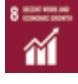

{0}------------------------------------------------

### ANNUAL AND SUSTAINABILITY REPORT 2022

Major steps forward despite external challenges **page 8**

New times call for new ways of working **page 16**

**1** Materiality assessment **page 44**

{1}------------------------------------------------

| 3                                 |
|-----------------------------------|
| 4                                 |
| 5                                 |
| 8                                 |
|                                   |
| 10                                |
| Financial targets and outcomes 11 |
| 12                                |
| 16                                |
| 18                                |
| 20                                |
| 26                                |
| 30                                |
| 34                                |
| 35                                |
| 36                                |
|                                   |

#### **Duni Group 2022 Sustainability Report 2022 Annual Report 2022**

| How Duni Group views sustainability                      | 43 |
|-------------------------------------------------------------|----|
| Materiality analysis                                        | 44 |
| Duni Group and the UN's Sustainable Development Goals | 46 |
| Sustainability initiatives                                  |    |
| 1 Becoming Circular at Scale                                | 48 |
| 2 Going Net Zero                                            | 50 |
| 3 Living the Change                                         | 52 |
| The Code of Conduct shall                                   |    |
| guide our actions                                           | 56 |
| Duni Group's footprint                                      | 58 |
| EU Taxonomy Regulation                                      | 63 |
| GRI Index                                                   | 66 |

| Directors' Report           | 70  |
|-----------------------------|-----|
| Corporate Governance Report | 75  |
| Board of Directors          | 81  |
| Group Management            | 83  |
| Auditor's Report            | 145 |
| Glossary                    | 149 |
| Key ratio definitions       | 150 |
| Calendar                    | 151 |
| Addresses                   | 151 |

{2}------------------------------------------------

## **Our strategy**  – a guiding star in turbulent times

When storms are raging all around us, it is important to keep a focus on the goal. Our strategy helps us make the right decisions. When we do the right things, we get closer and closer to becoming the company we are striving to be.

The past three years have been a commercial and mental roller coaster, with the pandemic, climate change, war, and both economic and energy turbulence. But at Duni Group, we have managed to maintain our energy and motivation.

This is rooted in a desire to make a difference. And our strategy until 2030 gives us a long-term goal to fight towards – to become our industry's trusted sustainability leader. We want to drive our industry towards circular solutions, net zero climate impact and social sustainability, where the focus is on people.

In the greater scheme of things, however, we are a small player. This is why we strive to contribute our knowledge, experience and networks in constructive and innovative collaborations. This will make it easier for us to provide each customer with the most sustainable solution based on their situation. These can be single-use or multi-use items, but we are increasingly involved in the development of digital services and transactions.

There are increasing demands for transparency about how companies work with sustainability, with the UN, the EU and public opinion as strong driving forces. Legislation is becoming stricter and reporting requirements are becoming ever tougher. We have taken significant

steps in this area during the past year. Wanting to be our industry's knowledge and sustainability leader, it is important for us to be active in the debate. It is therefore gratifying that we are increasingly being invited as experts in various forums for social and environmental issues. We want to influence from within our industry, but also to create a constructive dialog with authorities and organizations, for example. We hope that together we will be able to create a future based on knowledge and facts.

Then we can build a basis on which people can meet both now and in the future to enjoy food and drink – and do so with a clear conscience.

{3}------------------------------------------------

- Electricity from "Good Environmental Choice Wind" for our paper mill in Skåpafors
- Installation of solar panels at the plant in Bramsche, Germany
- Sustainability training under way for all employees
- All deliveries to Russia are stopped and the business in the country is closed down

- Partnership with Sweden Rock Festival to reduce plastic use
- Partnership with UNICEF in the Netherlands for Ivory Coast project
- Decision that Duni Group will sign up to the Science Based Targets initiative
- Member of the Charter of Diversity
- 17 Sustainability Leaders appointed
- in the organization

- Partnership on multi-use solutions including BioInnovation
- Participation in projects for circular business development and circular e-commerce deliveries for retailers
- Engagement in Cleanup Week at several locations across Europe
- Evaluation of future energy solutions for our paper mill in Skåpafors
- Standardization of reporting of production waste in Scope 3 work

- Five V Capital welcomed as minority partner in BioPak Pty Ltd
- Solar panels installed in our sales office in Breda, Netherlands
- Duni Group named "Career Company" for third consecutive year
- Agreement with Bower on collection of BioPak's products in the Nordic region
- New, updated structure for the Group's policies in accordance with ESG
- E-learning courses launched for the Code of Business Conduct and human rights

4,927 5,547

430

6,000 7,000

Net sales and operating income, SEK M

533

5,000 500

149

4,000 400 3,000 300 2,000 200 1,000 100

600 700

Net sales Operating income

5,061

279

6,976

450

2018 2019 2020 2021 2022

4,501

#### Key financials, SEK m

|                                                      | 2022   | 2021   | 2020  | 2019   | 2018   |
|------------------------------------------------------|--------|--------|-------|--------|--------|
| Net sales                                            | 6,976  | 5,061  | 4,501 | 5,547  | 4,927  |
| Operating income*                                    | 450    | 279    | 149   | 533    | 430    |
| Operating margin*                                    | 6.4 %  | 5.5 %  | 3.3 % | 9.6 %  | 8.7 %  |
| Operating EBITDA*                                    | 664    | 487    | 374   | 762    | 583    |
| EBIT                                                 | 326    | 173    | 70    | 408    | 351    |
| EBITDA                                               | 603    | 476    | 359   | 759    | 546    |
| Net income before tax                                | 283    | 133    | 7     | 377    | 328    |
| Net income for the year                              | 201    | 77     | 4     | 273    | 249    |
| Proposed dividend, SEK/Share                         | 3.00   | 0.00   | 0.00  | 0.00   | 5.00   |
| Equity                                               | 3,742  | 2,714  | 2,628 | 2,664  | 2,616  |
| Return on equity, %                                  | 5.4 %  | 2.8 %  | 0.1 % | 10.3 % | 9.5 %  |
| Return on capital employed, %                        | 9.3 %  | 7.1 %  | 3.9 % | 12.9 % | 10.6 % |
| Return on capital employed, excluding goodwill, % | 16.6 % | 14.4 % | 8.2 % | 25.6 % | 19.4 % |
| Number of employees                                  | 2,231  | 2,214  | 2,269 | 2,398  | 2,477  |

* Operating income, operating margin and operating EBITDA are adjusted for non-recurring items.

{4}------------------------------------------------

## **An eco-smart range for every meal**

Duni Group is a leading supplier of inspiring concepts for all occasions where people meet to enjoy food and drink. Whether at a restaurant, in a café or at home. But it can also be food or drink on the go.

We cover everything from table settings with attractive, creative and environmentally smart single-use items, such as table covers and napkins, to various candles and other table top accessories. We also supply premium packaging and packaging systems to environmentally aware customers in the expansive take-away sector.

Our goal is to help companies in the HoReCa sector create concepts that help elevate the experience for their customers. And both parties should be able to have a clear conscience – environmental sustainability and circular alternatives are key priorities for us. We work consistently to enhance these offerings.

## 2,231

The Group has 2,231 employees in 21 countries. The head office is located in Malmö, Sweden. Tissue for napkins and table covers is manufactured in Sweden, while converting to finished products takes place in Germany, Poland, Thailand and New Zealand. The Group has sales offices in Australia, Finland, France, United Arab Emirates, Netherlands, New Zealand, Poland, Switzerland, Singapore, Spain, UK, Sweden, Thailand, Czech Republic, Germany, USA and Austria.

{5}------------------------------------------------

*Our purpose*

To inspire the world to give more than we take to enable all people to enjoy good food, well-being, and togetherness – today and for generations to come.

# **Changes that produced positive results**

One important task in 2022 was to translate the updated strategy from words into action. It also included embedding our new vision, our new purpose and our new values in the organization, and integrating our three sustainability goals in all parts of the business. It is pleasing to see that large parts of the organization have made them their own and actively involve them in their daily work.

#### Strategy 2030 The updated strategy has five pillars: • Position • Innovation • Customers Vision for 2030 In 2030 we have achieved full circularity. We passionately lead our industry towards a world where we give more than we take. With care for our planet and our wellbeing – we create joyful, safe, and

easy-to-use solutions for all people to embrace food, togetherness, and • Business operation

- People & Culture
Read more on pages 12–15

design.

{6}------------------------------------------------

### Two business areas

*Our purpose*

The business is divided into two business areas: Duni and BioPak. Each business area has full responsibility for its respective value chain. Products are sold through a joint sales force, with the regions supporting the business areas. Duni and BioPak are responsible for their respective brand strategies as well as their own marketing communications, product development and innovation.

### Our three overarching sustainability initiatives

The three sustainability initiatives guide the way the business is conducted.

| 1 | Becoming Circular at Scale |
|---|----------------------------|
| 2 | Going Net Zero             |

- 3 **Living the Change**
Read more on pages 48–53

### Duni Group's value chain

Retail

{7}------------------------------------------------

## **Major steps forward despite external challenges**

Despite difficult external factors, we translated our updated strategy from words into action in 2022. Our sustainability initiatives and values give the business a purpose and help us on our way to becoming the industry's sustainability leader.

As we entered 2022, everyone wanted to leave the pandemic behind. But it continued to affect our customer base in the HoReCa sector. When the restrictions were then eased in the spring, the industry saw a strong upswing. People wanted to meet, eat and travel again. Festivals, parties and weddings could finally take place. The third quarter, which was the first full quarter that was not affected by any restrictions, saw a sales increase of 26.2%, and we delivered an operating income figure that was historically strong.

The Duni business area grew by 50.4% during the year, and had a 43.9% increase in sales at fixed exchange rates during the year compared with 2021. This is partly due to eased restrictions, partly to price increases. The BioPak business area increased by 23.9% compared with 2021, as a result of price increases and some growth. Together, this had a direct impact on the Group's operating income, which amounted to SEK 450 million (279).

Group sales for the year totaled SEK 6,976 million (5,061) in 2022, which corresponds to a sales increase of 37.8%. Adjusted for exchange rate fluctuations, net sales increased by 30.9%.

#### External factors still a concern

When the pandemic released its grip, we had already entered a new crisis, the war in Ukraine, which brought inflation and rising costs of energy and raw materials. The consequences of the geopolitical situation remain uncertain, for example how the purchasing behavior of end consumers will be affected.

Energy is the biggest concern, both price and supply. We implemented several price increases in 2022 to compensate for increased costs. Our paper mill in Skåpafors switched to BioLPG in 2021, but now the supply is threatened by the war in Ukraine.

Looking on the bright side, restaurants are open. During the pandemic, our market practically disappeared, but we coped relatively well anyway. The key going forward as an organization is to be adaptable. We are prioritizing precisely this and training our managers to lead in times of uncertainty and change.

#### Strategy communicated and embedded in the organization

Our operations in 2022 were dominated by external factors, but at the same time we worked consciously to embed our updated strategy to be a sustainability leader in the industry. We took a big step during the year and learned a great deal.

We created new Group-wide leadership training courses focusing on sustainability and our values. The organizational step of moving the sustainability department to People & Culture has contributed to making sustainability a natural element of the organization's day-to-day operations.

We have also continued to communicate the importance of inclusion, diversity and, equality in the organization, for example, in recruitment. In autumn 2021, a Diversity & Inclusion Board was created to continue working on this.

Much work remains to ensure that every one takes the strategy fully onboard. As part of this, we have moved towards a more integrated, network-based organization that provides work methods and

tools to help us realize the different parts of the strategy. During the year, we also set up a Program Management Office (PMO) service to coordinate our various projects across departmental boundaries.

#### Collaboration drives development in the industry

Our market is the HoReCa market. We believe in this industry. We have relationships here, knowledge and reach that we can contribute to the collaborations that are so important for us to be able to drive sustainable development in our industry.

In 2021, we took important steps in the area of circularity through investments in business startups focused on reuse and deposit systems. We extended these collaborations during the past year. The BioPak business area is increasingly focusing on system solutions for reuse and circularity. At the same time, the Duni business area is starting to offer more solutions for the restaurant, not just for the set table, but also digital services.

Duni Group wants to be part of the HoReCa market's future, as a sustainability expert, as a business partner and as a supplier of sustainable solutions. This is where our internal culture of innovation plays a key role. We strive to provide knowledge and the most durable solution for every customer – single-use, multi-use or maybe totally different solutions. One shining example of such a sustainable innovation solution is the prototype that Duni Group developed in 2022 to match restaurants and job seekers, to satisfy the pressing need for staff in the restaurant industry.

{8}------------------------------------------------

**"Our operations in 2022 were dominated by external factors, but at the same time we worked consciously to embed our updated strategy."**

Partnership for growth

Towards the end of 2022, we entered into a strategic partnership with Australiabased private equity company Five V Capital to accelerate the growth agenda of the subsidiary BioPak Pty Ltd, also based in Australia and New Zealand. We see an opportunity to expand in the Asia-Pacific region and in additional markets, and are delighted to be able to work with a local partner who – just like us – sees the potential in sustainable business concepts. BioPak offers sustainable packaging solutions for the take-away industry.

Robert Dackeskog, CEO and Group CEO

#### Key sustainability milestones

It is extremely pleasing to see how different departments are integrating our sustainability initiatives into their operations. We are approaching our net zero target according to Scope 1 and 2, by such means as replacing energy sources and installing solar panels at our plant in Bramsche, Germany. We will also be doing this in Bangkok, Thailand. During the year, the paper mill in Skåpafors only used electricity labeled "Good Environmental Choice Wind".

By standardizing the sizes of external packaging, we streamlined the logistics chain, resulting in reduced climate impact. We have also run a project to measure our climate impact in our value chain (Scope 3). One great new initiative is our appointment of 17 Sustainability Leaders, who will be supporting and motivating the local organization to produce even better sustainability work.

We have also committed to the Science Based Targets initiative, to secure continued efforts to reduce our greenhouse gas emissions. In 2022, we were the first in the industry to report our climate impact in our quarterly reports. This year's report is also our first to report in accordance with the principles set out by the GRI (Global Reporting Initiative), which facilitates communication around our ESG agenda. It is becoming increasingly important to have transparency on these issues, not least towards investors.

During the year, the Group's head office also moved to new premises in Malmö. In Germany, we invested in a new staff canteen. These kinds of activities are important to show employees that we stand by our values, and that the strategy means a review of the business.

#### Confidence in the future

When I took over as CEO and Group CEO of Duni Group in January 2021, my mission was to guide the company to the next decade. Despite the global turbulence in 2022, I feel that we took significant steps on that journey.

Our strategy sets a challenging agenda. It will take a lot of hard work to become the industry's obvious sustainability leader. Of course, there are lots of concerns in the world around us, but I feel reassured by how well we coped with the pandemic, and that we have performed well in historical terms during crises, such as the financial crisis in 2008.

I am extremely proud of how Duni Group has dealt with the last few years. Together, we have battled and performed amazingly well. I would really like to thank our employees and managers who, with their commitment, energy and pride, are driving our development forward. I would also like to thank our shareholders.

Malmö, March 2023

Robert Dackeskog *CEO and Group CEO*

{9}------------------------------------------------

## **A clear direction in a turbulent world**

After two years of a pandemic that put both management and employees under constant pressure, 2022 was more challenging than we had planned for. The Board of Directors and management have continued to focus on the long-term strategy, but also on managing the consequences of the global crisis that has developed.

As we now look back on 2022 – a turbulent year of international unrest, inflationary pressure driven by factors including rising energy prices – we can note that Duni Group is firmly underpinned by its strategy. Our strong focus on sustainable solutions, innovation and collaborations gives the organization a clear direction.

The reorganization that took place in 2021 has worked well. We created two business areas, Duni and BioPak, and integrated the paper mill in Skåpafors in the Duni business area, which increased collaboration between the factory and the commercial operation. The BioPak business area has a different business model, with expertise in procuring and developing external production.

#### The Board's work during the year

One main task for the Board in 2022 was to maintain the company's strategic focus, but also in the short term to deal with all the turbulence that arose during the year. As an example, resources for innovation have increased significantly, while at the same time we have compensated for historically high cost increases. For the Board and management, it has been important to manage the short-term challenges without compromising the long-term strategy. We worked hard to compensate for cost increases in raw materials, distribution and energy, and

had a close, ongoing dialog with management on our short-term priorities.

During the year, we also evaluated various alternatives to optimize the long-term value of the Group's subsidiary BioPak Pty Ltd. In December, we welcomed Australia-based private equity firm Five V Capital as a minority shareholder in the company to accelerate the growth agenda of BioPak Pty Ltd. This collaboration represents a significant opportunity to add value to Duni Group.

Our collaboration with management was dynamic and worked very well. It was once more possible for the annual strategy review, in which the Board of Directors and management

meet for two days, to take place in person.

#### An uncertain market

The consequences of what is now happening in the world around us are difficult to assess. Personal finances are coming

under pressure and new, stricter priorities will be necessary for most people.

From this perspective, restaurant visits and hotel stays can be regarded as unnecessary expenses. But we also know that after the pandemic, people are extremely tired of not being able to socialize in a normal way. In previous economic downturns, the need to socialize over a meal, at home or in a restaurant, has been given relatively high priority.

#### Important to be bold

Uncertainty about future laws and regulations in Europe is also making the situation difficult to navigate. One example is raw materials, where the use of wood fiber came into focus. In this respect, however, the Group is leading the way and we are constantly evaluating new materials, products and systems.

### **"Duni Group is firmly underpinned by its strategy. Our strong focus on sustainable solutions, innovation and collaborations gives the organization a clear direction."**

This also applies to new business models, where a number of new and interesting initiatives have been initiated. With the aim of offering the most sustainable option for every consumption occasion, we create the conditions for totally new business.

{10}------------------------------------------------

#### **Sales growth**

The goal is to achieve average organic growth in sales in excess of 5% per year over a business cycle. In addition, the company regularly assesses acquisition opportunities in order to gain access to new growth markets or strengthen its position in existing markets.

#### **2022 target attainment**

Organic growth amounted to 30.9%. The year's increase in net sales is a result of a good recovery after the pandemic, with stable and accelerating growth during the year. Price increases have also gradually had an impact on net sales.

#### **Operating margin**

The target is an operating margin of 10% or more. Profitability is to be increased through sales growth, continued focus on premium products and continued improvements within purchasing and production.

#### **2022 target attainment**

The operating margin was 6.4%. The clear improvement in income compared with the previous year is explained in its entirety by the improved market situation and increased net sales, as 2021 was significantly more affected by restrictions than 2022.

#### **Dividend**

It is the Board of Directors' long-term intention for dividends to amount to at least 40% of income after tax.

The Group has recovered well after the pandemic, and has a good financial position and future competitiveness that once more allows a dividend to be distributed. Despite better conditions, there is uncertainty in the world at large and continued volatility in demand. The Board therefore proposes to the Annual General Meeting that a dividend of SEK 3 per share be distributed, which corresponds to 70 (0) percent of profit after tax.

It could be a single-use or multi-use solution, or something else. One element of this is to build a flexible organization and to be bold enough to invest at an early stage, as we did in 2021 with the companies Relevo and Bûmerang.

In this uncertain situation, it is crucial to communicate consistently and transparently with shareholders and the organization. One clear example of this is sustainability reporting, where goals and results are followed up on an ongoing basis in our quarterly reporting.

#### A solid foundation

Our environmental, social and governance (ESG) work pervades the entire Group

today. People & Culture has assumed major responsibility for creating commitment and understanding within the organization around the company's purpose and vision. Our three sustainability initiatives and values are now natural features of our day-to-day operations, and issues such as performance culture and diversity are being prioritized.

Knowledge of our values is being conveyed outside the organization, and it is gratifying that young talents are applying to join us. This is business-critical in a market where competition for skills is intensifying. Head office's move to new premises is also a strong, timely, symbolic act, reflecting where we are heading as a company.

Despite an uncertain external environment, I look forward to the future with confidence. The strategy is well-embedded and is starting to produce results. Finally, I would like to take this opportunity to thank management and the organization for their great commitment and our shareholders for the trust they have placed in the company.

Malmö, March 2023

#### Thomas Gustafsson *Chairman of the Board*

{11}------------------------------------------------

## **A year of the strategy and we are on the right track**

**Duni Group 2022** / Strategy

In 2022, work on our updated strategy really took off. It was communicated and embedded in the organization, and a number of initiatives were launched to facilitate the work of realizing the various goals of the strategy.

{12}------------------------------------------------

#### **Duni Group 2022** / Strategy

In Duni Group's strategy, sustainability concerns all parts of the business. Our goal is to become a trusted sustainability leader in our industry by 2030. We shall lead development, inspire and step up the pace to reduce greenhouse gas emissions and implement innovationdriven circular solutions.

Our vision is to create a world where people can meet both now and in the future to enjoy good food, well-being, and togetherness. And we want to do it by giving more than we take.

#### We assume our responsibility for development

The strategy was launched in 2021, together with a new, higher purpose, a new vision and new values that will strengthen our corporate culture. The UN's Agenda 2030 and the seventeen global Sustainable Development Goals formed the starting point. Innovation has been given top priority and we have created three pillars in the form of sustainability initiatives that will be guiding principles in all parts of the business (see pages 48–53).

In 2021, we signed the UN Global Compact and in 2022 we took the decision to formulate and work towards so-called Science Based Targets. This means that we are committed to actively working to limit climate change in line with the Paris Agreement's 1.5-degree target.

#### Several initiatives consolidate the strategy

In 2022, the Group ran a number of activities to communicate and embed the strategy in the organization. Another important success factor is that we are continuously creating training courses, work methods and tools that make it easier for us to actually deliver on the strategy. Among other things, a number of different leadership courses have been launched for both managers and employees.

In order to create coordination and overall control, a PMO – Program Management Office – was set up in 2022. This provides a solid foundation for work on the strategy in the coming years.

**"During the year, we worked on many different initiatives to communicate and embed the strategy, but also to improve corporate governance and to create processes and structures that enable us to realize our strategy."**

Marielle Noble, Executive Vice President Strategic Development, IT and Communication

{13}------------------------------------------------

#### Perform and transform – two important aspects

Historically, Duni Group has been good at producing, delivering and developing its existing products. Our new strategy also means that we are increasingly looking at totally new business areas and business models in order to realize our vision for the future.

Our success is based on being able to balance these two sides of the business: perform and transform. For example, it's about how we should organize ourselves and what skills we need in the short and long term.

In 2022, we divided our business into eleven portfolios. This provides clear ownership, increases transparency and makes it easier to get the all-important balance between innovation and risk right. For example, it is important that we are bold when making investments and starting collaborations at an early stage, as we did in 2021 with the companies Relevo, Bûmerang and &Repeat.

Since April, our newly established Portfolio Governance Board has been meeting every month. This is where company management and various key people go through our portfolios and check them against our overall annual plan.

#### A hundred or more initiatives drive development

In 2022, we ran more than one hundred different initiatives covering all parts of the strategy, although many of these are parts of larger programs.

For example, twenty or so initiatives from the entire organization are gathered within the framework of the Becoming Circular at Scale program, which is driving the development of circular solutions. In some of the initiatives, we look at a completely new business model and completely new materials.

The Going Net Zero program also includes twenty or so initiatives throughout the organization to reduce our carbon dioxide emissions. In this area, we achieved the emissions targets for Scopes 1 and 2 in 2022, for example by switching to renewable electricity in our production. The Duni business area, which focuses on products for the set table, also continued the converting of its product range to more sustainable alternatives, including by switching to bio-based binders.

#### Solutions that create customer benefit

A third example, with a clear focus on the area of transformation, is New Business Exploration, where an exciting innovation project for staffing in the restaurant industry was launched in 2022. This will be launched commercially in 2023.

As part of efforts to further improve our customer experience and add digital alternatives to the sales model, during the year we continued the rollout of our systems and models for Customer Experience. We are now operating in all major markets in Central Europe.

**"We have strengthened our corporate governance to manage the all-important balance between perform and transform. So one doesn't harm the other, and so we really have initiatives that lead us towards our strategic goals – while at the same time being profitable."**

Patrik Bergström, Strategy Program Officer, Strategic Development

{14}------------------------------------------------

### The five core areas of the strategy

The 2030 Strategy consists of five core areas. The tree symbol represents our environmental focus, but also our fiber-based heritage. The five areas form a solid root system for our activities.

#### Position

Our goal is to be a trusted sustainability leader 2030. We want to take a leading position in our industry and be the first choice for environmentally smart and circular solutions.

Over the next few years, we will renew our range and develop our branding. We are driving positive change in partnership with key stakeholders.

#### Our main goals for 2030:

- We are where people meet to enjoy food and drink together.
- Our brands inspire and drive our industry to give back more.
- As the most trusted and inspiring partner for environmentally smart solutions in HoReCa+*, we offer a wide range of

solutions and have a fully circular business. *Including hospitals, care for the elderly, etc.

#### Innovation

We will develop our existing offer and create new solutions that better match changing demand and new laws. Investing in innovation is essential for us to be competitive.

In our innovation, we will focus on gaining insights, exploring and creating future opportunities. Partnerships and investment in new business are crucial to success, as is skills development.

#### Our main goals for 2030:

- We have identified and developed several ecosmart and circular options and expanded our offer to new categories and digital solutions.
- We have invested more in innovation and collaborations with external partners to support this.

#### Business operation

Our business activities are the backbone of achieving our ambitious sustainability goals. This includes our vertical integration (Duni) as well as the products and materials we buy from other manufacturers (BioPak).

To achieve this, we will ensure environmentally sound and circular value chains and reduce costs in our own production . We optimize logistics across Europe and start building logistics solutions as a service.

#### Our main goals 2030:

- We operate in a resource-efficient, environmentally-smart, transparent and effective way with net zero greenhouse gas emissions (scope 1 & 2).
- We have satisfied customers and logistics solutions that add customer value.

#### People & Culture

If our staff are not engaged and taking an active part, it will be difficult to achieve our 2030 goals. We need to build an inclusive culture where everyone counts and feels that their work matters.

We are now building a value- and goal-driven organization and expanding our core competencies in innovation, sustainability and digitalization. Other initiatives include strengthening our leadership and increasingly working in cross-functional teams.

#### Our main goals 2030:

- We have a strong set of shared values that bind us together globally across the Group.
- A higher purpose, value-based leadership, focus on growth, innovation, learning and cross-functional teams support this value base.

Kunder

#### Customers

To remain relevant in the market, we need to have a more customer-centric, outside-in perspective. We need to focus on how we can best help and support our customers and make it easy to do business with us.

Verksamhet

That is why we will introduce a new marketing model and digital platform in key European markets. Businesses will grow in existing and new markets.

#### Our main goals 2030:

- We are a reliable partner in Europe with a multi-channel model to the market.
- The Duni business is growing in carefully selected markets in the Middle East, Asia-Pacific and North America.
- The BioPak business is the market leader in Australia and New Zealand and a strong brand in Europe, the US and developed economies in Asia.

{15}------------------------------------------------

# **Changing times call for new ways of working**

Innovation plays a key role in our business. By being at the forefront of developments in sustainable and circular solutions, we remain relevant in the geographical markets where we operate, and we enhance our competitiveness.

Duni Group's goal is to be the industry's trusted sustainability leader by 2030. It is a bold goal, based on creating climatesmart solutions that add customer value. To succeed, we need to understand our customers' challenges and how we can collaborate internally and with external partners to resolve them in an environmentally smart way.

The Group's innovation department works continuously to identify the challenges that our customers face. Johan Mårtensson, Business Development & Innovation Manager, explains: "We interview existing and potential customers and map out challenges and needs. Then we delve deeper into the relevant areas."

#### Exciting solution for the restaurant industry

During the pandemic, around 50,000 employees left the restaurant sector in Sweden alone. One of the challenges identified by the innovation department is how to bring together restaurants and job seekers. In 2022, a partnership was initiated with an external supplier on a digital solution for this.

At first, simple prototypes were developed to test whether the concept was sound. A platform was then developed in the autumn, which is now being tested by a number of restaurants and is expected to be launched commercially in 2023.

**"We have the brand, the network and the reach, and strong trust. But we need more of a technological edge and new kinds of services."**

 Johan Mårtensson, Business Development & Innovation Manager

This may appear to be a major diversification for Duni Group. But being the industry's trusted sustainability leader involves more than material and climate issues.

{16}------------------------------------------------

#### New ways of working are crucial

"The solution is all about social sustainability and, let's be very clear about this, Duni Group's future is based on the fact that there is a HoReCa industry that is both sustainable and a place where people want to work. That's why we want to support restaurants and those who work in the industry, while at the same time it's good for us," says Johan, continuing:

"We have the brand, the network and the reach, and strongly rooted trust. But we need more of a technological edge and new kinds of services. New ways of working will be needed, and this platform is a good example."

Johan is encountering a growing realization that innovation is crucial to achieving the company's goals for 2030. More and more people see an innovation culture as being necessary, as well as continuously developing their skills.

#### Communication and new processes

Investments in startups in 2022 and the establishment of new internal work methods have produced results. These crossfertilizations have taught the Group to be more agile. For example, a more agile way of working has been introduced, with "New Business Demo" in particular being appreciated within the organization.

"Every month the innovation department presents exactly where we are, our problems, what went well and if we need help. This results in an increased sharing of knowledge internally, and we learn and adapt continuously during our process," says Johan.

#### The industry's leading knowledge partner

Duni Group's goal is to deliver a sustainable food experience. As the industry's leading knowledge partner, we must also be able to help customers find the best solution specifically for them. And then it's not just about the set table. It's about the whole restaurant. About products as well as the entire ecosystem around them and their life cycle.

"The biggest thing for me in 2022 was that our new work methods are starting to spread throughout the organization. If we're to succeed in achieving our goals for 2030, it's not about a few people in the innovation department. It's about the entire organization," concludes Johan.

### *Collaboration on reuse bears fruit*

Franck Bancarel, Mergers and Acquisitions Director

Developments in reuse solutions are progressing steadily in Europe, with legislation from the EU and individual countries serving as a strong driving force. In 2021, Duni Group invested in the German startup company Relevo GmbH, which aims to use its digital platform to create an efficient system for the reuse of take-away containers.

"We actively participate and support their development through both strategic and operational activities. Depending on the needs and skills required, we try to mobilize the right resources. At the same time, Relevo must lead the way and follow their vision. Our role is to provide support with experience, competence and networks," says Franck Bancarel, Mergers and Acquisitions Director.

The collaboration has already produced tangible results. For example, Relevo has developed an offering especially for wholesalers and has been successful in discussions with a number of major key customers.

"We have a strong belief in Relevo's solution. For Duni Group, this collaboration means that we can learn from a young and flexible company, as well as increasing our competitiveness in a fast-growing sector," says Franck.

{17}------------------------------------------------

# **We remain stable in a market that is still volatile**

The pandemic had a negative impact on the market at the beginning of 2022, and the restrictions remained in Germany – our main market – for longer than in the Nordic region, for example. The Group's main target group, the HoReCa sector, recovered very strongly from the second quarter. The Duni business area reported very good results in the second half of the year, and the BioPak business area continued on a steady course throughout the year.

But the pandemic was replaced by the war in Ukraine, which has had major consequences through rising energy prices and inflation. Changed consumer behavior in the wake of price increases is likely to have a major impact going forward.

The two most important macrotrends:

Circular models Digitalization

{18}------------------------------------------------

#### Target groups

Through its Duni and BioPak business areas, the Group primarily targets various professional customer segments in the HoReCa+ sector:

- Hotels
- Fast casual, such as cafés, bars, food trucks
- Full service restaurants
- Catering, such as services for companies and health care but also for special occasions

The Duni business area is also aimed at private customers through the retail sector:

- HMR (Home Meal Replacement), such as delis, grocery stores and online suppliers
#### Competitors

Duni Group is a stable company with extensive experience. We have coped better with the pandemic than many competitors, and our focus on sustainability and innovation will keep us at the forefront. Our two complementary product ranges give us clear competitive advantages.

The Duni business area is the market leader in Europe, and its reach means that there are relatively few global competitors. Companies in areas such as tissue cannot compete with the quality and design of the Duni range. Many of them are smaller, local or regional.

The BioPak business is the market leader in the Asia-Pacific region and is continuously strengthening its position in Europe. There are several competitors, and competition is intensifying with startup companies offering environmentally-sound and circular solutions. These may, however, also become valuable business partners. To maintain our position in the take-away segment, it is important to maintain a high pace of innovation.

#### External environment External threats

When the pandemic loosened its grip in the second quarter, the HoReCa sector and the experience industry saw a strong upturn. But the war in Ukraine created new concerns in the global market. Inflation has driven up the prices of energy, raw materials and transport. How this will ultimately affect price increases and consumption by end customers is uncertain, but it is a concern.

The shortage of transport containers in 2021 has to some extent persisted, and the supply chain from Asia has not fully recovered. There have still been Covid-19 lockdowns in China that have affected purchases by the BioPak business area.

#### New laws and political decisions

The EU's single-use plastics directive (SUPD), with a phasing out of plastics and a ban on expanded polystyrene (EPS) and the accompanying product labeling, is putting a lot of pressure on manufacturers and suppliers.

Through its European Green Deal, the EU aims to achieve a circular economy and become climate-neutral by 2050. This means that material selection and circular end-of-life solutions will be absolutely crucial. These issues are best solved through various collaborations on new business models and the reuse of products.

The value chain for single-use items will continue to be heavily impacted by the EU, as well as by changes in national legislation. For example, both France and Germany introduced requirements for reusable alternatives in certain applications in January 2023. It is also uncertain how the EU's forest strategy for 2030 will affect the availability of wood fiber.

#### Trends, attitudes, values

Circular models and digitalization are currently the two most important macrotrends. The first is being driven by new laws and growing opinion. The relevance of single-use items is threatened, but after the pandemic there is a very strong desire to meet around food and drink, which is driving both the number of restaurant bookings and sales of takeaway products.

Other effects of the pandemic are that it has become more common to socialize in the home, with increased sales of the Duni business area's products in the retail sector. Many people are continuing to work from home, especially in the Nordic region, and digital meetings continue to replace business travel, which is having an impact on the HoReCa sector.

Digitalization made a major breakthrough in the HoReCa industry in 2020 and now covers the entire value chain, from purchasing, customer interaction and deliveries, to evaluations and service. Digital

customer-specific, brand-building solutions continue to be important.

In 2022, the strong demand for hygienic solutions seen during the pandemic has leveled out and not had the broad impact that many predicted.

#### Technical development

The phasing out of plastics is driving the development of alternative, mostly fiberbased solutions. Replacing the product benefits of plastic will require several different materials to meet different needs, such as for fatty foods or soups.

In 2021, the Group was the first to introduce renewable binders in fiber-based products. The Duni business area continued to work on converting to these more sustainable napkins and table covers in 2022.

#### Growth opportunities

We have competitive, climate-smart products for the growing take-away sector, as well as a wide range of more sustainable solutions for "sit-down" restaurants and the home. The strong environmental trend means that many customers are willing to pay more for sustainable solutions, especially if they are easy to use, and are clear and credible when it comes to their environmental benefits.

We continue to strengthen our offering in the area of e-commerce and other digital services. Our strong focus on innovation, collaboration and investment in startups means that we can expand in the area of take-away, for example with reusable products.

The changes in demand in various customer segment generate additional sales through the opportunity to offer Duni and BioPak products to the same customer. We are working actively to create a platform that clarifies our brands and facilitates this.

Geographically, Asia is a growing market with increasing demand for environmentally adapted packaging solutions, and as the world's largest full-service market, demand is rising for products such as table covers and napkins. But Europe remains our largest market, and logistics costs combined with price pressure from local producers may slow down expansion in Asia.

{19}------------------------------------------------

## **Eco-smart solutions for the set table**

The Duni business area stands for what the Group is traditionally associated with: innovative solutions for the set table, primarily napkins, table covers and candles.

Products and services are mostly sold under the Duni brand. Customers are primarily hotels and restaurants, the so-called HoReCa market, where sales are largely made through wholesalers. Grocery chains are also an important customer group, as are other channels such as various types of specialist retailers.The business area is a European market leader in the premium segment for napkins and table covers. Duni accounted for approximately 57% (53%) of the Group's net sales in 2022.

Net sales amounted to SEK 4,004 million (2,662).

Operating income was SEK 333 million (93). The operating margin was 8.3% (3.5%).

{20}------------------------------------------------

## **We are emerging strong from a challenging year in which we achieved record results**

After two years of lockdowns, which hit the business area's customer base extremely hard, and where we lost 90% of our sales, we reversed the decline.

After the pandemic, everyone was longing for some kind of normality. When the restrictions were eased in the second quarter, everyone wanted to go out to restaurants and socialize again. Postponed weddings and festivals could take place.

After a major drop in sales during the pandemic, our recovery came faster and more strongly than expected. To the extent that we had difficulty in meeting demand.

"This was partly due to labor shortages in our plants in Germany, and partly because we were struggling to get hold of raw materials for napkins. Furthermore, the war in Ukraine drove up electricity prices, forcing us to implement a number of price increases," says Linus Lemark, Executive Vice President, Business Area BioPak.

#### Activities in two main areas

We focused on two main areas in 2022. The first was efficiency improvements and productivity increases in the factories which, combined with gains from negotiations with our suppliers, drastically reduced our costs. The second was to increase the relevance of our offering and brand. For example, we continued to

convert our core range into more sustainable products. A major shift in the range will start in January 2023 and continue for a couple of years.

"It's a big switch that will make us more attractive. We've launched our first napkins and table covers with bio-based binders, and have worked hard to find renewable packaging instead of plastic. And we're looking at some form of return system for LED lamps and candles," says Linus.

and we have installed solar panels at our largest converting factory in Germany and in our sales office in Breda, the Netherlands. We are undertaking a wide range of activities to ensure that our factories achieve the Group's net zero targets.

#### Positive despite uncertain market

"One trend that is likely to affect the market and us in the coming year is an increase in cost awareness among our customers," says Linus, continuing: "Our planning

### **"We feel that we will be able to gain market shares in these turbulent times."**

Linus Lemark, Executive Vice President, Business Area BioPak

#### Initiatives for sustainable production

After one year of the updated strategy, sustainability is integrated into all parts of the business area's value chain. One good example is our paper mill in Skåpafors, which, as far as we know, is the first mill in the world to start switching to BioLPG. Unfortunately, the war in Ukraine has made it difficult to buy BioLPG. Our converting plants in Europe have switched to 100% renewable electricity,

going forward is characterized by a high degree of uncertainty, but we've never been as well prepared for a recession as we are now. Our solid foundation – market leader in Europe, strong market presence, our business model and our offering – makes me positive about the future. We feel that we will be able to gain market shares in these turbulent times."

**Product range**

- Napkins
- Table covers
- Candles and accessories
- Hygiene products

- **2022 product launches** • Fossil-free Bio Dunisoft® premium
- napkins • Fossil-free Bio Dunicel® placemats

**Customer segments**

- Events and catering • Full service restaurants
- 
- Hotels
- Public sector
- Grocery sector
- Staff restaurants

#### **Specialty materials**

- Airlaid
- Tissue
- More than 50 years of experience • Vertical integration

{21}------------------------------------------------

## **Controls the entire chain with vertical integration**

Vertical integration means that the Group, through the Duni business, essentially owns the entire value chain for table covers and napkins (tissue and airlaid). This is unique in our industry.

#### **Forestry**

98% of the raw materials for Duni's table covers and napkins are FSC® certified wood fiber from forestry committed to environmental adaptation, social responsibility and economic viability.

#### **Paper mill**

At Duni Group's paper mill, Rexcell in Skåpafors, forest fiber is processed into large paper rolls. These so-called jumbo rolls of tissue (soft paper) or airlaid are sent to the Group's converting units.

## **Laponian receives Red Dot Award**

The multifunctional Laponian product range, with holders made of stainless steel or robust crystal glass, for items such as candles, menus and cutlery, was presented with the Red Dot Award design prize in 2022. The citation states that the products inspire with their consistent design and elegant appearance. Their versatility is also highlighted. Duni Group's Product and Concept Designer Karolin Larsson describes the range: "With a design inspired by Nordic nature, Laponian provides a sense of freedom and playfulness."

{22}------------------------------------------------

#### **Converting**

In converting, the paper is cut, pressed, embossed and folded into finished napkins and table covers. Converting plants are located in Bramsche and Wolkenstein, Germany, Poznan, Poland, Bangkok, Thailand, and Auckland, New Zealand.

#### **Distribution**

The Duni business area sells the majority of its products via various distributors and retailers. The finished products from converting are transported by truck further along the value chain.

#### **Customers**

Duni products are sold to the HoReCa segment, but also in grocery and specialty stores to private customers. They are suitable for anyone who thinks eco-smart when people meet around food and drink.

Laponian, our assortment of multifunction table accessories, won the Red Dot Awards in 2022.

{23}------------------------------------------------

# **We are moving towards a more sustainable and relevant product range**

The Duni business area has taken several important steps towards a more sustainable product portfolio during the year. At the same time, it is important that we keep inspiring customers with design and colors, and that we deliver in accordance with our brand promise of Sustainable Goodfoodmood®.

{24}------------------------------------------------

Circular at Scale is one of Duni Group's three important sustainability goals. This is a huge challenge for the Duni business area, where single-use products such as napkins and table covers are big sellers. As a first step, the business area is focusing on seeing how the products can become more sustainable at the beginning and at the end of their life cycle. The goal is to reduce the use of virgin raw materials.

"One very important activity for us is to look at how we can use recycled fibers in our products and packaging solutions. This would drastically reduce our fairly large environmental impact in production," explains Hanna Banica, Marketing Director, Business Area Duni. "We're also investigating how we can design our products in a holistic flow, such as home composting."

#### Key breakthroughs

The business area had two major breakthroughs back in 2021. Two employees at the factory in Bramsche, Germany, succeeded in producing a fossil-free binder based on potato starch, which resulted in the material BioDunicel® and environmentally adapted placemats. In addition, a series of more sustainable

premium napkins, BioDunisoft®, was launched with a pioneering, fossil-free binder made from materials including lemon peels and corn. Both ranges are fossil-free, but are also compostable. The products are supplied in new fiber-based packaging in which all plastic has been replaced with paper or cardboard.

#### Sustainable relaunch of big sellers

This provides a good foundation for the business area, and the converting of the range is continuing quickly. Among other things, work was underway to prepare the launch of BioDunisoft® Unicolours in January 2023.

"It's full speed ahead for BioDunisoft®, and after the turn of the year we'll be launching our Unicolours single-colored napkins in 24 different colors. This is a large part of our portfolio that's being re-launched and switched over to bio-based materials. It's a huge step," says Hanna.

#### Exploring the market for sustainable table covers

BioDunicel® bio-based table covers are being given a more cautious launch. We have conducted market studies, as there is a noticeable difference in quality when switching from the latex-based to the biobased binder in the table covers.

"We've heard customers comment that they're experiencing a difference. So we've chosen a calmer introduction to the market. We'll be launching a pilot in 2023, in which we'll launch a number of Bio-Dunicel® articles to see how they're received on the market. Based on this launch, we'll decide on a full converting or whether more product development is needed," explains Hanna.

#### Sustainable Goodfoodmood® crucial to the offering

In the new strategy, sustainability runs through all of the Group's operations. At the same time, Hanna believes that we must not lose sight of the fact that the Duni brand must also be synonymous with solutions where people meet and enjoy pleasant moments together around food and drink.

"Of course, we'll do it in a sustainable way, and that will be demanded of us to survive and be relevant in the market. But Duni must also inspire, we must stand for Goodfoodmood®. It's about the colors, the design and the atmosphere we create with our products."

#### Life cycle analyses speak for themselves

BioDunisoft® generates 19.1% lower CO2 emissions than standard Dunisoft®. This means that a complete transition to BioDunisoft® would result in a reduction of 3,137 tonnes of CO2 e, which is equivalent to driving 18.29 million km in a normal car.

BioDunicel®, for its part, generates 28% lower CO2 emissions than conventional Dunicel® material. A 100% transition to BioDunicel® would mean a reduction of 3,084 tonnes of CO2 e. That is the equivalent of 17.98 million kilometers in a normal car.

The audited LCA report is available on Duni Group's website.

{25}------------------------------------------------

## **Retaining our strong position in take-away**

The BioPak business area offers environmentally sound concepts for meal packaging and serving products for applications including take-away, ready-to-eat meals, and various types of catering. The business area's customers are various types of restaurants with take-away concepts and companies that are active in the health and patient-care sectors. Stores and other food producers are also a major customer group. Products and services in the business area are mostly sold under the BioPak brand, but also under the Duni brand. The business area is the market leader in the Nordic region and Australia, and the BioPak brand has also been launched in Europe. Duni accounted for approximately 43% (47%) of the Group's net sales in 2022.

Net sales amounted to SEK 2,972 million (2,399). Operating income was SEK 117 million (186).

2,972 117 3.9 %

The operating margin was 3.9% (7.7%).

{26}------------------------------------------------

## **An innovative offering for take-away**

The trend of take-away, delivery and ready meals continues to be strong, even after the pandemic. And demand for sustainable packaging is increasing. The BioPak business area has alternatives to plastic packaging, which consumers are demanding. We also have circular alternatives in both multi-use and single-use solutions, and are well positioned for the future in these areas.

The BioPak business area coped well with the pandemic. Demand for food packaging solutions skyrocketed, as take-away and home delivery of food were two strong trends.

"There's still good demand, but the product mix has changed somewhat, and cups and glasses have recovered, while food packaging has stabilized at a higher level than before the pandemic. The market continues to see stable growth with a focus on sustainability," says Nicklas Bengtsson, who took over as EVP of the business area in autumn 2022.

Sustainability and convenience are two underpinning drivers for the take-away sector. Even after the pandemic, many people are working from home several days a week, and home delivery or takeaway are useful options.

#### Maintaining quality for ready meals

The growing demand for take-away and ready meals has also broadened the sector. More and more retailers are now selling ready meals, in competition with traditional restaurants. This makes it easier for consumers, who can buy ready meals at the same time as other food items.

The business area's Duniform® packaging concept is an excellent alternative for

ready meals and can extend shelf life while maintaining quality, which contributes to reduced food waste.

Sealable Duniform® Forum trays were launched in 2022. Manufactured from FSC®-certified cardboard, they contain 85% less plastic than traditional trays.

#### Seeking producers closer to customers

The difficulties experienced during the pandemic of producing and transporting products from Asia led the business area to start looking for European subcontractors in 2021. This transition continued in 2022.

"Although the supply of transport containers is better and prices are becoming normalized at a higher level, there are still long delivery times from Asia. But some materials cannot yet be produced in Europe and must continue to be produced in Asia. Producing outside Europe is sometimes a requirement from customers from a price perspective. With more production in Europe, the risk is reduced and planning is easier. It will take time to strike the right balance, but we strongly believe that this is the right way forward," explains Nicklas.

Even though there are many benefits to this transition, we must also be competitive. For many of our customers, price remains

the deciding purchase factor. There is also expertise in Asia and materials of interest.

#### **"Customers know they can trust us, and if they want the best, we're there for them."**

 Nicklas Bengtsson, Executive Vice President, Business Area BioPak

#### Three key success factors

2022 was strongly characterized by external factors that created tremendous uncertainty and affected all industries. Increasing prices for transport, energy and raw materials naturally have consequences. Higher costs must be passed on to the end consumer. In this respect, our commercial organization has shown fine judgment.

"Our success is based on three main components. We always create our own design, we must always be premium and we must be the most sustainable supplier. I find it very difficult to see how a competitor can match us here with our wide product range. Customers know they can rely on us, and if they want the best, we're there for them," continues Nicklas.

**Product range** Products for serving meals, on-site or take-away.

**2022 product launches** • Sealable fiber trays for Duniform® • Take-away solutions in carton and bagasse • Wooden and paper cutlery

#### **Customer segments**

- Fast casual
• Cafés • Fast food

- Events and catering • Supermarkets
- Food producers
- Public sector
- Other
- **27**

{27}------------------------------------------------

# **Phasing out of plastic continues**

EU legislation sets out requirements for phasing out plastic within certain groups of single-use products. The BioPak business area is well advanced with sustainable alternatives. During the year, for example, the Duniform® concept has become increasingly based on renewable raw materials.

{28}------------------------------------------------

In the field of single-use products, there is a strong focus on phasing out and replacing fossil-based virgin plastic with more environmentally smart, non-fossil alternatives. In 2021, the EU's single-use plastics directive (SUPD) came into force, which bans the sale of certain singleuse plastic items.

#### Replacing plastic a complex process

While legal requirements are intensifying and opinion against plastic is strengthening, it is a complex area. Finding sustainable and hygienic alternatives with the product benefits of plastic in food packaging applications is a challenge. Manufacturers and suppliers easily get caught up between different laws, which on the one hand concern the environment/climate and on the other hand food contact and food safety.

"Price and function make some plastic products difficult or almost impossible to replace. In some parts of our range, plastic is still the best option to preserve the quality of the food and keep it fresh for longer. If you also want to be able to see the food in the packaging, it's usually difficult with fiber-based alternatives that aren't as transparent," says Tomasz Doweyko, Marketing Director for Business Area BioPak.

#### Several new sustainable product ranges

But Duni Group fully supports SUPD and began to switch the product range in good time before the directive came into force. Our updated strategic focus on sustainability and circular solutions reinforces

the incentive, and work continued in 2022 with new launches. New products include sustainable products in the popular Duniform® sealing concept.

"For example, we've developed several fiber-based product ranges that can replace our plastic solutions in the Duniform® range. We're continuing to work on this transition, so that in due course we'll be able to offer alternatives to all fossil-based plastic in our range," says Tomasz.

#### Many options and materials – and possibilities

The business area's sustainable Duniform® products are made from bio-based or recycled raw materials and are carbon neutral through compensation. They reduce the plastic content by up to 90%. There are a number of different alternatives and materials.

For example, there are sealable trays made of renewable and compostable bagasse (sugarcane fiber)with a thin PBAT/PLA coating. The Duniform® range of "Menu Fiber" cellulose meal molds is manufactured in Europe and consists of wood fibers with a bio-based PBS/PLA coating. They are suitable for both hot and chilled food and are compostable in industrial environments.

The Duniform® Forum range is made from FSC®-certified cardboard with a removable PE coating, and consists of 85% less plastic than conventional alternatives. All Duniform® CPET trays are made from 100% recycled PET material. Different sealing options are available to meet

different customer needs, from fiberbased or clear lids to different sealing films.

#### Keeping a close eye on legislation

"We're constantly looking at any legislation or regulations that the EU, as well as individual member states, are looking at – related to packaging in general, but above all in terms of plastic. We're continuously monitoring this area so that we can stay one step ahead. We need to know what's around the corner, so that we can develop and adapt our range ahead of future changes," says Tomasz.

#### Duniform® – a tried and tested concept just got more sustainable

The Duniform® sealing concept has simplified the sealing of packaging solutions and kept them clean, fresh and leak-proof for 40 years. It provides safer transport of various food products and makes handling easier. It can also reduce food waste, which can help reduce climate impact. The Duniform® concept is continuously evolving to be even better and to meet today's high demands for sustainability. The Duniform® range includes sealing machines, trays, sealing films, transport solutions, and service and support.

{29}------------------------------------------------

## **Leadership is key to achieving the goals**

In 2022, the updated strategy began to be translated into action, and a number of new activities and work methods have been launched to support this. One important component in achieving the goals is to train managers and employees to handle uncertainty and the rapid rate of change in the world around us. Leadership training courses have therefore been a primary focus area in People & Culture.

{30}------------------------------------------------

A partly new strategy was launched in 2021, giving Duni Group a new direction with a focus on sustainability and innovation culture. It means that the participation and commitment of every employee and manager are important for us to succeed in achieving our goals.

In 2021, HR was also renamed People & Culture, which reflects the central role of the function in the Group's development until 2030. One clear signal was that Sustainability and People & Culture were merged to streamline the communication of the strategy in the organization.

"The core of our corporate culture is that everyone in the organization understands and lives the strategy and our values. The name change underlines the fact that People & Culture is an engine in this journey of change," says Malin Cullin, EVP Sustainability and People & Culture.

Leadership courses drive development A crucial success factor is that the power of change comes from within the organization. Although all employees are important in the transition, managers have a key role to play in increasing motivation and the understanding of

what kind of company Duni Group wants to become. For this reason, People & Culture has created three modular leadership training courses.

The Group's view of leadership is central and focuses on how to lead others – and yourself – in a company that aims to be the industry's trusted sustainability leader, in a changing company and in an uncertain world. The first course, "Leading yourself", is open to all employees and focuses on this.

{31}------------------------------------------------

The other two courses are aimed at the organization's 200 or so managers: "Leading others" and "Leading in transformation". Malin emphasizes that, "If we don't get leadership that is effective, we won't succeed with our transformation. To my mind, everything is connected to leadership, and we at People & Culture must give our managers the right tools."

#### Make the strategy your own

We see clear, positive changes throughout the organization.

"It's great to see how different units have taken on the strategy, broken it down and made it their own. They talk about how they can contribute to the sustainability goals and what they want. Even at places where they were initially critical, they've started to assume ownership of the strategy," says Malin.

#### Diversity, inclusion and equality prioritized

Leadership is crucial for communicating our values – We care, We are passionate and We make a difference – in the organization, and when recruiting and onboarding new employees. It plays a central role in the Group's work on diversity, inclusion and equality – which constitutes a module in the leadership development program. To further strengthen this important area within the Group, a special cross-functional Diversity, Equality & Inclusion Board was appointed in autumn 2021.

The past year has been the first year in which the organization really started to live the new strategy. And the course is set. For People & Culture, this means a continued focus on driving and embedding leadership, the corporate culture, the values, diversityequality-inclusion, training the entire organization in sustainability and continuing to digitalize HR administration, employee development and training.

### **"The core of our corporate culture is that everyone in the organization understands and lives the strategy and our values."**

Malin Cullin, EVP Sustainability and People & Culture

#### **Our values**

#### We care

- We care about our planet, its people and communities.
- We take responsibility for our actions.
- Through mutual trust and respect, we build the best relationships with colleagues, partners and customers.
- We work together cross-functionally and across borders to achieve great results together.

#### We are passionate

- We are passionate about what we do.
- We are proud of what we have achieved and where we are going.
- Through our commitment, we help achieve our goals.
- We believe in our unlimited potential and ability to develop.

#### We make a difference

- We are innovative and pioneering.
- We find new ways to work to make the world a better place.
- With curiosity and courage, we strive to try new things, learn more and see opportunities in challenges.
- We dare to take the lead to improve and change - for future generations.

{32}------------------------------------------------

### *A new head office for new times*

#### Christel Bjöwi, Malmö Site Manager

After 17 years in the same premises, it was time for a fresh start for the Group's head office in Malmö – both physically and mentally. The old premises were too large and were unsuitable for today's flexible hybrid working practices.

"The old office didn't encourage meetings between people. This is something we feel strongly about and that our employees said they lacked," explains Christel Bjöwi, Malmö Site Manager, who was responsible for the move. "The new premises help us to work across boundaries, in line with our new strategy. We have more sharing of experience and creativity when we sit closer to each other and share workspaces."

The new premises were inaugurated on 12 September 2022, and the bright, open kitchen/lounge section has quickly become an important hub. There are large areas with alternative work environments, as well as small rooms for focus work and digital meetings. Each group/department has a home area where shared work materials are stored.

Sustainable thinking was important during the move, and as much as possible has been reused from the old office. Other items have been purchased second hand. "Looking for second-hand goods takes time, but it feels good not to contribute to the throwaway society," says Christel.

#### **Attractive employer**

Duni Group continues to be a popular employer. For the third consecutive year, the Karriärföretagen organization has named the Group one of Sweden's 100 most attractive employers, with the citation: "Duni Group is an extraordinary employer. This is a company driven by passionate employees who are keen to make a difference. There is a strong focus on sustainability and the whole company is characterized by it, both in terms of products and inside the company."

**Mitt Liv – a partner for inclusion and diversity** The Group continues to collaborate with Mitt Liv. This organization works for diversity and inclusion in the Swedish labor market, by such means as mentoring programs for academics with a foreign background. CEO Robert Dackeskog and EVP Sustainability and People & Culture Malin Cullin are already mentors, and more members of management joined them in 2022. Duni Group also collaborates with Mitt Liv on recruitment, and Malin Cullin was involved when Mitt Liv held a seminar during the Almedalen Week event on diversity, inclusion and equality.

**Digitalization streamlines the entire value chain** 2022 saw the implementation of or decisions made to implement a number of digital tools to streamline work with employees and managers. Winningtemp is an AI-based employee survey platform that aims to measure leadership and well-being. People & Culture was also given the goahead to invest in a new, digital HRM system (Human Resource Management) to facilitate and streamline HR administration, employee development and training.

{33}------------------------------------------------

# **An innovative market leader**

Through our two brands, Duni and BioPak, Duni Group is the market leader in Europe in products, services and solutions for both the table top market and for packaging and other products for the expanding take-away segment.

Becoming the industry's sustainability leader is an important goal for the Group. Net zero climate emissions, circular solutions and social sustainability shall guide operations. Our "Decade of Action" strategy, which aims to make us a trusted sustainability leader by 2030, lays a solid foundation for the development of competitive, sustainable products and services for the HoReCa sector. People should be able to keep meeting and enjoying food, togetherness and design – with a clear conscience.

### Long-term value creation through profitable growth

Historically, we are a solid company that has provided secure returns. We have a strong financial base, a very good market outlook and good, long-standing customer relations. During the pandemic, we showed once more that we are resilient and can adapt to difficult external factors, as we did during the financial crisis of 2008.

### Strong and focused brands

The Duni brand has a long history in fiber-based products and has long been the market leader in products for the set table. We have established trust and built strong relationships with actors in the HoReCa market. We understand customers, their needs and their circumstances. This means that we have a lot to offer in strategic partnerships, in which we develop new concepts that enhance our offerings and increase customer value. BioPak is a younger, distinctive brand that wants to be the obvious choice for eco-conscious meal packaging. The products are manufactured primarily from renewable, plant-based raw materials or recycled materials.

### A leading developer of sustainable solutions for every meal

Eco-smart and circular solutions are becoming increasingly important in the serving and consumption of food and drink. People will always have a great need to meet, socialize and enjoy food and drink in a simple and genuine way. But it must be environmentally well thought through. Duni Group has had a strong environmental focus for many years, and we have made it the backbone of the entire Group. We believe that there will be a place for both single-use and multi-use items, as well as new solutions. This will be needed to offer all customers the most environmentally sound and climate-smart solutions – in markets with very different conditions.

### An innovation culture is key to future market shares

Creating an internal culture of innovation is crucial to being a credible sustainability leader by 2030. Investments in and collaborations with both established players and interesting startups guarantee our relevance in the take-away market of the future. This is an exciting sector, where we have good prospects to increase our market share and create continued growth.

### Strong position in growth areas

Demand for take-away solutions is growing steadily in the HoReCa market and was given an extra boost during the pandemic. The growth rate remains stable. Through the BioPak business area, we have a strong position in this area. Geographically, we see that we can take more market shares in, for example, Eastern and Southern Europe for the Duni business area, while the BioPak business area has great potential in all areas where we operate.

{34}------------------------------------------------

During 2022, the share price decreased by 26%, with a closing price of SEK 86.20 (116.8) on December 31, 2022. Since listing, Duni's share price has increased by 72% until December 31, 2022, resulting in a market capitalization of SEK 4.1 billion. During 2022, the closing price varied between a high of SEK 118.40 on January 4, and a low of SEK 62.00 on September 29. Earnings per share for the year were SEK 4.25 (1.62).

During 2022, 8.4 million (15.9) Duni shares were traded, valued at SEK 761 million (1,791).

#### Number of shares and share capital

On December 31, 2022, Duni AB (publ) had 46,999,032 shares. Each share entitles the holder to one vote and to an equal share in the Company's assets and earnings. The quotient value is SEK 1.25 and the share capital is SEK 58,748,790.

#### Dividend policy and dividends

It is the Board of Directors' long-term intention for dividends to amount to at least 40% of income after tax. However, when deciding whether to propose any dividend, consideration should be given to possibilities for expansion, consolidation needs, liquidity and the financial position in general. The Board of Directors proposes to the Annual General Meeting that a dividend of SEK 3.00 (0) be paid per share for the fiscal year 2022, corresponding to 70% (0%) of income after tax. The assessment is that the Group has a sound financial position and future competitiveness that allows a dividend equivalent to SEK 141 million.

#### External analyses are published by:

- Handelsbanken Capital Markets, Karri Rinta
- SEB, Gustav Hageus

Duni has been listed on NASDAQ Stockholm since November 14, 2007 in the Midcap, Consumer Discretionary list with the ticker name "DUNI" and ISIN code SE0000616716.

## Share performance 2007–2022 Share performance 2022 SEK, closing price SEK, closing price 150 150 100 50 0 0

#### Ownership Structure 12/31/2022

|                 | Number of    |                  |                   |
|-----------------|--------------|------------------|-------------------|
| Number          | shareholders | Number of shares | % of total shares |
| 1 – 500         | 8,855        | 1,028,986        | 2.19%             |
| 501 – 1,000     | 928          | 761,473          | 1.62%             |
| 1,001 – 5,000   | 652          | 1,462,875        | 3.11%             |
| 5,001 – 10,000  | 76           | 564,403          | 1.20%             |
| 10,001 – 15,000 | 8            | 99,421           | 0.21%             |
| 15,001 – 20,000 | 10           | 174,647          | 0.37%             |
| 20,001 –        | 84           | 42,907,227       | 91.29%            |
| Total           | 5,148        | 46,999,032       | 100%              |

#### Shareholders 12/31/2022

|                                   | Number of shares | % of shares |
|-----------------------------------|------------------|-------------|
| Mellby Gård AB                    | 14,094,500       | 29.99%      |
| Polaris Capital Management LLC    | 4,772,112        | 10.15%      |
| Carnegie fonder                   | 4,510,793        | 9.60%       |
| Nordea Investment Funds           | 4,310,591        | 9.17%       |
| Brown Brothers Harriman & Co, W9  | 2,393,889        | 5.09%       |
| Fjärde AP-fonden                  | 2,137,896        | 4.55%       |
| State Street Bank & Trust Co, W9  | 2,074,346        | 4.41%       |
| SHB Luxembourg cl acct Sweden     | 1,529,571        | 3.25%       |
| PROTECTOR RESEARCH ASA            | 1,344,783        | 2.86%       |
| BNY MELLON NA (FORMER MELLON), W9 | 1,181,485        | 2.51%       |
|                                   |                  |             |
| Total, the 10 largest owners      | 38,349,966       | 81.60%      |
| Other shareholders                | 8,649,066        | 18.40%      |
| Total                             | 46,999,032       | 100%        |

#### Data per share

| Amount, SEK                                        | 12/31/2022 |
|----------------------------------------------------|------------|
| Number of shares at end of period                  | 46,999,032 |
| Average number of shares before and after dilution | 46,999,032 |
| Closing price on December 30                       | 86.20      |
| Earnings per share, before and after dilution      | 4.25       |
| Equity per share                                   | 79.61      |
| P/E ratio                                          | 20         |
|                                                    |            |

{35}------------------------------------------------

## **Risks and risk management**

Duni Group's business is affected by various external factors and is constantly exposed to risks and threats. Active risk management with analyses is undertaken systematically on an annual basis, in order to be able to predict factors that may have a negative impact on the company. The business has employees in 21 countries, with production in Sweden, Germany, Poland, Thailand and New Zealand. Each country has unique challenges and risks, with local regulations and laws that must be followed.

Group Management reports risk issues on an ongoing basis to the Board of Directors, which has ultimate responsibility for the company's risk management. This may include, for example, financial status, compliance with the Group's financial policy, and external changes globally. By identifying, mapping and planning the Group's risks, the management team is supported in making strategic decisions.

Underpinning operational risk management, which is managed at all levels of the organization, is the Group's Code of Business Conduct and a number of key policies. This aims to increase the risk awareness of the whole organization, among both operational decision-makers and the Board. The goal of risk management is not necessarily to eliminate a risk, but to identify, control and balance various initiatives against the Group's financial and sustainability goals. The identification and handling of local complaints is the responsibility of the local management teams.

#### Business risks

- The business risks are divided into:
- strategic and external risks
- operational risks
- sustainability risks

These risks may affect the company's business model and long-term strategic planning, and may have a negative impact on the financial results or the Group's reputation.

Some of the business risks are due to external factors associated with the world at large that are difficult to influence. In 2022, some of these risks were related to the effects of the Covid-19 pandemic, the sharp rise in inflation and the war in Ukraine.

Risks associated with internal factors can largely be controlled by the company itself. Sustainability risks include environmental, human rights and corruption risks. This also includes risks such as not being able to keep up with external requirements regarding material development, reporting or legal requirements.

#### Financial risks

The central finance department is responsible for prioritizing and managing financial risks such as foreign exchange, interest rate, liquidity and credit risks. The financial policy focuses on the unpredictability of the financial markets and is reviewed and approved annually by the Board of Directors.

All legal entities in the Group report their income statement and balance sheet every month in accordance with internal reporting requirements and accounting rules. Controllers for the operational activities examine and analyze the financial information in each area of responsibility as an element of quality control. Duni Group works systematically with a range of control activities such as analytical reviews, spot checks, audits and reconciliations.

Risks that might cause errors in the company's financial reporting are analyzed and assessed. The company evaluates and makes decisions every year on which risks are significant to consider in order to ensure good internal control in financial reporting.

{36}------------------------------------------------

#### The risk management process

#### Identification

To identify and evaluate risks and trends, workshops are held every year in all parts of the organization. All risks are assessed from a probability and impact perspective.

The operation owns its risks and the results are reported directly to the relevant department, which takes a view on the measures proposed. This work is then followed up during the year. The management team studies the results, discusses trends and decides on measures. Finally, a summary of the annual work is reported to the Board of Directors.

#### Management

During the year, the central finance department is responsible for coordinating the

risks identified and calling for additional briefings in the event of major changes. The department is also responsible for prioritizing and managing financial risks in accordance with Duni Group's financial policy.

The Group has a global program that manages insurable risks. These are evaluated annually to ensure that we have adequate insurance coverage. As part of preventive work, measures are also taken to reduce these risks. External risk engineers conduct annual insurance inspections at all of the Group's major production companies. In addition to these annual inspections, there is continuous follow-up in an action program to control and reduce risks.

Each manufacturing unit has a local continuity plan based on a detailed risk and impact analysis. The continuity plans are there to reduce the impact on the production cycle in the event of, for example, a fire or supplier disruption. The Group's paper production and storage of paper products involve a high fire load. To mitigate and manage this conscious risk, investments are planned as preventive measures at all production facilities. This, together with a number of other preventive initiatives, such as fire drills, training, maintenance and good order, constitute important measures that ensure good preparedness and correct action.

{37}------------------------------------------------

### Business risks

| Strategic risks and external risks |                                                                                                                                                                                                                                                                                                                                                                                                                                                                                                                                                                                                                                                                                                                       |                                                                                                                                                                                                                                                                                                                                                                                                                                                                                                                                                                                                                                                                                                                                                           |
|------------------------------------|-----------------------------------------------------------------------------------------------------------------------------------------------------------------------------------------------------------------------------------------------------------------------------------------------------------------------------------------------------------------------------------------------------------------------------------------------------------------------------------------------------------------------------------------------------------------------------------------------------------------------------------------------------------------------------------------------------------------------|-----------------------------------------------------------------------------------------------------------------------------------------------------------------------------------------------------------------------------------------------------------------------------------------------------------------------------------------------------------------------------------------------------------------------------------------------------------------------------------------------------------------------------------------------------------------------------------------------------------------------------------------------------------------------------------------------------------------------------------------------------------|
| Area                               | Description                                                                                                                                                                                                                                                                                                                                                                                                                                                                                                                                                                                                                                                                                                           | Action                                                                                                                                                                                                                                                                                                                                                                                                                                                                                                                                                                                                                                                                                                                                                    |
| Regulatory risks                   | Legal risks are identified throughout the business. These include changes in legisla tion, violations of legislation within the organization, deficiencies in agreements or legal challenges locally that might have negative legal and financial consequences for the company. Duni Group operates in many countries, and the varying legal requirements between countries can pose a risk.                                                                                                                                                                                                                                                                                               | There is a focus on legal changes and thereby legal compliance within all of the business's functions and countries. One issue that the business must continuously monitor is legal changes to regulate the use of single-use products, especially plastics, but also other materials. We monitor the EU's review of laws relating to the forest industry's environmental impact, which may involve changes to our business operations. To ensure good legal compliance, Duni Group works closely with external experts and advisors. In addition to this, the business is governed by Duni Group's Code of Business Conduct and asso ciated policies and directives, which help the organization to do the right thing. |
| Supplier dependency                | Duni Group is dependent on external suppli ers in order to be able to manufacture, sell and deliver products. Should a key supplier suffer disruption, this could in turn cause disruption in parts of the Group's opera tions. For business area Duni, this dependence relates primarily to the raw materials used in the production of tissue materials. For business area BioPak, dependence relates to key suppliers in Asia and Europe.                                                                                                                                                                                                                                            | For raw materials, the risk is managed by reducing dependence and spreading it as far as possible. As there are few suppliers of certain input materials, the company needs to accept some risk and instead work with supplier planning and evaluation of any impact in continuity plans. In order to manage the risk in connection with the purchasing of traded goods, we work with supplier planning and evaluate geographical distribution and choice of materials.                                                                                                                                                                                                                                                              |
| Customer dependency                | Duni Group sell to the retail sector, e-com merce, end customers and to a large extent through wholesalers. If wholesalers are not successful in their sales, earnings are adversely affected.                                                                                                                                                                                                                                                                                                                                                                                                                                                                                                            | Duni Group's ten largest customers account for around 20% of total net sales. Great emphasis is placed on long-term customer relationships and on constantly creating good relationships with new customers. As the customer structure largely consists of wholesalers, behind which a large number of restaurants and hotels are end customers, individual customer dependence on end customers is not significant.                                                                                                                                                                                                                                                                                                                 |
| Competition                        | Duni Group is exposed to competition from other companies in the industry, especially in the German market, where local actors are playing an increasingly prominent role.                                                                                                                                                                                                                                                                                                                                                                                                                                                                                                                                   | Duni Group constantly focuses on reaching out to the market in an attractive way and on meeting the needs of customers and consumers. The innovation department is working to develop the current offering and create eco-smart solutions that are in line with changing demands and legislation. Investing in innova tion is necessary for our competitiveness.                                                                                                                                                                                                                                                                                                                                                                           |
| External risks                     | During the year, Duni Group was exposed to external risks, the direct cause of which is beyond the Group's control. One example is Russia's invasion of Ukraine, which led to a change in the geopolitical situation. Another is the sharp rise in inflation, which has affected costs in general, not least related to raw materials, transport and energy. The Covid-19 pandemic had a major impact on Duni Group, and despite the fact that restric tions have now been lifted to a large extent, there remains uncertainty about the more long-term effects of the pandemic, such as behavioral patterns regarding business travel, events and other market conditions. | During the year, Duni Group closely monitored developments in Ukraine and followed all sanctions imposed. The operation in Russia, a sales office with around 20 employees, was divested, and Duni Group now has no operations in either Russia or Ukraine. No input materials and no imports come from these two countries. In order to manage cost increases, the production has intro duced efficiency improvement programs, which has resulted in lower fixed costs per ton produced. The Group has also worked proactively on price adjustments to mitigate the negative effects of higher costs.                                                                                                                      |

{38}------------------------------------------------

| Operational risks                                         |                                                                                                                                                                                                                                                                                                                                                                                                                                                                                                                                                                                                                                                                                                          |                                                                                                                                                                                                                                                                                                                                                                                                                                                                                                                                                                                                                                                                                                                             |
|-----------------------------------------------------------|----------------------------------------------------------------------------------------------------------------------------------------------------------------------------------------------------------------------------------------------------------------------------------------------------------------------------------------------------------------------------------------------------------------------------------------------------------------------------------------------------------------------------------------------------------------------------------------------------------------------------------------------------------------------------------------------------------|-----------------------------------------------------------------------------------------------------------------------------------------------------------------------------------------------------------------------------------------------------------------------------------------------------------------------------------------------------------------------------------------------------------------------------------------------------------------------------------------------------------------------------------------------------------------------------------------------------------------------------------------------------------------------------------------------------------------------------|
| Area                                                      | Description                                                                                                                                                                                                                                                                                                                                                                                                                                                                                                                                                                                                                                                                                              | Action                                                                                                                                                                                                                                                                                                                                                                                                                                                                                                                                                                                                                                                                                                                      |
| Disruption at production facilities                    | The Group's paper mill in Skåpafors supplies our converting units, mainly in Europe, with tissue and airlaid. Disruption at the paper mill will, depending on the level of damage, also cause disruption at the converting units. In converting, there are risks that could mean that the company would ultimately be unable to deliver products to end customers. Disrup tion in production can be caused by fire, machine breakdown, handling errors, resource shortages, IT breakdown or other kinds of damage.                                                                                                                                                      | The Group works actively with preventive measures, not least in terms of fire safety, where training and checks take place on an ongoing basis. Each facility works continuously with the mainte nance of plant and machinery, and guarantees good order. The pre ventive measures are balanced with the insurance cover that exists within the Group. The majority of the production facilities are inspected annually by external risk engineers. Each production facility has a continuity plan that describes not only the impact on the Group in the event of disruption, but also how the Group can best reduce the impact, limit the total down time and ensure good continuity.       |
| Disruption in the logistics chain                      | Disruption in the logistics chain can occur both internally and externally. An interrup tion at a logistics partner may be caused by a cyber attack, bankruptcy or some other event. An internal interruption may be due to fire, lack of personnel, machine break down or similar. The risk for the company is partly to be unable to secure delivery of tissue and airlaid from our paper mill in Skåpafors to the converting units in Europe. There is also a risk regarding busi ness area BioPak and challenges that may arise with deliveries from Europe and Asia. Ultimately, the company risks not being able to secure delivery to the end customer. | The company's logistics department places great emphasis on preventive measures to reduce the impact in the event of an external interruption. Efficient processes are implemented to replace transport providers. The risk is also mitigated through good and flexible collaboration with logistics partners, which means that the company can plan and be well prepared. To manage the internal risk, focus is on fire prevention work through training and checks, maintenance of machines etc. in the warehouses and preventive planning in the event of disruption.                                                                                                                         |
| Employee risks                                            | In order to meet set goals, Duni Group is dependent on being able to recruit and retain motivated employees. There is therefore a strong focus on employee risks related to succession, discrimination, occu pational health and safety, and skills.                                                                                                                                                                                                                                                                                                                                                                                                                                      | Succession planning is undertaken every year in the management team, to ensure retention of the right competence. To guarantee an organization with healthy employees, there is an annual cycle of employee and focus discussions, skills development, internal training, systematic work with health and safety, etc. New for 2022 is that employees' well-being is checked every month using a pulse survey. The Group also has an established whistle blower function that employees can use if necessary. Duni Group focuses on having an attractive corporate culture with clear values and a balance between private life and work to make the company known as an attractive employer. |
| Product safety                                            | Requirements related to product safety are particularly strict for products that come into contact with food. In addition, legal changes related to the Group's product range occur at a rapid pace, at both local and global levels. If we do not succeed in keeping up to date with these require ments, there is a risk that trust in our brands will diminish.                                                                                                                                                                                                                                                                                                               | Within the Group, product safety is ensured in connection with in-house production and converting, as well as in relation to prod ucts purchased externally. This also includes the business's LED product range, which requires a great deal of focus. The company tests the products together with external experts and trains sup pliers to produce using materials that meet the requirements. A new parliamentary decision in Sweden makes it possible for government agencies to check businesses that manufacture, refine or distribute contact materials. For the Group, this means a con tinuous focus on regulatory compliance.                                                        |
| IT (information and security) low medium high | Disruptions to critical IT systems can seriously affect operations in different ways. Cyber risks such as ransomware, phishing, infor mation leakage, and other forms of online fraud are an increasing threat that requires great vigilance. extreme                                                                                                                                                                                                                                                                                                                                                                                                                                  | In order to minimize external threats and their impact, the Group invests continuously in appropriate technology. We monitor devel opments in this area closely, in order to best protect critical infor mation and ensure stable IT operations. The Board's Audit Com mittee has cyber security as an additional focus area and reported on this at all meetings in 2022.                                                                                                                                                                                                                                                                                                                                   |

{39}------------------------------------------------

| Sustainability risks                    |                                                                                                                                                                                                                                                                                                                                                                                                                                                                                               |                                                                                                                                                                                                                                                                                                                                                                                                                                                                                                                                                                                                                     |
|-----------------------------------------|-----------------------------------------------------------------------------------------------------------------------------------------------------------------------------------------------------------------------------------------------------------------------------------------------------------------------------------------------------------------------------------------------------------------------------------------------------------------------------------------------|---------------------------------------------------------------------------------------------------------------------------------------------------------------------------------------------------------------------------------------------------------------------------------------------------------------------------------------------------------------------------------------------------------------------------------------------------------------------------------------------------------------------------------------------------------------------------------------------------------------------|
| Area                                    | Description                                                                                                                                                                                                                                                                                                                                                                                                                                                                                   | Action                                                                                                                                                                                                                                                                                                                                                                                                                                                                                                                                                                                                              |
| Environmental impact                    | Duni Group's operations involve the con sumption of natural resources and environ mental emissions that can result in a nega tive environmental impact.                                                                                                                                                                                                                                                                                                                              | Duni Group's production units in Europe are environmentally certi fied and regular environmental inspections are conducted to iden tify any negative environmental effects that our operations give rise to.                                                                                                                                                                                                                                                                                                                                                                                               |
|                                         | Risks such as emissions to nature, climate change, impacts on biodiversity, noise, and depletion of natural resources can thus affect how our operations can be con ducted.                                                                                                                                                                                                                                                                                                       | Emission controls, environmental goals (such as reducing the use of virgin fossil plastics) and the implementation of other measures to reduce our environmental impact are implemented in all parts of the business.                                                                                                                                                                                                                                                                                                                                                                                      |
| Social conditions in the value chain | Some of Duni Group's products are pro duced in or purchased from countries where transparency concerning human rights is limited. This can mean that risks of, for example, child labor, slavery, discrimina tion, or unsafe workplaces are not detected in time and workers in our value chain are mistreated. This may mean that workers' human rights are not respected and that they suffer, with out any opportunity to influence their work situation. | Duni Group's codes of business conduct and supplementary policy documents apply to all employees, Board members and executives (incl. Group Management), suppliers and business partners. Compliance in the supply chain is followed up through audits. In 2022, Duni Group identified the risks in the value chain that are deemed to have the most serious consequences for human rights (salient human rights). This is a continuous process that must be evaluated and revised as necessary. It is done to reduce the risk of involuntarily contributing to human rights violations. |
| Corruption                              | Corruption poses a threat to sustainable economic and social development around the world, and to varying degrees it exists globally. Duni Group operates in many countries and, like many other companies, runs the risk of involvement in corrupt and unethical behavior, fraud, and irregularities in sales, purchasing, and production.                                                                                                                              | Duni Group holds internal training courses in the company's Code of Business conduct. These are supplemented by detailed policy documents. All of the Group's employees, Board mem bers, executives (incl. Group Management), suppliers and busi ness partners undertake to comply with these policies. The Group strives for a business-ethical approach throughout its value chain.                                                                                                                                                                                                             |
| Certifications                          | Duni Group has a number of sustainability related certifications, such as the Forest Stewardship Council® (FSC®) and OK Com post. Risk factors, such as the changing of criterias, or the value chain not complying with the requirements, can contribute to a possible loss of the certifications.                                                                                                                                                                         | Part of our sustainability work is devoted to living up to and maintaining our certifications. It is extremely important to have good internal control and to work actively on auditing both our own operations and the entire value chain. A number of policies have been updated and developed to govern the annual audit work. The company also works closely and proactively with external experts in the various areas, in order to stay one step ahead.                                                                                                                                  |
| Renewable energy                        | Duni Group's strategy is to have a net zero climate impact for Scope 1 & 2 by 2030. One step is to use renewable energy in production. A lack of renewable energy could have a neg ative impact on the environment and thereby also the company's strategy.                                                                                                                                                                                                                    | Clear key performance indicators (KPIs) are set in production. Work is also continuously under way to examine various solu tions for energy reduction and switching to renewable energy in order to reduce our dependence on fossil fuels. At the largest converting unit in Bramsche, Germany, as well as our sales office in Breda, the Netherlands, solar panels were installed in 2022.                                                                                                                                                                                                          |

{40}------------------------------------------------

### Financial risks

| Area                                     | Description                                                                                                                                                                                                                                                                                                                                                                                                                                                                                              | Action                                                                                                                                                                                                                                                                                                                                                                                                                                                                                                                                                                                                             |
|------------------------------------------|----------------------------------------------------------------------------------------------------------------------------------------------------------------------------------------------------------------------------------------------------------------------------------------------------------------------------------------------------------------------------------------------------------------------------------------------------------------------------------------------------------|--------------------------------------------------------------------------------------------------------------------------------------------------------------------------------------------------------------------------------------------------------------------------------------------------------------------------------------------------------------------------------------------------------------------------------------------------------------------------------------------------------------------------------------------------------------------------------------------------------------------|
| Risk of errors in financial reporting | There are risks to financial reporting, partly through handling errors or system errors, which affect access to relevant IT systems, and partly a lack of resources or other factors.                                                                                                                                                                                                                                                                                                           | There are a number of mitigating measures to manage the risk, including good internal control, clear reporting schedules, a broad controller function, continuous system backups, and system priority at IT. A more detailed description of the Group's work on internal control can be found in the Directors' Report.                                                                                                                                                                                                                                                                             |
| Currency risk                            | Duni Group operates internationally and is exposed to currency risks which arise from various currency exposures. Transaction exposure arises through purchases and sales in a currency other than the functional currency. Translation exposure arises when the subsid iaries' balance sheets and income statements are translated into SEK. Translation from each company's functional currency into SEK has a major impact on the Group's reported rev enue and income. | Duni Group manages currency exposure, which is divided into translation exposure and transaction exposure, by concentrating exposure to a small number of Group companies and through a financial policy adopted by the Board of Directors. We have good internal measures to minimize currency risk, but its impact is also driven by external factors that are difficult for us to con trol. For more information, see Note 33.                                                                                                                                                                |
| Capital risk                             | Capital risk comprises refinancing and liquidity risks. These risks arise if the company cannot meet payment obligations due to a liquidity shortage or difficulties in obtaining credit from external sources.                                                                                                                                                                                                                                                                              | The risk is managed by Group Treasury, which ensures that sufficient cash and cash equivalents are available with the aid of available financing through agreed credit facilities. Continuous work is carried out on liquidity forecasts in both the short and long term, as well as various activities to secure a good cash flow. Focus activities related to, e.g., cash flow and inventories. Work on short-term and long-term liquidity forecasts are other import ant control mechanisms.                                                                                               |
| Interest rate risk                       | There is an interest rate risk within Duni Group. Exposure arises when all borrowing is at variable interest rates. The Parent Company's internal lending and borrowing also takes place at variable rates.                                                                                                                                                                                                                                                                                  | In order to manage interest rate risk and protect the Group's interest expenses against abnormal levels, as all borrowing is at variable interest rates, primarily in EURIBOR, part of the interest rate risk is hedged at fixed interest rates through interest rate swaps. These are solely for financially hedging risks, not speculative purposes.                                                                                                                                                                                                                                              |
| Credit risk                              | Credit risk is managed at Group level and applies if a counterparty is unable to fulfill its commitment and causes a loss. Financial transactions also give rise to credit risks.                                                                                                                                                                                                                                                                                                               | The credit risk associated with accounts receivable is managed by such means as external credit checks on customers. During the year, bad debt losses did not deviate significantly from normal. There is, however, constant uncertainty in the market, which is followed up and handled in accordance with a set regulatory framework.                                                                                                                                                                                                                                                             |
| Taxes                                    | Duni Group works actively to ensure com pliance with laws related to areas including tax issues. If, for any reason, the company does not comply with local tax laws or regu lations imposed by the OECD, this may have negative consequences for the Group.                                                                                                                                                                                                                              | The company's financial manual describes the basic approach and management of tax issues. External experts are also used continuously to best interpret and assess tax-related issues.                                                                                                                                                                                                                                                                                                                                                                                                                       |
| Price risk                               | The Group is generally exposed to price risks, and in 2022 there was high inflation and rising prices at many levels. Business area Duni's production and convert ing units in Europe are particularly vulnerable to energy price risks with their energy intensive operations, especially gas and electricity. The business area also has price risks with regard to the pulp used in the manufacturing of tissue and airlaid.                                               | Our production units work actively on energy efficiency and focus on striking a good balance between contracted volume and spot price volume. In order to reduce dependence on electricity, work is under way to guide the energy mix more towards biofuel. Regarding pulp prices, an investigation is under way into alternative types of fiber that will reduce and spread the risk better. Pulp prices are strongly affected by the trend in USD against EUR and SEK. To compensate for price increases in general, the Group has worked actively on price adjustments during the year. |

{41}------------------------------------------------

| How Duni Group views sustainability                      | 43 |
|----------------------------------------------------------|----|
| Materiality analysis                                     | 44 |
| Duni Group and the UN's Sustainable Development Goals | 46 |
| Sustainability initiatives                               |    |
| 1 Becoming Circular at Scale                             | 48 |
| 2 Going Net Zero                                         | 50 |
| 3 Living the Change                                      | 52 |
| The Code of Conduct shall                                |    |
| guide our actions                                        | 56 |
| Duni Group's footprint                                   | 58 |
| EU Taxonomy Regulation                                   | 63 |
| GRI Index                                                | 66 |

**42**

# **Sustainable multi-use** products **single-use** products

We can clearly see how the focus on sustainability issues is increasing everywhere in society. This has a major impact on how the Group conducts its business.

{42}------------------------------------------------

Despite the strong focus on economic instability and the energy crisis in 2022, sustainability was still an important ingredient. There is an increasing realization that it is not possible to build strong, resilient and durable societies and companies without strongly rooted sustainability work.

**single-use** products

This is about long-term strength, relevance among key stakeholders and being a catalyst for positive change. Duni Group chooses to be proactive in this area, and our three sustainability initiatives help us focus on the right things (see below).

#### Important to have reporting and policies

Owners and investors are some of a company's most important stakeholders. ESG (Environment, Social & Governance) aspects are assuming ever greater significance when they assess a company's future prospects and attractiveness as an investment opportunity. There are different sources to determine a company's

performance, from established platforms such as GRI (Global Reporting Initiative), UNGC (UN Global Compact) and Eco-Vadis, to legislation and investors' own models. One common denominator is that they all link financial with environmental and social aspects in accordance with the Triple Bottom Line model.

When we updated our policies and governing documentation in 2022, we therefore structured them in accordance with Triple Bottom Line and ESG: environment, social and governance. This gives us a head start prior to future changes and requirements. By reporting in accordance with the GRI, we are also taking a step forward in how we structure our sustainability work.

The EU's view of single-use products is the big issue facing our industry. The plastics directive from 2019 focused on single-use plastic products. Work under way on a new packaging regulation is putting more and more emphasis on recycled materials, but above all on multi-use packaging.

#### Different sustainable solutions for different occasions

Duni Group is working intensively to develop efficient, sustainable solutions for reuse. The number of times a packaging item can be reused is crucial, and in order for it to be counted as sustainable, return rates significantly above 95% are required.

The important thing for us is to make it easier for consumers and restaurants to do the right thing. And it is not possible to say in advance whether a single-use solution or a multi-use solution is more sustainable. Duni Group can offer good single-use products with a high share of renewable materials that fit into collection and recycling systems, and viable multi-use products that suit both the restaurant industry and consumers.

In this way, we want to ensure that we are the industry's trusted sustainability leader and a good partner for our customers. When we make their offering more sustainable, we strengthen our own competitiveness and use our knowledge and expertise to build a business model that works in the long term.

Erik Lindroth *Sustainability Director*

## **Three sustainability initiatives for 2030**

Becoming Circular at Scale We see circular models in a life-cycle perspective. We are committed to reducing the use of virgin fossil plastics, finding end-of-life solutions and providing viable multi-use solutions.

Read more on page 48.

#### Going Net Zero

Climate change is society's biggest challenge today. We are replacing our fossil dependence with renewable energy solutions, materials and distribution chains. We are working towards science-based targets and are the first in the industry to produce quarterly-based climate reports.

#### Read more on page 50.

#### Living the Change

We need to create structures that give us the best conditions to develop and succeed with our plans. We are boosting our expertise in the area of sustainability, making progress in our communication and increasing transparency. We are improving our control of the entire value chain, which strengthens the business.

Read more on page 52.

{43}------------------------------------------------

## **Materiality assessment**

One new step in the work on our strategy's sustainability goals in 2022 was the implementation of a double materiality assessment. To be effective in our efforts, we must be aware of what we are influencing, but also what affects us in a number of areas.

#### Background

In 2022, we began our work on an updated materiality assessment. Based on an initial document analysis and qualitative interviews with more than thirty stakeholders*, we compiled a so-called double materiality assessment. This means that the content in the matrix we created not only relate to our own impact, but also to our biggest future risks and opportunities.

Like the rest of our Sustainability Report, the materiality assessment is based on the standards defined by the Global Reporting Initiative (GRI), where we follow the procedures in GRI 3.

We began by carefully reviewing topics reported by, among others, comparable companies and relevant non-governmental organizations. These topics were then tested in a survey conducted with our stakeholder groups (e.g. customers, suppliers, government agencies, employees and the Board), in which we asked open questions in semistructured interviews. These interviews revealed other relevant topics, which we analyzed in order to identify key themes. We then followed the GRI's explanation of "significance" to determine our most important positive and negative impact areas. The GRI has topic-specific standards for each of these areas. Page 45 has a description of how we interpret and manage our impact in seven prioritized areas.

#### Summary and matrix

The matrix we have compiled shows our material topics based on their importance. According to the GRI, this is determined by:

- Scale good/bad impact
- Scope how widespread the impact is
- Irremediability whether it can be mitigated
- Likelihood probability

We combined scale, scope and irremediability to determine how positive or negative the impact is or can be. Likelihood was used to compare actual, existing topics and potential impact. These were used in two axes in a chart to illustrate the result.

The further to the left or right from the center a topic is in the matrix, the more negative or positive it is. The actual impact is placed towards the top, the greater the impact, while any impact is more likely the closer to the bottom (Potential) it is. A topic that is close to the center of the axes is either not considered to be particularly significant or is not very likely to have a major impact. It is neither particularly negative nor positive. The gray/green circles from the center distinguish the topics that are most important for us to understand and where we need to report and act.

### *The path to net zero throughout the value chain*

Kairit Kuusik, Climate Specialist

The ultimate climate goal for Duni Group is to achieve net zero emissions throughout the value chain.

"In 2022, we started reporting our scope 1 and 2 impact on a quarterly basis. In addition, work began on setting up the methodological framework for collecting data and calculating the indirect emissions – scope 3 – which is necessary to set up Science Based Targets," explains Kairit Kuusik, Climate Specialist, who was appointed in 2022.

Working with Science Based Targets is extremely important in Duni Group's efforts to be the industry's sustainability leader. It also futureproofs the company against new rules and increases credibility and transparency, both internally and externally.

"The Scope 3 mapping process has given us a much deeper insight into how our waste, the materials we use, transportation and other value chain activities all affect our full greenhouse gas inventory," says Kairit.

Scope 3 comprises 15 different categories. An initial screening identified five main categories: purchased goods and services, upstream and downstream transport and distribution, waste generation and end-of-life treatment of sold products.

"These are our prioritized categories, but we include most of them in our analysis to create a baseline for future decisions," says Kairit.

* Business partners, civil society, employees, customers, investors, NGOs, government agencies

{44}------------------------------------------------

### Material topics

#### **End-of-life performance**

Many of our products have a short useful life and it is often difficult to monitor what happens when the end consumer has used them. In addition, legislation (especially in the EU) is increasingly focused on topics such as littering, extended producer responsibility and recyclability. This category is part of our strategy's sustainability initiative "Becoming Circular at Scale", as waste management solutions such as recycling and reuse can help close the material flow's cycle. It is therefore absolutely crucial that we address the problems and challenges of preventing and collecting waste. This will make it easier for us to comply with the proposed Packaging and Packaging Waste Regulation (PPWR) from the EU.

#### **Plastics' poor reputation**

One important theme in the sustainability debate is the phasing out of single-use products made of plastic, and the questioning of how essential and viable some of our industry's products really are. Some customer groups will always want to have single-use articles and packaging of the highest quality, but we must always consider the link between this theme and our portfolio and our brand reputation. This is why we are developing multi-use solutions while continuing to improve the sustainability performance of our products and packaging. The phaseout of virgin fossil plastic is part of our "Becoming Circular at Scale" initiative, and the goal is a 50% reduction between 2019 and 2025. In 2022, we had reduced this by 25%.

#### **Increasing regulation**

Almost everyone interviewed for our materiality analysis mentioned that legislation is increasingly focused on sustainability issues, especially in Europe. This important topic therefore incorporates the growing set of regulations in areas such as reuse, recycled content, single-use articles, plastic, litter, waste management, forestry and packaging solutions. It is essential for us to stay one step ahead of legal requirements, as they are expected to have a profound impact on many companies, including our suppliers and partners. A broad base of legislation is having an impact, and we are continuously monitoring, for example, the EU's Plastics Directive, the Timber Regulation and producer legislation. We have also updated our policies based on collaborations and feedback from stakeholder dialogs.

#### **Leadership ambition**

We are in a good position to drive our sector towards increased sustainability. But it requires us to go beyond the legal requirements if we are to be a true leader, and that we communicate more. We have an opportunity to tell our story to strengthen our position. This topic is crucial, as it reflects the strategy's sustainability initiative "Living the Change". Sustainability is at the heart of Duni Group's identity, so it is essential that we continue to share our progress to inspire others. We have online training courses and have also appointed 17 Sustainability Leaders in the organization. Our KPI for EcoVadis score fits in here, as we are aiming for a platinum level by 2025 (top 1%), we boosted our gold level by 4 points in 2022, and are in the top 3% group.

#### **Climate change**

All companies contribute to climate change through their activities. Consequently, this topic is extremely important as a fundemental focus. At Duni Group, we work to measure and reduce not only our direct emissions, but also indirect emissions throughout our supply chain (and communicate quarterly to our key stakeholders). The first step is to measure our Scope 3 emissions (in addition to Scopes 1 and 2), a complex task that we started in 2022. The topic of "Climate change" is still negative in the matrix and is particularly important due to its scale and the fact that the impact cannot be repaired. We are continuing to work on reducing our emissions in order to achieve our strategic goal of "Going Net Zero". Our KPI here is the carbon intensity for Scopes 1 and 2, which is set at an index of 40 in 2025 (2019 base year), and we reached this level already in 2022.

#### **Employee well-being**

This topic includes themes such as occupational health and safety, skills development and employee well-being. It also includes the positive influence we have as a major employer in many regions. Many reporting standards (including GRI) have a strong focus on employment. To work in line with best practice, it is essential for us to report on these topics. We have a firmly rooted reputation as a good employer, and it is important that we practice what we preach ("Living the change") to realize our strategic goals for 2030. We have updated policies for the Code of Conduct, human rights and whistleblowing. Our suppliers are covered by our Code of Conduct policies, which comply with ILO standards and UNGC principles. Internal systems for gender equality and inclusion support employees and managers in their work.

#### **Supply chain management**

Management of our supply chain includes global trends, such as problems caused by the pandemic and a shift towards local production. It also includes how we interact with our suppliers and address any issues upstream in the value chain, such as human rights or labor law. Our suppliers feel that we are an engaged, interested partner and we try to help them improve their business and reduce deficiencies in compliance with regulations. We work constantly to improve environmental and social sustainability in our supply chain with ongoing audits, and there are still areas for improvement even further upstream in the chain. Our Business Partner Code of Conduct and our new supplier manual for partners govern social aspects for all suppliers, and we have broadened the base of suppliers that we audit on an ongoing basis.

{45}------------------------------------------------

## **Duni and the UN Sustainable Development Goals**

In 2022, we continued to adapt the Group's operations to the UN Sustainable Development Goals.

As part of the process of formulating our sustainability initiatives for 2030, we updated our assessment of the UN Sustainable Development Goals in 2021 (see fact box). Based on this, we selected five sustainable development goals that we will prioritize.

In our preparatory work in 2021, we defined various initiatives that we linked to the global goals. In 2022, we defined a number of KPIs (Key Performance Indicators), which were linked to the goals on which we are focusing. The KPIs guide us in our work and help us to follow up on an ongoing basis, so that we can check that we are on the right track.

#### **Seventeen goals for a better future**

The UN Sustainable Development Goals (SDGs) are 17 priority areas where there is consensus on the need for significant improvements by 2030. The goals were adopted in 2015 by all UN member states. The aim is to eradicate poverty, halt climate change and create peaceful and secure societies in a fairer, more sustainable and better world.

Companies and other organizations can use the global goals as an independent framework. By evaluating how their activities affect the goals, they can prioritize which are of greater importance to drive improvements. 1

#### **Goal 12: Sustainable consumption and production**

The use of raw materials is increasing rapidly in society, which makes it important to ensure sustainable consumption and production patterns. Production requires energy and other resources, and most materials are not recycled. We need to separate economic growth from resource consumption. Companies must make active choices. Duni Group strives to choose better materials, produce with better energy sources and ensure that there are viable solutions for our products after use.

*SDG 12 is linked to our sustainability initiative, "Becoming Circular at Scale".*

#### **KPIs**

• Volume of single-use virgin fossil plastic

#### **Challenges:**

- Lack of infrastructure for the collection of take-away products
- There is a lack of recycled plastic that can be used for food packaging
- Short time frame to set up mandatory and viable re-use systems

#### **Examples of Duni Group activities in 2022:**

- Partnerships on reusable solutions with a number of Swedish actors
- Partner with Sweden Rock Festival for plastic reduction • Partner with UNICEF in the Netherlands for Ivory
- Coast project • Engagement in external workshops on multi-use solutions

#### **Goal 13: Climate action**

Climate change is a huge challenge and it is a scientific fact that it is caused by human activities. It requires the commitment of all to combat them and their effects. In order to meet the ambitions of the Paris Agreement, businesses must take responsibility. For Duni Group, this means changing how we work, the type of energy we use, how we transport and store products, and the raw materials we use in our products.

*SDG 13 ties in with our sustainability initiative, "Going Net Zero".* 2

#### **KPIs**

• Carbon dioxide intensity, Scopes 1 and 2

#### **Challenges:**

- Sufficient access to renewable energy options
- Dependence on large-scale external changes in GHG
- Protocol Scope 3 categories
- No global standard price for carbon dioxide

#### **Examples of Duni Group activities in 2022:**

- Commitment of Duni Group to Science Based Targets
- Streamlining logistics through pallet optimization project
- Installation of solar panels in Bramsche, Bangkok and Breda

{46}------------------------------------------------

#### **Goal 8: Decent work and economic growth**

Securing decent employment conditions and fair working conditions is essential for sustainable economic growth, as these conditions in particular can contribute to economic growth and recovery. Inclusion and diversity are obvious goals. Duni Group advocates transformative leadership to improve working conditions, both within the Group and at our suppliers. Several policies ensure this and we work to ensure compliance with our Code of Conduct through dialog and audits.

*"Living the Change".*

**KPIs**

- Number of employees who have undergone sustainability training
#### **Challenges:**

- To implement transformational leadership throughout the company
- An independent, fair and objective selection of job
- applicants each time
- To monitor good working conditions in our supply chain during the pandemic

#### **Examples of Duni Group activities in 2022:**

- Duni Group's Sustainability Leaders appointed and trained
- E-learning platform for sustainability launched
- Reporting completed as one of around 800 UNGC
- Early Adopter companies
- Member of the Diversity Charter organization

#### **Goal 15: Life on land**

Conserving life on land means protecting, restoring and sustainably using ecosystems, especially forests, and halting the loss of biodiversity. Sustainable and certified forest management is a key aspect of this. Paper fiber from forests is becoming an increasingly important raw material for Duni Group. We prioritize FSC®-certified raw materials from responsibly managed forests . However, we must also proactively look for alternative materials.

#### **KPIs**

• Proportion of FSC®-certified materials in the portfolio

#### **Challenges:**

- Increased pressure on forests for energy purposes and raw materials
- Virgin paper collection systems are needed to ensure recycling
- Biodiversity measures are needed, but this area is difficult to measure

#### **Examples of Duni Group activities in 2022:**

- Increased proportion of FSC®-certified raw material and introduction as standard criterion for new suppliers
- Project to simplify our FSC® work • Life cycle analysis for Bio Dunisoft® and Bio Dunicel® published

#### **Goal 17: Partnership for the goals**

Sustainable development requires partnerships and openness to new perspectives. We need to build trust between partners, among others, to create long-term relationships based on shared visions and goals. Duni Group will be a purpose-driven, innovative and competent organization. We have a strong ambition to influence and create positive change together with our partners. In 2022, we continued to communicate intensively and widely to share both our progress and challenges.

*SDG 17 is linked to our sustainability initiative "Living the Change"*

#### **KPIs**

• EcoVadis score

#### **Challenges:**

- Legislation that focuses on what is easy to explain and regulate rather than what is important
- New media habits and the potential proliferation of social media can make it difficult to share sensitive but
- important information with partners • Engaging officials and government agencies to share
- different perspectives and experiences can create a negative image as "lobbyists"

#### **Examples of Duni Group activities in 2022:**

- New and updated policies for better governance
- Round table discussions about single-use and multi-use solutions at the Almedalen Week event
- Participation as invited speaker in a number of conferences and discussion panels

{47}------------------------------------------------

### 1 **Becoming Circular at Scale**

#### **Goal 2030: fully circular operations**

#### **Main areas:**

- environmentally adapted materials and suppliers
- relevant solutions for reuse,
- recycling and composting
- no virgin plastic for single-use products.

#### **Interim targets 2025:**

- Reduction of virgin fossil-based plastics in single-use products by 50%, with 2019 as the base year
- A large number of end-of-life solutions
- FSC®-certified products: 100% for Duni and 75% for BioPak Europe.

#### **Significant activities in 2022:**

- Project to simplify our FSC® work
- Life cycle analysis for Bio Dunisoft® and Bio Dunicel® completed
- BioPak brand's range in Europe increases the proportion of Eco
- Partner with Sweden Rock Festival for plastic reduction
- Engagement in external workshops on multi-use solutions
- Participation in projects for circular e-commerce delivery projects in retail sector
- 25% reduction in virgin fossil-based plastic in single-use products in 2022.

# **All parts of the life cycle are important**

A hugely important, but complex goal for the Group's sustainability work is to switch to a circular business model in which all phases of the product life cycle are important.

To achieve truly sustainable solutions, the entire life cycle of a product must be considered in a circular system. The EU is an engine in the development towards circularity, for example through its green deal for a sustainable future (European Green Deal). Duni Group collects waste in converting and sends it back to Rexcell for reprocessing into new tissue products.

Both EU and local legislation are increasing the pressure on our industry. Through its 2019 plastic directive, the EU is steering the industry away from single-use products made of plastic. Their upcoming packaging regulation will increase the focus on multi-use packaging solutions and recycled plastic raw materials, which will have a major impact on the industry.

#### It begins with the choice of materials and design

One fundamental problem is that our industry generates too much waste, mainly plastic. Two areas will be key: single-use solutions for food and drink, as well as packaging and products made from recycled materials. This puts a focus on the choice of material. Even in the design phase, we must ensure that products and packaging can be recycled or reused.

There is considerable uncertainty in this area. In general, there is a lack of efficient return flows for many materials, and big differences between countries. There are also other regulations, such as those for food safety, that slow down the process for recycled materials.

#### Different solutions will be needed

This issue can be solved, but cross-functional collaboration is crucial. The Group invested in two exciting startups in the field of reuse in 2021, German company Relevo and Spanish company Bûmerang. These collaborations have been further developed in 2022.

In the complex landscape in which we and our customers are now moving, there is rarely one single best circular solution. Single-use or multi-use alternatives, or other solutions, can all be best, depending on the customer and geography. The system perspective is key. With our knowledge and product portfolio, we will be able to offer this. Through our innovation and partnerships, we drive developments in the industry.

#### Goal 12: Responsible consumption and production

With the rapidly increasing use of raw materials in society, companies need to take responsibility. Duni Group strives to choose environmentally efficient materials and energy sources in production and to offer relevant end-of-life solutions for our products.

#### Goal 15: Life on land

We must protect, restore and sustainably use ecosystems and safeguard biodiversity. Paper fiber from forests is becoming an increasingly important raw material for Duni Group. We prioritize FSC®-certified raw materials from responsibly managed forests, but also look for environmentally sound alternatives.

{48}------------------------------------------------

*Important early steps towards circularity*

Erland Riis Lavsen, Head of Circularity

Although circular business models are increasingly being discussed, we are just at the beginning of this development. The EU is pushing through various laws and regulations, such as its Green Deal.

"Duni Group is also in the introductory phase, but compared to the industry as a whole, we're taking important steps forward every day. Partly through the investments in Relevo and Bûmerang, partly through the many circular initiatives that are under way within the organization, and significant investments in our New Circular Business portfolio," says Erland Riis Lavsen, Head of Circularity.

Through these initiatives, we want to make the product range more "circulation-ready", and also to develop our own basic circular system for our products. But the process of creating a fully functioning circular system for multi-use products is complex. It requires the development of many different parts and extensive collaboration, both internally and with other companies, organizations and with academia.

"The aim is to go to market with a sophisticated circular solution that completely closes the loop. This creates user benefits and ensures that the materials in our products can be reused long after customers have finished using them," says Erland.

{49}------------------------------------------------

### 2 **Going Net Zero (net zero climate emissions)**

**Goal 2030: zero vision for greenhouse gases according to the GHG Protocol Scope 1* and Scope 2****

#### **Main areas:**

- science-based targets approved, measured and communicated quarterly, including GHG Protocol Scope 3***
- we will measure impact across our value chain
- transparent reporting of results.

* Direct emissions from own installations and vehicles

** Indirect emissions from purchased electricity, steam, heating and cooling for own use *** Direct and indirect emissions from the entire value chain

#### **Interim targets 2025:**

- activities in accordance with the approved science-based targets of the international Science Based Targets initiative (SBTi)
- 60% reduction in carbon intensity, with 2019 as base year for Scopes 1 and 2.
	-

#### **Key activities in 2022:**

- premiere for Scope 1 and Scope 2 quarterly reporting
- installation of solar panels in Bramsche and Breda
- commitment to set Science Based Targets • Evaluation of future energy solutions for Rexcell
- standardization of reporting of production waste in Scope 3 work.

## **Continued reductions in carbon dioxide emissions**

A radical reduction in greenhouse gas emissions in society is needed to slow down climate change. Duni Group made several important improvements in 2022.

One important goal for the Group is to reduce greenhouse gas emissions. This includes both our own operations (GHG Protocol Scopes 1 and 2) and, in the long term, our entire value chain (Scope 3). In 2022, we carried out several activities that bring us closer to our goal of net zero carbon dioxide emissions by 2030 for Scopes 1 and 2.

It is important for us to be transparent and to communicate our results. So in 2022, we began reporting carbon dioxide emissions (Scopes 1 and 2) in our quarterly reports. Once more, we were the first in our industry.

#### Powerful initiatives in in-house production

Within the framework of Scopes 1 and 2, we are working to reduce our own emissions, for example by only using renewable

energy. In 2022, solar panels were installed at the Group's converting plant in Bramsche, Germany, and the sales office in Breda, the Netherlands. We also took a decision to do this at the factory in Bangkok, Thailand. Throughout the year, our paper mill in Skåpafors received electricity from "Good Environmental Choice Wind".

A major breakthrough in 2021 was that Rexcell – as far as we know – was the first paper mill in the world to start switching to BioLPG in production. Unfortunately, the geopolitical situation has reduced the availability of bio-based gas, which has made this work difficult, and alternative solutions are being assessed.

#### Setting research-based targets

To measure our Scope 3 impact, we launched a project that drills down into 15 different

categories of climate impact. This major task is being led by our climate expert who was appointed during the year.

This forms the basis for setting researchbased targets in accordance with the Science Based Targets initiative (SBTi). Overall, this will not only facilitate our efforts to eliminate carbon dioxide emissions, but will also contribute to our climate work being examined by external experts and will make it more transparent.

#### Goal 13: Climate action

Climate change is a huge challenge for society. In order to meet the ambitions of the Paris Agreement, businesses must also act. For Duni Group, this means changing the way we work, the energy we use and the raw materials we use, but also the way we transport and store products.

{50}------------------------------------------------

#### *Reducing CO2 emissions in production*

#### Mattias Voss, Plant Manager Bramsche, Duni business area

Through resolute work, Duni Group is approaching its sustainability goal of becoming climate-neutral. In the first half of 2022, solar panels were installed at the factory in Bramsche, Germany, an initiative that helped drive this development forward.

"The Group's net zero target shows that we want to be part of a future fossil-free society, and it helps us prioritize the steps we're taking right now. The factory in Bramsche already buys green electricity, but the solar panels help us reduce those purchases," explains Mattias Voss, Plant Manager Bramsche, BA Duni.

The solar panels were commissioned in June and the estimated annual production is 250,000 kWh, equivalent to 2–3% of the factory's total energy consumption. The factory in Bramsche is also running other initiatives to reduce its carbon footprint.

"We're continuously making both major and minor investments to reduce our electricity- and gas-based energy consumption, such as the installation of charging posts for electric vehicles. We're also optimizing our packaging to improve pallet utilization and truck utilization. As far as Scope 3 is concerned, we're looking at ways to reduce and reuse waste," says Mattias.

{51}------------------------------------------------

### 3 **Living the Change (practicing what we preach)**

#### **Goal 2030: a trusted sustainability leader**

#### **Main areas:**

- we will be a committed partner for our key stakeholders
- we will be the trusted expert with the best recognized eco-smart solutions
- our communications will have a high degree of transparency, integrity and openness.

#### **Interim targets 2025:**

- key stakeholders see us as a leading sustainability company
- achieve platinum status in the EcoVadis system
- all employees trained in sustainability.

#### **Significant activities in 2022:**

- round table discussions about single-use and multi-use solutions at the Almedalen political week
- new and updated policies for better governance • e-learning courses launched for various sustain -
- ability topics • 17 Sustainability Leaders trained
- reporting completed as UNGC "Early Adopter" company
- new sustainability pages on our external websites

# **The soft values are important for success**

In 2022, we focused on boosting our employees' confidence and knowledge of sustainability. We assumed a bigger role in the debate and are increasingly in demand as experts.

The engagement of our employees and leaders is critical if we are to achieve the challenging goals in our strategy. During the first year of the strategy, a lot of resources were therefore devoted to disseminating and securing an understanding of what we want to achieve.

Platforms, tools and information were developed to give employees throughout the organization increased knowledge and confidence when talking about sustianability aspects with customers and suppliers.

#### Training courses make the organization stronger

Seminars were organized with management on the UN Sustainable Development Goals. We appointed 17 Sustainability

Leaders, who will become ambassadors and support colleagues in their part of the organization.

We created several different leadership training courses, and during the autumn we launched a number of digital courses, e-learning programs, including some about our Code of Conduct and our updated policies.

#### An increasingly active voice in sustainability

"Living the Change" includes both how we are as an employer and how we work with our suppliers and partners. But one important aspect of this social sustainability is that we must also be more visible in relevant contexts and build two-way communication with key stakeholders.

We want to be involved and have an influence, but based on knowledge and skills, not opinions. We made strong progress in this respect in 2022.

Interest in what Duni Group has to say is increasing, and we are being invited increasingly often to conferences, presentations and trade shows. In 2022, our participation included involvement in a project for standardization in the area of sustainable innovation, discussions with the Swedish Environmental Protection Agency about plastic and the work of the Advisory Group for Circular Economy. We also organized a round table discussion at the Almedalen politcal week. During the year, we also had visits from government agencies and politicians.

#### Goal 8: Decent work and economic growth

Sustainable economic growth requires safe and decent employment and fair working conditions, as well as inclusion and diversity. Duni Group advocates transformative leadership to improve working conditions both within the Group and at our suppliers.

#### Goal 17: Partnership for the goals

We need to build trust between partners to create long-term relationships based on shared visions and goals. Duni Group will be a purpose-driven, innovative and competent organization.

{52}------------------------------------------------

#### **Sustainability Report 2022** / Sustainability and social responsibility

#### *Active LinkedIn channel reaches out*

#### Johanna Cromnow, Communication Specialist

Sustainability is the Group's most important focus area, and in our communication we want to show that we take on responsibility and build trust. LinkedIn is an important channel where we share progress and challenges, create brand awareness for Duni Group, direct traffic to the company's website, enhance our employer branding and advertise vacancies.

"Content about sustainability dominates. At the same time, we want to show a personal, warm and welcoming side of the Group, for example by highlighting our employees and experts," says Johanna Cromnow, Communication Specialist.

At present, two posts are published every week. The number of followers has increased steadily by 100–150 new followers a month, and LinkedIn is now the Group's largest social media channel. In autumn 2022, the number of followers reached 10,000 – one of the goals when Communication began working actively with this channel.

"We're getting a good response to our posts and articles about sustainability, and can see that our positioning has a positive effect when we recruit. More people are seeing us as a company that works with these issues. We also feel that many employees are proud and share the content in their private feeds," says Johanna.

{53}------------------------------------------------

## **17 new Sustainability Leaders are driving development in the organization**

In 2022, 17 Sustainability Leaders were recruited to drive sustainability work at a local level out in the organization. They play an important role in embedding the strategy's sustainability focus, so that it becomes an integral feature of employees' daily activities. In 2022, all Sustainability Leaders completed the online course "Driving Business Towards the Sustainable Development Goals". We meet three of them here: Ewa, Michael and Stephanie.

*"The Sustainability Leaders are important if we're going to live sustainability"*

**Ewa Polakowska, Sustainability Accounting Manager, Poznan, Poland**

"I'm glad that sustainability is a key component of the Group's updated strategy, because it's so important to me. It has a big impact on the financial data, so it's interesting for me to be part of a group where I'm well-informed about our sustainability initiatives and can easily make contact with like-minded colleagues in other parts of the Group. I believe that Sustainability Leaders are important if we're going to 'live sustainability'. We need to talk,spread knowledge, share ideas and do good things together with as many employees as possible to become a truly sustainable organization."

*"Sustainability is increasingly becoming an integral part of our sales discussions"*

#### **Michael Rademaker, Duni Benelux B.V., Key Account Manager Hospitality & Healthcare**

"Sustainability is the most important challenge within Duni Group and my sales work in the coming years. It's increasingly becoming an integral part of our sales discussions, so we need to develop our skills to be able to inform and guide our customers. As Sustainability Leaders, we have to identify, evaluate and facilitate initiatives, and support and train our colleagues. We also have to give feedback on new material and new information, and point out deficiencies in sustainability information and tools. I try to educate myself as much as possible by following the latest trends and legislation in this area."

#### *"Sustainability is not a one-person show"*

**Stephanie Seidel, Marketing Director Commercial, Region Middle Germany**

"To achieve our goal of 'Living the Change', everyone needs to be involved. Sustainability is not a one-person show, and we need leaders and ambassadors who inspire, spread the message and raise awareness. For me, it's an opportunity to make a difference internally and externally, and I like the challenge of taking colleagues with me on this journey. One important task is to keep myself up-to-date with changes in the market and communicate them to relevant stakeholders. There are lots of good ideas and energy within the Group, and many people are prepared to go the extra mile when it comes to sustainability."

{54}------------------------------------------------

# **Policies help the organization do the right thing**

As part of efforts to become clearer towards our employees, the market and other stakeholders, the Group updated its policies in 2022. They also make it easier for our employees to live in line with our sustainability goals.

Transparency is now becoming increasingly important when companies communicate and report on their sustainability work, and this information is requested by many stakeholders, including investors and banks.

In 2022, a lot of effort was put into updating and supplementing the Group's policies. One key reason is our strategy, which partly sets out a new direction towards 2030. Policies help our managers and employees to act in accordance with our sustainability initiative, "Living the Change" (practicing what we preach, see page 52).

More and more legal changes also mean that we need to update our policies, and also create new ones. Economic sanctions is one example of this, and after the invasion in Ukraine, it became even more important to know who we are doing business with.

As other companies in our value chain prioritize their sustainability work, there are also stricter requirements for us to report what we are doing. A growing number of customers, as well as suppliers, make these demands of us, for example how we work with GDPR (the General Data Protection Regulation).

#### ESG structure creates an overview

Duni Group reports its sustainability work in accordance with the GRI standard. We must therefore be able to show that the Group has policies implemented in the organization and that we act in accordance with them.

In 2022, we supplemented our policy portfolio with elements that were missing from reporting in accordance with GRI. We have chosen to structure our policies in accordance with ESG (Environment –

Social – Governance), which facilitates the analysis of companies from a non-financial perspective. We therefore now have environmental, social and corporate governance policies.

A clear structure makes it easier to explain why we need a policy for a specific area. One step in making the information more easily accessible was the publication of a completely revised Duni Group Policy Book in autumn 2022. Some parts are new and others have been revised to comply with new laws and guidelines.

#### Must be easy to do the right thing

All policies have been approved by the Board of Directors and apply to all employees in Duni Group. The collection of policies also includes Directives (approved by the CEO), Guidelines (approved by the CEO or person responsible for the function) and Processes and Procedures (approved at local team level). This collection will be reviewed at least once a year.

The policies have been published on the Group's intranet, and selected policies are published on the Group's website. To disseminate knowledge internally within the organization and make it easy to absorb, a number of digital courses were created, e-learning courses, which explain our policies – why and how to act in line with them. Some digital courses are aimed at the entire organization.

One clear objective of our policy work is that it must be easy to do the right thing when working within Duni Group. We want to do all we can to prevent unethical behavior throughout the organization. Everyone should be able to easily find which standards apply within Duni Group and how they are expected to relate to a number of important areas.

#### **Duni Group's policies**

#### General

- Code of Business Conduct
- Business Partner Code of Conduct

#### Environment

- Environmental Policy
#### Social

- Human Rights Policy
- Whistleblower Policy

#### Governance

- Working Procedures for the Board of Directors
- Instruction for the Compensation Committee
- Audit Committee Charter
- Financial Policy
- Communications and IR Policy
- Insider Policy
- Anti-Corruption Policy
- Anti-Money Laundering Policy (AML)
- Trade Sanctions Policy
- GDPR Policy

#### **Duni Group's directives**

#### General

- Policy Governance Document
#### Environment

- General Requirements for
- Suppliers of FG and RM
- Wood Sourcing Directive

• Global Travel Directive

#### Social

- Diversity, Inclusion and Equality Directive
- Social Media Directive
- Work Environment Directive
- Global Health and Safety Directive

#### Governance

- Conflict of Interest Directive
- Modern Slavery and Human
- Trafficking Directive • Capital Expenditure Directive
- Signature Authorization Directive Source: Duni Group Policy Book, 2022

{55}------------------------------------------------

# **The Code of Conduct shall govern our actions**

Duni Group's Code of Business Conduct sets out how the Group's employees – as well as our suppliers and other partners – should act in a business context.

The Group's Code of Business Conduct is there to provide guidance on how we act in all business contexts. It covers our own internal operations, as well as how we act towards others in our value chain and society at large. But it also covers how we expect our suppliers to act. In 2022, we revised our internal Code of Business Conduct.

The Code of Business Conduct has an obvious link to our policies and directives, and is a compressed reference document for several of our policies. This is then supplemented with more detailed documents in a number of different areas.

#### Laws govern the area of business ethics

Work on business ethics is driven by legal requirements, so we must always ensure that we meet the requirements placed on us as a company in the geographical markets where we operate. As a publicly listed company, we also need to be able to show that we meet the requirements of investors and institutions. In addition, we want to ensure that our suppliers' personnel have a safe work environment, as well as healthy working conditions and working hours, and that forced labor and child labor are avoided.

The Group has signed the UN Global Compact and is committed to working in accordance with the UN's ten principles for the environment, human rights, anticorruption and labor law, which will become increasingly important in the future. In 2022, the EU presented a draft version of its upcoming mandatory Corporate Sustainability Due Diligence Directive, which focuses on human rights and environmental issues. Due diligence involves, among other things, requirements for structured work to identify weaknesses and to communicate about work undertaken in this area. Many companies view this as a major challenge, but for Duni Group this is something we have been doing for many years, even though it is now becoming more formalized through legislation.

#### Conducting continuous audits

For many years, we have conducted audits of our suppliers according to our Code of Business Conduct. We have a plan that we follow, in which we prioritize the most important suppliers and those where we see the greatest risks. These external audits are conducted by external experts or by our internal auditors.

Due to Covid-19, there were also lockdowns in 2022, especially in China, which affected our audit work. Despite this, we have been able to audit our

Chinese suppliers according to plan, and we have also audited our suppliers in Taiwan for the first time since 2019. We have also been able to recommence audits of our suppliers in Europe.

#### An ongoing task

We have updated the Code of Business Conduct for our business partners, and we now request that it is also complied with by our business partners' direct suppliers, i.e. Duni Group's so-called Tier 2 suppliers. At the same time, we have started work on updating our general requirements for suppliers of raw materials and finished goods, which, combined with the Code of Business Conduct, form the basis of our audits. Deviations identified are managed through an agreed action plan with the supplier.

There are now increasing demands to capture complaints and irregularities in all parts of an organization's operations. These demands can come from both our own employees and external stakeholders. Duni Group's external website contains the Group's whistleblower policy, as well as information and a whistleblower function on the intranet. Whistleblowers can report a case via web form, by phone or by letter. Responsibility for these so-called "grievance mechanisms" lies with the local management team and, we will probably be standardizing this further soon.

#### Goal 8: Decent work and economic growth

Sustainable economic growth requires safe and decent employment and fair working conditions, as well as inclusion and diversity. Duni Group advocates transformative leadership to improve working conditions both within the Group and at our suppliers.

{56}------------------------------------------------

**Sustainability Report 2022** / Sustainability and social responsibility

#### **Active work with our suppliers**

To achieve our ambitious environmental goals, it is not enough for us to work hard on our own operations. We have selected UN Sustainable Development Goal number 8 – "Decent work and economic growth" – as one of our priority goals, which means that working conditions at our suppliers are included. Within the framework of our Code of Business Conduct, we have conducted audits of our suppliers' operations for many years. Duni Group works actively to combat corruption, bribery, fraud, child labor, forced labor and other violations through policies covering areas such as business ethics and whistleblowing.

#### **Human rights in our supply chain**

We have been actively applying our Code of Business Conduct at suppliers of both finished goods and input materials for 16 years. The Code is based on the conventions of the United Nations' ILO, and includes requirements on human rights, prohibition of all forms of child labor, personal safety, working hours, wages and more. Since 2021, our Code of Business Conduct has had a clearer link to the UN's human rights through our signing of the UN Global Compact.

{57}------------------------------------------------

# **Duni Group's footprint**

The following pages present data and key ratios for our business from a social and environmental perspective.

{58}------------------------------------------------

### 1 **Becoming Circular at Scale**

#### Standards and certificates for in-house manufacturing

| Paper mill, Sweden | Converting, Bramsche, Germany | Converting, Poland | Converting, Paper+Design, Germany | Converting, Duni Thailand | Converting, Sharp New Zealand |
|-----------------------|-------------------------------------|-----------------------|-----------------------------------------|------------------------------|-------------------------------------|
|                       |                                     |                       |                                         |                              |                                     |
|                       |                                     |                       |                                         |                              |                                     |
|                       |                                     |                       |                                         |                              |                                     |
|                       |                                     |                       |                                         |                              |                                     |
|                       |                                     |                       |                                         |                              |                                     |
|                       |                                     |                       |                                         |                              |                                     |
|                       |                                     |                       |                                         |                              |                                     |
|                       |                                     |                       |                                         |                              |                                     |
|                       |                                     |                       |                                         |                              |                                     |
|                       |                                     |                       |                                         |                              |                                     |
|                       |                                     |                       |                                         |                              |                                     |
|                       |                                     |                       |                                         |                              |                                     |
|                       |                                     |                       |                                         |                              |                                     |
|                       |                                     |                       |                                         |                              |                                     |
|                       |                                     |                       |                                         |                              |                                     |

The certificates are available at Dunigroup.com and www.paper-design.de.

{59}------------------------------------------------

#### 2 **Going Net Zero (net zero climate emissions)**

#### Scopes 1–2

2022 was the first year in which Duni Group began reporting its direct emissions per quarter. Based on our sustainability strategy, we set a goal to achieve a carbon intensity index of 40 by 2025, using 2019 as the base year. During our quarterly reporting this year, we have seen significant reductions in our Scope 2 emissions, mainly due to the switch to renewable electricity in all our European factories.

We can now see that we have reached index 37 for 2022, largely thanks to the significantly increased production volumes from the market's recovery after the pandemic. The next step is to switch from LPG to renewable fuels in our paper mill in Sweden, as this is the largest remaining source of emissions in our operations. Reporting includes CO2 , CH4 and N2 O.

#### Scope 3

In the summer of 2022, we began work on data collection of Duni Group's Scope 3

emissions. Scope 3 includes all of Duni's indirect upstream and downstream emissions in the value chain. There are 15 data categories in Scope 3, twelve of which are material to us and are therefore included in the compilation. The three excluded are upstream and downstream leased assets (included in Scopes 1 and 2) and franchise operations (not relevant). The base year for the calculation is 2019, which was the last full year without any impact from the pandemic. In most cases, primary data is used, although it is supplemented with assumptions where data is not available. For purchased services in category 1, spend-based data is used. Translation into CO2 e was done by applying emission factors provided by an external partner.

Scope 3 emissions data will give us new insights into how our purchases and our organizational activities affect our overall climate impact. This will enable us to make fact-based decisions in the future to reduce emissions from our operations, suppliers and product portfolio. During the initial process of mapping and linking to our business, five key categories were identified that are expected to have the greatest impact on our emissions. These are: purchased goods and services, up stream and downstream transportation and distribution, waste generation and end-of-life treatment of sold products.

Below is a summary of a quality evaluation of data that shows our confidence in the figures for Scopes 1 and 2 and for the material Scope 3 categories. Some assumptions were necessary for Scope 3 data, and the quality evaluation shows possible next steps to improve confidence in the results in the future.

3 Quantitative evaluation of qualitative data (survey/extrapolation) 4 Predominantly quantitative data with certain assumptions

5 Quantitatively verified data for the full scope

| Scopes 1–2 and Scope 3 categories                       | Focus                 | Methodology                                             |  | Data quality evaluation, |   |   | Challenges                            |  |
|------------------------------------------------------------|-----------------------|---------------------------------------------------------|--|-----------------------------|---|---|---------------------------------------|--|
| Scope 1 consumption                                        | LPG consumption       | Consumption data                                        |  |                             |   | 5 | Lack of alternative to LPG            |  |
| Scope 2 consumption                                        | Renewable electricity | Consumption data                                        |  |                             |   | 5 | Availability of renewable electricity |  |
| Purchased goods and services*                              | Virgin fossil plastic | Average-data method/ spend-based method for services |  |                             | 4 |   | Availability of recycled plastic      |  |
| Capital goods                                              | Production equipment  | Average-product method                                  |  |                             | 4 |   |                                       |  |
| Fuel and energy-related activities Energy consumption      |                       | Consumption data                                        |  |                             |   | 5 | Renewable energy available            |  |
| Upstream and downstream transportation/distribution*    | Transport by truck    | Distance-based method                                   |  |                             | 4 |   | Penetration of electrification        |  |
| Waste generation*                                          | Production waste      | Waste-type-specific method                              |  |                             |   | 5 | Recycling infrastructure              |  |
| Business travel                                            | Air travel            | Distance-based method                                   |  | 3                           |   |   | Alternative to air travel             |  |
| Employee commuting                                         | Car commuting         | Distance-based method                                   |  | 3                           |   |   | Availability of public transport      |  |
| Processing of sold products                                | Customer care         | Average-data method                                     |  | 3                           |   |   | Impact of energy choice               |  |
| Use of sold products                                       | Energy for use        | Direct use-phase emissions                              |  |                             | 4 |   | Impact of energy choice               |  |
| End-of-life treatment*                                     | Life cycle scenarios  | Waste-type-specific method                              |  |                             | 4 |   | Collection and recycling              |  |
| Investments                                                | Impact from partners  | Investment-specific method                              |  | 3                           |   |   | Impact of energy choice               |  |
| * High priority                                            |                       |                                                         |  |                             |   |   |                                       |  |
| 1 Template data without significant analysis            |                       |                                                         |  |                             |   |   |                                       |  |
| 2 Qualitative evaluation of qualitative data (estimate) |                       |                                                         |  |                             |   |   |                                       |  |

{60}------------------------------------------------

e emissions Energy consumption

#### Carbon dioxide emissions Co2

| Paper mill, Sweden           | 13,260 |
|------------------------------|--------|
| Converting, Germany          | 1,623  |
| Converting, Poland           | 238    |
| Converting, Paper+Design     | 635    |
| Converting Duni Thailand     | 664    |
| Converting Sharp New Zealand | 57     |

| Paper mill, Sweden           | 191,008 |
|------------------------------|---------|
| Converting, Germany          | 16,366  |
| Converting, Poland           | 4,517   |
| Converting, Paper+Design     | 3,806   |
| Converting Duni Thailand     | 1,325   |
| Converting Sharp New Zealand | 299     |

#### Environmental data for manufacturing

|                                              | Paper mill, Sweden | Converting, Bramsche, Germany | Converting, Poland | Converting, Paper+Design, Germany | Converting, Duni Thailand | Converting, Sharp New Zealand | Logistics Germany |  |  |
|----------------------------------------------|-----------------------|-------------------------------------|-----------------------|-----------------------------------------|---------------------------------|-------------------------------------|----------------------|--|--|
| Material and water consumption               |                       |                                     |                       |                                         |                                 |                                     |                      |  |  |
| Pulp and paper (tonnes)                      | 69,462                | 40,629                              | 13,358                | 5,162                                   | 3,017                           | 1 003                               |                      |  |  |
| Water (m3 )                               | 734,017               | 13,307                              | 5,163                 | 3,073                                   | 3,652                           | 809                                 |                      |  |  |
| Chemicals and additives (tonnes)             | 6,687                 | 3,955                               | 242                   | 416                                     | 12                              | 4                                   |                      |  |  |
| Energy (MWh)                                 |                       |                                     |                       |                                         |                                 |                                     |                      |  |  |
| Total energy                                 | 191,008               | 16,391                              | 4,580                 | 3,806                                   | 1,325                           | 358                                 | 7,236                |  |  |
| Electricity                                  | 72,660                | 8,048                               | 3,898                 | 2,478                                   | 1 056                           | 266                                 | 2,744                |  |  |
| Biofuel (wood chips)                         | 57,917                |                                     |                       |                                         |                                 |                                     |                      |  |  |
| Steam (district)                             |                       |                                     | 619                   |                                         |                                 |                                     |                      |  |  |
| LPG (MWh)                                    | 59,287                |                                     |                       |                                         |                                 |                                     |                      |  |  |
| BioLPG (MWh)                                 | 991                   |                                     |                       |                                         |                                 |                                     |                      |  |  |
| Natural gas, LNG (MWh)                       |                       | 6,586                               |                       | 1,158                                   |                                 |                                     | 4,229                |  |  |
| Diesel oil                                   | 152                   | 1,733                               |                       | 169                                     | 269                             | 33                                  | 245                  |  |  |
| Petrol (MWh)                                 |                       | 24                                  | 63                    |                                         |                                 | 60                                  | 18                   |  |  |
| Emissions to air and water (tonnes)          |                       |                                     |                       |                                         |                                 |                                     |                      |  |  |
| CO2 e total, Scope 1 + Scope 2            | 13,260                | 1,623                               | 238                   | 635                                     | 664                             | 57                                  | 837                  |  |  |
| CO2 direct, Scope 1                       | 13,260                | 1,623                               | 14                    | 252                                     | 64                              | 24                                  | 837                  |  |  |
| CO2 direct, Scope 2                       | 0                     | 0                                   | 223                   | 383                                     | 601                             | 33                                  | 0                    |  |  |
| NOx                                          | 12                    | 2                                   |                       |                                         |                                 |                                     |                      |  |  |
| COD                                          | 44                    | 7                                   |                       |                                         |                                 |                                     |                      |  |  |
| Waste (tonnes)                               |                       |                                     |                       |                                         |                                 |                                     |                      |  |  |
| Recycling                                    | 162                   | 3,510                               | 581                   | 656                                     | 119                             | 33                                  |                      |  |  |
| Energy recovery                              | 1,060                 | 226                                 | 70                    |                                         |                                 |                                     |                      |  |  |
| Landfill (including covering material)       | 1,154                 | 69                                  | 45                    |                                         |                                 | 18                                  |                      |  |  |
| Hazardous waste                              | 18                    | 7                                   | 2                     | 4                                       |                                 |                                     |                      |  |  |
| Others (including sludge and electronics) | 113                   | 312                                 | 54                    |                                         | 2                               |                                     |                      |  |  |

{61}------------------------------------------------

### 3 **Living the change (practicing what we preach)**

#### Geographic and functional breakdown, FTEs

| Country     | Blue collar employees | White collar employees | Total |
|-------------|-----------------------|------------------------|-------|
| Sweden      | 148                   | 181                    | 329   |
| Germany     | 630                   | 315                    | 945   |
| Poland      | 250                   | 186                    | 436   |
| Australia   | 0                     | 137                    | 137   |
| Thailand    | 108                   | 33                     | 141   |
| New Zealand | 26                    | 8                      | 34    |
| Other       | 5                     | 204                    | 209   |
| Total       | 1,167                 | 1,064                  | 2,231 |

#### Gender breakdown, average number of employees Payroll expenses, by gender

| Number of employees    | Men  | Women |
|------------------------|------|-------|
| Total, Group           | 51 % | 49 %  |
| of which managers      | 66 % | 34 %  |
| Blue collar employees  | 58 % | 42 %  |
| of which managers      | 86 % | 14 %  |
| White collar employees | 43 % | 57 %  |
| of which managers      | 63 % | 37 %  |

| Employees              | Men  | Women |
|------------------------|------|-------|
| Blue collar employees  | 57 % | 43 %  |
| White collar employees | 62 % | 38 %  |
| Total                  | 59 % | 41 %  |

The table shows the share of pay for average blue collar and white collar employees based on total payroll expenses including social security contributions. All employees of the Group are counted, including senior executives, and there was no weighting for the nature of the position, years of service, age, etc.

#### Age and gender breakdown, Board and management, Duni Group

| Board of Directors         | Men  | Women | Total |
|----------------------------|------|-------|-------|
| under 30                   | –    | –     | –     |
| 30-50                      | –    | –     | –     |
| over 50                    | 3    | 2     | 5     |
| Total                      | 3    | 2     | 5     |
| Percentage distribution 1) | 60 % | 40 %  | 100 % |

| Duni Group Management   | Men  | Women | Total |
|-------------------------|------|-------|-------|
| under 30                | –    | –     | –     |
| 30-50                   | 3    | 2     | 5     |
| over 50                 | 4    | -     | 4     |
| Total                   | 7    | 2     | 9     |
| Percentage distribution | 78 % | 22 %  | 100 % |

1) Plus two employee representatives, one man and one woman

#### Employees, key figures

|                                                                          | 2022   | 2021   |
|--------------------------------------------------------------------------|--------|--------|
| Average number of employees                                              | 2,397  | 2,442  |
| Number of employees as of December 31 (heads)                            | 2,316  | 2,298  |
| Corresponding number of full-time equivalents (FTEs)                     | 2,231  | 2,214  |
| Left the Group during the year, number                                   | 421    | 335    |
| Internal recruitment                                                     | 14 %   | 15 %   |
| External recruitment                                                     | 86 %   | 85 %   |
| Reported injuries per 1,000 employees                                    | 30     | 26     |
| Injury frequency**                                                       | 11.75  | 10.45  |
| Severity of injuries***                                                  | 122.58 | 107.04 |
| Employees subject to a collective bargaining agreement                   | 52 %   | 49 %   |
| Employees in unit with formal health and safety committee or similar**** | 95 %   | 91 %   |
| Average hours of training per year per employee                          | 28     | N/A    |
| Percentage of employees with regular evaluation                          | 42.5 % | N/A    |
| Number of employees on parental leave (Duni Group in Europe)             | 48     | N/A    |
|                                                                          |        |        |

* Reported by the production units and resulting in at least one day of absence.

** Number of injuries during one year, counted per million working hours. *** Number of lost working days in a year due to injury, counted per million working hours.

**** Measured for units that have more than ten employees and refers to the proportion covered in these units.

{62}------------------------------------------------

#### Audited suppliers of finished goods (based on purchase value) Audits of Code of Conduct, suppliers of finished goods

|                      | %    |
|----------------------|------|
| Not audited          | 3 %  |
| Audited (cumulative) | 97 % |
|                      |      |

| Geographic area | Passed (level A–C) | Failed/under observation (level D) |
|-----------------|--------------------|------------------------------------|
| Asia            | 81 %               | 19 %                               |
| Europe          | 93 %               | 7 %                                |

* Suppliers with major deviations such as overtime, inadequate fire safety and chemical handling.

#### Key figures and indicators for Duni Group

| Our decade of action                                     | 2019 (base year) | 2022                 | Goal 2025           | Comment                                                                    |
|----------------------------------------------------------|------------------|----------------------|---------------------|----------------------------------------------------------------------------|
| Total materials used (tonnes)                            | 76,429           | 76,721               |                     |                                                                            |
| Renewable material (tonnes)                              | 57,824           | 60,386               |                     |                                                                            |
| Virgin fossil plastic, use (tonnes)                      | 10,082           | 7,560                | 5,041               |                                                                            |
| Amount of fossil virgin plastic (index)                  | 100              | 75                   | 50                  | Read more on page 44                                                       |
| Proportion of renewable raw materials                    | 76 %             | 79 %                 | 80 %                |                                                                            |
| Proportion of recycled raw material (plastic)            | 2 %              | 3 %                  | 4 %                 |                                                                            |
| Recycled material from converting to paper mill (tonnes) |                  | 435                  |                     |                                                                            |
| Proportion of FSC®-labeled products BA Duni              | 94 %             | 98 %                 | 100 %               | Read more on page 44                                                       |
| Proportion of FSC®-labeled products BA BioPak Europe     | 37 %             | 59 %                 | 75 %                | Read more on page 44                                                       |
| CO2 -intensity, Scope 1+2 (index)                     | 100              | 37                   | 40                  | Tonnes of CO2 e per tonne of products produced, read more page 46 |
| Science-based targets                                    | Not started      | Decision to apply | Approved targets | Connection to the 1.5-degree target, see page 46                        |
| EcoVadis score                                           | 52               | 73                   | Platinum level      | Gold level 2021, target to be top 1% in our industry, see page 48    |
| Sustainability Competence                                | N/A              | 30 %                 | 100 %               | Read more on page 48                                                       |
| Leadership                                               | N/A              | 7.8                  | 8.5                 |                                                                            |
| Engagement                                               | N/A              | 7.5                  | 8.5                 |                                                                            |

### **EU Taxonomy Regulation**

#### **Background**

The Taxonomy Regulation, adopted by the European Commission, aims to identify environmentally sustainable investments and steer capital flows towards a more sustainable economy. The regulation is an important step towards achieving the EU's 2050 carbon-neutrality target.

Below we present the share of the Group's net sales, capital expenditure (CapEx) and operational expenditure (OpEx) that is taxonomy-eligible for 2022 in respect of economic activities related to the first two environmental objectives (climate change mitigation and climate change adaptation), in accordance with Article 8 of the Taxonomy Regulation.

#### **Duni Group's economic activities** Definitions

Economic activity that is deemed to be taxonomy-eligible means an activity as described in the delegated acts to the Taxonomy Regulation, whether or not it meets any or all of the technical screening criteria defined in the delegated acts.

For an economic activity to be regarded as sustainable, it must be taxonomy-aligned, it must make a significant contribution to one or more of the six identified environmental objectives, it must not cause significant damage to any of the other objectives, and it must meet certain minimum safeguards. The activities to be considered as sustainable are defined by technical screening criteria, which are defined in delegated acts to the Regulation.

An economic activity that is are neither taxonomy-eligible nor taxonomy-aligned refers to any activity that is not described in the delegated acts of the Taxonomy Regulation.

#### Net sales

Duni Group has reviewed the Group's revenuegenerating activities for 2022 to see which of these are taxonomy-eligible and taxonomyaligned respectively. The Group's revenuegenerating activities are categorized into the wholesale and retail industry, which is a sector that is not covered by the regulation in 2022. 100% of the Group's net sales are thereby deemed non-eligible.

#### Eligible CapEx and OpEx

The Taxonomy Regulation specifies three categories of CapEx and OpEx that may be eligible or aligned in accordance with the regulation. The first two are directly related to current or planned revenue-generating operations, which are or will become eligible, and are therefore not relevant for Duni Group. The third category concerns expenditure to suppliers whose activities are subject to the taxonomy or expenditure related to individual measures aimed at improving energy efficiency, if these are included in the taxonomy. Duni Group has reviewed its investments and operational expenditure to see if they can be classified as eligible or covered by the taxonomy. We identified five eligible activities related to investments that contribute to climate change mitigation, in accordance with Annex I of the first delegated act.

#### *6.5. Transportation by motorbikes, passenger*

*cars and light commercial vehicles* This economic activity includes the purchasing, financing, renting, leasing and operation of vehicles classified as category M1, N1, both falling under the scope of Regulation (EC)

{63}------------------------------------------------

No 715/2007 of the European Parliament and of the Council. Duni Group leases vehicles primarily in its sales operations, and these include both vehicles with internal combustion engines and hybrid and electric vehicles. New leases are signed for electric or hybrid vehicles whenever possible.

#### *7.3. Installation, maintenance and repair of energy efficiency equipment*

This economic activity includes individual renovation measures consisting of the installation, maintenance or repair of energy efficiency equipment, including insulation, energyefficient doors and windows, energy-efficient light sources, high-efficiency heating, ventilation, air conditioning and water heating systems, low-water and energy kitchens, and sanitary water fittings. In 2022, Duni Group invested in modern, highly efficient heating and ventilation systems in its production and logistics facilities in Sweden and Germany.

#### *7.4. Installation, maintenance and repair of charging stations for electric vehicles in buildings (and parking spaces attached to buildings)*

This economic activity includes the installation, maintenance and repair of charging stations for electric vehicles in buildings and parking spaces attached to buildings. In 2022, electric charging stations were installed at the production facility in Sweden.

#### *7.6. Installation, maintenance and repair of renewable energy technologies*

This activity includes the installation, maintenance and repair of renewable energy technologies on site, including photovoltaic systems, solar panels, heat pumps, heat exchange/recycling systems. In 2022, Duni Group installed solar panels in its production facilities in Germany and Thailand, as well as a heat recovery system in the production facility in Germany.

#### **Reporting and calculation of key figures**

The denominator used to calculate the percentage of eligible CapEx consists of investments in property, plant and equipment and intangible assets during the fiscal year, before depreciation and impairments, and excluding changes in fair value. For this year's CapEx, see the "Investments" line in the table "Operating segments, Group" in Note 3 on page 101.

#### The denominator used to calculate the percentage of eligible operating expenses does not correspond to the Group's total operating expenses, but only to expenses associated with the continuous and efficient functioning of assets. Therefore, these largely consist of maintenance, service and repair costs.

*7.7. Acquisition and ownership of buildings* This activity is related to buying real estate and exercising ownership of that real estate (including leasing). Duni Group owns and rents buildings and offices within its operations.

Associated eligible OpEx is related to vehicle maintenance and service and installation of highly efficient ventilation.

We have not been able to fully review the above activities for taxonomy alignment due to difficulties in obtaining information about whether suppliers meet the criteria for alignment. This will be further investigated in the coming years.

For CapEx and OpEx, the numerator consists of the key figures for investments and expenses related to the economic activities described in the previous section.

#### Proportion of net sales from products or services associated with economic activities that are taxonomy-aligned

| Net sales                                                                                                                       |                |                       |                    |                           |                           | Criteria for material contribution |                  |           |                             |                           |                           |                            | Criteria for Do No Significant Harm (DNSH) |           |                             |                    |                                                    |                                                    |                                      |                                          |
|---------------------------------------------------------------------------------------------------------------------------------|----------------|-----------------------|--------------------|---------------------------|---------------------------|---------------------------------------|------------------|-----------|-----------------------------|---------------------------|---------------------------|----------------------------|-----------------------------------------------|-----------|-----------------------------|--------------------|----------------------------------------------------|----------------------------------------------------|--------------------------------------|------------------------------------------|
| Economic activities                                                                                                             | Code/ codes | Absolute net sales | Share net of sales | Climate change mitigation | Climate change adaptation | Water and marine resources            | Circular economy | Pollution | Biodiversity and ecosystems | Climate change mitigation | Climate change adaptation | Water and marine resources | Circular economy                              | Pollution | Biodiversity and ecosystems | Minimum safeguards | Taxonomy aligned share of net sales, 2022 | Taxonomy aligned share of net sales, 2021 | Category (enabling activities) | Category (transitional activities) |
|                                                                                                                                 |                | SEK m                 | %                  | %                         | %                         | %                                     | %                | %         | %                           |                           | Y/N Y/N Y/N               |                            | Y/N                                           |           | Y/N Y/N Y/N                 |                    | %                                                  | %                                                  | E                                    | T                                        |
| A. ACTIVITIES THAT ARE TAXONOMY-ELIGIBLE                                                                                        |                |                       |                    |                           |                           |                                       |                  |           |                             |                           |                           |                            |                                               |           |                             |                    |                                                    |                                                    |                                      |                                          |
| A.1. Environmentally sustainable (taxonomy aligned) activities                                                               |                |                       |                    |                           |                           |                                       |                  |           |                             |                           |                           |                            |                                               |           |                             |                    |                                                    |                                                    |                                      |                                          |
| Net sales from environmentally sustainable (taxonomy-aligned) activities (A.1)                                               |                | –                     | 0%                 |                           |                           |                                       |                  |           |                             |                           |                           |                            |                                               |           |                             |                    | 0%                                                 | 0%                                                 |                                      |                                          |
| A.2. Activities that are taxonomy-eligible but are not environmentally sustainable (not taxonomy-aligned)                 |                |                       |                    |                           |                           |                                       |                  |           |                             |                           |                           |                            |                                               |           |                             |                    |                                                    |                                                    |                                      |                                          |
| Net sales from activities that are taxonomy eligible but are not environmentally sustainable (not taxonomy-aligned) (A.2) |                | –                     | 0%                 |                           |                           |                                       |                  |           |                             |                           |                           |                            |                                               |           |                             |                    |                                                    |                                                    |                                      |                                          |
| Total (A.1 + A.2)                                                                                                               |                | –                     | 0%                 |                           |                           |                                       |                  |           |                             |                           |                           |                            |                                               |           |                             |                    |                                                    |                                                    |                                      |                                          |
| B. ACTIVITIES THAT ARE NOT TAXONOMY-ELIGIBLE                                                                                    |                |                       |                    |                           |                           |                                       |                  |           |                             |                           |                           |                            |                                               |           |                             |                    |                                                    |                                                    |                                      |                                          |
| Net sales from activities that are not taxonomy-eligible (B)                                                                 |                | 6,975.8 100%          |                    |                           |                           |                                       |                  |           |                             |                           |                           |                            |                                               |           |                             |                    |                                                    |                                                    |                                      |                                          |
| Total (A + B)                                                                                                                   |                | 6,975.8 100%          |                    |                           |                           |                                       |                  |           |                             |                           |                           |                            |                                               |           |                             |                    |                                                    |                                                    |                                      |                                          |

{64}------------------------------------------------

| Capital expenditure                                                                                                                            |                |                                        |                              |                           |                           |                            | Criteria for material contribution |           |                             |                           |                           | Criteria for Do No Significant Harm (DNSH) |                  |           |                             |                    |                                                                   |                                                                   |                                      |                                          |
|------------------------------------------------------------------------------------------------------------------------------------------------|----------------|----------------------------------------|------------------------------|---------------------------|---------------------------|----------------------------|---------------------------------------|-----------|-----------------------------|---------------------------|---------------------------|-----------------------------------------------|------------------|-----------|-----------------------------|--------------------|-------------------------------------------------------------------|-------------------------------------------------------------------|--------------------------------------|------------------------------------------|
| Economic activities                                                                                                                            | Code/ codes | Absolute capital expendi ture | Share of capital expenditure | Climate change mitigation | Climate change adaptation | Water and marine resources | Circular economy                      | Pollution | Biodiversity and ecosystems | Climate change mitigation | Climate change adaptation | Water and marine resources                    | Circular economy | Pollution | Biodiversity and ecosystems | Minimum safeguards | Taxonomy aligned share of cap ital expendi ture, 2022 | Taxonomy aligned share of cap ital expendi ture, 2021 | Category (enabling activities) | Category (transitional activities) |
|                                                                                                                                                |                | SEK m                                  | %                            | %                         | %                         | %                          | %                                     | %         | %                           |                           |                           | Y/N Y/N Y/N Y/N Y/N Y/N Y/N                   |                  |           |                             |                    | %                                                                 | %                                                                 | E                                    | T                                        |
| A. ACTIVITIES THAT ARE TAXONOMY-ELIGIBLE                                                                                                       |                |                                        |                              |                           |                           |                            |                                       |           |                             |                           |                           |                                               |                  |           |                             |                    |                                                                   |                                                                   |                                      |                                          |
| A.1. Environmentally sustainable (taxonomy aligned) activities                                                                              |                |                                        |                              |                           |                           |                            |                                       |           |                             |                           |                           |                                               |                  |           |                             |                    |                                                                   |                                                                   |                                      |                                          |
| Capital expenditure for the environmentally sustainable (taxonomy-aligned) activities (A.1)                                                 |                | –                                      | 0%                           |                           |                           |                            |                                       |           |                             |                           |                           |                                               |                  |           |                             |                    | 0%                                                                | 0%                                                                |                                      |                                          |
| A.2. Activities that are taxonomy-eligible but are not environmentally sustainable (not taxonomy-aligned)                                |                |                                        |                              |                           |                           |                            |                                       |           |                             |                           |                           |                                               |                  |           |                             |                    |                                                                   |                                                                   |                                      |                                          |
| Transportation by motorbikes, passenger cars and light commercial vehicles                                                                  | 6.5            | 20.7                                   | 10.4%                        |                           |                           |                            |                                       |           |                             |                           |                           |                                               |                  |           |                             |                    |                                                                   |                                                                   |                                      |                                          |
| Installation, maintenance and repair of energy efficiency equipment                                                                         | 7.3            | 2.6                                    | 1.3%                         |                           |                           |                            |                                       |           |                             |                           |                           |                                               |                  |           |                             |                    |                                                                   |                                                                   |                                      |                                          |
| Installation, maintenance and repair of charging stations for electric vehicles in buildings (and parking spaces attached to buildings)  | 7.4            | 0.2                                    | 0.1%                         |                           |                           |                            |                                       |           |                             |                           |                           |                                               |                  |           |                             |                    |                                                                   |                                                                   |                                      |                                          |
| Installation, maintenance and repair of renewable energy technologies                                                                       | 7.6            | 2.9                                    | 1.5%                         |                           |                           |                            |                                       |           |                             |                           |                           |                                               |                  |           |                             |                    |                                                                   |                                                                   |                                      |                                          |
| Acquisition and ownership of buildings                                                                                                         | 7.7            | 45.6                                   | 22.8%                        |                           |                           |                            |                                       |           |                             |                           |                           |                                               |                  |           |                             |                    |                                                                   |                                                                   |                                      |                                          |
| Capital expenditure for activities that are taxo nomy-eligible but that are not environmentally sustainable (not taxonomy-aligned) (A.2) |                | 72.0                                   | 36.1%                        |                           |                           |                            |                                       |           |                             |                           |                           |                                               |                  |           |                             |                    |                                                                   |                                                                   |                                      |                                          |
| Total (A.1 + A.2)                                                                                                                              |                | 72.0                                   | 36.1%                        |                           |                           |                            |                                       |           |                             |                           |                           |                                               |                  |           |                             |                    |                                                                   |                                                                   |                                      |                                          |
| B. ACTIVITIES THAT ARE NOT TAXONOMY-ELIGIBLE                                                                                                   |                |                                        |                              |                           |                           |                            |                                       |           |                             |                           |                           |                                               |                  |           |                             |                    |                                                                   |                                                                   |                                      |                                          |
| Capital expenditure in activities that are not taxonomy-eligible (B)                                                                        |                | 127.8                                  | 63.9%                        |                           |                           |                            |                                       |           |                             |                           |                           |                                               |                  |           |                             |                    |                                                                   |                                                                   |                                      |                                          |
| Total (A + B)                                                                                                                                  |                | 199.8                                  | 100%                         |                           |                           |                            |                                       |           |                             |                           |                           |                                               |                  |           |                             |                    |                                                                   |                                                                   |                                      |                                          |

#### Proportion of capital expenditure from products or services associated with economic activities that are taxonomy-aligned

#### Share of operational expenditure from products or services associated with economic activities that are taxonomy-aligned

| Operational expenditure                                                                                                                              |                |                                            |                                          |                           |                           | Criteria for material contribution |                  |           |                             |                           |                           | Criteria for Do No Significant Harm (DNSH) |                  |           |                             |                    |                                                                         |                                                                       |                                      |                                          |
|------------------------------------------------------------------------------------------------------------------------------------------------------|----------------|--------------------------------------------|------------------------------------------|---------------------------|---------------------------|---------------------------------------|------------------|-----------|-----------------------------|---------------------------|---------------------------|-----------------------------------------------|------------------|-----------|-----------------------------|--------------------|-------------------------------------------------------------------------|-----------------------------------------------------------------------|--------------------------------------|------------------------------------------|
| Economic activities                                                                                                                                  | Code/ codes | Absolute operational expendi ture | Proportion of operational expenditure | Climate change mitigation | Climate change adaptation | Water and marine resources            | Circular economy | Pollution | Biodiversity and ecosystems | Climate change mitigation | Climate change adaptation | Water and marine resources                    | Circular economy | Pollution | Biodiversity and ecosystems | Minimum safeguards | Taxonomy aligned share of operational expendi ture, 2022 | Taxonomy aligned share of oper ational expen diture, 2021 | Category (enabling activities) | Category (transitional activities) |
|                                                                                                                                                      |                | SEK m                                      | %                                        | %                         | %                         | %                                     | %                | %         | %                           |                           |                           | Y/N Y/N Y/N Y/N Y/N Y/N Y/N                   |                  |           |                             |                    | %                                                                       | %                                                                     | E                                    | T                                        |
| A. ACTIVITIES THAT ARE TAXONOMY-ELIGIBLE                                                                                                             |                |                                            |                                          |                           |                           |                                       |                  |           |                             |                           |                           |                                               |                  |           |                             |                    |                                                                         |                                                                       |                                      |                                          |
| A.1. Environmentally sustainable (taxonomy aligned) activities                                                                                    |                |                                            |                                          |                           |                           |                                       |                  |           |                             |                           |                           |                                               |                  |           |                             |                    |                                                                         |                                                                       |                                      |                                          |
| Operational expenditure for the environmentally sustainable (taxonomy-aligned) activities (A.1)                                                   |                | –                                          | 0%                                       |                           |                           |                                       |                  |           |                             |                           |                           |                                               |                  |           |                             |                    | 0%                                                                      | 0%                                                                    |                                      |                                          |
| A.2. Activities that are taxonomy-eligible but are not environmentally sustainable (not taxonomy-aligned)                                      |                |                                            |                                          |                           |                           |                                       |                  |           |                             |                           |                           |                                               |                  |           |                             |                    |                                                                         |                                                                       |                                      |                                          |
| Transportation by motorbikes, passenger cars and light commercial vehicles                                                                        | 6.5            | 0.6                                        | 0.8%                                     |                           |                           |                                       |                  |           |                             |                           |                           |                                               |                  |           |                             |                    |                                                                         |                                                                       |                                      |                                          |
| Installation, maintenance and repair of energy efficiency equipment                                                                               | 7.3            | 2.6                                        | 3.2%                                     |                           |                           |                                       |                  |           |                             |                           |                           |                                               |                  |           |                             |                    |                                                                         |                                                                       |                                      |                                          |
| Operational expenditure for activities that are taxonomy-eligible but that are not environmentally sustainable (not taxonomy aligned) (A.2) |                | 3.3                                        | 4.0%                                     |                           |                           |                                       |                  |           |                             |                           |                           |                                               |                  |           |                             |                    |                                                                         |                                                                       |                                      |                                          |
| Total (A.1 + A.2)                                                                                                                                    |                | 3.3                                        | 4.0%                                     |                           |                           |                                       |                  |           |                             |                           |                           |                                               |                  |           |                             |                    |                                                                         |                                                                       |                                      |                                          |
| B. ACTIVITIES THAT ARE NOT TAXONOMY-ELIGIBLE                                                                                                         |                |                                            |                                          |                           |                           |                                       |                  |           |                             |                           |                           |                                               |                  |           |                             |                    |                                                                         |                                                                       |                                      |                                          |
| Operational expenditure in activities that are not taxonomy-eligible (B)                                                                          |                |                                            | 79.6 96.0%                               |                           |                           |                                       |                  |           |                             |                           |                           |                                               |                  |           |                             |                    |                                                                         |                                                                       |                                      |                                          |
| Total (A + B)                                                                                                                                        |                |                                            | 82.9 100%                                |                           |                           |                                       |                  |           |                             |                           |                           |                                               |                  |           |                             |                    |                                                                         |                                                                       |                                      |                                          |

{65}------------------------------------------------

#### General disclosures

|                                      | Disclosure                                                                     | Page reference   | Comment                             |
|--------------------------------------|--------------------------------------------------------------------------------|------------------|-------------------------------------|
|                                      | 2.1 The organization and its reporting practices                               |                  |                                     |
| 2-1                                  | Organizational details                                                         | 2, 5, 98, 151    |                                     |
| 2-2                                  | Entities included in the organization's sustainability reporting               | 117              |                                     |
| 2-3                                  | Reporting period, frequency and contact point                                  | 2, 98, 151       |                                     |
| 2-4                                  | Restatements of information                                                    | 98               |                                     |
| 2-5                                  | External assurance                                                             | 68, 145          |                                     |
| 2.2 Activities and workers           |                                                                                |                  |                                     |
| 2-6                                  | Activities, value chain and other business relationships                       | 7, 22, 23, 49    |                                     |
| 2-7                                  | Employees                                                                      | 62, 111          |                                     |
| 2.3 Governance                       |                                                                                |                  |                                     |
| 2-9                                  | Governance structure and composition                                           | 75–76, 78, 81-84 |                                     |
| 2-10                                 | Nomination and selection of the highest governance body                        | 75-76            |                                     |
| 2-11                                 | Chair of the highest governance body                                           | 10, 11, 81       |                                     |
| 2-12                                 | Role of the highest governance body in overseeing the management of impacts | 77, 80           |                                     |
| 2-13                                 | Delegation of responsibility for managing impacts                              | 77–78            |                                     |
| 2-14                                 | Role of the highest governance body in sustainability reporting                | 78               |                                     |
| 2-16                                 | Communication of critical concerns                                             | 36-41, 72        |                                     |
| 2-18                                 | Evaluation of the performance of the highest governing body                    | 75-76            |                                     |
| 2-19                                 | Remuneration policies                                                          | 77–79, 112, 113  |                                     |
| 2-20                                 | Process to determine remuneration                                              | 77, 112 ,113     |                                     |
| 2.4 Strategy, policies and practices |                                                                                |                  |                                     |
| 2-22                                 | Statement on sustainable development strategy                                  | 8–9, 43, 54      |                                     |
| 2-23                                 | Policy commitments                                                             | 32, 43, 55–57    | See also our Human Rights Policy |
| 2-24                                 | Embedding policy commitments                                                   | 55, 72–73        |                                     |
| 2-25                                 | Processes to remediate negative impacts                                        | 36, 46–47        |                                     |
| 2-26                                 | Mechanisms for seeking advice and raising concerns                             | 38, 55           |                                     |
| 2-27                                 | Compliance with laws and regulations                                           | 55, 73           |                                     |

#### Material topics

|                             | Disclosure                                                                         | Page reference | Comment                                                      |
|-----------------------------|------------------------------------------------------------------------------------|----------------|--------------------------------------------------------------|
| GRI 3: Material topics 2021 |                                                                                    |                |                                                              |
| 3-1                         | Process to determine material topics                                               | 44-45          |                                                              |
| 3-2                         | List of material topics                                                            | 44-45          |                                                              |
| 3-3                         | Management of material topics                                                      | 44-53          |                                                              |
| 301 Materials 2016          |                                                                                    |                |                                                              |
| 301-1                       | Materials used by weight or volume                                                 | 61, 63         |                                                              |
| 301-2                       | Recycled input materials used                                                      | 63             |                                                              |
| 305 Emissions 2016          |                                                                                    |                |                                                              |
| 305-1                       | Direct (Scope 1) GHG emissions                                                     | 60, 61         |                                                              |
| 305-2                       | Energy indirect (Scope 2) GHG emissions                                            | 60, 61         |                                                              |
| 305-4                       | GHG emissions intensity                                                            | 63             |                                                              |
| 305-7                       | Nitrogen oxides (NOX), sulfur oxides (SOX), and other significant air emissions | 61             | NOx emissions from paper mill + converting in Bramsche |

{66}------------------------------------------------

#### Material topics

| 306 Waste 2020                           |                                                                                                                   |            |                                                                                |
|------------------------------------------|-------------------------------------------------------------------------------------------------------------------|------------|--------------------------------------------------------------------------------|
| 306-1                                    | Waste generation and significant waste-related impacts                                                            | 44, 48, 61 |                                                                                |
| 306-2                                    | Management of significant waste-related impacts                                                                   | 46, 48-49  |                                                                                |
| 306-3                                    | Waste generated                                                                                                   | 61         | Weight-based data from production                                           |
| 306-4                                    | Waste diverted from disposal                                                                                      | 61         | Reuse and recycling. Weight-based data from production                   |
| 306-5                                    | Waste directed to disposal                                                                                        | 61         | Weight-based data from production                                           |
| 401 Employment 2016                      |                                                                                                                   |            |                                                                                |
| 401-1                                    | New employee hires and employee turnover                                                                          | 62         |                                                                                |
| 401-3                                    | Parental leave                                                                                                    | 62         | 48 employees in 2022, of whom 23% men                                       |
| 403 Occupational health and safety 2018  |                                                                                                                   |            |                                                                                |
| 403-1                                    | Occupational health and safety management system                                                                  | 55, 73     |                                                                                |
| 403-2                                    | Hazard identification, risk assessment and incident investigation                                                 | 39         | Health and safety-related risk analyses are conducted at a local level   |
| 403-4                                    | Worker participation, consultation and communication on occupational health and safety                         | 55, 62     | See also Global Health & Safety Directive and Work Environment Directive |
| 403-7                                    | Prevention and mitigation of occupational health and safety impacts directly linked by business relationships  | 56-57      |                                                                                |
| 403-8                                    | Workers covered by occupational health and safety management system                                               | 62         |                                                                                |
| 403-9                                    | Work-related injuries                                                                                             | 62         |                                                                                |
| 404 Training and Education 2016          |                                                                                                                   |            |                                                                                |
| 404-1                                    | Average hours of training per year per employee                                                                   | 62         |                                                                                |
| 404-2                                    | Programs for upgrading employee skills and transition assistance programs                                      | 31-32, 54  |                                                                                |
| 404-3                                    | Percentage of employees receiving regular performance and career development reviews                           | 62         | Program under implementation                                                |
| 405 Diversity and Equal Opportunity 2016 |                                                                                                                   |            |                                                                                |
| 405-1                                    | Diversity of governance bodies and employees                                                                      | 62         |                                                                                |
|                                          | 407 Freedom of Association and Collective Bargaining 2016                                                         |            |                                                                                |
| 407-1                                    | Operations and suppliers in which the right to freedom of association and collective bargaining may be at risk | 56-57      | See Duni's Business Partner Code of Conduct                                 |
| 408 Child Labor 2016                     |                                                                                                                   |            |                                                                                |
| 408-1                                    | Operations and suppliers at significant risk for incidents of child labor                                         | 56-57      | See Duni's Business Partner Code of Conduct                                 |
| 409 Forced or Compulsory Labor 2016      |                                                                                                                   |            |                                                                                |
| 409-1                                    | Operations or suppliers at significant risk for incidents of forced or compulsory labor                        | 56-57      | See Duni's Business Partner Code of Conduct                                 |
| 414 Supplier Social Assessment           |                                                                                                                   |            |                                                                                |
| 414-2                                    | Negative social impacts in the supply chain and actions taken                                                     | 56, 63     |                                                                                |

{67}------------------------------------------------

## The auditor's opinion on the statutory sustainability report

**To the Annual General Meeting of the shareholders of Duni AB, company registration number 556536-7488**

#### **Assignment and allocation of responsibilities**

The Board of Directors is responsible for the Sustainability Report for the fiscal year 2022 on pages 42-67 and for ensuring that it is prepared in accordance with the Annual Accounts Act.

#### **Emphasis and scope of the audit**

Our review of the sustainability report was conducted in accordance with FAR's recommendation RevR 12 Auditor's opinion on the statutory sustainability report. This means that our review of the corporate governance report is different and substantially less in scope than an audit conducted in accordance with the International Standards on

Auditing and generally accepted auditing practices in Sweden. We believe that the review has provided us with a sufficient basis for our opinion.

#### **Opinion**

A sustainability report has been prepared.

Our opinion has been given on April 20, 2023, as indicated by electronic signing.

PricewaterhouseCoopers AB

#### **Carl Fogelberg**

Authorized Public Accountant

{68}------------------------------------------------

# Table of Contents **Annual Report 2022** / ContentsDirectors' Report 70

| Corporate Governance Report for Duni AB (publ)       | 75 |
|------------------------------------------------------|----|
| Board of Directors                                   | 81 |
| Group Management                                     | 83 |
| Five-year summary, Consolidated Income Statements    | 85 |
| Five-year summary, Consolidated Balance Sheets       | 86 |
| Key ratios in brief, Group                           | 86 |
| Consolidated Income Statement                        | 87 |
| Consolidated Statement of Comprehensive Income       | 88 |
| Consolidated Balance Sheet                           | 89 |
| Consolidated Statement of Changes in Equity          | 91 |
| Consolidated Cash Flow Statement                     | 92 |
| Parent Company Income Statement                      | 93 |
| Parent Company, Statement of Comprehensive Income | 93 |
| Parent Company, Balance Sheet                        | 94 |
| Parent Company, Changes in Equity                    | 96 |
| Parent Company, Cash Flow Statement                  | 97 |

|   | OVERALL NOTES                 |    |
|---|-------------------------------|----|
| 1 | General information           | 98 |
| 2 | General accounting principles | 98 |

|    | SALES AND INCOME                                             |     |
|----|--------------------------------------------------------------|-----|
| 3  | Segment reporting                                            | 100 |
| 4  | Intra-group purchases and sales                              | 104 |
| 5  | Expenses by nature                                           | 104 |
| 6  | Depreciation, amortization and impairment                    | 105 |
| 7  | Inventory                                                    | 105 |
| 8  | Restructuring costs – allocation to restructuring reserve | 106 |
| 9  | Remuneration to auditors                                     | 107 |
| 10 | Other operating income and expenses                          | 107 |
| 11 | Net exchange rate differences                                | 108 |
| 12 | Income from financial items                                  | 108 |
| 13 | Income from participations in Group companies                | 109 |
| 14 | Income tax                                                   | 109 |
|    |                                                              |     |
|    | EMPLOYEES                                                    |     |
|    |                                                              |     |

| 15 | Average number of employees     | 111 |
|----|---------------------------------|-----|
| 16 | Salaries and other remuneration | 111 |
| 17 | Pension obligations             | 113 |

|    | COMPOSITION OF GROUP                   |     |
|----|----------------------------------------|-----|
| 18 | Participations in Group companies      | 117 |
| 19 | Participations in associated companies | 118 |
| 20 | Business acquisitions                  | 119 |
|    |                                        |     |

#### OPERATING ASSETS AND LIABILITIES

| 21 | Intangible assets                         | 120 |
|----|-------------------------------------------|-----|
| 22 | Tangible assets                           | 124 |
| 23 | Leases                                    | 127 |
| 24 | Accounts receivable and other receivables | 129 |
| 25 | Prepaid expenses and accrued income       | 131 |
| 26 | Accrued expenses and prepaid income       | 131 |

#### FUNDING AND CAPITAL

| 27 | Cash and cash equivalents                                       | 131 |
|----|-----------------------------------------------------------------|-----|
| 28 | Other long-term financial receivables                           | 131 |
| 29 | Derivative instruments                                          | 132 |
| 30 | Borrowings                                                      | 133 |
| 31 | Classification of financial instruments                         | 135 |
| 32 | Share capital, earnings per share and allocation of earnings | 137 |
| 33 | Adjustments for non-cash items                                  | 137 |

#### FINANCIAL RISKS

| 34 | Financial risks            | 138 |
|----|----------------------------|-----|
| 35 | Management of risk capital | 140 |

#### NON-RECOGNIZED ITEMS

| 36 | Contingent liabilities and pledged assets | 142 |
|----|-------------------------------------------|-----|
| 37 | Obligations                               | 143 |

|                  | GENERAL INFORMATION                                                   |     |
|------------------|-----------------------------------------------------------------------|-----|
| 38               | Transactions with related parties                                     | 143 |
| 39               | Events since the balance sheet date                                   | 143 |
|                  | The assurance and signatures of the Board of Directors and the CEO | 144 |
| Auditor's report |                                                                       | 145 |
| Glossary         |                                                                       | 149 |

Key ratio definitions 150 Calendar 151 Addresses 151

{69}------------------------------------------------

## Directors' Report

#### Directors' report – the Group

Duni Group is a leading supplier of inspiring table cover concepts as well as attractive and environmentally efficient disposables for food and beverages. Customers are mainly in the HoReCa+ sector. Its purpose is to enable people to socialize, has good food together and feel good. The aim is to become the industry's leading sustainability company in its sector by 2030 and to lead the way in sustainable and circular solutions through innovation and strategic partnerships. The Group currently has a market-leading position in Europe, based on a combination of high-quality products, two strong brands (Duni and BioPak), established customer relationships, value-added design and a strong local presence in most European markets. For many years, the Group has focused on sustainability and environmentally smart solutions, which has strongly contributed to the Group's leading position. Operations are conducted through two business areas, Duni and BioPak. For more details on these, see note 3 Segment reporting and the annual report's presentation of each business area.

#### **Strategy and Trends**

In autumn 2021, an updated business strategy was launched, extending to 2030, to help the Group manage changes in the world around it and meet new customer needs. The strategy is based on the UN's Agenda 2030 with its seventeen global sustainability goals and, together with a long-term vision and a higher purpose, will strengthen the Group in the market. The strategy has a strong focus on sustainable and circular solutions, where the Group strives to lead and accelerate development. Five core areas – Position, Innovation, Customers, Operations and People & Culture – cover how the Group will develop its offer and produce, but also how it will act towards employees and customers as well as other stakeholders in the value chain and the surrounding society.

The three main macro trends affecting the business are sustainability and circular models, hygiene and digitization. On the environmental side, developments are driven by a general growing awareness of the importance of making choices that slow down climate change. In addition to growing public opinion, new laws and regulations are a key driver, such as the EU Plastics Directive. The demand for hygiene solutions created by the pandemic continues to be strong. The pandemic also accelerated the adoption of digital solutions, which now have a strong foothold throughout the value chain, from design to consumer and end-of-life solutions.

#### **Innovation and Concept Development**

Innovation has been given a central role in the new strategy and is one of the Group's five core areas. Investing in innovation creates future opportunities that allow the Group to maintain its competitiveness in a changing market. The goal is to offer the best products, solutions and winning service. Collaboration with, and investment in, other companies is crucial to driving innovation. It is also important to continuously increase the Group's understanding of, for example, markets and materials, as well as to continuously develop the skills of its staff.

In its development of new products and concepts, the Group has always worked with new designs, shapes and colors as well as with new materials and functional product solutions. The aim is to create collections, concepts and products that simplify and create clear added value for different customer categories.

The BioPak business has built its operations on innovative materials with a clearly improved environmental profile compared to the standard range. The focus is on characteristics such as resource efficiency, renewability and the best possible solution after the products have been used, such as composting or reuse. As virgin plastics are phased out, fiber-based solutions are becoming increasingly important, such as bagasse, a by-product of sugar cane production. The Duni Group has extensive experience in fiber-based solutions.

The Duni business area has a number of products as alternatives to linen. The table cover material Evolin® combines the look and feel of textile and linen table covers with the advantages of single-use products. Evolin® is aimed at restaurants and catering firms that perceive an advantage in using linen-like single-use material. In 2021, Duni also launched tablecloths and napkins with renewable, more environmentally adapted binders, Bio Dunicel and Bio Dunisoft. This is a major step towards a more sustainable range for the business.

#### **Market Developments and Environmental Factors**

The global economic outlook is a key indicator of developments in the HoReCa market. Broad economic growth is positive for the industry. This stimulates consumption within HoReCa and also the demand for the Group's products and services. The long-term trend continues to point towards an increasing number of restaurant visits, driven mainly by increasing urbanization, changed consumption patterns and a lifestyle trend whereby meals are increasingly consumed on the go. New restaurant concepts, such as prepared food in grocery stores, take-away and quick service restaurants, continue to grow and take an increasing market share, even after the pandemic. The recovery in the HoReCa market is satisfactory. It is evident that restaurant visits are being prioritized once more when this is possible. The ongoing energy crisis in Europe, as a consequence of the war in Ukraine, has resulted in sharply rising inflation, which has forced the industry to compensate with price increases, which will continue. Consumers in mature European markets are now showing greater interest in seeking value, and HoReCa companies are competing harder to reach a larger share of the total mealtime market. On the customer side, continued structural changes are taking place within the restaurant industry, with restaurant chains that operate under joint brands growing at a faster rate than the market in general. This is a development that benefits the Group's sales of customized concepts.

The Group's product category in retail focuses both on the production of private labels and sales of own brands. Parts of the category have also expanded distribution in new channels such as garden centers, interior design stores and "do-it-yourself" shops.

Another sector of the market comprises the serving of food to companies and institutions. It is mainly the healthcare sector that is taking a larger share of the segment, and the market has enjoyed stable growth in recent years. Here, there is clear potential for the Duni Group to create growth.

#### **Future Outlook**

The HoReCa sector is heavily influenced by changes in people's lifestyles. The hotel and restaurant industry in Europe is an important customer segment for the Group. The recovery in the market, following the pandemic, will continue to be volatile, but stable over time.

In general, long-term demand is driven primarily by improved purchasing power combined with changing habits, including an increased share of meals outside the home. Demand for brand-profiled, environmentally sound single-use products is also increasing. Furthermore, the trend towards increased accessibility and convenience connected with meals is continuing, and thus the take-away alternative is continuing to grow. This trend is reinforced by the increase in the number of single households and the fact that urbanization is continuing.

{70}------------------------------------------------

#### **Significant events after the balance sheet date**

No significant events have occurred since the balance sheet date.

#### **Reporting**

The annual report covers the fiscal year of 2022. The previous year refers to the fiscal year of 2021. The Group manages its activities on the basis of what is referred to within the Group as the operating income. "Operating income" means operating income before restructuring costs, non-realized valuation effects of currency derivatives, fair value allocations and amortization in connection with business acquisitions. For the bridge between EBIT and operating income, see the table below.

The net amount of restructuring costs was SEK 57 million (10). The operation in Russia was divested in April 2022, resulting in a restructuring cost of SEK 9 million. 25% of the shares in Australia-based company BioPak Pty Ltd were divested in December. Oneoff expenses relating to accrued costs of evaluating strategic alternatives for BioPak Pty Ltd and consulting costs in connection with the divestment amounted to SEK 48 million in total. In 2021, a decision was made to close down the operation in Singapore, Duni Song Seng, which resulted in a restructuring cost of SEK 12 million. For detailed information on restructuring costs, see Note 8.

#### **Bridge between operating income and EBIT**

| SEK m                                                 |     | 2021 |
|-------------------------------------------------------|-----|------|
| Operating income excluding IFRS 16 Leases             | 441 | 274  |
| Effects of IFRS 16 Leases                             | 9   | 5    |
| Operating income                                      |     | 279  |
| Restructuring costs                                   | -57 | -10  |
| Unrealized value changes, derivative instruments      |     | –    |
| Amortization of intangible assets                     |     |      |
| identified in business acquisitions                   | -63 | -96  |
| Fair value allocation in connection with acquisitions |     | 0    |
| EBIT                                                  |     | 173  |

#### **Sales and income**

Net sales amounted to SEK 6,976 million (5,061), a 37.8% increase in sales. At fixed exchange rates, this corresponds to a 30.9% increase, the same as organic growth. After a weak start to the year, still characterized by restrictions, sales took off and the year saw steady, accelerating growth. The grocery retail trade saw a relatively smaller increase than sales to the hotel and restaurant sector. This is explained by the fact that the loss during the pandemic was significantly lower in this sector. Growth in the Duni business area is driven primarily by premium napkins. Simple one-ply napkins also increased, as did table covers and candles, which performed positively. The clear improvement in the Duni business area meant that it is once more the largest business area. BioPak in Australia also performed strongly, with several new large contracts. Significant cost increases for raw materials have resulted in a number of price increases, and have become increasingly significant with each quarter. Further price increases driven by inflation that were initiated in the third quarter will take full effect in the first quarter of 2023.

Operating income amounted to SEK 450 million (279). At unchanged exchange rates from the previous year, EBIT would have been SEK 40 million lower for the year. The gross margin amounted to 18.9% (18.3%) and the operating margin increased from 5.5% to 6.4%. The clear improvement in income compared with the previous year is explained in its entirety by the improved market situation, as 2021 was significantly more affected by restrictions than 2022. The operating leverage on these volumes was limited, as inflation had a strong negative impact on input costs and thereby also on the operating margin. Price increases, of which there were several during the year, have not yet had the effect required to compensate for this. The all-important capacity utilization factor in the production facilities improved significantly, but staffing has been challenging at times and resulted in both disruption to deliveries and increased temporary costs for production. Furthermore, a lower level of government support of SEK 34 million (119) had a negative impact on income.

Net financial items amounted to SEK -43 million (-39). Income before tax was SEK 283 million (133).

A tax expense of SEK 82 million (56) was reported for the fiscal year. The effective tax rate was 28.9% (42.2%). The tax expenses for the year include adjustments and non-recurring effects from the previous year of SEK -7.7 million (1.3).

Net income for the year amounted to SEK 201 million (77), of which non-controlling interests amounted to SEK 2 million (1).

#### **Investments**

The Group's net investments excluding acquisitions amounted to SEK 131 million (63). Both 2020 and 2021 saw a low level of investment due to the pandemic, but during the year they were able to return to more normal levels, albeit not on a par with depreciation and amortization. Depreciation and amortization amounted to SEK 278 million (270), of which SEK 73 million (62) was attributable to right-of-use assets.

#### **Cash flow and financial position**

The Group's operating cash flow amounts to SEK 48 million (66). Inflation is driving working capital including inventories, which increased during the year. Days outstanding for both accounts receivable and accounts payable have shown a stable trend. Inventory for the BioPak business area increased during the year and reflects the decision to secure a higher backup inventory in times of high turbulence in order to meet customer demand. The BioPak business area has ongoing activities to reduce inventories. In the Duni business area, inventories are being traded faster than the previous year and historical levels.

Cash flow including investing activities amounted to SEK 256 million (-38). 25% of the shares in BioPak Pty Ltd were divested in December, impacting net debt by SEK 363 million.

The Group's interest-bearing net debt amounted to SEK 1,317 million, compared with SEK 1,375 million on December 31, 2021. The loan liability is reported as a current financial liability as of December 31, 2021. A three-year loan facility of EUR 150 million and a two-year loan facility of EUR 30 million were signed during the first quarter. Another three-year loan facility of EUR 25 million was signed during the second quarter. All facilities are linked to sustainability.

The Group's total assets on December 31 amounted to SEK 7,339 million (6,396).

{71}------------------------------------------------

| Financial overview 1)                          | 2022  | 2021  |
|------------------------------------------------|-------|-------|
| Net sales, SEK m                               | 6,976 | 5,061 |
| Gross profit, SEK m                            | 1,318 | 928   |
| Operating income, SEK m                        | 450   | 279   |
| Operating EBITDA, SEK m                        | 664   | 487   |
| EBIT, SEK m                                    | 326   | 173   |
| EBITDA, SEK m                                  | 603   | 476   |
| Interest-bearing net debt, SEK m               | 1,317 | 1,375 |
| Number of employees                            | 2,231 | 2,214 |
|                                                |       |       |
| Sales growth                                   | 37.8% | 12.4% |
| Organic growth                                 | 30.9% | 14.4% |
|                                                |       |       |
| Gross margin                                   | 18.9% | 18.3% |
| Operating margin                               | 6.4%  | 5.5%  |
| Operating EBITDA margin                        | 9.5%  | 9.6%  |
| EBIT margin                                    | 4.7%  | 3.4%  |
| EBITDA margin                                  | 8.6%  | 9.4%  |
| Return on equity                               | 5.4%  | 2.8%  |
| Return on capital employed2)                   | 9.3%  | 7.1%  |
| Return on capital employed, excluding goodwill | 16.6% | 14.4% |
| Interest-bearing net debt/equity               | 35.2% | 50.7% |
| Interest-bearing net debt/operating EBITDA     | 1.98  | 2.83  |

1) Financial information for 2018-2022 can be found in the five-year summary on page 86.

2) Calculated on the basis of the last twelve months and operating income.

#### **Operational and financial risks**

The business risks are divided into strategic and environmental risks, operational risks and sustainability risks. These risks affect, among other things, the company's business model and long-term strategic planning. They may have a negative impact on the Group's results or reputation.

Strategic and environmental risks refer to risks and external factors that have an impact on the company's business and market position. The Board and management develop strategies to manage these risks, which is done through strategy meetings. This includes risks related to acquisitions, suppliers, regulations and laws. External factors that may also affect operations include raw material prices, transport costs, local restrictions due to a pandemic, a worsening economy, and changes in market demand and taxes. Events that could lead to fewer restaurant visits, reduced demand and increased price competition, affect volumes and gross margins, among other things through increased discounts and customer bonuses. The development of a varied and attractive range is important for the Group to achieve good sales and earnings development.

Operational risks are normally handled by the respective operating unit and may refer to production interruptions, IT breakdowns, fire or other risks due to insufficient processes or handling errors. In many cases, the company can control this type of risk itself.

Sustainability risks include environmental impact, social conditions in the value chain and corruption. This also includes risks such as not being able to keep up with external requirements regarding material development and reporting or legal requirements. These risks are managed through active prevention measures. The company also has activities and control mechanisms to manage social conditions in the value chain, for example. Suppliers are regularly audited in accordance with the Duni Group's Business Partner Code of Conduct. [See also the section on Risk o](https://duni.inpublix.com/2021/risker-och-riskhantering/)n pages 36–41[.](https://duni.inpublix.com/2021/risker-och-riskhantering/)

The Group's financial management and its management of financial risks are regulated by a finance policy adopted by the Board of Directors. This work is presided over and managed by the finance function, which is included as a unit within the Parent Company. The Group divides the financial risks into market risks (consisting of currency risks, price risks and interest rate risks), credit risks and

liquidity risks. These risks are controlled in an overall risk management policy that focuses on unforeseen events in the financial markets and endeavors to minimize potential adverse effects on the Group's financial results. See als[o Note 33 regarding risk](https://duni.inpublix.com/2021/not-34/)  [management](https://duni.inpublix.com/2021/not-34/).

#### **Impact of the Covid-19 pandemic**

The Covid-19 pandemic has had a major impact on the Duni Group, primarily between 2020 and 2021, but there was some impact in the first quarter of 2022. The social restrictions introduced to prevent the spread of infection resulted in government agencies restricting people's mobility. The Duni business area sells its products primarily in the HoReCa sector. Hotel, restaurant and catering businesses were all significantly affected by these restrictions. They were forced to operate under severe restrictions, if they were allowed to open at all. Throughout the pandemic, there was a volatile market and the level of restrictions varied between the quarters. There was a clear correlation between sales and the level of restrictions. The Duni business area is vertically integrated, and owns its own paper mill and conversion plants that produce napkins and table covers. A rapid, unscheduled decrease in volume means that fixed costs are not fully absorbed, with a negative impact on income. The BioPak business area offers environmentally sound concepts for meal packaging and serving products for applications including take-away. The business area does not have in-house production, instead purchasing its products primarily from China and Europe. Many restaurants had to convert their operations during the pandemic so they could offer more take-away than before, which had a positive impact on the BioPak business area. There is still some uncertainty about the more long-term effects of the pandemic, such as behavioral patterns concerning business travel, events and catering, as well as other market conditions.

#### **Legal disputes**

Upon closing of the accounts, there were a few disputes with customers, agents and suppliers involving small amounts. Provisions have been made in the annual accounts that, in management's opinion, cover any negative outcome of these disputes.

#### **Sustainability reporting**

A sustainability report is also published in this annual report, [see](https://duni.inpublix.com/2021/duni-2021/sa-ser-duni-group-pa-hallbarhet/)  [pages 42-67](https://duni.inpublix.com/2021/duni-2021/sa-ser-duni-group-pa-hallbarhet/). This describes the Group's approach to sustainability. The updated 2030 strategy launched at the end of the year set a new compass direction for sustainability and social responsibility. Environmental and social sustainability, circular business models, innovation and collaboration will continue to permeate all our activities. Three strategic initiatives have been developed to help Duni Group become the industry's sustainability leader by 2030;

- Becoming circular at scale
- Going net zero (net zero climate emissions)
- Living the change (practicing what we preach)

The Group's sustainability efforts are also described here in the Directors' Report under "Environment and social responsibility" and "Employees and work environment". See also Note 36 Contingent liabilities and pledged assets.

#### **Environment and social responsibility**

The Duni Group works in accordance with an adopted environmental strategy. There are clear goals and policies that include development and information about products, efficient and controlled production, as well as knowledge and communication from an environmental perspective.

An environmental management system and a quality management system in accordance with ISO 14001 and ISO 9001, respectively, have been implemented and certified at all of the Group's European production units.

{72}------------------------------------------------

Suppliers of goods for resale and significant raw materials are evaluated according to the Group's code of conduct, which covers both environmental and social responsibility. Prior to new contracts for the purchase of goods for resale, an audit is first performed at the supplier's plant based on the code of conduct. Audits are also performed on a regular basis at existing suppliers based on a risk assessment that takes into account the suppliers' location, previous results and type of production. The audit focuses on human rights such as the risk of child labor and involuntary labor, as well as working conditions, safety, pay conditions and working hours.

The Group has also been granted an FSC®-certified, license number FSC-C014985 (Forest Stewardship Council®), for the sale, production and distribution of products such as napkins, table covers and serving products. This means that paper products are sourced from sustainable forests and other controlled sources.

Rexcell Tissue & Airlaid AB conducts two operations which are subject to permit requirements pursuant to the Swedish Environmental Code. For more information about these, see the section on emission rights in Note 21 Intangible Assets.

#### **Employees and work environment**

"Inspiring the world around us to give more than we take, so that everyone can enjoy good food, well-being and a sense of belonging – both for people today and for future generations"; this is the Group's higher purpose and vision. In order to live up to this, it is important that employees are empowered and take clear responsibility. The values "We care, We are passionate and We make a difference" help to move the organization in this direction.

Good working conditions, clear goals combined with regular support to employees form the foundation for creating growth and profit. Developing employees and leaders as well as the company culture are key initiatives to become a leading sustainability company in 2030. The Group works actively with diversity in many different ways to make it clear within the organization that it is considered an important issue. The Duni Group shall be a Group that reflects the surrounding community, and has a diversity and inclusion board that drives issues such as diversity and inclusion in the Group.

The Group's code of conduct for employees also includes occupational health and safety. The Group's factories carry out systematic health and safety work, which is audited through internal audits based on the code of conduct. Each month, Group Management and the Board receive key ratios concerning accidents and sick leave due to accidents at the plants. Each production unit has a locally prepared crisis plan.

The Board makes it clear that all employees must be aware and help to prevent corruption. In addition to the code of conduct, an anti-corruption policy was adopted in 2022 that describes how employees should act in contact with customers, suppliers and other parties to ensure that neither facilitation payments nor other inappropriate benefits exist. The Duni Group requires that all third parties, suppliers and external parties with whom the Group cooperates comply with the code of conduct and current legislation in each country. No known cases of corruption were reported during the year.

The Duni Group also has a whistleblower policy that clarifies that any suspicion of fraudulent behavior, corruption or other similar situations that are witnessed must be reported without delay. An external whistleblower system manages reports, which can be made anonymously if desired. No whistleblower cases were reported during the year.

As part of the sustainability strategy, the Duni Group's "Policy Book" was updated and supplemented during the year. In order to achieve better clarity, all policies have been divided in accordance with ESG, Environment – Social – Governance. A couple of policies have been added in order to achieve full governance from a social perspective. See below for all policies included in the Policy Book and approved annually by the Board of Directors. These are published on the intranet and available to everyone in the Group. Some selected

policies are published on the website. In order to disseminate knowledge and information internally within the organization, a program of digital courses has been created that explain the policies, and why and how to act in line with them, a program that will continue into 2023.

#### The Duni Group's policies

#### General

- Code of Business Conduct • Business Partner Code of Conduct
#### Environment

- Environmental Policy
#### Social

- Human Rights Policy
- Whistleblower Policy

#### Governance

- Working Procedures for the Board of Directors
- Instruction for the Compensation Committee
- Audit Committee Charter
- Financial Policy • Communications and
- IR Policy
- Insider Policy
- Anti-Corruption Policy
- Anti-Money Laundering Policy (AML)
- Trade Sanctions Policy
- GDPR Policy

#### Duni Group's directives

#### General

- Policy Governance Document
#### Environment

- General Requirements for
- Suppliers of FG and RM
- Wood Sourcing Directive
- Global Travel Directive

#### Social

- Diversity, Inclusion and Equality Directive
- Social Media Directive
- Work Environment Directive • Global Health and Safety
- Directive

#### Governance

- Conflict of Interest Directive
- Modern Slavery and Human Trafficking Directive
- Capital Expenditure Directive
- Signature Authorization Directive

Source: Duni Group Policy Book, 2022

- 
- 

The number of employees as of December 31, 2022 amounts to 2,231. The number of employees on December 31, 2021 was 2,214. 853 (875) of the employees were engaged in production. The Group's production plants are located in Bramsche and Wolkenstein, Germany, in Poznan, Poland, in Bengtsfors, Sweden, in Bangkok, Thailand and in Auckland, New Zealand.

#### **Foreign companies and branches**

The Duni Group conducts operations under its own auspices and has employees in 21 countries.

#### **Three sustainability initiatives for 2030**

#### Becoming circular at scale

We see circular models in a life-cycle perspective. End-of-life solutions are crucial, but we also need to consider product design, the materials to be used, as well as the manufacturing process itself and transport.

Read more on page 48.

#### Going net zero

Climate change is society's biggest challenge today . We have set a zero vision for emissions by 2030 under the GHG Protocol scope 1 and 2 and a significant reduction for scope 3.

Read more on page 50.

#### Living the change

We need to create structures that give us the best conditions to develop and succeed with our plans. However, this also means being a fair and equal workplace, constructively involving our suppliers and actively communicating the values for which we stand.

Read more on page 52.

{73}------------------------------------------------

#### Parent Company Directors' Report

#### **Sales, income and financial position**

The Parent Company, Duni AB, with company registration number 556536-7488 and its registered office in Malmö, is responsible for the Group's sales and customer support in the Nordic market. The Parent Company also contains Group Management and joint Group staff functions such as finance, HR, purchasing, communication, marketing and IT. Parts of the Group's development resources are in the Parent Company.

Net sales amounted to SEK 1,526 million (1,098). EBIT was recognized at SEK -45 million (10) and net financial items at SEK 468 million (78). Like the Group, the Parent Company has recovered after the pandemic restrictions and sales increased during the year. EBIT was affected by the divestment of the Russian company in April by SEK 15 million, primarily in respect of inventory write-downs and legal services in connection with the divestment of 25% of the shares in BioPak Pty Ltd in Australia. No government support was received in the fiscal year 2022. For the fiscal year 2021, government support for short-time work allowance amounted to SEK 6 million and restructuring aid to SEK 10 million.

Net financial items includes dividends received from subsidiaries in the amount of SEK 12 million (3) and Group contributions received of SEK 229 million (84). Net income for the year was SEK 382 million (68).

The Parent Company's investments in fixed assets amounted to SEK 24 (17) m. Depreciation and amortization amounted to SEK 21 m (21).

The Parent Company's equity-assets ratio at year-end was 49.2% (47.1%).The Parent Company's cash and cash equivalents as of December 31, 2022 amounted to SEK 204 million (285).

#### **Operational and financial risks in the Parent Company**

The Parent Company's risks are the same as those of the Group in all material respects.

The Duni AB Group's financial management and its management of financial risks are regulated by a finance policy adopted by the Board of Directors. This work is presided over and managed by the Group's finance function, which is included as a unit within the Parent Company. The Group divides the financial risks into market risks (consisting of currency risks, price risks and interest rate risks), credit risks and liquidity risks.

#### Ownership and shares

#### **Ownership structure on December 31, 2022**

Duni AB (publ) is listed on NASDAQ Stockholm under the ticker symbol DUNI. The three largest owners as of December 31, 2022 are Mellby Gård AB (29.99%), Polaris Capital Management LLC (10.15%) and Carnegie fonder (9.60%).

#### **The share**

Duni AB's share capital consists of 46,999,032 outstanding common shares, each carrying 1 vote per share. The quotient value of the shares is SEK 1.25 per share. Duni AB holds no treasure shares.

There shall be no fewer than 32,008,000 and no more than 128,032,000 shares. There are no outstanding warrants or convertible debentures.Senior executives together own 0.1% of the shares in Duni AB as of December 31, 2021.

Further information concerning Duni AB's share and owners is provided in [the Corporate Governance Report](https://duni.inpublix.com/2021/bolagsstyrning/bolagsstyrningsrapport/).

#### Allocation of earnings proposed by the Board of Directors and CEO

The following non-restricted earnings of the Parent Company are at the disposal of the Annual General Meeting:

| Allocation of earnings Parent Company (SEK) | 2022 |
|---------------------------------------------|------|
|                                             |      |

#### **Non-restricted equity in Parent Company**

| Retained earnings                                  | 1,949,537,003 |
|----------------------------------------------------|---------------|
| Net income for the year                            | 381,878,695   |
| Total non-restricted equity in Parent Company      | 2,331,415,699 |
| The Board of Directors and CEO propose:            |               |
| that SEK 3.00 share be distributed to shareholders | 140,997,096   |
| and that the remaining amount be carried forward   | 2,190,418,603 |
| Total                                              | 2,331,415,699 |

The Board of Directors proposes that the 2023 AGM resolve to allocate earnings such that a total of SEK 3.00 per share is distributed to shareholders, which is equivalent to a total of SEK 140,997,096, and that the remaining non-restricted equity be carried forward.

The Board of Directors also proposes that the dividends be disbursed in two partial payments to better adapt to the Group's cash flows during the year. The Board of Directors proposed May 19, 2023 as the record date for the first partial payment of SEK 1.50 and November 14, 2023 as the record date for the second partial payment of SEK 1.50. This means that shareholders registered at the record dates of May 19 and November 14 are entitled to dividends.

In the event that the 2023 AGM resolves in accordance with the Board's proposed allocation of earnings, SEK 2,331 million will be carried forward. The Parent Company's restricted equity will be fully covered following the proposed dividend. The Group's shareholders' equity amounts to SEK 3,742 million.

In accordance with Chapter 18, Section 4 of the Swedish Companies Act (2005:551), as the basis for its proposed dividend, the Board estimated that the proposed dividend is justifiable in consideration of the requirements of the business for the size of the Parent Company's and Group's shareholders' equity and the Parent Company's and Group's consolidation needs, liquidity and financial position in general. The Board believes that the Duni Group has recovered well after the pandemic. The divestment of 25% of the shares in BioPak Pty Ltd further strengthens the balance sheet. Despite better conditions, there is uncertainty in the world at large and continued volatility in demand. The assessment is that the Group has a sound financial position and future competitiveness that allows a dividend equivalent to SEK 141 million, which is equivalent to 70% of income after tax. The Board believes that even after the proposed dividend, Duni will still be able to meet its obligations and complete planned investments.

Following the dividend, the Parent Company and Group's equity-assets ratio is also estimated to be sound in relation to the industry in which the Group operates. The proposed allocation of earnings will not impact the Parent Company and Group's ability to meet their payment obligations. The Board of Directors estimates that the Parent Company and Group are well prepared to cope with changes relating to liquidity and unexpected events. The proposal to divide the dividend into two partial payments will make the Company's liquidity planning more effective with a better balance in net debt over the year. The Board of Directors believes that the Parent Company and Group are capable of coping with future business risks and losses if such arise.

Shareholders' equity would have been SEK 0.03 million lower if financial instruments measured at fair value in accordance with Chapter 4 Section 14 a of the Swedish Annual Accounts Act had instead been measured at the lower of cost or net realizable value.

{74}------------------------------------------------

## Corporate Governance Report for Duni AB (publ)

Duni AB is a Swedish public limited company (publikt aktiebolag) and has been listed on the NASDAQ Stockholm Mid Cap list since November 14, 2007. Administration is governed via General Meetings, the Board of Directors and the CEO, as well as Group Management, in accordance with the Swedish Companies Act, the Company's Articles of Association and the rules of procedure and internal guidelines for the Board of Directors and the CEO. Representatives from management also serve as directors on the boards of subsidiaries.

Duni AB has undertaken to NASDAQ Stockholm to apply the Swedish Corporate Governance Code (the "Code"), which is applied by all Swedish companies whose shares are admitted to trading on a regulated market in Sweden. Duni applies the Code in its entirety except for one rule, 9.2. Thomas Gustafsson is a member of the Remuneration Committee, although he cannot be considered independent of the Company and management because he was CEO of Duni AB between December 2012 and October 2017. The reason for the deviation from the Code in this case is that Thomas Gustafsson is very well acquainted with the Company's circumstances in issues such as employee situations, talent provision and remuneration structures, given his many years as CEO and before that as a director in the Group.

#### **Articles of Association**

The current Articles of Association were adopted at the Annual General Meeting held on May 4, 2021. Their stipulations include that the registered office shall be in Malmö, that members of the Board of Directors are elected each year for a term of office until the close of the next Annual General Meeting, and that each share shall carry one vote. The full Articles of Association are available on the website, [dunigroup.c](http://www.dunigroup.se)om.

#### **General Meeting**

At the General Meeting, the shareholders decide upon key issues. Among other things, the General Meeting adopts the income statements and balance sheets, resolves upon allocation of the Company's earnings, discharge from liability for the directors and the CEO, election of the Board of Directors and auditors, as well as the remuneration of the Board of Directors and auditors.

Pursuant to the Swedish Companies Act, notice of Duni AB's Annual General Meeting must be issued no earlier than six weeks and no later than four weeks prior to the meeting. Notice shall be given by advertisement in the Swedish Gazette and on the website. The fact that notice has been issued shall be announced in Svenska Dagbladet. In order to participate at the Annual General Meeting, a shareholder must notify the Company no later than the date stated in the notice.

#### 2022 Annual General Meeting

The 2022 Annual General Meeting was held on Tuesday, May 17, 2022, in Malmö. 105 shareholders, representing approximately 69% of the voting rights, were present at the General Meeting in person,

#### **Corporate Governance**

through postal voting or through proxies. Chairman of the Board Thomas Gustafsson was elected to chair the meeting. Four of five directors and one of four employee representatives were present. Members of Group Management and the auditor were also present. The minutes from the Annual General Meeting are available on the website, dunigroup.com. All resolutions were adopted in accordance with the Nomination Committee's proposals. The reasoning for the resolutions can be found on the website. Some of the resolutions adopted at the General Meeting were:

- Adoption of income statements and balance sheets
- That no dividend be paid for the fiscal year 2021
- Discharge from liability for the directors and CEO
- That the Board shall comprise five directors without alternates • Re-election of all Board members: Thomas Gustafsson, Pauline
- Lindwall, Morten Falkenberg, Sven Knutsson and Pia Marions
- Thomas Gustafsson was elected the Chairman of the Board
- The re-election of PwC as auditors
- Changed remuneration to the Board; the Chairman of the Board shall receive SEK 590,000 (578,000) and all other directors shall each receive SEK 315,000 (309,000)
- Changed remuneration of SEK 128,000 (125,000) to the chairman of the Audit Committee and SEK 60,000 (59,000) to other members of the Audit Committee
- Changed remuneration of SEK 67,000 (65,000) to the chairman of the Remuneration Committee and SEK 31,000 (30,000) to other members of the Remuneration Committee
- Adoption of the Board's proposal for the remuneration report
- Procedures regarding the composition and work of the Nomination Committee

#### 2023 Annual General Meeting

The next Annual General Meeting of Shareholders will be held on Tuesday 16 May, 2023 at 3:00 PM at Glasklart, Dockplatsen 1 in Malmö. A notice of the Annual General Meeting, containing the Board's proposals, will be published at the beginning of April 2023. More information is available on the website.

#### Nomination Committee

The Nomination Committee nominates the persons who, at the Annual General Meeting, are proposed for election to the Board of Directors of Duni AB. It also draws up proposals regarding the auditor's fees, Board fees for the Chairman and other Board members and remuneration for committee work. All proposals are presented at the Annual General Meeting as well as in the notice to attend and on the website prior to the Annual General Meeting.

Ahead of the 2022 Annual General Meeting, the Nomination Committee proposed that the number of Board members should be five and that Morten Falkenberg, Thomas Gustafsson, Sven Knutsson, Pauline Lindwall and Pia Marions should be re-elected. The Nomination Committee also proposed the re-election of Thomas Gustafsson as Chairman of the Board. The Nomination Committee's reasoned statement for the 2022 Annual General Meeting states that, based on the company's operations, stage of development and other circumstances, they discussed the size and composition of the Board in terms of, for example, industry experience, expertise and international experience. The Nomination Committee has previously considered that the relatively small size of the Board encourages greater efficiency in Board meetings and active engagement.

In view of the fact that two external Board members are relatively new to the Board and that most members of the management group are new to their roles, the Chairman of the Board decided in

{75}------------------------------------------------

the autumn to conduct a thorough review of the Board, including both a questionnaire and individual interviews with all Board members, the CEO and the CFO.

The Board's review included:

- Tracking the Board's performance
- Highlighting the strengths identified
- Identifying potential areas for improvement
- Qualitative peer feedback including qualitative feedback to the Board members from the CEO and CFO
- Qualitative feedback to the CEO
- Alumni's recommendations on focus areas based on audit findings

The questionnaire was distributed to all Board members and was answered in mid-October. Interviews with all Board members, the CEO and the CFO were conducted at the end of October/beginning of November 2022. A written report was drawn up for the Chairman and the Nomination Committee, and was followed up by a presentation at the Board meeting in December 2022.

The Nomination Committee has applied rule 4.1 of the Swedish Code of Corporate Governance as its diversity policy, which means that the Board shall have a composition appropriate to the company's business, stage of development and other circumstances, characterized by diversity and breadth in terms of the skills, experience and background of the members elected at the General Meeting, and that an equal gender balance shall be sought. Of the Board members currently proposed, two are women and three are men (equivalent to 40% and about 60% respectively). In April 2014, the Swedish Corporate Governance Board announced an ambition level of at least 40% of each gender on the boards of listed companies after the 2020 AGM season. The Duni Group's Board of Directors thus meets the requirements for diversity. The Annual General Meeting resolved to elect directors in accordance with the proposals of the Nomination Committee.

The Nomination Committee shall be comprised of representatives of Duni AB's three largest shareholders as of September 30. Chairman of the Board Thomas Gustafsson convened the Nomination Committee in October 2022 and the composition was presented on November 14, 2022.

The Nomination Committee comprises the following members:

|                                      |                                 | Ownership stake |
|--------------------------------------|---------------------------------|-----------------|
| Name                                 | Represents                      | 12/31/2022      |
| Thomas Gustafsson Johan Andersson | Chairman of the Board           |                 |
| (Chairman)                           | Mellby Gård AB                  | 29.99%          |
| Bernard R. Horn, Jr.                 | Polaris Capital Management, LLC | 10.15%          |
| Hans Hedström                        | Carnegie fonder                 | 9.60%           |
| Total                                |                                 | 49.74%          |

**2022 Board attendance**

The Nomination Committee has held two minuted meetings and a couple of status updates ahead of the 2023 Annual General Meeting. The work of the Nomination Committee began with the Chairman of the Board providing an update on how the Board's year has been and how the business has performed. The Nomination Committee was given access to the external evaluation by the current Board of Directors. The Nomination Committee will propose to the 2023 Annual General Meeting that the Board of Directors be extended to six members. The Nomination Committee proposes the re-election of four members and the election of two new members. Pauline Lindvall has declined re-election. The Board of Directors fulfills the Swedish Corporate Governance Board's ambition level of equal gender distribution. Other elections are presented in the notice of the Annual General Meeting.

#### **Board of Directors**

The Board decides on the Company's strategies, resources, capital structure, organization, acquisitions, major investments, divestments, the annual report and interim reports, and other overarching issues of a strategic nature. The Board also appoints the CEO, who is responsible for day-to-day management in accordance with the Board's instructions.

In addition, the main shareholders, the members of the Board of Directors and the CEO carry out a detailed annual evaluation of the Board of Directors on the basis of the established rules of procedure. The evaluation includes the composition of the Board, individual directors as well as the Board's work and procedures. The result of this evaluation is reported to the Board and the Nomination Committee.

The Code contains rules regarding the independence of the directors and imposes the requirement that a majority of the directors must be independent of the Company and company management.

At least two of the directors who are independent of the Company and company management must also be independent in relation to all shareholders who control ten percent or more of the shares or votes in Duni AB. No more than one member of company management may be a member of the Board.

#### Directors

The directors are elected each year by the Annual General Meeting for a term of office until the close of the next Annual General Meeting. Pursuant to the Articles of Association, the Board shall comprise no fewer than three and no more than twelve directors and employee representatives. Since the Annual General Meeting held on May 17, 2022, the Board comprises five directors and four employee representatives (two directors and two alternates). The CEO is not a member of the Board but usually participates at Board meetings to present matters, as does the CFO. For a more detailed presentation of the [directors,](https://duni.inpublix.com/2021/bolagsstyrning/styrelse/) see pages 81–82.

|                     | Function                           | Independent 1) | Board meetings | Audit Committee | Remuneration Committee |
|---------------------|------------------------------------|----------------|----------------|-----------------|------------------------|
| Thomas Gustafsson   | Chairman                           | 2, 3)          | 10 of 10       | 4 of 4          | 3 of 3                 |
| Pauline Lindwall    | Director                           | X              | 10 of 10       | –               | 3 of 3                 |
| Morten Falkenberg   | Director                           | X              | 9 of 10        | –               | 3 of 3                 |
| Sven Knutsson       | Director                           | 2)             | 10 of 10       | 4 of 4          | –                      |
| Pia Marions         | Director                           | X              | 10 of 10       | 4 of 4          | –                      |
| Maria Fredholm      | Employee representative, director  | 3)             | 8 of 9         | –               | –                      |
| David Green         | Employee representative, director  | 3)             | 10 of 10       | –               | –                      |
| Kerstin Hake        | Employee representative, director  | 3)             | 1 of 1         | –               | –                      |
| Marcus Hall         | Employee representative, alternate | 3)             | 4 of 4         | –               | –                      |
| Per-Åke Halvordsson | Employee representative, alternate | 3)             | 1 of 1         | –               | –                      |
| Peter Lundin        | Employee representative, alternate | 3)             | 9 of 9         | –               | –                      |
| Per Svensson        | Employee representative, alternate | 3)             | 6 of 6         | –               | –                      |

1) As per definition in Swedish Corporate Governance Code.

2) Not independent (in relation to the largest shareholders).

3) Not independent (in relation to the Duni Group).

All Board members were re-elected at the 2022 AGM. Thomas Gustafsson was elected the Chairman of the Board. Thomas is not considered independent of the Company, management or the Company's largest shareholder.

{76}------------------------------------------------

#### The Board's work

The Board meets in accordance with a predetermined yearly plan, and additional meetings are scheduled as needed. In addition to the Board meetings, the Chairman of the Board and the CEO hold regular discussions concerning the management of the Company. The CEO is responsible for implementation of the business plan and the regular management of the Company's affairs as well as the day-today operations of the Company.

The Board of Directors evaluates the work of the CEO regularly. Robert Dackeskog was CEO throughout 2022.

The Board held ten minuted Board meetings in 2022. The regular meetings and the meetings for organizational matters included the following agenda items in 2022:

- The annual accounts, including the auditors' report, the proposed allocation of earnings and the year-end report
- The annual report and approval of the notice of the Annual General Meeting
- Follow-up of the annual audit with the auditor-in-charge
- Interim reports
- Rules of procedure for the Board and the CEO
- Updating the Policy Handbook
- Organizational matters
- Financing and loan conditions
- The economic climate and economic conditions
- Ongoing evaluation and analysis of the profitability and growth of each business area
- Strategic work
- Decision to evaluate various strategic alternatives in order to optimize the long-term value of the BioPak Group
- Updates from work on strategic alternatives and negotiations, and finally decisions on the divestment of shares in BioPak Pty Ltd

The Board was regularly updated on business planning, sales performance, remedial actions and financing.

In addition to the regular and extraordinary Board meetings, the Board receives monthly written information in the form of a monthly report containing updates on the Company's sales, operating income and changes in working capital as well as comments on the performance of each segment and market. This also includes a report on the number of injuries that occurred at the production and conversion companies during the month. Prior to each Board meeting, the Board also reviews the most recent balance sheet and the cash flow.

#### Remuneration Committee

The Remuneration Committee prepares issues concerning remuneration and other benefits for corporate management, while decisions thereon are made by the Board of Directors. The Remuneration Committee shall also follow and evaluate the guidelines for the remuneration of senior executives adopted by the Annual General Meeting. Remuneration and benefits for company management are evaluated through comparisons with market data provided by external sources. Such data show competitive remuneration levels and that the total remuneration package is reasonable and not excessively high. The Remuneration Committee evaluates bonus policies prior to each new year. Once a year, the Remuneration Committee evaluates senior executives and also certain second-tier managers in accordance with a systematic procedure. What is discussed at each meeting is reported by the Committee's chair at the next Board meeting, which is usually held later on the same day.

#### **Board remuneration for the May 2022 – April 2023 period**

The Remuneration Committee held three meetings in 2022 and comprises three members: Pauline Lindwall (Chairman), Thomas Gustafsson and Morten Falkenberg. The CEO attends the meetings, except for matters regarding his own remuneration, as does the EVP People & Culture, who serves as secretary at meetings of the Remuneration Committee.

#### Audit Committee

The Audit Committee works according to an agenda adopted annually and its activities meet the requirements set out in the Swedish Companies Act and the EU Audit Regulation. The Audit Committee is responsible for ensuring the quality of the Company's financial reporting. The Committee also evaluates internal control processes and the management of financial and operational risks. There is a special item on the annual agenda for fraud and anti-corruption issues. During the year, there was a special focus on risk management and a review of policies, cyber security and financing. The Committee meets regularly with the Company's auditors in order to obtain information regarding the focus and scope of the external audit and to evaluate the work of the external auditors. The evaluation also covers the scope of any non-audit-related work performed by the auditors, as well as reviewing and monitoring the impartiality and independence of the auditor. When preparing a proposal regarding the election of auditors and remuneration for audit work, the Nomination Committee is assisted by the Audit Committee, which shall monitor whether the auditor's term of office exceeds applicable rules, procure audits and submit a recommendation in accordance with the EU Audit Regulation. What is discussed at each meeting is reported by the Committee's chair at the next Board meeting, which is usually held later on the same day.

The Audit Committee held four meetings in 2022 and comprises three members: Pia Marions (chair), Thomas Gustafsson and Sven Knutsson. The CFO and the Group Accounting Manager, as well as the auditors, attend all meetings.

#### **Remuneration of the Board of Directors**

Fees and other remuneration for the Board of Directors, including the Board Chairman, are decided upon by the Annual General Meeting. In accordance with a resolution adopted by the Annual General Meeting on May 17, 2022, the annual fee was set at a total of SEK 1,850,000, of which SEK 590,000 is payable to the Chairman of the Board. In addition, a resolution was adopted to set the fee for committee work at a total of SEK 377,000.

The distribution of the remuneration among the members of the Board is shown in the table below.

#### **CEO**

Robert Dackeskog has been Chief Executive Officer since January 1, 2021. The Board of Directors has established an instruction for the work and role of the Chief Executive Officer. The CEO is responsible for the day-to-day management of the Group's operations in accordance with guidelines issued by the Board of Directors.

As of December 31, 2022, Robert Dackeskog holds 16,500 shares in i Duni AB. He does not have any ownership interest in companies with which the Group has significant commercial relations. Further information regarding the CEO is provided in [Note 16](https://duni.inpublix.com/2021/not-16/) of the Annual Report.

| SEK               | Board fee | Audit Committee fee | Remuneration Committee fee | Total     |
|-------------------|-----------|---------------------|----------------------------|-----------|
| Thomas Gustafsson | 590,000   | 60,000              | 31,000                     | 681,000   |
| Morten Falkenberg | 315,000   | –                   | 31,000                     | 346,000   |
| Sven Knutsson     | 315,000   | 60,000              | –                          | 375,000   |
| Pauline Lindwall  | 315,000   | –                   | 67,000                     | 382,000   |
| Pia Marions       | 315,000   | 128,000             | –                          | 443,000   |
| Total             | 1,850,000 | 248,000             | 129,000                    | 2,227,000 |

{77}------------------------------------------------

#### **Group Management**

The CEO presides over the work of Group Management and adopts decisions in consultation with the other members of the management team, which consists of the heads of business areas and staff functions.

#### **Group Management from January 1, 2022**

*EVP Commercial was divided into two positions from January to September 2022.*

During the year, Group Management, including the CEO, consisted of nine persons. At the beginning of the year, Mats Lindroth was EVP for the BioPak business area and Linus Lemark was EVP for the Duni business area. Manfred Haagarten was the EVP of the "Commercial Central & South" sales organization, while Nicklas Bengtsson was the EVP of the "Commercial NorthEast & West" sales organization. In September, the management team underwent a slight reorganization and Manfred Haagarten was initially made temporary EVP for all of Commercial in all regions, before the role was made permanent in November. In September, Nicklas Bengtsson became

EVP of the BioPak business area and Mats Lindroth took on a new role as Senior Advisor to focus on the BioPak Group, with its head office in Australia and its subsidiaries. In December, he was elected Chairman of the Board of Directors of the new ownership structure of BioPak Pty Ltd. As of January 2023, he is Senior Advisor and reports to the CEO, but is no longer part of the management team. In early January 2023, Marielle Noble, EVP Strategic Development, IT and Communication, announced that she is leaving Duni. As of January 1, 2023, Group Management therefore consists of 7 people, including the CEO.

During the year, Group Management held ten minuted meetings. At this year's meetings, the focus was on inflation and price compensation, sustainability issues, legal requirements and EU directives, as well as risk management. The annual strategy meeting between the Board and the management team took place in September.

Group Management addresses matters concerning the Group as a whole, as well as individual business areas. The finance department has an item at each meeting to present and review the monthly cash flow, sales and results for each business area, production, logistics and central functions. Regular monitoring of delivery performance, logistics and growth along with other strategic issues, risk management and plans of action were also on the yearly agenda for Group Management.

#### Remuneration of senior executives

The Group has not granted any loans, extended or issued any guarantees or provided any security to the benefit of directors, senior executives or auditors. None of the directors, senior executives or auditors have entered into transactions with the Duni Group directly or indirectly through any affiliated company.

Below are the remuneration guidelines for the CEO and other mem-

bers of Management that were adopted by the Annual General Meeting on May 17, 2022 and apply until the next Annual General Meeting. It is proposed that these remain unchanged at the Annual General Meeting in May 2023.

#### Guidelines for senior executives

These guidelines apply to those who are a part of Duni AB's Group Management ("senior executives") and directors during the time when the guidelines apply, in the manner specified below. The guidelines do not apply to remuneration decided on by the AGM, such as share-related or share price-related incentive programs. The guidelines shall apply until new guidelines are adopted by the AGM.

In the case of employment relationships governed by rules other than Swedish, appropriate adjustments may be made to comply with such mandatory rules or established local practice, the overall purpose of these guidelines being to satisfy as far as possible.

A description of the business strategy and sustainability work can be found in Duni AB's Annual and Sustainability Report. Successful implementation the business strategy and safeguarding of the Company's long-term interests, including its longevity, require that the Company is able to recruit and retain qualified employees. The goal

{78}------------------------------------------------

of remuneration policy is to offer remuneration on market terms in order to attract, motivate and retain skilled and talented employees. The total remuneration of senior executives shall be aligned with the senior executive's responsibilities and authorities. The total remuneration may consist of a fixed cash salary, a variable cash salary (bonus), pension benefits and other benefits. In addition to this, and irrespective of these guidelines, the AGM may resolve on share-related and share price-related remuneration.

#### *Variable cash salary*

The variable cash salary shall be limited in advance to a maximum amount and based on the achievement of predetermined and measurable performance targets, designed to promote the company's business strategy and long-term value creation, including its sustainability. The annual variable cash salary (annual bonus) shall be capped at 75% of the fixed cash salary. The variable cash salary may be based on metrics such as the annual profitability and capital tie-up targets set by the Board, and may be linked to the Group's adjusted EBIT and adjusted capital employed.

Once the period for measuring attainment of the criteria for payment of the variable cash salary has ended, the Board shall determine to what extent the criteria have been met based on a proposal from the Remuneration Committee. In its assessment of whether the criteria have been met, the Board, upon proposal from the Remuneration Committee, has the option to grant exemptions from the goals that were set on the grounds set out below under deviation from guidelines. With respect to the attainment of financial targets, the assessment shall be based on the most recently published financial information of the Company with any adjustments that the Board made in advance upon implementation of the program.

Variable remuneration shall not be paid, or variable remuneration shall be reclaimable, if the senior executive acted in breach of the Company's code of conduct. The variable cash salary may be paid once the measurement period has ended or it may be deferred for later payment. In compliance with legislation, the Board shall have the option to fully or partially reclaim variable cash salaries paid on incorrect grounds.

#### *Other remuneration*

Additional cash remuneration may be paid as a one-time arrangement under extraordinary circumstances in order to recruit or retain executives. Such remuneration may not exceed an amount equivalent to one year of the fixed cash salary. Resolutions on such remuneration shall be passed by the Board upon proposal from the Remuneration Committee.

#### *Pension*

Senior executives shall be covered by the ITP plan in accordance with the applicable collective bargaining agreement or equivalent. Under the ITP plan, the pension premium for senior executives does not exceed 40% of their fixed cash salary.

#### *Other benefits*

Other benefits, such as company car, fuel and health and medical insurance, may be paid to the extent that this is deemed to be in line with market conditions for senior executives in equivalent positions in the labor market in which the executive is active. The cumulative value of these benefits is not permitted to exceed 12 percent of the fixed cash salary.

#### *Conditions of termination*

Senior executives shall be employed for an indefinite period. Upon termination of employment, the fixed cash salary during the applicable notice period and severance compensation combined shall

not exceed 18 months of the fixed cash salary. Upon termination by the senior executive, the senior executive shall not be entitled to severance compensation. Senior executives shall be able to be compensated for non-compete obligations after termination of employment to the extent that severance compensation is not paid for the corresponding period. Such compensation shall be capped at 12 months of the fixed cash salary.

#### *Remuneration to the Board of Directors*

In cases where directors (including through wholly-owned companies) render services for the Group apart from board work, a separate cash fee may be paid for this (consulting fee). This fee shall be on market terms and be aligned with how much such services benefit the Duni Group. Remuneration of directors, as well as other terms and conditions, are determined by the Board.

#### Decision process and deviations, etc.

In preparing the Board's proposal for these remuneration guidelines, salaries and employment conditions for employees have been taken into consideration because information on the total remuneration of employees, the components of the remuneration and the increase and rate of increase in the remuneration over time have been a part of the Remuneration Committee and the Board's supporting documents for evaluating whether the guidelines and the restrictions imposed by them are fair.

The Remuneration Committee prepares the Board's proposed guidelines for the remuneration of senior executives. These are reviewed annually and presented for resolution at the AGM if amendments are proposed or at least every fourth year. The CEO and other executives that are a part of management do not attend the Board's discussions and resolutions on remuneration-related issues to the extent that such issues affect them.

The Board may resolve to temporarily deviate from the guidelines in full or in part if there are special grounds to substantiate this in an individual case and if such deviation is necessary to safeguard the Company's long-term interests, including its longevity, or to secure the Company's financial viability. As specified above, it is a part of the Remuneration Committee's job to prepare board resolutions on remuneration issues, which includes resolutions to deviate from the guidelines.

For more information about the remuneration of senior executives, see Note 16 Salaries and other remuneration.

#### Auditing

At the Annual General Meeting held on May 17, 2022, PricewaterhouseCoopers AB was re-elected auditor, with Carl Fogelberg as auditor-in-charge. The auditors review the annual financial statements and the Annual Report as well as the Company's ongoing operations and procedures in order to express an opinion regarding the accounts and management by the Board of Directors and the CEO. The audit of the annual financial statements and annual report is conducted in January and February. Thereafter, compliance with the Annual General Meeting's guidelines for remuneration of senior executives is audited. The auditors attend all meetings of the Audit Committee during the year. In October, an interim audit is performed in combination with a general review of the interim report for the third quarter. In addition to Duni AB, Carl Fogelberg is also auditor-incharge of Eniro AB and Ascelia Pharma AB as well as co-authoring auditor of Haldex. Carl Fogelberg is an authorized public accountant and member of FAR SRS. Apart from the audit engagement, fees to PwC for other engagements during 2022 totaled SEK 1.7 million (7.8). For detailed information about the remuneration of external auditors, see Note 9 Remuneration for auditors.

{79}------------------------------------------------

#### The Board's description of internal control with respect to the financial reporting for the fiscal year 2022

Pursuant to the Swedish Companies Act and the Swedish Corporate Governance Code, the Board of Directors is responsible for internal control. Among other things, this entails monitoring the financial reporting and efficiency in the Company's internal control and risk assessment.

Internal control as regards financial reporting is aimed at providing reasonable certainty regarding the reliability of external financial reporting in the form of the annual reports and interim reports published by each year, and to ensure that financial reports are prepared in accordance with the law, applicable accounting standards, and other requirements imposed on listed companies. The internal control also aims to ensure the quality of financial reporting to Company management and the Board of Directors so that decisions are made based on the right grounds and established principles and guidelines are observed.

The Group describes the internal control system for financial reporting based on the areas that constitute the basis for internal control in accordance with the "Internal Control – Integrated Framework" issued by COSO, namely the following areas: control environment, risk assessment, control structure, information and communication, as well as monitoring.

The administration, with the support of the Audit Committee, is engaged in risk mapping in accordance with COSO 2013 and the 17 fundamental principles. However, the Group chooses to describe the internal control system in relation to the 1992 version of the COSO framework.

#### **Control environment**

The rules of procedure of the Board and the instructions issued by the Board regarding the work of the CEO and board committees clearly define the division of responsibilities and powers with the aim of ensuring efficient management of risks in business operations. The Board of Directors has established an Audit Committee to review the instructions and procedures used in the financial reporting process as well as accounting principles and changes to them. Group Management reports each month to the Board in accordance with established procedures. Internal control instruments for financial reporting consist primarily of the finance policy, communications policy, and the Group's finance handbook, which defines accounting and reporting rules.

In addition, Group Management has formulated its view on how business is to be conducted in a Code of Conduct, which is reviewed each year by the Board of Directors. There is an independent whistleblowing system to which any employee or other external party can write about experienced or observed misconduct by senior executives. Anonymity is voluntary and the recipients of the information are a designated whistleblowing committee consisting of the Chair of the Audit Committee, the CFO and the EVP People & Culture.

#### **Risk assessment and control structure**

Material risks for operations are analyzed by the Board as a part of financial reporting. In addition, Group Management provides the Audit Committee with an overall risk analysis of income statements and balance sheets as well as the factors that impact them. Risk areas are documented and assessed based on likelihood and impact. Based on this, control processes are structured to ensure high quality in financial reporting. The risk areas are evaluated by the Audit Committee at least once per year.

The organizational structure together with the division of responsibilities and payment authorization procedure are clearly described and communicated by means of instructions and policies. The operations are organized into business areas with profit centers. The Audit Committee regularly communicates with the auditors in order to evaluate and improve the internal control. The Group has established an accounting center for the European countries within the Group. This provides independent accounting services to the operations. This function complies with standardized procedures and routines. The head of the accounting center reports directly to the Group CFO.

#### **Information and communication**

Information, both externally and internally, is governed by a communications and IR policy as well as an insider policy and guidelines. These address responsibilities, routines and rules. The policies are regularly evaluated to ensure that information disclosed to the stock market is consistently of a high quality and in accordance with the stock exchange rules. Financial information, such as quarterly reports, annual reports, and important events are published through press releases and on the website. Meetings with financial analysts are arranged regularly in connection with the publication of quarterly reports. The intranet is the main source of information internally. Accounting handbooks and instructions regarding financial reporting are available on the intranet and these are regularly updated in light of changes to IFRS and other recommendations.

#### **Monitoring**

The Board and Audit Committee review all external financial reports before they are formally approved by the Board. The Audit Committee receives regular reports from the auditors regarding the internal control and monitors significant issues. The Board receives a monthly written report covering sales, operating income, the market trend, as well as other material information regarding the operations, and a review of current financial reports constitutes a standing item on the agenda at all meetings. Group Management analyses the financial trend within the Group's business areas each month. Comparisons with the preceding year, budgets and plans, and evaluation of the key performance indicators are used for monitoring generally at all levels in the organization.

#### **Statement regarding internal audit**

The administration has found no need for a formal internal audit department, but it annually evaluates whether such a function is needed. The Group has an accounting center in Poznan, Poland, which functions as a centralized accounting function providing accounting services to all subsidiaries in Europe, apart from Paper+Design in Germany and BioPak UK Ltd. The accounting center along with the accounts department at the head office serve as consultants to the countries within the Group that are not included in the center. The accounting center operates based on standardized processes and routines, is independent of the operational business, and reports directly to the CFO. They also perform engagements for external customers, similar to the engagements they perform for the Group. This centralized and independent process for accounting and financial reporting is considered to constitute a platform for sound internal control with respect to financial reporting. The Group's financial department also performs certain internal audit work in the form of controls at subsidiaries.

{80}------------------------------------------------

## Board of Directors

In 2022, Duni's Board of Directors was comprised of five directors elected by the Annual General Meeting as well as two employee representatives and two alternates.

The Board of Directors is the Company's highest decision-making body after the General Meeting. The Board's overarching duty is to decide upon the Company's business focus, the Company's resources and capital structure, as well as the Company's organization and management of the Company's affairs.

The directors are elected each year at the Annual General Meeting for a term of office until the close of the next annual general meeting. The Board shall comprise no fewer than three and no more than 12 ordinary members. In addition, there may be employee representatives.

#### Thomas Gustafsson *Born in 1965*

#### Chairman of the Board since 2020

Deputy CEO and board member of Mellby Gård AB. Chairman of the board of KappAhl AB and board member of Aros Kapital AB, G4 Capital AB, OJ Holding Sweden AB and Scandinavian Resort i Sälen AB

**Professional experience:** CEO of Duni AB (publ) 2012-2017

Previously responsible for overseeing Mellby Gård AB's consumer goods companies and, before that, he served as President and CEO of 2E Group AB (publ) Senior executive positions at Spendrups Bryggeri AB, Brämhults Juice AB and Eckes Granini GmbH

**Education:** Market Economist

Elected in 2019

#### **Shares in Duni, as of December 31, 2022** (own and related parties): 26,400

He is not considered to be independent of the company, company management or Duni's major shareholders

#### Pauline Lindwall *Born in 1961*

Board member of EIT Food iVZW and Swedish Match AB

**Professional experience:** Category Director for Coffee, France and Southern Europe at Kraft/Mondelez in Switzerland

Many years' experience in various executive positions within the Nestlé Group, both in Asia and in Europe, such as Country Business Manager Nestlé Nutrition in Germany and Indonesia

**Education:** MSc in Business and Economics, Växjö University Elected in 2014

**Shares in Duni, as of December 31, 2022** (own and related parties): 0

Independent in relation to the Company, company management and Duni's larger shareholders

Pia Marions *Born in 1963* CFO of Skandia Group

Chairman of the Board of Skandiabanken Aktiebolag (publ), Board member of Skandia Fastigheter AB, Vitrolife AB (publ) and Swedish Match AB (until January 2023).

**Professional experience:** CFO at Folksam Group, Carnegie Group and Skandia Liv, senior positions at Royal Bank of Scotland, Länsförsäkringar Liv and the Swedish Financial Supervisory Authority, worked as a chartered accountant

**Education:** MSc in Business and Economics, Stockholm University Elected in 2020

**Shares in Duni, as of December 31, 2022** (own and related parties): 1,000

Independent in relation to the Company, company management and Duni's larger shareholders

#### Morten Falkenberg *Born in 1958*

Elected in 2020

Board member of Embellence Group AB and Ansell

**Professional experience:** President and CEO, and member of the Board of Nobia AB (publ)

Executive Vice President and Head of Vacuum Cleaners and Small Household Appliances at Electrolux

Previously held senior positions at TDC Mobile and The Coca-Cola Company **Education:** Master of Business Administration, Copenhagen Business School

**Shares in Duni, as of December 31, 2022** (own and related parties): 2,891

Independent in relation to the Company, company management and Duni's larger shareholders

{81}------------------------------------------------

#### Sven Knutsson *Born in 1969*

Deputy CEO of Mellby Gård AB. Chairman of the board of Klarahill AB, Söderberg & Haak Maskin and OJ Holding Sweden AB. Board member of KappAhl AB, Open Air Group AB and Hedson Technologies AB.

**Professional experience:** Previous experience from various industries and companies, including Thule Group, Cardo Flow Solutions and Alfa Laval, also CFO of Boxon AB.

**Education:** MSc in Business and Economics, Lund University

Elected in 2020

**Shares in Duni, as at the end of December 2022** (own and related parties): 2,000

Independent of the Company and company management but not of major shareholders

#### Maria Fredholm *Born in 1980*

Employee representative for PTK Employed as Product Compliance and Regulatory Manager at Duni AB Elected in 2022

**Shares in Duni, as of December 31, 2022** (own and related parties): 40

Not independent in relation to the Company

David Green *Born in 1978* Employee representative for LO/Pappers Employed as a machine operator at TM3 with Rexcell Tissue & Airlaid AB Elected in 2018

**Shares in Duni, as of December 31, 2022** (own and related parties): 0 Not independent in relation to the Company

{82}------------------------------------------------

## Group Management

In 2022, Group Management consisted of nine people, see page 78. As of January 1, 2023, Group Management consists of seven people, presented below.

#### Robert Dackeskog *Born in 1971*

President and CEO since January 2021.

Most recently Robert was the CEO of Unident AB. Before that, he held management positions at the Duni Group such as Director Business Area Table Top and Director Business Area Consumer.

Robert Dackeskog holds an MSc in Business and Economics from the University of Gothenburg.

**Shares in Duni, as of December 31, 2022** (own and related parties): 16,500

#### Malin Cullin *Born in 1972*

Executive Vice President Sustainability and People & Culture since January 2020. Malin comes from her most recent role as Global Employer Branding & Talent Manager within INTER IKEA Group. Prior to that, she worked in the field of HR at several different companies, including Tarkett and Lyckeby Culinar. Malin has 18 years of experience in HR in a variety of roles.

Malin Cullin holds a Bachelor's degree in Human Resources and Work Science and graduated as a submarine officer in the Swedish Navy.

**Shares in Duni, as of December 31, 2022** (own and related parties): 540

#### Magnus Carlsson *Born 1976*

Executive Vice President Finance/CFO since January 2021.

Magnus has been employed at the Duni Group since 2009 and comes from a position as EVP Corporate Development since September 2018. Before that, he worked in different controlling positions at Lindab AB, and the position of Business Controller at Lindab Ventilation.

Magnus Carlsson holds an MSc in Business Administration and a BA in Political Science from Lund University.

**Shares in Duni, as of December 31, 2022** (own and related parties): 3,500

#### Linus Lemark *Born in 1977*

Executive Vice President of Duni Business Area since January 2021.

Linus Lemark has worked within the Duni Group since 2007 and has been a member of the management team since May 2012. He has held several different leading roles within the company, such as EVP Commercial and EVP of the current BioPak business area. He previously worked as Director of Innovation at The Absolut Company AB and as Vice President at Aquavit in New York.

Linus Lemark holds an MSc in Economics and Business Administration from the Stockholm School of Economics.

**Shares in Duni, as of December 31, 2022** (own and related parties): 5,770

{83}------------------------------------------------

#### Nicklas Bengtsson *Born in 1969*

Executive Vice President, BioPak business area since September 2022.

Nicklas Bengtsson has worked at the Duni Group since 2017, comes from his most recent role as EVP Commercial North & East, and has been a member of Duni's management team since January 2022. He previously served as CEO of Carepa AB. Nicklas has a solid background in marketing, sales and leadership from Nestlé, Paramount Pictures, Mars Inc and Stena Line.

Nicklas Bengtsson holds a degree in Marketing and Finance from IHM. **Shares in Duni, as of December 31, 2022** (own and related parties): 4,000

#### Manfred Hargarten *Born in 1963*

Executive Vice President Commercial since September 2022.

Manfred Hargarten has worked at the Duni Group since 2017, comes from his most recent role as EVP Commercial Central & South, and has been a member of Duni's management team since January 2022. He previously worked as Sales Director AfH-Market Germany at Coca Cola European Partner. Manfred has 25 years of experience in managerial positions in sales and marketing from Coca Cola, Fürstenberg Brewery and Karlsberg Brewery.

Manfred Hargarten holds a Master of Business Administration from the State University of New York.

**Shares in Duni, as of December 31, 2022** (own and related parties):1,000

#### Johan Crusefalk *Born in 1976*

Executive Vice President IT and Logistics since January 2022.

Johan Crusefalk has been employed at the Duni Group since 2021, comes from a position as EVP Logistics since January 2021, and has been a member of Duni's management team since January 2022. He previously served as Supply Chain Director Europe & Africa at Hempel A/S and Vice President Global Supply Chain at GN Netcom A/S.

Johan Crusefalk holds a Master's degree in Business Administration from Karlstad University.

**Shares in Duni, as of December 31, 2022** (own and related parties): 4,000

{84}------------------------------------------------

## Five-year summary, Consolidated Income Statements

| SEK m                                             | 2022   | 2021   | 2020   | 2019   | 2018   |
|---------------------------------------------------|--------|--------|--------|--------|--------|
| Net sales                                         | 6,976  | 5,061  | 4,501  | 5,547  | 4,927  |
| Cost of goods sold                                | -5,657 | -4,133 | -3,687 | -4,145 | -3,650 |
| Gross profit                                      | 1,318  | 928    | 814    | 1,403  | 1,278  |
|                                                   |        |        |        |        |        |
| Selling and marketing expenses                    | -609   | -505   | -514   | -592   | -565   |
| Administrative expenses                           | -381   | -271   | -265   | -285   | -282   |
| Research and development expenses                 | -4     | -1     | -5     | -3     | -9     |
| Other operating income                            | 80     | 133    | 121    | 24     | 3      |
| Other operating expenses                          | -79    | -112   | -80    | -137   | -75    |
| EBIT                                              | 326    | 173    | 70     | 408    | 351    |
|                                                   |        |        |        |        |        |
| Financial income                                  | 19     | 2      | 2      | 2      | 1      |
| Financial expenses                                | -56    | -40    | -65    | -34    | -23    |
| Income from participation in associated companies | -6     | -2     | –      | –      | –      |
| Net financial items                               | -43    | -39    | -63    | -32    | -22    |
| Net income before tax                             | 283    | 133    | 7      | 377    | 328    |
| Income tax                                        | -82    | -56    | -3     | -103   | -79    |
| Net income for the year                           | 201    | 77     | 4      | 273    | 249    |
| Income attributable to:                           |        |        |        |        |        |
| Equity holders of the Parent Company              | 200    | 76     | 2      | 269    | 245    |
| Non-controlling interests                         | 2      | 1      | 1      | 4      | 4      |
|                                                   |        |        |        |        |        |

{85}------------------------------------------------

## Five-year summary, Consolidated Balance Sheets

| SEK m                                                                     | 12/31/2022 | 12/31/2021 | 12/31/2020 | 12/31/2019 | 12/31/2018 |
|---------------------------------------------------------------------------|------------|------------|------------|------------|------------|
| ASSETS                                                                    |            |            |            |            |            |
| Goodwill                                                                  | 2,136      | 2,010      | 2,011      | 2,054      | 2,073      |
| Other intangible assets                                                   | 305        | 344        | 408        | 503        | 509        |
| Tangible assets                                                           | 987        | 950        | 1,015      | 1,125      | 1 143      |
| Right-of-use assets                                                       | 159        | 174        | 192        | 192        | –          |
| Financial assets                                                          | 294        | 184        | 131        | 85         | 67         |
| Total fixed assets                                                        | 3,881      | 3,662      | 3,756      | 3,958      | 3,792      |
|                                                                           |            |            |            |            |            |
| Inventory                                                                 | 1,727      | 1,253      | 861        | 781        | 771        |
| Accounts receivable                                                       | 1,137      | 860        | 599        | 915        | 921        |
| Other receivables                                                         | 222        | 225        | 200        | 279        | 210        |
| Cash and cash equivalents                                                 | 372        | 396        | 364        | 311        | 260        |
| Total current assets                                                      | 3,458      | 2,734      | 2,024      | 2,287      | 2,162      |
| TOTAL ASSETS                                                              | 7,339      | 6,396      | 5,780      | 6,245      | 5,954      |
| SHAREHOLDERS' EQUITY AND LIABILITIES                                      |            |            |            |            |            |
| Shareholders' equity attributable to equity holders of the Parent Company | 3,211      | 2,630      | 2,541      | 2,563      | 2 526      |
| Non-controlling interests                                                 | 530        | 85         | 87         | 101        | 91         |
| Total shareholders' equity                                                | 3,742      | 2,714      | 2,628      | 2,664      | 2,616      |
| Long-term financial liabilities                                           | 1,173      | 159        | 1,216      | 1,370      | 1,402      |
| Other long-term liabilities                                               | 348        | 648        | 638        | 757        | 727        |
| Total long-term liabilities                                               | 1,521      | 807        | 1,854      | 2,128      | 2,129      |
|                                                                           |            |            |            |            |            |
| Accounts payable                                                          | 840        | 723        | 422        | 505        | 424        |
| Short-term financial liabilities                                          | 393        | 1,455      | 270        | 222        | 103        |
| Other short-term liabilities                                              | 844        | 697        | 606        | 727        | 682        |
| Total short-term liabilities                                              | 2,076      | 2,874      | 1,299      | 1,453      | 1,209      |
| TOTAL SHAREHOLDERS' EQUITY AND LIABILITIES                                | 7,339      | 6,396      | 5,780      | 6,245      | 5,954      |

## Key ratios in brief, Group

|                                                   | 2022  | 2021  | 2020   | 2019   | 2018   |
|---------------------------------------------------|-------|-------|--------|--------|--------|
| Net sales, SEK m                                  | 6,976 | 5,061 | 4,501  | 5,547  | 4,927  |
| Gross profit, SEK m                               | 1,318 | 928   | 814    | 1,403  | 1 278  |
| Operating income, SEK m                           | 450   | 279   | 149    | 533    | 430    |
| Operating EBITDA, SEK m                           | 664   | 487   | 374    | 762    | 583    |
| EBIT, SEK m                                       | 326   | 173   | 70     | 408    | 351    |
| EBITDA, SEK m                                     | 603   | 476   | 359    | 759    | 546    |
| Interest-bearing net debt, SEK m                  | 1,317 | 1,375 | 1,324  | 1,546  | 1 490  |
| Number of employees                               | 2,231 | 2,214 | 2,269  | 2,398  | 2,477  |
|                                                   |       |       |        |        |        |
| Sales growth                                      | 37.8% | 12.4% | -18.9% | 12.6 % | 10.9 % |
| Organic growth                                    | 30.9% | 14.4% | -18.7% | -0.5 % | 1.5%   |
|                                                   |       |       |        |        |        |
| Gross margin                                      | 18.9% | 18.3% | 18.1%  | 25.3 % | 25.9 % |
| Operating margin                                  | 6.4%  | 5.5%  | 3.3%   | 9.6%   | 8.7%   |
| Operating EBITDA margin                           | 9.5%  | 9.6%  | 8.3%   | 13.7%  | 11.8%  |
| EBIT margin                                       | 4.7%  | 3.4%  | 1.6%   | 7.4%   | 7.1%   |
| EBITDA margin                                     | 8.6%  | 9.4%  | 8.0%   | 13.7%  | 11.1%  |
| Return on shareholders' equity                    | 5.4%  | 2.8%  | 0.1%   | 10.3%  | 9.5%   |
| Return on capital employed1)                      | 9.3%  | 7.1%  | 3.9%   | 12.9%  | 10.6%  |
| Return on capital employed, excluding goodwill 1) | 16.6% | 14.4% | 8.2%   | 25.6%  | 19.4%  |
| Interest-bearing net debt/shareholders' equity    | 35.2% | 50.7% | 50.4%  | 58.0%  | 57.0%  |
| Interest-bearing net debt/operating EBITDA        | 2.0   | 2.8   | 3.5    | 2.0    | 2.6    |

1) Calculated on the basis of the last twelve months and operating income.

{86}------------------------------------------------

## Consolidated Income Statement

| SEK m                                                                                               | Note          | 2022   | 2021   |
|-----------------------------------------------------------------------------------------------------|---------------|--------|--------|
| Net sales                                                                                           | 3'4           | 6,976  | 5,061  |
| Cost of goods sold                                                                                  | 4,5,6,7,8     | -5,657 | -4,133 |
| Gross profit                                                                                        |               | 1,318  | 928    |
|                                                                                                     |               |        |        |
| Selling and marketing expenses                                                                      | 5,6,8         | -609   | -505   |
| Administrative expenses                                                                             | 5,6,8,9       | -381   | -271   |
| Research and development expenses                                                                   | 5'6           | -4     | -1     |
| Other operating income                                                                              | 10            | 80     | 133    |
| Other operating expenses                                                                            | 5'6,10        | -79    | -112   |
| EBIT                                                                                                | 3,11,16,17,34 | 326    | 173    |
|                                                                                                     |               |        |        |
| Income from financial items                                                                         | 11'12.17      |        |        |
| Financial income                                                                                    |               | 19     | 2      |
| Financial expenses                                                                                  |               | -56    | -40    |
| Income from participation in associated companies                                                   | 19            | -6     | -2     |
| Net financial items                                                                                 |               | -43    | -39    |
|                                                                                                     |               |        |        |
| Net income before tax                                                                               |               | 283    | 133    |
|                                                                                                     |               |        |        |
| Income tax                                                                                          | 14            | -82    | -56    |
| Net income for the year                                                                             | 38            | 201    | 77     |
|                                                                                                     |               |        |        |
| Income attributable to:                                                                             |               |        |        |
| Equity holders of the Parent Company                                                                |               | 200    | 76     |
| Non-controlling interests                                                                           |               | 2      | 1      |
|                                                                                                     |               |        |        |
| Earnings per share (expressed in SEK per share), calculated on net income for the year attributable |               |        |        |
| to equity holders of the Parent Company for the year:                                               | 32            |        |        |
| Earnings per share before dilution                                                                  |               | 4.25   | 1.62   |
| Earnings per share after dilution                                                                   |               | 4.25   | 1.62   |

{87}------------------------------------------------

## Consolidated Statement of Comprehensive Income

| SEK m                                                              | 2022 | 2021 |
|--------------------------------------------------------------------|------|------|
| Net income for the year                                            | 201  | 77   |
| Other comprehensive income                                         |      |      |
| Items that will not be reclassified to profit or loss:             |      |      |
| Revaluation of net pension obligation                              | 16   | 24   |
| Total                                                              | 16   | 24   |
|                                                                    |      |      |
| Items that may be reclassified to profit or loss:                  |      |      |
| Exchange rate differences from translation of foreign subsidiaries | 32   | 14   |
| Cash flow hedges                                                   | 35   | 4    |
| Total                                                              | 67   | 18   |
| Other comprehensive income for the year, net of tax                | 83   | 43   |
| Total comprehensive income for the year                            | 284  | 120  |
| Total comprehensive income for the year attributable to:           |      |      |
| Equity holders of the Parent Company                               | 278  | 122  |
| Non-controlling interests                                          | 6    | -2   |

{88}------------------------------------------------

## Consolidated Balance Sheet

| SEK m                                                             | Note        | 12/31/2022 | 12/31/2021 |
|-------------------------------------------------------------------|-------------|------------|------------|
| ASSETS                                                            | 1,2,3'34,35 |            |            |
| Fixed assets                                                      |             |            |            |
| Intangible assets                                                 | 21          |            |            |
| Goodwill                                                          |             | 2,136      | 2,010      |
| Customer relationships                                            |             | 169        | 195        |
| Capitalized development expenses                                  |             | 12         | 20         |
| Assets under development                                          |             | 24         | 14         |
| Trademarks, software and licenses                                 |             | 100        | 116        |
| Total intangible assets                                           |             | 2,441      | 2,354      |
|                                                                   |             |            |            |
| Tangible assets                                                   | 22          |            |            |
| Buildings, land and land improvements                             |             | 354        | 339        |
| Machinery and other technical equipment                           |             | 493        | 516        |
| Equipment, tools and installations                                |             | 57         | 59         |
| Construction in progress and advance payments for tangible assets |             | 84         | 36         |
| Right-of-use assets                                               | 23          | 159        | 174        |
| Total tangible assets                                             |             | 1,147      | 1,124      |
|                                                                   |             |            |            |
| Financial assets                                                  |             |            |            |
| Participations in associated companies                            | 19          | 21         | 25         |
| Deferred tax assets                                               | 14          | 222        | 145        |
| Derivative instruments                                            | 29          | 47         | 4          |
| Other long-term financial assets                                  | 28          | 4          | 10         |
| Total financial assets                                            |             | 294        | 184        |
|                                                                   |             |            |            |
| Total fixed assets                                                |             | 3,881      | 3,662      |
|                                                                   |             |            |            |
| Current assets                                                    |             |            |            |
| Inventory                                                         | 7           | 1,727      | 1,253      |
| Accounts receivable                                               | 24          | 1,137      | 860        |
| Derivative instruments                                            | 29          | 0          | 2          |
| Tax assets                                                        |             | 16         | 20         |
| Other short-term receivables                                      | 24          | 177        | 165        |
| Prepaid expenses and accrued income                               | 25          | 29         | 38         |
| Cash and cash equivalents                                         | 27          | 372        | 396        |
| Total current assets                                              |             | 3,458      | 2,734      |
|                                                                   |             |            |            |
| TOTAL ASSETS                                                      | 31          | 7,339      | 6,396      |

{89}------------------------------------------------

| SEK m                                                               | Note        | 12/31/2022 | 12/31/2021 |
|---------------------------------------------------------------------|-------------|------------|------------|
|                                                                     |             |            |            |
| SHAREHOLDERS' EQUITY AND LIABILITIES                                | 1,2,3'34,35 |            |            |
| Equity                                                              |             |            |            |
| Share capital                                                       | 32          | 59         | 59         |
| Other injected capital                                              |             | 1 681      | 1 681      |
| Reserves                                                            |             | 165        | 103        |
| Retained earnings including net income for the year                 |             | 1,306      | 786        |
| Total equity attributable to the shareholders of the Parent Company |             | 3,211      | 2,630      |
|                                                                     |             |            |            |
| Non-controlling interests                                           |             | 530        | 85         |
| Total equity                                                        |             | 3,742      | 2,714      |
|                                                                     |             |            |            |
| Long-term liabilities                                               |             |            |            |
| Bank loans                                                          | 30          | 1,065      | –          |
| Lease liability                                                     | 23          | 108        | 159        |
| Derivative instruments                                              | 29          | 0          | 353        |
| Deferred tax liability                                              | 14          | 215        | 127        |
| Pension provisions                                                  | 17          | 133        | 169        |
| Total long-term liabilities                                         |             | 1,521      | 807        |
|                                                                     |             |            |            |
| Short-term liabilities                                              |             |            |            |
| Accounts payable                                                    |             | 840        | 723        |
| Tax liabilities                                                     |             | 67         | 23         |
| Bank loans                                                          | 30          | 337        | 1,435      |
| Lease liability                                                     | 23          | 56         | 20         |
| Derivative instruments                                              | 29          | 5          | 25         |
| Other short-term liabilities                                        |             | 157        | 144        |
| Allocation to restructuring reserve                                 | 8           | 11         | 19         |
| Accrued expenses and prepaid income                                 | 26          | 604        | 486        |
| Total short-term liabilities                                        |             | 2,076      | 2,874      |
|                                                                     |             |            |            |
| TOTAL SHAREHOLDERS' EQUITY AND LIABILITIES                          | 31,36       | 7,339      | 6,396      |

{90}------------------------------------------------

## Consolidated Statement of Changes in Equity

| Closing balance Dec. 31, 2022                     | 59      | 1,681    | 165         | 1,306         | 3,211             | 530         | 3,742       |
|---------------------------------------------------|---------|----------|-------------|---------------|-------------------|-------------|-------------|
| Total transactions with owners                    | 0       | 0        | 0           | 0             | 0                 | 0           | 0           |
| Dividend paid to shareholders for 2021            | –       | –        | –           | –             | –                 | –           | –           |
| Transactions with owners                          |         |          |             |               |                   |             |             |
|                                                   |         |          |             |               |                   |             |             |
| Transactions with minority interests (Note 20) | –       | –        | –           | 304           | 304               | 439         | 743         |
| Total comprehensive income for the year           | 0       | 0        | 62          | 216           | 278               | 6           | 284         |
| year, net of tax                                  | –       | –        | 62          | 16            | 78                | 5           | 83          |
| Other comprehensive income for the                |         |          |             |               |                   |             |             |
| Comprehensive income Net income for the year   | –       | –        | –           | 200           | 200               | 2           | 201         |
| Opening balance Jan. 1, 2022                      | 59      | 1,681    | 103         | 786           | 2,630             | 85          | 2,714       |
|                                                   |         |          |             |               |                   |             |             |
| Total transactions with owners                    | 0       | 0        | 0           | 0             | 0                 | 0           | 0           |
| Dividend paid to shareholders for 2020            | –       | –        | –           | –             | –                 | –           | 0           |
| Transactions with owners                          |         |          |             |               |                   |             |             |
| Revaluation of liability to minority interests | –       | –        | –           | -33           | -33               | –           | -33         |
| Total comprehensive income for the year           | 0       | 0        | 21          | 101           | 122               | -2          | 120         |
| year, net of tax                                  | 0       | 0        | 21          | 24            | 45                | -3          | 43          |
| Other comprehensive income for the                |         |          |             |               |                   |             |             |
| Net income for the year                           | –       | –        | –           | 76            | 76                | 1           | 77          |
| Comprehensive income                              |         |          |             |               |                   |             |             |
| Opening balance Jan. 1, 2021                      | 59      | 1,681    | 82          | 719           | 2,541             | 87          | 2,628       |
| SEK m                                             | capital | capital  | Reserves 1) | the year      | PC's shareholders | interests   | equity      |
|                                                   | Share   | injected |             | income for    | attributable to   | controlling | holders'    |
|                                                   |         | Other    |             | including net | Total equity      | Non         | Total share |
|                                                   |         |          |             | earnings      |                   |             |             |
|                                                   |         |          |             | Retained      |                   |             |             |

1) Fair value reserve concerns a reappraisal of land in accordance with earlier accounting principles. The reappraised value is adopted as the acquisition value in accordance with the transition rules in IFRS 1.

{91}------------------------------------------------

## Consolidated Cash Flow Statement

| SEK m                                                                 | Note | 2022 | 2021 |
|-----------------------------------------------------------------------|------|------|------|
|                                                                       |      |      |      |
| Cash flow from operating activities:                                  |      |      |      |
| EBIT                                                                  |      | 326  | 173  |
| Adjustments for non-cash items                                        | 33   | 256  | 254  |
| Interest received                                                     |      | 13   | 2    |
| Interest paid                                                         |      | -48  | -34  |
| Paid income tax                                                       |      | -84  | -93  |
| Cash flow from operating activities before changes in working capital |      | 462  | 302  |
|                                                                       |      |      |      |
| Changes in working capital:                                           |      |      |      |
| Increase(-)/decrease(+) in inventories                                |      | -379 | -367 |
| Increase(-)/decrease(+) in accounts receivable                        |      | -215 | -239 |
| Increase(-)/decrease(+) in receivables                                |      | 12   | -21  |
| Increase(+)/decrease (-) in accounts payable                          |      | 75   | 287  |
| Increase(+)/decrease(-) in short-term liabilities                     |      | 92   | 104  |
| Cash flow from operating activities                                   |      | 48   | 66   |
|                                                                       |      |      |      |
| Cash flow used in investing activities:                               |      |      |      |
| Acquisition of tangible assets                                        | 22   | -110 | -64  |
| Acquisition of intangible assets                                      | 21   | -21  | -13  |
| Sale of tangible assets                                               | 22   | 0    | 0    |
| Sale of intangible assets                                             | 21   | 0    | 0    |
| Acquisition of subsidiaries                                           | 20   | -25  | –    |
| Acquisition of associated companies                                   | 19   | –    | -27  |
| Divestment of subsidiary                                              | 20   | 363  | –    |
| Cash flow used in investing activities                                |      | 208  | -104 |
|                                                                       |      |      |      |
| Cash flow used in financing activities:                               | 30   |      |      |
| Net change, overdraft facilities and other financial liabilities      |      | 45   | -25  |
| Repayment of debt                                                     |      | -421 | -107 |
| Loans raised                                                          |      | 150  | 259  |
| Repayment of lease liability                                          | 23   | -73  | -63  |
| Cash flow used in financing activities                                |      | -298 | 64   |
|                                                                       |      |      |      |
| Cash flow for the year                                                |      | -43  | 26   |
| Cash and cash equivalents, opening balance                            |      | 396  | 364  |
| Exchange rate differences, cash and cash equivalents                  |      | 19   | 6    |
| Cash and cash equivalents, closing balance                            | 27   | 372  | 396  |

{92}------------------------------------------------

### Parent Company Income Statement

| SEK m Note                                       | 2022   | 2021   |
|-----------------------------------------------------|--------|--------|
| Net sales 3'4                                    | 1,526  | 1,098  |
| Cost of goods sold 4,5,6,7,8                     | -1,458 | -1,018 |
| Gross profit                                        | 68     | 80     |
|                                                     |        |        |
| Selling and marketing expenses 5,6,7,8           | -120   | -106   |
| Administrative expenses 5,6,7'8,9                | -251   | -182   |
| Research and development expenses 5,6            | -5     | -2     |
| Other operating income 10                        | 309    | 255    |
| Other operating expenses 5.10                    | -46    | -35    |
| EBIT 11,16,17,34,37                              | -45    | 10     |
|                                                     |        |        |
| Income from financial items 11'12                |        |        |
| Revenue from participation in Group companies 13 | 241    | 88     |
| Other interest income and similar items             | 293    | 24     |
| Interest expenses and similar items                 | -65    | -34    |
| Net financial items                                 | 468    | 78     |
|                                                     |        |        |
| Income after financial items                        | 423    | 88     |
|                                                     |        |        |
| Tax on income for the year 14                    | -41    | -19    |
| Net income for the year 38                       | 382    | 68     |

## Parent Company, Statement of Comprehensive Income

| SEK m                                                    | 2022 | 2021 |
|----------------------------------------------------------|------|------|
| Net income for the year                                  | 382  | 68   |
| Other comprehensive income1)                             |      |      |
| Items that may be reclassified to profit or loss:        |      |      |
| Cash flow hedges                                         | 24   | -2   |
| Total                                                    | 24   | -2   |
| Other comprehensive income for the year, net of tax      | 24   | -2   |
| Total comprehensive income for the year                  | 406  | 66   |
| Total comprehensive income for the year attributable to: |      |      |
| Equity holders of the Parent Company                     | 406  | 66   |

1) The Parent Company has no comprehensive income classified as items that will not be reclassified to profit or loss.

{93}------------------------------------------------

## Parent Company, Balance Sheet

| SEK m                                                             | Note        | 12/31/2022 | 12/31/2021 |
|-------------------------------------------------------------------|-------------|------------|------------|
| ASSETS                                                            | 1,2,3'34,35 |            |            |
| Fixed assets                                                      |             |            |            |
| Intangible assets                                                 | 21          |            |            |
| Capitalized development expenses                                  |             | 4          | 11         |
| Assets under development                                          |             | 21         | 9          |
| Trademarks, software and licenses                                 |             | 30         | 32         |
| Total intangible assets                                           |             | 55         | 53         |
|                                                                   |             |            |            |
| Tangible assets                                                   | 22          |            |            |
| Buildings, land and land improvements                             |             | 8          | 8          |
| Machinery and other technical equipment                           |             | 9          | 12         |
| Equipment, tools and installations                                |             | 3          | 2          |
| Construction in progress and advance payments for tangible assets |             | 5          | 3          |
| Total tangible assets                                             |             | 25         | 25         |
|                                                                   |             |            |            |
| Financial assets                                                  |             |            |            |
| Participations in Group companies                                 | 18'20       | 1,334      | 1,464      |
| Participations in associated companies                            | 19          | 27         | 27         |
| Deferred tax assets                                               | 14          | 17         | 17         |
| Long-term financial receivables from Group companies              | 28          | 2,492      | 1,823      |
| Other long-term financial assets                                  | 28          | –          | 7          |
| Derivative instruments                                            | 29          | 47         | 4          |
| Total financial assets                                            |             | 3,918      | 3,340      |
|                                                                   |             |            |            |
| Total fixed assets                                                |             | 3,998      | 3,418      |
|                                                                   |             |            |            |
| Current assets                                                    |             |            |            |
| Inventory                                                         | 7           | 127        | 128        |
| Accounts receivable                                               | 24          | 143        | 114        |
| Derivative instruments                                            | 29          | 0          | 2          |
| Receivables from Group companies                                  | 24          | 50         | 38         |
| Tax assets                                                        |             | –          | 9          |
| Other short-term receivables                                      | 24          | 27         | 15         |
| Prepaid expenses and accrued income                               | 25          | 15         | 13         |
| Short-term financial receivables from Group companies             | 24          | 326        | 252        |
| Cash and cash equivalents                                         | 27          | 204        | 285        |
| Total current assets                                              |             | 892        | 857        |
|                                                                   |             |            |            |
| TOTAL ASSETS                                                      | 31          | 4,890      | 4,275      |

{94}------------------------------------------------

## Parent Company, Balance Sheet, cont.

| SEK m                                                  | Note  | 12/31/2022 | 12/31/2021 |
|--------------------------------------------------------|-------|------------|------------|
|                                                        |       |            |            |
| EQUITY, PROVISIONS AND LIABILITIES                     |       |            |            |
| Equity                                                 | 32    |            |            |
| Restricted equity                                      |       |            |            |
| Share capital                                          |       | 59         | 59         |
| Statutory reserve                                      |       | 11         | 11         |
| Revaluation reserve                                    |       | 13         | 13         |
| Development expenditure reserve                        |       | 4          | 0          |
| Total restricted equity                                |       | 87         | 83         |
|                                                        |       |            |            |
| Non-restricted equity                                  |       |            |            |
| Retained earnings                                      |       | 1,950      | 1,861      |
| Net income for the year                                |       | 382        | 68         |
| Total non-restricted equity                            |       | 2,331      | 1,929      |
|                                                        |       |            |            |
| Total equity                                           |       | 2,419      | 2,013      |
| Provisions                                             |       |            |            |
| Pension provisions                                     | 17    | 84         | 82         |
| Deferred tax liability                                 | 14    | 25         | 16         |
| Total provisions                                       |       | 109        | 98         |
|                                                        |       |            |            |
| Long-term liabilities                                  |       |            |            |
| Bank loans                                             | 30    | 1,065      | –          |
| Long-term financial liabilities to Group companies     |       | 0          | –          |
| Derivative instruments                                 | 29    | 0          | 0          |
| Total long-term liabilities                            |       | 1,066      | 0          |
|                                                        |       |            |            |
| Short-term liabilities                                 |       |            |            |
| Accounts payable                                       |       | 71         | 82         |
| Liabilities to Group companies                         |       | 82         | 82         |
| Bank loans                                             | 30    | 287        | 1,431      |
| Short-term financial liabilities to Group companies    |       | 679        | 448        |
| Derivative instruments                                 | 29    | 2          | –          |
| Tax liabilities                                        |       | 21         | –          |
| Other short-term liabilities                           |       | 33         | 28         |
| Allocation to restructuring reserve                    | 8     | 5          | 5          |
| Accrued expenses and prepaid income                    | 26    | 117        | 88         |
| Total short-term liabilities                           |       | 1,297      | 2,164      |
|                                                        |       |            |            |
| TOTAL SHAREHOLDERS' EQUITY, PROVISIONS AND LIABILITIES | 31,36 | 4,890      | 4,275      |

{95}------------------------------------------------

## Parent Company, Changes in Equity

|                                         |         |           |             | Development |             |           |          | Total share |
|-----------------------------------------|---------|-----------|-------------|-------------|-------------|-----------|----------|-------------|
|                                         | Share   | Statutory | Revaluation | expenditure | Translation | Cash flow | Retained | holders'    |
| SEK m                                   | capital | reserve   | reserve     | reserve     | reserve     | reserve   | earnings | equity      |
|                                         |         |           |             |             |             |           |          |             |
| Opening balance Jan. 1, 2021            | 59      | 11        | 13          | 2           | 33          | 2         | 1,828    | 1,948       |
| Comprehensive income                    |         |           |             |             |             |           |          |             |
| Comprehensive income for the year       | –       | –         | –           | –           | –           | -2        | 68       | 66          |
| Total comprehensive income for the year | 0       | 0         | 0           | 0           | 0           | -2        | 68       | 66          |
| Transactions with owners                |         |           |             |             |             |           |          |             |
| Dividend paid to shareholders for 2020  | –       | –         | –           | –           | –           | –         | –        | –           |
| Total transactions with owners          | 0       | 0         | 0           | 0           | 0           | 0         | 0        | 0           |
| Allocation to development expenditure   |         |           |             |             |             |           |          |             |
| reserve                                 | –       | –         | –           | -1          | –           | –         | 1        | 0           |
| Opening balance Jan. 1, 2022            | 59      | 11        | 13          | 0           | 33          | 0         | 1,897    | 2,013       |
|                                         |         |           |             |             |             |           |          |             |
| Comprehensive income                    |         |           |             |             |             |           |          |             |
| Comprehensive income for the year       | –       | –         | –           | –           | –           | 24        | 382      | 406         |
| Total comprehensive income for the year | 0       | 0         | 0           | 0           | 0           | 24        | 382      | 406         |
| Transactions with owners                |         |           |             |             |             |           |          |             |
| Dividend paid to shareholders for 2021  | –       | –         | –           | –           | –           | –         | –        | –           |
| Total transactions with owners          | 0       | 0         | 0           | 0           | 0           | 0         | 0        | 0           |
| Allocation to development expenditure   |         |           |             |             |             |           |          |             |
| reserve                                 | –       | –         | –           | 4           | –           | –         | -4       | 0           |
| Closing balance Dec. 31, 2022           | 59      | 11        | 13          | 4           | 33          | 24        | 2,275    | 2,419       |

{96}------------------------------------------------

## Parent Company, Cash Flow Statement

| SEK m                                                                 | Note  | 2022 | 2021 |
|-----------------------------------------------------------------------|-------|------|------|
|                                                                       |       |      |      |
| Cash flow from operating activities:                                  |       |      |      |
| EBIT                                                                  |       | -45  | 10   |
| Adjustments for non-cash items                                        | 33    | 75   | -34  |
| Interest received                                                     |       | 64   | 24   |
| Dividends received                                                    |       | 12   | 3    |
| Interest paid                                                         |       | -65  | -34  |
| Paid income tax                                                       |       | -16  | -39  |
| Cash flow from operating activities before changes in working capital |       | 25   | -69  |
|                                                                       |       |      |      |
| Changes in working capital:                                           |       |      |      |
| Increase(-)/decrease(+) in inventories                                |       | 24   | -29  |
| Increase(-)/decrease(+) in accounts receivable                        |       | -39  | -68  |
| Increase(-)/decrease(+) in receivables                                |       | -13  | -17  |
| Increase(+)/decrease (-) in accounts payable                          |       | -11  | 52   |
| Increase(+)/decrease(-) in short-term liabilities                     |       | 4    | 4    |
| Cash flow from operating activities                                   |       | -10  | -127 |
|                                                                       |       |      |      |
| Cash flow used in investing activities:                               |       |      |      |
| Acquisition of intangible assets                                      | 21    | -16  | -11  |
| Acquisition of tangible assets                                        | 22    | -7   | -6   |
| Sale of tangible assets                                               | 22    | 0    | 0    |
| Change in net lending to Group companies                              |       | -208 | 69   |
| Acquisition of subsidiaries                                           | 18,20 | -25  | -25  |
| Sale of subsidiaries                                                  | 20    | 269  | -    |
| Acquisition of associated companies                                   | 19    | -    | -27  |
| Change in interest-bearing receivables                                |       | 11   | -2   |
| Cash flow used in investing activities                                |       | 24   | -2   |
|                                                                       |       |      |      |
| Cash flow used in financing activities:                               | 30    |      |      |
| Net change, overdraft facilities and other financial liabilities      |       | 176  | -10  |
| Repayment of debt                                                     |       | -421 | -107 |
| Loans raised                                                          |       | 150  | 259  |
| Cash flow used in financing activities                                |       | -95  | 142  |
| Cash flow for the year                                                |       | -81  | 13   |
| Cash and cash equivalents, opening balance                            |       | 285  | 272  |
| Cash and cash equivalents, closing balance                            | 27    | 204  | 285  |

{97}------------------------------------------------

## Notes

#### Note 1 – General information

Duni AB and its subsidiaries operate internationally and are leaders within attractive, quality table setting products and concepts and packaging for take-aways. The Group develops, manufactures and sells functional and attractive concepts and products for the serving, take away and packaging of meals. Duni enjoys a leading position thanks to a combination of high quality, established customer relationships, well-reputed brands, and a strong local presence in Europe. Tissue for napkins and table covers is manufactured in Sweden, while conversion to finished products takes place in Germany, Poland, Thailand and New Zealand. The Group has sales offices in Australia, Finland, France, United Arab Emirates, Netherlands, New Zealand, Poland, Russia, Switzerland, Singapore, Spain, UK, Sweden, Thailand, Czech Republic, Germany, USA and Austria.

The Parent Company, Duni AB, is a registered limited company with its registered office in Malmö, Sweden. The address of the head office is Box 237, 201 22 Malmö, Sweden. The Parent Company's main place of business is in the Nordic countries. The website is www.dunigroup.com. Duni is listed on NASDAQ Stockholm under the ticker name "DUNI".

The Board of Directors approved this annual report for publication on March 30, 2023. The annual report may be changed by the Company's owners after approval by the Board.

Unless otherwise specifically stated, all amounts are reported in million kronor (SEK m) and relate to the January 1–December 31 period with respect to income statement items and December 31 with respect to balance sheet items. Information in brackets relates to the preceding fiscal year, i.e. 1/1/2021–12/31/2021.

#### Note 2 – General accounting principles

This note sets forth general accounting principles applied in the preparation of the annual report, to the extent these are not disclosed in the following notes. The majority of the accounting principles used can be found under the respective note. Unless otherwise stated below, all accounting principles in this annual report have been applied consistently for all presented years.

The consolidated financial statements cover Duni AB and its subsidiaries. The Parent Company applies the Swedish Annual Accounts Act and RFR 2, Accounting for Legal Entities. In those cases where the Parent Company applies different accounting principles than the Group, such fact is stated separately in Section 2.5, Parent Company's accounting principles.

#### **2.1 Bases for preparation of the financial statements** 2.1.1 Compliance with IFRS

The consolidated financial statements for Duni AB and its subsidiaries have been prepared in accordance with the Swedish Annual Accounts Act, RFR 1, "Supplementary Accounting Rules for Groups", and the International Financial Reporting Standards (IFRS) and interpretations from the IFRS Interpretations Committee (IFRSIC) as adopted by the EU.

#### 2.1.2 Cost method

The consolidated financial statements have been prepared in accordance with the cost method, except for:

- financial assets and liabilities (including derivative instruments) measured at fair value through profit or loss,
- and financial assets and liabilities (including derivative instruments) classified as hedge instruments and
- defined benefit pension plans the plan assets are measured at fair value through other comprehensive income.

The preparation of financial statements in compliance with IFRS

requires the use of a number of important estimates for accounting purposes. Furthermore, when applying the Group's accounting principles, management must make certain judgments. The areas involving a high degree of judgment, complexity or areas where assumptions and estimates are significant to the consolidated financial statements are disclosed in the respective notes.

#### **2.2 Changes in accounting principles and disclosures**

The Duni Group applies the new and amended standards and interpretations from the IASB and statements from the IFRIC as adopted by the EU and which are mandatory starting on January 1, 2022. The Group applies the following standards and amendments for the first time as of the fiscal year beginning on January 1, 2022:

- Property, plant and equipment: Proceeds before Intended Use – Amendments to IAS 16
- Onerous Contracts Cost of Fulfilling a Contract Amendments to IAS 37
- Annual Improvements to IFRS Standards 2018–2020, and
- Reference to the Conceptual Framework Amendments to IFRS 3

The Group has also chosen to apply the following changes prematurely:

- Deferred Tax related to Assets and Liabilities arising from a Single Transaction – Amendments to IAS 12, and
- Disclosure of Accounting Policies Amendments to IAS 1 and IFRS Practice Statement 2.

The changes specified above had no impact on the amounts reported in the comparative period and have not had any material effect on the current period.

A number of new standards, changes to the standards and interpretations enter into force with regard to fiscal years beginning after January 1, 2022, and these have not been applied in conjunction with the preparation of this financial report. These new standards and interpretations are not expected to have a material impact on the Group's financial statements in the current or future periods, nor on future transactions.

#### **2.3 Consolidated financial statements**

#### 2.3.1 Subsidiaries

A subsidiary is a company in which another company holds a controlling interest. An investor has a controlling interest over the investee when the investor is exposed to, or is entitled to variable returns from, the investment in the investee and can influence the amount of the returns using its controlling interest over the investee. Subsidiaries are included in the consolidated financial statements commencing on the day on which the controlling influence is transferred to the Group. They are removed from the consolidated financial statements as of the day on which the controlling influence ceases.

The acquisition method is used for reporting the Group's business combinations. The consideration for the acquisition of a subsidiary consists of the fair value of transferred assets, liabilities and the shares issued by the Group. The consideration also includes the fair value of all assets or liabilities which are a consequence of an agreement regarding a conditional purchase price and/or liability to minority shareholders. Acquisition-related costs are expensed when incurred. Identifiable acquired assets and assumed liabilities in a business acquisition are initially measured at fair value on the acquisition date. For each acquisition, it is determined whether non-controlling interests in the acquired company are recognized at fair value or at the interest's proportional share in the net assets of the acquired company.

The amount by which the consideration, any non-controlling interests, and the fair value on the acquisition date of earlier shareholdings exceeds the fair value of the Group's share of identifiable

{98}------------------------------------------------

acquired net assets is recognized as goodwill. If the amount is less than fair value for the assets of the acquired subsidiary, in the event of a "bargain purchase", the difference is reported directly in the Consolidated statement of comprehensive income.

Intra-group transactions, balance sheet items and unrealized gains on transactions between Group companies are eliminated. Unrealized losses are also eliminated, but any losses are regarded as an indication of possible impairment. Where appropriate, the accounting principles for subsidiaries have been changed to ensure consistent application of the Group's principles.

#### 2.3.2 Changes in ownership stake in a subsidiary without a change in controlling interest

The Group applies the principle of reporting transactions with non-controlling interests that do not lead to a loss of control as equity transactions, i.e., transactions with owners in their role as shareholders. Upon acquisitions from non-controlling interests, the difference between the consideration paid and the actual acquired share of the carrying amount of the subsidiary's net assets is recognized in equity. Gains or losses upon divestments to non-controlling interests are also recognized in equity. Non-controlling interests in an acquired company are recognized either at fair value or at the holding's proportionate share of the identifiable net assets of the acquired company. This choice of principle is made for each individual business acquisition.

In cases where there are call options for remaining shareholdings, the companies are recognized as if they were fully consolidated and a liability is simultaneously recognized amounting to the discounted expected redemption price of the options. The non-controlling interest attributable to the option is thus eliminated. The difference between the liability for the option and the non-controlling interest to which the option related is recognized directly in equity and separated from other changes in equity. The liability to minority shareholders is recognized as a derivative instrument, and the revaluation is recognized in equity.

#### 2.3.3 Associated companies

Associated companies are all companies in which the Group has a significant, but not controlling, influence, which generally is the case with shareholdings corresponding to between 20% and 50% of the voting rights. Participations in associated companies are reported in accordance with IAS 28 applying the equity method, and are initially reported in the Group's balance sheet at cost.

#### **2.4 Translation of foreign currency**

#### 2.4.1 Functional currency and reporting currency

Items included in the financial statements for the various units in the Group are valued in the currency which is used in the economic environment in which the relevant company primarily operates (functional currency). In the consolidated financial statements, the Swedish crowns (SEK) is used; this is the Parent Company's functional currency and reporting currency.

#### 2.4.2 Transactions and balance sheet items

Transactions in foreign currency are translated to the functional currency in accordance with the exchange rates applicable on the transaction date. Exchange rate gains and losses which arise in conjunction with payments of such transactions and in conjunction with translation of monetary assets and liabilities in foreign currency at the exchange rate on the balance sheet date are recognized in the income statement. Exchange rate differences on lending and borrowing are recognized in net financial items, while other exchange rate differences are included in operating income. Exceptions apply when the transactions constitute hedging which satisfies the conditions for hedge accounting of cash flows or of net investments, since gains / losses are recognized in other comprehensive income. The Group applies hedge accounting via interest rate swaps, with part of the interest rate risk hedged at a fixed rate.

#### 2.4.3 Group companies

The results of operations and financial position of all Group companies (of which none has a high inflation currency as their functional currency) which have a functional currency other than the reporting currency are translated to the Group's reporting currency as follows

- 1. assets and liabilities for each of the balance sheets are translated at the closing day rate
- 2. revenue and expenses for each of the income statements are translated at the average exchange rate
- 3. all exchange rate differences which arise are reported in other comprehensive income

Upon consolidation, exchange rate differences which arise as a consequence of translation of net investments in foreign operations are transferred to the Consolidated statement of comprehensive income. Upon the full or partial divestment of a foreign business, the exchange rate differences which are recognized in other comprehensive income are transferred to the income statement and recognized as a part of capital gains/losses.

Goodwill and adjustments of fair value which arise upon the acquisition of a foreign business are treated as assets and liabilities of such business and translated using the exchange rate at the balance sheet date.

#### **2.5 The Parent Company's accounting principles**

The Parent Company prepares its annual report pursuant to the Swedish Annual Accounts Act and the Swedish Financial Reporting Board's Recommendation RFR 2, Accounting for Legal Entities. RFR 2 entails that the Parent Company's annual report for the legal entity shall apply all IFRSs and statements approved by the EU, insofar as possible within the scope of the Swedish Annual Accounts Act and taking into consideration the connection between accounting and taxation. The Recommendation states which exceptions and supplements are to be made compared with accounting pursuant to IFRS.

The principles regarding the Parent Company are unchanged compared with the preceding year.

#### 2.5.1 Differences between the accounting principles of the Group and the Parent Company

Differences between the accounting principles of the Group and the Parent Company are set forth below. The accounting principles stated below have been applied consistently to all periods presented in the Parent Company's financial statements.

#### Subsidiaries

Participating interests in subsidiaries are recognized in the Parent Company pursuant to the purchase method. In the Parent Company, acquisition costs are recognized as participations in subsidiaries. Received dividends and Group contributions are recognized as financial income.

#### Associated companies

Participating interests in subsidiaries are recognized in the Parent Company pursuant to the purchase method. The shares are recognized as "Participations in associated companies" and dividends received are recognized as revenue.

#### Liability for put option of minority owners

The liability for put options to minority shareholders is recognized in the Parent Company at the lower of cost or net realizable value. The Group recognizes this liability as a derivative liability.

#### Intangible assets

Intangible assets in the Parent Company are reported at acquisition value less deduction for accumulated amortization and any impairment. Goodwill recognized in the Parent Company is acquisition goodwill; the useful life is thus estimated by company management to be no more than 20 years. Amortization of goodwill takes place on a straight-line basis over an estimated useful life of 20 years.

{99}------------------------------------------------

#### Tangible assets

Tangible assets in the Parent Company are recognized at cost less accumulated depreciation and any impairment losses in the same manner as for the Group, but any write-ups are added.

#### Leased assets

All leases are recognized in the Parent Company pursuant to the rules for operating leases, in accordance with the simplification rule in RFR 2.

#### Pension provisions

The Parent Company recognizes pension liabilities based on a calculation pursuant to the Swedish Pension Obligations (Security) Act.

#### Income tax

Due to the connection between accounting and taxation, the deferred tax liability on untaxed reserves in the Parent Company is recognized as a part of the untaxed reserves.

#### Dividend income

Dividend income is recognized when the right to receive the payment has been established.

#### Presentation of income statement and balance sheet

The Parent Company complies with the form for presentation of income statements and balance sheets as set forth in the Swedish Annual Reports Act. This entails, among other things, a different presentation regarding equity and that provisions are reported as a separate main heading in the balance sheet.

#### **2.6 Significant estimates and judgments for accounting purposes**

Estimates and judgments are evaluated regularly based on historical experience and other factors, including expectations of future events which may be deemed reasonable under prevailing circumstances. The Group makes estimates and judgments regarding the future. By definition, the estimates for accounting purposes which follow therefrom rarely correspond to the actual outcome. The estimates and judgments which entail a significant risk of material adjustments in the carrying amounts of assets and liabilities are specified on an ongoing basis in the notes.

#### Note 3 – Segment reporting

#### **Accounting principles**

#### Operating segments

Company management has established operating segments based on the information which is addressed by the strategic decision-making group and used for making strategic decisions. The decision-making group constitutes Group Management, which decides on the allocation of resources within the Group and evaluates the results of operations. The strategic decision-making group addresses and evaluates operations based on lines of business, or operating segments, to which the same risks and opportunities apply. Sales between the business areas take place on market terms.

**Duni business area:** stands for what the Group is traditionally associated with – innovative solutions for the set table, primarily napkins, table covers and candles. The business area's products and services are sold under the Duni brand. Its customers are primarily hotels and restaurants, the HoReCa market, with sales largely made via wholesalers, but grocery retail chains are also a key customer group, along with other channels such as various types of specialty stores.

**BioPak business area:** offers environmentally sound concepts for meal packaging and serving products for applications including take-away, ready-to-eat meals, and various types of catering. The business area's customers are various types of restaurants with take-away concepts and companies that are active in the health and patient-care sectors. Stores and other food producers are also a major customer group. The segment's products and services are currently sold under both the Duni and BioPak brands but the goal is for the segment to primarily represent the BioPak brand.

#### Organizational structure

Products are sold via a consolidated commercial organization divided into six regions. Each region is responsible for local sales and marketing of both brands, Duni and BioPak, to all customers.

The regions are:

- NorthEast: Northern and Eastern Europe including Russia
- Central: Germany, Austria and Switzerland
- West: The Netherlands, Belgium, Luxembourg, the UK and Ireland
- South: France, Spain and Italy
- Rest of World: All sales outside Europe with Australia accounting for over 50%, New Zealand and Thailand each at 10–15% and Singapore at just over 5%.

– Other Sales: External sales of tissue and airlaid materials from the Skåpafors factory and external sales of finance and accounting services from the finance function in Poznan are included in the Duni segment.

The Group also has a central marketing department responsible for branding strategy, marketing communications, product development and innovation. Group-wide functions are largely shared by the business areas and the expenses for these are allocated with a weighted ratio based on sales and indirect costs for each business area, Duni and BioPak.

Group Management, which is the highest executive and decision-making body, decides on the allocation of resources within the Group and evaluates the results of operations. Group Management manages the performance of the business through the business areas on the basis of sales and operating income after shared costs have been allocated to each business areas.

The Group has a vertically integrated business model for its paper-based products, such as napkins and table covers. This means that the entire production and delivery chain is owned and controlled by the Group, from material manufacture and concept development to conversion and distribution. Because in-house-produced napkins and table covers fall under the Duni segment, this segment is responsible for all expenses for production and conversion. By contrast, the BioPak segment's products are largely produced by external production units. There is a large procurement organization here, and it is a major part of the business.

#### Revenue recognition

Revenue includes the fair value of what has been, or will be, received for sold goods in the Group's operating activities. Revenue is recognized exclusive of value added tax, returns and discounts and after elimination of intra-Group sales. The Duni Group also has service revenue in the form of sales of financial and administrative services from the Group's accounting center. This revenue is not of a substantial amount and is unallocated as part of revenue in the income statement.

Revenue is recognized when control over the goods is transferred, which occurs when the goods are delivered to the customer or wholesaler and there are not any unfulfilled obligations that could impact approval of the goods. Delivery occurs when the goods have been transported to the specific location, the risk of obsolete or lost goods has been transferred to the customer or wholesaler and they have accepted the goods in accordance with the contract, the deadline for complaints against the contract has expired or there is objective evidence that all criteria for acceptance have been met.

Revenue from customer contracts is divided into different categories. The Duni Group has identified each segment as two different category types. Within these, sales by region and by product group are specified in order to reflect the nature of the sales. The Group's goods and services are transferred at the same time, and income is received in the same month as the goods are delivered to the customer or the service is rendered.

{100}------------------------------------------------

#### **Significant estimates and judgments** Breakdown by segment

The operating segments use shared IT solutions and logistics. When recognizing the shared assets by operating segment, they have been allocated based on a weighting of each operating segment's business volume and share of indirect costs; this is deemed to constitute a reasonable basis for allocation since the utilization of the asset by each operating segment is proven. Corresponding allocations have also been made when allocating Group-wide expenses.

With the implementation of IFRS, allocation of the Group's goodwill items has taken place through allocation ratios. In addition, goodwill on acquisition has been allocated to the cash-generating units and operating segments based on a judgment of which units will benefit from the synergies, etc. created by the business combination. Part of the goodwill comprises SEK 1,199 million for the old organization before the Duni Group was listed, and this is allocated to the Duni segment. The remaining goodwill is goodwill on acquisition that arose when various companies were acquired. These companies have been allocated to a segment based on what products they sell. The companies that manufacture napkins have been allocated to the Duni segment. More detailed disclosures on the allocation of goodwill can be found in Note 21 – Intangible assets.

However, interest income and interest expenses are not allocated per segment since they are affected by measures taken by the central treasury function, which manages the Group's cash liquidity.

#### Returned goods

In those cases where products are sold with volume discounts and the customers are entitled to return defective products, the sales revenues are recognized based on the price stated in the sales contract, net of estimated volume discounts and returns at the time of the sale. Accumulated experience is used to assess and make provision for discounts and returns. The assessment of volume discounts is based on expected annual purchases. Revenue is recognized only to the extent it is highly probable that no substantial reversal will occur. A liability is recognized for expected volume discounts in relation to sales until the balance sheet date. Given that the magnitude of returns has been stable in the past years, it is highly probable that there will not be any substantial reversal of recognized revenue. The validity of customer agreements, entitlement to discounts, customer bonuses and returns, and the estimated quantity of returns or customer bonuses is reassessed at each balance sheet date. No financial component is deemed to be established since the sale takes place with an average credit period of 45 days, which is in accordance with market practice. Returned goods are recognized as their gross amounts in the balance sheet. Estimated returned goods are recognized as a provision and the cost of sold goods with respect to the recognized returned goods increases inventories.

#### **Operating segments, Group**

| 2022' SEK m                                       | Duni  | BioPak | Non-distributed | Total |
|---------------------------------------------------|-------|--------|-----------------|-------|
| Total net sales                                   | 4,028 | 2,973  | –               | 7,000 |
| Revenue from other segments                       | 24    | 1      | –               | 25    |
| Net sales from external customers                 | 4,004 | 2,972  | –               | 6,976 |
|                                                   |       |        |                 |       |
| Operating income                                  | 333   | 117    | –               | 450   |
| Items not included in operating income            | -46   | -78    | –               | -124  |
| Reported EBIT                                     | 287   | 39     | –               | 326   |
| Financial income                                  |       |        |                 | 19    |
| Financial expenses                                |       |        |                 | -56   |
| Income from participation in associated companies |       |        |                 | -6    |
| Income tax                                        |       |        |                 | -82   |
| Net income for the year                           |       |        |                 | 201   |
|                                                   |       |        |                 |       |
| Total assets                                      | 4,730 | 2,609  | –               | 7,339 |
| Total liabilities                                 | 2,413 | 1,185  | –               | 3,598 |
| Investments                                       | 164   | 36     | –               | 200   |
| Depreciation                                      | 212   | 66     | –               | 278   |
| 2021' SEK m                                       | Duni  | BioPak | Non-distributed | Total |
| Total net sales                                   | 2,686 | 2,400  | –               | 5,086 |
| Revenue from other segments                       | 24    | 1      | –               | 25    |
| Net sales from external customers                 | 2,662 | 2,399  | –               | 5,061 |
| Operating income                                  | 93    | 186    | –               | 279   |
| Items not included in operating income            | -32   | -75    | –               | -106  |
| Reported EBIT                                     | 62    | 111    | –               | 173   |
|                                                   |       |        |                 |       |
| Financial income                                  |       |        |                 | 2     |
| Financial expenses                                |       |        |                 | -40   |
| Income from participation in associated companies |       |        |                 | -2    |
| Income tax                                        |       |        |                 | -56   |
| Net income for the year                           |       |        |                 | 77    |
| Total assets                                      | 4,444 | 1,951  | –               | 6,396 |
| Total liabilities                                 | 2,309 | 1,372  | –               | 3,681 |
| Investments                                       | 89    | 23     | –               | 113   |
| Depreciation                                      | 205   | 65     | –               | 270   |
|                                                   |       |        |                 |       |

{101}------------------------------------------------

#### **Division of revenue from customer contracts, Group**

| 2022' SEK m                                                                                                       | Duni         | BioPak     | Total                                                                        |
|-------------------------------------------------------------------------------------------------------------------|--------------|------------|------------------------------------------------------------------------------|
| Primary geographic regions                                                                                        |              |            |                                                                              |
| NorthEast                                                                                                         | 671          | 551        | 1,222                                                                        |
| Central                                                                                                           | 1,629        | 303        | 1,932                                                                        |
| West                                                                                                              | 721          | 326        | 1,047                                                                        |
| South                                                                                                             | 491          | 192        | 683                                                                          |
| Rest of World                                                                                                     | 299          | 1,600      | 1,899                                                                        |
| Other Sales                                                                                                       | 192          | 0          | 192                                                                          |
| Total                                                                                                             | 4,004        | 2,972      | 6,976                                                                        |
|                                                                                                                   |              |            |                                                                              |
| Product groups                                                                                                    |              |            |                                                                              |
| Napkins                                                                                                           | 2,749        | 79         | 2,828                                                                        |
| Table covers                                                                                                      | 662          | 0          | 662                                                                          |
| Candles                                                                                                           | 215          | 0          | 215                                                                          |
| Packaging solutions                                                                                               | 1            | 1,537      | 1,538                                                                        |
| Serving products                                                                                                  | -            | 1,236      | 1,236                                                                        |
| Other                                                                                                             | 377          | 121        | 498                                                                          |
| Total                                                                                                             | 4,004        | 2,972      | 6,976                                                                        |
| Time of revenue recognition                                                                                       |              |            |                                                                              |
| Goods/services transferred at once                                                                                | 4,004        | 2,972      | 6,976                                                                        |
| Goods/services transferred over time                                                                              | –            | –          | 0                                                                            |
| Total                                                                                                             | 4,004        | 2,972      | 6,976                                                                        |
|                                                                                                                   |              |            |                                                                              |
| 2021' SEK m                                                                                                       | Duni         | BioPak     | Total                                                                        |
| Primary geographic regions                                                                                        |              |            |                                                                              |
| NorthEast                                                                                                         | 462          | 489        | 950                                                                          |
| Central                                                                                                           | 1,059        | 292        | 1,351                                                                        |
| West                                                                                                              | 505          | 313        | 819                                                                          |
| South                                                                                                             | 303          | 173        | 476                                                                          |
| Rest of World                                                                                                     | 201          | 1,131      | 1,332                                                                        |
|                                                                                                                   |              |            | 133                                                                          |
|                                                                                                                   |              |            |                                                                              |
| Other sales Total                                                                                              | 132 2,662 | 1 2,399 |                                                                              |
|                                                                                                                   |              |            |                                                                              |
|                                                                                                                   |              |            |                                                                              |
|                                                                                                                   | 1,772        | 57         |                                                                              |
|                                                                                                                   | 449          | 0          |                                                                              |
|                                                                                                                   | 135          | 0          |                                                                              |
|                                                                                                                   | 1            | 1,113      |                                                                              |
|                                                                                                                   | 0            | 1,132      |                                                                              |
|                                                                                                                   | 304          | 98         |                                                                              |
| Product groups Napkins Table covers Candles Packaging solutions Serving products Other Total | 2,662        | 2,399      |                                                                              |
| Time of revenue recognition                                                                                       |              |            |                                                                              |
|                                                                                                                   |              |            |                                                                              |
| Goods/services transferred at once Goods/services transferred over time                                        | 2,662 –   | 2,399 – | 5,061 1,829 450 135 1,114 1,132 402 5,061 5,061 0 |

123456789

{102}------------------------------------------------

The Duni Group manages its business based on what it refers to as operating income. Group Management evaluates and manages its business areas on a monthly basis using this alternative key financial. "Operating income" means operating income before restructuring costs, non-realized valuation effects of currency derivatives, fair value allocations and amortization in connection with business acquisitions.

#### **Bridge between operating income and EBIT**

| 1 |  |
|---|--|
|   |  |

| SEK m                                                                                 | 2022 | 2021 |
|---------------------------------------------------------------------------------------|------|------|
| Operating income                                                                      | 450  | 279  |
| Restructuring costs                                                                   | -57  | -10  |
| Unrealized value changes. derivative instruments                                      | -3   | –    |
| Amortization of intangible assets identified in connection with business acquisitions | -63  | -96  |
| Fair value allocation in connection with acquisitions                                 | 0    | –    |
| Reported EBIT                                                                         | 326  | 173  |

The assets and liabilities directly attributable to each business area include fixed assets other than buildings and all operating capital employed, mainly inventories, trade receivables and trade payables. In addition, certain common assets and liabilities, notably buildings, have been allocated to each business area.

#### Total sales from external customers broken down per product group

| SEK m                             | 2022  | 2021  |
|-----------------------------------|-------|-------|
| Napkins                           | 2,828 | 1,829 |
| Table covers                      | 662   | 450   |
| Candles                           | 215   | 135   |
| Serving products                  | 1,538 | 1,114 |
| Packaging solutions               | 1,236 | 1,132 |
| Other*                            | 498   | 402   |
| Net sales from external customers | 6,976 | 5,061 |

* Other includes coffee filters, take-away bags, straws and bags.

#### Total net sales from external customers broken down per geographic region

| SEK m                             | 2022  | 2021  |
|-----------------------------------|-------|-------|
| Sweden                            | 411   | 328   |
| Australia                         | 1,390 | 938   |
| Germany                           | 1,539 | 1,077 |
| South                             | 683   | 476   |
| West                              | 1,047 | 819   |
| Other NorthEast                   | 811   | 623   |
| Other Central                     | 393   | 274   |
| Other Rest of World               | 509   | 394   |
| Other Sales                       | 192   | 133   |
| Net sales from external customers | 6,976 | 5,061 |

Duni does not have any single customer that accounts for more than 10% of its net sales.

{103}------------------------------------------------

#### Total tangible and intangible assets broken down per geographic region

| SEK m                                | 2022  | 2021  |
|--------------------------------------|-------|-------|
| Sweden                               | 1,574 | 1 681 |
| Australia                            | 647   | 618   |
| Germany                              | 843   | 794   |
| South                                | 7     | 0     |
| West                                 | 59    | 60    |
| Other NorthEast                      | 179   | 123   |
| Other Central                        | 9     | 0     |
| Other Rest of World                  | 269   | 202   |
| Total tangible and intangible assets | 3,587 | 3,478 |

#### Parent Company's breakdown of net sales per operating segment

| Total net sales       | 1,526 | 1,098 |
|-----------------------|-------|-------|
|                       |       |       |
| BioPak                | 519   | 435   |
| Duni                  | 1,008 | 663   |
| Parent Company, SEK m | 2022  | 2021  |

#### Parent Company's breakdown of net sales per operating segment

| Parent Company, SEK m | 2022  | 2021  |
|-----------------------|-------|-------|
| Sweden                | 390   | 320   |
| Central               | 312   | 197   |
| West                  | 20    | 13    |
| South                 | 2     | –     |
| Rest of World         | 3     | 2     |
| Other NorthEast       | 796   | 563   |
| Other Sales           | 3     | 3     |
| Total net sales       | 1,526 | 1,098 |

#### Note 4 – Intra-Group purchases and sales

At arm's length pricing has been applied in conjunction with intra-Group purchases and sales.

Intra-group purchases and sales amounted to SEK 4,024 million (2,720). The Parent Company sold goods to its subsidiaries for SEK 550 million (334) and purchased goods from subsidiaries in the value of SEK 969 million (624).

#### Note 5 – Expenses by nature

In the consolidated income statement, expenses are grouped by function. Presented below is information regarding significant types of expenses.

| Group |  |       |                                                                     |  |
|-------|--|-------|---------------------------------------------------------------------|--|
| 2021  |  | 2022  | SEK m Note                                                       |  |
| 1,558 |  | 2,188 | Change in inventories of finished products and products in progress |  |
| 836   |  | 1,306 | Raw materials and consumables                                       |  |
| 669   |  | 902   | Cost of logistics                                                   |  |
| 239   |  | 254   | Cost of sales and marketing                                         |  |
| 1,081 |  | 1,245 | Expenses for remuneration of employees 16                        |  |
| 304   |  | 278   | Depreciation, amortization and impairment 6                      |  |
| 334   |  | 557   | Other expenses                                                      |  |
| 5,022 |  | 6,730 | Total operating expenses                                            |  |
|       |  |       |                                                                     |  |

Other costs include other costs of energy, maintenance, travel, development and currency.

{104}------------------------------------------------

#### Note 6 – Depreciation, amortization and impairment

#### **Depreciation/amortization**

|                                  |      | Group |      | Parent Company |  |
|----------------------------------|------|-------|------|----------------|--|
| SEK m                            | 2022 | 2021  | 2022 | 2021           |  |
| Customer relationships           | 49   | 49    | –    | –              |  |
| Capitalized development expenses | 14   | 15    | 14   | 9              |  |
| Trademarks and licenses          | 19   | 18    | 2    | 7              |  |
| Buildings and land improvements  | 69   | 55    | 1    | 1              |  |
| Plant and equipment              | 127  | 133   | 5    | 4              |  |
| Total depreciation/amortization  | 278  | 270   | 21   | 21             |  |

Depreciation and amortization are included in the cost for each function as follows:

|                                   | Group |      |      | Parent Company |  |
|-----------------------------------|-------|------|------|----------------|--|
| SEK m                             | 2022  | 2021 | 2022 | 2021           |  |
| Cost of goods sold                | 150   | 144  | 2    | 2              |  |
| Selling and marketing expenses    | 16    | 18   | –    | –              |  |
| Administrative expenses           | 49    | 46   | 19   | 19             |  |
| Research and development expenses | –     | 0    | –    | –              |  |
| Other operating expenses          | 63    | 63   | 0    | 0              |  |
| Total depreciation/amortization   | 278   | 270  | 21   | 21             |  |

#### **Impairment losses**

|                                         | Group |      |      | Parent Company |  |
|-----------------------------------------|-------|------|------|----------------|--|
| SEK m                                   | 2022  | 2021 | 2022 | 2021           |  |
| Goodwill                                | –     | 27   | –    | –              |  |
| Customer relationships                  | –     | 6    | –    | –              |  |
| Machinery and other technical equipment | –     | 0    | –    | –              |  |
| Total impairment losses                 | 0     | 33   | 0    | 0              |  |

Impairment losses are included in the cost for each function as follows:

|                          | Group |      | Parent Company |      |
|--------------------------|-------|------|----------------|------|
| SEK m                    | 2022  | 2021 | 2022           | 2021 |
| Other operating expenses | –     | 33   | –              | –    |
| Total impairment losses  | 0     | 33   | 0              | 0    |

#### Note 7 – Inventory

#### **Accounting principles**

Inventories are recognized at the lower of cost and net realizable value. Cost is determined using the first in, first out method (FIFO). The cost of finished goods and work in progress consists of design expenses, raw materials, direct salaries, other direct expenses and associated indirect manufacturing expenses (based on normal production capacity). Loan expenses are not included. The net realizable value is the

estimated sales price in operating activities, less applicable variable selling expenses.

Estimated returned goods are recognized at their gross amounts. Sales decrease and a provision for returns is recognized in the balance sheet. As a result, the cost of sold goods with respect to the recognized returned goods increases inventories.

#### **Significant estimates and judgments**

The calculation of the net realizable value is based on an estimate of a sale price that may be affected by several parameters such as changes in product range, price development, market demand, production volumes, etc. The cost includes freight costs, various input materials, pulp and manufacturing costs, which means that the complexity of the inventory value is high. At the end of each month, management makes new estimates and judgments based on the prevailing market situation in order to ensure the correct FIFO valuation.

For those contracts that have returns on the seasonal range, management makes an assessment and estimates the size of these based on historic sales.

When assessing obsolescence, the rate of turnover, age, market demand and new launches are risk factors.

{105}------------------------------------------------

|                                     |       | Group |      | Parent Company |  |
|-------------------------------------|-------|-------|------|----------------|--|
| SEK m                               | 2022  | 2021  | 2022 | 2021           |  |
| Raw materials and consumables       | 267   | 201   | –    | –              |  |
| Work in progress                    | 97    | 66    | –    | –              |  |
| Finished goods and goods for resale | 1,204 | 748   | 124  | 113            |  |
| Advance payments to suppliers       | 159   | 239   | 3    | 15             |  |
| Total                               | 1,727 | 1,253 | 127  | 128            |  |

The change in inventories is reported under the item "Costs of goods sold" and, for the Group, amounted to SEK 6,145 million (3,935). The corresponding item for the Parent Company amounted to SEK 1,102 million (721).

The Group's impairment write-down of inventory to the net realizable value amounted to SEK 32 million (9). The Parent Company's recognized impairment losses on inventory amounted to SEK 2 million (3). Impairment losses have been reversed in 2022 for the Group in the amount of SEK 0 million (1). No reversals have been made in the Parent Company.

#### Note 8 – Restructuring costs – allocation to restructuring reserve

#### **Accounting principles**

Provisions for restructuring costs and any legal claims are recognized when the Group has a legal or informal obligation as a consequence of earlier events, it is likely that an outflow of resources will be required to settle the obligation, and the amount can be calculated in a reliable manner.

#### **Significant estimates and judgments**

The provision for restructuring reserve is calculated on the basis of agreements following negotiations with trade unions and other interested parties. The amount of the provision is calculated on the basis of assumptions about the timing of the recognition of the cost and the estimated cost of salaries, termination benefits and other obligations arising from termination.

#### Restructuring costs amount to SEK 57 million (10).

Russia's invasion of Ukraine caused the geopolitical situation to deteriorate. The Group closely monitors developments and complies with all sanctions imposed. As a result of the difficult situation, all deliveries to the sales company in Russia were halted, and in the first quarter of 2022 a decision was made to divest the business (with 17 employees), which took place through a management buyout in April. This resulted in a restructuring cost of SEK 9 million for the Group and SEK 15 million for the Parent Company. This relates primarily to write-downs of inventories and accounts receivable. The Parent Company added a write-down of an internal receivable.

25% of the shares in Australia-based company BioPak Pty Ltd were divested in December 2022. One-off expenses were incurred on an ongoing basis during the year as a restructuring cost in respect of the costs of evaluating strategic alternatives to optimize the long-term value of the BioPak Group. 25% of the shares were divested to Five V Capital, a private equity company based in Australia. In total, including legal costs for contracts in connection with the divestment, the restructuring cost amounted to SEK 48 million for the Group and SEK 4 million for the Parent Company.

In 2021, a restructuring cost of SEK 12 million was recognized for the closure and liquidation of operations in Duni Song Seng. This relates primarily to the termination of rental agreements, inventories, accounts receivable, and personnel-related costs.

#### **Restructuring costs by function**

|                                | Group |      | Parent Company |      |
|--------------------------------|-------|------|----------------|------|
| SEK m                          | 2022  | 2021 | 2022           | 2021 |
| Cost of goods sold             | 1     | 3    | –              | –    |
| Selling and marketing expenses | 7     | 2    | –              | –    |
| Administrative expenses        | 48    | 5    | 20             | 1    |
| Total restructuring costs      | 57    | 10   | 20             | 1    |

#### **Allocation to restructuring reserve**

|                                        |      | Group |      | Parent Company |  |
|----------------------------------------|------|-------|------|----------------|--|
| SEK m                                  | 2022 | 2021  | 2022 | 2021           |  |
| Opening balance, restructuring reserve | 19   | 26    | 5    | 16             |  |
| Utilized reserves                      | -10  | -20   | -1   | -12            |  |
| Reversal of reserve                    | -1   | –     | 0    | –              |  |
| Allocations for the year               | 2    | 13    | 2    | 1              |  |
| Closing balance, restructuring reserve | 11   | 19    | 5    | 5              |  |
| Of which short-term                    | 7    | 18    | 1    | 4              |  |

{106}------------------------------------------------

#### Note 9 – Remuneration for auditors

|                                                           |      | Group |      | Parent Company |  |
|-----------------------------------------------------------|------|-------|------|----------------|--|
| SEK m                                                     | 2022 | 2021  | 2022 | 2021           |  |
| PricewaterhouseCoopers                                    |      |       |      |                |  |
| – Audit engagement                                        | 5.5  | 4.0   | 2.7  | 1.7            |  |
| of which to PricewaterhouseCoopers AB                     | 3.0  | 1.9   | 2.7  | 1.7            |  |
| – Auditing activities in addition to the audit engagement | 0.2  | 1.7   | 0.2  | 0,4            |  |
| of which to PricewaterhouseCoopers AB                     | 0,2  | 0.4   | 0.2  | 0.4            |  |
| – Tax advice                                              | 1.4  | 2.9   | 0.3  | 1.0            |  |
| of which to PricewaterhouseCoopers AB                     | 0.3  | 1.0   | 0.3  | 1.0            |  |
| – Other services                                          | 0.1  | 3.2   | 0.1  | 0.1            |  |
| of which to PricewaterhouseCoopers AB                     | 0.1  | 0.1   | 0.1  | 0.1            |  |
| Total                                                     | 7.2  | 11.8  | 3.3  | 3.2            |  |
| Other auditors                                            |      |       |      |                |  |
| – Audit engagement                                        | 3.2  | 0.9   | –    | –              |  |
| – Auditing activities in addition to the audit engagement | 0.0  | 0.0   | –    | –              |  |
| – Tax advice                                              | 0.3  | 0.3   | –    | –              |  |
| – Other services                                          | 0.8  | 0,4   | –    | –              |  |
| Total                                                     | 4.3  | 1.6   | 0.0  | 0.0            |  |
| Total remuneration for auditors                           | 11.5 | 13.5  | 3.3  | 3.2            |  |

"Audit engagement" means remuneration for the statutory audit, i.e. work that is central for the issuance of an auditor's report as well as "audit consulting", which is performed in connection with the audit engagement. Other services include support for the application for restructuring aid in Germany.

#### Note 10 – Other operating income and expenses

#### **Accounting principles**

Other operating income includes other revenue not classified as sales and that cannot be attributable to selling products or services. Other operating expenses includes expenses that cannot be classified in other functions.

#### Government support

Government grants are recognized at fair value when there is reasonable certainty that the grant will be received and that the conditions associated with the grant will be met. Government grants relating to costs are allocated over periods and recognized in the income statement in the same

periods as the costs which the grant is intended to cover. Government support is recognized as other operating income.

#### Acquisition expenses

Acquisition expenses are recognized in the Group as other operating expenses. In the Parent Company, these are recognized as Participations in subsidiaries in compliance with RFR 2.

#### Depreciation, amortization and impairment

Amortization of customer relationships and goodwill impairment losses attributable to acquisitions are recognized in other operating expenses.

|                                |      | Group |      | Parent Company |  |
|--------------------------------|------|-------|------|----------------|--|
| SEK m                          | 2022 | 2021  | 2022 | 2021           |  |
| Other operating income         |      |       |      |                |  |
| Exchange rate gains            | 35   | 7     | 5    | –              |  |
| Administrative services        | –    | –     | 303  | 238            |  |
| Capital gains                  | 1    | 0     | –    | –              |  |
| Government support             | 34   | 124   | –    | 16             |  |
| Emission rights sold           | 6    | 0     | –    | –              |  |
| Other items                    | 5    | 2     | 1    | –              |  |
| Total other operating income   | 80   | 133   | 309  | 255            |  |
|                                |      |       |      |                |  |
| Other operating expenses       |      |       |      |                |  |
| Exchange rate losses           | –    | 0     | –    | 1              |  |
| Depreciation                   | 63   | 68    | 0    | 0              |  |
| Impairment losses              | –    | 28    | –    | 0              |  |
| Administrative services        | –    | –     | 45   | 32             |  |
| Capital loss                   | 1    | 2     | 1    | 1              |  |
| Acquisition expenses           | –    | –     | –    | –              |  |
| Other items                    | 15   | 14    | 0    | 1              |  |
| Total other operating expenses | 79   | 112   | 46   | 35             |  |

{107}------------------------------------------------

#### **Other operating income**

In 2022, government support, primarily related to restructuring aid in Germany, amounted to SEK 34 million. During 2021, the Group received government support for the short-time work allowance of SEK 51 million and restructuring aid of SEK 73 million, totaling SEK 124 million. The Parent Company has received SEK 6 million in support for the short-time work allowance and SEK 10 million in restructuring aid. Each country has different designations for employee compensation, but all government support received for both restructuring aid and employees is grouped under other operating income. Restructuring aid has been received in Germany and Sweden. Government grants intended to cover costs or reduce rent from landlords, in countries other than Sweden, are allocated over periods and recognized in the income statement in the same periods as the costs which the grant is intended to compensate for.

#### **Other operating expenses**

Administrative services in the Parent Company primarily involve administrative expenses for subsidiaries.

Other items, revenue, primarily comprise gains on disposal of fixed assets. Other items, expenses, include losses on disposal of fixed assets, bank fees and other administrative expenses. The bank fees include fees in connection with payment of invoices, fees for receiving payments and expenses for holding external bank accounts. These expenses are directly related to operations, which is why they are considered operating expenses and not financial expenses.

#### Note 11 – Net exchange rate differences

Exchange rate differences have been recognized in the income statement as follows:

| Group |      | Parent Company |      |
|-------|------|----------------|------|
| 2022  | 2021 | 2022           | 2021 |
|       |      |                |      |
| -3    | –    | –              | –    |
| 38    | 6    | 5              | -1   |
| 35    | 6    | 5              | -1   |
|       |      |                |      |
|       |      |                |      |
| -1    | 2    | 2              | 2    |
| -1    | 2    | 2              | 2    |
|       |      |                |      |
|       |      |                | 0    |
|       | 34   | 8              | 7    |

#### Note 12 – Income from financial items

|                                                   |      | Group | Parent Company |      |
|---------------------------------------------------|------|-------|----------------|------|
| SEK m                                             | 2022 | 2021  | 2022           | 2021 |
| Financial income                                  |      |       |                |      |
| Revenue from participation in Group companies     | –    | –     | 241            | 88   |
| Interest income, external investments             | 13   | 2     | 11             | 2    |
| Interest income, Group companies                  | –    | –     | 53             | 22   |
| Other financial income                            | 7    | –     | 228            | –    |
| Total financial income                            | 19   | 2     | 533            | 112  |
| Financial expenses                                |      |       |                |      |
| Interest expenses, external loans                 | -34  | -26   | -31            | -25  |
| Interest expenses, pensions                       | -2   | -1    | -9             | -3   |
| Interest expenses, Group companies                | –    | –     | -19            | 0    |
| Interest expenses, interest rate swaps            | 0    | -1    | 0              | -1   |
| Interest expenses, leases                         | -9   | -5    | 0              | –    |
| Change in fair value, currency forwards           | 0    | 2     | 2              | 2    |
| Other financial expenses                          | -12  | -8    | -8             | -7   |
| Total financial expenses                          | -56  | -40   | -65            | -34  |
| Income from participation in associated companies | -6   | -2    | –              | –    |
| Income from financial items                       | -43  | -39   | 468            | 78   |

The Russian company was divested during the year; the currency translation difference in equity was positive in the amount of SEK 7 million and is recognized in the Group's other financial income. 25% of the shares in BioPak Pty Ltd were also divested during the year. This transaction constitutes a transaction with the minority shareholders and is therefore recognized directly in equity in the Group. The capital gain from the divestment in the Parent Company is SEK 228 million.

Other financial income and expenses include bank charges as well as exchange rate effects on financial loans and investments. Bank fees include fees that are directly attributable to the Group's external loans.

The interest share of pension expenses for the year is recognized among interest expenses. The rate of interest used in the Parent Company is 3.0% (4.0%) set by PRI, calculated on the average of opening and closing balances on the item "Pension provisions".

{108}------------------------------------------------

#### Note 13 – Income from participation in Group companies

During the year, the Parent Company received dividends from subsidiaries amounting to SEK 12 million (3). Received Group contributions amounted to SEK 229 million (84).

#### Note 14 – Income tax

#### **Accounting principles**

Reported income taxes includes tax which is to be paid or received regarding the current year, adjustments regarding the current tax for previous years, and changes in deferred taxes.

All tax liabilities/tax assets are measured at the nominal amount in accordance with the tax rules and tax rates decided upon or announced and which in all likelihood will be adopted.

With respect to items reported in the income statement, the associated tax consequences are also recognized in the income statement. The tax consequences of items recognized directly in equity are recognized in equity, and the tax consequences of items recognized reported in comprehensive income are recognized in comprehensive income.

Deferred tax is calculated in accordance with the balance sheet method on all temporary liabilities which arise between accounting and tax values of assets and liabilities. Deferred tax assets with respect to loss carry-forwards or other future taxable deductions are recognized to the extent it is likely that the deduction may be set off against surpluses in conjunction with future taxation. Deferred tax liabilities relating to temporary differences attributable to investments in subsidiaries and branches are not recognized in the consolidated financial statements since the Parent Company can, in all cases, determine the date for reversal of the temporary differences and it is not deemed likely that a reversal will be made within the foreseeable future.

#### **Significant estimates and judgments**

Different estimates are made to determine current and deferred tax assets and liabilities. The probability that deferred tax assets will be available for offset against future taxable profits is one of the parameters assessed. The fair value of future taxable profits is subject to change as a result of, among other things, the assessment of future taxable profits and changes in the applicable tax rules.

|                                            | Group |      | Parent Company |      |
|--------------------------------------------|-------|------|----------------|------|
| SEK m                                      | 2022  | 2021 | 2022           | 2021 |
| Current tax for the year                   | -119  | -77  | -31            | -16  |
| Current tax attributable to previous years | -11   | 6    | -1             | 0    |
| Deferred tax                               | 48    | 15   | -9             | -3   |
| Tax on income for the year                 | -82   | -56  | -41            | -19  |

#### **Deferred tax in the income statement consists of the following items:**

|                                              |      | Group | Parent Company |      |  |
|----------------------------------------------|------|-------|----------------|------|--|
| SEK m                                        | 2022 | 2021  | 2022           | 2021 |  |
| Deferred tax, internal profit on inventories | -35  | -3    | –              | –    |  |
| Deferred tax, untaxed reserves               | 0    | 0     | –              | –    |  |
| Deferred tax, appraised loss carry-forwards  | 79   | 28    | –              | –    |  |
| Deferred tax, intangible assets              | 11   | 10    | –              | –    |  |
| Deferred tax, derivative instruments         | -9   | -1    | -9             | -1   |  |
| Deferred tax, other                          | 2    | -19   | 0              | -2   |  |
| Total deferred tax                           | 48   | 15    | 9              | -3   |  |

The tax attributable to components in other comprehensive income amounts to SEK -9 million (-1), most of which comprises tax on reappraisal of the net pension obligation. The item Deferred tax, other for 2021 includes a reversed temporary deferred tax liability of SEK -12 million relating to the impairment of intangible assets in Duni Song Seng, Singapore.

Income tax on the Group's income before tax differs from the theoretical amount which would have arisen upon use of a weighted average tax rate for income in the consolidated companies in accordance with the following:

|                                                                    |      | Group |      | Parent Company |  |
|--------------------------------------------------------------------|------|-------|------|----------------|--|
| SEK m                                                              | 2022 | 2021  | 2022 | 2021           |  |
| Reported income before tax                                         | 283  | 133   | 423  | 88             |  |
| Tax according to applicable tax rate                               | -58  | -37   | -87  | -18            |  |
| Tax effect of non-deductible expenses                              | -28  | -29   | -4   | -1             |  |
| Tax effect of non-taxable income                                   | 15   | 4     | 51   | 1              |  |
| Tax income/expenses due to changed tax rate                        | 0    | 1     | –    | 0              |  |
| Effect of foreign tax rates                                        | 0    | -1    | –    | –              |  |
| Adjustments relating to previous years                             | -11  | 6     | -1   | 0              |  |
| Tax on income for the year in accordance with the income statement | -82  | -56   | -41  | -19            |  |

#### **Tax rate**

The weighted average tax rate in the Group was 18.1% (42.2%). The Parent Company's applicable income tax rate is 20.6% (20.6%).

#### **Temporary differences**

Temporary differences arise in those cases where the accounting and tax values of assets or liabilities differ. Changes are in deferred tax assets and liabilities during the year, without consideration given to set-offs made under the same tax entitlement.

{109}------------------------------------------------

#### **Deferred tax assets**

| SEK m, Group                             | Loss carryforwards | Internal profit  |    | Pensions Structural expenses | Other    | Total   |
|------------------------------------------|--------------------|------------------|----|------------------------------|----------|---------|
| As of December 31, 2020                  | 60                 | 0                | 16 |                              | 5 41  | 122     |
| Recognized in income statement           | 28                 | -3               | -7 |                              | 1        | 3 23 |
| Recognized in other comprehensive income | –                  | –                | -1 |                              | –        | – -1 |
| Exchange rate differences                | 0                  | 0                | 1  |                              | 0        | 0 1  |
| As of December 31, 2021                  | 88                 | -3               | 10 |                              | 6 44  | 145     |
| Recognized in income statement           | 73                 | -35              | 0  |                              | -1 43 | 80      |
| Recognized in other comprehensive income | –                  | –                | -9 |                              | –        | – -9 |
| Exchange rate differences                | 6                  | 0                | 0  |                              | 0        | -1 5 |
| As of December 31, 2022                  | 167                | -38              | 2  |                              | 5 86  | 222     |
| Deferred tax liabilities SEK m, Group |                    | Untaxed reserves |    | Intangible assets            | Other    | Total   |
| As of December 31, 2020                  |                    |                  | 44 | 41                           | 35       |         |
|                                          |                    |                  |    |                              |          | 119     |
| Recognized in income statement           |                    |                  | 0  | -10                          | 18       | 9       |
| Exchange rate differences                |                    |                  | –  | 1                            | -2       | -1      |
| As of December 31, 2021                  |                    |                  | 44 | 32                           | 51       | 127     |
| Recognized in income statement           |                    |                  | 0  | -16                          | 48       | 32      |
| Adjustment of deferred tax*              |                    |                  | –  | 48                           | –        | 48      |
| Exchange rate differences                |                    |                  | –  | 8                            | –        | 8       |

 * Upon the acquisition of the companies in Australia, it was confirmed that there was no deferred tax on intangible assets in Australia, such as customer relationships. For this reason, no deferred tax liability was initially recognized on these. However, in 2022 it was confirmed that this was incorrect and outstanding deferred tax on the intangible asset relating to customer relationships in Australia was estimated at SEK 48 million. Deferred tax liabilities and an increased goodwill item were therefore affected by SEK 48 million during the year.

Intangible assets refer to deferred tax on acquired customer relationships and trademarks. Other includes deferred tax on differences between the book and plan values of fixed assets.

The deferred tax is measured in accordance with the applicable tax rate in each country.

|                                   | Deferred tax assets |       |       | Deferred tax liabilities |       |       |
|-----------------------------------|---------------------|-------|-------|--------------------------|-------|-------|
| SEK m, Parent Company             | Structural expenses | Other | Total | Financial instruments    | Other | Total |
| As of December 31, 2020           | 4                   | 11    | 16    | 0                        | 13    | 13    |
| Recognized in income statement    | –                   | 2     | 1     | –                        | 3     | 3     |
| Recognized in other comprehensive |                     |       |       |                          |       |       |
| income                            | –                   | –     | 0     | –                        | –     | 0     |
| Exchange rate differences         | –                   | –     | 0     | –                        | –     | 0     |
| As of December 31, 2021           | 4                   | 13    | 17    | 0                        | 16    | 16    |
| Recognized in income statement    | –                   | 0     | 0     | 9                        | 0     | 9     |
| Recognized in other comprehensive |                     |       |       |                          |       |       |
| income                            | –                   | –     | 0     | –                        | –     | –     |
| Exchange rate differences         | –                   | –     | 0     | –                        | –     | –     |
| As of December 31, 2022           | 4                   | 13    | 17    | 10                       | 16    | 25    |

Other in both deferred tax assets and deferred tax liabilities relates to deferred tax assets and payroll taxes on direct pensions. Deferred tax assets and liabilities are set off when there is a legal right of set-off for the relevant tax assets and liabilities and when deferred taxes relate to the same tax authority. No set-off has taken place.

#### **Recognition of expiration dates**

|                                   |      | Group |      | Parent Company |
|-----------------------------------|------|-------|------|----------------|
| SEK m                             | 2022 | 2021  | 2022 | 2021           |
| Deferred tax assets               |      |       |      |                |
| Utilize after more than 12 months | 167  | 113   | 13   | 13             |
| Utilize within 12 months          | 54   | 32    | 4    | 4              |
| Total                             | 222  | 145   | 17   | 17             |
| Deferred tax liabilities          |      |       |      |                |
| Utilize after more than 12 months | 100  | 112   | 15   | 15             |
| Utilize within 12 months          | 115  | 15    | 10   | 1              |
| Total                             | 215  | 127   | 25   | 16             |

#### **Net change in deferred tax**

|                                          | Group Parent Company |      |      |      |
|------------------------------------------|-------------------------|------|------|------|
| SEK m                                    | 2022                    | 2021 | 2022 | 2021 |
| Opening balance                          | 18                      | 3    | 1    | 3    |
| Recognized in income statement           | 48                      | 15   | -9   | -2   |
| Recognized in other comprehensive income | -9                      | -1   | -    | –    |
| Adjustment of deferred tax               | -48                     | –    | -    | –    |
| Exchange rate differences                | -3                      | 1    | –    | –    |
| Closing balance                          | 6                       | 18   | -8   | 1    |

{110}------------------------------------------------

#### Note 15 – Average number of employees

The average number of employees has been calculated as the number of hours worked divided by normal annual work time.

|                       | 2022  |       |       | 2021  |       |       |  |
|-----------------------|-------|-------|-------|-------|-------|-------|--|
|                       | Men   | Women | Total | Men   | Women | Total |  |
| Parent Company        |       |       |       |       |       |       |  |
| Sweden                | 61    | 78    | 139   | 66    | 74    | 140   |  |
| France                | 1     | –     | 1     | 1     | –     | 1     |  |
| Total, Parent Company | 62    | 78    | 140   | 67    | 74    | 141   |  |
|                       |       |       |       |       |       |       |  |
| Subsidiaries          |       |       |       |       |       |       |  |
| Australia             | 55    | 82    | 137   | 33    | 55    | 88    |  |
| Belgium               | 4     | 5     | 9     | 4     | 5     | 9     |  |
| Denmark               | 5     | 4     | 9     | 6     | 3     | 9     |  |
| Finland               | 5     | 9     | 14    | 5     | 10    | 15    |  |
| France                | 8     | 28    | 36    | 11    | 30    | 41    |  |
| Italy                 | 6     | 0     | 6     | 6     | –     | 6     |  |
| Netherlands           | 19    | 25    | 44    | 20    | 24    | 44    |  |
| Norway                | 3     | 7     | 10    | 3     | 7     | 10    |  |
| New Zealand           | 12    | 23    | 35    | 12    | 23    | 35    |  |
| Poland                | 184   | 286   | 470   | 191   | 291   | 482   |  |
| Russia                | 3     | 3     | 5     | 8     | 8     | 16    |  |
| Switzerland           | 13    | 12    | 25    | 12    | 11    | 23    |  |
| Singapore             | 2     | 3     | 5     | 7     | 12    | 19    |  |
| Spain                 | 3     | 4     | 7     | 4     | 7     | 11    |  |
| UK                    | 20    | 22    | 42    | 21    | 23    | 44    |  |
| Sweden                | 159   | 35    | 194   | 154   | 37    | 191   |  |
| Thailand              | 53    | 88    | 141   | 40    | 90    | 130   |  |
| Czech Republic        | 2     | 4     | 6     | 3     | 4     | 7     |  |
| Germany               | 604   | 453   | 1,057 | 616   | 496   | 1,112 |  |
| Hungary               | 1     | 0     | 1     | 1     | –     | 1     |  |
| USA                   | 0     | 1     | 1     | –     | 1     | 1     |  |
| Austria               | 4     | 4     | 8     | 3     | 4     | 7     |  |
| Total, subsidiaries   | 1,164 | 1,098 | 2,262 | 1,160 | 1,141 | 2,301 |  |
| Total, Group          | 1,226 | 1,176 | 2,402 | 1,227 | 1,215 | 2,442 |  |

#### Note 16 – Salaries and other remuneration

#### **Accounting principles**

Compensation upon termination of employment is paid when an employee's employment is terminated prior to the normal retirement date or when an employee accepts voluntary severance in exchange for certain compensation. Severance pay is recognized when the Group is demonstrably obliged to either terminate

employees under a detailed formal plan without possibility of withdrawal, or to providing termination benefits as a result of an offer made to encourage voluntary redundancy. Benefits payable more than 12 months after the balance sheet date are discounted to present value.

|                                               | Group |       |      | Parent Company |  |
|-----------------------------------------------|-------|-------|------|----------------|--|
| SEK m                                         | 2022  | 2021  | 2022 | 2021           |  |
| Salaries and other remuneration               | 1,007 | 846   | 111  | 88             |  |
| Social security expenses                      | 185   | 188   | 40   | 36             |  |
| Pension expenses – defined contribution plans | 44    | 40    | 20   | 20             |  |
| Pension expenses – defined benefit plans*     | 9     | 7     | –    | –              |  |
| Total                                         | 1,245 | 1,081 | 171  | 144            |  |

#### **Payroll expenses, by gender**

|                             | 2022 |       | 2021 |       |
|-----------------------------|------|-------|------|-------|
| Payroll expenses, by gender | Men  | Women | Men  | Women |
| Blue collar employees       | 57%  | 43%   | 61%  | 39%   |
| White collar employees      | 62%  | 38%   | 60%  | 40%   |

The table shows the share of average pay for blue collar and white collar employees based on total payroll expenses including social security contributions. All employees of the Group are counted, including senior executives, and there was no weighting for the nature of the position, years of service, age or similar parameters.

{111}------------------------------------------------

#### **Salaries and other remuneration for senior executives and other employees**

|                                                    | 2022                                                     |                     | 2021                                                     |                     |  |
|----------------------------------------------------|----------------------------------------------------------|---------------------|----------------------------------------------------------|---------------------|--|
|                                                    | Salaries and other remuneration (of which bonuses) | Pension expenses | Salaries and other remuneration (of which bonuses) | Pension expenses |  |
| Board, CEO, Deputy CEO and other senior executives | 59 (13)                                                  | 8                   | 42 (1)                                                   | 6                   |  |
| Other employees                                    | 948 (34)                                                 | 45                  | 803 (16)                                                 | 41                  |  |
| Group, total                                       | 1,007                                                    | 53                  | 846                                                      | 47                  |  |

#### **Board fees as well as employment and termination terms and conditions for senior executives**

The Group's Board comprises 5 (6) persons, of whom 60% are men (67%).

Other senior executives comprise 9 (6) individuals, including the CEO, of whom 78% are men (67%).

#### **Remuneration of senior executives**

Fees and other remuneration for the Board of Directors, including the Board Chairman, are decided upon by the Annual General Meeting. Pursuant to guidelines for remuneration of senior executives adopted by the AGM on May 17, 2022, remuneration for the CEO and other senior executives shall be on market terms and consist of basic salary, other benefits (including car benefit), other remuneration (including bonuses and vacation pay) and pension. At present, there are no long-term share-related incentive schemes. "Other senior executives" are those persons who, together with the CEO, are members of Group Management. Pension benefits and other remuneration for the CEO and other senior executives are payable as part of the total remuneration package. The Board proposes that the 2023 AGM keep the guidelines for the remuneration of senior executives unchanged. Detailed information about these guidelines can be found in the Directors' Report.

In accordance with a resolution adopted by the AGM on May 17, 2022, the annual fee for the current Chairman of the Board shall be SEK 590,000 (SEK 578,000), while the fee for other directors shall be SEK 315,000 (SEK 309,000) each. In addition, a fee for committee work of SEK 67,000 (SEK 65,000) shall be paid to the Chairman of the Remuneration Committee and SEK 31,000 (SEK 30,000) to the other members of the Remuneration Committee, and SEK 128,000 (SEK 125,000) to the Chairman of the Audit Committee and SEK 60,000 (SEK 59,000) to the other members of the Audit Committee.

The Chairman of the Board received no remuneration other than fees for board work and committee work.

The tables below specify the amount by which the adopted fees stated above were incurred in the fiscal years 2022 and 2021.

#### **Compensation and other benefits**

| Total                                      | 22,131                     | 6,397                | 565               | 10,136                     | 0                         | 39,229 |
|--------------------------------------------|----------------------------|----------------------|-------------------|----------------------------|---------------------------|--------|
| Other senior executives                    | 15,730                     | 4,696                | 560               | 7,222                      | –                         | 28,208 |
| Chief Executive Officer – Robert Dackeskog | 4,189                      | 1,701                | 5                 | 2,914                      | –                         | 8,809  |
| Director – Pia Marions                     | 440                        | –                    | –                 | –                          | –                         | 440    |
| Director – Sven Knutsson                   | 373                        | –                    | –                 | –                          | –                         | 373    |
| Director – Morten Falkenberg               | 344                        | –                    | –                 | –                          | –                         | 344    |
| Director – Pauline Lindwall                | 379                        | –                    | –                 | –                          | –                         | 379    |
| Chairman of the Board – Thomas Gustafsson  | 676                        | –                    | –                 | –                          | –                         | 676    |
| 2022, SEK k                                | Basic salary/ Board fee | Pension expenses* | Other benefits | Variable remuneration** | Severance compensation | Total  |
|                                            |                            |                      |                   |                            |                           |        |

*) Of the Group's pension expenses above, the entire item relates to the Parent Company.

**) The variable remuneration relates to bonuses recognized as expenses for the fiscal year 2022, which are paid out in 2023.

| 2021, SEK k                                | Basic salary/ Board fee | Pension expenses* | Other benefits | Variable remuneration** | Severance compensation | Total  |
|--------------------------------------------|----------------------------|----------------------|-------------------|----------------------------|---------------------------|--------|
| Chairman of the Board – Thomas Gustafsson  | 667                        | –                    | –                 | –                          | –                         | 667    |
| Director – Pauline Lindwall                | 374                        | –                    | –                 | –                          | –                         | 374    |
| Director – Alex Myers                      | 309                        | –                    | –                 | –                          | –                         | 309    |
| Director – Morten Falkenberg               | 339                        | –                    | –                 | –                          | –                         | 339    |
| Director – Sven Knutsson                   | 368                        | –                    | –                 | –                          | –                         | 368    |
| Director – Pia Marions                     | 434                        | –                    | –                 | –                          | –                         | 434    |
| Chief Executive Officer – Robert Dackeskog | 4,087                      | 1,609                | 5                 | –                          | –                         | 5,701  |
| Other senior executives                    | 9,348                      | 3,025                | 484               | –                          | –                         | 12,857 |
| Total                                      | 15,926                     | 4,634                | 489               | 0                          | 0                         | 21,049 |

*) Of the Group's pension expenses above, the entire item relates to the Parent Company.

**) The variable remuneration relates to bonuses recognized as expenses for the 2021 fiscal year, which are paid out in 2022. There was, however, no bonus paid for 2021

{112}------------------------------------------------

#### **Bonus**

The CEO and all senior executives are included in a bonus system based on profitability and capital tie-up targets, primarily with respect to their individual operational area, but also Group targets. For the CEO, the variable remuneration is capped at 75% (75%) of basic salary. For other senior executives, the variable remuneration is capped at 50% (50%) of base salary. The bonus system covers only one year each time following a decision by the Board of Directors. A bonus of SEK 2.9 million (0) was paid to the CEO for the fiscal year 2022. In February 2021, the Remuneration Committee decided that no performance-based bonus would be paid for the fiscal year 2021, as the Group continued to be affected by the pandemic and many of the Group's companies have received government grants. No performance criteria for variable remuneration were therefore drawn up for 2021. The performance criteria for variable remuneration for the fiscal year 2022 consist of a financial performance measure applicable to both the CEO and other senior executives. The performance measure is Residual Income and consists of operating income minus 8% interest on managed capital. For more details, see the Remuneration Report 2022 on the Company's website. The CEO is also entitled to some other employment benefits, such as a company car.

#### **Pensions**

CEO

The CEO has an agreed retirement age of 65 and is covered by the Duni Group's pension policy for senior executives, with the addition that 35% of the pensionable income in excess of 7.5 income base amounts is paid into the alternative ITP solution. Pension-qualifying income also includes a three-year average of paid bonuses. The pension expense corresponds to the costs for defined contribution plans. The occupational pension provision is fully tax-deductible for Duni. There are no other outstanding pension obligations to the CEO.

#### Other senior executives

The other senior executives have defined contribution plans. One has a share in a pension plan which was closed some time ago and in which no new vesting takes place. "Pension entitlement salary" means fixed annual salary including vacation pay, as well as an average of bonus payments received for the past three years. In addition, there are commitments regarding sickness pension and survivor's pension. Each month, Duni pays a cash pension contribution in accordance with each senior executive's individual pension plan. Pension is earned on a straight-line basis during the employment period, i.e. from the date of employment until retirement age. There are no outstanding pension obligations to other senior executives.

#### **Severance compensation** CEO

The CEO has a separate agreement regarding severance compensation. The severance compensation comprises payment for twelve months following a notice period of six months. Only the Company is entitled to trigger the agreement. The CEO is entitled to terminate his employment on six months' notice. There is no entitlement to severance compensation in the event of termination by the CEO or if his employment is terminated due to negligence on his part.

#### Other senior executives

The majority of the other senior executives have employment contracts which are terminable on 6 months' notice, by either the Company or the executive. In the case of termination by the Company, the executive is entitled to severance compensation equal to six monthly salaries, which in some cases is included in the basis for pension computation.

#### Note 17 – Pension obligations

#### **Accounting principles**

Starting on January 1, 2013, the Duni Group applied the revised IAS 19 Employee Benefits (IAS19R). Consequently, previously non-recognized actuarial losses are recognized at the time of transition and actuarial gains and losses which arise in the future will be recognized in other comprehensive income.

The Group has various pension plans. The pension plans are normally financed through payments to insurance companies or managed funds, where the payments are determined based on periodic actuarial calculations. The Duni Group has both defined benefit and defined contribution pension plans. A defined contribution plan is a pension plan under which fixed contributions are paid to a separate legal entity. The Group has no legal or informal obligations to pay additional contributions if the legal entity has insufficient assets to pay all compensation to employees relating to the employee's service during a current or earlier period. The majority of the Group's pension remuneration is paid via defined contribution plans. A defined benefit plan is a pension plan which is not a defined contribution plan. The distinguishing feature of defined benefit plans is that they state an amount for the pension benefit an employee will receive after retirement, normally based on one or more factors such as age, period of employment and salary.

The liability recognized in the balance sheet with respect to defined benefit plans is the present value of the defined benefit obligation on the balance sheet date, less the fair value of the plan assets. The defined benefit pension obligation is calculated annually by independent actuaries applying the projected union credit method. The present value of a defined benefit obligation is determined by discounting the

estimated future pension payments using the rate of interest on investment-grade corporate bonds issued in the same currency as the currency in which payments are to be made, with terms to maturity comparable to the relevant pension liability. Approximately one half of pension obligations relate to Sweden. Swedish mortgage bonds are considered to be corporate bonds.

Swedish mortgage bonds correspond to investment-grade corporate bonds in the sense that the market for mortgage bonds has a high turnover and is considered to be liquid and deep; furthermore, these bonds often have a triple A rating and thus are extremely creditworthy.

Actuarial gains and losses arising from experience-based adjustments and changes in actuarial assumptions are recognized in "Other comprehensive income" during the period in which they arise.

Expenses relating to employment in earlier periods are recognized directly in the income statement.

In respect of defined contribution plans, the Duni Group pays contributions to publicly or privately administered pension insurance plans pursuant to contractual obligations or on a voluntary basis. The Group has no further payment obligations once the contributions have been paid. The contributions are recognized as personnel expenses when they fall due for payment. Prepaid contributions are recognized as an asset to the extent the Group may benefit from cash repayments or a reduction in future payments.

{113}------------------------------------------------

#### **Significant estimates and judgments**

Expenses and the value of pension obligations with respect to defined benefit plans are based on actuarial calculations based on assumptions regarding the discount rate, the expected return on plan assets, future salary increases, inflation and demographic conditions. Assumptions regarding the discount rate are based on high-quality investments at fixed interest with a term to maturity corresponding to the Group's existing pension obligations. Other demographic conditions are based on established industry practice.

The largest pension plan (approximately one half of pension obligations) is in Sweden, where there is no sufficiently liquid market for corporate bonds. Accordingly, the discount rate for the Swedish pension liability is based on mortgage bonds with a term to maturity corresponding to the pension plan. The Group believes that it is possible to equate Swedish mortgage bonds with investment-grade corporate bonds since the market for such bonds has a high turnover and is considered to be liquid and deep; furthermore, these bonds often have a triple A rating and thus are extremely creditworthy.

#### **Provisions for pensions and similar obligations:**

| SEK m                 |  | 2022 | 2021 |
|-----------------------|--|------|------|
| Defined benefit plans |  | 133  | 169  |

Within the Group, there are a number of defined benefit plans where, after completion of employment, the employees are entitled to remuneration based on their final salary and period of employment. Employees are usually guaranteed a pension equivalent to a percentage of their pay. The largest plans are in Sweden, Germany, the UK, the Netherlands and Belgium. The plans in the UK and the Netherlands are consolidated externally, with the plan assets held by foundations or similar legal entities. The activities of the foundations are governed by national regulations and practices applicable to the relationship between the Group and the manager (or equivalent) of the foundation's plan assets and the composition of plan assets in terms of different types of assets.

#### **Pension insurance with Alecta**

Obligations regarding retirement pensions and family pensions for salaried employees in Sweden are secured through insurance with independent insurance company Alecta. According to a statement issued by the Swedish Financial Reporting Board, URF 10 Accounting for the ITP 2 pension plan financed through insurance with Alecta, this is a defined benefit plan covering several employers. For the fiscal year 2022, the Company did not have access to information needed to recognize its proportional share of the plan's obligations, plan assets and expenses. As a result, it was not possible to recognize the plan as a defined benefit plan. Duni does not have

access to such information as makes it possible to recognize this plan as a defined benefit plan. The pension plan according to ITP 2, which is secured through insurance with Alecta, is thus recognized as a defined contribution plan. The premium for the defined benefit retirement and family pension is calculated on an individual basis and depends, among other things, on salary, previously earned pension entitlement, and expected remaining period of employment. Expected contributions for the next reporting period for ITP 2 policies taken out with Alecta amounted to SEK 2 million (4).

Alecta's surplus may be divided among the policyholders and/or the insured. As of 12/31/2022, Alecta's surplus in the form of the collective funding level amounted to 172% (172%) The collective funding level constitutes the market value of Alecta's assets as a percentage of the insurance obligations, calculated in accordance with Alecta's actuarial calculation assumptions, which do not correspond to IAS 19. The collective funding level will normally be allowed to vary between 125% and 175%. If Alecta's collective funding level falls below 125% or exceeds 175%, remedial actions will be taken to create the conditions for the funding level to go back to the normal interval. In the event of low funding, one remedial action could be to increase the agreed price for taking out new policies and expanding existing benefits. In the event of high funding, one remedial action could be to institute premium reductions.

#### **The amounts recognized in the consolidated balance sheet consist of:**

|                                               | Defined benefit plans |      |
|-----------------------------------------------|-----------------------|------|
| SEK m                                         | 2022                  | 2021 |
| Present value of consolidated obligations     | 255                   | 375  |
| Fair value of plan assets                     | -250                  | -370 |
| Present value of non-consolidated obligations | 128                   | 164  |
| Liability in the balance sheet                | 133                   | 169  |

{114}------------------------------------------------

#### **The total pension expenses recognized in the Group's income statement are as follows:**

| SEK m                                                                            | 2022 | 2021 |
|----------------------------------------------------------------------------------|------|------|
| Costs relating to service during the current year                                | -7   | -6   |
| Interest expenses                                                                | -8   | -5   |
| Expected return on plan assets                                                   | 6    | 4    |
| Total pension expenses regarding defined benefit plans                           | -9   | -7   |
| Pension expenses for the year regarding defined contribution plans               | -44  | -40  |
| Total pension expenses for the year, included in personnel expenses (Note 16)    |      | -47  |
|                                                                                  |      |      |
| The year's reappraisal of pension plans recognized in other comprehensive income | 16   | 24   |

#### **The expenses regarding defined benefit plans are allocated in the consolidated income statement to the following items:**

| SEK m                                                                            | 2022 | 2021 |
|----------------------------------------------------------------------------------|------|------|
| Operating expenses                                                               | -7   | -6   |
| Financial expenses                                                               | -2   | -1   |
| Total income/expenses from defined benefit pension plans in the income statement | -9   | -7   |

#### **The change in the defined benefit obligation during the year is as follows:**

| SEK m                                                                                                              | 2022 | 2021 |
|--------------------------------------------------------------------------------------------------------------------|------|------|
| At the beginning of the year                                                                                       | 539  | 541  |
| Expenses (+)/income (-) for service during current year                                                            | 7    | 6    |
| Interest expenses                                                                                                  | 8    | 5    |
| Reappraisals, losses (+)/gains (-) as a consequence of experience-based adjustments of defined benefit obligations | 4    | -2   |
| Reappraisals, losses (+)/gains (-) as a consequence of changed demographic assumptions                             | 4    | 2    |
| Reappraisals, losses (+)/gains (-) as a consequence of changed financial assumptions                               | -178 | -19  |
| Exchange rate differences                                                                                          | 19   | 24   |
| Disbursed benefits                                                                                                 | -21  | -18  |
| At year-end                                                                                                        | 382  | 539  |

Reappraisals entail gains/losses as a consequence of changed demographic assumptions, financial assumptions and experience-based gains/losses.

#### **The change in fair value of plan assets during the year is as follows:**

| SEK m                                                                                              | 2022 | 2021 |
|----------------------------------------------------------------------------------------------------|------|------|
| At the beginning of the year                                                                       | -370 | -329 |
| Expected return on plan assets                                                                     | -6   | -4   |
| Reappraisals, losses (+)/gains (-) as a consequence of experience-based adjustments of plan assets | 144  | -14  |
| Exchange rate differences                                                                          | -17  | -21  |
| Employer's contributions                                                                           | -8   | -8   |
| Employee's contributions                                                                           | 0    | 0    |
| Disbursed benefits                                                                                 | 7    | 6    |
| Settlements                                                                                        | 0    | 0    |
| At year-end                                                                                        | -250 | -370 |
| Experience-based adjustments of plan assets                                                        | 144  | 14   |

Reappraisals entail gains/losses as a consequence of changed demographic assumptions, financial assumptions and experience-based gains/losses.

The plan assets are located primarily in the UK and the Netherlands. In the Netherlands and Germany, funding consists primarily of insurance contracts which provide a guaranteed annual return with a possibility of a bonus decided on annually by the insurance company. In the UK, 10% (77%) of insurance contracts are invested in equity instruments, 89% (10%) in bonds, 0% (9%) in real estate and 1% (4%) in cash and cash equivalents. The assumed return on the plan assets is stated as the guaranteed return plus the anticipated bonus.

Contributions to defined benefit plans in 2022 are expected to be on the same level as in 2021. The weighted average term for pension obligations is 14.6 years (18).

#### **Actuarial assumptions on the balance sheet date:**

|                                     | Sweden       | Germany     | UK           | Netherlands | Belgium             |
|-------------------------------------|--------------|-------------|--------------|-------------|---------------------|
| Discount rate                       | 3.85% (1.35) | 4.0% (0.75) | 4.65% (1.95) | 3.65% (1.2) | 3.4% (0.5)          |
| Expected return on plan assets      | –            | 4.0% (0.75) | 4.65% (1.95) | 3.65% (1.2) | 3.4% (0.5)          |
| Future annual salary increases      | –            | –           | 4.05% (4.3)  | –           | 2.8% (2.8)          |
| Future annual pension increases     | 2.05% (2.25) | 2.0% (1.75) | 3.2% (3.3)   | –           | 0.0% (0.0)          |
| Personnel turnover                  | –            | –           | 0.0% (0.0)   | 0.0% (0.0)  | 0.0–5.0% (0.0–5.0)* |
| * Various assumptions based on age. |              |             |              |             |                     |

{115}------------------------------------------------

The assumptions regarding future lifespan are based on public statistics and experiences from mortality studies in each country, and are established in consultation with actuarial experts. The pension plans in Sweden, Germany and Netherlands are closed and only have disbursements.

As of December 31, 2022, the present value of the defined benefit obligation comprised approximately SEK 32 million (45) attributable to active employees, SEK 136 million (196) to employees who left the pension plan before retirement and SEK 215 million (298) attributable to people who are covered by the plan and are retired.

#### **Defined benefit pension plans – risks**

Through its defined benefit pension plans, the Duni Group is exposed to a number of risks, and the most significant risks are:

- Asset volatility: The plan's liabilities are calculated using a discount rate which is based on corporate bonds. In line with previous years, the discount rate is set for the Swedish plans by reference to the market for covered mortgage bonds. A deficit arises if the plan assets do not achieve a corresponding return. In the short term, this can result in volatility, but since the liability in the pension plan is long-term in nature, investments in
instruments such as equity instruments are suited for managing the plan efficiently and obtaining the best return. Duni has no independent control over the way in which plan assets are invested. They are held by foundations whose activities are governed by national regulations and practice.

- Changes in the yield on bonds: A decrease in the interest rate paid on corporate bonds will result in an increase in the liabilities of the plan, although this will be partially offset by an increase in the value of the bonds.
- Inflation risk: Some of the plan's obligations are linked to inflation, with higher inflation resulting in higher liabilities. Most of the plan assets are either unaffected by inflation (fixed interest on bonds) or have a weak correlation to inflation (equities), entailing that an increase in inflation will also increase the deficit.
- Lifespan assumptions: Most of the pension obligations entail that the employees covered by the plan will receive lifelong benefits, and consequently increased lifespan assumptions result in higher pension liabilities. This is particularly important in the Swedish plans, with increases in inflation resulting in greater sensitivity to changes in lifespan assumptions.

| Composition by country, 2022 SEK m             | Sweden | Germany | UK   | Netherlands | Belgium | Total |
|------------------------------------------------|--------|---------|------|-------------|---------|-------|
| Present value of defined benefit obligations   | 109    | 23      | 144  | 97          | 9       | 382   |
| Fair value of plan assets                      | –      | -1      | -144 | -97         | -8      | -250  |
| Total defined benefit pension plans by country | 109    | 22      | 0    | 0           | 1       | 133   |
| Composition by country, 2021 SEK m             | Sweden | Germany | UK   | Netherlands | Belgium | Total |
| Present value of defined benefit obligations   | 143    | 28      | 219  | 140         | 9       | 539   |
| Fair value of plan assets                      | –      | -1      | -222 | -140        | -7      | -370  |
|                                                |        |         |      |             |         |       |

#### **Discount rate sensitivity in the defined benefit obligation (DBO):**

|               | Change in assumption | Increase in assumption | Decrease in assumption |
|---------------|----------------------|------------------------|------------------------|
| Discount rate | +/- 0.5%             | Decrease by 6.3% (8.5) | Increase by 7.1% (9.2) |

The sensitivity analysis of the DBO relates to the entire Group.

If the expected lifespan in the Swedish pension plan were to increase by 1 year from the assumption, the Swedish pension plan would increase by 5.7% (6.7).

If the pension increases in the Swedish pension plan were to increase by 0.5% from the assumption, the Swedish pension plan would increase by 5.1% (6.1).

If the pension increases in the Swedish pension plan were to decrease by 0.5% from the assumption, the Swedish pension plan would decrease by 4.7% (5.6).

The methods and assumptions upon which the sensitivity analyses are based have not changed since the previous year.

|                                                                                |      | Parent Company |  |
|--------------------------------------------------------------------------------|------|----------------|--|
| SEK m                                                                          | 2022 | 2021           |  |
| Provisions in accordance with the Swedish Pension Obligations (Security) Act:  |      |                |  |
| FPG/PRI pensions                                                               | 84   | 82             |  |
| Liability in the balance sheet                                                 | 84   | 82             |  |
| The following amounts are recognized in the Parent Company's income statement: |      |                |  |
| Earned during the year                                                         | 0    | 0              |  |
|                                                                                | -2   | -3             |  |
| Interest expenses                                                              |      |                |  |

#### **The change in the defined benefit obligation during the year is as follows:**

|                                                                              | Parent Company |      |
|------------------------------------------------------------------------------|----------------|------|
| SEK m                                                                        | 2022           | 2021 |
| At the beginning of the year                                                 | 82             | 86   |
| Net expenses recognized in the income statement                              | 2              | 3    |
| Disbursed benefits                                                           | -9             | -8   |
| Settlements                                                                  | 8              | 0    |
| At year-end                                                                  | 84             | 82   |
| The liability in the Parent Company relates to pension obligations with PRI. |                |      |

{116}------------------------------------------------

|                                            |                     |                       | Number of shares and |           | Carrying amount, |
|--------------------------------------------|---------------------|-----------------------|-------------------------|-----------|------------------|
|                                            | Registration number | Registered office     | participations          | Equity, % | SEK k            |
| Swedish subsidiaries                       |                     |                       |                         |           |                  |
| Rexcell Tissue & Airlaid AB                | 556193-9769         | Bengtsfors            | 12,000                  | 100       | 161,440          |
| Finess Borrby AB                           | 556262-2604         | Malmö                 | 1,000                   | 100       | 0                |
|                                            |                     |                       |                         |           | 161,440          |
| Foreign subsidiaries                       |                     |                       |                         |           |                  |
| Duni Holding BV                            | 23068767            | Breda, NL             | 260,731                 | 100       | 622,904          |
| – Duni Verwaltungs GmbH1)                  | Osnabrück HRB 19689 | Bramsche, DE          |                         | (100)     | (€ 20,467)       |
| – Duni Holding S.A.S                       | 3493 0993 000064    | Ste Helene du Lac, FR |                         | (100)     | (€ 2,871)        |
| – Duni Benelux B.V.                        | 23052488            | Breda, NL             |                         | (100)     | (€ 7,250)        |
| – Duni Ltd.                                | 897172              | Runcorn, GB           |                         | (100)     | (€ 8,395)        |
| – Duni A/S                                 | 10 99 98 98         | Copenhagen, DK        |                         | (100)     | (€ 1,377)        |
| – Duni AS                                  | 962346057           | Oslo, NO              |                         | (100)     | (€ 370)          |
| – Duni OY                                  | 0864585-8           | Helsinki, FI          |                         | (100)     | (€ 1,578)        |
| Duni Holding Asia & Pacific Pte Ltd.       | 201316245E          | Singapore, SG         |                         | (100)     | (€ 62)           |
| Duni Iberica S.L.                          | B60689692           | Barcelona, Spain      | 200,000                 | 100       | 23,176           |
| Duni Poland Sp. z o.o.                     | KRS no. 40401       | Poznan, PL            | 15,300                  | 100       | 48,133           |
| Duni Sales Poland Sp. z o.o.               | KRS no. 254481      | Poznan, PL            | 1,000                   | 100       | 1,190            |
| Duni EFF Sp. z o.o.                        | KRS no. 249084      | Poznan, PL            | 1,000                   | 100       | 1,130            |
| Duni (CZ) s.r.o.                           | 65410106            | Kladno, CZ            | 1                       | 100       | 8,827            |
| Duni AG                                    | 212544              | Rotkreutz, CH         | 400                     | 100       | 578              |
| Duni Beteiligungsgesellschaft GmbH1)       | Osnabrück HRB 20099 | Bramsche, DE          | 1                       | 100       | 3,076            |
| Paper+Design Beteiligungsgesellschaft GmbH | Chemnitz HRB 26488  | Wolkenstein, DE       | 1                       | 100       | 227              |
| – Paper+Design GmbH Tabletop               | Chemnitz HRB 16943  | Wolkenstein, DE       |                         | (100)     | (€ 16,787)       |
| Flexogravur GmbH                           | Chemnitz HRB 19951  | Wolkenstein, DE       |                         | (100)     | (€1,058)         |
| Duni (Thai) Holding Co., Ltd               | 115559011231        | Bangkok, TH           | 588,000                 | 49        | 98,652           |
| Duni Thailand Co., Ltd                     | 105531017277        | Bangkok, TH           | 983,280                 | 602)      | 19,150           |
| Duni Inc.                                  | 36-4846862          | Dover, Delaware, US   | 100                     | 100       | 0                |
| United Corporation Ltd                     | 1496526             | Auckland, NZ          | 1,000                   | 80        | 35,832           |
| BioPak Pty Ltd                             | ACN 119 998 711     | NSW, AU               | 300                     | 55        | 309,778          |
| – Kindtoo Ltd                              | 05893315/04104861   | England & Wales, GB   |                         | (55)      | (AUD 3,900)      |
| – BioPak Pty Limited                       | 2308658             | Auckland, NZ          |                         | (55)      | 0                |
| – BioPak UK Limited                        | NI641948            | Northern Ireland, GB  |                         | (55)      | 0                |
| – BioPak Sustainable Solutions Pte Ltd     | 201842974C          | Singapore, SG         |                         | (55)      | 0                |
| – Biocup Inc                               | 61-2034523          | Delaware, US          |                         | (55)      | 0                |
|                                            |                     |                       |                         |           | 1,172,653        |

#### Note 18 – Participations in Group companies

#### **Participations in Group companies 1,334,093**

 1) The following entities, as well as the subsidiaries Duni GmbH (99.98% owned by Duni Verwaltungs GmbH and 0.02% by Duni Beteiligungs GmbH) and Duni Logistics GmbH (owned 100% by Duni Verwaltungs GmbH), use the exemption provisions pursuant to Section 264 (3) of the German Commercial Code (HGB) for the preparation of notes to the annual financial statements and the management report and for the obligation to publish such financial statements. The consolidated financial statements are published in the "Deutsche Bundesanzeiger".

2) Terinex Siam is 49% directly owned by Duni AB and 11% indirectly owned through Duni (Thai) Holding.

|                                                  | Parent Company |           |
|--------------------------------------------------|----------------|-----------|
| SEK k                                            | 2022           | 2021      |
| Opening value, participations in Group companies | 1,463,502      | 1,438,454 |
| Investments for the year                         | 24,651         | –         |
| Shareholders' contributions                      | –              | 25,048    |
| Divestments for the year                         | -154,060       | –         |
| Closing value, participations in Group companies | 1,334,093      | 1,463,502 |

{117}------------------------------------------------

#### Note 19 – Participations in associated companies

#### **Significant estimates and judgments**

As the individual holdings are deemed to be immaterial to the Group, only aggregated information is disclosed in this note.

|                                                                          |      | Group |
|--------------------------------------------------------------------------|------|-------|
| SEK m                                                                    | 2022 | 2021  |
| Total carrying amount for individually insignificant associate companies | 21   | 25    |
| Total amount for the Group's share of:                                   |      |       |
| Net income for the year                                                  | -6   | -2    |
| Other comprehensive income                                               | –    | –     |
| Total comprehensive income                                               | -6   | -2    |

Two minority acquisitions were made in 2021. In July 2021, 20% of the shares in Relevo GmbH, Germany, were acquired for a purchase price of EUR 2 million. In October 2021, 22.36% of the shares in Bûmerang Takeaway SL, in Spain, were acquired for EUR 0.5 million. The total purchase price amounted to SEK 27 million. Both acquisitions are accounted for as non-controlling interests. Through active partnership and cooperation, the Group strives to support these companies in their continued growth. The partnership complements the BioPak business and extends the already broad range of sustainable solutions for take-away packaging. Different occasions require either single use, multiple use or a combination of both. Therefore, a complementary range in more European countries is important to meet future customer needs. Local waste management infrastructure varies widely and both single-use and multi-use options are important to ensure a fully circular business model in the future.

**Relevo GmbH** is a provider of reusable systems for take-away food and beverages and was founded in 2020 by three entrepreneurs in Munich, Germany. Relevo has created a digital platform of reusable take-away products and is working to combat the problem of plastic waste by offering smart and sustainable solutions that are easily accessible to companies in the HoReCa industry. Relevo has grown rapidly since its inception and now has 35 employees.

**Bûmerang Takeaway SL** was founded in 2019 in Barcelona and offers the first return system for the catering market in Spain. The company is inspired by the founder's grandparents' ideas about recycling. Using technology and a digital platform, Bûmerang wants to tackle today's waste problem with a return system for take-away packaging.

|                        |                           |                   |                     |                | Carrying amount, |
|------------------------|---------------------------|-------------------|---------------------|----------------|------------------|
| Name                   | Owner                     | Registered office | Registration number | Owned share, % | SEK k            |
| Relevo GmbH            | Directly owned by Duni AB | Munich, Germany   | HRB 255414          | 20%            | 21,076           |
| Bûmerang Takeaway, S.L | Directly owned by Duni AB | Barcelona, Spain  | B675587451          | 22.36%         | 5,907            |

The Parent Company's investments in associated companies amount to SEK 27 million.

The Duni Group has no commitments or contingent liabilities in relation to its associated companies.

{118}------------------------------------------------

#### Note 20 – Business acquisitions

#### **Accounting principles**

Acquired assets and liabilities, including items not recognized in the acquired company's balance sheet, such as trademark assets or customer relationships, are measured at fair value.

For each individual business acquisition, the choice is made for the interest to be recognized at fair value or at the interest's proportional

#### **Significant estimates and judgments**

Preliminary acquisition analyses based on as thorough estimates and judgments as possible are conducted at the time of acquisition. However, the analyses may need to be adjusted further down the road. All acquisition analyses are subject to final adjustments no later than 12 months after the acquisition date.

#### **No business acquisitions took place in 2022 or 2021**

#### BioPak Pty Ltd

In December 2021, a call option for 5% of the shares in BioPak Pty Ltd was exercised. The acquisition was completed in January 2022 and the purchase price was SEK 24.7 million. Duni Group subsequently owned 80% of the shares in BioPak Pty Ltd. The remaining 20% was then owned by one of the original founders, which since the original acquisition was covered by a call and put option with exercise periods between October 2023 and October 2024. The option is a derivative instrument and is recognized as a long-term liability to the minority owner, valued at SEK 377 million as of December 31, 2021. The final exercise price will be determined by the future performance and growth of the BioPak Group.

In 2022, the Board of Directors had various strategic options to optimize the long-term value of the BioPak Group evaluated, within the framework of ensuring that the BioPak Group remains a consolidated subsidiary of the Duni Group. In December 2022, 25% of the shares in BioPak Pty Ltd were sold to Five V Capital, a private equity company based in Australia. The Duni Group subsequently owns 55%, Five V Capital 30% and the original founder 15% of the shares

share in the identifiable net assets of the acquired company. Subsidiaries Duni Thailand and BioPak Pty Ltd in Australia are recognized at fair value. A detailed description of accounting principles can be found in their entirety in Note 2.

When there are obligations to acquire the remaining shares of a company, these are recognized as if they were fully consolidated. At the same time, the Group recognizes a liability equivalent to the discounted expected redemption price for these call options. The non-controlling interest attributable to the option is thus also eliminated.

in BioPak Pty Ltd. The purchase price for the Duni Group's divestment of 25% of the shares was AUD 65.8 million, of which AUD 61.3 million was paid in December (corresponding to SEK 429 million). AUD 4.5 million may be paid between Q3 2023 and Q3 2024, provided that certain predetermined conditions are met. These will be reported at a later date. New shareholder agreements were signed in the new ownership structure in connection with the divestment. The liability relating to the minority owner's option that was recognized as a derivative instrument was SEK 380 million at the time of divestment, and was dissolved with a settlement amount of SEK 66 million, which was paid in December. The entire transaction is deemed to constitute a transaction with the minority owners and is therefore recognized directly in equity at a total of SEK 743 million (SEK 429 million + SEK 380 million - SEK 66 million). The Duni Group continues to have a majority shareholding of 55% in BioPak Pty and controls the company, and it will therefore continue to be consolidated 100% in the Group. As a result of the sale, 45% of the BioPak Group's profit after tax will be recognized as Non-controlling interests, and earnings per share attributable to the Parent Company's shareholders will be affected. As the transaction took place at the end of December, there is no significant impact on the profit/loss for 2022.

{119}------------------------------------------------

#### Note 21 – Intangible assets

**Accounting principles**

#### Goodwill

Goodwill comprises the amount by which the acquisition value exceeds the fair value of the Group's share of the identifiable net assets of acquired subsidiaries at the time of acquisition. Goodwill on acquisition of subsidiaries is recognized as intangible assets. Goodwill is reviewed annually to identify any impairment and recognized at acquisition value less accumulated impairment losses. Impairment testing is conducted to ascertain whether the recoverable amount, i.e. the higher of net realizable value or value in use, exceeds the carrying amount. The asset's value is written down to the recoverable amount as soon as it is shown that it is lower than the carrying amount. Impairment of goodwill is not reversed. Gains or losses upon the divestment of a unit include the remaining carrying amount of the goodwill which relates to the divested unit.

Detailed information regarding the Group's definition of cash-generating units upon the allocation of goodwill is provided below.

#### Customer relationships, trademarks and licenses

Identifiable acquired customer relationships are recognized at fair value and are attributable to acquisitions made from 2013 onwards. The relationships are amortized on a straight-line basis over an estimated useful life of 10 years.

Acquired trademarks and licenses are recognized at acquisition value. Trademarks and licenses have a determinable useful life and are recognized at acquisition value less accumulated amortization. Trademarks and licenses are amortized on a straight-line basis in order to allocate their cost over their estimated useful life (3-10 years).

#### Research and development

Capitalized research expenses relate primarily to expenditure for the implementation of the SAP ERP system.

#### Research expenses are recognized when incurred.

Expenditure incurred in development projects (relating to design and testing of new or improved products) are recognized as intangible assets when the following criteria are fulfilled:

- a. it is technically feasible to finish the intangible asset so that it can be used or sold,
- b. management intends to finish the intangible asset and use or sell it,
- c. conditions exist to use or sell the intangible asset,
- d. the way in which the intangible asset will generate probable future economic benefits can be demonstrated,
- e. adequate technical, financial and other resources exist to com-
- plete the development and to use or sell the intangible asset; and f. the expenditures which relate to the intangible asset during its development can be calculated in a reliable manner.

Other development expenditure which does not fulfill these conditions is recognized as an expense when incurred. Development expenditure previously recognized as an expense is not recognized as an asset in a subsequent period.Capitalized development expenses are recognized as intangible assets and the assets are amortized from the time the asset is ready for use on a straight-line basis over the estimated useful life (3–10 years).

#### Emission rights

The Duni Group participates in the EU's emission rights trading system. Received emission rights are recognized as intangible assets measured at cost, in other words, initially at SEK zero. Values are not adjusted up. A provision is made if an emission rights deficit is identified between owned rights and the rights which will need to be delivered due to emissions made. The value of any surplus emission rights is recognized only when realized upon an external sale.

#### **Significant estimates and judgments**

Group Management determines the estimated useful life and thereby the amortization of the Group's intangible assets. These estimates are based on historical knowledge of the useful life of equivalent assets. Useful lives and estimated residual values are reviewed on each balance sheet date and adjusted as required.

Each year, the Group assesses whether there is any impairment of goodwill. The recoverable amount of cash-generating units has been determined by calculating the value in use. Certain estimates must be made for these calculations. The calculations are based on estimated future cash flows before tax, based on financial forecasts approved by company management and which cover the current year as well as a five-year period. Cash flows beyond this period are extrapolated using an estimated growth rate. The growth rate does not exceed the longterm growth rate for the industry as a whole.

Significant assumptions which are used for calculations of values in use are primarily profit margin, growth rate and a nominal discount rate. Which discount rate is used for each business area can be seen in the table below. The discount rate before tax is used in conjunction with present value calculation of estimated future cash flows. Company management has established the profit margin and growth rate based on previous income and its expectations as regards market growth. The discount rates used are stated before tax and reflect specific risks in the business area. Company management believes that the Group's operations are stable and there are therefore not any individual significant assumptions that could impact the profit margin. The estimated growth rate is applied in all essential respects to net sales and free cash flow. Company management believes that reasonably possible changes in the significant assumptions used in the calculations would not have such a major impact as to individually reduce the recoverable amount to a value which is below the carrying amount.

{120}------------------------------------------------

#### **Goodwill**

|                                       |       | Group | Parent Company |        |
|---------------------------------------|-------|-------|----------------|--------|
| SEK m                                 | 2022  | 2021  | 2022           | 2021   |
| Cost                                  |       |       |                |        |
| Opening cost                          | 2,095 | 2,063 | 2,053          | 2,053  |
| Adjustment of deferred tax (note 14)  | 48    | –     | –              | –      |
| Translation differences               | 90    | 31    | –              | –      |
| Closing accumulated cost              | 2,233 | 2,095 | 2,053          | 2,053  |
|                                       |       |       |                |        |
| Amortization                          |       |       |                |        |
| Opening accumulated amortization      | –     | –     | -2,053         | -2,053 |
| Closing accumulated amortization      | 0     | 0     | -2,053         | -2,053 |
|                                       |       |       |                |        |
| Impairment losses                     |       |       |                |        |
| Opening accumulated impairment losses | -85   | -53   | –              | –      |
| Impairment losses for the year        | 0     | -27   | –              | –      |
| Translation differences               | -12   | -5    | –              | –      |
| Closing accumulated impairment losses | -97   | -85   | 0              | 0      |
| Closing carrying amount               | 2,136 | 2,010 | 0              | 0      |

#### **Customer relationships**

|                                       |      | Group | Parent Company |      |
|---------------------------------------|------|-------|----------------|------|
| SEK m                                 | 2022 | 2021  | 2022           | 2021 |
| Cost                                  |      |       |                |      |
| Opening cost                          | 500  | 476   | –              | –    |
| Reclassification                      | –    | 4     | –              | –    |
| Translation differences               | 57   | 21    | –              | –    |
| Closing accumulated cost              | 557  | 500   | 0              | 0    |
|                                       |      |       |                |      |
| Amortization                          |      |       |                |      |
| Opening accumulated amortization      | -299 | -241  | –              | –    |
| Amortization for the year             | -49  | -49   | –              | –    |
| Translation differences               | -34  | -9    | –              | –    |
| Closing accumulated amortization      | -381 | -299  | 0              | 0    |
|                                       |      |       |                |      |
| Impairment losses                     |      |       |                |      |
| Opening accumulated impairment losses | -7   | –     | –              | –    |
| Impairment losses for the year        | –    | -6    | –              | –    |
| Translation differences               | -1   | 0     | –              | –    |
| Closing accumulated impairment losses | -8   | -7    | 0              | 0    |
| Closing carrying amount               | 169  | 195   | 0              | 0    |

{121}------------------------------------------------

#### **Capitalized development expenses**

|                                  | Group |      | Parent Company |      |
|----------------------------------|-------|------|----------------|------|
| SEK m                            | 2022  | 2021 | 2022           | 2021 |
| Cost                             |       |      |                |      |
| Opening cost                     | 205   | 194  | 171            | 161  |
| Investments                      | –     | 1    | –              | 1    |
| Divestments and retirements      | –     | -2   | –              | -2   |
| Reclassification                 | 6     | 11   | 6              | 11   |
| Translation differences          | 3     | 1    | –              | –    |
| Closing accumulated cost         | 213   | 205  | 177            | 171  |
|                                  |       |      |                |      |
| Amortization                     |       |      |                |      |
| Opening accumulated amortization | -185  | -171 | -159           | -152 |
| Amortization for the year        | -14   | -15  | -14            | -9   |
| Increase through divestment      | –     | 2    | –              | –    |
| Divestments and retirements      | –     | –    | –              | 2    |
| Translation differences          | -3    | -1   | –              | –    |
| Closing accumulated amortization | -202  | -185 | -173           | -159 |
| Closing carrying amount          | 12    | 20   | 4              | 11   |

#### **Assets under development**

123456789

|                          |      | Group | Parent Company |      |
|--------------------------|------|-------|----------------|------|
| SEK m                    | 2022 | 2021  | 2022           | 2021 |
| Cost                     |      |       |                |      |
| Opening cost             | 14   | 14    | 9              | 11   |
| Investments              | 20   | 11    | 18             | 10   |
| Reclassification         | -10  | -12   | -6             | -11  |
| Translation differences  | 0    | 0     | –              | –    |
| Closing accumulated cost | 24   | 14    | 21             | 9    |
| Closing carrying amount  | 24   | 14    | 21             | 9    |

#### **Trademarks, software and licenses**

|                                       |       | Group |      | Parent Company |  |
|---------------------------------------|-------|-------|------|----------------|--|
| SEK m                                 | 2022  | 2021  | 2022 | 2021           |  |
| Cost                                  |       |       |      |                |  |
| Opening cost                          | 247   | 248   | 66   | 65             |  |
| Investments                           | 0     | 1     | –    | –              |  |
| Increase through business acquisition | -1    | –     | –    | –              |  |
| Divestments and retirements           | –     | 0     | –    | 0              |  |
| Reclassification                      | 4     | -3    | 0    | 1              |  |
| Translation differences               | 4     | 1     | –    | –              |  |
| Closing accumulated cost              | 255   | 247   | 66   | 66             |  |
|                                       |       |       |      |                |  |
| Amortization                          |       |       |      |                |  |
| Opening accumulated amortization      | -131  | -112  | -34  | -27            |  |
| Amortization for the year             | -19   | -18   | -2   | -7             |  |
| Divestments and retirements           | 0     | 0     | –    | –              |  |
| Reclassification                      | –     | –     | –    | –              |  |
| Translation differences               | -4    | -1    | –    | –              |  |
| Closing accumulated amortization      | -155  | -131  | -36  | -34            |  |
| Closing carrying amount               | 100   | 116   | 30   | 32             |  |
|                                       |       |       |      |                |  |
| Intangible assets, total              | 2,441 | 2,354 | 55   | 53             |  |

{122}------------------------------------------------

#### **Emission rights**

In 2005, the EU introduced an emission rights system as a method for restricting carbon dioxide emissions. The Group holds permits for the production of 65,000 tonnes of wet laid tissue per year and 52,000 tonnes of airlaid tissue per year at the mill in Skåpafors and 10,000 tonnes of airlaid tissue in Dals Långed. The mill in Skåpafors holds permits issued by the Administrative Board in Västra Götaland County regarding emissions of carbon dioxide, CO2 . For the 2013 to 2020 trading period, Rexcell Tissue & Airlaid AB was allocated a total of 166,246 tonnes of CO2 . The new trading period runs from 2021 to 2025 and during this period Skåpafors has received an allocation of 14,670 tonnes per year and Dals Långed 1,626 tonnes per year. For 2022, Skåpafors was thus allocated 14,670 tonnes; the corresponding allocation in 2021 was 14,670. The production plant in Dals Långed is dormant and no allowances are used when there is no production, which means that the allocation for Dals Långed is effectively 0 tonnes per year. The allocation for Dals Långed has been dormant since 2017, but can be regained upon application. The emission rights for 2022 are not yet finally verified, so an adjustment may be made.

Excess emission rights are carried over to the following year, while support purchases are made if the emission rights are insufficient. If purchases of additional rights are made in 2023, the Company estimates that these will not amount to a significant sum. In 2022, Rexcell Tissue & Airlaid AB had 1,694 (3,839) unused emission rights at a market value of SEK 0 million (0). In total, 12,976 tonnes were used in Skåpafors in 2022, while the amount for 2021 was 10,831 tonnes . Received emission rights are reported as intangible assets recognized at an acquisition value of zero.

#### **Allocation of goodwill**

With the implementation of IFRS, allocation of the Group's goodwill items has taken place through allocation ratios. In addition, goodwill on acquisition is allocated to the cash-generating units and operating segments based on a judgment of which units will benefit from the synergies, etc. created by the business combination. In making the allocation, management considers the estimated business volumes of the units and made a judgment of market growth for each unit. The allocation of goodwill is shown in the table below.

#### Acquisitions and goodwill

|         |      |                                           |             | Goodwill on acquisition1 , |
|---------|------|-------------------------------------------|-------------|-------------------------------|
| Segment | Year | Acquisitions                              | Country     | SEK m                         |
| BioPak  | 2019 | Horizons Supply Pty Ltd                   | Australia   | 7                             |
| BioPak  | 2018 | BioPak Pty Ltd                            | Australia   | 475 4)                        |
| BioPak  | 2018 | Kindtoo Limited (Biopac UK Ltd)           | UK          | 10                            |
| Duni    | 2017 | United Corporation Ltd (Sharp Serviettes) | New Zealand | 37                            |
| Duni    | 2016 | Terinex Siam Co Ltd                       | Thailand    | 104                           |
| Duni    | 2014 | Paper+Design Group                        | Germany     | 197                           |
| BioPak  | 2013 | Song Seng Associates Pte Ltd              | Singapore   | 50 2) 3)                      |
|         |      |                                           |             |                               |

1) Acquired goodwill translated to SEK at the acquisition date

2) Acquisition of assets and liabilities

3) In 2021, the goodwill in Duni Song Seng was written down due to restructuring

4) Goodwill in Australia has been adjusted by SEK 48 million, from the original amount of SEK 427 million. Accrued tax liabilities were corrected in 2022, resulting in an increase in goodwill.

#### Allocation of goodwill to the Group's cash-generating units

The Group's operations are divided into two business areas, Duni and BioPak. Each business area has full responsibility for its respective value chain. These business areas make up the operating segments. Each business area is responsible for its respective branding strategy, marketing communications, product development and innovation. The Duni business area has a vertically integrated business model for small paper-based products such as napkins and table covers. The BioPak business area does not have any in-house manufacturing or production. Group-wide functions such as accounting, HR, communications, sustainability, and IT are largely shared by the business areas, and the expenses for these are allocated by the percentage of sales of each business area. The business areas are the two cash-generating units. Goodwill has been allocated to these based on the product portfolio of the respective acquisitions and thus the business area to which they belong. In 2022, measures were taken so that Sharp Serviettes can be considered to be integrated into the Duni business area. This concerns both the business plan and reporting paths, as well as follow-up by the company. There is therefore no longer any impairment testing of individual companies.

| Total            | 2,136 | 2,010 |
|------------------|-------|-------|
| Sharp Serviettes | –     | 17    |
| Duni Song Seng   | –     | 0     |
| BioPak           | 547   | 455   |
| Duni             | 1,589 | 1,538 |
| SEK m, segment   | 2022  | 2021  |
|                  |       |       |

#### **Impairment testing for goodwill**

Impairment testing for goodwill is performed annually at the end of the fiscal year and when there are indications of impairment.

The tables below shows the rate of growth (on average) used in the calculation for each business area and fiscal year. Even if the estimated rate of growth which is applied to discounted cash flows after the forecast five-year period had been 1% lower than the management's judgment, there would be no goodwill impairment of the goodwill tested for each segment.

The rate of growth is slowly returning to its pre-pandemic level. The recovery has been good for the Duni business area, which is expected to be back after 2024. The BioPak business area continues to show a clear growth trend.

The estimated pre-tax discount rate is shown in the table below:

| Discount rate before tax per segment | 2022  | 2021  |
|--------------------------------------|-------|-------|
| Duni                                 | 11.6% | 9.7%  |
| BioPak                               | 13.1% | 11.0% |
| Duni Song Seng                       | –     | –     |
| Sharp Serviettes                     | –     | 13.1% |

{123}------------------------------------------------

| The tables below shows the rate of growth (on average) used in the calculation for each segment during 2022 and 2021. |  |
|-----------------------------------------------------------------------------------------------------------------------|--|
|                                                                                                                       |  |

| Segment growth rate 2022 | Year 1 | Year 2 | Year 3 | Year 4 | Year 5 | Beyond the forecast period | Segment growth rate 2021 | Year 1 | Year 2 | Year 3 | Year 4 | Year 5 | Beyond the forecast period |
|-----------------------------|-----------|-----------|-----------|-----------|-----------|-------------------------------|-----------------------------|-----------|-----------|-----------|-----------|-----------|-------------------------------|
| Duni                        | 19%       | 5%        | 2%        | 2%        | 2%        | 2%                            | Duni                        | 37%       | 10%       | 7%        | 2%        | 2%        | 2%                            |
| BioPak                      | 19%       | 10%       | 8%        | 6%        | 4%        | 2%                            | BioPak                      | 21%       | 6%        | 15%       | 10%       | 8%        | 2%                            |
|                             |           |           |           |           |           |                               | Duni Song Seng              | –         | –         | –         | –         | –         | –                             |
|                             |           |           |           |           |           |                               | Sharp Serviettes            | 32%       | 10%       | 5%        | 6%        | 7%        | 2%                            |
|                             |           |           |           |           |           |                               |                             |           |           |           |           |           |                               |

#### Note 22 – Tangible assets

#### **Accounting principles**

Buildings and land primarily include plants and offices. All tangible assets are recognized at cost less depreciation. Cost includes expenses directly related to the acquisition of the asset, as well as interest expenses in conjunction with the construction of qualifying assets.

Additional expenses are added to the carrying amount of the asset or recognized as a separate asset only where it is likely that the future economic benefits associated with the asset will

flow to the Group and the asset's cost can be measured in a reliable manner. The carrying amount of the replaced part is derecognized from the balance sheet. All other forms of repairs and maintenance are recognized as expenses in the income statement during the period in which they are incurred.

Land is not depreciated. In order to allocate their cost down to the estimated residual value over the estimated useful life, buildings are depreciated on a straight-line basis as follows:

The residual value and useful life of the assets are assessed on each balance sheet date and adjusted as required.

| Type of asset                      | Useful life |
|------------------------------------|-------------|
| Buildings                          | 20-40 years |
| Paper machinery                    | 15-17 years |
| Other machinery                    | 10 years    |
| Vehicles                           | 5 years     |
| Equipment, tools and installations | 3-8 years   |
|                                    |             |

Gains or losses from divestments are established through a comparison between the sales revenue and the carrying amount, and are recognized in other operating income or other operating expenses in the income statement.

#### **Significant estimates and judgments**

Group Management determines the estimated useful life and thereby the depreciation of the Group's tangible assets. These estimates are based on historical knowledge of the useful life of equivalent assets.

Useful lives and estimated residual values are reviewed on each balance sheet date and adjusted as required.

{124}------------------------------------------------

#### **Buildings**

|                                       | Group |      | Parent Company |      |  |
|---------------------------------------|-------|------|----------------|------|--|
| SEK m                                 | 2022  | 2021 | 2022           | 2021 |  |
| Cost                                  |       |      |                |      |  |
| Opening cost                          | 513   | 504  | 119            | 119  |  |
| Investments                           | 0     | 2    | –              | –    |  |
| Divestments and retirements           | -3    | 0    | –              | 0    |  |
| Reclassification                      | 5     | –    | 0              | –    |  |
| Translation differences               | 34    | 7    | –              | –    |  |
| Closing accumulated cost              | 548   | 513  | 119            | 119  |  |
|                                       |       |      |                |      |  |
| Depreciation                          |       |      |                |      |  |
| Opening accumulated depreciation      | -246  | -227 | -107           | -106 |  |
| Amortization for the year             | -16   | -17  | -1             | -1   |  |
| Divestments and retirements           | 3     | 0    | –              | 0    |  |
| Reclassification                      | 0     | 0    | –              | –    |  |
| Translation differences               | -12   | -2   | –              | –    |  |
| Closing accumulated depreciation      | -272  | -246 | -108           | -107 |  |
|                                       |       |      |                |      |  |
| Impairment losses                     |       |      |                |      |  |
| Opening accumulated impairment losses | -8    | -8   | -8             | -8   |  |
| Closing accumulated impairment losses | -8    | -8   | -8             | -8   |  |
| Closing carrying amount               | 268   | 258  | 3              | 4    |  |

#### **Land and land improvements**

|                                       |      | Group |      | Parent Company |  |
|---------------------------------------|------|-------|------|----------------|--|
| SEK m                                 | 2022 | 2021  | 2022 | 2021           |  |
| Cost                                  |      |       |      |                |  |
| Opening cost                          | 89   | 89    | 1    | 1              |  |
| Divestments and retirements           | 0    | 0     | –    | –              |  |
| Reclassification                      | -1   | –     | –    | –              |  |
| Translation differences               | 6    | 1     | –    | –              |  |
| Closing accumulated cost              | 95   | 89    | 1    | 1              |  |
|                                       |      |       |      |                |  |
| Impairment gains                      |      |       |      |                |  |
| Opening accumulated impairment gains  | –    | –     | 12   | 12             |  |
| Closing accumulated impairment gains  | 0    | 0     | 12   | 12             |  |
|                                       |      |       |      |                |  |
| Impairment losses                     |      |       |      |                |  |
| Opening accumulated impairment losses | -9   | -9    | -9   | -9             |  |
| Closing accumulated impairment losses | -9   | -9    | -9   | -9             |  |
| Closing carrying amount               | 86   | 80    | 5    | 5              |  |
|                                       |      |       |      |                |  |
| Buildings, land and land improvements | 354  | 339   | 8    | 8              |  |

The Parent Company does not hold any assets under finance leases in either 2022 or 2021. For information about the Group's leased assets, see Note 23.

{125}------------------------------------------------

#### **Machinery and other technical equipment**

|                                       |        | Group  |      | Parent Company |  |
|---------------------------------------|--------|--------|------|----------------|--|
| SEK m                                 | 2022   | 2021   | 2022 | 2021           |  |
| Cost                                  |        |        |      |                |  |
| Opening cost                          | 2,128  | 2,071  | 63   | 57             |  |
| Investments                           | 8      | 6      | 1    | 1              |  |
| Divestments and retirements           | -43    | -18    | -21  | 0              |  |
| Reclassification                      | 37     | 51     | 1    | 6              |  |
| Translation differences               | 98     | 17     | –    | –              |  |
| Closing accumulated cost              | 2,227  | 2,128  | 44   | 63             |  |
| Depreciation                          |        |        |      |                |  |
| Opening accumulated depreciation      | -1,602 | -1,520 | -51  | -48            |  |
| Depreciation for the year             | -86    | -87    | -4   | -3             |  |
| Divestments and retirements           | 40     | 17     | 21   | 0              |  |
| Reclassification                      | 1      | 1      | –    | –              |  |
| Translation differences               | -80    | -14    | –    | –              |  |
| Closing accumulated depreciation      | -1,727 | -1,602 | -34  | -51            |  |
| Impairment losses                     |        |        |      |                |  |
| Opening accumulated impairment losses | -9     | -9     | 0    | 0              |  |
| Impairment losses for the year        | –      | -1     | –    | –              |  |
| Reversal of impairment losses         | 2      | 1      | –    | –              |  |
| Translation differences               | 0      | 0      | –    | –              |  |
| Closing accumulated impairment losses | -7     | -9     | 0    | 0              |  |
| Closing carrying amount               | 493    | 516    | 9    | 12             |  |

#### **Equipment, tools and installations**

123456789

|                                  |  | Group |      | Parent Company |      |
|----------------------------------|--|-------|------|----------------|------|
| SEK m                            |  | 2022  | 2021 | 2022           | 2021 |
| Cost                             |  |       |      |                |      |
| Opening cost                     |  | 371   | 363  | 10             | 14   |
| Investments                      |  | 10    | 8    | –              | 0    |
| Decrease through disposal        |  | -1    | –    | –              | –    |
| Divestments and retirements      |  | -16   | -9   | 0              | -5   |
| Reclassification                 |  | 5     | 2    | 2              | 1    |
| Translation differences          |  | 31    | 8    | -              | –    |
| Closing accumulated cost         |  | 400   | 371  | 12             | 10   |
| Depreciation                     |  |       |      |                |      |
| Opening accumulated depreciation |  | -312  | -292 | -9             | -13  |
| Depreciation for the year        |  | -20   | -23  | -1             | -1   |
| Decrease through disposal        |  | 1     | –    | –              | –    |
| Divestments and retirements      |  | 14    | 9    | 0              | 5    |
| Reclassification                 |  | –     | 0    | –              | –    |
| Translation differences          |  | -26   | -6   | –              | –    |
| Closing accumulated depreciation |  | -343  | -312 | -10            | -9   |
| Closing carrying amount          |  | 57    | 59   | 3              | 2    |

#### **Construction in progress and advance payments**

|                                       | Group |      | Parent Company |      |
|---------------------------------------|-------|------|----------------|------|
| SEK m                                 | 2022  | 2021 | 2022           | 2021 |
| Cost                                  |       |      |                |      |
| Opening cost                          | 56    | 73   | 3              | 4    |
| Investments                           | 92    | 37   | 5              | 6    |
| Sales                                 | -1    | -2   | –              | –    |
| Reclassification                      | -48   | -53  | -3             | -7   |
| Translation differences               | 4     | 0    | –              | –    |
| Closing accumulated cost              | 104   | 56   | 5              | 3    |
| Impairment losses                     |       |      |                |      |
| Opening accumulated impairment losses | -20   | -20  | 0              | 0    |
| Closing accumulated impairment losses | -20   | -20  | 0              | 0    |
| Closing carrying amount               | 84    | 36   | 5              | 3    |
| Tangible assets, total                | 987   | 949  | 25             | 25   |

{126}------------------------------------------------

#### Note 23 – Leases

#### **Accounting principles**

Under IFRS 16, leases are recognized as right-of-use assets and financial liabilities in the balance sheet. The Group leases various offices, warehouses, machinery, forklifts and cars. The leases are normally signed for binding terms between 2 and 8 years, but there may be an option to extend. The leases may include both lease and non-lease components. The Group allocates the remuneration of the contract to lease and non-lease components based on their relative independent prices. However, for lease payments relating to properties for which the Group is a tenant, the Group has opted not to separate lease and non-lease components, instead recognizing these as a single lease component. The terms and conditions are negotiated separately for each contract and have many different provisions. The leases do not contain any special conditions or restrictions expect that the lessor retains the rights to pledged leased assets. The leased assets cannot be used as collateral for loans.

Assets and liabilities that arise from leases are initially recognized at present value. Lease liabilities include the present value of the following lease payments:

- fixed payments or deductions for any benefits associated with signing the lease, variable lease payments that are based on an index or a price
- amounts expected to be paid by the lessee as per residual value guarantees
- the redemption price for a purchase option if the Group is reasonably certain it will exercise this option
- penalties due upon termination of the lease, if the lease term indicates that the Group will exercise an option to terminate the lease.

Lease payments that will be made for reasonably certain extension options are also included in the measurement of the liability.

The leases payments are discounted using the lease's implicit interest rate. If this interest rate cannot be established easily, which is normally the case for the Group's leases, the lessee's incremental borrowing rate will be used, which is the interest rate that the individual lessee would pay for borrowing the funds required to purchase an asset similar in value to the right of use in a similar economic environment with similar terms and collateral.

The marginal lending rate for new contracts is determined as follows:

The Duni Group's current borrowing rate including maturity premiums and adjustments for the internal borrowing margin (corresponding to adjustments for the specific terms and conditions of the contract such as the lease term, country, currency and collateral).

The Group is exposed to any future increases in variable lease payments based on an index or interest rate that are not included in the lease liability until they occur. When adjustments of lease payments based on an index or interest rate occur, the lease liability is remeasured and adjusted to the right of use.

The lease payments are distributed between principal repayment and interest. The interest is recognized in the income statement over the term of the lease in a way that results in a fixed interest rate for the lease liability recognized in the respective period.

The assets with a right of use are measured at cost and include the following:

- the amount the lease liability was originally measured at • lease payments paid at or before the start date, less any benefits
- received upon signing the lease • initial direct expenses
- expenses for restoring the asset to the condition stipulated in the lease terms and conditions.

Rights of use are normally amortized on a straight-line basis over the shorter of the useful life and lease term. If the Group is reasonably certain it will exercise a purchase option, the right of use is amortized over the useful life of the underlying asset.

Payments for short contracts for IT equipment and the hire of work equipment, and all low-value leases are recognized as an expense on a straight-line basis in the income statement. Short contracts are leases with a lease term of 12 months or less. Low-value leases include IT equipment and minor office equipment. Low value is defined as less than USD 5,000.

As per RFR 2, the rules of IFRS 16 do not need to be applied in legal entities. In such cases, a company that is the lessee shall recognize lease payments as an expense on a straight-line basis over the term of the lease. The right of use and lease liability shall thus not be recognized in the balance sheet. Duni AB has chosen to apply the exemption in RFR 2 and leases will therefore be classified as operating leases in the Parent Company going forward.

#### **Significant estimates and judgments**

Upon recognition of leases under IFRS 16, estimates and assumptions must be used. The two most significant are the judgments of the lease term's length and what discount rate will be used.

Establishing the lease's length, management considers all information available that provides an economic incentive to exercise an extension option, or to not exercise an option to terminate a lease. Options to extend a lease are only included in the lease's length if it is reasonably certain that the lease will be extended (or not terminated). Individual assessments on extensions are made on an ongoing basis, lease by lease.

For leases for warehouses, offices and equipment, the following factors are normally the most significant:

- If the leases have significant fees to terminate them (or not to extend them), the Group normally estimates that it is reasonably certain that they will be extended (or not terminated).
- If the Group has leasehold improvements and expects that they have a significant residual value, it is usually reasonably certain that the leases will be extended (or not terminated).
- Otherwise, the Group takes into account other factors, including historical lease terms, and the expenses and business disruptions required to replace the leased asset.

The majority of extension options for leases of offices and vehicles have not been included in the lease liability because the Group can replace these assets without significant expenses or business disruptions.

The lease term is reassessed if an option is exercised (or not exercised) or if the Group is forced to exercise the option (or not exercise it). The judgment that it is reasonably certain is only reassessed if some significant event or change in circumstances occurs that impacts this judgment and the change is within the control of the lessee. There was no need for any such reassessment during the fiscal year.

{127}------------------------------------------------

#### **Balance sheet items**

Right-of-use assets

|      | Group |  |
|------|-------|--|
| 2022 | 2021  |  |
| 118  | 138   |  |
| 9    | 8     |  |
| 30   | 25    |  |
| 2    | 3     |  |
| 159  | 174   |  |
|      |       |  |

Right-of-use assets added during the year amounted to SEK 57.5 million (56.5).

#### Lease liabilities

|                         | Group |      |
|-------------------------|-------|------|
| SEK m                   | 2022  | 2021 |
| Long-term               | 108   | 159  |
| Short-term              | 56    | 20   |
| Total lease liabilities | 164   | 178  |

#### Maturity analysis of lease liabilities, undiscounted amounts

|                       |      | Group |  |
|-----------------------|------|-------|--|
| SEK m                 | 2022 | 2021  |  |
| Within 1 year         | 55   | 20    |  |
| Between 1 and 2 years | 45   | 12    |  |
| Between 2 and 3 years | 37   | 19    |  |
| Between 3 and 4 years | 13   | 64    |  |
| Between 4 and 5 years | 9    | 14    |  |
| Later than 5 years    | 21   | 71    |  |
| Total                 | 182  | 200   |  |

#### **Income statement items**

#### Depreciation of right-of-use assets

|                                                                                                                             |      | Group |  |
|-----------------------------------------------------------------------------------------------------------------------------|------|-------|--|
| SEK m                                                                                                                       | 2022 | 2021  |  |
| Buildings                                                                                                                   | 52   | 38    |  |
| Forklift trucks                                                                                                             | 3    | 4     |  |
| Cars                                                                                                                        | 18   | 18    |  |
| Other equipment                                                                                                             | 1    | 1     |  |
| Total                                                                                                                       | 73   | 62    |  |
| Interest costs (included in financial costs)                                                                                | 9    | 5     |  |
| Expenses attributable to short-term leases (included in cost of goods sold and administrative costs)                        | 1    | 1     |  |
| Expenses attributable to leases for which the underlying asset is of low value that are not short-term leases (included in  |      |       |  |
| administrative costs)                                                                                                       | 2    | 1     |  |
| Expenses attributable to variable lease payments that are not included in the measurement of lease liabilities (included in |      |       |  |
| administrative costs)                                                                                                       | –    | 0     |  |
| Total                                                                                                                       | 12   | 8     |  |

#### **Other lease disclosures**

The total cash flow for the year for leases was SEK -73 million (-63).

The amount of lease obligations, for which the lease term had not yet begun at year-end, is not significant.

{128}------------------------------------------------

#### Note 24 – Accounts receivable and other receivables

#### **Accounting principles**

Duni recognizes accounts receivable at amortized cost, in accordance with IFRS 9. The following requirements must be met for financial assets to be classified at amortized cost:

- 1. the asset is part of a business model with the goal of collecting contract sure cash flows, and
- 2. the contract terms create cash flows that solely consist of capital and interest on the outstanding capital at specific points in time.

The Group valuates future expected credit losses related to investments in debt instruments measured at amortized cost or fair value with changes through other comprehensive income based on forward-looking information. The reserving method is selected based on whether or not there has been a material increase in credit risk. In accordance with the rules of IFRS 9, the Group applies a simplified method for impairment testing of accounts receivable. As a result of the simplification, the provision for expected credit losses is calculated based on the risk of loss for the entire term of the receivable and is recognized upon initial recognition of the receivable.

Accounts receivable are written off and recognized as incurred losses when information has been obtained that the customer will likely be unable to pay an invoice for reasons such as bankruptcy or unsuccessful garnishment attempts.

#### **Significant estimates and judgments**

Estimates and assumptions are made for the provisioning of doubtful trade receivables. On the other hand, general assumptions are made about the allowance for doubtful trade receivables based on when the trade receivables are due. On the other hand, individual assessments

are made for major customers as to whether the receivables are deemed to be payable. These assumptions are based on knowledge of customers, such as their ability to pay, their payment history and any pending disputes.

|                                                        | Group |       | Parent Company |      |
|--------------------------------------------------------|-------|-------|----------------|------|
| SEK m                                                  | 2022  | 2021  | 2022           | 2021 |
| Accounts receivable                                    | 1,137 | 860   | 143            | 114  |
| Receivables from Group companies                       | –     | –     | 50             | 38   |
| Other receivables                                      | 177   | 165   | 27             | 15   |
| Short-term financial receivables, from Group companies | –     | –     | 326            | 252  |
| Total accounts receivable and other receivables        | 1,314 | 1,025 | 546            | 419  |

#### **Other receivables**

|                                              | Group |      | Parent Company |      |
|----------------------------------------------|-------|------|----------------|------|
| SEK m                                        | 2022  | 2021 | 2022           | 2021 |
| Receivables from suppliers                   | 44    | 39   | –              | –    |
| VAT receivable                               | 109   | 121  | 20             | 14   |
| Factoring                                    | 9     | –    | –              | –    |
| Receivables in respect of government support | 0     | 0    | –              | –    |
| Short-term financial liabilities             | –     | –    | 7              | –    |
| Other receivables                            | 15    | 5    | 0              | 1    |
| Total other receivables                      | 177   | 165  | 27             | 15   |

#### **Credit exposure**

|                                                  |       | Group |      | Parent Company |  |
|--------------------------------------------------|-------|-------|------|----------------|--|
| SEK m                                            | 2022  | 2021  | 2022 | 2021           |  |
| Accounts receivable neither overdue nor impaired | 1,009 | 709   | 138  | 101            |  |
| Accounts receivable overdue but not impaired     | 132   | 165   | 6    | 13             |  |
| Impaired accounts receivable                     | 26    | 28    | 1    | 2              |  |
| Provision for bad debts                          | -29   | -42   | -1   | -2             |  |
| Total accounts receivable                        | 1,137 | 860   | 143  | 114            |  |

39

{129}------------------------------------------------

The credit risk associated with accounts receivable that are neither overdue nor impaired is not normally considered to be large. The risk increased during the pandemic, as the Group's customers had their operations severely affected by restrictions, which significantly reduced their revenues and thereby their earnings. The Duni Group considers that the credit risk is therefore temporarily higher during the pandemic and that more customers may go bankrupt or have payment difficulties, which resulted in a higher than normal reserve for doubtful receivables during 2021. The recovery started in 2022 and sales increased. The Group has been hit by a small number of bankruptcies, but uncertainty is still high in an uncertain external environment with high inflation. The reserve for accounts receivable has returned to a more normal level.

Of total accounts receivable, which are neither overdue nor impaired, 32% (30%) have a rating of AA or higher. Of the remaining accounts receivable, which are neither overdue nor impaired, SEK 221 million are covered by credit insurance, representing 22% of the total. The geographical spread, the history of customers and the likelihood that all customers would experience potential payment difficulties at the same time means that there is no need for a major impairment of the remaining share in this category.

No single customer's total trade receivables exceed 19% (16%) of total trade receivables not past due or impaired. Regarding credit risks and exposures, see Note 34.

#### **Aging of accounts receivable overdue but not impaired**

|                    |      | Group |      | Parent Company |  |
|--------------------|------|-------|------|----------------|--|
| SEK m              | 2022 | 2021  | 2022 | 2021           |  |
| Less than 1 month  | 95   | 148   | 6    | 13             |  |
| 1-3 months         | 33   | 19    | -    | –              |  |
| 3-6 months         | 4    | -1    | -    | –              |  |
| More than 6 months | 0    | 0     | -    | –              |  |
| Total              | 132  | 165   | 6    | 13             |  |

On December 31, 2022, provisions for bad debts amounted to SEK 29 million (42). The individually assessed receivables which are deemed to be in need of impairment relate primarily to wholesalers that have unexpectedly encountered financial difficulties. An assessment has been made that it is expected that some of the receivables are recoverable.

#### **Aging of impaired accounts receivable**

|                    | Group |      | Parent Company |      |
|--------------------|-------|------|----------------|------|
| SEK m              | 2022  | 2021 | 2022           | 2021 |
| Less than 3 months | 5     | 2    | -              | –    |
| 3-6 months         | 5     | 8    | 0              | 1    |
| More than 6 months | 16    | 18   | 1              | 1    |
| Total              | 26    | 28   | 1              | 2    |

#### **Specification of reserve for bad debts**

|                                         |      | Group |      | Parent Company |  |
|-----------------------------------------|------|-------|------|----------------|--|
| SEK m                                   | 2022 | 2021  | 2022 | 2021           |  |
| At beginning of year                    | 42   | 38    | 2    | 1              |  |
| Provisions for bad debts                | 9    | 13    | 0    | 1              |  |
| Receivables written off during the year | -3   | -5    | 0    | 0              |  |
| Reversed non-utilized amount            | -21  | -4    | -1   | –              |  |
| Exchange rate differences               | 2    | 1     | -    | –              |  |
| At year-end                             | 29   | 42    | 1    | 2              |  |

Provisions for the respective reversal of reserves for bad debts are included in the item "Selling expenses" in the income statement. In other categories within accounts receivable and other receivables, no assets are included for which impairment is needed. The maximum exposure to credit risks as per the balance sheet date is the fair value for each category of receivables mentioned above. The Group holds no assets pledged as security.

#### **Reported amounts, per currency, for the Group's accounts receivable**

|                   |       | Group |      | Parent Company |  |
|-------------------|-------|-------|------|----------------|--|
| SEK m             | 2022  | 2021  | 2022 | 2021           |  |
| SEK               | 38    | 17    | 44   | 33             |  |
| EUR               | 584   | 453   | 29   | 21             |  |
| GBP               | 86    | 82    | -    | –              |  |
| DKK               | 37    | 41    | 37   | 41             |  |
| NOK               | 34    | 19    | 34   | 19             |  |
| PLN               | 30    | 18    | -    | –              |  |
| CHF               | 28    | 21    | -    | –              |  |
| AUD               | 220   | 143   | -    | –              |  |
| Other currencies1 | 80    | 66    | -    | –              |  |
| Total             | 1,137 | 860   | 143  | 114            |  |

1) Other currencies include CZK, NZD, RUB, SGD, THB and USD.

{130}------------------------------------------------

#### Note 25 – Prepaid expenses and accrued income

|                                           | Group |      |      | Parent Company |  |
|-------------------------------------------|-------|------|------|----------------|--|
| SEK m                                     | 2022  | 2021 | 2022 | 2021           |  |
| Prepaid rent                              | 1     | 3    | 0    | 1              |  |
| Prepaid lease payments                    | 0     | –    | 1    | –              |  |
| Prepaid insurance                         | 2     | 3    | 0    | 0              |  |
| Prepaid pensions                          | 5     | 5    | 4    | 4              |  |
| Prepaid catalog expenses                  | 4     | 2    | 1    | 1              |  |
| Prepaid licenses and subscriptions        | 7     | 7    | 6    | 6              |  |
| Deposits                                  | 1     | 1    | 1    | 1              |  |
| Government support                        | –     | 9    | –    | –              |  |
| Other items                               | 9     | 8    | –    | 0              |  |
| Total prepaid expenses and accrued income | 29    | 38   | 15   | 13             |  |

#### Note 26 – Accrued expenses and prepaid income

|                                           | Group |      | Parent Company |      |
|-------------------------------------------|-------|------|----------------|------|
| SEK m                                     | 2022  | 2021 | 2022           | 2021 |
| Accrued personnel expenses                | 170   | 116  | 46             | 28   |
| Accrued interest expenses                 | 4     | 1    | 4              | 1    |
| Accrued expenses, invoices                | 148   | 130  | 23             | 23   |
| Accrued freight costs                     | 0     | –    | –              | –    |
| Accrued liabilities to customers*         | 257   | 205  | 44             | 31   |
| Other items                               | 24    | 34   | 1              | 5    |
| Total accrued expenses and prepaid income | 604   | 486  | 117            | 88   |

* Accrued liabilities to customers mainly involves customer bonuses.

#### Note 27 – Cash and cash equivalents

#### **Accounting principles**

In both the balance sheet and the cash flow statement, cash and cash equivalents include cash, bank balances and other short-term invest

ments which mature within three months of the date of acquisition. Cash and cash equivalents comprise cash and available bank balances.

|                                 | Group |      |      | Parent Company |  |
|---------------------------------|-------|------|------|----------------|--|
| SEK m                           | 2022  | 2021 | 2022 | 2021           |  |
| Cash and bank balances          | 372   | 396  | 204  | 285            |  |
| Total cash and cash equivalents | 372   | 396  | 204  | 285            |  |

#### Note 28 – Other long-term financial receivables

#### **Accounting principles**

Loan receivables are measured at amortized cost. Loan receivables

mainly carry variable interest and thus the fair value is estimated to correspond to the book value.

|                                            | Group |      |       | Parent Company |  |
|--------------------------------------------|-------|------|-------|----------------|--|
| SEK m                                      | 2022  | 2021 | 2022  | 2021           |  |
| Loan receivables                           | 4     | 10   | –     | 7              |  |
| Financial receivables from Group companies | –     | –    | 2,492 | 1,823          |  |
| Total other long-term receivables          | 4     | 10   | 2,492 | 1,830          |  |

{131}------------------------------------------------

#### Note 29 – Derivative instruments

#### **Accounting principles**

The Group has applied IFRS 9 for hedge accounting as of January 1, 2018. The hedge accounting rules in IFRS 9 are more compatible with the Company's practical risk management, as the standard has a more principle-based approach to hedge accounting. The Duni Group's previous hedging arrangements qualified for hedge accounting under IFRS 9 and the hedging documentation has therefore been updated in accordance with this.

#### Hedging documentation

To meet the requirements of hedge accounting, certain documentation concerning the hedging instrument and its relationship to the hedged item is required. Duni also documents goals and strategies for risk management and hedging measures, as well as an assessment of the effectiveness of the hedging arrangement in terms of offsetting changes in fair value or cash flow for hedged items, both at the start of the hedge and then on an ongoing basis.

#### Measurement of derivative instruments

Derivative instruments are recognized in the balance sheet at the transaction date and measured at fair value, upon both initial recognition and subsequent measurement. The fair value of derivatives traded on an active market is based on the listed market prices on the balance sheet date, which means the current purchase price. For financial instruments which are not traded on an active market (e.g. OTC derivatives), the fair value is determined through the use of various valuation techniques. The fair value of interest rate swaps is calculated as the value of future cash flows discounted using current market interest rates, while the fair value of currency forward contracts is established through the use of listed prices for currency forward contracts on the balance sheet date. Recognition of subsequent changes in value depends on whether the derivative has been identified as a hedging instrument and, if such is the case, the nature of the hedged item. If a hedging arrangement has not been identified, the change in value of the derivative instrument is recognized in the income statement. Call and put options entered into with minority shareholders upon business combination are recognized directly in equity as a transaction with minority shareholders. The Duni Group uses derivative instruments as hedging instruments for forecast cash flows or hedges of net investments in foreign operations.

#### Cash flow hedges

The effective part of changes in fair value on a derivative instrument which is identified as a cash flow hedge and which satisfies the conditions for hedge accounting is recognized in Other comprehensive income. The gain or loss attributable to the ineffective part is recognized immediately in the income statement under Other net gains/ losses. The gain or loss attributable to the effective part of an interest rate swap which hedges borrowings at a variable interest rate is recognized in the income statement in Financial expenses.

The Group hedges its future interest payments using interest rate swaps. The Group enters into interest rate swaps that have the same critical terms as the hedged object. Critical terms can be the reference rate, interest conversion dates, payment dates, due dates and the nominal amount. The Group does not hedge 100% of its loans and therefore only identifies the share of outstanding loans corresponding to the nominal amounts of the swaps. Ineffectiveness could arise because of CVA/DVA adjustment to the interest rate swap. There was no significant ineffectiveness attributable to interest rate swaps in 2022 and 2021.

#### Net investment hedges

Hedges of net investments in foreign operations via currency forward contracts are recognized similarly to cash flow hedges. The share of a gain or loss on a hedging instrument considered an effective hedge is recognized in other comprehensive income and accumulated in equity. The gain or loss attributable to the ineffective part is recognized immediately in the income statement as other revenue or other expenses. Accumulated gains and losses in equity are classified to profit or loss when foreign operations are fully or partially divested.

#### Classification and recognition

Information regarding the fair value for various derivative instruments used for hedging purposes is provided in this note. Changes in the hedging reserve in equity are set forth in the consolidated statement of changes in equity. The entire fair value of a derivative which constitutes a hedge instrument is classified as a fixed asset or long-term liability when the outstanding term of the hedged item exceeds 12 months, and as a current asset or short-term liability when the outstanding term of the hedged item is less than 12 months. Derivative instruments held for trading are always classified as current assets or shortterm liabilities.

#### **Fair value of derivative instruments**

|                                                                | 2022  |           | 2021  |           |  |  |
|----------------------------------------------------------------|-------|-----------|-------|-----------|--|--|
| SEK m, Group                                                   | Asset | Liability | Asset | Liability |  |  |
| Interest rate swaps – cash flow hedge                          | 47    | 0         | 4     | 0         |  |  |
| Currency forward contracts                                     | 0     | 5         | 2     | –         |  |  |
| Liability for put option of minority owners                    | –     | 0         | –     | 377       |  |  |
| Total reported in the balance sheet                            | 47    | 5         | 6     | 377       |  |  |
| Financial instruments covered by set-off master agreement      | 0     | –         | 0     | –         |  |  |
| Total after taking into consideration set-off master agreement | 47    | –         | 6     | –         |  |  |

The Duni Group uses interest rate swaps and currency forward contracts as hedging instruments to manage its exposure. The parent company's figures are consistent with the Group's except for the debt, where the parent company accounts for SEK 2 million and the subsidiaries for SEK 3 million. The maximum exposure to credit risks on the balance sheet date is the fair value of the derivative instruments recognized as assets in the balance sheet.

#### **Interest rate swaps**

The finance policy prescribes that the average interest term shall be 6 months for the total loan portfolio, with the possibility of a variation of +/- 6 months. The Group has chosen to hedge part of its outstanding loans through interest rate swaps, variable against fixed interest rates. Reporting of interest rate swaps is classified as cash flow hedging and recognized under hedge accounting in accordance with IFRS 9. The outstanding nominal amount on 12/31/2022 was EUR 60 million. Gains and losses on interest rate swaps at December 31, 2022, which are recognized in the hedging reserve in equity in the "Consolidated Statement of Changes in Equity", will be regularly transferred to financial expenses in the income statement until such time as the swap has expired.

{132}------------------------------------------------

#### **Currency forward contracts**

Currency forward contracts are entered into with the aim of protecting the Group from exchange rate movements through the contract determining the rate at which an asset or liability in foreign currency will be realized. An increase or decrease in the amount required to settle the asset/liability is offset by a corresponding change in value

of the currency forward contract. There was no ineffectiveness to be recognized from hedges of net investments in foreign operations.

In 2018, the Parent Company entered into a currency swap totaling AUD 21 million to hedge the net investment in BioPak Pty Ltd. This currency swap is recognized under the net investment hedge rules.

Weighted average terms to expiration for the Group's currency forward contracts broken down by purpose are shown in the table below:

|                                                                 | Average term in months |      |  |
|-----------------------------------------------------------------|------------------------|------|--|
| SEK m                                                           | 2022                   | 2021 |  |
| Currency forward contracts for financial assets and liabilities | 3                      | 3    |  |

At the end of the period, the market value of these forward contracts was SEK -5 million (2).

#### **Liability for put option of minority owners**

The call and put option that constituted a derivative instrument for the remaining 20% of the shares in BioPak Pty Ltd was dissolved in connection with the Duni Group divesting 25% of the shares in this company to Five V Capital in Australia in December. In connection

with this divestment, new shareholder agreements were signed within the new shareholder structure and the old shareholder agreement was dissolved through a settlement amount of SEK 66 million. There is no new call and put option in the new agreement.

#### Note 30 – Borrowings

#### **Accounting principles**

Long-term and short-term interest-bearing liabilities are measured at amortized cost. They are initially measured at fair value, net of transaction costs, but are subsequently measured at amortized cost. Any difference between the amount received (net of transaction costs) and the repayment amount is recognized in the income statement allocated over the loan period, applying the effective interest rate method. In the event of early repayment of loans, any pre-payment interest penalties are reported in the income statement at the time of settlement. Loan expenses are charged to income for the period to which they relate. Distributed dividends are recognized as a liability after the Annual General Meeting has approved the dividend.

|                            | Group |       |       | Parent Company |  |
|----------------------------|-------|-------|-------|----------------|--|
| SEK m                      | 2022  | 2021  | 2022  | 2021           |  |
| Long-term                  |       |       |       |                |  |
| Bank loans                 | 1,065 | –     | 1,065 | –              |  |
| Total long-term borrowing  | 1,065 | 0     | 1,065 | 0              |  |
|                            |       |       |       |                |  |
| Short-term                 |       |       |       |                |  |
| Bank loans                 | 337   | 1,435 | 287   | 1,431          |  |
| Total short-term borrowing | 337   | 1,435 | 287   | 1,431          |  |
|                            |       |       |       |                |  |
| Total borrowing            | 1,402 | 1,435 | 1,352 | 1,431          |  |

With respect to borrowing, the Group's exposure to changes in interest rates and contractual dates for interest renegotiation is as follows at the end of the reporting period:

| SEK m              | 2022  | 2021  |
|--------------------|-------|-------|
| 6 months or less   | 256   | 205   |
| 6-12 months        | 81    | 1,230 |
| More than one year | 1,065 | 0     |
| Total              | 1,402 | 1,435 |

#### **Current financing, fair value**

|            | Nominal value |       |
|------------|---------------|-------|
| SEK m      | 2022          | 2021  |
| Bank loans | 1,402         | 1,435 |
| Leases     | 164           | 178   |
| Total      | 1,566         | 1,613 |

{133}------------------------------------------------

1

The Group's bank loans and overdraft facilities are in EUR and carry a variable interest rate where the interest is established at the loan period, the discount effect for such a relatively short period of time is insignificant, and thus the fair value corresponds to the nominal value less accrued interest. On March 25, 2022, a sustainability-linked financing facility to a total amount of EUR 180 million was signed. It consists of a revolving credit facility of EUR 150 million and a Term Loan of EUR 30 million, and the facilities run until 2025 and 2024 respectively. In the second quarter of 2022, an additional sustainability-linked facility of EUR 25 million nominally was signed; this runs for three years. All facilities are reported as long-term as of 31/12/2022. A facility of EUR 20 million was also signed in the second quarter and runs for 1 year, and is recognized as short-term as

#### **Interest-bearing net debt, components**

at 31/12/2022. All sustainability-linked facilities met their key ratios as of 31/12/2022.

 The interest rate of all financing is variable and set at EURIBOR plus a margin, until the next rolling. The average rate of interest on bank loans was 1.78% (0.98%) per year. The change in average interest rates between 2021 and 2022 is due to the current market situation. For more information, also see Note 35. Accrued interest is recognized as accrued expenses. The tables below show nominal values excluding accrued interest on borrowings.

On behalf of the Group, the Parent Company has taken out an overdraft facility with a nominal amount of EUR 10 million. As of 12/31/2022, the amount drawn was EUR 0 million.

|                             | Group  |        |  |
|-----------------------------|--------|--------|--|
| SEK m                       | 2022   | 2021   |  |
| Other long-term receivables | 4      | 10     |  |
| Cash and cash equivalents   | 372    | 396    |  |
| Long-term bank loans        | -1,065 | –      |  |
| Lease liability             | -164   | -178   |  |
| Short-term bank loans       | -337   | -1,435 |  |
| Pension provisions          | -133   | -169   |  |
| Interest-bearing net debt   | -1,323 | -1,375 |  |

#### **Breakdown of interest-bearing net debt**

|                                                           |        | Group  |  |  |
|-----------------------------------------------------------|--------|--------|--|--|
| SEK m                                                     | 2022   | 2021   |  |  |
| Cash and cash equivalents and other long-term receivables | 376    | 406    |  |  |
| Pension provisions                                        | -133   | -169   |  |  |
| Lease liability                                           | -164   | -178   |  |  |
| Gross debt – variable interest                            | -1,402 | -1,435 |  |  |
| Interest-bearing net debt                                 | -1,323 | -1,375 |  |  |

Interest-bearing net debt also includes provisions for pensions. In the table below, the Duni Group has chosen not to include pension provisions because the net cash flow in the table should match cash flow for the year and cash flow used in financing activities in the consolidated cash flow statement. The interest-bearing net debt, excluding provisions for pensions, amounts to SEK 1,323 million.

#### **Net debt excluding pension provisions**

| SEK m                                                | Cash and cash equiva lents | Other long term receivables | Overdraft facilities | Other financial liabilities | Lease liabili ties maturing within 1 year | Lease liabili ties matur ing later than 1 year | Borrowings maturing within 1 year | Borrowings maturing later than 1 year | Total  |
|------------------------------------------------------|----------------------------------------|-----------------------------------|-------------------------|-----------------------------------|-------------------------------------------------|---------------------------------------------------------|-----------------------------------------|------------------------------------------------|--------|
| Interest-bearing net debt as of December 31, 2020 | 364                                    | 10                                | 0                       | 0                                 | -9                                              | -185                                                    | -261                                    | -1,031                                         | -1,112 |
| Net cash flow                                        | 26                                     | 0                                 | –                       | -25                               | –                                               | -63                                                     | -899                                    | 1,051                                          | 90     |
| New leases                                           | –                                      | –                                 | –                       | –                                 | –                                               | 47                                                      | –                                       | –                                              | 47     |
| Exchange rate differences                            | 6                                      | 0                                 | –                       | 25                                | –                                               | –                                                       | -275                                    | -20                                            | -264   |
| Other non-cash items                                 | –                                      | –                                 | –                       | –                                 | -11                                             | 42                                                      | –                                       | –                                              | 31     |
| Interest-bearing net debt                            |                                        |                                   |                         |                                   |                                                 |                                                         |                                         |                                                |        |
| as of December 31, 2021                              | 396                                    | 10                                | 0                       | 0                                 | -20                                             | -159                                                    | -1,435                                  | 0                                              | -1,208 |
| Net cash flow                                        | -43                                    | 4                                 | –                       | -3                                | –                                               | -73                                                     | 12                                      | -238                                           | -341   |
| New leases                                           | –                                      | –                                 | –                       | –                                 | –                                               | 57                                                      | –                                       | –                                              | 57     |
| Exchange rate differences                            | 19                                     | –                                 | –                       | 0                                 | –                                               | –                                                       | -27                                     | -86                                            | -94    |
| Other non-cash items                                 | –                                      | -10                               | –                       | 3                                 | -36                                             | 67                                                      | 1,113                                   | -741                                           | 396    |
| Interest-bearing net debt                            |                                        |                                   |                         |                                   |                                                 |                                                         |                                         |                                                |        |
| as of December 31, 2022                              | 372                                    | 4                                 | 0                       | 0                                 | -56                                             | -108                                                    | -337                                    | -1,065                                         | -1,190 |

{134}------------------------------------------------

#### Note 31 – Classification of financial instruments

#### **Accounting principles**

Duni has applied IFRS 9 since January 1, 2018. IFRS 9 replaces the parts of IAS 39 covering the recognition and derecognition of financial instruments from the balance sheet, the classification and measurement of financial assets and liabilities, the impairment of financial assets and hedge accounting.

#### Classification

The Group's principles for the classification and measurement of financial assets are based on an assessment of both (i) the company's business model for managing financial assets and (ii) the characteristics of the contractual cash flows from the financial asset.

Financial assets are initially measured at fair value plus, if the asset is not recognized at fair value through profit or loss, transaction costs directly attributable to the purchase. Transaction costs attributable to financial assets measured at fair value through profit or loss are recognized as an expense in the income statement directly. Purchases and sales of financial assets are recognized on the transaction day, which is the date on which the Group undertakes to purchase or sell the asset.

Financial assets and liabilities are set off and recognized at a net amount in the balance sheet, but only when there is a legal right to set off the recognized amounts and there is an intention to settle them with a net amount or to simultaneously realize the asset and settle the debt. The legal right may not be dependent on future events and must be legally binding on the Company and the counterparty, both in normal business operations and in the event of suspension of payments, insolvency or bankruptcy.

#### Derivative instruments

The Group's derivatives are measured at fair value in the balance sheet. In cases where hedge accounting is applied or if the derivatives comprise a package of options in respect of acquired subsidiaries, the changes in value are recognized through other comprehensive income. In other cases, the changes in value are recognized through profit or loss, including cases where they financially hedge the risk but hedge accounting is not applied. See more in Note 28 Derivative instruments.

#### Assets measured at amortized cost

The Duni Group only classifies its financial assets as assets measured at amortized cost when the following requirements are met:

– the asset is part of a business model with the goal of collecting contractual cash flows, and

– the contract terms create cash flows that solely consist of capital and interest on the outstanding capital at specific points in time.

The following financial assets are measured at amortized cost: Financial assets, Other receivables, Accrued revenue, Accounts receivable and Cash and cash equivalents. These assets were measured at amortized cost under the previous policies as well.

#### Assets measured at fair value through profit or loss

Apart from derivative instruments, there are no financial assets measured at fair value through profit or loss.

#### Assets measured at fair value through other comprehensive income

There are no financial assets measured at fair value through other comprehensive income.

#### Financial liabilities measured at amortized cost

Long-term and short-term interest-bearing liabilities and other financial liabilities such as accounts payable and accrued expenses are included in this category. These liabilities are measured at amortized cost. Accounts payable comprise obligations to pay for goods or services which have been acquired from suppliers in the course of operating activities. Accounts payable are classified as short-term liabilities if they fall due for payment within one year. Financial liabilities are initially measured at fair value, net of transaction costs. Thereafter, financial liabilities are measured at amortized cost, and any difference between the amount received (net of transaction costs) and the repayment amount is recognized in the income statement allocated over the loan period, applying the effective interest rate method. In the event of early repayment of loans, any pre-payment interest penalties are reported in the income statement at the time of settlement. Loan expenses are charged to income for the period to which they relate. Distributed dividends are recognized as a liability after the Annual General Meeting has approved the dividend.

Financial liabilities measured at fair value through profit or loss

Apart from derivative instruments, there are no financial assets measured at fair value through profit or loss.

#### Financial liabilities measured at fair value through other comprehensive income

Apart from derivative instruments, there are no financial assets measured at fair value through profit or loss.

#### Calculation of fair value

The fair value of listed financial assets traded on an active market is based on the listed market prices on the balance sheet date. The listed market price used for the Group's financial assets is the current bid price. For financial instruments which are not traded on an active market, the fair value is determined through the use of various valuation techniques. The Group uses a number of different methods and makes assumptions based on the market conditions prevailing on the balance sheet date. Listed market prices or broker listings for similar instruments are used with respect to long-term liabilities. Other techniques, such as calculation of discounted cash flows, are used to establish the fair value of the remaining financial instruments.

The carrying amount of accounts receivable and accounts payable, less any impairment, is assumed to correspond to fair value since these items are short-term in nature. For information purposes, the fair value of financial liabilities is calculated by discounting the future contracted cash flows to the current market interest rate which is available to the Group for similar financial instruments. For other financial assets and liabilities, the fair value is deemed to be in line with the carrying amount, due to the short expected maturity.

Pursuant to the standard for financial instruments, disclosure is required regarding measurement to fair value per level in the following fair value hierarchy:

Level 1 – Listed prices (unadjusted) on active markets for identical assets or liabilities.

Level 2 – Other observable data for assets or liabilities comprises listed prices included in Level 1, either directly (as price) or indirectly (derived from price).

Level 3 – Data for assets or liabilities which is not based on observable market data.

All derivative instruments are classified in accordance with Level 2, except for the put option to the minority shareholders, which is classified in accordance with level 3.

#### Derecognition of financial assets and liabilities

Financial instruments are derecognized from the balance sheet when all risks and rewards have been transferred to another party or when obligations have been met.

{135}------------------------------------------------

|                                                                                  | Group         |              | Parent Company         |        |
|----------------------------------------------------------------------------------|---------------|--------------|------------------------|--------|
| SEK m                                                                            | 2022          | 2021         | 2022                   | 2021   |
| Assets                                                                           |               |              |                        |        |
| Non-financial assets                                                             |               |              |                        |        |
| Tangible and intangible assets                                                   | 3,428         | 3,304        | 80                     | 78     |
| Right-of-use assets                                                              | 159           | 174          | –                      | –      |
| Deferred tax assets                                                              | 222           | 145          | 17                     | 17     |
| Other financial fixed assets                                                     | –             | –            | 1,334                  | 1,464  |
| Inventory                                                                        | 1,727         | 1,253        | 127                    | 128    |
| Prepaid expenses and accrued income                                              | 29            | 38           | 15                     | 13     |
| Total non-financial assets                                                       | 5,565         | 4,914        | 1,573                  | 1,700  |
| Assets measured at amortized cost                                                |               |              |                        |        |
| Participations in associated companies                                           | 21            | 25           | 27                     | 27     |
| Other long-term receivables                                                      | 4             | 10           | 0                      | 7      |
|                                                                                  |               |              |                        |        |
| Accounts receivable                                                              | 1,137         | 860          | 143                    | 114    |
| Tax assets                                                                       | 16            | 20           | 0                      | 9      |
| Other receivables                                                                | 177           | 165          | 27                     | 15     |
| Receivables from Group companies                                                 | -             | –            | 2,869                  | 2,113  |
| Cash and cash equivalents                                                        | 372           | 396          | 204                    | 285    |
| Total assets measured at amortized cost                                          | 1,727         | 1,476        | 3,270                  | 2,570  |
| Assets measured at fair value through profit or loss                             |               |              |                        |        |
| Derivative instruments                                                           | –             | 2            | –                      | 2      |
| Total assets measured at fair value through profit or loss                       | 0             | 2            | 0                      | 2      |
|                                                                                  |               |              |                        |        |
| Derivative instruments used for hedging purposes                                 |               |              |                        |        |
| Derivative instruments                                                           | 47            | 4            | 47                     | 4      |
| Total derivative instruments used for hedging purposes                           | 47            | 4            | 47                     | 4      |
| Total assets                                                                     | 7,339         | 6,396        | 4,890                  | 4,275  |
|                                                                                  |               |              |                        |        |
| SEK m                                                                            | Group 2022 | 2021         | Parent Company 2022 | 2021   |
|                                                                                  |               |              |                        |        |
|                                                                                  |               |              |                        |        |
| Liabilities                                                                      |               |              |                        |        |
| Non-financial liabilities                                                        |               |              |                        |        |
| Deferred tax liability                                                           | 215           | 127          | 25                     | 16     |
| Pension provisions                                                               | 133           | 169          | 84                     | 82     |
| Allocation to restructuring reserve                                              | 11            | 19           | 5                      | 5      |
| Total non-financial liabilities                                                  | 359           | 315          | 114                    | 103    |
| Liabilities at amortized cost                                                    |               |              |                        |        |
| Bank loans                                                                       | 1,402         | 1,435        | 1,353                  | 1,431  |
| Lease liability                                                                  | 164           | 178          | –                      | –      |
| Accounts payable                                                                 | 840           | 723          | 71                     | 82     |
| Tax liabilities                                                                  | 67            | 23           | 21                     | 0      |
| Other liabilities                                                                | 157           | 144          | 33                     | 28     |
| Liabilities to Group companies                                                   | –             | –            | 761                    | 530    |
| Accrued expenses and prepaid income                                              | 604           | 486          | 117                    | 88     |
| Total liabilities at amortized cost                                              | 3,234         | 2,989        | 2,356                  | 2,159  |
| Derivative instruments used for hedging purposes                                 |               |              |                        |        |
| Derivative instruments                                                           | –             | –            | –                      | –      |
| Total derivative instruments used for hedging purposes                           | 0             | 0            | 0                      | 0      |
|                                                                                  |               |              |                        |        |
| Liabilities measured at fair value through profit or loss                        |               |              |                        |        |
| Derivative instruments Total liabilities at fair value through profit or loss | 5 5        | – 0       | 2 2                 | – 0 |
|                                                                                  |               |              |                        |        |
| Liabilities measured at fair value through equity                                |               |              |                        |        |
| Derivative instruments                                                           | –             | 377          | –                      | – 0 |
| Total liabilities measured at fair value through equity Total liabilities     | 0 3,598    | 377 3,681 | 0 2,472             |        |

{136}------------------------------------------------

Duni AB has no dilution of shares for the fiscal years 2022 and 2021 as there have been no outstanding convertible debentures or stock

Dividends to the Parent Company's shareholders are recognized as a liability in the Group's financial statements after the Annual

General Meeting has approved the dividend.

### Note 32 – Share capital, earnings per share and allocation of earnings

As of December 31, 2022, the share capital consisted of 46,999,032 (46,999,032) shares. Each share carries an entitlement to one vote. All shares registered on the balance sheet date are fully paid-up. The quotient value of the shares on December 31, 2022 is SEK 1.25 per share.

A specification of changes in equity is provided in the "Consolidated Statement of Changes in Equity", which is presented immediately after the balance sheet.

#### **Earnings per share, before and after dilution**

| Earnings per share, before and after dilution (SEK per share)                                                   | 4.25   | 1.62   |
|-----------------------------------------------------------------------------------------------------------------|--------|--------|
| Weighted average number of outstanding common shares (thousands)                                                | 46,999 | 46,999 |
| Income attributable to the equity holders of the Parent Company (SEK m)                                         | 200    | 76     |
| SEK m                                                                                                           | 2022   | 2021   |
| Earnings per share before and after dilution are calculated based on the following income and number of shares: |        |        |

options.

#### **Allocation of earnings, Parent Company (SEK)**

| The following earnings are at the disposal of the Annual General Meeting: |               |
|---------------------------------------------------------------------------|---------------|
| Retained earnings                                                         | 1,949,537,003 |
| Net income for the year                                                   | 381,878,695   |
| SEK                                                                       | 2,331,415,699 |
| The Board of Directors proposes that earnings be allocated as follows:    |               |
| Dividend to the shareholders of SEK 3.00 per share, in total              | 140,997,096   |
| Carry forward                                                             | 2,190,418,603 |
|                                                                           | 2,331,415,699 |

#### Note 33 – Adjustments for non-cash items

#### **Accounting principles**

The cash flow statement is prepared using the indirect method. The reported cash flow covers only transactions which result in payments being received or made. Cash and cash equivalents in the cash flow statement meet the definition of cash and cash equivalents in the balance sheet, see Not[e26.](/2019?page_id=17447)

|                                      | Group |      |      | Parent Company |  |
|--------------------------------------|-------|------|------|----------------|--|
| SEK m                                | 2022  | 2021 | 2022 | 2021           |  |
| Depreciation                         | 277   | 270  | 21   | 21             |  |
| Impairment of shares in subsidiaries | –     | –    | –    | 0              |  |
| Impairment, inventories              | –     | –    | 24   | -15            |  |
| Restructuring                        | -10   | -8   | -1   | -12            |  |
| Pension provisions                   | -8    | -46  | -2   | 4              |  |
| Impairment of goodwill               | –     | 27   | –    | –              |  |
| Impairment of customer relationships | –     | 6    | –    | –              |  |
| Change in value, derivatives         | 5     | -4   | 4    | 1              |  |
| Other                                | -8    | 9    | 29   | -33            |  |
| Total                                | 256   | 254  | 75   | -34            |  |

{137}------------------------------------------------

#### Note 34 – Financial risks

#### **Financial risk factors**

The Group's financial operations are exposed to many different financial risks. These can be divided into currency risks, price risks regarding energy consumption and pulp purchases, interest rate risks in cash flow and interest rate risks in fair value, credit risks and liquidity risks. The finance policy focuses on contingencies on the financial markets.

Financial risk management is handled by a central finance department (Treasury) in accordance with a finance policy reviewed and approved annually by the Board of Directors. The policy includes both overall risk management and risk management for specific areas, such as currency risks, interest rate risks, the use of derivative and non-derivative financial instruments and the investment of surplus liquidity. Treasury identifies, evaluates and hedges financial risks in close cooperation with the Group's operational units. The financial hedge relationships established by the Duni Group as an element in its risk management do not qualify for hedge accounting pursuant to the rules in IFRS 9, apart from two exceptions. The interest rate swaps are recognized in accordance with the rules governing cash flow hedges. The other exception is that part of the assets in acquired company BioPak Pty Ltd, Australia, is hedged using currency forward contracts pursuant to the rules on net investment hedges in foreign currency.

#### Market risk

#### *Currency risk*

18 19 20 21 22 The Duni Group operates internationally and is exposed to currency risks which arise from various currencies exposures. Currency exposure can be described as translation exposure and transaction exposure. The Group manages its translation exposure and transaction exposure by concentrating the exposure to a small number of Group companies and through a finance policy adopted by the Board of Directors.

#### *Transaction exposure*

Transaction exposure arises when a company sells and buys in a currency other than its functional currency. The transaction exposure is minimized primarily through external commercial transactions mainly being made in the functional currencies of the subsidiaries. Purchases by subsidiaries, primarily internal, may however be made in currencies other than the subsidiary's own functional currency, and thus these purchases are exposed to a currency risk. By also directing the internal flows as far as possible to the functional currency of the recipient subsidiary, the currency risk is concentrated to a small number of subsidiaries. The Group's external outflows are primarily in SEK, USD and PLN, while external inflows are primarily in AUD, DKK, NOK, CHF and GBP. The Group's policy is to not hedge flows in foreign currency in any way other than as is described above. There is also no policy to hedge interest payments, either internal or external.

Through the subsidiary Rexcell Tissue & Airlaid AB there is indirect currency risk in USD. Internationally, pulp is priced in USD, and thus a strengthening/weakening of the USD gives rise to increased or reduced purchasing costs for the Group.

#### *Translation exposure – Consolidation*

Translation exposure arises when the income statements of subsidiaries are translated to SEK.

Translation exposure refers to the Group exposure's in connection with the consolidation and translation of subsidiaries with a different functional currency than the Group's functional currency, SEK. The Group's functional currency is the same as its presentation currency.

Translation from each company's functional currency to SEK has a major impact on the Group's reported revenue and income. At unchanged exchange rates compared with 2021, net sales for the year would have been SEK 349 million lower and the underlying EBIT would have been SEK 40 million lower.

#### *Translation exposure – Balance sheet*

The Group is also exposed to another type of translation exposure which occurs in the balance sheets of the individual Group companies due to the fact that such balance sheets include items in a currency other than such Group company's functional currency. Revaluation of these items to the exchange rate at the balance sheet date is included in the Group's income.

The financial borrowing and lending in the individual subsidiaries is primarily internal through the Parent Company and in the respective subsidiary's functional currency. In this manner, currency exposure regarding these items has been centralized to the Parent Company. In the Parent Company, 100% of the financial borrowing and lending is hedged in accordance with the Group's policy, and thus a change in exchange rates has no essential effect on income. The Parent Company's external borrowing is matched approximately 60% by internal net lending with the same currency breakdown. The remaining 30% of internal net lending is hedged on the currency futures market in accordance with the Group's policy. Note 30 presents the value and nominal amounts of currency forward contracts entered into regarding borrowing and lending in the Parent Company.

As described in greater detail below in the section addressing transaction exposures, the Duni Group manages its currency risks primarily by concentrating commercial transactions mainly in the functional currencies of the subsidiaries. As regards the consolidated Group, the translation exposure in the working capital of the individual subsidiaries is therefore assessed as minor. However, there is some exposure in the Group's working capital, and had all currencies been 1% higher/lower, due to exposure in the individual subsidiaries and the consolidated balance sheet items, the Group's income would have been approximately +/- SEK 8 million (+/- 5). The corresponding figure for the Parent Company is approximately +/- SEK 0.7 million (+/- 0.4).

There is also exposure in the Group because the Group's net assets are in subsidiaries with currencies other than SEK. Translation of these net assets results in translation effects that are recognized in other comprehensive income. The Group has a policy that governs when and to what extent this exposure is to be hedged. As of 2018, the Group hedges part of the net assets in acquired company BioPak Pty Ltd using currency forward contracts. Currency forward contracts are recognized pursuant to the rules on net investment hedges in foreign currency. The hedge is strictly for financial aims and not for speculative purposes. The derivative instrument meets the criteria for hedge accounting. The effectiveness of the hedge was assessed when the hedging arrangement was entered into. The hedged item and hedging instrument are assessed on an ongoing basis to ensure that the arrangement meets the requirements.

#### **Price risks**

#### *Energy price risks*

Through their energy-intensive operations, production and conversion units in Europe are exposed to risks associated with changes in the price of energy, especially gas and electricity. In cases where energy price risk is not hedged, price changes in the energy market will have a direct impact on the company's results. A change of +/-5% in the price of the electricity used by all production and conversion units in Europe affects income by approximately SEK 10 million (5).

{138}------------------------------------------------

In 2022, the subsidiary Rexcell Tissue & Airlaid AB purchased approximately 73,000 MWh of electricity at a cost of approximately SEK 109 million, 4,400 tonnes of LPG for approximately SEK 36 million and wood chips for fuel for the bio boiler for approximately SEK 13 million (68,000 MWh of electricity for SEK 55 million, 3,700 tonnes of LPG for SEK 25 million and SEK 10 million for wood chips).

Rexcell Tissue & Airlaid AB has been allocated emission rights for the period 2013 to 2022, divided between Dals Långed and Skåpafors. In 2022, Rexcell Tissue & Airlaid AB had 1,694 (3,839) unused emission rights with a market value of SEK 0 million (0). In total, 12,976 tonnes were used in Skåpafors in 2022. For more information about emission rights, please see the Directors' Report.

#### *Pulp price risk*

OTC trading in financial contracts takes place with respect to certain paper and pulp products, i.e. there is a possibility to reduce the risk of fluctuations in the paper and pulp price. Purchases of paper and pulp are carried out by the subsidiary, Rexcell Tissue & Airlaid AB. The Duni Group currently has not signed any such contracts. A change of +/- 5% per tonne in the price of pulp during 2022 affects income by -/+ SEK 28 million (18).

*Interest rate risks with respect to cash flows and fair value* The Duni Group is exposed to cash flow interest rate risk mainly in EURIBOR, as all external borrowings are at floating rates (see Note 30 for more details). The Parent Company's internal lending and borrowing also takes place at variable rates. Part of the interest rate risk has been hedged at a fixed rate through interest rate swaps, maturing between December 2022 and December 2027. The interest rate swaps are solely for financially hedging risks, not speculative purposes.

The impact of the hedge is assessed when the hedging arrangement is entered into. The hedged item and hedging instrument are assessed on an ongoing basis to ensure that the arrangement meets the requirements. The Group does not hedge 100% of its loans and therefore only identifies the share of outstanding loans corresponding to the nominal amounts of the interest rate swaps. The financial relationship has been 100% effective because the critical conditions have been matched.

The Group has no significant interest-bearing assets. Revenues and cash flows from operating activities are, in all essential respects, independent of changes in market interest rates. The Group's interest rate risk with respect to cash flows arises through external borrowing at a variable interest rate. Outstanding loans are 100% in EUR.

Had interest rates on the Group's borrowing at 12/31/2022 been 100 points higher/lower, with all other variables being constant and taking into account interest rate swaps, net financial items for 2022 would have been SEK 7 million (1) lower/higher. Other components of equity would have been SEK 22 million (16) lower/higher, mainly as an effect of a decrease/increase in the fair value of interest rate derivatives used as hedging instruments.

#### *Risk associated with liability for minority put option*

In December 2022, 25% of the shares in BioPak Pty Ltd were sold to Five V Capital, a private equity company based in Australia. The Duni Group subsequently owns 55%, Five V Capital 30% and the original founder 15% of the shares in BioPak Pty Ltd. The purchase price for the Duni Group's divestment of 25% of the shares amounted to AUD 65.8 million, of which AUD 61.3 million was paid in December and AUD 4.5 million may be paid between Q3 2023 and Q3 2024, provided that certain predetermined conditions are met. New shareholder agreements were signed in the new ownership structure in

connection with the divestment. The liability that the Duni Group recognized as a derivative instrument of SEK 377 million in respect of the minority owner's option was dissolved with a settlement amount of SEK 66 million, which was paid in December. The entire transaction is deemed to constitute a transaction with the minority owners and is therefore recognized directly in equity.

 The Duni Group continues to have a majority shareholding of 55% in BioPak Pty and controls the company, and it will therefore continue to be consolidated 100% in the Group.

#### **Credit risk**

Credit risks are managed at the Group level. Credit risks arise through cash and cash equivalents, derivative instruments and balances held with banks and financial institutions, as well as credit exposure in relation to the Group's customers, including outstanding receivables and agreed transactions. Only banks and financial institutions with a long-term credit rating from an independent rating agency of at least A- (minus) or better are accepted. The total amount deposited or invested in a bank or a single finance company may not exceed SEK 150 million.

The maximum credit risk consists of the book value of the exposed assets, including derivatives with positive market values.

All new large customers are subject to a credit rating assessment by an independent rating agency. In those cases where there is no independent credit rating, a risk assessment is made regarding the customer's creditworthiness with consideration given to the customer's financial position, previous experience and other factors. Individual risk limits are established based on internal or external credit assessments in accordance with the limits established by the Board. For more information about accounts receivable, please see Note 23.

Receivables overdue by more than 180 days accounted for 1.3% (1.98%) of total accounts receivable. For the Parent Company, the corresponding figure is 0.03% (0.1%).

{139}------------------------------------------------

#### Note 35 – Management of capital risk

#### **Refinancing and liquidity risk**

Capital risk comprises refinancing and liquidity risks, and these risks arise if the company cannot meet payment obligations due to a liquidity shortage or difficulties obtaining loans from external sources.

The risk is managed by Treasury ensuring that sufficient cash and cash equivalents are available through financing, agreed credit facilities (these are described in greater detail in Note 30) and the possibility to close market positions. Excess liquidity is centralized via the Group's cash pools. Treasury manages liquidity both within and between these cash pools. The Duni Group has liquidity of SEK 372 million (396) as of December 31, 2022 and an undrawn credit facility of SEK 1,113 million (972). Payments for coming periods relating to financial liabilities are shown in the tables below.

The Group's bank loans and overdraft facilities are in EUR and carry a variable interest rate where the interest is established at the loan period, the discount effect for such a relatively short period of time is insignificant, and thus the fair value corresponds to the nominal value less accrued interest. The Group's bank loans and overdraft facilities are in EUR and carry a variable interest rate where the interest is established at the loan period, the discount effect for such a relatively short period of time is insignificant, and thus the fair value corresponds to the nominal value less accrued interest. On March 25, 2022, a sustainability-linked financing facility to a total amount of EUR 180 million was signed. It consists of a EUR 150 million revolving credit facility and a EUR 30 million Term Loan. These facilities run until 2025 and 2024, respectively. In the second quarter, an additional EUR 25 million sustainability-linked facility was signed, which runs for three years. All of these facilities are reported as long-term as of 12/31/2022. There is also a EUR 20 million facility that expires in 2023 and is recognized on a short-term basis as at 31/12/2022. The interest rate of all financing is variable and set at EURIBOR plus a margin, until the next rolling. The average rate of interest on bank loans was 1.78% (0.98%) per year. The change in average interest rates between 2021 and 2022 is due to the current market situation.

The credit facility is subject to covenants consisting of a financial key ratio as well as a number of non-financial conditions. The financial key ratio comprises financial net debt as a percentage of the underlying EBITDA. The interest margin is calculated based on the same key ratio and adjusted based on given levels each quarter. This key ratio is used for compliance with the credit facilities. A breach of the financial key ratio would result in increased financial expenses in the form of fees, increased margins and canceled credit facilities.

The table below shows the Group's contracted outstanding non-discounted interest payments and repayments on financial liabilities and liabilities regarding derivative instruments:

| Accounts payable and other liabilities Derivative instruments – currency forward | -997   | –   | -997 | –   | –    | –   | –      |
|-------------------------------------------------------------------------------------|--------|-----|------|-----|------|-----|--------|
| contracts1)                                                                         | -5     | –   | –    | –   | –    | –   | –      |
| Total liabilities                                                                   | -2,404 | -10 | -997 | -30 | -337 | -40 | -1,065 |
|                                                                                     |        |     |      |     |      |     |        |
|                                                                                     |        |     |      |     |      |     |        |
| Assets                                                                              |        |     |      |     |      |     |        |
| Derivative instruments - interest rate swaps                                        | 47     | –   | –    | –   | –    | –   | –      |
| Total assets                                                                        | 47     | 0   | 0    | 0   | 0    | 0   | 0      |
| Total                                                                               | -2,357 | -10 | -997 | -30 | -337 | -40 | -1,065 |

1) Gross flows are shown in the table below.

The market value of the derivative instruments breaks down by type of derivative as follows:

| Total                                        | 42   | -372 |
|----------------------------------------------|------|------|
|                                              |      |      |
| Liability for put option of minority owners* | –    | -377 |
| Interest rate swaps                          | 47   | 4    |
| Currency forward contracts                   | -5   | 2    |
| SEK m                                        | 2022 | 2021 |

* For liability for put option of minority owners, see Note 29.

{140}------------------------------------------------

Financial currency forward contracts relate to both internal and external liabilities and receivables. The above presentation includes all financial liabilities and derivative instruments with negative and positive values. Amounts in foreign currency and amounts paid based on a variable rate of interest have been estimated through the use of the prevailing exchange rates on the balance sheet date and the most recent interest rate adjustments. Total repayment does not always correspond to the book value. This is due to the

fact that the Group's transaction costs in connection with the arrangement of loans are booked against the loan. Currency forward contracts are settled gross. All flows are due and payable within one year.

The table below shows these currency forward contracts, broken down by the time remaining on the balance sheet date until the contractual expiration date. The amounts stated below are the contractual non-discounted amounts.

#### Currency forward contracts

| SEK m                                                              | 2022   | 2021 |
|--------------------------------------------------------------------|--------|------|
| – Inflow regarding contracts for financial assets and liabilities  | 1,354  | 710  |
| – Outflow regarding contracts for financial assets and liabilities | -1,353 | -710 |

All flows are due and payable within one year. Financial currency forward contracts relate to both internal and external liabilities and receivables. The above presentation includes all financial liabilities and derivative instruments with negative and positive values. Amounts in foreign currency and amounts paid based on a variable rate of interest have been estimated through the use of the prevailing exchange rates on the balance sheet date and the most recent interest rate adjustments. Total repayment does not always correspond with book

value. This is due to the fact that the Group's transaction costs in connection with the arrangement of loans are booked against the loan.

*Impact of hedge accounting on the Group's financial position and performance*

The effects of hedge accounting of the impact of currency risks on the Group's financial position and performance are shown below.

#### Net investment in foreign operations

|                                                                               | 2022  | 2021  |
|-------------------------------------------------------------------------------|-------|-------|
| Recognized amount (AUD m)                                                     | 96    | 64    |
| Nominal amount of hedging instruments (AUD m)                                 | 21    | 21    |
| Hedge ratio                                                                   | 100 % | 100%  |
| Weighted average of forward prices during the year (including forward points) | 6.972 | 6.413 |
|                                                                               |       |       |

The hedged item is estimated to, in all material respects, have the same change in fair value as the hedging instrument.

#### Derivative instruments - Interest rate swaps

| 2022                                                                  |     | 2021  |
|-----------------------------------------------------------------------|-----|-------|
| Recognized amount (EUR m)                                             | 0   | 0     |
| Average maturity (years)                                              | 3.5 | 3     |
| Nominal amount of hedging instruments (EUR m)                         | 60  | 60    |
| Hedge ratio 100%                                                   |     | 100%  |
| Weighted average of the fixed interest rate during the year 1.17 % |     | 0.41% |

#### Hedge reserve

|                                                                                           | Interest   | Currency |
|-------------------------------------------------------------------------------------------|------------|----------|
| SEK k                                                                                     | rate swaps | forwards |
| Balance as of 12/31/2020                                                                  | -977       | 3,818    |
| Plus: Change in fair value of hedging instrument recognized in other comprehensive income | 4,811      | -5,015   |
| Less: Deferred tax                                                                        | 483        | -1,300   |
| Balance as of 12/31/2021                                                                  | 4,317      | -2,497   |
| Plus: Change in fair value of hedging instrument recognized in other comprehensive income | 43,895     | -8,866   |
| Less: Deferred tax                                                                        | 9,043      | -2,300   |
| Balance as of 12/31/2022                                                                  | 57,255     | -13,663  |
|                                                                                           |            |          |

The hedge expense is included in the table above and its amount is negligible.

{141}------------------------------------------------

#### **Capital structure**

The Group intends to secure the capital structure of its business going forward. Capital is assessed on the basis of the debt/equity ratio, which is calculated as interest-bearing net debt divided by

total capital. The interest-bearing net debt is calculated as total borrowings less cash and cash equivalents. Total capital is calculated as total equity in the consolidated balance sheet plus net debt.

The net debt/equity ratio is as follows:

|                                 |       | Group |  |
|---------------------------------|-------|-------|--|
| SEK m                           | 2022  | 2021  |  |
| Total borrowings                | 1,402 | 1,435 |  |
| Lease liability                 | 164   | 178   |  |
| Pension provisions              | 133   | 169   |  |
| Other long-term receivables     | -4    | -10   |  |
| Less: cash and cash equivalents | -372  | -396  |  |
| Interest-bearing net debt1)     | 1,323 | 1,375 |  |
| Total equity                    | 3,742 | 2,714 |  |
| Total capital                   | 5,065 | 4,089 |  |
| Net debt/equity ratio           | 26%   | 34%   |  |

1) The calculation of interest-bearing net debt is exclusive of derivatives.

#### Note 36 – Contingent liabilities and pledged assets

#### **Contingent liabilities**

|                              | Group |      | Parent Company |      |
|------------------------------|-------|------|----------------|------|
| SEK m                        | 2022  | 2021 | 2022           | 2021 |
| Guarantees                   | 66    | 48   | 63             | 45   |
| FPG/PRI                      | 2     | 2    | 2              | 2    |
| Total contingent liabilities | 68    | 50   | 65             | 47   |

Of the guarantees in the Parent Company, SEK 51 million (44) are pledged the benefit of Group companies.

No significant liabilities are expected to arise as a consequence of any of the above types of contingent liabilities.

The Duni Group has an environmental policy and has implemented control systems which assist the Group in ensuring compliance with environmental legislation. The Duni Group considers the existing operations and production plants to fulfill in all essential respects the requirements stipulated in environmental legislation and provisions which extend to the Group. However, it cannot be guaranteed that currently unknown obligations, for example cleanup or restoration of property owned or previously owned by the Duni Group, cannot arise in the future. Discussions are taking place with responsible authorities concerning allocation of responsibility and technical investigation of suspected past soil contamination on two properties owned by Duni AB.

There are no contingent assets for 2021 and 2022.

#### **Pledged assets**

BioPak Pty Ltd has pledged assets in the amount of SEK 50 million. The Parent Company had no pledged assets in 2022.

{142}------------------------------------------------

#### Note 37 – Obligations

#### **Accounting principles**

Operating leases are defined as all leases that are not finance leases, which means that the lessor in all essential respects holds the financial risks and rewards associated with ownership. The Parent Company only holds leases classified as operating leases. Payments made during the lease term (less deductions for any incentives from the lessor) are recognized as an expense in the income statement on a straight-line basis over the lease term.

Duni AB leases some offices and warehouses as well as passenger cars, primarily for the sales organization. The largest leases are non-terminable in advance. Leases have varying terms, index clauses and rights of extension. The terms are market terms as regards prices and lengths of the agreements.

The nominal value of future minimum lease payments, with respect to non-terminable operating leases, is broken down as follows:

|                                              |      | Parent Company |  |
|----------------------------------------------|------|----------------|--|
| SEK m                                        | 2022 | 2021           |  |
| Payable within one year                      | 5    | 3              |  |
| Payable later than one but within five years | 17   | 2              |  |
| Payable later than five years                | 2    | 25             |  |
| Total                                        | 25   | 30             |  |
| Of which leases signed during the year       | 1    | 26             |  |

The total expenses for operating leases during the year amounted to SEK 6 million (6). The Parent Company does not hold any finance leases.

#### Note 38 – Related-party transactions

Other than the information disclosed in [Note 16 on Remuneration](/2019?page_id=17390)  [of senior executives](/2019?page_id=17390) and in [Note 4 on Purchases and sales between](/2019?page_id=17110)  [Group companies,](/2019?page_id=17110) no material related-party transactions have taken place during the fiscal year 2022 or 2021.

#### Note 39 – Events after the balance sheet date

No significant events have occurred since the balance sheet date.

{143}------------------------------------------------

#### The assurance and signatures of the Board of Directors and the CEO

#### **The assurance of the Board of Directors and the CEO**

The Board of Directors and CEO hereby affirm that the consolidated financial statements have been prepared in accordance with the International Financial Reporting Standards (IFRS) as adopted by the EU and provide a true and fair view of the Group's financial position and results of operations. The annual report has been prepared in accordance with generally accepted accounting practices and provides a true and fair view of the Parent Company's financial position and performance.

The Directors' Reports for the Group and Parent Company provides a true and fair view of the Group and Parent Company's business, financial position and performance and describes the substantial risks and uncertainties to which the Parent Company and the companies that are part of the Group are subject.

On April 20, 2023, as indicated by electronic signing

Thomas Gustafsson *Chairman of the Board* 

Sven Knutsson *Director*

Pauline Lindwall *Director*

Morten Falkenberg *Director*

Pia Marions *Director*

Maria Fredholm *Employee representative, PTK*

David Green *Employee representative, LO*

Robert Dackeskog *President and CEO*

Our auditor's report has been submitted on April 20, 2023, as indicated by electronic signing PricewaterhouseCoopers AB

> Carl Fogelberg *Authorized Public Accountant*

{144}------------------------------------------------

## Auditor's report

#### Unofficial translation

To the general meeting of the shareholders of Duni AB (publ), corporate identity number 556536-7488 Report on the annual report and consolidated financial statements

#### **Report on the annual accounts and consolidated accounts** Opinions

We have audited the annual accounts and consolidated accounts of Duni AB (publ) for the year 2022 except for the corporate governance statement on pages 75-84. The annual accounts and consolidated accounts of the company are included on pages 70-147 in this document.

In our opinion, the annual accounts have been prepared in accordance with the Annual Accounts Act and present fairly, in all material respects, the financial position of parent company and the group as of 31 December 2022 and its financial performance and cash flow for the year then ended in accordance with the Annual Accounts Act. The consolidated accounts have been prepared in accordance with the Annual Accounts Act and present fairly, in all material respects, the financial position of the group as of 31 December 2022 and their financial performance and cash flow for the year then ended in accordance with International Financial Reporting Standards (IFRS), as adopted by the EU, and the Annual Accounts Act. Our opinions do not cover the corporate governance statement on pages 75-84. The statutory administration report is consistent with the other parts of the annual accounts and consolidated accounts.

We therefore recommend that the general meeting of shareholders adopts the income statement and balance sheet for the parent company and the group.

Our opinions in this report on the annual accounts and consolidated accounts are consistent with the content of the additional report that has been submitted to the parent company's audit committee in accordance with the Audit Regulation (537/2014) Article 11.

#### Basis for Opinions

We conducted our audit in accordance with International Standards on Auditing (ISA) and generally accepted auditing standards in Sweden. Our responsibilities under those standards are further described in the Auditor's Responsibilities section. We are independent of the parent company and the group in accordance with professional ethics for accountants in Sweden and have otherwise fulfilled our ethical responsibilities in accordance with these requirements. This includes that, based on the best of our knowledge and belief, no prohibited services referred to in the Audit Regulation (537/2014) Article 5.1 have been provided to the audited company or, where applicable, its parent company or its controlled companies within the EU.

We believe that the audit evidence we have obtained is sufficient and appropriate to provide a basis for our opinions.

#### Our audit approach Audit scope

We designed our audit by determining materiality and assessing the risks of material misstatement in the consolidated financial statements. In particular, we considered where management made subjective judgements; for example, in respect of significant accounting estimates that involved making assumptions and considering future events that are inherently uncertain. As in all of our audits, we also addressed the risk of management override of internal controls, including among other matters consideration of whether there was evidence of bias that represented a risk of material misstatement due to fraud.

We tailored the scope of our audit in order to perform sufficient work to enable us to provide an opinion on the consolidated financial statements as a whole, taking into account the structure of the Group, the accounting processes and controls, and the industry in which the group operates.

#### Materiality

The scope of our audit was influenced by our application of materiality. An audit is designed to obtain reasonable assurance whether the financial statements are free from material misstatement. Misstatements may arise due to fraud or error. They are considered material if individually or in aggregate, they could reasonably be expected to influence the economic decisions of users taken on the basis of the consolidated financial statements.

Based on our professional judgement, we determined certain quantitative thresholds for materiality, including the overall group materiality for the consolidated financial statements as a whole. These, together with qualitative considerations, helped us to determine the scope of our audit and the nature, timing and extent of our audit procedures and to evaluate the effect of misstatements, both individually and in aggregate on the financial statements as a whole.

#### Key audit matters

Key audit matters of the audit are those matters that, in our professional judgment, were of most significance in our audit of the annual accounts and consolidated accounts of the current period. These matters were addressed in the context of our audit of, and in forming our opinion thereon, the annual accounts and consolidated accounts as a whole, but we do not provide a separate opinion on these matters.

{145}------------------------------------------------

#### **Valuation of intangible assets**

*Reference to note 2 and note 21 in the annual report.* 

The value of the intangible assets as of 31 December 2022 amounts to SEK 2,441 million. In accordance with IFRS, management must annually carry out an impairment test on goodwill with an indefinite useful life. SEK 1,555 million of the goodwill is attributable to business area Duni and SEK 547 million is attributable to business area BioPak. Some of the assumptions and assessments management makes regarding future cash flows and conditions are complex and have a major impact on the calculation of the value in use. This applies in particular to the following; growth rate, profit margins, and discount rate. Changes in these assumptions could lead to a change in the reported value of intangible assets and goodwill.

We have previously described that goodwill and other intangible assets attributable to business area BioPak was a particularly significant area as goodwill and other intangible assets were recently acquired. The history of assessments and assumptions for these business areas is significantly shorter compared to business area Duni. As described in note 20, during the year Duni sold 25% of the shares in Biopak. Since acquisition, Biopak has been fully consolidated as there was a mutual purchase and sale option, as Duni continued to have the controlling influence, Biopak is part of the consolidated group. The sale has been reported as a transaction with the minority. The sale has been made at an valuation that exceeds the original purchase price.

No write-down needs in any of the business areas have been identified by the management in the write-down tests that are carried out annually.

#### **Inventories**

*Reference to notes 7 and 34.* 

Duni has significant inventories of finished goods primarily in its distribution units. Inventories total substantial amounts and the valuation includes complex assessments and estimates that can affect the inventory value. As described, among other things, in the management report and in note 34, Duni is affected by the volatile prices of input materials and trade goods that characterized 2022, above all shipping and energy prices. The uncertainty in the supply chains has also meant that Duni has increased its safety stocks. Duni's inventory consists of both self-produced products and purchased products. The complexity in the valuation of stock mainly concerns the in-house manufactured products. When determining product calculations, there are a number of trade-offs that need to be made by the company management that have an impact on the reported values, among other things, regarding exchange rates, raw material prices and allocation keys for other direct and indirect costs. Duni has an established process to ensure that the inventory is correctly valued according to FIFO in the external reporting. For finished goods, an assessment needs to be made of whether the products have been exposed to obsolescence and how salable they are.

#### **Key audit matter How our audit considered the key audit matter**

In our audit, we have assessed the calculation model used and challenged the material assumptions used by management in their tests. We have assessed the reasonableness of the budget presented by management and approved by the board by evaluating historical outcomes against established budgets.

We have compared the growth in the terminal value with independent forecasts concerning economic growth and noted that the assumptions used are within a reasonable range.

We have also assessed the discount rate (weighted average cost of capital ("WACC")) against comparable businesses and noted that the assumptions used are within a reasonable range.

We have also evaluated the management's assessment of how the group's calculation models are affected by changes in assumptions and compared this with the information presented in the annual report related to impairment tests.

With regard to the sale, we have read the agreement and assessed the accounting effects and checked the minority's share of equity.

#### **Key audit matter How our audit considered the key audit matter**

In our audit, we have, among other things, assessed book price differences to assess how much, if any, should be allocated to inventory.

We have taken note of, and audited, the calculation that Duni prepares to adjust the inventory value to reflect a correct FIFO valuation.

We have also randomly tested the inventory of raw material against actual purchase prices, evaluated the reasonableness of product estimates for work in progress and finished goods stocks.

We have participated in inventories at a selection of Duni's warehouse locations.

We have taken note of the company's supervisory controls on slow moving-items and assessments of obsolescence and net sales prices.

We have challenged the management's assessments regarding the items that have a higher turnover rate than normal.

We have checked the obsolescence model that was used. We have finally tested the relevant disclosures in the annual report against accounting and other accounting information.

#### **Discounts, customer bonuses and returns**

#### *Reference to note 2 and note 26 in the annual report.*

The group sells goods with conditions which mean that customers are contractually entitled to discounts, volume-based bonuses or the right to return purchased goods under certain circumstances. These contractual conditions result in reduced turnover at the same time as a commitment is reported in the form of a reserve for the bonuses that have not yet been paid out or where the group judges that returns cannot be ruled out. The reserves are reported as an accrued cost and amount to SEK 257 million. As accounting for these reserves involves more or less complex calculations and includes management's assessments, reserves for these commitments have been a focus area in our audit.

#### **Key audit matter How our audit considered the key audit matter**

We have taken note of the management's calculations regarding the underlying sales to assess the size of the provision. Where applicable, we have also compared management's assessment against underlying customer contact, historical sales patterns, discount and return levels.

We have also assessed the management's assumption by comparing the accuracy of historical assessments of the size of the provision against historical outcomes in order evaluate the precision of this year's assessment.

Where applicable, we have checked the year's reservation against subsequent payments or returns.

We have checked and verified the mathematical calculation model used through control calculations.

{146}------------------------------------------------

#### Other Information than the annual accounts and consolidated accounts

This document also contains other information than the annual accounts and consolidated accounts and is found on pages 1-74 and on pages 148-151. The Board of Directors and the Managing Director are responsible for this other information.

Our opinion on the annual accounts and consolidated accounts does not cover this other information and we do not express any form of assurance conclusion regarding this other information.

In connection with our audit of the annual accounts and consolidated accounts, our responsibility is to read the information identified above and consider whether the information is materially inconsistent with the annual accounts and consolidated accounts. In this procedure we also take into account our knowledge otherwise obtained in the audit and assess whether the information otherwise appears to be materially misstated.

If we, based on the work performed concerning this information, conclude that there is a material misstatement of this other information, we are required to report that fact. We have nothing to report in this regard.

#### Responsibilities of the Board of Director's and the Managing Director

The Board of Directors and the Managing Director are responsible for the preparation of the annual accounts and consolidated accounts and that they give a fair presentation in accordance with the Annual Accounts Act and, concerning the consolidated accounts, in accordance with IFRS as adopted by the EU. The Board of Directors and the Managing Director are also responsible for such internal control as they determine is necessary to enable the preparation of annual accounts and consolidated accounts that are free from material misstatement, whether due to fraud or error.

In preparing the annual accounts and consolidated accounts, The Board of Directors and the Managing Director are responsible for the assessment of the company's and the group's ability to continue as a going concern. They disclose, as applicable, matters related to going concern and using the going concern basis of accounting. The going concern basis of accounting is however not applied if the Board of Directors and the Managing Director intend to liquidate the company, to cease operations, or has no realistic alternative but to do so.

The Audit Committee shall, without prejudice to the Board of Director's responsibilities and tasks in general, among other things oversee the company's financial reporting process.

#### Auditor's responsibility

Our objectives are to obtain reasonable assurance about whether the annual accounts and consolidated accounts as a whole are free from material misstatement, whether due to fraud or error, and to issue an auditor's report that includes our opinions. Reasonable assurance is a high level of assurance, but is not a guarantee that an audit conducted in accordance with ISAs and generally accepted auditing standards in Sweden will always detect a material misstatement when it exists. Misstatements can arise from fraud or error and are considered material if, individually or in the aggregate, they could reasonably be expected to influence the economic decisions of users taken on the basis of these annual accounts and consolidated accounts.

A further description of our responsibility for the audit of the annual accounts and consolidated accounts is available on Revisorsinspektionen's website: www.revisorsinspektionen.se/revisornsansvar. This description is part of the auditor´s report.

#### **Report on other legal and regulatory requirements**

#### The auditor's audit of the administration of the company and the proposed appropriations of the company's profit or loss

#### Opinions

In addition to our audit of the annual accounts and consolidated accounts, we have also audited the administration of the Board of Director's and the Managing Director of Duni AB (publ) for the year 2022 and the proposed appropriations of the company's profit or loss.

We recommend to the general meeting of shareholders that the profit be appropriated in accordance with the proposal in the statutory administration report and that the members of the Board of Director's and the Managing Director be discharged from liability for the financial year.

#### Basis for Opinions

We conducted the audit in accordance with generally accepted auditing standards in Sweden. Our responsibilities under those standards are further described in the Auditor's Responsibilities section. We are independent of the parent company and the group in accordance with professional ethics for accountants in Sweden and have otherwise fulfilled our ethical responsibilities in accordance with these requirements.

We believe that the audit evidence we have obtained is sufficient and appropriate to provide a basis for our opinions.

#### Responsibilities of the Board of Director's and the Managing Director

The Board of Directors is responsible for the proposal for appropriations of the company's profit or loss. At the proposal of a dividend, this includes an assessment of whether the dividend is justifiable considering the requirements which the company's and the group's type of operations, size and risks place on the size of the parent company's and the group' equity, consolidation requirements, liquidity and position in general.

The Board of Directors is responsible for the company's organization and the administration of the company's affairs. This includes among other things continuous assessment of the company's and the group's financial situation and ensuring that the company´s organization is designed so that the accounting, management of assets and the company's financial affairs otherwise are controlled in a reassuring manner. The Managing Director shall manage the ongoing administration according to the Board of Directors' guidelines and instructions and among other matters take measures that are necessary to fulfill the company's accounting in accordance with law and handle the management of assets in a reassuring manner.

#### Auditor's responsibility

Our objective concerning the audit of the administration, and thereby our opinion about discharge from liability, is to obtain audit evidence to assess with a reasonable degree of assurance whether any member of the Board of Directors or the Managing Director in any material respect:

- has undertaken any action or been guilty of any omission which can give rise to liability to the company, or
- in any other way has acted in contravention of the Companies Act, the Annual Accounts Act or the Articles of Association.

{147}------------------------------------------------

Our objective concerning the audit of the proposed appropriations of the company's profit or loss, and thereby our opinion about this, is to assess with reasonable degree of assurance whether the proposal is in accordance with the Companies Act.

Reasonable assurance is a high level of assurance, but is not a guarantee that an audit conducted in accordance with generally accepted auditing standards in Sweden will always detect actions or omissions that can give rise to liability to the company, or that the proposed appropriations of the company's profit or loss are not in accordance with the Companies Act.

A further description of our responsibility for the audit of the administration is available on Revisorsinspektionen's website: www. revisorsinspektionen.se/revisornsansvar. This description is part of the auditor's report.

#### **The auditor's examination of the ESEF report**

#### Opinion

In addition to our audit of the annual accounts and consolidated accounts, we have also examined that the Board of Directors and the Managing Director have prepared the annual accounts and consolidated accounts in a format that enables uniform electronic reporting (the Esef report) pursuant to Chapter 16, Section 4 a of the Swedish Securities Market Act (2007:528) for Duni AB (publ) for the financial year 2022.

Our examination and our opinion relate only to the statutory requirements.

In our opinion, the Esef report has been prepared in a format that, in all material respects, enables uniform electronic reporting.

#### Basis for Opinion

We have performed the examination in accordance with FAR's recommendation RevR 18 Examination of the Esef report. Our responsibility under this recommendation is described in more detail in the Auditors' responsibility section. We are independent of Duni AB (publ) in accordance with professional ethics for accountants in Sweden and have otherwise fulfilled our ethical responsibilities in accordance with these requirements.

We believe that the evidence we have obtained is sufficient and appropriate to provide a basis for our opinion.

#### Responsibilities of the Board of Director's and the Managing Director

The Board of Directors and the Managing Director are responsible for the preparation of the Esef report in accordance with the Chapter 16, Section 4(a) of the Swedish Securities Market Act (2007:528), and for such internal control that the Board of Directors and the Managing Director determine is necessary to prepare the Esef report without material misstatements, whether due to fraud or error.

#### Auditor's responsibility

Our responsibility is to obtain reasonable assurance whether the Esef report is in all material respects prepared in a format that meets the requirements of Chapter 16, Section 4(a) of the Swedish Securities Market Act (2007:528), based on the procedures performed.

RevR 18 requires us to plan and execute procedures to achieve reasonable assurance that the Esef report is prepared in a format that meets these requirements.

Reasonable assurance is a high level of assurance, but it is not a guarantee that an engagement carried out according to RevR 18 and generally accepted auditing standards in Sweden will always detect a material misstatement when it exists. Misstatements can arise from fraud or error and are considered material if, individually or in aggregate, they could reasonably be expected to influence the economic decisions of users taken on the basis of the Esef report.

The audit firm applies ISQC 1 Quality Control for Firms that Perform Audits and Reviews of Financial Statements, and other Assurance and Related Services Engagements and accordingly maintains a comprehensive system of quality control, including documented policies and procedures regarding compliance with professional ethical requirements, professional standards and legal and regulatory requirements.

The examination involves obtaining evidence, through various procedures, that the Esef report has been prepared in a format that enables uniform electronic reporting of the annual accounts and consolidated accounts. The procedures selected depend on the auditor's judgment, including the assessment of the risks of material misstatement in the report, whether due to fraud or error. In carrying out this risk assessment, and in order to design procedures that are appropriate in the circumstances, the auditor considers those elements of internal control that are relevant to the preparation of the Esef report by the Board of Directors and the Managing Director, but not for the purpose of expressing an opinion on the effectiveness of those internal controls. The examination also includes an evaluation of the appropriateness and reasonableness of assumptions made by the Board of Directors and the Managing Director.

The procedures mainly include a validation that the Esef report has been prepared in a valid XHTML format and a reconciliation of the Esef report with the audited annual accounts and consolidated accounts.

Furthermore, the procedures also include an assessment of whether the consolidated statement of financial performance, financial position, changes in equity, cash flow and disclosures in the Esef report has been marked with iXBRL in accordance with what follows from the Esef regulation.

#### The auditor's examination of the corporate governance statement

The Board of Directors is responsible for that the corporate governance statement on pages 75-84 has been prepared in accordance with the Annual Accounts Act.

Our examination of the corporate governance statement is conducted in accordance with FAR's auditing standard RevR 16 The auditor's examination of the corporate governance statement. This means that our examination of the corporate governance statement is different and substantially less in scope than an audit conducted in accordance with International Standards on Auditing and generally accepted auditing standards in Sweden. We believe that the examination has provided us with sufficient basis for our opinions.

A corporate governance statement has been prepared. Disclosures in accordance with chapter 6 section 6 the second paragraph points 2-6 of the Annual Accounts Act and chapter 7 section 31 the second paragraph the same law are consistent with the other parts of the annual accounts and consolidated accounts and are in accordance with the Annual Accounts Act.

PricewaterhouseCoopers AB, Box 4009, 203 11 Malmö, was appointed auditor of Duni AB (publ) by the general meeting of the shareholders on 17 May 2022 and has been the company's auditor since 1 November 2007.

On April 20, 2023, as indicated by electronic signing

PricewaterhouseCoopers AB

#### **Carl Fogelberg**

Authorized Public Accountant

{148}------------------------------------------------

## Glossary

#### BioPak business area

As of January 1, 2020, the former business areas were discontinued and replaced by a functional organization with clear sales and marketing responsibilities. The new organization consists of two business areas: Duni and BioPak.

#### Duni business area

As of January 1, 2020, the former business areas were discontinued and replaced by a functional organization with clear sales and marketing responsibilities. The new organization consists of two business areas: Duni and BioPak.

#### Airlaid

A material known for its wetness allocation, absorption capability and softness. The process is based on using air to distribute the fibers in the material instead of water as in traditional tissue production. Airlaid is used for table covers, placemats and napkins.

#### Bagasse

Bagasse is a waste product from cane sugar processing after the sugar has been extracted. The material is 100% biodegradable. Bagasse is mainly used in meal packaging and serving products such as plates, bowls and take-away boxes.

#### BioDunicel®

Sustainable premium table covers and placemats made from potato starch, produced by Duni's team in Germany.

#### BioDunisoft®

Sustainable premium napkins made with groundbreaking BioBinder™ based on organic waste.

#### BRC / IFS

BRC and IFS are management systems for hygiene and food safety. The units in Bramsche and Poznan are BRC certified. The unit in Wolkenstein is IFS certified.

#### Circularity

An integrated holistic approach to the sustainability-related challenges faced by the Group. It encompasses the whole life cycle – from material selection and impact on the life cycle, to ultimate solutions.

#### Customization

Tailoring solutions for specific customers so they reinforce the customer's own concept and brand.

#### Cyber security

Digital security, which protects digital information, networks, devices, applications and data from attack or unauthorized access through various methods.

#### Dunicel®

Dunicel is a table cover based on a unique material with a fall similar to cloth. Thanks to a special production method, the feel is entirely different from ordinary paper table covers.

#### Duniform®

Duniform is a system for food and beverage distribution and covers everything from packaging machines to heat maintenance bags.

#### Dunilin®

Dunilin feels and folds like linen and is used for the most luxurious napkins. A unique material with a woven effect to look like linen, but is based on paper pulp. Dunilin combines strength with high absorption capability and is perfect for napkin folding.

#### European Green Deal (EU Green Deal)

A package of policy initiatives to pave the way for a green transition in the EU, with the ultimate goal of climate neutrality by 2050.

#### Evolin®

Evolin is a new, revolutionary table covering material that combines the look and feel of textile and linen table covers with the advantages of the disposable product. It is a hybrid material based on cellulose fiber and produced with a patented process.

#### Exploration hub

An internal hub to identify, test and validate different solutions that are outside the core business, but still targeting the HoReCa+ segment.

#### FSC®

Abbreviation for Forest Stewardship Council, an independent membership organization that certifies forest management regarding social responsibility, environmental sustainability and economic viability.

#### The GHG Protocol

The leading standard for business to measure, manage and report greenhouse gas emissions.

#### Goodfoodmood®

The Duni business area's brand platform - to create a pleasant atmosphere and positive mood at all times when food and drink are prepared and served - a Goodfoodmood.

#### HoReCa

Acronym for Hotel, Restaurant and Catering.

#### ISO 14001

ISO 14001 is the only international standard for environmental management systems and has been chosen as a standard within Duni. Units in Bramsche, Poznan, Dals Långed and Skåpafors are ISO 14001-certified.

#### ISO 26000

ISO 26000 is an international standard that defines corporate social responsibility.

#### ISO 9001

ISO 9001 is an international standard for quality management. The units in Bramsche, Wolkenstein, Poznan and Skåpafors are ISO 9001 certified.

#### Conversion

The production phase in which tissue and airlaid in large rolls are cut, pressed, embossed and folded into finished napkins and table covers.

#### LCA (Life Cycle Assessment)

A method for calculating the environmental impact of a product's entire life cycle – from the extraction of natural resources until the product is no longer used and must be disposed of.

#### OK Compost

The OK Compost® label means that Duni has the world's first and largest range of compostable napkins, both in single colors and in selected designs.

#### Organic growth

Growth excluding currency and structural effects. Acquired companies are included in organic growth when they have been a part of the Duni Group for five quarters.

#### Our "Decade of Action"

Duni Group's updated strategy with a long-term vision, a higher purpose and a clear sustainability agenda based on UN Agenda 2030. With our "Decade of Action", we want to lead the way in sustainability.

#### Private label

Products marketed under the customer's own brand.

#### Sacchetto

Duni Sacchetto® is a paper cutlery pocket with space for a napkin.

#### Science Based Targets

A framework that helps companies and organizations to set science-based climate targets that are in line with what is required to achieve the goals of the Paris Agreement.

#### SDG

The UN Sustainable Development Goals (SDGs) are 17 priority areas where there is consensus on the need for significant improvements by 2030.

#### SUP

The EU's Single Use Plastics Directive, which aims to implement a series of measures for Member States to address the negative environmental impacts of certain plastic products.

#### UNGC

The UN Global Compact (UNGC) is the world's largest initiative to unite the business community around corporate sustainability, no matter how large or complex a company is or where it is located. Currency-adjusted/currency translation effects

#### Currency adjusted/currency impact translation effects

Figures adjusted for changes in exchange rates related to consolidation. Figures for 2022 are calculated at exchange rates for 2021. Effects of translation of balance sheet items are not included.

#### Vertical integration

Vertical integration means that the Group, through the Duni business, owns virtually the entire value chain for tablecloths and napkins (tissue and airlaid).

#### Materiality analysis

An analysis with internal and external key stakeholders to ensure that sustainability work is based on relevant areas has formed the basis of our three sustainability initiatives.

{149}------------------------------------------------

## Key ratio definitions

Some financial measures are not defined in IFRS but are so-called alternative key ratios. The purpose is to provide additional information that facilitates a better and more specific comparison of performance from year to year. See the bridges further down. The Duni Group defines its key ratios as follows.

#### Number of employees

The number of active full-time employees at end of period.

#### Return on shareholders' equity

Net income as a percentage of shareholders' equity.

#### Return on capital employed

Operating EBIT as a percentage of capital employed.

Gross margin Gross profit as a percentage of net sales.

#### EBIT

Earnings before interest and taxes.

EBIT margin EBIT as a percentage of net sales.

#### EBITA

Earnings before interest, taxes and amortization.

EBITA margin EBITA as a percentage of sales.

#### EBITDA

Earnings before interest, taxes, depreciation and amortization (including impairment).

Bridge between operating income and EBIT

#### EBITDA margin

EBITDA as a percentage of net sales.

#### Cost of goods sold

Cost of goods sold, including production and logistics costs.

#### Operating EBITDA

EBITDA less restructuring costs and fair value allocations.

#### Operating EBITDA margin

Operating EBITDA as a percentage of net sales.

#### Operating income

EBIT less restructuring costs, fair value allocations and amortization of intangible assets identified in connection with acquisitions.

#### Operating margin

Operating income as a percentage of net sales.

#### Organic growth

Sales growth adjusted for currencies and acquisitions. Acquired companies are included in organic growth when they have comparable quarters. For 2018 and previous years, organic growth has been calculated when acquired companies have been a part of the Group for eight quarters.

#### P/E ratio

Current share price as a percentage of earnings per share.

#### Interest-bearing net debt

Interest-bearing liabilities and pensions less cash and cash equivalents and interest-bearing receivables.

#### Net debt/equity ratio

Interest-bearing net debt as a percentage of total equity.

#### Capital employed

Non-interest-bearing fixed and current assets, excluding deferred tax assets, less non-interest-bearing liabilities.

#### Currency adjusted

Figures adjusted for the effects of exchange rate differences in conjunction with consolidation. Figures for 2022 are calculated at exchange rates for 2021. Effects of restatement of balance sheet items are not included.

#### Earnings per share

Net income divided by the average number of shares.

#### Earnings per share adjusted for goodwill impairment

Net income, excluding goodwill impairment, divided by the average number of shares.

| SEK m                                                                 | 2022 | 2021 |
|-----------------------------------------------------------------------|------|------|
| Operating income excluding IFRS 16 Leases                             | 441  | 274  |
| Effects of IFRS 16 Leases                                             | 9    | 5    |
| Operating income                                                      | 450  | 279  |
| Restructuring costs                                                   | -57  | -10  |
| Unrealized value changes. derivative instruments                      | -3   | –    |
| Amortization of intangible assets identified in business acquisitions | -63  | -96  |
| Fair value allocation in connection with acquisitions                 | 0    | 0    |
| EBIT                                                                  | 326  | 173  |
|                                                                       |      |      |
| Bridge between operating EBITDA, EBITDA and EBIT                      |      |      |
| SEK m                                                                 | 2022 | 2021 |
| Operating EBIDTA excluding IFRS 16 Leases                             | 581  | 420  |
| Effects of IFRS 16 Leases                                             | 82   | 67   |
| Operating EBITDA                                                      | 664  | 487  |
| Restructuring costs                                                   | -57  | -10  |
| Unrealized value changes. derivative instruments                      | -3   | –    |
| Fair value allocation in connection with acquisitions                 | 0    | 0    |
| EBITDA                                                                | 603  | 476  |
| Amortization of intangible assets identified in business acquisitions | -63  | -96  |
| Amortization of right-of-use assets                                   | -73  | -62  |
| Other amortization included in EBIT                                   | -141 | -146 |
| EBIT                                                                  | 326  | 173  |
|                                                                       |      |      |
| Bridge between reported net sales and organic growth                  |      |      |
| SEK m                                                                 | 2022 | 2021 |

| Net sales                    | 6,976 | 5,061 |
|------------------------------|-------|-------|
| Currency effect1)            | -349  | 86    |
| Currency-adjusted net sales  | 6,627 | 5,148 |
| Less acquisitions            | –     | –     |
| Net sales for organic growth | 6,627 | 5,148 |
| Organic growth               | 30.9% | 14.4% |
|                              |       |       |

1) Reported net sales for 2022 recalculated at 2021 exchange rates.

{150}------------------------------------------------

## Calendar

#### **Annual General Meeting on May 16, 2023**

The Annual General Meeting will be held at Glasklart, Dockplatsen 1, in Malmö at 3.00 pm on Tuesday, May 16, 2023. Registration commences at 2.15 pm.

The Board of Directors has decided that shareholders shall also be able to exercise their voting rights at the Annual General Meeting by means of postal voting in accordance with the provisions of the Articles of Association.

#### Registration and notice of participation

Anyone who wishes to attend in the Annual General Meeting must be listed as a shareholder in the share register prepared by Euroclear Sweden AB as of Monday, May 8, 2023, and provide notice of participation for the meeting no later than Wednesday, May 10, 2023.

A special form must be used for postal voting. The form will be available on Duni AB's website, www.dunigroup.com, in connection with the publication of the notice.

Anyone who wishes to attend the venue for the meeting in person or via a representative must provide notice of their intent to do so. This means that a notice of participation by postal voting alone is not sufficient for a person who wishes to attend the venue for the meeting.

For more detailed information about registration and notice of participation, see the notice of the Annual General Meeting.

#### Shares registered with a nominee

To be entitled to participate at the Annual General Meeting, a shareholder who has had his/her shares registered with a nominee must, in addition to registering for the Annual General Meeting, have the shares registered in his/her own name so that the shareholder is included in the production of the share register as of Monday, May 8, 2023. Such registration may be temporary (so-called voting rights registration) and is requested from the nominee in accordance with the nominee's procedures with a period of advance notice as determined by the nominee. Registrations of voting rights that have been completed by the nominee no later than Wednesday, May 10, 2023 will be taken into account in the production of the share register. Further instructions will be given in the notice of the Annual General Meeting.

#### Dividend

The Board proposes to the Annual General Meeting that a dividend of SEK 3.00 (0) per share be adopted, corresponding to SEK 141 million (0). The Board believes that the Duni Group has recovered well after the pandemic. The divestment of 25% of the shares in BioPak Pty Ltd further strengthens the balance sheet. Despite better conditions, there is uncertainty in the world at large and continued volatility in demand. The assessment is that the Group has a sound financial position and future competitiveness that allows a dividend equivalent to SEK 141 million, which is equivalent to 70% of income after tax. The Board believes that even after the proposed dividend, the Group will still be able to meet its obligations and complete planned investments.

The Board proposes that the dividend be dispersed in two partial payments to balance cash flows with the Group's seasonal fluctuations. The Board proposed May 19, 2023 as the record date for the first partial payment of SEK 1.50 and November 14, 2023 as the record date for the second partial payment of SEK 1.50.

#### Duni AB's Nomination Committee

The Nomination Committee is composed as follows: Thomas Gustafsson, Chairman of the Board of Duni AB

Johan Andersson, Mellby Gård AB, Chairman of the Nomination Committee

Hans Hedström, Carnegie fonder

Bernard R. Horn, Jr., Polaris Capital Management, LLC

The Nomination Committee has the task of submitting proposals to the AGM regarding the election of the Board, auditors and alternate auditors, and their fees. Complete information regarding the AGM is available on the website.

#### Timetable for financial information:

Publication dates: April 21, 2023

– January–March 2023 Interim Report,

#### July 14, 2023

– January–June 2023 Interim Report,

October 24, 2023

– January–September 2023 Interim Report.

Closing accounts and interim reports are published in Swedish and English and can be downloaded from the Group's website.

The Annual Report is produced in Swedish and English. In the event of any discrepancy between the versions, reference is made to the Swedish text.

## Addresses

#### **Headquarter**

Duni AB Box 237 201 22 MALMÖ

#### Visiting address:

Hallenborgs gata 1a, 6th floor Tel +46 40 10 62 00 Email general inquiries: [info@duni.com](mailto:info@duni.com) For addresses of Duni's subsidiaries and distributors, kindly see [www.dunigroup.](http://www.dunigroup.se/)com.

#### Contact, Investor Relations:

Magnus Carlsson, CFO, [magnus.carlsson@duni.com](mailto:magnus.carlsson@duni.com)

#### Contact, Press and communication:

Katja Margell, Investor Relations and Communication[s Director,](mailto:katja.margell@duni.com)  [katja.margell@duni.com](mailto:katja.margell@duni.com)

#### Contact, Sustainability:

[Sustainability@duni.com](mailto:Sustainability@duni.com)

Duni AB (publ) Annual Report 2022 Org no 556536-7488

The contents of this annual report may not be copied in whole or in part, or stored on any machine-readable medium, without the permission of Duni AB (publ).

{151}------------------------------------------------

**Dunigroup.com**