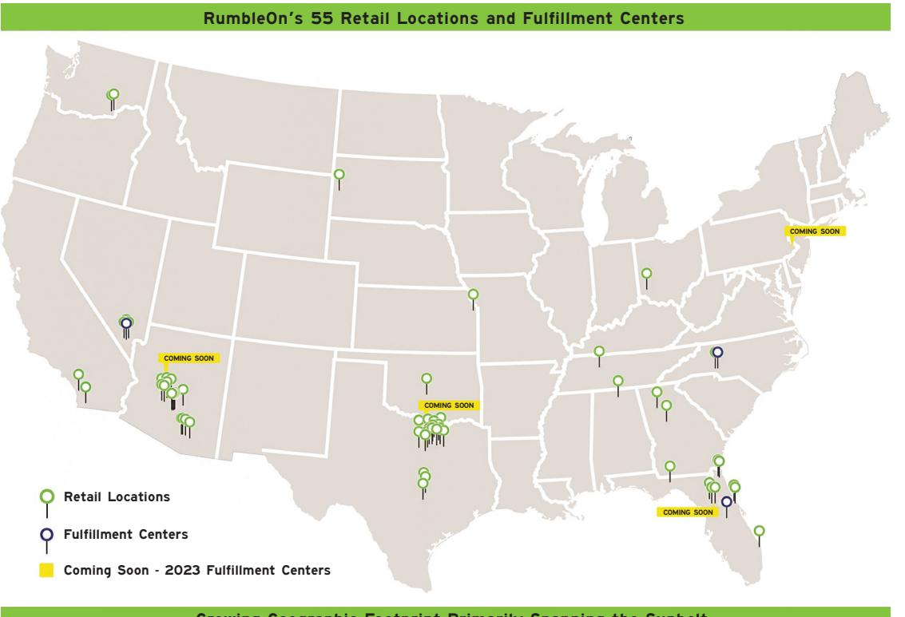
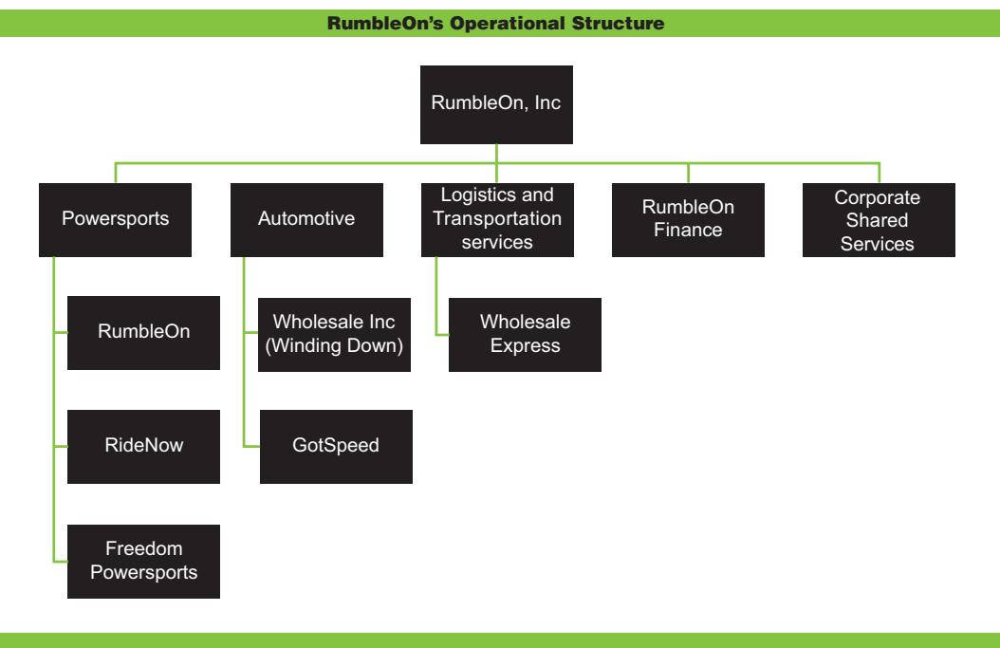

{0}------------------------------------------------

# ANNUAL REPORT 2022

{1}------------------------------------------------

# **2022 ANNUAL REPORT**

### **CERTAIN INFORMATION ABOUT OUR ANNUAL REPORT:**

*ŶLJĨŽƌǁĂƌĚͲůŽŽŬŝŶŐƐƚĂƚĞŵĞŶƚƐŝŶŽƵƌĚŝƐĐƵƐƐŝŽŶĂƌĞďĂƐĞĚŽŶƚŚĞĞdžƉĞĐƚĂƟŽŶƐ͕ĞƐƟŵĂƚĞƐĂŶĚƉƌŽũĞĐƟŽŶƐŽĨŵĂŶĂŐĞŵĞŶƚĂƐŽĨƚŽĚĂLJĂŶĚ ĂƌĞƐƵďũĞĐƚƚŽǀĂƌŝŽƵƐĂƐƐƵŵƉƟŽŶƐ͕ƌŝƐŬƐ͕ƵŶĐĞƌƚĂŝŶƟĞƐĂŶĚŽƚŚĞƌĨĂĐƚŽƌƐƚŚĂƚĂƌĞĚŝĸĐƵůƚƚŽƉƌĞĚŝĐƚ͕ǁŚŝĐŚĐŽƵůĚĐĂƵƐĞĂĐƚƵĂůƌĞƐƵůƚƐƚŽĚŝīĞƌ ŵĂƚĞƌŝĂůůLJĨƌŽŵƚŚŽƐĞĞdžƉƌĞƐƐĞĚŽƌŝŵƉůŝĞĚŝŶƚŚĞĨŽƌǁĂƌĚͲůŽŽŬŝŶŐƐƚĂƚĞŵĞŶƚƐ͘dŚĞƐĞƐƚĂƚĞŵĞŶƚƐĂƌĞŶŽƚŐƵĂƌĂŶƚĞĞƐŽĨĨƵƚƵƌĞƉĞƌĨŽƌŵĂŶĐĞ͕ĂŶĚ ƚŚĞƌĞĨŽƌĞ͕ƵŶĚƵĞƌĞůŝĂŶĐĞƐŚŽƵůĚŶŽƚďĞƉůĂĐĞĚƵƉŽŶƚŚĞŵ͘tĞƌĞĨĞƌĂůůŽĨLJŽƵƚŽŽƵƌϮϬϮϮŶŶƵĂůZĞƉŽƌƚŽŶ&ŽƌŵϭϬͲ<ĂŶĚŽƵƌŽƚŚĞƌĮůŝŶŐƐǁŝƚŚ ƚŚĞ^ĨŽƌĂŵŽƌĞĚĞƚĂŝůĞĚĚŝƐĐƵƐƐŝŽŶŽĨƚŚĞƌŝƐŬƐƚŚĂƚĐŽƵůĚŝŵƉĂĐƚƚŚĞĨƵƚƵƌĞŽƉĞƌĂƟŶŐƌĞƐƵůƚƐĂŶĚĮŶĂŶĐŝĂůĐŽŶĚŝƟŽŶŽĨZƵŵďůĞKŶ͕/ŶĐ͘tĞ ĚŝƐĐůĂŝŵĂŶLJŝŶƚĞŶƟŽŶƐŽƌŽďůŝŐĂƟŽŶƐƚŽƵƉĚĂƚĞŽƌƌĞǀŝƐĞĂŶLJĨŽƌǁĂƌĚͲůŽŽŬŝŶŐƐƚĂƚĞŵĞŶƚƐ͕ĞdžĐĞƉƚĂƐƌĞƋƵŝƌĞĚďLJůĂǁ͘*

{2}------------------------------------------------

# **UNITED STATES SECURITIES AND EXCHANGE COMMISSION**

**Washington, D.C. 20549** ____________________

# **Form 10-K** ____________________

6 **ANNUAL REPORT PURSUANT TO SECTION 13 OR 15(d) OF THE SECURITIES EXCHANGE ACT OF 1934**

**For the fiscal year ended December 31, 2022**

**TRANSITION REPORT PURSUANT TO SECTION 13 OR 15(d) OF THE SECURITIES EXCHANGE ACT OF 1934**

**For the transition period from ______ to ______**

**Commission file number 001-38248** ____________________

### **RumbleOn, Inc.**

(Exact name of registrant as specified in its charter) ____________________

**Nevada 46-3951329** (State or other jurisdiction of incorporation or organization)

**901 W Walnut Hill Lane** 

**Irving Texas 75038**

(Address of Principal Executive Offices) (Zip Code)

**(214) 771-9952**

(Registrant's telephone number, including area code) ____________________

**Securities registered pursuant to Section 12(b) of the Act:**

| Title of each class Trading Symbol(s)                                                                                                                                      |      | Name of exchange on which registered                                                                                                                              |  |  |
|-------------------------------------------------------------------------------------------------------------------------------------------------------------------------------|------|-------------------------------------------------------------------------------------------------------------------------------------------------------------------|--|--|
| Class B Common Stock, \$0.001 par value                                                                                                                                       | RMBL | The Nasdaq Stock Market LLC                                                                                                                                       |  |  |
| Securities registered pursuant to Section 12(g) of the Act: None ____________________                                                                                      |      |                                                                                                                                                                   |  |  |
| Indicate by check mark if the registrant is a well-known seasoned issuer, as defined in Rule 405 of the Securities Act. Yes … No 6                                            |      |                                                                                                                                                                   |  |  |
| Indicate by check mark if the registrant is not required to file reports pursuant to Section 13 or Section 15(d) of the Act. Yes … No 6                                       |      |                                                                                                                                                                   |  |  |
| the preceding 12 months (or for such shorter period that the registrant was required to file such reports), and (2) has been subject to such filing requirements for the past |      | Indicate by check mark whether the registrant (1) has filed all reports required to be filed by Section 13 or 15(d) of the Securities Exchange Act of 1934 during |  |  |

90 days. Yes 6 No

Indicate by check mark whether the registrant has submitted electronically every Interactive Data File required to be submitted pursuant to Rule 405 of Regulation S-T (§232.405 of this chapter) during the preceding 12 months (or for such shorter period that the registrant was required to submit such files). Yes 6 No

Indicate by check mark whether the registrant is a large accelerated filer, an accelerated filer, a non-accelerated filer, a smaller reporting company, or an emerging growth company. See the definitions of "large accelerated filer," "accelerated filer," "smaller reporting company," and "emerging growth company" in Rule 12b-2 of the Exchange Act.

| Large accelerated filer | Accelerated filer         | 6 |
|-------------------------|---------------------------|---|
| Non-accelerated filer   | Smaller reporting company | 6 |
|                         | Emerging growth company   |   |
|                         |                           |   |

If an emerging growth company, indicate by check mark if the registrant has elected not to use the extended transition period for complying with any new or revised financial accounting standards provided pursuant to Section 13(a) of the Exchange Act.

Indicate by check mark whether the registrant has filed a report on and attestation to its management's assessment of the effectiveness of its internal control over financial reporting under Section 404(b) of the Sarbanes-Oxley Act (15 U.S.C. 7262(b)) by the registered public accounting firm that prepared or issued its audit report Yes 6 No

If securities are registered pursuant to Section 12(b) of the Act, indicate by check mark whether the financial statements of the registrant included in the filing reflect the correction of an error to previously issued financial statements.

Indicate by check mark whether any of those error corrections are restatements that required a recovery analysis of incentive-based compensation received by any of the registrant's executive officers during the relevant recovery period pursuant to §240.10D-1(b).

Indicate by check mark whether the registrant is a shell company (as defined in Rule 12b-2 of the Act). Yes No 6

As of June 30, 2022, the aggregate market value of shares of common stock held by non-affiliates of the registrant was approximately \$149.7 million.

The number of shares of Class B Common Stock, \$0.001 par value, outstanding on March 15, 2023 was 16,273,768 shares. In addition, 50,000 shares of Class A Common Stock, \$0.001 par value, were outstanding on March 15, 2023.

Portions of the registrant's proxy statement relating to its 2023 Annual Meeting of Stockholders to be filed with the SEC within 120 days after the end of the year ended December 31, 2022 are incorporated herein by reference in Part III.

(I.R.S. Employer Identification No.)

{3}------------------------------------------------

[This page intentionally left blank.]

{4}------------------------------------------------

**Annual Report on Form 10-K for the Year Ended December 31, 2022**

### **Table of Contents**

|                    |                                                                                                                 | Page |
|--------------------|-----------------------------------------------------------------------------------------------------------------|------|
| PART I             |                                                                                                                 |      |
| Item 1.            | Business.                                                                                                       | 1    |
| Item 1A.           | Risk Factors.                                                                                                   | 10   |
| Item 1B.           | Unresolved Staff Comments.                                                                                      | 26   |
| Item 2.            | Properties.                                                                                                     | 26   |
| Item 3.            | Legal Proceedings.                                                                                              | 27   |
| Item 4. PART II | Mine Safety Disclosures.                                                                                        | 27   |
| Item 5.            | Market For Registrant's Common Equity, Related Stockholder Matters and Issuer Purchase of Equity Securities. | 28   |
| Item 6.            | [Reserved.]                                                                                                     | 28   |
| Item 7.            | Management's Discussion and Analysis of Financial Condition and Results of Operations.                          | 28   |
| Item 7A.           | Quantitative and Qualitative Disclosures About Market Risk.                                                     | 45   |
| Item 8.            | Financial Statements and Supplementary Data.                                                                    | 45   |
| Item 9.            | Changes in and Disagreements with Accountants on Accounting and Financial Disclosure. .                         | 45   |
| Item 9A.           | Controls and Procedures.                                                                                        | 45   |
| Item 9B.           | Other Information.                                                                                              | 47   |
| Item 9C.           | Disclosure Regarding Foreign Jurisdictions that Prevent Inspections.                                            | 47   |
| PART III           |                                                                                                                 |      |
| Item 10.           | Directors, Executive Officers and Corporate Governance.                                                         | 48   |
| Item 11.           | Executive Compensation.                                                                                         | 48   |
| Item 12.           | Security Ownership of Certain Beneficial Owners and Management and Related Stockholder Matters.              | 48   |
| Item 13.           | Certain Relationships and Related Transactions, and Director Independence.                                      | 48   |
| Item 14.           | Principal Accountant Fees and Services.                                                                         | 48   |
| PART IV            |                                                                                                                 |      |
| Item 15.           | Exhibits and Financial Statement Schedules.                                                                     | 49   |
| Item 16.           | Form 10-K Summary.                                                                                              | 52   |

{5}------------------------------------------------

[This page intentionally left blank.]

{6}------------------------------------------------

### **Annual Report on Form 10-K for the Year Ended December 31, 2022**

### **ITEM 1. BUSINESS.**

In this Annual Report on Form 10-K for the year ended December 31, 2022 (the "2022 Form 10-K"), "we," "our," "us," "RumbleOn," and the "Company" refer to RumbleOn, Inc. and its consolidated subsidiaries at December 31, 2022, unless the context requires otherwise.

### **Forward-Looking and Cautionary Statements**

This 2022 Form 10-K contains forward-looking statements as defined in the Private Securities Litigation Reform Act of 1995. Forward-looking statements generally can be identified by words such as "anticipates," "believes," "estimates," "expects," "intends," "plans," "predicts," "projects," "will be," "will continue," "will likely result," and similar expressions. These forward-looking statements are based on current expectations and assumptions that are subject to risks and uncertainties, which could cause our actual results to differ materially from those reflected in forward-looking statements. Factors that could cause or contribute to such differences in our actual results include, but are not limited to, those discussed in this 2022 Form 10-K, and in particular, the risks discussed under the caption "Risk Factors" in Item 1A and those discussed in other documents we file with the Securities and Exchange Commission (the "SEC"). Given these risks and uncertainties, readers are cautioned not to place undue reliance on such forward-looking statements. We undertake no obligation to revise or update forward-looking statements, except as required by law.

### **Market and Industry Data**

Some of the market and industry data contained in this 2022 Form 10-K is based on independent industry publications or other publicly available information. Although we believe that these independent sources are reliable, we have not independently verified and cannot assure you as to the accuracy or completeness of this information. As a result, you should be aware that the market and industry data contained herein, and our beliefs and estimates based on such data, may not be reliable.

### **Our Company**

RumbleOn is the nation's first, largest, and only publicly-traded, technology-based platform in the powersports industry. Headquartered in the Dallas Metroplex, RumbleOn is revolutionizing the customer experience for outdoor enthusiasts across the country and making powersport vehicles accessible to more people in more places than ever before. We are transforming the powersports customer experience by giving consumers what they want — a wide selection, great value and quality, transparency, and an easy, friction-free transaction. Every element of our business, from inventory procurement to fulfillment to overall ease of transactions, whether online or on-site at one of our 55 retail locations, has been built for a singular purpose — to create a customer experience without peer in the powersports industry.

Although our primary focus is on the customer experience and building market share in the powersports industry, during 2022 we participated in the wholesale automotive industry through our wholly-owned distributors of used automotive inventory, Wholesale, Inc. ("Wholesale Inc") and our exotics retailer AutoSport USA, Inc., which does business under the name Got Speed. In the third quarter of 2022, we announced we would be winding down our wholesale automotive business, which we expect to complete during the first half of 2023. Our logistics services company, Wholesale Express, LLC ("Wholesale Express"), provides freight brokerage services facilitating transportation for dealers and consumers.

{7}------------------------------------------------

Incorporated in Nevada in 2013, we have been building the RumbleOn brand and vision since 2016. Led by our co-founder, chairman, and Chief Executive Officer Marshall Chesrown, we have achieved and built upon key milestones:

- April 2017: launched RumbleOn.com.
- October 2017: celebrated our initial listing on The Nasdaq Stock Market.
- October 2018: acquired Wholesale Inc and Wholesale Express.
- August 2021: acquired the RideNow companies (the "RideNow Transaction"), a collection of 41 retail powersports locations with a geographic footprint spanning primarily the Sunbelt.
- September 2021: processed the first powersports vehicle through our Orlando Fulfillment Center.
- February 2022: completed the initial funding of our captive consumer finance facility, RumbleOn Finance.
- February 2022: acquired Freedom Powersports (the "Freedom Transaction"), adding ten retail locations in North Texas, one in Alabama, and two in Georgia.
- February 2022: unveiled the regional management structure, anchored by tenured team members of RideNow.
- September 2022: opened our Fulfillment Center in Concord, North Carolina.
- November 2022: acquired Powersports Honda franchise in North Texas.
- December 2022: acquired two full line Polaris franchises in North Texas.
- January 2023: opened our Fulfillment Center in Las Vegas, Nevada.
- February 2023: acquired Red Hills powersports, a single retail location representing 10 brands, in Tallahassee, Florida.
- March 2023: entered into an engagement letter with J.P. Morgan to review our balance sheet initiatives and options.

These key events well-position RumbleOn as the first mover in transforming the powersports industry through our customer experience focused, technology based, Omnichannel platform.

### **Our Industry and Opportunity**

We operate primarily in the powersports industry, offering significant scale and breadth of products and our platform from which we will provide our only of its kind powersports customer experience. From our view, powersports includes motorcycles, side-by-sides, ATV, UTV, snowmobile, and personal watercraft ("PWC") along with related parts and components. If you add in the largely unaccounted for but significant peer-to-peer market in used powersports, which RumbleOn believes represents up to 70% of used powersports transactions, the total addressable powersports market is likely in excess of \$100 billion.

The powersports marketplace in the United States is highly fragmented. We face competition from traditional franchised dealers who sell both new and used vehicles; independent used powersports dealers; online and mobile sales platforms; and private parties. We believe that the principal competitive factors in our industry are delivering an outstanding consumer experience, competitive sourcing of quality inventory, breadth and depth of product selection, and value pricing.

Our competitors vary in size and breadth of their product offerings. We believe that our principal competitive advantages in powersports sales include our ability to provide a high degree of customer satisfaction with the buying experience by virtue of our platform. We provide customers the opportunity to experience RumbleOn's offerings online, in-store, and through our mobile app, or any combination of those three options. Our ability to make a cash offer to purchase a vehicle with our customer-friendly purchase process, and our breadth of selection of the most popular makes and models available online and in-store provides competitive sourcing and sales.

{8}------------------------------------------------

### **RumbleOn's Solution — Creating the Future of Powersports**

RumbleOn is creating a best-in-class experience in powersports for our customers. Doing so requires offering unmatched choice and selection and replicating an outstanding customer experience throughout the lifecycle of powersports ownership, one customer and one transaction at a time.

Customers come to RumbleOn's 55 retail locations as well as our more than 60 websites to shop for new and highest-quality used powersports products as well as for parts, accessories and merchandise. We address the entire powersports market. We are reimagining and revolutionizing the customer experience on our technology-led, internet-based platforms, and we are doing so for everyone — from the powersports enthusiast to the novice, and everyone in between — with a focus on four key initiatives:

- **Creating an end-to-end ownership experience** means we are not focused solely on the initial transaction with a customer. Rather, our customer experience enables building lifelong connectivity to each customer. With each customer interaction, we focus on key touch points that continue to keep our customers engaged throughout their powersports ownership experience. Quality assurance, clear and consistent pricing, professional pickup and delivery, customization, after sales service, and guarantees are just a few of the ways we are building a reliable and consistent customer experience. Our offerings, and our entire customer experience, are designed to turn a single transaction into a lifetime relationship.
- **Providing the largest and best selection of highest-quality inventory** enables us to provide many offerings to all powersports customers coast to coast. We are well-positioned to acquire high-quality used vehicles through the strength of our online Cash Offer Tool, a unique and important competitive advantage for RumbleOn. Affording our customers the ability to visit a retail location and receive cash for their used powersports unit instantaneously gives them peace of mind, and provides us the opportunity to drive a meaningful amount of incremental used inventory onto our platform. We are also leveraging robust data from the Cash Offer Tool and from the information acquired from our acquisitions and now being gathered from our 55 RideNow Powersports retail locations to ensure that the right vehicle is in the right place at the right time — with the right price.
- **Building the premier destination for new and used powersports vehicles** and introducing more used inventory to our showrooms as well as online attracts new customers to our platform and, most importantly, new riders to the industry due to affordability. We are focused on both new and used, retail sales, however, the opportunity to dramatically increase the number of used powersports unit sales presents our greatest near-term opportunity, as new vehicle inventory supply normalizes. We can better control used inventory than new because used is not dependent on a manufacturer's production, allocation, or distribution constraints. In fact, our broad access to used inventory is — and will continue to be — an important differentiator for RumbleOn in any market environment.

### **Our Growth Strategies**

The key metric to our powersports business is retail vehicle unit sales, both online and in-store. Unit sales drives revenue and provides the opportunity to build additional revenue through financing, parts, merchandise, and accessories, each of which are higher margin revenue streams. As we scale our business, we will create additional opportunities to expand revenue streams. However, additional revenue opportunities begin with retail vehicle unit sales and, as a result, our growth strategy is focused on this metric.

Our ability to increase vehicle unit sales is a function of our market penetration in existing markets, the number of markets we operate in, and our ability to build and maintain our brands by offering great value, transparency, and an outstanding customer experience.

{9}------------------------------------------------

### **Optimize Our Inventory Selection and Centralization**

We continue to optimize and broaden the selection of new and used powersports vehicles we make available to our customers. Expanding our inventory selection enhances the customer experience by ensuring each visitor, either online or in-store, finds a vehicle that matches his or her preferences. Optimizing our new inventory significantly depends on continuing our outstanding relationships with our manufacturers ("OEM"). As a result of these relationships, during 2022, we added 60 new franchises to our retail locations, primarily organically, and including three key tuck-in acquisitions in our North Texas market. Optimizing our used inventory selection depends on our ability to source and acquire enough high-quality used vehicles, and our ability to use data to ensure each used vehicle is at the right place, at the right time, at the right price.

We continue implementing our fulfillment strategy with near real-time inventory replenishment to make the right powersports units available in the right quantities at the right locations. This centralization of inventory will launch company-wide virtual selling through access to all company-owned inventory rather than only those vehicles that might be available at an individual location. Fulfillment will increase the probability that our customers can find their powersports unit of choice on our platform, thereby enhancing the customer experience while eliminating geographic boundaries. With digital inventory integration and over 60 individual websites sharing content and increasing available data, RumbleOn will be top-of-mind for powersports searches. All of the technology infrastructure required has been launched or is under development and will be implemented throughout 2023 and beyond.

### **Continue to Innovate and Extend Our Technology Leadership**

We continue expanding our competitive dominance with leading-edge technology. From our founding, we have been laying the groundwork to offer a friction-free and fully integrated customer experience both online and in-store. We are building the technology engine to enable this integration, while methodically expanding our retail footprint, driving towards online selling without geographic boundaries. With this goal in mind, we intend to launch our new corporate website under the RumbleOn brand during the first half of 2023 and our all new RideNow-branded website later in the second quarter of 2023. Our RideNow website will have unmatched features for our customers, allowing them to see all inventory in one place and it will have the ability to push inventory to individual dealer websites, resulting in a better online presence and customer experience. The plan calls for the constant roll out of new features, as our online presence improves and matures. In conjunction with our integrated CRM, we plan to launch online soft and hard credit pulls and lending pre-qualifications, just to name a few of the exciting features. Lastly, in the first half of 2023, we intend to roll out a new internally developed reporting technology that will increase visibility across our enterprise, improve sales reporting, and provide real time actionable data at the store level. Store managers will now see how they are performing versus expectations and how they compare in real time with their peers across the country.

From the start of RumbleOn, one key differentiator and a lynch pin to the competitive advantage we have built in powersports is our Cash Offer Tool, which supplies proprietary data for thousands of unique Vehicle Identification Number (VIN) inputs. In addition to actual retail sales and transaction data from the acquired RideNow and Freedom Powersports' databases. Marrying this data creates a data-driven "market maker" that does not exist in the industry today. Integrating real-time pricing and sales data from in-store transactions will also enable us to further optimize offers and pricing.

We will continue to make significant investments in improving and adding to our online customer offering, subject to our performance and available operating cash flow as we intend to self-fund these initiatives. We believe that the complexity of the traditional powersports retail transaction provides substantial opportunity for our planned technology investments and that our leadership and continued growth will enable us to invest responsibly in further enhancing the customer experience.

### **Enhancing Our In-store Experience**

Beyond innovative technology and inventory integration, we use our retail locations to augment the online experience- and vice versa — to offer a simple, friction-free customer experience. A key component to transforming the customer experience to support our growth strategy is enhancing the in-store experience and we are strategically expanding our geographic retail footprint. In early 2022, we added 13 additional retail locations,

{10}------------------------------------------------

entrenching our position in the North Texas market and expanding our geographic foot print to Alabama and Georgia. In addition, during the first quarter of 2023, we acquired an important multi-line retail location in Tallahassee, Florida, further expanding our dominance in North Florida. We currently operate in 55 retail locations, three fulfillment or hybrid fulfillment/retail locations to open (with four more expected during 2023), one used powersports center, as shown below.

Growing Geographic Footprint Primarily Spanning the Sunbelt

We employ three primary considerations for expanding our brick-and-mortar presence: (1) attract great people, (2) identify desired locations, and (3) implement appropriate and balanced brand mix.

*Attracting Great People.* We believe any great customer experience in powersports begins with great people providing consumers the opportunity to fulfill their passion. From our executive team to our customer facing professionals to our back-office and corporate personnel, the RumbleOn team is singularly focused on transforming the customer experience in powersports, both online and in-store. As we expand our physical presence, whether through new retail locations or as we build out our fulfillment centers, finding great people who believe in our mission is key.

*Identifying Desired Locations.* We believe desired geography means more than finding new markets; it also means making sure we can put the right powersports vehicle in the right place at the right price to maximize our return on the asset. This is a key goal of our fulfillment centers. And of course, we are always looking for strategic acquisition candidates, whether a large group such as Freedom Powersports or a key tuck-in opportunity to improve the capabilities of an existing location.

*Implementing Appropriate Brand Mix.* Powersports retail provides the opportunity to put many different new brands under one roof along with the proper mix of used inventory. Of course, having that opportunity and taking advantage of that opportunity correctly are two different things. Our outstanding relationships with our OEMs have provided us the opportunity to organically add more than 60 new franchises to our existing retail locations. And we continue leveraging our used inventory sourcing advantage to keep our retail locations fully stocked with the right mix of preferred brands based on data and market share, and thereby further enhance the customer experience.

A fourth consideration also plays a role as we enhance our in-store experience through organic and acquisitive growth: any such investments remain subject to a prudent use of our financial and other resources based on our performance and our available cash from operations as we intend to self-fund our growth.

{11}------------------------------------------------

### **Develop Broad Consumer Awareness of Our Brand**

We believe that creating a unified customer experience, requires a single consumer-facing brand for all our retail locations. During 2022, we began rolling out the "RideNow Powersports" brand across all our retail locations and the foundation will be our technology, our infrastructure, and our corporate culture. We are in the early stages of this rollout, and we are encouraged by the impact on performance and the excitement it has clearly created.

### **RumbleOn Technology**

Innovative technology continues to underpin every endeavor at RumbleOn through our ongoing mission to disrupt the powersports industry and our focus on the customer experience. We leverage technology and data to drive change. At a high-level, we believe there are five main areas where leveraging these innovations provides us a competitive advantage and improves the customer experience: (1) our proprietary supply chain pricing and distribution software; (2) our Omnichannel and mobile-first web application; (3) centralized CRM and Inventory; (4) Dealer network support channels; and (5) Data warehousing & reporting, enterprise wide.

- (1) RumbleOn's proprietary supply chain and distribution software:
	- Looks at the overall supply chain and reconfigures inventory for the purpose of acquisition and distribution. Our technology aggregates multiple data sources in real-time, tracking and cataloging inventory across the country.
	- Analyzes real-time market data to inform our acquisition decisions, continually capturing and archiving such data using advanced algorithms to calibrate pricing and estimate freight and reconditioning expenses. The values are then used in our Cash Offer Tool to quickly determine a fair and reasonable, non-negotiable offer.
- (2) RumbleOn's mobile-first web application strategy:
	- Enhances our website and mobile application to provide a compelling customer experience, from the front-end user interface and powerful search tools to enabling secure data, document, and payment exchanges between parties. We also optimize search engine marketing to provide a lower overall cost of customer acquisition.
- (3) Centralized customer relationship management and centralized inventory
	- Enhanced hub of combined RumbleOn, RideNow, and Freedom Powersports customer repositories for marketing, support and service.
	- Enterprise-wide centralized inventory, enhancing distribution, pricing, allocation and growth.
- (4) Dealer network support channels
	- New enhancements for our dealerships, provides on-demand pricing, transfers of allocation through streamlined workflows at the pace of business to benefit the needs of our customers.
- (5) Data warehousing and reporting, enterprise-wide
	- The combined digital intelligence from RideNow, Freedom Powersports, and RumbleOn has produced a rich eco-system of available data to promote growth across all facets of the business concerning parts, service, sales, marketing, and retention.

To deliver our supply chain software and on-line strategies, RumbleOn leverages its proprietary and exclusive-use technology portfolio, which includes:

- A series of modeling tools & technologies for consolidating internal and external data to provide profitability estimates for inventory available for purchase;
- A proprietary series of inventory management and business intelligence technologies that tracks the lifecycle of a vehicle from acquisition through delivery;

{12}------------------------------------------------

- An automated photography technology that combines high-quality photos to produce an interactive, 360-degree virtual tour of the vehicle;
- A catalog of websites that includes advanced filtering and search technology that assist multi-lead generation across participating partners; and
- A proprietary transportation management system and assignment technology to optimize the transport of purchased inventory for acquisition and dealer distribution.

In addition to our proprietary/exclusive use technology, we also rely on third party technology, including the following:

- A cloud based network infrastructure for hosting websites, inventory data, CRM-Data/reporting;
- Software libraries, development environments, and tools;
- Services to allow customers to digitally sign contracts; select local services; and
- Online customer service call center management software.

In short, our business is driven by data and technology at all stages of the process, from acquisition, inventory purchasing, reconditioning, photography, transportation, and annotation through in-store or online merchandising, sales, financing, trade-ins, logistics, and delivery.

We protect our technology and other intellectual property through a combination of trademarks, domain names, copyrights, trade secrets, patented technology, and contractual provisions and restrictions on access and use of our proprietary information and technology. We have a portfolio of trademark registrations in the United States, including registrations for "RumbleOn," the RumbleOn logo, "RideNow," and the RideNow logo. We are the registered holder of a variety of domestic and international domain names, including "rumbleon.com."

### **Operational Structure**

The following chart summarizes our organizational structure as of December 31, 2022. This chart is provided for illustrative purposes only and does not reflect all legal entities owned or controlled by us:

{13}------------------------------------------------

### **Seasonality**

Historically, the powersports industry has been seasonal with traffic and sales strongest in the spring and summer quarters. Sales and traffic are typically slowest in the winter quarter but increase typically in the spring season, coinciding with tax refunds and improved weather conditions. Given this seasonality, we expect our quarterly results of operations, including our revenue, gross profit, net income (loss), and cash flow to vary accordingly. Over time, we expect to normalize to seasonal trends, using data and logistics to move inventory to the right place, at the right time, at the right price.

### **Government Regulation**

Various aspects of our business are or may be subject, directly or indirectly, to U.S. federal and state laws and regulations. Failure to comply with such laws or regulations may result in the suspension or termination of our ability to do business in affected jurisdictions or the imposition of significant civil and criminal penalties, including fines or the award of significant damages against us and our dealers in class action or other civil litigation.

*Vehicle Sales.* Our sale and purchase of vehicles, both new and pre-owned, related products and services, and third-party finance products, are subject to the state and local dealer licensing requirements in the jurisdictions in which we have retail or wholesale locations. Regulators of jurisdictions where our customers reside, but in which we do not have a dealer or financing license could require that we obtain a license or otherwise comply with various state regulations. Despite our belief that we are not subject to the licensing requirements of those jurisdictions in which we do not have a physical presence, regulators may seek to impose punitive fines for operating without a license or demand we seek a license in those jurisdictions, any of which may inhibit our ability to do business in those jurisdictions, increase our operating expenses and adversely affect our financial condition and results of operations.

*Consumer Finance.* The financing we offer customers is subject to federal and state laws regulating the advertising and provision of consumer finance options, the collection of consumer credit and financial information, along with requirements related to online payments and electronic funds transfers, the regulations and state licenses applicable depend upon whether RumbleOn Finance or a third-party is the entity extending credit to such customers. Most states regulate retail installment sales, including setting a maximum interest rate, caps on certain fees, or maximum amounts financed. In addition, certain states require that finance companies file a notice of intent or have a sales finance license or an installment sellers license in order to solicit or originate installment sales in that state.

*Logistics and Transportation.* Our Wholesale Express logistics operations, which brokers and facilitates the transportation of vehicles primarily between and among dealers, is subject to motor-carrier rules and regulations promulgated by the United States Department of Transportation ("DOT") and the states through which their customers' vehicles are transported. Additionally, the vendors whom Wholesale Express relies upon are subject to federal and state regulation concerning transport vehicle dimensions, transport vehicle conditions, driver motor vehicle record history, driver alcohol and drug testing, and driver hours of service. More restrictive limitations on vehicle weight and size, condition, trailer length and configuration, methods of measurement, driver qualifications, or driver hours of service may increase the costs charged to Wholesale Express by its vendors, which may adversely affect our financial condition, operating results, and cash flows. If we fail to comply with the DOT regulations or if those regulations become more stringent, we could be subject to increased inspections, audits, or compliance burdens. Regulatory authorities could take remedial action including imposing fines, suspending, or shutting down our Wholesale Express operations.

*Environmental Laws and Regulations.* We are subject to a variety of federal, state, and local environmental laws and regulations that pertain to our operations. The regulations concern material storage, air quality, waste handling, and water pollution control. The regulations also regulate our use and operation of gasoline storage tanks, gasoline dispensing equipment, oil tanks, and paint booths among other things. Our business involves the use, handling, and disposal of hazardous materials and wastes, including motor oil, gasoline, solvents, lubricants, paints, and other substances. We manage our compliance through permitting and operational control.

{14}------------------------------------------------

*Facilities and Personnel.* Our facilities and business operations are subject to laws and regulations relating to environmental protection and health and safety, and our employment practices are subject to various laws and regulations, including complex federal, state, and local wage and hour and anti-discrimination laws. We may also be liable for employee misconduct and violations of laws or regulations to which we are subject.

*Federal Advertising Regulations.* The Federal Trade Commission ("FTC") has authority to take actions to remedy or prevent advertising practices that it considers to be unfair or deceptive and that affect commerce in the United States. If the FTC takes the position in the future that any aspect of our business constitutes an unfair or deceptive advertising practice, responding to such allegations could require us to pay significant damages, settlements, and civil penalties, or could require us to make adjustments to our products and services, any or all of which could result in substantial adverse publicity, loss of participating dealers, lost revenue, increased expenses, and decreased profitability.

*Federal Antitrust Laws.* The antitrust laws prohibit, among other things, any joint conduct among competitors that would lessen competition in the marketplace. Some of the information that we may obtain from dealers may be sensitive and, if disclosed inappropriately, could impede competition or otherwise diminish independent pricing activity. A governmental or private civil action alleging the improper exchange of information, or unlawful participation in price maintenance or other unlawful or anticompetitive activity, even if unfounded, could be costly to defend and adversely impact our ability to maintain and grow our business.

In addition, governmental or private civil actions related to the antitrust laws could result in orders suspending or terminating our ability to do business or otherwise altering or limiting certain of our business practices, including the manner in which we handle or disclose pricing information, or the imposition of significant civil or criminal penalties, including fines or the award of significant damages against us in class action or other civil litigation.

*Other.* In addition to these laws and regulations that apply specifically to our business, we are also subject to laws and regulations affecting public companies, including securities laws and the listing rules of The Nasdaq Stock Market ("Nasdaq"). The violation of any of these laws or regulations could result in administrative, civil, or criminal penalties or in a cease-and-desist order against our business operations, any of which could damage our reputation and have a material adverse effect on our business, sales and results of operations. We have incurred and will continue to incur capital and operating expenses and other costs to comply with these laws and regulations.

The foregoing description of laws and regulations to which we are or may be subject is not exhaustive, and the regulatory framework governing our operations is subject to continuous change. The enactment of new laws and regulations or the interpretation of existing laws and regulations in an unfavorable way may affect the operation of our business, directly or indirectly, which could result in substantial regulatory compliance costs, civil or criminal penalties, including fines, adverse publicity, loss of participating dealers, lost revenue, increased expenses, and decreased profitability. Further, investigations by government agencies, including the FTC, into allegedly anticompetitive, unfair, deceptive or other business practices by us, could cause us to incur additional expenses and, if adversely concluded, could result in substantial civil or criminal penalties and significant legal liability.

### **Employees**

As of December 31, 2022, we had approximately 2,717 full time and 84 part-time employees.

### **Available Information**

Our Internet website is *www.rumbleon.com*. Our Annual Report on Form 10-K, Quarterly Reports on Form 10-Q, Current Reports on Form 8-K, and amendments to reports filed or furnished pursuant to Sections 13(a) and 15(d) of the Securities and Exchange Act of 1934, as amended (the "Exchange Act"), are available, free of charge, under the Investor Relations tab of our website as soon as reasonably practicable after we electronically file such material with, or furnish it to, the SEC. Additionally, the SEC maintains a website located at *www.sec.gov* that contains the information we file or furnish electronically with the SEC.

{15}------------------------------------------------

### **ITEM 1A. RISK FACTORS.**

*Described below are certain risks to our business and the industry in which we operate. You should carefully consider the risks described below, together with the financial and other information contained in this 2022 Form 10-K and in our other public disclosures. If any of the following risks occurs, our business, financial condition, results of operations, cash flows, or prospects could be materially and adversely affected. As a result, our future results could differ materially from historical results and from guidance we may provide regarding our expectations for future financial performance and the trading price of our Class B common stock could decline.*

### **Risks Relating to Our Business**

### **We have identified a material weakness in our internal control over financial reporting. If we are unable to effectively remediate this material weakness and maintain an effective system of internal control over financial reporting, we may not be able to accurately report our financial results or prevent fraud. As a result, investors could lose confidence in our financial and other public reporting, which would harm our business.**

We are required to comply with Section 404 of the Sarbanes-Oxley Act ("SOX"). Section 404 of SOX requires public companies to maintain effective internal control over financial reporting ("ICOFR"). In particular, we must perform system and process evaluation and testing of our ICOFR allowing management to report on the effectiveness of our ICOFR. In addition, we are required to have our independent registered public accounting firm attest to the effectiveness of our ICOFR. The standard of effectiveness for ICOFR is that we have controls and procedures in place that provide "reasonable assurance that we can produce accurate financial statements on a timely basis." This process of implementation, evaluation, and attestation is costly and time-consuming. We have hired and may need to continue to employ both internal and external resources with appropriate public company experience and technical accounting knowledge to maintain and evaluate our ICOFR.

In our Annual Report on Form 10-K for the year ended December 31, 2021 (the "2021 Form 10-K"), we identified material weaknesses in our ICOFR relating to our legacy RumbleOn operations. As discussed in this *2022* Form 10-K, we have remediated and subsequently tested the impacted controls and have determined that the material weaknesses identified in the 2021 Form 10-K have been remediated as of December 31, 2022. In addition, as discussed in this *2022* Form 10-K, we identified a material weakness in our ICOFR for the year ended December 31, 2022 relating to our control environment following the integration of the RideNow business and incorporation of the acquired business into the Company's control environment. If we are unable to effectively remediate this material weakness and maintain effective internal control over financial reporting, we may fail to prevent or detect material misstatements in our financial statements, in which case investors may lose confidence in the accuracy and completeness of our financial statements.

### **We have incurred significant indebtedness, which could adversely affect us, including our business flexibility, and will increase our interest expense.**

In connection with the RideNow Transaction and Freedom Transaction, we substantially increased indebtedness which has had and will continue to have the effect, among other things, of reducing our flexibility to respond to changing business and economic conditions and substantially increasing our interest expense. The increased levels of indebtedness, including the applicable interest payments, could also reduce funds available for working capital, capital expenditures, and other general corporate purposes, and may create competitive disadvantages for us relative to competitors with lower debt levels. If our financial performance does not meet our current expectations, then our ability to service the indebtedness may be adversely impacted.

### **We are subject to interest rate risk in connection with our floorplan payables, revolving credit facility, and our other debt instruments that could have a material adverse effect on our profitability.**

Our floorplan payables, revolving credit facility, and other debt instruments are subject to variable interest rates. Accordingly, our interest expense will fluctuate with changing market conditions and will increase if interest rates rise. Instability or disruptions of the capital markets, including credit markets, or the deterioration of our financial condition due to internal or external factors, could restrict or prohibit our access to capital markets and increase our financing costs. In addition, our net new inventory carrying cost (new vehicle floorplan interest expense net of floorplan assistance that we receive from powersports manufacturers) may increase due to changes in interest

{16}------------------------------------------------

rates, inventory levels, and manufacturer assistance. We cannot assure you that a significant increase in interest rates or decrease in manufacturer floorplan assistance would not have a material adverse effect on our business, financial condition, results of operations, or cash flows.

### **The powersports industry is sensitive to unfavorable changes in general economic conditions and various other factors that could affect demand for our products and services, which could have a material adverse effect on our business, our ability to implement our strategy and our results of operations.**

Our future performance will be impacted by general economic conditions including among other things: changes in employment levels; consumer demand, preferences and confidence levels; the availability and cost of credit; fuel prices; levels of discretionary personal income; inflation; and interest rates. Recently, inflation has increased throughout the U.S. economy. Inflation can adversely affect us by increasing the costs of labor, fuel and other costs as well as by reducing demand for powersports vehicles. In addition, rapid changes in fuel prices can cause shifts in consumer preferences which are difficult to accommodate given the long lead-time of inventory acquisition. Inflation is also often accompanied by higher interest rates, which could reduce the fair value of our outstanding debt obligations. Changes in interest rates can also significantly impact new and used vehicle sales and vehicle affordability due to the direct relationship between interest rates and monthly loan payments, a critical factor for many powersports buyers, and the impact interest rates have on customers' borrowing capacity and disposable income. We have experienced, and continue to experience, increases in the prices of labor, fuel, and other costs of providing service.

### **Powersports consumers may not accept our transformative business model.**

As described throughout this 2022 Form 10-K, we are transforming the traditional powersports customer experience and building the first and only true Omnichannel experience in the industry. Also, in building this Omnichannel experience, we expect to incur significant expenses and face various other challenges, such as expanding our customer experience team and building out a fulfillment and logistics network. If customers do not accept our products, services, and offerings we may not benefit from the investments needed to build this transformative customer experience to the extent anticipated or at all. Any of these risks, if realized, could materially and adversely affect our business, financial condition, and results of operations.

### **We may not be able to acquire the number of vehicles to satisfy consumer demand or our expectations for the business.**

A material part of our plan is predicated on being able to have sufficient inventory, both new and used, to satisfy customer demand or meet our financial objectives. New inventory is ultimately controlled by our OEMs and their willingness to allocate inventory to us and their ability to manufacture and distribute a sufficient number of vehicles given the ongoing environment of manufacturing slowdowns, computer chip shortages, and logistic/transportation challenges (collectively, the "Demand/Supply Imbalances"). Used inventory is acquired directly from consumers via our online Cash Offer Tool or consumer trade-in transactions. If the channels for new or used vehicle acquisition were disrupted, for example as a result of another COVID-like lockdown, technology challenges, non-acceptance of online transactions, poor customer ratings, or other such events, the Company may not have enough inventory to meet customer demand, which may adversely affect our business, financial condition, and results of operations.

### **We may require additional financing or capital to pursue our growth challenges or unforeseen circumstances. If financing or capital is not available on terms acceptable to us or at all, we may not be able to develop and grow our business as anticipated and our business, operating results, and financial condition may be harmed.**

We intend to continue making investments to support the development and growth of our business. Additional financing or capital may not be available when we need it, on terms that are acceptable to us, or at all.

Although we intend to self-fund our growth initiatives, if we determine to raise additional capital through issuances of equity or debt, our existing stockholders could suffer significant dilution, and any new equity securities we issue could have rights, preferences, and privileges superior to those of holders of our common stock. If we are unable to obtain adequate financing or financing on terms satisfactory to us, when we require it, could adversely

{17}------------------------------------------------

impact our ability to continue to pursue our business objectives and to respond to business opportunities, challenges, or unforeseen circumstances could be significantly limited, and our business, operating results, financial condition, and prospects could be adversely affected.

### **Investments made in the development, growth, and expansion of our business may not yield our expected results and may not result in successful growth of our business.**

We expect to make significant investments in the further development and expansion of our business and these investments may not result in the development, growth, or expansion of our business on a timely basis or at all. We may not generate sufficient revenue and we may incur significant losses in the future for several reasons, including a lack of demand for our products and services, increasing competition, and weakness in the powersports industry generally. We may encounter unforeseen expenses, difficulties, complications, and delays, relating to the development and operation of our business, as well as our organic and acquisition growth strategies. Accordingly, we may not be able to successfully develop, grow, and expand our business, generate revenue, or achieve and maintain profitability.

### **We have and may continue to acquire strategic retail locations and other complementary businesses and technologies, which could divert management's attention, and otherwise disrupt our operations and impact our operating results.**

Our success will depend, in part, on our ability to grow our business in response to the demands of consumers, other constituents within the powersports industry, and competitive pressures. In the past, we have met these demands in part by acquiring complementary businesses and technologies.

The identification of suitable acquisition candidates can be difficult; time-consuming, and costly, and we may not be able to successfully complete identified acquisition opportunities. The risks we face in connection with our acquisition strategy include:

- diversion of management time and focus from operating our business to addressing acquisition integration challenges;
- integration of the acquired company's accounting, management information, human resources, and other administrative systems;
- coordination of technology, research and development, and sales and marketing functions;
- retention of employees from the acquired company;
- cultural challenges associated with integrating employees from the acquired company into our organization;
- the need to implement or improve controls, procedures, and policies at a business that before the acquisition may have lacked effective controls, procedures, and policies;
- potential write-offs of intangibles or other assets acquired in such transactions that may have an adverse effect on our operating results in a given period; and
- liability for activities of the acquired company before the acquisition.

Our failure to address these risks or other matters encountered in connection with future acquisitions and investments could cause us to fail to realize the anticipated benefits of these acquisitions or investments, cause us to incur unanticipated liabilities, and harm our business generally. As discussed in the preceding risk factors elsewhere in this 2022 Form 10-K, we currently intend to self-fund our growth initiatives, and acquisition growth. Nevertheless, some future acquisitions could result in dilutive issuances of our equity securities, the incurrence of debt, contingent liabilities, amortization expenses, or the impairment of goodwill, any of which could harm our financial condition.

{18}------------------------------------------------

### **We may experience difficulties integrating acquired businesses.**

Achieving the anticipated benefits of our acquisitions will depend in significant part upon our integrating any acquired entity's businesses, operations, processes, and systems in an efficient and effective manner. We may not be able to accomplish the integration process smoothly, successfully, or on a timely basis, which may result in unforeseen expenses or the failure to recognize the anticipated benefits of acquired businesses. The necessity of coordinating geographically separated organizations, systems of controls, and facilities, in addition to addressing possible differences in business backgrounds, corporate cultures, and management philosophies may increase the difficulties of integration. Companies operate numerous systems and controls, including those involving management information, accounting and finance, legal and regulatory compliance, inventory intake and control, sales, billing, employee benefits, and payroll. The integration of an acquired company's operations requires the dedication of significant internal and external resources, which may divert management's attention from the day-to-day business of the company and be costly. Employee uncertainty and lack of focus during the integration process may also disrupt the business of the Company. Any inability of management to successfully and timely integrate an acquired company could have a material adverse effect on the business and results of operations of the Company and result in not achieving the anticipated benefits of the acquisition.

### **To the extent we acquire additional businesses, we may incur substantial costs.**

We have incurred, and expect to continue to incur, a number of non-recurring costs associated with our acquisitions. The substantial majority of these non-recurring costs will consist of transaction and regulatory costs related to acquisitions. We will also incur transaction fees and costs related to formulating and implementing integration plans, including system consolidation costs and employment-related costs. We continue to assess the magnitude of these costs, and additional unanticipated costs may be incurred from the acquisitions and integration. Although we anticipate that the elimination of duplicative costs and the realization of other efficiencies and synergies related to the integration should allow us to offset integration-related costs over time, this net benefit may not be achieved in the near term, or at all.

### **We depend on key personnel to operate our business, and if we are unable to retain, attract, and integrate qualified personnel, our ability to develop and successfully grow our business could be harmed.**

We believe our success will depend on the efforts and talents of our executives and employees, including Marshall Chesrown, our Chairman and Chief Executive Officer. In addition, the loss of any senior management, regional operations directors, or other key employees could materially adversely affect our ability to execute our business plan and strategy, and we may not be able to find adequate replacements on a timely basis, or at all. Our future success depends on our continuing ability to attract, develop, motivate, and retain highly qualified and skilled employees. Qualified individuals are in high demand, and we may incur significant costs to attract and retain them. We cannot ensure that we will be able to retain the services of any members of our senior management or other key employees. If we fail in attracting well-qualified employees or retaining and motivating existing employees, our business could be materially and adversely affected.

### **Our annual and quarterly operating results may fluctuate significantly or may fall below the expectations of investors or securities analysts, each of which may cause our stock price to fluctuate or decline.**

We expect our operating results to be subject to annual and quarterly fluctuations and these results will be affected by numerous factors, including:

- a change in consumer discretionary spending and other macroeconomic conditions;
- a shift in the mix and type of vehicles we sell, which could result in lower sales price and lower gross profit;
- the timing and cost of development and operating activities relating to our business, which may change from time to time;
- expenditures that we may incur to advance our growth strategies; and
- future accounting pronouncements or changes in our accounting policies.

{19}------------------------------------------------

If our annual or quarterly operating results fall below the expectations of investors or securities analysts, the price per share of our Class B common stock could fluctuate or decline substantially. We believe that annual and quarterly comparisons of our financial results are not necessarily meaningful and should not be relied upon as an indication of our future performance.

### **The failure to develop and maintain our brands could harm our reputation among current customers or adversely impact our ability to attract new customers.**

Developing and maintaining the RideNow and RumbleOn brands will depend largely on the success of our efforts to maintain the trust of and deliver value to our users. If our current and potential users perceive that we are not focused on providing them with a better pre-owned powersports experience, our reputation and the strength of our brand will be adversely affected.

Consumers are increasingly shopping for new and used vehicles, vehicle repair and maintenance services, and other vehicle products and services online and through mobile applications, including through third-party online and mobile sales platforms, with which we compete. If we fail to preserve the value of our retail brands, maintain our reputation, or attract consumers to our Omnichannel offering, our business could be adversely impacted.

Complaints or negative publicity about our business practices, our marketing and advertising campaigns, our compliance with applicable laws and regulations, data privacy and security issues, and other aspects of our business, irrespective of their validity, could diminish users' confidence in and the use of our products and services and adversely affect our brands. There can be no assurance that we will be able to develop, maintain, or enhance our brands, and failure to do so would harm our business growth prospects and operating results.

### **The success of our business relies heavily on our marketing and branding efforts, especially with respect to our RideNow brand at retail locations, the RideNow and RumbleOn websites, and our branded mobile applications, and these efforts may not be successful.**

We believe that an important component of our development and growth will be the business derived from the RideNow retail brand and the RumbleOn website and branded mobile applications. Because RideNow and RumbleOn are consumer brands, we rely heavily on marketing and advertising to increase the visibility of this brand with potential users of our products and services.

Our business model relies on our ability to scale rapidly and to decrease incremental user acquisition costs as we grow. Some of our methods of marketing and advertising may not be profitable because they may not result in the acquisition of sufficient users visiting our website and mobile applications such that we may recover these costs by attaining corresponding revenue growth. If we are unable to recover our marketing and advertising costs through increases in user traffic and in the number of transactions by users of our platform, it could have a material adverse effect on our growth, results of operations and financial condition.

### **We rely on Internet search engines to drive traffic to our website, and if we fail to appear prominently in the search results, our traffic would decline, and our business would be adversely affected.**

We depend in part on Internet search engines and social media such as Google™, Bing™, and Facebook™ to drive traffic to our website. For example, when a user searches the internet for a particular type of powersports or recreational vehicle, we will rely on a high organic search ranking of our webpages in these search results to refer the user to our website. However, our ability to obtain such high, non-paid search result rankings is not within our control. Our competitors' Internet search engine and social media efforts may result in their websites receiving a higher search result page ranking than ours, or Internet search engines could revise their methodologies in a way that would adversely affect our search result rankings. If Internet search engines or social media companies modify their search algorithms or display technologies in ways that are detrimental to us, or if our competitors' efforts are more successful than ours, overall growth in our user base could slow or our user base could decline. Internet search engine providers could provide recreation vehicle dealer and pricing information directly in search results, align with our competitors or choose to develop competing services. Any reduction in the number of users directed to our website through Internet search engines could harm our business and operating results.

{20}------------------------------------------------

### **A significant disruption in service on our website or of our mobile applications could damage our reputation and result in a loss of consumers, which could harm our business, brand, operating results, and financial condition.**

Our brand, reputation, and ability to attract consumers, affinity groups, and advertisers depend on the reliable performance of our technology infrastructure and content delivery. We may experience significant interruptions with our systems in the future. Interruptions in these systems, whether due to system failures, computer viruses, or physical or electronic break-ins, could affect the security or availability of our products on our website and mobile application, and prevent or inhibit the ability of consumers to access our products. Problems with the reliability or security of our systems could harm our reputation, result in a loss of consumers, dealers, and affinity group marketing partners, and result in additional costs.

We intend to locate our communications, network, and computer hardware used to operate our website and mobile applications at facilities in various parts of the country to minimize the risk and create an environment where we can remain online if one of the facilities in which our equipment is housed goes offline. Nevertheless, we do not own or control the operation of these facilities, and our systems and operations may be vulnerable to damage or interruption from fire, flood, power loss, telecommunications failure, terrorist attacks, acts of war, electronic and physical break-ins, computer viruses, earthquakes, and similar events. The occurrence of any of these events could result in damage to our systems and hardware or could cause them to fail.

Problems faced by any third-party web hosting providers we may utilize could adversely affect the experience of our consumers. Any third-party web hosting providers could close their facilities without adequate notice. Any financial difficulties, up to and including bankruptcy, faced by any third-party web hosting providers or any of the service providers with whom they contract may have negative effects on our business, the nature and extent of which are difficult to predict. If our third-party web hosting providers are unable to keep up with our growing capacity needs, our business could be harmed.

Any errors, defects, disruptions, or other performance or reliability problems with our network operations could cause interruptions in access to our products, as well as delays and additional expense in arranging new facilities and services, and could harm our reputation, business, operating results, and financial condition.

### **We may be unable to maintain or grow relationships with information data providers or may experience interruptions in the data feeds they provide, which may limit the information that we are able to provide to our users and regional partners as well as adversely affect the timeliness of such information and may impair our ability to attract or retain consumers and our regional partners and to timely invoice all parties.**

We expect to receive data from third-party data providers, including our partner network, dealer management system data feed providers, data aggregators and integrators, survey companies, purveyors of registration data, and possibly others. There may be some instances in which we use this information to collect a transaction fee from those dealers and recognize revenue from the related transactions.

From time to time, we may experience interruptions in one or more data feeds that we receive from third-party data providers, in a manner that affects our ability to operate our business. These interruptions may occur for a number of reasons, including changes to the software used by these data feed providers and difficulties in renewing our agreements with third-party data feed providers. Additionally, when an interruption ceases, we may not always be able to collect the appropriate fees and any such shortfall in revenue could be material to our operating results.

### **Our ability to grow our complementary product offerings may be limited, which could negatively impact our development, growth, revenue, and financial performance.**

As we introduce or expand additional offerings to our platform, such as recreation vehicle trade-ins, lead management, transaction processing, financing, maintenance, and insurance, we may incur losses or otherwise fail to enter these markets successfully. Our expansion into these markets may place us in competitive and regulatory environments with which we are unfamiliar and involves various risks, including the need to invest significant resources and the possibility that returns on such investments will not be achieved for several years, if at all. In attempting to establish such new product offerings, we may incur significant expenses and face various other challenges, such as expanding our sales force and management personnel to cover these markets and complying with complicated regulations that apply to these markets. In addition, we may not successfully demonstrate the value of these ancillary products to consumers or dealers, and failure to do so would compromise our ability to successfully expand into these additional revenue streams.

{21}------------------------------------------------

### **We rely on third-party financing providers to finance a portion of our customers' vehicle purchases.**

We rely on third-party financing providers to finance a portion of our customers' vehicle purchases. Accordingly, our revenue and results of operations are partially dependent on the actions of these third parties. We provide financing to qualified customers through a number of third-party financing providers. If one or more of these third-party providers cease to provide financing to our customers, provide financing to fewer customers or no longer provide financing on competitive terms, it could have a material adverse effect on our business, sales and results of operations. Additionally, if we were unable to replace the current third-party providers upon the occurrence of one or more of the foregoing events, it could also have a material adverse effect on our business, sales and results of operations.

### **We rely on third-party providers to supply extended protection products ("EPP") to our customers.**

We rely on third-party providers to supply EPP products to our customers. Accordingly, our revenue and results of operations will be partially dependent on the actions of these third parties. If one or more of these third-party providers cease to provide EPP, make changes to their products or no longer provide their products on competitive terms, it could have a material adverse effect on our business, revenue and results of operations. Additionally, if we were unable to replace the current third-party providers upon the occurrence of one or more of the foregoing events, it could also have a material adverse effect on our business, revenue and results of operations.

### **Our sales of powersports vehicles may be adversely impacted by increased supply of and/or declining prices for new or pre-owned vehicles and excess supply of new vehicles.**

We believe when prices for pre-owned vehicles have declined, it can have the effect of reducing demand among retail purchasers for new vehicles at or near manufacturer's suggested retail prices. Further, vehicle manufacturers can and do take actions that influence the markets for new and pre-owned vehicles. For example, introduction of new models with significantly different functionality, technology, or other customer satisfiers can result in increased supply of pre-owned vehicles, and a corresponding decrease in price of pre-owned vehicles. Also, while historically manufacturers have taken steps designed to balance production volumes for new vehicles with demand, those steps have not always proven effective. In other instances, manufacturers have chosen to supply new vehicles to the market in excess of demand at reduced prices which has the effect of reducing demand for pre-owned vehicles.

### **We rely on a number of third parties to perform certain operating and administrative functions for us.**

We rely on a number of third parties to perform certain operating and administrative functions for us. We may experience problems with outsourced services, such as unfavorable pricing, untimely delivery of services, or poor quality. Also, these third parties may experience adverse economic conditions due to difficulties in the global economy that could lead to difficulties supporting our operations. In light of the amount and types of functions that we will outsource, these service provider risks could have a material adverse effect on our business and results of operations.

### **We participate in a highly competitive market, and pressure from existing and new companies may adversely affect our business and operating results.**

We face significant competition from both existing powersport retailers as well as companies that provide listings, information, lead generation, and powersport-buying and selling services designed to reach businesses and consumers and enable dealers to reach these consumers and inventory sources.

Our current and future competitors may include:

- traditional powersport dealerships that could increase investment in technology and infrastructure to compete directly with our online model;
- internet and online powersports sites that could change their models to directly compete with us, such as Amazon, eBay Motors, Google, and CycleTrader; and
- manufacturers seeking to have a direct relationship with customers or to support their dealer networks.

{22}------------------------------------------------

We also expect that competitors, both new and existing, will continue to enter the online and traditional powersports retail industry with competing brands, business models, products, and services, which could make it difficult to acquire inventory, attract customers, and sell vehicles at a profitable price. For example, traditional dealerships could transition their selling efforts to the internet, allowing them to more efficiently sell powersports across state lines and compete directly with our online offering and no-haggle pricing model. Some of these companies have significantly greater resources than we do and may be able to provide customers access to a greater inventory of vehicles at lower prices or purchase vehicles from consumers at higher prices while delivering a competitive overall experience.

Our competitors may also impede our ability to reach consumers in certain jurisdictions. For example, our competitors may increase their search engine optimization efforts and outbid us for search terms on various search engines.

Our current and potential competitors may have significantly greater financial, technical, marketing, and other resources than we have, and the ability to devote greater resources to the development, promotion and support of their products and services. Additionally, they may have more extensive industry relationships, longer operating histories, and greater name recognition than we have. As a result, these competitors may be able to respond more quickly with new technologies and to undertake more extensive marketing or promotional campaigns. If we are unable to compete with these companies, the demand for our used vehicles, products, and services could substantially decline.

In addition, if one or more of our competitors were to merge or partner with another of our competitors, the change in the competitive landscape could adversely affect our ability to compete effectively. Our competitors may also establish or strengthen cooperative relationships with our current or future data providers, technology partners, or other parties with whom we have relationships, thereby limiting our ability to develop, improve, and promote our solutions. We may not be able to compete successfully against current or future competitors, and competitive pressures may harm our revenue, business, and financial results.

### **Restrictive covenants in our debt agreements could limit our growth initiatives and implementation of our business strategy.**

Our debt agreements impose operating and financial restrictions on us. These restrictions limit our ability and that of our subsidiaries to, among other things: (i) incur additional indebtedness; (ii) make investments or loans; (iii) create liens; (iv) consummate mergers and similar fundamental changes; (v) make restricted payments; (vi) make investments in unrestricted subsidiaries; (vii) enter into transactions with affiliates; and (viii) use proceeds from asset sales.

We may be prevented from taking advantage of business opportunities that arise because of the limitations imposed on us by the restrictive covenants under our debt agreements. The restrictions contained in the covenants could: (i) limit our ability to plan for or react to market conditions, to meet capital needs, or otherwise to restrict our activities or business strategy; and (ii) adversely affect our ability to finance our operations, enter into acquisitions or divestitures to engage in other business activities that would be in our interest.

A breach of any of these covenants or our inability to comply with the required financial ratios or financial condition tests could result in a default under our debt agreements that, if not cured or waived, could result in acceleration of all indebtedness outstanding thereunder and cross-default rights under our other debt. In addition, in the event of an event of default under our credit facilities, the affected lenders could foreclose on the collateral securing such credit facility and require repayment of all borrowings outstanding thereunder. If the amounts outstanding under the credit facilities or any of our other indebtedness were to be accelerated, our assets may not be sufficient to repay in full the amounts owed to the lenders or to our other debt holders.

### **Seasonality or weather trends may cause fluctuations in our revenue and operating results.**

Our revenue trends are likely to be a reflection of consumers' vehicle buying patterns. Because different types of recreation vehicles are designed for different seasons, our revenue may be cyclical. Historically, the powersports industry has been seasonal, with traffic and sales strongest in the spring and summer quarters. Sales and traffic are typically slowest in the fall quarter but increase in spring and summer, coinciding with tax refund season and the coming warmer months. Our business will also be impacted by cyclical trends affecting the overall economy, as well as by actual or threatened severe weather events.

{23}------------------------------------------------

### **Climate change legislation or regulations restricting emission of greenhouse gases could result in increased operating costs and reduced demand for the powersports vehicles we sell.**

The U.S. Environmental Protection Agency has adopted rules under existing provisions of the federal Clean Air Act that require: (1) a reduction in emissions of greenhouse gases from motor vehicles; (2) certain construction and operating permit reviews for greenhouse gas emissions from certain large stationary sources; and (3) monitoring and reporting of greenhouse gas emissions from specified sources on an annual basis. The adoption of any laws or regulations requiring significant increases in fuel economy requirements or new federal or state restrictions on emissions of greenhouse gases from our operations or on vehicles and automotive fuels in the U.S. could adversely affect demand for those vehicles and require us to incur costs to reduce emissions of greenhouse gases associated with our operations.

### **We collect, process, store, share, disclose and use personal information and other data, and our actual or perceived failure to protect such information and data could damage our reputation and brand and harm our business and operating results.**

We collect, process, store, share, disclose, and use personal information and other data provided by consumers, dealers and auctions. We rely on encryption and authentication technology licensed from third parties to effect secure transmission of such information. We may need to expend significant resources to protect against security breaches or to address problems caused by breaches. Any failure or perceived failure to maintain the security of personal and other data that is provided to us by consumers and dealers could harm our reputation and brand and expose us to a risk of loss or litigation and possible liability, any of which could harm our business and operating results. In addition, from time to time, it is possible that concerns will be expressed about whether our products, services, or processes compromise the privacy of our users. Concerns about our practices with regard to the collection, use or disclosure of personal information or other privacy related matters, even if unfounded, could harm our business and operating results.

There are numerous federal, state, and local laws around the world regarding privacy and the collection, processing, storing, sharing, disclosing, using, and protecting of personal information and other data, the scope of which are changing, subject to differing interpretations, and which may be costly to comply with and may be inconsistent between countries and jurisdictions or conflict with other rules. We generally comply with industry standards and are subject to the terms of our privacy policies and privacy-related obligations to third parties. We strive to comply with all applicable laws, policies, legal obligations and industry codes of conduct relating to privacy and data protection, to the extent possible. However, it is possible that these obligations may be interpreted and applied in new ways or in a manner that is inconsistent from one jurisdiction to another and may conflict with other rules or our practices or that new regulations could be enacted. Any failure or perceived failure by us to comply with our privacy policies, our privacy-related obligations to consumers or other third parties, or our privacy-related legal obligations, or any compromise of security that results in the unauthorized release or transfer of sensitive information, which may include personally identifiable information or other user data, may result in governmental enforcement actions, litigation or public statements against us by consumer advocacy groups or others and could cause consumers and vehicle dealers to lose trust in us, which could have an adverse effect on our business. Additionally, if vendors, developers, or other third parties that we work with violate applicable laws or our policies, such violations may also put consumer or dealer information at risk and could in turn harm our reputation, business, and operating results.

### **Failure to adequately protect our intellectual property could harm our business and operating results.**

A portion of our success may be dependent on our intellectual property, the protection of which is crucial to the success of our business. We expect to rely on a combination of patent, trademark, trade secret, and copyright law and contractual restrictions to protect our intellectual property. In addition, we will attempt to protect our intellectual property, technology, and confidential information by requiring our employees and consultants to enter into confidentiality and assignment of inventions agreements and third parties to enter into nondisclosure agreements. These agreements may not effectively prevent unauthorized use or disclosure of our confidential information, intellectual property, or technology and may not provide an adequate remedy in the event of unauthorized use or disclosure of our confidential information, intellectual property, or technology. Despite our efforts to protect our proprietary rights, unauthorized parties may attempt to copy aspects of our website features, software, and functionality or obtain and use information that we consider proprietary.

{24}------------------------------------------------

Competitors may adopt service names similar to ours, thereby harming our ability to build brand identity and possibly leading to user confusion. In addition, there could be potential trade name or trademark infringement claims brought by owners of other registered trademarks or trademarks that incorporate variations of the term "RumbleOn" or "RMBL."

We currently hold numerous Internet domain names. The regulation of domain names in the United States is subject to change. Regulatory bodies could establish additional top-level domains, appoint additional domain name registrars, or modify the requirements for holding domain names. As a result, we may not be able to acquire or maintain all domain names that use the name RideNow, RumbleOn, or RMBL.

### **We may in the future be subject to intellectual property disputes, which are costly to defend and could harm our business and operating results.**

We may from time-to-time face allegations that we have infringed the trademarks, copyrights, patents, and other intellectual property rights of third parties, including from our competitors or non-practicing entities. Patent and other intellectual property litigation may be protracted and expensive, and the results are difficult to predict and may require us to stop offering some features, purchase licenses, or modify our products and features while we develop non-infringing substitutes or may result in significant settlement costs.

In addition, we use open-source software in our products and will use open-source software in the future. From time to time, we may face claims against companies that incorporate open-source software into their products, claiming ownership of, or demanding release of, the source code, the open-source software or derivative works that were developed using such software, or otherwise seeking to enforce the terms, of the applicable open-source license. These claims could also result in litigation, require us to purchase a costly license or require us to devote additional research and development resources to change our platform or services, any of which would have a negative effect on our business and operating results.

Even if these matters do not result in litigation or are resolved in our favor or without significant cash settlements, these matters, and the time and resources necessary to litigate or resolve them, could harm our business, our operating results and our reputation.

### **We provide transportation services and rely on external logistics to transport vehicles. Thus, we are subject to business risks and costs associated with the transportation industry. Many of these risks and costs are out of our control, and any of them could have a material adverse effect on our business, financial condition, and results of operations.**

We provide transportation services and rely on external logistics to transport vehicles between and among customers or distribution network providers, and auction partners. As a result, we are exposed to risks associated with the transportation industry such as weather, traffic patterns, gasoline prices, recalls affecting our vehicle fleet, local and federal regulations, vehicular crashes, insufficient internal capacity, rising prices of external transportation vendors, fuel prices, taxes, license and registration fees, insurance premiums, self-insurance levels, difficulty in recruiting and retaining qualified drivers, disruption of our technology systems, and increasing equipment and operational costs. Our failure to successfully manage our logistics and fulfillment process could cause a disruption in our inventory supply chain and distribution, which may adversely affect our operating results and financial condition.

### **A failure to obtain or maintain adequate insurance coverage could adversely affect our results of operations.**

Although we have been able to obtain reasonably priced insurance coverage to meet our requirements in the past, there is no assurance that we will be able to do so in the future. For example, catastrophic events can result in decreased coverage limits, more limited coverage, and increased premium costs or deductibles. If we are unable to obtain adequate insurance coverage, we would be subject to increased out-of-pocket expenses in the event of a claim and we may not be able to procure certain contracts, either of which could materially adversely affect our financial position, results of operations, cash flows, or liquidity.

{25}------------------------------------------------

### **Our cash could be adversely affected if the financial institutions in which we hold our cash fail.**

The company maintains cash deposits in Federal Deposit Insurance Corporation ("FDIC") insured banks. At any given time, the bank deposit balances may exceed the FDIC insurance limits. These balances could be impacted if one or more of the financial institutions in which we deposit monies fail or is subject to other adverse conditions in the financial or credit markets.

### **The COVID-19 pandemic and associated impacts on economic activity have and may continue to have material adverse effects on our business, results of operations, financial condition, and cash flows.**

The COVID-19 pandemic began negatively impacting the global economy in the first quarter of 2020 and continued to affect the global economy and supply chain throughout 2022. The pandemic has affected both consumer demand and the global supply of powersports vehicles, increasing demand for powersports vehicles at times, while also negatively impacting powersports manufacturers' ability to produce enough inventory to meet demand.

Inventory constraints driven by Demand/Supply Imbalances, coupled with strong consumer demand, have led, at times, to low new and used vehicle inventory and a high new and used vehicle pricing environment, which has driven retail new powersports vehicle unit sales volumes lower across the industry since the onset of the COVID-19 pandemic. New powersports vehicle and certain parts production levels began to improve in mid-2022; however, there is a risk that higher production levels and new powersports vehicle inventory on hand may not result in incremental retail new vehicle sales volume, which could result in vehicle price discounts that could adversely impact our revenues and other financial results.

### **The powersports retail industry is sensitive to unfavorable changes in general economic conditions and various other factors that could affect demand for our products and services, which could have a material adverse effect on our business and results of operations.**

Future performance at our retail locations will be impacted by general economic conditions including: changes in employment levels; consumer demand, preferences and confidence levels; the availability and cost of credit; fuel prices; levels of discretionary personal income; and interest rates. We are also subject to economic, competitive, and other conditions prevailing in the various markets in which we operate our retail locations, even if those conditions are not prominent nationally.

Retail powersports sales are cyclical and historically have experienced periodic downturns characterized by oversupply and weak demand, which could result in a need to lower the prices at which we sell our powersports offering, which would reduce revenue per vehicle sold and margins. Additionally, a shift in consumer's vehicle preferences driven by pricing, fuel costs or other factors may have a material adverse effect on our revenue, margins, and results of operations.

### **Adverse conditions affecting one or more of the powersports manufacturers with which we hold franchises, or their inability to deliver a desirable mix of vehicles could have a material adverse effect on our new vehicle retail business.**

Historically, our retail locations have generated most of their revenue through new vehicle sales and related sales of higher-margin products and services, such as finance and insurance products and vehicle-related parts and service. As a result, business and results of operations depends on various aspects of vehicle manufacturers' operations, many of which are outside of its control. Our ability to sell new vehicles is dependent on its manufacturers' ability to design and produce, and willingness to allocate and deliver to us, a desirable mix of popular new vehicles that consumers demand. Popular vehicles may often be difficult to obtain from manufacturers for a number of reasons, including the fact that manufacturers generally allocate their vehicles based on sales history and associated capital expenditures. Further, if a manufacturer fails to produce desirable vehicles or develops a reputation for producing undesirable vehicles or produces vehicles that do not comply with applicable laws or government regulations, our revenue could be adversely affected as consumers shift their vehicle purchases away from that brand.

{26}------------------------------------------------

Although we seek to limit dependence on any one OEM, there can be no assurance the brand mix allocated and delivered to us will be sufficiently diverse to protect us from a significant decline in the desirability of vehicles manufactured by a particular manufacturer or disruptions in a manufacturer's ability to produce vehicles. For the year ended December 31, 2022, OEMs representing 10% or more of RumbleOn's revenue from new powersports vehicle sales were as follows:

| Manufacturer (Vehicle Brands): | % of Total New Vehicle Revenue |
|--------------------------------|--------------------------------------|
| Polaris                        | 29.9%                                |
| BRP                            | 25.1%                                |
| Harley-Davidson                | 12.3%                                |

In addition, the powersports manufacturing supply chain spans the globe. As such, supply chain disruptions may affect the flow of vehicle and parts inventories to an OEM's manufacturing partners or to us. Such continued disruptions could have a material adverse effect on our business, results of operations, financial condition, and cash flows.

### **Substantial competition in powersports sales and services may have a material adverse effect on our business.**

The powersports retail and service industry is highly competitive with respect to price, service, location, and selection. Our competition includes: (i) franchised powersport dealerships in its markets that sell the same or similar new and used vehicles; (ii) privately negotiated "peer-to-peer" sales of used powersport vehicles; (iii) other used powersport vehicle retailers, including regional and national rental companies; (iv) internet-based used powersport vehicle brokers that sell used vehicles to consumers; (v) service center and parts supply chain stores; and (vi) independent service and repair shops.

We do not have a material cost advantage over other retailers in purchasing new vehicles from manufacturers. We typically rely on our advertising, merchandising, sales expertise, service reputation, strong local branding, and location to sell our products. Because our dealer agreements grant only a non-exclusive right to sell a manufacturer's product within a specified market area, our revenue, gross profit, and overall profitability may be materially adversely affected if competing dealerships expand their market share. Further, our vehicle manufacturers may decide to award additional franchises in our markets in ways that negatively impact our sales.

### **We are dependent on our relationships with the manufacturers of vehicles we sell and are subject to restrictions imposed by these vehicle manufacturers. Any of these restrictions or any changes or deterioration of these relationships could have a material adverse effect on our business, financial condition, results of operations, and cash flows.**

We are dependent on our relationships with the manufacturers of the vehicles we sell, which have the ability to exercise a great deal of control and influence over our day-to-day operations, as a result of the terms of its our agreements with them. We may obtain new vehicles from manufacturers, service vehicles, sell new vehicles, and display vehicle manufacturers' trademarks only to the extent permitted under these agreements. The terms of these agreements may conflict with our interests and objectives and may impose limitations on key aspects of our operations, including our acquisition strategy.

For example, manufacturers can set performance standards with respect to sales volume, sales effectiveness, and customer satisfaction, and require us to obtain manufacturer consent before we can acquire dealerships selling a manufacturer's vehicles. From time to time, we may be precluded under agreements with certain manufacturers from acquiring additional franchises, or subject to other adverse actions, to the extent we are not meeting certain performance criteria at existing stores until performance improves in accordance with the agreements, subject to applicable state franchise laws. In addition, many vehicle manufacturers place limits on the total number of franchises that any group of affiliated dealerships may own and certain manufacturers place limits on the number of franchises or share of total brand vehicle sales that may be maintained by an affiliated dealership group on a national, regional or local basis, as well as limits on store ownership in contiguous markets, which limits may be

{27}------------------------------------------------

applicable to the Company as a result of the Transaction. If we reach any of these limits, we may be prevented from making further acquisitions, or we may be required to dispose of certain dealerships, which could adversely affect our future growth. We cannot provide assurance that manufacturers will approve future acquisitions timely, if at all, which could significantly impair the execution of our acquisition strategy.

Manufacturers can also establish new franchises or relocate existing franchises, subject to applicable state franchise laws. The establishment or relocation of franchises in our current markets could have a material adverse effect on the business, financial condition, and results of operations of our retail locations in the market in which the action is taken.

### **If vehicle manufacturers reduce or discontinue sales incentive, warranty, or other promotional programs, our financial condition, results of operations, and cash flows may be materially adversely affected.**

We benefit from sales incentive, warranty, and other promotional programs of vehicle manufacturers that are intended to promote and support their respective new vehicle sales. Key incentive programs include: (i) customer rebates on new vehicles; (ii) dealer incentives on new vehicles; (iii) special financing or leasing terms; (iv) warranties on new and used vehicles; and (v) sponsorship of used vehicle sales by authorized new vehicle dealers.

Vehicle manufacturers often make changes to their incentive programs. Any reduction or discontinuation of manufacturers' incentive programs for any reason, including a supply and demand imbalance, may reduce our sales volume which, in turn, could have a material adverse effect on its results of operations, cash flows, and financial condition.

### **If state laws that protect powersports retailers are repealed, or weakened, our retail locations may be more susceptible to termination, non-renewal, or renegotiation of their dealer agreements, which could have a material adverse effect on our business, results of operations, and financial condition.**

Applicable state laws generally provide that a vehicle manufacturer may not terminate or refuse to renew a dealer agreement unless it has first provided the dealer with written notice setting forth "good cause" and stating the grounds for termination or non-renewal. Some state laws allow dealers to file protests or petitions or allow them to attempt to comply with the manufacturer's criteria within a notice period to avoid the termination or non-renewal. Our agreements with certain manufacturers contain provisions that, among other things, attempt to limit the protections available to dealers under these laws, and, though unsuccessful to date, manufacturers' ongoing lobbying efforts may lead to the repeal or revision of these laws. If these laws are repealed in the states in which we operate, manufacturers may be able to terminate our franchises without providing advance notice, an opportunity to cure or a showing of good cause. Without the protection of these state laws, it may also be more difficult for us to renew dealer agreements upon expiration. Changes in laws that provide manufacturers the ability to terminate our dealer agreements could materially adversely affect our business, financial condition, and results of operations.

### **We operate in a highly regulated industry and are subject to a wide range of federal, state and local laws and regulations. Failure to comply with current or new laws and regulations could have a material adverse effect on our business, results of operations, financial condition, cash flows and reputation.**

We are subject to a wide range of federal, state, and local laws and regulations, such as those relating to motor vehicle, retail installment sales, leasing, finance and insurance, marketing, licensing, consumer protection, consumer privacy, escheatment, anti-money laundering, environmental, vehicle emissions and fuel economy, and health and safety. The regulatory bodies that regulate our business include, at the federal level: the Consumer Financial Protection Bureau, the FTC, the DOT, the Occupational Health and Safety Administration, the Department of Justice, and the Federal Communications Commission; at the state level: various state dealer licensing authorities, state consumer protection agencies including state attorney general offices, and state financial and insurance regulatory agencies; and at the municipal level our business is regulated by various municipal authorities covering licensing, zoning, occupancy, and tax obligations. We are subject to compliance audits of our operations by many of these authorities.

{28}------------------------------------------------

*Vehicle Sales.* Our sale and purchase of vehicles, both new and pre-owned, related products and services and third-party finance products, are subject to the state and local dealer licensing requirements in the jurisdictions in which we have retail or wholesale locations. Regulators of jurisdictions where our customers reside, but in which we do not have a dealer or financing license could require that we obtain a license or otherwise comply with various state regulations. Despite our belief that we are not subject to the licensing requirements of those jurisdictions in which we do not have a physical presence, regulators may seek to impose punitive fines for operating without a license or demand we seek a license in those jurisdictions, any of which may inhibit our ability to do business in those jurisdictions, increase our operating expenses and adversely affect our financial condition and results of operations.

*Consumer Finance.* The financing we offer customers is subject to federal and state laws regulating the advertising and provision of consumer finance options, the collection of consumer credit and financial information, along with requirements related to online payments and electronic funds transfers, of whether RumbleOn Finance or a third-party is the entity extending credit to such customers. Most states regulate retail installment sales, including setting a maximum interest rate, caps on certain fees, or maximum amounts financed. In addition, certain states require that finance companies file a notice of intent or have a sales finance license or an installment sellers license in order to solicit or originate installment sales in that state.

*Logistics and Transportation.* Our Wholesale Express logistics operations, which brokers and facilitates the transportation of vehicles primarily between and among dealers, is subject to motor-carrier rules and regulations promulgated by the DOT and the states through which their customers' vehicles are transported. Additionally, the vendors whom Wholesale Express relies upon are subject to federal and state regulation concerning transport vehicle dimensions, transport vehicle conditions, driver motor vehicle record history, driver alcohol and drug testing, and driver hours of service. More restrictive limitations on vehicle weight and size, condition, trailer length and configuration, methods of measurement, driver qualifications, or driver hours of service may increase the costs charged to Wholesale Express by its vendors, which may adversely affect our financial condition, operating results, and cash flows. If we fail to comply with the DOT regulations or if those regulations become more stringent, we could be subject to increased inspections, audits, or compliance burdens. Regulatory authorities could take remedial action including imposing fines, suspending, or shutting down our Wholesale Express operations.

*Environmental Laws and Regulations.* We are subject to a variety of federal, state, and local environmental laws and regulations that pertain to our operations. The regulations concern material storage, air quality, waste handling, and water pollution control. The regulations also regulate our use and operation of gasoline storage tanks, gasoline dispensing equipment, oil tanks, and paint booths among other things. Our business involves the use, handling, and disposal of hazardous materials and wastes, including motor oil, gasoline, solvents, lubricants, paints, and other substances. We manage our compliance through permitting and operational control.

*Facilities and Personnel.* Our facilities and business operations are subject to laws and regulations relating to environmental protection and health and safety, and our employment practices are subject to various laws and regulations, including complex federal, state, and local wage and hour and anti-discrimination laws. We may also be liable for employee misconduct and violations of laws or regulations to which we are subject.

*Federal Advertising Regulations.* The FTC has authority to take actions to remedy or prevent advertising practices that it considers to be unfair or deceptive and that affect commerce in the United States. If the FTC takes the position in the future that any aspect of our business constitutes an unfair or deceptive advertising practice, responding to such allegations could require us to pay significant damages, settlements, and civil penalties, or could require us to make adjustments to our products and services, any or all of which could result in substantial adverse publicity, loss of participating dealers, lost revenue, increased expenses, and decreased profitability.

*Federal Antitrust Laws.* The antitrust laws prohibit, among other things, any joint conduct among competitors that would lessen competition in the marketplace. Some of the information that we may obtain from dealers may be sensitive and, if disclosed inappropriately, could potentially be pre-owned by dealers to impede competition or otherwise diminish independent pricing activity. A governmental or private civil action alleging the improper exchange of information, or unlawful participation in price maintenance or other unlawful or anticompetitive activity, even if unfounded, could be costly to defend and adversely impact our ability to maintain 

{29}------------------------------------------------

and grow our dealer network. In addition, governmental or private civil actions related to the antitrust laws could result in orders suspending or terminating our ability to do business or otherwise altering or limiting certain of our business practices, including the manner in which we handle or disclose pricing information, or the imposition of significant civil or criminal penalties, including fines or the award of significant damages against us in class action or other civil litigation.

*Other.* In addition to these laws and regulations that apply specifically to our business, we are also subject to laws and regulations affecting public companies, including securities laws and Nasdaq listing rules. The violation of any of these laws or regulations could result in administrative, civil or criminal penalties or in a cease-and-desist order against our business operations, any of which could damage our reputation and have a material adverse effect on our business, sales and results of operations. We have incurred and will continue to incur capital and operating expenses and other costs to comply with these laws and regulations.

The foregoing description of laws and regulations to which we are or may be subject is not exhaustive, and the regulatory framework governing our operations is subject to evolving interpretations and continuous change. Violation of the laws or regulations to which we are subject could result in consumer class actions or other lawsuits, government investigations, and administrative, civil, or criminal sanctions against us and, which may include significant fines and penalties that could have a material adverse effect on our business, financial condition and future prospects.

### **We are subject to risks associated with imported product restrictions or limitations, foreign trade and currency fluctuations.**

Our business involves the sale of vehicles, parts, or vehicles composed of parts that are manufactured outside the United States. As a result, its operations are subject to risks of doing business outside of the United States and importing merchandise, including import duties, exchange rates, trade restrictions, work stoppages, natural or man-made disasters, and general political and socio-economic conditions in other countries. The United States or the countries from which our products are imported may, from time to time, impose new quotas, duties, tariffs, or other restrictions or limitations, or adjust presently prevailing quotas, duties, or tariffs. The imposition of new, or adjustments to prevailing, quotas, duties, tariffs, or other restrictions or limitations could have a material adverse effect on our business, financial condition, results of operations, and cash flows. Relative weakness of the U.S. dollar against foreign currencies in the future may result in an increase in costs to us and in the retail price of such vehicles or parts, which could discourage consumers from purchasing such vehicles and adversely impact its revenue and profitability.

### **Risks Related to Ownership of our Class B Common Stock**

### **Our largest stockholders may have the ability to exert substantial influence over actions to be taken or approved by our stockholders.**

At March 15, 2023, two of our stockholders beneficially owned approximately 32.5% of the Company's voting power. As a result, these individuals may have the ability to exert substantial influence over actions to be taken or approved by our stockholders. Also, in the future, these stockholders may acquire or dispose of shares of our Class B common stock and thereby increase or decrease their ownership stake in us. Significant fluctuations in the levels of ownership of our largest stockholders could impact the volume of trading, liquidity, and market price of our Class B common stock.

### **If securities or industry analysts do not publish research or reports about our business, or if they issue an adverse or misleading opinion regarding our stock, our stock price and trading volume could decline.**

The trading market for our Class B common stock may be influenced by the research and reports that industry or securities analysts publish about us or our business. If any of the analysts who cover us issue an adverse or misleading opinion regarding us, our business model, our intellectual property or our stock performance, or if our

{30}------------------------------------------------

operating results fail to meet the expectations of analysts, our stock price would likely decline. If one or more of these analysts cease coverage of us or fail to publish reports on us regularly, we could lose visibility in the financial markets, which in turn could cause our stock price or trading volume to decline.

### **We do not currently or for the foreseeable future intend to pay dividends on our common stock.**

We have never declared or paid any cash dividends on our common stock. We currently do not intend to pay cash dividends in the foreseeable future on the shares of common stock. We intend to reinvest any earning in the development and expansion of our business. As a result, any return on your investment in our common stock will be limited to the appreciation in the price of our common stock, if any.

### **We are currently subject to reduced reporting requirements so long as we are considered a "smaller reporting company" and we cannot be certain if the reduced disclosure requirements applicable to smaller reporting companies will make our common stock less attractive to investors.**

We are currently subject to reduced reporting requirements so long as we are considered a "smaller reporting company." We cannot predict if investors will find our common stock less attractive because we currently rely on these exemptions. If some investors find our common stock less attractive as a result, there may be a less active trading market for our common stock and our stock price may be more volatile.

### **We are subject to risks associated with proxy contests and other actions of activist stockholders.**

Publicly traded companies have increasingly become subject to campaigns by activist investors advocating specific corporate actions. On March 15, 2023, two former directors and current shareholders, William Coulter and Mark Tkach, issued a press release regarding their announced intention to nominate five individuals for three seats that they believe are up for election at our 2023 Annual Meeting of Stockholders. Our Board of Directors welcomes open communications with all of our stockholders. However, if the Company and Messrs. Coulter and Tkach cannot reach an agreement in connection with their proposed nominations, there may be a contested election at the Company's 2023 Annual Meeting of Stockholders. A proxy contest or related activities on the part of any activist stockholders, could adversely affect our business for a number of reasons, including the following:

- Responding to proxy contests and other actions by activist stockholders can be costly and time-consuming, disrupting our operations and diverting the attention of our Board of Directors, management, and our employees;
- Perceived uncertainties as to the future direction of the Company may result in the loss of potential business opportunities and may make it more difficult to attract and retain qualified personnel, business partners, customers, and others important to our success, any of which could negatively affect our business and our results of operations and financial condition;
- A successful proxy contest could result in a change in control of our Board, and such an event could subject us to certain contractual obligations under several material agreements; and
- If nominees advanced by activist stockholders are elected or appointed to our Board with a specific agenda, it may adversely affect our ability to effectively and timely implement our strategic plans or to realize long-term value from our assets, and this could in turn have an adverse effect on our business and on our results of operations and financial condition.

### **Anti-takeover provisions may limit the ability of another party to acquire us, which could adversely impact our stock price.**

Nevada law and our charter, bylaws, and other governing documents contain provisions that could discourage, delay or prevent a third party from acquiring us, even if doing so may be beneficial to our stockholders, which could cause our stock price to decline. In addition, these provisions could limit the price investors would be willing to pay in the future for shares of our common stock.

{31}------------------------------------------------

### **ITEM 1B. UNRESOLVED STAFF COMMENTS.**

None.

### **ITEM 2. PROPERTIES.**

At December 31, 2022, our operations comprised 55 powersports retail locations, six fulfillment centers, and ten other facilities that serve our automotive operations, logistics business, fulfillment and vehicle storage, and field support needs.

| Powersports Retail Locations and Fulfillment Centers |    |                                      |    |
|------------------------------------------------------|----|--------------------------------------|----|
| BMW Motorcycles of Huntsville+1                      | AL | RideNow Powersports Kansas City+4    | KS |
| RideNow Powersports Huntsville+1                     | AL | Indian Motorcycle Concord+5          | NC |
| Harley-Davidson of Tucson                            | AZ | RumbleOn Fulfillment Concord+5       | NC |
| Old Pueblo Harley-Davidson                           | AZ | Ducati Las Vegas+6                   | NV |
| RideNow Powersports Apache Junction                  | AZ | Indian Las Vegas+6                   | NV |
| RideNow Powersports Goodyear                         | AZ | RideNow Powersports on Boulder       | NV |
| RideNow Powersports on Ina                           | AZ | RideNow Powersports on Rancho        | NV |
| RideNow Powersports Surprise                         | AZ | RumbleOn Fulfillment — Las Vegas     | NV |
| RideNow Powersports Tucson                           | AZ | Indian- Slingshot Cincinnati         | OH |
| Tucson Indian                                        | AZ | Powder Keg Harley-Davidson           | OH |
| Arrowhead Harley-Davidson                            | AZ | Fort Thunder Harley-Davidson         | OK |
| Chandler Harley-Davidson                             | AZ | RumbleOn Fulfillment — Bristol       | PA |
| Indian Motorcycle Chandler+2                         | AZ | RideNow Powersports Sturgis          | SD |
| RideNow Powersports Chandler+2                       | AZ | Black Gold Harley-Davidson           | TX |
| BMW Chandler+2                                       | AZ | RideNow Powersports Burleson*        | TX |
| Indian Motorcycle Peoria+3                           | AZ | RideNow Powersports Decatur          | TX |
| RideNow Powersports Peoria+3                         | AZ | RideNow Powersports Fort Worth*      | TX |
| RideNow 3333 Phoenix                                 | AZ | RideNow Powersports Hurst+           | TX |
| RideNow Powersports Phoenix                          | AZ | BMW Motorcycles of Hurst+            | TX |
| Roadrunner Harley-Davidson                           | AZ | RumbleOn Fulfillment — Fort Worth    | TX |
| El Cajon Harley-Davidson                             | CA | Central Texas Harley-Davidson        | TX |
| RideNow SoCal                                        | CA | Dallas Harley-Davidson               | TX |
| RideNow Gainesville                                  | FL | RideNow Powersports Dallas*          | TX |
| RideNow Powersports Beach Blvd                       | FL | RideNow Powersports Denton           | TX |
| RumbleOn Fulfillment — Ocala                         | FL | RideNow Powersports Farmers Branch   | TX |
| RideNow Powersports Orlando                          | FL | RideNow Powersports Lewisville*      | TX |
| Indian Motorcycle Daytona Beach                      | FL | RideNow Powersports Weatherford*     | TX |
| RideNow Powersports Ocala                            | FL | RideNow Powersports McKinney*        | TX |
| RideNow Powersports Daytona Beach                    | FL | RideNow Powersports Austin+7         | TX |
| RideNow Powersports Jacksonville                     | FL | BMW Austin+7                         | TX |
| Warhorse Harley-Davidson                             | FL | RideNow Powersports Forney           | TX |
| RideNow Powersports Canton                           | GA | RideNow Powersports Georgetown       | TX |
| RideNow Powersports McDonough*                       | GA | Rattlesnake Mountain Harley-Davidson | WA |
| Indian Motorcycle Kansas City+4                      | KS | RideNow Powersports Tri-Cities       | WA |

*(*) Owned property, subject to lien. All other properties are leased.*

*(+) These seven retail locations occupy the same building.*

{32}------------------------------------------------

### **ITEM 3. LEGAL PROCEEDINGS.**

We are not a party to any material legal proceedings as set forth in Item 103 of Regulation S-K, other than ordinary routine litigation incidental to our business. As previously disclosed in the Company's quarterly report on Form 10-Q for the quarter ended September 30, 2022, as filed on November 8, 2022, the Company reached a global and binding settlement with the former primary owners of RideNow. The settlement agreement resolved all then pending claims before the Delaware Chancery Court, released certain potential and future claims between the parties, and resulted in no incremental consideration exchanging hands.

### **ITEM 4. MINE SAFETY DISCLOSURES.**

Not Applicable.

{33}------------------------------------------------

### **PART II**

### **ITEM 5. MARKET FOR REGISTRANT'S COMMON EQUITY, RELATED STOCKHOLDER MATTERS AND ISSUER PURCHASE OF EQUITY SECURITIES.**

### **Market Information**

As of October 29, 2017, our Class B Common Stock has been listed on the Nasdaq Global Select Market ("NASDAQ") under the symbol "RMBL." Before October 29, 2017, our common stock traded on the OTCQB Market under the symbol "RMBL," and before January 1, 2017, our common stock was not traded, except for 250 shares, which traded on the OTC Markets Pink Sheets on January 22, 2016.

### **Holders of Common Stock**

As of March 15, 2023, we had approximately 65 stockholders of record of 16,273,768 outstanding shares of Class B Common Stock and two holders of record of 50,000 outstanding shares of Class A Common Stock.

### **Dividends**

We have never declared or paid any cash dividends. We currently do not intend to pay cash dividends in the foreseeable future on the shares of common stock. We intend to reinvest any earning in the development and expansion of our business. Any cash dividends in the future to common stockholders will be payable when, as and if declared by our board of directors, based upon the Board's assessment. Therefore, there can be no assurance that any dividends on the common stock will ever be paid.

### **ITEM 6. [RESERVED.]**

### **ITEM 7. MANAGEMENT'S DISCUSSION AND ANALYSIS OF FINANCIAL CONDITION AND RESULTS OF OPERATIONS.**

*This Management's Discussion and Analysis of Financial Condition and Results of Operations ("MD&A") is provided as a supplement to, and should be read in conjunction with, our audited Consolidated Financial Statements and the accompanying notes included in this 2022 Form 10-K. Unless differences among reportable segments are material to an understanding of our business taken as a whole, we present the discussion in this MD&A on a consolidated basis. Terms not defined in this MD&A have the meanings ascribed to them in the Consolidated Financial Statements. All dollars are reported in thousands, except per share and per unit amounts.*

### **Organization**

RumbleOn was incorporated in October 2013 under the laws of the State of Nevada as SmartServer, Inc. In 2016, following the acquisition of SmartServer by RumbleOn founders Marshall Chesrown and Steven Berrard, we changed our name to RumbleOn, Inc. Since that time, we have grown our business through organic development and strategic acquisitions into the first and only true Omnichannel powersports retailer. Headquartered in the Dallas Metroplex, RumbleOn is revolutionizing the customer experience for outdoor enthusiasts across the country and making powersport vehicles accessible to more people, in more places than ever before.

### **Overview**

RumbleOn is the nation's first and largest technology-based online and in-store marketplace in powersports, leveraging proprietary technology to transform the powersports supply chain from acquisition of supply through distribution of retail and wholesale. RumbleOn provides an unparalleled technology suite and ecommerce experience, a national footprint of physical locations, and full-line manufacturer representation to transform the entire customer experience. Our goal is to integrate the best of both the physical and the digital, and make the transition between the two seamless.

We buy and sell new and used vehicles through multiple company-owned websites and affiliate channels, as well as via our proprietary cash offer tool and network of more than 55 company-owned retail locations and fulfillment centers at December 31, 2022 primarily located in the Sunbelt. Deepening our presence in existing

{34}------------------------------------------------

markets and expanding into new markets through strategic acquisitions perpetuates our mission to change the customer experience in powersports and build market share, which together represent our North Star. Our cash offer technology brings in high quality inventory, which attracts more riders and drives volume in used unit sales. As a result of our growth to date, RumbleOn enjoys a leading, first-mover position in the highly fragmented \$100 billion+ powersports market.

RumbleOn's powersports business offers motorcycles, all-terrain vehicles, utility terrain vehicles, personal watercraft, and all other powersports products, parts, apparel, and accessories. Facilitating our platform, RumbleOn's retail distribution locations represent all major OEMs and their representative brands, including those listed below.

| RumbleOn's Representative Brands |                    |                                |  |  |
|----------------------------------|--------------------|--------------------------------|--|--|
| Alumacraft                       | Intense            | Soul Saver (bicycles)          |  |  |
| Argo                             | Kawasaki           | Specialized (bicycles)         |  |  |
| Benelli                          | Kayo               | Speed/UTV                      |  |  |
| Bennington (boats)               | Kayo Sports        | Spyder                         |  |  |
| Blazer Boats                     | KTM                | SSR                            |  |  |
| BMW                              | Lynx (Snowmobiles) | SSR Motorsports                |  |  |
| Can-Am                           | MAGICTILT Jet skis | STACYC (electric)              |  |  |
| CF Moto                          | Manitou            | Suzuki                         |  |  |
| Crevalle Boats                   | Manitou (Boats)    | TideWater                      |  |  |
| Cub Cadet (mowers)               | Mercury (Boats)    | Tidewater (Boats)              |  |  |
| Ducati                           | Polaris            | TIGE (Boats)                   |  |  |
| Gas-Gas                          | Polaris Slingshot  | Timbersled (Snow)              |  |  |
| Hammerhead Off-Road              | Ranger Boats       | Trailmaster (off-road/gocarts) |  |  |
| Harley-Davidson                  | Ryker              | Triumph                        |  |  |
| Hisun                            | Scarab             | Vanderhall                     |  |  |
| Honda                            | Sea-Doo            | Wellcraft (Boats)              |  |  |
| Huricane Boats                   | Segway Powersports | Yamaha                         |  |  |
| Indian                           | Ski-Doo            | Yamaha Marine                  |  |  |
| Indian Motorcycles               | Slingshot          | Zero Motorcycles               |  |  |

RumbleOn leverages technology and data to streamline operations, improve profitability, and drive lifetime engagements with our customers by offering a best-in-class customer experience with unmatched Omnichannel capabilities. Our Omnichannel platform offers consumers the fastest, easiest, and most transparent transactions available in powersports. RumbleOn customers have access to the most comprehensive powersports vehicle offering, including the ability to buy, sell, trade, and finance online, in store at any of our brick-and-mortar locations, or both. RumbleOn offers financing solutions for consumers; trusted physical retail and service locations; online and in-store instant cash offers, and unparalleled access to pre-owned inventory; and apparel, parts, service, and accessories.

### **KEY OPERATING METRICS**

We regularly review a number of key operating metrics to evaluate our segments, measure our progress, and make operating decisions. Our key operating metrics reflect what we believe will be the primary drivers of our business, including increasing brand awareness, maximizing the opportunity to source vehicles from consumers and dealers, and enhancing the selection and timing of vehicles we make available for sale to our customers.

RumbleOn completed its business combinations with RideNow Powersports, the nation's largest powersports retailer group with 41 retail locations, primarily across the Sunbelt ("RideNow") on August 31, 2021 (the "RideNow Closing Date"). On February 18, 2022 (the "Freedom Closing Date"), the Company completed its acquisition of Freedom Powersports, LLC ("Freedom Powersports") and Freedom Powersports Real Estate, LLC ("Freedom Powersports — RE" and together with Freedom Powersports, the "Freedom Entities"), a retailer group with 13 retail locations in Texas, Georgia, and Alabama.

The Key Operating Metrics table below includes the results of the Freedom Entities exclusively from the Freedom Closing Date through December 31, 2022. Please note that results of RideNow and Freedom Powersports prior to the RideNow Closing Date and Freedom Closing Date are not reflected in the presentation below. Increases 

{35}------------------------------------------------

in line items within the powersports segment are primarily the result of the acquisitions and the reader should note that most period-over-period dollar comparisons (as opposed to per unit amounts) are materially impacted by the introduction of the new businesses (the "Acquisition Effect").

### **Powersports and Automotive Segments**

### Revenue

Revenue of is comprised of vehicle sales, finance and insurance products bundled with retail vehicle sales ("F&I"), and parts, service and accessories/merchandise ("PSA"). We sell both new and pre-owned vehicles through retail and wholesale channels. F&I and PSA revenue is almost exclusively earned through retail channels. Automotive sales are almost exclusively via wholesale channels, and therefore, contribute to a very small portion of F&I revenue. These sales channels provide us the opportunity to maximize profitability through increased sales volume and lower average days to sale by selling through the channel where the opportunity is the greatest at any given time based on customer demand, market conditions or inventory availability. The number of vehicles sold to any given channel may vary from period to period these factors. Subject to the resulting Demand/Supply Imbalances, as discussed elsewhere in this MD&A, we expect pre-owned vehicle sales to increase as we begin to utilize a combination of brand building and direct response channels to efficiently source and scale our addressable markets while expanding our suite of product offerings to consumers who may wish to trade-in or to sell us their vehicle independent of a retail sale. Factors primarily affecting pre-owned vehicle sales include the number of retail pre-owned vehicles sold and the average selling price of these vehicles.

### Gross Profit

Gross profit generated on vehicle sales reflects the difference between the vehicle selling price and the cost of revenue associated with acquiring the vehicle and preparing it for sale. Cost of revenue includes the vehicle acquisition cost, inbound transportation cost, and particularly for pre-owned vehicles, reconditioning costs (collectively, we refer to reconditioning and transportation costs as "Recon and Transport"). The aggregate gross profit and gross profit per vehicle vary across vehicle type, make, model, etc. as well as through retail and wholesale channels, and with regard to gross profit per vehicle, are not necessarily correlated with the sale price. Vehicles sold through retail channels generally have the highest dollar gross profit per vehicle given the vehicle is sold directly to the consumer. Pre-owned vehicles sold through wholesale channels, including directly to other dealers or through auction channels, including via our dealer-to-dealer auction market, generally have lower margins and do not include other ancillary gross profit attributable to financing and accessory. Factors affecting gross profit from period to period include the mix of new versus used vehicles sold, the distribution channel through which they are sold, the sources from which we acquired such inventory, retail market prices, our average days to sale, and our pricing strategy. We may opportunistically choose to shift our inventory mix to higher or lower cost vehicles, or to opportunistically raise or lower our prices relative to market to take advantage of Demand/Supply Imbalances in our sales channels, which could temporarily lead to gross profits increasing or decreasing in any given channel.

### Vehicles Sold

We define vehicles sold as the number of vehicles sold through both wholesale and retail channels in each period, net of returns. Vehicles sold is the primary driver of our revenue and, indirectly, gross profit. Vehicles sold also enables complementary revenue streams, such as financing. Vehicles sold increases our base of customers and improves brand awareness and repeat sales. Vehicles sold also provides the opportunity to successfully scale our logistics, fulfillment, and customer service operations.

### Total Gross Profit per Unit (Powersports Segment)

Total gross profit per unit is the aggregate gross profit of the powersports segment in a given period, divided by retail powersports units sold in that period. The aggregate gross profit of the powersports segment includes gross profit generated from the sale of new and used vehicles, income related to the origination of loans originated to finance the vehicle, revenue earned from the sale of F&I products including extended service contracts, maintenance programs, guaranteed auto protection, tire and wheel protection, and theft protection products, gross profit on the sale of PSA products, and gross profit generated from wholesale sales of vehicles.

{36}------------------------------------------------

### Total Gross Profit per Unit (Automotive Segment)

Total gross profit per unit is the aggregate gross profit of the automotive segment in a given period, divided by total automotive units sold in that period.

### **Vehicle Logistics Segment**

### Revenue

Revenue is derived from freight brokerage agreements with dealers, distributors, or private party individuals to transport vehicles from a point of origin to a designated destination. The freight brokerage agreements are fulfilled by independent third-party transporters who must meet our performance obligations and standards. Wholesale Express is considered the principal in the delivery transactions since it is primarily responsible for fulfilling the service. In the normal course of operations, Wholesale Express also provides transportation services to Wholesale Inc.

### Vehicles Delivered

We define vehicles delivered as the number of vehicles delivered from a point of origin to a designated destination under freight brokerage agreements with dealers, distributors, or private parties. Vehicles delivered are the primary driver of revenue and in turn profitability in the vehicle logistics segment.

### Total Gross Profit Per Unit

Total gross profit per vehicle transported represents the difference between the price received from non-affiliated customers and our cost to contract an independent third-party transporter divided by the number of third party vehicles transported.

### **Results of Operations**

### **Year Ended December 31, 2022 Compared to December 31, 2021**

|                             | Year Ended December 31, |           |    |         | YoY |           |
|-----------------------------|-------------------------|-----------|----|---------|-----|-----------|
|                             |                         | 2022      |    | 2021    |     | Change    |
| Revenue                     |                         |           |    |         |     |           |
| Powersports                 | \$                      | 1,033,919 | \$ | 323,303 | \$  | 710,616   |
| Automotive                  |                         | 334,273   |    | 460,888 |     | (126,615) |
| Parts, service, accessories |                         | 247,562   |    | 66,969  |     | 180,593   |
| Finance and insurance, net  |                         | 123,576   |    | 29,133  |     | 94,443    |
| Vehicle logistics           |                         | 54,038    |    | 43,878  |     | 10,160    |
| Total revenue               | \$                      | 1,793,368 | \$ | 924,171 | \$  | 869,197   |
| Gross Profit                |                         |           |    |         |     |           |
| Powersports                 | \$                      | 194,151   | \$ | 58,431  | \$  | 135,720   |
| Automotive                  |                         | 10,850    |    | 30,746  |     | (19,896)  |
| Vehicle logistics           |                         | 11,878    |    | 9,600   |     | 2,278     |
| Parts, service, accessories |                         | 112,204   |    | 30,267  |     | 81,937    |
| Finance and insurance       |                         | 123,576   |    | 29,133  |     | 94,443    |
| Total Gross Profit          | \$                      | 452,659   | \$ | 158,177 | \$  | 294,482   |
| Total SG&A Expenses         | \$                      | 366,387   | \$ | 164,077 | \$  | 202,310   |
| Operating Loss              | \$                      | (287,122) | \$ | (8,868) | \$  | (278,254) |
| Net Loss                    | \$                      | (261,513) | \$ | (9,725) | \$  | (251,788) |
| Adjusted EBITDA(1)          | \$                      | 120,096   | \$ | 31,013  | \$  | 89,083    |

(1) Adjusted EBITDA is a supplemental measure of operating performance that does not represent and should not be considered an alternative to net loss or cash flow from operations, as determined by GAAP. We believe that Adjusted EBITDA is a useful measure to us and to our investors because it excludes certain financial and capital structure items that we do not believe directly reflect our core business and may not be indicative of our recurring operations, in part because they may vary widely across time and within our industry independent of the performance of our core business. See the section titled "Adjusted EBITDA" below for a reconciliation of Adjusted EBITDA to Net Loss.

{37}------------------------------------------------

### Revenue

Total revenue increased by \$869,197 to \$1,793,369 for the year ended December 31, 2022 compared to \$924,171 in 2021. Revenue from powersports vehicles, F&I, and PSA increased \$985,652 in total, with new vehicle sales contributing \$471,340, a category which the Company did not sell before the acquisitions of RideNow and Freedom Powersports. The overall increase in revenue was partially offset by a decrease of \$126,615 in automotive revenue, primarily the result of macroeconomic factors in the automotive market and the Company's decision to focus growth in its more profitable powersports segment.

On a unit basis, the Company sold 46,271 more vehicles in 2022 than in 2021, driven by an increase of 53,883 units sold through retail channels resulting from the Acquisition Effect, partially offset by 7,612 fewer units sold through wholesale channels.

### Gross Profit

Gross profit increased in total by \$294,482 during the year ended December 31, 2022 compared to 2021, driven collectively by the Acquisition Effect of significantly greater vehicle sales, partially offset by a decrease in the gross margin dollars per unit sold. Gross profit attributable to powersports vehicles, F&I, and PSA increased \$312,100, primarily driven by the Acquisition Effect, while gross profit attributable to vehicle logistics and transportation increased \$2,278. The overall increases were partially offset by a decrease of (\$19,896) in gross profit attributable to the automotive segment, driven primarily by softening Demand/Supply Imbalances and lower sales volume in the automotive segment.

{38}------------------------------------------------

### **Powersports Metrics (dollars in thousands except per unit)**

|                                   | Year Ended December 31, |           |    |         | YoY |          |
|-----------------------------------|-------------------------|-----------|----|---------|-----|----------|
|                                   |                         | 2022      |    | 2021    |     | Change   |
| Revenue                           |                         |           |    |         |     |          |
| New retail vehicles               | \$                      | 640,972   | \$ | 169,632 | \$  | 471,340  |
| Used vehicles                     |                         |           |    |         |     |          |
| Retail                            |                         | 371,695   |    | 86,072  |     | 285,623  |
| Wholesale                         |                         | 21,252    |    | 67,599  |     | (46,347) |
| Total used vehicles               |                         | 392,947   |    | 153,671 |     | 239,276  |
| Finance and insurance, net        |                         | 123,576   |    | 29,133  |     | 94,443   |
| Parts, service and accessories    |                         | 247,562   |    | 66,969  |     | 180,593  |
| Total revenue                     | \$                      | 1,405,057 | \$ | 419,405 | \$  | 985,652  |
|                                   |                         |           |    |         |     |          |
| Gross Profit                      |                         |           |    |         |     |          |
| New retail vehicles               | \$                      | 125,828   | \$ | 33,278  | \$  | 92,550   |
| Used vehicles                     |                         |           |    |         |     |          |
| Retail                            |                         | 67,378    |    | 10,609  |     | 56,769   |
| Wholesale                         |                         | 945       |    | 14,545  |     | (13,600) |
| Total used vehicles               |                         | 68,323    |    | 25,154  |     | 43,169   |
| Finance and insurance, net        |                         | 123,576   |    | 29,133  |     | 94,443   |
| Parts, service and accessories    |                         | 112,204   |    | 30,267  |     | 81,937   |
| Total gross profit                | \$                      | 429,931   | \$ | 117,832 | \$  | 312,099  |
| Vehicle Unit Sales                |                         |           |    |         |     |          |
| New retail vehicles               |                         | 41,649    |    | 10,555  |     | 31,094   |
| Used vehicles                     |                         |           |    |         |     |          |
|                                   |                         |           |    |         |     |          |
| Retail                            |                         | 28,151    |    | 5,599   |     | 22,552   |
| Wholesale                         |                         | 3,613     |    | 6,231   |     | (2,618)  |
| Total used vehicles               |                         | 31,764    |    | 11,830  |     | 19,934   |
| Total vehicles sold               |                         | 73,413    |    | 22,385  |     | 51,028   |
| Revenue per vehicle               |                         |           |    |         |     |          |
| New retail vehicles               | \$                      | 15,390    | \$ | 16,071  | \$  | (681)    |
| Used vehicles                     |                         |           |    |         |     |          |
| Retail                            |                         | 13,204    |    | 15,373  |     | (2,169)  |
| Wholesale                         |                         | 5,882     |    | 10,849  |     | (4,967)  |
| Total used vehicles               |                         | 12,371    |    | 12,990  |     | (619)    |
| Finance and insurance, net        |                         | 1,770     |    | 1,803   |     | (33)     |
| Parts, service and accessories    |                         | 3,547     |    | 4,146   |     | (599)    |
| Total revenue per retail vehicle  | \$                      | 19,825    | \$ | 21,778  | \$  | (1,953)  |
| Gross Profit per vehicle          |                         |           |    |         |     |          |
| New vehicles                      | \$                      | 3,021     | \$ | 3,153   | \$  | (132)    |
|                                   |                         |           |    |         |     |          |
| Used vehicles                     | \$                      | 2,151     | \$ | 2,126   | \$  | 25       |
| Finance and insurance, net        | \$                      | 1,770     | \$ | 1,803   | \$  | (33)     |
| Parts, service and accessories    | \$                      | 1,608     | \$ | 1,874   | \$  | (266)    |
| Total gross profit per vehicle(1) | \$                      | 6,159     | \$ | 7,294   | \$  | (1,135)  |

(1) *Calculated as total gross profit divided by new and used retail powersports units sold.*

{39}------------------------------------------------

### Revenue

Total powersports vehicle revenue increased by \$985,652 to \$1,405,057 for the year ended December 31, 2022 compared to \$419,405 in 2021. The Acquisition Effect specific to new vehicles, F&I and PSA revenue accounted for approximately \$471,340, \$94,443, and \$180,593, respectively, of the increase; the Company did not sell new vehicles prior to the acquisitions of RideNow and Freedom Powersports. The total number of vehicles sold increased by 51,028 to 73,413 for the year ended December 31, 2022, driven primarily from the Acquisition Effect; new vehicle sales accounted for 31,094 of the increase, used units sold through retail channels increased by 22,552, offset by 2,618 fewer used units sold through wholesale channels. During the year ended December 31, 2022, the Company earned, on average, \$13,943 more in total revenue per vehicle from retail customers than wholesale customers. Overall, the average revenue per vehicle decreased by \$1,953 from \$21,778 to \$19,825, much of which is attributable to price levels normalizing during the year ended December 31, 2022 as Demand/Supply Imbalances softened in the overall market.

We believe that average revenue per vehicle is a relatively high number given historical trends for these businesses and we attribute that to a combination of (i) product mix, with in demand vehicles like UTVs and side-by-sides commanding higher prices, supplemented by (ii) elevated pricing of both new and used vehicles given the Demand/Supply Imbalance. We anticipate that unit purchasing levels and sales will continue to grow as we increase penetration in existing markets, build out fulfillment centers and acquire new dealers.

### Gross Profit

Powersports vehicle gross profit increased by \$312,099 for the year ended December 31, 2022 compared to 2021. This increase in gross profit was primarily due to the Acquisition Effect; \$92,550 was specific to new vehicles, \$56,769 was due to used retail vehicle sales and F&I, and PSA collectively accounted for \$176,380 of the increase. The overall increases in gross profit were partially offset by a decrease of \$(13,600) in gross profit from used wholesale vehicle sales, as the Company shifted towards selling vehicles through its more profitable retail channels where feasible. Gross profit per retail vehicle sold decreased \$(1,135) per unit, from \$7,294 in 2021 to \$6,159 in 2022. Macroeconomic conditions were the primary driver of the decrease in gross profit per unit, as the Demand/Supply Imbalance and impacts of the COVID-19 pandemic softened throughout the year ended December 31, 2022, resulting in more competitive market pricing.

### **Year Ended December 31, 2022 Compared to December 31, 2021**

### **Automotive Metrics (dollars in thousands except per unit)**

|                          | Year Ended December 31, |         |    | YoY     |    |           |
|--------------------------|-------------------------|---------|----|---------|----|-----------|
|                          |                         | 2022    |    | 2021    |    | Change    |
| Revenue                  | \$                      | 334,273 | \$ | 460,888 | \$ | (126,615) |
| Gross Profit             | \$                      | 10,850  | \$ | 30,746  | \$ | (19,896)  |
| Vehicles sold            |                         | 7,624   |    | 12,381  |    | (4,757)   |
| Revenue per vehicle      | \$                      | 43,845  | \$ | 37,225  | \$ | 6,620     |
| Gross Profit per vehicle | \$                      | 1,423   | \$ | 2,483   | \$ | (1,060)   |

### Revenue

Total automotive vehicle revenue decreased by \$(126,615) to \$334,273 for the year ended December 31, 2022 compared to \$460,888 for 2021 as a result of (4,757) fewer vehicles sold. During the year ended December 31, 2022, the Company made a strategic decision to purchase and sell fewer automotive units due to less favorable macroeconomic conditions as compared to the same period in 2021. The decreases are primarily the result of softening macroeconomic conditions and softening of the Demand/Supply Imbalances during the year ended December 31, 2022.

### Gross Profit

Automotive vehicle gross profit decreased by \$(19,896) to \$10,850 for the year ended December 31, 2022 compared to \$30,746 in 2021. The decrease is primarily the result of a 42.7% decrease in gross profit per vehicle sold and a 38.4% decrease in automotive vehicles sold during the year ended December 31, 2022 as compared to the year ended December 31, 2021.

{40}------------------------------------------------

### **Year Ended December 31, 2022 Compared to December 31, 2021**

|                                      | Year Ended December 31, |        |    | YoY    |    |        |
|--------------------------------------|-------------------------|--------|----|--------|----|--------|
|                                      |                         | 2022   |    | 2021   |    | Change |
| Revenue                              | \$                      | 57,317 | \$ | 48,804 | \$ | 8,513  |
| Gross Profit                         | \$                      | 12,307 | \$ | 9,600  | \$ | 2,707  |
| Vehicles transported                 |                         | 89,685 |    | 84,540 |    | 5,145  |
| Revenue per vehicle transported      | \$                      | 639    | \$ | 577    | \$ | 62     |
| Gross Profit per vehicle transported | \$                      | 137    | \$ | 114    | \$ | 23     |

### **Vehicle Logistics Metrics — before intercompany eliminations (dollars in thousands except per unit)**

### Revenue

Total revenue increased by \$8,513 or 17.4% to \$57,317 for the year ended December 31, 2022 compared to \$48,804 in 2021. The increase in total revenue resulted from the transport of 89,685 vehicles at revenue per vehicle transported of \$639 compared to revenue from the transport of 84,540 vehicles at a revenue per vehicle transported of \$577 in 2021.

In the normal course of operations, the Company utilizes transportation services of its vehicle logistics and transportation services segment. For the years ended December 31, 2022 and 2021, intercompany freight services provided by Wholesale Express were \$3,278 and \$4,925, respectively and were eliminated in the consolidated financial statements.

### Gross Profit

Total gross profit for the year ended December 31, 2022 increased \$2,707 or 28.2% to \$12,307, or \$137 per vehicle transported, as compared to \$9,600 or \$114 per vehicle transported in 2021. The increased gross profit was attributed to an increase in both number of vehicles transported as well as higher revenue per vehicle transported and gross profit per vehicle transported.

### **Year Ended December 31, 2022 Compared to December 31, 2021**

### Selling, General and Administrative Expense

Selling, general and administrative expenses include costs and expenses for compensation and benefits, advertising and marketing, development and operating our product procurement and distribution system, managing our logistics system, and other corporate overhead expenses, including expenses associated with technology development, legal, accounting, finance, and business development. Selling, general and administrative expenses will continue to increase in future periods as we execute and aggressively expand our business through increased marketing spending and the addition of management and support personnel to ensure we adequately develop and maintain operational, financial and management controls as well as our reporting systems and procedures, but we anticipate they will decline as a percentage of sales revenue.

|                                     | December 31, |         |    | YOY     |    |          |
|-------------------------------------|--------------|---------|----|---------|----|----------|
|                                     |              | 2022    |    | 2021    |    | Change   |
| Compensation and related costs      | \$           | 213,300 | \$ | 63,473  | \$ | 149,827  |
| Stock based compensation            |              | 9,372   |    | 29,219  |    | (19,847) |
| Advertising and marketing           |              | 31,327  |    | 14,425  |    | 16,902   |
| Technology development and software |              | 3,352   |    | 1,992   |    | 1,360    |
| Facilities                          |              | 43,413  |    | 9,568   |    | 33,845   |
| General and administrative          |              | 65,623  |    | 45,400  |    | 20,223   |
| Total SG&A Expenses                 | \$           | 366,387 | \$ | 164,077 | \$ | 202,310  |

Selling, general and administrative expenses increased by \$202,310 for the year ended December 31, 2022 compared to 2021. In each case other than technology development and software, the increases were the result of the Acquisition Effect, with over 2,000 additional employees, marketing initiatives at the store level, general and

{41}------------------------------------------------

administrative costs associated with a larger team, and lease/facility expense related to 55+ new locations from the RideNow Transaction and Freedom Transaction. In the case of technology and development, the Company continued to drive forward strategic technology projects focused on inventory management, infrastructure, and integration efforts.

### Depreciation and Amortization

Depreciation and amortization increased by \$16,976 to \$23,079 for the year ended December 31, 2022 compared to \$6,103 for 2021. The increase in depreciation and amortization is a result of the cumulative investments made in connection with the development of the business which included capitalized technology acquisition and development costs of \$7,003 and \$10,355 in additions to property and equipment for the year ended December 31, 2022 as compared to \$1,266 of capitalized technology acquisition and development costs and \$2,707 in additions to property and equipment for the year ended December 31, 2021. For the year ended December 31, 2022, amortization of capitalized technology development was \$4,711 as compared to \$1,710 for the same period of 2021. Amortization of non-compete agreements was \$10,601 during the year ended December 31, 2022 as compared to \$2,479 for the same period of 2021. Depreciation and amortization on vehicle, furniture, equipment and leasehold improvements was \$7,766 as compared to \$210 for the same period of 2021.

### Interest Expense

Interest expense increased \$37,463 to \$53,868 for the year ended December 31, 2022 compared to \$16,405 in 2021. Interest expense consists of interest on the: (i) term loan credit agreement (the "Oaktree Credit Facility"); (ii) various floorplan facilities, including the used powersports inventory financing credit facility with J.P. Morgan; (iii) private placement notes; and (iv) convertible senior notes. The increase in interest expense for the year ended December 31, 2022 as compared to the same period of 2021 is primarily related to the acquisition of Freedom Powersports, as we borrowed \$84,500 in new debt from the Oaktree Credit Facility to finance the Freedom Transaction. In addition, the Company assumed floorplan facilities as part of the Freedom Transaction, which were used throughout the year ended December 31, 2022 to finance the purchase of inventory. Overall higher interest rates on the Company's borrowings throughout the year ended December 31, 2022 as compared to the same period of 2021 also contributed to higher interest expense. See Note 10-Notes Payable and Lines of Credit for additional discussion.

### **Seasonality**

Historically, both the powersports and automotive industries have been seasonal with traffic and sales strongest in the spring and summer quarters. Sales and traffic are typically slowest in the winter quarter but increase typically in the spring season, coinciding with tax refunds and improved weather conditions. Given this seasonality, we expect our quarterly results of operations, including our revenue, gross profit, profit/loss, and cash flow to vary accordingly. Over time, we expect to normalize to seasonal trends in both segments, using data and logistics to move inventory to the right place, at the right time, at the right price.

### **Derivative Liability**

In connection with our various financings, we undertake an analysis of each financial instrument to determine the appropriate accounting treatment, including which, if any require bifurcation into liability and equity components; we have determined that the following financings have such components:

### Convertible Senior Notes

In connection with the issuance of the Convertible Senior Notes, a derivative liability was recorded at issuance with an interest make whole provision of \$21 based on a lattice model using a stock price of \$14.60, and estimated volatility of 55.0% and risk-free rates over the entire 10-year yield curve.

The change in value of the derivative liability for the year ended December 31, 2022 and 2021 was approximately \$39 and \$(8,799), respectively, and is included in change in derivative liability in the Consolidated Statement of Operations. The value of the derivative liability as of December 31, 2022 and 2021 was approximately \$26 and \$66, respectively.

{42}------------------------------------------------

### Oaktree Warrant

In connection with providing the debt financing for the RideNow Transaction, and pursuant to the commitment letter executed on March 15, 2021, the Company issued warrants to purchase \$40,000 of shares of Class B common stock to Oaktree Capital Management, L.P. and its lender affiliates (the "Warrant"). The initial warrant liability and deferred financing charge recognized was \$10,950. The warrant liability was subject to remeasurement at each balance sheet date and any change in fair value was recognized as a component of change in derivative liability in the Consolidated Statements of Operations. The fair value of the Warrant was estimated using a Monte Carlo simulation based on a combination of level 1 and level 2 inputs. Upon closing of the RideNow Transaction, the warrants were considered equity linked contracts indexed to the Company's stock and therefore met the equity classification guidance. As a result, the \$19,700 was reclassified to additional paid-in-capital. The \$10,950 deferred financing charge was reclassified as part of the debt discount related to the Oaktree Credit Agreement. The recognition of the warrant liability and deferred financing charge and the reclassification of the warrant liability to additional paid-in capital and the reclassification of the deferred financing charge to debt discount are non-cash items.

### **Stock-Based Compensation**

In connection with the closing of the RideNow Transaction and the execution of the certain Executive Employment Agreements, the Company accelerated the vesting of and waived certain market-based share price hurdles for all then outstanding restricted stock units ("RSUs") for all participants, which resulted in excess of \$23,943 of incremental stock-based compensation for the year ended December 31, 2021.

### **Adjusted EBITDA**

Adjusted EBITDA is a non-GAAP financial measure and should not be considered as an alternative to operating income (loss) or net income (loss) as a measure of operating performance or cash flows or as a measure of liquidity. Non-GAAP financial measures are not necessarily calculated the same way by different companies and should not be considered a substitute for or superior to U.S. GAAP.

Adjusted EBITDA is defined as net income (loss) adjusted to add back interest expense, depreciation and amortization, changes in derivative liabilities and certain recoveries, income tax benefits, and other non-recurring costs, as these charges and expenses are not considered a part of our core business operations and are not necessarily an indicator of ongoing, future company performance.

Adjusted EBITDA is one of the primary metrics used by management to evaluate the financial performance of our business. We present Adjusted EBITDA because we believe it is frequently used by analysts, investors and other interested parties to evaluate companies in our industry. Further, we believe it is helpful in highlighting trends in our operating results, because it excludes, among other things, certain results of decisions that are outside the control of management, while other measures can differ significantly depending on long-term strategic decisions regarding capital structure and capital investments.

For the years ended December 31, 2022 and 2021, adjustments to calculating Adjusted EBITDA are primarily comprised of:

- Non-cash stock-based compensation expense recorded in the Consolidated Statement of Operations,
- Transaction costs associated with the RideNow Transaction and Freedom Transaction, which primarily include professional fees and third-party costs,
- Purchase accounting adjustments, which represent one-time expenses related to the Freedom Transaction and RideNow Transaction,
- Forgiveness of the PPP loan,
- Lease expense associated with favorable related party leases in excess of contractual lease payments,
- Charges for the settlement of disputes and claims with former minority shareholders of RideNow,
- Expenses attributable to a discontinued project in Fort Worth, Texas,

{43}------------------------------------------------

- Charges for impairment of goodwill and franchise rights,
- Gain on the sale of a dealership,
- Costs attributable to unused lease costs, and
- Other non-recurring costs, which includes items not indicative of our ongoing operating performance. For the year ended December 31, 2022, the balance was primarily comprised of integration costs and professional fees associated with the Freedom Transaction and the RideNow Transaction, technology implementation, legal matters, establishment of the ROF secured loan facility, and a death benefit to the estate of the Company's former Chief Financial Officer and director. For the year ended December 31, 2021, the balance was primarily related to litigation expenses and a death benefit to the estate of the Company's former Chief Financial Officer and director.

The following tables reconcile Adjusted EBITDA to net loss for the periods presented:

|                                                                           | December 31, |                |    |            |
|---------------------------------------------------------------------------|--------------|----------------|----|------------|
|                                                                           |              | 2022           |    | 2021       |
| Net loss                                                                  | \$           | (261,513)      | \$ | (9,725)    |
| Add back:                                                                 |              |                |    |            |
| Interest expense                                                          |              | 53,869         |    | 16,405     |
| Depreciation and amortization                                             |              | 23,079         |    | 6,103      |
| Income tax benefit                                                        |              | (72,598)       |    | (21,665)   |
| EBITDA                                                                    | \$           | (257,163)      | \$ | (8,882)    |
| Adjustments:                                                              |              |                |    |            |
| Change in derivative and warrant liabilities                              |              | (39)           |    | 8,799      |
| Costs attributable to store openings and closures                         |              | 233            | \$ | —          |
| Expenses for discontinued project in Fort Worth, Texas                    |              | 2,141          | \$ | —          |
| Gain on sale of dealership                                                |              | (3,898)        |    | —          |
| Impairment of goodwill and franchise rights                               |              | 350,315        |    | —          |
| Insurance proceeds                                                        |              | —              |    | (3,135)    |
| Lease expense associated with favorable related party leases in excess of |              |                |    |            |
| contractual lease payments                                                |              | 1,340          |    | —          |
| Settlement costs Other non-recurring costs                             |              | 8,381 9,792 |    | — 2,025 |
| PPP Loan forgiveness                                                      |              | (2,509)        |    | (2,682)    |
| Purchase accounting related                                               |              | 177            |    | 1,388      |
| Stock based compensation                                                  |              | 9,372          |    | 29,219     |
| Transaction costs                                                         |              | 1,954          |    | 4,281      |
| Adjusted EBITDA                                                           | \$           | 120,096        | \$ | 31,013     |

### **Liquidity and Capital Resources**

Our primary sources of liquidity are available cash, amounts available under our floor plan lines of credit, and monetization of our retail loan portfolio. On October 26, 2022, the Company entered into a \$75,000 used powersports inventory financing credit facility with J.P. Morgan.

During the year ended December 31, 2022, we drew \$84,500 from the Oaktree Credit Facility, which was used to finance a portion of the cash consideration for the Freedom Transaction. On December 31, 2022, the Company paid down \$15,000 towards the Oaktree Credit Facility. As of December 31, 2022, the Oaktree Credit Facility provides for up to \$35,500 in additional financing that may be used for acquisitions and up to an additional \$100,000 in incremental financing that may be used for acquisitions and working capital purposes.

Our financial statements reflect estimates and assumptions made by management that affect the carrying values of the Company's assets and liabilities, disclosures of contingent assets and liabilities, and the reported amounts of revenue and expenses during the reporting period. The judgments, assumptions and estimates used by management are based on historical experience, management's experience, and other factors, which are believed

{44}------------------------------------------------

to be reasonable under the circumstances. Because of the nature of the judgments and assumptions made by management, actual results could differ materially from these judgments and estimates, which could have a material impact on the carrying values of the Company's assets and liabilities and the results of operations.

The Company's consolidated financial statements have been prepared assuming that the Company will continue as a going concern, which assumes the continuity of operations, the realization of assets and the satisfaction of liabilities as they come due in the normal course of business. Management believes that current working capital, results of operations, and existing financing arrangements are sufficient to fund operations for at least one year from the financial statement date.

We had the following liquidity resources available as of December 31, 2022 and December 31, 2021:

|                                                    | December 31, |         |    |         |
|----------------------------------------------------|--------------|---------|----|---------|
|                                                    |              | 2022    |    | 2021    |
| Cash                                               | \$           | 48,579  | \$ | 48,974  |
| Restricted cash(1)                                 |              | 10,000  |    | 3,000   |
| Total cash and restricted cash                     |              | 58,579  |    | 51,974  |
| Availability under short-term revolving facilities |              | 137,518 |    | 124,116 |
| Committed liquidity resources available            | \$           | 196,097 | \$ | 176,090 |

(1) *Amounts included in restricted cash are primarily comprised of the deposits required under the Company's various floorplan lines of credit and RumbleOn Finance line of credit.*

As of December 31, 2022 and 2021, excluding operating lease liabilities and the derivative liability, the outstanding principal amount of indebtedness was \$599,815 and \$384,585, respectively, summarized in the table below. See Note 10-Notes Payable and Lines of Credit, Note 11-Convertible Notes, and Note 12-Stockholders Equity to our consolidated financial statements included in Part II, Item 8, Financial Statements and Supplementary Data of this 2022 Form 10-K for further information on our debt.

|                                                    | December 31, |          |    |          |  |
|----------------------------------------------------|--------------|----------|----|----------|--|
|                                                    | 2022         |          |    | 2021     |  |
| Asset-Based Financing:                             |              |          |    |          |  |
| Inventory                                          | \$           | 225,431  | \$ | 97,278   |  |
| Total asset-based financing                        |              | 225,431  |    | 97,278   |  |
| Term loan facility                                 |              | 346,066  |    | 279,300  |  |
| RumbleOn Finance secured loan facility             |              | 25,000   |    | —        |  |
| Unsecured senior convertible notes                 |              | 38,750   |    | 39,006   |  |
| PPP and other loans                                |              | —        |    | 4,472    |  |
| Total debt.                                        |              | 635,247  |    | 420,056  |  |
| Less: unamortized discount and debt issuance costs |              | (35,432) |    | (35,471) |  |
| Total debt, net                                    | \$           | 599,815  | \$ | 384,585  |  |

The following table sets forth a summary of our cash flows.

|                                           | December 31, |          |    |           |
|-------------------------------------------|--------------|----------|----|-----------|
|                                           |              | 2022     |    | 2021      |
| Net cash used in operating activities     | \$           | (18,887) | \$ | (32,177)  |
| Net cash used in investing activities     |              | (82,204) |    | (378,831) |
| Net cash provided by financing activities |              | 107,696  |    | 459,466   |
| Net increase in cash                      | \$           | 6,605    | \$ | 48,458    |

### **Operating Activities**

Our primary sources of operating cash flows result from the sales of new and pre-owned vehicles and ancillary products. Our primary uses of cash from operating activities are purchases of inventory, parts and merchandise, cash used to acquire customers, technology development, and personnel-related expenses. For the year ended December 31, 2022, net cash used in operating activities of \$(18,887) decreased by \$13,290 compared to net cash

{45}------------------------------------------------

used in operating activities of \$(32,177) in 2021, primarily driven by higher operating income. Excluding charges for impairment of goodwill and franchise rights of \$350,315 recognized during the year ended December 31, 2022, net income before taxes increased \$47,594 as compared to the same period in 2021.

The majority of the changes in finance receivables are accompanied by changes in line of credit and notes payable, which are issued to fund powersports vehicle loans originated by RumbleOn Finance. Proceeds from the RumbleOn Finance line of credit were \$25,000 for the year ended December 31, 2022 and are separately reflected as cash from financing activities. Due to the presentation differences between finance receivables and proceeds from the RumbleOn Finance line of credit on the consolidated statements of cash flows, fluctuations in these amounts can have a significant impact on our operating and financing cash flows without affecting our overall liquidity, working capital or cash flows.

### **Investing Activities**

Our primary use of cash for investing activities is for technology development and acquisitions to expand our operations. Cash used in investing activities for the year ended December 31, 2022 was \$82,204, a decrease of \$296,627 compared to 2021.

The decrease in cash used in investing activities results was primarily driven by a decrease of \$301,730 in cash used in acquisitions. For the year ended December 31, 2022, cash used for acquisitions net of cash received of \$69,584 was primarily comprised of: (i) \$64,346 in cash used for the acquisition of Freedom Powersports, (ii) \$4,733 for the acquisition of two Polaris franchises in Texas, and (iii) \$505 for the acquisition of a Honda franchise in Texas. For the year ended December 31, 2021, cash used for acquisitions net of cash received of \$371,314 was primarily comprised of cash used for the acquisitions of RideNow and RNBeach, LLC ("Beach").

The overall decrease for the year ended December 31, 2022 was partially offset by an increase of \$5,132 in capitalized technology development costs as compared to 2021.

### **Financing Activities**

Cash flows from financing activities primarily relate to our short and long-term debt activity and proceeds from equity issuances which have been used to provide working capital and for general corporate purposes, including paying down our short-term revolving facilities. Cash provided by financing activities was \$107,696 for the year ended December 31, 2022 compared to \$459,466 for 2021. The \$(351,770) decrease in cash provided by financing activities for the year ended December 31, 2022 as compared to the same period of 2021 was a result of: (i) a decrease of (\$191,241) in proceeds from two stock offerings that occurred in 2021; (ii) a decrease of (\$176,951) in net proceeds from senior secured debt; and (iii) an increase in repayments of deb and mortgage notes of \$(49,235), which includes a voluntary principal repayment of \$15,000 to the Oaktree Credit Facility. The overall decrease was partially offset by (i) an increase of \$32,362 in borrowings from non-trade floor plan lines, (ii) an increase of \$25,000 in borrowings on the RumbleOn Finance line of credit to fund loan receivables, and (iii) an increase of \$8,297 in proceeds from the issuance of notes during the year ended December 31, 2022 as compared to the same period of 2021.

### **Off-Balance Sheet Arrangements**

As of December 31, 2022, we did not have any off-balance sheet arrangements that have or are reasonably likely to have a current or future effect on our financial condition, changes in financial condition, revenue or expenses, results of operations, liquidity, capital expenditures or capital resources that is material to investors.

### **Acquisition of Freedom Powersports**

On February 18, 2022, the Company closed on the acquisition of Freedom Powersports, which included all business and real estate assets, subject to customary net working capital and indebtedness adjustments, for an aggregate consideration of approximately \$129,971. The aggregate consideration consisted of approximately \$83,291 for the Freedom Powersports business and approximately \$46,680 for acquired real estate properties, including the payoff of outstanding mortgage debt on the real estate assets in the aggregate amount of approximately 

{46}------------------------------------------------

\$27,025. The aggregate consideration was paid using cash on hand, \$84,500 drawn from the Company's delayed draw facility under the Oaktree Credit Facility, and the issuance of 1,048,718 restricted shares of RumbleOn Class B common stock. The restricted shares were subject to a six-month lock-up and resale registration rights.

### **Funding of RumbleOn's Consumer Finance Subsidiary**

On February 4, 2022, RumbleOn Finance ("ROF") and ROF SPV I, LLC, an indirect subsidiary of RumbleOn, entered into a secured loan facility ("Consumer Finance Facility") primarily to provide up to \$25,000 for the underwriting of consumer loans underwritten by ROF. Credit Suisse AG, New York Branch ("Credit Suisse") is the managing agent of the loan agreement, and RumbleOn Finance is the borrower. All loans under this agreement are secured by certain collateral including the consumer finance loans purchased by the ROF Consumer Finance Facility.

Credit Suisse provided customary representations and covenants under the agreements which include financial covenants and collateral performance covenants. Loans sold to or in the ROF Consumer Finance Facility are subject to certain eligibility criteria, concentration limits and reserves.

### **Related Party Software License**

On January 19, 2022, the Audit Committee approved, and the Company entered into two agreements with Bidpath Incorporated, a company owned by Adam Alexander, a director of the Company, that provides the Company with (i) a perpetual, non-exclusive license to the then-current source code, as well as all future source code, of foundational technology for our inventory management platform, and (ii) support and maintenance services, all of which remain in development as of December 31, 2022.

The Company has made cash payments totaling \$3,600 for the license during the year ended December 31, 2022. The Company pays, on monthly basis since the agreement was signed, \$30 for the support and maintenance services. The initial term is thirty-six (36) months but can be terminated by either party at any time by providing sixty (60) days' notice to the other party.

### **Repayment of Convertible Note**

On January 31, 2022, the Company made its final scheduled payment on the convertible note entered into on February 3, 2019 in connection of the acquisition of AutoSport. The carrying amount on the Company's balance sheet as of December 31, 2022 was \$0.

### **Critical Accounting Policies and Estimates**

The discussion and analysis of our financial condition and results of operations are based upon our consolidated financial statements, which have been prepared in accordance with United States generally accepted accounting principles ("GAAP"). The preparation of these financial statements requires management to make estimates and judgments that affect the reported amounts of assets and liabilities, revenue and expenses and related disclosures of contingent assets and liabilities at the date of our financial statements. Actual results may differ from these estimates under different assumptions or conditions, impacting our reported results of operations and financial condition.

Certain accounting policies involve significant judgments and assumptions by management, which have a material impact on the carrying value of assets and liabilities and the recognition of income and expenses. Management considers these accounting policies to be critical accounting policies. The estimates and assumptions used by management are based on historical experience and other factors, which are believed to be reasonable under the circumstances. The significant accounting policies and estimates which we believe are the most critical to aid in fully understanding and evaluating our reported financial results are described below. Refer to Note 1 — Description of Business and Summary of Significant Accounting Policies of the consolidated financial statements included in Part II, Item 8, Financial Statements and Supplementary Data, of this 2022 Form 10-K, for more detailed information regarding our critical accounting policies.

{47}------------------------------------------------

### **Revenue Recognition**

We adopted ASC 606, *Revenue from Contracts with Customers* on January 1, 2018 using the modified retrospective method. ASC 606 prescribes a five-step model that includes: (1) identify the contract; (2) identify the performance obligations; (3) determine the transaction price; (4) allocate the transaction price to the performance obligations; and (5) recognize revenue when (or as) performance obligations are satisfied. Based on the manner in which we historically recognized revenue, the adoption of ASC 606 did not have a material impact on the amount or timing of our revenue recognition, and we recognized no cumulative effect adjustment upon adoption.

For vehicles sold at wholesale to dealers we satisfy our performance obligation for vehicles sales when the wholesale purchaser obtains control of the underlying vehicle, which is upon delivery when the transfer of title, risks and rewards of ownership and control pass to the dealer. We recognize revenue at the amount we expect to receive for the pre-owned vehicle, which is the fixed price determined at the auction. The purchase price of the wholesale vehicle is typically due and collected within 30 days of delivery of the wholesale vehicle.

For vehicles sold to consumers the purchase price is set forth in the customer contracts at a stand-alone selling price which is agreed upon prior to delivery. We satisfy our performance obligation for pre-owned vehicle sales upon delivery when the transfer of title, risks and rewards of ownership and control pass to the customer. We recognize revenue at the agreed upon purchase price stated in the contract, including any delivery charges, less an estimate for returns. Our return policy allows customers to initiate a return during the first three days after delivery. Estimates for returns are based on an analysis of historical experience, trends and sales data. Changes in these estimates are reflected as an adjustment to revenue in the period identified. The amount of consideration received for pre-owned vehicle sales to consumers includes noncash consideration representing the value of trade-in vehicles, if applicable, as stated in the contract. Prior to the delivery of the vehicle, the payment is received, or financing has been arranged. Payments from customers that finance their purchases with third parties are typically due and collected within 30 days of delivery of the pre-owned vehicle. In future periods additional provisions may be necessary due to a variety of factors, including changing customer return patterns due to the maturation of the online vehicle buying market, macro- and micro-economic factors that could influence customer return behavior and future pricing environments. If these factors result in adjustments to sales returns, they could significantly impact our future operating results. Revenue excludes any sales taxes, title and registration fees, and other government fees that are collected from customers.

Vehicle logistics revenue is generated primarily by entering into freight brokerage agreements with dealers, distributors, or private party individuals to transport vehicles from a point of origin to a designated destination. The transaction price is based on the consideration specified in the customer's contract. A performance obligation is created when the customer under a transportation contract submits a bill of lading for the transport of goods from origin to destination. These performance obligations are satisfied as the shipments move from origin to destination. The freight brokerage agreements are fulfilled by independent third-party transporters. While the Company is primarily responsible for fulfilling to customers, these transporters are obligated to meet our performance obligations and standards. Performance obligations are short-term, with transit days less than one week. Generally, customers are billed either upon shipment of the vehicle or on a monthly basis, and remit payment according to approved payment terms, generally not to exceed 30 days. Revenue is recognized as risks and rewards of transportation of the vehicle is transferred to the owner during delivery. Wholesale Express is considered the principal in the delivery transactions since it is primarily responsible for fulfilling the service. As a result, revenue is recorded gross.

In the fourth quarter of 2022 and as first announced on the Company's third quarter earnings call which took place on November 9, 2022, the Company disclosed its plan to explore strategic alternatives for its automotive segment. The Company is now expecting to wind down its wholesale automotive business in the first half of 2023. The Company's 2023 revenue forecast only includes the sales of the remaining inventory at December 31, 2022, which represents a substantial reduction in revenues and earnings compared to historical periods. Management expects operations of the automotive segment to cease in fiscal year 2023 and its cash flow forecast reflects such facts and timelines.

### **Business Combinations**

Total consideration transferred for acquisitions is allocated to the tangible and intangible assets acquired and liabilities assumed, if any, based on their fair values at the dates of acquisition. This purchase price allocation process requires management to make significant estimates and assumptions with respect to intangible assets

{48}------------------------------------------------

and other fair value adjustments with respect to certain assets acquired and liabilities assumed. The fair value of identifiable intangible assets is based on detailed valuations that use information and assumptions determined by management. Any excess of purchase price over the fair value of the net tangible and intangible assets acquired is allocated to goodwill. While we use our best estimates and assumptions to accurately value assets acquired and liabilities assumed at the acquisition date as well as any contingent consideration, where applicable, our estimates are inherently uncertain and subject to refinement. As a result, during the measurement period, which may be up to one year from the acquisition date, we record adjustments to the assets acquired and liabilities assumed with the corresponding offset to goodwill. Upon conclusion of the measurement period or final determination of the values of assets acquired or liabilities assumed, whichever comes first, any subsequent adjustments are recorded to our consolidated statements of comprehensive income.

We use the income approach to determine the fair value of certain identifiable intangible assets including franchise rights. This approach determines fair value by estimating after-tax cash flows attributable to these assets over their respective useful lives and then discounting these after-tax cash flows back to a present value. We base our assumptions on estimates of future cash flows, expected growth rates, etc. We base the discount rates used to arrive at a present value as of the date of acquisition on the time value of money and certain industry-specific risk factors. We believe the estimated purchased franchise rights and non-compete intangible asset amounts so determined represent the fair value at the date of acquisition and do not exceed the amount a third-party would pay for the assets.

Refer to Note 2. Acquisitions for further discussion of the Company's business combinations.

### **Goodwill**

Goodwill represents the excess of the consideration transferred over the fair value of the identifiable assets acquired and liabilities assumed in business combinations. Goodwill is tested for impairment annually as of October 1st, or whenever events or changes in circumstances indicate that an impairment may exist.

We have three reportable segments, operating segments, and reporting units, as defined in GAAP for segment reporting and goodwill testing: (1) powersports, (2) automotive and (3) vehicle logistics, each of which is separately evaluated for purposes of goodwill testing. We first review qualitative factors to determine whether it is more likely than not that the fair value of a reporting unit is less than its carrying amount; if we determine that it is not more likely than not that the fair value of a reporting unit is less than its carrying amount, then our goodwill is not considered to be impaired. However, if based on the qualitative assessment we conclude that it is more likely than not that the fair value of the reporting unit is less than its carrying amount, or if we elect to bypass the optional qualitative assessment as provided for under GAAP, we proceed with performing the quantitative impairment test.

Fair value estimates used in the quantitative impairment test are calculated using a combination of the income and market approaches. The income approach is based on the present value of future cash flows of each reporting unit, while the market approach is based on certain multiples of selected guideline public companies or selected guideline transactions. The approaches incorporate a number of market participant assumptions including future growth rates, discount rates, income tax rates and market activity in assessing fair value and are reporting unit specific. If the carrying amount exceeds the reporting unit's fair value, we recognize an impairment charge for the amount by which the carrying amount exceeds the reporting unit's fair value. We recognize any impairment loss in operating income.

The fair value measurement associated with the quantitative goodwill and indefinite lived intangible assets test is based on significant inputs that are not observable in the market and thus represents a Level 3 measurement. Significant changes in the underlying assumptions used to value goodwill and franchise rights could significantly increase or decrease the fair value estimates used for impairment assessments.

As disclosed in Note 8, the Company performed its annual goodwill and franchise rights impairment test on October 1, 2022 and subsequently updated its quantitative impairment test as of December 31, 2022 because a triggering event was identified due to declines in the Company's market capitalization and other factors occurring in the fourth quarter of 2022. Impairment amounts recognized in the Company's 2022 annual financial statements represent aggregate impairment charges recognized from both the October 1 and December 31, 2022 quantitative impairment tests.

{49}------------------------------------------------

In connection with its fourth quarter 2022 goodwill impairment test, the Company recognized noncash goodwill impairment charges of \$26,039 to the Company's automotive reporting unit and \$218,646 to the Company's powersports reporting unit for the year ended December 31, 2022. The estimated fair value of the Company's vehicle logistics reporting unit exceeded its carrying value and no impairment was required. The Company also recognized noncash franchise rights impairment charges of \$105,630 to the Company's powersports segment resulting from its fourth quarter 2022 impairment tests.

### **Newly Issued Accounting Pronouncements**

In June 2016, the FASB issued ASU 2016-13, *Financial instruments — Credit Losses (Topic 326): Measurement of Credit Losses on Financial Instruments* ("ASU 2016-13"), which amends the guidance on the impairment of financial instruments by requiring measurement and recognition of expected credit losses for financial assets held. ASU 2016-13 is effective for fiscal years, and for interim periods within those fiscal years, beginning after December 15, 2019, and earlier adoption is permitted beginning in the first quarter of fiscal 2019. In November 2019, the FASB issued ASU No. 2019-10, *Financial Instruments — Credit Losses (Topic 326), Derivatives and Hedging (Topic 815), and Leases (Topic 842): Effective Dates ("ASU 2019-10").* The purpose of this amendment is to create a two-tier rollout of major updates, staggering the effective dates between larger public companies and all other entities. This granted certain classes of companies, including Smaller Reporting Companies ("SRCs"), additional time to implement major FASB standards, including ASU 2016-13. Larger public companies will still have an effective date for fiscal years beginning after December 15, 2019, including interim periods within those fiscal years. All other entities are permitted to defer adoption of ASU 2016-13, and its related amendments, until the earlier of fiscal periods beginning after December 15, 2022. The Company will adopt ASU 2016-13 for its fiscal year beginning January 1, 2023, and does not expect it to have a material impact on its consolidated financial statements.

In March 2020, the FASB issued ASU 2020-04, "*Reference Rate Reform (Topic 848): Facilitation of the Effects of Reference Rate Reform on Financial Reporting*." This ASU provides optional guidance for a limited time to ease the potential burden in accounting for reference rate reform. The new guidance provides optional expedients and exceptions for applying U.S. GAAP to contracts, hedging relationships, and other transactions affected by reference rate reform if certain criteria are met. The amendments apply only to contracts and hedging relationships that reference the London Interbank Offered Rate ("LIBOR") or another reference rate expected to be discontinued due to reference rate reform. Additionally, entities can elect to continue applying hedge accounting for hedging relationships affected by reference rate reform if certain conditions are met. In January 2021, the FASB issued ASU 2021-01, "*Reference Rate Reform (Topic 848): Scope*." This ASU refines the scope of ASC 848 and clarifies some of its guidance as part of the Board's monitoring of global reference rate reform activities. The ASU permits entities to elect certain optional expedients and exceptions when accounting for derivative contracts and certain hedging relationships affected by changes in the interest rates used for discounting cash flows, for computing variation margin settlements, and for calculating price alignment interest in connection with reference rate reform activities. In December 2022, the FASB issued ASU 2022-06, "*Reference Rate Reform (Topic 848): Deferral of the Sunset Date of Topic 848*." This ASU defers the sunset date of Topic 848 from December 31, 2022, to December 31, 2024, after which entities will no longer be permitted to apply the relief in Topic 848. These new standards were effective upon issuance and generally can be applied to applicable contract modifications. While our senior secured debt and many of our floorplan arrangements utilize LIBOR as a benchmark for calculating the applicable interest rate, some of our floorplan arrangements have already transitioned to utilizing an alternative benchmark rate. We are continuing to evaluate the impact of the transition from LIBOR to alternative reference interest rates. We cannot predict the effect of the potential changes to or elimination of LIBOR, the establishment of alternative rates or benchmarks, and the corresponding effects on our cost of capital but do not expect a significant impact on our consolidated financial position, results of operations, and cash flows.

In October 2021, the FASB issued ASU 2021-08, *Business Combinations (Topic 805): Accounting for Contract Assets and Contract Liabilities from Contracts with Customers*. ASU 2021-08 requires contract assets and contract liabilities acquired in a business combination to be recognized and measured by the acquirer on the acquisition date in accordance with ASC 606 instead of being recorded at fair value. The Company will adopt ASU 2021-08 for its fiscal year beginning January 1, 2023, and does not expect it to have a material impact on the Company's financial statements.

{50}------------------------------------------------

### **ITEM 7A. QUANTITATIVE AND QUALITATIVE DISCLOSURES ABOUT MARKET RISK.**

This item in not applicable as we are currently considered a smaller reporting company.

### **ITEM 8. FINANCIAL STATEMENTS AND SUPPLEMENTARY DATA.**

See Index to Financial Statements and Financial Statement Schedules beginning on page F-1 of this 2022 Form 10-K.

### **ITEM 9. CHANGES IN AND DISAGREEMENTS WITH ACCOUNTANTS ON ACCOUNTING AND FINANCIAL DISCLOSURE.**

None.

### **ITEM 9A. CONTROLS AND PROCEDURES.**

### **Evaluation of Disclosure Controls and Procedures**

We maintain disclosure controls and procedures (as defined in Rules 13a-15(e)and 15d-15(e) under the Securities Exchange Act of 1934,as amended (the "Exchange Act"), that are designed to provide reasonable assurance that information required to be disclosed by us in the reports we file or submit under the Exchange Act, is recorded, processed, summarized, and reported within the time periods specified in the SEC's rules and forms and that such information is accumulated and communicated to our management, including our principal executive officer and principal financial officer, or persons performing similar functions, as appropriate to allow timely decisions regarding required disclosure. Our management evaluated, with the participation of our Chief Executive Officer ("CEO") and Chief Financial Officer ("CFO"), the effectiveness of our disclosure controls and procedures as of December 31, 2022. Based on that evaluation, our management concluded that our disclosure controls and procedures were not effective as of that date due to a material weakness in our internal control over financial reporting as described below.

### **Management's Report on Internal Control Over Financial Reporting**

Our management, including our CEO and CFO, is responsible for establishing and maintaining adequate internal control over financial reporting as defined in Rule 13a-15(f) under the Exchange Act. Our internal control over financial reporting is a process designed to provide reasonable assurance regarding the reliability of financial reporting and the preparation of financial statements in accordance with GAAP in the United States.

As of December 31, 2022, management conducted an assessment of the effectiveness of the Company's internal control over financial reporting based on the framework established in "Internal Control — Integrated Framework" (2013) issued by the Committee of Sponsoring Organizations of the Treadway Commission. Based on this assessment, management has determined that the Company's internal control over financial reporting was not effective as of December 31, 2022, because of an identified material weakness in our internal control over financial reporting described below.

### **Remediation of Previously Identified Material Weaknesses & Other Remediation Activities**

As previously disclosed in Part II Item 9A Controls and Procedures in our Annual Report on Form 10-K for the year ended December 31, 2021, we identified material weaknesses in our internal control over financial reporting as follows:

- Information technology general controls particularly as such controls related to user access, program change management, and ineffective complementary user-organization controls, which limited management's ability to rely on technology dependent controls relevant to the preparation of our financial statements.
- Controls over the period end close process, including the review and approval process of journal entries, balance sheet account reconciliations, segregation of duties conflicts, and consolidation of intercompany entries.

{51}------------------------------------------------

- Documentation and design of controls over the recording and reconciliation of inventory.
- Review of key assumptions and estimates related to purchase accounting for significant acquisitions.
- The control environment, risk assessment, control activities, information and communication, and monitoring components of the Company's internal control framework such that internal control weaknesses were not detected, communicated, addressed with mitigating control activities, or remediated in a timely manner.

In 2022, we implemented measures designed to improve internal control over financial reporting to remediate the control deficiencies that led to the material weaknesses described above. The remediation measures taken included:

- We hired a new Chief Financial Officer.
- We have engaged third-party resources to support our internal control testing and remediation efforts and act as subject matter experts, and hired additional resources to oversee remediation efforts.
- We have hired a Head of Internal Audit, a senior level position reporting directly to the Audit Committee, to implement and oversee a newly established Internal Audit department.
- We hired a Vice President of Tax, Chief Technology Officer, and other key accounting and financial reporting positions, including a Vice President of Financial Planning and Analysis, to augment our accounting staff. We believe these additional accounting and finance personnel will enhance our compliance and oversight regarding internal control over financial reporting.
- We have conducted a risk assessment over our internal control environment, including reviewing and prioritizing individual control deficiencies for remediation, including those which aggregated to the above material weaknesses.
- We have documented and in the process of executing remediation action items, including the expansion of mitigating controls where appropriate.
- We have implemented tools to enhance and centralize general information technology components.
- We have implemented reporting to provide periodic updates to our Audit Committee on the status of the remediation activities.

As of December 31, 2022, management determined the enhancements to controls noted above have been in place for a sufficient period of time and has concluded, through testing, that the material weaknesses identified above as of December 31, 2021 have been remediated. However, as described below, we identified a material weakness as of December 31, 2022 related to the integration of the RideNow business and incorporation of the acquired business into the Company's control environment.

### **Material Weakness Following the Integration of the RideNow Business**

As part of the Company's assessment of internal control over financial reporting for the year ended December 31, 2022, management identified the following material weakness:

- There was an insufficient number of accounting resources to facilitate an effective control environment following the integration of the RideNow business and incorporation of the acquired business into the Company's control environment. Consequently, the Company did not effectively operate process-level control activities related to elimination of intercompany transactions, review and approval of certain reconciliations, accounting estimates accounting for non-routine transactions, and management review controls.
A material weakness is a deficiency, or a combination of deficiencies, in internal control over financial reporting, such that there is a reasonable possibility that a material misstatement of our annual or interim financial statements will not be prevented or detected on a timely basis. Based on the material weakness described above, we have concluded that as of December 31, 2022, our internal control over financial reporting was not effective.

{52}------------------------------------------------

As set forth below, management has taken and will continue to take steps to remediate the material weakness identified as of December 31, 2022. Notwithstanding this material weakness, we have performed additional analyses and procedures to enable management to conclude that our consolidated financial statements included in this 2022 Form 10-K fairly present in all material respects our financial condition and results of operations as of and for the year ended December 31, 2022.

You should also consider that we have excluded from our assessment of internal control over financial reporting the acquired Freedom entities in accordance with appropriate guidance from the SEC. These acquired entities comprise total assets of \$122,204 (or 12% of total assets of the Company) and total revenue of \$203,994 (or 11% of total revenue of the Company) included in our Consolidated Financial Statements as of and for the year ended December 31, 2022. For additional information about the Freedom Transaction, see Note 2 — Acquisitions, in Item 8. Financial Statements and Supplementary Data of this 2022 Form 10-K.

Our independent auditors, Grant Thornton LLP, a registered public accounting firm, are appointed by the Audit Committee of our Board of Directors. As a result of the material weakness described above, Grant Thornton LLP has issued an adverse opinion on the effectiveness of our internal control over financial reporting as of December 31, 2022, which appears in Item 8. Financial Statements and Supplementary Data of this 2022 Form 10-K.

### **Management's Remediation Plan**

In response to the material weakness discussed above, we plan to continue efforts already underway to remediate internal control over financial reporting, which include the following:

- We are committed to hiring additional accounting resources with the required technical expertise and clearly defined roles & responsibilities.
- We are evaluating system enhancements to automate the consolidation and elimination of intercompany transactions.
- We are in process of enhancing the overall review and approval process relating to elimination of these entries.
- We are enhancing review and approval controls related to reconciling certain accruals and accounting estimates.
- We are in the process of implementing proper governance and reporting over the execution of these remediation action items, including expansion of mitigating controls where appropriate.

Management and our Audit Committee will monitor these specific remedial measures and the effectiveness of our overall control environment. The material weakness will not be considered remediated, however, until the applicable controls operate for a sufficient period of time and management has concluded, through testing, that these controls are operating effectively. We can provide no assurance as to when the remediation of these material weaknesses will be completed to provide for an effective control environment.

### **Changes in Internal Control over Financial Reporting**

Other than described above in Item 9A, Controls and Procedures, there were no changes in our internal control over financial reporting identified in connection with the evaluation required by Rule 13a-15(d)and 15d-15(d) of the Exchange Act that occurred during the quarter ended December 31, 2022, that has materially affected, or is reasonably likely to materially affect, our internal control over financial reporting.

### **ITEM 9B. OTHER INFORMATION.**

None.

### **ITEM 9C. DISCLOSURE REGARDING FOREIGN JURISDICTIONS THAT PREVENT INSPECTIONS.**

None.

{53}------------------------------------------------

### **PART III**

### **ITEM 10. DIRECTORS, EXECUTIVE OFFICERS AND CORPORATE GOVERNANCE.**

The information required by this item is incorporated by reference to RumbleOn's Proxy Statement for its 2023 Annual Meeting of Stockholders to be filed with the SEC within 120 days after the year ended December 31, 2022.

### **ITEM 11. EXECUTIVE COMPENSATION.**

The information required by this item is incorporated by reference to RumbleOn's Proxy Statement for its 2023 Annual Meeting of Stockholders to be filed with the SEC within 120 days after the year ended December 31, 2022.

### **ITEM 12. SECURITY OWNERSHIP OF CERTAIN BENEFICIAL OWNERS AND MANAGEMENT AND RELATED STOCKHOLDER MATTERS.**

The information required by this item is incorporated by reference to RumbleOn's Proxy Statement for its 2023 Annual Meeting of Stockholders to be filed with the SEC within 120 days after the year ended December 31, 2022.

### **ITEM 13. CERTAIN RELATIONSHIPS AND RELATED TRANSACTIONS, AND DIRECTOR INDEPENDENCE.**

The information required by this item is incorporated by reference to RumbleOn's Proxy Statement for its 2023 Annual Meeting of Stockholders to be filed with the SEC within 120 days after the year ended December 31, 2022.

### **ITEM 14. PRINCIPAL ACCOUNTANT FEES AND SERVICES.**

The information required by this item is incorporated by reference to RumbleOn's Proxy Statement for its 2023 Annual Meeting of Stockholders to be filed with the SEC within 120 days after the year ended December 31, 2022.

{54}------------------------------------------------

### **PART IV**

### **ITEM 15. EXHIBITS AND FINANCIAL STATEMENT SCHEDULES.**

- (a) We have filed the following documents as part of this 2022 Form 10-K:
	- 1. The financial statements listed in the "Index to Financial Statements" on page F-1 are filed as part of this report.
	- 2. Financial statement schedules are omitted because they are not applicable, or the required information is shown in the financial statements or notes thereto.
	- 3. Exhibits included or incorporated herein: See below.

| Exhibit Number | Description                                                                                                                                                                                                                                                                                                                                                                                                                    |
|-------------------|--------------------------------------------------------------------------------------------------------------------------------------------------------------------------------------------------------------------------------------------------------------------------------------------------------------------------------------------------------------------------------------------------------------------------------|
| 2.1               | Agreement and Plan of Merger, dated October 26, 2018, by and among RumbleOn, Inc., RMBL Tennessee, LLC, Wholesale Holdings, Inc., Steven Brewster and Janet Brewster, Wholesale, LLC, and Steven Brewster as representative, and for limited purposes, Marshall Chesrown and Steven R. Berrard. (Incorporated by reference to Exhibit 2.1 in the Company's Current Report on Form 8-K, filed on October 31, 2018). |
| 2.2               | Amendment to the Agreement and Plan of Merger, dated October 29, 2018, by and among RumbleOn, Inc., RMBL Tennessee, LLC, Wholesale Holdings, Inc., Steven Brewster and Janet Brewster, Wholesale, LLC, and Steven Brewster as representative (Incorporated by reference to Exhibit 2.2 in the Company's Current Report on Form 8-K, filed on October 31, 2018).                                                       |
| 2.3               | Membership Interest Purchase Agreement, dated October 26, 2018, by and among RumbleOn, Inc. Steven Brewster, Justin Becker, and Steven Brewster as representative. (Incorporated by reference to Exhibit 2.3 in the Company's Current Report on Form 8-K, filed on October 31, 2018).                                                                                                                                    |
| 2.4               | Plan of Merger and Equity Purchase Agreement, dated March 12, 2021 (Incorporated by reference to Exhibit 2.1 in the Company's Current Report on Form 8-K, filed on March 15, 2021).                                                                                                                                                                                                                                         |
| 2.5               | Joinder and First Amendment to Plan of Merger and Equity Purchase Agreement, dated June 17, 2021 (Incorporated by reference to Exhibit 2.2 in the Company's Current Report on Form 8-K, filed on June 21, 2021).                                                                                                                                                                                                         |
| 2.6               | Second Amendment to Plan of Merger and Equity Purchase Agreement, dated July 20, 2021 (Incorporated by reference to Exhibit 2.1 to the Company's Current Report on Form 8-K, filed on July 27, 2021).                                                                                                                                                                                                                    |
| 2.7               | Membership Interest Purchase Agreement, dated November 8, 2021 (Incorporated by reference to Exhibit 2.1 to the Company's Current Report on Form 8-K, filed on November 9, 2021).                                                                                                                                                                                                                                           |
| 3.1               | Articles of Incorporation filed on October 24, 2013 (Incorporated by reference to Exhibit 3(i)(a) in the Company's Registration Statement on Form S-1/A, filed on March 20, 2014).                                                                                                                                                                                                                                          |
| 3.2               | By-Laws, as Amended (Incorporated by reference to Exhibit 3.2 in the Company's Annual Report on Form 10-K, filed on February 14, 2017).                                                                                                                                                                                                                                                                                     |
| 3.3               | Amendment to the Amended Bylaws of RumbleOn, Inc., dated August 31, 2021 (Incorporated by reference to Exhibit 3.1 to the Company's Current Report on Form 8-K, filed on September 7, 2021).                                                                                                                                                                                                                                |
| 3.4               | Amended and Restated Bylaws of RumbleOn, Inc., dated October 8, 2021 (Incorporated by reference to Exhibit 3.1 in the Company's Current Report on Form 8-K, filed on October 8, 2021).                                                                                                                                                                                                                                      |
| 3.5               | Certificate of Amendment to Articles of Incorporation, filed on February 13, 2017 (Incorporated by reference to Exhibit 3.3 in the Company's Annual Report on Form 10-K, filed on February 14, 2017).                                                                                                                                                                                                                       |
| 3.6               | Certificate of Amendment to Articles of Incorporation, filed on June 25, 2018 (Incorporated by reference to Exhibit 3.1 in the Company's Current Report on Form 8-K, filed on June 28, 2018).                                                                                                                                                                                                                               |
| 3.7               | Certificate of Designation for the Series B Preferred Stock (Incorporated by reference to Exhibit 3.1 in the Company's Current Report on Form 8-K, filed on October 31, 2018).                                                                                                                                                                                                                                              |
| 3.8               | Certificate of Change (Incorporated by reference to Exhibit 3.1 in the Company's Current Report on Form 8-K, filed on May 19, 2020).                                                                                                                                                                                                                                                                                        |

{55}------------------------------------------------

| Exhibit Number | Description                                                                                                                                                                                                                         |
|-------------------|-------------------------------------------------------------------------------------------------------------------------------------------------------------------------------------------------------------------------------------|
| 3.9               | Certificate of Amendment. (Incorporated by reference to Exhibit 3.1 in the Company's Quarterly Report on Form 10-Q for the quarter ended September 30, 2021, filed on August 4, 2021).                                           |
| 4.1               | Registration Rights Agreement, dated February 8, 2017 (Incorporated by reference to Exhibit 10.2 in the Company's Annual Report on Form 10-K, filed on February 14, 2017).                                                       |
| 4.2               | Sample Stock Certificate — Class B Common Stock (Incorporated by reference to Exhibit 4.4 in the Company's Registration Statement on Form S-1/A filed on September 27, 2017).                                                    |
| 4.3               | Form of Warrant to Purchase Class B Common Stock, dated October 18, 2017 (Incorporated by reference to Exhibit 4.1 in the Company's Current Report on Form 8-K, filed October 24, 2017).                                         |
| 4.4               | Warrant, dated April 30, 2018 (Incorporated by reference to Exhibit 4.1 in the Company's Current Report on Form 8-K, filed on May 1, 2018).                                                                                      |
| 4.5               | Warrant to Purchase Class B Common Stock, dated October 30, 2018 (Incorporated by reference to Exhibit 4.1 in the Company's Current Report on Form 8-K, filed on October 31, 2018).                                              |
| 4.6               | Indenture, dated January 14, 2020, between RumbleOn, Inc. and Wilmington Trust National Association (Incorporated by reference to Exhibit 4.1 in the Company's Current Report on Form 8-K, filed on January 16, 2020).        |
| 4.7               | Form of 6.75% Convertible Senior Note due 2025 (included as Exhibit A to the Indenture filed as Exhibit 4.8) (Incorporated by reference to Exhibit 4.2 in the Company's Current Report on Form 8-K, filed on May 15, 2019).   |
| 4.8               | Form of Registration Rights Agreement, dated May 14, 2019 (Incorporated by reference to Exhibit 4.3 in the Company's Current Report on Form 8-K, filed on May 15, 2019).                                                         |
| 4.9               | Description of Registrant's Securities (Incorporated by reference to Exhibit 4.11 in the Company's Annual Report on Form 10-K, filed on May 29, 2020).                                                                           |
| 4.10              | Warrant, dated March 12, 2021 (Incorporated by reference to Exhibit 4.1 in the Company's Current Report on Form 8-K, filed on March 15, 2021).                                                                                   |
| 4.11              | Form of Warrant (incorporated by reference to Exhibit 4.1 to the Company's Current Report on Form 8-K filed with the SEC on September 7, 2021).                                                                                  |
| 4.12              | First Amendment to Warrant to Purchase Class B Common Stock, dated July 15, 2021 (Incorporated by reference to Exhibit 10.1 to the Company's Current Report on Form 8-K filed with the SEC on July 16, 2021).                 |
| 10.1#             | 2017 RumbleOn, Inc. Stock Incentive Plan (Incorporated by reference to Exhibit 10.1 in the Company's Current Report on Form 8-K, filed on January 9, 2017).                                                                      |
| 10.2#             | Amendment to the RumbleOn, Inc. 2017 Stock Incentive Plan. (Incorporated by reference to Exhibit 10.1 in the Company's Current Report on Form 8-K, filed on May 22, 2019).                                                       |
| 10.3              | Form of Note Exchange & Subscription Agreement, dated January 10, 2020 (Incorporated by reference to Exhibit 10.1 in the Company's Current Report on Form 8-K, filed on January 16, 2020).                                       |
| 10.4              | Form of Joinder & Amendment, dated January 10, 2020 (Incorporated by reference to Exhibit 10.2 in the Company's Current Report on Form 8-K, filed on January 16, 2020).                                                          |
| 10.5              | Form of Investor Note Exchange Agreement, dated January 10, 2020 (Incorporated by reference to Exhibit 10.3 in the Company's Current Report on Form 8-K, filed on January 16, 2020).                                             |
| 10.6              | Form of New Investor Note, dated January 10, 2020 (Incorporated by reference to Exhibit 10.4 in the Company's Current Report on Form 8-K, filed on January 16, 2020).                                                            |
| 10.7              | Form of Security Agreement, dated January 14, 2020 (Incorporated by reference to Exhibit 10.5 in the Company's Current Report on Form 8-K, filed on January 16, 2020).                                                           |
| 10.8              | COVID-19 Stimulus Customer Agreement, dated May 1, 2020, by and between Wood & Huston Bank and RumbleOn, Inc. (Incorporated by reference to Exhibit 10.1 in the Company's Current Report on Form 8-K, filed on May 7, 2020).  |
| 10.9              | COVID-19 Stimulus Customer Agreement, dated May 1, 2020, by and between Wood & Huston Bank and Wholesale, Inc. (Incorporated by reference to Exhibit 10.2 in the Company's Current Report on Form 8-K, filed on May 7, 2020). |
| 10.10             | COVID-19 Stimulus Customer Agreement, dated May 1, 2020, by and between Wood & Huston Bank and Wholesale Express, LLC. (Incorporated by reference to Exhibit 10.3 in the Company's Current                                       |

Report on Form 8-K, filed on May 7, 2020).

{56}------------------------------------------------

| Exhibit Number | Description                                                                                                                                                                                                                                |
|-------------------|--------------------------------------------------------------------------------------------------------------------------------------------------------------------------------------------------------------------------------------------|
| 10.11             | Paycheck Protection Program Note, dated May 1, 2020, executed by RumbleOn, Inc. (Incorporated by reference to Exhibit 10.4 in the Company's Current Report on Form 8-K, filed on May 7, 2020).                                          |
| 10.12             | Paycheck Protection Program Note, dated May 1, 2020, executed by Wholesale, Inc. (Incorporated by reference to Exhibit 10.5 in the Company's Current Report on Form 8-K, filed on May 7, 2020).                                         |
| 10.13             | Paycheck Protection Program Note, dated May 1, 2020, executed by Wholesale Express, LLC (Incorporated by reference to Exhibit 10.6 in the Company's Current Report on Form 8-K, filed on May 7, 2020).                               |
| 10.14#            | Amendment to the RumbleOn, Inc. 2017 Stock Incentive Plan. (Incorporated by reference to Exhibit 10.1 in the Company's Current Report on Form 8-K, filed on August 26, 2020).                                                           |
| 10.15             | Secured Promissory Note, dated March 12, 2021 (Incorporated by reference to Exhibit 10.2 in the Company's Current Report on Form 8-K, filed on March 15, 2021).                                                                         |
| 10.16             | Registration Rights and Lock-Up Agreement, dated March 12, 2021 (Incorporated by reference to Exhibit 10.3 in the Company's Current Report on Form 8-K, filed on March 15, 2021).                                                       |
| 10.17             | Amended and Restated Secured Promissory Note, dated April 8, 2021 (Incorporated by reference to Exhibit 10.1 in the Company's Current Report on Form 8-K, filed on April 8, 2021).                                                      |
| 10.18#            | Fourth Amendment to RumbleOn, Inc. 2017 Stock Incentive Plan. (Incorporated by reference to Exhibit 10.2 in the Company's Quarterly Report on Form 10-Q for the quarter ended September 30, 2021, filed on August 4, 2021).          |
| 10.19             | Credit Agreement, dated August 31, 2021 (incorporated by reference to Exhibit 10.1 to the Company's Current Report on Form 8-K filed with the SEC on September 7, 2021).                                                                |
| 10.20             | First Supplemental Indenture, dated August 31, 2021 (incorporated by reference to Exhibit 10.2 to the Company's Current Report on Form 8-K filed with the SEC on September 7, 2021).                                                    |
| 10.21#            | Executive Employment Agreement, dated August 31, 2021, between Marshall Chesrown and RumbleOn, Inc. (incorporated by reference to Exhibit 10.3 to the Company's Current Report on Form 8-K filed with the SEC on September 7, 2021). |
| 10.22#            | Executive Employment Agreement, dated August 31, 2021, between William Coulter and RumbleOn, Inc. (incorporated by reference to Exhibit 10.4 to the Company's Current Report on Form 8-K filed with the SEC on September 7, 2021).   |
| 10.23#            | Executive Employment Agreement, dated August 31, 2021, between Mark Tkach and RumbleOn, Inc. (incorporated by reference to Exhibit 10.5 to the Company's Current Report on Form 8-K filed with the SEC on September 7, 2021).        |
| 10.24#            | Executive Employment Agreement, dated August 31, 2021, between Peter Levy and RumbleOn, Inc. (incorporated by reference to Exhibit 10.6 to the Company's Current Report on Form 8-K filed with the SEC on September 7, 2021).        |
| 10.25#            | Executive Employment Agreement, dated August 31, 2021, between Beverley Rath and RumbleOn, Inc. (incorporated by reference to Exhibit 10.7 to the Company's Current Report on Form 8-K filed with the SEC on September 7, 2021).     |
| 10.26             | Registration Rights and Lock-Up Agreement, dated November 8, 2021 (incorporated by reference to Exhibit 10.1 to the Company's Current Report on Form 8-K, filed November 9, 2021).                                                      |
| 21.1              | Subsidiaries*                                                                                                                                                                                                                              |
| 23.1              | Consent of Grant Thornton LLP*                                                                                                                                                                                                             |
| 23.2              | Consent of FORVIS, LLP (formerly Dixon Hughes Goodman LLP)*                                                                                                                                                                                |
| 31.1              | Certification of Principal Executive Officer pursuant to Exchange Act Rules 13a-14(a) and 15d-14(a), as adopted pursuant to Section 302 of the Sarbanes-Oxley Act of 2002*                                                              |
| 31.2              | Certification of Principal Financial Officer pursuant to Exchange Act Rules 13a-14(a) and 15d-14(a), as adopted pursuant to Section 302 of the Sarbanes-Oxley Act of 2002*                                                              |
| 32.1              | Certifications of Principal Executive Officer pursuant to 18 U.S.C. Section 1350, as adopted pursuant to Section 906 of the Sarbanes-Oxley Act of 2002**                                                                                |
|                   |                                                                                                                                                                                                                                            |

- 32.2 Certifications of Principal Financial Officer pursuant to 18 U.S.C. Section 1350, as adopted pursuant to Section 906 of the Sarbanes-Oxley Act of 2002**

{57}------------------------------------------------

| Exhibit Number | Description                                                                               |  |  |  |  |  |  |
|-------------------|-------------------------------------------------------------------------------------------|--|--|--|--|--|--|
| 101.INS           | XBRL Instance Document.*                                                                  |  |  |  |  |  |  |
| 101.SCG           | XBRL Taxonomy Extension Schema.*                                                          |  |  |  |  |  |  |
| 101.CAL           | XBRL Taxonomy Extension Calculation Linkbase.*                                            |  |  |  |  |  |  |
| 101.DEF           | XBRL Taxonomy Extension Definition Linkbase.*                                             |  |  |  |  |  |  |
| 101.LAB           | XBRL Taxonomy Extension Label Linkbase.*                                                  |  |  |  |  |  |  |
| 101.PRE           | XBRL Taxonomy Extension Presentation Linkbase.*                                           |  |  |  |  |  |  |
| 104               | Cover Page Interactive Data File (formatted as inline XBRL and contained in Exhibit 101)* |  |  |  |  |  |  |
| *                 | Filed herewith.                                                                           |  |  |  |  |  |  |

** Furnished herewith.

# Management Compensatory Plan

### **ITEM 16. FORM 10-K SUMMARY.**

Registrants may voluntarily include a summary of information required by Form 10-K under this Item 16. The Company has elected not to include such summary information.

{58}------------------------------------------------

### **SIGNATURES**

Pursuant to the requirements of Section 13 or 15(d) of the Securities Exchange Act of 1934, the registrant has duly caused this report to be signed on its behalf by the undersigned, thereunto duly authorized.

### **RumbleOn, Inc.**

Date: March 16, 2023 By: /s/ Marshall Chesrown Marshall Chesrown Chief Executive Officer

Pursuant to the requirements of the Securities Exchange Act of 1934, this report has been signed below by the following persons on behalf of the registrant and in the capacities and on the dates indicated.

| Signature                                  | Title                                                                                              | Date           |  |  |
|--------------------------------------------|----------------------------------------------------------------------------------------------------|----------------|--|--|
| /s/ Marshall Chesrown Marshall Chesrown | Chairman of the Board of Directors and Chief Executive Officer (Principal Executive Officer) | March 16, 2023 |  |  |
| /s/ Blake Lawson Blake Lawson           | Chief Financial Officer (Principal Financial Officer and Principal Accounting Officer)       | March 16, 2023 |  |  |
| /s/ Adam Alexander Adam Alexander       | Director                                                                                           | March 16, 2023 |  |  |
| /s/ Shin Lee Shin Lee                   | Director                                                                                           | March 16, 2023 |  |  |
| /s/ Peter Levy Peter Levy               | Director                                                                                           | March 16, 2023 |  |  |
| /s/ Michael Marchlik Michael Marchlik   | Director                                                                                           | March 16, 2023 |  |  |
| /s/ Kevin Westfall Kevin Westfall       | Director                                                                                           | March 16, 2023 |  |  |

{59}------------------------------------------------

[This page intentionally left blank.]

{60}------------------------------------------------

### **Index to Financial Statements**

|                                                                                                    | Page |
|----------------------------------------------------------------------------------------------------|------|
| Report of Independent Registered Public Accounting Firm (PCAOB ID Number 248)                      | F-2  |
| Report of Independent Registered Public Accounting Firm (FORVIS, LLP (formerly Dixon Hughes        |      |
| Goodman LLP), Charlotte, North Carolina, PCAOB Firm ID No. 686)                                    | F-4  |
| Report of Internal Controls of Financial Reporting                                                 | F-5  |
| RumbleOn, Inc. Consolidated Balance Sheets as of December 31, 2022 and 2021                        | F-7  |
| RumbleOn, Inc. Consolidated Statements of Operations For the Two Years Ended December 31,          |      |
| 2022 and 2021                                                                                      | F-8  |
| RumbleOn, Inc. Consolidated Statement of Stockholders' Equity For the Two Years Ended December 31, |      |
| 2022 and 2021                                                                                      | F-9  |
| RumbleOn, Inc. Consolidated Statements of Cash Flows For the Two Years Ended December 31, 2022     |      |
| and 2021                                                                                           | F-10 |
| RumbleOn, Inc. Notes to Consolidated Financial Statements                                          | F-11 |

{61}------------------------------------------------

### **REPORT OF INDEPENDENT REGISTERED PUBLIC ACCOUNTING FIRM**

Board of Directors and Shareholders RumbleOn, Inc.

### **Opinion on the financial statements**

We have audited the accompanying consolidated balance sheets of RumbleOn, Inc. (a Nevada corporation) and subsidiaries (the "Company") as of December 31, 2022, the related consolidated statements of operations, stockholders' equity, and cash flows for the year ended December 31, 2022, and the related notes (collectively referred to as the "financial statements"). In our opinion, the financial statements present fairly, in all material respects, the financial position of the Company as of December 31, 2022, and the results of its operations and its cash flows for the year ended December 31, 2022, in conformity with accounting principles generally accepted in the United States of America.

We also have audited, in accordance with the standards of the Public Company Accounting Oversight Board (United States) ("PCAOB"), the Company's internal control over financial reporting as of December 31, 2022, based on criteria established in the 2013 *Internal Control — Integrated Framework* issued by the Committee of Sponsoring Organizations of the Treadway Commission ("COSO"), and our report dated March 16, 2023 expressed an adverse opinion.

### **Basis for opinion**

These financial statements are the responsibility of the Company's management. Our responsibility is to express an opinion on the Company's financial statements based on our audits. We are a public accounting firm registered with the PCAOB and are required to be independent with respect to the Company in accordance with the U.S. federal securities laws and the applicable rules and regulations of the Securities and Exchange Commission and the PCAOB.

We conducted our audits in accordance with the standards of the PCAOB. Those standards require that we plan and perform the audit to obtain reasonable assurance about whether the financial statements are free of material misstatement, whether due to error or fraud. Our audits included performing procedures to assess the risks of material misstatement of the financial statements, whether due to error or fraud, and performing procedures that respond to those risks. Such procedures included examining, on a test basis, evidence regarding the amounts and disclosures in the financial statements. Our audits also included evaluating the accounting principles used and significant estimates made by management, as well as evaluating the overall presentation of the financial statements. We believe that our audits provide a reasonable basis for our opinion.

### **Critical audit matters**

The critical audit matters communicated below are matters arising from the current period audit of the financial statements that were communicated or required to be communicated to the audit committee and that: (1) relate to accounts or disclosures that are material to the financial statements and (2) involved our especially challenging, subjective, or complex judgments. The communication of critical audit matters does not alter in any way our opinion on the financial statements, taken as a whole, and we are not, by communicating the critical audit matters below, providing separate opinions on the critical audit matters or on the accounts or disclosures to which they relate.

### *Impairment of goodwill and franchise rights of Powersports Reporting Unit*

As described further in note 8 to the financial statements, the Company performed impairment testing of goodwill and franchise rights of the Powersports reporting unit. As a result of performing the impairment tests, the Company recorded \$218.6 million of goodwill impairment expense and \$105.6 million of impairment expense associated with the Company's franchise rights. The Company estimates the fair values of its reporting units using a combination of discounted cash flow analysis and market-based valuation methodologies. Management utilized a third-party valuation firm to assist with determining the estimated fair values used in the aforementioned impairment tests.

The principal consideration for our determination that impairment of goodwill and franchise rights of the Powersports reporting unit is a critical audit matter is the degree of auditor judgment required to assess the reasonableness of key inputs to valuation models used by management to estimate these fair values. Specifically, the key inputs which we determined required especially challenging, subjective or complex judgments included:

{62}------------------------------------------------

(1) forecasted cash flows of the Powersports reporting unit and the attribution of those cash flows to certain assets of the reporting unit, (2) the implied control premium and (3) discount rates used to estimate the present values of the Powersport reporting unit's forecasted cash flows. Performing audit procedures to evaluate management's assumptions required the need to involve valuation specialists.

Our audit procedures related to the impairment of goodwill and franchise rights of the Powersports reporting unit included the following, among others:

- We tested the design and operating effectiveness of relevant controls relating to management's preparation and review of the forecasted cash flows and the discount rate applied, and review of the methodologies applied by third-party valuation specialists engaged by the Company.
- We assessed the reasonableness of forecasted cash flows by comparing the forecasted cash flows with historical results and the Company's budget.
- With the assistance of a valuation specialist:
	- We evaluated the reasonableness of the discount rate applied to forecasted cash flows.
	- We evaluated the reasonableness of attribution of the Company's forecasted cash flows to various asset classes necessary to compute the fair value of the Company's franchise rights.
	- We evaluated the reasonableness of the implied control premium by comparing to a range of control premiums observed from similar transactions.

### *Valuation of Acquired Franchise Rights Intangible Assets*

As described further in note 2 to the financial statements, the Company closed the acquisition of the Freedom Powersports business on February 18, 2022. Additionally, in 2022 the Company completed its business combination accounting related to the Company's acquisition of the RideNow business, which closed on August 31, 2021. The value of acquired franchise rights was \$39.7 million for Freedom Powersports and \$296.5 million for RideNow. Business combination accounting requires management to estimate the acquisition date fair values of the consideration exchanged and to record acquired assets and liabilities at their estimated fair values as of the acquisition date. The Company utilized a third-party valuation firm to assist management in estimating the fair value measurements.

The principal consideration for our determination that the valuation of the acquired franchise rights intangible assets is a critical audit matter is the degree of judgment necessary to determine if key inputs to valuation models used by management to estimate the fair values of the acquired franchise rights intangible assets were reasonable in the circumstance. Specifically, those key inputs which we determined to require especially challenging, subjective or complex judgments included: 1) forecasted cash flows attributable to the acquired franchise rights for each acquisition, and 2) the discount rate applied to those net cash flows to measure the estimated fair values of the acquired franchise rights. Performing audit procedures to evaluate management's assumptions required the need to involve valuation specialists.

Our audit procedures related to the valuation of acquired franchise rights referenced above included the following, among others:

- We tested the design and operating effectiveness of relevant controls relating to management's preparation and review of the forecasted cash flows and the discount rate applied, and review of the methodologies applied by third-party valuation specialists engaged by the Company.
- We assessed the reasonableness of the forecasted cash flows by comparing the forecasted cash flows with historical results.
- With the assistance of a valuation specialist, we evaluated the reasonableness of the discount rates applied to forecasted cash flows.

### /s/ GRANT THORNTON LLP

We have served as the Company's auditor since 2022.

Dallas, Texas

March 16, 2023

{63}------------------------------------------------

### **REPORT OF INDEPENDENT REGISTERED PUBLIC ACCOUNTING FIRM**

Board of Directors and Shareholders RumbleOn, Inc.

### **Opinion on the Consolidated Financial Statements**

We have audited the accompanying consolidated balance sheets of RumbleOn, Inc. (the "Company") as of December 31, 2021, the related consolidated statements of operations, stockholders' equity, and cash flows for the year then ended, and the related notes (collectively referred to as the "financial statements"). In our opinion, the financial statements present fairly, in all material respects, the financial position of the Company as of December 31, 2021, and the results of its operations and its cash flows for the year then ended, in conformity with U.S. generally accepted accounting principles.

### **Basis for Opinion**

These financial statements are the responsibility of the Company's management. Our responsibility is to express an opinion on the Company's financial statements based on our audit. We are a public accounting firm registered with the PCAOB and are required to be independent with respect to the Company in accordance with the U.S. federal securities laws and the applicable rules and regulations of the Securities and Exchange Commission and the PCAOB.

We conducted our audit in accordance with the standards of the PCAOB. Those standards require that we plan and perform the audit to obtain reasonable assurance about whether the financial statements are free of material misstatement, whether due to error or fraud.

Our audit included performing procedures to assess the risks of material misstatement of the financial statements, whether due to error or fraud, and performing procedures that respond to those risks. Such procedures included examining, on a test basis, evidence regarding the amounts and disclosures in the financial statements. Our audit also included evaluating the accounting principles used and significant estimates made by management, as well as evaluating the overall presentation of the financial statements. We believe that our audits provide a reasonable basis for our opinion.

/s/ FORVIS LLP

We have served as the Company's auditor from 2021 to 2022.

Charlotte, North Carolina April 8, 2022

{64}------------------------------------------------

### **REPORT OF INDEPENDENT REGISTERED PUBLIC ACCOUNTING FIRM**

Board of Directors and Shareholders RumbleOn, Inc.

### **Opinion on internal control over financial reporting**

We have audited the internal control over financial reporting of RumbleOn, Inc. (a Nevada corporation) and subsidiaries (the "Company") as of December 31, 2022, based on criteria established in the 2013 *Internal Control — Integrated Framework* issued by the Committee of Sponsoring Organizations of the Treadway Commission ("COSO"). In our opinion, because of the effect of the material weakness described in the following paragraphs on the achievement of the objectives of the control criteria, the Company has not maintained effective internal control over financial reporting as of December 31, 2022, based on criteria established in the 2013 *Internal Control — Integrated Framework* issued by COSO.

A material weakness is a deficiency, or combination of control deficiencies, in internal control over financial reporting, such that there is a reasonable possibility that a material misstatement of the company's annual or interim financial statements will not be prevented or detected on a timely basis. The following material weakness has been identified and included in management's assessment.

The Company did not have a sufficient number of accounting resources with assigned responsibilities and accountability for the design and operation of internal controls over financial reporting following the integration of the RideNow business and incorporation of the acquired business into the Company's control environment. As a consequence, the Company did not effectively operate process-level control activities related to elimination of intercompany transactions, review and approval of certain reconciliations, accounting estimates, accounting for non-routine transactions and management review controls.

We also have audited, in accordance with the standards of the Public Company Accounting Oversight Board (United States) ("PCAOB"), the consolidated financial statements of the Company as of and for the year ended December 31, 2022. The material weakness identified above was considered in determining the nature, timing, and extent of audit tests applied in our audit of the 2022 consolidated financial statements, and this report does not affect our report dated March 16, 2023 which expressed an unqualified opinion on those financial statements.

### **Basis for opinion**

The Company's management is responsible for maintaining effective internal control over financial reporting and for its assessment of the effectiveness of internal control over financial reporting, included in the accompanying Management's Report on Internal Control Over Financial Reporting. Our responsibility is to express an opinion on the Company's internal control over financial reporting based on our audit. We are a public accounting firm registered with the PCAOB and are required to be independent with respect to the Company in accordance with the U.S. federal securities laws and the applicable rules and regulations of the Securities and Exchange Commission and the PCAOB.

We conducted our audit in accordance with the standards of the PCAOB. Those standards require that we plan and perform the audit to obtain reasonable assurance about whether effective internal control over financial reporting was maintained in all material respects. Our audit included obtaining an understanding of internal control over financial reporting, assessing the risk that a material weakness exists, testing and evaluating the design and operating effectiveness of internal control based on the assessed risk, and performing such other procedures as we considered necessary in the circumstances. We believe that our audit provides a reasonable basis for our opinion.

Our audit of, and opinion on, the Company's internal control over financial reporting does not include the internal control over financial reporting of Freedom Powersports, LLC and Freedom Powersports Real Estate, LLC (collectively, the "Freedom Entities"), a wholly-owned subsidiary, whose financial statements reflect total assets and revenues constituting approximately 12 and 11 percent, respectively, of the related consolidated financial statement amounts as of and for the year ended December 31, 2022. As indicated in Management's Report, the Freedom Entities were acquired during 2022. Management's assertion on the effectiveness of the Company's internal control over financial reporting excluded internal control over financial reporting of the Freedom Entities.

{65}------------------------------------------------

### **Definition and limitations of internal control over financial reporting**

A company's internal control over financial reporting is a process designed to provide reasonable assurance regarding the reliability of financial reporting and the preparation of financial statements for external purposes in accordance with generally accepted accounting principles. A company's internal control over financial reporting includes those policies and procedures that (1) pertain to the maintenance of records that, in reasonable detail, accurately and fairly reflect the transactions and dispositions of the assets of the company; (2) provide reasonable assurance that transactions are recorded as necessary to permit preparation of financial statements in accordance with generally accepted accounting principles, and that receipts and expenditures of the company are being made only in accordance with authorizations of management and directors of the company; and (3) provide reasonable assurance regarding prevention or timely detection of unauthorized acquisition, use, or disposition of the company's assets that could have a material effect on the financial statements.

Because of its inherent limitations, internal control over financial reporting may not prevent or detect misstatements. Also, projections of any evaluation of effectiveness to future periods are subject to the risk that controls may become inadequate because of changes in conditions, or that the degree of compliance with the policies or procedures may deteriorate.

/s/ GRANT THORNTON

Dallas, Texas

March 16, 2023

{66}------------------------------------------------

### **RumbleOn, Inc. Consolidated Balance Sheets (Dollars in thousands, except per share amounts)**

|                                                                                                                                                              | December 31,    |    |           |  |
|--------------------------------------------------------------------------------------------------------------------------------------------------------------|-----------------|----|-----------|--|
|                                                                                                                                                              | 2022            |    | 2021      |  |
| ASSETS                                                                                                                                                       |                 |    |           |  |
| Current assets:                                                                                                                                              |                 |    |           |  |
| Cash                                                                                                                                                         | \$ 48,579    | \$ | 48,974    |  |
| Restricted cash                                                                                                                                              | 10,000          |    | 3,000     |  |
| Accounts receivable, net                                                                                                                                     | 33,758          |    | 40,166    |  |
| Inventory                                                                                                                                                    | 331,721         |    | 201,666   |  |
| Prepaid expense and other current assets                                                                                                                     | 7,424           |    | 6,335     |  |
| Total current assets                                                                                                                                         | 431,482         |    | 300,141   |  |
| Property and equipment, net                                                                                                                                  | 76,078          |    | 21,417    |  |
| Right-of-use assets                                                                                                                                          | 161,822         |    | 133,112   |  |
| Goodwill                                                                                                                                                     | 21,142          |    | 260,922   |  |
| Intangible assets, net                                                                                                                                       | 247,413         |    | 302,066   |  |
| Deferred tax assets                                                                                                                                          | 58,115          |    | —         |  |
| Other assets                                                                                                                                                 | 31,158          |    | 10,091    |  |
| Total assets                                                                                                                                                 | \$ 1,027,210 | \$ | 1,027,749 |  |
| LIABILITIES AND STOCKHOLDERS' EQUITY                                                                                                                         |                 |    |           |  |
| Current liabilities:                                                                                                                                         |                 |    |           |  |
| Accounts payable and other current liabilities                                                                                                               | \$ 82,618    | \$ | 77,317    |  |
| Vehicle floor plan note payable                                                                                                                              | 225,431         |    | 97,278    |  |
| Current portion of senior secured debt, convertible debt, and notes payable                                                                                  | 3,645           |    | 4,476     |  |
| Total current liabilities                                                                                                                                    | 311,694         |    | 179,071   |  |
| Long -term liabilities:                                                                                                                                      |                 |    |           |  |
| Senior secured note                                                                                                                                          | 317,494         |    | 253,438   |  |
| Convertible debt, net                                                                                                                                        | 31,890          |    | 29,242    |  |
| Line of credit and notes payable                                                                                                                             | 25,000          |    | 150       |  |
| Operating lease liabilities                                                                                                                                  | 126,695         |    | 114,687   |  |
| Deferred tax liabilities                                                                                                                                     | —               |    | 7,586     |  |
| Other long-term liabilities                                                                                                                                  | 8,422           |    | 11,930    |  |
| Total long-term liabilities                                                                                                                                  | 509,501         |    | 417,033   |  |
| Total liabilities.                                                                                                                                           | 821,195         |    | 596,104   |  |
| Commitments and contingencies (Notes 2, 8, 9, 10, 11, 12, 14, 19, 21)                                                                                        |                 |    |           |  |
| Stockholders' equity:                                                                                                                                        |                 |    |           |  |
| Class A common stock, \$0.001 par value, 50,000 shares authorized, 50,000 shares issued and outstanding as of December 31, 2022 and 2021, respectively | —               |    | —         |  |
| Class B common stock, \$0.001 par value, 100,000,000 shares authorized,                                                                                      |                 |    |           |  |
| 16,184,264 and 14,882,022 shares issued and outstanding as of                                                                                                |                 |    |           |  |
| December 31, 2022 and 2021, respectively                                                                                                                     | 16              |    | 15        |  |
| Additional paid in capital                                                                                                                                   | 585,937         |    | 550,055   |  |
| Accumulated deficit                                                                                                                                          | (375,619)       |    | (114,106) |  |
| Class B stock in treasury, at cost, 123,089 shares as of December 31, 2022                                                                                   |                 |    |           |  |
| and 2021                                                                                                                                                     | (4,319)         |    | (4,319)   |  |
| Total stockholders' equity                                                                                                                                   | 206,015         |    | 431,645   |  |
| Total liabilities and stockholders' equity                                                                                                                   | \$ 1,027,210 | \$ | 1,027,749 |  |

{67}------------------------------------------------

### **RumbleOn, Inc. Consolidated Statements of Operations (Dollars in thousands, except per share amounts)**

|                                                                                   | For the Years Ended December 31, |    |           |  |
|-----------------------------------------------------------------------------------|-------------------------------------|----|-----------|--|
|                                                                                   | 2022                                |    | 2021      |  |
| Revenue:                                                                          |                                     |    |           |  |
| Vehicles sales                                                                    |                                     |    |           |  |
| Powersports                                                                       | \$ 1,033,919                     | \$ | 323,303   |  |
| Automotive                                                                        | 334,273                             |    | 460,888   |  |
| Parts, service and accessories                                                    | 247,562                             |    | 66,969    |  |
| Vehicle logistics                                                                 | 54,038                              |    | 43,878    |  |
| Finance and insurance, net                                                        | 123,576                             |    | 29,133    |  |
| Total revenue                                                                     | 1,793,368                           |    | 924,171   |  |
| Cost of revenue:                                                                  |                                     |    |           |  |
| Powersports                                                                       | 839,768                             |    | 264,872   |  |
| Automotive                                                                        | 323,423                             |    | 430,142   |  |
| Parts, service and accessories                                                    | 135,358                             |    | 36,702    |  |
| Vehicle logistics                                                                 | 42,160                              |    | 34,278    |  |
| Total cost of revenue                                                             | 1,340,709                           |    | 765,994   |  |
| Gross profit                                                                      | 452,659                             |    | 158,177   |  |
| Selling, general and administrative                                               | 366,387                             |    | 164,077   |  |
| Impairment of goodwill and franchise rights                                       | 350,315                             |    | —         |  |
| Insurance recovery                                                                | —                                   |    | (3,135)   |  |
| Depreciation and amortization                                                     | 23,079                              |    | 6,103     |  |
| Operating loss                                                                    | (287,122)                           |    | (8,868)   |  |
| Interest expense                                                                  | (53,868)                            |    | (16,405)  |  |
| Other income                                                                      | 4,331                               |    | —         |  |
| Change in derivative liability                                                    | 39                                  |    | (8,799)   |  |
| Forgiveness of PPP Loan                                                           | 2,509                               |    | 2,682     |  |
| Loss before income taxes                                                          | (334,111)                           |    | (31,390)  |  |
| Income tax benefit                                                                | (72,598)                            |    | (21,665)  |  |
| Net loss                                                                          | \$ (261,513)                     | \$ | (9,725)   |  |
| Weighted average number of common shares outstanding – basic and fully diluted | 15,871,005                          |    | 6,920,318 |  |
| Loss per share – basic and fully diluted                                          | \$ (16.48)                       | \$ | (1.41)    |  |
|                                                                                   |                                     |    |           |  |

{68}------------------------------------------------

### **RumbleOn, Inc. Consolidated Statement of Stockholders' Equity For the Two Years Ended December 31, 2022 and 2021 (Dollars in thousands, except per share amounts)**

|                                                            | Class A Common Shares |         | Class B Common Shares |          | Additional Paid in | Accumulated     | Common B Shares |            | Total Stockholders' Equity |  |
|------------------------------------------------------------|--------------------------|---------|--------------------------|----------|-----------------------|-----------------|-----------------|------------|----------------------------------|--|
|                                                            | Shares                   | Amount  | Shares                   | Amount   | Capital               | Deficit         | Shares          | Amount     | (Deficit)                        |  |
| Balance, December 31, 2020                                 | 50,000                   | \$ — | 2,191,633                | \$ 2  | \$ 108,949            | \$ (104,381) | —               | \$ —    | \$ 4,570                      |  |
| Issuance of common stock, net of issuance cost          | —                        | —       | 6,102,027                | 6        | 191,235               | —               | —               | —          | 191,241                          |  |
| Issuance of common stock for restricted stock units     | —                        | —       | 878,118                  | 1        | (1)                   | —               | —               | —          | —                                |  |
| Issuance of common stock in acquisition.                | —                        | —       | 5,833,333                | 6        | 200,953               | —               | —               | —          | 200,959                          |  |
| Treasury stock purchases                                   | —                        | —       | (123,089)                | —        | —                     | —               | 123,089         | (4,319)    | (4,319)                          |  |
| Issuance of warrant                                        | —                        | —       | —                        | —        | 19,700                | —               | —               | —          | 19,700                           |  |
| Stock-based compensation                                   | —                        | —       | —                        | —        | 29,219                | —               | —               | —          | 29,219                           |  |
| Net loss                                                   | —                        | —       | —                        | —        | —                     | (9,725)         | —               | —          | (9,725)                          |  |
| Balance, December 31, 2021                                 | 50,000                   | —       | 14,882,022               | 15       | 550,055               | (114,106)       | 123,089         | (4,319)    | 431,645                          |  |
| Issuance of common stock for restricted stock units     | —                        | —       | 255,970                  | —        | —                     | —               | —               | —          | —                                |  |
| Issuance of common stock in acquisition.                | —                        | —       | 1,048,718                | 1        | 26,510                | —               | —               | —          | 26,511                           |  |
| Shares cancelled in connection with Freedom acquisition | —                        | —       | (2,446)                  | —        | —                     | —               | —               | —          | —                                |  |
| Stock-based compensation                                   | —                        | —       | —                        | —        | 9,372                 | —               | —               | —          | 9,372                            |  |
| Net loss                                                   | —                        | —       | —                        | —        | —                     | (261,513)       | —               | —          | (261,513)                        |  |
| Balance, December 31, 2022                                 | 50,000                   | \$ — | 16,184,264               | \$ 16 | \$ 585,937            | \$ (375,619) | 123,089         | \$ (4,319) | \$ 206,015                    |  |

{69}------------------------------------------------

### **RumbleOn, Inc. Consolidated Statements of Cash Flows For the Two Years Ended December 31, 2022 and 2021 (Dollars in thousands, except per share amounts)**

|                                                                             | 2022            | 2021          |
|-----------------------------------------------------------------------------|-----------------|---------------|
| CASH FLOWS FROM OPERATING ACTIVITIES                                        |                 |               |
| Net loss                                                                    | \$ (261,513) | \$ (9,725) |
| Adjustments to reconcile net loss to net cash used in operating activities: |                 |               |
| Depreciation and amortization                                               | 23,079          | 6,103         |
| Amortization of debt discount                                               | 6,383           | 4,386         |
| Forgiveness of PPP Loan                                                     | (2,509)         | (2,682)       |
| Stock based compensation expense                                            | 9,372           | 29,219        |
| Impairment loss on goodwill and franchise rights                            | 350,315         | —             |
| Loss (gain) from change in value of derivatives                             | (39)            | 8,799         |
| Deferred taxes                                                              | (76,637)        | (22,545)      |
| Originations of loan receivables, net of principal payments received        | (27,934)        | —             |
| Changes in operating assets and liabilities, net of acquisitions:           |                 |               |
| Accounts receivable                                                         | 5,913           | (9,756)       |
| Inventory                                                                   | (102,323)       | (53,226)      |
| Prepaid expenses and other current assets                                   | (248)           | (1,102)       |
| Other assets                                                                | 284             | (4,528)       |
| Other liabilities                                                           | 1,606           | 4,748         |
| Accounts payable and accrued liabilities                                    | (4,904)         | 3,013         |
| Floor plan trade note borrowings                                            | 60,268          | 15,119        |
| Net cash used in operating activities                                       | (18,887)        | (32,177)      |
| CASH FLOWS FROM INVESTING ACTIVITIES                                        |                 |               |
| Cash used for acquisitions; net of cash received                            | (69,584)        | (371,314)     |
| Technology development                                                      | (7,003)         | (1,871)       |
| Purchase of property and equipment                                          | (5,617)         | (5,646)       |
| Net cash used in investing activities                                       | (82,204)        | (378,831)     |
| CASH FLOWS FROM FINANCING ACTIVITIES                                        |                 |               |
| Proceeds from new secured debt                                              | 84,500          | 261,451       |
| Repayments of debt and mortgage notes                                       | (49,235)        | —             |
| Repayments of issuance of notes                                             | (2,117)         | (10,413)      |
| Increase in borrowings from non-trade floor plans                           | 49,548          | 17,187        |
| Proceeds from RumbleOn Finance ("ROF") credit facility for the              |                 |               |
| purchase of consumer finance loans                                          | 25,000          | —             |
| Net proceeds from sale of common stock                                      | —               | 191,241       |
| Net cash provided by financing activities                                   | 107,696         | 459,466       |
| NET CHANGE IN CASH                                                          | 6,605           | 48,458        |
| CASH AND RESTRICTED CASH AT BEGINNING OF PERIOD                             | 51,974          | 3,516         |
| CASH AND RESTRICTED CASH AT END OF PERIOD                                   | \$ 58,579    | \$ 51,974  |

{70}------------------------------------------------

### **NOTE 1 — DESCRIPTION OF BUSINESS AND SIGNIFICANT ACCOUNTING POLICIES**

### **Description of Business**

RumbleOn is the nation's first, largest, and only publicly-traded, technology-based platform in the powersports industry. Headquartered in the Dallas Metroplex, RumbleOn is revolutionizing the customer experience for outdoor enthusiasts across the country and making powersport vehicles accessible to more people in more places than ever before. We are transforming the powersports customer experience by giving consumers what they want — a wide selection, great value and quality, transparency, and an easy, friction-free transaction. Every element of our business, from inventory procurement to fulfillment to overall ease of transactions, whether online or on-site at one of our 55 retail locations, has been built for a singular purpose — to create a customer experience without peer in the powersports industry.

Although our primary focus is on the customer experience and building market share in the powersports industry, during 2022 we participated in the wholesale automotive industry through our wholly-owned distributors of used automotive inventory, Wholesale, Inc. ("Wholesale Inc") and our exotics retailer AutoSport USA, Inc., which does business under the name Got Speed. In the third quarter of 2022, we announced we would be winding down our wholesale automotive business, which we expect to complete during the first half of 2023. Our logistics services company, Wholesale Express, LLC ("Wholesale Express"), provides freight brokerage services facilitating transportation for dealers and consumers.

On August 31, 2021 (the "RideNow Closing Date"), RumbleOn, Inc. completed its business combination with RideNow Powersports, the nation's largest powersports retailer group ("RideNow"). On February 18, 2022 (the "Freedom Closing Date"), the Company completed its acquisition of Freedom Powersports, LLC ("Freedom Powersports") and Freedom Powersports Real Estate, LLC ("Freedom Powersports — RE") and together with Freedom Powersports, the "Freedom Entities"), a retailer group with 13 locations in Texas, Georgia, and Alabama (refer to Note 2 — Acquisitions).

In the fourth quarter of 2022, the Company disclosed its plan to explore strategic alternatives for its automotive business. The Company is now expecting to wind down the wholesale automotive business during the first half of 2023.

### **Basis of Presentation**

The consolidated financial statements include the accounts of the Company and its wholly owned subsidiaries. All significant intercompany balances and transactions have been eliminated in consolidation. The preparation of financial statements in conformity with U.S. generally accepted accounting principles ("GAAP") requires management to make estimates and assumptions that affect the reported amounts of assets, liabilities, revenues and expenses and the disclosure of contingent assets and liabilities. Actual results could differ from those estimates. Certain prior year amounts have been reclassified to conform to the current year's presentation. Amounts and percentages may not total due to rounding.

### **Cash and Cash Equivalents**

The Company considers all cash accounts and all highly liquid short-term investments purchased with an original maturity of three months or less to be cash or cash equivalents. As of December 31, 2022, and 2021, the Company did not have any investments with maturities less than three months. At times, the Company has cash balances in domestic bank accounts that exceed Federal Deposit Insurance Corporation limits. The Company has not experienced any losses related to these cash concentrations. The Company only uses highly rated financial institutions to hold its cash deposits.

{71}------------------------------------------------

### **NOTE 1 — DESCRIPTION OF BUSINESS AND SIGNIFICANT ACCOUNTING POLICIES** (cont.)

### **Restricted Cash**

Amounts included in restricted cash primarily represent the deposits required under the Company's short-term revolving facilities and any undistributed amounts collected on the finance receivables pledged under the Company's finance receivable facilities as explained in Note 10 — Notes Payable and Lines of Credit.

### **Accounts Receivable, Net**

Accounts receivable, net of an allowance for doubtful accounts, includes certain amounts due from third-party finance providers and customers, and other miscellaneous receivables. The allowance for doubtful accounts is estimated based on historical experience and trends. Accounts receivable, net of an allowance for doubtful accounts, includes certain amounts due from customers. The Company estimates the allowance for doubtful accounts for accounts receivable by considering a number of factors, including overall credit quality, age of outstanding balances, historical write-off experience and specific account analysis that projects the ultimate collectability of the outstanding balances. Ultimately, actual results could differ from these assumptions.

### **Property and Equipment**

Property and equipment is stated at cost less accumulated depreciation and amortization. Depreciation and amortization are calculated using the straight-line method over the shorter of the asset's estimated useful life or the lease term, if applicable.

| Estimated Useful Lives            | Life         |
|-----------------------------------|--------------|
| Buildings                         | 25 years     |
| Leasehold Improvements            | 15 years     |
| Furniture, fixtures and equipment | 3 – 15 years |

Property and equipment are reviewed for impairment when events or changes in circumstances indicate that the carrying amount of an asset or asset group may not be recoverable. Impairments are recognized when the sum of undiscounted estimated cash flows expected to result from the use of the asset is less than the carrying value of the asset. Costs of significant additions, renewals, and betterments, are capitalized and depreciated. Maintenance and repairs are charged to expense when incurred. See Note 6 — Property and Equipment, Net for additional information on property and equipment.

### **Technology Development Costs**

Technology development costs are accounted for pursuant to Accounting Standards Codification ("ASC") 350, *Intangibles — Goodwill and Other.* Technology development costs include internally developed software and website applications that are used by the Company for its own internal use and to provide services to its customers, which include consumers, dealer partners and ancillary service providers. Technology and content costs for design, maintenance and post-implementation stages of internal-use software and general website development are expensed as incurred. For costs incurred to develop new website functionality as well as new software products and significant upgrades to existing internally used platforms or modules, capitalization begins during the application development stage and ends when the software is available for general use. Capitalized technology development is amortized on a straight-line basis over periods ranging from three to five years. The Company will perform periodic assessment of the useful lives assigned to capitalized software applications.

### **Accounting for Business Combinations**

Total consideration transferred for acquisitions is allocated to the tangible and intangible assets acquired and liabilities assumed, if any, based on their fair values at the dates of acquisition. This purchase price allocation process requires management to make significant estimates and assumptions with respect to intangible assets

{72}------------------------------------------------

### **NOTE 1 — DESCRIPTION OF BUSINESS AND SIGNIFICANT ACCOUNTING POLICIES** (cont.)

and other fair value adjustments with respect to certain assets acquired and liabilities assumed. The fair value of identifiable intangible assets is based on detailed valuations that use information and assumptions determined by management. Any excess of purchase price over the fair value of the net tangible and intangible assets acquired is allocated to goodwill. While we use our best estimates and assumptions to accurately value assets acquired and liabilities assumed at the acquisition date as well as any contingent consideration, where applicable, our estimates are inherently uncertain and subject to refinement. As a result, during the measurement period, which may be up to one year from the acquisition date, we record adjustments to the assets acquired and liabilities assumed with the corresponding offset to goodwill. Upon conclusion of the measurement period or final determination of the values of assets acquired or liabilities assumed, whichever comes first, any subsequent adjustments are recorded to our consolidated statements of comprehensive income.

We use the income approach to determine the fair value of certain identifiable intangible assets including franchise rights. This approach determines fair value by estimating after-tax cash flows attributable to these assets over their respective useful lives and then discounting these after-tax cash flows back to a present value. We base our assumptions on estimates of future cash flows, expected growth rates, etc. We base the discount rates used to arrive at a present value as of the date of acquisition on the time value of money and certain industry-specific risk factors. We believe the estimated purchased franchise rights and non-compete intangible asset amounts so determined represent the fair value at the date of acquisition and do not exceed the amount a third-party would pay for the assets.

On August 31, 2021, the Company completed its acquisition of RideNow. The Company finalized its accounting for consideration transferred, assets acquired, and liabilities assumed in the third quarter of 2022; all adjustments were recorded within the measurement period, that ended on August 31, 2022. Total goodwill acquired as part of the RideNow acquisition was \$207,675.

On February 18, 2022, the Company completed its acquisition of the Freedom Entities. Consideration transferred for acquired assets and liabilities assumed has been recorded on a provisional basis as of December 31, 2022. Total goodwill acquired as part of the Freedom Entities acquisition was \$29,099.

### **Goodwill and Intangible Assets**

Goodwill represents the excess of the consideration transferred over the fair value of the identifiable assets acquired and liabilities assumed in business combinations. Intangible assets are recognized and recorded at their acquisition date fair values. Indefinite-lived intangible assets consist primarily of franchise rights, and definite-lived intangible assets consist primarily of non-compete agreements, which are amortized on a straight-line basis over the relevant contractual terms. Goodwill and intangible assets are tested for impairment annually as of October 1, or whenever events or changes in circumstances indicate that an impairment may exist. We have three reportable segments and reporting units as defined in generally accepted accounting principles for segment reporting and goodwill testing: (1) powersports, (2) automotive and (3) vehicle logistics.

Management analyzes goodwill and intangible assets associated with these segments for potential impairment. The Company first assesses qualitative factors to determine if it is more likely than not that the fair value of a reporting unit is less than its carrying amount. However, if based on the qualitative assessment we conclude that it is more likely than not that the fair value of the reporting unit is less than its carrying amount, or if we elect to bypass the optional qualitative assessment as provided for under GAAP, we proceed with performing the quantitative impairment test.

Fair value estimates used in the quantitative impairment test are calculated using a combination of the income and market approaches. The income approach is based on the present value of future cash flows of each reporting unit, while the market approach is based on certain multiples of selected guideline public companies or selected guideline transactions. The approaches incorporate a number of market participant assumptions including future growth rates, discount rates, income tax rates and market activity in assessing fair value and are reporting unit

{73}------------------------------------------------

### **NOTE 1 — DESCRIPTION OF BUSINESS AND SIGNIFICANT ACCOUNTING POLICIES** (cont.)

specific. If the carrying amount exceeds the reporting unit's fair value, we recognize an impairment charge for the amount by which the carrying amount exceeds the reporting unit's fair value. We recognize any impairment loss in operating income.

The fair value measurement associated with the quantitative goodwill and indefinite lived intangible assets test is based on significant inputs that are not observable in the market and thus represents a Level 3 measurement. Significant changes in the underlying assumptions used to value goodwill and franchise rights could significantly increase or decrease the fair value estimates used for impairment assessments.

As disclosed in Note 8, the Company performed its annual goodwill and franchise rights impairment test on October 1, 2022 and subsequently updated its quantitative impairment test as of December 31, 2022 because a triggering event was identified due to declines in the Company's market capitalization and other factors occurring in the fourth quarter of 2022. Impairment amounts recognized in the Company's 2022 annual financial statements represent aggregate impairment charges recognized from both the October 1 and December 31, 2022 quantitative impairment tests.

In connection with its fourth quarter 2022 goodwill impairment test, the Company recognized noncash goodwill impairment charges of \$26,039 to the Company's automotive reporting unit and \$218,646 to the Company's powersports reporting unit for the year ended December 31, 2022. The estimated fair value of the Company's vehicle logistics reporting unit exceeded its carrying value and no impairment was required. The company also recognized noncash franchise rights impairment charges of \$105,630 to the Company's powersports reporting unit resulting from its fourth quarter 2022 impairment tests.

### **Leases**

The Company determines if an arrangement is a lease at inception by evaluating if the asset is explicitly or implicitly identified or distinct, if the Company will receive substantially all of the economic benefit or if the lessor has an economic benefit and the ability to substitute the asset. Right-of-use ("ROU") assets represent the Company's right to use an underlying asset for the lease term and lease liabilities represent the Company's obligation to make lease payments arising from the lease. The Company assesses whether the lease is an operating or finance lease at its inception. Operating lease liabilities are recognized at commencement date based on the present value of the lease payments over the lease term. To calculate the present value, the Company uses the implicit rate in the lease when readily determinable. The incremental borrowing rate is based on collateralized borrowings of similar assets with terms that approximate the lease term when available and when collateralized rates are not available, it uses uncollateralized rates with similar terms adjusted for the fact that it is an unsecured rate. The operating lease ROU asset is the initial lease liability adjusted for any prepayments, initial indirect costs incurred by the Company, and lease incentives. The Company's operating leases are included in right-of-use assets, current portion lease liabilities, and operating lease liabilities on the accompanying consolidated balance sheets. The Company's finance leases are included in property and equipment and financing lease liabilities on the accompanying consolidated balance sheets.

### **Other Assets**

Other assets consist of various items, including long-term finance receivables, debt issuance costs associated with lines of credit, lease deposits, and other long-term assets.

### **Accrued Liabilities**

Accrued liabilities consist of various items payable within one year, including, among other items, accruals for capital expenditures, sales tax, compensation and benefits, vehicle licenses and fees, interest expense, reserves for returns and cancellations, and advertising expenses.

{74}------------------------------------------------

### **NOTE 1 — DESCRIPTION OF BUSINESS AND SIGNIFICANT ACCOUNTING POLICIES** (cont.)

### **Revenue Recognition**

The Company's revenue consists primarily of pre-owned and wholesale vehicle sales as well as vehicle logistics and transportation services. See Note 3 — Revenue for additional information on our significant accounting policies related to revenue recognition.

### **Cost of Revenue**

Cost of vehicle sales includes the cost to acquire vehicles and the reconditioning and transportation costs associated with preparing the vehicles for resale. Reconditioning costs include parts, labor, overhead costs, and other vehicle repair expenses directly attributable to specific vehicles. Transportation costs consist of costs incurred to transport the vehicles from the point of acquisition. Cost of revenue also includes any necessary adjustments to reflect vehicle inventory at the lower of cost or net realizable value.

### **Selling, General and Administrative Expenses**

Selling, general and administrative expenses include costs and expenses for compensation and benefits, advertising to consumers and dealers, development and operating our product procurement and distribution system, managing our logistics system, transportation cost associated with selling vehicles, establishing our dealer partner arrangements, and other corporate overhead expenses, including expenses associated with technology development, legal, accounting, finance, and business development.

### **Advertising and Marketing Expenses**

Advertising and marketing costs are expensed as incurred and are included in Selling, general and administrative expenses in the accompanying Consolidated Statements of Operations. Advertising and marketing expenses were \$31,327 and \$14,425 for the years ended December 31, 2022 and 2021, respectively.

### **Stock-Based Compensation**

Stock-based compensation represents the cost related to stock-based awards granted to employees and non-employee directors. The Company measures stock-based compensation cost at the grant date, based on the estimated fair value of the award, and recognizes the cost on a straight-line basis, net of estimated forfeitures, over the grantee's requisite service period, which is generally the vesting period of the award. The Company estimates the fair value of stock options using the Black-Scholes option valuation model while market-condition based awards are estimated using a Monte Carlo simulation model as these awards are tied to a market condition. Key assumptions used in estimating the fair value of options are dividend yield, expected volatility, risk-free interest rate and expected term.

We record deferred tax assets for awards that result in deductions on our income tax returns, based on the amount of compensation expense recognized and the statutory tax rate in the jurisdiction in which we will receive a deduction. Differences between the deferred tax assets recognized for financial reporting purposes and the actual tax deduction reported on the income tax return are recorded in income tax expense. See Note 12 — Stockholders' Equity for additional information on stock-based compensation.

### **Defined Contribution Plan**

The Company sponsors the RumbleOn, Inc. 401(k) Plan and RumbleOn 401(k) Plan (the "Retirement Savings Plans"), for eligible employees. Employees electing to participate in the Retirement Savings Plans may contribute up to 75% of their annual eligible compensation. The Company provides matching contributions for employee contributions on a discretionary basis. Employer contributions to the plan, net of forfeitures, were approximately \$192 and \$722 for the year ended December 31, 2022 and 2021. Employer contributions are included in selling, general, and administrative expenses in the accompanying consolidated statements of operations.

{75}------------------------------------------------

### **NOTE 1 — DESCRIPTION OF BUSINESS AND SIGNIFICANT ACCOUNTING POLICIES** (cont.)

### **Fair Value of Financial Instruments**

Fair value estimates discussed herein are based upon certain market assumptions and pertinent information available to management as of December 31, 2022 and 2021. The respective carrying value of certain on-balance-sheet financial instruments approximated their fair values. These financial instruments include cash, prepaid expenses and accounts payable. Fair values were assumed to approximate carrying values for cash and payables because they are short term in nature and their carrying amounts approximate fair values or they are payable on demand.

ASC Topic 820-10-30-2, *Fair Value Measurement* establishes a fair value hierarchy for inputs used in measuring fair value that maximizes the use of observable inputs and minimizes the use of unobservable inputs by requiring the most observable inputs be used when available. Observable inputs are from sources independent of the Company, whereas unobservable inputs reflect the Company's assumptions about the inputs market participants would use in pricing the asset or liability developed on the best information available in the circumstances. The fair value hierarchy is categorized into three levels based on the inputs as follows:

Level 1: Unadjusted quoted prices in active markets for identical assets or liabilities.

Level 2: Other than quoted prices that are observable in the market for the asset or liability, either directly or indirectly, such as quoted prices for similar assets or liabilities; quoted prices in markets that are not active; or model-derived valuations or other inputs that are observable or can be corroborated by observable market data for substantially the full term of the assets or liabilities.

Level 3: Inputs are unobservable and reflect management's estimates of assumptions that market participants would use in pricing the asset or liability.

### **Embedded Conversion Features**

The Company evaluates embedded conversion features within convertible debt under ASC 815, *Derivatives and Hedging — Contracts in Entity's Own Equity* ("ASC 815") to determine whether the embedded conversion feature(s) should be bifurcated from the host instrument and accounted for as a derivative at fair value with changes in fair value recorded in earnings. If the conversion feature does not require derivative treatment under ASC 815, the instrument is evaluated under ASC 470-20, *Debt with Conversion and Other Options* ("ASC 470-20"). Under the ASC 470-20, an entity must separately account for the liability and equity components of the convertible debt instruments that may be settled entirely or partially in cash upon conversion in a manner that reflects the issuer's economic interest cost. The effect of ASC 470-20 on the accounting for our convertible debt instruments is that the equity component is required to be included in the additional paid-in capital section of stockholders' equity on the consolidated balance sheets and the value of the equity component is treated as original issue discount for purposes of accounting for the debt component of the notes. As a result, we are required to record non-cash interest expense as a result of the amortization of the discounted carrying value of the convertible debt to their face amount over the term of the convertible debt.

From time to time, the Company has issued convertible notes that have conversion prices that create an embedded beneficial conversion feature pursuant to the guidelines established by the ASC 470-20. The Beneficial Conversion Feature ("BCF") of a convertible security is normally characterized as the convertible portion or feature of certain securities that provide a rate of conversion that is below market value or in-the-money when issued. The Company records a BCF related to the issuance of a convertible security when issued and also records the estimated fair value of any conversion feature issued with those securities. Beneficial conversion features that are contingent upon the occurrence of a future event are recorded when the contingency is resolved. The debt discount is amortized to interest expense over the life of the note using the effective interest method. The Company calculates the fair value of the conversion feature embedded in any convertible security using an open-form binomial option pricing model ("lattice model") that simulates, in a non-linear, risk-neutral framework, the stock price of the Company's common stock.

{76}------------------------------------------------

### **NOTE 1 — DESCRIPTION OF BUSINESS AND SIGNIFICANT ACCOUNTING POLICIES** (cont.)

### **Common Stock Warrants**

The Company accounts for common stock warrants in accordance with applicable accounting guidance provided in ASC 815, as either derivative liabilities or as equity instruments depending on the specific terms of the warrant agreement. Any warrants that (i) require physical settlement or net-share settlement or (ii) provide the Company with a choice of net-cash settlement or settlement in its own shares (physical settlement or net-share settlement) provided that such warrants are indexed to the Company's own stock is classified as equity. The Company classifies as assets or liabilities any warrants that (i) require net-cash settlement (including a requirement to net cash settle the contract if an event occurs and if that event is outside the Company's control), (ii) gives the counterparty a choice of net-cash settlement or settlement in shares (physical settlement or net-share settlement) or (iii) that contain reset provisions that do not qualify for the scope exception. The Company assesses classification of its common stock warrants at each reporting date to determine whether a change in classification between assets and liabilities is required. The Company's freestanding derivatives financing satisfy the criteria for classification as equity instruments as these warrants do not contain cash settlement features or variable settlement provision that cause them to not be indexed to the Company's own stock. There are 16,530 warrants to purchase common stock outstanding at December 31, 2022 consisting of: (i) 10,913 warrants issued to underwriters in connection with the October 23, 2017 public offering of Class B common stock; (ii) 5,617 warrants issued to a lender in connection with the 2018 financings. During the year ended December 31, 2021, the Company issued warrants (the "Oaktree Warrants") to purchase \$40,000 of shares of Class B common stock to Oaktree Capital Management, L.P. and its lender affiliates connection with providing the debt financing for the RideNow transaction. In August 2021, the exercise price of the warrants was set at \$33.00 per share and the aggregate number of shares of Class B common stock underlying the Oaktree Warrants was 1,212,121. During the third quarter of 2022, the exercise price of the warrants were adjusted to \$31.50 per share.

### **Debt Issuance Costs**

Debt issuance costs are accounted for pursuant to FASB ASU 2015-3*, Simplifying the Presentation of Debt Issuance Costs* ("ASU 2015-3"). ASU 2015-3 requires that debt issuance costs be presented as a direct deduction from the carrying amount of the related debt liability, consistent with the presentation of debt discounts.

### **Income Taxes**

The Company follows ASC Topic 740, *Income Taxes* ("ASC 740"), for recording the provision for income taxes. Deferred tax assets and liabilities are computed based upon the difference between the financial statement and income tax basis of assets and liabilities using the enacted marginal tax rate applicable when the related asset or liability is expected to be realized or settled. Deferred income tax expenses or benefits are based on the changes in the asset or liability each period. If available evidence suggests that it is more likely than not that some portion or all of the deferred tax assets will not be realized, a valuation allowance is required to reduce the deferred tax assets to the amount that is more likely than not to be realized. Future changes in such valuation allowance are included in the provision for deferred income taxes in the period of change. Deferred income taxes may arise from temporary differences resulting from income and expense items reported for financial accounting and tax purposes in different periods.

The Company applies a more-likely-than-not recognition threshold for all tax uncertainties. ASC 740 only allows the recognition of those tax benefits that have a greater than 50% likelihood of being sustained upon examination by the taxing authorities. As of December 31, 2022, the Company reviewed its tax positions and determined there were no outstanding, or retroactive tax positions with less than a 50% likelihood of being sustained upon examination by the taxing authorities, therefore this standard has not had a material effect on the Company.

The Company does not anticipate any significant changes to its total unrecognized tax positions within the next 12 months.

{77}------------------------------------------------

### **NOTE 1 — DESCRIPTION OF BUSINESS AND SIGNIFICANT ACCOUNTING POLICIES** (cont.)

### **Loss Per Share**

The Company follows the ASC Topic 260, *Earnings per share*. Basic earnings per common share ("EPS") calculations are determined by dividing net income (loss) by the weighted average number of shares of common stock outstanding during the year. Diluted earnings (loss) per common share calculations are determined by dividing net income (loss) by the weighted average number of common shares and dilutive common share equivalents outstanding. During periods when common stock equivalents, if any, are anti-dilutive they are not considered in the computation. Common share and dilutive common share equivalents include: (i) Class A common: (ii) Class B common; (iii) restricted stock units; (iv) stock options; (v) warrants to acquire Class B common stock; and (vi) shares issued in connection with convertible debt.

### **Recent Pronouncements**

In June 2016, the FASB issued ASU 2016-13, *Financial instruments — Credit Losses (Topic 326): Measurement of Credit Losses on Financial Instruments* ("ASU 2016-13"), which amends the guidance on the impairment of financial instruments by requiring measurement and recognition of expected credit losses for financial assets held. ASU 2016-13 is effective for fiscal years, and for interim periods within those fiscal years, beginning after December 15, 2019, and earlier adoption is permitted beginning in the first quarter of fiscal 2019. In November 2019, the FASB issued ASU No. 2019-10, *Financial Instruments — Credit Losses (Topic 326), Derivatives and Hedging (Topic 815), and Leases (Topic 842): Effective Dates ("ASU 2019-10").* The purpose of this amendment is to create a two-tier rollout of major updates, staggering the effective dates between larger public companies and all other entities. This granted certain classes of companies, including Smaller Reporting Companies ("SRCs"), additional time to implement major FASB standards, including ASU 2016-13. Larger public companies had an effective date for fiscal years beginning after December 15, 2019, including interim periods within those fiscal years. All other entities are permitted to defer adoption of ASU 2016-13, and its related amendments, until the earlier of fiscal periods beginning after December 15, 2022. Under the current SEC definitions, the Company meets the definition of an SRC as of the ASU 2019-10 issuance date and is adopting the deferral period for ASU 2016-13. The Company will adopt ASU 2016-13 for its fiscal year beginning January 1, 2023, and does not expect it to have a material impact on its consolidated financial statements.

In March 2020, the FASB issued ASU 2020-04, "*Reference Rate Reform (Topic 848): Facilitation of the Effects of Reference Rate Reform on Financial Reporting.*" This ASU provides optional guidance for a limited time to ease the potential burden in accounting for reference rate reform. The new guidance provides optional expedients and exceptions for applying U.S. GAAP to contracts, hedging relationships, and other transactions affected by reference rate reform if certain criteria are met. The amendments apply only to contracts and hedging relationships that reference the London Interbank Offered Rate ("LIBOR") or another reference rate expected to be discontinued due to reference rate reform. Additionally, entities can elect to continue applying hedge accounting for hedging relationships affected by reference rate reform if certain conditions are met. In January 2021, the FASB issued ASU 2021-01, "*Reference Rate Reform (Topic 848): Scope*." This ASU refines the scope of ASC 848 and clarifies some of its guidance as part of the Board's monitoring of global reference rate reform activities. The ASU permits entities to elect certain optional expedients and exceptions when accounting for derivative contracts and certain hedging relationships affected by changes in the interest rates used for discounting cash flows, for computing variation margin settlements, and for calculating price alignment interest in connection with reference rate reform activities. In December 2022, the FASB issued ASU 2022-06, "*Reference Rate Reform (Topic 848): Deferral of the Sunset Date of Topic 848*." This ASU defers the sunset date of Topic 848 from December 31, 2022, to December 31, 2024, after which entities will no longer be permitted to apply the relief in Topic 848. These new standards were effective upon issuance and generally can be applied to applicable contract modifications. While our senior secured debt and many of our floorplan arrangements utilize LIBOR as a benchmark for calculating the applicable interest rate, some of our floorplan arrangements have already transitioned to utilizing an alternative benchmark rate. We are continuing to evaluate the impact of the transition from LIBOR to alternative reference interest rates. We cannot predict the effect of the potential changes to or elimination of LIBOR, the establishment of alternative rates or benchmarks, and the corresponding effects on our cost of capital but do not expect a significant impact on our consolidated financial position, results of operations, and cash flows.

{78}------------------------------------------------

### **NOTE 1 — DESCRIPTION OF BUSINESS AND SIGNIFICANT ACCOUNTING POLICIES** (cont.)

In October 2021, the FASB issued ASU 2021-08, *Business Combinations (Topic 805): Accounting for Contract Assets and Contract Liabilities from Contracts with Customers*. ASU 2021-08 requires contract assets and contract liabilities acquired in a business combination to be recognized and measured by the acquirer on the acquisition date in accordance with ASC 606 instead of being recorded at fair value. The Company will adopt ASU 2021-08 for its fiscal year beginning January 1, 2023, and does not expect it to have a material impact on the Company's financial statements.

### **NOTE 2 — ACQUISITIONS**

### **RideNow Transaction**

On the RideNow Closing Date, RumbleOn completed its business combination with RideNow ("RideNow Transaction"). Pursuant to the Plan of Merger and Equity Purchase Agreement, as amended (the "RideNow Agreement"), on the RideNow Closing Date, there were both mergers and transfers of ownership interests comprising in aggregate the RideNow Transaction. For the mergers, five newly-created RumbleOn subsidiaries were merged with and into five RideNow entities ("Merged RideNow Entities") with the Merged RideNow Entities continuing as the surviving corporations and with the Company obtaining ownership of these entities through these mergers and the transfers noted below. Merged RideNow Entities owned powersports retail locations approximately 30% of RideNow retail location. For the transfers of ownership interest, the Company acquired all the outstanding equity interests of 21 entities comprising the remaining 70% of the RideNow's retail locations ("Acquired RideNow Entities", and together with the Merged RideNow Entities, the "RideNow Entities"). As a result of the RideNow Transaction, the Company obtained 100% of the voting equity interests of the RideNow Entities.

On the RideNow Closing Date, RideNow equity holders received cash consideration of \$400,400 and 5,833,333 shares of RumbleOn's Class B Common Stock, valued at \$200,958 based on the close price of the Company's Class B Common Stock on the Closing Date. Additionally at closing, the Company paid \$1,793 to satisfy certain transaction expenses incurred by RideNow and effectively settled a \$1,734 payable from RideNow to RumbleOn arising from vehicle sales from RumbleOn to RideNow in the ordinary course of business prior to the RideNow Closing Date. The Company also recorded a payable for amounts owed to RideNow equity holders. Cash paid, acquiree transaction expenses paid at closing, and elimination of the preexisting payable from RumbleOn all approximate their fair value due to short-term nature of these items.

The cash consideration for the RideNow Transaction was funded from (i) the Company's underwritten public offering of 5,053,029 shares of Class B common stock, which resulted in net proceeds of approximately \$154,443 (the "August 2021 Offering"), and (ii) net proceeds of approximately \$261,000 pursuant to the Oaktree Credit Facility entered into on the RideNow Closing Date (as further described in Note 10 - Notes Payable and Lines of Credit. The remaining funds received from these financing transactions were used for working capital purposes.

The following table summarizes the final components of consideration transferred by the Company for the RideNow Transaction:

| Cash                                                         | \$ 400,400 |
|--------------------------------------------------------------|---------------|
| Class B Common Stock                                         | 200,958       |
| Acquiree transaction expenses paid by the Company at closing | 1,793         |
| Elimination of preexisting payable from RideNow to RumbleOn  | 1,734         |
| Total purchase price consideration                           | \$ 604,885 |

### **RideNow Estimated Fair Value of Assets and Liabilities Assumed**

All of RideNow's acquired assets and liabilities, including goodwill recognized as a result of the RideNow Transaction, have been included in the Company's Powersports reporting segment, as the RideNow business is entirely within the Company's Powersports segment.

{79}------------------------------------------------

### **NOTE 2 — ACQUISITIONS** (cont.)

The Company finalized its valuation of assets acquired, including intangible assets, and has recorded appropriate adjustments to the purchase price allocation during the measurement period. The preparation of the valuation required the use of significant assumptions and estimates. Critical estimates included, but were not limited to, future expected cash flows, including projected revenues and expenses, and the applicable discount rates. These estimates were based on assumptions that the Company believes to be reasonable. However, actual results may differ from these estimates.

The Company uses the income approach to determine the fair value of certain identifiable intangible assets including franchise rights. This approach determines fair value by estimating after-tax cash flows attributable to these assets over their respective useful lives and then discounting these after-tax cash flows back to a present value. The Company bases its assumptions on estimates of future cash flows, expected growth rates, retention factors, etc. Discount rates used to arrive at a present value as of the date of acquisition are based on the time value of money and certain industry-specific risk factors. The Company believes the estimated purchased franchise rights and non-compete agreements amounts so determined represent the fair value at the date of acquisition, and do not exceed the amount a third-party would pay for such assets.

The following amounts represent the final determination of the fair value of the identifiable assets acquired and liabilities assumed as a result of the RideNow Transaction.

### **Assets acquired:**

| Cash                                                             | \$ 34,436  |
|------------------------------------------------------------------|---------------|
| Contracts in transit                                             | 10,878        |
| Accounts receivable                                              | 10,142        |
| Inventory                                                        | 127,080       |
| Prepaid expenses                                                 | 1,785         |
| Right-of-use assets                                              | 22,912        |
| Right-of-use assets – related parties                            | 124,243       |
| Property & equipment                                             | 18,707        |
| Franchise rights                                                 | 296,542       |
| Other intangible assets, net                                     | 21,558        |
| Other assets                                                     | 92            |
| Total assets acquired                                            | 668,375       |
| Liabilities assumed:                                             |               |
| Accounts payable, accrued expenses and other current liabilities | 39,883        |
| Notes payable – floor plan                                       | 47,161        |
| Lease liabilities                                                | 22,912        |
| Lease liabilities – related parties                              | 106,966       |
| Notes payable                                                    | 4,382         |
| Notes payable – related parties                                  | 2,167         |
| Deferred tax liabilities                                         | 41,484        |
| Other long-term liabilities                                      | 6,210         |
| Total liabilities assumed                                        | 271,165       |
| Total net assets acquired                                        | 397,210       |
| Goodwill                                                         | 207,675       |
| Total consideration                                              | \$ 604,885 |

{80}------------------------------------------------

### **NOTE 2 — ACQUISITIONS** (cont.)

The Company assumed two promissory notes liabilities with aggregate principal and accrued interest of \$2,821 as of the RideNow Closing Date due to entities controlled by former directors and executive officers of the Company. Amounts due under these notes have been paid in full as of December 31, 2022.

The Company expects it will be able to amortize, for tax purposes, \$130,385 of goodwill.

### **Freedom Transaction**

On November 8, 2021, RumbleOn entered into a Membership Interest Purchase Agreement to acquire 100% of the equity interests of the Freedom Entities, and completed the acquisition (the "Freedom Transaction") on the Freedom Closing Date. The Freedom Entities own and operate powersports retail dealerships, including associated real estate, involving sales, financing, and parts and service of new and used motorcycles, ATVs, UTVs, scooters, side-by-sides, sport bikes, cruisers, watercraft, and other powersports vehicles.

We accounted for the Freedom Transaction as a business combination under ASC 805, *Business Combinations*. Under the terms of the Membership Interest Purchase Agreement, all outstanding equity interests of the Freedom Entities were acquired for total provisional consideration of \$97,237, consisting of \$70,569 paid in cash, including certain transaction expenses paid on behalf of the Freedom Entities' equity holders, and issuance of 1,048,718 shares of Class B common stock with a value of \$26,511 on the Freedom Closing Date. On June 22, 2022, 2,446 shares of Class B common stock held in escrow were cancelled as part of the final purchase price adjustment.

The following table summarizes the provisional consideration transferred by the Company for the Freedom Transaction:

| Cash                                                         | \$ 70,569 |
|--------------------------------------------------------------|--------------|
| Class B common stock                                         | 26,511       |
| Acquiree transaction expenses paid by the Company at closing | 157          |
| Total provisional purchase price consideration               | \$ 97,237 |

{81}------------------------------------------------

### **NOTE 2 — ACQUISITIONS** (cont.)

The table below represents, as of December 31, 2022, the provisional determination of the fair value of the identifiable assets acquired and liabilities assumed from the Freedom Entities, and as such, it remains subject to finalization. The Company finalized the purchase price allocation on February 18, 2023. All acquired assets and liabilities, including provisional goodwill, recognized as a result of the Freedom Transaction have been included in the Company's Powersports reporting segment.

| Estimated fair value of assets:                                  |               |
|------------------------------------------------------------------|---------------|
| Cash                                                             | \$ 6,381   |
| Contracts in transit                                             | 1,170         |
| Accounts receivable                                              | 1,089         |
| Inventory                                                        | 24,809        |
| Prepaid expenses                                                 | 214           |
| Property & equipment                                             | 50,228        |
| Right-of-use assets                                              | 2,876         |
| Other intangible assets                                          | 2,167         |
| Franchise rights                                                 | 39,661        |
| Other assets                                                     | 287           |
| Total assets acquired                                            | \$ 128,882 |
| Estimated fair value of liabilities assumed:                     |               |
| Accounts payable, accrued expenses and other current liabilities | \$ 5,407   |
| Notes payable – floor plan                                       | 18,337        |
| Lease liabilities                                                | 2,002         |
| Deferred revenues                                                | 3,495         |
| Mortgage notes                                                   | 26,809        |
| Notes payable                                                    | 4,693         |
| Total liabilities assumed                                        | 60,743        |
| Total net assets acquired                                        | 68,139        |
| Goodwill                                                         | 29,098        |
| Total provisional purchase price consideration                   | \$ 97,237  |

The Company assumed notes payable and mortgage notes liabilities of \$31,502 on the Freedom Closing Date. The outstanding balance of these liabilities were repaid in the first quarter of 2022 and are reflected as cash outflows from financing activities in the Consolidated Statements of Cash Flows. The Company funded the cash portion of the Freedom Transaction, transaction expenses, notes payable, and mortgage note repayments through an \$84,500 draw on the Oaktree Credit Agreement (as defined below) and use of approximately \$12,013 of available cash resources.

The Company expects it will be able to amortize, for tax purposes, \$30,018 of goodwill.

The results of operations of the Freedom Entities from the Freedom Closing Date forward are included in the accompanying Consolidated Financial Statements and include revenues of \$203,994 and pre-tax earnings of \$23,016 for the year ended December 31, 2022. Acquisition related costs of \$1,263 were incurred for the year ended December 31, 2022 and are included in selling, general and administrative expenses in the Consolidated Statement of Operations.

{82}------------------------------------------------

### **NOTE 2 — ACQUISITIONS** (cont.)

### **Supplemental pro forma information (Unaudited)**

The following unaudited pro forma financial information presents consolidated information of the Company as if the RideNow Transaction and Freedom Transaction were completed at December 31, 2020.

|                                                 | December 31,    |    |            |
|-------------------------------------------------|-----------------|----|------------|
|                                                 | 2022            |    | 2021       |
| Pro forma revenue                               | \$ 1,817,080 | \$ | 1,800,294  |
| Pro forma net income (loss)                     | \$ (261,322) | \$ | 51,928     |
| Net income (loss) per share-basic               | \$ (16.34)   | \$ | 3.25       |
| Weighted average number of shares-basic         | 15,994,713      |    | 15,994,713 |
| Net income (loss) per share-fully diluted       | \$ (16.34)   | \$ | 3.25       |
| Weighted average number of shares-fully diluted | 15,994,713      |    | 15,994,713 |

### **NOTE 3 — REVENUE**

Our revenue consists of new vehicles sales, retail and wholesale used vehicle sales, sales of finance and insurance products, sales of parts, service, accessories, and apparel, and transportation brokerage services.

### **New and Used Powersports Vehicles**

The Company sells new and used powersports vehicles. The transaction price for a powersports vehicle sale is determined with the customer at the time of sale. Customers often trade in their own powersports vehicle to apply toward the purchase of a retail new or used powersports vehicle. The "trade-in" powersports vehicle is a type of noncash consideration measured at fair value, based on external and internal market data for a specific powersports vehicle, and applied as payment of the contract price for the purchased powersports vehicle.

When the Company sells a new or used powersports vehicle, transfer of control typically occurs at a point in time upon delivery of the vehicle to the customer, which is generally at the time of sale, as the customer is able to direct the use of and obtain substantially all benefits from the powersports vehicle at such time. Except for limited circumstances, the Company does not directly finance its customer's purchases or provide leasing. In many cases, the Company arranges third- party financing for the retail sale or lease of powersports vehicles to customers in exchange for a fee paid to the Company by a third-party financial institution. The Company receives payment directly from the customer at the time of sale or from a third-party financial institution (referred to as contracts-in-transit) within a short period of time following the sale. The Company establishes provisions, which are not significant, for estimated returns and warranties on the basis of both historical information and current trends.

### **Parts and Service**

The Company sells parts and vehicle services related to customer-paid repairs and maintenance, repairs and maintenance under manufacturer warranties and extended service contracts, and collision-related repairs. The Company also sells parts through wholesale and retail counter channels.

Each repair and maintenance service is a single performance obligation that includes both the parts and labor associated with the vehicle service. Payment for each vehicle service work is typically due upon completion of the service, which is generally completed within a short period from contract inception. The transaction price for repair and maintenance services is based on the parts used, the number of labor hours applied, and standardized hourly labor rates. The performance obligation for repair and maintenance service are satisfied over time and create an asset with no alternative use and with an enforceable right to payment for performance completed to date. Revenue is recognized over time based on a direct measurement of labor hours, parts and accessories that are allocated to open service and repair orders at the end of each reporting period. As a practical expedient, the time value of money is not considered since repair and maintenance service contracts have a duration of one year or less. The transaction

{83}------------------------------------------------

### **NOTE 3 — REVENUE** (cont.)

price for wholesale and retail counter parts sales is determined at the time of sale based on the quantity and price of each product purchased. Payment is typically due at time of sale, or within a short period following the sale. The Company establishes provisions, which are not significant, for estimated parts returns based on historical information and current trends. Delivery method of wholesale and retail counter parts vary.

The Company generally considers control of wholesale and retail counter parts to transfer when the products are shipped, which typically occurs the same day as or within a few days of sale. The Company also offers customer loyalty points for parts and services for select franchises. The Company satisfies its performance obligations and recognizes revenue when the loyalty points are redeemed. Amounts deferred related to the customer loyalty programs are insignificant.

### **Finance and Insurance**

The Company sells and receives commissions on the following types of finance and insurance products: extended service contracts, maintenance programs, guaranteed auto protection, tire and wheel protection, and theft protection products, among others. The Company offers products that are sold and administered by independent third parties, including the vehicle manufacturers' captive finance subsidiaries.

Pursuant to the arrangements with these third-party providers, the Company sells the products on a commission basis. For the majority of finance and insurance product sales, the Company's performance obligation is to arrange for the provision of goods and services by another party. The Company's performance obligation is satisfied when this arrangement is made, which is when the finance and insurance product is delivered to the end customer, generally at the time of the vehicle sale. As agent, the Company recognizes revenue in the amount of any fee or commission to which it expects to be entitled, which is the net amount of consideration that it retains after paying the third-party provider the consideration received in exchange for the goods or services to be fulfilled by that party.

There are no significant judgements or estimates required in determining the satisfaction of the performance obligations or the transaction price allocated to the performance obligations. As revenue are recognized at a point-in-time, costs to obtain the customer (i.e. commissions) do not require capitalization.

### **Vehicle Logistics**

Vehicle logistics revenue is generated primarily by entering into freight brokerage agreements with dealers, distributors, or private party individuals to transport vehicles from a point of origin to a designated destination. The Company's subsidiary, Wholesale Express, provides these services. The transaction price is based on the consideration specified in the customer's contract. A performance obligation is created when the customer under a transportation contract submits a bill of lading for the transport of goods from origin to destination. These performance obligations are satisfied as the shipments move from origin to destination. The freight brokerage agreements are fulfilled by independent third-party transporters. While the Company is primarily responsible for fulfilling to customers, these transporters are obligated to meet our performance obligations and standards. Performance obligations are short-term, with transit days less than one week. Generally, customers are billed either upon shipment of the vehicle or on a monthly basis, and remit payment according to approved payment terms, generally not to exceed 30 days. Revenue is recognized as risks and rewards of transportation of the vehicle are transferred to the owner during delivery. Wholesale Express is considered the principal in the delivery transactions since it is primarily responsible for fulfilling the service. As a result, revenue is recorded gross.

### **Disaggregation of Revenue**

The significant majority of the Company's revenue is from contracts with customers. In the following tables, revenue is disaggregated by major lines of goods and services and timing of transfer of goods and services. We have determined that these categories depict how the nature, amount, timing, and uncertainty of our revenue and cash flows are affected by economic factors.

{84}------------------------------------------------

### **NOTE 3 — REVENUE** (cont.)

Revenue from contracts with customers consists of the following:

|                                                   | December 31, |           |    |         |
|---------------------------------------------------|--------------|-----------|----|---------|
|                                                   | 2022         |           |    | 2021    |
| Revenue                                           |              |           |    |         |
| New vehicles                                      | \$           | 640,972   | \$ | 169,632 |
| Used vehicles                                     |              |           |    |         |
| Powersports                                       |              | 392,947   |    | 153,671 |
| Automotive                                        |              | 334,273   |    | 460,888 |
| Total used vehicles                               |              | 727,220   |    | 614,559 |
| Total new and used vehicles                       |              | 1,368,192 |    | 784,191 |
| Parts, service and accessories                    |              | 247,562   |    | 66,969  |
| Vehicle logistics                                 |              | 54,038    |    | 43,878  |
| Finance and insurance, net                        |              | 123,576   |    | 29,133  |
| Total revenue                                     | \$           | 1,793,368 | \$ | 924,171 |
| Timing of revenue recognition                     |              |           |    |         |
| Goods and services transferred at a point in time | \$           | 1,633,285 | \$ | 882,750 |
| Good and services transferred over time           |              | 160,083   |    | 41,421  |
| Total revenue                                     | \$           | 1,793,368 | \$ | 924,171 |

### **NOTE 4 — ACCOUNTS RECEIVABLE, NET**

Accounts receivable consists of the following as of December 31,

|                                       | 2022         | 2021         |
|---------------------------------------|--------------|--------------|
| Contracts in transit                  | \$ 13,546 | \$ 9,141  |
| Trade receivables                     | 10,534       | 20,061       |
| Factory receivables(1)                | 6,139        | 4,003        |
| Finance receivables(2).               | 4,575        | 7,622        |
|                                       | 34,794       | 40,827       |
| Less: allowance for doubtful accounts | 1,036        | 661          |
|                                       | \$ 33,758 | \$ 40,166 |

(1) Factory receivables represents amounts due primarily from manufacturer for holdbacks, rebates, co-op advertising, warranty and supplies returns.

(2) Finance receivables originated in connection with the Company's vehicle sales.

Finance receivables are stated net of allowance for doubtful accounts. The Company uses the allowance method to account for uncollectible finance receivables. The allowance for doubtful accounts is increased by charges to bad debt expense and decreased by actual write-offs (net of recoveries). A receivables is written off when the Company determines it is uncollectible. Management's periodic evaluation of the adequacy of the allowance is based on the Company's past collection experience, knowledge of the customer, and aging of the receivables. During the years ended December 31, 2022 and 2021, management wrote off \$1,433 and \$76, respectively, of finance receivables considered to be uncollectible.

{85}------------------------------------------------

### **NOTE 5 — INVENTORY**

Inventory, net of reserves, consists of the following as of December 31,

|                                             | 2022 |         | 2021 |         |
|---------------------------------------------|------|---------|------|---------|
| New powersport vehicles                     | \$   | 174,986 | \$   | 68,244  |
| Pre-owned vehicles:                         |      |         |      |         |
| Powersport vehicles                         |      | 115,430 |      | 77,418  |
| Automobiles                                 |      | 8,248   |      | 32,512  |
| Parts, accessories and other.               |      | 33,057  |      | 23,492  |
| Inventory                                   | \$   | 331,721 | \$   | 201,666 |
| Floor plan notes payable as of December 31, |      |         |      |         |
|                                             |      | 2022    |      | 2021    |

| Floor plans notes payable – trade     | \$ 75,387  | \$ 15,119 |
|---------------------------------------|---------------|--------------|
| Floor plans notes payable – non-trade | 150,044       | 82,159       |
| Floor plan notes payable              | \$ 225,431 | \$ 97,278 |

Floor plan notes payable — trade reflects amounts borrowed to finance the purchase of specific new and, to a lesser extent, used vehicle inventory with corresponding manufacturers' captive finance subsidiaries ("trade lenders"). Floor plan notes payable-non-trade represents amounts borrowed to finance the purchase of specific new and used vehicle inventories with non-trade lenders. Changes in vehicle floor plan notes payable-trade are reported as operating cash flows and changes in floor plan notes payable-non-trade are reported as financing cash flows in the accompanying Consolidated Statements of Cash Flows.

New inventory costs are generally reduced by manufacturer holdbacks, incentives, floor plan assistance, and non-reimbursement-based manufacturer advertising rebates, while the related vehicle floor plan payables are reflective of the gross cost of the vehicle. The vehicle floor plan payables, as shown in the above table, will generally also be higher than the inventory cost due to the timing of the sale of a vehicle and payment of the related liability. Vehicle floor plan facilities are due on demand, but in the case of new vehicle inventories, are generally paid within several business days after the related vehicles are sold. Vehicle floor plan facilities are primarily collateralized by vehicle inventories and related receivables.

New vehicle floor plan facilities generally utilize Secured Overnight Financing Rate ("SOFR") or Average Daily Balance ("ADB")-based interest rates, which generally ranged between 7% and 16% as of December 31, 2022. Used vehicle floor plan facilities generally utilize prime, SOFR or ADB-based interest rates, which ranged between 6% and 16% as of December 31, 2022. The aggregate capacity to finance our inventory under the new and used vehicle floor plan facilities was \$407,680 as of December 31, 2022. The Company cannot predict the effect of the discontinuance of LIBOR or the establishment and use of alternative rates or benchmarks on interest expense as of December 31, 2022. The Company is evaluating alternative benchmarks, which may include the SOFR.

Inventory serves as collateral under floor plan notes payable borrowings. The inventory balance in its entirety also serves as collateral under the Oaktree Credit Facility. Refer to Note 10 - Notes Payable and Lines of Credit for further detail.

{86}------------------------------------------------

### **NOTE 6 — PROPERTY AND EQUIPMENT, NET**

The following table summarizes property and equipment, net of accumulated depreciation and amortization as of December 31,

|                                                 | 2022         | 2021         |
|-------------------------------------------------|--------------|--------------|
| Land                                            | \$ 11,472 | \$ —      |
| Buildings and improvements                      | 36,257       | 3,240        |
| Leasehold improvements                          | 14,226       | 7,097        |
| Equipment                                       | 5,416        | 4,367        |
| Furniture and fixtures                          | 2,560        | 312          |
| Technology development                          | 15,824       | 12,879       |
| Vehicles                                        | 7,718        | 1,525        |
| Total property and equipment                    | 93,473       | 29,420       |
| Less: accumulated depreciation and amortization | 17,395       | 8,003        |
| Total                                           | \$ 76,078 | \$ 21,417 |

Depreciation and amortization expense was \$23,079 in 2022 and \$6,103 in 2021.

Total technology development and software costs incurred were \$10,355 and \$2,707 for the year ended December 31, 2022 and 2021, respectively. Of the total development and software costs incurred, approximately \$7,003 and \$1,266, was capitalized in the year ended December 31, 2022 and 2021, respectively. Approximately \$4,711 and \$1,441, were recorded as amortization expense related to capitalized technology development costs in the years ended December 31, 2022 and 2021, respectively.

### **NOTE 7 — LEASES**

### **Lease Commitments**

We determine whether an arrangement is a lease at inception and whether such leases are operating or financing leases. For each lease agreement, the Company determines its lease term as the non-cancellable period of the lease and includes options to extend or terminate the lease when it is reasonably certain that it will exercise that option. We use these options in determining our capitalized financing and right-of-use assets and lease liabilities. Our lease agreements do not contain any material residual value guarantees or material restrictive covenants. To determine the discount rate to use in determining the present value of the lease payments, we use the rate implicit in the lease if determinable, otherwise we use our incremental borrowing rate.

The following table reflects the balance sheet presentation of our lease assets and liabilities:

| Leases                    | Balance Sheet Classification                     | 2022 |         | 2021 |         |
|---------------------------|--------------------------------------------------|------|---------|------|---------|
| Assets:                   |                                                  |      |         |      |         |
| Operating                 | Right of use assets                              | \$   | 161,822 | \$   | 133,112 |
| Finance                   | Property and equipment, net                      |      | —       |      | 3,240   |
| Total right-of-use assets |                                                  | \$   | 161,822 | \$   | 136,352 |
| Liabilities:              |                                                  |      |         |      |         |
| Current                   |                                                  |      |         |      |         |
| Operating                 | Accounts payable and other current liabilities   | \$   | 24,075  | \$   | 19,155  |
| Finance                   | Accounts payable and other current liabilities   |      | —       |      | 1,094   |
| Non-Current               |                                                  |      |         |      |         |
| Operating                 | Long-term portion of operating lease liabilities |      | 126,695 |      | 114,687 |
| Finance                   | Other long-term liabilities                      |      | —       |      | 2,869   |
| Total lease liabilities   |                                                  | \$   | 150,770 | \$   | 137,805 |

{87}------------------------------------------------

### **NOTE 7 — LEASES** (cont.)

Operating lease expense is recognized on a straight-line basis over the lease term. Total operating lease expenses for the years ended December 31, 2022 and 2021 were \$31,357 and \$7,431, respectively.

The weighted-average remaining lease term and discount rate for the Company's operating and financing leases are as follows:

|                                                        | 2022  | 2021  |
|--------------------------------------------------------|-------|-------|
| Weighted average lease term (years) – operating leases | 14.6  | 14.9  |
| Weighted average discount rate – operating leases      | 14.0% | 14.0% |
| Weighted average lease term (years) – finance leases   | —     | 19.7  |
| Weighted average discount rate – finance leases        | —%    | 15.0% |

The following table provides information related to the lease costs of finance and operating leases for the years ended December 31, 2022 and 2021:

| Lease Expense                 | Income Statement Classification              | 2022 |        | 2021 |       |
|-------------------------------|----------------------------------------------|------|--------|------|-------|
| Operating                     | Selling, general and administrative expenses | \$   | 31,357 | \$   | 7,431 |
| Finance:                      |                                              |      |        |      |       |
| Amortization of ROU assets    | Depreciation and amortization expense        |      | —      |      | 55    |
| Interest on lease liabilities | Interest expense                             |      | —      |      | 165   |
| Total lease costs             |                                              | \$   | 31,357 | \$   | 7,651 |

In connection with the RideNow Transaction, the Company entered into related party leases for 24 properties. The following table provides information related to the portion of lease assets and liabilities which are attributable to related party leases at December 31, 2022:

| Leases                                                    | Balance Sheet Classification       |    | December 31, 2022 |  |
|-----------------------------------------------------------|------------------------------------|----|----------------------|--|
| Assets:                                                   |                                    |    |                      |  |
| Right of use assets – related party                       |                                    | \$ | 105,264              |  |
| All other right of use assets                             |                                    |    | 56,558               |  |
| Total                                                     | Right-of-use assets                | \$ | 161,822              |  |
| Liabilities:                                              |                                    |    |                      |  |
| Current:                                                  |                                    |    |                      |  |
| Current portion of lease liabilities – related party      |                                    | \$ | 14,492               |  |
| Current portion of lease liabilities – all other leases   |                                    |    | 9,583                |  |
| Total current liabilities                                 | Accounts payable and other current |    |                      |  |
|                                                           | liabilities                        | \$ | 24,075               |  |
| Non-Current:                                              |                                    |    |                      |  |
| Long-term portion of lease liabilities – related party    |                                    | \$ | 93,713               |  |
| Long-term portion of lease liabilities – all other leases |                                    |    | 32,982               |  |
| Total non-current liabilities                             | Operating lease liabilities        | \$ | 126,695              |  |
| Total lease liabilities                                   |                                    | \$ | 150,770              |  |

{88}------------------------------------------------

### **NOTE 7 — LEASES** (cont.)

Supplemental cash flow information related to operating leases for the year ended December 31, 2022 and 2021 was as follows:

|                                                                                    | 2022 |        | 2021 |        |
|------------------------------------------------------------------------------------|------|--------|------|--------|
| Cash payments for operating leases                                                 | \$   | 25,864 | \$   | 6,644  |
| New operating lease assets obtained in exchange for operating lease liabilities | \$   | 18,111 | \$   | 94,544 |
|                                                                                    |      |        |      |        |

The following table summarizes the future minimum payments for operating leases at December 31, 2022:

| Year ending December 31,                     | Amount        |
|----------------------------------------------|---------------|
| 2023.                                        | \$ 27,840  |
| 2024.                                        | 27,341        |
| 2025.                                        | 25,690        |
| 2026.                                        | 23,883        |
| 2027.                                        | 22,838        |
| Thereafter                                   | 273,762       |
| Total lease payments                         | 401,354       |
| Less imputed interest                        | (250,584)     |
| Present value of operating lease liabilities | \$ 150,770 |

### **NOTE 8 — GOODWILL AND INTANGIBLE ASSETS**

The following is a summary of the changes in the carrying amount of goodwill, franchise rights and other and other intangible assets as of December 31,

|                                    | 2022          | 2021          |
|------------------------------------|---------------|---------------|
| Goodwill                           | \$ 21,142  | \$ 260,922 |
| Other intangible assets            |               |               |
| Franchise rights – indefinite life | \$ 236,678 | \$ 282,350 |
| Other intangibles                  | 23,795        | 22,175        |
|                                    | 260,473       | 304,525       |
| Less: accumulated amortization     | 13,060        | 2,459         |
| Intangible assets, net             | \$ 247,413 | \$ 302,066 |

The following is a summary of the changes in the carrying amount of goodwill by reporting unit during the years ended December 31, 2022 and 2021. In 2022, the Company recorded certain adjustments in the measurement period pertaining to intangible assets and goodwill.

|                                         | Powersports  | Automotive   | Vehicle Logistics | Total        |
|-----------------------------------------|--------------|--------------|-------------------|--------------|
| Balance at December 31, 2020            | \$ —      | \$ 26,039 | \$ 848         | \$ 26,887 |
| RideNow acquisition                     | 234,035      | —            | —                 | 234,035      |
| Balance at December 31, 2021            | 234,035      | 26,039       | 848               | 260,922      |
| RideNow purchase accounting adjustments | (26,777)     | —            | —                 | (26,777)     |
| Freedom Powersports acquisition         | 29,098       | —            | —                 | 29,098       |
| Other immaterial additions related to   |              |              |                   |              |
| acquisitions                            | 2,584        | —            | —                 | 2,584        |
| Impairment charges                      | (218,646)    | (26,039)     | —                 | (244,685)    |
| Balance at December 31, 2022            | \$ 20,294 | \$ —      | \$ 848         | \$ 21,142 |

{89}------------------------------------------------

### **NOTE 8 — GOODWILL AND INTANGIBLE ASSETS** (cont.)

The following is a summary of the changes in the carrying amount of franchise rights during the years ended December 31, 2022 and 2021. All franchise rights were allocated to the Company's powersports reporting unit during the years then ended.

|                                                    | Total         |
|----------------------------------------------------|---------------|
| Balance at December 31, 2020                       | \$ —       |
| RideNow acquisition                                | 282,350       |
| Balance at December 31, 2021                       | 282,350       |
| RideNow purchase price adjustments                 | 14,542        |
| Freedom Powersports acquisition                    | 39,661        |
| Other immaterial additions related to acquisitions | 2,168         |
| Purchase of Honda Franchise                        | 487           |
| Purchase of 4Wheels Franchise                      | 3,100         |
| Impairment charges                                 | (105,630)     |
| Balance at December 31, 2022                       | \$ 236,678 |

During the year ended December 31, 2022, we changed the date of our annual impairment test for goodwill and indefinite-lived intangible assets from December 31st to October 1st. This voluntary change was made to better align the timing of the assessment with the Company's planning and forecasting process that now incorporates the operations of the Freedom Entities and RideNow that were acquired in 2022 and 2021, respectively, and to give the Company additional time to complete the annual assessment in advance of year-end reporting. The Company commenced its annual impairment process as of October 1, 2022. In addition, the Company updated its quantitative impairment testing for goodwill and franchise rights, an indefinite-lived intangible asset as of December 31, 2022 because a triggering event was identified due to declines in the Company's market capitalization and other factors occurring in the fourth quarter of 2022.

As part of the impairment testing process, the Company considered a number of factors including, but not limited to, current macroeconomic conditions such as inflation, economic growth, and interest rate movements, industry and market considerations, stock price performance (including performance relative to peers), and financial performance of the Company's reporting units. The aggregate results of the Company's fourth quarter assessments resulted in (i) noncash goodwill impairment charges of \$26,039 to the Company's automotive reporting unit and \$218,646 to the Company's powersports reporting unit for the year ended December 31, 2022, and (ii) noncash franchise rights impairment charges of \$105,630 to the Company's powersports reporting unit.

Other definite-lived intangibles of \$23,795 is primarily comprised of assets related to non-compete agreements as of December 31, 2022. The Company evaluates intangible assets for impairment at least annually, or when triggering events occur. No triggering events or impairment of non-compete agreements was noted as of December 31, 2022.

Estimated annual amortization expense related to other intangibles:

| 2023.      | \$ 7,908  |
|------------|--------------|
| 2024.      | 2,658        |
| 2025.      | 99           |
| 2026.      | —            |
| 2027.      | —            |
| Thereafter | —            |
|            | \$ 10,665 |

{90}------------------------------------------------

### **NOTE 9 — ACCOUNTS PAYABLE AND OTHER CURRENT LIABILITIES**

The following table summarizes accounts payable and other current liabilities as of December 31, 2022 and 2021:

|                                      | 2022         | 2021         |
|--------------------------------------|--------------|--------------|
| Accounts payable                     | \$ 15,599 | \$ 10,028 |
| Accrued interest                     | 1,755        | 3,649        |
| Accrued payroll                      | 13,900       | 9,449        |
| Current portion of lease liabilities | 24,075       | 20,249       |
| Customer deposits                    | 5,446        | 5,732        |
| State and local taxes                | 10,413       | 8,287        |
| Professional fees                    | 1,873        | 5,637        |
| Other accrued expenses.              | 9,557        | 14,286       |
| Total                                | \$ 82,618 | \$ 77,317 |

### **NOTE 10 — NOTES PAYABLE AND LINES OF CREDIT**

Notes payable and lines of credit consisted of the following as of December 31,

|                                                                                                                                                            | 2022 |          | 2021 |              |
|------------------------------------------------------------------------------------------------------------------------------------------------------------|------|----------|------|--------------|
| Term Loan Credit Agreement maturing on August 31, 2026. Amortization payments are required quarterly. Interest rate at December 31, 2022 was 11.92%. | \$   | 346,066  | \$   | 279,300      |
| RumbleOn Finance line of credit dated February 4, 2022 and maturing on February 4, 2025. Interest rate at December 31, 2022 was 7.25%.                  |      | 25,000   |      | —            |
| PPP Loans maturing on April 1, 2025. Balance was forgiven during the year ended December 31, 2022.                                                      |      | —        |      | 2,534        |
| Unsecured note payable to P&D Motorcycles.                                                                                                                 |      | —        |      | 1,031        |
| Unsecured notes payable to RideNow Management, LLLP, a related party through equal ownership by two former directors of the Company.                    |      | —        |      | 907          |
| Total principal amount                                                                                                                                     |      | 371,066  |      | 283,772      |
| Less: unamortized debt issuance costs                                                                                                                      |      | (28,572) |      | (25,862)     |
| Total long-term debt                                                                                                                                       |      | 342,494  |      | 257,910      |
| Less: Current portion of long-term debt                                                                                                                    |      | (3,645)  |      | (4,322)      |
| Long-term debt, net of current portion                                                                                                                     | \$   | 338,849  | \$   | 253,588      |
| As of December 31, 2022, future principal debt payments are due as follows:                                                                                |      |          |      |              |
| 2023.                                                                                                                                                      |      |          | \$   | 3,645        |
| 2024.                                                                                                                                                      |      |          |      | 3,645        |
| 2025.                                                                                                                                                      |      |          |      | 28,645       |
| 2026.                                                                                                                                                      |      |          |      | 335,131      |
| 2027. Total debt payments                                                                                                                               |      |          | \$   | — 371,066 |
| Floor plan notes payable as of December 31,                                                                                                                |      |          |      |              |

|                                      | 2022          | 2021 |        |  |
|--------------------------------------|---------------|------|--------|--|
| Floor plan notes payable – trade     | \$ 75,387  | \$   | 15,119 |  |
| Floor plan notes payable – non-trade | 150,044       |      | 82,159 |  |
| Floor plan notes payable             | \$ 225,431 | \$   | 97,278 |  |

{91}------------------------------------------------

### **NOTE 10 — NOTES PAYABLE AND LINES OF CREDIT** (cont.)

Floor plan notes payable-trade reflects amounts borrowed to finance the purchase of specific new and, to a lesser extent, used vehicle inventory with corresponding manufacturers' captive finance subsidiaries ("trade lenders"). Floor plan notes payable-non-trade represents amounts borrowed to finance the purchase of specific new and used vehicle inventories with non-trade lenders. Changes in vehicle floor plan notes payable- trade are reported as operating cash flows and changes in floor plan notes payable-non-trade are reported as financing cash flows in the accompanying Consolidated Statements of Cash Flows.

New inventory costs are generally reduced by manufacturer holdbacks, incentives, floor plan assistance, and non-reimbursement-based manufacturer advertising rebates, while the related vehicle floor plan payables are reflective of the gross cost of the vehicle. The vehicle floor plan payables, as shown in the above table, will generally also be higher than the inventory cost due to the timing of the sale of a vehicle and payment of the related liability. Vehicle floor plan facilities are due on demand, but in the case of new vehicle inventories, are generally paid within several business days after the related vehicles are sold. Vehicle floor plan facilities are primarily collateralized by vehicle inventories and related receivables.

New vehicle floor plan facilities generally utilize LIBOR or ADB (Average Daily Balance)-based interest rates, which generally ranged between 7% and 16% as of December 31, 2022. Used vehicle floor plan facilities generally utilize prime, LIBOR or ADB-based interest rates, which ranged between 6% and 16% as of December 31, 2022. The aggregate capacity to finance our inventory under the new and used vehicle floor plan facilities was \$407,680 as of December 31, 2022.

### **Term Loan Credit Agreement**

On the RideNow Closing Date, the Company entered into a new Term Loan Credit Agreement (the "Oaktree Credit Agreement") among the Company, as borrower, the lenders party thereto, and Oaktree Fund Administration, LLC, as administrative agent and collateral agent (the "Administrative Agent"). The Oaktree Credit Agreement provides for secured credit facilities in the form of a \$280,000 principal amount of initial term loans (the "Initial Term Loan Facility") and a \$120,000 in aggregate principal amount of delayed draw term loans (the "Delayed Draw Term Loans Facility"). The proceeds from the Initial Term Loan Facility was used to consummate the RideNow Transaction and to provide for working capital. Loans under the Delayed Draw Term Loans Facility are subject to customary conditions precedent for facilities of this type including the need to meet certain financial tests and become available six (6) months after the RideNow Closing Date and are unavailable to be drawn after the eighteen (18) month anniversary of the RideNow Closing Date.

On February 18, 2022, in conjunction the Freedom Transaction, the Company drew down \$84,500 against the Oaktree Credit Agreement. As of December 31, 2022, the Oaktree Credit Agreement provides for up to \$120,000, of which \$35,500 is available, in additional financing that may be used for acquisitions and up to an additional \$100,000 in incremental financing that may be used for acquisitions or working capital purposes. During the fourth quarter of 2022, the Company made a voluntary principal repayment of \$15,000 to the Oaktree Credit Facility.

The loan is reported on the balance sheet as senior secured debt net of debt discount and debt issuance costs of \$24,927, including the fair value of stock warrant of \$10,950. Borrowings under the Oaktree Credit Facility bear interest at a rate per annum equal, at the Company's option, to either (a) LIBOR (with a floor of 1.00%), plus an applicable margin of 8.25% or (b) a fluctuating adjusted base rate in effect from time to time, plus an applicable margin of 7.25%. At the Company's option, one percent (1.00%) of such interest may be payable in kind. The interest rate on December 31, 2022, was 11.92%. Interest expense for the year December 31, 2022 was \$42,211, which included amortization of \$6,411 related to the discount and debt issuance costs. While the Oaktree Credit Agreement notes that SOFR may be selected as the alternative benchmark rate, this has not been determined as of December 31, 2022. As such, the Company cannot predict the effect of the discontinuance of LIBOR or the establishment and use of alternative rates or benchmarks on interest expense as of December 31, 2022.

{92}------------------------------------------------

### **NOTE 10 — NOTES PAYABLE AND LINES OF CREDIT** (cont.)

Obligations under the Oaktree Credit Agreement are secured by a first-priority lien on substantially all of the assets of the Company and its domestic wholly owned subsidiaries (the "Subsidiary Guarantors") although certain assets of the Company and Subsidiary Guarantors are subject to a first-priority lien in favor of floor plan lenders, and such liens and priority are subject to certain other exceptions. The Subsidiary Guarantors also guarantee the obligations of the Company under the Oaktree Credit Agreement.

In connection with providing the debt financing for the RideNow Transaction, and pursuant to the commitment letter executed on March 15, 2021, the Company issued a warrant to purchase \$40,000 of shares at an exercise price of \$33.00 per share of Class B common stock to Oaktree Capital Management, L.P. and its lender affiliates (the "Warrant"). During the third quarter of 2022, the exercise price of the Warrant was adjusted to \$31.50 and the expiration date was extended to July 25, 2023. The initial warrant liability and deferred financing charge recognized was \$10,950. The warrant liability is subject to remeasurement at each balance sheet date and any change in fair value is recognized as a component of the change in derivative liability in the Consolidated Statements of Operations. The fair value of the Warrant was estimated using a Monte Carlo simulation based on a combination of level 1 and level 2 inputs. Upon closing of the RideNow Transaction, the warrants were considered equity linked contracts indexed to the Company's stock and therefore met the equity classification guidance. As a result, the \$19,700 was reclassified to additional paid-in-capital. The \$10,950 deferred financing charge was reclassified as part of the debt discount related to the Oaktree Credit Agreement. The recognition of the warrant liability and deferred financing charge and the reclassification of the warrant liability to additional paid-in capital and the reclassification of the deferred financing charge to debt discount are non-cash items.

Oaktree provided customary representations and covenants under the Oaktree Credit Agreement which include financial covenants and collateral performance covenants.

### **RumbleOn Finance Line of Credit**

On February 4, 2022, RumbleOn Finance and ROF SPV I, LLC, an indirect subsidiary of RumbleOn, entered into a Consumer Finance Facility primarily to provide up to \$25,000 for the underwriting of consumer loans underwritten by ROF. Credit Suisse is the managing agent of the loan agreement, and RumbleOn Finance is the borrower. All loans under this agreement are secured by certain collateral including the consumer finance loans purchased by the ROF Consumer Finance Facility.

Credit Suisse provided customary representations and covenants under the agreements which include financial covenants and collateral performance covenants. Loans sold to or in the ROF Consumer Finance Facility are subject to certain eligibility criteria, concentration limits and reserves.

### **Floor Plan Notes Payable**

The Company relies on its floorplan vehicle financing credit lines ("Floorplan Lines") to finance new and used vehicle inventory at its retail locations and for the wholesale segment. Floor plan notes payable — trade reflects amounts borrowed to finance the purchase of specific new and, to a lesser extent, used vehicle inventory with corresponding manufacturers' captive finance subsidiaries ("trade lenders"). Floor plan notes payable-non-trade represents amounts borrowed to finance the purchase of specific new and used vehicle inventories with non-trade lenders. Changes in vehicle floor plan notes payable- trade are reported as operating cash flows and changes in floor plan notes payable-non-trade are reported as financing cash flows in the accompanying Consolidated Statements of Cash Flows.

Inventory serves as collateral under floor plan notes payable borrowings. The inventory balance in its entirety also serves as collateral under the Oaktree Credit Agreement.

{93}------------------------------------------------

### **NOTE 10 — NOTES PAYABLE AND LINES OF CREDIT** (cont.)

On August 31, 2021, the Company entered into a Floorplan Line with AFC (the "AFC Credit Line"). Advances under the AFC Credit Line are limited to \$35,000 as of December 31, 2022. Interest expense on the AFC Credit Line for the years ended December 31, 2022 and 2021, was \$1,600 and \$1,849, respectively.

On October 26, 2022, the Company entered into a Floorplan Line with J.P. Morgan (the "J.P. Morgan Credit Line"). Advances under the J.P. Morgan Credit Line are limited to \$75,000 as of December 31, 2022. Interest expense on the J.P. Morgan Credit Line for the year ended December 31, 2022 was \$66.

### **Paycheck Protection Program Loans**

On May 1, 2020, the Company, and its wholly owned subsidiaries Wholesale and Wholesale Express (together, the "Subsidiaries", and with the Company, the "Borrowers"), each entered into loan agreements and related promissory notes (the "SBA Loan Documents") to receive U.S. Small Business Administration Loans (the "SBA Loans") pursuant to the Paycheck Protection Program (the "PPP") established under the CARES Act, in the aggregate amount of \$5,177 (the "Loan Proceeds"). The balance of the PPP loans was forgiven by the SBA during the year ended December 31, 2022.

### **NOTE 11 — CONVERTIBLE NOTES**

As of December 31, 2022, the outstanding convertible promissory notes net of debt discount and issue costs are summarized as follows:

|                              | December 31, 2022 |                |    |                  | December 31, 2021  |    |                |    |                  |    |                    |
|------------------------------|-------------------|----------------|----|------------------|--------------------|----|----------------|----|------------------|----|--------------------|
|                              |                   | Face Amount |    | Debt Discount | Carrying Amount |    | Face Amount |    | Debt Discount |    | Carrying Amount |
| Convertible senior notes     | \$                | 38,750         | \$ | 6,860            | \$ 31,890       | \$ | 38,750         | \$ | 9,508            | \$ | 29,242             |
| Convertible notes-Autosport: |                   |                |    |                  |                    |    |                |    |                  |    |                    |
| \$1,536 unsecured note       |                   | —              |    | —                | —                  |    | 154            |    | —                |    | 154                |
|                              |                   | 38,750         |    | 6,860            | 31,890             |    | 38,904         |    | 9,508            |    | 29,396             |
| Less: Current portion        |                   | —              |    | —                | —                  |    | 154            |    | —                |    | 154                |
| Long-term portion            | \$                | 38,750         | \$ | 6,860            | \$ 31,890       | \$ | 38,750         | \$ | 9,508            | \$ | 29,242             |

### **Convertible Senior Notes**

On January 10, 2020, the Company entered into a Note Exchange and Subscription Agreement, as amended by a Joinder Agreement (together, the "New Note Agreement"), with the investors in the 2019 Note Offering, pursuant to which the Company agreed to complete (i) a note exchange pursuant to which \$30,000 of the Old Notes would be cancelled in exchange for a new series of 6.75% Convertible Senior Notes due 2025 (the "New Notes," and together with the Old Notes, the "Notes") and (ii) the issuance of additional New Notes in a private placement in reliance on the exemption from registration provided by Rule 506 of Regulation D of the Securities Act as a sale not involving any public offering (the "2020 Note Offering"). On January 14, 2020, the Company closed the 2020 Note Offering. The proceeds for the 2020 Note Offering after deducting for payment of accrued interest on the Old Notes and offering-related expenses were approximately \$8,272.

The New Notes were issued on January 14, 2020 pursuant to an Indenture (the "New Indenture"), by and between the Company and the Trustee. The New Note Agreement includes customary representations, warranties and covenants by the Company and customary closing conditions. The New Notes bear interest at 6.75% per annum, payable semiannually on January 1 and July 1 of each year, beginning on July 1, 2020. The New Notes may bear additional interest under specified circumstances relating to the Company's failure to comply with its reporting

{94}------------------------------------------------

### **NOTE 11 — CONVERTIBLE NOTES** (cont.)

obligations under the New Indenture or if the New Notes are not freely tradeable as required by the New Indenture. The New Notes mature on January 1, 2025, unless earlier converted, redeemed or repurchased pursuant to their terms.

The initial conversion rate of the New Notes is 25 shares of Class B Common Stock per \$1,000 principal amount of New Notes, which is equal to an initial conversion price of \$40.00 per share. The conversion rate is subject to adjustment in certain events as set forth in the New Indenture but will not be adjusted for any accrued and unpaid interest. In addition, upon the occurrence of a "make-whole fundamental change" (as defined in the New Indenture), the Company will, in certain circumstances, increase the conversion rate by a number of additional shares for a holder that elects to convert its New Notes in connection with such make-whole fundamental change. Before July 1, 2024, the New Notes will be convertible only under circumstances as described in the New Indenture. No adjustment to the conversion rate as a result of conversion or a make-whole fundamental change adjustment will result in a conversion rate greater than 62.0 shares per \$1,000 in principal amount.

The New Indenture contains a "blocker provision" which provides that no holder (other than the depository with respect to the notes) or beneficial owner of a New Note shall have the right to receive shares of the Class B Common Stock upon conversion to the extent that, following receipt of such shares, such holder or beneficial owner would be the beneficial owner of more than 4.99% of the outstanding shares of the Class B Common Stock.

The New Notes are subject to events of default typical for this type of instrument. If an event of default, other than an event of default in connection with certain events of bankruptcy, insolvency or reorganization of the Company or any significant subsidiary, occurs and is continuing, the Trustee by notice to the Company, or the holders of at least 25% in principal amount of the outstanding New Notes by notice to the Company and the Trustee, may declare 100.0% of the principal of and accrued and unpaid interest, if any, on all the New Notes then outstanding to be due and payable. The New Notes also contain conversion features related to certain events, which include liquidation or dissolution, as well as fundamental changes to the structure or ownership of the Company.

In connection with the 2020 Note Offering, on January 14, 2020, the Company entered into a registration rights agreement with the Note Investors, pursuant to which the Company has agreed to file with the SEC a shelf registration statement registering the sale, on a continuous or delayed basis, of all of the New Notes and to use its commercially reasonable efforts to cause the shelf registration statement to become or be declared effective under the Securities Act no later than May 29, 2020 (which date was adjusted for certain intervening events, including the COVID-19 pandemic). The registration statement was filed on June 19, 2020 and declared effective on June 30, 2020. In connection with the filing of the registration statement, the Company deregistered the Old Notes previously registered for resale.

The Company accounted for the exchange of the Old Notes and the issuance of the New Notes in accordance with the conversion guidance in ASC 470-20 "Debt — Debt with Conversion and Other Option" ("ASC 470-20") and determined that the exchange of the Old Notes for the New Notes required derecognition of the Old Notes given that the difference in the fair value of the embedded the conversion feature of the New Notes relative to the Old Notes was in excess of 10 percent of the Old Notes conversion feature fair value. In derecognizing the Old Notes, the Company recognized a gain of \$188 equal to difference between the fair value of the Old Notes liability immediately prior to extinguishment and the carry amount of the liability component of the Old Notes, including any all-unamortized debt issuance costs during the year ended December 31, 2020. The remaining consideration of \$2,593 was allocated to the reacquisition of the equity component and recognized as a reduction of stockholder's equity during the year ended December 31, 2020.

The New Notes are not redeemable by the Company before January 14, 2023. The Company may redeem for cash all or any portion of the Convertible Senior Notes, at its option, on or after January 14, 2023 if the last reported sale price of the Class B common stock has been at least 130% of the conversion price then in effect for

{95}------------------------------------------------

### **NOTE 11 — CONVERTIBLE NOTES** (cont.)

at least 20 trading days (whether or not consecutive), including the trading day immediately preceding the date on which the Company provides notice of redemption, during any 30 consecutive trading day period ending on, and including, the trading day immediately preceding the date on which the Company provides notice of redemption at a redemption price equal to 100% of the principal amount of the notes to be redeemed, plus accrued and unpaid interest to, but excluding, the redemption date. No sinking fund is provided for the Convertible Senior Notes.

The Convertible Senior Notes rank senior in right of payment to any of the Company's indebtedness that is expressly subordinated in right of payment to the Convertible Senior Notes; equal in right of payment to any of the Company's unsecured indebtedness that is not so subordinated; effectively junior in right of payment to any of the Company's secured indebtedness to the extent of the value of the assets securing such indebtedness; and structurally junior to all indebtedness and other liabilities of current or future subsidiaries of the Company (including trade payables). The Convertible Senior Notes were accounted for in accordance with FASB ASC 470, *Debt* and ASC 815, *Derivatives and Hedging*, which required bifurcation of the liability and equity components. The Company determined the carrying amount of the liability component was \$25,280 and represents the present value of the Convertible Senior Notes cash flows using an implied discount rate of 18.7% which is a yield applicable to similar debt instruments that do not have the conversion feature. After allocation of the initial proceeds to the liability components, the remaining amount was allocated to the equity component and recorded as additional paid in capital. The Company recorded \$13,529 in total debt discount related to the Convertible Senior Notes which included \$60 of debt issuance costs. The Company allocates costs related to the issuance of the Convertible Senior Notes to the liability and equity components using the same proportions as the initial carrying value of the Convertible Senior Notes. The equity component is not remeasured as long as it continues to meet the conditions for equity classification The Company further valued a derivative liability in connection with the interest make-whole provision at \$21 on the issuance date based on a lattice model. This amount was recorded as a debt discount and is amortized to interest expense over the term of the Convertible Senior Notes using the effective interest rate. The derivative liability is remeasured at each reporting date, and the change in fair value of \$45 is included in change in derivative liability in the accompanying Consolidated Statements of Operations for the year ended December 31, 2022. The value of the derivative liability as of December 31, 2022 was \$66.

The interest expense recognized with respect to the Convertible Senior Notes for the years ended December 31, 2022 and 2021 were as follows:

|                                | 2022        | 2021 |       |  |
|--------------------------------|-------------|------|-------|--|
| Contractual interest expense   | \$ 2,616 | \$   | 2,616 |  |
| Amortization of debt discounts | 2,647       |      | 2,229 |  |
| Total                          | \$ 5,263 | \$   | 4,845 |  |

### **NOTE 12 — STOCKHOLDERS' EQUITY**

### **Stock-Based Compensation**

On June 30, 2017, the Company's shareholders approved a Stock Incentive Plan (the "Plan") allowing for the issuance of Restricted Stock Units ("RSUs"), Stock Options ("Options"), Performance Units, and other equity awards (collectively "Awards"). As of December 31, 2022, the number of shares authorized for issuance under the Plan was 2,700,000 shares of Class B common stock. To date, most RSU and Option awards are service/time based vested over a period of up to three years. The Company has also granted performance-based awards and market condition-based awards with vesting schedules that are typically dependent on achieving a particular objective within thirty-six months. In connection with the closing of the RideNow Transaction, the Company accelerated

{96}------------------------------------------------

### **NOTE 12 — STOCKHOLDERS' EQUITY** (cont.)

all the outstanding RSU awards for all participants and waived certain market-based share price hurdles for all market-based awards on the RideNow Closing Date. This waiver was accounted for as a modification of the awards. The fair value of the awards was remeasured as of effective date of the waiver, and the change in fair value was fully expensed during the year ended December 31, 2022 given the concurrent delivery of such shares.

The Company estimates the fair value of all awards granted under the Plan on the date of grant. In the case of time or service based RSU awards, the fair value based on the share price of the Class B Common Stock on the date of the award. Performance Awards use the share prices of the Class B Common Stock but the Company, both at grant and each subsequent quarter, considers whether to a apply discount to the fair in situations where the Company believes there is risk that the relevant performance metrics may not be met. Options are calculated using the Black-Scholes option valuation model while market-condition based awards are estimated using a Monte Carlo simulation model as these awards are tied to a market condition. Both the Black-Sholes and Monte-Carlo simulations utilize multiple input variables to determine the probability of the Company's Class B stock price being at certain prices over certain time periods, resulting in an implied value to the holder. On September 30, 2021, the Audit Committee approved the issuance of 154,731 shares of the Company's Class B common stock as a gift of a death benefit to the estate of Mr. Steven R. Berrard, the Company's former Chief Financial Officer and a director. Mr. Berrard was one of the Company's founders.

We generally expense the grant-date fair value of all awards on a straight-line basis over the vesting period. However, the acceleration of awards as described above resulted in the awards being expensed in the three-months ended September 30, 2021. The following table reflects stock-based compensation for the years ended December 31, 2022 and 2021:

|                                | For the Years Ended December 31, |       |    |        |  |
|--------------------------------|-------------------------------------|-------|----|--------|--|
|                                |                                     | 2022  |    | 2021   |  |
| Restricted stock units         | \$                                  | 9,372 | \$ | 29,188 |  |
| Options                        |                                     | —     |    | 31     |  |
| Total stock-based compensation | \$                                  | 9,372 | \$ | 29,219 |  |

As of December 31, 2022, there are 2,380 Options and 588,948 RSUs outstanding. The total unrecognized compensation expense related to outstanding equity awards was approximately \$15,741 which the Company expects to recognize over a weighted-average period of approximately 13 months.

As of December 31, 2022, unrecognized stock-based amortization related to outstanding RSU and stock awards and the related weighted-average period over which it is expected to be recognized subsequent to December 31, 2022 is presented in the table below. Total unrecognized equity will be adjusted for actual forfeitures.

|                                             | Unrecognized Stock Based Compensations Related to Outstanding Awards | Remaining Weighted-Average Amortization Period (in years) |  |
|---------------------------------------------|-------------------------------------------------------------------------------------|-----------------------------------------------------------------------|--|
| Restricted stock units                      | \$ 15,741                                                                        | 1.09                                                                  |  |
| Options                                     | —                                                                                   | —                                                                     |  |
| Total unrecognized stock-based amortization | \$ 15,741                                                                        | 1.09                                                                  |  |

{97}------------------------------------------------

### **NOTE 12 — STOCKHOLDERS' EQUITY** (cont.)

*Restricted Stock Units*

RSU activity during the years ending December 31, 2022 and 2021 was as follows:

|                                       | Number of RSUs | Weighted-Average Grant Date Fair Value |
|---------------------------------------|-------------------|----------------------------------------------|
| Outstanding at December 31, 2020      | 443,843           | \$ 13.26                                  |
| Granted                               | 1,320,782         | 37.03                                        |
| Vested                                | (723,334)         | 32.52                                        |
| Forfeited                             | (129,163)         | 15.86                                        |
| Outstanding at December 31, 2021      | 912,128           | 37.48                                        |
| Granted                               | 551,150           | 27.92                                        |
| Vested                                | (271,596)         | 35.36                                        |
| Forfeited                             | (162,734)         | 34.19                                        |
| Cancellation of units under LTIP plan | (440,000)         | 35.47                                        |
| Outstanding at December 31, 2022      | 588,948           | \$ 31.92                                  |
| Expected to vest                      | 588,948           | \$ 31.92                                  |

### *Non-qualified Stock Options*

Non-qualified stock options allow recipients to purchase shares of Class B common stock at a fixed exercise price. The fixed exercise price is equal to the price of a share of Class B common stock at the time of grant. The options expire ten years after the grant date and typically vest 20% between nine-months and one-year after the grant date and thereafter in quarterly installments of 7.5% and 12.5% during the 2nd and 3rd vesting years, respectively.

|                                          | Weighted Number of Average Options Exercise Price |    |       | Weighted-Average Remaining Contractual Life (in years) | Aggregate Intrinsic Value |  |  |
|------------------------------------------|---------------------------------------------------------------|----|-------|-----------------------------------------------------------------|------------------------------|--|--|
| Outstanding at December 31, 2020         | 2,751                                                         | \$ | 79.76 | 9.6                                                             | —                            |  |  |
| Options granted                          | —                                                             |    | —     | —                                                               | —                            |  |  |
| Options exercised                        | —                                                             |    | —     | —                                                               | —                            |  |  |
| Options forfeited or expires             | (200)                                                         |    | 81.60 | —                                                               | —                            |  |  |
| Outstanding at December 31, 2021         | 2,551                                                         |    | 79.62 | 8.7                                                             | —                            |  |  |
| Options granted                          | —                                                             |    | —     | —                                                               | —                            |  |  |
| Options exercised                        | —                                                             |    | —     | —                                                               | —                            |  |  |
| Options forfeited or expires             | (171)                                                         |    | 81.60 | —                                                               | —                            |  |  |
| Outstanding at December 31, 2022         | 2,380                                                         | \$ | 79.48 | 6.7                                                             | —                            |  |  |
| Vested/exercisable at December 31, 2022  | 2,380                                                         | \$ | 79.48 | 7.7                                                             | —                            |  |  |
| Expected to vest as of December 31, 2022 | —                                                             | \$ | —     | 7.7                                                             | —                            |  |  |

### **Security Offerings**

In January 2020, the Company realized approximately \$10,780 in net proceeds from public offering of 1,170,000 shares of Class B Common Stock at a public price of \$11.40 per share (the "2020 Public Offering").

On May 18, 2020, the Company effected a one-for-twenty reverse stock split of its issued and outstanding Class A Common Stock and Class B Common Stock (the "Reverse Stock Split").

{98}------------------------------------------------

### **NOTE 12 — STOCKHOLDERS' EQUITY** (cont.)

On April 8, 2021, the Company realized approximately \$36,797 in net proceeds from public offering of 1,048,998 shares of Class B common stock at a price to the public of \$38.00 per share (the "April 2021 Offering"). In conjunction with the RideNow Transaction, on August 31, 2021, the Company raised approximately \$154,443 in net proceeds from the sale of 5,053,029 shares of Class B common stock at a price to the public of \$33.00 per share.

### **Warrant**

In connection with providing the debt financing for the RideNow Transaction, and pursuant to the commitment letter executed on March 15, 2021, the Company issued warrants to purchase \$40,000 of shares of Class B common stock to Oaktree Capital Management, L.P. and its lender affiliates (the "Warrant"). The initial Warrant liability and deferred financing charge recognized was \$10,950. The warrant liability was subject to remeasurement at each balance sheet date and any change in fair value was recognized as a component of change in derivative liability in the Consolidated Statements of Operations. The fair value of the Warrant was estimated using a Monte Carlo simulation based on a combination of level 1 and level 2 inputs. There was no gain or loss recorded related to the Warrant liability during the three-months ended March 31, 2021 as there was no significant changes in the fair value between March 12, 2021 and March 31, 2021. For the three months ended June 30, 2021, the fair value of the warrant liability was increased \$2,224 to \$13,174. On August 31, 2021, the fair value of the warrant liability was increased \$6,526 to \$19,700. Upon closing of the RideNow transaction, the Oaktree warrants were considered equity linked contracts indexed to RumbleOn's stock and therefore met the equity classification guidance under ASC 815-40. As a result, the \$19,700 was reclassified to additional paid-in-capital. The \$10,950 deferred financing charge was reclassified as part of the debt discount related to the Oaktree Credit Agreement. The recognition of the warrant liability and deferred financing charge and the reclassification of the warrant liability to additional paid-in capital and the reclassification of the deferred financing charge to debt discount are non-cash items.

### **NOTE 13 — COMMON STOCK WARRANTS**

In connection with the October 23, 2017 public offering of 145,500 shares of Class B common stock, the Company issued to underwriters warrants to purchase 10,913 shares of Class B common stock, which was equal to 7.5% of the aggregate number of shares of Class B common stock sold in the Offering. The Warrants are exercisable at a per share price of \$126.50, which was equal to 115.0% of the Offering price per share of the shares sold in the Offering and expire on April 20, 2023. In April, 2018, pursuant to the Loan Agreement by and among Hercules Capital, the Company, and its wholly owned subsidiaries, the Company issued Hercules a warrant to purchase 4,091 (increasing to 5,455 if a fourth tranche in the principal amount of up to \$5,000 is advanced at the parties agreement) shares of the Company's Class B Common Stock (the "Hercules April Warrant") at an exercise price of \$110.00 per share (the "Hercules April Warrant Price"). The Hercules April Warrant is immediately exercisable and expires on April 30, 2023. In October, 2018, under an amendment to the Loan Agreement, the company issued Hercules a warrant to purchase 1,048 shares of the Company's Class B Common Stock (the "Hercules October Warrant") at an exercise price of \$143.13 per share (the "Hercules October Warrant Price"). The Hercules October Warrant is immediately exercisable and expires on October 30, 2023. The Hercules warrants contain anti-dilutive provisions that increase the number of shares covered by the warrants in the event the Company makes a New Issuance (as defined in the Loan Agreement) for no consideration or consideration that is less than the Warrant Prices. The following table summarizes the warrants outstanding as of December 31, 2022 and 2021:

|                                                                         | 2022   | 2021   |
|-------------------------------------------------------------------------|--------|--------|
| Warrants outstanding at the beginning of the year                       | 16,530 | 16,530 |
| New warrant issuances to Hercules                                       | —      | —      |
| Adjustment to the Hercules warrants due to the anti-dilutive provisions | —      | —      |
| Warrants outstanding at the end of the year                             | 16,530 | 16,530 |

{99}------------------------------------------------

### **NOTE 13 — COMMON STOCK WARRANTS** (cont.)

The Company has classified the warrants as equity in accordance with ASC 815. The fair value of the warrants were valued at issuance using the Black-Scholes option pricing model with the following assumptions:

|                                            |    | Underwriter Warrants |    | Hercules April Warrants | Hercules October Warrants |        |  |
|--------------------------------------------|----|-------------------------|----|----------------------------|------------------------------|--------|--|
| Warrants exercise price                    | \$ | 126.50                  | \$ | 110.00                     | \$                           | 143.20 |  |
| Fair value price per share of common stock | \$ | 110.00                  | \$ | 101.40                     | \$                           | 114.60 |  |
| Volatility                                 |    | 62.0%                   |    | 70.0%                      |                              | 70.0%  |  |
| Expected term remaining (years)            |    | 4.0                     |    | 4.0                        |                              | 4.0    |  |
| Risk-free interest rate                    |    | 1.31%                   |    | 2.79%                      |                              | 2.94%  |  |
| Discount for lack of marketability         |    | 20.0%                   |    | 20.0%                      |                              | 20.0%  |  |
| Dividend yield                             |    | —                       |    | —                          |                              | —      |  |
| Fair value at initial valuation date       | \$ | 505,273                 | \$ | 208,369                    | \$                           | 59,292 |  |

### **NOTE 14 — LOSS PER SHARE**

The Company computes basic and diluted net loss per share attributable to common stockholders in conformity with the two-class method required for participating securities. Under the two-class method, basic net loss per share attributable to common stockholders is calculated by dividing the net loss attributable to common stockholders by the weighed-average number of shares of common stock outstanding during the period. The diluted net loss per share attributable to common stockholders is computed giving effect to all potential dilutive common stock equivalents outstanding for the period.

For purposes of this calculation for the year ended December 31, 2022, 588,948 of unvested RSUs, 2,380 of stock options, 1,212,121 of Oaktree Warrants to purchase shares of Class B common stock, 16,531 of other warrants to purchase shares of Class B Common Stock and 982,107 shares of Class B Common Stock issuable in connection with convertible debt are considered common stock equivalents but have been excluded from the calculation of diluted net loss per share attributable to common stockholders as the effect is antidilutive.

For purposes of this calculation for the year ended December 31, 2021, 912,128 of unvested RSUs, 2,551 of stock options, 1,212,121 of warrants to purchase shares of Class B Common Stock, 16,531 of other warrants to purchase shares of Class B Common Stock and 982,107 shares of Class B Common Stock issuable in connection with convertible debt are considered common stock equivalents but have been excluded from the calculation of diluted net loss per share attributable to common stockholders as the effect is antidilutive.

### **NOTE 15 — SELLING, GENERAL AND ADMINISTRATIVE**

The following table summarizes the detail of selling, general and administrative expenses for the years ended December 31,

|                                     | 2022          | 2021          |
|-------------------------------------|---------------|---------------|
| Advertising, marketing and selling  | \$ 31,327  | \$ 14,425  |
| Compensation and related costs      | 213,300       | 63,473        |
| Facilities                          | 43,413        | 9,568         |
| General and administrative          | 65,623        | 45,400        |
| Stock based compensation            | 9,372         | 29,219        |
| Technology development and software | 3,352         | 1,992         |
|                                     | \$ 366,387 | \$ 164,077 |

{100}------------------------------------------------

### **NOTE 16 — INCOME TAXES**

The components of the income tax provision (benefit) from continuing operations for the year ended December 31, 2022 and 2021 are as follows:

|                                   |    | 2022     |    | 2021     |  |
|-----------------------------------|----|----------|----|----------|--|
| Current                           |    |          |    |          |  |
| Federal                           | \$ | 3,742    | \$ | —        |  |
| State                             |    | 290      |    | 880      |  |
| Total current income tax expense  |    | 4,032    |    | 880      |  |
| Deferred                          |    |          |    |          |  |
| Federal                           |    | (62,724) |    | (21,028) |  |
| State                             |    | (13,906) |    | (1,517)  |  |
| Total deferred income tax benefit |    | (76,630) |    | (22,545) |  |
| Income tax benefit                | \$ | (72,598) | \$ | (21,665) |  |

Deferred income taxes reflect the net tax effect of temporary differences between amounts recorded for financial reporting purposes and amounts used for tax purposes. The major components of deferred tax assets and liabilities are as follows:

|                                       |    |         | 2022 |         |
|---------------------------------------|----|---------|------|---------|
| Deferred tax assets:                  |    |         |      |         |
| Net operating loss carryforward       | \$ | 16,767  | \$   | 20,316  |
| Business interest carryforward        |    | 8,777   |      | 2,992   |
| Stock-based compensation              |    | 477     |      | 796     |
| Accounts receivable allowance         |    | 528     |      | 209     |
| Lease liabilities                     |    | 36,032  |      | 33,008  |
| Inventory reserve                     |    | 1,530   |      | 290     |
| Goodwill and intangible assets        |    | 34,945  |      | —       |
| Transaction costs                     |    | 1,269   |      | 1,027   |
| Accrued liabilities                   |    | 1,782   |      | 57      |
| Total deferred tax assets             |    | 102,107 |      | 58,695  |
| Valuation allowance                   |    | (708)   |      | —       |
| Deferred tax assets, net              |    | 101,399 |      | 58,695  |
| Deferred tax liabilities:             |    |         |      |         |
| Intangibles and goodwill              |    | —       |      | 30,614  |
| Right-of-use assets                   |    | 38,657  |      | 32,740  |
| Debt issuance costs amortization      |    | 830     |      | 1,173   |
| Property and equipment                |    | 3,797   |      | 1,754   |
| Total deferred tax liabilities        |    | 43,284  |      | 66,281  |
| Net deferred tax assets (liabilities) | \$ | 58,115  | \$   | (7,586) |

{101}------------------------------------------------

### **NOTE 16 — INCOME TAXES** (cont.)

A reconciliation of the statutory U.S. Federal income tax rate of 21% to the Company's effective income tax rate for the years ended December 31, 2022 and 2021 is as follows:

|                                         | 2022   | 2021    |
|-----------------------------------------|--------|---------|
| U.S. Federal statutory rate             | 21.0%  | 21.0%   |
| State and local, net of federal benefit | 3.5%   | (13.0)% |
| Derivative expense                      | —%     | (5.9)%  |
| Executive compensation                  | —%     | (8.5)%  |
| Other                                   | 0.2%   | (0.7)%  |
| Stock-based compensation                | (0.3)% | 0.5%    |
| Goodwill impairment                     | (6.8)% | —%      |
| IRC Section 338(h)(10) election         | 4.3%   | —%      |
| Change in valuation allowance           | (0.2)% | 75.6%   |
| Effective tax rate                      | 21.7%  | 69.0%   |

In assessing the recovery of the deferred tax assets, management considers whether it is more likely than not that some portion or all the deferred tax assets will not be realized. The ultimate realization of deferred tax assets is dependent upon the generation of future taxable income in the periods in which those temporary differences become deductible. Management considers the scheduled reversals of future deferred tax assets, projected future taxable income, and tax planning strategies in making this assessment. In estimating future taxable income, the Company relies upon assumptions and estimates about future activities, including the amount of future federal and state pretax operating income that the Company will generate; the reversal of temporary differences; and the implementation of feasible and prudent tax planning strategies. Based on this analysis, and as a result of the future taxable income generated by the RideNow acquisition, the Company has determined that it is more likely than not that its deferred tax assets will be realized, and accordingly released its full valuation allowance of \$23,742 during 2021.

The Company has evaluated the positive and negative evidence bearing upon its ability to realize the deferred tax assets. Management evaluated the realizability of the Company's state net operating loss carryforwards and made the decision to record a valuation allowance against certain state net operating losses as it is more likely than not that the deferred tax assets will not be realized due to the changes in the Company's state footprint as a result of the planned repositioning associated with the wholesale business. Accordingly, a valuation allowance of \$708 has been established against these state net operating losses. Management reevaluates the positive and negative evidence at each reporting period.

Changes in the valuation allowance for deferred tax assets during the years ended December 31, 2022 and 2021 related primarily to the increase in state net operating loss carryforwards in 2022, and release of the Company's valuation allowance in 2021 were as follows:

|                                                         | 2022      | 2021     |
|---------------------------------------------------------|-----------|----------|
| Valuation allowance as of beginning of the year         | \$ —   | 23,742   |
| Increases recorded to income tax provision              | 708       | —        |
| Decreases recorded as a benefit to income tax provision | —         | (23,742) |
| Valuation allowance as of end of year                   | \$ 708 | \$ —  |

As of December 31, 2022 and 2021, the Company has federal net operating loss carryforwards of \$73,213 and \$91,246, all of which were generated in years ending after December 31, 2017 and can be carried forward indefinitely. The Company's state net operating loss carryforwards as of December 31, 2022 are \$19,852, a portion of which begin to expire in 2029. As a result of various ownership changes, the Company's federal and state net operating losses are subject to limitations under Internal Revenue Code ("IRC") Section 382. Pursuant to the Company's Section 382 analysis, the net operating losses generated prior to 2017 were determined to be not realizable as they arose from a different trade or business and were written off as part of the Company's income tax

{102}------------------------------------------------

### **NOTE 16 — INCOME TAXES** (cont.)

expense for the year ended December 31, 2022. Due to the Company's projected income in future years and the indefinite-lived nature of its remaining net operating losses, none of these attributes are expected to expire unutilized as a result of the IRC Section 382 limitation analysis.

The Company does not have unrecognized tax benefits related to uncertain tax positions. The Company recognizes both accrued interest and penalties related to unrecognized tax benefits in income tax expense. The Company has not recorded any interest and penalties on any unrecognized tax benefits since its inception. Based on the statutes of limitations in the applicable jurisdictions in which the Company operates, tax years 2017 through 2021 remain open to examination by the U.S. federal and state taxing jurisdictions, as carryforward attributes generated in prior years may still be adjusted upon examination by the Internal Revenue Service ("IRS") or state tax authorities if they have or will be used in a future period. The Company files income tax returns in the U.S. federal and various state jurisdictions. There are currently no federal or state audits in progress for any tax years.

On August 16, 2022, the Inflation Reduction Act of 2022 ("IRA") was signed into law. The IRA includes implementation of a new alternative minimum tax, an excise tax on stock buybacks, and significant tax incentives for energy and climate initiatives, among other provisions. The Company is evaluating the provisions included under the IRA and does not expect the provisions to have a material impact to the Company's consolidated financial statements.

### **NOTE 17 — SUPPLEMENTAL CASH FLOW INFORMATION**

The following table includes supplemental cash flow information, including noncash investing and financing activity for the years ended December 31, 2022 and 2021:

|                                                                    | 2022         | 2021         |
|--------------------------------------------------------------------|--------------|--------------|
| Cash paid for interest                                             | \$ 49,377 | \$ 12,075 |
| Fair value of 1,048,718 Class B common stock issued in the Freedom |              |              |
| Transaction                                                        | \$ 26,511 | \$ —      |
| Cash paid for taxes, net                                           | \$ 6,581  | \$ —      |

The following table provides a reconciliation of cash and restricted cash reported within the accompanying consolidated balance sheets that sum to the total of the same amounts shown in the accompanying consolidated statements of cash flows as of December 31, 2022 and 2021:

|                                                   | 2022         | 2021         |
|---------------------------------------------------|--------------|--------------|
| Cash and cash equivalents                         | \$ 48,579 | \$ 48,974 |
| Restricted cash(1)                                | 10,000       | 3,000        |
| Total cash, cash equivalents, and restricted cash | \$ 58,579 | \$ 51,974 |

*(1) Amounts included in restricted cash are primarily comprised of the deposits required under the Company's various floorplan lines of credit and RumbleOn Finance line of credit.*

### **NOTE 18 — RELATED PARTY TRANSACTIONS**

### **Promissory Notes**

In connection with the RideNow Transaction, the Company assumed two promissory notes totaling principal and accrued interest of \$2,821 as of August 31, 2021 due to entities controlled by former directors and executive officers of the Company. Amounts due under these two promissory notes have been paid in full as of December 31, 2022.

{103}------------------------------------------------

### **NOTE 18 — RELATED PARTY TRANSACTIONS** (cont.)

### **August 2021 Offering**

In connection with the RideNow Transaction, on March 12, 2021, the Company and its subsidiary, NextGen Pro, LLC ("NextGen Pro"), executed a secured promissory note with BRF Finance Co., LLC ("BRF Finance"), an affiliate of B. Riley Securities, Inc., one of the underwriters in this offering, pursuant to which BRF Finance loaned the Company \$2,500 (the "Bridge Loan"). The Bridge Loan matures on the earlier of September 30, 2021 or, after May 1, 2021, upon the issuance of debt or equity above \$2,650. The Bridge Loan was secured by certain intellectual property assets held by NextGen Pro and interest on the loan was at a rate of 12% annually. The Bridge Loan, and all accrued interest was paid upon the closing of the RideNow Transaction.

Denmar Dixon, a former director of the Company, purchased 13,636 shares of Class B common stock in the August 2021 Offering at the public price of \$33.00 per share.

### **RideNow Leases**

In connection with the RideNow Transaction, the Company entered into related party leases for 24 properties consisting of dealerships and offices. Each related party lease is with a wholly owned subsidiary of the Company as the tenant and an entity controlled by former directors and executive officers of the Company, as the landlord. The initial aggregate base rent payment for all 24 leases is approximately \$1,229 per month, and each lease commenced a new 20-year term on September 1, 2021, with each lease containing annual 2% increases on base rent.

### **RideNow Reinsurance Products**

The Company sells extended service contracts, prepaid maintenance, GAP insurance, theft protection and tire and wheel products on vehicles sold to customers. Affiliate reinsurance companies previously controlled by and owned primarily by former directors and executives officers of the Company participated in the profits of these products sold through the RideNow locations. The total amount paid by the Company to these affiliated companies totaled approximately \$139 during the year ended December 31, 2022. The related party relationship ended February 1, 2022.

### **Payments to Coulter Management Group LLLP**

The company made \$250 in payments to Coulter Management Group LLLP, an entity owned by two former directors and executive officers of the Company, during the year ended December 31, 2022.

### **Payments to RideNow Management, LLLP**

The Company made \$11 and \$479 in payments to RideNow Management, LLLP, an entity owned equally by two former directors and executive officers of the Company, during the years ended December 31, 2022 and 2021. On June 27, 2022, the Company paid off a loan of \$673 to RideNow Management LLLP.

### **Beach Agreement**

On December 31, 2021, the Company acquired all the business assets of RNBeach, LLC ("Beach") from former directors and executive officers of the Company. The total purchase price to acquire all the business assets of Beach was approximately \$5,528, and cash paid was approximately \$5,368.

### **Bidpath Software License**

On January 19, 2022, the Audit Committee approved, and the Company entered into two agreements with Bidpath Incorporated, a company owned by Adam Alexander, a director of the Company that provides the Company with (i) a perpetual, non-exclusive license to the then-current source code, as well as all future source code, of foundational technology for our inventory management platform, and (ii) support and maintenance services, all of which remain in development as of December 31, 2022.

{104}------------------------------------------------

### **NOTE 18 — RELATED PARTY TRANSACTIONS** (cont.)

The Company has made cash payments totaling \$3,600 for the license during the year ended December 31, 2022. The Company pays, on monthly basis since the agreement was signed, \$30 for the support and maintenance services. The initial term is thirty-six (36) months but can be terminated by either party at any time by providing sixty (60) days' notice to the other party.

### **Ready Team Grow, LLC**

The Company paid \$199 to Ready Team Grow, LLC for employee recruiting services during the year ended December 31, 2022. Ready Team Grow, LLC is an entity owned by the domestic partner of the Company's Chief Executive Officer.

### **NOTE 19 — SEGMENT REPORTING**

Business segments are defined as components of an enterprise about which discrete financial information is available that is evaluated regularly by the chief operating decision maker in deciding how to allocate resources and in assessing operating performance. Our operations are organized by management into operating segments by line of business. We have determined that we have three reportable segments as defined in GAAP for segment reporting: (1) powersports, (2) automotive, and (3) vehicle logistics. Our powersports and automotive segments consist of the sale of new and used vehicles. The powersports segment consists of the distribution principally of motorcycles and other powersports vehicles, while the automotive segment distributes cars and trucks. Our vehicle logistics segment provides nationwide transportation brokerage services between dealerships and auctions. Our vehicle logistics reportable segment has been determined to represent one operating segment and reporting unit. The accounting policies of the segments are the same and are described in Note 1.

The following table summarizes revenue, operating income (loss), depreciation and amortization, and interest expense which are the measure by which management allocates resources to its segments to each of our reportable segments.

|                                | Powersports     | Automotive     | Vehicle Logistics | Eliminations(1) | Total           |
|--------------------------------|-----------------|----------------|-------------------|-----------------|-----------------|
| Year Ended December 31, 2022   |                 |                |                   |                 |                 |
| Total assets                   | \$ 1,870,738    | \$ 12,862   | \$ 3,857       | \$ (860,247) | \$ 1,027,210    |
| Revenue                        | \$ 1,404,964    | \$ 334,432  | \$ 57,317      | \$ (3,344)   | \$ 1,793,369    |
| Operating income (loss)        | \$ (264,914) | \$ (27,130) | \$ 4,896       | \$ 26        | \$ (287,122) |
| Depreciation and amortization  | \$ 22,970    | \$ 68       | \$ 41          | \$ —         | \$ 23,079    |
| Interest expense               | \$ (52,163)  | \$ (1,704)  | \$ (1)         | \$ —         | \$ (53,868)  |
| Change in derivative liability | \$ 39        | \$ —        | \$ —           | \$ —         | \$ 39        |
| Year Ended December 31, 2021   |                 |                |                   |                 |                 |
| Total assets                   | \$ 1,200,253    | \$ 453,752  | \$ 14,913      | \$ (641,169) | \$ 1,027,749    |
| Revenue                        | \$ 419,443   | \$ 460,888  | \$ 48,804      | \$ (4,964)   | \$ 924,171   |
| Operating income (loss)        | \$ (22,519)  | \$ 9,905    | \$ 3,746       | \$ —         | \$ (8,868)   |
| Depreciation and amortization  | \$ 5,981     | \$ 95       | \$ 27          | \$ —         | \$ 6,103     |
| Interest expense               | \$ (14,288)  | \$ (2,111)  | \$ (6)         | \$ —         | \$ (16,405)  |
| Change in derivative           |                 |                |                   |                 |                 |
| liability                      | \$ (8,799)   | \$ —        | \$ —           | \$ —         | \$ (8,799)   |

(1) *Intercompany investment balances related to the acquisitions of Wholesale, Inc. and Wholesale Express, RideNow, and Freedom Powersports, and receivables and other balances related intercompany activities are eliminated in the Consolidated Balance Sheets. Revenue and costs for intercompany services have been eliminated in the Consolidated Statements of Operations.*

{105}------------------------------------------------

### **NOTE 20 — COMMITMENTS AND CONTINGENCIES**

### **Legal Matters**

From time to time, the Company is involved in various claims and legal actions that arise in the ordinary course of business. Although the results of litigation and claims cannot be predicted with certainty, as of December 31, 2022 and 2021, the Company does not believe that the ultimate resolution of any legal actions, either individually or in the aggregate, will have a material adverse effect on its financial position, results of operations, liquidity, and capital resources.

Future litigation may be necessary to defend the Company by determining the scope, enforceability and validity of third-party proprietary rights or to establish its own proprietary rights. The results of any current or future litigation cannot be predicted with certainty, and regardless of the outcome, litigation can have an adverse impact on the Company because of defense and settlement costs, diversion of management resources, and other factors.

On November 8, 2022, the Company reached a comprehensive global and binding settlement agreement with former primary RideNow owners. The settlement agreement resolved all claims which were pending before the Delaware Chancery Court, released certain potential and future claims between the parties, and resulted in no incremental consideration exchanging hands.

During the year ended December 31, 2022, the Company incurred \$8,381 in charges for a settlement reached with former minority shareholders of RideNow. The charges were expensed as incurred and are included in selling, general and administrative expenses in the accompanying Consolidated Statements of Operations.

### **NOTE 21 — SUBSEQUENT EVENTS**

### **RumbleOn Finance — Consumer Finance Facility**

At December 31, 2022, the outstanding balance on our ROF Consumer Finance Facility was \$25,000. On January 31, 2023, after the balance sheet date of this 2022 Form 10-K, our finance company did not meet the interest rate spread requirement set forth in our ROF Consumer Finance Facility as a result of increased interest rates and limited growth of our consumer finance business. As of the filing date, the lender has indicated no current intention to request repayment of the principal balance due under this facility, which, net of restricted and unrestricted cash balances, is approximately \$13,600 as of such date. We intend to sell the loan portfolio held at RumbleOn Finance and pay off the outstanding balance during the next 60 days.

{106}------------------------------------------------

### **CERTIFICATION**

### I, Marshall Chesrown, certify that:

- (1) I have reviewed this 2022 Form 10-K of RumbleOn, Inc.;
- (2) Based on my knowledge, this report does not contain any untrue statement of a material fact or omit to state a material fact necessary to make the statements made, in light of the circumstances under which such statements were made, not misleading with respect to the period covered by this report;
- (3) Based on my knowledge, the financial statements, and other financial information included in this report, fairly present in all material respects the financial condition, results of operations and cash flows of the registrant as of, and for, the periods presented in this report;
- (4) The registrant's other certifying officer and I are responsible for establishing and maintaining disclosure controls and procedures (as defined in Exchange Act Rules 13a-15(e) and 15d-15(e)) and internal control over financial reporting (as defined in Exchange Act Rules 13a-15(f) and 15d-15(f)) for the registrant and have:
	- (a) Designed such disclosure controls and procedures, or caused such disclosure controls and procedures to be designed under our supervision, to ensure that material information relating to the registrant, including its consolidated subsidiaries, is made known to us by others within those entities, particularly during the period in which this report is being prepared;
	- (b) Designed such internal control over financial reporting, or caused such internal control over financial reporting to be designed under our supervision, to provide reasonable assurance regarding the reliability of financial reporting and the preparation of financial statements for external purposes in accordance with generally accepted accounting principles;
	- (c) Evaluated the effectiveness of the registrant's disclosure controls and procedures and presented in this report our conclusions about the effectiveness of the disclosure controls and procedures, as of the end of the period covered by this report based on such evaluation; and
	- (d) Disclosed in this report any change in the registrant's internal control over financial reporting that occurred during the registrant's most recent fiscal quarter (the registrant's fourth fiscal quarter in the case of an annual report) that has materially affected, or is reasonably likely to materially affect, the registrant's internal control over financial reporting; and
- (5) The registrant's other certifying officer and I have disclosed, based on our most recent evaluation of internal control over financial reporting, to the registrant's auditors and the audit committee of the registrant's board of directors (or persons performing the equivalent functions):
	- (a) All significant deficiencies and material weaknesses in the design or operation of internal control over financial reporting which are reasonably likely to adversely affect the registrant's ability to record, process, summarize and report financial information; and
	- (b) Any fraud, whether or not material, that involves management or other employees who have a significant role in the registrant's internal control over financial reporting.

March 16, 2023 By: /s/ Marshall Chesrown

Marshall Chesrown Chairman and Chief Executive Officer

{107}------------------------------------------------

### **CERTIFICATION**

I, Blake Lawson, certify that:

- (1) I have reviewed this 2021 Form 10-K of RumbleOn, Inc.;
- (2) Based on my knowledge, this report does not contain any untrue statement of a material fact or omit to state a material fact necessary to make the statements made, in light of the circumstances under which such statements were made, not misleading with respect to the period covered by this report;
- (3) Based on my knowledge, the financial statements, and other financial information included in this report, fairly present in all material respects the financial condition, results of operations and cash flows of the registrant as of, and for, the periods presented in this report;
- (4) The registrant's other certifying officer and I are responsible for establishing and maintaining disclosure controls and procedures (as defined in Exchange Act Rules 13a-15(e) and 15d-15(e)) and internal control over financial reporting (as defined in Exchange Act Rules 13a-15(f) and 15d-15(f)) for the registrant and have:
	- (a) Designed such disclosure controls and procedures, or caused such disclosure controls and procedures to be designed under our supervision, to ensure that material information relating to the registrant, including its consolidated subsidiaries, is made known to us by others within those entities, particularly during the period in which this report is being prepared;
	- (b) Designed such internal control over financial reporting, or caused such internal control over financial reporting to be designed under our supervision, to provide reasonable assurance regarding the reliability of financial reporting and the preparation of financial statements for external purposes in accordance with generally accepted accounting principles;
	- (c) Evaluated the effectiveness of the registrant's disclosure controls and procedures and presented in this report our conclusions about the effectiveness of the disclosure controls and procedures, as of the end of the period covered by this report based on such evaluation; and
	- (d) Disclosed in this report any change in the registrant's internal control over financial reporting that occurred during the registrant's most recent fiscal quarter (the registrant's fourth fiscal quarter in the case of an annual report) that has materially affected, or is reasonably likely to materially affect, the registrant's internal control over financial reporting; and
- (5) The registrant's other certifying officer and I have disclosed, based on our most recent evaluation of internal control over financial reporting, to the registrant's auditors and the audit committee of the registrant's board of directors (or persons performing the equivalent functions):
	- (a) All significant deficiencies and material weaknesses in the design or operation of internal control over financial reporting which are reasonably likely to adversely affect the registrant's ability to record, process, summarize and report financial information; and
	- (b) Any fraud, whether or not material, that involves management or other employees who have a significant role in the registrant's internal control over financial reporting.

March 16, 2023 By: /s/ Blake Lawson

Blake Lawson Chief Financial Officer

{108}------------------------------------------------

### **CERTIFICATION PURSUANT TO SECTION 906 OF THE SARBANES-OXLEY ACT OF 2002**

In connection with the accompanying Annual Report on Form 10-K of RumbleOn, Inc. (the "Company") for the year ended December 31, 2022, as fi led with the U.S. Securities and Exchange Commission (the "Report"), the undersigned hereby certifi es pursuant to 18 U.S.C. Section 1350, as adopted pursuant to Section 906 of the Sarbanes-Oxley Act of 2002, to my knowledge and belief, that:

- (1) the Report fully complies with the requirements of Section 13(a) or 15(d) of the Securities Exchange Act of 1934, as amended; and
- (2) the information contained in the Report fairly presents, in all material respects, the financial condition and results of operations of the Company.

March 16, 2023 By: /s/ Marshall Chesrown Marshall Chesrown Chairman and Chief Executive Officer

{109}------------------------------------------------

### **CERTIFICATION PURSUANT TO SECTION 906 OF THE SARBANES-OXLEY ACT OF 2002**

In connection with the accompanying Annual Report on Form 10-K of RumbleOn, Inc. (the "Company") for the year ended December 31, 2022, as fi led with the U.S. Securities and Exchange Commission (the "Report"), the undersigned hereby certifi es pursuant to 18 U.S.C. Section 1350, as adopted pursuant to Section 906 of the Sarbanes-Oxley Act of 2002, to my knowledge and belief, that:

- (1) the Report fully complies with the requirements of Section 13(a) or 15(d) of the Securities Exchange Act of 1934, as amended; and
- (2) the information contained in the Report fairly presents, in all material respects, the financial condition and results of operations of the Company.

March 16, 2023 By: /s/ Blake Lawson

Blake Lawson Chief Financial Officer

{110}------------------------------------------------

# **UNITED STATES SECURITIES AND EXCHANGE COMMISSION**

**Washington, D.C. 20549 _________________**

**Form 10-K/A**

**(Amendment No. 1) _________________**

6 **ANNUAL REPORT PURSUANT TO SECTION 13 OR 15(d) OF THE SECURITIES EXCHANGE ACT OF 1934**

**For the fiscal year ended December 31, 2022**

**TRANSITION REPORT PURSUANT TO SECTION 13 OR 15(d) OF THE SECURITIES EXCHANGE ACT OF 1934**

**For the transition period from ________________ to________________**

**Commission file number 001-38248 _________________**

**RumbleOn, Inc.**

(Exact name of registrant as specified in its charter) **_________________**

| Nevada                                                                                                                                                                                                                                                                                                                                                                                                                                                                                                                                                                                                                                                                                                                                                                                                                                                                                                                                                                                                                                                                              |                  |                                                                                       | 46-3951329                           |                             |  |  |
|-------------------------------------------------------------------------------------------------------------------------------------------------------------------------------------------------------------------------------------------------------------------------------------------------------------------------------------------------------------------------------------------------------------------------------------------------------------------------------------------------------------------------------------------------------------------------------------------------------------------------------------------------------------------------------------------------------------------------------------------------------------------------------------------------------------------------------------------------------------------------------------------------------------------------------------------------------------------------------------------------------------------------------------------------------------------------------------|------------------|---------------------------------------------------------------------------------------|--------------------------------------|-----------------------------|--|--|
| (State or other jurisdiction of                                                                                                                                                                                                                                                                                                                                                                                                                                                                                                                                                                                                                                                                                                                                                                                                                                                                                                                                                                                                                                                     | (I.R.S. Employer |                                                                                       |                                      |                             |  |  |
| incorporation or organization)                                                                                                                                                                                                                                                                                                                                                                                                                                                                                                                                                                                                                                                                                                                                                                                                                                                                                                                                                                                                                                                      |                  |                                                                                       | Identification No.)                  |                             |  |  |
| 901 W Walnut Hill Lane                                                                                                                                                                                                                                                                                                                                                                                                                                                                                                                                                                                                                                                                                                                                                                                                                                                                                                                                                                                                                                                              |                  |                                                                                       |                                      |                             |  |  |
| Irving Texas                                                                                                                                                                                                                                                                                                                                                                                                                                                                                                                                                                                                                                                                                                                                                                                                                                                                                                                                                                                                                                                                        |                  |                                                                                       | 75038                                |                             |  |  |
| (Address of Principal Executive Offices)                                                                                                                                                                                                                                                                                                                                                                                                                                                                                                                                                                                                                                                                                                                                                                                                                                                                                                                                                                                                                                            |                  | (Zip Code)                                                                            |                                      |                             |  |  |
|                                                                                                                                                                                                                                                                                                                                                                                                                                                                                                                                                                                                                                                                                                                                                                                                                                                                                                                                                                                                                                                                                     |                  | (214) 771-9952                                                                        |                                      |                             |  |  |
|                                                                                                                                                                                                                                                                                                                                                                                                                                                                                                                                                                                                                                                                                                                                                                                                                                                                                                                                                                                                                                                                                     |                  | (Registrant's telephone number, including area code) _________________             |                                      |                             |  |  |
|                                                                                                                                                                                                                                                                                                                                                                                                                                                                                                                                                                                                                                                                                                                                                                                                                                                                                                                                                                                                                                                                                     |                  | Securities registered pursuant to Section 12(b) of the Act:                           |                                      |                             |  |  |
| Title of each class                                                                                                                                                                                                                                                                                                                                                                                                                                                                                                                                                                                                                                                                                                                                                                                                                                                                                                                                                                                                                                                                 |                  | Trading Symbol(s)                                                                     | Name of exchange on which registered |                             |  |  |
| Class B Common Stock, \$0.001 par value                                                                                                                                                                                                                                                                                                                                                                                                                                                                                                                                                                                                                                                                                                                                                                                                                                                                                                                                                                                                                                             |                  | RMBL                                                                                  |                                      | The Nasdaq Stock Market LLC |  |  |
|                                                                                                                                                                                                                                                                                                                                                                                                                                                                                                                                                                                                                                                                                                                                                                                                                                                                                                                                                                                                                                                                                     |                  | Securities registered pursuant to Section 12(g) of the Act: None _________________ |                                      |                             |  |  |
| Indicate by check mark whether the registrant (1) has filed all reports required to be filed by Section 13 or 15(d) of the Securities Exchange Act of 1934 during the preceding 12 months (or for such shorter period that the registrant was required to file such reports), and (2) has been subject to such filing requirements for the past 90 days. Yes 6 No Indicate by check mark whether the registrant has submitted electronically every Interactive Data File required to be submitted pursuant to Rule 405 of Regulation S-T (§232.405 of this chapter) during the preceding 12 months (or for such shorter period that the registrant was required to submit such files). Yes 6 No Indicate by check mark whether the registrant is a large accelerated filer, an accelerated filer, a non-accelerated filer, a smaller reporting company, or an emerging growth company. See the definitions of "large accelerated filer," "accelerated filer," "smaller reporting company," and "emerging growth company" in Rule 12b-2 of the Exchange Act. |                  |                                                                                       |                                      |                             |  |  |
| Large accelerated filer                                                                                                                                                                                                                                                                                                                                                                                                                                                                                                                                                                                                                                                                                                                                                                                                                                                                                                                                                                                                                                                             |                  | Accelerated filer                                                                     |                                      | 6                           |  |  |
| Non-accelerated filer                                                                                                                                                                                                                                                                                                                                                                                                                                                                                                                                                                                                                                                                                                                                                                                                                                                                                                                                                                                                                                                               |                  | Smaller reporting company                                                             |                                      | 6                           |  |  |
|                                                                                                                                                                                                                                                                                                                                                                                                                                                                                                                                                                                                                                                                                                                                                                                                                                                                                                                                                                                                                                                                                     |                  | Emerging growth company                                                               |                                      |                             |  |  |
| If an emerging growth company, indicate by check mark if the registrant has elected not to use the extended transition period for complying with any new or revised financial accounting standards provided pursuant to Section 13(a) of the Exchange Act.                                                                                                                                                                                                                                                                                                                                                                                                                                                                                                                                                                                                                                                                                                                                                                                                                       |                  |                                                                                       |                                      |                             |  |  |
| Indicate by check mark whether the registrant has filed a report on and attestation to its management's assessment of the effectiveness of its internal control over financial reporting under Section 404(b) of the Sarbanes-Oxley Act (15 U.S.C. 7262(b)) by the registered public accounting firm that prepared or issued its audit report Yes 6 No                                                                                                                                                                                                                                                                                                                                                                                                                                                                                                                                                                                                                                                                                                                        |                  |                                                                                       |                                      |                             |  |  |
| If securities are registered pursuant to Section 12(b) of the Act, indicate by check mark whether the financial statements of the registrant included in the filing reflect the correction of an error to previously issued financial statements.                                                                                                                                                                                                                                                                                                                                                                                                                                                                                                                                                                                                                                                                                                                                                                                                                                |                  |                                                                                       |                                      |                             |  |  |

Indicate by check mark whether any of those error corrections are restatements that required a recovery analysis of incentive-based compensation received by any of the registrant's executive officers during the relevant recovery period pursuant to §240.10D-1(b).

Indicate by check mark whether the registrant is a shell company (as defined in Rule 12b-2 of the Act). Yes No 6

As of June 30, 2022, the aggregate market value of shares of common stock held by non-affiliates of the registrant was approximately \$149.7 million.

The number of shares of Class B Common Stock, \$0.001 par value, outstanding on March 15, 2023 was 16,273,768 shares. In addition, 50,000 shares of Class A Common Stock, \$0.001 par value, were outstanding on March 15, 2023.

| Auditor Name:      | Auditor Location:                                    | Auditor Firm ID: |  |  |  |  |  |
|--------------------|------------------------------------------------------|------------------|--|--|--|--|--|
| Grant Thornton LLP | 171 N. Clark Street, Suite 200, Chicago, IL 60601 | 248              |  |  |  |  |  |

{111}------------------------------------------------

[This page intentionally left blank.]

{112}------------------------------------------------

### **EXPLANATORY NOTE**

We are filing this Amendment No. 1 on Form 10-K/A to amend our Annual Report on Form 10-K for the year ended December 31, 2022, as filed with the Securities and Exchange Commission on March 16, 2023 (the "Form 10-K"), to include the information required by Part III of Form 10-K. The Part III information was previously omitted from the Form 10-K in reliance on General Instruction G(3) to Form 10-K. The information required by Items 10-14 of Part III is no longer being incorporated by reference to the proxy statement relating to our 2023 Annual Meeting of Stockholders. In addition, as required by Rule 12b-15 promulgated under the Securities Exchange Act of 1934, as amended (the "Exchange Act"), new certifications pursuant to Section 302 of the Sarbanes-Oxley Act of 2002 by our principal executive officer and principal financial officer are filed herewith as exhibits to this Amendment No. 1. Because no financial statements have been included in this Amendment No. 1 and this Amendment No. 1 does not contain or amend any disclosure with respect to Items 307 and 308 of Regulation S-K, paragraphs 3, 4, and 5 of the certifications have been omitted. We have also updated our exhibit list in Item 15.

{113}------------------------------------------------

[This page intentionally left blank.]

{114}------------------------------------------------

### **Annual Report on Form 10-K/A for the Year Ended December 31, 2022**

### **Table of Contents**

|                                                                                                 | Page |
|-------------------------------------------------------------------------------------------------|------|
| PART III                                                                                        | 1    |
| Item 10. Directors, Executive Officers and Corporate Governance.                                | 1    |
| Item 11. Executive Compensation.                                                                | 4    |
| Item 12. Security Ownership of Certain Beneficial Owners and Management and Related Stockholder |      |
| Matters.                                                                                        | 8    |
| Item 13. Certain Relationships and Related Transactions, and Director Independence.             | 10   |
| Item 14. Principal Accountant Fees and Services.                                                | 12   |
| PART IV                                                                                         | 14   |
| Item 15. Exhibits and Financial Statement Schedules.                                            | 14   |

{115}------------------------------------------------

[This page intentionally left blank.]

{116}------------------------------------------------

### **PART III**

### **ITEM 10. DIRECTORS, EXECUTIVE OFFICERS AND CORPORATE GOVERNANCE.**

### **Directors**

The following table provides information with respect to our directors:

| Name              | Age | Position                                        |
|-------------------|-----|-------------------------------------------------|
| Marshall Chesrown | 65  | Chief Executive Officer and Chairman            |
| Peter Levy        | 53  | President, Chief Operating Officer and Director |
| Adam Alexander    | 51  | Director                                        |
| Shin Lee          | 55  | Director                                        |
| Michael Marchlik  | 50  | Director                                        |
| Kevin Westfall    | 67  | Director                                        |

### **CLASS I — TERM EXPIRING AT 2025 ANNUAL MEETING**

**Shin Lee** has served on our Board since June 23, 2022. Ms. Lee serves as Product Manager at Anchorage Digital, a global regulated cryptocurrency platform, since November 2022. Before Anchorage Digital, Ms. Lee served as the Chief of Staff of Square Financial Services, a bank newly established within Block, Inc. (previously known as Square) from June 2021 to July 2022. Before Block, Inc., Ms. Lee served in a number of senior executive roles at Wells Fargo in risk management, governance, global expansion, and merger integration from March 2003 to June 2021. Ms. Lee has an EMBA jointly awarded by NYU Stern, HEC School of Management, and the London School of Economics, and a Ph.D. in organizational psychology from Kansas State University.

We believe that Ms. Lee possesses attributes that qualify her to serve as a member of our Board, including her extensive understanding of corporate governance, risk management and business operations.

**Peter Levy** has served on our Board since June 16, 2021. Mr. Levy has served as our President since September 23, 2021 and as our President and Chief Operating Officer since February 11, 2022. From March 20, 2019 to September 23, 2021, Mr. Levy served as our Chief Operating Officer. From November 2017 to March 2019, Mr. Levy served as our Senior Vice President of Operations, overseeing the day-to-day inventory logistics, auctions, and dealer networks, and managing the teams responsible for driving sales within the Company. Mr. Levy is a seasoned and highly respected operating executive who has been involved in the automotive industry for over 25 years. Mr. Levy previously served as a Business Development Partner of AWG Remarketing Whann Technology/Integrated Auction Solutions, LLC from January 2011 to November 2017. Also, Mr. Levy's distinguished career includes multiple executive and management level positions within the industry at companies such as AutoNation and Automotive Remarketing Services, all focusing on business development and creative uses of technology to gain market share. Mr. Levy graduated from Indiana University with a B.S. in Marketing and Finance.

We believe that Mr. Levy possesses attributes that qualify him to serve as a member of our Board, including his extensive experience as an operating executive.

### **CLASS II — TERM EXPIRING AT 2023 ANNUAL MEETING**

**Adam Alexander** has served on our Board since July 15, 2020. Mr. Alexander co-founded CA Global Partners, a full-service auction and liquidation company in 1997. Since 2010, CA Global Partners has expanded globally managing hundreds of auction and liquidation projects in the UK, Europe, Asia, Australia, Africa as well as all across North America. Mr. Alexander attended Pepperdine University where he received a BS in Business Management, and subsequently received an MBA in Global Business which was jointly conferred by NYU Stern, HEC School of Management in Paris, and the London School of Economics and Political Science.

We believe that Mr. Alexander possesses attributes that qualify him to serve as a member of our Board, including his extensive understanding of auction projects and business operations.

{117}------------------------------------------------

**Michael Marchlik** has served on our Board since May 6, 2020. Mr. Marchlik has served as the Co-Chief Executive Officer of the Advisory Services division of B. Riley Financial Inc., formally known as Great American Group ("GA"), since April 2017 and is responsible for overseeing the operations and client service efforts for lenders, sponsors, and borrowers. Prior to that, he served as a Partner and National Sales and Marketing Director of GA from January 2010 to April 2017, as Executive Vice President, Western Region of GA from January 2004 to December 2009, as Senior Vice President of Sales, Western Region of GA from June 2001 to December 2003, and as Director of Operations at GA from July 1996 to May 2001. With decades of experience in all segments of the asset disposition and valuation industries, he has extensive understanding of corporate transactional services, credit structure and asset-based valuation, lending solutions and business operations. Mr. Marchlik attended Northeastern University in Boston where he received a Bachelor of Science in Finance.

We believe that Mr. Marchlik possesses attributes that qualify him to serve as a member of our Board, including his extensive understanding of corporate transactional services, credit structure and asset-based valuation, lending solutions and business operations.

### **CLASS III — TERM EXPIRING AT 2024 ANNUAL MEETING**

**Marshall Chesrown** has served as our Chief Executive Officer and Chairman since October 24, 2016. Mr. Chesrown has over 35 years of leadership experience in the automotive retail sector. From December 2014 to September 2016, Mr. Chesrown served as Chief Operating Officer and as a director of Vroom.com, an online direct car retailer ("Vroom"). Mr. Chesrown served as Chief Operating Officer of AutoAmerica, an automotive retail company, from May 2013 to November 2014. Previously, Mr. Chesrown served as the President of Chesrown Automotive Group from January 1985 to May 2013, which was acquired by AutoNation, Inc., a leading automotive retail company, in 1997. Mr. Chesrown served as Senior Vice President of Retail Operations for AutoNation from 1997 to 1999. From 1999 to 2013, Mr. Chesrown served as the Chairman and Chief Executive Officer of Blackrock Development, a real estate development company widely known for development of the nationally recognized Golf Club at Black Rock. Mr. Chesrown filed for personal bankruptcy in May 2013, which petition was discharged in January 2017.

We believe that Mr. Chesrown possesses attributes that qualify him to serve as a member of our Board, including his extensive experience in the automotive retail sector.

**Kevin Westfall** has served on our Board since January 9, 2017. Mr. Westfall has served as Chairman of Prime Automotive Group since January 2020. Mr. Westfall was a co-founder and served as Chief Executive Officer of Vroom from January 2012 through November 2015. Previously, from March 1997 through November 2011, Mr. Westfall served as Senior Vice President of Sales and Senior Vice President of Automotive Finance at AutoNation. Mr. Westfall was a founder of BMW Financial Services in 1990 and served as its President until March 1997. Mr. Westfall also served as Retail Lease Manager of Chrysler Credit Corporation from 1987 until 1990 and as President of World Automotive Imports and Leasing from 1980 until 1987.

We believe that Mr. Westfall possesses attributes that qualify him to serve as a member of our Board, including his more than 30 years of executive experience in automotive retail and finance operations.

### **Director Independence**

Our Board has determined that Messrs. Alexander, Marchlik, and Westfall and Ms. Lee qualify as "independent" directors in accordance with the listing requirements of The NASDAQ Stock Market ("NASDAQ"). The NASDAQ independence definition includes a series of objective tests regarding a director's independence and requires that the Board make an affirmative determination that a director has no relationship with us that would interfere with such director's exercise of independent judgment in carrying out the responsibilities of a director. There are no family relationships among any of our directors or executive officers.

{118}------------------------------------------------

### **Executive Officers**

| Name              | Age | Position                                        |
|-------------------|-----|-------------------------------------------------|
| Marshall Chesrown | 65  | Chief Executive Officer and Chairman            |
| Peter Levy        | 53  | President, Chief Operating Officer and Director |
| Blake Lawson      | 52  | Chief Financial Officer                         |

The following is certain biographical information describing the business experience of our executive officers who do not serve as directors. The biography of Messrs. Chesrown and Levy appear earlier in this Form 10-K/A. See "Directors."

**Blake Lawson** has served as Chief Financial Officer since January 19, 2023. In his role as RumbleOn's Chief Financial Officer, Mr. Lawson is responsible for leading RumbleOn's financial strategy, accounting, tax, treasury, planning & analysis, and finance operations. Previously Mr. Lawson served as Chief Financial Officer for the RideNow group of powersports retailers, and the Coulter Automotive Group, since 2020. Before RideNow, Mr. Lawson served in several key financial roles, including Chief Financial Officer for American Powersports since 2011, Corporate Controller since 2006 and he began his powersports experience as a consultant and trainer for ADP "Lightspeed" from 2001 through 2006. Mr. Lawson holds a Bachelor of Arts from the University of Utah, and a Master of Business Administration from the Thunderbird School of Global Management. Mr. Lawson has been a certified public accountant (CPA) since 2015.

### **Corporate Governance Principles and Code of Ethics**

Our Board is committed to sound corporate governance principles and practices. Our Board's core principles of corporate governance are set forth in our Corporate Governance Principles. In order to clearly set forth our commitment to conduct our operations in accordance with our high standards of business ethics and applicable laws and regulations, our Board also adopted a Code of Business Conduct and Ethics, which is applicable to all directors, officers and employees. You also may obtain without charge a printed copy of the Code of Business Conduct and Ethics and Corporate Governance Principles by sending a written request to: Investor Relations, RumbleOn, Inc., 901 W. Walnut Hill Lane, Irving, Texas 75038. A copy of the Code of Business Conduct and Ethics and the Corporate Governance Principles are available under the Investors tab of our website at *www.rumbleon.com*. Amendments or waivers of the Code of Business Conduct and Ethics and Corporate Governance Principles will be provided on our website within four business days following the date of the amendment or waiver.

### **Audit Committee**

Pursuant to our Amended and Restated Bylaws, our Board may designate one or more committees, each consisting of one or more directors, and delegate to any such committee the full power of the Board, to the fullest extent permitted by law.

We have a separately designated standing Audit Committee established in accordance with Section 3(a)(58)(A) of the Securities Exchange Act of 1934, as amended (the "Exchange Act"). The current members of the Audit Committee are Messrs. Marchlik (chair) and Westfall and Ms. Lee. The Board has determined that Mr. Marchlik is an "audit committee financial expert," as defined in Item 407 of Regulation S-K.

### **Delinquent Section 16(a) Reports**

Section 16(a) of the Securities Exchange Act of 1934 requires that RumbleOn's directors, executive officers and persons who beneficially own 10% or more of RumbleOn's common stock file with the SEC initial reports of ownership and reports of changes in ownership of our stock and our other equity securities. To RumbleOn's knowledge, based solely on a review of the copies of such reports furnished to RumbleOn and written representations that no other reports were required, during the year ended December 31, 2022, all such filing requirements applicable to RumbleOn's directors, executive officers and greater than 10% beneficial owners were complied with except for Messrs. Chesrown and Levy and Ms. Rath, who each filed one late report for one transaction each; Mr. Sahai, who filed two late reports for an aggregate of two transactions; Messrs. Alexander, Dixon, Marchlik, and Westfall, who each filed two late reports for an aggregate of two transactions each; Ms. Lee, who filed one late report for one transaction; and Mr. Sahai filed a late Form 3.

{119}------------------------------------------------

### **ITEM 11. EXECUTIVE COMPENSATION.**

### **Executive and Director Compensation**

### **Summary Compensation Table**

The following table provides the compensation paid to our principal executive officer and other executive officers whose total compensation exceeded \$100,000 for the years ended December 31, 2022 and December 31, 2021 ("named executive officers").

| Name and Principal Position           | Fiscal Year | Salary        | Bonus         | Stock Awards(1) | Total        |
|---------------------------------------|----------------|---------------|---------------|--------------------|--------------|
| Marshall Chesrown                     | 2022           | \$ 696,154 | \$ 658,282 | \$ 2,099,969       | \$ 3,454,405 |
| Chief Executive Officer               | 2021           | \$ 475,769 | \$ 833,750 | \$ 2,560,256       | \$ 3,869,775 |
| Peter Levy                            | 2022           | \$ 500,000 | \$ 554,845 | \$ 1,499,973       | \$ 2,554,818 |
| President and Chief Financial Officer | 2021           | \$ 465,354 | \$ 733,750 | \$ 2,560,256       | \$ 3,759,360 |
| Narinder Sahai                        | 2022           | \$ 361,599 | \$ 235,625 | \$ 726,744      | \$ 1,323,968 |
| Former Chief Financial Officer(2)     |                |               |               |                    |              |

*(1) Stock awards reflect the grant date fair value of restricted stock units ("RSUs") determined pursuant to FASB ASC Topic 718 awarded during the calendar year.*

*(2) Mr. Sahai served as Chief Financial Officer from February 1, 2022 to January 17, 2023.*

### **Outstanding Equity Awards at Fiscal Year End**

The following table sets forth the outstanding equity awards held by our named executive officers as of December 31, 2022.

| Number of Shares or Units of Stock that Have Not Vested Name (#) | Market Value of Shares or Units of Stock That Have Not Vested (\$)(1) |  |  |
|---------------------------------------------------------------------------------------|--------------------------------------------------------------------------------------------|--|--|
| Marshall Chesrown(2) 46,460                                                        | \$ 300,596                                                                              |  |  |
| Peter Levy(3) 33,185                                                               | \$ 214,707                                                                              |  |  |
| Narinder Sahai(4) 21,196                                                           | \$ 137,138                                                                              |  |  |

(1) Determined by multiplying the closing price of the Company's Common Stock on December 30, 2022, \$6.47, by the number of shares of Common Stock underlying the RSUs.

(2) On March 17, 2022, Mr. Chesrown was granted 61,946 RSUs, which vest in twelve equal quarterly installments beginning on June 17, 2022.

(3) On March 17, 2022, Mr. Levy was granted 44,247 RSUs, which vest in twelve equal quarterly installments beginning on June 17, 2022.

(4) On February 1, 2022, Mr. Sahai was granted 5,000 RSUs in connection with his beginning employment with the Company. On March 17, 2022, Mr. Sahai was granted 16,196 RSUs. All of Mr. Sahai's RSUs vested upon his termination on January 17, 2023.

### **Executive Employment Agreements and Other Arrangements**

### *Marshall Chesrown and Peter Levy*

Before August 31, 2021, the Company had not entered into employment contracts with its executive officers. Accordingly, the Company's executive officers were employees on an at-will basis. During 2020, the salaries for the executive officers were as follows: Marshall Chesrown — \$360,000 and Peter Levy — \$300,000.

{120}------------------------------------------------

On March 12, 2021, the Compensation Committee completed its annual grant of RSUs to company employees, including grants to Messrs. Chesrown and Levy as follows: Mr. Chesrown — 38,521 RSUs and Mr. Levy — 38,521 RSUs, subject to shareholder approval of the amendment to the Company's 2017 Stock Incentive Plan presented to the stockholders at the 2021 Special Meeting of Stockholders. These RSUs vest in equal quarterly installments during the thirty-six month period following the grant date.

On April 12, 2021, the Compensation Committee approved discretionary bonuses to certain company employees, including to the executive officers as follows: Mr. Chesrown — \$275,000 and Mr. Levy — \$175,000.

Also, on April 12, 2021, the Compensation Committee approved increases in annual salaries for Messrs. Chesrown and Levy to \$500,000, effective March 1, 2021.

On August 31, 2021, RSUs were granted to Messrs. Chesrown and Levy as follows: Mr. Chesrown — 30,000 RSUs and Mr. Levy — 30,000 RSUs. Also, on August 31, 2021, all RSUs outstanding under the 2017 Stock Incentive Plan vested at the closing of the RideNow Transaction, in accordance with the terms of the RSU Award Agreements governing the award, and the shares of Class B Common Stock were issued on September 3, 2021.

Also, on August 31, 2021, the Company entered into employment agreements with each of Messrs. Chesrown and Levy, (each an "Executive," and collectively, the "Executives") in connection with their service as executive officers of the Company (the "Employment Agreements" and each an "Employment Agreement"). The Employment Agreements for Messrs. Chesrown and Levy have a three year term and automatically renew each month unless the Company or Messrs. Chesrown or Levy provides the other party written notice at least fifteen days prior to the applicable date of renewal or unless terminated earlier pursuant to the terms of the Employment Agreements. In connection with their respective Employment Agreements, Messrs. Chesrown and Levy each receive an annual salary of \$500,000. On March 17, 2022, the Committee approved an increase in Mr. Chesrown's salary to \$700,000 annually, effective January 1, 2022.

Messrs. Chesrown and Levy are eligible for annual cash bonuses of up to 125% of their base salary, upon achievement of the performance metrics adopted by the Board or the Compensation Committee. Additionally, the Executives are eligible to participate in the Company's existing and future equity plans, benefits plan, policies, or arrangements maintained by the Company and made available to employees generally and for the benefits of executives.

The Company may terminate the Employment Agreements and each Executive's employment at any time during the term for "Cause," as such term is defined in each employment agreement. Also, the Company may terminate the Employment Agreements and each Executive's employment without cause. Each Executive may terminate his employment and the respective employment agreement for "Good Reason," as such term is defined in each employment agreement. Also, each Executive may terminate his employment and the respective employment agreement for any reason or without reason; provided such employee provides the Company with at least thirty (30) days' prior written notice. Each Executive's employment and the respective employment agreement will automatically terminate upon their death, as applicable. The Company may terminate the Employment Agreements and each Executive's employment with the Company immediately upon a determination of "Disability," as such term is defined in each employment agreement. Upon termination of the applicable Employment Agreement due to the Executive's death or disability, the Company shall pay, in the case of death, to the applicable employee's estate, all "Accrued Obligations" and "Termination Compensation," as such terms are defined in each employment agreement, as if the employee had been terminated by the Company without Cause, and in the case of disability, to the applicable employee, all Accrued Obligations and Termination Compensation as if the executive had been terminated by the Company without Cause, subject to reduction by the amount of any disability insurance proceeds paid to or on behalf of employee. In the event the Executive's employment is terminated by the Company for cause, the Company shall pay to the applicable employee Accrued Obligations.

In the event the Company terminates the Employment Agreements of the Executive without cause or if the Executive terminates his or her respective employment agreement and employment with the Company for Good Reason, the Company shall pay to such employee the Termination Compensation, as such term is defined in each employment agreement, as applicable. In the event the Executive terminates his or her respective employment agreement and employment with the Company for any reason (other than Good Reason) during the term of his or her applicable employment agreement, the Company shall pay to such Executive Accrued Obligations, as applicable.

{121}------------------------------------------------

Pursuant to the individual Employment Agreements or individual equity award agreements, all equity benefits granted to the Executive shall vest immediately upon: (i) a "Change of Control," as such term is defined in the applicable employment agreement, (ii) a termination of such employee's employment by the Company without cause, (iii) a termination of employment by such employee for Good Reason, or (iv) such employee's death or disability.

### *Narinder Sahai*

On February 1, 2022, the Company entered into an employment agreement with Mr. Sahai for his service as Chief Financial Officer (the "Employment Agreement"). The Employment Agreement had an initial term of two years and could be renewed from time to time. Pursuant to the Employment Agreement, Mr. Sahai received an annual salary of \$400,000 and was eligible to receive an annual cash bonus of up to 100% of his base salary, subject to the achievement of the performance metrics adopted by the Board of Directors or the Compensation Committee. Mr. Sahai received an initial grant of 5,000 restricted stock units under the Company's 2017 Incentive Plan and was eligible to receive an annual grant of restricted stock units having a value equal to 1.5 times his annual base salary. The initial and annual restricted stock units were scheduled to vest over a three-year period. Mr. Sahai was eligible to receive a cash payment equal to one year of his current base salary and the current year's target bonus in the event he is terminated during his employment term due to a change of control and in other circumstances set forth in the Employment Agreement. Additionally, Mr. Sahai was eligible to participate in the Company's existing and future equity plans, benefits plan, policies, or arrangements maintained by the Company and made available to employees generally and for the benefits of executives.

Mr. Sahai's service as the Company's Chief Financial Officer ended on January 17, 2023. Because Mr. Sahai complied with the provisions of Section 5(e) of his employment agreement, Mr. Sahai will receive the payments described in such section. Mr. Sahai stayed on as a special advisor to the Company through April 15, 2023.

### **Director Compensation**

Before the 2022 Annual Meeting, the only method of non-employee director compensation was the grant of RSUs. The Company did not pay a cash retainer, meeting fee, committee membership fee, or other such stipend, however the Company did reimburse each non-employee director for fees, travel, and expenses related to their attendance, if and when incurred.

Following the 2022 Annual Meeting, non-employee directors receive an annual cash retainer of \$65,000 and an annual award of \$100,000 in RSUs priced at the grant date fair value. Committee chairs and members receive additional cash retainers as follows.

| Committee              | Chair        | Member       |
|------------------------|--------------|--------------|
| Audit Committee        | \$ 20,000 | \$ 10,000 |
| Compensation Committee | \$ 15,000 | \$ 7,500  |
| N&CG Committee         | \$ 10,000 | \$ 5,000  |

The following table summarizes the compensation paid to our directors for the year ended December 31, 2022.

{122}------------------------------------------------

| Name               |    | Fees Earned in Cash |    | Stock Awards(1) |    | All Other Compensation(2) |    | Total   |  |
|--------------------|----|------------------------|----|--------------------|----|------------------------------|----|---------|--|
| Adam Alexander     | \$ | 85,000                 | \$ | 174,984            | \$ | —                            | \$ | 259,984 |  |
| William Coulter(3) | \$ | —                      | \$ | —                  | \$ | 274,520                      | \$ | 274,520 |  |
| Sam Dantzler(4)    | \$ | —                      | \$ | 169,661            | \$ | —                            | \$ | 169,661 |  |
| Denmar Dixon       | \$ | 85,000                 | \$ | 174,984            | \$ | —                            | \$ | 259,984 |  |
| Shin Lee(5)        | \$ | 77,500                 | \$ | 99,999             | \$ | —                            | \$ | 177,499 |  |
| Michael Marchlik   | \$ | 97,500                 | \$ | 174,984            | \$ | —                            | \$ | 272,484 |  |
| Mark Tkach(6)      | \$ | —                      | \$ | —                  | \$ | 274,520                      | \$ | 274,520 |  |
| Kevin Westfall     | \$ | 75,000                 | \$ | 174,984            | \$ | —                            | \$ | 249,984 |  |

*(1) Stock awards reflect the grant date fair value of restricted stock units determined pursuant to FASB ASC Topic 718 awarded during the calendar year. All RSUs outstanding under the 2017 Stock Incentive Plan, vested at closing of the RideNow Transaction, in accordance with the terms of the RSU Award Agreements governing the awards.*

*(2) Represents compensation paid to each of Mr. Coulter and Mr. Tkach in connection with their employment from January 1, 2022 to February 11, 2022 as follows: (i) salary — \$79,808, (ii) bonus — \$156,250, and (iii) paid time off — \$38,462.*

*(3) Mr. Coulter resigned effective February 11, 2022.*

*(4) Mr. Dantlzer resigned effective February 4, 2022.*

*(5) Ms. Lee joined the Board on June 23, 2022.*

*(6) Mr. Tkach resigned effective February 11, 2022.*

{123}------------------------------------------------

### **ITEM 12. SECURITY OWNERSHIP OF CERTAIN BENEFICIAL OWNERS AND MANAGEMENT AND RELATED STOCKHOLDER MATTERS.**

### **Securities Authorized for Issuance Under Equity Compensation Plans**

The following table provides information as of December 31, 2022 with respect to all of our compensation plans under which equity securities are authorized for issuance:

| Number of Securities To Be Issued Upon Exercise of Outstanding Options, Warrants and Rights | Price of    | Number of Securities Remaining Available for Future Issuance(2)          |  |
|------------------------------------------------------------------------------------------------------------------|-------------|-----------------------------------------------------------------------------------------|--|
| 591,328                                                                                                          | \$ 79.48 | 1,071,140                                                                               |  |
| —                                                                                                                | \$ —     | —                                                                                       |  |
| 591,328                                                                                                          | \$ 79.48 | 1,071,140                                                                               |  |
|                                                                                                                  |             | Weighted Average Exercise Outstanding Options, Warrants and Rights(1) |  |

(1) This number reflects the weighted-average exercise price of outstanding options and has been calculated exclusive of outstanding restricted stock unit awards issued under our 2017 Stock Incentive Plan.

- (2) As of December 31, 2022, the number of shares of Class B common stock authorized under the 2017 Stock Incentive Plan was 2,700,000. As of December 31, 2022, 1,071,140 shares of Class B common stock are available for future issuance.
### **Security Ownership Of Certain Beneficial Owners And Management**

Beneficial ownership is determined in accordance with the rules of the SEC and generally includes voting or investment power with respect to securities. In accordance with the SEC rules, shares of our common stock that may be acquired upon exercise or vesting of equity awards within 60 days of the date of the table below are deemed beneficially owned by the holders of such options and are deemed outstanding for the purpose of computing the percentage of ownership of such person, but are not treated as outstanding for the purpose of computing the percentage of ownership of any other person.

As of April 17, 2023, 50,000 shares of Class A common stock and 16,374,043 shares of Class B common stock were issued and outstanding. The following table sets forth information with respect to the beneficial ownership of our common stock as of April 17, 2023, by (i) each of our directors and executive officers, (ii) all of our directors and executive officers as a group, and (iii) each stockholder known by us to be the beneficial owner of more than 5% of our common stock. To the best of our knowledge, except as otherwise indicated, each of the persons named in the table has sole voting and investment power with respect to the shares of common stock beneficially owned by such person, except to the extent such power may be shared with a spouse. To our knowledge, none of the shares listed below are held under a voting trust or similar agreement, except as noted. To our knowledge, there is no arrangement, including any pledge by any person of our securities or any of our parents, the operation of which may at a subsequent date result in a change in control of our company.

{124}------------------------------------------------

Unless otherwise noted below, the address of each person listed on the table is c/o RumbleOn, Inc., 901 W. Walnut Hill Lane, Irving, Texas 75038.

|                                                   |                                                | Percentage of |              |              |  |  |
|---------------------------------------------------|------------------------------------------------|---------------|--------------|--------------|--|--|
|                                                   | Percentage of Class A Class A Class B |               |              | Class B      |  |  |
|                                                   | Common                                         | Common        | Common       | Common       |  |  |
|                                                   | Stock                                          | Stock         | Stock        | Stock        |  |  |
|                                                   | Beneficially                                   | Beneficially  | Beneficially | Beneficially |  |  |
| Beneficial Owner Executive Officers and Directors | Owned                                          | Owned (%)(1)  | Owned        | Owned (%)(2) |  |  |
| Marshall Chesrown(3)                              | 43,750                                         | 87.5%         | 231,470      | 1.41%        |  |  |
| Blake Lawson(4)                                   | —                                              | —%            | 18,371       | *%           |  |  |
| Peter Levy(5)                                     | —                                              | —%            | 131,226      | *%           |  |  |
| Beverley Rath(6)                                  | —                                              | —%            | 15,309       | *%           |  |  |
| Adam Alexander(7)                                 | —                                              | —%            | 27,100       | *%           |  |  |
| Shin Lee(8)                                       | —                                              | —%            | 5,100        | *%           |  |  |
| Michael Marchlik(9)                               | —                                              | —%            | 28,100       | *%           |  |  |
| Kevin Westfall(10)                                | —                                              | —%            | 33,909       | *%           |  |  |
| All executive officers and directors as a group   |                                                |               |              |              |  |  |
| (8 persons)(11)                                   | 43,750                                         | 87.5%         | 490,585      | 3.00%        |  |  |
| Beneficial Ownership of 5% or more:               |                                                |               |              |              |  |  |
| Ophir Global Opportunities Fund(12)               | —                                              | —%            | 985,270      | 6.02%        |  |  |
| William Coulter(13)                               | —                                              | —%            | 2,621,405    | 16.01%       |  |  |
| Mark Tkach(14)                                    | —                                              | —%            | 2,621,028    | 16.01%       |  |  |
| Stone House Capital Management, LLC(15)           | —                                              | —%            | 1,800,000    | 11.00%       |  |  |
| Nantahala Capital Management, LLC(16)             | —                                              | —%            | 1,489,391    | 9.10%        |  |  |
| FMR LLC(17)                                       | —                                              | —%            | 1,795,080    | 10.96%       |  |  |
| Berrard Holdings LP(18)                           | 6,250                                          | 12.5%         | 84,501       | *%           |  |  |

** Represents beneficial ownership of less than 1%.*

*(1) Based on 50,000 shares of Class A common stock issued and outstanding as of April 17, 2023. The Class A common stock has ten votes for each share.*

*(2) Based on 16,374,043 shares of Class B common stock issued and outstanding as of April 17, 2023. The Class B common stock has one vote for each share.*

*(3) As of April 17, 2023, Mr. Chesrown has voting power representing approximately 4.0% of our outstanding common stock.*

*(4) As of April 17, 2023, Mr. Lawson exercises sole voting and dispositive power over 18,371 shares of common stock.*

*(5) As of April 17, 2023, Mr. Levy exercises sole voting and dispositive power over 131,226 shares of common stock.*

*(6) As of April 17, 2023, Ms. Rath exercises sole voting and dispositive power over 15,309 shares of common stock.*

*(7) As of April 17, 2023, Mr. Alexander exercises sole voting and dispositive power over 27,100 shares of common stock.*

*(8) As of April 17, 2023, Ms. Lee exercises sole voting and dispositive power over 5,100 shares of common stock.*

*(9) As of April 17, 2023, Mr. Marchlik exercises sole voting and dispositive power over 28,100 shares of common stock.*

*(10) As of April 17, 2023, Mr. Westfall exercises sole voting and dispositive power over 33,909 shares of common stock.*

*(11) As of April 17, 2023, all directors and executive officers as a group have voting power representing approximately 5.5% of our outstanding common stock.*

*(12) Based on the Schedule 13G filed on February 14, 2022, by Ophir Global Opportunities Fund which reported that, as of February 14, 2022, Ophir Global Opportunities Fund beneficially owned 985,270 shares of our outstanding common stock, with sole dispositive power over 985,270 shares of our common stock. The address for Ophir Global Opportunities Fund is Level 26, Governor Philip Tower One Farrer Place, Sydney, NSW 2000.*

*(13) Based on Amendment No. 1 to the Schedule 13D filed on March 15, 2023, by William Coulter which reported that, as of March 15, 2023, William Coulter beneficially owned 2,621,405 shares of our outstanding common stock, with sole dispositive power over 2,621,405 shares of our common stock. The address for William Coulter is 1188 East Camelback Road, Phoenix, AZ 85014.*

*(14) Based on Amendment No. 1 to the Schedule 13D filed on March 15, 2023, by Mark Tkach which reported that, as of March 15, 2023, Mark Tkach beneficially owned 2,621,028 shares of our outstanding common stock, with sole dispositive power over 2,621,028 shares of our common stock. The address for Mark Tkach is 1188 East Camelback Road, Phoenix, AZ 85014.*

{125}------------------------------------------------

- *(15) Based on the Schedule 13G filed on April 12, 2023, by Stone House Capital Management, LLC which reported that, as of March 3, 2023, Stone House Capital Management, LLC beneficially owned 900,000 shares of our outstanding common stock, with sole dispositive power over 900,000 shares of our common stock. The address for Stone House Capital Management, LLC is 1019 Kane Concourse, Suite 202, Bay Harbor Islands, Florida 33154.*
- *(16) Based on Amendment No. 1 to the Schedule 13G filed on February 14, 2023, by Nantahala Capital Management, LLC which reported that, as of February 14, 2023, Nantahala Capital Management, LLC beneficially owned 1,489,391 shares of our outstanding common stock, with sole dispositive power over 1,489,391 shares of our common stock. The address for Nantahala Capital Management, LLC is 130 Main St. 2nd Floor, New Canaan, CT 06840.*
- *(17) Based on Amendment No. 1 to the Schedule 13G filed on February 9, 2023, by FMR LLC which reported that, as of February 9, 2023, FMR LLC beneficially owned 1,795,080 shares of our outstanding common stock, with sole dispositive power over 1,795,080 shares of our common stock. The address for FMR LLC is 245 Summer Street, Boston, Massachusetts 02210.*
- *(18) Shares are owned directly through BHLP. Subsequent to Mr. Berrard's death on June 7, 2021, Thomas Hawkins serves as trustee of Mr. Berrard's estate, and in such capacity has the sole power to vote and the sole power to dispose of the shares of Class A and Class B common stock which may be deemed to beneficially owned by BHLP. As of March 15, 2023, BHLP has voting power representing less than 1% of our outstanding common stock.*

### **ITEM 13. CERTAIN RELATIONSHIPS AND RELATED TRANSACTIONS, AND DIRECTOR INDEPENDENCE.**

### **Related Party Transaction Policy**

In May 2017, our Board adopted a formal policy that our executive officers, directors, holders of more than 5.0% of any class of our voting securities, and any member of the immediate family of and any entity affiliated with any of the foregoing persons, are not permitted to enter into a related party transaction with us without the prior consent of the Audit Committee, or other independent members of our Board if it is inappropriate for the Audit Committee to review such transaction due to a conflict of interest. Any request for us to enter into a transaction with an executive officer, director, principal stockholder, or any of their immediate family members or affiliates, in which the amount involved exceeds \$120,000 must first be presented to the Audit Committee for review, consideration and approval. In approving or rejecting any such proposal, the Audit Committee is to consider the relevant facts and circumstances available and deemed relevant to the audit committee, including, whether the transaction is on terms no less favorable than terms generally available to an unaffiliated third party under the same or similar circumstances and the extent of the related party's interest in the transaction.

We have been a party to the following transactions since January 1, 2021, in which the amount involved exceeds \$120,000 and in which any director, executive officer, or holder of more than 5% of any class of our voting stock, or any member of the immediate family of or entities affiliated with any of them, had or will have a material interest.

### **Promissory Notes**

In connection with the acquisition of the RideNow entities (the "RideNow Transaction"), the Company assumed two promissory notes totaling principal and accrued interest of approximately \$2,821,000 as of August 31, 2021 due to entities controlled by former directors and executive officers of the Company. Amounts due under these two promissory notes have been paid in full as of December 31, 2022.

### **August 2021 Offering**

In connection with the RideNow Transaction, on March 12, 2021, the Company and its subsidiary, NextGen Pro, LLC ("NextGen Pro"), executed a secured promissory note with BRF Finance Co., LLC ("BRF Finance"), an affiliate of B. Riley Securities, Inc., one of the underwriters in this offering, pursuant to which BRF Finance loaned the Company \$2,500,000 (the "Bridge Loan"). The Bridge Loan matures on the earlier of September 30, 2021 or, after May 1, 2021, upon the issuance of debt or equity above \$2,650,000. The Bridge Loan was secured by certain intellectual property assets held by NextGen Pro and interest on the loan was at a rate of 12% annually. The Bridge Loan, and all accrued interest was paid upon the closing of the RideNow Transaction.

Denmar Dixon, a former director of the Company, purchased 13,636 shares of Class B common stock in the August 2021 Offering at the public price of \$33.00 per share.

{126}------------------------------------------------

### **RideNow Leases**

In connection with the RideNow Transaction, the Company entered into related party leases for 24 properties consisting of dealerships and offices. Each related party lease is with a wholly owned subsidiary of the Company as the tenant and an entity controlled by former directors and executive officers of the Company, as the landlord. The initial aggregate base rent payment for all 24 leases is approximately \$1,229,000 per month, and each lease commenced a new 20-year term on September 1, 2021, with each lease containing annual 2% increases on base rent. During the years ended December 31, 2022 and 2021, the Company paid approximately \$4,953,000 and \$14,830,000, respectively in rent in relation to these leases.

### **Berrard Death Benefit**

Also, on September 30, 2021, the Audit Committee approved the issuance of 154,731 shares of the Company's Class B common stock as a gift of a death benefit to the widow and children of Mr. Berrard. Also, on September 30, 2021, the Audit Committee approved a gift of a death benefit to the widow and children of Mr. Berrard in an amount equal to (1) \$1,338,400, which shall be paid in equal weekly installments beginning October 1, 2021 and ending June 30, 2024 and (2) the cash bonus paid to the Company's Chief Executive Officer each quarter over the same period ending June 30, 2024, if and when paid to the Chief Executive Officer in accordance with the Company's Executive Incentive Program.

### **RideNow Reinsurance Products**

The Company sells extended service contracts, prepaid maintenance, GAP insurance, theft protection and tire and wheel products on vehicles sold to customers. Affiliate reinsurance companies previously controlled by and owned primarily by former directors and executives officers of the Company participated in the profits of these products sold through the RideNow locations. The total amount paid by the Company to these affiliated companies totaled approximately \$139,000 during the year ended December 31, 2021. The related party relationship ended February 1, 2022.

### **Payments to Coulter Management Group LLLP**

The Company made payments totaling approximately \$250,000 to Coulter Management Group LLLP, an entity owned by two former directors and executive officers of the Company, during the year ended December 31, 2022.

### **Payments to RideNow Management, LLLP**

The Company made payments totaling approximately \$11,000 and \$479,000 to RideNow Management, LLLP, an entity owned equally by two former directors and executive officers of the Company, during the years ended December 31, 2022 and 2021, respectively. On June 27, 2022, the Company paid off a loan of approximately \$673,000 to RideNow Management LLLP.

### **Beach Agreement**

On December 31, 2021, the Company acquired all the business assets of RNBeach, LLC ("Beach") from former directors and executive officers of the Company. The total purchase price to acquire all the business assets of Beach was approximately \$5,528,000, and cash paid was approximately \$5,368,000.

### **Settlement Agreement and Related Transactions**

On November 8, 2022, the Company reached a global and binding settlement with the former primary owners of RideNow. The settlement agreement resolved all then pending claims before the Delaware Chancery Court, released certain potential and future claims between the parties, including matters relating to the purchase price adjustment in the Ridenow Transaction, and resulted in no incremental consideration exchanging hands. Before the settlement, on October 12, 2023, Messrs. Coulter and Tkach entered into an agreement with the Company agreeing to jointly make elections under IRC Section 338(h)(10) with respect to the Company's acquisition of the stock of C&W Motors, Inc. with the RideNow Transaction. In consideration of the tax election, the Company provided Messrs. Coulter and Tkach with \$2,458,643 representing the excess tax incurred as a result of such election.

{127}------------------------------------------------

### **Bidpath Software License**

On January 19, 2022, the Audit Committee approved, and the Company entered into two agreements with Bidpath Incorporated, a company owned by Adam Alexander, a director of the Company that provides the Company with (i) a perpetual, non-exclusive license to the then-current source code, as well as all future source code, of foundational technology for our inventory management platform, and (ii) support and maintenance services, all of which remain in development as of December 31, 2022.

The Company has made cash payments totaling approximately \$3,600,000 for the license during the year ended December 31, 2022. The Company pays, on monthly basis since the agreement was signed, \$30,000 for the support and maintenance services. The initial term is thirty-six (36) months but can be terminated by either party at any time by providing sixty (60) days' notice to the other party.

### **Ready Team Grow, LLC**

The Company paid approximately \$199,000 to Ready Team Grow, LLC for employee recruiting services during the year ended December 31, 2022. Ready Team Grow, LLC is an entity owned by the domestic partner of the Company's Chief Executive Officer.

### **Other**

Mr. Coulter has one immediate family member who was employed by the Company during 2021 and until August 30, 2022. This family member received aggregate gross pay of approximately \$279,000 and \$400,000 during the years ended December 31, 2022 and 2021, respectively. Also, Mr. Tkach has two immediate family members that are, or have been, employed by the Company between January 1, 2021, and the date hereof. One of these family members was employed by the Company during 2021 and until February 21, 2022. This family member received aggregate gross pay of approximately \$81,000 and \$400,000 during the years ended December 31, 2022 and 2021, respectively. The other family member has received aggregate gross pay of approximately \$436,000 and \$400,000 during the years ended December 31, 2022 and 2021, respectively and grants of restricted stock units with respect to 15,000 Class B Shares during 2021.

### **ITEM 14. PRINCIPAL ACCOUNTANT FEES AND SERVICES.**

### **Principal Accountant Fees And Services**

Grant Thornton LLP ("Grant Thornton") has served as the Company's independent registered public accounting firm since May 26, 2022 and previously from November 19, 2019 to June 29, 2021. Forvis LLP (formally Dixon Hughes Goodman LLP ("Forvis")), previously served as the Company's independent registered public accounting firm from June 29, 2021 to May 24, 2022.

The following table sets forth Grant Thornton's and Forvis' fees for the years ended December 31, 2022 and December 31, 2021, respectively.

|                       | 2022            | 2021            |
|-----------------------|-----------------|-----------------|
| Audit Fees(1)         | \$ 2,115,886 | \$ 2,688,420 |
| Audit Related Fees(2) | \$ —         | \$ 37,000    |
| Tax Fees.             | \$ —         | \$ —         |
| All Other Fees        | \$ —         | \$ —         |
| Total                 | \$ 2,115,886 | \$ 2,725,420 |

*(1) Includes fees of audits for our annual financial statements, reviews of the related quarterly financial statements, and services that are normally provided by the independent accountants in connection with statutory and regulatory filings or engagements, including reviews of documents filed with the SEC.*

*(2) Includes the review of Current Reports on Form 8-K and comfort letters in connection with public offerings.*

{128}------------------------------------------------

### **Policy For Approval Of Audit And Permitted Non-Audit Services**

The Audit Committee has adopted a policy and related procedures requiring its pre-approval of all audit and non-audit services to be rendered by its independent registered public accounting firm. These policies and procedures are intended to ensure that the provision of such services do not impair the independent registered public accounting firm's independence. These services may include audit services, audit related services, tax services and other services. The policy provides for the annual establishment of fee limits for various types of audit services, audit related services, tax services and other services, within which the services are deemed to be pre-approved by the Audit Committee. The independent registered public accounting firm is required to provide to the Audit Committee back up information with respect to the performance of such services.

All services provided by Grant Thornton during the year ended December 31, 2022 and Forvis during the year ended December 31, 2021 were approved by the Audit Committee. The Audit Committee has delegated to its Chair the authority to pre-approve services, up to a specified fee limit, to be rendered by the independent registered public accounting firm and requires that the Chair report to the Audit Committee any pre-approved decisions made by the Chair at the next scheduled meeting of the Audit Committee.

{129}------------------------------------------------

### **PART IV**

### **ITEM 15. EXHIBITS AND FINANCIAL STATEMENT SCHEDULES.**

- (a) We have filed the following documents as part of this 2022 Form 10-K:
- 1. All Financial Statements: Consolidated Financial Statements are included in our Annual Report on Form 10-K filed with the Commission on March 16, 2023 immediately following the signature pages of the report. See Index to Consolidated Financial Statements on page F-1 on our Annual Report on Form 10-K filed with the Commission on March 16, 2023.
- 2. Financial statement schedules are omitted because they are not applicable, or the required information is shown in the financial statements or notes thereto.
- 3. Exhibits included or incorporated herein: See below.

| Exhibit Number | Description                                                                                                                                                                                                                                                                                                                                                                                                                    |
|-------------------|--------------------------------------------------------------------------------------------------------------------------------------------------------------------------------------------------------------------------------------------------------------------------------------------------------------------------------------------------------------------------------------------------------------------------------|
| 2.1               | Agreement and Plan of Merger, dated October 26, 2018, by and among RumbleOn, Inc., RMBL Tennessee, LLC, Wholesale Holdings, Inc., Steven Brewster and Janet Brewster, Wholesale, LLC, and Steven Brewster as representative, and for limited purposes, Marshall Chesrown and Steven R. Berrard. (Incorporated by reference to Exhibit 2.1 in the Company's Current Report on Form 8-K, filed on October 31, 2018). |
| 2.2               | Amendment to the Agreement and Plan of Merger, dated October 29, 2018, by and among RumbleOn, Inc., RMBL Tennessee, LLC, Wholesale Holdings, Inc., Steven Brewster and Janet Brewster, Wholesale, LLC, and Steven Brewster as representative (Incorporated by reference to Exhibit 2.2 in the Company's Current Report on Form 8-K, filed on October 31, 2018).                                                       |
| 2.3               | Membership Interest Purchase Agreement, dated October 26, 2018, by and among RumbleOn, Inc. Steven Brewster, Justin Becker, and Steven Brewster as representative. (Incorporated by reference to Exhibit 2.3 in the Company's Current Report on Form 8-K, filed on October 31, 2018).                                                                                                                                    |
| 2.4               | Plan of Merger and Equity Purchase Agreement, dated March 12, 2021 (Incorporated by reference to Exhibit 2.1 in the Company's Current Report on Form 8-K, filed on March 15, 2021).                                                                                                                                                                                                                                         |
| 2.5               | Joinder and First Amendment to Plan of Merger and Equity Purchase Agreement, dated June 17, 2021 (Incorporated by reference to Exhibit 2.2 in the Company's Current Report on Form 8-K, filed on June 21, 2021).                                                                                                                                                                                                         |
| 2.6               | Second Amendment to Plan of Merger and Equity Purchase Agreement, dated July 20, 2021 (Incorporated by reference to Exhibit 2.1 to the Company's Current Report on Form 8-K, filed on July 27, 2021).                                                                                                                                                                                                                    |
| 2.7               | Membership Interest Purchase Agreement, dated November 8, 2021 (Incorporated by reference to Exhibit 2.1 to the Company's Current Report on Form 8-K, filed on November 9, 2021).                                                                                                                                                                                                                                           |
| 2.8               | First Amendment to Membership Interest Purchase Agreement, dated February 18, 2022. (Incorporated by reference to Exhibit 2.2 to the Company's Current Report on Form 8-K, filed on February 22, 2022).                                                                                                                                                                                                                     |
| 3.1               | Articles of Incorporation filed on October 24, 2013 (Incorporated by reference to Exhibit 3(i)(a) in the Company's Registration Statement on Form S-1/A, filed on March 20, 2014).                                                                                                                                                                                                                                          |
| 3.2               | Certificate of Amendment to Articles of Incorporation, filed on February 13, 2017 (Incorporated by reference to Exhibit 3.3 in the Company's Annual Report on Form 10-K, filed on February 14, 2017).                                                                                                                                                                                                                       |
| 3.3               | Certificate of Amendment to Articles of Incorporation, filed on June 25, 2018 (Incorporated by reference to Exhibit 3.1 in the Company's Current Report on Form 8-K, filed on June 28, 2018).                                                                                                                                                                                                                               |
| 3.4               | Certificate of Designation for the Series B Preferred Stock (Incorporated by reference to Exhibit 3.1 in the Company's Current Report on Form 8-K, filed on October 31, 2018).                                                                                                                                                                                                                                              |
| 3.5               | Certificate of Change (Incorporated by reference to Exhibit 3.1 in the Company's Current Report on Form 8-K, filed on May 19, 2020).                                                                                                                                                                                                                                                                                        |
| 3.6               | Certificate of Amendment. (Incorporated by reference to Exhibit 3.1 in the Company's Quarterly Report on Form 10-Q for the quarter ended September 30, 2021, filed on August 4, 2021).                                                                                                                                                                                                                                      |
| 3.7               | Amended and Restated Bylaws of RumbleOn, Inc., dated October 8, 2021 (Incorporated by reference to Exhibit 3.1 in the Company's Current Report on Form 8-K, filed on October 8, 2021).                                                                                                                                                                                                                                      |
| 4.1               | Sample Stock Certificate – Class B Common Stock (Incorporated by reference to Exhibit 4.4 in the                                                                                                                                                                                                                                                                                                                               |

Company's Registration Statement on Form S-1/A filed on September 27, 2017).

{130}------------------------------------------------

| Exhibit Number | Description                                                                                                                                                                                                                       |
|-------------------|-----------------------------------------------------------------------------------------------------------------------------------------------------------------------------------------------------------------------------------|
| 4.2               | Form of Warrant to Purchase Class B Common Stock, dated October 18, 2017 (Incorporated by reference to Exhibit 4.1 in the Company's Current Report on Form 8-K, filed October 24, 2017).                                       |
| 4.3               | Warrant, dated April 30, 2018 (Incorporated by reference to Exhibit 4.1 in the Company's Current Report on Form 8-K, filed on May 1, 2018).                                                                                    |
| 4.4               | Warrant to Purchase Class B Common Stock, dated October 30, 2018 (Incorporated by reference to Exhibit 4.1 in the Company's Current Report on Form 8-K, filed on October 31, 2018).                                            |
| 4.5               | Indenture, dated January 14, 2020, between RumbleOn, Inc. and Wilmington Trust National Association (Incorporated by reference to Exhibit 4.1 in the Company's Current Report on Form 8-K, filed on January 16, 2020).      |
| 4.6               | Form of 6.75% Convertible Senior Note due 2025 (included as Exhibit A to the Indenture filed as Exhibit 4.8) (Incorporated by reference to Exhibit 4.2 in the Company's Current Report on Form 8-K, filed on May 15, 2019). |
| 4.7               | Form of Registration Rights Agreement, dated May 14, 2019 (Incorporated by reference to Exhibit 4.3 in the Company's Current Report on Form 8-K, filed on May 15, 2019).                                                       |
| 4.8               | Warrant, dated March 12, 2021 (Incorporated by reference to Exhibit 4.1 in the Company's Current Report on Form 8-K, filed on March 15, 2021).                                                                                 |
| 4.9               | Form of Warrant (incorporated by reference to Exhibit 4.1 to the Company's Current Report on Form 8-K filed with the SEC on September 7, 2021).                                                                                |
| 4.10              | First Amendment to Warrant to Purchase Class B Common Stock, dated July 15, 2021 (Incorporated by reference to Exhibit 10.1 to the Company's Current Report on Form 8-K filed with the SEC on July 16, 2021).               |
| 4.11              | Description of Registrant's Securities (Incorporated by reference to Exhibit 4.11 in the Company's Annual Report on Form 10-K, filed on May 29, 2020).                                                                         |
| 10.1#             | 2017 RumbleOn, Inc. Stock Incentive Plan (Incorporated by reference to Exhibit 10.1 in the Company's Current Report on Form 8-K, filed on January 9, 2017).                                                                    |
| 10.2#             | Amendment to the RumbleOn, Inc 2017 Stock Incentive Plan (Incorporated by reference to Exhibit 10.1 in the Company's Current Report on Form 8-K filed on June 28, 2018).                                                       |
| 10.3#             | Amendment to the RumbleOn, Inc. 2017 Stock Incentive Plan. (Incorporated by reference to Exhibit 10.1 in the Company's Current Report on Form 8-K, filed on May 22, 2019).                                                     |
| 10.4#             | Amendment to the RumbleOn, Inc. 2017 Stock Incentive Plan. (Incorporated by reference to Exhibit 10.1 in the Company's Current Report on Form 8-K, filed on August 26, 2020).                                                  |
| 10.5#             | Fourth Amendment to RumbleOn, Inc. 2017 Stock Incentive Plan. (Incorporated by reference to Exhibit 10.2 in the Company's Quarterly Report on Form 10-Q for the quarter ended September 30, 2021, filed on August 4, 2021). |
| 10.6              | Form of Note Exchange & Subscription Agreement, dated January 10, 2020 (Incorporated by reference to Exhibit 10.1 in the Company's Current Report on Form 8-K, filed on January 16, 2020).                                     |
| 10.7              | Form of Joinder & Amendment, dated January 10, 2020 (Incorporated by reference to Exhibit 10.2 in the Company's Current Report on Form 8-K, filed on January 16, 2020).                                                        |
| 10.8              | Form of Investor Note Exchange Agreement, dated January 10, 2020 (Incorporated by reference to Exhibit 10.3 in the Company's Current Report on Form 8-K, filed on January 16, 2020).                                           |
| 10.9              | Form of New Investor Note, dated January 10, 2020 (Incorporated by reference to Exhibit 10.4 in the Company's Current Report on Form 8-K, filed on January 16, 2020).                                                          |
| 10.10             | Form of Security Agreement, dated January 14, 2020 (Incorporated by reference to Exhibit 10.5 in the Company's Current Report on Form 8-K, filed on January 16, 2020).                                                         |
| 10.11             | Secured Promissory Note, dated March 12, 2021 (Incorporated by reference to Exhibit 10.2 in the Company's Current Report on Form 8-K, filed on March 15, 2021).                                                                |
| 10.12             | Registration Rights and Lock-Up Agreement, dated March 12, 2021 (Incorporated by reference to Exhibit 10.3 in the Company's Current Report on Form 8-K, filed on March 15, 2021).                                              |
| 10.13             | Amended and Restated Secured Promissory Note, dated April 8, 2021 (Incorporated by reference to Exhibit 10.1 in the Company's Current Report on Form 8-K, filed on April 8, 2021).                                             |
| 10.14             | Credit Agreement, dated August 31, 2021 (incorporated by reference to Exhibit 10.1 to the Company's Current Report on Form 8-K filed with the SEC on September 7, 2021).                                                       |
| 10.15             | Consent and Amendment No. 3 to Term Loan Agreement, dated February 18, 2022 (Incorporated by reference to Exhibit 10.1 to the Company's Current Report on Form 8-K, filed on February 22, 2022).                               |

{131}------------------------------------------------

| Exhibit Number                                                                   | Description                                                                                                                                                                                                                                |  |
|-------------------------------------------------------------------------------------|--------------------------------------------------------------------------------------------------------------------------------------------------------------------------------------------------------------------------------------------|--|
| 10.16                                                                               | First Supplemental Indenture, dated August 31, 2021 (incorporated by reference to Exhibit 10.2 to the Company's Current Report on Form 8-K filed with the SEC on September 7, 2021).                                                    |  |
| 10.17                                                                               | Loan and Security Agreement, dated February 4, 2022. (Incorporated by reference to Exhibit 10.1 to the Company's Current Report on Form 8-K, filed on February 7, 2022).                                                                |  |
| 10.18                                                                               | Purchase and Sale Agreement, dated February 4, 2022. (Incorporated by reference to Exhibit 10.2 to the Company's Current Report on Form 8-K, filed on February 7, 2022).                                                                |  |
| 10.19                                                                               | Indemnity Agreement, dated February 4, 2022. (Incorporated by reference to Exhibit 10.3 to the Company's Current Report on Form 8-K, filed on February 7, 2022).                                                                        |  |
| 10.20#                                                                              | Executive Employment Agreement, dated August 31, 2021, between Marshall Chesrown and RumbleOn, Inc. (incorporated by reference to Exhibit 10.3 to the Company's Current Report on Form 8-K filed with the SEC on September 7, 2021). |  |
| 10.21#                                                                              | Executive Employment Agreement, dated August 31, 2021, between Peter Levy and RumbleOn, Inc. (incorporated by reference to Exhibit 10.6 to the Company's Current Report on Form 8-K filed with the SEC on September 7, 2021).        |  |
| 10.22#                                                                              | Executive Employment Agreement, dated August 31, 2021, between Beverley Rath and RumbleOn, Inc. (incorporated by reference to Exhibit 10.7 to the Company's Current Report on Form 8-K filed with the SEC on September 7, 2021).     |  |
| 10.23#                                                                              | Employment Agreement, dated January 19, 2023, between RumbleOn, Inc. and Blake Lawson (incorporated by reference to Exhibit 10.1 to the Company's Current Report on Form 8-K filed with the SEC on January 20, 2023).                |  |
| 10.24#                                                                              | Executive Employment Agreement, dated February 1, 2022, between Narinder Sahai and RumbleOn, Inc. (incorporated by reference to Exhibit 10.1 to the Company's Current Report on Form 8-K filed with the SEC on February 1, 2022).    |  |
| 10.25#                                                                              | Special Advisor Agreement, dated January 19, 2023, between RumbleOn, Inc. and Narinder Sahai (incorporated by reference to Exhibit 10.2 to the Company's Current Report on Form 8-K filed with the SEC on January 20, 2023).         |  |
| 10.26                                                                               | Registration Rights and Lock-Up Agreement, dated November 8, 2021 (incorporated by reference to Exhibit 10.1 to the Company's Current Report on Form 8-K, filed November 9, 2021).                                                      |  |
| 21.1                                                                                | Subsidiaries**                                                                                                                                                                                                                             |  |
| 23.1                                                                                | Consent of Grant Thornton LLP**                                                                                                                                                                                                            |  |
| 23.2                                                                                | Consent of FORVIS, LLP (formerly Dixon Hughes Goodman LLP)***                                                                                                                                                                              |  |
| 31.1                                                                                | Certification of Principal Executive Officer pursuant to Exchange Act Rules 13a-14(a) and 15d-14(a), as adopted pursuant to Section 302 of the Sarbanes-Oxley Act of 2002*                                                              |  |
| 31.2                                                                                | Certification of Principal Financial Officer pursuant to Exchange Act Rules 13a-14(a) and 15d-14(a), as adopted pursuant to Section 302 of the Sarbanes-Oxley Act of 2002*                                                              |  |
| 32.1                                                                                | Certifications of Principal Executive Officer pursuant to 18 U.S.C. Section 1350, as adopted pursuant to Section 906 of the Sarbanes-Oxley Act of 2002****                                                                              |  |
| 32.2                                                                                | Certifications of Principal Financial Officer pursuant to 18 U.S.C. Section 1350, as adopted pursuant to Section 906 of the Sarbanes-Oxley Act of 2002****                                                                              |  |
| 101.INS                                                                             | Inline XBRL Instance Document.**                                                                                                                                                                                                           |  |
| 101.SCG                                                                             | Inline XBRL Taxonomy Extension Schema.**                                                                                                                                                                                                   |  |
| 101.CAL                                                                             | Inline XBRL Taxonomy Extension Calculation Linkbase.**                                                                                                                                                                                     |  |
| 101.DEF                                                                             | Inline XBRL Taxonomy Extension Definition Linkbase.**                                                                                                                                                                                      |  |
| 101.LAB                                                                             | Inline XBRL Taxonomy Extension Label Linkbase.**                                                                                                                                                                                           |  |
| 101.PRE                                                                             | Inline XBRL Taxonomy Extension Presentation Linkbase.**                                                                                                                                                                                    |  |
| 104                                                                                 | Cover Page Interactive Data File (formatted as inline XBRL and contained in Exhibit 101)*                                                                                                                                                  |  |
| * Filed herewith.                                                                |                                                                                                                                                                                                                                            |  |
| ** Previously filed with the Annual Report on Form 10-K filed on March 16, 2023. |                                                                                                                                                                                                                                            |  |
| *** Previously filed with the Current Report on Form 8-K filed on April 5, 2023. |                                                                                                                                                                                                                                            |  |

**** Furnished herewith.

# Management Compensatory Plan

{132}------------------------------------------------

### **SIGNATURES**

Pursuant to the requirements of Section 13 or 15(d) of the Securities Exchange Act of 1934, the registrant has duly caused this report to be signed on its behalf by the undersigned, thereunto duly authorized.

### **RumbleOn, Inc.**

Date: April 28, 2023 By: /s/ Marshall Chesrown

Marshall Chesrown Chief Executive Officer 

{133}------------------------------------------------

[This page intentionally left blank.]

{134}------------------------------------------------

### **CERTIFICATION**

### I, Marshall Chesrown, certify that:

- (1) I have reviewed this 2022 Form 10-K/A of RumbleOn, Inc.;
- (2) Based on my knowledge, this report does not contain any untrue statement of a material fact or omit to state a material fact necessary to make the statements made, in light of the circumstances under which such statements were made, not misleading with respect to the period covered by this report.

April 28, 2023 By: /s/ Marshall Chesrown

Marshall Chesrown Chairman and Chief Executive Officer

{135}------------------------------------------------

### **CERTIFICATION**

### I, Blake Lawson, certify that:

- (1) I have reviewed this 2022 Form 10-K/A of RumbleOn, Inc.;
- (2) Based on my knowledge, this report does not contain any untrue statement of a material fact or omit to state a material fact necessary to make the statements made, in light of the circumstances under which such statements were made, not misleading with respect to the period covered by this report.

April 28, 2023 By: /s/ Blake Lawson

Blake Lawson Chief Financial Officer

{136}------------------------------------------------

### **CERTIFICATION PURSUANT TO SECTION 906 OF THE SARBANES-OXLEY ACT OF 2002**

In connection with the accompanying Annual Report on Form 10-K/A of RumbleOn, Inc. (the "Company") for the year ended December 31, 2022, as filed with the U.S. Securities and Exchange Commission (the "Report"), the undersigned hereby certifies pursuant to 18 U.S.C. Section 1350, as adopted pursuant to Section 906 of the Sarbanes-Oxley Act of 2002, to my knowledge and belief, that:

- (1) the Report fully complies with the requirements of Section 13(a) or 15(d) of the Securities Exchange Act of 1934, as amended; and
- (2) the information contained in the Report fairly presents, in all material respects, the financial condition and results of operations of the Company.

April 28, 2023 By: /s/ Marshall Chesrown

Marshall Chesrown Chairman and Chief Executive Officer

{137}------------------------------------------------

### **CERTIFICATION PURSUANT TO SECTION 906 OF THE SARBANES-OXLEY ACT OF 2002**

In connection with the accompanying Annual Report on Form 10-K/A of RumbleOn, Inc. (the "Company") for the year ended December 31, 2022, as filed with the U.S. Securities and Exchange Commission (the "Report"), the undersigned hereby certifies pursuant to 18 U.S.C. Section 1350, as adopted pursuant to Section 906 of the Sarbanes-Oxley Act of 2002, to my knowledge and belief, that:

- (1) the Report fully complies with the requirements of Section 13(a) or 15(d) of the Securities Exchange Act of 1934, as amended; and
- (2) the information contained in the Report fairly presents, in all material respects, the financial condition and results of operations of the Company.

April 28, 2023 By: /s/ Blake Lawson

Blake Lawson Chief Financial Officer

{138}------------------------------------------------

# **BOARD OF DIRECTORS AND EXECUTIVE OFFICERS**

## **BOARD OF DIRECTORS**

**Steven Pully** Chairman of the Board

**Mark Tkach** ,QWHULP&KLHI([HFXWLYH2ƱFHU 'LUHFWRU

**Marshall Chesrown** &RIRXQGHU 'LUHFWRU

**Adam Alexander** 'LUHFWRU

**Melvin Flanigan** 'LUHFWRU

**Shin Lee** 'LUHFWRU

**Michael Marchlik** 'LUHFWRU

**Rebecca Polak** 'LUHFWRU

**Kevin Westfall** 'LUHFWRU

## **EXECUTIVE OFFICERS**

**Mark Tkach** ,QWHULP&KLHI([HFXWLYH2ƱFHU

**Blake Lawson** &KLHI)LQDQFLDO2ƱFHU

**Michael Francis** General Counsel

### **ANNUAL MEETING**

The annual meeting will be held on Friday, July 14, 2023 at 8:00 am Central Time, at 901 W. Walnut Hill Lane, Irving, Texas 75038

### **INVESTOR RELATIONS**

6KDUHKROGHUVDUHDGYLVHGWRUHYLHZƮQDQFLDO information and other disclosures about RumbleOn contained in its 2022 Annual Report on Form 10-K, Quarterly Reports on Form 10-Q, Proxy Statement, DQGRWKHU6(&ƮOLQJVDVZHOODVSUHVVUHOHDVHV and earnings announcements by accessing the Company's website at **investors.rumbleon.com** or at **sec.gov**.

## **INVESTOR INQUIRIES SHOULD BE DIRECTED TO**

'DZQ)UDQFIRUW Will Newell **investors@rumbleon.com**

### **INDEPENDENT AUDITORS - FY 2022**

Grant Thornton, LLP

## **TRANSFER AGENT**

Broadridge, Inc.

{139}------------------------------------------------

**investors.rumbleon.com**