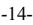
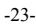
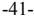

{0}------------------------------------------------

# **UNITED STATES SECURITIES AND EXCHANGE COMMISSION Washington, D.C. 20549 FORM 10-K**

☒ **ANNUAL REPORT PURSUANT TO SECTION 13 OR 15(d) OF THE SECURITIES EXCHANGE ACT OF 1934**

**For the fiscal year ended December 31, 2022**

**OR**

☐ **TRANSITION REPORT PURSUANT TO SECTION 13 OR 15(d) OF THE SECURITIES EXCHANGE ACT OF 1934**

**For the transition period from to**

**Commission File Number: 0-25965**

# **ZIFF DAVIS, INC.**

(Exact name of registrant as specified in its charter)

(State or other jurisdiction of incorporation or organization) (I.R.S. Employer Identification No.)

**Delaware 47-1053457**

**114 5th Avenue, New York, New York 10011, (212) 503-3500** (Address and telephone number of principal executive offices)

**Securities registered pursuant to Section 12(b) of the Act:**

Title of each class Trading Symbol(s) Name of each exchange on which registered Common Stock, \$0.01 par value ZD Nasdaq Stock Market LLC

> **Securities registered pursuant to Section 12(g) of the Act:** None

Indicate by check mark if the registrant is a well-known seasoned issuer, as defined in Rule 405 of the Securities Act. Yes ☒ No ☐

Indicate by check mark if the registrant is not required to file reports pursuant to Section 13 or Section 15(d) of the Act. Yes ☐ No ☒

Indicate by check mark whether the registrant (1) has filed all reports required to be filed by Section 13 or 15(d) of the Securities Exchange Act of 1934 during the preceding 12 months (or for such shorter period that the registrant was required to file such reports), and (2) has been subject to such filing requirements for the past 90 days. Yes ☒ No ☐

Indicate by check mark whether the registrant has submitted electronically every Interactive Data File required to be submitted pursuant to Rule 405 of Regulation S-T (§ 232.405 of this chapter) during the preceding 12 months (or for such shorter period that the registrant was required to submit such files). Yes ☒ No ☐

Indicate by check mark whether the registrant is a large accelerated filer, an accelerated filer, a non-accelerated filer, a smaller reporting company, or an emerging growth company. See the definitions of "large accelerated filer," "accelerated filer," "small reporting company," and "emerging growth company" in Rule 12b-2 of the Exchange Act.

Large accelerated filer ☒ Accelerated filer ☐ Non-accelerated filer o Smaller reporting company ☐ Emerging growth company ☐

If an emerging growth company, indicate by check mark if the registrant has elected not to use the extended transition period for complying with any new or revised financial accounting standards provided pursuant to Section 13(a) of the Exchange Act. ☐

Indicate by check mark whether the registrant has filed a report on and attestation to its management's assessment of the effectiveness of its internal control over financial reporting under Section 404(b) of the Sarbanes-Oxley Act (15 U.S.C. 7262(b)) by the registered public accounting firm that prepared or issued its audit report. ☒

If securities are registered pursuant to Section 12(b) of the Act, indicate by check mark whether the financial statements of the registrant included in the filing reflect the correction of an error to previously issued financial statements. ☐

Indicate by check mark whether any of those error corrections are restatements that required a recovery analysis of incentive-based compensation received by any of the registrant's executive officers during the relevant recovery period pursuant to §240.10D-1(b). ☐

Indicate by check mark whether the registrant is a shell company (as defined in Rule 12b-2 of the Act). Yes ☐ No ☒

As of the last business day of the registrant's most recently completed second fiscal quarter, the approximate aggregate market value of the common stock held by non-affiliates, based upon the closing price of the common stock as quoted by the Nasdaq Global Select Market was \$2,056,960,448. Shares of common stock held by executive officers, directors and holders of more than 5% of the outstanding common stock have been excluded. This determination of affiliate status is not necessarily a conclusive determination for other purposes.

As of February 24, 2023, the registrant had 47,260,252 shares of common stock outstanding.

# **DOCUMENTS INCORPORATED BY REFERENCE:**

Portions of the definitive Proxy Statement to be delivered to stockholders in connection with the Annual Meeting of Stockholders to be held May 5, 2023 are incorporated by reference into Part III of this Form 10-K.

{1}------------------------------------------------

{2}------------------------------------------------

# TABLE OF CONTENTS

|           |                                                                                                              | Page |
|-----------|--------------------------------------------------------------------------------------------------------------|------|
| PART I.   |                                                                                                              |      |
| Item 1.   | Business                                                                                                     | 3    |
| Item 1A.  | Risk Factors                                                                                                 | 12   |
| Item 1B.  | Unresolved Staff Comments                                                                                    | 34   |
| Item 2.   | Properties                                                                                                   | 34   |
| Item 3.   | Legal Proceedings                                                                                            | 34   |
| Item 4.   | Mine Safety Disclosures                                                                                      | 34   |
| PART II.  |                                                                                                              |      |
| Item 5.   | Market for Registrant's Common Equity, Related Stockholder Matters and Issuer Purchases of Equity Securities | 35   |
| Item 6.   | [Reserved]                                                                                                   | 38   |
| Item 7.   | Management's Discussion and Analysis of Financial Condition and Results of Operations                        | 39   |
| Item 7A.  | Quantitative and Qualitative Disclosures About Market Risk                                                   | 53   |
| Item 8.   | Financial Statements and Supplementary Data                                                                  | 56   |
| Item 9.   | Changes In and Disagreements with Accountants on Accounting and Financial Disclosure                         | 119  |
| Item 9A.  | Controls and Procedures                                                                                      | 119  |
| Item 9B.  | Other Information                                                                                            | 123  |
| Item 9C.  | Disclosure Regarding Foreign Jurisdictions that Prevent Inspections                                          | 123  |
| PART III. |                                                                                                              |      |
| Item 10.  | Directors, Executive Officers and Corporate Governance                                                       | 123  |
| Item 11.  | Executive Compensation                                                                                       | 123  |
| Item 12.  | Security Ownership of Certain Beneficial Owners and Management and Related Stockholder Matters               | 123  |
| Item 13.  | Certain Relationships and Related Transactions, and Director Independence                                    | 123  |
| Item 14.  | Principal Accounting Fees and Services                                                                       | 123  |
| PART IV.  |                                                                                                              |      |
| Item 15.  | Exhibits and Financial Statement Schedules                                                                   | 123  |
| Item 16.  | Form 10-K Summary                                                                                            | 126  |
|           |                                                                                                              |      |

-2-

{3}------------------------------------------------

### **Item 1. Business**

## **PART I**

# *Overview*

Ziff Davis, Inc., together with its subsidiaries ("Ziff Davis", the "Company", "our", "us" or "we"), is a vertically focused digital media and internet company whose portfolio includes leading brands in technology, shopping, gaming and entertainment, connectivity, health, cybersecurity, and martech. Our Digital Media business specializes in the technology, shopping, gaming and entertainment, connectivity, and healthcare markets, offering content, tools and services to consumers and businesses. Our Cybersecurity and Martech business provides cloud-based subscription services to consumers and businesses including cybersecurity, privacy and marketing technology.

Our Digital Media business generates revenues from advertising and sponsorships, subscription and usage fees, performance marketing, and licensing fees. This business generates revenues from the sale of display and video advertising; customer clicks to online merchants, as well as, commissions on sales attributed to clicks to online merchants; business-to-business leads sold to information technology ("IT") vendors; the licensing of technology, data, and other intellectual property to clients; and the sale of subscription services to consumers and businesses. Our Cybersecurity and Martech businesses generate revenues primarily from customer subscription and usage fees. Our consolidated revenues are currently generated primarily from two basic business models, each with different financial profiles and variability. Our Digital Media business is driven primarily by advertising revenues, has relatively higher sales and marketing expenses, and has seasonal strength in the fourth quarter. Our Cybersecurity and Martech business is driven by subscription revenues, with relatively stable and predictable margins from quarter to quarter. We continue to pursue additional acquisitions, which may include companies operating under business models that differ from those we operate under today. Such acquisitions could impact our consolidated profit margins and the variability of our revenues.

Ziff Davis was incorporated in 2014 as a Delaware corporation through the creation of a holding company structure. Our Cybersecurity and Martech businesses are operated by our wholly owned subsidiary J2 Global Ventures, LLC. Prior to the spin-off of Consensus Cloud Solutions, Inc. ("Consensus"), our Cybersecurity and Martech businesses were operated by our former wholly owned subsidiary J2 Cloud Services, LLC, which was founded in 1995, and subsidiaries of J2 Cloud Services, LLC. On October 7, 2021 (the "Distribution Date"), the Company completed the previously announced separation (the "Separation") of its cloud fax business into Consensus, an independent publicly traded company, and the Company transferred J2 Cloud Services, LLC to Consensus who in turn transferred non-fax assets and liabilities back to Ziff Davis, such that Consensus was left with the cloud fax business. In connection with the Separation, we changed our name to Ziff Davis, Inc. from J2 Global, Inc. (for certain events prior to October 7, 2021, the Company may be referred to as J2 Global). The Separation was achieved through the Company's distribution of 80.1% of the shares of Consensus common stock to holders of Company common stock as of the close of business on October 1, 2021, the record date for the distribution.

#### *Programmatic Mergers and Acquisitions*

In addition to growing our business organically, on a regular basis, we acquire businesses to grow our customer bases, expand and diversify our service offerings, enhance our technologies, acquire skilled personnel, and enter into new markets. Our programmatic approach to mergers and acquisitions ("M&A") is a central tenet of our capital allocation strategy, which seeks to optimize the allocation of our investable capital, including the free cash flow generated by our businesses, to M&A, share repurchases, and the strengthening of our balance sheet. Since 2012, we have deployed approximately \$3.0 billion on more than 80 acquisitions across the globe in a variety of verticals within the internet and software categories (exclusive of any acquisitions that were part of businesses we have since divested). Our highly systematic and repeatable M&A process allows us to execute a large volume of M&A with velocity and conviction. Our M&A program is built on a rigorous and analytical approach that leverages deep industry knowledge, technological expertise, and investment acumen. Our evaluation criteria for potential acquisitions varies by sector, but our focus on valueoriented fundamentals is a central factor in every transaction we evaluate. We seek to acquire businesses that can generate predictable growing free cash flow over long time horizons. The primary metric we use to differentiate opportunities in our M&A pipeline is the expected internal rate of return that the potential acquisition will generate for Ziff Davis. While we take a highly disciplined approach to the evaluation of M&A, we have a wide aperture and significant flexibility when it comes to the types of transactions we are capable of evaluating and executing. Since 2010, we have acquired venture-backed growth companies, distressed businesses in need of turnaround, complex corporate carve-outs, founder-owned businesses, public companies and private equity-backed businesses. We also have a multi-faceted approach to transaction sourcing that ranges from participation in sell-side auctions led by investment banks to the sourcing of proprietary transactions through our executive network. Acquisitions broadly fall into one of two categories at Ziff Davis: (1) tuck-ins or (2) platform acquisitions. Our tuck-in acquisitions are typically focused on the acquisition of: (a) a customer base, (b) a strong but under monetized media audience or (c) a new product or service that can be sold to our existing customers or audience. Platform acquisitions are businesses at scale that can stand on their own within Ziff Davis and which we believe have the potential to serve as a platform for future M&A. Since 2012, the majority of our acquisitions by deal count have been tuck-

{4}------------------------------------------------

ins. However, over the same period of time, the capital allocated to tuck-ins versus platform acquisitions has been more evenly balanced.

#### *Digital Media*

Our Digital Media business operates a portfolio of web properties and apps which includes *IGN, RetailMeNot, Mashable, PCMag, Humble Bundle, Speedtest, Of ers.com, Black Friday, MedPageToday, Everyday Health, BabyCenter,* and *What to Expect*, among others. Our properties provide trusted reviews of technology, shopping, gaming, and entertainment products and services; news and commentary related to their vertical markets; professional networking tools, targeted emails, and white papers for IT professionals; speed testing and the related data for internet and mobile network connections; online deals and discounts for consumers; news, interactive tools, and mobile applications that enable consumers to manage a broad array of health and wellness needs on a daily basis, including medical conditions, pregnancy, diet, and fitness; and news, tools and information for healthcare professionals to stay abreast of industry, legislative, regulatory, and continuing education developments across major medical specialties.

Our Digital Media business generates revenues from advertising and sponsorships, subscription and usage fees, performance marketing and licensing fees.

**Display and Video Advertising -** We sell online display and video advertising on our owned-and-operated web properties and on third-party sites. We have contractual arrangements with advertisers either directly or through agencies. The terms of these contracts specify the price of the advertising to be sold and the volume of advertisements that will be served over the course of a campaign. Additionally, we have contractual arrangements with certain third-party websites not owned by us, and third-party advertising networks to deliver online display and video advertising to their websites or to third-party sites.

**Subscriptions -** We primarily offer subscription and licensing services to businesses for *Speedtest Intelligence*, which offers up-to-date insights into global fixed broadband and mobile performance data, as well as, monthly subscription packages to consumers through the *Lose It!* weight loss app and through *Humble Bundle*.

**Performance Marketing** - We generate business-to-business leads for IT vendors through the marketing of content, including white papers and webinars, and offer additional lead qualification and nurturing services. On the consumer side, we generate clicks to online merchants by promoting deals and discounts on our web properties.

**Licensing -** We license our proprietary technology, data, and intellectual property to third parties for various purposes. For instance, we will license the right to use *PCMag's* "Editors' Choice" logo and other copyrighted editorial content to businesses whose products have earned such distinction.

We believe competitive factors relating to attracting and retaining users include the ability to provide premium and exclusive content and the reach, effectiveness, and efficiency of our marketing services to attract consumers, advertisers, healthcare professionals and publishers. We continue to seek opportunities to acquire additional web properties, both within and outside of the technology, shopping, gaming and entertainment, connectivity, and health and wellness verticals, with the goal of monetizing their audiences and content through application of our proprietary technologies and insight.

Our Digital Media properties and services include the following five primary platforms: (1) technology, (2) shopping, (3) gaming and entertainment, (4) connectivity, and (5) health and wellness.

#### *Technology*

Our technology platform includes online publishers, as well as tools and services tailored to consumers, professionals, and organizations looking for technological expertise, authoritativeness and trustworthiness. We expect our brands to deliver deeply-researched, current, and authentic content, data and services related to technology, culture, and the internet. Our technology brands include *PCMag* (which celebrated its 40 anniversary in 2022), *Mashable,* and *Spiceworks Zif Davis.* th

Our publishing brands (including *PCMag*) are an online resource for laboratory-based product reviews, technology news, buying guides, and research papers. We also operate one of the longest running independent testing facilities for consumer technology products. Founded in 1984, our lab produces unbiased technology product and service reviews, and P*CMag*'s "Editor's Choice" award is recognized globally as a trusted mark for buyers and sellers of technology products and services. Our publishing sites are also recognized as trusted global sources of stories for more than a dozen platforms, including Instagram, Twitter and Facebook. We also provide digital content for buyers of IT products and services, allowing IT vendors to identify, reach and influence corporate IT decision makers who are actively researching specific IT purchases.

*Mashable* is a trusted global media brand publishing premium content for individuals interested in technology and culture. *Mashable* produces stories for more than a dozen platforms, including Snapchat, Twitter, and Facebook.

{5}------------------------------------------------

*Spiceworks Zif Davis* provides digital content for buyers of IT products and services, allowing IT vendors to identify, reach, and influence corporate IT decision makers who are actively researching specific IT purchases.

# *Shopping*

Our shopping properties include *RetailMeNot*, *Of ers.com,* and a collection of event-based commerce sites that seek to influence online purchasing decisions across an array of categories.

Our flagship savings destination, *RetailMeNot,* seeks to influence consumer purchase decisions through savings and discount opportunities by connecting retail partners with national and international brands with consumer shopping audiences. *RetailMeNot* promotional media solutions include mobile coupons and codes, and cash back offers across web, app, and browser extensions.

*Of ers.com* is a coupons and deals website featuring offers from more than 25,000 of the internet's more popular stores and brands. *Of ers.com*'s objective is to help consumers find the best deals on the web. Additionally, *Of ers.com* employs a process to verify that its coupon codes work, saving consumers time and money.

Our event-based properties, *BlackFriday.com, TheBlackFriday.com, BestBlackFriday.com, and DealsofAmerica.com* are resources for shoppers to find the best deals and offers from retailers during the height of the holiday shopping season.

#### *Gaming and Entertainment*

Our gaming properties include *IGN Entertainment* and *Humble Bundle*.

*IGN Entertainment* is an internet media brand focused on the video game and entertainment enthusiast markets. *IGN* reaches more than 250 million monthly users across 35 platforms and is followed by nearly 50 million social and YouTube followers with 350 million minutes watched monthly.

Our *Humble Bundle* business is a digital subscription and storefront for video games, ebooks, and software. Customers purchase monthly subscriptions, product bundles, and individual products through our website. Revenue is also generated from the direct sale and distribution of video games in which *Humble Bundle* is the publisher. In addition, raising money for charity is a core mission for *Humble Bundle*. Each product sale transaction at *Humble Bundle* results in a charitable contribution.

## *Connectivity*

Several of our data and services businesses sit at the center of the broadband economy and provide some of the most popular sources of information on internet connectivity.

*Ookla* provides customers with fixed broadband and mobile network testing applications, data, and analysis. Over ten million tests are actively initiated by consumers each day across all of *Ookla*'s platforms, with more than 45 billion tests completed to date. As a result, *Ookla* maintains comprehensive analytics on worldwide internet performance and accessibility. *Ookla* solutions have been adopted by a significant number of internet service providers, mobile carriers, and regulatory bodies worldwide and have been translated into dozens of languages for use by thousands of businesses, governments, universities, and trade organizations. *Ookla* also offers its customers connectivity monitoring, testing, and insights under the *CellRebel, RootMetrics*, *Solutelia,* and *SpatialBuzz* brands.

Our *Ekahau* business seeks to provide enterprise solutions to design and manage wireless networks by minimizing network deployment time and ensuring sufficient wireless coverage across the network.

*Downdetector* offers real-time overviews of status information and outages for services and digital products that consumers use every day. *Downdetector* aims to track any service that its users consider vital to their everyday lives, including (but not limited to) internet providers, mobile providers, airlines, banks, public transport, and other online services.

#### *Health and Wellnes*s

*Everyday Health Group ("EHG")* operates a portfolio of properties focused on driving better clinical and health outcomes through decision-making informed by highly relevant information, data, and analytics.

The *EHG* portfolio includes a collection of interactive tools and mobile applications that are designed to enable consumers to manage a broad array of health and wellness needs on a daily basis, including medical conditions, pregnancy, diet, and fitness. The *EHG* portfolio also includes educational and professional development services, news, and information for healthcare professionals to stay abreast of industry, legislative, regulatory, and continuing education developments across major medical specialties.

*EHG* is organized around three audiences: (1) Health and Wellness Consumers, (2) Pregnancy & Parenting, and (3) Healthcare Professionals.

{6}------------------------------------------------

# Health and Wellness Consumers

Consumer-focused properties include digital content and information services ranging from interactive guides, resource centers, special reports, community health tip sharing, newsletters, self-assessment tools, healthcare finders, e-courses, and lifestyle programs.

*Everyday Health*, our flagship brand, features medically reviewed, award-winning editorial content designed to inspire and enable the active management of health and wellness daily. In addition to *Everyday Health* and other *EHG*-owned and operated consumer websites, including *DailyOM*, *Diabetes Daily,* and *Migraine Again*, EHG provides advertisers access to the Everyday Health Trusted Care Access Portfolio ("TCAP") of digital health properties. TCAP features digital properties of two of the most world-renowned medical centers, to which *Everyday Health* holds exclusive advertising representation rights. In 2022, we added *Lose It!* to our portfolio, a comprehensive, easy-to-use, personal, app-based weight loss program. *Castle Connolly*, a premier brand in healthcare provided research and rankings, publishes the renowned peer-reviewed *Castle Connolly Top Doctors* series.

#### Pregnancy & Parenting

*BabyCenter* is a leading global digital pregnancy and parenting resource and operates nine international versions in six different languages delivered via websites, mobile apps, and online communities. We also operate the digital properties for the *What to Expect* brand, a leading pregnancy and parenting media resource. Based on the best-selling pregnancy book, *What to Expect When You're Expecting*, by author Heidi Murkoff, the *What to Expect* website and mobile applications contain interactive content on conception planning and pregnancy, as well as information on raising newborns and toddlers. In 2022, we added *Emma's Diary* to our portfolio, which offers advice, guidance and sampling to expectant mothers in the United Kingdom.

#### Healthcare Professionals

For healthcare professionals, we provide digital content that is designed to enable healthcare professionals to stay abreast of clinical, industry, legislative, and regulatory developments across most major medical specialties. Our flagship professional property, *MedPage Today*, delivers daily breaking medical news across major medical specialties and major public policy developments from Washington D.C. *MedPage Today* coordinates with leading researchers, clinicians, and academic medical centers to aid in gathering in-depth information for its coverage. *MedPage Today* has been recognized with awards from prestigious healthcare organizations including the American Society of Healthcare Business Editors, the National Institute for Healthcare Management, and eHealthcare.

*EHG* offers accredited continuing medical education ("CME") and continuing education ("CE") programs to healthcare professionals, through our *PRIME Education* business. *PRIME* is nationally recognized for its research-informed approach to CME and CE programs across a wide range of therapeutic areas. In numerous peer-reviewed publications, PRIME has demonstrated the impact of its work through measurably improving health care outcomes. In 2022, *PRIME* received the prestigious Alliance Industry Summit Best in Class Outcomes Award.

Our *Health eCareers* business provides a digital portal to connect physicians, nurses, nurse practitioners, physician assistants, and certified registered nurse anesthetists with jobs in every medical specialty. *Health eCareers* contracts with thousands of healthcare employers across the United States and an exclusive network of healthcare associations and community partners seeking connections to qualified healthcare professionals to fill open positions.

#### *Competition*

Competition in the digital media space is fierce and continues to intensify.

Our digital media business competes with (i) diversified internet and digital media companies like IAC/InterActiveCorp, Future PLC, Red Ventures, and Internet Brands, (ii) vertical-specific digital media companies like RVO Health, TechTarget, Vox, Centerfield, Doximity, CarGurus, and Fandom and (iii) other large sellers of advertising including Alphabet, Meta, Snap, Twitch, and others. We believe that the primary competitive factors determining our success in the market for our digital media products and services include the reputation of our brands as trusted sources of objective information, our ability to attract internet users and advertisers to our web properties, and our expertise in multiple methods of monetization. Some of these companies may have greater financial and other resources than we do.

For more information regarding the competition that our Digital Media business faces, please refer to the section Item 1A. *Risk Factors* of this Annual Report on Form 10-K.

#### *Cybersecurity and Martech*

Our Cybersecurity and Martech business provides subscription based, software-as-a-service ("SaaS") solutions, with relatively stable and predictable revenue and margins from quarter to quarter. We generate substantially all of our Cybersecurity

{7}------------------------------------------------

and Martech revenues from "fixed" subscription revenues for customer subscriptions and, to a lesser extent, "variable" usage revenues generated from actual usage by our subscribers.

Consumers and businesses of all sizes are increasingly subscribing to cloud-based services to meet their communication, messaging, security, privacy, customer marketing and other needs. Our Cybersecurity and Martech services represent a model for delivering and consuming, real time business technology services, resources and solutions over the internet. Their goal is to reduce or eliminate costs, increase sales and enhance productivity, mobility, business continuity and security.

Our *VIPRE* security and *Inspired eLearning* cybersecurity solutions protect our customers from cyber threats with endpoint and email security, threat intelligence and security awareness training. *IPVanish* provides virtual private networks that encrypt our customers' data and activity on the internet. *Livedrive* enables our customers to securely back up their data and dispose of tape or other physical systems.

*MOZ*, *Kickbox*, *Campaigner*, *iContact*, and *SMTP* provide our customers with search engine optimization tools and enhanced email marketing and delivery solutions. *eVoice* and *Line2* provide our customers a virtual phone system with various available enhancements. We believe these services represent more efficient and less expensive solutions than many existing alternatives, and provide increased security, privacy, flexibility and mobility.

We market our Cybersecurity and Martech offerings to a broad spectrum of prospective business customers including sole proprietors, small to medium-sized businesses and enterprises. We also market our Cybersecurity and Martech offerings to consumers. Our marketing efforts include enhancing brand awareness; utilizing online advertising, search engines and affiliate programs; selling through both a telesales and direct sales force; and working with resellers and other channel partners. We continuously seek to extend the number of distribution channels through which we acquire paying customers and improve the cost and volume of customers obtained through our current channels.

Our Cybersecurity and Martech businesses operate as the VIPRE Security Group and the MOZ Group, respectively.

#### *VIPRE Security Group*

The VIPRE Security Group's offerings include endpoint and email security, security awareness training, secure backup and file sharing, and virtual private network solutions. We offer these services to consumers who are worried about their digital safety and personal information, and to small businesses and mid-sized enterprises who want advanced cyber threat protection. The VIPRE Security Group offers its services under the following brands.

*IPVanish* offers one of the fastest virtual private network services in the industry. The *IPVanish* network is designed to enable users to browse the internet more securely and anonymously, without restriction.

*VIPRE* software solutions are designed to protect people and businesses from costly and malicious cyber threats. VIPRE offerings include comprehensive endpoint and email security, along with threat intelligence for real-time malware analysis.

*LiveDrive* provides online backup and synchronized storage features for professionals and individuals, and is designed to allow customers to be able to access their files from virtually anywhere at any time so long as they have access to the internet.

*Inspired eLearning's* SaaS platform for cybersecurity awareness and compliance training helps enterprises protect their organizations by reducing human-related cybersecurity and workplace incidents.

*SugarSync* provides online file backup, synchronization and sharing of a customer's documents, photos, music and movies across a customer's desktops, laptops, mobile, and other devices.

# *MOZ Group*

The MOZ Group's offerings include email marketing and delivery solutions, search engine optimization tools, and voice and text communication services. We offer these services to sole proprietors, small businesses, and mid-sized enterprises, enabling them to connect directly with their customers and grow the revenue of their businesses. The MOZ Group offers its services under the following brands.

*Campaigner*, *iContact,* and *Kickbox* provide email marketing solutions to help small, medium, and large businesses strengthen customer relationships and drive sales through professional email campaign creation, advanced list management, segmentation tools, verification tools, marketing automation, attribution reports, campaign tracking, and targeted email auto responders and workflows.

{8}------------------------------------------------

*MOZ Pro, MOZ Local,* and *Stat Analytics* offer search engine optimization services that are used to help understand and improve traffic, rankings, and visibility in search results.

*eVoice* is a virtual phone system that provides small and medium-sized businesses on-demand voice communications services. Customers can assign departmental and individual extensions that can connect to multiple numbers, including land-line and mobile phones and IP networks, and can enhance reachability through "find me/follow me" capabilities. These services also include advanced integrated voicemail for each extension.

*Line2* is a cloud phone service which allows users to add a second line to a mobile device. *Line2* enables users to separate work and personal calls on a single device and includes standard business phone service features such as SMS, MMS, auto attendant, call routing, call forwarding, voicemail, call queue, and toll-free and vanity numbers.

## *Competition*

Our Cybersecurity and Martech business faces competition from, among others, email marketing solution providers, marketing automation services, cybersecurity software and service vendors, and virtual private networks. Our online cybersecurity solutions compete against publicly-traded and privately-held providers of cybersecurity solutions and related software, such as Palo Alto Networks, Crowdstrike, Proofpoint, NortonLifeLock, Kape Technologies, KnowBe4, and Malwarebytes. Our marketing technology solutions compete directly with various providers of search engine optimization technology and communication platforms that provide email and voice-related services to small- and medium-sized businesses, including companies like SEMRush, MailChimp, The Campaign Monitor Group, Constant Contact, and Dialpad. Our Cybersecurity and Martech business also competes against diversified and acquisitive vertical market software providers like Constellation Software. Some of our competitors may have greater financial and other resources than we do.

We believe that the primary competitive factors determining our success in the market for Cybersecurity and Martech services include our financial strength and stability; pricing; reputation for reliability and security of service; intellectual property ownership; effectiveness of customer support; sign-up, service, and software ease-of-use; service scalability; customer messaging and branding; geographic coverage; scope of services; currency and payment method acceptance; and local language sales, messaging, and support.

For more information regarding the competition that our Cybersecurity and Martech businesses faces, please refer to the section entitled Item 1A. *Risk Factors* of this Annual Report on Form

# 10-K. *Seasonality*

Revenues associated with our Digital Media business are subject to seasonal fluctuations, becoming most active during the fourth quarter holiday period due to increased retail activity. Our Cybersecurity and Martech revenues are impacted by the number of effective business days in a given period. We traditionally experience lower than average Cybersecurity and Martech usage and customer sign-ups in the fourth quarter.

#### *Patents and Proprietary Rights*

We regard the protection of our intellectual property rights as important to our success. We aggressively protect these rights by relying on a combination of patents, trademarks, copyrights, trade dress, and trade secrets. We also enter into confidentiality and intellectual property assignment agreements with employees and contractors, and nondisclosure agreements with parties with whom we conduct business in order to limit access to and disclosure of our proprietary information.

Through a combination of internal technology development and acquisitions, we have built a portfolio of numerous U.S. and foreign patents. We intend to continue to invest in patents, to aggressively protect our patent assets from unauthorized use, and to generate patent licensing revenues from authorized users.

We have generated royalties from licensing certain of our patents and have enforced certain patents against companies using our patented technology without our permission.

We seek patents for inventions that may contribute to our business or the technology sector. In addition, we have multiple pending U.S. and foreign patent applications, covering components of our technology and in some cases technologies beyond those that we currently offer. Unless and until patents are issued on the pending applications, no patent rights can be enforced.

We have obtained patent licenses for certain technologies where such licenses are necessary or advantageous.

We own and use a number of trademarks in connection with our services, including word and/or logo trademarks for IGN, Everyday Health, BabyCenter, Humble Bundle, PCMag, Mashable, Ookla, Speedtest, and RetailMeNot, among others. Many of these trademarks are registered worldwide, and numerous trademark applications are pending around the world. We hold numerous internet domain names, including "everydayhealth.com", "retailmenot.com", "pcmag.com", "ign.com",

{9}------------------------------------------------

"speedtest.net", "offers.com", "humblebundle.com", "mashable.com", and "babycenter.com", among others. We have filed to protect our rights to our brands in certain alternative top-level domains such as ".org", ".net", ".biz", ".info" and ".us", among others.

Like other technology-based businesses, we face the risk that we will be unable to protect our intellectual property and other proprietary rights, and the risk that we will be found to have infringed the proprietary rights of others. For more information regarding these risks, please refer to the section entitled Risk Factors contained in Item 1A. *Risk Factors* of this Annual Report on Form 10-K.

# *Research and Development*

The markets for our services are evolving rapidly, requiring ongoing expenditures for research and development and timely introduction of new services and service enhancements. Our future success will depend, in part, on our ability to enhance our current services, to respond effectively to technological changes, attract and retain engineering talent, sell additional services to our existing customer base, and introduce new services and technologies that address the increasingly sophisticated needs of our customers.

We devote significant resources to develop new services and service enhancements. Our research, development and engineering expenditures were \$74.1 million, \$78.9 million and \$57.1 million for the fiscal years ended December 31, 2022, 2021 and 2020, respectively. For more information regarding the technological risks that we face, please refer to the section entitled Item 1A. *Risk Factors* of this Annual Report on Form 10-K.

## *Government Regulation*

We are subject to a number of foreign and domestic laws and regulations that affect companies conducting business over the internet and, in some cases, using services of third-party telecommunications and internet service providers. These include, among others, laws and regulations addressing privacy, data storage, retention and security, freedom of expression, content, taxation, numbers, advertising, and intellectual property. For information about the risks we face with respect to governmental regulation, please see Item 1A. *Risk Factors* of this Annual Report on Form 10-K.

#### *Human Capital Resources*

As of December 31, 2022, we had approximately 4,400 employees, nearly evenly split between U.S. and non-U.S based employees. Our ability to continue to attract, retain, and motivate our highly qualified workforce is very important to our continued success. Approximately 50 of the editorial employees in our Digital Media business have elected to join a union. We chose to voluntarily recognize the union and have negotiated a collective bargaining agreement with the union. None of our other employees are represented by collective bargaining.

# *Acquisition Strategy Impact on Human Capital*

The Company has made more than 80 acquisitions since its inception, including six during 2022 (exclusive of any acquisitions that were part of businesses we have since divested). We believe that welcoming and integrating new groups of employees where each group has its own unique culture, organizational norms, and expectations, is a strength of ours. We believe that our integration approach reduces the human capital risk associated with our acquisition strategy, and we believe that our ability to effectively integrate new employees and businesses is a core competency of the Company.

# *Our Culture*

Culture at the Company operates on two levels. While we have a strong enterprise-wide culture that focuses on our core values – diversity, equity and inclusion, environmental sustainability, community, data privacy and security, and governance – we also have a strong network of micro-cultures that operate within many of our businesses and drive their success. Integrating those microcultures and values is important; we work hard to foster an environment of collaboration and embrace the power of small groups working together.

An important dimension of the enterprise culture at Ziff Davis continues to stem from our belief that profitability and corporate responsibility go hand in hand. We believe that "Doing is Greater than Talking," which has been a rallying cry to employees, galvanizing them to take action to create social value and impact.

With their work and many contributions, our employees play a crucial role in supporting the Company's "Five Pillars of Purpose," which continue to include:

**Diversity, Equity & Inclusion** - Reinforce our diverse workforce, reflect our diverse audiences, and extend upon our inclusive culture.

{10}------------------------------------------------

**Environmental Sustainability** - Reduce our environmental footprint and continue helping customers and users reduce their footprint.

**Community** - Support our employees worldwide and positively impact the communities around us.

**Data Privacy and Security** - Protect our data and customer data, ensure our product security, and respect the data privacy rights of our users.

**Governance** - Represent shareholders' best interests with our rigorous and transparent corporate governance structure.

# *Diversity, Equity & Inclusion*

Our Digital Media audiences and Cybersecurity and Martech services users are diverse – gender, race, ethnicity, age, orientation, geography, education, background, interests, and more. We believe that for our business to succeed over the long term, the Company must have an inclusive corporate culture that embraces diversity and promotes equity across our enterprise.

We continue to take steps to promote that culture. To date, we have:

- Created the Ziff Davis Diversity Council, a diverse group of employees that develops recommendations for recruiting, mentorship, and advancement;
- Supported six Employee Resource Groups to increase opportunities for networking, learning, and development;
- Expanded the Employee Resource Group program to include the Family Employee Resource Group ("ERG") for caregivers, with more groups to come;
- Introduced DEI targets into our executive compensation program beginning in 2021; and
- Launched a mentorship program for all employees to leverage internal leadership and expertise.

We believe that transparency and accountability are important parts of managing human capital risk. To that end, in 2022 we published our third Annual Diversity Report, available on our website, which details our workforce race representation, gender representation, and details how those differ between our overall workforce and our senior employees, as well as introducing commitments to DEI initiatives within our current and future workforce. We are proud of our progress to date – and we recognize we have much more to do.

# *Hiring*

We reinforce our culture and our values by seeking out diverse candidates, and looking for candidates that fit well with our organizational priorities. We have had success in this area: 36 percent of all recent new hires in the U.S. have been people of color, and 58 percent of recent new hires in the U.S. have been women. We are working to proactively attract more diverse talent; we double our referral bonus paid to employees when we hire a person of color they recommend; we continued our partnership with Professional Diversity Network to advertise our open roles to employees aligning with a multitude of identity groups; and we became a 2022 Afrotech conference sponsor.

# *Employee Compensation & Benefits*

Compensation is an important consideration for all of our employees and we strive to pay competitive compensation packages that reflect the success of the business and the individual contributions of each colleague. We are committed to fair pay practices and roles are periodically benchmarked to help inform where adjustments may be needed.

We care for our employees by providing benefits we believe are effective at attracting and retaining the talent critical for our success and, more importantly, assist in their day to day wellbeing. Those benefits include comprehensive health insurance coverage, covering 83% of health insurance premiums for covered U.S. employees in each of last three years, an employee stock purchase program, 401k program, flexible time off, free access to telemedicine, and up to 16 weeks of paid parental leave for birth parents. In addition, we offer paid sick, military, jury duty, and bereavement leave, paid short and long term disability leave, family planning support, a program offering free access to meditation and healthy eating apps, and monthly webinars focused on wellness through the "Wellness Your Way" program.

We support our local communities by providing employees with 16 hours annually of fully paid Volunteer Time Off, partnering with Benevity to support volunteer event opportunities globally. We also expanded our Employee Assistance Fund ("EAF") with America's Charities to help employees impacted by unexpected financial hardship resulting from natural and other disasters as well as personal hardship, supporting employees from India, the United States, and Canada, with plans to add more countries in the future.

{11}------------------------------------------------

Creating a culture where all colleagues feel supported and valued is paramount to our corporate mission. We have a mental health education program with quarterly events held throughout the year. We continue to evolve our programs to meet our colleagues' health and wellness needs, which we believe is essential to attract and retain employees of the highest caliber, and we offer a competitive benefits package focused on fostering work/life integration.

# *Environment, Social and Governance*

In March 2022, Ziff Davis issued its first annual Environmental, Social & Governance ("ESG") Report. Included in the report were the findings from our first GreenHouse Gas inventory, which calculates our Scope 1, 2, and 3 emissions. Our ESG efforts focused on five critical pillars: diversity, equity and inclusion; environmental sustainability; community; data privacy and security; and governance. The report highlighted the policies, programs and practices Ziff Davis has in place to tackle critical challenges and the tangible results we have already achieved across our business, within our industry, and in our communities. Included in the report are details about several new programs including our Global Mentorship Program, and Internal Mobility Program, among others.

# *Available Information*

We file Annual Reports on Form 10-K, Quarterly Reports on Form 10-Q, Current Reports on Form 8-K, pursuant to Sections 13(a) and 15(d) of the Securities Exchange Act of 1934, as amended (the "Exchange Act of 1934") with the Securities and Exchange Commission (the "SEC"). Such reports and other information and amendments thereto filed or furnished by the Company with the SEC are available free of charge on the Company's website at www.ziffdavis.com as soon as reasonably practicable after we file such reports with, or furnish them to, the SEC's website. The information on our website is not part of this report. The SEC maintains an internet site that contains reports, proxy and information statements and other information regarding our filings we file electronically with the SEC at www.sec.gov. Our Board has adopted a Code of Business Conduct and Ethics that applies to all of our directors and employees. The Code is posted on the corporate governance page of Ziff Davis's website, and can be accessed at http://investor.ziffdavis.com. Any changes to or waiver of our Code of Business Conduct and Ethics for senior financial officers, executive officers or directors will be posted on that website.

{12}------------------------------------------------

## **Item 1A. Risk Factors**

*Before deciding to invest in Zif Davis or to maintain or increase your investment, you should carefully consider the risks described below in addition to the other cautionary statements and risks described elsewhere in this Annual Report on Form 10-K and our other filings with the SEC, including our subsequent reports on Forms 10-Q and 8-K. The risks and uncertainties described below are not the only ones we face. Additional risks and uncertainties not presently known to us or that we currently deem immaterial also may af ect our business. If any of these known or unknown risks or uncertainties actually occurs, our business, prospects, financial condition, operating results, and cash flows could be materially adversely af ected. In that event, the market price of our common stock will likely decline and you may lose part or all of your investment.*

#### **Risk Factors Summary**

The following is a summary of the principal risks that could adversely affect our business, operations, and financial results.

#### **Risks Related To Our Business**

- Acquisitions and investments in our business play a significant role in our growth.
- Acquisitions may disrupt our operations and harm our operating results.
- The majority of our revenue within the Digital Media business is derived from short-term advertising arrangements, and our Digital Media business may lose or be unable to attract advertisers if it cannot develop, commission, or acquire compelling content, if it cannot attract users to mobile offerings or if advertisers' marketing budgets are cut or reduced.
- We face risks associated with system failures, security breaches, and other technological issues.
- We face risks associated with changes in our tax rates, changes in tax treatment of companies engaged in e-commerce, the adoption of new U.S. or international tax legislation, assessments or audits by taxing authorities, and potential exposure to additional tax liabilities (including with respect to sales and use, telecommunications, or similar taxes).
- We face risks associated with weakened global and U.S. economic conditions, volatility in the economy, and political instability.
- The markets in which we operate are highly competitive, and we may not be successful in growing our brands or revenue.
- If the distribution of Consensus, together with certain related transactions, does not qualify as a transaction that is generally tax-free for U.S. federal income tax purposes, Ziff Davis, Consensus, and Ziff Davis stockholders could be subject to significant tax liabilities.
- Our business is highly dependent on our billing systems functioning properly, and we face risks associated with credit and debit card declines and merchant standards imposed by credit and debit card companies.
- We face potential liability for various types of legal claims, and we may be engaged in legal proceedings that could cause us to incur unforeseen expenses and could divert significant operational resources and our management's time and attention.
- Our businesses depend in part on attracting visitors to our websites from search engines.
- We may be subject to risks from international operations, including risks associated with currency fluctuations and foreign exchange controls and other adverse changes in global financial markets, including unforeseen global crises such as war, strife, strikes, global health pandemics, as well as risks associated with international laws and regulations.
- We may be found to infringe the intellectual property rights of others, and we may be unable to adequately protect our own intellectual property rights.
- Our business is dependent on the supply of services and other business requirements from other companies.
- Our business is dependent on our retention of our executive officers, and senior management, and our ability to hire and retain key personnel.
- Our level of indebtedness could adversely affect our financial flexibility and our competitive position, and we require significant cash to service our debt and fund our capital requirements.
- We are exposed to risk if we cannot maintain or adhere to our internal controls and procedures.
- We previously identified a material weakness in 2021, which has since been remediated, but which may have adversely affected our business, reputation, results of operations, and stock price.

-12-

{13}------------------------------------------------

- We face risks associated with our 1.75% Convertible Notes and 4.625% Senior Notes, including the possibility of changes in interest deductions, triggering of the conditional conversion feature, lack of funds to settle conversions, redemptions or repurchase of the notes, and imposition of restrictions on future debt.
- Divestitures or other dispositions could negatively impact our business, and contingent liabilities from businesses that we have sold could adversely affect our financial statements.
- Potential indemnification liabilities to Consensus pursuant to the separation agreement could materially and adversely affect our businesses, financial condition, results of operations, and cash flows.
- ESG matters, as well as related reporting obligations, expose us to risks that could adversely affect our reputation and performance.

## **Risks Related To Our Industries**

- We are subject to laws and regulations worldwide, changes to which could increase our costs and individually or in the aggregate adversely affect our business. These may in turn subject us to claims, judgments, monetary liabilities and other remedies, and to limitations on our business practices.
- We operate across many different markets and may be exposed to a variety of government and private actions or self-regulatory developments regarding data privacy and security.
- Data privacy and security regulations such as the GDPR, the CCPA, and CDPA impose significant compliance costs and expose us to substantial risks, particularly with respect to health data and other sensitive data.
- Developments in the healthcare industry and associated regulations could adversely affect our business, including our Everyday Health Group set of brands.
- Our business could suffer if providers of broadband internet access services block, impair or degrade our services.
- Our business faces risks associated with advertisement blocking technologies and advertising click fraud.
- The industries in which we operate are undergoing rapid technological changes, and we may not be able to keep up.

#### **Risks Related To Our Stock**

- Features of the 1.75% Convertible Notes and 4.625% Senior Notes may delay or prevent an otherwise beneficial attempt to take over our company.
- Conversions of the 1.75% Convertible Notes would dilute the ownership interest of our existing stockholders, including holders who had previously converted their 1.75% Convertible Notes. • We are a holding company and our operations are conducted through, and substantially all of our assets are held by, subsidiaries, which may be subject to restrictions on their ability to pay
- dividends to us to fund our dividends, if any, and interest payments and other holding company expenses.
- Future sales of our common stock may negatively affect our stock price.
- Anti-takeover provisions could negatively impact our stockholders.
- Our stock price may be volatile or may decline, due to various reasons, including variations between actual results and investor expectations, industry and regulatory changes, introduction of new services by our competitors, developments with respect to IP rights, geopolitical events such as war, threat of war or terrorist actions, and global health pandemics, among others. **Risks Related To Our Business**

### **Acquisitions and investments in our business have historically played a significant role in our growth and we anticipate that they will continue to do so.**

We plan to acquire additional or invest in new or current businesses, products, services and technologies that complement or augment our service offerings and customer base in order to enhance our rate of growth. We may not successfully identify suitable acquisition candidates or investment strategies, manage disparate technologies, lines of business, personnel and corporate cultures, realize our business strategy or the expected return on our investment, or manage a geographically dispersed company. If we are unable to identify and execute on acquisitions or execute on our investment strategies, our revenues, business, prospects, financial condition, operating results and cash flows could suffer.

## **We have made and expect to continue to make acquisitions that could disrupt our operations and harm our operating results.**

We intend to continue to develop new services, enhance existing services and expand our geographic presence through acquisitions of other companies, service lines, technologies, and personnel.

{14}------------------------------------------------

Acquisitions involve numerous risks, including the following:

- Difficulties in integrating the operations, systems, technologies, products, and personnel of the acquired businesses;
- Difficulties in entering markets in which we have no or limited direct prior experience and where competitors in such markets may have stronger market positions;
- Diversion of management's attention from normal daily operations of the business and the challenges of managing larger and more widespread operations resulting from acquisitions; and
- The potential loss of key employees, customers, distributors, vendors, and other business partners of the businesses we acquire.

Acquisitions may also cause us to:

- Use a substantial portion of our cash resources or incur debt;
- Significantly increase our interest expense, leverage, and debt service requirements if we incur additional debt to pay for an acquisition;
- Assume liabilities;
- Issue common stock that would dilute our current stockholders' percentage ownership;
- Record goodwill and intangible assets that are subject to impairment testing on a regular basis and potential periodic impairment charges;
- Incur amortization expenses related to certain intangible assets; and
- Become subject to intellectual property or other litigation.

Mergers and acquisitions are inherently risky and subject to many factors outside of our control. We cannot give assurances that our previous or future acquisitions will be successful and will not materially adversely affect our business, operating results, or financial condition. Failure to manage and successfully integrate acquisitions could materially harm our business and operating results. In addition, our effective tax rate for future periods is uncertain and could be impacted by mergers and acquisitions.

# **The majority of our revenue within the Digital Media business is derived from short-term advertising arrangements and a reduction in spending by or loss of current or potential advertisers would cause our revenue and operating results to decline.**

In most cases, our agreements with advertisers have a term of one year or less and may be terminated at any time by the advertiser or by us without penalty. Advertising agreements often provide that we receive payment based on "served" impressions, but the online ad industry has started to shift so that payment will be made based on "viewable" impressions, and that change in basis could have a negative effect on available impressions thereby reducing our revenue potential. Accordingly, it is difficult to accurately forecast display revenue. In addition, our expense levels are based in part on expectations of future revenue. Moreover, we believe that advertising on the internet, as in traditional media, fluctuates significantly as a result of a variety of factors, many of which are outside of our control. Some of these factors include (a) budget constraints of our advertisers, (b) cancellations or delays of projects by our advertisers due to numerous factors, including but not limited to, supply chain issues, (c) the cyclical and discretionary nature of advertising spending, (d) general economic, internet-related, and media industry conditions, (e) tax and other legislation and regulation, as well as (f) extraordinary events, such as war, acts of terrorism or aggression, extreme weather events including as exacerbated by climate change, and pandemics or other public health crises. The state of the global economy and availability of capital has impacted and could further impact the advertising spending patterns of existing and potential advertisers. Continued reduction in spending by, or loss of, existing or potential advertisers would negatively impact our revenue and operating results. Further, we may be unable to adjust our expenses and capital expenditures quickly enough to compensate for any unexpected revenue shortfall.

# **If we are unable to develop, commission, or acquire compelling content in our Digital Media business at acceptable prices, our expenses may increase, the number of visitors to our online properties may not grow, or may decline, and/or visitors' level of engagement with our websites may decline, any of which could harm our operating results.**

Our future success depends in part on the ability of our Digital Media business to aggregate compelling content and deliver that content through our online properties. Users are increasingly demanding high-quality content and services including more video and mobile-specific content. Such content and services may require us to make substantial payments to third parties if we are unable to develop content of our own. Our ability to maintain and build relationships with such third-party providers is critical to our success. In addition, as new methods for accessing the internet become available, including through alternative devices, we may need to enter into amended agreements with existing third-party providers to cover the new devices. We may be unable to enter into new, or preserve existing, relationships with the third-parties whose content or services we seek to

{15}------------------------------------------------

obtain. In addition, as competition for compelling content increases both domestically and internationally, our third-party providers may increase the prices at which they offer their content and services to us and potential providers may not offer their content or services to us at all, or may offer them on terms that are not agreeable to us. An increase in the prices charged to us by third-party providers could harm our operating results and financial condition. Further, many of our content and services licenses with third parties are non-exclusive. Accordingly, other media providers may be able to offer similar or identical content. This increases the importance of our ability to deliver compelling content and personalization of this content for users in order to differentiate our properties from other businesses. Although we generally develop compelling content of our own, when we are unable to do so, we engage freelance services or obtain licensed content which may not be at reasonable prices and which could harm our operating results.

# **In our Digital Media business, if we are unable to prove that our advertising and sponsorship solutions provide an attractive return on investment for our customers, our financial results could be harmed.**

Our ability to grow revenue from our Digital Media business is dependent on our ability to demonstrate to marketers that their marketing campaigns with us provide a meaningful return on investment ("ROI") relative to offline and other online opportunities. Certain of the marketing campaigns with respect to our Digital Media business are designed such that the revenues received are based entirely upon the ROI delivered for customers. Our Digital Media business has invested significant resources in developing its research, analytics, and campaign effectiveness capabilities and expects to continue to do so in the future. Our ability, however, to demonstrate the value of advertising and sponsorship on Digital Media business properties depends, in part, on the sophistication of the analytics and measurement capabilities, the actions taken by our competitors to enhance their offerings, whether we meet the ROI expectations of our customers, and a number of other factors. If we are unable to maintain sophisticated marketing and communications solutions that provide value to our customers or demonstrate our ability to provide value to our customers, our financial results will be harmed.

# **A system failure, security breach or other technological risk could delay or interrupt service to our customers, harm our reputation, lead to a loss of customers, or subject us to significant liability.**

Our operations are dependent on our network being free from material interruption by damage from fire, earthquake, or other natural disaster, power loss, telecommunications failure, unauthorized entry, computer viruses, cyber-attacks, or any other events beyond our control. Similarly, the operations of our partners and other third parties with which we work are also susceptible to the same risks. There can be no assurance that our existing and planned precautions of backup systems, regular data backups, security protocols, and other procedures will be adequate to prevent significant damage, system failure or data loss, and the same is true for our partners, vendors, and other third parties on which we rely. We have experienced attempts to gain unauthorized access to customer accounts. To date, these events have not resulted in the material impairment of any business operations.

Also, many of our services are web-based, and the amount of data we store for our users on our servers has been increasing. Despite the implementation of security measures, our infrastructure, and that of our partners, vendors, and other third parties may be vulnerable to computer viruses, hackers, or similar disruptive problems caused by our vendors, partners, other third parties, subscribers, employees, or other internet users who attempt to invade public and private data networks. As seen in the industries in which we operate and others, these activities have been, and will continue to be, subject to continually evolving cybersecurity and technological risks. Further, in some cases we do not have in place disaster recovery facilities for certain ancillary services. Moreover, a significant portion of our operations relies heavily on the secure processing, storage, and transmission of confidential and other sensitive data. For example, a significant number of our Cybersecurity and Martech customers authorize us to bill them directly for all transaction fees charged by us. We rely on encryption and authentication technology to effect secure transmission of confidential information, including customer financial information is highly dependent on our billing systems functioning. Advances in computer capabilities, new discoveries in the field of cryptography, or other developments may result in a material compromise or breach of the technology used by us, our partners, our vendors, or other third parties to protect transaction and other confidential data. Any system failure or security breach that causes interruptions or data loss in and to our operations and systems or those of our partners, vendors, customers, or other third parties, or which leads to the misappropriation of our or our customers' confidential information, could result in a significant liability to us (including in the form of judicial decisions and/or settlements, regulatory findings and/or forfeitures, and other means), cause considerable harm to us and our reputation (including requiring notification to customers, regulators, and/or the media), cause a loss of confidence in our products and services, and deter current and potential customers from using our services. We use vendors to assist with cybersecurity risks, but these vendors may not be able to assist us adequately in preparing for or responding to a cybersecurity incident. We maintain insurance related to cybersecurity risks, but this insurance may not be sufficient to cover all of our losses from any breaches or other adverse consequences related to a cybersecurity-event. Any of these events could have a material adverse effect on our business, prospects, financial condition, operating results, and cash flows, or a negative impact to our reputation could cause us to suffer other negative consequences. For example, we may incur remediation costs (such as liability for stolen assets or information, repairs of system damage, and incentives to customers or business partners in an effort to maintain relationships after an attack); increased cybersecurity

-15-

{16}------------------------------------------------

protection costs (which may include the costs of making organizational changes, deploying additional personnel and protection technologies, training employees, and engaging third-party experts and consultants); lost revenues resulting from the unauthorized use of proprietary information or the failure to retain or attract customers following an attack; litigation and legal risks (including regulatory actions by state and federal governmental authorities and non-U.S. authorities); increased insurance premiums; reputational damage that adversely affects customer or investor confidence; and damage to the company's competitiveness, stock price, and diminished long-term shareholder value. To date, such events have not resulted in the material impairment of any business operations.

# **Changes in our tax rates, changes in tax treatment of companies engaged in e-commerce, the adoption of new U.S. or international tax legislation, or exposure to additional tax liabilities may adversely impact our financial results.**

We are a U.S.-based multinational company subject to taxes in the U.S. and numerous foreign jurisdictions where a number of our subsidiaries are organized. Our provision for income taxes is based on a jurisdictional mix of earnings, statutory tax rates, and enacted tax rules, including transfer pricing. Due to economic and political conditions, tax rates in various jurisdictions may be subject to significant change. As a result, our future effective tax rates could be affected by changes in the mix of earnings in countries with differing statutory tax rates, changes in the valuation of deferred tax assets and liabilities, or changes in tax laws or their interpretation. These changes may adversely impact our effective tax rate and harm our financial position and results of operations.

We are subject to examination by the U.S. Internal Revenue Service ("IRS") and other domestic and foreign tax authorities and government bodies. We regularly assess the likelihood of adverse outcomes resulting from these examinations to determine the adequacy of our income tax and other tax reserves. If our reserves are not sufficient to cover these contingencies, such inadequacy could materially adversely affect our business, prospects, financial condition, operating results, and cash flows.

In addition, due to the global nature of the internet, it is possible that various states or foreign countries might attempt to impose additional or new regulation on our business or levy additional or new sales, income, or other taxes relating to our activities. Tax authorities at the international, federal, state, and local levels are currently reviewing the appropriate treatment of companies engaged in e-commerce and online advertising. New or revised international, federal, state, or local tax regulations or court decisions may subject us or our customers to additional sales, income, and other taxes. For example, the European Union, certain member states, and other countries, as well as states within the United States, have proposed or enacted taxes on online advertising and marketplace service revenues. The application of existing, new or revised taxes on our business, in particular, sales taxes, VAT, and similar taxes would likely increase the cost of doing business online and decrease the attractiveness of selling products and advertising over the internet. The application of these taxes on our business could also create significant increases in internal costs necessary to capture data and collect and remit taxes. Any of these events could have a material adverse effect on our business, financial condition, and operating results.

Moreover, we are currently under or subject to examination for indirect taxes in various states, municipalities and foreign jurisdictions. We currently have a \$25.5 million reserve established for these matters. If a material indirect tax liability associated with prior periods were to be recorded, for which there is not a reserve, it could materially affect our financial results for the period in which it is recorded.

Furthermore, much of our Digital Media e-commerce revenue comes from arrangements in which we are paid by retailers to promote their digital product and service offers on our sites. Certain states have implemented regulations that require retailers to collect and remit sales taxes on sales made to residents of such states if a publisher, such as us, that facilitated that sale is a resident of such state. Paid retailers in our marketplace that do not currently have sales tax nexus in any state that subsequently passes similar regulations and in which we have operations, employees, or contractors now or in the future, may significantly alter the manner in which they pay us, cease paying us for sales we facilitate for that retailer in such state, or cease using our marketplace, each of which could adversely impact our business, financial condition, and operating results.

# **Taxing authorities may successfully assert that we should have collected, or in the future should collect sales and use, telecommunications, or similar taxes, and we could be subject to liability with respect to past or future tax, which could adversely affect our operating results.**

We believe we remit state and local sales and use, excise, utility user, and ad valorem taxes, as well as fees and surcharges or other similar obligations, in all relevant jurisdictions in which we generate sales, based on our understanding of the applicable laws in those jurisdictions. Such tax, fee, and surcharge laws and rates vary greatly by jurisdiction, and the application of each of them to e-commerce businesses, such as ours, is a complex and evolving area. The jurisdictions where we have sales may apply more rigorous enforcement efforts or take more aggressive positions in the future that could result in greater tax liability. In addition, in the future we may also decide to engage in activities that would require us to pay sales and use, telecommunications, or similar taxes in new jurisdictions. Such tax assessments, penalties and interest or future requirements may materially adversely affect our business, financial condition, and operating results.

-16-

{17}------------------------------------------------

# **Weakened global and U.S. economy conditions, volatility in the economy, and political instability may adversely affect us and certain of our customers, which may result in, among other things, decreased usage and advertising levels, as well as decreased customer acquisition and customer retention rates and, in turn, could lead to a decrease in our revenues or rate of revenue growth.**

Our overall performance depends in part on general global and U.S. economic conditions. Weakened global and U.S. economic conditions (including reduced economic growth, recessions, inflationary conditions, rising interest rates, and increased unemployment), volatility in the economy, and political instability may affect us and certain of our customers. Among other things, such conditions may lead, and have in the past led, to decreased usage of our services, decreased retention rates, decreased advertising, e-commerce, subscription or other revenues, and increased costs. The COVID-19 pandemic, and the reactions of governmental and public health authorities and others to the pandemic, disrupted and may continue to disrupt economic activity, resulting in reduced commercial and consumer confidence and spending, increased unemployment, inflation, volatility in the global economy, instability in the credit and financial markets, labor shortages, and disruption in supply chains. These each may impact, and have in the past impacted, our revenues and profitability. For example, in connection with the conflict between Russia and Ukraine, the U.S. and other governments have imposed severe economic sanctions and export controls and have threatened additional sanctions and controls. The full impact of these measures, or of any potential responses to them by Russia or other countries, on the businesses and results of operations or our customers or us is unknown.

## **Climate change may have a long-term impact on our business.**

Climate change may have an adverse impact on our business locations, and those of our customers and vendors. For example, our business locations, or those of our customers and vendors, may experience adverse climate-related events, including fluctuations in temperature or water availability, floods, wildfires (and resultant air quality impacts), and power shutoffs associated with these events. A climate-related event that destroys or disrupts any of our critical systems could severely impact our ability to conduct business, and we cannot ensure that our systems and data centers will remain fully operational during and immediately after such an event or disruption. Climate-related events also pose risks to our employees' ability to stay connected and perform their job duties, particularly for those who work from home. We may experience increased employee turnover, business losses or additional costs to maintain or resume operations due to climate-related events. In addition, changes in regulatory requirements, markets and shareholder expectations regarding climate change may impact our business, financial condition and results of operations. We have begun the assessment and management of climate-related risks to our operations, including through our Environmental, Social and Governance Committee, but we cannot ensure that we are fully able to assess or manage such risks.

# **The markets in which we operate are highly competitive and some of our competitors may have greater resources to commit to growth, superior technologies, cheaper pricing, or more effective marketing strategies. Also, we face significant competition for users, advertisers, publishers, developers, and distributors.**

For information regarding our competition, and the risks arising out of the competitive environment in which we operate, see the subsection entitled "Competition" with respect to each of our Digital Media and Cybersecurity and Martech businesses contained in Item 1 of this Annual Report on Form 10-K. In addition, some of our competitors include major companies with much greater resources and significantly larger customer bases than we have. Some of these competitors offer their services at lower prices than we do. These companies may be able to develop and expand their network infrastructures and capabilities more quickly, adapt more swiftly to new or emerging technologies and changes in customer requirements, take advantage of acquisition and other opportunities more readily, and devote greater resources to the marketing and sale of their products and services than we can. There can be no assurance that additional competitors will not enter markets that we are currently serving and plan to serve or that we will be able to compete effectively. Competitive pressures may reduce our revenue, operating profits, or both.

Our Digital Media business faces significant competition from online media companies as well as from social networking sites, mobile applications, traditional print and broadcast media, general purpose and search engines, and various e-commerce sites. Our Cybersecurity and Martech business faces competition from cloud software services and applications across several categories including secured communications, cybersecurity, and marketing technology.

Several of our competitors offer an integrated variety of software and internet products, advertising services, technologies, online services, and content. We compete against these and other companies to attract and retain subscribers, users, advertisers, partners, and developers. We also compete with social media and networking sites which are attracting a substantial and increasing share of users and users' online time, and may continue to attract an increasing share of online advertising dollars.

In addition, several competitors offer products and services that directly compete for users with our Digital Media business offerings. Similarly, the advertising networks operated by our competitors or by other participants in the display marketplace offer services that directly compete with our offerings for advertisers, including advertising exchanges, ad networks, demand side platforms, ad serving technologies, and sponsored search offerings. We also compete with traditional

-17-

{18}------------------------------------------------

print and broadcast media companies to attract advertising spending. Some of our existing competitors and possible entrants may have greater brand recognition for certain products and services, more expertise in a particular segment of the market, and greater operational, strategic, technological, financial, personnel, or other resources than we do. Many of our competitors have access to considerable financial and technical resources with which to compete aggressively, including by funding future growth and expansion and investing in acquisitions, technologies, and research and development. Further, emerging start-ups may be able to innovate and provide new products and services faster than we can. In addition, competitors may consolidate with each other or collaborate, and new competitors may enter the market. Some of the competitors of our Cybersecurity and Martech business in international markets have a substantial competitive advantage over us because they have dominant market share in their territories, are owned by local telecommunications providers, have greater brand recognition, are focused on a single market, are more familiar with local tastes and preferences, or have greater regulatory and operational flexibility due to the fact that we may be subject to both U.S. and foreign regulatory requirements.

If our competitors are more successful than we are in developing and deploying compelling products or in attracting and retaining users, advertisers, publishers, developers, or distributors, our revenue and growth rates could decline.

#### **Our growth will depend on our ability to develop, strengthen, and protect our brands, and these efforts may be costly and have varying degrees of success.**

Our brand recognition has significantly contributed to the success of our business. Strengthening our current brands and launching competitive new brands will be critical to achieving widespread commercial acceptance of our products and services. This will require our continued focus on active marketing, the costs of which have been increasing and may continue to increase. In addition, substantial initial investments may be required to launch new brands and expand existing brands to cover new geographic territories and technology fields. Accordingly, we may need to spend increasing amounts of money on, and devote greater resources to, advertising, marketing, and other efforts to cultivate brand recognition and customer loyalty. In addition, we are supporting an increasing number of brands, each of which requires its own investment of resources. Brand promotion activities may not yield increased revenues and, even if they do, increased revenues may not offset the expenses incurred. A failure to launch, promote, and maintain our brands, or the incurrence of substantial expenses in doing so, could have a material adverse effect on our business.

Our brand recognition depends, in part, on our ability to protect our trademark portfolio and establish trademark rights covering new brands and territories. Some regulators and competitors have taken the view that certain of our brands, such as eVoice, are descriptive or generic when applied to the products and services offered by our Cybersecurity and Martech business. Nevertheless, we have obtained U.S. and foreign trademark registrations for our brand names, logos, and other brand identifiers, including eVoice. If we are unable to obtain, maintain or protect trademark rights covering our brands across the territories in which they are or may be offered, the value of these brands may be diminished, competitors may be able to dilute, harm, or take advantage of our brand recognition and reputation, and our ability to attract subscribers may be adversely affected.

We hold domain names relating to our brands, in the U.S. and internationally. The acquisition and maintenance of domain names are generally regulated by governmental agencies and their designees. The regulation of domain names may change. Governing bodies may establish additional top-level domains, appoint additional domain name registrars, or modify the requirements for holding domain names. As a result, we may be unable to acquire or maintain all relevant domain names that relate to our brands. Furthermore, international rules governing the acquisition and maintenance of domain names in foreign jurisdictions are sometimes different from U.S. rules, and we may not be able to obtain all of our domains internationally. As a result of these factors, we may be unable to prevent third parties from acquiring domain names that are similar to, infringe upon or otherwise decrease the value of our brands, trademarks or other proprietary rights. In addition, failure to secure or maintain domain names relevant to our brands could adversely affect our reputation and make it more difficult for users to find our websites and services.

## **If the distribution of Consensus equity, together with certain related transactions, does not qualify as a transaction that is generally tax-free for U.S. federal income tax purposes, Ziff Davis, Consensus and Ziff Davis stockholders could be subject to significant tax liabilities.**

The separation of Consensus was effected by a pro rata distribution to our shareholders of 80.1% of the stock of Consensus, comprising our prior cloud fax business. We obtained (i) a private letter ruling from the IRS, satisfactory to our Board of Directors, regarding certain U.S. federal income tax matters relating to the separation and related transactions and (ii) an opinion of outside counsel, satisfactory to our Board of Directors, regarding the qualification of the distribution, together with certain related transactions, as generally tax-free, for U.S. federal income tax purposes, under Sections 355 and 368(a)(1)(D) of the Internal Revenue Code (the "Code"). The opinion of outside counsel and the IRS private letter ruling were based, among other things, on various facts and assumptions, as well as certain representations, statements and undertakings of Ziff Davis and Consensus (including those relating to the past and future conduct of Ziff Davis and Consensus). If any of these facts, assumptions, representations, statements or undertakings is, or becomes, inaccurate or incomplete, or if Ziff Davis or

-18-

{19}------------------------------------------------

Consensus breach any of their respective covenants contained in any of the separation-related agreements or in the documents relating to the IRS private letter ruling and/or any opinion, the IRS private letter ruling and/or any opinion may be invalid. Accordingly, notwithstanding receipt of the IRS private letter ruling and/or opinions of counsel or other external tax advisors, the IRS could determine that the distribution and certain related transactions should be treated as taxable transactions for U.S. federal income tax purposes if it determines that any of the facts, assumptions, representations, statements or undertakings that were included in the request for the IRS private letter ruling or on which any opinion was based are false or have been violated. In addition, the IRS private letter ruling does not address all of the issues that are relevant to determining whether the distribution, together with certain related transactions, qualifies as a transaction that is generally taxfree for U.S. federal income tax purposes, and an opinion of outside counsel or other external tax advisor represents the judgment of such counsel or advisor which is not binding on the IRS or any court. Accordingly, notwithstanding receipt by Ziff Davis of the IRS private letter ruling and the tax opinions referred to above, there can be no assurance that the IRS will not assert that the distribution and/or certain related transactions do not qualify for tax-free treatment for U.S. federal income tax purposes or that a court would not sustain such a challenge. In the event the IRS were to prevail with such a challenge, Ziff Davis, Consensus and Ziff Davis'stockholders could be subject to significant U.S. federal income tax liability.

If the distribution, together with certain related transactions, fails to qualify as a transaction that is generally tax-free under Sections 355 and 368(a)(1)(D) of the Code, in general, for U.S. federal income tax purposes, Ziff Davis would recognize taxable gain as if it had sold the Consensus common stock in a taxable sale for its fair market value and Ziff Davis stockholders who receive shares of Consensus common stock in the distribution would be subject to tax as if they had received a taxable distribution equal to the fair market value of such shares.

In addition, we may incur certain tax costs in connection with the separation, including non-U.S. tax costs resulting from separations in multiple non-U.S. jurisdictions that do not legally provide for tax-free separations, which may be material. As a result of requirements of Section 355 of the Code or other applicable tax laws, in order to avoid the risk of incurring material tax-related liabilities, for a period of time after the separation we may determine to forego certain strategic transactions, equity issuances or repurchases or other transactions that we would otherwise believe to be in the best interests of our stockholders or that might increase the value of our business.

#### **Our business is highly dependent on our billing systems.**

A significant part of our revenues depends on prompt and accurate billing processes. Customer billing is a highly complex process, and our billing systems must efficiently interface with third-party systems, such as those of credit card processing companies. Our ability to accurately and efficiently bill our customers is dependent on the successful operation of our billing systems and the third-party systems upon which we rely, such as our credit card processor, and our ability to provide these third parties the information required to process transactions. In addition, our ability to offer new services or alternative-billing plans is dependent on our ability to customize our billing systems. Any failures or errors in our billing systems or procedures could impair our ability to properly bill our current customers or attract and service new customers, and thereby could materially and adversely affect our business and financial results.

#### **Increased numbers of credit and debit card declines in our business could lead to a decrease in our revenues or rate of revenue growth.**

A significant number of our paid Cybersecurity and Martech subscribers and certain Digital Media subscribers pay for our services through credit and debit cards. Weakness in certain segments of the credit markets and in the U.S. and global economies could result in increased numbers of rejected credit and debit card payments. We believe this could result in increased customer cancellations and decreased customer signups. Rejected credit or debit card payments, customer cancellations and decreased customer sign up may adversely impact our revenues and profitability.

## **If our business experiences excessive fraudulent activity or cannot meet evolving credit card company merchant standards, we could incur substantial costs and lose the right to accept credit cards for payment and our subscriber base could decrease significantly.**

A significant number of our paid Cybersecurity and Martech subscribers and certain Digital Media subscribers authorize us to bill their credit card accounts directly for all service fees charged by us. If people pay for these services with stolen credit cards, we could incur substantial unreimbursed third-party vendor costs. We also incur losses from claims that the customer did not authorize the credit card transaction to purchase our service. If the numbers of unauthorized credit card transactions become excessive, we could be assessed substantial fines for excess chargebacks and could lose the right to accept credit cards for payment. In addition, we are subject to Payment Card Industry ("PCI") data security standards, which require periodic audits by independent third parties to assess our compliance. PCI standards are a comprehensive set of requirements for enhancing payment account data security. Failure to comply with the security requirements or rectify a security issue may result in fines or a restriction on accepting payment cards. Credit card companies may change the standards required to utilize their services from time to time. If we are unable to meet these new standards, we could be unable to accept credit cards. Further, the law relating to the liability of providers of online payment services is currently unsettled and states may enact their

{20}------------------------------------------------

own rules with which we may not comply. Substantial losses due to fraud or our inability to accept credit card payments, which could cause our paid subscriber base to significantly decrease, could have a material adverse effect on our business, prospects, financial condition, operating results and cash flows.

## **As a creator and a distributor of content over the internet, we face potential liability for legal claims based on the nature and content of the materials that we create or distribute.**

Users access health-related content through our Everyday Health Group properties, including information regarding particular medical conditions, diagnosis and treatment, and possible adverse reactions or side effects from medications. If our content, or content we obtain from third parties, contains inaccuracies, it is possible that consumers or professionals who rely on that content or others may make claims against us with various causes of action. Although our properties contain terms and conditions, including disclaimers of liability, that are intended to reduce or eliminate our liability, third parties may claim that these online agreements are unenforceable.

Our editorial and other quality control procedures may not be sufficient to ensure that there are no errors or omissions in our content offerings or to prevent such errors and omissions in content that is controlled by our partners. Even if potential claims do not result in liability to us, investigating and defending against these claims could be expensive and time consuming and could divert management's attention away from our operations.

#### **We may be engaged in legal proceedings that could cause us to incur unforeseen expenses and could divert significant operational resources and our management's time and attention.**

From time to time, we are subject to litigation or claims or are involved in other legal disputes or regulatory inquiries, including in the areas of patent infringement and data privacy, that could negatively affect our business operations and financial condition. Such disputes could cause us to incur unforeseen expenses, divert operational resources, occupy a significant amount of our management's time and attention and negatively affect our business operations and financial condition. The outcomes of such matters are subject to inherent uncertainties, carrying the potential for unfavorable rulings that could include monetary damages and injunctive relief. We do not always have insurance coverage for defense costs, judgments, and settlements. We may also be subject to indemnification requirements with business partners, vendors, current and former officers and directors, and other third parties. Payments under such indemnification provisions may be material. For a more detailed description of certain lawsuits in which we are involved, see Item 3. *Legal Proceedings*.

# **If we are unable to continue to attract visitors to our websites from search engines, then consumer traffic to our websites could decrease, which could negatively impact the sales of our products and services, our advertising revenue and the number of purchases generated for our retailers through our Digital Media marketplace.**

We generate consumer traffic to our websites using various methods, including search engine marketing, or SEM, search engine optimization, or SEO, email campaigns and social media referrals. Our net revenues and profitability levels are dependent upon our continued ability to use a combination of these methods to generate consumer traffic to our websites in a cost-efficient manner. We have experienced and continue to experience fluctuations in search result rankings for a number of our websites. There can be no assurances that we will be able to grow or maintain current levels of consumer traffic.

Our SEM and SEO techniques have been developed to work with existing search algorithms utilized by the major search engines. Major search engines frequently modify their search algorithms. Changes in search engine algorithms or user interfaces could cause our websites to receive less favorable placements, which could reduce the number of users who visit our websites. In addition, we use keyword advertising to improve our search ranking and to attract users to our sites. If we fail to follow legal requirements regarding the use of keywords or search engine guidelines and policies properly, search engines may rank our content lower in search results or could remove our content altogether from their indices.

Any decline in consumer traffic to our websites could adversely impact the amount of ads that are displayed and the number of purchases we generate for our retailers, which could adversely affect our net revenues. An attempt to replace this traffic through other channels may require us to increase our sales and marketing expenditures, which would adversely affect our operating results and which may not be offset by additional net revenues.

# **As we continue to grow our international operations, adverse currency fluctuations and foreign exchange controls could have a material adverse effect on our financial condition and results of operations.**

As we expand our international operations, we could be exposed to significant risks of currency fluctuations. In some countries outside the U.S., we offer our services in the applicable local currency, including but not limited to the Australian Dollar, the Canadian Dollar, the Euro, the Hong Kong Dollar, the Japanese Yen, the New Zealand Dollar, the Norwegian Kroner, and the British Pound Sterling, among others. As a result, fluctuations in foreign currency exchange rates affect the results of our operations, which in turn may materially adversely affect reported earnings and the comparability of period to period results of operations. Changes in currency exchange rates may also affect the relative prices at which we and foreign competitors sell our services in the same market. In addition, changes in the value of the relevant currencies may affect the cost

{21}------------------------------------------------

of certain items required in our operations. Furthermore, we may become subject to exchange control regulations, which might restrict or prohibit our conversion of other currencies into U.S. Dollars. We cannot assure you that future exchange rate movements will not have a material adverse effect on our future business, prospects, financial condition, operating results, and cash flows. To date, we have not entered into foreign currency hedging transactions to control or minimize these risks.

## **We may be subject to risks from international operations.**

As we continue to expand our business operations in countries outside the U.S., our future results could be materially adversely affected by a variety of uncontrollable and changing factors including, among others, foreign currency exchange rates; political or social unrest or economic instability in a specific country or region; trade protection measures and other regulatory requirements which may affect our ability to provide our services; difficulties in staffing and managing international operations; compliance with international labor and employment laws and regulations; and adverse tax consequences, including imposition of withholding or other taxes on payments by subsidiaries and affiliates. Any or all of these factors could have a material adverse impact on our future business, prospects, financial condition, operating results, and cash flows.

We have only limited experience in marketing and operating our services in certain international markets. Moreover, we have in some cases experienced and expect to continue to experience in some cases higher costs as a percentage of revenues in connection with establishing and providing services in international markets versus in the U.S. In addition, certain international markets may be slower than the U.S. in adopting the internet and/or outsourced messaging and communications solutions and so our operations in international markets may not develop at a rate that supports our level of investments.

Further, the impact on the global economy as a result of unforeseen global crises such as war, acts of terrorism or aggression or strife, strikes, global health pandemics, earthquakes or major weather events, including as exacerbated by climate changes, or other events outside of our control could negatively impact our revenue and operating results.

#### **We may be found to infringe the intellectual property rights of others, and we may be unable to defend our proprietary technology and intellectual property.**

Our success depends, in part, upon our proprietary technology and intellectual property. We rely on a combination of patents, trademarks, trade secrets, copyrights, contractual restrictions, and other confidentiality safeguards to protect our proprietary technology. However, these measures may provide only limited protection and it may be costly and time-consuming to enforce compliance with our intellectual property rights. In some circumstances, we may not have adequate, economically feasible or realistic options for enforcing our intellectual property and we may be unable to detect unauthorized use. While we have a robust worldwide portfolio of issued patents and pending patent applications, there can be no assurance that any of these patents will not be challenged, invalidated or circumvented, that we will be able to successfully police infringement, or that any rights granted under these patents will in fact provide a competitive advantage to us.

In addition, our ability to register or protect our patents, copyrights, trademarks, trade secrets, and other intellectual property may be limited in some foreign countries. As a result, we may not be able to effectively prevent competitors in these regions from utilizing our intellectual property, which could reduce our competitive advantage and ability to compete in those regions and negatively impact our business.

We also strive to protect our intellectual property rights by relying on federal, state, and common law rights, as well as contractual restrictions. We typically enter into confidentiality and invention assignment agreements with our employees and contractors, and confidentiality agreements with parties with whom we conduct business in order to limit access to, and disclosure and use of, our proprietary information. However, we may not be successful in executing these agreements with every party who has access to our confidential information or contributes to the development of our technology or intellectual property rights. Those agreements that we do execute may be breached, and we may not have adequate remedies for any such breach. These contractual arrangements and the other steps we have taken to protect our intellectual property rights may not prevent the misappropriation or disclosure of our proprietary information nor deter independent development of similar technology or intellectual property by others.

Monitoring unauthorized use of the content on our websites and mobile applications, and our other intellectual property and technology, is difficult and costly. Our efforts to protect our proprietary rights and intellectual property may not have been and may not be adequate to prevent their misappropriation or misuse. Third parties from time to time copy content or other intellectual property or technology from our solutions without authorization and seek to use it for their own benefit. We generally seek to address such unauthorized copying or use, but we have not always been successful in stopping all unauthorized use of our content or other intellectual property, or technology, and may not be successful in doing so in the future. Further, we may not have been and may not be able to detect unauthorized use of our technology or intellectual property, or to take appropriate steps to enforce our intellectual property rights.

Companies that operate in the same industry as our Digital Media and Cybersecurity and Martech businesses have experienced substantial litigation regarding intellectual property. We may find it necessary or appropriate to initiate claims or

{22}------------------------------------------------

litigation to enforce our intellectual property rights or determine the validity and scope of intellectual property rights claimed by others. This or any other litigation to enforce or defend our intellectual property rights may be expensive and time-consuming, could divert management resources, and may not be adequate to protect our business.

We have been and expect to continue to be subject to legal claims that we have infringed the intellectual property rights of others. The ready availability of damages and royalties and the potential for injunctive relief have increased the costs associated with litigating and settling patent infringement claims. In addition, we may be required to indemnify our resellers, customers, and users for similar claims made against them. Any claims, whether or not meritorious, could require us to spend significant time, money, and other resources in litigation, pay damages and royalties, develop new intellectual property, modify, design around, or discontinue existing products, services, or features, or acquire licenses to the intellectual property that is the subject of the infringement claims. These licenses, if required, may not be available at all or have acceptable terms. As a result, intellectual property claims against us could have a material adverse effect on our business, prospects, financial condition, operating results, and cash flows.

# **The successful operation of our business depends upon the supply of critical business elements and marketing relationships from other companies.**

We depend upon third parties for critical elements of our business, including technology, infrastructure, customer service, and sales and marketing components. We rely on private third-party providers for our internet, telecommunications, website traffic, and other connections and services and for co-location of a significant portion of our servers and other hosting services. In addition, we rely on third-party platforms to facilitate and provide access to products sold through our sites. Any disruption in the services provided by any of these suppliers, any adverse change in access to their platforms or services or in their terms and conditions of use or services, or any failure by them to handle current or higher volumes of activity could have a material adverse effect on our business, prospects, financial condition, operating results, and cash flows. To obtain new customers, we have marketing agreements with operators of leading search engines and websites and employ the use of resellers to sell our products. These arrangements typically are not exclusive and do not extend over a significant period of time. Failure to continue these relationships on terms that are acceptable to us or to continue to create additional relationships could have a material adverse effect on our business, prospects, financial condition, operating results and cash flows.

#### **Our success depends on our retention of our executive officers and senior management and our ability to hire and retain key personnel.**

Our success depends on the skills, experience, and performance of executive officers, senior management, and other key personnel. The loss of the services of one or more of our executive officers, senior managers, or other key employees could have a material adverse effect on our business, prospects, financial condition, operating results, and cash flows. Our future success also depends on our continuing ability to attract, integrate, and retain highly qualified technical, sales, and managerial personnel. Competition for these people is intense, and there can be no assurance that we can retain our key employees or that we can attract, assimilate, or retain other highly qualified technical, sales, and managerial personnel in the future.

# **Our level of indebtedness could adversely affect our financial flexibility and our competitive position.**

Our level of indebtedness could have significant effects on our business. For example, it could:

- make it more difficult for us to satisfy our obligations, including those related to our current indebtedness and any other indebtedness we may incur in the future;
- increase our vulnerability to adverse changes in general economic, industry, and competitive conditions;
- require us to dedicate a substantial portion of our cash flow from operations to make payments on our indebtedness, thereby reducing the availability of our cash flow to fund working capital, capital expenditures, acquisitions, and other elements of our business strategy and other general corporate purposes, including share repurchases and payment of dividends;
- limit our flexibility in planning for, or reacting to, changes in our business and the industries in which we operate;
- restrict us from exploiting business opportunities;
- place us at a competitive disadvantage compared to our competitors that have less indebtedness; and
- limit our ability to borrow additional funds for working capital, capital expenditures, acquisitions, debt service requirements, execution of our business strategy, or other general corporate purposes.

In addition, the indentures governing our 4.625% senior notes due 2030 (the "4.625% Senior Notes") and our 1.75% convertible senior notes due November 1, 2026 (the "1.75% Convertible Notes") contain, and the agreements evidencing or governing other future indebtedness ("Subsequent Debt Agreements") may contain, restrictive covenants that may limit our ability to engage in activities that may be in our long-term best interests.

-22-

{23}------------------------------------------------

The restricted covenants contained in the indentures governing the 4.625% Senior Notes and the 1.75% Convertible Notes impose significant operating and financial restrictions and may limit our ability to plan for or react to market conditions, meet capital needs or make acquisitions, or otherwise restrict our activities or business plans. These include restrictions on our ability to:

- incur additional indebtedness;
- create liens;
- engage in sale-leaseback transactions;
- pay dividends or make distributions in respect of capital stock;
- purchase or redeem capital stock;
- make investments or certain other restricted payments;
- sell assets;
- enter into transactions with affiliates;
- amend the terms of certain other indebtedness and organizational documents; or
- effect a consolidation or merger.

Subsequent Debt Agreements may contain similar restrictive covenants.

A breach of the covenants under the indenture governing the 1.75% Convertible Notes or the indenture governing the 4.625% Senior Notes or under any Subsequent Debt Agreement could result in an event of default. Such a default may allow the note holders to accelerate the 1.75% Convertible Notes, 4.625% Senior Notes or the obligations under Subsequent Debt Agreements and may result in the acceleration of any other indebtedness to which a cross-acceleration or cross-default provision applies. In the event the holders of our 1.75% Convertible Notes or 4.625% Senior Notes, or any creditors under Subsequent Debt Agreements, accelerate the repayment of our borrowings, we and our subsidiaries may not have sufficient assets to repay that indebtedness or our other indebtedness.

#### **To service our debt and fund our other capital requirements, we will require a significant amount of cash, and our ability to generate cash will depend on many factors beyond our control.**

Our ability to meet our debt service obligations and to fund working capital, capital expenditures, acquisitions and other elements of our business strategy and other general corporate purposes, including share repurchases and payment of dividends, will depend upon our future performance, which will be subject to financial, business, and other factors affecting our operations. To some extent, this is subject to general and regional economic, financial, competitive, legislative, regulatory, and other factors that are beyond our control. We cannot ensure that we will generate cash flow from operations, or that future borrowings will be available, in an amount sufficient to enable us to pay our debt or to fund our other liquidity needs.

If our cash flows and capital resources are insufficient to fund our debt service obligations, we could face substantial liquidity problems and could be forced to reduce or delay investments and capital expenditures or to dispose of material assets or operations, seek additional indebtedness or equity capital or restructure or refinance our indebtedness. We may not be able to effect any such alternative measures on commercially reasonable terms or at all and, even if successful, those alternative actions may not allow us to meet our scheduled debt service obligations.

Our inability to generate sufficient cash flows to satisfy our debt obligations, or to refinance our indebtedness on commercially reasonable terms, or at all, would materially and adversely affect our financial position and results of operations.

#### **We are exposed to risk if we cannot maintain or adhere to our internal controls and procedures.**

We have established and continue to maintain, assess, and update our internal controls and procedures regarding our business operations and financial reporting. Our internal controls and procedures are designed to provide reasonable assurances regarding our business operations and financial reporting. However, because of the inherent limitations in this process, internal controls and procedures may not prevent or detect all errors or misstatements. To the extent our internal controls are inadequate or not adhered to by our employees, our business, financial condition, and operating results could be materially adversely affected. For example, in 2021 we identified a material weakness in our internal control related to our accounting for the Consensus Spin-Off, which we subsequently remediated. Although we successfully remediated this control weakness and it did not result in any material misstatement of our consolidated financial statements for the periods presented, it is reasonably possible that it could have led to a material misstatement of account balances or disclosures. We cannot assure you that additional material weaknesses in our internal control over financial reporting will not be identified in the future.

If we are not able to maintain internal controls and procedures in a timely manner, or without adequate compliance, we may be unable to accurately or timely report our financial results or prevent fraud and may be subject to sanctions or investigations by regulatory authorities such as the SEC or Nasdaq. Any such action or restatement of prior-period financial results as a result could harm our business or investors' confidence in the Company and could cause our stock price to fall.

{24}------------------------------------------------

# **We may not have the ability to raise the funds necessary to settle conversions of the 1.75% Convertible Notes or to repurchase the 1.75% Convertible Notes upon a fundamental change or on a repurchase date or repurchase the 4.625% Senior Notes upon a change in control or under certain other circumstances, and our future debt may contain limitations on our ability to pay cash upon conversion, redemption or repurchase of either the 1.75% Convertible Notes or the 4.625% Senior Notes as the case may be.**

Holders of our 1.75% Convertible Notes have the right to require us to repurchase their 1.75% Convertible Notes upon the occurrence of a fundamental change (as defined in the indenture governing the 1.75% Convertible Notes) at a repurchase price equal to 100% of the principal amount of the 1.75% Convertible Notes to be repurchased, plus accrued and unpaid interest, if any. In addition, upon conversion of the 1.75% Convertible Notes, unless we elect to deliver solely shares of our common stock to settle such conversion (other than paying cash in lieu of delivering any fractional share), we will be required to make cash payments in respect of the 1.75% Convertible Notes being converted. It is our intention to satisfy our conversion obligation by paying and delivering a combination of cash and shares of our common stock, where cash will be used to settle each \$1,000 of principal and the remainder, if any, will be settled via shares of our common stock. However, we may not have enough available cash or be able to obtain financing at the time we are required to make repurchases or redemptions of the 1.75% Convertible Notes or the 4.625% Senior Notes surrendered therefor or 1.75% Convertible Notes being converted. In addition, our ability to repurchase or redeem the 1.75% Convertible Notes or the 4.625% Senior Notes or to pay cash upon conversions of the 1.75% Convertible Notes may be limited by law, by regulatory authority or by agreements governing our current or future indebtedness. Our failure to repurchase or redeem 1.75% Convertible Notes or 4.625% Senior Notes at a time when the repurchase or redemption is required by the applicable indenture or to pay any cash payable on future conversions of the 1.75% Convertible Notes as required by the applicable 1.75% Convertible Notes indenture would constitute a default under the applicable indenture. A default under any indenture or the fundamental change or change of control itself could also lead to a default under agreements governing our future indebtedness or certain of our other current indebtedness. If the repayment of the related indebtedness were to be accelerated after any applicable notice or grace periods, we may not have sufficient funds to repay the indebtedness and repurchase or redeem the 1.75% Convertible Notes or the 4.625% Senior Notes or make cash payments upon conversions of the 1.75% Convertible Notes.

#### **The conditional conversion feature of the 1.75% Convertible Notes, if triggered, may adversely affect our financial condition and operating results.**

In the event the conditional conversion feature of the 1.75% Convertible Notes is triggered, holders of the 1.75% Convertible Notes will be entitled to convert the 1.75% Convertible Notes at any time during specified periods at their option. If one or more holders elect to convert their 1.75% Convertible Notes, unless we elect to satisfy our conversion obligation by delivering solely shares of our common stock (other than paying cash in lieu of delivering any fractional share), we would be required to settle a portion or all of our conversion obligation through the payment of cash, which could adversely affect our liquidity. In addition, even if holders do not elect to convert their 1.75% Convertible Notes, we could be required under applicable accounting rules to reclassify all or a portion of the outstanding principal of the notes as a current rather than long-term liability, which would result in a material reduction of our net working capital.

#### **Divestitures or other dispositions could negatively impact our business, and contingent liabilities from businesses that we have sold could adversely affect our financial statements.**

We continually assess the strategic fit of our existing businesses and may divest or otherwise dispose of businesses that are deemed not to fit with our strategic plan or are not achieving the desired return on investment. For example, in 2021, we spun off our online fax business and sold our B2B backup business. These transactions pose risks and challenges that could negatively impact our business. For example, when we decide to sell or otherwise dispose of a business or assets, we may be unable to do so on satisfactory terms within our anticipated timeframe or at all, and even after reaching a definitive agreement to sell or dispose a business the sale is typically subject to satisfaction of pre-closing conditions which may not become satisfied. In addition, divestitures or other dispositions may dilute our earnings per share, have other adverse financial and accounting impacts, and distract management, and disputes may arise with buyers. In addition, we have retained responsibility for and/or have agreed to indemnify buyers against some known and unknown contingent liabilities related to a number of businesses we have sold or disposed of. The resolution of these contingencies has not had a material effect on our financial statements but we cannot be certain that this favorable pattern will continue.

# **Potential indemnification liabilities to Consensus pursuant to the separation agreement could materially and adversely affect our businesses, financial condition, results of operations, and cash flows.**

We entered into a separation and distribution agreement and related agreements with Consensus to govern the separation and distribution of Consensus and the relationship between the two companies going forward. These agreements provide for specific indemnity and liability obligations of each party and could lead to disputes between the parties. If we are required to indemnify Consensus under the circumstances set forth in these agreements, we may be subject to substantial liabilities. In addition, with respect to the liabilities for which Consensus has agreed to indemnify us under these agreements,

{25}------------------------------------------------

there can be no assurance that the indemnity rights we have against Consensus will be sufficient to protect us against the full amount of the liabilities, or that Consensus will be able to fully satisfy its indemnification obligations. Each of these risks could negatively affect our businesses, financial condition, results of operations, and cash flows.

# **ESG matters, as well as related reporting obligations, expose us to risks that could adversely affect our reputation and performance.**

U.S. and international regulators, investors and other stakeholders are increasingly focused on ESG matters. The Company has established and publicly announced its ESG goals, including its commitments to diversity and inclusion. These statements reflect current plans and aspirations of the Company and are not guarantees that that the Company will be able to achieve them. The failure to accomplish or accurately track and report on these goals on a timely basis, or at all, could adversely affect the reputation, financial performance, and growth of the Company, and expose it to increased scrutiny from the investment community as well as enforcement authorities.

#### **Risks Related To Our Industries**

# **The Company is subject to laws and regulations worldwide, changes to which could increase the Company's costs and individually or in the aggregate adversely affect the Company's business.**

The Company is subject to laws and regulations affecting its domestic and international operations in a number of areas. These U.S. and foreign laws and regulations affect the Company's activities in areas including, but not limited to, labor, advertising, digital content, consumer protection, real estate, billing, e-commerce, promotions, quality of services, telecommunications, mobile communications and media, television, intellectual property ownership and infringement, tax, import/export and sanctions requirements, anti-corruption, foreign exchange controls and cash repatriation restrictions, data privacy and data localization requirements, anti-competition, environmental, health, and safety. Compliance with these laws, regulations and similar requirements may be onerous and expensive, and they may be inconsistent from jurisdiction to jurisdiction, further increasing the cost of compliance and doing business. Any such costs, which may rise in the future as a result of changes in these laws and regulations or in their interpretation, could individually or in the aggregate make the Company's products and services less attractive to the Company's customers, delay the introduction of new products in one or more regions, or cause the Company to change or limit its business practices. The Company has implemented policies and procedures designed to ensure compliance with applicable laws and regulations, but there can be no assurance that the Company's employees, contractors, or agents will not violate such laws and regulations or the Company's policies and procedures.

#### **Our services may become subject to burdensome regulation, which could increase our costs or restrict our service offerings.**

We believe that most of our cloud services are "information services" under the Telecommunications Act of 1996 and related precedent, or, if not "information services," that we are entitled to other exemptions, meaning that we generally are not currently subject to U.S. telecommunications services regulation at both the federal and state levels. In connection with our Cybersecurity and Martech business, we utilize data transmissions over public telephone lines and other facilities provided by third-party carriers. These transmissions are subject to foreign and domestic laws, regulations and requirements by the Federal Communications Commission (the "FCC"), state public utility commissions, foreign governmental authorities, and industry trade associations such as the CTIA. These regulations and requirements affect our ability to provide services, the availability of numbers, the prices we pay for transmission services, the administrative costs associated with providing our services, the competition we face from telecommunications service providers and other aspects of our market. However, as the services we offer expand, we may become subject to other regulatory agency regulation. It is also possible that a federal or state regulatory agency could take the position that our offerings, or a subset of our offerings, are properly classified as telecommunications services or otherwise not entitled to certain exemptions upon which we currently rely. Such a finding could potentially subject us to fines, penalties or enforcement actions as well as liabilities for past regulatory fees and charges, retroactive contributions to various telecommunications-related funds, telecommunications-related taxes, penalties, and interest. It is also possible that such a finding could subject us to additional regulatory obligations that could potentially require us either to modify our offerings in a costly manner, diminish our ability to retain customers, or discontinue certain offerings, in order to comply with certain regulations. Changes in the regulatory environment could decrease our revenues, increase our costs and restrict our service offerings. In many of our international locations, we are subject to regulation by the applicable governmental authority.

In the U.S., Congress, the FCC, and a number of states require regulated telecommunications carriers to contribute to federal and/or state Universal Service Funds ("USF"). Generally, USF is used to subsidize the cost of providing service to low-income customers and those living in high cost or rural areas. Congress, the FCC and a number of states are reviewing the manner in which a provider's contribution obligation is calculated, as well as the types of entities subject to USF contribution obligations. If any of these reforms are adopted, they could cause us to alter or eliminate our non-paid services and to raise the price of our paid services, which could cause us to lose customers. Any of these results could lead to a decrease in our revenues

-25-

{26}------------------------------------------------

and net income and could materially adversely affect our business, prospects, financial condition, operating results, and cash flows.

In addition, due to the number of text messages, phone calls and other communications we send or make on behalf of our customers in connection with the services we provide, communication-related privacy laws could result in particularly significant damage awards or fines. For example, in the United States, the Telephone Consumer Protection Act ("TCPA") prohibits placing calls or sending text messages to mobile phones without "prior express consent" subject to limited exceptions, and a plaintiff may seek actual monetary loss or statutory damages of \$500 per violation, whichever is greater, and courts may treble the damage award for willful or knowing violations. Parties that solely enable calling or text messaging are only directly liable under the TCPA pursuant to federal common law vicarious liability principles. We take significant steps to ensure that users understand that they are responsible for how they use our technology including complying with relevant federal and state law. However, because we do not enjoy absolute exemption from liability under the TCPA and related FCC and FTC rules, we could face inquiries from the FCC and FTC or enforcement actions by these agencies, or private causes of action, if someone uses our service for such impermissible purposes. If this were to occur and we were to be held liable for someone's use of our service for unauthorized calling or text messaging mobile users, the financial penalties could cause a material adverse effect on our operations and harm our business reputation.

Also, in the United States, the Communications Assistance to Law Enforcement Act ("CALEA") requires any telecommunications carriers to be capable of performing wiretaps and recording other call identifying information in cooperation with law enforcement. In September 2005, the FCC expanded the definition of "telecommunications carriers" to include facilities-based broadband internet access providers and Voice-over-Internet-Protocol ("VoIP") providers that interconnect with the public switched telephone network. As a result of this definition, the Company's VoIP offerings are subject to CALEA, which has impacted our operations.

# **We are subject to a variety of new and existing laws and regulations which could subject us to claims, judgments, monetary liabilities, and other remedies, and to limitations on our business practices.**

The application of existing domestic and international laws and regulations to us relating to issues such as defamation, pricing, advertising, taxation, promotions, billing, consumer protection, accessibility, content regulation, data privacy, export restrictions and sanctions, intellectual property ownership and infringement, and accreditation in many instances is unclear or unsettled. In addition, we will also be subject to any new laws and regulations directly applicable to our domestic and international activities. Further, the application of existing laws to us or our subsidiaries regulating or requiring licenses for certain businesses of our advertisers including, for example, distribution of pharmaceuticals, alcohol or other regulated substances, adult content, tobacco, or firearms, as well as insurance and securities brokerage, and legal services, can be unclear. Internationally, we may also be subject to laws regulating our activities in foreign countries and to foreign laws and regulations that are inconsistent from country to country. Our Digital Media and Cybersecurity and Martech businesses utilize contractors, freelancers and/or staff from third-party outsourcers to provide content and other services. However, in the future, arrangements with such individuals may not be deemed appropriate by a relevant government authority, which could result in additional costs and expenses. We may incur substantial liabilities for expenses necessary to defend such litigation or to comply with these laws and regulations, as well as potential substantial penalties for any failure to comply. Compliance with these laws and regulations may also cause us to change or limit our business practices in a manner adverse to our business.

The use of consumer data by online service providers and advertising networks is a topic of active interest among federal, state, and international regulatory bodies, and the regulatory environment is unsettled and evolving. Federal, state, and international laws and regulations govern the collection, use, retention, disclosure, sharing, and security of data that we receive from and about our users. Our privacy and cookie policies and practices concerning the collection, use, and disclosure of user data are posted on our websites.

A number of U.S. federal laws, including those referenced below, impact our business. The Digital Millennium Copyright Act ("DMCA") is intended, in part, to limit the liability of eligible online service providers for listing or linking to third-party websites that include materials that infringe copyrights or other rights of others. Portions of the Communications Decency Act ("CDA") are intended to provide statutory protections to online service providers who distribute third-party content. We rely on the protections provided by both the DMCA and the CDA in conducting our business. If these or other laws or judicial interpretations are changed to narrow their protections, or if international jurisdictions refuse to apply similar provisions in international lawsuits, we will be subject to a greater risk of liability, our costs of compliance with these regulations or to defend litigation may increase, or our ability to operate certain lines of business may be limited. The Children's Online Privacy Protection Act ("COPPA") is intended to impose restrictions on the ability of online services to collect some types of information from children under the age of 13. In addition, the Providing Resources, Officers, and Technology to Eradicate Cyber Threats to Our Children Act of 2008 ("PROTECT Act") requires online service providers to report evidence of violations of federal child pornography laws under certain circumstances, as well as other federal, state or international laws and legislative efforts designed to protect children on the internet may impose additional requirements on us.

-26-

{27}------------------------------------------------

U.S. export control laws and regulations impose requirements and restrictions on exports to certain nations and persons and on our business.

In certain instances, we may be subject to enhanced privacy obligations based on the type of information we store and process. While we believe we are in compliance with the relevant laws and regulations, we could be subject to enforcement actions, fines, forfeitures, and other adverse actions.

The Controlling the Assault of Non-Solicited Pornography and Marketing Act of 2003 (the "CAN-SPAM Act"), which allows for penalties that run into the millions of dollars, requires commercial emails to include identifying information from the sender and a mechanism for the receiver to opt out of receiving future emails. Several states have enacted additional, more restrictive and punitive laws regulating commercial email. Foreign legislation exists as well, including Canada's Anti-Spam Legislation and the European laws that have been enacted pursuant to the GDPR and European Union Directive 2002/58/EC and its amendments. We use email as a significant means of communicating with our existing and potential users. We believe that our email practices comply with the requirements of the CAN-SPAM Act, state laws, and applicable foreign legislation. If we were ever found to be in violation of these laws and regulations, or any other laws or regulations, our business, financial condition, operating results, and cash flows could be materially adversely affected.

Many third-parties are examining whether the Americans with Disabilities Act ("ADA") concept of public accommodation also extends to websites and to mobile applications. Generally, some plaintiffs have argued that websites and mobile applications are places of public accommodation under Title III of the ADA and, as such, must be equipped so that individuals with disabilities can navigate and make use of subject websites and mobile applications. The issue is currently under litigation and there is a split in the federal court of appeals circuits as to what the ADA requires. Certain appellate circuits have found that websites standing alone are subject to the ADA and therefore must be accessible to people with disabilities. Other circuits, including the Ninth Circuit, which has appellate jurisdiction over federal district courts in California have found that in order for websites to be places of public accommodation, and therefore subject to the ADA, there must be both a nexus between the website and the goods and services the website provides as well as a physical brick and mortar location for consumers. We cannot predict how the ADA will ultimately be interpreted as applied to websites and mobile applications.

We believe we are in compliance with relevant law. If the law changes or if certain courts with appellate jurisdiction outside of California attempt to exercise jurisdiction over us and find that our website and mobile applications must comply with the ADA, then any adjustments or requirements to implement any changes prescribed by the ADA could result in increased costs to our business, we may become subject to injunctive relief, plaintiffs may be able to recover attorneys' fees, and it is possible that, while the ADA does not provide for monetary damages, we become subject to such damages through state consumer protection or other laws. It is possible that these potential liabilities could cause a material adverse effect on our operations and harm our business reputation.

Native advertising is an increasing part of our Digital Media business's online advertising revenue. On December 22, 2015, the FTC issued Guidelines and an Enforcement Policy Statement on native advertising, described by the FTC as, in part, ads which often "resemble the design, style, and functionality of the media in which they are disseminated." The Company believes it is compliant with the requirements of these guidelines on our current practices and offerings. However, we will continue to monitor what effect this guideline and other related government regulations, and how the FTC enforces it, could have on our native advertising and branded content business. In addition, the timing and extent of any enforcement by the FTC with regard to the native advertising practices by the Company, or others, could reduce the revenue we generate from this line of business. The UK similarly has issued guidelines on native advertising in the UK Code of Non-broadcast Advertising and Direct & Promotional Marketing ("CAP Code") and is regulated, in part, by the Advertising Standards Authority. The Company believes it is compliant with the requirements of the CAP Code on our current practices and offerings and will continue to monitor the effect of these and other related governmental regulations.

As of May 25, 2018, certain data transfers from and between the European Union ("EU") are subject to the GDPR. As discussed in more detail below, the GDPR prohibits data transfers from the EU to other countries outside of the EU, including the U.S., without appropriate security safeguards and practices in place. Previously, for certain data transfers from and between the EU and the U.S., the Company, like many other companies, had relied on what is referred to as the "EU-U.S. Safe Harbor," in order to comply with privacy obligations imposed by EU countries. The European Court of Justice invalidated the EU-U.S. Safe Harbor. Additionally, other countries that relied on the EU-U.S. Safe Harbor that were not part of the EU have also found that data transfers to the U.S. are no longer valid based on the European Court of Justice ruling. Although U.S. and EU policymakers approved a new framework known as "Privacy Shield" that would allow companies like us to continue to rely on some form of a safe harbor for the transfer of certain data from the EU to the U.S., on July 16, 2020, the Court of Justice of the European Union issued a judgment declaring as "invalid" the European Commission's Decision (EU) 2016/1250 on the adequacy of the protection provided by the EU-U.S. Privacy Shield, rendering it invalid. We cannot predict how or if these issues will be resolved nor can we evaluate any potential liability at this time.

-27-

{28}------------------------------------------------

The Company has put into place various alternative frameworks and grounds on which to rely in order to be in compliance with relevant law for the transfer of data from overseas locations to the U.S., including reviewing the Company's data collection process and procedures and putting into place Data Processing Agreements that incorporate Standard Contractual Clauses as well as supplementary measures with vendors, partners and other third parties. Some independent data regulators have adopted the position that other forms of compliance are also invalid, though the legal grounds for these findings remain unclear at this time. We cannot predict at this time whether the alternative grounds that the Company continues to implement will be found to be consistent with relevant laws nor can we evaluate what, if any, potential liability may be at this time.

On June 28, 2018, the California legislature enacted the CCPA, which took effect on January 1, 2020 and became enforceable starting July 1, 2020. The CCPA, which covers businesses that obtain or access personal information of California resident consumers, grants consumers enhanced privacy rights and control over their personal information and imposes significant requirements on covered companies with respect to consumer data privacy rights. The CCPA provides consumers with the right to opt out of the sale of their personal information including the requirement to include a "Do Not Sell" link on our websites and applications that sell personal data of California resident consumers. Based on the final implementation regulations released by the California Attorney General in August 2020, we believe we have implemented such links where necessary, we action consumer opt outs and other subject rights when requested, and our privacy policies have been updated and posted on our websites. In addition, in November 2020 California voters adopted the California Privacy Rights Act ("CPRA") that amends the CCPA, including creating a new agency to implement and enforce the law. The CPRA took effect on January 1, 2023 and is subject to a number of required rule-makings. We believe we comply with the CPRA and are continuing to evaluate the impact to our business, if any. Other states have enacted or are considering enacting similar privacy laws, which may subject our Company to additional requirements and restrictions that could have an impact on our business.

Further, failure or perceived failure by us to comply with our policies, applicable requirements, or industry self-regulatory principles related to the collection, use, sharing, or security of personal information, or other privacy, data-retention or data protection matters could result in a loss of user confidence in us, damage to our brands, and ultimately in a loss of users and advertising partners, which could adversely affect our business. Changes in these or any other laws and regulations or the interpretation of them could increase our future compliance costs, limit the amount and type of data we can collect, transfer, share, or sell, make our products and services less attractive to our users, or cause us to change or limit our business practices. Further, any failure on our part to comply with any relevant laws or regulations may subject us to significant civil or criminal liabilities.

Moreover, our Everyday Health Group business may be subject to additional government oversight or regulation by Congress, the FTC, the FDA, the U.S. Department of Health and Human Services and state legislatures and regulatory agencies. In addition, certain services provided by Everyday Health Group constituent businesses are also subject to private regulation both directly by accrediting bodies and indirectly by industry codes followed by commercial supporters and providers of continuing education programs for healthcare professionals.

If we are subject to burdensome laws or regulations or if we fail to adhere to the requirements of public or private regulations, our business, financial condition and results of operations could suffer.

#### **Government and private actions or self-regulatory developments regarding internet privacy matters could adversely affect our ability to conduct our business.**

Certain business units within our Digital Media business collect and sell data about their users' online behavior and the revenue associated with this activity could be impacted by government regulation and enforcement, industry trends, self-regulation, technology changes, consumer behavior and attitude, and private action. We also use such information to work with our advertisers to more effectively target ads to relevant users and consumers, which ads command a higher rate.

Many of our users voluntarily provide us with demographic and other information when they register for one of our services or properties. In order for our Everyday Health Group brands to deliver marketing and communications solutions to pharmaceutical and medical device companies, health insurers, hospital systems, and other customers, we rely on data provided by our users. We also purchase data from third-party sources to augment our user profiles and marketing databases so we are better able to personalize content, enhance our analytical capabilities and better target our marketing programs. If changes in user sentiment regarding the sharing of information results in a significant number of visitors to our websites and applications refusing to provide us with information such as demographic information, information about their specific health interests, or profession information, our ability to personalize content for our users and provide targeted marketing solutions would be impaired. If our users choose to opt-out of having their data used for behavioral targeting, it would be more difficult for us to offer targeted marketing programs to our customers.

We append data from third-party sources to augment our user profiles. If we are unable to acquire data from third-party sources for whatever reason, or if there is a marked increase in the cost of obtaining such data, our ability to personalize content and provide marketing solutions could be negatively impacted.

{29}------------------------------------------------

The use of such consumer data by online service providers and advertising networks is a topic of active interest among federal, state, and international regulatory bodies, and the regulatory environment is unsettled. Federal, state, and international laws and regulations govern the collection, use, retention, disclosure, sharing, and security of data that we receive from and about our users. Our privacy policies and practices concerning the collection, use, and disclosure of user data are posted on our websites.

New and expanding "Do Not Track" regulations have recently been enacted or proposed that protect users' right to choose whether or not to be tracked online. These regulations seek, among other things, to allow consumers to have greater control over the use of private information collected online, to forbid the collection or use of online information, to demand a business to comply with their choice to opt out of such collection or use, and to place limits upon the disclosure of information to third-party websites. Similarly, exercise of the "Do Not Sell" right under the CCPA limits a business' ability to monetize certain personal information collected online. Such laws and regulations could have a significant impact on the operation of our advertising and data businesses. U.S. regulatory agencies have also placed an increased focus on online privacy matters and, in particular, on online advertising activities that utilize cookies or other tracking tools. Consumer and industry groups have expressed concerns about online data collection and use by companies, which has resulted in the release of various industry self-regulatory codes of conduct and best practice guidelines that are binding for member companies and that govern, among other things, the ways in which companies can collect, use and disclose user information, how companies must give notice of these practices and what choices companies must provide to consumers regarding these practices.

We may be required or otherwise choose to adopt Do Not Track mechanisms or self-regulation principles or provide opt-outs from the sale of certain user data, in which case our ability to use our existing tracking technologies, to collect and sell user behavioral data, and permit their use by other third parties could be impaired. This could cause our net revenues to decline and adversely affect our operating results.

U.S. and foreign governments have enacted or considered or are considering legislation or regulations that could significantly restrict our ability to collect, augment, analyze, use, and share de-identified or anonymous data, which could increase our costs and reduce our revenue.

# **We operate across many different markets both domestically and internationally which may subject us to cybersecurity, privacy, data security and data protection laws with uncertain interpretations as well as impose conflicting obligations on us.**

Cybersecurity, privacy, data security, and data protection laws are constantly evolving at the federal and state levels in the United States, as well as abroad. We are currently subject to such laws both at the federal and state levels in the U.S. as well as similar laws in a variety of international jurisdictions. The interpretation of these laws may be uncertain and may also impose conflicting obligations on us. While we work to comply with all applicable law and relevant "best practices" addressing cybersecurity, privacy, data security and data protection, this is an area of the law that is constantly evolving as are the relevant industry codes and threat matrix. Further it is possible that applicable law and "best practices" are interpreted in an inconsistent or conflicting manner either by differing federal, state or international authorities or across the jurisdictions in which we operate. Any failure or perceived failure by us, our partners, our vendors, or third parties on which we rely for our operations could result in a significant liability to us (including in the form of judicial decisions and/or settlements, regulatory findings and/or forfeitures, and other means), cause considerable harm to us and our reputation (including requiring notification to customers, regulators, and/or the media), cause a loss of confidence in our products and services, and deter current and potential customers from using our services. Any of these events could have a material adverse effect on our business, prospects, financial condition, operating results and cash flows.

-29-

{30}------------------------------------------------

#### **The GDPR and the CCPA impose significant compliance costs and expose the Company to substantial risks.**

The EU has traditionally imposed strict obligations under data privacy laws and regulations. Individual EU member countries have had discretion with respect to their interpretation and implementation of EU data privacy laws, resulting in a variation of privacy standards from country to country. The GDPR harmonizes EU data privacy laws and contains significant obligations and requirements that have resulted in a greater compliance burden with respect to our operations and data use in Europe, which will continue to increase our costs. The CCPA, in its original form and as amended under the CPRA, similarly contains significant obligations and requirements that have resulted in a greater compliance burden with respect to our operations and data usage of California residents, which will continue to increase our costs. Additionally, government authorities will have more power to enforce compliance and impose substantial penalties for any failure to comply. In addition, individuals have the right to compensation under the GDPR, and individuals may have the right to file a class action under the CCPA in certain circumstances. In the event the Company fails to maintain compliance, the Company could be exposed to material damages, costs and/or fines if an EU government authority, an EU resident, the California Attorney General or a California resident commenced an action. Failure to comply or maintain compliance could cause considerable harm to us and our reputation (including requiring notification to customers, regulators, and/or the media), cause a loss of confidence in our products and services, and deter current and potential customers from using our services. Any of these events could have a material adverse effect on our business, prospects, financial condition, operating results, and cash flows.

#### **We face potential liability related to the privacy and security of health-related information we collect from, or on behalf of, our consumers and customers.**

The privacy and security of information about the physical or mental health or condition of an individual is an area of significant focus in the United States and in other jurisdictions because of heightened privacy concerns and the potential for significant consumer harm from the misuse of such sensitive data. We have procedures and technology in place intended to safeguard the information we receive from customers and users of our services from unauthorized access or use.

The Privacy Standards and Security Standards under the Health Insurance Portability and Accountability Act of 1996 ("HIPAA") establish a set of basic national privacy and security standards for the protection of individually identifiable health information by health plans, healthcare clearinghouses, and certain healthcare providers, referred to as "covered entities", and the business associates with whom such covered entities contract for services. Notably, whereas HIPAA previously directly regulated only these covered entities, the Health Information Technology for Economic and Clinical Health Act of 2009 ("HITECH") made certain of HIPAA's Privacy and Security Standards directly applicable to covered entities' business associates. Business associates are subject to significant civil and criminal penalties for failure to comply with applicable Privacy and Security Standards. Additionally, certain states have adopted comparable privacy and security laws and regulations, some of which may be more stringent than HIPAA.

HIPAA directly applies to covered entities such as hospital clients of certain of our subsidiaries. Since these clients disclose protected health information to our subsidiaries so that those subsidiaries can provide certain services to them, those subsidiaries are business associates of those clients. In addition, we may sign business associate agreements in connection with the provision of the products and services developed for other third parties or in connection with certain of our other services that may transmit or store protected health information.

Failure to comply with the requirements of HIPAA, HITECH, regulations promulgated under HIPAA and HITECH (including but not limited to the HIPAA Privacy and Security Rules and the Health Breach Notification Rule), or any of the applicable federal and state laws and regulations regarding patient privacy, identity theft prevention and detection, breach notification and data security may subject us to penalties, including civil monetary penalties and, in some circumstances, criminal penalties or contractual liability under agreements with our customers and clients. Any failure or perception of failure of our products or services to meet HIPAA, HITECH and related regulatory requirements could expose us to risks of investigation, notification, litigation, penalty or enforcement, adversely affect demand for our products and services, and force us to expend significant capital and other resources to modify our products or services to address the privacy and security requirements of our clients and HIPAA and HITECH.

These laws and regulations are subject to interpretation by courts and regulators that might expand their scope of coverage. For example, the FTC recently adopted a Policy Statement offering guidance on the scope of its Health Breach Notification Rule, and issued related guidance, stating that consumer mobile applications that draw health information from one source and health or nonhealth information from one or more other sources are covered by the Rule, and that breaches of security under the Rule include disclosures of sensitive health information without user authorization. Any changes in these or any other laws and regulations or the interpretation of them could increase our future compliance costs, limit the amount and type of data we can collect, transfer, share, or sell, make our products and services less attractive to our users, or cause us to change or limit our business practices. Further, any failure on our part to comply with any relevant laws or regulations may subject us to significant civil or criminal liabilities.

-30-

{31}------------------------------------------------

## **Developments in the healthcare industry could adversely affect our business.**

A significant portion of Everyday Health Group's advertising and sponsorship revenues is derived from the healthcare industry, including pharmaceutical, medical device, over-the-counter, and consumer-packaged-goods companies, and could be affected by changes affecting healthcare spending. Industry changes affecting healthcare spending could impact the market for these offerings. General reductions in expenditures by healthcare industry participants could result from, among other things:

- government regulation or private initiatives that affect the manner in which healthcare industry participants interact with consumers and the general public;
- changes to federal and state tax rates and allowed expense deductions;
- consolidation of healthcare industry participants;
- reductions in governmental funding for healthcare; and
- adverse changes in business or economic conditions affecting pharmaceutical and medical device companies or other healthcare industry participants.

Even if general expenditures by industry participants remain the same or increase, developments in the healthcare industry may result in reduced spending in some or all of the specific market segments that we serve now or in the future. For example, use of our content offerings and the sale of our products and services could be affected by:

- changes in the design and provision of health insurance plans;
- a decrease in the number of new drugs or pharmaceutical and medical device products coming to market; and
- decreases in marketing expenditures by pharmaceutical or medical device companies as a result of governmental regulation or private initiatives that discourage or prohibit advertising or sponsorship activities by pharmaceutical or medical device companies.

The healthcare industry has changed significantly in recent years, and we expect that significant changes to the healthcare industry will continue to occur. However, the timing and impact of developments in the healthcare industry are difficult to predict. We cannot assure you that the demand for our offerings will continue to exist at current levels or that we will have adequate technical, financial, and marketing resources to react to changes in the healthcare industry.

#### **Government regulation of healthcare creates risks and challenges with respect to our compliance efforts and our business strategies with our Everyday Health Group set of brands.**

The healthcare industry is highly regulated and subject to changing political, legislative, regulatory, and other influences. Existing and future laws and regulations affecting the healthcare industry could create unexpected liabilities for us, cause us to incur additional costs, and restrict our operations. Many healthcare laws are complex, and their application may not be clear. Our failure to accurately anticipate the application of these laws and regulations, or other failure to comply with such laws and regulations, could create liability for us. Even in areas where we are not subject to healthcare regulation directly, we may become involved in governmental actions or investigations through our relationships with customers that are regulated, and participation in such actions or investigations, even if we are not a party and not the subject of an investigation, may cause us to incur significant expenses. Additionally, government actions, investigations, or pronouncements, or a change in self-regulatory organization rules or healthcare industry norms, might impact healthcare industry customer views of risks associated with purchasing our services and result in a reduction in their expenditures.

For example, there are federal and state laws that govern patient referrals, physician financial relationships and inducements to healthcare providers and patients. The federal healthcare programs' anti-kickback provisions prohibit any person or entity from willingly offering, paying, soliciting, or receiving anything of value, directly or indirectly, to induce or reward, or in return for either the referral of patients covered by Medicare, Medicaid, and other federal healthcare programs or the leasing, purchasing, ordering or arranging for or recommending the lease, purchase or order of any item, good, facility or service covered by these programs. Many states also have similar anti-kickback laws that are not necessarily limited to items or services for which payment is made by a federal healthcare program. Our sale of advertising and sponsorships to healthcare providers potentially implicates these laws. However, we review our practices to ensure that we comply with all applicable laws. The laws in this area are broad, and we cannot determine precisely how they will be applied to our business practices. Any determination by a state or federal regulatory agency that any of our practices violate any of these laws could subject us to liability and require us to change or terminate some portions of our business.

Further, we derive revenues from the sale of advertising and promotion of prescription and over-the-counter drugs and medical devices, as well as non-drug consumer health and wellness products. If the FDA or the FTC finds that any of the information provided on our properties violates FDA or FTC regulations, they may take regulatory or judicial action against us and/or the advertiser of that information. State attorneys general may also take similar action based on their state's consumer protection statutes. Any increase or change in regulation of advertising and promotion in the healthcare industry could make it more difficult for us to generate and grow our advertising and sponsorship revenues.

{32}------------------------------------------------

In addition, the practice of most healthcare professions requires licensing under applicable state law and state laws may further prohibit business entities from practicing medicine, which is referred to as the prohibition against the corporate practice of medicine. Similar state prohibitions may exist with respect to other licensed professions. We believe that we do not engage in the practice of medicine or any other licensed healthcare profession, or provide, through our properties, professional medical advice, diagnosis, treatment, or other advice that is tailored in such a way as to implicate state licensing or professional practice laws. However, a state may determine that some portion of our business violates these laws and may seek to have us discontinue those portions or subject us to penalties or licensure requirements. Any determination that we are a healthcare provider and acted improperly as a healthcare provider may result in liability to us.

### **Our business could suffer if providers of broadband internet access services block, impair or degrade our services.**

Our business is dependent on the ability of our customers and visitors to our digital media properties to access our services and applications over broadband internet connections. Internet access providers and internet backbone providers may be able to block, degrade, or charge for access or bandwidth use of certain of our products and services, which could lead to additional expenses and the loss of users. Our products and services depend on the ability of our users to access the internet. Use of our services and applications through mobile devices, such as smartphones and tablets, must have a high-speed data connection. Broadband internet access services, whether wireless or landline, are provided by companies with significant market power. Many of these providers offer products and services that directly compete with ours.

Many of the largest providers of broadband services have publicly stated that they will not degrade or disrupt their customers' use of applications and services, like ours. If such providers were to degrade, impair, or block our services, it would negatively impact our ability to provide services to our customers and likely result in lost revenue and profits, and we would incur legal fees in attempting to restore our users' access to our services. Broadband internet access providers may also attempt to charge us or our customers additional fees to access services like ours that may result in the loss of customers and revenue, decreased profitability, or increased costs to our retail offerings that may make our services less competitive.

#### **Technologies have been developed that are able to block certain of our advertisements or impair our ability to serve interest-based advertising which could harm our operating results.**

Technologies have been developed and are likely to continue to be developed that can block internet or mobile display advertising. Most of our Digital Media business revenues are derived from fees paid by advertisers in connection with the display of advertisements or clicks on advertisements on web pages or mobile devices. As a result, such technologies and tools are reducing the number of display advertisements that we are able to deliver or our ability to serve our interest-based advertising and this, in turn, could reduce our advertising revenue and operating results. Adoption of these types of technologies by more of our users could have a material impact on our revenues. We have implemented third-party products to combat these ad-blocking technologies and are developing other strategies to address advertisement blocking. However, our efforts may not be successful to offset the potential increasing impact of these advertising blocking products.

#### **If we or our third-party service providers fail to prevent click fraud or choose to manage traffic quality in a way that advertisers find unsatisfactory, our profitability may decline.**

A portion of our display revenue comes from advertisers that pay for advertising on a price-per-click basis, meaning that the advertisers pay a fee every time a user clicks on their advertising. This pricing model can be vulnerable to so-called "click fraud," which occurs when clicks are submitted on ads by a user who is motivated by reasons other than genuine interest in the subject of the ad. A portion of our display revenue also comes from advertisers that pay for advertising on the bases of price-per-impression, price-per-visit or price-per-engagement. These pricing models can also be vulnerable to fraud known variously as "invalid traffic" or "non-human traffic," which occurs when the impression, visit or engagement is generated for reasons other than genuine interest in the subject of the ad. We or our third-party service providers may be exposed to the risk of click fraud, invalid traffic or other clicks, actions or conversions that advertisers may perceive as undesirable. If fraudulent or other malicious activity is perpetrated by others and we or our third-party service providers are unable to detect and prevent it, or choose to manage traffic quality in a way that advertisers find unsatisfactory, the affected advertisers may experience or perceive a reduced return on their investment in our advertising programs which could lead the advertisers to become dissatisfied with our advertising programs and they might refuse to pay, demand refunds, or withdraw future business. Undetected click fraud could damage our brands and lead to a loss of advertisers and revenue. We obtain third-party certification that certain of our products apply "best practices" to detect and prevent click fraud. If we are unable to maintain such certification, advertisers might refuse to pay, demand refunds, and withdraw future business, and our business reputation might be harmed.

#### **The industries in which we operate are undergoing rapid technological changes and we may not be able to keep up.**

The industries in which we operate are subject to rapid and significant technological change. We cannot predict the effect of technological changes on our business. We expect that new services and technologies will emerge in the markets in which we compete. These new services and technologies may be superior to the services and technologies that we use or these

-32-

{33}------------------------------------------------

new services may render our services and technologies obsolete. Our future success will depend, in part, on our ability to anticipate and adapt to technological changes and evolving industry standards. We may be unable to obtain access to new technologies on acceptable terms or at all and may therefore be unable to offer services in a competitive manner. Any of the foregoing risks could have a material adverse effect on our business, prospects, financial condition, operating results, and cash flows.

# **Risks Related To Our Stock**

# **The fundamental change purchase features of the 1.75% Convertible Notes and the change of control features of the 4.625% Senior Notes may delay or prevent an otherwise beneficial attempt to take over our company.**

The terms of the 1.75% Convertible Notes require us to offer to purchase the 1.75% Convertible Notes for cash in the event of a fundamental change (as defined in the indenture governing the 1.75% Convertible Notes), and the terms of the 4.625% Senior Notes require us to offer to repurchase the 4.625% Senior Notes for cash in the event of a change of control (as defined in the indenture governing the 4.625% Senior Notes). These features may have the effect of delaying or preventing a takeover of the Company that would otherwise be beneficial to investors.

## **Conversions of the 1.75% Convertible Notes could dilute the ownership interest of our existing stockholders, including holders who had previously converted their 1.75% Convertible Notes.**

The conversion of some or all of the 1.75% Convertible Notes could dilute the ownership interests of our existing stockholders. Any sales in the public market of our common stock issuable upon such conversion could adversely affect prevailing market prices of our common stock. In addition, the existence of the 1.75% Convertible Notes may encourage short selling by market participants because the conversion of the 1.75% Convertible Notes could depress the price of our common stock.

# **We are a holding company and our operations are conducted through, and substantially all of our consolidated assets are held by, our subsidiaries, which may be subject to certain restrictions on their ability to pay dividends to us to fund dividends on our stock, pay interest on the 1.75% Convertible Notes or 4.625% Senior Notes and fund other holding company expenses.**

We are a holding company. We conduct substantially all of our operations through our subsidiaries. A substantial portion of our consolidated assets is held by our subsidiaries. Accordingly, our ability to pay dividends on our stock, service our debt, including the 1.75% Convertible Notes and 4.625% Senior Notes, and fund other holding company expenses depends on the results of operations of our subsidiaries and upon the ability of such subsidiaries to provide us with cash, whether in the form of dividends, loans, or otherwise. Dividends, loans or other distributions to us from such subsidiaries could be subject to future contractual and other restrictions.

# **Future sales of our common stock may negatively affect our stock price.**

As of February 24, 2023, substantially all of our outstanding shares of common stock were available for resale, subject to volume and manner of sale limitations applicable to affiliates under SEC Rule 144. Sales of a substantial number of shares of common stock in the public market or the perception of such sales could cause the market price of our common stock to decline. These sales also might make it more difficult for us to issue equity securities in the future at a price that we think is appropriate, or at all.

# **Anti-takeover provisions could negatively impact our stockholders.**

Provisions of Delaware law and of our certificate of incorporation and bylaws could make it more difficult for a third-party to acquire control of us. For example, we are subject to Section 203 of the Delaware General Corporation Law, which would make it more difficult for another party to acquire us without the approval of our Board of Directors. Additionally, our certificate of incorporation authorizes our Board of Directors to issue preferred stock without requiring any stockholder approval, and preferred stock could be issued as a defensive measure in response to a takeover proposal. These provisions could make it more difficult for a third-party to acquire us even if an acquisition might be in the best interest of our stockholders.

#### **Our stock price may be volatile or may decline.**

Our stock price and trading volumes have been volatile and we expect that this volatility will continue in the future due to factors, such as:

- Assessments of the size of our advertiser, user, and subscriber bases, our average revenue per user and subscriber, and comparisons of our results in these and other areas versus prior performance and that of our competitors;
- Our growth and profitability;
- Variations between our actual results and investor expectations;
- Regulatory or competitive developments affecting our markets;
- Investor perceptions of us and comparable public companies;

{34}------------------------------------------------

- Conditions and trends in the industries in which we operate;
- Announcements of technological innovations and acquisitions;
- Introduction of new services by us or our competitors;
- Developments with respect to intellectual property rights;
- Conditions and trends in the internet and other technology industries;
- Rumors, gossip, or speculation published on public chat or bulletin boards;
- General market conditions, including prolonged or increased inflation;
- Geopolitical events such as war, threat of war, or terrorist actions; and • Global health pandemics.

In addition, the stock market has from time to time experienced significant price and volume fluctuations that have affected the market prices for the common stocks of technology and other companies, particularly communications and internet companies. These broad market fluctuations have previously resulted in a material decline in the market price of our common stock. In the past, following periods of volatility in the market price of a particular company's securities, securities class action litigation has often been brought against that company. We may become involved in this type of litigation in the future. Litigation is often expensive and diverts management's attention and resources, which could have a material adverse effect on our business, prospects, financial condition, operating results, and cash flows.

### **Item 1B. Unresolved Staff Comments**

None.

# **Item 2. Properties**

Our global headquarters is in New York City, where we lease approximately 39,000 square feet of office space pursuant to a lease that extends through October 2024. Additionally, we have smaller leased offices throughout Asia, North America, Europe, and Australia.

All of our network equipment is housed at one of multiple co-location facilities around the world. We believe our current facilities are generally in good operating condition and are sufficient to meet our needs for the foreseeable future.

# **Item 3. Legal Proceedings**

See Note 12 - *Commitments and Contingencies* to our accompanying consolidated financial statements for a description of our legal proceedings.

# **Item 4. Mine Safety Disclosures**

Not applicable.

# -34-

{35}------------------------------------------------

## **PART II**

#### **Item 5. Market for Registrant's Common Equity, Related Stockholder Matters and Issuer Purchases of Equity Securities**

# **Market Information**

Shares of the Company's common stock are traded on the Nasdaq Global Select Market under the stock symbol "ZD".

## **Holders**

We had 206 registered stockholders as of February 24, 2023. That number excludes the beneficial owners of shares held in "street" name or held through participants in depositories.

# **Dividends**

The Company did not pay dividends during the years ended December 31, 2022, 2021 and 2020, respectively. Future dividends are subject to the approval by the Board of Directors (the "Board").

#### **Recent Sales of Unregistered Securities**

Not applicable.

# **Issuer Purchases of Equity Securities**

## *2012 Program*

Effective February 15, 2012, the Company's Board approved a program authorizing the repurchase of up to five million shares of our common stock through February 20, 2013 (the "2012 Program"), which was subsequently extended through February 20, 2021. Prior to 2020, the Company repurchased 3,859,181 shares under the 2012 Program at an aggregate cost of \$117.1 million. The repurchased shares were subsequently retired. There were 1,140,819 shares available under the 2012 program as of January 1, 2020. During the year ended December 31, 2020, the Company repurchased 1,140,819 shares at an aggregate cost of \$87.5 million which were subsequently retired in the same year. As of December 31, 2020, the Company had repurchased all of the available shares under the 2012 Program at an aggregated cost of \$204.6 million (including an immaterial amount of commission fees). See Note 14 - *Stockholders'Equity* for additional details.

#### *2020 Program*

On August 6, 2020, the Board approved a program authorizing the repurchase of up to ten million shares of our common stock through August 6, 2025 (the "2020 Program") in addition to the five million shares repurchased under the 2012 Program. In connection with the authorization, the Company entered into certain Rule 10b5-1 trading plans with a broker-dealer to facilitate the repurchase program. During the years ended December 31, 2022, December 31, 2021 and December 31, 2020, the Company repurchased 736,536, 445,711 and 2,490,599 shares, respectively, at an aggregate cost of \$71.3 million, \$47.7 million and \$177.8 million, respectively (including an immaterial amount of commission fees) under the 2020 Program, which were subsequently retired. Refer to Note 14 - *Stockholders'Equity* for additional details.

As a result of the Company's share repurchases, the number of shares of the Company's common stock available for purchase under the 2020 Program is 6,327,154 shares.

The following table details the repurchases that were made under and outside the 2020 Program during the three months ended December 31, 2022:

| Period                               | Total Number of Shares Average Price (1) Purchased Paid Per Share |  | Total Number of Shares Purchased as Part of Publicly Announced Plans or Programs | Maximum Number of Shares that May Yet Be Purchased Under the Plans or Programs |           |
|--------------------------------------|-------------------------------------------------------------------------------|--|----------------------------------------------------------------------------------------------|-----------------------------------------------------------------------------------------|-----------|
| October 1, 2022 - October 31, 2022   | 746 \$                                                                        |  | 78.59                                                                                        | —                                                                                       | 6,327,154 |
| November 1, 2022 - November 30, 2022 | 19,042 \$                                                                     |  | 87.77                                                                                        | —                                                                                       | 6,327,154 |
| December 1, 2022 - December 31, 2022 | 543 \$                                                                        |  | 78.98                                                                                        | —                                                                                       | 6,327,154 |
| Total                                | 20,331                                                                        |  |                                                                                              | —                                                                                       | 6,327,154 |

(1) Consists of shares surrendered to the Company to pay the exercise price and/or to satisfy tax withholding obligations in connection with employee stock options and/or the vesting of restricted stock issued to employees.

# -35-

{36}------------------------------------------------

## **Equity Compensation Plan Information**

The Equity Compensation Plan information under which the Company's equity securities are authorized for issuance required under Item 5 is hereby incorporated by reference to the Company's definitive proxy statement pursuant to Regulation 14A of the Exchange Act of 1934, which the Company intends to file with the SEC within 120 days after the close of its fiscal year.

# **Performance Graph**

This performance graph and related information shall not be deemed "filed" for purposes of Section 18 of the Exchange Act of 1934, or otherwise subject to the liabilities under that Section and shall not be deemed to be incorporated by reference into any filing of the Company under the Securities Act of 1933, as amended, or the Exchange Act of 1934.

The following graph reflects the comparison of the cumulative total stockholder return for shares of the Company's common stock, the S&P MidCap 400 Index, the Nasdaq Internet Index, the Nasdaq Computer Index and the selected peer group index.

As of December 31, 2022, the Company (1) changed the broad index in the performance graph to the S&P MidCap 400 Index because it is a broad index for which the Company is included and (2) changed from a peer group index to the Nasdaq Internet Index because the Company believes it offers a better comparison of industry performance. The performance graph below continues to include the cumulative total stockholder return for the Nasdaq Computer Index and the selected peer group index, as it is required during the transition period. The selected peer group includes companies providing digital media services and cloud services for the business space and has not changed from the peer group used in 2021. The Company's peer group index for 2022 consists of IAC/InterActive Corp., TripAdvisor, Inc., LivePerson, Inc., Zillow Group, Inc., Salesforce.com, Inc., Open Text Corp., Tyler Technologies, Inc., and Roper Technologies Inc.

Measurement points are December 31, 2017 and the last trading day in each of the Company's fiscal years through the end of fiscal 2022. The graph assumes that \$100 was invested on December 31, 2017 in the Company's common stock and in each of the indices, and assumes reinvestment of any dividends. The stock price performance on the following graph is not necessarily indicative of future stock price performance. The Company completed the separation of Consensus on October 7, 2021. For the purpose of this graph, the distribution of 80.1% of the shares of Consensus common stock to holders of Ziff Davis (formerly known as J2 Global. Inc.) common stock, pursuant to which Consensus became an independent company, is treated as a non-taxable cash dividend which was deemed reinvested in Ziff Davis common stock.

|                  |                   | S&P        | Nasdaq         | Nasdaq   | 2022 Peer |
|------------------|-------------------|------------|----------------|----------|-----------|
|                  |                   | MidCap 400 |                | Internet | Group     |
| Measurement Date | (1) Ziff Davis | Index      | Computer Index | Index    | Index     |
| Dec-17           | 100.00            | 100.00     | 100.00         | 100.00   | 100.00    |
| Dec-18           | 94.46             | 88.92      | 97.38          | 95.49    | 121.16    |
| Dec-19           | 128.92            | 112.21     | 147.97         | 123.77   | 151.02    |
| Dec-20           | 134.39            | 127.54     | 223.93         | 200.76   | 228.36    |
| Dec-21           | 175.45            | 159.12     | 310.44         | 190.47   | 243.32    |
| Dec-22           | 125.18            | 138.34     | 200.74         | 99.86    | 140.32    |

(1) On October 7, 2021, Ziff Davis completed the Separation of Consensus (NASDAQ: CCSI). A shareholder of the Company who acquired one share of Ziff Davis common stock at the start of the measurement period (December 31, 2017) and reinvested all cash dividends into Ziff Davis common stock at then-current prices from the start of the measurement period to the time of the Separation would have owned 1.376 shares of Ziff Davis common stock at the time of the Separation of Consensus. At the time of the Separation of Consensus, Ziff Davis common shareholders received a dividend of one CCSI share for every three shares of Ziff Davis common stock. Therefore, the value of this dividend for each Ziff Davis common shareholder was \$18.68 per share based on the October 7, 2021 Consensus share price of \$56.04 (\$56.04 / 3 = \$18.68). For purposes of calculating the Ziff Davis total return, we assume that the value of the Consensus shares issued to the Ziff Davis shareholder at the time of the Separation (1.376 shares x \$18.68 = \$25.70) was reinvested into Ziff Davis common stock at the ex-dividend price of Ziff Davis common stock (\$124.21), resulting in ownership of an additional 0.21 shares of Ziff Davis common stock.

-36-

{37}------------------------------------------------

### [REMAINDER OF THIS PAGE INTENTIONALLY LEFT BLANK]

-37-

{38}------------------------------------------------

**I t e m 6. [ R e s e r v e d ]**

{39}------------------------------------------------

#### **Item 7. Management's Discussion and Analysis of Financial Condition and Results of Operations**

*In addition to historical information, the following Management's Discussion and Analysis of Financial Condition and Results of Operations contains forward-looking statements. These forwardlooking statements involve risks, uncertainties and assumptions. The actual results may dif er materially from those anticipated in these forward-looking statements as a result of many factors, including but not limited to those discussed in Part I, Item 1A "Risk Factors" in this Annual Report on Form 10-K. Readers are cautioned not to place undue reliance on these forward-looking statements, which reflect management's opinions only as of the date hereof. We undertake no obligation to revise or publicly release the results of any revision to these forward-looking statements, except as required by law. Readers should carefully review the Risk Factors and the risk factors set forth in other documents we file from time to time with the SEC.*

#### **Overview**

Ziff Davis, Inc. was incorporated in 2014 as a Delaware corporation through the creation of a holding company structure. Ziff Davis, Inc., together with its subsidiaries ("Ziff Davis", "the Company", "our", "us" or "we"), is a vertically focused digital media and internet company whose portfolio includes brands in technology, shopping, gaming and entertainment, connectivity, health, cybersecurity, and martech. Our Digital Media business specializes in the technology, shopping, gaming and entertainment, and healthcare markets, offering content, tools and services to consumers and businesses. Our Cybersecurity and Martech business provides cloud-based subscription services to consumers and businesses including cybersecurity, privacy, and marketing technology.

In February 2021, we sold certain Voice assets in the United Kingdom and, in September 2021, we sold our B2B Backup business.

On October 7, 2021, we completed the separation of our cloud fax business (the "Separation") into an independent publicly traded company, Consensus Cloud Solutions, Inc. ("Consensus"). In connection with the Separation, we changed our name to Ziff Davis, Inc. from J2 Global, Inc. (for certain events prior to October 7, 2021, the Company may be referred to as J2 Global). The Separation was achieved through the Company's distribution of 80.1% of the shares of Consensus common stock to holders of J2 Global common stock as of the close of business on October 1, 2021, the record date for the distribution. The J2 Global stockholders of record received one share of Consensus common stock for every three shares of J2 Global's common stock and we retained a 19.9% interest in Consensus following the Separation ("Investment in Consensus"). Before the Separation, we reported our results as Digital Media and Cloud Services. In connection with the Separation, we now refer to these segments as Digital Media and Cybersecurity and Martech.

The accounting requirements for reporting the Separation of Consensus as a discontinued operation were met when the Separation was completed on October 7, 2021. Accordingly, the accompanying consolidated financial statements for all periods presented reflect the results of the Consensus business as a discontinued operation. Ziff Davis did not retain a controlling interest in Consensus.

On June 10, 2022, the Company entered into a Fifth Amendment to its Credit Agreement and on September 15, 2022, the Company entered into a Sixth Amendment to its Credit Agreement, each with MUFG Union Bank, N.A., as administrative agent and collateral agent and the lenders party thereto, to effectuate two debt-for equity exchanges of portions of the Investment in Consensus. The Fifth Amendment to the Credit Agreement provided for the issuance of a senior secured term loan under the Credit Agreement, in an aggregate principal amount of \$90.0 million (the "Term Loan Facility") and the Sixth Amendment to the Credit Agreement provided for the issuance of a senior secured term loan under the Credit Agreement, in an aggregate principal amount of \$22.3 million (the "Term Loan Two Facility"). Both amendments provided for certain other changes to the Credit Agreement. Refer to Note 10 - *Debt* in Part II Item 8 of this Annual Report on Form 10-K for additional information. During June 2022, the Company borrowed approximately \$90.0 million under the Term Loan Facility and completed a non-cash exchange of 2.3 million shares of the Investment in Consensus to settle its obligation of \$90.0 million outstanding aggregate principal amount of the Term Loan Facility plus related interest. During September 2022, the Company borrowed approximately \$22.3 million under the Term Loan Two Facility and completed a non-cash exchange of 0.5 million shares of the Investment in Consensus to settle its obligation of \$22.3 million outstanding aggregate principal amount of the Term Loan Two Facility plus related interest. As of December 31, 2022, the Company holds approximately 1.1 million shares of the common stock of Consensus. The Investment in Consensus represents an investment in equity securities for which the Company elected the fair value option and subsequent fair value changes in the Consensus shares are included in our assets and results from continuing operations.

Our consolidated revenues are currently generated primarily from two basic business models, each with different financial profiles and variability. Our Digital Media business is driven primarily by advertising revenues, has relatively higher sales and marketing expense and has seasonal strength in the fourth quarter. Our Cybersecurity and Martech business is driven primarily by subscription revenues with relatively stable and predictable margins from quarter to quarter. In addition to growing our business organically, on a regular basis we acquire businesses to grow our customer bases, expand and diversify our service offerings, enhance our technologies, acquire skilled personnel, and enter into new markets. We continue to pursue additional

-39-

{40}------------------------------------------------

acquisitions, which may include companies operating under business models that differ from those we operate under today. Such acquisitions could impact our consolidated profit margins and the variability of our revenues.

# *Performance Metrics*

Revenues from customers classified by revenue source are as follows (in thousands):

|                                          | Year ended December 31, |    |              |    |           |
|------------------------------------------|-------------------------|----|--------------|----|-----------|
|                                          | 2022                    |    | 2021         |    | 2020      |
| Digital Media                            |                         |    |              |    |           |
| Advertising                              | \$ 788,135 \$        |    | 838,075 \$   |    | 627,198   |
| Subscription                             | 244,694                 |    | 197,354      |    | 166,219   |
| Other                                    | 46,343                  |    | 33,871       |    | 17,943    |
| Total Digital Media revenues             | \$ 1,079,172 \$      |    | 1,069,300 \$ |    | 811,360   |
|                                          |                         |    |              |    |           |
| Cybersecurity and Martech                |                         |    |              |    |           |
| Subscription                             | \$ 312,626 \$        |    | 348,611 \$   |    | 347,697   |
| Total Cybersecurity and Martech revenues | \$ 312,626 \$        |    | 348,611 \$   |    | 347,697   |
|                                          |                         |    |              |    |           |
| Corporate                                | \$ —                 | \$ | —            | \$ | 1         |
| Elimination of inter-segment revenues    | (801)                   |    | (1,189)      |    | (229)     |
| Total Revenues                           | \$ 1,390,997 \$      |    | 1,416,722 \$ |    | 1,158,829 |

We use certain metrics to generally assess the operational and financial performance of our businesses. We have changed these metrics effective January 1, 2022, and the following descriptions align with the metrics management now uses to monitor the performance of its various advertising and subscription-based businesses. For our advertising businesses, net advertising revenue retention is an indicator of our ability to retain the spend of our existing advertisers year over year, which we view as a reflection of the effectiveness of our advertising platform. Similarly, we monitor the number of our advertisers and the revenue per advertiser, as defined below, as these metrics provide further details related to our reported revenue and contribute to certain of our business planning decisions.

For our subscription and licensing businesses, the number of subscribers that we serve is an indicator of our customer retention and growth. The average monthly revenue per subscriber and the churn rate also contribute to insights that contribute to certain of our business planning decisions.

The following table sets forth certain operating metrics for our Digital Media advertising business for the three months ended December 31, 2022 and 2021 (in millions):

|                                          | Three months ended December 31, |    |         |  |
|------------------------------------------|---------------------------------|----|---------|--|
|                                          | 2022                            |    | 2021    |  |
| (1) Net advertising revenue retention | 92.0 %                          |    | 111.9 % |  |
| (2) Advertisers                       | 2,044                           |    | 2,198   |  |
| Quarterly revenue per advertiser (3)  | \$ 118,370                   | \$ | 119,932 |  |

(1) Net advertising revenue retention equals (i) the trailing twelve month revenue recognized related to prior year advertisers in the current year period (excluding revenue from acquisitions during the stub period) divided by (ii) the trailing twelve month revenue recognized related to prior year advertisers in the prior year period (excluding revenue from acquisitions during the stub period). This excludes advertisers that generated less than \$10,000 of revenue in the measurement period. (2) Excludes advertisers that spent less than \$2,500 in the quarter within certain divisions.

(3) Represents total gross quarterly advertising revenues divided by advertisers as defined in footnote (2).

-40-

{41}------------------------------------------------

The following table sets forth certain key operating metrics for our Digital Media and Cybersecurity and Martech subscription and licensing businesses for the three months ended December 31, 2022 and 2021:

|                                                 | Three months ended December 31, |        |  |  |
|-------------------------------------------------|---------------------------------|--------|--|--|
|                                                 | 2022                            | 2021   |  |  |
| (1) Subscribers (in thousands)               | 3,032                           | 2,206  |  |  |
| (2) Average quarterly revenue per subscriber | \$ 46.33 \$               | 60.89  |  |  |
| (3) Churn rate                               | 3.81 %                          | 2.97 % |  |  |

(1) Represents the quarterly average of the end of month subscriber counts for both the Digital Media and Cybersecurity and Martech businesses. Cybersecurity and Martech subscribers are defined as a direct customer, including customers who have paused but not cancelled their subscription. If the Company provides services through a reseller or a partner and the Company does not have visibility into the number of underlying subscribers, the reseller or partner is counted as one subscriber. (2) Represents quarterly subscription revenues divided by customers in the table above.

(3) Churn rate is calculated as (i) the average revenue per subscription in the prior month multiplied by the number of cancellations in the current month, calculated at each business and aggregated; divided by (ii) subscription revenue in the current month, calculated at each business and aggregated. For Ookla, the churn rate calculation included in consolidated churn rate calculation includes the sum of the monthly revenue from the specific cancelled agreements in the numerator,

#### *Critical Accounting Policies and Estimates*

We prepare our consolidated financial statements and related disclosures in accordance with U.S. generally accepted accounting principles ("GAAP") and our discussion and analysis of our financial condition and operating results require us to make judgments, assumptions and estimates that affect the amounts reported in our consolidated financial statements and accompanying notes. See Note 2 - *Basis of Presentation and Summary of Significant Accounting Policies* of the notes to consolidated financial statements in Part II Item 8 of this Annual Report on Form 10-K that describes the significant accounting policies and methods used in the preparation of our consolidated financial statements. We base our estimates on historical experience and on various other assumptions we believe to be reasonable under the circumstances, the results of which form the basis for making judgments about the carrying value of assets and liabilities. Actual results may differ significantly from those estimates under different assumptions and conditions and may be material.

The accounting policies described below are those we consider to be the most critical to an understanding of our financial condition and results of operations and that require the most complex and subjective management judgment.

# *Revenue Recognition*

# *Digital Media*

Digital Media revenues are earned primarily from the delivery of advertising services and from subscriptions to services and information.

Revenue is earned from the delivery of advertising services on websites that are owned and operated by us and on those websites that are part of Digital Media's advertising network. Depending on the individual contracts with the customer, revenue for these services is recognized over the contract period when any of the following performance obligations are satisfied: (i) when an advertisement is placed for viewing, (ii) when a qualified sales lead is delivered, (iii) when a visitor "clicks through" on an advertisement; or (iv) when commissions are earned upon the sale of an advertised product.

Revenue from subscriptions is earned through the granting of access to, or delivery of, data products or services to customers. Subscriptions cover video games and related content, health information, data and other copyrighted material. Revenues under such agreements are recognized over the contract term for use of the service. Revenues are also earned from listing fees, subscriptions to online publications, and from other sources. Subscription revenues are recognized over time.

We also generate Digital Media subscription revenues through the license of certain assets to clients. Assets are licensed for clients' use in their own promotional materials or otherwise and may include logos, editorial reviews, or other copyrighted material. Revenues under such license agreements are recognized over the contract term for use of the asset. On instances when technology assets are licensed to our clients, revenues from the license of these assets are recognized over the term of the access period.

The Digital Media business also generates revenue from other sources which include marketing and production services. Such other revenues are generally recognized over the period in which the products or services are delivered.

We also generate Digital Media revenues from transactions involving the sale of perpetual software licenses, related software support and maintenance, hardware used in conjunction with its software, and other related services. Revenue is

{42}------------------------------------------------

recognized for these software transactions with multiple performance obligations after (i) the contract has been approved and we are committed to perform the respective obligations and (ii) we can identify and quantify each obligation and its respective selling price. Once the respective performance obligations have been identified and quantified, revenue will be recognized when the obligations are met, either over time or at a point in time depending on the nature of the obligation.

Revenues from software license performance obligations are generally recognized upfront at the point in time that the software is made available to the customer to download and use. Revenues for related software support and maintenance performance obligations are related to technical support provided to customers as needed and unspecified software product upgrades, maintenance releases and patches during the term of the support period when they are available. We are obligated to make the support services available continuously throughout the contract period. Therefore, revenues for support contracts are generally recognized ratably over the contractual period the support services are provided. Hardware product and related software performance obligations, such as an operating system or firmware, are highly interdependent and interrelated and are accounted for as a bundled performance obligation. The revenues for this bundled performance obligation are generally recognized at the point in time that the hardware and software products are delivered and ownership is transferred to the customer. Other service revenues are generally recognized over time as the services are performed.

The Company records revenue on a gross basis with respect to revenue generated (i) by the Company serving online display and video advertising across its owned and operated web properties, on third-party sites or on unaffiliated advertising networks; (ii) through the Company's lead-generation business; and (iii) through the Company's subscriptions. The Company records revenue on a net basis with respect to revenue paid to the Company by certain third-party advertising networks who serve online display and video advertising across the Company's owned-andoperated web properties and certain third-party sites.

## *Cybersecurity and Martech*

The Company's Cybersecurity and Martech revenues substantially consist of subscription fees and usage-based fees, a significant portion of which are paid in advance. The Company defers the portions of monthly, quarterly, semi-annual, and annual fees collected in advance of the satisfaction of performance obligations and recognizes them in the period earned.

Along with its numerous proprietary Cybersecurity and Martech solutions, the Company also generates subscription revenues by reselling various third-party solutions, primarily through its email security line of business. These third-party solutions, along with the Company's proprietary products, allow it to offer customers a variety of solutions to better meet the customer's needs. The Company records revenue on a gross basis with respect to reseller revenue because the Company has control of the specified good or service prior to transferring control to the customer.

#### *Impairment or Disposal of Long-lived Assets*

The Company accounts for long-lived assets, which include property and equipment, operating lease right-of-use assets and identifiable intangible assets with finite useful lives (subject to amortization), in accordance with the provisions of Financial Accounting Standards Board ("FASB") Accounting Standards Codification ("ASC") Topic 360, *Property, Plant, and Equipment* ("ASC 360"), which requires that long-lived assets be reviewed for impairment whenever events or changes in circumstances indicate that the carrying amount of an asset may not be recoverable. Recoverability is measured by comparing the carrying amount of an asset to the expected undiscounted future net cash flows generated by the asset. If it is determined that the asset may not be recoverable, and if the carrying amount of an asset exceeds its estimated fair value, an impairment charge is recognized to the extent of the difference.

The Company assesses the impairment of identifiable definite-lived intangibles and long-lived assets whenever events or changes in circumstances indicate that the carrying value may not be recoverable. Factors it considers important which could individually or in combination trigger an impairment include the following:

- Significant underperformance relative to expected historical or projected future operating results;
- Significant changes in the manner of our use of the acquired assets or the strategy for the Company's overall business;
- Significant negative industry or economic trends;
- Significant decline in the Company's stock price for a sustained period; and
- The Company's market capitalization relative to net book value.

If the Company determined that the carrying value of definite-lived intangibles and long-lived assets may not be recoverable based upon the existence of one or more indicators of impairment, it would record an impairment equal to the excess of the carrying amount of the asset over its estimated fair value.

{43}------------------------------------------------

The Company assessed whether events or changes in circumstances have occurred that potentially indicate the carrying amount of definite-lived intangibles and long-lived assets may not be recoverable. During the years ended December 31, 2022 and 2021, the Company did not have any events or circumstances indicating impairment of long-lived assets, other than the recording of an impairment of certain operating right-of-use assets and associated property and equipment. Refer to Note 11 - *Leases* to the Notes to Consolidated Financial Statements included in Part II Item 8 of this Annual Report on Form 10-K. No impairment was recorded for the year ended 2020.

The Company classifies its long-lived assets to be sold as held for sale in the period (i) it has approved and committed to a plan to sell the asset, (ii) the asset is available for immediate sale in its present condition, (iii) an active program to locate a buyer and other actions required to sell the asset have been initiated, (iv) the sale of the asset is probable and the transfer is expected to qualify for recognition as a sale within one year, (v) the asset is being actively marketed for sale at a price that is reasonable in relation to its current fair value, and (vi) it is unlikely that significant changes to the plan will be made or that the plan will be withdrawn. The Company initially measures a long-lived asset that is classified as held for sale at the lower of its carrying value or fair value less any costs to sell. Any loss resulting from this measurement is recognized in the period in which the held for sale criteria are met. Conversely, gains are not recognized on the sale of a long-lived asset until the date of sale. Upon designation as an asset held for sale, the Company stops recording depreciation expense on the asset. The Company assesses the fair value of a long-lived asset less any costs to sell at each reporting period and until the asset is no longer classified as held for sale.

## *Business Combinations and Valuation of Goodwill and Intangible Assets*

The Company applies the acquisition method of accounting for business combinations in accordance with GAAP and uses estimates and judgments to allocate the purchase price paid for acquisitions to the fair value of the assets, including identifiable intangible assets and liabilities acquired. Such estimates may be based on significant unobservable inputs and assumptions such as, but not limited to, future revenue growth rates, gross and operating margins, customer attrition rates, royalty rates, discount rates and terminal growth rate assumptions. The Company uses established valuation techniques and may engage reputable valuation specialists to assist with the valuations. Management's estimates of fair value are based upon assumptions believed to be reasonable, but which are inherently uncertain and unpredictable and, as a result, actual results may differ from estimates. Fair values are subject to refinement for up to one year after the closing date of an acquisition as information relative to closing date fair values becomes available. Upon the conclusion of the measurement period, any subsequent adjustments are recorded to earnings.

Goodwill represents the excess of the purchase price over the fair value of the net tangible and identifiable intangible assets acquired in a business combination. Intangible assets resulting from the acquisitions of entities accounted for using the acquisition method of accounting are recorded at the estimated fair value of the assets acquired. Identifiable intangible assets are comprised of purchased customer relationships, trademarks and trade names, developed technologies and other intangible assets. Intangible assets subject to amortization are amortized over the period of estimated economic benefit ranging from one to twenty years and are included in general and administrative expenses on the Consolidated Statements of Operations. The Company evaluates its goodwill and indefinite-lived intangible assets for impairment pursuant to FASB ASC Topic 350, *Intangibles - Goodwill and Other* ("ASC 350"), which provides that goodwill and other intangible assets with indefinite lives are not amortized but tested annually for impairment or more frequently if the Company believes indicators of impairment exist. In connection with the annual impairment test for goodwill, the Company has the option to perform a qualitative assessment in determining whether it is more likely than not that the fair value of a reporting unit is less than its carrying amount. If the Company determines that it was more likely than not that the fair value of the reporting unit is less than its carrying amount, it then performs an impairment test of goodwill. The impairment test involves comparing the fair values of the applicable reporting units with their aggregate carrying values, including goodwill. The Company generally determines the fair value of its reporting units using a mix of an income approach and a market approach. If the carrying value of a reporting unit exceeds the reporting unit's fair value, an impairment loss is recognized for the difference. During the years ended December 31, 2022 and 2021, the Company recorded a goodwill impairment of \$27.4 million and \$32.6 million, respectively. No goodwill impairment was recognized during the year ended December 31, 2020. Refer to Note 9 - *Goodwill and Intangible Assets* to the Notes to Consolidated Financial Statements included in Part II Item 8 of this Annual Report on Form 10-K.

#### *Recent Accounting Pronouncements*

See Note 2 - *Basis of Presentation and Summary of Significant Accounting Policies* to the Notes to Consolidated Financial Statements included in Part II Item 8 of this Annual Report on Form 10-K for a description of recent accounting pronouncements and the Company's expectations of the impact on its consolidated financial position and results of operations.

-43-

{44}------------------------------------------------

# *Results of Operations for the Years Ended December 31, 2022 and 2021*

See Part II, Item 7. Management's Discussion and Analysis of Financial Condition and Results of Operations in our Annual Report on Form 10-K for the year ended December 31, 2021, filed with SEC on March 15, 2022, for a discussion of our consolidated and segment results of operations for 2021 compared to 2020.

# *Digital Media*

We expect the Digital Media business to improve as we integrate our recent acquisitions and over the longer term as advertising transactions continue to shift from offline to online, and we continue to expand our advertising platforms. The main focus of our platform monetization programs is to provide relevant and useful advertising to visitors to our websites, provide meaningful content that informs and shapes purchase intent, and leverage our brand and editorial assets into subscription platforms. As a result, we expect to continue to take steps to improve the relevance of the ads displayed on our websites and those included within our advertising networks, and improve the effectiveness of our content in driving purchase decisions and subscriptions.

The operating margin we realize on revenues generated from ads placed on our websites is significantly higher than the operating margin we realize from revenues generated from those placed on third-party websites. Growth in advertising revenues from our websites has generally exceeded that from third-party websites. This trend has generally had a positive impact on our operating margins.

We expect acquisitions to remain an important component of our strategy and use of capital in this business; however, we cannot predict whether our current pace of acquisitions will remain the same within this business, especially in light of the current macroeconomic conditions. In a given period, we may close greater or fewer acquisitions than in prior periods or acquisitions of greater or lesser significance than in prior periods. Moreover, future acquisitions of businesses within this space, but with different business models, may impact Digital Media's overall operating profit margins.

## *Cybersecurity and Martech*

The main focus of our Cybersecurity and Martech service offerings is to reduce or eliminate costs, increase sales and enhance productivity, mobility, business continuity, and security of our customers as the technologies and devices they use evolve over time. As a result, we expect to continue to take steps to enhance our existing offerings and offer new services to continue to satisfy the evolving needs of our customers.

We expect acquisitions to remain an important component of our strategy and use of capital in this business; however, we cannot predict whether our current pace of acquisitions will remain the same within this business, especially in light of the current macroeconomic conditions. In a given period, we may close greater or fewer acquisitions than in prior periods or acquisitions of greater or lesser significance than in prior periods. Moreover, future acquisitions of businesses within this space but with different business models, may impact Cybersecurity and Martech's overall operating profit margins.

### -44-

{45}------------------------------------------------

# *Results of Operations*

The following table sets forth, for the years ended December 31, 2022 and 2021, information derived from our Statements of Operations as a percentage of revenues.

|                                                                                                                 | Year ended December 31, |      |  |
|-----------------------------------------------------------------------------------------------------------------|-------------------------|------|--|
|                                                                                                                 | 2022                    | 2021 |  |
| Revenues                                                                                                        | 100%                    | 100% |  |
| Operating costs and expenses:                                                                                   |                         |      |  |
| Cost of revenues                                                                                                | 14                      | 13   |  |
| Sales and marketing                                                                                             | 35                      | 35   |  |
| Research, development and engineering                                                                           | 5                       | 6    |  |
| General and administrative                                                                                      | 29                      | 32   |  |
| Goodwill impairment on business                                                                                 | 2                       | 2    |  |
| Total operating expenses                                                                                        | 86                      | 88   |  |
| Income from operations                                                                                          | 14                      | 12   |  |
| Interest expense, net                                                                                           | (2)                     | (5)  |  |
| Gain (loss) on debt extinguishment, net                                                                         | 1                       | —    |  |
| Loss on sale of businesses                                                                                      | —                       | (2)  |  |
| Unrealized (loss) gain on short-term investments held at the reporting date, net                                | (1)                     | 21   |  |
| Loss on investments, net                                                                                        | (3)                     | (1)  |  |
| Other income, net                                                                                               | 1                       | —    |  |
| Income from continuing operations before income tax (expense) benefit and changes from equity method investment | 10                      | 25   |  |
| Income tax (expense) benefit                                                                                    | (4)                     | 1    |  |
| (Loss) income from equity method investment, net                                                                | (1)                     | 3    |  |
| Net income from continuing operations                                                                           | 5                       | 29   |  |
| Income from discontinued operations, net of income taxes                                                        | —                       | 6    |  |
| Net income                                                                                                      | 5%                      | 35%  |  |

#### *Revenues*

|                                    | Year ended December 31, | Percent change |              |  |
|------------------------------------|-------------------------|----------------|--------------|--|
| (in thousands, except percentages) | 2022                    | 2021           | 2022 v. 2021 |  |
| Revenues                           | \$ 1,390,997 \$      | 1,416,722      | (2)%         |  |

Our revenues consist of revenues from our Digital Media business and Cybersecurity and Martech business. Digital Media revenues primarily consist of advertising revenues and subscriptions earned through the granting of access to, or delivery of, certain data products or services to customers, fees paid for generating business leads, and licensing and sale of editorial content and trademarks. Cybersecurity and Martech revenues primarily consist of revenues from "fixed" customer subscription revenues and "variable" revenues generated from actual usage of our services.

Our revenues decreased for the year ended December 31, 2022 compared to the prior period primarily due to the absence in 2022 of approximately \$33.5 million of revenue from 2021 related to the divested B2B Backup business and Voice assets and declines in certain parts of the Digital Media and Cybersecurity and Martech businesses. These declines were partially offset by \$50.4 million of revenue contributed by businesses acquired in 2021, net of their contribution in 2021, \$33.1 million of revenue contributed by businesses acquired in 2022 and organic growth within certain other parts of the Digital Media and Cybersecurity and Martech businesses. Revenue from an acquired business becomes organic revenue in the first month in which the Company can compare a full month in the current year against a full month under its ownership in a prior year.

{46}------------------------------------------------

# *Cost of Revenues*

|                                    |    | Year ended December 31, | Percent change |              |
|------------------------------------|----|-------------------------|----------------|--------------|
| (in thousands, except percentages) |    | 2022                    | 2021           | 2022 v. 2021 |
| Cost of revenue                    | \$ | 195,554 \$              | 188,053        | 4.0%         |
| As a percent of revenue            |    | 14.1%                   | 13.3%          |              |

Cost of revenues is primarily comprised of costs associated with content fees, editorial and production costs, and hosting costs. The increase in cost of revenues for the year ended December 31, 2022 compared to the prior period was primarily due to a \$12.2 million increase associated with newly acquired businesses and advertising inventory costs in other Digital Media businesses, a \$6.7 million increase in field operations, and a \$3.6 million increase in costs associated with outside services, partially offset by approximately \$12.8 million less in cost of revenues related to the sale of the B2B Backup business.

## *Operating Expenses*

*Sales and Marketing*

|                                    |    | Year ended December 31, | Percent change 2022 v. 2021 |         |        |
|------------------------------------|----|-------------------------|--------------------------------|---------|--------|
| (in thousands, except percentages) |    | 2022 2021            |                                |         |        |
| Sales and Marketing                | \$ | 490,777 \$              |                                | 493,049 | (0.5)% |
| As a percent of revenue            |    | 35.3%                   |                                | 34.8%   |        |

Our sales and marketing costs consist primarily of internet-based advertising, sales and marketing, personnel costs, and other business development-related expenses. Our internet-based advertising relationships consist primarily of fixed cost and performance-based (cost-per-impression, cost-per-click and cost-per-acquisition) advertising relationships with an array of online service providers. The decrease in sales and marketing expenses for the year ended December 31, 2022 compared to the prior period was primarily due to approximately \$4.9 million lower sales and marketing expense from the absence of those costs related to the B2B Backup business.

#### *Research, Development and Engineering*

| (in thousands, except percentages)    |    | Year ended December 31, | Percent change |        |              |
|---------------------------------------|----|-------------------------|----------------|--------|--------------|
|                                       |    | 2022                    |                | 2021   | 2022 v. 2021 |
| Research, Development and Engineering | \$ | 74,093 \$               |                | 78,874 | (6.1)%       |
| As a percent of revenue               |    | 5.3%                    |                | 5.6%   |              |

Our research, development and engineering costs consist primarily of personnel-related expenses. The decrease in research, development and engineering costs for the year ended December 31, 2022 compared to the prior period was primarily due to a decrease in engineering costs as more costs were capitalized in 2022 than in 2021, and the absence of engineering costs related to the B2B Backup business.

#### *General and Administrative*

|                                    |    | Year ended December 31, | Percent change |              |  |
|------------------------------------|----|-------------------------|----------------|--------------|--|
| (in thousands, except percentages) |    | 2022                    | 2021           | 2022 v. 2021 |  |
| General and Administrative         | \$ | 404,263 \$              | 456,777        | (11.5)%      |  |
| As a percent of revenue            |    | 29.1%                   | 32.2%          |              |  |

Our general and administrative costs consist primarily of personnel-related expenses, depreciation and amortization, changes in the fair value associated with contingent consideration, sharebased compensation expense, bad debt expense, professional fees, severance, and insurance costs. The decrease in general and administrative expense for the year ended December 31, 2022 compared to the prior period was primarily due to \$15.6 million lower depreciation and amortization expense related to intangibles becoming fully amortized, \$12.6 million of lower office rent expense, \$8.6 million of lower legal and consulting fees, \$6.2 million of lower personnel related expenses, the absence of \$3.6 million of general, and administrative costs related to the B2B Backup business sold in September 2021, and \$3.4 million of lower bad debt expenses.

#### *Goodwill impairment on business*

Our goodwill impairment during the years ended December 31, 2022 and 2021 was \$27.4 million and \$32.6 million, respectively. Our goodwill impairment in 2022 was generated from the impairment in the Digital Media reportable segment. Our goodwill impairment in 2021 was generated from the impairment in the Cybersecurity and Martech reportable segment.

{47}------------------------------------------------

Refer to Note 9 - *Goodwill and Intangible Assets* to the Notes to Consolidated Financial Statements included in Part II Item 8 of this Annual Report on Form 10-K for further details.

# *Share-Based Compensation*

The following table represents share-based compensation expense included in operating costs and expenses in the accompanying Consolidated Statements of Operations for the years ended December 31, 2022 and 2021 (in thousands):

|                                       | Year ended December 31, |           |  |        |
|---------------------------------------|-------------------------|-----------|--|--------|
|                                       |                         | 2022      |  | 2021   |
| Cost of revenues                      | \$                      | 341 \$    |  | 306    |
| Sales and marketing                   |                         | 3,083     |  | 1,288  |
| Research, development and engineering |                         | 2,503     |  | 1,984  |
| General and administrative            |                         | 20,674    |  | 20,551 |
| Total                                 | \$                      | 26,601 \$ |  | 24,129 |

## *Non-Operating Income and Expenses*

The following table represents the components of non-operating income and expenses for the years ended December 31, 2022 and 2021 (in thousands):

|                                                                                  | Year ended December 31, |  |          | Percent change |  |
|----------------------------------------------------------------------------------|-------------------------|--|----------|----------------|--|
|                                                                                  | 2022                    |  | 2021     | 2022 v. 2021   |  |
| Interest expense, net                                                            | \$ (33,842) \$       |  | (72,023) | (53.0)%        |  |
| Gain (loss) on debt extinguishment, net                                          | 11,505                  |  | (5,274)  | (318.1)%       |  |
| Loss on sale of businesses                                                       | —                       |  | (21,798) | (100.0)%       |  |
| Unrealized (loss) gain on short-term investments held at the reporting date, net | (7,145)                 |  | 298,490  | (102.4)%       |  |
| Loss on investments, net                                                         | (46,743)                |  | (16,677) | 180.3 %        |  |
| Other income, net                                                                | 8,437                   |  | 1,293    | 552.5 %        |  |
| Total non-operating (expense) income                                             | \$ (67,788) \$       |  | 184,011  | (136.8)%       |  |

*Interest expense, net*. Our interest expense, net is generated primarily from interest expense due to outstanding debt, partially offset by interest income earned on cash, cash equivalents, and investments. Interest expense, net was \$33.8 million and \$72.0 million for the years ended December 31, 2022 and 2021, respectively. Interest expense, net decreased in 2022 compared to 2021 primarily due to approximately \$11.5 million less interest expense due to the redemption of our 3.25% Convertible Notes in August 2021, approximately \$15.7 million less interest expense from the adoption of ASU 2020-06 during 2022, and approximately \$9.5 million less interest expense from the 4.625% Senior Notes related to a lower principal balance over the period due to the repurchase of a portion of the outstanding 4.625% Senior Notes throughout 2022.

*Gain (loss) on debt extinguishment, net.* Gain on debt extinguishment, net of \$11.5 million in 2022 related primarily to the repurchases of 4.625% Senior Notes. Loss on debt extinguishment, net of \$5.3 million in 2021 related primarily to the tender of the 4.625% Senior Notes during the fourth quarter of 2021, partially offset by a gain on extinguishment of the 3.25% Convertible Notes during 2021.

*Loss on sale of businesses.* Loss on sale of businesses was \$21.8 million in 2021. The loss on the sale of businesses during 2021 was due to the loss on the sale of the B2B Backup business, partially offset by a gain on the sale of certain Voice assets in the United Kingdom in the first quarter of 2021 with a subsequent adjustment in the second quarter of 2021. The Company did not sell any businesses in 2022. See Note 6 - *Discontinued Operations and Dispositions* to the Notes to Consolidated Financial Statements included in Part II Item 8 of this Annual Report on Form 10-K for further details.

*Unrealized (loss) gain on short-term investments held at the reporting date, net.* Unrealized loss on short-term investment held at the reporting date was \$7.1 million in 2022 and unrealized gain on short-term investment held at the reporting date was \$298.5 million in 2021. The unrealized (loss) gain recorded in 2022 and 2021 primarily represents the effect of our Investment in Consensus.

-47-

{48}------------------------------------------------

*Loss on investments, net.* Loss on investments, net is generated from gains or losses from investments in equity securities. Loss on investments, net was \$46.7 million and \$16.7 million for the years ended December 31, 2022 and 2021, respectively. Loss on investment, net increased in 2022 compared to 2021 primarily due to the net realized loss on the disposition of 2.9 million shares from our Investment in Consensus during 2022 resulting from the decrease in the quoted share price of Consensus during 2022.

*Other income, net*. Other income, net is generated primarily from miscellaneous items and gain or losses on currency exchange. Other income, net was \$8.4 million and \$1.3 million in 2022 and 2021, respectively. The change was attributable to changes in gain or losses on currency exchange.

# *Income Taxes*

Our effective tax rate is based on pre-tax income, statutory tax rates, tax regulations (including those related to transfer pricing), and different tax rates in the various jurisdictions in which we operate. The tax bases of our assets and liabilities reflect our best estimate of the tax benefits and costs we expect to realize. When necessary, we establish valuation allowances to reduce our deferred tax assets to an amount that will more likely than not be realized.

As of December 31, 2022, the Company had federal net operating loss carryforwards ("NOLs") of \$22.8 million, after considering substantial restrictions on the utilization of these NOLs due to "ownership changes", as defined in the Internal Revenue Code of 1986, as amended (the "Internal Revenue Code"). The Company estimates that all of the above-mentioned federal NOLs will be available for use before their expiration. \$20.7 million of the NOLs expire through the year 2037 and \$2.1 million of the NOLs carry forward indefinitely depending on the year the loss was incurred.

As of December 31, 2022 and 2021, the Company had interest expense limitation carryovers of \$6.4 million and \$23.3 million, respectively, which last indefinitely. The Company also had federal capital loss limitation carryforwards as of December 31, 2022 and 2021 of \$24.1 million and \$28.7 million, respectively, that begin to expire in 2031. In addition, as of December 31, 2022 and 2021, the Company had available state research and development tax credit carryforwards of \$3.5 million and \$5.1 million, respectively, which last indefinitely. The Company had no foreign tax credit carryforwards as of December 31, 2022 and 2021.

Income tax expense was \$58.0 million in 2022 compared to income tax benefit of \$14.2 million in 2021. Our effective tax rates for 2022 and 2021 were 44.2% and (4.0)%, respectively.

The increase in our annual effective income tax rate in 2022 from 2021 was primarily attributable to the following:

- 1. an increase in our effective income tax rate during 2022 due to recognizing a deferred tax liability related to the Investment in Consensus resulting in a tax expense of \$13.4 million; and
- 2. an increase in our tax expense due to a lower net reduction in our reserves in 2022 as compared to 2021 for uncertain tax positions, primarily due to the lapse of the statute of limitations in certain jurisdictions; and
- 3. an increase in our effective income tax rate during 2022 for U.S. state and local taxes due to a greater portion of our income being subject to tax in the U.S.; partially offset by
- 4. a decrease in our effective income tax rate during 2022 due to recognizing a tax benefit for a deferred tax asset related to goodwill impairment.

In order to provide additional understanding in connection with our foreign taxes, the following represents the statutory and effective tax rate by significant foreign country:

|                           | Ireland | United Kingdom | Canada |
|---------------------------|---------|----------------|--------|
| Statutory tax rate        | 12.5%   | 19.0%          | 26.5%  |
| (1) Effective tax rate | 15.6%   | 20.8%          | 24.3%  |

(1) Effective tax rate excludes certain discrete items.

The statutory tax rate is the rate imposed on taxable income for corporations by the local government in that jurisdiction. The effective tax rate measures the taxes paid as a percentage of pretax profit. The effective tax rate can differ from the statutory tax rate when a company can exempt some income from tax, claim tax credits, or due to the effect of book-tax differences that do not reverse and discrete items.

Significant judgment is required in determining our provision for income taxes and in evaluating our tax positions on a worldwide basis. We believe our tax positions, including intercompany transfer pricing policies, are consistent with the tax laws

{49}------------------------------------------------

in the jurisdictions in which we conduct our business. Certain of these tax positions have in the past been, and are currently being, challenged, and this may have a significant impact on our effective tax rate if our tax reserves are insufficient.

# *Equity Method Investment*

*(Loss) income from equity method investment, net.* (Loss) income from equity method investment, net is generated from our investment in the OCV Fund I, LP (the "Fund") for which we receive annual audited financial statements. The investment in the OCV Fund is presented net of tax and on a one-quarter lag due to the timing and availability of financial information from OCV. If the Company becomes aware of a significant decline in value that is other-than-temporary, the loss will be recorded in the period in which the Company identifies the decline.

(Loss) income from equity method investment, net was \$(7.7) million and \$35.8 million, net of tax benefit (expense) for the years ended December 31, 2022 and 2021, respectively. The decrease in Loss from equity method investment, net in 2022 was primarily due to the decrease in value of the underlying investment. Income from equity method investment, net during 2021 was primarily a result of a gain on the underlying investments. During the years ended December 31, 2022 and 2021, the Company recognized management fee expenses of \$1.5 million and \$3.0 million, net of tax benefit, respectively.

#### *Digital Media and Cybersecurity and Martech Results*

Our businesses are based on the organization structure used by management for making operating and investment decisions and for assessing performance and have been aggregated into two reportable segments: (i) Digital Media and (ii) Cybersecurity and Martech.

We evaluate the performance of our segments based on revenues, including both external and inter-business net sales, and operating income. We account for inter-business sales and transfers based primarily on standard costs with reasonable mark-ups established between the businesses. Identifiable assets by business are those assets used in the respective business' operations. Corporate assets consist of cash and cash equivalents, deferred income taxes, and certain other assets. All significant inter-business amounts are eliminated to arrive at our consolidated financial results.

#### **Digital Media**

The financial results are presented for the following fiscal years (in thousands):

|                              | Year ended December 31, |              |  |           |  |
|------------------------------|-------------------------|--------------|--|-----------|--|
|                              |                         | 2022         |  | 2021      |  |
| External sales               | \$                      | 1,078,391 \$ |  | 1,068,476 |  |
| Inter-business sales         |                         | 781          |  | 824       |  |
| Total sales                  |                         | 1,079,172    |  | 1,069,300 |  |
| Operating costs and expenses |                         | 880,240      |  | 851,807   |  |
| Operating income             | \$                      | 198,932 \$   |  | 217,493   |  |

Digital Media's net sales of \$1.1 billion in 2022 increased \$9.9 million, or 0.9% compared to the prior comparable period primarily due to \$33.1 million from businesses acquired in 2022 and \$31.1 million from businesses acquired in 2021, net of their contribution in 2021, partially offset by organic decline in certain other businesses.

Digital Media's operating costs and expenses of \$880.2 million in 2022 increased \$28.4 million from the prior comparable period primarily due to a goodwill impairment of \$27.4 million recorded in 2022.

As a result of these factors, Digital Media's operating income of \$198.9 million in 2022 decreased \$18.6 million, or 8.5%, from 2021.

{50}------------------------------------------------

# **Cybersecurity and Martech**

The financial results are presented for the following fiscal years (in thousands):

|                                     | Year ended December 31, |  |         |
|-------------------------------------|-------------------------|--|---------|
|                                     | 2022                    |  | 2021    |
| External sales                      | \$ 312,606 \$        |  | 348,246 |
| Inter-business sales                | 20                      |  | 365     |
| Total sales                         | 312,626                 |  | 348,611 |
| (1) Operating costs and expenses | 262,426                 |  | 338,464 |
| (1) Operating income             | \$ 50,200 \$         |  | 10,147  |
|                                     |                         |  |         |

(1) For the year ended December 31, 2021, approximately \$19.2 million of general and administrative costs were reflected as Corporate operating costs and expenses in the Company's December 31, 2021 Form 10-K, however, should have been reflected as an operating cost for the Cybersecurity and Martech reportable segment. The Company reclassified these costs in the table above as an operating cost for the Cybersecurity and Martech reportable segment, as well as the resulting impact in operating income for Cybersecurity and Martech.

Cybersecurity and Martech's net sales of \$312.6 million in 2022 decreased \$35.6 million, or 10.2%, from the prior comparable period primarily due to the absence of approximately \$33.5 million of revenue from the B2B Backup business, which was sold during the third quarter of 2021, and organic decline in certain other businesses during 2022, partially offset by \$19.3 million of revenue from the business acquired in 2021, net of its contribution in 2021.

Cybersecurity and Martech operating costs and expenses of \$262.4 million in 2022 decreased \$76.0 million from the prior comparable period primarily due to a \$32.6 million goodwill impairment in 2021 that did not recur, the absence of \$22.1 million of costs from the B2B Backup business that was sold during the third quarter of 2021, lower sales and marketing expense, lower general and administrative expenses, and lower depreciation and amortization expense.

As a result of these factors, Cybersecurity and Martech operating income of \$50.2 million in 2022 increased \$40.1 million, or 394.7%, from 2021.

#### **Liquidity and Capital Resources**

#### *Cash and Cash Equivalents and Investments*

As of December 31, 2022, we had cash, cash equivalents, and investments of \$839.1 million compared to \$1.0 billion as of December 31, 2021. As of December 31, 2022, cash, cash equivalents, and investments consisted of (in millions):

|                                        | December 31,   |  |         |  |
|----------------------------------------|----------------|--|---------|--|
|                                        | 2022           |  | 2021    |  |
| Cash and cash equivalents              | \$ 652.8 \$ |  | 694.8   |  |
| Short-term investments                 | 58.4           |  | 229.2   |  |
| Long-term investments                  | 127.9          |  | 122.6   |  |
| Cash, cash equivalents and investments | \$ 839.1 \$ |  | 1,046.6 |  |

Our investments consist of equity and debt securities as of December 31, 2022 and equity securities as of December 31, 2021. For financial statement presentation, we classify our debt securities primarily as short- and long-term based upon their maturity dates.

As of December 31, 2022 and 2021 cash, cash equivalents, and investments held within domestic and foreign jurisdictions were as follows (in millions):

|                                                                       | December 31, |          |  |         |
|-----------------------------------------------------------------------|--------------|----------|--|---------|
|                                                                       |              | 2022     |  | 2021    |
| Cash, cash equivalents and investments held in domestic jurisdictions | \$           | 671.6 \$ |  | 884.9   |
| Cash, cash equivalents and investments held in foreign jurisdictions  |              | 167.5    |  | 161.7   |
| Cash, cash equivalents and investments                                | \$           | 839.1 \$ |  | 1,046.6 |

For information on short-term and long-term investments of the Company, refer to Note 5 - *Investments* to the Notes to Consolidated Financial Statements included in Part II Item 8 of this Annual Report on Form 10-K.

{51}------------------------------------------------

#### *Financings*

On January 7, 2019, the Company entered into a Credit Agreement (the "Credit Agreement") with certain lenders from time to time party thereto (collectively, the "Lenders") and MUFG Union Bank, N.A., as sole lead arranger and as administrative agent for the Lenders (the "Agent"). On October 7, 2020, the Company terminated the Credit Agreement. On November 15, 2019, the Company issued \$550.0 million aggregate principal amount of 1.75% Convertible Notes and received net proceeds of \$537.1 million in cash, net of initial purchasers' discounts, commissions, and other debt issuance costs. A portion of the net proceeds were used to pay off all amounts then outstanding under the MUFG Credit Facility, with the remainder to be used for general corporate purposes including acquisitions.

On October 7, 2020, the Company issued \$750 million aggregate principal amount of 4.625% Senior Notes due 2030. A portion of the proceeds were used to fund the redemption of the outstanding aggregate principal amount of the 6.0% Senior Notes previously issued by one of our subsidiaries and to pay the redemption premium due in respect of such redemption and accrued and unpaid interest. The net proceeds were used to redeem all of its outstanding 6.0% Senior Notes due in 2025 and, the remaining net proceeds were available for general corporate purposes which may include acquisitions or the redemption of other outstanding indebtedness.

On April 7, 2021, the Company entered into a \$100.0 million Credit Agreement (the "Credit Agreement"). Subject to customary conditions, the Company may, from time to time, request increases in the commitments under the Credit Agreement in an aggregate amount up to \$250.0 million, for a total aggregate commitment of up to \$350.0 million. The final maturity of the Credit Facility will occur on April 7, 2026.

On June 2, 2021, June 21, 2021, August 20, 2021. and September 16, 2021, the Company entered into First, Second, Third and Fourth Amendments (together the "Amendments") to the Credit Agreement. The Amendments (i) provided for the issuance of a senior secured term loan under the Credit Agreement, in an aggregate principal amount of \$485.0 million (the "Bridge Loan Facility"), (ii) permitted the spin-off of the Company's cloud fax business into a new publicly traded company, and (iii) provided for certain other changes to the Credit Agreement.

In connection with the spin-off of Consensus, the Company drew the full amount of the Bridge Loan Facility and used the proceeds of the Bridge Loan Facility to redeem the 3.25% Convertible Notes. During the year ended December 31, 2021, the Company satisfied its conversion obligation related to the 3.25% Convertible Notes by paying the principal of \$402.4 million in cash and issued 3,050,850 shares of the Company's common stock. On October 7, 2021, as part of the Separation, Consensus issued \$500.0 million of senior notes due 2028 to Ziff Davis, which Ziff Davis then exchanged such notes with the lenders under the Credit Agreement and Credit Agreement Amendments by and among the subsidiaries of Ziff Davis party thereto as guarantors, Citicorp North America Inc. and MUFG Union Bank, N.A. and MUFG Union Bank, N.A., as administrative agent for the lenders, in exchange for extinguishment of the indebtedness outstanding under the Bridge Loan Facility. Such lenders or their affiliates agreed to resell the 2028 notes to qualified institutional buyers in the United States pursuant to Rule 144A. On October 8, 2021, the Company announced that it had accepted tender offers to purchase \$83.3 million in aggregate principal of its 4.625% Senior Notes for an aggregate purchase price of \$90.0 million. The tender offer expired on October 22, 2021.

On June 10, 2022, the Company entered into a Fifth Amendment to the Credit Agreement, which provided for the Term Loan Facility, in an aggregate principal amount of \$90.0 million, which had a maturity date that was 60 days following the date of funding of the Term Loan Facility. On September 15, 2022, the Company entered into a Sixth Amendment to its existing Credit Agreement, which provided for the Term Loan Two Facility in an aggregate principal amount of approximately \$22.3 million. During the year ended December 31, 2022, the Company completed a non-cash exchange of 2.8 million shares of its common stock of Consensus with the lenders under the Fifth and the Sixth Amendments to settle the Company's obligations of \$112.3 million outstanding aggregate principal amount of the Term Loan Facility and Term Loan Two Facility plus related interest.

#### As of December 31, 2022 there were no amounts drawn under the Credit Agreement.

During the year ended December 31, 2022, the Company repurchased approximately \$181.2 million in aggregate principal amount of the 4.625% Senior Notes for an aggregate purchase price of approximately \$167.7 million.

-51-

{52}------------------------------------------------

# *Material Cash Requirements*

Ziff Davis' long-term contractual obligations generally include its long-term debt, interest on long-term debt, lease payments on its property and equipment, holdback payments in connection with certain business acquisitions, and other obligations. These long-term contractual obligations extend through 2031. Refer to Note 4 - *Business Acquisitions*, Note 10 - *Debt* and Note 11 - *Leases* to the Notes to the Consolidated Financial Statements included in Part II Item 8 of this Annual Report on Form 10-K, for further details on holdback payments, long-term debt, and operating leases.

As of December 31, 2022, we and our subsidiaries had outstanding \$1.0 billion in aggregate principal amount of indebtedness. As of December 31, 2022, our total minimum lease payments are \$59.3 million, of which approximately \$23.0 million are due in the succeeding twelve months. As of December 31, 2022, our liability for uncertain tax positions was \$40.4 million.

We currently anticipate that our existing cash and cash equivalents and cash generated from operations will be sufficient to meet our anticipated needs for working capital, capital expenditures, and stock repurchases, if any, for at least the next 12 months.

#### *Cash Flows*

The following information regarding the Consolidated Statements of Cash Flows combine continuing and discontinued operations for the years ended December 31, 2022 and 2021. The Consolidated Statements of Cash Flows for the year ended December 31, 2021 includes the activity from the cloud fax business through the date of Separation on October 7, 2021. Refer to *Note 6 - Discontinued Operations and Dispositions* to the Notes to the Consolidated Financial Statements included in Part II Item 8 of this Annual Report on Form 10-K, for additional information. Our primary sources of liquidity are cash flows generated from operations, together with cash and cash equivalents.

The following table provides a summary of cash flows from operating, investing and financing activities (in millions):

|                                                     | Year ended December 31, |            |  |            | Change |              |
|-----------------------------------------------------|-------------------------|------------|--|------------|--------|--------------|
|                                                     |                         | 2022       |  | 2021       |        | 2022 v. 2021 |
| Net cash provided by operating activities           | \$                      | 336.4 \$   |  | 516.5 \$   |        | (180.1)      |
| Net cash (used in) provided by investing activities | \$                      | (220.8) \$ |  | 59.1 \$    |        | (279.9)      |
| Net cash used in financing activities               | \$                      | (140.8) \$ |  | (113.1) \$ |        | (27.7)       |

#### *Operating Activities*

Our operating cash flows resulted primarily from cash received from our customers offset by cash payments we made to third parties for their services, employee compensation, interest payments associated with our debt, and taxes. The \$180.1 million decrease in net cash provided by operating activities in 2022 compared to 2021 was primarily related to lower earnings before noncash adjustments, primarily as a result of the Separation and other divested businesses that occurred in 2021, timing of payments to our vendors, decrease in operating lease liabilities, and net decrease in collections from our customers due to timing year over year.

#### *Investing Activities*

The \$279.9 million decrease in net cash provided by investing activities in 2022 compared to 2021 was primarily related to the absence of proceeds of \$259.1 million from the Separation and the absence of \$48.9 million from the sale of businesses that occurred in 2021 that did not recur, partially offset by lower cash used for acquisition of businesses and purchases of property, plant and equipment.

#### *Financing Activities*

The \$27.7 million increase in net cash used in financing activities in 2022 compared to 2021 was primarily related to lower proceeds from debt borrowings, net of repayments.

{53}------------------------------------------------

#### *Stock Repurchase Program*

#### *2012 Program*

Effective February 15, 2012, the Company's Board approved a program authorizing the repurchase of up to five million shares of our common stock through February 20, 2013 (the "2012 Program"), which was subsequently extended through February 20, 2021. Prior to 2020, the Company repurchased 3,859,181 shares under the 2012 Program at an aggregate cost of \$117.1 million. The repurchased shares were subsequently retired. There were 1,140,819 shares available under the 2012 program as of January 1, 2020. During the year ended December 31, 2020, the Company repurchased 1,140,819 shares at an aggregate cost of \$87.5 million which were subsequently retired in the same year. As of December 31, 2020, the Company had repurchased all of the available shares under the 2012 Program at an aggregated cost of \$204.6 million (including an immaterial amount of commission fees).

#### *2020 Program*

On August 6, 2020, the Board approved a program authorizing the repurchase of up to ten million shares of our common stock through August 6, 2025 (the "2020 Program") in addition to the five million shares repurchased under the 2012 Program. In connection with the authorization, the Company entered into certain Rule 10b5-1 trading plans with a broker-dealer to facilitate the repurchase program. During the years ended December 31, 2022, December 31, 2021, and December 31, 2020, the Company repurchased 736,536, 445,711 and 2,490,599 shares, respectively, at an aggregate cost of \$71.3 million, \$47.7 million and \$177.8 million, respectively, (including an immaterial amount of commission fees) under the 2020 Program, which were subsequently retired. Refer to Note 14 - *Stockholders'Equity* to the Notes to Consolidated Financial Statements included in Part II Item 8 of this Annual Report on Form 10-K for further details.

As a result of the Company's share repurchases, the number of shares of the Company's common stock available for purchase as of December 31, 2022 is 6,327,154 shares.

#### **Item 7A. Quantitative and Qualitative Disclosures About Market Risk**

*The following discussion of the market risks we face contains forward-looking statements. Forward-looking statements are subject to risks and uncertainties. Actual results could dif er materially from those discussed in forward-looking statements. Readers are cautioned not to place undue reliance on these forward-looking statements, which reflect management's opinions only as of the date hereof. Zif Davis undertakes no obligation to revise or publicly release the results of any revision to these forward-looking statements. Readers should carefully review the risk factors described in this document as well as in other documents we file from time to time with the SEC, including the Quarterly Reports on Form 10-Q and any Current Reports on Form 8-K filed or to be filed by us in 2023.*

#### **Interest Rate Risk**

Our exposure to market risk for changes in interest rates relates primarily to our investment portfolio and borrowings under our Credit Facility that bear variable market interest rates. The primary objectives of our investment activities are to preserve our principal while at the same time maximizing yields without significantly increasing risk. To achieve these objectives, we maintain our portfolio of cash equivalents and investments in a mix of instruments that meet high credit quality standards, as specified in our investment policy or otherwise approved by the Board of Directors. Our cash and cash equivalents are not subject to significant interest rate risk due to the short maturities of these instruments. As of December 31, 2022, the carrying value of our cash and cash equivalents approximated fair value. Our return on these investments is subject to interest rate fluctuations.

As of December 31, 2022 and December 31, 2021, we had cash and cash equivalent investments primarily in funds that invest in U.S. treasuries, money market funds, as well as, demand deposit accounts with maturities of 90 days or less of \$652.8 million and \$694.8 million, respectively. We do not have interest rate risk on our outstanding long-term debt as these arrangements have fixed interest rates.

On April 7, 2021, the Company entered into a Credit Agreement ("Credit Agreement") with certain lenders from time to time party thereto (collectively, the "Lenders") and MUFG Union Bank, N.A., as administrative agent, collateral agent and sole lead arranger for the Lenders (the "Agent"). Pursuant to the Credit Agreement, the Lenders provided the Company with a revolving credit facility of \$100 million (the "Credit Facility"). Subject to customary conditions, the Company may, from time to time, request increases in the commitments under the Credit Agreement in an aggregate amount up to \$250 million, for a total aggregate commitment of up to \$350 million. The proceeds of the Credit Facility are intended to be used for working capital and general corporate purposes of the Company and its subsidiaries, including to finance certain permitted acquisitions and capital expenditures in accordance with the terms of the Credit Agreement.

-53-

{54}------------------------------------------------

At the Company's option, amounts borrowed under the Credit Agreement will bear interest at either (i) a base rate equal to the greatest of (x) the Federal Funds Effective Rate (as defined in the Credit Agreement) in effect on such day plus ½ of 1% per annum, (y) the rate of interest per annum most recently announced by the Agent as its U.S. Dollar "Reference Rate" and (z) one month LIBOR plus 1.00% or (ii) a rate per annum equal to LIBOR divided by 1.00 minus the LIBOR Reserve Requirements (as defined in the Credit Agreement), in each case, plus an applicable margin. The applicable margin relating to any base rate loan will range from 0.50% to 1.25% and the applicable margin relating to any LIBOR loan will range from 1.50% to 2.25%, in each case, depending on the total leverage ratio of the Company. The final maturity of the Credit Facility will occur on April 7, 2026. The Company is permitted to make voluntary prepayments of the Credit Facility at any time without payment of a premium or penalty.

On June 2, 2021, June 21, 2021, August 20, 2021 and September 16, 2021, the Company entered into First, Second, Third and Fourth Amendments (together the "Amendments") to the Credit Agreement. The Amendments (i) provided for the issuance of a senior secured term loan under the Credit Agreement, in an aggregate principal amount of \$485.0 million (the "Bridge Loan Facility"), (ii) permitted the spin-off of the Company's cloud fax business into a new publicly traded company, and (iii) provided for certain other changes to the Credit Agreement. During the third quarter of 2021, the Company drew on the full amount of the Bridge Loan Facility with \$485.0 million outstanding (later extinguished as described below). The proceeds of the Bridge Loan Facility were used to redeem the Company's 3.25% Convertible Notes. See Note 10 - *Debt* of the Notes to Consolidated Financial Statements included elsewhere in this Annual Report on Form 10-K.

The loans under the Bridge Loan Facility (the "Bridge Loans") bore interest at a rate per annum equal to (i) initially upon funding of the Bridge Loans, either a base rate plus 2.00%, or a LIBOR rate plus 3.00%, (ii) from six months after the funding date of the Bridge Loans until twelve months after the funding date of the Bridge Loans, either a base rate plus 2.50%, or a LIBOR rate plus 3.50%, and (iii) from twelve months after the funding date of the Bridge Loans until repayment of the Bridge Loans, either a base rate plus 3.00% or a LIBOR rate plus 4.00%. The Bridge Loan Facility was to mature on the date that was 364 days after the funding date of the Bridge Loans, with two automatic extensions, each for an additional three months, if SEC approval of the spin-off transaction was still outstanding.

On October 7, 2021, in exchange for the equity interest in Consensus, Consensus issued \$500.0 million of senior notes due 2028 to Ziff Davis. Ziff Davis then exchanged such notes with the lenders under the Credit Agreement and Credit Agreement Amendments by and among the subsidiaries of Ziff Davis party thereto as guarantors, Citicorp North America Inc. and MUFG Union Bank, N.A. and MUFG Union Bank, N.A., as administrative agent for the lenders, in exchange for extinguishment of outstanding indebtedness under the Bridge Loan Facility. Such lenders or their affiliates agreed to resell the 2028 notes to qualified institutional buyers in the United States pursuant to Rule 144A.

We cannot ensure that future interest rate movements will not have a material adverse effect on our future business, prospects, financial condition, operating results and cash flows. To date, we have not entered into interest rate hedging transactions to control or minimize certain of these risks.

#### **Market Risk**

In connection with the Separation, the Company retained the Investment in Consensus, the remaining portion of which was valued at approximately \$58.4 million as of December 31, 2022 based upon the quoted market price of Consensus common stock. The Company's results of operations and financial condition have been and may be materially impacted by increases or decreases in the price of Consensus common stock, which is traded on the Nasdaq Global Select Market.

Gains (losses) on the Investment in Consensus were as follows (in thousands):

|                                                                                                        |      | Year ended December 31, |      |         |  |  |
|--------------------------------------------------------------------------------------------------------|------|-------------------------|------|---------|--|--|
|                                                                                                        | 2022 |                         | 2021 |         |  |  |
| Realized losses on securities sold during the period                                                   | \$   | (46,743) \$             |      | —       |  |  |
| Unrealized (losses) gains recognized during the period on equity securities held at the reporting date | \$   | (7,145) \$              |      | 298,490 |  |  |

The carrying value of our Investment in Consensus at December 31, 2022 was \$58.4 million, or approximately 1.7% of the Company's consolidated total assets. A \$2.00 increase or decrease in the share price of Consensus common stock would result in an unrealized gain or loss, respectively of approximately \$2.2 million.

-54-

{55}------------------------------------------------

#### **Foreign Currency Risk**

We conduct business in certain foreign markets, primarily in Canada, the United Kingdom, Australia, and the European Union. Our principal exposure to foreign currency risk relates to investment and inter-company debt in foreign subsidiaries that transact business in functional currencies other than the U.S. Dollar, primarily the Canadian Dollar, the British Pound Sterling, the Australian Dollar, Euro, Japanese Yen, the New Zealand Dollar, and the Norwegian Kroner. If we are unable to settle our intercompany debts in a timely manner, we remain exposed to foreign currency fluctuations.

As we expand our international presence, we become further exposed to foreign currency risk by entering new markets with additional foreign currencies. The economic impact of currency exchange rate movements is often linked to variability in real growth, inflation, interest rates, governmental actions, and other factors. These changes, if material, could cause us to adjust our financing and operating strategies.

As currency exchange rates change, translation of the income statements of the international businesses into U.S. Dollars affects year-over-year comparability of operating results.

Historically, we have not hedged translation risks because cash flows from international operations were generally reinvested locally; however, we may do so in the future. Our objective in managing foreign exchange risk is to minimize the potential exposure to changes that exchange rates might have on earnings, cash flows, and financial position.

For the years ended December 31, 2022, 2021 and 2020, foreign exchange gains (losses) amounted to \$8.2 million, \$2.0 million, and \$(3.1) million, respectively.

Cumulative translation adjustments, net of tax, included in other comprehensive income for the years ended December 31, 2022, 2021, and 2020, was \$(32.5) million, \$(21.3) million, and \$(8.9) million respectively.

We currently do not have derivative financial instruments for hedging, speculative or trading purposes and therefore are not subject to such hedging risk. However, we may in the future engage in hedging transactions to manage our exposure to fluctuations in foreign currency exchange rates.

-55-

{56}------------------------------------------------

# **Item 8. Financial Statements and Supplementary Data**

#### **REPORT OF INDEPENDENT REGISTERED PUBLIC ACCOUNTING FIRM**

Shareholders and Board of Directors Ziff Davis, Inc. New York, New York

#### **Opinion on the Consolidated Financial Statements**

We have audited the accompanying consolidated balance sheets of Ziff Davis, Inc. (the "Company") as of December 31, 2022 and 2021, the related consolidated statements of operations, comprehensive income, stockholders' equity, and cash flows for each of the three years in the period ended December 31, 2022, and the related notes (collectively referred to as the "consolidated financial statements"). In our opinion, the consolidated financial statements present fairly, in all material respects, the financial position of the Company at December 31, 2022 and 2021, and the results of its operations and its cash flows for each of the three years in the period ended December 31, 2022**,** in conformity with accounting principles generally accepted in the United States of America.

We also have audited, in accordance with the standards of the Public Company Accounting Oversight Board (United States) ("PCAOB"), the Company's internal control over financial reporting as of December 31, 2022, based on criteria established in *Internal Control – Integrated Framework (2013)* issued by the Committee of Sponsoring Organizations of the Treadway Commission ("COSO") and our report dated March 1, 2023 expressed an unqualified opinion thereon.

#### **Change in Accounting Method Related to Convertible Instruments**

As discussed in Note 2 to the consolidated financial statements, the Company has changed its method of accounting for convertible instruments due to the adoption of Accounting Standards Update No. 2020-06, *Debt - Debt with Conversion and Other Options (Subtopic 470-20) and Derivatives and Hedging - Contracts in Entities Own Equity (Subtopic 815-40)* effective January 1, 2022 under the modified retrospective approach.

#### **Basis for Opinion**

These consolidated financial statements are the responsibility of the Company's management. Our responsibility is to express an opinion on the Company's consolidated financial statements based on our audits. We are a public accounting firm registered with the PCAOB and are required to be independent with respect to the Company in accordance with the U.S. federal securities laws and the applicable rules and regulations of the Securities and Exchange Commission and the PCAOB.

We conducted our audits in accordance with the standards of the PCAOB. Those standards require that we plan and perform the audit to obtain reasonable assurance about whether the consolidated financial statements are free of material misstatement, whether due to error or fraud.

Our audits included performing procedures to assess the risks of material misstatement of the consolidated financial statements, whether due to error or fraud, and performing procedures that respond to those risks. Such procedures included examining, on a test basis, evidence regarding the amounts and disclosures in the consolidated financial statements. Our audits also included evaluating the accounting principles used and significant estimates made by management, as well as evaluating the overall presentation of the consolidated financial statements. We believe that our audits provide a reasonable basis for our opinion.

#### **Critical Audit Matter**

The critical audit matter communicated below is a matter arising from the current period audit of the consolidated financial statements that was communicated or required to be communicated to the audit committee and that: (i) relates to accounts or disclosures that are material to the consolidated financial statements and (ii) involved our especially challenging, subjective, or complex judgments. The communication of the critical audit matter does not alter in any way our opinion on the consolidated financial statements, taken as a whole, and we are not, by communicating the critical audit matter below, providing a separate opinion on the critical audit matter or on the accounts or disclosures to which it relates.

{57}------------------------------------------------

# **Goodwill Impairment Assessment - Digital Media Reporting Units**

As described in Notes 2 and 9 to the consolidated financial statements, the Digital Media reportable segment goodwill balance was approximately \$1.07 billion as of December 31, 2022. During the year, the Company estimated the fair value of certain reporting units within the Digital Media reportable segment resulting from an interim goodwill impairment assessment. Goodwill is tested for impairment at least annually or more frequently if there are certain events or changes in circumstances. As a result of a goodwill impairment assessment, the Company recorded impairment of \$27.4 million during the third quarter for one of the Digital Media reporting units. The Company estimates the fair value of its reporting units using a weighting of fair values derived from an income approach and a market approach.

We identified the interim goodwill impairment assessment within certain Digital Media reporting units as a critical audit matter because of certain significant assumptions management makes as part of the assessment to estimate the fair value of the affected reporting units. The income approach requires certain significant management assumptions in projecting future discounted cash flows, specifically revenue growth rates and discount rates. The market approach requires certain judgments in selecting the appropriate peer companies and the valuation multiples. Auditing revenue growth rates and discount rates as well as assessing the reasonableness of peer companies and valuation multiples involved especially challenging and subjective auditor judgment due to the nature and extent of audit effort required to address these matters, including the involvement of professionals with specialized skill or knowledge.

The primary procedures we performed to address this critical matter included:

- Evaluating the reasonableness of certain significant management assumptions used in the calculation of the fair value of the affected reporting units, including the revenue growth rate used in the projected future cash flows by comparing to prior period forecasts, historical operating performance, and publicly available industry information.
- Utilizing personnel with specialized knowledge and skill in valuation to assist in: (i) testing the source information underlying the determination of the discount rate and the mathematical accuracy of the calculation, and (ii) evaluating the reasonableness of both the identified peer companies and valuation multiples used in the market approach by calculating indicated multiples and related quartiles and comparing those to the ones used by management's valuation specialist.

/s/ BDO USA, LLP

We have served as the Company's auditor since 2014.

Los Angeles, California March 1, 2023

{58}------------------------------------------------

# **ZIFF DAVIS, INC. AND SUBSIDIARIES CONSOLIDATED BALANCE SHEETS (In thousands, except share and per share amounts)**

|                                                                                                                                                                      | December 31, |              |  |           |  |
|----------------------------------------------------------------------------------------------------------------------------------------------------------------------|--------------|--------------|--|-----------|--|
|                                                                                                                                                                      |              | 2022         |  | 2021      |  |
| ASSETS                                                                                                                                                               |              |              |  |           |  |
| Cash and cash equivalents                                                                                                                                            | \$           | 652,793 \$   |  | 694,842   |  |
| Short-term investments                                                                                                                                               |              | 58,421       |  | 229,200   |  |
| Accounts receivable, net of allowances of \$6,868 and \$9,811, respectively (includes \$0 and \$9,272 due from related party, respectively)                          |              | 304,739      |  | 316,342   |  |
| Prepaid expenses and other current assets                                                                                                                            |              | 68,319       |  | 60,290    |  |
| Total current assets                                                                                                                                                 |              | 1,084,272    |  | 1,300,674 |  |
| Long-term investments                                                                                                                                                |              | 127,871      |  | 122,593   |  |
| Property and equipment, net                                                                                                                                          |              | 178,184      |  | 161,209   |  |
| Trade names, net                                                                                                                                                     |              | 136,192      |  | 147,761   |  |
| Customer relationships, net                                                                                                                                          |              | 208,057      |  | 275,451   |  |
| Goodwill                                                                                                                                                             |              | 1,591,474    |  | 1,531,455 |  |
| Other purchased intangibles, net                                                                                                                                     |              | 118,566      |  | 149,513   |  |
| Deferred income taxes                                                                                                                                                |              | 8,523        |  | 5,917     |  |
| Other assets                                                                                                                                                         |              | 80,131       |  | 75,707    |  |
| TOTALASSETS                                                                                                                                                          | \$           | 3,533,270 \$ |  | 3,770,280 |  |
| LIABILITIES AND STOCKHOLDERS' EQUITY                                                                                                                                 |              |              |  |           |  |
| Accounts payable                                                                                                                                                     | \$           | 120,829 \$   |  | 130,978   |  |
| Accrued employee related costs                                                                                                                                       |              | 42,178       |  | 54,616    |  |
| Other accrued liabilities                                                                                                                                            |              | 39,539       |  | 41,027    |  |
| Income taxes payable, current                                                                                                                                        |              | 19,712       |  | 3,151     |  |
| Deferred revenue, current                                                                                                                                            |              | 187,904      |  | 185,571   |  |
| Current portion of long-term debt                                                                                                                                    |              | —            |  | 54,609    |  |
| Other current liabilities                                                                                                                                            |              | 22,286       |  | 27,286    |  |
| Total current liabilities                                                                                                                                            |              | 432,448      |  | 497,238   |  |
| Long-term debt                                                                                                                                                       |              | 999,053      |  | 1,036,018 |  |
| Deferred revenue, noncurrent                                                                                                                                         |              | 9,103        |  | 14,839    |  |
| Income taxes payable, noncurrent                                                                                                                                     |              | 11,675       |  | 11,675    |  |
| Liability for uncertain tax positions                                                                                                                                |              | 40,379       |  | 42,546    |  |
| Deferred income taxes                                                                                                                                                |              | 79,007       |  | 108,982   |  |
| Other long-term liabilities                                                                                                                                          |              | 68,994       |  | 91,250    |  |
| TOTAL LIABILITIES                                                                                                                                                    |              | 1,640,659    |  | 1,802,548 |  |
| Commitments and contingencies (Note 12)                                                                                                                              |              |              |  |           |  |
| Preferred stock, \$0.01 par value. Authorized 1,000,000.00 and none issued                                                                                           |              | —            |  | —         |  |
| Preferred stock - Series A, \$0.01 par value. Authorized 6,000; total issued and outstanding zero                                                                    |              | —            |  | —         |  |
| Preferred stock - Series B, \$0.01 par value. Authorized 20,000; total issued and outstanding zero                                                                   |              | —            |  | —         |  |
| Common stock, \$0.01 par value. Authorized 95,000,000; total issued and outstanding 47,269,446 and 47,440,137 shares at December 31, 2022 and 2021, respectively. |              | 473          |  | 474       |  |
| Additional paid-in capital                                                                                                                                           |              | 439,681      |  | 509,122   |  |
| Retained earnings                                                                                                                                                    |              | 1,537,830    |  | 1,515,358 |  |
| Accumulated other comprehensive loss                                                                                                                                 |              | (85,373)     |  | (57,222)  |  |
| TOTAL STOCKHOLDERS' EQUITY                                                                                                                                           |              | 1,892,611    |  | 1,967,732 |  |
| TOTAL LIABILITIES AND STOCKHOLDERS' EQUITY                                                                                                                           | \$           | 3,533,270 \$ |  | 3,770,280 |  |

**See Notes to Consolidated Financial Statements**

-58-

{59}------------------------------------------------

# **ZIFF DAVIS, INC. AND SUBSIDIARIES CONSOLIDATED STATEMENTS OF OPERATIONS (In thousands, except share and per share data)**

|                                                                                                                    |          |                        | Year ended December 31, |                    |  |              |  |  |
|--------------------------------------------------------------------------------------------------------------------|----------|------------------------|-------------------------|--------------------|--|--------------|--|--|
|                                                                                                                    |          | 2022                   |                         | 2021               |  | 2020         |  |  |
| Total revenues                                                                                                     | \$       | 1,390,997 \$           |                         | 1,416,722 \$       |  | 1,158,829    |  |  |
| Operating costs and expenses:                                                                                      |          |                        |                         |                    |  |              |  |  |
| Cost of revenues (1)                                                                                            |          | 195,554                |                         | 188,053            |  | 178,403      |  |  |
| (1) Sales and marketing                                                                                         |          | 490,777                |                         | 493,049            |  | 366,359      |  |  |
| (1) Research, development and engineering                                                                       |          | 74,093                 |                         | 78,874             |  | 57,148       |  |  |
| (1) General and administrative                                                                                  |          | 404,263                |                         | 456,777            |  | 418,579      |  |  |
| Goodwill impairment on business                                                                                    |          | 27,369                 |                         | 32,629             |  | —            |  |  |
| Total operating costs and expenses                                                                                 |          | 1,192,056              |                         | 1,249,382          |  | 1,020,489    |  |  |
| Income from operations                                                                                             |          | 198,941                |                         | 167,340            |  | 138,340      |  |  |
| Interest expense, net                                                                                              |          | (33,842)               |                         | (72,023)           |  | (56,188)     |  |  |
| Gain (loss) on debt extinguishment, net                                                                            |          | 11,505                 |                         | (5,274)            |  | —            |  |  |
| (Loss) gain on sale of businesses                                                                                  |          | —                      |                         | (21,798)           |  | 17,122       |  |  |
| Unrealized (loss) gain on short-term investments held at the reporting date, net                                   |          | (7,145)                |                         | 298,490            |  | —            |  |  |
| Loss on investments, net                                                                                           |          | (46,743)               |                         | (16,677)           |  | (20,991)     |  |  |
| Other income, net                                                                                                  |          | 8,437                  |                         | 1,293              |  | 65           |  |  |
| Income from continuing operations before income tax (expense) benefit and changes from equity method investment |          | 131,153                |                         | 351,351            |  | 78,348       |  |  |
| Income tax (expense) benefit                                                                                       |          | (57,957)               |                         | 14,199             |  | (38,350)     |  |  |
| (Loss) income from equity method investment, net of income taxes                                                   |          | (7,730)                |                         | 35,845             |  | (11,338)     |  |  |
| Net income from continuing operations                                                                              |          | 65,466                 |                         | 401,395            |  | 28,660       |  |  |
| (Loss) income from discontinued operations, net of income taxes                                                    |          | (1,709)                |                         | 95,319             |  | 122,008      |  |  |
| Net income                                                                                                         | \$       | 63,757 \$              |                         | 496,714 \$         |  | 150,668      |  |  |
|                                                                                                                    |          |                        |                         |                    |  |              |  |  |
| Net income per common share from continuing operations:                                                            |          |                        |                         |                    |  |              |  |  |
| Basic                                                                                                              | \$       | 1.39 \$                |                         | 8.74 \$            |  | 0.62         |  |  |
| Diluted                                                                                                            | \$       | 1.39 \$                |                         | 8.38 \$            |  | 0.61         |  |  |
| Net (loss) income per common share from discontinued operations:                                                   |          |                        |                         |                    |  |              |  |  |
| Basic Diluted                                                                                                   | \$ \$ | (0.04) \$ (0.04) \$ |                         | 2.08 \$ 1.99 \$ |  | 2.62 2.58 |  |  |
| Net income per common share:                                                                                       |          |                        |                         |                    |  |              |  |  |
| Basic                                                                                                              | \$       | 1.36 \$                |                         | 10.81 \$           |  | 3.24         |  |  |
| Diluted                                                                                                            | \$       | 1.36 \$                |                         | 10.37 \$           |  | 3.18         |  |  |
| Weighted average shares outstanding:                                                                               |          |                        |                         |                    |  |              |  |  |
| Basic                                                                                                              |          | 46,954,558             |                         | 45,893,928         |  | 46,308,825   |  |  |
| Diluted                                                                                                            |          | 47,025,849             |                         | 47,862,745         |  | 47,115,609   |  |  |
|                                                                                                                    |          |                        |                         |                    |  |              |  |  |
| (1) Includes share-based compensation expense as follows:                                                       |          |                        |                         |                    |  |              |  |  |
| Cost of revenues                                                                                                   | \$       | 341 \$                 |                         | 306 \$             |  | 332          |  |  |
| Sales and marketing                                                                                                |          | 3,083                  |                         | 1,288              |  | 1,011        |  |  |
| Research, development and engineering                                                                              |          | 2,503                  |                         | 1,984              |  | 1,396        |  |  |
| General and administrative                                                                                         |          | 20,674                 |                         | 20,551             |  | 19,781       |  |  |
| Total                                                                                                              | \$       | 26,601 \$              |                         | 24,129 \$          |  | 22,520       |  |  |

**See Notes to Consolidated Financial Statements**

-59-

{60}------------------------------------------------

# **ZIFF DAVIS, INC. AND SUBSIDIARIES CONSOLIDATED STATEMENTS OF COMPREHENSIVE INCOME (In thousands)**

|                                                                                                                                                                                  | Year ended December 31, |           |      |            |  |         |  |
|----------------------------------------------------------------------------------------------------------------------------------------------------------------------------------|-------------------------|-----------|------|------------|--|---------|--|
|                                                                                                                                                                                  | 2022                    |           | 2021 |            |  | 2020    |  |
| Net income                                                                                                                                                                       | \$                      | 63,757 \$ |      | 496,714 \$ |  | 150,668 |  |
| Other comprehensive loss, net of tax:                                                                                                                                            |                         |           |      |            |  |         |  |
| Foreign currency translation adjustment                                                                                                                                          |                         | (32,479)  |      | (21,268)   |  | (8,902) |  |
| Consensus separation adjustment                                                                                                                                                  |                         | 4,056     |      | 18,966     |  | —       |  |
| Change in fair value on available-for-sale investments, net of tax expense (benefit) of \$0, \$0 and \$181 for the years ended December 31, 2022, 2021 and 2020, respectively |                         | 272       |      | (114)      |  | 558     |  |
| Other comprehensive loss, net of tax                                                                                                                                             |                         | (28,151)  |      | (2,416)    |  | (8,344) |  |
| Comprehensive income                                                                                                                                                             | \$                      | 35,606 \$ |      | 494,298 \$ |  | 142,324 |  |

**See Notes to Consolidated Financial Statements**

# -60-

{61}------------------------------------------------

# **ZIFF DAVIS, INC. AND SUBSIDIARIES CONSOLIDATED STATEMENTS OF CASH FLOWS (In thousands)**

|                                                                                                 |                   | Year ended December 31, |                     |
|-------------------------------------------------------------------------------------------------|-------------------|-------------------------|---------------------|
|                                                                                                 | 2022              | 2021                    | 2020                |
| Cash flows from operating activities:                                                           |                   |                         |                     |
| Net income                                                                                      | \$ 63,757 \$   | 496,714 \$              | 150,668             |
| Adjustments to reconcile net income to net cash provided by operating activities:               |                   |                         |                     |
| Depreciation and amortization Amortization of financing costs and discounts                  | 233,400 2,692  | 258,303 26,090       | 228,737 28,476   |
| Non-cash operating lease costs                                                                  | 13,412            | 1,485                   | 17,686              |
| Share-based compensation                                                                        | 26,601            | 25,248                  | 24,006              |
| Provision (benefit) for credit losses on accounts receivable                                    | (255)             | 8,738                   | 13,283              |
| Deferred income taxes, net                                                                      | (12,991)          | (13,433)                | 5,840               |
| (Gain) loss on extinguishment of debt                                                           | (11,505)          | 14,024                  | 37,969              |
| Loss (gain) on sale of businesses                                                               | —                 | 21,798                  | (17,122)            |
| Goodwill impairment on business                                                                 | 27,369            | 32,629                  | —                   |
| Changes in fair value of contingent consideration                                               | (2,575)           | (1,223)                 | (80)                |
| Loss (income) from equity method investments, net                                               | 7,730             | (35,845)                | 11,338              |
| Unrealized loss (gain) on short-term investments held at the reporting date                     | 7,145             | (298,490)               | —                   |
| Loss on investment, net                                                                         | 46,743            | 16,677                  | 20,991              |
| Other                                                                                           | 945               | 13,180                  | (22,690)            |
| Decrease (increase) in: Accounts receivable                                                  | 14,948            | (18,050)                | (31,611)            |
| Prepaid expenses and other current assets                                                       | 9,665             | (15,650)                | 3,046               |
| Operating lease right-of-use assets                                                             | 3,739             | 15,267                  | 8,711               |
| Other assets                                                                                    | (19,979)          | (3,824)                 | (3)                 |
| Increase (decrease) in:                                                                         |                   |                         |                     |
| Accounts payable and accrued expenses (includes \$0, \$17,635 and \$0 with related parties)     | (37,569)          | 22,262                  | 2,184               |
| Income taxes payable                                                                            | 17,323            | (21,783)                | 6,489               |
| Deferred revenue                                                                                | (20,962)          | 14,282                  | 4,720               |
| Operating lease liabilities                                                                     | (27,131)          | (30,581)                | (25,150)            |
| Liability for uncertain tax positions                                                           | (2,167)           | (10,383)                | 9,391               |
| Other long-term liabilities                                                                     | (3,891)           | (899)                   | 3,200               |
| Net cash provided by operating activities                                                       | 336,444           | 516,536                 | 480,079             |
| Cash flows from investing activities:                                                           |                   |                         |                     |
| Proceeds on sale of available-for-sale investments                                              | —                 | 663                     | —                   |
| Investment in available-for-sale securities                                                     | (15,000)          | —                       | —                   |
| Distribution from equity method investment                                                      | —                 | 15,327                  | —                   |
| Purchases of equity method investment Purchase of equity investments                         | — —            | (23,249) (999)       | (31,937) (1,246) |
| Proceeds from sale of equity investments                                                        | 4,527             | 14,330                  | —                   |
| Purchases of property and equipment                                                             | (106,154)         | (113,740)               | (92,552)            |
| Proceeds from sale of assets                                                                    | —                 | —                       | 507                 |
| Acquisition of businesses, net of cash received                                                 | (104,094)         | (141,146)               | (482,227)           |
| Proceeds from sale of businesses, net of cash divested                                          | —                 | 48,876                  | 24,353              |
| Purchases of intangible assets                                                                  | (50)              | (78)                    | (3,118)             |
| Proceeds from divestiture of discontinued operations                                            | —                 | 259,104                 | —                   |
| Net cash (used in) provided by investing activities                                             | (220,771)         | 59,088                  | (586,220)           |
| Cash flows from financing activities:                                                           |                   |                         |                     |
| Proceeds from issuance of long-term debt                                                        | —                 | —                       | 750,000             |
| Payment of note payable                                                                         | —                 | —                       | (400)               |
| Proceeds from bridge loan                                                                       | —                 | 485,000                 | —                   |
| Debt issuance cost                                                                              | —                 | —                       | (7,272)             |
| Payment of debt                                                                                 | (166,904)         | (512,388)               | (650,000)           |
| Debt extinguishment costs (includes reimbursement of \$0, \$7,500 and \$0 with related parties) | (756)             | (1,096)                 | (29,250)            |
| Proceeds from term loan                                                                         | 112,286           | —                       | —                   |
| Repurchase of common stock Issuance of common stock under employee stock purchase plan       | (78,291) 9,431 | (78,327) 9,231       | (275,654) 7,382  |
| Proceeds from exercise of stock options                                                         | 148               | 2,939                   | 1,619               |
| Deferred payments for acquisitions                                                              | (16,116)          | (14,387)                | (29,180)            |
| Other                                                                                           | (630)             | (4,060)                 | (1,878)             |
| Net cash used in financing activities                                                           | (140,832)         | (113,088)               | (234,633)           |
| Effect of exchange rate changes on cash and cash equivalents                                    | (16,890)          | (10,346)                | 7,811               |
| Net change in cash and cash equivalents                                                         | (42,049)          | 452,190                 | (332,963)           |
| Cash and cash equivalents at beginning of year                                                  | 694,842           | 242,652                 | 575,615             |
| Cash and cash equivalents at beginning of year associated with discontinued operations          | —                 | 66,210                  | 51,141              |
| Cash and cash equivalents at beginning of year associated with continuing operations            | 694,842           | 176,442                 | 524,474             |
| Cash and cash equivalents at end of year                                                        | 652,793           | 694,842                 | 242,652             |
| Cash and cash equivalents at end of year associated with discontinued operations                | —                 | —                       | 66,210              |
| Cash and cash equivalents at end of year associated with continuing operations                  | \$ 652,793 \$  | 694,842 \$              | 176,442             |

**See Notes to Consolidated Financial Statements**

{62}------------------------------------------------

# **ZIFF DAVIS, INC. AND SUBSIDIARIES CONSOLIDATED STATEMENTS OF STOCKHOLDERS' EQUITY (in thousands, except share amounts)**

|                                                                                                                  | Common stock  |        | Additional paid-in | Treasury stock |          | Retained     | Accumulated other comprehensive | Total Stockholders' |
|------------------------------------------------------------------------------------------------------------------|---------------|--------|-----------------------|----------------|----------|--------------|---------------------------------------|------------------------|
|                                                                                                                  | Shares        | Amount | capital               | Shares         | Amount   | earnings     | income/(loss)                         | Equity                 |
| Balance, January 1, 2020                                                                                         | 47,654,929 \$ | 476 \$ | 465,652               | — \$        | — \$  | 891,526 \$   | (46,462) \$                           | 1,311,192              |
| Net income                                                                                                       | —             | —      | —                     | —              | —        | 150,668      | —                                     | 150,668                |
| Other comprehensive income, net of tax expense of \$181                                                          | —             | —      | —                     | —              | —        | —            | (8,344)                               | (8,344)                |
| Exercise of stock options                                                                                        | 42,740        | —      | 1,619                 | —              | —        | —            | —                                     | 1,619                  |
| Issuance of shares under Employee Stock Purchase Plan                                                            | 118,629       | 1      | 7,381                 | —              | —        | —            | —                                     | 7,382                  |
| Equity portion of 3.25% convertible debt                                                                         | —             | —      | (12)                  | —              | —        | —            | —                                     | (12)                   |
| Issuance of restricted stock, net                                                                                | 273,201       | 3      | (3)                   | —              | —        | —            | —                                     | —                      |
| Repurchase and retirement of common stock                                                                        | (3,742,869)   | (37)   | (42,530)              | —              | —        | (233,087)    | —                                     | (275,654)              |
| Share-based compensation                                                                                         | —             | —      | 24,006                | —              | —        | —            | —                                     | 24,006                 |
| Other, net                                                                                                       | —             | —      | 161                   | —              | —        | —            | —                                     | 161                    |
| Balance, December 31, 2020                                                                                       | 44,346,630 \$ | 443 \$ | 456,274               | — \$        | — \$  | 809,107 \$   | (54,806) \$                           | 1,211,018              |
| Net income                                                                                                       | —             | —      | —                     | —              | —        | 496,714      | —                                     | 496,714                |
| Other comprehensive income, net of tax expense of zero                                                           | —             | —      | —                     | —              | —        | —            | (21,382)                              | (21,382)               |
| Exercise of stock options                                                                                        | 70,776        | 1      | 2,938                 | —              | —        | —            | —                                     | 2,939                  |
| Issuance of shares under Employee Stock Purchase Plan                                                            | 109,248       | 1      | 9,230                 | —              | —        | —            | —                                     | 9,231                  |
| Issuance of restricted stock, net                                                                                | 560,290       | 5      | (5)                   | —              | —        | —            | —                                     | —                      |
| Repurchase and retirement of common stock                                                                        | (697,657)     | (7)    | (26,275)              | (445,711)      | 47,741   | (52,045)     | —                                     | (30,586)               |
| Repurchase of shares of common stock                                                                             | —             | —      | —                     | 445,711        | (47,741) | —            | —                                     | (47,741)               |
| Share-based compensation                                                                                         | —             | —      | 25,248                | —              | —        | —            | —                                     | 25,248                 |
| Conversion shares issued as extinguishment cost to redeem 3.25% Convertible Notes                             | 3,050,850     | 31     | 431,921               | —              | —        | —            | —                                     | 431,952                |
| Redemption of 3.25% Convertible Notes, net of tax                                                                | —             | —      | (390,526)             | —              | —        | —            | —                                     | (390,526)              |
| Consensus Separation                                                                                             | —             | —      | —                     | —              | —        | 261,394      | 18,966                                | 280,360                |
| Other, net                                                                                                       | —             | —      | 317                   | —              | —        | 188          | —                                     | 505                    |
| Balance, December 31, 2021                                                                                       | 47,440,137 \$ | 474 \$ | 509,122               | — \$        | — \$  | 1,515,358 \$ | (57,222) \$                           | 1,967,732              |
| Reclassification of the equity component of 1.75% Convertible Notes to liability upon adoption of ASU 2020-06 | —             | —      | (88,137)              | —              | —        | 23,436       | —                                     | (64,701)               |
| Net income                                                                                                       | —             | —      | —                     | —              | —        | 63,757       | —                                     | 63,757                 |
| Other comprehensive income, net of tax expense of zero                                                           | —             | —      | (206)                 | —              | —        | 206          | (32,207)                              | (32,207)               |
| Exercise of stock options                                                                                        | 5,439         | —      | 148                   | —              | —        | —            | —                                     | 148                    |
| Issuance of shares under employee stock purchase plan                                                            | 139,992       | 1      | 9,430                 | —              | —        | —            | —                                     | 9,431                  |
| Issuance of restricted stock, net                                                                                | 493,300       | 5      | (6)                   | —              | —        | —            | —                                     | (1)                    |
| Repurchase and retirement of common stock                                                                        | (809,422)     | (7)    | (17,277)              | (736,536)      | 71,337   | (61,007)     | —                                     | (6,954)                |
| Repurchase of shares of common stock                                                                             | —             | —      | —                     | 736,536        | (71,337) | —            | —                                     | (71,337)               |
| Share-based compensation                                                                                         | —             | —      | 26,601                | —              | —        | —            | —                                     | 26,601                 |
| Other, net                                                                                                       | —             | —      | 6                     | —              | —        | (3,920)      | 4,056                                 | 142                    |
| Balance, December 31, 2022                                                                                       | 47,269,446 \$ | 473 \$ | 439,681               | — \$        | — \$  | 1,537,830 \$ | (85,373) \$                           | 1,892,611              |

**See Notes to Consolidated Financial Statements**

-62-

{63}------------------------------------------------

# **1. The Company**

Ziff Davis, Inc., together with its subsidiaries ("Ziff Davis", the "Company", "our", "us", or "we"), is a vertically focused digital media and internet company whose portfolio includes brands in technology, shopping, gaming and entertainment, connectivity, health, cybersecurity, and martech. The Company's Digital Media business specializes in the technology, shopping, gaming, and healthcare markets, offering content, tools and services to consumers and businesses. The Company's Cybersecurity and Martech business provides cloud-based subscription services to consumers and businesses including cybersecurity, privacy and marketing technology.

On October 7, 2021, in connection with the spin-off of its cloud fax business described further below, the Company changed its name from J2 Global, Inc. to Ziff Davis, Inc. (for certain events prior to October 7, 2021, the Company may be referred to as J2 Global).

### **2. Basis of Presentation and Summary of Significant Accounting Policies**

#### *Principles of Consolidation*

The accompanying consolidated financial statements include the accounts of Ziff Davis and its direct and indirect wholly-owned subsidiaries. All intercompany accounts and transactions have been eliminated in consolidation.

#### *Use of Estimates*

The preparation of consolidated financial statements in accordance with accounting principles generally accepted in the United States of America ("GAAP") requires management to make estimates and assumptions that affect the reported amounts of assets and liabilities at the date of the financial statements, including judgments about investment classifications and the reported amounts of net revenue and expenses during the reporting period. The Company believes that its most significant estimates are those related to revenue recognition, valuation and impairment of investments, its assessment of ownership interests as variable interest entities and the related determination of consolidation, share-based compensation expense, fair value of assets acquired and liabilities assumed in connection with business combinations, long-lived and intangible asset impairment, contingent consideration, income taxes and contingencies, and allowance for credit losses. On an ongoing basis, management evaluates its estimates based on historical experience and on various other factors that the Company believes to be reasonable under the circumstances. Actual results could materially differ from those estimates.

#### *Consensus, Inc. Spin-Of and Discontinued Operations*

On September 21, 2021, the Company announced that its Board of Directors approved its previously announced separation of the cloud fax business (the "Separation") into an independent publicly traded company, Consensus Cloud Solutions, Inc. ("Consensus"). On October 7, 2021 (the "Distribution Date"), the Separation was completed and the Company transferred J2 Cloud Service, LLC to Consensus who in turn transferred non-fax assets and liabilities back to Ziff Davis such that Consensus was left with the cloud fax business. The Separation was achieved through the Company's distribution of 80.1% of the shares of Consensus common stock to holders of J2 Global common stock as of the close of business on October 1, 2021, the record date for the distribution. The Company's stockholders of record received one share of Consensus common stock for every three shares of J2 Global's common stock. On October 8, 2021, Consensus began trading on Nasdaq under the stock symbol "CCSI". Ziff Davis, Inc. retained a 19.9% interest in Consensus following the Separation (the "Investment in Consensus").

-63-

{64}------------------------------------------------

On October 7, 2021, Consensus paid Ziff Davis approximately \$259.1 million of cash in a distribution that was anticipated to be tax-free provided certain requirements were met, and issued \$500.0 million of senior notes due 2028 to Ziff Davis, which Ziff Davis then exchanged with the lenders under the Credit Agreement and Credit Agreement Amendments by and among the subsidiaries of Ziff Davis party thereto as guarantors, Citicorp North America Inc. and MUFG Union Bank, N.A. and MUFG Union Bank, N.A., as administrative agent for the lenders, for the extinguishment of indebtedness outstanding under the Bridge Loan Facility. Refer to Note 10 - *Debt* for additional details. Such lenders or their affiliates agreed to resell the 2028 notes to qualified institutional buyers in the United States pursuant to Rule 144A.

The accounting requirements for reporting the Company's cloud fax business as a discontinued operation were met when the Separation was completed. Accordingly, the consolidated financial statements reflect the results of the cloud fax business as a discontinued operation for all periods presented. Ziff Davis did not retain a controlling interest in Consensus.

During the year ended December 31, 2022, the Company entered into a Fifth Amendment and Sixth Amendment to its existing Credit Agreement, providing for the issuance of senior secured term loans under the Credit Agreement (the "Term Loan Facilities"), in an aggregate principal amount of approximately \$112.3 million. During the year ended December 31, 2022, the Company subsequently completed non-cash exchanges of 2,800,000 shares of its common stock of Consensus with the lenders under the Fifth and Sixth Amendments to settle the Company's obligations of \$112.3 million outstanding aggregate principal amount of the Term Loan Facilities plus related interest. Refer to Note 10 - *Debt* for additional details.

As of December 31, 2022, the Company continues to hold approximately 1.1 million shares of common stock of Investment in Consensus. The Investment in Consensus represents the investment in equity securities for which the Company elected the fair value option and subsequent fair value changes in the Consensus shares are included in the assets of and results from continuing operations. Refer to Note 5 - *Investments* and Note 6 - *Discontinued Operations and Dispositions* for additional information.

# *Allowances for Credit Losses*

The Company maintains an allowance for credit losses on accounts receivable, which is recorded as a reduction to accounts receivable. Changes in the allowance are classified as 'General and administrative' expenses in the Consolidated Statements of Operations. The Company assesses collectability by reviewing accounts receivable on a collective basis where similar characteristics exist and on an individual basis when it identifies specific customers with known disputes or collectability issues. In determining the amount of the allowance for credit losses, the Company considers historical collectability based on past due status. It also considers customer-specific information, current market conditions and reasonable and supportable forecasts of future economic conditions to inform adjustments to historical loss data. On an ongoing basis, management evaluates the adequacy of these reserves.

The rollforward of allowance for credit losses on Accounts receivable, net is as follows (in thousands):

|                                           | Year ended December 31, |          |           |  |         |  |
|-------------------------------------------|-------------------------|----------|-----------|--|---------|--|
|                                           | 2022                    |          | 2021      |  | 2020    |  |
| Beginning balance                         | \$                      | 9,811 \$ | 11,552 \$ |  | 8,480   |  |
| (Decreases) increases to bad debt expense | (255)                   |          | 3,107     |  | 5,315   |  |
| Write-offs, net of recoveries             | (2,688)                 |          | (4,848)   |  | (2,243) |  |
| Ending balance                            | \$                      | 6,868 \$ | 9,811 \$  |  | 11,552  |  |

#### *Revenue Recognition*

The Company recognizes revenue when the Company satisfies its obligation by transferring control of the goods or services to its customers in an amount that reflects the consideration to which the Company expects to be entitled in exchange for those goods or services. Refer to Note 3 - *Revenues* for additional details.

#### *Principal vs. Agent*

The Company determines whether revenue should be reported on a gross or net basis by assessing whether the Company is acting as the principal or an agent in the transaction. If the Company is acting as the principal in a transaction, the Company reports revenue on a gross basis. If the Company is acting as an agent in a transaction, the Company reports revenue on a net basis. In determining whether the Company acts as the principal or an agent, the Company follows the accounting guidance under Financial Accounting Standards Board ("FASB") Accounting Standards Codification ("ASC") Topic 606, *Revenue from Contracts with Customers*, for principal-agent considerations and assesses: (i) if another party is involved in providing goods or services to the customer, (ii) whether the Company controls the specified goods or services prior to transferring control to the customer and (iii) whether the Company has discretion on pricing.

{65}------------------------------------------------

## *Sales Taxes*

The Company has made an accounting policy election to exclude from the measurement of the transaction price all taxes assessed by a governmental authority that are (i) both imposed on and concurrent with a specific revenue-producing transaction and (ii) collected by the Company from a customer.

#### *Fair Value Measurements*

The Company complies with the provisions of FASB ASC Topic 820, *Fair Value Measurements and Disclosures* ("ASC 820"), in measuring fair value and in disclosing fair value measurements. ASC 820 provides a framework for measuring fair value and expands the disclosures required for fair value measurements of financial and non-financial assets and liabilities.

The carrying values of cash and cash equivalents, accounts receivable, interest receivable, accounts payable, accrued expenses, interest payable, customer deposits, and long-term debt are reflected in the financial statements at cost. With the exception of certain investments and long-term debt, cost approximates fair value due to the short-term nature of such instruments. The fair value of the Company's outstanding debt was determined using the quoted market prices of debt instruments with similar terms and maturities when available. As of the same dates, the carrying value of other long-term liabilities approximated fair value as the related interest rates approximate rates currently available to the Company.

## *Cash and Cash Equivalents*

The Company considers the balance of its investment in funds that substantially hold securities that mature within three months or less from the date the Company purchases these securities to be cash equivalents. The carrying amount of cash and cash equivalents either approximates fair value due to the short-term maturity of these instruments or are at fair value.

#### *Investments*

The Company accounts for its investments in debt securities in accordance with ASC Topic 320, *Investments - Debt Securities* ("ASC 320"). Debt investments are typically comprised of corporate debt securities, which are classified as available-for-sale. Available-for-sale securities are carried at fair value with unrealized gains and losses included in other comprehensive income. All debt securities are accounted for on a specific identification basis.

The Company's available-for-sale debt securities are carried at an estimated fair value with any unrealized gains or losses, net of taxes, included in accumulated other comprehensive loss on our Consolidated Balance Sheets. Available-for-sale debt securities with an amortized cost basis in excess of estimated fair value are assessed to determine what amount of that difference, if any, is caused by expected credit losses. Expected credit losses on available-for-sale debt securities are recognized in loss on investments, net on our Consolidated Statements of Operations, and any remaining unrealized losses, net of taxes, are included in accumulated comprehensive loss on our Consolidated Balance Sheets.

The Company accounts for its investments in equity securities in accordance with ASC Topic 321, *Investments - Equity Securities* ("ASC 321") which requires the accounting for equity investments, other than those accounted for under the equity method of accounting, generally be measured at fair value for equity securities with readily determinable fair values. Equity securities without a readily determinable fair value, which are not accounted for under the equity method of accounting, are measured at their cost, less impairment, if any, and adjusted for observable price changes arising from orderly transactions in the same or similar investment from the same issuer. Any unrealized gains or losses will be reported within earnings on our Consolidated Statements of Operations.

The Company assesses whether an other-than-temporary impairment loss on an investment has occurred due to declines in fair value or other market conditions. Refer to Note 5 - *Investments* for additional information.

The Investment in Consensus are equity securities accounted for at fair value under the fair value option, and the related fair value gains and losses are recognized in earnings. As the initial carrying value of the Investment in Consensus was negative immediately following the Separation, the Company elected the fair value option under ASC 825-10-25 to support the initial recognition of the Investment in Consensus at fair value and the negative book value was recorded as a gain at the date of Separation. The fair value of Consensus common stock is readily available as Consensus is a publicly traded company.

{66}------------------------------------------------

## *Variable Interest Entities ("VIE"s)*

A VIE requires consolidation by the entity's primary beneficiary. The Company evaluates its investments in entities in which it is involved to determine if the entity is a VIE and if so, whether it holds a variable interest and is the primary beneficiary. The Company has determined that it holds a variable interest in its investment as a limited partner in the OCV Fund I, LP ("OCV Fund", "OCV" or the "Fund"), as well as, another independent corporation. In determining whether the Company is deemed to be the primary beneficiary of the VIE, both of the following characteristics must be present:

a) the Company has the power to direct the activities of the VIE that most significantly impact the VIEs economic performance (the power criterion); and

b) the Company has the obligation to absorb losses of the VIE, or the right to receive benefits of the VIE, that could potentially be significant to the VIE (the economic criterion).

The Company has concluded that, as a limited partner in OCV, although the obligations to absorb losses or the right to benefit from the gains is not insignificant, the Company does not have "power" over OCV because it does not have the ability to direct the significant decisions which impact the economics of OCV. The Company believes that the OCV general partner, as a single decision maker, holds the ability to make the decisions about the activities that most significantly impact the OCV Fund's economic performance. As a result, the Company has concluded that it will not consolidate OCV, as it is not the primary beneficiary of the OCV Fund, and will account for this investment under the equity-method of accounting (see Note 5 - *Investments*).

OCV qualifies as an investment company under ASC Topic 946, *Financial Services, Investment Companies* ("ASC 946"). Under ASC Topic 323, *Investments - Equity Method and Joint Ventures*, an investor that holds investments that qualify for specialized industry accounting for investment companies in accordance with ASC 946 should record its share of the earnings or losses, realized or unrealized, as reported by its equity method investees in the Consolidated Statements of Operations.

The Company recognizes its equity in the net earnings or losses relating to the investment in OCV on a one-quarter lag due to the timing and availability of financial information from OCV. If the Company becomes aware of a significant decline in value that is other-than-temporary, the loss will be recorded in the period in which the Company identifies the decline.

#### *Debt Issuance Costs and Debt Discount*

The Company capitalizes costs incurred with borrowing and issuance of debt securities and records debt issuance costs and discounts as a reduction to the debt amount. These costs and discounts are amortized and included in interest expense over the life of the borrowing using the effective interest method.

#### *Concentration of Credit Risk*

The Company primarily invests its cash, cash equivalents and marketable securities with major financial institutions primarily within the United States, Canada, United Kingdom, and the European Union. These investments are made in accordance with the Company's investment policy with the principal objectives being preservation of capital, fulfillment of liquidity needs and above market returns commensurate with preservation of capital. The Company's investment policy also requires that investments in marketable securities be in only highly rated instruments, with limitations on investing in securities of any single issuer. However, these investments are not insured against the possibility of a total or near complete loss of earnings or principal and are inherently subject to the credit risk related to the continued credit worthiness of the underlying issuer and general credit market risks. At December 31, 2022, the Company's cash and cash equivalents that were maintained in demand deposit accounts in qualifying financial institutions are insured up to the limit determined by the applicable governmental agency.

{67}------------------------------------------------

# *Foreign Currency*

Most of the Company's foreign subsidiaries use the local currency of their respective countries as their functional currency. Assets and liabilities are translated at exchange rates prevailing at the balance sheet dates. Revenues and expenses are translated into U.S. Dollars at average exchange rates for the period. Gains and losses resulting from translation are recorded as a component of accumulated other comprehensive income/(loss). Net translation loss was \$32.5 million, \$21.3 million and \$8.9 million for the years ended December 31, 2022, 2021 and 2020, respectively. Realized gains and losses from foreign currency transactions are recognized within 'Other income (loss), net' on our Consolidated Statements of Operations. Foreign exchange gains (losses) amounted to \$8.2 million, \$2.0 million and \$(3.1) million for the years ended December 31, 2022, 2021 and 2020, respectively.

#### *Property and Equipment*

Property and equipment are stated at cost. Equipment under a finance lease is stated at the present value of the minimum lease payments. Depreciation is calculated using the straight-line method over the estimated useful lives of the assets and is recorded in cost of revenues and general and administrative expenses on the Consolidated Statements of Operations. The estimated useful lives of property and equipment range from one to ten years. Fixtures, which are comprised primarily of leasehold improvements and equipment under finance leases, are amortized on a straight-line basis over their estimated useful lives or for leasehold improvements, the related lease term, if less. The Company has capitalized certain internal-use software and website development costs which are included in property and equipment and depreciated using a straight-line method over the estimated useful life which is evaluated for each specific project and is typically three years.

#### *Impairment or Disposal of Long-Lived Assets*

The Company accounts for long-lived assets, which include property and equipment, operating lease right-of-use assets and identifiable intangible assets with finite useful lives (subject to amortization), in accordance with the provisions of ASC Topic 360, *Property, Plant, and Equipment* ("ASC 360"), which requires that long-lived assets be reviewed for impairment whenever events or changes in circumstances indicate that the carrying amount of an asset may not be recoverable. Recoverability is measured by comparing the carrying amount of an asset to the expected undiscounted future net cash flows generated by the asset. If it is determined that the asset may not be recoverable, and if the carrying amount of an asset exceeds its estimated fair value, an impairment charge is recognized to the extent of the difference.

The Company assesses the impairment of identifiable definite-lived intangibles and long-lived assets whenever events or changes in circumstances indicate that the carrying value may not be recoverable. Factors it considers important which could individually or in combination trigger an impairment include the following:

- Significant underperformance relative to expected historical or projected future operating results;
- Significant changes in the manner of our use of the acquired assets or the strategy for the Company's overall business;
- Significant negative industry or economic trends;
- Significant decline in the Company's stock price for a sustained period; and
- The Company's market capitalization relative to net book value.

If the Company determined that the carrying value of definite-lived intangibles and long-lived assets may not be recoverable based upon the existence of one or more indicators of impairment, it would record an impairment equal to the excess of the carrying amount of the asset over its estimated fair value.

The Company assessed whether events or changes in circumstances have occurred that potentially indicate the carrying amount of definite-lived assets may not be recoverable. During the years ended December 31, 2022, 2021 and 2020, the Company did not have any events or circumstances indicating impairment of long-lived assets, other than the recording of an impairment of certain operating lease right-of-use assets and associated property and equipment. The Company regularly evaluates its office space requirements in light of more of its workforce working from home as part of a permanent "remote" or "partial remote" work model. The impairment is presented in general and administrative expense on our Consolidated Statements of Operations. Refer to Note 11 - *Leases* for additional details.

| -67- |  |
|------|--|
|------|--|

{68}------------------------------------------------

The Company classifies its long-lived assets to be sold as held for sale in the period (i) it has approved and committed to a plan to sell the asset, (ii) the asset is available for immediate sale in its present condition, (iii) an active program to locate a buyer and other actions required to sell the asset have been initiated, (iv) the sale of the asset is probable and the transfer is expected to qualify for recognition as a sale within one year, (v) the asset is being actively marketed for sale at a price that is reasonable in relation to its current fair value, and (vi) it is unlikely that significant changes to the plan will be made or that the plan will be withdrawn. The Company initially measures a long-lived asset that is classified as held for sale at the lower of its carrying value or fair value less any costs to sell. Any loss resulting from this measurement is recognized in the period in which the held for sale criteria are met. Conversely, gains are not recognized on the sale of a long-lived asset until the date of sale. Upon designation as an asset held for sale, the Company stops recording depreciation expense on the asset. The Company assesses the fair value of a long-lived asset less any costs to sell at each reporting period and until the asset is no longer classified as held for sale.

#### *Business Combinations and Valuation of Goodwill and Intangible Assets*

The Company applies the acquisition method of accounting for business combinations in accordance with GAAP and uses estimates and judgments to allocate the purchase price paid for acquisitions to the fair value of the assets, including identifiable intangible assets and liabilities acquired. Such estimates may be based on significant unobservable inputs and assumptions such as, but not limited to, future revenue growth rates, gross and operating margins, customer attrition rates, royalty rates, discount rates and terminal growth rate assumptions. The Company uses established valuation techniques and may engage reputable valuation specialists to assist with the valuations. Management's estimates of fair value are based upon assumptions believed to be reasonable, but which are inherently uncertain and unpredictable and, as a result, actual results may differ from estimates. Fair values are subject to refinement for up to one year after the closing date of an acquisition as information relative to closing date fair values becomes available. Upon the conclusion of the measurement period, any subsequent adjustments are recorded to earnings.

Goodwill represents the excess of the purchase price over the fair value of the net tangible and identifiable intangible assets acquired in a business combination. Intangible assets resulting from the acquisitions of entities accounted for using the acquisition method of accounting are recorded at the estimated fair value of the assets acquired. Identifiable intangible assets are comprised of purchased customer relationships, trademarks and trade names, developed technologies and other intangible assets. Intangible assets subject to amortization are amortized over the period of estimated economic benefit ranging from one to twenty years and are included in general and administrative expenses on the Consolidated Statements of Operations. The Company evaluates its goodwill and indefinite-lived intangible assets for impairment pursuant to FASB ASC Topic 350, *Intangibles - Goodwill and Other* ("ASC 350"), which provides that goodwill and other intangible assets with indefinite lives are not amortized but tested annually for impairment or more frequently if the Company believes indicators of impairment exist. In connection with the annual impairment test for goodwill, the Company has the option to perform a qualitative assessment in determining whether it is more likely than not that the fair value of a reporting unit is less than its carrying amount. If the Company determines that it was more likely than not that the fair value of the reporting unit is less than its carrying amount, it then it performs an impairment test of goodwill. The impairment test involves comparing the fair values of the applicable reporting units with their aggregate carrying values, including goodwill. The Company generally determines the fair value of its reporting units using a mix of an income approach and a market approach. If the carrying value of a reporting unit exceeds the reporting unit's fair value, an impairment loss is recognized for the difference. During the years ended December 31, 2022, 2021, and 2020 the Company recorded a goodwill impairment of \$27.4 million, \$32.6 million and zero, respectively. Refer to Note 9 - *Goodwill and Intangible Assets* for additional details.

The Company performed the annual impairment test for intangible assets with indefinite lives for fiscal 2021 and 2020 using a qualitative assessment primarily taking into consideration macroeconomic, industry and market conditions, overall financial performance and any other relevant company-specific factors. The Company concluded that there were no impairments in 2021 and 2020. The Company did not perform an assessment in 2022, as there were no intangible assets with indefinite lives during 2022.

#### *Contingent Consideration*

Certain of the Company's acquisition agreements include contingent earn-out arrangements, which are generally based on the achievement of future income thresholds or other metrics. The contingent earn-out arrangements are based upon the Company's valuations of the acquired companies and reduce the risk of overpaying for acquisitions if the projected financial results are not achieved.

The fair values of these earn-out arrangements are included as part of the purchase price of the acquired companies on their respective acquisition dates. For each transaction, the Company estimates the fair value of contingent earn-out payments as part of the initial purchase price and records the estimated fair value of contingent consideration as a liability on the Consolidated Balance Sheets. The Company considers several factors when determining that contingent earn-out liabilities are

-68-

{69}------------------------------------------------

part of the purchase price, including the following: (1) the valuation of our acquisitions is not supported solely by the initial consideration paid, and the contingent earn-out formula is a critical and material component of the valuation approach to determining the purchase price; and (2) the former shareholders of acquired companies that remain as key employees receive compensation other than contingent earn-out payments at a reasonable level compared with the compensation of the Company's other key employees. The contingent earn-out payments are not affected by employment termination.

The Company measures its contingent earn-out liabilities in connection with acquisitions at fair value on a recurring basis using significant unobservable inputs classified within Level 3 of the fair value hierarchy (see Note 7 - *Fair Value Measurements*). The Company may use various valuation techniques depending on the terms and conditions of the contingent consideration, including a Monte-Carlo simulation. This simulation uses a probability distribution for each significant input to produce hundreds or thousands of possible outcomes and the results are analyzed to determine probabilities of different outcomes occurring. Significant increases or decreases to these inputs in isolation would result in a significantly higher or lower liability with a higher liability capped by the contractual maximum of the contingent earn-out obligation. Ultimately, the liability will be equivalent to the amount paid, and the difference between the fair value estimate and amount paid will be recorded in earnings. The amount paid that is less than or equal to the liability on the acquisition date is reflected as cash used in financing activities in our Consolidated Statements of Cash Flows. Any amount paid in excess of the liability on the acquisition date is reflected as cash used in operating activities.

The Company reviews and re-assesses the estimated fair value of contingent consideration on a quarterly basis, and the updated fair value could be materially different from the initial estimates or prior amounts. Changes in the estimated fair value of its contingent earn-out liabilities and adjustments to the estimated fair value related to changes in all other unobservable inputs are reported in general and administrative expenses on our Consolidated Statements of Operations.

# *Self-Insurance Program*

The Company provides health and dental insurance plans to certain of its employees through a self-insurance structure. The Company has secured reinsurance in the form of a two tiered stoploss coverage that limits the exposure arising from any claims made. Self-insurance claims filed and claims incurred but not reported are accrued based on management's estimate of the discounted ultimate costs for self-insured claims incurred using actuarial assumptions followed in the insurance industry and historical experience. Although management believes it has the ability to reasonably estimate losses related to claims, it is possible that actual results could differ from recorded self-insurance liabilities.

#### *Income Taxes*

The Company's income is subject to taxation in both the U.S. and numerous foreign jurisdictions. Significant judgment is required in evaluating the Company's tax positions and determining its provision for income taxes. During the ordinary course of business, there are many transactions and calculations for which the ultimate tax determination is uncertain. The Company establishes reserves for tax-related uncertainties based on estimates of whether, and the extent to which, additional taxes will be due. These reserves for tax contingencies are established when the Company believes that certain positions might be challenged despite the Company's belief that its tax return positions are fully supportable. The Company adjusts these reserves in light of changing facts and circumstances, such as the outcome of a tax audit or lapse of a statute of limitations. The provision for income taxes includes the impact of reserve provisions and changes to reserves that are considered appropriate.

The Company accounts for income taxes in accordance with ASC Topic 740, *Income Taxes* ("ASC 740"), which requires that deferred tax assets and liabilities to be recognized using enacted tax rates for the effect of temporary differences between the book and tax basis of recorded assets and liabilities. ASC 740 also requires that deferred tax assets be reduced by a valuation allowance if it is more likely than not that some or all of the net deferred tax assets will not be realized. The valuation allowance is reviewed quarterly based upon the facts and circumstances known at the time. In assessing this valuation allowance, the Company reviews historical and future expected operating results and other factors, including its recent cumulative earnings experience, expectations of future taxable income by taxing jurisdiction and the carryforward periods available for tax reporting purposes, to determine whether it is more likely than not that deferred tax assets are realizable.

ASC 740 provides guidance on the minimum threshold that an uncertain income tax benefit is required to meet before it can be recognized in the financial statements and applies to all income tax positions taken by a company. ASC 740 contains a two-step approach to recognizing and measuring uncertain income tax positions. The first step is to evaluate the tax position for recognition by determining if the weight of available evidence indicates that it is more likely than not that the position will be sustained on audit, including resolution of related appeals or litigation processes, if any. The second step is to measure the tax benefit as the largest amount that is more than 50% likely of being realized upon settlement. If it is not more likely than not that the benefit will be sustained on its technical merits, no benefit will be recorded. Uncertain income tax positions that relate only to timing of when an item is included on a tax return are considered to have met the recognition threshold. The Company

{70}------------------------------------------------

recognizes accrued interest and penalties related to uncertain income tax positions in income tax expense on its Consolidated Statements of Operations.

On March 27, 2020, the "Coronavirus Aid, Relief and Economic Security ("CARES") Act" was enacted into law providing for changes to various tax laws that impact business. The CARES Act, among other things, includes provisions relating to refundable payroll tax credits, deferment of employer side social security payments, net operating loss carryback periods, alternative minimum tax credit refunds, modifications to the net interest deduction limitations, increased limitations on qualified charitable contributions, and technical corrections to tax depreciation methods for qualified improvement property. The Company does not believe these provisions have a significant impact to our current and deferred income tax balances. The Company will benefit from the technical correction to tax depreciation related to qualified improvement property and has elected to defer income tax payments and employer side social security payments where eligible.

On August 16, 2022, the "Inflation Reduction Act" of 2022 ("IRA") was signed into law. The IRA included many climate and energy provisions and introduced a 15% corporate alternative minimum tax ("CAMT") for taxpayers whose average annual adjusted financial statement income exceeds a certain threshold. The IRA also enacted a one percent excise tax on stock repurchases made by publicly traded U.S. corporations. The CAMT and excise tax on stock repurchases are effective for tax years beginning after December 31, 2022. The Company does not believe that it will be subject to the CAMT as it is expected to be under the threshold of the average annual adjusted financial statement income.

### *Share-Based Compensation*

The Company accounts for share-based awards to employees and non-employees in accordance with the provisions of ASC Topic 718, *Compensation - Stock Compensation* ("ASC 718"), which requires compensation cost, measured at the grant date fair value, to be recognized over the employee's requisite service period using the straight-line method. The measurement of share-based compensation expense is based on several criteria, including but not limited to the valuation model used and associated input factors, such as expected term of the award, stock price volatility, risk free interest rate, dividend rate, and award cancellation rate. Certain of these inputs are subjective and are determined using management's judgment. If differences arise between the assumptions used in determining share-based compensation expense and the actual factors, which become known over time, the Company may change the input factors used in determining future share-based compensation expense. Any such changes could materially impact the Company's results of operations in the period in which the changes are made and in periods thereafter. The Company estimates the vesting term based upon the historical exercise behavior of its employees.

#### *Earnings Per Common Share ("EPS")*

EPS is calculated pursuant to the two-class method as defined in ASC Topic 260, *Earnings per Share* ("ASC 260"), which specifies that all outstanding unvested share-based payment awards that contain rights to non-forfeitable dividends or dividend equivalents are considered participating securities and should be included in the computation of EPS pursuant to the two-class method.

Basic EPS is calculated by dividing net distributed and undistributed earnings allocated to common shareholders, excluding participating securities, by the weighted-average number of common shares outstanding. The Company's participating securities consist of its unvested share-based payment awards that contain rights to non-forfeitable dividends or dividend equivalents.

On January 1, 2022, the Company adopted Accounting Standards Update ("ASU") 2020-06, *Debt—Debt with Conversion and Other Options (Subtopic 470-20) and Derivatives and Hedging —Contracts in Entity's Own Equity (Subtopic 815-40) Accounting for Convertible Instruments and Contracts in an Entity's Own Equity* ("ASU 2020-06") using the modified retrospective method. Following this adoption, the Company applies the if-converted method for the diluted net income per share calculation of convertible debt instruments. Prior to the adoption, the Company used the treasury stock method when calculating the potential dilutive effect of convertible debt instruments.

#### *Research, Development and Engineering*

Research, development and engineering costs are expensed as incurred. Costs for software development incurred subsequent to establishing technological feasibility, in the form of a working model, are capitalized and amortized over their estimated useful lives. Research, development and engineering expenditures were \$74.1 million, \$78.9 million and \$57.1 million for the years ended December 31, 2022, 2021 and 2020, respectively.

### *Segment Reporting*

ASC Topic 280, *Segment Reporting* ("ASC 280"), establishes standards for the way that public business enterprises report information about operating segments in their annual consolidated financial statements and requires that those enterprises report selected information about operating segments in interim financial reports. ASC 280 also establishes standards for related

{71}------------------------------------------------

disclosures about products and services, geographic areas and major customers. The Company's business segments are based on the organization structure used by the chief operating decision maker for making operating and investment decisions and for assessing performance.

The Company has two reportable segments: (i) Digital Media and (ii) Cybersecurity and Martech. Refer to Note 18 - *Segment Information* for additional detail.

# *Advertising Costs*

The Company incurs external advertising costs to promote its brands. These costs primarily consist of expenses related to digital advertising on websites and apps of third parties, creative services, trade shows and similar events, marketing expenses, and marketing intelligence expenses. Advertising costs are expensed as incurred. For the years ended December 31, 2022, 2021 and 2020 external advertising costs were \$128.8 million, \$143.5 million and \$96.0 million, respectively.

# *Recent Accounting Pronouncements*

# *Recently adopted accounting pronouncements*

In August 2020, the FASB issued ASU 2020-06. The provisions of this update simplifies the accounting for convertible instruments by removing certain separation models in ASC 470-20, *Debt - Debt with Conversion and Other Options*, for convertible instruments. The convertible debt instruments are be accounted for as a single liability at the amortized cost if separation is no longer required unless (1) a convertible instrument contains features that require bifurcation as a derivative under ASC Topic 815, Derivatives and Hedging, or (2) a convertible debt instrument was issued at a substantial premium. Among other potential impacts, this change is expected to reduce reported noncash interest expense, increase reported net income, and result in a reclassification of certain conversion feature balance sheet amounts from stockholders' equity to liabilities. Similarly, the debt discount, which is equal to the carrying value of the embedded conversion feature upon issuance, will no longer be amortized into income as interest expense over the life of the instrument. Additionally, ASU 2020-06 requires the use of the if-converted method to calculate the impact of convertible instruments on diluted earnings per share, which includes the effect of share settlement for instruments that may be settled in cash or shares, except for certain liability-classified share-based payment awards.

On January 1, 2022, the Company adopted ASU 2020-06 using the modified retrospective method. The cumulative effect of the changes made on the Consolidated Balance Sheet upon this adoption increased the carrying amount of the 1.75% Convertible Notes (as defined in Note 10 - *Debt* below) by approximately \$85.9 million, increased retained earnings by approximately \$23.4 million, reduced deferred tax liabilities by approximately \$21.2 million and reduced additional paid-in capital by approximately \$88.1 million. The effect of the change on the earnings per share of the Company was an increase of \$0.25 on each Basic and Diluted Net income per common share from continuing operations for the year ended December 31, 2022.

In October 2021, the FASB issued ASU 2021-08, *Business Combinations (Topic 805): Accounting for Contract Assets and Contract Liabilities from Contracts with Customers*. This update requires contract assets and contract liabilities acquired in a business combination to be recognized and measured by the acquirer on the acquisition date in accordance with ASC 606. This update is effective for fiscal years and interim periods within those fiscal years beginning after December 15, 2022, with early adoption permitted, including in interim periods. The Company early adopted ASU 2021-08 during the second quarter of 2022. An entity that early adopts in an interim period should apply the amendments (1) retrospectively to all business combinations for which the acquisition date occurs on or after the beginning of the fiscal year that includes the interim period of early application and (2) prospectively to all business combinations that occur on or after the date of initial application. Therefore, the adoption of ASU 2021-08 was applied retrospectively to January 1, 2022. The adoption of ASU 2021-08 did not have a material impact on our consolidated financial statements and related disclosures.

# *Recently issued applicable accounting pronouncements not yet adopted*

In March 2020, the FASB issued ASU 2020-04, *Reference Rate Reform (Topic 848): Facilitation of the Ef ects of Reference Rate Reform on Financial Reporting*. This update provides for optional financial reporting alternatives to reduce cost and complexities associated with accounting for contracts, hedging relationships, and other transactions affected by reference rate reform. This update applies only to contracts, hedging relationships, and other transactions that reference London Interbank Offer Rate ("LIBOR") or another reference rate expected to be discontinued because of reference rate reform. The accommodations were available for all entities through December 31, 2022, with early adoption permitted. This update was later amended by ASU 2022-06.

{72}------------------------------------------------

In December 2022, the FASB issued ASU 2022-06, *Reference Rate Reform (Topic 848): Deferral of the Sunset Date of Topic 848*. This update defers the expiration date of ASC Topic 848 from December 31, 2022 to December 31, 2024. We are currently evaluating the effect the adoption of this update will have on our consolidated financial statements and related disclosures.

# *Reclassifications*

Certain prior year reported amounts have been reclassified to conform with the 2022 presentation.

# **3. Revenues**

# *Digital Media*

Digital Media revenues are earned primarily from the delivery of advertising services and from subscriptions to services and information.

Revenue is earned from the delivery of advertising services on websites that are owned and operated by us and on those websites that are part of Digital Media's advertising network. Depending on the individual contracts with the customer, revenue for these services is recognized over the contract period when any of the following performance obligations are satisfied: (i) when an advertisement is placed for viewing, (ii) when a qualified sales lead is delivered, (iii) when a visitor "clicks through" on an advertisement or (iv) when commissions are earned upon the sale of an advertised product.

Revenue from subscriptions is earned through the granting of access to, or delivery of, data products or services to customers. Subscriptions cover video games and related content, health information, data and other copyrighted material. Revenues under such agreements are recognized over the contract term for use of the service. Revenues are also earned from listing fees, subscriptions to online publications, and from other sources. Subscription revenues are recognized over time.

We also generate Digital Media subscription revenues through the license of certain assets to clients. Assets are licensed for clients' use in their own promotional materials or otherwise and may include logos, editorial reviews, or other copyrighted material. Revenues under such license agreements are recognized over the contract term for use of the asset. In instances when technology assets are licensed to our clients, revenues from the license of these assets are recognized over the term of the access period.

The Digital Media business also generates revenue from other sources which include marketing and production services. Such other revenues are generally recognized over the period in which the products or services are delivered.

We also generate Digital Media revenues from transactions involving the sale of perpetual software licenses, related software support and maintenance, hardware used in conjunction with its software, and other related services. Revenue is recognized for these software transactions with multiple performance obligations after (i) the contract has been approved and we are committed to perform the respective obligations and (ii) we can identify and quantify each obligation and its respective selling price. Once the respective performance obligations have been identified and quantified, revenue will be recognized when the obligations are met, either over time or at a point in time depending on the nature of the obligation.

Revenues from software license performance obligations are generally recognized upfront at the point in time that the software is made available to the customer to download and use. Revenues for related software support and maintenance performance obligations are related to technical support provided to customers as needed and unspecified software product upgrades, maintenance releases and patches during the term of the support period when they are available. We are obligated to make the support services available continuously throughout the contract period. Therefore, revenues for support contracts are generally recognized ratably over the contractual period the support services are provided. Hardware product and related software performance obligations, such as an operating system or firmware, are highly interdependent and interrelated and are accounted for as a bundled performance obligation. The revenues for this bundled performance obligation are generally recognized at the point in time that the hardware and software products are delivered and ownership is transferred to the customer. Other service revenues are generally recognized over time as the services are performed.

The Company records revenue on a gross basis with respect to revenue generated (i) by the Company serving online display and video advertising across its owned and operated web properties, on third-party sites or on unaffiliated advertising networks; (ii) through the Company's lead-generation business; and (iii) through the Company's subscriptions. The Company records revenue on a net basis with respect to revenue paid to the Company by certain third-party advertising networks who serve online display and video advertising across the Company's owned-andoperated web properties and certain third-party sites.

-72-

{73}------------------------------------------------

# *Cybersecurity and Martech*

The Company's Cybersecurity and Martech revenues substantially consist of subscription revenues which include subscription, usage-based fees, a significant portion of which are paid in advance. The Company defers the portions of monthly, quarterly, semi-annual and annual fees collected in advance of the satisfaction of performance obligations and recognizes them in the period earned.

Along with its numerous proprietary Cybersecurity and Martech solutions, the Company also generates subscription revenues by reselling various third-party solutions, primarily through its email security line of business. These third-party solutions, along with the Company's proprietary products, allow it to offer customers a variety of solutions to better meet the customer's needs. The Company records revenue on a gross basis with respect to reseller revenue because the Company has control of the specified good or service prior to transferring control to the customer.

Revenues from external customers classified by revenue source are as follows (in thousands). See Note 18 - *Segment Information* for additional information.

|                                          | Year ended December 31, |              |    |              |    |           |  |
|------------------------------------------|-------------------------|--------------|----|--------------|----|-----------|--|
| Digital Media                            |                         | 2022         |    | 2021         |    | 2020      |  |
| Advertising                              | \$                      | 788,135 \$   |    | 838,075 \$   |    | 627,198   |  |
| Subscription                             |                         | 244,694      |    | 197,354      |    | 166,219   |  |
| Other                                    |                         | 46,343       |    | 33,871       |    | 17,943    |  |
| Total Digital Media revenues             | \$                      | 1,079,172 \$ |    | 1,069,300 \$ |    | 811,360   |  |
|                                          |                         |              |    |              |    |           |  |
| Cybersecurity and Martech                |                         |              |    |              |    |           |  |
| Subscription                             | \$                      | 312,626 \$   |    | 348,611 \$   |    | 347,697   |  |
| Total Cybersecurity and Martech revenues | \$                      | 312,626 \$   |    | 348,611 \$   |    | 347,697   |  |
|                                          |                         |              |    |              |    |           |  |
| Corporate                                | \$                      | —            | \$ | —            | \$ | 1         |  |
| Elimination of inter-segment revenues    |                         | (801)        |    | (1,189)      |    | (229)     |  |
| Total Revenues                           | \$                      | 1,390,997 \$ |    | 1,416,722 \$ |    | 1,158,829 |  |
|                                          |                         |              |    |              |    |           |  |
| Timing of revenue recognition            |                         |              |    |              |    |           |  |
| Point in time                            | \$                      | 46,770 \$    |    | 42,276 \$    |    | 27,685    |  |
| Over time                                |                         | 1,344,227    |    | 1,374,446    |    | 1,131,144 |  |
| Total                                    | \$                      | 1,390,997 \$ |    | 1,416,722 \$ |    | 1,158,829 |  |

The Company has recorded \$174.7 million and \$153.0 million of revenue for the years ended December 31, 2022 and 2021, respectively, which was previously included in the deferred revenue balance as of the beginning of each respective year.

As of December 31, 2022 and 2021, the Company acquired \$21.5 million and \$9.5 million, respectively, of deferred revenue in connection with the Company's business acquisitions, which are subject to purchase accounting adjustments, as appropriate. Refer to Note 4 - *Business Acquisitions* for additional details*.*

#### *Performance Obligations*

The Company is often a party to multiple concurrent contracts with the same customer, or a party related to that customer. These situations require judgment to determine if those arrangements should be accounted for as a single contract. Consideration of both the form and the substance of the arrangement is required. The Company's contracts with customers may include multiple performance obligations, including complex contracts when advertising and licensing services are sold together.

The Company determines the transaction price based on the amount to which the Company expects to be entitled in exchange for services provided. The Company includes any fixed consideration within its contracts as part of the total transaction price. The Company's contracts occasionally contain some component of variable consideration, which is often immaterial and estimated. The Company does not include in the transaction price taxes assessed by a governmental authority that are (i) both imposed on and concurrent with a specific revenue-producing transaction and (ii) collected by us from the customer. Due to the nature of the services provided, there are no obligations for returns.

{74}------------------------------------------------

The Company satisfies its performance obligations within the Digital Media business upon delivery of services to its customers. In addition, the Company provides content to its advertising partners which the Company sells to its partners' customer base and receives a revenue share based on the terms of the agreement.

The Company satisfies its performance obligations within the Cybersecurity and Martech business upon delivery of services to its customers. Payment terms vary by type and location of our customers and the services offered. The time between invoicing and when payment is due is not significant.

# *Significant Judgments*

Determining whether products and services are considered distinct performance obligations that should be accounted for separately versus together may require significant judgment. Judgment is also required to determine the standalone selling price for each distinct performance obligation.

# *Performance Obligations Satisfied Over Time*

Our Digital Media business consists primarily of performance obligations that are satisfied over time. This was determined based on a review of the contracts and the nature of the services offered, where the customer simultaneously receives and consumes the benefit of the services provided. Satisfaction of these performance obligations is evidenced in the following ways:

# *Advertising*

- Website reporting by the Company, the customer, or a third-party contains the delivery evidence needed to satisfy the performance obligations within the advertising contract
- Successfully delivered leads are evidenced by either delivery reports from the Company's internal lead management systems or through e-mail communication and/or other evidence of delivery showing acceptance of leads by the customer
- Commission is evidenced by direct site reporting from the affiliate or via direct confirmation from the customer

# *Subscription*

- Evidence of delivery is contained in the Company's systems or from correspondence with the customer which tracks when a customer accepts delivery of any assets, digital keys or download links
Revenue is recognized based on delivery of services over the contract period for advertising and on a straight-line basis over the contract period for subscriptions. The Company believes that the methods described are a faithful depiction of the transfer of goods and services.

Our Cybersecurity and Martech business consists primarily of performance obligations that are satisfied over time. This has been determined based on the fact that the nature of services offered are subscription based where the customer simultaneously receives and consumes the benefit of the services provided regardless of whether the customer uses the services or not. Depending on the individual contracts with the customer, revenue for these services are recognized over the contract period when any of the following materially distinct performance obligations are satisfied:

- Voice, email marketing and search engine optimization as services are delivered
- Consumer privacy services and data backup capabilities are provided
- Security solutions, including email and endpoint are provided
- Faxing capabilities are provided (included in discontinued operations through October 7, 2021)

The Company has concluded the best measure of progress toward the complete satisfaction of the performance obligation over time is a time-based measure. The Company recognizes revenue on a straight-line basis throughout the subscription period, or as usage occurs, and believes that the method used is a faithful depiction of the transfer of goods and services.

{75}------------------------------------------------

# *Performance Obligations Satisfied at a Point in Time*

The Company's Digital Media business has technology subscriptions that have standalone functionality. As a result, they are considered to be functional intellectual property where the performance obligations are satisfied at a point in time. This is evidenced once a digital key is delivered to the customer. Once the key is delivered to the customer, the customer has full control of the technology and the Company has no further performance obligations. The Company has concluded that revenue is recognized once the digital key is delivered. The Company believes that this method is a faithful depiction of the transfer of goods and services.

# *Practical expedients*

### *Existence of a Significant Financing Component in a Contract*

If at contract inception, the Company expects that the period between payment by the customer and the transfer of promised goods or services by the Company to the customer will be one year or less, the Company does not assess whether a contract has a significant financing component. In addition, the Company has determined that the payment terms that the Company provides to its customers are structured primarily for reasons other than the provision of finance to the Company. The Company typically charges a single upfront amount for services because other payment terms would affect the nature of the risk assumed by the Company to provide service given the costs of the customer acquisition and the highly competitive and commoditized nature of the business we operate which allows customers to easily move from one provider to another. This additional risk may make it uneconomical to provide the service.

#### *Costs to Obtain a Contract*

The Company's revenues are primarily generated from customer contracts that are for one year or less. Costs primarily consist of incentive compensation paid based on the achievements of sales targets in a given period for related revenue streams and are recognized in the month when the revenue is earned. Incentive compensation is paid on the issuance or renewal of the customer contract. As a practical expedient, for amortization periods which are determined to be one year or less, the Company expenses any incremental costs of obtaining the contract with a customer when incurred. For those customers with amortization periods determined to be greater than one year, the Company capitalizes and amortizes the expenses over the period of benefit.

In addition, the Company partners with various affiliates in order to generate a portion of its revenue for certain lines of business. The commissions earned by the Company's affiliates are incentive based and are paid on the acquisition of new customers in a given period. For those customers with amortization periods determined to be greater than one year, the Company capitalizes and amortizes the expenses over the period of benefit.

#### *Revenues Invoiced*

The Company has applied the practical expedient for certain revenues streams to exclude the disclosure of the value of remaining performance obligations for the following types of contracts:

- i. Contracts within an original expected term of one year or less,
- ii. Contracts for which the Company recognizes revenue in proportion to the amount it has the right to invoice for services performed.

### *Transaction Price Allocation to Future Performance Obligations*

As of December 31, 2022, the aggregate amount of transaction price that is allocated to future performance obligations was approximately \$21.2 million and is expected to be recognized as follows: 93% by December 31, 2023 and 7% by December 31, 2025. The amount disclosed does not include revenues related to performance obligations that are part of a contract with original expected duration of 12 months or less or portions of the contract that remain subject to cancellations.

#### -75-

{76}------------------------------------------------

# **4. Business Acquisitions**

The Company uses acquisitions as a strategy to grow its customer base by increasing its presence in new and existing markets, expand and diversify its service offerings, enhance its technology, and acquire skilled personnel.

# *2022 Acquisitions*

The Company completed the following acquisitions during the year ended December 31, 2022, paying the purchase price in cash in each transaction: (a) a purchase of 100% equity interests of Lifecycle Marketing Group Limited, acquired on January 21, 2022, a United Kingdom-based portfolio of pregnancy and parenting brands, including Emma's Diary and Health Professional Academy, reported within our Digital Media segment; (b) a purchase of 100% equity interests of FitNow, Inc., acquired on June 2, 2022, a Massachusetts-based provider of weight loss products and support, reported within our Digital Media segment; and (c) four other immaterial Digital Media acquisitions.

The Consolidated Statement of Operations since the date of each acquisition and balance sheet as of December 31, 2022, reflect the results of operations of all 2022 acquisitions. For the year ended December 31, 2022, these acquisitions contributed \$33.0 million to the Company's revenues. Net income from continuing operations contributed by these acquisitions was not separately identifiable due to the Company's integration activities and is impracticable to provide. Total consideration for these transactions was \$121.7 million, net of cash acquired and assumed liabilities and is subject to certain post-closing adjustments which may increase or decrease the final consideration paid.

The following table summarizes the allocation of the preliminary purchase consideration for all 2022 acquisitions as of December 31, 2022 (in thousands):

| Assets and Liabilities                          | Valuation     |
|-------------------------------------------------|---------------|
| Accounts receivable                             | \$ 7,433   |
| Prepaid expenses and other current assets       | 4,915         |
| Property and equipment                          | 369           |
| Operating lease right-of-use assets, noncurrent | 545           |
| Trade names                                     | 12,839        |
| Customer relationships                          | 20,040        |
| Goodwill                                        | 95,737        |
| Other intangibles                               | 18,166        |
| Other long-term assets                          | 11            |
| Accounts payable and accrued expenses           | (6,221)       |
| Deferred revenue                                | (21,474)      |
| Deferred tax liability                          | (10,140)      |
| Other long-term liabilities                     | (516)         |
| Total                                           | \$ 121,704 |

The initial accounting for all of the 2022 acquisitions is incomplete due to timing of available information and is subject to change. The Company has recorded provisional amounts which may be based upon past acquisitions with similar attributes for certain intangible assets (including trade names, software and customer relationships), preliminary acquisition date working capital, and related tax items.

The fair value of the assets acquired includes accounts receivable of \$7.4 million, all of which is expected to be collectible. The Company did not acquire any other classes of receivables as a result of its acquisitions.

Goodwill represents the excess of the purchase price over the fair value of the net tangible and identifiable intangible assets acquired and represents intangible assets that do not qualify for separate recognition. Goodwill recognized associated with these acquisitions during the year ended December 31, 2022 is \$95.7 million, of which \$1.2 million is expected to be deductible for income tax purposes.

During the year ended December 31, 2022, the purchase price accounting has been finalized for the following 2021 acquisitions: DailyOM, SEOmoz, Solutelia, LLC, Arthur L. Davis Publishing and four other immaterial Digital Media and Cybersecurity and Martech acquired businesses. During the year ended December 31, 2022, the Company recorded adjustments to the initial working capital and to the purchase accounting of certain other prior period acquisitions due to the finalization of prior period acquisitions in the Digital Media business. These measurement period adjustments resulted in a net increase in

{77}------------------------------------------------

goodwill of \$4.5 million, which included a \$3.2 million increase in connection with the unfavorable contract liability for an acquired contract. The unfavorable contract liability is expected to be accreted over 3 years as of December 31, 2022. In addition, the Company recorded adjustments to the initial working capital and to the purchase accounting of certain prior period acquisitions due to the finalization of prior period acquisitions in the Cybersecurity and Martech businesses which resulted in a net decrease in goodwill of \$0.1 million. Such adjustments had an immaterial impact on the amortization expense within the Consolidated Statements of Operations for the year ended December 31, 2022. Refer to Note 9 - *Goodwill and Intangible Assets* for additional information.

## *Unaudited Pro Forma Financial Information for All 2022 Acquisitions*

The following unaudited pro forma information is not necessarily indicative of the Company's consolidated results of operations in future periods or the results that actually would have been realized had the Company and the acquired businesses been combined companies during the periods presented. These pro forma results are estimates and exclude any savings or synergies that would have resulted from these business acquisitions had they occurred on January 1, 2021. This unaudited pro forma supplemental information includes incremental intangible asset amortization and other charges as a result of the acquisitions, net of the related tax effects.

The supplemental information on an unaudited pro forma financial basis presents the combined results of the Company and its 2022 acquisitions as if each acquisition had occurred on January 1, 2021 (in thousands, except per share amounts):

|                                                              | Year ended December 31, |             |           |
|--------------------------------------------------------------|-------------------------|-------------|-----------|
|                                                              | 2022                    | 2021        |           |
|                                                              |                         | (unaudited) |           |
| Revenues                                                     | \$ 1,407,300 \$      |             | 1,461,178 |
| Net income from continuing operations                        | \$ 64,877 \$         |             | 398,201   |
| Income per common share from continuing operations - Basic   | \$ 1.38 \$           |             | 8.67      |
| Income per common share from continuing operations - Diluted | \$ 1.38 \$           |             | 8.31      |

# *2021 Acquisitions*

The Company completed the following acquisitions during the year ended December 31, 2021, paying the purchase price in cash in each transaction: (a) an asset purchase of DailyOM, acquired on April 30, 2021, a California-based provider of health and wellness digital media, content and learning business; (b) a share purchase of SEOmoz, acquired on June 4, 2021, a Seattle-based provider of search engine optimization ("SEO") solutions; (c) an asset purchase of Solutelia, LLC, acquired on July 15, 2021, a Colorado-based on-demand wireless telecommunications network monitoring and analysis, testing and optimization software business and related wireless telecommunications engineering services business; (d) a stock purchase of Arthur L. Davis Publishing, acquired on September 23, 2021, an Iowa-based digital nursing publication; (e) a stock purchase of Root Wireless, Inc. acquired on December 13, 2021, a Washington-based mobile analytics firm; and (f) four other immaterial Digital Media acquisitions.

The Consolidated Statement of Operations since the date of each acquisition and balance sheet as of December 31, 2021, reflect the results of operations of all 2021 acquisitions. For the year ended December 31, 2021, these acquisitions contributed \$39.9 million to the Company's revenues. Net income from continuing operations contributed by these acquisitions was not separately identifiable due to the Company's integration activities and is impracticable to provide. Total consideration for these transactions was \$160.4 million, net of cash acquired and assumed liabilities and is subject to certain post-closing adjustments which may increase or decrease the final consideration paid.

-77-

{78}------------------------------------------------

The following table summarizes the allocation of the purchase consideration for all 2021 acquisitions as of December 31, 2021, including individually material acquisitions noted separately (in thousands):

| Assets and Liabilities                          | Valuation     |
|-------------------------------------------------|---------------|
| Accounts receivable                             | \$ 9,513   |
| Prepaid expenses and other current assets       | 1,655         |
| Property and equipment                          | 2,188         |
| Operating lease right-of-use assets, noncurrent | 5,888         |
| Trade names                                     | 16,349        |
| Customer relationships                          | 21,945        |
| Goodwill                                        | 97,032        |
| Other intangibles                               | 38,894        |
| Other long-term assets                          | 62            |
| Deferred tax asset                              | 230           |
| Accounts payable and accrued expenses           | (5,863)       |
| Deferred revenue                                | (9,491)       |
| Operating lease liabilities, current            | (7,191)       |
| Other current liabilities                       | (14)          |
| Deferred tax liability                          | (9,237)       |
| Other long-term liabilities                     | (1,511)       |
| Total                                           | \$ 160,449 |

The fair value of the assets acquired includes accounts receivable of \$9.5 million. The gross amount due under contracts is \$9.9 million, of which \$0.4 million was expected to be uncollectible. The Company did not acquire any other classes of receivables as a result of its acquisitions.

Goodwill represents the excess of the purchase price over the fair value of the net tangible and identifiable intangible assets acquired and represents intangible assets that do not qualify for separate recognition. Goodwill recognized associated with these acquisitions during the year ended December 31, 2021 is \$97.0 million, of which \$42.1 million is expected to be deductible for income tax purposes.

# *Unaudited Pro Forma Financial Information for All 2021 Acquisitions*

The following unaudited pro forma information is not necessarily indicative of the Company's consolidated results of operations in future periods or the results that actually would have been realized had the Company and the acquired businesses been combined companies during the periods presented. These pro forma results are estimates and exclude any savings or synergies that would have resulted from these business acquisitions had they occurred on January 1, 2020. This unaudited pro forma supplemental information includes incremental intangible asset amortization and other charges as a result of the acquisitions, net of the related tax effects.

The supplemental information on an unaudited pro forma financial basis presents the combined results of the Company and its 2021 acquisitions as if each acquisition had occurred on January 1, 2020 (in thousands, except per share amounts):

|                                                              | Year ended December 31, |  |           |  |
|--------------------------------------------------------------|-------------------------|--|-----------|--|
|                                                              | 2021                    |  | 2020      |  |
|                                                              | (unaudited)             |  |           |  |
| Revenues                                                     | \$ 1,482,323 \$      |  | 1,267,280 |  |
| Net income from continuing operations                        | \$ 416,348 \$        |  | 33,351    |  |
| Income per common share from continuing operations - Basic   | \$ 9.06 \$           |  | 0.72      |  |
| Income per common share from continuing operations - Diluted | \$ 8.69 \$           |  | 0.71      |  |

{79}------------------------------------------------

## *SEOmoz Acquisition*

On June 4, 2021, the Company acquired all the outstanding issued capital of SEOmoz at a purchase consideration of \$67.0 million, net of cash acquired and assumed liabilities. SEOmoz is a provider of search engine optimization ("SEO") solutions. The Consolidated Statement of Operations since the date of acquisition and balance sheet as of December 31, 2021, reflect the results of operations of SEOmoz. For the year ended December 31, 2021, SEOmoz contributed \$25.6 million to the Company's revenues. Net income from continuing operations contributed by SEOmoz since the acquisition date was not separately identifiable due to the Company's integration activities and is impracticable to provide.

| The                                       | following | table | summarizes | the | allocation | of | the | purchase | consideration | for | the | SEOmoz | acquisition | (in       | thousands): |
|-------------------------------------------|-----------|-------|------------|-----|------------|----|-----|----------|---------------|-----|-----|--------|-------------|-----------|-------------|
| Assets and Liabilities                    |           |       |            |     |            |    |     |          |               |     |     |        |             | Valuation |             |
| Accounts receivable                       |           |       |            |     |            |    |     |          |               |     |     |        | \$          |           | 3,278       |
| Prepaid expenses and other current assets |           |       |            |     |            |    |     |          |               |     |     |        |             |           | 1,547       |
| Property and equipment                    |           |       |            |     |            |    |     |          |               |     |     |        |             |           | 1,845       |
| Operating lease right of use asset        |           |       |            |     |            |    |     |          |               |     |     |        |             |           | 5,888       |
| Trade names                               |           |       |            |     |            |    |     |          |               |     |     |        |             |           | 7,406       |
| Customer relationships                    |           |       |            |     |            |    |     |          |               |     |     |        |             |           | 5,000       |
| Goodwill                                  |           |       |            |     |            |    |     |          |               |     |     |        |             |           | 41,329      |
| Other intangibles                         |           |       |            |     |            |    |     |          |               |     |     |        |             |           | 22,777      |
| Other long-term assets                    |           |       |            |     |            |    |     |          |               |     |     |        |             |           | 62          |
| Accounts payables and accrued expenses    |           |       |            |     |            |    |     |          |               |     |     |        |             |           | (2,655)     |
| Other current liabilities                 |           |       |            |     |            |    |     |          |               |     |     |        |             |           | (14)        |
| Deferred revenue                          |           |       |            |     |            |    |     |          |               |     |     |        |             |           | (6,398)     |
| Operating lease liabilities, current      |           |       |            |     |            |    |     |          |               |     |     |        |             |           | (7,191)     |
| Deferred tax liability                    |           |       |            |     |            |    |     |          |               |     |     |        |             |           | (5,327)     |
| Other long-term liabilities               |           |       |            |     |            |    |     |          |               |     |     |        |             |           | (550)       |
| Total                                     |           |       |            |     |            |    |     |          |               |     |     |        | \$          |           | 66,997      |

The fair value of the assets acquired includes accounts receivable of \$3.3 million. The gross amount due under contracts is \$3.6 million, of which \$0.3 million was expected to be uncollectible. The Company did not acquire any other classes of receivables as a result of its acquisitions.

Goodwill represents the excess of the purchase price over the fair value of the net tangible and identifiable intangible assets acquired and represents intangible assets that do not qualify for separate recognition. Goodwill recognized in connection with this acquisition during the year ended December 31, 2021 is \$41.3 million of which zero is expected to be deductible for income tax purposes.

During the year ended December 31, 2021, the Company recorded adjustments to the initial working capital and to the purchase accounting due to the finalization of prior period acquisitions in the Digital Media business, which resulted in a net decrease in goodwill of \$1.4 million. In addition, the Company recorded adjustments to the initial working capital and to the purchase accounting due to the finalization of prior period acquisitions in the Cybersecurity and Martech businesses which resulted in a net increase in goodwill of \$0.5 million. Such adjustments had an immaterial impact on the amortization expense within the Consolidated Statements of Operations for the year ended December 31, 2021. Refer to Note 9 - *Goodwill and Intangible Assets* for additional information.

### *Unaudited Pro Forma Financial Information for SEOmoz Acquisition*

The following unaudited pro forma information is not necessarily indicative of the Company's consolidated results of operations in future periods or the results that actually would have been realized had the Company and the acquired business been combined companies during the periods presented. These pro forma results are estimates and exclude any savings or synergies that would have resulted from this business acquisition had it occurred on January 1, 2020. This unaudited pro forma supplemental information includes incremental intangible asset amortization and other charges as a result of the SEOmoz acquisition, net of the related tax effects.

{80}------------------------------------------------

The supplemental information on an unaudited pro forma financial basis presents the combined results of the Company and SEOmoz as if the acquisition had occurred on January 1, 2020 (in thousands, except per share amounts):

|                                                              | Year ended December 31, |  |           |  |
|--------------------------------------------------------------|-------------------------|--|-----------|--|
|                                                              | 2021                    |  | 2020      |  |
|                                                              | (unaudited)             |  |           |  |
| Revenues                                                     | \$ 1,438,099 \$      |  | 1,207,910 |  |
| Net income from continuing operations                        | \$ 406,281 \$        |  | 29,382    |  |
| Income per common share from continuing operations - Basic   | \$ 8.84 \$           |  | 0.63      |  |
| Income per common share from continuing operations - Diluted | \$ 8.48 \$           |  | 0.62      |  |

# *2020 Acquisitions*

The Company completed the following acquisitions during the year ended December 31, 2020, paying the purchase price in cash in each transaction: (a) a share purchase of the entire issued capital of RetailMeNot, Inc. acquired on October 28, 2020, a Texas-based provider of marketing solutions; (b) a share purchase of the entire issued capital of Inspired eLearning, LLC, acquired on November 2, 2020, a Texas-based platform for cybersecurity awareness and compliance training; (c) a share purchase of the entire issued capital of The Aberdeen Group, LLC and The Big Willow, Inc., acquired on November 20, 2020, a Massachusetts-based provider in digital marketing solutions; and (d) other immaterial acquisitions of email marketing, security and digital media businesses.

The Consolidated Statement of Operations since the date of each acquisition and balance sheet as of December 31, 2020, reflect the results of operations of all 2020 acquisitions. For the year ended December 31, 2020, these acquisitions contributed \$54.6 million to the Company's revenues. Net income from continuing operations contributed by these acquisitions was not separately identifiable due to the Company's integration activities and is impracticable to provide. Total consideration for these transactions was \$472.8 million, net of cash acquired and assumed liabilities and subject to certain post-closing adjustments which may increase or decrease the final consideration paid.

The following table summarizes the allocation of the purchase consideration for all 2020 acquisitions, including individually material acquisitions noted separately (in thousands):

| Assets and Liabilities                    | Valuation     |
|-------------------------------------------|---------------|
| Accounts receivable                       | \$ 46,138  |
| Prepaid expenses and other current assets | 9,105         |
| Property and equipment                    | 2,204         |
| Operating lease right of use asset        | 10,644        |
| Trade names                               | 66,763        |
| Customer relationships                    | 214,347       |
| Goodwill                                  | 202,901       |
| Other intangibles                         | 56,424        |
| Other long-term assets                    | 685           |
| Deferred tax asset                        | 992           |
| Accounts payables and accrued expenses    | (28,979)      |
| Deferred revenue                          | (21,918)      |
| Operating lease liabilities, current      | (4,520)       |
| Long-term debt                            | (910)         |
| Operating lease liabilities, noncurrent   | (13,104)      |
| Income taxes payable                      | (3,297)       |
| Liability for uncertain tax positions     | (1,576)       |
| Deferred tax liability                    | (53,870)      |
| Other long-term liabilities               | (9,269)       |
| Total                                     | \$ 472,760 |

{81}------------------------------------------------

During the year ended December 31, 2020, the Company recorded adjustments to prior period acquisitions due to changes in the initial working capital and related purchase accounting within the Cybersecurity and Martech businesses, which resulted in a net decrease in goodwill of \$2.1 million. In addition, the Company recorded adjustments to prior period acquisitions due to changes in the initial working capital and related purchase accounting within the Digital Media business, which resulted in a net increase in goodwill of \$9.7 million. Such adjustments had an immaterial impact to amortization expense within the Consolidated Statements of Operations for the year ended December 31, 2020.

The fair value of the assets acquired includes accounts receivable of \$46.1 million. The gross amount due under contracts is \$53.0 million, of which \$6.9 million was expected to be uncollectible. The Company did not acquire any other classes of receivables as a result of its acquisitions.

Goodwill represents the excess of the purchase price over the fair value of the net tangible and identifiable intangible assets acquired and represents intangible assets that do not qualify for separate recognition. Goodwill recognized in connection with these acquisitions during the year ended December 31, 2020 is \$202.9 million, of which \$55.0 million is expected to be deductible for income tax purposes.

# *Unaudited Pro Forma Financial Information for All 2020 Acquisitions*

The following unaudited pro forma information is not necessarily indicative of the Company's consolidated results of operations in future periods or the results that actually would have been realized had the Company and the acquired businesses been combined companies during the periods presented. These pro forma results are estimates and exclude any savings or synergies that would have resulted from these business acquisitions had they occurred on January 1, 2020 and do not take into consideration the exiting of any acquired lines of business. The Company acquired a line of business through the RetailMeNot, Inc. acquisition which was in the process of being exited prior to the acquisition. This line of business accounts for \$0.1 million of revenue in 2020, respectively, which is included in the pro forma results below. In addition, during 2020, the Company sold certain Voice assets in Australia and New Zealand. This divestiture represented \$8.4 million of revenue during the 2020 fiscal year. This unaudited pro forma supplemental information includes incremental intangible asset amortization, income tax expense, and interest income as a result of the acquisitions, net of the related tax effects.

The supplemental information on an unaudited pro forma financial basis presents the combined results of the Company and its 2020 acquisitions as if each acquisition had occurred on January 1, 2020 (in thousands, except per share amounts):

|                                                              | Year ended        |  |  |
|--------------------------------------------------------------|-------------------|--|--|
|                                                              | December 31, 2020 |  |  |
|                                                              | (unaudited)       |  |  |
| Revenues                                                     | \$ 1,339,927   |  |  |
| Net income from continuing operations                        | \$ 21,450      |  |  |
| Income per common share from continuing operations - Basic   | \$ 0.46        |  |  |
| Income per common share from continuing operations - Diluted | \$ 0.45        |  |  |

# *RetailMeNot, Inc. Acquisition*

On October 28, 2020, the Company acquired all the outstanding issued capital of RetailMeNot, Inc. at a purchase consideration of \$414.4 million, net of cash acquired and assumed liabilities.

RetailMeNot, Inc. ("RMN") is a leading savings destination that influences purchase decisions through the power of savings and coupons. The multinational company operates digital savings websites and mobile applications connecting consumers, both online and in-store, to retailers that advertise with RMN.

The Consolidated Statement of Operations since the date of acquisition and balance sheet as of December 31, 2020, reflect the results of operations of RetailMeNot, Inc. For the year ended December 31, 2020, RetailMeNot, Inc. contributed \$47.6 million to the Company's revenues. Net income from continuing operations contributed by RetailMeNot, Inc. since the acquisition date was not separately identifiable due to the Company's integration activities and is impracticable to provide.

{82}------------------------------------------------

| The                    | following | table | summarizes | the | allocation | of | the | purchase | consideration | for | the | RetailMeNot, | Inc. | acquisition | (in | thousands): |
|------------------------|-----------|-------|------------|-----|------------|----|-----|----------|---------------|-----|-----|--------------|------|-------------|-----|-------------|
| Assets and Liabilities |           |       |            |     |            |    |     |          |               |     |     |              |      |             |     | Valuation   |

| Accounts receivable                       | \$ 40,525  |
|-------------------------------------------|---------------|
| Prepaid expenses and other current assets | 7,367         |
| Property and equipment                    | 587           |
| Operating lease right of use asset        | 10,313        |
| Trade names                               | 62,940        |
| Customer relationships                    | 198,840       |
| Goodwill                                  | 169,581       |
| Other intangibles                         | 42,610        |
| Other long-term assets                    | 494           |
| Deferred tax asset                        | 605           |
| Accounts payables and accrued expenses    | (24,526)      |
| Deferred revenue                          | (11,175)      |
| Operating lease liabilities, current      | (4,029)       |
| Operating lease liabilities, noncurrent   | (13,085)      |
| Income taxes payable                      | (3,308)       |
| Liability for uncertain tax positions     | (1,576)       |
| Deferred tax liability                    | (52,504)      |
| Other long-term liabilities               | (9,275)       |
| Total                                     | \$ 414,384 |

The fair value of the assets acquired included accounts receivable of \$40.5 million. The gross amount due under contracts was \$47.2 million, of which \$6.7 million was expected to be uncollectible. The Company did not acquire any other classes of receivables as a result of its acquisitions.

Goodwill represents the excess of the purchase price over the fair value of the net tangible and identifiable intangible assets acquired and represents intangible assets that do not qualify for separate recognition. Goodwill recognized in connection with this acquisition during the year ended December 31, 2020 was \$169.6 million, of which \$36.6 million was expected to be deductible for income tax purposes.

*Unaudited Pro Forma Financial Information for RetailMeNot, Inc. Acquisition*

The following unaudited pro forma information is not necessarily indicative of the Company's consolidated results of operations in future periods or the results that actually would have been realized had the Company and the acquired business been combined companies during the periods presented. These pro forma results are estimates and exclude any savings or synergies that would have resulted from this business acquisition had it occurred on January 1, 2020 and do not take into consideration the exiting of any acquired lines of business. The Company acquired a line of business, through the RetailMeNot, Inc. acquisition which was in the process of being exited prior to the acquisition.

The supplemental information on an unaudited pro forma financial basis presents the combined results of the Company and RetailMeNot, Inc. as if the acquisition had occurred on January 1, 2020 (in thousands, except per share amounts):

|                                                              | Year ended        |  |
|--------------------------------------------------------------|-------------------|--|
|                                                              | December 31, 2020 |  |
|                                                              | (unaudited)       |  |
| Revenues                                                     | \$ 1,308,731   |  |
| Net income from continuing operations                        | \$ 23,395      |  |
| Income per common share from continuing operations - Basic   | \$ 0.50        |  |
| Income per common share from continuing operations - Diluted | \$ 0.49        |  |

-82-

{83}------------------------------------------------

As of December 31, 2022, future payments associated with long-term contractual obligations for holdback payments in connection with all business acquisitions are as follows (in thousands):

| 2023 | \$ 19,208 |
|------|--------------|
| 2024 | 7,359        |
|      | \$ 26,567 |
|      |              |

# **5. Investments**

Investments consist of equity and debt securities.

# *Investment in equity securities*

# *Investment in Consensus*

As of December 31, 2022, the investment in equity securities consists of publicly traded common stock of Consensus. During the year ended December 31, 2022, the Company completed the non-cash tax-free debt-for-equity exchanges of 2,800,000 shares of its Investment in Consensus for the extinguishment of \$112.3 million of principal of the Company's Term Loan Facilities, and related interest.

During the year ended December 31, 2022, the Company also sold 73,919 shares of common stock of Consensus in the open market.

Gains (losses) on equity securities recognized in 'Unrealized gain (loss) on short-term investments held at the reporting date' consisted of the following (in thousands):

|                                                                                                             | Year ended December 31, |  |         |  |
|-------------------------------------------------------------------------------------------------------------|-------------------------|--|---------|--|
|                                                                                                             | 2022                    |  | 2021    |  |
| Net (losses) gains during the period                                                                        | \$ (53,888) \$       |  | 298,490 |  |
| Less: losses on securities sold during the period                                                           | (46,743)                |  | —       |  |
| Unrealized (losses) gains recognized during the period on short-term investments held at the reporting date | \$ (7,145) \$        |  | 298,490 |  |

As of the December 31, 2022 and 2021, the Company held approximately 1.1 million and 4.0 million shares, respectively, of the common stock of Consensus. As of December 31, 2022 and 2021, the Investment in Consensus was \$58.4 million and \$229.2 million, respectively, and was recorded as a short-term investment on the Consolidated Balance Sheets.

#### *Other investment*

Prior to December 31, 2021, the Company owned certain equity securities without a readily determinable fair value, which it received as part of the consideration for the sale of the subsidiary in 2017. These securities were privately held, not traded on any public exchanges and not an investment in a mutual fund or similar investment. The Company elected to measure this investment at cost, less impairment, adjusted for subsequent observable price changes to estimate fair value. The Company made a "reasonable effort" to identify any observable price changes for identical or similar investments with the issuer that were known and could be reasonably known. Any changes in the carrying value of the equity securities were reported in current earnings as Gain (loss) on investment, net.

As part of the consideration for the sale of the subsidiary in 2017, the Company received shares of redeemable preferred stock that were classified as corporate debt securities and were accounted for as available-for-sale-securities. During the year ended December 31, 2020, in a non-cash transaction of \$18.3 million, the Company exchanged these shares of redeemable preferred stock that were previously accounted for as available-for-sale corporate debt securities for a new series of preferred stock, classified as equity securities without a readily determinable fair value. The Company recognized a loss on exchange of \$4.4 million in 2020, which is reflected in 'Loss on investments, net' in the Consolidated Statements of Operations.

During the year ended December 31, 2020, the Company recorded a \$19.6 million impairment loss related to a decline in value associated with certain preferred stock primarily due to the recapitalization of the investee and overall market volatility. The Company was not expected to recover the recorded cost of these securities and reduced such amount to what the Company received as a result of the recapitalization. During the year ended December 31, 2021, the Company recorded a \$16.7 million impairment loss on investments related to a decline in value due to a sales transaction of an investee. The Company subsequently sold its remaining investments in these securities with proceeds of \$14.3 million and a realized loss of

{84}------------------------------------------------

approximately \$0.3 million. As of December 31, 2021 and 2020, cumulative impairment losses on these securities were \$40.5 million and \$23.8 million, respectively.

The following table summarizes the historical cost and estimated fair values for the Company's securities without a readily determinable fair value as of December 31, 2021 and 2020 (in thousands). Impairment losses are included within Loss on investments, net in the Consolidated Statements of Operations.

|                 | As of December 31, |      |          |  |
|-----------------|--------------------|------|----------|--|
|                 | 2021               | 2020 |          |  |
| Cost            | \$ 17,156 \$    |      | 50,384   |  |
| Impairment      | (16,677)           |      | (19,605) |  |
| Adjustments     | (479)              |      | (479)    |  |
| Reported amount | \$ —            | \$   | 30,300   |  |

# *Investment in corporate debt security*

On April 12, 2022, the Company entered into an agreement with an entity to acquire 4% convertible notes with an aggregate value of \$15.0 million.

This investment is included in 'Long-term investments, net' in our Consolidated Balance Sheets and is classified as available-for-sale. This investment is initially measured at its transaction price and subsequently remeasured at fair value, with unrealized gains and losses reported as a component of other comprehensive income.

The table below summarizes the carrying value and the maximum exposure of Company's investment in corporate debt securities as of December 31, 2022 (in thousands):

|                                         | December 31, 2022 |  |                  |  |
|-----------------------------------------|-------------------|--|------------------|--|
|                                         | Fair value        |  | Maximum exposure |  |
| Investment in corporate debt securities | \$ 15,586 \$   |  | 15,586           |  |

The following table summarizes the gross unrealized gains and losses and fair values for investments classified as available-for-sale (in thousands):

|                                         | Amortized Cost |           | Gross Unrealized Gains |        |    | Gross Unrealized Losses | Fair Value |        |  |
|-----------------------------------------|-------------------|-----------|---------------------------|--------|----|----------------------------|------------|--------|--|
| December 31, 2022                       |                   |           |                           |        |    |                            |            |        |  |
| Investment in corporate debt securities | \$                | 15,000 \$ |                           | 586 \$ |    | —                          | \$         | 15,586 |  |
|                                         |                   |           |                           |        |    |                            |            |        |  |
| December 31, 2021                       |                   |           |                           |        |    |                            |            |        |  |
| Investment in corporate debt securities | \$                | —         | \$                        | —      | \$ | —                          | \$         | —      |  |
|                                         |                   |           |                           |        |    |                            |            |        |  |
| December 31, 2020                       |                   |           |                           |        |    |                            |            |        |  |
| Investment in corporate debt securities | \$                | 511 \$    |                           | 152 \$ |    | —                          | \$         | 663    |  |

The following table summarizes the Company's corporate debt securities designated as available-for-sale, classified by the contractual maturity date of the security (in thousands):

|                                                     | December 31,    |      |   |  |
|-----------------------------------------------------|-----------------|------|---|--|
|                                                     | 2022            | 2021 |   |  |
| Due within 1 year                                   | \$ —         | \$   | — |  |
| Due within more than 1 year but less than 5 years   | 15,586          |      | — |  |
| Due within more than 5 years but less than 10 years | —               |      | — |  |
| Due 10 years or after                               | —               |      | — |  |
| Total                                               | \$ 15,586 \$ |      | — |  |

# -84-

{85}------------------------------------------------

There were no investments in an unrealized loss position as of December 31, 2022 or December 31, 2021.

As of December 31, 2022, 2021 and 2020, the Company did not recognize any other-than-temporary impairment losses on its debt securities.

# *Equity method investment*

On September 25, 2017, the Company entered into a commitment to invest \$200 million (approximately 76.6% of equity) in the OCV Fund. The primary purpose of the Fund is to provide a limited number of select investors with the opportunity to realize long-term appreciation from public and private companies, with a particular focus on the technology and life science industries. The general activities of the OCV Fund is to buy, sell, hold and otherwise invest in securities of every kind and nature and rights and options with respect thereto, including, without limitation, stock, notes, bonds, debentures and evidence of indebtedness; to exercise all rights, powers, privileges and other incidents of ownership or possession with respect to securities held or owned by the OCV Fund; to enter into, make and perform all contracts and other undertakings; and to engage in all activities and transactions as may be necessary, advisable or desirable to carry out the foregoing.

The manager, OCV Management, LLC, and general partner of the Fund are entities with respect to which Richard S. Ressler, former Chairman of the Board of Directors (the "Board") of the Company, is indirectly the majority equity holder. Mr. Ressler's tenure with the Board ended as of May 10, 2022. As a limited partner in the Fund, prior to the settlement of certain litigation generally related to the Company's investment in the Fund in January 2022, the Company paid an annual management fee to the manager equal to 2.0% of capital commitments. In addition, subject to the terms and conditions of the Fund's limited partnership agreement, once the Company has received distributions equal to its invested capital, the Fund's general partner would be entitled to a carried interest equal to 20%. The Fund has a six year investment period, subject to certain exceptions. The commitment was approved by the Audit Committee of the Board in accordance with the Company's related-party transaction approval policy. At the time of the settlement of the litigation (see Note 12 - *Commitments and Contingencies*), the Company had invested approximately \$128.8 million in the Fund. In connection with the settlement of the litigation, among other terms, no further capital calls will be made in connection with the Company's investment in the Fund, nor will any management fees be paid by the Company to the manager.

During the year ended December 31, 2022, the Company received no capital call notices from the manager of the Fund. During the year ended 2021, the Company received capital call notices from the management of OCV Management, LLC for \$22.2 million, inclusive of certain management fees, of which \$22.2 million has been paid for the year ended December 31, 2021. During 2020, the Company received capital call notices from the management of OCV Management, LLC for \$32.9 million, inclusive of certain management fees, of which \$31.9 million has been paid for the year ended December 31, 2020. During the years ended December 31, 2022, 2021 and 2020, the Company received a distribution from OCV of zero, \$15.3 million and zero, respectively.

The Company recognizes its equity in the net earnings or losses relating to the investment in OCV on a one-quarter lag due to the timing and availability of financial information from OCV. If the Company becomes aware of a significant decline in value that is other-than-temporary, the loss will be recorded in the period in which the Company identifies the decline.

During the years ended December 31, 2022, 2021, and 2020, the Company recognized (Loss) income from equity method investment, net of \$(7.7) million, \$35.8 million, and \$(11.3) million, net of tax expense (benefit), respectively. The gains and losses in 2022 and 2021 were primarily the result of gains and losses in the underlying investments. The fiscal 2020 loss was primarily a result of the impairment of two of the Fund's investments as a result of COVID-19 in the amount of \$7.0 million net of tax benefit. In addition, the Company recognized an investment loss in fiscal 2020 in the amount of \$4.3 million, net of tax benefit. During the years ended December 31, 2022, 2021, and 2020, the Company recognized management fees of \$1.5 million, \$3.0 million, and \$3.0 million, net of tax benefit, respectively.

The following table discloses the carrying amount for the Company's equity method investment (in thousands). These equity securities are included within 'Long-term investments' in the Consolidated Balance Sheets.

|                          | December 31, 2022 |  |                  |  |                |  | December 31, 2021 |
|--------------------------|-------------------|--|------------------|--|----------------|--|-------------------|
|                          | Carrying value    |  | Maximum exposure |  | Carrying value |  | Maximum exposure  |
| Equity method investment | \$ 112,285 \$  |  | 112,285 \$       |  | 122,593 \$     |  | 122,593           |

As a limited partner, the Company's maximum exposure to loss is limited to its proportional ownership in the partnership. In addition, the Company is not required to contribute capital in an aggregate amount in excess of its capital commitment and any expected losses will not be in excess of the Capital Account. Finally, there are no call or put options, or other types of arrangements, which limit the Company's ability to participate in losses and returns of the Fund.

{86}------------------------------------------------

# **6. Discontinued Operations and Dispositions**

# *Consensus Spin-Of*

As further described in Note 2 - *Basis of Presentation and Summary of Significant Accounting Policies*, on October 7, 2021, the Separation of the cloud fax business was completed. No gain or loss was recorded on the Separation in the Consolidated Statements of Operations.

On October 7, 2021, Consensus paid Ziff Davis approximately \$259.1 million of cash in a distribution that is anticipated to be tax-free provided certain requirements are met, and issued \$500.0 million of senior notes due 2028 to Ziff Davis, which Ziff Davis then exchanged such notes with the lenders under the Credit Agreement and Credit Agreement Amendments by and among the subsidiaries of Ziff Davis party thereto as guarantors, Citicorp North America Inc. and MUFG Union Bank, N.A. and MUFG Union Bank, N.A., as administrative agent for the lenders, in exchange for extinguishment of indebtedness outstanding under the Bridge Loan Facility. Refer to Note 10 - *Debt* for additional details. Such lenders or their affiliates agreed to resell the 2028 notes to qualified institutional buyers in the United States pursuant to Rule 144A. The Company incurred a net loss on extinguishment of debt principal outstanding on the Bridge Loan Facility of approximately \$8.8 million, which is recorded within 'Gain (loss) on debt extinguishment, net' component of 'Income (loss) from discontinued operations, net of income taxes' within the Consolidated Statements of Operations for the year ended December 31, 2021 (see note 10 - *Debt*). The divestiture of the cloud fax business was determined to qualify for US Federal tax-free treatment under certain sections of the Internal Revenue Code.

The accounting requirements for reporting the Company's cloud fax business as a discontinued operation were met when the Separation was completed as the Separation constituted a strategic shift that would have a major effect on the Company's operations and financial results. Accordingly, the consolidated financial statements reflect the results of the cloud fax business as a discontinued operation for the years ended December 31, 2021 and 2020. The Consolidated Balance Sheets and Consolidated Statements of Operations report discontinued operations separate from continuing operations. The Consolidated Statements of Comprehensive Income, Consolidated Statements of Cash Flows, including Note 19 - *Supplemental Cash Flow Information,* and Consolidated Statements of Stockholders' Equity combine continuing and discontinued operations.

The key components of cash flows from discontinued operations were as follows (in thousands):

|                                               | Year ended December 31, |    |        |  |  |
|-----------------------------------------------|-------------------------|----|--------|--|--|
|                                               | 2021                    |    | 2020   |  |  |
| Capital expenditures                          | \$ 15,252 \$         |    | 16,237 |  |  |
| Depreciation and amortization                 | \$ 9,010 \$          |    | 22,759 |  |  |
| Loss on debt extinguishment                   | \$ 8,750 \$          |    | 37,969 |  |  |
| Amortization of financing costs and discounts | \$ —                 | \$ | 1,171  |  |  |
| Foreign currency remeasurement gain           | \$ —                 | \$ | 31,537 |  |  |
| Deferred taxes                                | \$ 8,015 \$          |    | 5,534  |  |  |

In preparation for and executing the Separation, the Company incurred \$11.6 million, net of reimbursement from Consensus, in transaction-related costs including legal and accounting fees during the year ended December 31, 2021, which were recorded in 'General and administrative expenses' component of 'Income (loss) from discontinued operations, net of income taxes' within the Consolidated Statement of Operations. These transaction costs primarily related to professional fees associated with preparation of regulatory filings and transaction execution and separation activities within finance, tax and legal functions.

In connection with the Separation, Ziff Davis and Consensus entered into several agreements that govern the relationship of the parties following the Separation, which are further discussed in Note 21 - *Related Party Transactions*. Further, certain of the Company's management and members of its board of directors resigned from the Company as of the Distribution Date and joined Consensus.

The Company made an accounting policy election not to allocate interest to discontinued operations. Interest expense included in discontinued operations relates to the 6.0% Senior Notes (as defined in Note 10 *- Debt*) issued by J2 Cloud Services, LLC and the Bridge Loan Facility (as defined in Note 10 *- Debt*), which was required to be repaid as part of the Separation.

During the year ended December 31, 2022, the Company recorded \$1.7 million in income tax expense within 'Income (loss) from discontinued operations, net of income taxes' within the Consolidated Statement of Operations related to the finalization of state tax returns related to the Separation.

-86-

{87}------------------------------------------------

The key components of income from discontinued operations were as follows (in thousands):

|                                                                 | Year ended December 31, |                  |          |  |  |  |
|-----------------------------------------------------------------|-------------------------|------------------|----------|--|--|--|
|                                                                 | 2022                    | 2021             | 2020     |  |  |  |
| Revenues                                                        | \$ —                 | \$ 270,248 \$ | 330,764  |  |  |  |
| Cost of revenues                                                | —                       | (44,306)         | (53,379) |  |  |  |
| Sales and marketing                                             | —                       | (40,980)         | (47,116) |  |  |  |
| Research, development and engineering                           | —                       | (5,814)          | (7,146)  |  |  |  |
| General and administrative                                      | —                       | (39,279)         | (26,852) |  |  |  |
| Interest expense and other                                      | —                       | (13,856)         | (44,220) |  |  |  |
| Income before income taxes                                      | —                       | 126,013          | 152,051  |  |  |  |
| Income tax expense                                              | (1,709)                 | (30,694)         | (30,043) |  |  |  |
| (Loss) income from discontinued operations, net of income taxes | \$ (1,709) \$        | 95,319 \$        | 122,008  |  |  |  |

#### *B2B Back-up and Voice Asset Sales*

The Company completed the following dispositions that did not meet the criteria for discontinued operations.

During the year ended December 31, 2021, the Company committed to a plan to sell certain Voice assets in the United Kingdom as they were determined to be non-core assets. Such assets were recorded within the Cybersecurity and Martech reportable segment. On February 9, 2021, in a cash transaction, the Company sold the Voice assets. The total gain recognized on the sale of these Voice assets was \$2.8 million, which is presented in '(Loss) gain on sale of businesses' on the Consolidated Statement of Operations in the year ended December 31, 2021.

During the year ended December 31, 2021, the Company committed to a plan to sell its B2B Backup business as it was determined to be a non-core business. The B2B Backup business met the held for sale criteria, and accordingly, the assets and liabilities were presented as held for sale on the Consolidated Statement Balance Sheets at March 31, 2021 and June 30, 2021. The business was recorded within the Cybersecurity and Martech reportable segment. During the second quarter of 2021, the Company received an offer to purchase the B2B Backup business and management determined that the fair value of the business less cost to sell was lower than its carrying amount. As a result, the Company recorded an impairment to goodwill of \$32.6 million during the year ended December 31, 2021, which is presented in 'Goodwill impairment on business" on the Consolidated Statement of Operations. Refer to Note 9 - *Goodwill and Intangible Assets*. On September 17, 2021, in a cash transaction, the Company sold the B2B Backup business. The total loss recognized on the sale of the B2B Backup business was \$24.6 million, which is presented in '(Loss) gain on sale of businesses' on the Consolidated Statement of Operations in the year ended December 31, 2021.

During the second quarter of 2020, the Company committed to a plan to sell certain Voice assets in Australia and New Zealand as they were determined to be non-core assets. Such assets were recorded within the Cybersecurity and Martech reportable segment. On August 31, 2020, in a cash transaction, the Company sold these Voice assets for a gain of \$17.1 million which was recorded in gain on sale of businesses on the Consolidated Statement of Operations in the year ended December 31, 2020.

-87-

{88}------------------------------------------------

# **7. Fair Value Measurements**

The Company complies with the provisions of ASC 820, which defines fair value, provides a framework for measuring fair value and expands the disclosures required for fair value measurements of financial and non-financial assets and liabilities. ASC 820 clarifies that fair value is an exit price, representing the amount that would be received to sell an asset or paid to transfer a liability in an orderly transaction between market participants. As such, fair value is a market-based measurement that is determined based on assumptions that market participants would use in pricing an asset or a liability. As a basis for considering such assumptions, ASC 820 establishes a three-tier value hierarchy, which prioritizes the inputs used in the valuation methodologies in measuring fair value:

- § Level 1 Observable inputs that reflect quoted prices (unadjusted) for identical assets or liabilities in active markets.
- § Level 2 Observable inputs other than quoted prices in active markets for identical assets and liabilities, quoted prices for identical or similar assets or liabilities in inactive markets, or other inputs that are observable or can be corroborated by observable market data for substantially the full term of the assets or liabilities.
- § Level 3 Unobservable inputs which are supported by little or no market activity.

The fair value hierarchy also requires an entity to maximize the use of observable inputs and minimize the use of unobservable inputs when measuring fair value.

The Company's money market funds are classified within Level 1. The Company values these Level 1 investments using quoted market prices. The fair value of long-term debt is determined using recent quoted market prices or dealer quotes for each of the Company's instruments, which are Level 1 inputs.

The Investment in Consensus are equity securities for which the Company elected the fair value option, and the fair value of the Investment in Consensus and subsequent fair value changes are included in our assets of and results from continuing operations, respectively. At December 31, 2022 and 2021, our investment in Consensus common stock was remeasured at fair value based on Consensus' closing stock price, with unrealized (losses) gains of \$(7.1) million and \$298.5 million, respectively, recorded in the Consolidated Statement of Operations and a balance of \$58.4 million and \$229.2 million, respectively, in the Consolidated Balance Sheet. The fair value of the investment in Consensus is determined using the quoted market prices, which is a Level 1 input.

The fair value of our 4.625% Senior Notes and our 1.75% Convertible Notes (as defined in Note 10 - *Debt*) was determined using quoted market prices or dealer quotes for instruments with similar maturities and other terms and credit ratings, which are Level 1 inputs.

Certain of the Company's debt securities are classified within Level 2. The Company values these Level 2 investments based on model-driven valuations using significant inputs derived from or corroborated by observable market data. The Company has investment in a corporate debt security that is measured at fair value on the Consolidated Balance Sheets. Unrealized gains and losses are reported in other comprehensive income until realized. These corporate debt securities do not have a readily determinable fair value because acquired securities are privately held, not traded on any public exchanges and not an investment in a mutual fund or similar investment. The investment in corporate debt securities is classified as available-for-sale and is initially measured at its transaction price. The fair value of the corporate debt securities is determined primarily based on significant estimates and assumptions, including Level 3 inputs. As of December 31, 2022, the fair value was determined based upon various probability-weighted scenarios and included assumptions of a 13% discount rate and conversion in a range of 0.8 years - 1.3 years.

The Company classifies its contingent consideration liability in connection with acquisitions within Level 3 because factors used to develop the estimated fair value are unobservable inputs, such as volatility and market risks, and are not supported by market activity. The valuation approaches used to value Level 3 investments considers unobservable inputs in the market such as time to liquidity, volatility, dividend yield, and breakpoints. Significant increases or decreases in either of the inputs in isolation would result in a significantly lower or higher fair value measurement.

As of December 31, 2022, the contingent consideration was determined using a 100% probability of payout, without any other estimates applied. The following table presents the fair values, valuation techniques, unobservable inputs, and ranges of the Company's financial liabilities categorized within Level 3. The weighted averages below are a product of the unobservable input and fair value of the contingent consideration arrangement as of December 31, 2021.

-88-

{89}------------------------------------------------

|                          | Valuation Technique | Unobservable Input   | Range          | Weighted Average |
|--------------------------|---------------------|----------------------|----------------|------------------|
| Contingent Consideration | Option-Based Model  | Risk free rate       | 1.9% - 2.2%    | 2.0 %            |
|                          |                     | Debt spread          | 0.0% - 74.7%   | 13.6 %           |
|                          |                     | Probabilities        | 10.0% - 100.0% | 80.5 %           |
|                          |                     | Present value factor | 2.2% - 26.9%   | 19.0 %           |
|                          |                     | Discount rate        | 27.3% - 38.0%  | 30.7 %           |
|                          |                     |                      |                |                  |

The following tables present the fair values of the Company's financial assets or liabilities that are measured at fair value on a recurring basis (in thousands):

| December 31, 2022                        | Level 1            | Level 2 | Level 3 |           | Fair Value |              | Carrying Value |                |
|------------------------------------------|--------------------|---------|---------|-----------|------------|--------------|----------------|----------------|
| Assets:                                  |                    |         |         |           |            |              |                |                |
| Cash equivalents:                        |                    |         |         |           |            |              |                |                |
| Money market and other funds             | \$ 312,010 \$   | —       | \$      | —         | \$         | 312,010 \$   |                | 312,010        |
| Investment in corporate debt securities  | —                  | —       |         | 15,586    |            | 15,586       |                | 15,586         |
| Investment in Consensus                  | 58,421             | —       |         | —         |            | 58,421       |                | 58,421         |
| Total assets measured at fair value      | \$ 370,431 \$   | —       | \$      | 15,586 \$ |            | 386,017 \$   |                | 386,017        |
| Liabilities:                             |                    |         |         |           |            |              |                |                |
| Contingent consideration                 | \$ —            | \$ — | \$      | 555 \$    |            | 555 \$       |                | 555            |
| Debt                                     | 939,319            | —       |         | —         |            | 939,319      |                | 999,053        |
| Total liabilities measured at fair value | \$ 939,319 \$   | —       | \$      | 555 \$    |            | 939,874 \$   |                | 999,608        |
| December 31, 2021                        | Level 1            | Level 2 |         | Level 3   |            | Fair Value   |                | Carrying Value |
| Assets:                                  |                    |         |         |           |            |              |                |                |
| Cash equivalents:                        |                    |         |         |           |            |              |                |                |
| Money market and other funds             | \$ 144,255 \$   | —       | \$      | —         | \$         | 144,255 \$   |                | 144,255        |
| Investment in Consensus                  | 229,200            | —       |         | —         |            | 229,200      |                | 229,200        |
| Total assets measured at fair value      | \$ 373,455 \$   | —       | \$      | —         | \$         | 373,455 \$   |                | 373,455        |
| Liabilities:                             |                    |         |         |           |            |              |                |                |
| Contingent consideration                 | \$ —            | \$ — | \$      | 5,775 \$  |            | 5,775 \$     |                | 5,775          |
| Debt                                     | 1,345,311          | —       |         | —         |            | 1,345,311    |                | 1,090,627      |
| Total liabilities measured at fair value | \$ 1,345,311 \$ | —       | \$      | 5,775 \$  |            | 1,351,086 \$ |                | 1,096,402      |

-89-

{90}------------------------------------------------

At the end of each reporting period, management reviews the inputs to the fair value measurements of financial and non-financial assets and liabilities to determine when transfers between levels are deemed to have occurred. For the year ended December 31, 2022 and 2021, there were no transfers that occurred between levels.

The following table presents a reconciliation of the Company's Level 3 financial assets related to our investment in corporate debt securities that are measured at fair value on a recurring basis (in thousands):

|                                         | Level 3 |        | Affected line item in the Statement of Operations |
|-----------------------------------------|---------|--------|---------------------------------------------------|
| Balance as of January 1, 2022           | \$      | —      |                                                   |
| Investment in corporate debt securities |         |        | 15,586 Not applicable                             |
| Balance as of December 31, 2022         | \$      | 15,586 |                                                   |

The following table presents a reconciliation of the Company's Level 3 financial liabilities related to contingent consideration that are measured at fair value on a recurring basis (in thousands):

|                                                   | Level 3     | Affected line item in the Statement of Operations |
|---------------------------------------------------|-------------|---------------------------------------------------|
| Balance as of January 1, 2021                     | \$ 5,022 |                                                   |
| Contingent consideration                          | 4,713       |                                                   |
| Total fair value adjustments reported in earnings |             | (1,910) General and administrative                |
| Contingent consideration payments                 |             | (2,050) Not applicable                            |
| Balance as of December 31, 2021                   | \$ 5,775 |                                                   |
| Contingent consideration                          | 555         |                                                   |
| Total fair value adjustments reported in earnings |             | (2,575) General and administrative                |
| Contingent consideration payments                 |             | (3,200) Not applicable                            |
| Balance as of December 31, 2022                   | \$ 555   |                                                   |

In connection with the Company's other acquisition activity, contingent consideration of up to \$0.6 million may be payable upon achieving certain future earnings before interest, taxes, depreciation and amortization (EBITDA), revenue, and/or unique visitor thresholds and had a combined fair value of \$0.6 million and \$5.8 million at December 31, 2022 and 2021, respectively. Due to the achievement of certain thresholds, \$3.2 million and \$2.1 million was paid during the years ended December 31, 2022 and 2021, respectively.

The Company's non-financial assets, such as goodwill, intangible assets, right-of-use assets and property, plant and equipment, are adjusted to fair value only when an impairment is recognized. See Note 9 - *Goodwill and Intangible Assets* for further information. Such fair value measurements are based predominately on Level 3 inputs. See Note 9 - *Goodwill and Intangible Assets* for further information.

# **8. Property and Equipment**

Property and equipment, stated at cost, consists of the following (in thousands):

|                                                   | December 31,     |  |           |  |
|---------------------------------------------------|------------------|--|-----------|--|
|                                                   | 2022             |  | 2021      |  |
| Computer hardware, software and related equipment | \$ 424,275 \$ |  | 343,101   |  |
| Furniture and equipment                           | 881              |  | 934       |  |
| Leasehold improvements                            | 8,614            |  | 8,287     |  |
|                                                   | 433,770          |  | 352,322   |  |
| Less: Accumulated depreciation and amortization   | (255,586)        |  | (191,113) |  |
| Total property and equipment, net                 | \$ 178,184 \$ |  | 161,209   |  |

Depreciation and amortization expense was \$76.7 million, \$63.6 million and \$60.6 million for the years ended December 31, 2022, 2021 and 2020, respectively.

Total disposals of long-lived assets was \$0.2 million, \$11.0 million and \$0.9 million for the years ended December 31, 2022, 2021 and 2020, respectively.

-90-

{91}------------------------------------------------

# **9. Goodwill and Intangible Assets**

# *Goodwill*

Goodwill represents the excess of the purchase price over the fair value of the net tangible and identifiable intangible assets acquired in a business combination and is assigned to the reporting unit that is expected to benefit from the synergies of the combination. Goodwill is tested for impairment annually on October 1st at the reporting unit level, or more frequently if indicators of impairment exist, or if a decision is made to dispose of a business. The Company's Digital Media reportable segment is comprised of seven reporting units and the Cybersecurity and Martech reportable segment is comprised of two reporting units.

The changes in carrying amounts of goodwill for the years ended December 31, 2022 and 2021 are as follows (in thousands):

|                                                   | Digital Media      | Cybersecurity and Martech | Consolidated |
|---------------------------------------------------|--------------------|------------------------------|--------------|
| Balance as of January 1, 2021                     | \$ 942,934 \$   | 582,066 \$                   | 1,525,000    |
| Goodwill acquired (Note 4)                        | 55,704             | 41,328                       | 97,032       |
| Goodwill removed due to sale of businesses (1) | —                  | (50,277)                     | (50,277)     |
| Goodwill impairment                               | —                  | (32,629)                     | (32,629)     |
| (2) Purchase accounting adjustments            | (1,437)            | 505                          | (932)        |
| Foreign exchange translation                      | (542)              | (6,197)                      | (6,739)      |
| Balance as of December 31, 2021                   | \$ 996,659 \$   | 534,796 \$                   | 1,531,455    |
| Goodwill acquired (Note 4)                        | 95,737             | —                            | 95,737       |
| Goodwill impairment                               | (27,369)           | —                            | (27,369)     |
| (2) Purchase accounting adjustments            | 4,475              | (137)                        | 4,338        |
| Foreign exchange translation                      | (3,513)            | (9,174)                      | (12,687)     |
| Balance as of December 31, 2022                   | \$ 1,065,989 \$ | 525,485 \$                   | 1,591,474    |

(1) On February 9, 2021, in a cash transaction, the Company sold certain of its Voice assets in the United Kingdom which resulted in \$1.3 million of goodwill being removed in connection with this sale and on September 17, 2021, the Company sold certain of its B2B Backup assets which resulted in \$49.0 million of goodwill being removed in connection with the sale (see Note 6 - Discontinued Operations and Dispositions).

(2) Purchase accounting adjustments relate to measurement period adjustments to goodwill in connection with prior business acquisitions (see Note 4 - B*usiness Acquisitions*).

During the year ended December 31, 2022, the Company reassessed the fair value of a reporting unit within the Digital Media reportable segment as a result of a forecasted reduction in revenue and operating income in that reporting unit, as well as an increase in interest rates and market volatility that would affect the Company's assumptions on its discount rate. Based on the quantitative fair value test, the carrying value of the reporting unit exceeded its fair value, and the Company recorded an impairment of approximately \$27.4 million during the year ended December 31, 2022. The fair value of the reporting unit was determined using an equal weighting of an income approach that was based on the discounted estimated future cash flows of the reporting unit and a market approach that uses the guideline public company approach. We believe the combination of these approaches provides a reasonable valuation approach because it incorporates the expected cash generation of the reporting unit in addition to how a third-party market participant would value the reporting unit. As the business is assumed to continue in perpetuity, the discounted future cash flows include a terminal value. Determining fair value using a discounted estimated future cash flow analysis requires the exercise of significant judgment with respect to several items, including the amount and timing of expected future cash flows and appropriate discount rates. The expected cash flows used in the discounted cash flow analyses were based on the most recent forecast for the reporting unit. For years beyond the forecast period, the estimates were based, in part, on forecasted growth rates. The discount rate the Company used represents the estimated weighted average cost of capital, which reflects the overall level of inherent risk involved in its reporting unit operations and the rate of return a market participant would expect to earn. Determining fair value using a market approach considers multiples of financial metrics based on trading multiples of a selected peer group of companies. From the comparable companies, a representative market multiple is determined, which is applied to financial metrics to estimate the fair value of the reporting unit. Following the impairment, this reporting unit had goodwill of approximately \$86.9 million and the carrying value approximated its fair value.

{92}------------------------------------------------

During the year ended December 31, 2022, the Company realigned two reporting units within the Digital Media reportable segment. The Company re-allocated goodwill between the two identified reporting units based upon the relative fair value of the respective reporting units. Immediately before and immediately following this change in reporting units, the Company performed a quantitative fair value assessment using the income approach and market approach noted above, and each of these reporting units exceeded their respective carrying values and, therefore, there was no impairment to goodwill.

During the year ended December 31, 2021, the Company recorded an impairment of approximately \$32.6 million related to the Company's B2B Backup business (included in the Cybersecurity and Martech reportable segment). In 2021, the Company received an offer to purchase the B2B Backup business and management determined that the fair value of that business less cost to sell was lower than its carrying amount. The fair value of the business was determined based upon the offer price. The fair value of the remaining reporting unit was determined using an equal weighting of an income approach and a market approach, and was in excess of the remaining carrying value of the reporting unit.

Goodwill as of December 31, 2022 and 2021 reflects accumulated impairment losses of \$27.4 million and \$32.6 million, respectively, in the Digital Media reportable segment and the Cybersecurity and Martech reportable segment, respectively.

# *Intangible Assets Subject to Amortization*

Intangible assets resulting from the acquisitions of entities accounted for using the acquisition method of accounting are recorded at the estimated fair value of the assets acquired. Identifiable intangible assets are comprised of purchased customer relationships, trademarks and trade names, developed technologies, and other intangible assets. The fair values of these identified intangible assets are based upon expected future cash flows or income, which take into consideration certain assumptions such as customer turnover, trade names and patent lives. These determinations are primarily based upon the Company's historical experience and expected benefit of each intangible asset. If it is determined that such assumptions are not accurate, then the resulting change will impact the fair value of the intangible asset. Identifiable intangible assets are amortized over the period of estimated economic benefit, which ranges from one to twenty years.

As of December 31, 2022, intangible assets subject to amortization relate primarily to the following (in thousands):

|                               | Weighted-Average Amortization Period | Historical Cost | Accumulated Amortization | Net     |
|-------------------------------|--------------------------------------------|--------------------|-----------------------------|---------|
| Trade names                   | 10.0 years                                 | \$ 261,614 \$   | 125,422 \$                  | 136,192 |
| (1) Customer relationships | 7.9 years                                  | 687,798            | 479,741                     | 208,057 |
| Other purchased intangibles   | 8.3 years                                  | 481,973            | 363,407                     | 118,566 |
| Total                         |                                            | \$ 1,431,385 \$ | 968,570 \$                  | 462,815 |
|                               |                                            |                    |                             |         |

(1) The Company amortizes customer relationship assets in a pattern that best reflects the pace at which the asset's benefits are consumed. This pattern results in a substantial majority of the amortization expense being recognized in the first 4 to 5 years, despite the overall life of the asset.

# -92-

{93}------------------------------------------------

During the year ended December 31, 2022, the Company completed acquisitions (see *Note 4 - Business Acquisitions*) which were individually immaterial. The identified intangible assets were recognized as part of all 2022 acquisitions and their respective estimated weighted average amortizations were as follows as of December 31, 2022 (in thousands):

|                             | Weighted-Average Amortization Period | Carrying Value |
|-----------------------------|--------------------------------------------|----------------|
| Trade names                 | 9.6 years                                  | \$ 12,423   |
| Customer relationships      | 7.3 years                                  | 18,714         |
| Other purchased intangibles | 2.4 years                                  | 17,567         |
| Total                       |                                            | \$ 48,704   |

As of December 31, 2021, intangible assets subject to amortization relate primarily to the following (in thousands):

|                               | Weighted-Average Amortization Period | Historical Cost |  | Accumulated Amortization | Net     |
|-------------------------------|--------------------------------------------|--------------------|--|-----------------------------|---------|
| Trade names                   | 9.7 years                                  | \$ 250,418 \$   |  | 102,657 \$                  | 147,761 |
| (1) Customer relationships | 8.1 years                                  | 673,847            |  | 398,396                     | 275,451 |
| Other purchased intangibles   | 9.3 years                                  | 467,028            |  | 317,515                     | 149,513 |
| Total                         |                                            | \$ 1,391,293 \$ |  | 818,568 \$                  | 572,725 |

The Company amortizes customer relationship assets in a pattern that best reflects the pace at which the asset's benefits are consumed. This pattern results in a substantial majority of the amortization expense being recognized in the first 4 to 5 years, despite the overall life of the asset. (1)

Expected amortization expenses for intangible assets subject to amortization at December 31, 2022 are as follows (in thousands):

| Fiscal Year:                        |               |
|-------------------------------------|---------------|
| 2023                                | \$ 139,975 |
| 2024                                | 99,158        |
| 2025                                | 76,614        |
| 2026                                | 68,813        |
| 2027                                | 29,467        |
| Thereafter                          | 48,788        |
| Total expected amortization expense | \$ 462,815 |

Amortization expense, included in General and administrative expense on our Consolidated Statements of Operations, approximated \$156.7 million, \$185.7 million, and \$156.4 million for the years ended December 31, 2022, 2021 and 2020, respectively.

-93-

{94}------------------------------------------------

# **Debt**

Long-term debt consists of the following (in thousands):

|                                            | December 31, |            |  |           |  |
|--------------------------------------------|--------------|------------|--|-----------|--|
|                                            |              | 2022       |  | 2021      |  |
| 4.625% Senior Notes                        | \$           | 460,038 \$ |  | 641,276   |  |
| Convertible Notes:                         |              |            |  |           |  |
| 1.75% Convertible Notes                    |              | 550,000    |  | 550,000   |  |
| Total Notes                                |              | 1,010,038  |  | 1,191,276 |  |
| Less: Unamortized discount                 |              | (2,764)    |  | (91,593)  |  |
| Deferred issuance costs                    |              | (8,221)    |  | (9,056)   |  |
| Total debt                                 |              | 999,053    |  | 1,090,627 |  |
| Less: current portion                      |              | —          |  | (54,609)  |  |
| Total long-term debt, less current portion | \$           | 999,053 \$ |  | 1,036,018 |  |

At December 31, 2022, future principal and interest payments for debt are as follows (in thousands):

|            | Principal          |    | Interest |  |
|------------|--------------------|----|----------|--|
| 2023       | \$ —            | \$ | 30,902   |  |
| 2024       | —                  |    | 30,902   |  |
| 2025       | —                  |    | 30,902   |  |
| 2026       | 550,000            |    | 30,902   |  |
| 2027       | —                  |    | 21,276   |  |
| Thereafter | 460,038            |    | 63,830   |  |
|            | \$ 1,010,038 \$ |    | 208,714  |  |

Interest expense was \$37.1 million, \$79.6 million and \$58.1 million for the years ended December 31, 2022, 2021 and 2020, respectively.

#### *6.0% Senior Notes*

On June 27, 2017, J2 Cloud Services, LLC ("J2 Cloud") and J2 Cloud Co-Obligor, Inc. (the "Co-Issuer" and together with J2 Cloud, the "Issuers"), wholly-owned subsidiaries of the Company, completed the issuance and sale of \$650.0 million aggregate principal amount of their 6.0% senior notes due in 2025 (the "6.0% Senior Notes") in a private placement offering exempt from the registration requirements of the Securities Act of 1933. J2 Cloud received proceeds of \$636.5 million, after deducting the initial purchasers' discounts, commissions, and offering expenses. The 6.0% Senior Notes bore interest at a rate of 6.0% per annum, payable semi-annually in arrears on January 15 and July 15 of each year.

On October 7, 2020, J2 Cloud redeemed all of its outstanding \$650.0 million 6.0% Senior Notes due in 2025 for \$694.6 million, including an early redemption premium of \$29.2 million and accrued and unpaid interest of \$15.4 million. The Company recorded a loss on extinguishment of \$38.0 million which is recorded in 'Interest expense and other' within (Loss) income from discontinued operations, net of income taxes on our Consolidated Statements of Operations. Refer to Note 6 - *Discontinued Operations and Dispositions* for additional details.

#### *4.625% Senior Notes*

On October 7, 2020, the Company completed the issuance and sale of \$750.0 million aggregate principal amount of its 4.625% senior notes due 2030 (the "4.625% Senior Notes") in a private placement offering exempt from the registration requirements of the Securities Act of 1933. The Company received proceeds of \$742.7 million after deducting the initial purchasers' discounts, commissions and offering expenses. The net proceeds were used to redeem all of its outstanding 6.0% Senior Notes due in 2025 and, the remaining net proceeds were available for general corporate purposes which may include acquisitions and the repurchase or redemption of other outstanding indebtedness.

These senior notes bear interest at a rate of 4.625% per annum, payable semi-annually in arrears on April 15 and October 15 of each year, commencing on April 15, 2021. The 4.625% Senior Notes mature on October 15, 2030, and are senior unsecured obligations of the Company which are guaranteed, jointly and severally, on an unsecured basis by certain of the

-94-

{95}------------------------------------------------

Company's existing and future domestic direct and indirect wholly-owned subsidiaries (collectively, the "Guarantors"). If the Company or any of its restricted subsidiaries acquires or creates a domestic restricted subsidiary, other than an Insignificant Subsidiary (as defined in the indenture pursuant to which the 4.625% Senior Notes were issued (the "Indenture")), after the issue date, or any Insignificant Subsidiary ceases to fit within the definition of Insignificant Subsidiary, such restricted subsidiary is required to unconditionally guarantee, jointly and severally, on an unsecured basis, the Company's obligations under the 4.625% Senior Notes.

The Company may redeem some or all of the 4.625% Senior Notes at any time on or after October 15, 2025 at specified redemption prices plus accrued and unpaid interest, if any, up to, but excluding the redemption date. Before October 15, 2023, and following certain equity offerings, the Company also may redeem up to 40% of the 4.625% Senior Notes at a price equal to 104.625% of the principal amount, plus accrued and unpaid interest, if any, up to, but excluding the redemption date. The Company may make such redemption only if, after such redemption, at least 50% of the aggregate principal amount of the 4.625% Senior Notes remains outstanding. In addition, at any time prior to October 15, 2025, the Company may redeem some or all of the 4.625% Senior Notes at a price equal to 100% of the principal amount, plus accrued and unpaid interest, if any, to the redemption date, plus an applicable "make-whole" premium. The discount and deferred issuance costs are being amortized, at an effective interest rate of 4.7%, to interest expense through the maturity date.

The Indenture contains covenants that restrict the Company's ability to (i) pay dividends or make distributions on the Company's common stock or repurchase the Company's capital stock; (ii) make certain restricted payments; (iii) create liens or enter into sale and leaseback transactions; (iv) enter into transactions with affiliates; (v) merge or consolidate with another company; and (vi) transfer and sell assets. These covenants contain certain exceptions. Restricted payments are applicable only if the Company and subsidiaries designated as restricted subsidiaries have a net leverage ratio of greater than 3.5 to 1.0. In addition, if such net leverage ratio is in excess of 3.5 to 1.0, the restriction on restricted payments is subject to various exceptions, including the total aggregate amount not exceeding the greater of (A) \$250 million and (B) 50.0% of EBITDA for the most recently ended four fiscal quarter period ended immediately prior to such date for which internal financial statements are available. The Company is in compliance with its debt covenants for the 4.625% Senior Notes as of December 31, 2022.

On October 8, 2021, Ziff Davis announced that it had accepted tender offers to purchase \$83.3 million in aggregate principal of its 4.625% Senior Notes for an aggregate purchase price of \$90.0 million. The tender offer expired on October 22, 2021. As such, the Company recognized a loss of approximately \$7.4 million associated with the tender of the 4.625% Senior Notes during the year ended December 31, 2021, which is presented in 'Gain (loss) on debt extinguishment, net' on the Consolidated Statements of Operations.

Repurchases of 4.625% Senior Notes on the open market (excluding those from a tender offer) were as follows (in thousands):

|                                  | Year ended December 31, |             |  |        |
|----------------------------------|-------------------------|-------------|--|--------|
|                                  |                         | 2022        |  | 2021   |
| Principal repurchased            | \$                      | 181,238 \$  |  | 25,391 |
| Aggregate purchase price         | \$                      | 167,661 \$  |  | 26,035 |
| (Gain) loss on repurchase (1) | \$                      | (12,060) \$ |  | 644    |

(1) Presented within 'Gain (loss) on debt extinguishment, net' on the Consolidated Statements of Operations.

As of December 31, 2022 and 2021, the estimated fair value of the 4.625% Senior Notes was approximately \$390.9 million and \$659.9 million, respectively, and was based on recent quoted market prices or dealer quotes for the 4.625% Senior Notes which are Level 1 inputs. Refer to Note 7 - *Fair Value Measurements* for additional details.

The following table provides additional information on the 4.625% Senior Notes (in thousands):

|                                            |      | December 31, |  |         |
|--------------------------------------------|------|--------------|--|---------|
|                                            | 2022 |              |  | 2021    |
| Principal amount of 4.625% Senior Notes    | \$   | 460,038 \$   |  | 641,276 |
| Less: Unamortized discount                 |      | (2,764)      |  | (4,259) |
| Less: Debt issuance costs                  |      | (874)        |  | (1,339) |
| Net carrying amount of 4.625% Senior Notes | \$   | 456,400 \$   |  | 635,678 |

{96}------------------------------------------------

The following table provides the components of interest expense related to 4.625% Senior Notes (in thousands):

|                                                          | Year ended December 31, |           |  |           |  |       |
|----------------------------------------------------------|-------------------------|-----------|--|-----------|--|-------|
|                                                          |                         | 2022      |  | 2021      |  | 2020  |
| Coupon interest expense                                  | \$                      | 24,500 \$ |  | 33,899 \$ |  | 8,094 |
| Non-cash amortization of discount on 4.625% Senior Notes |                         | 333       |  | 529       |  | 103   |
| Amortization of debt issuance costs                      |                         | 109       |  | 66        |  | 29    |
| Total interest expense related to 4.625% Senior Notes    | \$                      | 24,942 \$ |  | 34,494 \$ |  | 8,226 |

# *3.25% Convertible Notes*

On June 10, 2014, the Company issued \$402.5 million aggregate principal amount of 3.25% convertible senior notes due June 15, 2029 (the "3.25% Convertible Notes"). The 3.25% Convertible Notes bear interest at a rate of 3.25% per annum, payable semiannually in arrears on June 15 and December 15 of each year. Beginning with the six-month interest period commencing on June 15, 2021, the Company had to pay contingent interest on the 3.25% Convertible Notes during any six-month interest period if the trading price per \$1,000 principal amount of the 3.25% Convertible Notes for each of the five trading days immediately preceding the first day of such interest period equaled or exceeded \$1,300. Any contingent interest payable on the 3.25% Convertible Notes would have been in addition to the regular interest payable on the 3.25% Convertible Notes.

In connection with the Separation, the Company redeemed in full all of its outstanding 3.25% Convertible Notes. During the year ended December 31, 2021, the Company satisfied its conversion obligation by paying the principal of \$402.4 million in cash and issued 3,050,850 shares of the Company's common stock. Refer to Note 14 - *Stockholders' Equity* for additional details. The redemption of the liability component of the 3.25% Convertible Notes, resulted in a gain of approximately \$2.8 million during the year ended December 31, 2021 within 'Gain (loss) on debt extinguishment, net' on our Consolidated Statement of Operations. The reacquisition of the equity component of the 3.25% Convertible Notes resulted in a reduction of stockholders' equity of approximately \$390.5 million, net of tax.

The following table provides the components of interest expense related to the 3.25% Convertible Notes (in thousands):

|                                                              | Year ended December 31, |  |        |  |
|--------------------------------------------------------------|-------------------------|--|--------|--|
|                                                              | 2021                    |  | 2020   |  |
| Coupon interest expense                                      | \$ 5,994 \$          |  | 13,080 |  |
| Non-cash amortization of discount on 3.25% Convertible Notes | 4,645                   |  | 9,717  |  |
| Amortization of debt issuance costs                          | 855                     |  | 1,749  |  |
| Total interest expense related to 3.25% Convertible Notes    | \$ 11,494 \$         |  | 24,546 |  |

No changes in fair value associated with the contingent interest feature of the 3.25% Convertible Notes in interest expense were recorded for the years ended December 31, 2021 and 2020, respectively. Refer to Note 7 - *Fair Value Measurements* for additional details.

## *1.75% Convertible Notes*

On November 15, 2019, the Company issued \$550.0 million aggregate principal amount of 1.75% convertible senior notes due November 1, 2026 (the "1.75% Convertible Notes"). The Company received proceeds of \$537.1 million in cash, net of purchasers' discounts and commissions and other debt issuance costs. A portion of the net proceeds were used to pay off all amounts outstanding under the then-existing Credit Facility. The 1.75% Convertible Notes bear interest at a rate of 1.75% per annum, payable semiannually in arrears on May 1 and November 1 of each year, beginning on May 1, 2020. The 1.75% Convertible Notes will mature on November 1, 2026, unless earlier converted or repurchased.

Holders may surrender their 1.75% Convertible Notes for conversion at any time prior to the close of business on the business day immediately preceding July 1, 2026 only under the following circumstances: (i) during any calendar quarter commencing after the calendar quarter ending on March 31, 2020 (and only during such calendar quarter), if the last reported sale price of the Company's common stock for at least 20 trading days (whether or not consecutive) during the period of 30 consecutive trading days ending on, and including, the last trading day of the immediately preceding the calendar quarter is greater than 130% of the applicable conversion price of the 1.75% Convertible Notes on each such applicable trading day; (ii) during the five business day period following any 10 consecutive trading day period in which the trading price per \$1,000

{97}------------------------------------------------

principal amount of 1.75% Convertible Notes for each trading day of the measurement period was less than 98% of the product of the last reported sale price of the Company's common stock and the applicable conversion rate on each such trading day; or (iii) upon the occurrence of specified corporate events. On or after July 1, 2026, and prior to the close of business on the business day immediately preceding the maturity date, holders may convert all or any portion of their notes at any time, regardless of the foregoing circumstances. The Company will settle conversions of the 1.75% Convertible Notes by paying or delivering, as the case may be, cash, shares of the Company's common stock or a combination thereof at the Company's election. The Company currently intends to satisfy its conversion obligation by paying and delivering a combination of cash and shares of the Company's common stock. Holders of the notes will have the right to require the Company to repurchase for cash all or any portion of their notes upon the occurrence of certain corporate events, subject to certain conditions. As of December 31, 2022 and December 31, 2021, the market trigger conditions did not meet the conversion requirements of the 1.75% Convertible Notes and, accordingly, the 1.75% Convertible Notes are classified as long-term debt on the Consolidated Balance Sheets.

Prior to the Separation, the conversion rate on the 1.75% Convertible Notes was 7.9864 shares of the Company's common stock for each \$1,000 principal amount of 1.75% Convertible Notes, which represents a conversion price of approximately \$125.21 per share of the Company's common stock. The Separation constituted an event under the 1.75% Convertible Notes that required an adjustment and the conversion rate increased to 9.3783 shares of the Company's common stock for each \$1,000 principal amount of 1.75% Convertible Notes (or 5,158,071 shares), which represents a conversion price of approximately \$106.63 per share of the Company's common stock. The conversion rate is subject to adjustment for certain events as set forth in the indenture governing the 1.75% Convertible Notes, but will not be adjusted for accrued interest. In addition, upon the occurrence of a "Make-Whole Fundamental Change" (as defined in the 1.75% Convertible Note Indenture), the Company will increase the conversion rate for a holder that elects to convert its 1.75% Convertible Notes in connection with such a corporate event in certain circumstances.

The Company may not redeem the 1.75% Convertible Notes prior to November 1, 2026, and no sinking fund is provided for the 1.75% Convertible Notes.

The 1.75% Convertible Notes are the Company's general senior unsecured obligations and rank: (i) senior in right of payment to any of the Company's indebtedness that is expressly subordinated in right of payment to the 1.75% Convertible Notes; (ii) equal in right of payment to the Company's existing and future indebtedness that is not so subordinated; (iii) effectively junior to any of the Company's secured indebtedness to the extent of the value of the assets securing such indebtedness; and (iv) structurally junior to all existing and future indebtedness and other liabilities incurred by the Company's subsidiaries.

#### *Accounting for the 1.75% Convertible Notes*

On January 1, 2022, the Company adopted ASU 2020-06 using the modified retrospective method. As a result of this adoption, the Company de-recognized the remaining unamortized debt discount of \$87.3 million on the 1.75% Convertible Notes and, therefore, no longer recognizes any amortization of debt discounts as interest expense. Refer to Note 2 - *Basis of Presentation and Summary of Significant Accounting Policie*s for additional details.

In connection with the issuance of the 1.75% Convertible Notes, the Company incurred \$12.9 million of deferred issuance costs, which primarily consisted of the underwriters' discount, legal and other professional service fees. Of the total deferred issuance costs incurred, \$10.1 million of such deferred issuance costs were attributable to the liability component and are being amortized, at an effective interest rate of 5.5%, to interest expense through the maturity date. The remaining \$2.8 million of the deferred issuance costs were netted with the equity component in additional paid-in capital at the issuance date. Upon adoption of ASU 2020-06, the Company reclassified the \$2.8 million from additional paid-in-capital to long-term liability and recorded a cumulative adjustment to retained earnings for amortization from the issuance date through January 1, 2022 and will record amortization expense for these debt issuance costs through the maturity date.

The 1.75% Convertible Notes are carried at face value less any unamortized debt discount (prior to adoption of ASU 2020-06) and issuance costs. The fair value of the 1.75% Convertible Notes at each balance sheet date is determined based on recent quoted market prices or dealer quotes for the 1.75% Convertible Notes, which are Level 1 inputs (see Note 7 - *Fair Value Measurements*). If such information is not available, the fair value is determined using cash-flow models of the scheduled payments discounted at market interest rates for comparable debt without the conversion feature. As of December 31, 2022 and December 31, 2021, the estimated fair value of the 1.75% Convertible Notes was approximately \$548.4 million and \$685.4 million, respectively.

-97-

{98}------------------------------------------------

The following table provides additional information related to the 1.75% Convertible Notes (in thousands):

|                                                       | December 31,     |    |          |
|-------------------------------------------------------|------------------|----|----------|
|                                                       | 2022             |    | 2021     |
| Additional paid-in capital                            | \$ —          | \$ | 88,137   |
|                                                       |                  |    |          |
| Principal amount of 1.75% Convertible Notes           | \$ 550,000 \$ |    | 550,000  |
| Less: Unamortized discount of the liability component | —                |    | (87,334) |
| Less: Carrying amount of debt issuance costs          | (7,347)          |    | (7,717)  |
| Net carrying amount of 1.75% Convertible Notes        | \$ 542,653 \$ |    | 454,949  |

The following table provides the components of interest expense related to the 1.75% Convertible Notes (in thousands):

|                                                              | Year Ended December 31, |             |  |           |  |        |
|--------------------------------------------------------------|-------------------------|-------------|--|-----------|--|--------|
|                                                              |                         | (1) 2022 |  | 2021      |  | 2020   |
| Coupon interest expense                                      | \$                      | 9,776 \$    |  | 9,625 \$  |  | 9,653  |
| Non-cash amortization of discount on 1.75% Convertible Notes |                         | —           |  | 15,338    |  | 14,563 |
| Amortization of debt issuance costs                          |                         | 1,858       |  | 1,173     |  | 1,098  |
| Total interest expense related to 1.75% Convertible Notes    | \$                      | 11,634 \$   |  | 26,136 \$ |  | 25,314 |
|                                                              |                         |             |  |           |  |        |

(1) On January 1, 2022 the Company adopted ASU 2020-06 using the modified retrospective method. At the time of adoption, the Company de-recognized the remaining unamortized debt discount. No amortization of debt discount was recorded during the year ended December 31, 2022.

# *Credit Agreement*

On April 7, 2021, the Company entered into a \$100.0 million Credit Agreement (the "Credit Agreement"). Subject to customary conditions, the Company may, from time to time, request increases in the commitments under the Credit Agreement in an aggregate amount up to \$250.0 million, for a total aggregate commitment of up to \$350.0 million. The final maturity of the Credit Facility will occur on April 7, 2026.

At the Company's option, amounts borrowed under the Credit Agreement will bear interest at either (i) a base rate equal to the greater of (x) the Federal Funds Effective Rate (as defined in the Credit Agreement) in effect on such day plus 0.5% per annum, (y) the rate of interest per annum most recently announced by the Agent (as defined in the Credit Agreement) as its U.S. Dollar "Reference Rate" and (z) one month LIBOR plus 1.00% or (ii) a rate per annum equal to LIBOR divided by 1.00 minus the LIBOR Reserve Requirements (as defined in the Credit Agreement), in each case, plus an applicable margin. The applicable margin relating to any base rate loan will range from 0.50% to 1.25% and the applicable margin relating to any LIBOR loan will range from 1.50% to 2.25%, in each case, depending on the total leverage ratio of the Company. The Company is permitted to make voluntary prepayments of the Credit Facility at any time without payment of a premium or penalty. The Credit Agreement is secured by an associated collateral agreement that provides for a lien on the majority of the Company's assets and the assets of the guarantors, in each case, subject to customary exceptions. As of December 31, 2022, there were no amounts outstanding under the Credit Agreement.

The Credit Agreement contains financial maintenance covenants, including (i) a maximum total leverage ratio as of the last date of any fiscal quarter not to exceed 4.00:1.00 for the Company and its restricted subsidiaries and (ii) a minimum interest coverage ratio as of the last date of any fiscal quarter not less than 3.00:1.00 for the Company and its restricted subsidiaries. The Credit Agreement also contains restrictive covenants that limit, among other things, the Company's and its restricted subsidiaries' ability to incur additional indebtedness, create, incur or assume liens, consolidate, merge, liquidate or dissolve, pay dividends or make other distributions or other restricted payments, make or hold any investments, enter into certain transactions with affiliates, sell assets other than on terms specified by the Credit Agreement, amend the terms of certain other indebtedness and organizational documents and change their lines of business and fiscal years, in each case, subject to customary exceptions. The Credit Agreement also sets forth customary events of default, including, among other things, the failure to make timely payments under the Credit Facility, the failure to satisfy certain covenants, cross-default and cross-acceleration to other material debt for borrowed money, the occurrence of a change of control and specified events of bankruptcy and insolvency. The Company is in compliance with its debt covenants for the Credit Agreement as of December 31, 2022.

On June 2, 2021, June 21, 2021, August 20, 2021 and September 16, 2021, the Company entered into First, Second, Third and Fourth Amendments (together the "Amendments") to the Credit Agreement. The Amendments (i) provided for the

-98-

{99}------------------------------------------------

issuance of a senior secured term loan under the Credit Agreement, in an aggregate principal amount of \$485.0 million (the "Bridge Loan Facility"), (ii) permitted the spin-off of the Company's cloud fax business into a new publicly traded company, and (iii) provided for certain other changes to the Credit Agreement.

The Bridge Loan Facility bore interest at a rate per annum equal to (i) initially upon funding of the loan, either a base rate plus 2.00%, or a LIBOR rate plus 3.00%, (ii) from six months after the funding date of the Bridge Loan Facility until twelve months after the funding date of the Bridge Loan Facility, either a base rate plus 2.50%, or a LIBOR rate plus 3.50%, and (iii) from twelve months after the funding date of the Bridge Loan Facility until repayment of the Bridge Loan Facility, either a base rate plus 3.00% or a LIBOR rate plus 4.00%. The Bridge Loan Facility was to mature on the date that is 364 days after the funding date of the Bridge Loan Facility, with two automatic extensions, each for an additional three months, if SEC approval of the spin-off transaction was still outstanding. The Company was required to pay a funding fee of 0.50% of the aggregate principal amount of Bridge Loan Facility made on the funding date thereof, as well as a duration fee of 0.25% of the aggregate principal amount of outstanding Bridge Loans on the sixth month anniversary of the funding of the Bridge Loans, and a fee of 0.50% of the aggregate principal amount of outstanding Bridge Loans on each of the nine-month, twelve-month and fifteen-month anniversaries of the funding of the Bridge Loans. The Company incurred approximately \$6.3 million (\$5.2 million in the third quarter of 2021 and \$1.1 million in the fourth quarter of 2021) in costs and interest associated with the Bridge Loan Facility recorded within 'Interest and other expense' component of 'Income (loss) from discontinued operations, net of income taxes' within the Consolidated Statements of Operations for the year ended December 31, 2021.

In connection with the spin-off of Consensus, the Company drew the full amount of the Bridge Loan Facility and used the proceeds of the Bridge Loan Facility to redeem the 3.25% Convertible Notes and a portion of the 4.625% Senior Notes. On October 7, 2021, Consensus issued \$500.0 million of senior notes due 2028 to Ziff Davis, which Ziff Davis then exchanged such notes with the lenders under the Credit Agreement and Credit Agreement Amendments by and among the subsidiaries of Ziff Davis party thereto as guarantors, Citicorp North America Inc. and MUFG Union Bank, N.A. and MUFG Union Bank, N.A., as administrative agent for the lenders, in exchange for the extinguishment of the indebtedness outstanding under the Bridge Loan Facility. Such lenders or their affiliates agreed to resell the 2028 notes to qualified institutional buyers in the United States pursuant to Rule 144A. The Company incurred a net loss on extinguishment of approximately \$8.8 million recorded within 'Gain (loss) on debt extinguishment, net' component of 'Income (loss) from discontinued operations, net of income taxes' within the Consolidated Statements of Operations for the year ended December 31, 2021.

On June 10, 2022 (the "Term Loan Funding Date"), the Company entered into a Fifth Amendment to its Credit Agreement with MUFG Union Bank, N.A, as administrative agent and collateral agent and the lenders party thereto to effectuate the debt-for-equity exchange. The Fifth Amendment to the Credit Agreement provided for the Term Loan Facility in an aggregate principal amount of \$90.0 million and certain other changes to the Credit Agreement. The Term Loan Facility had a maturity date that was 60 days after the Term Loan Funding Date. The Term Loan Facility bore interest at a base rate equal to the greater of (x) the Federal Funds Effective Rate, as defined in the Credit Agreement, in effect on such day plus 0.5% per annum, (y) the rate of interest per annum most recently announced by the Agent, as defined in the Credit Agreement, as its U.S. Dollar "Reference Rate" and (z) one month LIBOR plus 1%, provided that the base rate for any term loan made under the Credit Agreement shall be greater of clause (x) and (y) above in each case. During June 2022, the Company borrowed approximately \$90.0 million under the Term Loan Facility and completed the non-cash debt-for-equity exchange of 2,300,000 shares of its common stock of Consensus to settle its obligation of \$90.0 million outstanding aggregate principal amount of the Term Loan Facility plus an immaterial amount of interest.

On September 15, 2022 (the "Term Loan Two Funding Date"), the Company entered into a Sixth Amendment to its Credit Agreement with MUFG Union Bank, N.A, as administrative agent and collateral agent and the lenders party thereto to effectuate the debt-for-equity exchange. The Sixth Amendment to the Credit Agreement provided for the Term Loan Two Facility in an aggregate principal amount of approximately \$22.3 million and certain other changes to the Credit Agreement. The Term Loan Two Facility had a maturity date that was 60 days after the Term Loan Two Funding Date. The Term Loan Two Facility bore interest at a base rate equal to the greater of (x) the Federal Funds Effective Rate, as defined in the Credit Agreement, in effect on such day plus 0.5% per annum, (y) the rate of interest per annum most recently announced by the Agent, as defined in the Credit Agreement, as its U.S. Dollar "Reference Rate" and (z) one month LIBOR plus 1%, provided that the base rate for any term loan made under the Credit Agreement shall be greater of clause (x) and (y) above in each case. During September 2022, the Company borrowed approximately \$22.3 million under the Term Loan Two Facility and completed the non-cash debt-for-equity exchange of 500,000 shares of its common stock of Consensus to settle its obligation of \$22.3 million outstanding aggregate principal amount of the Term Loan Two Facility plus an immaterial amount of interest.

As of December 31, 2022, the Company recorded a loss on extinguishment of debt of approximately \$0.6 million, related to the debt-for-equity exchanges, which is presented within 'Gain (loss) on debt extinguishment, net' on our Consolidated Statements of Operations.

-99-

{100}------------------------------------------------

# **11. Leases**

The Company leases certain facilities and equipment under non-cancelable operating and finance leases which expire at various dates through 2031. Office and equipment leases are typically for terms of three to five years and generally provide renewal options for terms up to an additional five years. Some of the Company's leases include options to terminate within one year.

During the year ended December 31, 2022, the Company recorded impairments of \$1.0 million on its operating lease right-of-use assets primarily related to exiting certain lease spaces within Digital Media and Cybersecurity and Martech. During the year ended December 31, 2021, the Company recorded impairments of \$12.7 million on its operating lease right of use assets within Digital Media and Cybersecurity and Martech primarily related to exiting certain lease space as the Company regularly evaluates its office space requirements in light of more of its workforce working from home as part of a permanent "remote" or "partial remote" work model. During the year ended December 31, 2020, the Company had also decided to exit and seek subleases for certain leased facilities in the Digital Media reportable segment primarily also due to work from home models. The Company recorded a non-cash impairment charge of \$12.1 million related to operating lease right-of-use assets for the affected facilities and an impairment charge of \$3.6 million for associated property and equipment. The impairments were determined by comparing the fair value of the impacted rightof-use asset to the carrying value of the asset as of the impairment measurement date, as required under ASC 360, *Property, Plant, and Equipment*. The fair value of the right-of-use asset was based on the estimated sublease income for the affected facilities taking into consideration the time it will take to obtain a sublease tenant, the applicable discount rate and the sublease rate which represent Level 3 unobservable inputs. The impairments are presented in 'General and administrative' expenses on the Consolidated Statements of Operations.

In certain agreements in which the Company leases office space where the Company is the tenant, it subleases the site to various other companies through a sublease agreement.

Operating right-of-use assets are included in 'Other assets' on the Consolidated Balance Sheets. Operating lease liabilities are included in 'Other current liabilities' and 'Other noncurrent liabilities', respectively, on the Consolidated Balance Sheets as follows (in thousands):

|                                         |      | December 31, |        |  |  |
|-----------------------------------------|------|--------------|--------|--|--|
|                                         | 2022 |              | 2021   |  |  |
| Operating lease right-of-use assets     | \$   | 40,640 \$    | 55,617 |  |  |
|                                         |      |              |        |  |  |
| Operating lease liabilities, current    | \$   | 22,153 \$    | 27,156 |  |  |
| Operating lease liabilities, noncurrent |      | 33,996       | 53,708 |  |  |
| Total operating lease liabilities       | \$   | 56,149 \$    | 80,864 |  |  |
|                                         |      |              |        |  |  |

The components of lease expense are as follows (in thousands):

|                              | Year ended December 31, |           |      |        |
|------------------------------|-------------------------|-----------|------|--------|
|                              | 2022                    |           | 2021 |        |
| Operating lease cost         | \$                      | 17,656 \$ |      | 31,396 |
| (1) Short-term lease cost |                         | 1,127     |      | 2,754  |
| Total lease cost             | \$                      | 18,783 \$ |      | 34,150 |

(1) The Company made an election to account for a short-term lease payments on a straight-line basis over the term of the lease.

Other supplemental operating lease information consists of the following:

|                                       |           | December 31, |  |  |  |
|---------------------------------------|-----------|--------------|--|--|--|
|                                       | 2022      | 2021         |  |  |  |
| Operating leases:                     |           |              |  |  |  |
| Weighted average remaining lease term | 3.3 years | 3.9 years    |  |  |  |
| Weighted average discount rate        | 3.08 %    | 3.48 %       |  |  |  |

{101}------------------------------------------------

As of December 31, 2022, maturities of operating lease liabilities were as follows (in thousands):

| 2023                                         | \$ 23,000 |
|----------------------------------------------|--------------|
| 2024                                         | 17,453       |
| 2025                                         | 8,527        |
| 2026                                         | 5,470        |
| 2027                                         | 2,443        |
| Thereafter                                   | 2,445        |
| Total lease payments                         | \$ 59,338 |
| Less: Imputed interest                       | 3,189        |
| Present value of operating lease liabilities | \$ 56,149 |

# *Sublease*

Total sublease income for the years ended December 31, 2022, 2021 and 2020 was \$6.8 million \$2.0 million, and \$2.6 million, respectively. Total estimated aggregate sublease income to be received in the future is \$11.9 million.

In 2020, the Company recorded \$2.1 million associated with its sublease tenants in default as a result of the economic effects of COVID-19. The impairment is presented in general and administrative expenses on the Consolidated Statement of Operations.

Finance leases are not material to the Company's consolidated financial statements.

# *Significant Judgments*

# *Discount Rate*

The majority of the Company's leases are discounted using the Company's incremental borrowing rate as the rate implicit in the lease is not readily determinable. Rates are obtained from various large banks to determine the appropriate incremental borrowing rate each quarter for collateralized loans with a maturity similar to the lease term.

# *Options*

The lease term is generally the minimum noncancellable period of the lease. The Company does not include option periods unless the Company determined it is reasonably certain of exercising the option at inception or when a triggering event occurs.

# **12. Commitments and Contingencies**

*Litigation*

From time to time, the Company and its affiliates are involved in litigation and other legal disputes or regulatory inquiries that arise in the ordinary course of business. Any claims or regulatory actions against the Company and its affiliates, whether meritorious or not, could be time consuming and costly, and could divert significant operational resources. The outcomes of such matters are subject to inherent uncertainties, carrying the potential for unfavorable rulings that could include monetary damages and injunctive relief.

On July 8, 2020, Jeffrey Garcia filed a putative class action lawsuit against the Company in the Central District of California (20-cv-06096), alleging violations of federal securities laws. The court appointed a lead plaintiff. The Company moved to dismiss the consolidated class action complaint. The court granted the motion to dismiss and the lead plaintiff filed an amended complaint. The Company moved to dismiss the amended complaint. On August 8, 2022, the court granted the Company's motion to dismiss the amended complaint without leave to amend. The lead plaintiff has filed a notice of appeal.

On September 24, 2020, International Union of Operating Engineers of Eastern Pennsylvania and Delaware filed a lawsuit in the Delaware Court of Chancery (C.A. No. 2020-0819-VCL) asserting derivative claims for breach of fiduciary duty and related theories against directors of the Company and other third parties relating generally to the investment by the Company in OCV Fund I, L.P. (the "Chancery Court Derivative Action"). On November 17, 2020, the court entered an order allowing Orlando Police Pension Fund to intervene as a plaintiff in the case. The parties reached an agreement to settle the lawsuit, which required court approval. On July 29, 2021, the parties filed a stipulation of settlement that provided the terms of the settlement and began the settlement approval process with the Court. On January 20, 2022 the Court approved the settlement. Among other terms of the settlement, no further management fees will be charged and no further capital calls will be made in connection with the Company's investment in OCV Fund I, L.P.

-101-

{102}------------------------------------------------

On December 11, 2020, Danning Huang filed a lawsuit in the District of Delaware (20-cv-01687-LPS) asserting derivative claims against directors of the Company and other third parties. The lawsuit alleges violations of Section 14(a), Section 10(b), Section 20(a) and Rule 10b-5 of the Securities Exchange Act of 1934, as well as breach of fiduciary duty, unjust enrichment and abuse of control.

On March 24, 2021, Fritz Ringling filed a lawsuit in the District of Delaware (21-cv-00421-UNA) asserting substantially similar derivative claims, and on April 8, 2021, the district court consolidated the two actions under the caption In re J2 Global Stockholder Derivative Litigation. No.: 20-cv-01687-LPS. As part of the settlement of the Chancery Court Derivative Action described above, the Company and its directors and officers intend to defend against the remaining claims in the other actions.

The Company does not believe, based on current knowledge, that the foregoing legal proceedings or claims, after giving effect to existing accrued liabilities, are likely to have a material adverse effect on the Company's consolidated financial position, results of operations, or cash flows. However, depending on the amount and timing, an unfavorable resolution of some or all of these matters could have a material effect on the Company's consolidated financial position, results of operations, or cash flows in a particular period.

The Company has not accrued for any material loss contingencies relating to these legal proceedings because materially unfavorable outcomes are not considered probable by management. It is the Company's policy to expense as incurred legal fees related to various litigations.

# *Non-Income Related Taxes*

The Company does not collect and remit sales and use, telecommunication, or similar taxes and fees in certain jurisdictions where the Company believes such taxes are not applicable or legally required. Several states and other taxing jurisdictions have presented or threatened the Company with assessments, alleging that the Company is required to collect and remit such taxes there.

The Company is currently under audit or is subject to audit for indirect taxes in various states, municipalities and foreign jurisdictions. The Company has a \$25.5 million and \$24.0 million reserve established for these matters as of December 31, 2022 and 2021, respectively, which is included within 'Accounts payable and accrued expenses' and 'Other long-term liabilities' on the Consolidated Balance Sheet. It is reasonably possible that additional liabilities could be incurred resulting in additional expense, which could have a material impact to our financial results.

### **13. Income Taxes**

The continuing operations income tax (expense) benefit consisted of the following (in thousands):

|                                                         |          | Year ended December 31, |           |  |          |
|---------------------------------------------------------|----------|-------------------------|-----------|--|----------|
|                                                         | 2022     |                         | 2021      |  | 2020     |
| Current:                                                |          |                         |           |  |          |
| Federal                                                 | \$       | (42,698) \$             | 8,435 \$  |  | (15,112) |
| State                                                   | (12,184) |                         | 248       |  | (4,300)  |
| Foreign                                                 | (16,066) |                         | (15,931)  |  | (18,631) |
| Total current                                           | (70,948) |                         | (7,248)   |  | (38,043) |
|                                                         |          |                         |           |  |          |
| Deferred:                                               |          |                         |           |  |          |
| Federal                                                 | 12,667   |                         | 17,132    |  | 6,022    |
| State                                                   |          | (1,577)                 | 5,044     |  | 67       |
| Foreign                                                 |          | 1,901                   | (729)     |  | (6,396)  |
| Total deferred                                          | 12,991   |                         | 21,447    |  | (307)    |
| Income tax (expense) benefit from continuing operations | \$       | (57,957) \$             | 14,199 \$ |  | (38,350) |
|                                                         |          |                         |           |  |          |

-102-

{103}------------------------------------------------

A reconciliation of the statutory federal income tax rate with the Company's continuing operations effective income tax rate is as follows:

|                                                              |        | Year ended December 31, |        |  |  |
|--------------------------------------------------------------|--------|-------------------------|--------|--|--|
|                                                              | 2022   | 2021                    | 2020   |  |  |
| Statutory tax rate                                           | 21.0 % | 21.0 %                  | 21.0 % |  |  |
| State income taxes, net                                      | 5.0    | (1.3)                   | 1.8    |  |  |
| Foreign rate differential                                    | 1.0    | (0.3)                   | 2.8    |  |  |
| Foreign income inclusion                                     | 5.4    | 0.7                     | 5.2    |  |  |
| Foreign tax credit                                           | (5.1)  | (0.8)                   | (4.3)  |  |  |
| Reserve for uncertain tax positions                          | (3.2)  | (2.4)                   | 11.5   |  |  |
| Valuation allowance                                          | —      | (1.7)                   | 9.9    |  |  |
| Impact on deferred taxes of enacted tax law and rate changes | 1.4    | (0.5)                   | 3.3    |  |  |
| Tax credits and incentives                                   | (5.0)  | (1.5)                   | (7.2)  |  |  |
| Mark-to market on investment in Consensus                    | 22.1   | (18.0)                  | —      |  |  |
| Return to provision adjustments                              | 1.1    | 0.5                     | 2.4    |  |  |
| Executive compensation                                       | 1.5    | 0.7                     | 2.7    |  |  |
| Other                                                        | (1.0)  | (0.4)                   | (0.2)  |  |  |
| Effective tax rates                                          | 44.2 % | (4.0)%                  | 48.9 % |  |  |

The effective tax rate for continuing operations for the year ended December 31, 2022 differs from the federal statutory rate primarily due to a book-tax difference related to the loss recognized for accounting purposes related to the Company's shares held in Consensus stock. The Company recognized a deferred tax liability resulting in tax expense of \$13.4 million on the outside basis difference between the book basis exceeding the tax basis of the Investment in Consensus on October 7, 2022 due to future disposals of the shares being subject to tax based on guidance and requirements set out by the Internal Revenue Service.

Additional reasons the effective tax rate differs from the federal statutory tax rate is due to income earned in the United States also being subject to income taxes in various state jurisdictions with statutory tax rates that can range from 2.5 percent to 11.5 percent. This increase in the effective income tax rate is offset by a decrease in the net reserve for uncertain tax positions during 2022 and a tax benefit claimed in the United States related to a deduction for foreign-derived intangible income. The decrease in the reserve for uncertain tax positions is primarily due to the lapse of the statute of limitations for U.S. tax reserves.

The effective tax rate for continuing operations for 2021 differs from the federal statutory rate primarily due to a book-tax difference related to the \$298.5 million of book income recognized related to the Company's shares held in Consensus stock. The income was not subject to tax since the Company had the ability to dispose of the investment in a tax-free manner based on guidance and requirements set out by the Internal Revenue Service. Additionally, the Company recorded a decrease in the net reserve for uncertain tax positions during 2021 and a reduction in the valuation allowance on deferred tax assets related to realized and unrealized capital losses. The decrease in the reserve for uncertain tax positions is primarily due to the lapse of the statute of limitations for U.S. tax reserves. The reduction in the valuation allowance is primarily due to an increase in unrealized capital gains on investments held by the Company which can provide a source of capital gain income in future years to realize the benefit of the capital losses.

The effective tax rate for continuing operations for 2020 differs from the federal statutory rate primarily due to the Company recording a net increase in the reserve for uncertain tax positions during 2020 and recording a valuation allowance for a capital loss recognized due to the sale of assets related to its Voice business unit in Australia and New Zealand and the impairment of certain U.S. investments.

-103-

{104}------------------------------------------------

Deferred tax assets and liabilities result from differences between the financial statement carrying amounts and the tax bases of existing assets and liabilities. Temporary differences and carryforwards which give rise to deferred tax assets and liabilities from continuing operations are as follows (in thousands):

|                                            | Years Ended December 31, |         |  |
|--------------------------------------------|--------------------------|---------|--|
|                                            | 2022                     | 2021    |  |
| Deferred tax assets:                       |                          |         |  |
| Net operating loss and other carryforwards | \$ 19,513 \$          | 28,393  |  |
| Tax credit carryforwards                   | 4,222                    | 2,801   |  |
| Accrued expenses                           | 10,702                   | 12,548  |  |
| Allowance for bad debt                     | 1,445                    | 2,116   |  |
| Share-based compensation expense           | 3,885                    | 3,545   |  |
| Operating lease liabilities                | 16,756                   | 21,771  |  |
| Basis difference in fixed assets           | 14,642                   | —       |  |
| Deferred revenue                           | 2,994                    | 4,331   |  |
| State taxes                                | 4,447                    | 3,771   |  |
| Other                                      | 3,920                    | 4,351   |  |
|                                            | 82,526                   | 83,627  |  |
| Less: valuation allowance                  | (1,699)                  | (1,812) |  |
| Total deferred tax assets                  | \$ 80,827 \$          | 81,815  |  |
|                                            |                          |         |  |
| Deferred tax liabilities:                  |                          |         |  |

| Basis difference in property and equipment | \$ —           | \$ (8,337) |
|--------------------------------------------|-------------------|---------------|
| Operating lease right-of-use assets        | (14,008)          | (16,696)      |
| Basis difference in intangible assets      | (101,797)         | (117,244)     |
| Unrealized gains on investments            | (24,123)          | (11,291)      |
| Prepaid insurance                          | (2,744)           | (3,121)       |
| Convertible debt                           | —                 | (21,972)      |
| Other                                      | (8,639)           | (6,219)       |
| Total deferred tax liabilities             | (151,311)         | (184,880)     |
| Net deferred tax liabilities               | \$ (70,484) \$ | (103,065)     |
|                                            |                   |               |

The Company had approximately \$80.8 million and \$81.8 million in deferred tax assets from continuing operations as of December 31, 2022 and 2021, respectively, related primarily to net operating loss, operating lease liabilities, interest expense and capital loss carryforwards, tax credit carryforwards, capitalized research and development expenses and accrued expenses treated differently between its financial statements and its tax returns. Based on the weight of available evidence, the Company assesses whether it is more likely than not that some portion or all of a deferred tax asset will not be realized. If necessary, the Company records a valuation allowance sufficient to reduce the deferred tax asset to the amount that is more likely than not to be realized. The deferred tax assets should be realized through future operating results and the reversal of temporary differences.

The Company had a valuation allowance on deferred tax assets from continuing operations of \$1.7 million and \$1.8 million as of December 31, 2022 and 2021, respectively. The valuation allowance related to net operating loss and capital loss carryforward in certain foreign jurisdictions decreased \$0.1 million primarily as a result of re-measurement due to tax rate changes.

-104-

{105}------------------------------------------------

The rollforward of the valuation allowance on the deferred tax assets from continuing operations is as follows (in thousands):

|                               | Year ended December 31, |          |  |          |  |         |
|-------------------------------|-------------------------|----------|--|----------|--|---------|
|                               | 2022                    |          |  | 2021     |  | 2020    |
| Beginning balance             | \$                      | 1,812 \$ |  | 8,262 \$ |  | 563     |
| Charges to costs and expenses |                         | —        |  | 178      |  | 9,456   |
| Write-offs and recoveries     |                         | (113)    |  | (6,628)  |  | (1,757) |
| Ending balance                | \$                      | 1,699 \$ |  | 1,812 \$ |  | 8,262   |

As of December 31, 2022, the Company had federal net operating loss carryforwards ("NOLs") of \$22.8 million, after considering substantial restrictions on the utilization of these NOLs due to "ownership changes", as defined in the Internal Revenue Code of 1986, as amended. The Company estimates that all of the above-mentioned federal NOLs will be available for use before their expiration. \$20.7 million of the NOLs expire through the year 2037 and \$2.1 million of the NOLs carry forward indefinitely depending on the year the loss was incurred.

As of December 31, 2022 and 2021, the Company's deferred tax assets include interest expense limitation carryovers of \$6.4 million and \$23.3 million, respectively, which last indefinitely. The Company also has federal capital loss limitation carryforwards as of December 31, 2022 and 2021 of \$24.1 million and \$28.7 million, respectively that begin to expire in 2031. In addition, as of December 31, 2022 and 2021, we had available state research and development tax credit carryforwards of \$3.5 million and \$5.1 million, respectively, which last indefinitely. The Company had no foreign tax credit carryforwards as of December 31, 2022 and 2021.

The Company has not provided for deferred taxes on approximately \$307.8 million of undistributed earnings from foreign subsidiaries as of December 31, 2022. The Company has not provided any additional deferred taxes with respect to items such as foreign withholding taxes, state income tax or foreign exchange gain or loss that would be due when cash is actually repatriated to the U.S. because those foreign earnings are considered permanently reinvested in the business or may be remitted substantially free of any additional taxes. Because of the various avenues in which to repatriate the earnings, it is not practicable to determine the amount of the unrecognized deferred tax liability related to the undistributed earnings if eventually remitted.

Certain taxes are prepaid during the year and, where appropriate, included within 'Prepaid expenses and other current assets' on the Consolidated Balance Sheet. The Company's prepaid taxes were \$3.2 million and \$0.8 million at December 31, 2022 and 2021, respectively.

Income (loss) from continuing operations before income taxes included income from domestic operations of \$71.8 million, \$279.7 million, \$(2.0) million for the years ended December 31, 2022, 2021 and 2020, respectively, and income from foreign operations of \$59.4 million, \$71.7 million and \$80.4 million for the years ended December 31, 2022, 2021 and 2020, respectively.

# *Uncertain Income Tax Positions*

Tax positions are evaluated in a two-step process. The Company first determines whether it is more likely than not that a tax position will be sustained upon examination. If a tax position meets the more-likely-than-not recognition threshold, it is then measured to determine the amount of benefit to recognize in the financial statements. The tax position is measured as the largest amount of benefit that is greater than 50% likely of being realized upon ultimate settlement. The Company classifies gross interest and penalties and unrecognized tax benefits that are not expected to result in payment or receipt of cash within one year as non-current liabilities in the Consolidated Balance Sheets.

As of December 31, 2022, the total amount of unrecognized tax benefits for continuing operations was \$34.2 million, of which \$32.7 million, if recognized, would affect the Company's effective tax rate. As of December 31, 2021, the total amount of unrecognized tax benefits for continuing operations was \$39.5 million, of which \$35.6 million, if recognized, would affect the Company's effective tax rate. As of December 31, 2020, the total amount of unrecognized tax benefits for continuing operations was \$46.0 million, of which \$44.9 million, if recognized, would affect the Company's effective tax rate.

-105-

{106}------------------------------------------------

The aggregate changes in the balance of unrecognized tax benefits, which excludes interest and penalties, for 2022, 2021 and 2020, is as follows (in thousands):

|                                                              | Year ended December 31, |           |  |           |  |         |
|--------------------------------------------------------------|-------------------------|-----------|--|-----------|--|---------|
|                                                              |                         | 2022      |  | 2021      |  | 2020    |
| Beginning balance                                            | \$                      | 39,527 \$ |  | 46,032 \$ |  | 43,687  |
| Increases related to tax positions during a prior year       |                         | —         |  | 3,448     |  | 3,953   |
| Decreases related to tax positions taken during a prior year |                         | (2,816)   |  | (5,511)   |  | (244)   |
| Increases related to tax positions taken in the current year |                         | 819       |  | 4,675     |  | 4,264   |
| Settlements                                                  |                         | —         |  | —         |  | (5,628) |
| Decreases related to expiration of statute of limitations    |                         | (3,322)   |  | (9,117)   |  | —       |
| Ending balance                                               | \$                      | 34,208 \$ |  | 39,527 \$ |  | 46,032  |

The Company includes interest and penalties related to unrecognized tax benefits within 'Income tax expense' on the Consolidated Statements of Operations. As of December 31, 2022, 2021 and 2020, the total amount of interest and penalties accrued was \$6.3 million, \$5.7 million, \$7.2 million, respectively, which is classified as a liability for uncertain tax positions on the Consolidated Balance Sheets. In connection with the liability for unrecognized tax benefits, the Company recognized interest and penalty expense (benefit) in 2022, 2021 and 2020 of \$0.7 million, \$(1.5) million and \$2.8 million, respectively.

Uncertain income tax positions are reasonably possible to significantly change during the next 12 months as a result of completion of income tax audits and expiration of statutes of limitations. At this point it is not possible to provide an estimate of the amount, if any, of significant changes in reserves for uncertain income tax positions as a result of the completion of income tax audits that are reasonably possible to occur in the next 12 months. In addition, the Company cannot currently estimate the amount of, if any, uncertain income tax positions which will be released in the next 12 months as a result of expiration of statutes of limitations due to ongoing audits. As a result of ongoing federal, state and foreign income tax audits (discussed below), it is reasonably possible that the Company's entire reserve for uncertain income tax positions for the periods under audit will be released. It is also reasonably possible that the Company's reserves will be inadequate to cover the entire amount of any such income tax liability.

# *Income Tax Audits:*

The Company is in various stages of audit by the U.S. Internal Revenue Service ("IRS") for its 2012 through 2016 tax years. On February 24, 2021, the Company received a Notice of Deficiency for tax years 2012 through 2014 which disallowed certain deductions for domestic production. The Company disagrees with the Notice and has filed a petition with the United States Tax Court on May 24, 2021 and has continued to work with the IRS to reach a conclusion. As of December 31, 2022, the audits are ongoing.

The Company is under audit by the California Franchise Tax Board ("FTB") for its tax years 2012 and 2013. The FTB, however, has agreed to suspend its audit for 2012 and 2013 pending the outcome of the IRS audit for such tax years. In August 2018, the FTB notified the Company that it will commence an audit of tax years 2015 and 2016. The Company responded to the inquiries from the FTB. The tax years remain open pending the outcome of the IRS audit for such tax years. As of December 31, 2022, the audits are ongoing.

In June 2019, the New York State Department of Taxation and Finance ("NYS") notified the Company that it will commence an audit for tax year 2015. In April 2020, the NYS notified the Company that it would also commence an audit for tax years 2016 and 2017. The tax years remain open pending the outcome of the IRS audit for such tax years. On October 2022, the Company signed an additional extension of the statute of limitations for tax years 2015 to 2017 to September 2023. As of December 31, 2022, the audits are ongoing.

We conduct business on a global basis and as a result, one or more of our subsidiaries files income tax returns in the U.S. federal and in multiple state, local, and foreign tax jurisdictions. As noted previously, our U.S. federal income tax returns for years 2012 through 2016 are under various stages of audit by the IRS. We are also under audit for various U.S. state and local tax purposes as noted above for our significant jurisdictions. With limited exception, our significant foreign tax jurisdictions are no longer subject to an income tax audit by the various tax authorities for tax years prior to 2017.

It is reasonably possible that these audits may conclude in the next twelve months and that the uncertain tax positions the Company has recorded in relation to these tax years may change compared to the liabilities recorded for these periods. If the recorded uncertain tax positions were inadequate to cover the associated tax liabilities, the Company would be required to record additional tax expense in the relevant period, which could be material. If the recorded uncertain tax positions were

{107}------------------------------------------------

adequate to cover the associated tax liabilities, the Company would be required to record any excess as reduction in tax expense in the relevant period, which could be material. However, it is not currently possible to estimate the amount, if any, of such change.

# **14. Stockholders' Equity**

In February 2012, the Company's Board of Directors approved a program authorizing the repurchase of up to five million shares of the Company's common stock through February 20, 2013 (the "2012 Program") which was subsequently extended through February 20, 2021. During the year ended December 31, 2020, the Company repurchased 1,140,819 shares at an aggregate cost of \$87.5 million under the 2012 Program, which were subsequently retired in the same year. As of December 31, 2020, all of the available shares were repurchased under the 2012 Program.

On August 6, 2020, the Company's Board of Directors approved a program authorizing the repurchase of up to ten million shares of the Company's common stock through August 6, 2025 (the "2020 Program"). The Company entered into certain Rule 10b5-1 trading plans during the years ended December 31, 2022, 2021 and 2020 to execute repurchases under the 2020 Program. During the years ended December 31, 2022, 2021 and 2020, the Company repurchased 736,536, 445,711 and 2,490,599 shares, respectively, at an aggregate cost of \$71.3 million, \$47.7 million and \$177.8 million, respectively (including an immaterial amount of commission fees) under the 2020 Program. These shares were subsequently retired. Cumulatively as of December 31, 2022, 3,672,846 shares were repurchased at an aggregate cost of \$296.9 million (including an immaterial amount of commission fees) under the 2020 Program. As a result of the repurchases, the number of shares of the Company's common stock available for purchase as of December 31, 2022 was 6,327,154 shares.

In connection with the Separation, the Company called its 3.25% Convertible Notes for redemption and during the year ended December 31, 2021, the Company issued 3,050,850 shares of the Company's common stock in connection with that redemption (see Note 10 - *Debt*).

Periodically, participants in the Company's stock plans surrender to the Company shares of stock to pay the exercise price or to satisfy tax withholding obligations arising upon the exercise of stock options or the vesting of restricted stock. During the years ended December 31, 2022, 2021 and 2020, the Company purchased and retired 72,886, 251,946 and 111,451 shares, respectively, at an aggregate cost of approximately \$7.0 million, \$30.6 million and \$10.4 million, respectively, from plan participants for this purpose.

# **15. Stock Based Compensation**

The Company's share-based compensation plans include the 2015 Stock Option Plan (the "2015 Plan") and 2001 Employee Stock Purchase Plan (the "Purchase Plan"). Each plan is described below.

The 2015 Plan provides for the granting of incentive stock options, nonqualified stock options, stock appreciation rights, restricted stock, restricted stock units, performance shares, performance share units and other share-based awards. 4,200,000 shares of the Company's common stock are authorized to be used for 2015 Plan purposes. Options under the 2015 Plan may be granted at exercise prices determined by the Board of Directors, provided that the exercise prices shall not be less than the higher of the par value or 100% of the fair market value of the Company's common stock subject to the option on the date the option is granted. As of December 31, 2022, 435,135 shares underlying options and 464,354 shares of restricted stock units were outstanding under the 2015 Plan. At December 31, 2022, there were 1,496,619 additional shares underlying options, shares of restricted stock and other share-based awards available for grant under the 2015 Plan.

In connection with the Separation and pursuant to the anti-dilution provisions of the 2015 Plan, the number of shares underlying each stock-based award outstanding as of the date of the Separation was multiplied by a factor of approximately 1.09 and the related exercise price for the stock options was divided by a factor of approximately 1.09, which was intended to preserve the intrinsic value of the awards prior to the Separation. Further, the price targets for the Company's market-based restricted stock units were reduced by \$21.41. These adjustments to the Company's equity compensation awards did not result in additional compensation expense. Stock based compensation awards that were held by Consensus employees were terminated and replaced with awards issued under the Consensus stock compensation plan (including under the Purchase Plan). Stock-based compensation expense through the Separation date for Consensus employees is included in results from discontinued operations.

#### *Stock Options*

At December 31, 2022, 2021 and 2020, options to purchase 217,567, 168,614 and 175,601 shares of common stock were exercisable under and outside of the 2015 Plan, at weighted average exercise prices of \$68.97, \$67.62, \$60.35, respectively. Stock options generally expire after 10 years and vest over a 5-year period.

|  | -107- |  |
|--|-------|--|
|  |       |  |

{108}------------------------------------------------

All stock option grants are approved by "outside directors" within the meaning of Internal Revenue Code Section 162(m).

Stock option activity for the years ended December 31, 2022, 2021 and 2020 is summarized as follows:

|                                                  | Number of Shares | Weighted-Average Exercise Price | Weighted-Average Remaining Contractual Life (In Years) | Aggregate Intrinsic Value |
|--------------------------------------------------|------------------|------------------------------------|--------------------------------------------------------------|------------------------------|
| Options outstanding at January 1, 2020           | 518,341 \$       | 65.77                              |                                                              |                              |
| Granted                                          | —                | —                                  |                                                              |                              |
| Exercised                                        | (42,740)         | 23.11                              |                                                              |                              |
| Canceled                                         | —                | —                                  |                                                              |                              |
| Options outstanding at December 31, 2020         | 475,601 \$       | 69.61                              |                                                              |                              |
| Granted                                          | —                | —                                  |                                                              |                              |
| Exercised                                        | (70,776)         | 41.63                              |                                                              |                              |
| Canceled                                         | —                | —                                  |                                                              |                              |
| (1) Adjustment due to Consensus Separation    | 35,749 \$        | 68.25                              |                                                              |                              |
| Options outstanding at December 31, 2021         | 440,574 \$       | 68.45                              |                                                              |                              |
| Granted                                          | —                | \$ —                            |                                                              |                              |
| Exercised                                        | (5,439) \$       | 27.15                              |                                                              |                              |
| Canceled                                         | —                | \$ —                            |                                                              |                              |
| Options outstanding at December 31, 2022         | 435,135 \$       | 68.97                              | 5.0                                                          | \$ 4,407,918              |
| Exercisable at December 31, 2022                 | 217,567 \$       | 68.97                              | 5.0                                                          | \$ 2,203,954              |
| Vested and expected to vest at December 31, 2022 | 396,185 \$       | 68.97                              | 5.0                                                          | \$ 4,013,353              |

As noted above, in connection with the Consensus separation and pursuant to the anti-dilution provisions of the 2015 Plan, the number of shares underlying each stock option outstanding as of the date of the Separation was multiplied by a factor of approximately 1.09 and the related exercise price for the stock options was divided by a factor of approximately 1.09, which was intended to preserve the intrinsic value of the awards prior to the Separation. (1)

The total intrinsic values of options exercised during the years ended December 31, 2022, 2021 and 2020 was \$0.4 million, \$5.8 million and \$3.0 million, respectively. The total fair value of options vested during the years ended December 31, 2022, 2021 and 2020 was \$1.1 million, \$1.0 million and \$1.0 million, respectively.

Cash received from options exercised under all share-based payment arrangements for the years ended December 31, 2022, 2021 and 2020 was \$0.1 million, \$2.9 million and \$1.6 million, respectively. The actual tax benefit realized for the tax deductions from option exercises under the share-based payment arrangements totaled \$0.3 million, \$1.9 million and \$0.7 million, respectively, for the years ended December 31, 2022, 2021 and 2020, respectively.

The following table summarizes information concerning outstanding and exercisable options as of December 31, 2022:

|                | Options Outstanding                     |                                                      |  |                                          | Exercisable Options                           |  |                                          |       |  |
|----------------|-----------------------------------------|------------------------------------------------------|--|------------------------------------------|-----------------------------------------------|--|------------------------------------------|-------|--|
| Exercise Price | Number Outstanding December 31, 2022 | Weighted Average Remaining Contractual Life |  | Weighted Average Exercise Price | Number Exercisable December 31, 2022 |  | Weighted Average Exercise Price |       |  |
| \$ 68.97    | 435,135                                 | 5.0 years \$                                         |  | 68.97                                    | 217,567 \$                                    |  |                                          | 68.97 |  |

As of December 31, 2022, there was \$3.9 million of total unrecognized compensation expense related to nonvested share-based compensation options granted under the 2015 Plan. That expense is expected to be recognized ratably over a weighted average period of 3.0 years (i.e., the remaining requisite service period).

-108-

{109}------------------------------------------------

# *Fair Value Disclosure*

The Company uses the Black-Scholes option pricing model to calculate the fair value of each option grant. The expected volatility is based on historical volatility of the Company's common stock. The Company estimates the expected term based upon the historical exercise behavior of its employees. The risk-free interest rate is based on U.S. Treasury zero-coupon issues with a term equal to the expected term of the option assumed at the date of grant. The Company uses an annualized dividend yield based upon the per share dividends declared by its Board of Directors. There were no dividends declared during the years ended December 31, 2022, 2021 and 2020. Estimated forfeiture rates were 13.0%, 12.4% and 13.0% as of December 31, 2022, 2021 and 2020, respectively.

# *Restricted Stock and Restricted Stock Units*

The Company has awarded restricted stock and restricted stock units to its Board of Directors and senior staff pursuant to certain share-based compensation plans. Compensation expense resulting from restricted stock and restricted unit grants is measured at fair value on the date of grant and is recognized as share-based compensation expense over the applicable vesting period. Vesting periods are approximately one year for awards to members of the Company's Board of Directors, four or five years for senior staff (excluding market-based awards discussed below) and four to eight years for the Chief Executive Officer. The Company granted 154,022, 246,251 and 129,786 shares of restricted stock and restricted units (excluding awards with market conditions below) during the years ended December 31, 2022, 2021 and 2020, respectively.

# *Restricted Stock and Restricted Stock Units with Market Conditions*

The Company has awarded certain key employees market-based restricted stock and market-based restricted stock units pursuant to the 2015 Plan. The market-based awards have vesting conditions that are based on specified stock price targets of the Company's common stock. Market conditions were factored into the grant date fair value using a Monte Carlo valuation model, which utilized multiple input variables to determine the probability of the Company achieving the specified stock price targets with a 20-day and 30-day lookback (trading days). Stock-based compensation expense related to an award with a market condition will be recognized over the requisite service period using the graded-vesting method regardless of whether the market condition is satisfied, provided that the requisite service period has been completed. During the years ended December 31, 2022, 2021, and 2020 the Company awarded 100,193, 73,094 and 82,112 market-based restricted stock units, respectively. The per share weighted average grant-date fair values of the market-based restricted stock units granted during the years ended December 31, 2022, 2021 and 2020 were \$87.11, \$94.40 and \$70.99, respectively.

The weighted-average fair values of market-based restricted stock units granted have been estimated utilizing the following assumptions:

|                                          | December 31, |        |    |        |    |        |
|------------------------------------------|--------------|--------|----|--------|----|--------|
|                                          |              | 2022   |    | 2021   |    | 2020   |
| Underlying stock price at valuation date | \$           | 99.32  | \$ | 113.27 | \$ | 91.17  |
| Expected volatility                      |              | 36.7 % |    | 30.3 % |    | 27.0 % |
| Risk-free interest rate                  |              | 1.8 %  |    | 1.3 %  |    | 0.7 %  |

{110}------------------------------------------------

Restricted stock activity for the years ended December 31, 2022, 2021 and 2020 is set forth below:

|                                               |              | Weighted-Average Grant-Date |
|-----------------------------------------------|--------------|--------------------------------|
|                                               | Shares       | Fair Value                     |
| Nonvested at January 1, 2020                  | 1,105,059 \$ | 64.76                          |
| Granted                                       | 1,268        | 98.63                          |
| Vested                                        | (264,172)    | 70.25                          |
| Canceled                                      | (21,589)     | 79.34                          |
| Nonvested at December 31, 2020                | 820,566 \$   | 62.66                          |
| Granted                                       | —            | —                              |
| Vested                                        | (435,529)    | 60.52                          |
| Canceled                                      | (33,194)     | 83.23                          |
| (1) Adjustment due to Consensus Separation | 32,120       | 74.62                          |
| Nonvested at December 31, 2021                | 383,963 \$   | 62.66                          |
| Granted                                       | —            | —                              |
| Vested                                        | (67,762)     | 80.64                          |
| Canceled                                      | (4,920)      | 84.77                          |
| Nonvested at December 31, 2022                | 311,281 \$   | 59.90                          |

(1) As noted above, in connection with the Consensus separation and pursuant to the anti-dilution provisions of the 2015 Plan, the number of shares underlying each restricted stock award outstanding as of the date of the Separation was multiplied by a factor of approximately 1.09 and the market condition stock price target for marked-based restricted stock awards was also adjusted.

-110-

{111}------------------------------------------------

Restricted stock unit activity for the years ended December 31, 2022, 2021 and 2020 is set forth below:

| Number of Shares | Weighted-Average Remaining Contractual Life (in Years) | Aggregate Intrinsic Value |
|---------------------|-----------------------------------------------------------------|---------------------------------|
| 20,874              |                                                                 |                                 |
| 210,630             |                                                                 |                                 |
| (9,029)             |                                                                 |                                 |
| (12,691)            |                                                                 |                                 |
| 209,784             |                                                                 |                                 |
| 319,345             |                                                                 |                                 |
| (124,761)           |                                                                 |                                 |
| (60,201)            |                                                                 |                                 |
| 16,576              |                                                                 |                                 |
| 360,743             |                                                                 |                                 |
| 254,215             |                                                                 |                                 |
| (115,523)           |                                                                 |                                 |
| (35,081)            |                                                                 |                                 |
| 464,354             | 2.61                                                            | \$ 36,730,401                |
| 334,674             | 2.12                                                            | \$ 26,472,675                |
|                     |                                                                 |                                 |

(1) As noted above, in connection with the Consensus separation and pursuant to the anti-dilution provisions of the 2015 Plan, the number of shares underlying each restricted stock unit outstanding as of the date of the Separation was multiplied by a factor of approximately 1.09 and the market condition stock price target for marked-based restricted stock units was also adjusted.

As of December 31, 2022, the Company had unrecognized share-based compensation cost of \$40.1 million associated with these restricted stock and restricted stock units. This cost is expected to be recognized over a weighted-average period of 2.8 years for restricted stock and 3.4 years for restricted stock units. The total fair value of restricted stock and restricted stock units vested during the years ended December 31, 2022, 2021 and 2020 was \$12.4 million, \$68.1 million and \$18.6 million, respectively. The actual tax benefit realized for the tax deductions from the vesting of restricted stock and restricted stock units totaled \$2.8 million, \$9.5 million and \$2.1 million, respectively, for the years ended December 31, 2022, 2021 and 2020.

# *Employee Stock Purchase Plan*

The Purchase Plan provides for the issuance of a maximum of two million shares of the Company's common stock. Under the Purchase Plan, eligible employees can have up to 15% of their earnings withheld, up to certain maximums, to be used to purchase shares of the Company's common stock at certain plan-defined dates. The price of the Company's common stock purchased under the Purchase Plan for the offering periods is equal to 85% of the lesser of the fair market value of a share of the common stock on the beginning or the end of the offering period.

On February 2, 2018, the Company approved an amendment to the Company's Amended and Restated 2001 Employee Stock Purchase Plan, to be effective May 1, 2018, such that (i) the purchase price for each offering period shall be 85% of the lesser of the fair market value of a share of common stock of the Company (a "Share") on the beginning or the end of the offering period, rather than 95% of the fair market value of a Share at the end of the offering period, and (ii) each offering period will be six months, rather than three months.

-111-

{112}------------------------------------------------

The Company determined that a plan provision exists which allows for the more favorable of two exercise prices, commonly referred to as a "look-back" feature. The purchase price discount and the look-back feature cause the Purchase Plan to be compensatory and the Company to recognize compensation expense. The compensation cost is recognized on a straight-line basis over the requisite service period. The Company used the Black-Scholes option pricing model to calculate the estimated fair value of the purchase right issued under the Purchase Plan. The expected volatility is based on historical volatility of the Company's common stock. The risk-free interest rate is based on U.S. Treasury zero-coupon issues with a term equal to the expected term of the option assumed at the date of grant. The Company uses an annualized dividend yield based upon the per share dividends declared by its Board of Directors. Estimated forfeiture rates were 11.83%, 11.15% and 11.15% as of December 31, 2022, 2021, and 2020, respectively. The increase in forfeiture rate comes as a result of the Purchase Plan being offered to all employees regardless of employment location.

During 2022, 2021 and 2020, 139,992, 109,248 and 118,629 shares, respectively were purchased under the Purchase Plan at price ranging from \$66.33 to \$68.22 per share during 2022. Cash received upon the issuance of the Company's common stock under the Purchase Plan was \$9.4 million, \$9.2 million and \$7.4 million for the years ended December 31, 2022, 2021, and 2020, respectively. As of December 31, 2022, 1,155,699 shares were available under the Purchase Plan for future issuance.

The compensation expense related to the Purchase Plan has been estimated utilizing the following weighted average assumptions:

|                          | December 31, |       |       |  |
|--------------------------|--------------|-------|-------|--|
|                          | 2022         | 2021  | 2020  |  |
| Risk-free interest rate  | 1.17%        | 0.05% | 0.73% |  |
| Expected term (in years) | 0.5          | 0.5   | 0.5   |  |
| Dividend yield           | 0.0%         | 0.0%  | 0.0%  |  |
| Expected volatility      | 40.7%        | 35.0% | 25.3% |  |

# **16. Defined Contribution 401(k) Savings Plan**

The Company has several 401(k) Savings Plans that qualify under Section 401(k) of the Internal Revenue Code. Eligible employees may contribute a portion of their salary through payroll deductions, subject to certain limitations. The Company may make annual contributions at its sole discretion to these plans. For the years ended December 31, 2022, 2021 and 2020, the Company made contributions of \$5.1 million, \$4.8 million, and \$3.3 million, respectively, to these 401(k) Savings Plans.

{113}------------------------------------------------

# **17. Earnings Per Share**

The components of basic and diluted earnings per share from continuing operations are as follows (in thousands, except share and per share data):

|                                                                                      | Year ended December 31, |            |      |            |      |            |
|--------------------------------------------------------------------------------------|-------------------------|------------|------|------------|------|------------|
|                                                                                      | 2022                    |            | 2021 |            | 2020 |            |
| Numerator for basic and diluted net income per common share:                         |                         |            |      |            |      |            |
| Net income from continuing operations                                                | \$                      | 65,466 \$  |      | 401,395 \$ |      | 28,660     |
| (1) Net income available to participating securities                              |                         | (20)       |      | (326)      |      | (120)      |
| (2) 1.75% Convertible Notes interest expense (after-tax)                          |                         | —          |      | —          |      | —          |
| Net income available to the Company's common shareholders from continuing operations | \$                      | 65,446 \$  |      | 401,069 \$ |      | 28,540     |
| Denominator:                                                                         |                         |            |      |            |      |            |
| Basic weighted-average outstanding shares of common stock                            |                         | 46,954,558 |      | 45,893,928 |      | 46,308,825 |
| Effect of dilution:                                                                  |                         |            |      |            |      |            |
| Equity incentive plans                                                               |                         | 71,291     |      | 311,585    |      | 7,537      |
| Convertible debt (2)                                                              |                         | —          |      | 1,657,232  |      | 799,247    |
| Diluted weighted-average outstanding shares of common stock                          |                         | 47,025,849 |      | 47,862,745 |      | 47,115,609 |
| Net income per share from continuing operations:                                     |                         |            |      |            |      |            |
| Basic                                                                                | \$                      | 1.39 \$    |      | 8.74 \$    |      | 0.62       |
| Diluted                                                                              | \$                      | 1.39 \$    |      | 8.38 \$    |      | 0.61       |
| Weighted-average shares excluded from diluted weighted-average shares outstanding:   |                         |            |      |            |      |            |
| Anti-dilutive stock options and restricted stock                                     |                         | —          |      | —          |      | —          |
| Anti-dilutive convertible debt                                                       |                         | 5,158,071  |      | —          |      | —          |

Represents unvested share-based payment awards that contain certain non-forfeitable rights to dividends or dividend equivalents (whether paid or unpaid). (1)

Under the modified retrospective method of adoption of ASU 2020-06, the dilutive impact of convertible debt was calculated using the if-converted method for the year ended December 31, 2022. The dilutive impact of convertible debt was calculated using the treasury stock method for the years ended December 31, 2021 and 2020 (see Note 10 - *Debt*). (2)

### **18. Segment Information**

The Company's businesses are based on the organizational structure used by the chief operating decision maker ("CODM"). The Company aggregates its operating segments into two reportable segments: Cybersecurity and Martech and Digital Media.

The accounting policies of the businesses are the same as those described in Note 2 - *Basis of Presentation and Summary of Significant Accounting Policies.* The Company evaluates performance based on revenue and profit or loss from operations.

{114}------------------------------------------------

Information on reportable segments and reconciliation to income from operations is as follows (in thousands):

| Years Ended December 31, |           |                                                                                                                      |  |
|--------------------------|-----------|----------------------------------------------------------------------------------------------------------------------|--|
| 2022                     | 2021      | 2020                                                                                                                 |  |
|                          |           |                                                                                                                      |  |
| \$                       |           | 811,360                                                                                                              |  |
| 312,626                  | 348,611   | 347,697                                                                                                              |  |
| (801)                    | (1,189)   | (229)                                                                                                                |  |
| 1,390,997                | 1,416,722 | 1,158,828                                                                                                            |  |
| —                        | —         | 1                                                                                                                    |  |
| \$                       |           | 1,158,829                                                                                                            |  |
|                          |           |                                                                                                                      |  |
| 880,240                  | 851,807   | 672,280                                                                                                              |  |
| 262,426                  | 338,464   | 294,765                                                                                                              |  |
| (801)                    | (1,189)   | (229)                                                                                                                |  |
| 1,141,865                | 1,189,082 | 966,816                                                                                                              |  |
| 50,191                   | 60,300    | 53,673                                                                                                               |  |
| 1,192,056                | 1,249,382 | 1,020,489                                                                                                            |  |
|                          |           |                                                                                                                      |  |
| \$                       |           | 139,080                                                                                                              |  |
| 50,200                   | 10,147    | 52,932                                                                                                               |  |
| 249,132                  | 227,640   | 192,012                                                                                                              |  |
| (50,191)                 | (60,300)  | (53,672)                                                                                                             |  |
| \$                       |           | 138,340                                                                                                              |  |
|                          |           | 1,079,172 \$ 1,069,300 \$ 1,390,997 \$ 1,416,722 \$ 198,932 \$ 217,493 \$ 198,941 \$ 167,340 \$ |  |

(1) Corporate includes costs associated with general and administrative and other expenses that are managed on a global basis and that are not directly attributable to any particular segment.

(2) Operating expenses for each segment include cost of sales and other operating expenses that are directly attributable to the segment, such as employee compensation expense, local sales and marketing expenses, engineering and network operations expense, depreciation and amortization and other administrative expenses. For the twelve months ended December 31, 2021, goodwill impairment related to our B2B Backup business is also included within operating costs and expenses for Cybersecurity and Martech. For the twelve months ended December 31, 2022, the Company had an impairment to goodwill within operating costs and expenses for Digital Media.

(3) For the year ended December 31, 2021, approximately \$19.2 million of general and administrative costs were reflected as Corporate operating costs and expenses in the Company's December 31, 2021 Form 10-K, however, should have been reflected as an operating cost for the Cybersecurity and Martech reportable segment. The Company reclassified these costs in the table above as an operating cost for the Cybersecurity and Martech reportable segment and as a reduction of operating costs for Corporate, as well as the resulting impact in operating income (loss) for Cybersecurity and Martech and Corporate. The reclassification has no impact on consolidated operating income (loss) from continuing operations for the year ended December 31, 2021.

The CODM does not use Balance Sheet information in connection with operating and investment decisions and as such that information is not presented. The CODM does use capital expenditures by reportable segment in connection with operating and investment decisions. Accordingly, the following segment information is presented for Digital Media and Cybersecurity and Martech.

-114-

{115}------------------------------------------------

| Year ended December 31, |         |  |                                                     |  |                                                     |
|-------------------------|---------|--|-----------------------------------------------------|--|-----------------------------------------------------|
|                         | 2022    |  | 2021                                                |  | 2020                                                |
|                         |         |  |                                                     |  |                                                     |
| \$                      |         |  |                                                     |  | 59,693                                              |
|                         | 21,094  |  | 17,611                                              |  | 16,622                                              |
|                         | 106,143 |  | 98,488                                              |  | 76,315                                              |
|                         | 11      |  | —                                                   |  | —                                                   |
|                         | —       |  | 15,252                                              |  | 16,237                                              |
| \$                      |         |  |                                                     |  | 92,552                                              |
|                         |         |  |                                                     |  |                                                     |
| \$                      |         |  |                                                     |  | 145,321                                             |
|                         | 48,714  |  | 55,344                                              |  | 56,999                                              |
|                         | 233,372 |  | 249,005                                             |  | 202,320                                             |
|                         | 28      |  | 288                                                 |  | 3,658                                               |
|                         | —       |  | 9,010                                               |  | 22,759                                              |
| \$                      |         |  |                                                     |  | 228,737                                             |
|                         |         |  | 85,049 \$ 106,154 \$ 184,658 \$ 233,400 \$ |  | 80,877 \$ 113,740 \$ 193,661 \$ 258,303 \$ |

The Company maintains operations in the U.S., Canada, Ireland, the United Kingdom, India and other countries. Geographic information about the U.S. and all other countries for the reporting periods is presented below. Such information attributes revenues based on jurisdictions where revenues are reported (in thousands).

|                     | Year ended December 31, |  |              |  |           |  |
|---------------------|-------------------------|--|--------------|--|-----------|--|
|                     | 2022                    |  | 2021         |  | 2020      |  |
| Revenues:           |                         |  |              |  |           |  |
| United States       | \$ 1,181,936 \$      |  | 1,187,207 \$ |  | 958,833   |  |
| All other countries | 209,061                 |  | 229,515      |  | 199,996   |  |
| Total               | \$ 1,390,997 \$      |  | 1,416,722 \$ |  | 1,158,829 |  |

Long-lived assets, excluding goodwill and other intangible assets are as follows (in thousands):

|                     | December 31,     |         |  |  |
|---------------------|------------------|---------|--|--|
|                     | 2022             | 2021    |  |  |
| Long-lived assets:  |                  |         |  |  |
| United States       | \$ 171,957 \$ | 170,490 |  |  |
| All other countries | 46,867           | 46,336  |  |  |
| Total               | \$ 218,824 \$ | 216,826 |  |  |

-115-

{116}------------------------------------------------

# **19. Supplemental Cash Flow Information**

Non-cash investing and financing activities were as follows (in thousands):

|                                                                                   | Year ended December 31, |    |             |       |             |
|-----------------------------------------------------------------------------------|-------------------------|----|-------------|-------|-------------|
|                                                                                   | 2022                    |    | (1) 2021 |       | (1) 2020 |
| Non-cash investing activity:                                                      |                         |    |             |       |             |
| Property and equipment, accrued but unpaid                                        | \$ 150 \$            |    |             | 50 \$ | 3,154       |
| Right-of-use assets acquired in exchange for operating lease obligations          | \$ 4,130 \$          |    | 9,850 \$    |       | 31,148      |
| (2) Exchange of corporate debt securities                                      | \$ —                 | \$ | —           | \$    | 18,326      |
| (3) Disposition of Investment in Consensus                                     | \$ 112,286 \$        |    | —           | \$    | —           |
| Non-cash financing activity:                                                      |                         |    |             |       |             |
| (3) Debt principal settled in exchange for Investment in Consensus             | \$ 112,286 \$        |    | —           | \$    | —           |
| Debt principal settled in exchange for Consensus senior notes due 2028            | \$ —                 | \$ | 485,000 \$  |       | —           |
| Conversion shares issued as extinguishment cost to redeem 3.25% Convertible Notes | \$ —                 | \$ | 431,952 \$  |       | —           |
| Reacquisition of 3.25% Convertible Notes, net of tax                              | \$ —                 | \$ | 390,526 \$  |       | —           |

(1) Combines continuing and discontinued operations.

(2) During the year ended December 31, 2020, the Company exchanged shares of redeemable preferred stock that were previously classified as available-for-sale corporate debt securities for a new series of preferred stock, classified as equity securities without a readily determinable fair value. Refer to Note 5 - *Investments* for additional details.

(3) During the year ended December 31, 2022, the Company disposed \$160.1 million of its Investment in Consensus in exchange for \$112.3 million of debt and recorded \$47.8 million of loss on investment, net.

Supplemental data (in thousands):

|                                   | Year ended December 31, |           |  |           |  |         |
|-----------------------------------|-------------------------|-----------|--|-----------|--|---------|
|                                   |                         | 2022      |  | 2021      |  | 2020    |
| Interest paid                     | \$                      | 36,168 \$ |  | 54,479 \$ |  | 105,962 |
| Income taxes paid, net of refunds | \$                      | 59,543 \$ |  | 61,162 \$ |  | 45,046  |

Operating cash outflows related to lease liabilities were as follows (in thousands):

|                                                      | Year ended December 31, |           |  |           |  |        |
|------------------------------------------------------|-------------------------|-----------|--|-----------|--|--------|
|                                                      |                         | 2022      |  | 2021      |  | 2020   |
| Operating cash outflows related to lease liabilities | \$                      | 26,921 \$ |  | 27,798 \$ |  | 27,402 |

{117}------------------------------------------------

# **20. Accumulated Other Comprehensive Income**

The following table summarizes the changes in accumulated balances of other comprehensive loss (income), net of tax, for the years ended December 31, 2022, 2021, and 2020 (in thousands):

|                                                            | Unrealized Gains (Losses) on Investments | Foreign Currency Translation | Total    |
|------------------------------------------------------------|---------------------------------------------|---------------------------------|----------|
| Balance as of January 1, 2020                              | \$ (275) \$                              | (46,187) \$                     | (46,462) |
| Other comprehensive income (loss) before reclassifications | 558                                         | (8,902)                         | (8,344)  |
| Net current period other comprehensive income (loss)       | 558                                         | (8,902)                         | (8,344)  |
| Balance as of December 31, 2020                            | \$ 283 \$                                | (55,089) \$                     | (54,806) |
| Other comprehensive income (loss) before reclassifications | (114)                                       | (21,268)                        | (21,382) |
| Consensus separation                                       | —                                           | 18,966                          | 18,966   |
| Net current period other comprehensive income (loss)       | (114)                                       | (2,302)                         | (2,416)  |
| Balance as of December 31, 2021                            | \$ 169 \$                                | (57,391) \$                     | (57,222) |
| Other comprehensive loss before reclassifications          | 272                                         | (32,479)                        | (32,207) |
| Consensus separation adjustment                            | —                                           | 4,056                           | 4,056    |
| Net current period other comprehensive loss                | 272                                         | (28,423)                        | (28,151) |
| Balance as of December 31, 2022                            | \$ 441 \$                                | (85,814) \$                     | (85,373) |

The following table provides details about reclassifications out of accumulated other comprehensive loss for the years ended December 31, 2022, 2021, and 2020.

| Details about Accumulated Other Comprehensive Loss Components | Amount Reclassified from Accumulated Other Comprehensive Loss |   |    | Affected Line Item in the Statements of Operations |  |      |                                |
|------------------------------------------------------------------|---------------------------------------------------------------|---|----|-------------------------------------------------------|--|------|--------------------------------|
|                                                                  | For the year ending December 31,                              |   |    |                                                       |  |      |                                |
|                                                                  | 2022                                                          |   |    | 2021                                                  |  | 2020 |                                |
| Unrealized loss on available-for-sale investments                | \$                                                            | — | \$ | (151) \$                                              |  |      | 698 Loss on investments, net   |
|                                                                  |                                                               | — |    | (151)                                                 |  |      | 698 Income before income taxes |
|                                                                  |                                                               | — |    | —                                                     |  | —    | Income tax expense             |
| Total reclassifications for the period                           | \$                                                            | — | \$ | (151) \$                                              |  |      | 698 Net income                 |

# **21. Related Party Transactions**

# *Consensus*

As of December 31, 2022, the Company holds approximately 1.1 million shares of the common stock of Consensus, representing approximately 5% of the Consensus outstanding common stock. The Company determined that Consensus is no longer a related party after September 30, 2022. Related party transactions with Consensus through September 30, 2022 are included within the disclosures below.

In preparation for and in executing the Separation, the Company incurred transaction-related costs, some of which were reimbursed by Consensus, of approximately \$23.3 million (excluding costs associated with the debt exchange noted below), before reimbursement by Consensus. These transaction costs primarily related to professional fees associated with preparation of regulatory filings and transaction execution and separation activities within finance, tax and legal functions. During the year ended December 31, 2021, Ziff Davis received or expected to receive approximately \$11.7 million (excluding the reimbursement of a portion of the debt exchange noted below) from Consensus resulting in net transaction costs of \$11.6 million. These net transaction-related costs were recorded in 'General and administrative expenses' component of 'Income (loss) from discontinued operations, net of income taxes' within the Consolidated Statement of Operations. During the year ended December 31, 2021, Consensus also reimbursed Ziff Davis for certain costs associated with the debt exchange in connection with the Separation totaling \$7.5 million, which was recorded as an offset to the loss on extinguishment of debt on the Consolidated Statement of Operations. In addition, Consensus paid the Company approximately \$8.5 million subsequent to the Separation due to excess cash held at the Separation date net of other related items pursuant to the Separation and Distribution Agreement.

-117-

{118}------------------------------------------------

In connection with the Separation, Ziff Davis and Consensus entered into several agreements that govern the relationship of the parties following the Separation, including a separation and distribution agreement, a transition services agreement, a tax matters agreement, an employee matters agreement, an intellectual property license agreement, and a stockholder and registration rights agreement. The transition services agreement governs services including certain information technology services, finance and accounting services and human resource and employee benefit services. The agreed-upon charges for such services are generally intended to allow the providing company to recover all costs and expenses of providing such services, and nearly all such services were terminated without extension twelve months after the Separation. During the years ended December 31, 2022 and 2021, the Company recorded an offset to expense of approximately \$1.2 million and \$2.1 million, respectively, from Consensus related to the transition services agreement within 'General and administrative expenses' within the Consolidated Statements of Operations. Further, the Company assigned its lease of office space in Los Angeles, California to Consensus. Ziff Davis remained the lessee under this lease and its obligations remained through October 7, 2022, after which time Consensus took over the lease in full. During the years ended December 31, 2022 and 2021, the Company recorded an offset to lease expense of approximately \$1.5 million and \$0.5 million, respectively, related to this lease, however, Consensus paid the landlord directly and not Ziff Davis. Amounts due from Consensus as of December 31, 2021 was \$9.3 million (comprised of \$2.1 million related to services provided under the transition services agreement and \$7.2 million related to reimbursement of certain transaction related costs and other reimbursements), and is included in within 'Accounts receivable' within the Consolidated Balance Sheets.

## *OCV*

On September 25, 2017, the Company entered into a commitment to invest in the Fund. The manager, OCV, and general partner of the Fund are entities with respect to which Richard S. Ressler, former Chairman of the Board of Directors of the Company, is indirectly the majority equity holder. Mr. Ressler's tenure with the Board ended as of May 10, 2022. During the years ended December 31, 2022, 2021, and 2020, the Company recognized expense for management fees of \$1.5 million, \$3.0 million, and \$3.0 million, net of tax benefit, respectively. During the years ended 2021 and 2020, the Company received capital call notices from the management of OCV Management, LLC for \$22.2 million and \$32.9 million, inclusive of certain management fees, of which \$22.2 million and \$31.9 million had been paid as of the end of each respective year. In connection with the settlement of certain litigation generally related to the Company's investment in the Fund (see Note 12 - *Commitments and Contingencies*), among other terms, no further capital calls were made during 2022 or will be made in the future in connection with the Company's investment in the Fund, nor will any management fees be paid by the Company to the manager. During the years ended December 31, 2022, 2021 and 2020, the Company received a distribution from OCV of zero, \$15.3 million, and zero respectively.

{119}------------------------------------------------

# **Item 9. Changes In And Disagreements With Accountants On Accounting And Financial Disclosure**

None.

# **Item 9A. Controls and Procedures**

#### **Evaluation of Disclosure Controls and Procedures**

The Company maintains disclosure controls and procedures (as defined in Rule 13a-15(e) under the Exchange Act) that are designed to ensure that information required to be disclosed in the Company's reports under the Exchange Act is recorded, processed, summarized and reported within the time periods specified in the Securities and Exchange Commission's rules and forms, and that such information is accumulated and communicated to the Company's management, including the principal executive officer and the principal financial officer, as appropriate, to allow timely decisions regarding required disclosure. Our CEO and CFO concluded that, as of December 31, 2022, our disclosure controls and procedures were effective.

#### **Management's Annual Report on Internal Control over Financial Reporting**

Ziff Davis' management is responsible for establishing and maintaining adequate internal control over financial reporting (as defined in Rules 13a-15(f) and15d-15(f) under the Exchange Act) for Ziff Davis. In order to evaluate the effectiveness of internal control over financial reporting, as required by Section 404 of the Sarbanes-Oxley Act, management has conducted an assessment, including testing, using the criteria in Internal Control – Integrated Framework, issued by the Committee of Sponsoring Organizations of the Treadway Commission ("COSO") using the 2013 framework. Our system of internal control over financial reporting is designed to provide reasonable assurance regarding the reliability of financial reporting and the preparation of financial statements for external purposes in accordance with generally accepted accounting principles. Because of its inherent limitations, internal control over financial reporting may not prevent or detect misstatements. Also, projections of any evaluation of effectiveness to future periods are subject to the risk that controls may become inadequate because of changes in conditions, or that the degree of compliance with the policies or procedures may deteriorate. Based on its assessment, management has concluded that Ziff Davis's internal control over financial reporting was effective as of December 31, 2022.

Because of the timing of acquisitions in 2022, pursuant to applicable SEC staff guidance, management was not required to and therefore did not assess the effectiveness of internal control over financial reporting of all of the 2022 acquisitions (see Note 4 - *Business Acquisitions* in the accompanying consolidated financial statements). These acquisitions combined constituted 5.4% of total assets as of December 31, 2022 and 2.4% of revenues for the year then ended.

#### *Remediation of Material Weakness*

During the year ended December 31, 2021, we determined that we did not design and maintain effective controls over the accounting for certain elements related to the Consensus Cloud Solutions, Inc. ("Consensus") Spin-off. The control activities were not designed to allow the Company to timely identify and account for (i) a debt exchange with a third-party lender that resulted in a loss on extinguishment of existing debt, (ii) the unrealized gain on the Company's remaining 19.9% investment in Consensus, and (iii) the completeness and accuracy of certain amounts classified in discontinued operations in the consolidated financial statements. Although this control weakness did not result in any material misstatement of our consolidated financial statements for the periods presented, it is reasonably possible that it could have led to a material misstatement of account balances or disclosures. Accordingly, management had concluded that this control weakness constituted a material weakness.

Management has completed the execution of its remediation plan and remediated the material weakness in internal control over financial reporting that was reported as of December 31, 2021. During 2022, our management enhanced and revised the design of existing controls and procedures over our accounting for significant non-recurring transactions. These controls relate to the research, analysis and documentation supporting our management's evaluations, judgments, and conclusions that are required in order to account for significant unusual transactions. We enhanced our approach to and the execution of the research, analysis, and documentation related to these matters. Our process of consulting third-party experts was also enhanced and we continue to include outreach to and coordination with experts with the relevant knowledge and experience to assist our management with the evaluation of our accounting for significant non-recurring transactions. During the fourth quarter of 2022, we completed our testing of the operating effectiveness of the implemented controls and found them to be effective. As a result, we have concluded the material weakness has been remediated as of December 31, 2022.

Our internal controls over financial reporting as of December 31, 2022 have been audited by BDO USA, LLP, an independent registered public accounting firm, as stated in the attestation report which is included herein.

{120}------------------------------------------------

## **Changes in Internal Control Over Financial Reporting**

Other than in respect of the remediation activities described above, there have been no changes in our internal control over financial reporting (as defined in Rule 13a-15(f) under the Exchange Act) which occurred during the fourth quarter of our fiscal year ended December 31, 2022 that have materially affected, or are reasonably likely to materially affect, our internal control over financial reporting.

{121}------------------------------------------------

# (d) Report of Independent Registered Public Accounting Firm

#### **REPORT OF INDEPENDENT REGISTERED PUBLIC ACCOUNTING FIRM**

Shareholders and Board of Directors Ziff Davis, Inc. New York, New York

#### **Opinion on Internal Control over Financial Reporting**

We have audited Ziff Davis, Inc.'s (the "Company's") internal control over financial reporting as of December 31, 2022, based on criteria established in *Internal Control – Integrated Framework (201*3) issued by the Committee of Sponsoring Organizations of the Treadway Commission (the "COSO criteria"). In our opinion, the Company maintained, in all material respects, effective internal control over financial reporting as of December 31, 2022, based on the COSO criteria.

We also have audited, in accordance with the standards of the Public Company Accounting Oversight Board (United States) ("PCAOB"), the consolidated balance sheets of the Company as of December 31, 2022 and 2021, the related consolidated statements of operations, comprehensive income, stockholders' equity, and cash flows for each of the three years in the period ended December 31, 2022, and the related notes and our report dated March 1, 2023 expressed an unqualified opinion thereon.

#### **Basis for Opinion**

The Company's management is responsible for maintaining effective internal control over financial reporting and for its assessment of the effectiveness of internal control over financial reporting, included in the accompanying Item 9A, Management's Annual Report on Internal Control over Financial Reporting. Our responsibility is to express an opinion on the Company's internal control over financial reporting based on our audit. We are a public accounting firm registered with the PCAOB and are required to be independent with respect to the Company in accordance with U.S. federal securities laws and the applicable rules and regulations of the Securities and Exchange Commission and the PCAOB.

We conducted our audit of internal control over financial reporting in accordance with the standards of the PCAOB. Those standards require that we plan and perform the audit to obtain reasonable assurance about whether effective internal control over financial reporting was maintained in all material respects. Our audit included obtaining an understanding of internal control over financial reporting, assessing the risk that a material weakness exists, and testing and evaluating the design and operating effectiveness of internal control based on the assessed risk. Our audit also included performing such other procedures as we considered necessary in the circumstances. We believe that our audit provides a reasonable basis for our opinion.

As indicated in the accompanying Item 9A, Management's Annual Report on Internal Control over Financial Reporting, management's assessment of and conclusion on the effectiveness of internal control over financial reporting did not include the internal controls of 2022 acquisitions, which are included in the consolidated balance sheets of the Company as of December 31, 2022, and the related consolidated statements of operations, comprehensive income, stockholders' equity, and cash flows for the year then ended. These acquisitions combined constituted 5.4% of total assets as of December 31, 2022, and 2.4% of revenues for the year then ended. Management did not assess the effectiveness of internal control over financial reporting of the 2022 acquisitions because of the timing of these acquisitions. Our audit of internal control over financial reporting of the Company also did not include an evaluation of the internal control over financial reporting of the 2022 acquisitions.

### **Definition and Limitations of Internal Control over Financial Reporting**

A company's internal control over financial reporting is a process designed to provide reasonable assurance regarding the reliability of financial reporting and the preparation of financial statements for external purposes in accordance with generally accepted accounting principles. A company's internal control over financial reporting includes those policies and procedures that (1) pertain to the maintenance of records that, in reasonable detail, accurately and fairly reflect the transactions and dispositions of the assets of the company; (2) provide reasonable assurance that transactions are recorded as necessary to permit preparation of financial statements in accordance with generally accepted accounting principles, and that receipts and expenditures of the company are being made only in accordance with authorizations of management and directors of the company; and (3) provide reasonable assurance regarding prevention or timely detection of unauthorized acquisition, use, or disposition of the company's assets that could have a material effect on the financial statements.

-121-

{122}------------------------------------------------

Because of its inherent limitations, internal control over financial reporting may not prevent or detect misstatements. Also, projections of any evaluation of effectiveness to future periods are subject to the risk that controls may become inadequate because of changes in conditions, or that the degree of compliance with the policies or procedures may deteriorate.

/s/ BDO USA, LLP

Los Angeles, California March 1, 2023

-122-

{123}------------------------------------------------

# **Item 9B. Other Information**

None.

## **Item 9C. Disclosure Regarding Foreign Jurisdictions that Prevent Inspections**

Not applicable.

# **PART III**

# **Items 10-14**

Information required under Item 10, Directors, Executive Officers and Corporate Governance, Item 11, Executive Compensation, Item 12, Security Ownership of Certain Beneficial Owners and Management and Related Stockholder Matters, Item 13, Certain Relationships and Related Transactions, and Director Independence and Item 14, Principal Accountant Fees and Services, is hereby incorporated by reference to the information to be set forth in our proxy statement for the 2022 annual meeting of stockholders to be filed with the SEC within 120 days after the end of our fiscal year ended December 31, 2022.

# **PART IV**

# **Item 15. Exhibits and Financial Statement Schedules**

(a) (1) *Financial Statements*. The following financial statements are filed as a part of this Annual Report on Form 10-K:

Report of Independent Registered Public Accounting Firm (BDO USA, LLP; Los Angeles, California; PCAOB ID #243)

Consolidated Balance Sheets Consolidated Statements of Operations Consolidated Statements of Comprehensive Income Consolidated Statements of Stockholders' Equity Consolidated Statements of Cash Flows Notes to Consolidated Financial Statements

(a) (2) *Financial Statement Schedule.* The following financial statement schedule is filed as part of this Annual Report on Form 10-K:

Schedule II-Valuation and Qualifying Accounts

All other schedules are omitted because they are not required or the required information is shown in the financial statements or notes thereto.

(a) (3) *Exhibits.* The following exhibits are filed with this Annual Report on Form 10-K or are incorporated herein by reference as indicated below (numbered in accordance with Item 601 of Regulation S-K). We shall furnish copies of exhibits for a reasonable fee (covering the expense of furnishing copies) upon request.

| Exhibit No. | Exhibit Title                                                                                                                                                                                                                                                                |
|-------------|------------------------------------------------------------------------------------------------------------------------------------------------------------------------------------------------------------------------------------------------------------------------------|
| 2.1         | Separation and Distribution Agreement, dated as of October 7, 2021, by and between Ziff Davis, Inc. and Consensus Cloud Solutions, Inc. (incorporated by reference to Exhibit 2.1 to Ziff Davis' Current Report on Form 8-K filed on October 8, 2021. (File No. 0-25965)) |
| 3.1         | Amended and Restated Certificate of Incorporation of J2 Global, Inc., dated as of June 10, 2014 (incorporated by reference to Exhibit 3.1 to Ziff Davis' Current Report on Form 8-K filed on June 10, 2014 (File No. 0-25965))                                            |
| 3.2         | Amendment to the Amended and Restated Certificate of Incorporation of J2 Global, Inc., dated as of September 5, 2019 (incorporated by reference to Exhibit 3.1 to Ziff Davis' Current Report on Form 8-K filed with the Commission on November 1, 2019 (File 0-25965))    |
| 3.3         | Certificate of Amendment to Amended and Restated Certificate of Incorporation of Ziff Davis, Inc. dated as of October 7, 2021 (incorporated by reference to Exhibit 3.1 to Ziff Davis' Current Report on Form 8-K filed on October 8, 2021. (File No. 0-25965))           |

-123-

{124}------------------------------------------------

| 3.4   | Fifth Amended and Restated By-Laws (incorporated by reference to Exhibit 3.4 to Ziff Davis' Quarterly Report on Form 10-Q filed on November 9, 2021 (File No. 0-25965))                                                                                                                                                                                                                                                                           |
|-------|---------------------------------------------------------------------------------------------------------------------------------------------------------------------------------------------------------------------------------------------------------------------------------------------------------------------------------------------------------------------------------------------------------------------------------------------------|
| 4.1   | Specimen of Common Stock Certificate (Incorporated by reference to Exhibit 4.1.2 to Ziff Davis' Current Report on Form 8-K filed on December 7, 2011 (File No. 0-25965))                                                                                                                                                                                                                                                                          |
| 4.2   | Indenture, dated as of June 10, 2014 (incorporated by reference to Exhibit 4.1 to Ziff Davis' Registration Statement on Form S-3ASR filed on June 10, 2014, Registration No. 333-196640 (File No. 0-25965))                                                                                                                                                                                                                                    |
| 4.4   | First Supplemental Indenture, dated as of June 17, 2014 (incorporated by reference to Exhibit 4.2 to Ziff Davis' Current Report on Form 8-K filed on June 17, 2014 (File No. 0-25965))                                                                                                                                                                                                                                                         |
| 4.5   | Indenture, dated as of November 15, 2019 (incorporated by reference to Exhibit 4.1 to Ziff Davis' Current Report on Form 8-K filed on November 15, 2019 (File No. 0- 25965))                                                                                                                                                                                                                                                                   |
| 4.6   | Description of Registered Securities (incorporated by reference to Exhibit 4.5 to Ziff Davis'Annual Report on Form 10-K filed on March 2, 2020 (File No. 0-25965))                                                                                                                                                                                                                                                                                |
| 4.7   | Indenture, dated as of October 7, 2020 (incorporated by reference to Exhibit 4.1 to Ziff Davis' Current Report on Form 8-K filed on October 7, 2020 (File No. 0-25965))                                                                                                                                                                                                                                                                           |
| 4.8   | Form of Waiver Regarding Restricted Stock Agreements (incorporated by reference to Exhibit 10.1 to Ziff Davis' Current Report on Form 10-Q filed on August 10, 2020 (File No. 0-25965)                                                                                                                                                                                                                                                         |
| 10.1  | J2 Global, Inc. 2007 Stock Option Plan (incorporated by reference to Exhibit A to Ziff Davis' Definitive Proxy Statement on Schedule 14A filed on September 18, 2007 (File No. 0-25965))                                                                                                                                                                                                                                                       |
| 10.2  | J2 Global, Inc. 2015 Stock Option Plan (incorporated by reference to Annex A to Ziff Davis' Definitive Proxy Statement on Schedule 14A filed on March 26, 2015 (File No. 0-25965))                                                                                                                                                                                                                                                             |
| 10.3  | Form of Restricted Stock Agreement Pursuant to J2 Global, Inc. 2015 Stock Option Plan (incorporated by reference to Exhibit 10.4 to Ziff Davis' Quarterly Report on Form 10-Q filed on May 10, 2021 (File No. 0-25965))                                                                                                                                                                                                                        |
| 10.4  | Form of Restricted Stock Unit Agreement Pursuant to J2 Global, Inc. 2015 Stock Option Plan (incorporated by reference to Exhibit 10.1 to Ziff Davis' Quarterly Report on Form 10-Q filed on May 10, 2021 (File No. 0-25965))                                                                                                                                                                                                                   |
| 10.5  | Form of Performance Stock Unit Agreement Pursuant to J2 Global, Inc. 2015 Stock Option Plan (incorporated by reference to Exhibit 10.2 to Ziff Davis' Quarterly Report on Form 10-Q filed on May 10, 2021 (File No. 0-25965))                                                                                                                                                                                                                  |
| 10.6  | Amended and Restated J2 Global, Inc. 2001 Employee Stock Purchase Plan (incorporated by reference to Ziff Davis' Current Report on Form 8-K filed with the Commission on May 3, 2006 File No. 0-25965))                                                                                                                                                                                                                                        |
| 10.7  | Amendment to Amended and Restated J2 Global, Inc. 2001 Employee Stock Purchase Plan (incorporated by reference to Exhibit 10.1 to Ziff Davis' Current Report on Form 8-K filed on February 8, 2018 (File No. 0-25965))                                                                                                                                                                                                                         |
| 10.8  | Employment Agreement between Ziff Davis, Inc. and Vivek Shah, effective as of June 13, 2022 (incorporated by reference to Exhibit 10.1 to Ziff Davis' Current Report on Form 8-K filed on June 15, 2022 (File No. 0-25965))*                                                                                                                                                                                                                   |
| 10.9  | Employment Agreement between Ziff Davis, Inc. and Bret Richter, effective as of June 13, 2022 (incorporated by reference to Exhibit 10.2 to Ziff Davis' Current Report on Form 8-K filed on June 15, 2022 (File No. 0-25965))*                                                                                                                                                                                                                 |
| 10.10 | Employment Agreement between Ziff Davis, Inc. and Jeremy D. Rossen, effective as of June 13, 2022 (incorporated by reference to Exhibit 10.3 to Ziff Davis' Current Report on Form 8-K filed on June 15, 2022 (File No. 0-25965))*                                                                                                                                                                                                             |
| 10.11 | Employment Agreement between Ziff Davis, Inc. and Layth Taki, effective as of September 27, 2022 (incorporated by reference to Exhibit 10.1 to Ziff Davis' Quarterly Report on From 10-Q filed on November 9, 2022 (File No. 0-25965))*                                                                                                                                                                                                        |
| 10.12 | Separation and Release of Claims Agreement between Steve Dunn and Ziff Davis, Inc. (incorporated by reference to Exhibit 10.2 to Ziff Davis' Quarterly Report on From 10- Q filed on November 9, 2022 (File No. 0-25965))*                                                                                                                                                                                                                     |
| 10.13 | Second Amended and Restated Limited Partnership Agreement, dated as of January 19, 2018, by and among OCV I GP, LLC and J2 Global, Inc. (incorporated by reference to Exhibit 10.9 to Ziff Davis' Current Report on Form 10-K filed on March 1, 2018 (File No. 0-25965))                                                                                                                                                                       |
| 10.14 | Credit Agreement, dated as of April 7, 2021, among J2 Global, Inc., the Lenders from time to time party thereto and MUFG Union Bank, N.A., as Administrative Agent and Collateral Agent (incorporated by reference to Exhibit 10.1 to Ziff Davis' Quarterly Report on Form 10-Q filed on August 9, 2021 (File No. 0-25965))                                                                                                                    |
| 10.15 | First Amendment to Credit Agreement, dated as of June 2, 2021, by and among J2 Global, Inc., the subsidiaries of J2 Global, Inc. party thereto as guarantors, Citicorp North America Inc. and MUFG (4) Union Bank, N.A., as lenders, and MUFG Union Bank, N.A., as administrative agent for the lenders (incorporated by reference to Exhibit 10.2 to Ziff Davis' Quarterly Report on Form 10-Q filed on August 9, 2021 (File No. 0-25965)) |

-124-

{125}------------------------------------------------

| 10.16   | Second, Third and Fourth Amendments to Credit Agreement by and among J2 Global, Inc., the subsidiaries of J2 Global, Inc. party thereto as guarantors, Citicorp North America Inc. and MUFG Union Bank, N.A., as lenders, and MUFG Union Bank, N.A., as administrative agent for the lenders. (incorporated by reference to Exhibit 10.1 to Ziff Davis' Current Report on Form 8-K filed on September 22, 2021 (File No. 0-25965)) |
|---------|------------------------------------------------------------------------------------------------------------------------------------------------------------------------------------------------------------------------------------------------------------------------------------------------------------------------------------------------------------------------------------------------------------------------------------------|
| 10.17   | Fifth Amendment to the Credit Agreement, dated as of June 10, 2022, among Ziff Davis, Inc., the Guarantors, the lenders party to Amendment constituting Required Lender and all of the Term Lenders and MUFG UNION BANK, N.A. as administrative agent for the Lenders (incorporated by reference to Exhibit 10.5 to Ziff Davis' Quarterly Report on Form 10-Q filed on August 9, 2022 (File No. 0-25965))                          |
| 10.18   | Sixth Amendment to Credit Agreement, dated as of September 15, 2022, among Ziff Davis, Inc., the Guarantors, the lenders party to Amendment constituting Required Lenders and all of the Term Loan Two Lenders and MUFG UNION BANK, N. A., as administrative agent for the Lenders (incorporated by reference to Exhibit 10.3 to Ziff Davis' Quarterly Report on Form 10-Q filed on November 9, 2022 (File No. 0-25965))           |
| 10.19   | Transition Services Agreement, dated as of October 7, 2021, by and between Ziff Davis, Inc. and Consensus Cloud Solutions, Inc. (incorporated by reference to Exhibit 10.1 to Ziff Davis' Current Report on Form 8-K filed on October 8, 2021. (File No. 0-25965))                                                                                                                                                                    |
| 10.20   | First Amendment to Transition Services Agreement, dated as of October 6, 2022, by and between Ziff Davis, Inc. and Consensus Cloud Solutions, Inc.                                                                                                                                                                                                                                                                                       |
| 10.21   | Second Amendment to Transition Services Agreement, dated as of January 3, 2023, by and between Ziff Davis, Inc. and Consensus Cloud Solutions, Inc.                                                                                                                                                                                                                                                                                      |
| 10.22   | Tax Matters Agreement, dated as of October 7, 2021, by and between Ziff Davis, Inc. and Consensus Cloud Solutions, Inc. (incorporated by reference to Exhibit 10.2 to Ziff Davis' Current Report on Form 8-K filed on October 8, 2021. (File No. 0-25965))                                                                                                                                                                            |
| 10.23   | Employee Matters Agreement, dated as of October 7, 2021, by and between Ziff Davis, Inc. and Consensus Cloud Solutions, Inc. (incorporated by reference to Exhibit 10.3 to Ziff Davis' Current Report on Form 8-K filed on October 8, 2021. (File No. 0-25965))                                                                                                                                                                       |
| 10.30   | Intellectual Property License Agreement, dated as of October 7, 2021, by and between Ziff Davis, Inc. and Consensus Cloud Solutions, Inc. (incorporated by reference to Exhibit 10.4 to Ziff Davis' Current Report on Form 8-K filed on October 8, 2021. (File No. 0-25965))                                                                                                                                                          |
| 10.31   | Stockholder and Registration Rights Agreement, dated as of October 7, 2021, by and between Ziff Davis, Inc. and Consensus Cloud Solutions, Inc. (incorporated by reference to Exhibit 10.5 to Ziff Davis' Current Report on Form 8-K filed on October 8, 2021. (File No. 0-25965))                                                                                                                                                    |
| 10.32   | Stipulation of Settlement and Amendment No. 1 to the Second Amended and Restated Limited Partnership Agreement (incorporated by reference to Exhibit 10.15 to Ziff Davis'Annual Report on Form 10-K filed on March 15, 2022 (File No. 0-25965))                                                                                                                                                                                       |
| 10.33   | Order Approving Stipulated Settlement (incorporated by reference to Exhibit 10.16 to Ziff Davis'Annual Report on Form 10-K filed on March 15, 2022 (File No. 0-25965))                                                                                                                                                                                                                                                                   |
| 10.34   | Termination Agreement, dated April 25, 2022, by and between Ziff Davis, Inc. and Orchard Capital Corporation (incorporated by reference to Exhibit 10.1 to Ziff Davis' Current Report on Form 8-K filed on April 25, 2022 (File No. 0-25965))                                                                                                                                                                                         |
| 21.1    | List of subsidiaries of Ziff Davis, Inc.                                                                                                                                                                                                                                                                                                                                                                                                 |
| 23.1    | Consent of Independent Registered Public Accounting Firm – BDO USA, LLP                                                                                                                                                                                                                                                                                                                                                                  |
| 31.1    | Certification by Principal Executive Officer pursuant to Section 302 of the Sarbanes-Oxley Act of 2002                                                                                                                                                                                                                                                                                                                                   |
| 31.2    | Certification by Principal Financial Officer pursuant to Section 302 of the Sarbanes-Oxley Act of 2002                                                                                                                                                                                                                                                                                                                                   |
| 32.1    | Certification of Principal Executive Officer and Principal Financial Officer pursuant to 18 U.S.C. Section 1350                                                                                                                                                                                                                                                                                                                          |
| 101.INS | XBRL Instance Document                                                                                                                                                                                                                                                                                                                                                                                                                   |
| 101.SCH | XBRL Taxonomy Extension Schema Document                                                                                                                                                                                                                                                                                                                                                                                                  |
| 101.CAL | XBRL Taxonomy Extension Calculation Linkbase Document                                                                                                                                                                                                                                                                                                                                                                                    |
| 101.DEF | XBRL Taxonomy Extension Definition Linkbase Document                                                                                                                                                                                                                                                                                                                                                                                     |
| 101.LAB | XBRL Taxonomy Extension Label Linkbase Document                                                                                                                                                                                                                                                                                                                                                                                          |
| 101.PRE | XBRL Taxonomy Extension Presentation Linkbase Document                                                                                                                                                                                                                                                                                                                                                                                   |
| 104     | Cover Page Interactive Data File (formatted as Inline XBRL and contained in Exhibit 101)                                                                                                                                                                                                                                                                                                                                                 |

* A management or compensatory plan or arrangement required to be filed as an exhibit to this report pursuant to Item 15(b) of Form 10-K.

** This instance document does not appear in the interactive data file because its XBRL tags are embedded within the inline XBRL document.

{126}------------------------------------------------

## **Item 16. Form 10-K Summary**

None.

{127}------------------------------------------------

# **SIGNATURE**

Pursuant to the requirements of Section 13 or 15(d) of the Securities Exchange Act of 1934, the Registrant has duly caused this report to be signed on its behalf by the undersigned, thereunto duly authorized, on March 1, 2023.

**Ziff Davis, Inc.**

By: /s/ VIVEK SHAH

Vivek Shah Chief Executive Officer (Principal Executive Officer)

Pursuant to the requirements of the Securities Exchange Act of 1934, this report has been signed below by the following persons on behalf of the Registrant and in the capacities and on the dates indicated.

| Signature                        | Title                                                                   | Date          |
|----------------------------------|-------------------------------------------------------------------------|---------------|
| /s/ VIVEK SHAH Vivek Shah     | Chief Executive Officer and a Director (Principal Executive Officer) | March 1, 2023 |
| /s/ BRET RICHTER                 | Chief Financial Officer                                                 | March 1, 2023 |
| Bret Richter                     | (Principal Financial Officer)                                           |               |
| /s/ LAYTH TAKI                   | Chief Accounting Officer                                                | March 1, 2023 |
| Layth Taki                       |                                                                         |               |
| /s/ SARAH FAY Sarah Fay       | Director                                                                | March 1, 2023 |
| /s/ TRACE HARRIS Trace Harris | Director                                                                | March 1, 2023 |
| /s/ WILLIAM B. KRETZMER          | Director                                                                | March 1, 2023 |
| William B. Kretzmer              |                                                                         |               |
| /s/ JONATHAN F. MILLER           | Director                                                                | March 1, 2023 |
| Jonathan F. Miller               |                                                                         |               |
| /s/ SCOTT C. TAYLOR              | Director                                                                | March 1, 2023 |
| Scott C. Taylor                  |                                                                         |               |

-127-

{128}------------------------------------------------

C O NFI DE NT IAL EX HIB IT 10.2 0 TRAN SIT IO NS ERV IC ES AG RE EM EN T– AM EN D ME NT1 T hisA m end men t1 ("A m endm en t1" )to the TRAN SIT IO NS ERV IC ES A GRE EM EN T( the "A gree m ent" ), d ated aso fO cto ber 7, 2 02 1b yan db etw een Ziff D avis In c., a D elaw are co rpo ratio n( "Pa ren t"o r"Z iffD a vis" ), a ndC on sen sus Clo ud Sol utio ns, I nc. a D ela w arec orp ora tion ("S pin Co "o r"C ons ens us" )ism a dea nde ffe ctiv ea sof O ctob er6, 2 0 22. P a ren tan dS pinC oa rei ndiv idu aly re fer edt oh ere ina sa" Pa rty," an dc ole ctiv ely ast he" Pa rtie s."R E CI TA L S: W H ER EA S, in or dert ofa cil itae an dp rov idefo ra no rd erly tra nsiti on inc onn ect ion wit hth etr ans acti ond es crib edi nth eS epa rati ona nd Dis trib utio nA gre em ente nt ered in tob yth eP arti eso nO cto ber 7, 2 02 2, th eP arti ese nte red into th eA gre em ent ose tfo rth the term sa nd con dit on spu rsu antt ow hic he ach oft heP art iess ha llp rov ideS erv ice sto th eoth erP ar tyfo ra tra nsit ion alp erio d; W H ER EA S, th eA gre em enti s che dule dto te rm inate as ofO cto be r7, 2 0 22; W HER EA S, s elec tse rvic es, a sfu rt her det aile din Sc hedu le Bh er to( "Se rvic es" )h aveb e nid ent ifie dby th eP artie sa sre quir edt oc onti nue to ens ure ac om plete an ord erly tra nsi tio nbe tw eent heP ar ties. N OW, T H ER EF OR E, i nco nsi der atio no fth em utu ala gre m ents, p ro vis ion san dc ove nan tsc onta ine din th isA gre em ent, a nd fo roth erg o dan dv alu able co nsid era tio n, th ere cei pta nds uffi cie ncy of wh ich are her eby ac kno wle dge d, th eP arti es, i nte nd ingt ob ele gal lyb oun d, h er bya gre ea sfo llo ws: 1. T heTe r mo fth eA gre em ent, a s etfo rth in Sec tio n4.0 1o fth eA gre em ent, s ha lb ee xten ded in ord ert oal low fo rth epr ovis ion ofs erv ice sid enti fie din Sc hedu leB a ndt erm ina teup on th eda tet hati sth e2 4-m on tha nniv ers ary oft he Dis trib utio nD ate. 2.F o rpu rpo seso ft hisA g reem en t(in clu din gth eR ecit alsh er eof), t h efo llo win gca pita liz edt erm sh ave the fol ow ing me anin gs, a n dcap ita lize dte rm su sedb utn ot oth erw ise defi ne dhe rein

- 
- 

s h alh av eth em ean ing asc rib edt oth em int heA gr eem en tort he Sep ar tion an dD istr ibu tion Ag re men t, a sap plic ab le.

{129}------------------------------------------------

{130}------------------------------------------------

{131}------------------------------------------------

CONFIDENTIAL IN WITNESS WHEREOF, the Parties have caused this Agreement to be executed by their duly authorized representatives as ofthe date first written above. ZIFF DAVIS, INC. /s/ Robert Taylor Robert Taylor Dated : March 1,2023 Deputy General Counsel CONSENSUS CLOUD SOLUTIONS, INC. /s/ Vithya Aubee Vithya Aubee Dated :March 1,2023 Chief Legal Officer

{132}------------------------------------------------

| Service                                                                                                                                                                                                                                                                                                                                                                                                                                                                                                                                                                                                                                                                                                                              | Cost                                                                                                                                                                                                                                                                                                        | End Date          |
|--------------------------------------------------------------------------------------------------------------------------------------------------------------------------------------------------------------------------------------------------------------------------------------------------------------------------------------------------------------------------------------------------------------------------------------------------------------------------------------------------------------------------------------------------------------------------------------------------------------------------------------------------------------------------------------------------------------------------------------|-------------------------------------------------------------------------------------------------------------------------------------------------------------------------------------------------------------------------------------------------------------------------------------------------------------|-------------------|
| Consensus to provide on-site inventory and asset verification assistance to Ziff Davis in support of determining a complete and accurate inventory of all Voice assets deployed in LAX. Consensus to provide unracking services to Ziff Davis after which time Ziff Davis's and Consensus's approved, vendor will take custody of Voice assets. Ziff Davis to refrain from modifying or handling any equipment in production cabinets owned by Consensus.                                                                                                                                                                                                                                                       | Charges or reasonable out-of- pocket costs and expenses incurred if any, incurred solely as a result of the requested service.                                                                                                                                                                  | November 30, 2022 |
| Consensus to maintain Ziff Davis's access to j2global.com Active Directory logins. Consensus will provide any limited support required to ensure use of j2global.com and prod.j2global.com Active Directory, including assistance with managing any users if necessary or removing of machines from the j2global.com and prod.j2global.om domains that reside in the Ottawa data center. Consensus will take reasonable steps not to access Ziff Davis Active Directory logins and Ziff Davis will take reasonable steps not to access Consensus Active Directory logins. Both parties will maintain audit logs/audit trails and other documentation as required to show such separation of access. | N/A                                                                                                                                                                                                                                                                                                         | March 31, 2023    |
| Consensus to maintain connectivity for the four Campaigner firewalls that are currently connected to Consensus' firewall management system. Consensus will take reasonable steps not to access Ziff Davis/Campaigner firewall configurations and Ziff Davis will take reasonable steps not to access Consensus firewall configurations. Both parties will maintain audit logs/audit trails and other documentation as required to show such separation of access.                                                                                                                                                                                                                                               | N/A                                                                                                                                                                                                                                                                                                         | March 31, 2023    |
| Consensus to maintain Ziff Davis's access to Consensus' account with Lumen, to allow Ziff Davis continued use of non-U.S. phone numbers in the account and to allow Ziff Davis to port out such numbers. Consensus will take reasonable steps not to access Consensus phone numbers in the account and Ziff Davis will take reasonable steps not to access Consensus phone numbers in the account.                                                                                                                                                                                                                                                                                                                 | Charges or reasonable out-of- pocket costs and expenses incurred if any, incurred solely as a result of the requested service.                                                                                                                                                                  | December 31, 2022 |
| Consensus to provide reasonable access to the historical documents of J2 Cloud Services, Inc. (or other former entities/divisions of Ziff Davis Inc.) currently stored in the Consensus Iron Mountain accounts and only as needed for legitimate business purposes. Any such access by each Party will be subject to reasonable security protocols.                                                                                                                                                                                                                                                                                                                                                                   | 50/50 split of the costs and expenses for all Iron Mountain accounts in use to store historical information of J2 Cloud Services, LLC or any other legacy Ziff Davis, Inc. entity/division, as amended by any additions or reductions made with mutual agreement of the Parties. | End of Term       |
| Consensus Finance team to provide reasonable assistance and historical knowledge as necessary for Ziff Davis Finance team to complete Great Plains reports.                                                                                                                                                                                                                                                                                                                                                                                                                                                                                                                                                                    | N/A                                                                                                                                                                                                                                                                                                         | November 30, 2022 |
| Ziff Davis to provide on-site inventory and asset verification assistance to Consensus in support of determining a complete                                                                                                                                                                                                                                                                                                                                                                                                                                                                                                                                                                                                       | Charges or reasonable out-of- pocket costs and expenses                                                                                                                                                                                                                                                  | November 30, 2022 |

{133}------------------------------------------------

CONFIDENTIAL Transition Services Agreement - Schedule BService Cost End Date Consensus to provide on-site inventory and asset verification assistance to Ziff Davis insupport ofdetermining a complete and accurate inventory of all Voice assets deployed in LAX. Consensus to provide unracking services toZiff Davis after which time Ziff Davis's and Consensus's approved, vendor will take custody of Voice assets. Ziff Davis to refrain from modifying or handling any equipment in production cabinets owned by Consensus. Charges or reasonable out-of- pocket costs and expenses incurred if any, incurred solely asa result ofthe requested service. November 30, 2022 Consensus to maintain Ziff Davis's access to j2global.com Active Directory logins. Consensus will provide any limited support required to ensure use of j2global.com and prod.j2global.com Active Directory, including assistance with managing any users ifnecessary or removing of machines from the j2global.com and prod.j2global.om domains that reside in the Ottawa data center. Consensus will take reasonable steps not toaccess Ziff Davis Active Directory logins and Ziff Davis will take reasonable steps not to access Consensus Active Directory logins. Both parties will maintain audit logs/audit trails and other documentation asrequired to show such separation of access. N/A March 31,2023 Consensus to maintain connectivity for the four Campaigner firewalls that are currently connected toConsensus' firewall management system. Consensus will take reasonable steps not to access Ziff Davis/Campaigner firewall configurations and Ziff Davis will take reasonable steps not to access Consensus firewall configurations. Both parties will maintain audit logs/audit trails and other documentation asrequired to show such separation of access. N/A March 31, 2023 Consensus to maintain Ziff Davis's access to Consensus' account with Lumen, to allow Ziff Davis continued use ofnon-U.S. phone numbers in the account and to allow Ziff Davis to port out such numbers. Consensus will take reasonable steps not to access Consensus phone numbers in the account and Ziff Davis will take reasonable steps not toaccess Consensus phone numbers in the account. Charges or reasonable out-of- pocket costs and expenses incurred ifany, incurred solely as aresult of the requested service. December 31, 2022 Consensus to provide reasonable access tothe historical documents of J2 Cloud Services, Inc. (or other former entities/divisions of Ziff Davis Inc.) currently stored in the Consensus Iron Mountain accounts and only as needed for legitimate business purposes. Any such access by each Party will be subject toreasonable security protocols. 50/50 split of the costs and expenses for all Iron Mountain accounts inuse tostore historical information of J2 Cloud Services, LLC or any other legacy Ziff Davis, Inc. entity/division, as amended byany additions or reductions made with mutual agreement of the Parties. End of Term Consensus Finance team to provide reasonable assistance and historical knowledge as necessary for Ziff Davis Finance team to complete Great Plains reports. N/A November 30, 2022 Ziff Davis to provide on-site inventory and asset verification assistance to Consensus in support of determining acomplete Charges or reasonable out-of- pocket costs and expenses November 30, 2022

{134}------------------------------------------------

| and accurate inventory of all MFL assets deployed in YOW. Ziff Davis to provide unracking services to Consensus after which time Consensus's vendor will take custody of MFL assets. Consensus to refrain from modifying or handling any equipment in production cabinets owned by Ziff Davis.                                                                                                                                                                                                           | incurred if any, incurred solely as a result of the requested service.                                                               |                                                             |
|----------------------------------------------------------------------------------------------------------------------------------------------------------------------------------------------------------------------------------------------------------------------------------------------------------------------------------------------------------------------------------------------------------------------------------------------------------------------------------------------------------------------|--------------------------------------------------------------------------------------------------------------------------------------------|-------------------------------------------------------------|
| Ziff Davis to provide continued shared network device and internet access within the Dublin and Ottawa while new circuits. are installed. During this time, both parties will continue to use the existing network until separation is complete. Consensus to provide continued use of BT internet services and assistance with restoration of Lumen services in support of Ziff Davis's dedicated internet access requirements.                                                                   | N/A                                                                                                                                        | March 31, 2023 (Dublin) November 30, 2022 (Ottawa) |
| Ziff Davis to preserve ns 1-5 A records in j2global zone in support of DNS extension agreement.                                                                                                                                                                                                                                                                                                                                                                                                                   | N/A                                                                                                                                        | December 31, 2022                                           |
| Consensus to maintain Ziff Davis's access to Consensus' accounts with Lumen, Inexio, Axialys, and ViaDialog, to allow Ziff Davis continued use of phone numbers in the account and to allow Ziff Davis to port out such numbers and/or complete a separate contract with the vendor (as applicable). Consensus will take reasonable steps not to access Consensus phone numbers in the account and Ziff Davis will take reasonable steps not to access Consensus phone numbers in the accounts. | Charges or reasonable out-of- pocket costs and expenses incurred if any, incurred solely as a result of the requested service. | March 31, 2023                                              |
| Ziff Davis to maintain Consensus's access to Ziff Davis's account with VodaFone and Equinix, to allow Consensus to enter into its own contract with the vendor or have continued use of phone numbers in the account and to allow Consensus to port out such numbers (as applicable). Ziff Davis will take reasonable steps not to access Consensus phone numbers in the account and Ziff Davis will take reasonable steps not to access Consensus phone numbers in the account.             | Charges or reasonable out-of- pocket costs and expenses incurred if any, incurred solely as a result of the requested service. | March 31, 2023                                              |
| Consensus and Ziff Davis to each support the others' use of Lumen, Vodafone, Inexio and Colt while Ziff Davis confirms that each carrier has unique circuits for Consensus and Ziff Davis, and there is no overlap in circuits between Consensus and Ziff Davis.                                                                                                                                                                                                                                         | Charges or reasonable out-of- pocket costs and expenses incurred if any, incurred solely as a result of the requested service. | March 31, 2023                                              |
| Consensus and Ziff Davis to each support the others' use of Colt pending Consensus confirmation that the Colt portals for Consensus and Ziff Davis are fully separate.                                                                                                                                                                                                                                                                                                                                         | Charges or reasonable out-of- pocket costs and expenses incurred if any, incurred solely as a result of the requested service. | March 31, 2023                                              |
| Consensus to provide Ziff Davis continued access to SIP endpoint for DDI circuit on LAX platform as well as Voice VM Hosts with OSRs and associated network infrastructure, pending Ziff Davis move to ZD Voice AWS platform.                                                                                                                                                                                                                                                                               | Charges or reasonable out-of- pocket costs and expenses incurred if any, incurred solely as a result of the requested service. | October 31, 2022                                            |
| Ziff Davis to support and facilitate Consensus decommissioning and moving Consensus hardware that is not needed from the YOW office data center room and the Dublin office.                                                                                                                                                                                                                                                                                                                                    | Consensus to bear costs of decommissioning and moving Consensus hardware.                                                            | November 30, 2022                                           |
| Ziff Davis to administer payroll for transitionary employees as requested by Consensus, while Consensus finalizes moving off Ziff Davis for payroll items. Consensus shall reimburse Ziff Davis within 5 days of written notice of payment for any amounts of payroll Ziff Davis pays on behalf of Consensus.                                                                                                                                                                                            | As per the parties' prior practice during the initial 12 months of the TSA, unless otherwise agreed between the parties.       | End of Term                                                 |

{135}------------------------------------------------

CONFIDENTIAL and accurate inventory of all MFL assets deployed in YOW. Ziff Davis to provide unracking services to Consensus after which time Consensus's vendor will take custody of MFL assets. Consensus to refrain from modifying or handling any equipment in production cabinets owned by Ziff Davis. incurred ifany, incurred solely as aresult of the requested service. Ziff Davis to provide continued shared network device and internet access within the Dublin and Ottawa while new circuits are installed. During this time, both parties will continue to use the existing network until separation iscomplete. Consensus to provide continued use of BT internet services and assistance with restoration ofLumen services in support of Ziff Davis's dedicated internet access requirements. N/A March 31, 2023 (Dublin) November 30, 2022 (Ottawa) Ziff Davis to preserve ns1-5 Arecords in j2global zone in support of DNS extension agreement. N/A December 31, 2022 Consensus to maintain Ziff Davis's access to Consensus' accounts with Lumen, Inexio, Axialys, and ViaDialog, to allow Ziff Davis continued use of phone numbers inthe account and to allow Ziff Davis toport out such numbers and/or complete aseparate contract with the vendor (as applicable). Consensus will take reasonable steps not to access Consensus phone numbers in the account and Ziff Davis will take reasonable steps not to access Consensus phone numbers inthe accounts. Charges or reasonable out-of- pocket costs and expenses incurred if any, incurred solely asa result of the requested service. March 31, 2023 Ziff Davis to maintain Consensus's access to Ziff Davis's account with VodaFone and Equinix, to allow Consensus to enter into itsown contract with the vendor or have continued use of phone numbers in the account and to allow Consensus to port out such numbers (as applicable). Ziff Davis will take reasonable steps not to access Consensus phone numbers in the account and Ziff Davis will take reasonable steps not to access Consensus phone numbers in the account. Charges or reasonable out-of- pocket costs and expenses incurred if any, incurred solely as aresult of the requested service. March 31, 2023 Consensus and Ziff Davis to each support the others' use of Lumen, Vodafone, Inexio and Colt while Ziff Davis confirms that each carrier has unique circuits for Consensus and Ziff Davis, and there isno overlap incircuits between Consensus and Ziff Davis. Charges or reasonable out-of- pocket costs and expenses incurred ifany, incurred solely as a result of the requested service. March 31, 2023 Consensus and Ziff Davis to each support the others' use ofColt pending Consensus confirmation that the Colt portals for Consensus and Ziff Davis are fully separate. Charges or reasonable out-of- pocket costs and expenses incurred if any, incurred solely asa result ofthe requested service. March 31, 2023 Consensus to provide Ziff Davis continued access to SIP endpoint for DDI circuit on LAX platform aswell asVoice VM Hosts with OSRs and associated network infrastructure, pending Ziff Davis move to ZD Voice AWS platform. Charges orreasonable out-of- pocket costs and expenses incurred if any, incurred solely asa result ofthe requested service. October 31, 2022 Ziff Davis to support and facilitate Consensus decommissioning and moving Consensus hardware that is not needed from the YOW office data center room and the Dublin office. Consensus to bear costs of decommissioning and moving Consensus hardware. November 30, 2022 Ziff Davis to administer payroll for transitionary employees as requested by Consensus, while Consensus finalizes moving off Ziff Davis for payroll items. Consensus shall reimburse Ziff Davis within 5days ofwritten notice ofpayment for any amounts of payroll Ziff Davis pays on behalf of Consensus. As per the parties' prior practice during the initial 12 months of the TSA, unlessotherwiseagreed between theparties. End ofTerm

{136}------------------------------------------------

| Consensus to provide access to Consensus Xignite account pending setup of new Xignite account by Ziff Davis.                                                                                                                                                                                                                                            | As per the parties' prior practice during the initial 12 months of the TSA, unless otherwise agreed between the parties.   | December 31, 2022 |
|------------------------------------------------------------------------------------------------------------------------------------------------------------------------------------------------------------------------------------------------------------------------------------------------------------------------------------------------------------|----------------------------------------------------------------------------------------------------------------------------------------|-------------------|
| Each Party to take reasonable steps, subject to security protocols, to provide the other party with access to its historical records needed for legitimate business purposes, including but not limited to historical data stored on any Oracle ERP system. Any such access by each Party will be subject to reasonable security protocols. | Split cost in an amount to be determined of any license, service, or support required to store or access such information. | End of Term       |
| Each Party to forward on to or repay (as applicable) the other Party for any payments received by a Party that belong to the business account of the other Party.                                                                                                                                                                                    | N/A                                                                                                                                    | End of Term       |
| Each Party to take reasonable steps, subject to security protocols, to provide the other party with access to Amex, Paymentech and other merchant banks and bank accounts, until the contracts for such accounts have been fully separated.                                                                                                       | As per the parties' prior practice during the initial 12 months of the TSA, unless otherwise agreed between the parties.   | December 31, 2022 |
| Ziff Davis to continue VIPRE services to Consensus as the Parties work on completion of a commercial contract.                                                                                                                                                                                                                                          | As per the parties' prior practice during the initial 12 months of the TSA, unless otherwise agreed between the parties.   | December 31, 2022 |

{137}------------------------------------------------

Consensus to provide access to Consensus Xignite account pending setup of new Xignite account by Ziff Davis. As per the parties' prior practice during the initial 12 months ofthe TSA, unless otherwise agreed between the parties. December 31, 2022 Each Party to take reasonable steps, subject to security protocols, to provide the other party with access toits historical records needed for legitimate business purposes, including but not limited tohistorical data stored on any Oracle ERP system. Any such access by each Party will be subject to reasonable security protocols. Split cost in an amount to be determined of any license, service, orsupport required to store oraccess such information. End of Term Each Party to forward on to orrepay (as applicable) the other Party for any payments received by aParty that belong to the business account of the other Party. N/A End of Term Each Party to take reasonable steps, subject to security protocols, to provide the other party with access to Amex, Paymentech and other merchant banks and bank accounts, until the contracts for such accounts have been fully separated. As per the parties' prior practice during the initial 12 months ofthe TSA, unless otherwise agreed between the parties. December 31, 2022 Ziff Davis to continue VIPRE services to Consensus as the Parties work on completion of acommercial contract. As per the parties' prior practice during the initial 12 months of the TSA, unless otherwise agreed between the parties. December 31, 2022

{138}------------------------------------------------

{139}------------------------------------------------

# **EXHIBIT 10.21**

# **TRANSITION SERVICES AGREEMENT – AMENDMENT 2**

This Amendment 2 ("**Amendment 2**") to the TRANSITION SERVICES AGREEMENT (the "**Agreement**"), by and between Ziff Davis Inc., a Delaware corporation ("**Parent**" or "**Ziff Davis**"), and Consensus Cloud Solutions, Inc. a Delaware corporation ("**SpinCo**" or "**Consensus**") is made and effective as of January 3, 2023. Parent and SpinCo are individually referred to herein as a "**Party**," and collectively as the "**Parties**."

# R E C I T A L S:

**WHEREAS**, the Parties entered into the Agreement to set forth the terms and conditions pursuant to which each of the Parties shall provide Services to the other Party for a transitional period;

**WHEREAS**, select services, as further detailed in Schedule B of the Agreement ("Services") have been identified by the Parties as required to continue to ensure a complete an orderly transition between the Parties;

**NOW, THEREFORE,** in consideration of the mutual agreements, provisions and covenants contained in this Agreement, and for other good and valuable consideration, the receipt and sufficiency of which are hereby acknowledged, the Parties, intending to be legally bound, hereby agree as follows:

1.The second line item on page 3 of Schedule B of the Agreement is replaced with the following:

| Service                                                             | End Date       |
|---------------------------------------------------------------------|----------------|
| Ziff Davis to provide continued shared network device and internet  | March 31, 2023 |
| access within the Dublin and Ottawa while new circuits are          | (Dublin)       |
| installed. During this time, both parties will continue to use the  | March 31, 2023 |
| existing network until separation is complete. Consensus to provide | (Ottawa)       |
| continued use of BT internet services and assistance with           |                |
| restoration of Lumen services in support of Ziff Davis's dedicated  |                |
| internet access requirements                                        |                |

2. For purposes of this Agreement (including the Recitals hereof), the following capitalized terms have the following meanings, and capitalized terms used but not otherwise defined herein shall have the meaning ascribed to them in the Agreement or the Separation and Distribution Agreement, as applicable.

{140}------------------------------------------------

**IN WITNESS WHEREOF**, the Parties have caused this Amendment 2 to be executed by their duly authorized representatives as of the date first written above.

# **ZIFF DAVIS, INC.**

/s/ Robert Taylor

Dated: January 3, 2023 Deputy General Counsel

Robert Taylor

**CONSENSUS CLOUD SOLUTIONS, INC.**

/s/ Vithia Aubee

Dated: January 3, 2023 Chief Legal Officer

Vithia Aubee

{141}------------------------------------------------

# **List of Subsidiaries of Ziff Davis, Inc.**

Ziff Davis, Inc.'s principal affiliates as of December 31, 2022, are listed below. All other affiliates, if considered in the aggregate as a single affiliate, would not constitute a significant subsidiary.

| Name                                      | State or Other Jurisdiction of Incorporation |  |
|-------------------------------------------|----------------------------------------------|--|
| Ziff Davis, LLC                           | Delaware, United States                      |  |
| Everyday Health, Inc.                     | Delaware, United States                      |  |
| Everyday Health Media, LLC                | Delaware, United States                      |  |
| J2 Global Ventures, LLC                   | Delaware, United States                      |  |
| J2 Martech Corp.                          | Delaware, United States                      |  |
| J2 Web Services, Inc.                     | Delaware, United States                      |  |
| RetailMeNot, Inc.                         | Delaware, United States                      |  |
| Humble Bundle, Inc.                       | Delaware, United States                      |  |
| FitNow, Inc.                              | Delaware, United States                      |  |
| IGN Entertainment, Inc.                   | Delaware, United States                      |  |
| Ekahau, Inc.                              | Delaware, United States                      |  |
| SEOMoz, Inc                               | Delaware, United States                      |  |
| OnTargetJobs, Inc.                        | Delaware, United States                      |  |
| ThreatTrack Security Holdings, Inc.       | Delaware, United States                      |  |
| BabyCenter, L.L.C.                        | Delaware, United States                      |  |
| Spiceworks, Inc.                          | Delaware, United States                      |  |
| Mashable, Inc.                            | Delaware, United States                      |  |
| Offers.com, LLC                           | Delaware, United States                      |  |
| Ookla, LLC                                | Washington, United States                    |  |
| Root Wireless, Inc.                       | Washington, United States                    |  |
| ExcelMicro, LLC                           | Pennsylvania, United States                  |  |
| NetProtect, Inc.                          | Florida, United States                       |  |
| Mudhook Marketing, Inc.                   | Florida, United States                       |  |
| Prime Education, LLC                      | Florida, United States                       |  |
| j2 Global Ireland Limited                 | Ireland                                      |  |
| Electric Mail (Ireland) Limited           | Ireland                                      |  |
| J2 Global UK Limited                      | United Kingdom                               |  |
| Livedrive Internet Limited                | United Kingdom                               |  |
| Ziff Davis International, Ltd.            | United Kingdom                               |  |
| Lifecycle Marketing (Mother and Baby) Ltd | United Kingdom                               |  |
| j2 Global Canada, Inc.                    | Canada                                       |  |
| Ekahau Oy                                 | Finland                                      |  |

{142}------------------------------------------------

# **CONSENT OF INDEPENDENT REGISTERED PUBLIC ACCOUNTING FIRM**

Ziff Davis, Inc. New York, New York

We hereby consent to the incorporation by reference in the Registration Statements on Form S-8 (Nos. 333-149641, 333-64986, 333-135340, 333-55402, 333-31064 and 333-203913) of Ziff Davis, Inc. ("Company") of our reports dated March 1, 2023, relating to the consolidated financial statements, and the effectiveness of the Company's internal control over financial reporting, which appear in this Form 10-K.

/s/ BDO USA, LLP

Los Angeles, California

March 1, 2023

{143}------------------------------------------------

# **CERTIFICATION OF PRINCIPAL EXECUTIVE OFFICER PURSUANT TO SECTION 302 OF THE SARBANES-OXLEY ACT OF 2002**

I, Vivek Shah, certify that:

- 1. I have reviewed this Annual Report on Form 10-K of Ziff Davis, Inc.;
- 2. Based on my knowledge, this report does not contain any untrue statement of a material fact or omit to state a material fact necessary to make the statements made, in light of the circumstances under which such statements were made, not misleading with respect to the period covered by this report;
- 3. Based on my knowledge, the financial statements, and other financial information included in this report, fairly present in all material respects the financial condition, results of operations and cash flows of the registrant as of, and for, the periods presented in this report;
- 4. The registrant's other certifying officer and I are responsible for establishing and maintaining disclosure controls and procedures (as defined in Exchange Act Rules 13a-15(e) and 15d-15(e)) and internal control over financial reporting (as defined in Exchange Act Rules 13a-15(f) and 15d-15(f)) for the registrant and have:
	- (a) Designed such disclosure controls and procedures, or caused such disclosure controls and procedures to be designed under our supervision, to ensure that material information relating to the registrant, including its consolidated subsidiaries, is made known to us by others within those entities, particularly during the period in which this report is being prepared;
	- (b) Designed such internal control over financial reporting, or caused such internal control over financial reporting to be designed under our supervision, to provide reasonable assurance regarding the reliability of financial reporting and the preparation of financial statements for external purposes in accordance with generally accepted accounting principles;
	- (c) Evaluated the effectiveness of the registrant's disclosure controls and procedures and presented in this report our conclusions about the effectiveness of the disclosure controls and procedures, as of the end of the period covered by this report based on such evaluation; and
	- (d) Disclosed in this report any change in the registrant's internal control over financial reporting that occurred during the registrant's most recent fiscal quarter (the registrant's fourth fiscal quarter in the case of an annual report) that has materially affected, or is reasonably likely to materially affect, the registrant's internal control over financial reporting; and
- 5. The registrant's other certifying officer and I have disclosed, based on our most recent evaluation of internal control over financial reporting, to the registrant's auditors and the audit committee of registrant's board of directors (or persons performing the equivalent functions):
	- (a) All significant deficiencies and material weaknesses in the design or operation of internal controls over financial reporting which are reasonably likely to adversely affect the registrant's ability to record, process, summarize and report financial information; and
	- (b) Any fraud, whether or not material, that involves management or other employees who have a significant role in the registrant's internal control over financial reporting.

Dated: March 1, 2023 Chief Executive Officer

/s/ VIVEK SHAH Vivek Shah (Principal Executive Officer)

{144}------------------------------------------------

# **CERTIFICATION OF PRINCIPAL FINANCIAL OFFICER PURSUANT TO SECTION 302 OF THE SARBANES-OXLEY ACT OF 2002**

I, Bret Richter, certify that:

- 1. I have reviewed this Annual Report on Form 10-K of Ziff Davis, Inc.;
- 2. Based on my knowledge, this report does not contain any untrue statement of a material fact or omit to state a material fact necessary to make the statements made, in light of the circumstances under which such statements were made, not misleading with respect to the period covered by this report;
- 3. Based on my knowledge, the financial statements, and other financial information included in this report, fairly present in all material respects the financial condition, results of operations and cash flows of the registrant as of, and for, the periods presented in this report;
- 4. The registrant's other certifying officer and I are responsible for establishing and maintaining disclosure controls and procedures (as defined in Exchange Act Rules 13a-15(e) and 15d-15(e)) and internal control over financial reporting (as defined in Exchange Act Rules 13a-15(f) and 15d-15(f)) for the registrant and have:
	- (a) Designed such disclosure controls and procedures, or caused such disclosure controls and procedures to be designed under our supervision, to ensure that material information relating to the registrant, including its consolidated subsidiaries, is made known to us by others within those entities, particularly during the period in which this report is being prepared;
	- (b) Designed such internal control over financial reporting, or caused such internal control over financial reporting to be designed under our supervision, to provide reasonable assurance regarding the reliability of financial reporting and the preparation of financial statements for external purposes in accordance with generally accepted accounting principles;
	- (c) Evaluated the effectiveness of the registrant's disclosure controls and procedures and presented in this report our conclusions about the effectiveness of the disclosure controls and procedures, as of the end of the period covered by this report based on such evaluation; and
	- (d) Disclosed in this report any change in the registrant's internal control over financial reporting that occurred during the registrant's most recent fiscal quarter (the registrant's fourth fiscal quarter in the case of an annual report) that has materially affected, or is reasonably likely to materially affect, the registrant's internal control over financial reporting; and
- 5. The registrant's other certifying officer and I have disclosed, based on our most recent evaluation of internal control over financial reporting, to the registrant's auditors and the audit committee of registrant's board of directors (or persons performing the equivalent functions):
	- (a) All significant deficiencies and material weaknesses in the design or operation of internal controls over financial reporting which are reasonably likely to adversely affect the registrant's ability to record, process, summarize and report financial information; and
	- (b) Any fraud, whether or not material, that involves management or other employees who have a significant role in the registrant's internal control over financial reporting.

Dated: March 1, 2023 Chief Financial Officer

/s/ BRET RICHTER Bret Richter (Principal Financial Officer)

{145}------------------------------------------------

# **CERTIFICATION OF PRINCIPAL EXECUTIVE OFFICER AND PRINCIPAL FINANCIAL OFFICER PURSUANT TO 18 U.S.C. SECTION 1350, AS ADOPTED PURSUANT TO SECTION 906 OF THE SARBANES-OXLEY ACT OF 2002**

In connection with the Annual Report on Form 10-K of Ziff Davis, Inc. (the "Company") for the year ended December 31, 2022 as filed with the Securities and Exchange Commission on the date hereof (the "Report"), Vivek Shah, as Chief Executive Officer (Principal Executive Officer) of the Company, and Bret Richter, as Chief Financial Officer (Principal Financial Officer) of the Company, each hereby certifies, pursuant to 18 U.S.C. §1350, as adopted pursuant to §906 of the Sarbanes-Oxley Act of 2002, to the best of his knowledge, respectively, that:

- (1) The Report fully complies with the requirements of Section 13(a) or 15(d), as applicable, of the Securities Exchange Act of 1934, as amended; and
- (2) The information contained in the Report fairly presents, in all material respects, the financial condition and results of operations of the Company.

| Dated: | March 1, 2023 | By: | /s/ VIVEK SHAH Vivek Shah Chief Executive Officer (Principal Executive Officer)     |
|--------|---------------|-----|----------------------------------------------------------------------------------------------|
| Dated: | March 1, 2023 | By: | /s/ BRET RICHTER Bret Richter Chief Financial Officer (Principal Financial Officer) |

A signed original of this written statement required by Section 906 of the Sarbanes-Oxley Act of 2002 has been provided to Ziff Davis, Inc. and will be retained by Ziff Davis, Inc. and furnished to the Securities and Exchange Commission or its staff upon request.