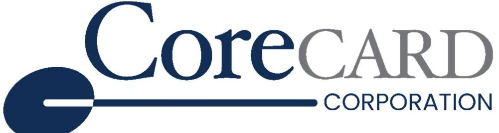
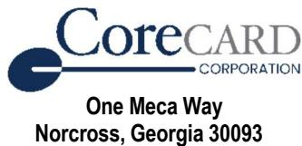
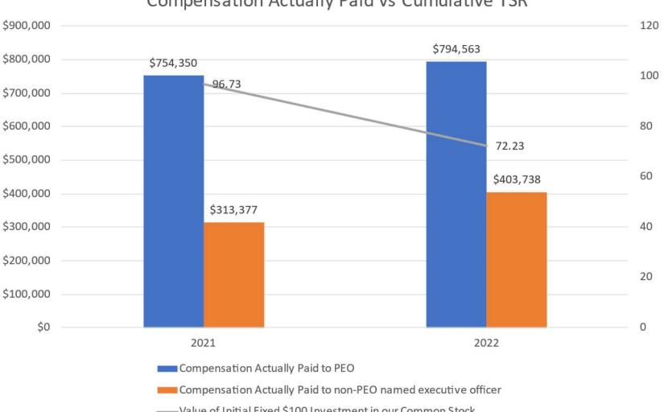
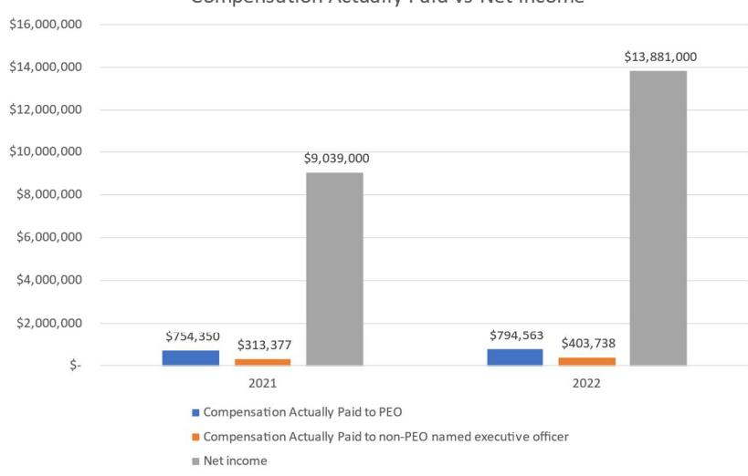
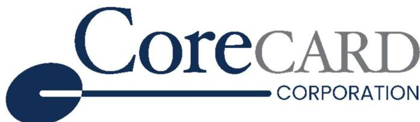

{0}------------------------------------------------

# LETTER TO SHAREHOLDERS

# NOTICE OF MEETING AND PROXY STATEMENT FOR THE 2023 ANNUAL MEETING OF SHAREHOLDERS

2022 ANNUAL REPORT ON FORM 10-K

{1}------------------------------------------------

{2}------------------------------------------------

#### CoreCard Corporation

To the Shareholders of CoreCard Corporation,

It was an interesting year for shareholders of the company as they have followed the path of the CCRD share price. Normally, I don't even talk about stock prices as they are not in the realm of what management can control but the last couple of years has been, to say the least, interesting. It seems like for a while we had collective hallucination that money was always free, and we lived in a world with endless liquidity. Valuation of companies formerly relied on PE (Profit/Earning) but in this era companies get higher values without any E (Earnings). Stock prices, including ours, did not reflect any historical reality. We would say the same when the stock was extraordinarily high (\$50+) as when it was very low (~\$20). As someone said, free money is like a virus that turns the brain to mush!

Our stock performance was excellent the past year in comparison with the other modern fintech companies. While disappointed at moments in time with how we are valued, it is good to know that our financial performance is recognized and valued as we have an important E when looking at PE!

We are old school and still believe discounted cash flow is an important measure of value along with appropriate adjustments. We do not risk capital gratuitously and we build for endurance while avoiding that which may be the current fleeting trend of the month. The customer is always first and slightly ahead of shareholders and employees because we believe to do otherwise would destroy value for all. We strive to make ourselves indispensable to our customers while keeping a long-term focus. Indispensable means they absolutely want to do business with us because of the premium capabilities they see in CoreCard and not because they have no other choices.

We also believe management should be held accountable for setting reasonable expectations and doing what they said they would do. And stock price should take that into account. Trust is important for shareholders, customers, and employees. We strive to hit the mark with all three.

Last year we achieved a new high in revenues and earnings and we have started the new year strong as expected but without another large chunk of license revenue (also as expected). We continue on the "journey" that I spoke about in the letter last year and see our revenue from sources other than our largest customer continuing to grow. This will help with potential shareholders who focus on the risk of customer concentration.

I know our foundation is solid and strong and often say we are building the company brick by brick. That may seem contradictory this year as we know we will have less license revenue so it is highly unlikely we will achieve the same revenues and earnings in 2023 as achieved in 2022. But in reality, all of our business is expected to grow other than the license revenue. Perhaps keeping the "brick by brick" analogy, we are putting a door or window in the building instead of another brick.

While I am not going to walk down the path of many larger CEO letters where they opine on the macro markets and make predictions (often wrong or meaningless), I will say the banking turmoil experienced in the first quarter 2023 can possibly have some impact on your company. It would be easy to predict the executive in charge of their bank card programs reporting that they have decided to move from a legacy processor to a more modern processor (CoreCard) and the bank board of directors saying "NO - don't rock the boat. We don't want any attention!" But, if it happens, it will also pass as the macro environment changes.

One of the bits of advice I give start-ups (I have worked with Georgia Tech and many others over the years as a part of civic service and angel investing) is to not count on larger corporations to always be logical. Entrepreneurs often assume that everyone is like them when, in fact, decision makers in larger enterprises are simply not risk takers. That calculation must be built into your plan. It is built into the CoreCard plan which is why we talk about brick by brick. When the decision makers see the building (enterprise/offering) you provide is mature enough, they can then take the lower risk to work with you. More importantly, when they can point to others who took the risk and "won", they also can take the risk.

As we move from a very good year to a year that will not "appear" to be as good, we will be making a conscious and deliberate effort to not be just "good" but to be "great" as a company and with our products. Without recognizing the goal and making the effort, inertia always wins. It is a battle to move the company to the next level and we want you to know we don't assume it will

{3}------------------------------------------------

just happen. It requires us getting everyone on board with a grinding mentality of doing the things that matter. Good is not good enough. What we did last year or years ago is not relevant.

Last year I mentioned our "boiler plate" that quickly describes who we are. In writing this letter, I realized that the "boiler plate" had changed. Does that mean it was wrong previously and now we have it right? The answer is NO. It simply means the message continues to grow clearer as we get feedback from our customers. Corecard is now "The GOLD standard of Modern Issuer Processing." We are a profitable, PROVEN, modern technology provider of embedded finance and revolving credit card services at SCALE with large portfolio CONVERSION experience!

I'll end with similar words found in the letter last year - When you combine an elite, experienced, and well-trained team who truly cares about each other and cares for their partners with the GOLD standard of modern issuer processing software, with partners who demand and expect excellence, with stable financial resources providing a foundation for growth, I think you can expect to continue to see bricks added to that foundation at a good pace.

Thanks to our shareholders, customers, and great team members we can continue building.

{4}------------------------------------------------

### NOTICE OF ANNUAL MEETING OF SHAREHOLDERS

YOU ARE INVITED TO attend the Annual Meeting of Shareholders of CoreCard Corporation on Thursday, June 1, 2023 at 4:00 p.m., local time, at our principal executive offices located at One Meca Way, Norcross, Georgia 30093. At the Annual Meeting, shareholders will consider and vote on:

- 1. The election of one director to the Board of Directors to serve until the 2025 Annual Meeting and the election of one director to the Board of Directors to serve until the 2026 Annual Meeting;
- 2. Approval, by a non-binding, advisory vote, of the compensation of our named executive officers;
- 3. Other matters that may properly come before the meeting or any adjournment thereof.

Only shareholders of record at the close of business on April 11, 2023 will receive notice of and be entitled to vote at the meeting or any adjournment thereof.

A Proxy Statement and a proxy solicited by the company are enclosed with this mailing. To ensure a quorum for the meeting and that your vote may be recorded, please sign, date and return the proxy promptly in the enclosed business reply envelope. If you attend the meeting, you may revoke your proxy and vote in person. Our 2022 Annual Report to Shareholders is enclosed in the same document as the Proxy Statement.

By order of the Board of Directors,

 MATTHEW A. WHITE Secretary

April 14, 2023

Please complete and return the enclosed proxy promptly so that your vote may be recorded.

{5}------------------------------------------------

{6}------------------------------------------------

#### PROXY STATEMENT FOR THE ANNUAL MEETING OF SHAREHOLDERS TO BE HELD JUNE 1, 2023

We are sending this Proxy Statement to the shareholders of CoreCard Corporation (the "company") in connection with the solicitation of proxies by the Board of Directors (the "Board") to be voted at the 2023 Annual Meeting of Shareholders (the "Annual Meeting") of CoreCard Corporation and any adjournment thereof. The Annual Meeting will be held on June 1, 2023 at our principal executive offices located at One Meca Way, Norcross, Georgia 30093 at 4:00 p.m. local time. We expect to mail this Proxy Statement and the accompanying proxy to shareholders on or about April 14, 2023.

#### VOTING

#### General

The securities that can be voted at the Annual Meeting consist of common stock of CoreCard Corporation, \$.01 par value per share. Each share entitles its owner to one vote on each matter submitted to the shareholders. There are no cumulative voting rights. The record of shareholders entitled to vote at the Annual Meeting was taken as of the close of business on April 11, 2023. On that date, we had outstanding and entitled to vote 8,502,735 shares of common stock with each share entitled to one vote.

#### Quorum

A majority of the outstanding shares of our common stock must be present, in person or by proxy, to constitute a quorum at the Annual Meeting. We will treat shares subject to abstentions or broker non-votes as present at the Annual Meeting for purposes of determining a quorum. Broker non-votes occur when a bank, broker, or other nominee of shares held in street name is not permitted to vote without instructions from the shareholder and such instructions have not been given. Abstentions and broker non-votes are not counted as a vote cast and will have no effect on the vote on any proposal.

#### Required Vote

A. Russell Chandler, III and Kathryn Petralia, the incumbent nominees for election as director, will be reelected if more votes are cast "For" than are cast "Against" them. If more votes are cast Against, the nominee is required to submit their resignation subject to acceptance by the Board of Directors (the "Board"). The other members of the Board will determine the action to be taken with respect to the resignation and will publicly announce their decision and the rationale therefor.

With respect to Proposal 2 – TO APPROVE, BY A NON-BINDING ADVISORY VOTE, THE COMPENSATION OF OUR NAMED EXECUTIVE OFFICERS, the proposal will be approved if more votes are cast "For" than are cast "Against" the proposal. The proposal is advisory and nonbinding. The Board will review the result of the vote and take it into account when making future compensation decisions.

#### Proxies

At the Annual Meeting, the persons named as proxies will vote all properly executed proxy cards delivered in connection with this solicitation and not revoked in accordance with the directions given. Shareholders should specify their choices with regard to each proposal to be voted upon on the accompanying proxy card. If no specific instructions are given with regard to a proposal to be voted upon, then the shares represented by a signed proxy card will be voted "FOR" such proposal. If any other matters properly come before the Annual Meeting, the persons named as proxies will vote upon such matters according to their judgment.

Some of our shareholders hold their shares through a broker, bank, custodian or other nominee, rather than directly in their own name. This is commonly referred to as holding shares in "street name." If you hold shares in street name, these proxy materials are being forwarded to you by your broker, bank, custodian or other nominee, which is considered, with respect to such shares, to be the shareholder of record. As the beneficial owner of shares held in street name, you have the right to direct the nominee how such shares should be voted. You also have the right to attend the Annual Meeting. However, since you are not the shareholder of record, you must first obtain a signed proxy from the shareholder of record giving you the right to vote the shares at the Annual Meeting. Your broker, bank, custodian or other nominee has enclosed or provided you voting instructions for you to use in directing the nominee how to vote your shares or obtain a proxy from the nominee.

You may revoke your proxy in connection with this solicitation at any time prior to voting at the Annual Meeting by:

- giving written notice to the Secretary of the company at One Meca Way, Norcross, Georgia 30093, or
- executing and delivering to the Secretary a later dated proxy, or
- voting in person at the Annual Meeting.

{7}------------------------------------------------

You cannot revoke your proxy or voting instructions as to any matter upon which, prior to such revocation, a vote has been cast in accordance with the authority conferred by such proxy or voting instructions.

We will pay all expenses incurred in connection with the solicitation of proxies. Such costs include charges by brokers, fiduciaries and custodians for forwarding proxy materials to beneficial owners of stock held in their names. We may solicit proxies by mail, telephone and personal contact by directors, officers, and employees of the company without additional compensation.

#### Multiple Shareholders Sharing the Same Address

If you and other residents at your mailing address own shares of common stock in street name, your broker or bank may have sent you a notice that your household will receive only one Annual Report to Shareholders and Proxy Statement. This practice is known as "householding," and is designed to reduce our printing and postage costs. If you reside at such an address and wish to receive a separate Annual Report and proxy statement, you may contact your broker or, if you are a registered holder, you may contact us by writing to: Matthew A. White, CoreCard Corporation, One Meca Way, Norcross, Georgia 30093, and we will promptly send you the requested materials.

#### Dissenters' Rights of Appraisal

There are no dissenters' rights of appraisal with respect to the matters being acted upon at the Annual Meeting.

{8}------------------------------------------------

#### Security Ownership of Certain Beneficial Owners and Management

The following table contains information concerning the persons who are known to us to be beneficial owners of more than 5 percent of our common stock as of March 15, 2023, and the ownership of our common stock as of that date by each director and director nominee, each executive officer named in the Summary Compensation Table and by all directors, director nominees and named executive officers as a group. There are no arrangements known to us which may result in change of control of the company.

| Beneficial Owner                                                     | Address                                            | Shares Beneficially Owneda, b | Percent of Class a |
|----------------------------------------------------------------------|----------------------------------------------------|-------------------------------------|-----------------------|
| J. Leland Strange c Chairman of the Board, President, CEO         | One Meca Way Norcross, GA 30093                 | 1,298,188                           | 15.3%                 |
| Clifford N. Burnstein d                                           | 729 7th Avenue New York, NY 10019               | 835,445                             | 9.8%                  |
| Weitz Investment Management, Inc. e                               | 1125 South 103rd St., Suite 200 Omaha, NE 68124 | 582,723                             | 6.9%                  |
| Janus Henderson Group PLCf                                           | 201 Bishopsgate EC2m 3AE, United Kingdom        | 528,010                             | 6.2%                  |
| A. Russell Chandler, III, Director g                              |                                                    | 40,941                              | *                     |
| Philip H. Moise, Director                                            |                                                    | 21,504                              | *                     |
| Elizabeth W. Camp, Director h                                     |                                                    | 5,109                               | *                     |
| Kathryn Petralia, Director                                           |                                                    | 2,304                               | *                     |
| Matthew A. White Chief Financial Officer and Corporate Secretary  |                                                    | 30,000                              | *                     |
| All Directors and Named Executive Officers as a Group (6 persons) |                                                    | 1,400,214                           | 16.4%                 |

- a. Except as otherwise noted, beneficial ownership is determined on the basis of 8,502,735 shares of common stock outstanding plus securities deemed outstanding pursuant to Rule 13d-3(d)(1) of the Securities Exchange Act of 1934, as amended. Pursuant to the rules of the Securities and Exchange Commission (the "SEC"), a person is deemed to beneficially own shares of the company's common stock if that person has or shares "voting power", which includes the power to vote or to direct the voting of a security, or "investment power", which includes the power to dispose of or to direct the disposition of a security. An asterisk indicates beneficial ownership of less than 1 percent. In computing the number of shares of common stock beneficially owned by a person or entity and the percentage ownership of that person or entity, we deemed to be outstanding all shares of common stock subject to options or other convertible securities held by that person or entity that are currently exercisable or that will become exercisable within 60 days of March 15, 2023. We did not deem these shares outstanding, however, for the purpose of computing the percentage ownership of any other person or entity.
- b. Includes 59,000 shares reserved for issuance to officers and directors pursuant to stock options that were exercisable at March 15, 2023 or within sixty days of such date which are deemed beneficially owned by such person pursuant to Rule 13d-3(d)(1) of the Exchange Act. The amounts reported above for Mr. White include 30,000 shares for shares underlying stock options exercisable at March 15, 2023 or within sixty days of such date. The amount reported for Mr. Moise includes 16,000 shares for shares underlying stock options exercisable at March 15, 2023, or within sixty days of such date. The amount reported for Mr. Chandler includes 13,000 shares for shares underlying stock options exercisable at March 15, 2023, or within sixty days of such date.
- c. Shares directly owned are jointly owned by J. Leland Strange and Jane H. Strange, Mr. Strange's wife. Includes 75,000 shares owned by a family trust.
- d. Based solely on information set forth in a Schedule 13D filed on August 3, 2009, in which Clifford N. Burnstein, an individual, reported beneficial ownership of 835,445 shares of common stock, of which Clifford N. Burnstein has the sole power to vote and to dispose.
- e. Based solely on information set forth in a Schedule 13G filed on January 5, 2023, in which Weitz Investment Management, Inc., an investment adviser registered under Section 203 of the Investment Advisers Act of 1940, reported beneficial ownership of 582,735 shares of common stock, of which Weitz Investment Management, Inc. has the sole power to vote and to dispose.
- f. Based solely on information set forth in a Schedule 13G/A filed on February 10, 2023, by Janus Henderson Group PLC, an investment adviser registered under Section 203 of the Investment Advisers Act of 1940 ("Janus Henderson"), and Janus Henderson Venture Fund, an investment company registered under Section 8 of the Investment Advisors Act of 1940 ("JHVF"). In this filing, Janus Henderson reported beneficial ownership of 528,010 shares of common stock held by funds, individuals and institutional clients for whom various asset managers owned 100% by Janus Henderson provide investment advice, and JHVF, for whom one of such asset managers provides investment advice, reported beneficial ownership of 477,352 shares of common stock.
- g. Includes 8,000 shares owned by a not-for-profit trust controlled by Mr. Chandler.
- h. On March 29, 2023, Ms. Camp informed the Company of her decision not to stand for re-election. As a result of Ms. Camp's decision, the Board reduced the size of the Company's Board from five to four members.

{9}------------------------------------------------

#### PROPOSAL 1 – THE ELECTION OF TWO DIRECTORS

#### Nominees

At the Annual Meeting of Shareholders, shareholders will elect one director to the Board to serve a two-year term until the 2025 Annual Meeting of Shareholders and one director to serve a three-year term until the 2026 Annual Meeting of Shareholders. The other directors' terms expire at the Annual Meeting of Shareholders listed in the following table for each category of directors, or upon their earlier death, resignation or removal from office.

If a nominee withdraws for any reason or is not able to continue to serve as a director, the proxy will be voted for another person designated by the Board as substitute nominee, but in no event will the proxy be voted for more than one nominee per seat. The Board has no reason to believe that the nominees will not serve if elected.

Ms. Petralia was elected by the Board as a new director in October 2022. She came to the Board's attention through her role at Kabbage, a customer and investee of CoreCard, where she demonstrated her experience in the FinTech industry, in management and operational and strategic insight. The Board has nominated the persons named in the following table to serve as a director of the company. The nominees and other directors gave us the following information concerning their current age, other directorships, positions with the company, principal employment and shares of our common stock beneficially owned as of March 15, 2023.

#### THE BOARD OF DIRECTORS UNANIMOUSLY RECOMMENDS THAT SHAREHOLDERS VOTE "FOR" PROPOSAL 1 TO ELECT TWO NOMINEES TO SERVE AS DIRECTORS OF THE COMPANY.

| Name                                 | Age            | Position / Principal Occupation                                                    |
|--------------------------------------|----------------|------------------------------------------------------------------------------------|
| Incumbent Director Nominated         |                | for election to serve until the 2025 Annual Meeting                             |
| Kathryn Petralia 1, 2 & 3            | 52             | Director, Keep Co-Founder, Kabbage Co-Founder                                      |
| Incumbent director nominated         | for election   | to serve until the 2026 Annual Meeting                                          |
| A. Russell Chandler, III 1, 2 & 3 | 78             | Director, Retired, Chairman of Whitehall Group, Ltd.                               |
| Incumbent director serving           | until the 2024 | Annual Meeting                                                                     |
| J. Leland Strange                    | 81             | Director, Chairman of the Board, President and Chief Executive Officer             |
|                                      |                |                                                                                    |
| Incumbent director serving           |                | until the 2025 Annual Meeting                                                      |
| Philip H. Moise 1, 2 & 3             | 73             | Director, Retired Executive Vice President and General Counsel of Immucor, Inc. |
|                                      |                |                                                                                    |

1. Audit Committee

2. Compensation Committee

3. Nominating and Corporate Governance Committee

A. Russell Chandler, III, has served as a director since 2017. Mr. Chandler has served as a director of Miller Industries, Inc., a publicly traded manufacturer of towing and recovery equipment, since April 1994. He is founder and Chairman of Whitehall Group Ltd., a private investment firm based in Atlanta, Georgia. Mr. Chandler served as Chairman of Precyse Technologies Inc. in 2010 and as its Chief Executive Officer through May 2013. Mr. Chandler served as Chairman of Datapath, Inc., a company that built mobile communications trailers for military applications, from October 2004 until June 2006 and he served as the Mayor of the Olympic Village for the Atlanta Committee for the Olympic Games from 1990 through August 1996. From 1987 to 1993, he served as Chairman of United Plastic Films, Inc., a manufacturer and distributor of plastic bags. He founded Qualicare, Inc., a hospital management company, in 1972 and served as its President and Chief Executive Officer until its sale in 1983. The Board considered Mr. Chandler's extensive experience as an executive and long-term tenure as a member of the board of directors of a publicly traded company, as well as his operational and strategic insight in determining that he should serve as a director of the company. The Board has determined that Mr. Chandler qualifies as an independent director under the applicable rules of NYSE.

Philip H. Moise has served as a director since 2013. Mr. Moise served as Executive Vice President, General Counsel and Secretary of Immucor, Inc. from 2007 until 2012. Immucor manufactures and sells instruments and reagents used to classify components of human blood prior to blood therapies and transfusions. Previously a publicly-held company, Immucor was acquired and taken private in 2011. Before joining Immucor, Mr. Moise was in the private practice of law for almost 30 years, where he represented public and private companies in the technology and life sciences industries. He represented CoreCard and its predecessors for approximately 25 years before joining Immucor in 2007. The Board considered Mr. Moise's familiarity with the company's business and history; his business experience as an executive with a publicly traded company; his extensive legal background and experience in corporate transactions and corporate governance; and his 

{10}------------------------------------------------

familiarity with board and regulatory matters impacting publicly traded companies in determining that he should serve as a director of the company. The Board has determined that Mr. Moise qualifies as an independent director under the applicable rules of NYSE.

Kathryn Petralia has served as a director since 2022. She is the Co-Founder of Keep Financial, a fintech compensation platform that helps employers and employees stay together longer and happier. Prior to starting Keep, Kathryn Co-Founded Kabbage, a financial services, technology and data platform for small businesses that was acquired by American Express in 2020. Prior to Kabbage, Kathryn spent nearly 15 years with fintech and ecommerce startups. After graduating from Furman University with an English degree, Kathryn pursued her interest in technology to launch a number of successful startups. She also served as Vice President of Strategy for Revolution Money, which was acquired by American Express, and was the director of corporate development for CompuCredit (now Atlanticus). In 2018, she was named to Forbes' list of the World's Most Powerful Women. The Board considered Ms. Petralia's background as an executive officer, her experience in the FinTech industry, her experience in management and her operational and strategic insight in determining that she should serve as a director of the company. The Board has determined that Ms. Petralia qualifies as an independent director under the rules of NYSE.

J. Leland Strange has served as our President since 1983 and our Chief Executive Officer and Chairman of the Board since 1985. The Board considered Mr. Strange's many years of experience as the company's CEO, his familiarity with the industries and customers which our operating companies serve, and his past experience on several boards of directors and audit and compensation committees of other publicly traded companies in determining that he should serve as a director of the company.

There are no family relationships among any of the company's directors or executive officers.

There have been no events under any bankruptcy act, no criminal proceedings and no judgments or injunctions material to an evaluation of the ability and integrity of any director, executive officer or control person of the company during the past ten years. There are no proceedings to which any director, officer, affiliate, any owner of record or beneficially of more than 5 percent of our common stock, or any security holder of the company is an adverse party to the company or has a material interest adverse to the company.

Four of the directors and all of the members of the Audit Committee are independent, as such term is defined in the listing standards of the NYSE and the rules of the SEC. The Audit Committee meets the composition requirements of NYSE's listing (as defined by the rules of NYSE). As a result of Ms. Camp's decision not to stand for reelection, the Board reduced the size of the Board from five members to four, effective as of the date of the annual meeting.

#### Board Leadership Structure and Role in Risk Oversight

The Chief Executive Officer serves as Chairman of the Board of Directors of the company. Given the size and scope of the company's operations, the company believes that the leadership structure of the Board, which as of the date of the annual meeting will consist of four directors of which three are independent, is appropriate. There is no lead independent director because there has been no need for such a role based on the continuity resulting from the tenure of the directors and the small size of the Board. Given the character, size and scope of the company's operations and the stability and long tenure of its workforce and management team, there is limited exposure to external risks other than general business, product and market risks. General business and operational risks are handled primarily by senior executive management and discussed during regular Board meetings as necessary. The company has limited, if any, exposure related to financial instruments, environmental issues, off balance sheet entities and such external risks. The Board reviews treasury risks, financial and accounting risks, legal and compliance risks, information technology security and cybersecurity risks and risks related to internal control over financial reporting. The Audit Committee, which consists of the independent directors, provides risk oversight as part of the company's internal controls process and regularly reviews reports from management and external auditors on risk analysis and tests of the design and effectiveness of the company's internal controls. The Board considered and has determined that risks arising from its compensation policies and practices are not reasonably likely to have a material adverse effect on the company. This determination was based on the limited nature of the company's compensation program. The full board also has oversight of enterprise risk management and considers strategic risks and opportunities on a regular basis.

#### Meetings and Committees of the Board of Directors

The Board met five times during the year ended December 31, 2022. The Board has established an Audit Committee, a Compensation Committee and a Nominating and Corporate Governance Committee. The Audit Committee of the Board met five times in 2022. During 2022, the Audit Committee consisted of Mr. Chandler (chair), Mr. Moise and Ms. Camp. In 2022, the Audit Committee appointed the company's independent auditor to review its report on the 2022 audit and the 2022 quarterly reviews, and carried out a number of other responsibilities, as outlined in the Audit Committee Charter.

All members of the Audit Committee currently meet the applicable independence and qualifications standards of the NYSE. The Board has determined that Mr. Chandler is a financial expert as defined by the rules of the SEC and is financially sophisticated as defined in the listing standards of NYSE. The Board based this determination, in part, on Mr. Chandler's experience in actively supervising senior financial and accounting personnel and in overseeing the preparation of financial statements as the audit committee chair of publicly-traded companies.

{11}------------------------------------------------

The Board has a Compensation Committee consisting of four independent directors, Mr. Chandler, Mr. Moise (chair), Ms. Petralia and Ms. Camp. The Compensation Committee met twice in 2022. The Compensation Committee reviews, makes recommendations and approves the appropriate compensation level for the officers of the company and any changes in the company's various benefit plans covering executive officers or directors as well as administering the company's stock incentive plans and overseeing executive management succession planning. The Compensation Committee has the authority to delegate responsibility for the day-to-day management of the Company's executive compensation programs. In addition, The Compensation Committee may appoint one or more subcommittees consisting of one or more members of the Compensation Committee and may delegate to any subcommittee or Compensation Committee member such Committee authority, responsibilities and duties as the Compensation Committee sees fit. Neither the Compensation Committee nor management has engaged a compensation consultant to provide advice or recommendations on the form or amount of executive or director compensation. From time to time, the Compensation Committee has sought input from publicly available data compiled by executive officers of the company relating to compensation paid to executive officers and directors in similar size, publicly traded companies in the same geographic area or industry as the company. The Compensation Committee has also solicited input from the CEO with respect to compensation of non-CEO executive officers.

The Compensation Committee considers compensation data based on a comparator group. Our comparator group is intended to be representative of the market in which we compete most directly for executive talent. The selection of companies comprising our comparator group is based on similarity in revenue size, lines of business, participation in global markets and market capitalization. The peer group is constructed to target CoreCard near the median of the composite ranking of the financial and operating metrics of the companies in the comparator group. The comparator group used in 2021 to set 2022 compensation was:

| PaySign | American Software | Marqeta | Repay |
|---------|-------------------|---------|-------|
|         |                   |         |       |

The Board has a Nominating and Corporate Governance Committee consisting of four independent directors, Mr. Chandler, Mr. Moise, Ms. Petralia and Ms. Camp (chair). The Nominating and Corporate Governance Committee met twice in 2022. The Nominating and Corporate Governance Committee was established to assist the Board with (i) Board and committee organization, membership and function, (ii) oversight of the evaluation of director qualifications and performance, and (iii) corporate governance. As part of these responsibilities, the Nominating and Corporate Governance Committee evaluates candidates for service as directors of the Company, conducts the Board's annual selfassessment process and recommends corporate governance principles for adoption by the Board. The Nominating and Corporate Governance Committee will consider candidates recommended by shareholders. Shareholder recommendations must comply with the procedures for director nominations set forth in Article Three, Section 3.9, of the Company's Bylaws and applicable law.

In 2022, each director attended all meetings of the Board and Committees on which they served. In March 2023, the Board elected Kathryn Petralia to serve on the Audit, Compensation and Nominating and Corporate Governance committees.

#### Executive Officers

The following information is provided about our non-director executive officer:

| Name             | Age | Position / Principal Occupation       |
|------------------|-----|---------------------------------------|
| Matthew A. White | 41  | Chief Financial Officer and Secretary |

Matthew A. White was elected on January 22, 2019, as Chief Financial Officer and Corporate Secretary. Mr. White was previously serving as VP Finance and CFO of CoreCard Software, the main operating subsidiary of CoreCard and he will continue to serve in that role. Prior to joining CoreCard Software Mr. White held various accounting and financial reporting positions at Humana and, most recently, Equifax. Prior to that he was a Senior Manager in the audit practice at Deloitte and is a licensed CPA.

The Board of Directors elects the executive officers to serve until they are removed, replaced or resign.

{12}------------------------------------------------

#### Executive Compensation

#### Summary Compensation Table

| Name and Principal  |      |         |         | Option  | Other Annual |         |  |
|---------------------|------|---------|---------|---------|--------------|---------|--|
| Position            | Year | Salary  | Bonus   | Awards. | Compensation | Total   |  |
|                     |      | \$      | \$      | \$      | \$           | \$      |  |
| J. Leland Strange   | 2022 | 390,000 | 400,000 | --      | 4,563        | 794,563 |  |
| President & Chief   | 2021 | 350,000 | 400,000 | --      | 4,350        | 754,350 |  |
| Executive Officer   |      |         |         |         |              |         |  |
| Matthew A. White    | 2022 | 250,000 | 150,000 | --      | 3,738        | 403,738 |  |
| Chief Financial     | 2021 | 230,000 | 80,000  | --      | 3,377        | 313,377 |  |
| Officer & Secretary |      |         |         |         |              |         |  |

The table above sets forth information regarding compensation awarded to, earned by or paid to the company's CEO and the company's most highly compensated person serving as an executive officer during the fiscal year other than the CEO (the "Named Executive Officers"). The Compensation Committee endeavors to provide compensation arrangements that are reasonable given the company's size, the nature of its business and the executive's duties; align pay with creating shareholder value; minimize risky behavior; and reward the executive for his/her contribution to achieving our business goals. Given the nature of our business, the small number of executives and the significant ownership held by Mr. Strange, the Compensation Committee believes that a straight-forward compensation plan that is economical to administer and that consists of a reasonable base salary and appropriate periodic bonuses is appropriate for the company. None of the Named Executive Officers has an employment agreement with the company and the company does not have any corporate non-equity incentive plans or nonqualified deferred compensation plans. From time to time, officers may be awarded bonuses to recognize achievement of corporate or subsidiary goals or other accomplishments. Mr. Strange and Mr. White were awarded bonuses in 2021 and 2022 in recognition of the growth of the company in 2021 and 2022. No options were re-priced in the two year period ended December 31, 2022. All Other Annual Compensation shown above includes matching contributions by the company to the respective accounts of the executive officers pursuant to the terms of our Tax-Deferred Savings and Protection Plan (the "401(k) Plan"). Such amounts are fully vested. It is our policy to provide executives with the same benefits provided to other employees with respect to medical, dental, life insurance and 401(k) plans.

### Outstanding Equity Awards at Fiscal Year End

| Option Awards    |                                                           |                                                           |                |                 |  |
|------------------|-----------------------------------------------------------|-----------------------------------------------------------|----------------|-----------------|--|
|                  | Number of Securities Underlying Unexercised Options | Number of Securities Underlying Unexercised Options |                |                 |  |
|                  | (#)                                                       | (#)                                                       | Option         | Option          |  |
| Name             | Exercisable                                               | Unexercisable                                             | Exercise Price | Expiration Date |  |
| Matthew A. White | 30,000                                                    | --                                                        | \$19.99        | 01/21/2029      |  |

#### Securities Authorized for Issuance Under Equity Compensation Plans

The following table gives information as of December 31, 2022 about the company's common stock that may be issued under the 2011 Non-Employee Directors' Stock Option Plan, the 2015 Stock Incentive Plan, the 2020 Non-Employee Directors' Stock Incentive Plan and the 2022 Employee Stock Incentive Plan. All plans were approved by shareholders.

| Plan category                                                 | (a) Number of securities to be issued upon exercise of outstanding options, warrants and rights | (b) Weighted-average exercise price of outstanding options, warrants and rights | (c) Number of securities remaining available for future issuance under equity compensation plans (excluding securities reflected in column (a)) |
|---------------------------------------------------------------|----------------------------------------------------------------------------------------------------------|------------------------------------------------------------------------------------------|----------------------------------------------------------------------------------------------------------------------------------------------------------------|
| Equity compensation plans approved by security holders 1   | 59,000                                                                                                   | \$ 17.35                                                                                 | 932,369                                                                                                                                                        |
| Equity compensation plans not approved by security holders | -                                                                                                        | -                                                                                        | -                                                                                                                                                              |
| Total                                                         | 59,000                                                                                                   | \$ 17.35                                                                                 | 932,369                                                                                                                                                        |

1. Information pertains to the 2011 Non-Employee Directors' Stock Option Plan, the 2015 Stock Incentive Plan, the 2020 Non-Employee Directors' Stock Incentive Plan and the 2022 Employee Stock Incentive Plan.

{13}------------------------------------------------

#### Pay Versus Performance

As required by Section 953(a) of the Dodd-Frank Wall Street Reform and Consumer Protection Act, and Item 402(v) of Regulation S-K, we are providing the following information about the relationship between executive compensation actually paid and certain financial performance of the Company.

| Year | Summary Compensation Table Total for PEO1 | Compensation Actually Paid to PEO2 | Average Summary Compensation Table Total for Non-PEO NEOs3 | Average Compensation Actually Paid to Non-PEO NEOs4 | Value of Initial Fixed \$100 Investment Based on Total Shareholder Return5 | Net Income (millions)6 |
|------|----------------------------------------------------|------------------------------------------|---------------------------------------------------------------------|--------------------------------------------------------------|-------------------------------------------------------------------------------------|------------------------------|
| (a)  | (b)                                                | (c)                                      | (d)                                                                 | (e)                                                          | (f)                                                                                 | (g)                          |
| 2022 | \$794,563                                          | \$794,563                                | \$403,738                                                           | \$373,238                                                    | \$72.23                                                                             | \$13.9                       |
| 2021 | \$754,350                                          | \$754,350                                | \$313,377                                                           | \$296,877                                                    | \$96.73                                                                             | \$9.0                        |

1. The dollar amounts reported in column (b) are the amounts of total compensation reported for Mr. Strange (our Chief Executive Officer) for each corresponding year in the "Total" column of the Summary Compensation Table. Refer to "Executive Compensation – Summary Compensation Table."

2. The dollar amounts reported in column (c) represent the amount of "compensation actually paid" to Mr. Strange, as computed in accordance with Item 402(v) of Regulation S-K. The dollar amounts do not reflect the actual amount of compensation earned by or paid to Mr. Strange during the applicable year. There were no adjustments needed in accordance with Item 402(v) of Regulation S-K, as there were no equity awards that were granted or vested during the applicable periods.

3. The dollar amounts reported in column (d) represent the amounts reported for the Company's named executive officer (NEO), Matthew A. White, in the "Total" column of the Summary Compensation Table in each applicable year.

- 4. The dollar amounts reported in column (e) represent the amount of "compensation actually paid" to the NEO, as computed in accordance with Item 402(v) of Regulation S-K. The dollar amounts do not reflect the actual amount of compensation earned by or paid to the NEO during the applicable year. In accordance with the requirements of Item 402(v) of Regulation S-K, the following adjustments were made to average total compensation for the NEO for each year to determine the compensation actually paid:

| Year | Reported Summary Compensation Table Total for Non PEO NEOs | Reported Value of Equity Awards(a) | Equity Award Adjustments(b) | Compensation Actually Paid to Non-PEO NEO |
|------|---------------------------------------------------------------|------------------------------------------|-----------------------------------|----------------------------------------------|
| 2022 | \$403,738                                                     | \$ -                                     | \$(30,500)                        | \$373,238                                    |
| 2021 | \$313,377                                                     | \$ -                                     | \$(16,500)                        | \$296,877                                    |

(a) The grant date fair value of equity awards represents the total of the amounts reported in the "Stock Awards" and "Option Awards" columns in the Summary Compensation Table for the applicable year.

(b) The equity award adjustments for each applicable year include the addition (or subtraction, as applicable) of the following: (i) the year-end fair value of any equity awards granted in the applicable year that are outstanding and unvested as of the end of the year; (ii) the amount of change as of the end of the applicable year (from the end of the prior fiscal year) in fair value of any awards granted in prior years that are outstanding and unvested as of the end of the applicable year; (iii) for awards that are granted and vest in same applicable year, the fair value as of the vesting date; (iv) for awards granted in prior years that vest in the applicable year, the amount equal to the change as of the vesting date (from the end of the prior fiscal year) in fair value; (v) for awards granted in prior years that are determined to fail to meet the applicable vesting conditions during the applicable year, a deduction for the amount equal to the fair value at the end of the prior fiscal year; and (vi) the dollar value of any dividends or other earnings paid on stock or option awards in the applicable year prior to the vesting date that are not otherwise reflected in the fair value of such award or included in any other component of total compensation for the applicable year. The valuation assumptions used to calculate fair values did not materially differ from those disclosed at the time of grant. The amounts deducted or added in calculating the total average equity award adjustments are as follows:

{14}------------------------------------------------

| Year | Year End Fair Value of Equity Awards | Year over Year Change in Fair Value of Outstanding and Unvested Equity Awards | Fair Value as of Vesting Date of Equity Awards Granted and Vested in the Year | Year over Year Change in Fair Value of Equity Awards Granted in Prior Years that Vested in the Year | Fair Value at the End of the Prior Year of Equity Awards that Failed to Meet Vesting Conditions in the Year | Value of Dividends or other Earnings Paid on Stock or Option Awards not Otherwise Reflected in Fair Value or Total Compensation | Total Average Equity Award Adjustments |
|------|-----------------------------------------------|----------------------------------------------------------------------------------------------|-------------------------------------------------------------------------------------------------|-----------------------------------------------------------------------------------------------------------------------------|----------------------------------------------------------------------------------------------------------------------------------|---------------------------------------------------------------------------------------------------------------------------------------------------------------|----------------------------------------------------|
| 2022 | \$ -                                          | \$ -                                                                                         | \$ -                                                                                            | \$ (30,500)                                                                                                                 | \$ -                                                                                                                             | \$ -                                                                                                                                                          | \$ (30,500)                                        |
| 2021 | \$ -                                          | \$(16,600)                                                                                   | \$ -                                                                                            | \$ 100                                                                                                                      | \$ -                                                                                                                             | \$ -                                                                                                                                                          | \$ (16,500)                                        |

- 1. Cumulative TSR is calculated by dividing the sum of the cumulative amount of dividends for the measurement period, assuming dividend reinvestment, and the difference between the Company's share price at the end and the beginning of the measurement period by the Company's share price at the beginning of the measurement period.
- 2. The dollar amounts reported represent the amount of net income reflected in the Company's audited financial statements for the applicable year.

#### Analysis of the Information Presented in the Pay versus Performance Table

The Company's executive compensation program reflects a variable pay-for-performance philosophy. While the Company utilizes several performance measures to align executive compensation with Company performance, all of those Company measures are not presented in the Pay versus Performance table. Moreover, the Company generally seeks to incentivize long-term performance, and therefore does not specifically align the Company's performance measures with compensation that is actually paid (as computed in accordance with Item 402(v) of Regulation S-K) for a particular year. In accordance with Item 402(v) of Regulation S-K, the Company is providing the following descriptions of the relationships between information presented in the Pay versus Performance table.

#### Compensation Actually Paid and Cumulative TSR

The following graphs illustrates the relationship during 2021-2022 of the compensation actually paid for our CEO and NEO as calculated pursuant to SEC rules to our TSR.

{15}------------------------------------------------

#### Compensation Actually Paid and Net Income

The following graph illustrates the relationship during 2021-2022 of the compensation actually paid for our CEO and NEO as calculated pursuant to SEC rules to our net income.

#### Director Compensation

The table below sets forth all compensation earned by non-executive directors in the year ended December 31, 2022. The company has a Non-Employee Directors' Stock Incentive Plan, which allows for an annual grant of \$50,000 of common stock with the number of shares determined by the closing price on the date of the Annual Meeting.

|                          | Fees Earned or Paid in Cash | Stock Awards1 | Total   |  |
|--------------------------|-----------------------------|---------------|---------|--|
| Name                     | \$                          | \$            | \$      |  |
| A. Russell Chandler, III | 50,000                      | 50,000        | 100,000 |  |
| Philip H. Moise          | 50,000                      | 50,000        | 100,000 |  |
| Elizabeth W. Camp        | 50,000                      | 50,000        | 100,000 |  |
| Kathryn Petralia         | 12,500                      | 50,000        | 62,500  |  |

1. Pursuant to the 2020 Non-Employee Directors' Stock Incentive Plan, in 2022 each director received 2,168 shares of common stock based on the closing price as of the date of the 2022 Annual Meeting for a total fair value of \$50,000 each. Kathryn Petralia received 2,304 shares of common stock based on the closing price as of the date of her appointment to the Board for a total fair value of \$50,000.

Total cash compensation for annual board service was \$50,000, earned quarterly. In 2022, all non-employee directors had the same compensation plan, as described above. There was no additional compensation for serving on a committee of the Board of Directors.

{16}------------------------------------------------

#### Audit Committee Report

The Audit Committee Charter, which is reviewed annually, includes organization and membership requirements, a statement of policy and the Committee's authority and responsibilities.

Management is responsible for our company's internal controls and the financial reporting process. The independent auditors are responsible for performing an independent audit of the company's consolidated financial statements in accordance with auditing standards of the Public Company Accounting Oversight Board (United States) ("PCAOB") and for issuing a report thereon. As outlined in more detail in the Audit Committee Charter, the Audit Committee's responsibility is generally to approve all services provided by and compensation paid to the independent auditors; review the adequacy of the company's internal and disclosure controls and risk management practices; review and monitor the annual audit of the financial statements including the financial statements produced and notes thereto; review SEC filings containing the company's financial statements; regularly meet with the independent auditors and management in separate sessions; and authorize investigations into any matter within the scope of their responsibilities. During fiscal year 2022 and through March 15, 2023, among its other activities, the Audit Committee:

- engaged the independent auditors and established their compensation;
- reviewed and discussed with management and the independent auditors the audited financial statements of the company as of December 31, 2022 and 2021 and for the years then ended;
- discussed with the independent auditors their reviews of the quarterly unaudited financial statements of the company for fiscal 2022;
- discussed with the independent auditors the matters required to be discussed by the applicable requirements of the PCAOB and the SEC; and
- received from the independent auditors the written disclosures and written affirmation of their independence required by PCAOB Rule 3526 and discussed with the auditors the firm's independence.

Based upon the reviews and discussions summarized above, the Audit Committee recommended to the Board (and the Board has approved) that the audited financial statements be included in the Annual Report on Form 10-K for the year ended December 31, 2022 for filing with the Securities and Exchange Commission.

> AUDIT COMMITTEE A. Russell Chandler, III (Chair) Philip H. Moise Elizabeth W. Camp

#### Nominations Process

The Board has appointed a Nominating and Corporate Governance Committee consisting of four independent directors, A. Russell Chandler, III, Philip H. Moise, Elizabeth W. Camp and Kathryn Petralia. The same individuals also nominate the officers of the company for election by the Board. As a result of Ms. Camp's decision not to stand for reelection the Board reduced the size of the Board from five members to four, effective as of the date of the annual meeting.

The Board has not previously formed a policy with respect to consideration of candidates nominated by shareholders since there have been no such nominations. However, it is the Board's intent to consider any security holder nominees that may be properly and timely put forth in the future. The Board has not identified any specific, minimum qualifications or skills that it believes must be met by a nominee for director. The company does not have a specific policy with respect to diversity in identifying nominees for director. In considering nominations for the 2022 Annual Meeting, the Board reviewed the appropriate size of the Board and the skills and characteristics of directors in the context of the current make-up, background and experience of the Board and the requirements and needs of the company in the foreseeable future. Security holders wishing to nominate a candidate for consideration at the Annual Meeting of Shareholders in 2024 should submit the nominee's name, affiliation and other pertinent information along with a statement as to why such person should be considered for nomination. Such nominations should be addressed to the Board in care of the Secretary of the company and be received no later than 60 days before the date of the Annual Meeting of Shareholders. The Board will evaluate any such nominees in a manner similar to that for all director nominees.

# Majority Voting in Uncontested Director Elections

Our bylaws contain a majority voting standard for the election of directors in an uncontested election. Accordingly, each nominee must be elected by the vote of a majority of the votes cast by the shares present in person or represented by proxy. A "majority of the votes cast" means that the number of shares voted "for" a director's election must exceed the number of votes "against" such nominee, excluding abstentions. Abstentions do not count as a vote "for" or "against" a director.

{17}------------------------------------------------

In addition, our Board has adopted a director resignation policy governing procedures in the event that a director does not receive a majority of the votes cast. Pursuant to the Board's director resignation policy, if an incumbent director fails to receive the required vote for re‑election in an uncontested election, that director shall promptly tender, to the Board or its Chairperson, his or her resignation from the Board and from those Board committees on which the director serves, conditioned upon Board acceptance. The Nominating Committee will promptly consider such resignation and then make a recommendation to the Board whether to accept or reject the resignation tendered by such director. The Board will act on the tendered resignation, taking into account the recommendation of the Nominating Committee as well as other potentially relevant factors, no later than 180 days from the date of the certification of the election results. The director whose resignation is under consideration shall not participate in the deliberations of the Nominating Committee or of the Board with respect to his or her resignation.

The Nominating Committee, in making its recommendation, and the Board, in making its decision, may consider any factors or other information that it considers appropriate and relevant, including any stated reasons why the shareholders voted against or withheld votes from such director, the director's tenure, the director's qualifications, the director's past and expected contributions to the Board, and the overall composition of the Board, including whether accepting the resignation as tendered would cause the Company to fail to meet the requirements of any law, regulation, or rule, including but not limited to those of the Securities and Exchange Commission ("SEC") or the listing standards of the NYSE.

Following the Board's decision, the Company will promptly disclose the Board's decision regarding whether to accept or reject the director's resignation offer in a Form 8-K furnished to the SEC. If the Board has decided to reject the tendered resignation or to pursue any additional action, then the disclosure will include the rationale behind the decision.

#### Communication Between Security Holders and the Board of Directors

Security holders and other interested parties wishing to communicate with members of the Board should send a letter to the Secretary of the company with instructions as to which director(s) is to receive the communication. The Secretary will forward the written communication to each member of the Board identified by the sender or, if no individual director is identified, to all members of the Board. The company has not in the past required members of the Board to attend each Annual Meeting of Shareholders because the formal meetings have been attended by very few shareholders and have generally been very brief and procedural in nature. The Board will continue to monitor shareholder interest and attendance at future meetings and reevaluate this policy as appropriate.

#### PROPOSAL 2 – TO APPROVE, BY A NON-BINDING, ADVISORY VOTE, THE COMPENSATION OF OUR NAMED EXECUTIVE OFFICERS

We are asking our shareholders to provide advisory approval of the compensation of our Named Executive Officers, as described in the Executive Compensation section of this Proxy Statement. While this vote is advisory and non-binding on the company, it will provide information to our Compensation Committee regarding investor sentiment about our executive compensation philosophies, policies and practices which the Compensation Committee will be able to consider for the remainder of 2023 and beyond. The compensation of our Named Executive Officers and our compensation philosophies and practices are described in the Executive Compensation discussion and accompanying tables.

The Compensation Committee endeavors to provide compensation arrangements that are reasonable given the company's size, the nature of its business and the executive's duties and that align pay with creating shareholder value, minimize risky behavior, and reward the executive for his/her contribution to achieving our business goals. Given the nature of our business, the small number of our executives, and the significant ownership held by Mr. Strange, the Compensation Committee believes that a straight-forward compensation plan that is economical to administer and that consists of a reasonable base salary and appropriate periodic bonuses is appropriate for the company.

Neither the approval nor the disapproval of this proposal will be binding on us or the Board or will be construed as overruling decisions by us or the Board. The company intends to provide shareholder advisory votes on its compensation of Named Executive Officers annually.

#### THE BOARD OF DIRECTORS UNANIMOUSLY RECOMMENDS THAT SHAREHOLDERS VOTE "FOR" PROPOSAL 2 APPROVING THE COMPENSATION OF OUR NAMED EXECUTIVE OFFICERS.

#### CODE OF ETHICS

The company has adopted a Code of Ethics that applies to all directors, officers, and employees. The Code of Ethics is posted in the Investor Relations section of our website at www.corecard.com. The company discloses on its website, within the time required by the rules of the SEC, any waivers of, or amendments to, the Code of Ethics for the benefit of an executive officer.

{18}------------------------------------------------

#### INDEPENDENT REGISTERED PUBLIC ACCOUNTANTS

Nichols, Cauley & Associates, LLC ("Nichols Cauley") acted as our independent registered public accounting firm for the fiscal years ended December 31, 2022 and 2021. We expect that representatives of Nichols Cauley will be present at the Annual Meeting. They will have the opportunity to make a statement if they desire to do so and to respond to appropriate questions. The Audit Committee has selected Nichols Cauley for the audit for the fiscal year 2023. The following is a summary of fees and expenses billed to the company by Nichols Cauley for services during 2022 and 2021:

Audit Fees – We were billed aggregate fees of \$112,000 and \$106,500 for review and audit services by Nichols Cauley in the years ended December 31, 2022 and 2021, respectively.

Audit-Related Fees – there were no such fees for 2022 or 2021.

Tax Fees – there were no such fees for 2022 or 2021.

All Other Fees – We were billed fees of \$188,000 and \$140,000 in other fees by Nichols Cauley in the years ended December 31, 2022 and 2021, respectively. Such fees were for independent attestation services associated with service auditor SOC reports for processing services.

It is the policy of the Audit Committee to approve in advance, either verbally or in writing, all audit services and permitted non-audit services provided to the company by the independent accountants. All such services were pre-approved by the Audit Committee in the two years ended December 31, 2022.

#### CERTAIN RELATIONSHIPS AND RELATED TRANSACTIONS

The lease on our headquarters and primary facility at One Meca Way, Norcross, Georgia is held by ISC Properties, LLC, an entity controlled by our Chairman and Chief Executive Officer, J. Leland Strange. Mr. Strange holds a 100% ownership interest in ISC Properties, LLC. In the years ended December 31, 2022 and 2021, we paid \$333,000 and \$265,000, respectively, in rent to ISC Properties, LLC, which the company believes to be market rate.

#### INSIDER TRADING POLICY; EMPLOYEE, OFFICER AND DIRECTOR HEDGING

Our directors, officers and employees are subject to our insider trading policy, which prohibits the purchase, sale or trade of our securities with the knowledge of material nonpublic information. In addition, our insider trading policy also prohibits short sales, transactions in derivatives, and hedging of CoreCard's securities by our directors, executive officers and employees and prohibits pledging of CoreCard securities by our directors and executive officers.

#### SHAREHOLDERS' PROPOSALS FOR THE ANNUAL MEETING IN 2024

Shareholders who wish to submit a proposal for inclusion in our proxy statement for the 2024 Annual Meeting of Shareholders must submit such proposals so that they are received by the company no later than December 12, 2023. Such proposals must comply with Exchange Act Rule 14a-8 and all other applicable proxy rules and requirements contained in our Bylaws relating to shareholder proposals to be included in our proxy materials. Shareholders intending to present proposals at the Annual Meeting of Shareholders in 2024 but who do not wish to submit the proposal for inclusion in our proxy statement pursuant to Rule 14a-8 should submit these proposals to the Secretary of the company by certified mail, return receipt requested, at our offices in Norcross, Georgia on or before December 15, 2023. Our bylaws contain an advance notice provision that states that, among other things, in order for business to be brought properly before an annual meeting of shareholders by a shareholder, the shareholder must have given timely notice of the business in writing to the Secretary of the company. To be timely under the Bylaws, a shareholder's notice must be received at our principal offices by December 16, 2023. Shareholders who wish to include their own director nominee or nominees on the company's proxy card for the 2024 Annual Meeting of Shareholders pursuant to the SEC's universal proxy rules must submit the notice required by Exchange Act Rule 14a-19 by April 2, 2024. Such notice must comply with both Rule 14a-19 and the requirements of our bylaws for director nominations. For nominees by shareholders that are not intended for inclusion in the company's proxy card, the company must be provided the notice specified by our bylaws not later than May 18, 2024.

{19}------------------------------------------------

#### OTHER MATTERS WHICH MAY COME BEFORE THE MEETING

The Board is not aware of any matter other than those stated above that are to be brought before the meeting. However, if any other matter should be presented for consideration and voting, the persons named in the enclosed form of proxy intend to vote the proxy in accordance with their judgment of what is in the best interest of the company.

#### ADDITIONAL INFORMATION

Any record or beneficial owner of our common stock as of April 11, 2023 may request a copy of our Annual Report on Form 10- K filed with the Securities and Exchange Commission for the fiscal year ended December 31, 2022, including financial statements, schedules and exhibits. Shareholders may also view and download a free copy of our Annual Report on Form 10-K from our web site at www.corecard.com. Any request for the Form 10-K should be in writing addressed to: Matthew A. White, CoreCard Corporation, One Meca Way, Norcross, Georgia 30093. We will provide copies of any exhibits to the Form 10-K upon request and upon the payment of our reasonable expenses in furnishing such exhibits.

#### IMPORTANT NOTICE CONCERNING THE AVAILABLITY OF PROXY MATERIALS

This Proxy Statement and our Annual Report to Shareholders are available at https://materials.proxyvote.com/45816D

{20}------------------------------------------------

{21}------------------------------------------------

#### UNITED STATES SECURITIES AND EXCHANGE COMMISSION Washington, D.C. 20549

#### FORM 10-K

(Mark One)

For the fiscal year ended December 31, 2022

OR TRANSITION REPORT PURSUANT TO SECTION 13 OR 15(d) OF THE SECURITIES EXCHANGE ACT OF 1934

For the transition period from_________ to ____________

Commission file number 1-9330

|                                                                                                                                            | CoreCard Corporation                                             |                                                                                                                                                                                                                                                                                                                                       |       |
|--------------------------------------------------------------------------------------------------------------------------------------------|------------------------------------------------------------------|---------------------------------------------------------------------------------------------------------------------------------------------------------------------------------------------------------------------------------------------------------------------------------------------------------------------------------------|-------|
|                                                                                                                                            | (Exact name of registrant as specified in its charter)           |                                                                                                                                                                                                                                                                                                                                       |       |
| Georgia                                                                                                                                    |                                                                  | 58-1964787                                                                                                                                                                                                                                                                                                                            |       |
| (State or other jurisdiction of incorporation or organization)                                                                             |                                                                  | (I.R.S. Employer Identification No.)                                                                                                                                                                                                                                                                                                  |       |
| One Meca Way, Norcross, Georgia                                                                                                            |                                                                  | 30093                                                                                                                                                                                                                                                                                                                                 |       |
| (Address of principal executive offices)                                                                                                   |                                                                  | (Zip Code)                                                                                                                                                                                                                                                                                                                            |       |
|                                                                                                                                            | Registrant's telephone number: (770) 381-2900                    |                                                                                                                                                                                                                                                                                                                                       |       |
|                                                                                                                                            | Securities registered pursuant to Section 12(b) of the Act:      |                                                                                                                                                                                                                                                                                                                                       |       |
| Title of each class Common Stock, \$.01 par value                                                                                       | Trading Symbol(s) CCRD                                        | Name of each exchange on which registered NYSE                                                                                                                                                                                                                                                                                     |       |
|                                                                                                                                            | Securities registered pursuant to Section 12(g) of the Act: None |                                                                                                                                                                                                                                                                                                                                       |       |
| Indicate by check mark if the registrant is a well-known seasoned issuer, as defined in Rule 405 of the Securities Act. Yes  No          |                                                                  |                                                                                                                                                                                                                                                                                                                                       |       |
| Indicate by check mark if the registrant is not required to file reports pursuant to Section 13 or 15(d) of the Act.                       |                                                                  | Yes  No                                                                                                                                                                                                                                                                                                                             |       |
| for the past 90 days.                                                                                                                      | Yes  No                                                     | Indicate by check mark whether the registrant (1) has filed all reports required to be filed by Section 13 or 15(d) of the Securities Exchange Act of 1934 during the preceding 12 months (or for such shorter period that the registrant was required to file such reports), and (2) has been subject to such filing requirements |       |
| Regulation S-T during the preceding 12 months (or for such shorter period that the registrant was required to submit and post such files). | No                                                              | Indicate by check mark whether the registrant has submitted electronically every Interactive Data File required to be submitted pursuant to Rule 405 of                                                                                                                                                                               | Yes  |
| definitions of "large accelerated filer", "accelerated filer" and "smaller reporting company" in Rule 12b-2 of the Exchange Act.           |                                                                  | Indicate by check mark whether the registrant is a large accelerated filer, an accelerated filer, a non-accelerated filer or a smaller reporting company. See the                                                                                                                                                                     |       |
| Large accelerated filer                                                                                                                    |                                                                 | Accelerated filer                                                                                                                                                                                                                                                                                                                 |       |
| Non-accelerated filer                                                                                                                      |                                                                 | Smaller reporting company  Emerging growth company                                                                                                                                                                                                                                                                         |       |
| new or revised financial accounting standards provided pursuant to Section 13(a) of the Exchange Act.                                      |                                                                  | If an emerging growth company, indicate by check mark if the registrant has elected not to use to the extended transition period for complying with any                                                                                                                                                                           |       |
| or issued its audit report.                                                                                                            |                                                                  | Indicate by check mark whether the registrant has filed a report on and attestation to its management's assessment of the effectiveness of its internal control over financial reporting under Section 404(b) of the Sarbanes-Oxley Act (15 U.S.C. 7262(b)) by the registered public accounting firm that prepared                 |       |
| filing reflect the correction of an error to previously issued financial statements.                                                       |                                                                 | * If securities are registered pursuant to Section 12(b) of the Act, indicate by check mark whether the financial statements of the registrant included in the                                                                                                                                                                        |       |
| received by any of the registrant's executive officers during the relevant recovery period pursuant to § 240.10D-1(b).                     |                                                                  | *Indicate by check mark whether any of those error corrections are restatements that required a recovery analysis of incentive-based compensation                                                                                                                                                                                 |       |
| Indicate by check mark whether the registrant is a shell company (as defined in Rule 12b-2 of the Exchange Act).                           |                                                                  | Yes  No                                                                                                                                                                                                                                                                                                                             |       |
| the common stock on June 30, 2022 as reported by the NYSE).                                                                                |                                                                  | The aggregate market value of the registrant's common stock held by non-affiliates on June 30, 2022 was \$176,571,200 (computed using the closing price of                                                                                                                                                                            |       |

As of February 28, 2023, 8,502,735 shares of common stock of the registrant were outstanding.

DOCUMENTS INCORPORATED BY REFERENCE: Portions of the registrant's Proxy Statement for the Annual Meeting of Shareholders to be held June 1, 2023 are incorporated by reference in Part III hereof.

{22}------------------------------------------------

{23}------------------------------------------------

| 1.  | Business  1                  |  |
|-----|------------------------------|--|
| 1B. | Unresolved Staff Comments  4 |  |
| 2.  | Properties  4                |  |
| 3.  | Legal Proceedings  4         |  |
| 4.  | Mine Safety Disclosures  4   |  |
|     |                              |  |

| Market for Registrant's Common Equity, Related Stockholder Matters and |                                                                                                                                                                                                                                                                                             |
|------------------------------------------------------------------------|---------------------------------------------------------------------------------------------------------------------------------------------------------------------------------------------------------------------------------------------------------------------------------------------|
|                                                                        |                                                                                                                                                                                                                                                                                             |
|                                                                        |                                                                                                                                                                                                                                                                                             |
|                                                                        |                                                                                                                                                                                                                                                                                             |
|                                                                        |                                                                                                                                                                                                                                                                                             |
|                                                                        |                                                                                                                                                                                                                                                                                             |
| Other Information  13                                                  |                                                                                                                                                                                                                                                                                             |
|                                                                        | Issuer Purchases of Equity Securities  5 Management's Discussion and Analysis of Financial Condition and Results of Operations  6 Financial Statements  12 Changes in and Disagreements with Accountants on Accounting and Financial Disclosure  12 Controls and Procedures  12 |

| 10. | Directors, Executive Officers and Corporate Governance  14                                         |  |
|-----|----------------------------------------------------------------------------------------------------|--|
| 11. | Executive Compensation  14                                                                         |  |
| 12. | Security Ownership of Certain Beneficial Owners and Management and Related Stockholder Matters  14 |  |
| 13. | Certain Relationships and Related Transactions, and Director Independence  14                      |  |
| 14. | Principal Accountant Fees and Services  14                                                         |  |
|     |                                                                                                    |  |
|     |                                                                                                    |  |

| 15.        | Exhibits and Financial Statement Schedules  15 |  |
|------------|------------------------------------------------|--|
| Signatures | 16                                             |  |

{24}------------------------------------------------

#### PART I

#### Forward-Looking Statements

In addition to historical information, this Form 10-K may contain forward-looking statements relating to CoreCard Corporation ("CoreCard"). All statements, trend analyses and other information contained in the following discussion relative to markets for our products and trends in revenue, gross margins and anticipated expense levels, as well as other statements including words such as "may", "will", "anticipate", "believe", "intend", "plan", "estimate", "expect", "strategy" and "likely", and other similar expressions constitute forward-looking statements. Prospective investors and current shareholders are cautioned that any such forward-looking statements are not guarantees of future performance and involve risks and uncertainties, and that actual results may differ materially from those contemplated by such forward-looking statements. A number of the factors that we believe could impact our future operations are discussed in Management's Discussion and Analysis of Financial Condition and Results of Operations in Item 7 of this Form 10-K. CoreCard undertakes no obligation to update or revise its forward-looking statements to reflect changed assumptions, the occurrence of unanticipated events or changes in future operating results except as required by law.

#### ITEM 1. BUSINESS

#### Overview

CoreCard Corporation, a Georgia corporation, and its predecessor companies have operated since 1973 and its securities have been publicly traded since 1980. In this report, sometimes we use the terms "Company", "us", "ours", "we", "Registrant" and similar words to refer to CoreCard Corporation and subsidiaries. Our executive offices are located in Norcross, Georgia and our website is www.corecard.com.

We are primarily engaged in the business of providing technology solutions and processing services to the financial technology and services market, commonly referred to as the FinTech industry. Our operations are conducted through our affiliate companies located in Romania, India, the United Arab Emirates and Colombia, as well as the corporate office in Norcross, Georgia which provides significant administrative, human resources and executive management support. CoreCard's foreign subsidiaries are CoreCard SRL in Romania, CoreCard Software Pvt Ltd in India, CoreCard Colombia SAS in Colombia and CoreCard Software DMCC in the United Arab Emirates, that perform software development and testing as well as processing operations support.

For further information about trends and risks likely to impact our business, please refer to Management's Discussion and Analysis of Financial Condition and Results of Operations in Item 7 of this Form 10-K.

CoreCard designs, develops and markets a comprehensive suite of software solutions to program managers, accounts receivable businesses, financial institutions, retailers and processors to manage their credit and debit cards, prepaid cards, private label cards, fleet cards, buy now pay later programs, loyalty programs and accounts receivable and loan transactions. CoreCard utilizes the same core software solution in its processing operations as it sells to licensees, although licensees typically request a variety of customizations which may or may not deviate from the core software solution offering.

The CoreCard software solutions allow companies to offer any type of transacting account or card issuing program as well as installment and revolving loans, to set up and maintain account data, to record advances and payments, to assess fees, interest and other charges, to resolve disputes and chargebacks, to manage collections of accounts receivable, to generate reports and to settle transactions with financial institutions and network schemes.

{25}------------------------------------------------

The CoreCard proprietary software applications are based on CoreCard's core financial transaction processing platform (CoreENGINE™) and address the unique requirements of customers and program managers that issue or process:

- Credit Cards/Loans revolving or non-revolving credit issued to consumer or business accounts (with or without a physical card) that typically involve interest, fees, settlement, collections, etc. Within this market, CoreCard offers software specifically tailored to handle private label cards, network branded (i.e., MasterCard, VISA, American Express or Discover) bank cards, fleet cards, loans of any type, or any other type of "system of record" accounts receivable.
- Prepaid/Debit Cards pre-loaded funds drawn down for purchase or cash withdrawal typically involving a variety of fees but no interest. Numerous examples exist including gift cards, loyalty/reward cards, health benefit cards, payroll and benefits disbursement, student aid disbursement, government assistance payments, corporate expense cards, transit cards and any other type of "system of record" stored value accounts.

The CoreCard software solutions allow customers to optimize their card account management systems, improve customer retention, lower operating costs and create greater market differentiation. The CoreCard solutions are feature-rich, have web interfaces including a standard library of APIs and contain financial transaction processing solutions that allow customers to automate, streamline and optimize business processes associated with the set-up, administration, management and settlement of credit, prepaid and loan accounts, to process transactions, and to generate reports and statements for these accounts. In addition, because the CoreCard products are designed to run on lower cost, scalable PC-based servers, rather than expensive legacy mainframe computers, customers may benefit from lower overall costs since the solution provides scalability by adding additional servers as card volume grows. The CoreCard product functionality includes embedded multi-lingual, multi-currency support, web-based interface, real-time processing, complex rules-based authorizations, account hierarchies, documented APIs for easy integration to the backend functionality and robust fee libraries. These features support customer-defined pricing and payment terms and allow CoreCard's customers to create new and innovative card programs to differentiate themselves in the marketplace and improve customer retention.

We believe CoreCard is unique among software companies because it offers a full array of card and account management software solutions, available either for in-house license or outsourced processing by CoreCard's processing business ("Processing Services") at the customer's option. CoreCard also provides customers with a unique option to license the same CoreCard software that is used in the CoreCard processing environment and transfer it in-house for customer-controlled processing at a later date.

- License CoreCard sells a software license to a customer who then runs the CoreCard software system, configured for the customer's unique requirements, at a customer controlled location. It usually requires substantial additional resources from CoreCard to customize or operate the licensed software. CoreCard is de-emphasizing the license option.
- Processing Services CoreCard offers processing services that allow customers to outsource their card processing requirements to CoreCard. CoreCard manages all aspects of the processing functions using its proprietary software configured for each processing customer.

We continue to add resources to expand upon our infrastructure investment to support CoreCard's Processing Services line of business. CoreCard processes prepaid cards and credit cards (private label and open loop/network) for a number of customers and anticipates steadily growing this business further in 2023 and future years. CoreCard has multiple secure processing data centers at third party locations, is certified as compliant with the Payment Card Industry (PCI) Data Security Standards and has an SOC 1 and SOC 2 independent audit report that can be relied on by its prepaid and credit processing customers. It has obtained certification from American Express, Discover, MasterCard, Visa, Star and Pulse.

CoreCard added Goldman Sachs Group, Inc. as a customer in 2018, referred to as "Customer A" in the Notes to Consolidated Financial Statements, which represented 75% and 71% of our consolidated revenues for the twelve months ended December 31, 2022 and 2021, respectively. We expect future professional services, maintenance, and license revenue from this customer in 2023 and future years, however the amount and timing will be dependent on various factors not in our control such as the number of accounts on file and the level of customization needed by the customer.

CoreCard has relationships with several financial institutions that are important for network certification, referrals for processing or program managers, and sponsoring prospective card programs.

CoreCard has Program Manager capabilities in addition to processing services, which has allowed us to gain additional experience and adding the potential for increased revenue, although we do not expect any significant revenue impact as a Program Manager in the near term.

CoreCard's principal target markets include consumer revolving credit portfolios, accounts receivable businesses, prepaid card issuers, retail and private-label issuers (large and small), small third-party processors, and small, mid-size and large financial 

{26}------------------------------------------------

institutions in the United States. CoreCard has customers in international markets as well. CoreCard competes with third-party card processors that allow customers to outsource their account transaction processing rather than acquire software to manage their transactions in-house. CoreCard competes with several larger and more established processors. Many of CoreCard's competitors, especially certain processors, have significantly more financial, marketing and development resources than CoreCard and have large, established customer bases often tied to long-term contracts. CoreCard believes it can compete successfully in its selected markets by providing to its licensed software customers and processing customers a robust technology platform, greater system flexibility and more customer-driven marketing options. Additionally, the size and flexibility of CoreCard makes it possible to get to market more quickly with customized, flexible programs. Under our Processing Services option, customers can contract with CoreCard to provide processing services for their accounts using CoreCard software configured to the customer's preferences, with an option to license the same software and bring it in-house when and if the customer decides to become its own processor in the future. We believe this transition path for customers is unique in the industry.

The CoreCard software platform and modules include CoreCREDIT™, CoreENGINE™, CoreISSUE™, CoreFRAUD™, CoreCOLLECT™, CoreAPP™, CoreMONEY™ and CoreACQUIRE™. Using a proprietary, base transaction processing platform called CoreENGINE, the CoreCard application modules have been further enhanced to meet the specific requirements of different market segments; for instance, CoreISSUE™ is available in different versions tailored to the requirements for issuing prepaid cards, fleet cards, bank cards or private label cards/accounts as well as accounts receivable management. In addition, CoreCard configures and/or customizes its robust base modules with additional or specific functionality to meet each customer's requirements. The Company has developed and licensed such products to customers in the prepaid, fleet, private label, retail and credit markets. As is typical of most software companies, CoreCard expects to continually enhance and upgrade its existing software solutions and to develop additional modules to meet changing customer and market requirements. To date, CoreCard has focused its extensive development and limited sales activities on building a base of customers in each of its target markets, as well as putting in place the infrastructure and processes to be able to scale the business successfully, particularly for the Processing Services business.

Historically, most of the Company's sales have resulted from prospects contacting CoreCard based on an online search or through industry referrals. CoreCard typically sells its products directly to customers, often in competitive situations, with relatively long sales and implementation cycles.

We have several revenue streams. We receive software license fees that vary depending upon the number of licensed users, number of accounts on the system, and the number of software modules licensed. We also derive service revenue from implementation, customization, and annual maintenance and support contracts for our licensed software. Processing customers pay an implementation and setup fee plus monthly service fees, primarily based on number of accounts, under a contract with a term of generally three or more years. Depending on factors such as contract terms, customer implementation and testing schedule, and extent of customization or configuration required and whether we are licensing or processing, the timing of revenue recognition on contracts may lead to considerable fluctuation in revenue and profitability. There are often delays in implementation cycles, especially for processing customers, due to third party approvals or processes that are outside of CoreCard's control and thus it is difficult to predict with certainty when we will be able to begin recognizing revenue on new contracts.

CoreCard's licensed software products are used by its customers to manage and process various credit, debit and prepaid card programs and there are a number of federal and state regulations governing the issuance of and the processing of financial transactions associated with such cards. CoreCard's customers are required to comply with such regulations and, to the extent that customers depend on their licensed CoreCard software to manage and process their card accounts, the CoreCard software features and functionality must allow customers to comply with the various governmental regulations. CoreCard continually evaluates applicable regulations and regularly upgrades and enhances its software to help its customers meet their obligations to comply with current and anticipated governmental regulations. As part of CoreCard's processing business, CoreCard provides compliance-related services, including data and network security, customer identification screening and regular reporting, which enable its customers to be in compliance with applicable governmental regulations including but not limited to the Bank Secrecy Act and Anti-Money Laundering regulations with final responsibility for compliance resting with the customer. Depending on the extent of changes and new governmental regulations, CoreCard will regularly incur additional costs to modify its software and services to be compliant. CoreCard has no costs related to compliance with environmental laws.

Our business is not considered seasonal although the use of certain of our products may grow with the summer travel season for our Middle East customers and higher end-of-year spending patterns and possibly cause a small revenue increase during these periods.

{27}------------------------------------------------

#### Development Costs

We spent \$11.7 million and \$8.9 million in the years ended December 31, 2022 and 2021, respectively, on software development. We maintain a workforce of over 1,100 employees in our offshore operations in India, Romania, the United Arab Emirates and Colombia for software development and testing, as well as operations support for processing services. We are continuously improving our financial technology software in response to market requirements and trends and expect to continue to do so. Additionally, we are working on a new platform to maintain the latest technology.

#### Patents, Trademarks and Trade Secrets

We have one U.S. patent covering aspects of CoreCard's core software platform. It may be possible for competitors to duplicate certain aspects of our products and processes even though we regard such aspects as proprietary. We have registered with the U.S. Patent and Trademark Office and several foreign jurisdictions various trademarks and service marks for our products. We believe that an active trade secret, trade name, trademark, and copyright protection program is one element in developing and maintaining brand recognition and protecting our intellectual property. We presently market our products under trademarks and service marks such as CoreCard, CoreENGINE™, CoreISSUE™, CoreCOLLECT™, CoreMONEY™ and others.

# Personnel

As of February 15, 2023, we had approximately 1,200 full-time equivalent employees (including our subsidiaries in the United States and foreign countries). Of these, the majority are involved in CoreCard's software development, testing and operations, and 7 in corporate functions. Our employees are not represented by a labor union, we have not had any work stoppages or strikes, and we believe our employee relations are good.

#### Financial Information About Geographic Areas

See Note 11 to the Consolidated Financial Statements. Except for the risk associated with fluctuations in currency, we do not believe there are any specific risks attendant to our foreign operations that are significantly different than the general business risks discussed elsewhere in this Annual Report.

# ITEM 1B. UNRESOLVED STAFF COMMENTS

None.

### ITEM 2. PROPERTIES

As of December 31, 2022, we had a lease covering approximately 27,000 square feet in Norcross, Georgia to house our product development, sales, service and administration operations for our domestic operations. Our Norcross lease was renewed March 1, 2022 for a five year term. Our Colombia lease was signed in November 2021 for a five year term covering approximately 4,300 square feet. We lease approximately 2,900 square feet of office space in Dubai, United Arab Emirates. We also lease a small office in Timisoara, Romania. We own a 6,350 square foot office facility in Bhopal, India, to house the software development and testing activities of our offshore subsidiaries; we lease approximately 8,500 square feet of additional office space in the same facility in Bhopal, India; in June 2022 we leased an additional facility in Bhopal of approximately 12,500 square feet; and we lease approximately 5,500 square feet in Mumbai, India to house additional staff for our offshore software development activities. We believe our facilities are adequate for the foreseeable future.

#### ITEM 3. LEGAL PROCEEDINGS

We are not a party to any material pending legal proceedings.

# ITEM 4. MINE SAFETY DISCLOSURES

Not applicable.

{28}------------------------------------------------

#### PART II

#### ITEM 5. MARKET FOR REGISTRANT'S COMMON EQUITY, RELATED STOCKHOLDER MATTERS AND ISSUER PURCHASES OF EQUITY SECURITIES

#### Market Information

Our common stock is listed and traded on the NYSE under the symbol "CCRD". We had 151 shareholders of record as of February 15, 2023. This number does not include beneficial owners of our common stock whose shares are held in the names of various dealers, clearing agencies, banks, brokers and other fiduciaries. The Company has not paid regular dividends in the past and does not intend to pay dividends in the foreseeable future.

#### Repurchases of Securities

In April 2021, the Board authorized \$10 million for our share repurchase program, all of which has been utilized. In May 2022, the Board authorized an additional \$20 million for our share repurchase program. Under this publicly announced program, we are authorized to repurchase shares through open market purchases, privately negotiated transactions or otherwise in accordance with applicable federal securities laws, including through Rule 10b5-1 trading plans and under Rule 10b-18 of the Exchange Act. The repurchase program does not have an expiration date and may be suspended or discontinued at any time. We have approximately \$18.3 million of authorized share repurchases remaining at December 31, 2022.

 The following table sets forth information regarding our purchases of shares of our common stock during the three months ended December 31, 2022:

|                                       | Total Number of Shares Purchased | Average Price Paid per Share1 | Total Number of Shares Purchased as Part of Publicly Announced Program | Maximum Approximate Dollar Value of Shares that May Yet Be Purchased Under the Program |
|---------------------------------------|----------------------------------------|----------------------------------|------------------------------------------------------------------------------------|-------------------------------------------------------------------------------------------------------|
| October 1, 2022 to October 31, 2022   | -                                      | -                                | -                                                                                  | \$ 18,631,000                                                                                         |
| November 1, 2022 to November 30, 2022 | -                                      | -                                | -                                                                                  | \$ 18,631,000                                                                                         |
| December 1, 2022 to December 31, 2022 | 10,134                                 | \$ 28.86                         | 10,134                                                                             | \$ 18,338,000                                                                                         |
| Total                                 | 10,134                                 | \$ 28.86                         | 10,134                                                                             | \$ 18,338,000                                                                                         |

#### Equity Compensation Plan Information

See Item 12 for information regarding securities authorized for issuance under equity compensation plans, which is incorporated herein by reference.

1 This price includes per share commissions paid.

{29}------------------------------------------------

#### Recent Sales of Unregistered Securities

There have been no sales of unregistered securities by the Company during the period covered by this Form 10-K.

#### ITEM 7. MANAGEMENT'S DISCUSSION AND ANALYSIS OF FINANCIAL CONDITION AND RESULTS OF OPERATIONS

#### Executive Summary

Our consolidated operations consist of our CoreCard Software subsidiary and its affiliate companies in Romania, India, the United Arab Emirates and Colombia as well as a corporate office in Atlanta, Georgia which provides significant administrative, human resources and executive management support.

We provide technology solutions and processing services to the financial services market, commonly referred to as the FinTech industry. We derive our product revenue from licensing our comprehensive suite of financial transaction management software to financial institutions, retailers, processors and accounts receivable businesses to manage their credit and debit cards, prepaid cards, private label cards, fleet cards, buy now pay later programs, loyalty programs, and accounts receivable and loan transactions. Our service revenue consists of fees for software maintenance and support for licensed software products, fees for processing services that we provide to companies that outsource their financial transaction processing functions to us, and professional services primarily for software customizations provided to both license and processing customers.

Our results vary in part depending on the size and number of software licenses recognized as well as the value and number of professional services contracts recognized in a particular period. As we continue to grow our Processing Services business, we continue to gain economies of scale on the investments we have made in the infrastructure, resources, processes and software features developed over the past number of years to support this growing side of our business. We are adding new processing customers at a faster pace than we are adding new license customers, resulting in steady growth in the processing revenue stream. However, we also receive license revenue and are experiencing growth in our professional services revenue due to the addition of Goldman Sachs Group, Inc. as a customer in 2018, referred to as "Customer A" in the Notes to Consolidated Financial Statements. In total, this customer represented 75 percent and 71 percent of our consolidated revenues for 2022 and 2021, respectively. We expect future professional services, maintenance and license revenue from this customer in 2023 and future years; however, the amount and timing will be dependent on various factors not in our control such as the number of accounts on file and the level of customization needed by the customer. License revenue from this customer, similar to other license arrangements, is tiered based on the number of active accounts on the system. Once the customer achieves each tier level, they receive a perpetual license up to that number of accounts; inactive accounts do not count toward the license tier. The customer receives an unlimited perpetual license at a maximum tier level that allows them to utilize the software for any number of active accounts. They previously used the software for a single institution. In the first quarter of 2022 they added an additional customer, resulting in additional one-time license fees. Support and maintenance fees are charged based on the tier level achieved and increase at new tier levels.

The infrastructure of our multi customer environment is scalable for the future. A significant portion of our expense is related to personnel, including more than 1,100 employees located in India, Romania, the United Arab Emirates and Colombia. In 2017, we opened a second office in India, located near Mumbai, to enable us to attract the level of talent required for our software development and testing. In October 2020, we opened an office in Dubai, United Arab Emirates to support CoreCard's expansion of processing services into new markets in the Asia Pacific, Middle East, Africa and European regions. In October 2021, we opened a new location in Bogotá, Colombia to support existing customers and continued growth. Our ability to hire and train employees on our processes and software impacts our ability to onboard new customers and deliver professional services for software customizations. In addition, we have certain corporate office expenses associated with being a public company that impact our operating results.

Our revenue fluctuates from period to period and our results are not necessarily indicative of the results to be expected in future periods. It is difficult to predict the level of consolidated revenue on a quarterly basis for various reasons, including the following:

- Software license revenue in a given period may consist of a relatively small number of contracts, and contract values can vary considerably depending on the software product and scope of the license sold. Consequently, even minor delays in delivery under a software contract, which may be out of our control, could have a significant and unpredictable impact on the consolidated revenue that we recognize in a given quarterly or annual period.
- Customers may decide to postpone or cancel a planned implementation of our software for any number of reasons, which may be unrelated to our software or contract performance, that may affect the amount, timing and characterization of our deferred and/or recognized revenue.

{30}------------------------------------------------

- Customers typically require our professional services to modify or enhance their CoreCard software implementation based on their specific business strategy and operational requirements, which vary from customer to customer and period to period.
- The timing of new processing customer implementations is often dependent on third party approvals or processes which are typically not under our direct control.

We continue to maintain a strong cash position. We intend to use cash balances to support the domestic and international operations associated with our CoreCard business and to expand our operations in the FinTech industry through financing the growth of CoreCard and, if appropriate opportunities become available, through acquisitions of businesses in this industry. In April 2021, the Board authorized \$10 million for our share repurchase program, all of which has been utilized. We made share repurchases of \$5.3 million in 2022, and \$9.7 million in repurchases in 2021. In May 2022, the Board authorized an additional \$20 million for our share repurchase program. We have approximately \$18.3 million of authorized share repurchases remaining at December 31, 2022.

#### Results of Operations

 The following discussion should be read in conjunction with the Consolidated Financial Statements and the Notes to Consolidated Financial Statements presented in this Annual Report.

Revenue – Total revenue for the year ended December 31, 2022 was \$69,765,000 which represents a 45 percent increase over 2021.

- Revenue from services was \$53,688,000 in 2022, which represents a 27 percent increase from 2021 revenue of \$42,383,000. Revenue from transaction processing services, software maintenance and support services, and professional services were greater in 2022 as compared to 2021 due to an increase in the number of customers and accounts on file and an increase in the number and value of professional services contracts completed in 2022. We expect that processing services will continue to grow as our customer base increases; however, the time required to implement new customer programs could be delayed due to third party integration and approval processes and other factors. It is difficult to predict with accuracy the number and value of professional services contracts that our customers will require in a given period. Customers typically request our professional services to modify or enhance their CoreCard software implementation based on their specific business strategy and operational requirements, which vary from customer to customer and period to period.
- Revenue from products, which includes software license fees, was \$16,077,000 in 2022, an increase of 174 percent from 2021 revenue of \$5,865,000. The increase results from our largest customer adding a new institution to our platform in the first quarter of 2022, resulting in one-time license fees, as discussed above, and multiple new tiers due to the additional active accounts added from a conversion completed in the first quarter of 2022 and account growth from existing customers.

Cost of Revenue – Total cost of revenue was 47 percent of total revenue for the twelve months ended December 31, 2022 and 2021. The increase in higher margin license revenue was offset by investments made in our processing infrastructure in recent years including hardware and software purchases and increased hiring in India. Cost of revenue includes costs to provide annual maintenance and support services to our installed base of licensed customers, costs to provide professional services and costs to provide our financial transaction processing services. The cost and gross margins on such revenues can vary considerably from period to period depending on the customer mix, customer requirements and project complexity as well as the mix of our U.S. and offshore employees working on the various aspects of services provided. In addition, we continue to devote the resources necessary to support our growing processing business, including direct costs for regulatory compliance, infrastructure, network certifications and customer support. Investments in our infrastructure in recent years are in anticipation of adding customers in future periods. As such, we will not experience economies of scale unless we add additional customers, as anticipated. This may be subject to change in the future if new regulations or processing standards are implemented causing us to incur additional costs to comply.

Operating Expenses – For the twelve months ended December 31, 2022, total operating expenses from consolidated operations were higher as compared to the corresponding period in 2021 primarily due to higher development expenses and higher general and administrative expenses. Development expenses were higher mainly due to payroll for additional offshore technical personnel. Additionally, we hired additional onshore and offshore technical personnel to work on the development of an updated platform. General and administrative expenses increased due to higher salaries expenses due to an increase in headcount. Marketing

{31}------------------------------------------------

expenses increased 20 percent in 2022. Our client base increased in 2022 and 2021 with minimal marketing efforts as we continue to have prospects contact us via online searches and industry referrals; however, we will continue to re-evaluate our marketing expenditures as needed to competitively position the Processing Services business.

Investment Income (Loss) – Investment Income (Loss) was a loss of \$1,144,000 in 2022 and loss of \$172,000 in 2021. The 2022 investment losses primarily relate to a fourth quarter 2022 impairment charge on an equity method investment, partially offset by income on equity method investments. Investment losses in 2021 relate to losses on equity method investments, we did not record any impairments in 2021.

Other Income, net – Other Income, net was \$226,000 in 2022 and \$277,000 in 2021. The decrease is primarily due to lower interest income resulting from lower cash balances, partially offset by higher interest rates.

Income Taxes – We recorded income tax expense of \$5,154,000 and \$2,724,000 in 2022 and 2021, respectively, an effective tax rate of 27.1% and 23.2% in 2022 and 2021, respectively. The increase in our effective tax rate was primarily due to higher income in foreign locations, partially offset by a higher foreign tax credit. We expect our future effective tax rate to be within the range of 25-27%.

#### Liquidity and Capital Resources

Our cash balance at December 31, 2022 was \$20,399,000 compared to \$29,244,000 at December 31, 2021. During the year ended December 31, 2022, cash provided by operations was \$9,864,000 compared to cash provided by operations of \$8,915,000 for the year ended December 31, 2021. The increase is primarily due to a higher net income, higher depreciation and amortization, non-cash impairment charges, partially offset by higher accounts receivable balances, higher tax payments and lower deferred revenue. The increase in accounts receivable relates to timing of invoices and payments primarily from our largest customer. There are no material disputes related to the outstanding balances, some of which is past due at December 31, 2022, however we have concluded the entire balance is collectible.

During the year ended December 31, 2021, we invested \$1,000,000 in a privately held supply chain financing company and made an \$800,000 investment in a privately held identity and professional services company with ties to the FinTech industry, which is described in more detail in Note 3 to the Consolidated Financial Statements. During the year ended December 31, 2022, we invested \$6,944,000 in publicly traded multi sector corporate and municipal debt securities, offset by related maturities of \$1,975,000, which is described in more detail in Note 5 to the Consolidated Financial Statements.

During the year ended December 31, 2022, we used \$8,735,000 of cash to acquire computer equipment and related software primarily to enhance our existing processing environment in the U.S. as well for computer equipment for the technical resources added in our India office.

We do not expect to pay any regular or special dividends in the foreseeable future. We expect to have sufficient liquidity from cash on hand as well as projected customer payments to support our operations and capital equipment purchases in the foreseeable future. Currently we expect to use cash in excess of what is required for our current operations for opportunities we believe will expand our FinTech business, as exemplified in transactions described in Note 3, although there can be no assurance that appropriate opportunities will arise. In April 2021, the Board authorized \$10 million for our share repurchase program, all of which has been utilized. In May 2022, the Board authorized an additional \$20 million for share repurchases. We made share repurchases of \$5.3 million in 2022, and \$9.7 million in share repurchases in 2021. We have approximately \$18.3 million of authorized share repurchases remaining at December 31, 2022.

#### Critical Accounting Policies and Estimates

The discussion and analysis of our financial condition and results of operations is based upon our Consolidated Financial Statements which have been prepared in accordance with accounting principles generally accepted in the United States. The preparation of these financial statements requires us to make estimates and judgments that affect the reported amount of assets, liabilities, revenues and expenses. We consider certain accounting policies related to revenue recognition and valuation of investments to be critical policies due to the estimation processes involved in each. For a detailed description on the application of these and other accounting policies, see Note 1 to the Consolidated Financial Statements.

{32}------------------------------------------------

Revenue Recognition – Product revenue consists of fees from software licenses. Service revenue consists of fees for processing services; professional services for software customization, consulting, and training; reimbursable expenses; and software maintenance and customer support.

Our software license arrangements generally fall into one of the following four categories:

- an initial contract with the customer to license certain software modules, to provide services to get the customer live on the software (such as training and customization) and to provide post contract support ("PCS") for a specified period of time thereafter,
- purchase of additional licenses for new modules or for tier upgrades for a higher volume of licensed accounts after the initial contract,
- other optional standalone contracts, usually performed after the customer is live on the software, for services such as new interfaces or custom features requested by the customer, additional training and problem resolution not covered in annual maintenance contracts, or
- contracts for certain licensed software products that involve an initial fee plus recurring monthly fees during the contract life.

At contract inception, we assess the products and services promised in our contracts with customers and identify a performance obligation for each promise to transfer to the customer a product or service (or bundle of products or services) that is distinct. A performance obligation is distinct if a product or service is separately identifiable from other items in the bundled package and if a customer can benefit from it on its own or with other resources that are readily available to the customer. To identify our performance obligations, we consider all of the products or services promised in the contract regardless of whether they are explicitly stated or are implied by customary business practices. We recognize revenue when or as we satisfy a performance obligation by transferring control of a product or service to a customer. Our revenue recognition policies for each of the situations described above are discussed below.

Our software licenses generally have significant stand-alone functionality to the customer upon delivery and are considered to be functional intellectual property. Additionally, the purpose in granting these software licenses to a customer is typically to provide the customer a right to use our intellectual property. Our software licenses are generally considered distinct performance obligations, and revenue allocated to the software license is typically recognized at a point in time upon delivery of the license. Initial implementation fees do not meet the criteria for separate accounting because the software usually requires significant modification or customization that is essential to its functionality. We recognize revenue related to implementations over the life of the customer once the implementation is complete.

We account for the PCS element contained in the initial contract based on relative standalone selling price, which is annual renewal fees for such services, and PCS is recognized ratably on a straight-line basis over the period specified in the contract as we generally satisfy these performance obligations evenly using a time-elapsed output method over the contract term given there is no discernible pattern of performance. Upon renewal of the PCS contract by the customer, we recognize revenues ratably on a straight-line basis over the period specified in the PCS contract. All of our software customers purchase software maintenance and support contracts and renew such contracts annually.

Certain initial software contracts contain specified future service elements for scheduled completion following the implementation, and related recognition, of the initial license. In these instances, after the initial license recognition, where distinct future performance obligations are identified in the contract and we could reliably measure the completion of each identified performance obligation, we have recognized revenue at the time the individual performance obligation was completed.

Purchases of additional licenses for tier upgrades or additional modules are generally recognized as license revenue in the period in which the purchase is made for perpetual licenses.

Services provided under standalone contracts that are optional to the customer and are outside of the scope of the initial contract are single element services contracts. These standalone services contracts are not essential to the functionality of the software contained in the initial contract and generally do not include acceptance clauses or refund rights as may be included in the initial software contracts, as described above. Revenues from these services contracts, which are generally performed within a relatively short period of time, are recognized when the services are complete or in some cases as the services are provided. These revenues generally re-occur as contracts are renewed. Payment terms for professional services may be based on an upfront fixed fee with the remainder due upon completion or on a time and materials basis.

{33}------------------------------------------------

For contracts for licensed software which include an initial fee plus recurring monthly fees for software usage, maintenance and support, we recognize the total fees ratably on a straight-line basis over the estimated life of the contract as services revenue.

Revenues from processing services are typically volume- or activity-based depending on factors such as the number of accounts processed, number of accounts on the system, number of hours of services or computer resources used. For processing services which include an initial fee plus recurring monthly fees for services, we recognize the initial fees ratably on a straight-line basis over the estimated life of the contract as services revenue. The payment terms may include tiered pricing structures with the base tier representing a minimum monthly usage fee. For processing services revenues, we stand ready to provide continuous access to our processing platforms and perform an unspecified quantity of outsourced and transaction-processing services for a specified term or terms. Accordingly, processing services are generally viewed as a stand-ready performance obligation comprised of a series of distinct daily services. We typically satisfy our processing services performance obligations over time as the services are provided.

Technology or service components from third parties are frequently embedded in or combined with our products or service offerings. We are often responsible for billing the client in these arrangements and transmitting the applicable fees to the third party. We determine whether we are responsible for providing the actual product or service as a principal, or for arranging for the solution or service to be provided by the third party as an agent. Judgment is applied to determine whether we are the principal or the agent by evaluating whether we have control of the product or service prior to it being transferred to the customer. The principal versus agent assessment is performed at the performance obligation level. Indicators that we consider in determining if we have control include whether we are primarily responsible for fulfilling the promise to provide the specified product or service to the customer, whether we have inventory risk and discretion in establishing the price the customer ultimately pays for the product or service. Depending upon the level of our contractual responsibilities and obligations for delivering solutions to end customers, we have arrangements where we are the principal and recognize the gross amount billed to the customer and other arrangements where we are the agent and recognize the net amount retained.

Revenue is recorded net of applicable sales tax.

Deferred revenue consists of advance payments by software customers for annual or quarterly PCS, advance payments from customers for software licenses and professional services not yet delivered, and initial implementation payments for processing services or bundled license and support services in multi-year contracts. Deferred revenue is classified as long-term until such time that it becomes likely that the services or products will be provided within 12 months of the balance sheet date.

Valuation of Investments – We hold minority interests in non-publicly traded companies whose values are not readily determinable and are based on management's estimate of realizability of the value of the investment. Future adverse changes in market conditions, poor operating results, lack of progress of the investee company or its inability to raise capital to support its business plan could result in investment losses or an inability to recover the current carrying value of the investment. Our policy with respect to minority interests is to record an impairment charge when we conclude an investment has experienced a decline in value that is other than temporary. At least quarterly, we review our investments to determine any impairment in their carrying value and we write-down any impaired asset at quarter-end to our best estimate of its current realizable value.

We have an equity investment with a privately held identity and professional services company with ties to the FinTech industry. In 2021, the company transferred its advisory business to a new entity. We contributed our note receivable of \$2,806,000 and \$800,000 of cash for a 28% stake in the new entity. We continue to hold a 40% ownership interest in the original media and events company. In the fourth quarter of 2022, based on the entity's decision to exit the media and events business and wind down its operations, we recorded an impairment charge of \$1,450,000, included in investment income (loss) on the Consolidated Statement of Operations, to reduce the carrying value of the investee company to \$0.

We evaluate on a continuing basis whether any impairment indicators are present that would require additional analysis or write-downs of our remaining investments. While we have not recorded an impairment related to these remaining investments as of December 31, 2022, variations from current expectations could impact future assessments resulting in future impairment charges.

#### Off-Balance Sheet Arrangements

We do not currently have any off-balance sheet arrangements that are reasonably likely to have a current or future material adverse effect on our financial condition, liquidity or results of operations.

{34}------------------------------------------------

### Factors That May Affect Future Operations

Future operations are subject to risks and uncertainties that may negatively impact our future results of operations or projected cash requirements. It is difficult to predict future quarterly and annual results with certainty.

Among the numerous factors that may affect our consolidated results of operations or financial condition are the following:

- Goldman Sachs Group, Inc., our largest customer, represented 75% of our consolidated revenues for the twelve months ended December 31, 2022. In the event of material failures to meet contract obligations related to the services provided, there is risk of breach of contract and loss of the customer and related future revenues. Additionally, loss of the customer and related future revenues or a reduction in revenues could result if they or their customers choose an alternative service provider, build an in-house solution, or decide to exit the business or service line that falls under the services that we provide for them.
- Weakness or instability in the global financial markets could have a negative impact due to potential customers (most of whom perform some type of financial services) delaying decisions to purchase software or initiate processing services.
- Increased federal and state regulations and reluctance by financial institutions to act as sponsor banks for prospective customers could result in losses and additional cash requirements.
- Delays in software development projects could cause our customers to postpone implementations or delay payments, which would increase our costs and reduce our revenue and cash.
- We could fail to deliver software products which meet the business and technology requirements of our target markets within a reasonable time frame and at a price point that supports a profitable, sustainable business model.
- Our processing business is impacted, directly or indirectly, by more regulations than our licensed software business. If we fail to provide services that comply with (or allow our customers to comply with) applicable regulations or processing standards, we could be subject to financial or other penalties that could negatively impact our business.
- A security breach in our platform could expose confidential information of our customers' account holders, hackers could seize our digital infrastructure and hold it for ransom or other cyber risk events could occur and create material losses in excess of our insurance coverage.
- Software errors or poor quality control may delay product releases, increase our costs, result in non-acceptance of our software by customers or delay revenue recognition.
- We could fail to expand our base of customers as quickly as anticipated, resulting in lower revenue and profits and increased cash needs.
- We could fail to retain key software developers and managers who have accumulated years of know-how in our target markets and company products or fail to attract and train a sufficient number of new software developers and testers to support our product development plans and customer requirements at projected cost levels.
- Increasing and changing government regulations in the United States and foreign countries related to such issues as data privacy, financial and credit transactions could require changes to our products and services which could increase our costs and could affect our existing customer relationships or prevent us from getting new customers.
- Delays in anticipated customer payments for any reason would increase our cash requirements and could adversely impact our profits.
- Competitive pressures (including pricing, changes in customer requirements and preferences, and competitor product offerings) may cause prospective customers to choose an alternative product solution, resulting in lower revenue and profits (or losses).
- Our future capital needs are uncertain and depend on a number of factors; additional capital may not be available on acceptable terms, if at all.
- Volatility in the markets, including as a result of political instability, civil unrest, war or terrorism, or pandemics or other natural disasters, such as the recent outbreak of coronavirus, could adversely affect future results of operations and could negatively impact the valuation of our investments.
- Other general economic and political conditions could cause customers to delay or cancel purchases.

{35}------------------------------------------------

Recent Accounting Pronouncements – Refer to Note 1 of the Notes to Consolidated Financial Statements.

### ITEM 8. FINANCIAL STATEMENTS

The following Consolidated Financial Statements and related report of independent registered public accounting firm are included in this report and are incorporated by reference in Part II, Item 8 hereof. See Index to Financial Statements on page F-1 hereof.

 Report of Independent Registered Public Accounting Firm – Nichols, Cauley & Associates, LLC (PCAOB ID 281) Consolidated Balance Sheets at December 31, 2022 and 2021 Consolidated Statements of Operations for the years ended December 31, 2022 and 2021 Consolidated Statements of Comprehensive Income (Loss) for the years ended December 31, 2022 and 2021 Consolidated Statements of Stockholders' Equity for the years ended December 31, 2022 and 2021 Consolidated Statements of Cash Flows for the years ended December 31, 2022 and 2021 Notes to Consolidated Financial Statements

### ITEM 9. CHANGES IN AND DISAGREEMENTS WITH ACCOUNTANTS ON ACCOUNTING AND FINANCIAL DISCLOSURE

None.

# ITEM 9A. CONTROLS AND PROCEDURES

- (a) Evaluation of disclosure controls and procedures
Our management, with the participation of our Chief Executive Officer and Chief Financial Officer, evaluated the effectiveness of our disclosure controls and procedures. In designing and evaluating the disclosure controls and procedures, management recognizes that any controls and procedures, no matter how well designed and operated, can provide only reasonable assurance of achieving the desired control objectives. In addition, the design of disclosure controls and procedures must reflect the fact that there are resource constraints and management is required to apply its judgment in evaluating the benefits of possible controls and procedures relative to their costs.

Our disclosure controls and procedures are designed to provide reasonable assurance of achieving their objectives. As of the end of the period covered by this Annual Report, we carried out an evaluation, under the supervision and with the participation of the Company's management, including the Company's Chief Executive Officer and Chief Financial Officer, of the effectiveness of the design and operation of the Company's disclosure controls and procedures pursuant to Rule 13a-15(b) under the Exchange Act. Based upon that evaluation, the Chief Executive Officer and Chief Financial Officer concluded that the Company's disclosure controls and procedures are effective at that reasonable assurance level.

- (b) Changes in internal control over financial reporting
We regularly review our system of internal control over financial reporting and make changes to our processes and systems to improve controls and increase efficiency, while ensuring that we maintain an effective internal control environment.

There were no significant changes in the Company's internal control over financial reporting or in other factors identified in connection with this evaluation that occurred during the period covered by this report that has materially affected, or is reasonably likely to materially affect, the Company's internal control over financial reporting.

- (c) Management's report on internal control over financial reporting
The management of CoreCard Corporation is responsible for establishing and maintaining adequate internal control over financial reporting as defined in Rule 13a – 15(f) under the Securities Exchange Act of 1934. The Company maintains accounting and internal control systems which are intended to provide reasonable assurance that the assets are safeguarded against loss from unauthorized use or disposition, transactions are executed in accordance with management's authorization and accounting records are reliable for preparing financial statements in accordance with accounting principles generally accepted in the United States of America.

{36}------------------------------------------------

Internal control over financial reporting cannot provide absolute assurance of achieving financial reporting objectives because of its inherent limitations. Internal control over financial reporting is a process that involves human diligence and compliance and is subject to lapses in judgment and breakdowns resulting from human failures. Internal control over financial reporting also can be circumvented by collusion or improper management override. Because of such limitations, there is a risk that material misstatements may not be prevented or detected on a timely basis by internal control over financial reporting. However, these inherent limitations are known features of the financial reporting process. Therefore, it is possible to design into the process safeguards to reduce, though not eliminate, risk.

The Company's management evaluated the effectiveness of the Company's internal control over financial reporting as of December 31, 2022. In making this evaluation, management used the criteria set forth by the Committee of Sponsoring Organizations ("COSO") of the Treadway Commission in Internal Control – Integrated Framework (2013). Based on our evaluation management believes that, as of December 31, 2022, the Company's internal control over financial reporting is effective based on those criteria.

#### ITEM 9B. OTHER INFORMATION

None.

{37}------------------------------------------------

# PART III

#### ITEM 10. DIRECTORS, EXECUTIVE OFFICERS AND CORPORATE GOVERNANCE

Please refer to the subsection entitled "Proposal 1 - The Election of Three Directors - Nominees" and "Proposal 1 – The Election of Three Directors – Executive Officers" in our Proxy Statement for the 2023 Annual Meeting of Shareholders (the "Proxy Statement") for information about the individuals nominated as director and about the directors and executive officers of the Company. This information is incorporated into this Item 10 by reference. Information regarding compliance by directors and executive officers of the Company and owners of more than 10 percent of our common stock with the reporting requirements of Section 16(a) of the Securities Exchange Act of 1934, as amended, is contained under the caption "Section 16(a) Beneficial Ownership Reporting Compliance" in the Proxy Statement. This information is incorporated into this Item 10 by reference. Information regarding the Company's Audit Committee and its composition is contained under the caption "Proposal 1 – The Election of Three Directors - Nominees" and "Proposal 1 – The Election of Three Directors – Meetings and Committees of the Board of Directors" in the Proxy Statement. This information is incorporated into this Item 10 by reference.

There have been no material changes to the procedures by which shareholders may recommend nominees to the Company's Board of Directors.

We have a Code of Ethics that applies to all directors, officers, and employees. The Code of Ethics is posted on our website at www.corecard.com. We also disclose on our website, within the time required by the rules of the SEC, any waivers of, or amendments to, the Code of Ethics for the benefit of an executive officer.

### ITEM 11. EXECUTIVE COMPENSATION

Please refer to the subsection entitled "Proposal 1 - The Election of Three Directors - Executive Compensation" in the Proxy Statement for information about management compensation. This information is incorporated into this Item 11 by reference.

### ITEM 12. SECURITY OWNERSHIP OF CERTAIN BENEFICIAL OWNERS AND MANAGEMENT AND RELATED STOCKHOLDER MATTERS

The information under the captions "Security Ownership of Certain Beneficial Owners and Management" and "Securities Authorized for Issuance Under Equity Compensation Plans" in our 2023 Proxy Statement is incorporated herein by reference.

#### ITEM 13. CERTAIN RELATIONSHIPS AND RELATED TRANSACTIONS, AND DIRECTOR INDEPENDENCE

The lease on our headquarters and primary facility at One Meca Way, Norcross, Georgia is held by ISC Properties, LLC, an entity controlled by J. Leland Strange, our Chairman and Chief Executive Officer. Mr. Strange holds a 100% ownership interest in ISC Properties, LLC. We paid ISC Properties, LLC \$333,000 and \$265,000 in the years ended December 31, 2022 and 2021, respectively.

Please refer to the subsection entitled "Proposal 1 - The Election of Three Directors - Nominees" in the Proxy Statement referred to in Item 10 for information regarding the independence of the Company's directors. This information is incorporated into this Item 13 by reference.

#### ITEM 14. PRINCIPAL ACCOUNTANT FEES AND SERVICES

Please refer to the subsection entitled "Independent Registered Public Accountants" in the Proxy Statement for information about the fees paid to and services performed by our independent public accountants. This information is incorporated into this Item 14 by reference.

{38}------------------------------------------------

# PART IV

#### ITEM 15. EXHIBITS AND FINANCIAL STATEMENT SCHEDULES

We are filing the following exhibits with this report or incorporating them by reference to earlier filings. Shareholders may request a copy of any exhibit by contacting Matthew A. White, Secretary, CoreCard Corporation, One Meca Way, Norcross, Georgia 30093; telephone (770) 381-2900. There is a charge of \$.50 per page to cover expenses of copying and mailing.

- 3.1 Amended and Restated Articles of Incorporation of the Registrant dated August 3, 2022. (Incorporated by reference to Exhibit 3.1 of the Registrant's Form 10-Q dated November 2, 2022.)
- 3.2 Amended and Restated Bylaws of the Registrant dated December 15, 2021. (Incorporated by reference to Exhibit 3.2 of the Registrant's Form 8-K dated December 15, 2021.)
- 4.1 Description of the Company's Securities Registered under Section 12 of the Securities Exchange Act of 1934. (Incorporated by reference to Item 1 of the Registrant's Form 8-A filed May 26, 2021.)
- 10.1 Lease Agreement dated March 1, 2022, between the Registrant and ISC Properties, LLC. (Incorporated by reference to Exhibit 10.1 of the Registrant's Form 8-K dated March 3, 2022.)
- 10.2 Management Compensation Plans and Arrangements:
	- (a) 2015 Employee Stock Incentive Plan
	- (b) 2011 Non-Employee Directors Stock Option Plan
	- (c) 2020 Non-Employee Directors' Stock Incentive Plan
	- (d) 2022 Employee Stock Incentive Plan

 Exhibit 10.2(a) is incorporated by reference to the Registrant's 2015 Definitive Proxy Statement on Schedule 14A. Exhibit 10.2(b) is incorporated by reference to the Registrant's 2011 Definitive Proxy Statement on Schedule 14A. Exhibit 10.2(c) is incorporated by reference to the Registrant's 2020 Definitive Proxy Statement on Schedule 14A. Exhibit 10.2(d) is incorporated by reference to the Registrant's 2022 Definitive Proxy Statement on Schedule 14A.

- 21.1 List of subsidiaries of Registrant.
- 23.1 Consent of Nichols, Cauley & Associates, LLC.
- 31.1 Certification of Chief Executive Officer Pursuant to Section 302 of the Sarbanes-Oxley Act of 2002.
- 31.2 Certification of Chief Financial Officer Pursuant to Section 302 of the Sarbanes-Oxley Act of 2002.
- 32.1 Certification Pursuant to 18 U.S.C. Section 1350, as Adopted Pursuant to Section 906 of the Sarbanes-Oxley Act of 2002.
- 101.INS Inline XBRL Instance Document ***
- 101.SCH Inline XBRL Taxonomy Extension Schema ***
- 101.CAL Inline XBRL Taxonomy Extension Calculation ***
- 101.DEF Inline XBRL Taxonomy Extension Definitions ***
- 101.LAB Inline XBRL Taxonomy Extension Labels ***
- 101.PRE Inline XBRL Taxonomy Extension Presentation ***
- *** XBRL information is furnished and not filed or a part of a registration statement or prospectus for purposes of sections 11 or 12 of the Securities Act of 1933, as amended, is deemed not filed for purposes of section 18 of the Securities Exchange Act of 1934, as amended, and otherwise is not subject to liability under these sections.

{39}------------------------------------------------

#### SIGNATURES

Pursuant to the requirements of Section 13 or 15(d) of the Securities Exchange Act of 1934, the Registrant has duly caused this Annual Report to be signed on its behalf by the undersigned, thereunto duly authorized.

 CORECARD CORPORATION Registrant

Date: March 2, 2023 By: /s/ J. Leland Strange J. Leland Strange Chairman of the Board, President and Chief Executive Officer

Pursuant to the requirements of the Securities Exchange Act of 1934, this report has been signed below by the following persons on behalf of the Registrant and in the capacities and on the dates indicated:

| Signature                                              | Capacity                                                                                                   | Date          |
|--------------------------------------------------------|------------------------------------------------------------------------------------------------------------|---------------|
| /s/ J. Leland Strange J. Leland Strange             | Chairman of the Board, President, Chief Executive Officer and Director (Principal Executive Officer) | March 2, 2023 |
| /s/ Matthew A. White Matthew A. White               | Chief Financial Officer (Principal Accounting and Financial Officer)                                    | March 2, 2023 |
| /s/ A. Russell Chandler III A. Russell Chandler III | Director                                                                                                   | March 2, 2023 |
| /s/ Philip H. Moise Philip H. Moise                 | Director                                                                                                   | March 2, 2023 |
| /s/ Elizabeth W. Camp Elizabeth W. Camp             | Director                                                                                                   | March 2, 2023 |
| /s/ Kathryn Petralia Kathryn Petralia               | Director                                                                                                   | March 2, 2023 |

{40}------------------------------------------------

# CORECARD CORPORATION INDEX TO FINANCIAL STATEMENTS

The following consolidated financial statements of the Registrant and its subsidiaries are submitted herewith in response to Item 8:

#### Financial Statements:

| Report of Independent Registered Public Accounting Firm – Nichols, Cauley & Associates, LLC  F-2           |  |
|------------------------------------------------------------------------------------------------------------|--|
| Consolidated Balance Sheets at December 31, 2022 and 2021  F-5                                             |  |
| Consolidated Statements of Operations for the years ended December 31, 2022 and 2021  F-6                  |  |
| Consolidated Statements of Comprehensive Income (Loss) for the years ended December 31, 2022 and 2021  F-6 |  |
| Consolidated Statements of Stockholders' Equity for the years ended December 31, 2022 and 2021  F-7        |  |
| Consolidated Statements of Cash Flows for the years ended December 31, 2022 and 2021  F-8                  |  |
| Notes to Consolidated Financial Statements  F-9                                                            |  |

{41}------------------------------------------------

NICHOLS, CAULEY & ASSOCIATES, LLC

3550 Engineering Drive, Suite 250 Peachtree Corners, Georgia 30092 404-214-1301 FAX 404-214-1302 atlanta@nicholscauley.com

# REPORT OF INDEPENDENT REGISTERED PUBLIC ACCOUNTING FIRM

To the Board of Directors and Shareholders of CoreCard Corporation

### Opinion on the Financial Statements

We have audited the accompanying consolidated balance sheets of CoreCard Corporation and Subsidiaries (the "Company") as of December 31, 2022 and 2021, and the related consolidated statements of operations, comprehensive income (loss), stockholders' equity, and cash flows for each of the two years in the period ended December 31, 2022, and the related notes (collectively referred to as the "financial statements"). In our opinion, the financial statements present fairly, in all material respects, the financial position of the Company as of December 31, 2022 and 2021, and the results of its operations and its cash flows for each of the two years in the period ended December 31, 2022, in conformity with accounting principles generally accepted in the United States of America.

### Basis for Opinion

These financial statements are the responsibility of the Company's management. Our responsibility is to express an opinion on these financial statements based on our audits. We are a public accounting firm registered with the Public Company Accounting Oversight Board (United States) ("PCAOB") and are required to be independent with respect to the Company in accordance with the U.S. federal securities laws and the applicable rules and regulations of the Securities and Exchange Commission and the PCAOB.

We conducted our audits in accordance with the standards of the PCAOB. Those standards require that we plan and perform the audit to obtain reasonable assurance about whether the financial statements are free of material misstatement, whether due to error or fraud. The Company is not required to have, nor were we engaged to perform, an audit of its internal control over financial reporting. As part of our audits we are required to obtain an understanding of internal control over financial reporting but not for the purpose of expressing an opinion on the effectiveness of the Company's internal control over financial reporting. Accordingly, we express no such opinion.

Our audits included performing procedures to assess the risks of material misstatement of the financial statements, whether due to error or fraud, and performing procedures that respond to those risks. Such procedures included examining, on a test basis, evidence regarding the amounts and disclosures in the financial statements. Our audits also included evaluating the accounting principles used and significant estimates made by management, as well as evaluating the overall presentation of the financial statements. We believe that our audits provide a reasonable basis for our opinion.

#### Critical Audit Matters

The critical audit matters communicated below are matters arising from the current period audit of the financial statements that were communicated or required to be communicated to the audit committee and that: (1) relate to accounts or disclosures that are material to the financial statements and (2) involved our especially challenging, subjective, or complex judgments. The communication of critical audit matters does not alter in any way our opinion on the financial statements, taken as a whole, and we are not, by communicating the critical audit matters below, providing separate opinions on the critical audit matters or on the accounts or disclosures to which they relate.

Critical Audit Matter – Revenue Recognition – Refer to Note 1 of the Financial Statements.

{42}------------------------------------------------

# Critical Audit Matter Description

The Company recognizes revenue when or as the Company satisfies a customer agreement performance obligation by transferring control of a product or service to a customer, in an amount that reflects the consideration the Company expects to receive in exchange for those products or services.

In determining revenue recognition for these customer agreements, judgment may need to be exercised by the Company, and will include the following:

- An assessment of the products and services promised in contracts or customer agreements, and the identification of a performance obligation for each promise to transfer to the customer a product or service that is distinct.
- Determination of relative standalone selling price for distinct performance obligations.
- The timing of product or service delivery for performance obligations.

Given these factors, the related audit effort in evaluating management's judgments in determining revenue recognition for these customer agreements was extensive.

# How the Critical Audit Matter Was Addressed in the Audit

Our principal audit procedures related to the Company's revenue recognition for these customer agreements included the following:

- We evaluated the internal controls related to the identification of distinct performance obligations and the determination of the timing of revenue recognition.
- We evaluated management's significant accounting policies related to these customer agreements.
- We selected customer agreements and performed the following procedures:
	- o Obtained and read customer agreements or contracts for each selected agreement.
	- o Evaluated and tested management's identification of significant terms for completeness, including the identification of distinct performance obligations.
	- o From the terms in the customer agreement, evaluated the appropriateness of management's application of their accounting principles, in their determination of revenue recognition conclusions.
- We tested the mathematical accuracy of management's calculations of revenue and the associated timing of revenue recognized in the financial statements.

#### Critical Audit Matter – Valuation of Investments - Refer to Note 1 and Note 3 to the Financial statements

#### Critical Audit Matter Description:

The Company evaluates equity method investments for impairment when events or changes in circumstances indicate that the carrying amount of the investment might not be recoverable. Should the evaluation indicate impairment of the investment, and the circumstances indicate that the impairment is other than temporary impairment, the impairment is recognized through a reduction of the carrying amount of the investment.

Concluding on identifying events or circumstances regarding the recoverability of an investment carrying amount, measuring impairment, and determining if impairment is other than temporary, involve significant and complex management judgment, specific to a particular investment.

#### How the Critical Audit Matter Was Addressed in the Audit:

Our principal audit procedures related to the Company's process for equity method investment other than temporary impairment evaluation included:

- We evaluated the internal controls related to the identification of events or changes in circumstances indicating that the carrying amount of an investment might not be recoverable.
- We obtained and read management's equity method investment assessment documentation for evaluating events or changes that may indicate that the carrying amount of an investment might not be recoverable.
- We reviewed management's assessment of events or changes in circumstances for reasonableness.
- We evaluated management's significant accounting policies related to the identification of other than temporary impairment.

{43}------------------------------------------------

/s/ Nichols, Cauley and Associates, LLC

We have served as the Company's auditor since 2015.

Atlanta, Georgia

March 1, 2023

{44}------------------------------------------------

# CoreCard Corporation CONSOLIDATED BALANCE SHEETS

(in thousands, except share and per share amounts)

| As of December 31,                                                                                    | 2022      | 2021      |
|-------------------------------------------------------------------------------------------------------|-----------|-----------|
| ASSETS                                                                                                |           |           |
| Current assets:                                                                                       |           |           |
| Cash and cash equivalents                                                                             | \$ 20,399 | \$ 29,244 |
| Marketable securities                                                                                 | 4,973     | --        |
| Accounts receivable, net                                                                              | 13,220    | 5,547     |
| Other current assets                                                                                  | 3,729     | 2,046     |
| Total current assets                                                                                  | 42,321    | 36,837    |
| Investments                                                                                           | 5,180     | 6,355     |
| Property and equipment, at cost less accumulated depreciation                                         | 12,006    | 10,371    |
| Other long-term assets                                                                                | 3,725     | 4,585     |
| Total assets                                                                                          | \$ 63,232 | \$ 58,148 |
| LIABILITIES AND STOCKHOLDERS' EQUITY                                                                  |           |           |
| Current liabilities:                                                                                  |           |           |
| Accounts payable                                                                                      | \$ 2,011  | \$ 2,763  |
| Deferred revenue, current portion                                                                     | 1,094     | 2,263     |
| Accrued payroll                                                                                       | 1,888     | 2,145     |
| Accrued expenses                                                                                      | 525       | 404       |
| Income tax payable                                                                                    | --        | 1,004     |
| Other current liabilities                                                                             | 2,025     | 2,274     |
| Total current liabilities                                                                             | 7,543     | 10,853    |
| Deferred revenue, net of current portion                                                              | 473       | 164       |
| Deferred tax liability                                                                                | 472       | 549       |
| Long-term lease obligation                                                                            | 1,981     | 2,708     |
| Total noncurrent liabilities                                                                          | 2,926     | 3,421     |
| Commitments and contingencies (Note 7)                                                                |           |           |
| Stockholders' equity:                                                                                 |           |           |
| Common stock, \$0.01 par value: Authorized shares - 20,000,000;                                       |           |           |
| Issued shares – 9,010,119 and 9,001,311 at December 31, 2022 and 2021, respectively;                  |           |           |
| Outstanding shares – 8,502,735 and 8,689,815 at December 31, 2022 and 2021,                           |           |           |
| respectively                                                                                          | 90        | 90        |
| Additional paid-in capital                                                                            | 16,471    | 16,261    |
| Treasury stock, 507,384 and 311,496 shares as of December 31, 2022 and 2021, respectively, at cost | (16,662)  | (11,327)  |
| Accumulated other comprehensive loss                                                                  | (61)      | (194)     |
| Accumulated income                                                                                    | 52,925    | 39,044    |
| Total stockholders' equity                                                                            | 52,763    | 43,874    |
| Total liabilities and stockholders' equity                                                            | \$ 63,232 | \$ 58,148 |

The accompanying notes are an integral part of these Consolidated Financial Statements.

{45}------------------------------------------------

# CoreCard Corporation CONSOLIDATED STATEMENTS OF OPERATIONS

(in thousands, except share and per share amounts)

| Year Ended December 31,                            | 2022      | 2021      |
|----------------------------------------------------|-----------|-----------|
| Revenue                                            |           |           |
| Services                                           | \$ 53,688 | \$ 42,383 |
| Products                                           | 16,077    | 5,865     |
| Total net revenue                                  | 69,765    | 48,248    |
| Cost of revenue                                    |           |           |
| Services                                           | 32,664    | 22,902    |
| Products                                           | --        | --        |
| Total cost of revenue                              | 32,664    | 22,902    |
| Expenses                                           |           |           |
| Marketing                                          | 336       | 279       |
| General and administrative                         | 5,112     | 4,550     |
| Development                                        | 11,700    | 8,859     |
| Income from operations                             | 19,953    | 11,658    |
| Investment loss                                    | (1,144)   | (172)     |
| Other income                                       | 226       | 277       |
| Income before income taxes                         | 19,035    | 11,763    |
| Income taxes                                       | 5,154     | 2,724     |
| Net income                                         | \$ 13,881 | \$ 9,039  |
| Earnings per share:                                |           |           |
| Basic                                              | \$1.62    | \$1.03    |
| Diluted                                            | \$1.61    | \$1.03    |
| Basic weighted average common shares outstanding   | 8,574,019 | 8,777,066 |
| Diluted weighted average common shares outstanding | 8,598,546 | 8,809,603 |

#### CONSOLIDATED STATEMENTS OF COMPREHENSIVE INCOME (LOSS)

(in thousands)

| Year Ended December 31,                  | 2022      | 2021     |
|------------------------------------------|-----------|----------|
| Net income                               | \$ 13,881 | \$ 9,039 |
| Other comprehensive income (loss):       |           |          |
| Unrealized gain on marketable securities | 23        | --       |
| Foreign currency translation adjustments | 110       | (54)     |
| Comprehensive income                     | \$ 14,014 | \$ 8,985 |

The accompanying notes are an integral part of these Consolidated Financial Statements.

{46}------------------------------------------------

# CoreCard Corporation CONSOLIDATED STATEMENTS OF STOCKHOLDERS' EQUITY (in thousands, except share amounts)

(in thousands, except share amounts) Common Stock Additional Paid-In Capital Treasury Stock Accumulated Other Comprehensive Loss Accumulated Earnings Stockholders' Equity Shares Amount Balance at December 31, 2020 8,885,797 \$ 89 \$ 15,836 \$ (1,639) \$ (140) \$ 30,005 \$ 44,151 Stock options exercised 67,500 1 107 108 Common stock repurchased* (267,925) (9,688) (9,688) Net income 9,039 9,039 Stock compensation expense 4,443 318 318 Foreign currency translation adjustment (54) (54) Balance at December 31, 2021 8,689,815 \$ 90 \$ 16,261 \$ (11,327) \$ (194) \$ 39,044 \$ 43,874 Common stock repurchased* (195,888) (5,335) (5,335) Net income 13,881 13,881 Stock compensation expense 8,808 210 210 Unrealized gain on marketable securities 23 23 Foreign currency translation adjustment 110 110 Balance at December 31, 2022 8,502,735 \$ 90 \$ 16,471 \$ (16,662) \$ (61) \$ 52,925 \$ 52,763

*At December 31, 2022, approximately \$18,338,000 was authorized for future repurchases of our common stock.

The accompanying notes are an integral part of these Consolidated Financial Statements.

{47}------------------------------------------------

# CoreCard Corporation CONSOLIDATED STATEMENTS OF CASH FLOWS

(in thousands)

The

|                                                                                   | Year Ended December 31, |             |
|-----------------------------------------------------------------------------------|-------------------------|-------------|
| CASH PROVIDED BY (USED IN):                                                       | 2022                    | 2021        |
| OPERATING ACTIVITIES:                                                             |                         |             |
| Net income                                                                        | \$ 13,881               | \$ 9,039    |
| Adjustments to reconcile net income to net cash provided by operating activities: |                         |             |
| Depreciation and amortization                                                     | 5,697                   | 3,796       |
| Stock-based compensation expense                                                  | 210                     | 319         |
| Benefit for deferred income taxes                                                 | (77)                    | (227)       |
| Non-cash investment loss                                                          | 1,450                   | --          |
| Non-cash interest income                                                          | (55)                    | --          |
| Equity in (earnings) loss of affiliate company                                    | (275)                   | 172         |
| Changes in operating assets and liabilities:                                      |                         |             |
| Accounts receivable, net                                                          | (7,673)                 | (2,277)     |
| Other current assets                                                              | (1,756)                 | (730)       |
| Other long-term assets                                                            | (25)                    | (61)        |
| Accounts payable                                                                  | 751                     | 321         |
| Accrued payroll                                                                   | (257)                   | 244         |
| Deferred revenue, current portion                                                 | (1,169)                 | 941         |
| Accrued expenses                                                                  | 121                     | 83          |
| Other current liabilities                                                         | (1,268)                 | (2,869)     |
| Deferred revenue, net of current portion                                          | 309                     | 164         |
| Net cash provided by operating activities                                         | 9,864                   | 8,915       |
| INVESTING ACTIVITIES:                                                             |                         |             |
| Purchases of property and equipment                                               | (8,735)                 | (5,425)     |
| Advances on note and interest receivable                                          | --                      | (550)       |
| Purchase of intangible asset                                                      | --                      | (400)       |
| Purchase of long-term investment                                                  | --                      | (1,800)     |
| Proceeds from payments on notes receivable                                        | 220                     | 183         |
| Purchases of marketable securities                                                | (6,944)                 | --          |
| Maturities of marketable securities                                               | 1,975                   | --          |
| Net cash used in investing activities                                             | (13,484)                | (7,992)     |
| FINANCING ACTIVITIES:                                                             |                         |             |
| Sale of capital stock pursuant to exercise of option                              | --                      | 107         |
| Repurchases of common stock                                                       | (5,335)                 | (9,688)     |
| Net cash used in financing activities                                             | (5,335)                 | (9,581)     |
| Effects of exchange rate changes on cash                                          | 110                     | (54)        |
| Net decrease in cash                                                              | (8,845)                 | (8,712)     |
| Cash at beginning of year                                                         | 29,244                  | 37,956      |
| Cash at end of year                                                               | \$ 20,399               | \$ 29,244   |
| SUPPLEMENTAL DISCLOSURE OF CASH FLOW INFORMATION:                                 |                         |             |
| Cash paid for income taxes                                                        | \$ 6,615             | \$ 2,767 |
| Purchases of property and equipment, accrued but not paid                         | \$ 225               | \$ 1,728 |

accompanying notes are an integral part of these Consolidated Financial Statements.

{48}------------------------------------------------

### ORGANIZATION AND SUMMARY OF SIGNIFICANT ACCOUNTING POLICIES

Organization – In this document, terms such as the "Company", "we", "us", "our" and "CoreCard" refer to CoreCard Corporation, a Georgia corporation, and its consolidated subsidiaries.

Consolidation – The financial statements include the accounts of our majority owned and controlled non-U.S. subsidiary companies after elimination of material inter-company accounts and transactions.

Nature of Operations – Our operations are conducted through our affiliate companies in Romania, India, Dubai and Colombia, as well as the corporate office in Norcross, Georgia which provides significant administrative, human resources and executive management support. CoreCard provides technology solutions and processing services to the financial technology and services market, commonly referred to as the FinTech industry.

Use of Estimates – In preparing the financial statements in conformity with accounting principles generally accepted in the United States, management makes estimates and assumptions that affect the reported amounts of assets and liabilities and disclosure of contingent assets and liabilities at the date of the financial statements. These estimates and assumptions also affect amounts of revenues and expenses during the reporting periods. Actual results could differ from these estimates. Areas where we use estimates and make assumptions are to determine our allowance for doubtful accounts, valuation of our investments, depreciation and amortization expense, accrued expenses and deferred income taxes.

Translation of Foreign Currencies – We consider that the respective local currencies are the functional currencies for our foreign operations. We translate assets and liabilities to U.S. dollars at period-end exchange rates. We translate income and expense items at average rates of exchange prevailing during the period. Translation adjustments are recorded as accumulated other comprehensive gain or loss as a separate component of stockholders' equity. Upon sale of an investment in a foreign operation, the currency translation adjustment component attributable to that operation is removed from accumulated other comprehensive loss and is reported as part of gain or loss on sale of discontinued operations.

Cash and cash equivalents – Cash and cash equivalents include cash and money market accounts with an original maturity of three months or less. Carrying value approximates fair value due to the short-term maturity of the balances.

Accounts Receivable and Allowance for Doubtful Accounts – Accounts receivable are customer obligations due under normal trade terms. They are stated at the amount management expects to collect. We sell our software products and transaction processing services to companies involved in a variety of industries that provide some form of credit or prepaid financing options or perform financial services. We perform continuing credit evaluations of our customers' financial condition and we do not require collateral. The amount of accounting loss for which we are at risk in these unsecured receivables is limited to their carrying value.

Senior management reviews accounts receivable on a regular basis to determine if any receivables will potentially be uncollectible. We include any accounts receivable balances that are estimated to be uncollectible in our overall allowance for doubtful accounts. After all attempts to collect a receivable have failed, the receivable is written off against the allowance. Based on the information available to us, we believe our allowance for doubtful accounts as of December 31, 2022 is adequate. However, actual write-offs might exceed the recorded allowance. Refer to Note 4 for additional information.

Property and Equipment – Property and equipment are recorded at cost and depreciated over their estimated useful lives using the straightline method. Leasehold improvements are amortized over the shorter of the lease term or the estimated useful life of the related asset. Upon retirement or sale, the cost of assets disposed of and the related accumulated depreciation are removed from the accounts and any resulting gain or loss is credited or charged to income. Repairs and maintenance costs are expensed as incurred. We continually evaluate whether events and circumstances have occurred that indicate the remaining estimated useful life of property and equipment may warrant revision, or that the remaining balance of these assets may not be recoverable. An asset is considered to be impaired when its carrying amount exceeds the sum of the undiscounted future net cash flows expected to result from the use of the asset and its eventual disposition. The amount of the impairment loss, if any, which is equal to the amount by which the carrying value exceeds its fair value, is charged to current operations.

Internal-use software and system development costs incurred to develop or obtain software, which is intended for internal use, are not capitalized until the preliminary project stage is completed and management, with the relevant authority, authorizes and commits to funding a software project and it is probable that the project will be completed and the software will be used to perform the function intended. Costs incurred during a software development project's preliminary stage and post-implementation stage are expensed as incurred. Application development activities that are eligible for capitalization include software design and configuration, development of interfaces, coding, testing, and installation. Capitalized internal-use software and systems costs are subsequently amortized on a straight-line basis over a three to sevenyear period after project completion and when the related software or system is ready for its intended use. There was no amortization expense related to internal-use software in the periods ended December 31, 2022 or 2021.

{49}------------------------------------------------

The cost of each major class of property and equipment at December 31, 2022 and 2021 is as follows:

| (in thousands)                | Useful life in years | 2022      | 2021      |
|-------------------------------|----------------------|-----------|-----------|
| Property and equipment        | 3-5                  | \$ 23,075 | \$ 18,283 |
| Internal-use software         | 3-7                  | 1,967     | 429       |
| Furniture and fixtures        | 5-7                  | 922       | 319       |
| Building                      | 39                   | 320       | 308       |
| Property and equipment, gross |                      | 26,284    | 19,339    |
| Accumulated depreciation      |                      | (14,278)  | (8,968)   |
| Property and equipment, net   |                      | \$ 12,006 | \$ 10,371 |

Depreciation expense was \$5,697,000 and \$3,696,000 in 2022 and 2021, respectively. These expenses are included in general and administrative expenses or, for assets associated with our processing data centers, are included in cost of services.

Intangible Assets – The Company has intangible assets that consist of customer relationships that are recorded in connection with acquisitions at their fair value based on the purchase price of the asset. Customer relationships are amortized over the life of the related contract. Intangible assets with finite lives are reviewed for impairment following the same approach as long-lived assets. Amortization expense related to intangible assets was \$133,000 in 2022 and \$100,000 in 2021. At December 31, 2022 and 2021, respectively, the value of intangible assets net of accumulated amortization was \$167,000 and \$300,000, included in other long-term assets on the Consolidated Balance Sheets.

Marketable Securities – The Company's marketable securities include corporate and municipal debt securities. The Company's marketable securities are accounted for as securities available-for-sale and are classified within current assets in the consolidated balance sheets as the Company may sell these securities at any time for use in its operations, even prior to maturity. The Company carries these marketable securities at fair value, and records any unrealized gain and loss, net of taxes, in accumulated other comprehensive income (loss), a component of stockholders' equity. The Company records any realized gains or losses on the sale of marketable securities in investment income (loss) on its Consolidated Statement of Operations.

Management regularly reviews whether marketable securities are other-than-temporarily impaired. If any impairment is considered other-thantemporary, the Company writes down the investment to its then fair value and records the corresponding charge through investment income (loss) on its Consolidated Statement of Operations.

Investments – For entities in which we have a 20 to 50 percent ownership interest and over which we exercise significant influence, but do not have control, we account for investments in privately-held companies under the equity method, whereby we record our proportional share of the investee's net income or net loss as an adjustment to the carrying value of the investment. We account for investments of less than 20 percent in non-marketable equity securities of corporations at the lower of cost or market. Our policy with respect to investments is to record an impairment charge when we conclude that an investment has experienced a decline in value. We have elected to use the measurement alternative for our non-marketable equity securities, defined as cost adjusted for changes from observable transactions for identical or similar investments of the same issuer, less impairment. At least quarterly, we review our investments to determine any impairment in their carrying value and we write-down any impaired asset at quarter-end to our best estimate of its current realizable value. Any such charges could have a material adverse impact on our financial condition or results of operations and are generally not predictable in advance.

At December 31, 2022 and 2021, the aggregate value of investments was \$5,180,000 and \$6,355,000, respectively.

Fair Value of Financial Instruments – The carrying value of cash, marketable securities, accounts receivable, notes receivable, accounts payable and certain other financial instruments (such as accrued expenses and other current assets and liabilities) included in the accompanying consolidated balance sheets approximates their fair value principally due to the short-term maturity of these instruments.

Financial instruments that potentially subject us to concentrations of credit risk consist principally of cash, trade accounts and notes receivable. Our available cash is held in accounts managed by third-party financial institutions. Cash may exceed the Federal Deposit Insurance Corporation, or FDIC, insurance limits. While we monitor cash balances on a regular basis and adjust the balances as appropriate, these balances could be impacted if the underlying financial institutions fail. To date, we have experienced no loss or lack of access to our cash; however, we can provide no assurances that access to our cash will not be impacted by adverse conditions in the financial markets.

A concentration of credit risk may exist with respect to trade receivables, as a substantial portion of our customers are concentrated in the financial services industry.

{50}------------------------------------------------

We perform ongoing credit evaluations of customers worldwide and do not require collateral from our customers. Historically, we have not experienced significant losses related to receivables from individual customers or groups of customers in any particular industry or geographic area.

Fair Value Measurements – In determining fair value, we use quoted market prices in active markets. Generally accepted accounting principles ("GAAP") establishes a fair value measurement framework, provides a single definition of fair value, and requires expanded disclosure summarizing fair value measurements. GAAP emphasizes that fair value is a market-based measurement, not an entity specific measurement. Therefore, a fair value measurement should be determined based on the assumptions that market participants would use in pricing an asset or liability.

GAAP establishes a hierarchy for inputs used in measuring fair value that maximizes the use of observable inputs and minimizes the use of unobservable inputs by requiring that the most observable input be used when available. Observable inputs are based on data obtained from sources independent of the Company that market participants would use in pricing the asset or liability. Unobservable inputs are inputs that reflect the Company's assumptions about the estimates market participants would use in pricing the asset or liability developed based on the best information available in the circumstances.

The hierarchy is measured in three levels based on the reliability of inputs:

• Level 1 - Valuations based on quoted prices in active markets for identical assets or liabilities that the Company has the ability to access. Valuation adjustments and block discounts are not applied to Level 1 instruments.

• Level 2 - Valuations based on quoted prices in less active, dealer or broker markets. Fair values are primarily obtained from third party pricing services for identical or comparable assets or liabilities.

• Level 3 - Valuations derived from other valuation methodologies, including pricing models, discounted cash flow models and similar techniques, and not based on market, exchange, dealer, or broker-traded transactions. Level 3 valuations incorporate certain assumptions and projections that are not observable in the market and significant professional judgment is needed in determining the fair value assigned to such assets or liabilities.

In instances where the determination of the fair value measurement is based on inputs from different levels of the fair value hierarchy, the level in the fair value hierarchy within which the entire fair value measurement falls is based on the lowest level input that is significant to the fair value measurement in its entirety.

The fair value of equity method investments has not been determined as it is impracticable to do so due to the fact that the investee companies are relatively small, early stage private companies for which there is no comparable valuation data available without unreasonable time and expense.

The following tables present the fair value hierarchy for assets and liabilities measured at fair value:

|                                                                     | December 31 2022 |         |   |                   |                  |
|---------------------------------------------------------------------|------------------|---------|---|-------------------|------------------|
| (in thousands)                                                      | Level 1          | Level 2 |   | Level 3           | Total Fair Value |
| Cash equivalents Money market accounts                           | \$ 17,496        | \$      | − | \$ −           | \$ 17,496        |
| Marketable securities Corporate and municipal debt securities | 4,973            |         | − | −                 | 4,973            |
| Total assets                                                        | \$ 22,469        | \$      | − | \$ −           | \$ 22,469        |
|                                                                     |                  |         |   | December 31, 2021 |                  |
|                                                                     | Level 1          | Level 2 |   | Level 3           | Total Fair Value |
| Cash equivalents Money market accounts                           | \$ 26,866        | \$      | − | \$ −           | \$ 26,866        |
| Marketable securities Corporate and municipal debt securities | −                |         | − | −                 | −                |
| Total assets                                                        | \$ 26,866        | \$      | − | \$ −           | \$ 26,866        |

{51}------------------------------------------------

Revenue Recognition – Product revenue consists of fees from software licenses. Service revenue consists of fees for processing services; professional services for software customization, consulting, training; reimbursable expenses; and software maintenance and customer support.

Our software license arrangements generally fall into one of the following four categories:

- an initial contract with the customer to license certain software modules, to provide services to get the customer live on the software (such as training and customization) and to provide post contract support ("PCS") for a specified period of time thereafter,
- purchase of additional licenses for new modules or for tier upgrades for a higher volume of licensed accounts,
- other optional standalone contracts, usually performed after the customer is live on the software, for services such as new interfaces or custom features requested by the customer, additional training and problem resolution not covered in annual maintenance contracts, or
- contracts for certain licensed software products that involve an initial fee plus recurring monthly fees during the contract life.

At contract inception, we assess the products and services promised in our contracts with customers and identify a performance obligation for each promise to transfer to the customer a product or service (or bundle of products or services) that is distinct. A performance obligation is distinct if a product or service is separately identifiable from other items in the bundled package and if a customer can benefit from it on its own or with other resources that are readily available to the customer. To identify our performance obligations, we consider all of the products or services promised in the contract regardless of whether they are explicitly stated or are implied by customary business practices. We recognize revenue when or as we satisfy a performance obligation by transferring control of a product or service to a customer. Our revenue recognition policies for each of the situations described above are discussed below.

Our software licenses generally have significant stand-alone functionality to the customer upon delivery and are considered to be functional intellectual property. Additionally, the purpose in granting these software licenses to a customer is typically to provide the customer a right to use our intellectual property. Our software licenses are generally considered distinct performance obligations, and revenue allocated to the software license is typically recognized at a point in time upon delivery of the license. Initial implementation fees do not meet the criteria for separate accounting because the software usually requires significant modification or customization that is essential to its functionality. We recognize revenue related to implementations over the life of the customer once the implementation is complete.

We account for the PCS element contained in the initial contract based on relative standalone selling price, which is annual renewal fees for such services, and PCS is recognized ratably on a straight-line basis over the period specified in the contract as we generally satisfy these performance obligations evenly using a time-elapsed output method over the contract term given there is no discernible pattern of performance. Upon renewal of the PCS contract by the customer, we recognize revenues ratably on a straight-line basis over the period specified in the PCS contract. All of our software customers purchase software maintenance and support contracts and renew such contracts annually.

Certain initial software contracts contain specified future service elements for scheduled completion following the implementation, and related recognition, of the initial license. In these instances, after the initial license recognition, where distinct future performance obligations are identified in the contract and we could reliably measure the completion of each identified performance obligation, we have recognized revenue at the time the individual performance obligation was completed.

Purchases of additional licenses for tier upgrades or additional modules are generally recognized as license revenue in the period in which the purchase is made for perpetual licenses.

Services provided under standalone contracts that are optional to the customer and are outside of the scope of the initial contract are single element services contracts. These standalone services contracts are not essential to the functionality of the software contained in the initial contract and generally do not include acceptance clauses or refund rights as may be included in the initial software contracts, as described above. Revenues from these services contracts, which are generally performed within a relatively short period of time, are recognized when the services are complete or in some cases as the services are provided. These revenues generally re-occur as contracts are renewed. Payment terms for professional services may be based on an upfront fixed fee with the remainder due upon completion or on a time and materials basis.

For contracts for licensed software which include an initial fee plus recurring monthly fees for software usage, maintenance and support, we recognize the total fees ratably on a straight-line basis over the estimated life of the contract as services revenue.

Revenues from processing services are typically volume- or activity-based depending on factors such as the number of accounts processed, number of accounts on the system, number of hours of services or computer resources used. For processing services which include an initial fee plus recurring monthly fees for services, we recognize the initial fees ratably on a straight-line basis over the estimated life of the contract as services revenue. The payment terms may include tiered pricing structures with the base tier representing a minimum monthly usage fee.

{52}------------------------------------------------

For processing services revenues, we stand ready to provide continuous access to our processing platforms and perform an unspecified quantity of outsourced and transaction-processing services for a specified term or terms. Accordingly, processing services are generally viewed as a stand-ready performance obligation comprised of a series of distinct daily services. We typically satisfy our processing services performance obligations over time as the services are provided.

Technology or service components from third parties are frequently embedded in or combined with our products or service offerings. We are often responsible for billing the client in these arrangements and transmitting the applicable fees to the third party. We determine whether we are responsible for providing the actual product or service as a principal, or for arranging for the solution or service to be provided by the third party as an agent. Judgment is applied to determine whether we are the principal or the agent by evaluating whether we have control of the product or service prior to it being transferred to the customer. The principal versus agent assessment is performed at the performance obligation level. Indicators that we consider in determining if we have control include whether we are primarily responsible for fulfilling the promise to provide the specified product or service to the customer, whether we have inventory risk and discretion in establishing the price the customer ultimately pays for the product or service. Depending upon the level of our contractual responsibilities and obligations for delivering solutions to end customers, we have arrangements where we are the principal and recognize the gross amount billed to the customer and other arrangements where we are the agent and recognize the net amount retained.

Revenue is recorded net of applicable sales tax.

Deferred Revenue – Deferred revenue consists of advance payments by software customers for annual or quarterly PCS, advance payments from customers for software licenses and professional services not yet delivered, and initial implementation payments for processing services or bundled license and support services in multi-year contracts. We do not anticipate any loss under these arrangements. Deferred revenue is classified as long-term until such time that it becomes likely that the services or products will be provided within 12 months of the balance sheet date.

Cost of Revenue – For cost of revenue for software contracts, we capitalize the contract specific direct costs, which are included in other current assets and other long-term assets on the Consolidated Balance Sheets and recognize the costs when the associated revenue is recognized. Cost of revenue for services includes direct cost of services rendered, including reimbursed expenses, pass-through third party costs, and data center, network association and compliance costs for processing services. We also capitalize the initial implementation fees for processing services contracts and recognize the costs over the life of the contract when the corresponding revenue is recognized.

Software Development Expense – Development costs are expensed in the period in which they are incurred. Contract specific software development costs are capitalized and recognized when the related contract revenue is recognized.

Warranty Costs –The warranty related to software license contracts consists of a defined number of months (usually three) of PCS after the go-live date, which is accrued as of the go-live date and recognized over the warranty period.

Legal Expense – Legal expenses for continuing operations are recorded as a component of general and administrative expense in the period in which such expenses are incurred.

Stock Based Compensation – We record compensation cost related to unvested stock-based awards by recognizing the unamortized grant date fair value on a straight line basis over the vesting periods of each award. We have estimated forfeiture rates based on our historical experience. Stock option compensation expense for the years ended December 31, 2022 and 2021, has been recognized as a component of general and administrative expenses in the accompanying Consolidated Financial Statements. We recorded \$210,000 and \$319,000 of stockbased compensation expense for the years ended December 31, 2022 and 2021, respectively.

Pursuant to the 2020 Non-employee Directors' Stock Incentive Plan, there were 8,808 shares granted in the year ended December 31, 2022, and a total of 4,443 shares were granted in the year ended December 31, 2021. No options were granted in 2022 or 2021.

The fair value of the grants are being amortized over the vesting period for the options. All of the Company's stock-based compensation expense relates to stock options and stock grants. All stock options were vested and compensation cost recognized as of December 31, 2022.

Income Taxes – We account for income taxes under the liability method. We record deferred income taxes using enacted tax laws and rates for the years in which the taxes are expected to be paid. Deferred income tax assets and liabilities are recorded based on the differences between the financial reporting and income tax bases of assets and liabilities. We assess whether it is more likely than not that we will generate sufficient taxable income to realize our deferred tax assets. We record a valuation allowance, as necessary, to reduce our deferred tax assets to the amount of future tax benefit that we estimate is more likely than not to be realized.

We record tax benefits for positions that we believe are more likely than not of being sustained under audit examinations. We assess the potential outcome of such examinations to determine the adequacy of our income tax accruals. We recognize interest and penalties accrued related to unrecognized tax benefits in the provision for income taxes on our Consolidated Statements of Operations. We adjust our income 

{53}------------------------------------------------

tax provision during the period in which we determine that the actual results of the examinations may differ from our estimates or when statutory terms expire. Changes in tax laws and rates are reflected in our income tax provision in the period in which they occur.

Comprehensive Income (Loss) – Comprehensive income (loss) represents net income adjusted for the results of certain stockholders' equity changes not reflected in the Consolidated Statements of Operations. These items are accumulated over time as "accumulated other comprehensive loss" on the Consolidated Balance Sheets and consist primarily of net earnings/loss, unrealized gains/losses on available for sale securities and foreign currency translation adjustments associated with foreign operations that use the local currency as their functional currency.

#### Recent Accounting Pronouncements Not Yet Adopted

In June 2016, the FASB issued ASU No. 2016-13, Measurement of Credit Losses on Financial Instruments, to require financial assets carried at amortized cost to be presented at the net amount expected to be collected based on historical experience, current conditions and forecasts. Subsequently, the FASB issued ASU No. 2018-19, Codification Improvements to Topic 326, to clarify that receivables arising from operating leases are within the scope of lease accounting standards. Further, the FASB issued ASU No. 2019-04, ASU No. 2019-05, ASU 2019-10 and ASU 2019-11 to provide additional guidance on the credit losses standard. The ASUs are effective for interim and annual periods beginning after December 15, 2022, with early adoption permitted. Adoption of the ASUs is on a modified retrospective basis. We plan to adopt the ASUs on January 1, 2023. The ASUs are currently not expected to have a material impact on our consolidated financial statements.

In March 2022, the Financial Accounting Standards Board issued Accounting Standards Update (ASU) 2022-02 "Financial Instruments - Credit Losses (Topic 326): Troubled Debt Restructurings and Vintage Disclosures" (ASU 2022-02), which eliminates the accounting guidance for troubled debt restructurings (TDRs) by creditors that have adopted ASU 2016-13, "Financial Instruments - Credit Losses (Topic 326): Measurement of Credit Losses on Financial Instruments" and enhances certain disclosure requirements. The ASU is effective for interim and annual periods beginning after December 15, 2022, with early adoption permitted. Adoption of the ASUs is on a modified retrospective basis. We plan to adopt the ASUs on January 1, 2023. The adoption of ASU 2022-02 is not expected to have a material impact on our Consolidated Financial Statements.

#### Recent Accounting Pronouncements Adopted

In December 2019, the FASB issued ASU 2019-12, Income Taxes (Topic 740): Simplifying the Accounting for Income Taxes. This standard simplifies the accounting for income taxes by eliminating certain exceptions to the guidance in Topic 740 related to the approach for intraperiod tax allocation, the methodology for calculating income taxes in an interim period and the recognition of deferred tax liabilities for outside basis differences. The new guidance also simplifies aspects of the accounting for franchise taxes and enacted changes in tax laws or rates and clarifies the accounting for transactions that result in a step-up in the tax basis of goodwill and allocating consolidated income taxes to separate financial statements of entities not subject to income tax. This standard is effective for fiscal years beginning after December 15, 2020, with early adoption permitted. We adopted this standard in the first quarter of 2021 and the adoption did not have a material impact on the Consolidated Financial Statements.

In January 2020, the FASB issued ASU 2020-01, Investments-Equity Securities (Topic 321), Investments-Equity Method and Joint Ventures (Topic 323), and Derivatives and Hedging (Topic 815): Clarifying the Interactions between Topic 321, Topic 323, and Topic 815 ("ASU 2020- 01"), which clarifies certain interactions between the guidance to account for certain equity securities, investments under the equity method of accounting and forward contracts or purchased options to purchase securities under Topic 321, Topic 323 and Topic 815. For public entities, ASU 2020-01 is effective for fiscal years, including interim periods within those fiscal years, beginning after December 15, 2020. We adopted this standard in the first quarter of 2021 and the adoption did not have a material impact on the Consolidated Financial Statements.

We have considered all other recently issued accounting pronouncements and do not believe the adoption of such pronouncements will have a material impact on our Consolidated Financial Statements.

{54}------------------------------------------------

# 2. REVENUE

#### Disaggregation of Revenue

In the following table, revenue is disaggregated by type of revenue for the years ended December 31, 2022 and 2021:

| Year ended December 31, (in thousands) | 2022         | 2021        |
|----------------------------------------|--------------|-------------|
| License                                | \$ 16,077 | \$ 5,865 |
| Professional services                  | 29,599       | 25,159      |
| Processing and maintenance             | 18,953       | 14,113      |
| Third party                            | 5,136        | 3,111       |
| Total                                  | \$ 69,765    | \$ 48,248   |

Foreign revenues are based on the location of the customer. Revenues from customers by geographic areas for the years ended December 31, 2022 and 2021 are as follows:

| Year ended December 31, (in thousands) | 2022      | 2021      |
|----------------------------------------|-----------|-----------|
| United States                          | \$ 68,160 | \$ 46,733 |
| Europe                                 | 100       | 719       |
| Middle East                            | 1,505     | 796       |
| Total                                  | \$ 69,765 | \$ 48,248 |

# 3. INVESTMENTS

Beginning in 2017, and in subsequent periods we entered into a Loan Agreement and various Promissory Notes with a privately held identity and professional services company with ties to the FinTech industry. In June 2019, we converted the Loan Agreement and all Promissory Notes into equity resulting in ownership of 40 percent of the company. In the fourth quarter of 2022, based on the entity's decision to exit the media and events business and wind down its operations, we recorded an impairment charge of \$1,450,000, included in investment income (loss) on the Consolidated Statement of Operations, to reduce the carrying value of the investee company to \$0 as of December 31, 2022. The carrying value of our investment was \$1,822,000 at December 31, 2021, included in investments on the Consolidated Balance Sheets. In 2021, the company transferred its advisory business to a new entity. We contributed our note receivable of \$2,806,000 and \$800,000 of cash for a 28% ownership interest in the new entity. The carrying value of our investment in the new entity was \$4,180,000 and \$3,615,000 at December 31, 2022 and December 31, 2021, respectively, included in investments on the Consolidated Balance Sheets. We account for these investments using the equity method of accounting which resulted in income of \$275,000 and losses of \$172,000 for the twelve months ended December 31, 2022 and 2021, respectively, included in investment income (loss) on the Consolidated Statement of Operations.

On December 30, 2016 we signed an agreement to invest \$1,000,000 in a privately held technology company and program manager in the FinTech industry. The investment was funded on January 4, 2017. In the quarter ended June 30, 2018, we recorded an impairment charge of \$250,000 to reduce the carrying value due to the investee's limited funding to support its operation and sales and marketing efforts. In the quarter ended March 31, 2020, due to the uncertainty from the economic downturn resulting from the COVID-19 pandemic, we determined that the fair value of our investment was \$0 and therefore we recorded an impairment charge of \$750,000, included in investment loss on the Consolidated Statement of Operations for the quarter ended March 31, 2020. CoreCard remains in an ongoing business relationship with the company pursuant to a Processing Agreement and a Program Management Services Agreement. CoreCard is positioned to assume the program management aspects of the investee company if the need should arise to ensure their program(s) ongoing viability and the completion of the Processing Agreement with CoreCard. As program manager for this company, we receive cash periodically to fund the customer's various programs. We held \$651,000 and \$706,000 at December 31, 2022 and 2021, respectively, in cash on behalf of this customer which is included in other current liabilities on the Consolidated Balance Sheet. There are no legal restrictions on these funds, we therefore present the funds as cash on the Consolidated Balance Sheets.

{55}------------------------------------------------

In the second quarter of 2021, we invested \$1,000,000 in a privately held company that provides supply chain and receivables financing. The carrying amount of \$1,000,000 is accounted for at cost and is included in investments on the Consolidated Balance Sheet.

We evaluate on a continuing basis whether any impairment indicators are present that would require additional analysis or write-downs of our remaining investments. While we have not recorded an impairment related to these remaining investments as of December 31, 2022, variations from current expectations could impact future assessments resulting in future impairment charges.

# 4. ACCOUNTS RECEIVABLE AND CUSTOMER CONCENTRATIONS

At December 31, 2022 and 2021, our allowance for doubtful accounts was \$0. There were no charges against the allowance for doubtful accounts in 2022 or 2021.

The following table indicates the percentage of consolidated revenue from continuing operations and year-end accounts receivable represented by each customer that represented more than 10 percent of consolidated revenue from continuing operations or year-end accounts receivable.

|            | Revenue |      | Accounts Receivable |      |
|------------|---------|------|---------------------|------|
|            | 2022    | 2021 | 2022                | 2021 |
| Customer A | 75%     | 71%  | 76%                 | 65%  |

### 5. MARKETABLE SECURITIES

The amortized cost, unrealized gain (loss), and estimated fair value of the Company's investments in securities available for sale consisted of the following:

|                                                  |     |                |                           | December 31, 2022             |            |       |         |
|--------------------------------------------------|-----|----------------|---------------------------|-------------------------------|------------|-------|---------|
| (in thousands)                                   |     | Amortized Cost | Gross Unrealized Gains | Gross Unrealized Losses | Fair Value |       |         |
| Marketable securities Corporate securities | and | municipal      | debt                      | \$4,950                       | \$26       | \$(3) | \$4,973 |

The Company had seven separate marketable securities in an unrealized loss position as of December 31, 2022 and the Company held no marketable securities in 2021. The Company did not identify any marketable securities that were other-than-temporarily impaired as of December 31, 2022 and 2021. The Company does not intend to sell any marketable securities that have an unrealized loss at December 31, 2022 and it is not more likely than not that the Company will be required to sell such securities before any anticipated recovery.

The following table summarizes the stated maturities of the Company's marketable securities:

|                                        |                   | December 31, 2022 |                | December 31, 2021 |
|----------------------------------------|-------------------|-------------------|----------------|-------------------|
| (in thousands)                         | Amortized Cost | Fair Value        | Amortized Cost | Fair Value        |
| Due within one year                    | \$ 1,594          | \$ 1,602          | \$ −        | \$ −           |
| Due after one year through three years | 3,356             | 3,371             | −              | −                 |
| Total                                  | \$ 4,950          | \$ 4,973          | \$ −        | \$ −           |

# 6. INCOME TAXES

The income tax provision from operations consists of the following:

| Year ended December 31, (in thousands) | 2022     | 2021     |
|----------------------------------------|----------|----------|
| Current                                | \$ 5,231 | \$ 2,951 |
| Deferred                               | (77)     | (227)    |
| Total                                  | \$ 5,154 | \$ 2,724 |

{56}------------------------------------------------

The following is a reconciliation of estimated income taxes at the statutory rate from operations to estimated tax expense (benefit) as reported:

| Year ended December 31,                       | 2022  | 2021  |
|-----------------------------------------------|-------|-------|
| Statutory rate                                | 21 %  | 21 %  |
| State and local taxes, net of federal benefit | 4.7   | 5.8   |
| Equity compensation                           | --    | 0.3   |
| Research and development credit               | (1.5) | (2.6) |
| Foreign tax credit                            | (1.3) | (1.3) |
| GILTI income inclusion                        | 3.9   | --    |
| Other                                         | 0.3   | --    |
| Effective rate                                | 27.1% | 23.2% |

Net deferred tax assets (liabilities) consist of the following at December 31:

| (in thousands)                       | 2022    | 2021        |
|--------------------------------------|---------|-------------|
| Deferred tax (liabilities) assets:   |         |             |
| Unrealized loss on investments       | \$788   | \$ 896   |
| IRC section 174 costs                | 822     |             |
| Foreign Tax Credit                   | --      | 259         |
| Fixed assets                         | (1,441) | (1,335)     |
| Other                                | (124)   | 148         |
| Total deferred tax asset (liability) | 45      | (32)        |
| Less valuation allowance             | (517)   | (517)       |
| Net deferred tax liability           | (472)   | \$ (549) |

We had net deferred tax liabilities of approximately \$0.5 million at December 31, 2022 and December 31, 2021, respectively. The gross deferred tax asset/liability has been offset by a valuation allowance of \$0.5 million in 2022 and 2021, because the Company believes that it is more likely than not that the amount will not be realized. We have maintained a valuation allowance on deferred tax assets resulting from unrealized capital losses as we are not able to conclude that is it more likely than not that these will be realized due to the unpredictability of future capital gains. No deferred taxes have been provided on temporary differences related to investments in foreign subsidiaries because these investments are considered to be permanent.

We have recognized tax benefits from all tax positions we have taken, and there has been no adjustment to any carry forwards (research and development credits) in the past two years. There were no unrecognized tax benefits as of December 31, 2022 and 2021. Our policy is to recognize interest and penalties accrued on any unrecognized tax benefits as a component of income tax expense. There were no accrued interest or penalties associated with any unrecognized tax benefits, nor was any interest expense recognized during the periods presented. We have determined we have no uncertain tax positions.

We file a consolidated U.S. federal income tax return for all subsidiaries in which our ownership equals or exceeds 80%, as well as individual subsidiary returns in various states and foreign jurisdictions. With few exceptions we are no longer subject to U.S. federal, state and local or foreign income tax examinations by taxing authorities for returns filed more than three years ago.

# 7. COMMITMENTS AND CONTINGENCIES

#### Leases

We have noncancelable operating leases for offices and data centers expiring at various dates through March 2026. These operating leases are included in other long-term assets on the Company's Consolidated Balance Sheets and represent the Company's right to use the underlying asset for the lease term. The Company's obligation to make lease payments are included in other current liabilities and long-term

{57}------------------------------------------------

lease obligation on the Company's Consolidated Balance Sheets. Operating lease right-of-use assets and liabilities are recognized at commencement date based on the present value of lease payments over the lease term. Because the rate implicit in each lease is not readily determinable, the Company uses its incremental borrowing rate to determine the present value of the lease payments.

#### Supplemental Information–Leases

Supplemental information related to our right-of-use assets and related lease liabilities is as follows:

| Year Ended December 31,                                         | 2022     | 2021     |
|-----------------------------------------------------------------|----------|----------|
|                                                                 |          |          |
| Right-of-use asset, net and lease liabilities (in thousands) | \$ 3,373 | \$ 3,955 |
| Cash paid for operating lease liabilities (in thousands)        | \$ 1,323 | \$ 1,239 |
| Weighted average remaining lease term (years)                   | 3.2      | 3.5      |
| Weighted average discount rate                                  | 3.4%     | 4.1%     |

Maturities of our operating lease liabilities as of December 31, 2022 is as follows:

|                         | Operating Leases |  |
|-------------------------|------------------|--|
|                         | (In thousands)   |  |
| 2023                    | \$ 1,315         |  |
| 2024                    | 993              |  |
| 2025                    | 603              |  |
| 2026                    | 490              |  |
| Thereafter              | 68               |  |
| Total lease liabilities | \$ 3,469         |  |

Lease expense for the years ended December 31, 2022 and 2021 consisted of the following:

| Year Ended December 31, (in thousands) | 2022     | 2021     |
|----------------------------------------|----------|----------|
| Cost of revenue                        | \$ 779   | \$ 892   |
| General and administrative             | 362      | 272      |
| Development                            | 182      | 75       |
| Total                                  | \$ 1,323 | \$ 1,239 |

#### Legal Matters

There are no pending or threatened legal proceedings. However, in the ordinary course of business, from time to time we may be involved in various pending or threatened legal actions. The litigation process is inherently uncertain and it is possible that the resolution of such matters might have a material adverse effect upon our financial condition and/or results of operations. We accrue for unpaid legal fees for services performed to date.

#### 8. DEFINED CONTRIBUTION PLANS

We maintain a 401(k) defined contribution plan covering all U.S. employees. Our matching contributions, net of forfeitures, under the plan, which are optional and based on the level of individual participant's contributions, amounted to \$67,000 and \$58,000 in 2022 and 2021, respectively.

# 9. RELATED PARTY TRANSACTION

The lease on our headquarters and primary facility in Norcross, Georgia is held by ISC Properties, LLC, an entity controlled by our Chairman and Chief Executive Officer, J. Leland Strange. Mr. Strange holds a 100% ownership interest in ISC Properties, LLC. We paid rent of \$333,000 and \$265,000 to ISC Properties, LLC in the years ended December 31, 2022 and 2021, respectively. We have determined that ISC Properties, LLC is not a variable interest entity.

{58}------------------------------------------------

# 10. STOCK COMPENSATION PLANS

| A summary of all stock incentive plans for the years ended December 31, 2022 and 2021 was as follows: |  |
|-------------------------------------------------------------------------------------------------------|--|
|-------------------------------------------------------------------------------------------------------|--|

|                                                           | Stock Incentives Granted |       | Stock Incentives Exercised |        | Stock Incentives Expired |      | Stock Incentives Cancelled |      |
|-----------------------------------------------------------|-----------------------------|-------|-------------------------------|--------|-----------------------------|------|-------------------------------|------|
|                                                           | 2022                        | 2021  | 2022                          | 2021   | 2022                        | 2021 | 2022                          | 2021 |
| 2003 Incentive Stock Plan2 §                           | N/A                         | N/A   | --                            | 67,500 | --                          | --   | --                            | --   |
| 2015 Incentive Stock Plan3 §                              | --                          | --    | --                            | --     | --                          | --   | --                            | --   |
| Non-Employee Directors' Stock Option Plan4 §           | N/A                         | N/A   | --                            | --     | --                          | --   | --                            | --   |
| 2011 Non-Employee Directors Stock Plan5 §              | N/A                         | N/A   | --                            | --     | --                          | --   | --                            | --   |
| 2020 Non-Employee Directors' Stock Incentive Plan6 † § | 8,808                       | 4,443 | N/A                           | N/A    | N/A                         | N/A  | N/A                           | N/A  |
| 2022 Employee Stock Incentive Plan7 † §                | --                          | --    | --                            | --     | --                          | --   | --                            | --   |

Stock options under all plans are granted at an exercise price equal to fair value on the date of grant and vest over 2-3 years. The following is a summary of all plans as of December 31, 2022:

|                   |                    | Fully Vested and |            |
|-------------------|--------------------|------------------|------------|
|                   | Total of All Plans | Exercisable      | Not Vested |
| Options Granted   | 1,356,500          | 59,000           | --         |
| Options Exercised | 1,014,820          | N/A              | N/A        |
| Options Cancelled | 282,680            | N/A              | N/A        |

As of December 31, 2022, there was no unrecognized compensation cost related to stock options granted under the plans.

2 The 2003 Stock Incentive Plan (the "2003 Plan") was instituted in March 2003. The 2003 Plan authorized the issuance of up to 450,000 options to purchase shares of common stock to officers and key employees, with vesting of such options occurring equally over a 3-year time period. In 2013, the 2003 Plan expired with 197,500 options ungranted.

3 The 2015 Incentive Stock Plan (the "2015 Plan") was approved by shareholders in June 2015, which authorizes the issuance of up to 750,000 options to purchase shares of common stock to employees and key consultants and advisors.

4 The Non-Employee Directors' Stock Option Plan (the "Directors Plan") was instituted in August 2000 that authorized the issuance of up to 200,000 options to purchase shares of common stock to non-employee directors. Upon adoption of the Directors Plan, each non-employee director was granted an option to acquire 5,000 shares. At each Annual Meeting, each director received a grant of 4,000 options, which vest in 50% increments on the first and second anniversary. The Directors Plan expired in 2011, with 60,000 options ungranted.

5 The 2011 Non-Employee Directors Stock Plan (the "2011 Directors Plan") was approved by shareholders in May 2011 with essentially the same terms and conditions as the Directors Plan.

6 The 2020 Non-Employee Directors' Stock Incentive Plan (the "2020 Plan") was approved by shareholders in August 2020, which replaces the 2011 Director Plan and authorizes the issuance of 200,000 shares of common stock to non-employee directors. We expect to grant each independent director \$50,000 of stock on the date of each subsequent Annual Meeting.

7 In May 2022, shareholders approved the 2022 Employee Stock Incentive Plan (the "2022 Plan"), which replaces the 2015 Plan and authorizes the issuance of 750,000 shares of common stock to employees. No shares have been granted under the plan as of December 31, 2022.

§ Indicates plans with stock options.

† Indicates plans with stock grants.

{59}------------------------------------------------

Stock option activity during the years ended December 31, 2022 and 2021 was as follows:

|                                            | 2022               | 2021                 |
|--------------------------------------------|--------------------|----------------------|
| Options outstanding at January 1           | 59,000             | 126,500              |
| Options cancelled                          | --                 | --                   |
| Options exercised                          | --                 | 67,500               |
| Options granted                            | --                 | --                   |
| Options outstanding at December 31         | 59,000             | 59,000               |
| Options available for grant at December 31 | 932,369            | 881,177              |
| Options exercisable at December 31         | 59,000             | 49,000               |
| Exercise price ranges per share:           |                    |                      |
| Granted                                    | N/A                | N/A                  |
| Exercised                                  | N/A                | \$ 1.52 - \$ 1.72 |
| Outstanding                                | \$ 3.50 - \$ 39.11 | \$ 3.50 - \$ 39.11   |
| Weighted average exercise price per share: |                    |                      |
| Granted                                    | --                 | --                   |
| Exercised                                  | --                 | \$ 1.59              |
| Outstanding at December 31                 | \$ 17.35           | \$ 17.35             |
| Exercisable at December 31                 | \$ 17.35           | \$ 16.81             |

The following tables summarize information about the stock options outstanding under the Company's option plans as of December 31, 2022.

| Wgt. Avg. Contractual |             |                    |                |                 |
|-----------------------|-------------|--------------------|----------------|-----------------|
| Range of              | Number      | Life Remaining (in | Wgt. Avg.      | Aggregate       |
| Exercise Price        | Outstanding | years)             | Exercise Price | Intrinsic Value |
| \$3.50 - \$3.86    | 13,000      | 4.2                | \$ 3.75        | \$ 371,680   |
| \$7.80                | 8,000       | 5.4                | \$ 7.80        | \$ 125,550   |
| \$19.99               | 30,000      | 6.1                | \$ 19.99       | \$ 269,400   |
| \$39.11               | 8,000       | 6.4                | \$ 39.11       | \$ --        |
| \$3.50 - \$39.11   | 59,000      | 5.6                | \$ 17.35       | 766,630         |

#### Options Outstanding and Exercisable:

Aggregate intrinsic value represents the total pre-tax intrinsic value (the difference between the Company's closing stock price on the last trading day of the year ended December 31, 2022, and the exercise price, multiplied by the number of in-the-money options) that would have been received by the option holders had all option holders exercised their options on December 31, 2022. The amount of aggregate intrinsic value will change based on the fair value of the Company's common stock.

# 11. FOREIGN OPERATIONS

In 2003, we established a subsidiary of CoreCard Software in Romania for software development and testing activities. In 2006, we established a subsidiary in India for additional software development and testing activities as well as support for processing operations. In October 2020, we opened an office in Dubai, United Arab Emirates to support CoreCard's expansion of processing services into new markets in the Asia Pacific, Middle East, Africa and European regions. In October 2021, we opened a new location in Bogotá, Colombia where we have technical personnel to support existing customers and continued growth.

At December 31, 2022 and 2021, continuing operations of foreign subsidiaries had assets of \$5,594,000 and \$5,079,000, respectively, and total liabilities of \$1,881,000 and \$3,886,000, respectively. The majority of these assets and liabilities are in India. There are no currency 

{60}------------------------------------------------

exchange restrictions related to our foreign subsidiaries that would affect our financial position or results of operations. Refer to Note 1 for a discussion regarding how we account for translation of non-U.S. currency amounts.

# 12. INDUSTRY SEGMENTS

Management considers our subsidiaries, consisting of CoreCard and its affiliate companies, to be one operating segment. Historically, we have described this industry segment as Information Technology Products and Services but as our Company and the financial software and services industries have evolved, we now consider the financial transaction solutions and services ("FinTech") industry segment to be more appropriate.

#### 13. EARNINGS PER SHARE

Basic earnings per share is computed by dividing net income (numerator) by the weighted average number of common shares outstanding (denominator) during the period and excludes the dilutive effect of stock options. Diluted earnings per share gives effect to all dilutive potential common shares outstanding during a period. In computing diluted income per share, the average stock price for the period is used in determining the number of shares assumed to be reacquired under the treasury stock method for the hypothetical exercise of stock options.

The following tables represent required disclosure of the reconciliation of the income (loss) and the shares used in the basic and diluted income (loss) per share computation:

| Year ended December 31, (in thousands, except per share data): | 2022      | 2021     |  |
|-------------------------------------------------------------------|-----------|----------|--|
| Numerator:                                                        |           |          |  |
| Net Income                                                        | \$ 13,881 | \$ 9,039 |  |
| Denominator:                                                      |           |          |  |
| Weighted-average basic shares outstanding                         | 8,574     | 8,777    |  |
| Effect of dilutive securities                                     | 25        | 33       |  |
| Weighted-average diluted shares                                   | 8,599     | 8,810    |  |
|                                                                   |           |          |  |
| Basic earnings per share                                          | \$ 1.62   | \$ 1.03  |  |
| Diluted earnings per share                                        | \$ 1.61   | \$ 1.03  |  |

At December 31, 2022 and 2021, there were 25,000 and 33,000 dilutive stock options exercisable, respectively.

{61}------------------------------------------------

# I N V E S T O R I N F O R M A T I O N

# Directors and Officers

J. Leland Strange* Chairman of the Board, President and Chief Executive Officer

A. Russell Chandler, III * 1, 2 & 3 Retired, Chairman of Whitehall Group, Ltd.

Philip H. Moise* 1, 2 & 3 Former Executive Vice President and General Counsel Immucor, Inc.

Elizabeth W. Camp* 1, 2 & 3 Chief Executive Officer of DF Management, Inc.

Kathryn Petralia* 1, 2 & 3 Co-Founder of Keep Financial

Matthew A. White Chief Financial Officer and Corporate Secretary

* director

1 audit committee

- 2 compensation committee 3 nominating and corporate governance committee
# Auditors

Nichols, Cauley & Associates, LLC Atlanta, Georgia

# Legal Counsel

Ledbetter Wanamaker Glass LLP Atlanta, Georgia

# Transfer Agent and Registrar

American Stock Transfer and Trust Company 59 Maiden Lane Plaza Level New York, New York 10038 (800) 937-5449 www.amstock.com

# Annual Meeting

The Annual Meeting of Shareholders will be held June 1st 2023 at 4:00 p.m. at our principle executive offices at One Meca Way, Norcross, GA 30093.

# Communication from the Company

SEC-filed reports and press releases are posted on the Company's website at www.corecard.com.

The Company will mail SEC-filed reports to shareholders upon request to:

> CoreCard Corporation One Meca Way Norcross, Georgia 30093 (770) 381-2900

{62}------------------------------------------------

One Meca Way Norcross, Georgia 30093 www.corecard.com