{0}------------------------------------------------

# **ANNUAL REPORT 2022**

{1}------------------------------------------------

**We are expecting the current extreme flooding events seen over the last 12 months to continue until early 2023.**

**KERRY PLOWRIGHT**

{2}------------------------------------------------

### **Table of Contents**

| Chairman and CEO's Letter                          | IV    |
|----------------------------------------------------|-------|
| 2022 Highlights                                    | VI    |
| Financial Highlights                               | VI    |
| Operational Highlights                             | VIII  |
| Review of Operations                               | X     |
| Aeeris Team Active in Saving Lives                 | XIII  |
| Aeeris in the Data Age                             | XIV   |
| Aeeris Products                                    | XVI   |
| Meet our Team                                      | XVIII |
| Additional Information for Listed Public Companies | LXX   |
| Corporate Directory                                | LXXII |

{3}------------------------------------------------

### **Chairman and CEO's Letter**

On behalf of the Board of Aeeris Ltd (ASX: AER), I am pleased to present our Annual Report for the year ending 30 June 2022.

This has been a year of achievement for the Company, measured by outcomes in customer acquisition, increased revenue, and technological gains. Aeeris finished FY22 with 20% growth in year-on-year revenue from ordinary activities.

The Company reported a small loss in FY22 compared to a profit in FY21 due to the continued investment in new staff to drive future growth.

After raising \$1.5M of additional capital in October 2021, the Board is pleased with the investment and outcomes delivered. The additional funds supported new staff hires who assisted in making significant advances in the Company's technology. Aeeris has now successfully migrated its key platform to the cloud, on time and budget with no down time or loss of data. Further, significant technological advances to the Climatics V.2 platform, data analytics, API's and internal management systems have been made.

While some customers use our primary system, the Spatial Analysis Risk Platform (**SARP**), for multi-purpose, multi-channel alerting and communications, many of our customers prefer to consume our data through their own platforms. Over the period we have successfully integrated multiple large enterprises via our API's, delivering spatial alerting and climate data through their own corporate systems.

Marketing, sales systems, monitoring and reporting have been greatly enhanced and the Company is starting to realise these benefits with increased sales.

Our Climatics platform has become a "push button" exercise covering multiple perils. It is a multiuser, scalable application with its own billing system and the Company now has several customers using Climatics.

Our primary platform, SARP, has been in continuous use by water authorities and dam operators as the wet events continue. Northern and eastern Australia is currently experiencing a La Niña weather pattern. Our nation dances between the extremes with the odd interlude of stable climatic conditions. There may well be other contributing factors.

{4}------------------------------------------------

**Recently, researchers calculated that the eruption of Hunga Tonga-Hunga Ha'apai spewed a staggering 50 million tons (45 million metric tons) of water vapor into the atmosphere. This massive vapor injection increased the amount of moisture in the global stratosphere by about 5%.**

#### **(LIVE SCIENCE) 1**

The extreme events of the last financial year have attracted industries to our services that have not previously been part of our portfolio. These include large retail clients, vehicle manufacturers, repairers, and community services.

The growing appetite among those who invest in Australian companies for the disclosure of climaterelated risks further bolsters our opportunities, particularly for our Climatics product. And it seems likely that Australia may follow other jurisdictions like New Zealand, which have already implemented a mandatory disclosure regime, putting further pressure on companies to assess and disclose climate related risk.

James Eyers reported in the Australian Financial Review that "Australian Prudential Regulation Authority (**APRA**) last month found nearly a quarter of banks, insurers and super funds had no proper metrics to measure and monitor climate risk. APRA considers climate risk could have a compounding impact on credit, market liquidity and operational risk and is keen to see banks develop better data sets to assess exposures.

"APRA has been interrogating the availability and quality of risk data at the largest financial institutions through a Prudential Standard known as CPS 230 on 'operational resilience." 2 This is what we call operationalised data, something granular, location specific and can be acted on versus modelling.

Aeeris is in a unique position to service these requirements as we provide lifesaving, asset protection **and predictive analysis on acute and physical climate risks**, producing useful information and insights for decision makers

We enter FY2023 with a larger more balanced team, enhanced technology assets, a strong balance sheet, no debt and increased resources to scale the business through accelerated revenue growth.

On behalf of the board, I would like to congratulate the Aeeris team responsible for achieving excellent outcomes for the year under difficult conditions.

I would like to thank and welcome the many new customers who have made the choice to support a safer future, and for the strong support from shareholders and our key stakeholders who continue with us on our journey to reduce climate risk and help protect people, assets and operations.

Yours sincerely,

**Kerry Plowright** Chairman & CEO

1 Water vapor is by far the most influential greenhouse gas and is likely strengthening the La Niña pattern. 2 https://www.afr.com/companies/financial-services/apra-wants-banks-to-urgently-find-better-climate-data-20220907-p5bg7d

{5}------------------------------------------------

### **2022 Highlights**

#### **Financial Highlights**

**Customer revenue** from ordinary activities grew **20%** in FY22 to **\$2,210,529**

**Cash at bank** at year end was **\$2,739,215** vs last year \$1,426,958

The Company has **no debt**

{6}------------------------------------------------

{7}------------------------------------------------

# **2022 Highlights**

### **Operational Highlights**

During the financial year, Aeeris:

- **Successfully raised \$1.5m**, bolstering its cash position and leaving it well capitalised to chase growth.
- Hired a new **Business Development Manager** and **Senior Developer.**
- **Successfully integrated almost all of its APIs** into a client's disaster management platform.
- **Setup bushfire and weather alerts** to residents of large residential estates southwest of Sydney, now a legal requirement under new planning and development regulations.
- **Supported and helped clients navigate the flooding disasters** seen across Australia's east coast through the provision of its services, including its popular flooding alert product where continual monitoring of remotes sensors and subsequent response have protected many communities.
- **Completed and launched Climatics 2.0**, as well as signing its first customers. The platform allows clients to easily understand the climate risk their assets across Australia are facing and the probability of these events occurring with push button ease.
- **Successful migrated its operational SARP to Microsoft's Azure** cloud platform. The migration was technically challenging, however, was successfully achieved without any data loss or disruption to users. The streamlining of operations to the Cloud will enhance operational performance and achieve some technology cost savings, vastly improving granular control of system performance, scalability and redundancy. This was a crucial step in a generational upgrade to the core system and will provide stability and scalability for the future. Being part of the Microsoft's Azure ecosystem opens new doors to exciting possibilities, allowing the system to be easily adapted for other locations/countries.
- **Produced over 1628 hail alerts** through its Hail product released in FY22.

{8}------------------------------------------------

{9}------------------------------------------------

### **Review of Operations**

This year, we have added a fully authenticated AWS API gateway around the Climatics solution and have added to the API functionality offering. This is a result of product testing feedback from clients who really wanted to use the API's functionality long term. As we have seen with the recent Optus news, the need to properly secure API interfaces is crucial. The AWS API gateway is enterprise grade security and authentication. Additionally, there will be new work to extend and improve the API underpinning the GIS platform, improving the existing offering and integrating many more relevant data feeds (from partners such as the Bureau of Meteorology) to help clients understand the immediate severe weather landscape and the implications for their assets.

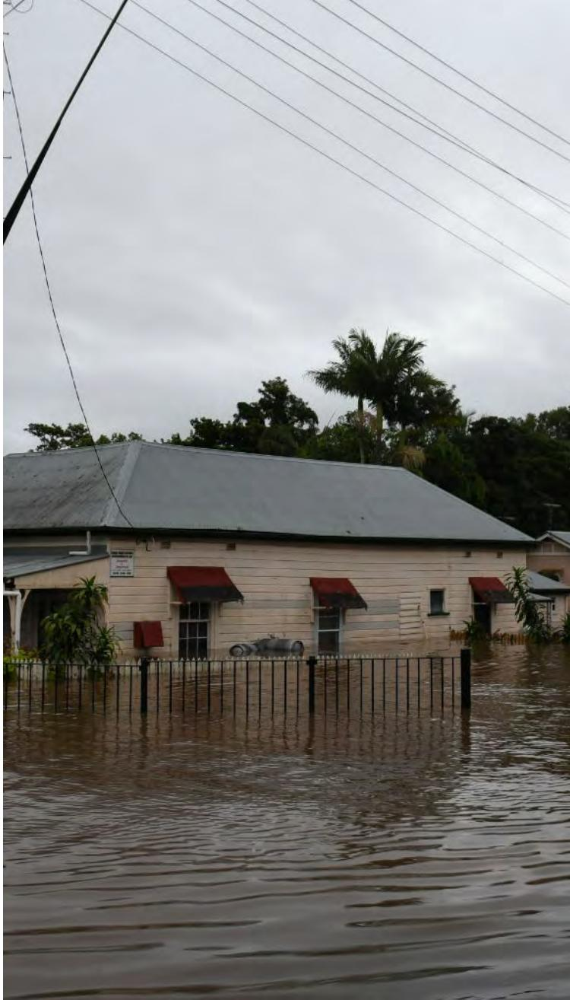

{10}------------------------------------------------

Australia saw more than its fair share of extreme weather events, after undergoing a second consecutive year of La Niña, bringing increased rainfall to Australia's east coast during FY22. The floods experienced along the east coast, as well as other extreme weather events across the country increased enquiries for and use of Aeeris' services.

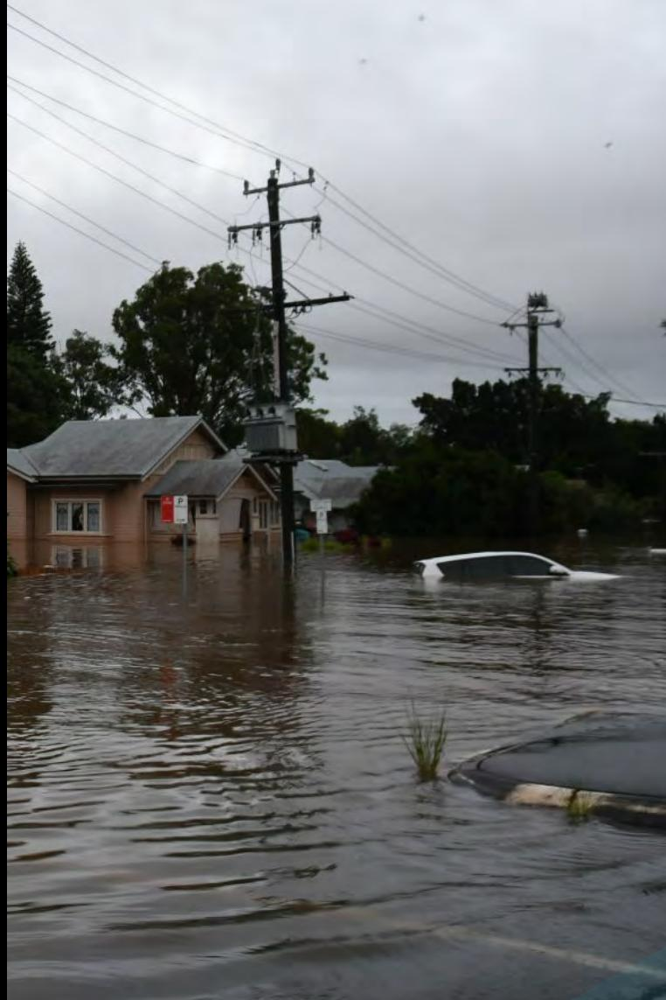

Throughout the floods, Aeeris provided customers with detailed threat forecasts, monitoring, alerting and advanced protection of customers' assets. Services provided included the:

- Provision of critical water and dam release information to customers of a major water organisation across southeast QLD and NSW;
- 24/7 monitoring of major rivers and remote sensors, provision of pre-event forecasts and alerts to State Government Agencies, and major rail customers, enabling the safety of assets and staff. This involved 24/7 client briefing meetings with our meteorologists, providing event critical information; and
- Provision of 24/7 rainfall and flood monitoring to councils, removing false alarms and sending time critical alerts to residents before flooding occurred.

FY22 also saw Aeeris successfully deliver and integrate almost all of its available APIs into a customer's disaster management platform; setup bushfire and weather alerts to residents of large residential estates southwest of Sydney, a requirement under new planning and development regulation; experience increased uptake of its hail alerting product and the recent addition of a heatwave alerting system has just been launched.

{11}------------------------------------------------

{12}------------------------------------------------

## **Aeeris Team Active in Saving Lives**

One thing you can guarantee about Australia is that a disaster is nearly always happening somewhere at some time. Floods in one place, catastrophic fires in another, cyclones, droughts, or plate sized hailstones.

All our team in Aeeris have a passion for weather…indeed all hazards. Our team comprises meteorologists, SES volunteers, scientists and storm chasers. Whether on duty or not, they live it every day. The team aren't just observers, they are actively involved in events and fully understand the potential outcomes. This experience helps keep our customers safe. Actionable information is key to any enterprise in potential risk situations, and that is what we deliver – "get out before you get in it."

Following is unedited commentary from our General Manager, James Harris, from when he was involved in the Lismore floods, 28 February 2022.

**Today was an emotional rollercoaster. The confusion at the start of the day as to whether we could take boats down or not. We went out anyway but felt like we should have gone out sooner.**

**Searching streets in a boat that we were literally walking down 24 hours earlier. Hearing cries for help, it became very real. Seeing the joy on people's faces knowing they were safe was incredible. I wanted to cry, but at the same time I felt immense pride watching everyone work together. The boats coming in with rescued people to the left whilst a queue of empty boats on the right heading out for more. Pulling up to the road, volunteers would wade out and help the boat in. We were then met by police, SES and more volunteers all helping the people off the boat and to the paramedics waiting for them. The next few weeks are going to be tough, but after witnessing what I saw today and hearing of so many others volunteering at shelters, catering etc to assist those who have lost everything there is hope!**

{13}------------------------------------------------

# **Aeeris in the Data Age**

Aeeris deals in real world data and real time alerting and forecasting. This, combined with the Company's SARP, arguably delivers the most superior spatial dataset for multiple perils in Australia. Andy Pitman, director of the ARC Centre of Excellence for Climate System Science, summarises the value of such data in a recent study as reported to The Weekend Australian:

**"Climate models are very valuable tools for many applications, but they are not something I want used to decide investment strategies for my superannuation."**

**The central issue is the difference between weather and climate and the inability of models to predict weather events at city scale.**

**Professor Pitman said attempts to use dynamical downscaling to get far higher resolution data was "excellent science but not science designed for the financial sector".**

Previous Aeeris reports expand on the data value, the point here is to catch up to where the market is. A climate risk self-assessment survey published by the Australian Prudential Regulation Authority last month found nearly a quarter of banks, insurers and super funds had no proper metrics to measure and monitor climate risk. "Empirical measurement, rather than a subjective judgment, is going to be needed fairly urgently," APRA chairman Wayne Byres said in a speech. The New Zealand government has just made climate risk disclosures mandatory for insurers and banks – the same rules could be imminent in Australia. Insurance Australia Group's (IAG) Ramana James said his company, the biggest general insurer in Australasia, is well prepared.

The combination of a solution and superior data and risk analytics is unique.

One of the strongest features Climatics provides customers is the ability to compare and contrast their assets across Australia and determine locations that may require immediate attention. This kind of analysis across the country is important to help businesses recognise the changes that are being experienced at one location are not necessarily equivalent in other locations and provides them with climate context so they may make informed decisions about the future of their assets.

{14}------------------------------------------------

Flooding across the eastern seaboard in the first half of 2022 has highlighted the need for businesses to be able to assess their flood risk, which is a key component of the offering from Climatics through use of JBA Risk Management Australian flood maps. To date, the data has verified well from events with a positive response from users regarding its ability to identify if an asset will or not as a worst case scenario.

The analysis work focuses on increasing the number of hazards available to users, including adding analysis for sea level, storm surge, lightning, frost and solar energy. This will undoubtedly place Climatics in a unique position in the Climate Risk market by being able to provide climate intelligence for 15+ hazards in a single, easy to use platform that will also be available via an API.

Weather has a direct impact on the performance of a business with a trail of affected service providers and employees. The Construction sector, already under pressure, is a good example of the substantial impact of weather on business. Wet weather forecasts for spring and summer will likely cause more construction delays as the 2022 trifecta of Covid, rain and price escalation continue to take its toll. With the east coast of Australia looking set to experience another La Niña season over the coming six months, this will bring heavy rain and more flooding to communities still in disrepair. Roberts Co chief executive Alison Mirams said it would be a "depressing" outcome after what had already proved to have been a tough year in the construction sector.

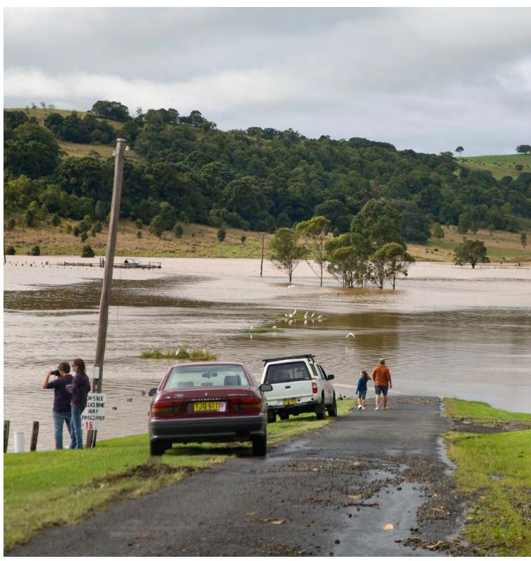

As of July 2022, the commercial builder had lost about 75 workdays this year to wet weather, meaning the business only achieved 46 per cent productivity from January to July.

The recent independent inquiry led by Mick Fuller and Mary O'Kane into the catastrophic Northern Rivers floods found that "many people live on flood plains in NSW, and many of these are in known high-risk areas". If a 19m flood (such as the 1867 record flood) happened in the Hawkesbury-Nepean Valley, more than 90,000 people would need to be evacuated and more than 15,500 homes would flood. The Insurance Council of Australia estimates that since 1970 the total incurred claims from flooding are more than \$21.3bn, with floods in NSW and southeast Queensland in February-March this year costing more than \$3.35bn.

{15}------------------------------------------------

### **Aeeris Products**

Through the Company's wholly owned subsidiary, Early Warning Network (**EWN**)

#### **Alerting**

We provide alerts to clients who need to know about events before they impact on their locations of interest.

#### **Forecasting**

EWN provides clients across Australia with customised weather forecasts focused on only the weather you need to know about.

#### **GIS Platform**

Our unrivalled web-based Weather and Hazard monitoring platform for organisations wanting 24×7 forecast and observational intelligence.

#### **Worker Zone Management**

Immediately identify, communicate and ensure the safety of your workforce from severe weather threats and natural hazards.

#### **Embargo**

Warnings for selected hazards across Australia with additional information such as postcode areas and dwelling numbers likely to be impacted.

#### **Flood Monitoring**

24/7, 365 day per year flash flood and flood alerting service across Australia, issuing alerts according to pre-set criteria for amounts of rainfall or water level heights.

{16}------------------------------------------------

#### **Climatics 2.0**

Resolves the problem of producing forensic and trusted results using 'actual' data to deliver actionable and operationalized reports and risk disclosure.

#### **Heat**

Extreme heat weather can have devastating effects to your health. Heatwaves can cause droughts and wildfires and can lead to health issues and increased energy demand and water shortages.

With Early Warning Network's new Heatwave Alerts Service, a warning can be issued up to three days in advance of the heatwave starting. This allows time for agencies and the public to take protective actions. The Heatwave Warning is issued for a state or territory when severe or extreme heat waves are expected to affect at least 10% of a weather district.

We only send the alert when your nominated region(s) is/are affected.

#### **Spatial Analysis Risk Platform (SARP)**

Using its 12 years of non-stop operational experience and system development, EWN has evolved its primary platform to deliver a stand-alone SaaS cloud solution. SARP encompasses all the features of the original system but with substantial new capability and commercial application.

#### **Hail**

This product folds into our alerting and forecasting portfolio.

Decades of thunderstorm experience and involvement in hail research projects with some of Australia's leading universities have resulted in services being delivered to large organisations and government departments across Australia. Powered by our 3D radar technology, we have utilised the latest research from the USA and the Bureau of Meteorology to calculate the estimated hail sizes in thunderstorms across Australia LIVE.

{17}------------------------------------------------

### **Meet Our Team**

#### **James Harris**

#### **General Manager**

James is General Manager of EWN having started with the company in 2013. Roles in both the Forecasting and Sales team allowed James to develop a deep understanding of EWN where he progressed through to his current General Manager role.

Working closely with each of the departments and reporting to the board, James provides strategic guidance for EWN whilst assisting each department where required. James has a strong Meteorological background and enjoys the challenge of continually developing our services to assist our clients' needs.

#### **Michael Bath**

#### **Operations Manager**

Michael has been with Aeeris since the Early Warning Network first launched its proprietary GNIS natural hazard alerting platform and has led the evolution of the company's operational capabilities.

He manages the team of spatial analysts and meteorologists who provide 24/7 alerting, forecast and support services to EWN customers in Australia and New Zealand and is integral to ongoing product development, system support and client setup including the Climate Risk Intelligence platform.

#### **Dave Evans**

#### **IT Manager**

Dave is interested in the future of weather, climate and disaster response. With 15 years of experience in various technology businesses, he is passionate about supporting business and communities as they adapt to and mitigate the impact of climate phenomena on their lives and assets.

His involvement with EWN ensures our digital architecture, IT assets and cloud solutions are up to the task of meeting our demanding needs into the future.

{18}------------------------------------------------

#### **Kathryn Turner**

#### **Lead Climate Scientist**

Kathryn has been working with Aeeris since 2020 and has been responsible for the scientific and user interface development within Climatics and is actively involved in the sales and feedback process with testers and users.

With a Bachelors of Science with first class honours, her passion for extreme weather and experience in communicating complex scientific information ensures that Climatics is always providing businesses with accurate and easy to understand climate intelligence. Kathryn has recently started a PhD on extreme bushfires while continuing to project manage EWN's newest revenue stream.

### **Todd Harris**

#### **Climate Scientist**

Todd is a published researcher with international experience in leveraging geospatial cloud technology to process and analyse climate and meteorological data. He has attained a Masters of Environmental Sciences and Engineering as well as a Bachelor of Philosophy (Honours) majoring in Physics from ANU.

Todd enjoys the challenge that comes from working with big data and creating different ways to communicate the changing climate trends to businesses. His expertise in Python and cloud formation is critical in the development and success of Climatics and its ongoing maintenance.

#### **Martin Katzmann**

#### **Business Development Manager**

Martin is the newest addition to the EWN team bringing with him a strong sales background.

With a passion for weather, Martin is able to work closely with new leads and existing clients to ensure they receive the right solution everytime.

Utilising the latest digital sales tools and working closely with our marketing team, Martin has made an immediate positive effect to the business.

{19}------------------------------------------------

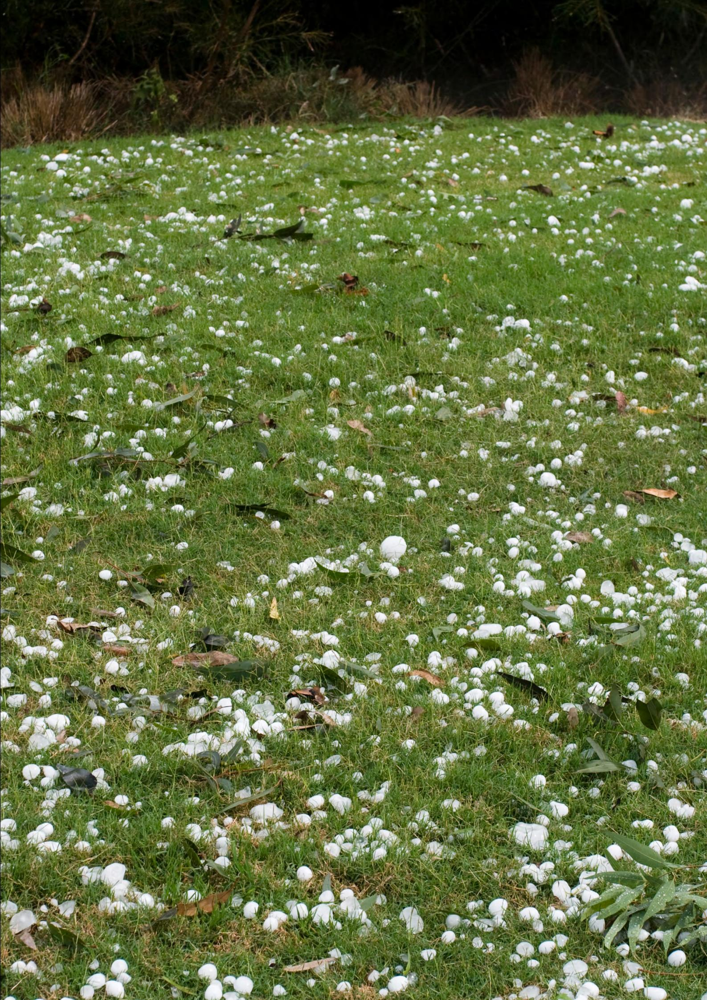

**Aeeris Ltd**

**ABN 18 166 705 595**

**and Controlled Entities**

**Consolidated Financial Report**

**For the year ended 30 June 2022**

{20}------------------------------------------------

### **Consolidated Financial Report**

**For the year ended 30 June 2022**

{21}------------------------------------------------

#### **Contents**

#### **Financial Report**

| Directors' Report                         | 3  |
|----------------------------------------------|----|
| Remuneration Report                          | 8  |
| Auditor's Independence Declaration           | 11 |
| Consolidated Statement of Profit or Loss     | 12 |
| Consolidated Statement of Financial Position | 13 |
| Consolidated Statement of Changes in Equity  | 14 |
| Consolidated Statement of Cash Flows         | 15 |
| Notes to the Financial Statements            | 16 |
| Directors' Declaration                    | 42 |
| Independent Auditor's Report              | 43 |
|                                              |    |

**Aeeris Ltd** ABN 18 166 705 595 Page 3

**Aeeris Ltd ABN 18 166 705 595 and Controlled Entities**

Your Directors present their report on the consolidated entity consisting of Aeeris Ltd (the "Company") and

The following persons were Directors of Aeeris Ltd during or since the end of the financial year up to the

Experience In 2007 Kerry founded the Early Warning Network's Geographical

950,000 Performance Rights

Notification and Information System (GNIS) and has been the key

platform. Kerry is responsible for leading the Aeeris team in both

Previously an Army Officer, Founder-Editor of NZ Green Magazine

driver behind the development of the Group's technology

the operation and further technical evolution of the EWN

and Director of Earthtrust South Pacific, he has a depth of experience in establishing and growing successful businesses. In 1995 he launched a digital publishing and software business called Ezimerchant, which created one of the world's first out-of-the-box

e-commerce and DIY product and payments platforms.

Ms. Elissa Hansen – Non-Executive Director (appointed 1 May 2022) and Company Secretary

platform.

its controlled entities (the "Group") for the financial year ended 30 June 2022.

**Directors' Report**

**General Information**

date of this report:

**Kerry Plowright**

Mr Kerry Plowright – Executive Chairman and CEO Mr Bryce Reynolds – Non-Executive Director Mr Nathan Young – Non-Executive Director

Qualifications None

Particulars of each director's experience and qualifications are:

Interest in Shares and Options 23,407,803 Shares

Directorships held in other listed entities during the three years prior to the current year

Special Responsibilities Executive Chairman and CEO

None

**Directors**

{22}------------------------------------------------

#### **Directors' Report**

Your Directors present their report on the consolidated entity consisting of Aeeris Ltd (the "Company") and its controlled entities (the "Group") for the financial year ended 30 June 2022.

#### **General Information**

#### **Directors**

The following persons were Directors of Aeeris Ltd during or since the end of the financial year up to the date of this report:

Mr Kerry Plowright – Executive Chairman and CEO Mr Bryce Reynolds – Non-Executive Director Mr Nathan Young – Non-Executive Director Ms. Elissa Hansen – Non-Executive Director (appointed 1 May 2022) and Company Secretary

Particulars of each director's experience and qualifications are:

| Kerry Plowright                    |                                                                                                                                                                                                                                                                                                                                                                                                      |
|------------------------------------|------------------------------------------------------------------------------------------------------------------------------------------------------------------------------------------------------------------------------------------------------------------------------------------------------------------------------------------------------------------------------------------------------|
| Qualifications                     | None                                                                                                                                                                                                                                                                                                                                                                                                 |
| Experience                         | In 2007 Kerry founded the Early Warning Network's Geographical Notification and Information System (GNIS) and has been the key driver behind the development of the Group's technology platform. Kerry is responsible for leading the Aeeris team in both the operation and further technical evolution of the EWN platform.                                                          |
|                                    | Previously an Army Officer, Founder-Editor of NZ Green Magazine and Director of Earthtrust South Pacific, he has a depth of experience in establishing and growing successful businesses. In 1995 he launched a digital publishing and software business called Ezimerchant, which created one of the world's first out-of-the-box e-commerce and DIY product and payments platforms. |
| Interest in Shares and Options     | 23,407,803 Shares 950,000 Performance Rights                                                                                                                                                                                                                                                                                                                                                   |
| Special Responsibilities           | Executive Chairman and CEO                                                                                                                                                                                                                                                                                                                                                                     |
| Directorships held in other listed | None                                                                                                                                                                                                                                                                                                                                                                                                 |
| entities during the three years    |                                                                                                                                                                                                                                                                                                                                                                                                      |
| prior to the current year          |                                                                                                                                                                                                                                                                                                                                                                                                      |

**Aeeris Ltd** ABN 18 166 705 595 Page 2

**Aeeris Ltd ABN 18 166 705 595 and Controlled Entities**

**Contents**

**Financial Report**

Directors' Report Remuneration Report

Directors' Declaration

Independent Auditor's Report

Auditor's Independence Declaration Consolidated Statement of Profit or Loss Consolidated Statement of Financial Position Consolidated Statement of Changes in Equity

Consolidated Statement of Cash Flows Notes to the Financial Statements

{23}------------------------------------------------

| Bryce Reynolds                                                                                                                 |                                                                                                                                                                                                                                                                                                                                                                                                                                                                                                                                                                       |  |
|--------------------------------------------------------------------------------------------------------------------------------|-----------------------------------------------------------------------------------------------------------------------------------------------------------------------------------------------------------------------------------------------------------------------------------------------------------------------------------------------------------------------------------------------------------------------------------------------------------------------------------------------------------------------------------------------------------------------|--|
| Qualifications Experience                                                                                                   | B. Comm (Accounting/Finance) UNSW In 2006, Bryce established Veritas Securities Limited as a founding director after working for a large investment bank and two mid tiered Australian securities firms. Since then, he has further added to his skill base by being an active company director for numerous private ventures in the funds management and IT/digital field.                                                                                                                                                                         |  |
| Interest in Shares and Options                                                                                                 | 5,361,320 Shares 625,000 Performance Rights 3,540,000 Options                                                                                                                                                                                                                                                                                                                                                                                                                                                                                                |  |
| Special Responsibilities Directorships held in other listed entities during the three years prior to the current year | Chairman of the Audit and Risk Committee None                                                                                                                                                                                                                                                                                                                                                                                                                                                                                                                      |  |
| Nathan Young                                                                                                                   |                                                                                                                                                                                                                                                                                                                                                                                                                                                                                                                                                                       |  |
| Qualifications Experience                                                                                                   | B. Comm Nathan began his career in financial markets over 20 years ago. He holds a Bachelor of Commerce from The University of Melbourne and a Graduate Diploma in Applied Finance and Investment. He has previously been employed by a large Investment Bank and Hedge Fund focused on trading and investment strategies. In these organisations one of his roles was to evaluate seed capital, pre-IPO and listed investment opportunities in the technology sector.                                                                        |  |
| Interest in Shares and Options                                                                                                 | 500,000 Shares 500,000 Performance Rights                                                                                                                                                                                                                                                                                                                                                                                                                                                                                                                          |  |
| Special Responsibilities Directorships held in other listed entities during the three years prior to the current year | Member of the Audit and Risk Committee Non-Executive Director, Bora Bora Resources Limited                                                                                                                                                                                                                                                                                                                                                                                                                                                                         |  |
| Elissa Hansen #                                                                                                                |                                                                                                                                                                                                                                                                                                                                                                                                                                                                                                                                                                       |  |
| Qualifications Experience                                                                                                   | B.Com, Gdip.AppCorGov, GAICD, FGIA Elissa is a Chartered Secretary with over twenty years' experience advising management and boards of ASX listed companies on governance, investor relations and other corporate issues. She has worked with boards and management of a range of ASX listed companies including assisting companies through the IPO process. Elissa is a Chartered Secretary who brings best practice governance advice, ensuring compliance with the Listing Rules, Corporations Act and other relevant legislation. |  |
| Interest in Shares and Options                                                                                                 | 175,000 Shares 175,000 Performance Rights                                                                                                                                                                                                                                                                                                                                                                                                                                                                                                                          |  |
| Special Responsibilities Directorships held in other listed entities during the three years prior to the current year | Member of the Audit and Risk Committee, Company Secretary Non-Executive Director Zoono Group Limited (ASX:ZNO) and QMines Limited (ASX:QML)                                                                                                                                                                                                                                                                                                                                                                                                                  |  |

*# Appointed 1 May 2022* **Principal Activities**

**Operating Results**

protection technologies.

providing for income tax.

**Review of Operations**

**Significant Changes to Activities**

monitoring of assets and personnel.

events. The SARP system is globally scalable.

Aeeris is listed on ASX with the ticker code AER.

**Significant Changes in State of Affairs**

**Events After the Reporting Period**

2022. This increase is largely due to the following factors:

• An increase of \$19,515 in trade & other payables.

**COVID-19 Impact Assessment**

**Financial Position**

balance date.

information, it assists companies with physical risk reporting.

**Aeeris Ltd** ABN 18 166 705 595 Page 5

The principal activity of the consolidated group during the financial year was enterprise asset and people

The consolidated loss of the consolidated group amounted to \$211,295 (2021: Profit of \$467,854) after

Aeeris Ltd is one of the World's leading aggregators of geospatial data and provides unique location- based

The Group's Early Warning Network (EWN) platform and proprietary Spatial Analysis Risk Platform (SARP) technology system enables Aeeris to provide a range of critical services - live data, content, alerts and notifications on natural and man-made hazards affecting its clients, and digital tracking, mapping and

Additionally, the Group's Climatics platform, Australia's most comprehensive database of historic acute and chronic severe weather hazards and warnings, identifies changes in event intensity and severity and season

duration at any location since 1911. Combined with an organisations' vulnerability and exposure

Aeeris does not expect any further impact on its business from the COVID-19 pandemic.

October 2021 by way of a placement of new fully paid ordinary shares; • An increase of \$136,200 in trade and other receivables; and offset by

The Group's services solve natural disaster awareness problems and promote personal and employee safety, asset protection, risk management, as well as helping to mitigate the financial impact of adverse

The net assets of the consolidated group have increased by \$1,330,589 from 30 June 2021 to \$2,390,872 in

• An increase of \$1,312,257 in cash and cash equivalents arising from a \$1.5 million capital raise in

There were no significant changes in the state of affairs of the parent entity during the financial year.

There have been no events after the reporting period and there has been no impact from COVID-19 after

No significant changes in the nature of the principal activities occurred during the financial year.

Safety, Operations Management, Severe Weather and All Hazards data and content services.

{24}------------------------------------------------

#### **Principal Activities**

The principal activity of the consolidated group during the financial year was enterprise asset and people protection technologies.

#### **Significant Changes to Activities**

No significant changes in the nature of the principal activities occurred during the financial year.

#### **Operating Results**

The consolidated loss of the consolidated group amounted to \$211,295 (2021: Profit of \$467,854) after providing for income tax.

#### **Review of Operations**

Aeeris Ltd is one of the World's leading aggregators of geospatial data and provides unique location- based Safety, Operations Management, Severe Weather and All Hazards data and content services.

The Group's Early Warning Network (EWN) platform and proprietary Spatial Analysis Risk Platform (SARP) technology system enables Aeeris to provide a range of critical services - live data, content, alerts and notifications on natural and man-made hazards affecting its clients, and digital tracking, mapping and monitoring of assets and personnel.

Additionally, the Group's Climatics platform, Australia's most comprehensive database of historic acute and chronic severe weather hazards and warnings, identifies changes in event intensity and severity and season duration at any location since 1911. Combined with an organisations' vulnerability and exposure information, it assists companies with physical risk reporting.

The Group's services solve natural disaster awareness problems and promote personal and employee safety, asset protection, risk management, as well as helping to mitigate the financial impact of adverse events. The SARP system is globally scalable.

#### **COVID-19 Impact Assessment**

Aeeris does not expect any further impact on its business from the COVID-19 pandemic.

Aeeris is listed on ASX with the ticker code AER.

#### **Financial Position**

The net assets of the consolidated group have increased by \$1,330,589 from 30 June 2021 to \$2,390,872 in 2022. This increase is largely due to the following factors:

- An increase of \$1,312,257 in cash and cash equivalents arising from a \$1.5 million capital raise in October 2021 by way of a placement of new fully paid ordinary shares;
- An increase of \$136,200 in trade and other receivables; and offset by
- An increase of \$19,515 in trade & other payables.

#### **Significant Changes in State of Affairs**

There were no significant changes in the state of affairs of the parent entity during the financial year.

#### **Events After the Reporting Period**

There have been no events after the reporting period and there has been no impact from COVID-19 after balance date.

**Aeeris Ltd** ABN 18 166 705 595 Page 4

**Bryce Reynolds**

**Nathan Young**

**Elissa Hansen #**

*#*

Qualifications B. Comm (Accounting/Finance) UNSW

Special Responsibilities Chairman of the Audit and Risk Committee

None

sector.

Special Responsibilities Member of the Audit and Risk Committee

Qualifications B.Com, Gdip.AppCorGov, GAICD, FGIA

Interest in Shares and Options 5,361,320 Shares

Qualifications B. Comm

Interest in Shares and Options 500,000 Shares

Interest in Shares and Options 175,000 Shares

Directorships held in other listed entities during the three years prior to the current year

Directorships held in other listed entities during the three years prior to the current year

Directorships held in other listed entities during the three years prior to the current year

*Appointed 1 May 2022*

Experience In 2006, Bryce established Veritas Securities Limited as a founding

625,000 Performance Rights

Experience Nathan began his career in financial markets over 20 years ago. He

500,000 Performance Rights

Experience Elissa is a Chartered Secretary with over twenty years' experience

175,000 Performance Rights Special Responsibilities Member of the Audit and Risk Committee, Company Secretary

QMines Limited (ASX:QML)

3,540,000 Options

director after working for a large investment bank and two mid tiered Australian securities firms. Since then, he has further added to his skill base by being an active company director for numerous private ventures in the funds management and IT/digital field.

holds a Bachelor of Commerce from The University of Melbourne and a Graduate Diploma in Applied Finance and Investment. He has previously been employed by a large Investment Bank and Hedge Fund focused on trading and investment strategies. In these organisations one of his roles was to evaluate seed capital, pre-IPO and listed investment opportunities in the technology

Non-Executive Director, Bora Bora Resources Limited

advising management and boards of ASX listed companies on governance, investor relations and other corporate issues. She has worked with boards and management of a range of ASX listed companies including assisting companies through the IPO process.

governance advice, ensuring compliance with the Listing Rules,

Non-Executive Director Zoono Group Limited (ASX:ZNO) and

Elissa is a Chartered Secretary who brings best practice

Corporations Act and other relevant legislation.

{25}------------------------------------------------

#### **Future Developments, Prospects and Business Strategies**

Current areas of strategic focus of the Group include the following:

- Focus on converting the pipeline of potential clients and on-boarding new customer referrals and lines of enquiry for forecasting, alerting and climate risk reporting services. Several of these prospects may be material if realised.
- Further development of the Climatics platform to increase sales opportunities.
- Consideration of the replication/expansion of the Groups' alerting, forecasting and real time data to other jurisdictions.

#### **Environmental Issues**

The Group's operations are not regulated by any significant environmental regulations under the laws of the Commonwealth or of a state or territory in Australia.

#### **Dividends Paid or Recommended**

No dividends were paid or declared since the start of the financial period. No recommendation for payment of dividends has been made.

#### **Insurance of Directors and Officers**

The Company has entered into an agreement to insure the Directors and Officers of the Company. The liabilities insured are legal costs that may be incurred defending civil or criminal proceedings that may be brought against the Directors and Officers in their capacity as officers of the entity, and any other payments arising from liabilities incurred by the Officers in connection with such proceedings, other than where such liabilities arise out of conduct involving a wilful breach of duty by the Officers or the improper use by the Officers of their position or of information to gain advantage for themselves or someone else or to cause detriment to the Company.

#### **Indemnifying Officers or Auditor**

The Company has agreed to indemnify and keep indemnified Directors and Officers against any liability: incurred in connection with, or as a consequence of the director or officer acting in that capacity, including representing the Company on any body corporate; and for legal costs incurred in defending an action in connection with or as a consequence of the Director or officer acting in that capacity.

The indemnity only applies to the extent of the amount that the Directors are not indemnified under any other indemnity, including an indemnity contained in any insurance policy taken out by the Company, under the general law or otherwise.

The indemnity does not extend to any liability:

- to the Company or a related body corporate of the Company;
- arising out of conduct of the Directors or Officers involving a lack of good faith; or
- which is in respect of any negligence, default, breach of duty or breach of trust of which the Directors or Officers may be guilty in relation to the Company or related body corporate.

No liability has arisen under these indemnities as at the date of this report. No indemnities have been given or insurance premiums paid during or since the end of the financial year, for any person who is or has been an auditor of the Company.

**Aeeris Ltd** ABN 18 166 705 595 Page 7

No person has applied for leave of court to bring proceedings on behalf of the Company or intervene in any proceedings to which the Company is a party for the purpose of taking responsibility on behalf of the

The lead auditor's independence declaration for the year ended 30 June 2022 has been received and can be

At the date of this report, there were 3,540,000 unissued ordinary shares of Aeeris Ltd under option.

During the financial year, 11 meetings of Directors, excluding committee of Directors were held.

There have been no options granted over unissued shares or interests of any controlled entity within the

Kerry Plowright 11 11 4 4

Bryce Reynolds 11 11 4 4

Nathan Young 11 11 4 4

Elissa Hansen # 2 2 - -

**Directors' Meetings Audit & Risk Committee**

attend Number attended

attend Number attended Number eligible to

**Proceedings on Behalf of the Company**

**Auditor's Independence Declaration**

**Options**

**Meetings of Directors**

*# Appointed 1 May 2022*

The board comprises of four Directors.

found on page 11 of the financial report.

Group since the end of the reporting period.

Attendances by each director during the year were as follows:

Number eligible to

Company for all or any part of those proceedings.

The Company was not a party to any such proceedings during the year.

{26}------------------------------------------------

#### **Proceedings on Behalf of the Company**

No person has applied for leave of court to bring proceedings on behalf of the Company or intervene in any proceedings to which the Company is a party for the purpose of taking responsibility on behalf of the Company for all or any part of those proceedings.

The Company was not a party to any such proceedings during the year.

#### **Auditor's Independence Declaration**

The lead auditor's independence declaration for the year ended 30 June 2022 has been received and can be found on page 11 of the financial report.

#### **Options**

At the date of this report, there were 3,540,000 unissued ordinary shares of Aeeris Ltd under option.

There have been no options granted over unissued shares or interests of any controlled entity within the Group since the end of the reporting period.

#### **Meetings of Directors**

During the financial year, 11 meetings of Directors, excluding committee of Directors were held. Attendances by each director during the year were as follows:

|                 | Directors' Meetings          |                 | Audit & Risk Committee       |                 |
|-----------------|------------------------------|-----------------|------------------------------|-----------------|
|                 | Number eligible to attend | Number attended | Number eligible to attend | Number attended |
| Kerry Plowright | 11                           | 11              | 4                            | 4               |
| Bryce Reynolds  | 11                           | 11              | 4                            | 4               |
| Nathan Young    | 11                           | 11              | 4                            | 4               |
| Elissa Hansen # | 2                            | 2               | -                            | -               |

*# Appointed 1 May 2022*

The board comprises of four Directors.

**Aeeris Ltd** ABN 18 166 705 595 Page 6

**Future Developments, Prospects and Business Strategies**

prospects may be material if realised.

the Commonwealth or of a state or territory in Australia.

to other jurisdictions.

**Dividends Paid or Recommended**

**Insurance of Directors and Officers**

of dividends has been made.

detriment to the Company.

**Indemnifying Officers or Auditor**

under the general law or otherwise.

an auditor of the Company.

The indemnity does not extend to any liability:

**Environmental Issues**

Current areas of strategic focus of the Group include the following:

• Focus on converting the pipeline of potential clients and on-boarding new customer referrals and lines of enquiry for forecasting, alerting and climate risk reporting services. Several of these

• Consideration of the replication/expansion of the Groups' alerting, forecasting and real time data

The Group's operations are not regulated by any significant environmental regulations under the laws of

No dividends were paid or declared since the start of the financial period. No recommendation for payment

The Company has entered into an agreement to insure the Directors and Officers of the Company. The liabilities insured are legal costs that may be incurred defending civil or criminal proceedings that may be brought against the Directors and Officers in their capacity as officers of the entity, and any other payments arising from liabilities incurred by the Officers in connection with such proceedings, other than where such liabilities arise out of conduct involving a wilful breach of duty by the Officers or the improper use by the Officers of their position or of information to gain advantage for themselves or someone else or to cause

The Company has agreed to indemnify and keep indemnified Directors and Officers against any liability: incurred in connection with, or as a consequence of the director or officer acting in that capacity, including representing the Company on any body corporate; and for legal costs incurred in defending an action in

The indemnity only applies to the extent of the amount that the Directors are not indemnified under any other indemnity, including an indemnity contained in any insurance policy taken out by the Company,

• which is in respect of any negligence, default, breach of duty or breach of trust of which the Directors or Officers may be guilty in relation to the Company or related body corporate.

No liability has arisen under these indemnities as at the date of this report. No indemnities have been given or insurance premiums paid during or since the end of the financial year, for any person who is or has been

connection with or as a consequence of the Director or officer acting in that capacity.

• arising out of conduct of the Directors or Officers involving a lack of good faith; or

• to the Company or a related body corporate of the Company;

• Further development of the Climatics platform to increase sales opportunities.

{27}------------------------------------------------

#### **Remuneration Report**

#### **Remuneration Policy**

All key management personnel (including Directors) ("KMP") of Aeeris Ltd were engaged on fixed remuneration consultancy agreements for the provision of services. No performance incentives were issued during the period. The Board of Aeeris Ltd believes, given the size and operations of the Company during the period, that the remuneration policy to be appropriate. All KMP, including Executive Directors, are large shareholders in the Company in their own right, providing them with appropriate incentives for outstanding performance.

All remuneration paid to KMP is valued at the cost to the Company and expensed.

The Board's policy is to remunerate non-executive Directors at market rates for their time, commitment and responsibilities. The Board as a whole determines payments to the non-executive Directors and reviews their remuneration annually, based on market practice, duties and accountability. Independent external advice may be sought when required. The maximum aggregate amount of fees that can be paid to non-executive Directors is subject to approval by shareholders at an annual general meeting and is currently \$300,000 per annum

| Group KMP      | Position held as at 30 June 2022 and any Change during the Year | Contract Details (Duration and Termination)                                                                                                                                                                     | Proportions of Elements of Remuneration Related to Performance | Proportions of Elements of Remuneration Not Related to Performance |
|----------------|-----------------------------------------------------------------------------|--------------------------------------------------------------------------------------------------------------------------------------------------------------------------------------------------------------------|----------------------------------------------------------------------------|--------------------------------------------------------------------------------|
| Mr K Plowright | Executive Chairman and CEO                                            | • Executive Consulting contract with no fixed term. Can be terminated with 3 months notice. • As Managing Director, exempt from the requirement to stand for re election as a director. | -                                                                          | 100%                                                                           |
| Mr B Reynolds  | Non Executive Director                                                   | • Re-election as director required every 3 years.                                                                                                                                                            | -                                                                          | 100%                                                                           |
| Mr N Young     | Non Executive Director                                                   | • Re-election as director required every 3 years.                                                                                                                                                            | -                                                                          | 100%                                                                           |
| Ms E Hansen#   | Non Executive Director and Company Secretary                       | • Re-election as director required every 3 years.                                                                                                                                                            | -                                                                          | 100%                                                                           |

#### **Employment Details of Members of Key Management Personnel (KMP)**

*# Appointed 1 May 2022*

The employment terms and conditions of all executives are formalised in contracts of employment. **Changes in Directors and Executives Subsequent to Year-end**

Nil

**Remuneration Expense Details for the Year Ended 30 June 2022**

calculated in accordance with Australian Accounting Standards.

**Table of Benefits and Payments for the Year Ended 30 June 2022**

*# Appointed 1 May 2022. Remuneration includes Director and Company Secretarial fees.*

**Table of Benefits and Payments for the Year Ended 30 June 2021**

* Paid through their related entities, refer Note 24.

**Options and Rights Granted as Remuneration**

remuneration package.

to KMP during the period.

**Securities Received that are Not Performance-Related**

**Cash Bonuses, Performance-related Bonuses and Share-Based Payments**

There were no options or rights issued as remuneration to KMP during the period.

The following table of benefits and payments represents the components of the current year and

comparative year remuneration expenses for each member of KMP of the Group. Such amounts have been

Mr. K Plowright * \$139,312 - \$139,312

Mr. B Reynolds * \$24,000 - \$24,000

Mr. N Young * \$24,000 - \$24,000

Ms. E Hansen *# \$8,600 - \$8,600

Mr. K Plowright * \$128,382 - \$128,382

Mr. B Reynolds * \$24,000 - \$24,000

Mr. N Young * \$24,000 - \$24,000

No members of KMP are entitled to receive securities that are not performance-based as part of their

There were no cash bonuses, performance-related bonuses or share based payments paid as remuneration

**Short Term Benefits Equity-settled Share-based Payments 2022 Remuneration Shares/Options/Rights Total**

**\$195,912 - \$195,912**

**\$176,382 - \$176,382**

**Short Term Benefits Equity-settled Share-based Payments 2021 Remuneration Shares/Options/Rights Total**

**Aeeris Ltd** ABN 18 166 705 595 Page 9

{28}------------------------------------------------

#### **Remuneration Expense Details for the Year Ended 30 June 2022**

The following table of benefits and payments represents the components of the current year and comparative year remuneration expenses for each member of KMP of the Group. Such amounts have been calculated in accordance with Australian Accounting Standards.

#### **Table of Benefits and Payments for the Year Ended 30 June 2022**

|                   | Short Term Benefits | Equity-settled Share-based Payments | 2022      |
|-------------------|---------------------|-------------------------------------|-----------|
|                   | Remuneration        | Shares/Options/Rights               | Total     |
| Mr. K Plowright * | \$139,312           | -                                   | \$139,312 |
| Mr. B Reynolds *  | \$24,000            | -                                   | \$24,000  |
| Mr. N Young *     | \$24,000            | -                                   | \$24,000  |
| Ms. E Hansen *#   | \$8,600             | -                                   | \$8,600   |
|                   | \$195,912           | -                                   | \$195,912 |

*# Appointed 1 May 2022. Remuneration includes Director and Company Secretarial fees.*

#### **Table of Benefits and Payments for the Year Ended 30 June 2021**

|                   | Short Term Benefits | Equity-settled Share-based Payments | 2021      |
|-------------------|---------------------|-------------------------------------|-----------|
|                   | Remuneration        | Shares/Options/Rights               | Total     |
| Mr. K Plowright * | \$128,382           | -                                   | \$128,382 |
| Mr. B Reynolds *  | \$24,000            | -                                   | \$24,000  |
| Mr. N Young *     | \$24,000            | -                                   | \$24,000  |
|                   | \$176,382           | -                                   | \$176,382 |

* Paid through their related entities, refer Note 24.

#### **Securities Received that are Not Performance-Related**

No members of KMP are entitled to receive securities that are not performance-based as part of their remuneration package.

#### **Cash Bonuses, Performance-related Bonuses and Share-Based Payments**

There were no cash bonuses, performance-related bonuses or share based payments paid as remuneration to KMP during the period.

#### **Options and Rights Granted as Remuneration**

There were no options or rights issued as remuneration to KMP during the period.

**Aeeris Ltd** ABN 18 166 705 595 Page 8

**Aeeris Ltd ABN 18 166 705 595 and Controlled Entities**

All key management personnel (including Directors) ("KMP") of Aeeris Ltd were engaged on fixed remuneration consultancy agreements for the provision of services. No performance incentives were issued during the period. The Board of Aeeris Ltd believes, given the size and operations of the Company during the period, that the remuneration policy to be appropriate. All KMP, including Executive Directors, are large shareholders in the Company in their own right, providing them with appropriate incentives for

The Board's policy is to remunerate non-executive Directors at market rates for their time, commitment and responsibilities. The Board as a whole determines payments to the non-executive Directors and reviews their remuneration annually, based on market practice, duties and accountability. Independent external advice may be sought when required. The maximum aggregate amount of fees that can be paid to

non-executive Directors is subject to approval by shareholders at an annual general meeting and is

**Contract Details (Duration and Termination)**

• Executive Consulting contract with no fixed term. Can be terminated with 3 months

requirement to stand for re-

• As Managing Director, exempt from the

election as a director.

• Re-election as director

• Re-election as director

• Re-election as director

The employment terms and conditions of all executives are formalised in contracts of employment.

notice.

**Proportions of Elements of Remuneration Related to Performance**

required every 3 years. - 100%

required every 3 years. - 100%

required every 3 years. - 100%

**Proportions of Elements of Remuneration Not Related to Performance**

- 100%

All remuneration paid to KMP is valued at the cost to the Company and expensed.

**Employment Details of Members of Key Management Personnel (KMP)**

**Remuneration Report**

outstanding performance.

currently \$300,000 per annum

**Group KMP Position held** 

Mr B Reynolds Non Executive

Mr N Young Non Executive

Mr K Plowright

Ms E Hansen*#*

*# Appointed 1 May 2022*

**as at 30 June 2022 and any Change during the Year**

Executive Chairman and CEO

Director

Director

Non Executive Director and Company Secretary

**Changes in Directors and Executives Subsequent to Year-end**

**Remuneration Policy**

{29}------------------------------------------------

#### **KMP Shareholdings**

The number of ordinary shares in Aeeris Ltd held by each KMP of the Group during the financial year is as follows:

|                 | Balance at 1 July 2021 | Granted as Remuneration during the Year | Issued on Exercise of Performance Rights during the Year | Other Changes during the Year | Balance at 30 June 2022 |
|-----------------|---------------------------|--------------------------------------------------|----------------------------------------------------------------------|-------------------------------------|----------------------------|
| Mr. K Plowright | 23,407,803                | -                                                | -                                                                    | -                                   | 23,407,803                 |
| Mr. B Reynolds  | 4,591,320                 | -                                                | -                                                                    | 770,000                             | 5,361,320                  |
| Mr. N Young     | 500,000                   | -                                                | -                                                                    | -                                   | 500,000                    |
| Ms. E Hansen #  | -                         | -                                                | -                                                                    | 175,000*                            | 175,000                    |

*# Appointed 1 May 2022*

** Shares held on appointment as a director*

#### **KMP Performance Rights**

The number of performance rights in Aeeris Ltd held by each KMP of the Group during the financial year is as follows:

|                 | Balance at 1 July 2021 | Issued during the year | Exercised during the year | Other Changes during the Year | Balance at 30 June 2022 |
|-----------------|---------------------------|---------------------------|---------------------------------|-------------------------------------|----------------------------|
| Mr. K Plowright | 950,000                   | -                         | -                               | -                                   | 950,000                    |
| Mr. B Reynolds  | 625,000                   | -                         | -                               | -                                   | 625,000                    |
| Mr. N Young     | 500,000                   | -                         | -                               | -                                   | 500,000                    |
| Ms. E Hansen #  | -                         | -                         | -                               | 175,000*                            | 175,000                    |

*# Appointed 1 May 2022*

** Performance Rights held on appointment as a director*

#### **Other Equity-related KMP Transactions**

There have been no other transactions involving equity instruments other than those described in the tables above relating to options, rights and shareholdings.

#### **Other Transactions with KMP and/or their Related Parties**

There were no other transactions conducted between the Group and KMP or their related parties, apart from those disclosed above relating to equity, compensation or loans, that were conducted other than in accordance with normal employee, customer or supplier relationships on terms no more favourable than those reasonably expected under arm's length dealings with unrelated persons.

This Directors' report, incorporating the remuneration report, is signed in accordance with a resolution of the Board of Directors.

**Chairman: _____________________________________________________**

Mr Kerry Plowright

**Dated this 26 day of August 2022** 

**AUDITOR'S INDEPENDENCE DECLARATION UNDER SECTION 307C OF THE CORPORATIONS ACT 2001 TO THE DIRECTORS OF AEERIS LIMITED AND CONTROLLED ENTITIES ABN 18 166 705 595**

In accordance with section 307C of the *Corporations Act 2001*, I am pleased to provide the following

As the auditor for the audit of the financial report of Aeeris Limited for the year ended 30 June 2022,

i. the auditor independence requirements of the *Corporations Act 2001* in relation to the audit; and

I declare that, to the best of my knowledge and belief, there have been no contraventions of:

ii. any applicable code of professional conduct in relation to the audit.

declaration of independence to the directors of Aeeris Limited.

**MNSA Pty Ltd**

**Allan Facey**  Director

Dated this 26th August 2022

Sydney

{30}------------------------------------------------

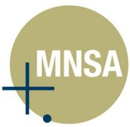

#### **AUDITOR'S INDEPENDENCE DECLARATION UNDER SECTION 307C OF THE CORPORATIONS ACT 2001 TO THE DIRECTORS OF AEERIS LIMITED AND CONTROLLED ENTITIES ABN 18 166 705 595**

In accordance with section 307C of the *Corporations Act 2001*, I am pleased to provide the following declaration of independence to the directors of Aeeris Limited.

As the auditor for the audit of the financial report of Aeeris Limited for the year ended 30 June 2022, I declare that, to the best of my knowledge and belief, there have been no contraventions of:

- i. the auditor independence requirements of the *Corporations Act 2001* in relation to the audit; and
- ii. any applicable code of professional conduct in relation to the audit.

**MNSA Pty Ltd**

**Allan Facey**  Director

Sydney Dated this 26th August 2022

**Aeeris Ltd** ABN 18 166 705 595 Page 10

The number of ordinary shares in Aeeris Ltd held by each KMP of the Group during the financial year is as

Mr. K Plowright 23,407,803 - - - 23,407,803

Mr. B Reynolds 4,591,320 - - 770,000 5,361,320

Mr. N Young 500,000 - - - 500,000 Ms. E Hansen # - - - 175,000* 175,000

The number of performance rights in Aeeris Ltd held by each KMP of the Group during the financial year is

Mr. K Plowright 950,000 - - - 950,000

Mr. B Reynolds 625,000 - - - 625,000

Mr. N Young 500,000 - - - 500,000 Ms. E Hansen # - - - 175,000* 175,000

There have been no other transactions involving equity instruments other than those described in the

There were no other transactions conducted between the Group and KMP or their related parties, apart from those disclosed above relating to equity, compensation or loans, that were conducted other than in accordance with normal employee, customer or supplier relationships on terms no more favourable than

This Directors' report, incorporating the remuneration report, is signed in accordance with a resolution of

**Issued during the year**

**Issued on Exercise of Performance Rights during the Year**

> **Exercised during the year**

**Other Changes during the Year**

**Other Changes during the Year**

**Balance at 30 June 2022** 

**Balance at 30 June 2022**

**Granted as Remuneration during the Year**

**KMP Shareholdings**

*# Appointed 1 May 2022*

*# Appointed 1 May 2022*

the Board of Directors.

**Dated this 26 day of August 2022** 

as follows:

**KMP Performance Rights**

** Shares held on appointment as a director*

**Balance at 1 July 2021** 

**Balance at 1 July 2021**

** Performance Rights held on appointment as a director*

tables above relating to options, rights and shareholdings.

**Other Transactions with KMP and/or their Related Parties**

Mr Kerry Plowright

those reasonably expected under arm's length dealings with unrelated persons.

**Chairman: _____________________________________________________**

**Other Equity-related KMP Transactions**

follows:

{31}------------------------------------------------

#### **AEERIS LTD ABN 18 166 705 595 AND CONTROLLED ENTITIES CONSOLIDATED STATEMENT OF PROFIT OR LOSS FOR THE YEAR ENDED 30 JUNE 2022**

|                                            |       | Consolidated | Consolidated |
|--------------------------------------------|-------|--------------|--------------|
|                                            | Notes | 30-Jun-2022  | 30-Jun-2021  |
|                                            |       | \$           | \$           |
| Revenue from continuing operations         |       |              |              |
| Revenue                                    | 3     | 2,210,529    | 1,837,691    |
| Other income                               | 3     | 471,231      | 699,276      |
| Total Revenue                              |       | 2,681,760    | 2,536,967    |
| Expenses                                   |       |              |              |
| Consultants and subcontractors             |       | (464,553)    | (496,210)    |
| Depreciation and amortisation expense      |       | (10,215)     | (3,874)      |
| Employee benefits expense                  | 4     | (1,237,189)  | (878,615)    |
| Finance costs                              |       | (224)        | (1,954)      |
| Share based payments                       | 22    | (125,591)    | -            |
| SMS communication                          |       | (181,542)    | (107,913)    |
| Weather reports                            |       | (257,496)    | (201,029)    |
| Other expenses from ordinary activities    | 5     | (616,245)    | (379,518)    |
| Total Expenses                             |       | (2,893,055)  | (2,069,113)  |
| (Loss)/profit before income tax            |       | (211,295)    | 467,854      |
| Income tax expense                         | 6     | -            | -            |
| Net (loss)/profit for the year             |       | (211,295)    | 467,854      |
| Earnings per share                         |       |              |              |
| From continuing operations                 |       |              |              |
| Basic (loss)/profit per share (cents)   | 10    | (0.31)       | 0.78         |
| Diluted (loss)/profit per share (cents) | 10    | (0.31)       | 0.78         |

The above consolidated statement of profit or loss should be read in conjunction with the accompanying notes.

**Aeeris Ltd** ABN 18 166 705 595 Page 13

**AEERIS LTD ABN 18 166 705 595 AND CONTROLLED ENTITIES CONSOLIDATED STATEMENT OF FINANCIAL POSITION AS AT 30 JUNE 2022**

**Notes**

Cash & cash equivalents 11 2,739,215 1,426,958 Trade & other receivables 12 337,988 201,788 Prepayments 14,791 67,623 **Total Current Assets** 3,091,994 1,696,369

Property, plant & equipment 14 11,968 15,490 **Total Non-Current Assets** 11,968 15,490

**Total Assets** 3,103,962 1,711,859

Trade & other payables 15 586,018 566,503 Provisions 16 66,279 35,539 **Total Current Liabilities** 652,297 602,042

Provisions 16 60,793 49,534 **Total Non-Current Liabilities** 60,793 49,534

**Total Liabilities** 713,090 651,576

**Net Assets** 2,390,872 1,060,283

Issued capital 17 6,516,861 5,100,568 Share based payments reserve 27 206,809 81,218 Accumulated losses 28 (4,332,798) (4,121,503) **Total Equity** 2,390,872 1,060,283

The above consolidated statement of financial position should be read in conjunction with the

**Current Assets**

**Non-Current Assets**

**Current Liabilities**

**Non-Current Liabilities**

**Equity**

accompanying notes.

**Consolidated 30-Jun-2022**

 **\$ \$**

**Consolidated 30-Jun-2021**

{32}------------------------------------------------

#### **AEERIS LTD ABN 18 166 705 595 AND CONTROLLED ENTITIES CONSOLIDATED STATEMENT OF FINANCIAL POSITION AS AT 30 JUNE 2022**

|                                 |       | Consolidated      | Consolidated      |
|---------------------------------|-------|-------------------|-------------------|
|                                 | Notes | 30-Jun-2022 \$ | 30-Jun-2021 \$ |
| Current Assets                  |       |                   |                   |
| Cash & cash equivalents         | 11    | 2,739,215         | 1,426,958         |
| Trade & other receivables       | 12    | 337,988           | 201,788           |
| Prepayments                     |       | 14,791            | 67,623            |
| Total Current Assets            |       | 3,091,994         | 1,696,369         |
| Non-Current Assets              |       |                   |                   |
| Property, plant & equipment     | 14    | 11,968            | 15,490            |
| Total Non-Current Assets        |       | 11,968            | 15,490            |
| Total Assets                    |       | 3,103,962         | 1,711,859         |
| Current Liabilities             |       |                   |                   |
| Trade & other payables          | 15    | 586,018           | 566,503           |
| Provisions                      | 16    | 66,279            | 35,539            |
| Total Current Liabilities       |       | 652,297           | 602,042           |
| Non-Current Liabilities         |       |                   |                   |
| Provisions                      | 16    | 60,793            | 49,534            |
| Total Non-Current Liabilities   |       | 60,793            | 49,534            |
| Total Liabilities               |       | 713,090           | 651,576           |
| Net Assets                      |       | 2,390,872         | 1,060,283         |
| Equity                          |       |                   |                   |
| Issued capital                  | 17    | 6,516,861         | 5,100,568         |
| Share based payments reserve | 27    | 206,809           | 81,218            |
| Accumulated losses              | 28    | (4,332,798)       | (4,121,503)       |
| Total Equity                    |       | 2,390,872         | 1,060,283         |

The above consolidated statement of financial position should be read in conjunction with the accompanying notes.

**Aeeris Ltd** ABN 18 166 705 595 Page 12

**AEERIS LTD ABN 18 166 705 595 AND CONTROLLED ENTITIES CONSOLIDATED STATEMENT OF PROFIT OR LOSS FOR THE YEAR ENDED 30 JUNE 2022**

Revenue 3 2,210,529 1,837,691 Other income 3 471,231 699,276 Total Revenue 2,681,760 2,536,967

Consultants and subcontractors (464,553) (496,210) Depreciation and amortisation expense (10,215) (3,874) Employee benefits expense 4 (1,237,189) (878,615) Finance costs (224) (1,954) Share based payments 22 (125,591) - SMS communication (181,542) (107,913) Weather reports (257,496) (201,029) Other expenses from ordinary activities 5 (616,245) (379,518) Total Expenses (2,893,055) (2,069,113)

**(Loss)/profit before income tax** (211,295) 467,854 Income tax expense 6 - - **Net (loss)/profit for the year** (211,295) 467,854

Basic (loss)/profit per share (cents) 10 (0.31) 0.78 Diluted (loss)/profit per share (cents) 10 (0.31) 0.78

The above consolidated statement of profit or loss should be read in conjunction with the accompanying

**Revenue from continuing operations**

**Expenses**

**Earnings per share**

notes.

From continuing operations

**Notes**

**Consolidated 30-Jun-2022**

 **\$ \$**

**Consolidated 30-Jun-2021**

{33}------------------------------------------------

#### **AEERIS LTD ABN 18 166 705 595 AND CONTROLLED ENTITIES CONSOLIDATED STATEMENT OF CHANGES IN EQUITY FOR THE YEAR ENDED 30 JUNE 2022**

|                                            | Notes | Issued capital \$ | Share based payments reserve \$ | Accumulated losses \$ | Total \$ |
|--------------------------------------------|-------|-------------------------|------------------------------------------|-----------------------------|-------------|
| Balance at 1 July 2020                     |       | 5,100,568               | 81,218                                   | (4,589,357)                 | 592,429     |
| Profit for the financial year           | 28    | -                       | -                                        | 467,854                     | 467,854     |
| Balance at 30 June 2021                    |       | 5,100,568               | 81,218                                   | (4,121,503)                 | 1,060,283   |
| Balance at 1 July 2021                     |       | 5,100,568               | 81,218                                   | (4,121,503)                 | 1,060,283   |
| (Loss) for the financial year           | 28    | -                       | -                                        | (211,295)                   | (211,295)   |
| Issue of shares                            |       | 1,509,300               | -                                        | -                           | 1,509,300   |
| Share issue costs                          |       | (93,007)                | -                                        | -                           | (93,007)    |
| Issue of options and performance rights |       | -                       | 125,591                                  | -                           | 125,591     |
| Balance at 30 June 2022                    |       | 6,516,861               | 206,809                                  | (4,332,798)                 | 2,390,872   |

The above consolidated statement of changes in equity should be read in conjunction with the accompanying notes.

**Aeeris Ltd** ABN 18 166 705 595 Page 15

**AEERIS LTD ABN 18 166 705 595 AND CONTROLLED ENTITIES CONSOLIDATED STATEMENT OF CASH FLOWS FOR THE YEAR ENDED 30 JUNE 2022**

Receipts from customers 2,139,180 1,991,544 COVID-19 Stimulus Support - 222,127 Interest received 1,266 1,918 Research and Development refund 469,965 475,231 Payments to suppliers & employees (2,707,754) (2,056,317) Net cash (used in)/provided by operating activities 21 (97,343) 634,503

Purchases of property, plant & equipment (6,693) (7,402) Net cash(used in) investing activities (6,693) (7,402)

Proceeds from the issue of shares 1,509,300 - Fund raising expense (93,007) - Net cash provided by financing activities 1,416,293 -

**Net increase in cash held** 1,312,257 627,101

financial year 1,426,958 799,857

**financial year** 11 2,739,215 1,426,958

The above consolidated statement of cash flows should be read in conjunction with the accompanying

**Cash flow from operating activities**

**Cash flow from investing activities**

**Cash flow from financing activities**

Cash & cash equivalents at the beginning of the

**Cash & cash equivalents at the end of the** 

notes.

**Notes Consolidated**

**30-Jun-2022**

**\$ \$**

**Consolidated 30-Jun-2021**

{34}------------------------------------------------

#### **AEERIS LTD ABN 18 166 705 595 AND CONTROLLED ENTITIES CONSOLIDATED STATEMENT OF CASH FLOWS FOR THE YEAR ENDED 30 JUNE 2022**

|                                                                              | Notes | Consolidated 30-Jun-2022 \$ | Consolidated 30-Jun-2021 \$ |
|------------------------------------------------------------------------------|-------|-----------------------------------|-----------------------------------|
| Cash flow from operating activities                                          |       |                                   |                                   |
| Receipts from customers                                                      |       | 2,139,180                         | 1,991,544                         |
| COVID-19 Stimulus Support                                                    |       | -                                 | 222,127                           |
| Interest received                                                            |       | 1,266                             | 1,918                             |
| Research and Development refund                                              |       | 469,965                           | 475,231                           |
| Payments to suppliers & employees                                            |       | (2,707,754)                       | (2,056,317)                       |
| Net cash (used in)/provided by operating activities                       | 21    | (97,343)                          | 634,503                           |
| Cash flow from investing activities                                          |       |                                   |                                   |
| Purchases of property, plant & equipment                                     |       | (6,693)                           | (7,402)                           |
| Net cash(used in) investing activities                                       |       | (6,693)                           | (7,402)                           |
| Cash flow from financing activities                                          |       |                                   |                                   |
| Proceeds from the issue of shares                                            |       | 1,509,300                         | -                                 |
| Fund raising expense                                                         |       | (93,007)                          | -                                 |
| Net cash provided by financing activities                                    |       | 1,416,293                         | -                                 |
| Net increase in cash held Cash & cash equivalents at the beginning of the |       | 1,312,257                         | 627,101                           |
| financial year                                                               |       | 1,426,958                         | 799,857                           |
| Cash & cash equivalents at the end of the                                    |       |                                   |                                   |
| financial year                                                               | 11    | 2,739,215                         | 1,426,958                         |

The above consolidated statement of cash flows should be read in conjunction with the accompanying notes.

**Aeeris Ltd** ABN 18 166 705 595 Page 14

**AEERIS LTD ABN 18 166 705 595 AND CONTROLLED ENTITIES CONSOLIDATED STATEMENT OF CHANGES IN EQUITY FOR THE YEAR ENDED 30 JUNE 2022**

> **Issued capital**

**Balance at 1 July 2020** 5,100,568 81,218 (4,589,357) 592,429

Profit for the financial year 28 - - 467,854 467,854

**Balance at 30 June 2021** 5,100,568 81,218 (4,121,503) 1,060,283

**Balance at 1 July 2021** 5,100,568 81,218 (4,121,503) 1,060,283

(Loss) for the financial year 28 - - (211,295) (211,295)

Issue of shares 1,509,300 - - 1,509,300

Share issue costs (93,007) - - (93,007)

rights - 125,591 - 125,591

**Balance at 30 June 2022** 6,516,861 206,809 (4,332,798) 2,390,872

The above consolidated statement of changes in equity should be read in conjunction with the

**Share based payments reserve**

**Accumulated** 

**\$ \$ \$ \$**

**losses Total**

**Notes**

Issue of options and performance

accompanying notes.

{35}------------------------------------------------

These consolidated financial statements and notes represent those of Aeeris Ltd (the "Company") and Controlled Entities (the "consolidated group" or "Group").

The separate financial statements of the parent entity, Aeeris Ltd, have not been presented within this financial report as permitted by the *Corporations Act 2001*.

The financial statements were authorised for issue on 26 August 2022 by the Directors of the Company.

#### **NOTE 1. Significant Accounting Policies**

#### **Basis of Preparation**

These General Purpose consolidated financial statements have been prepared in accordance with the *Corporations Act 2001*, Australian Accounting Standards and Interpretations of the Australian Accounting Standards Board and in compliance with International Financial Reporting Standards as issued by the International Accounting Standards Board. The Group is a for-profit entity for financial reporting purposes under Australian Accounting Standards. Material accounting policies adopted in the preparation of these financial statements are presented below and have been consistently applied unless stated otherwise.

Except for the cash flow information, the financial statements, have been prepared on an accruals basis and are based on historical costs, modified, where applicable, by the measurement at fair value of selected noncurrent assets, financial assets and financial liabilities. The amounts presented in the financial statements have been rounded to the nearest dollar.

#### **Going Concern**

The accounts have been prepared on the going concern basis, which contemplates continuity of normal business activities and the realisation of assets and liabilities in the normal course of business.

The Directors are aware that the Group's ability to continue as a going concern, and its ability to pay its debts as and when they fall due, is largely dependent on increases in revenue and successfully managing its short to medium term liquidity position.

#### **COVID-19 Impact Assessment on Going Concern**

The Company enjoys a reliable annuity income stream from blue chip customers. This annuity revenue stream enables it to map and comfortably manage cashflows for the next 12 months without the assumption of any new business.

#### **Principles of Consolidation**

The consolidated financial statements incorporate all of the assets, liabilities and results of the parent (Aeeris Ltd) and all of the subsidiaries. Subsidiaries are entities the parent controls. The parent controls an entity when it is exposed to, or has rights to, variable returns from its involvement with the entity and has the ability to affect those returns through its power over the entity. A list of the subsidiaries is provided in Note 13.

The assets, liabilities and results of all subsidiaries are fully consolidated into the financial statements of the Group from the date on which control is obtained by the Group. The consolidation of a subsidiary is discontinued from the date that control ceases. Intercompany transactions, balances and unrealised gains or losses on transactions between group entities are fully eliminated on consolidation. Accounting policies of subsidiaries have been changed and adjustments made where necessary to ensure uniformity of the accounting policies adopted by the Group.

**AEERIS LTD ABN 18 166 705 595 AND CONTROLLED ENTITIES NOTES TO THE FINANCIAL STATEMENTS FOR THE YEAR ENDED 30 JUNE 2022**

Business combinations occur where an acquirer obtains control over one or more businesses and results in the

A business combination is accounted for by applying the acquisition method, unless it is a combination involving entities or businesses under common control. The business combination will be accounted for from the date that control is obtained, whereby the fair value of the identifiable assets acquired and liabilities

When measuring the consideration transferred in the business combination, any asset or liability resulting from a contingent consideration arrangement is also included. Subsequent to initial recognition, contingent consideration classified as equity is not remeasured and its subsequent settlement is accounted for within equity. Contingent consideration classified as an asset or liability is remeasured in each reporting period to fair value, recognising any change to fair value in profit or loss, unless the change in value can be identified as

All transaction costs incurred in relation to business combinations, other than those associated with the issue

Goodwill is carried at cost less any accumulated impairment losses. Goodwill is calculated as the excess of the

ii. Any non-controlling interest (determined under either the full goodwill or proportionate interest

iii. The acquisition date fair value of any previously held equity interest; over the acquisition date fair

The acquisition date fair value of the consideration transferred for a business combination plus the acquisition date fair value of any previously held equity interest shall form the cost of the investment in the separate

Fair value remeasurements in any pre-existing equity holdings are recognised in profit or loss in the period in which they arise. Where changes in the value of such equity holdings had previously been recognised in other

Goodwill on acquisition of subsidiaries is included in intangible assets. Goodwill on acquisition of associates is

Goodwill is tested for impairment annually and is allocated to the Group's cash-generating units or groups of cash-generating units, representing the lowest level at which goodwill is monitored and not larger than an operating segment. Gains and losses on the disposal of an entity include the carrying amount of goodwill

The acquisition of a business may result in the recognition of goodwill or a gain from a bargain purchase.

of a financial instrument, are recognised as expenses in profit or loss when incurred.

**Business Combinations**

existing at acquisition date.

i. The consideration transferred;

included in investments in associates.

related to the entity disposed of.

value of any identifiable assets acquired.

comprehensive income, such amounts are recycled to profit or loss.

equity transactions and do not affect the carrying amounts of goodwill.

method); and

financial statements.

**Goodwill**

sum of:

consolidation of its assets and liabilities.

(including contingent liabilities) assumed are recognised.

**Aeeris Ltd** ABN 18 166 705 595 Page 17

Changes in the ownership interests in a subsidiary that do not result in a loss of control are accounted for as

{36}------------------------------------------------

#### **Business Combinations**

**AEERIS LTD ABN 18 166 705 595 AND CONTROLLED ENTITIES NOTES TO THE FINANCIAL STATEMENTS FOR THE YEAR ENDED 30 JUNE 2022**

These consolidated financial statements and notes represent those of Aeeris Ltd (the "Company") and

The separate financial statements of the parent entity, Aeeris Ltd, have not been presented within this

The financial statements were authorised for issue on 26 August 2022 by the Directors of the Company.

These General Purpose consolidated financial statements have been prepared in accordance with the *Corporations Act 2001*, Australian Accounting Standards and Interpretations of the Australian Accounting Standards Board and in compliance with International Financial Reporting Standards as issued by the International Accounting Standards Board. The Group is a for-profit entity for financial reporting purposes under Australian Accounting Standards. Material accounting policies adopted in the preparation of these financial statements are presented below and have been consistently applied unless stated otherwise.

Except for the cash flow information, the financial statements, have been prepared on an accruals basis and are based on historical costs, modified, where applicable, by the measurement at fair value of selected noncurrent assets, financial assets and financial liabilities. The amounts presented in the financial statements have

The accounts have been prepared on the going concern basis, which contemplates continuity of normal

The Directors are aware that the Group's ability to continue as a going concern, and its ability to pay its debts as and when they fall due, is largely dependent on increases in revenue and successfully managing its short to

The Company enjoys a reliable annuity income stream from blue chip customers. This annuity revenue stream enables it to map and comfortably manage cashflows for the next 12 months without the assumption of any

The consolidated financial statements incorporate all of the assets, liabilities and results of the parent (Aeeris Ltd) and all of the subsidiaries. Subsidiaries are entities the parent controls. The parent controls an entity when it is exposed to, or has rights to, variable returns from its involvement with the entity and has the ability to affect those returns through its power over the entity. A list of the subsidiaries is provided in Note 13.

The assets, liabilities and results of all subsidiaries are fully consolidated into the financial statements of the

discontinued from the date that control ceases. Intercompany transactions, balances and unrealised gains or losses on transactions between group entities are fully eliminated on consolidation. Accounting policies of subsidiaries have been changed and adjustments made where necessary to ensure uniformity of the

Group from the date on which control is obtained by the Group. The consolidation of a subsidiary is

business activities and the realisation of assets and liabilities in the normal course of business.

Controlled Entities (the "consolidated group" or "Group").

financial report as permitted by the *Corporations Act 2001*.

**NOTE 1. Significant Accounting Policies** 

been rounded to the nearest dollar.

medium term liquidity position.

**Principles of Consolidation**

**COVID-19 Impact Assessment on Going Concern**

accounting policies adopted by the Group.

**Basis of Preparation**

**Going Concern**

new business.

**Aeeris Ltd** ABN 18 166 705 595 Page 16

Business combinations occur where an acquirer obtains control over one or more businesses and results in the consolidation of its assets and liabilities.

A business combination is accounted for by applying the acquisition method, unless it is a combination involving entities or businesses under common control. The business combination will be accounted for from the date that control is obtained, whereby the fair value of the identifiable assets acquired and liabilities (including contingent liabilities) assumed are recognised.

When measuring the consideration transferred in the business combination, any asset or liability resulting from a contingent consideration arrangement is also included. Subsequent to initial recognition, contingent consideration classified as equity is not remeasured and its subsequent settlement is accounted for within equity. Contingent consideration classified as an asset or liability is remeasured in each reporting period to fair value, recognising any change to fair value in profit or loss, unless the change in value can be identified as existing at acquisition date.

All transaction costs incurred in relation to business combinations, other than those associated with the issue of a financial instrument, are recognised as expenses in profit or loss when incurred.

The acquisition of a business may result in the recognition of goodwill or a gain from a bargain purchase.

#### **Goodwill**

Goodwill is carried at cost less any accumulated impairment losses. Goodwill is calculated as the excess of the sum of:

- i. The consideration transferred;
- ii. Any non-controlling interest (determined under either the full goodwill or proportionate interest method); and
- iii. The acquisition date fair value of any previously held equity interest; over the acquisition date fair value of any identifiable assets acquired.

The acquisition date fair value of the consideration transferred for a business combination plus the acquisition date fair value of any previously held equity interest shall form the cost of the investment in the separate financial statements.

Fair value remeasurements in any pre-existing equity holdings are recognised in profit or loss in the period in which they arise. Where changes in the value of such equity holdings had previously been recognised in other comprehensive income, such amounts are recycled to profit or loss.

Goodwill on acquisition of subsidiaries is included in intangible assets. Goodwill on acquisition of associates is included in investments in associates.

Goodwill is tested for impairment annually and is allocated to the Group's cash-generating units or groups of cash-generating units, representing the lowest level at which goodwill is monitored and not larger than an operating segment. Gains and losses on the disposal of an entity include the carrying amount of goodwill related to the entity disposed of.

Changes in the ownership interests in a subsidiary that do not result in a loss of control are accounted for as equity transactions and do not affect the carrying amounts of goodwill.

{37}------------------------------------------------

#### **Income Tax**

The income tax expense for the year comprises current income tax expense and deferred tax expense.

Current income tax expense charged to profit or loss is the tax payable on taxable income for the current period. Current tax liabilities/(assets) are measured at the amounts expected to be paid to/(recovered from) the relevant taxation authority using the tax rates that have been enacted or substantively enacted by the end of the reporting period. Deferred income tax expense reflects movements in deferred tax asset and deferred tax liability balances during the year as well as unused tax losses.

Current and deferred income tax expense is charged or credited directly to equity instead of profit or loss when the tax relates to items that are recognised outside profit or loss.

Except for business combinations, no deferred income tax is recognised from the initial recognition of an asset or liability where there is no effect on accounting or taxable profit or loss.

Deferred tax assets and liabilities are calculated at the tax rates that are expected to apply to the period when the asset is realised or the liability is settled and their measurement also reflects the manner in which management expects to recover or settle the carrying amount of the related asset or liability. With respect to non-depreciable items of property, plant and equipment measured at fair value and items of investment property measured at fair value, the related deferred tax liability or deferred tax asset is measured on the basis that the carrying amount of the asset will be recovered entirely through sale.

Deferred tax assets relating to temporary differences and unused tax losses are recognised only to the extent that it is probable that future taxable profit will be available against which the benefits of the deferred tax asset can be utilised.

Where temporary differences exist in relation to investments in subsidiaries, branches, associates and joint ventures, deferred tax assets and liabilities are not recognised where the timing of the reversal of the temporary difference can be controlled and it is not probable that the reversal will occur in the foreseeable future.

Current tax assets and liabilities are offset where a legally enforceable right of set-off exists and it is intended that net settlement or simultaneous realisation and settlement of the respective asset and liability will occur. Deferred tax assets and liabilities are offset where: (a) a legally enforceable right of set-off exists; and (b) the deferred tax assets and liabilities relate to income taxes levied by the same taxation authority on either the same taxable entity or different taxable entities where it is intended that net settlement or simultaneous realisation and settlement of the respective asset and liability will occur in future periods in which significant amounts of deferred tax assets or liabilities are expected to be recovered or settled.

#### **Fair Value of Assets and Liabilities**

The Group measures some of its assets and liabilities at fair value on either a recurring or non-recurring basis, depending on the requirements of the applicable Accounting Standard.

Fair value is the price the Group would receive to sell an asset or would have to pay to transfer a liability in an orderly transaction between independent, knowledgeable and willing market participants at the measurement date.

As fair value is a market-based measure, the closest equivalent observable market pricing information is used to determine fair value. Adjustments to market values may be made having regard to the characteristics of the

**AEERIS LTD ABN 18 166 705 595 AND CONTROLLED ENTITIES NOTES TO THE FINANCIAL STATEMENTS FOR THE YEAR ENDED 30 JUNE 2022**

specific asset or liability. The fair values of assets and liabilities that are not traded in an active market are determined using one or more valuation techniques. These valuation techniques maximise, to the extent

To the extent possible, market information is extracted from either the principal market for the asset or liability or, in the absence of such a market, the most advantageous market available to the entity at the end

For non-financial assets, the fair value measurement also takes into account a market participant's ability to use the asset in its highest and best use or to sell it to another market participant that would use the asset in

The fair value of liabilities and the entity's own equity instruments (excluding those related to share-based payment arrangements) may be valued, where there is no observable market price in relation to the transfer of such financial instruments, by reference to observable market information where such instruments are held

Each class of property, plant and equipment is carried at cost or fair value as indicated less, where applicable,

Freehold land and buildings are carried at their fair value (being the amount for which an asset could be exchanged between knowledgeable, willing parties in an arm's length transaction), based on periodic, but at least triennial, valuations by external independent valuers, less accumulated depreciation for buildings.

Increases in the carrying amount arising on revaluation of land and buildings are credited to a revaluation surplus in equity. Decreases that offset previous increases of the same asset are recognised against

Plant and equipment are measured on the cost basis and therefore carried at cost less accumulated

cash flows have been discounted to their present values in determining recoverable amounts. Subsequent costs are included in the asset's carrying amount or recognised as a separate asset, as

depreciation and any accumulated impairment. In the event the carrying amount of plant and equipment is greater than the estimated recoverable amount, the carrying amount is written down immediately to the estimated recoverable amount and impairment losses are recognised either in profit or loss or as a revaluation decrease if the impairment losses relate to a revalued asset. A formal assessment of recoverable amount is

The carrying amount of plant and equipment is reviewed annually by Directors to ensure it is not in excess of the recoverable amount from these assets. The recoverable amount is assessed on the basis of the expected net cash flows that will be received from the asset's employment and subsequent disposal. The expected net

Any accumulated depreciation at the date of revaluation is eliminated against the gross carrying amount of the

revaluation surplus directly in equity; all other decreases are recognised in profit or loss.

asset and the net amount is restated to the revalued amount of the asset.

as assets. Where this information is not available, other valuation techniques are adopted and, where

significant, are detailed in the respective note to the financial statements.

possible, the use of observable market data.

of the reporting period.

its highest and best use.

**Property**

**Plant and Equipment**

made when impairment indicators are present.

**Property, Plant and Equipment**

any accumulated depreciation and impairment losses.

**Aeeris Ltd** ABN 18 166 705 595 Page 19

appropriate, only when it is probable that future economic benefits associated with the item will flow to the

{38}------------------------------------------------

specific asset or liability. The fair values of assets and liabilities that are not traded in an active market are determined using one or more valuation techniques. These valuation techniques maximise, to the extent possible, the use of observable market data.

To the extent possible, market information is extracted from either the principal market for the asset or liability or, in the absence of such a market, the most advantageous market available to the entity at the end of the reporting period.

For non-financial assets, the fair value measurement also takes into account a market participant's ability to use the asset in its highest and best use or to sell it to another market participant that would use the asset in its highest and best use.

The fair value of liabilities and the entity's own equity instruments (excluding those related to share-based payment arrangements) may be valued, where there is no observable market price in relation to the transfer of such financial instruments, by reference to observable market information where such instruments are held as assets. Where this information is not available, other valuation techniques are adopted and, where significant, are detailed in the respective note to the financial statements.

#### **Property, Plant and Equipment**

Each class of property, plant and equipment is carried at cost or fair value as indicated less, where applicable, any accumulated depreciation and impairment losses.

#### **Property**

**AEERIS LTD ABN 18 166 705 595 AND CONTROLLED ENTITIES NOTES TO THE FINANCIAL STATEMENTS FOR THE YEAR ENDED 30 JUNE 2022**

The income tax expense for the year comprises current income tax expense and deferred tax expense.

tax liability balances during the year as well as unused tax losses.

when the tax relates to items that are recognised outside profit or loss.

or liability where there is no effect on accounting or taxable profit or loss.

basis that the carrying amount of the asset will be recovered entirely through sale.

amounts of deferred tax assets or liabilities are expected to be recovered or settled.

depending on the requirements of the applicable Accounting Standard.

Current income tax expense charged to profit or loss is the tax payable on taxable income for the current period. Current tax liabilities/(assets) are measured at the amounts expected to be paid to/(recovered from) the relevant taxation authority using the tax rates that have been enacted or substantively enacted by the end of the reporting period. Deferred income tax expense reflects movements in deferred tax asset and deferred

Current and deferred income tax expense is charged or credited directly to equity instead of profit or loss

Except for business combinations, no deferred income tax is recognised from the initial recognition of an asset

Deferred tax assets and liabilities are calculated at the tax rates that are expected to apply to the period when

management expects to recover or settle the carrying amount of the related asset or liability. With respect to non-depreciable items of property, plant and equipment measured at fair value and items of investment property measured at fair value, the related deferred tax liability or deferred tax asset is measured on the

Deferred tax assets relating to temporary differences and unused tax losses are recognised only to the extent that it is probable that future taxable profit will be available against which the benefits of the deferred tax

Where temporary differences exist in relation to investments in subsidiaries, branches, associates and joint ventures, deferred tax assets and liabilities are not recognised where the timing of the reversal of the temporary difference can be controlled and it is not probable that the reversal will occur in the foreseeable

Current tax assets and liabilities are offset where a legally enforceable right of set-off exists and it is intended that net settlement or simultaneous realisation and settlement of the respective asset and liability will occur. Deferred tax assets and liabilities are offset where: (a) a legally enforceable right of set-off exists; and (b) the deferred tax assets and liabilities relate to income taxes levied by the same taxation authority on either the same taxable entity or different taxable entities where it is intended that net settlement or simultaneous realisation and settlement of the respective asset and liability will occur in future periods in which significant

The Group measures some of its assets and liabilities at fair value on either a recurring or non-recurring basis,

Fair value is the price the Group would receive to sell an asset or would have to pay to transfer a liability in an orderly transaction between independent, knowledgeable and willing market participants at the measurement

As fair value is a market-based measure, the closest equivalent observable market pricing information is used to determine fair value. Adjustments to market values may be made having regard to the characteristics of the

the asset is realised or the liability is settled and their measurement also reflects the manner in which

**Income Tax**

asset can be utilised.

**Fair Value of Assets and Liabilities**

future.

date.

**Aeeris Ltd** ABN 18 166 705 595 Page 18

Freehold land and buildings are carried at their fair value (being the amount for which an asset could be exchanged between knowledgeable, willing parties in an arm's length transaction), based on periodic, but at least triennial, valuations by external independent valuers, less accumulated depreciation for buildings.

Increases in the carrying amount arising on revaluation of land and buildings are credited to a revaluation surplus in equity. Decreases that offset previous increases of the same asset are recognised against revaluation surplus directly in equity; all other decreases are recognised in profit or loss.

Any accumulated depreciation at the date of revaluation is eliminated against the gross carrying amount of the asset and the net amount is restated to the revalued amount of the asset.

#### **Plant and Equipment**

Plant and equipment are measured on the cost basis and therefore carried at cost less accumulated depreciation and any accumulated impairment. In the event the carrying amount of plant and equipment is greater than the estimated recoverable amount, the carrying amount is written down immediately to the estimated recoverable amount and impairment losses are recognised either in profit or loss or as a revaluation decrease if the impairment losses relate to a revalued asset. A formal assessment of recoverable amount is made when impairment indicators are present.

The carrying amount of plant and equipment is reviewed annually by Directors to ensure it is not in excess of the recoverable amount from these assets. The recoverable amount is assessed on the basis of the expected net cash flows that will be received from the asset's employment and subsequent disposal. The expected net cash flows have been discounted to their present values in determining recoverable amounts. Subsequent costs are included in the asset's carrying amount or recognised as a separate asset, as appropriate, only when it is probable that future economic benefits associated with the item will flow to the

{39}------------------------------------------------

Group and the cost of the item can be measured reliably. All other repairs and maintenance are recognised as expenses in profit or loss during the financial period in which they are incurred.

#### **Depreciation**

The depreciable amount of all fixed assets including buildings and capitalised lease assets, but excluding freehold land, is depreciated on a straight-line basis over the asset's useful life to the consolidated group commencing from the time the asset is held ready for use. Leasehold improvements are depreciated over the shorter of either the unexpired period of the lease or the estimated useful lives of the improvements.

The depreciation rates used for each class of depreciable assets are:

| Class of Fixed Asset                           | Depreciation Rate |
|------------------------------------------------|-------------------|
| Plant and equipment                            | 5-33%             |
| Plant and equipment leased to external parties | 10-20%            |

The assets' residual values and useful lives are reviewed, and adjusted if appropriate, at the end of each reporting period.

An asset's carrying amount is written down immediately to its recoverable amount if the asset's carrying amount is greater than its estimated recoverable amount.

Gains and losses on disposals are determined by comparing proceeds with the carrying amount. These gains and losses are recognised in profit or loss in the period in which they arise. When revalued assets are sold, amounts included in the revaluation surplus relating to that asset are transferred to retained earnings.

#### **Financial Instruments**

#### **Initial Recognition and Measurement**

Financial assets and financial liabilities are recognised when the entity becomes a party to the contractual provisions to the instrument. For financial assets, this is the date that the entity commits itself to either the purchase or sale of the asset.

Financial instruments are initially measured at fair value plus transaction costs, except where the instrument is classified "at fair value through profit or loss", in which case transaction costs are expensed to profit or loss immediately.

**AEERIS LTD ABN 18 166 705 595 AND CONTROLLED ENTITIES NOTES TO THE FINANCIAL STATEMENTS FOR THE YEAR ENDED 30 JUNE 2022**

Financial instruments are subsequently measured at fair value, amortised cost using the effective interest

*Amortised cost* is calculated as the amount at which the financial asset or financial liability is measured at initial recognition less principal repayments and any reduction for impairment, and adjusted for any

cumulative amortisation of the difference between that initial amount and the maturity amount calculated

The *effective interest method* is used to allocate interest income or interest expense over the relevant period and is equivalent to the rate that discounts estimated future cash payments or receipts (including fees, transaction costs and other premiums or discounts) over the expected life (or when this cannot be reliably predicted, the contractual term) of the financial instrument to the net carrying amount of the financial asset or financial liability. Revisions to expected future net cash flows will necessitate an adjustment to the carrying

The Group does not designate any interests in subsidiaries, associates or joint ventures as being subject to the

Financial assets are classified at "fair value through profit or loss" when they are held for trading for the purpose of short-term profit taking, derivatives not held for hedging purposes, or when they are designated as such to avoid an accounting mismatch or to enable performance evaluation where a group of financial assets is managed by key management personnel on a fair value basis in accordance with a documented risk management or investment strategy. Such assets are subsequently measured

Loans and receivables are non-derivative financial assets with fixed or determinable payments that are not quoted in an active market and are subsequently measured at amortised cost. Gains or losses are

Held-to-maturity investments are non-derivative financial assets that have fixed maturities and fixed or determinable payments, and it is the Group's intention to hold these investments to maturity. They are subsequently measured at amortised cost. Gains or losses are recognised in profit or loss through

recognised in profit or loss through the amortisation process and when the financial asset is

amount with a consequential recognition of an income or expense item in profit or loss.

requirements of Accounting Standards specifically applicable to financial instruments.

at fair value with changes in carrying amount being included in profit or loss.

the amortisation process and when the financial asset is derecognised.

*i. Financial assets at fair value through profit or loss*

**Classification and Subsequent Measurement**

using the *effective interest method*.

*ii. Loans and receivables*

derecognised.

*iii. Held-to-maturity investments*

method, or cost.

**Aeeris Ltd** ABN 18 166 705 595 Page 21

{40}------------------------------------------------

#### **Classification and Subsequent Measurement**

**AEERIS LTD ABN 18 166 705 595 AND CONTROLLED ENTITIES NOTES TO THE FINANCIAL STATEMENTS FOR THE YEAR ENDED 30 JUNE 2022**

Group and the cost of the item can be measured reliably. All other repairs and maintenance are recognised as

**Class of Fixed Asset Depreciation Rate**

Plant and equipment 5-33%

The assets' residual values and useful lives are reviewed, and adjusted if appropriate, at the end of each

An asset's carrying amount is written down immediately to its recoverable amount if the asset's carrying

Gains and losses on disposals are determined by comparing proceeds with the carrying amount. These gains and losses are recognised in profit or loss in the period in which they arise. When revalued assets are sold, amounts included in the revaluation surplus relating to that asset are transferred to retained earnings.

Financial assets and financial liabilities are recognised when the entity becomes a party to the contractual provisions to the instrument. For financial assets, this is the date that the entity commits itself to either the

Financial instruments are initially measured at fair value plus transaction costs, except where the instrument is classified "at fair value through profit or loss", in which case transaction costs are expensed to profit or loss

Plant and equipment leased to external parties 10-20%

The depreciable amount of all fixed assets including buildings and capitalised lease assets, but excluding freehold land, is depreciated on a straight-line basis over the asset's useful life to the consolidated group commencing from the time the asset is held ready for use. Leasehold improvements are depreciated over the

shorter of either the unexpired period of the lease or the estimated useful lives of the improvements.

expenses in profit or loss during the financial period in which they are incurred.

The depreciation rates used for each class of depreciable assets are:

amount is greater than its estimated recoverable amount.

**Depreciation**

reporting period.

**Financial Instruments**

purchase or sale of the asset.

immediately.

**Initial Recognition and Measurement**

**Aeeris Ltd** ABN 18 166 705 595 Page 20

Financial instruments are subsequently measured at fair value, amortised cost using the effective interest method, or cost.

*Amortised cost* is calculated as the amount at which the financial asset or financial liability is measured at initial recognition less principal repayments and any reduction for impairment, and adjusted for any cumulative amortisation of the difference between that initial amount and the maturity amount calculated using the *effective interest method*.

The *effective interest method* is used to allocate interest income or interest expense over the relevant period and is equivalent to the rate that discounts estimated future cash payments or receipts (including fees, transaction costs and other premiums or discounts) over the expected life (or when this cannot be reliably predicted, the contractual term) of the financial instrument to the net carrying amount of the financial asset or financial liability. Revisions to expected future net cash flows will necessitate an adjustment to the carrying amount with a consequential recognition of an income or expense item in profit or loss.

The Group does not designate any interests in subsidiaries, associates or joint ventures as being subject to the requirements of Accounting Standards specifically applicable to financial instruments.

- *i. Financial assets at fair value through profit or loss*
Financial assets are classified at "fair value through profit or loss" when they are held for trading for the purpose of short-term profit taking, derivatives not held for hedging purposes, or when they are designated as such to avoid an accounting mismatch or to enable performance evaluation where a group of financial assets is managed by key management personnel on a fair value basis in accordance with a documented risk management or investment strategy. Such assets are subsequently measured at fair value with changes in carrying amount being included in profit or loss.

- *ii. Loans and receivables*
Loans and receivables are non-derivative financial assets with fixed or determinable payments that are not quoted in an active market and are subsequently measured at amortised cost. Gains or losses are recognised in profit or loss through the amortisation process and when the financial asset is derecognised.

#### *iii. Held-to-maturity investments*

Held-to-maturity investments are non-derivative financial assets that have fixed maturities and fixed or determinable payments, and it is the Group's intention to hold these investments to maturity. They are subsequently measured at amortised cost. Gains or losses are recognised in profit or loss through the amortisation process and when the financial asset is derecognised.

{41}------------------------------------------------

#### *iv. Available-for-sale investments*

Available-for-sale investments are non-derivative financial assets that are either not capable of being classified into other categories of financial assets due to their nature or they are designated as such by management. They comprise investments in the equity of other entities where there is neither a fixed maturity nor fixed or determinable payments.

They are subsequently measured at fair value with any remeasurements other than impairment losses and foreign exchange gains and losses recognised in other comprehensive income. When the financial asset is derecognised, the cumulative gain or loss pertaining to that asset previously recognised in other comprehensive income is reclassified into profit or loss.

Available-for-sale financial assets are classified as non-current assets when they are not expected to be sold within 12 months after the end of the reporting period. All other available-for-sale financial assets are classified as current assets.

#### *v. Financial liabilities*

Non-derivative financial liabilities other than financial guarantees are subsequently measured at amortised cost. Gains or losses are recognised in profit or loss through the amortisation process and when the financial liability is derecognised.

#### **Impairment**

A financial asset (or a group of financial assets) is deemed to be impaired if, and only if, there is objective evidence of impairment as a result of one or more events (a "loss event") having occurred, which has an impact on the estimated future cash flows of the financial asset(s).

In the case of available-for-sale financial assets, a significant or prolonged decline in the market value of the instrument is considered to constitute a loss event. Impairment losses are recognised in profit or loss immediately. Also, any cumulative decline in fair value previously recognised in other comprehensive income is reclassified to profit or loss at this point.

In the case of financial assets carried at amortised cost, loss events may include: indications that the debtors or a group of debtors are experiencing significant financial difficulty, default or delinquency in interest or principal payments; indications that they will enter bankruptcy or other financial reorganisation; and changes in arrears or economic conditions that correlate with defaults.

For financial assets carried at amortised cost (including loans and receivables), a separate allowance account is used to reduce the carrying amount of financial assets impaired by credit losses. After having taken all possible measures of recovery, if management establishes that the carrying amount cannot be recovered by any means, at that point the written-off amounts are charged to the allowance account or the carrying amount of impaired financial assets is reduced directly if no impairment amount was previously recognised in the allowance account.

**AEERIS LTD ABN 18 166 705 595 AND CONTROLLED ENTITIES NOTES TO THE FINANCIAL STATEMENTS FOR THE YEAR ENDED 30 JUNE 2022**

renegotiated, the Group recognises the impairment for such financial assets by taking into account the original

Financial assets are derecognised when the contractual rights to receipt of cash flows expire or the asset is transferred to another party whereby the entity no longer has any significant continuing involvement in the risks and benefits associated with the asset. Financial liabilities are derecognised when the related obligations are discharged, cancelled or have expired. The difference between the carrying amount of the financial liability extinguished or transferred to another party and the fair value of consideration paid, including the transfer of

At the end of each reporting period, the Group assesses whether there is any indication that an asset may be impaired. The assessment will include the consideration of external and internal sources of information, including dividends received from subsidiaries, associates or joint ventures deemed to be out of pre-

acquisition profits. If such an indication exists, an impairment test is carried out on the asset by comparing the recoverable amount of the asset, being the higher of the asset's fair value less costs of disposal and value in use, to the asset's carrying amount. Any excess of the asset's carrying amount over its recoverable amount is recognised immediately in profit or loss, unless the asset is carried at a revalued amount in accordance with

*Equipment*). Any impairment loss of a revalued asset is treated as a revaluation decrease in accordance with

Where it is not possible to estimate the recoverable amount of an individual asset, the Group estimates the

Impairment testing is performed annually for goodwill, intangible assets with indefinite lives and intangible

Expenditure during the research phase of a project is recognised as an expense when incurred. Development costs are capitalised only when technical feasibility studies identify that the project is expected to deliver future economic benefits and these benefits can be measured reliably. IT research and development costs are

Provision is made for the Group's obligation for short-term employee benefits. Short-term employee benefits are benefits (other than termination benefits) that are expected to be settled wholly before 12 months after the end of the annual reporting period in which the employees render the related service,

The Group's obligations for short-term employee benefits such as wages, salaries, superannuation and leave are recognised as a part of current trade and other payables in the statement of financial position.

including wages, salaries and sick leave. Short-term employee benefits are measured at the

(undiscounted) amounts expected to be paid when the obligation is settled.

another Standard (e.g. in accordance with the revaluation model in AASB 116: *Property, Plant and* 

When the terms of financial assets that would otherwise have been past due or impaired have been

terms as if the terms have not been renegotiated so that the loss events that have occurred are duly

non-cash assets or liabilities assumed, is recognised in profit or loss.

recoverable amount of the cash-generating unit to which the asset belongs.

considered.

**Derecognition**

**Impairment of Assets**

that other Standard.

**Employee Benefits**

**Short-Term Employee Benefits**

assets not yet available for use.

**Intangibles Other Than Goodwill IT Research and Development**

amortised over 5 years using the prime cost method.

**Aeeris Ltd** ABN 18 166 705 595 Page 23

{42}------------------------------------------------

When the terms of financial assets that would otherwise have been past due or impaired have been renegotiated, the Group recognises the impairment for such financial assets by taking into account the original terms as if the terms have not been renegotiated so that the loss events that have occurred are duly considered.

#### **Derecognition**

**AEERIS LTD ABN 18 166 705 595 AND CONTROLLED ENTITIES NOTES TO THE FINANCIAL STATEMENTS FOR THE YEAR ENDED 30 JUNE 2022**

Available-for-sale investments are non-derivative financial assets that are either not capable of being classified into other categories of financial assets due to their nature or they are designated as such by management. They comprise investments in the equity of other entities where there is neither a fixed

They are subsequently measured at fair value with any remeasurements other than impairment losses and foreign exchange gains and losses recognised in other comprehensive income. When the financial asset is derecognised, the cumulative gain or loss pertaining to that asset previously recognised in

Available-for-sale financial assets are classified as non-current assets when they are not expected to be sold within 12 months after the end of the reporting period. All other available-for-sale financial

Non-derivative financial liabilities other than financial guarantees are subsequently measured at amortised cost. Gains or losses are recognised in profit or loss through the amortisation process and

A financial asset (or a group of financial assets) is deemed to be impaired if, and only if, there is objective evidence of impairment as a result of one or more events (a "loss event") having occurred, which has an

In the case of available-for-sale financial assets, a significant or prolonged decline in the market value of the

immediately. Also, any cumulative decline in fair value previously recognised in other comprehensive income

In the case of financial assets carried at amortised cost, loss events may include: indications that the debtors or a group of debtors are experiencing significant financial difficulty, default or delinquency in interest or principal payments; indications that they will enter bankruptcy or other financial reorganisation; and changes

For financial assets carried at amortised cost (including loans and receivables), a separate allowance account is used to reduce the carrying amount of financial assets impaired by credit losses. After having taken all possible

measures of recovery, if management establishes that the carrying amount cannot be recovered by any means, at that point the written-off amounts are charged to the allowance account or the carrying amount of

impaired financial assets is reduced directly if no impairment amount was previously recognised in the

instrument is considered to constitute a loss event. Impairment losses are recognised in profit or loss

*iv. Available-for-sale investments*

maturity nor fixed or determinable payments.

assets are classified as current assets.

when the financial liability is derecognised.

is reclassified to profit or loss at this point.

impact on the estimated future cash flows of the financial asset(s).

in arrears or economic conditions that correlate with defaults.

*v. Financial liabilities*

**Impairment**

allowance account.

other comprehensive income is reclassified into profit or loss.

**Aeeris Ltd** ABN 18 166 705 595 Page 22

Financial assets are derecognised when the contractual rights to receipt of cash flows expire or the asset is transferred to another party whereby the entity no longer has any significant continuing involvement in the risks and benefits associated with the asset. Financial liabilities are derecognised when the related obligations are discharged, cancelled or have expired. The difference between the carrying amount of the financial liability extinguished or transferred to another party and the fair value of consideration paid, including the transfer of non-cash assets or liabilities assumed, is recognised in profit or loss.

#### **Impairment of Assets**

At the end of each reporting period, the Group assesses whether there is any indication that an asset may be impaired. The assessment will include the consideration of external and internal sources of information, including dividends received from subsidiaries, associates or joint ventures deemed to be out of preacquisition profits. If such an indication exists, an impairment test is carried out on the asset by comparing the recoverable amount of the asset, being the higher of the asset's fair value less costs of disposal and value in use, to the asset's carrying amount. Any excess of the asset's carrying amount over its recoverable amount is recognised immediately in profit or loss, unless the asset is carried at a revalued amount in accordance with another Standard (e.g. in accordance with the revaluation model in AASB 116: *Property, Plant and Equipment*). Any impairment loss of a revalued asset is treated as a revaluation decrease in accordance with that other Standard.

Where it is not possible to estimate the recoverable amount of an individual asset, the Group estimates the recoverable amount of the cash-generating unit to which the asset belongs.

Impairment testing is performed annually for goodwill, intangible assets with indefinite lives and intangible assets not yet available for use.

#### **Intangibles Other Than Goodwill**

#### **IT Research and Development**

Expenditure during the research phase of a project is recognised as an expense when incurred. Development costs are capitalised only when technical feasibility studies identify that the project is expected to deliver future economic benefits and these benefits can be measured reliably. IT research and development costs are amortised over 5 years using the prime cost method.

#### **Employee Benefits**

#### **Short-Term Employee Benefits**

Provision is made for the Group's obligation for short-term employee benefits. Short-term employee benefits are benefits (other than termination benefits) that are expected to be settled wholly before 12 months after the end of the annual reporting period in which the employees render the related service, including wages, salaries and sick leave. Short-term employee benefits are measured at the (undiscounted) amounts expected to be paid when the obligation is settled.

The Group's obligations for short-term employee benefits such as wages, salaries, superannuation and leave are recognised as a part of current trade and other payables in the statement of financial position.

{43}------------------------------------------------

The Group's obligations for employees' annual leave and long service leave entitlements are recognised as provisions in the statement of financial position.

#### **Other Long-Term Employee Benefits**

At this stage there are no long-term leave entitlements.

#### **Equity-Settled Compensation**

The Group provides compensation benefits to employees (including Directors) of the Group in the form of share-based payment transactions, whereby employees render services in exchange for shares or rights over shares ('equity-settled transactions').

The cost of these equity-settled transactions with employees is measured by reference to the fair value at the date at which they are granted. The fair value is determined by a Black Scholes model. The cost of equity-settled transactions is recognised, together with a corresponding increase in equity, over the period in which the performance conditions are fulfilled, ending on the date on which the relevant employees become fully entitled to the award ('vesting date').

The cumulative expense recognised for equity-settled transactions at each reporting date until vesting date reflects (i) the extent to which the vesting period has expired and (ii) the number of awards that, in the opinion of the Directors of the Company, will ultimately vest. This opinion is formed based on the best available information at balance date. No adjustment is made for the likelihood of market performance conditions being met as the effect of these conditions is included in the determination of fair value at grant date.

No expense is recognised for awards that do not ultimately vest, except for awards where vesting is conditional upon a market condition. Where the terms of an equity-settled award are modified, as a minimum an expense is recognised as if the terms had not been modified. In addition, an expense is recognised for any increase in the value of the transaction as a result of the modification, as measured at the date of modification.

Where an equity-settled award is cancelled, it is treated as if it had vested on the date of cancellation, and any expense not yet recognised for the award is recognised immediately. However, if a new award is substituted for the cancelled award and designated as a replacement award on the date that it is granted, the cancelled and new award are treated as if they were a modification of the original award, as described in the previous paragraph.

The dilutive effect, if any, of outstanding options is reflected as additional share dilution in the computation of earnings per share.

#### **Provisions**

Provisions are recognised when the Group has a legal or constructive obligation, as a result of past events, for which it is probable that an outflow of economic benefits will result and that outflow can be reliably measured.

Provisions are measured using the best estimate of the amounts required to settle the obligation at the end of the reporting period.

**AEERIS LTD ABN 18 166 705 595 AND CONTROLLED ENTITIES NOTES TO THE FINANCIAL STATEMENTS FOR THE YEAR ENDED 30 JUNE 2022**

Cash and cash equivalents include cash on hand, deposits available on demand with banks, other shortterm highly liquid investments with original maturities of three months or less, and bank overdrafts. Bank overdrafts are reported within short-term borrowings in current liabilities in the statement of financial

Revenue is measured at the fair value of the consideration received or receivable after taking into account

any trade discounts and volume rebates allowed. When the inflow of consideration is deferred, it is treated as the provision of financing and is discounted at a rate of interest that is generally accepted in the market for similar arrangements. The difference between the amount initially recognised and the

Revenue from subscriptions is recognised over the period which the relevant service is provided.

Revenue in relation to rendering of services depends on whether the outcome of the services can be measured reliably. If this is the case, then the stage of completion of the service is used to determine the appropriate level of revenue to be recognised in the period. If the outcome cannot be reliably measured,

Trade and other receivables include amounts due from customers for goods sold and services performed in the ordinary course of business. Receivables expected to be collected within 12 months of the end of the reporting period are classified as current assets. All other receivables are classified as non-current

Trade and other receivables are initially recognised at fair value and subsequently measured at amortised

Trade and other payables represent the liabilities for goods and services received by the entity that remain unpaid at the end of the reporting period. The balance is recognised as a current liability with the

Revenues, expenses and assets are recognised net of the amount of goods and services tax (GST), except

amount of GST recoverable from, or payable to, the ATO is included with other receivables or payables in

where the amount of GST incurred is not recoverable from the Australian Taxation Office (ATO).

Receivables and payables are stated inclusive of the amount of GST receivable or payable. The net

then revenue is recognised to the extent of expenses recognised that are recoverable.

cost using the effective interest method, less any provision for impairment.

amounts normally paid within 30 days of recognition of the liability.

Interest revenue is recognised using the effective interest rate method.

**Cash and Cash Equivalents**

**Revenue and Other Income**

**Subscription Income**

**Interest Revenue**

assets.

**Rendering of Services**

**Trade and Other Receivables**

**Trade and Other Payables**

**Goods and Services Tax (GST)**

the statement of financial position.

amount ultimately received is interest revenue.

position.

**Aeeris Ltd** ABN 18 166 705 595 Page 25

{44}------------------------------------------------

#### **Cash and Cash Equivalents**

**AEERIS LTD ABN 18 166 705 595 AND CONTROLLED ENTITIES NOTES TO THE FINANCIAL STATEMENTS FOR THE YEAR ENDED 30 JUNE 2022**

The Group's obligations for employees' annual leave and long service leave entitlements are recognised

The Group provides compensation benefits to employees (including Directors) of the Group in the form of share-based payment transactions, whereby employees render services in exchange for shares or rights

The cost of these equity-settled transactions with employees is measured by reference to the fair value at the date at which they are granted. The fair value is determined by a Black Scholes model. The cost of equity-settled transactions is recognised, together with a corresponding increase in equity, over the period in which the performance conditions are fulfilled, ending on the date on which the relevant

The cumulative expense recognised for equity-settled transactions at each reporting date until vesting date reflects (i) the extent to which the vesting period has expired and (ii) the number of awards that, in the opinion of the Directors of the Company, will ultimately vest. This opinion is formed based on the best available information at balance date. No adjustment is made for the likelihood of market performance conditions being met as the effect of these conditions is included in the determination of fair value at

No expense is recognised for awards that do not ultimately vest, except for awards where vesting is conditional upon a market condition. Where the terms of an equity-settled award are modified, as a minimum an expense is recognised as if the terms had not been modified. In addition, an expense is recognised for any increase in the value of the transaction as a result of the modification, as measured at

Where an equity-settled award is cancelled, it is treated as if it had vested on the date of cancellation, and any expense not yet recognised for the award is recognised immediately. However, if a new award is substituted for the cancelled award and designated as a replacement award on the date that it is granted, the cancelled and new award are treated as if they were a modification of the original award, as described

Provisions are recognised when the Group has a legal or constructive obligation, as a result of past events, for which it is probable that an outflow of economic benefits will result and that outflow can be reliably

Provisions are measured using the best estimate of the amounts required to settle the obligation at the

The dilutive effect, if any, of outstanding options is reflected as additional share dilution in the

as provisions in the statement of financial position.

At this stage there are no long-term leave entitlements.

employees become fully entitled to the award ('vesting date').

**Other Long-Term Employee Benefits**

over shares ('equity-settled transactions').

**Equity-Settled Compensation**

grant date.

**Provisions**

measured.

the date of modification.

in the previous paragraph.

end of the reporting period.

computation of earnings per share.

**Aeeris Ltd** ABN 18 166 705 595 Page 24

Cash and cash equivalents include cash on hand, deposits available on demand with banks, other shortterm highly liquid investments with original maturities of three months or less, and bank overdrafts. Bank overdrafts are reported within short-term borrowings in current liabilities in the statement of financial position.

#### **Revenue and Other Income**

Revenue is measured at the fair value of the consideration received or receivable after taking into account any trade discounts and volume rebates allowed. When the inflow of consideration is deferred, it is treated as the provision of financing and is discounted at a rate of interest that is generally accepted in the market for similar arrangements. The difference between the amount initially recognised and the amount ultimately received is interest revenue.

#### **Subscription Income**

Revenue from subscriptions is recognised over the period which the relevant service is provided.

#### **Interest Revenue**

Interest revenue is recognised using the effective interest rate method.

#### **Rendering of Services**

Revenue in relation to rendering of services depends on whether the outcome of the services can be measured reliably. If this is the case, then the stage of completion of the service is used to determine the appropriate level of revenue to be recognised in the period. If the outcome cannot be reliably measured, then revenue is recognised to the extent of expenses recognised that are recoverable.

#### **Trade and Other Receivables**

Trade and other receivables include amounts due from customers for goods sold and services performed in the ordinary course of business. Receivables expected to be collected within 12 months of the end of the reporting period are classified as current assets. All other receivables are classified as non-current assets.

Trade and other receivables are initially recognised at fair value and subsequently measured at amortised cost using the effective interest method, less any provision for impairment.

#### **Trade and Other Payables**

Trade and other payables represent the liabilities for goods and services received by the entity that remain unpaid at the end of the reporting period. The balance is recognised as a current liability with the amounts normally paid within 30 days of recognition of the liability.

#### **Goods and Services Tax (GST)**

Revenues, expenses and assets are recognised net of the amount of goods and services tax (GST), except where the amount of GST incurred is not recoverable from the Australian Taxation Office (ATO).

Receivables and payables are stated inclusive of the amount of GST receivable or payable. The net amount of GST recoverable from, or payable to, the ATO is included with other receivables or payables in the statement of financial position.

{45}------------------------------------------------

Cash flows are presented on a gross basis. The GST components of cash flows arising from investing or financing activities which are recoverable from, or payable to, the ATO are presented as operating cash flows included in receipts from customers or payments to suppliers.

#### **Comparative Figures**

When required by Accounting Standards, comparative figures have been adjusted to conform to changes in presentation for the current financial year.

Where the Group retrospectively applies an accounting policy, makes a retrospective restatement or reclassifies items in its financial statements, an additional (third) statement of financial position as at the beginning of the preceding period in addition to the minimum comparative financial statements is presented.

#### **Critical Accounting Estimates and Judgments**

The Directors evaluate estimates and judgements incorporated into the financial statements based on historical knowledge and best available current information. Estimates assume a reasonable expectation of future events and are based on current trends and economic data, obtained both externally and within the Group.

#### **Key Estimates**

#### *Capitalisation of development costs*

Development costs associated with intangible assets are only capitalised by the Group when it can demonstrate the technical feasibility of completing the asset so that the asset will be available for use or sale, how the asset will generate future economic benefits and the ability to measure reliably the expenditure attributable to the intangible asset during its development.

#### **Key Judgements**

#### *Share-based payment transactions*

The Directors measure the cost of equity-settled share-based payment transactions by reference to the fair value of the equity instruments at grant date. The fair value is determined by an external valuer using the Black Scholes Model simulation. The accounting estimates and assumptions relating to equity-settled share-based payments would have no impact on the carrying amounts of assets and liabilities within the annual reporting period but may impact expenses and equity.

#### *Revenue*

The Directors have assessed the impact of AASB 15: *Revenue from Contracts with Customers* on the financial statements and have determined that other than unearned revenue, the Group has recognised revenue to depict the transfer of services to customers in an amount that reflects the consideration to which the Group expects to be entitled in exchange for the services.

#### *Unearned revenue*

The Directors have assessed the impact of AASB 15: *Revenue from Contracts with Customers* on the financial statements and have determined that unearned revenue reflects the value of consideration that has or will be received before the transfer of services is made to customers.

**AEERIS LTD ABN 18 166 705 595 AND CONTROLLED ENTITIES NOTES TO THE FINANCIAL STATEMENTS FOR THE YEAR ENDED 30 JUNE 2022**

The following information has been extracted from the books and records of the financial information of

**Statement of Financial Position \$ \$**

Current Assets 1,984,605 567,097 Non-Current Assets 4,725,228 4,725,228 TOTAL ASSETS 6,709,833 5,292,325

Current Liabilities - - Non-Current Liabilities - - TOTAL LIABILITIES - -

Issued Capital 6,516,861 5,019,351 Share Based Payments Reserve 206,809 81,218 Retained Earnings/(accumulated losses) (13,837) 191,756 TOTAL EQUITY 6,709,833 5,292,325

Total (loss)/profit (205,593) 1,179

**NOTE 3. Revenue and Other Income \$ \$**

Subscription income 1,958,764 1,603,096 Rendering of services 251,765 234,595

Interest received 1,266 1,918 COVID-19 stimulus support - 222,127 Research and development refund 469,965 475,231

Total Revenue and Other Income 2,681,760 2,536,967

**Consolidated 30-Jun-2022** **Consolidated 30-Jun-2021**

2,210,529 1,837,691

471,231 699,276

Aeeris Ltd did not enter into any deed of cross guarantees during the reporting period.

**2022 2021**

the parent entity and has been prepared in accordance with Australian Accounting Standards.

**NOTE 2. Parent Information**

ASSETS

LIABILITIES

EQUITY

**Guarantees**

Sales Revenue:

Other Income:

**Statement of Profit or Loss**

**Contingent Liabilities**

**Contractual Commitments**

**Revenue from Ordinary Activities** 

Aeeris Ltd does not have any contingent liabilities.

Aeeris Ltd does not have any contractual commitments.

**Aeeris Ltd** ABN 18 166 705 595 Page 27

{46}------------------------------------------------

#### **NOTE 2. Parent Information**

**AEERIS LTD ABN 18 166 705 595 AND CONTROLLED ENTITIES NOTES TO THE FINANCIAL STATEMENTS FOR THE YEAR ENDED 30 JUNE 2022**

Cash flows are presented on a gross basis. The GST components of cash flows arising from investing or financing activities which are recoverable from, or payable to, the ATO are presented as operating cash

When required by Accounting Standards, comparative figures have been adjusted to conform to changes

Where the Group retrospectively applies an accounting policy, makes a retrospective restatement or reclassifies items in its financial statements, an additional (third) statement of financial position as at the beginning of the preceding period in addition to the minimum comparative financial statements is

The Directors evaluate estimates and judgements incorporated into the financial statements based on historical knowledge and best available current information. Estimates assume a reasonable expectation of future events and are based on current trends and economic data, obtained both externally and within

Development costs associated with intangible assets are only capitalised by the Group when it can demonstrate the technical feasibility of completing the asset so that the asset will be available for use or

sale, how the asset will generate future economic benefits and the ability to measure reliably the

The Directors measure the cost of equity-settled share-based payment transactions by reference to the fair value of the equity instruments at grant date. The fair value is determined by an external valuer using the Black Scholes Model simulation. The accounting estimates and assumptions relating to equity-settled share-based payments would have no impact on the carrying amounts of assets and liabilities within the

The Directors have assessed the impact of AASB 15: *Revenue from Contracts with Customers* on the financial statements and have determined that other than unearned revenue, the Group has recognised revenue to depict the transfer of services to customers in an amount that reflects the consideration to

The Directors have assessed the impact of AASB 15: *Revenue from Contracts with Customers* on the financial statements and have determined that unearned revenue reflects the value of consideration that

expenditure attributable to the intangible asset during its development.

annual reporting period but may impact expenses and equity.

which the Group expects to be entitled in exchange for the services.

has or will be received before the transfer of services is made to customers.

flows included in receipts from customers or payments to suppliers.

**Comparative Figures**

presented.

the Group.

**Key Estimates**

**Key Judgements**

*Revenue*

*Unearned revenue*

*Capitalisation of development costs*

*Share-based payment transactions*

in presentation for the current financial year.

**Critical Accounting Estimates and Judgments**

**Aeeris Ltd** ABN 18 166 705 595 Page 26

The following information has been extracted from the books and records of the financial information of the parent entity and has been prepared in accordance with Australian Accounting Standards.

|                                        | 2022      | 2021      |
|----------------------------------------|-----------|-----------|
| Statement of Financial Position        | \$        | \$        |
| ASSETS                                 |           |           |
| Current Assets                         | 1,984,605 | 567,097   |
| Non-Current Assets                     | 4,725,228 | 4,725,228 |
| TOTAL ASSETS                           | 6,709,833 | 5,292,325 |
| LIABILITIES                            |           |           |
| Current Liabilities                    | -         | -         |
| Non-Current Liabilities                | -         | -         |
| TOTAL LIABILITIES                      | -         | -         |
| EQUITY                                 |           |           |
| Issued Capital                         | 6,516,861 | 5,019,351 |
| Share Based Payments Reserve        | 206,809   | 81,218    |
| Retained Earnings/(accumulated losses) | (13,837)  | 191,756   |
| TOTAL EQUITY                           | 6,709,833 | 5,292,325 |
| Statement of Profit or Loss            |           |           |
| Total (loss)/profit                 | (205,593) | 1,179     |

#### **Guarantees**

Aeeris Ltd did not enter into any deed of cross guarantees during the reporting period.

#### **Contingent Liabilities**

Aeeris Ltd does not have any contingent liabilities.

#### **Contractual Commitments**

Aeeris Ltd does not have any contractual commitments.

|                                  | Consolidated 30-Jun-2022 | Consolidated 30-Jun-2021 |
|----------------------------------|-----------------------------|-----------------------------|
| NOTE 3. Revenue and Other Income | \$                          | \$                          |
| Revenue from Ordinary Activities |                             |                             |
| Sales Revenue:                   |                             |                             |
| Subscription income              | 1,958,764                   | 1,603,096                   |
| Rendering of services            | 251,765                     | 234,595                     |
|                                  | 2,210,529                   | 1,837,691                   |
| Other Income:                    |                             |                             |
| Interest received                | 1,266                       | 1,918                       |
| COVID-19 stimulus support        | -                           | 222,127                     |
| Research and development refund  | 469,965                     | 475,231                     |
|                                  | 471,231                     | 699,276                     |
| Total Revenue and Other Income   | 2,681,760                   | 2,536,967                   |

{47}------------------------------------------------

|                                                  | Consolidated 30-Jun-2022 \$ | Consolidated 30-Jun-2021 \$ |
|--------------------------------------------------|-----------------------------------|-----------------------------------|
| NOTE 4. Employee Benefits Expense                |                                   |                                   |
| Total wages, salary, super and employee expense  | 1,237,189                         | 878,615                           |
| NOTE 5. Other Expenses from Ordinary Activities  |                                   |                                   |
| Expenses included in other expenses              |                                   |                                   |
| Internet & Hosting Charges                       | 130,248                           | 116,908                           |
| Legal Costs                                      | 5,800                             | 2,520                             |
| Travelling & Accommodation                       | 20,955                            | 12,964                            |
| Corporate Expenses                               | 155,316                           | 45,002                            |
| Corporate Secretarial                            | 30,945                            | 24,045                            |
| Other Administration & Operating Costs           | 272,981                           | 178,079                           |
| Total Other Expenses                             | 616,245                           | 379,518                           |
| NOTE 6. Income Tax Expense                       |                                   |                                   |
| The components of tax (expense)/income comprise: |                                   |                                   |
| Current year tax expense                         | -                                 | 121,642                           |
| Recoupment of prior year tax losses              | -                                 | (121,642)                         |
|                                                  | -                                 | -                                 |
|                                                  |                                   |                                   |

#### **NOTE 7. Key Management Personnel Compensation**

Refer to the remuneration report contained in the Directors' report for details of the remuneration paid or payable to each member of the Group's key management personnel (**KMP**) for the year ended 30 June 2022.

The totals of remuneration paid to KMP of the Company and the Group during the year are as follows:

|                              | 2022    | 2021    |
|------------------------------|---------|---------|
|                              | \$      | \$      |
| Short-term employee benefits | 195,912 | 176,382 |

**AEERIS LTD ABN 18 166 705 595 AND CONTROLLED ENTITIES NOTES TO THE FINANCIAL STATEMENTS FOR THE YEAR ENDED 30 JUNE 2022**

These amounts include fees and benefits paid to the executive chair and non-executive Directors as well as all salary, paid leave benefits, fringe benefits and cash bonuses awarded to executive Directors and

These amounts represent the expense related to the participation of KMP in equity-settled benefit schemes as measured by the fair value of the options, rights and shares granted on grant date.

• Auditing or reviewing the financial statements 20,000 22,525

Basic and diluted (loss)/earnings per share (cents) (0.31) 0.78

(loss)/earnings per share (\$) (211,295) 467,854

the calculation of basic and diluted loss per share 68,189,474 59,973,858

The potential ordinary shares, being its options granted, are not considered dilutive as the conversion of

Cash at Bank 2,739,215 1,426,958

Cash and Cash Equivalents reported in the statement of cash flows are reconciled to the equivalent items

Cash at Bank 2,739,215 1,426,958

**Consolidated 30-Jun-2022** **Consolidated 30-Jun-2021**

**\$ \$**

Further information in relation to KMP remuneration can be found in the Directors' report.

No dividends were declared or paid during the 2021 financial year.

these options would result in a decrease in the net gain/(loss) per share.

(Loss)/earnings used to calculate basic and diluted

Weighted average number of ordinary shares used in

**Short-term employee benefits**

**NOTE 8. Auditors' Remuneration**

Remuneration of the auditor for:

**NOTE 10. Earnings Per Share**

**NOTE 11. Cash and Cash Equivalents**

in the statement of financial position as follows:

Reconciliation of cash

**NOTE 9. Dividends**

**Share-based Payments**

other KMP.

**Aeeris Ltd** ABN 18 166 705 595 Page 29

{48}------------------------------------------------

#### **Short-term employee benefits**

These amounts include fees and benefits paid to the executive chair and non-executive Directors as well as all salary, paid leave benefits, fringe benefits and cash bonuses awarded to executive Directors and other KMP.

#### **Share-based Payments**

**AEERIS LTD ABN 18 166 705 595 AND CONTROLLED ENTITIES NOTES TO THE FINANCIAL STATEMENTS FOR THE YEAR ENDED 30 JUNE 2022**

Total wages, salary, super and employee expense 1,237,189 878,615

Total Other Expenses 616,245 379,518

Current year tax expense - 121,642 Recoupment of prior year tax losses - (121,642)

Refer to the remuneration report contained in the Directors' report for details of the remuneration paid or payable to each member of the Group's key management personnel (**KMP**) for the year ended 30 June

The totals of remuneration paid to KMP of the Company and the Group during the year are as follows:

Short-term employee benefits 195,912 176,382

**NOTE 4. Employee Benefits Expense**

**Expenses included in other expenses**

Other Administration & Operating Costs

Internet & Hosting Charges

Travelling & Accommodation

**NOTE 6. Income Tax Expense**

Corporate Expenses Corporate Secretarial

Legal Costs

2022.

**NOTE 5. Other Expenses from Ordinary Activities**

The components of tax (expense)/income comprise:

**NOTE 7. Key Management Personnel Compensation**

**Consolidated 30-Jun-2022**

> 130,248 5,800 20,955 155,316 30,945 272,981

**Consolidated 30-Jun-2021**

> 116,908 2,520 12,964 45,002 24,045 178,079

**\$ \$**

- -

**2022 2021 \$ \$**

**Aeeris Ltd** ABN 18 166 705 595 Page 28

These amounts represent the expense related to the participation of KMP in equity-settled benefit schemes as measured by the fair value of the options, rights and shares granted on grant date.

Further information in relation to KMP remuneration can be found in the Directors' report.

|                                                                                                           | Consolidated 30-Jun-2022 \$ | Consolidated 30-Jun-2021 \$ |
|-----------------------------------------------------------------------------------------------------------|-----------------------------------|-----------------------------------|
| NOTE 8. Auditors' Remuneration                                                                            |                                   |                                   |
| Remuneration of the auditor for: • Auditing or reviewing the financial statements                   | 20,000                            | 22,525                            |
| NOTE 9. Dividends                                                                                         |                                   |                                   |
| No dividends were declared or paid during the 2021 financial year.                                     |                                   |                                   |
| NOTE 10. Earnings Per Share                                                                               |                                   |                                   |
| Basic and diluted (loss)/earnings per share (cents)                                                    | (0.31)                            | 0.78                              |
| (Loss)/earnings used to calculate basic and diluted (loss)/earnings per share (\$)            | (211,295)                         | 467,854                           |
| Weighted average number of ordinary shares used in the calculation of basic and diluted loss per share | 68,189,474                        | 59,973,858                        |
|                                                                                                           |                                   |                                   |

The potential ordinary shares, being its options granted, are not considered dilutive as the conversion of these options would result in a decrease in the net gain/(loss) per share.

#### **NOTE 11. Cash and Cash Equivalents**

| Cash at Bank | 2,739,215 | 1,426,958 |  |
|--------------|-----------|-----------|--|
|              |           |           |  |

Reconciliation of cash

Cash and Cash Equivalents reported in the statement of cash flows are reconciled to the equivalent items in the statement of financial position as follows:

| Cash at Bank | 2,739,215 | 1,426,958 |
|--------------|-----------|-----------|
|              |           |           |

{49}------------------------------------------------

|                                           | Consolidated | Consolidated |  |
|-------------------------------------------|--------------|--------------|--|
|                                           | 30-Jun-2022  | 30-Jun-2021  |  |
| NOTE 12. Trade and Other Receivables      | \$           | \$           |  |
| Current                                   |              |              |  |
| Trade Receivables                         | 300,519      | 191,354      |  |
| GST Paid                                  | 37,469       | 10,434       |  |
| Total Current Trade and Other Receivables | 337,988      | 201,788      |  |

#### **Credit Risk**

The Group has no significant concentration of credit risk with respect to any single counterparty or group of counterparties other than those receivables specifically provided for and mentioned within Note 25. The class of assets described as "trade and other receivables" is considered to be the main source of credit risk related to the Group.

The following table details the Group's trade and other receivables exposure to credit risk with ageing analysis and impairment provided for thereon. Amounts are considered as "past due" when the debt has not been settled, with the terms and conditions agreed between the Group and the customer or counterparty to the transaction. Receivables that are past due are assessed for impairment by ascertaining solvency of the debtors and are provided for where there are specific circumstances indicating that the debt may not be fully repaid to the Group.

The balances of receivables that remain within initial trade terms are considered to be of high credit quality.

|               | Gross Amount | Past Due and Impaired | Past Due but Not Impaired (Days Overdue) |       |       |        | Within Initial Trade Terms |
|---------------|-----------------|-----------------------------|---------------------------------------------|-------|-------|--------|-------------------------------|
| 2022          |                 |                             | <30                                         | 31-60 | 61-90 | >90    |                               |
| Trade         |                 |                             |                                             |       |       |        |                               |
| Receivables   | 178,068         | -                           | 176,237                                     | -     | -     | 1,831  | 176,237                       |
| Total         | 178,068         | -                           | 176,237                                     | -     | -     | 1,831  | 176,237                       |
| 2021 Trade |                 |                             | <30                                         | 31-60 | 61-90 | >90    |                               |
| Receivables   | 201,788         | -                           | 171,476                                     | -     | -     | 30,312 | 171,476                       |
| Total         | 201,788         | -                           | 171,476                                     | -     | -     | 30,312 | 171,476                       |

**AEERIS LTD ABN 18 166 705 595 AND CONTROLLED ENTITIES NOTES TO THE FINANCIAL STATEMENTS FOR THE YEAR ENDED 30 JUNE 2022**

The subsidiary listed below has share capital consisting solely of ordinary shares which are held directly by the Group. The proportion of ownership interests held equals the voting rights held by the Group. The

Early Warning Network Pty Ltd Australia 100% 100%

At cost 44,700 38,007 Accumulated depreciation (39,542) (31,343)

At cost 50,288 50,288 Accumulated depreciation (49,302) (48,642)

At cost 7,890 7,890 Accumulated depreciation (3,583) (2,733)

At cost 12,000 12,000 Accumulated depreciation (10,483) (9,977)

Total Property, Plant and Equipment 11,968 15,490

**Name of Subsidiary Principle Place of Business Ownership Interest Held by the** 

**Group 2022 2021**

5,158 6,664

986 1,646

4,307 5,157

1,517 2,023

**Consolidated 30-Jun-2021 \$**

**Consolidated 30-Jun-2022 \$**

subsidiary's principal place of business is also its country of incorporation.

**NOTE 13. Interests in Subsidiary**

**NOTE 14. Property, Plant and Equipment**

**Subsidiary**

Office Equipment

Camera Equipment

Furniture and Fittings

Motor Vehicles

**Aeeris Ltd** ABN 18 166 705 595 Page 31

{50}------------------------------------------------

#### **NOTE 13. Interests in Subsidiary**

#### **Subsidiary**

**AEERIS LTD ABN 18 166 705 595 AND CONTROLLED ENTITIES NOTES TO THE FINANCIAL STATEMENTS FOR THE YEAR ENDED 30 JUNE 2022**

**NOTE 12. Trade and Other Receivables \$ \$**

Trade Receivables 300,519 191,354 GST Paid 37,469 10,434 Total Current Trade and Other Receivables 337,988 201,788

The Group has no significant concentration of credit risk with respect to any single counterparty or group of counterparties other than those receivables specifically provided for and mentioned within Note 25. The class of assets described as "trade and other receivables" is considered to be the main source of

The following table details the Group's trade and other receivables exposure to credit risk with ageing analysis and impairment provided for thereon. Amounts are considered as "past due" when the debt has

not been settled, with the terms and conditions agreed between the Group and the customer or counterparty to the transaction. Receivables that are past due are assessed for impairment by ascertaining solvency of the debtors and are provided for where there are specific circumstances

The balances of receivables that remain within initial trade terms are considered to be of high credit

Receivables 178,068 - 176,237 - - 1,831 176,237 Total 178,068 - 176,237 - - 1,831 176,237

Receivables 201,788 - 171,476 - - 30,312 171,476 Total 201,788 - 171,476 - - 30,312 171,476

**Past Due but Not Impaired** 

**(Days Overdue) Within Initial Trade** 

**Terms**

**Current**

**Credit Risk**

quality.

Trade

Trade

credit risk related to the Group.

**Gross Amount**

indicating that the debt may not be fully repaid to the Group.

**Past Due and Impaired**

**2022 <30 31-60 61-90 >90**

**2021 <30 31-60 61-90 >90**

**Consolidated 30-Jun-2022** **Consolidated 30-Jun-2021**

**Aeeris Ltd** ABN 18 166 705 595 Page 30

The subsidiary listed below has share capital consisting solely of ordinary shares which are held directly by the Group. The proportion of ownership interests held equals the voting rights held by the Group. The subsidiary's principal place of business is also its country of incorporation.

|                                        |                             |              | Ownership Interest Held by the |  |
|----------------------------------------|-----------------------------|--------------|--------------------------------|--|
| Name of Subsidiary                     | Principle Place of Business |              | Group                          |  |
|                                        |                             | 2022         | 2021                           |  |
| Early Warning Network Pty Ltd          | Australia                   | 100%         | 100%                           |  |
|                                        |                             | Consolidated | Consolidated                   |  |
|                                        |                             | 30-Jun-2022  | 30-Jun-2021                    |  |
|                                        |                             | \$           | \$                             |  |
| NOTE 14. Property, Plant and Equipment |                             |              |                                |  |
| Office Equipment                       |                             |              |                                |  |
| At cost                                |                             | 44,700       | 38,007                         |  |
| Accumulated depreciation               |                             | (39,542)     | (31,343)                       |  |
|                                        |                             | 5,158        | 6,664                          |  |
|                                        |                             |              |                                |  |
| Camera Equipment                       |                             |              |                                |  |
| At cost                                |                             | 50,288       | 50,288                         |  |
| Accumulated depreciation               |                             | (49,302)     | (48,642)                       |  |
|                                        |                             | 986          | 1,646                          |  |
| Furniture and Fittings                 |                             |              |                                |  |
| At cost                                |                             | 7,890        | 7,890                          |  |
| Accumulated depreciation               |                             | (3,583)      | (2,733)                        |  |
|                                        |                             | 4,307        | 5,157                          |  |
|                                        |                             |              |                                |  |
| Motor Vehicles                         |                             |              |                                |  |
| At cost                                |                             | 12,000       | 12,000                         |  |
| Accumulated depreciation               |                             | (10,483)     | (9,977)                        |  |
|                                        |                             | 1,517        | 2,023                          |  |
| Total Property, Plant and Equipment    |                             | 11,968       | 15,490                         |  |

{51}------------------------------------------------

|                                   | Consolidated 30-Jun-2022 | Consolidated 30-Jun-2021 |
|-----------------------------------|-----------------------------|-----------------------------|
|                                   | \$                          | \$                          |
| NOTE 15. Trade and Other Payables |                             |                             |
| Current                           |                             |                             |
| Trade Payables                    | 37,426                      | 79,998                      |
| Superannuation Liability          | 9,602                       | 6,100                       |
| GST Collected                     | 47,145                      | 40,347                      |
| PAYG Withholding                  | 19,823                      | 26,641                      |
| Sundry Creditors                  | 1,078                       | 25,084                      |
| Unearned Income                   | 470,944                     | 388,333                     |
|                                   | 586,018                     | 566,503                     |
| NOTE 16. Provisions Current    |                             |                             |
| Annual Leave Provision            |                             |                             |
| Opening Balance at 1 July         | 35,539                      | 41,357                      |
| Net movement during the year      | 30,740                      | (5,818)                     |
| Balance at 30 June                | 66,279                      | 35,539                      |

#### **Annual Leave Provision**

Provision for employee benefits represents amounts accrued for annual leave and long service leave. The current portion for this provision includes the total amount accrued for annual leave entitlements that have vested due to employees having completed the required period of service. Based on past experience, the Group does not expect the full amount of annual leave balances classified as current liabilities to be settled within the next 12 months. However, these amounts must be classified as current liabilities since the Group does not have an unconditional right to defer the settlement of these amounts in the event employees wish to use their leave entitlement.

#### **Non-Current**

| Long Service Leave Provision |        |        |
|------------------------------|--------|--------|
| Opening Balance at 1 July    | 49,534 | -      |
| Net movement during the year | 11,259 | 49,534 |
| Balance at 30 June           | 60,793 | 49,534 |
|                              |        |        |

#### **Long Service Leave Provision**

The non-current portion for the provision includes the total amount accrued for long service leave entitlements due to employees having completed between 5 to 10 years of service. The Group does not expect the full amount of long service leave balances to be classified as current liabilities until any employees have completed 10 years of service.

**AEERIS LTD ABN 18 166 705 595 AND CONTROLLED ENTITIES NOTES TO THE FINANCIAL STATEMENTS FOR THE YEAR ENDED 30 JUNE 2022**

71,583,858 (2021: 59,973,858) Fully Paid Ordinary Shares 6,516,861 5,100,568

At the beginning of the reporting period 59,973,858 59,973,858 Shares Issued – 11 October 2021 10,840,000 - Shares issued – 6 December 2021 770,000 - At the end of the reporting period 71,583,858 59,973,858

Ordinary shareholders participate in dividends and the proceeds on winding-up of the parent entity in

At the shareholders' meeting each ordinary share is entitled to one vote when a poll is called, otherwise

For more information relating to the Aeeris Ltd employee option plan, including details of options issued, exercised and lapsed during the financial year and the options outstanding at year-end, refer to Note 22.

For information relating to share options issued to key management personnel during the financial year,

Management controls the capital of the Group in order to maintain a sustainable debt to equity ratio, generate long-term shareholder value and ensure that the Group can fund its operations and continue as

The Group's debt and capital include financial liabilities and ordinary share capital and is not subject to any externally imposed capital requirements. Management effectively manages the Group's capital by assessing the Group's financial risks and adjusting its capital structure in response to changes in these risks and in the market. These responses include the management of debt levels, distributions to

**NOTE 17. Issued Capital**

proportion to the number of shares held.

each shareholder has one vote on a show of hands.

**Ordinary Shares**

**Options**

refer to Note 24.

a going concern.

**Capital Management**

shareholders and share issues.

**NOTE 18. Capital and Leasing Commitments**

**NOTE 19. Contingent Liabilities and Contingent Assets**

There are no capital or leasing commitments at the date of this report.

The Company does not have any contingent liabilities or contingent assets.

**Consolidated 30-Jun-2022 \$**

**Consolidated 30-Jun-2021 No.**

**Consolidated 30-Jun-2021 \$**

**Consolidated 30-Jun-2020 No.**

**Aeeris Ltd** ABN 18 166 705 595 Page 33

{52}------------------------------------------------

|                                                             | Consolidated 30-Jun-2022 \$  | Consolidated 30-Jun-2021 \$  |
|-------------------------------------------------------------|------------------------------------|------------------------------------|
| NOTE 17. Issued Capital                                     |                                    |                                    |
| 71,583,858 (2021: 59,973,858) Fully Paid Ordinary Shares | 6,516,861                          | 5,100,568                          |
|                                                             | Consolidated 30-Jun-2021 No. | Consolidated 30-Jun-2020 No. |
| Ordinary Shares                                             |                                    |                                    |
| At the beginning of the reporting period                    | 59,973,858                         | 59,973,858                         |
| Shares Issued – 11 October 2021                          | 10,840,000                         | -                                  |
| Shares issued – 6 December 2021                          | 770,000                            | -                                  |
| At the end of the reporting period                          | 71,583,858                         | 59,973,858                         |

Ordinary shareholders participate in dividends and the proceeds on winding-up of the parent entity in proportion to the number of shares held.

At the shareholders' meeting each ordinary share is entitled to one vote when a poll is called, otherwise each shareholder has one vote on a show of hands.

#### **Options**

**AEERIS LTD ABN 18 166 705 595 AND CONTROLLED ENTITIES NOTES TO THE FINANCIAL STATEMENTS FOR THE YEAR ENDED 30 JUNE 2022**

Trade Payables 37,426 79,998 Superannuation Liability 9,602 6,100 GST Collected 47,145 40,347 PAYG Withholding 19,823 26,641 Sundry Creditors 1,078 25,084 Unearned Income 470,944 388,333

Opening Balance at 1 July 35,539 41,357 Net movement during the year 30,740 (5,818) Balance at 30 June 66,279 35,539

Provision for employee benefits represents amounts accrued for annual leave and long service leave. The current portion for this provision includes the total amount accrued for annual leave entitlements that have vested due to employees having completed the required period of service. Based on past experience, the Group does not expect the full amount of annual leave balances classified as current liabilities to be settled within the next 12 months. However, these amounts must be classified as current liabilities since the Group does not have an unconditional right to defer the settlement of these amounts

Opening Balance at 1 July 49,534 - Net movement during the year 11,259 49,534 Balance at 30 June 60,793 49,534

The non-current portion for the provision includes the total amount accrued for long service leave entitlements due to employees having completed between 5 to 10 years of service. The Group does not expect the full amount of long service leave balances to be classified as current liabilities until any

**NOTE 15. Trade and Other Payables**

**Current**

**Current**

**NOTE 16. Provisions**

Annual Leave Provision

**Annual Leave Provision**

**Non-Current**

Long Service Leave Provision

**Long Service Leave Provision**

employees have completed 10 years of service.

in the event employees wish to use their leave entitlement.

**Consolidated 30-Jun-2022 \$**

**Consolidated 30-Jun-2021 \$**

586,018 566,503

**Aeeris Ltd** ABN 18 166 705 595 Page 32

For more information relating to the Aeeris Ltd employee option plan, including details of options issued, exercised and lapsed during the financial year and the options outstanding at year-end, refer to Note 22.

For information relating to share options issued to key management personnel during the financial year, refer to Note 24.

#### **Capital Management**

Management controls the capital of the Group in order to maintain a sustainable debt to equity ratio, generate long-term shareholder value and ensure that the Group can fund its operations and continue as a going concern.

The Group's debt and capital include financial liabilities and ordinary share capital and is not subject to any externally imposed capital requirements. Management effectively manages the Group's capital by assessing the Group's financial risks and adjusting its capital structure in response to changes in these risks and in the market. These responses include the management of debt levels, distributions to shareholders and share issues.

#### **NOTE 18. Capital and Leasing Commitments**

There are no capital or leasing commitments at the date of this report.

#### **NOTE 19. Contingent Liabilities and Contingent Assets**

The Company does not have any contingent liabilities or contingent assets.

{53}------------------------------------------------

#### **Note 20. Operating Segments**

The Group operates predominantly in one business and one geographical segment being early warning notifications within Australia.

|                                                  | Consolidated 30-Jun-2022 | Consolidated 30-Jun-2021 |
|--------------------------------------------------|-----------------------------|-----------------------------|
|                                                  | \$                          | \$                          |
| Revenue                                          |                             |                             |
| Operating revenue                                | 2,210,529                   | 1,837,691                   |
| Interest revenue                                 | 1,266                       | 1,918                       |
| Other revenue                                    | -                           | 222,127                     |
| Research and development refund                  | 469,965                     | 475,231                     |
| Total revenue                                    | 2,681,760                   | 2,536,967                   |
| Expenses                                         |                             |                             |
| Other expenses                                   | (2,882,840)                 | (2,065,239)                 |
| Depreciation, amortisation & impairment expenses | (10,215)                    | (3,874)                     |
| Total expenses                                   | (2,893,055)                 | (2,069,113)                 |
| Segment results                                  | (211,295)                   | 467,854                     |
| Assets                                           |                             |                             |
| Current assets                                   | 3,091,994                   | 1,696,369                   |
| Non-current assets                               | 11,968                      | 15,490                      |
| Total Assets                                     | 3,103,962                   | 1,711,859                   |
| Current Liabilities                              | 652,297                     | 602,042                     |
| Non-current liabilities                          | 60,793                      | 49,534                      |
| Total Liabilities                                | 713,090                     | 651,576                     |
| Net Assets                                       | 2,390,872                   | 1,060,283                   |

**AEERIS LTD ABN 18 166 705 595 AND CONTROLLED ENTITIES NOTES TO THE FINANCIAL STATEMENTS FOR THE YEAR ENDED 30 JUNE 2022**

Profit/(loss) during the year (211,295) 467,854

Depreciation, amortisation and impairment 10,215 3,874 Share based payments 125,591 -

Decrease/(increase) in trade and other receivables (136,200) 132,396 (Increase)/decrease in prepayments 52,832 (59,151) Increase/(decrease) in trade and other payables 19,515 45,814 Increase/(decrease) in provisions 41,999 43,716 **Cash flows from operating activities** (97,343) 634,503

> **Consolidated 30-Jun-2022 No.**

**Options Outstanding at 30 June** 3,540,000 -

**Options Outstanding as at 1 July** - - - - Granted during the year 3,540,000 125,591 - -

All options granted during the year were issued to Veritas Securities Limited at an exercise price of \$0.30 and expire on 6 December 2025. The options were issued in consideration for corporate advisory services

**Performance Rights Outstanding as at 1 July** 3,312,500 3,312,500 Performance Rights issued during the year 600,000 - Performance Rights converted during the year - - **Performance Rights Outstanding at 30 June** 3,912,500 3,312,500

The value of the performance rights issued during the year were \$nil (2021: \$nil). There were no shares

There have been no events after the reporting period and there has been no material impact on the

provided to the Company as approved by shareholders at the Annual General Meeting held on 30

**Consolidated 30-Jun-2022 \$**

**Consolidated 30-Jun-2021 No.**

**Consolidated 30-Jun-2022 \$**

**Consolidated 30-Jun-2021 \$**

> **Consolidated 30-Jun-2021 \$**

**NOTE 21. Cash Flow Information**

**purchase and disposal of subsidiaries**

**NOTE 22. Share-Based Payments**

**Non-Cash flows**

November 2021.

**Reconciliation of Cash Flow from Operating Activities**

**Changes in assets and liabilities, net of the effects of** 

A summary of the movements of all options issued is as follows:

granted to key management personnel during the year.

Financial Statements from COVID-19 after balance date.

**NOTE 23. Events after the Reporting Period**

**Aeeris Ltd** ABN 18 166 705 595 Page 35

{54}------------------------------------------------

|                                                                                        | Consolidated 30-Jun-2022 | Consolidated 30-Jun-2021 |
|----------------------------------------------------------------------------------------|-----------------------------|-----------------------------|
| NOTE 21. Cash Flow Information                                                         | \$                          | \$                          |
| Reconciliation of Cash Flow from Operating Activities Profit/(loss) during the year | (211,295)                   | 467,854                     |
|                                                                                        |                             |                             |
| Non-Cash flows                                                                         |                             |                             |
| Depreciation, amortisation and impairment                                              | 10,215                      | 3,874                       |
| Share based payments                                                                   | 125,591                     | -                           |
| Changes in assets and liabilities, net of the effects of                               |                             |                             |
| purchase and disposal of subsidiaries                                                  |                             |                             |
| Decrease/(increase) in trade and other receivables                                  | (136,200)                   | 132,396                     |
| (Increase)/decrease in prepayments                                                     | 52,832                      | (59,151)                    |
| Increase/(decrease) in trade and other payables                                        | 19,515                      | 45,814                      |
| Increase/(decrease) in provisions                                                      | 41,999                      | 43,716                      |
| Cash flows from operating activities                                                   | (97,343)                    | 634,503                     |

#### **NOTE 22. Share-Based Payments**

**AEERIS LTD ABN 18 166 705 595 AND CONTROLLED ENTITIES NOTES TO THE FINANCIAL STATEMENTS FOR THE YEAR ENDED 30 JUNE 2022**

The Group operates predominantly in one business and one geographical segment being early warning

Operating revenue 2,210,529 1,837,691 Interest revenue 1,266 1,918 Other revenue - 222,127 Research and development refund 469,965 475,231 Total revenue 2,681,760 2,536,967

Other expenses (2,882,840) (2,065,239) Depreciation, amortisation & impairment expenses (10,215) (3,874) Total expenses (2,893,055) (2,069,113)

Segment results (211,295) 467,854

Current assets 3,091,994 1,696,369 Non-current assets 11,968 15,490 Total Assets 3,103,962 1,711,859

Current Liabilities 652,297 602,042 Non-current liabilities 60,793 49,534 Total Liabilities 713,090 651,576

Net Assets 2,390,872 1,060,283

**Consolidated 30-Jun-2022 \$**

**Consolidated 30-Jun-2021 \$**

**Note 20. Operating Segments**

notifications within Australia.

**Revenue**

Expenses

**Assets**

**Aeeris Ltd** ABN 18 166 705 595 Page 34

A summary of the movements of all options issued is as follows:

|                                  | Consolidated 30-Jun-2022 No. | Consolidated 30-Jun-2022 \$ | Consolidated 30-Jun-2021 No. | Consolidated 30-Jun-2021 \$ |
|----------------------------------|------------------------------------|-----------------------------------|------------------------------------|-----------------------------------|
| Options Outstanding as at 1 July | -                                  | -                                 | -                                  | -                                 |
| Granted during the year       | 3,540,000                          | 125,591                           | -                                  | -                                 |
| Options Outstanding at 30 June   | 3,540,000                          |                                   | -                                  |                                   |

All options granted during the year were issued to Veritas Securities Limited at an exercise price of \$0.30 and expire on 6 December 2025. The options were issued in consideration for corporate advisory services provided to the Company as approved by shareholders at the Annual General Meeting held on 30 November 2021.

| 3,312,500 | 3,312,500 |
|-----------|-----------|
| 600,000   | -         |
| -         | -         |
| 3,912,500 | 3,312,500 |
|           |           |

The value of the performance rights issued during the year were \$nil (2021: \$nil). There were no shares granted to key management personnel during the year.

#### **NOTE 23. Events after the Reporting Period**

There have been no events after the reporting period and there has been no material impact on the Financial Statements from COVID-19 after balance date.

{55}------------------------------------------------

#### **NOTE 24. Related Party Transactions**

#### **The Group's main related parties are as follows:**

- *Key Management Personnel*
Any person(s) having authority and responsibility for planning, directing and controlling the activities of the entity, directly or indirectly, including any director (whether executive or otherwise) of that entity are considered key management personnel.

For details of disclosures relating to key management personnel, refer to Note 7.

• *Entities subject to significant influence by the Group* An entity that has the power to participate in the financial and operating policy decisions of an entity, but does not have control over those policies, is an entity that holds significant influence. Significant influence may be gained by share ownership statute or agreement.

- *Other Related Parties* Other related parties include entities controlled by the ultimate parent entity and entities over which key management personnel have joint control.
#### **Transactions with Related Parties**

Transactions between related parties are on normal commercial terms and conditions no more favourable than those available to other parties unless otherwise stated.

The following transactions occurred with related parties:

Kerry Plowright through his controlled entity WASPZ Pty Ltd, was paid \$24,000 (2021: \$24,000) for director's fees including superannuation and \$115,312 (2021: \$104,382) for consulting services rendered during the year.

Bryce Reynolds through his related party entity Bluestar Management Pty Ltd, was paid \$24,000 (2021: \$24,000) for director's fees including superannuation during the year. Also 3,540,000 options were issued to his related party entity Veritas Securities Limited at an exercise price of \$0.30 and expire on 6 December 2025. The options were issued in consideration for corporate advisory services provided by Veritas Securities Limited to the Company as approved by shareholders at the Annual General Meeting held on 30 November 2021.

Nathan Young through his related party entity Mychi Le Investments Pty Ltd, was paid \$24,000 (2021: \$24,000) for director's fees including superannuation during the year.

Elissa Hansen through her related party entity, CoSec Services Pty Ltd was paid \$8,600 for Company Secretarial services and director's fees since the date of her appointment of 1 May 2022.

Margo Plowright, the spouse of Kerry Plowright, was paid \$80,463 (2021: \$24,914) for services rendered during the year.

**AEERIS LTD ABN 18 166 705 595 AND CONTROLLED ENTITIES NOTES TO THE FINANCIAL STATEMENTS FOR THE YEAR ENDED 30 JUNE 2022**

The Group's financial instruments consist mainly of deposits with banks, accounts receivables and

The totals for each category of financial instruments, measured in accordance with AASB 139: *Financial Instruments: Recognition and Measurement* as detailed in the accounting policies to these financial

Cash and Cash Equivalents 11 2,739,215 1,426,958 Trade and Other Receivables 12 337,988 201,788 **Total Financial Assets** 3,077,203 1,628,746

Trade and Other Payables 15 586,018 566,503 **Total Financial Liabilities** 586,018 566,503

The Group has no exposure through financial instruments and therefore has minimal credit risk and liquidity risk. There have been no substantive changes in the types of risks the Group is exposed to, how these risks arise, or the Board's objectives, policies and processes for managing or measuring the risks

Exposure to credit risk relating to financial assets arises from the potential non-performance by

possible that customers and counterparties to transactions are of sound credit worthiness. Such

Credit risk is managed through the maintenance of procedures (such as the utilisation of systems for the approval, granting and renewal of credit limits, regular monitoring of exposures against such limits and monitoring of the financial stability of significant customers and counterparties), ensuring to the extent

monitoring is used in assessing receivables for impairment. Depending on the division within the Group,

The maximum exposure to credit risk by class of recognised financial assets at the end of the reporting period, excluding the value of any collateral or other security held, is equivalent to the carrying amount and classification of those financial assets (net of any provisions) as presented in the statement of financial position. Credit risk also arises through the provision of financial guarantees, as approved at

counterparties of contract obligations that could lead to a financial loss to the Group.

**Consolidated Group**

**\$ \$**

**Note 2022 2021**

**NOTE 25. Financial Risk Management**

**Financial Risk Exposures and Management**

credit terms are generally 30 days from the invoice date.

board level, given to parties securing the liabilities of certain subsidiaries.

payables and loans to subsidiaries.

statements, are as follows:

**Financial Assets**

**Financial Liabilities**

from the previous period.

*Credit Risk Exposures*

a) **Credit Risk**

**Aeeris Ltd** ABN 18 166 705 595 Page 37

{56}------------------------------------------------

#### **NOTE 25. Financial Risk Management**

**AEERIS LTD ABN 18 166 705 595 AND CONTROLLED ENTITIES NOTES TO THE FINANCIAL STATEMENTS FOR THE YEAR ENDED 30 JUNE 2022**

Any person(s) having authority and responsibility for planning, directing and controlling the activities of the entity, directly or indirectly, including any director (whether executive or

An entity that has the power to participate in the financial and operating policy decisions of an entity, but does not have control over those policies, is an entity that holds significant influence.

Other related parties include entities controlled by the ultimate parent entity and entities over

Transactions between related parties are on normal commercial terms and conditions no more favourable

Kerry Plowright through his controlled entity WASPZ Pty Ltd, was paid \$24,000 (2021: \$24,000) for

to his related party entity Veritas Securities Limited at an exercise price of \$0.30 and expire on 6 December 2025. The options were issued in consideration for corporate advisory services provided by Veritas Securities Limited to the Company as approved by shareholders at the Annual General Meeting

director's fees including superannuation and \$115,312 (2021: \$104,382) for consulting services rendered

Bryce Reynolds through his related party entity Bluestar Management Pty Ltd, was paid \$24,000 (2021: \$24,000) for director's fees including superannuation during the year. Also 3,540,000 options were issued

Nathan Young through his related party entity Mychi Le Investments Pty Ltd, was paid \$24,000 (2021:

Elissa Hansen through her related party entity, CoSec Services Pty Ltd was paid \$8,600 for Company

Margo Plowright, the spouse of Kerry Plowright, was paid \$80,463 (2021: \$24,914) for services rendered

Secretarial services and director's fees since the date of her appointment of 1 May 2022.

otherwise) of that entity are considered key management personnel.

For details of disclosures relating to key management personnel, refer to Note 7.

Significant influence may be gained by share ownership statute or agreement.

**NOTE 24. Related Party Transactions**

• *Key Management Personnel*

• *Other Related Parties*

during the year.

during the year.

held on 30 November 2021.

**Transactions with Related Parties**

**The Group's main related parties are as follows:**

• *Entities subject to significant influence by the Group*

which key management personnel have joint control.

\$24,000) for director's fees including superannuation during the year.

than those available to other parties unless otherwise stated.

The following transactions occurred with related parties:

**Aeeris Ltd** ABN 18 166 705 595 Page 36

The Group's financial instruments consist mainly of deposits with banks, accounts receivables and payables and loans to subsidiaries.

The totals for each category of financial instruments, measured in accordance with AASB 139: *Financial Instruments: Recognition and Measurement* as detailed in the accounting policies to these financial statements, are as follows:

|                             |      | Consolidated Group |           |  |
|-----------------------------|------|--------------------|-----------|--|
|                             | Note | 2022               | 2021      |  |
|                             |      | \$                 | \$        |  |
| Financial Assets            |      |                    |           |  |
| Cash and Cash Equivalents   | 11   | 2,739,215          | 1,426,958 |  |
| Trade and Other Receivables | 12   | 337,988            | 201,788   |  |
| Total Financial Assets      |      | 3,077,203          | 1,628,746 |  |
|                             |      |                    |           |  |
| Financial Liabilities       |      |                    |           |  |
| Trade and Other Payables    | 15   | 586,018            | 566,503   |  |
| Total Financial Liabilities |      | 586,018            | 566,503   |  |
|                             |      |                    |           |  |

#### **Financial Risk Exposures and Management**

The Group has no exposure through financial instruments and therefore has minimal credit risk and liquidity risk. There have been no substantive changes in the types of risks the Group is exposed to, how these risks arise, or the Board's objectives, policies and processes for managing or measuring the risks from the previous period.

#### a) **Credit Risk**

Exposure to credit risk relating to financial assets arises from the potential non-performance by counterparties of contract obligations that could lead to a financial loss to the Group.

Credit risk is managed through the maintenance of procedures (such as the utilisation of systems for the approval, granting and renewal of credit limits, regular monitoring of exposures against such limits and monitoring of the financial stability of significant customers and counterparties), ensuring to the extent possible that customers and counterparties to transactions are of sound credit worthiness. Such monitoring is used in assessing receivables for impairment. Depending on the division within the Group, credit terms are generally 30 days from the invoice date.

#### *Credit Risk Exposures*

The maximum exposure to credit risk by class of recognised financial assets at the end of the reporting period, excluding the value of any collateral or other security held, is equivalent to the carrying amount and classification of those financial assets (net of any provisions) as presented in the statement of financial position. Credit risk also arises through the provision of financial guarantees, as approved at board level, given to parties securing the liabilities of certain subsidiaries.

{57}------------------------------------------------

The Group has no significant concentrations of credit risk with any single counterparty or group of counterparties. Details with respect to credit risk of trade and other receivables are provided in Note 12.

Trade and other receivables that are neither past due nor impaired are considered to be of high credit quality. Aggregates of such amounts are detailed in Note 12.

#### b) **Liquidity Risk**

Liquidity risk arises from the possibility that the Group might encounter difficulty in settling its debts or otherwise meeting its obligations related to financial liabilities. The Group manages this risk through the following mechanisms:

- preparing forward-looking cash flow analysis in relation to its operating, investing and financing activities;
- obtaining funding from a variety of sources;
- maintaining a reputable credit profile;
- managing credit risk related to financial assets;
- only investing surplus cash with major financial institutions; and
- comparing the maturity profile of financial liabilities with the realisation profile of financial assets.

Cash flows realised from financial assets reflect management's expectation as to the timing of realisation. Actual timing may therefore differ from that disclosed. The timing of cash flows presented in the table to settle financial liabilities reflects the earliest contractual settlement dates and does not reflect management's expectations that banking facilities will be rolled forward.

| Consolidated Group |           | Within 1 Year | 1 to 5 Years |      | Over 5 Years |      |           | Total     |
|-----------------------|-----------|---------------|--------------|------|--------------|------|-----------|-----------|
|                       | 2022      | 2021          | 2022         | 2021 | 2022         | 2021 | 2022      | 2021      |
| Financial             |           |               |              |      |              |      |           |           |
| Liabilities due for   |           |               |              |      |              |      |           |           |
| Payment               |           |               |              |      |              |      |           |           |
| Trade and other       |           |               |              |      |              |      |           |           |
| Payables              | 586,018   | 566,503       | -            | -    | -            | -    | 586,018   | 566,503   |
| Total Expected        |           |               |              |      |              |      |           |           |
| Outflows              | 586,018   | 566,503       | -            | -    | -            | -    | 586,018   | 566,503   |
| Financial Assets –    |           |               |              |      |              |      |           |           |
| Cash Flows            |           |               |              |      |              |      |           |           |
| Realisable            |           |               |              |      |              |      |           |           |
| Trade and other       |           |               |              |      |              |      |           |           |
| Receivables           | 337,988   | 201,788       | -            | -    | -            | -    | 337,988   | 201,788   |
| Total anticipated     |           |               |              |      |              |      |           |           |
| inflows               | 337,988   | 201,788       | -            | -    | -            | -    | 337,988   | 201,788   |
| Net                   |           |               |              |      |              |      |           |           |
| (outflow)/inflow      |           |               |              |      |              |      |           |           |
| on financial          |           |               |              |      |              |      |           |           |
| instruments           | (248,030) | (364,715)     | -            | -    | -            | -    | (248,030) | (364,715) |

**AEERIS LTD ABN 18 166 705 595 AND CONTROLLED ENTITIES NOTES TO THE FINANCIAL STATEMENTS FOR THE YEAR ENDED 30 JUNE 2022** 

The fair values of financial assets and financial liabilities are presented in the following table and can be compared to their carrying amounts as presented in the statement of financial position. Refer to Note 26 for detailed disclosures regarding the fair value measurement of the Group's financial assets and financial

Equivalents 11 2,739,215 2,739,215 1,426,958 1,426,958

Receivables 12 337,988 337,988 201,788 201,788 Total Financial Assets 3,077,203 3,077,203 1,628,746 1,628,746

Payables 15 586,018 586,018 566,503 566,503

Liabilities 586,018 586,018 566,503 566,503

Cash and cash equivalents, trade and other receivables, and trade and other payables are short-term

AASB 13: *Fair Value Measurement* requires the disclosure of fair value information by level of the fair value hierarchy, which categorises fair value measurements into one of three possible levels based on the

**Level 1 Level 2 Level 3**

The fair values of assets and liabilities that are not traded in an active market are determined using one or more valuation techniques. These valuation techniques maximise, to the extent possible, the use of observable market data. If all significant inputs required to measure fair value are observable, the asset or liability is included in Level 2. If one or more significant inputs are not based on observable market data,

Measurements based on inputs other than quoted prices included in Level 1 that are observable for the asset or liability, either directly or indirectly.

lowest level that an input that is significant to the measurement can be categorised into as follows:

The Group does not subsequently measure any liabilities at fair value on a non-recurring basis.

instruments in nature whose carrying amounts are equivalent to their fair values.

**Carrying** 

**2022 2021**

**Amount Fair Value**

Measurements based on unobservable inputs for the asset or liability.

**Amount Fair Value Carrying** 

**Fair Value Estimations**

**Consolidated Group Note**

**NOTE 26. Fair Value Measurements**

Measurements based on quoted prices in active markets for identical assets or liabilities that the entity can access at the measurement date.

the asset or liability is included in Level 3.

liabilities.

**Financial Assets** Cash and Cash

Trade and Other

**Financial Liabilities** Trade and Other

**Fair Value Hierarchy**

Total Financial

**Aeeris Ltd** ABN 18 166 705 595 Page 39

{58}------------------------------------------------

#### **Fair Value Estimations**

**AEERIS LTD ABN 18 166 705 595 AND CONTROLLED ENTITIES NOTES TO THE FINANCIAL STATEMENTS FOR THE YEAR ENDED 30 JUNE 2022**

The Group has no significant concentrations of credit risk with any single counterparty or group of counterparties. Details with respect to credit risk of trade and other receivables are provided in Note 12.

quality. Aggregates of such amounts are detailed in Note 12.

• obtaining funding from a variety of sources; • maintaining a reputable credit profile;

• managing credit risk related to financial assets;

• only investing surplus cash with major financial institutions; and

management's expectations that banking facilities will be rolled forward.

b) **Liquidity Risk**

activities;

**Consolidated** 

**Liabilities due for** 

Trade and other

Total Expected

**Financial Assets – Cash Flows Realisable** Trade and other

Total anticipated

(outflow)/inflow on financial

Net

**Financial** 

**Payment**

following mechanisms:

Trade and other receivables that are neither past due nor impaired are considered to be of high credit

Liquidity risk arises from the possibility that the Group might encounter difficulty in settling its debts or otherwise meeting its obligations related to financial liabilities. The Group manages this risk through the

• preparing forward-looking cash flow analysis in relation to its operating, investing and financing

• comparing the maturity profile of financial liabilities with the realisation profile of financial assets.

settle financial liabilities reflects the earliest contractual settlement dates and does not reflect

Cash flows realised from financial assets reflect management's expectation as to the timing of realisation. Actual timing may therefore differ from that disclosed. The timing of cash flows presented in the table to

**Group Within 1 Year 1 to 5 Years Over 5 Years Total**

Payables 586,018 566,503 - - - - 586,018 566,503

Outflows 586,018 566,503 - - - - 586,018 566,503

Receivables 337,988 201,788 - - - - 337,988 201,788

inflows 337,988 201,788 - - - - 337,988 201,788

instruments (248,030) (364,715) - - - - (248,030) (364,715)

**2022 2021 2022 2021 2022 2021 2022 2021**

**Aeeris Ltd** ABN 18 166 705 595 Page 38

The fair values of financial assets and financial liabilities are presented in the following table and can be compared to their carrying amounts as presented in the statement of financial position. Refer to Note 26 for detailed disclosures regarding the fair value measurement of the Group's financial assets and financial liabilities.

|                                          |      | 2022               |            | 2021               |            |  |
|------------------------------------------|------|--------------------|------------|--------------------|------------|--|
| Consolidated Group                       | Note | Carrying Amount | Fair Value | Carrying Amount | Fair Value |  |
| Financial Assets                         |      |                    |            |                    |            |  |
| Cash and Cash Equivalents             | 11   | 2,739,215          | 2,739,215  | 1,426,958          | 1,426,958  |  |
| Trade and Other                          | 12   |                    |            |                    |            |  |
| Receivables                              |      | 337,988            | 337,988    | 201,788            | 201,788    |  |
| Total Financial Assets                   |      | 3,077,203          | 3,077,203  | 1,628,746          | 1,628,746  |  |
| Financial Liabilities Trade and Other |      |                    |            |                    |            |  |
| Payables                                 | 15   | 586,018            | 586,018    | 566,503            | 566,503    |  |
| Total Financial                          |      |                    |            |                    |            |  |
| Liabilities                              |      | 586,018            | 586,018    | 566,503            | 566,503    |  |

Cash and cash equivalents, trade and other receivables, and trade and other payables are short-term instruments in nature whose carrying amounts are equivalent to their fair values.

#### **NOTE 26. Fair Value Measurements**

The Group does not subsequently measure any liabilities at fair value on a non-recurring basis.

#### **Fair Value Hierarchy**

AASB 13: *Fair Value Measurement* requires the disclosure of fair value information by level of the fair value hierarchy, which categorises fair value measurements into one of three possible levels based on the lowest level that an input that is significant to the measurement can be categorised into as follows:

| Level 1                             | Level 2                       | Level 3                              |
|-------------------------------------|-------------------------------|--------------------------------------|
|                                     | Measurements based on inputs  |                                      |
| Measurements based on               | other than quoted prices      |                                      |
| quoted prices in active markets     | included in Level 1 that are  |                                      |
| for identical assets or liabilities | observable for the asset or   | Measurements based on                |
| that the entity can access at the   | liability, either directly or | unobservable inputs for the asset or |
| measurement date.                   | indirectly.                   | liability.                           |

The fair values of assets and liabilities that are not traded in an active market are determined using one or more valuation techniques. These valuation techniques maximise, to the extent possible, the use of observable market data. If all significant inputs required to measure fair value are observable, the asset or liability is included in Level 2. If one or more significant inputs are not based on observable market data, the asset or liability is included in Level 3.

{59}------------------------------------------------

#### **Valuation Techniques**

The Group selects a valuation technique that is appropriate in the circumstances and for which sufficient data is available to measure fair value. The availability of sufficient and relevant data primarily depends on the specific characteristics of the asset or liability being measured. The valuation techniques selected by the Group are consistent with one or more of the following valuation approaches:

- *Market Approach*: valuation techniques that use prices and other relevant information generated by market transactions for identical or similar assets or liabilities
- *Income Approach*: valuation techniques that convert estimated future cash flows or income and expenses into a single discounted present value
- *Cost Approach*: valuation techniques that reflect the current replacement cost of an asset at its current service capacity.

Each valuation technique requires inputs that reflect the assumptions that buyers and sellers would use when pricing the asset or liability, including assumptions about risks. When selecting a valuation technique, the Group gives priority to those techniques that maximise the use of observable inputs and minimise the use of unobservable inputs. Inputs that are developed using market data (such as publicly available information on actual transactions) and reflect the assumptions that buyers and sellers would generally use when pricing the asset or liability are considered observable, whereas inputs for which market data is not available and therefore are developed using the best information available about such assumptions are considered unobservable.

|                                   |      | 30 June 2022 |         |         |           |
|-----------------------------------|------|--------------|---------|---------|-----------|
| Recurring Fair Value Measurements | Note | Level 1      | Level 2 | Level 3 | Total     |
| Financial Assets                  |      |              |         |         |           |
| Cash and Cash Equivalents         | 11   | 2,739,215    | -       | -       | 2,739,215 |
| Trade and Other Receivables       | 12   | 337,988      | -       | -       | 337,988   |
| Prepayments                       |      | 14,791       | -       | -       | 14,791    |
| Total Financial Assets            |      | 3,091,994    | -       | -       | 3,091,994 |
| Non-Financial Assets              |      |              |         |         |           |
| Property Plant and Equipment      | 14   | 11,968       | -       | -       | 11,968    |
| Total Non-Financial Assets        |      | 11,968       | -       | -       | 11,968    |
| Liabilities                       |      |              |         |         |           |
| Trade and other Payables          | 15   | 586,018      | -       | -       | 586,018   |
| Provisions                        | 16   | 127,072      | -       | -       | 127,072   |
| Total Liabilities                 |      | 713,090      | -       | -       | 713,090   |

The following tables provide the fair values of the Group's assets and liabilities measured and recognised on a recurring basis after initial recognition and their categorisation within the fair value hierarchy:

There were no transfers between Level 1 and level 2 for assets and liabilities measured at fair value on a recurring basis during the reporting period (2021: no transfers).

**AEERIS LTD ABN 18 166 705 595 AND CONTROLLED ENTITIES NOTES TO THE FINANCIAL STATEMENTS FOR THE YEAR ENDED 30 JUNE 2022** 

The share based payments reserve records items recognised as expenses on valuation of employee share

Opening Balance 81,218 81,218 Options issued during the year 125,591 - Performance Rights issued during the year - - Balance as at 30 June 206,809 81,218

Accumulated losses at the beginning of the financial year (4,121,503) (4,589,357) Net profit/(loss) attributable to members of the group (211,295) 467,854 Accumulated losses at the end of the financial year (4,332,798) (4,121,503)

**Consolidated 30-Jun-2022 \$**

**Consolidated 30-Jun-2021 \$**

**Note 27. Reserves**

based payments.

**Share based payments reserve**

**NOTE 28. Accumulated Losses**

**NOTE 29. Company Details**

Level 12

225 George Street SYDNEY NSW 2000

21 Longboard Circuit KINGSCLIFF NSW 2487

The registered office of the Company is:

The principal place of business is:

**Aeeris Ltd** ABN 18 166 705 595 Page 41

{60}------------------------------------------------

#### **Note 27. Reserves**

**AEERIS LTD ABN 18 166 705 595 AND CONTROLLED ENTITIES NOTES TO THE FINANCIAL STATEMENTS FOR THE YEAR ENDED 30 JUNE 2022** 

The Group selects a valuation technique that is appropriate in the circumstances and for which sufficient data is available to measure fair value. The availability of sufficient and relevant data primarily depends on the specific characteristics of the asset or liability being measured. The valuation techniques selected

• *Market Approach*: valuation techniques that use prices and other relevant information generated

• *Income Approach*: valuation techniques that convert estimated future cash flows or income and

• *Cost Approach*: valuation techniques that reflect the current replacement cost of an asset at its

Each valuation technique requires inputs that reflect the assumptions that buyers and sellers would use

technique, the Group gives priority to those techniques that maximise the use of observable inputs and minimise the use of unobservable inputs. Inputs that are developed using market data (such as publicly available information on actual transactions) and reflect the assumptions that buyers and sellers would generally use when pricing the asset or liability are considered observable, whereas inputs for which market data is not available and therefore are developed using the best information available about such

The following tables provide the fair values of the Group's assets and liabilities measured and recognised on a recurring basis after initial recognition and their categorisation within the fair value hierarchy:

**Recurring Fair Value Measurements Note Level 1 Level 2 Level 3 Total**

Cash and Cash Equivalents 11 2,739,215 - - 2,739,215 Trade and Other Receivables 12 337,988 - - 337,988 Prepayments 14,791 - - 14,791 Total Financial Assets 3,091,994 - - 3,091,994

Property Plant and Equipment 14 11,968 - - 11,968 Total Non-Financial Assets 11,968 - - 11,968

Trade and other Payables 15 586,018 - - 586,018 Provisions 16 127,072 - - 127,072 Total Liabilities 713,090 - - 713,090

There were no transfers between Level 1 and level 2 for assets and liabilities measured at fair value on a

**30 June 2022**

when pricing the asset or liability, including assumptions about risks. When selecting a valuation

by the Group are consistent with one or more of the following valuation approaches:

by market transactions for identical or similar assets or liabilities

expenses into a single discounted present value

recurring basis during the reporting period (2021: no transfers).

current service capacity.

assumptions are considered unobservable.

*Financial Assets*

*Non-Financial Assets*

*Liabilities*

**Valuation Techniques**

**Aeeris Ltd** ABN 18 166 705 595 Page 40

#### **Share based payments reserve**

The share based payments reserve records items recognised as expenses on valuation of employee share based payments.

|                                                           | Consolidated 30-Jun-2022 | Consolidated 30-Jun-2021 |
|-----------------------------------------------------------|-----------------------------|-----------------------------|
|                                                           | \$                          | \$                          |
| Opening Balance                                           | 81,218                      | 81,218                      |
| Options issued during the year                      | 125,591                     | -                           |
| Performance Rights issued during the year                 | -                           | -                           |
| Balance as at 30 June                                     | 206,809                     | 81,218                      |
| NOTE 28. Accumulated Losses                               |                             |                             |
| Accumulated losses at the beginning of the financial year | (4,121,503)                 | (4,589,357)                 |
| Net profit/(loss) attributable to members of the group    | (211,295)                   | 467,854                     |
| Accumulated losses at the end of the financial year       | (4,332,798)                 | (4,121,503)                 |

#### **NOTE 29. Company Details**

The registered office of the Company is:

Level 12 225 George Street SYDNEY NSW 2000

The principal place of business is:

21 Longboard Circuit KINGSCLIFF NSW 2487

{61}------------------------------------------------

#### **AEERIS LTD ABN 18 166 705 595 AND CONTROLLED ENTITIES**

#### **Directors' declaration**

In accordance with a resolution of the Directors of Aeeris Ltd, the Directors of the Company declare that:

- 1. The financial statements and notes, as set out on pages 12 to 41, are in accordance with the *Corporations Act 2001* and:
	- (a) comply with Australian Accounting Standards, which, as stated in accounting policy Note 1 to the financial statements, constitutes compliance with International Financial Reporting Standards (IFRS); and
	- (b) give a true and fair view of the financial position as at 30 June 2022 and of the performance for the year ended on that date of the consolidated group.
- 2. In the director's opinion there are reasonable grounds to believe that the Company will be able to pay its debts as and when they become due and payable.
- 3. The Directors have been given the declarations required by s 295A of the *Corporations Act 2001* from the Chief Executive Officer and Chief Financial Officer.

**Chairman: _____________________________**

Mr Kerry Plowright

**Dated this 26th day of August 2022**

**INDEPENDENT AUDITOR'S REPORT TO THE OWNERS OF AEERIS LIMITED AND CONTROLLED ENTITIES ABN 18 166 705 595**

We have audited the accompanying financial report of Aeeris Limited (the Company) and its controlled entities(the Group), which comprises the consolidated statement of financial position as at 30 June 2022, the consolidated statement of profit or loss, the consolidated statement of changes in equity and the consolidated statement of cash flowsfor the year then ended, and notes to the consolidated financial statements, including a summary

In our opinion the accompanying financial report of the Group is in accordance with the Corporations Act 2001,

a. giving a true and fair view of the Group's financial position as at 30 June 2022 and of its financial

The financial report also complies with the International Financial Reporting Standards as disclosed in Note 1.

We conducted our audit in accordance with Australian Auditing Standards. Our responsibilities under those

standards are further described in the Auditor's Responsibilities for the Audit of the Financial Report section of our report. We are independent of the Group in accordance with the auditor independence requirements of the *Corporations Act 2001* and the ethical requirements of the Accounting Professional and Ethical Standards Board's APES 110 Code of Ethics for Professional Accountants (the Code) that are relevant to our audit of the financial report in Australia. We have also fulfilled our other ethical responsibilities in accordance with the Code.

We confirm that the independence declaration required by the *Corporations Act 2001*, which has been given to the directors of Aeeris Limited, would be in the same terms if given to the directors as at the time of this auditor's

We believe that the audit evidence we have obtained is sufficient and appropriate to provide a basis for our

b. complying with Australian Accounting Standards and the Corporations Regulations 2001.

**Report on the Financial Report**

accounting policies and the directors' declaration.

performance for the year then ended; and

**Opinion**

including:

**Basis for Opinion** 

report.

opinion.

{62}------------------------------------------------

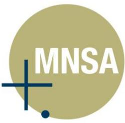

#### **INDEPENDENT AUDITOR'S REPORT TO THE OWNERS OF AEERIS LIMITED AND CONTROLLED ENTITIES ABN 18 166 705 595**

#### **Report on the Financial Report**

#### **Opinion**

**AEERIS LTD ABN 18 166 705 595 AND CONTROLLED ENTITIES**

**Directors' declaration**

In accordance with a resolution of the Directors of Aeeris Ltd, the Directors of the Company declare that:

1. The financial statements and notes, as set out on pages 12 to 41, are in accordance with the

the year ended on that date of the consolidated group.

its debts as and when they become due and payable.

the Chief Executive Officer and Chief Financial Officer.

(a) comply with Australian Accounting Standards, which, as stated in accounting policy Note 1 to the financial statements, constitutes compliance with International Financial Reporting Standards

(b) give a true and fair view of the financial position as at 30 June 2022 and of the performance for

2. In the director's opinion there are reasonable grounds to believe that the Company will be able to pay

3. The Directors have been given the declarations required by s 295A of the *Corporations Act 2001* from

*Corporations Act 2001* and:

**Chairman: _____________________________**

Mr Kerry Plowright

**Dated this 26th day of August 2022**

(IFRS); and

**Aeeris Ltd** ABN 18 166 705 595 Page 42

We have audited the accompanying financial report of Aeeris Limited (the Company) and its controlled entities(the Group), which comprises the consolidated statement of financial position as at 30 June 2022, the consolidated statement of profit or loss, the consolidated statement of changes in equity and the consolidated statement of cash flowsfor the year then ended, and notes to the consolidated financial statements, including a summary accounting policies and the directors' declaration.

In our opinion the accompanying financial report of the Group is in accordance with the Corporations Act 2001, including:

- a. giving a true and fair view of the Group's financial position as at 30 June 2022 and of its financial performance for the year then ended; and
- b. complying with Australian Accounting Standards and the Corporations Regulations 2001.

The financial report also complies with the International Financial Reporting Standards as disclosed in Note 1.

#### **Basis for Opinion**

We conducted our audit in accordance with Australian Auditing Standards. Our responsibilities under those standards are further described in the Auditor's Responsibilities for the Audit of the Financial Report section of our report. We are independent of the Group in accordance with the auditor independence requirements of the *Corporations Act 2001* and the ethical requirements of the Accounting Professional and Ethical Standards Board's APES 110 Code of Ethics for Professional Accountants (the Code) that are relevant to our audit of the financial report in Australia. We have also fulfilled our other ethical responsibilities in accordance with the Code.

We confirm that the independence declaration required by the *Corporations Act 2001*, which has been given to the directors of Aeeris Limited, would be in the same terms if given to the directors as at the time of this auditor's report.

We believe that the audit evidence we have obtained is sufficient and appropriate to provide a basis for our opinion.

{63}------------------------------------------------

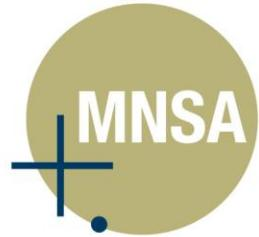

**Key Audit Matters (continued)**

Following previous operating losses and cash flow deficits, there is a heightened degree of judgement as to the group's ability to continue as a going concern through the assessment period.

Accordingly, we considered the appropriateness of the going concern assumption, the question as to whether there is a material uncertainty and the adequacy of management's disclosure to be a key

There were no restrictions on our reporting of Key Audit matters.

**Going Concern**

risk.

**Key Audit Matter How Our Audit Addressed the Key Audit Matter**

We have challenged the key assumptions in management's forecast cash flows for the next 12 months (base case and downside possibilities) by:

• comparing the cash flow forecasts with the Board approved budget, and obtaining explanations for any significant differences; • ensuring consistency between the forecasts in the group going concern model and those used

in the asset value-in-use calculations for impairment assessment purposes;

• assessing the historical accuracy of forecasts

• testing the mechanical accuracy of the model

management's cash flow for the going concern

• challenging management's plans for mitigating any identified exposures, obtain additional

• considering whether the disclosures relating to going concern referred to in the basis of preparation section of the accounting policies are balanced, proportionate and clear; and • Consider COVID-19 impacts cash flow forecast

We have determined that there are no material uncertainties that may cast significant doubt on the group's ability to continue as a going concern.

prepared by management;

sources of financing;

assumptions.

• performing stress tests for a range of reasonably possible scenarios on

used;

period;

#### **Key Audit Matters**

Key audit matters are those matters that, in our professional judgement, were of most significance in our audit of the financial report forthe year ended 30 June 2022. These matters were addressed in the context of our audit of the financial report as a whole, and in forming our opinion thereon, and we do not provide a separate opinion on these matters.

| Key Audit Matter | How Our Audit Addressed the Key Audit Matter |
|------------------|----------------------------------------------|

#### **Revenue recognition – accuracy of revenue recorded given the complexity of systems**

Revenue represents a material balance and we have identified the following types of transactions and assertions related to revenue recognition which give rise to key risks:

- the completeness of revenue recorded as a result of the reliance on output of the billing systems.
Refer to note 1 – Basis of preparation (Critical accounting estimates and judgments).

In responding to this area of focus, our audit approach included controls testing and substantive procedures covering, in particular:

- testing control procedures in place around systems that bill revenue streams;
- performing tests on the accuracy of customer bill generation on a sample basis and testing of a sample of the credits and discounts applied to enterprise customer bills;
- testing cash receipts for a sample of customers back to the customer invoice;
- testing the costs associated to the delivery of sales; and
- considering COVID-19 impacts to collection of trade receivables.

We also considered the application of the Group's accounting policies to amounts billed.

Based on our work, we noted no significant issues on the accuracy of revenue recorded in the year.

{64}------------------------------------------------

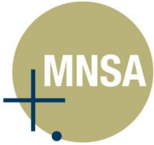

#### **Key Audit Matters (continued)**

**Key Audit Matters**

these matters.

**Revenue recognition – accuracy of revenue recorded given the complexity of systems**

Revenue represents a material balance and we have identified the following types of transactions and assertions related to revenue recognition

• the completeness of revenue recorded as a result of the reliance on output of the billing

Refer to note 1 – Basis of preparation (Critical accounting estimates and judgments).

which give rise to key risks:

systems.

Key audit matters are those matters that, in our professional judgement, were of most significance in our audit of the financial report forthe year ended 30 June 2022. These matters were addressed in the context of our audit of the financial report as a whole, and in forming our opinion thereon, and we do not provide a separate opinion on

**Key Audit Matter How Our Audit Addressed the Key Audit Matter**

In responding to this area of focus, our audit approach included controls testing and substantive procedures

• testing control procedures in place around systems that bill revenue streams;

enterprise customer bills;

back to the customer invoice;

accounting policies to amounts billed.

• performing tests on the accuracy of customer bill generation on a sample basis and testing of a sample of the credits and discounts applied to

• testing cash receipts for a sample of customers

• testing the costs associated to the delivery of

• considering COVID-19 impacts to collection of

We also considered the application of the Group's

Based on our work, we noted no significant issues on

the accuracy of revenue recorded in the year.

covering, in particular:

sales; and

trade receivables.

**Key Audit Matter How Our Audit Addressed the Key Audit Matter**

#### **Going Concern**

Following previous operating losses and cash flow deficits, there is a heightened degree of judgement as to the group's ability to continue as a going concern through the assessment period.

Accordingly, we considered the appropriateness of the going concern assumption, the question as to whether there is a material uncertainty and the adequacy of management's disclosure to be a key risk.

We have challenged the key assumptions in management's forecast cash flows for the next 12 months (base case and downside possibilities) by:

- comparing the cash flow forecasts with the Board approved budget, and obtaining explanations for any significant differences;
- ensuring consistency between the forecasts in the group going concern model and those used in the asset value-in-use calculations for impairment assessment purposes;
- assessing the historical accuracy of forecasts prepared by management;
- testing the mechanical accuracy of the model used;
- performing stress tests for a range of reasonably possible scenarios on management's cash flow for the going concern period;
- challenging management's plans for mitigating any identified exposures, obtain additional sources of financing;
- considering whether the disclosures relating to going concern referred to in the basis of preparation section of the accounting policies are balanced, proportionate and clear; and
- Consider COVID-19 impacts cash flow forecast assumptions.

We have determined that there are no material uncertainties that may cast significant doubt on the group's ability to continue as a going concern.

There were no restrictions on our reporting of Key Audit matters.

{65}------------------------------------------------

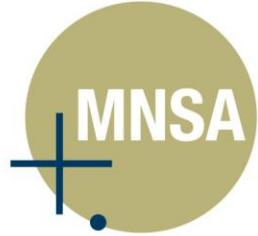

• Conclude on the appropriateness of the directors' use of the going concern basis of accounting and, based on the audit evidence obtained, whether a material uncertainty exists related to events or conditions that may cast significant doubt on the Group's ability to continue as a going concern. If we conclude that a material uncertainty exists, we are required to draw attention in our auditor's report to the related disclosures in the financial report or, if such disclosures are inadequate, to modify our opinion. Our conclusions are based on the audit evidence obtained up to the date of our auditor's report. However,

• Evaluate the overall presentation, structure and content of the financial report, including the disclosures, and whether the financial report represents the underlying transactions and events in a manner that

• Obtain sufficient appropriate audit evidence regarding the financial information of the entities or business activities within the Group to express an opinion on the financial report. We are responsible for the direction, supervision and performance of the Group audit. We remain solely responsible for our audit

We communicate with the directors regarding, among other matters, the planned scope and timing of the audit and significant audit findings, including any significant deficiencies in internal control that we identify during our

regarding independence, and to communicate with them all relationships and other matters that may reasonably

From the matters communicated with the directors, we determine those matters that were of most significance in the audit of the financial report of the current period and are therefore the key audit matters. We describe these matters in our auditor's report unless law or regulation precludes public disclosure about the matter or when, in extremely rare circumstances, we determine that a matter should not be communicated in our report because the adverse consequences of doing so would reasonably be expected to outweigh the public interest benefits of such

We also provide the directors with a statement that we have complied with relevant ethical requirements

be thought to bear on our independence, and where applicable, related safeguards.

future events or conditions may cause the Group to cease to continue as a going concern.

achieves fair presentation.

opinion.

audit.

communication.

#### **Other Information**

The directors are responsible for the other information. The other information comprises the information included in the Group's annual report for the year ended 30 June 2022, but does not include the financial report and our auditor's report thereon. Our opinion on the financial report does not cover the other information and accordingly we do not express any form of assurance conclusion thereon. In connection with our audit of the financial report, our responsibility is to read the other information and, in doing so, consider whether the other information is materially inconsistent with the financial report or our knowledge obtained in the audit or otherwise appears to be materially misstated. If, based on the work we have performed, we conclude that there is a material misstatement of this other information, we are required to report that fact. We have nothing to report in this regard.

#### **Responsibilities of the Directors for the Financial Report**

The directors of the company are responsible for the preparation of the financial report that gives a true and fair view in accordance with Australian Accounting Standards and the *Corporations Act 2001* and for such internal control as the directors determine is necessary to enable the preparation of the financial report that gives a true and fair view and is free from material misstatement, whether due to fraud or error. In preparing the financial report, the directors are responsible for assessing the ability of the Group to continue as a going concern, disclosing, as applicable, matters related to going concern and using the going concern basis of accounting unless the directors either intend to liquidate the Group or to cease operations, or have no realistic alternative but to do so.

#### **Auditor's Responsibilities for the Audit of the Financial Report**

Our objectives are to obtain reasonable assurance about whether the financial report as a whole is free from material misstatement, whether due to fraud or error, and to issue an auditor's report that includes our opinion. Reasonable assurance is a high level of assurance, but is not a guarantee that an audit conducted in accordance with the Australian Auditing Standards will always detect a material misstatement when it exists. Misstatements can arise from fraud or error and are considered material if, individually or in the aggregate, they could reasonably be expected to influence the economic decisions of users taken on the basis of this financial report.

As part of an audit in accordance with the Australian Auditing Standards, we exercise professional judgement and maintain professional scepticism throughout the audit. We also:

- Identify and assess the risks of material misstatement of the financial report, whether due to fraud or error, design and perform audit procedures responsive to those risks, and obtain audit evidence that is sufficient and appropriate to provide a basis for our opinion. The risk of not detecting a material misstatement resulting from fraud is higher than for one resulting from error, as fraud may involve collusion, forgery, intentional omissions, misrepresentations, or the override of internal control.
- Obtain an understanding of internal control relevant to the audit in order to design audit procedures that are appropriate in the circumstances, but not for the purpose of expressing an opinion on the effectiveness of the Group's internal control.
- Evaluate the appropriateness of accounting policies used and the reasonableness of accounting estimates and related disclosures made by the directors.

{66}------------------------------------------------

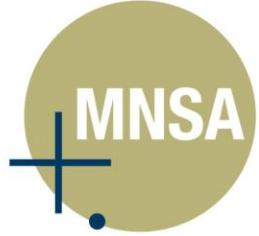

- Conclude on the appropriateness of the directors' use of the going concern basis of accounting and, based on the audit evidence obtained, whether a material uncertainty exists related to events or conditions that may cast significant doubt on the Group's ability to continue as a going concern. If we conclude that a material uncertainty exists, we are required to draw attention in our auditor's report to the related disclosures in the financial report or, if such disclosures are inadequate, to modify our opinion. Our conclusions are based on the audit evidence obtained up to the date of our auditor's report. However, future events or conditions may cause the Group to cease to continue as a going concern.
- Evaluate the overall presentation, structure and content of the financial report, including the disclosures, and whether the financial report represents the underlying transactions and events in a manner that achieves fair presentation.
- Obtain sufficient appropriate audit evidence regarding the financial information of the entities or business activities within the Group to express an opinion on the financial report. We are responsible for the direction, supervision and performance of the Group audit. We remain solely responsible for our audit opinion.

We communicate with the directors regarding, among other matters, the planned scope and timing of the audit and significant audit findings, including any significant deficiencies in internal control that we identify during our audit.

We also provide the directors with a statement that we have complied with relevant ethical requirements regarding independence, and to communicate with them all relationships and other matters that may reasonably be thought to bear on our independence, and where applicable, related safeguards.

From the matters communicated with the directors, we determine those matters that were of most significance in the audit of the financial report of the current period and are therefore the key audit matters. We describe these matters in our auditor's report unless law or regulation precludes public disclosure about the matter or when, in extremely rare circumstances, we determine that a matter should not be communicated in our report because the adverse consequences of doing so would reasonably be expected to outweigh the public interest benefits of such communication.

**Other Information**

so.

The directors are responsible for the other information. The other information comprises the information included in the Group's annual report for the year ended 30 June 2022, but does not include the financial report and our auditor's report thereon. Our opinion on the financial report does not cover the other information and accordingly we do not express any form of assurance conclusion thereon. In connection with our audit of the financial report, our responsibility is to read the other information and, in doing so, consider whether the other information is materially inconsistent with the financial report or our knowledge obtained in the audit or otherwise appears to be materially misstated. If, based on the work we have performed, we conclude that there is a material misstatement

of this other information, we are required to report that fact. We have nothing to report in this regard.

The directors of the company are responsible for the preparation of the financial report that gives a true and fair view in accordance with Australian Accounting Standards and the *Corporations Act 2001* and for such internal control as the directors determine is necessary to enable the preparation of the financial report that gives a true and fair view and is free from material misstatement, whether due to fraud or error. In preparing the financial report, the directors are responsible for assessing the ability of the Group to continue as a going concern,

disclosing, as applicable, matters related to going concern and using the going concern basis of accounting unless the directors either intend to liquidate the Group or to cease operations, or have no realistic alternative but to do

Our objectives are to obtain reasonable assurance about whether the financial report as a whole is free from material misstatement, whether due to fraud or error, and to issue an auditor's report that includes our opinion. Reasonable assurance is a high level of assurance, but is not a guarantee that an audit conducted in accordance with the Australian Auditing Standards will always detect a material misstatement when it exists. Misstatements can arise from fraud or error and are considered material if, individually or in the aggregate, they could reasonably

As part of an audit in accordance with the Australian Auditing Standards, we exercise professional judgement and

• Identify and assess the risks of material misstatement of the financial report, whether due to fraud or error, design and perform audit procedures responsive to those risks, and obtain audit evidence that is

sufficient and appropriate to provide a basis for our opinion. The risk of not detecting a material misstatement resulting from fraud is higher than for one resulting from error, as fraud may involve collusion, forgery, intentional omissions, misrepresentations, or the override of internal control. • Obtain an understanding of internal control relevant to the audit in order to design audit procedures that

are appropriate in the circumstances, but not for the purpose of expressing an opinion on the

• Evaluate the appropriateness of accounting policies used and the reasonableness of accounting estimates

be expected to influence the economic decisions of users taken on the basis of this financial report.

**Responsibilities of the Directors for the Financial Report**

**Auditor's Responsibilities for the Audit of the Financial Report**

maintain professional scepticism throughout the audit. We also:

effectiveness of the Group's internal control.

and related disclosures made by the directors.

{67}------------------------------------------------

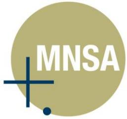

#### **Report on the Remuneration Report**

We have audited the Remuneration Report included on pages 8 to 10 of the directors' report for the year ended 30 June 2022.

In our opinion the remuneration report of Aeeris Limited for the year ended 30 June 2022, complies with section 300A of the *Corporations Act 2001*.

#### *Responsibilities*

The directors of the Company are responsible for the preparation and presentation of the Remuneration Report in accordance with section 300A of the *Corporations Act 2001*. Our responsibility is to express an opinion on the Remuneration Report, based on our audit conducted in accordance with Australian Auditing Standards.

**MNSA Pty Ltd**

**Allan Facey**  Director

Sydney Dated this 26th August 2022

{68}------------------------------------------------

**Report on the Remuneration Report**

300A of the *Corporations Act 2001*.

June 2022.

*Responsibilities* 

**MNSA Pty Ltd**

**Allan Facey**  Director

Dated this 26th August 2022

Sydney

We have audited the Remuneration Report included on pages 8 to 10 of the directors' report for the year ended 30

In our opinion the remuneration report of Aeeris Limited for the year ended 30 June 2022, complies with section

The directors of the Company are responsible for the preparation and presentation of the Remuneration Report in accordance with section 300A of the *Corporations Act 2001*. Our responsibility is to express an opinion on the Remuneration Report, based on our audit conducted in accordance with Australian Auditing Standards.

{69}------------------------------------------------

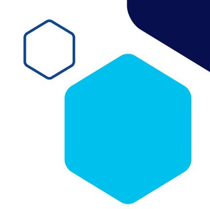

# **Additional Information for Listed Public Companies**

The following information is current as at 12 October 2022.

#### **Shareholding**

| Distribution of Shareholders | Number  |            |         |
|------------------------------|---------|------------|---------|
| Category (size of holding)   | Holders | Units      | %       |
| 1-1,000                      | 27      | 3,202      | 0.000   |
| 1,001-5,000                  | 27      | 82,105     | 0.110   |
| 5,001-10,000                 | 78      | 637,196    | 0.890   |
| 10,001-100,000               | 126     | 4,588,263  | 6.410   |
| 100,001-99,999,999,999       | 73      | 66,273,092 | 92.580  |
| Totals                       | 331     | 71,583,858 | 100.000 |

#### **Voting Rights**

Each ordinary share is entitled to one vote when a poll is called, otherwise each member present at a meeting or by proxy has one vote on a show of hands. There are no other classes of equity securities that have voting rights.

#### **20 Largest Shareholders**

| No. | Name                                                | Number of Ordinary Shares Held | % of Issued Capital |
|-----|-----------------------------------------------------|--------------------------------------|------------------------|
| 1   | K & M PLOWRIGHT SUPER PTY LIMITED                   | 8,564,780                            | 11.965%                |
| 2   | JETOSEA PTY LIMITED                                 | 6,100,000                            | 8.521%                 |
| 3   | MR KERRY MAURICE PLOWRIGHT                          | 5,782,298                            | 8.078%                 |
| 4   | JETOSEA PTY LTD                                     | 4,752,026                            | 6.638%                 |
| 5   | MS MARGO PLOWRIGHT                                  | 4,715,770                            | 6.588%                 |
| 6   | WASPZ PTY LIMITED                                   | 4,085,000                            | 5.707%                 |
| 7   | DMX CAPITAL PARTNERS LIMITED                        | 3,931,680                            | 5.492%                 |
| 8   | CERTANE CT PTY LTD <l39 a="" c="" capital=""></l39> | 3,375,000                            | 4.715%                 |
| 9   | VERITAS CONSOLIDATED PTY LTD                        | 2,838,962                            | 3.966%                 |
| 10  | BLUESTAR MANAGEMENT PTY LTD                         | 1,645,000                            | 2.298%                 |
| 11  | UBS NOMINEES PTY LTD                                | 1,530,357                            | 2.138%                 |
| 12  | NATIONAL NOMINEES LIMITED                           | 1,465,000                            | 2.047%                 |
| 13  | HSBC CUSTODY NOMINEES (AUSTRALIA) LIMITED           | 1,000,000                            | 1.397%                 |

{70}------------------------------------------------

| 14                                  | H RAYBURN NOMINEES PTY LTD <s a="" c="" fund="" h="" rayburn="" super=""></s> | 1,000,000  | 1.397%  |
|-------------------------------------|----------------------------------------------------------------------------------|------------|---------|
| 15                                  | MAD FISH MANAGEMENT PTY LTD                                                      | 712,237    | 0.995%  |
| 16                                  | BLUESTAR MANAGEMENT PTY LTD                                                      | 627,358    | 0.876%  |
| 17                                  | SYMINGTON PTY LTD                                                                | 600,000    | 0.838%  |
| 18                                  | IRWIN BIOTECH NOMINEES PTY LTD <bioa a="" c=""></bioa>                           | 556,250    | 0.777%  |
| 19                                  | MAMBAT PTY LTD                                                                   | 513,596    | 0.717%  |
| 20                                  | J P MORGAN NOMINEES AUSTRALIA PTY LIMITED                                        | 500,000    | 0.698%  |
| Total Securities of Top 20 Holdings |                                                                                  | 55,295,314 | 77.246% |
|                                     | Total Securities                                                                 | 71,583,858 |         |

The names of the substantial shareholders as disclosed in substantial holding notices given to the Company are:

| Shareholder                       | Number of Shares | % Issued Capital |
|-----------------------------------|------------------|------------------|
| Mr Kerry Plowright#               | 22,376,622       | 31.60%           |
| K & M Plowright Super Pty Limited | 5,012,858        | 7.08%            |
| Waspz Pty Limited                 | 4,085,000        | 5.77%            |
| Ms Margo Plowright                | 5,188,774        | 7.33%            |
| Mr. Bryce Reynolds*               | 3,843,708        | 5.43%            |
| Jetosea Pty Limited               | 11,178,252       | 15.79%           |

# Includes the substantial shareholders associates' holdings being K & M Plowright Super Pty Limited, Waspz Pty Limited and Ms. Margo Plowright * Includes related parties

#### **Unmarketable Holders**

There are 47 shareholders holding less than a marketable parcel of shares based on the closing price of \$0.135 on 12 October 2022 representing a total of 56,257 shares.

#### **Performance Rights**

Aeeris has 3,912,500 Performance Rights on issue held by 16 holders. The Performance Rights were issued under an Employee Incentive Scheme. Each Performance Right converts into one fully paid ordinary share once vesting conditions have been met.

#### **Options**

Aeeris has 3,540,000 Unlisted Options on issue exercisable at \$0.30 and expiring 6 December 2025 held by one holder, Veritas Consolidated Pty Ltd.

#### **Unmarketable Holders**

Aeeris is not undertaking an on-market buy-back.

{71}------------------------------------------------

## **Corporate Directory**

#### **Directors**

Kerry Plowright Executive Chairman & CEO

Bryce Reynolds Non-Executive Director

Elissa Hansen Non-Executive Director

Nathan Young Non-Executive Director

#### **Company Secretary**

Elissa Hansen

#### **Registered Office**

Aeeris Limited ACN 166 705 595

Level 12, 225 George Street, Sydney NSW 2000

Phone +61 2 6674 5717

Website: www.aeeris.com

#### **Share Registry**

Boardroom Pty Ltd Level 12, 225 George Street Sydney NSW 2000

Telephone +61 2 9290 9600 Facsimile +61 2 9279 0664

#### **Corporate Advisor**

Veritas Securities Limited

Level 4, 175 Macquarie Street Sydney NSW 2000

Phone +61 2 8252 3201 Facsimile +61 2 8252 3299

#### **Auditor**

Mark Schiliro & Associates (MNSA) Pty Ltd

Level 1, 283 George Street Sydney NSW 2000

#### **ASX Code**

AER

{72}------------------------------------------------

{73}------------------------------------------------

Level 12, 225 George Street **|** Sydney **|** NSW **|** 2000 Australia PO Box 1915 **|** Kingscliff **|** NSW **|** 2487 **|** Australia aeeris.com **|** ewn.com.au