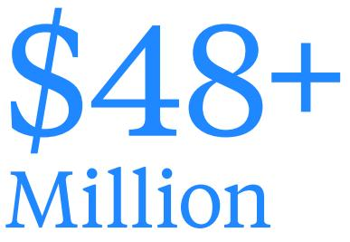
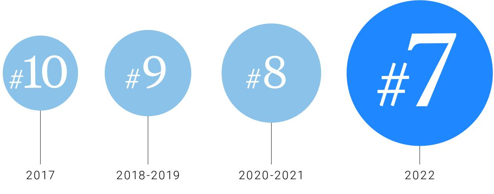
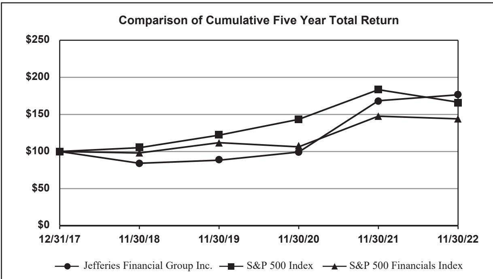
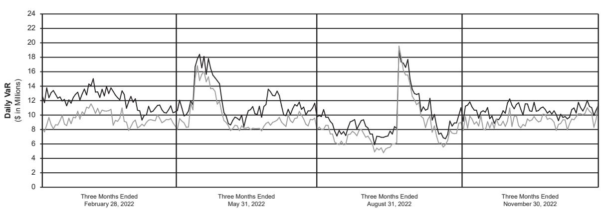
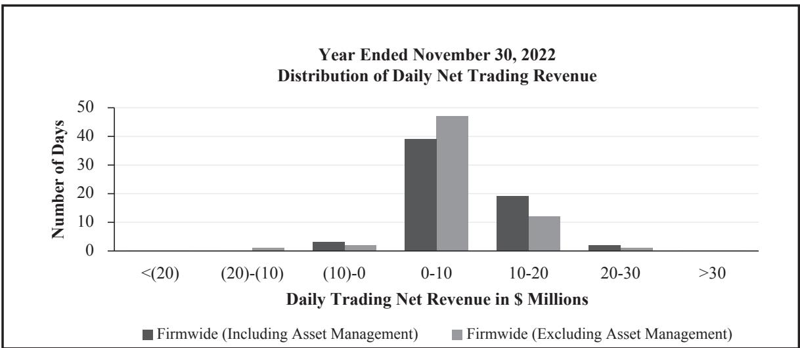

{0}------------------------------------------------

# Building a Distinct, Growing and Durable Global Wall Street Firm

**2022 ANNUAL REPORT**

{1}------------------------------------------------

### Dear Fellow Shareholders,

From 2009 through 2021, the world was awash with incredibly cheap (in some cases, nearly free) capital, as friendly stimulus became the antidote to every financial problem rearing its ugly head. Even recent geopolitical trauma and a global pandemic were no match for the central bank printing presses of nations around the globe. Modest unemployment and non-existent inflation somehow cohabitated in harmony. In 2021, the environment was "near perfection" for Jefferies, as well as for many of our clients. With 2022 behind us, the dreamy days of easy money and nonstop "risk on" as a guiding mantra have passed into the history books.

Before we get too melancholy, there are more than a few reasons for us to be optimistic, despite the industry-wide slowdown in 2022 and the litany of other crosscurrents we are still facing. At the top of our list is our belief that capital formation is not dead, it is just resting. It is incredibly difficult to price risk and capital when interest rate increases have no end in sight. This uncertainty makes everything freeze up and that is what happened in 2022, with this freeze eventually working its way into the M&A market.

The good news is that the pace and slope of interest rate increases appear to be declining, which implies, unless something unusual happens, we are closer to the thawing of the capital markets than the initial deep freeze. Investors understand this and will begin acting in anticipation of the new interest rate regime. As long as the stabilized rates aren't unduly excessive (and thus far, it appears they will be navigable), the world will go back to pricing risk, as well as pursuing new capital formation and increased M&A. We have no crystal ball and don't know if this will start at some point in 2023 or 2024, but we are confident it is only a matter of time—it always is. Jefferies could not be better positioned for this eventuality.

We have spent the last five years focusing on two goals: First, to do everything in our power to position Jefferies as the best full service global investment banking firm. Second, to optimize and monetize our legacy merchant banking portfolio and return to our shareholders any excess capital. In 2022, we finally crossed over to become a straightforward, highly focused and readily understandable pure-play investment banking firm.

Capital formation is not dead, it is just resting. ... As long as the stabilized rates aren't unduly excessive (and thus far, it appears they will be navigable), the world will go back to pricing risk, as well as pursuing new capital formation and increased M&A. ... Jefferies could not be better positioned for this eventuality.

{2}------------------------------------------------

IN BOTH M&A AND ECM GLOBALLY

#7

GLOBALLY IN COMBINED M&A, ECM AND LEVERAGED FINANCE

## \$1.1 Billion

CAPITAL RETURNED TO SHAREHOLDERS IN 2022

# \$5.0 Billion

CAPITAL RETURNED TO SHAREHOLDERS OVER THE LAST FIVE YEARS

Ironically, 2022 also was the year that two of Jefferies' most important businesses—IPOs and leveraged finance—were substantially closed due to unique market conditions. It is easy to think that this confluence of events is beyond frustrating and would cause us to question our original assumptions and strategic direction. For us, this could not be further from the truth. While part of our team was successfully wrapping up some additional legacy asset sales, preparing a major spin-off to shareholders and collapsing our holding company structure, the vast majority of our team did such a solid job that Jefferies' overall results in 2022 were incredibly respectable. Not only were we able to deliver a 10.3% return on adjusted tangible equity in a "really tough year," but more importantly, we continued to build upon the significant investments in people and infrastructure we have made over the past decades. We have never been more optimistic about our human capital, product capabilities, industry expertise and geographic breadth. Our goal is to continue to gain market share, further strengthening our "never better" competitive position, and continue our quest to be the best full service global investment banking firm.

Jefferies' 2022 total investment banking revenues, while down 38% from an off-the-charts 2021, represented our second-best year ever and were substantially above 2019 levels. Our advisory net revenues were only 5% below last year's all-time record result, while our underwriting net revenues were down 59% due to the IPO and leveraged finance markets being substantially closed for much of the year, as discussed above. Our combined equities and fixed income revenues were down only 19% versus 2021 and up meaningfully versus 2019.

Most significantly, for our fiscal 2022, Jefferies was the #6 largest investment banking firm in both global M&A, as well as global equity capital markets (excluding China), up from #12 and #13, respectively, only five years ago. We also moved up one spot from the prior year to #7 globally in combined M&A, ECM and leveraged finance, an improvement from #10 in 2017. It is worth noting that all the competitors ahead of us on these lists are trillion dollar plus global bank holding companies who often lead with their balance sheet, while Jefferies leads with ideas, expertise and human capital.

Our Equities franchise continued to expand in breadth and capability, while gaining market share across the majority of equity products in 2022. We achieved a U.S. ranking of #6 and a European ranking of #7 for equity research, while we were ranked #3 best overall in Asia for

{3}------------------------------------------------

combined equity research and sales. While our Fixed Income business was down for the year, our fourth quarter was up over 71% and we carried that momentum through the first month of fiscal 2023.

As mentioned above, monetizing our legacy merchant banking portfolio and returning capital to shareholders remains one of our overriding priorities, and we made continued progress in 2022. We expect to take a further important step later this week with our spin-off to shareholders of Vitesse Energy ("Vitesse"). In 2022, we returned an aggregate of \$1.14 billion to shareholders in the form of \$280.1 million in dividends and the repurchase of 25.6 million shares for a total of \$859.6 million, or \$33.58 per share. Over the last five years, we have now returned \$5.0 billion in total capital to shareholders, representing two-thirds of total tangible book value at January 1, 2018 and including 152.8 million shares repurchased at an average of \$23.57 per share. Further, our Vitesse spin-off delivers to our shareholders an additional estimated more than \$500 million of our shareholders' equity. Pro forma for the Vitesse spin-off, we will have returned over \$5.5 billion in total capital to shareholders over the last five years, representing over 72% of tangible book value at January 1, 2018.

Our goal is to continue to gain market share, further strengthening our "never better" competitive position, and continue our quest to be the best full service global investment banking firm.

{4}------------------------------------------------

#### **OBSERVATIONS AS WE PROCEED IN 2023**

#### **Be Aware and Wary of the Macro Forces, But Focus On What You Can Effect.**

At this point in our careers, we would like to think we have seen it all, but even if we haven't, we probably have seen enough. Everyone who knows us is likely tired of hearing our experiences and lessons from all the ups and downs over the past three-plus decades. In just the 2020s, we have experienced a global pandemic, an active European war, incredible tension between the two leading world powers, the storming of the U.S. Capitol Building, dramatic declines in the prices of most risk assets, raging inflation, a series of massive interest rate increases and the freezing up of the equity and leveraged finance new issue markets. And this is just the last three years!

We have stopped waiting for a "return to normalcy" because, after being beaten over the head for a combined 55 years at Jefferies, it is crystal clear to us that volatility, crosscurrents, surprises and challenges *are* what is normal. There is a relatively obscure movie where an aging Jack Nicholson looks back on his frustrating life and wonders: "What if this is as good as it gets?" We accept the complicated world for what it is, and we count our lucky stars Jefferies is in a position to confront it with outstanding resources and capabilities and find growing opportunity everywhere we look. Instead of driving ourselves nuts anticipating what will be thrown next at us, we are continuing to make sure our foundation is tremendously secure in terms of capital, risk systems, smart self-imposed limits and diversification by product, service, sector and geography.

As important as our financial footing is our cultural foundation at Jefferies. A team that is honest, transparent, empowered, entrepreneurial, ambitious, diverse and committed will get the job done regardless of the environment. With solid diversification of risk and opportunity, as well as the right team, we can devote our resources exclusively to the benefit of our clients—this will allow Jefferies not only to survive all the turmoil, but to find opportunities within each challenge. Many of our competitors have different approaches to these macro issues, as well as their capital foundation and culture, and often this provides Jefferies with the opportunity to succeed, better serve our clients and grow our market share. We have done this consistently for many decades, and our confidence in this approach has only been reinforced in recent years.

{5}------------------------------------------------

Every senior leader at Jefferies, including the two of us, proudly lives and works in the trenches every single day in partnership with our teammates for the benefit of our clients.

#### **Flatter for Longer.**

One of our differentiators at Jefferies has been the flatness of our organization. Every senior leader at Jefferies, including the two of us, proudly lives and works in the trenches every single day in partnership with our teammates for the benefit of our clients. Jefferies has always attracted the kind of individual who relishes truly adding value by providing great advice and execution tailored to our clients' needs. We create, innovate and solve the most important problems for our clients, whom we care deeply about. We have said it before, but we cannot say it enough: for Team Jefferies, everything is personal.

So, what happens when an organization grows to over 5,000 people and the hierarchy remains incredibly flat? We are not saying we have the same firm structure as we did 10, 20 or 30 years ago, because we clearly have made necessary changes, but those who know us or work at Jefferies realize how flat we really are—only an email or phone call away. There are many upsides to this structure. Issues get elevated instantly. There is really no place to hide at our firm and if you are lazy, political, ineffective or a conniver we will find you, quickly. In fact, our structure is so well known that for the most part those types of people don't even bother to apply because they know that they would not last long at Jefferies.

On the other hand, if you are special, you will also be identified and embraced, and your responsibility and position will rise very quickly because, quite frankly, we can never have too many of these partners at our firm. We admit proudly that we need the help and certainly do not have all the answers. Clearly, we provide our people with a lot of guidance and oversight, but we trust our people more than many of our competitors do and we believe our firm is better for this partnership. Promotions are earned and celebrated at Jefferies, but rewarding career paths are valued even more highly. As we continue to grow our firm, we will remain cognizant that we must make adjustments to manage our growth, but the underlying message is that everyone is an active contributor and no task is below anyone's pay grade, continuing to keep us hungry, motivated and humble.

{6}------------------------------------------------

#### **We Love Our Support Teams.**

We are very cognizant of what goes into supporting Jefferies from an operational, technological and legal perspective, since we have been building from the ground up everything one sees at Jefferies today versus inheriting the infrastructure, legacy systems and businesses that our massive bank holding company competitors have possessed for what feels like forever. We don't take for granted any of the people who settle our trades, build or support our technology, monitor our risk, market our brand, keep us in compliance or otherwise support our team and business. Jefferies' ownership mentality and "can do" entrepreneurial spirit permeates the entire support team of our firm, as much as it does the folks directly touching our clients. This is a secret weapon at Jefferies and we have never been let down, not even once. Going forward, this team will continue to be integral to our collective success.

#### **Practical and Honest ESG.**

We embrace ESG as individuals and as a firm not because we want check marks from graders to tell us that we passed, but because we believe it is the best way to run a business and live one's life. We know that having a diverse group of people with different backgrounds and experiences will always help us make the best long-term decisions, regardless of the problem or issue. We are grateful that through our eight Employee Resource Groups ("ERGs"), many employees have taken wonderful and deserved leadership roles throughout Jefferies and appreciate every day where we are getting better because of their efforts and the contagiousness of their drive, personalities and beliefs.

We have made great progress as a firm, and we are proud of it. That said, we also know there are areas where we have room for major improvement, most notably the diversity of our senior operating ranks. We are committed to building a more diverse firm and have long-term action plans to achieve specific results, while remaining steadfast in hiring the most qualified individuals for each role. We are confident that we will get to where we want to be and are as impatient and focused as every member of our ERGs (and countless others throughout Jefferies) who share with us these same beliefs.

Another example is fossil fuels. We believe in the reality of climate change and understand the pressure on all of us to transform the way A team that is honest, transparent, empowered, entrepreneurial, ambitious, diverse and committed will get the job done regardless of the environment.

{7}------------------------------------------------

the world deals with energy. We consider this one of the most important responsibilities of our generation, as we pass the baton to the next. We have made tremendous strides in this regard throughout our firm and are proud to be leaders. However, it is also clear to us that this switch is not an on/off, but rather a dimmer that will take time. For every action there is a reaction, and a cold turkey stop will cause short-term problems that will preclude us from solving the more important long-term issue. That is why we are working with our clients to do our best to finance and implement a smart, long-term transition that is practical, intelligent and sustainable.

The point here is that Jefferies is a firm that stands up for what is right and we have no issue questioning conventional thinking regardless of the short-term implications. That said, a mature, all-encompassing and realistic view of each issue is required, and then specific action must be charted and we must be held accountable. This approach is more nuanced, honest and valuable than contorting to a short-term goal of an arbitrary checklist.

#### **Building a Distinct, Growing and Durable Firm.**

Jefferies has always played the long game and for over 60 years has been building a distinct, growing and durable firm around client service and talent. Our success reflects the power of continuity of strategy and focus, and is borne out by our results and growth over time. Today, our value proposition is built on three pillars that set us apart from other leading firms:

**First: differentiated insight.** Our success is driven by distinct industry, market and strategic insights. We have in-depth research and investment banking coverage of virtually every industry sector, allowing us to deliver unique macro and sector perspectives and analyses. This further translates for our clients to bespoke advice tailored to their needs and challenges and informed by our vast expertise.

**Second: relationships matter.** At Jefferies, every relationship is personal —client engagements are partnerships and high-touch. We strive to deploy the full resources of our firm to meet our clients' needs every time. Similarly, we are built for global collaboration, without borders or bureaucracy. This has been true since Jefferies was founded and is why we've become one of a handful of investment banking firms that truly matter, with a consistent repeat client base. With our relentless focus on client service first, our clients trust that we care about their business and their success as much as they do.

{8}------------------------------------------------

**Third: we are a firm built on immediacy and client service.** With a flat, nimble and entrepreneurial culture, Jefferies treats each person as an individual and values them as a partner. As a result, Jefferies has become an increasingly more powerful magnet for the best talent. We expect to attract more special partners, but more importantly we will retain our existing team. Our team is driven to anticipate and deliver precisely what our clients need when they need it. Underlying our continuing growth story is that no matter the conventional wisdom, groupthink or market cycle at any given time, we are patient, focused on the long-term and committed to serving our clients best.

#### **Doing Good is Good Business.**

One of our biggest privileges at Jefferies is being surrounded by our team, clients and shareholders who work in concert to devote our global platform to raising enormous amounts of precious dollars for those in the world who are far less fortunate than all of us. In 2022, we sent over \$13 million to support the people of Ukraine within days of the war breaking out. In the past five years, we have distributed over \$48 million, providing aid and relief efforts for Australia's wildfires, COVID-19, Haiti, Hurricane Dorian, Asia Pacific Tonga and Ukraine. Additionally, we and others at Jefferies contribute a great amount of our personal money and, more importantly, our time to countless causes throughout our communities around the globe to help make a difference in the lives of so many in need of assistance. This is the culture at Jefferies, as it permeates our newest hires, our most senior leaders and everyone in between. This is a responsibility and a privilege, and we are incredibly proud that it will always be an important and permanent part of the Jefferies social fabric.

DONATED IN THE LAST 5 YEARS

{9}------------------------------------------------

#### **JEFFERIES RANKING ACROSS GLOBAL M&A, ECM AND LEVERAGED FINANCE**

#### **Now, for a further update on our businesses:**

#### **INVESTMENT BANKING**

For fiscal 2022, Jefferies ranked as the 7th largest investment banking firm globally across our three core businesses—M&A, equity capital markets and leveraged finance. This ranking represents a record for our firm and sustains a multi-decade trajectory of market share growth.

We have been able to elevate our market position because we have been providing our clients with differentiated service. This is a result of our consistent investment across the cycle in (i) the best sub-sectoral experts in every major field of business activity and (ii) an ever-expanding and extensive local team across the globe. Most importantly, our exceptional team delivers the entirety of our firm's resources and capability to every client and every transaction. This combination—the best sub-sectoral experts, an extensive global footprint and a culture of service—has made Jefferies a unique investment banking partner for our clients.

With each year that passes, the expanding breadth of our resources and the stability and longevity of our team further extend these advantages. Commensurately, our competitors (primarily bank holding companies) have increasingly moved away from a culture of service and prioritizing professional talent and towards a balance sheet and off-the-shelf product model, which

{10}------------------------------------------------

has served to further differentiate our clients' experience in partnering with Jefferies.

While our market position and share has continued to elevate, the deterioration in capital markets over the course of 2022 materially reduced our short-term opportunity. In M&A, we were able to achieve near record revenues in 2022, despite an 11% reduction in the global fee pool, reflecting the strength of our offering and our increased standing amongst clients globally. Conversely, in ECM and leveraged finance, our revenues declined by 69%, commensurate with a decline in fee pools of 60%, representing the weakest capital markets fee pools since 2009. While our absolute revenue in 2022 represents a significant decline from our record results in 2021, the strength of our team, elevation of our market position and the continued opportunity we have to add the most talented professionals globally to our firm (all as reflected in our exceptional advisory results) leaves us optimistic about our ability to serve clients and deliver revenue growth over the cycle.

Consistent with our opportunity and longstanding strategy, in 2022 we continued to invest in our team in order to further serve our clients, with notable additions to our senior team across the TMT, Consumer, Healthcare and Industrials sectors, as well as further investments in areas of specialization such as private capital advisory and EMEA restructuring. We also continued to expand our global reach and capability, further expanding our teams in France, Italy, Scandinavia, Hong Kong, India and Southeast Asia (Singapore).

The strength of our team, elevation of our market position and the continued opportunity we have to add the most talented professionals globally to our firm (all as reflected in our exceptional advisory results) leaves us optimistic about our ability to serve clients and deliver revenue growth over the cycle.

{11}------------------------------------------------

#### **JEFFERIES FINANCE**

The dislocation in the leveraged finance market presented a difficult backdrop for Jefferies Finance ("JFIN"), our lending joint venture with MassMutual. JFIN posted a net loss of \$129 million for 2022, as commitments to LBO transactions were sold at a loss or marked down at year-end in anticipation of their syndication. JFIN has been highly productive over the years and, despite these challenges, is well-positioned entering 2023. JFIN remains focused on utilizing its expanded underwriting capacity from our strategic alliance with Sumitomo Mitsui Financial Group ("SMFG") to grow market share as the environment improves and credit markets stabilize. We expect that, similar to prior market downturns, JFIN will emerge stronger from this period, and again prove the strength of our market position and the resiliency of our business model.

JFIN is also focused on growing the asset management segments of its business, as we build upon the tangible progress achieved in 2022 raising and managing third party capital across our private credit and CLO vehicles. JFIN goes to market with a distinct advantage that sets it apart from its competitors, as JFIN is able to leverage our longstanding investment banking relationships to source high quality loan investment opportunities. With the recent expansion of JFIN's capital raising team, JFIN expects continued growth in lending capacity leading to significant value creation for Jefferies.

{12}------------------------------------------------

#### **BERKADIA**

Berkadia, our commercial real estate finance and investment sales 50/50 joint venture with Berkshire Hathaway, generated \$283 million of pretax income and \$259 million of cash earnings for 2022. After a robust start to the year, rising interest rates slowed debt and investment sales volume in the second half. Reduced fee revenue was offset by net interest income increasing 44% to \$109 million. Total debt originations were \$39.4 billion, up 4% from the prior year. Debt origination volumes with Freddie Mac, Fannie Mae and HUD were \$18.8 billion, down 14% from the prior year. Third-party funded originations were \$19.1 billion, up 26% from the prior year. Investment sales volumes were \$28.5 billion, up 34% from the prior year. Debt origination and additional third-party loan servicing arrangements increased our loan servicing portfolio to a new record of \$389.9 billion by year-end, up 19% in twelve months.

Berkadia continues to invest in and develop its mortgage banking and investment sales networks. Despite a slowing real estate market, Berkadia's growing servicing portfolio and market share in core debt origination and investment sales combine to position Berkadia for continued success in 2023 and beyond.

#### **SMFG ALLIANCE**

In July 2021, we entered a strategic alliance with Sumitomo Mitsui Financial Group to collaborate on future corporate and investment banking business opportunities. The first twelve months of our strategic alliance were limited by COVID lockdowns that prevented travel to facilitate our collaboration, as well as the limited window in the leveraged finance market in 2022 meaningfully reducing our near-term joint opportunity. Over the last few months, we have been experiencing increasing engagement and

We are incredibly pleased that our long-held thesis of aligning a great global Wall Street firm with a substantial, forward-looking global commercial bank holding company is playing out well and will provide the opportunity to expand our businesses considerably.

{13}------------------------------------------------

momentum, including our first jointly underwritten IPO, and we expect accelerating success in 2023.

Our opportunities to collaborate are expanding and Jefferies is working together with SMFG to develop further ways to work together to better serve our clients globally. We are incredibly pleased that our long-held thesis of aligning a great global Wall Street firm with a substantial, forward-looking global commercial bank holding company is playing out well and will provide the opportunity to expand our businesses considerably.

#### **EQUITIES**

Our Equities net revenues of \$1.06 billion reflected strong performance, despite a challenging market environment experienced across all developed global equity markets. 2022 was a year that saw Jefferies continue to benefit from consolidation, with improved market share and ranking across research, sales and trading in every region. Jefferies is now among a select few leaders in global equities.

The Jefferies equities strategy is built on three pillars: advisory and insight driven by our equity and macro research teams, differentiated distribution around the world, and cutting-edge execution capabilities. Our global research effort is now recognized as one of the top equity research

Jefferies is now among a select few leaders in global equities.

{14}------------------------------------------------

franchises across relevant surveys. We produced a record high of more than 34,000 research reports in 2022.

Our client footprint has expanded by approximately 20% over the last five years, resulting in record commission and advisory payment levels. We are excited about the opportunities to continue expanding our market share gains as we add more solutions for our clients through expanded product capabilities and intensified global footprint.

#### **FIXED INCOME**

Our Fixed Income trading results in 2022 declined 20% versus 2021, as persistent inflation caused the Federal Reserve to embark on its largest tightening campaign since the 1970s. While we were prudent in reducing inventory and risk, we did take losses in our commercial mortgage business as spreads widened meaningfully in that market. The good times always take care of themselves, and it is smarter to assess a business in a period of severe dislocation and rising rates to best judge the team and strategy. By these measures, we could not be happier with our team as they enter 2023.

In 2022, we continued to improve our client franchise and take market share, particularly in our credit businesses. Our ongoing focus on technology-enabled trading capabilities and strong collaboration between the high touch and low touch desks has enabled us to help our clients reposition risk in these difficult markets, increasing our relevance and driving incremental opportunities in high yield. By expanding this strategy across other businesses globally, we anticipate similar improvements in both market share and revenues.

We continue to execute our plan to grow our European fixed income business and synergistically complement the investments we are making in European investment banking. We were voted by our clients as having the #1 net positive business momentum in European credit for the third year in a row.

#### **LEUCADIA ASSET MANAGEMENT**

Despite a turbulent year with sustained high volatility and declines in most major indices and asset classes, Leucadia Asset Management ("LAM") continued to grow its key operating metrics, namely assets under management ("AUM") and management fee related revenue. The overall value proposition of our offering of actively managed, alternative strategies was enhanced and highlighted in an environment where the S&P, HFRI Hedge Fund Index, Bloomberg High Yield and Bloomberg Investment Grade indices were down 11%, 8%, 13% and 17%, respectively, while our strategies on a whole outperformed these indices.

{15}------------------------------------------------

This relative outperformance has led to sustained AUM increases despite a difficult fund-raising environment. (We define AUM as assets of funds and separately managed accounts managed by us or an affiliated asset manager in which we have an equity interest or with whom we have an ongoing revenue sharing arrangement.) AUM increased by 22% from \$23.8 billion to \$29.1 billion during fiscal 2022. \$2.3 billion of the increase was organic growth from managers that were on the LAM platform at the beginning of the year. The gains were driven in particular by positive flows into CoreCommodity (commodities), Schonfeld (multi-manager) and Point Bonita (alternative credit trade finance). This continues the trend from prior years leading to a 52% increase in management fee related revenue to \$50.5 million. The growth in AUM suggests a solid base for a continued increase in the coming year.

We continued to expand the offerings of alternative strategies on our platform, adding Hildene (opportunistic structured credit), Illuminate (fin-tech focused venture capital), ISO-mts (financial institution niche credit), Pearlstone (European credit) and Tephra (liquid digital assets). These strategies often take a bit of time to get traction and build their track records but with the offerings that were added in prior years we believe we are well positioned with a diversified offering for institutional investors. We also have a strong pipeline of new opportunities as we seek to continue to enhance our product offering.

#### **ANNUAL MEETING AND INVESTOR MEETING**

Thanks for hearing us out. We look forward to answering any further questions you may have at our upcoming Annual Meeting on March 29, 2023. We also will hold our annual Jefferies Investor Meeting on October 17, 2023, at which time you will have the opportunity to hear from our senior leaders across the Jefferies platform. We thank all of you—our clients and customers, employee-partners, fellow shareholders, bondholders, vendors and all others associated with our businesses for your continued partnership and support.

Sincerely,

**RICHARD B. HANDLER** Chief Executive Officer

**BRIAN P. FRIEDMAN** President

{16}------------------------------------------------

### Appendix

The following tables reconcile financial results reported in accordance with generally accepted accounting principles ("GAAP") to non-GAAP financial results. The Shareholder Letter contains non-GAAP financial information to aid investors in viewing our businesses and investments through the eyes of management while facilitating a comparison across historical periods. However, these non-GAAP financial measures should be viewed in addition to, and not as a substitute for, reported results prepared in accordance with GAAP.

#### **Reconciliation of Return on Adjusted Tangible Equity**

| (\$ millions)                                                         | (Unaudited) Year Ended Nov. 30, 2022 |
|-----------------------------------------------------------------------|--------------------------------------------|
| Net income attributable to common shareholders (GAAP)                 | \$ 777                                  |
| Intangible amortization and impairment expense, net of tax            | 8                                          |
| Adjusted net income attributable to common shareholders (non-GAAP) | \$ 785                                  |

| (\$ millions)                                                                         | Nov. 30, 2021 |
|---------------------------------------------------------------------------------------|---------------|
| Shareholders' equity (GAAP)                                                           | \$ 10,554  |
| Less: Intangible assets, net and goodwill                                             | (1,898)       |
| Less: Deferred tax asset                                                              | (328)         |
| Less: Weighted average year-to-date impact of cash dividends and share repurchases | (671)         |
| Adjusted tangible shareholders' equity (non-GAAP)                                     | \$ 7,657   |

Return on adjusted tangible shareholders' equity (non-GAAP) 10.3%

#### **Calculation of Tangible Book Value as of January 1, 2018**

| (\$ millions)                             |    | Dec. 31, 2017 |  |
|-------------------------------------------|----|---------------|--|
| Shareholders' equity (GAAP)               | \$ | 10,106        |  |
| Less: Intangible assets, net and goodwill |    | (2,463)       |  |
| Tangible book value (non-GAAP)            | \$ | 7,643         |  |

#### **BERKADIA**

#### **Reconciliation of Pre-Tax Income to Cash Earnings**

| (\$ millions)                                                           | (Unaudited) Year Ended Nov. 30, 2022 |
|-------------------------------------------------------------------------|--------------------------------------------|
| Pre-tax income (GAAP)                                                   | \$ 283                                  |
| Less: Gains attributable to origination of mortgage servicing rights | (241)                                      |
| Amortization, impairment and depreciation                               | 190                                        |
| Unrealized (gains) losses; and all other, net                           | 27                                         |
| Cash earnings (non-GAAP)                                                | \$ 259                                  |

#### **ADDITIONAL SHAREHOLDER LETTER NOTES**

Market Position Statistics presented within the Shareholder Letter are referenced from several independent sources, as noted below:

#### **Dealogic**

- **•** 6th globally in mergers and acquisitions and equity capital markets (excluding China), up from #12 and #13, respectively five years ago
- **•** 7th globally in mergers and acquisitions, equity capital markets and leveraged finance, up from #10 in 2017
- **•** 7th globally in Equity Underwriting; 6th in EMEA and 7th in the U.S. in Equity Underwriting
- **•** Global mergers and acquisitions fee pool declined 11% in 2022
- **•** Equity capital markets and leveraged finance global fee pool declined by 60%

#### **Coalition Greenwich 2022 Fixed Income Study**

- **•** 1st in net positive business momentum in European Credit for three years in a row
#### **Research II**

- **•** #6 in U.S. equity research
- **•** #7 in European equity research

#### **Asiamoney**

- **•** 3rd best overall combined research and sales
#### **CAUTIONARY NOTE ON FORWARD-LOOKING STATEMENTS**

This letter contains certain "forward-looking statements" within the meaning of the safe harbor provisions of the U.S. Private Securities Litigation Reform Act of 1995. Forward-looking statements are based on current views and include statements about our future and statements that are not historical facts. These forward-looking statements are usually preceded by the words "should," "expect," "intend," "may," "will," "would," or similar expressions. Forward-looking statements may contain expectations regarding revenues, earnings, operations, and other results, and may include statements of future performance, plans, and objectives. Forward-looking statements may also include statements pertaining to our strategies for future development of our businesses and products. Forwardlooking statements represent only our belief regarding future events, many of which by their nature are inherently uncertain. It is possible that the actual results may differ, possibly materially, from the anticipated results indicated in these forward-looking statements. Information regarding important factors, including Risk Factors that could cause actual results to differ, perhaps materially, from those in our forward-looking statements is contained in reports we file with the SEC. You should read and interpret any forward-looking statement together with reports we file with the SEC. We undertake no obligation to update or revise any such forward-looking statement to reflect subsequent circumstances.

Past performance may not be indicative of future results. Different types of investments involve varying degrees of risk. Therefore, it should not be assumed that future performance of any specific investment or investment strategy will be profitable or equal the corresponding indicated performance level(s).

{17}------------------------------------------------

#### UNITED STATES SECURITIES AND EXCHANGE COMMISSION

WASHINGTON, D.C. 20549

### FORM 10-K

-ANNUAL REPORT PURSUANT TO SECTION 13 OR 15(d) OF THE SECURITIES EXCHANGE ACT OF 1934

For the fiscal year ended November 30, 2022

OR

TRANSITION REPORT PURSUANT TO SECTION 13 OR 15(d) OF THE SECURITIES EXCHANGE ACT OF 1934

For the transition period from to

Commission file number 1-5721

### JEFFERIES FINANCIAL GROUP INC.

(Exact name of registrant as specified in its charter)

(State or other jurisdiction of incorporation or organization)

New York 13-2615557

(I.R.S. Employer Identification No.)

520 Madison Avenue, New York, New York 10022 (Address of principal executive offices) (Zip Code)

(212) 284-2300

Registrant's telephone number, including area code: Securities registered pursuant to Section 12(b) of the Act:

| Title of each class: | Trading Symbol(s) | Name of each exchange on which registered: |
|----------------------|-------------------|--------------------------------------------|
|                      |                   |                                            |

Common Shares, par value \$1 per share JEF New York Stock Exchange 4.850% Senior Notes Due 2027 JEF 27A New York Stock Exchange

2.750% Senior Notes Due 2032 JEF 32A New York Stock Exchange

Securities registered pursuant to Section 12(g) of the Act:

None.

Indicate by check mark if the registrant is a well-known seasoned issuer, as defined in Rule 405 of the Securities Act.

No

Indicate by check mark if the registrant is not required to file reports pursuant to Section 13 or Section 15(d) of the Act. Yes No -

Indicate by check mark whether the registrant (1) has filed all reports required to be filed by Section 13 or 15(d) of the Securities Exchange Act of 1934 during the preceding 12 months (or for such shorter period that the registrant was required to file such reports), and (2) has been subject to such filing requirements for the past 90 days.

Yes - No Indicate by check mark whether the registrant has submitted electronically every Interactive Data File required to be submitted pursuant to Rule 405 of Regulation S-T (§ 232.405 of this chapter) during the preceding 12 months (or for such shorter period that the registrant was required to submit such files).

Yes -

Yes -

No

Indicate by check mark whether the registrant is a large accelerated filer, an accelerated filer, a non-accelerated filer, a smaller reporting company, or an emerging growth company. See the definitions of ''large accelerated filer,'' ''accelerated filer,'' ''smaller reporting company,'' and ''emerging growth company'' in Rule 12b-2 of the Exchange Act.

> Large accelerated filer -Accelerated filer Non-accelerated filer

Smaller reporting company Emerging growth company

If an emerging growth company, indicate by check mark if the registrant has elected not to use the extended transition period for complying with any new or revised financial accounting standards provided pursuant to Section 13(a) of the Exchange Act. Indicate by check mark whether the registrant has filed a report on and attestation to its management's assessment of the effectiveness of its internal control over financial reporting under Section 404(b) of the Sarbanes-Oxley Act (15 U.S.C. 7262(b)) by the registered public accounting firm that prepared or issued its audit report. -

Indicate by check mark whether the registrant is a shell company (as defined in Rule 12b-2 of the Act).

Yes No -

Aggregate market value of the voting stock of the registrant held by non-affiliates of the registrant at May 31, 2022 (computed by reference to the last reported closing sale price of the Common Shares on the New York Stock Exchange on such date): \$6,658,740,985.

On January 19, 2023, the registrant had outstanding 226,162,081 Common Shares.

DOCUMENTS INCORPORATED BY REFERENCE:

Certain portions of the registrant's Definitive Proxy Statement pursuant to Regulation 14A of the Securities Exchange Act of 1934 in connection with the 2023 Annual Meeting of Shareholders are incorporated by reference into Part III of this Form 10-K.

{18}------------------------------------------------

#### JEFFERIES FINANCIAL GROUP INC. INDEX TO ANNUAL REPORT ON FORM 10-K November 30, 2022

#### PART I.

|                                                                                                            | Page |
|------------------------------------------------------------------------------------------------------------|------|
| Item 1. Business                                                                                           | 1    |
| Item 1A. Risk Factors                                                                                      | 10   |
| Item 1B. Unresolved Staff Comments                                                                         | 23   |
| Item 2. Properties                                                                                         | 24   |
| Item 3. Legal Proceedings                                                                                  | 24   |
| Item 4. Mine Safety Disclosures.                                                                           | 24   |
| PART II. FINANCIAL INFORMATION                                                                             |      |
| Item 5. Market for Registrant's Common Equity, Related Stockholder Matters and Issuer                      |      |
| Purchases Equity Securities.                                                                               | 25   |
| Item 6. [Reserved]                                                                                         | 26   |
| Item 7. Management's Discussion and Analysis of Financial Condition and Results of Operations              | 26   |
| Consolidated Results of Operations                                                                         | 27   |
| Executive Summary                                                                                          | 28   |
| Revenues by Source.                                                                                        | 30   |
| Non-interest Expenses                                                                                      | 39   |
| Accounting Developments.                                                                                   | 41   |
| Critical Accounting Policies                                                                               | 41   |
| Liquidity, Financial Condition and Capital Resources                                                       | 45   |
| Risk Management                                                                                            | 58   |
| Item 7A. Quantitative and Qualitative Disclosures About Market Risk                                        | 69   |
| Item 8. Financial Statements and Supplementary Data                                                        | 70   |
| Index to Consolidated Financial Statements                                                                 | 70   |
| Management's Report on Internal Control Over Financial Reporting                                           | 71   |
| Reports of Independent Registered Public Accounting Firm                                                   | 72   |
| Consolidated Statements of Financial Condition                                                             | 75   |
| Consolidated Statements of Earnings.                                                                       | 76   |
| Consolidated Statements of Comprehensive Income                                                            | 77   |
| Consolidated Statements of Changes in Equity                                                               | 78   |
| Consolidated Statements of Cash Flows.                                                                     | 79   |
| Notes to Consolidated Financial Statements                                                                 | 81   |
| Item 9. Changes in and Disagreements with Accountants on Accounting and Financial Disclosure               | 174  |
| Item 9A. Controls and Procedures                                                                           | 174  |
| Item 9B. Other Information.                                                                                | 174  |
| Item 9C. Disclosure Regarding Foreign Jurisdictions that Prevent Inspections                               | 174  |
| PART III. OTHER INFORMATION                                                                                |      |
| Item 10. Directors, Executive Officers and Corporate Governance                                            | 174  |
| Item 11. Executive Compensation                                                                            | 175  |
| Item 12. Security Ownership of Certain Beneficial Owners and Management and Related Stockholder Matters | 175  |

|  | Item 13. Certain Relationships and Related Transactions, and Director Independence. |  |  |  |  | 175 |
|--|-------------------------------------------------------------------------------------|--|--|--|--|-----|
|  | Item 14. Principal Accountant Fees and Services.                                    |  |  |  |  | 175 |

#### PART IV. EXHIBITS AND SIGNATURES

| Item 15. Exhibits and Financial Statement Schedules. | 176 |
|------------------------------------------------------|-----|
| Item 16. Form 10-K Summary                           | 178 |
| Signatures                                           | 179 |

{19}------------------------------------------------

#### PART I

#### Item 1. Business

#### Introduction

Jefferies Financial Group Inc. (''Jefferies,'' ''we,'' ''us'' or ''our'') is a U.S.-headquartered global full service, integrated investment banking and securities firm. Our largest subsidiary, Jefferies LLC, a U.S. broker-dealer, was founded in the U.S. in 1962 and our first international operating subsidiary, Jefferies International Limited, a U.K. broker-dealer, was established in the U.K. in 1986. Our strategy focuses on continuing to build out our investment banking effort, enhancing our capital markets businesses and further developing our Leucadia Asset Management alternative asset management platform.

Our global headquarters and executive offices are located at 520 Madison Avenue, New York, New York 10022. We also have regional headquarters in London and Hong Kong. Our primary telephone number is 212-284-2300 and our Internet address is jefferies.com where we make available, free of charge, our annual reports on Form 10-K, quarterly reports on Form 10-Q and current reports on Form 8-K and amendments to those reports filed or furnished pursuant to Section 13(a) or 15(d) of the Securities Exchange Act of 1934, as well as proxy statements, as soon as reasonably practicable after we electronically file with the U.S. Securities and Exchange Commission (''SEC'') and can also be viewed at sec.gov.

The following documents and reports are also available on our public website:

- Audit Committee Charter
- Code of Business Practice
- Compensation Committee Charter
- Corporate Governance Guidelines
- Corporate Social Responsibility Principles
- Reportable waivers, if any, from our Code of Business Practice by our executive officers
- ESG, Diversity, Equity and Inclusion Committee Charter
- Health and Safety Policy
- Human Rights Statement
- Nominating and Corporate Governance Committee Charter
- Risk and Liquidity Oversight Committee Charter
- Supplier Code of Conduct
- Sustainable Investment Statement
- Whistle Blower Policy

We may use our website to disclose public information. We encourage you to visit our website for additional information. In addition, you may also obtain a printed copy of any of the above documents or reports by sending a request to Investor Relations, Jefferies Financial Group Inc., 520 Madison Avenue, New York, NY 10022, by calling 212-284-2300 or by sending an email to info@jefferies.com.

#### Jefferies Group LLC Merger into Jefferies Financial Group Inc.

On November 1, 2022, we streamlined and simplified our corporate structure by merging Jefferies Group LLC with and into Jefferies Financial Group Inc. Prior to the merger, Jefferies Group LLC, a direct wholly-owned subsidiary, was an SEC reporting company, filing annual, quarterly and periodic financial reports. The merger has eliminated the requirement for two sets of SEC filings and other duplicative processes. In addition, in connection with the merger, we assumed the debt obligations of Jefferies Group LLC.

{20}------------------------------------------------

#### Business Segments

We report our activities in two business segments: (1) Investment Banking and Capital Markets and (2) Asset Management.

- Investment Banking and Capital Markets provides investment banking, capital markets and other related services to our clients. We provide underwriting and financial advisory services across most industry sectors in the Americas; Europe and the Middle East; and Asia. Our capital markets businesses operate across the spectrum of equities and fixed income products. Related services include prime brokerage, equity finance, research and strategy, corporate lending and real estate finance. Investment Banking and Capital Markets also includes our corporate lending joint venture (''JFIN Parent LLC'' or ''Jefferies Finance''), our commercial real estate finance joint venture (''Berkadia Commercial Holding LLC'' or ''Berkadia'') and our automobile lending and servicing activities.
- Asset Management provides alternate investment management services to investors globally. In addition, through our asset management efforts, we often invest seed or additional strategic capital for our own account in the strategies offered by us and affiliated asset managers.

Previously we reported certain businesses and activities as part of a Merchant Banking reportable segment and a Corporate reportable segment. This legacy portfolio of businesses and investments are reflected in our consolidated results as consolidated subsidiaries, equity investments, securities or in other ways. We have been liquidating this portfolio through third party sales and distributions to shareholders and are committed to winding down this portfolio and returning excess capital to shareholders. During the year ended November 30, 2022 and in connection with the merger, we transferred these merchant banking investments primarily to our Asset Management reportable segment. These investments are now managed by the respective segment managers and we have revised our reportable segment presentation accordingly. Additionally, corporate activities are now fully allocated to either the Investment Banking and Capital Markets reportable segment or the Asset Management reportable segment. Prior year amounts have been revised to conform to the current segment reporting.

Financial information regarding our reportable business segments for the years ended November 30, 2022, 2021 and 2020 is set forth in Note 24, Segment Reporting in our consolidated financial statements included in this Annual Report on Form 10-K in Part II, Item 8 as updated by Exhibit 99.1 to our Form 8-K filed on October 7, 2022. Also, refer to Management's Discussion and Analysis in Part II., Item 7 for further information about changes in the presentation of our revenues and results of operations.

#### Our Businesses

#### Investment Banking and Capital Markets

Our Investment Banking and Capital Markets segment focuses on Investment Banking, Equities and Fixed Income. We primarily serve institutional investors, corporations and government entities.

#### Investment Banking

We provide our clients around the world with a full range of financial advisory, equity underwriting and debt underwriting services. Our services are enhanced by our deep industry expertise, our global distribution capabilities and our senior level commitment to our clients.

Our investment banking professionals operate in the Americas, Europe and the Middle East and Asia, and are organized into industry, product and geographic coverage groups. Our industry coverage groups include: Consumer & Retail; Energy; Financial Institutions; Healthcare; Industrials; Media, Communications and Information Services; Real Estate, Gaming & Lodging; Financial Sponsors, Public Finance and Technology. Our product coverage groups include advisory (which comprises both mergers and acquisitions, private capital and restructuring and recapitalization expertise), equity underwriting and debt underwriting. Our geographic coverage 

{21}------------------------------------------------

groups include teams based in major cities in the United States, London, Frankfurt, Paris, Milan, Madrid, Warsaw, Amsterdam, Stockholm, Dubai, Mumbai, Hong Kong, Singapore, Sydney, Tokyo and Zurich.

#### Advisory Services

We provide mergers/acquisitions, restructurings/recapitalizations and private capital advisory services to companies, financial sponsors and government entities. In the mergers and acquisitions area, we advise business owners and corporations on mergers and acquisitions, divestitures, strategic ventures and corporate defense activities. In the restructuring and recapitalization area, we provide companies, bondholders and lenders a full range of restructuring advisory capabilities as well as expertise in the structuring, valuation and placement of securities issued in recapitalizations. As part of our private capital advisory business, we advise financial sponsors on the creation and structuring of funds and fund offerings, and we also advise large institutional investors on the sale of private equity limited partnership and co-investment interests.

#### Equity Underwriting

We provide a broad range of equity financing capabilities to companies and financial sponsors. These capabilities include private placements of equity, initial public offerings, including initial public offerings for special purpose acquisition companies, follow-on offerings, at the market offerings, block trades and equity-linked securities transactions.

#### Debt Underwriting

We provide a wide range of debt and acquisition financing capabilities to companies, financial sponsors and government entities. We focus on structuring, underwriting and distributing public and private debt, including investment grade debt, high yield bonds, leveraged loans, municipal debt, mortgage-backed and other assetbacked securities and liability management solutions.

#### Other Investment Banking Activities

Jefferies Finance, our 50/50 joint venture with Massachusetts Mutual Life Insurance Company, structures, underwrites and syndicates primarily senior secured loans to corporate borrowers; and manages proprietary and third-party investments for both broadly syndicated and direct lending loans. Jefferies Finance conducts its operations primarily through two business lines, Leveraged Finance Arrangement and Portfolio and Asset Management. Loans are originated primarily through our investment banking efforts and Jefferies Finance typically syndicates to third-party investors substantially all of its arranged volume through us. The Portfolio and Asset Management business lines, collectively referred to as Jefferies Credit Partners, manages a broad portfolio of assets under management comprised of portions of loans it has arranged, as well as loan positions that it has purchased in the primary and secondary markets. Jefferies Credit Partners is comprised of three registered Investment Advisors: Jefferies Finance, Apex Credit Partners LLC and JFIN Asset Management LLC, which serve as a private credit platform managing proprietary and third-party capital across comingled funds, separately managed accounts and collateralized loan obligations.

Berkadia Commercial Mortgage Holding LLC (''Berkadia'') is our 50/50 joint venture with Berkshire Hathaway, Inc. that provides capital solutions, investment sales advisory and mortgage servicing for multifamily and commercial real estate. Berkadia originates commercial real estate loans, primarily in respect of multifamily housing units, for the Federal National Mortgage Association (''Fannie Mae''), the Federal Home Loan Mortgage Corporation (''Freddie Mac'') and the Federal Housing Authority and will typically sell the loans to such entities shortly after the loans are funded with Berkadia retaining the mortgage servicing rights. For loans sold to Fannie Mae, Berkadia assumes a shared loss position throughout the term of each loan, with a maximum loss percentage of approximately one-third of the original principal balance. Berkadia also originates and brokers commercial/multifamily mortgage loans, which are not part of the government agency programs. In addition, 

{22}------------------------------------------------

Berkadia originates loans for its own balance sheet. These loans provide interim financing to borrowers who intend to refinance the loan with longer-term loans from an eligible government agency or other third-party. Berkadia also provides services related to the acquisition and disposition of multifamily real estate projects, including brokerage services, asset review, market research, financial analysis and due diligence support and is a servicer of U.S. commercial real estate loans.

Foursight Capital LLC (''Foursight'') purchases and services automobile loans. The loans are typically transferred to securitization trusts and Foursight retains the equity interests in the trusts earning net interest income and servicing income from these activities.

#### Strategic Alliance with SMBC Group

In July 2021, we entered into a strategic alliance with Sumitomo Mitsui Financial Group, Inc., Sumitomo Mitsui Banking Corporation and SMBC Nikko Securities Inc. (together referred to as ''SMBC Group'') to collaborate on future corporate and investment banking business opportunities. We aim to, among other things, coordinate efforts in the U.S. leveraged finance business to expand and scale existing offerings; form a global strategic partnership to seek cross-border mergers and acquisition opportunities involving Japanese companies; and jointly pursue investment banking, capital markets and financing opportunities by leveraging our shared strengths.

#### Equities

#### Equities Research, Capital Markets

We provide our clients full-service equities research, sales and trading capabilities across global equities markets with key capabilities in cash equities, electronic trading, equity derivatives, convertibles and corporate access. We earn commissions or spread revenue by executing, settling and clearing transactions for clients across these markets in equity and equity-related products, including common stock, American depository receipts, global depository receipts, exchange-traded funds, exchange-traded and over-the-counter (''OTC'') equity derivatives, convertible and other equity-linked products and closed-end funds. Our equity research, sales and trading efforts are organized across three geographical regions: the Americas; Europe and the Middle East; and Asia. Our clients are primarily institutional market participants such as mutual funds, hedge funds, investment advisors, pension and profit sharing plans, and insurance companies. Through our global research team and sales force, we maintain relationships with our clients, distribute investment research and insights, trading ideas, market information and analyses across a range of industries and receive and execute client orders.

#### Equity Finance

Our Equity Finance business provides financing, securities lending and other prime brokerage services. We offer prime brokerage services in the U.S. that provide hedge funds, money managers and registered investment advisors with execution, financing, clearing, outsourced trading, reporting and administrative services. We finance our clients' securities positions through margin loans that are collateralized by securities, cash or other acceptable liquid collateral. We earn an interest spread equal to the difference between the amount we pay for funds and the amount we receive from our clients. We also operate a matched book in equity and corporate bond securities, whereby we borrow and lend securities versus cash or liquid collateral and earn a net interest spread. We offer selected prime brokerage clients the option of custodying their assets at an unaffiliated U.S. brokerdealer that is a subsidiary of a bank holding company. Under this arrangement, we directly provide our clients with all customary prime brokerage services.

#### Wealth Management

We provide tailored wealth management services designed to meet the needs of high net worth individuals, their families and their businesses, private equity and venture funds and small institutions. Our advisors provide 

{23}------------------------------------------------

access to all of our institutional execution capabilities and deliver other financial services. Our open architecture platform affords clients access to products and services from both our firm and from a variety of other major financial services institutions.

#### Fixed Income

Our global Fixed Income business is led by our global credit franchise, which is supported by our leverage finance investment banking platform. We provide our clients with sales and trading across all fixed income securities, including investment grade corporate bonds, U.S. and European government and agency securities, municipal bonds, mortgage-backed and asset-backed securities, leveraged loans, consumer loans, high yield and distressed securities, emerging markets debt, interest rate and credit derivative products, as well as foreign exchange trade execution and securitization capabilities. Jefferies LLC is designated as a Primary Dealer by the Federal Reserve Bank of New York and Jefferies GmbH is designated in similar capacities for several countries in Europe and the Middle East. Additionally, through the use of repurchase agreements, we act as an intermediary between borrowers and lenders of short-term funds and obtain funding for various of our inventory positions. We trade and make markets globally in cleared and uncleared swaps and forwards referencing, among other things, interest rates, investment grade and non-investment grade corporate credits, credit indexes and asset-backed security indexes.

Our strategists and economists provide ongoing commentary and analysis of the global fixed income markets. In addition, our fixed income desk strategists provide ideas and analysis to clients across a variety of fixed income products.

#### Asset Management

Under the Leucadia Asset Management (''LAM'') umbrella, we manage and provide services to a diverse group of alternative asset management platforms across a spectrum of investment strategies and asset classes. LAM offers institutional clients an innovative range of investment strategies through its directly owned and affiliated managers. Our products are currently offered to pension funds, insurance companies, sovereign wealth funds, and other institutional investors globally. The investment products under LAM range from multi-manager products to niche equity long/short strategies to credit strategies, among other strategies. We offer our affiliated asset managers access to capital, robust operational infrastructure and global marketing and distribution. We often invest seed or additional strategic capital for our own account in the strategies offered by us and associated third-party asset managers in which we have an interest.

We continue to expand our asset management efforts and establish further strategic relationships to expand our offerings including sector and region specific long/short equity and quantitative strategies with a view to growth in our overall assets under management and scale in fee revenue.

On December 1, 2021 and on November 1, 2022 in connection with the merger of Jefferies Group LLC into Jefferies Financial Group Inc., we expanded the activities of our asset management business and transferred certain of our historical merchant banking portfolio investments to our Asset Management segment. These investments are now managed by the co-heads of Asset Management. Included in this portfolio as of November 30, 2022 are investments in certain public equity securities; investments in OpNet S.p.A. (''OpNet,'' formerly known as ''Linkem''), 63% (wireless broadband services in Italy); Vitesse Energy, LLC (''Vitesse Energy''), 97%, and JETX Energy, LLC (''JETX Energy''), 98%, (oil and gas); HomeFed LLC (''HomeFed''), 100% (real estate); 54 Madison, 48.1% (real estate development fund); Golden Queen Mining Company, LLC (''Golden Queen''), 50% (gold and silver mining); and FXCM Group, LLC (''FXCM''), 50% voting interest in FXCM and a majority of all distributions in respect of the equity of FXCM (provider of online foreign exchange trading services); and other investments in private companies and asset management funds.

We intend to sell or distribute to our shareholders a significant portion of this portfolio over the next few years. During the third quarter of 2022, we sold all of our interests in Idaho Timber and, on January 13, 2023, we distributed our ownership interests in Vitesse Energy on a tax-free pro rata basis to our shareholders. 

{24}------------------------------------------------

Additionally, during the fourth quarter we sold all of our interests in the Oak Hill investment management company.

#### Human Capital

Our people make up the fabric of our firm, which comprises diverse and innovative teams. We are focused on the durability, health and long-term growth and development of our business, as well as our long-term contribution to our shareholders, our clients, our employees, the communities in which we live and work, and society in general. Instrumental to all of this is our culture, which derives from our employees.

We have employees located throughout the world. At November 30, 2022, we had 5,381 employees globally with approximately 66.5%, 23.1% and 10.4% of our workforce distributed across the Americas, Europe and the Middle East and Asia, respectively.

Our employees are predominantly in our Investment Banking and Capital Markets segment or the support thereof. During fiscal 2022, our overall employee count decreased by 3.1%, primarily as a result of the sale of a wholly-owned subsidiary, Idaho Timber, partially offset by growth of our investment banking business, as well as additions in technology and other corporate services staff to support our growth and other strategic priorities.

#### Talent Acquisition and Campus Recruiting

In order to compete effectively and continue to provide best-in-class service to our clients, we must attract, retain, and motivate qualified professionals. Our workforce is predominately composed of employees in roles such as investment bankers, salespeople, trading professionals, research professionals and other revenue producing or specialized personnel. During 2022, we hired approximately 1,200 professionals globally. Within our Investment Banking and Capital Markets segment, our voluntary turnover rate was approximately 12.4%, which makes our overall retention rate very high in our view. We believe our culture, our effort to maintain a meritocracy in terms of opportunity and our continued evolution and growth contribute to our success in attracting and retaining strong talent.

We are focused on broadening the pipeline from which we recruit and hiring diverse talent through both campus and lateral hiring initiatives. For campus recruiting, we have partnered with several organizations globally to broaden our pipeline of candidates. We host insight days and symposiums that describe Jefferies to candidates that come from a diverse range of backgrounds. For all roles, we recommend both a diverse slate of candidates to be considered for roles and a diverse panel of interviewers. Interviewing guides and resources are provided to hiring managers in an effort to support inclusive hiring.

We have launched two targeted recruiting programs aimed at diversifying the pipeline of our lateral hires, including a career relaunch program, aimed at those who have taken a break from the workforce, and a job switch program aimed at recruiting individuals who are interested in changing careers into Equity Research. Both programs yielded full time hires in 2022.

#### Talent Development

We value continued training and development for all employees. We seek to equip our people at all stages in their careers with the tools necessary to become thoughtful and effective leaders. We have a large number of development programs, including our Women in Leadership Series, a program focused on providing learning and development opportunities to position our female leaders for success. In 2022, the program was expanded to include opportunities for in-person networking across regions. Our leadership development program sponsored by our Jefferies Black & Latino Network (J-NOBLE) and Jefferies Ethnic Minority Society (JEMS) is aimed at providing professional development and career advancement training to participants. Additionally, we offer customized, year-long training curriculums across all divisions and title levels globally for Investment Banking, Fixed Income, Equities and Corporate focused on technical skills, professional development, and management best practices. These training programs are also available to employees of our subsidiaries. In 2022, we 

{25}------------------------------------------------

introduced our inaugural New Managing Director Promotion Program, a leadership development program tailored to our newly promoted Managing Directors at the firm.

#### Wellness

In addition to training and development programs, we continue to be incredibly focused on the physical and mental well-being of our employees. We host frequent wellness webinars and offer confidential, 1:1 wellness counseling globally. To support our employee's physical well-being, we host both in-person and virtual fitness classes and have partnered with a fitness application our employees can utilize.

#### Diversity, Equity, and Inclusion

The foundation of our culture is our approach to employee engagement, diversity, equity and inclusion, which is summed up in our Corporate Social Responsibility Principle: Respect People. We embrace diversity and inclusion, which we believe fosters creativity, innovation and thought leadership through the infusion of new ideas and perspectives. We have implemented a number of policies and measures focused on non-discrimination, sexual harassment prevention, health and safety, and training and education. We have strong internal partnerships engaging Employee Resource Groups that are fostering a diverse, inclusive workplace. Our Diversity Council, co-sponsored by Rich Handler, our CEO, and Brian Friedman, our President, gives our Employee Resource Groups a platform to come together and discuss best practices, as well as collaborate on firmwide diversity initiatives.

In conjunction with the Employee Resource Groups, firmwide Diversity and Inclusion initiatives are focused on open firm-wide dialogues, promotion of allyship and bias mitigation, and providing resources for development and recruiting the best talent from a diverse pool. In 2023, we are rolling out the next iteration of our inclusion training focused on inclusive leadership. We are focused on improving the collection and transparency of diversity metrics and the information flow to senior leadership and utilize an annual inclusion-focused employee engagement survey, which enables staff to provide feedback on an anonymous basis. We have also made a commitment to building a culture that provides opportunities for all employees regardless of our differences. As a result, we are able to pool our collective insights and intelligence to provide fresh and innovative thinking for our clients.

Our Board has established an ESG, Diversity, Equity and Inclusion (''ESG/DEI'') Committee, which, among other things, oversees the sustainability matters arising from our business and includes oversight over diversity and inclusion. The ESG/DEI Committee demonstrates our and the Board's ongoing commitment of driving and fostering diversity in the workforce and in the communities in which we operate.

We encourage you to review our ESG Report (located on our website) for more detailed information regarding our human capital programs and initiatives. Nothing on our website, including the ESG Report or sections thereof is deemed incorporated by reference into this Report. In addition, for discussion of the risks relating to our ability to attract, develop and retain highly skilled and productive employees, see ''Part 1. Item 1A. Risk Factors.''

#### Employee Benefits

Our benefits are designed to attract and retain employees by providing employees and their spouses, partners and families with health and wellness programs (medical, dental, vision and behavioral), retirement wealth accumulation, paid time off, income replacement (paid sick and disability leaves and life insurance) and familyoriented benefits (parental leaves and child care assistance). This year, we rolled out a new benefit for employees to support inclusive fertility health and family-forming benefits to all employees. We also endeavor to provide location specific health club, transportation and employee discounts.

{26}------------------------------------------------

The firm is committed to giving back to our communities. In 2022, we donated \$15.7 million to approximately 28 organizations across two ''Doing Good'' trading days. Additionally, through our Employee Resource Groups, employees have created lasting partnerships by volunteering time to support several of these charitable partners.

#### Competition

All aspects of our business are intensely competitive. We compete primarily with large global bank holding companies that engage in investment banking and capital markets activities as one of their lines of business and that have greater capital and resources than we do. We also compete against other broker-dealers, asset managers and boutique firms. We believe the principal factors driving our competitiveness include our ability to provide differentiated insights to our clients that lead to better business outcomes; to attract, retain and develop skilled professionals; to deliver a competitive breadth of high quality service offerings; and to maintain a flat, nimble and entrepreneurial culture built on immediacy and client service.

#### Regulation

Regulation in the United States. The financial services industry in which we operate is subject to extensive regulation. In the U.S., the SEC is the federal agency responsible for the administration of federal securities laws, and the Commodity Futures Trading Commission (''CFTC'') is the federal agency responsible for the administration of laws relating to commodity interests (including futures, commodity options and swaps). In addition, the Financial Industry Regulatory Authority, Inc. (''FINRA'') and the National Futures Association (''NFA'') are self-regulatory organizations (''SROs'') that are actively involved in the regulation of financial services businesses (securities businesses in the case of FINRA and commodities/futures businesses in the case of the NFA). In addition, broker-dealers that conduct securities activities involving municipal securities are subject to regulation by the Municipal Securities Rulemaking Board (''MSRB''). In addition to federal regulation, we are subject to state securities regulations in each state and U.S. territory in which we conduct securities or investment advisory activities. The SEC, FINRA, CFTC, NFA and state securities regulators conduct periodic examinations of broker-dealers, investment advisors, futures commission merchants (''FCMs''), swap dealers and security-based swap dealers (''SBS dealers''). The designated examining authority under the U.S. Securities Exchange Act of 1934, as amended (the ''Exchange Act'') for Jefferies LLC's activities as a broker-dealer is FINRA, and the designated self-regulatory organization under the U.S. Commodity Exchange Act for Jefferies LLC's non-clearing FCM activities is the NFA. Financial services businesses are also subject to regulation and examination by state securities regulators and attorneys general in those states in which they do business. In addition, broker-dealers, investment advisors, FCMs, swap dealers and SBS dealers must also comply with the rules and regulation of clearing houses, exchanges, swap execution facilities and trading platforms of which they are a member.

Broker-dealers are subject to SEC, FINRA, MSRB and, state securities regulations that cover all aspects of the securities business, including sales and trading methods, trade practices among broker-dealers, use and safekeeping of customers' funds and securities, capital structure and requirements, anti-money laundering efforts, recordkeeping and the conduct of broker-dealer personnel including officers and employees (although state securities regulations are, in a number of cases, more limited). Registered investment advisors are subject to, among other requirements, SEC regulations concerning marketing, transactions with affiliates, custody of client assets, disclosures to clients, conflict of interest, insider trading and recordkeeping; and investment advisors that are also registered as commodity trading advisors or commodity pool operators are also subject to regulation by the CFTC and the NFA. FCMs, introducing brokers and swap dealers that engage in commodity options, futures or swap transactions are subject to regulation by the CFTC and the NFA, and SBS dealers are subject to regulation by the SEC. Additional legislation, changes in rules promulgated by the SEC, FINRA, CFTC, NFA, other SROs of which the broker-dealer is a member, and state securities regulators, or changes in the interpretation or enforcement of existing laws or rules may directly affect the operations and profitability of broker-dealers, investment advisors, FCMs, commodity trading advisors, commodity pool operators, swap dealers and SBS dealers. The SEC, CFTC, FINRA, NFA, state securities regulators and state attorneys general 

{27}------------------------------------------------

may conduct administrative proceedings or initiate civil litigation that can result in adverse consequences for Jefferies LLC, its affiliates, including affiliated investment advisors, as well as its and their officers and employees (including, without limitation, injunctions, censures, fines, suspensions, directives that impact business operations (including proposed expansions), membership expulsions, or revocations of licenses and registrations).

SEC Regulation Best Interest (''Reg BI'') requires that a broker-dealer and its associated persons act in a retail customer's best interest and not place their own financial or other interests ahead of a retail customer's interests when recommending securities transactions or investment strategies, including recommendations of types of accounts. To meet this best interest standard, a broker-dealer must satisfy four component obligations including a disclosure obligation, a care obligation, a conflict of interest obligation, and a compliance obligation and both broker-dealers and investment advisors are required to provide disclosures about their standard of conduct and conflicts of interest.

In addition, certain states, have proposed or adopted measures that would make broker-dealers, sales agents and investment advisors and their representatives subject to a fiduciary duty when providing products and services to customers. The SEC did not indicate an intent to pre-empt state regulation in this area, and some of the state proposals would allow for a private right of action. Since our Wealth Management division makes recommendations to retail customers, it is required to comply with the obligations imposed under Reg BI and applicable state laws.

Regulatory Capital Requirements. Several of our entities are subject to financial capital requirements that are set by regulation. Jefferies LLC is a dually registered broker-dealer and FCM and is required to maintain net capital in excess of the greater of the SEC or CFTC minimum financial requirements. As a broker-dealer, Jefferies LLC is subject to the SEC's Uniform Net Capital Rule (the ''Net Capital Rule''). Jefferies LLC has elected to compute its minimum net capital requirement in accordance with the ''Alternative Net Capital Requirement'' as permitted by the Net Capital Rule, which provides that a broker-dealer shall not permit its net capital, as defined, to be less than the greater of 2% of its aggregate debit balances (primarily customer-related receivables) or \$250,000 (\$1.5 million for prime brokers). Compliance with the Net Capital Rule could limit Jefferies LLC's operations, such as underwriting and trading activities, and financing customers' prime brokerage or other margin activities, in each case, that could require the use of significant amounts of capital, limit its ability to engage in certain financing transactions, such as repurchase agreements, and may also restrict its ability (i) to make payments of dividends, withdrawals or similar distributions or payments to a stockholder/parent or other affiliate, (ii) to make a redemption or repurchase of shares of stock, or (iii) to make an unsecured loan or advance to such shareholders or affiliates. As a carrying/clearing broker-dealer, under FINRA Rule 4110, FINRA could impose higher minimum net capital requirements than required by the SEC, and could restrict a broker-dealer from expanding business or require the broker-dealer to reduce its business activities. If the broker dealer also carries accounts for other broker dealers which are engaged in proprietary trading, it may need net capital of \$7 million or tentative net capital of \$25 million, depending on circumstances. As a non-clearing FCM, Jefferies LLC is also required to maintain minimum adjusted net capital of \$1.0 million.

SEC registered broker-dealers that also register with the SEC as security-based swap dealers engaging in principal transactions of security-based swaps (''SBS'') are subject to rules regarding capital, segregation and margin requirements. The SEC rules establish similar standards for an entity registering as a standalone SBS dealer. The CFTC and NFA have also adopted swap dealer capital rules. Under the rules there is a minimum net capital requirement for, among others, an entity that acts as a dealer in SBS or swaps, which is the greater of \$20 million or 2% (that the SEC could, in the future, increase up to 4% or 8%) of a risk margin amount. The risk margin amount for the SEC means the sum of (i) the total initial margin required to be maintained by the SECregistered SBS dealer at each clearinghouse with respect to SBS or swap transactions cleared for SBS or swap customers and (ii) the total initial margin amount calculated by the SEC-registered SBS dealer with respect to non-cleared SBS and swaps under the SEC rules. The risk margin amount for the CFTC means the total initial margin amount calculated by the CFTC-registered swap dealer with respect to non-cleared SBS and swaps under the CFTC rules.

Jefferies Financial Services, Inc. (''JFSI''), one of our subsidiaries, is registered with the CFTC as a swap dealer and registered with the SEC as an SBS and is required to comply with the SEC and CFTC capital rules for SBS 

{28}------------------------------------------------

dealers and swap dealers, respectively. Further, as an OTC derivatives dealer, JFSI is subject to compliance with the SEC's net capital requirements.

Under the Exchange Act, state securities regulators are not permitted to impose capital, margin, custody, financial responsibility, making and keeping records, bonding, or financial or operational reporting requirements on registered broker-dealers that differ from, or are in addition to, the requirements in those areas established under the Exchange Act, including the rules and regulations promulgated thereunder.

For additional information see Item 1A. Risk Factors – ''Legislation and regulation may significantly affect our business.''

Jefferies Financial Group Inc. is not subject to any regulatory capital rules.

See Net Capital within Item 7. Management's Discussion and Analysis and Note 23, Net Capital Requirements in this Annual Report on Form 10-K for additional discussion of net capital calculations.

Regulation outside the United States. We are an active participant in the international capital markets and provide investment banking services internationally, primarily in Europe and the Middle East and Asia. As in the U.S., our international subsidiaries are subject to extensive regulations proposed, promulgated and enforced by, among other regulatory bodies, the European Commission and European Supervisory Authorities (including the European Banking Authority and European Securities and Market Authority), U.K. Financial Conduct Authority, German Federal Financial Supervisory Authority (''BaFin''), Investment Industry Regulatory Organization of Canada, Hong Kong Securities and Futures Commission, the Japan Financial Services Agency, the Monetary Authority of Singapore and the Australian Securities and Investments Commission. Every country in which we do business imposes upon us laws, rules and regulations similar to those in the U.S., including with respect to some form of capital adequacy rules, customer protection rules, data protection regulations, anti-money laundering and anti-bribery rules, compliance with other applicable trading and investment banking regulations and similar regulatory reform.

#### Item 1A. Risk Factors

#### Factors Affecting Our Business

The following factors describe some of the assumptions, risks, uncertainties and other factors that could adversely affect our business or that could necessitate unforeseen changes to the ways we operate our businesses or could otherwise result in changes that differ materially from our expectations. In addition to the specific factors mentioned in this report, we may also be affected by other factors that affect businesses generally, such as global or regional changes in economic, business or political conditions, acts of war, terrorism, pandemics, climate change, and natural disasters.

#### Market and Liquidity Risks

#### Our business is subject to significant credit risk.

In the normal course of our businesses, we are involved in the execution, settlement and financing of various customer and principal securities and derivative transactions. These activities are transacted on a cash, margin or delivery-versus-payment basis and are subject to the risk of counterparty or customer nonperformance. Even when transactions are collateralized by the underlying security or other securities, we still face the risks associated with changes in the market value of the collateral through settlement date or during the time when margin is extended and collateral has not been secured or the counterparty defaults before collateral or margin can be adjusted. We may also incur credit risk in our derivative transactions to the extent such transactions result in uncollateralized credit exposure to our counterparties.

{29}------------------------------------------------

We seek to control the risk associated with these transactions by establishing and monitoring credit limits and by monitoring collateral and transaction levels daily. We may require counterparties to deposit additional collateral or return collateral pledged. In certain circumstances, we may, under industry regulations, purchase the underlying securities in the market and seek reimbursement for any losses from the counterparty. However, there can be no assurances that our risk controls will be successful.

#### We are exposed to market risk and our principal trading and investments expose us to risk of loss.

Market risk generally represents the risk that values of assets and liabilities or revenues will be adversely affected by changes in market conditions. Market risk is inherent in the financial instruments associated with our operations and activities, including trading account assets and liabilities, loans, securities, short-term borrowings, corporate debt, and derivatives. Market conditions that change from time to time, thereby exposing us to market risk, include fluctuations in interest rates, equity prices, relative exchange rates, and price deterioration or changes in value due to changes in market perception or actual credit quality of an issuer.

In addition, disruptions in the liquidity or transparency of the financial markets may result in our inability to sell, syndicate, or realize the value of security positions, thereby leading to increased concentrations. The inability to reduce our positions in specific securities may not only increase the market and credit risks associated with such positions, but also increase capital requirements, which could have an adverse effect on our business, results of operations, financial condition, and liquidity.

A considerable portion of our revenues is derived from trading in which we act as principal. We may incur trading losses relating to the purchase, sale or short sale of fixed income, high yield, international, convertible, and equity securities, loans, derivative contracts and commodities for our own account. In any period, we may experience losses on our inventory positions as a result of the level and volatility of equity, fixed income and commodity prices (including oil prices), lack of trading volume and illiquidity. From time to time, we may engage in a large block trade in a single security or maintain large position concentrations in a single security, securities of a single issuer, securities of issuers engaged in a specific industry, or securities from issuers located in a particular country or region. In general, because our inventory is marked to market on a daily basis, any adverse price movement in these securities could result in a reduction of our revenues and profits. In addition, we may engage in hedging transactions that if not successful, could result in losses.

See Management's Discussion and Analysis of Financial Condition and Results of Operations-Risk Management within Part II, Item 7. of this Annual Report on Form 10-K for additional discussion.

#### A credit-rating agency downgrade could significantly impact our business.

Maintaining an investment grade credit rating is important to our business and financial condition. If our credit ratings were downgraded, or if rating agencies indicate that a downgrade may occur, our business, financial position and results of operations could be adversely affected and perceptions of our financial strength could be damaged, which could adversely affect our client relationships. Additionally, we intend to access the capital markets and issue debt securities from time to time, and a decrease in our credit ratings or outlook could adversely affect our liquidity and competitive position, increase our borrowing costs, decrease demand for our debt securities and increase the expense and difficulty of financing our operations. In addition, in connection with certain over-the-counter derivative contract arrangements and certain other trading arrangements, we may be required to provide additional collateral to counterparties, exchanges and clearing organizations in the event of a credit rating downgrade. Such a downgrade could also negatively impact the prices of our debt securities. There can be no assurance that our credit ratings will not be downgraded.

{30}------------------------------------------------

#### We may be adversely affected by changes in or the discontinuance of Interbank Offered Rates (''IBORs''), in particular, London Interbank Offered Rate (''LIBOR'').

Central banks and regulators in a number of major jurisdictions (for example, the U.S., U.K., European Union (''EU''), Switzerland and Japan) have convened working groups to find, and implement the transition to, suitable replacements for IBORs. On January 1, 2022, the publication of the one-week and two-month U.S. Dollar LIBOR maturities and all non-U.S. Dollar LIBOR maturities ceased and the remaining U.S. Dollar LIBOR maturities will cease immediately after June 30, 2023. Accordingly, many existing LIBOR obligations will transition to another benchmark after June 30, 2023 or, in some cases, have already transitioned. It is not possible to know what the effect of any such changes in views or alternatives may have on the financial markets for LIBOR-linked financial instruments. Similar developments have occurred with respect to other IBORs.

We continue to work towards reducing our exposure to IBOR-referencing contracts, including derivatives, securities, and other financial products, to meet the industry milestones and recommendations published by National Working Groups (''NWG''), including the Alternative Reference Rates Committee (the ''ARRC'') in the U.S.

On October 23, 2020, the International Swaps and Derivatives Association, Inc. (''ISDA'') published a new supplement to the ISDA 2006 definitions and the related 2020 IBOR Fallbacks Protocol (the ''Protocol''). These publications are intended to facilitate the incorporation of robust rate fallback provisions into both legacy and new derivative contracts with effect from January 25, 2021. A significant portion of our derivative exposures have incorporated the Protocol.

Our centralized LIBOR transition program continues to make progress with a focus on:

- continuing to reduce our overall exposure to LIBOR,
- implementing rate fallback provisions in new LIBOR contracts, where appropriate,
- continuing to educate and inform clients on LIBOR transition and the necessity to prepare for the cessation of LIBOR,
- assisting clients with discontinuing their issuance or use of LIBOR-linked products within the timelines specified by NWGs,
- supporting clients in their efforts to remediate contracts linked to LIBOR, including contracts to which we are a party, and
- planning for the implementation of rate fallback mechanisms across products based on the conventions recommended by NWGs.

Uncertainty regarding IBORs and the taking of discretionary actions or negotiation of rate fallback provisions could result in pricing volatility, loss of market share in certain products, adverse tax or accounting impacts, compliance, legal and operational costs and risks associated with client disclosures, as well as systems disruption, model disruption and other business continuity issues. In addition, uncertainty relating to IBORs could result in increased capital requirements for us given potential low transaction volumes, a lack of liquidity or limited observability for exposures linked to IBORs or any emerging successor rates and operational incidents associated with changes in and the discontinuance of IBORs.

The language in our contracts and financial instruments that define IBORs, in particular LIBOR, have developed over time and have various events that trigger when a successor rate to the designated rate would be selected. If a trigger is satisfied, contracts and financial instruments often give the calculation agent (which may be us) discretion over the successor rate or benchmark to be selected. As a result, there is considerable uncertainty as to how the financial services industry will address the discontinuance of designated rates in contracts and financial instruments or such designated rates ceasing to be acceptable reference rates. This uncertainty could ultimately result in client disputes and litigation surrounding the proper interpretation of our IBOR-based contracts and financial instruments. Although we have adhered to the Protocol, it is applicable only to derivatives when both parties adhere to the Protocol or otherwise agree for it to apply to their derivatives.

{31}------------------------------------------------

Further, the discontinuation of an IBOR, changes in an IBOR or changes in market acceptance of any IBOR as a reference rate may also adversely affect the yield on loans or securities held by us, amounts paid on securities we have issued, amounts received and paid on derivative instruments we have entered into, the value of such loans, securities or derivative instruments, the trading market for securities, the terms of new loans being made using different or modified reference rates, our ability to effectively use derivative instruments to manage risk, or the availability or cost of our floating-rate funding and our exposure to fluctuations in interest rates.

#### As a holding company, we are dependent for liquidity from payments from our subsidiaries, many of which are subject to restrictions.

As a holding company, we depend on dividends, distributions and other payments from our subsidiaries to fund payments on our obligations, including debt obligations. Many of our subsidiaries, including our broker-dealer subsidiaries, are subject to regulation that restrict dividend payments or reduce the availability of the flow of funds from those subsidiaries to us. In addition, our broker-dealer subsidiaries are subject to restrictions on their ability to lend or transact with affiliates and are required to maintain minimum regulatory capital requirements.

#### From time to time we may invest in securities that are illiquid or subject to restrictions.

From time to time we may invest in securities that are subject to restrictions which prohibit us from selling the securities for a period of time. Such agreements may limit our ability to generate liquidity quickly through the disposition of the underlying investment while the agreement is effective.

#### Economic Environment Risks

#### The effects of the outbreak of the novel coronavirus (''COVID-19'') have negatively affected the global economy, the United States economy and the global financial markets, and may continue to disrupt our operations and our clients' operations, which could have an adverse effect on our business, financial condition and results of operations.

The ongoing COVID-19 pandemic has caused significant disruption in the international and United States economies and financial markets. The spread of COVID-19 has caused illness, quarantines, cancellation of events and travel, business and school shutdowns, reduction in business activity and financial transactions, labor shortages, supply chain interruptions and overall economic and financial market instability. The ongoing effects of COVID-19 remain challenging to predict due to multiple uncertainties, including the transmissibility, severity, duration and resurgences of the outbreak; new virus variants and the potential extent of their spread; the application and effectiveness of health and safety measures that are voluntarily adopted by the public or required by governments or public health authorities, including vaccines and treatments; the speed and strength of an economic recovery; and the impact to our employees and our operations, our clients' operations, suppliers and business partners. Impacts to our business could be widespread and global, and material impacts may be possible, including the following:

- Employees contracting COVID-19
- Reductions in our operating effectiveness as our employees work from home or disaster-recovery locations
- Unavailability of key personnel necessary to conduct our business activities
- Unprecedented volatility in global financial markets
- Reductions in revenue across our operating businesses
- Closure of our offices or the offices of our clients
- De-globalization
- Potential regulatory scrutiny of our ability to adequately supervise our activities in accordance with applicable regulatory requirements

{32}------------------------------------------------

- Risk of cyber attacks or security vulnerabilities due to remote work environments and other changes in our operations
We are taking necessary and recommended precautions to protect the safety and well-being of our employees and clients. However, no assurance can be given that the steps being taken will be deemed to be adequate or appropriate, nor can we predict the level of disruption which will occur to our employees' ability to provide client support and service. We will continue to evaluate the nature and extent of the impact to our business.

The impact of the COVID-19 outbreak has in the past, and may in the future, materially negatively impact stock and other securities prices and materially disrupt banking and other financial activity generally and in the areas in which we operate. This could likely result in a decline in demand for our products and services, which would negatively impact our liquidity position and our growth strategy. Any one or more of these developments could have a material adverse effect on our and our consolidated subsidiaries' business, operations, consolidated financial condition, and consolidated results of operations.

#### We may incur losses as a result of unforeseen or catastrophic events, including the emergence of a pandemic, cybersecurity incidents and events, terrorist attacks, war, trade policies, military conflict, climate-related incidents, or other natural disasters.

The occurrence of unforeseen or catastrophic events, including the emergence of a pandemic, such as COVID-19, or other widespread health emergency (or concerns over the possibility of such an emergency), cybersecurity incidents and events, terrorist attacks, war, trade policies, military conflict, extreme climate-related incidents or events or other natural disasters, could create economic and financial disruptions, and could lead to operational difficulties (including travel limitations) that could impair our ability to manage our businesses. For instance, military conflict and escalating tensions between Russia and Ukraine have and may continue to result in geopolitical instability and adversely affect the global economy or specific markets, which could continue to have an adverse impact or cause volatility in the financial services industry generally or on our results of operations and financial conditions. In addition, these geopolitical tensions can cause an increase in volatility in commodity and energy prices, creating supply chain issues, and causing instability in financial markets. Sanctions imposed by the United States and other countries in response to such conflict could further adversely impact the financial markets and the global economy, and any economic countermeasures by the affected countries or others, could exacerbate market and economic instability. While we do not have any operations in Russia or any clients with significant Russian operations and we have minimal market risk related to securities of companies either domiciled or operating in Russia, the specific consequences of the conflict in Ukraine on our business is difficult to predict at this time, but in addition to inflationary pressures affecting our operations, we may also experience an increase in cyberattacks against us and our third-party service providers from Russia or its allies.

#### Climate change concerns and incidents could disrupt our businesses, adversely affect the profitability of certain of our investments, adversely affect client activity levels, adversely affect the creditworthiness of our counterparties, and damage our reputation.

Climate change may cause extreme weather events that disrupt operations at one or more of our or our customer's or client's locations, which may negatively affect our ability to service and interact with our clients, and also may adversely affect the value of certain of our investments, including our real estate investments. Climate change, as well as uncertainties related to the transition to a lower carbon dependent economy, may also have a negative impact on the financial condition of our clients, which may decrease revenues from those clients and increase the credit risk associated with loans and other credit exposures to those clients. Additionally, our reputation and client relationships may be damaged as a result of our involvement, or our clients' involvement, in certain industries or projects associated with causing or exacerbating climate change, as well as any decisions we make to continue to conduct or change our activities in response to considerations relating to climate change.

New regulations or guidance relating to climate change and the transition to a lower carbon dependent economy, as well as the perspectives of shareholders, employees and other stakeholders regarding climate change, may 

{33}------------------------------------------------

affect whether and on what terms and conditions we engage in certain activities or offer certain products, as well as impact our business reputation and efforts to recruit and retain employees and customers.

#### Abrupt changes in market and general economic conditions have in the past adversely affected, and may in the future adversely affect, our business and profitability and cause volatility in our results of operations.

Economic and market conditions have had, and will continue to have, a direct and material impact on our results of operations and financial condition because performance in the financial services industry is heavily influenced by the overall strength of general economic conditions and financial market activity.

Our investment banking revenue, in the form of advisory services and underwriting, is directly related to general economic conditions and corresponding financial market activity. When the outlook for such economic conditions is uncertain or negative, financial market activity generally tends to decrease, which reduces our investment banking revenues. Reduced expectations of U.S. economic growth or a decline in the global economic outlook could cause financial market activity to decrease and negatively affect our investment banking revenues.

A sustained and continuing market downturn could lead to or exacerbate declines in the number of securities transactions executed for clients and, therefore, to a decline in the revenues we receive from commissions and spreads. Correspondingly, a reduction of prices of the securities we hold in inventory or as investments would lead to reduced revenues.

Revenues from our asset management businesses have been and may continue to be negatively impacted by declining securities prices, as well as widely fluctuating securities prices. Because our asset management businesses hold long and short positions in equity and debt securities, changes in the prices of these securities, as well as any decrease in the liquidity of these securities, may materially and adversely affect our revenues from asset management.

Similarly, our merchant banking businesses may suffer from the above-mentioned impacts of fluctuations in economic and market conditions, including reductions in business activity and financial transactions, labor shortages, supply chain interruptions and overall economic and financial market instability. In addition, other factors, most of which are outside of our control, can affect our merchant banking businesses, including the state of the real estate market, the state of the Italian telecommunications market, and the state of international market and economic conditions which impact trading volume and currency volatility, and changes in regulatory requirements.

In addition, global economic conditions and global financial markets remain vulnerable to the potential risks posed by certain events, which could include, among other things, level and volatility of interest rates, availability and market conditions of financing, economic growth or its sustainability, unforeseen changes to gross domestic product, inflation, energy prices, fluctuations or other changes in both debt and equity capital markets and currencies, political and financial uncertainty in the United States and the European Union, ongoing concern about Asia's economies, global supply disruptions, complications involving terrorism and armed conflicts around the world (including the conflict between Russia and Ukraine), or other challenges to global trade or travel, such as those that have occurred due to the COVID-19 pandemic. More generally, because our business is closely correlated to the general economic outlook, a significant deterioration in that outlook or realization of certain events would likely have an immediate and significant negative impact on our business and overall results of operations.

{34}------------------------------------------------

#### Changing financial, economic and political conditions could result in decreased revenues, losses or other adverse consequences.

Global or regional changes in the financial markets or economic and political conditions could adversely affect our business in many ways, including the following:

- A market downturn, potential recession and high inflation, as well as declines in consumer confidence and increase in unemployment rates, could lead to a decline in the volume of transactions executed for customers and, therefore, to a decline in the revenues we receive from commissions and spreads. Any such economic downturn, volatile business environment, hostile third-party action or continued unpredictable and unstable market conditions could adversely affect our general business strategies;
- Unfavorable conditions or changes in general political, economic or market conditions could reduce the number and size of transactions in which we provide underwriting, financial advisory and other services. Our investment banking revenues, in the form of financial advisory and sales and trading or placement fees, are directly related to the number and size of the transactions in which we participate and could therefore be adversely affected by unfavorable financial, economic or political conditions. In particular, the increasing trend toward sovereign protectionism and de-globalization has resulted or could result in decreases in free trade, erosion of traditional international coalitions, the imposition of sanctions and tariffs, governmental closures and no-confidence votes, domestic and international strife, and general market upheaval in response to such results, all of which could negatively impact our business;
- Adverse changes in the securities markets could lead to a reduction in revenues from asset management fees and losses on our own capital invested in managed funds. Even in the absence of a market downturn, below-market investment performance by our funds and portfolio managers could reduce asset management revenues and assets under management and result in reputational damage that might make it more difficult to attract new investors;
- Adverse changes in the financial markets could lead to regulatory restrictions that may limit or halt certain of our business activities;
- Limitations on the availability of credit can affect our ability to borrow on a secured or unsecured basis, which may adversely affect our liquidity and results of operations. Global market and economic conditions have been particularly disrupted and volatile in the last several years and may be in the future. Our cost and availability of funding could be affected by illiquid credit markets and wider credit spreads;
- New or increased taxes on compensation payments such as bonuses may adversely affect our profits;
- Should one of our clients or competitors fail, our business prospects and revenue could be negatively impacted due to negative market sentiment causing clients to cease doing business with us and our lenders to cease loaning us money, which could adversely affect our business, funding and liquidity;
- Unfavorable economic conditions could have an adverse effect on the demand for new loans and the servicing of loans originated by third-parties, which would have an adverse impact on the operations and profitability of some of our financial services businesses.

#### Operational Risks

#### Damage to our reputation could damage our business.

Maintaining our reputation is critical to our attracting and maintaining customers, investors and employees. If we fail to deal with, or appear to fail to deal with, various issues that may give rise to reputational risk, we could significantly harm our business prospects. These issues include, but are not limited to, any of the risks discussed in this Item 1A, appropriately dealing with potential conflicts of interest, legal and regulatory requirements, ethical issues, money-laundering, cybersecurity and privacy, record keeping, sales and trading practices, failure to sell securities we have underwritten at the anticipated price levels, and the proper identification of the legal, reputational, credit, liquidity and market risks inherent in our products. A failure to deliver appropriate standards of service and quality, or a failure or perceived failure to treat customers and clients fairly, can result in customer dissatisfaction, litigation and heightened regulatory scrutiny, all of which can lead to lost revenue, higher 

{35}------------------------------------------------

operating costs and harm to our reputation. Further, negative publicity regarding us, whether or not true, may also result in harm to our prospects. Our operations in the past have been impacted as some clients either ceased doing business or temporarily slowed down the level of business they do, thereby decreasing our revenue. There is no assurance that we will be able to successfully reverse the negative impact of allegations and rumors in the future and our potential failure to do so could have a material adverse effect on our business, financial condition and liquidity.

#### We may incur losses if our risk management is not effective.

We seek to monitor and control our risk exposure. Our risk management processes and procedures are designed to limit our exposure to acceptable levels as we conduct our business. We apply a comprehensive framework of limits on a variety of key metrics to constrain the risk profile of our business activities. These limits reflect our risk tolerances for business activity. Our framework includes inventory position and exposure limits on a gross and net basis, scenario analysis and stress tests, Value-at-Risk, sensitivities, exposure concentrations, aged inventory, amount of Level 3 assets, counterparty exposure, leverage, cash capital and performance analysis. See Management's Discussion and Analysis of Financial Condition and Results of Operations - Risk Management within Part II. Item 7. of this Annual Report on Form 10-K for additional discussion. While we employ various risk monitoring and risk mitigation techniques, those techniques and the judgments that accompany their application, including risk tolerance determinations, cannot anticipate every economic and financial outcome or the specifics and timing of such outcomes. As a result, we may incur losses notwithstanding our risk management processes and procedures.

#### The ability to attract, develop and retain highly skilled and productive employees is critical to the success of our business.

Our ability to develop and retain our clients depends on the reputation, judgment, business generation capabilities and skills of our professionals. To compete effectively, we must attract, retain and motivate qualified professionals, including successful investment bankers, sales and trading professionals, research professionals, portfolio managers and other revenue producing or specialized personnel, in addition to qualified, successful personnel in functional, non-revenue producing roles. Competitive pressures we experience with respect to employees could have an adverse effect on our business, results of operations, financial condition and liquidity.

Turnover in the financial services industry is high. The cost of retaining skilled professionals in the financial services industry has escalated considerably. Financial industry employers are increasingly offering guaranteed contracts, upfront payments, and increased compensation. These can be important factors in a current employee's decision to leave us as well as in a prospective employee's decision to join us. As competition for skilled professionals in the industry remains intense, we may have to devote significant resources to attracting and retaining qualified personnel.

If we were to lose the services of certain of our professionals, we may not be able to retain valuable relationships and some of our clients could choose to use the services of a competitor instead of our services. If we are unable to retain our professionals or recruit additional professionals, our reputation, business, results of operations and financial condition will be adversely affected. Further, new business initiatives and efforts to expand existing businesses frequently require that we incur compensation and benefits expense before generating additional revenues.

Moreover, companies in our industry whose employees accept positions with competitors often claim that those competitors have engaged in unfair hiring practices. We may be subject to such claims in the future as we seek to hire qualified personnel who have worked for our competitors. Some of these claims may result in material litigation. We could incur substantial costs in defending against these claims, regardless of their merits. Such claims could also discourage potential employees who work for our competitors from joining us.

{36}------------------------------------------------

#### Operational risks may disrupt our business, result in regulatory action against us or limit our growth.

Our businesses are highly dependent on our ability to process, on a daily basis, a large number of transactions across numerous and diverse markets in many currencies, and the transactions we process have become increasingly complex. If any of our financial, accounting or other data processing systems do not operate properly, or are disabled, or if there are other shortcomings or failures in our internal processes, people or systems, we could suffer an impairment to our liquidity, financial loss, a disruption of our businesses, liability to clients, regulatory intervention or reputational damage. These systems may fail to operate properly or become disabled as a result of events that are wholly or partially beyond our control, including a disruption of electrical or communications services or our inability to occupy one or more of our buildings. The inability of our systems to accommodate an increasing volume and complexity of transactions could also constrain our ability to expand our businesses.

Certain of our financial and other data processing systems rely on access to and the functionality of operating systems maintained by third-parties. If the accounting, trading or other data processing systems on which we are dependent are unable to meet increasingly demanding standards for processing and security or, if they fail or have other significant shortcomings, we could be adversely affected. Such consequences may include our inability to effect transactions and manage our exposure to risk.

In addition, despite the contingency plans we have in place, our ability to conduct business may be adversely impacted by a disruption in the infrastructure that supports our businesses and the communities in which they are located. This may include a disruption involving electrical, communications, transportation or other services used by us or third-parties with which we conduct business.

#### Any cyber attack, cybersecurity incident, or other information security breach of, or vulnerability in, our technology systems, or those of our clients, partners, counterparties, or other third-party service providers we rely on, could have operational impacts, subject us to significant liability and harm our reputation.

Our operations rely heavily on the secure processing, storage and transmission of financial, personal and other information in our computer systems and networks. In recent years, there have been several highly publicized incidents involving financial services companies reporting the unauthorized disclosure of client or other confidential information, as well as cyber attacks involving theft, dissemination and destruction of corporate information or other assets, which in some cases occurred as a result of failure to follow procedures by employees or contractors or as a result of actions by third-parties. Cyber attacks can originate from a variety of sources, including third-parties affiliated with foreign governments, organized crime or terrorist organizations, and malicious individuals both outside and inside a targeted company. Retaliatory acts by Russia or its allies in response to economic sanctions or other measures taken by the global community arising from the Russia-Ukraine conflict could result in an increased number and/or severity of cyber attacks. Malicious actors may also attempt to compromise or induce our employees, clients or other users of our systems to disclose sensitive information or provide access to our data, and these types of risks may be difficult to detect or prevent.

Like other financial services firms, we and our third-party service providers have been the target of cyber attacks. Although we and our service providers regularly defend against, respond to and mitigate the risks of cyberattacks, cybersecurity incidents among financial services firms and industry generally are on the rise. We are not aware of any material losses we have incurred relating to cyber attacks or other information security breaches. The techniques and malware used in these cyber attacks and cybersecurity incidents are increasingly sophisticated, change frequently and are often not recognized until launched because they are novel. Although we monitor the changing cybersecurity risk environment and seek to maintain reasonable security measures, including a suite of authentication and layered information security controls, no security measures are infallible, and we cannot guarantee that our safeguards will always work or that they will detect, mitigate or remediate these risks in a timely manner. Despite our implementation of reasonable security measures and endeavoring to modify them as circumstances warrant, our computer systems, software and networks may be vulnerable to spam attacks, unauthorized access, distributed denial of service attacks, ransomware, computer viruses and other malicious code, as well as human error, natural disaster, power loss, and other events that could damage our 

{37}------------------------------------------------

reputation, impact the security and stability of our operations, and expose us to class action lawsuits and regulatory investigation, action, and penalties, and significant liability.

We also rely on numerous third-party service providers to conduct other aspects of our business operations, and we face similar risks relating to them. While we evaluate the information security programs and defenses of third-party vendors, we cannot be certain that our reviews and oversight will identify all potential information security weaknesses, or that our vendors' information security protocols are or will be sufficient to withstand or adequately respond to a cyber attack, cybersecurity incident, or other information security breach. In addition, in order to access our products and services, or trade with us, our customers and counterparties may use networks, computers and other devices that are beyond our security control systems and processes.

Notwithstanding the precautions we take, if a cyber attack, cybersecurity incident, or other information security breach were to occur, this could jeopardize the information we confidentially maintain, or otherwise cause interruptions in our operations or those of our clients and counterparties, exposing us to liability. As attempted attacks continue to evolve in scope and sophistication, we may be required to expend substantial additional resources to modify or enhance our reasonable security measures, to investigate and remediate vulnerabilities or other exposures or to communicate about cyber attacks, cybersecurity incidents, or other information security breaches to our customers, partners, third-party service providers, and counterparties. Though we have insurance against some cyber risks and attacks, we may be subject to litigation and financial losses that exceed our insurance policy limits or are not covered under any of our current insurance policies. A technological breakdown could also interfere with our ability to comply with financial reporting and other regulatory requirements, exposing us to potential disciplinary action by regulators. Successful cyber attacks, cybersecurity incidents, or other information security breaches at other large financial institutions or other market participants, whether or not we are affected, could lead to a general loss of customer confidence in financial institutions that could negatively affect us, including harming the market perception of the effectiveness of our security measures or the financial system in general, which could result in a loss of business.

Further, in light of the high volume of transactions we process, the large number of our clients, partners and counterparties, and the increasing sophistication of malicious actors, a cyber attack, cybersecurity incident, or other information security breach could occur and persist for an extended period of time without detection. We expect that any investigation of a cyber attack, cybersecurity incident, or other information security breach would take substantial amounts of time and resources, and that there may be extensive delays before we obtain full and reliable information. During such time we would not necessarily know the extent of the harm caused by the cyber attack, cybersecurity incident, or other information security breach or how best to remediate it, and certain errors or actions could be repeated or compounded before they are discovered and remediated. All of these factors could further increase the costs and consequences of such a cyber attack or cybersecurity incident. In providing services to clients, we manage, utilize and store sensitive or confidential client or employee data, including personal data. As a result, we are subject to numerous laws and regulations designed to protect this information, such as U.S. and non-U.S. federal and state laws governing privacy and cybersecurity. If any person, including any of our associates, negligently disregards or intentionally breaches our established controls with respect to client or employee data, or otherwise mismanages or misappropriates such data, we could be subject to significant monetary damages, regulatory enforcement actions, fines and/or criminal prosecution. In addition, unauthorized disclosure of sensitive or confidential client or employee data, whether through system compromise or failure, employee negligence, fraud or misappropriation, could damage our reputation and cause us to lose clients and related revenue. Depending on the circumstances giving rise to the information security breach, this liability may not be subject to a contractual limit or an exclusion of consequential or indirect damages.

#### Employee misconduct could harm us by impairing our ability to attract and retain clients and subject us to significant legal liability and reputational harm.

There is a risk that our employees could engage in misconduct that adversely affects our business. For example, our business often requires that we deal with confidential matters of great significance to our clients. If our employees were to improperly use or disclose confidential information provided by our clients, we could be subject to regulatory sanctions and suffer serious harm to our reputation, financial position, current client 

{38}------------------------------------------------

relationships and ability to attract future clients. We are also subject to a number of obligations and standards arising from our asset management business and our authority over the assets managed by our asset management business. In addition, our financial advisors may act in a fiduciary capacity, providing financial planning, investment advice, and discretionary asset management. The violation of these obligations and standards by any of our employees would adversely affect our clients and us. It is not always possible to deter employee misconduct, and the precautions we take to detect and prevent this activity may not be effective against certain misconduct, including conduct which is difficult to detect. The occurrence of significant employee misconduct could have a material adverse financial effect or cause us significant reputational harm and/or legal and regulatory liability, which in turn could seriously harm our business and our prospects.

#### We may not be able to insure certain risks economically.

We cannot be certain that we will be able to insure all risks that we desire to insure economically or that all of our insurers or reinsurers will be financially viable if we make a claim. If an uninsured loss or a loss in excess of insured limits should occur, or if we are required to pay a deductible for an insured loss, results of operations could be adversely affected.

#### Future acquisitions and dispositions of our businesses and investments are possible, changing the components of our assets and liabilities, and if unsuccessful or unfavorable, could reduce the value of our securities.

Any future acquisitions or dispositions may result in significant changes in the composition of our assets and liabilities, as well as our business mix and prospects. Consequently, our financial condition, results of operations and the trading price of our securities may be affected by factors different from those affecting our financial condition, results of operations and trading price at the present time.

#### Our investment in Jefferies Finance may not prove to be successful and may adversely affect our results of operations or financial condition.

Many factors, most of which are outside of our control, can affect Jefferies Finance's business, including adverse investment banking and capital market conditions leading to a decline of syndicate loans, inability of borrowers to repay commitments, adverse changes to a borrower's credit worthiness, and other factors that directly and indirectly effect the results of operations, and consequently may adversely affect our results of operations or financial condition.

#### Our investment in Berkadia may not prove to be successful and may adversely affect our results of operations or financial condition.

Many factors, most of which are outside of our control, can affect Berkadia's business, including loan losses in excess of reserves, a change in the relationships with U.S. Government-Sponsored Enterprises or federal agencies, a significant loss of customers, and other factors that directly and indirectly effect the results of operations, including the sales and profitability of Berkadia, and consequently may adversely affect our results of operations or financial condition.

#### If Berkadia suffered significant losses and was unable to repay its commercial paper borrowings, we would be exposed to loss pursuant to a reimbursement obligation to Berkshire Hathaway.

Berkadia obtains funds generated by commercial paper sales of an affiliate of Berkadia. All of the proceeds from the commercial paper sales are used by Berkadia to fund new mortgage loans, servicer advances, investments and other working capital requirements. Repayment of the commercial paper is supported by a \$1.5 billion surety policy issued by a Berkshire Hathaway insurance subsidiary and a Berkshire Hathaway corporate guaranty, and we have agreed to reimburse Berkshire Hathaway for one-half of any losses incurred thereunder. If Berkadia 

{39}------------------------------------------------

suffers significant losses and is unable to repay its commercial paper borrowings, we would suffer losses to the extent of our reimbursement obligation to Berkshire Hathaway.

#### Legal, Legislation and Regulation Risks

#### Legislation and regulation may significantly affect our business.

The Dodd-Frank Wall Street Reform and Consumer Protection Act (the ''Dodd-Frank Act'') and the rules and regulations adopted by the CFTC and the SEC introduced a comprehensive regulatory regime for swaps and SBS and parties that deal in such derivatives. One of our subsidiaries is registered as a swap dealer with the CFTC and is a member of the NFA, is registered as a security-based swap dealer with the SEC and is registered with the SEC as an OTC Derivatives Dealer. We have incurred significant compliance and operational costs as a result of the swaps and SBS rules adopted by the CFTC and SEC pursuant to the Dodd-Frank Act, and we expect that the complex regulatory framework will continue to require significant monitoring and compliance expenditures. Negative effects could result from an expansive extraterritorial application of the Dodd-Frank Act and/or insufficient international coordination with respect to adoption of rules for derivatives and other financial reforms in other jurisdictions.

Similar types of swap regulation have been proposed or adopted in jurisdictions outside the U.S., including in the EU, the U.K. and Japan. For example, the EU and the U.K. have established regulatory requirements relating to portfolio reconciliation and reporting, clearing certain OTC derivatives and margining for uncleared derivatives activities under the European Market Infrastructure Regulation (''EMIR'').

The Markets in Financial Instruments Regulation and a revision of the Market in Financial Instruments Directive (collectively referred to as ''MiFID II'') imposes certain restrictions as to the trading of shares and derivatives including market structure-related, reporting, investor protection-related and organizational requirements, requirements on pre- and post-trade transparency, requirements to use certain venues when trading financial instruments (which includes shares and certain derivative instruments), requirements affecting the way investment managers can obtain research, powers of regulators to impose position limits and provisions on regulatory sanctions.

The EU capital and liquidity legislation for banks implemented many of the finalized Basel III capital and liquidity standards, including in relation to the leverage ratio, market risk capital, and a net stable funding ratio. Certain of these changes began to be phased in from June 2021, and further changes will be required to be implemented from 2023. In addition, new prudential regimes for investment firms are in the process of being implemented in both the EU and the UK for MiFID authorized investment firms. The Investment Firms Regulation (IFR) and the Investment Firms Directive (IFD), being applicable to the UK and Europe, whilst simplifying the capital treatment for investments firms such as the UK entity, Jefferies International Limited, and, its European subsidiary, Jefferies GmbH, will include a requirement that a certain amount of variable remuneration for material risk takers be paid in non-cash instruments and have a deferral element. Implementation of this requirement is effective from the financial year commencing December 1, 2022 for Jefferies International Limited and Jefferies GmbH. Consequently, we are adapting our remuneration structures for those employees identified as material risk takers.

Significant new legislation and regulation affecting the financial services industry is regularly proposed and sometimes adopted. These legislative and regulatory initiatives affect not only us, but also our competitors and certain of our clients. These changes could have an effect on our revenue and profitability, limit our ability to pursue certain business opportunities, impact the value of assets that we hold, require us to change certain business practices, impose additional costs on us and otherwise adversely affect our business. Accordingly, we cannot provide assurance that legislation and regulation will not eventually have an adverse effect on our business, results of operations, cash flows and financial condition. In the U.S., such initiatives frequently arise in the aftermath of elections that change the party of the president or the majority party in the House and/or Senate.

{40}------------------------------------------------

#### Increasing regulatory focus on evolving privacy and security issues and expanding laws could impact our businesses and investments and expose us to increased liability.

The EU General Data Protection Regulation (the ''EU GDPR'' or ''GDPR'') applies in all EU Member States and also applies to entities established outside of the EU where such entity processes personal data in relation to: (i) the offering of goods or services to data subjects in the EEA; or (ii) monitoring the behavior of data subjects as far as that behavior takes place in the EEA. The UK has implemented the GDPR as part of its national law (referred to as the ''UK GDPR''). The GDPR imposes a number of obligations on companies, including, without limitation: accountability and transparency requirements; compliance with the data protection rights of data subjects; and the prompt reporting of certain personal data breaches to both (1) the relevant data supervisory authority without undue delay unless the personal data breach is unlikely to result in a risk to the data subject's rights and freedoms; and (2) impacted individuals where the personal data breach is likely to result in a high risk with regard to their rights and freedoms.

The EU GDPR also includes restrictions on the transfers of personal data from the EEA to jurisdictions that are not recognized as having 'adequate data protection laws'. Obligations under the EU GDPR and implementing Member State legislation continue to evolve through legislation and regulatory guidance, for example imposing further restrictions on use of the standard contractual clauses (''SCCs'') to transfer data to third countries by requiring companies to carry out a transfer privacy impact assessment.

The EU GDPR imposes significant fines for serious non-compliance of up to the higher of 4% of an organization's annual worldwide turnover or €20 million (or approximately £17.5 million under the UK GDPR). The EU GDPR identifies a list of points to consider when determining the level of fines to impose (including the nature, gravity and duration of the infringement). Data subjects also have a right to compensation as a result of infringement of the EU GDPR for financial or non-financial losses.

The EU GDPR's data protection obligations apply in the United Kingdom in substantially unvaried form under ''UK GDPR''. The UK GDPR exists alongside the UK Data Protection Act 2018 and its requirements are largely aligned with those under the EU GDPR and as such, may lead to similar compliance and operational costs with potential fines of up to £17.5 million or 4% of global turnover.

Other privacy laws at both federal and state levels are in effect in the U.S. and other regions, many of which involve heightened compliance obligations similar to those under GDPR. The privacy and cybersecurity legislative and regulatory landscape is evolving rapidly, and numerous proposals regarding privacy and cybersecurity are pending before U.S. and non-U.S. legislative and regulatory bodies. The adopted form of such developing legislation and regulation will determine the level of any resources which we will need to invest to ensure compliance. In the event of non-compliance with privacy laws and regulations, we could face significant administrative and monetary sanctions as well as reputational damage which may have a material adverse effect on our operations, financial condition and prospects.

#### Extensive regulation of our business limits our activities, and, if we violate these regulations, we may be subject to significant penalties.

We are subject to extensive laws, rules and regulations in the countries in which we operate. Firms that engage in providing financial services must comply with the laws, rules and regulations imposed by national and state governments and regulatory and self-regulatory bodies with jurisdiction over such activities. Such laws, rules and regulations cover many aspects of providing financial services.

Our regulators supervise our business activities to monitor compliance with applicable laws, rules and regulations. In addition, if there are instances in which our regulators question our compliance with laws, rules, or regulations, they may investigate the facts and circumstances to determine whether we have complied. At any moment in time, we may be subject to one or more such investigations or similar reviews. At this time, all such investigations and similar reviews are insignificant in scope and immaterial to us. However, there can be no assurance that, in the future, the operations of our businesses will not violate such laws, rules, or regulations, or 

{41}------------------------------------------------

that such investigations and similar reviews will not result in significant or material adverse regulatory requirements, regulatory enforcement actions, fines or other adverse impact to the operation of our business.

Additionally, violations of laws, rules and regulations could subject us to one or more of the following events: civil and criminal liability; sanctions, which could include the revocation of our subsidiaries' registrations as investment advisors or broker-dealers; the revocation of the licenses of our financial advisors; censures; fines; or a temporary suspension or permanent bar from conducting business. The occurrence of any of these events could have a material adverse effect on our business, financial condition and prospects.

Certain of our subsidiaries are subject to regulatory financial capital holding requirements that could impact various capital allocation decisions or limit the operations of our broker-dealers. In particular, compliance with the financial capital holding requirement may restrict our broker-dealers' ability to engage in capital-intensive activities such as underwriting and trading, and may also limit their ability to make loans, advances, dividends and other payments and may restrict our swap dealers' ability to execute certain derivative transactions.

Additional legislation, changes in rules, changes in the interpretation or enforcement of existing laws and rules, conflicts and inconsistencies among rules and regulations, or the entering into businesses that subject us to new rules and regulations may directly affect our business, results of operations and financial condition. We continue to monitor the impact of new U.S. and international regulation on our businesses.

#### Legal liability may harm our business.

Many aspects of our business involve substantial risks of liability, and in the normal course of business, we have been named as a defendant or codefendant in lawsuits involving primarily claims for damages. The risks associated with potential legal liabilities often may be difficult to assess or quantify and their existence and magnitude often remain unknown for substantial periods of time. The expansion of our business, including increases in the number and size of investment banking transactions and our expansion into new areas impose greater risks of liability. Substantial legal liability could have a material adverse financial effect or cause us significant reputational harm, which in turn could seriously harm our business and our prospects.

#### A change in tax laws in key jurisdictions could materially increase our tax expense.

We are subject to tax in the U.S. and numerous international jurisdictions. Changes to income tax laws and regulations in any of the jurisdictions in which we operate, or in the interpretation of such laws, or the introduction of new taxes, could significantly increase our effective tax rate and ultimately reduce our cash flow from operating activities and otherwise have an adverse effect on our financial condition or results of operations.

#### If our tax filing positions were to be challenged by federal, state and local, or foreign tax jurisdictions, we may not be wholly successful in defending our tax filing positions.

We record reserves for unrecognized tax benefits based on our assessment of the probability of successfully sustaining tax filing positions. Management exercises significant judgment when assessing the probability of successfully sustaining tax filing positions, and in determining whether a contingent tax liability should be recorded and, if so, estimating the amount. If our tax filing positions are successfully challenged, payments could be required that are in excess of reserved amounts or we may be required to reduce the carrying amount of our net deferred tax asset, either of which result could be significant to our financial condition or results of operations.

#### Item 1B. Unresolved Staff Comments

None.

{42}------------------------------------------------

#### Item 2. Properties

Our global headquarters and principal executive offices are located at 520 Madison Avenue, New York, New York with our European and the Middle East headquarters in London and our Asia headquarters in Hong Kong and other offices and operations located across the U.S. and around the world. In addition, we maintain backup data center facilities with redundant technologies for each of our three main data center hubs in Jersey City, London and Hong Kong. We lease all of our office space, or contract via service arrangement, which management believes is adequate for our business.

Additionally, we lease other warehousing and office facilities and own and develop various real estate properties in the U.S. The facilities vary in size and have leases expiring at various times, subject, in certain instances, to renewal options. See Note 15 to our consolidated financial statements.

#### Item 3. Legal Proceedings

Many aspects of our business involve substantial risks of legal and regulatory liability. In the normal course of business, we have been named as defendants or co-defendants in lawsuits involving primarily claims for damages. We are also involved in a number of regulatory matters, including exams, investigations and similar reviews, arising out of the conduct of our business. Based on currently available information, we do not believe that any pending matter will have a material adverse effect on our consolidated financial statements.

#### Item 4. Mine Safety Disclosures

Not applicable.

{43}------------------------------------------------

#### PART II

#### Item 5. Market for Registrant's Common Equity, Related Stockholder Matters and Issuer Purchases of Equity Securities

Our common shares are traded on the NYSE under the symbol JEF. As of January 19, 2023, there were approximately 1,349 record holders of the common shares.

We paid quarterly cash dividends of \$0.30 per share for each quarter of 2022. We paid quarterly cash dividends of \$0.20 per share for each of the first two quarters of 2021 and \$0.25 per share for each of the last two quarters of 2021. We paid quarterly cash dividends of \$0.15 per share for each quarter of 2020. In January 2023, our Board of Directors declared a quarterly cash dividend of \$0.30 per share. The payment of dividends in the future is subject to the discretion of our Board of Directors and will depend upon general business conditions, legal and contractual restrictions on the payment of dividends and other factors that our Board of Directors may deem to be relevant.

During the year ended November 30, 2022, we purchased a total of 25.6 million of our common shares for \$859.6 million, or an average price of \$33.58 per share, including 22.2 million of our common shares in the open market for \$737.4 million under our Board of Director authorization, and 3.4 million shares of our common stock for \$122.2 million in connection with net-share settlements under our equity compensation plan. Our equity compensation plan allows participants to surrender shares to satisfy certain tax liabilities arising from the vesting of restricted shares and the distribution of restricted share units. Over the last five years, we returned \$5.0 billion in total capital to shareholders, including 152.8 million shares repurchased at an average of \$23.57 per share.

At November 30, 2022, we had approximately \$158.6 million available for future repurchases. In January 2023, the Board of Directors increased the share repurchase authorization back up to \$250.0 million.

There were no unregistered sales of equity securities during the period covered by this report.

The following table presents information on our purchases of our common shares during the three months ended November 30, 2022 (dollars in thousands, except per share amounts):

|                                         | (a) Total Number of Shares Purchased | (b) Average Price Paid per Share | (c) Total Number of Shares Purchased as Part of Publicly Announced Plans or Programs (1) | (d) Approximate Dollar Value of Shares that May Yet Be Purchased Under the Plans or Programs (1) |
|-----------------------------------------|-----------------------------------------------|----------------------------------------|------------------------------------------------------------------------------------------------------|--------------------------------------------------------------------------------------------------------------|
| September 1, 2022 to September 30, 2022 | 1,160,000                                     | \$29.58                                | 1,160,000                                                                                            | \$245,271                                                                                                    |
| October 1, 2022 to October 31, 2022     | 2,713,000                                     | \$31.96                                | 2,713,000                                                                                            | \$158,570                                                                                                    |
| November 1, 2022 to November 30, 2022   | –                                             | \$ –                                | –                                                                                                    | \$158,570                                                                                                    |
| Total                                   | 3,873,000                                     |                                        | 3,873,000                                                                                            |                                                                                                              |

(1) In September 2022, the Board of Directors increased the share repurchase authorization by \$145.9 million to \$250.0 million. At November 30, 2022, \$158.6 million remains available for future purchases. In January 2023, the Board of Directors increased the share repurchase authorization back up to \$250.0 million.

#### Stockholder Return Performance Graph

Set forth below is a graph comparing the cumulative total stockholder return on our common shares against the cumulative total return of the Standard & Poor's 500 Stock Index and the Standard & Poor's 500 Financials Index for the period commencing December 31, 2017 to November 30, 2022. Index data was furnished by S&P Global Market Intelligence. The graph assumes that \$100 was invested on December 31, 2017 in each of our common stock, the S&P 500 Index and the S&P 500 Financials Index and that all dividends were reinvested.

{44}------------------------------------------------

#### Item 6. [Reserved]

#### Item 7. Management's Discussion and Analysis of Financial Condition and Results of Operations

#### Forward-Looking Statements

This report may contain or incorporate by reference certain ''forward looking statements'' within the meaning of the safe harbor provisions of the Private Securities Litigation Reform Act of 1995. Forward-looking statements include statements about our future and statements that are not historical or current facts. These forward looking statements are often preceded by the words ''should,'' ''expect,'' ''believe,'' ''intend,'' ''may,'' ''will,'' ''would,'' ''could'' or similar expressions. Forward-looking statements may contain expectations regarding revenues, earnings, operations and other results, and may include statements of future performance, plans and objectives. Forward looking statements also include statements pertaining to our strategies for future development of our business and products. Forward looking statements represent only our belief regarding future events, many of which by their nature are inherently uncertain. It is possible that the actual results may differ, possibly materially, from the anticipated results indicated in these forward-looking statements. Information regarding important factors that could cause actual results to differ, perhaps materially, from those in our forward looking statements is contained in this report and other documents we file. You should read and interpret any forward looking statement together with these documents, including the following:

- the description of our business contained in this report under the caption ''Business'';
- the risk factors contained in this report under the caption ''Risk Factors'';
- the discussion of our analysis of financial condition and results of operations contained in this report under the caption ''Management's Discussion and Analysis of Financial Condition and Results of Operations'' herein;
- the discussion of our risk management policies, procedures and methodologies contained in this report under the caption ''Management's Discussion and Analysis of Financial Condition and Results of Operations – Risk Management'' herein;

{45}------------------------------------------------

- the consolidated financial statements and notes to the consolidated financial statements contained in this report; and
- cautionary statements we make in our public documents, reports and announcements.

Any forward-looking statement speaks only as of the date on which that statement is made. We undertake no obligation to update any forward-looking statement to reflect events or circumstances that occur after the date on which the statement is made, except as required by applicable law.

Our business, by its nature, does not produce predictable or necessarily recurring earnings. Our results in any given period can be materially affected by conditions in global financial markets, economic conditions generally and our own activities and positions. For a further discussion of the factors that may affect our future operating results, see the risk factors contained in this report under the caption ''Risk Factors''.

Our results of operations for the years ended November 30, 2022 (''2022''), November 30, 2021 (''2021'') and November 30, 2020 (''2020'') are discussed below. Additionally, for a further discussion of our results of operations for the year ended November 30, 2021 (''2021'') and our 2021 results of operations as compared with our 2020 results of operations, see ''Management's Discussion and Analysis of Financial Condition and Results of Operations'' in Part II, Item 7 of our Annual Report Form 10-K for the year ended November 30, 2021, which was filed with the Securities and Exchange Commission (''SEC'') on January 28, 2022, and Exhibit 99.1, Part II, Item 7 of our Form 8-K, which was filed with the SEC on October 7, 2022.

#### Consolidated Results of Operations

#### Jefferies Group LLC Merger into Jefferies Financial Group Inc.

On November 1, 2022, we simplified our corporate structure by merging Jefferies Group LLC with and into Jefferies Financial Group Inc. This merger eliminated the requirement for two sets of SEC filings and other duplicative processes. In connection with the merger, we have reclassified the presentation of certain line items within our Consolidated Statements of Earnings to streamline our financial statements and better align the presentation of our firm with our strategy of building our investment banking and capital markets and asset management businesses as we continue to reduce our legacy merchant banking portfolio. Prior year amounts have been revised to conform to these reclassification and presentation changes to current year reporting. Refer to Note 1, Organization and Basis of Presentation, in our consolidated financial statements included in this Annual Report on Form 10-K for further details.

#### Overview

The following table provides an overview of our consolidated results of operations (dollars in thousands):

|                                                                 |             |             |             | % Change from Prior Year |         |  |
|-----------------------------------------------------------------|-------------|-------------|-------------|-----------------------------|---------|--|
|                                                                 | 2022        | 2021        | 2020        | 2022                        | 2021    |  |
| Net revenues.                                                   | \$5,978,838 | \$8,013,826 | \$5,850,521 | (25.4)%                     | 37.0%   |  |
| Non-interest expenses.                                          | 4,923,276   | 5,759,721   | 4,783,438   | (14.5)%                     | 20.4%   |  |
| Earnings before income taxes                                    | 1,055,562   | 2,254,105   | 1,067,083   | (53.2)%                     | 111.2%  |  |
| Income tax expense                                              | 273,852     | 576,729     | 298,673     | (52.5)%                     | 93.1%   |  |
| Net earnings                                                    | 781,710     | 1,677,376   | 768,410     | (53.4)%                     | 118.3%  |  |
| Net earnings (loss) attributable to noncontrolling interests | (2,397)     | 3,850       | (5,271)     | N/M                         | N/M     |  |
| Net loss attributable to redeemable noncontrolling interests | (1,342)     | (826)       | (1,558)     | 62.5%                       | (47.0)% |  |
| Preferred stock dividends                                       | 8,281       | 6,949       | 5,634       | 19.2%                       | 23.3%   |  |
| Net earnings attributable to Jefferies Financial Group Inc.  | 777,168     | 1,667,403   | 769,605     | (53.4)%                     | 116.7%  |  |
| Effective Tax Rate                                              | 25.9%       | 25.6%       | 28.0%       |                             |         |  |

N/M – Not Meaningful

{46}------------------------------------------------

#### Executive Summary

#### 2022 Compared with 2021

#### Consolidated Results

- Net revenues for 2022 were \$5.98 billion, compared with the prior year's all-time record of \$8.01 billion for 2021. Results in 2022 reflect strong advisory revenues, offset by lower results in most of our other businesses.
- Earnings before income taxes of \$1.06 billion for 2022 were down 53.2% over the prior year's record.
- Net earnings attributable to Jefferies Financial Group Inc. of \$777 million for 2022 were down 53.4% over the prior year.

#### Business Results

- Our investment banking net revenues were \$2.90 billion for 2022, compared with a prior year record of \$4.66 billion for 2021, including strong advisory revenues of \$1.78 billion, compared to a prior year record of \$1.87 billion. Our underwriting revenues for 2022 were \$1.03 billion, down 58.7%, consistent with the significant reduction in industry-wide deal activity while our market position continued to improve. For 2022, we ranked as the seventh largest firm globally across our three core investment banking businesses - mergers and acquisitions advisory services, equity underwriting and leveraged finance underwriting.
- Our equities net revenues of \$1.06 billion are 18.5% lower than 2021, as 2021 was an exceptional year and 2022 presented a more difficult trading environment with significantly reduced new issue activity, including substantially reduced Special Purpose Acquisition Companies (''SPACs'') activity. This was partially offset by market share gains and ongoing momentum in our client franchise. This compares to record results in predominately all of our equities businesses and across each of our regions during 2021.
- Our fixed income net revenues of \$765.6 million were down 20.2% compared to 2021, primarily due to reduced client activity across most products, increased inflation and interest rate concerns, mark-tomarket losses on certain mortgage inventory positions and a slowdown in securitized markets resulted in fewer trading opportunities.
- Overall net revenues in our asset management business were \$1.26 billion, compared with \$1.09 billion in 2021, reflecting revenues from sales of certain legacy merchant banking positions partially offset by lower investment returns as compared to the prior year.

#### Non-interest Expenses

- Non-interest expenses for 2022 decreased \$836.4 million, or 14.5%, to \$4.92 billion, compared with \$5.76 billion for 2021. The decrease is due to lower compensation and benefits expense, consistent with the decline in net revenues. Our pre-tax operating margin decreased to 17.7% in 2022 from 28.1% in 2021.
- Compensation and benefits expense for 2022 was \$2.59 billion, a decrease of \$965.7 million, or 27.2%, from 2021. Compensation and benefits expense as a percentage of Net revenues was 43.3% for 2022, compared with 44.4% for 2021. Refer to Note 13, Compensation Plans, included in this Annual Report on Form 10-K, for further details.
- Non-interest expenses were also impacted by increases in Floor brokerage and clearing expenses, technology and communications expenses and business and development expenses, partially offset by a decline in underwriting expenses.

{47}------------------------------------------------

#### Headcount

- At November 30, 2022, we had 5,381 employees globally, a decrease of 175 employees from our headcount of 5,556 at November 30, 2021. Our headcount decreased by 561 as a result of the sale of our wholly-owned subsidiary, Idaho Timber, offset by growth in our investment banking headcount, as well as additions in technology and other corporate services staff to support our growth and other strategic priorities.
#### 2021 Compared with 2020

#### Consolidated Results

- Net revenues for 2021 were \$8.01 billion, compared with prior year net revenues of \$5.85 billion for 2020, an increase of \$2.16 billion, or 37.0%, reflecting then record net revenues in investment banking, equities and asset management and solid results in fixed income.
- Earnings before income taxes of \$2.25 billion for 2021 were up 111.2% over the prior year's earnings before income taxes.
- Net earnings attributable to Jefferies Financial Group Inc. of \$1.67 billion for 2021 were up 116.7% over the prior year net earnings attributable to Jefferies Financial Group Inc. of \$769.6 million for 2020.

#### Business Results

- Our investment banking net revenues of \$4.66 billion for 2021 were an increase of 81.9% from the prior year, reflecting record advisory revenues of \$1.87 billion, an increase of 77.8%, or \$820.1 million, compared to 2020, while our record underwriting revenues for 2021 were \$2.49 billion, up \$1.04 billion, or 72.1%. The increase in net revenues is reflective of an increase in both the number and aggregate value of transactions completed by our investment banking franchise.
- Our equities net revenues increased 15.2% compared to the prior year, reflecting record results that were driven by strong client activity and trading performance as a result of meaningful growth across all of our products and regions.
- Our fixed income net revenues were down 28.5% compared to the prior year, which was an all-time record. Net revenues for 2021 are reflective of strong trading results under more normalized trading conditions and reflect continued strength in certain of our credit-focused businesses and strong client demand though this is in comparison to outsize trading volumes and extremely active markets and high levels of volatility driving results in the prior year.
- Our asset management net revenues of \$1.09 billion for 2021, were higher than the \$814.6 million recorded in the prior year, driven by a substantial increase in asset management fees and revenues.

#### Expenses

- Non-interest expenses for 2021 increased \$976.3 million, or 20.9%, to \$5.76 billion, compared with \$4.78 billion for 2020. This 20.4% increase, is largely due to higher compensation and benefits expense, as well as higher transaction-related costs.
- Compensation and benefits expense for 2021 was \$3.55 billion, an increase of \$610.7 million, or 20.7%, from 2020. The increase is primarily a result of the significant increase in our net revenues.
- Non-compensation expenses for 2021 increased \$365.6 million, or 19.9%, to \$2.20 billion, compared with \$1.84 billion for 2020. The increase in non-compensation expenses was largely due to higher Floor brokerage and clearing fees related to increased trading volumes and a significant increase in volume of investment banking transactions driving higher Underwriting costs. Technology and communication expenses, Professional services expenses and Business development expenses were also higher for 2021 reflecting our growth and costs associated with our increased recruiting efforts.

{48}------------------------------------------------

- Other expenses also increased for 2021 primarily due to an increase in bad debt expense mostly related to a specific default in our prime brokerage business and \$64.0 million in costs related to the early redemption of senior notes.
#### Headcount

- At November 30, 2021, we had 5,556 employees globally, an increase of 611 employees from our headcount of 4,945 at November 30, 2020. Our headcount increased across all regions primarily as a result in the growth of our investment banking business, as well as due to additions in technology and other corporate services staff to support our increased regulatory requirements and overall growth.
#### Revenues by Source

Historically, our results of operations have been presented by summarized income statement line items by business segments comprised as follows: Investment Banking and Capital Markets, Asset Management, Merchant Banking, Corporate and Parent Company Interest, including consolidation adjustments. During the year ended November 30, 2022 and in connection with the merger of Jefferies Group LLC with and into Jefferies Financial Group Inc., we transferred significantly all of our legacy merchant banking investments to our Asset Management reportable segment. Certain publicly traded equity investments that are related to investment banking relationships were transferred from our Merchant Banking reportable segment to our Investment Banking and Capital Markets reportable segment. In addition, there were certain investments that were held within the Investment Banking and Capital Markets reportable segment, which have been transferred to the Asset Management reportable segment. These investments are now managed by the respective segment managers and we have revised our reportable business segment presentation accordingly. Prior period amounts have been revised to conform to the current segment reporting.

We now present our results as two reportable business segments as follows: Investment Banking and Capital Markets and Asset Management. Additionally, corporate activities are now fully allocated to each of these reportable business segments. We believe that this reorganization of our segments better aligns the manner in which we manage our business activities and is in keeping with our fundamental long-term strategy of continuing to build out our investment banking effort, enhancing our capital markets businesses and further developing our Leucadia Asset Management alternative asset management platform as we continue to divest of significant portions of our legacy merchant banking portfolio.

The remainder of our ''Consolidated Results of Operations'' is presented on a detailed product and expense basis. Our ''Revenues by Source'' is reported along the following business lines: investment banking, equities, fixed income and asset management. Additionally, the results of the asset management business include a new subcategory ''merchant banking.''

The following is a description of the changes that have been made:

- Revenues from certain publicly traded equity securities that were historically presented within our Merchant Banking segment and are related to investment banking relationships are now presented within Other investment banking revenues. Other investment banking also includes revenues from our share of net earnings from our Jefferies Finance joint venture, our share of net earnings from our Berkadia commercial real estate joint venture, revenues from our lending and servicing of automobile loans as well as any revenues from securities and loans received or acquired in connection with our investment banking activities that have also been previously presented within Other investment banking in prior financial statement filings.
- Within Asset Management, investment return represents revenue related to our capital invested in asset management funds that are managed by us or our affiliated asset managers. Historically, revenues from principal investments in private equity and hedge funds managed by third-parties that are not part of our Leucadia Asset Management platform and revenues from other investment positions were also reported within investment return and have now been disaggregated and are presented as part of the new merchant banking subcategory.

{49}------------------------------------------------

- Revenues from legacy merchant banking investments, including results from our real estate development, oil and gas and other manufacturing activities are now presented in the new Asset Management subcategory, ''merchant banking.''
Foreign currency transaction gains or losses, fair value debt valuation adjustments on derivative contracts, gains and losses on investments held in deferred compensation or certain other immaterial corporate income items are not considered by management in assessing the financial performance of our operating businesses and are, therefore, not reported as part of our business segment results.

The changes to the manner in which we describe and disclose the performance of our business activities has no effect on our historical consolidated results of operation. Previously reported results are presented on a comparable basis in the tables below.

|                                                      | 2022        |                      | 2021               |                      | 2020               |                      | % Change from      |         |
|------------------------------------------------------|-------------|----------------------|--------------------|----------------------|--------------------|----------------------|--------------------|---------|
|                                                      | Amount      | % of Net Revenues | Amount             | % of Net Revenues | Amount             | % of Net Revenues | Prior Year 2022 | 2021    |
| Advisory                                             | \$1,778,003 |                      | 29.7% \$1,873,204  |                      | 23.4% \$1,053,500  | 18.0%                | (5.1)%             | 77.8%   |
| Equity underwriting                                  | 538,946     | 9.0                  | 1,557,364          | 19.4                 | 902,016            | 15.4                 | (65.4)%            | 72.7%   |
| Debt underwriting.                                   | 490,873     | 8.2                  | 935,131            | 11.7                 | 545,978            | 9.3                  | (47.5)%            | 71.3%   |
| Total underwriting                                   | 1,029,819   | 17.2                 | 2,492,495          | 31.1                 | 1,447,994          | 24.7                 | (58.7)%            | 72.1%   |
| Other investment banking                             | 92,170      | 1.6                  | 291,423            | 3.6                  | 58,286             | 1.1                  | (68.4)%            | 400.0%  |
| Total Investment Banking                             | 2,899,992   | 48.5                 | 4,657,122          | 58.1                 | 2,559,780          | 43.8                 | (37.7)%            | 81.9%   |
| Equities                                             | 1,060,582   | 17.7                 | 1,301,530          | 16.2                 | 1,128,910          | 19.3                 | (18.5)%            | 15.3%   |
| Fixed income                                         | 765,576     | 12.8                 | 959,122            | 12.0                 | 1,340,792          | 22.9                 | (20.2)%            | (28.5)% |
| Total Capital Markets                                | 1,826,158   | 30.5                 | 2,260,652          | 28.2                 | 2,469,702          | 42.2                 | (19.2)%            | (8.5)%  |
| Total Investment Banking and Capital Markets (1). | 4,726,150   | 79.0                 | 6,917,774          | 86.3                 | 5,029,482          | 86.0                 | (31.7)%            | 37.5%   |
| Asset management fees and revenues                | 89,127      | 1.5                  | 120,733            | 1.5                  | 26,540             | 0.5                  | (26.2)%            | 354.9%  |
| Investment return (2)                                | 156,594     | 2.6                  | 260,316            | 3.2                  | 256,090            | 4.4                  | (39.8)%            | 1.7%    |
| Merchant banking (1)                                 | 1,053,031   | 17.6                 | 756,482            | 9.5                  | 580,411            | 9.9                  | 39.2%              | 30.3%   |
| Allocated net interest (2)                           | (41,059)    | (0.7)                | (44,907)           | (0.6)                | (48,484)           | (0.8)                | (8.6)%             | (7.4)%  |
| Total Asset Management                               | 1,257,693   | 21.0                 | 1,092,624          | 13.6                 | 814,557            | 14.0                 | 15.1%              | 34.1%   |
| Other                                                | (5,005)     | –                    | 3,428              | 0.1                  | 6,482              | –                    | N/M                | (47.1)% |
| Net Revenues.                                        | \$5,978,838 |                      | 100.0% \$8,013,826 |                      | 100.0% \$5,850,521 |                      | 100.0% (25.4)%     | 37.0%   |

The following provides a summary of ''Net Revenues by Source'' (dollars in thousands):

#### N/M – Not Meaningful

- (1) Net revenues presented for our Investment Banking and Capital Markets businesses and the merchant banking activities within our Asset Management business include allocations of interest income and interest expense as we assess the profitability of these businesses inclusive of the net interest revenue or expense associated with the respective activities, including the net interest cost of allocated long-term debt, which is a function of the mix of each business's associated assets and liabilities and the related funding costs.
- (2) Allocated net interest represents an allocation to Asset Management of our long-term debt interest expense, net of interest income on our Cash and cash equivalents and other sources of liquidity. Allocated net interest has been disaggregated to increase transparency and to make clearer actual Investment return. We believe that aggregating Investment return and Allocated net interest would obscure the Investment return by including an amount that is unique to our credit spreads, debt maturity profile, capital structure, liquidity risks and allocation methods.

{50}------------------------------------------------

#### Investment Banking Revenues

Investment banking is composed of revenues from:

- advisory services with respect to mergers/acquisitions, restructurings/recapitalizations and private capital advisory transactions;
- underwriting services, which include underwriting and placement services related to corporate debt, municipal bonds, mortgage-backed and asset-backed securities and equity and equity-linked securities and loan syndication;
- our 50% share of net earnings from our corporate lending joint venture, Jefferies Finance;
- our 45% share of net earnings from our commercial real estate finance joint venture, Berkadia;
- the revenues of Foursight, our wholly-owned subsidiary engaged in the lending and servicing of automobile loans; and
- securities and loans received or acquired in connection with our investment banking activities.

The following table sets forth our investment banking revenues (dollars in thousands):

|                          |             |             |             | % Change from Prior Year |        |
|--------------------------|-------------|-------------|-------------|-----------------------------|--------|
|                          | 2022        | 2021        | 2020        | 2022                        | 2021   |
| Advisory                 | \$1,778,003 | \$1,873,204 | \$1,053,500 | (5.1)%                      | 77.8%  |
| Equity underwriting      | 538,946     | 1,557,364   | 902,016     | (65.4)%                     | 72.7%  |
| Debt underwriting        | 490,873     | 935,131     | 545,978     | (47.5)%                     | 71.3%  |
| Total underwriting       | 1,029,819   | 2,492,495   | 1,447,994   | (58.7)%                     | 72.1%  |
| Other investment banking | 92,170      | 291,423     | 58,286      | (68.4)%                     | 400.0% |
| Total investment banking | \$2,899,992 | \$4,657,122 | \$2,559,780 | (37.7)%                     | 81.9%  |

The following table sets forth our investment banking activities (dollars in billions):

|                                                     | Deals Completed |      |      |         | Aggregate Value |         |  |
|-----------------------------------------------------|-----------------|------|------|---------|-----------------|---------|--|
|                                                     | 2022            | 2021 | 2020 | 2022    | 2021            | 2020    |  |
| Advisory transactions                               | 364             | 315  | 228  | \$336.7 | \$380.4         | \$217.5 |  |
| Public and private equity and convertible offerings | 166             | 426  | 286  | 37.8    | 145.6           | 103.5   |  |
| Public and private debt financings.                 | 653             | 812  | 639  | 250.6   | 390.9           | 255.8   |  |

#### 2022 Compared with 2021

- Investment banking revenues for 2022 were \$2.90 billion, compared with an annual record \$4.66 billion for 2021, reflecting near record advisory revenues, offset by much lower revenues in debt and equity underwriting.
- Our 2022 advisory revenues were \$1.78 billion, down \$95.2 million, or 5.1%, from 2021's record year. Activity in the mergers and acquisitions markets remained strong and the market share of our completed transactions continued to increase.
- Our underwriting revenues for 2022 were \$1.03 billion, a decrease of \$1.46 billion, or 58.7%, from 2021, reflecting lower net revenues in both equity and debt underwriting of \$539 million and \$491 million, respectively. The decline in our debt and equity underwriting net revenues was consistent with the substantial reduction in industry-wide deal activity. The prior year results reflect an exceptionally active period in which clients took advantage of the strong equity environment to raise equity capital and the low rate environment to access the debt capital markets, with high levels of activity in the leveraged loan new issuance markets and record levels of high yield bond refinancing activity.
- Other investment banking revenues were \$92.2 million for 2022, compared with \$291.4 million for 2021. Other investment banking revenues during 2022 include \$124.4 million from our share of

{51}------------------------------------------------

Berkadia net earnings as compared with \$130.6 million in 2021, primarily due to a shift in sales to a lower margin product mix as well as higher borrowing costs, partially offset by increased income from higher interest rates and increased servicing revenues. This was offset by our share of the net loss of our Jefferies Finance joint venture in 2022, reflecting reduced market activity and higher reserves recorded on its loan portfolio and outstanding commitments due to company-specific developments and difficult conditions in the leveraged finance market compared with our share of JFIN's net earnings in 2021. Revenues from Foursight were relatively consistent in 2022 as compared to 2021 as declines in revenue from originations and sales were offset by increases in servicing fee revenues. Other investment banking revenues for 2022 were also impacted by net unrealized losses on various investments, including publicly traded equity securities related to investment banking relationships, as compared to net unrealized gains in 2021.

- Our three-month forward investment banking backlog as of November 30, 2022 is consistent with the levels as of August 31, 2022, but execution remains dependent on market conditions. As an indicator of net revenues in a given future period, backlog snapshots are subject to limitations. The time frame for the realization of revenues from these expected transactions varies and is influenced by factors we do not control. Transactions not included in the estimate may occur, and expected transactions may also be modified or cancelled.
#### 2021 Compared with 2020

- Total Investment banking revenues for 2021 were a record of \$4.66 billion, compared with \$2.56 billion for 2020, reflecting record advisory and underwriting revenues.
- Our 2021 advisory revenues were a record \$1.87 billion, up \$820.1 million, or 77.8%, from 2020, primarily due to a significant increase in the number and values of transactions, and including a significant contribution from Special Purpose Acquisition Companies (''SPACs'') advisory transactions in 2021.
- Our underwriting revenues for 2021 were a record \$2.49 billion, an increase of \$1.04 billion, or 72.1%, from 2020, with record net revenues in equity underwriting of \$1.56 billion and record net revenues of \$935.1 million in debt underwriting, as clients took advantage of the strong equity environment and the low interest rate environment. Our equity underwriting results also include increased revenues from SPAC offerings, as well as strong revenues from at-the-money offerings.
- Other investment banking revenues were \$291.4 million for 2021, compared with \$58.3 million for 2020. Other investment banking revenues include our share of the net earnings (loss) of the Jefferies Finance joint venture. In 2021, Jefferies Finance achieved record underwriting volumes on the back of the strength of the leveraged loan market and an active private-equity backed mergers and acquisitions environment. The results in 2021 were partially offset by a \$56.0 million one-time charge incurred by Jefferies Finance related to refinancing outstanding debt. Results of Jefferies Finance in 2020 were impacted by unrealized losses related to the write-down of commitments and loans held-for-sale, primarily due to the impact of the COVID-19 pandemic on the markets and the economy. Additionally, results for 2021 include higher net revenues of from our share of earnings from Berkadia. The higher net revenues for 2021 are due to significant increases in debt and investment sales volumes. The net revenues for 2020 were impacted by the impairment of mortgage servicing rights as a result of lower interest rates, higher loan loss provisions and a decline in loan originations due to the impact of COVID-19. The prior year results were also impacted by unrealized write-downs of private equity investments received or acquired in connection with our investment banking activities.

#### Equities Net Revenues

Equities is composed of net revenues from:

- services provided to our clients from which we earn commissions or spread revenue by executing, settling and clearing transactions for clients;
- advisory services offered to clients;

{52}------------------------------------------------

- financing, securities lending and other prime brokerage services offered to clients, including capital introductions and outsourced trading; and
- wealth management services.

#### 2022 Compared with 2021

- Total equities net revenues were \$1.06 billion for 2022, a decrease of 18.5%, compared with an exceptional \$1.30 billion in 2021. The results for 2022 were impacted by a more difficult trading environment than 2021 with significantly reduced new issue activity, including reduced SPAC activity. This was partially offset by market share gains and ongoing momentum in our client franchise with strong client activity on market volatility. This compares to record results in predominately all of our equities businesses and across each of our regions during 2021.
- Results in our global cash equities business were lower across regions driven by lower trading revenues versus record results globally and across each region on strong market volumes in 2021. The prior year also benefited from trading opportunities related to SPACs. Our global convertibles business also had lower revenues, primarily driven by weaker primary equity markets and widening credit spreads compared to a strong new issue market in 2021. In addition, our equity derivatives business results declined as a difficult and challenging trading environment put pressure on trading activity during 2022.
- The lower results were offset by record 2022 results in our electronic trading and prime services businesses, reflecting increased client trading volumes driving strong commission revenues and by continued growth and momentum in our outsourced trading business.

#### 2021 Compared with 2020

- Total equities net revenues were a record \$1.30 billion for 2021, an increase of 15.3% over the previous year record of \$1.13 billion in 2020. Overall, our record results were driven by strong client activity and trading performance across all regions.
- Our global cash equities business had record results driven by significant client activity and strong trading revenue, including trading gains from SPAC-related activity, and our electronic trading platform continued to expand and achieve record results. Our derivatives business achieved record results, driven by strong client activity and trading revenues. Our prime services franchise had record results driven by higher balances and increased client activity, as well as higher financing revenues in our securities finance business. Our results were slightly offset by lower revenues in our global convertibles businesses primarily driven by lower trading volumes and volatility.

#### Fixed Income Net Revenues

Fixed income is composed of net revenues from:

- executing transactions for clients and making markets in securitized products, investment grade, highyield, distressed, emerging markets, municipal and sovereign securities and bank loans, as well as foreign exchange execution on behalf of clients;
- interest rate derivatives and credit derivatives; and
- financing services offered to clients.

#### 2022 Compared with 2021

- Our fixed income net revenues of \$765.6 million for 2022 were down 20.2% compared to 2021, primarily due to reduced client activity across most products, mark-to-market losses on certain mortgage

{53}------------------------------------------------

inventory positions and a slowdown in securitized markets resulting in fewer trading opportunities. The prior year results were reflective of particularly strong client activity and robust trading activity.

- Results in certain U.S. securitized markets products were significantly impacted by high levels of volatility, less liquidity, widening spreads and uncertainty in respect of increased inflation and interest rate concerns, leading to mark-to-market losses on these products and a significant decline in demand for securitized products.
- We achieved higher revenues in emerging markets and our electronic execution businesses as increased volatility due to geopolitical concerns drove an increase in trading volumes. This was offset by lower results across most of our other credit businesses as a result of a decline in trading opportunities as compared to the prior year comparable period that reflected robust revenues across regions and products.

#### 2021 Compared with 2020

- Fixed income net revenues totaled \$959.1 million for 2021, a decrease of 28.5% compared with record net revenues of \$1.34 billion for 2020, driven by reduced global trading volumes across several products. While 2021 revenues decreased from 2020, our fixed income franchise produced solid overall trading results across most of our businesses, reflecting continued strength in certain of our creditfocused businesses and strong client demand in structuring and financing credit products and for trading securitized products. The results in 2020 significantly benefited from strong trading volumes due to extremely active markets and high levels of volatility.
- Net revenues for 2021 were higher in our securitized markets groups and distressed trading business, as compared with the prior year. In addition, 2021 results benefited from trading gains in our municipal securities business compared to 2020 when markets experienced a significant sell-off due to the impact of COVID-19. Our revenues also benefited from ongoing investments across our European credit franchise.
- Our 2021 results also include lower revenues in our U.S. and international rates businesses due to a decline in trading opportunities, as a result of lower volatility, as the prior year benefited from significant client activity and wider bid-offer spreads. Lower results across our investment grade corporates and emerging markets businesses, as well as our high yield and loan trading businesses, were driven by reduced client activity and lower levels of volatility in 2021.

#### Asset Management

We operate a diversified alternative asset management platform offering institutional clients an innovative range of investment strategies directly and through our affiliated asset managers. We provide certain of our affiliated asset managers access to our fully integrated global operational infrastructure and support. This may include strategy and product development, daily operations and finance-related activities, compliance, legal and human resources support, as well as marketing and business development.

Asset management revenues include the following:

- management and performance fees from funds and accounts managed by us;
- revenue from affiliated asset managers where we are entitled to portions of their revenues and/or profits, as well as earnings on our ownership interests in our affiliated asset managers;
- investment income from our capital invested in and managed by us and our affiliated asset managers; and
- revenues from investments held in our legacy merchant banking portfolio, including consolidated operations from real estate development activities, oil and gas activities and timber manufacturing (until the sale of Idaho Timber during the third quarter of 2022).

Asset management fees and revenues are impacted by the level of assets under management and the performance return of those assets, for the most part on an absolute basis, and, in certain cases, relative to a benchmark or 

{54}------------------------------------------------

hurdle. These components can be affected by financial markets, profits and losses in the applicable investment portfolios and client capital activity. Further, asset management fees vary with the nature of investment management services. The terms under which clients may terminate our investment management authority, and the requisite notice period for such termination, varies depending on the nature of the investment vehicle and the liquidity of the portfolio assets. In some instances, performance fees and similar revenues are recognized once a year, when they become fixed and determinable and are not probable of being significantly reversed, typically in December. As a result, a significant portion of our performance fees and similar revenues generated from investment returns in a calendar year are recognized in our following fiscal year.

The following summarizes the results of our Asset Management businesses (dollars in thousands):

|                                          |             |             |             | % Change from Prior Year |        |
|------------------------------------------|-------------|-------------|-------------|-----------------------------|--------|
|                                          | 2022        | 2021        | 2020        | 2022                        | 2021   |
| Asset management fees:                   |             |             |             |                             |        |
| Equities                                 | \$ 7,198 | \$ 6,927 | \$ 6,158 | 3.9%                        | 12.5%  |
| Multi-asset.                             | 16,327      | 7,909       | 8,544       | 106.4%                      | (7.4)% |
| Total asset management fees              | 23,525      | 14,836      | 14,702      | 58.6%                       | 0.9%   |
| Revenue from strategic affiliates (1)    | 65,602      | 105,897     | 11,838      | (38.1)%                     | 794.6% |
| Total asset management fees and revenues | 89,127      | 120,733     | 26,540      | (26.2)%                     | 354.9% |
| Investment return                        | 156,594     | 260,316     | 256,090     | (39.8)%                     | 1.7%   |
| Merchant banking                         | 1,053,031   | 756,482     | 580,411     | 39.2%                       | 30.3%  |
| Allocated net interest                   | (41,059)    | (44,907)    | (48,484)    | (8.6)%                      | (7.4)% |
| Total Asset Management                   | \$1,257,693 | \$1,092,624 | \$814,557   | 15.1%                       | 34.1%  |

(1) These amounts include our share of fees received by affiliated asset management companies with which we have revenue and/or profit share arrangements.

#### 2022 Compared with 2021

- Asset management net revenues for 2022 were \$1.26 billion, higher than the \$1.09 billion for 2021, reflecting increased revenues on certain legacy merchant banking positions as well as sales of certain positions, partially offset by lower investment returns as compared to the prior year. Asset management fees and revenues in 2022 of \$89.1 million, as compared with \$120.7 million in 2021, were primarily due to modestly higher asset management fees on funds managed by us and a decline in the performance and similar fees and revenues earned through our strategic affiliates.
- Asset management investment return was \$156.6 million for 2022, a decline from investment return of \$260.3 million for 2021. During 2022, we sold our interests in Oak Hill and recognized revenues of \$175.1 million. The gain on sale from our interests in Oak Hill was offset by mark-to-market losses from capital invested by us in certain asset management funds.
- Revenues from merchant banking assets managed within our Asset Management business were \$1.05 billion for 2022 as compared to revenues of \$756.5 million for 2021. During 2022, we recognized revenues from the sale of Idaho Timber and the sale of a completed multi-family real estate project. Merchant banking activity revenues were also higher in 2022 on higher oil and gas revenues given the increase in underlying commodity prices. The increase in revenues for the year ended November 30, 2022 as compared to the year ended November 30, 2021 was partially offset by unrealized losses on capital invested by us in various public and private companies that are now managed as part of our asset management strategy.

#### 2021 Compared with 2020

- Asset management net revenues for 2021 were \$1.09 billion, higher than the \$814.6 million for 2020, driven by a substantial increase in asset management fees and revenues. Asset management fees and

{55}------------------------------------------------

revenues in 2021 of \$120.7 million, as compared with \$26.5 million in the prior year, were driven by significant increases in management, performance and similar fees and revenues from our strategic affiliates.

- Revenues from merchant banking assets managed within our Asset Management business were \$756.5 million for 2022 as compared to revenues of \$580.4 million in 2021. During 2021, revenues from Idaho Timber increased given the high demand for wood and an increase in average selling prices. Additionally, we recognized increased revenues in 2021 from the sale of real estate properties as compared to recognizing impairment losses in 2020 due to the softening of certain real estate markets. The increase in revenues for the year ended November 30, 2021 as compared to the year ended November 30, 2020 was partially offset by unrealized losses on capital invested by us in various public and private companies that are now managed as part of our asset management strategy.
#### Assets Under Management

We and our affiliated asset managers have aggregate net asset values or net asset value equivalent assets under management of approximately \$29.0 billion and \$23.5 billion at November 30, 2022 and 2021, respectively. Net asset values or net asset value equivalent assets under management are composed of the fair value of the net assets of a fund or the net capital invested in a separately managed account. These include the following:

- Net asset values of investments made by us in funds or separately managed accounts were \$2.6 billion and \$2.6 billion at November 30, 2022 and 2021, respectively. We invest in certain strategies using our own capital, often before opening a strategy to outside capital. The net asset values include our capital of \$1.5 billion and \$1.6 billion at November 30, 2022 and 2021, respectively, plus amounts financed of \$0.9 billion and \$1.0 billion at November 30, 2022 and 2021, respectively. Revenues related to the investments made by us are presented in Investment return within the results of our asset management businesses.
- The assets under management by affiliated asset managers with whom we have profit or revenue sharing arrangements were \$25.2 billion and \$20.1 billion at November 30, 2022 and 2021, respectively. In some instances, due to the timing of payments and crystallization of underlying profits or revenue, the revenue related to these relationships will generally be realized and recognized once per year at the calendar year-end (during our first fiscal quarter). Revenues from our share of fees received by affiliated asset managers are presented in Revenue from strategic affiliates within the results of our asset management businesses.
- Third-party investments actively managed by our wholly-owned managers were \$1.2 billion and \$0.8 billion at November 30, 2022 and 2021, respectively. We earn asset management fees as a result of the third-party investments, which are presented in Asset management fees and revenues within the results of our asset management businesses.

The tables below include only third-party assets under management by us, excluding those of our affiliated asset managers.

Period end assets under management by predominant asset class were as follows (in millions):

|                          | November 30, |         |       |
|--------------------------|--------------|---------|-------|
|                          |              | 2022    | 2021  |
| Assets under management: |              |         |       |
| Equities                 | \$           | 274     | \$349 |
| Multi-asset              |              | 974     | 482   |
| Total                    |              | \$1,248 | \$831 |

{56}------------------------------------------------

Change in assets under management were as follows (in millions):

|                                        | Year Ended November 30, |         |       |
|----------------------------------------|----------------------------|---------|-------|
|                                        |                            | 2022    | 2021  |
| Assets under management:               |                            |         |       |
| Balance, beginning of period           | \$                         | 831     | \$774 |
| Net cash flow in (out)                 |                            | 434     | 21    |
| Net market appreciation (depreciation) |                            | (17)    | 36    |
| Balance, end of period                 |                            | \$1,248 | \$831 |

The net cash flow in during 2022 is primarily due to new subscriptions and investments from third-parties. The net cash flow in 2021 is primarily due to new subscriptions and investments from third-parties and net market appreciation, partially offset by redemptions from and liquidations of certain funds.

Our definition of assets under management is not based on any definition contained in any of our investment management agreements and differs from the manner in which ''Regulatory Assets Under Management'' is reported to the SEC on Form ADV.

#### Asset Management Investments

Our asset management business makes seed and additional strategic investments directly in alternative asset management separately managed accounts and co-mingled funds where we act as the asset manager or in affiliated asset managers where we have strategic relationships and participate in the revenues or profits of the affiliated manager. The following table represents our investments by type of asset manager (in thousands):

|                                             | November 30,  |               |  |
|---------------------------------------------|---------------|---------------|--|
|                                             | 2022          | 2021          |  |
| Jefferies Financial Group Inc.; as manager: |               |               |  |
| Fund investments (1).                       | \$ 182,792 | \$ 221,359 |  |
| Separately managed accounts (2)             | 129,430       | 251,665       |  |
| Total                                       | \$ 312,222 | \$ 473,024 |  |
| Strategic affiliates; as asset manager:     |               |               |  |
| Fund investments                            | \$1,022,029   | \$ 831,508 |  |
| Separately managed accounts (2)             | 214,387       | 368,377       |  |
| Investments in asset managers               | 52,357        | 222,661       |  |
| Total                                       | \$1,288,773   | \$1,422,546   |  |
| Total asset management investments          | \$1,600,995   | \$1,895,570   |  |

(1) Due to the level or nature of an investment in a fund, we may consolidate that fund; and accordingly, the assets and liabilities of the fund are included in the representative line items in our consolidated financial statements. At November 30, 2022 and 2021, \$9.7 million and \$76.5 million, respectively, represents net investments in funds that have been consolidated in our financial statements.

(2) Where we have investments in a separately managed account, the assets and liabilities of such account are presented in our consolidated financial statements within each respective line item.

#### Other

Other revenues include foreign currency transaction gains or losses, fair value debt valuation adjustments on derivative contracts, gains and losses on investments held in deferred compensation or certain other immaterial corporate income items that are not attributed to business segments as management does not consider such amounts in assessing the financial performance of our operating businesses.

{57}------------------------------------------------

#### Non-interest Expenses

Non-interest expenses were as follows (dollars in thousands):

|                                   |             |             |             |         | % Change from Prior Year |  |
|-----------------------------------|-------------|-------------|-------------|---------|-----------------------------|--|
|                                   | 2022        | 2021        | 2020        | 2022    | 2021                        |  |
| Compensation and benefits         | \$2,589,044 | \$3,554,760 | \$2,944,071 | (27.2)% | 20.7%                       |  |
| Floor brokerage and clearing fees | 347,805     | 301,860     | 266,592     | 15.2%   | 13.2%                       |  |
| Underwriting costs                | 42,067      | 117,572     | 95,636      | (64.2)% | 22.9%                       |  |
| Technology and communications     | 444,011     | 388,134     | 335,065     | 14.4%   | 15.8%                       |  |
| Occupancy and equipment rental    | 108,001     | 106,254     | 95,754      | 1.6%    | 11.0%                       |  |
| Business development              | 150,500     | 109,772     | 70,797      | 37.1%   | 55.1%                       |  |
| Professional services.            | 240,978     | 215,761     | 176,280     | 11.7%   | 22.4%                       |  |
| Depreciation and amortization     | 172,902     | 157,420     | 158,439     | 9.8%    | (0.6)%                      |  |
| Cost of sales                     | 440,837     | 470,870     | 338,588     | (6.4)%  | 39.1%                       |  |
| Other                             | 387,131     | 337,318     | 302,216     | 14.8%   | 11.6%                       |  |
| Total non-interest expenses       | \$4,923,276 | \$5,759,721 | \$4,783,438 | (14.5)% | 20.4%                       |  |

#### Total Non-Interest Expenses

#### 2022 Compared with 2021

- Non-interest expenses were \$4.92 billion for 2022, a decrease of \$836.4 million, or 14.5%, compared with \$5.76 billion for 2021. The decrease is primarily due to lower compensation and benefits expense, consistent with the decline in net revenues as well as reduced underwriting costs consistent with the overall industry-wide decline in underwriting activity.
Compensation and Benefits

- Compensation and benefits expense consists of salaries, benefits, commissions, annual cash compensation and share-based awards and the amortization of share-based and cash compensation awards to employees.
- Cash and share-based awards and a portion of cash awards granted to employees as part of year end compensation generally contain provisions such that employees who terminate their employment or are terminated without cause may continue to vest in their awards, so long as those awards are not forfeited as a result of other forfeiture provisions (primarily non-compete clauses) of those awards. Accordingly, the compensation expense for a portion of awards granted at year end as part of annual compensation is recorded during the year of the award. Compensation and benefits expense includes amortization expense associated with these awards to the extent vesting is contingent on future service. In addition, certain awards to our Chief Executive Officer and our President and contain market and performance conditions and the awards are amortized over their service periods.
- Compensation and benefits expense was \$2.59 billion for 2022 compared with \$3.55 billion for 2021. A significant portion of our compensation expense is highly variable with net revenues. Compensation and benefits expense as a percentage of Net revenues was 43.3% for 2022 and 44.4% for 2021.
- Compensation expense related to the amortization of share- and cash-based awards amounted to \$240.5 million for 2022 compared with \$405.0 million for 2021. Compensation expense in 2021 includes accelerated amortization of certain cash-based awards, which were amended to remove service requirements for vesting in the awards, amounted to \$188.3 million for 2021.
- Employee headcount was 5,381 globally at November 30, 2022, a decrease of 175 employees from our headcount of 5,556 at November 30, 2021. Our headcount decreased by 561 as a result of the sale of our wholly-owned subsidiary, Idaho Timber, offset by growth in our investment banking headcount, as well

{58}------------------------------------------------

as additions in technology and other corporate services staff to support our growth and other strategic priorities.

- Refer to Note 13, Compensation Plans, included in this Annual Report on Form 10-K, for further details on compensation and benefits.
Non-Interest Expenses (Excluding Compensation and Benefits)

- Non-interest expenses, excluding Compensation and benefits, as a percentage of Net revenues was 39.0% and 27.5% for 2022 and 2021, respectively, demonstrating the operating leverage inherent in our business and was impacted by the following:
	- Floor brokerage and clearing fees were higher commensurate with strong equity commission revenues.
	- Underwriting costs were lower due to a decrease in the volume of equity and debt underwriting transactions.
	- Technology and communication expenses were higher related to the development of various trading and management systems and increased market data costs.
	- Business development expenses were higher as business travel, conferences and other events increased from the prior year, which was substantially curtailed due to COVID-19.
	- Cost of sales were lower reflecting only three quarters of cost of sales in 2022 from Idaho Timber as compared to a full year of cost of sales in 2021 due to its sale during the third quarter of 2022, partially offset by cost of sales arising from the sale of a multi-family real estate project during the fourth quarter of 2022.
	- Other expenses were higher and included an \$80.0 million combined regulatory settlement with the SEC and the CFTC as well as our charitable donations of \$13.5 million from our Ukrainian Doing Good Global Trading Day. Other expenses in the prior year comparable period included bad debt expenses related to our prime brokerage business, other charitable donations of \$13.2 million as well costs related to the early redemption of senior notes.

#### 2021 Compared with 2020

- Non-compensation expenses for 2021 increased \$365.6 million, or 19.9%, to \$2.20 billion, compared with \$1.84 billion for 2020.
- The increase in non-compensation expenses was largely due to higher Floor brokerage and clearing fees on increased trading volumes in equities and higher Underwriting costs and Business Development expenses as investment banking activity increased and higher costs associated with our increased recruiting efforts. The increase also included higher Technology and communication expenses primarily related to the development of various trading and management systems and increased market data costs. Professional services expenses were also higher primarily due to legal and agency fees to support growing activity across our businesses.
- Results for 2021 also included higher Other expenses primarily due to an increase in bad debt expense mostly related to a specific default in our prime brokerage business and \$64.0 million in costs related to the early redemption of senior notes, partially offset by a reduction in the loss provision for investment banking receivables.

#### Income Taxes

- For 2022, the provision for income taxes was \$273.9 million, equating to an effective tax rate of 25.9%, compared with a provision for income taxes of \$576.7 million, equating to an effective tax rate of 25.6% for 2021.
- Refer to Note 21, Income Taxes, in our consolidated financial statements included in this Annual Report on Form 10-K, for further details on income taxes.

{59}------------------------------------------------

#### Accounting Developments

For a discussion of recently issued accounting developments and their impact on our consolidated financial statements, see Note 3, Accounting Developments, in our consolidated financial statements included in this Annual Report on Form 10-K.

#### Critical Accounting Estimates

Our consolidated financial statements are prepared in conformity with U.S. generally accepted accounting principles (''U.S. GAAP''), which requires management to make estimates and assumptions that affect the amounts reported in our consolidated financial statements and related notes. Actual results can and may differ from estimates. These differences could be material to our consolidated financial statements.

We believe our application of U.S. GAAP and the associated estimates are reasonable. Our accounting estimates are reevaluated, and adjustments are made when facts and circumstances dictate a change. Historically, we have found our application of accounting policies to be appropriate, and actual results have not differed materially from those determined using necessary estimates.

For further discussions of the following significant accounting policies and other significant accounting policies, see Note 2, Summary of Significant Accounting Policies, in our consolidated financial statements included in this Annual Report on Form 10-K.

#### Valuation of Financial Instruments

Financial instruments owned and Financial instruments sold, not yet purchased are recorded at fair value. The fair value of a financial instrument is the amount that would be received to sell an asset or paid to transfer a liability in an orderly transaction between market participants at the measurement date (the exit price). Unrealized gains or losses are generally recognized in Principal transactions revenues in our Consolidated Statements of Earnings.

For information on the composition of our Financial instruments owned and Financial instruments sold, not yet purchased recorded at fair value, see Note 4, Fair Value Disclosures, in our consolidated financial statements included in this Annual Report on Form 10-K.

Fair Value Hierarchy – In determining fair value, we maximize the use of observable inputs and minimize the use of unobservable inputs by requiring that observable inputs be used when available. Observable inputs are inputs that market participants would use in pricing the asset or liability based on market data obtained from independent sources. Unobservable inputs reflect our assumptions that market participants would use in pricing the asset or liability developed based on the best information available in the circumstances. We apply a hierarchy to categorize our fair value measurements broken down into three levels based on the transparency of inputs, where Level 1 uses observable prices in active markets and Level 3 uses valuation techniques that incorporate significant unobservable inputs. Greater use of management judgment is required in determining fair value when inputs are less observable or unobservable in the marketplace, such as when the volume or level of trading activity for a financial instrument has decreased and when certain factors suggest that observed transactions may not be reflective of orderly market transactions. Judgment must be applied in determining the appropriateness of available prices, particularly in assessing whether available data reflects current prices and/or reflects the results of recent market transactions. Prices or quotes are weighed when estimating fair value with greater reliability placed on information from transactions that are considered to be representative of orderly market transactions.

Fair value is a market-based measure; therefore, when market observable inputs are not available, our judgment is applied to reflect those judgments that a market participant would use in valuing the same asset or liability. The availability of observable inputs can vary for different products. We use prices and inputs that are current as of the measurement date even in periods of market disruption or illiquidity. The valuation of financial instruments categorized within Level 3 of the fair value hierarchy involves the greatest extent of management 

{60}------------------------------------------------

judgment. (See Note 2, Summary of Significant Accounting Policies, and Note 4, Fair Value Disclosures, in our consolidated financial statements included in this Annual Report on Form 10-K for further information on the definitions of fair value, Level 1, Level 2 and Level 3 and related valuation techniques.)

Level 3 Assets and Liabilities – For information on the composition and activity of our Level 3 assets and Level 3 liabilities, see Note 4, Fair Value Disclosures, in our consolidated financial statements included in this Annual Report on Form 10-K.

Controls Over the Valuation Process for Financial Instruments – Our Independent Price Verification Group, independent of the trading function, plays an important role in determining that our financial instruments are appropriately valued and that fair value measurements are reliable. This is particularly important where prices or valuations that require inputs are less observable. In the event that observable inputs are not available, the control processes are designed to assure that the valuation approach utilized is appropriate and consistently applied and that the assumptions are reasonable. Where a pricing model is used to determine fair value, these control processes include reviews of the pricing model's theoretical soundness and appropriateness by risk management personnel with relevant expertise who are independent from the trading desks. In addition, recently executed comparable transactions and other observable market data are considered for purposes of validating assumptions underlying the model.

#### Income Taxes

Significant judgment is required in estimating our provision for income taxes, our deferred tax assets and liabilities and any valuation allowance recorded against our net deferred tax assets. In determining the provision for income taxes, we must make judgments and interpretations about how to apply inherently complex tax laws to numerous transactions and business events. In addition, we must make estimates about the amount, timing and geographic mix of future taxable income, which includes various tax planning strategies to utilize tax attributes of deferred tax assets before they expire.

We record a valuation allowance to reduce our net deferred tax asset to the amount that is more likely than not to be realized. We are required to consider all available evidence, both positive and negative, and to weigh the evidence when determining whether a valuation allowance is required and the amount of such valuation allowance. Generally, greater weight is required to be placed on objectively verifiable evidence when making this assessment, in particular on recent historical operating results.

We also record reserves for unrecognized tax benefits based on our assessment of the probability of successfully sustaining tax filing positions. Management exercises significant judgment when assessing the probability of successfully sustaining tax filing positions, and in determining whether a contingent tax liability should be recorded and if so, estimating the amount. If our tax filing positions are successfully challenged, payments could be required that are in excess of reserved amounts or we may be required to reduce the carrying amount of our net deferred tax asset, either of which could be significant to our financial condition or results of operations.

#### Impairment of Long-Lived Assets

We evaluate our long-lived assets for impairment whenever events or changes in circumstances indicate, in management's judgment, that the carrying value of such assets may not be recoverable. When testing for impairment, we group our long-lived assets with other assets and liabilities at the lowest level for which identifiable cash flows are largely independent of the cash flows of other assets and liabilities (or asset group). The determination of whether an asset group is recoverable is based on management's estimate of undiscounted future cash flows directly attributable to the asset group as compared to its carrying value. If the carrying amount of the asset group is greater than the undiscounted cash flows, an impairment loss would be recognized for the amount by which the carrying amount of the asset group exceeds its estimated fair value.

Due to a decline in oil and gas prices during the second quarter of 2020, we performed an impairment analyses on certain of our proven oil and gas properties in the DJ Basin of Wyoming and Colorado, the Williston Basin in 

{61}------------------------------------------------

North Dakota and Montana and oil and gas properties in the East Eagle Ford. Estimated undiscounted cash flows were determined based on reserves and costs and updated those based on strip pricing as of May 31, 2020 for the DJ Basin and Williston Basin properties and as of February 29, 2020 for the East Eagle Ford properties. The expected undiscounted future net cash flows were then compared to the end of quarter net carrying value of the oil and gas properties. No impairment of the Williston Basin assets was necessary as the undiscounted future net cash flows significantly exceeded the carrying value of these assets. Undiscounted future net cash flows were lower than the carrying value of the DJ Basin properties and the East Eagle Ford properties, and accordingly, the fair value of such proven properties was estimated using a 10.0% discount rate and estimated future cash flows from the properties' reserve report. The estimated fair value of the proven oil and gas properties in the DJ Basin totaled \$26.8 million, which was \$13.2 million lower than the carrying value as of the end of the second quarter of 2020 and the estimated fair value of the proven oil and gas properties in the East Eagle Ford totaled \$9.6 million, which was \$33.0 million lower than the carrying value as of the end of first quarter of 2020. As a result, impairment charges of \$46.2 million were recorded in Other expenses during 2020.

#### Impairment of Equity Method Investments

We evaluate equity method investments for impairment when operating losses or other factors may indicate a decrease in value which is other than temporary. We consider a variety of factors including economic conditions nationally and in their geographic areas of operation, adverse changes in the industry in which they operate, declines in business prospects, deterioration in earnings, increasing costs of operations and other relevant factors specific to the investee. Whenever we believe conditions or events indicate that one of these investments might be significantly impaired, we obtain from such investee updated cash flow projections. We use this information and, together with discussions with the investee's management and comparable public company analysis, evaluate if the book value of its investment exceeds its fair value, and if so and the situation is deemed other than temporary, record an impairment charge.

We have an equity method interest in FXCM with rights to a majority of all distributions in respect of FXCM. In the fourth quarter of 2022, we had a triggering event to test our investment in FXCM for impairment. We estimated the fair value of our equity interest in FXCM based primarily on a discounted cash flow valuation model. The discounted cash flow valuation model used inputs including management's projections of future FXCM cash flows and a discount rate of 23.0%. The estimated fair value of our equity investment in FXCM was \$61.7 million as of the date of our impairment evaluation, which was \$25.3 million lower than our prior carrying value. We concluded that the decline in fair value was other than temporary and as result incurred a \$25.3 million impairment charge.

We have a 49% membership interest in the RedSky JZ Fulton Mall joint venture, which owns a property in Brooklyn, New York. During the first quarter of 2020, difficulties were encountered with attempts to refinance debt within the investment. We viewed this, combined with a softening of the Brooklyn, New York real estate market during the quarter, as a triggering event and evaluated our equity method investment in RedSky JZ Fulton Mall to determine if there was an impairment. In connection with this evaluation, we obtained an appraisal which reflected a reduction in the value of the investment in comparison to an earlier appraisal obtained shortly before the beginning of the quarter. The appraisal was based off of Level 3 inputs consisting of prices of comparable properties and the appraisal indicated that the value of the property was worth less than the debt outstanding. We recorded an impairment charge of \$55.6 million during 2020, which represented all of its carrying value in the joint venture.

#### Goodwill

At November 30, 2022, Goodwill recorded in our Consolidated Statement of Financial Condition is \$1.74 billion (3.4% of total assets). The nature and accounting for goodwill is discussed in Note 2, Summary of Significant Accounting Policies, and Note 11, Goodwill and Intangible Assets, in our consolidated financial statements included in this Annual Report on Form 10-K. Goodwill must be allocated to reporting units and tested for impairment at least annually, or when circumstances or events make it more likely than not that an impairment occurred. Goodwill is tested by comparing the estimated fair value of each reporting unit with its carrying value. 

{62}------------------------------------------------

Our annual goodwill impairment testing date for a substantial portion of our reporting units is August 1 and November 30 for other identified reporting units. The results of our annual tests did not indicate any goodwill impairment.

We use allocated tangible equity plus allocated goodwill and intangible assets for the carrying amount of each reporting unit. The amount of tangible equity allocated to a reporting unit is based on our cash capital model deployed in managing our businesses, which seeks to approximate the capital a business would require if it were operating independently. For further information on our Cash Capital Policy, refer to the Liquidity, Financial Condition and Capital Resources section herein. Intangible assets are allocated to a reporting unit based on either specifically identifying a particular intangible asset as pertaining to a reporting unit or, if shared among reporting units, based on an assessment of the reporting unit's benefit from the intangible asset in order to generate results.

Estimating the fair value of a reporting unit requires management judgment and often involves the use of estimates and assumptions that could have a significant effect on whether or not an impairment charge is recorded and the magnitude of such a charge. Estimated fair values for our reporting units utilize market valuation methods that incorporate price-to-earnings and price-to-book multiples of comparable public companies and/or projected cash flows. Under the market valuation approach, the key assumptions are the selected multiples and our internally developed projections of future profitability, growth and return on equity for each reporting unit. The weight assigned to the multiples requires judgment in qualitatively and quantitatively evaluating the size, profitability and the nature of the business activities of the reporting units as compared to the comparable publicly-traded companies. In addition, as the fair values determined under the market valuation approach represent a noncontrolling interest, we apply a control premium to arrive at the estimate fair value of each reporting unit on a controlling basis.

Historically, we have performed our annual goodwill impairment testing within the Investment Banking and Capital Markets, Asset Management and Merchant Banking reportable business segments. On November 1, 2022 in connection with the merger of Jefferies Group LLC into Jefferies Financial Group Inc., we reassessed our reporting units based on the discrete financial information to be made available to segment management as of and subsequent to the merger. As a result, we identified each of the Investment Banking, Equities and Wealth Management and Fixed Income businesses to be reporting units within the Investment Banking and Capital Markets reportable business segment. Goodwill previously attributable to our Merchant Banking reportable segment is now included within our Asset Management reportable business segment.

The total goodwill of \$1.55 billion attributed to the Investment Banking and Capital Markets reportable business segment has been assigned to each of the Investment Banking, Equities and Wealth Management and Fixed Income reporting units as of November 1, 2022, based on the relative fair value of each of the reporting units as of November 1, 2022. The relative fair value estimate of each of the reporting units as of November 1, 2022, was based on methodologies consistent with the market valuation approach used in our annual impairment test, which are consistent with valuation techniques market participants would use. The results of our reassessment of the reporting units indicated that all of the reporting units had a fair value in excess of their carrying amounts based on current projections as of November 1, 2022. The valuation methodology for our reporting units are sensitive to management's forecasts of future profitability, which are a significant component of the valuation and come with a level of uncertainty regarding trading volumes and capital market transaction levels.

The carrying values of goodwill by reporting unit at November 30, 2022 are as follows: \$722.5 million in Investment Banking, \$254.8 million in Equities and Wealth Management, \$575.6 million in Fixed Income, \$143.0 million in Asset Management and \$40.2 million attributed to various individual legacy merchant banking investments.

Refer to Note 11, Goodwill and Intangible Assets, in our consolidated financial statements included in this Annual Report on Form 10-K, for further details on goodwill.

{63}------------------------------------------------

#### Liquidity, Financial Condition and Capital Resources

Our CFO and Global Treasurer are responsible for developing and implementing our liquidity, funding and capital management strategies. These policies are determined by the nature and needs of our day to day business operations, business opportunities, regulatory obligations, and liquidity requirements.

Our actual levels of capital, total assets and financial leverage are a function of a number of factors, including asset composition, business initiatives and opportunities, regulatory requirements and cost and availability of both long term and short term funding. We have historically maintained a balance sheet consisting of a large portion of our total assets in cash and liquid marketable securities. The liquid nature of these assets provides us with flexibility in financing and managing our business.

We also own a legacy portfolio of businesses and investments that are reflected as consolidated subsidiaries, equity investments or securities. We are in the process of liquidating a substantial portion of this portfolio with the intention of selling to third parties or distributing to shareholders this portfolio over the next few years. During the year ended November 30, 2022, we sold our wholly-owned manufacturing subsidiary, Idaho Timber, at a combined sales price of \$239.3 million, resulting in a pre-tax gain of \$138.7 million recognized in Other revenue and also sold a multi-family real estate property recognizing revenues of \$122.5 million in Other revenue and Cost of sales of \$70.2 million.

In keeping with our strategy of returning excess liquidity to shareholders, during the year ended November 30, 2022, we returned an aggregate of \$1.14 billion to shareholders in the form of \$280.1 million dividends and the repurchase of 25.6 million shares for a total of \$859.6 million of \$33.58 per share. On January 13, 2023, we distributed our ownership interests in Vitesse Energy on a tax-free pro rata basis to all shareholders, resulting in a distribution of capital of over \$500.0 million.

We maintain modest leverage to support our investment grade ratings. The growth of our balance sheet is supported by our equity and we have quantitative metrics in place to monitor leverage and double leverage. Our capital plan is robust, in order to sustain our operating model through stressed conditions. We maintain adequate financial resources to support business activities in both normal and stressed market conditions, including a buffer in excess of our regulatory, or other internal or external, requirements. Our access to funding and liquidity is stable and efficient to ensure that there is sufficient liquidity to meet our financial obligations in normal and stressed market conditions.

#### Our Balance Sheet

A business unit level balance sheet and cash capital analysis are prepared and reviewed with senior management on a weekly basis. As a part of this balance sheet review process, capital is allocated to all assets and gross balance sheet limits are adjusted, as necessary. This process ensures that the allocation of capital and costs of capital are incorporated into business decisions. The goals of this process are to protect the firm's platform, enable our businesses to remain competitive, maintain the ability to manage capital proactively and hold businesses accountable for both balance sheet and capital usage.

We actively monitor and evaluate our financial condition and the composition of our assets and liabilities. We continually monitor our overall securities inventory, including the inventory turnover rate, which confirms the liquidity of our overall assets. A significant portion of our financial instruments are valued on a daily basis and we monitor and employ balance sheet limits for our various businesses.

{64}------------------------------------------------

The following table provides detail on selected balance sheet items (dollars in millions):

|                                                                          | November 30, |            |          |
|--------------------------------------------------------------------------|--------------|------------|----------|
|                                                                          | 2022         | 2021       | % Change |
| Total assets                                                             | \$51,057.7   | \$56,107.3 | (9.0)%   |
| Cash and cash equivalents                                                | 9,703.1      | 10,755.1   | (9.8)%   |
| Cash and securities segregated and on deposit for regulatory purposes or |              |            |          |
| deposited with clearing and depository organizations                     | 957.3        | 1,015.1    | (5.7)%   |
| Financial instruments owned                                              | 18,666.3     | 18,024.6   | 3.6%     |
| Financial instruments sold, not yet purchased                            | 11,056.5     | 9,267.1    | 19.3%    |
| Total Level 3 assets                                                     | 791.5        | 602.6      | 31.3%    |
| Securities borrowed                                                      | \$ 5,831.1   | \$ 6,409.4 | (9.0)%   |
| Securities purchased under agreements to resell                          | 4,546.7      | 7,642.5    | (40.5)%  |
| Total securities borrowed and securities purchased under agreements      |              |            |          |
| to resell                                                                | \$10,377.8   | \$14,051.9 | (26.1)%  |
| Securities loaned                                                        | \$ 1,366.0   | \$ 1,525.7 | (10.5)%  |
| Securities sold under agreements to repurchase                           | 7,452.3      | 8,446.1    | (11.8)%  |
| Total securities loaned and securities sold under agreements to          |              |            |          |
| repurchase                                                               | \$ 8,818.3   | \$ 9,971.8 | (11.6)%  |

Total assets at November 30, 2022 and 2021 were \$51.06 billion and \$56.11 billion, respectively, a decrease of 9.0%. During 2022, average total assets were approximately 21.7% higher than total assets at November 30, 2022.

Our total Financial instruments owned inventory was \$18.67 billion and \$18.02 billion at November 30, 2022 and 2021, respectively. During the year ended November 30, 2022, our total Financial instruments owned increased primarily due to increases in corporate equity securities, government and federal agency securities, investments at fair value and sovereign obligations, partially offset by decreases in loans and derivative contracts. Financial instruments sold, not yet purchased inventory was \$11.06 billion at November 30, 2022, an increase of 19.3% from \$9.27 billion at November 30, 2021, with the increase primarily driven by government and federal agency securities, corporate equity securities and corporate debt securities. Our overall net inventory position was \$7.61 billion and \$8.76 billion at November 30, 2022 and 2021, respectively, with the decrease primarily due to decreases in loans, government and federal agency securities and derivative contracts, partially offset by an increase in investments at fair value. Our Level 3 financial instruments owned as a percentage of total Financial instruments owned increased to 4.2% at November 30, 2022 from 3.3% at November 30, 2021 primarily due to mark-to-market gains on certain securities held in connection with our investment banking activities.

Securities financing assets and liabilities include financing for our financial instruments trading activity, matched book transactions and mortgage finance transactions. Matched book transactions accommodate customers, as well as obtain securities for the settlement and financing of inventory positions. The aggregate outstanding balance of our securities financing assets and liabilities increase or decrease from period to period depending on fluctuations in the level of our client activity and the level of our own trading activity. Our average month end balance of total reverse repos and stock borrows during 2022 were 45.2% higher than the November 30, 2022 balance. Our average month end balance of total repos and stock loans during 2022 were 47.7% higher than the November 30, 2022 balance.

{65}------------------------------------------------

The following table presents our period end balance, average balance and maximum balance at any month end within the periods presented for Securities purchased under agreements to resell and Securities sold under agreements to repurchase (dollars in millions):

|                                                  | Year Ended |          |
|--------------------------------------------------|------------|----------|
|                                                  | 2022       | 2021     |
| Securities Purchased Under Agreements to Resell: |            |          |
| Year end                                         | \$ 4,547   | \$ 7,642 |
| Month end average                                | 7,489      | 9,425    |
| Maximum month end                                | 10,428     | 12,321   |
| Securities Sold Under Agreements to Repurchase:  |            |          |
| Year end                                         | \$ 7,452   | \$ 8,446 |
| Month end average                                | 11,738     | 11,515   |
| Maximum month end                                | 17,417     | 19,207   |

Fluctuations in the balance of our repurchase agreements from period to period and intraperiod are dependent on business activity in those periods. Additionally, the fluctuations in the balances of our securities purchased under agreements to resell are influenced in any given period by our clients' balances and our clients' desires to execute collateralized financing arrangements via the repurchase market or via other financing products. Average balances and period end balances will fluctuate based on market and liquidity conditions and we consider the fluctuations intraperiod to be typical for the repurchase market.

#### Leverage Ratios

The following table presents total assets, total equity, total Jefferies Financial Group Inc. common shareholders' equity and tangible Jefferies Financial Group Inc. common shareholders' equity with the resulting leverage ratios (dollars in thousands):

|                                                                     | November 30, |              |
|---------------------------------------------------------------------|--------------|--------------|
|                                                                     | 2022         | 2021         |
| Total assets                                                        | \$51,057,683 | \$56,107,311 |
| Total equity                                                        | \$10,295,479 | \$10,579,640 |
| Total Jefferies Financial Group Inc. common shareholders' equity    | \$10,232,846 | \$10,553,755 |
| Deduct: Goodwill and intangible assets                              | (1,875,576)  | (1,897,500)  |
| Tangible Jefferies Financial Group Inc. common shareholders' equity | \$ 8,357,270 | \$ 8,656,255 |
| Leverage ratio (1)                                                  | 5.0          | 5.3          |
| Tangible gross leverage ratio (2)                                   | 5.9          | 6.3          |

(1) Leverage ratio equals total assets divided by total equity.

- (2) Tangible gross leverage ratio (a non-GAAP financial measure) equals total assets less goodwill and identifiable intangible assets divided by tangible Jefferies Financial Group Inc. common shareholders' equity. The tangible gross leverage ratio is used by rating agencies in assessing our leverage ratio.
#### Liquidity Management

The key objectives of the liquidity management framework are to support the successful execution of our business strategies while ensuring sufficient liquidity through the business cycle and during periods of financial distress. Our liquidity management policies are designed to mitigate the potential risk that we may be unable to access adequate financing to service our financial obligations without material franchise or business impact.

The principal elements of our liquidity management framework are our Contingency Funding Plan, our Cash Capital Policy and our assessment of Modeled Liquidity Outflow (''MLO'').

{66}------------------------------------------------

Contingency Funding Plan. Our Contingency Funding Plan is based on a model of a potential liquidity contraction over a one year time period. This incorporates potential cash outflows during a market or our idiosyncratic liquidity stress event, including, but not limited to, the following:

- Repayment of all unsecured debt maturing within one year and no incremental unsecured debt issuance;
- Maturity rolloff of outstanding letters of credit with no further issuance and replacement with cash collateral;
- Higher margin requirements than currently exist on assets on securities financing activity, including repurchase agreements and other secured funding;
- Liquidity outflows related to possible credit downgrade;
- Lower availability of secured funding;
- Client cash withdrawals;
- The anticipated funding of outstanding investment and loan commitments; and
- Certain accrued expenses and other liabilities and fixed costs.

Cash Capital Policy. We maintain a cash capital model that measures long-term funding sources against requirements. Sources of cash capital include our equity, mezzanine equity and the noncurrent portion of longterm borrowings. Uses of cash capital include the following:

- Illiquid assets such as equipment, goodwill, net intangible assets, exchange memberships, deferred tax assets and certain investments;
- A portion of securities inventory and other assets not expected to be financed on a secured basis in a credit stressed environment (i.e., margin requirements); and
- Drawdowns of unfunded commitments.

To ensure that we do not need to liquidate inventory in the event of a funding stress, we seek to maintain surplus cash capital. Our total long-term capital of \$17.49 billion at November 30, 2022 exceeded our cash capital requirements.

MLO. Our businesses are diverse, and our liquidity needs are determined by many factors, including market movements, collateral requirements and client commitments, all of which can change dramatically in a difficult funding environment. During a liquidity stress, credit-sensitive funding, including unsecured debt and some types of secured financing agreements, may be unavailable, and the terms (e.g., interest rates, collateral provisions and tenor) or availability of other types of secured financing may change. As a result of our policy to ensure we have sufficient funds to cover what we estimate may be needed in a liquidity stress, we hold more cash and unencumbered securities and have greater long-term debt balances than our businesses would otherwise require. As part of this estimation process, we calculate an MLO that could be experienced in a liquidity stress. MLO is based on a scenario that includes both a market-wide stress and firm-specific stress, characterized by some or all of the following elements:

- Global recession, default by a medium-sized sovereign, low consumer and corporate confidence, and general financial instability.
- Severely challenged market environment with material declines in equity markets and widening of credit spreads.
- Damaging follow-on impacts to financial institutions leading to the failure of a large bank.
- A firm-specific crisis potentially triggered by material losses, reputational damage, litigation, executive departure, and/or a ratings downgrade.

The following are the critical modeling parameters of the MLO:

- Liquidity needs over a 30-day scenario.
- A two-notch downgrade of our long-term senior unsecured credit ratings.

{67}------------------------------------------------

- No support from government funding facilities.
- A combination of contractual outflows, such as upcoming maturities of unsecured debt, and contingent outflows (e.g., actions though not contractually required, we may deem necessary in a crisis). We assume that most contingent outflows will occur within the initial days and weeks of a stress.
- No diversification benefit across liquidity risks. We assume that liquidity risks are additive.

The calculation of our MLO under the above stresses and modeling parameters considers the following potential contractual and contingent cash and collateral outflows:

- All upcoming maturities of unsecured long-term debt, commercial paper, promissory notes and other unsecured funding products assuming we will be unable to issue new unsecured debt or rollover any maturing debt.
- Repurchases of our outstanding long-term debt in the ordinary course of business as a market maker.
- A portion of upcoming contractual maturities of secured funding activity due to either the inability to refinance or the ability to refinance only at wider haircuts (i.e., on terms which require us to post additional collateral). Our assumptions reflect, among other factors, the quality of the underlying collateral and counterparty concentration.
- Collateral postings to counterparties due to adverse changes in the value of our over-the-counter (''OTC'') derivatives and other outflows due to trade terminations, collateral substitutions, collateral disputes, collateral calls or termination payments required by a two-notch downgrade in our credit ratings.
- Variation margin postings required due to adverse changes in the value of our outstanding exchangetraded derivatives and any increase in initial margin and guarantee fund requirements by derivative clearing houses.
- Liquidity outflows associated with our prime services business, including withdrawals of customer credit balances, and a reduction in customer short positions.
- Liquidity outflows to clearing banks to ensure timely settlements of cash and securities transactions.
- Draws on our unfunded commitments considering, among other things, the type of commitment and counterparty.
- Other upcoming large cash outflows, such as employee compensation, tax and dividend payments, with no expectation of future dividends from any subsidiaries.

Based on the sources and uses of liquidity calculated under the MLO scenarios, we determine, based on a calculated surplus or deficit, additional long-term funding that may be needed versus funding through the repurchase financing market and consider any adjustments that may be necessary to our inventory balances and cash holdings. At November 30, 2022, we had sufficient excess liquidity to meet all contingent cash outflows detailed in the MLO. We regularly refine our model to reflect changes in market or economic conditions and our business mix.

{68}------------------------------------------------

#### Sources of Liquidity

The following are financial instruments that are cash and cash equivalents or are deemed by management to be generally readily convertible into cash, marginable or accessible for liquidity purposes within a relatively short period of time (dollars in thousands):

|                                                                                                                                                         | November 30, 2022 | Average Balance Quarter ended November 30, 2022 (1) | November 30, 2021 |
|---------------------------------------------------------------------------------------------------------------------------------------------------------|----------------------|--------------------------------------------------------------|----------------------|
| Cash and cash equivalents:                                                                                                                              |                      |                                                              |                      |
| Cash in banks                                                                                                                                           | \$ 2,541,021         | \$ 3,338,342                                                 | \$ 2,266,519         |
| Money market investments (2)                                                                                                                            | 7,162,088            | 5,733,232                                                    | 8,488,614            |
| Total cash and cash equivalents                                                                                                                         | 9,703,109            | 9,071,574                                                    | 10,755,133           |
| Other sources of liquidity:                                                                                                                             |                      |                                                              |                      |
| Debt securities owned and securities purchased under agreements to resell (3). Other (4)                                                          | 1,417,177 520,714 | 1,295,746 559,172                                         | 1,621,118 311,641 |
| Total other sources                                                                                                                                     | 1,937,891            | 1,854,918                                                    | 1,932,759            |
| Total cash and cash equivalents and other liquidity sources .                                                                                           | \$11,641,000         | \$10,926,492                                                 | \$12,687,892         |
| Total cash and cash equivalents and other liquidity sources as % of Total assets Total cash and cash equivalents and other liquidity sources as % | 22.8%                |                                                              | 22.6%                |
| of Total assets less goodwill and intangible assets                                                                                                     | 23.7%                |                                                              | 23.4%                |

(1) Average balances are calculated based on weekly balances.

- (2) At November 30, 2022 and 2021, \$7.14 billion and \$8.47 billion, respectively, was invested in U.S. government money funds that invest at least 99.5% of its total assets in cash, securities issued by the U.S. government and U.S. government-sponsored entities, and repurchase agreements that are fully collateralized by cash or government securities. The remaining \$23.1 million and \$14.9 million at November 30, 2022 and 2021 are invested in AAA-rated prime money funds. The average balance of U.S. government money funds for the quarter ended November 30, 2022 was \$5.71 billion.
- (3) Consists of high quality sovereign government securities and reverse repurchase agreements collateralized by U.S. government securities and other high quality sovereign government securities; deposits with a central bank within the European Economic Area, United Kingdom, Canada, Australia, Japan, Switzerland or the U.S.; and securities issued by a designated multilateral development bank and reverse repurchase agreements with underlying collateral composed of these securities.
- (4) Other includes unencumbered inventory representing an estimate of the amount of additional secured financing that could be reasonably expected to be obtained from our Financial instruments owned that are currently not pledged after considering reasonable financing haircuts.

In addition to the cash balances and liquidity pool presented above, the majority of financial instruments (both long and short) in our trading accounts are actively traded and readily marketable. At November 30, 2022, we had the ability to readily obtain repurchase financing for 78.2% of our inventory at haircuts of 10% or less, which reflects the liquidity of our inventory. In addition, as a matter of our policy, all of these assets have internal capital assessed, which is in addition to the funding haircuts provided in the securities finance markets. Additionally, certain of our Financial instruments owned primarily consisting of bank loans, consumer loans and investments are predominantly funded by long term capital. Under our cash capital policy, we model capital allocation levels that are more stringent than the haircuts used in the market for secured funding; and we maintain surplus capital at these more stringent levels. We continually assess the liquidity of our inventory based on the level at which we could obtain financing in the marketplace for a given asset. Assets are considered to be liquid if financing can be obtained in the repurchase market or the securities lending market at collateral haircut levels of 10% or less. The following summarizes our financial instruments by asset class that we consider to be 

{69}------------------------------------------------

of a liquid nature and the amount of such assets that have not been pledged as collateral at November 30, 2022 and 2021 (in thousands):

|                                                     | November 30,                       |                                                     |                                    |                                                     |
|-----------------------------------------------------|------------------------------------|-----------------------------------------------------|------------------------------------|-----------------------------------------------------|
|                                                     | 2022                               |                                                     | 2021                               |                                                     |
|                                                     | Liquid Financial Instruments | Unencumbered Liquid Financial Instruments (2) | Liquid Financial Instruments | Unencumbered Liquid Financial Instruments (2) |
| Corporate equity securities                         | \$ 3,040,844                       | \$ 846,520                                       | \$ 2,635,956                       | \$ 347,157                                       |
| Corporate debt securities                           | 3,215,807                          | 34,405                                              | 2,943,135                          | 31,935                                              |
| U.S. government, agency and municipal securities | 4,032,215                          | 59,909                                              | 3,610,885                          | 109,325                                             |
| Other sovereign obligations                         | 1,679,573                          | 803,738                                             | 1,528,100                          | 1,463,968                                           |
| Agency mortgage-backed securities (1)               | 2,514,773                          | –                                                   | 1,487,165                          | –                                                   |
| Loans and other receivables                         | 111,681                            | –                                                   | 132,989                            | –                                                   |
| Total                                               | \$14,594,893                       | \$1,744,572                                         | \$12,338,230                       | \$1,952,385                                         |

- (1) Consists solely of agency mortgage-backed securities issued by the Federal Home Loan Mortgage Corporation (''Freddie Mac''), the Federal National Mortgage Association (''Fannie Mae'') and the Government National Mortgage Association (''Ginnie Mae'').
(2) Unencumbered liquid balances represent assets that can be sold or used as collateral for a loan, but have not been.

In addition to being able to be readily financed at reasonable haircut levels, we estimate that each of the individual securities within each asset class above could be sold into the market and converted into cash within three business days under normal market conditions, assuming that the entire portfolio of a given asset class was not simultaneously liquidated. There are no restrictions on the unencumbered liquid securities, nor have they been pledged as collateral.

#### Sources of Funding and Capital Resources

Our assets are funded by equity capital, senior debt, securities loaned, securities sold under agreements to repurchase, customer free credit balances, bank loans and other payables.

#### Secured Financing

We rely principally on readily available secured funding to finance our inventory of financial instruments owned and financial instruments sold. Our ability to support increases in total assets is largely a function of our ability to obtain short and intermediate-term secured funding, primarily through securities financing transactions. We finance a portion of our long inventory and cover some of our short inventory by pledging and borrowing securities in the form of repurchase or reverse repurchase agreements (collectively ''repos''), respectively. At November 30, 2022, approximately 61.0% of our cash and noncash repurchase financing activities use collateral that is considered eligible collateral by central clearing corporations. During 2022, an average of approximately 75.9% of our cash and noncash repurchase financing activities used collateral that was considered eligible collateral by central clearing corporations. Central clearing corporations are situated between participating members who borrow cash and lend securities (or vice versa); accordingly, repo participants contract with the central clearing corporation and not one another individually. Therefore, counterparty credit risk is borne by the central clearing corporation which mitigates the risk through initial margin demands and variation margin calls from repo participants. The comparatively large proportion of our total repo activity that is eligible for central clearing reflects the high quality and liquid composition of the inventory we carry in our trading books. For those asset classes not eligible for central clearing house financing, we seek to execute our bi-lateral financings on an extended term basis and the tenor of our repurchase and reverse repurchase agreements generally exceeds the expected holding period of the assets we are financing. The weighted average maturity of cash and noncash 

{70}------------------------------------------------

repurchase agreements for non-clearing corporation eligible funded inventory is approximately six months at November 30, 2022.

Our ability to finance our inventory via central clearinghouses and bi-lateral arrangements is augmented by our ability to draw bank loans on an uncommitted basis under our various banking arrangements. At November 30, 2022, short-term borrowings, which must be repaid within one year or less and include bank loans and overdrafts, borrowings under revolving credit facilities and floating rate puttable notes totaled \$528.4 million. Interest under the bank lines is generally at a spread over the federal funds rate. Letters of credit are used in the normal course of business mostly to satisfy various collateral requirements in favor of exchanges in lieu of depositing cash or securities. Average daily short-term borrowings outstanding were \$432.0 million for 2022.

At November 30, 2022 and 2021, our borrowings under credit facilities classified within bank loans in Shortterm borrowings in our Consolidated Statements of Financial Condition were \$517.0 million and \$200.0 million, respectively. Our borrowings include credit facilities that contain certain covenants that, among other things, require us to maintain a specified level of tangible net worth, require a minimum regulatory net capital requirement for our U.S. broker-dealer, Jefferies LLC, and impose certain restrictions on the future indebtedness of certain of our subsidiaries that are borrowers. Interest is based on rates at spreads over the federal funds rate or other adjusted rates, as defined in the various credit agreements, or at a rate as agreed between the bank and us in reference to the bank's cost of funding. At November 30, 2022, we were in compliance with all covenants under these credit facilities.

For additional details on our short-term borrowings, refer to Note 16, Short-Term Borrowings, in our consolidated financial statements included in this Annual Report on Form 10-K.

In addition to the above financing arrangements, we issue notes backed by eligible collateral under master repurchase agreements, which provides an additional financing source for our inventory (our ''repurchase agreement financing program''). The notes issued under the program are presented within Other secured financings in our Consolidated Statements of Financial Condition. At November 30, 2022, the outstanding notes were \$1.31 billion, bear interest at a spread over the London Interbank Offered Rate (''LIBOR'') and mature from September 2022 to July 2025.

For additional details on our repurchase agreement financing program, refer to Note 8, Variable Interest Entities, in our consolidated financial statements included in this Annual Report on Form 10-K.

#### Total Long-Term Capital

At November 30, 2022 and 2021, we had total long-term capital of \$17.49 billion and \$18.72 billion, respectively, resulting in a long-term debt to equity capital ratio of 0.68:1 and 0.74:1, respectively. See ''Equity Capital'' herein for further information on our change in total equity. Our total long-term capital base at November 30, 2022 and 2021 was as follows (in thousands):

|                              | November 30, |              |
|------------------------------|--------------|--------------|
|                              | 2022         | 2021         |
| Unsecured Long-Term Debt (1) | \$ 7,065,663 | \$ 7,990,874 |
| Total Mezzanine Equity       | 131,461      | 150,400      |
| Total Equity                 | 10,295,479   | 10,579,640   |
| Total Long-Term Capital      | \$17,492,603 | \$18,720,914 |

(1) The amounts at November 30, 2022 and 2021, exclude our secured long-term debt. The amount at November 30, 2022 excludes \$392.4 million of our 5.500% Senior Notes, as these notes mature on October 18, 2023. The amount at November 30, 2022 and 2021, also excludes \$13.2 million and \$12.0 million, respectively, of structured notes that will mature within one year.

{71}------------------------------------------------

#### Long-Term Debt

During 2022, long-term debt decreased by \$351.7 million to \$8.77 billion at November 30, 2022, as presented in our Consolidated Statements of Financial Condition. This decrease is primarily due to fair value changes in our structured notes and gains on certain of our senior notes associated with interest rate swaps based on their designation as fair value hedges, partially offset by structured notes issuances, net of retirements, of approximately \$209.4 million and net issuances of approximately \$176.7 million related to our secured credit facilities.

At November 30, 2022, all of our structured notes contain various interest rate payment terms and are accounted for at fair value, with changes in fair value resulting from a change in the instrument-specific credit risk presented in other comprehensive income and changes in fair value resulting from non-credit components recognized in Principal transactions revenues. The fair value of all of our structured notes at November 30, 2022 was \$1.58 billion.

At November 30, 2022 and 2021, our borrowings under several credit facilities classified within Long-term debt in our Consolidated Statements of Financial Condition amounted to \$933.5 million and \$774.1 million, respectively. Interest on these credit facilities are based on adjusted London Interbank Offered Rate (''LIBOR'') rates, Secured Overnight Financing Rate (''SOFR'') plus a spread or other adjusted rates, as defined in the various credit agreements. The credit facility agreements contain certain covenants that, among other things, require us to maintain specified levels of tangible net worth and liquidity amounts, and impose certain restrictions on future indebtedness of and require specified levels of regulated capital and cash reserves for certain of our subsidiaries. At November 30, 2022, we were in compliance with all covenants under theses credit facilities, except for certain facilities secured by automobile loans with an amount outstanding of \$112.9 million for which technical covenant violations have occurred that are in the process of being resolved with the lenders.

In addition, one of our subsidiaries has a Loan and Security Agreement with a bank for a term loan (''Secured Bank Loan''). At November 30, 2022, borrowings under the Secured Bank Loan amounted to \$100.0 million and are also classified within Long-term debt in our Consolidated Statements of Financial Condition. The Secured Bank Loan matures on September 13, 2024 and is collateralized by certain trading securities with an interest rate of 1.25% plus LIBOR. The agreement contains certain covenants that, among other things, restricts lien or encumbrance upon any of the pledged collateral. At November 30, 2022, we were in compliance with all covenants under the Secured Bank Loan.

HomeFed funds certain of its real estate projects in part by raising funds under the Immigrant Investor Program administered by the U.S. Citizenship and Immigration Services pursuant to the Immigration and Nationality Act (''EB-5 Program''). This debt is secured by certain real estate of HomeFed. At November 30, 2022, HomeFed was in compliance with all debt covenants which include, among other requirements, limitations on incurrence of debt, collateral requirements and restricted use of proceeds. Primarily all of HomeFed's EB-5 Program debt matures in 2024 through 2026.

At November 30, 2022, HomeFed has construction loans with an aggregate committed amount of \$101.9 million. The proceeds are being used for construction at certain of its real estate projects. The outstanding principal amount of the loans bear interest based on the 30 day LIBOR or the SOFR, plus spreads of 1.35% to 3.00%, subject to adjustment on the first of each calendar month. At November 30, 2022, the weighted average interest rate on these loans was 6.07%. The loans mature between October 2023 and May 2024 and are collateralized by the property underlying the related project with a guarantee by HomeFed. At November 30, 2022 and November 30, 2021, \$57.0 million and \$45.6 million, respectively, was outstanding under the construction loan agreements.

At November 30, 2022, our unsecured long-term debt has a weighted average maturity of approximately 9.5 years.

For further information, see Note 17, Long-Term Debt, in our consolidated financial statements included in this Annual Report on Form 10-K.

{72}------------------------------------------------

Our long-term debt ratings at November 30, 2022 are as follows:

|                           | Rating | Outlook  |
|---------------------------|--------|----------|
| Moody's Investors Service | Baa2   | Stable   |
| Standard and Poor's       | BBB    | Stable   |
| Fitch Ratings (1)         | BBB    | Positive |

(1) On January 24, 2022, Fitch Ratings affirmed our rating of BBB and revised our rating outlook from stable to positive.

At November 30, 2022, the long-term debt ratings on our principal subsidiaries, Jefferies LLC, Jefferies International Limited (a U.K. broker-dealer) and Jefferies GmbH are as follows:

|                           | Jefferies LLC |         | Jefferies International Limited |         | Jefferies GmbH |         |
|---------------------------|---------------|---------|---------------------------------|---------|----------------|---------|
|                           | Rating        | Outlook | Rating                          | Outlook | Rating         | Outlook |
| Moody's Investors Service | Baa1          | Stable  | Baa1                            | Stable  | Baa1           | Stable  |
| Standard and Poor's       | BBB+          | Stable  | BBB+                            | Stable  | BBB+           | Stable  |

Access to external financing to finance our day to day operations, as well as the cost of that financing, is dependent upon various factors, including our debt ratings. Our current debt ratings are dependent upon many factors, including industry dynamics, operating and economic environment, operating results, operating margins, earnings trend and volatility, balance sheet composition, liquidity and liquidity management, our capital structure, our overall risk management, business diversification and our market share and competitive position in the markets in which we operate. Deterioration in any of these factors could impact our credit ratings. While certain aspects of a credit rating downgrade are quantifiable pursuant to contractual provisions, the impact on our business and trading results in future periods is inherently uncertain and depends on a number of factors, including the magnitude of the downgrade, the behavior of individual clients and future mitigating action taken by us.

In connection with certain over-the-counter derivative contract arrangements and certain other trading arrangements, we may be required to provide additional collateral to counterparties, exchanges and clearing organizations in the event of a credit rating downgrade. At November 30, 2022, the amount of additional collateral that could be called by counterparties, exchanges and clearing organizations under the terms of such agreements in the event of a downgrade of our long-term credit rating below investment grade was \$46.8 million. For certain foreign clearing organizations, credit rating is only one of several factors employed in determining collateral that could be called. The above represents management's best estimate for additional collateral to be called in the event of a credit rating downgrade. The impact of additional collateral requirements is considered in our Contingency Funding Plan and calculation of MLO, as described above.

#### Equity Capital

At November 30, 2022 and 2021, we had 600,000,000 authorized shares of common stock with a par value of \$1.00 per share. At November 30, 2022, we had outstanding 226,129,626 common shares, 19,036,746 sharebased awards that do not require the holder to pay any exercise price and 5,024,532 stock options that require the holder to pay an average exercise price of \$23.75 per share. The 19,036,746 share-based awards include the target number of shares under the senior executive award plan until the performance period is complete.

The Board of Directors has authorized the repurchase of common stock under a share repurchase program. Additionally Treasury stock repurchases include repurchases of common stock for net-share withholding under our equity compensation plan.

{73}------------------------------------------------

The table below presents information about common stock repurchases during the year ended November 30, 2022 (in thousands, except share and per share amounts):

|                                                                                             | Year Ended November 30, 2022 |
|---------------------------------------------------------------------------------------------|---------------------------------|
| Total Number of Shares Purchased as Part of Publicly Announced Plans or Programs            | 22,167,689                      |
| Approximate Dollar Value of Shares Purchased                                                | \$737,350                       |
| Average Share Price of Shares Purchased                                                     | \$ 33.26                     |
| Approximate Dollar Value of Shares that May Yet Be Purchased Under the Plans or Programs | \$158,570                       |

At November 30, 2022, we had \$158.6 million remaining authorization of future repurchases. On January 9, 2023, our Board of Directors increased our share buyback authorization back to a total of \$250.0 million.

In addition, we have mandatorily redeemable convertible preferred shares that as of November 30, 2022 are convertible into 4,440,863 common shares.

The following table sets forth the declaration dates, record dates, payment date and per common share amounts for the dividends declared during the years ended November 30, 2022 and 2021.

|                  | Year Ended November 30, 2022 |                              |                   |                         |  |  |
|------------------|------------------------------|------------------------------|-------------------|-------------------------|--|--|
| Declaration Date |                              | Record Date                  | Payment Date      | Per Common Share Amount |  |  |
|                  | January 12, 2022             | February 14, 2022            | February 25, 2022 | \$0.30                  |  |  |
|                  | March 28, 2022               | May 16, 2022                 | May 27, 2022      | \$0.30                  |  |  |
|                  | June 27, 2022                | August 15, 2022              | August 26, 2022   | \$0.30                  |  |  |
|                  | September 28, 2022           | November 14, 2022            | November 29, 2022 | \$0.30                  |  |  |
|                  |                              | Year Ended November 30, 2021 |                   |                         |  |  |
|                  | Declaration Date             | Record Date                  | Payment Date      | Per Common Share Amount |  |  |
|                  | January 4, 2021              | February 12, 2021            | February 26, 2021 | \$0.20                  |  |  |
|                  | March 24, 2021               | May 17, 2021                 | May 28, 2021      | \$0.20                  |  |  |
|                  | June 28, 2021                | August 16, 2021              | August 27, 2021   | \$0.25                  |  |  |
|                  | September 30, 2021           | November 15, 2021            | November 29, 2021 | \$0.25                  |  |  |

On January 9, 2023, the Board of Directors declared a dividend of \$0.30 per common share to be paid on February 24, 2023 to common shareholders of record at February 13, 2023.

As compared to November 30, 2021, the decrease to total Jefferies Financial Group Inc. shareholders' equity at November 30, 2022 is primarily attributed to purchases of common shares for treasury and dividends paid, partially offset by increases from net earnings and contributions from noncontrolling interests.

#### Net Capital

As a broker-dealer registered with the SEC and a member firm of the Financial Industry Regulatory Authority (''FINRA''), Jefferies LLC is subject to the SEC Commission Uniform Net Capital Rule (''Rule 15c3-1''), which requires the maintenance of minimum net capital, and has elected to calculate minimum capital requirements using the alternative method permitted by Rule 15c3-1 in calculating net capital. Jefferies LLC, as a duallyregistered U.S. broker-dealer and futures commission merchant (''FCM''), is also subject to Rule 1.17 of the Commodity Futures Trading Commission (''CFTC''), which sets forth minimum financial requirements. The minimum net capital requirement in determining excess net capital for a dually-registered U.S. broker-dealer and FCM is equal to the greater of the requirement under Rule 15c3-1 or CFTC Rule 1.17.

The Dodd-Frank Wall Street Reform and Consumer Protection Act (the ''Dodd-Frank Act'') contains provisions that require the registration of all swap dealers, major swap participants, security-based swap dealers, and/or major security-based swap participants. One of our subsidiaries, Jefferies Financial Services, Inc. (''JFSI''), a registered swap dealer, is subject to the CFTC's regulatory capital requirements and holds regulatory capital in 

{74}------------------------------------------------

excess of the minimum regulatory requirement. Additionally, JFSI is registered as a security-based swap dealer with the SEC and is subject to the SEC's security-based swap dealer regulatory rules. Further, JFSI is registered with the SEC as an OTC derivatives dealer, and is subject to compliance with the SEC's net capital requirements. As a security-based swap dealer and swap dealer, JFSI is subject to the net capital requirements of the SEC, CFTC and the NFA, as a member of the NFA. JFSI is required to maintain minimum net capital, as defined under SEC Rule 18a-1 of not less than the greater of 2% of the risk margin amount, as defined, or \$20 million.

At November 30, 2022, Jefferies LLC and JFSI's net capital and excess net capital were as follows (in thousands):

|               | Net Capital | Excess Net Capital |
|---------------|-------------|--------------------|
| Jefferies LLC | \$903,349   | \$806,238          |
| JFSI          | \$436,681   | \$416,681          |

FINRA is the designated examining authority for Jefferies LLC and the National Futures Association is the designated self-regulatory organization for Jefferies LLC as an FCM.

Certain other U.S. and non-U.S. subsidiaries are subject to capital adequacy requirements as prescribed by the regulatory authorities in their respective jurisdictions, including Jefferies International Limited which is subject to the regulatory supervision and requirements of the Financial Conduct Authority in the U.K.

The regulatory capital requirements referred to above may restrict our ability to withdraw capital from our regulated subsidiaries.

#### Other Developments

In February 2022, Russia invaded Ukraine. Following Russia's invasion, the U.S., the U.K., and the European Union governments, among others, developed coordinated financial and economic sanctions targeting Russia that, in various ways, constrain transactions with numerous Russian entities, including major Russian banks and individuals; transactions in Russian sovereign debt; and investment, trade and financing to, from, or in certain regions of Ukraine. We do not have any operations in Russia or any clients with significant Russian operations and we have minimal market risk related to securities of companies either domiciled or operating in Russia. We continue to monitor the status of trading and the credit risk of our counterparties and we believe that any loss we might incur will be immaterial.

On January 1, 2022, the publication of the one-week and two-month U.S. Dollar LIBOR maturities and all non-U.S. Dollar LIBOR maturities ceased and the remaining U.S. Dollar LIBOR maturities will cease immediately after June 30, 2023. We are a counterparty to a number of LIBOR-based contracts composed primarily of cleared derivative contracts and floating rate notes. We continue to make progress with our transition program to orderly transition from Interbank Offered Rates to alternative reference rates in accordance with industry timelines, which includes a policy that limits new agreements that reference U.S. Dollar LIBOR or non-U.S. Dollar LIBOR, except as permitted under certain circumstances. Our transition plan is designed to enable operational readiness and robust risk management and we are taking steps to update operational processes, models and contracts for any changes that may be required as well as reduce our overall exposure to LIBOR. We are actively engaged with our counterparties to ensure that our contracts adhere to the International Swaps and Derivative Association, Inc. fallback protocol or are actively converted to alternative risk-free reference rates and are both educating and assisting our clients with the transition from and cessation of LIBOR.

{75}------------------------------------------------

#### Off-Balance Sheet Arrangements and Contractual Obligations

#### Off-Balance Sheet Arrangements

We have contractual commitments arising in the ordinary course of business for securities loaned or purchased under agreements to resell, repurchase agreements, future purchases and sales of foreign currencies, securities transactions on a when-issued basis, purchases and sales of corporate loans in the secondary market and underwriting. Each of these financial instruments and activities contains varying degrees of off-balance sheet risk whereby the fair values of the securities underlying the financial instruments may be in excess of, or less than, the contract amount. The settlement of these transactions is not expected to have a material effect upon our consolidated financial statements.

In the normal course of business we engage in other off balance-sheet arrangements, including derivative contracts. Neither derivatives' notional amounts nor underlying instrument values are reflected as assets or liabilities in our Consolidated Statements of Financial Condition. Rather, the fair values of derivative contracts are reported in our Consolidated Statements of Financial Condition as Financial instruments owned or Financial instruments sold, not yet purchased as applicable. Derivative contracts are reflected net of cash paid or received pursuant to credit support agreements and are reported on a net by counterparty basis when a legal right of offset exists under an enforceable master netting agreement. For additional information about our accounting policies and our derivative activities, see Note 2, Summary of Significant Accounting Policies, Note 4, Fair Value Disclosures, and Note 5, Derivative Financial Instruments, in our consolidated financial statements included in this Annual Report on Form 10-K.

#### Contractual Obligations

The table below provides information about our contractual obligations at November 30, 2022. The table presents principal cash flows with expected maturity dates (in millions):

|                                                                                |         | Expected Maturity Date |                     |                     |                      |            |
|--------------------------------------------------------------------------------|---------|------------------------|---------------------|---------------------|----------------------|------------|
|                                                                                | 2023    | 2024                   | 2025 and 2026 | 2027 and 2028 | 2029 and Later | Total      |
| Contractual obligations:                                                       |         |                        |                     |                     |                      |            |
| Unsecured long-term debt (contractual principal payments net of unamortized |         |                        |                     |                     |                      |            |
| discounts and premiums) (1)                                                    | \$409.6 | \$ 910.3            | \$111.1             | \$1,235.4           | \$4,804.9            | \$ 7,471.3 |
| Secured long-term debt (1)                                                     | 146.7   | 1,107.8                | 48.3                | –                   | –                    | 1,302.8    |
| Interest payment obligations on long-term                                      |         |                        |                     |                     |                      |            |
| debt (2)                                                                       | 110.3   | 91.5                   | 136.0               | 195.8               | 835.9                | 1,369.5    |
| Operating leases (3)                                                           | 76.8    | 78.7                   | 152.6               | 137.5               | 162.5                | 608.1      |
| Purchase obligations (4)                                                       | 195.6   | 132.7                  | 70.3                | 29.0                | 2.7                  | 430.3      |
| Total                                                                          | \$939.0 | \$2,321.0              | \$518.3             | \$1,597.7           | \$5,806.0            | \$11,182.0 |

(1) For additional information on long-term debt, see Note 17, Long-Term Debt, in our consolidated financial statements included in this Annual Report on Form 10-K.

(2) Amounts based on applicable interest rates at November 30, 2022.

- (4) Purchase obligations for goods and services primarily include payments for outsourcing and computer and telecommunications maintenance agreements. Purchase obligations at November 30, 2022 reflect the minimum contractual obligations under legally enforceable contracts.
(3) For additional information on operating leases related to certain premises and equipment agreements, see Note 15, Leases, in our consolidated financial statements included in this Annual Report on Form 10-K.

{76}------------------------------------------------

Subsequent to November 30, 2022 and on or before January 31, 2023, we expect to make cash payments of \$1.50 billion related to compensation awards for fiscal 2022. See Note 13, Compensation Plans, in our consolidated financial statements included in this Annual Report on Form 10-K for further information.

#### Risk Management

#### Overview

Risk is an inherent part of our business and activities. The extent to which we properly and effectively identify, assess, monitor and manage each of the various types of risk involved in our activities is critical to our financial soundness, viability and profitability. Accordingly, we have a comprehensive risk management approach, with a formal governance structure and policies and procedures outlining frameworks and processes to identify, assess, monitor and manage risk. Principal risks involved in our business activities include market, credit, liquidity and capital, operational, legal and compliance, new business and reputational risk.

Risk management is a multifaceted process that requires communication, judgment and knowledge of financial products and markets. Our risk management process encompasses the active involvement of executive and senior management, and also many departments independent of the revenue-producing business units, including the Risk Management, Operations, Information Technology, Compliance, Legal and Finance Departments. Our risk management policies, procedures and methodologies are flexible in nature and are subject to ongoing review and modification.

In achieving our strategic business objectives, our risk appetite incorporates keeping our clients' interests as top priority and ensuring we are in compliance with applicable laws, rules and regulations, as well as adhering to the highest ethical standards. We undertake prudent risk-taking that protects the capital base and franchise, utilizing risk limits and tolerances that avoid outsized risk-taking. We maintain a diversified business mix and avoid significant concentrations to any sector, product, geography, or activity and set quantitative concentration limits to manage this risk. We consider contagion, second order effects and correlation in our risk assessment process and actively seek out value opportunities of all sizes. We manage the risk of opportunities larger than our approved risk levels through risk sharing and risk distribution, sell-down and hedging as appropriate. We have a limited appetite for illiquid assets and complex derivative financial instruments. We maintain the asset quality of our balance sheet through conducting trading activity in liquid markets and generally ensure high turnover of our inventory. We subject less liquid positions and derivative financial instruments to particular scrutiny and use a wide variety of specific metrics, limits, and constraints to manage these risks. We protect our reputation and franchise, as well as our standing within the market. We operate a federated approach to risk management and assign risk oversight responsibilities to a number of functions with specific areas of focus.

For discussion of liquidity and capital risk management, refer to the ''Liquidity, Financial Condition and Capital Resources'' section herein.

#### Governance and Risk Management Structure

Our Board of Directors (''Board'') and Risk and Liquidity Oversight Committee (''Committee''). Our Board and Committee play an important role in reviewing our risk management process and risk appetite. The Committee assists the Board in its oversight of: (i) the Company's enterprise risk management, (ii) the Company's capital, liquidity and funding guidelines and policies and (iii) the performance of the Company's Chief Risk Officer. Our Global Chief Risk Officer (''CRO'') and Global Treasurer meet with the Committee on no less than a quarterly basis to present our risk profile and liquidity profile and to respond to questions. Our Chief Information Officer also meets with the Committee at least semi-annually to receive and review reports related to any exposure to cybersecurity risk and our plans and programs to mitigate and respond to cybersecurity risks. Additionally, our risk management team continuously monitors our various businesses, the level of risk the businesses are taking and the efficacy of potential risk mitigation strategies and presents this information to our senior management and the Committee.

{77}------------------------------------------------

Our Board also fulfills its risk oversight role through the operations of its various committees, including its Audit Committee. The Audit Committee has responsibility for risk oversight in connection with its review of our financial statements, internal audit function and internal control over financial reporting, as well as assisting the Board with our legal and regulatory compliance and overseeing our Code of Business Practice. The Audit Committee is also updated on risk controls at each of its regularly scheduled meetings.

Internal Audit, which reports to the Audit Committee of the Board and includes professionals with a broad range of audit and industry experience, including risk management expertise, is responsible for independently assessing and validating key controls within our risk management framework.

We make extensive use of internal committees to govern risk taking and ensure that business activities are properly identified, assessed, monitored and managed. The Risk Management Committee (''RMC'') and membership comprises our Chief Executive Officer, President, CFO, CRO and Global Treasurer. Our other risk related committees govern risk taking and ensure that business activities are properly managed for their area of oversight.

#### Risk Committees.

- RMC the principal committee that governs our risk taking activities. The RMC meets weekly to discuss our risk profile and discuss business or market trends and their potential impact on the business. The Committee approves our limits as a whole, and across risk categories and business lines, reviews limit breaches, and approves risk policies and stress testing methodologies and is supported by the subcommittees, e.g., Credit Committee, Model Governance Committee and Stress Testing Committee, and management forums in risk management functions.
- Executive Committee provides insight, perspective and guidance for the day-to-day operations and strategic direction of their respective businesses and us as a whole.
- Operating Committee brings together the managers of all control areas and the business line chief operating officers, whereby each department presents issues regarding current and proposed business. This committee provides the key forum for coordination and communication between the control managers entirely focused on our activities as a whole.
- Asset / Liability Committee seeks to ensure effective management and control of the balance sheet in terms of risk profile, adequacy of capital and liquidity resources, and funding profile and strategy. The committee is responsible for developing, implementing and enforcing our liquidity, funding and capital policies. This includes recommendations for capital and balance sheet size, as well as the allocation of capital to our businesses.
- Independent Price Verification Committee establishes our valuation policies and procedures and is responsible for independently validating the fair value of our financial instruments. The committee, which comprises stakeholders represented by the CFO, Internal Audit, Risk Management and Controllers, meets monthly to assess and approve the results of our inventory price testing.
- New Business Committee reviews new business, products and activities and extensions of existing businesses, products and activities that may introduce materially different or greater risks than those of a business' existing activities. The new business approval process is a key control over new business activity. The objectives are to notify all relevant functions of the intention to introduce a new product, business or activity, to share information between functions and to ensure there is a thorough understanding of the proposal.

#### Risk Considerations

We apply a comprehensive framework of limits on a variety of key metrics to constrain the risk profile of our business activities. The size of the limits reflects our risk appetite for a certain activity under normal business conditions. Key metrics included in our risk management framework include inventory position and exposure 

{78}------------------------------------------------

limits on a gross and net basis, scenario analysis and stress tests, Value-at-Risk (''VaR''), sensitivities, exposure concentrations, aged inventory, Level 3 assets, counterparty exposure, leverage and cash capital.

#### Market Risk

Market risk is defined as the risk of loss due to fluctuations in the market value of financial assets and liabilities attributable to changes in market variables.

Our market risk principally arises from interest rate risk, from exposure to changes in the yield curve, the volatility of interest rates, and credit spreads, and from equity price risks from exposure to changes in prices and volatilities of individual equities, equity baskets and equity indices. In addition, commodity price risk results from exposure to the changes in prices and volatilities of individual commodities, commodity baskets and commodity indices, and foreign exchange risk results from changes in foreign currency rates.

Market risk is present in our capital markets business through market making, proprietary trading, underwriting and investing activities and is present in our asset management business through investments in separately managed accounts and direct investments in funds. Given our involvement in a broad set of financial products and markets, market risk exposures are diversified, and economic hedges are established as appropriate.

Market risk is monitored and managed through a set of key risk metrics such as VaR, stress scenarios, risk sensitivities and position exposures. Limits are set on the key risk metrics to monitor and control the risk exposure ensuring that it is in line with our risk appetite. Our risk appetite, including the market risk limits, is periodically reviewed to reflect business strategy and market environment. Material risk changes, top/emerging risks and limit utilizations/breaches are highlighted, through risk reporting, and escalated as necessary.

Trading is principally managed through front office trader mandates, where each trader is provided a specific mandate in line with our product registry. Mandates set out the activities, currencies, countries and products that the desk is permitted to trade in and set the limits applicable.

#### Trader Mandates

Trading is principally managed through front office trader mandates, where each trader is provided a specific mandate in line with our product registry. Mandates set out the activities, currencies, countries and products that the desk is permitted to trade in and set the limits applicable to the desk. Traders are responsible for knowing their trading limits and trading in a manner consistent with their mandate.

#### VaR

VaR is a statistical estimate of the potential loss from adverse market movements over a specified time horizon within a specified probability (confidence level). It provides a common risk measure across financial instruments, markets and asset classes. We estimate VaR using a model that simulates revenue and loss distributions by applying historical market changes to the current portfolio. We calculate a one-day VaR using a one year lookback period measured at a 95% confidence level.

As with all measures of VaR, our estimate has inherent limitations due to the assumption that historical changes in market conditions are representative of the future. Furthermore, the VaR model measures the risk of a current static position over a one-day horizon and might not capture the market risk over a longer time horizon where moves may be more extreme. Previous changes in market risk factors may not generate accurate predictions of future market movements. While we believe the assumptions and inputs in our risk model are reasonable, we could incur losses greater than the reported VaR. Consequently, this VaR estimate is only one of a number of tools we use in our daily risk management activities.

{79}------------------------------------------------

The table below shows firmwide VaR for each component of market risk by interest rate and credit spreads, equity, currency and commodity products using the past 365 days of historical data (in millions):

| Daily VaR (1) Value-at-Risk in Trading Portfolios |                             |                    |                        |      |                             |                    |                        |      |  |
|---------------------------------------------------|-----------------------------|--------------------|------------------------|------|-----------------------------|--------------------|------------------------|------|--|
|                                                   | VaR at November 30, 2022 | Daily VaR for 2022 |                        |      | VaR at November 30, 2021 | Daily VaR for 2021 |                        |      |  |
| Risk Categories:                                  |                             | Average            | High                   | Low  |                             | Average            | High                   | Low  |  |
| Interest Rates and Credit Spreads              | \$ 6.26                     |                    | \$ 5.93 \$ 9.01 \$3.63 |      | \$ 4.60                     |                    | \$ 5.46 \$11.15 \$3.21 |      |  |
| Equity Prices                                     | 7.91                        | 7.83               | 17.59                  | 3.55 | 9.85                        | 11.66              | 18.98                  | 6.17 |  |
| Currency Rates                                    | 0.22                        | 0.12               | 0.34                   | 0.02 | 0.12                        | 0.12               | 0.31                   | 0.03 |  |
| Commodity Prices                                  | 0.09                        | 0.29               | 0.83                   | 0.09 | 0.15                        | 0.39               | 0.77                   | 0.13 |  |
| Diversification Effect (2)                        | (3.12)                      | (3.13)             | N/A                    | N/A  | (2.06)                      | (4.00)             | N/A                    | N/A  |  |
| Firmwide VaR (3)                                  | \$11.36                     |                    | \$11.04 \$18.94 \$5.90 |      | \$12.66                     |                    | \$13.63 \$22.91 \$6.94 |      |  |

(1) For the firmwide VaR numbers reported above, a one day time horizon, with a one year look-back period, and a 95% confidence level were used.

(2) The diversification effect is not applicable for the maximum and minimum VaR values as firmwide VaR and the VaR values for the four risk categories might have occurred on different days during the period.

- (3) The aggregated VaR presented here is less than the sum of the individual components (i.e., interest rate risk, foreign exchange rate risk, equity risk and commodity price risk) due to the benefit of diversification among the four risk categories. Diversification benefit equals the difference between aggregated VaR and the sum of VaRs for the four risk categories and arises because the market risk categories are not perfectly correlated.
The table below shows VaR for our capital markets trading activities, which excludes the impact on VaR for each component of market risk from our asset management activities by interest rate and credit spreads, equity, currency and commodity products using the past 365 days of historical data (in millions):

|                                      | VaR at November 30, 2022 |         | Daily VaR for 2022     |      | VaR at November 30, 2021 |         | Daily VaR for 2021     |      |
|--------------------------------------|-----------------------------|---------|------------------------|------|-----------------------------|---------|------------------------|------|
| Risk Categories:                     |                             | Average | High                   | Low  |                             | Average | High                   | Low  |
| Interest Rates and Credit Spreads | \$ 6.01                     |         | \$ 5.60 \$ 8.63 \$3.20 |      | \$ 4.63                     |         | \$ 5.45 \$11.25 \$3.29 |      |
| Equity Prices                        | 8.09                        | 8.07    | 31.13                  | 3.42 | 5.20                        | 5.80    | 13.44                  | 3.23 |
| Currency Rates                       | 0.01                        | 0.05    | 0.29                   | –    | 0.07                        | 0.11    | 0.31                   | 0.02 |
| Commodity Prices                     | –                           | 0.02    | 0.56                   | –    | 0.01                        | 0.04    | 0.27                   | –    |
| Diversification Effect (2)           | (2.48)                      | (4.54)  | N/A                    | N/A  | (2.21)                      | (3.75)  | N/A                    | N/A  |
| Capital Markets VaR (3)              | \$11.63                     |         | \$ 9.20 \$19.56 \$4.78 |      | \$ 7.70                     |         | \$ 7.65 \$12.18 \$5.10 |      |

|  |  | Daily VaR (1) Value-at-Risk in Trading Portfolios |  |  |  |
|--|--|---------------------------------------------------|--|--|--|
|--|--|---------------------------------------------------|--|--|--|

(1) For the capital markets VaR numbers reported above, a one-day time horizon, with a one year look-back period, and a 95% confidence level were used.

(2) The diversification effect is not applicable for the maximum and minimum VaR values as the capital markets VaR and the VaR values for the four risk categories might have occurred on different days during the period.

- (3) The aggregated VaR presented here is less than the sum of the individual components (i.e., interest rate risk, foreign exchange rate risk, equity risk and commodity price risk) due to the benefit of diversification among the four risk categories. Diversification benefit equals the difference between aggregated VaR and the sum of VaRs for the four risk categories and arises because the market risk categories are not perfectly correlated.
Our average daily firmwide VaR decreased to \$11.04 million for 2022 from \$13.63 million for 2021. The decrease was primarily due to lower exposures from our asset management activities, which was partially offset by an increase in firmwide VaR from periodic residual exposures to equity block trades. Average daily capital markets VaR increased to \$9.20 million for 2022 from \$7.65 million for 2021 driven by periodic residual exposure to equity block trades.

{80}------------------------------------------------

The efficacy of the VaR model is tested by comparing our actual daily net revenues for those positions included in VaR calculation with the daily VaR estimate. This evaluation is performed at various levels, from the overall level down to specific business lines. For the VaR model, revenue is defined as principal transactions revenues, trading related commissions, revenue from securitization activities and net interest income. VaR backtesting methodologies differ for regulated entities with approved capital models.

For a 95% confidence one day VaR model (i.e., no intra-day trading), assuming current changes in market value are consistent with the historical changes used in the calculation, losses would not be expected to exceed the VaR estimates more than twelve times on an annual basis (i.e., once in every 20 days). During 2022, there were three days when the aggregate net trading loss exceeded the 95% one day VaR.

The chart below reflects our daily VaR over the last four quarters. The drop in VaR from January to end of February 2022 was driven by exposure reductions in response to market volatility driven by inflation, rate hike expectations and Russia/Ukraine crisis. VaR increase in early March 2022 was driven by higher equity exposure which was subsequently reduced. VaR trended lower from June 2022 to mid-July 2022 driven by defensive positioning. The temporary increase in VaR in mid-July 2022 was driven by a block trade which was subsequently reduced. VaR was relatively stable during the three months ended November 30, 2022.

Firmwide (Including Asset Management) Firmwide (Excluding Asset Management)

Daily Net Trading Revenue

There were 30 days with trading losses out of a total of 252 trading days in 2022. The histogram below presents the distribution of our actual daily net trading revenue for substantially all of our trading activities for 2022 (in millions).

{81}------------------------------------------------

#### Other Risk Measures

Sensitivity analysis is viewed as the most appropriate measure of risks for certain positions within financial instruments and therefore such positions are not included in the VaR model. Accordingly, Risk Management has additional procedures in place to assure that the level of potential loss that would arise from market movements are within acceptable levels. Such procedures include performing stress tests and profit and loss analysis. The table below presents the potential reduction in net earnings associated with a 10% stress of the fair value of the positions that are not included in the VaR model at November 30, 2022 (in thousands):

|                                       | 10% Sensitivity |
|---------------------------------------|--------------------|
| Investment in funds (1)               | \$127,498          |
| Private investments                   | 20,087             |
| Corporate debt securities in default. | 7,211              |
| Trade claims                          | 2,588              |

(1) Includes investments in hedge funds, fund of funds and private equity funds. For additional details on these investments refer to ''Investments at Fair Value'' within Note 4, Fair Value Disclosures, in our consolidated financial statements included in this Annual Report on Form 10-K.

The impact of changes in our own credit spreads on our structured notes for which the fair value option was elected is not included in VaR. The estimated credit spread risk sensitivity for each one basis point widening in our own credit spreads on financial liabilities for which the fair value option was elected was an increase in value of approximately \$1.5 million at November 30, 2022, which is included in other comprehensive income.

#### Other Risk

We are also subject to interest rate risk on our long-term fixed interest rate debt. Generally, the fair market value of debt securities with a fixed interest rate will increase as interest rates fall, and the fair market value will decrease as interest rates rise. The following table represents principal cash flows by expected maturity dates and the related weighted-average interest rate on those maturities for our consolidated long-term debt obligations, inclusive of any related interest rate hedges. For the variable rate borrowings, the weighted-average interest rates are based on the rates in effect at the reporting date. Our market risk with respect to foreign currency exposure on our long-term debt is also shown below. For additional information, see Note 17 to our consolidated financial statements.

{82}------------------------------------------------

|                                              | Expected Maturity Date (Fiscal Years) |               |          |          |                        |               |             |             |
|----------------------------------------------|---------------------------------------|---------------|----------|----------|------------------------|---------------|-------------|-------------|
|                                              | 2023                                  | 2024          | 2025     | 2026     | 2027                   | Thereafter    | Total       | Fair Value  |
|                                              |                                       |               |          |          | (Dollars in thousands) |               |             |             |
| Rate Sensitive Liabilities:                  |                                       |               |          |          |                        |               |             |             |
| Fixed Interest Rate Borrowings            | \$393,748                             | \$ 242,000 | \$90,565 | \$46,390 | \$533,438              | \$3,329,710   | \$4,635,851 | \$4,248,868 |
| Weighted-Average Interest                    |                                       |               |          |          |                        |               |             |             |
| Rate                                         | 5.54%                                 | 2.92%         | 1.95%    | 4.18%    | 5.88%                  | 5.03%         |             |             |
| Variable Interest Rate Borrowings         | \$150,316                             | \$1,191,568   | \$38,780 | \$70,422 | \$673,007              | \$1,327,499   | \$3,451,592 | \$3,122,061 |
| Weighted-Average Interest Rate            | 5.42%                                 | 6.05%         | 5.46%    | 6.64%    | 6.49%                  | 5.93%         |             |             |
| Borrowings with Foreign Currency Exposure | \$ –                               | \$ 520,650 | \$ –  | \$ –  | \$ –                | \$ 761,815 | \$1,282,465 | \$1,085,148 |
| Weighted-Average Interest Rate            | – %                                | 1.00%         | –        | % –   | % –                 | % 6.59%    |             |             |

#### Stress Tests and Scenario Analysis

Stress tests are used to analyze the potential impact of specific events or extreme market moves on the current portfolio both firm-wide and within business segments. Stress testing is an important part of our risk management approach because it allows us to quantify our exposure to tail risks, highlight potential loss concentrations, undertake risk/reward analysis, set risk controls and overall assess and mitigate our risk.

We employ a range of stress scenarios, which comprise both historical market price and rate changes and hypothetical market environments, and generally involve simultaneous changes of many risk factors. Indicative market changes in the scenarios include, but are not limited to, a large widening of credit spreads, a substantial decline in equities markets, significant moves in selected emerging markets, large moves in interest rates and changes in the shape of the yield curve.

Unlike our VaR, which measures potential losses within a given confidence interval, stress scenarios do not have an associated implied probability. Rather, stress testing is used to estimate the potential loss from market moves that tend to be larger than those embedded in the VaR calculation. Stress testing complements VaR to cover for potential limitations of VaR such as the breakdown in correlations, non-linear risks, tail risk and extreme events and capturing market moves beyond the confidence levels assumed in the VaR calculations.

Stress testing is performed and reported at least weekly as part of our risk management process and on an ad hoc basis in response to market events or concerns. Current stress tests provide estimated revenue and loss of the current portfolio through a range of both historical and hypothetical events. The stress scenarios are reviewed and assessed at least annually so that they remain relevant and up to date with market developments. Additional hypothetical scenarios are also conducted on a sub-portfolio basis to assess the impact of any relevant idiosyncratic stress events as needed.

#### Counterparty Credit Risk

Credit risk is the risk of loss due to adverse changes in a counterparty's credit worthiness or its ability or willingness to meet its financial obligations in accordance with the terms and conditions of a financial contract.

We are exposed to credit risk as a trading counterparty to other broker-dealers and customers, as a counterparty to derivative contracts, as a direct lender and through extending loan commitments and providing securitiesbased lending and as a member of exchanges and clearing organizations. Credit exposure exists across a widerange of products, including cash and cash equivalents, loans, securities finance transactions and over-thecounter derivative contracts. The main sources of credit risk are:

{83}------------------------------------------------

- Loans and lending arising in connection with our investment banking and capital markets activities, which reflects our exposure at risk on a default event with no recovery of loans. Current exposure represents loans that have been drawn by the borrower and lending commitments that are outstanding. In addition, credit exposures on forward settling traded loans are included within our loans and lending exposures for consistency with the balance sheet categorization of these items. Loans and lending also arise in connection with our portion of a Secured Revolving Credit Facility that is with us and Massachusetts Mutual Life Insurance Company, to be funded equally, to support loan underwritings by Jefferies Finance. For further information on this facility, refer to Note 9, Investments, in our consolidated financial statements included in this Annual Report on Form 10-K. In addition, we have loans outstanding to certain of our officers and employees (none of whom are executive officers or directors). For further information on these employee loans, refer to Note 25, Related Party Transactions, in our consolidated financial statements included in this Annual Report on Form 10-K.
- Securities and margin financing transactions, which reflect our credit exposure arising from reverse repurchase agreements, repurchase agreements and securities lending agreements to the extent the fair value of the underlying collateral differs from the contractual agreement amount and from margin provided to customers.
- OTC derivatives, which are reported net by counterparty when a legal right of setoff exists under an enforceable master netting agreement. OTC derivative exposure is based on a contract at fair value, net of cash collateral received or posted under credit support agreements. In addition, credit exposures on forward settling trades are included within our derivative credit exposures.
- Cash and cash equivalents, which includes both interest-bearing and non-interest-bearing deposits at banks.

Credit is extended to counterparties in a controlled manner and in order to generate acceptable returns, whether such credit is granted directly or is incidental to a transaction. All extensions of credit are monitored and managed as a whole to limit exposure to loss related to credit risk. Credit risk is managed according to the Credit Risk Management Policy, which sets out the process for identifying counterparty credit risk, establishing counterparty limits, and managing and monitoring credit limits. The policy includes our approach for:

- Client on-boarding and approving counterparty credit limits;
- Negotiating, approving and monitoring credit terms in legal and master documentation;
- Determining the analytical standards and risk parameters for ongoing management and monitoring credit risk books;
- Actively managing daily exposure, exceptions and breaches; and
- Monitoring daily margin call activity and counterparty performance.

Counterparty credit exposure limits are granted within our credit ratings framework, as detailed in the Credit Risk Management Policy. The Credit Risk Department assesses counterparty credit risk and sets credit limits at the counterparty master agreement level. Limits must be approved by appropriate credit officers and initiated in our credit and trading systems before trading commences. All credit exposures are reviewed against approved limits on a daily basis.

Our Secured Revolving Credit Facility, which supports loan underwritings by Jefferies Finance, is governed under separate policies other than the Credit Risk Management Policy and is approved by our Board. The loans outstanding to certain of our officers and employees are extended pursuant to a review by our most senior management.

Current counterparty credit exposures at November 30, 2022 and 2021 are summarized in the tables below and provided by credit quality, region and industry (in millions). Credit exposures presented take netting and collateral into consideration by counterparty and master agreement. Collateral taken into consideration includes both collateral received as cash as well as collateral received in the form of securities or other arrangements. Current exposure is the loss that would be incurred on a particular set of positions in the event of default by the counterparty, assuming no recovery. Current exposure equals the fair value of the positions less collateral. Issuer 

{84}------------------------------------------------

risk is the credit risk arising from inventory positions (for example, corporate debt securities and secondary bank loans). Issuer risk is included in our country risk exposure tables below.

#### Counterparty Credit Exposure by Credit Rating

| November 30, 2022 | Loans and Lending | Securities and Margin Finance | OTC Derivatives | Total     | Cash and Cash Equivalents | Total with Cash and Cash Equivalents |
|-------------------|----------------------|-------------------------------------|--------------------|-----------|------------------------------|--------------------------------------------|
| AAA Range         | \$ –              | \$ 2.0                           | \$ 0.1          | \$ 2.1 | \$7,162.1                    | \$ 7,164.2                                 |
| AA Range          | 70.1                 | 142.7                               | 3.9                | 216.7     | 4.7                          | 221.4                                      |
| A Range           | 1.8                  | 575.1                               | 207.8              | 784.7     | 2,114.1                      | 2,898.8                                    |
| BBB Range         | 251.1                | 155.3                               | (1.3)              | 405.1     | 419.3                        | 824.4                                      |
| BB or Lower       | 61.6                 | 22.1                                | 44.0               | 127.7     | –                            | 127.7                                      |
| Unrated           | 377.8                | –                                   | –                  | 377.8     | 2.9                          | 380.7                                      |
| Total             | \$762.4              | \$897.2                             | \$254.5            | \$1,914.1 | \$9,703.1                    | \$11,617.2                                 |

| November 30, 2021 | Loans and Lending | Securities and Margin Finance | OTC Derivatives | Total     | Cash and Cash Equivalents | Total with Cash and Cash Equivalents |
|-------------------|----------------------|-------------------------------------|--------------------|-----------|------------------------------|--------------------------------------------|
| AAA Range         | \$ –              | \$ 0.8                           | \$ –            | \$ 0.8 | \$ 8,518.2                   | \$ 8,519.0                                 |
| AA Range.         | 60.0                 | 111.7                               | 13.0               | 184.7     | 5.1                          | 189.8                                      |
| A Range           | 0.4                  | 530.4                               | 338.0              | 868.8     | 1,869.4                      | 2,738.2                                    |
| BBB Range         | 250.3                | 170.9                               | 37.2               | 458.4     | 349.0                        | 807.4                                      |
| BB or Lower       | 40.0                 | 11.4                                | 71.0               | 122.4     | 0.1                          | 122.5                                      |
| Unrated           | 164.2                | –                                   | –                  | 164.2     | 13.3                         | 177.5                                      |
| Total             | \$514.9              | \$825.2                             | \$459.2            | \$1,799.3 | \$10,755.1                   | \$12,554.4                                 |

#### Counterparty Credit Exposure by Region

| November 30, 2022           | Loans and Lending | Securities and Margin Finance | OTC Derivatives | Total      | Cash and Cash Equivalents | Total with Cash and Cash Equivalents |  |
|-----------------------------|----------------------|-------------------------------------|--------------------|------------|------------------------------|--------------------------------------------|--|
| Asia/Latin America/Other    | \$ 15.8              | \$ 56.3                             | \$ 0.3          | \$ 72.4 | \$ 283.0                  | \$ 355.4                                |  |
| Europe and the Middle East. | 1.7                  | 273.2                               | 35.2               | 310.1      | 43.9                         | 354.0                                      |  |
| North America               | 744.9                | 567.7                               | 219.0              | 1,531.6    | 9,376.2                      | 10,907.8                                   |  |
| Total                       | \$762.4              | \$897.2                             | \$254.5            | \$1,914.1  | \$9,703.1                    | \$11,617.2                                 |  |

| November 30, 2021          | Securities Loans and and Margin OTC Lending Finance Derivatives |         |           | Total      | Cash and Cash Equivalents | Total with Cash and Cash Equivalents |  |
|----------------------------|-----------------------------------------------------------------------------------|---------|-----------|------------|------------------------------|--------------------------------------------|--|
| Asia/Latin America/Other   | \$ 14.9                                                                           | \$ 63.7 | \$ 0.9 | \$ 79.5 | \$ 268.1                  | \$ 347.6                                |  |
| Europe and the Middle East | 0.3                                                                               | 300.8   | 66.4      | 367.5      | 57.0                         | 424.5                                      |  |
| North America              | 499.7                                                                             | 460.7   | 391.9     | 1,352.3    | 10,430.0                     | 11,782.3                                   |  |
| Total                      | \$514.9                                                                           | \$825.2 | \$459.2   | \$1,799.3  | \$10,755.1                   | \$12,554.4                                 |  |

{85}------------------------------------------------

#### Counterparty Credit Exposure by Industry

| November 30, 2022     | Loans and Lending | Securities and Margin Finance | OTC Derivatives | Total      | Cash and Cash Equivalents | Total with Cash and Cash Equivalents |
|-----------------------|----------------------|-------------------------------------|--------------------|------------|------------------------------|--------------------------------------------|
| Asset Managers        | \$ 20.8              | \$ –                             | \$ –            | \$ 20.8 | \$7,162.1                    | \$ 7,182.9                                 |
| Banks, Broker-dealers | 251.9                | 623.1                               | 211.2              | 1,086.2    | 2,541.0                      | 3,627.2                                    |
| Corporates            | 197.8                | –                                   | 36.6               | 234.4      | –                            | 234.4                                      |
| As Agent Banks        | –                    | 182.7                               | –                  | 182.7      | –                            | 182.7                                      |
| Other                 | 291.9                | 91.4                                | 6.7                | 390.0      | –                            | 390.0                                      |
| Total                 | \$762.4              | \$897.2                             | \$254.5            | \$1,914.1  | \$9,703.1                    | \$11,617.2                                 |
| November 30, 2021     | Loans and Lending | Securities and Margin Finance | OTC Derivatives | Total      | Cash and Cash Equivalents | Total with Cash and Cash Equivalents |
| Asset Managers        | \$ –              | \$ –                             | \$ –            | \$ –    | \$ 8,518.2                   | \$ 8,518.2                                 |
| Banks, Broker-dealers | 250.7                | 602.9                               | 388.9              | 1,242.5    | 2,236.9                      | 3,479.4                                    |
| Corporates.           | 158.2                | –                                   | 68.0               | 226.2      | –                            | 226.2                                      |
| As Agent Banks        | –                    | 185.2                               | –                  | 185.2      | –                            | 185.2                                      |
| Other                 | 106.0                | 37.1                                | 2.3                | 145.4      | –                            | 145.4                                      |
| Total                 | \$514.9              | \$825.2                             | \$459.2            | \$1,799.3  | \$10,755.1                   | \$12,554.4                                 |

For additional information regarding credit exposure to OTC derivative contracts, refer to Note 5, Derivative Financial Instruments, in our consolidated financial statements included in this Annual Report on Form 10-K.

#### Country Risk Exposure

Country risk is the risk that events or developments that occur in the general environment of a country or countries due to economic, political, social, regulatory, legal or other factors, will affect the ability of obligors of the country to honor their obligations. We define the country of risk as the country of jurisdiction or domicile of the obligor, and monitor country risk resulting from both trading positions and counterparty exposure, which may not include the offsetting benefit of any financial instruments utilized to manage market risk. The following tables reflect our top exposure at November 30, 2022 and 2021 to the sovereign governments, corporations and financial institutions in those non- U.S. countries in which we have a net long issuer and counterparty exposure (in millions):

|                 |                                          |                                           |                                           |                                 | November 30, 2022                      |                    |                                 |                                              |                                              |
|-----------------|------------------------------------------|-------------------------------------------|-------------------------------------------|---------------------------------|----------------------------------------|--------------------|---------------------------------|----------------------------------------------|----------------------------------------------|
|                 |                                          |                                           | Counterparty Risk                         | Issuer and Counterparty Risk |                                        |                    |                                 |                                              |                                              |
|                 | Fair Value of Long Debt Securities | Fair Value of Short Debt Securities | Net Derivative Notional Exposure | Loans and Lending         | Securities and Margin Finance | OTC Derivatives | Cash and Cash Equivalents | Excluding Cash and Cash Equivalents | Including Cash and Cash Equivalents |
| Canada          | \$ 273.6                              | \$ (98.3)                              | \$ (68.7)                                 | \$0.1                           | \$ 91.5                                | \$181.1            | \$ 1.8                       | \$ 379.3                                  | \$ 381.1                                  |
| United Kingdom. | 555.0                                    | (350.1)                                   | (117.5)                                   | 1.7                             | 48.7                                   | 15.8               | 27.8                            | 153.6                                        | 181.4                                        |
| Hong Kong       | 18.8                                     | (46.7)                                    | –                                         | –                               | 1.3                                    | –                  | 187.4                           | (26.6)                                       | 160.8                                        |
| France          | 330.3                                    | (239.7)                                   | (42.8)                                    | –                               | 82.0                                   | 6.7                | –                               | 136.5                                        | 136.5                                        |
| Netherlands     | 322.2                                    | (212.4)                                   | 5.5                                       | –                               | 3.8                                    | 0.2                | 0.2                             | 119.3                                        | 119.5                                        |
| Italy           | 911.7                                    | (674.8)                                   | (133.3)                                   | –                               | –                                      | –                  | 0.5                             | 103.6                                        | 104.1                                        |
| Germany         | 323.8                                    | (381.5)                                   | 68.5                                      | –                               | 69.3                                   | 2.5                | 11.4                            | 82.6                                         | 94.0                                         |
| Spain           | 437.3                                    | (376.9)                                   | (38.0)                                    | –                               | 46.0                                   | –                  | 0.5                             | 68.4                                         | 68.9                                         |
| China           | 200.1                                    | (129.3)                                   | (6.3)                                     | –                               | –                                      | –                  | –                               | 64.5                                         | 64.5                                         |
| Brazil.         | 137.2                                    | (61.3)                                    | (16.7)                                    | –                               | –                                      | –                  | –                               | 59.2                                         | 59.2                                         |
| Total           | \$3,510.0                                | \$(2,571.0)                               | \$(349.3)                                 | \$1.8                           | \$342.6                                | \$206.3            | \$229.6                         | \$1,140.4                                    | \$1,370.0                                    |

{86}------------------------------------------------

|                | November 30, 2021                        |                                           |                                           |                         |                                        |                    |                                 |                                              |                                              |  |
|----------------|------------------------------------------|-------------------------------------------|-------------------------------------------|-------------------------|----------------------------------------|--------------------|---------------------------------|----------------------------------------------|----------------------------------------------|--|
|                |                                          |                                           | Counterparty Risk                         |                         |                                        |                    | Issuer and Counterparty Risk |                                              |                                              |  |
|                | Fair Value of Long Debt Securities | Fair Value of Short Debt Securities | Net Derivative Notional Exposure | Loans and Lending | Securities and Margin Finance | OTC Derivatives | Cash and Cash Equivalents | Excluding Cash and Cash Equivalents | Including Cash and Cash Equivalents |  |
| Canada         | \$ 196.4                              | \$ (94.2)                              | \$ 1.3                                 | \$–                     | \$ 63.1                                | \$259.5            | \$ 1.7                       | \$ 426.1                                  | \$ 427.8                                  |  |
| United Kingdom | 570.6                                    | (350.1)                                   | (1.4)                                     | 0.3                     | 68.9                                   | 24.9               | 26.7                            | 313.2                                        | 339.9                                        |  |
| Hong Kong      | 27.9                                     | (18.3)                                    | (1.8)                                     | –                       | 2.5                                    | –                  | 160.6                           | 10.3                                         | 170.9                                        |  |
| Japan          | 247.3                                    | (205.4)                                   | (3.1)                                     | –                       | 18.3                                   | 0.1                | 51.4                            | 57.2                                         | 108.6                                        |  |
| Spain          | 191.4                                    | (111.8)                                   | (0.1)                                     | –                       | 25.3                                   | 0.3                | –                               | 105.1                                        | 105.1                                        |  |
| Australia.     | 134.1                                    | (78.5)                                    | 0.6                                       | –                       | 25.5                                   | –                  | 7.5                             | 81.7                                         | 89.2                                         |  |
| Netherlands    | 220.2                                    | (142.0)                                   | 0.7                                       | –                       | 3.9                                    | 0.1                | 1.3                             | 82.9                                         | 84.2                                         |  |
| Switzerland    | 97.3                                     | (67.6)                                    | 3.5                                       | –                       | 40.3                                   | 2.5                | 2.7                             | 76.0                                         | 78.7                                         |  |
| France         | 210.7                                    | (201.7)                                   | (59.5)                                    | –                       | 99.6                                   | 26.9               | –                               | 76.0                                         | 76.0                                         |  |
| China.         | 458.4                                    | (356.9)                                   | (34.1)                                    | –                       | –                                      | –                  | –                               | 67.4                                         | 67.4                                         |  |
| Total          | \$2,354.3                                | \$(1,626.5)                               | \$(93.9)                                  | \$0.3                   | \$347.4                                | \$314.3            | \$251.9                         | \$1,295.9                                    | \$1,547.8                                    |  |

#### Operational Risk

Operational risk is the risk of financial or non-financial impact, resulting from inadequate or failed internal processes, people and systems or from external events. We interpret this definition as including not only financial loss or gain but also other negative impacts to our objectives such as reputational impact, legal/regulatory impact and impact on our clients. Third-party risk is also included as a subset of Operational Risk and is defined as the potential threat presented to us, or our employees or clients, from our supply chain and other third-parties used to perform a process, service or activity on our behalf.

Our Operational Risk framework includes governance as well as operational risk processes, which comprises operational risk event capture and analysis, risk and control self-assessments, operational risk key indicators, action tracking, risk monitoring and reporting, deep dive risk assessments, new business approvals and vendor risk management. Each revenue producing and support department is responsible for the management and reporting of operational risks and the implementation of the Operational Risk Management Policy and processes within the department with regular operational risk training provided to our employees.

Operational Risk events are mapped to Risk Categories used for the consistent classification of risk data to support root cause and trend analysis, which includes:

- Fraud and Theft
- Clients and Business Practices
- Market Conduct / Regulatory Compliance
- Business Disruption
- Technology
- Data Protection and Privacy
- Trading
- Transaction and Process Management
- People
- Cyber
- Vendor Risk

Operational Risk Management Policy, framework, infrastructure, methodology, processes, guidance and oversight of the operational risk processes are centralized and consistent firmwide and additionally subject to regional and legal entity operational risk governance as required. We also maintain a firmwide Third-Party (''Vendor'') Risk Management Policy & Framework to ensure adequate control and monitoring over our critical third parties 

{87}------------------------------------------------

which includes processes for conducting periodic reviews covering areas of risk including financial health, information security, privacy, business continuity management, disaster recovery and operational risk.

Our leadership continuously monitors circumstances around COVID-19 and provides as-needed communications to both our clients and our employees to keep them fully abreast of our policies and protocols. We follow local and federal guidelines to ensure the safety of our people and clients and operate effectively with a hybrid working environment across all functions with no disruptions to our business or control processes. As the incidence of COVID-19 decreases, our employees have returned to our offices in numbers matching pre-COVID-19 attendance levels.

#### Model Risk

Model risk refers to the risk of losses resulting from decisions that are based on the output of models, due to errors or weaknesses in the design and development, implementation, or improper use of models. We use quantitative models primarily to value certain financial assets and liabilities and to monitor and manage our risk. Model risk is a function of the model materiality, frequency of use, complexity and uncertainty around inputs and assumptions used in a given model. Robust model risk management is a core part of our risk management approach and is overseen through our risk governance structure and risk management controls.

#### Legal and Compliance Risk

Legal and compliance risk includes the risk of noncompliance with applicable legal and regulatory requirements. We are subject to extensive regulation in the different jurisdictions in which we conduct our business. We have various procedures addressing issues such as regulatory capital requirements, sales and trading practices, use of and safekeeping of customer funds, credit granting, collection activities, anti-money laundering and record keeping. These risks also reflect the potential impact that changes in local and international laws and tax statutes have on the economics and viability of current or future transactions. In an effort to mitigate these risks, we continuously review new and pending regulations and legislation and participate in various industry interest groups. We also maintain an anonymous hotline for employees or others to report suspected inappropriate actions by us or by our employees or agents.

#### New Business Risk

New business risk refers to the risks of entering into a new line of business or offering a new product. By entering a new line of business or offering a new product, we may face risks that we are unaccustomed to dealing with and may increase the magnitude of the risks we currently face. The New Business Committee reviews proposals for new businesses and new products to determine if we are prepared to handle the additional or increased risks associated with entering into such activities.

#### Reputational Risk

We recognize that maintaining our reputation among clients, investors, regulators and the general public is an important aspect of minimizing legal and operational risks. Maintaining our reputation depends on a large number of factors, including the selection of our clients and the conduct of our business activities. We seek to maintain our reputation by screening potential clients and by conducting our business activities in accordance with high ethical standards. Our reputation and business activity can be affected by statements and actions of third-parties, even false or misleading statements by them. We actively monitor public comment concerning us and are vigilant in seeking to assure accurate information and perception prevails.

#### Item 7A. Quantitative and Qualitative Disclosures About Market Risk

Quantitative and qualitative disclosures about market risk are set forth under ''Management's Discussion and Analysis of Financial Condition and Results of Operations – Risk Management'' in Part II, Item 7 of this Form 10-K.

{88}------------------------------------------------

#### INDEX TO CONSOLIDATED FINANCIAL STATEMENTS

|                                                                  | Page |
|------------------------------------------------------------------|------|
| Management's Report on Internal Control over Financial Reporting | 71   |
| Reports of Independent Registered Public Accounting Firm.        | 72   |
| Consolidated Statements of Financial Condition.                  | 75   |
| Consolidated Statements of Earnings                              | 76   |
| Consolidated Statements of Comprehensive Income                  | 77   |
| Consolidated Statements of Changes in Equity.                    | 78   |
| Consolidated Statements of Cash Flows                            | 79   |
| Notes to Consolidated Financial Statements.                      | 81   |

{89}------------------------------------------------

#### Management's Report on Internal Control over Financial Reporting

Our management is responsible for establishing and maintaining adequate internal control over financial reporting. Internal control over financial reporting is a process designed to provide reasonable assurance regarding the reliability of financial reporting and the preparation of financial statements for external purposes in accordance with generally accepted accounting principles. A company's internal control over financial reporting includes those policies and procedures that pertain to the maintenance of records that, in reasonable detail, accurately and fairly reflect the transactions and dispositions of the assets of the company; provide reasonable assurance that transactions are recorded as necessary to permit preparation of financial statements in accordance with generally accepted accounting principles, and that receipts and expenditures of the company are being made only in accordance with authorizations of management and directors of the company; and provide reasonable assurance regarding prevention or timely detection of unauthorized acquisition, use, or disposition of the company's assets that could have a material effect on the financial statements.

Because of its inherent limitations, internal control over financial reporting may not prevent or detect misstatements. Also, projections of any evaluation of effectiveness to future periods are subject to the risk that controls may become inadequate because of changes in conditions, or that the degree of compliance with the policies or procedures may deteriorate.

Management evaluated our internal control over financial reporting as of November 30, 2022. In making this assessment, management used the criteria set forth by the Committee of Sponsoring Organizations of the Treadway Commission in Internal Control – Integrated Framework (2013). As a result of this assessment and based on the criteria in this framework, management has concluded that, as of November 30, 2022, our internal control over financial reporting was effective.

Deloitte & Touche LLP, our independent registered public accounting firm, has audited and issued a report on our internal control over financial reporting, which appears on page 74.

{90}------------------------------------------------

#### REPORT OF INDEPENDENT REGISTERED PUBLIC ACCOUNTING FIRM

To the shareholders and the Board of Directors of Jefferies Financial Group Inc.

#### Opinion on the Financial Statements

We have audited the accompanying consolidated statements of financial condition of Jefferies Financial Group Inc. and subsidiaries (the ''Company'') as of November 30, 2022 and 2021, the related consolidated statements of change to earnings, comprehensive income, cash flows and changes in equity, for each of the three years in the period ended November 30, 2022, and the related notes and the schedules listed in the Index at Item 15(a)(2) (collectively referred to as the ''financial statements''). In our opinion, the financial statements present fairly, in all material respects, the financial position of the Company as of November 30, 2022 and 2021, and the results of its operations and its cash flows for each of the three years in the period ended November 30, 2022, in conformity with accounting principles generally accepted in the United States of America.

We have also audited, in accordance with the standards of the Public Company Accounting Oversight Board (United States) (PCAOB), the Company's internal control over financial reporting as of November 30, 2022, based on criteria established in Internal Control – Integrated Framework (2013) issued by the Committee of Sponsoring Organizations of the Treadway Commission and our report dated January 27, 2023, expressed an unqualified opinion on the Company's internal control over financial reporting.

#### Change in Accounting Principle

As discussed in Note 1 to the financial statements, the Company has elected to change its method of accounting for secondary loan trading activity from the trade date basis method to the settlement date basis method for the years ended November 30, 2022 and 2021.

#### Basis for Opinion

These financial statements are the responsibility of the Company's management. Our responsibility is to express an opinion on the Company's financial statements based on our audits. We are a public accounting firm registered with the PCAOB and are required to be independent with respect to the Company in accordance with the U.S. federal securities laws and the applicable rules and regulations of the Securities and Exchange Commission and the PCAOB.

We conducted our audits in accordance with the standards of the PCAOB. Those standards require that we plan and perform the audit to obtain reasonable assurance about whether the financial statements are free of material misstatement, whether due to error or fraud. Our audits included performing procedures to assess the risks of material misstatement of the financial statements, whether due to error or fraud, and performing procedures that respond to those risks. Such procedures included examining, on a test basis, evidence regarding the amounts and disclosures in the financial statements. Our audits also included evaluating the accounting principles used and significant estimates made by management, as well as evaluating the overall presentation of the financial statements. We believe that our audits provide a reasonable basis for our opinion.

#### Emphasis of Matter

As discussed in Note 1 to the financial statements, Jefferies Group LLC was wholly merged into Jefferies Financial Group Inc. The Company made certain reclassifications within the Consolidated Statements of Financial Condition and Consolidated Statement of Earnings in connection with the merger.

#### Critical Audit Matter

The critical audit matter communicated below is a matter arising from the current-period audit of the financial statements that was communicated or required to be communicated to the audit committee and that (1) relates to 

{91}------------------------------------------------

accounts or disclosures that are material to the financial statements and (2) involved our especially challenging, subjective, or complex judgments. The communication of critical audit matters does not alter in any way our opinion on the financial statements, taken as a whole, and we are not, by communicating the critical audit matter below, providing a separate opinion on the critical audit matter or on the accounts or disclosures to which it relates.

#### Valuation of financial assets and liabilities that incorporate significant unobservable inputs or complex models/methodologies – Refer to Note 2 and Note 4 to the financial statements

#### Critical Audit Matter Description

The Company estimates fair value for certain financial assets and liabilities utilizing models and unobservable inputs. Unlike the fair value of other assets and liabilities which are readily observable and therefore more easily independently corroborated, these financial assets and liabilities are not actively traded or quoted prices are available but traded less frequently, and fair value is determined based on significant judgments such as models, inputs and valuation methodologies.

We identified the valuation of financial assets and liabilities that incorporate significant unobservable inputs or complex models/methodologies as a critical audit matter because of the pricing inputs, complexity of models and/or methodologies used by management and third-party specialists to estimate fair value. The valuations involve a high degree of auditor judgment and an increased extent of effort, including the need to involve our fair value specialists who possess significant quantitative and modeling experience, to audit and evaluate the appropriateness of the models and inputs.

#### How the Critical Audit Matter Was Addressed in the Audit

Our audit procedures for financial assets and liabilities that incorporate significant unobservable inputs or complex models/methodologies included the following procedures, among others:

- We tested the design and operating effectiveness of the Company's valuation controls, including the:
	- Independent price verification controls.
	- Pricing model controls which are designed to review a model's theoretical soundness and its appropriateness.
- With the assistance of our fair value specialists, we evaluated the reasonableness of management's valuation methodology and estimates by:
	- Developing independent valuation estimates and comparing such estimates to management's recorded values.
	- Comparing management's assumptions and both observable and unobservable inputs to relevant audit evidence, including external sources, where available.
- We evaluated management's ability to estimate fair value by comparing management's valuation estimates to subsequent transactions, when available.

/s/ Deloitte & Touche LLP

New York, New York January 27, 2023

We have served as the Company's auditor since 2017.

{92}------------------------------------------------

#### REPORT OF INDEPENDENT REGISTERED PUBLIC ACCOUNTING FIRM

To the shareholders and the Board of Directors of Jefferies Financial Group Inc.

#### Opinion on Internal Control over Financial Reporting

We have audited the internal control over financial reporting of Jefferies Financial Group Inc. and subsidiaries (the ''Company'') as of November 30, 2022, based on criteria established in Internal Control – Integrated Framework (2013) issued by the Committee of Sponsoring Organizations of the Treadway Commission (COSO). In our opinion, the Company maintained, in all material respects, effective internal control over financial reporting as of November 30, 2022, based on criteria established in Internal Control – Integrated Framework (2013) issued by COSO.

We have also audited, in accordance with the standards of the Public Company Accounting Oversight Board (United States) (PCAOB), the consolidated financial statements as of and for the year ended November 30, 2022, of the Company and our report dated January 27, 2023, expressed an unqualified opinion on those financial statements and included an explanatory paragraph regarding the Company's election to change its method of accounting for secondary loan trading activity from trade date basis method to settlement date basis method and an emphasis of matter paragraph regarding certain reclassifications within the Consolidated Statements of Financial Condition and Consolidated Statement of Earnings in connection with the merger of Jefferies Group LLC into Jefferies Group Inc.

#### Basis for Opinion

The Company's management is responsible for maintaining effective internal control over financial reporting and for its assessment of the effectiveness of internal control over financial reporting, included in the accompanying Management's Report on Internal Control Over Financial Reporting. Our responsibility is to express an opinion on the Company's internal control over financial reporting based on our audit. We are a public accounting firm registered with the PCAOB and are required to be independent with respect to the Company in accordance with the U.S. federal securities laws and the applicable rules and regulations of the Securities and Exchange Commission and the PCAOB.

We conducted our audit in accordance with the standards of the PCAOB. Those standards require that we plan and perform the audit to obtain reasonable assurance about whether effective internal control over financial reporting was maintained in all material respects. Our audit included obtaining an understanding of internal control over financial reporting, assessing the risk that a material weakness exists, testing and evaluating the design and operating effectiveness of internal control based on the assessed risk, and performing such other procedures as we considered necessary in the circumstances. We believe that our audit provides a reasonable basis for our opinion.

#### Definition and Limitations of Internal Control over Financial Reporting

A company's internal control over financial reporting is a process designed to provide reasonable assurance regarding the reliability of financial reporting and the preparation of financial statements for external purposes in accordance with generally accepted accounting principles. A company's internal control over financial reporting includes those policies and procedures that (1) pertain to the maintenance of records that, in reasonable detail, accurately and fairly reflect the transactions and dispositions of the assets of the company; (2) provide reasonable assurance that transactions are recorded as necessary to permit preparation of financial statements in accordance with generally accepted accounting principles, and that receipts and expenditures of the company are being made only in accordance with authorizations of management and directors of the company; and (3) provide reasonable assurance regarding prevention or timely detection of unauthorized acquisition, use, or disposition of the company's assets that could have a material effect on the financial statements.

Because of its inherent limitations, internal control over financial reporting may not prevent or detect misstatements. Also, projections of any evaluation of effectiveness to future periods are subject to the risk that controls may become inadequate because of changes in conditions, or that the degree of compliance with the policies or procedures may deteriorate.

/s/ Deloitte & Touche LLP

New York, New York January 27, 2023

{93}------------------------------------------------

#### Jefferies Financial Group Inc. Consolidated Statements of Financial Condition

(In thousands)

|                                                                                                                                    |                      | November 30,         |
|------------------------------------------------------------------------------------------------------------------------------------|----------------------|----------------------|
|                                                                                                                                    | 2022                 | 2021*                |
| Assets                                                                                                                             |                      |                      |
| Cash and cash equivalents Cash and securities segregated and on deposit for regulatory purposes or                              | \$ 9,703,109         | \$10,755,133         |
| deposited with clearing and depository organizations Financial instruments owned, at fair value (includes securities pledged of | 957,302              | 1,015,107            |
| \$14,099,136 and \$12,723,502 at November 30, 2022 and 2021, respectively).                                                        | 18,666,296           | 18,024,621           |
| Investments in and loans to related parties                                                                                        | 1,426,817            | 1,587,409            |
| Securities borrowed                                                                                                                | 5,831,148            | 6,409,420            |
| Securities purchased under agreements to resell                                                                                    | 4,546,691            | 7,642,484            |
| Securities received as collateral, at fair value                                                                                   | 100,362              | 7,289                |
| Receivables:                                                                                                                       |                      |                      |
| Brokers, dealers and clearing organizations                                                                                        | 1,792,937            | 2,454,918            |
| Customers Fees, interest and other                                                                                              | 1,225,137 568,921 | 1,615,822 582,756 |
| Premises and equipment                                                                                                             | 906,864              | 911,230              |
| Goodwill                                                                                                                           | 1,736,114            | 1,745,098            |
| Other assets (includes assets pledged of \$1,032,353 and \$990,389 at                                                              |                      |                      |
| November 30, 2022 and 2021, respectively)                                                                                          | 3,595,985            | 3,356,024            |
| Total assets                                                                                                                       | \$51,057,683         | \$56,107,311         |
|                                                                                                                                    |                      |                      |
| Liabilities and Equity                                                                                                             |                      |                      |
| Short-term borrowings                                                                                                              | \$ 528,392        | \$ 221,863        |
| Financial instruments sold, not yet purchased, at fair value                                                                       | 11,056,477           | 9,267,090            |
| Securities loaned                                                                                                                  | 1,366,025            | 1,525,721            |
| Securities sold under agreements to repurchase                                                                                     | 7,452,342            | 8,446,099            |
| Other secured financings (includes \$1,712 and \$102,788 at fair value at November 30, 2022 and 2021, respectively)             | 2,037,843            | 4,487,224            |
| Obligation to return securities received as collateral, at fair value                                                              | 100,362              | 7,289                |
| Payables:                                                                                                                          |                      |                      |
| Brokers, dealers and clearing organizations                                                                                        | 2,628,727            | 3,952,093            |
| Customers                                                                                                                          | 3,578,854            | 4,461,481            |
| Lease liabilities                                                                                                                  | 533,708              | 548,295              |
| Accrued expenses and other liabilities                                                                                             | 2,573,927            | 3,334,371            |
| Long-term debt (includes \$1,583,828 and \$1,843,598 at fair value at November                                                     |                      |                      |
| 30, 2022 and 2021, respectively)                                                                                                   | 8,774,086            | 9,125,745            |
| Total liabilities                                                                                                                  | 40,630,743           | 45,377,271           |
| Mezzanine Equity                                                                                                                   |                      |                      |
| Redeemable noncontrolling interests                                                                                                | 6,461                | 25,400               |
| Mandatorily redeemable convertible preferred shares                                                                                | 125,000              | 125,000              |
|                                                                                                                                    |                      |                      |
| Equity                                                                                                                             |                      |                      |
| Common shares, par value \$1 per share, authorized 600,000,000 shares;                                                             |                      |                      |
| 226,129,626 and 243,541,431 shares issued and outstanding, after deducting                                                         |                      |                      |
| 90,334,082 and 72,922,277 shares held in treasury Additional paid-in capital                                                    | 226,130 1,967,781 | 243,541 2,742,244 |
| Accumulated other comprehensive loss                                                                                               | (379,419)            | (372,143)            |
| Retained earnings                                                                                                                  | 8,418,354            | 7,940,113            |
|                                                                                                                                    |                      |                      |
| Total Jefferies Financial Group Inc. common shareholders' equity Noncontrolling interests                                       | 10,232,846 62,633 | 10,553,755 25,885 |
|                                                                                                                                    |                      |                      |
| Total equity                                                                                                                       | 10,295,479           | 10,579,640           |
| Total liabilities and equity                                                                                                       | \$51,057,683         | \$56,107,311         |

* See Note 1 for a description of financial statement presentation changes made as a result of our Merger with Jefferies Group.

{94}------------------------------------------------

#### Jefferies Financial Group Inc. Consolidated Statements of Earnings

(In thousands)

|                                                              | Year Ended November 30, |             |               |  |
|--------------------------------------------------------------|-------------------------|-------------|---------------|--|
|                                                              | 2022                    | 2021*       | 2020*         |  |
| Revenues                                                     |                         |             |               |  |
| Investment banking                                           | \$2,807,822             | \$4,365,699 | \$2,501,494   |  |
| Principal transactions                                       | 833,757                 | 1,617,336   | 1,928,143     |  |
| Commissions and other fees                                   | 925,494                 | 896,015     | 822,248       |  |
| Asset management fees and revenues                           | 80,264                  | 72,084      | 34,209        |  |
| Interest                                                     | 1,183,638               | 956,318     | 1,009,548     |  |
| Other                                                        | 1,318,288               | 1,038,012   | 584,805       |  |
| Total revenues                                               | 7,149,263               | 8,945,464   | 6,880,447     |  |
| Interest expense                                             | 1,170,425               | 931,638     | 1,029,926     |  |
| Net revenues                                                 | 5,978,838               | 8,013,826   | 5,850,521     |  |
| Non-interest expenses                                        |                         |             |               |  |
| Compensation and benefits.                                   | 2,589,044               | 3,554,760   | 2,944,071     |  |
| Floor brokerage and clearing fees                            | 347,805                 | 301,860     | 266,592       |  |
| Underwriting costs                                           | 42,067                  | 117,572     | 95,636        |  |
| Technology and communications                                | 444,011                 | 388,134     | 335,065       |  |
| Occupancy and equipment rental                               | 108,001                 | 106,254     | 95,754        |  |
| Business development                                         | 150,500                 | 109,772     | 70,797        |  |
| Professional services                                        | 240,978                 | 215,761     | 176,280       |  |
| Depreciation and amortization                                | 172,902                 | 157,420     | 158,439       |  |
| Cost of sales                                                | 440,837                 | 470,870     | 338,588       |  |
| Other expenses                                               | 387,131                 | 337,318     | 302,216       |  |
| Total non-interest expenses                                  | 4,923,276               | 5,759,721   | 4,783,438     |  |
| Earnings before income taxes                                 | 1,055,562               | 2,254,105   | 1,067,083     |  |
| Income tax expense                                           | 273,852                 | 576,729     | 298,673       |  |
| Net earnings.                                                | 781,710                 | 1,677,376   | 768,410       |  |
| Net earnings (loss) attributable to noncontrolling interests | (2,397)                 | 3,850       | (5,271)       |  |
| Net loss attributable to redeemable noncontrolling interests | (1,342)                 | (826)       | (1,558)       |  |
| Preferred stock dividends                                    | 8,281                   | 6,949       | 5,634         |  |
| Net earnings attributable to Jefferies Financial Group Inc.  | \$ 777,168           | \$1,667,403 | \$ 769,605 |  |
| Basic earnings per common share                              | \$ 3.13              | \$ 6.29  | \$ 2.68    |  |
| Diluted earnings per common share                            | \$ 3.06              | \$ 6.13  | \$ 2.65    |  |

* See Note 1 for a description of financial statement presentation changes made as a result of our Merger with Jefferies Group.

{95}------------------------------------------------

#### Jefferies Financial Group Inc. Consolidated Statements of Comprehensive Income (In thousands)

|                                                                                            | Year Ended November 30, |             |           |
|--------------------------------------------------------------------------------------------|-------------------------|-------------|-----------|
|                                                                                            | 2022                    | 2021        | 2020      |
| Net earnings                                                                               | \$781,710               | \$1,677,376 | \$768,410 |
| Other comprehensive loss, net of tax:                                                      |                         |             |           |
| Currency translation adjustments and other (1)                                             | (53,572)                | (9,781)     | 35,991    |
| Changes in fair value related to instrument specific credit risk (2)                       | 49,146                  | (82,521)    | (52,262)  |
| Minimum pension liability adjustments (3)                                                  | 3,311                   | 9,320       | 21        |
| Unrealized gain (loss) on available-for-sale securities                                    | (6,161)                 | (244)       | 372       |
| Total other comprehensive loss, net of tax (4)                                             | (7,276)                 | (83,226)    | (15,878)  |
| Comprehensive income                                                                       | 774,434                 | 1,594,150   | 752,532   |
| Net earnings (loss) attributable to noncontrolling interests                               | (2,397)                 | 3,850       | (5,271)   |
| Net loss attributable to redeemable noncontrolling interests                               | (1,342)                 | (826)       | (1,558)   |
| Preferred stock dividends                                                                  | 8,281                   | 6,949       | 5,634     |
| Comprehensive income attributable to Jefferies Financial Group Inc. common shareholders | \$769,892               | \$1,584,177 | \$753,727 |

(1) The amounts include income tax benefits (expenses) of approximately \$15.6 million, \$0.6 million and \$(11.4) million during the years ended November 30, 2022, 2021 and 2020, respectively.

- (2) The amounts include income tax benefits (expenses) of approximately \$(15.6) million, \$26.7 million and \$16.4 million for the years ended November 30, 2022, 2021 and 2020, respectively. The amounts for the years ended November 30, 2022, 2021 and 2020 include net gains (losses) of \$0.1 million, \$(1.9) million and \$(0.4) million, respectively, net of tax benefits (expenses) of \$41 thousand, \$0.6 million and \$0.1 million, respectively, for fair value changes related to instrument specific risk, which were reclassified to Principal transactions revenues within the Consolidated Statements of Earnings.
- (3) The amounts include income tax benefits (expense) of \$(1.2) million, \$(3.1) million and \$13 thousand for the years ended November 30, 2022, 2021 and 2020, respectively. The amounts during the years ended November 30, 2022, 2021 and 2020, include pension net losses of \$2.5 million, \$3.1 million and \$2.9 million, respectively, net of tax benefits of \$0.8 million, \$1.1 million and \$1.0 million, respectively, which were reclassified to Compensation and benefits expenses within the Consolidated Statements of Earnings.
- (4) None of the components of other comprehensive income (loss) are attributable to noncontrolling interests, redeemable noncontrolling interest or preferred stock dividends.

{96}------------------------------------------------

#### Jefferies Financial Group Inc. Consolidated Statements of Changes in Equity

(In thousands)

|                                                                        | Year Ended November 30, |    |                        |               |
|------------------------------------------------------------------------|-------------------------|----|------------------------|---------------|
|                                                                        | 2022                    |    | 2021                   | 2020          |
| Common shares \$1 par value                                            |                         |    |                        |               |
| Balance, beginning of period                                           | \$ 243,541           | \$ | 249,751                | \$ 291,644 |
| Purchase of common shares for treasury                                 | (25,595)                |    | (8,643)                | (42,263)      |
| Other                                                                  | 8,184                   |    | 2,433                  | 370           |
| Balance, end of period                                                 | \$ 226,130           | \$ | 243,541                | \$ 249,751 |
| Additional paid-in capital                                             |                         |    |                        |               |
| Balance, beginning of period                                           | \$ 2,742,244            |    | \$ 2,911,223           | \$3,627,711   |
| Share-based compensation expense                                       | 43,919                  |    | 78,160                 | 40,038        |
| Change in fair value of redeemable noncontrolling interests            | (1,147)                 |    | (6,216)                | 3,056         |
| Purchase of common shares for treasury                                 | (833,998)               |    | (260,757)              | (773,393)     |
| Other                                                                  | 16,763                  |    | 19,834                 | 13,811        |
| Balance, end of period                                                 | \$ 1,967,781            |    | \$ 2,742,244           | \$2,911,223   |
| Accumulated other comprehensive loss, net of tax                       |                         |    |                        |               |
| Balance, beginning of period                                           | \$ (372,143) \$      |    | (288,917) \$ (273,039) |               |
| Other comprehensive loss, net of taxes                                 | (7,276)                 |    | (83,226)               | (15,878)      |
| Balance, end of period                                                 | \$ (379,419) \$      |    | (372,143) \$ (288,917) |               |
| Retained earnings                                                      |                         |    |                        |               |
| Balance, beginning of period                                           | \$ 7,940,113            |    | \$ 6,531,836           | \$5,933,389   |
| Net earnings attributable to Jefferies Financial Group Inc.            | 777,168                 |    | 1,667,403              | 769,605       |
| Dividends (\$1.20, \$0.90, and \$0.60 per common share, respectively). | (298,927)               |    | (239,211)              | (171,158)     |
| Cumulative effect of change in accounting principle for current        |                         |    |                        |               |
| expected credit losses, net of tax                                     | –                       |    | (19,915)               | –             |
| Balance, end of period                                                 | \$ 8,418,354            |    | \$ 7,940,113           | \$6,531,836   |
| Total Jefferies Financial Group Inc. common shareholders'              |                         |    |                        |               |
| equity                                                                 | \$10,232,846            |    | \$10,553,755           | \$9,403,893   |
| Noncontrolling interests                                               |                         |    |                        |               |
| Balance, beginning of period                                           | \$ 25,885            | \$ | 34,632                 | \$ 21,979  |
| Net earnings (loss) attributable to noncontrolling interests           | (2,397)                 |    | 3,850                  | (5,271)       |
| Contributions                                                          | 64,880                  |    | 4,325                  | 19,617        |
| Distributions                                                          | (2,629)                 |    | (16,263)               | (1,694)       |
| Deconsolidation of asset management entity                             | (23,107)                |    | –                      | –             |
| Other                                                                  | 1                       |    | (659)                  | 1             |
| Balance, end of period                                                 | \$ 62,633            | \$ | 25,885                 | \$ 34,632  |
| Total equity                                                           | \$10,295,479            |    | \$10,579,640           | \$9,438,525   |

{97}------------------------------------------------

#### Jefferies Financial Group Inc. Consolidated Statements of Cash Flows

(In thousands)

|                                                                                                                                | Year Ended November 30, |              |               |
|--------------------------------------------------------------------------------------------------------------------------------|-------------------------|--------------|---------------|
|                                                                                                                                | 2022                    | 2021         | 2020          |
| Cash flows from operating activities:                                                                                          |                         |              |               |
| Net earnings                                                                                                                   | \$ 781,710           | \$ 1,677,376 | \$ 768,410 |
| Adjustments to reconcile net earnings to net cash provided by operating activities:                                         |                         |              |               |
| Depreciation and amortization                                                                                                  | 189,343                 | 144,255      | 136,475       |
| Deferred income taxes                                                                                                          | (70,396)                | 96,890       | 64,667        |
| Share-based compensation                                                                                                       | 43,919                  | 78,160       | 40,038        |
| Bad debt expense                                                                                                               | 46,846                  | 55,876       | 48,157        |
| (Income) loss on investments in and loans to related parties                                                                   | 36,287                  | (149,885)    | 75,177        |
| Distributions received on investments in related parties                                                                       | 82,161                  | 110,963      | 63,134        |
| Gain on sale of subsidiaries and investments in related parties                                                                | (319,041)               | –            | –             |
| Other adjustments                                                                                                              | (601,303)               | (89,004)     | 320,611       |
| Net change in assets and liabilities:                                                                                          |                         |              |               |
| Securities deposited with clearing and depository organizations. Receivables:                                               | –                       | 34,237       | 751           |
| Brokers, dealers and clearing organizations                                                                                    | 631,672                 | (136,614)    | (666,491)     |
| Customers                                                                                                                      | 384,097                 | (329,026)    | 185,266       |
| Fees, interest and other                                                                                                       | 200,672                 | (28,340)     | (153,463)     |
| Securities borrowed                                                                                                            | 548,567                 | 520,455      | 714,664       |
| Financial instruments owned                                                                                                    | (773,523)               | (1,314,603)  | (877,088)     |
| Securities purchased under agreements to resell                                                                                | 3,047,353               | (2,552,607)  | (752,171)     |
| Other assets Payables:                                                                                                      | (230,722)               | (225,916)    | 167,889       |
| Brokers, dealers and clearing organizations                                                                                    | (1,288,912)             | 2,173,266    | 294,397       |
| Customers                                                                                                                      | (882,576)               | 210,055      | 442,913       |
| Securities loaned                                                                                                              | (139,557)               | (282,403)    | 270,261       |
| Financial instruments sold, not yet purchased                                                                                  | 1,875,957               | 992,199      | (1,014,535)   |
| Securities sold under agreements to repurchase                                                                                 | (952,584)               | 133,423      | 799,794       |
| Lease liabilities                                                                                                              | (89,689)                | (64,377)     | (52,553)      |
| Accrued expenses and other liabilities                                                                                         | (715,432)               | 527,910      | 1,179,136     |
| Net cash provided by operating activities                                                                                      | 1,804,849               | 1,582,290    | 2,055,439     |
| Cash flows from investing activities:                                                                                          |                         |              |               |
| Contributions to investments in and loans to related parties Capital distributions from investments and repayments of loans | (351,645)               | (2,339,447)  | (1,666,323)   |
| from related parties Originations and purchases of automobile loans, notes and other                                        | 286,578                 | 2,310,186    | 1,552,161     |
| receivables                                                                                                                    | (527,929)               | (611,486)    | (813,867)     |
| Principal collections of automobile loans, notes and other receivables                                                      | 434,487                 | 394,387      | 686,114       |
| Net payments on premises and equipment, and other assets                                                                       | (224,301)               | (165,605)    | (176,958)     |
| Proceeds from sales of subsidiaries and investments in related parties, net of expenses and cash of operations sold         | 333,149                 | –            | 179,654       |
| Deconsolidation of asset management entity                                                                                     | (23,107)                | –            | –             |
| Proceeds from sales and maturities of investments and loan                                                                     |                         |              |               |
| receivables                                                                                                                    | 3,588                   | 3,274        | 69,321        |
| Other                                                                                                                          | 8,641                   | (1,174)      | 4,215         |
| Net cash used in investing activities                                                                                          | (60,539)                | (409,865)    | (165,683)     |

Continued on next page.

{98}------------------------------------------------

#### Jefferies Financial Group Inc. Consolidated Statements of Cash Flows, continued (In thousands)

|                                                                                   | Year Ended November 30, |              |              |  |
|-----------------------------------------------------------------------------------|-------------------------|--------------|--------------|--|
|                                                                                   | 2022                    | 2021         | 2020         |  |
| Cash flows from financing activities:                                             |                         |              |              |  |
| Proceeds from short-term borrowings                                               | \$ 3,659,098            | \$ 1,005,000 | \$ 1,619,820 |  |
| Payments on short-term borrowings.                                                | (3,338,000)             | (1,556,090)  | (1,368,255)  |  |
| Proceeds from issuance of long-term debt, net of issuance costs                   | 1,198,565               | 2,488,493    | 1,516,693    |  |
| Repayment of long-term debt                                                       | (824,894)               | (1,646,224)  | (1,716,276)  |  |
| Net proceeds from (payments on) other secured financings                          | (2,448,731)             | 1,197,231    | 218,010      |  |
| Net change in bank overdrafts                                                     | (14,569)                | 8,216        | (34,663)     |  |
| Proceeds from contributions of noncontrolling interests.                          | 64,880                  | 4,325        | 19,617       |  |
| Payments on distributions to noncontrolling interests                             | (2,629)                 | (16,263)     | (1,694)      |  |
| Purchase of common shares for treasury                                            | (859,593)               | (269,400)    | (816,871)    |  |
| Dividends paid                                                                    | (280,104)               | (222,798)    | (160,940)    |  |
| Other                                                                             | 2,752                   | 1,804        | 1,034        |  |
| Net cash provided by (used in) financing activities                               | (2,843,225)             | 994,294      | (723,525)    |  |
| Effect of exchange rate changes on cash, cash equivalents and restricted cash. | (22,143)                | (3,387)      | 18,306       |  |
| Net increase (decrease) in cash, cash equivalents and restricted cash          | (1,121,060)             | 2,163,332    | 1,184,537    |  |
| Cash, cash equivalents and restricted cash at beginning of period                 | 11,828,304              | 9,664,972    | 8,480,435    |  |
| Cash, cash equivalents and restricted cash at end of period                       | \$10,707,244            | \$11,828,304 | \$ 9,664,972 |  |
|                                                                                   |                         |              |              |  |

#### Supplemental disclosures of cash flow information:

| Cash paid during the period for: |              |               |              |
|----------------------------------|--------------|---------------|--------------|
| Interest                         | \$ 1,164,093 | \$ 936,272 | \$ 1,080,368 |
| Income taxes, net                | 214,066      | 727,126       | 25           |

#### Noncash investing activities:

During the year ended November 30, 2022, we sold our interest in the Oak Hill investment management company. Noncash investing activities related to the sale were a receivable of \$215.9 million. Refer to Note 1, Organization and Basis of Presentation, for further details.

The following presents our cash, cash equivalents and restricted cash by category within the Consolidated Statements of Financial Condition (in thousands):

|                                                                            | November 30, |              |
|----------------------------------------------------------------------------|--------------|--------------|
|                                                                            | 2022         | 2021         |
| Cash and cash equivalents                                                  | \$ 9,703,109 | \$10,755,133 |
| Cash and securities segregated and on deposit for regulatory purposes with |              |              |
| clearing and depository organizations                                      | 957,302      | 1,015,107    |
| Other assets                                                               | 46,833       | 58,064       |
| Total cash, cash equivalents and restricted cash                           | \$10,707,244 | \$11,828,304 |

{99}------------------------------------------------

#### JEFFERIES FINANCIAL GROUP INC. NOTES TO CONSOLIDATED FINANCIAL STATEMENTS

#### Index

| Note                                                                   | Page |
|------------------------------------------------------------------------|------|
| Note 1. Organization and Basis of Presentation                         | 82   |
| Note 2. Summary of Significant Accounting Policies.                    | 86   |
| Note 3. Accounting Developments                                        | 95   |
| Note 4. Fair Value Disclosures                                         | 97   |
| Note 5. Derivative Financial Instruments                               | 115  |
| Note 6. Collateralized Transactions.                                   | 121  |
| Note 7. Securitization Activities                                      | 125  |
| Note 8. Variable Interest Entities.                                    | 126  |
| Note 9. Investments.                                                   | 131  |
| Note 10. Credit Losses on Financial Assets Measured at Amortized Cost. | 138  |
| Note 11. Goodwill and Intangible Assets                                | 141  |
| Note 12. Revenues from Contracts with Customers                        | 144  |
| Note 13. Compensation Plans.                                           | 148  |
| Note 14. Benefit Plans                                                 | 154  |
| Note 15. Leases                                                        | 157  |
| Note 16. Short-Term Borrowings                                         | 158  |
| Note 17. Long-Term Debt                                                | 159  |
| Note 18. Mezzanine Equity.                                             | 161  |
| Note 19. Common Shares and Earnings Per Common Share.                  | 162  |
| Note 20. Accumulated Other Comprehensive Income.                       | 163  |
| Note 21. Income Taxes                                                  | 164  |
| Note 22. Commitments, Contingencies and Guarantees                     | 167  |
| Note 23. Net Capital Requirements                                      | 169  |
| Note 24. Segment Reporting.                                            | 170  |
| Note 25. Related Party Transactions.                                   | 172  |
| Note 26. Subsequent Events                                             | 173  |

{100}------------------------------------------------

#### Jefferies Financial Group Inc. Notes to Consolidated Financial Statements

#### Note 1. Organization and Basis of Presentation

#### Organization

Jefferies Financial Group Inc. is a U.S.-headquartered global full service, integrated investment banking and securities firm. The accompanying Consolidated Financial Statements represent the accounts of Jefferies Financial Group Inc. and subsidiaries (together ''we'' or ''us''). We, collectively with our consolidated subsidiaries and through our affiliates, deliver a broad range of financial services across investment banking, capital markets and asset management.

We operate in two reportable business segments: (1) Investment Banking and Capital Markets and (2) Asset Management. The Investment Banking and Capital Markets reportable business segment includes our securities, commodities, futures and foreign exchange capital markets activities and our investment banking business, which provides underwriting and financial advisory services to our clients across most industry sectors. We operate globally in the Americas; Europe and the Middle East; and Asia. Investment Banking and Capital Markets also includes our corporate lending joint venture (''JFIN Parent LLC'' or ''Jefferies Finance''), our commercial real estate joint venture (''Berkadia Commercial Holding LLC'' or ''Berkadia'') and our automobile lending and servicing activities. The Asset Management reportable business segment provides alternative investment management services to investors in the U.S. and overseas and generates investment income from capital invested in and managed by us or our affiliated asset managers.

Jefferies Group LLC (''Jefferies Group''), our investment banking and securities firm, was historically operated as a separate consolidated subsidiary and was a separate Securities and Exchange Commission (''SEC'') reporting company, filing annual, quarterly and periodic financial reports. On November 1, 2022, Jefferies Group was wholly merged into Jefferies Financial Group Inc., which has eliminated the requirement for separate SEC report filings. In addition, we have historically owned a portfolio of investments that have been reflected in our consolidated financial statements as consolidated subsidiaries, equity investments, securities or in other ways that constituted our ''merchant banking'' business, which were reported as part of our Merchant Banking reportable segment. During the year ended November 30, 2022 and in connection with the merger, we transferred significantly all of our Merchant Banking investments into our Asset Management reportable segment. Certain other publicly traded equity investments related to investment banking relationships were transferred from our Merchant Banking reportable segment to our Investment Banking and Capital Markets reportable segment. These investments are now managed by the respective segment managers. Additionally, activities that were presented as part of the Corporate reportable segment are now fully allocated to either the Investment Banking and Capital Markets or Asset Management reportable segments. Prior year amounts have been revised to conform to the current segment reporting. For further information on our reportable business segments, refer to Note 24, Segment Reporting.

During the year ended November 30, 2022, we sold all of our interests in Idaho Timber and sold our interests in the Oak Hill investment management company, registered investment adviser and general partner entity and recognized a gain on sale of \$138.7 million and \$175.1 million, respectively. These gains are presented within Other revenues in the Consolidated Statements of Earnings and included within our Asset Management reportable business segment.

#### Reclassifications to Consolidated Financial Statements

We have made certain reclassifications within our Consolidated Statements of Financial Condition and Consolidated Statements of Earnings in connection with the merger of Jefferies Group into Jefferies Financial Group Inc. This streamlines our financial statements and better aligns the presentation of our firm with our strategy of building our investment banking and capital markets and asset management businesses and reducing our legacy merchant banking portfolio. The reclassifications including, but not limited to, the presentation of

{101}------------------------------------------------

#### Note 1. Organization and Basis of Presentation, continued

equity method investments and any related equity method earnings, loans receivable, intangible assets and interest expense within the financial statements, conform to the presentation utilized in the historical Jefferies Group LLC consolidated financial statements prior to the merger. Additionally, the presentation of receivables, payables, asset management fees and revenues and selling, general and other expenses has been disaggregated to provide additional financial statement line item categories on the face of the Consolidated Statements of Financial Condition and the Consolidated Statements of Earnings. These reclassifications have no effect on our consolidated net earnings, comprehensive income, total assets, total liabilities or total equity. These reclassifications have no effect on the net change in cash, cash equivalents and restricted cash. Historical periods have been recast to conform to these reclassifications.

#### Changes to Consolidated Financial Statements for Change in Accounting Policy

As of November 30, 2022, we have changed the accounting for our secondary trading activity related to the purchases and sales of corporate loans. Historically, we have accounted for purchases and sales of corporate loans in the secondary market on trade date. Purchases of loans in the secondary market were recognized on trade date within Financial instruments owned for the total amount of the loans and a corresponding liability was recognized within Payables – brokers, dealers and clearing organizations. Sales of loans in the secondary market were recognized on trade date within Financial instruments sold, not yet purchased for the total amount of the loans and a corresponding asset was recognized within Receivables – brokers, dealers and clearing organizations on the Consolidated Statements of Financial Condition for the amount of cash to be paid or received upon settlement. We have determined that it is preferable to recognize this trading activity on a settlement date basis. A firm commitment to purchase and/or sell loans on the date of trade execution due to the extended settlement period for this trading activity is recognized and results in recognizing the changes in fair value related to the underlying purchased loans or sold loans. We have elected the fair value option for the firm commitment to purchase or sell loans and account for changes in the fair value of the firm commitment within Principal transactions revenues between the trade date and settlement date on the Consolidated Statement of Earnings and within Financial Instruments owned, or Financial Instruments sold on the Consolidated Statement of Financial Condition.

This change in accounting policy resulted in a reduction of Financial instruments owned of \$2.1 billion, Financial instruments sold, not yet purchased of \$2.8 billion, Payables – Brokers of \$2.4 billion and Receivables – Brokers of \$3.1 billion on the Consolidated Statement of Financial Condition at November 30, 2022. There was no impact to net earnings or total equity as a result of this change in accounting policy.

The following table sets forth our Consolidated Statement of Financial Condition as of November 30, 2021 as originally reported and as revised and presented within these consolidated financial statements as a result of the reclassifications and change in accounting policy.

{102}------------------------------------------------

#### Note 1. Organization and Basis of Presentation, continued

|                                                              | Balance at November 30, 2021 |                                                    |                                                              |              |  |
|--------------------------------------------------------------|------------------------------|----------------------------------------------------|--------------------------------------------------------------|--------------|--|
|                                                              | As Originally Reported    | Increases/Decreases due to reclassifications | Increases/Decreases due to change in accounting policy | As Revised   |  |
| Assets:                                                      |                              |                                                    |                                                              |              |  |
| Financial instruments owned                                  | \$19,828,670                 | \$ 50,964                                       | \$(1,855,013)                                                | \$18,024,621 |  |
| Investments in and loans to related parties .                | 1,745,790                    | (158,381)                                          | –                                                            | 1,587,409    |  |
| Receivables (1)                                              | 7,839,240                    | (7,839,240)                                        | –                                                            | –            |  |
| Receivables – Brokers, dealers and clearing organizations | –                            | 4,896,704                                          | (2,441,786)                                                  | 2,454,918    |  |
| Receivables – Customers                                      | –                            | 1,615,822                                          | –                                                            | 1,615,822    |  |
| Receivables – Fees, interest and other                       | –                            | 582,756                                            | –                                                            | 582,756      |  |
| Intangible assets, net and goodwill                          | 1,897,500                    | (1,897,500)                                        | –                                                            | –            |  |
| Goodwill                                                     | –                            | 1,745,098                                          | –                                                            | 1,745,098    |  |
| Other assets (1)                                             | 2,352,247                    | 1,003,777                                          | –                                                            | 3,356,024    |  |
| Total assets                                                 | 60,404,110                   | –                                                  | (4,296,799)                                                  | 56,107,311   |  |
| Liabilities:                                                 |                              |                                                    |                                                              |              |  |
| Financial instruments sold, not yet purchased.            | \$11,699,467                 | \$ –                                            | \$(2,432,377)                                                | \$ 9,267,090 |  |
| Payables, expense accruals and other liabilities          | 13,612,367                   | (13,612,367)                                       | –                                                            | –            |  |
| Payables – Brokers, dealers and clearing organizations    | –                            | 5,816,515                                          | (1,864,422)                                                  | 3,952,093    |  |
| Payables – Customers                                         | –                            | 4,461,481                                          | –                                                            | 4,461,481    |  |
| Accrued expenses and other liabilities                       | –                            | 3,334,371                                          | –                                                            | 3,334,371    |  |
| Total liabilities                                            | 49,674,070                   | –                                                  | (4,296,799)                                                  | 45,377,271   |  |

(1) Automobile loans of \$745.3 million historically presented within Receivables have been reclassified to Other assets on the Consolidated Statement of Financial Condition.

The following table sets forth our Consolidated Statements of Earnings for the years ended November 30, 2021 and 2020 as originally reported and as revised and presented within these consolidated financial statements as a result of the reclassifications.

{103}------------------------------------------------

|                                     | Year Ended November 30, 2021 |                                                    |             | Year Ended November 30, 2020 |                                                    |             |
|-------------------------------------|---------------------------------|----------------------------------------------------|-------------|---------------------------------|----------------------------------------------------|-------------|
|                                     | As Originally Reported       | Increases/Decreases due to reclassifications | As Revised  | As Originally Reported       | Increases/Decreases due to reclassifications | As Revised  |
| Principal transactions              | \$1,623,713                     | \$ (6,377)                                      | \$1,617,336 | \$1,916,508                     | \$ 11,635                                       | \$1,928,143 |
| Asset management fees and           |                                 |                                                    |             |                                 |                                                    |             |
| revenues                            | –                               | 72,084                                             | 72,084      | –                               | 34,209                                             | 34,209      |
| Interest                            | 943,336                         | 12,982                                             | 956,318     | 997,555                         | 11,993                                             | 1,009,548   |
| Other                               | 1,211,120                       | (173,108)                                          | 1,038,012   | 718,125                         | (133,320)                                          | 584,805     |
| Total revenues.                     | 9,039,883                       | (94,419)                                           | 8,945,464   | 6,955,930                       | (75,483)                                           | 6,880,447   |
| Interest expense.                   | 854,554                         | 77,084                                             | 931,638     | 945,056                         | 84,870                                             | 1,029,926   |
| Net revenues                        | 8,185,329                       | (171,503)                                          | 8,013,826   | 6,010,874                       | (160,353)                                          | 5,850,521   |
| Compensation and benefits           | 3,551,124                       | 3,636                                              | 3,554,760   | 2,940,863                       | 3,208                                              | 2,944,071   |
| Interest expense.                   | 77,084                          | (77,084)                                           | –           | 84,870                          | (84,870)                                           | –           |
| Selling, general and other          |                                 |                                                    |             |                                 |                                                    |             |
| expenses                            | 1,278,447                       | (1,278,447)                                        | –           | 1,078,956                       | (1,078,956)                                        | –           |
| Underwriting costs                  | –                               | 117,572                                            | 117,572     | –                               | 95,636                                             | 95,636      |
| Technology and communications       | –                               | 388,134                                            | 388,134     | –                               | 335,065                                            | 335,065     |
| Occupancy and equipment rental      | –                               | 106,254                                            | 106,254     | –                               | 95,754                                             | 95,754      |
| Business development                | –                               | 109,772                                            | 109,772     | –                               | 70,797                                             | 70,797      |
| Professional services               | –                               | 215,761                                            | 215,761     | –                               | 176,280                                            | 176,280     |
| Other expenses                      | –                               | 337,318                                            | 337,318     | –                               | 302,216                                            | 302,216     |
| Total expenses                      | 5,836,805                       | (77,084)                                           | 5,759,721   | 4,868,308                       | (84,870)                                           | 4,783,438   |
| Income (loss) related to associated |                                 |                                                    |             |                                 |                                                    |             |
| companies.                          | (94,419)                        | 94,419                                             | –           | (75,483)                        | 75,483                                             | –           |

#### Note 1. Organization and Basis of Presentation, continued

Conforming changes consistent with these reclassifications have been made to our Consolidated Statements of Cash Flows and to Note 4, Fair Value Disclosures, Note 5, Derivative Financial Instruments, Note 9, Investments, Note 10, Credit Losses on Financial Instruments Measured at Amortized Cost and Note 24, Segment Reporting within our consolidated financial statements for the years ended November 30, 2021 and 2020.

#### Basis of Presentation

The accompanying Consolidated Financial Statements have been prepared in accordance with U.S. generally accepted accounting principles (''U.S. GAAP'') for financial information.

We have made a number of estimates and assumptions relating to the reporting of assets and liabilities, the disclosure of contingent assets and liabilities and the reported amounts of revenues and expenses during the reporting period to prepare these consolidated financial statements in conformity with U.S. GAAP. The most important of these estimates and assumptions relate to fair value measurements, compensation and benefits, goodwill and the accounting for income taxes. Although these and other estimates and assumptions are based on the best available information, actual results could be materially different from these estimates.

{104}------------------------------------------------

#### Note 1. Organization and Basis of Presentation, continued

#### Consolidation

Our policy is to consolidate all entities that we control by ownership of a majority of the outstanding voting stock. In addition, we consolidate entities that meet the definition of a variable interest entity (''VIE'') for which we are the primary beneficiary. The primary beneficiary is the party who has the power to direct the activities of a VIE that most significantly impact the entity's economic performance and who has an obligation to absorb losses of the entity or a right to receive benefits from the entity that could potentially be significant to the entity. For consolidated entities that are less than wholly-owned, the third-party's holding of equity interest is presented as Noncontrolling interests in our Consolidated Statements of Financial Condition and Consolidated Statements of Changes in Equity. The portion of net earnings attributable to the noncontrolling interests is presented as Net earnings (loss) attributable to noncontrolling interests in our Consolidated Statements of Earnings.

In situations in which we have significant influence, but not control, of an entity that does not qualify as a VIE, we apply either the equity method of accounting or fair value accounting pursuant to the fair value option election under U.S. GAAP, with our portion of net earnings or gains and losses recorded in Other revenues or Principal transactions revenues, respectively. We also have formed nonconsolidated investment vehicles with third-party investors that are typically organized as partnerships or limited liability companies and are carried at fair value. We act as general partner or managing member for these investment vehicles and have generally provided the third-party investors with termination or ''kick-out'' rights.

Intercompany accounts and transactions are eliminated in consolidation.

#### Note 2. Summary of Significant Accounting Policies

#### Revenue Recognition Policies

Commissions and Other Fees. All customer securities transactions are reported in our Consolidated Statements of Financial Condition on a settlement date basis with related income reported on a trade-date basis. We permit institutional customers to allocate a portion of their gross commissions to pay for research products and other services provided by third-parties. The amounts allocated for those purposes are commonly referred to as soft dollar arrangements. These arrangements are accounted for on an accrual basis and, as we are acting as an agent in these arrangements, netted against commission revenues in our Consolidated Statements of Earnings. In addition, we earn asset-based fees associated with the management and supervision of assets, account services and administration related to customer accounts.

Principal Transactions. Financial instruments owned and Financial instruments sold, not yet purchased are carried at fair value with gains and losses reflected in Principal transactions revenues in our Consolidated Statements of Earnings, except for derivatives accounted for as hedges (see ''Hedge Accounting'' section herein and Note 5, Derivative Financial Instruments). Fees received on loans carried at fair value are also recorded in Principal transactions revenues.

Investment Banking. Advisory fees from mergers and acquisitions engagements are recognized at a point in time when the related transaction is completed. Advisory fees from restructuring engagements are recognized over time using a time elapsed measure of progress. Expenses associated with investment banking advisory engagements are deferred only to the extent they are explicitly reimbursable by the client and the related revenue is recognized at a point in time. All other investment banking advisory related expenses, including expenses incurred related to restructuring advisory engagements, are expensed as incurred. All investment banking advisory expenses are recognized within their respective expense category on the Consolidated Statements of Earnings and any expenses reimbursed by clients are recognized as Investment banking revenues.

{105}------------------------------------------------

#### Note 2. Summary of Significant Accounting Policies, continued

Underwriting and placement agent revenues are recognized at a point in time on trade-date. Costs associated with underwriting activities are deferred until the related revenue is recognized or the engagement is otherwise concluded and are recorded on a gross basis within Underwriting costs in the Consolidated Statements of Earnings.

Asset Management Fees and Revenues. Asset management fees and revenues consist of asset management fees, as well as revenues from third-parties with strategic relationships pursuant to arrangements, which entitle us to portions of our revenues and/or affiliated managers' profits and perpetual rights to certain defined revenues for a given revenue share period. Revenue from third-parties with strategic relationships pursuant to arrangements is recognized at the end of the defined revenue or profit share period when the revenues have been realized and all contingencies have been resolved.

Management and administrative fees are generally recognized over the period that the related service is provided. Performance fee revenue is generally recognized only at the end of the performance period to the extent that the benchmark return has been met.

Interest Revenue and Expense. We recognize contractual interest on Financial instruments owned and Financial instruments sold, not yet purchased, on an accrual basis as a component of interest revenue and expense. Interest flows on derivative trading transactions and dividends are included as part of the fair valuation of these contracts and recognized in Principal transactions revenues in our Consolidated Statements of Earnings rather than as a component of interest revenue or expense. We account for our short- and long-term borrowings at amortized cost, except for those for which we have elected the fair value option, with related interest recorded on an accrual basis as Interest expense. Discounts/premiums arising on our long-term debt are accreted/amortized to Interest expense using the effective yield method over the remaining lives of the underlying debt obligations. We recognize interest revenue related to our securities borrowed and securities purchased under agreements to resell activities and interest expense related to our securities loaned and securities sold under agreements to repurchase activities on an accrual basis. In addition, we recognize interest income as earned on brokerage customer margin balances and interest expense as incurred on credit balances.

Other Revenues. Other revenues include revenue from the sale of manufactured or remanufactured lumber for which the transaction price is fixed at the time of sale and revenue is generally recognized when the customer takes control of the product. Other revenues also include revenue from the sale of produced oil and gas and revenue from the sale of real estate. Contracts for revenue from the sale of produced oil and gas typically include variable consideration based on monthly pricing tied to local indices and volumes and revenue is recorded at the point in time when control of the produced oil and gas transfers to the customer, which is when the performance obligation is satisfied and the variable consideration can be reliably estimated at the end of each month. Revenues from the sales of real estate are recognized at a point in time when the related transaction is complete. If performance obligations under the contract with a customer related to a parcel of real estate are not yet complete when title transfers to the buyer, revenue associated with the incomplete performance obligations is deferred until the performance obligation is completed.

#### Cash Equivalents

Cash equivalents include highly liquid investments, including money market funds and certificates of deposit, not held for resale with original maturities of three months or less.

{106}------------------------------------------------

#### Note 2. Summary of Significant Accounting Policies, continued

#### Cash and Securities Segregated and on Deposit for Regulatory Purposes or Deposited with Clearing and Depository Organizations

In accordance with Rule 15c3-3 of the Securities Exchange Act of 1934, Jefferies LLC as a broker-dealer carrying client accounts, is subject to requirements related to maintaining cash or qualified securities in a segregated reserve account for the exclusive benefit of its clients. Certain other entities are also obligated by rules mandated by their primary regulators to segregate or set aside cash or equivalent securities to satisfy regulations, promulgated to protect customer assets. In addition, certain exchange and/or clearing organizations require cash and/or securities to be deposited by us to conduct day-to-day activities.

#### Financial Instruments and Fair Value

Financial instruments owned and Financial instruments sold, not yet purchased are recorded at fair value, either as required by accounting pronouncements or through the fair value option election. These instruments primarily represent our trading activities and include both cash and derivative products. Gains and losses are recognized in Principal transactions revenues in our Consolidated Statements of Earnings. The fair value of a financial instrument is the amount that would be received to sell an asset or paid to transfer a liability in an orderly transaction between market participants at the measurement date (the exit price).

In determining fair value, we maximize the use of observable inputs and minimize the use of unobservable inputs by requiring that observable inputs be used when available. Observable inputs are inputs that market participants would use in pricing the asset or liability based on market data obtained from independent sources. Unobservable inputs reflect our assumptions that market participants would use in pricing the asset or liability developed based on the best information available in the circumstances. We apply a hierarchy to categorize our fair value measurements broken down into three levels based on the transparency of inputs as follows:

Level 1: Quoted prices are available in active markets for identical assets or liabilities at the reported date. Valuation adjustments and block discounts are not applied to Level 1 instruments.

Level 2: Pricing inputs other than quoted prices in active markets, which are either directly or indirectly observable at the reported date. The nature of these financial instruments include cash instruments for which quoted prices are available but traded less frequently, derivative instruments for which fair values have been derived using model inputs that are directly observable in the market, or can be derived principally from, or corroborated by, observable market data, and financial instruments that are fair valued by reference to other similar financial instruments, the parameters of which can be directly observed.

Level 3: Instruments that have little to no pricing observability at the reported date. These financial instruments are measured using management's best estimate of fair value, where the inputs into the determination of fair value require significant management judgment or estimation.

Certain financial instruments have bid and ask prices that can be observed in the marketplace. For financial instruments whose inputs are based on bid-ask prices, the financial instrument is valued at the point within the bid-ask range that meets our best estimate of fair value. We use prices and inputs that are current at the measurement date. For financial instruments that do not have readily determinable fair values using quoted market prices, the determination of fair value is based on the best available information, taking into account the types of financial instruments, current financial information, restrictions (if any) on dispositions, fair values of underlying financial instruments and quotations for similar instruments.

{107}------------------------------------------------

#### Note 2. Summary of Significant Accounting Policies, continued

The valuation of financial instruments may include the use of valuation models and other techniques. Adjustments to valuations derived from valuation models are permitted based on management's judgment, which takes into consideration the features of the financial instrument such as its complexity, the market in which the financial instrument is traded and underlying risk uncertainties about market conditions. Adjustments from the price derived from a valuation model reflect management's judgment that other participants in the market for the financial instrument being measured at fair value would also consider in valuing that same financial instrument. To the extent that valuation is based on models or inputs that are less observable or unobservable in the market, the determination of fair value requires more judgment.

The availability of observable inputs can vary and is affected by a wide variety of factors, including, for example, the type of financial instrument and market conditions. As the observability of prices and inputs may change for a financial instrument from period to period, this condition may cause a transfer of an instrument among the fair value hierarchy levels. The degree of judgment exercised in determining fair value is greatest for instruments categorized within Level 3.

#### Securities Borrowed and Securities Loaned

Securities borrowed and securities loaned are carried at the amounts of cash collateral advanced and received in connection with the transactions and accounted for as collateralized financing transactions. In connection with both trading and brokerage activities, we borrow securities to cover short sales and to complete transactions in which customers have failed to deliver securities by the required settlement date, and lend securities to other brokers and dealers for similar purposes. When we borrow securities, we generally provide cash to the lender as collateral, which is reflected in our Consolidated Statements of Financial Condition as Securities borrowed. We earn interest revenues on this cash collateral. Similarly, when we lend securities to another party, that party provides cash to us as collateral, which is reflected in our Consolidated Statements of Financial Condition as Securities loaned. We pay interest expense on the cash collateral received from the party borrowing the securities. The initial collateral advanced or received approximates or is greater than the fair value of the securities borrowed or loaned. We monitor the fair value of the securities borrowed and loaned on a daily basis and request additional collateral or return excess collateral, as appropriate. In instances where the Company receives securities as collateral in connection with securities-for-securities transactions in the which the Company is the lender of securities and is permitted to sell or repledge the securities received as collateral, the Company reports the fair value of the collateral received and the related obligation to return the collateral in the Company's Consolidated Statement of Financial Condition.

#### Securities Purchased Under Agreements to Resell and Securities Sold Under Agreements to Repurchase

Securities purchased under agreements to resell and Securities sold under agreements to repurchase (collectively ''repos'') are accounted for as collateralized financing transactions and are recorded at their contracted resale or repurchase amount plus accrued interest. We earn and incur interest over the term of the repo, which is reflected in Interest revenue and Interest expense in our Consolidated Statements of Earnings on an accrual basis. Repos are presented in our Consolidated Statements of Financial Condition on a net-basis by counterparty, where permitted by U.S. GAAP. We monitor the fair value of the underlying securities daily versus the related receivable or payable balances. Should the fair value of the underlying securities decline or increase, additional collateral is requested or excess collateral is returned, as appropriate.

#### Offsetting of Derivative Financial Instruments and Securities Financing Agreements

To manage our exposure to credit risk associated with our derivative activities and securities financing transactions, we may enter into International Swaps and Derivative Association, Inc. (''ISDA'') master netting

{108}------------------------------------------------

#### Note 2. Summary of Significant Accounting Policies, continued

agreements, master securities lending agreements, master repurchase agreements or similar agreements and collateral arrangements with counterparties. A master agreement creates a single contract under which all transactions between two counterparties are executed allowing for trade aggregation and a single net payment obligation. Master agreements provide protection in bankruptcy in certain circumstances and, where legally enforceable, enable receivables and payables with the same counterparty to be settled or otherwise eliminated by applying amounts due against all or a portion of an amount due from the counterparty or a third-party. Under our ISDA master netting agreements, we typically also execute credit support annexes, which provide for collateral, either in the form of cash or securities, to be posted by or paid to a counterparty based on the fair value of the derivative receivable or payable based on the rates and parameters established in the credit support annex.

In the event of the counterparty's default, provisions of the master agreement permit acceleration and termination of all outstanding transactions covered by the agreement such that a single amount is owed by, or to, the nondefaulting party. In addition, any collateral posted can be applied to the net obligations, with any excess returned; and the collateralized party has a right to liquidate the collateral. Any residual claim after netting is treated along with other unsecured claims in bankruptcy court.

The conditions supporting the legal right of offset may vary from one legal jurisdiction to another and the enforceability of master netting agreements and bankruptcy laws in certain countries or in certain industries is not free from doubt. The right of offset is dependent both on contract law under the governing arrangement and consistency with the bankruptcy laws of the jurisdiction where the counterparty is located. Industry legal opinions with respect to the enforceability of certain standard provisions in respective jurisdictions are relied upon as a part of managing credit risk. In cases where we have not determined an agreement to be enforceable, the related amounts are not offset. Master netting agreements are a critical component of our risk management processes as part of reducing counterparty credit risk and managing liquidity risk.

We are also a party to clearing agreements with various central clearing parties. Under these arrangements, the central clearing counterparty facilitates settlement between counterparties based on the net payable owed or receivable due and, with respect to daily settlement, cash is generally only required to be deposited to the extent of the net amount. In the event of default, a net termination amount is determined based on the market values of all outstanding positions and the clearing organization or clearing member provides for the liquidation and settlement of the net termination amount among all counterparties to the open contracts or transactions.

Refer to Note 5, Derivative Financial Instruments, and Note 6, Collateralized Transactions, for further information.

#### Securitization Activities

We engage in securitization activities related to corporate loans, consumer loans, commercial mortgage loans and mortgage-backed and other asset-backed securities. Transfers of financial assets to secured funding vehicles are accounted for as sales when we have relinquished control over the transferred assets. The gain or loss on sale of such financial assets depends, in part, on the previous carrying amount of the assets involved in the transfer allocated between the assets sold and the retained interests, if any, based upon their respective fair values at the date of sale. We may retain interests in the securitized financial assets as one or more tranches of the securitization. These retained interests are included in Financial instruments owned within our Consolidated Statements of Financial Condition at fair value. Any changes in the fair value of such retained interests are recognized in Principal transactions revenues in our Consolidated Statements of Earnings.

When a transfer of assets does not meet the criteria of a sale, we account for the transfer as a secured borrowing and continue to recognize the assets of a secured borrowing in Financial instruments owned and recognize the associated financing in Other secured financings in our Consolidated Statements of Financial Condition.

{109}------------------------------------------------

#### Note 2. Summary of Significant Accounting Policies, continued

#### Investments in and Loans to Related Parties

Investments in and loans to related parties include investments in private equity and other operating entities in which we exercise significant influence over operating and capital decisions and loans issued in connection with such activities. Investments in and loans to related parties are accounted for using the equity method or at cost, as appropriate, and reviewed for impairment when changes in circumstances may indicate a decrease in value which is other than temporary. Revenues on Investments in and loans related parties are included in Other revenues in our Consolidated Statements of Earnings. See Note 9, Investments, and Note 25, Related Party Transactions, for additional information regarding certain of these investments.

#### Credit Losses

Financial assets measured at amortized cost are presented at the net amount expected to be collected and the measurement of credit losses and any expected increases in expected credit losses are recognized in earnings. The estimate of expected credit losses involves judgment and is based on an assessment over the life of the financial instrument taking into consideration current market conditions and reasonable and supportable forecasts of expected future economic conditions.

#### Goodwill and Intangible Assets

Goodwill. Goodwill represents the excess acquisition cost over the fair value of net tangible and intangible assets acquired. Goodwill is not amortized and is subject to annual impairment testing on August 1 for our Investment Banking, Fixed Income, Equities and Asset Management reporting units, on November 30 for other identified reporting units or between annual tests if an event or change in circumstance occurs that would more likely than not reduce the fair value of a reporting unit below its carrying value. The goodwill impairment test is performed at the reporting unit level by comparing the estimated fair value of a reporting unit with its respective carrying value. If the estimated fair value exceeds the carrying value, goodwill at the reporting unit level is not impaired. If the fair value is less than the carrying value, then an impairment loss is recognized for the amount by which the carrying value of the reporting unit exceeds the reporting unit's fair value.

The fair value of reporting units are based on widely accepted valuation techniques that we believe market participants would use, although the valuation process requires significant judgment and often involves the use of significant estimates and assumptions. The methodologies we utilize in estimating the fair value of reporting units include market valuation methods that incorporate price-to-earnings and price-to-book multiples of comparable exchange-traded companies and multiples of merger and acquisitions of similar businesses. The estimates and assumptions used in determining fair value could have a significant effect on whether or not an impairment charge is recorded and the magnitude of such a charge. Adverse market or economic events could result in impairment charges in future periods.

Intangible Assets. Intangible assets deemed to have finite lives are amortized on a straight-line basis over their estimated useful lives, where the useful life is the period over which the asset is expected to contribute directly, or indirectly, to our future cash flows. Intangible assets are reviewed for impairment on an interim basis when certain events or circumstances exist. For intangible assets deemed to be impaired, an impairment loss is recognized for the amount by which the intangible asset's carrying value exceeds its fair value. At least annually, the remaining useful life is evaluated.

An intangible asset with an indefinite useful life is not amortized but assessed for impairment annually, or more frequently, when events or changes in circumstances occur indicating that it is more likely than not that the indefinite-lived asset is impaired. Impairment exists when the carrying amount exceeds its fair value. In testing for impairment, we have the option to first perform a qualitative assessment to determine whether it is more

{110}------------------------------------------------

#### Note 2. Summary of Significant Accounting Policies, continued

likely than not that an impairment exists. If it is determined that it is not more likely than not that an impairment exists, a quantitative impairment test is not necessary. If we conclude otherwise, we are required to perform a quantitative impairment test.

Intangible assets are included in Other assets in our Consolidated Statements of Financial Condition. Our annual indefinite-lived intangible asset impairment testing date is August 1st. To the extent an impairment loss is recognized, the loss establishes the new cost basis of the asset that is amortized over the remaining useful life of that asset, if any. Subsequent reversal of impairment losses is not permitted.

Refer to Note 11, Goodwill and Intangible Assets, for further information.

#### Premises and Equipment

Premises and equipment are depreciated using the straight-line method over the estimated useful lives of the related assets (generally three to ten years). Leasehold improvements are amortized using the straight-line method over the term of the related leases or the estimated useful lives of the assets, whichever is shorter. Premises and equipment includes internally developed software. The carrying values of internally developed software ready for its intended use are depreciated over the remaining useful life.

At November 30, 2022 and 2021, furniture, fixtures and equipment amounted to \$730.1 million and \$728.3 million, respectively, and leasehold improvements amounted to \$245.1 million and \$236.8 million, respectively. Accumulated depreciation and amortization was \$524.6 million and \$526.0 million at November 30, 2022 and 2021, respectively.

Depreciation and amortization expense amounted to \$172.9 million, \$157.4 million and \$158.4 million for the years ended November 30, 2022, 2021 and 2020, respectively.

#### Leases

For leases with an original term longer than one year, lease liabilities are initially recognized on the lease commencement date based on the present value of the future minimum lease payments over the lease term, including non-lease components such as fixed common area maintenance costs and other fixed costs for generally all leases. A corresponding right-of-use (''ROU'') asset is initially recognized equal to the lease liability adjusted for any lease prepayments, initial direct costs and lease incentives. The ROU assets are included in Premises and equipment and the lease liabilities are included in Lease liabilities in our Consolidated Statement of Financial Condition.

The discount rates used in determining the present value of leases represent our collateralized borrowing rate considering each lease's term and currency of payment. The lease term includes options to extend or terminate the lease when it is reasonably certain that we will exercise that option. Certain leases have renewal options that can be exercised at the discretion of the Company. Lease expense is generally recognized on a straight-line basis over the lease term and included in Occupancy and equipment rental expense in our Consolidated Statement of Earnings.

#### Other Real Estate

Other real estate is classified within Other assets and includes all expenditures incurred in connection with the acquisition, development and construction of properties. Interest, payroll related to construction, property taxes and other professional fees attributable to land and property construction are capitalized and added to the cost of

{111}------------------------------------------------

#### Note 2. Summary of Significant Accounting Policies, continued

those properties when active development begins and ends when the property development is fully completed and ready for its intended use. During the years ended November 30, 2022, 2021 and 2020, capitalized interest of \$13.5 million, \$9.0 million and \$8.6 million, respectively was allocated among real estate projects that are currently under development.

#### Inventories and Cost of Sales

We have investments in entities that are consolidated by us that are engaged in various manufacturing and real estate activities. Inventories arising from these consolidated entities are classified as Other assets in the Consolidated Statements of Financial Condition and are stated at the lower of cost or net realizable value, with cost principally determined under the first-in-first-out method. Cost of goods sold, which is recognized within Non-interest expenses on the Consolidated Statements of Earnings in connection with sales of such inventories, principally includes product and manufacturing costs, inbound and outbound shipping costs and handling costs.

#### Impairment of Long-Lived Assets

We evaluate our long-lived assets for impairment whenever events or changes in circumstances indicate, in management's judgment, that the carrying value of such assets may not be recoverable. When testing for impairment, we group our long-lived assets with other assets and liabilities at the lowest level for which identifiable cash flows are largely independent of the cash flows of other assets and liabilities (or asset group). The determination of whether an asset group is recoverable is based on management's estimate of undiscounted future cash flows directly attributable to the asset group as compared to its carrying value. If the carrying amount of the asset group is greater than the undiscounted cash flows, an impairment loss would be recognized for the amount by which the carrying amount of the asset group exceeds its estimated fair value.

#### Share-based Compensation

Share-based awards are measured based on the fair value of the award and recognized over the required service or vesting period. Certain executive share-based awards contain market, performance and service conditions. Market conditions are incorporated into the grant-date fair value using a Monte Carlo valuation model. Compensation expense for awards with market conditions is recognized over the service period and is not reversed if the market condition is not met. Awards with performance conditions are amortized over the service period if it is determined that it is probable that the performance condition will be achieved. The fair value of options are estimated at the date of grant using the Black-Scholes option pricing model. We account for forfeitures as they occur, which results in dividends and dividend equivalents originally charged against retained earnings for forfeited shares to be reclassified to compensation expense in the period in which the forfeiture occurs.

#### Income Taxes

Deferred tax assets and liabilities are recognized for the future tax consequences attributable to differences between the financial statement carrying amounts of existing assets and liabilities and their respective tax bases and for tax loss carryforwards. Deferred tax assets and liabilities are measured using enacted tax rates expected to apply to taxable income in the years in which those temporary differences are expected to be recovered or settled. The effect of a change in tax rates on deferred tax assets and liabilities is recognized in income in the period that includes the enactment date. The realization of deferred tax assets is assessed and a valuation allowance is recorded to the extent that it is more likely than not that any portion of the deferred tax asset will not be realized on the basis of its projected separate return results.

{112}------------------------------------------------

#### Note 2. Summary of Significant Accounting Policies, continued

We record uncertain tax positions using a two-step process: (i) we determine whether it is more likely than not that each tax position will be sustained on the basis of the technical merits of the position; and (ii) for those tax positions that meet the more-likely-than-not recognition threshold, we recognize the largest amount of tax benefit that is more than 50 percent likely to be realized upon ultimate settlement with the related tax authority.

We use the portfolio approach relating to the release of stranded tax effects recorded in accumulated other comprehensive income (loss).

#### Earnings per Common Share

Basic earnings per share is computed by dividing net earnings available to common shareholders by the weighted average number of common shares outstanding and certain other shares committed to be, but not yet issued. Net earnings available to common shareholders represent net earnings to common shareholders reduced by the allocation of earnings to participating securities. Losses are not allocated to participating securities. Common shares outstanding and certain other shares committed to be, but not yet issued, include restricted stock and restricted stock units (''RSUs'') for which no future service is required. Diluted earnings per share is computed by dividing net earnings available to common shareholders plus dividends on dilutive mandatorily redeemable convertible preferred shares by the weighted average number of common shares outstanding and certain other shares committed to be, but not yet issued, plus all dilutive common stock equivalents outstanding during the period.

Unvested share-based payment awards that contain nonforfeitable rights to dividends or dividend equivalents (whether paid or unpaid) are participating securities and, therefore, are included in the earnings allocation in computing earnings per share under the two-class method of earnings per share. Restricted stock and RSUs granted as part of share-based compensation contain nonforfeitable rights to dividends and dividend equivalents, respectively, and therefore, prior to the requisite service being rendered for the right to retain the award, restricted stock and RSUs meet the definition of a participating security. RSUs granted under the senior executive compensation plan are not considered participating securities as the rights to dividend equivalents are forfeitable. See Note 13 for more information regarding the senior executive compensation plan.

#### Legal Reserves

In the normal course of business, we have been named, from time to time, as a defendant in legal and regulatory proceedings. We are also involved, from time to time, in other exams, investigations and similar reviews (both formal and informal) by governmental and self-regulatory agencies regarding our businesses, certain of which may result in judgments, settlements, fines, penalties or other injunctions.

We recognize a liability for a contingency in Accrued expenses and other liabilities when it is probable that a liability has been incurred and the amount of loss can be reasonably estimated. If the reasonable estimate of a probable loss is a range, we accrue the most likely amount of such loss, and if such amount is not determinable, then we accrue the minimum in the range as the loss accrual. The determination of the outcome and loss estimates requires significant judgment on the part of management. We believe that any other matters for which we have determined a loss to be probable and reasonably estimable are not material to our consolidated financial statements.

In many instances, it is not possible to determine whether any loss is probable or even possible or to estimate the amount of any loss or the size of any range of loss. We believe that, in the aggregate, the pending legal actions or regulatory proceedings and any other exams, investigations or similar reviews (both formal and informal) should not have a material adverse effect on our consolidated results of operations, cash flows or financial

{113}------------------------------------------------

#### Note 2. Summary of Significant Accounting Policies, continued

condition. In addition, we believe that any amount of potential loss or range of potential loss in excess of what has been provided in our consolidated financial statements that could be reasonably estimated is not material.

#### Hedge Accounting

Hedge accounting is applied using interest rate swaps designated as fair value hedges of changes in the benchmark interest rate of fixed rate senior long-term debt. The interest rate swaps are included as derivative contracts in Financial instruments owned and Financial instruments sold, not yet purchased in our Consolidated Statements of Financial Position. We use regression analysis to perform ongoing prospective and retrospective assessments of the effectiveness of these hedging relationships. A hedging relationship is deemed effective if the change in fair value of the interest rate swap and the change in the fair value of the long-term debt due to changes in the benchmark interest rate offset within a range of 80% – 125%. The impact of valuation adjustments related to our own credit spreads and counterparty credit spreads are included in the assessment of effectiveness.

For qualifying fair value hedges of benchmark interest rates, the change in the fair value of the derivative and the change in fair value of the long-term debt provide offset of one another and, together with any resulting ineffectiveness, are recorded in Interest expense.

We seek to reduce the impact of fluctuations in foreign exchange rates on our net investments in certain non-U.S. operations through the use of foreign exchange contracts. The foreign exchange contracts are included as derivative contracts in Financial instruments owned and Financial instruments sold, not yet purchased in our Consolidated Statements of Financial Position. For foreign exchange contracts designated as hedges, the effectiveness of the hedge is assessed based on the overall changes in the fair value of the forward contracts (i.e., based on changes in forward rates). For qualifying net investment hedges, all gains or losses on the hedging instruments are included in Currency translation adjustments and other in our Consolidated Statements of Comprehensive Income.

Refer to Note 5, Derivative Financial Instruments, for further information.

#### Foreign Currency Translation

Assets and liabilities of foreign subsidiaries having non-U.S. dollar functional currencies are translated at exchange rates at the end of a period. Revenues and expenses are translated at average exchange rates during the period. The gains or losses resulting from translating foreign currency financial statements into U.S. dollars, net of hedging gains or losses and taxes, if any, are included in Other comprehensive income. Gains or losses resulting from foreign currency transactions are included in Principal transactions revenues in our Consolidated Statements of Earnings.

#### Note 3. Accounting Developments

#### Adopted Accounting Standards

Reference Rate Reform. In March 2020, the FASB issued new guidance, which was subsequently amended in January 2021, which provides optional exceptions for applying GAAP to certain contract modifications, hedge accounting relationships or other transactions affected by reference rate reform. In December 2022, the FASB issued an accounting standard update to extend the temporary relief until December 31, 2024. Our assessment of contracts with provisions based on LIBOR is ongoing and this guidance may be applied as we transition away from LIBOR.

{114}------------------------------------------------

#### Note 3. Accounting Developments, continued

Income Taxes. In December 2019, the FASB issued ASU No. 2019-12, Income Taxes (Topic 740): Simplifying the Accounting for Income Taxes. The objective of the guidance is to simplify the accounting for income taxes by removing certain exceptions to the general principles in Topic 740 and to provide more consistent application to improve the comparability of financial statements. We adopted the guidance in the first quarter of fiscal 2021 and the adoption did not have a material impact on our consolidated financial statements.

Consolidation. In October 2018, the FASB issued ASU No. 2018-17, Consolidation: Targeted Improvements to Related Party Guidance for Variable Interest Entities. The guidance requires indirect interests held through related parties under common control arrangements be considered on a proportional basis for determining whether fees paid to decision makers and service providers are variable interests. We adopted the guidance in the first quarter of fiscal 2021 and the adoption did not have a material impact on our consolidated financial statements.

Internal-Use Software. In August 2018, the FASB issued ASU No. 2018-15, Intangibles – Goodwill and Other – Internal-Use Software: Customer's Accounting for Implementation Costs Incurred in a Cloud Computing Arrangement That Is a Service Contract. The guidance amends the definition of a hosting arrangement and requires that the customer in a hosting arrangement that is a service contract capitalize certain implementation costs as if the arrangement was an internal-use software project. We adopted the guidance in the first quarter of fiscal 2021 and elected to apply the guidance prospectively to implementation costs incurred after the adoption date. The adoption did not have an impact on our consolidated financial statements on the adoption date.

Defined Benefit Plans. In August 2018, the FASB issued ASU No. 2018-14, Compensation – Retirement Benefits – Defined Benefit Plans – General: Disclosure Framework – Changes to the Disclosure Requirements for Defined Benefit Plans. The objective of the guidance is to improve the effectiveness of disclosure requirements on defined benefit pension plans and other postretirement plans. We adopted the guidance in the first quarter of fiscal 2021 and the adoption did not have a material impact on our consolidated financial statements.

Goodwill. In January 2017, the FASB issued ASU No. 2017-04, Simplifying the Test for Goodwill Impairment, which simplifies goodwill impairment testing. We adopted the guidance in the first quarter of fiscal 2021 and the adoption did not have a material impact on our consolidated financial statements.

Financial Instruments – Credit Losses. In June 2016, the FASB issued ASU No. 2016-13, Measurement of Credit Losses on Financial Instruments. The guidance provides for estimating credit losses on financial assets measured at amortized cost by introducing an approach based on expected losses over the financial asset's entire life, recorded at inception or purchase. We adopted the new credit loss guidance on December 1, 2020 and applied a modified retrospective approach through a cumulative-effect adjustment to retained earnings upon adoption. At transition on December 1, 2020, the new accounting guidance's adoption resulted in an increase in the provision for credit losses of \$26.5 million with a corresponding decrease in retained earnings of \$19.9 million, net of tax. The increase is primarily attributable to a \$30.1 million increase in the allowance for credit losses in our automobile loans receivables portfolio. We estimate expected credit losses on the portfolio using an analysis of historical portfolio performance data as well as external economic factors that we consider to be relevant to the credit losses expected in the portfolio. This was offset by decreases attributable to applying a revised provisioning methodology based on historical loss experience for our investment banking fee receivables. The impact upon adoption for our secured financing receivables (reverse repurchases agreements, securities borrowing arrangements, and margin loans) was immaterial because of the contractual collateral maintenance provisions that require that the counterparty continually adjust the amount of collateralization securing the credit exposure on these contracts. For the remaining financial instruments within the guidance's scope, the expected credit losses were also determined to be immaterial considering the counterparty's credit quality, an insignificant history of credit losses, or the short-term nature of the credit exposures.

{115}------------------------------------------------

#### Note 4. Fair Value Disclosures

The following is a summary of our financial assets and liabilities that are accounted for at fair value on a recurring basis, excluding Investments at fair value based on net asset value (''NAV'') of \$1.29 billion and \$1.05 billion at November 30, 2022 and 2021, respectively, by level within the fair value hierarchy (in thousands):

|                                                                            |            |    |                      |    | November 30, 2022                         |    |             |    |                |
|----------------------------------------------------------------------------|------------|----|----------------------|----|-------------------------------------------|----|-------------|----|----------------|
|                                                                            |            |    |                      |    | Counterparty and Cash Collateral |    |             |    |                |
|                                                                            | Level 1    |    | Level 2              |    | Level 3                                   |    | Netting (1) |    | Total          |
| Assets:                                                                    |            |    |                      |    |                                           |    |             |    |                |
| Financial instruments owned:                                               |            |    |                      |    |                                           |    |             |    |                |
| Corporate equity securities  \$3,117,327 \$                                |            |    | 140,157 \$240,347 \$ |    |                                           |    | –           |    | \$ 3,497,831   |
| Corporate debt securities                                                  | –          |    | 3,972,153            |    | 30,232                                    |    | –           |    | 4,002,385      |
| Collateralized debt obligations and collateralized loan obligations     | –          |    | 71,640               |    | 55,824                                    |    | –           |    | 127,464        |
| U.S. government and federal agency                                         |            |    |                      |    |                                           |    |             |    |                |
| securities                                                                 | 3,442,484  |    | 15,111               |    | –                                         |    | –           |    | 3,457,595      |
| Municipal securities                                                       | –          |    | 574,903              |    | –                                         |    | –           |    | 574,903        |
| Sovereign obligations                                                      | 896,805    |    | 849,558              |    | –                                         |    | –           |    | 1,746,363      |
| Residential mortgage-backed securities                                     | –          |    | 1,314,199            |    | 27,617                                    |    | –           |    | 1,341,816      |
| Commercial mortgage-backed securities                                      | –          |    | 442,471              |    | 839                                       |    | –           |    | 443,310        |
| Other asset-backed securities                                              | –          |    | 333,164              |    | 94,677                                    |    | –           |    | 427,841        |
| Loans and other receivables                                                | –          |    | 1,069,041            |    | 168,875                                   |    | –           |    | 1,237,916      |
| Derivatives                                                                | 3,437      |    | 3,427,921            |    | 11,052                                    |    | (3,093,244) |    | 349,166        |
| Investments at fair value                                                  | –          |    | 3,750                |    | 161,992                                   |    | –           |    | 165,742        |
| Total financial instruments owned, excluding Investments at fair value  |            |    |                      |    |                                           |    |             |    |                |
| based on NAV \$7,460,053 \$12,214,068 \$791,455 \$(3,093,244) \$17,372,332 |            |    |                      |    |                                           |    |             |    |                |
| Securities received as collateral \$                                       | 100,362 \$ |    | –                    | \$ | –                                         | \$ | –           | \$ | 100,362        |
| Liabilities:                                                               |            |    |                      |    |                                           |    |             |    |                |
| Financial instruments sold, not yet purchased:                             |            |    |                      |    |                                           |    |             |    |                |
| Corporate equity securities  \$2,097,436 \$                                |            |    | 48,931 \$            |    | 750 \$                                    |    | –           |    | \$ 2,147,117   |
| Corporate debt securities                                                  | –          |    | 2,337,691            |    | 500                                       |    | –           |    | 2,338,191      |
| U.S. government and federal agency                                         |            |    |                      |    |                                           |    |             |    |                |
| securities                                                                 | 3,223,637  |    | –                    |    | –                                         |    | –           |    | 3,223,637      |
| Sovereign obligations                                                      | 879,909    |    | 771,125              |    | –                                         |    | –           |    | 1,651,034      |
| Commercial mortgage-backed securities Loans                             | – –     |    | – 180,147         |    | 490 3,164                              |    | – –      |    | 490 183,311 |
| Derivatives                                                                | 204        |    | 4,174,082            |    | 70,576                                    |    | (2,732,165) |    | 1,512,697      |
|                                                                            |            |    |                      |    |                                           |    |             |    |                |
| Total financial instruments sold, not yet                                  |            |    |                      |    |                                           |    |             |    |                |
| purchased  \$6,201,186 \$ 7,511,976 \$ 75,480 \$(2,732,165) \$11,056,477   |            |    |                      |    |                                           |    |             |    |                |
| Other secured financings  \$                                               | –          | \$ | –                    | \$ | 1,712 \$                                  |    | –           | \$ | 1,712          |
| Obligation to return securities received as                                |            |    |                      |    |                                           |    |             |    |                |
| collateral \$                                                              | 100,362 \$ |    | –                    | \$ | –                                         | \$ | –           | \$ | 100,362        |
| Long-term debt  \$                                                         | –          | \$ | 922,705 \$661,123 \$ |    |                                           |    | –           |    | \$ 1,583,828   |

(1) Represents counterparty and cash collateral netting across the levels of the fair value hierarchy for positions with the same counterparty.

{116}------------------------------------------------

Note 4. Fair Value Disclosures, continued

|                                                                                    |               |                                 | November 30, 2021   |                                                          |                             |
|------------------------------------------------------------------------------------|---------------|---------------------------------|---------------------|----------------------------------------------------------|-----------------------------|
|                                                                                    | Level 1       | Level 2                         | Level 3             | Counterparty and Cash Collateral Netting (1) | Total                       |
| Assets:                                                                            |               |                                 |                     |                                                          |                             |
| Financial instruments owned:                                                       |               |                                 |                     |                                                          |                             |
| Corporate equity securities  \$2,737,255 \$                                        |               | 257,318 \$118,489 \$            |                     | –                                                        | \$ 3,113,062                |
| Corporate debt securities Collateralized debt obligations and                   | –             | 3,836,341                       | 11,803              | –                                                        | 3,848,144                   |
| collateralized loan obligations U.S. government and federal agency              | –             | 579,518                         | 31,946              | –                                                        | 611,464                     |
| securities                                                                         | 3,045,295     | 68,784                          | –                   | –                                                        | 3,114,079                   |
| Municipal securities                                                               | –             | 509,559                         | –                   | –                                                        | 509,559                     |
| Sovereign obligations                                                              | 899,086       | 654,199                         | –                   | –                                                        | 1,553,285                   |
| Residential mortgage-backed securities                                             | –             | 1,168,246                       | 1,477               | –                                                        | 1,169,723                   |
| Commercial mortgage-backed securities                                              | –             | 196,419                         | 2,333               | –                                                        | 198,752                     |
| Other asset-backed securities                                                      | –             | 337,022                         | 93,524              | –                                                        | 430,546                     |
| Loans and other receivables                                                        | –             | 1,515,314                       | 178,417             | –                                                        | 1,693,731                   |
| Derivatives                                                                        | 4,429         | 3,861,551                       | 10,248              | (3,305,756)                                              | 570,472                     |
| Investments at fair value                                                          | –             | 11,369                          | 154,373             | –                                                        | 165,742                     |
| Total financial instruments owned, excluding Investments at fair value          |               |                                 |                     |                                                          |                             |
| based on NAV \$6,686,065 \$12,995,640 \$602,610 \$(3,305,756) \$16,978,559         |               |                                 |                     |                                                          |                             |
| Securities received as collateral \$                                               | 7,289 \$      | –                               | \$ –             | \$ –                                                  | \$ 7,289                 |
| Liabilities:                                                                       |               |                                 |                     |                                                          |                             |
| Financial instruments sold, not yet purchased:                                     |               |                                 |                     |                                                          |                             |
| Corporate equity securities  \$1,671,696 \$                                        |               | 19,654 \$                       | 4,635 \$            | –                                                        | \$ 1,695,985                |
| Corporate debt securities                                                          | –             | 2,111,777                       | 482                 | –                                                        | 2,112,259                   |
| U.S. government and federal agency                                                 |               |                                 |                     |                                                          |                             |
| securities                                                                         | 2,457,420     | –                               | –                   | –                                                        | 2,457,420                   |
| Sovereign obligations                                                              | 935,801       | 593,040                         | –                   | –                                                        | 1,528,841                   |
| Residential mortgage-backed securities                                             | –             | 719                             | –                   | –                                                        | 719                         |
| Commercial mortgage-backed securities                                              | –             | –                               | 210                 | –                                                        | 210                         |
| Loans                                                                              | –             | 49,555                          | 9,925               | –                                                        | 59,480                      |
| Derivatives                                                                        | 1,815         | 5,034,544                       | 78,017              | (3,702,200)                                              | 1,412,176                   |
| Total financial instruments sold, not yet                                          |               |                                 |                     |                                                          |                             |
| purchased  \$5,066,732 \$ 7,809,289 \$ 93,269 \$(3,702,200) \$ 9,267,090           |               |                                 |                     |                                                          |                             |
| Other secured financings  \$                                                       | –             | \$                              | 76,883 \$ 25,905 \$ | –                                                        | \$ 102,788               |
| Obligation to return securities received as collateral \$ Long-term debt  \$ | 7,289 \$ – | \$ – 961,866 \$881,732 \$ | \$ –             | \$ – –                                             | \$ 7,289 \$ 1,843,598 |

(1) Represents counterparty and cash collateral netting across the levels of the fair value hierarchy for positions with the same counterparty.

{117}------------------------------------------------

#### Note 4. Fair Value Disclosures, continued

The following is a description of the valuation basis, including valuation techniques and inputs, used in measuring our financial assets and liabilities that are accounted for at fair value on a recurring basis:

#### Corporate Equity Securities

- Exchange-Traded Equity Securities: Exchange-traded equity securities are measured based on quoted closing exchange prices, which are generally obtained from external pricing services, and are categorized within Level 1 of the fair value hierarchy, otherwise they are categorized within Level 2 of the fair value hierarchy. To the extent these securities are actively traded, valuation adjustments are not applied.
- Non-Exchange-Traded Equity Securities: Non-exchange-traded equity securities are measured primarily using broker quotations, pricing data from external pricing services and prices observed from recently executed market transactions and are categorized within Level 2 of the fair value hierarchy. Where such information is not available, non-exchange-traded equity securities are categorized within Level 3 of the fair value hierarchy and measured using valuation techniques involving quoted prices of or market data for comparable companies, similar company ratios and multiples (e.g., price/Earnings before interest, taxes, depreciation and amortization (''EBITDA''), price/book value), discounted cash flow analyses and transaction prices observed from subsequent financing or capital issuance by the company. When using pricing data of comparable companies, judgment must be applied to adjust the pricing data to account for differences between the measured security and the comparable security (e.g., issuer market capitalization, yield, dividend rate, geographical concentration).
- Equity Warrants: Non-exchange-traded equity warrants are measured primarily from observed prices on recently executed market transactions and broker quotations and are categorized within Level 2 of the fair value hierarchy. Where such information is not available, non-exchange-traded equity warrants are generally categorized within Level 3 of the fair value hierarchy and can be measured using third-party valuation services or the Black-Scholes model with key inputs impacting the valuation including the underlying security price, implied volatility, dividend yield, interest rate curve, strike price and maturity date.

#### Corporate Debt Securities

- Investment Grade Corporate Bonds: Investment grade corporate bonds are measured primarily using pricing data from external pricing services and broker quotations, where available, prices observed from recently executed market transactions and bond spreads. Investment grade corporate bonds measured using these valuation methods are categorized within Level 2 of the fair value hierarchy. If broker quotes, pricing data or spread data is not available, alternative valuation techniques may be used. Investment grade corporate bonds measured using alternative valuation techniques are categorized within Level 2 or Level 3 of the fair value hierarchy
- High Yield Corporate and Convertible Bonds: A significant portion of our high yield corporate and convertible bonds are categorized within Level 2 of the fair value hierarchy and are measured primarily using broker quotations and pricing data from external pricing services, where available, and prices observed from recently executed market transactions of institutional size. Where pricing data is less observable, valuations are categorized within Level 3 of the fair value hierarchy and are based on pending transactions involving the issuer or comparable issuers, prices implied from an issuer's subsequent financing or recapitalization, models incorporating financial ratios and projected cash flows of the issuer and market prices for comparable issuers.

{118}------------------------------------------------

#### Note 4. Fair Value Disclosures, continued

#### Collateralized Debt Obligations and Collateralized Loan Obligations

Collateralized debt obligations (''CDOs'') and collateralized loan obligations (''CLOs'') are measured based on prices observed from recently executed market transactions of the same or similar security or based on valuations received from third-party brokers or data providers and are categorized within Level 2 or Level 3 of the fair value hierarchy depending on the observability and significance of the pricing inputs. Valuation that is based on recently executed market transactions of similar securities incorporates additional review and analysis of pricing inputs and comparability criteria, including, but not limited to, collateral type, tranche type, rating, origination year, prepayment rates, default rates and loss severity.

#### U.S. Government and Federal Agency Securities

- U.S. Treasury Securities: U.S. Treasury securities are measured based on quoted market prices obtained from external pricing services and categorized within Level 1 of the fair value hierarchy.
- U.S. Agency Debt Securities: Callable and non-callable U.S. agency debt securities are measured primarily based on quoted market prices obtained from external pricing services and are generally categorized within Level 1 or Level 2 of the fair value hierarchy.

#### Municipal Securities

Municipal securities are measured based on quoted prices obtained from external pricing services, where available, or recently executed independent transactions of comparable size and are generally categorized within Level 2 of the fair value hierarchy.

#### Sovereign Obligations

Sovereign government obligations are measured based on quoted market prices obtained from external pricing services, where available, or recently executed independent transactions of comparable size. Sovereign government obligations, with consideration given to the country of issuance, are generally categorized within Level 1 or Level 2 of the fair value hierarchy.

#### Residential Mortgage-Backed Securities

- Agency Residential Mortgage-Backed Securities (''RMBS''): Agency RMBS include mortgage passthrough securities (fixed and adjustable rate), collateralized mortgage obligations and principal-only and interest-only (including inverse interest-only) securities. Agency RMBS are generally measured using recent transactions, pricing data from external pricing services or expected future cash flow techniques that incorporate prepayment models and other prepayment assumptions to amortize the underlying mortgage loan collateral and are categorized within Level 2 or Level 3 of the fair value hierarchy. We use prices observed from recently executed transactions to develop market-clearing spread and yield assumptions. Valuation inputs with regard to the underlying collateral incorporate factors such as weighted average coupon, loan-to-value, credit scores, geographic location, maximum and average loan size, originator, servicer and weighted average loan age.
- Non-Agency RMBS: The fair value of non-agency RMBS is determined primarily using pricing data from external pricing services, where available, and discounted cash flow methodologies and securities are categorized within Level 2 or Level 3 of the fair value hierarchy based on the observability and significance of the pricing inputs used. Performance attributes of the underlying mortgage loans are

{119}------------------------------------------------

#### Note 4. Fair Value Disclosures, continued

evaluated to estimate pricing inputs, such as prepayment rates, default rates and the severity of credit losses. Attributes of the underlying mortgage loans that affect the pricing inputs include, but are not limited to, weighted average coupon; average and maximum loan size; loan-to-value; credit scores; documentation type; geographic location; weighted average loan age; originator; servicer; historical prepayment, default and loss severity experience of the mortgage loan pool; and delinquency rate. Yield curves used in the discounted cash flow models are based on observed market prices for comparable securities and published interest rate data to estimate market yields. In addition, broker quotes, where available, are also referenced to compare prices primarily on interest-only securities.

#### Commercial Mortgage-Backed Securities

- Agency Commercial Mortgage-Backed Securities (''CMBS''): Government National Mortgage Association (''Ginnie Mae'') project loan bonds are measured based on inputs corroborated from and benchmarked to observed prices of recent securitization transactions of similar securities with adjustments incorporating an evaluation of various factors, including prepayment speeds, default rates and cash flow structures. Federal National Mortgage Association (''Fannie Mae'') Delegated Underwriting and Servicing (''DUS'') mortgage-backed securities are generally measured by using prices observed from recently executed market transactions to estimate market-clearing spread levels for purposes of estimating fair value. Ginnie Mae project loan bonds and Fannie Mae DUS mortgage-backed securities are categorized within Level 2 of the fair value hierarchy.
- Non-Agency CMBS: Non-agency CMBS are measured using pricing data obtained from external pricing services, prices observed from recently executed market transactions or based on expected cash flow models that incorporate underlying loan collateral characteristics and performance. Non-Agency CMBS are categorized within Level 2 or Level 3 of the fair value hierarchy depending on the observability of the underlying inputs.

#### Other Asset-Backed Securities

Other asset-backed securities (''ABS'') include, but are not limited to, securities backed by auto loans, credit card receivables, student loans and other consumer loans and are categorized within Level 2 or Level 3 of the fair value hierarchy. Valuations are primarily determined using pricing data obtained from external pricing services, broker quotes and prices observed from recently executed market transactions. In addition, recent transaction data from comparable deals is deployed to develop market clearing yields and cumulative loss assumptions. The cumulative loss assumptions are based on the analysis of the underlying collateral and comparisons to earlier deals from the same issuer to gauge the relative performance of the deal.

#### Loans and Other Receivables

- Corporate Loans: Corporate loans categorized within Level 2 of the fair value hierarchy are measured based on market consensus pricing service quotations. Where available, market price quotations from external pricing services are reviewed to ensure they are supported by transaction data. Corporate loans categorized within Level 3 of the fair value hierarchy are measured based on price quotations that are considered to be less transparent. Price quotations are derived using market prices for debt securities of the same creditor and estimates of future cash flows. Future cash flows use assumptions regarding creditor default and recovery rates, credit rating, effective yield and consideration of the issuer's capital structure.

{120}------------------------------------------------

#### Note 4. Fair Value Disclosures, continued

- Participation Certificates in Agency Residential Loans: Valuations of participation certificates in agency residential loans are based on observed market prices of recently executed purchases and sales of similar loans and data provider pricing. The loan participation certificates are categorized within Level 2 of the fair value hierarchy given the observability and volume of recently executed transactions and availability of data provider pricing.
- Project Loans and Participation Certificates in Ginnie Mae Project and Construction Loans: Valuations of participation certificates in Ginnie Mae project and construction loans are based on inputs corroborated from and benchmarked to observed prices of recent securitizations with similar underlying loan collateral to derive an implied spread. Securitization prices are adjusted to estimate the fair value of the loans to account for the arbitrage that is realized at the time of securitization. The measurements are categorized within Level 2 of the fair value hierarchy given the observability and volume of recently executed transactions.
- Consumer Loans and Funding Facilities: Consumer and small business whole loans and related funding facilities are valued based on observed market transactions and incorporating valuation inputs including, but not limited to, delinquency and default rates, prepayment rates, borrower characteristics, loan risk grades and loan age. These assets are categorized within Level 2 or Level 3 of the fair value hierarchy.
- Escrow and Claim Receivables: Escrow and claim receivables are categorized within Level 2 of the fair value hierarchy where fair value is based on recent observations in the same receivable. Escrow and claim receivables are categorized within Level 3 of the fair value hierarchy where fair value is estimated based on reference to market prices and implied yields of debt securities of the same or similar issuers.

#### Derivatives

- Listed Derivative Contracts: Listed derivative contracts that are actively traded are measured based on quoted exchange prices, broker quotes or vanilla option valuation models, such as Black-Scholes, using observable valuation inputs from the principal market or consensus pricing services. Exchange quotes and/or valuation inputs are generally obtained from external vendors and pricing services. Broker quotes are validated directly through observable and tradeable quotes. Listed derivative contracts that use exchange close prices are generally categorized within Level 1 of the fair value hierarchy. All other listed derivative contracts are generally categorized within Level 2 of the fair value hierarchy.
- Over-the-Counter (''OTC'') Derivative Contracts: OTC derivative contracts are generally valued using models, whose inputs reflect assumptions that we believe market participants would use in valuing the derivative in a current transaction. Where available, valuation inputs are calibrated from observable market data. For many OTC derivative contracts, the valuation models do not involve material subjectivity as the methodologies do not entail significant judgment and the inputs to valuation models do not involve a high degree of subjectivity as the valuation model inputs are readily observable or can be derived from actively quoted markets. OTC derivative contracts are primarily categorized within Level 2 of the fair value hierarchy given the observability and significance of the inputs to the valuation models. Where significant inputs to the valuation are unobservable, derivative instruments are categorized within Level 3 of the fair value hierarchy.

OTC options include OTC equity, foreign exchange, interest rate and commodity options measured using various valuation models, such as Black-Scholes, with key inputs including the underlying security price, foreign exchange spot rate, commodity price, implied volatility, dividend yield, interest rate curve, strike price and maturity date. Discounted cash flow models are utilized to measure certain OTC derivative contracts including the valuations of our interest rate swaps, which incorporate observable inputs related to interest rate curves, valuations of our foreign exchange forwards and swaps, which incorporate observable inputs related to foreign currency spot rates and forward curves and valuations of our

{121}------------------------------------------------

#### Note 4. Fair Value Disclosures, continued

commodity swaps and forwards, which incorporate observable inputs related to commodity spot prices and forward curves. Credit default swaps include both index and single-name credit default swaps. Where available, external data is used in measuring index credit default swaps and single-name credit default swaps. For commodity and equity total return swaps, market prices are generally observable for the underlying asset and used as the basis for measuring the fair value of the derivative contracts. Total return swaps executed on other underlyings are measured based on valuations received from external pricing services.

#### Investments at Fair Value

Investments at fair value includes investments in hedge funds and private equity funds, which are measured at the NAV of the funds, provided by the fund managers and are excluded from the fair value hierarchy. Investments at fair value also include direct equity investments in private companies, which are measured at fair value using valuation techniques involving quoted prices of or market data for comparable companies, similar company ratios and multiples (e.g., price/EBITDA, price/book value), discounted cash flow analyses and transaction prices observed for subsequent financing or capital issuance by the company. Direct equity investments in private companies are categorized within Level 2 or Level 3 of the fair value hierarchy.

The following tables present information about our investments in entities that have the characteristics of an investment company (in thousands):

|                                   | November 30, 2022 |                         |
|-----------------------------------|-------------------|-------------------------|
|                                   | Fair Value (1)    | Unfunded Commitments |
| Equity Long/Short Hedge Funds (2) | \$ 441,229     | \$ –                 |
| Equity Funds (3)                  | 73,176            | 36,861                  |
| Commodity Fund (4)                | 24,283            | –                       |
| Multi-asset Funds (5)             | 401,655           | –                       |
| Other Funds (6)                   | 353,621           | 53,994                  |
| Total                             | \$1,293,964       | \$90,855                |

|                                   |                | November 30, 2021       |
|-----------------------------------|----------------|-------------------------|
|                                   | Fair Value (1) | Unfunded Commitments |
| Equity Long/Short Hedge Funds (2) | \$ 466,231  | \$ –                 |
| Equity Funds (3)                  | 66,152         | 18,888                  |
| Commodity Fund (4)                | 24,401         | –                       |
| Multi-asset Funds (5)             | 390,224        | –                       |
| Other Funds (6)                   | 99,054         | 36,090                  |
| Total                             | \$1,046,062    | \$54,978                |

(1) Where fair value is calculated based on NAV, fair value has been derived from each of the funds' capital statements.

(2) This category includes investments in hedge funds that invest, long and short, primarily in both public and private equity securities in domestic and international markets. At November 30, 2022 and 2021, approximately 58% and 74%, respectively, became redeemable quarterly with 90 days written notice on December 31, 2021. At November 30, 2022 and 2021, approximately 34% and 21%, respectively, of the fair value of investments cannot be redeemed because these investments include restrictions that do not allow for

{122}------------------------------------------------

#### Note 4. Fair Value Disclosures, continued

redemption before November 30, 2023. At November 30, 2022 and 2021, approximately 6% and 5%, respectively, of the investments are redeemable quarterly with 60 days prior written notice. At November 30, 2022, the remaining balance cannot be redeemed because these investments include restrictions that do not allow for redemption before August 31, 2025.

- (3) The investments in this category include investments in equity funds that invest in the equity of various U.S. and foreign private companies in the energy, technology, internet service and telecommunication service industries. These investments cannot be redeemed; instead, distributions are received through the liquidation of the underlying assets of the funds which are primarily expected to be liquidated in approximately one to twelve years.
- (4) This category includes investments in a hedge fund that invests, long and short, primarily in commodities. Investments in this category are redeemable quarterly with 60 days prior written notice.
- (5) This category includes investments in hedge funds that invest, long and short, primarily in multi-asset securities in domestic and international markets in both the public and private sectors. At both November 30, 2022 and 2021, investments representing approximately 78% of the fair value of investments in this category are redeemable monthly with 60 days prior written notice. At November 30, 2022 and 2021, approximately 15% and 22%, respectively, of the fair value of investments in this category are redeemable quarterly with 90 days prior written notice.
- (6) This category includes investments in a fund that invests in short-term trade receivables and payables that are expected to generally be outstanding between 90 to 120 days and short-term credit instruments. This category also includes investments in a fund that invests in distressed and special situations long and short credit strategies across sectors and asset types. Investments in this category are redeemable quarterly with 90 days prior written notice.

#### Other Secured Financings

Other secured financings that are accounted for at fair value are classified within Level 2 or Level 3 of the fair value hierarchy. Fair value is based on estimates of future cash flows incorporating assumptions regarding recovery rates.

#### Securities Received as Collateral / Obligations to Return Securities Received as Collateral

In connection with securities-for-securities transactions in which we are the lender of securities and are permitted to sell or repledge the securities received as collateral, we report the fair value of the collateral received and the related obligation to return the collateral. Valuation is based on the price of the underlying security and is categorized within the corresponding leveling guidance above. These financial instruments are typically categorized within Level 1 of the fair value hierarchy.

#### Long-term Debt

Long-term debt includes variable rate, fixed-to-floating rate, equity-linked notes, constant maturity swap, digital and Bermudan structured notes. These are valued using various valuation models that incorporate our own credit spread, market price quotations from external pricing sources referencing the appropriate interest rate curves, volatilities and other inputs as well as prices for transactions in a given note during the period. Long-term debt notes are generally categorized within Level 2 of the fair value hierarchy where market trades have been observed during the period or model pricing is available, otherwise the notes are categorized within Level 3.

{123}------------------------------------------------

#### Note 4. Fair Value Disclosures, continued

#### Level 3 Rollforwards

The following is a summary of changes in fair value of our financial assets and liabilities that have been categorized within Level 3 of the fair value hierarchy for the year ended November 30, 2022 (in thousands):

|                                                                      |                                    |                                                                      |                               |          |                       | For instruments still held at November 30, 2022, changes in unrealized gains/ (losses) included in: |                                              |                                    |              |                                      |
|----------------------------------------------------------------------|------------------------------------|----------------------------------------------------------------------|-------------------------------|----------|-----------------------|--------------------------------------------------------------------------------------------------------------|----------------------------------------------|------------------------------------|--------------|--------------------------------------|
|                                                                      | Balance at November 30, 2021 | Total gains/ losses (realized and unrealized) (1) Purchases |                               | Sales    | Settlements Issuances |                                                                                                              | Net transfers into/(out of) Level 3 | Balance at November 30, 2022 | Earnings (1) | Other comprehensive income (1) |
| Assets:                                                              |                                    |                                                                      |                               |          |                       |                                                                                                              |                                              |                                    |              |                                      |
| Financial instruments                                                |                                    |                                                                      |                               |          |                       |                                                                                                              |                                              |                                    |              |                                      |
| owned:                                                               |                                    |                                                                      |                               |          |                       |                                                                                                              |                                              |                                    |              |                                      |
| Corporate equity                                                     |                                    |                                                                      |                               |          |                       |                                                                                                              |                                              |                                    |              |                                      |
| securities.                                                          | \$118,489                          | \$                                                                   | (645) \$171,700 \$(62,474) \$ |          | (298) \$              | –                                                                                                            | \$ 13,575                                    | \$240,347                          | \$ 7,286  | \$ –                              |
| Corporate debt securities.                                        | 11,803                             | 946                                                                  | 18,686                        | (23,964) | (9)                   | –                                                                                                            | 22,770                                       | 30,232                             | (2,087)      | –                                    |
| CDOs and CLOs .                                                      | 31,946                             | 7,099                                                                | 44,995                        | (22,600) | (16,634)              | –                                                                                                            | 11,018                                       | 55,824                             | (10,938)     | –                                    |
| RMBS                                                                 | 1,477                              | (13,210)                                                             | 35,774                        | (372)    | (240)                 | –                                                                                                            | 4,188                                        | 27,617                             | (7,728)      | –                                    |
| CMBS                                                                 | 2,333                              | (733)                                                                | –                             | (749)    | –                     | –                                                                                                            | (12)                                         | 839                                | (703)        | –                                    |
| Other ABS                                                            | 93,524                             | (6,467)                                                              | 74,353                        | (20,362) | (39,647)              | –                                                                                                            | (6,724)                                      | 94,677                             | (26,982)     | –                                    |
| Loans and other                                                      |                                    |                                                                      |                               |          |                       |                                                                                                              |                                              |                                    |              |                                      |
| receivables                                                          | 178,417                            | (1,912)                                                              | 45,536                        | (33,692) | (48,218)              | –                                                                                                            | 28,744                                       | 168,875                            | (11,610)     | –                                    |
| Investments at fair                                                  |                                    |                                                                      |                               |          |                       |                                                                                                              |                                              |                                    |              |                                      |
| value                                                                | 154,373                            | 46,735                                                               | 74,984                        | (74,742) | (15,951)              | –                                                                                                            | (23,407)                                     | 161,992                            | 33,294       | –                                    |
| Liabilities: Financial instruments sold, not yet purchased: |                                    |                                                                      |                               |          |                       |                                                                                                              |                                              |                                    |              |                                      |
| Corporate equity                                                     |                                    |                                                                      |                               |          |                       |                                                                                                              |                                              |                                    |              |                                      |
| securities. Corporate debt                                        | \$ 4,635                        | \$ (3,611) \$                                                     | (815)\$                       | 4,858 \$ | –                     | \$ –                                                                                                      | \$ (4,317)                                   | \$ 750                          | \$ 2,382  | \$ –                              |
| securities.                                                          | 482                                | 88                                                                   | (70)                          | –        | –                     | –                                                                                                            | –                                            | 500                                | (88)         | –                                    |
| CMBS                                                                 | 210                                | –                                                                    | –                             | 280      | –                     | –                                                                                                            | –                                            | 490                                | –            | –                                    |
| Loans                                                                | 9,925                              | 1,197                                                                | (5,173)                       | –        | 96                    | –                                                                                                            | (2,881)                                      | 3,164                              | (2,484)      | –                                    |
| Net derivatives (2) Other secured                                 | 67,769                             | (181,750)                                                            | (1,559)                       | 1,285    | –                     | 28,436                                                                                                       | 145,343                                      | 59,524                             | 168,304      | –                                    |
| financings                                                           | 25,905                             | (650)                                                                | –                             | –        | (23,543)              | –                                                                                                            | –                                            | 1,712                              | 650          | –                                    |
| Long-term debt                                                       | 881,732                            | (280,967)                                                            | –                             | –        | (3,919)               | 83,874                                                                                                       | (19,597)                                     | 661,123                            | 239,400      | 41,567                               |

(1) Realized and unrealized gains/losses are primarily reported in Principal transactions revenues in our Consolidated Statements of Earnings. Changes in instrument-specific credit risk related to structured notes within long-term debt are included in our Consolidated Statement of Comprehensive Income, net of tax.

- (2) Net derivatives represent Financial instruments owned Derivatives and Financial instruments sold, not yet purchased – Derivatives.
#### Analysis of Level 3 Assets and Liabilities for the Year Ended November 30, 2022

During the year ended November 30, 2022, transfers of assets of \$111.7 million from Level 2 to Level 3 of the fair value hierarchy are primarily attributed to:

- Loans and other receivables of \$33.2 million, corporate debt securities of \$22.8 million, other ABS of \$22.6 million, corporate equity securities of \$17.9 million and CDOs and CLOs of \$11.0 million due to reduced pricing transparency.
During the year ended November 30, 2022, transfers of assets of \$61.5 million from Level 3 to Level 2 are primarily attributed to:

- Other ABS of \$29.3 million, investment at fair value of \$23.4 million, loans and other receivables of \$4.5 million and corporate equity securities of \$4.3 million due to greater pricing transparency.

{124}------------------------------------------------

#### Note 4. Fair Value Disclosures, continued

During the year ended November 30, 2022, transfers of liabilities of \$172.1 million from Level 2 to Level 3 of the fair value hierarchy are primarily attributed to:

- Net derivatives of \$152.8 million and structured notes within long-term debt of \$19.3 million due to reduced pricing and market transparency.
During the year ended November 30, 2022, transfers of liabilities of \$53.6 million from Level 3 to Level 2 of the fair value hierarchy are primarily attributed to:

- Structured notes within long-term debt of \$38.9 million, net derivatives of \$7.5 million and corporate equity securities of \$4.3 million due to greater pricing and market transparency.
Net gains on Level 3 assets were \$31.8 million and net gains on Level 3 liabilities were \$465.7 million for the year ended November 30, 2022. Net gains on Level 3 assets were primarily due to increased market values in investments at fair value and CDOs and CLOs, partially offset by decreases in RMBS and Other ABS. Net gains on Level 3 liabilities were primarily due to decreased market valuations of certain structured notes within longterm debt and certain derivatives.

The following is a summary of changes in fair value of our financial assets and liabilities that have been categorized within Level 3 of the fair value hierarchy for the year ended November 30, 2021 (in thousands):

|                              |                                    |                                                                      |               |                        |                       |         |                                              |                                    |              | For instruments still held at November 30, 2021, changes in unrealized gains/ (losses) included in: |
|------------------------------|------------------------------------|----------------------------------------------------------------------|---------------|------------------------|-----------------------|---------|----------------------------------------------|------------------------------------|--------------|--------------------------------------------------------------------------------------------------------------|
|                              | Balance at November 30, 2020 | Total gains/ losses (realized and unrealized) (1) Purchases |               | Sales                  | Settlements Issuances |         | Net transfers into/(out of) Level 3 | Balance at November 30, 2021 | Earnings (1) | Other comprehensive income (1)                                                                         |
| Assets:                      |                                    |                                                                      |               |                        |                       |         |                                              |                                    |              |                                                                                                              |
| Financial instruments        |                                    |                                                                      |               |                        |                       |         |                                              |                                    |              |                                                                                                              |
| owned:                       |                                    |                                                                      |               |                        |                       |         |                                              |                                    |              |                                                                                                              |
| Corporate equity             |                                    |                                                                      |               |                        |                       |         |                                              |                                    |              |                                                                                                              |
| securities                   | \$116,089                          | \$ 19,213                                                            |               | \$ 8,778 \$(34,307) \$ | (49) \$               | –       | \$ 8,765                                  | \$118,489                          | \$ 11,589    | \$ –                                                                                                      |
| Corporate debt securities | 23,146                             | 1,565                                                                | 11,161        | (7,978)                | (1,417)               | –       | (14,674)                                     | 11,803                             | 1,724        | –                                                                                                            |
| CDOs and CLOs                | 17,972                             | 8,092                                                                | 32,618        | (27,332)               | (5,042)               | –       | 5,638                                        | 31,946                             | (4,390)      | –                                                                                                            |
| RMBS                         | 21,826                             | (243)                                                                | 708           | (1,183)                | (354)                 | –       | (19,277)                                     | 1,477                              | (131)        | –                                                                                                            |
| CMBS                         | 2,003                              | (1,694)                                                              | 2,445         | (393)                  | (13)                  | –       | (15)                                         | 2,333                              | (733)        | –                                                                                                            |
| Other ABS                    | 79,995                             | 5,335                                                                | 65,277        | (21,727)               | (45,397)              | –       | 10,041                                       | 93,524                             | (14,471)     | –                                                                                                            |
| Loans and other              |                                    |                                                                      |               |                        |                       |         |                                              |                                    |              |                                                                                                              |
| receivables                  | 186,568                            | 1,250                                                                | 50,167        | (55,848)               | (20,442)              | –       | 16,722                                       | 178,417                            | (4,905)      | –                                                                                                            |
| Investments at fair          |                                    |                                                                      |               |                        |                       |         |                                              |                                    |              |                                                                                                              |
| value                        | 213,946                            | 112,012                                                              | 22,957        | (47,243)               | (9,809)               | –       | (137,490)                                    | 154,373                            | 25,723       | –                                                                                                            |
| Liabilities:                 |                                    |                                                                      |               |                        |                       |         |                                              |                                    |              |                                                                                                              |
| Financial instruments        |                                    |                                                                      |               |                        |                       |         |                                              |                                    |              |                                                                                                              |
| sold, not yet                |                                    |                                                                      |               |                        |                       |         |                                              |                                    |              |                                                                                                              |
| purchased:                   |                                    |                                                                      |               |                        |                       |         |                                              |                                    |              |                                                                                                              |
| Corporate equity             |                                    |                                                                      |               |                        |                       |         |                                              |                                    |              |                                                                                                              |
| securities                   | \$ 4,434                        | \$ (83)                                                           | \$ (21) \$ | 318 \$                 | –                     | \$ – | \$ (13)                                   | \$ 4,635                        | \$ 83     | \$ –                                                                                                      |
| Corporate debt               |                                    |                                                                      |               |                        |                       |         |                                              |                                    |              |                                                                                                              |
| securities                   | 141                                | 1,205                                                                | (815)         | –                      | (49)                  | –       | –                                            | 482                                | (139)        | –                                                                                                            |
| CMBS                         | 35                                 | –                                                                    | (35)          | 210                    | –                     | –       | –                                            | 210                                | –            | –                                                                                                            |
| Loans                        | 6,913                              | 3,384                                                                | (469)         | 220                    | –                     | –       | (123)                                        | 9,925                              | (1,523)      | –                                                                                                            |
| Net derivatives (2)          | 26,017                             | 7,246                                                                | –             | –                      | (1,491)               | 44,453  | (8,456)                                      | 67,769                             | (7,371)      | –                                                                                                            |
| Other secured financings     | 1,543                              | (649)                                                                | –             | –                      | –                     | 25,011  | –                                            | 25,905                             | 649          | –                                                                                                            |
| Long-term debt.              | 676,028                            | (22,132)                                                             | –             | –                      | –                     | 169,975 | 57,861                                       | 881,732                            | 85,260       | (63,126)                                                                                                     |

(1) Realized and unrealized gains/losses are primarily reported in Principal transactions revenues in our Consolidated Statements of Earnings. Changes in instrument-specific credit risk related to structured notes within long-term debt are included in our Consolidated Statement of Comprehensive Income, net of tax.

{125}------------------------------------------------

#### Note 4. Fair Value Disclosures, continued

- (2) Net derivatives represent Financial instruments owned Derivatives and Financial instruments sold, not yet purchased – Derivatives.
#### Analysis of Level 3 Assets and Liabilities for the Year Ended November 30, 2021

During the year ended November 30, 2021, transfers of assets of \$21.1 million from Level 2 to Level 3 of the fair value hierarchy are primarily attributed to:

- Other ABS of \$10.2 million, CDOs and CLOs of \$7.6 million and corporate debt securities of \$3.3 million due to reduced pricing transparency.
During the year ended November 30, 2021, transfers of assets of \$168.7 million from Level 3 to Level 2 are primarily attributed to:

- Investments at fair value of \$137.5 million, RMBS of \$19.3 million, corporate debt securities of \$17.9 million and corporate equity securities of \$5.4 million due to greater pricing transparency supporting classification into Level 2.
During the year ended November 30, 2021, transfers of liabilities of \$74.3 million from Level 2 to Level 3 of the fair value hierarchy are primarily attributed to:

- Structured notes within long-term debt of \$57.9 million and net derivatives of \$16.2 million due to reduced market and pricing transparency.
During the year ended November 30, 2021, transfers of liabilities of \$24.7 million from Level 3 to Level 2 of the fair value hierarchy are primarily attributed to:

- Net derivatives of \$24.7 million due to greater pricing transparency.
Net gains on Level 3 assets were \$140.0 million and net gains on Level 3 liabilities were \$12.9 million for the year ended November 30, 2021. Net gains on Level 3 assets were primarily due to increased market values in investments at fair value, corporate equity securities and CDOs and CLOs. Net gains on Level 3 liabilities were primarily due to decreased market valuations of certain structured notes within long-term debt, partially offset by decreased values of certain derivatives and loans.

{126}------------------------------------------------

#### Note 4. Fair Value Disclosures, continued

The following is a summary of changes in fair value of our financial assets and liabilities that have been categorized within Level 3 of the fair value hierarchy for the year ended November 30, 2020 (in thousands):

|                                                                                          |                                    |                                                                      |               |                         |                       |         |                                              |                                    | For instruments still held at November 30, 2020, changes in unrealized gains/ (losses) included in: |                                      |
|------------------------------------------------------------------------------------------|------------------------------------|----------------------------------------------------------------------|---------------|-------------------------|-----------------------|---------|----------------------------------------------|------------------------------------|--------------------------------------------------------------------------------------------------------------|--------------------------------------|
|                                                                                          | Balance at November 30, 2019 | Total gains/ losses (realized and unrealized) (1) Purchases |               | Sales                   | Settlements Issuances |         | Net transfers into/(out of) Level 3 | Balance at November 30, 2020 | Earnings (1)                                                                                                 | Other comprehensive income (1) |
| Assets: Financial instruments owned: Corporate equity                           |                                    |                                                                      |               |                         |                       |         |                                              |                                    |                                                                                                              |                                      |
| securities Corporate debt                                                             | \$ 58,426                          | \$ 1,411                                                          |               | \$ 31,885 \$(37,706) \$ | –                     |         | \$ 34,688 \$ 27,385                          | \$116,089                          | \$ 4,845                                                                                                  | \$ –                              |
| securities                                                                               | 7,490                              | 83                                                                   | 1,607         | (391)                   | (602)                 | –       | 14,959                                       | 23,146                             | (270)                                                                                                        | –                                    |
| CDOs and CLOs.                                                                           | 28,788                             | (3,821)                                                              | 10,913        | (14,389)                | (5,201)               | –       | 1,682                                        | 17,972                             | (17,212)                                                                                                     | –                                    |
| RMBS.                                                                                    | 17,740                             | (934)                                                                | 7,887         | (969)                   | (1,053)               | –       | (845)                                        | 21,826                             | (599)                                                                                                        | –                                    |
| CMBS.                                                                                    | 6,110                              | (827)                                                                | 393           | (1,856)                 | (1,787)               | –       | (30)                                         | 2,003                              | (295)                                                                                                        | –                                    |
| Other ABS. Loans and other                                                            | 42,563                             | (3,848)                                                              | 69,701        | (1,638)                 | (43,072)              | –       | 16,289                                       | 79,995                             | (5,945)                                                                                                      | –                                    |
| receivables Investments, at fair                                                      | 154,322                            | (6,203)                                                              | 110,116       | (25,568)                | (57,455)              | –       | 11,356                                       | 186,568                            | (5,522)                                                                                                      | –                                    |
| value. Securities purchased under agreements                                       | 205,412                            | (31,666)                                                             | 55,836        | (167)                   | (17,298)              | –       | 1,829                                        | 213,946                            | (33,514)                                                                                                     | –                                    |
| to resell                                                                                | 25,000                             | –                                                                    | –             | –                       | (25,000)              | –       | –                                            | –                                  | –                                                                                                            | –                                    |
| Liabilities: Financial instruments sold, not yet purchased: Corporate equity |                                    |                                                                      |               |                         |                       |         |                                              |                                    |                                                                                                              |                                      |
| securities Corporate debt                                                             | \$ 4,487                        | \$ 456                                                            | \$ (513)\$ | –                       | \$ –               | \$ – | \$ 4                                      | \$ 4,434                        | \$ (81)                                                                                                   | \$ –                              |
| securities                                                                               | 340                                | (268)                                                                | (325)         | 394                     | –                     | –       | –                                            | 141                                | 27                                                                                                           | –                                    |
| CMBS.                                                                                    | 35                                 | –                                                                    | –             | 35                      | –                     | –       | (35)                                         | 35                                 | –                                                                                                            | –                                    |
| Loans.                                                                                   | 1,690                              | 5,297                                                                | (440)         | –                       | –                     | –       | 366                                          | 6,913                              | (5,409)                                                                                                      | –                                    |
| Net derivatives (2).                                                                     | 77,168                             | (40)                                                                 | (7,446)       | 19,376                  | (2,216)               | –       | (60,825)                                     | 26,017                             | (1,805)                                                                                                      | –                                    |
| Other secured financings                                                                 | –                                  | (2,475)                                                              | –             | –                       | –                     | 4,018   | –                                            | 1,543                              | 2,475                                                                                                        | –                                    |
| Long-term debt                                                                           | 480,069                            | 84,930                                                               | –             | –                       | (57,088)              | 248,718 | (80,601)                                     | 676,028                            | (51,567)                                                                                                     | (33,363)                             |

(1) Realized and unrealized gains/losses are primarily reported in Principal transactions revenues in our Consolidated Statements of Earnings. Changes in instrument-specific credit risk related to structured notes within long-term debt are included in our Consolidated Statement of Comprehensive Income, net of tax.

- (2) Net derivatives represent Financial instruments owned Derivatives and Financial instruments sold, not yet purchased – Derivatives.
#### Analysis of Level 3 Assets and Liabilities for the Year Ended November 30, 2020

During the year ended November 30, 2020, transfers of assets of \$122.2 million from Level 2 to Level 3 of the fair value hierarchy are primarily attributed to:

- Loans and other receivables of \$45.1 million, corporate equity securities of \$32.5 million, other ABS of \$23.0 million and corporate debt securities of \$18.0 million due to reduced price transparency.

{127}------------------------------------------------

#### Note 4. Fair Value Disclosures, continued

During the year ended November 30, 2020, transfers of assets of \$24.2 million from Level 3 to Level 2 are primarily attributed to:

- Other ABS of \$6.8 million, Loans and other receivables of \$6.6 million, corporate equity securities of \$5.1 million and corporate debt securities of \$3.0 million due to greater pricing transparency supporting classification into Level 2.
During the year ended November 30, 2020, transfers of liabilities of \$0.5 million from Level 2 to Level 3 are primarily attributed to:

- Loans of \$0.4 million due to reduced pricing transparency.
During the year ended November 30, 2020, transfers of liabilities of \$141.5 million from Level 3 to Level 2 are primarily attributed to:

- Structured notes within long-term debt of \$80.6 million and net derivatives of \$60.8 million due to greater market and pricing transparency.
Net losses on Level 3 assets were \$46.3 million and net losses on Level 3 liabilities were \$88.0 million for the year ended November 30, 2020. Net losses on Level 3 assets were primarily due to decreased market values in investments at fair value, loans and other receivables and other ABS. Net losses on Level 3 liabilities were primarily due to increased market valuations of certain structured notes within long-term debt and loans, partially offset by decreased values of other secured financings.

#### Quantitative Information about Significant Unobservable Inputs used in Level 3 Fair Value Measurements at November 30, 2022 and 2021

The tables below present information on the valuation techniques, significant unobservable inputs and their ranges for our financial assets and liabilities, subject to threshold levels related to the market value of the positions held, measured at fair value on a recurring basis with a significant Level 3 balance. The range of unobservable inputs could differ significantly across different firms given the range of products across different firms in the financial services sector. The inputs are not representative of the inputs that could have been used in the valuation of any one financial instrument (i.e., the input used for valuing one financial instrument within a particular class of financial instruments may not be appropriate for valuing other financial instruments within that given class). Additionally, the ranges of inputs presented below should not be construed to represent uncertainty regarding the fair values of our financial instruments; rather, the range of inputs is reflective of the differences in the underlying characteristics of the financial instruments in each category.

For certain categories, we have provided a weighted average of the inputs allocated based on the fair values of the financial instruments comprising the category. We do not believe that the range or weighted average of the inputs is indicative of the reasonableness of uncertainty of our Level 3 fair values. The range and weighted average are driven by the individual financial instruments within each category and their relative distribution in the population. The disclosed inputs when compared with the inputs as disclosed in other periods should not be expected to necessarily be indicative of changes in our estimates of unobservable inputs for a particular financial instrument as the population of financial instruments comprising the category will vary from period to period based on purchases and sales of financial instruments during the period as well as transfers into and out of Level 3 each period.

{128}------------------------------------------------

#### Note 4. Fair Value Disclosures, continued

|                                               |                              | November 30, 2022                  |                                        |                             |                     |
|-----------------------------------------------|------------------------------|------------------------------------|----------------------------------------|-----------------------------|---------------------|
| Financial Instruments Owned                   | Fair Value (in thousands) | Valuation Technique             | Significant Unobservable Input(s)   | Input/Range                 | Weighted Average |
| Corporate equity securities                   | \$240,347                    |                                    |                                        |                             |                     |
| Non-exchange-traded securities                |                              | Market approach                    | Price                                  | \$0 – \$325                 | \$43                |
| Corporate debt securities                     | \$ 30,232                    | Market approach                    | Price                                  | \$48 – \$82                 | \$65                |
|                                               |                              |                                    | EBITDA multiple                        | 4.2                         | –                   |
|                                               |                              | Scenario analysis                  | Estimated recovery percentage          | 7%                          | –                   |
| CDOs and CLOs                                 | \$ 55,824                    | Discounted cash flows              | Constant prepayment rate               | 20%                         | –                   |
|                                               |                              |                                    | Constant default rate                  | 2% – 3%                     | 2%                  |
|                                               |                              |                                    | Loss severity                          | 30% – 40%                   | 32%                 |
|                                               |                              |                                    | Discount rate/yield                    | 18% – 23%                   | 22%                 |
|                                               |                              | Market approach                    | Price                                  | \$67 – \$102                | \$89                |
|                                               |                              | Scenario analysis                  | Estimated recovery percentage          | 69%                         | –                   |
| CMBS                                          | \$ 839                    | Scenario analysis                  | Estimated recovery percentage          | 45%                         | –                   |
| Other ABS                                     | \$ 55,858                    | Discounted cash flows              | Discount rate/yield                    | 6% – 20%                    | 17%                 |
|                                               |                              |                                    | Cumulative loss rate                   | 8% – 22%                    | 19%                 |
|                                               |                              |                                    | Duration (years)                       | 0.8 – 1.6                   | 1.2                 |
| Loans and other receivables                   | \$168,875                    | Market approach                    | Price                                  | \$1 – \$150                 | \$82                |
|                                               |                              | Scenario analysis                  | Estimated recovery percentage 6% – 78% |                             | 30%                 |
| Investments at fair value                     | \$159,304                    |                                    |                                        |                             |                     |
| Private equity securities                     |                              | Market approach                    | Price                                  | \$0 – \$14,919              | \$604               |
|                                               |                              |                                    | Discount rate/yield                    | 23%                         | –                   |
|                                               |                              |                                    | Revenue                                | \$30,194,338                | –                   |
| Financial Instruments Sold, Not Yet Purchased |                              |                                    |                                        |                             |                     |
| Derivatives                                   | \$ 65,841                    |                                    |                                        |                             |                     |
| Equity options                                |                              | Volatility benchmarking Volatility |                                        | 26% – 75%                   | 51%                 |
| Other secured financings                      | \$ 1,712                  | Scenario analysis                  | Estimated recovery percentage 9% – 30% |                             | 23%                 |
| Long-term debt                                | \$661,123                    |                                    |                                        |                             |                     |
| Structured notes                              |                              | Market approach                    | Price Price                         | \$51 – \$97 €59 – €99 | \$64 €77         |

{129}------------------------------------------------

#### Note 4. Fair Value Disclosures, continued

|                                               |                              | November 30, 2021                  |                                         |               |                     |
|-----------------------------------------------|------------------------------|------------------------------------|-----------------------------------------|---------------|---------------------|
| Financial Instruments Owned                   | Fair Value (in thousands) | Valuation Technique             | Significant Unobservable Input(s)    | Input/Range   | Weighted Average |
| Corporate equity securities                   | \$117,803                    |                                    |                                         |               |                     |
| Non-exchange-traded securities                |                              | Market approach                    | Price                                   | \$1 – \$662   | \$227               |
|                                               |                              |                                    | Price                                   | €15 – €18  | €16                 |
|                                               |                              |                                    | Volatility                              | 25% – 59%     | 31%                 |
|                                               |                              | Volatility benchmarking Volatility |                                         | 40% – 53%     | 45%                 |
| Corporate debt securities                     | \$ 11,803                    | Market approach                    | Price                                   | \$13 – \$100  | \$86                |
| CDOs and CLOs                                 | \$ 31,944                    | Discounted cash flows              | Constant prepayment rate                | 20%           | –                   |
|                                               |                              |                                    | Constant default rate                   | 2%            | –                   |
|                                               |                              |                                    | Loss severity                           | 25% – 30%     | 26%                 |
|                                               |                              |                                    | Discount rate/yield                     | 8% – 19%      | 16%                 |
|                                               |                              | Market approach                    | Price                                   | \$86 – \$103  | \$93                |
| CMBS                                          | \$ 2,333                  | Scenario analysis                  | Estimated recovery percentage           | 81%           | –                   |
| Other ABS                                     | \$ 86,099                    | Discounted cash flows              | Constant prepayment rate                | 0% – 35%      | 31%                 |
|                                               |                              |                                    | Constant default rate                   | 2% – 4%       | 4%                  |
|                                               |                              |                                    | Loss severity                           | 60% – 85%     | 55%                 |
|                                               |                              |                                    | Discount rate/yield                     | 3% – 16%      | 10%                 |
|                                               |                              |                                    | Cumulative loss rate                    | 7% – 20%      | 14%                 |
|                                               |                              |                                    | Duration (years)                        | 0.7 – 1.4     | 1.1                 |
|                                               |                              | Market approach                    | Price                                   | \$37 – \$100  | \$94                |
| Loans and other receivables                   | \$177,193                    | Market approach                    | Price                                   | \$31 – \$101  | \$54                |
|                                               |                              | Discounted cash flows              | Duration (years)                        | 0 – 2.2       | 2.2                 |
|                                               |                              | Scenario analysis                  | Estimated recovery percentage 9% – 100% |               | 76%                 |
| Derivatives                                   | \$ 6,501                  |                                    |                                         |               |                     |
| Equity options                                |                              | Volatility benchmarking Volatility |                                         | 46%           | –                   |
| Interest rate swaps                           |                              | Market approach                    | Basis points upfront                    | 0.1 – 8.1     | 3.3                 |
| Total return swaps                            |                              |                                    | Price                                   | \$100         | –                   |
| Investments at fair value                     | \$128,152                    |                                    |                                         |               |                     |
| Private equity securities                     |                              | Market approach                    | Price                                   | \$1 – \$152   | \$32                |
|                                               |                              |                                    | EBITDA multiple                         | 16.9          | –                   |
|                                               |                              |                                    | Revenue multiple                        | 4.9 – 5.1     | 5.0                 |
|                                               |                              | Scenario analysis                  | Estimated recovery percentage           | 7%            | –                   |
|                                               |                              |                                    | Discount rate/yield                     | 13% – 21%     | 17%                 |
|                                               |                              |                                    | Revenue growth                          | 0%            | –                   |
| Financial Instruments Sold, Not Yet Purchased |                              |                                    |                                         |               |                     |
| Corporate equity securities                   |                              |                                    |                                         |               |                     |
| Non-exchange-traded securities                | \$ 4,635                  | Market approach                    | Price                                   | \$1           | –                   |
| Loans                                         | \$ 9,925                  | Market approach                    | Price                                   | \$31 – \$100  | \$43                |
|                                               |                              | Scenario analysis                  | Estimated recovery percentage           | 50%           | –                   |
| Derivatives                                   | \$ 76,533                    |                                    |                                         |               |                     |
| Equity options                                |                              | Volatility benchmarking Volatility |                                         | 26% – 77%     | 40%                 |
| Interest rate swaps                           |                              | Market approach                    | Basis points upfront                    | 0.1 – 8.7     | 3.1                 |
| Total return swaps                            |                              |                                    | Price                                   | \$100         | –                   |
| Other secured financings                      | \$ 25,905                    | Scenario analysis                  | Estimated recovery percentage 13% – 98% |               | 92%                 |
| Long-term debt                                | \$881,732                    |                                    |                                         |               |                     |
| Structured notes                              |                              | Market approach                    | Price                                   | \$76 – \$115  | \$94                |
|                                               |                              |                                    | Price                                   | €81 – €113 | €103                |

The fair values of certain Level 3 assets and liabilities that were determined based on third-party pricing information, unadjusted past transaction prices or a percentage of the reported enterprise fair value are excluded from the above tables. At November 30, 2022 and 2021, asset exclusions consisted of \$80.2 million and \$40.8 million, respectively, primarily composed of corporate equity securities, RMBS, other ABS, loans and other receivables, certain derivatives and investments at fair value. At November 30, 2022 and 2021, liability exclusions consisted of \$9.6 million and \$2.2 million, respectively, primarily composed of corporate equity securities, corporate debt securities, CMBS, loans and certain derivatives.

{130}------------------------------------------------

#### Note 4. Fair Value Disclosures, continued

#### Uncertainty of Fair Value Measurement from Use of Significant Unobservable Inputs

For recurring fair value measurements categorized within Level 3 of the fair value hierarchy, the uncertainty of the fair value measurement due to the use of significant unobservable inputs and interrelationships between those unobservable inputs (if any) are described below:

- Non-exchange-traded securities, corporate debt securities, CDOs and CLOs, loans and other receivables, other ABS, private equity securities, certain derivatives and structured notes using a market approach valuation technique. A significant increase (decrease) in the price of the private equity securities, nonexchange-traded securities, corporate debt securities, CDOs and CLOs, other ABS, loans and other receivables, total return swaps or structured notes would result in a significantly higher (lower) fair value measurement. A significant increase (decrease) in the EBITDA multiple related to corporate debt and private equity securities would result in a significantly higher (lower) fair value measurement. A significant increase (decrease) in the revenue multiple related to private equity securities would result in a significantly higher (lower) fair value measurement. A significant increase (decrease) in the discount rate/security yield related to private equity securities would result in a significantly lower (higher) fair value measurement. Depending on whether we are a receiver or (payer) of basis points upfront, a significant increase in basis points would result in a significant increase (decrease) in the fair value measurement of interest rate swaps.
- Loans and other receivables, corporate debt securities, CDOs and CLOs, CMBS, private equity securities and other secured financings using scenario analysis. A significant increase (decrease) in the possible recovery rates of the cash flow outcomes underlying the financial instrument would result in a significantly higher (lower) fair value measurement for the financial instrument. A significant increase (decrease) in the discount rate/yield underlying the investment would result in a significantly lower (higher) fair value measurement. A significant increase (decrease) in the revenue growth underlying the investment would result in a significantly higher (lower) fair value measurement.
- CDOs and CLOs and other ABS using a discounted cash flow valuation technique. A significant increase (decrease) in isolation in the constant default rate, loss severity or cumulative loss rate would result in a significantly lower (higher) fair value measurement. The impact of changes in the constant prepayment rate and duration would have differing impacts depending on the capital structure and type of security. A significant increase (decrease) in the discount rate/security yield would result in a significantly lower (higher) fair value measurement. A significant increase (decrease) in term based on the time to pay off the loan would result in a lower (higher) fair value measurement.
- Derivative equity options and non-exchange-traded securities using volatility benchmarking. A significant increase (decrease) in volatility would result in a significantly higher (lower) fair value measurement.

#### Fair Value Option Election

We have elected the fair value option for all loans and loan commitments made by our investment banking and capital markets businesses. These loans and loan commitments include loans entered into by our investment banking division in connection with client bridge financing and loan syndications, loans purchased by our leveraged credit trading desk as part of its bank loan trading activities and mortgage and consumer loan commitments, purchases and fundings in connection with mortgage-backed and other asset-backed securitization activities. Loans and loan commitments originated or purchased by our leveraged credit and mortgage-backed businesses are managed on a fair value basis. Loans are included in Financial instruments owned and loan commitments are included in Financial instruments owned and Financial instruments sold, not yet purchased in our Consolidated Statements of Financial Condition. The fair value option election is not applied to loans made to affiliate entities as such loans are entered into as part of ongoing, strategic business ventures. Loans to affiliate entities are included in Investments in and loans to related parties in our Consolidated Statements of Financial Condition and are accounted for on an amortized cost basis. We have also elected the fair value option for

{131}------------------------------------------------

#### Note 4. Fair Value Disclosures, continued

certain of our structured notes which are managed by our investment banking and capital markets businesses and are included in Long-term debt and Short-term borrowings in our Consolidated Statements of Financial Condition. We have elected the fair value option for certain financial instruments held by subsidiaries as the investments are risk managed by us on a fair value basis. The fair value option has been elected for certain other secured financings that arise in connection with our securitization activities and other structured financings. Other secured financings, Receivables – Brokers, dealers and clearing organizations, Receivables – Customers, Receivables – Fees, interest and other, Payables – Brokers, dealers and clearing organizations and Payables – Customers, are accounted for at cost plus accrued interest rather than at fair value; however, the recorded amounts approximate fair value due to their liquid or short-term nature.

The following is a summary of gains (losses) due to changes in fair value related to instrument specific credit risk on loans, other receivables and debt instruments and gains (losses) due to other changes in fair value on Short-term borrowings, Other secured financings and Long-term debt measured at fair value under the fair value option (in thousands):

|                                                              | Year Ended November 30, |              |            |
|--------------------------------------------------------------|-------------------------|--------------|------------|
|                                                              | 2022                    | 2021         | 2020       |
| Financial instruments owned:                                 |                         |              |            |
| Loans and other receivables                                  | \$ (20,529)             | \$ 11,682 | \$(25,623) |
| Financial instruments sold, not yet purchased:               |                         |              |            |
| Loans                                                        | –                       | 1,077        | –          |
| Loan commitments                                             | –                       | –            | 464        |
| Short-term borrowings:                                       |                         |              |            |
| Other changes in fair value (2)                              | –                       | –            | (48)       |
| Other secured financings:                                    |                         |              |            |
| Other changes in fair value (2)                              | 695                     | 650          | 2,475      |
| Long-term debt:                                              |                         |              |            |
| Changes in fair value of instrument specific credit risk (1) | 63,344                  | (113,027)    | 70,201     |
| Other changes in fair value (2)                              | 345,050                 | 108,739      | (84,116)   |
|                                                              |                         |              |            |

(1) Changes in fair value of instrument specific credit risk related to structured notes are included in our Consolidated Statements of Comprehensive Income, net of tax.

(2) Other changes in fair value are included in Principal transactions revenues in our Consolidated Statements of Earnings.

The following is a summary of the amounts by which contractual principal is greater than (less than) fair value for loans and other receivables, short-term borrowings, Other secured financings and Long-term debt measured at fair value under the fair value option (in thousands):

|                                                                                 | November 30, |             |
|---------------------------------------------------------------------------------|--------------|-------------|
|                                                                                 | 2022         | 2021        |
| Financial instruments owned:                                                    |              |             |
| Loans and other receivables (1)                                                 | \$2,144,632  | \$5,600,648 |
| Loans and other receivables on nonaccrual status and/or 90 days or greater past |              |             |
| due (1) (2)                                                                     | 181,766      | 64,203      |
| Long-term debt and short-term borrowings                                        | 369,990      | (38,391)    |
| Other secured financings                                                        | 3,563        | 3,432       |

(1) Interest income is recognized separately from other changes in fair value and is included in Interest revenues in our Consolidated Statements of Earnings.

- (2) Amounts include loans and other receivables 90 days or greater past due by which contractual principal exceeds fair value of \$83.4 million and \$19.7 million at November 30, 2022 and 2021, respectively.

{132}------------------------------------------------

#### Note 4. Fair Value Disclosures, continued

The aggregate fair value of loans and other receivables on nonaccrual status and/or 90 days or greater past due was \$69.2 million and \$56.9 million at November 30, 2022 and 2021, respectively, which includes loans and other receivables 90 days or greater past due of \$65.1 million and \$23.5 million at November 30, 2022 and 2021, respectively.

#### Assets Measured at Fair Value on a Non-recurring Basis

Certain assets were measured at fair value on a non-recurring basis and are not included in the tables above. The following table presents those assets measured at fair value on a non-recurring basis for which we recognized a non-recurring fair value adjustment during the years ended November 30, 2022, 2021 and 2020 (in thousands):

| November 30, 2022                                                                                                         | Level 2        | Level 3                     | Impairment Losses           |
|---------------------------------------------------------------------------------------------------------------------------|----------------|-----------------------------|-----------------------------|
| Exchange ownership interests and registrations (1) Investments in and loans to related parties (2) Other assets (3) | \$ – – – | \$ – 106,172 1,709 | \$ 39 27,119 6,701 |
| November 30, 2021                                                                                                         | Level 2        | Level 3                     | Impairment Losses           |
| Exchange ownership interests and registrations (1)                                                                        | \$1,935        | \$ –                     | \$66                        |
| November 30, 2020                                                                                                         | Level 2        | Level 3                     | Impairment Losses           |
| Exchange ownership interests and registrations (1)                                                                        | \$1,974        | \$ –                     | \$ 468                   |
| Intangible assets (4).                                                                                                    | –              | –                           | 300                         |
| Investments in and loans to related parties (5)                                                                           | –              | –                           | 55,612                      |
| Other assets (6)                                                                                                          | –              | 36,400                      | 46,200                      |

(1) These impairment losses, which represent ownership interests in market exchanges on which trading business is conducted, and registrations, were recognized in Other expenses in our Consolidated Statements of Earnings and the assets were in the Investment Banking and Capital Markets reportable business segment. The fair value is based on observed quoted sales prices for each individual membership. (See Note 11, Goodwill and Intangible Assets.)

- (2) These impairment losses, which are related to certain equity method investments, were recognized in Other revenues in our Consolidated Statements of Earnings and the assets were in the Asset Management reportable business segment. The fair values were based on estimated future cash flows using discount rates ranging from 10.0% to 23.0%. (See Note 9, Investments.)
- (3) These impairment losses, which relate to a real estate property, were recognized in Other expenses in our Consolidated Statements of Earnings and the assets were in the Asset Management reportable business segment. The fair values were based on estimated future cash flows discounted at 12.0%.
- (4) These impairment losses were recognized in Other expenses in our Consolidated Statements of Earnings and the assets were in the Asset Management reportable business segment. (See Note 11, Goodwill and Intangible Assets.)
- (5) These impairment losses, which are related to a real estate equity method investment, were recognized in Other revenues in our Consolidated Statements of Earnings and the assets were in the Asset Management reportable business segment. The fair value was based on a third party appraisal which incorporates Level 3 inputs of comparable property prices. (See Note 9, Investments.)
- (6) These impairment losses, which are related to certain oil and gas properties, were recognized in Other expenses in our Consolidated Statements of Earnings and the assets were in the Asset Management reportable business segment. The fair values were based on estimated future cash flows of reserves discounted at 10.0%.

{133}------------------------------------------------

#### Note 4. Fair Value Disclosures, continued

#### Financial Instruments Not Measured at Fair Value

Certain of our financial instruments are not carried at fair value but are recorded at amounts that approximate fair value due to their liquid or short-term nature and generally negligible credit risk. These financial assets include Cash and cash equivalents and Cash and securities segregated and on deposit for regulatory purposes or deposited with clearing and depository organizations and would generally be presented within Level 1 of the fair value hierarchy.

Additionally, at November 30, 2022 and 2021, we had equity securities without readily determinable fair values, which we account for at cost, minus impairment, of \$37.0 million and \$119.4 million, respectively, which are presented within Other assets in the Consolidated Statements of Financial Condition. There were no impairments on these investments during the years ended November 30, 2022 and 2021. An impairment was recognized on these investments of \$20.4 million during the year ended November 30, 2020. Realized gains of \$3.6 million, \$0.8 million and \$2.1 million were recognized on these investments during the years ended November 30, 2022, 2021 and 2020, respectively. There were no unrealized gains or losses recognized on these investments during the years ended November 30, 2022, 2021 and 2020. These investments would generally be presented within Level 3 of the fair value hierarchy.

#### Note 5. Derivative Financial Instruments

#### Derivative Financial Instruments

Our derivative activities are recorded at fair value in our Consolidated Statements of Financial Condition in Financial instruments owned and Financial instruments sold, not yet purchased, net of cash paid or received under credit support agreements and on a net counterparty basis when a legally enforceable right to offset exists under a master netting agreement. We enter into derivative transactions to satisfy the needs of our clients and to manage our own exposure to market and credit risks. In addition, we apply hedge accounting to: (1) interest rate swaps that have been designated as fair value hedges of the changes in fair value due to the benchmark interest rate for certain fixed rate senior long-term debt, and (2) forward foreign exchange contracts designated as hedges to offset the change in the value of certain net investments in foreign operations.

See Note 4, Fair Value Disclosures, and Note 22, Commitments, Contingencies and Guarantees, for additional disclosures about derivative financial instruments.

Derivatives are subject to various risks similar to other financial instruments, including market, credit and operational risk. The risks of derivatives should not be viewed in isolation, but rather should be considered on an aggregate basis along with our other trading-related activities. We manage the risks associated with derivatives on an aggregate basis along with the risks associated with proprietary trading as part of our firm wide risk management policies.

In connection with our derivative activities, we may enter into ISDA master netting agreements or similar agreements with counterparties. See Note 2, Summary of Significant Accounting Policies, for additional information regarding the offsetting of derivative contracts.

The following tables present the fair value and related number of derivative contracts at November 30, 2022 and 2021 categorized by type of derivative contract and the platform on which these derivatives are transacted. The fair value of assets/liabilities represents our receivable/payable for derivative financial instruments, gross of counterparty netting and cash collateral received and pledged. The following tables also provide information regarding 1) the extent to which, under enforceable master netting arrangements, such balances are presented net in our Consolidated Statements of Financial Condition as appropriate under U.S. GAAP and 2) the extent to

{134}------------------------------------------------

#### Note 5. Derivative Financial Instruments, continued

which other rights of setoff associated with these arrangements exist and could have an effect on our financial position (in thousands, except contract amounts).

|                                                    | November 30, 2022 (1) |                            |               |                            |
|----------------------------------------------------|-----------------------|----------------------------|---------------|----------------------------|
|                                                    | Assets                |                            | Liabilities   |                            |
|                                                    | Fair Value            | Number of Contracts (2) | Fair Value    | Number of Contracts (2) |
| Derivatives designated as accounting hedges:       |                       |                            |               |                            |
| Interest rate contracts:                           |                       |                            |               |                            |
| Cleared OTC                                        | \$ –               | –                          | \$ 217,922 | 3                          |
| Foreign exchange contracts:                        |                       |                            |               |                            |
| Bilateral OTC                                      | –                     | –                          | 57,875        | 5                          |
| Total derivatives designated as accounting hedges. | –                     |                            | 275,797       |                            |
| Derivatives not designated as accounting hedges:   |                       |                            |               |                            |
| Interest rate contracts:                           |                       |                            |               |                            |
| Exchange-traded                                    | 3,297                 | 49,736                     | 123           | 36,085                     |
| Cleared OTC                                        | 655,140               | 3,843                      | 452,570       | 4,203                      |
| Bilateral OTC                                      | 1,044,632             | 772                        | 1,573,975     | 704                        |
| Foreign exchange contracts:                        |                       |                            |               |                            |
| Exchange-traded                                    | –                     | 2                          | –             | 1                          |
| Bilateral OTC                                      | 287,594               | 2,398                      | 251,339       | 2,428                      |
| Equity contracts:                                  |                       |                            |               |                            |
| Exchange-traded                                    | 1,074,134             | 1,323,637                  | 864,804       | 1,338,129                  |
| Bilateral OTC                                      | 348,611               | 5,201                      | 800,230       | 5,543                      |
| Commodity contracts:                               |                       |                            |               |                            |
| Exchange-traded                                    | 37                    | 597                        | 19            | 607                        |
| Bilateral OTC                                      | 4,327                 | 5                          | 4,874         | 3                          |
| Credit contracts:                                  |                       |                            |               |                            |
| Cleared OTC                                        | 8,364                 | 51                         | 7,742         | 35                         |
| Bilateral OTC                                      | 16,274                | 9                          | 13,389        | 8                          |
| Total derivatives not designated as accounting     |                       |                            |               |                            |
| hedges                                             | 3,442,410             |                            | 3,969,065     |                            |
| Total gross derivative assets/ liabilities:        |                       |                            |               |                            |
| Exchange-traded                                    | 1,077,468             |                            | 864,946       |                            |
| Cleared OTC                                        | 663,504               |                            | 678,234       |                            |
| Bilateral OTC                                      | 1,701,438             |                            | 2,701,682     |                            |
| Amounts offset in our Consolidated Statements of   |                       |                            |               |                            |
| Financial Condition (3):                           |                       |                            |               |                            |
| Exchange-traded                                    | (858,921)             |                            | (858,921)     |                            |
| Cleared OTC                                        | (655,969)             |                            | (657,192)     |                            |
| Bilateral OTC                                      | (1,578,354)           |                            | (1,216,052)   |                            |
| Net amounts per Consolidated Statements of         |                       |                            |               |                            |
| Financial Condition (4)                            | \$ 349,166         |                            | \$ 1,512,697  |                            |

(1) Exchange-traded derivatives include derivatives executed on an organized exchange. Cleared OTC derivatives include derivatives executed bilaterally and subsequently novated to and cleared through central clearing counterparties. Bilateral OTC derivatives include derivatives executed and settled bilaterally without the use of an organized exchange or central clearing counterparty.

{135}------------------------------------------------

#### Note 5. Derivative Financial Instruments, continued

- (2) Number of exchange-traded contracts may include open futures contracts. The unsettled fair value of these futures contracts is included in Receivables from/Payables to brokers, dealers and clearing organizations in our Consolidated Statements of Financial Condition.
- (3) Amounts netted include both netting by counterparty and for cash collateral paid or received.
- (4) We have not received or pledged additional collateral under master netting agreements and/or other credit support agreements that is eligible to be offset beyond what has been offset in our Consolidated Statements of Financial Condition.

|                                                                              | November 30, 2021 (1) |                            |              |                            |
|------------------------------------------------------------------------------|-----------------------|----------------------------|--------------|----------------------------|
|                                                                              | Assets                |                            | Liabilities  |                            |
|                                                                              | Fair Value            | Number of Contracts (2) | Fair Value   | Number of Contracts (2) |
| Derivatives designated as accounting hedges:                                 |                       |                            |              |                            |
| Interest rate contracts:                                                     |                       |                            |              |                            |
| Cleared OTC                                                                  | \$ 35,726          | 2                          | \$ 32,200 | 1                          |
| Foreign exchange contracts:                                                  |                       |                            |              |                            |
| Bilateral OTC                                                                | 30,462                | 4                          | –            | –                          |
| Total derivatives designated as accounting hedges                            | 66,188                |                            | 32,200       |                            |
| Derivatives not designated as accounting hedges:                             |                       |                            |              |                            |
| Interest rate contracts:                                                     |                       |                            |              |                            |
| Exchange-traded                                                              | 1,262                 | 23,888                     | 756          | 39,195                     |
| Cleared OTC                                                                  | 373,355               | 4,505                      | 367,134      | 4,467                      |
| Bilateral OTC                                                                | 322,353               | 1,037                      | 283,481      | 967                        |
| Foreign exchange contracts:                                                  |                       |                            |              |                            |
| Bilateral OTC                                                                | 1,428,712             | 17,792                     | 1,437,116    | 17,576                     |
| Equity contracts:                                                            |                       |                            |              |                            |
| Exchange-traded                                                              | 1,206,606             | 1,582,713                  | 1,036,019    | 1,450,624                  |
| Bilateral OTC                                                                | 377,132               | 2,888                      | 1,824,418    | 2,682                      |
| Commodity contracts:                                                         |                       |                            |              |                            |
| Exchange-traded                                                              | 448                   | 1,394                      | 223          | 1,457                      |
| Bilateral OTC (3)                                                            | 2,703                 | 2                          | 9,862        | 7                          |
| Credit contracts:                                                            |                       |                            |              |                            |
| Cleared OTC                                                                  | 84,180                | 132                        | 108,999      | 128                        |
| Bilateral OTC                                                                | 13,289                | 14                         | 14,168       | 17                         |
| Total derivatives not designated as accounting                               |                       |                            |              |                            |
| hedges                                                                       | 3,810,040             |                            | 5,082,176    |                            |
| Total gross derivative assets/liabilities:                                   |                       |                            |              |                            |
| Exchange-traded                                                              | 1,208,316             |                            | 1,036,998    |                            |
| Cleared OTC                                                                  | 493,261               |                            | 508,333      |                            |
| Bilateral OTC                                                                | 2,174,651             |                            | 3,569,045    |                            |
| Amounts offset in our Consolidated Statements of Financial Condition (4): |                       |                            |              |                            |
| Exchange-traded                                                              | (1,008,091)           |                            | (1,008,091)  |                            |
| Cleared OTC                                                                  | (483,339)             |                            | (508,333)    |                            |
| Bilateral OTC                                                                | (1,814,326)           |                            | (2,185,776)  |                            |
| Net amounts per Consolidated Statements of                                   |                       |                            |              |                            |
| Financial Condition (5)                                                      | \$ 570,472         |                            | \$ 1,412,176 |                            |

{136}------------------------------------------------

#### Note 5. Derivative Financial Instruments, continued

- (2) Number of exchange-traded contracts may include open futures contracts. The unsettled fair value of these futures contracts is included in Receivables from/Payables to brokers, dealers and clearing organizations in our Consolidated Statements of Financial Condition.
- (3) As of November 30, 2021, the notional amount of outstanding bilateral commodity contracts was 616 asset contracts and 825 liability contracts.
- (4) Amounts netted include both netting by counterparty and for cash collateral paid or received.
- (5) We have not received or pledged additional collateral under master netting agreements and/or other credit support agreements that is eligible to be offset beyond what has been offset in our Consolidated Statements of Financial Condition.

The following table provides information related to gains (losses) recognized in Interest expense in our Consolidated Statements of Earnings related to fair value hedges (in thousands):

|                     | Year Ended November 30, |            |             |  |
|---------------------|-------------------------|------------|-------------|--|
| Gains (Losses)      | 2022                    | 2021       | 2020        |  |
| Interest rate swaps | \$(212,280)             | \$(41,845) | \$ 41,524   |  |
| Long-term debt      | 219,143                 | 58,507     | (36,668)    |  |
| Total               | \$ 6,863             | \$ 16,662  | \$ 4,856 |  |

The following table provides information related to gains (losses) on our net investment hedges recognized in Currency translation and other adjustments, a component of Other comprehensive income (loss), in our Consolidated Statements of Comprehensive Income (in thousands):

|                            | Year Ended November 30, |          |           |  |
|----------------------------|-------------------------|----------|-----------|--|
| Gains (Losses)             | 2022                    | 2021     | 2020      |  |
| Foreign exchange contracts | \$116,876               | \$19,008 | \$(3,306) |  |
| Total                      | \$116,876               | \$19,008 | \$(3,306) |  |

The following table presents unrealized and realized gains (losses) on derivative contracts recognized primarily in Principal transactions revenues in our Consolidated Statements of Earnings, which are utilized in connection with our client activities and our economic risk management activities (in thousands):

|                            |             | Year Ended November 30, |            |  |
|----------------------------|-------------|-------------------------|------------|--|
| Gains (Losses)             | 2022        | 2021                    | 2020       |  |
| Interest rate contracts    | \$(154,378) | \$ (48,510)             | \$(52,331) |  |
| Foreign exchange contracts | (164,729)   | (10,152)                | 2,266      |  |
| Equity contracts           | (29,740)    | (427,593)               | 47,631     |  |
| Commodity contracts        | (43,106)    | (28,012)                | 45,491     |  |
| Credit contracts           | 15,612      | 653                     | 15,218     |  |
| Total                      | \$(376,341) | \$(513,614)             | \$ 58,275  |  |

The net gains (losses) on derivative contracts in the table above are one of a number of activities comprising our business activities and are before consideration of economic hedging transactions, which generally offset the net

(1) Exchange-traded derivatives include derivatives executed on an organized exchange. Cleared OTC derivatives include derivatives executed bilaterally and subsequently novated to and cleared through central clearing counterparties. Bilateral OTC derivatives include derivatives executed and settled bilaterally without the use of an organized exchange or central clearing counterparty.

{137}------------------------------------------------

#### Note 5. Derivative Financial Instruments, continued

gains (losses) included above. We substantially mitigate our exposure to market risk on our cash instruments through derivative contracts, which generally provide offsetting revenues, and we manage the risk associated with these contracts in the context of our overall risk management framework.

OTC Derivatives. The following tables set forth by remaining contract maturity the fair value of OTC derivative assets and liabilities at November 30, 2022 (in thousands):

|                                                                        | OTC Derivative Assets (1) (2) (3) |             |                            |                                  |             |
|------------------------------------------------------------------------|-----------------------------------|-------------|----------------------------|----------------------------------|-------------|
|                                                                        | 0-12 Months                    | 1-5 Years   | Greater Than 5 Years | Cross Maturity Netting (4) | Total       |
| Commodity swaps, options and forwards                                  | \$ 2,826                       | \$ 1,512 | \$ –                    | \$ (1,547)                    | \$ 2,791 |
| Equity options and forwards                                            | 51,033                            | 2,698       | –                          | (499)                            | 53,232      |
| Credit default swaps                                                   | –                                 | 762         | 7,209                      | (153)                            | 7,818       |
| Total return swaps                                                     | 126,590                           | 24,528      | –                          | (4,778)                          | 146,340     |
| Foreign currency forwards, swaps and options.                          | 106,481                           | 7,379       | –                          | (5,965)                          | 107,895     |
| Fixed income forwards                                                  | 12,816                            | –           | –                          | –                                | 12,816      |
| Interest rate swaps, options and forwards                              | 134,140                           | 763,300     | 28,963                     | (177,420)                        | 748,983     |
| Total                                                                  | \$433,886                         | \$800,179   | \$36,172                   | \$(190,362)                      | 1,079,875   |
| Cross-product counterparty netting                                     |                                   |             |                            |                                  | (35,883)    |
| Total OTC derivative assets included in Financial instruments owned |                                   |             |                            |                                  | \$1,043,992 |

(1) At November 30, 2022, we held net exchange-traded derivative assets and other credit agreements with a fair value of \$218.6 million, which are not included in this table.

- (2) OTC derivative assets in the table above are gross of collateral received. OTC derivative assets are recorded net of collateral received in our Consolidated Statements of Financial Condition. At November 30, 2022, cash collateral received was \$913.4 million.
- (3) Derivative fair values include counterparty netting within product category.

(4) Amounts represent the netting of receivable balances with payable balances for the same counterparty within product category across maturity categories.

|                                                                                     | OTC Derivative Liabilities (1) (2) (3) |             |                            |                                  |             |
|-------------------------------------------------------------------------------------|----------------------------------------|-------------|----------------------------|----------------------------------|-------------|
|                                                                                     | 0-12 Months                         | 1-5 Years   | Greater Than 5 Years | Cross Maturity Netting (4) | Total       |
| Commodity swaps, options and forwards                                               | \$ 3,904                            | \$ 980   | \$ –                    | \$ (1,547)                    | \$ 3,337 |
| Equity options and forwards                                                         | 248,343                                | 269,123     | 453                        | (499)                            | 517,420     |
| Credit default swaps                                                                | –                                      | –           | 153                        | (153)                            | –           |
| Total return swaps                                                                  | 66,364                                 | 82,529      | 325                        | (4,778)                          | 144,440     |
| Foreign currency forwards, swaps and options                                     | 128,931                                | 6,530       | –                          | (5,965)                          | 129,496     |
| Fixed income forwards                                                               | 5,989                                  | –           | –                          | –                                | 5,989       |
| Interest rate swaps, options and forwards                                           | 149,794                                | 774,289     | 524,062                    | (177,420)                        | 1,270,725   |
| Total                                                                               | \$603,325                              | \$1,133,451 | \$524,993                  | \$(190,362)                      | 2,071,407   |
| Cross-product counterparty netting                                                  |                                        |             |                            |                                  | (35,883)    |
| Total OTC derivative liabilities included in Financial instruments sold, not yet |                                        |             |                            |                                  |             |
| purchased                                                                           |                                        |             |                            |                                  | \$2,035,524 |

{138}------------------------------------------------

#### Note 5. Derivative Financial Instruments, continued

- (1) At November 30, 2022, we held net exchange-traded derivative liabilities and other credit agreements with a fair value of \$29.5 million, which are not included in this table.
- (2) OTC derivative liabilities in the table above are gross of collateral pledged. OTC derivative liabilities are recorded net of collateral pledged in our Consolidated Statements of Financial Condition. At November 30, 2022, cash collateral pledged was \$552.8 million.
- (3) Derivative fair values include counterparty netting within product category.
- (4) Amounts represent the netting of receivable balances with payable balances for the same counterparty within product category across maturity categories.

The following table presents the counterparty credit quality with respect to the fair value of our OTC derivative assets at November 30, 2022 (in thousands):

| Counterparty credit quality (1): |               |
|----------------------------------|---------------|
| A- or higher                     | \$ 763,128 |
| BBB- to BBB+                     | 156,219       |
| BB+ or lower                     | 73,831        |
| Unrated                          | 50,814        |
| Total                            | \$1,043,992   |

- (1) We utilize internal credit ratings determined by our Risk Management department. Credit ratings determined by Risk Management use methodologies that produce ratings generally consistent with those produced by external rating agencies.
#### Credit Related Derivative Contracts

The external credit ratings of the underlyings or referenced assets for our written credit related derivative contracts (in millions):

|                                  | November 30, 2022      |                         |         |                |
|----------------------------------|------------------------|-------------------------|---------|----------------|
|                                  | External Credit Rating |                         |         |                |
|                                  | Investment Grade    | Non-investment Grade | Unrated | Total Notional |
| Credit protection sold:          |                        |                         |         |                |
| Index credit default swaps       | \$207.9                | \$515.8                 | \$ –    | \$723.7        |
| Single name credit default swaps | –                      | –                       | 0.2     | 0.2            |
|                                  |                        | November 30, 2021       |         |                |
|                                  | External Credit Rating |                         |         |                |
|                                  | Investment Grade    | Non-investment Grade | Unrated | Total Notional |
| Credit protection sold:          |                        |                         |         |                |
| Index credit default swaps       | \$2,612.0              | \$1,298.8               | \$ – | \$3,910.8      |
| Single name credit default swaps | –                      | 17.6                    | 0.2     | 17.8           |

#### Contingent Features

Certain of our derivative instruments contain provisions that require our debt to maintain an investment grade credit rating from each of the major credit rating agencies. If our debt were to fall below investment grade, it

{139}------------------------------------------------

#### Note 5. Derivative Financial Instruments, continued

would be in violation of these provisions and the counterparties to the derivative instruments could request immediate payment or demand immediate and ongoing full overnight collateralization on our derivative instruments in liability positions. The following table presents the aggregate fair value of all derivative instruments with such credit-risk-related contingent features that are in a liability position, the collateral amounts we have posted or received in the normal course of business and the potential collateral we would have been required to return and/or post additionally to our counterparties if the credit-risk-related contingent features underlying these agreements were triggered (in millions):

|                                                                                        | November 30, |             |
|----------------------------------------------------------------------------------------|--------------|-------------|
|                                                                                        | 2022         | 2021        |
| Derivative instrument liabilities with credit-risk-related contingent features         | \$ 226.5     | \$ 821.5 |
| Collateral posted                                                                      | (168.8)      | (160.5)     |
| Collateral received                                                                    | 177.4        | 369.3       |
| Return of and additional collateral required in the event of a credit rating downgrade |              |             |
| below investment grade (1)                                                             | 235.0        | 1,030.4     |

(1) These potential outflows include initial margin received from counterparties at the execution of the derivative contract. The initial margin will be returned if counterparties elect to terminate the contract after a downgrade.

#### Note 6. Collateralized Transactions

Our repurchase agreements and securities borrowing and lending arrangements are generally recorded at cost in our Consolidated Statements of Financial Condition, which is a reasonable approximation of their fair values due to their short-term nature. We enter into secured borrowing and lending arrangements to obtain collateral necessary to effect settlement, finance inventory positions, meet customer needs or re-lend as part of our dealer operations. We monitor the fair value of the securities loaned and borrowed on a daily basis as compared with the related payable or receivable, and request additional collateral or return excess collateral, as appropriate. We pledge financial instruments as collateral under repurchase agreements, securities lending agreements and other secured arrangements, including clearing arrangements. Our agreements with counterparties generally contain contractual provisions allowing the counterparty the right to sell or repledge the collateral. Pledged securities owned that can be sold or repledged by the counterparty are included in Financial instruments owned, at fair value and noted parenthetically as Securities pledged in our Consolidated Statements of Financial Condition.

In instances where we receive securities as collateral in connection with securities-for-securities transactions in which we are the lender of securities and are permitted to sell or repledge the securities received as collateral, we report the fair value of the collateral received and the related obligation to return the collateral in our Consolidated Statements of Financial Condition.

{140}------------------------------------------------

#### Note 6. Collateralized Transactions, continued

The following tables set forth the carrying value of securities lending arrangements, repurchase agreements and obligation to return securities received as collateral, at fair value, by class of collateral pledged (in thousands):

|                                               | November 30, 2022                     |                          |                                                                                      |              |
|-----------------------------------------------|---------------------------------------|--------------------------|--------------------------------------------------------------------------------------|--------------|
|                                               | Securities Lending Arrangements | Repurchase Agreements | Obligation to Return Securities Received as Collateral, at Fair Value | Total        |
| Collateral Pledged:                           |                                       |                          |                                                                                      |              |
| Corporate equity securities                   | \$ 967,800                         | \$ 471,581            | \$ –                                                                              | \$ 1,439,381 |
| Corporate debt securities                     | 332,204                               | 2,210,934                | –                                                                                    | 2,543,138    |
| Mortgage-backed and asset-backed securities   | –                                     | 1,192,265                | –                                                                                    | 1,192,265    |
| U.S. government and federal agency securities | 66,021                                | 6,203,263                | 100,362                                                                              | 6,369,646    |
| Municipal securities                          | –                                     | 535,619                  | –                                                                                    | 535,619      |
| Sovereign obligations                         | –                                     | 2,450,880                | –                                                                                    | 2,450,880    |
| Loans and other receivables                   | –                                     | 538,491                  | –                                                                                    | 538,491      |
| Total                                         | \$1,366,025                           | \$13,603,033             | \$100,362                                                                            | \$15,069,420 |

|                                               | November 30, 2021                     |                          |                                                                                      |              |
|-----------------------------------------------|---------------------------------------|--------------------------|--------------------------------------------------------------------------------------|--------------|
|                                               | Securities Lending Arrangements | Repurchase Agreements | Obligation to Return Securities Received as Collateral, at Fair Value | Total        |
| Collateral Pledged:                           |                                       |                          |                                                                                      |              |
| Corporate equity securities                   | \$1,160,916                           | \$ 150,602            | \$7,289                                                                              | \$ 1,318,807 |
| Corporate debt securities                     | 321,356                               | 2,684,458                | –                                                                                    | 3,005,814    |
| Mortgage-backed and asset-backed securities   | –                                     | 1,209,442                | –                                                                                    | 1,209,442    |
| U.S. government and federal agency securities | 6,348                                 | 8,426,536                | –                                                                                    | 8,432,884    |
| Municipal securities                          | –                                     | 413,073                  | –                                                                                    | 413,073      |
| Sovereign obligations                         | 37,101                                | 2,422,901                | –                                                                                    | 2,460,002    |
| Loans and other receivables                   | –                                     | 712,388                  | –                                                                                    | 712,388      |
| Total                                         | \$1,525,721                           | \$16,019,400             | \$7,289                                                                              | \$17,552,410 |

The following tables set forth the carrying value of securities lending arrangements, repurchase agreements and obligation to return securities received as collateral, at fair value, by remaining contractual maturity (in thousands):

|                                                                          | November 30, 2022           |               |               |                         |              |  |  |
|--------------------------------------------------------------------------|-----------------------------|---------------|---------------|-------------------------|--------------|--|--|
|                                                                          | Overnight and Continuous | Up to 30 Days | 31-90 Days    | Greater than 90 Days | Total        |  |  |
| Securities lending arrangements                                          | \$ 808,472               | \$ –       | \$ 273,865 | \$ 283,688           | \$ 1,366,025 |  |  |
| Repurchase agreements                                                    | 6,930,667                   | 1,521,629     | 2,262,705     | 2,888,032               | 13,603,033   |  |  |
| Obligation to return securities received as collateral, at fair value | 100,362                     | –             | –             | –                       | 100,362      |  |  |
| Total                                                                    | \$7,839,501                 | \$1,521,629   | \$2,536,570   | \$3,171,720             | \$15,069,420 |  |  |

{141}------------------------------------------------

Note 6. Collateralized Transactions, continued

|                                                                             | November 30, 2021           |               |               |                         |              |  |  |
|-----------------------------------------------------------------------------|-----------------------------|---------------|---------------|-------------------------|--------------|--|--|
|                                                                             | Overnight and Continuous | Up to 30 Days | 31-90 Days    | Greater than 90 Days | Total        |  |  |
| Securities lending arrangements                                             | \$ 595,628               | \$ 1,318   | \$ 539,623 | \$ 389,152           | \$ 1,525,721 |  |  |
| Repurchase agreements                                                       | 6,551,934                   | 1,798,716     | 4,361,993     | 3,306,757               | 16,019,400   |  |  |
| Obligation to return securities received as collateral, at fair value. . | 7,289                       | –             | –             | –                       | 7,289        |  |  |
| Total                                                                       | \$7,154,851                 | \$1,800,034   | \$4,901,616   | \$3,695,909             | \$17,552,410 |  |  |

We receive securities as collateral under resale agreements, securities borrowing transactions, customer margin loans, as initial margin on certain derivative transactions and in connection with securities-for-securities transactions in which we are the lender of securities. In many instances, we are permitted by contract to rehypothecate the securities received as collateral. These securities may be used to secure repurchase agreements, enter into securities lending transactions, satisfy margin requirements on derivative transactions or cover short positions. At November 30, 2022 and 2021, the approximate fair value of securities received as collateral by us that may be sold or repledged was \$26.82 billion and \$31.97 billion, respectively. At November 30, 2022 and 2021, a substantial portion of the securities received by us had been sold or repledged.

#### Offsetting of Securities Financing Agreements

To manage our exposure to credit risk associated with securities financing transactions, we may enter into master netting agreements and collateral arrangements with counterparties. Generally, transactions are executed under standard industry agreements, including, but not limited to, master securities lending agreements (securities lending transactions) and master repurchase agreements (repurchase transactions). See Note 2, Summary of Significant Accounting Policies, for additional information regarding the offsetting of securities financing agreements.

The following tables provide information regarding repurchase agreements, securities borrowing and lending arrangements and securities received as collateral, at fair value, and obligation to return securities received as collateral, at fair value, that are recognized in our Consolidated Statements of Financial Condition and 1) the extent to which, under enforceable master netting arrangements, such balances are presented net in our Consolidated Statements of Financial Condition as appropriate under U.S. GAAP and 2) the extent to which other rights of setoff associated with these arrangements exist and could have an effect on our financial position (in thousands).

{142}------------------------------------------------

#### Note 6. Collateralized Transactions, continued

|                                                                          | November 30, 2022 |                                                                      |                                                                          |                                                      |                             |                   |
|--------------------------------------------------------------------------|-------------------|----------------------------------------------------------------------|--------------------------------------------------------------------------|------------------------------------------------------|-----------------------------|-------------------|
|                                                                          | Gross Amounts  | Netting in Consolidated Statement of Financial Condition | Net Amounts in Consolidated Statement of Financial Condition | Additional Amounts Available for Setoff (1) | Available Collateral (2) | Net Amount (3) |
| Assets                                                                   |                   |                                                                      |                                                                          |                                                      |                             |                   |
| Securities borrowing arrangements \$ 5,831,148 \$                        |                   | –                                                                    | \$5,831,148                                                              | \$(285,361)                                          | \$(1,381,404) \$4,164,383   |                   |
| Reverse repurchase agreements                                            | 10,697,382        | (6,150,691)                                                          | 4,546,691                                                                | (550,669)                                            | (3,954,525)                 | 41,497            |
| Securities received as collateral, at fair value                      | 100,362           | –                                                                    | 100,362                                                                  | –                                                    | (100,362)                   | –                 |
| Liabilities                                                              |                   |                                                                      |                                                                          |                                                      |                             |                   |
| Securities lending arrangements \$ 1,366,025 \$                          |                   | –                                                                    | \$1,366,025                                                              | \$(285,361)                                          | \$(1,054,228) \$            | 26,436            |
| Repurchase agreements.                                                   | 13,603,033        | (6,150,691)                                                          | 7,452,342                                                                | (550,669)                                            | (6,374,480)                 | 527,193           |
| Obligation to return securities received as collateral, at fair value | 100,362           | –                                                                    | 100,362                                                                  | –                                                    | (100,362)                   | –                 |

|                                                                          | November 30, 2021 |                                                                      |                                                                          |                                                      |                                       |                   |
|--------------------------------------------------------------------------|-------------------|----------------------------------------------------------------------|--------------------------------------------------------------------------|------------------------------------------------------|---------------------------------------|-------------------|
|                                                                          | Gross Amounts  | Netting in Consolidated Statement of Financial Condition | Net Amounts in Consolidated Statement of Financial Condition | Additional Amounts Available for Setoff (1) | Available Collateral (2)           | Net Amount (4) |
| Assets                                                                   |                   |                                                                      |                                                                          |                                                      |                                       |                   |
| Securities borrowing arrangements \$ 6,409,420 \$                        |                   | –                                                                    | \$6,409,420                                                              |                                                      | \$(271,475) \$(1,528,206) \$4,609,739 |                   |
| Reverse repurchase agreements                                            | 15,215,785        | (7,573,301)                                                          | 7,642,484                                                                | (540,312)                                            | (7,048,823)                           | 53,349            |
| Securities received as collateral, at fair value                      | 7,289             | –                                                                    | 7,289                                                                    | –                                                    | (7,289)                               | –                 |
| Liabilities                                                              |                   |                                                                      |                                                                          |                                                      |                                       |                   |
| Securities lending arrangements \$ 1,525,721 \$                          |                   | –                                                                    | \$1,525,721                                                              |                                                      | \$(271,475) \$(1,213,563) \$          | 40,683            |
| Repurchase agreements (5)                                                | 16,019,400        | (7,573,301)                                                          | 8,446,099                                                                | (540,312)                                            | (7,136,585)                           | 769,202           |
| Obligation to return securities received as collateral, at fair value | 7,289             | –                                                                    | 7,289                                                                    | –                                                    | (7,289)                               | –                 |

- (1) Under master netting agreements with our counterparties, we have the legal right of offset with a counterparty, which incorporates all of the counterparty's outstanding rights and obligations under the arrangement. These balances reflect additional credit risk mitigation that is available by a counterparty in the event of a counterparty's default, but which are not netted in our Consolidated Statement of Financial Condition because other netting provisions of U.S. GAAP are not met.
- (2) Includes securities received or paid under collateral arrangements with counterparties that could be liquidated in the event of a counterparty default and thus offset against a counterparty's rights and obligations under the respective repurchase agreements or securities borrowing or lending arrangements.
- (3) Amounts include \$4.12 billion of securities borrowing arrangements, for which we have received securities collateral of \$4.02 billion, and \$495.2 million of repurchase agreements, for which we have pledged securities collateral of \$507.3 million, which are subject to master netting agreements, but we have not determined the agreements to be legally enforceable.
- (4) Amounts include \$4.51 billion of securities borrowing arrangements, for which we have received securities collateral of \$4.35 billion, and \$765.0 million of repurchase agreements, for which we have pledged securities collateral of \$781.8 million, which are subject to master netting agreements, but we have not determined the agreements to be legally enforceable.

{143}------------------------------------------------

#### Note 6. Collateralized Transactions, continued

- (5) There was an immaterial correction in the amount of available collateral, which resulted in a \$200 million decrease in the available collateral and a \$200 million increase in the net amount related to repurchase agreements at November 30, 2021.
#### Cash and Securities Segregated and on Deposit for Regulatory Purposes or Deposited with Clearing and Depository Organizations

Cash and securities segregated in accordance with regulatory regulations and deposited with clearing and depository organizations totaled \$0.96 billion and \$1.02 billion at November 30, 2022 and 2021, respectively. Segregated cash and securities consist of deposits in accordance with Rule 15c3-3 of the Securities Exchange Act of 1934, which subjects Jefferies LLC as a broker-dealer carrying customer accounts to requirements related to maintaining cash or qualified securities in segregated special reserve bank accounts for the exclusive benefit of its customers.

#### Note 7. Securitization Activities

We engage in securitization activities related to corporate loans, mortgage loans, consumer loans and mortgagebacked and other asset-backed securities. In our securitization transactions, we transfer these assets to special purpose entities (''SPEs'') and act as the placement or structuring agent for the beneficial interests sold to investors by the SPE. A significant portion of our securitization transactions are the securitization of assets issued or guaranteed by U.S. government agencies. These SPEs generally meet the criteria of VIEs; however, we generally do not consolidate the SPEs as we are not considered the primary beneficiary for these SPEs. See Note 8, Variable Interest Entities, for further discussion on VIEs and our determination of the primary beneficiary.

We account for our securitization transactions as sales, provided we have relinquished control over the transferred assets. Transferred assets are carried at fair value with unrealized gains and losses reflected in Principal transactions revenues in our Consolidated Statements of Earnings prior to the identification and isolation for securitization. Subsequently, revenues recognized upon securitization are reflected as net underwriting revenues. We generally receive cash proceeds in connection with the transfer of assets to an SPE. We may, however, have continuing involvement with the transferred assets, which is limited to retaining one or more tranches of the securitization (primarily senior and subordinated debt securities in the form of mortgage-backed and other-asset backed securities or CLOs). These securities are included in Financial instruments owned, at fair value in our Consolidated Statements of Financial Condition and are generally initially categorized as Level 2 within the fair value hierarchy. For further information on fair value measurements and the fair value hierarchy, refer to Note 4, Fair Value Disclosures, and Note 2, Summary of Significant Accounting Policies, herein.

The following table presents activity related to our securitizations that were accounted for as sales in which we had continuing involvement (in millions):

|                                           |           | Year Ended November 30, |           |  |  |
|-------------------------------------------|-----------|-------------------------|-----------|--|--|
|                                           | 2022      | 2021                    | 2020      |  |  |
| Transferred assets                        | \$6,351.2 | \$10,487.3              | \$6,556.2 |  |  |
| Proceeds on new securitizations           | 6,402.6   | 10,488.6                | 6,556.2   |  |  |
| Cash flows received on retained interests | 31.7      | 21.8                    | 26.8      |  |  |

We have no explicit or implicit arrangements to provide additional financial support to these SPEs, have no liabilities related to these SPEs and do not have any outstanding derivative contracts executed in connection with these securitization activities at November 30, 2022 and 2021.

{144}------------------------------------------------

#### Note 7. Securitization Activities, continued

The following tables summarize our retained interests in SPEs where we transferred assets and have continuing involvement and received sale accounting treatment (in millions):

|                             | November 30,    |                       |                 |                       |  |
|-----------------------------|-----------------|-----------------------|-----------------|-----------------------|--|
|                             |                 | 2022                  |                 | 2021                  |  |
| Securitization Type         | Total Assets | Retained Interests | Total Assets | Retained Interests |  |
| U.S. government agency RMBS | \$ 219.8     | \$ 2.9             | \$ 330.2     | \$ 4.9             |  |
| U.S. government agency CMBS | 2,997.7         | 173.9                 | 2,201.8         | 69.2                  |  |
| CLOs                        | 5,140.5         | 31.9                  | 3,382.3         | 31.0                  |  |
| Consumer and other loans    | 2,526.7         | 122.8                 | 2,271.4         | 136.4                 |  |

Total assets represent the unpaid principal amount of assets in the SPEs in which we have continuing involvement and are presented solely to provide information regarding the size of the transactions and the size of the underlying assets supporting our retained interests, and are not considered representative of the risk of potential loss. Assets retained in connection with a securitization transaction represent the fair value of the securities of one or more tranches issued by an SPE, including senior and subordinated tranches. Our risk of loss is limited to this fair value amount which is included in total Financial instruments owned in our Consolidated Statements of Financial Condition.

Although not obligated, in connection with secondary market-making activities we may make a market in the securities issued by these SPEs. In these market-making transactions, we buy these securities from and sell these securities to investors. Securities purchased through these market-making activities are not considered to be continuing involvement in these SPEs. To the extent we purchased securities through these market-making activities and we are not deemed to be the primary beneficiary of the VIE, these securities are included in agency and non-agency mortgage-backed and asset-backed securitizations in the nonconsolidated VIEs section presented in Note 8, Variable Interest Entities.

#### Note 8. Variable Interest Entities

VIEs are entities in which equity investors lack the characteristics of a controlling financial interest. VIEs are consolidated by the primary beneficiary. The primary beneficiary is the party who has both (1) the power to direct the activities of a VIE that most significantly impact the entity's economic performance and (2) an obligation to absorb losses of the entity or a right to receive benefits from the entity that could potentially be significant to the entity.

Our variable interests in VIEs include debt and equity interests, commitments, guarantees and certain fees. Our involvement with VIEs arises primarily from:

- Purchases of securities in connection with our trading and secondary market making activities;
- Retained interests held as a result of securitization activities;
- Acting as placement agent and/or underwriter in connection with client-sponsored securitizations;
- Financing of agency and non-agency mortgage-backed and other asset-backed securities;
- Acting as servicer for a fee to automobile loan financing vehicles;
- Warehouse funding arrangements for client-sponsored consumer and mortgage loan vehicles and CLOs through participation agreements, forward sale agreements, reverse repurchase agreements, and revolving loan and note commitments; and
- Loans to, investments in and fees from various investment vehicles.

{145}------------------------------------------------

#### Note 8. Variable Interest Entities, continued

We determine whether we are the primary beneficiary of a VIE upon our initial involvement with the VIE and we reassess whether we are the primary beneficiary of a VIE on an ongoing basis. Our determination of whether we are the primary beneficiary of a VIE is based upon the facts and circumstances for each VIE and requires judgment. Our considerations in determining the VIE's most significant activities and whether we have power to direct those activities include, but are not limited to, the VIE's purpose and design and the risks passed through to investors, the voting interests of the VIE, management, service and/or other agreements of the VIE, involvement in the VIE's initial design and the existence of explicit or implicit financial guarantees. In situations where we have determined that the power over the VIE's significant activities is shared, we assess whether we are the party with the power over the most significant activities. If we are the party with the power over the most significant activities, we meet the ''power'' criteria of the primary beneficiary. If we do not have the power over the most significant activities or we determine that decisions require consent of each sharing party, we do not meet the ''power'' criteria of the primary beneficiary.

We assess our variable interests in a VIE both individually and in aggregate to determine whether we have an obligation to absorb losses of or a right to receive benefits from the VIE that could potentially be significant to the VIE. The determination of whether our variable interest is significant to the VIE requires judgment. In determining the significance of our variable interest, we consider the terms, characteristics and size of the variable interests, the design and characteristics of the VIE, our involvement in the VIE and our market-making activities related to the variable interests.

#### Consolidated VIEs

The following table presents information about our consolidated VIEs at November 30, 2022 and 2021 (in millions). The assets and liabilities in the tables below are presented prior to consolidation and thus a portion of these assets and liabilities are eliminated in consolidation.

|                                                     | November 30,                   |           |                                |         |
|-----------------------------------------------------|--------------------------------|-----------|--------------------------------|---------|
|                                                     | 2022                           |           | 2021                           |         |
|                                                     | Secured Funding Vehicles | Other     | Secured Funding Vehicles | Other   |
| Cash                                                | \$ –                        | \$ 1.4 | \$ 3.8                      | \$ –    |
| Financial instruments owned                         | –                              | 7.1       | 173.1                          | 146.4   |
| Securities purchased under agreements to resell (1) | 1,565.0                        | –         | 3,697.1                        | –       |
| Receivables from brokers (2)                        | –                              | 15.2      | –                              | 40.6    |
| Other receivables                                   | –                              | –         | 0.6                            | –       |
| Other assets (3)                                    | 798.8                          | 88.3      | 740.8                          | –       |
| Total assets                                        | \$2,363.8                      | \$112.0   | \$4,615.4                      | \$187.0 |
| Financial instruments sold, not yet purchased       | \$ –                        | \$ 5.7 | \$ –                        | \$109.1 |
| Other secured financings (4)                        | 2,289.9                        | –         | 4,521.6                        | –       |
| Payables to broker dealers                          | –                              | –         | 44.2                           | –       |
| Other liabilities (5)                               | 4.6                            | 37.6      | 2.4                            | 75.3    |
| Long-term debt                                      | –                              | 24.7      | –                              | –       |
| Total liabilities                                   | \$2,294.5                      | \$ 68.0   | \$4,568.2                      | \$184.4 |

(1) Securities purchased under agreements to resell primarily represent amounts due under collateralized transactions on related consolidated entities, which are eliminated in consolidation.

(2) Approximately \$1.2 million of receivables from brokers at November 30, 2021 are with related consolidated entities, which are eliminated in consolidation.

{146}------------------------------------------------

#### Note 8. Variable Interest Entities, continued

- (3) Approximately \$82.4 million and \$56.5 million of the other assets at November 30, 2022 and 2021, respectively, represent intercompany receivables with related consolidated entities, which are eliminated in consolidation.
- (4) Approximately \$253.8 million and \$36.7 million of the other secured financings at November 30, 2022 and 2021, respectively, are with related consolidated entities and are eliminated in consolidation.
- (5) Approximately \$30.9 million and \$75.3 million of the other liabilities amounts at November 30, 2022 and 2021, respectively, are with related consolidated entities, which are eliminated in consolidation.

Secured Funding Vehicles. We are the primary beneficiary of asset-backed financing vehicles to which we sell agency and non-agency residential and commercial mortgage loans, and asset-backed securities pursuant to the terms of a master repurchase agreement. Our variable interests in these vehicles consist of our collateral margin maintenance obligations under the master repurchase agreement, which we manage, and retained interests in securities issued. The assets of these VIEs consist of reverse repurchase agreements, which are available for the benefit of the vehicle's debt holders.

We are the primary beneficiary of automobile loan financing vehicles to which we transfer automobile loans, act as servicer of the automobile loans for a fee and retain equity interests in the vehicles. The assets of these VIEs consist primarily of automobile loans, which are accounted for as loans held for investment at amortized cost included within Other assets on the Consolidated Statement of Financial Condition. The liabilities of these VIEs consist of notes issued by the VIEs, which are accounted for at amortized cost and included within Other secured financings on the Consolidated Statement of Financial Condition and do not have recourse to our general credit. The automobile loans are pledged as collateral for the related notes and available only for the benefit of the note holders.

Other. We are the primary beneficiary of certain investment vehicles set up for the benefit of our employees. We manage and invest alongside our employees in these vehicles. The assets of these VIEs consist of private equity securities, and are available for the benefit of the entities' equity holders. Our variable interests in these vehicles consist of equity securities. The creditors of these VIEs do not have recourse to our general credit and each such VIE's assets are not available to satisfy any other debt.

We also are the primary beneficiary of a real estate syndication entity that is developing multi-family residential property and manage the property. The assets of the VIE consist primarily of real estate and its liabilities consist primarily of accrued expenses and long-term debt secured by the real estate property. Our variable interest in the VIE consist primarily of our limited liability company interest, a sponsor promote and development and asset management fees for managing the project.

#### Nonconsolidated VIEs

The following tables present information about our variable interests in nonconsolidated VIEs (in millions):

|                                       | November 30, 2022 |             |                     |            |  |
|---------------------------------------|-------------------|-------------|---------------------|------------|--|
|                                       | Carrying Amount   |             | Maximum Exposure |            |  |
|                                       | Assets            | Liabilities | to Loss             | VIE Assets |  |
| CLOs                                  | \$ 133.5       | \$1.4       | \$1,642.5           | \$ 7,705.3 |  |
| Asset-backed vehicles.                | 561.0             | –           | 690.4               | 4,408.3    |  |
| Related party private equity vehicles | 24.8              | –           | 35.5                | 69.1       |  |
| Other investment vehicles             | 1,172.6           | –           | 1,254.0             | 18,940.5   |  |
| FXCM                                  | 94.8              | –           | 94.8                | 389.6      |  |
| Total                                 | \$1,986.7         | \$1.4       | \$3,717.2           | \$31,512.8 |  |

{147}------------------------------------------------

#### Note 8. Variable Interest Entities, continued

|                                       | November 30, 2021         |             |                                |            |
|---------------------------------------|---------------------------|-------------|--------------------------------|------------|
|                                       | Carrying Amount Assets | Liabilities | Maximum Exposure to Loss | VIE Assets |
| CLOs                                  | \$ 582.2               | \$2.0       | \$2,557.1                      | \$10,277.5 |
| Asset-backed vehicles                 | 281.9                     | –           | 359.3                          | 3,474.6    |
| Related party private equity vehicles | 27.1                      | –           | 37.8                           | 78.9       |
| Other investment vehicles             | 1,111.5                   | –           | 1,201.6                        | 15,101.4   |
| FXCM                                  | 99.5                      | –           | 99.5                           | 387.9      |
| Total                                 | \$2,102.2                 | \$2.0       | \$4,255.3                      | \$29,320.3 |

Our maximum exposure to loss often differs from the carrying value of the variable interests. The maximum exposure to loss is dependent on the nature of our variable interests in the VIEs and is limited to the notional amounts of certain loan and equity commitments and guarantees. Our maximum exposure to loss does not include the offsetting benefit of any financial instruments that may be utilized to hedge the risks associated with our variable interests and is not reduced by the amount of collateral held as part of a transaction with a VIE.

Collateralized Loan Obligations. Assets collateralizing the CLOs include bank loans, participation interests, subinvestment grade and senior secured U.S. loans, and senior secured Euro denominated corporate leveraged loans and bonds. We underwrite securities issued in CLO transactions on behalf of sponsors and provide advisory services to the sponsors. We may also sell corporate loans to the CLOs. Our variable interests in connection with CLOs where we have been involved in providing underwriting and/or advisory services consist of the following:

- Forward sale agreements whereby we commit to sell, at a fixed price, corporate loans and ownership interests in an entity holding such corporate loans to CLOs;
- Warehouse funding arrangements in the form of:
	- Participation interests in corporate loans held by CLOs and commitments to fund such participation interests,
	- Reverse repurchase agreements with collateral margin maintenance obligations and commitments to fund such reverse repurchase agreements; and
	- Senior and subordinated notes issued in connection with CLO warehousing activities.
- Trading positions in securities issued in CLO transactions; and
- Investments in variable funding notes issued by CLOs.

Asset-Backed Vehicles. We provide financing and lending related services to certain client-sponsored VIEs in the form of revolving funding note agreements, revolving credit facilities, forward purchase agreements and reverse repurchase agreements. The underlying assets, which are collateralizing the vehicles, are primarily composed of unsecured consumer loans and mortgage loans. In addition, we may provide structuring and advisory services and act as an underwriter or placement agent for securities issued by the vehicles. We do not control the activities of these entities.

Related Party Private Equity Vehicles. We committed to invest in private equity funds, (the ''JCP Funds'', including JCP Fund V (see Note 9, Investments)) managed by Jefferies Capital Partners, LLC (the ''JCP Manager''). Additionally, we committed to invest in the general partners of the JCP Funds (the ''JCP General Partners'') and the JCP Manager. Our variable interests in the JCP Funds, JCP General Partners and JCP Manager (collectively, the ''JCP Entities'') consist of equity interests that, in total, provide us with limited and general partner investment returns of the JCP Funds, a portion of the carried interest earned by the JCP General Partners and a portion of the management fees earned by the JCP Manager. At November 30, 2022 and 2021,

{148}------------------------------------------------

#### Note 8. Variable Interest Entities, continued

our total equity commitment in the JCP Entities was \$133.0 million, of which \$122.4 million and \$122.3 million had been funded, respectively. The carrying value of our equity investments in the JCP Entities was \$24.8 million and \$27.1 million at November 30, 2022 and 2021, respectively. Our exposure to loss is limited to the total of our carrying value and unfunded equity commitment. The assets of the JCP Entities primarily consist of private equity and equity related investments.

Other Investment Vehicles. At November 30, 2022 and 2021, we had equity commitments to invest \$1.14 billion and \$1.09 billion, respectively, in various other investment vehicles, of which \$1.06 billion and \$999.8 million was funded, respectively. The carrying value of our equity investments was \$1.17 billion and \$1.11 billion at November 30, 2022 and 2021, respectively. Our exposure to loss is limited to the total of our carrying value and unfunded equity commitment. These investment vehicles have assets primarily consisting of private and public equity investments, debt instruments, trade and insurance claims and various oil and gas assets.

FXCM. We have equity interests in FXCM of \$59.7 million consisting of a 50% voting interest in FXCM and rights to a majority of all distributions in respect of the equity of FXCM, which is accounted for under the equity method of accounting and reported within Investments in and loans to related parties in the Consolidated Statements of Financial Condition. We also have a senior secured term loan to FXCM due May 6, 2023, which is accounted for at a fair value of \$35.1 million and \$50.5 million, at November 30, 2022 and 2021, respectively, and is reported within Financial instruments owned, at fair value in our Consolidated Statements of Financial Condition. The assets of FXCM consist primarily of brokerage receivables and other financial instruments and operating assets as part of FXCM's foreign exchange trading business.

Mortgage-Backed and Other Asset-Backed Secured Funding Vehicles. In connection with our secondary trading and market making activities, we buy and sell agency and non-agency mortgage-backed securities and other asset-backed securities, which are issued by third-party securitization SPEs and are generally considered variable interests in VIEs. Securities issued by securitization SPEs are backed by residential mortgage loans, U.S. agency collateralized mortgage obligations, commercial mortgage loans, CDOs and CLOs and other consumer loans, such as installment receivables, automobile loans and student loans. These securities are accounted for at fair value and included in Financial instruments owned in our Consolidated Statements of Financial Condition. We have no other involvement with the related SPEs and therefore do not consolidate these entities.

We also engage in underwriting, placement and structuring activities for third-party-sponsored securitization trusts generally through agency (Fannie Mae, Federal Home Loan Mortgage Corporation (''Freddie Mac'') or Ginnie Mae) or non-agency-sponsored SPEs and may purchase loans or mortgage-backed securities from thirdparties that are subsequently transferred into the securitization trusts. The securitizations are backed by residential and commercial mortgage, home equity and automobile loans. We do not consolidate agency-sponsored securitizations as we do not have the power to direct the activities of the SPEs that most significantly impact their economic performance. Further, we are not the servicer of non-agency-sponsored securitizations and therefore do not have power to direct the most significant activities of the SPEs and accordingly, do not consolidate these entities. We may retain unsold senior and/or subordinated interests at the time of securitization in the form of securities issued by the SPEs.

At November 30, 2022 and 2021, we held \$1.47 billion and \$1.31 billion of agency mortgage-backed securities, respectively, and \$180.6 million and \$253.9 million of non-agency mortgage-backed and other asset-backed securities, respectively, as a result of our secondary trading and market-making activities, and underwriting, placement and structuring activities. Our maximum exposure to loss on these securities is limited to the carrying value of our investments in these securities. These mortgage-backed and other asset-backed secured funding vehicles discussed are not included in the above table containing information about our variable interests in nonconsolidated VIEs.

{149}------------------------------------------------

#### Note 9. Investments

Investments for which we exercise significant influence over the investee are accounted for under the equity method of accounting with our shares of the investees' earnings recognized in Other revenues in our Consolidated Statements of Earnings. Equity method investments, including any loans to the investees, are reported within Investments in and loans to related parties in our Consolidated Statements of Financial Condition are summarized as follows (in millions).

|                                                                                                              | November 30, |                         |           |
|--------------------------------------------------------------------------------------------------------------|--------------|-------------------------|-----------|
|                                                                                                              |              | 2022                    | 2021      |
| Total Investments in and loans to related parties                                                            |              | \$1,426.8               | \$1,587.4 |
|                                                                                                              |              | Year Ended November 30, |           |
|                                                                                                              | 2022         | 2021                    | 2020      |
| Total equity method pickup income recognized in Other revenues in our Consolidated Statements of Earnings | \$(36.3)     | \$149.9                 | \$(75.2)  |

The following presents summarized financial information about our significant equity method investees. For certain investees, we receive financial information at a lag and the summarized information provided for these investees is based on the latest financial information available as of November 30, 2022, 2021 and 2020, respectively.

#### Jefferies Finance

Jefferies Finance, our 50/50 joint venture entity pursuant to an agreement with Massachusetts Mutual Life Insurance Company (''MassMutual''), is a commercial finance company that structures, underwrites and syndicates primarily senior secured loans to corporate borrowers; and manages proprietary and third-party investments for both broadly syndicated and direct lending loans. Jefferies Finance conducts its operations primarily through two business lines, Leveraged Finance Arrangement and Asset Management. Loans are originated primarily through our investment banking efforts and Jefferies Finance typically syndicates to thirdparty investors substantially all of its arranged volume through us. Jefferies Finance may also underwrite and arrange other debt products such as second lien term, bridge and mezzanine loans, as well as related equity coinvestments. The Asset Management business, collectively referred to as Jefferies Credit Partners, LLC, (formerly known as JFIN Asset Management LLC) manages a broad portfolio of assets under management composed of portions of loans it has arranged, as well as loan positions that it has purchased in the primary and secondary markets. Jefferies Credit Partners composed of three registered Investment Advisors: Jefferies Finance, Apex Credit Partners LLC and Jefferies Credit Partners LLC, which serve as a private credit platform managing proprietary and third-party capital across commingled funds, separately managed accounts and CLOs.

At November 30, 2022, we and MassMutual each had equity commitments to Jefferies Finance of \$750.0 million, for a combined total commitment of \$1.5 billion. The equity commitment is reduced quarterly based on our share of any undistributed earnings from Jefferies Finance and the commitment is increased only to the extent the share of such earnings are distributed. At November 30, 2022, our remaining commitment to Jefferies Finance was \$15.4 million. The investment commitment is scheduled to expire on March 1, 2023 with automatic one year extensions absent a 60 days termination notice by either party.

Jefferies Finance has executed a Secured Revolving Credit Facility with us and MassMutual, to be funded equally, to support loan underwritings by Jefferies Finance, which bears interest based on the interest rates of the related Jefferies Finance underwritten loans and is secured by the underlying loans funded by the proceeds of the facility. The total Secured Revolving Credit Facility is a committed amount of \$500.0 million at November 30, 2022. Advances are shared equally between us and MassMutual. The facility is scheduled to mature on March 1, 2023 with automatic one year extensions absent a 60 days termination notice by either party. At November 30,

{150}------------------------------------------------

#### Note 9. Investments, continued

2022, we had funded \$0.0 million of our \$250.0 million commitment. The following summarizes the activity included in our Consolidated Statements of Earnings related to the facility (in millions):

|                          | Year Ended November 30, |       |       |
|--------------------------|-------------------------|-------|-------|
|                          | 2022                    | 2021  | 2020  |
| Interest income          | \$0.4                   | \$1.5 | \$2.4 |
| Unfunded commitment fees | 1.2                     | 1.2   | 1.1   |

The following is a summary of selected financial information for Jefferies Finance (in millions):

|                          | November 30, |                         |              |  |
|--------------------------|--------------|-------------------------|--------------|--|
|                          | 2022         |                         | 2021         |  |
| Total assets             | \$6,763.0    |                         | \$8,258.7    |  |
| Total liabilities        | 5,490.1      |                         | 6,843.9      |  |
|                          |              |                         | November 30, |  |
|                          | 2022         |                         | 2021         |  |
| Our total equity balance | \$636.4      |                         | \$707.4      |  |
|                          |              | Year Ended November 30, |              |  |
|                          | 2022         | 2021                    | 2020         |  |
| Net earnings (loss)      | \$(129.4)    | \$205.7                 | \$(74.9)     |  |

The following summarizes activity related to our other transactions with Jefferies Finance (in millions):

|                                              | Year Ended November 30, |         |         |
|----------------------------------------------|-------------------------|---------|---------|
|                                              | 2022                    | 2021    | 2020    |
| Origination and syndication fee revenues (1) | \$194.7                 | \$410.5 | \$198.1 |
| Origination fee expenses (1)                 | 39.7                    | 66.8    | 27.3    |
| CLO placement fee revenues (2)               | 4.6                     | 5.7     | 1.7     |
| Underwriting fees (3)                        | –                       | 2.5     | 1.7     |
| Service fees (4)                             | 94.7                    | 85.1    | 65.1    |

- (1) We engage in the origination and syndication of loans underwritten by Jefferies Finance. In connection with such services, we earned fees, which are recognized in Investment banking revenues in our Consolidated Statements of Earnings. In addition, we paid fees to Jefferies Finance in respect of certain loans originated by Jefferies Finance, which are recognized as Business development expenses in our Consolidated Statements of Earnings.
- (2) We act as a placement agent for CLOs managed by Jefferies Finance, for which we recognized fees, which are included in Investment banking revenues in our Consolidated Statements of Earnings. At November 30, 2022 and 2021, we held securities issued by CLOs managed by Jefferies Finance, which are included in Financial instruments owned, at fair value in our Consolidated Statements of Financial Condition.
- (3) We acted as underwriter in connection with term loans issued by Jefferies Finance.
- (4) Under a service agreement, we charge Jefferies Finance for services provided.

In connection with non-U.S. dollar loans originated by Jefferies Finance to borrowers who are investment banking clients of ours, we have entered into an agreement to indemnify Jefferies Finance with respect to any foreign currency exposure.

Receivables from Jefferies Finance, included in Other assets in our Consolidated Statements of Financial Condition, were \$1.2 million and \$26.2 million at November 30, 2022 and 2021, respectively. At November 30,

{151}------------------------------------------------

#### Note 9. Investments, continued

2022 and 2021, payables to Jefferies Finance related to cash deposited with us and included in Payables to customers in our Consolidated Statements of Financial Condition, were \$0.5 million and \$8.5 million, respectively.

#### Berkadia

Berkadia is a commercial mortgage banking, servicing and finance joint venture that was formed by us and Berkshire Hathaway Inc. We are entitled to receive 45% of the profits of Berkadia. Berkadia originates commercial/multifamily real estate loans that are sold to U.S. government agencies or other investors. Berkadia also is an investment sales advisor focused on the multifamily industry. Berkadia is a servicer of commercial real estate loans in the U.S., performing primary, master and special servicing functions for U.S. government agency programs, commercial mortgage-backed securities transactions, banks, insurance companies and other financial institutions.

Commercial paper issued by Berkadia is supported by a \$1.50 billion surety policy issued by a Berkshire Hathaway insurance subsidiary and corporate guaranty, and we have agreed to reimburse Berkshire Hathaway for one-half of any losses incurred thereunder. At November 30, 2022, the aggregate amount of commercial paper outstanding was \$1.47 billion.

The following is a summary of selected financial information for Berkadia (in millions):

|                               | November 30, |           |
|-------------------------------|--------------|-----------|
|                               | 2022         | 2021      |
| Total assets                  | \$4,436.0    | \$4,630.7 |
| Total liabilities.            | 2,801.7      | 3,377.0   |
| Total noncontrolling interest | 690.1        | 425.8     |
|                               | November 30, |           |
|                               | 2022         | 2021      |

| Our total equity balance | \$425.9 | \$373.4 |
|--------------------------|---------|---------|

|                           | Year Ended November 30, |           |           |
|---------------------------|-------------------------|-----------|-----------|
|                           | 2022                    | 2021      | 2020      |
| Gross revenues            | \$1,361.2               | \$1,262.4 | \$1,000.4 |
| Net earnings              | 276.5                   | 290.3     | 153.1     |
| Our share of net earnings | 124.4                   | 130.6     | 68.9      |

We received distributions from Berkadia on our equity interest as follows (in millions):

|               | Year Ended November 30, |        |        |
|---------------|-------------------------|--------|--------|
|               | 2022                    | 2021   | 2020   |
| Distributions | \$69.8                  | \$58.0 | \$37.1 |

At November 30, 2022 and 2021, we had commitments to purchase \$237.4 million and \$425.6 million, respectively, of agency CMBS from Berkadia.

#### OpNet

We own approximately 42% of the common shares and 48% of the voting rights of OpNet (formerly known as Linkem). In addition to common stock, we own convertible preferred stock, which is automatically convertible

{152}------------------------------------------------

#### Note 9. Investments, continued

to common shares in 2026, and common stock warrants, which are exercisable by June 2024 and June 2027. If our convertible preferred stock and warrants were all converted or exercised, our ownership would increase to approximately 63% of OpNet's common equity and voting rights. The convertible preferred stock is reported in Other assets in our Consolidated Statements of Financial Condition and had a carrying value of \$0 million and \$17.4 million at November 30, 2022 and 2021, respectively. The common stock warrants are reported in Financial instruments owned, at fair value in our Consolidated Statements of Financial Condition and had a fair value of \$54.2 million and \$27.8 million at November 30, 2022 and 2021, respectively.

We also own redeemable preferred stock and subordinated bonds issued by OpNet. The redeemable preferred stock is reported in Other assets in our Consolidated Statements of Financial Condition and had a carrying value of \$24.5 million and \$89.1 million at November 30, 2022 and 2021, respectively. During the year ended November 30, 2022, we reported the subordinated bonds in Financial instruments owned, at fair value in our Consolidated Statements of Condition with a fair value of \$48.6 million. Additionally, during the year ended November 30, 2022 we have made shareholder loans to OpNet with a carrying value of \$19.3 million at November 30, 2022.

In November 2022, we made a subscription advance of \$12.5 million, and subsequent to year end we have made additional subscription advances of \$20.8 million to participate in a new convertible preferred stock offering, which were partially issued in January 2023. We also received warrants for the new convertible preferred stock in January 2023, which are exercisable by December 23, 2027.

We, along with another significant shareholder in OpNet, have agreed to provide additional financial support, if necessary, to meet certain funding needs of OpNet until June 2023.

The following is a summary of selected financial information for OpNet (in millions):

|                          |          | November 30,            |          |
|--------------------------|----------|-------------------------|----------|
|                          |          | 2022                    | 2021     |
| Total assets             |          | \$1,050.8               | \$782.0  |
| Total liabilities        |          | 935.2                   | 734.0    |
|                          |          | November 30,            |          |
|                          |          | 2022                    | 2021     |
| Our total equity balance |          | \$ –                    | \$ –     |
|                          |          | Year Ended November 30, |          |
|                          | 2022     | 2021                    | 2020     |
| Net loss                 | \$(88.6) | \$(90.5)                | \$(78.8) |

#### FXCM

We have a 50% voting interest in FXCM, a provider of online foreign exchange trading services and have the ability to significantly influence FXCM through our seats on the board of directors. We also have a senior secured term loan to FXCM, which is reported within Financial instruments owned, at fair value in our Consolidated Statements of Financial Condition and had a fair value of \$35.1 million and \$50.5 million as of November 30 2022, and 2021, respectively. We are amortizing our basis difference between the estimated fair value and the underlying book value of FXCM customer relationships, technology and trade name over their respective useful lives (weighted average life of 11 years). FXCM is considered a VIE and our term loan and equity interest are variable interests. During the year ended November 30, 2022, we recognized an other-than-

{153}------------------------------------------------

#### Note 9. Investments, continued

temporary impairment charge of \$25.3 million within Other revenues on the Consolidated Statement of Earnings on our investment. The following is a summary of selected financial information for FXCM (in millions):

|                          |        | November 30,            |              |
|--------------------------|--------|-------------------------|--------------|
|                          |        | 2022                    | 2021         |
| Total assets             |        | \$389.6                 | \$387.9      |
| Total liabilities        |        | 341.4                   | 382.2        |
|                          |        |                         | November 30, |
|                          |        | 2022                    | 2021         |
| Our total equity balance |        | \$59.7                  | \$49.0       |
|                          |        | Year Ended November 30, |              |
|                          | 2022   | 2021                    | 2020         |
| Net earnings (loss)      | \$39.0 | \$(21.5)                | \$6.5        |

In connection with foreign exchange contracts entered into with FXCM, we have \$0.5 million and \$0.7 million at November 30, 2022 and 2021, respectively, included in Payables – brokers, dealers and clearing organizations in our Consolidated Statements of Financial Condition.

#### Golden Queen Mining Company LLC

We have a 50% ownership interest in Golden Queen Mining Company, LLC (''Golden Queen''), which owns and operates a gold and silver mine project located in California. We also own warrants to purchase shares with a fair value of \$0.6 million and \$3.1 million at November 30, 2022 and 2021, which if exercised, would increase our ownership to approximately 51.9% of Golden Queen's common equity. We also have a shareholder loan to Golden Queen with a carrying value of \$14.0 million and \$13.9 million at November 30, 2022 and 2021, respectively. The following is a summary of selected financial information for Golden Queen (in millions):

|                          |          | November 30,            |         |
|--------------------------|----------|-------------------------|---------|
|                          |          | 2022                    | 2021    |
| Total assets             |          | \$209.8                 | \$224.5 |
| Total liabilities        |          | 102.1                   | 101.6   |
|                          |          | November 30,            |         |
|                          |          | 2022                    | 2021    |
| Our total equity balance |          | \$46.5                  | \$55.1  |
|                          |          | Year Ended November 30, |         |
|                          | 2022     | 2021                    | 2020    |
| Net loss                 | \$(15.2) | \$(14.7)                | \$(9.6) |

#### Real Estate Investments

Our real estate equity method investments primarily consist of equity interests in Brooklyn Renaissance Plaza and Hotel and 54 Madison.

Brooklyn Renaissance Plaza is composed of a hotel, office building complex and parking garage located in Brooklyn, New York. We have a 25.4% equity interest in the hotel and a 61.3% equity interest in the office building and garage. Although we have a majority interest in the office building and garage, we do not have

{154}------------------------------------------------

#### Note 9. Investments, continued

control, but only have the ability to exercise significant influence on this investment. We are amortizing our basis difference between the estimated fair value and the underlying book value of Brooklyn Renaissance office building and garage over the respective useful lives (weighted average life of 39 years). An impairment charge of \$6.9 million was recognized during the year ended November 30, 2020, which represented all of the carrying value in the Brooklyn Renaissance Plaza hotel.

We own approximately 48.1% equity interest in 54 Madison, a fund that owns an interest in one real estate project and is in the process of being liquidated. We received cash distributions of \$18.4 million and \$39.4 million from 54 Madison during years ended November 30, 2022 and 2021, respectively. The following is a summary of selected financial information for our significant Real Estate Investments (in millions):

|                          |        | November 30,            |          |
|--------------------------|--------|-------------------------|----------|
|                          |        | 2022                    | 2021     |
| Total assets             |        | \$350.4                 | \$434.5  |
| Total liabilities        |        | 487.5                   | 506.1    |
|                          |        |                         |          |
|                          |        | November 30,            |          |
|                          |        | 2022                    | 2021     |
| Our total equity balance |        | \$107.3                 | \$115.2  |
|                          |        | Year Ended November 30, |          |
|                          | 2022   | 2021                    | 2020     |
| Net earnings (loss)      | \$17.7 | \$(27.0)                | \$(12.3) |

#### JCP Fund V

We have limited partnership interests of 11% and 50% in Jefferies Capital Partners V L.P. and the Jefferies SBI USA Fund L.P. (together, ''JCP Fund V''), respectively, which are private equity funds managed by a team led by our President. The amount of our investments in JCP Fund V included in Financial instruments owned, at fair value in our Consolidated Statements of Financial Condition was \$23.9 million and \$25.4 million at November 30, 2022 and 2021, respectively. We account for these investments at fair value based on the NAV of the funds provided by the fund managers (see Note 2, Summary of Significant Accounting Policies, herein). The following summarizes the results from these investments which are included in Principal transactions revenues in our Consolidated Statements of Earnings (in millions):

|                                                       | Year Ended November 30, |       |         |
|-------------------------------------------------------|-------------------------|-------|---------|
|                                                       | 2022                    | 2021  | 2020    |
| Net gains (losses) from our investments in JCP Fund V | \$0.1                   | \$7.7 | \$(3.0) |

At both November 30, 2022 and 2021, we were committed to invest equity of up to \$85.0 million in JCP Fund V. At both November 30, 2022 and 2021, our unfunded commitment relating to JCP Fund V was \$8.7 million.

The following is a summary of selected financial information for 100.0% of JCP Fund V, in which we owned effectively 35.2% of the combined equity interests (in millions):

|                         | September 30, |          |
|-------------------------|---------------|----------|
|                         | 2022 (1)      | 2021 (1) |
| Total assets.           | \$68          | \$72     |
| Total liabilities.      | –             | –        |
| Total partners' capital | 68            | 72       |

{155}------------------------------------------------

Note 9. Investments, continued

|                                                                       | Nine Months   | Three Months | Nine Months   | Three Months | Nine Months   | Three Months |
|-----------------------------------------------------------------------|---------------|--------------|---------------|--------------|---------------|--------------|
|                                                                       | Ended         | Ended        | Ended         | Ended        | Ended         | Ended        |
|                                                                       | September 30, | December 31, | September 30, | December 31, | September 30, | December 31, |
|                                                                       | 2022 (1)      | 2021 (1)     | 2021 (1)      | 2020 (1)     | 2020 (1)      | 2019 (1)     |
| Net increase (decrease) in net assets resulting from operations | \$(1.3)       | \$(3.2)      | \$23.8        | \$(1.0)      | \$(12.5)      | \$(1.4)      |

(1) Financial information for JCP Fund V in financial position and results of operations at November 30, 2022 and 2021 and for the years ended November 30, 2022, 2021 and 2020 is included based on the presented periods.

#### Other Asset Management Investments

We have investments in asset management entities with an aggregate carrying amount of \$18.6 million and \$25.0 million at November 30, 2022 and 2021, respectively, which consist of our shares in Monashee, an investment management company, registered investment advisor and general partner of various investment management funds and provide us with a 50% voting rights interest and the rights to distributions of 47.5% of the annual net profits of Monashee's operations if certain thresholds are met. A portion of the carrying amount of the investment in Monashee relates to contract and customer relationship and client relationship intangible assets and goodwill. The intangible assets are amortized over their useful life and the goodwill is not amortized.

We also have an investment management agreement whereby Monashee provides asset management services to us for certain separately managed accounts. Our net investment balance in the separately managed accounts was \$17.7 million and \$13.6 million at November 30, 2022 and 2021, respectively. The following table presents the activity included in our Consolidated Statements of Earnings related to these separately managed accounts (in millions):

|                       |         | Year Ended November 30, |      |
|-----------------------|---------|-------------------------|------|
|                       | 2022    | 2021                    | 2020 |
| Investment losses (1) | \$(3.2) | \$(0.8)                 | \$–  |
| Management fees (2)   | 0.7     | –                       | –    |

(1) Included in Principal transactions revenues in our Consolidated Statements of Earnings.

(2) Included in Floor brokerage and clearing fees in our Consolidated Statements of Earnings.

At November 30, 2021 our equity method investments also consist of membership interests and limited partnership interests of approximately 15% in the Oak Hill investment management company and registered investment adviser and the Oak Hill general partner entity, which is entitled to a carried interest from certain Oak Hill managed funds (collectively ''the Oak Hill interests''). On September 30, 2022, we sold the Oak Hill interests with a carrying value of \$167.7 million and recognized \$175.1 million within Other revenues in our Consolidated Statement of Earnings as a result of the sale.

#### ApiJect

We owned shares which represent a 38% economic interest in ApiJect at November 30, 2022. Our investment in ApiJect is accounted for at fair value by electing the fair value option available under U.S. GAAP and is included within corporate equity securities in Financial instruments owned, at fair value in our Consolidated Statements of Financial Condition. At November 30, 2022, we purchased additional common shares of ApiJect and obtained a right to 1.125% of ApiJect's future revenues for cash consideration of \$25.0 million. In addition,

{156}------------------------------------------------

#### Note 9. Investments, continued

we converted our \$25.0 million term loan agreement into additional common shares. At November 30, 2022, the change in fair value of our equity investments in ApiJect was a mark-to-market gain of \$37.3 million and the total fair value of our equity investment in common shares of ApiJect is \$100.1 million, which is included within Level 3 of the fair value hierarchy. Additionally, we owned warrants to purchase up to 950,000 shares of common stock at any time or from time to time on or before April 15, 2032.

We also have a term loan agreement with a principal of ApiJect for \$28.7 million, maturing on February 28, 2023. The loan is accounted for at cost plus accrued interest and is reported within Other assets in our Consolidated Statements of Financial Condition. Interest income on the term loan of \$2.3 million and \$1.6 million was recognized in Interest revenues in our Consolidated Statements of Earnings for the year ended November 30, 2022 and 2021, respectively. The loan has a fair value of \$28.9 million and \$26.6 million at November 30, 2022 and 2021, which is classified as Level 3 in the fair value hierarchy.

#### Note 10. Credit Losses on Financial Assets Measured at Amortized Cost

Automobile Loans. Financial assets measured at amortized cost are presented at the net amount expected to be collected and the measurement of credit losses and any expected increases or decreases in expected credit losses are recognized in earnings. The estimate of expected credit losses involves judgment based on an assessment over the life of the financial instrument taking into consideration forecast of expected future economic conditions.

At November 30, 2022 and 2021, we had automobile loans, including accrued interest and related fees, of \$891.1 million and \$812.6 million, respectively, which are classified as either held for investment or held for sale depending on the intent and ability to hold the loans, which are collateralized by a security interest in the vehicles' titles. These loans are included in Other assets in our Consolidated Statements of Financial Condition. Loans held for investment are recorded at cost net of deferred acquisition costs and an allowance for credit losses. Loans held for sale are recorded at the lower of cost or fair value until the loans are sold.

Provision for credit losses are charged to income in amounts sufficient to maintain an allowance for credit losses inherent in the automobile loans held for investment which is established systematically by management as of the reporting date. All automobile loans held for investment are collectively evaluated for impairment. Management's estimate of expected credit losses is based on an evaluation of relevant information about past events, current conditions, and reasonable and supportable forecasts that affect the future collectability of the reported amounts. We use static pool modeling techniques to determine the allowance for loan losses expected over the remaining life of the loans, which is supplemented by management judgment. Expected losses are estimated for groups of accounts aggregated by monthly vintage.

Generally, the expected losses are projected based on historical loss experience over the last eight years, more heavily weighted toward recent performance when determining the allowance to result in an estimate that is more reflective of the current internal and external environments. Our estimate of expected credit losses includes a reasonable and supportable forecast period of two years and then reverts to an estimate based on historical losses. We review charge-off experience factors, contractual delinquency, historical collection rates, the value of underlying collateral and other information to make the necessary judgments as to credit losses expected in the portfolio as of the reporting date. While management utilizes the best information available to make its evaluations, changes in macroeconomic conditions, interest rate environments, or both, may significantly impact the assumptions and inputs used in determining the allowance for credit losses. Our charge-off policy is based on a loan by loan review of delinquent loans. We have an accounting policy to not place loans on nonaccrual status; however, the allowance for credit losses is determined including the accrued interest receivable that it does not expect to collect.

{157}------------------------------------------------

#### Note 10. Credit Losses on Financial Assets Measured at Amortized Cost, continued

A rollforward of the allowance for credit losses related to our automobile loans for the years ended November 30, 2022, 2021 and 2020 is as follows (in thousands):

|                                                                                     | Year Ended November 30, |           |           |
|-------------------------------------------------------------------------------------|-------------------------|-----------|-----------|
|                                                                                     | 2022                    | 2021      | 2020      |
| Beginning balance                                                                   | \$ 67,236               | \$ 29,710 | \$ 23,606 |
| Adjustment for change in accounting principle for current expected credit losses | –                       | 30,148    | –         |
| Provision for doubtful accounts                                                     | 35,173                  | 18,768    | 27,974    |
| Charge-offs, net of recoveries                                                      | (22,795)                | (11,390)  | (21,870)  |
| Ending balance                                                                      | \$ 79,614               | \$ 67,236 | \$ 29,710 |

The following tables present a summary of automobile loans held for investment by credit score, determined at origination, at November 30, 2022 for each vintage of the loan portfolio:

|                                     | Year of Origination |           |          |          |          |                |           |         |
|-------------------------------------|---------------------|-----------|----------|----------|----------|----------------|-----------|---------|
|                                     | 2022                | 2021      | 2020     | 2019     | 2018     | Prior Years | Total     | Percent |
| Credit scores of 680 and above   | \$ 53,700           | \$ 46,668 | \$17,276 | \$16,560 | \$ 7,631 | \$ 1,378       | \$143,213 | 16.3%   |
| Credit scores between 620 to 679 | 170,220             | 132,528   | 44,095   | 35,393   | 17,635   | 7,647          | 407,518   | 46.3    |
| Credit scores below 620             | 175,690             | 97,953    | 21,371   | 19,039   | 8,840    | 5,602          | 328,495   | 37.4    |
| Total                               | \$399,610           | \$277,149 | \$82,742 | \$70,992 | \$34,106 | \$14,627       | \$879,226 | 100.0%  |

The following tables present a summary of automobile loans held for investment by credit score, determined at origination, at November 30, 2021 for each vintage of the loan portfolio:

|                                      |           | Year of Origination |           |          |          |                |           |         |
|--------------------------------------|-----------|---------------------|-----------|----------|----------|----------------|-----------|---------|
|                                      | 2021      | 2020                | 2019      | 2018     | 2017     | Prior Years | Total     | Percent |
| Credit scores of 680 and above    | \$ 71,724 | \$ 31,215           | \$ 31,143 | \$16,695 | \$ 3,642 | \$ 805      | \$155,224 | 19.4%   |
| Credit scores between 620 to 679. | 198,097   | 79,315              | 66,247    | 37,714   | 17,637   | 6,509          | 405,519   | 50.6    |
| Credit scores below 620.             | 132,374   | 38,322              | 34,638    | 18,277   | 11,689   | 5,644          | 240,944   | 30.0    |
| Total                                | \$402,195 | \$148,852           | \$132,028 | \$72,686 | \$32,968 | \$12,958       | \$801,687 | 100.0%  |

The aging of automobile loans held for investment at November 30, 2022 is as follows:

|                     |           | Year of Origination |          |          |          |                |           |         |  |
|---------------------|-----------|---------------------|----------|----------|----------|----------------|-----------|---------|--|
|                     | 2022      | 2021                | 2020     | 2019     | 2018     | Prior Years | Total     | Percent |  |
| Current Accounts    | \$380,863 | \$255,412           | \$76,841 | \$66,338 | \$31,269 | \$13,291       | \$824,014 | 93.7%   |  |
| Delinquent Accounts |           |                     |          |          |          |                |           |         |  |
| 30 – 59 days        | 12,720    | 15,550              | 4,307    | 3,380    | 2,020    | 1,097          | 39,074    | 4.4     |  |
| 60 – 89 days        | 3,718     | 4,156               | 1,090    | 734      | 569      | 181            | 10,448    | 1.2     |  |
| 90 days and over    | 2,309     | 2,031               | 504      | 539      | 248      | 59             | 5,690     | 0.7     |  |
| Total               | \$399,610 | \$277,149           | \$82,742 | \$70,991 | \$34,106 | \$14,628       | \$879,226 | 100.0%  |  |

{158}------------------------------------------------

#### Note 10. Credit Losses on Financial Assets Measured at Amortized Cost, continued

|                     |           | Year of Origination |           |          |          |                |           |         |
|---------------------|-----------|---------------------|-----------|----------|----------|----------------|-----------|---------|
|                     | 2021      | 2020                | 2019      | 2018     | 2017     | Prior Years | Total     | Percent |
| Current Accounts    | \$391,366 | \$142,210           | \$125,580 | \$68,852 | \$31,147 | \$12,041       | \$771,196 | 96.2%   |
| Delinquent Accounts |           |                     |           |          |          |                |           |         |
| 30 – 59 days        | 7,387     | 4,444               | 4,330     | 2,979    | 1,472    | 698            | 21,310    | 2.7     |
| 60 – 89 days        | 2,613     | 1,586               | 1,620     | 616      | 305      | 157            | 6,897     | 0.8     |
| 90 days and over    | 829       | 612                 | 498       | 240      | 44       | 61             | 2,284     | 0.3     |
| Total               | \$402,195 | \$148,852           | \$132,028 | \$72,687 | \$32,968 | \$12,957       | \$801,687 | 100.0%  |

The aging of automobile loans held for investment at November 30, 2021 is as follows:

Secured Financing Receivables. In evaluating secured financing receivables (reverse repurchases agreements, securities borrowing arrangements, and margin loans), the underlying collateral maintenance provisions are taken into consideration. The underlying contractual collateral maintenance for significantly all of our secured financing receivables requires that the counterparty continually adjust the collateralization amount, securing the credit exposure on these contracts. Collateralization levels for our secured financing receivables are initially established based upon the counterparty, the type of acceptable collateral that is monitored daily and adjusted to mitigate the potential of any credit losses. Credit losses are not recognized for secured financing receivables where the underlying collateral's fair value is equal to or exceeds the asset's amortized cost basis. In cases where the collateral's fair value does not equal or exceed the amortized cost basis, the allowance for credit losses, if any, is limited to the difference between the fair value of the collateral at the reporting date and the amortized cost basis of the financial assets. During the year ended November 30, 2021, we incurred bad debt expense of \$39.0 million related to a specific default in our prime brokerage business.

Broker Receivables. Our receivables from brokers, dealers, and clearing organizations include deposits of cash with exchange clearing organizations to meet margin requirements, amounts due from clearing organizations for daily variation settlements, securities failed-to-deliver or receive, receivables and payables for fees and commissions, and receivables arising from unsettled securities or loans transactions. These receivables generally do not give rise to material credit risk and have a remote probability of default either because of their short-term nature or due to the credit protection framework inherent in the design and operations of brokers, dealers and clearing organizations. As such, generally, no allowance for credit losses is held against these receivables.

Other Financial Assets. For all other financial assets measured at amortized cost, we estimate expected credit losses over the financial assets' life as of the reporting date based on relevant information about past events, current conditions, and reasonable and supportable forecasts.

Our allowance for credit losses on our investment banking fee receivables using a provisioning matrix based on the shared risk characteristics and historical loss experience for such receivables. In some instances, we may adjust the allowance calculated based on the provision matrix to incorporate a specific allowance based on the unique credit risk profile of a receivable. The provisioning matrix is periodically updated to reflect changes in the underlying portfolio's credit characteristics and most recent historical loss data.

{159}------------------------------------------------

#### Note 10. Credit Losses on Financial Assets Measured at Amortized Cost, continued

The allowance for credit losses for investment banking receivables for the years ended November 30, 2022, 2021 and 2020 is as follows (in thousands):

|                                                                           | Year Ended November 30, |          |          |
|---------------------------------------------------------------------------|-------------------------|----------|----------|
|                                                                           | 2022                    | 2021     | 2020     |
| Beginning balance                                                         | \$ 4,824                | \$19,788 | \$ 6,817 |
| Adjustment for change in accounting principle for current expected credit |                         |          |          |
| losses                                                                    | –                       | (3,594)  | –        |
| Bad debt expense, net of reversals                                        | 4,141                   | 2,287    | 19,582   |
| Charge-offs                                                               | (910)                   | (6,409)  | (2,083)  |
| Recoveries collected                                                      | (2,141)                 | (7,248)  | (4,528)  |
| Ending balance (1)                                                        | \$ 5,914                | \$ 4,824 | \$19,788 |

(1) The allowance for doubtful accounts balances are substantially all related to mergers and acquisitions and restructuring fee receivables, which include recoverable expense receivables.

#### Note 11. Goodwill and Intangible Assets

#### Goodwill

Goodwill attributed to our reportable business segments are as follows (in thousands):

|                                        | November 30, |             |
|----------------------------------------|--------------|-------------|
|                                        | 2022         | 2021        |
| Investment Banking and Capital Markets | \$1,552,944  | \$1,561,928 |
| Asset Management                       | 183,170      | 183,170     |
| Total goodwill                         | \$1,736,114  | \$1,745,098 |

The following table is a summary of the changes to goodwill (in thousands):

|                                            | Year Ended November 30, |             |  |
|--------------------------------------------|-------------------------|-------------|--|
|                                            | 2022                    | 2021        |  |
| Balance, at beginning of period            | \$1,745,098             | \$1,746,314 |  |
| Currency translation and other adjustments | (8,984)                 | (1,216)     |  |
| Balance, at end of period                  | \$1,736,114             | \$1,745,098 |  |

#### Goodwill Impairment Testing

A reporting unit is an operating segment or one level below an operating segment. The quantitative goodwill impairment test is performed at the level of the reporting unit. The fair value of each reporting unit is compared with its carrying value, including goodwill and allocated intangible assets. If the fair value is in excess of the carrying value, the goodwill for the reporting unit is considered not to be impaired. If the fair value is less than the carrying value, then an impairment loss is recognized for the amount by which the carrying value of the reporting unit exceeds the reporting unit's fair value. Allocated tangible equity plus allocated goodwill and intangible assets are used for the carrying amount of each reporting unit.

{160}------------------------------------------------

#### Note 11. Goodwill and Intangible Assets, continued

Estimating the fair value of a reporting unit requires management judgment. Estimated fair values for our reporting units were determined using methodologies that include a market valuation method that incorporated price-to-earnings and price-to-book multiples of comparable public companies and/or projected cash flows. Under the market valuation approach, the key assumptions are the selected multiples and our internally developed projections of future profitability, growth and return on equity for each reporting unit. The weight assigned to the multiples requires judgment in qualitatively and quantitatively evaluating the size, profitability and the nature of the business activities of the reporting units as compared to the comparable publicly-traded companies. In addition, as the fair values determined under the market valuation approach represent a noncontrolling interest, we applied a control premium to arrive at the estimated fair value of each reporting unit on a controlling basis. We engaged an independent valuation specialist to assist us in our valuation process at August 1, 2022.

Historically, we have performed our annual goodwill impairment testing within the Investment Banking and Capital Markets and Asset Management reportable business segments, which did not indicate any goodwill impairment as of our annual testing date of August 1, 2022. On November 1, 2022, in connection with the merger of Jefferies Group LLC into Jefferies Financial Group Inc., we reassessed our reporting units based on the discrete financial information to be made available to segment management as of and subsequent to the merger. As a result, we identified each of the Investment Banking, Equities and Fixed Income businesses to be reporting units within the Investment Banking and Capital Markets reportable business segment. The total goodwill of \$1.55 billion attributed to the Investment Banking and Capital Markets reportable business segment has been assigned to each of these reporting units as of November 1, 2022, based on the relative fair value of each of the reporting units as of November 1, 2022. The relative fair value estimate of each of the reporting units as of November 1, 2022 was based on methodologies consistent with the market valuation approach used in our annual impairment test, which are consistent with valuation techniques market participants would use. In connection with the transfer of certain legacy merchant banking investments to our Asset Management segment, goodwill previously attributable to our Merchant Banking reportable segment is now included within our Asset Management reportable business segment.

We tested the assigned goodwill to each of the Investment Banking, Equities and Fixed Income reporting units as of November 1, 2022 for impairment by comparing the fair value of the reporting units to their carrying values as of November 1, 2022. The carrying values of the reporting units were determined based on, allocated tangible equity as determined by our cash capital model plus allocated goodwill and intangible assets. The amount of tangible equity allocated to a reporting unit is based on our cash capital model deployed in managing our businesses, which seeks to approximate the capital a business would require if it were operating independently. Intangible assets are allocated to a reporting unit based on either specifically identifying a particular intangible asset as pertaining to a reporting unit or, if shared among reporting units, based on an assessment of the reporting unit's benefit from the intangible asset in order to generate results. There was no indication of goodwill impairment in any of the reporting units as a result of the testing performed as of November 1, 2022 in connection with the reassessment of our reporting units.

#### Intangible Assets

Intangible assets are included in Other assets in our Consolidated Statements of Financial Condition. The following tables present the gross carrying amount, changes in carrying amount, net carrying amount and

{161}------------------------------------------------

#### Note 11. Goodwill and Intangible Assets, continued

weighted average amortization period of identifiable intangible assets at November 30, 2022 and 2021 (dollars in thousands):

|                                                                                        | November 30, 2022 |                      |                             | Weighted average    |                            |
|----------------------------------------------------------------------------------------|-------------------|----------------------|-----------------------------|------------------------|----------------------------|
|                                                                                        | Gross cost        | Impairment losses | Accumulated amortization | Net carrying amount | remaining lives (years) |
| Customer relationships                                                                 | \$126,028         | \$ –                 | \$ (89,109)                 | \$ 36,919              | 8.2                        |
| Trade name                                                                             | 127,185           | –                    | (35,486)                    | 91,699                 | 25.3                       |
| Exchange and clearing organization membership interests and registrations. Other | 7,447 14,957   | (39) –            | – (11,521)               | 7,408 3,436         | N/A 4.7                 |
| Total                                                                                  | \$275,617         | \$(39)               | \$(136,116)                 | \$139,462              |                            |
|                                                                                        | November 30, 2021 |                      |                             |                        | Weighted average        |
|                                                                                        |                   | Impairment           | Accumulated                 | Net carrying           | remaining                  |

|                                                                              | Gross cost | Impairment losses | Accumulated amortization | Net carrying amount | remaining lives (years) |
|------------------------------------------------------------------------------|------------|----------------------|-----------------------------|------------------------|----------------------------|
| Customer relationships                                                       | \$170,820  | \$ –                 | \$(128,012)                 | \$ 42,808              | 9.0                        |
| Trade name                                                                   | 128,753    | –                    | (32,244)                    | 96,509                 | 26.3                       |
| Exchange and clearing organization membership interests and registrations | 7,798      | (66)                 | –                           | 7,732                  | N/A                        |
| Other                                                                        | 16,682     | –                    | (11,329)                    | 5,353                  | 5.6                        |
| Total                                                                        | \$324,053  | \$(66)               | \$(171,585)                 | \$152,402              |                            |

We performed our annual impairment testing of intangible assets with an indefinite useful life, which consists of exchange and clearing organization membership interests and registrations, at August 1, 2022. We utilized quantitative assessments of membership interests and registrations that have available quoted sales prices as well as certain other membership interests and registrations that have declined in utilization and qualitative assessments were performed on the remainder of our indefinite-life intangible assets. In applying our quantitative assessments, we recognized impairment losses on certain exchange membership interests and registrations. With regard to our qualitative assessments of the remaining indefinite life intangible assets, based on our assessments of market conditions, the utilization of the assets and the replacement costs associated with the assets, we have concluded that it is not more likely than not that the intangible assets are impaired.

#### Amortization Expense

For finite life intangible assets, aggregate amortization expense amounted to \$10.9 million, \$14.2 million and \$15.3 million for the years ended November 30, 2022, 2021 and 2020, respectively. These expenses are included in Other expenses in our Consolidated Statements of Earnings.

The estimated future amortization expense for the five succeeding fiscal years is as follows (in thousands):

| Year ending November 30, 2023 | \$9,902 |
|-------------------------------|---------|
| Year ending November 30, 2024 | 9,147   |
| Year ending November 30, 2025 | 8,636   |
| Year ending November 30, 2026 | 8,608   |
| Year ending November 30, 2027 | 8,593   |

{162}------------------------------------------------

#### Note 12. Revenues from Contracts with Customers

The following table presents our total revenues separated for our revenues from contracts with customers and our other sources of revenues (in thousands):

|                                             | Year Ended November 30, |             |             |  |
|---------------------------------------------|-------------------------|-------------|-------------|--|
|                                             | 2022                    | 2021        | 2020        |  |
| Revenues from contracts with customers:     |                         |             |             |  |
| Investment banking                          | \$2,807,822             | \$4,365,699 | \$2,501,494 |  |
| Commissions and other fees                  | 925,494                 | 896,015     | 822,248     |  |
| Asset management fees                       | 23,525                  | 14,836      | 14,702      |  |
| Manufacturing revenues                      | 412,605                 | 538,628     | 421,434     |  |
| Oil and gas revenues                        | 302,135                 | 182,973     | 102,210     |  |
| Real estate revenues                        | 223,323                 | 102,297     | 26,671      |  |
| Other contracts with customers              | 47,954                  | 41,353      | 34,468      |  |
| Total revenue from contracts with customers | 4,742,858               | 6,141,801   | 3,923,227   |  |
| Other sources of revenue:                   |                         |             |             |  |
| Principal transactions                      | 833,757                 | 1,617,336   | 1,928,143   |  |
| Revenues from strategic affiliates          | 56,739                  | 57,248      | 19,507      |  |
| Interest                                    | 1,183,638               | 956,318     | 1,009,548   |  |
| Other                                       | 332,271                 | 172,761     | 22          |  |
| Total revenues                              | \$7,149,263             | \$8,945,464 | \$6,880,447 |  |

Revenue from contracts with customers is recognized when, or as, we satisfy our performance obligations by transferring the promised goods or services to the customers. A good or service is transferred to a customer when, or as, the customer obtains control of that good or service. A performance obligation may be satisfied over time or at a point in time. Revenue from a performance obligation satisfied over time is recognized by measuring our progress in satisfying the performance obligation in a manner that depicts the transfer of the goods or services to the customer. Revenue from a performance obligation satisfied at a point in time is recognized at the point in time that we determine the customer obtains control over the promised good or service. The amount of revenue recognized reflects the consideration we expect to be entitled to in exchange for those promised goods or services (i.e., the ''transaction price''). In determining the transaction price, we consider multiple factors, including the effects of variable consideration. Variable consideration is included in the transaction price only to the extent it is probable that a significant reversal in the amount of cumulative revenue recognized will not occur when the uncertainties with respect to the amount are resolved. In determining when to include variable consideration in the transaction price, we consider the range of possible outcomes, the predictive value of our past experiences, the time period of when uncertainties expect to be resolved and the amount of consideration that is susceptible to factors outside of our influence, such as market volatility or the judgment and actions of third-parties.

The following provides detailed information on the recognition of our revenues from contracts with customers:

Investment Banking. We provide our clients with a full range of financial advisory and underwriting services. Revenues from financial advisory services primarily consist of fees generated in connection with merger, acquisition and restructuring transactions. Advisory fees from mergers and acquisitions engagements are recognized at a point in time when the related transaction is completed, as the performance obligation is to successfully broker a specific transaction. Fees received prior to the completion of the transaction are deferred within Accrued expenses and other liabilities in our Consolidated Statements of Financial Condition. Advisory fees from restructuring engagements are recognized over time using a time elapsed measure of progress as our clients simultaneously receive and consume the benefits of those services as they are provided. A significant portion of the fees we receive for our advisory services are considered variable as they are contingent upon a

{163}------------------------------------------------

#### Note 12. Revenues from Contracts with Customers, continued

future event (e.g., completion of a transaction or third-party emergence from bankruptcy) and are excluded from the transaction price until the uncertainty associated with the variable consideration is subsequently resolved, which is expected to occur upon achievement of the specified milestone. Payment for advisory services are generally due promptly upon completion of a specified milestone or, for retainer fees, periodically over the course of the engagement. We recognize a receivable between the date of completion of the milestone and payment by the customer. Expenses associated with investment banking advisory engagements are deferred only to the extent they are explicitly reimbursable by the client and the related revenue is recognized at a point in time. All other investment banking advisory related expenses, including expenses incurred related to restructuring assignments, are expensed as incurred. All investment banking advisory expenses are recognized within their respective expense category in our Consolidated Statements of Earnings and any expenses reimbursed by our clients are recognized as Investment banking revenues.

Underwriting services include underwriting and placement agent services in both the equity and debt capital markets, including private equity placements, initial public offerings, follow-on offerings and equity-linked securities transactions and structuring, underwriting and distributing public and private debt, including investment grade debt, high yield bonds, leveraged loans, municipal bonds and mortgage-backed and assetbacked securities. Underwriting and placement agent revenues are recognized at a point in time on trade-date, as the client obtains the control and benefit of the underwriting offering at that point. Costs associated with underwriting transactions are deferred until the related revenue is recognized or the engagement is otherwise concluded, and are recorded on a gross basis within Underwriting costs in our Consolidated Statements of Earnings as we are acting as a principal in the arrangement. Any expenses reimbursed by our clients are recognized as Investment banking revenues.

Commissions and Other Fees. We earn commission and other fee revenue by executing, settling and clearing transactions for clients primarily in equity, equity-related and futures products. Trade execution and clearing services, when provided together, represent a single performance obligation as the services are not separately identifiable in the context of the contract. Commission revenues associated with combined trade execution and clearing services, as well as trade execution services on a standalone basis, are recognized at a point in time on trade-date. Commissions revenues are generally paid on settlement date and we record a receivable between trade-date and payment on settlement date. We permit institutional customers to allocate a portion of their gross commissions to pay for research products and other services provided by third-parties. The amounts allocated for those purposes are commonly referred to as soft dollar arrangements. We act as an agent in the soft dollar arrangements as the customer controls the use of the soft dollars and directs our payments to third-party service providers on its behalf. Accordingly, amounts allocated to soft dollar arrangements are netted against commission revenues in our Consolidated Statements of Earnings. We also earn investment research fees for the sales of our proprietary investment research when a contract with a client has been identified. The delivery of investment research services represents a distinct performance obligation that is satisfied over time when the performance obligation is to provide ongoing access to a research platform or research analysts, with fees recognized on a straight-line basis over the period in which the performance obligation is satisfied. The performance obligation is satisfied at a point in time when the performance obligation is to provide individual interactions with research analysts or research events, with fees recognized on the interaction date.

We earn account advisory and distribution fees in connection with wealth management services. Account advisory fees are recognized over time using the time-elapsed method as we determined that the customer simultaneously receives and consumes the benefits of investment advisory services as they are provided. Account advisory fees may be paid in advance of a specified service period or in arrears at the end of the specified service period (e.g., quarterly). Account advisory fees paid in advance are initially deferred within Accrued expenses and other liabilities in our Consolidated Statements of Financial Condition. Distribution fees are variable and recognized when the uncertainties with respect to the amounts are resolved.

{164}------------------------------------------------

#### Note 12. Revenues from Contracts with Customers, continued

Asset Management Fees. We earn management and performance fees in connection with investment advisory services provided to various funds and accounts, which are satisfied over time and measured using a time elapsed measure of progress as the customer receives the benefits of the services evenly throughout the term of the contract. Management and performance fees are considered variable as they are subject to fluctuation (e.g., changes in assets under management, market performance) and/ or are contingent on a future event during the measurement period (e.g., meeting a specified benchmark) and are recognized only to the extent it is probable that a significant reversal in the amount of cumulative revenue recognized will not occur when the uncertainty is resolved. Management fees are generally based on month-end assets under management or an agreed upon notional amount and are included in the transaction price at the end of each month when the assets under management or notional amount is known. Performance fees are received when the return on assets under management for a specified performance period exceed certain benchmark returns, ''high-water marks'' or other performance targets. The performance period related to our performance fees is annual or semi-annual. Accordingly, performance fee revenue will generally be recognized only at the end of the performance period to the extent that the benchmark return has been met.

Manufacturing Revenues. We earn revenues from the sale of manufactured or remanufactured lumber. Agreements with customers for these sales specify the type, quantity and price of products to be delivered as well as the delivery date and payment terms. The transaction price is fixed at the time of sale and revenue is generally recognized when the customer takes control of the product.

Oil and Gas Revenues. The sales of oil and natural gas are made under contracts negotiated with customers, which typically include variable consideration based on monthly pricing tied to local indices and volumes. Revenue is recorded at the point in time when control of the produced oil and gas transfers to the customer, which is when the performance obligation is satisfied. The amount of production delivered to the customer and the price that will be received for the sale of the product is estimated utilizing production reports, market indices and estimated differential. The variable consideration can be reasonably estimated at the end of the month when the performance obligation is satisfied.

Real Estate Revenues. Revenues from the sales of real estate are recognized at a point in time when the related transaction is complete. The majority of our real estate sales of land, lots and homes transfer the goods and services to the customer at the close of escrow when the title transfers to the buyer and the buyer has the benefit and control of the goods and service. If performance obligation under the contract with a customer related to a parcel of real estate are not yet complete when title transfers to the buyer, revenue associated with the incomplete performance obligation is deferred until the performance obligation is completed.

{165}------------------------------------------------

#### Note 12. Revenues from Contracts with Customers, continued

#### Disaggregation of Revenue

The following presents our revenues from contracts with customers disaggregated by major business activity and primary geographic regions (in thousands):

|                                              | Year Ended November 30,                         |                     |                                     |                                                 |                     |                    |                                                 |                     |                    |
|----------------------------------------------|-------------------------------------------------|---------------------|-------------------------------------|-------------------------------------------------|---------------------|--------------------|-------------------------------------------------|---------------------|--------------------|
|                                              | 2022 2021                                    |                     |                                     | 2020                                            |                     |                    |                                                 |                     |                    |
|                                              | Reportable Segment                              |                     |                                     | Reportable Segment                              |                     |                    | Reportable Segment                              |                     |                    |
|                                              | Investment Banking and Capital Markets | Asset Management | Total                               | Investment Banking and Capital Markets | Asset Management | Total              | Investment Banking and Capital Markets | Asset Management | Total              |
| Major business activity:                     |                                                 |                     |                                     |                                                 |                     |                    |                                                 |                     |                    |
| Investment banking - Advisory \$1,778,003 |                                                 | \$ –             |                                     | \$1,778,003 \$1,873,560                         | \$ –             |                    | \$1,873,560 \$1,053,500                         | \$ –             | \$1,053,500        |
| Investment banking - Underwriting         | 1,029,819                                       | –                   | 1,029,819                           | 2,492,139                                       | –                   | 2,492,139          | 1,447,994                                       | –                   | 1,447,994          |
| Equities (1)                                 | 910,254                                         | –                   | 910,254                             | 881,660                                         | –                   | 881,660            | 806,340                                         | –                   | 806,340            |
| Fixed income (1)                             | 15,240                                          | –                   | 15,240                              | 14,355                                          | –                   | 14,355             | 15,908                                          | –                   | 15,908             |
| Asset management                             | –                                               | 23,525              | 23,525                              | –                                               | 14,836              | 14,836             | –                                               | 14,702              | 14,702             |
| Merchant banking                             | –                                               | 986,017             | 986,017                             | –                                               | 865,251             | 865,251            | –                                               | 584,783             | 584,783            |
| Total \$3,733,316                            |                                                 |                     | \$1,009,542 \$4,742,858 \$5,261,714 |                                                 | \$880,087           |                    | \$6,141,801 \$3,323,742                         | \$599,485           | \$3,923,227        |
| Primary geographic region:                |                                                 |                     |                                     |                                                 |                     |                    |                                                 |                     |                    |
| Americas \$2,910,318                         |                                                 |                     | \$1,005,200 \$3,915,518 \$4,249,641 |                                                 | \$876,242           |                    | \$5,125,883 \$2,741,288                         | \$592,474           | \$3,333,762        |
| Europe and the Middle East Asia        | 575,012 247,986                              | 2,595 1,747      | 577,607 249,733                  | 766,746 245,327                              | 2,816 1,029      | 769,562 246,356 | 401,853 180,601                              | 6,645 366        | 408,498 180,967 |
| Total \$3,733,316                            |                                                 |                     | \$1,009,542 \$4,742,858 \$5,261,714 |                                                 | \$880,087           |                    | \$6,141,801 \$3,323,742                         | \$599,485           | \$3,923,227        |

(1) Revenues from contracts with customers associated with the equities and fixed income businesses primarily represent commissions and other fee revenue.

Refer to Note 24, Segment Reporting, for a further discussion on the allocation of revenues to geographic regions.

#### Information on Remaining Performance Obligations and Revenue Recognized from Past Performance

We do not disclose information about remaining performance obligations pertaining to contracts that have an original expected duration of one year or less. The transaction price allocated to remaining unsatisfied or partially unsatisfied performance obligations with an original expected duration exceeding one year was not material at November 30, 2022. Investment banking advisory fees that are contingent upon completion of a specific milestone and fees associated with certain distribution services are also excluded as the fees are considered variable and not included in the transaction price at November 30, 2022.

During the years ended November 30, 2022, 2021 and 2020, we recognized \$78.9 million, \$50.0 million and \$11.1 million, respectively, of revenue related to performance obligations satisfied (or partially satisfied) in previous periods, mainly due to resolving uncertainties in variable consideration that was constrained in prior periods. In addition, we recognized \$28.1 million, \$12.1 million and \$17.6 million of revenues primarily

{166}------------------------------------------------

#### Note 12. Revenues from Contracts with Customers, continued

associated with distribution services during the years ended November 30, 2022, 2021 and 2020, respectively, a portion of which relates to prior periods.

#### Contract Balances

The timing of our revenue recognition may differ from the timing of payment by our customers. We record a receivable when revenue is recognized prior to payment and we have an unconditional right to payment. Alternatively, when payment precedes the provision of the related services, we record deferred revenue until the performance obligations are satisfied.

Our deferred revenue primarily relates to retainer and milestone fees received in investment banking advisory engagements where the performance obligation has not yet been satisfied. Deferred revenue at November 30, 2022 and 2021 was \$27.0 million and \$49.7 million, respectively, which are recorded in Accrued expenses and other liabilities in our Consolidated Statements of Financial Condition. During the years ended November 30, 2022, 2021 and 2020, we recognized revenue of \$48.7 million, \$10.8 million and \$10.9 million, respectively, that were recorded as deferred revenue at the beginning of the year. We had receivables related to revenues from contracts with customers of \$206.6 million and \$298.7 million at November 30, 2022 and 2021, respectively.

#### Contract Costs

We capitalize costs to fulfill contracts associated with investment banking advisory engagements where the revenue is recognized at a point in time and the costs are determined to be recoverable. Capitalized costs to fulfill a contract are recognized at the point in time that the related revenue is recognized.

At November 30, 2022 and 2021, capitalized costs to fulfill a contract were \$3.4 million and \$1.6 million, respectively, which are recorded in Receivables–Fees, interest and other in the Consolidated Statement of Financial Condition. For the years ended November 30, 2022, 2021 and 2020, we recognized expenses of \$1.6 million, \$1.7 million and \$5.1 million, respectively, related to costs to fulfill a contract that were capitalized as of the beginning of the year. There were no significant impairment charges recognized in relation to these capitalized costs during the years ended November 30, 2022, 2021 and 2020.

#### Note 13. Compensation Plans

Equity Compensation Plan. Our 2003 Incentive Compensation Plan, as Amended and Restated (''Incentive Plan''), allowed awards in the form of incentive stock options (within the meaning of Section 422 of the Internal Revenue Code), nonqualified stock options, stock appreciation rights, restricted stock, unrestricted stock, performance awards, restricted stock units (''RSUs''), dividend equivalents or other share-based awards. We also have the 1999 Directors' Stock Compensation Plan, as Amended and Restated July 25, 2013 (the ''Directors' Plan''), which provided for equity awards to our non-employee directors.

On March 25, 2021, a new Equity Compensation Plan (the ''ECP'') was approved by shareholders. The ECP replaced the Incentive Plan and Directors' Plan; no further awards will be granted under the replaced plans. The ECP is an omnibus plan authorizing a variety of equity award types, as well as cash incentive awards, to be used for employees, non-employee directors and other service providers. At November 30, 2022, 4,489,965 shares remain available for new grants under the ECP.

Restricted stock awards are grants of our common shares that require service as a condition of vesting. RSUs give a participant the right to receive shares if service or performance conditions are met, and which may specify

{167}------------------------------------------------

#### Note 13. Compensation Plans, continued

an additional deferral period allowing a participant to hold an interest tied to common stock on a tax deferred basis. Prior to settlement, RSUs carry no voting or dividend rights associated with the stock ownership, but dividend equivalents are accrued to the extent there are dividends declared on the underlying common shares as cash amounts or as deemed reinvestments in additional RSUs.

Restricted stock and RSUs may be granted to new employees as ''sign-on'' awards, to existing employees as ''retention'' awards and to certain executive officers as incentive awards. Sign-on and retention awards are generally subject to annual ratable vesting over a multi-year service period and are amortized as compensation expense on a straight-line basis over the service period. Restricted stock and RSUs granted to certain senior executives may contain market, performance and/or service conditions. Market conditions are incorporated into the grant-date fair value of senior executive awards using a Monte Carlo valuation model. Compensation expense for awards with market conditions is recognized over the service period and is not reversed if the market conditions are not met. Awards with performance conditions are amortized over the service period if, and to the extent, it is determined to be probable that the performance condition will be achieved. If awards are forfeited due to failure to achieve performance conditions or failure to satisfy service conditions, any previously recognized expense for such awards is reversed.

Senior Executive Compensation Plan. The Compensation Committee of our Board of Directors approved an executive compensation plan for our senior executives for compensation year 2020 (the ''2020 Plan''). For each senior executive, the Compensation Committee targeted long-term compensation of \$22.5 million per year under the 2020 Plan with a target of \$16.0 million in long-term equity in the form of RSUs and a target of \$6.5 million in cash for both plan years. To receive targeted long-term equity, our senior executives had to achieve 9% growth on a multi-year compounded basis in Jefferies' total shareholder return (''TSR'') and to receive targeted cash, our senior executives had to achieve 9% growth in annual Jefferies' Return on Tangible Deployable Equity (''ROTDE''). If TSR and ROTDE were less than 6%, our senior executives would receive no incentive compensation. If TSR growth rates were greater than 9%, our senior executives were eligible to receive up to 75% additional incentive compensation relative to our peer companies. If ROTDE growth rates were greater than 9%, our senior executives were eligible to receive up to 75% additional incentive compensation on an interpolated basis, up to 12% growth rates.

In December 2020, the Compensation Committee of our Board of Directors granted our senior executives nonqualified stock options and stock appreciation rights (''SARs''). The total initial fair value of the stock options and SARs were recorded as expense at the time of the grant, as both awards have no future service requirements. The SARs initially provided for settlement in cash but, at the sole discretion of the Compensation Committee, the awards could be converted irrevocably to a stock-settled award. Accordingly, the SARs were initially determined to be liability-classified share-based awards. In March 2021, the Compensation Committee exercised its discretion and converted the SARs to stock-settled awards, and at which time they became equityclassified share-based awards. As a result, a total of 2,506,266 stock options, with an exercise price of \$23.75, were issued to each of our senior executives. The SARs included excess dividend rights, which provide for crediting to the executive a cash amount equal to two times the amount of any quarterly dividend paid in the 9.5 years after grant to the extent the dividend exceeds the quarterly dividend rate in effect at the time of grant for each share underlying the granted SARs (including after conversion to stock options). Beginning in March 2021, the credited amounts are converted to share units at the dividend payment date, to be settled by issuance of shares 9.5 years after grant of the SARs. All of the stock options vest in three equal annual tranches beginning December 6, 2021, with a final expiration date of December 5, 2030. For the year ended November 30, 2021, we recorded \$48.6 million of total Compensation and benefits expense relating to the stock options and SARs. At both November 30, 2022 and 2021, 5,012,532 of our common shares were designated for the senior executive nonqualified stock options.

{168}------------------------------------------------

#### Note 13. Compensation Plans, continued

In December 2021, the Compensation Committee of our Board of Directors granted each of our senior executives RSUs with a grant date fair value of \$8.2 million and performance stock units (''PSUs'') with a target fair market value of \$8.2 million. The RSUs have a three-year cliff vesting schedule. With respect to the PSUs, there is a three-year service period, along with performance period measures of fiscal 2021 through fiscal 2023 performance, the threshold level of Return on Tangible Equity (''ROTE'') was 7.5%, the target level of ROTE was 10%, and the upper end was 15%. Any performance below 7.5% will result in forfeiture of all PSUs; 7.5% ROTE will result in receiving 75% of target PSUs; and 15% ROTE or greater will result in receiving 150% of target PSUs. ROTE performance between 7.5% and 10% and 10% and 15% will be linearly interpolated to determine PSU distribution.

In December 2021, the Board of Directors also granted our senior executives each a special long-term, five-year retention grant, termed the Leadership Continuity Grant, with a grant date fair value of \$25.0 million. Our senior executives will gain the benefits of the retention award after an additional three-year holding period following the five-year service period.

The following table details the total activity in restricted stock, inclusive across all plans, during the years ended November 30, 2022, 2021 and 2020 (in thousands, except per share amounts):

|                                    | Restricted Stock | Weighted Average Grant Date Fair Value |
|------------------------------------|------------------|-------------------------------------------------|
| Balance at November 30, 2019       | 2,008            | \$22.04                                         |
| Grants                             | 115              | \$13.20                                         |
| Forfeited                          | (21)             | \$23.38                                         |
| Fulfillment of vesting requirement | (619)            | \$19.99                                         |
| Balance at November 30, 2020       | 1,483            | \$22.19                                         |
| Grants                             | 337              | \$30.81                                         |
| Forfeited                          | (40)             | \$24.92                                         |
| Fulfillment of vesting requirement | (196)            | \$23.55                                         |
| Balance at November 30, 2021       | 1,584            | \$23.78                                         |
| Grants                             | 1,457            | \$29.91                                         |
| Forfeited                          | –                | \$ –                                         |
| Fulfillment of vesting requirement | (902)            | \$24.03                                         |
| Balance at November 30, 2022       | 2,139            | \$27.85                                         |

{169}------------------------------------------------

#### Note 13. Compensation Plans, continued

The following table details the activity in total RSUs, inclusive across all plans, during the years ended November 30, 2022, 2021 and 2020 (in thousands, except per share amounts):

|                                        |                               |                                  | Weighted-Average Grant Date Fair Value |                                  |
|----------------------------------------|-------------------------------|----------------------------------|----------------------------------------------|----------------------------------|
|                                        | Future Service Required | No Future Service Required | Future Service Required                | No Future Service Required |
| Balance at November 30, 2019.          | 10                            | 15,667                           | \$18.83                                      | \$21.35                          |
| Grants                                 | 14                            | 487                              | \$13.20                                      | \$15.73                          |
| Distributions of underlying shares     | –                             | (88)                             | \$ –                                      | \$25.48                          |
| Forfeited.                             | –                             | –                                | \$ –                                      | \$ –                          |
| Fulfillment of service requirement (1) | (3)                           | 2,477                            | \$18.83                                      | \$19.80                          |
| Balance at November 30, 2020.          | 21                            | 18,543                           | \$14.99                                      | \$20.97                          |
| Grants                                 | 80                            | 445                              | \$27.10                                      | \$30.03                          |
| Distributions of underlying shares     | –                             | (1,803)                          | \$ –                                      | \$26.32                          |
| Forfeited.                             | –                             | –                                | \$ –                                      | \$ –                          |
| Fulfillment of service requirement (1) | (53)                          | 8                                | \$25.03                                      | \$15.52                          |
| Balance at November 30, 2021.          | 48                            | 17,193                           | \$24.07                                      | \$20.64                          |
| Grants                                 | 2,299                         | 472                              | \$33.75                                      | \$28.79                          |
| Distributions of underlying shares     | –                             | (6,453)                          | \$ –                                      | \$14.65                          |
| Forfeited.                             | –                             | –                                | \$ –                                      | \$ –                          |
| Fulfillment of vesting requirement (1) | (39)                          | 1,443                            | \$24.67                                      | \$25.38                          |
| Balance at November 30, 2022           | 2,308                         | 12,655                           | \$33.70                                      | \$24.55                          |

(1) Fulfillment of vesting requirement during the years ended November 30, 2022, 2021 and 2020, includes 1,433 RSUs, 0 RSUs and 2,474 RSUs, respectively, related to the senior executive compensation plans.

During the years ended November 30, 2022, 2021 and 2020, grants include approximately 550,000, 445,000 and 484,000, respectively, of dividend equivalents declared on RSUs; the weighted-average grant date fair values of the dividend equivalents were approximately \$28.78, \$30.03 and \$15.73, respectively.

{170}------------------------------------------------

#### Note 13. Compensation Plans, continued

In addition, the following table details the activity in RSUs related to the senior executive compensation plan targeted number of shares during the years ended November 30, 2022, 2021 and 2020 (in thousands, except per share amounts):

|                                    | Target Number of Shares | Weighted Average Grant Date Fair Value |
|------------------------------------|-------------------------------|-------------------------------------------------|
| Balance at November 30, 2019       | 6,491                         | \$23.13                                         |
| Grants                             | 187                           | \$15.19                                         |
| Forfeited                          | (15)                          | \$19.01                                         |
| Fulfillment of vesting requirement | (2,474)                       | \$19.80                                         |
| Balance at November 30, 2020       | 4,189                         | \$24.75                                         |
| Grants                             | 74                            | \$29.81                                         |
| Forfeited                          | (1,396)                       | \$25.31                                         |
| Fulfillment of vesting requirement | –                             | \$ –                                         |
| Balance at November 30, 2021       | 2,867                         | \$25.43                                         |
| Grants                             | 537                           | \$35.44                                         |
| Forfeited                          | –                             | \$ –                                         |
| Fulfillment of vesting requirement | (1,433)                       | \$25.43                                         |
| Balance at November 30, 2022       | 1,971                         | \$28.16                                         |

During the years ended November 30, 2022, 2021 and 2020, grants related to the targeted number of shares include approximately 67,000, 74,000 and 139,000, respectively, of dividend equivalents declared on RSUs; the weighted-average grant date fair values of the dividend equivalents were approximately \$28.67, \$29.81 and \$15.82, respectively. During the year ended November 30, 2020, grants include approximately 48,000 of RSUs issued as a result of superior performance pursuant to the 2016 compensation year award. In December 2022, the Compensation Committee of our Board of Directors approved a total of 934,718 RSUs relating to above target performance earned under the compensation year 2020 Plan.

In estimating the fair value of each stock option award on the grant date we use the Black-Scholes option pricing model. The below includes both the options granted in December 2020 and the SARs, fair valued as of the time when the liability settled award was converted to an equity settled option award in March 2021. The following summary presents the weighted-average assumptions used for the senior executive stock options issued during the year ended November 30, 2021:

|                                       | Year Ended November 30, 2021 |
|---------------------------------------|---------------------------------|
| Risk free interest rate               | 0.8%                            |
| Expected volatility                   | 32.9%                           |
| Expected dividend yield               | 2.6%                            |
| Expected life                         | 5.8 years                       |
| Weighted-average fair value per grant | \$7.43                          |

The risk-free interest rate was based on the U.S. Treasury yield for zero-coupon U.S. Treasury notes with maturities approximating each grant's expected life. Expected life assumed options are exercised midway between the vesting date and expiration date. The expected volatility was based on the historical behavior of the Company's stock price using the expected life. Dividend yield was based on our current dividend yield at the time of grant. The fair value of the excess dividend rights was determined by means of a Monte Carlo simulation.

{171}------------------------------------------------

#### Note 13. Compensation Plans, continued

Employee Stock Purchase Plan. An Employee Stock Purchase Plan (the ''ESPP'') has been implemented under both the prior Incentive Plan and the new ECP. We consider the ESPP to be noncompensatory effective January 1, 2007. The ESPP allows eligible employees to make payroll contributions that are used to acquire shares of our stock, generally at a discounted price.

Deferred Compensation Plan. A Deferred Compensation Plan (the ''DCP''), has been implemented under both the prior Incentive Plan and the new ECP. The DCP permits eligible employees to defer compensation which may be deemed invested in our common shares usually at a discount, or directed among other investment vehicles available under the DCP. We often invest directly, as a principal, in investments corresponding to the other investment vehicles, relating to our obligations to perform under the DCP. The compensation deferred by our eligible employees is expensed in the period earned. The change in fair value of our investments in assets corresponding to the specified other investment vehicles are recognized in Principal transactions revenues and changes in the corresponding deferred compensation liability are reflected as Compensation and benefits expense in our Consolidated Statements of Earnings.

Other Stock-Based Plans. In connection with the HomeFed merger in 2019, each HomeFed stock option was converted into an option to purchase two of our common shares. At November 30, 2022, 2021 and 2020, 12,000, 96,000 and 313,000, respectively, of our common shares were designated for the HomeFed stock options.

Profit Sharing Plan. We have a profit sharing plan, covering substantially all employees, which includes a salary reduction feature designed to qualify under Section 401(k) of the Internal Revenue Code.

Restricted Cash Awards. We provide compensation to new and existing employees in the form of loans and/or other cash awards which are subject to ratable vesting terms with service requirements. We amortize these awards to compensation expense over the relevant service period, which is generally considered to start at the beginning of the annual compensation year.

Compensation Expense. The components of total compensation costs associated with certain of our compensation plans are as follows (in millions):

|                                             | Year Ended November 30, |         |         |
|---------------------------------------------|-------------------------|---------|---------|
|                                             | 2022                    | 2021    | 2020    |
| Components of compensation costs:           |                         |         |         |
| Restricted cash awards (1)                  | \$196.6                 | \$375.5 | \$474.3 |
| Stock options and Stock appreciation rights | –                       | 48.7    | 0.1     |
| Restricted stock and RSUs (2)               | 43.9                    | 29.5    | 39.9    |
| Profit sharing plan                         | 10.5                    | 7.8     | 7.8     |
| Total compensation costs                    | \$251.0                 | \$461.5 | \$522.1 |

(1) Amounts include costs related to the accelerated amortization of certain cash-based awards, which were amended to remove any service requirements for vesting in the awards, which amounted to \$0.0 million and \$188.3 million for the years ended November 30, 2022 and 2021, respectively.

(2) Total compensation costs associated with restricted stock and RSUs include the amortization of sign-on, retention and senior executive awards, less forfeitures and clawbacks. Additionally, we recognize compensation costs related to the discount provided to employees in electing to defer compensation under the DCP. These compensation costs were approximately \$0.5 million, \$0.4 million and \$0.3 million for the years ended November 30, 2022, 2021 and 2020, respectively.

{172}------------------------------------------------

#### Note 13. Compensation Plans, continued

Remaining unamortized amounts related to certain compensation plans at November 30, 2022 are as follows (dollars in millions):

|                               | Remaining Unamortized Amounts | Weighted Average Vesting Period (in Years) |
|-------------------------------|-------------------------------------|-----------------------------------------------------|
| Non-vested share-based awards | \$124.6                             | 4                                                   |
| Restricted cash awards        | 289.7                               | 3                                                   |
| Total                         | \$414.3                             |                                                     |

In December 2022, \$528.0 million of restricted cash awards related to the 2022 performance year that contain a future service requirement were approved and awarded. Absent actual forfeitures or cancellations or accelerations, the annual compensation cost for these awards will be recognized as follows (in millions):

|                        | Year Ended November 30, |         |         |            |         |
|------------------------|-------------------------|---------|---------|------------|---------|
|                        | 2022                    | 2023    | 2024    | Thereafter | Total   |
| Restricted cash awards | \$90.4                  | \$106.8 | \$103.7 | \$227.1    | \$528.0 |

#### Note 14. Benefit Plans

#### U.S. Pension Plans

Pursuant to the agreement to sell one of our former subsidiaries, WilTel Communications Group, LLC, (''WilTel'') the responsibility for WilTel's defined benefit pension plan was retained by us. All benefits under this plan were frozen as of October 30, 2005. Jefferies Group LLC Employees' Pension Plan (the ''U.S. Pension Plan'') is a defined benefit pension plan covering certain employees; benefits under that plan were frozen as of December 31, 2005. We contributed \$1.0 million to the U.S. Pension Plan during the year ended November 30, 2022 and we anticipate making \$1.0 million contribution to the plan for the year ending November 30, 2023.

A summary of activity with respect to both plans is as follows (in thousands):

|                                                 | Year Ended November 30, |             |
|-------------------------------------------------|-------------------------|-------------|
|                                                 | 2022                    | 2021        |
| Change in projected benefit obligation:         |                         |             |
| Projected benefit obligation, beginning of year | \$226,728               | \$236,572   |
| Interest cost                                   | 5,805                   | 4,946       |
| Actuarial (gains) losses                        | (47,362)                | (4,977)     |
| Settlements                                     | (4,702)                 | –           |
| Benefits paid                                   | (8,403)                 | (9,813)     |
| Projected benefit obligation, end of year       | \$172,066               | \$226,728   |
| Change in plan assets:                          |                         |             |
| Fair value of plan assets, beginning of year    | \$199,215               | \$190,220   |
| Actual return on plan assets                    | (37,574)                | 13,619      |
| Employer contributions                          | 1,000                   | 7,089       |
| Benefits paid                                   | (8,403)                 | (9,813)     |
| Settlements                                     | (4,702)                 | –           |
| Administrative expenses paid                    | (2,264)                 | (1,900)     |
| Fair value of plan assets, end of year          | \$147,272               | \$199,215   |
| Funded status at end of year                    | \$ (24,794)             | \$ (27,513) |

{173}------------------------------------------------

#### Note 14. Benefit Plans, continued

As of November 30, 2022 and 2021, \$40.5 million and \$44.9 million, respectively, of the net amount recognized in the Consolidated Statements of Financial Condition was reflected as a charge to Accumulated other comprehensive income (loss) (substantially all of which were cumulative losses) and \$24.8 million and \$27.5 million, respectively, was reflected as accrued pension cost.

The following table summarizes the components of net periodic pension cost and other amounts recognized in other comprehensive income (loss) excluding taxes (in thousands):

|                                                                                             | Year Ended November 30, |             |           |
|---------------------------------------------------------------------------------------------|-------------------------|-------------|-----------|
|                                                                                             | 2022                    | 2021        | 2020      |
| Interest cost                                                                               | \$ 5,805                | \$ 4,946 | \$ 6,349  |
| Expected return on plan assets                                                              | (7,311)                 | (8,433)     | (7,934)   |
| Settlement losses                                                                           | 833                     | –           | 376       |
| Actuarial losses                                                                            | 3,348                   | 4,192       | 3,453     |
| Net periodic pension cost                                                                   | \$ 2,675                | \$ 705   | \$ 2,244  |
| Amounts recognized in other comprehensive income (loss):                                    |                         |             |           |
| Net (gains) losses arising during the period                                                | \$ (211)             | \$ (8,264)  | \$ 3,821  |
| Settlement losses                                                                           | (833)                   | –           | (376)     |
| Amortization of net loss                                                                    | (3,348)                 | (4,192)     | (3,453)   |
| Total recognized in other comprehensive income (loss)                                       | \$(4,392)               | \$(12,456)  | \$ (8) |
| Net amount recognized in net periodic benefit cost and other comprehensive income (loss) | \$(1,717)               | \$(11,751)  | \$ 2,236  |

The amounts in Accumulated other comprehensive income (loss) at November 30, 2022 and 2021 have not yet been recognized as components of net periodic pension cost in the Consolidated Statements of Operations.

The assumptions used are as follows:

|                                                                  | November 30, |       |
|------------------------------------------------------------------|--------------|-------|
|                                                                  | 2022         | 2021  |
| WilTel Plan                                                      |              |       |
| Discount rate used to determine benefit obligation               | 4.90%        | 2.60% |
| Weighted-average assumptions used to determine net pension cost: |              |       |
| Discount rate                                                    | 2.60%        | 2.20% |
| Expected long-term return on plan assets                         | 6.00%        | 7.00% |
| U.S. Pension Plan                                                |              |       |
| Discount rate used to determine benefit obligation               | 4.80%        | 2.40% |
| Weighted-average assumptions used to determine net pension cost: |              |       |
| Discount rate                                                    | 2.40%        | 2.00% |
| Expected long-term return on plan assets                         | 5.00%        | 5.00% |

{174}------------------------------------------------

#### Note 14. Benefit Plans, continued

The following pension benefit payments are expected to be paid (in thousands):

Fiscal Year:

| 2023        | \$15,869 |
|-------------|----------|
| 2024        | 12,362   |
| 2025        | 12,015   |
| 2026        | 12,933   |
| 2027        | 13,487   |
| 2028 – 2032 | 63,356   |

#### U.S. Plan Assets

The information below on the plan assets for the WilTel plan and the U.S. Pension Plan is presented separately for the plans as the investments are managed independently.

#### WilTel Plan Assets

The current investment objectives are designed to close the funding gap while mitigating funded status volatility through a combination of liability hedging and investment returns. As plan funded status improves, the asset allocation will move along a predetermined, de-risking glide path that reallocates capital from growth assets to liability-hedging assets in order to reduce funded status volatility and lock in funded status gains. Plan assets are split into two separate portfolios, each with different asset mixes and objectives. The portfolios are valued at their NAV as a practical expedient for fair value.

- The Growth Portfolio consists of global equities and high yield investments.
- The Liability-Driven Investing (''LDI'') Portfolio consists of long duration credit bonds and a suite of long duration, Treasury-based instruments designed to provide capital-efficient interest rate exposure as well as target specific maturities. The objective of the LDI Portfolio is to seek to achieve performance similar to the WilTel plan's liability by seeking to match the interest rate sensitivity and credit sensitivity. The LDI Portfolio is managed to mitigate volatility in funded status deriving from changes in the discounted value of benefit obligations from market movements in the interest rate and credit components of the underlying discount curve.

#### U.S. Pension Plan Assets

We have an agreement with an external investment manager to invest and manage the plan's assets under a strategy using a combination of two portfolios. The investment manager allocates the plan's assets between a growth portfolio and a liability-driven portfolio according to certain target allocations and tolerance bands that are agreed to by the Administrative Committee of the U.S. Pension Plan. Such target allocations will take into consideration the plan's funded ratio. The manager will also monitor the strategy and, as the plan's funded ratio changes over time, will rebalance the strategy, if necessary, to be within the agreed tolerance bands and target allocations. The portfolios are composed of certain common collective investment trusts that are established and maintained by the investment manager. The common collective trusts are valued at their NAV as a practical expedient for fair value.

{175}------------------------------------------------

#### Note 14. Benefit Plans, continued

#### Plan Assumptions

To develop the assumption for the expected long-term rate of return on plan assets, we considered the following underlying assumptions: 2.5% current expected inflation, (0.5)% to 1.5% real rate of return for long duration risk free investments and an additional 0.5% to 1.5% return premium for corporate credit risk. For U.S. and international equity, we assume an equity risk premium over risk-free assets equal to 4.6%. We then weighted these assumptions based on invested assets and assumed that investment expenses were offset by expected returns in excess of benchmarks, which resulted in the selection of 6.0% and 5.0% expected long-term rate of return assumption for WilTel and U.S. Pension plan, respectively, for 2022.

#### Other

We have defined contribution pension plans, including 401(k) plans, that cover certain employees. Amounts charged to expense related to such plans were \$12.7 million, \$9.8 million and \$9.5 million for the years ended November 30, 2022, 2021 and 2020, respectively.

#### Note 15. Leases

We enter into lease and sublease agreements, primarily for office space, across our geographic locations. Information related to operating leases in our Consolidated Statements of Financial Condition at November 30, 2022 and 2021 is as follows (in thousands, except lease term and discount rate):

|                                     | November 30, |           |
|-------------------------------------|--------------|-----------|
|                                     | 2022         | 2021      |
| Premises and equipment – ROU assets | \$455,264    | \$472,014 |
| Weighted average:                   |              |           |
| Remaining lease term (in years)     | 10.0         | 10.0      |
| Discount rate                       | 2.9%         | 2.9%      |

The following table presents the maturities of our operating lease liabilities and a reconciliation to the Lease liabilities included in our Consolidated Statements of Financial Condition at November 30, 2022 and 2021 (in thousands):

|                                                                               |           | November 30, |  |
|-------------------------------------------------------------------------------|-----------|--------------|--|
| Fiscal Year                                                                   | 2022      | 2021         |  |
| 2022                                                                          | \$ –   | \$ 75,384    |  |
| 2023                                                                          | 76,847    | 71,383       |  |
| 2024                                                                          | 78,656    | 67,039       |  |
| 2025                                                                          | 78,103    | 66,939       |  |
| 2026                                                                          | 74,472    | 64,105       |  |
| 2027                                                                          | 71,255    | 61,722       |  |
| 2028 and thereafter                                                           | 228,722   | 228,964      |  |
| Total undiscounted cash flows                                                 | 608,055   | 635,536      |  |
| Less: Difference between undiscounted and discounted cash flows               | (75,353)  | (87,470)     |  |
| Operating leases amount in our Consolidated Statements of Financial Condition | 532,702   | 548,066      |  |
| Finance leases amount in our Consolidated Statements of Financial Condition   | 1,006     | 229          |  |
| Total amount in our Consolidated Statements of Financial Condition            | \$533,708 | \$548,295    |  |

{176}------------------------------------------------

#### Note 15. Leases, continued

In addition to the table above, at November 30, 2022, we entered into a lease agreement that was signed but had not yet commenced. This operating lease will commence in 2023 with a lease term of five years. Lease payments for this lease agreement will be \$1.2 million for the period from lease commencement to the end of the lease term.

The following table presents our lease costs (in thousands):

|                           | Year Ended November 30, |          |          |
|---------------------------|-------------------------|----------|----------|
|                           | 2022                    | 2021     | 2020     |
| Operating lease costs (1) | \$80,959                | \$79,701 | \$77,452 |
| Variable lease costs (2)  | 12,887                  | 11,168   | 13,576   |
| Less: Sublease income     | (4,507)                 | (7,191)  | (7,590)  |
| Total lease cost, net     | \$89,339                | \$83,678 | \$83,438 |

(1) Includes short-term leases, which are not material.

- (2) Includes property taxes, insurance costs, common area maintenance, utilities, and other costs that are not fixed. The amount also includes rent increases resulting from inflation indices and periodic market rent reviews.
Consolidated Statements of Cash Flows supplemental information was as follows (in thousands):

|                                                            | Year Ended November 30, |          |          |
|------------------------------------------------------------|-------------------------|----------|----------|
|                                                            | 2022                    | 2021     | 2020     |
| Cash outflows – lease liabilities                          | \$81,082                | \$79,437 | \$73,300 |
| Non-cash – ROU assets recorded for new and modified leases | 87,977                  | 30,246   | 22,460   |

The amortization of the ROU assets is included within Other adjustments in the Consolidated Statements of Cash Flows.

#### Note 16. Short-Term Borrowings

Short-term borrowings at November 30, 2022 and 2021 mature in one year or less and include the following (in thousands):

|                                  | November 30, |           |
|----------------------------------|--------------|-----------|
|                                  | 2022         | 2021      |
| Bank loans (1)                   | \$517,524    | \$215,063 |
| Fixed rate callable note (1)     | 4,068        | –         |
| Floating rate puttable notes (1) | 6,800        | 6,800     |
| Total short-term borrowings      | \$528,392    | \$221,863 |

(1) These Short-term borrowings are recorded at cost in our Consolidated Statements of Financial Condition, which is a reasonable approximation of their fair values due to their liquid and short-term nature.

At November 30, 2022, the weighted average interest rate on short-term borrowings outstanding is 4.62% per annum.

At November 30, 2022 and 2021, our borrowings under credit facilities classified within bank loans in Shortterm borrowings in our Consolidated Statements of Financial Condition were \$517.0 million and \$200.0 million,

{177}------------------------------------------------

#### Note 16. Short-Term Borrowings, continued

respectively. Our borrowings include credit facilities that contain certain covenants that, among other things, require us to maintain a specified level of tangible net worth, require a minimum regulatory net capital requirement for our U.S. broker-dealer, Jefferies LLC, and impose certain restrictions on the future indebtedness of certain of our subsidiaries that are borrowers. Interest is based on rates at spreads over the federal funds rate or other adjusted rates, as defined in the various credit agreements, or at a rate as agreed between the bank and us in reference to the bank's cost of funding. At November 30, 2022, we were in compliance with all covenants under these credit facilities.

#### Note 17. Long-Term Debt

The following summarizes our long-term debt carrying values (including unamortized discounts and premiums, valuation adjustments and debt issuance costs, where applicable) (in thousands):

|                                     |                   |                            | November 30,  |    |             |  |
|-------------------------------------|-------------------|----------------------------|---------------|----|-------------|--|
|                                     | Maturity          | Effective Interest Rate | 2022          |    | 2021        |  |
| Unsecured long-term debt            |                   |                            |               |    |             |  |
| 5.500% Senior Notes.                | October 18, 2023  | 5.47%                      | \$ 393,048 | \$ | 440,120     |  |
| 1.000% Euro Medium Term Notes       | July 19, 2024     | 1.00%                      | 519,970       |    | 564,985     |  |
| 4.500% Callable Note due 2025       | July 22, 2025     | 4.84%                      | 6,153         |    | –           |  |
| 5.000% Callable Note due 2026       | March 26, 2026    | 5.52%                      | 8,554         |    | –           |  |
| 4.850% Senior Notes (1)             | January 15, 2027  | 6.29%                      | 703,533       |    | 775,550     |  |
| 6.450% Senior Debentures            | June 8, 2027      | 5.46%                      | 363,915       |    | 366,556     |  |
| 5.000% Callable Note due 2027       | June 16, 2027     | 5.22%                      | 24,784        |    | –           |  |
| 5.000% Callable Note due 2028       | February 17, 2028 | 5.29%                      | 9,888         |    | –           |  |
| 4.150% Senior Notes.                | January 23, 2030  | 4.26%                      | 991,518       |    | 990,525     |  |
| 2.625% Senior Debentures (1)        | October 15, 2031  | 3.90%                      | 911,777       |    | 988,059     |  |
| 2.750% Senior Debentures (1)        | October 15, 2032  | 5.67%                      | 392,162       |    | 460,724     |  |
| 6.250% Senior Notes.                | January 15, 2036  | 6.03%                      | 497,681       |    | 505,267     |  |
| 6.500% Senior Notes.                | January 20, 2043  | 6.09%                      | 409,472       |    | 409,926     |  |
| 6.625% Senior Notes.                | October 23, 2043  | 6.61%                      | 246,954       |    | 246,888     |  |
| Floating Rate Senior Notes          | October 29, 2071  | 3.72%                      | 61,715        |    | 61,703      |  |
| Unsecured Revolving Credit Facility | August 3, 2023    | 5.29%                      | 349,578       |    | 348,951     |  |
| Structured notes (2)                | Various           | Various                    | 1,583,828     |    | 1,843,598   |  |
| Total unsecured long-term debt      |                   |                            | 7,474,530     |    | 8,002,852   |  |
| Secured long-term debt              |                   |                            |               |    |             |  |
| HomeFed EB-5 Program debt           |                   |                            | 209,060       |    | 203,132     |  |
| HomeFed construction loans          |                   |                            | 56,965        |    | 45,581      |  |
| Secured Credit Facilities           |                   |                            | 933,531       |    | 774,180     |  |
| Secured Bank Loan                   |                   |                            | 100,000       |    | 100,000     |  |
| Total long-term debt (3)            |                   |                            | \$8,774,086   |    | \$9,125,745 |  |

(1) The carrying values of these senior notes include net gains of \$219.1 million and \$58.5 million during the years ended November 30, 2022 and 2021, respectively, associated with interest rate swaps based on designation as fair value hedges. See Note 2, Summary of Significant Accounting Policies, and Note 5, Derivative Financial Instruments, for further information.

(2) These structured notes contain various interest rate payment terms and are accounted for at fair value, with changes in fair value resulting from a change in the instrument-specific credit risk presented in other comprehensive income and changes in fair value resulting from non-credit components recognized in

{178}------------------------------------------------

#### Note 17. Long-Term Debt, continued

Principal transactions revenues. A weighted average coupon rate is not meaningful, as all of the structured notes are carried at fair value.

- (3) The Total Long-term debt has a fair value of \$8.46 billion and \$9.85 billion at November 30, 2022 and 2021, respectively, which would be classified as Level 2 and Level 3 in the fair value hierarchy.
In connection with the merger of Jefferies Group LLC with and into Jefferies Financial Group Inc. on November 1, 2022, we assumed all of the debt obligations of Jefferies Group LLC, which had previously been non-recourse to us.

During 2022, long-term debt decreased by \$351.7 million to \$8.77 billion at November 30, 2022, as presented in our Consolidated Statements of Financial Condition. This decrease is primarily due to fair value changes in our structured notes and gains on certain of our senior notes associated with interest rate swaps based on their designation as fair value hedges, partially offset by structured notes issuances, net of retirements, of approximately \$209.4 million and net issuances of approximately \$176.7 million related to our secured credit facilities.

During 2021, long-term debt increased by \$774 million to \$9.13 billion at November 30, 2021. This increase is primarily due to our issuances of 2.625% senior notes with a principal amount of \$1.0 billion, due 2031, and floating rate senior notes with a principal amount of \$62.3 million, due 2071, partially offset by the early redemption of our 5.125% senior notes with a principal amount of \$750.0 million, due January 20, 2023 and partial repurchase of \$308.3 million of our 5.500% senior notes, due October 18, 2023. The change was also due to an increase of \$349.0 million from borrowings under our senior unsecured revolving credit facility (''Unsecured Revolving Credit Facility''), an increase of \$484.3 million from secured long-term borrowings and approximately \$175.6 million of structured notes issuances, net of retirements.

At November 30, 2022 and 2021, our borrowings under several credit facilities classified within Long-term debt in our Consolidated Statements of Financial Condition amounted to \$933.5 million and \$774.1 million, respectively. Interest on these credit facilities are based on adjusted London Interbank Offered Rate (''LIBOR'') rates, Secured Overnight Financing Rate (''SOFR'') plus a spread or other adjusted rates, as defined in the various credit agreements. The credit facility agreements contain certain covenants that, among other things, require us to maintain specified levels of tangible net worth and liquidity amounts, and impose certain restrictions on future indebtedness of and require specified levels of regulated capital and cash reserves for certain of our subsidiaries. At November 30, 2022, we were in compliance with all covenants under theses credit facilities, except for certain facilities secured by automobile loans with an amount outstanding of \$112.9 million for which technical covenant violations have occurred that are in the process of being resolved with the lenders.

In addition, one of our subsidiaries has a Loan and Security Agreement with a bank for a term loan (''Secured Bank Loan''). At November 30, 2022 and 2021, borrowings under the Secured Bank Loan amounted to \$100.0 million and are also classified within Long-term debt in our Consolidated Statements of Financial Condition. The Secured Bank Loan matures on September 13, 2024 and is collateralized by certain trading securities with an interest rate of 1.25% plus LIBOR. The agreement contains certain covenants that, among other things, restricts lien or encumbrance upon any of the pledged collateral. At November 30, 2022, we were in compliance with all covenants under the Secured Bank Loan.

HomeFed funds certain of its real estate projects in part by raising funds under the Immigrant Investor Program administered by the U.S. Citizenship and Immigration Services pursuant to the Immigration and Nationality Act (''EB-5 Program''). This debt is secured by certain real estate of HomeFed. At November 30, 2022, HomeFed was in compliance with all debt covenants which include, among other requirements, limitations on incurrence of debt, collateral requirements and restricted use of proceeds. Primarily all of HomeFed's EB-5 Program debt matures in 2024 through 2026.

{179}------------------------------------------------

#### Note 17. Long-Term Debt, continued

At November 30, 2022, HomeFed has construction loans with an aggregate committed amount of \$101.9 million. The proceeds are being used for construction at certain of its real estate projects. The outstanding principal amount of the loans bears interest based on the 30 day LIBOR or the SOFR, plus spreads of 1.35% to 3.00%, subject to adjustment on the first of each calendar month. At November 30, 2022, the weighted average interest rate on these loans was 6.07%. The loans mature between October 2023 and May 2024 and are collateralized by the property underlying the related project with a guarantee by HomeFed. At November 30, 2022 and 2021, \$57.0 million and \$45.6 million, respectively, was outstanding under the construction loan agreements.

#### Note 18. Mezzanine Equity

#### Redeemable Noncontrolling Interests

At November 30, 2022 and 2021, redeemable noncontrolling interests include other redeemable noncontrolling interests of \$6.5 million and \$25.4 million, respectively, primarily related to our oil and gas exploration and development businesses.

#### Mandatorily Redeemable Convertible Preferred Shares

Our 125,000 callable mandatorily redeemable cumulative convertible preferred shares (''Preferred Shares'') are callable beginning January 2023 at a price of \$1,000 per share, plus accrued interest and are mandatorily redeemable in 2038 for \$125.0 million. The Preferred Shares have a dividend rate equal to the sum of 3.25% annual, cumulative cash dividend, plus an additional quarterly payment based on the amount by which our common stock dividends exceed \$0.0625 per common share. At November 30, 2022, the Preferred Shares are convertible into 4,440,863 common shares, an effective conversion price of \$28.15 per share. Based on the current quarterly dividend of \$0.30 per common share, the effective rate on these Preferred Shares is approximately 6.6%. In connection with the Vitesse Energy spin-off, the number of common shares into which the Preferred Shares will convert may be adjusted based on subsequent trading prices, which may increase the number of Preferred Shares convertible into common shares.

{180}------------------------------------------------

#### Note 19. Common Shares and Earnings Per Common Share

Basic and diluted earnings per common share amounts were calculated by dividing net earnings by the weightedaverage number of common shares outstanding. The numerators and denominators used to calculate basic and diluted earnings per share are as follows (in thousands):

|                                                                                                                   | Year Ended November 30, |             |           |  |
|-------------------------------------------------------------------------------------------------------------------|-------------------------|-------------|-----------|--|
|                                                                                                                   | 2022                    | 2021        | 2020      |  |
| Numerator for earnings per common share:                                                                          |                         |             |           |  |
| Net earnings attributable to Jefferies Financial Group Inc                                                        | \$777,168               | \$1,667,403 | \$769,605 |  |
| Allocation of earnings to participating securities (1)                                                            | (3,015)                 | (9,961)     | (4,795)   |  |
| Net earnings attributable to Jefferies Financial Group Inc. common shareholders for basic earnings per share   | 774,153                 | 1,657,442   | 764,810   |  |
| Adjustment to allocation of earnings to participating securities related to diluted shares (1)                 | 29                      | 207         | 23        |  |
| Mandatorily redeemable convertible preferred share dividends                                                      | 8,281                   | 6,949       | 5,634     |  |
| Net earnings attributable to Jefferies Financial Group Inc. common shareholders for diluted earnings per share | \$782,463               | \$1,664,598 | \$770,467 |  |
| Denominator for earnings per common share:                                                                        |                         |             |           |  |
| Weighted average common shares outstanding                                                                        | 234,258                 | 246,991     | 268,518   |  |
| Weighted average shares of restricted stock outstanding with future service required                           | (1,330)                 | (1,567)     | (1,785)   |  |
| Weighted average RSUs outstanding with no future service required                                                 | 14,450                  | 18,171      | 18,960    |  |
| Denominator for basic earnings per common share – weighted                                                        |                         |             |           |  |
| average shares                                                                                                    | 247,378                 | 263,595     | 285,693   |  |
| Stock options and other share-based awards                                                                        | 1,518                   | 1,203       | –         |  |
| Senior executive compensation plan RSU awards                                                                     | 2,234                   | 2,262       | 356       |  |
| Mandatorily redeemable convertible preferred shares                                                               | 4,441                   | 4,441       | 4,441     |  |
| Denominator for diluted earnings per common share                                                                 | 255,571                 | 271,501     | 290,490   |  |
| Earnings per common share:                                                                                        |                         |             |           |  |
| Basic                                                                                                             | \$3.13                  | \$6.29      | \$2.68    |  |
| Diluted                                                                                                           | \$3.06                  | \$6.13      | \$2.65    |  |

- (1) Represents dividends declared during the period on participating securities plus an allocation of undistributed earnings to participating securities. Net losses are not allocated to participating securities. Participating securities represent restricted stock and RSUs for which requisite service has not yet been rendered and amounted to weighted average shares of 991,400, 1,586,500 and 1,801,700 for the years ended November 30, 2022, 2021 and 2020, respectively. Dividends declared on participating securities were \$1.1 million, \$1.4 million and \$1.0 million during the years ended November 30, 2022, 2021 and 2020, respectively. Undistributed earnings are allocated to participating securities based upon their right to share in earnings if all earnings for the period had been distributed.
Our Board of Directors from time to time has authorized the repurchase of our common shares. In January 2022, the Board of Directors increased the share repurchase authorization by \$87.5 million. In March 2022, the Board of Directors increased the share repurchase authorization by \$250.0 million. In June 2022, the Board of Directors increased the share repurchase authorization by \$250.0 million. In September 2022, the Board of Directors increased the share repurchase authorization by \$145.9 million back to a total authorized repurchase amount of \$250.0 million.

{181}------------------------------------------------

#### Note 20. Accumulated Other Comprehensive Income (Loss)

Activity in accumulated other comprehensive income (loss) is reflected in the Consolidated Statements of Comprehensive Income (Loss) and Consolidated Statements of Changes in Equity but not in the Consolidated Statements of Operations. A summary of accumulated other comprehensive income (loss), net of taxes is as follows (in thousands):

|                                                                  | November 30,  |             |             |  |
|------------------------------------------------------------------|---------------|-------------|-------------|--|
|                                                                  | 2022          | 2021        | 2020        |  |
| Net unrealized gains (losses) on available for sale securities   | \$ (5,892) | \$ 269   | \$ 513   |  |
| Net unrealized foreign exchange losses                           | (220,071)     | (166,499)   | (156,718)   |  |
| Net unrealized losses related to instrument specific credit risk | (104,526)     | (153,672)   | (71,151)    |  |
| Net minimum pension liability                                    | (48,930)      | (52,241)    | (61,561)    |  |
| Total accumulated other comprehensive loss                       | \$(379,419)   | \$(372,143) | \$(288,917) |  |

Significant amounts reclassified out of accumulated other comprehensive income (loss) to net earnings are as follows (in thousands):

| Details about Accumulated Other Comprehensive Income (Loss) Components                                                                                                 | Amount Reclassified from Accumulated Other Comprehensive Income (Loss) |                               |           | Affected Line Item in the Consolidated Statements of Earnings                                     |
|------------------------------------------------------------------------------------------------------------------------------------------------------------------------------|---------------------------------------------------------------------------------|-------------------------------|-----------|---------------------------------------------------------------------------------------------------------|
|                                                                                                                                                                              | Year Ended November 30,                                                         |                               |           |                                                                                                         |
|                                                                                                                                                                              | 2022                                                                            | 2021                          | 2020      |                                                                                                         |
| Net unrealized gains (losses) on instru ment specific credit risk at fair value, net of income tax benefit (expense) of \$41, \$(599), and \$(146), respectively | \$                                                                              | (129) \$ 1,861                | \$ 397 | Principal transactions revenues                                                                         |
| Amortization of defined benefit pen sion plan actuarial losses, net of income tax benefit of \$845, \$1,054, and \$957, respectively                                | (2,483)                                                                         | (3,138)                       | (2,872)   | Compensation and benefits expenses. See Note 14, Benefit Plans for information on this component. |
| Total reclassifications for the period, net of tax                                                                                                                        |                                                                                 | \$(2,612) \$(1,277) \$(2,475) |           |                                                                                                         |

{182}------------------------------------------------

#### Note 21. Income Taxes

The provision for income tax expense consists of the following components (in thousands):

|                          | Year Ended November 30, |           |           |  |
|--------------------------|-------------------------|-----------|-----------|--|
|                          | 2022                    | 2021      | 2020      |  |
| Current:                 |                         |           |           |  |
| U.S. Federal             | \$198,507               | \$322,551 | \$ 90,350 |  |
| U.S. state and local     | 67,236                  | 70,370    | 68,261    |  |
| Foreign                  | 78,505                  | 86,918    | 75,395    |  |
| Total current            | 344,248                 | 479,839   | 234,006   |  |
| Deferred:                |                         |           |           |  |
| U.S. Federal             | (61,303)                | 72,753    | 52,765    |  |
| U.S. state and local     | (17,010)                | 19,502    | (1,288)   |  |
| Foreign                  | 7,917                   | 4,635     | 13,190    |  |
| Total deferred           | (70,396)                | 96,890    | 64,667    |  |
| Total income tax expense | \$273,852               | \$576,729 | \$298,673 |  |

The following table presents the U.S. and non-U.S. components of earnings before income tax expense (in thousands):

|                                    | Year Ended November 30, |             |               |  |
|------------------------------------|-------------------------|-------------|---------------|--|
|                                    | 2022                    | 2021        | 2020          |  |
| U.S.                               | \$ 801,047           | \$1,970,625 | \$ 813,305 |  |
| Non-U.S. (1)                       | 254,515                 | 283,480     | 253,778       |  |
| Earnings before income tax expense | \$1,055,562             | \$2,254,105 | \$1,067,083   |  |

(1) For purposes of this table, non-U.S. income is defined as income generated from operations located outside the U.S.

Income tax expense differed from the amounts computed by applying the U.S. Federal statutory income tax rate of 21.0% to earnings before income taxes as a result of the following (dollars in thousands):

{183}------------------------------------------------

#### Note 21. Income Taxes, continued

|                                                                    | Year Ended November 30, |         |           |         |           |         |
|--------------------------------------------------------------------|-------------------------|---------|-----------|---------|-----------|---------|
|                                                                    | 2022                    |         | 2021      |         | 2020      |         |
|                                                                    | Amount                  | Percent | Amount    | Percent | Amount    | Percent |
| Computed expected federal income taxes                             | \$221,668               | 21.0%   | \$473,362 | 21.0%   | \$224,087 | 21.0%   |
| Increase (decrease) in income taxes resulting from:             |                         |         |           |         |           |         |
| State and local income taxes, net of Federal income tax benefit | 47,364                  | 4.5     | 96,884    | 4.3     | 45,457    | 4.3     |
| International operations (including foreign rate differential). | 18,711                  | 1.8     | 18,073    | 0.8     | 13,155    | 1.2     |
| Non-deductible executive compensation                              | 12,596                  | 1.2     | 20,359    | 0.9     | 12,814    | 1.2     |
| Foreign tax credits, net                                           | (20,368)                | (1.9)   | (13,963)  | (0.6)   | (8,654)   | (0.8)   |
| Employee share-based awards                                        | (37,988)                | (3.6)   | 893       | –       | 209       | –       |
| Regulatory Settlement                                              | 20,184                  | 1.9     | –         | –       | –         | –       |
| Change in unrecognized tax benefits related to prior years      | (16,915)                | (1.7)   | (27,374)  | (1.2)   | (4,522)   | (0.5)   |
| Interest on unrecognized tax benefits                              | 13,902                  | 1.3     | 8,651     | 0.4     | 15,600    | 1.5     |
| Other, net                                                         | 14,698                  | 1.4     | (156)     | –       | 527       | 0.1     |
| Total income tax expense.                                          | \$273,852               | 25.9%   | \$576,729 | 25.6%   | \$298,673 | 28.0%   |

The following table presents a reconciliation of gross unrecognized tax benefits (in thousands):

|                                                                | Year Ended November 30, |           |           |  |
|----------------------------------------------------------------|-------------------------|-----------|-----------|--|
|                                                                | 2022                    | 2021      | 2020      |  |
| Balance at beginning of period                                 | \$339,036               | \$314,347 | \$260,138 |  |
| Increases based on tax positions related to the current period | 30,690                  | 50,079    | 41,114    |  |
| Increases based on tax positions related to prior periods      | 5,902                   | 3,490     | 22,328    |  |
| Decreases based on tax positions related to prior periods      | (25,673)                | (24,180)  | (8,966)   |  |
| Decreases related to settlements with taxing authorities       | –                       | (4,700)   | (267)     |  |
| Balance at end of period                                       | \$349,955               | \$339,036 | \$314,347 |  |

The total amount of unrecognized benefits that, if recognized, would favorably affect the effective tax rate was \$276.5 million and \$267.8 million (net of Federal benefit) at November 30, 2022 and 2021, respectively.

We recognize interest accrued related to unrecognized tax benefits and penalties, if any, as components of Income tax expense. Net interest expense related to unrecognized tax benefits was \$18.6 million, \$10.8 million and \$19.9 million for the years ended November 30, 2022, 2021 and 2020, respectively. At November 30, 2022, 2021 and 2020, we had interest accrued of approximately \$116.5 million, \$97.9 million and \$87.1 million, respectively, included in Accrued expenses and other liabilities in our Consolidated Statements of Financial Condition. No material penalties were accrued for the years ended November 30, 2022, 2021 and 2020.

{184}------------------------------------------------

#### Note 21. Income Taxes, continued

The cumulative tax effects of temporary differences that give rise to significant portions of the deferred tax assets and liabilities are presented below (in thousands):

|                                                  | November 30, |           |
|--------------------------------------------------|--------------|-----------|
|                                                  | 2022         | 2021      |
| Deferred tax assets:                             |              |           |
| Compensation and benefits                        | \$250,096    | \$187,818 |
| Operating lease liabilities                      | 133,250      | 135,862   |
| Long-term debt                                   | 47,535       | 65,037    |
| Accrued expenses and other                       | 166,564      | 178,451   |
| Investments in associated companies              | 11,931       | 1,135     |
| Sub-total                                        | 609,376      | 568,303   |
| Valuation allowance                              | (6,266)      | (11,922)  |
| Total deferred tax assets                        | 603,110      | 556,381   |
| Deferred tax liabilities:                        |              |           |
| Operating lease right-of-use assets              | 118,567      | 126,150   |
| Amortization of intangibles                      | 62,670       | 62,123    |
| Other                                            | 34,011       | 40,561    |
| Total deferred tax liabilities                   | 215,248      | 228,834   |
| Net deferred tax asset, included in Other assets | \$387,862    | \$327,547 |

The valuation allowance represents the portion of our deferred tax assets for which it is more likely than not that the benefit of such items will not be realized. We believe that the realization of the net deferred tax asset of \$387.9 million at November 30, 2022 is more likely than not based on expectations of future taxable income in the jurisdictions in which we operate.

At November 30, 2022, we had gross net operating loss carryforwards of \$10.2 million, primarily related to various state and local jurisdictions. This balance has been partially offset by a valuation allowance of \$4.5 million. The remaining valuation allowance is attributable to deferred tax assets related to compensation and benefits in the U.K.

We are currently under examination by a number of taxing jurisdictions. Though we do not expect that resolution of these examinations will have a material effect on our consolidated financial position, they may have a material impact on our consolidated results of operations for the period in which resolution occurs. It is reasonably possible that, within the next twelve months, statutes of limitation will expire which would have the effect of reducing the balance of unrecognized tax benefits by \$26.3 million.

The table below summarizes the earliest tax years that remain subject to examination in the major tax jurisdictions in which we operate:

| Jurisdiction    | Tax Year |
|-----------------|----------|
| United States   | 2019     |
| New York State  | 2001     |
| New York City   | 2006     |
| United Kingdom. | 2021     |
| Germany         | 2017     |
| Hong Kong       | 2016     |
| India           | 2010     |

{185}------------------------------------------------

#### Note 21. Income Taxes, continued

We will recognize any U.S. income tax expense we may incur on global intangible low-taxed income as income tax expense in the period in which the tax is incurred.

On August 16, 2022, the Inflation Reduction Act of 2022 was signed into law. The Inflation Reduction Act of 2022 includes a 15% corporate alternative minimum tax (''AMT'') and a one percent excise tax on net stock repurchases. The corporate AMT applies to corporations with average annual profits over \$1 billion and is calculated on their financial statement income, with certain adjustments, and will apply to our tax year beginning December 1, 2023. The one percent excise tax on net stock repurchases is effective January 1, 2023. We do not expect that these changes will have a significant effect on our future effective tax rate, but we will continue to evaluate the nature and monitor the extent of the potential impacts.

#### Note 22. Commitments, Contingencies and Guarantees

#### Commitments

The following table summarizes our commitments at November 30, 2022 (in millions):

|                                    | Expected Maturity Date (fiscal years) |           |                  |                  |                   |                   |
|------------------------------------|---------------------------------------|-----------|------------------|------------------|-------------------|-------------------|
|                                    | 2023                                  | 2024      | 2025 and 2026 | 2027 and 2028 | 2029 and Later | Maximum Payout |
| Equity commitments (1)             | \$ 25.2                            | \$ 1.4 | \$103.3          | \$ 2.8           | \$160.2           | \$ 292.9       |
| Loan commitments (1).              | 271.5                                 | –         | 70.0             | 9.9              | –                 | 351.4             |
| Loans purchase commitments (2)     | 2,363.9                               | –         | –                | –                | –                 | 2,363.9           |
| Underwriting commitments           | 62.3                                  | –         | –                | –                | –                 | 62.3              |
| Forward starting reverse repos (3) | 8,470.9                               | –         | –                | –                | –                 | 8,470.9           |
| Forward starting repos (3)         | 4,213.7                               | –         | –                | –                | –                 | 4,213.7           |
| Other unfunded commitments (1).    | 0.1                                   | 287.5     | 109.7            | –                | –                 | 397.3             |
| Total commitments                  | \$15,407.6                            | \$288.9   | \$283.0          | \$12.7           | \$160.2           | \$16,152.4        |

(1) Equity, loan and other unfunded commitments are presented by contractual maturity date. The amounts, however, are available on demand.

- (2) Loan purchase commitments comprise of unfunded commitments to acquire secondary market loans. For the population of loans to be acquired under the loan purchase commitments, at November 30, 2022, Jefferies had also entered into back-to-back committed sale contracts aggregating to \$2.67 billion.
- (3) At November 30, 2022, \$7.73 billion within forward starting securities purchased under agreements to resell and all except \$2.6 million of forward starting securities sold under agreements to repurchase settled within three business days.

Equity Commitments. Include a commitment to invest in our joint venture, Jefferies Finance, and commitments to invest in private equity funds and in Jefferies Capital Partners, LLC, the manager of the private equity funds, which consists of a team led by our President and a director. At November 30, 2022, our outstanding commitments relating to Jefferies Capital Partners, LLC and its private equity funds were \$10.6 million.

Additionally, at November 30, 2022, we had other outstanding equity commitments to invest up to \$230.1 million with strategic affiliates and \$36.8 million to various other investments.

Loan Commitments. From time to time we make commitments to extend credit to clients and to strategic affiliates. These commitments and any related drawdowns of these facilities typically have fixed maturity dates

{186}------------------------------------------------

#### Note 22. Commitments, Contingencies and Guarantees, continued

and are contingent on certain representations, warranties and contractual conditions applicable to the borrower. At November 30, 2022, we had \$97.4 million of outstanding loan commitments to clients and \$4.0 million to strategic affiliates.

Loan commitments outstanding at November 30, 2022 also include our portion of the outstanding secured revolving credit facility provided to Jefferies Finance, to support loan underwritings by Jefferies Finance.

Underwriting Commitments. In connection with investment banking activities, we may from time to time provide underwriting commitments to our clients in connection with capital raising transactions.

Forward Starting Reverse Repos and Repos. We enter into commitments to take possession of securities with agreements to resell on a forward starting basis and to sell securities with agreements to repurchase on a forward starting basis that are primarily secured by U.S. government and agency securities.

Other Unfunded Commitments. Other unfunded commitments include obligations in the form of revolving notes, warehouse financings and debt securities to provide financing to asset-backed and CLO vehicles. Upon advancing funds, drawn amounts are collateralized by the assets of an entity.

#### Guarantees

Derivative Contracts. As a dealer, we make markets and trade in a variety of derivative instruments. Certain derivative contracts that we have entered into meet the accounting definition of a guarantee under U.S. GAAP, including credit default swaps, written foreign currency options and written equity put options. On certain of these contracts, such as written interest rate caps and foreign currency options, the maximum payout cannot be quantified since the increase in interest or foreign exchange rates are not contractually limited by the terms of the contract. As such, we have disclosed notional values as a measure of our maximum potential payout under these contracts.

The following table summarizes the notional amounts associated with our derivative contracts meeting the definition of a guarantee under U.S. GAAP at November 30, 2022 (in millions):

|                                            | Expected Maturity Date (Fiscal Years) |           |                  |                  |                   |                                |
|--------------------------------------------|---------------------------------------|-----------|------------------|------------------|-------------------|--------------------------------|
|                                            | 2023                                  | 2024      | 2025 and 2026 | 2027 and 2028 | 2029 and Later | Notional/ Maximum Payout |
| Guarantee Type:                            |                                       |           |                  |                  |                   |                                |
| Derivative contracts – non-credit related. | \$19,015.0                            | \$6,933.1 | \$11,994.3       | \$850.3          | \$ –              | \$38,792.7                     |
| Written derivative contracts – credit      |                                       |           |                  |                  |                   |                                |
| related                                    | –                                     | 0.2       | –                | –                | –                 | 0.2                            |
| Total derivative contracts                 | \$19,015.0                            | \$6,933.3 | \$11,994.3       | \$850.3          | \$ –              | \$38,792.9                     |

The derivative contracts deemed to meet the definition of a guarantee under U.S. GAAP are before consideration of hedging transactions and only reflect a partial or ''one-sided'' component of any risk exposure. Written equity options and written credit default swaps are often executed in a strategy that is in tandem with long cash instruments (e.g., equity and debt securities). We substantially mitigate our exposure to market risk on these contracts through hedges, such as other derivative contracts and/or cash instruments, and we manage the risk associated with these contracts in the context of our overall risk management framework. We believe notional amounts overstate our expected payout and that fair value of these contracts is a more relevant measure of our obligations. At November 30, 2022, the fair value of derivative contracts meeting the definition of a guarantee is approximately \$702.1 million.

{187}------------------------------------------------

#### Note 22. Commitments, Contingencies and Guarantees, continued

Berkadia. We have agreed to reimburse Berkshire Hathaway for up to one-half of any losses incurred under a \$1.5 billion surety policy securing outstanding commercial paper issued by an affiliate of Berkadia. At November 30, 2022, the aggregate amount of commercial paper outstanding was \$1.47 billion.

HomeFed. For real estate development projects, we are generally required to obtain infrastructure improvement bonds at the beginning of construction work and warranty bonds upon completion of such improvements. These bonds are issued by surety companies to guarantee a municipality satisfactory completion of a project. As the planned area is developed and the municipality accepts the improvements, the bonds are released. At November 30, 2022, the aggregate amount of infrastructure improvement bonds outstanding was \$70.7 million.

Standby Letters of Credit. At November 30, 2022, we provided guarantees to certain counterparties in the form of standby letters of credit in the amount of \$57.6 million, with a weighted average maturity of less than one year. Standby letters of credit commit us to make payment to the beneficiary if the guaranteed party fails to fulfill its obligation under a contractual arrangement with that beneficiary. Since commitments associated with these collateral instruments may expire unused, the amount shown does not necessarily reflect the actual future cash funding requirement.

Other Guarantees. We are members of various exchanges and clearing houses. In the normal course of business, we provide guarantees to securities clearing houses and exchanges. These guarantees generally are required under the standard membership agreements, such that members are required to guarantee the performance of other members. Additionally, if a member becomes unable to satisfy its obligations to the clearing house, other members would be required to meet these shortfalls. To mitigate these performance risks, the exchanges and clearing houses often require members to post collateral. Our obligations under such guarantees could exceed the collateral amounts posted. Our maximum potential liability under these arrangements cannot be quantified; however, the potential for us to be required to make payments under such guarantees is deemed remote. Accordingly, no liability has been recognized for these arrangements. Additionally, we provide certain indemnifications in connection with third-party clearing and execution arrangements whereby a third-party may clear and settle transactions on behalf of our clients. These indemnifications generally have standard contractual terms and are entered into in the ordinary course of business. Our obligations in respect of such transactions are secured by the assets in our client's account, as well as any proceeds received from the transactions cleared and settled on behalf of our client. However, we believe that it is unlikely we would have to make any material payments under these arrangements and no material liabilities related to these indemnifications have been recognized.

#### Note 23. Net Capital Requirements

As a broker-dealer registered with the SEC and a member firm of the Financial Industry Regulatory Authority (''FINRA''), Jefferies LLC is subject to the SEC Uniform Net Capital Rule (''Rule 15c3-1''), which requires the maintenance of minimum net capital, and has elected to calculate minimum capital requirements using the alternative method permitted by Rule 15c3-1 in calculating net capital. Jefferies LLC, as a dually-registered U.S. broker-dealer and futures commission merchant (''FCM''), is also subject to Rule 1.17 of the Commodity Futures Trading Commission (''CFTC''), which sets forth minimum financial requirements. The minimum net capital requirement in determining excess net capital for a dually-registered U.S. broker-dealer and FCM is equal to the greater of the requirement under Rule 15c3-1 or CFTC Rule 1.17.

Jefferies Financial Services, Inc. (''JFSI'') is a registered swap dealer subject to the CFTC's regulatory capital requirements, is a registered security-based swap dealer with the SEC subject to the SEC's security-based swap dealer regulatory rules and is approved by the SEC as an OTC derivatives dealer subject to compliance with the SEC's net capital requirements. At November 30, 2022, JFSI is in compliance with these SEC and CFTC requirements. Additionally, JFSI is subject to the net capital requirements of the National Futures Association

{188}------------------------------------------------

#### Note 23. Net Capital Requirements, continued

(''NFA''), as a member of the NFA. JFSI is required to maintain minimum net capital, as defined under SEC Rule 18a-1 of not less than the greater of 2% of the risk margin amount, as defined, or \$20 million.

At November 30, 2022, Jefferies LLC and JFSI's net capital and excess net capital were as follows (in thousands):

|               | Net Capital | Excess Net Capital |
|---------------|-------------|-----------------------|
| Jefferies LLC | \$903,349   | \$806,238             |
| JFSI          | 436,681     | 416,681               |

FINRA is the designated examining authority for Jefferies LLC and the NFA is the designated self-regulatory organization for Jefferies LLC as an FCM.

Certain other U.S. and non-U.S. subsidiaries are subject to capital adequacy requirements as prescribed by the regulatory authorities in their respective jurisdictions, including Jefferies International Limited which is subject to the regulatory supervision and requirements of the Financial Conduct Authority in the U.K.

The regulatory capital requirements referred to above may restrict our ability to withdraw capital from our regulated subsidiaries.

At November 30, 2022 and 2021, \$5.77 billion and \$6.07 billion, respectively, of net assets of our consolidated subsidiaries are restricted as to the payment of cash dividends, or the ability to make loans or advances to the parent company. At November 30, 2022 and 2021, \$4.87 billion and \$5.25 billion, respectively, of these assets are restricted as they reflect regulatory capital requirements or require regulatory approval prior to the payment of cash dividends and advances to the parent company.

#### Note 24. Segment Reporting

We operate in two reportable business segments: (1) Investment Banking and Capital Markets and (2) Asset Management. The Investment Banking and Capital Markets reportable business segment includes our securities, commodities, futures and foreign exchange capital markets activities and investment banking business, which is composed of financial advisory and underwriting activities. The Investment Banking and Capital Markets reportable business segment provides the sales, trading, origination and advisory effort for various fixed income, equity and advisory products and services. The Asset Management reportable business segment provides investment management services to investors in the U.S. and overseas and invests capital in hedge funds, separately managed accounts and third-party asset managers.

Our reportable business segment information is prepared using the following methodologies:

- Net revenues and non-interest expenses directly associated with each reportable business segment are included in determining earnings (loss) before income taxes.
- Net revenues and non-interest expenses not directly associated with specific reportable business segments are allocated based on the most relevant measures applicable, including each reportable business segment's net revenues, headcount and other factors.
- Reportable business segment assets include an allocation of indirect corporate assets that have been fully allocated to our reportable business segments, generally based on each reportable business segment's capital utilization.

{189}------------------------------------------------

#### Note 24. Segment Reporting, continued

During the year ended November 30, 2022 and in connection with the merger of Jefferies Group LLC with and into Jefferies Financial Group Inc., we transferred significantly all of our legacy merchant banking investments to our Asset Management reportable segment. Certain other publicly traded equity investments related to investment banking relationships were transferred from our Merchant Banking reportable segment to our Investment Banking and Capital Markets reportable segment. In addition, there were certain investments that were held within the Investment Banking and Capital Markets reportable segment, which have been transferred to the Asset Management reportable segment. These investments are now managed by the respective segment managers and we have revised our reportable segment presentation accordingly. We believe that this reorganization of our segments better aligns the manner in which we manage our business activities and is in keeping with our fundamental long-term strategy of continuing to build out our investment banking effort, enhancing our capital markets businesses and further developing our Leucadia Asset Management alternative asset management platform as we continue to divest of significant portions of our legacy merchant banking portfolio. Additionally, corporate activities are now fully allocated to either the Investment Banking and Capital Markets reportable segment or the Asset Management reportable segment. Prior year amounts have been revised to conform to current segment reporting.

Our net revenues, non-interest expenses and earnings (loss) before income taxes by reportable business segment are summarized below (in millions):

|                                         | Year Ended November 30, |           |           |
|-----------------------------------------|-------------------------|-----------|-----------|
|                                         | 2022                    | 2021      | 2020      |
| Investment Banking and Capital Markets: |                         |           |           |
| Net revenues.                           | \$4,726.2               | \$6,917.8 | \$5,029.5 |
| Non-interest expenses                   | 3,950.9                 | 4,730.6   | 3,920.7   |
| Earnings before income taxes.           | 775.3                   | 2,187.2   | 1,108.8   |
| Asset Management:                       |                         |           |           |
| Net revenues.                           | 1,257.7                 | 1,092.6   | 814.6     |
| Non-interest expenses                   | 967.0                   | 1,025.7   | 858.7     |
| Earnings (loss) before income taxes     | 290.7                   | 66.9      | (44.1)    |
| Total of Reportable Business Segments:  |                         |           |           |
| Net revenues.                           | 5,983.9                 | 8,010.4   | 5,844.1   |
| Non-interest expenses                   | 4,917.9                 | 5,756.3   | 4,779.4   |
| Earnings before income taxes.           | 1,066.0                 | 2,254.1   | 1,064.7   |
| Reconciliation to consolidated amounts: |                         |           |           |
| Net revenues.                           | (5.1)                   | 3.4       | 6.4       |
| Non-interest expenses                   | 5.3                     | 3.4       | 4.0       |
| Earnings (loss) before income taxes (1) | (10.4)                  | –         | 2.4       |
| Total:                                  |                         |           |           |
| Net revenues.                           | 5,978.8                 | 8,013.8   | 5,850.5   |
| Non-interest expenses                   | 4,923.2                 | 5,759.7   | 4,783.4   |
| Total earnings before income taxes      | \$1,055.6               | \$2,254.1 | \$1,067.1 |

(1) Management does not consider certain foreign currency transaction gains or losses, fair value debt valuation adjustments on derivative contracts, gains and losses on investments held in deferred compensation or certain other immaterial corporate income and expense items in assessing the financial performance of operating businesses. Collectively, these items are included in the reconciliation of reportable business segment amounts to consolidated amounts.

{190}------------------------------------------------

#### Note 24. Segment Reporting, continued

The following table summarizes our total assets by reportable business segment (in millions):

|                                        | November 30, |            |
|----------------------------------------|--------------|------------|
|                                        | 2022         | 2021       |
| Investment Banking and Capital Markets | \$45,541.0   | \$50,912.3 |
| Asset Management                       | 5,516.7      | 5,195.0    |
| Total assets                           | \$51,057.7   | \$56,107.3 |

#### Net Revenues by Geographic Region

Net revenues for the Investment Banking and Capital Markets reportable business segment are recorded in the geographic region in which the position was risk-managed or, in the case of investment banking, in which the senior coverage banker is located. For the Asset Management reportable business segment, net revenues are allocated according to the location of the investment advisor or the location of the invested capital. Net revenues by geographic region were as follows (in millions):

|                                 | Year Ended November 30, |           |           |
|---------------------------------|-------------------------|-----------|-----------|
|                                 | 2022                    | 2021      | 2020      |
| Americas (1).                   | \$4,815.4               | \$6,748.8 | \$4,730.1 |
| Europe and the Middle East (2). | 925.4                   | 1,045.7   | 826.4     |
| Asia                            | 238.0                   | 219.3     | 294.0     |
| Net revenues                    | \$5,978.8               | \$8,013.8 | \$5,850.5 |

(1) Substantially all relates to U.S. results.

- (2) Substantially all relates to U.K. results.
#### Note 25. Related Party Transactions

Officers, Directors and Employees. The following sets forth information regarding related party transactions with our officers, directors and employees:

- At November 30, 2022 and 2021, we had \$17.7 million and \$23.1 million, respectively, of loans outstanding to certain of our officers and employees (none of whom are executive officers or directors) that are included in Other assets in our Consolidated Statements of Financial Condition.
- On October 24, 2022, we repurchased 640,000 of our shares from one of our officers for approximately \$21.0 million.
- Receivables from and payables to customers include balances arising from officers', directors' and employees' individual security transactions. These transactions are subject to the same regulations as all customer transactions and are provided on substantially the same terms.
- One of our directors had an investment in a hedge fund managed by us of approximately \$0.8 million at November 30, 2020. This investment was fully redeemed in February 2021.

Special Purpose Acquisition Companies. We earned investment banking revenues during the year ended November 30, 2021 of \$45.5 million for services provided to special purpose acquisition companies we have cosponsored.

{191}------------------------------------------------

#### Note 25. Related Party Transactions, continued

Sale of Subsidiary. On November 3, 2020, we sold a wholly-owned subsidiary primarily invested in short-dated receivables that related to an asset management strategy to an investment fund managed by us for approximately \$180.7 million. The gain on sale was not material.

See Note 8, Variable Interest Entities, and Note 22, Commitments, Contingencies and Guarantees, for further information regarding related party transactions with our officers, directors and employees.

See Note 9, Investments for further information on transactions with our equity method investees.

#### Note 26. Subsequent Events

Management has evaluated events and transactions that occurred subsequent to November 30, 2022 through the date these consolidated financial statements were issued.

On January 13, 2023, we completed the previously announced legal and structural separation and distribution to our shareholders of all of the outstanding shares of Vitesse Energy that were held by us. The distribution was made in the amount of one share of Vitesse Energy common stock for every 8.49668 common shares of Jefferies Financial Group Inc. owned by our shareholders as of the close of business on December 27, 2022, the record date of the distribution.

{192}------------------------------------------------

#### Item 9. Changes in and Disagreements with Accountants on Accounting and Financial Disclosure

None.

#### Item 9A. Controls and Procedures

#### Disclosure Controls and Procedures

Our Management, under the direction of our Chief Executive Officer and Chief Financial Officer, evaluated the effectiveness of our disclosure controls and procedures as of November 30, 2022. Based on that evaluation, our Chief Executive Officer and Chief Financial Officer concluded that our disclosure controls and procedures as of November 30, 2022 are functioning effectively to provide reasonable assurance that the information required to be disclosed by us in reports filed under the Securities Exchange Act of 1934 is (i) recorded, processed, summarized and reported within the time periods specified in the SEC's rules and forms and (ii) accumulated and communicated to our management, including our Chief Executive Officer and Chief Financial Officer, as appropriate to allow timely decisions regarding disclosure. A controls system cannot provide absolute assurance that the objectives of the controls system are met, and no evaluation of controls can provide absolute assurance that all control issues and instances of fraud, if any, within a company have been detected.

#### Internal Control over Financial Reporting

Management's annual report on internal control over financial reporting is contained in Part II, Item 8 of this Form 10-K.

#### Changes in Internal Control over Financial Reporting

No change in our internal control over financial reporting occurred during the quarter ended November 30, 2022 that has materially affected, or is reasonably likely to materially affect, our internal control over financial reporting.

#### Item 9B. Other Information

None.

#### Item 9C. Disclosure Regarding Foreign Jurisdictions that Prevent Inspections

Not applicable.

#### PART III

#### Item 10. Directors, Executive Officers and Corporate Governance

Omitted pursuant to General Instruction I(2)(c) to Form 10-K.

Information with respect to this item will be contained in the Proxy Statement for the 2023 Annual Meeting of Shareholders, which is incorporated herein by reference.

We have a Code of Business Practice, which is applicable to all directors, officers and employees, and is available on our website. We intend to post amendments to or waivers from our Code of Business Practice on our website as required by applicable law.

{193}------------------------------------------------

#### Item 11. Executive Compensation

Omitted pursuant to General Instruction I(2)(c) to Form 10-K.

Information with respect to this item will be contained in the Proxy Statement for the 2023 Annual Meeting of Shareholders, which is incorporated herein by reference.

#### Item 12. Security Ownership of Certain Beneficial Owners and Management and Related Stockholder Matters

Omitted pursuant to General Instruction I(2)(c) to Form 10-K.

Information with respect to this item will be contained in the Proxy Statement for the 2023 Annual Meeting of Shareholders, which is incorporated herein by reference.

#### Item 13. Certain Relationships and Related Transactions, and Director Independence

Omitted pursuant to General Instruction I(2)(c) to Form 10-K.

Information with respect to this item will be contained in the Proxy Statement for the 2023 Annual Meeting of Shareholders, which is incorporated herein by reference.

#### Item 14. Principal Accountant Fees and Services

Information with respect to aggregate fees billed to us by our principal accountant, Deloitte & Touche LLP (PCAOB ID No. 34) will be contained in the Proxy Statement for the 2023 Annual Meeting of Shareholders, which is incorporated herein by reference.

{194}------------------------------------------------

#### Item 15. Exhibits and Financial Statement Schedules

#### (a)1. Financial Statements

The financial statements required to be filed hereunder are listed on page S-1.

#### (a)2. Financial Statement Schedules

The financial statement schedules required to be filed hereunder are listed on page S-1.

#### (a)3. Exhibits

| Exhibit No. | Description                                                                                                                                                                                                                                                                                                                                                                                                         |
|-------------|---------------------------------------------------------------------------------------------------------------------------------------------------------------------------------------------------------------------------------------------------------------------------------------------------------------------------------------------------------------------------------------------------------------------|
| 3.1         | Restated Certificate of Incorporation of Jefferies Financial Group Inc., is incorporated herein by reference to Exhibit 3.1 to the Company's Form 10-Q filed on August 1, 2018.*                                                                                                                                                                                                                                 |
| 3.2         | Amended and Restated By-Laws of Jefferies Financial Group Inc. (effective September 30, 2021), is incorporated herein by reference to Exhibit 3.1 to the Company's Current Report on Form 8-K filed on October 5, 2021.*                                                                                                                                                                                      |
| 4.1         | Description of Securities Registered Pursuant to Section 12 of the Securities Exchange Act of 1934.                                                                                                                                                                                                                                                                                                                 |
| 4.2         | Indenture, dated as of October 18, 2013, by and between Jefferies Financial Group Inc. (formerly Leucadia National Corporation) and The Bank of New York Mellon, as trustee, is incorporated herein by reference to Exhibit 4.1 of the Company's Current Report on Form 8-K filed on October 18, 2013.*                                                                                                    |
| 4.3         | Indenture, dated as of March 12, 2002 (Senior Securities), by and between Jefferies Group LLC (formerly Jefferies Group, Inc.) and The Bank of New York Mellon, as trustee, is incorporated herein by reference to Exhibit 4.1 to Jefferies Group LLC's and Jefferies Group Capital Finance Inc.'s Form S-3 Registration Statement filed on February 1, 2019 (File Nos. 333-229494 and 333-229494-01).* |
| 4.4         | First Supplemental Indenture, dated as of July 15, 2003, to Indenture dated as of March 12, 2002 by and between Jefferies Group LLC (formerly Jefferies Group, Inc.) and The Bank of New York Mellon, as Trustee, is incorporated herein by reference to Exhibit 4.2 of Jefferies Group, Inc.'s Form S-3 Registration Statement filed on July 15, 2003 (No. 333-107032).*                                  |
| 4.5         | Second Supplemental Indenture, dated as of December 19, 2012, to the Indenture dated as of March 12, 2002, by and between Jefferies Group LLC (formerly Jefferies Group, Inc.) and The Bank of New York Mellon, as trustee, is incorporated herein by reference to Exhibit 4.1 of Jefferies Group, Inc.'s Form 8-K filed on December 20, 2012.*                                                            |
| 4.6         | Third Supplemental Indenture, dated as of March 1, 2013, to the Indenture dated as of March 12, 2002 by and between Jefferies Group LLC (formerly Jefferies Group, Inc.) and The Bank of New York Mellon, as Trustee, is incorporated herein by reference to Exhibit 4.3 of Jefferies Group, Inc.'s Form 8-K filed on March 1, 2013.*                                                                      |
| 4.7         | Fourth Supplemental Indenture, dated as of November 1, 2022, among Jefferies Financial Group Inc. and The Bank of New York Mellon, as trustee, to the Indenture, dated as of March 12, 2002, is incorporated by reference to Exhibit 4.5 of the Company's Current Report on Form 8-K filed on November 1, 2022.*                                                                                           |
| 4.8         | Indenture, dated as of May 26, 2016 (the ''Senior Debt Indenture''), by and among Jefferies Group LLC and Jefferies Group Capital Finance Inc. and The Bank of New York Mellon, as trustee, is incorporated herein by reference to Exhibit 4.1 of the Form 8-A of Jefferies Group LLC and Jefferies Group Capital Finance Inc. filed on January 17, 2017.*                                                 |
|             |                                                                                                                                                                                                                                                                                                                                                                                                                     |

{195}------------------------------------------------

- 4.9 First Supplemental Indenture, dated as of November 1, 2022, among Jefferies Financial Group Inc. and The Bank of New York Mellon, as trustee, to the Senior Debt Indenture, dated as of May 26, 2016, is incorporated herein by reference to Exhibit 4.7 of the Company's Current Report on Form 8-K filed on November 1, 2022.*
- 4.10 Other instruments defining the rights of holders of long-term debt securities of the Registrant and its subsidiaries are omitted pursuant to Item 601(b)(4)(iii) of Regulation S-K. Registrant hereby agrees to furnish copies of these instruments to the Commission upon request.
- 10.1 HomeFed Corporation Amended and Restated 1999 Stock Incentive Plan (as amended, the ''Jefferies Financial Group Inc. Amended and Restated 1999 Stock Incentive Plan (HomeFed)''), is incorporated herein by reference to Exhibit 99.1 to the Company's Registration Statement on Form S-8 (No. 333-232532) filed on July 3, 2019.* +
- 10.2 Amendment to HomeFed Corporation Amended and Restated 1999 Stock Incentive Plan is incorporated by reference to Exhibit 99.2 to the Company's Registration Statement on Form S-8 (No. 333-232532) filed on July 3, 2019).* +
- 10.3 HomeFed Corporation 2017 RSU Opportunity Plan (as amended, the ''Jefferies Financial Group Inc. 2017 RSU Opportunity Plan (HomeFed)''), is incorporated by reference to Exhibit 99.4 to the Company's Registration Statement on Form S-8 (No. 333-232532) filed on July 3, 2019.* +
- 10.4 Amendment to HomeFed Corporation 2017 RSU Opportunity Plan, is incorporated herein by reference to Exhibit 99.5 to the Company's Registration Statement on Form S-8 (No. 333-232532) filed on July 3, 2019.* +
- 10.5 Jefferies Financial Group Inc. 2003 Incentive Compensation Plan as Amended and Restated, is incorporated herein by reference to Exhibit 10.5 to the Company's Annual Report on Form 10-K filed on January 29, 2021.* +
- 10.6 Jefferies Financial Group Inc. Equity Compensation Plan, is incorporated herein by reference to Appendix A to the Company's Proxy Statement filed on February 12, 2021.* +
- 10.7 Form of Restricted Stock Units Agreement is incorporated herein by reference to as Exhibit 10.1 to the Company's Current Report on Form 8-K dated July 31, 2013).* +
- 10.8 Form of Restricted Stock Agreement, is incorporated herein by reference to Exhibit 10.2 to the Company's Current Report on Form 8-K dated July 31, 2013.* +
- 10.9 Form of Stock Option Agreement under the Company's 2003 Stock Award and Incentive Plan, is incorporated herein by reference to Exhibit 10.1 to the Company's Quarterly Report on Form 10-Q filed on April 8, 2021.* +
- 10.10 Form of Stock Appreciation Award Agreement, is incorporated herein by reference to Exhibit 10.2 to the Company's Quarterly Report on Form 10-Q filed on April 8, 2021.* +
- 10.11 Form of Stock Option Agreement (Converted Stock Appreciation Award) under the Company's Equity Compensation Plan, is incorporated herein by reference to Exhibit 10.3 to the Company's Quarterly Report on Form 10-Q filed on April 8, 2021.* +
- 10.12 Leucadia National Corporation 1999 Directors' Stock Compensation Plan, as amended and restated on July 25, 2013, is incorporated herein by reference to Appendix II to the 2013 Proxy Statement.* +
- 10.13 Agreement of Terms dated as of December 31, 2011 between Leucadia National Corporation and Berkshire Hathaway Inc., is incorporated herein by reference to Exhibit 10.1 to the Company's Current Report on Form 8-K filed on February 24, 2012.*
- 10.14 Form of Restricted Stock Units Agreement (Time-Based) under the Company's Equity Compensation Plan, is incorporated herein by reference to Exhibit 10.1 of the Company's Quarterly Report on Form 10-Q filed on April 8, 2022.* +
- 10.15 Form of Restricted Stock Units Agreement (Performance-Based) under the Company's Equity Compensation Plan, is incorporated herein by reference to Exhibit 10.2 of the Company's Quarterly Report on Form 10-Q filed on April 8, 2022.* +

{196}------------------------------------------------

- 10.16 Form of Restricted Stock Units Agreement (Leadership Continuity Grant) under the Company's Equity Compensation Plan, is incorporated herein by reference to Exhibit 10.3 of the Company's Quarterly Report on Form 10-Q filed on April 8, 2022.* +
- 10.17 Form of Restricted Stock / Deferred Share Agreement to Non-Employee Independent Directors. +
- 10.18 Agreement, between Teresa Gendron and the Company, is incorporated herein by reference to Exhibit 99.1 of the Company's Current Report on Form 8-K filed on July 19, 2022.* +
- 18 Preferability Letter provided by Deloitte & Touche LLP.
- 21 Subsidiaries of the registrant.
- 23.1 Consent of Deloitte & Touche LLP.
- 31.1 Certification of Chief Executive Officer pursuant to Section 302 of the Sarbanes-Oxley Act of 2002.
- 31.2 Certification of Chief Financial Officer pursuant to Section 302 of the Sarbanes-Oxley Act of 2002.
- 32.1 Certification of Chief Executive Officer pursuant to Section 906 of the Sarbanes-Oxley Act of 2002.**
- 32.2 Certification of Chief Financial Officer pursuant to Section 906 of the Sarbanes-Oxley Act of 2002.**
- 101 Interactive data files pursuant to Rule 405 of Regulation S-T, formatted in Inline Extensible Business Reporting language (iXBRL): (i) the Consolidated Statements of Financial Condition as of November 30, 2022 and 2021; (ii) the Consolidated Statements of Earnings for the years ended November 30, 2022, 2021 and 2020; (iii) the Consolidated Statements of Comprehensive Income for the years ended November 30, 2022, 2021 and 2020; (iv) the Consolidated Statements of Changes in Equity for the years ended November 30, 2022, 2021 and 2020; (v) the Consolidated Statements of Cash Flows for the years ended November 30, 2022, 2021 and 2020; and (vi) the Notes to Consolidated Financial Statements.
- 104 Cover page interactive data file pursuant to Rule 406 of Regulation S-T, formatted in iXBRL (included in exhibit 101)

#### Item 16. Form 10-K Summary

None.

+ Management/Employment Contract or Compensatory Plan or Arrangement.

* Incorporated by reference.

** Furnished herewith pursuant to item 601(b) (32) of Regulation S-K.

{197}------------------------------------------------

#### SIGNATURES

Pursuant to the requirements of Section 13 or 15(d) of the Securities Exchange Act of 1934, the registrant has duly caused this report to be signed on its behalf by the undersigned, thereunto duly authorized.

#### JEFFERIES FINANCIAL GROUP INC.

#### /s/ MATT LARSON

#### Matt Larson Executive Vice President and Chief Financial Officer

Dated: January 27, 2023

Pursuant to the requirements of the Securities Exchange Act of 1934, this report has been signed below by the following persons on behalf of the registrant and in the capacities indicated, on the date set forth below.

| Name                                          | Title                                                | Date             |
|-----------------------------------------------|------------------------------------------------------|------------------|
| /S/ JOSEPH S. STEINBERG                       | Chairman of the Board of Directors                   | January 27, 2023 |
| Joseph S. Steinberg /S/ RICHARD B. HANDLER | Chief Executive Officer and Director                 | January 27, 2023 |
| Richard B. Handler                            | (Principal Executive Officer)                        |                  |
| /S/ MATT LARSON                               | Executive Vice President and Chief Financial Officer | January 27, 2023 |
| Matt Larson                                   | (Principal Financial Officer)                        |                  |
| /S/ BRIAN P. FRIEDMAN                         | President and Director                               | January 27, 2023 |
| Brian P. Friedman                             |                                                      |                  |
| /S/ MARK L. CAGNO                             | Vice President and Controller                        | January 27, 2023 |
| Mark L. Cagno                                 | (Principal Accounting Officer)                       |                  |
| /S/ LINDA L. ADAMANY                          | Director                                             | January 27, 2023 |
| Linda L. Adamany                              |                                                      |                  |
| /S/ BARRY J. ALPERIN                          | Director                                             | January 27, 2023 |
| Barry J. Alperin                              |                                                      |                  |
| /S/ ROBERT D. BEYER                           | Director                                             | January 27, 2023 |
| Robert D. Beyer                               |                                                      |                  |
| /S/ MATRICE ELLIS KIRK                        | Director                                             | January 27, 2023 |
| Matrice Ellis Kirk                            |                                                      |                  |
| /S/ MARYANNE GILMARTIN                        | Director                                             | January 27, 2023 |
| MaryAnne Gilmartin                            |                                                      |                  |
| /S/ THOMAS W. JONES                           | Director                                             | January 27, 2023 |
| Thomas W. Jones                               |                                                      |                  |
| /S/ JACOB M. KATZ                             | Director                                             | January 27, 2023 |
| Jacob M. Katz                                 |                                                      |                  |
| /S/ MICHAEL T. O'KANE                         | Director                                             | January 27, 2023 |
| Michael T. O'Kane                             |                                                      |                  |
| /S/ MELISSA V. WEILER                         | Director                                             | January 27, 2023 |
| Melissa V. Weiler                             |                                                      |                  |

{198}------------------------------------------------

#### Jefferies Financial Group Inc. Index to Financial Statements and Financial Statement Schedules Items (15)(a)(1) and (15)(a)(2)

|                                                                                                                                                                                    | Page      |
|------------------------------------------------------------------------------------------------------------------------------------------------------------------------------------|-----------|
| Financial Statements                                                                                                                                                               |           |
| Management's Report on Internal Control over Financial Reporting                                                                                                                   | 71        |
| Reports of Independent Registered Public Accounting Firms.                                                                                                                         | 72        |
| Consolidated Statements of Financial Condition.                                                                                                                                    | 75        |
| Consolidated Statements of Earnings                                                                                                                                                | 76        |
| Consolidated Statements of Comprehensive Income                                                                                                                                    | 77        |
| Consolidated Statements of Changes in Equity.                                                                                                                                      | 78        |
| Consolidated Statements of Cash Flows                                                                                                                                              | 79        |
| Notes to Consolidated Financial Statements.                                                                                                                                        | 81        |
| Financial Statement Schedules                                                                                                                                                      |           |
| Schedule I – Condensed Financial Information of Jefferies Financial Group Inc. (Parent Company Only) at November 30, 2022 and 2021 and for each of the three fiscal years ended |           |
| November 30, 2022, 2021 and 2020.                                                                                                                                                  | S-2 - S-7 |

{199}------------------------------------------------

#### Jefferies Financial Group Inc. (Parent Company Only) Condensed Statements of Financial Condition (In thousands)

|                                                                                                                                  | November 30, |               |
|----------------------------------------------------------------------------------------------------------------------------------|--------------|---------------|
|                                                                                                                                  | 2022         | 2021          |
| Assets                                                                                                                           |              |               |
| Cash and cash equivalents                                                                                                        | \$ 2,411,270 | \$ 640,985 |
| Cash and securities segregated and on deposit for regulatory purposes or deposited with clearing and depository organizations | 57,876       | 8,219         |
| Financial instruments owned, at fair value                                                                                       | 97,870       | 298,773       |
| Investments in and loans to related parties                                                                                      | 637,302      | 708,611       |
| Investment in subsidiaries                                                                                                       | 7,567,225    | 10,092,436    |
| Advances to subsidiaries.                                                                                                        | 3,486,572    | 3,154,643     |
| Subordinated notes receivable                                                                                                    | 3,867,931    | 3,868,198     |
| Other assets                                                                                                                     | 821,634      | 753,349       |
|                                                                                                                                  |              |               |
| Total assets                                                                                                                     | \$18,947,680 | \$19,525,214  |
| Liabilities and Equity                                                                                                           |              |               |
| Short-term borrowings                                                                                                            | \$ 10,868 | \$ 6,800   |
| Financial instruments sold, not yet purchased, at fair value                                                                     | 4,873        | 3,491         |
| Advances from subsidiaries                                                                                                       | 430,846      | 402,786       |
| Accrued expenses and other liabilities                                                                                           | 668,717      | 430,530       |
| Long-term debt                                                                                                                   | 7,474,530    | 8,002,852     |
| Total liabilities                                                                                                                | 8,589,834    | 8,846,459     |
| Mezzanine Equity                                                                                                                 |              |               |
| Mandatorily redeemable convertible preferred shares                                                                              | 125,000      | 125,000       |
| Equity                                                                                                                           |              |               |
| Common shares, par value \$1 per share, authorized 600,000,000 shares;                                                           |              |               |
| 226,129,626 and 243,541,431 shares issued and outstanding, after deducting                                                       |              |               |
| 90,334,082 and 72,922,277 shares held in treasury                                                                                | 226,130      | 243,541       |
| Additional paid-in capital                                                                                                       | 1,967,781    | 2,742,244     |
| Accumulated other comprehensive loss                                                                                             | (379,419)    | (372,143)     |
| Retained earnings                                                                                                                | 8,418,354    | 7,940,113     |
| Total Jefferies Financial Group Inc. common shareholders' equity                                                                 | 10,232,846   | 10,553,755    |
| Total liabilities and equity                                                                                                     | \$18,947,680 | \$19,525,214  |

{200}------------------------------------------------

#### Jefferies Financial Group Inc. (Parent Company Only) Condensed Statements of Earnings and Comprehensive Income

(In thousands)

|                                                                   | Year Ended November 30, |              |            |
|-------------------------------------------------------------------|-------------------------|--------------|------------|
|                                                                   | 2022                    | 2021         | 2020       |
| Revenues:                                                         |                         |              |            |
| Principal transactions                                            | \$ (61,407)             | \$ 98,373 | \$ 111,688 |
| Interest                                                          | 317,020                 | 213,910      | 217,159    |
| Other                                                             | (66,539)                | 101,203      | (43,375)   |
| Total revenues                                                    | 189,074                 | 413,486      | 285,472    |
| Interest expense.                                                 | 317,916                 | 318,138      | 338,535    |
| Net revenues                                                      | (128,842)               | 95,348       | (53,063)   |
| Non-interest expenses:                                            |                         |              |            |
| Total non-interest expenses                                       | 69,962                  | 147,761      | 85,339     |
| Earnings (loss) before income taxes                               | (198,804)               | (52,413)     | (138,402)  |
| Income tax expense (benefit)                                      | (78,338)                | (11,806)     | (35,770)   |
| Net earnings (loss) before undistributed earnings of subsidiaries | (120,466)               | (40,607)     | (102,632)  |
| Undistributed earnings of subsidiaries                            | 905,915                 | 1,714,959    | 877,871    |
| Net earnings                                                      | 785,449                 | 1,674,352    | 775,239    |
| Preferred stock dividends                                         | 8,281                   | 6,949        | 5,634      |
| Net earnings attributable to Jefferies Financial Group Inc.       | 777,168                 | 1,667,403    | 769,605    |
| Other comprehensive income (loss), net of tax:                    |                         |              |            |
| Currency translation and other adjustments                        | (53,572)                | (9,781)      | 35,991     |
| Change in fair value of instrument specific credit risk           | 49,146                  | (82,521)     | (52,262)   |
| Minimum pension liability adjustments, net of tax                 | 3,311                   | 9,320        | 21         |
| Unrealized gain (loss) on available-for-sale securities           | (6,161)                 | (244)        | 372        |
| Total other comprehensive loss, net of tax.                       | (7,276)                 | (83,226)     | (15,878)   |
| Comprehensive income attributable to Jefferies Financial Group    |                         |              |            |
| Inc.                                                              | \$ 769,892              | \$1,584,177  | \$ 753,727 |

{201}------------------------------------------------

Jefferies Financial Group Inc. (Parent Company Only) Condensed Statements of Cash Flows (In thousands)

|                                                                                                                                | Year Ended November 30, |               |               |
|--------------------------------------------------------------------------------------------------------------------------------|-------------------------|---------------|---------------|
|                                                                                                                                | 2022                    | 2021          | 2020          |
| Cash flows from operating activities:                                                                                          |                         |               |               |
| Net earnings                                                                                                                   | \$ 785,449           | \$ 1,674,352  | \$ 775,239 |
| Adjustments to reconcile net earnings to net cash provided by (used in) operating activities:                               |                         |               |               |
| Deferred income taxes                                                                                                          | (38,875)                | 27,933        | (1,787)       |
| Share-based compensation                                                                                                       | 43,919                  | 78,160        | 40,038        |
| Amortization                                                                                                                   | 1,322                   | (24,379)      | (36,708)      |
| Undistributed earnings of subsidiaries                                                                                         | (905,915)               | (1,714,959)   | (877,871)     |
| (Income) loss on investments in and loans to related parties                                                                   | 71,405                  | (101,302)     | 42,412        |
| Other adjustments                                                                                                              | (560,325)               | (203,947)     | 187,486       |
| Net change in assets and liabilities:                                                                                          |                         |               |               |
| Financial instruments owned                                                                                                    | 200,903                 | (76,852)      | 78,592        |
| Other assets                                                                                                                   | 129,322                 | (171,933)     | (4,069)       |
| Financial instruments sold, not yet purchased                                                                                  | 1,382                   | 3,491         | (2,307)       |
| Income taxes receivable/payable, net                                                                                           | (158,732)               | (62,531)      | 65,057        |
| Accrued expenses and other liabilities.                                                                                        | 233,217                 | (126,894)     | 446,386       |
| Net cash provided by (used in) operating activities                                                                            | (196,928)               | (698,861)     | 712,468       |
| Cash flows from investing activities:                                                                                          |                         |               |               |
| Contributions to investments in and loans to related parties Capital distributions from investments and repayments of loans |                         | (118) –    | (50,000)      |
| from related parties                                                                                                           |                         | 22 50,000  | –             |
| Advances on loan receivables.                                                                                                  | –                       | (50,000)      | (23,000)      |
| Principal collections of loan receivables                                                                                      | –                       | –             | 23,000        |
| Distribution (to) from subsidiaries, net                                                                                       | 2,921,528               | 456,220       | 441,063       |
| Proceeds from sales of subsidiaries                                                                                            | –                       | –             | 180,664       |
| Other                                                                                                                          | –                       | (611)         | –             |
| Net cash provided by investing activities                                                                                      | 2,921,432               | 455,609       | 571,727       |
| Cash flows from financing activities:                                                                                          |                         |               |               |
| Proceeds from short-term borrowings.                                                                                           | 4,068                   | –             | 11,820        |
| Payments on short-term borrowings                                                                                              | –                       | (5,090)       | (20,263)      |
| Proceeds from issuance of long-term debt, net of issuance costs                                                                | 400,059                 | 1,681,058     | 1,169,722     |
| Repayments of long-term debt                                                                                                   | (202,172)               | (1,256,495)   | (1,494,696)   |
| Advances (to) from subsidiaries, net                                                                                           | 30,428                  | (341,327)     | 1,159,495     |
| Issuances of common shares                                                                                                     | 2,752                   | 2,107         | 1,034         |
| Purchase of common shares for treasury                                                                                         | (859,593)               | (269,400)     | (816,871)     |
| Dividends paid                                                                                                                 | (280,104)               | (222,798)     | (160,940)     |
| Net cash used in financing activities                                                                                          | (904,562)               | (411,945)     | (150,699)     |
| Net increase (decrease) in cash and cash equivalents and                                                                       |                         |               |               |
| restricted cash                                                                                                                | 1,819,942               | (655,197)     | 1,133,496     |
| Cash, cash equivalents and restricted cash at beginning of period .                                                            | 649,204                 | 1,304,401     | 170,905       |
| Cash, cash equivalents and restricted cash at end of period                                                                    | \$ 2,469,146            | \$ 649,204 | \$ 1,304,401  |

{202}------------------------------------------------

Jefferies Financial Group Inc. (Parent Company Only) Condensed Statements of Cash Flows, continued (In thousands)

|                                                    | Year Ended November 30, |             |           |
|----------------------------------------------------|-------------------------|-------------|-----------|
|                                                    | 2022                    | 2021        | 2020      |
| Supplemental disclosures of cash flow information: |                         |             |           |
| Cash paid (received) during the period for:        |                         |             |           |
| Interest                                           | \$484,349               | \$381,117   | \$324,782 |
| Income taxes, net                                  | 124,516                 | 625,072     | 1,811     |
| Non-cash investing activities:                     |                         |             |           |
| Investments contributed to subsidiary              | \$ –                 | \$ 5,451 | \$ 51,190 |
| Dividends received from subsidiaries               | –                       | 1,970       | 40,805    |

The following presents the Parent Company's cash, cash equivalents and restricted cash by category within the Condensed Statements of Financial Condition (in thousands):

|                                                                                                                     | November 30, |           |
|---------------------------------------------------------------------------------------------------------------------|--------------|-----------|
|                                                                                                                     | 2022         | 2021      |
| Cash and cash equivalents                                                                                           | \$2,411,270  | \$640,985 |
| Cash and securities segregated and on deposit for regulatory purposes with clearing and depository organizations | 57,876       | 8,219     |
| Total cash, cash equivalents and restricted cash                                                                    | \$2,469,146  | \$649,204 |

{203}------------------------------------------------

#### Jefferies Financial Group Inc. (Parent Company Only) Notes to Condensed Financial Statements

#### Note 1. Introduction and Basis of Presentation

The accompanying condensed financial statements (the ''Parent Company Financial Statements''), including the notes thereto, should be read in conjunction with the consolidated financial statements of Jefferies Financial Group Inc. (the ''Company'') and the notes thereto found in the Company's Annual Report on Form 10-K for the year ended November 30, 2022. For purposes of these condensed financial statements, the Company's wholly-owned and majority owned subsidiaries are accounted for using the equity method of accounting (''equity method subsidiaries'').

On November 1, 2022, Jefferies Group LLC was merged into the Company with the Company as the surviving entity. Prior to the merger, Jefferies Group LLC was a direct wholly-owned subsidiary of the Company. Upon the merger, the Company recognized the assets and liabilities of Jefferies Group LLC transferred into the Company at their carrying amounts. The merger of Jefferies Group LLC into the Company is deemed a transfer between entities under common control and constitutes a change in the reporting entity of the Company. Accordingly, the financial statements of the Company are combined retrospectively as if the merger of Jefferies Group LLC with and into the Company had occurred as of December 1, 2019. The transfer of the net assets of Jefferies Group LLC into the Company resulted in an increase in total assets of \$8.06 billion and an increase in total liabilities of \$8.06 billion at November 30, 2021. There was no impact to total common shareholders' equity, net earnings attributable to the Company or comprehensive income attributable to the Company as a result of the net transfer.

The Parent Company Financial Statements have been prepared in accordance with U.S. generally accepted accounting principles (''U.S. GAAP'') for financial information. The significant accounting policies of the Parent Company Financial Statements are those used by the Company on a consolidated basis, to the extent applicable. For further information regarding the significant accounting policies refer to Note 2, Summary of Significant Accounting Policies, in the Company's consolidated financial statements included in the Annual Report on Form 10-K for the year ended November 30, 2022.

The Company has made a number of estimates and assumptions relating to the reporting of assets and liabilities and the disclosure of contingent assets and liabilities to prepare these financial statements in conformity with U.S. GAAP. The most important of these estimates and assumptions relate to fair value measurements, compensation and benefits, goodwill and intangible assets, the ability to realize deferred tax assets and the recognition and measurement of uncertain tax positions. Although these and other estimates and assumptions are based on the best available information, actual results could be materially different from these estimates.

#### Note 2. Transactions with Subsidiaries

The Parent Company has transactions with its consolidated subsidiaries and certain other affiliated entities determined on an agreed upon basis and has guaranteed certain unsecured lines of credit and contractual obligations of certain equity method subsidiaries.

#### Note 3. Guarantees

In the normal course of its business, the Parent Company issues guarantees in respect of obligations of certain of its wholly-owned subsidiaries under trading and other financial arrangements, including guarantees to various trading counterparties and banks. The Parent Company records all derivative contracts and Financial instruments owned and Financial instruments sold, not yet purchased at fair value in its Consolidated Statements of Financial Condition.

Certain of the Parent Company's equity method subsidiaries are members of various exchanges and clearing houses. In the normal course of business, the Parent Company provides guarantees to securities clearinghouses

{204}------------------------------------------------

#### Note 3. Guarantees, continued

and exchanges. These guarantees generally are required under the standard membership agreements, such that members are required to guarantee the performance of other members. Additionally, if a member becomes unable to satisfy its obligations to the clearinghouse, other members would be required to meet these shortfalls. To mitigate these performance risks, the exchanges and clearinghouses often require members to post collateral. The Parent Company's obligations under such guarantees could exceed the collateral amounts posted. The maximum potential liability under these arrangements cannot be quantified; however, the potential for the Parent Company to be required to make payments under such guarantees is deemed remote. Accordingly, no liability has been recognized for these arrangements.

The Parent Company guarantees certain financing arrangements of subsidiaries. The maximum amount payable under these guarantees is \$876.2 million at November 30, 2022. For further information, refer to Note 16, Short-Term Borrowings, and Note 17, Long-Term Debt, in the Company's consolidated financial statements included in the Annual Report on Form 10-K for the year ended November 30, 2022.

{205}------------------------------------------------

# Our Leadership

#### **DIRECTORS**

**Joseph S. Steinberg** Chairman

**Richard B. Handler** Chief Executive Officer

**Brian P. Friedman** President

**Linda L. Adamany (Lead Director)**1, 3, 4 Retired Group Vice President of BP plc

**Barry J. Alperin**1, 2, 3, 4 Retired Vice Chairman of Hasbro, Inc.

**Robert D. Beyer** 2, 5 Chairman of Chaparal Investments LLC

**Matrice Ellis Kirk** 3, 4, 5 CEO of Ellis Kirk Group

**MaryAnne Gilmartin**2, 3, 4, 5 Founder and CEO of MAG Partners LP

**Thomas W. Jones** 1, 3, 4, 5 Founder and Senior Partner of TWJ Capital LLC

**Jacob M. Katz**1, 3, 5 Retired Chairman and Global Leader of Financial Services of Grant Thornton LLP

**Michael T. O'Kane** 2, 4 Retired Senior Managing Director of TIAA

**Melissa V. Weiler** 1, 2, 5 Retired Managing Director of Crescent Capital Group

#### **OFFICERS**

**Richard B. Handler** Chief Executive Officer

**Brian P. Friedman** President

**Joseph S. Steinberg** Chairman

**Teresa S. Gendron** Executive Vice President and Co-Chief Financial Officer

**Matthew S. Larson** Executive Vice President and Co-Chief Financial Officer

**Michael J. Sharp** Executive Vice President and General Counsel

**Mark L. Cagno** Vice President and Co-Controller

**John M. Dalton** Vice President and Co-Controller

**John Stacconi** Vice President and Global Treasurer

{206}------------------------------------------------

#### **PRINCIPAL EXECUTIVE OFFICE**

#### **Jefferies Financial Group Inc.**

520 Madison Avenue New York, New York 10022 212.284.2300

jefferies.com

#### **REGISTRAR AND TRANSFER AGENT**

#### **American Stock Transfer & Trust Company, LLC**

6201 15th Avenue Brooklyn, New York 11219-9821 800.937.5449 www.astfinancial.com

#### **INDEPENDENT REGISTERED PUBLIC ACCOUNTING FIRM**

#### **Deloitte & Touche LLP**

help@astfinancial.com

30 Rockefeller Plaza New York, New York 10112

Our common stock is listed on the New York Stock Exchange (NYSE: JEF)